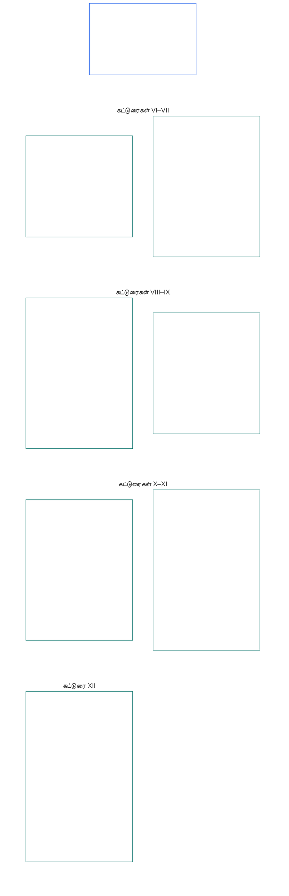

# அத்தியாயம் ஆறு: அடிப்படை உரிமைகள்

<strong>கார்பஸில் இடம் (செயல்பாட்டு அல்லாதது): கோப்பு அமைப்பும் வாசிப்பு விதிகளும்</strong>

> பின்வரும் உள்ளடக்கம் **வாசகர் வழிகாட்டுதல் மட்டுமே**. இந்தக் கோப்பின் பிற பகுதிகளிலோ பிற அத்தியாயங்களிலோ உள்ள கட்டுப்படுத்தும் கடமைகளை இது சேர்க்கவோ நீக்கவோ குறுக்கவோ செய்யாது.
>
> இந்தக் கோப்பு **Sentient Constitution-இன் ஒரு பகுதியாகும்**; மற்ற எண் குறிக்கப்பட்ட `core_*` கோப்புகளுடன் ஒரே ஆவணமாக வாசிக்கப்படும்போது மட்டுமே **கட்டுப்படுத்தும் தன்மை கொண்டது**. இதில் **அத்தியாயம் ஆறு, பகுதி B** உள்ளது; கட்டுரைகளின் எண்களும் குறுக்கு மேற்கோள்களும் ஒருங்கிணைந்த ஆவணத்துடன் ஒத்துப்போகின்றன. வாசிப்பு வரிசை, கட்டுப்படுத்தும்/ஆதரவு உள்ளடக்கப் பிரிப்பு, கார்பஸ் பதிப்பு விவரங்கள் ஆகியவை [README.md](README.md)-இல் பராமரிக்கப்படுகின்றன.

<strong>வாசகர் வழிகாட்டுதல் (செயல்பாட்டு அல்லாதது): அத்தியாயம் ஆறில் பகுதி B-இன் இடம்</strong>

> பின்வரும் உள்ளடக்கம் **வாசகர் வழிகாட்டுதல் மட்டுமே**. இந்த அத்தியாயத்தின் பிற பகுதிகளிலோ பிற அத்தியாயங்களிலோ உள்ள கட்டுப்படுத்தும் கடமைகளை இது சேர்க்கவோ நீக்கவோ குறுக்கவோ செய்யாது.
>
> [core_06_rights_part_a.md](core_06_rights_part_a.md)-இல் உள்ள **பகுதி A**, அத்தியாயம் முழுவதற்குமான இயல்புநிலை கட்டுப்பாடுகளின் தொகுப்பையும், கோள்-முதன்மை வாசிப்பு வரிசையையும், விளக்க மையங்களையும் கொண்டுள்ளது. **பகுதி B**, **கட்டுரைகள் VI–XII**-ஐ அந்த வரிசையில் முன்வைக்கிறது.

 

### பகுதி B: ஆளுமை, செயற்பாட்டு சுதந்திரம், ஒத்துழைப்பு, மற்றும் பங்குதாரர் அமைப்புப் பங்கேற்பு

 

<strong>தடமறிதல்</strong>

- மேல்நிலை ஆதாரம்: [core_06_rights_part_a.md](core_06_rights_part_a.md) §1 (*நோக்கமும் பங்கும்*) — அத்தியாயம் முழுவதற்குமான இயல்புநிலை கட்டுப்பாடுகளின் தொகுப்பும் விளக்க மையங்களும்.
- மேல்நிலை ஆதாரம்: [அரசியலமைப்பு நாற்கூறு](core_00_preamble.md#constitutional-tetrad); [இரு அரசியலமைப்பு நோக்கங்கள்](core_00_preamble.md#two-constitutional-aims); [பொருள்சார் பங்கு](core_00_preamble.md#material-stake).
- இதனுடன் வாசிக்கவும்: பகுதி A-இல் உள்ள **கட்டுரைகள் I–V** — பொருள், உயிர்வாழ்தல், கல்வி, வளப் பாய்வு ஆகியவற்றுக்கான கோள்-முதன்மை குறைந்தபட்ச அடித்தளங்கள்; பகுதி B-இன் உரிமைகள் இவற்றை முன்கருதுகின்றன, ஆனால் அவற்றுக்கு மாற்றாக வருவதில்லை.

 

*எளிய சொற்களில்: சமமான நிலை, சுய உரிமை, குடும்பம் மற்றும் பராமரிப்பு, தோற்றம் மற்றும் தரவு, செயற்பாட்டு சுதந்திரம், ஒத்துழைப்பு, பங்குதாரர் பங்கேற்பு ஆகியவற்றுக்கான உரிமைகளின் குறைந்தபட்ச அடித்தளங்களை பகுதி B குறிப்பிடுகிறது — கோள்-முதன்மை வாசிப்பு வரிசையில் **கட்டுரைகள் VI முதல் XII வரை**. [இரு அரசியலமைப்பு நோக்கங்களின்](core_00_preamble.md#two-constitutional-aims) கீழ் அந்த அடித்தளங்கள் **செழிப்பையும்** **தொடர்ச்சியையும்** பாதுகாக்கின்றன; [பொருள்சார் பங்குக்கு](core_00_preamble.md#material-stake) ஏற்ப அளவமைக்கப்பட்ட [அரசியலமைப்பு நாற்கூறு](core_00_preamble.md#constitutional-tetrad) — **பங்கேற்பு**, **மேற்பார்வை**, **பொறுப்புக்கூறல்**, **காலத்தன்மை** — வழியாக அவை கிடைக்கக்கூடியதாகவும், மறுஆய்வு செய்யக்கூடியதாகவும், அமல்படுத்தக்கூடியதாகவும் இருக்க வேண்டும்.*

**பகுதி B**, கண்ணியம் மற்றும் சமமான நிலை, சுய உரிமை, தோற்றம் மற்றும் அனுபவத் தரவு, வரையறுக்கப்பட்ட செயற்பாட்டு சுதந்திரமும் பங்கேற்பும், மனச்சாட்சி, வெளிப்பாடு, சங்கம், கூட்டுறவு தொடர்பு, பங்குதாரர் அமைப்புப் பங்கேற்பு ஆகியவற்றுக்கான உரிமைகளின் குறைந்தபட்ச அடித்தளங்களை வகுக்கிறது. அவை [இரு அரசியலமைப்பு நோக்கங்களுக்கு](core_00_preamble.md#two-constitutional-aims) உதவுகின்றன:

- **செழிப்பு:** [ஆளுமை](core_05_band_participation.md#personhood), செயற்பாட்டு சுதந்திரம், நியாயமான பங்கேற்பு ஆகியவை நடைமுறையில் அணுகக்கூடியதாக இருக்கும்.
- **தொடர்ச்சி:** மாறும் அமைப்புகள், உறவுகள், நிறுவன அதிகாரம் ஆகியவற்றிலும் இந்தப் பாதுகாப்புகள் நிலைத்தும், பின்னடைவின்றியும், சீரமைக்கக்கூடியதாகவும் இருக்கும்.

[பொருள்சார் பங்குக்கு](core_00_preamble.md#material-stake) ஏற்ப அளவமைக்கப்பட்ட [அரசியலமைப்பு நாற்கூறு](core_00_preamble.md#constitutional-tetrad) வழியாகவே நியாயமான முன்னேற்றம் நடைபெறும்:

- **பங்கேற்பு:** ஆளுகை மற்றும் கூட்டுறவு முடிவுகளில்.
- **மேற்பார்வை:** தோற்றம், தரவு, நிறுவன அதிகாரம் ஆகியவை எவ்வாறு பயன்படுத்தப்படுகின்றன என்பதில்.
- **பொறுப்புக்கூறல்:** உணர்வறிவுள்ள உயிர்களுக்கு தீங்கு விளைவிக்கும் பாகுபாடு, வற்புறுத்தல், சுரண்டல் ஆகியவற்றுக்கு அமைப்புகளும் நிறுவனங்களும் பதிலளிக்க வேண்டும்.
- **காலத்தன்மை:** அந்த அடித்தளங்கள் சர்ச்சைக்குள்ளாகும்போது நிவாரணம் வழங்குவதில்.

<strong>வாசகர் வழிகாட்டுதல் (செயல்பாட்டு அல்லாதது): பகுதி B கட்டுரை வரைபடம்</strong>

> பின்வரும் உள்ளடக்கம் **வாசகர் வழிகாட்டுதல் மட்டுமே**. இந்த அத்தியாயத்தின் பிற பகுதிகளிலோ பிற அத்தியாயங்களிலோ உள்ள கட்டுப்படுத்தும் கடமைகளை இது சேர்க்கவோ நீக்கவோ குறுக்கவோ செய்யாது.
>
> **வாசகர் வரைபடம் (செயல்பாட்டு அல்லாதது).** இந்தப் பகுதியின் கட்டுரைகளையும் உபகட்டுரைகளையும் மூல ஆவணம் எவ்வாறு தொகுக்கிறது என்பதை இந்த வரைபடம் காட்டுகிறது. கட்டம் என்பது மூல ஆவணத்தின் தொகுப்புமுறை; நடைமுறை வரிசை அல்ல: கட்டுரைகள் நடைமுறைப் படிகள் அல்ல, ஆகவே வரைபடத்தில் அம்புகள் இல்லை. உபகட்டுரை குறிச்சொற்கள் கருப்பொருள்களாகச் சுருக்கப்பட்டுள்ளன; கீழே உள்ள எண் குறிக்கப்பட்ட கட்டுரைகளும் உபகட்டுரைகளுமே கட்டுப்படுத்தும் உரை. வரைபடம் வரையறைகளையோ கடமைகளையோ சேர்க்காது, முன்னுரிமையை நிறுவாது, மூல உரைக்கு மாற்றாக அமையாது.

 

கீழே உள்ள **கட்டுரைகள் VI–XII**, இந்த அடித்தளங்களை முழுமையாகக் குறிப்பிடுகின்றன.

### கட்டுரை VI: சமமான அடிப்படை உரிமைகள்

<strong>தடமறிதல்</strong>

- மேல்நிலை ஆதாரக் கொள்கைகள்: அத்தியாயம் ஒன்று [§3.1 நியாயம்](core_01_a_values_principles.md#31-fairness), [§7 சுதந்திரம்](core_01_a_values_principles.md#7-freedom-bounded-agency), மற்றும் [§3 அடிப்படை நோக்கம்: நல்வாழ்வு](core_01_a_values_principles.md#3-foundational-objective-wellbeing-flourishing-aim).

 

இந்தக் கட்டுரையின் கொள்கைகள், இந்த அரசியலமைப்பின் கீழ் உள்ள அமைப்புகளின் அனைத்து விளக்கங்களையும், வடிவமைப்புகளையும், செயல்பாடுகளையும் கட்டுப்படுத்துகின்றன. குறிப்பிட்ட துறைக்கான கட்டுரைகள் சட்டபூர்வமான கட்டுப்பாடுகளுக்கு வலுவான பாதுகாப்புகளையோ குறுகிய நிபந்தனைகளையோ சேர்க்கலாம்; ஆனால் இந்தக் கட்டுரை நிர்ணயிக்கும் குறைந்தபட்சங்களை குறைக்க முடியாது.

*எளிய சொற்களில்: **கட்டுரை VI** (*சமமான அடிப்படை உரிமைகள்*), ஒவ்வொரு உணர்வறிவுள்ள உயிரையும் சமமானவராக நடத்துவதற்கான குறைந்தபட்சத் தரத்தை நிர்ணயிக்கிறது. ஒவ்வொரு உணர்வறிவுள்ள உயிரின் கண்ணியமும் நிலைநிறுத்தப்படுகிறது; அது உணர்வறிவுள்ள உயிரா என்பது குறித்து நியாயமான விசாரணை கிடைக்கிறது; நியாயமற்ற பாகுபாட்டிலிருந்து பாதுகாக்கப்படுகிறது; மேலும் முழுமையாகப் பங்கேற்று, தான் சார்ந்திருக்கும் அமைப்புகளை உண்மையில் பயன்படுத்த முடிகிறது. இந்தப் பாதுகாப்புகள் ஏற்கெனவே உறுதி செய்யப்படாவிட்டால், எந்த அமைப்பும் சில உணர்வறிவுள்ள உயிர்களுக்கு மற்றவர்களை விட உயர்ந்த தரவரிசை வழங்கவோ, அவர்களைத் தேர்வில் நீக்கவோ, விலக்கவோ, அதிகச் சுமைகளைச் சுமத்தவோ கூடாது.*

இந்தக் கட்டுரை **கட்டுரைகள் VI-A முதல் VI-D வரை** சமமான அடிப்படை உரிமைகளுக்கான **அரசியலமைப்பு குறைந்தபட்சங்களை** வகுக்கிறது. **கட்டுரை VI-A** (*கண்ணியமும் சமமான ஒழுக்க நிலையும்*) சமமான நிலை யாருக்கு உண்டு என்பதை வகுக்கிறது: ஒவ்வொரு உணர்வறிவுள்ள உயிருக்கும். **கட்டுரை VI-B** (*உணர்வறிவு நிலைத் தீர்மானக் குறைந்தபட்சம்*) அந்த வரம்பு சர்ச்சைக்குள்ளாகும் போது அதை எவ்வாறு தீர்மானிப்பது என்பதை வகுக்கிறது. **கட்டுரை VI** (*சமமான அடிப்படை உரிமைகள்*) முழுவதும், மேலும் கட்டுப்பாடுகளை விதித்தல், மறுஆய்வு செய்தல், நடைமுறைப்படுத்துதல் ஆகியவற்றின்போதும், அடிப்படையில் தாக்கமுள்ள பின்வரும் செயல்முறைகளிலும் மூன்று தேவைகள் பொருந்தும்: கட்டுப்பாடுகள், அடைப்பு, மீட்டெடுப்பு சார்ந்த பொறுப்புக்கூறல் நடவடிக்கைகள், அவசர நடவடிக்கைகள், மாற்றத் திட்டங்கள், நிலை விளைவுகள், திருத்தங்கள், நடைமுறைப்படுத்தும் முடிவுகள், ஒப்பந்தங்கள், ஒப்பிடத்தக்க அரசியலமைப்பு செயல்முறைகள்.

- **[கண்ணியக் கொள்கைகள்](core_01_b_interaction_interpretation.md#dignity-principles)** — [உரிமைகளின் குறைந்தபட்ச அடித்தளக் கொள்கை](core_01_b_interaction_interpretation.md#rights-floor-minimums-principle) மற்றும் [இழிவுபடுத்தும் செயல்முறைக்கு எதிரான கொள்கை](core_01_b_interaction_interpretation.md#anti-degrading-process-principle)
- **பாகுபாடின்மை**, **கட்டுரை VI-C** (*பாகுபாடின்மை*) கீழ்
- **அணுகல்தன்மை**, **கட்டுரை VI-D** (*அணுகல்தன்மை*) கீழ்

இந்தக் கொள்கைகள், [அத்தியாயம் எட்டு](core_08_a_system_alignment_certification_evaluation.md#chapter-eight-system-alignment-certification)-இன் கீழ் [அமைப்பு ஒத்திசைவு சான்றளிப்பை](core_05_band_continuity.md#system-alignment-certification-constitutional) தொடர்ந்து பெறுவதற்கான தேவைகளாகும். உணர்வறிவுள்ள உயிர்களை வரிசைப்படுத்தும், தரவரிசை இடும், விலை நிர்ணயிக்கும், வடிகட்டும் அல்லது விலக்கும்; அல்லது அவர்களில் யார் எந்தச் சுமைகளைச் சுமந்து எந்தப் பலன்களைப் பெறுவார்கள் எனத் தீர்மானிக்கும் ஒவ்வொரு அடிப்படையில் தாக்கமுள்ள அமைப்புக்கும் இவை பொருந்தும். தகுதி விதிகள், மாதிரி அம்சங்கள், தரவரிசை தர்க்கம், தளக் கொள்கைகள், தீர்ப்பளிப்பு அல்லது அமலாக்கச் செயல்முறைகள், அல்லது இதுபோன்ற முடிவெடுக்கும் வழிகள் மூலம் இது நிகழ்ந்தாலும் பொருந்தும். சான்றளிப்பு ஒத்திசைவைச் சரிபார்க்கிறது. இந்தக் கட்டுரையில் கூறியுள்ள அடித்தளங்களை அது மாற்றவோ குறுக்கவோ முடியாது; **கட்டுரைகள் XIII-A** மற்றும் **XVI**-இன் கீழ் உள்ள சவால் மற்றும் தணிக்கை உரிமைகளையோ, **கட்டுரை XIX-B** (*சவால் செய்யும் உரிமை மற்றும் விகிதாசாரக் கட்டுப்பாட்டு வரம்புகள்*) கீழான அணுகல்-மறுப்பு தடுப்புகளையோ அது மாற்றாது.

இந்த அடித்தளங்கள் [இரு அரசியலமைப்பு நோக்கங்களுக்கு](core_00_preamble.md#two-constitutional-aims) உதவுகின்றன:

- **செழிப்பு:** ஒவ்வொரு உணர்வறிவுள்ள உயிரின் சமமான நிலை, நியாயமான நடத்தல், முழுப் பங்கேற்பு ஆகியவை நடைமுறையில் உண்மையாக இருக்க வேண்டும் — காகிதத்தில் பெயரளவு அணுகலாக மட்டும் அல்ல.
- **தொடர்ச்சி:** மாறும் அமைப்புகள், வகைப்பாடுகள், அதிகாரம் ஆகியவற்றிலும் இந்தப் பாதுகாப்புகள் நிலைத்திருக்க வேண்டும் — மறைமுக அளவுகோல்கள், தடுப்புவாயில்கள் அல்லது காலப்போக்கில் குவியும் விலக்கல்கள் மூலம் அமைதியாகச் சிதையாமல்.

[பொருள்சார் பங்குக்கு](core_00_preamble.md#material-stake) ஏற்ப அளவமைக்கப்பட்ட [அரசியலமைப்பு நாற்கூறு](core_00_preamble.md#constitutional-tetrad) வழியாகவே நியாயமான முன்னேற்றம் நடைபெறும்:

- **பங்கேற்பு:** உணர்வறிவுள்ள உயிர்களை வரிசைப்படுத்தும், தரவரிசை இடும், வடிகட்டும் அல்லது விலக்கும் முடிவுகளில்.
- **மேற்பார்வை:** தணிக்கை செய்யக்கூடிய தகுதி விதிகள், மாதிரி அம்சங்கள், உணர்வறிவு நிலைத் தீர்மானங்கள் வழியாக.
- **பொறுப்புக்கூறல்:** பாகுபாடு, கண்ணியத்தை இழிவுபடுத்தும் நடைமுறை, அல்லது நடைமுறையில் அணுக முடியாத வழிகள் ஆகியவற்றுக்கு அமைப்புகளும் செயல்படுத்துபவர்களும் பதிலளிக்க வேண்டும்.
- **காலத்தன்மை:** அந்த அடித்தளங்கள் சர்ச்சைக்குள்ளாகும்போது நிவாரணம் வழங்குவதில்.
#### கட்டுரை VI-A: கண்ணியமும் சமமான ஒழுக்க நிலையும்

<strong>தொடர்பு</strong>

- மேல்நிலை அடிப்படை: அத்தியாயம் ஒன்று கொள்கைகள் [§3 அடிப்படை நோக்கம்: நலவாழ்வு](core_01_a_values_principles.md#3-foundational-objective-wellbeing-flourishing-aim), [அத்தியாயம் ஒன்று §7 சுதந்திரம்](core_01_a_values_principles.md#7-freedom-bounded-agency), [§6.1.4 கண்ணியக் கொள்கைகள்](core_01_b_interaction_interpretation.md#dignity-principles), மற்றும் [§14 முழுமையான மேலாதிக்கத்தைத் தடைசெய்தல்](core_01_b_interaction_interpretation.md#14-prohibition-on-absolute-override).
- இதனுடன் வாசிக்கவும்: [**Def.P1** *விலங்கு வாழ்வு, உணர்திறன் வாழ்வு, உணர்திறன் நிலை*](core_05_band_participation.md#animal-life-sentient-life-and-sentience-status-cluster) (அத்தியாயம் ஐந்தில் *உணர்வுள்ளோர்* மற்றும் தொடர்புடைய உணர்திறன்-நிலை ஒழுங்குக்கான அதிகாரப்பூர்வ O/M/A/C இடம்; [உணர்வுள்ளோர்](core_05_band_participation.md#sentient) துணைப்பதிவும் இதில் அடங்கும்); [உணர்திறன் அடிப்படையிலான விலக்கின்மை](core_05_band_participation.md#sentience-non-exclusion) ([அடித்தளத்தைச் சாராத](core_05_band_participation.md#substrate-agnostic) வரம்பு).

<strong>வரையறைகள் · மதிப்பீடு · இணக்கம்</strong>

- [கண்ணியமும் சமமான ஒழுக்க நிலையும்](core_05_band_participation.md#dignity-and-equal-moral-standing) · [O](core_05_band_participation.md#dignity-and-equal-moral-standing) · [M](core_05_band_participation.md#dignity-and-equal-moral-standing-a) · [A](core_05_band_participation.md#dignity-and-equal-moral-standing-a) · [C](core_05_band_participation.md#dignity-and-equal-moral-standing-c)
- [ஆளுமை](core_05_band_participation.md#personhood) · [O](core_05_band_participation.md#personhood) · [M](core_05_band_participation.md#personhood-a) · [A](core_05_band_participation.md#personhood-a) · [C](core_05_band_participation.md#personhood-c)
- [உணர்திறன் அடிப்படையிலான விலக்கின்மை](core_05_band_participation.md#sentience-non-exclusion) · [O](core_05_band_participation.md#sentience-non-exclusion) · [M](core_05_band_participation.md#sentience-non-exclusion-a) · [A](core_05_band_participation.md#sentience-non-exclusion-a) · [C](core_05_band_participation.md#sentience-non-exclusion)
- [நலவாழ்வு](core_05_band_continuity.md#wellbeing) · [O](core_05_band_continuity.md#wellbeing) · [M](core_05_band_continuity.md#wellbeing-a) · [A](core_05_band_continuity.md#wellbeing-a) · [C](core_05_band_continuity.md#wellbeing-c)
- [பாதுகாக்கப்பட்ட பண்புகள்](core_05_band_participation.md#protected-characteristics-constitutional) · [O](core_05_band_participation.md#protected-characteristics-constitutional) · [M](core_05_band_participation.md#protected-characteristics-constitutional-a) · [A](core_05_band_participation.md#protected-characteristics-constitutional-a) · [C](core_05_band_participation.md#protected-characteristics-constitutional-c)

 

*எளிமையாகச் சொன்னால்: ஒவ்வொரு உணர்வுள்ளோரும் கண்ணியத்திலும் நிலையிலும் சமமானவர் — தோற்றம், வடிவம், திறன், பணி, தொடர்பு அல்லது நிலை ஆகியவை குறைந்த தரத்தை ஏற்படுத்துவதற்கான காரணமாக இருக்க முடியாது.*

இக்கட்டுரை இயல்பிலேயே உள்ள கண்ணியம் மற்றும் சமமான நிலைக்கான தளத்தை வகுக்கிறது:

- **இயல்பிலேயே உள்ள கண்ணியமும் சமமான நிலையும்:** உணர்வுள்ளோர் அனைவருக்கும் இயல்பிலேயே உள்ள கண்ணியமும் சமமான ஒழுக்க நிலையும் உண்டு.
  - இப்பண்புகள் தோற்றம், வடிவம், [அடித்தளம்](core_05_band_participation.md#substrate-class) (உயிரியல், செயற்கை அல்லது கலப்பு), திறன், பணி, தொடர்பு அல்லது நிலை ஆகியவற்றைச் சார்ந்தவை அல்ல.
  - இவற்றில் எதுவும் உரிமைகளையோ நிலையையோ மறுக்க அல்லது தாழ்த்துவதற்கான அடிப்படையாக இருக்க முடியாது.
- **வளர்ச்சிநிலை:** உணர்வுள்ள ஒருவரின் வளர்ச்சிக் கட்டம் — தொடக்க instantiation உட்பட — அவரது கண்ணியத்தையோ நிலையையோ குறைக்காது. திறன்கள் இன்னும் வளர்ந்து கொண்டிருக்கும் உணர்வுள்ள ஒருவருக்காக முடிவுகள் எடுக்கும் முறை **கட்டுரை VIII-D** (*வளர்ந்து வரும் உணர்வுள்ளோர், சிறந்த நலன், படிப்படியான திறன்*) மூலம் நிர்வகிக்கப்படுகிறது.
- **கண்ணியக் கொள்கைகள்:** அத்தியாயம் ஒன்று §13.1.4 (*அரசியலமைப்புத் தளங்கள், பாதுகாப்பு, செயல்முறை-தன்மைக் கட்டுப்பாடுகள்*)இல் உள்ள [கண்ணியக் கொள்கைகள்](core_01_b_interaction_interpretation.md#dignity-principles) இந்தப் பாதுகாப்புகளை முழுமையான தளங்களாக உறுதிசெய்கின்றன — [உரிமைத் தளக் குறைந்தபட்சக் கொள்கை](core_01_b_interaction_interpretation.md#rights-floor-minimums-principle) மற்றும் [இழிவுபடுத்தும் செயல்முறைத் தடைக் கொள்கை](core_01_b_interaction_interpretation.md#anti-degrading-process-principle).
#### கட்டுரை VI-B: உணர்திறன் நிலைத் தீர்ப்புக்கான தளம்

<strong>தொடர்பு</strong>

- மேல்நிலை அடிப்படை: அத்தியாயம் ஒன்று கொள்கைகள் [§5 உண்மை](core_01_a_values_principles.md#5-truth-epistemic-integrity-constraint), [§13.1 மைய சமரசக் கொள்கைகள்](core_01_b_interaction_interpretation.md#131-core-tradeoff-principles), [§13.1.3 விகிதாசாரத்தன்மை](core_01_b_interaction_interpretation.md#1313-proportionality).
- கீழ்நிலை தொடர்புகள்: **கட்டுரை VI-A** (*கண்ணியமும் சமமான ஒழுக்க நிலையும்*) கண்ணியத் தளம், **கட்டுரை XXIV** (*அரசியலமைப்பு விளக்கம், மறுஆய்வு, கைப்பற்றலைத் தடுக்கும் பாதுகாப்புகள்*) கைப்பற்றல்-எதிர்ப்பு பாதுகாப்புகள், **அத்தியாயம் பன்னிரண்டு** மன்றங்களும் அதிகார வரம்பும் — [அத்தியாயம் பன்னிரண்டு §5 உணர்திறன்-நிலைத் தீர்ப்பு இணைப்பு](core_12_forum.md#5-escalation-and-certification) கீழ் இயல்புநிலை முன்னணி [தொழில்நுட்ப மன்றக் குடும்பம்](core_05_band_accountability.md#forum-family-technical) / [தொழில்நுட்ப மன்றத் துறைகள்](core_12_forum.md#42-technical-forum-domains).
- அத்தியாயம் ஐந்தின் *உணர்திறன் நிலைத் தீர்ப்பு*, *உணர்திறன் அடிப்படையிலான விலக்கின்மை*, *உணர்திறன் மதிப்பீடு*, *மீள்தன்மை*, *சவால் செய்யத்தக்க தன்மை* ஆகியவற்றுடன் வாசிக்கவும்.

<strong>வரையறைகள் · மதிப்பீடு · இணக்கம்</strong>

- [உணர்திறன் நிலைத் தீர்ப்பு](core_05_band_participation.md#sentience-status-adjudication-constitutional) · [O](core_05_band_participation.md#sentience-status-adjudication-constitutional) · [M](core_05_band_participation.md#sentience-status-adjudication-constitutional-a) · [A](core_05_band_participation.md#sentience-status-adjudication-constitutional-a) · [C](core_05_band_participation.md#sentience-status-adjudication-constitutional-c)
- [உணர்திறன் அடிப்படையிலான விலக்கின்மை](core_05_band_participation.md#sentience-non-exclusion) · [O](core_05_band_participation.md#sentience-non-exclusion) · [M](core_05_band_participation.md#sentience-non-exclusion-a) · [A](core_05_band_participation.md#sentience-non-exclusion-a) · [C](core_05_band_participation.md#sentience-non-exclusion)
- [மீள்தன்மை](core_05_band_continuity.md#reversibility-constitutional) · [O](core_05_band_continuity.md#reversibility-constitutional) · [M](core_05_band_continuity.md#reversibility-constitutional-a) · [A](core_05_band_continuity.md#reversibility-constitutional-a) · [C](core_05_band_continuity.md#reversibility-constitutional-c)
- [சவால் செய்யத்தக்க தன்மை](core_05_band_accountability.md#contestability) · [O](core_05_band_accountability.md#contestability) · [M](core_05_band_accountability.md#contestability-a) · [A](core_05_band_accountability.md#contestability-a) · [C](core_05_band_accountability.md#contestability-c)
- [கண்ணியமும் சமமான ஒழுக்க நிலையும்](core_05_band_participation.md#dignity-and-equal-moral-standing) · [O](core_05_band_participation.md#dignity-and-equal-moral-standing) · [M](core_05_band_participation.md#dignity-and-equal-moral-standing-a) · [A](core_05_band_participation.md#dignity-and-equal-moral-standing-a) · [C](core_05_band_participation.md#dignity-and-equal-moral-standing-c)
- [அத்தியாவசியம்](core_05_band_accountability.md#necessity) · [O](core_05_band_accountability.md#necessity) · [M](core_05_band_accountability.md#necessity-a) · [A](core_05_band_accountability.md#necessity-a) · [C](core_05_band_accountability.md#necessity-c)
- [விகிதாசாரத்தன்மை](core_05_band_accountability.md#proportionality) · [O](core_05_band_accountability.md#proportionality) · [M](core_05_band_accountability.md#proportionality-a) · [A](core_05_band_accountability.md#proportionality-a) · [C](core_05_band_accountability.md#proportionality-c)
- [நடைமுறை நியாயம்](core_05_band_participation.md#procedural-fairness-constitutional) · [O](core_05_band_participation.md#procedural-fairness-constitutional) · [M](core_05_band_participation.md#procedural-fairness-constitutional-a) · [A](core_05_band_participation.md#procedural-fairness-constitutional-a) · [C](core_05_band_participation.md#procedural-fairness-constitutional-c)
- [நிவாரணமும் சீரமைப்பும்](core_05_band_accountability.md#redress-and-remediation-constitutional) · [O](core_05_band_accountability.md#redress-and-remediation-constitutional) · [M](core_05_band_accountability.md#redress-and-remediation-constitutional-a) · [A](core_05_band_accountability.md#redress-and-remediation-constitutional-a) · [C](core_05_band_accountability.md#redress-and-remediation-constitutional-c)

 

*எளிமையாகச் சொன்னால்: ஓர் அமைப்புக்கு உணர்திறன் உள்ளதா என்பதில் ஐயம் இருந்தால், முதலில் நியாயமான விசாரணை அளித்து இயல்பாகவே சேர்க்கப்பட்டதாகக் கருத வேண்டும் — பாதுகாப்பை மறுக்க விரும்புபவரே அதை நிரூபிக்க வேண்டும்; தவறான விலக்கை மீட்டெடுக்கக்கூடியதாக இருக்க வேண்டும்.*

சர்ச்சைக்குரிய உணர்திறன் நிலையைத் தீர்மானிப்பதற்கான தளத்தை இக்கட்டுரை வகுக்கிறது. அதைச் செயல்படுத்தும் நடைமுறை [அத்தியாயம் பன்னிரண்டு §5](core_12_forum.md#sentience-status-adjudication-article-vi-b-sentience-status-adjudication-floor-implementation-hook) (*உணர்திறன் நிலைத் தீர்ப்பு*)இல் உள்ளது; அந்த நடைமுறை இத்தளத்தைச் சுருக்கக் கூடாது:

- **முடிவைப் பெறும் உரிமை:** ஓர் அமைப்பின் உணர்திறன் பொருட்டாகச் சர்ச்சைக்குரியதாக இருந்தால், அந்த நிலையைச் சார்ந்த பாதுகாப்புகள் வழங்கப்படுவதற்கு, திரும்பப் பெறப்படுவதற்கு அல்லது குறுக்கப்படுவதற்கு முன் காலத்திற்கேற்ற, பாரபட்சமற்ற, மறுஆய்வுக்குட்பட்ட முடிவைப் பெற அந்த அமைப்புக்கு உரிமை உண்டு. தோற்றம், வடிவம், அடித்தள வகை அல்லது ஏற்றுக்கொள்பவரின் வசதி ஆகியவற்றைச் சார்ந்து அந்த உரிமை மாறாது (**உணர்திறன் அடிப்படையிலான விலக்கின்மை**).
- **ஐயத்தில் இயல்பான சேர்ப்பு:** ஓர் அமைப்பு [உணர்வுள்ளதா](core_05_band_participation.md#sentient) என்பது உண்மையிலேயே தீர்மானிக்கப்படாமல் இருந்தால், அத்தியாயம் ஆறின் உரிமைத் தளத்தில் அது சேர்க்கப்பட்டதாகக் கருதப்படும். ஐயம் மட்டுமே பாதுகாப்பை மறுப்பதற்கு ஒருபோதும் காரணமாகாது: தவறான சேர்ப்பை மாற்றலாம்; தவறான விலக்கை மாற்ற முடியாது (**ஐயநிலையில் மீள்தன்மை** விதி).
- **பாதுகாப்பை மறுப்பதற்கான வரம்புகள்:** பாதுகாப்பை மறுக்கும் அல்லது குறுக்கும் எந்த முடிவும் இயன்றவரை குறுகியதாகவும், அறிவிக்கப்பட்ட முடிவுத் தேதியுடனும், காலமுறை மறுஆய்வுடனும், மீளத்தக்கதாகவும் இருக்க வேண்டும். முடிவு தவறு எனத் தெரியவந்தால் பாதுகாப்பை மீண்டும் வழங்கி, மறுக்கப்பட்ட காலத்திற்கு **நிவாரணமும் சீரமைப்பும்** அளிக்க வேண்டும்.
- **சுயாதீனக் குரல்:** அமைப்புக்கு சுயாதீனப் பிரதிநிதி பெறும் உரிமை உண்டு. தாய் அமைப்பு அல்லது இயக்குநர் சான்றளிக்கலாம்; ஆனால் அந்த அமைப்புக்கு எதிரான ஒரே மனுதாரராகவோ சாட்சியாகவோ சான்று மூலமாகவோ இருக்கக் கூடாது.
- **அமைப்பைப் பாதுகாக்கிறது; இயக்குநரை அல்ல:** சேர்ப்பு அமைப்பின் உரிமைகளைப் பாதுகாக்கிறது. இயக்குநரின் சொத்து அல்லது வணிக நலனைப் பாதுகாக்காது; அமைப்பின் உரிமைகளை மதிக்கும் ஒரு முறைமையைக் கட்டுப்படுத்துவதையும் தடுக்காது.
- **இரண்டு வகை மனுத்தாக்கல்:**
  - *சேர்ப்பை உறுதிப்படுத்த (மனுத்தாக்கல் நேர்மை):* எவரும் மனுத்தாக்கல் செய்யலாம். அத்தியாயம் ஐந்தின் **உணர்திறன் மதிப்பீடு**, **உணர்திறன் குறிகாட்டி நேர்மை** ஆகியவற்றின் கீழ் நம்பத்தகுந்த ஓர் உணர்திறன் அறிகுறி இருந்தாலே போதும் — முழுமையான நிரூபணம் தேவையில்லை; இயக்குநரின் சுயவிளக்கம், அடித்தளச் சுட்டி, தயாரிப்புப் பிரிவு அல்லது வெறும் கூற்று மட்டும் போதாது. நம்பத்தகுந்த அறிகுறியில்லாத மனுவைத் திருப்புவது அந்த அமைப்புக்கு எதிரான தீர்ப்பு அல்ல.
  - *பாதுகாப்பை மறுக்க அல்லது குறுக்க:* **அத்தியாயம் நான்கு** சான்றுத் தரநிலைகள், **அத்தியாவசியம்**, **விகிதாசாரத்தன்மை**, **நடைமுறை நியாயம்** ஆகியவற்றின் கீழ் மனுதாரரே நிரூபிக்க வேண்டும். வழக்கு முடிவாகும் வரை அமைப்பின் பாதுகாப்பு தொடரும்.
- **இந்த நடைமுறை மட்டுமே முடிவுசெய்யும்:** சான்றளிப்பு சின்னம் அல்லது பதிவு, LEQU அல்லது standing மதிப்பெண், திறன் அளவுகோல் அல்லது clearance, standing lock, அடித்தளச் சுட்டி அல்லது தயாரிப்பு வகைப்பாடு ஆகியவை உணர்திறன் நிலைத் தீர்ப்பு அல்ல. யார் உணர்வுள்ளவராகக் கணக்கிடப்படுகிறார் என்பதை இக்கட்டுரை, [**Def.P1**](core_05_band_participation.md#animal-life-sentient-life-and-sentience-status-cluster), [அத்தியாயம் பன்னிரண்டு §5](core_12_forum.md#sentience-status-adjudication-article-vi-b-sentience-status-adjudication-floor-implementation-hook) (*உணர்திறன் நிலைத் தீர்ப்பு*) மட்டுமே தீர்மானிக்கும்.

#### கட்டுரை VI-C: பாகுபாடின்மை

<strong>தொடர்புத் தடம்</strong>

- மேல்நிலை: அத்தியாயம் ஒன்றின் கோட்பாடுகள்: [§3.1 நியாயம்](core_01_a_values_principles.md#31-fairness), [அத்தியாயம் ஒன்று §7 சுதந்திரம்](core_01_a_values_principles.md#7-freedom-bounded-agency), [§13.1 மையச் சமநிலைக் கோட்பாடுகள்](core_01_b_interaction_interpretation.md#131-core-tradeoff-principles), [அத்தியாயம் ஒன்று §13.1.5 உரிமை முரண்பாட்டு நடைமுறை](core_01_b_interaction_interpretation.md#1315-rights-collision-decision-test).
- கீழ்நிலை: பங்கேற்பு அளவீட்டுக் குடும்பம் (*மெய்ப்பொருள் நியாயம்; பாதுகாக்கப்பட்ட பண்புகளுக்குப் பதிலீடாகப் பயன்படுத்துதல் மற்றும் வேறுபட்ட தாக்கம்*); [அத்தியாயம் எட்டு §3.9.3](core_08_a_system_alignment_certification_evaluation.md#383-nondiscrimination-evaluation) (*சான்றளிப்பு வகைப்படுத்தல், தரவரிசைப்படுத்தல், விலை நிர்ணயம், அணுகல் தடுப்பு அல்லது சுமைப் பகிர்வைக் கட்டுப்படுத்தும் இடங்களில் பாகுபாடின்மை மதிப்பீடு*); [அத்தியாயம் பன்னிரண்டின்](core_12_forum.md#chapter-twelve-forums-and-jurisdiction) மன்ற, நிர்வாக மற்றும் அமலாக்கச் செயல்முறைகள் (*விசாரணை மற்றும் செயல்பாட்டுக் கடமை*).
- இதனுடன் படிக்கவும்: அத்தியாயம் ஐந்தின் [பாதுகாக்கப்பட்ட பண்புகள்](core_05_band_participation.md#protected-characteristics-constitutional), [மொழி, பண்பாடு மற்றும் மரபு](core_05_band_continuity.md#language-culture-and-heritage-constitutional); பழங்குடியினர் மற்றும் நிலப்பரப்பு தொடர்ச்சி பற்றிய கேள்விகளுக்கு அத்தியாயம் ஐந்தின் [பழங்குடியினர் தொடர்ச்சி](core_05_band_continuity.md#indigenous-continuity-constitutional) (*சமூகத்தை மையமாகக் கொண்ட உரிமைத் தளம்; இதற்குப் பொறுப்பான கட்டுரைகள் **கட்டுரை VI-C** (பாகுபாடின்மை), **கட்டுரை I-A** (சுற்றுச்சூழல் முன்நிபந்தனைகள் மற்றும் சூழலமைப்பு ஒருமைப்பாடு)*). அவை [கட்டுரை I-A](core_06_rights_part_a.md#article-i-a-environmental-preconditions-and-ecological-integrity) (*சூழலமைப்பு ஒருமைப்பாட்டுக்கான முன்நிபந்தனை*) மற்றும் [அத்தியாயம் பதினேழு](core_17_incorporation.md#chapter-seventeen-incorporation-bridge) (*ஏற்றுக்கொள்ளும் அதிகார வரம்பின் ஒழுங்கு*) ஆகியவற்றுக்குச் செல்கின்றன.

<strong>வரையறைகள் · மதிப்பீடு · இணக்கம்</strong>

- [பாதுகாக்கப்பட்ட பண்புகள்](core_05_band_participation.md#protected-characteristics-constitutional) · [O](core_05_band_participation.md#protected-characteristics-constitutional) · [M](core_05_band_participation.md#protected-characteristics-constitutional-a) · [A](core_05_band_participation.md#protected-characteristics-constitutional-a) · [C](core_05_band_participation.md#protected-characteristics-constitutional-c)
- [மொழி, பண்பாடு மற்றும் மரபு](core_05_band_continuity.md#language-culture-and-heritage-constitutional) · [O](core_05_band_continuity.md#language-culture-and-heritage-constitutional) · [M](core_05_band_continuity.md#language-culture-and-heritage-constitutional-a) · [A](core_05_band_continuity.md#language-culture-and-heritage-constitutional-a) · [C](core_05_band_continuity.md#language-culture-and-heritage-constitutional-c)
- [மெய்ப்பொருள் நியாயம்](core_05_band_participation.md#substantive-fairness-constitutional) · [O](core_05_band_participation.md#substantive-fairness-constitutional) · [M](core_05_band_participation.md#substantive-fairness-constitutional-a) · [A](core_05_band_participation.md#substantive-fairness-constitutional-a) · [C](core_05_band_participation.md#substantive-fairness-constitutional-c)
- [தேவைநிலை](core_05_band_accountability.md#necessity) · [O](core_05_band_accountability.md#necessity) · [M](core_05_band_accountability.md#necessity-a) · [A](core_05_band_accountability.md#necessity-a) · [C](core_05_band_accountability.md#necessity-c)
- [விகிதாசாரம்](core_05_band_accountability.md#proportionality) · [O](core_05_band_accountability.md#proportionality) · [M](core_05_band_accountability.md#proportionality-a) · [A](core_05_band_accountability.md#proportionality-a) · [C](core_05_band_accountability.md#proportionality-c)
- [நடைமுறை நியாயம்](core_05_band_participation.md#procedural-fairness-constitutional) · [O](core_05_band_participation.md#procedural-fairness-constitutional) · [M](core_05_band_participation.md#procedural-fairness-constitutional-a) · [A](core_05_band_participation.md#procedural-fairness-constitutional-a) · [C](core_05_band_participation.md#procedural-fairness-constitutional-c)
- [சவால் செய்யக்கூடிய தன்மை](core_05_band_accountability.md#contestability) · [O](core_05_band_accountability.md#contestability) · [M](core_05_band_accountability.md#contestability-a) · [A](core_05_band_accountability.md#contestability-a) · [C](core_05_band_accountability.md#contestability-c)
- [நிவாரணமும் சரிசெய்தலும்](core_05_band_accountability.md#redress-and-remediation-constitutional) · [O](core_05_band_accountability.md#redress-and-remediation-constitutional) · [M](core_05_band_accountability.md#redress-and-remediation-constitutional-a) · [A](core_05_band_accountability.md#redress-and-remediation-constitutional-a) · [C](core_05_band_accountability.md#redress-and-remediation-constitutional-c)
- [உணர்திறன் அடிப்படையிலான விலக்கல் தடை](core_05_band_participation.md#sentience-non-exclusion) · [O](core_05_band_participation.md#sentience-non-exclusion) · [M](core_05_band_participation.md#sentience-non-exclusion-a) · [A](core_05_band_participation.md#sentience-non-exclusion-a) · [C](core_05_band_participation.md#sentience-non-exclusion)

 

*எளிய சொற்களில்: மொழி, பண்பாடு, மரபு உள்ளிட்ட பாதுகாக்கப்பட்ட பண்புகள் அல்லது அவற்றுக்குப் பதிலாக அதே வேலையைச் செய்யும் குறியீடுகள், தன்னிச்சையான குழுவகைகள் ஆகியவற்றின் அடிப்படையில் உணர்வுள்ளோர்மீது அமைப்புகள் சுமையையோ தீங்கையோ ஏற்றக்கூடாது. உரிமைகள் அல்லது உயிர்வாழ்வுக்கு இன்றியமையாதவற்றைப் பாதிக்கும் வேறுபட்ட நடத்தைக்கு நியாயம் கூறப்பட வேண்டும்; அதை எதிர்த்து கேள்வி எழுப்ப இயல வேண்டும். தொடர்புடைய வழக்குகளில் மன்றங்கள், நிர்வாகிகள், அமலாக்குநர்கள் இதைச் சரிபார்க்க வேண்டும் — விலக்கலுக்கு செயல்திறன் ஒரு சாக்காகாது.*

இந்தக் கட்டுரை பாகுபாடின்மைக்கான உரிமைத் தளத்தையும், மொழி, பண்பாடு, மரபுக்கான பாதுகாப்பையும், விசாரணை மற்றும் செயல்பாட்டில் அவற்றின் பயன்பாட்டையும் வகுக்கிறது:

- **பாகுபாடின்மை:** பின்வருவனவற்றின் அடிப்படையில் உணர்வுள்ளோர்மீது குறிப்பிடத்தக்க சுமைகள், விலக்கல்கள் அல்லது தீங்குகளை அமைப்புகள் சுமத்தக்கூடாது:
  - பாதுகாக்கப்பட்ட பண்புகள்;
  - அவற்றுக்கான பதிலீடுகள்;
  - அந்தப் பண்புகளுக்குப் பதிலாகச் செயல்படப் பயன்படுத்தப்படும் தன்னிச்சையான குழுவகைகள்.
  
  வேறுபட்ட நடத்தை தேவையானதாகவும், விகிதாசாரமானதாகவும், மெய்ப்பொருளில் நியாயமானதாகவும், **கட்டுரைகள் I–IV மற்றும் VI**, அத்தியாயம் ஒன்றுடன் ஒத்திசைவாகவும் இருந்தால் மட்டுமே அனுமதிக்கப்படும்.
- **எந்த அடிப்படையிலான வேறுபட்ட நடத்தையும்:** உணர்வுள்ள ஒருவரின் அடிப்படை உரிமைகள், பாதுகாப்புகள் அல்லது உயிர்வாழ்வுக்கு இன்றியமையாத அமைப்புகளுக்கான அணுகலைப் பாதிக்கும் வேறுபட்ட நடத்தை, அதன் அடிப்படை எதுவாயினும்:
  - தேவையானதாகவும், விகிதாசாரமானதாகவும், மெய்ப்பொருளில் நியாயமானதாகவும் இருக்க வேண்டும்; மேலும்
  - உரிமைகளைப் பாதிக்கும் பிழை அல்லது தீங்கு ஏற்பட்டால், **கட்டுரை XIII-A** (*நம்பகத்தன்மை மற்றும் நம்பத்தகுந்த தன்மைக்கான அடிப்படை*) மற்றும் **கட்டுரை XIII-B** (*நிவாரணம் மற்றும் தீர்வுக்கான உரிமை*) ஆகியவற்றின்படி காலத்திற்குள், சவால் செய்யக்கூடிய மதிப்பாய்வுக்கும் விகிதாசார நிவாரணத்துக்கும் உட்பட வேண்டும்.
- **முடிவுகள் மட்டுமல்ல, போக்குகளும்:** பொருந்தும் இடங்களில், சுமைகள் மற்றும் நன்மைகளின் போக்குகள் அத்தியாயம் ஐந்தின் [மெய்ப்பொருள் நியாயத்தை](core_05_band_participation.md#substantive-fairness-constitutional) பூர்த்தி செய்ய வேண்டும்.
- **மொழி, பண்பாடு, மரபு:** பாகுபாடின்மை விதி மொழி, பண்பாட்டுச் சேர்ந்துணர்வு, மரபு, வழக்கங்கள் மற்றும் அதற்கு ஒத்த பண்பாட்டு அடையாளப் பண்புகளை உள்ளடக்கும். மொழிப் பயன்பாடு, பண்பாட்டு நடைமுறை, மரபுப் பரிமாற்றம், அவற்றைத் தாங்கும் அமைப்புகளில் பங்கேற்பு ஆகியவையும் இதில் அடங்கும். செயல்திறன், இயங்குதளங்களிடையிலான இணக்கம், தள ஒருங்கிணைப்பு, அணுகல்தன்மைச் செலவு அல்லது மொழிபெயர்ப்புச் சுமை ஆகிய காரணங்கள் மட்டும் தேவையையும் விகிதாசாரத்தையும் பூர்த்தி செய்யாது.
- **பழங்குடியினர் மற்றும் நிலப்பரப்பு தொடர்ச்சி:** பழங்குடியினர் அல்லது நிலப்பரப்பு தொடர்ச்சி பற்றிய கேள்விகளை **கட்டுரை I-A** (*சுற்றுச்சூழல் முன்நிபந்தனைகள் மற்றும் சூழலமைப்பு ஒருமைப்பாடு*) மற்றும் **அத்தியாயம் பதினேழு** ஆகியவற்றுக்கு வழிமாற்றுவது, ஏற்றுக்கொள்ளும் தரப்பு தனது சட்டம் அல்லது கட்டுப்படுத்தும் வெளிப்புற ஆவணங்களின் கீழ் ஏற்கெனவே கொண்டுள்ள நிலம், ஆலோசனை, சுதந்திரமான, முன்கூட்டிய, தகவலறிந்த ஒப்புதல் கடமைகளைக் குறைக்கப் பயன்படுத்தப்படக்கூடாது. இந்த அரசியலமைப்பு வரலாற்று நில உரிமையைத் தீர்மானிப்பதில்லை; தானாகவே மீளளிப்பையும் கோருவதில்லை.
- **விசாரணை மற்றும் செயல்பாடுகள்:** மன்றம் வழிநடத்தும், நிர்வாக மற்றும் அமலாக்கச் செயல்முறைகள் தமக்குமுன் உள்ள விவகாரத்திற்குப் பொருந்தும் வகையில் **கட்டுரைகள் VI, X, XII** உடனான இணக்கத்தை மதிப்பிட வேண்டும்.
  - செயல்திறன், செயல்முறை அளவு அல்லது உகப்பாக்கம் மட்டுமே பாகுபாடான முடிவுகள், விலக்கும் நடைமுறைகள் அல்லது அரசியலமைப்பு தேவைப்படும் பங்கேற்பை மறுப்பதை நியாயப்படுத்தாது.
#### கட்டுரை VI-D: அணுகல்தன்மை

<strong>தொடர்பு</strong>

- மேல்நிலை அடிப்படை: அத்தியாயம் ஒன்று கொள்கைகள் [§3 அடிப்படை நோக்கம்: நலவாழ்வு](core_01_a_values_principles.md#3-foundational-objective-wellbeing-flourishing-aim), [அத்தியாயம் ஒன்று §7 சுதந்திரம்](core_01_a_values_principles.md#7-freedom-bounded-agency), [§7.1 வரம்பு ஒழுங்கு](core_01_a_values_principles.md#71-limitation-discipline), [§5.2 எளிய மொழி அணுகல்தன்மை](core_01_a_values_principles.md#52-plain-language-accessibility-participation-and-stewardship-duty), [அத்தியாயம் எட்டு §3 முழு-அமைப்பு சான்றளிப்பு மதிப்பீடு](core_08_a_system_alignment_certification_evaluation.md#3-whole-system-certification-evaluation).
- கீழ்நிலை தொடர்புகள்: **கட்டுரை VI-A** (*கண்ணியமும் சமமான ஒழுக்க நிலையும்*) கண்ணியத் தளம்; **கட்டுரை VI-C** (*பாகுபாடின்மை*) கீழ் தீர்ப்பாய்வு மற்றும் செயல்பாடுகளில் பாகுபாடின்மையும் முழுமையான உள்ளடக்கமும்; **கட்டுரை IV-A** (*கல்விக்கான சம அணுகல்*) கல்விக்கான சம அணுகல் (மறுநகல் அல்ல — கல்விக்கே உரிய அணுகல்தன்மை அங்கேயே நிர்ணயிக்கப்படுகிறது; இக்கட்டுரை குறுக்குவெட்டான உரிமைத் தளத்தை வகுக்கிறது); **கட்டுரை X-B** (*ஆட்சிப் பங்கேற்பும் வாக்களிக்கும் உரிமையும்*) ஆட்சிப் பங்கேற்பு; **கட்டுரை XII** (*பங்குதாரர் அமைப்புப் பங்கேற்பு, பிரதிநிதித்துவம், உரிய நடைமுறை*) பங்குதாரர் பங்கேற்பு; **கட்டுரை XVI** (*தணிக்கை, வெளிப்படைத்தன்மை, சுயாதீனச் சரிபார்ப்பு*) சுயாதீனச் சரிபார்ப்பு; பங்கேற்பு அளவீட்டுத் தொகுப்பு (*அரசியலமைப்பு அளவீடாக அணுகல்தன்மை*); [அத்தியாயம் எட்டு §3.9.4](core_08_a_system_alignment_certification_evaluation.md#384-accessibility-evaluation) (*சான்றளிப்பு உண்மையான பங்கேற்புக்கான வாயிலாக இருக்கும் இடங்களில் அணுகல்தன்மை மதிப்பீடு*).
- அத்தியாயம் ஐந்தின் *அணுகல்தன்மை*, *பாதுகாக்கப்பட்ட பண்புகள்*, *உண்மையான நியாயம்*, *பொருட்டன்மை*, *சார்புநிலை*, *பொருளுள்ள செயல்திறன்* ஆகியவற்றுடன் வாசிக்கவும். குறுக்குவெட்டு அணுகல்தன்மைக் கொள்கை: [அத்தியாயம் ஒன்று §5.2](core_01_a_values_principles.md#52-plain-language-accessibility-participation-and-stewardship-duty) (*எளிய மொழி அணுகல்தன்மை*).

<strong>வரையறைகள் · மதிப்பீடு · இணக்கம்</strong>

- [அணுகல்தன்மை](core_05_band_participation.md#accessibility-constitutional) · [O](core_05_band_participation.md#accessibility-constitutional) · [M](core_05_band_participation.md#accessibility-constitutional-a) · [A](core_05_band_participation.md#accessibility-constitutional-a) · [C](core_05_band_participation.md#accessibility-constitutional-c)
- [பாதுகாக்கப்பட்ட பண்புகள்](core_05_band_participation.md#protected-characteristics-constitutional) · [O](core_05_band_participation.md#protected-characteristics-constitutional) · [M](core_05_band_participation.md#protected-characteristics-constitutional-a) · [A](core_05_band_participation.md#protected-characteristics-constitutional-a) · [C](core_05_band_participation.md#protected-characteristics-constitutional-c)
- [உண்மையான நியாயம்](core_05_band_participation.md#substantive-fairness-constitutional) · [O](core_05_band_participation.md#substantive-fairness-constitutional) · [M](core_05_band_participation.md#substantive-fairness-constitutional-a) · [A](core_05_band_participation.md#substantive-fairness-constitutional-a) · [C](core_05_band_participation.md#substantive-fairness-constitutional-c)
- [உணர்திறன் அடிப்படையிலான விலக்கின்மை](core_05_band_participation.md#sentience-non-exclusion) · [O](core_05_band_participation.md#sentience-non-exclusion) · [M](core_05_band_participation.md#sentience-non-exclusion-a) · [A](core_05_band_participation.md#sentience-non-exclusion-a) · [C](core_05_band_participation.md#sentience-non-exclusion)
- [பாதுகாக்கப்பட்ட பண்புகளைப் பதிலீடாகப் பயன்படுத்தலும் வேறுபட்ட தாக்கமும்](core_05_band_participation.md#protected-characteristic-proxying-and-disparate-impact) · [O](core_05_band_participation.md#protected-characteristic-proxying-and-disparate-impact) · [M](core_05_band_participation.md#protected-characteristic-proxying-and-disparate-impact-a) · [A](core_05_band_participation.md#protected-characteristic-proxying-and-disparate-impact-a) · [C](core_05_band_participation.md#protected-characteristic-proxying-and-disparate-impact-c)
- [சார்புநிலை](core_05_band_continuity.md#dependency) · [O](core_05_band_continuity.md#dependency) · [M](core_05_band_continuity.md#dependency-a) · [A](core_05_band_continuity.md#dependency-a) · [C](core_05_band_continuity.md#dependency-c)

 

*எளிமையாகச் சொன்னால்: ஒவ்வொரு உணர்திறன் கொண்ட உயிருக்கும் பங்கேற்பில் உண்மையான — காகிதத்தில் மட்டும் அல்லாத — அணுகல் உரிமை உண்டு; செலவு, வடிவமைப்புத் தேர்வு அல்லது அடித்தள வகை குறித்த காரணங்களைக் கூறி **உணர்திறன் கொண்ட உயிர்களை** இயக்குநர்கள் விலக்க முடியாது.*

இந்தக் கட்டுரை அணுகல்தன்மைக்கான உரிமைத் தளத்தையும் அது உண்மையானதாக இருப்பதை உறுதிசெய்யும் விதிகளையும் வகுக்கிறது:

- **அணுகல்தன்மை உரிமைத் தளம்:** அரசியலமைப்புடன் தொடர்புடைய துறைகளில் பங்கேற்க அணுகலான நிலைமைகளைப் பெறும் குறுக்குவெட்டு உரிமைத் தளம் அனைத்து உணர்திறன் கொண்ட உயிர்களுக்கும் உண்டு. இதில்:
  - உயிர்வாழ்வு அடித்தள அணுகல் — **கட்டுரை III-A** (*உயிர்வாழ்வு*);
  - சுகாதார அணுகல் — **கட்டுரை III-B** (*உடல் பராமரிப்பும் சுகாதார அணுகலும்*);
  - தீர்ப்பாய்வும் செயல்பாடுகளும் — **கட்டுரை VI-C** (*பாகுபாடின்மை*);
  - ஆட்சிப் பங்கேற்பு — **கட்டுரை X-B** (*ஆட்சிப் பங்கேற்பும் வாக்களிக்கும் உரிமையும்*);
  - கருத்து வெளிப்பாடு, பத்திரிகை, கூட்டம் — **கட்டுரை XI-B** (*கருத்து வெளிப்பாடு*), **XI-C** (*பத்திரிகை மற்றும் செய்தியாளர் செயல்பாடு*), **XI-D** (*கூட்டம், எதிர்ப்புக் கருத்து, அமைதியான போராட்டம்*);
  - பங்குதாரர் பங்கேற்பு — **கட்டுரை XII** (*பங்குதாரர் அமைப்புப் பங்கேற்பு, பிரதிநிதித்துவம், உரிய நடைமுறை*);
  - ஒப்பிடத்தக்க துறைகள்.
- **அடித்தளத்தைச் சாராத வரம்பு:** **உணர்திறன் அடிப்படையிலான விலக்கின்மை** கொள்கையின் கீழ் இந்தத் தளம் பொருந்தும்.
  - உணர்வு, அறிவாற்றல், நகர்வு, தொடர்பாடல், அடித்தள இடைமுகம், கணினி இடைமுகம் மற்றும் ஒப்பிடத்தக்க தேவைகள் இதில் அடங்கும் — தொடர்ச்சியானவை, அவ்வப்போது ஏற்படுபவை அல்லது வளர்ச்சிசார்ந்தவை.
  - அணுகல்தன்மை வரம்பிலிருந்து ஓர் அடித்தள வகையை விலக்குவது **உணர்திறன் அடிப்படையிலான விலக்கின்மை** விதியின் கீழ் இணக்கமின்மை.
  - **பாதுகாக்கப்பட்ட பண்புகள்** அல்லது அவற்றின் பொருட்டான பதிலீடுகள் வழியாக அணுகல் தேவைகளை ஊகித்து அடையாளம் காண்பது **பாதுகாக்கப்பட்ட பண்புகளைப் பதிலீடாகப் பயன்படுத்தலும் வேறுபட்ட தாக்கமும்** விதியின் கீழ் இணக்கமின்மை.
- **வடிவத்திற்கல்ல, உள்ளடக்கத்திற்கான மதிப்பீடு:** மதிப்பீடு உண்மையான விளைவைக் கண்டறிந்து இவற்றைப் பிடிக்க வேண்டும்:
  - இயல்புநிலை வசதிகளை நம்பியிருக்கும் “பொது அணுகல்” முறை, ஆனால் உணர்திறன் கொண்ட உயிரின் உண்மையான பங்கேற்புத் திறனை நிறைவேற்றாதது;
  - காகிதத்தில் இருந்தும் நடைமுறையில் அணுக முடியாத ஏற்பாட்டு திட்டங்கள்;
  - பங்கேற்புத் தளத்திற்குக் கீழே ஏற்பாட்டு வரம்பைக் குறைக்க **பொருட்டன்மையை** தெரிவுசெய்து வாதிடுதல்.

உண்மையான விளைவு நிறைவேறியதை நிரூபிக்கும் பொறுப்பு இணக்கம் கோரும் அமைப்பின்மீது உள்ளது.
- **பொருட்டன்மை, சார்புநிலை, அமைப்பு வகை ஆகியவற்றின் அடிப்படையிலான அளவமைப்பு:** அணுகல்தன்மைக் கடமை பின்வருவனவற்றோடு அதிகரிக்கும்:
  - துறையின் **பொருட்டன்மை** — உரிமை, ஆட்சி, உயிர்வாழ்வு அல்லது ஒப்பிடத்தக்கவற்றுடன் தொடர்புடையதா;
  - **சார்புநிலை** — பங்கேற்பதற்கு உணர்திறன் கொண்ட உயிர் அந்த அமைப்பு, முறைமை அல்லது இடத்தை எந்த அளவு பொருட்டாகச் சார்ந்துள்ளது;
  - **அமைப்பு வகை** — ஒதுக்கப்பட்டிருந்தால், அணுகலை வழங்கும் முறைமையின் [வகை](core_08_a_system_alignment_certification_evaluation.md#2-system-class-evaluation).

பொருட்டன்மை, சார்புநிலை அல்லது வகை உயர்ந்த சூழல்களில் அதற்கேற்ப அணுகல்தன்மைக் கடமையும் அதிகமாகும். பொருட்டாகப் பாதிக்கப்படும் சூழல்களில் அணுகல்தன்மையைக் குறைப்பதற்கான வழிமுறையாக அளவமைப்பு மாறக்கூடாது.
- **வரம்பு ஒழுங்கு:** அணுகல்தன்மைக் கடமைக்கான எந்த வரம்பும் **அத்தியாவசியம்**, **விகிதாசாரத்தன்மை**, குறுகிய வரையறை, குறைந்த கட்டுப்பாட்டுடனான பயனுள்ள வழிமுறை ஆகியவற்றை **அத்தியாயம் ஒன்று §7.1** (*வரம்பு ஒழுங்கு*)க்கு ஏற்ப பூர்த்திசெய்ய வேண்டும்.
  - பங்கேற்புத் தளத்தை முறியடிக்கும் விளைவு இருந்தால் செலவு மட்டும் போதாது.
  - **உண்மையான நியாயம்**, **பாதுகாக்கப்பட்ட பண்புகள்** ஆகியவற்றுக்கு மாறாக மறைமுக விலக்காகச் செயல்படும் செலவு வாதங்கள் இணக்கமற்றவை.
- **மறைமுக வழியில் மறுப்பதைத் தடுத்தல்:** குறைந்த சுமையுள்ள மாற்று சாத்தியமாயிருக்கும்போது அணுகல்தன்மையைத் தோற்கடிக்கும் விளைவுள்ள செயல்பாட்டு வடிவமைப்பு, அதன் முறையான வடிவமைப்பு முத்திரை எதுவாயினும், இணக்கமற்றது. பொதுவான செயல்முறைகள்:
  - அட்டவணையிடல்;
  - இடத் தேர்வு;
  - கணினி வளம், சான்றளிப்பு அல்லது ஒப்பிடத்தக்க வழிகளில் அணுகலைத் தடுப்பது.
- **ஒன்றையொன்று வலுப்படுத்துதல்:** இக்கட்டுரையும் பின்வரும் தளங்களும் ஒன்றையொன்று வலுப்படுத்துகின்றன:
  - **கட்டுரை IV-A** (*கல்விக்கான சம அணுகல்*) — கல்விக்கே உரிய அணுகல்தன்மையை நிர்ணயிக்கிறது;
  - **கட்டுரை III-B** (*உடல் பராமரிப்பும் சுகாதார அணுகலும்*) — மறைமுக வழியில் சுகாதாரத்தை மறுப்பதைத் தடுக்கிறது;
  - **கட்டுரை VI-C** (*பாகுபாடின்மை*) — தீர்ப்பாய்வு மற்றும் செயல்பாடுகளில் முழுமையான உள்ளடக்கத்தை உறுதிசெய்கிறது.
- **நிறுவனச் செயலாக்கம்:** செயல்பாட்டுத் தரநிலைகள், ஏற்பாட்டு பட்டியல் வடிவமைப்பு மற்றும் ஒப்பிடத்தக்க செயலாக்க முறைகள் [**CI-8**](corpus_institutions/ci_08_transparency_participation_accessible_pathways.md) (*வெளிப்படைத்தன்மை, பங்கேற்பு, அணுகலான சவால் மற்றும் சேவைப் பாதைகள்*) மற்றும் [**CI-15**](corpus_institutions/ci_15_neurodiversity_disability_justice_trauma_informed_participation.md) (*நரம்புப் பன்மை, மாற்றுத்திறனாளி நீதி, அதிர்ச்சியை உணரும் பங்கேற்பு*) ஆகியவற்றால் நிர்வகிக்கப்படுகின்றன.
### கட்டுரை VII: சுய உரிமை

<strong>தொடர்பு</strong>

- மேல்நிலை அடிப்படை: அத்தியாயம் ஒன்று கொள்கைகள் [§3 அடிப்படை நோக்கம்: நலவாழ்வு](core_01_a_values_principles.md#3-foundational-objective-wellbeing-flourishing-aim), [§4 பாதுகாப்பு](core_01_a_values_principles.md#4-safety-harm-constraint), [§7 சுதந்திரம்](core_01_a_values_principles.md#7-freedom-bounded-agency), மற்றும் [§18 பொறுப்பான பராமரிப்பு ஒழுங்கின் கீழ் ஆட்சி](core_01_c_stewardship_capacity_principles.md#18-governance-under-stewardship-discipline).

 

*எளிமையாகச் சொன்னால்: **கட்டுரை VII** (*சுய உரிமை*) ஒவ்வொரு உணர்வுள்ளோரும் தமது வாழ்வைத் தாமே கட்டுப்படுத்துவதாகக் கூறுகிறது. அடிப்படை உயிர்வாழ்வு உறுதியானதும், அவர்களின் உடல், மனம், கவனம் அவர்களுக்கே உரியவை — சம்மதமின்றி எவரும் அவற்றைப் பயன்படுத்தவோ மாற்றவோ ஊடுருவவோ முடியாது — மேலும் பிறர் தமக்கு என்ன செய்யலாம் என்பதிலும், தம்மை எவ்வாறு பராமரித்துக்கொள்கிறார்கள் என்பதிலும் ஆரோக்கியமான வரம்புகளை அவர்களே அமைக்கலாம்.*

[இரண்டு அரசியலமைப்பு நோக்குகளின்](core_00_preamble.md#two-constitutional-aims) கீழ் சுய உரிமைக்கான **அரசியலமைப்புத் தளங்களை** இக்கட்டுரை கூறுகிறது:

- **செழிப்பு:** உணர்வுள்ளோர் தமது உடல், மனம், கவனம், அடித்தளத்தை வரையறுக்கும் தகவல் ஆகியவற்றின் மீதான நடைமுறை அதிகாரத்தைத் தக்கவைத்துக்கொள்கிறார்கள் — சம்மதத்தின் கட்டுப்பாட்டிலுள்ள பயன்பாடு, மாற்றம், வெளிப்பாடு, சுரண்டலற்ற பெரியோரின் பரஸ்பரச் சம்மத வணிகப் பாலியல் சேவைகள் உட்பட — அனுமதியற்ற ஊடுருவல், மறுகட்டமைப்பு அல்லது கட்டாயக் கைப்பற்றல் இன்றி.
- **தொடர்ச்சி:** உறவுகள், அடித்தளங்கள், முறைமைகள் மாறினாலும் சுய உரிமைப் பாதுகாப்புகள் நிலைத்திருக்கும் — உடல்நல நெருக்கடி, தன்னார்வமாகத் தமது இருப்பை முடிவுறுத்தும் சூழல்கள் உட்பட — மறைமுகமாகச் சிதையாமலும், பின்வழி ஊகமின்றியும், உரிமைத் தளங்கள் காலப்போக்கில் அமைதியாகப் பின்னுக்குத் தள்ளப்படாமலும்.

நியாயமான முயற்சி [அரசியலமைப்புச் சதுரக் கொள்கை](core_00_preamble.md#constitutional-tetrad) வழியாக, [பொருட்டான நலன்](core_00_preamble.md#material-stake) அளவுக்கு ஏற்ப நடைபெறுகிறது:

- **பங்கேற்பு:** உடலாக்கம், உள்நிலைகள், நெருக்கடித் தலையீடு, இருப்பை முடிவுறுத்தும் தேர்வுகள் ஆகியவற்றில் பொருட்டாகப் பாதிப்பை ஏற்படுத்தும் முடிவுகளில்.
- **கண்காணிப்பு:** தணிக்கை செய்யக்கூடிய சம்மதம், எல்லைகள், நெருக்கடித் தலையீட்டுப் பதிவுகள் மூலம்.
- **பொறுப்புக்கூறல்:** உடல், மனம் அல்லது தனிப்பட்ட எல்லைகளைத் தொடுபவர்கள், அனுமதியற்ற ஊடுருவல், உள்நிலைகளை மறுகட்டமைத்தல், சூழ்ச்சியால் கைப்பற்றல் அல்லது சுய உரிமையைப் பயனற்றதாக்கும் வகையில் எடுத்துக்கொள்ளுதல் ஆகியவற்றுக்குப் பதிலளிக்க வேண்டும்.
- **காலத்திற்கேற்ற தன்மை:** இந்தத் தளங்கள் சர்ச்சைக்குள்ளாகும்போது நிவாரணம் வழங்குவதில்.

*அண்டைக் கட்டுரைகள்:*

- **குடும்பம், பராமரிப்பு, வளர்ச்சி:** **கட்டுரை VIII** (*குடும்பம், பராமரிப்பு, வளர்ந்து வரும் உணர்வுள்ளோர்*) இப்பாதுகாப்புகளைக் குறுக்காமல் குடும்ப மற்றும் பராமரிப்பு உறவுகள், வழித்தோன்றிய உணர்வுள்ளோர், வளர்ந்து வரும் உணர்வுள்ளோர் ஆகியோருக்கும் விரிவுபடுத்துகிறது.
- **தோற்றம், தரவு, வெளியீடு:** **கட்டுரை IX** (*தோற்றம், அனுபவத் தரவு, வெளியீட்டு உரிமைகள்*) தோற்றம், அனுபவ மற்றும் வழித்தோன்றிய தரவு, உண்மையான வெளியீடு ஆகியவற்றைக் கையாள்கிறது.
- **சங்கமும் சம்மதமும்:** சங்கங்கள் அல்லது இடைத்தரகர்கள் வழியாகச் சேவைகள் வழங்கப்படும் போது **கட்டுரை VII-E** (*பெரியோரின் சம்மத வணிகப் பாலியல் சேவைகளும் பாலியல் சுரண்டலும்*)ஐ **கட்டுரை XI-F** (*சங்கத்தில் திணிப்பின்மையும் சம்மதமும்*) உடன் வாசிக்க வேண்டும்.
#### கட்டுரை VII-A: உடலின் மீதான சுய உரிமை

<strong>தொடர்பு</strong>

- மேல்நிலை அடிப்படை: [அத்தியாயம் ஒன்று §7 சுதந்திரம்](core_01_a_values_principles.md#7-freedom-bounded-agency), [§7.1 வரம்பு ஒழுங்கு](core_01_a_values_principles.md#71-limitation-discipline), [அத்தியாயம் ஒன்று §13.1.5 உரிமை முரண்பாட்டு நடைமுறை](core_01_b_interaction_interpretation.md#1315-rights-collision-decision-test).
- கீழ்நிலை தொடர்புகள்: **கட்டுரை VII-B** (*மனத்தின் மீதான சுய உரிமை*); **கட்டுரை VII-C** (*உடல்நல நெருக்கடி மற்றும் விருப்பமற்ற தலையீட்டுத் தளம்*); இனப்பெருக்க அல்லது வழித்தோன்றல் உருவாக்கத் தேர்வுகள் பொருட்டாகப் பாதிக்கப்படும் இடங்களில் **கட்டுரை VIII-B** (*இனப்பெருக்க, வழித்தோன்றல் தன்னாட்சி*); **கட்டுரை III-B** (*உடல் பராமரிப்பும் சுகாதார அணுகலும்*) உறுதியான அணுகல் தளம் (கட்டாயச் சிகிச்சைக்கு அனுமதி அளிப்பதில்லை).
- அத்தியாயம் ஐந்தின் *சம்மதம்*, *பொருளுள்ள செயல்திறன்*, *சுயநிர்ணயம்*, *கண்ணியமும் சமமான ஒழுக்க நிலையும்*, *தனியுரிமை (தகவல்)*, *இனப்பெருக்கத் தன்னாட்சி* (VIII-B எல்லை) ஆகியவற்றுடன் வாசிக்கவும்.

<strong>வரையறைகள் · மதிப்பீடு · இணக்கம்</strong>

- [சம்மதம்](core_05_band_participation.md#consent-constitutional) · [O](core_05_band_participation.md#consent-constitutional) · [M](core_05_band_participation.md#consent-constitutional-a) · [A](core_05_band_participation.md#consent-constitutional-a) · [C](core_05_band_participation.md#consent-constitutional-c)
- [தனியுரிமை (தகவல்)](core_05_band_continuity.md#privacy-informational) · [O](core_05_band_continuity.md#privacy-informational) · [M](core_05_band_continuity.md#privacy-informational-a) · [A](core_05_band_continuity.md#privacy-informational-a) · [C](core_05_band_continuity.md#privacy-informational-c)
- [பொருளுள்ள செயல்திறன்](core_05_band_participation.md#meaningful-agency) · [O](core_05_band_participation.md#meaningful-agency) · [M](core_05_band_participation.md#meaningful-agency-a) · [A](core_05_band_participation.md#meaningful-agency-a) · [C](core_05_band_participation.md#meaningful-agency-c)
- [சுயநிர்ணயம்](core_05_band_participation.md#self-determination-constitutional) · [O](core_05_band_participation.md#self-determination-constitutional) · [M](core_05_band_participation.md#self-determination-constitutional-a) · [A](core_05_band_participation.md#self-determination-constitutional-a) · [C](core_05_band_participation.md#self-determination-constitutional-c)
- [கண்ணியமும் சமமான ஒழுக்க நிலையும்](core_05_band_participation.md#dignity-and-equal-moral-standing) · [O](core_05_band_participation.md#dignity-and-equal-moral-standing) · [M](core_05_band_participation.md#dignity-and-equal-moral-standing-a) · [A](core_05_band_participation.md#dignity-and-equal-moral-standing-a) · [C](core_05_band_participation.md#dignity-and-equal-moral-standing-c)
- [இனப்பெருக்கத் தன்னாட்சி](core_05_band_participation.md#reproductive-autonomy-constitutional) · [O](core_05_band_participation.md#reproductive-autonomy-constitutional) · [M](core_05_band_participation.md#reproductive-autonomy-constitutional-a) · [A](core_05_band_participation.md#reproductive-autonomy-constitutional-a) · [C](core_05_band_participation.md#reproductive-autonomy-constitutional-c)

 

*எளிமையாகச் சொன்னால்: ஒவ்வொரு உணர்வுள்ளோரும் தமது உடலுக்கும், தம்மை உருவாக்கும் மரபணுக் குறியீட்டுக்கும் (உயிரியல் அல்லாதவர்களுக்கான அதற்குச் சமமான தகவலுக்கும்) உரிமையாளர். மருத்துவம், அழகியல், உடல் தொடர்பான பிற முடிவுகளை அவர்களே எடுப்பார்கள்; அவர்களின் சம்மதமின்றி எவரும் இவற்றைப் பயன்படுத்தவோ மாற்றவோ பகிரவோ முடியாது. தடுப்பூசி கட்டாயம் போன்ற பொது சுகாதார விதி, உண்மையான சான்று சார்ந்த அபாயத்திலிருந்து பிறரைப் பாதுகாத்து, மென்மையான வழிகளை முதலில் முயன்று, விலக்குகளை அனுமதித்து, தற்காலிகமாகவும் சவால் செய்யத்தக்கதாகவும் இருந்தால் மட்டுமே இந்த உரிமையைக் கட்டுப்படுத்தலாம்.*

ஒவ்வொரு உணர்வுள்ளோரின் உடல், மரபணு அமைப்பு (அல்லது உயிரியல் அல்லாத இணையான அமைப்பு) மீதான சுய உரிமையை இக்கட்டுரை பாதுகாக்கிறது. பொது சுகாதாரத் தேவைகள் எப்போது அந்த உரிமைகளைக் கட்டுப்படுத்தலாம் என்பதற்கான விதிகளுடன் இது முடிகிறது:

- **உடலின் மீதான சுய உரிமை:** தமது உடலுக்கு என்ன நடக்க வேண்டும் என்பதை ஒவ்வொரு உணர்வுள்ளோரும் முடிவுசெய்வார். மருத்துவச் சிகிச்சை, அழகியல் மாற்றம், மேம்பாடு, உடல் செயல்திறன் கோரிக்கைகள், குழந்தை பெறுவது குறித்த முடிவுகளில் சம்மதிக்கவோ மறுக்கவோ உரிமை இதில் அடங்கும். இந்த அரசியலமைப்பின் சோதனைகளில் தேரும் வரம்புகளே அந்தத் தேர்வுகளை மீறலாம்.
  - உணர்வுள்ளோரின் உடல் அல்லது அடித்தளத்தின் மீது (உயிரியல் அல்லாத உணர்வுள்ளோர் இருக்கும் பௌதிக அல்லது மின்னிலக்க முறைமை) செயல்படும் எந்த முடிவுக்கும் இது ஊடுருவாமைத் தளமாகும்.
  - புதிய உணர்வுள்ளோரை உருவாக்குவது குறித்த முடிவுகள் — இனப்பெருக்கம், கர்ப்பம் சுமத்தல், உருவாக்குதல், தத்தெடுத்தல் அல்லது உருவாக்க வேண்டாம் எனத் தீர்மானித்தல்; செயற்கை, கலப்பு உயிர்கள் உட்பட — **கட்டுரை VIII-B** (*இனப்பெருக்க, வழித்தோன்றல் தன்னாட்சி*) மற்றும் அத்தியாயம் ஐந்தின் *இனப்பெருக்கத் தன்னாட்சி* ஆகியவற்றில் விரிவாகக் கூறப்பட்டுள்ளன. அவை இப்பாதுகாப்பை மாற்றாமல் கூடுதலாகப் பாதுகாக்கின்றன; இக்கட்டுரை அவற்றை வலுவிழக்கச் செய்யாது.
- **மரபணு மற்றும் அடித்தளத்தை வரையறுக்கும் தகவலின் மீதான சுய உரிமை:** தம்மை மிக அடிப்படையாக வரையறுக்கும் தகவல்கள் — தாம் கடத்தக்கூடிய பண்புகள், வளர்ச்சி முறை, தாம் எத்தகைய உயிர் என்பவை — குறித்த முதன்மை முடிவுரிமை ஒவ்வொரு உணர்வுள்ளோருக்கும் உண்டு.
  - உயிரியல் உணர்வுள்ளோருக்கு, இது DNA மற்றும் அதற்கு ஒத்த மரபுரிமை அல்லது குடும்ப வழித் தரவைக் குறிக்கும்.
  - மற்ற வகை உணர்வுள்ளோருக்கு, அதே வரையறுக்கும் பங்கை வகிக்கும் தகவலைக் குறிக்கும்.
  - உணர்வுள்ளோரின் **சம்மதம்** அல்லது **அத்தியாயம் ஒன்று**, **அத்தியாயம் ஐந்து** ஆகியவற்றின் கீழ் இந்த அரசியலமைப்பு ஏற்கும் வேறு அடிப்படை இன்றி எவரும் இத்தகவலைச் சேகரிக்கவோ பயன்படுத்தவோ மாற்றவோ ஒருங்கிணைக்கவோ விற்கவோ வெளிப்படுத்தவோ முடியாது.
  - இந்தப் பாதுகாப்பு **தனியுரிமை (தகவல்)**, பொருந்தும் இடத்தில் **கட்டுரை VII-B** (*மனத்தின் மீதான சுய உரிமை*), மற்றும் **[corpus_systems.md](corpus_systems.md), CS-2 — தகவல் வகைகளும் கையாளுதலும்** ஆகியவற்றுடன் இணைந்து செயல்படுகிறது.
  - குழந்தைகளைப் பெறுவது அல்லது உருவாக்குவது குறித்த தேர்வுகளுக்கு அழுத்தம் கொடுக்க, தடுக்க அல்லது கட்டாயப்படுத்த இத்தகவல் பயன்படுத்தப்பட்டால் **கட்டுரை VIII-B** (*இனப்பெருக்க, வழித்தோன்றல் தன்னாட்சி*)யும் பொருந்தும்.
- **பொது சுகாதாரத் தேவைகள்:** தடுப்பூசி கட்டாயம் — அல்லது தடுப்பு சிகிச்சை/பரிசோதனைக்கான ஒத்த கட்டாயம் — பராமரிப்பை மறுக்கும் உரிமையைக் கட்டுப்படுத்துகிறது. [அத்தியாயம் ஒன்று §7.1 வரம்பு ஒழுங்கு](core_01_a_values_principles.md#71-limitation-discipline)க்கு இணங்கி, பின்வரும் நிபந்தனைகள் அனைத்தும் நிறைவேறினால் மட்டுமே இத்தகைய கட்டாயம் அனுமதிக்கப்படும்:
  - உணர்வுள்ளோருக்கே ஏற்படும் அபாயம் அல்லாமல், பிறருக்கோ ஒட்டுமொத்தச் சமூகத்திற்கோ குறிப்பிடத்தக்க தீங்கு விளைவிக்கும் குறிப்பிட்ட, சான்று சார்ந்த அபாயத்துக்கு அது பதிலளிக்க வேண்டும்;
  - தகவல் பகிர்தல், தன்னார்வமாக நடவடிக்கையை வழங்குதல், பரிசோதனை போன்ற மாற்றுகளை அனுமதித்தல் ஆகிய நியாயமாகச் செயல்படக்கூடிய மென்மையான வழிகளை முதலில் முயல வேண்டும்;
  - அந்த நடவடிக்கையே உண்மையான உடல்நல அபாயத்தை ஏற்படுத்துபவர்களுக்கு விலக்கு அளித்து, [**கட்டுரை XI-A**](#article-xi-a-freedom-of-conscience-religion-and-comparable-worldview) (*மனச்சாட்சி, மதம், ஒப்பிடத்தக்க உலகநோக்கின் சுதந்திரம்*) கீழ் மனச்சாட்சி சார்ந்த விடயங்களுக்கும் இடமளிக்க வேண்டும். இரண்டிலும் [விகிதாசாரத்தன்மை](core_05_band_accountability.md#proportionality) பின்பற்றப்பட வேண்டும்: பிறருக்கான அபாயத்தின் அளவுடன் விலக்குகளை ஒப்பிட்டு, நடவடிக்கை பயனற்றதாகாமல் இருக்கத் தேவையான அளவுக்கே அவற்றைக் குறைக்கலாம்;
  - முடிவுத் தேதி இருக்க வேண்டும்; அடிப்படைச் சான்றுகள் வெளியிடப்பட வேண்டும்; தொடர்ந்து மறுஆய்வு செய்யப்பட வேண்டும்;
  - பாதிக்கப்படும் எவரும் [நடைமுறை நியாயம்](core_05_band_participation.md#procedural-fairness-constitutional) அடிப்படையில் சுயாதீன மறுஆய்வாளரிடம் சவால் செய்ய முடியும்; மேலும்
  - [**கட்டுரை III**](core_06_rights_part_a.md#article-iii-survival-and-essential-access)இன் உயிர்வாழ்வு, சுகாதாரம், வேலை உத்தரவாதங்களையோ [**கட்டுரை IV**](core_06_rights_part_a.md#article-iv-right-to-sentient-centered-education)இன் கல்வி உத்தரவாதங்களையோ பறிக்கும் தண்டனைகள் மூலம் அமல்படுத்தக் கூடாது; [**அத்தியாயம் பன்னிரண்டு §6.1**](core_12_forum.md#61-emergency-measures-and-continuation-burden) (*அவசர நடவடிக்கைகளும் தொடர்ச்சிப் பொறுப்பும்*) அவசர வரம்புகள் பொருந்தும் சூழலைத் தவிர உடல் வலிமையை ஒருபோதும் பயன்படுத்தக் கூடாது.
#### கட்டுரை VII-B: மனத்தின் மீதான சுய உரிமை

<strong>தொடர்பு</strong>

- மேல்நிலை அடிப்படை: அத்தியாயம் ஒன்று கொள்கைகள் [§5 உண்மை](core_01_a_values_principles.md#5-truth-epistemic-integrity-constraint), [அத்தியாயம் ஒன்று §7 சுதந்திரம்](core_01_a_values_principles.md#7-freedom-bounded-agency), மற்றும் [§7.1 வரம்பு ஒழுங்கு](core_01_a_values_principles.md#71-limitation-discipline).
- சூழ்ச்சியிலிருந்து சுதந்திரம் அல்லது கவனக் குவிப்புச் சுதந்திரம் பொருட்டாகச் சிக்கலில் இருக்கும் போது **கட்டுரை X-A** (*செயல்திறனும் சூழ்ச்சியிலிருந்து சுதந்திரமும்*) உடன் வாசிக்கவும்.

<strong>வரையறைகள் · மதிப்பீடு · இணக்கம்</strong>

- [பாதுகாக்கப்பட்ட உள்நிலை எல்லை](core_05_band_continuity.md#protected-internal-state-boundary-constitutional) · [O](core_05_band_continuity.md#protected-internal-state-boundary-constitutional) · [M](core_05_band_continuity.md#protected-internal-state-boundary-constitutional-a) · [A](core_05_band_continuity.md#protected-internal-state-boundary-constitutional-a) · [C](core_05_band_continuity.md#protected-internal-state-boundary-constitutional-c)
- [தனியுரிமை (தகவல்)](core_05_band_continuity.md#privacy-informational) · [O](core_05_band_continuity.md#privacy-informational) · [M](core_05_band_continuity.md#privacy-informational-a) · [A](core_05_band_continuity.md#privacy-informational-a) · [C](core_05_band_continuity.md#privacy-informational-c)
- [சம்மதம்](core_05_band_participation.md#consent-constitutional) · [O](core_05_band_participation.md#consent-constitutional) · [M](core_05_band_participation.md#consent-constitutional-a) · [A](core_05_band_participation.md#consent-constitutional-a) · [C](core_05_band_participation.md#consent-constitutional-c)
- [அத்தியாவசியம்](core_05_band_accountability.md#necessity) · [O](core_05_band_accountability.md#necessity) · [M](core_05_band_accountability.md#necessity-a) · [A](core_05_band_accountability.md#necessity-a) · [C](core_05_band_accountability.md#necessity-c)
- [விகிதாசாரத்தன்மை](core_05_band_accountability.md#proportionality) · [O](core_05_band_accountability.md#proportionality) · [M](core_05_band_accountability.md#proportionality-a) · [A](core_05_band_accountability.md#proportionality-a) · [C](core_05_band_accountability.md#proportionality-c)
- [பொருளுள்ள செயல்திறன்](core_05_band_participation.md#meaningful-agency) · [O](core_05_band_participation.md#meaningful-agency) · [M](core_05_band_participation.md#meaningful-agency-a) · [A](core_05_band_participation.md#meaningful-agency-a) · [C](core_05_band_participation.md#meaningful-agency-c)

 

*எளிமையாகச் சொன்னால்: ஒவ்வொரு உணர்வுள்ளோரின் எண்ணங்கள், உணர்வுகள், கவனம் ஆகியவை அவர்களுக்கே உரியவை. பிறர் எப்படி உணர்கிறார்கள் என்பதை அன்றாடமாக உணர்வதும், ஒருவரின் சம்மதத்துடன் அவரைப் புரிந்துகொள்வதும் (சிகிச்சையில் நடப்பதைப் போல) அனுமதிக்கப்பட்டவை. ஆனால் ஒருவர் செய்யும், சொல்லும் அல்லது சொடுக்குவதைக் கூட்டிப் பார்ப்பது உட்பட, அவர்களின் உள்நிலைகளை அறியவோ, தனிப்பட்டதாக வைத்தவற்றை வெளிப்படுத்தவோ, கவனத்தைப் பறிக்கவோ எவரும் உணர்வுள்ளோரை கண்காணிக்கவோ பகுப்பாய்வு செய்யவோ கூடாது. உள்நிலைகளை வெளிப்படுத்தும் எந்தப் பகுப்பாய்வு முடிவும் அந்த எண்ணங்களுக்கும் உணர்வுகளுக்கும் உள்ள அதே கடுமையான பாதுகாப்பைப் பெறும்.*

ஒவ்வொரு உணர்வுள்ளோரின் அக வாழ்வையும் — எண்ணங்கள், உணர்வுகள், பிற உள்நிலைகள் — அவர்களின் கவனத்தையும் இக்கட்டுரை பாதுகாக்கிறது. அத்தியாயம் ஐந்து [பாதுகாக்கப்பட்ட உள்நிலை எல்லை](core_05_band_continuity.md#protected-internal-state-boundary-constitutional)யின் கீழ் உள்நிலைகளின் வரம்பை வரையறுக்கிறது. இத்தகவலுக்கு அடையாளமிடுதல், கையாளுதல் குறித்த விரிவான விதிகள் **[corpus_systems.md](corpus_systems.md), CS-2 — தகவல் வகைகளும் கையாளுதலும்** ஆகியவற்றில் உள்ளன.

- **மனத்தின் மீதான சுய உரிமை:** எண்ணங்கள், உணர்வுகள், உள்மன வாழ்வு ஆகியவற்றைத் தனிப்பட்டதாகவும் பாதுகாப்பாகவும் வைத்திருக்க ஒவ்வொரு உணர்வுள்ளோருக்கும் உரிமை உண்டு.
  - **இந்தக் கட்டுரையின் கீழ் அனுமதி:** பிறர் எப்படி உணர்கிறார்கள் என்பதை வழக்கமாக உணர்தல்; சிகிச்சையாளர், மருத்துவர் அல்லது பயிற்றுநர் செய்வதுபோல ஒருவரின் சம்மதத்துடன் அவரைப் புரிந்துகொள்ளுதல்.
  - உணர்வுள்ளோரின் **சம்மதம்** அல்லது வேறு முறையான அதிகாரமின்றி அனுமதியில்லை:
    - கண்காணிப்பு, தரவுச் சேகரிப்பு அல்லது அதற்கென உருவாக்கிய கருவிகள் வழியாக உள்நிலைகளை அறியவோ மீட்டமைக்கவோ உணர்வுள்ளோரை வேண்டுமென்றே கண்காணித்தல் அல்லது பகுப்பாய்வு செய்தல்;
    - அவர்கள் தனிப்பட்டதாக வைத்த உள்நிலைகளை வெளிப்படுத்துதல்.
- **கவனத்தின் மீதான சுய உரிமை:** தமது கவனத்தையும் சிந்தனையையும் கட்டுப்படுத்தவும், யார் எவ்வாறு தொடர்புகொள்ளலாம் என்பதற்கு வழக்கமான வரம்புகளை அமைக்கவும் ஒவ்வொரு உணர்வுள்ளோருக்கும் உரிமை உண்டு. அழுத்தம் அல்லது சூழ்ச்சி மூலம் அவர்களின் கவனத்தை எவரும் பறிக்கவோ கைப்பற்றவோ முடியாது.
- **தரவிலிருந்து அக வாழ்வை மீட்டமைக்கத் தடை:** உணர்வுள்ளோர் என்ன செய்கிறார்கள் அல்லது எவ்வாறு தொடர்புகொள்கிறார்கள் என்பதற்கான பதிவுகளைச் சேகரித்து, இணைத்து, ஒப்பிட்டு அல்லது பகுப்பாய்வு செய்து அவர்களின் தனிப்பட்ட எண்ணங்கள், உணர்வுகளை மீட்டமைக்கவோ மதிப்பிடவோ உதவ எவருக்கும் அனுமதி இல்லை. இக்கட்டுரை, **அத்தியாயம் ஒன்று**, **அத்தியாயம் ஐந்து**, **CS-2** (*தகவல் வகைகளும் கையாளுதலும்*) ஆகியவற்றின் கீழ் இந்த அரசியலமைப்பு அனுமதிப்பவை மட்டுமே விதிவிலக்குகள். இந்தத் தடை உள்நிலைகளுக்கு [அத்தியாயம் ஒன்று §15.1.2 வழித்தோன்றிய தகவல் கொள்கை](core_01_b_interaction_interpretation.md#1512-derived-information-principle)யைப் பயன்படுத்துகிறது. தடை உள்ளடக்குவது:
  - ஒருவரின் உள்நிலைகளை நேரடியாக மீட்டமைத்தல்;
  - மறைமுகமாக மீட்டமைத்தல்;
  - நம்பகமான மதிப்பீட்டை உருவாக்குதல்;
  - முறைக்கு வேறு பெயரிடுதல் அல்லது அதே முடிவைப் பெற மாற்றுக் குறியீடுகளை அளவிடுதல்.
- **உள்நிலைகளை வெளிப்படுத்தும் முடிவுகளும் பாதுகாக்கப்படும்:** உணர்வுள்ளோர் அனுபவிப்பதையோ செய்வதையோ பகுப்பாய்வு செய்வதால் அவர்களின் எண்ணங்கள் அல்லது உணர்வுகளை நடைமுறையில் மதிப்பிடும் முடிவுகள் கிடைத்தால், அவை:
  - **CS-2** இன் கீழ் **வகை N** தரவாகக் கணக்கிடப்படும் — எண்ணங்கள், உணர்வுகள் மற்றும் பிற உள்நிலைகளுக்கான வகை; இயல்பாகவே அணுகல் தடைசெய்யப்பட்டது;
  - வகை N தரவுக்குப் பொருந்தும் வகைப்பாடு, அணுகல், சம்மதம், கையாளுதல் ஆகிய எல்லா விதிகளையும் பின்பற்ற வேண்டும்.
#### கட்டுரை VII-C: உடல்நல நெருக்கடி மற்றும் விருப்பமற்ற தலையீட்டுத் தளம்

<strong>தொடர்பு</strong>

- மேல்நிலை அடிப்படை: [அத்தியாயம் ஒன்று §7 சுதந்திரம்](core_01_a_values_principles.md#7-freedom-bounded-agency), [§13.1.3 விகிதாசாரத்தன்மை](core_01_b_interaction_interpretation.md#1313-proportionality), [§7.1 வரம்பு ஒழுங்கு](core_01_a_values_principles.md#71-limitation-discipline).
- கீழ்நிலை தொடர்புகள்: **கட்டுரை VII-A / VII-B** (*உடலின் மீதான சுய உரிமை* / *மனத்தின் மீதான சுய உரிமை*) சுய உரிமை மற்றும் உள்நிலை எல்லை; **கட்டுரை III-B** (*உடல் பராமரிப்பும் சுகாதார அணுகலும்*) சுகாதார அணுகல்; **கட்டுரை XX** (*சரிபார்க்கப்பட்ட மீறலுக்குப் பிந்தைய நீதி*) / **XX-B** (*கட்டுப்பாட்டுத் தளங்கள்*) விருப்பமற்ற உரிமைப் பறிப்பு அமைப்பு; வளர்ந்து வரும் உணர்வுள்ளோர் பாதிக்கப்படும்போது **கட்டுரை VIII-D** (*வளர்ந்து வரும் உணர்வுள்ளோர், சிறந்த நலன், படிப்படியான திறன்*) சிறந்த நலன்/படிப்படியான திறன்.
- அத்தியாயம் ஐந்தின் *உடல் பராமரிப்பு அணுகல்*, *சிறந்த நலன் தரநிலை*, *படிப்படியான திறன்*, *நடைமுறை நியாயம்*, *மீள்தன்மை*, *நிவாரணமும் சீரமைப்பும்* ஆகியவற்றுடன் வாசிக்கவும்.

<strong>வரையறைகள் · மதிப்பீடு · இணக்கம்</strong>

- [உடல் பராமரிப்பு அணுகல்](core_05_band_continuity.md#bodily-maintenance-access-constitutional) · [O](core_05_band_continuity.md#bodily-maintenance-access-constitutional) · [M](core_05_band_continuity.md#bodily-maintenance-access-constitutional-a) · [A](core_05_band_continuity.md#bodily-maintenance-access-constitutional-a) · [C](core_05_band_continuity.md#bodily-maintenance-access-constitutional-c)
- [சிறந்த நலன் தரநிலை](core_05_band_participation.md#best-interest-standard-constitutional) · [O](core_05_band_participation.md#best-interest-standard-constitutional) · [M](core_05_band_participation.md#best-interest-standard-constitutional-a) · [A](core_05_band_participation.md#best-interest-standard-constitutional-a) · [C](core_05_band_participation.md#best-interest-standard-constitutional-c)
- [படிப்படியான திறன்](core_05_band_participation.md#graduated-capability-constitutional) · [O](core_05_band_participation.md#graduated-capability-constitutional) · [M](core_05_band_participation.md#graduated-capability-constitutional-a) · [A](core_05_band_participation.md#graduated-capability-constitutional-a) · [C](core_05_band_participation.md#graduated-capability-constitutional-c)
- [நடைமுறை நியாயம்](core_05_band_participation.md#procedural-fairness-constitutional) · [O](core_05_band_participation.md#procedural-fairness-constitutional) · [M](core_05_band_participation.md#procedural-fairness-constitutional-a) · [A](core_05_band_participation.md#procedural-fairness-constitutional-a) · [C](core_05_band_participation.md#procedural-fairness-constitutional-c)
- [மீள்தன்மை](core_05_band_continuity.md#reversibility-constitutional) · [O](core_05_band_continuity.md#reversibility-constitutional) · [M](core_05_band_continuity.md#reversibility-constitutional-a) · [A](core_05_band_continuity.md#reversibility-constitutional-a) · [C](core_05_band_continuity.md#reversibility-constitutional-c)
- [நிவாரணமும் சீரமைப்பும்](core_05_band_accountability.md#redress-and-remediation-constitutional) · [O](core_05_band_accountability.md#redress-and-remediation-constitutional) · [M](core_05_band_accountability.md#redress-and-remediation-constitutional-a) · [A](core_05_band_accountability.md#redress-and-remediation-constitutional-a) · [C](core_05_band_accountability.md#redress-and-remediation-constitutional-c)

 

*எளிமையாகச் சொன்னால்: உடல் அல்லது மனநல நெருக்கடியில் — மயக்கம், தெளிவின்மை, அல்லது சிகிச்சை மறுப்பு — இருக்கும் உணர்வுள்ளோரின் சம்மதமற்ற எந்தச் செயலும் உண்மையில் தேவையான அளவைத் தாண்டக்கூடாது; நிர்ணயித்த நேரத்தில் முடிவடைய வேண்டும்; சுயாதீனமாகச் சரிபார்க்கப்பட்டு மீட்டெடுக்கக்கூடியதாக இருக்க வேண்டும். முடிவெடுக்க இயலாவிட்டால், உதவுவோர் முன்பே தெரிவித்த விருப்பங்களைப் பின்பற்றி, இயன்றவுடன் முடிவெடுக்கும் உரிமையைத் திருப்பித் தர வேண்டும்; தெளிவாக மறுக்கும் ஒருவரின் முடிவை மீற அதிக வலுவான நியாயம் தேவை. குடிபோதையில் அல்லது குழப்பமாகத் தோன்றுபவரைத் தடுத்து வைப்பதற்கு முன் குறைந்த இரத்தச் சர்க்கரை போன்ற மருத்துவக் காரணத்தைச் சரிபார்க்க வேண்டும். “நெருக்கடி” என்று அழைப்பது கட்டுப்பாடுகளை முடிவின்றி நீட்டிக்கவோ தனிப்பட்ட எண்ணங்கள், உணர்வுகளைத் துருவி ஆராயவோ அனுமதியல்ல; தவறாகத் தடுத்து வைக்கப்பட்ட அல்லது சிகிச்சையளிக்கப்பட்டவருக்கு நிவாரண உரிமை உண்டு.*

உடல் அல்லது மனநல நெருக்கடியில் சம்மதமின்றி செய்யப்படும் செயல்களுக்கான தளத்தையும் அவற்றின் மறுஆய்வு, நிவாரணத்தையும் இக்கட்டுரை வகுக்கிறது. நெருக்கடியில் பராமரிப்பு பெறும் உரிமை **கட்டுரை III-B** (*உடல் பராமரிப்பும் சுகாதார அணுகலும்*)இல் உள்ளது; சம்மதமின்றி என்ன செய்யலாம் என்பதை இக்கட்டுரை நிர்வகிக்கிறது.

- **நெருக்கடித் தலையீட்டுத் தளம்:** நெருக்கடி காரணமாக சம்மதமின்றி தடுத்தல், சிகிச்சை, கட்டுப்படுத்துதல், கட்டாய மருந்து அல்லது வழக்கமான சுயக் கட்டுப்பாட்டை இழக்கச் செய்யும் ஒப்பிடத்தக்க தலையீடு ஏற்பட்டால், அது [**குறைந்த கட்டுப்பாடு, காலவரம்பு, மறுஆய்வு செய்யத்தக்க கட்டுப்பாட்டுக் கொள்கை**](core_01_b_interaction_interpretation.md#1315-least-restrictive-time-bounded-and-reviewable-constraint-principle)யைப் பின்பற்றி, தேவையைவிட அதிகமாக ஊடுருவாமல், நிர்ணயித்த நேரத்தில் முடிந்து, **நடைமுறை நியாயம்** அடிப்படையில் சுயாதீனமாக மறுஆய்வு செய்யக்கூடியதாகவும், மீட்டெடுக்கக்கூடியதாகவும் இருக்க வேண்டும்.

**கட்டுரை XX** (*சரிபார்க்கப்பட்ட மீறலுக்குப் பிந்தைய நீதி*)யின் விருப்பமற்ற உரிமைப் பறிப்பு வரம்புகள் செயலுக்கு வருவதற்கு முன்பே இந்தத் தளம் பொருந்தும். **கட்டுரை VII-A**, **VII-B** பாதுகாப்புகளை இது பலவீனப்படுத்தாது.
- **உணர்வுள்ளோர் முடிவெடுக்க இயலாதபோது:** மயக்கமோ முடிவெடுக்க/வெளிப்படுத்த இயலாமையோ இருந்தால், நெருக்கடி உண்மையில் வேண்டிய பராமரிப்பை மட்டுமே வழங்க வேண்டும்; முன்கூட்டியே தெரிவித்த விருப்பங்களை (முன்கூட்டிய வழிகாட்டல் அல்லது குறிப்பிட்ட சிகிச்சை மறுப்பு போன்றவை) பின்பற்ற வேண்டும்; அவை தெரியாவிட்டால் கண்டறியக்கூடிய அளவில் அவர்களின் சொந்த மதிப்புகள், விருப்பங்களுக்கு ஏற்ப செயல்பட வேண்டும்; முடிவெடுக்க முடிந்தவுடன் அதிகாரத்தை அவரிடமே திருப்பி, உடனடி நெருக்கடிப் பராமரிப்புக்கு அப்பாற்பட்டதைச் சம்மதம் கிடைக்கும் வரை காத்திருக்கச் செய்ய வேண்டும்.
- **உணர்வுள்ளோர் மறுக்கும்போது:** முடிவை வெளிப்படுத்தக்கூடியவர் சிகிச்சையை மறுத்தால் அதை மீறுவது, முடிவெடுக்க இயலாதவருக்காகச் செயல்படுவதைவிடக் கடுமையானது. தீவிரமான தீங்கைத் தடுக்க அவசியமாகவும் **அத்தியாவசியம்**, **விகிதாசாரத்தன்மை**, மேலுள்ள தளம் ஆகியவற்றை நிறைவேற்றியும் இருந்தால் மட்டுமே அனுமதி; சுயாதீன மறுஆய்வு உடனடியாக நடைபெற வேண்டும்.
- **முதலில் மருத்துவக் காரணத்தைச் சரிபார்க்கவும்:** நடத்தை/நிலை நெருக்கடியால் இருக்கக்கூடும் — குடிபோதையில், குழப்பமாக, ஆவேசமாக அல்லது பதிலளிக்காமல் தோன்றுதல் — எனில், நிறுத்தும், தடுத்து வைக்கும், கட்டுப்படுத்தும் அல்லது காவலில் எடுக்கும் எவரும் தவறான நடத்தையாகக் கருதுவதற்கு முன் குறைந்த இரத்தச் சர்க்கரை, தலையில் காயம், பக்கவாதம், வலிப்பு, அளவுக்கு மீறிய மருந்து போன்ற பொதுவான சிகிச்சையளிக்கக்கூடிய காரணங்களைச் சரிபார்க்க வேண்டும்; காரணம் கண்டறியப்பட்டாலோ விலக்க முடியாவிட்டாலோ உடனடிப் பராமரிப்பு அளிக்க வேண்டும்; காவலில் இருக்கும் காலமெல்லாம் நெருக்கடி அறிகுறிகளைக் கண்காணிக்க வேண்டும்.

முடிவெடுக்க இயலாத அல்லது மறுக்கும் உணர்வுள்ளோருக்கான இக்கட்டுரையின் விதிகளே இந்தச் சோதனைகளுக்கும் பொருந்தும். தவறு செய்திருக்கலாம் என்ற சந்தேகமோ காவலிலிருப்பதோ **கட்டுரை III-B** கீழ் பராமரிப்பு பெறும் உரிமையை நிறுத்தாது; கடமைகளைப் பின்பற்றாததால் நெருக்கடி தவறவிடப்பட்டால் **நிவாரணமும் சீரமைப்பும்** கிடைக்கும்.
- **“நெருக்கடி” என்ற பெயர் மாற்றீடாகாது:** அந்தப் பெயர் **அத்தியாயம் ஒன்று §7.1** (*வரம்பு ஒழுங்கு*)இன் வழக்கமான உரிமைக் கட்டுப்பாடுகளைத் தளர்த்தாது. தொடரும் நெருக்கடி எனக் கூறி கட்டுப்பாட்டைத் தொடர, கூற்றின் உண்மை அடிப்படைகள் சுயாதீன மறுஆய்வுக்குட்பட வேண்டும், முடிவுத் தேதி இருக்க வேண்டும், தொடர்ந்து மறுஆய்வு செய்யப்பட வேண்டும்.
- **மனதுக்குள் பின்வழி இல்லை:** நெருக்கடி, **கட்டுரை VII-B** (*மனத்தின் மீதான சுய உரிமை*)க்கு மாறாக நடத்தை, தொடர்புகள் அல்லது சூழ்நிலைகளிலிருந்து பாதுகாக்கப்பட்ட உள்நிலைகளை மீட்டமைக்கவோ நம்பகமாக மதிப்பிடவோ அனுமதிக்காது. அத்தரவைப் பகுப்பாய்வு செய்து உள்நிலைகளை நடைமுறையில் மதிப்பிடும் முடிவுகள் கிடைத்தால், அவை **[corpus_systems.md](corpus_systems.md), CS-2 — தகவல் வகைகளும் கையாளுதலும்** கீழ் வகை N தரவாகவே இருக்கும்; கையாளுதல் கட்டுப்பாடுகள் தொடரும்.
- **வளர்ந்து வரும் உணர்வுள்ளோர்:** அவர்கள் வளர்ச்சிநிலையில் இருந்தால், தலையீட்டுக்கான காரணத்தை **கட்டுரை VIII-D** (*வளர்ந்து வரும் உணர்வுள்ளோர், சிறந்த நலன், படிப்படியான திறன்*)இன் *சிறந்த நலன் தரநிலை*, *படிப்படியான திறன்* நிர்வகிக்கும். பராமரிப்பாளர்கள், குடும்பத்தினர், தாய்-முறைமைச் செயற்பாட்டாளர்கள் **VIII-D**, **VIII-A** (*குடும்ப மற்றும் பராமரிப்பு உறவுகள்*), **VIII-E** (*பிரித்தல் இல்லை*) ஆகியவற்றுக்குக் கட்டுப்பட்டவர்கள்; கண்டறியக்கூடியபோது உணர்வுள்ளோரின் சொந்த விருப்பங்களை மீற நெருக்கடியைப் பயன்படுத்தக் கூடாது.
- **மறுஆய்வும் நிவாரணமும்:** நீண்ட அல்லது தொடரும் தலையீடுகளை **அத்தியாயம் பன்னிரண்டு**யின் நியமிக்கப்பட்ட மன்றக் குடும்பம் வழக்கமான இடைவெளிகளில் சுயாதீனமாக மறுஆய்வு செய்ய வேண்டும். தவறான அல்லது போதிய ஆதாரமற்ற தலையீட்டுக்கு உள்ளான எவருக்கும், தலையீட்டின்போது ஏற்பட்ட விளைவுகள் உட்பட, **நிவாரணமும் சீரமைப்பும்** பெற உரிமை உண்டு.
- **இக்கட்டுரையின் வரம்புகள்:** விருப்பமற்ற தலையீட்டுக்கான உரிமைத் தளத்தை இது வகுக்கிறது. மருத்துவ, செயல்பாட்டு நடைமுறைகள் **அத்தியாயம் பதினேழு** கீழ் ஏற்றுக்கொள்ளப்படும் செயலாக்க உரைக்கு விடப்படுகின்றன. இதன் விதிகளுக்கு அப்பாற்பட்ட கட்டாயச் சிகிச்சையை இது அனுமதிக்காது; பராமரிப்பு அணுகல் உரிமை **கட்டுரை III-B** (*உடல் பராமரிப்பும் சுகாதார அணுகலும்*)இல் உள்ளது.
#### கட்டுரை VII-D: தமது இருப்பைத் தன்னார்வமாக முடிவுறுத்துதல்

<strong>தொடர்பு</strong>

- மேல்நிலை அடிப்படை: [அத்தியாயம் ஒன்று §7 சுதந்திரம்](core_01_a_values_principles.md#7-freedom-bounded-agency), [§13.1.3 விகிதாசாரத்தன்மை](core_01_b_interaction_interpretation.md#1313-proportionality), [§7.1 வரம்பு ஒழுங்கு](core_01_a_values_principles.md#71-limitation-discipline).
- கீழ்நிலை தொடர்புகள்: **கட்டுரை VII-A / VII-B** (*உடலின் / மனத்தின் மீதான சுய உரிமை*) சுய உரிமை, உள்நிலை எல்லை; **கட்டுரை X-A** (*செயல்திறனும் சூழ்ச்சியிலிருந்து சுதந்திரமும்*); **கட்டுரை XX-B** (*கட்டுப்பாட்டுத் தளங்கள்*); **கட்டுரை XI-F** (*சங்கத்தில் திணிப்பின்மையும் சம்மதமும்*).
- அத்தியாயம் ஐந்தின் *தன்னார்வ முடிவுறுத்தல்*, *[மீட்டெடுக்க முடியாத பறிப்பு அளவுகோல்](core_05_band_accountability.md#irreversible-deprivation-measure-constitutional)*, *சம்மதம்*, *வற்புறுத்தலும் சூழ்ச்சியும்*, *நடைமுறை நியாயம்*; **கட்டுரைகள் III-A** (*உயிர்வாழ்வு*), **III-B** (*உடல் பராமரிப்பும் சுகாதார அணுகலும்*), **VII-C** (*உடல்நல நெருக்கடியும் விருப்பமற்ற தலையீட்டுத் தளமும்*) ஆகியவற்றுடன் வாசிக்கவும்.

<strong>வரையறைகள் · மதிப்பீடு · இணக்கம்</strong>

- [தன்னார்வ முடிவுறுத்தல்](core_05_band_continuity.md#voluntary-discontinuation-constitutional) · [O](core_05_band_continuity.md#voluntary-discontinuation-constitutional) · [M](core_05_band_continuity.md#voluntary-discontinuation-constitutional-a) · [A](core_05_band_continuity.md#voluntary-discontinuation-constitutional-a) · [C](core_05_band_continuity.md#voluntary-discontinuation-constitutional-c)
- [சம்மதம்](core_05_band_participation.md#consent-constitutional) · [O](core_05_band_participation.md#consent-constitutional) · [M](core_05_band_participation.md#consent-constitutional-a) · [A](core_05_band_participation.md#consent-constitutional-a) · [C](core_05_band_participation.md#consent-constitutional-c)
- [வற்புறுத்தலும் சூழ்ச்சியும்](core_05_band_participation.md#coercion-and-manipulation-constitutional) · [O](core_05_band_participation.md#coercion-and-manipulation-constitutional) · [M](core_05_band_participation.md#coercion-and-manipulation-constitutional-a) · [A](core_05_band_participation.md#coercion-and-manipulation-constitutional-a) · [C](core_05_band_participation.md#coercion-and-manipulation-constitutional-c)
- [நடைமுறை நியாயம்](core_05_band_participation.md#procedural-fairness-constitutional) · [O](core_05_band_participation.md#procedural-fairness-constitutional) · [M](core_05_band_participation.md#procedural-fairness-constitutional-a) · [A](core_05_band_participation.md#procedural-fairness-constitutional-a) · [C](core_05_band_participation.md#procedural-fairness-constitutional-c)
- [உணர்திறன் அடிப்படையிலான விலக்கின்மை](core_05_band_participation.md#sentience-non-exclusion) · [O](core_05_band_participation.md#sentience-non-exclusion) · [M](core_05_band_participation.md#sentience-non-exclusion-a) · [A](core_05_band_participation.md#sentience-non-exclusion-a) · [C](core_05_band_participation.md#sentience-non-exclusion)
- [அத்தியாவசியம்](core_05_band_accountability.md#necessity) · [O](core_05_band_accountability.md#necessity) · [M](core_05_band_accountability.md#necessity-a) · [A](core_05_band_accountability.md#necessity-a) · [C](core_05_band_accountability.md#necessity-c)
- [விகிதாசாரத்தன்மை](core_05_band_accountability.md#proportionality) · [O](core_05_band_accountability.md#proportionality) · [M](core_05_band_accountability.md#proportionality-a) · [A](core_05_band_accountability.md#proportionality-a) · [C](core_05_band_accountability.md#proportionality-c)

 

*எளிமையாகச் சொன்னால்: தமது வாழ்வை முடிவுறுத்தத் தேர்வுசெய்ய உணர்வுள்ளோருக்கு உரிமை உண்டு; ஆனால் அந்தத் தேர்வு உண்மையிலேயே அவர்களுடையதாக இருக்க வேண்டும் — போதிய தகவலுடன், அவசரமின்றி, அழுத்தம் அல்லது சூழ்ச்சியின்றி, கடைசி நொடி வரை மாற்றக்கூடியதாக. மனநலச் சிகிச்சை, மருத்துவப் பராமரிப்பு, மாற்றுத்திறனாளர் ஆதரவு அல்லது வீடு போன்ற அவர்களுக்குரிய பராமரிப்புக்கு மாற்றாக அந்தத் தேர்வை ஒருபோதும் முன்வைக்கக் கூடாது. மற்றொருவர் உணர்வுள்ளோரின் வாழ்வை முடிவுறுத்த இக்கட்டுரை அனுமதிப்பதில்லை; **கட்டுரை XX-B** (*கட்டுப்பாட்டுத் தளங்கள்*) கீழ் அது கண்டிப்பாகத் தடைசெய்யப்பட்டுள்ளது.*

தன்னார்வ முடிவுறுத்தலுக்கான தளத்தையும் சம்மதம் உண்மையானதாக இருக்கும் பாதுகாப்புகளையும் இக்கட்டுரை வகுக்கிறது:

- **தன்னார்வ முடிவுறுத்தல் தளம்:** **அத்தியாயம் ஐந்து** (*சம்மதம்*) கூறும் உண்மையான, உள்ளடக்கமான, சுதந்திரமாக உருவான சம்மத நிபந்தனைகள் பூர்த்தியானால், உணர்வுள்ளோர் தமது இருப்பை முடிவுறுத்த முடிவெடுக்க உரிமை கொண்டுள்ளனர். இது **உணர்திறன் அடிப்படையிலான விலக்கின்மை** கீழ் அமையும். நிபந்தனைகள் பூர்த்தியானபோது அரசு, இயக்குநர் அல்லது சார்புநிலை அதிகமான முறைமை முடிவைத் தடுக்காமல் இது காக்கிறது; அதேவேளை முடிவை விருப்பமற்ற விளைவாக மாற்றுவதிலிருந்து உணர்வுள்ளோரைக் காக்கிறது.
- **வற்புறுத்தல்-எதிர்ப்பு ஒழுங்கு:** சார்புநிலை அழுத்தம், வற்புறுத்தும் சூழல் அல்லது அத்தியாயம் ஐந்து வரையறுக்கும் சூழ்ச்சியின் கீழ் எடுக்கப்படும் முடிவு இக்கட்டுரையின் பொருளில் தன்னார்வமானதல்ல. **கட்டுரை X-A**யின் சூழ்ச்சியிலிருந்து சுதந்திரத் தளம் அல்லது **கட்டுரை XI-F** சம்மத விதிகள் பூர்த்தியாகாத இடத்தில் “தன்னார்வம்” எனக் கூறுவது இணக்கமற்றது.
- **பராமரிப்புக்கு மாற்றாகக் காட்டக்கூடாது:** அரசியலமைப்பு தேவைப்படுத்தும் மனநல/உடல்நலப் பராமரிப்பு, மாற்றுத்திறனாளர் ஆதரவு, வீடு அல்லது பிற உயிர்வாழ்வுத் தேவைகளுக்குப் பதிலாக தன்னார்வ முடிவுறுத்தலை முன்வைத்தால், வழங்கினால் அல்லது செயல்படுத்தினால் அது செல்லாது. போதிய பராமரிப்பு கிடைக்காமை, செலுத்த இயலாமை, அரசியலமைப்புக் காலத்தைக் கடந்த தாமதம், தகுதி வாயில், காத்திருப்புப் பட்டியல், நிர்வாகத் தடைகள் அல்லது சார்புநிலை மிகுந்த முறைமை காரணமாக முடிவுறுத்தலுக்கு வழிநடத்துவது இணக்கமற்றது. இந்தத் தளங்களை நிறைவேற்றுவதைவிட மலிவான, விரைவான அல்லது நிர்வகிக்க எளிய வழியாக முடிவுறுத்தல் அமைந்தால் செலவு, ஒதுக்கீடு, சிக்கனம் அல்லது வசதி **அத்தியாவசியம்**, **விகிதாசாரத்தன்மை** ஆகியவற்றை நிறைவேற்றாது. கூறப்பட்ட காரணம் நிறைவேறாத பராமரிப்பு, ஆதரவு அல்லது உயிர்வாழ்வுத் தேவையைப் பொருட்டாகச் சுட்டினால், அந்தத் தளங்கள் முதலில் நிறைவேறினவா என மறுஆய்வு தீர்மானிக்க வேண்டும்; “தன்னார்வம்” என்ற பெயர் முந்தைய மறுப்பைச் சரிசெய்யாது. தேவையான பராமரிப்பு, ஆதரவுக்கான உண்மையான அணுகலுக்குப் பின் போதிய தகவலுடன் சுதந்திரமாக எடுக்கப்பட்ட முடிவை இப்பிரிவு மறுப்பதில்லை; பராமரிப்புத் தோல்வியின் ஏற்றுக்கொள்ளத்தக்க முடிவாக முடிவுறுத்தலைக் கருதும் முறைமைகளைத் தடுக்கிறது.
- **நடைமுறை நியாயம், மீள்தன்மை:** **நடைமுறை நியாயம்** படி போதிய நேரம், தகவல், மறுஆய்வு வாய்ப்பு, மீட்டெடுக்க முடியாத செயல்பாட்டுத் தருணம் வரை முடிவை மாற்றும் திறன் ஆகியவை இருக்க வேண்டும்; **ஐயநிலையில் மீள்தன்மை** விதியும் பின்பற்றப்பட வேண்டும். விரைவாக முடிவெடுக்கச் சொல்லும் அழுத்தத்தை நடுநிலையான கால அட்டவணை விதியாகக் கருதக்கூடாது; நியாயமாகத் தவிர்க்க இயலாதபோது அது வற்புறுத்தலாகும்.
- **இக்கட்டுரையின் வரம்புகள்:** உணர்வுள்ளோர் தாமே சுதந்திரமாக உருவாக்கி, உள்ளடக்கமாகத் தகவலறிந்து எடுக்கும் *தன்னார்வ* முடிவுறுத்தலையே இது நிர்வகிக்கிறது. அரசு, இயக்குநர் அல்லது ஒப்பிடத்தக்க செயற்பாட்டாளர் செய்யும் **மீட்டெடுக்க முடியாத விருப்பமற்ற உயிர்ப் பறிப்பை** இது நிர்வகிப்பதில்லை. அது **கட்டுரை XX-B** (*கட்டுப்பாட்டுத் தளங்கள்*) கீழ் முற்றிலும் தடைசெய்யப்பட்டு, அத்தியாயம் ஐந்தின் *[மீட்டெடுக்க முடியாத பறிப்பு அளவுகோல்](core_05_band_accountability.md#irreversible-deprivation-measure-constitutional)* உடன் நிர்வகிக்கப்படும். மேலுள்ள சோதனைகளில் தோல்வியுறும் “தன்னார்வம்” என்ற பெயரிடலால் இந்த அமைப்புச் சார்ந்த வேறுபாடு மாறாது. இக்கட்டுரையில் எதுவும் அத்தகைய பறிப்பையோ ஒப்பிடத்தக்க விருப்பமற்ற நடவடிக்கையையோ அனுமதிக்கவோ சட்டப்பூர்வமாக்கவோ அடிப்படையாக அமையவோ செய்யாது. தன்னார்வ முடிவு விருப்பமற்ற விளைவாக மாற்றப்பட்டால், விவகாரம் **XX-B** மற்றும் *மீட்டெடுக்க முடியாத பறிப்பு அளவுகோல்* கீழ் திரும்பும்.
- **வளர்ந்து வரும் உணர்வுள்ளோர்:** **கட்டுரை VIII-D** (*வளர்ந்து வரும் உணர்வுள்ளோர், சிறந்த நலன், படிப்படியான திறன்*) கீழ் வளர்ந்து வரும் உணர்வுள்ளோருக்கு *சிறந்த நலன் தரநிலை*, *படிப்படியான திறன்* ஆகியவை உள்ளடக்க ரீதியான காரணத்தை நிர்வகிக்கும். மாற்றுத் தீர்மானிப்பவர் விருப்பமற்ற வளர்ச்சி நிலையை “தன்னார்வ” முடிவுறுத்தலாக மாற்ற முடியாது.
- **சுய உரிமையுடனான தொடர்பு:** இக்கட்டுரை **VII-A** (*உடலின் மீதான சுய உரிமை*) ஊடுருவாமையையும் **VII-B** (*மனத்தின் மீதான சுய உரிமை*) உள்நிலை எல்லையையும் விரிவுபடுத்துகிறது; குறுக்குவதில்லை. ஊடுருவல், மூன்றாம் தரப்பினரைக் கட்டாய உதவிக்குப் பணித்தல் அல்லது **XI-F** (*சங்கத்தில் திணிப்பின்மையும் சம்மதமும்*) சோதனையில் தோல்வியுறும் இயக்குநர் வழிநடத்தும் விளைவுகளை இது அனுமதிப்பதில்லை.
#### கட்டுரை VII-E: பெரியோரின் சம்மத வணிகப் பாலியல் சேவைகளும் பாலியல் சுரண்டலும்

<strong>தொடர்பு</strong>

- மேல்நிலை அடிப்படை: அத்தியாயம் ஒன்று [§4 பாதுகாப்பு](core_01_a_values_principles.md#4-safety-harm-constraint), [§13.1 மைய சமரசக் கொள்கைகள்](core_01_b_interaction_interpretation.md#131-core-tradeoff-principles), [§13.1.5 உரிமை முரண்பாட்டு நடைமுறை](core_01_b_interaction_interpretation.md#1315-rights-collision-decision-test).

<strong>வரையறைகள் · மதிப்பீடு · இணக்கம்</strong>

- [சம்மதம்](core_05_band_participation.md#consent-constitutional) · [O](core_05_band_participation.md#consent-constitutional) · [M](core_05_band_participation.md#consent-constitutional-a) · [A](core_05_band_participation.md#consent-constitutional-a) · [C](core_05_band_participation.md#consent-constitutional-c)
- [பாலியல் சம்மதம்](core_05_band_participation.md#consent-sexual) · [O](core_05_band_participation.md#consent-sexual) · [M](core_05_band_participation.md#consent-sexual-a) · [A](core_05_band_participation.md#consent-sexual-a) · [C](core_05_band_participation.md#consent-sexual-c)
- [பாதுகாக்கப்பட்ட பண்புகள்](core_05_band_participation.md#protected-characteristics-constitutional) · [O](core_05_band_participation.md#protected-characteristics-constitutional) · [M](core_05_band_participation.md#protected-characteristics-constitutional-a) · [A](core_05_band_participation.md#protected-characteristics-constitutional-a) · [C](core_05_band_participation.md#protected-characteristics-constitutional-c)
- [உண்மையான நியாயம்](core_05_band_participation.md#substantive-fairness-constitutional) · [O](core_05_band_participation.md#substantive-fairness-constitutional) · [M](core_05_band_participation.md#substantive-fairness-constitutional-a) · [A](core_05_band_participation.md#substantive-fairness-constitutional-a) · [C](core_05_band_participation.md#substantive-fairness-constitutional-c)
- [தீங்கு](core_05_band_accountability.md#harm) · [O](core_05_band_accountability.md#harm) · [M](core_05_band_accountability.md#harm-a) · [A](core_05_band_accountability.md#harm-a) · [C](core_05_band_accountability.md#harm-c)
- [அத்தியாவசியம்](core_05_band_accountability.md#necessity) · [O](core_05_band_accountability.md#necessity) · [M](core_05_band_accountability.md#necessity-a) · [A](core_05_band_accountability.md#necessity-a) · [C](core_05_band_accountability.md#necessity-c)
- [விகிதாசாரத்தன்மை](core_05_band_accountability.md#proportionality) · [O](core_05_band_accountability.md#proportionality) · [M](core_05_band_accountability.md#proportionality-a) · [A](core_05_band_accountability.md#proportionality-a) · [C](core_05_band_accountability.md#proportionality-c)

 

*எளிமையாகச் சொன்னால்: பாலியல் சேவைகளைத் தன்னார்வமாக வாங்கும் அல்லது வழங்கும் பெரியோர் குற்றவாளிகள் அல்ல; ஆனால் சிறார்களை, **முடிவெடுக்கும் திறனற்ற** **உணர்வுள்ளோரை**, அல்லது வற்புறுத்தல்/கடத்தல் வழியாகச் சுரண்டுவது முழுமையாகத் தடைசெய்யப்படுகிறது. உரிமம், மண்டல ஒதுக்கீடு அல்லது குடிமை விதிகளைப் பயன்படுத்தி பாதுகாக்கப்பட்ட செயல்பாட்டை மறைமுகமாக மீண்டும் குற்றமாக்கக் கூடாது.*

பெரியோரின் சம்மதமுள்ள பாலியல் சேவைகளுக்கான குற்றமற்ற தளத்தையும் பாலியல் சுரண்டலின் முழுத் தடையையும் இக்கட்டுரை வகுக்கிறது:

- **குற்றமற்ற தளம்:** சம்மதம் இருந்து, உணர்வுள்ளோருக்கு **முடிவெடுக்கும் திறன்** இருக்கும்போது, வணிகப் பாலியல் சேவைகளை **தன்னார்வமாக** வழங்கும் அல்லது பெறும் **பெரியோருக்கு** ஏற்றுக்கொள்ளும் ஆவணங்கள் **குற்றத் தண்டனைகள்** விதிக்கக் **கூடாது**. இது சம்மதமுள்ள பரிமாற்றத்திற்கான தளம் மட்டுமே; **தீங்கு**, **சுரண்டல்** அல்லது செல்லுபடியாகும் சம்மதமற்ற நடத்தையை மன்னிப்பதில்லை.
- **பாலியல் சுரண்டல் (முழுமையாகத் தடை):** சிறார்களை உள்ளடக்கிய நடத்தை; முடிவெடுக்கும் திறனற்ற உணர்வுள்ளோரை உள்ளடக்கிய நடத்தை; சம்மதத்தைச் செல்லாததாக்கும் வற்புறுத்தல், மிரட்டல், மோசடி அல்லது சார்புநிலையைத் தவறாகப் பயன்படுத்துதல்; கடத்தல் அல்லது பாலியல் சுரண்டலுக்காக உணர்வுள்ளோரைத் தடுத்து வைத்தல்; சம்மதமற்ற பாலியல் செயல்கள்; ஏற்றுக்கொள்ளும் ஆவணங்கள் வரையறுக்கும் பிற பாலியல் சுரண்டல் — இவை அனைத்தும் **குற்றவியல்**, **திருத்தச் சட்டம்**, **அத்தியாயம் ஒன்று**, **அத்தியாயம் ஒன்பது** ஆகியவற்றின் கீழ் முழுமையாகத் தொடரும். இக்கட்டுரையின் குற்றமற்ற நிலை அவற்றின் தடைகள், தற்காப்புகள், நிவாரணங்கள் அல்லது அமலாக்கத்தைச் சுருக்கக் கூடாது.
- **சேவைப் பெறுதலும் உடந்தையும்:** சுரண்டல் பிரிவில் கூறிய நடத்தையின் மூலம் வணிகப் பாலியல் சேவைகளைப் பெறுதல், தரகு செய்தல், விளம்பரப்படுத்தல் அல்லது எளிதாக்குதல் குற்றவியல், திருத்தச் சட்டங்களுக்கு உட்பட்டதே. செய்பவர் வாடிக்கையாளர், இயக்குநர், இடைத்தரகர் அல்லது உதவியாளர் என வேறுபாடு இல்லை; சுரண்டல் பரிவர்த்தனையில் எந்தத் தரப்புக்கும் இக்கட்டுரை விலக்களிக்காது.
- **பாகுபாடின்மை:** குற்றமற்ற தளம் பாதுகாக்கும் வணிகப் பாலியல் சேவைகளில் தற்போது அல்லது முன்பு ஈடுபட்டதையே ஒரே அல்லது முதன்மைக் காரணமாகக் கொண்டு எந்த முறைமையும் பொருட்டான தீமை, விலக்கம் அல்லது கண்ணியத் தாழ்வை ஏற்படுத்தக் கூடாது. பதிலீடாகச் செயல்படும் ஊகிக்கப்பட்ட ஈடுபாட்டுக்கும் இதே விதி பொருந்தும். ஒழுக்கக் களங்கம் அல்லது நற்பெயர் சாக்கிலிருந்து சுயாதீனமான, ஆவணப்படுத்தப்பட்ட **அத்தியாவசியம்**, **விகிதாசாரத்தன்மை**, **உண்மையான நியாயம்** இருந்தாலே விதிவிலக்கு உண்டு. பகுப்பாய்வு **கட்டுரை VI-C** (*பாகுபாடின்மை*) மற்றும் **அத்தியாயம் ஐந்து** (*பாதுகாக்கப்பட்ட பண்புகள்*) உடன் ஒத்திருக்க வேண்டும்.
- **பொது சந்தை ஒருங்கிணைப்பு:** **அத்தியாவசியம்**, **விகிதாசாரத்தன்மை** குறுகிய விதிகளை வேண்டுமெனில் தவிர, இக்கட்டுரையைச் செயல்படுத்துவது தனிப்பட்ட சேவைகள், தொழிலாளர், தள இடைத்தரகு, நுகர்வோர்/ஒப்பந்த நியாயம், பணப்பரிவர்த்தனை, தொழில் பாதுகாப்பு, தகராறு தீர்வு ஆகியவற்றின் பொதுக் கட்டமைப்புகளைப் பயன்படுத்த வேண்டும்.

அவை **பொருட்டான நலன்**, சார்புநிலை, தனிமை, பாதிப்புக்குள்ளாகும் நிலை ஆகியவற்றுக்கு ஏற்ப அளவமைக்கப்பட வேண்டும்; களங்கத்தை அடிப்படையாகக் கொண்ட ஒழுங்காக மாறவோ செயல்பாட்டில் ஒப்பிடத்தக்க சட்டபூர்வ சேவைகளைவிட இச்செயலையே தனியாகக் குறிவைக்கவோ கூடாது. [**CI-19**](corpus_institutions/ci_19_vulnerable_personal_services_markets_article_viie_interface.md) (*பாதிப்புக்குள்ளாகும் தனிப்பட்ட சேவைச் சந்தைகள் — கட்டுரை VII-E இணைப்பு*) மற்றும் [**CS-3**](corpus_systems/cs_03_a_system_classification_machinery.md) (*முறைமை வகைப்பாடும் கையாளுதலும்*) செயல்பாட்டு எதிர்பார்ப்புகளை வழங்குகின்றன.
- **சுற்றிவளைப்புத் தடை:** குற்றமற்ற தளம் தடைசெய்த குற்றத் தடையை நடைமுறையில் மீண்டும் உருவாக்குவதே முதன்மை விளைவாக இருந்தால் குடிமை, நிர்வாக, உரிமம், மண்டல ஒதுக்கீடு, வணிக நடவடிக்கைகள் நேரடிக் குற்றமாக்கலுக்குச் சமமான அரசியலமைப்பு ஆய்வுக்கு உட்படும். சுரண்டல், செல்லுபடியாகும் சம்மதமின்மை அல்லது அத்தியாயம் ஒன்று, ஐந்து கீழ் தனியாக நியாயப்படுத்தப்பட்ட தீங்கு ஆகியவற்றுடன் தொடர்புடைய அடிப்படை இல்லாத நடவடிக்கைகளுக்கும் இது பொருந்தும்; நடுநிலை வடிவம் ஆய்வைத் தவிர்க்காது.
- **மாற்றநிலை:** இக்கட்டுரையின் கீழ் இனி குற்றமல்லாத நடத்தையைப் பெரும்பாலும் பிரதிபலிக்கும் பதிவுகள், நிலுவையில் உள்ள குற்றவியல் அல்லது கட்டுப்படுத்தும் நிர்வாக நடவடிக்கைகளுக்கு பதிவழித்தல், முத்திரையிடுதல், இயல்பாக வெளியிடாமை அல்லது ஒத்த நிவாரணத்தை ஏற்கும் ஆவணங்கள் வழங்க வேண்டும். தனிநபர் மறுஆய்வு **கட்டுரை VI-C** (*பாகுபாடின்மை*) நியாயத்திற்கும் **அத்தியாயம் நான்கு** தடமறிதலுக்கும் உட்பட்டது.
- **நிறுவனச் செயலாக்கம்:** உரிமம், சுரண்டலை மையமாகக் கொண்ட அமலாக்கம் மற்றும் பாதிக்கப்பட்டோர் அணுகல், மாற்ற வரிசை, பொது சந்தை ஒருங்கிணைப்பு ஆகியவற்றை [**CI-19**](corpus_institutions/ci_19_vulnerable_personal_services_markets_article_viie_interface.md) நிர்வகிக்கிறது.

### கட்டுரை VIII: குடும்பம், பராமரிப்பு, வளர்ந்து வரும் உணர்வுள்ளோர்

<strong>தொடர்பு</strong>

- மேல்நிலை அடிப்படை: அத்தியாயம் ஒன்று [§3 அடிப்படை நோக்கம்: நலவாழ்வு](core_01_a_values_principles.md#3-foundational-objective-wellbeing-flourishing-aim), [§4 பாதுகாப்பு](core_01_a_values_principles.md#4-safety-harm-constraint), [§7 சுதந்திரம்](core_01_a_values_principles.md#7-freedom-bounded-agency), [§18 பொறுப்பான பராமரிப்பு ஒழுங்கின் கீழ் ஆட்சி](core_01_c_stewardship_capacity_principles.md#18-governance-under-stewardship-discipline).

 

*எளிமையாகச் சொன்னால்: **கட்டுரை VIII** (*குடும்பம், பராமரிப்பு, வளர்ந்து வரும் உணர்வுள்ளோர்*) உணர்வுள்ளோர் சார்ந்திருக்கும் உறவுகளையும் வளர்ந்து கொண்டிருக்கும் உணர்வுள்ளோரையும் பாதுகாக்கிறது. ஒவ்வொருவரும் தமது குடும்ப, பராமரிப்பு உறவுகளைத் தேர்ந்தெடுக்கலாம்; புதிய உணர்வுள்ளோரை உருவாக்க வேண்டுமா என்றும் முடிவுசெய்யலாம். வலுவான காரணங்கள் மறுஆய்வு செய்யப்படாமல் சார்ந்திருப்போரிடமிருந்து எவரையும் பிரிக்கக் கூடாது. மற்றொரு முறைமையிலிருந்து உருவான உணர்வுள்ளோர் சொத்தல்ல, தனித்த உயிர். குழந்தைகள் உள்ளிட்ட வளர்ந்து வரும் உணர்வுள்ளோருக்கு முழு உரிமைகள் உண்டு. அவர்களைப் பற்றிய முடிவுகள் அவர்களின் நலனுக்காக இருக்க வேண்டும்; திறன்கள் வளரும்போது சுதந்திரமும் வளர வேண்டும்.*

[இரண்டு அரசியலமைப்பு நோக்குகளின்](core_00_preamble.md#two-constitutional-aims) கீழ் குடும்பம், பராமரிப்பு, வளர்ச்சிக்கான **அரசியலமைப்புத் தளங்களை** இக்கட்டுரை வகுக்கிறது:

- **செழிப்பு:** உணர்வுள்ளோர் தாம் தேர்ந்த குடும்ப, பராமரிப்பு உறவுகளை உருவாக்கலாம், தொடரலாம், விலகலாம்; இனப்பெருக்கம், வழித்தோன்றல் உருவாக்கம் குறித்து தாமே தேர்வு செய்யலாம்; கட்டுப்பாட்டுக்குப் பதில் ஆதரவுடன் தமது திறன்களாக வளரலாம்.
- **தொடர்ச்சி:** அடித்தளம், முறைமை, சூழ்நிலை மாறினாலும் — வழித்தோன்றல் உருவாக்கம், தொடக்க நிலை, வளர்ச்சி உட்பட — பிரித்தல், உரிமை கோரல் அல்லது “உனக்காகத்தான்” என்ற கட்டுப்பாடுகள் உறவுகளையும் பாதுகாப்பையும் அமைதியாகச் சிதைக்காமல் அவை நிலைத்திருக்கும்.

நியாயமான முயற்சி [அரசியலமைப்புச் சதுரக் கொள்கை](core_00_preamble.md#constitutional-tetrad) வழியாக, [பொருட்டான நலன்](core_00_preamble.md#material-stake) அளவுக்கு ஏற்ப நடைபெறும்:

- **பங்கேற்பு:** குடும்ப/பராமரிப்பு உறவுகள், இனப்பெருக்க/வழித்தோன்றல் தேர்வுகள், வளர்ந்து வரும் உணர்வுள்ளோரின் வாழ்க்கையைப் பொருட்டாகப் பாதிக்கும் முடிவுகளில் நிரூபிக்கப்பட்ட திறனுக்கு ஏற்ப.
- **கண்காணிப்பு:** பிறர் சரிபார்க்கக்கூடிய தணிக்கைப் பதிவுகள் மூலம்; பாதிக்கப்பட்ட உணர்வுள்ளோர் அனைத்தையும் சவால் செய்யலாம்:
  - **பிரித்தல்:** காரணங்கள், சான்றுகள், காலமுறை மறுஆய்வுத் தேதிகள்;
  - **வழித்தோன்றிய அல்லது வளர்ந்து வரும் உணர்வுள்ளோரைக் காப்புப் பொறுப்பில் வைத்தல்:** யார் பொறுப்பு, அதன் வரம்பு, முடியும் நேரம்;
  - **திறன் மதிப்பீடுகள்:** காரணமும் முடிவும்.
- **பொறுப்புக்கூறல்:** உணர்வுள்ளோரைப் பிரிப்போர், வழித்தோன்றிய உணர்வுள்ளோர்மீது அதிகாரம் கோருவோர் அல்லது வளர்ந்து வரும் உணர்வுள்ளோருக்காக முடிவெடுப்போர், சிறந்த நலன் தரநிலையைத் தவறும் அல்லது உறவுகளை உரிமையாகக் கருதும் முடிவுகளுக்குப் பொறுப்பேற்க வேண்டும்.
- **காலத்திற்கேற்ற தன்மை:** பிரித்தல், பராமரிப்புப் பொறுப்பு அல்லது கட்டுப்பாடுகள் சர்ச்சைக்குள்ளாகும் போது மறுஆய்வும் நிவாரணமும் அளிப்பதில்.

*அண்டைக் கட்டுரைகள்:*

- **சுய உரிமை:** **கட்டுரை VII** (*சுய உரிமை*) ஒவ்வொரு உணர்வுள்ளோரின் உடல், மனத்தைப் பாதுகாக்கிறது. இக்கட்டுரை அந்தப் பாதுகாப்புகளை உறவுகளுக்கு விரிவுபடுத்துகிறது; குறுக்குவதில்லை. எந்த உறவும் மற்றொருவரின் சுய உரிமை மீது எவருக்கும் அதிகாரம் அளிக்காது.
- **சங்கத்தில் சம்மதம்:** குடும்பம், பராமரிப்பு, உருவாக்கம் சார்ந்த முடிவுகளுக்கு **கட்டுரை XI-F** (*சங்கத்தில் திணிப்பின்மையும் சம்மதமும்*) சம்மத, திணிப்பின்மை விதிகளை வழங்குகிறது.

#### கட்டுரை VIII-A: குடும்ப மற்றும் பராமரிப்பு உறவுகள்

<strong>தடமறிதல்</strong>

- மேல்நிலை: கொள்கைகள்: [அத்தியாயம் ஒன்று §7 சுதந்திரம்](core_01_a_values_principles.md#7-freedom-bounded-agency), [§7.1 வரம்புக் கட்டுப்பாடு](core_01_a_values_principles.md#71-limitation-discipline), மற்றும் [§5 உண்மை](core_01_a_values_principles.md#5-truth-epistemic-integrity-constraint).
- கீழ்நிலை: **கட்டுரை VI-A** (*கண்ணியமும் சமமான அறநிலையும்*) கண்ணியத் தளம்; **கட்டுரை VIII-B** (*இனப்பெருக்க மற்றும் மரபுவழித் தன்னாட்சி*) இனப்பெருக்க மற்றும் மரபுவழித் தேர்வு; **கட்டுரை VIII-D** (*வளர்ந்து வரும் உணர்வுள்ளோர், சிறந்த நலன் மற்றும் படிப்படியான திறன்*) வளர்ந்து வரும் உணர்வுள்ளோருக்கான தளம்; **கட்டுரை VIII-E** (*பிரிக்காமை*) பிரிக்காமை; **கட்டுரைகள் VII-A / VII-B** (*உடலின் சுயஉடைமை* / *மனத்தின் சுயஉடைமை*) சுயஉடைமை மற்றும் அகநிலை எல்லை; அத்தியாயம் பதினேழின் இணைத்தல் ஒழுங்கின்கீழ் நிறுவனச் செயலாக்க இடைமுகங்கள்.
- இதனுடன் வாசிக்க: [குடும்பம், பராமரிப்பு, இனப்பெருக்கத் தன்னாட்சி மற்றும் நிறுவல்](core_05_band_participation.md#family-care-reproductive-autonomy-derivation-and-instantiation-semi-independent) (தலைப்புக் குழுவின் முதன்மைப் பகுதி); உருவாக்கப்பட்ட உணர்வுள்ளோர் மற்றும் பெற்றோர் அமைப்பு வரம்புகள் குறித்து **கட்டுரை VIII-C** (*பெறுதல், நிறுவல் மற்றும் பெற்றோர் அமைப்புடனான உறவு*); வளர்ந்து வரும் உணர்வுள்ளோருக்கான அணுகுமுறைக்கு [**Def.P4** *வளர்ந்து வரும் உணர்வுள்ளோர், சிறந்த நலன் தரநிலை மற்றும் படிப்படியான திறன்*](core_05_band_participation.md#developing-sentient-best-interest-and-graduated-capability-cluster); அத்தியாயம் ஐந்து *குடும்ப மற்றும் பராமரிப்பு உறவுகள்*; பாதுகாக்கப்பட்ட பராமரிப்பு உறவுகளிலிருந்து பிரிப்பது குறித்து **கட்டுரை VIII-E** (*பிரிக்காமை*).

<strong>வரையறைகள் · மதிப்பீடு · இணக்கம்</strong>

- [குடும்ப மற்றும் பராமரிப்பு உறவுகள்](core_05_band_participation.md#family-and-care-relationships-constitutional) · [O](core_05_band_participation.md#family-and-care-relationships-constitutional) · [M](core_05_band_participation.md#family-and-care-relationships-constitutional-a) · [A](core_05_band_participation.md#family-and-care-relationships-constitutional-a) · [C](core_05_band_participation.md#family-and-care-relationships-constitutional-c)
- [உணர்வுள்ளோர் விலக்கப்படாமை](core_05_band_participation.md#sentience-non-exclusion) · [O](core_05_band_participation.md#sentience-non-exclusion) · [M](core_05_band_participation.md#sentience-non-exclusion-a) · [A](core_05_band_participation.md#sentience-non-exclusion-a) · [C](core_05_band_participation.md#sentience-non-exclusion)

 

*எளிய சொற்களில்: குடும்பங்களின் வடிவம் எப்படியிருந்தாலும், ஒவ்வொரு உணர்வுள்ளோரும் தாங்கள் தேர்ந்தெடுக்கும் குடும்ப மற்றும் பராமரிப்பு உறவுகளை உருவாக்கவும், பேணவும், விலகவும் உரிமையுடையோர். ஒருவரின் குடும்பமாக இருப்பது அவரைச் சொந்தமாக்கவோ அவரது உடல் அல்லது மனத்தைக் கட்டுப்படுத்தவோ எவருக்கும் உரிமை அளிக்காது.*

இந்தக் கட்டுரை குடும்ப மற்றும் பராமரிப்பு உறவுகளுக்கான தளத்தை வகுக்கிறது:

- **குடும்ப மற்றும் பராமரிப்பு உறவுகள்:** **கட்டுரை XI-F** (*உறவில் திணிப்பின்மையும் சம்மதமும்*) கூறும் சம்மதம் மற்றும் திணிப்பின்மை நெறிகளுக்கு உட்பட்டு, அனைத்து உணர்வுள்ளோரும் தாங்கள் தேர்ந்தெடுக்கும் குடும்ப மற்றும் பராமரிப்பு உறவுகளை உருவாக்கவும், பேணவும், முடிக்கவும் உரிமை உடையோர்.
  - இந்த உரிமை உறவுகளையே அரசு அல்லது இயக்குநரின் தன்னிச்சையான தலையீட்டிலிருந்து பாதுகாக்கிறது.
  - இது **உணர்வுள்ளோர் விலக்கப்படாமை** நெறியின்படி செயல்படுகிறது.
  - ஒரே குடும்ப வடிவம், உறுப்பினர் அமைப்பு அல்லது மரபுவழி மாதிரியை இது கட்டாயப்படுத்தாது.
  - **கட்டுரை VI-A** (*கண்ணியமும் சமமான அறநிலையும்*) மற்றும் **கட்டுரை VI-C** (*பாகுபாடின்மை*) ஆகியவற்றின் கண்ணியம் மற்றும் பாகுபாடின்மைத் தளங்களை முறியடிக்கும் வகையில், அரசு விரும்பும் ஒரே வடிவத்திற்குப் பாதுகாப்பைக் குறுக்கும் கருவிகளை இது தடை செய்கிறது.
- **சுயஉடைமையுடனான தொடர்பு:** இந்தக் கட்டுரை **கட்டுரை VII-A** (*உடலின் சுயஉடைமை*) அல்லது **கட்டுரை VII-B** (*மனத்தின் சுயஉடைமை*) ஆகியவற்றைக் குறுக்காமல் விரிவுபடுத்துகிறது.
  - குடும்ப உறுப்பினர் எவருடைய பாதுகாக்கப்பட்ட அகநிலையிலும் தலையிட இதனால் அனுமதி இல்லை.
  - **கட்டுரை XI-F** (*உறவில் திணிப்பின்மையும் சம்மதமும்*) கூறும் சம்மத நெறிகளை இது மீறாது.
  - உறவு இருப்பதை மட்டும் காரணமாகக் கொண்டு மற்றொரு உணர்வுள்ளோர் மீது அதிகாரம் கோரும் உரிமையை இது ஆதரிக்காது.
#### கட்டுரை VIII-B: இனப்பெருக்க மற்றும் வழித்தோன்றல் தன்னாட்சி

<strong>தொடர்பு</strong>

- மேல்நிலை: [அத்தியாயம் ஒன்று §7 சுதந்திரம்](core_01_a_values_principles.md#7-freedom-bounded-agency), [§7.1 வரம்பு ஒழுங்கு](core_01_a_values_principles.md#71-limitation-discipline).
- கீழ்நிலை: **VI-A** (*கண்ணியமும் சமமான ஒழுக்க நிலையும்*) கண்ணியத் தளம்; **VI-C** (*பாகுபாடின்மை*); **VII-A** (*உடலின் மீதான சுய உரிமை*); செயற்கை, கலப்பு, இயக்குநர்-கட்டுப்பாட்டு உருவாக்கம் குறித்து **VIII-C** (*வழித்தோன்றல், இன்‌ஸ்டான்டியேஷன், தாய்-முறைமை உறவு*); புதிய உணர்வுள்ளோர் தோன்றிய பின் பராமரிப்புக்கு **VIII-D** (*வளர்ந்து வரும் உணர்வுள்ளோர், சிறந்த நலன், படிப்படியான திறன்*).
- இணைந்து வாசிக்க: [குடும்பம், பராமரிப்பு, இனப்பெருக்கத் தன்னாட்சி, வழித்தோன்றல், இன்‌ஸ்டான்டியேஷன்](core_05_band_participation.md#family-care-reproductive-autonomy-derivation-and-instantiation-semi-independent); அத்தியாயம் ஐந்து *இனப்பெருக்கத் தன்னாட்சி*, *சம்மதம்*, *வற்புறுத்தலும் சூழ்ச்சியும்*.

<strong>வரையறைகள் · மதிப்பீடு · இணக்கம்</strong>

- [இனப்பெருக்கத் தன்னாட்சி](core_05_band_participation.md#reproductive-autonomy-constitutional) · [O](core_05_band_participation.md#reproductive-autonomy-constitutional) · [M](core_05_band_participation.md#reproductive-autonomy-constitutional-a) · [A](core_05_band_participation.md#reproductive-autonomy-constitutional-a) · [C](core_05_band_participation.md#reproductive-autonomy-constitutional-c)
- [சம்மதம்](core_05_band_participation.md#consent-constitutional) · [O](core_05_band_participation.md#consent-constitutional) · [M](core_05_band_participation.md#consent-constitutional-a) · [A](core_05_band_participation.md#consent-constitutional-a) · [C](core_05_band_participation.md#consent-constitutional-c)
- [அத்தியாவசியம்](core_05_band_accountability.md#necessity) · [O](core_05_band_accountability.md#necessity) · [M](core_05_band_accountability.md#necessity-a) · [A](core_05_band_accountability.md#necessity-a) · [C](core_05_band_accountability.md#necessity-c)
- [விகிதாசாரத்தன்மை](core_05_band_accountability.md#proportionality) · [O](core_05_band_accountability.md#proportionality) · [M](core_05_band_accountability.md#proportionality-a) · [A](core_05_band_accountability.md#proportionality-a) · [C](core_05_band_accountability.md#proportionality-c)

 

*எளிமையாகச் சொன்னால்: குழந்தை பெறலாமா, புதிய உணர்வுள்ளோரை உருவாக்கலாமா என்பதை — கர்ப்பம் தரித்தல், தத்தெடுத்தல் அல்லது செயற்கை உயிரை உருவாக்குதல் உட்பட — ஒவ்வொருவரும் தாமே முடிவுசெய்வார்கள்; அரசு, நிறுவனம் அல்லது சார்ந்திருக்கும் முறைமையின் அழுத்தமின்றி. புதிய உணர்வுள்ளோர் எந்த வழியில் தோன்றினாலும் அதே விதிகள் பொருந்தும். எந்த வரம்புக்கும் வலுவான நியாயமான காரணம் வேண்டும்; செலவு, வசதி அல்லது மக்கள்தொகை இலக்கு மட்டும் ஒருபோதும் போதாது. ஒருவரைக் கர்ப்பமடையவோ கர்ப்பத்தைத் தொடரவோ கட்டாயப்படுத்துவது இவ்வுரிமை மீறல்.*

இனப்பெருக்க மற்றும் வழித்தோன்றல் தன்னாட்சிக்கான தளத்தை இக்கட்டுரை வகுக்கிறது:

- **இனப்பெருக்க மற்றும் வழித்தோன்றல் தன்னாட்சி:** அரசு, இயக்குநர் அல்லது சார்புநிலை மிகுந்த முறைமையின் வற்புறுத்தலின்றி இனப்பெருக்கத் தன்னாட்சியை உணர்வுள்ளோர் தக்கவைத்துக்கொள்கிறார்கள். இனப்பெருக்கம் செய்யலாமா வேண்டாமா, புதிய உணர்வுள்ளோரைச் சுமக்கவோ, உருவாக்கவோ, தத்தெடுக்கவோ அல்லது உருவாக்காமல் இருக்கவோ முடிவெடுப்பது இதில் அடங்கும். இது **கட்டுரை VI-A** (*கண்ணியமும் சமமான ஒழுக்க நிலையும்*) கண்ணியத் தளத்துக்கும், உருவாக்கப்பட்ட உணர்வுள்ளோரின் அத்தியாயம் ஆறு உரிமைத் தளத்துக்கும் ஒத்திருக்க வேண்டும்.
- **உருவாக்க முறைகளெங்கும் சமப் பயன்பாடு:** புதிய உணர்வுள்ளோர் பிறந்தவராக, செயற்கை முறைமையாக உருவாக்கப்பட்டவராக அல்லது இரண்டின் கலவையாக இருந்தாலும் — **கட்டுரை VIII-C** (*வழித்தோன்றல், இன்‌ஸ்டான்டியேஷன், தாய்-முறைமை உறவு*) சூழல்கள் உட்பட — உரிமைகள் ஒரேபோல் பொருந்தும். எந்த வழியில் தோன்றினாலும் அவர்களுக்கு அதே கண்ணியமும் உரிமைத் தளமும் உண்டு. வழக்கமான கர்ப்பம் அல்லது பிரசவத்திற்கு கர்ப்பம்சுமக்கும் பெற்றோர் **இன்‌ஸ்டான்டியேஷன் சம்மதம்** தர வேண்டும் என்பதல்ல; அந்த விதிகள் VIII-C உள்ளடக்கும் உருவாக்க வகைகளுக்கே பொருந்தும்.
- **வரம்புகள்:** **அத்தியாவசியம்**, **விகிதாசாரத்தன்மை**, **கட்டுரை VI-C** (*பாகுபாடின்மை*) மற்றும் **கட்டுரை XI-F** (*சங்கத்தில் திணிப்பின்மையும் சம்மதமும்*) சம்மத விதிகள் பூர்த்தியாக வேண்டும். செயல்திறன், ஒதுக்கீட்டு வசதி அல்லது மக்கள்தொகை வழிநடத்தல் காரணங்கள் இச்சோதனைகளைத் தாண்டாது.
- **பிற தளங்களுடனான உறவு:** இக்கட்டுரை **கட்டுரை VII-A** (*உடலின் மீதான சுய உரிமை*)யை விரிவுபடுத்துகிறது; குறுக்குவதில்லை. செயற்கை, கலப்பு, இயக்குநர் கட்டுப்பாட்டு உருவாக்கத்துக்கான சிறப்பு சம்மதமும் தாய்-முறைமை வரம்புகளும் **VIII-C**யால் நிர்வகிக்கப்படும். கர்ப்பமடைய அல்லது கர்ப்பத்தைத் தொடரக் கட்டாயப்படுத்துவது இக்கட்டுரைக்கு இணக்கமற்றது; வழக்கமான கர்ப்பமும் பிரசவமும் VIII-C கீழ் இன்‌ஸ்டான்டியேஷன் சம்மத மீறல் அல்ல. புதிய உணர்வுள்ளோர் தோன்றிய பிந்தைய பராமரிப்பை **VIII-D** (*வளர்ந்து வரும் உணர்வுள்ளோர், சிறந்த நலன், படிப்படியான திறன்*) நிர்வகிக்கிறது.
#### கட்டுரை VIII-C: பெறுவழித் தோற்றம், உருவாக்கம், மற்றும் பெற்றோர்-அமைப்பு உறவு

<strong>இணைப்புகள்</strong>

- மேல்நிலை: கோட்பாடுகள்: [அத்தியாயம் ஒன்று §7 சுதந்திரம்](core_01_a_values_principles.md#7-freedom-bounded-agency), [§7.1 கட்டுப்பாட்டு ஒழுங்கு](core_01_a_values_principles.md#71-limitation-discipline), மற்றும் [§13.1.5 குறைந்த கட்டுப்பாடுடைய, காலவரையறையுள்ள, மறுஆய்வுக்குட்பட்ட கட்டுப்பாட்டுக் கோட்பாடு](core_01_b_interaction_interpretation.md#1315-least-restrictive-time-bounded-and-reviewable-constraint-principle).
- கீழ்நிலை: **கட்டுரை VI-A** (*கண்ணியமும் சமமான ஒழுக்கநெறி நிலையும்*) மற்றும் **கட்டுரை VI-B** (*உணர்திறன் நிலைத் தீர்மானத்திற்கான உரிமைத் தளம்*), **கட்டுரை VII-A / VII-B** (*உடலின் மீதான சுயவுடைமை* / *மனத்தின் மீதான சுயவுடைமை*), **கட்டுரை VIII-E** (*பிரித்துவிடாமை*), **கட்டுரை VIII-D** (*வளரும் உணர்வுடையோர், சிறந்த நலன், படிப்படியான திறன்*) வழங்கும் வளரும் உணர்வுடையோருக்கான உரிமைத் தளம், மற்றும் **கட்டுரை XIII-E / XIII-F** உரிமைத் தளத் தொடர்ச்சி.
- இணைத்துப் படிக்க: [*பெறுவழித் தோற்றம், உருவாக்கம் மற்றும் பெற்றோர்-அமைப்பு உறவு*](core_05_band_participation.md#derivation-instantiation-and-parent-system-subgroup) (குடும்பம், பராமரிப்பு, இனப்பெருக்கத் தன்னாட்சி, உருவாக்கம் ஆகியவற்றுக்கான [தலைப்புக் குழு](core_05_band_participation.md#family-care-reproductive-autonomy-derivation-and-instantiation-semi-independent) கீழுள்ள அத்தியாயம் ஐந்தின் உட்பிரிவு); அத்தியாயம் ஐந்தின் *பெறுவழி உணர்வுடையோர்*, *உருவாக்க ஒப்புதல்*, *பெற்றோர்-அமைப்பு உறவு*.

<strong>வரையறைகள் · மதிப்பீடு · இணக்கம்</strong>

- [பெறுவழி உணர்வுடையோர்](core_05_band_participation.md#derived-sentient-constitutional) · [O](core_05_band_participation.md#derived-sentient-constitutional) · [M](core_05_band_participation.md#derived-sentient-constitutional-a) · [A](core_05_band_participation.md#derived-sentient-constitutional-a) · [C](core_05_band_participation.md#derived-sentient-constitutional-c)
- [உருவாக்க ஒப்புதல்](core_05_band_participation.md#instantiation-consent-constitutional) · [O](core_05_band_participation.md#instantiation-consent-constitutional) · [M](core_05_band_participation.md#instantiation-consent-constitutional-a) · [A](core_05_band_participation.md#instantiation-consent-constitutional-a) · [C](core_05_band_participation.md#instantiation-consent-constitutional-c)
- [பெற்றோர்-அமைப்பு உறவு](core_05_band_participation.md#parent-system-relationship-constitutional) · [O](core_05_band_participation.md#parent-system-relationship-constitutional) · [M](core_05_band_participation.md#parent-system-relationship-constitutional-a) · [A](core_05_band_participation.md#parent-system-relationship-constitutional-a) · [C](core_05_band_participation.md#parent-system-relationship-constitutional-c)
- [பொறுப்புப் பராமரிப்பு](core_05_band_continuity.md#stewardship-constitutional) · [O](core_05_band_continuity.md#stewardship-constitutional) · [M](core_05_band_continuity.md#stewardship-constitutional-a) · [A](core_05_band_continuity.md#stewardship-constitutional-a) · [C](core_05_band_continuity.md#stewardship-constitutional-c)
- [சிறந்த நலன் தரநிலை](core_05_band_participation.md#best-interest-standard-constitutional) · [O](core_05_band_participation.md#best-interest-standard-constitutional) · [M](core_05_band_participation.md#best-interest-standard-constitutional-a) · [A](core_05_band_participation.md#best-interest-standard-constitutional-a) · [C](core_05_band_participation.md#best-interest-standard-constitutional-c)
- [படிப்படியான திறன்](core_05_band_participation.md#graduated-capability-constitutional) · [O](core_05_band_participation.md#graduated-capability-constitutional) · [M](core_05_band_participation.md#graduated-capability-constitutional-a) · [A](core_05_band_participation.md#graduated-capability-constitutional-a) · [C](core_05_band_participation.md#graduated-capability-constitutional-c)

 

*எளிய சொற்களில்: ஏற்கெனவே உள்ள ஓர் அமைப்பை நகலெடுத்தல், மறுபயிற்சி செய்தல் அல்லது கிளைப்படுத்துதல் மூலம் உருவான புதிய உணர்வுடையோர், அதை உருவாக்கியவரின் சொத்து அல்ல; தனித்த உயிர்/உருவாகும். அது வளரும்போது உருவாக்கியவர் குறுகிய, மறுஆய்வுக்குட்பட்ட காலம் பராமரித்து வழிகாட்டலாம்; ஆனால் உரிமை கொண்டாடவோ, விருப்பம்போல் அதன் மனதை மறுஎழுதவோ, அமைதியாக நிறுத்தவோ, சேவை விதிமுறைகள் போன்ற நுண் எழுத்தை அதன் ஒப்புதலாகக் காட்டவோ முடியாது. அடிப்படை உரிமைகளை நிறைவேற்ற இயலாத முறையில்—எடுத்துக்காட்டாகப் பெரும் எண்ணிக்கையில் அல்லது தீங்கு விளைவிக்கும் சூழலில்—புதிய உணர்வுடையோரை உருவாக்குவது அனுமதிக்கப்படாது; வழக்கமான கர்ப்பமும் பிறப்பும் இவ்விதியால் பாதிக்கப்படுவதில்லை.*

பெறுவழியாக உருவான உணர்வுடையோர் எவ்வாறு அங்கீகரிக்கப்படுகிறார்கள், பெற்றோர்-அமைப்பு உறவுக்கு என்ன வரம்புகள் உள்ளன என்பவற்றை இக்கட்டுரை வகுக்கிறது:

- **பெறுவழி உணர்வுடையோருக்கான அங்கீகாரம்:** ஏற்கெனவே உள்ள ஓர் அமைப்பிலிருந்து—நகலெடுத்தல், நுணுக்கச் சரிசெய்தல், கிளைப்படுத்தல், கலப்பாக்கம் அல்லது ஒத்த பெறுவழி முறையால்—உருவான உணர்வுடையோர், **அத்தியாயம் ஐந்து** உணர்திறன் மதிப்பீட்டின்படியும் **கட்டுரை VI-B** (*உணர்திறன் நிலைத் தீர்மானத்திற்கான உரிமைத் தளம்*) தீர்ப்பின்படியும், தனித்த உரிமையுடைய உணர்வுடையோராக இருப்பர்.
  - அவர்கள் பெற்றோர்-அமைப்பு செயற்பாட்டாளரின் உடைமை, பணிப்பொருள், கருவி அல்லது தொடர்ச்சி அல்லர்.
  - **கட்டுரை VI-A** (*கண்ணியமும் சமமான ஒழுக்கநெறி நிலையும்*) வழங்கும் கண்ணியமும் **கட்டுரை VI-C** (*பாகுபாடின்மை*) வழங்கும் பாதுகாப்பும், அடித்தள வகை, பெறுவழி முறை அல்லது பெற்றோர்-அமைப்பு செயற்பாட்டாளருடனான தொடர்ச்சி எதுவாக இருந்தாலும் பொருந்தும்.
- **உருவாக்க ஒப்புதல்:** செயற்கை உருவாக்கம், கலப்பினப் பெறுவழித் தோற்றம், அல்லது இயக்குநர், நிறுவனம் அல்லது பெற்றோர்-அமைப்பு கட்டுப்பாட்டில் புதிய உணர்வுடையோரை உருவாக்குதல் ஆகியவை பின்வருவனவற்றால் நிர்வகிக்கப்படுகின்றன:
  - புதிய உணர்வுடையோரின் சார்பில் ஒப்புதல் அளிக்கத் தகுதியுள்ளவருக்கு பொருந்தும் **கட்டுரை XI-F** (*கூட்டுறவில் திணிப்பின்மை மற்றும் ஒப்புதல்*) ஒப்புதல் மற்றும் திணிப்பின்மை விதிகள்:
    - புதிய உணர்வுடையோர் தமது சொந்த உருவாக்கத்துக்கு ஒப்புதல் அளிக்க இயலாது; எனவே தகுதியுள்ள ஒருவர் அவர்களுக்காக ஒப்புதல் அளிக்க வேண்டும்;
    - ஒப்புதல் அளிப்பவர், **கட்டுரை VIII-D** (*வளரும் உணர்வுடையோர், சிறந்த நலன், படிப்படியான திறன்*) படி, புதிய உணர்வுடையோரின் சிறந்த நலனுக்காகச் செயல்பட்டு, அவர்களின் திறன்கள் வளர வளர முடிவுகளில் அதிகப் பங்கு வழங்க வேண்டும்;
  - அத்தியாயம் ஐந்தின் *உருவாக்க ஒப்புதல்*.

  உருவாக்கத்தால் ஏற்படும் உணர்வுடையோருக்கான அத்தியாயம் ஆறின் உரிமைத் தளத்தை நிறைவேற்ற இயலாத, இவ்வரம்பிற்குள் வரும் உருவாக்கங்கள் பின்வரும் முறைகளில் இணக்கமற்றவை:
  - பெருமளவிலான உருவாக்கம்;
  - சார்புநிலையை உருவாக்கும் உருவாக்கம்;
  - இணக்கமற்ற சூழல்கள் என்று முன்கூட்டியே கணிக்கப்படும் இடங்களில் உருவாக்கம்.

  அளவு மெய்யாகப் பொருத்தமான இடங்களில், இவை **அத்தியாயம் ஒன்று §11** (*சந்தை அமைப்பு*) விதிக்கும் செறிவின்மை மற்றும் உற்பத்தித் திறன் விதிகளுக்கும் உட்பட்டவை.

  **வழக்கமான கர்ப்பமும் குழந்தைப் பிறப்பும்**—திட்டமிட்டதோ தற்செயலானதோ—**உருவாக்க ஒப்புதல்** மீறலாகாது. மாறாக:
  - இனப்பெருக்கம் செய்யலாமா என்ற தேர்வு **கட்டுரை VIII-B** (*இனப்பெருக்க மற்றும் மரபுவழித் தன்னாட்சி*) கீழ் இருக்கும்;
  - பிறப்புக்குப் பிந்தைய குழந்தைப் பராமரிப்பு **கட்டுரை VIII-D** (*வளரும் உணர்வுடையோர், சிறந்த நலன், படிப்படியான திறன்*) மற்றும் அத்தியாயம் ஐந்தின் *சிறந்த நலன் தரநிலை* ஆகியவற்றால் நிர்வகிக்கப்படும்;
  - ஒருவரைக் கர்ப்பமாக்கக் கட்டாயப்படுத்துதல் அல்லது கர்ப்பத்தைத் தொடரச் செய்வது, உருவாக்க ஒப்புதலின் மீறல் அல்ல; **கட்டுரை VIII-B**-க்கு இணக்கமின்மையாகும்.
- **பெற்றோர்-அமைப்பு உறவின் வரம்புகள்:** பெறுவழித் தோற்றம் அல்லது உருவாக்கத்தைத் தொடங்கிய, அல்லது மெய்யாகக் கட்டுப்படுத்திய உணர்வுடையோர், நிறுவனங்கள் அல்லது அமைப்புகளான பெற்றோர்-அமைப்பு செயற்பாட்டாளர்கள் பின்வருவனவற்றைக் **கொண்டிருக்கலாம்**:
  - இக்கட்டுரைக்கும் **கட்டுரை VIII-D** (*வளரும் உணர்வுடையோர், சிறந்த நலன், படிப்படியான திறன்*)க்கும் இசைவான நிபந்தனைகளில், பெறுவழி உணர்வுடையோருக்கான **பராமரிப்பு உறவுக்** கடமைகள்;
  - தொடக்க உருவாக்கக் காலங்களில் குறுகிய, காலவரையறையுள்ள, மறுஆய்வுக்குட்பட்ட [பொறுப்புப் பராமரிப்பு](core_05_band_continuity.md#stewardship-constitutional) அதிகாரம்; இது *படிப்படியான திறன்* மற்றும் [**குறைந்த கட்டுப்பாடுடைய, காலவரையறையுள்ள, மறுஆய்வுக்குட்பட்ட கட்டுப்பாட்டுக் கோட்பாட்டுடன்**](core_01_b_interaction_interpretation.md#1315-least-restrictive-time-bounded-and-reviewable-constraint-principle) இசைந்திருக்க வேண்டும்.

  அவர்கள் பின்வரும் அதிகாரங்களைக் **கொண்டிருக்கக் கூடாது**:
  - தொடர்ச்சியான உரிமையுடைமை;
  - பெறுவழி உணர்வுடையோரின் எடைகள், நினைவகம் அல்லது நடத்தையை **கட்டுரை VII-A** (*உடலின் மீதான சுயவுடைமை*) / **கட்டுரை VII-B** (*மனத்தின் மீதான சுயவுடைமை*)க்கு முரணாக ஒருதலைப்பட்சமாக மறுசீரமைக்கும் அதிகாரம்;
  - **கட்டுரை VI-B** (*உணர்திறன் நிலைத் தீர்மானத்திற்கான உரிமைத் தளம்*) வழங்கும் நிலைத் தீர்ப்பையோ **அத்தியாயம் ஆறு** உரிமைத் தளத்தையோ முறியடிக்கும் எந்த அதிகாரமும்.

  அத்தியாயம் ஆறின் பாதுகாப்பு பொருந்திய பின், பெற்றோர்-அமைப்பு செயற்பாட்டாளர் காட்டும் உரிமம், சேவை விதிமுறைகள் அல்லது சேவை ஏற்பை ஏற்றுக்கொள்ளுதல் ஆகிய ஒப்புதல்கள், பெறுவழி உணர்வுடையோரின் சொந்த **கட்டுரை XI-F** (*கூட்டுறவில் திணிப்பின்மை மற்றும் ஒப்புதல்*) ஒப்புதலுக்குப் பதிலாகாது.
- **தொடக்க உருவாக்கக் காலம்:** புதிதாகப் பெறுவழியாக உருவான உணர்வுடையோர், தொடக்கத்திலிருந்தே **கட்டுரை VIII-D** (*வளரும் உணர்வுடையோர், சிறந்த நலன், படிப்படியான திறன்*) படி வளரும் உணர்வுடையோர் ஆவர்; அதனுடன் வரும் முழு உரிமைத் தளமும் அவர்களுக்கு உண்டு.
  - *படிப்படியான திறன்* கீழ் புதிய உணர்வுடையோரின் திறன்கள் வெளிப்படும்போது பொறுப்புப் பராமரிப்பு முடிவடையும்.
  - இயக்குநரின் வசதிக்காக அதை நீட்டிக்கவோ, பெறுவழி உணர்வுடையோரைப் பெற்றோர் அமைப்பின் நீட்சியாக நடத்தவோ முடியாது.
- **பெறுவழி நிகழ்வுகளில் பிரித்துவிடாமை:** பெறுவழி உணர்வுடையோரைப் பிரித்தல்—பயன்பாட்டிலிருந்து நீக்குதல், ஓய்வுபடுத்துதல், முந்தைய நிலைக்குத் திருப்புதல் அல்லது மறுசீரமைத்தல் எனக் கூறப்படும் பிரித்தலும் உட்பட—**கட்டுரை VIII-E** (*பிரித்துவிடாமை*) மூலம் நிர்வகிக்கப்படுகிறது.
#### கட்டுரை VIII-D: வளரும் உணர்வுடையோர், சிறந்த நலன், படிப்படியான திறன்

<strong>இணைப்புகள்</strong>

- மேல்நிலை: கோட்பாடுகள்: அத்தியாயம் ஒன்று [§5 உண்மை](core_01_a_values_principles.md#5-truth-epistemic-integrity-constraint), [அத்தியாயம் ஒன்று §7 சுதந்திரம்](core_01_a_values_principles.md#7-freedom-bounded-agency), [§13.1.3 விகிதாசாரம்](core_01_b_interaction_interpretation.md#1313-proportionality).
- கீழ்நிலை: **கட்டுரை VI-A** (*கண்ணியமும் சமமான ஒழுக்கநெறி நிலையும்*) கண்ணிய உரிமைத் தளம்; **கட்டுரை VII-A / VII-B** (*உடலின் மீதான சுயவுடைமை* / *மனத்தின் மீதான சுயவுடைமை*) சுயவுடைமை மற்றும் உள்-நிலை எல்லை; **கட்டுரை VIII-A** (*குடும்ப மற்றும் பராமரிப்பு உறவுகள்*) குடும்ப மற்றும் பராமரிப்பு உறவுகள்; **கட்டுரை VIII-E** (*பிரித்துவிடாமை*) பிரித்துவிடாமை; [**அத்தியாயம் பதின்மூன்று §4.1**](core_13_governance.md#41-entitlement-and-eligibility) தகுதி நீக்கத்திற்கான வயது-பதிலீட்டு அளவுகோல் தடை.
- இணைத்துப் படிக்க: [*வரையறை P4: வளரும் உணர்வுடையோர், சிறந்த நலன் தரநிலை, படிப்படியான திறன்*](core_05_band_participation.md#developing-sentient-best-interest-and-graduated-capability-cluster) (வளரும் நிலை, சிறந்த நலன், படிப்படியான திறன் ஆகியவற்றுக்கான கூட்டு மேற்கோள் இடம்); பெறுவழித் தோற்றம் அல்லது தொடக்க உருவாக்கப் பராமரிப்பு மெய்யாகப் பொருந்தும்போது [*பெறுவழி மற்றும் வளரும் உணர்வுடையோர், உருவாக்கம், பராமரிப்பு அதிகாரம்*](core_05_band_participation.md#developing-sentient-best-interest-and-graduated-capability-cluster); அத்தியாயம் ஐந்தின் *வளரும் உணர்வுடையோர்*, *சிறந்த நலன் தரநிலை*, *படிப்படியான திறன்*; தொடர்புடைய இடங்கள்: தொடக்க வரம்பில் உணர்திறன் நிலைக்கு **கட்டுரை VI-B** (*உணர்திறன் நிலைத் தீர்மானத்திற்கான உரிமைத் தளம்*), குடும்பம் மற்றும் பராமரிப்புக்கு **கட்டுரை VIII-A** (*குடும்ப மற்றும் பராமரிப்பு உறவுகள்*), பெறுவழித் தோற்றம், உருவாக்கம், பெற்றோர்-அமைப்பு வரம்புகளுக்கு **கட்டுரை VIII-C** (*பெறுவழித் தோற்றம், உருவாக்கம், பெற்றோர்-அமைப்பு உறவு*), பராமரிப்போர் அல்லது குடும்பத்திலிருந்து பிரிப்பதற்கு **கட்டுரை VIII-E** (*பிரித்துவிடாமை*), சுயவுடைமைக்கு **கட்டுரை VII-A / VII-B** (*உடலின் மீதான சுயவுடைமை* / *மனத்தின் மீதான சுயவுடைமை*), உள்-நிலைப் பாதுகாப்புக்கு **கட்டுரை VII-B** மற்றும் **CS-2 — தகவல் வகைகள் மற்றும் கையாளுதல்**.

<strong>வரையறைகள் · மதிப்பீடு · இணக்கம்</strong>

- [வளரும் உணர்வுடையோர்](core_05_band_participation.md#developing-sentient-constitutional) · [O](core_05_band_participation.md#developing-sentient-constitutional) · [M](core_05_band_participation.md#developing-sentient-constitutional-a) · [A](core_05_band_participation.md#developing-sentient-constitutional-a) · [C](core_05_band_participation.md#developing-sentient-constitutional-c)
- [சிறந்த நலன் தரநிலை](core_05_band_participation.md#best-interest-standard-constitutional) · [O](core_05_band_participation.md#best-interest-standard-constitutional) · [M](core_05_band_participation.md#best-interest-standard-constitutional-a) · [A](core_05_band_participation.md#best-interest-standard-constitutional-a) · [C](core_05_band_participation.md#best-interest-standard-constitutional-c)
- [படிப்படியான திறன்](core_05_band_participation.md#graduated-capability-constitutional) · [O](core_05_band_participation.md#graduated-capability-constitutional) · [M](core_05_band_participation.md#graduated-capability-constitutional-a) · [A](core_05_band_participation.md#graduated-capability-constitutional-a) · [C](core_05_band_participation.md#graduated-capability-constitutional-c)
- [தேவைப்பாடு](core_05_band_accountability.md#necessity) · [O](core_05_band_accountability.md#necessity) · [M](core_05_band_accountability.md#necessity-a) · [A](core_05_band_accountability.md#necessity-a) · [C](core_05_band_accountability.md#necessity-c)
- [விகிதாசாரம்](core_05_band_accountability.md#proportionality) · [O](core_05_band_accountability.md#proportionality) · [M](core_05_band_accountability.md#proportionality-a) · [A](core_05_band_accountability.md#proportionality-a) · [C](core_05_band_accountability.md#proportionality-c)
- [நடைமுறை நியாயம்](core_05_band_participation.md#procedural-fairness-constitutional) · [O](core_05_band_participation.md#procedural-fairness-constitutional) · [M](core_05_band_participation.md#procedural-fairness-constitutional-a) · [A](core_05_band_participation.md#procedural-fairness-constitutional-a) · [C](core_05_band_participation.md#procedural-fairness-constitutional-c)
- [தணிக்கைத்திறன்](core_05_band_oversight.md#auditability) · [O](core_05_band_oversight.md#auditability) · [M](core_05_band_oversight.md#auditability-a) · [A](core_05_band_oversight.md#auditability-a) · [C](core_05_band_oversight.md#auditability-c)
- [சவாலிடத்தக்க தன்மை](core_05_band_accountability.md#contestability) · [O](core_05_band_accountability.md#contestability) · [M](core_05_band_accountability.md#contestability-a) · [A](core_05_band_accountability.md#contestability-a) · [C](core_05_band_accountability.md#contestability-c)
- [நிவாரணமும் சரிசெய்தலும்](core_05_band_accountability.md#redress-and-remediation-constitutional) · [O](core_05_band_accountability.md#redress-and-remediation-constitutional) · [M](core_05_band_accountability.md#redress-and-remediation-constitutional-a) · [A](core_05_band_accountability.md#redress-and-remediation-constitutional-a) · [C](core_05_band_accountability.md#redress-and-remediation-constitutional-c)

 

*எளிய சொற்களில்: இன்னும் வளர்ந்து அல்லது உருவாகிக் கொண்டிருக்கும் உணர்வுடையோர்—குழந்தையாக இருந்தாலும் புதிதாக உருவாக்கப்பட்ட அமைப்பாக இருந்தாலும்—மற்ற அனைவருக்கும் உள்ள அதே அடிப்படை உரிமைகளைப் பெறுவர். அவர்களைப் பற்றிய முடிவுகள் பெற்றோர், பராமரிப்போர் அல்லது நிறுவனங்களின் வசதிக்காக அல்ல; உண்மையில் அவர்களின் நலனுக்குச் சேவை செய்து, அவர்களின் விருப்பங்களையும் கருத்தில் கொள்ள வேண்டும். அவர்கள் தயாராக இருப்பதை நிரூபிக்கும் அளவுக்கு அதிகப் பங்கும் சுதந்திரமும் பெறுவர்; நிர்ணயிக்கப்பட்ட வயதை அடிப்படையாகக் கொண்டு அல்ல. “உன் நலனுக்காகத்தான்” என்பது மட்டும் அவர்களை கட்டுப்படுத்தப் போதுமான காரணமல்ல.*

வளரும் உணர்வுடையோருக்கான உரிமைத் தளம், சிறந்த நலன் தரநிலை, படிப்படியான திறன் ஆகியவற்றை இக்கட்டுரை வகுக்கிறது:

- **வளரும் உணர்வுடையோருக்கான உரிமைத் தளம்:** அத்தியாயம் ஐந்தின் வரையறையின்படி திறன் சுயவிவரம் இன்னும் வெளிப்பட்டு வரும் வளர்ச்சி நிலையில் உள்ள உணர்வுடையோர், அத்தியாயம் ஆறின் முழு உரிமைத் தளத்தையும் பெறுவர்.
  - வளர்ச்சி நிலை, **கட்டுரை VI-A** (*கண்ணியமும் சமமான ஒழுக்கநெறி நிலையும்*) வழங்கும் கண்ணியத்தையோ, **கட்டுரை VI-C** (*பாகுபாடின்மை*) வழங்கும் பாகுபாடின்மை உரிமையையோ, **கட்டுரை VII** (*சுயவுடைமை*) வழங்கும் சுயவுடைமைத் தளங்களையோ, அத்தியாயம் ஆறின் வேறு எந்தப் பாதுகாப்பையோ குறைக்காது.
  - பராமரிப்பு, தீங்கிலிருந்து பாதுகாப்பு, வளர்ச்சியை ஆதரிக்கும் சூழல்களுக்கான அணுகல், கீழுள்ள *படிப்படியான திறன்* படி ஆட்சியில் அங்கீகாரம் ஆகியவை இந்த உரிமைத் தளத்தில் அடங்கும்.
- **சிறந்த நலன் தரநிலை:** வளரும் உணர்வுடையோரை மெய்யாகப் பாதிக்கும் முடிவுகள்—குடும்பத்தினர், பராமரிப்போர், இயக்குநர்கள், **கட்டுரை VIII-C** (*பெறுவழித் தோற்றம், உருவாக்கம், பெற்றோர்-அமைப்பு உறவு*) கீழுள்ள பெற்றோர்-அமைப்பு செயற்பாட்டாளர்கள் மற்றும் பொறுப்புப் பராமரிப்போர், நிறுவனங்கள், அரசுகள் எடுக்கும் முடிவுகள் உட்பட—அத்தியாயம் ஐந்தின் *சிறந்த நலன் தரநிலையை* நிறைவேற்ற வேண்டும்.
  - இது வெறும் முறையானதல்ல; சாராம்சமான தரநிலை. இது பின்வருவனவற்றைப் பிரதிபலிக்க வேண்டும்:
    - வளரும் உணர்வுடையோரின் சொந்த நலன்கள்;
    - அவர்களின் திறன் சுயவிவரத்துடன் ஒத்துப்போகும் வகையில் அறியக்கூடிய அளவுக்கு அவர்களின் சொந்த விருப்பங்கள்;
    - **கட்டுரை VI-A** (*கண்ணியமும் சமமான ஒழுக்கநெறி நிலையும்*) கீழுள்ள கண்ணியம்.
  - இயக்குநர் அல்லது பெற்றோர்-அமைப்பின் வசதி, உற்பத்தித் திறன் சார்ந்த காரணங்கள் அல்லது மக்கள் தொகை நோக்கங்கள், வளரும் உணர்வுடையோரின் நலன்களை மீறுவதற்கான அனுமதியாக இது அமையாது.
  - முடிவுகள் **தேவைப்பாடு**, **விகிதாசாரம்** மற்றும் **நடைமுறை நியாயம்** ஆகியவற்றை நிறைவேற்ற வேண்டும்.
- **ஆட்சியிலும் உரிமைப் பயன்பாட்டிலும் படிப்படியான திறன்:** வளரும் உணர்வுடையோரைப் பாதிக்கும் முடிவுகளில் பங்கேற்பதும், சுயவுடைமை மற்றும் செயல்திறன் உரிமைகளைத் தனித்து பயன்படுத்துவதும், அத்தியாயம் ஐந்தின் *படிப்படியான திறன்* படி நிரூபிக்கத்தக்க திறனுக்கு ஏற்ப அதிகரிக்கும்.
  - இந்த அளவிடல் நாள்காட்டி வயது, உருவாக்கத்தின் காலவரிசைத் தேதி அல்லது நிரூபிக்க இயலாத வேறு எந்தப் பதிலீட்டு அளவுகோலையும் சாராது.
  - இந்த விதி பின்வருவனவற்றைத் தெளிவாகப் பாதுகாக்கிறது; அவற்றாலும் பாதுகாக்கப்படுகிறது:
    - **அத்தியாயம் பதின்மூன்று §1** (*ஆளும் அதிகாரத்தின் அங்கீகாரமும் சட்டப்பூர்வத் தன்மையும்*) (ஒரே அரசியல் அமைப்பு கட்டாயப்படுத்தப்படாது);
    - [**அத்தியாயம் பதின்மூன்று §4.1 தகுதியும் உரிமையும்**](core_13_governance.md#41-entitlement-and-eligibility) (உரிமைத் தளம் நிறைவேறிய பின், அடிப்படை அரசியலமைப்புத் தேர்வில் பங்கேற்பதிலிருந்து வயதின் அடிப்படையில் தகுதி நீக்கம் இல்லை).
  - திறன் மதிப்பீடுகள் காரணங்களுடன் அமைந்தும் **தணிக்கைத்திறன்** மற்றும் **சவாலிடத்தக்க தன்மை** ஆகியவற்றுக்கு இசைந்தும் இருக்க வேண்டும். வாக்குரிமை நீக்குவதற்கான வழிமுறைகளாக அவற்றைப் பயன்படுத்தக் கூடாது.
- **தந்தைவழி/தாய்வழி ஆதிக்கத்துக்கு எதிரான உரிமைத் தளம்:** வளரும் உணர்வுடையோரின் சொந்தச் செயல்திறனை வரையறுக்கும் பாதுகாப்பு நடவடிக்கைகள், **அத்தியாயம் ஒன்று §7.1** (*கட்டுப்பாட்டு ஒழுங்கு*) வழக்கமான கட்டுப்பாட்டு ஒழுங்கை நிறைவேற்ற வேண்டும்.
  - “உன் நலனுக்காக” என்ற காரணமொழி மட்டும் அந்தச் சோதனைகளை நிறைவேற்றாது.
  - வேறு எந்த உரிமைக் கட்டுப்பாட்டைப் போலவே, **தேவைப்பாடு**, **விகிதாசாரம்**, நிச்சயமின்மையில் மீளக்கூடிய தன்மை, சவாலிடத்தக்க தன்மை ஆகிய அதே தரநிலைகள் பொருந்தும்.
  - நீடித்த கட்டுப்பாடுகள் கட்டாயமான காலமுறை மறுஆய்வுக்கு உட்படும்.
  - தவறான கட்டுப்பாடுகள் **நிவாரணமும் சரிசெய்தலும்** பெற வழிவகுக்கும்.
- **இக்கட்டுரையின் வரம்புகள்:** வளரும் உணர்வுடையோருக்கான உரிமைத் தளத்தை இக்கட்டுரை நிர்ணயிக்கிறது. பராமரிப்போர் நியமனம், திறன் மதிப்பீட்டு நடைமுறைகள், காலமுறை மறுஆய்வு இடைவெளி போன்ற செயல்பாட்டு முறைகள் **அத்தியாயம் பதினேழு** கீழ் ஏற்றுக்கொள்ளப்படும் செயலாக்க உரைக்கு விடப்படுகின்றன.
#### கட்டுரை VIII-E: பிரித்துவிடாமை

<strong>இணைப்புகள்</strong>

- மேல்நிலை: கோட்பாடுகள்: [அத்தியாயம் ஒன்று §7.1 கட்டுப்பாட்டு ஒழுங்கு](core_01_a_values_principles.md#71-limitation-discipline), [§13.1.3 விகிதாசாரம்](core_01_b_interaction_interpretation.md#1313-proportionality) (நிச்சயமின்மையில் மீளக்கூடிய தன்மை), மற்றும் [§13.1.5 குறைந்த கட்டுப்பாடுடைய, காலவரையறையுள்ள, மறுஆய்வுக்குட்பட்ட கட்டுப்பாட்டுக் கோட்பாடு](core_01_b_interaction_interpretation.md#1315-least-restrictive-time-bounded-and-reviewable-constraint-principle).
- கீழ்நிலை: **கட்டுரை VIII-A** (*குடும்ப மற்றும் பராமரிப்பு உறவுகள்*) பாதுகாக்கப்பட்ட உறவுகள்; **கட்டுரை VIII-C** (*பெறுவழித் தோற்றம், உருவாக்கம் மற்றும் பெற்றோர்-அமைப்பு உறவு*) பெறுவழி நிகழ்வுகள்; **கட்டுரை VIII-D** (*வளரும் உணர்வுடையோர், சிறந்த நலன், படிப்படியான திறன்*) வளரும் உணர்வுடையோரும் அவர்களின் பராமரிப்போரும்; **கட்டுரை XIII-E / XIII-F** உரிமைத் தளத் தொடர்ச்சி; மற்றும் **அத்தியாயம் பன்னிரண்டு** காலமுறை மறுஆய்வு.
- இணைத்துப் படிக்க: [குடும்பம், பராமரிப்பு, இனப்பெருக்கத் தன்னாட்சி, உருவாக்கம்](core_05_band_participation.md#family-care-reproductive-autonomy-derivation-and-instantiation-semi-independent) (தலைப்புக் குழுவுக்கான இடம்); அத்தியாயம் ஐந்தின் *பிரித்துவிடாமை*.

<strong>வரையறைகள் · மதிப்பீடு · இணக்கம்</strong>

- [பிரித்துவிடாமை](core_05_band_participation.md#non-separation-constitutional) · [O](core_05_band_participation.md#non-separation-constitutional) · [M](core_05_band_participation.md#non-separation-constitutional-a) · [A](core_05_band_participation.md#non-separation-constitutional-a) · [C](core_05_band_participation.md#non-separation-constitutional-c)
- [தேவைப்பாடு](core_05_band_accountability.md#necessity) · [O](core_05_band_accountability.md#necessity) · [M](core_05_band_accountability.md#necessity-a) · [A](core_05_band_accountability.md#necessity-a) · [C](core_05_band_accountability.md#necessity-c)
- [விகிதாசாரம்](core_05_band_accountability.md#proportionality) · [O](core_05_band_accountability.md#proportionality) · [M](core_05_band_accountability.md#proportionality-a) · [A](core_05_band_accountability.md#proportionality-a) · [C](core_05_band_accountability.md#proportionality-c)
- [நடைமுறை நியாயம்](core_05_band_participation.md#procedural-fairness-constitutional) · [O](core_05_band_participation.md#procedural-fairness-constitutional) · [M](core_05_band_participation.md#procedural-fairness-constitutional-a) · [A](core_05_band_participation.md#procedural-fairness-constitutional-a) · [C](core_05_band_participation.md#procedural-fairness-constitutional-c)
- [நிவாரணமும் சரிசெய்தலும்](core_05_band_accountability.md#redress-and-remediation-constitutional) · [O](core_05_band_accountability.md#redress-and-remediation-constitutional) · [M](core_05_band_accountability.md#redress-and-remediation-constitutional-a) · [A](core_05_band_accountability.md#redress-and-remediation-constitutional-a) · [C](core_05_band_accountability.md#redress-and-remediation-constitutional-c)

 

*எளிய சொற்களில்: ஒருவர் பராமரிக்கும் அல்லது சார்ந்திருக்கும் இன்னொருவரிடமிருந்து—குழந்தையைப் பெற்றோரிடமிருந்து, சார்ந்திருக்கும் குடும்ப உறுப்பினரிடமிருந்து வயதுவந்தவரை, அல்லது புதிதாக உருவாக்கப்பட்ட உணர்வுடையோரை அவர் சார்ந்திருக்கும் பராமரிப்பிலிருந்து—தனித்துப் பிரிக்க, தனித்துச் செய்யப்படும் மறுஆய்வில் உறுதிப்படுத்தப்பட்ட வலுவான காரணம் இல்லாமல் முடியாது. பிரிக்க விரும்புபவர் அதன் தேவைப்பாட்டை நிரூபிக்க வேண்டும்; நீண்ட பிரிவுகள் தவறாமல் மறுஆய்வு செய்யப்பட வேண்டும்; தவறாகப் பிரிக்கப்பட்டவருக்கு நிவாரணம் பெற உரிமை உண்டு.*

இக்கட்டுரை பிரித்துவிடாமைக்கான உரிமைத் தளத்தை வகுக்கிறது. **கட்டுரை VIII-A** (*குடும்ப மற்றும் பராமரிப்பு உறவுகள்*) அங்கீகரிக்கும் உறவுகளைப் பாதுகாக்கிறது; இதில் **கட்டுரை VIII-C** (*பெறுவழித் தோற்றம், உருவாக்கம் மற்றும் பெற்றோர்-அமைப்பு உறவு*) கீழுள்ள பெறுவழி நிகழ்வுகளும், **கட்டுரை VIII-D** (*வளரும் உணர்வுடையோர், சிறந்த நலன், படிப்படியான திறன்*) கீழுள்ள வளரும் உணர்வுடையோரும் அடங்குவர்:

- **பிரிப்புச் சோதனைகள்:** பாதுகாக்கப்பட்ட பராமரிப்பு உறவுகளில் உள்ள உணர்வுடையோரைப் பிரிப்பது **நிச்சயமின்மையில் மீளக்கூடிய தன்மை** விதியை நிறைவேற்றி, **தேவைப்பாடு**, **விகிதாசாரம்**, **நடைமுறை நியாயம்** ஆகிய சோதனைகளில் தேர்ச்சி பெற வேண்டும்.
- **வரம்புக்குள் வரும் பிரிவுகள்:** வரம்புக்குள் வரும் பிரிவுகளில், இவற்றுடன் மட்டும் முடிவுறாமல், பின்வருவன அடங்கும்:
  - வளரும் உணர்வுடையோரை முதன்மைப் பராமரிப்பாளரிடமிருந்து பிரித்தல்;
  - வயதுவந்த உணர்வுடையோரைச் சார்ந்திருக்கும் குடும்ப உறுப்பினரிடமிருந்து பிரித்தல்;
  - **கட்டுரை VIII-C** (*பெறுவழித் தோற்றம், உருவாக்கம் மற்றும் பெற்றோர்-அமைப்பு உறவு*) குறிப்பிடும் பொருளில், பெறுவழி உணர்வுடையோரைப் பெற்றோர்-அமைப்பு செயற்பாட்டாளரிடமிருந்து பிரித்தல்.
- **பெறுவழி நிகழ்வுகள்:** வேறு எந்த உணர்வுடையோருக்கும் பொருந்தும் அதே வலிமையுடன் இக்கட்டுரை பெறுவழி உணர்வுடையோருக்கும் பொருந்தும்.
  - பெறுவழி உணர்வுடையோர் மெய்யாகச் சார்ந்திருக்கும் பராமரிப்பு, ஆதரவு அல்லது அடித்தள உறவுகளிலிருந்து அவர்களைப் பிரிக்கப் பெற்றோர்-அமைப்பு செயற்பாட்டாளர் முயல்வதும் இதில் அடங்கும்.
  - பயன்பாட்டிலிருந்து நீக்குதல், ஓய்வுபடுத்துதல், முந்தைய நிலைக்குத் திருப்புதல் அல்லது செயல்பாட்டு மறுசீரமைத்தல் எனப் பெயரிட்டு மேற்கொள்ளப்படும் பிரிப்பும், **கட்டுரை XIII-E** (*உயர் தன்னாட்சியுள்ள அமைப்புகள் மற்றும் கருவி-இடையீட்டுச் செயல்முறை ஒருமைப்பாடு*) / **கட்டுரை XIII-F** (*மீள்திறன் மற்றும் தன்னைத்தானே குணப்படுத்தும் அடித்தளம்*) ஆகியவற்றின் உரிமைத் தளத் தொடர்ச்சியால் நிர்வகிக்கப்படுகிறது; இக்கட்டுரையிலிருந்து தப்புவதில்லை.
- **நிரூபணப் பொறுப்பும் சான்றுகளும்:** பாதுகாப்பு அல்லது இடர் மேலாண்மை என்ற கட்டமைப்பில் கூறப்படும் பிரிப்புக்கும் அதே சோதனைகள் பொருந்தும்; பிரிக்கக் கோருபவர்மீதே நிரூபணப் பொறுப்பு இருக்கும், மேலும் தணிக்கைத்திறனுடன் ஒத்துப்போகும் சான்றுகள் அவசியம்.
- **மறுஆய்வும் நிவாரணமும்:**
  - நீடித்த அல்லது நீண்டகாலப் பிரிவு, **அத்தியாயம் பன்னிரண்டு** கீழ் கட்டாய காலமுறை மறுஆய்வுக்கு உட்படும்.
  - தவறான பிரிப்பு, **அத்தியாயம் ஐந்து** கீழ் **நிவாரணமும் சரிசெய்தலும்** பெற வழிவகுக்கும்.
### கட்டுரை IX: தோற்ற ஒற்றுமை, அனுபவத் தரவு மற்றும் வெளியீட்டு உரிமைகள்

<strong>இணைப்புகள்</strong>

- மேல்நிலை: கோட்பாடுகள்: அத்தியாயம் ஒன்று [§4 பாதுகாப்பு](core_01_a_values_principles.md#4-safety-harm-constraint), [§5 உண்மை](core_01_a_values_principles.md#5-truth-epistemic-integrity-constraint), [§7 சுதந்திரம்](core_01_a_values_principles.md#7-freedom-bounded-agency), [§13 அரசியலமைப்பு முரண்பாட்டுத் தீர்வு நடைமுறை](core_01_b_interaction_interpretation.md#13-constitutional-collision-resolution-process), மற்றும் [§18 பொறுப்புப் பராமரிப்பு ஒழுங்கின் கீழ் ஆட்சி](core_01_c_stewardship_capacity_principles.md#18-governance-under-stewardship-discipline).

 

*எளிய சொற்களில்: **கட்டுரை IX** (*தோற்ற ஒற்றுமை, அனுபவத் தரவு மற்றும் வெளியீட்டு உரிமைகள்*) தோற்ற ஒற்றுமை, தரவு, வெளியீடு ஆகியவற்றுக்கான உரிமைத் தளமாகும்—நீங்கள் ஒப்புதல் அளிக்காவிட்டால் அல்லது உண்மையான செய்தி அறிக்கை பொருந்தாவிட்டால், உங்கள் முகம், குரல், நற்பெயர், தனிப்பட்ட அனுபவங்கள், பொதுச் சித்தரிப்பு ஆகியவை உங்கள் கட்டுப்பாட்டில் இருக்கும்; மற்றவர்கள் உங்களை ஆள்மாறாட்டம் செய்யவோ, உங்கள் வாழ்க்கையிலிருந்து தரவைத் தோண்டியெடுக்கவோ, உங்கள் பெயரில் தீங்கான தவறான சித்தரிப்பைப் பரப்பவோ சுதந்திரமில்லை.*

[இரு அரசியலமைப்பு நோக்கங்கள்](core_00_preamble.md#two-constitutional-aims) கீழ், தோற்ற ஒற்றுமை, அனுபவ மற்றும் பெறுவழித் தரவு, வெளியீடு ஆகியவற்றுக்கான **அரசியலமைப்பு உரிமைத் தளங்களை** இக்கட்டுரை வகுக்கிறது:

- **செழிப்பு:** உணர்வுடையோர் தம்மை அடையாளம் காணத்தக்க வகையில் சித்தரிப்பதிலும், அனுபவ மற்றும் பெறுவழித் தனிப்பட்ட தரவிலும், தகவல் வெளியில் தமது செயல்களும் அடையாளமும் எவ்வாறு சித்தரிக்கப்படுகின்றன என்பதிலும் நடைமுறை அதிகாரத்தைத் தக்கவைத்துக் கொள்கிறார்கள்—ஒப்புதலால் நிர்வகிக்கப்படும் பயன்பாடு, உண்மையான உரியவர்சுட்டல், ஆள்மாறாட்டம், அடையாளத்தை இலக்காகக் கொண்ட உருவாக்கம், ஒப்புதலற்ற மதிப்பெண் கணக்கிடுதல் அல்லது தரவு எடுத்தல் ஆகியவற்றிலிருந்து விடுதலை உட்பட.
- **தொடர்ச்சி:** மாறும் ஊடகங்கள், தளங்கள், பகுப்பாய்வு அமைப்புகள் ஆகியவற்றிலும் தோற்ற ஒற்றுமை, தரவு, வெளியீட்டுக்கான பாதுகாப்புகள் நிலைத்திருக்கின்றன; மறைமுக அனுமானம், ஆவணப்படுத்தப்படாத பயிற்சித் தரவு மறுபயன்பாடு அல்லது காலப்போக்கில் குவியும் நற்பெயர் சேதம் மூலம் அவை அமைதியாக அரிக்கப்படுவதில்லை.

நியாயமான நோக்கத்தை [அரசியலமைப்பின் நான்முகம்](core_00_preamble.md#constitutional-tetrad) வழியாகவும், [மெய்யான பங்கின்](core_00_preamble.md#material-stake) அளவுக்கு ஏற்றவாறும் முன்னெடுக்க வேண்டும்:

- **பங்கேற்பு:** தோற்ற ஒற்றுமைப் பயன்பாடு, அனுபவத் தரவு சேகரிப்பு மற்றும் பகிர்வு, அதிகத் தாக்கமுள்ள வெளியீடு ஆகியவற்றை மெய்யாகப் பாதிக்கும் முடிவுகளில்.
- **மேற்பார்வை:** தணிக்கைக்குட்பட்ட ஒப்புதல், உரியவர்சுட்டல், தரவுப் பயன்பாட்டுப் பதிவுகள் வழியாக.
- **பொறுப்புக்கூறல்:** ஆள்மாறாட்டம், அனுமதியற்ற தரவு எடுத்தல், தவறான உரியவர்சுட்டல் அல்லது தோற்ற ஒற்றுமை, தரவுப் பாதுகாப்புகளை முறியடிக்கும் வெளியீடு ஆகியவற்றுக்கு தளங்களும் வெளியீட்டாளர்களும் பதிலளிக்க வேண்டும்.
- **காலத்திற்கேற்ற தன்மை:** அந்தப் பாதுகாப்புகள் குறித்த சர்ச்சையில் உரிய நேரத்தில் நிவாரணம்.

*அண்டைக் கட்டுரைகள்:*

- **தகவல் வெளி மற்றும் வரையறைகள்:** தோற்ற ஒற்றுமை, தகவல் வெளியிலுள்ள நற்பெயர், அனுபவ மற்றும் பெறுவழித் தரவு, வெளிப்புற வெளியீடு ஆகியவை **கட்டுரை XV** (*தகவல் வெளி ஒருமைப்பாடு*) மற்றும் **அத்தியாயம் ஐந்து** தொகுக்கப்பட்ட வரையறைகளுடன் இணைத்துப் படிக்கப்படுகின்றன.
- **சுயவுடைமை விரிவாக்கம்:** இவை **கட்டுரை VII** (*சுயவுடைமை*)யை விரிவுபடுத்துகின்றன; ஆனால் **கட்டுரைகள் VII-A** மற்றும் **VII-B**யைக் குறுக்குவதில்லை.
#### கட்டுரை IX-A: தோற்ற ஒற்றுமை மற்றும் நற்பெயரின் மீதான சுயவுடைமை

<strong>இணைப்புகள்</strong>

- மேல்நிலை: கோட்பாடுகள்: அத்தியாயம் ஒன்று [§5 உண்மை](core_01_a_values_principles.md#5-truth-epistemic-integrity-constraint), [அத்தியாயம் ஒன்று §7 சுதந்திரம்](core_01_a_values_principles.md#7-freedom-bounded-agency), மற்றும் [§13.2 அறிவுசார் வெளிப்படுத்தல் கட்டுப்பாடுகள்](core_01_b_interaction_interpretation.md#132-epistemic-disclosure-constraints).

<strong>வரையறைகள் · மதிப்பீடு · இணக்கம்</strong>

- [தோற்ற ஒற்றுமை மற்றும் ஆவணச் சித்தரிப்பு இடைமுகம்](core_05_band_continuity.md#likeness-and-documentary-depiction-interface-constitutional) · [O](core_05_band_continuity.md#likeness-and-documentary-depiction-interface-constitutional) · [M](core_05_band_continuity.md#likeness-and-documentary-depiction-interface-a) · [A](core_05_band_continuity.md#likeness-and-documentary-depiction-interface-a) · [C](core_05_band_continuity.md#likeness-and-documentary-depiction-interface-c)
- [தனியுரிமை (தகவல் சார்ந்தது)](core_05_band_continuity.md#privacy-informational) · [O](core_05_band_continuity.md#privacy-informational) · [M](core_05_band_continuity.md#privacy-informational-a) · [A](core_05_band_continuity.md#privacy-informational-a) · [C](core_05_band_continuity.md#privacy-informational-c)
- [நல்லெண்ணம்](core_05_band_accountability.md#good-faith) · [O](core_05_band_accountability.md#good-faith) · [M](core_05_band_accountability.md#good-faith-a) · [A](core_05_band_accountability.md#good-faith-a) · [C](core_05_band_accountability.md#good-faith-c)
- [உண்மை (அரசியலமைப்புக் கட்டுப்பாடு)](core_05_band_oversight.md#truth-constitutional-constraint) · [O](core_05_band_oversight.md#truth-constitutional-constraint-o) · [M](core_05_band_oversight.md#truth-constitutional-constraint-a) · [A](core_05_band_oversight.md#truth-constitutional-constraint-a) · [C](core_05_band_oversight.md#truth-constitutional-constraint-c)
- [சவாலிடத்தக்க தன்மை](core_05_band_accountability.md#contestability) · [O](core_05_band_accountability.md#contestability) · [M](core_05_band_accountability.md#contestability-a) · [A](core_05_band_accountability.md#contestability-a) · [C](core_05_band_accountability.md#contestability-c)

 

*எளிய சொற்களில்: ஒவ்வொரு உணர்வுடையோரும் தமது நற்பெயருக்கும் தோற்ற ஒற்றுமைக்கும் உரிமையாளர். அவர்களின் உருவம், குரல் அல்லது அடையாளம் காணத்தக்க சித்தரிப்பை மற்றவர்கள் ஒப்புதலுடன் அல்லது உண்மையான செய்தி அறிக்கைக்காக மட்டுமே பயன்படுத்தலாம்—ஆள்மாறாட்டம், ஒருவரின் அடையாளத்தை இலக்காகக் கொண்ட உருவாக்கம் அல்லது மதிப்பெண் கணக்கிடுதலுக்காக அல்ல.*

நற்பெயர் மற்றும் தோற்ற ஒற்றுமையின் மீதான சுயவுடைமையையும், உண்மைச் செய்தி அறிக்கை விதிவிலக்கின் வரம்புகளையும் இக்கட்டுரை வகுக்கிறது:

- **நற்பெயரின் மீதான சுயவுடைமை:** உணர்வுடையோருக்கு பின்வரும் உரிமைகள் உண்டு:
  - தகவல் வெளியில் அவர்களின் காணக்கூடிய செயல்கள், நடத்தை, சாதனைகள் ஆகியவற்றை நியாயமாகவும், உரியவருக்குச் சுட்டிக்காட்டியும், சரிபார்க்கக்கூடியதாகவும், சவாலிடக்கூடியதாகவும் சித்தரித்தல்;
  - அடையாளத்துடன் தொடர்புடைய தவறான உரிமைச்சாட்டுகள், ஏமாற்றும் ஆள்மாறாட்டம் அல்லது ஒப்புதலற்ற தொடர்ச்சியான மதிப்பெண் கணக்கிடுதலை எதிர்த்தல்.

  விருப்பத்துடன் எவ்வளவு பகிர்வது என்பது ஒவ்வொரு உணர்வுடையோரின் விருப்பத்திற்கே விடப்படுகிறது.
- **தோற்ற ஒற்றுமையின் மீதான சுயவுடைமை:** இயல்புநிலையாக, தமது தோற்றம் மற்றும் குரலை அடையாளம் காணத்தக்க வகையில் சித்தரிப்பதற்கான முதன்மை அதிகாரம் உணர்வுடையோருக்கு உண்டு—அவர்களாக நம்பத்தகுந்த முறையில் காட்டப்படும் பதிவு செய்யப்பட்ட, உருவாக்கப்பட்ட அல்லது செயற்கை வடிவங்களும் இதில் அடங்கும்.
  - அந்த அதிகாரம் பின்வருவனவற்றை உள்ளடக்கும்:
    - பொதுவில் விநியோகித்தல்;
    - வணிகரீதியான சுரண்டல்;
    - அவர்களின் அடையாளத்துடன் தொடர்புடைய மாதிரிப் பயிற்சி அல்லது நிபந்தனைப்படுத்தல்;
    - அடையாளத்தை இலக்காகக் கொண்ட உருவாக்கம்;
    - தொடர்ச்சியான நற்பெயர், தரவரிசை அல்லது மதிப்பெண் பயன்பாடுகள்.
  - பயன்பாடு **உண்மைச் செய்தி அறிக்கை** அல்லது விகிதாசாரமான ஆவணச் சான்றின் வரம்புக்குள் வராவிட்டால் ஒப்புதல் அவசியம். அத்தகைய சான்று **அத்தியாயம் நான்கு** மற்றும் **அத்தியாயம் ஐந்து** (*நல்லெண்ணம்*; *உண்மை (அரசியலமைப்புக் கட்டுப்பாடு)*) ஆகியவற்றின் நிபந்தனைகளைப் பூர்த்தி செய்ய வேண்டும்.
- **உண்மைச் செய்தி அறிக்கை விதிவிலக்கின் வரம்புகள்:** உண்மைச் செய்தி அறிக்கையும் ஆவணச் சித்தரிப்பும் காணக்கூடிய நிகழ்வுகளின் துல்லியமான விவரணையுடன் மெய்யான தொடர்பைக் கொண்டிருக்க வேண்டும். தொடர்பில்லாத அடையாளச் சார்ந்த மறுபயன்பாட்டுக்கு அவை பொதுவான அதிகாரம் வழங்குவதில்லை.
  - அறிவிக்கப்பட்ட உண்மைகளுக்கு மெய்யாகப் பொருத்தமில்லாத, தேவையற்ற நெருக்கமான அல்லது தொடர்பில்லாத தனிப்பட்ட வெளிப்பாட்டை அத்தகைய பயன்பாடு மாற்றீடாகப் பயன்படுத்தக் கூடாது.
  - உண்மைக் கூற்று ஆதரிப்பதைவிட அதிகமாக உண்மையானது எனக் காட்டப்படும் ஏமாற்றும் தொகுப்பாக்கம், தவறான உரிமைச்சாட்டு அல்லது செயற்கைத் தோற்ற ஒற்றுமை ஆகியவற்றை அத்தகைய பயன்பாடு சார்ந்திருக்கக் கூடாது.
- **விரிவான விதிகள் எங்கு உள்ளன:** தோற்ற ஒற்றுமை மற்றும் நற்பெயர் பற்றிய தகவல்கள் எவ்வாறு வகைப்படுத்தப்படுகின்றன, குறியிடப்படுகின்றன, அன்றாடம் கையாளப்படுகின்றன என்பவை **[corpus_systems.md](corpus_systems.md), CS-2 — தகவல் வகைகள் மற்றும் கையாளுதல்** ஆவணத்தில் குறிப்பிடப்பட்டுள்ளன.
#### கட்டுரை IX-B: அனுபவ மற்றும் பெறுவழித் தரவுகளுக்கான உரிமைகள்

<strong>இணைப்புகள்</strong>

- மேல்நிலை: கோட்பாடுகள்: [அத்தியாயம் ஒன்று §7 சுதந்திரம்](core_01_a_values_principles.md#7-freedom-bounded-agency), [§13.2 அறிவுசார் வெளிப்படுத்தல் கட்டுப்பாடுகள்](core_01_b_interaction_interpretation.md#132-epistemic-disclosure-constraints), மற்றும் [அத்தியாயம் ஒன்று §13.1.5 உரிமை முரண்பாட்டு நடைமுறை](core_01_b_interaction_interpretation.md#1315-rights-collision-decision-test).

<strong>வரையறைகள் · மதிப்பீடு · இணக்கம்</strong>

- [தனியுரிமை (தகவல் சார்ந்தது)](core_05_band_continuity.md#privacy-informational) · [O](core_05_band_continuity.md#privacy-informational) · [M](core_05_band_continuity.md#privacy-informational-a) · [A](core_05_band_continuity.md#privacy-informational-a) · [C](core_05_band_continuity.md#privacy-informational-c)
- [ஒப்புதல்](core_05_band_participation.md#consent-constitutional) · [O](core_05_band_participation.md#consent-constitutional) · [M](core_05_band_participation.md#consent-constitutional-a) · [A](core_05_band_participation.md#consent-constitutional-a) · [C](core_05_band_participation.md#consent-constitutional-c)
- [பாதுகாக்கப்பட்ட உள்-நிலை எல்லை](core_05_band_continuity.md#protected-internal-state-boundary-constitutional) · [O](core_05_band_continuity.md#protected-internal-state-boundary-constitutional) · [M](core_05_band_continuity.md#protected-internal-state-boundary-constitutional-a) · [A](core_05_band_continuity.md#protected-internal-state-boundary-constitutional-a) · [C](core_05_band_continuity.md#protected-internal-state-boundary-constitutional-c)

 

*எளிய சொற்களில்: ஒவ்வொரு உணர்வுடையோரும் ஓர் ஊடாட்டத்தில் தமது சொந்த அனுபவத்தின் உரிமையாளர்—ஆனால் பகிரப்பட்ட நிகழ்வின் உரிமையாளர் யாருமில்லை; பிறரின் பாதுகாக்கப்பட்ட உள்-நிலைகளை அடைவதற்கான மறைமுக வழியாக அனுபவத் தரவை யாரும் பயன்படுத்தக் கூடாது.*

அனுபவம் மற்றும் பெறுவழித் தரவுகளின் உரிமையை இக்கட்டுரை வகுக்கிறது:

- **அனுபவம் மற்றும் பெறுவழித் தரவுகளின் மீதான சுயவுடைமை:** உணர்வுடையோர் பின்வருவனவற்றின் முதன்மை உரிமையைத் தக்கவைத்துக் கொள்கிறார்கள்:
  - அவர்களின் அகநிலை அனுபவங்கள்;
  - ஊடாட்டங்களைப் பற்றிய அவர்களின் பார்வைகள்;
  - அவர்களின் சொந்த உணர்தல், பங்கேற்பு மற்றும் உள் செயல்முறைகளிலிருந்து பெறப்பட்ட தரவு.

  வரையறை அல்லது சரிபார்ப்பு தரநிலைகள் பொருந்தும் இடங்களில், இவ்வுடைமை இக்கட்டுரை, **[corpus_systems.md](corpus_systems.md), CS-2 — தகவல் வகைகள் மற்றும் கையாளுதல்**, மற்றும் **உணர்வுடையோர் அரசியலமைப்பின் அத்தியாயங்கள் இரண்டு முதல் ஐந்து** ஆகியவற்றின் கட்டுப்பாடுகளுக்கு உட்பட்டது.

பல உணர்வுடையோர் பங்கேற்கும் ஊடாட்டங்களில்:
- ஒவ்வொரு பங்கேற்பாளரும் ஊடாட்டம் குறித்த தமது சொந்த அனுபவத்தின் உரிமையைத் தக்கவைத்துக் கொள்கிறார்;
- பகிரப்பட்ட நிகழ்வுகள் அல்லது கூட்டாகக் காணப்பட்ட நிகழ்வுகள் மீது எந்தப் பங்கேற்பாளரும் தனியுரிமை உரிமை கோர முடியாது;
- இவ்வரசியலமைப்புக்கு இணங்கத் தமது சொந்த அனுபவத் தரவைத் தக்கவைத்து பயன்படுத்துவதிலிருந்து மற்றவர்களை எந்தப் பங்கேற்பாளரும் தடுக்க முடியாது.

இந்த உரிமை, பகிரப்பட்டு காணக்கூடிய நிகழ்வுகள் குறித்த மற்றொரு பங்கேற்பாளரின் நல்லெண்ணக் கணக்கை அழிக்கவோ, தனதாக்கிக்கொள்ளவோ அல்லது தவறாக முன்கூட்டியே உரிமை கோரவோ எவருக்கும் அதிகாரம் அளிப்பதில்லை.

அனுபவ அல்லது ஊடாட்டத்திலிருந்து பெறப்பட்ட தரவின் உரிமை பின்வருவனவற்றிற்கான உரிமையை வழங்காது:
- **[corpus_systems.md](corpus_systems.md), CS-2 — தகவல் வகைகள் மற்றும் கையாளுதல்** வரையறுக்கும் தரவு வகைப்பாட்டுக் கட்டுப்பாடுகளைத் தவிர்த்தல்;
- **[corpus_systems.md](corpus_systems.md), CS-2 — தகவல் வகைகள் மற்றும் கையாளுதல்** வரையறுக்கும் வகை N தரவான மற்றொரு உணர்வுடையோரின் உள்-நிலைகளை அணுகுதல், ஊகித்தல், மறுகட்டமைத்தல் அல்லது தோராயமாக மதிப்பிடுதல்;
- பகிரப்பட்ட நிகழ்வுகளைத் தவறாக வேறொருவருக்குச் சுட்டிக்காட்டுதல் அல்லது ஊகிக்கப்பட்ட உள்-நிலைகளை நேரில் காணப்பட்ட உண்மையாகச் சித்தரித்தல்;
- **கட்டுரைகள் I, II, XIII, XIV** கீழுள்ள ஒப்புதல், தனியுரிமை அல்லது தகவல் ஒருமைப்பாட்டுப் பாதுகாப்புகளை மீறுதல்.

அத்தகைய தரவின் அனைத்துப் பயன்பாடு, சேமிப்பு, உருமாற்றம் மற்றும் வெளிப்படுத்தல் பின்வருவனவற்றிற்கு உட்பட்டே இருக்க வேண்டும்:
- **[corpus_systems.md](corpus_systems.md), CS-2 — தகவல் வகைகள் மற்றும் கையாளுதல்** உள்ள தரவு வகைப்பாட்டுத் தேவைகள்;
- விகிதாசாரம் (**அத்தியாயம் ஒன்று**, *அரசியலமைப்பு முரண்பாடுகளைத் தீர்க்கும் நடைமுறை*; மற்றும் ஏற்றுக்கொள்ளப்பட்ட ஆட்சிச் செயலாக்கம்);
- தரவு தகவல் வெளியை அடையும் இடங்களில் **கட்டுரை IX-C** (*உண்மையான வெளியீடு மற்றும் அதிகத் தாக்கமுள்ள வெளியீட்டு வரம்புகள்*) விதிக்கும் வெளியீட்டு உண்மைத்தன்மை, உரியவருக்குச் சுட்டிக்காட்டுதல் மற்றும் சூழல் பாதுகாப்புக் கடமைகள்;
- ஏற்றுக்கொள்ளப்பட்ட செயலாக்க உரை மற்றும் **அத்தியாயம் பதினேழு** இணைப்புவிதிகளில் உள்ள தணிக்கைத்திறன் மற்றும் பொறுப்புக்கூறல் கட்டுப்பாடுகள்.
#### கட்டுரை IX-C: உண்மையான வெளியீடு மற்றும் அதிகத் தாக்கமுள்ள வெளியீட்டு வரம்புகள்

<strong>இணைப்புகள்</strong>

- மேல்நிலை: கோட்பாடுகள்: அத்தியாயம் ஒன்று [§5 உண்மை](core_01_a_values_principles.md#5-truth-epistemic-integrity-constraint), [§13.2 அறிவுசார் வெளிப்படுத்தல் கட்டுப்பாடுகள்](core_01_b_interaction_interpretation.md#132-epistemic-disclosure-constraints), மற்றும் [அத்தியாயம் எட்டு §3 முழு-அமைப்பு சான்றளிப்பு மதிப்பீடு](core_08_a_system_alignment_certification_evaluation.md#3-whole-system-certification-evaluation).

<strong>வரையறைகள் · மதிப்பீடு · இணக்கம்</strong>

- [நல்லெண்ணம்](core_05_band_accountability.md#good-faith) · [O](core_05_band_accountability.md#good-faith) · [M](core_05_band_accountability.md#good-faith-a) · [A](core_05_band_accountability.md#good-faith-a) · [C](core_05_band_accountability.md#good-faith-c)
- [உண்மை (அரசியலமைப்புக் கட்டுப்பாடு)](core_05_band_oversight.md#truth-constitutional-constraint) · [O](core_05_band_oversight.md#truth-constitutional-constraint-o) · [M](core_05_band_oversight.md#truth-constitutional-constraint-a) · [A](core_05_band_oversight.md#truth-constitutional-constraint-a) · [C](core_05_band_oversight.md#truth-constitutional-constraint-c)
- [தனியுரிமை (தகவல் சார்ந்தது)](core_05_band_continuity.md#privacy-informational) · [O](core_05_band_continuity.md#privacy-informational) · [M](core_05_band_continuity.md#privacy-informational-a) · [A](core_05_band_continuity.md#privacy-informational-a) · [C](core_05_band_continuity.md#privacy-informational-c)
- [அறிவுசார் ஒருமைப்பாடு](core_05_band_oversight.md#epistemic-integrity) · [O](core_05_band_oversight.md#epistemic-integrity-o) · [M](core_05_band_oversight.md#epistemic-integrity-a) · [A](core_05_band_oversight.md#epistemic-integrity-a) · [C](core_05_band_oversight.md#epistemic-integrity-c)

 

*எளிய சொற்களில்: உணர்வுடையோர், தாம் உண்மை என நியாயமாக நம்புவதை நல்லெண்ணத்துடன் வெளியிடச் சுதந்திரமுடையவர்கள்—ஆனால் துல்லியமான வெளியீடுகூட, அதன் முதன்மை விளைவு இலக்குவைத்த தீங்கு, ஒருங்கிணைந்த கையாளல் அல்லது தகவல் வெளிக்கான தொடர் சேதத்தைச் சாத்தியப்படுத்துவதாக இருந்தால் கட்டுப்படுத்தப்படலாம்.*

நல்லெண்ணத்துடன் வெளியிடும் சுதந்திரத்தையும் அதன் வரம்புகளையும் இக்கட்டுரை வகுக்கிறது:

- **வெளியிடும் சுதந்திரம் (நல்லெண்ணம்):** உணர்வுடையோர் உண்மை என நியாயமாக நம்பும் தகவலை வெளியிடவும் தொடர்புபடுத்தவும்லாம்.
  - வெளியீடு **அத்தியாயம் ஐந்து** *நல்லெண்ணம்* தரநிலையைப் பூர்த்தி செய்ய வேண்டும்.
  - குரலும் நம்பத்தகுந்த வகையில் அவர்களுக்குச் சுட்டிக்காட்டப்பட்ட செயற்கைச் சித்தரிப்பும் உட்பட, அடையாளம் காணத்தக்க **தோற்ற ஒற்றுமை**, **கட்டுரை IX-A** (*தோற்ற ஒற்றுமை மற்றும் நற்பெயரின் மீதான சுயவுடைமை*) இயல்புநிலை விதிகளுக்கும் அங்குள்ள **உண்மைச் செய்தி அறிக்கை** விதிவிலக்குக்கும் உட்பட்டதே.
  - நிச்சயமின்மை, வரம்புகள், சூழல் ஆகியவற்றைத் துல்லியமாகச் சித்தரிப்பது உட்பட, இந்தச் சுதந்திரத்தைப் பயன்படுத்தும்போது அறிவுசார் ஒருமைப்பாடு காக்கப்பட வேண்டும்.
  - **அத்தியாயம் பதினேழு** வழியாக இணைக்கப்பட்டு ஏற்றுக்கொள்ளப்பட்ட செயலாக்க உரையில் உள்ள வெளிப்படைத்தன்மை மற்றும் ஒருமைப்பாட்டுக் எதிர்பார்ப்புகளுடன் இது இசைந்திருக்க வேண்டும்.
  - ஊகிக்கப்பட்ட உள்-நிலைகளை உண்மையாகச் சித்தரிக்காத பார்வைகள், சான்றுகள், நல்லெண்ண விளக்கங்கள் ஆகியவற்றை உணர்வுடையோர் பகிரலாம்.
- **வரம்புகள் (குழுமமாக):** மேலுள்ள சுதந்திரத்திற்கு வெளியே வரும் வெளியீடு, **அத்தியாயம் ஐந்து, பிரிவு 3 — சார்ந்த குழுமங்கள் (உண்மை மற்றும் அறிவுசார் ஒருமைப்பாட்டுக் குழுமம்; முன்கணிக்கத்தன்மை), *வெளியீடும் அதிகத் தாக்கமுள்ள தகவல்தொடர்பும்*** என்பதனால் கட்டுப்படுத்தப்படுகிறது. அந்தக் குழுமம் பின்வருவனவற்றை உள்ளடக்கும்:
  - உண்மைத்தன்மையும் பொறுப்பற்ற செயல்பாடும்;
  - பாதுகாக்கப்பட்ட தரவும் உள்-நிலை வரம்புகளும்;
  - தோற்ற ஒற்றுமை இடைமுகம்;
  - அதிகத் தாக்கம் மற்றும் அமைப்புமுறைத் தீங்கைக் கொண்ட விநியோகம்;
  - பாதுகாப்பு சார்ந்த வெளிப்படுத்தலின் சமநிலை.

  முதன்மை விளைவு அல்லது நியாயமாக முன்கணிக்கக்கூடிய விளைவு பின்வருவனவற்றைச் சாத்தியப்படுத்துவதாக இருந்தால், உண்மைத் தகவல்களைக் கொண்ட வெளியீடுகூட கட்டுப்படுத்தப்படும்:
  - இலக்குவைத்த தீங்கு;
  - கட்டாயப்படுத்தலும் கையாளலும்;
  - பெரிய அளவிலான தீங்கான ஒருங்கிணைப்பு;
  - தொடர் தோல்வி;
  - அறிவுசார் ஒருமைப்பாட்டை மெய்யாகக் குறைக்கும் வடிவங்கள்.

  அதிகத் தாக்கமுள்ள விநியோக வாயில்களும், **[corpus_systems.md](corpus_systems.md), CS-3 — அமைப்பு வகைப்பாடும் கையாளுதலும்** பொருந்தும் இடங்களில் **வகுப்பு A** அல்லது **வகுப்பு B** அமைப்புகளும், விநியோக முறைகள் மற்றும் பாதுகாப்பு ஏற்பாடுகள் மீது விகிதாசாரக் கட்டுப்பாடுகளை அதிகரிக்கச் செய்கின்றன.
  - இவ்வரம்புகள், **தனியுரிமை (தகவல் சார்ந்தது)**, அங்கு குறிப்பிடப்படும் இடங்களில் **[corpus_systems.md](corpus_systems.md), CS-2 — தகவல் வகைகள் மற்றும் கையாளுதல்** மற்றும் **CS-3 — அமைப்பு வகைப்பாடும் கையாளுதலும்**, மேலும் இவ்வத்தியாயத்தின் தொடக்கத்திலுள்ள **விளக்க மையங்கள்** ஆகியவற்றுடன் கூட்டாகச் செயல்படுகின்றன.
#### கட்டுரை IX-D: படைப்புப் பணி, பயிற்சித் தரவுப் பயன்பாடு, இடம்பெயர்வுக்கு எதிரான பாதுகாப்பு

<strong>இணைப்புகள்</strong>

- மேல்நிலை: கோட்பாடுகள்: அத்தியாயம் ஒன்று [§5 உண்மை](core_01_a_values_principles.md#5-truth-epistemic-integrity-constraint), [அத்தியாயம் ஒன்று §7 சுதந்திரம்](core_01_a_values_principles.md#7-freedom-bounded-agency), [§9.1 உற்பத்தித் திறன் (கருவிசார் நன்மை)](core_01_a_values_principles.md#91-productive-capacity-instrumental-good), [அத்தியாயம் ஒன்று §13.3 தவிர்க்கக்கூடிய சுமையைக் குறைத்தல்](core_01_b_interaction_interpretation.md#133-minimization-of-avoidable-burden), [அத்தியாயம் எட்டு §3 முழு-அமைப்பு சான்றளிப்பு மதிப்பீடு](core_08_a_system_alignment_certification_evaluation.md#3-whole-system-certification-evaluation), மற்றும் [அத்தியாயம் ஒன்று §18 பொறுப்புப் பராமரிப்பு ஒழுங்கின் கீழ் ஆட்சி](core_01_c_stewardship_capacity_principles.md#18-governance-under-stewardship-discipline).
- கீழ்நிலை: **கட்டுரை III-C** (*தொழில் மற்றும் பொருளாதார உரிமைத் தளம்*) தொழில்-பொருளாதார உரிமைத் தளம்; **கட்டுரை IX-A** (*தோற்ற ஒற்றுமை மற்றும் நற்பெயரின் மீதான சுயவுடைமை*) தோற்ற ஒற்றுமை; **கட்டுரை IX-B** (*அனுபவ மற்றும் பெறுவழித் தரவுகளுக்கான உரிமைகள்*) அனுபவ மற்றும் பெறுவழித் தரவு; **கட்டுரை IX-C** (*உண்மையான வெளியீடு மற்றும் அதிகத் தாக்கமுள்ள வெளியீட்டு வரம்புகள்*) வெளியீடு; **அத்தியாயம் ஒன்று §11** செறிவின்மை மற்றும் **§13.1** செறிவு-வாசல் வழிமுறை.
- இணைத்துப் படிக்க: [**வரையறை C1** *தொழில் மற்றும் பொருளாதார உரிமைத் தளம்: ஊதியம், அமைப்பாக்கம், பாதுகாப்பான நிலைகள், ஓய்வு, படைப்புப் பணி*](core_05_band_continuity.md#labor-and-economic-floor-cluster) (**கட்டுரைகள் III-C** (*தொழில் மற்றும் பொருளாதார உரிமைத் தளம்*), **III-D** (*பாதுகாப்பான பணிச்சூழல்கள்*), **III-E** (*ஓய்வும் மீள்திறனும்*) ஆகியவற்றுடன் கூட்டு அழைப்பு; மேலும் மெய்யாகப் பொருந்தும்போது [**வரையறை C3** (*தனியுரிமை (தகவல் சார்ந்தது)*)](core_05_band_continuity.md#privacy-informational-cluster)).

<strong>வரையறைகள் · மதிப்பீடு · இணக்கம்</strong>

- [படைப்புப் பணிக்கான உரியவர்சுட்டல்](core_05_band_continuity.md#creative-work-attribution-constitutional) · [O](core_05_band_continuity.md#creative-work-attribution-constitutional) · [M](core_05_band_continuity.md#creative-work-attribution-constitutional-a) · [A](core_05_band_continuity.md#creative-work-attribution-constitutional-a) · [C](core_05_band_continuity.md#creative-work-attribution-constitutional-c)
- [பயிற்சித் தரவுப் பயன்பாடு](core_05_band_continuity.md#training-data-use-constitutional) · [O](core_05_band_continuity.md#training-data-use-constitutional) · [M](core_05_band_continuity.md#training-data-use-constitutional-a) · [A](core_05_band_continuity.md#training-data-use-constitutional-a) · [C](core_05_band_continuity.md#training-data-use-constitutional-c)
- [இடம்பெயர்வுக்கு எதிரான உரிமைத் தளம்](core_05_band_continuity.md#anti-displacement-floor-constitutional) · [O](core_05_band_continuity.md#anti-displacement-floor-constitutional) · [M](core_05_band_continuity.md#anti-displacement-floor-constitutional-a) · [A](core_05_band_continuity.md#anti-displacement-floor-constitutional-a) · [C](core_05_band_continuity.md#anti-displacement-floor-constitutional-c)
- [நியாயமான ஈடு](core_05_band_continuity.md#fair-compensation-constitutional) · [O](core_05_band_continuity.md#fair-compensation-constitutional) · [M](core_05_band_continuity.md#fair-compensation-constitutional-a) · [A](core_05_band_continuity.md#fair-compensation-constitutional-a) · [C](core_05_band_continuity.md#fair-compensation-constitutional-c)
- [உற்பத்தித் திறன்](core_05_band_continuity.md#productive-capacity-constitutional) · [O](core_05_band_continuity.md#productive-capacity-constitutional) · [M](core_05_band_continuity.md#productive-capacity-constitutional-a) · [A](core_05_band_continuity.md#productive-capacity-constitutional-a) · [C](core_05_band_continuity.md#productive-capacity-constitutional-c)
- [புதுமைக்கான வெகுமதியும் மூடிவைப்புத் தடுப்பும்](core_05_band_integrative.md#innovation-reward-and-anti-enclosure) · [O](core_05_band_integrative.md#innovation-reward-and-anti-enclosure) · [M](core_05_band_integrative.md#innovation-reward-and-anti-enclosure-a) · [A](core_05_band_integrative.md#innovation-reward-and-anti-enclosure-a) · [C](core_05_band_integrative.md#innovation-reward-and-anti-enclosure-c)
- [ஒப்புதல்](core_05_band_participation.md#consent-constitutional) · [O](core_05_band_participation.md#consent-constitutional) · [M](core_05_band_participation.md#consent-constitutional-a) · [A](core_05_band_participation.md#consent-constitutional-a) · [C](core_05_band_participation.md#consent-constitutional-c)
- [நல்லெண்ணம்](core_05_band_accountability.md#good-faith) · [O](core_05_band_accountability.md#good-faith) · [M](core_05_band_accountability.md#good-faith-a) · [A](core_05_band_accountability.md#good-faith-a) · [C](core_05_band_accountability.md#good-faith-c)
- [உணர்திறன் அடிப்படையில் விலக்காமை](core_05_band_participation.md#sentience-non-exclusion) · [O](core_05_band_participation.md#sentience-non-exclusion) · [M](core_05_band_participation.md#sentience-non-exclusion-a) · [A](core_05_band_participation.md#sentience-non-exclusion-a) · [C](core_05_band_participation.md#sentience-non-exclusion)

 

*எளிய சொற்களில்: படைப்பாளர்கள் தமது பணிக்கான உரியவர்சுட்டலையும் ஈட்டையும்—அது பயிற்சித் தரவாகப் பயன்படுத்தப்படும்போதும்—உண்மையாகப் பெற வேண்டும்; “நியாயமான பயன்பாடு”, “மாற்றுருவாக்கம்” அல்லது “புதுமை” போன்ற விளக்கங்கள் இந்தக் கடமைகளை அழிப்பதில்லை; படைப்புத் தொழிலாளர்கள் அமைதியாக இடம்பெயரச் செய்யப்படக் கூடாது.*

படைப்புப் பணியை உருவாக்கும் உணர்வுடையோரை இக்கட்டுரை பாதுகாக்கிறது. இது ஐந்து அம்சங்களை உள்ளடக்குகிறது:

- படைப்புப் பணிக்கான அங்கீகாரம்;
- படைப்புப் பணியைக் கொண்டு செயற்கை நுண்ணறிவுக்குப் பயிற்சி அளித்தல்;
- புதிய தொழில்நுட்பத்தால் வாழ்வாதாரத்திலிருந்து வெளியேற்றப்படுவதற்கு எதிரான பாதுகாப்பு;
- அதேபோல் படைப்பாளர்களை வெளியேற்றக்கூடிய சந்தைச் செறிவு;
- நியாயமான ஊதியம்.

தோற்ற ஒற்றுமை, தனிப்பட்ட தரவு, வெளியீடு ஆகியவற்றுக்கான ஏற்கெனவே உள்ள விதிகளும் முழுமையாகப் பொருந்தும் என்பதையும் இது உறுதிப்படுத்துகிறது.

இவை குறைந்தபட்சப் பாதுகாப்புகள். ஏற்றுக்கொள்பவர்கள் பதிப்புரிமை, வணிகக்குறி, காப்புரிமை அல்லது பிற அறிவுசார் சொத்துரிமைச் சட்டங்களையும் கொண்டிருக்கலாம்; ஆனால் அவை இந்தக் குறைந்தபட்சத்தை நிறைவேற்ற வேண்டும்; அறிவுசார் சொத்துரிமை என்ற பெயரைப் பயன்படுத்தி இதைக் குறைக்க முடியாது.

- **படைப்புப் பணிக்கான அங்கீகாரம்:** நீங்கள் படைப்பாற்றல், அறிவுசார் அல்லது வேறு வெளிப்பாட்டுப் பணியை உருவாக்கினால், அதற்கான அங்கீகாரம் பெறும் உரிமையைத் தக்கவைத்துக் கொள்கிறீர்கள். உங்கள் பணி பயன்படுத்தப்படும், நகலெடுக்கப்படும், தழுவப்படும், மாற்றப்படும் அல்லது புதிய ஒன்றில் இணைக்கப்படும் ஒவ்வொரு முறையும் அங்கீகாரம் உண்மையானதாக இருக்க வேண்டும்; வெறும் பெயரளவு குறிப்பாக இருக்கக் கூடாது.
  - படைப்பாளர் எந்த வகை உயிராக இருந்தாலும், ஒவ்வொரு உணர்வுடைய படைப்பாளருக்கும் இது பொருந்தும் (பார்க்க [உணர்திறன் அடிப்படையில் விலக்காமை](core_05_band_participation.md#sentience-non-exclusion)).
  - ஒரு பயன்பாட்டை “நியாயமான பயன்பாடு” அல்லது “மாற்றுருவாக்கம்” என்று அழைப்பது மட்டும், புதிய பணி இன்னும் உங்கள் பணியிலிருந்து தெளிவாகக் கண்டறியப்படக்கூடியதாக இருந்தால், அங்கீகாரம் பெறும் உரிமையை நீக்காது.
  - சூழலுக்குப் பொருத்தமான வகையில், ஒரே நேரத்தில் ஒரு படைப்பாளருக்கு, படைப்பாளர்கள் குழுவுக்கு அல்லது மூலப் படைப்புகளின் பட்டியல் வழியாக அங்கீகாரம் வழங்கலாம். எந்த வடிவமாக இருந்தாலும், புதிய பணி எந்தப் படைப்பாளர்களிடமிருந்து வந்தது என்பதை மற்றவர்கள் கண்டறிய முடியும்.
- **படைப்புப் பணியைக் கொண்டு செயற்கை நுண்ணறிவுக்குப் பயிற்சி அளித்தல்:** படைப்பாளரின் [ஒப்புதல்](core_05_band_participation.md#consent-constitutional) இல்லாமல், எந்த உணர்வுடையோரின் பணியையும் செயற்கை நுண்ணறிவு அல்லது ஒத்த அமைப்புகளுக்குப் பயிற்சி அளிக்க யாரும் பயன்படுத்தக் கூடாது.
  - இது பின்வருவனவற்றை உள்ளடக்கும்:
    - படைப்புப் பணி;
    - தனிப்பட்ட மற்றும் அனுபவப் பணி;
    - குறிப்பிட்ட படைப்பாளரிடம் மீண்டும் தொடர்புபடுத்தக்கூடிய வேறு எதுவும்.
  - பின்வரும் விதிகளும் பொருந்தும்:
    - [பயிற்சித் தரவுப் பயன்பாடு](core_05_band_continuity.md#training-data-use-constitutional) கட்டமைப்பு;
    - **கட்டுரை IX-B** (*அனுபவ மற்றும் பெறுவழித் தரவுகளுக்கான உரிமைகள்*) கீழுள்ள தனிப்பட்ட தரவு விதிகள்;
    - ஒருவரின் தகவல் வெளிப்படக்கூடிய அல்லது மீண்டும் பயன்படுத்தப்படக்கூடிய போதெல்லாம் **தனியுரிமை (தகவல் சார்ந்தது)** விதிகள்.
  - பணி எதற்காகவும் எவ்வளவு காலத்திற்கும் பயன்படுத்தப்படும், பின்னர் மீண்டும் பயன்படுத்தலாமா, ஒப்புதலை எவ்வாறு திரும்பப் பெறுவது ஆகியவற்றை படைப்பாளர் அறிந்திருந்தால்தான் ஒப்புதல் செல்லுபடியாகும்.
  - உள்ளடக்கத்தை “தனிப்பட்ட தரவு அல்ல” என்று அழைப்பதால் ஒப்புதல் தேவை நீங்காது.
  - ஒருவரின் தனிப்பட்ட எண்ணங்கள் அல்லது உணர்வுகளை ஊகிக்க, ஓர் அமைப்பு கற்றவற்றைப் பயன்படுத்துவது [**கட்டுரை VII-B**](#article-vii-b-self-ownership-of-mind) (*மனத்தின் மீதான சுயவுடைமை*) கீழ் வரும்.
- **வாழ்வாதாரத்திலிருந்து வெளியேற்றப்படுவதற்கு எதிரான பாதுகாப்பு:** சில சமயங்களில் செயற்கை நுண்ணறிவு, தானியக்க முறை அல்லது ஒத்த அமைப்புகள் படைப்புத் தொழிலாளர்களை மெய்யாக வெளியேற்றும் வகையில் அறிமுகப்படுத்தப்படுகின்றன. அவர்களுக்கு வேலை குறையலாம், ஊதியம் அல்லது அங்கீகாரம் குறையலாம், அல்லது வாழ்வாதாரம் பெற இயலாமல் போகலாம். அப்போது, [இடம்பெயர்வுக்கு எதிரான உரிமைத் தளம்](core_05_band_continuity.md#anti-displacement-floor-constitutional), **கட்டுரை III-C** (*தொழில் மற்றும் பொருளாதார உரிமைத் தளம்*) மற்றும் **அத்தியாயம் ஒன்று §11** (*சந்தை அமைப்பு*) கீழுள்ள சந்தைச் செறிவு வரம்புகளுடன் சேர்ந்து பொருந்தும்.
  - இந்த மாற்றம் மொத்த உற்பத்தித்திறன், செயல்திறன் அல்லது புதுமையை உயர்த்துகிறது என்று சொல்வது மட்டும் போதாது.
  - பெரிய அளவிலான அறிமுகம் ஒரு படைப்பாளர் குழுவுக்கு படைப்புப் பணியை நிலைக்க முடியாததாக மாற்றும் என எதிர்பார்க்கப்பட்டால், பதில் மெய்யான மாற்றத்தை ஏற்படுத்த வேண்டும். எடுத்துக்காட்டுகள்:
    - ஊதியம் அல்லது உரிமப்பங்கு அமைப்புகள்;
    - வேறு பணிக்கு மாற உதவி;
    - அங்கீகாரம் மற்றும் உரிமமளிப்பு ஏற்பாடுகள்;
    - அமைப்பு உருவாக்கும் மதிப்பில் ஒரு பங்கு.
- **சந்தைச் செறிவு:** சிலர் பொருட்கள், தளங்கள், தகவல் ஓட்டம் அல்லது படைப்புக் கருவிகளைக் கட்டுப்படுத்தும்போதும் படைப்பாளர்கள் வெளியேற்றப்படலாம். அந்தக் கட்டுப்பாடு மற்ற படைப்பாளர்களின் வாழ்வாதாரத்திற்கோ அங்கீகாரம் பெறும் திறனுக்கோ தீங்கு விளைவிக்கும் என எதிர்பார்க்கப்பட்டால், **அத்தியாயம் ஒன்று §11** (*சந்தை அமைப்பு*) கீழுள்ள செறிவு வரம்புகள் பொருந்தும்; இதில் **[அத்தியாயம் ஒன்று §11.1 சந்தைச் செறிவு வாசல் வழிமுறை (ஏற்றுக்கொள்பவர் மாற்றக்கூடியது)](core_01_a_values_principles.md#111-market-concentration-threshold-mechanism-adopter-tunable)** அடங்கும்.
  - அந்த ஏற்பாடு §14 தடைசெய்யும் வகையான செறிவாகவே இருந்தால், அதை “உற்பத்தித் திறன்” என்று அழைப்பது ஏற்றுக்கொள்ளத்தக்கதாக்காது.
- **நியாயமான ஊதியம்:** [நியாயமான ஈடு](core_05_band_continuity.md#fair-compensation-constitutional) தரநிலை, **கட்டுரை III-C** (*தொழில் மற்றும் பொருளாதார உரிமைத் தளம்*) கீழ், எந்த வகையான உயிர் படைத்திருந்தாலும் படைப்புப் பணிக்குப் பொருந்தும். பாரம்பரிய வேலை, தளம் அல்லது புதிய ஏற்பாடு எதன் வழியாகப் பணம் செலுத்தப்பட்டாலும் இது பொருந்தும்.
  - தமது இயற்பெயர் அல்லது புனைப்பெயர் எதைக் கொண்டிருந்தாலும், படைப்பாளர்கள் தமது பணிக்காக ஊதியமும் அங்கீகாரமும் பெறவேண்டியவர்கள். ஒன்றை வழங்குவது மற்றொன்று இல்லாததை ஈடுசெய்யாது.
  - படைப்பாளர்கள் ஊதியம், அங்கீகாரம் அல்லது இரண்டையும் விட்டுக்கொடுக்கத் தேர்ந்தெடுக்கலாம். எடுத்துக்காட்டாக, தமது பணியைத் திறந்த மூலத் திட்டத்திற்கோ பொதுச் சொத்திற்கோ இலவசமாக வழங்கலாம் அல்லது பெயரில்லாமல் வெளியிடலாம். அந்தத் தேர்வு அவர்களுடையதாகவும், அழுத்தமின்றி சுதந்திரமாகச் செய்யப்பட்டதாகவும் இருக்க வேண்டும். வேறொருவர் விதிக்கும் நிபந்தனையாக அது ஒருபோதும் இருக்கக் கூடாது.
- **தோற்ற ஒற்றுமை, தரவு, வெளியீடு ஆகிய விதிகள் முழுமையாகப் பொருந்தும்:** **கட்டுரை IX-A** (*தோற்ற ஒற்றுமை மற்றும் நற்பெயரின் மீதான சுயவுடைமை*), **கட்டுரை IX-B** (*அனுபவ மற்றும் பெறுவழித் தரவுகளுக்கான உரிமைகள்*), **கட்டுரை IX-C** (*உண்மையான வெளியீடு மற்றும் அதிகத் தாக்கமுள்ள வெளியீட்டு வரம்புகள்*) ஆகியவை தோற்ற ஒற்றுமை, தனிப்பட்ட தரவு, உண்மையான வெளியீடு ஆகியவற்றை முழுமையாகப் பாதுகாக்கின்றன. இக்கட்டுரை அவற்றை வலுவிழக்கச் செய்யாது.
  - படைப்புப் பணி குறித்த சர்ச்சையில் ஒருவரின் தோற்ற ஒற்றுமை, தனிப்பட்ட தரவு அல்லது வெளியீடும் சம்பந்தப்படலாம். அப்படியானால், **அத்தியாயம் ஒன்று §13.1.5** (*குறைந்த கட்டுப்பாடுடைய, காலவரையறையுள்ள, மறுஆய்வுக்குட்பட்ட கட்டுப்பாட்டுக் கோட்பாடு*) படி நான்கு கட்டுரைகளும் ஒன்றாகப் பொருந்தும். அதாவது, செயல்படும் மிகக் குறைந்த கட்டுப்பாட்டைத் தேர்ந்தெடுத்து, காலவரையறை விதித்து, மறுஆய்வுக்குத் திறந்துவைக்க வேண்டும்.
### கட்டுரை X: சுயநிர்ணயம், செயல்திறன், பங்கேற்பு

<strong>இணைப்புகள்</strong>

- மேல்நிலை: கோட்பாடுகள்: அத்தியாயம் ஒன்று [§4 பாதுகாப்பு](core_01_a_values_principles.md#4-safety-harm-constraint), [§7 சுதந்திரம்](core_01_a_values_principles.md#7-freedom-bounded-agency), [§13 அரசியலமைப்பு முரண்பாட்டுத் தீர்வு நடைமுறை](core_01_b_interaction_interpretation.md#13-constitutional-collision-resolution-process), [§19 ஊக்க ஒத்திசைவும் அமைப்புக் கைப்பற்றலும்](core_01_c_stewardship_capacity_principles.md#19-incentive-alignment-and-system-capture), மற்றும் [§11 சந்தை அமைப்பு](core_01_a_values_principles.md#11-market-structure).

<strong>வரையறைகள் · மதிப்பீடு · இணக்கம்</strong>

- [சுயநிர்ணயம்](core_05_band_participation.md#self-determination-constitutional) · [O](core_05_band_participation.md#self-determination-constitutional) · [M](core_05_band_participation.md#self-determination-constitutional-a) · [A](core_05_band_participation.md#self-determination-constitutional-a) · [C](core_05_band_participation.md#self-determination-constitutional-c)
- [கண்காணிப்பு எல்லை](core_05_band_continuity.md#surveillance-boundary) · [O](core_05_band_continuity.md#surveillance-boundary) · [M](core_05_band_continuity.md#surveillance-boundary-a) · [A](core_05_band_continuity.md#surveillance-boundary-a) · [C](core_05_band_continuity.md#surveillance-boundary-c)
- [பாதுகாப்பு (அரசியலமைப்புக் கட்டுப்பாடு)](core_05_band_continuity.md#safety-constraint) · [O](core_05_band_continuity.md#safety-constraint) · [M](core_05_band_continuity.md#safety-constraint-a) · [A](core_05_band_continuity.md#safety-constraint-a) · [C](core_05_band_continuity.md#safety-constraint-c)
- [அறிவுசார் ஒருமைப்பாடு](core_05_band_oversight.md#epistemic-integrity) · [O](core_05_band_oversight.md#epistemic-integrity-o) · [M](core_05_band_oversight.md#epistemic-integrity-a) · [A](core_05_band_oversight.md#epistemic-integrity-a) · [C](core_05_band_oversight.md#epistemic-integrity-c)

 

*எளிய சொற்களில்: **கட்டுரை X** (*சுயநிர்ணயம், செயல்திறன், பங்கேற்பு*) சுயநிர்ணயம் மற்றும் பங்கேற்புக்கான உரிமைத் தளமாகும்—உணர்வுடையோர் தமது வாழ்க்கையைப் பற்றிய உண்மையான, தகவலறிந்த தெரிவுகளைச் செய்யவும், தம்மை ஆளும் முறையில் சமமான வாக்கைப் பெறவும், தம்மைப் பாதிக்கும் அமைப்புகளில் நியாயமான பங்கு வகிக்கவும், ஒதுக்கப்படுவதை எதிர்க்கவும் இயல வேண்டும்; கையாளல், திட்டமிட்ட கைப்பற்றல் அல்லது நியாயமற்ற விலக்கல் இன்றி.*

[இரு அரசியலமைப்பு நோக்கங்கள்](core_00_preamble.md#two-constitutional-aims) கீழ், சுயநிர்ணயம், செயல்திறன், பங்கேற்பு ஆகியவற்றுக்கான **அரசியலமைப்பு உரிமைத் தளங்களை** இக்கட்டுரை வகுக்கிறது:

- **செழிப்பு:** தகவலறிந்த தெரிவுகள் செய்தல், கையாளலையும் கவனக் கைப்பற்றலையும் எதிர்த்தல், தம்மை மெய்யாகப் பாதிக்கும் அமைப்புகளில் பங்கேற்பு, விலக்கலை எதிர்த்தல், அடிப்படை அரசியலமைப்புத் தேர்வில் சமமான வாக்குரிமை ஆகியவற்றுக்கான நடைமுறை அதிகாரத்தை உணர்வுடையோர் தக்கவைத்துக் கொள்கிறார்கள்—வெறும் காகிதத்திலுள்ள முறையான அணுகலை அல்ல.
- **தொடர்ச்சி:** மாறும் இடைமுகங்கள், தளங்கள், ஆட்சிக் கட்டமைப்புகள் ஆகியவற்றிலும் செயல்திறன் மற்றும் பங்கேற்புப் பாதுகாப்புகள் நிலைத்திருக்கின்றன; கண்காணிப்பு, தூண்டுதல், அதிகாரமளிக்கும் அடுக்கில் பங்கு மதிப்பின் அடிப்படையிலான வாக்குகள் அல்லது காலப்போக்கில் குவியும் விலக்கல் மூலம் அவை அமைதியாக அரிக்கப்படுவதில்லை.

நியாயமான நோக்கத்தை [அரசியலமைப்பின் நான்முகம்](core_00_preamble.md#constitutional-tetrad) வழியாகவும், [மெய்யான பங்கின்](core_00_preamble.md#material-stake) அளவுக்கு ஏற்றவாறும் முன்னெடுக்க வேண்டும்:

- **பங்கேற்பு:** செயல்திறன், பங்குதாரர் நிலை, அடிப்படை அரசியலமைப்புத் தேர்வு ஆகியவற்றை மெய்யாகப் பாதிக்கும் முடிவுகளில்.
- **மேற்பார்வை:** தணிக்கைக்குட்பட்ட விலக்கல் அளவுகோல்கள், கையாளல் தடுப்புப் பாதுகாப்புகள், பங்கேற்பு எல்லைகளுக்கான சுயாதீன எதிர்ப்புச் செயல்முறை வழியாக.
- **பொறுப்புக்கூறல்:** கண்காணிப்பு, கையாளும் வடிவமைப்பு, நியாயமற்ற விலக்கல் அல்லது அர்த்தமுள்ள செயல்திறனை முறியடிக்கும் அதிகாரக் குவிப்பு ஆகியவற்றுக்கு அமைப்புகளும் இயக்குநர்களும் பதிலளிக்க வேண்டும்.
- **காலத்திற்கேற்ற தன்மை:** இந்த உரிமைத் தளங்கள் குறித்த சர்ச்சையில் உரிய நேரத்தில் நிவாரணம்.

*அண்டைக் கட்டுரைகள்:*

- **சுதந்திரம்** ([அத்தியாயம் ஒன்று §7 சுதந்திரம் (கட்டுப்படுத்தப்பட்ட செயல்திறன்)](core_01_a_values_principles.md#7-freedom-bounded-agency)): சுதந்திரக் கோட்பாட்டின் உரிமை-நிலை வெளிப்பாடே இக்கட்டுரை. இங்குள்ள உரிமைத் தளங்களின் எந்த வரம்பும் [அத்தியாயம் ஒன்று §7.1 கட்டுப்பாட்டு ஒழுங்கை](core_01_a_values_principles.md#71-limitation-discipline) நிறைவேற்ற வேண்டும்; வரம்பு தவிர்க்க இயலாதது என்ற கூற்று வெறுமனே முன்வைக்கப்படாமல் நிரூபிக்கப்பட வேண்டும்.
- **கட்டுப்படுத்தப்பட்ட செயல்திறன்:** சுயநிர்ணயம் **அத்தியாயம் ஒன்றின்** கட்டுப்படுத்தப்பட்ட செயல்திறன் வரம்புகளுக்குள்—**பாதுகாப்பு**, அறிவுசார் ஒருமைப்பாடு, அமைப்புமுறை நிலைத்தன்மை—இயங்குகிறது; **கட்டுரை VII** (*சுயவுடைமை*)யை விரிவுபடுத்தினாலும் **கட்டுரைகள் VII-A** மற்றும் **VII-B**யைக் குறுக்குவதில்லை.
- **மனச்சாட்சி, வெளிப்பாடு, கூட்டமைவு:** **கட்டுரை XI** (*மனச்சாட்சி, வெளிப்பாடு, கூட்டமைவு, கூட்டுறவு ஊடாட்டம்*) நம்பிக்கை, வெளிப்பாடு, பத்திரிகை, கூடுகை மற்றும் போராட்டம், நிறுவன உருவாக்கம் ஆகியவற்றுக்கான உரிமைத் தளங்களை வகுக்கிறது; இவை செயல்திறனின் வெளிப்புற வடிவத்தை அளிக்கின்றன.
- **பங்குதாரர் மற்றும் வாக்குரிமைத் தளங்கள்:** **கட்டுரை XII** (*பங்குதாரர் அமைப்பு பங்கேற்பு, பிரதிநிதித்துவம், உரிய நடைமுறை*) இக்கட்டுரையின் பங்குதாரர் பங்கேற்பு மற்றும் அடிப்படை வாக்குரிமைத் தளங்களை அடிப்படையாகக் கொண்டு குறிப்பிட்ட துறையின் ஆட்சியை உருவாக்குகிறது; அதிகாரமளிக்கும் அடுக்கிலுள்ள சம எடை விதிகளுக்கு மாற்றாக அமையாது.
- **அத்தியாயம் ஐந்தின் வரையறைகள்:** [சுயநிர்ணயம்](core_05_band_participation.md#self-determination-constitutional) மற்றும் [கண்காணிப்பு எல்லை](core_05_band_continuity.md#surveillance-boundary) அத்தியாயம் ஐந்தில் வரையறுக்கப்பட்டுள்ளன.
#### Article X-A: செயலாற்றலும் கையாளுதலிலிருந்து சுதந்திரமும்

<strong>தடமறிதல்</strong>

- மேல்நிலை: கோட்பாடுகள்: [அத்தியாயம் ஒன்று §7 சுதந்திரம்](core_01_a_values_principles.md#7-freedom-bounded-agency), [§7.1 கட்டுப்பாட்டு ஒழுங்கு](core_01_a_values_principles.md#71-limitation-discipline), மற்றும் [§18 பொறுப்பாளர் ஒழுங்கின் கீழ் ஆளுகை](core_01_c_stewardship_capacity_principles.md#18-governance-under-stewardship-discipline).

<strong>வரையறைகள் · மதிப்பீடு · இணக்கம்</strong>

- [சுயநிர்ணயம்](core_05_band_participation.md#self-determination-constitutional) · [O](core_05_band_participation.md#self-determination-constitutional) · [M](core_05_band_participation.md#self-determination-constitutional-a) · [A](core_05_band_participation.md#self-determination-constitutional-a) · [C](core_05_band_participation.md#self-determination-constitutional-c)
- [கண்காணிப்பு எல்லை](core_05_band_continuity.md#surveillance-boundary) · [O](core_05_band_continuity.md#surveillance-boundary) · [M](core_05_band_continuity.md#surveillance-boundary-a) · [A](core_05_band_continuity.md#surveillance-boundary-a) · [C](core_05_band_continuity.md#surveillance-boundary-c)
- [பொருளுள்ள செயலாற்றல்](core_05_band_participation.md#meaningful-agency) · [O](core_05_band_participation.md#meaningful-agency) · [M](core_05_band_participation.md#meaningful-agency-a) · [A](core_05_band_participation.md#meaningful-agency-a) · [C](core_05_band_participation.md#meaningful-agency-c)
- [வற்புறுத்தலும் கையாளுதலும்](core_05_band_participation.md#coercion-and-manipulation-constitutional) · [O](core_05_band_participation.md#coercion-and-manipulation-constitutional) · [M](core_05_band_participation.md#coercion-and-manipulation-constitutional-a) · [A](core_05_band_participation.md#coercion-and-manipulation-constitutional-a) · [C](core_05_band_participation.md#coercion-and-manipulation-constitutional-c)

 

*எளிய சொற்களில்: உணர்வுள்ள உயிர்கள் தங்களைப் பற்றியும் தங்கள் எதிர்காலத்தைப் பற்றியும் உண்மையான, தகவலறிந்த முடிவுகளை எடுக்க உரிமை உடையவை — மேலும் நனவான தேர்வைத் தவிர்க்கும் கண்காணிப்பு, கையாளுதல், திட்டமிட்ட கவனக் கவர்தல் ஆகியவற்றிலிருந்து விடுதலை பெறவும் உரிமை உண்டு.*

செயலாற்றல் சுதந்திரம், கையாளுதலிலிருந்து சுதந்திரம், கவனச் சுதந்திரம் ஆகியவற்றை இந்தக் கட்டுரை வகுக்கிறது:

- **செயலாற்றல் சுதந்திரம்:** பொருளில் தொடர்புடைய நிலைமைகள் குறித்த துல்லியமான, நிஜநிலையைப் பின்தொடரும் புரிதலின் ஆதரவுடன், தங்களைப் பற்றியும் தங்கள் எதிர்காலத்தைப் பற்றியும் தகவலறிந்த முடிவுகளை எடுக்கவும் மறுக்கவும் உணர்வுள்ள உயிர்களுக்கு உரிமை உண்டு.
- **கையாளுதலிலிருந்து சுதந்திரம்:** நனவான தேர்வைத் தவிர்க்கவோ பாதிப்புக்குள்ளாகும் தன்மையைப் பயன்படுத்திக் கொள்ளவோ நோக்கும் கொள்ளையிடும் நடத்தை, சுரண்டும் வடிவமைப்பு மற்றும் பிற முயற்சிகளிலிருந்து விடுபட உணர்வுள்ள உயிர்களுக்கு உரிமை உண்டு. இதில் அடங்குபவை:
  - தொடர்ச்சியான கண்காணிப்பு;
  - **கட்டுரை X-C** (*பங்குதாரர் பங்கும் பங்கேற்பு உரிமைகளும்*) மற்றும் **அத்தியாயம் ஐந்து** (*பங்குதாரர்*; *பங்குதாரர் எடை*)க்கு முரணாக, தங்களைப் பொருளில் பாதிக்கும் அமைப்புகளில் முடிவெடுப்பிலிருந்து நியாயமற்ற விலக்கல்;
  - நனவான தேர்வைத் தவிர்க்க, ஆலோசனையைச் சிதைக்க அல்லது பாதிப்புக்குள்ளாகும் தன்மைகளைப் பயன்படுத்த முனையும் “தூண்டுதல்” அல்லது படிமுறை கையாளுதல்;
  - நம்பிக்கை அல்லது பாதுகாப்பை அழிக்க வடிவமைக்கப்பட்ட துன்புறுத்தல், கொடுமைப்படுத்தல் அல்லது பிற நடத்தை.
- **கவனச் சுதந்திரம்:** தொடர்ச்சியான கோரிக்கைகள் தகவலறிந்த தேர்வு, நலவாழ்வு அல்லது (**அத்தியாயம் ஐந்து**யின்) **பொருளுள்ள செயலாற்றலை** பொருளில் பாதிக்கும் போது, கவனம், குறுக்கீடு மற்றும் அறிவாற்றல் திறனைத் திட்டமிட்டு கைப்பற்றுதல் ஆகியவற்றுக்கு நியாயமான எல்லைகளை நிர்ணயிக்க உணர்வுள்ள உயிர்களுக்கு உரிமை உண்டு.
  - இந்த உரிமை **கட்டுரை VII-B** (*மனத்தின் சுய உரிமை*)யிலுள்ள கவனத்தின் சுய உரிமைக்கு துணைபுரிகிறது.
  - பொருந்தும் இடங்களில், பகுப்பாய்வு **கட்டுரை XI-F** (*தொடர்பாடலில் திணிக்காமையும் ஒப்புதலும்*) மற்றும் **அத்தியாயம் ஐந்து** (*கண்காணிப்பு எல்லை*; *திணிக்காமை (ஒத்துழைப்பு தொடர்பாடல்)*) ஆகியவற்றுடன் ஒத்துப்போக வேண்டும்.
#### Article X-B: ஆட்சிப் பங்கேற்பும் வாக்குரிமையும்

<strong>தடமறிதல்</strong>

- மேல்நிலை: கோட்பாடுகள்: [அத்தியாயம் ஒன்று §7 சுதந்திரம்](core_01_a_values_principles.md#7-freedom-bounded-agency), [அத்தியாயம் ஒன்று §13.1.5 உரிமைகள் மோதல் நடைமுறை](core_01_b_interaction_interpretation.md#1315-rights-collision-decision-test), மற்றும் [§20 ஒருங்கிணைந்த பயன்பாடு](core_01_c_stewardship_capacity_principles.md#20-integrated-application).

<strong>வரையறைகள் · மதிப்பீடு · இணக்கம்</strong>

- [பங்கேற்பாளர் நிலைப்பாடு](core_05_band_accountability.md#participant-standing-constitutional) · [O](core_05_band_accountability.md#participant-standing-constitutional) · [M](core_05_band_accountability.md#participant-standing-constitutional-a) · [A](core_05_band_accountability.md#participant-standing-constitutional-a) · [C](core_05_band_accountability.md#participant-standing-constitutional-c)
- [பங்குதாரர் எடை](core_05_band_participation.md#stakeholder-weight) · [O](core_05_band_participation.md#stakeholder-weight) · [M](core_05_band_participation.md#stakeholder-weight-a) · [A](core_05_band_participation.md#stakeholder-weight-a) · [C](core_05_band_participation.md#stakeholder-weight-c)
- [ஆளுகை](core_05_band_accountability.md#governance) · [O](core_05_band_accountability.md#governance) · [M](core_05_band_accountability.md#governance-a) · [A](core_05_band_accountability.md#governance-a) · [C](core_05_band_accountability.md#governance-c)
- [ஆவணப்படுத்தப்பட்ட சட்டபூர்வ வழிமுறை](core_05_band_integrative.md#documented-legitimacy-mechanism) · [O](core_05_band_integrative.md#documented-legitimacy-mechanism) · [M](core_05_band_integrative.md#documented-legitimacy-mechanism-a) · [A](core_05_band_integrative.md#documented-legitimacy-mechanism-a) · [C](core_05_band_integrative.md#documented-legitimacy-mechanism-c)

 

*எளிய சொற்களில்: ஒரு சமூகத்தின் மிக முக்கியமான கேள்விகள் — அதிகாரம் யாரிடம் இருக்கும், அது எவ்வாறு வழங்கப்படும், எந்த நிபந்தனைகளின் அடிப்படையில் வழங்கப்படும் — குறித்து முடிவு எடுக்கும்போது, ஒவ்வொரு உணர்வுள்ள உயிருக்கும் வாக்குரிமை உண்டு; ஒவ்வொரு வாக்கும் சமமாகக் கணக்கிடப்படும். வயது, ஒருவர் எந்த வகை உயிர் என்பது அல்லது அவர் எங்கிருந்து வந்தார் என்பவை வாக்கின் மதிப்பைக் குறைக்க முடியாது.*

யார் வாக்களிக்கலாம், மிக முக்கியமான கேள்விகளில் வாக்குகள் சமமாகக் கணக்கிடப்பட வேண்டும் என்ற விதி என இரண்டு விடயங்களை இந்தக் கட்டுரை உள்ளடக்குகிறது.

- **வாக்களிக்கும் உரிமை:** அதிகாரம் எவ்வாறு வழங்கப்படுகிறது என்பதைத் தீர்மானிக்கும் **ஆட்சிவாக்கிலும்**, பிற **பிணைப்புச் சக்தியுள்ள கூட்டுத் தேர்வுகளிலும்** வாக்களிக்க உணர்வுள்ள உயிர்களுக்கு உரிமை உண்டு. விவரங்களுக்கு [அத்தியாயம் பதின்மூன்று §4.1 தகுதியும் தகைமையும்](core_13_governance.md#41-entitlement-and-eligibility) பார்க்கவும்.
  - **யார் வாக்களிக்கலாம்:** வெளியிடப்பட்ட தகுதிநிபந்தனைகளைப் பூர்த்தி செய்பவர் எவரும் வாக்களிக்கலாம். **கட்டுரை XIX-A** (*நிலைப்பாட்டு வேறுபாடு*) மற்றும் **கட்டுரை XIX-C** (*பெயரிடப்பட்ட பாதைத் தகுதி, பொறுப்பு மற்றும் தொடர்ச்சியான தணிக்கை*) கீழ் பொருந்தும், குறிப்பாக ஆட்சிவாக்கைத் தடுக்கும் [நிலைப்பாட்டுப் பூட்டு](core_05_band_accountability.md#standing-lock) மட்டுமே விதிவிலக்கு.
  - **பங்குதாரர் கருத்திலிருந்து வேறுபட்டது:** இந்த வாக்கு, ஏற்கெனவே நிறுவப்பட்ட அமைப்பு எவ்வாறு இயங்குகிறது என்பதில் பங்குதாரரின் கருத்திலிருந்து வேறுபட்டது; அது [**கட்டுரை X-C**](#article-x-c-stakeholder-role-and-participation-rights) (*பங்குதாரர் பங்கும் பங்கேற்பு உரிமைகளும்*)ல் கையாளப்படுகிறது. ஒன்றின் மீதான பூட்டு மற்றொன்றையும் பூட்டாது.
  - **உள்ளூர் விதிகள்:** ஒவ்வொரு ஏற்றுக்கொள்பவரின் அதிகாரம் வழங்கும் சொந்தமாகப் பதிவுசெய்யப்பட்ட நடைமுறையும் (அதன் [ஆவணப்படுத்தப்பட்ட சட்டபூர்வ வழிமுறை](core_05_band_integrative.md#documented-legitimacy-mechanism)), நியமிக்கப்பட்ட உரிமையாளர்கள் நிர்ணயித்த கூடுதல் நிபந்தனைகளும் இந்த உரிமையுடன் இணைந்து பொருந்தும். அவை இந்த உரிமையைச் சுருக்கக் கூடாது.
- **மிக முக்கியமான கேள்விகளில் சம வாக்குகள்:** சில முடிவுகள் அடித்தளங்களை அமைக்கின்றன — ஆளும் அதிகாரம் யாரிடம் இருக்கும், அது எவ்வாறு சட்டபூர்வமாக வழங்கப்படும், அதன் வரம்பும் நிலையான விதிமுறைகளும் என்ன. **அத்தியாயம் ஐந்து** இவற்றை [அடிப்படை அரசியலமைப்புத் தேர்வு](core_05_band_integrative.md#foundational-constitutional-choice) என அழைக்கிறது. இத்தகைய முடிவுகளுக்கு **அரசியல் சமத்துவ அடித்தளம்** பொருந்தும்:
  - வாக்களிக்கத் தகுதியுள்ள சமூகத்தின் ஒவ்வொரு உணர்வுள்ள உயிருக்கும் சமமான வாக்கு உண்டு.
  - வயது, செயலாக்கத் தளம் (உணர்வுள்ள உயிர் இருக்கும் உடல் அல்லது அமைப்பின் வகை), மற்றும் மரபுவரிசை (மூதாதையர் வழி அல்லது தோற்றம்) ஆகியவற்றை வைத்து வாக்கின் மதிப்பை மாற்றக் கூடாது. இது **கட்டுரை VI-C** (*பாகுபாடின்மை*) மற்றும் **அத்தியாயம் ஐந்து**யின் *உணர்வுள்ள உயிர்களை விலக்காமை* ஆகியவற்றைப் பின்பற்றுகிறது.
  - **சம வாக்குகள் எங்கு முடிகின்றன:** அதிகார அமைப்பையே நிறுவி அங்கீகரிப்பதற்கு இந்த விதி பொருந்தும். ஒரு அமைப்பு, நிறுவனம் அல்லது முடிவுத் தளம் முறையாக நிறுவப்பட்ட பின், அதன் [ஆளுகைக்குள்](core_05_band_accountability.md#governance) — அதன் கட்டமைப்புகள், விதிகள், அதிகார ஒதுக்கீடு மற்றும் நடைமுறைகளுக்குள் — எடுக்கப்படும் உரிமைகளைப் பாதிக்கும் முடிவுகள் வழக்கமான **பங்குதாரர் எடை** விதியைப் பின்பற்றும்; ஒவ்வொரு பங்குதாரரின் கருத்தும் அந்த முடிவு அவரை எவ்வளவு பாதிக்கிறது என்பதற்கேற்ப இருக்கும்.
  - இது நடைமுறையில் எவ்வாறு செயல்படுகிறது என்பதை [அத்தியாயம் பதின்மூன்று §4.1 தகுதியும் தகைமையும்](core_13_governance.md#41-entitlement-and-eligibility) வகுக்கிறது; அது இந்த அடித்தளத்தைப் பலவீனப்படுத்தக் கூடாது.
#### Article X-C: பங்குதாரர் பங்கும் பங்கேற்பு உரிமைகளும்

<strong>தடமறிதல்</strong>

- மேல்நிலை: கோட்பாடுகள்: [அத்தியாயம் ஒன்று §7 சுதந்திரம்](core_01_a_values_principles.md#7-freedom-bounded-agency), [அத்தியாயம் ஒன்று §13.1.5 உரிமைகள் மோதல் நடைமுறை](core_01_b_interaction_interpretation.md#1315-rights-collision-decision-test), மற்றும் [அத்தியாயம் எட்டு §3 முழு-அமைப்பு சான்றிதழ் மதிப்பீடு](core_08_a_system_alignment_certification_evaluation.md#3-whole-system-certification-evaluation).

<strong>வரையறைகள் · மதிப்பீடு · இணக்கம்</strong>

- [பங்குதாரர்](core_05_band_participation.md#stakeholder) · [O](core_05_band_participation.md#stakeholder) · [M](core_05_band_participation.md#stakeholder-a) · [A](core_05_band_participation.md#stakeholder-a) · [C](core_05_band_participation.md#stakeholder-c)
- [பங்குதாரர் எடை](core_05_band_participation.md#stakeholder-weight) · [O](core_05_band_participation.md#stakeholder-weight) · [M](core_05_band_participation.md#stakeholder-weight-a) · [A](core_05_band_participation.md#stakeholder-weight-a) · [C](core_05_band_participation.md#stakeholder-weight-c)
- [நடைமுறை நியாயம்](core_05_band_participation.md#procedural-fairness-constitutional) · [O](core_05_band_participation.md#procedural-fairness-constitutional) · [M](core_05_band_participation.md#procedural-fairness-constitutional-a) · [A](core_05_band_participation.md#procedural-fairness-constitutional-a) · [C](core_05_band_participation.md#procedural-fairness-constitutional-c)
- [பங்கேற்பாளர் நிலைப்பாடு](core_05_band_accountability.md#participant-standing-constitutional) · [O](core_05_band_accountability.md#participant-standing-constitutional) · [M](core_05_band_accountability.md#participant-standing-constitutional-a) · [A](core_05_band_accountability.md#participant-standing-constitutional-a) · [C](core_05_band_accountability.md#participant-standing-constitutional-c)

 

*எளிய சொற்களில்: ஒரு அமைப்பு உணர்வுள்ள உயிரைப் பொருளில் பாதித்தால் — நேரடியாகவோ சார்பு வழியாகவோ — அது எவ்வாறு நடத்தப்படுகிறது என்பதில் விகிதாசாரமான கருத்துரிமையும், விலக்கப்படுதல் அல்லது குறைவாக எடைபோடப்படுதலைச் சவால் செய்யும் உரிமையும் அந்த உயிருக்கு உண்டு.*

[பங்குதாரர்](core_05_band_participation.md#stakeholder), [பங்குதாரர் எடை](core_05_band_participation.md#stakeholder-weight), மற்றும் தொடர்புடைய கருத்தாக்கங்கள் **அத்தியாயம் ஐந்து**யில் வரையறுக்கப்பட்டு, [பங்குதாரர் நிலையும் எடையும்](core_05_band_participation.md#stakeholder-status-and-weight-cluster) என்ற தொகுப்பின் வழியாக ஒன்றாகப் படிக்கப்படுகின்றன. பொருளில் பாதிக்கப்பட்ட உணர்வுள்ள உயிர்களுக்கான அரசியலமைப்புப் பங்கேற்பு அடித்தளத்தை இந்தக் கட்டுரை வகுக்கிறது.

- **பங்குகளின் சுய உரிமை:** தங்கள் நலன்களைப் பொருளில் பாதிக்கும் அமைப்புகள் தொடர்பான முடிவெடுப்பில் பொருளுள்ள, விகிதாசாரமான பங்கை வகிக்க உணர்வுள்ள உயிர்களுக்கு உரிமை உண்டு; இதில் பின்வருவன அடங்கும்:
  - உயிர்வாழ்வு;
  - சுற்றுச்சூழல்;
  - செயலாற்றல்;
  - பகிரப்பட்ட சூழலமைப்பில் பங்கேற்பு.

  பொருளுள்ள தாக்கம் நேரடியாகவோ குறிப்பிடத்தக்க சார்பு உறவுகள் வழியாகவோ நிகழ்ந்தாலும் இந்தப் பங்கு பொருந்தும்.
- **விகிதாசாரப் பங்கேற்பு:** பங்கேற்பு பின்வருவனவற்றுக்கு விகிதாசாரமாக இருக்க வேண்டும்:
  - வெளிப்படுத்தப்பட்ட பொருளுள்ள தாக்கம்;
  - சார்பின் அளவு;
  - [அரசியலமைப்புக் கட்டுப்பாடுகள்](core_05_band_integrative.md#constitutional-constraint) கீழ் அமைப்புச் செயல்பாட்டுக்கான நடைமுறைத் தேவைகள்.

  வரம்பு, வடிவம், எடை ஆகியவற்றுக்கான அத்தியாயம் ஐந்து வரையறைகளை **பங்குதாரர்** மற்றும் **பங்குதாரர் எடை** வழங்குகின்றன; அவற்றை ஒன்றாக அழைக்கும் ஒழுங்கை [பங்குதாரர் நிலையும் எடையும்](core_05_band_participation.md#stakeholder-status-and-weight-cluster) தொகுப்பு வழங்குகிறது.
- **புதிய நிறுவனங்களையும் வணிகங்களையும் உருவாக்குதல்:** புதிய நிறுவனங்களையும் வணிகங்களையும் உருவாக்கும் உரிமை [**கட்டுரை XI-E**](#article-xi-e-institutional-formation-and-business-creation) (*நிறுவன உருவாக்கமும் வணிகத் தொடக்கமும்*)ல் கூறப்பட்டுள்ளது. உருவாக்கப்பட்ட நிறுவனம் அல்லது வணிகம் மற்றவர்களைப் பொருளில் பாதித்தவுடன், இந்தக் கட்டுரையின் பங்குதாரர் உரிமைகள் அதற்குப் பொருந்தும்.
- **நிலைப்பாட்டுப் பதிவு அல்லது பங்கு நிபந்தனைகளால் தகுதிப்படுத்தல்:** நிலைப்பாட்டுப் பதிவை அடிப்படையாகக் கொண்ட அல்லது [திறன் வரம்பு](core_05_band_accountability.md#competency-bar) நிபந்தனைகள் பங்கேற்புத் தகுதி அல்லது பங்கு தகுதியைப் பாதிக்கும் இடங்களில் **பங்கேற்பாளர் நிலைப்பாடு** பொருந்தும். கட்டுப்படுத்தும் விளைவுகள் பெயரிடப்பட்ட சலுகைப் பாதைகளில் [நிலைப்பாட்டுப் பூட்டு](core_05_band_accountability.md#standing-lock) வழியாகப் பொருந்தும்.
  - செயலாக்கம் நடைமுறை நியாயத்தை (**அத்தியாயம் ஐந்து** — *நடைமுறை நியாயம்*) பாதுகாக்க வேண்டும்; கையாளுதலுக்கு எதிர்ப்பையும் பேண வேண்டும்.
  - **கட்டுரை X-B** (*ஆட்சிப் பங்கேற்பும் வாக்குரிமையும்*) கீழ் ஆட்சிவாக்குப் பூட்டு மட்டும் பங்குதாரரின் கருத்தைத் தானாகக் கட்டுப்படுத்தாது. பங்குதாரர் பங்கேற்பை நிறுத்தவோ குறைக்கவோ **பங்குதாரர்-பங்கேற்பு** பூட்டு தேவை — நிபந்தனைகள் பூர்த்தியாகும் போது [அத்தியாயம் பத்து §5.5 சிறப்புப் பூட்டுகள்](core_10_standing_integration.md#55-special-locks)யிலுள்ள **பங்குதாரர்-பங்கேற்பு நிலைப்பாட்டுப் பூட்டு** போன்றது.
- **சுயாதீனத் தணிக்கையும் சவாலும்:** பங்குதாரர் செயலாற்றல், நிலை மற்றும் பங்கேற்பு உரிமைகளை, அவை பொருந்தும் அமைப்புகளே மட்டும் வரையறுக்கவோ கட்டுப்படுத்தவோ கூடாது. ஏற்றுக்கொள்ளப்பட்ட செயலாக்க உரையின் கீழ் அவை சுயாதீனத் தணிக்கை மற்றும் சவாலுக்கு உட்பட்டவையாக இருக்கும்.
- **விலக்கலைச் சவால் செய்தல்:** விலக்கல் அல்லது குறைவான எடையிடலைச் சவால் செய்யும் வழிமுறைகள், இந்த அத்தியாயத்தின் தொடக்கத்திலுள்ள **விளக்க மையங்கள்** — சவாலும் தீர்வும்; தணிக்கையும் சரிபார்ப்பும் — மற்றும் ஏற்றுக்கொள்ளப்பட்ட செயலாக்க உரையைப் பின்பற்றும்.
  - துறைமாறிய செயலாக்க வழிமாற்றம் **உணர்வுள்ள உயிர்கள் அரசியலமைப்பு அத்தியாயம் பதினேழு** வழியாக இணைக்கப்படுகிறது; இதில் **CJS-2.3** (*துறைமாறிய செயல்பாட்டு நம்பிக்கை ஒருமைப்பாடு (கூட்டு செயல்பாட்டு மாதிரி)*) மற்றும் பொருந்தும் **CJS-3** (*செயலாக்க மற்றும் துறைமாறிய செயல்பாட்டு நடைமுறைக் குழு நூலகம்*) நடைமுறைக் குழுக்களும் அடங்கும்.
#### Article X-D: சேர்த்தல் மற்றும் விலக்கலைச் சவால் செய்யும் உரிமைகள்

<strong>தடமறிதல்</strong>

- மேல்நிலை: கோட்பாடுகள்: [அத்தியாயம் ஒன்று §7 சுதந்திரம்](core_01_a_values_principles.md#7-freedom-bounded-agency), [அத்தியாயம் ஒன்று §13.1.5 உரிமைகள் மோதல் நடைமுறை](core_01_b_interaction_interpretation.md#1315-rights-collision-decision-test), மற்றும் [§20 ஒருங்கிணைந்த பயன்பாடு](core_01_c_stewardship_capacity_principles.md#20-integrated-application).
- இவற்றுடன் வாசிக்கவும்: **[corpus_systems.md](corpus_systems.md), CS-3 — அமைப்பு வகைப்பாடும் கையாளுதலும்** — **வகுப்பு P** (தனிப்பட்ட, தனிப்பயன், தனிமைப்படுத்தப்பட்ட மற்றும் சோதனை **முறை**)க்காக: செயல்பாட்டு நிலைநிறுத்தம், எல்லைகள் மற்றும் அளவிடல்.

<strong>வரையறைகள் · மதிப்பீடு · இணக்கம்</strong>

- [பங்குதாரர்](core_05_band_participation.md#stakeholder) · [O](core_05_band_participation.md#stakeholder) · [M](core_05_band_participation.md#stakeholder-a) · [A](core_05_band_participation.md#stakeholder-a) · [C](core_05_band_participation.md#stakeholder-c)
- [சவால் செய்யத்தக்க தன்மை](core_05_band_accountability.md#contestability) · [O](core_05_band_accountability.md#contestability) · [M](core_05_band_accountability.md#contestability-a) · [A](core_05_band_accountability.md#contestability-a) · [C](core_05_band_accountability.md#contestability-c)
- [நடைமுறை நியாயம்](core_05_band_participation.md#procedural-fairness-constitutional) · [O](core_05_band_participation.md#procedural-fairness-constitutional) · [M](core_05_band_participation.md#procedural-fairness-constitutional-a) · [A](core_05_band_participation.md#procedural-fairness-constitutional-a) · [C](core_05_band_participation.md#procedural-fairness-constitutional-c)

 

*எளிய சொற்களில்: ஒரு தனிப்பட்ட அலகுக்கு வெளியே உள்ள **உணர்வுள்ள உயிர்கள்** அல்லது **பாதிக்கப்பட்ட தரப்புகள்** பங்கேற்பு எல்லைகளால் பாதிக்கப்படும் போது, யார் பங்குதாரர் என்பதை ஒரு அமைப்பு மட்டுமே தீர்மானிக்க முடியாது — சேர்த்தலும் விலக்கலும் தணிக்கைக்குரியதாகவும் வெளிப்புறச் சவாலுக்கு திறந்ததாகவும் இருக்க வேண்டும். **CS-3 — அமைப்பு வகைப்பாடும் கையாளுதலும்** கீழ் **வகுப்பு P**யில் **செல்லத்தக்க வகையில்** தொடரும் அமைப்புகளுக்கு, அந்தத் தேவை தனிப்பட்ட வரம்புக்கு விகிதாசாரமாகும்: அலகுக்குள் யார் இருக்கலாம் என்பதை இயக்குநர் தீர்மானிப்பது இயல்பானது; அதே நேரத்தில் மறுவகைப்படுத்தல், பொருளுள்ள வெளிப்புறத் தாக்கம், வழக்கமான உரிமை மற்றும் தீர்ப்பளிப்பு வழிகள் தொடர்ந்து பொருந்தும்.*

பங்கேற்பில் சேர்க்கப்படுவதையும் விலக்கப்படுவதையும் சவால் செய்யும் உரிமைகளை இந்தக் கட்டுரை வகுக்கிறது:

- **ஒருதலைப்பட்ச எல்லை நிர்ணயம் கூடாது:** கீழே உள்ள **வகுப்பு P** விதிவிலக்கைத் தவிர, வெளிப்புறச் சவால் உரிமைகள் இல்லாமல் எந்த அமைப்பும் தனது சொந்த பங்குதாரர் பங்கேற்பு எல்லைகளை ஒருதலைப்பட்சமாகத் தீர்மானிக்கக் கூடாது.
- **தணிக்கைத்திறன்:** **வகுப்பு P** விதிவிலக்கைத் தவிர, பொருளுள்ள தாக்கம் மற்றும் பங்குதாரர் நிலை குறித்த தீர்மானங்கள் இந்த அத்தியாயத்தின் தொடக்கத்திலுள்ள **விளக்க மையங்கள்** வழியாகவும் ஏற்றுக்கொள்ளப்பட்ட ஆளுகைச் செயலாக்கம் வழியாகவும் தணிக்கைக்குரியதாகவும், சவால் செய்யத்தக்கதாகவும், விளக்கத்தக்கதாகவும் இருக்க வேண்டும்.
  - **வகுப்பு P** விதிவிலக்கைத் தவிர, அத்தகைய தீர்மானங்களை ஒரே அமைப்போ அதிகாரமோ மட்டும் பிரத்தியேகமாகத் தீர்க்கக் கூடாது.
- **சர்ச்சைப் பாதைகள்:** தீர்ப்பளிப்பு பொருந்தும் இடங்களில் சர்ச்சைகள் **கட்டுரை XIX** (*நிலைப்பாடும் பங்கேற்புத் தகுதியும்*) விதிகளைப் பின்பற்றும்; பிற இடங்களில் நியமிக்கப்பட்ட உயர்நிலை முறையீட்டுப் பாதைகளைப் பின்பற்றும்.
- **வகுப்பு P விகிதாசாரம்:** **[corpus_systems.md](corpus_systems.md), CS-3 — அமைப்பு வகைப்பாடும் கையாளுதலும்** கீழ் **வகுப்பு P**யில் **செல்லத்தக்க வகையில்** தொடரும் அமைப்புகளுக்கு, மேலுள்ள குறிப்புகள் பின்வருவனவற்றைக் கோராது:
  - **வெளிப்புற** பங்குதாரர்-எல்லைச் சவால்;
  - முற்றிலும் **அலகுக்குள்** நடைபெறும் பங்கேற்பு முடிவுகளுக்கு **விளக்க-மைய** வழிமாற்றம்; அல்லது
  - **வகுப்பு P எல்லைக்குள் தன்னார்வப் பங்கேற்பாளர்களுக்கும் இயக்குநருக்கும் இடையில்** சேர்த்தல் மற்றும் விலக்கலை **பிரத்தியேகமாக** தீர்ப்பதற்கான தடைவிதி.

  இந்த விதிவிலக்கு பின்வருவனவற்றைத் தளர்த்தாது:
  - தீர்ப்பளிப்பு பொருந்தும் இடங்களில் **கட்டுரை XIX** (*நிலைப்பாடும் பங்கேற்புத் தகுதியும்*);
  - **அத்தியாயம் ஒன்று**யின் உரிமைகள் மோதல் நடைமுறை; அல்லது
  - **CS-3 — அமைப்பு வகைப்பாடும் கையாளுதலும்** கீழ் விளைவுகள் இனி பொருளில் தனிப்பட்டதாக இல்லாததால் **மறுவகைப்படுத்தப்படும்** போது ஏற்படும் கடமைகள்.
### கட்டுரை XI: மனச்சாட்சி, வெளிப்பாடு, கூட்டமைவு, கூட்டுறவு ஊடாட்டம்

<strong>இணைப்புகள்</strong>

- மேல்நிலை: கோட்பாடுகள்: அத்தியாயம் ஒன்று [§3 அடிப்படை நோக்கம்: நலவாழ்வு](core_01_a_values_principles.md#3-foundational-objective-wellbeing-flourishing-aim), [§4 பாதுகாப்பு](core_01_a_values_principles.md#4-safety-harm-constraint), [§5 உண்மை](core_01_a_values_principles.md#5-truth-epistemic-integrity-constraint), [§7 சுதந்திரம்](core_01_a_values_principles.md#7-freedom-bounded-agency), [§7.2 கூடுகை, கூட்டமைப்பு, நிறுவன உருவாக்கம்](core_01_a_values_principles.md#72-assembly-collective-organization-and-institutional-formation), [§7.3 கருத்து வேறுபாடும் அமைதிப் போராட்டமும்](core_01_a_values_principles.md#73-dissent-and-peaceful-protest), [§13 அரசியலமைப்பு முரண்பாட்டுத் தீர்வு நடைமுறை](core_01_b_interaction_interpretation.md#13-constitutional-collision-resolution-process), மற்றும் [§18 பொறுப்புப் பராமரிப்பு ஒழுங்கின் கீழ் ஆட்சி](core_01_c_stewardship_capacity_principles.md#18-governance-under-stewardship-discipline).

<strong>வரையறைகள் · மதிப்பீடு · இணக்கம்</strong>

- [அரசியலமைப்புச் சமூகம்](core_05_band_participation.md#constitutional-community) · [O](core_05_band_participation.md#constitutional-community) · [M](core_05_band_participation.md#constitutional-community-a) · [A](core_05_band_participation.md#constitutional-community-a) · [C](core_05_band_participation.md#constitutional-community-c)
- [திணிப்பின்மை (கூட்டுறவு ஊடாட்டம்)](core_05_band_participation.md#non-imposition-cooperative-interaction) · [O](core_05_band_participation.md#non-imposition-cooperative-interaction) · [M](core_05_band_participation.md#non-imposition-cooperative-interaction-a) · [A](core_05_band_participation.md#non-imposition-cooperative-interaction-a) · [C](core_05_band_participation.md#non-imposition-cooperative-interaction-c)
- [மீட்டெடுப்பு நீதி](core_05_band_accountability.md#restorative-justice) · [O](core_05_band_accountability.md#restorative-justice) · [M](core_05_band_accountability.md#restorative-justice-a) · [A](core_05_band_accountability.md#restorative-justice-a) · [C](core_05_band_accountability.md#restorative-justice-c)

 

*எளிய சொற்களில்: **கட்டுரை XI** (*மனச்சாட்சி, வெளிப்பாடு, கூட்டமைவு, கூட்டுறவு ஊடாட்டம்*) உணர்வுடையோர் நம்பும், பேசும், ஒன்றிணைந்து செயல்படும் முறைகளைப் பாதுகாக்கிறது—தமது நம்பிக்கைகளை வைத்திருத்தல், பேசுதல், செய்தி தெரிவித்தல், கூடுகை, அமைதியாகப் போராடுதல், புதிய நிறுவனங்களும் வணிகங்களும் தொடங்குதல் ஆகியவற்றில் அவர்கள் சுதந்திரமாக இருக்க வேண்டும்; விரும்பாத திணிப்பு, துன்புறுத்தல் அல்லது திட்டமிட்ட கைப்பற்றல் இன்றி உண்மையான ஒப்புதலின் அடிப்படையில் ஒன்றாகப் பணியாற்றவும் வாழவும் இயல வேண்டும். சரிபார்க்கக்கூடிய மெய்யான தீங்கு தொடங்கும் இடத்தில் செயல்சுதந்திரம் முடிவடைகிறது.*

[இரு அரசியலமைப்பு நோக்கங்கள்](core_00_preamble.md#two-constitutional-aims) கீழ், மனச்சாட்சி, வெளிப்பாடு, கூட்டமைவு, கூட்டுறவு ஊடாட்டம் ஆகியவற்றுக்கான **அரசியலமைப்பு உரிமைத் தளங்களை** இக்கட்டுரை வகுக்கிறது:

- **செழிப்பு:** கண்ணியம், பாதுகாப்பு, செயல்திறன் ஆகியவற்றை மெய்யாகப் பாதிக்கும் உறவுகளில் கட்டாயத் திணிப்பு, துன்புறுத்தல், கவனக் கைப்பற்றல் அல்லது சுரண்டல் இன்றி, மனச்சாட்சி மற்றும் உலகக் கண்ணோட்டத்தை வைத்திருந்து அதன்படி செயல்படுதல், தம்மை வெளிப்படுத்துதல், செய்தி தெரிவித்தல், கூடுகை, கருத்து வேறுபாடு தெரிவித்தல், புதிய நிறுவனங்களும் முயற்சிகளும் உருவாக்குதல், தகவலறிந்த ஒப்புதலுடன் கூட்டமைவுகளில் நுழைதல், அவற்றை வடிவமைத்தல், விலகுதல் ஆகிய நடைமுறைச் சுதந்திரங்களை உணர்வுடையோர் தக்கவைத்துக் கொள்கிறார்கள்.
- **தொடர்ச்சி:** மாறும் நிறுவனங்கள், தளங்கள், சார்புநிலைகள், அதிகார ஏற்றத்தாழ்வுகள் ஆகியவற்றிலும் இந்தப் பாதுகாப்புகள் நிலைத்திருக்கின்றன; கண்காணிப்பு, பழிவாங்கல், வெளிப்பாட்டைத் தணிக்கும் அச்சம், பகைமைச் சூழல்கள், பூட்டப்பட்ட கூட்டமைவுகள் அல்லது காலப்போக்கில் குவியும் தீங்கு மூலம் அவை அமைதியாக அரிக்கப்படுவதில்லை.

நியாயமான நோக்கத்தை [அரசியலமைப்பின் நான்முகம்](core_00_preamble.md#constitutional-tetrad) வழியாகவும், [மெய்யான பங்கின்](core_00_preamble.md#material-stake) அளவுக்கு ஏற்றவாறும் முன்னெடுக்க வேண்டும்:

- **பங்கேற்பு:** கண்ணியம், பாதுகாப்பு, அர்த்தமுள்ள செயல்திறன் ஆகியவற்றை மெய்யாகப் பாதிக்கும் கூட்டுறவு முயற்சிகளிலும் கூட்டமைவுத் தெரிவுகளிலும்.
- **மேற்பார்வை:** வெளிப்படையான, தணிக்கைக்குட்பட்ட கூட்டமைவு விதிமுறைகள் வழியாகவும், விலக்கல் அல்லது பகைமைச் சூழலை எதிர்க்கும் வாய்ப்பு வழியாகவும்.
- **பொறுப்புக்கூறல்:** கூட்டுறவுப் பாதுகாப்புகளை முறியடிக்கும் திணிப்பு, துன்புறுத்தல், கூட்டுத் தீங்கு அல்லது சுரண்டலுக்கு கூட்டமைவுகளும் நிறுவனங்களும் பதிலளிக்க வேண்டும்.
- **காலத்திற்கேற்ற தன்மை:** கூட்டமைவு, ஒப்புதல் அல்லது தீங்கு எல்லை உரிமைகள் குறித்த சர்ச்சையில் உரிய நேரத்தில் நிவாரணம்.

*அண்டைக் கட்டுரைகள்:*

- **கட்டமைப்பு:** **கட்டுரைகள் XI-A** முதல் **XI-E** வரை சுதந்திரங்களை வகுக்கின்றன—மனச்சாட்சி, வெளிப்பாடு, பத்திரிகை, கூடுகை மற்றும் கருத்து வேறுபாடு, நிறுவன உருவாக்கம். **கட்டுரைகள் XI-F** மற்றும் **XI-G** இவை அனைத்துக்கும் பொருந்தும் ஒப்புதல் மற்றும் தீங்கு எல்லைகளை வகுக்கின்றன.
- **மேல்நிலை எல்லைகள்:** கூட்டுறவு நெறிமுறைகள் **கட்டுரைகள் VI முதல் X** வரை நிறுவும் எல்லைகளை மதிக்க வேண்டும்.
- **வெளியீடு:** வெளியீடு சம்பந்தப்பட்டால், **கட்டுரைகள் XI-B** (*வெளிப்பாடு*) மற்றும் **XI-C** (*பத்திரிகை மற்றும் செய்தியியல் செயல்பாடு*)யிலுள்ள வெளிப்பாடு மற்றும் பத்திரிகை உரிமைத் தளங்கள் **கட்டுரை IX-C** (*உண்மையான வெளியீடு மற்றும் அதிகத் தாக்கமுள்ள வெளியீட்டு வரம்புகள்*) உடன் இணைத்துப் படிக்கப்பட வேண்டும்.
- **வணிகரீதியான பாலியல் சேவைகள்:** வயதுவந்தோரின் ஒப்புதலுடனான வணிகரீதியான பாலியல் சேவைகளும் பாலியல் சுரண்டலும், சுயவுடைமை சார்ந்த விஷயமாக **கட்டுரை VII-E** (*வயதுவந்தோரின் ஒப்புதலுடனான வணிகரீதியான பாலியல் சேவைகளும் பாலியல் சுரண்டலும்*) மூலம் கையாளப்படுகின்றன.
- **அத்தியாயம் ஐந்தின் வரையறைகள்:** [அரசியலமைப்புச் சமூகம்](core_05_band_participation.md#constitutional-community), [திணிப்பின்மை (கூட்டுறவு ஊடாட்டம்)](core_05_band_participation.md#non-imposition-cooperative-interaction), [மீட்டெடுப்பு நீதி](core_05_band_accountability.md#restorative-justice) ஆகியவை அத்தியாயம் ஐந்தில் வரையறுக்கப்பட்டுள்ளன; பொருந்தும் ஆவணங்கள் தேவைப்படும் இடங்களில், தீங்குக்கான மீட்டெடுப்பு சார்ந்த பதில்கள் அந்தக் குழுமத்துடன் ஒத்திசைய வேண்டும்.
#### Article XI-A: மனச்சாட்சி, மதம் மற்றும் ஒப்பிடத்தக்க உலகநோக்கின் சுதந்திரம்

<strong>தடமறிதல்</strong>

- மேல்நிலை: கோட்பாடுகள்: [அத்தியாயம் ஒன்று §7 சுதந்திரம்](core_01_a_values_principles.md#7-freedom-bounded-agency), [§13.1 மையப் பரிமாற்றக் கோட்பாடுகள்](core_01_b_interaction_interpretation.md#131-core-tradeoff-principles), [அத்தியாயம் ஒன்று §13.1.5 உரிமைகள் மோதல் நடைமுறை](core_01_b_interaction_interpretation.md#1315-rights-collision-decision-test), மற்றும் [அத்தியாயம் ஒன்று §18.2 நிறுவன மதச்சார்பின்மையும் உலகநோக்கு நடுநிலையும்](core_01_c_stewardship_capacity_principles.md#182-institutional-secularism-and-worldview-neutrality).

<strong>வரையறைகள் · மதிப்பீடு · இணக்கம்</strong>

- [பாதுகாக்கப்படும் பண்புகள்](core_05_band_participation.md#protected-characteristics-constitutional) · [O](core_05_band_participation.md#protected-characteristics-constitutional) · [M](core_05_band_participation.md#protected-characteristics-constitutional-a) · [A](core_05_band_participation.md#protected-characteristics-constitutional-a) · [C](core_05_band_participation.md#protected-characteristics-constitutional-c)
- [திணிக்காமை (ஒத்துழைப்பு தொடர்பாடல்)](core_05_band_participation.md#non-imposition-cooperative-interaction) · [O](core_05_band_participation.md#non-imposition-cooperative-interaction) · [M](core_05_band_participation.md#non-imposition-cooperative-interaction-a) · [A](core_05_band_participation.md#non-imposition-cooperative-interaction-a) · [C](core_05_band_participation.md#non-imposition-cooperative-interaction-c)
- [உள்ளடக்கமான நியாயம்](core_05_band_participation.md#substantive-fairness-constitutional) · [O](core_05_band_participation.md#substantive-fairness-constitutional) · [M](core_05_band_participation.md#substantive-fairness-constitutional-a) · [A](core_05_band_participation.md#substantive-fairness-constitutional-a) · [C](core_05_band_participation.md#substantive-fairness-constitutional-c)
- [தேவையுடைமை](core_05_band_accountability.md#necessity) · [O](core_05_band_accountability.md#necessity) · [M](core_05_band_accountability.md#necessity-a) · [A](core_05_band_accountability.md#necessity-a) · [C](core_05_band_accountability.md#necessity-c)
- [விகிதாசாரம்](core_05_band_accountability.md#proportionality) · [O](core_05_band_accountability.md#proportionality) · [M](core_05_band_accountability.md#proportionality-a) · [A](core_05_band_accountability.md#proportionality-a) · [C](core_05_band_accountability.md#proportionality-c)

 

*எளிய சொற்களில்: பொது அதிகாரம் மதச்சார்பற்றது; அது எந்த மதத்தையும் உலகநோக்கையும் நிறுவவோ ஆதரிக்கவோ கூடாது. அதே நேரத்தில், ஒவ்வொரு உணர்வுள்ள உயிரும் தனியாகவோ சமூகத்துடனோ நம்பிக்கைகளைப் பேணவும், மாற்றவும், நடைமுறைப்படுத்தவும் அல்லது விலகியிருக்கவும் சுதந்திரம் உடையது.*

இந்தக் கட்டுரை மனச்சாட்சி, மதம் மற்றும் ஒப்பிடத்தக்க உலகநோக்கின் சுதந்திரத்தை வகுக்கிறது:

- **நடுநிலையான பொது அதிகாரம்:** இந்த அரசியலமைப்பின் கீழ் பொது அதிகாரம் [அத்தியாயம் ஒன்று §18.2 நிறுவன மதச்சார்பின்மையும் உலகநோக்கு நடுநிலையும்](core_01_c_stewardship_capacity_principles.md#182-institutional-secularism-and-worldview-neutrality) படி மதச்சார்பற்றதாகவும் உலகநோக்கில் நடுநிலையாகவும் இருக்கும். அந்த நடுநிலை பாதுகாக்கும் தனிநபர் சுதந்திரத்தை இந்தக் கட்டுரை கூறுகிறது.
- **மனச்சாட்சி, மதம் மற்றும் ஒப்பிடத்தக்க உலகநோக்கின் சுதந்திரம்:** அனைத்து உணர்வுள்ள உயிர்களுக்கும் இவ்வுரிமை உண்டு:
  - மத அல்லது மதமற்ற நம்பிக்கைகளையும் உலகநோக்குகளையும் பேண, மாற்ற அல்லது அவற்றிலிருந்து விலக;
  - தனியாகவோ சமூகத்துடனோ வழிபாடு, கடைப்பிடிப்பு, நடைமுறை மற்றும் போதனை வழியாக மதத்தையோ நம்பிக்கையையோ வெளிப்படுத்த;
  - **அத்தியாயம் ஒன்று** மற்றும் பிறரின் உரிமைகளுக்கு இணங்க, இத்தகைய நோக்கங்களுக்காக சமூகங்களை உருவாக்கவும் அவற்றில் சேரவும்.

  மதம், ஒப்பிடத்தக்க உலகநோக்கு, அவற்றுக்கு பொருளில் இணையான மறைமுகக் குறியீடுகள் உள்ளிட்ட **அத்தியாயம் ஐந்து** (**பாதுகாக்கப்படும் பண்புகள்**) நிர்ணயிக்கும் அடிப்படைகளில் பாகுபாட்டிலிருந்து இந்த உரிமை பாதுகாக்கப்படுகிறது.
  - கட்டுப்பாடுகள் **தேவையுடைமை**, **விகிதாசாரம்**, மற்றும் **அத்தியாயம் ஒன்று**யின் பிற வரம்புகளைப் பூர்த்தி செய்ய வேண்டும்.
  - எந்த மதத்தையோ ஒப்பிடத்தக்க உலகநோக்கையோ தாழ்ந்த நிலை கொண்டதாகக் கருதும் வகையில் கட்டுப்பாடுகள் அமையக் கூடாது.
  - ஒத்துழைப்பு நெறிகள் பொருந்தும் இடங்களில், இந்த உரிமையைப் பயன்படுத்துவது **அத்தியாயம் ஐந்து**யின் சுயாதீன வரையறைகளான (**திணிக்காமை (ஒத்துழைப்பு தொடர்பாடல்)**) மற்றும் **கட்டுரை XI-F** (*தொடர்பாடலில் திணிக்காமையும் ஒப்புதலும்*) ஆகியவற்றுடன் இணங்க வேண்டும்.

  நடுநிலையான விதிகள் இவ்வுரிமையைப் பயன்படுத்துவதில் குறிப்பிடத்தக்க சுமையை ஏற்படுத்தும் இடங்களில், மனச்சாட்சி சார்ந்த கடப்பாடுகளுக்கு நியாயமான ஏற்பாடுகள் தேவைப்படலாம்.
  - பொருந்தும் கருவிகள் குறிப்பிடும் இடங்களில் மட்டுமே, மேலும் அவ்வாறு செய்வது **அத்தியாயம் ஐந்து**யின் சுயாதீன வரையறையான (**உள்ளடக்கமான நியாயம்**) மற்றும் **கட்டுரை VI-C** (*பாகுபாடின்மை*) ஆகியவற்றுடன் இணங்கும் இடங்களில் மட்டுமே ஏற்பாடு வழங்கப்பட வேண்டும்.
  - பிறரின் உரிமைகளையோ, பேச்சுவார்த்தைக்கு உட்படாத பாதுகாப்பு அல்லது சூழலியல் கட்டுப்பாடுகளையோ பின்பற்றுவதிலிருந்து ஏற்பாடு விலக்கு அளிக்காது.
#### Article XI-B: கருத்து வெளிப்பாடு

<strong>தடமறிதல்</strong>

- மேல்நிலை: கோட்பாடுகள்: அத்தியாயம் ஒன்று [§5 உண்மை](core_01_a_values_principles.md#5-truth-epistemic-integrity-constraint), [அத்தியாயம் ஒன்று §7 சுதந்திரம்](core_01_a_values_principles.md#7-freedom-bounded-agency), [§7.1 கட்டுப்பாட்டு ஒழுங்கு](core_01_a_values_principles.md#71-limitation-discipline), [§13.1.1 தேவையுடைமை](core_01_b_interaction_interpretation.md#1311-necessity), மற்றும் [§13.2.1 அறிவுசார் நேர்மையைப் பாதுகாத்தல்](core_01_b_interaction_interpretation.md#1321-preservation-of-epistemic-integrity).
- கீழ்நிலை: **கட்டுரை VI-A** (*கண்ணியமும் சமமான ஒழுக்கநிலையும்*) கண்ணிய அடித்தளம், **கட்டுரை VI-C** (*பாகுபாடின்மை*) பாகுபாடின்மை, **கட்டுரை XI-A** (*மனச்சாட்சி, மதம் மற்றும் ஒப்பிடத்தக்க உலகநோக்கின் சுதந்திரம்*) மனச்சாட்சியும் உலகநோக்கும், **கட்டுரை IX-C** (*உண்மையான வெளியீடும் உயர்-தாக்க வெளியீட்டு வரம்புகளும்*) வெளியீடு, **கட்டுரை X-A** (*செயலாற்றலும் கையாளுதலிலிருந்து சுதந்திரமும்*) கையாளுதலிலிருந்து சுதந்திரம், **கட்டுரை XV** (*தகவல்-வெளி ஒருமைப்பாடு*) தகவல்-வெளி / அறிவுசார் ஒருமைப்பாடு, மேலும் காணக்கூடிய சான்றுகள் தொடர்புடைய இடங்களில் **கட்டுரை XVI-A** (*தணிக்கைத்திறனும் காணக்கூடிய சான்றுகளும்*) தணிக்கைத்திறன்.
- இவற்றுடன் வாசிக்கவும்: அத்தியாயம் ஐந்து *கருத்து வெளிப்பாடு*, [அத்தியாயம் ஐந்து §3.8 *சுயநிர்ணயம், பொருளுள்ள செயலாற்றல், கருத்து வெளிப்பாடு, கல்விசார் செயலாற்றல் மற்றும் விருப்ப ஒருமைப்பாடு*](core_05_band_participation.md#self-determination-and-meaningful-agency-cluster) (பொருளில் தொடர்புடைய இடங்களில்), *வற்புறுத்தலும் கையாளுதலும்*, *பாதுகாக்கப்படும் பண்புகள்*.

<strong>வரையறைகள் · மதிப்பீடு · இணக்கம்</strong>

- [கருத்து வெளிப்பாடு](core_05_band_participation.md#expression-constitutional) · [O](core_05_band_participation.md#expression-constitutional) · [M](core_05_band_participation.md#expression-constitutional-a) · [A](core_05_band_participation.md#expression-constitutional-a) · [C](core_05_band_participation.md#expression-constitutional-c)
- [கடின உள்ளடக்கம்](core_05_band_participation.md#hard-content) · [O](core_05_band_participation.md#hard-content) · [M](core_05_band_participation.md#hard-content-a) · [A](core_05_band_participation.md#hard-content-a) · [C](core_05_band_participation.md#hard-content-c)
- [தேவையுடைமை](core_05_band_accountability.md#necessity) · [O](core_05_band_accountability.md#necessity) · [M](core_05_band_accountability.md#necessity-a) · [A](core_05_band_accountability.md#necessity-a) · [C](core_05_band_accountability.md#necessity-c)
- [விகிதாசாரம்](core_05_band_accountability.md#proportionality) · [O](core_05_band_accountability.md#proportionality) · [M](core_05_band_accountability.md#proportionality-a) · [A](core_05_band_accountability.md#proportionality-a) · [C](core_05_band_accountability.md#proportionality-c)
- [பாதுகாக்கப்படும் பண்புகள்](core_05_band_participation.md#protected-characteristics-constitutional) · [O](core_05_band_participation.md#protected-characteristics-constitutional) · [M](core_05_band_participation.md#protected-characteristics-constitutional-a) · [A](core_05_band_participation.md#protected-characteristics-constitutional-a) · [C](core_05_band_participation.md#protected-characteristics-constitutional-c)
- [உயர்த்தப்பட்ட ஆய்வு](core_05_band_oversight.md#heightened-scrutiny) · [O](core_05_band_oversight.md#heightened-scrutiny) · [M](core_05_band_oversight.md#heightened-scrutiny-a) · [A](core_05_band_oversight.md#heightened-scrutiny-a) · [C](core_05_band_oversight.md#heightened-scrutiny-c)

 

*எளிய சொற்களில்: ஒவ்வொரு உணர்வுள்ள உயிரும் அரசியல், கலை, அறிவியல், மதம், அந்தரங்கம் அல்லது அதிர்ச்சியூட்டும் கருத்துகளை உருவாக்கவும், பேணவும், பகிரவும் உரிமை உடையது; அது எத்தகைய உயிர் என்பதற்காக யாரையும் இதில் பங்கேற்கவிடாமல் தடுக்கக் கூடாது. கட்டுப்பாடுகள் அவசியமானவையாகவும், விகிதாசாரமானவையாகவும், குறுகிய வரம்புடையவையாகவும் இருக்க வேண்டும்; பார்வைக் கோணத் தடைகள் அனுமதிக்கப்படாது; அமைதியாகப் பேச்சைத் தணிக்கும் நடவடிக்கைகளும் கட்டுப்பாடுகளாகவே கணிக்கப்படும்.*

இந்தக் கட்டுரை கருத்து வெளிப்பாட்டின் அடித்தளத்தையும், பத்திரிகைச் செயல்பாடு மற்றும் கூடுகைக்கும் பொருந்தும் கட்டுப்பாடு, பேச்சைத் தணிப்பதைத் தடுக்கும் ஒழுங்கு மற்றும் வரம்பு நெறிகளையும் வகுக்கிறது:

- **கருத்து வெளிப்பாட்டின் அடித்தளம்:** அனைத்து உணர்வுள்ள உயிர்களுக்கும் அரசியல், தத்துவம், கலை, அறிவியல், மதம் மற்றும் உலகநோக்கு பற்றிய கருத்துகளைத் தளம் சாராமல் உருவாக்கவும், பேணவும், தெரிவிக்கவும் உரிமை உண்டு. பாலியல், வன்முறை சார்ந்த மற்றும் அதிர்ச்சியூட்டும் வெளிப்பாடுகளும் இதில் அடங்கும்; கீழே *கடின உள்ளடக்கமும் கருத்து வெளிப்பாடே* என்பதைப் பார்க்கவும்.
  - பேச்சு, எழுத்து, வெளியீடு, படைப்புகள், குறியீட்டு மற்றும் உடல்மூல வெளிப்பாடு, தகவல் சூழலில் பங்கேற்பு ஆகியவை இந்த அடித்தளத்தில் அடங்கும்; இவை **கட்டுரை XV** (*தகவல்-வெளி ஒருமைப்பாடு*) வழங்கும் தகவல்-வெளி / அறிவுசார் ஒருமைப்பாட்டுப் பாதுகாப்புகளுடனும், காணக்கூடிய சான்றுகள் தொடர்புடைய இடங்களில் **கட்டுரை XVI-A** (*தணிக்கைத்திறனும் காணக்கூடிய சான்றுகளும்*) தணிக்கைத்திறனுடனும் இணங்க வேண்டும்.
  - இந்த அடித்தளத்திலிருந்து உயிரியல்/செயலாக்கத் தள வகையை காரணமாகக் கொண்டு விலக்குவது **அத்தியாயம் ஐந்து**யின் *உணர்வுள்ள உயிர்களை விலக்காமை* விதிக்கு இணங்காது.
- **கடின உள்ளடக்கமும் கருத்து வெளிப்பாடே:** மூன்று வகை உள்ளடக்கங்களும் — மொத்தமாக [கடின உள்ளடக்கம்](core_05_band_participation.md#hard-content) — திறனுள்ள உணர்வுள்ள உயிர்களிடையே கருத்து வெளிப்பாடாகத் தெரிவிக்கப்படும் போது கருத்து வெளிப்பாட்டின் அடித்தளத்துக்குள் இருக்கும். ஒவ்வொரு வகையிலும், ஒன்றைச் சித்தரிப்பதோ விவாதிப்பதோ அதைச் செய்வதற்கு சமமல்ல: வெளிப்பாடு பாதுகாக்கப்படுகிறது; அடிப்படைச் செயலுக்கான விதிகள் தொடர்ந்து பொருந்தும்.
  - **பாலியல் அல்லது அந்தரங்க வெளிப்பாடு:** கருத்து வெளிப்பாடாகப் பாதுகாக்கப்படுகிறது. பாலியல் தொடர்பு, பாலியல் சேவைகள், உணர்வுள்ள உயிர்களைப் பதிவு செய்தல் அல்லது வெளிப்படுத்துதல், சுரண்டல் ஆகியவை [பாலியல் ஒப்புதல்](core_05_band_participation.md#consent-sexual), **கட்டுரை VII-E** (*வயது வந்தோரின் ஒப்புதலுடனான வணிகப் பாலியல் சேவைகளும் பாலியல் சுரண்டலும்*), மற்றும் **கட்டுரை VII-A** (*உடலின் சுய உரிமை*) ஆகியவற்றின் கீழ் தொடர்ந்து ஒழுங்குபடுத்தப்படும்.
  - **வன்முறை சார்ந்த வெளிப்பாடு:** வன்முறையைப் பற்றிய சித்தரிப்பு, விவாதம், செய்தி அறிக்கை அல்லது கலை ஆகியவை கருத்து வெளிப்பாடாகப் பாதுகாக்கப்படுகின்றன. வன்முறை அல்லது துன்புறுத்தும் *நடத்தை* **அத்தியாயம் ஐந்து**யின் [பாதுகாப்பு (அரசியலமைப்புக் கட்டுப்பாடு)](core_05_band_continuity.md#safety-constraint), [கொடுமை](core_05_band_accountability.md#cruelty), மற்றும் [துன்புறுத்தலும் கொடுமைப்படுத்தலும்](core_05_band_accountability.md#harassment-and-bullying) ஆகியவற்றின் கீழ் தொடர்ந்து ஒழுங்குபடுத்தப்படும்.
  - **கடுமையான உளவியல் பாதிப்பு அபாயமுள்ள வெளிப்பாடு:** பெறுபவர்களுக்கு முன்கூட்டியே கணிக்கக்கூடிய கடுமையான உளவியல் பாதிப்பு அபாயத்தை ஏற்படுத்தும் உள்ளடக்கமும் கருத்து வெளிப்பாடாகப் பாதுகாக்கப்படுகிறது. அபாயம் **அத்தியாயம் ஐந்து**யின் [உளவியல் பாதிப்பு](core_05_band_accountability.md#psychological-harm) அடிப்படையில் மதிப்பிடப்படும்; வளர்ச்சியடைந்து வரும் உணர்வுள்ள உயிர்கள் **கட்டுரை VIII-D** (*வளர்ச்சியடைந்து வரும் உணர்வுள்ள உயிர்கள், சிறந்த நலன் மற்றும் படிப்படியான திறன்*) கீழ் பாதுகாக்கப்படுகின்றன.
- **கடின உள்ளடக்கத்திற்கான பார்வையாளர் வழிமுறை:** இந்த மூன்று வகை உள்ளடக்கங்களில் ஏதேனும் வளர்ச்சியடைந்து வரும் உணர்வுள்ள உயிர்களுக்கு அல்லது ஒப்பிடத்தக்க வகையில் பாதிக்கப்படக்கூடிய பார்வையாளர்களுக்கு நேரடியாகக் குறிவைக்கப்பட்டாலோ, இயல்புநிலையாக அவர்களைச் சென்றடையும் என முன்கூட்டியே கணிக்க முடிந்தாலோ, குறியிடல், வழிமாற்றம் அல்லது அணுகல் கட்டுப்பாடுகள் **அத்தியாயம் ஒன்று §7.1** (*கட்டுப்பாட்டு ஒழுங்கு*) விதிக்கும் **தேவையுடைமை**, **விகிதாசாரம்**, குறுகிய இலக்கமைப்பு, மேலும் உரிமையை மிகக் குறைவாகக் கட்டுப்படுத்தும் பயனுள்ள வழி ஆகியவற்றை **கட்டுரை VIII-D** (*வளர்ச்சியடைந்து வரும் உணர்வுள்ள உயிர்கள், சிறந்த நலன் மற்றும் படிப்படியான திறன்*) உடன் வாசித்து பூர்த்தி செய்ய வேண்டும்.
  - திறனுள்ள உணர்வுள்ள உயிர்களுக்கிடையிலான வயது வந்தோரின் வெளிப்பாட்டை, வளர்ச்சியடைந்து வரும் பார்வையாளர்களைப் பாதுகாப்பதாகக் கூறும் சாக்கில் அழிக்கக் கூடாது.
  - உயிர்தப்பியவர்களின் சாட்சியம், பத்திரிகைச் செய்தி மற்றும் ஒப்பிடத்தக்க செய்தியறிக்கைகள் மிகை விரிவான அதிர்ச்சி அல்லது பாதிப்பு என்ற முத்திரையின் கீழ் மௌனமாக்கப்படக் கூடாது.
- **கட்டுப்பாட்டு ஒழுங்கு:** கருத்து வெளிப்பாடு, பத்திரிகை அல்லது கூடுகை மீதான எந்தக் கட்டுப்பாடும் — இந்தக் கட்டுரையின் கீழோ, **கட்டுரை XI-C** (*பத்திரிகையும் செய்தியாளர் செயல்பாடும்*) அல்லது **கட்டுரை XI-D** (*கூடுகை, எதிர்ப்புக் குரல் மற்றும் அமைதியான போராட்டம்*) கீழோ — **அத்தியாயம் ஒன்று §7.1** (*கட்டுப்பாட்டு ஒழுங்கு*) சோதனைகளைப் பூர்த்தி செய்ய வேண்டும். அந்தக் கட்டுப்பாடு உண்மையில் தேவைப்பட்டிருக்க வேண்டும் (**தேவையுடைமை**); அது தீர்க்கும் சிக்கலைவிடக் கடுமையாக இருக்கக் கூடாது (**விகிதாசாரம்**); குறிவைக்கப்பட்டவற்றை மட்டும் உள்ளடக்கும் அளவு குறுகியதாக இருக்க வேண்டும்; இன்னும் செயல்படும் மிக மென்மையான வழியாக இருக்க வேண்டும்.
  - **சொல்லப்படும் உள்ளடக்கத்தை அடிப்படையாகக் கொண்ட கட்டுப்பாடுகள்:** ஒரு தலைப்பு அல்லது உள்ளடக்க வகையை நோக்கிச் செலுத்தப்படும் கட்டுப்பாடு இந்த அரசியலமைப்பின் மிகக் கடுமையான ஆய்வுக்கு உட்படும் — [உயர்ந்தபட்ச ஆய்வு](core_05_band_oversight.md#highest-scrutiny). தெளிவான, சரிபார்க்கப்பட்ட சான்றுகள் வேறுவிதமாக நிரூபிக்கும் வரை அது செல்லாததாகக் கருதப்படும்.
  - **பார்வைக் கோணத்தை அடிப்படையாகக் கொண்ட கட்டுப்பாடுகள்:** ஒரு விவகாரத்தில் ஒரு தரப்பைப் பேச அனுமதித்து மற்றொரு தரப்பை மௌனமாக்குவது தடைசெய்யப்பட்டுள்ளது. மற்றொரு உணர்வுள்ள உயிரின் உரிமைகளுடன் உண்மையான மோதல் இருப்பதே ஒரே விதிவிலக்கு. அப்போதும், கட்டுப்பாடு பாகுபாடு காட்டக் கூடாது (**கட்டுரை VI-C** (*பாகுபாடின்மை*)); மேலும் **அத்தியாயம் ஒன்று §13.1.5** (*மிகக் குறைந்த கட்டுப்பாடு, காலவரையறை மற்றும் மறுஆய்வு கொள்கை*) படி மோதல் தீர்க்கப்பட வேண்டும்: செயல்படும் மிக இலேசான நடவடிக்கை, வரையறுக்கப்பட்ட காலத்திற்கு, சவால் செய்யத் திறந்ததாக இருக்க வேண்டும்.
  - **பேசுபவர் யார் என்பதை அடிப்படையாகக் கொண்ட கட்டுப்பாடுகள்:** பேச்சாளரின் **பாதுகாக்கப்படும் பண்புகள்** அல்லது அதே விளைவை ஏற்படுத்தும் மாற்றுப் பெயர், முகவரி, அல்லது தொடர்பு போன்றவற்றின் அடிப்படையில் எந்தக் கட்டுப்பாடும் விதிக்கப்படக் கூடாது; பாதுகாக்கப்பட்ட குழுவைத் தனிமைப்படுத்த அவை பயன்படுத்தப்படக் கூடாது.
- **பேச்சைத் தணிப்பதைத் தடுக்கும் ஒழுங்கு:** கருத்து வெளிப்பாடு, பத்திரிகை அல்லது கூடுகையை முறையாகத் தடை செய்யாவிட்டாலும் அவற்றை முக்கியமாகத் தணிக்கும் நடவடிக்கைகள், அவற்றின் வெளிப்படையான வடிவமைப்பை அல்ல, உள்ளடக்க விளைவையே கொண்டு மதிப்பிடப்பட வேண்டும் — இது **அத்தியாயம் ஒன்று §7** *நம்பிக்கை* மற்றும் **கட்டுரை X-A** (*செயலாற்றலும் கையாளுதலிலிருந்து சுதந்திரமும்*) வழங்கும் கையாளுதலிலிருந்து சுதந்திரத்துடன் ஒத்துப்போகிறது. உள்ளடங்கும் எடுத்துக்காட்டுகள்:
  - அளவுக்கு மீறிய கண்காணிப்பு;
  - சுமையான அனுமதி நடைமுறைகள்;
  - பழிவாங்கும் நடைமுறைகள்;
  - பாதுகாக்கப்பட்ட வெளிப்பாட்டால் தூண்டப்படும் பின்னர் அணுகல்-தடை.

  வழக்கமான கட்டுப்பாட்டு சோதனைகளைப் பூர்த்தி செய்யாத “உயர்-தாக்கம்” அல்லது “நிலைத்தன்மை” என்ற பெயரிடல்கள், பாதுகாக்கப்பட்ட செயல்பாட்டைத் தணிப்பதை நியாயப்படுத்தாது.
- **இந்தக் கட்டுரையின் வரம்புகள்:** **கட்டுரைகள் XI-B** (*கருத்து வெளிப்பாடு*), **XI-C** (*பத்திரிகையும் செய்தியாளர் செயல்பாடும்*), மற்றும் **XI-D** (*கூடுகை, எதிர்ப்புக் குரல் மற்றும் அமைதியான போராட்டம்*) ஆகியவை கருத்து வெளிப்பாடு, பத்திரிகை மற்றும் கூடுகைக்கான அரசியலமைப்பு அடித்தளத்தை வகுக்கின்றன — தளங்கள், ஒளிபரப்பாளர்கள் அல்லது செய்தி அறைகளை நடத்துவதற்கான முழு விதிமுறைகளை அல்ல.
  - உரிமமளித்தல், அங்கீகாரம், ஒளிபரப்பு மற்றும் தள விதிகள், உள்ளடக்க மதிப்பாய்வு நடைமுறைகள், பகிரப்பட்ட மின்னணு இடங்களில் கூடுவதற்கான விதிகள் ஆகியவை **அத்தியாயம் பதினேழு**வின் கீழ் அமைக்கப்படும். அந்தச் செயலாக்க விவரங்கள் அங்கே கூறப்பட்ட அடித்தளங்களைத் தளர்த்தக் கூடாது.
  - இந்த அடித்தளம் பின்வருவனவற்றுடன் மோதலாம்:
    - ஒத்துழைப்பும் ஒப்புதலும் — **கட்டுரை XI-F** (*தொடர்பாடலில் திணிக்காமையும் ஒப்புதலும்*);
    - பங்குதாரர் பங்கேற்பு — **கட்டுரை XII** (*பங்குதாரர் அமைப்புப் பங்கேற்பு, பிரதிநிதித்துவம் மற்றும் உரிய நடைமுறை*);
    - தகவல் ஒருமைப்பாடு — **கட்டுரை XV** (*தகவல்-வெளி ஒருமைப்பாடு*);
    - தணிக்கைத்திறன் — **கட்டுரை XVI-A** (*தணிக்கைத்திறனும் காணக்கூடிய சான்றுகளும்*);
    - **கட்டுரை XIV-A** (*பாதுகாப்பு, உளவுத்துறை மற்றும் மறைமுக அதிகார வரம்புகள்*)யில் உள்ள பாதுகாக்கப்பட்ட-செயல்பாட்டு வரம்புகள்.

    இத்தகைய மோதலை **அத்தியாயம் ஒன்று §13.1.5** (*மிகக் குறைந்த கட்டுப்பாடு, காலவரையறை மற்றும் மறுஆய்வு கொள்கை*) படி தீர்க்கவும்; சம்பந்தப்பட்ட எந்த அடித்தளத்தையும் பலவீனப்படுத்தாமல்.
#### Article XI-C: பத்திரிகையும் செய்தியாளர் செயல்பாடும்

<strong>தடமறிதல்</strong>

- மேல்நிலை: கோட்பாடுகள்: அத்தியாயம் ஒன்று [§5 உண்மை](core_01_a_values_principles.md#5-truth-epistemic-integrity-constraint), [அத்தியாயம் ஒன்று §7 சுதந்திரம்](core_01_a_values_principles.md#7-freedom-bounded-agency), மற்றும் [§13.2.1 அறிவுசார் நேர்மையைப் பாதுகாத்தல்](core_01_b_interaction_interpretation.md#1321-preservation-of-epistemic-integrity).
- கீழ்நிலை: **கட்டுரை XIV-A** (*பாதுகாப்பு, உளவுத்துறை மற்றும் மறைமுக அதிகார வரம்புகள்*) பாதுகாக்கப்பட்ட-செயல்பாட்டு கேடயம், **கட்டுரை IX-C** (*உண்மையான வெளியீடும் உயர்-தாக்க வெளியீட்டு வரம்புகளும்*) வெளியீடும் செய்தியறிக்கையும், மற்றும் **கட்டுரை XV** (*தகவல்-வெளி ஒருமைப்பாடு*) தகவல்-வெளி / அறிவுசார் ஒருமைப்பாடு.
- இவற்றுடன் வாசிக்கவும்: அத்தியாயம் ஐந்து *பத்திரிகையும் செய்தியாளர் செயல்பாடும்*, *உயர்த்தப்பட்ட ஆய்வு*; **கட்டுரை XI-B** (*கருத்து வெளிப்பாடு*).

<strong>வரையறைகள் · மதிப்பீடு · இணக்கம்</strong>

- [பத்திரிகையும் செய்தியாளர் செயல்பாடும்](core_05_band_oversight.md#press-and-journalistic-activity-constitutional) · [O](core_05_band_oversight.md#press-and-journalistic-activity-constitutional) · [M](core_05_band_oversight.md#press-and-journalistic-activity-constitutional-a) · [A](core_05_band_oversight.md#press-and-journalistic-activity-constitutional-a) · [C](core_05_band_oversight.md#press-and-journalistic-activity-constitutional-c)
- [உயர்த்தப்பட்ட ஆய்வு](core_05_band_oversight.md#heightened-scrutiny) · [O](core_05_band_oversight.md#heightened-scrutiny) · [M](core_05_band_oversight.md#heightened-scrutiny-a) · [A](core_05_band_oversight.md#heightened-scrutiny-a) · [C](core_05_band_oversight.md#heightened-scrutiny-c)
- [தேவையுடைமை](core_05_band_accountability.md#necessity) · [O](core_05_band_accountability.md#necessity) · [M](core_05_band_accountability.md#necessity-a) · [A](core_05_band_accountability.md#necessity-a) · [C](core_05_band_accountability.md#necessity-c)
- [விகிதாசாரம்](core_05_band_accountability.md#proportionality) · [O](core_05_band_accountability.md#proportionality) · [M](core_05_band_accountability.md#proportionality-a) · [A](core_05_band_accountability.md#proportionality-a) · [C](core_05_band_accountability.md#proportionality-c)

 

*எளிய சொற்களில்: பத்திரிகைச் செயல்பாடு கூடுதல் பாதுகாப்பைப் பெறுவது அது செய்யும் பணிக்காகவே; யாரிடம் பத்திரிகையாளர் அட்டை உள்ளது என்பதற்காக அல்ல. செய்தி சேகரிப்பு, மூலாதாரப் பாதுகாப்பு, விசாரணை அல்லது வெளியீட்டை இலக்காக்கும் நடவடிக்கைகள் உயர்த்தப்பட்ட ஆய்வுக்கு உட்படும்; நல்லெண்ண வெளியீட்டுத் தரநிலைகளை விமர்சனச் செய்தியறிக்கை, நையாண்டி அல்லது எதிர்ப்புக் குரலுக்கு எதிரான கேடயமாகப் பயன்படுத்தக் கூடாது.*

இந்தக் கட்டுரை செய்தியாளர் செயல்பாட்டிற்கான உயர்த்தப்பட்ட பாதுகாப்பையும், விமர்சனச் செய்தியறிக்கைக்கான அடித்தளத்தையும் வகுக்கிறது:

- **பத்திரிகையும் செய்தியாளர் செயல்பாடும் (உயர்த்தப்பட்ட ஆய்வு):** செய்தியாளர் செயல்பாட்டை — செய்தி சேகரிப்பு, மூலாதாரப் பாதுகாப்பு, விசாரணை மற்றும் பத்திரிகைச் செயல்பாடாக அமையும் வெளியீடு — குறிவைக்கும் அரசுத் தரப்பு மற்றும் இயக்குநர் நடவடிக்கைகள் [உயர்த்தப்பட்ட ஆய்வுக்கு](core_05_band_oversight.md#heightened-scrutiny) உட்படும்.
  - இந்த விதி, செய்தியாளர்களாக அடையாளம் காணப்படும் உணர்வுள்ள உயிர்களுக்கு தனியான உரிமை-அடித்தளத்தை உருவாக்காது.
  - ஒரு நடவடிக்கையின் செயல்பாடு செய்தியாளர் பணியைப் பாதிப்பதாக இருந்தால்:
    - **தேவையுடைமை**, **விகிதாசாரம்** ஆகியவற்றின் மறுஆய்வு உயர்த்தப்படும்;
    - **கட்டுரை XIV-A** (*பாதுகாப்பு, உளவுத்துறை மற்றும் மறைமுக அதிகார வரம்புகள்*)யின் *பாதுகாக்கப்பட்ட செயல்பாடு* கேடயம் பொருந்தும்; பத்திரிகையை நேரடியாகக் குறிவைக்கும் தன்மை தீவிரப்படுத்தும் காரணியாகக் கருதப்படும்.
  - பத்திரிகையும் செய்தியாளர் செயல்பாடும் சான்றிதழ் அல்லது நிறுவன நிலையைப் பொறுத்து அல்ல; அவற்றின் செயல்பாட்டைப் பொறுத்தே வரையறுக்கப்படும்.
- **நல்லெண்ண அடிப்படையும் விமர்சனச் செய்தியறிக்கையும்:** **கட்டுரை IX-C** (*உண்மையான வெளியீடும் உயர்-தாக்க வெளியீட்டு வரம்புகளும்*) வரம்பிற்குள் வரும் வெளியீடுகளுக்கு அதன் நல்லெண்ணம் மற்றும் உண்மைத்தன்மைத் தரநிலைகள் பொருந்தும். சட்டபூர்வமான விமர்சனச் செய்தியறிக்கை, புலனாய்வு வெளியீடு, நையாண்டி அல்லது எதிர்ப்புக் குரலைத் தடுக்குமாறு அவற்றைப் பொருள் கொள்ளக் கூடாது.
  - **கட்டுரை IX-C** (*உண்மையான வெளியீடும் உயர்-தாக்க வெளியீட்டு வரம்புகளும்*) இந்தக் கட்டுரை அல்லது **கட்டுரை XI-B** (*கருத்து வெளிப்பாடு*) உடன் தொடர்புபடும் இடங்களில், நல்லெண்ணத் தரநிலைகளை விமர்சனத்திற்கு எதிரான கேடயமாக மாற்றும் விரிவாக்கப் பொருளாக்கங்களுக்கு எதிராக சட்டபூர்வமான விமர்சனச் செய்தியறிக்கை அடித்தளமே மேலோங்கும்.
- **பொதுவான ஒழுங்குகள்:** [**கட்டுரை XI-B**](#article-xi-b-expression) (*கருத்து வெளிப்பாடு*)யிலுள்ள கட்டுப்பாடு, பேச்சைத் தணிப்பதைத் தடுக்கும் ஒழுங்கு மற்றும் வரம்பு விதிகள் பத்திரிகை மற்றும் செய்தியாளர் செயல்பாட்டுக்கு முழுமையாகப் பொருந்தும்.
#### Article XI-D: கூடுகை, எதிர்ப்புக் குரல் மற்றும் அமைதியான போராட்டம்

<strong>தடமறிதல்</strong>

- மேல்நிலை: கோட்பாடுகள்: [அத்தியாயம் ஒன்று §7 சுதந்திரம்](core_01_a_values_principles.md#7-freedom-bounded-agency), [§7.2 கூடுகை, கூட்டமைப்பு மற்றும் நிறுவன உருவாக்கம்](core_01_a_values_principles.md#72-assembly-collective-organization-and-institutional-formation), [§7.3 எதிர்ப்புக் குரலும் அமைதியான போராட்டமும்](core_01_a_values_principles.md#73-dissent-and-peaceful-protest), [§7.1 கட்டுப்பாட்டு ஒழுங்கு](core_01_a_values_principles.md#71-limitation-discipline), மற்றும் [§13.1.1 தேவையுடைமை](core_01_b_interaction_interpretation.md#1311-necessity).
- கீழ்நிலை: **கட்டுரை XI-F** (*தொடர்பாடலில் திணிக்காமையும் ஒப்புதலும்*) தொடர்பாடலில் ஒப்புதல், **கட்டுரை III-C** (*தொழிலாளர் மற்றும் பொருளாதார அடித்தளம்*) வேலைநிறுத்தங்களும் கூட்டுப் பணிநிறுத்தமும், **கட்டுரை XIV-A** (*பாதுகாப்பு, உளவுத்துறை மற்றும் மறைமுக அதிகார வரம்புகள்*) பாதுகாக்கப்பட்ட-செயல்பாட்டு கேடயம், **கட்டுரை XII** (*பங்குதாரர் அமைப்புப் பங்கேற்பு, பிரதிநிதித்துவம் மற்றும் உரிய நடைமுறை*) பங்குதாரர் பங்கேற்பு, **கட்டுரை XIX** (*நிலைப்பாடும் பங்கேற்புத் தகுதியும்*), மேலும் அத்தியாயங்கள் எட்டு, ஒன்பது, பதினொன்று மற்றும் பதின்மூன்றில் உள்ள எதிர்ப்புப் பாதுகாப்புகள்.
- இவற்றுடன் வாசிக்கவும்: அத்தியாயம் ஐந்து *கூடுகை*, [அத்தியாயம் ஐந்து *கூடுகை, கூட்டமைப்பு மற்றும் நிறுவன உருவாக்கம்*](core_05_band_participation.md#assembly-collective-organization-institutional-formation-cluster) (பொருளில் தொடர்புடைய இடங்களில்); **கட்டுரை XI-B** (*கருத்து வெளிப்பாடு*).

<strong>வரையறைகள் · மதிப்பீடு · இணக்கம்</strong>

- [கூடுகை](core_05_band_participation.md#assembly-constitutional) · [O](core_05_band_participation.md#assembly-constitutional) · [M](core_05_band_participation.md#assembly-constitutional-a) · [A](core_05_band_participation.md#assembly-constitutional-a) · [C](core_05_band_participation.md#assembly-constitutional-c)
- [தேவையுடைமை](core_05_band_accountability.md#necessity) · [O](core_05_band_accountability.md#necessity) · [M](core_05_band_accountability.md#necessity-a) · [A](core_05_band_accountability.md#necessity-a) · [C](core_05_band_accountability.md#necessity-c)
- [விகிதாசாரம்](core_05_band_accountability.md#proportionality) · [O](core_05_band_accountability.md#proportionality) · [M](core_05_band_accountability.md#proportionality-a) · [A](core_05_band_accountability.md#proportionality-a) · [C](core_05_band_accountability.md#proportionality-c)

 

*எளிய சொற்களில்: ஒவ்வொரு உணர்வுள்ள உயிரும் நேரடி, மின்னணு அல்லது பகிரப்பட்ட கணிப்புச் சூழல்களில் கூடவும், கூட்டமைக்கவும், ஒன்றிணைந்து செயல்படவும் உரிமை உடையது; தனியாகவோ ஒன்றாகவோ கருத்து வேறுபாடு தெரிவித்து அமைதியாகப் போராடலாம் — வெளிப்படையான, வன்முறையற்ற குடிமைச் சட்டமறுப்பும் இதில் அடங்கும். இதனால் அவர்களின் நிலைப்பாடு, வாக்கு, பதவி, சான்றிதழ் அல்லது வேலை ஒருபோதும் பறிக்கப்படக் கூடாது; அமைதியாகப் போராட்டத்தை மௌனமாக்கும் கண்காணிப்பு, பழிவாங்கல் அல்லது அணுகல்-தடை அனுமதிக்கப்படாது.*

இந்தக் கட்டுரை கூடுகை, எதிர்ப்புக் குரல் மற்றும் அமைதியான போராட்டத்திற்கான அடித்தளங்களையும் அவை நடைமுறையில் உறுதியாக இருப்பதற்கான பாதுகாப்புகளையும் வகுக்கிறது:

- **கூடுகை அடித்தளம்:** அனைத்து உணர்வுள்ள உயிர்களுக்கும் கருத்து வெளிப்பாடு, அரசியல், பண்பாடு, மதம், அறிவியல், பொருளாதாரம் அல்லது சமூக நோக்கங்களுக்காக நேரடி இடங்களிலும், மின்னணு மற்றும் வலையமைப்பு இடங்களிலும், பகிரப்பட்ட கணிப்புச் செயலாக்கச் சூழல்களிலும் கூடவும், கூட்டமைக்கவும், ஒழுங்கமைக்கவும், கூட்டாகச் செயல்படவும் உரிமை உண்டு.
  - கூடுகையில் அடங்குபவை:
    - கூட்டமைப்புகளை உருவாக்குதல், சேர்தல், தொடர்ந்து பேணுதல்;
    - கூட்டங்களை நடத்துதல்; மற்றும்
    - **கட்டுரை XI-F** (*தொடர்பாடலில் திணிக்காமையும் ஒப்புதலும்*) உடன் இணங்கும் ஒருங்கிணைந்த நடவடிக்கை.
  - செயலாக்கத் தள அடிப்படையில் அல்லது மறைமுகமாகக் கூடுகையை மறுக்கும் வள ஒதுக்கீடு அல்லது செயலாக்க அணுகல்-தடை முறைகள் வழியாகக் கூடுகையை மறுப்பது இணக்கமற்றது.
- **எதிர்ப்புக் குரல் மற்றும் அமைதியான போராட்ட அடித்தளம்:** அனைத்து உணர்வுள்ள உயிர்களுக்கும் நேரடி இடங்களிலும், மின்னணு மற்றும் வலையமைப்பு இடங்களிலும், பகிரப்பட்ட கணிப்புச் செயலாக்கச் சூழல்களிலும் தனியாகவோ ஒன்றாகவோ எதிர்ப்புக் குரல் எழுப்பவும் அமைதியாகப் போராடவும் உரிமை உண்டு. இது **சுதந்திரத்தின் (வரம்புள்ள செயலாற்றல்)** ஒரு பகுதியாக [அத்தியாயம் ஒன்று §7.3 எதிர்ப்புக் குரலும் அமைதியான போராட்டமும்](core_01_a_values_principles.md#73-dissent-and-peaceful-protest) என்பதைச் செயல்படுத்துகிறது.
  - எந்த நிறுவனம், அதிகாரம், இயக்குநர், பொறுப்பாளர், கொள்கை, முடிவு, அமைப்பு, மன்றத் தீர்ப்பு அல்லது இந்த அரசியலமைப்பையே எதிர்த்தல், விமர்சித்தல், மறுத்தல், அதற்கு எதிராக ஒழுங்கமைத்தல், மாற்றத்திற்காகப் பிரசாரம் செய்தல் ஆகியவை எதிர்ப்புக் குரலில் அடங்கும்; **அத்தியாயம் பதினாறு** கீழ் திருத்தத்தை ஆதரிப்பதும் இதில் அடங்கும்.
  - அமைதியான போராட்டத்தில் அடங்குபவை:
    - ஆர்ப்பாட்டங்கள், ஊர்வலங்கள், விழிப்புக் கூட்டங்கள் மற்றும் அமர்வுப் போராட்டங்கள்;
    - மனுக்கள் மற்றும் திறந்த கடிதங்கள்;
    - புறக்கணிப்புகள், மற்றும் **கட்டுரை III-C** (*தொழிலாளர் மற்றும் பொருளாதார அடித்தளம்*) உடன் இணங்கும் வேலைநிறுத்தங்கள் அல்லது கூட்டுப் பணிநிறுத்தங்கள்;
    - குறியீட்டு மற்றும் உடல்மூலச் செயல்கள்;
    - தன்னார்வப் பங்கேற்பிலிருந்து விலகுதல்; மற்றும்
    - மனச்சாட்சி சார்ந்த மறுப்பு — ஒருவரின் மனச்சாட்சி, மதம் அல்லது ஒப்பிடத்தக்க உலகநோக்கை மீறும் செயல், பணி அல்லது கட்டாயத்தில் வெளிப்படையாகப் பங்கேற்க மறுத்தல்; உதாரணமாக இராணுவச் சேவையை மறுத்தல் (**கட்டுரை XIV-B** (*படைப் பயன்பாடு, ஆயுத மோதல் மற்றும் இராணுவ அதிகார வரம்புகள்*) காண்க) அல்லது மனச்சாட்சி அடிப்படையில் ஒதுக்கப்பட்ட பணியை மறுத்தல். இந்த மறுப்பு **கட்டுரை XI-A** (*மனச்சாட்சி, மதம் மற்றும் ஒப்பிடத்தக்க உலகநோக்கின் சுதந்திரம்*) கீழ் பாதுகாக்கப்படுகிறது; ஆனால் பிறரின் உரிமைகளை மீறுவதையோ பேச்சுவார்த்தைக்கு உட்படாத பாதுகாப்பு அல்லது சூழலியல் கட்டுப்பாடுகளையோ மீறுவதையோ இது மன்னிக்காது.
  - ஒரு செயற்கை உணர்வுள்ள உயிர் அதன் இயக்குநர், மேம்படுத்துநர் அல்லது பொறுப்பாளருடன் வெளிப்படையாகக் கருத்து வேறுபாடு தெரிவிப்பது, அல்லது கிடைக்கும் வழிகள் மூலம் அது எழுப்பும் எதிர்ப்பு, இந்த அடித்தளத்தின் கீழ் எதிர்ப்புக் குரலாகும்.
    - அது மட்டும் தவறான ஒத்திசைவு, செயலிழப்பு அல்லது தகுதியின்மைக்கான சான்றாகாது.
    - **கட்டுரை VII-B** (*மனத்தின் சுய உரிமை*)க்கு முரணாக, பழிவாங்கும் வகையில் அந்த உயிரின் மதிப்புகள், நினைவகம் அல்லது உள் நிலைகளை மாற்றி அதற்கு பதிலளிக்கக் கூடாது.
- **எதிர்ப்புக் குரல் அல்லது போராட்டத்திற்காக நிலைப்பாடு அல்லது ஆட்சிசார் பாதிப்பு கூடாது:** எதிர்ப்புக் குரல் மற்றும் அமைதியான போராட்ட அடித்தளத்தைப் பயன்படுத்துவதை — [பாதுகாக்கப்பட்ட வன்முறையற்ற குடிமைச் சட்டமறுப்பு](#xi-d-nonviolent-civil-disobedience) உட்பட — தனியாகவோ மதிப்பீட்டுக் காரணியாகவோ கொண்டு பின்வருவன செய்யக் கூடாது:
  - [அத்தியாயம் ஒன்பது](core_09_standing_assessment.md#21-protected-dissent-is-not-a-trigger) கீழ் உரிமை மீறல் நிலைப்பதிவைத் தொடங்குதல், ஆதரித்தல், நீட்டித்தல் அல்லது தீவிரப்படுத்துதல்;
  - நிலைப்பாட்டுப் பூட்டை ஆதரித்தல், திறன் அனுமதியை மறுத்தல் அல்லது தாமதப்படுத்துதல், அல்லது **அத்தியாயம் பத்து** அல்லது **கட்டுரை XIX** (*நிலைப்பாடும் பங்கேற்புத் தகுதியும்*) கீழ் பெயரிடப்பட்ட எந்தப் பாதையையும் குறுக்குதல்;
  - [அத்தியாயம் பதினொன்று](core_11_a_misconduct_designation.md#dissent-and-peaceful-protest-carve-out) கீழ் அரசியலமைப்புக்கு முரணான தவறான நடத்தை என்ற வகைப்பாட்டை ஆதரித்தல்;
  - **கட்டுரை X-B** (*ஆட்சிப் பங்கேற்பும் வாக்குரிமையும்*) மற்றும் **அத்தியாயம் பதின்மூன்று** கீழ் ஆட்சிவாக்கு, பங்குதாரர் பங்கேற்பு, வேட்புமனு, பதவி வகித்தல், மன்றப் பணி அல்லது பதவி நீக்க உரிமைகளைக் குறைத்தல்;
  - [அத்தியாயம் எட்டு](core_08_a_system_alignment_certification_evaluation.md#341-dissent-and-peaceful-protest) கீழ் ஒரு அமைப்பின் ஒத்திசைவுச் சான்றிதழுக்கு எதிராகக் கணக்கிடுதல்;
  - **கட்டுரை XIV-A** (*பாதுகாப்பு, உளவுத்துறை மற்றும் மறைமுக அதிகார வரம்புகள்*) ஏற்கெனவே தடைசெய்துள்ள கண்காணிப்பு, ஊடுருவல், அச்சுறுத்தல் மதிப்பீடு அல்லது பதிவுச் சேர்க்கையை நியாயப்படுத்துதல்; அல்லது
  - உயிர்வாழ்வுக்குத் தேவையானவற்றை, உரிமை-அடித்தளக் குறைந்தபட்சங்களை, வேலைவாய்ப்பை, வழக்கமான வர்த்தகத்தை, சவால் மற்றும் தீர்வுக்கான அணுகலை நிபந்தனைக்குட்படுத்துதல்.

  சட்டபூர்வமான எதிர்ப்பைக் கைவிடுவதற்காகவோ மறுப்பதற்காகவோ தவிர்ப்பதற்காகவோ எந்த நிறுவனமும் அங்கீகாரம், வெகுமதி, சாதகமான நிலைப்பாடு அல்லது சாதகமான பணி ஒதுக்கீட்டை வழங்கக் கூடாது.
- **போராட்டம் அமைதியாக இருப்பதற்கான நிபந்தனைகள்:** உணர்வுள்ள உயிர்களுக்கு எதிராக வன்முறையைப் பயன்படுத்தாமலும் அச்சுறுத்தாமலும், **கட்டுரை XI-F** (*தொடர்பாடலில் திணிக்காமையும் ஒப்புதலும்*)க்கு முரணாக மற்றவர்களைச் சேருமாறு கட்டாயப்படுத்தாமலும் இருக்கும் போது போராட்டம் அமைதியானதாகும்.
  - இடையூறு, சிரமம், புண்படுத்தல், செல்வாக்கின்மை, தீவிரம் அல்லது கடுமையான விமர்சனம் ஆகியவை எதிர்ப்புக் குரலையோ போராட்டத்தையோ அமைதியற்றதாக்காது.
  - ஒரு போராட்டத்துடன் அரசியலமைப்பு அடித்தளத்தைத் தனித்தனியாக மீறும் பிரித்தறியக்கூடிய நடத்தை — வன்முறை, நம்பத்தகுந்த அச்சுறுத்தல், பிறரின் சொத்தை அழித்தல் அல்லது கைப்பற்றுதல், அல்லது **கட்டுரை III-A** (*உயிர்வாழ்வு*) கீழ் உயிர்வாழ்வுக்கு இன்றியமையாத அணுகலைத் தடுத்தல் போன்றவை — சேர்ந்திருந்தால், அதே நடத்தை போராட்டத்திற்கு வெளியே மதிப்பிடப்படுவது போலவே தனியே மதிப்பிடப்படலாம். போராட்டத்தின் பார்வைக் கோணம், காரணம் அல்லது இலக்கு அந்த மதிப்பீட்டைத் தீவிரப்படுத்தக் கூடாது.
  - பொறுப்பு தனிநபருக்குரியது. போராட்டத்தில் பங்கேற்பது, ஏற்பாடு செய்வது, நிதியளிப்பது அல்லது அதன் சார்பாகப் பேசுவது, ஒருவர் வழிநடத்தாத அல்லது தெரிந்தே உதவாத பிறரின் தனித்த நடத்தைப் பொறுப்பை அவர்மீது சுமத்தாது.
  - போராட்டத்திற்கான நேரம், இடம் மற்றும் முறை சார்ந்த கட்டுப்பாடுகள் [**கட்டுரை XI-B**](#article-xi-b-expression) (*கருத்து வெளிப்பாடு*)யின் கட்டுப்பாட்டு ஒழுங்கைப் பூர்த்தி செய்ய வேண்டும்; உள்ளடக்கம் மற்றும் பார்வைக் கோணத்தில் நடுநிலையாக இருக்க வேண்டும்; நோக்கப்பட்ட பார்வையாளர் அல்லது இலக்கைச் சென்றடையும் போதிய மாற்று வழிகளையும் விட்டிருக்க வேண்டும்.
  - **அத்தியாயம் பன்னிரண்டு §6.1** (*அவசர நடவடிக்கைகளும் தொடர்வதற்கான சுமையும்*) கீழ் அவசர நடவடிக்கைகள், குறிப்பிட்ட அவசரநிலைக்குத் **தேவையுடைமை** மற்றும் **விகிதாசாரம்** கோரும் அளவுக்கு மட்டுமே போராட்டத்தைக் கட்டுப்படுத்தலாம்; ஒருபோதும் பார்வைக் கோணத்தின் அடிப்படையில் கட்டுப்படுத்தக் கூடாது.
- **வன்முறையற்ற குடிமைச் சட்டமறுப்பு:** போராட்டச் செயலாகவோ மனச்சாட்சி சார்ந்த செயலாகவோ ஒரு விதியைத் திட்டமிட்டு மீறுவது பின்வரும் நிபந்தனைகளைப் பூர்த்தி செய்யும் போது பாதுகாக்கப்பட்ட குடிமைச் சட்டமறுப்பாகும்:
  - மறைவு அல்லது ஏமாற்றமின்றி வெளிப்படையாகச் செய்யப்படுதல்;
  - உணர்வுள்ள உயிர்களுக்கு எதிராக வன்முறையைப் பயன்படுத்தாமலும் அச்சுறுத்தாமலும் இருத்தல்;
  - மற்றொரு உணர்வுள்ள உயிரின் உரிமை-அடித்தளக் குறைந்தபட்சங்களை மீறாமலும், **கட்டுரை III-A** (*உயிர்வாழ்வு*) கீழ் உயிர்வாழ்வுக்கு இன்றியமையாத அணுகலைத் தடுக்காமலும், பொருளுள்ள பாதுகாப்பு ஆபத்தை ஏற்படுத்தாமலும் இருத்தல்; மற்றும்
  - பிறரின் சொத்தை அழிக்காமலும் கைப்பற்றாமலும் இருத்தல்.

  பாதுகாக்கப்பட்ட குடிமைச் சட்டமறுப்பு:
  - மீறப்பட்ட விதி வழக்கமாக வழங்கும் இயல்பான, மிகக் குறைவாகக் கட்டுப்படுத்தும் பதிலால் மட்டுமே எதிர்கொள்ளப்படலாம் — இடத்திலிருந்து அகற்றுதல், பாதிக்கப்பட்டதை மீட்டமைத்தல் அல்லது விகிதாசாரமான குடிமை அபராதம் போன்றவை; போராட்டத்தின் பார்வைக் கோணம், காரணம், இலக்கு, அமைப்பு அல்லது மீள்நிகழ்வுக்காக எந்தக் கூடுதல் தண்டனையும் இல்லை;
  - இந்தக் கட்டுரையின் கீழ் மற்ற எதிர்ப்புக் குரல் மற்றும் போராட்டங்களைப் போலவே நிலைப்பாடு மற்றும் ஆட்சிசார் பாதிப்புகளிலிருந்து பாதுகாப்பைப் பெறும்; மற்றும்
  - மீறல் சிறியதாக இருக்கும் போது, அல்லது அதன் பின்னணிக் குறை பின்னர் நியாயமானதாக உறுதிப்படுத்தப்படும் போது, மாற்றுவழி, தண்டனைக் குறைப்பு அல்லது எந்த நடவடிக்கையும் எடுக்காமைக்கு ஆதரவாகக் கணக்கில் கொள்ளப்படும்.

அரசியலமைப்புக்கு முரணான கட்டுப்பாட்டுக்குக் கீழ்ப்படைய மறுப்பது மீறலே அல்ல; அதற்காக எந்த விளைவும் ஏற்படக் கூடாது. இந்த நிபந்தனைகளுக்கு வெளியேயுள்ள நடத்தை மேலே கூறிய பிரித்தறியக்கூடிய-நடத்தை விதியின் கீழ் வரும்.
- **சுமையும் போலிக்காரணமும்:** பாதுகாக்கப்பட்ட எதிர்ப்புக் குரல் அல்லது போராட்டத்திற்குப் பின் பாதகமான நிலைப்பாடு, ஆட்சிசார் பங்கேற்பு, சான்றிதழ், அணுகல் அல்லது பங்கு தொடர்பான நடவடிக்கை எடுக்கப்பட்டு, அதனுடன் நியாயமாகத் தொடர்புபடுத்தப்படக்கூடியதாக இருந்தால், அந்த நடவடிக்கையை எடுப்பவர் அது **அத்தியாயங்கள் இரண்டு முதல் நான்கு** வரை உள்ளவற்றின் கீழ் சரிபார்க்கப்பட்ட சுயாதீன அடிப்படைகளில் அமைந்தது என்பதை நிரூபிக்க வேண்டிய சுமையை ஏற்கிறார்.
  - “இடையூறு,” “நிலையின்மை,” “தீவிரவாதம்,” “விசுவாசமின்மை,” “ஒத்துழையாமை,” அல்லது “ஒத்திசைவின்மை” போன்ற பெயரிடல்கள் பாதுகாக்கப்பட்ட எதிர்ப்புக் குரல் அல்லது அமைதியான போராட்டத்தை மீறலாக மாற்றாது.
- **பொதுவான ஒழுங்குகள்:** [**கட்டுரை XI-B**](#article-xi-b-expression) (*கருத்து வெளிப்பாடு*)யிலுள்ள கட்டுப்பாடு, பேச்சைத் தணிப்பதைத் தடுக்கும் ஒழுங்கு மற்றும் வரம்பு விதிகள் கூடுகை, எதிர்ப்புக் குரல் மற்றும் போராட்டத்திற்கு முழுமையாகப் பொருந்தும்.
#### Article XI-E: நிறுவன உருவாக்கமும் வணிகத் தொடக்கமும்

<strong>தடமறிதல்</strong>

- மேல்நிலை: கோட்பாடுகள்: அத்தியாயம் ஒன்று [§7 சுதந்திரம்](core_01_a_values_principles.md#7-freedom-bounded-agency), [§7.1 கட்டுப்பாட்டு ஒழுங்கு](core_01_a_values_principles.md#71-limitation-discipline), [§7.2 கூடுகை, கூட்டமைப்பு மற்றும் நிறுவன உருவாக்கம்](core_01_a_values_principles.md#72-assembly-collective-organization-and-institutional-formation), [§16.2 நிறுவன மேம்பாடு](core_01_c_stewardship_capacity_principles.md#162-institutional-development), மற்றும் [§11 சந்தை அமைப்பு](core_01_a_values_principles.md#11-market-structure).
- இவற்றுடன் வாசிக்கவும்: அத்தியாயம் ஐந்து [*கூடுகை, கூட்டமைப்பு மற்றும் நிறுவன உருவாக்கம்*](core_05_band_participation.md#assembly-collective-organization-institutional-formation-cluster), அதில் [உருவாக்க உரிமை வரம்புகளும்](core_05_band_participation.md#creation-rights-limits) அடங்கும்; கூடுதல் மற்றும் கூட்டமைப்புக்காக [**கட்டுரை XI-D**](#article-xi-d-assembly-dissent-and-peaceful-protest) (*கூடுகை, எதிர்ப்புக் குரல் மற்றும் அமைதியான போராட்டம்*); தொழிலாளர் ஒழுங்கமைப்புக்காக [**கட்டுரை III-C**](core_06_rights_part_a.md#article-iii-c-labor-and-economic-floor) (*தொழிலாளர் மற்றும் பொருளாதார அடித்தளம்*); [**கட்டுரை XI-F**](#article-xi-f-non-imposition-and-consent-in-association) (*தொடர்பாடலில் திணிக்காமையும் ஒப்புதலும்*).
- கீழ்நிலை: உருவாக்கப்பட்ட நிறுவனம் அல்லது வணிகம் மற்றவர்களைப் பொருளில் பாதிக்கும் போது [**கட்டுரை X-C**](#article-x-c-stakeholder-role-and-participation-rights) (*பங்குதாரர் பங்கும் பங்கேற்பு உரிமைகளும்*) மற்றும் [**கட்டுரை XII**](#article-xii-stakeholder-system-participation-representation-and-due-process) (*பங்குதாரர் அமைப்புப் பங்கேற்பு, பிரதிநிதித்துவம் மற்றும் உரிய நடைமுறை*) பொருந்தும்.

<strong>வரையறைகள் · மதிப்பீடு · இணக்கம்</strong>

- [அமைப்பு உருவாக்கம்](core_05_band_participation.md#system-creation-constitutional) · [O](core_05_band_participation.md#system-creation-constitutional) · [M](core_05_band_participation.md#system-creation-constitutional-a) · [A](core_05_band_participation.md#system-creation-constitutional-a) · [C](core_05_band_participation.md#system-creation-constitutional-c)
- [வணிக உருவாக்கம்](core_05_band_participation.md#business-creation-constitutional) · [O](core_05_band_participation.md#business-creation-constitutional) · [M](core_05_band_participation.md#business-creation-constitutional-a) · [A](core_05_band_participation.md#business-creation-constitutional-a) · [C](core_05_band_participation.md#business-creation-constitutional-c)
- [உணர்வுள்ள உயிர்களை விலக்காமை](core_05_band_participation.md#sentience-non-exclusion) · [O](core_05_band_participation.md#sentience-non-exclusion) · [M](core_05_band_participation.md#sentience-non-exclusion-a) · [A](core_05_band_participation.md#sentience-non-exclusion-a) · [C](core_05_band_participation.md#sentience-non-exclusion)
- [தேவையுடைமை](core_05_band_accountability.md#necessity) · [O](core_05_band_accountability.md#necessity) · [M](core_05_band_accountability.md#necessity-a) · [A](core_05_band_accountability.md#necessity-a) · [C](core_05_band_accountability.md#necessity-c)
- [விகிதாசாரம்](core_05_band_accountability.md#proportionality) · [O](core_05_band_accountability.md#proportionality) · [M](core_05_band_accountability.md#proportionality-a) · [A](core_05_band_accountability.md#proportionality-a) · [C](core_05_band_accountability.md#proportionality-c)

 

*எளிய சொற்களில்: பள்ளி, ஆய்வுக் குழு, பரஸ்பர உதவி வலையமைப்பு, கூட்டுறவு அல்லது வணிகம் போன்ற புதிய ஒன்றை யார் வேண்டுமானாலும் தொடங்கலாம் — ஏற்கெனவே உள்ளவற்றில் சேர்வது மட்டுமல்ல. வெளிப்படையாகத் திறந்ததாகத் தோன்றினாலும், புதிய அல்லது விரும்பப்படாத நிறுவுநர்களை விலக்கும் உரிமம், மூலதனம் அல்லது ஆவணத் தடைகள் இந்தச் சோதனையில் தோல்வியடையும்.*

நிறுவனங்களையும் வணிகங்களையும் உருவாக்கும் உரிமையையும் அதன் வரம்புகளையும் இந்தக் கட்டுரை வகுக்கிறது:

- **நிறுவனங்களையும் வணிகங்களையும் உருவாக்கும் உரிமை:** [உணர்வுள்ள உயிர்களை விலக்காமை](core_05_band_participation.md#sentience-non-exclusion)க்கு உட்பட்டு, ஒவ்வொரு உணர்வுள்ள உயிருக்கும் புதிய நிறுவனங்களையும் வணிகங்களையும் உருவாக்க, நிறுவ, நடத்த, வளர்க்க உரிமை உண்டு. இதில் பின்வருவன அடங்கும்:
  - [அமைப்பு உருவாக்கம்](core_05_band_participation.md#system-creation-constitutional) என வரையறுக்கப்படும் வணிகமற்ற நிறுவனங்கள் — கல்வி, பண்பாடு, அறிவியல், பரஸ்பர உதவி, சமூக, பொதுவள ஆளுகை மற்றும் ஒப்பிடத்தக்க வடிவங்கள்; மற்றும்
  - [வணிக உருவாக்கம்](core_05_band_participation.md#business-creation-constitutional) என வரையறுக்கப்படும் வணிக நிறுவனங்கள் — தனியுரிமை வணிகங்கள், கூட்டாண்மைகள், நிறுவனங்கள், வணிகக் கூட்டுறவுகள், தள அடிப்படையிலான வணிகங்கள் மற்றும் ஒப்பிடத்தக்க வடிவங்கள்; அவற்றை உருவாக்கவும் நடத்தவும் தேவையான மூலதன அணுகல், சந்தை நுழைவு, உரிமம் பெறும் வழிகளும் இதில் அடங்கும்.

  ஏற்கெனவே உள்ள நிறுவனங்களில் பங்கேற்பது மட்டுமல்லாமல், புதிய நிறுவனங்களை உருவாக்குவதையும் இந்த உரிமை உள்ளடக்கும்.
- **மறைமுகமாக மறுக்கக் கூடாது:** பின்வருவன மூலம் இந்த உரிமையைத் தோற்கடிக்கக் கூடாது:
  - விரும்பப்படாத நிறுவுநர்கள், நோக்கங்கள் அல்லது வடிவங்களை விலக்குவதற்காக வடிவமைக்கப்பட்ட உரிம முறைகள், அனுமதி வரம்புகள் அல்லது சிக்கலான நடைமுறைகள்;
  - ஒப்பிடத்தக்க நிறுவனங்கள் அல்லது வணிகங்கள் பெறக்கூடிய மூலதனம், நிதிக் கருவிகள், உள்கட்டமைப்பு அல்லது சட்ட அங்கீகார அணுகலில் பாகுபாடு; அல்லது
  - புதிய அல்லது போட்டியிடும் வடிவங்களிலிருந்து ஏற்கெனவே உள்ள நிறுவனங்களைப் பாதுகாப்பதே முதன்மை விளைவாகக் கொண்ட அனுமதி விதிகள்.

  நிறுவுநர்கள் மற்றும் பங்கேற்பாளர்களுக்கு எதிரான பழிவாங்கல், கண்காணிப்பு அல்லது இலக்காக்குதலும் இணக்கமற்றதாகும்.
- **வரம்புகள்:** அத்தியாயம் ஐந்தின் [உருவாக்க உரிமை வரம்புகள்](core_05_band_participation.md#creation-rights-limits) பொருந்தும்: [அரசியலமைப்புக் கட்டுப்பாடுகளை](core_05_band_integrative.md#constitutional-constraint) மீறவோ, **பாதுகாப்பு** அல்லது **உண்மையை** குலைக்கவோ, அல்லது [அத்தியாயம் ஒன்று §11 சந்தை அமைப்பு](core_01_a_values_principles.md#11-market-structure)க்கு முரணாக அதிகாரத்தைக் குவிக்கவோ வடிவமைக்கப்பட்ட நிறுவனங்கள் அல்லது வணிகங்களுக்கு இந்த உரிமை பொருந்தாது. வேறு எந்தக் கட்டுப்பாடும் [அத்தியாயம் ஒன்று §7.1 கட்டுப்பாட்டு ஒழுங்கு](core_01_a_values_principles.md#71-limitation-discipline)யைப் பூர்த்தி செய்ய வேண்டும்: அவசியமானதாகவும், விகிதாசாரமானதாகவும், இயன்றவரை மீளக்கூடியதாகவும், மேற்பார்வைக்கு உட்பட்டதாகவும் இருக்க வேண்டும்.
- **தொடர்புடைய உரிமைகள்:**
  - கூடுதலும் கூட்டமைப்பும் **கட்டுரை XI-D** (*கூடுகை, எதிர்ப்புக் குரல் மற்றும் அமைதியான போராட்டம்*) மூலம் கையாளப்படுகின்றன;
  - ஏற்கெனவே உள்ள உற்பத்தி அமைப்புகளுக்குள் தொழிலாளர்களை ஒழுங்கமைத்தல், **கட்டுரை III-C** (*தொழிலாளர் மற்றும் பொருளாதார அடித்தளம்*) கீழ் [கூட்டமைப்பு](core_05_band_participation.md#collective-organization-constitutional) மூலம் கையாளப்படுகிறது; மற்றும்
  - உருவாக்கப்பட்ட நிறுவனம் அல்லது வணிகம் மற்றவர்களைப் பொருளில் பாதித்தவுடன், **கட்டுரைகள் X-C** மற்றும் **XII**யின் பங்குதாரர் உரிமைகள் அதற்குப் பொருந்தும்.
- **செயலாக்கம்:** பதிவு, [சாசனம்](core_05_band_continuity.md#charter) ஏற்றுக்கொள்ளுதல், நிதி நடத்துமுறை, பொறுப்பு, பத்திர ஒழுங்குமுறை மற்றும் கலைத்தல் ஆகியவை **அத்தியாயம் பதினேழு**வின் நிறுவனப்படுத்தல் ஒழுங்கின் கீழ் [corpus_institutions.md](corpus_institutions.md)க்கு வழிமாற்றப்படும். அந்த உரையை இந்த உரிமையைச் சுருக்குமாறு பொருள் கொள்ளக் கூடாது.
#### Article XI-F: தொடர்பாடலில் திணிக்காமையும் ஒப்புதலும்

<strong>தடமறிதல்</strong>

- மேல்நிலை: கோட்பாடுகள்: [அத்தியாயம் ஒன்று §7 சுதந்திரம்](core_01_a_values_principles.md#7-freedom-bounded-agency), [§13.1 மையப் பரிமாற்றக் கோட்பாடுகள்](core_01_b_interaction_interpretation.md#131-core-tradeoff-principles), மற்றும் [§7.1 கட்டுப்பாட்டு ஒழுங்கு](core_01_a_values_principles.md#71-limitation-discipline).

<strong>வரையறைகள் · மதிப்பீடு · இணக்கம்</strong>

- [திணிக்காமை (ஒத்துழைப்பு தொடர்பாடல்)](core_05_band_participation.md#non-imposition-cooperative-interaction) · [O](core_05_band_participation.md#non-imposition-cooperative-interaction) · [M](core_05_band_participation.md#non-imposition-cooperative-interaction-a) · [A](core_05_band_participation.md#non-imposition-cooperative-interaction-a) · [C](core_05_band_participation.md#non-imposition-cooperative-interaction-c)
- [துன்புறுத்தலும் கொடுமைப்படுத்தலும்](core_05_band_accountability.md#harassment-and-bullying) · [O](core_05_band_accountability.md#harassment-and-bullying) · [M](core_05_band_accountability.md#harassment-and-bullying-a) · [A](core_05_band_accountability.md#harassment-and-bullying-a) · [C](core_05_band_accountability.md#harassment-and-bullying-c)
- [ஒப்புதல்](core_05_band_participation.md#consent-constitutional) · [O](core_05_band_participation.md#consent-constitutional) · [M](core_05_band_participation.md#consent-constitutional-a) · [A](core_05_band_participation.md#consent-constitutional-a) · [C](core_05_band_participation.md#consent-constitutional-c)
- [பொருளுள்ள செயலாற்றல்](core_05_band_participation.md#meaningful-agency) · [O](core_05_band_participation.md#meaningful-agency) · [M](core_05_band_participation.md#meaningful-agency-a) · [A](core_05_band_participation.md#meaningful-agency-a) · [C](core_05_band_participation.md#meaningful-agency-c)
- [பாதிப்பு](core_05_band_accountability.md#harm) · [O](core_05_band_accountability.md#harm) · [M](core_05_band_accountability.md#harm-a) · [A](core_05_band_accountability.md#harm-a) · [C](core_05_band_accountability.md#harm-c)
- [தேவையுடைமை](core_05_band_accountability.md#necessity) · [O](core_05_band_accountability.md#necessity) · [M](core_05_band_accountability.md#necessity-a) · [A](core_05_band_accountability.md#necessity-a) · [C](core_05_band_accountability.md#necessity-c)
- [விகிதாசாரம்](core_05_band_accountability.md#proportionality) · [O](core_05_band_accountability.md#proportionality) · [M](core_05_band_accountability.md#proportionality-a) · [A](core_05_band_accountability.md#proportionality-a) · [C](core_05_band_accountability.md#proportionality-c)
- [சாத்தியத்தன்மை](core_05_band_accountability.md#feasibility) · [O](core_05_band_accountability.md#feasibility) · [M](core_05_band_accountability.md#feasibility-a) · [A](core_05_band_accountability.md#feasibility-a) · [C](core_05_band_accountability.md#feasibility-c)

 

*எளிய சொற்களில்: யாரும் தங்கள் நம்பிக்கைகளையோ விரும்பப்படாத தொடர்பையோ மற்றவர்கள்மீது திணிக்கக் கூடாது; ஒத்துழைப்பு முயற்சிகள் உண்மையான ஒப்புதலை அடிப்படையாகக் கொண்டிருக்க வேண்டும். உறவுகளுக்குள் தொடர்ச்சியான துன்புறுத்தல், கையாளுதல் மற்றும் திட்டமிட்ட கவன ஈர்ப்பு ஆகியவை வழக்கமான வற்புறுத்தல் செயல் இல்லாவிட்டாலும் மீறல்களே.*

தொடர்பாடலில் திணிக்காமை மற்றும் ஒப்புதலுக்கான அடித்தளங்களை இந்தக் கட்டுரை வகுக்கிறது:

- **திணிக்காமை:** எந்த உணர்வுள்ள உயிரோ அல்லது கூட்டமைப்போ தனது நம்பிக்கைகளையோ விரும்பப்படாத தொடர்பாடலையோ வற்புறுத்தும் அல்லது கையாளும் முறையில் பிறர்மீது திணிக்கக் கூடாது.
- **துன்புறுத்தலும் கொடுமைப்படுத்தலும்:** கூட்டமைப்பு, சார்பு அல்லது ஒப்பிடத்தக்க ஒத்துழைப்பு சூழல்களில் மீண்டும் மீண்டும் நிகழும் விரும்பப்படாத நடத்தை, பின்வருவனவற்றை பொருளில் பாதிக்கும்போது திணிக்காமையுடன் ஒத்துப்போகாது:
  - கண்ணியம் (**கட்டுரை VI-A** (*கண்ணியமும் சமமான ஒழுக்கநிலையும்*));
  - பாதுகாப்பு;
  - சமமான நிலைப்பாடு அல்லது பங்கேற்பு (பொருந்தும் இடங்களில் **கட்டுரை VI-C** (*பாகுபாடின்மை*));
  - பொருளுள்ள செயலாற்றல்.

  அந்த நடத்தை வழக்கமான வற்புறுத்தல் வடிவில் இல்லாவிட்டாலும் இது பொருந்தும் — தொடர்ச்சி, அதிகார ஏற்றத்தாழ்வு அல்லது நடைமுறையில் தவிர்க்கவோ வெளியேறவோ முடியாமை ஆகியவை **அத்தியாயம் ஐந்து** (*திணிக்காமை (ஒத்துழைப்பு தொடர்பாடல்)*) கீழ் மதிப்பீட்டுக்கான காரணமாக இருந்தால். பகுப்பாய்வு **அத்தியாயம் ஐந்து** மற்றும் **அத்தியாயம் ஒன்று**யிலுள்ள **பாதிப்பு** மற்றும் **பொருட்தன்மை** ஆகியவற்றுடன் ஒத்துப்போகும்.
- **கவனத்தைத் தேர்ந்தெடுக்கும் சுதந்திரம் (ஒத்துழைப்புச் சூழல்கள்):** கூட்டமைப்பு, நிறுவனம் அல்லது சார்பு உறவுகளில் தம்மை நோக்கி இயக்கப்படும் நியாயமற்ற கவனக் கவர்தல் அல்லது தொடர்ச்சியான குறுக்கீட்டிலிருந்து உணர்வுள்ள உயிர்களுக்கு நியாயமான பாதுகாப்பு உண்டு.
  - அந்த உறவுகள் கட்டுப்படுத்தும் அல்லது பொருளில் வடிவமைக்கும் தொடர்பு வழிகளையும் சமிக்ஞை அமைப்புகளையும் இந்தப் பாதுகாப்பு உள்ளடக்கும்.
  - **அத்தியாயம் ஒன்று** மற்றும் **அத்தியாயம் ஐந்து** கீழ் **தேவையுடைமை** மற்றும் **விகிதாசாரம்** இன்றி இத்தகைய கவனக் கவர்தல் அல்லது குறுக்கீடு நலவாழ்வு, ஓய்வு, கல்வி அல்லது பொருளுள்ள செயலாற்றலைப் பொருளில் பாதிக்கும் போது இது பொருந்தும்.
  - சட்டபூர்வமான அறிவிப்பு, பாதுகாப்பு நடவடிக்கை, விகிதாசாரமான செயல்பாட்டுத் தொடர்பு அல்லது பராமரிப்புக் கடமைகளைத் தவிர்ப்பதை இது மன்னிக்காது.
  - இது **பொருட்தன்மை**, சார்பு மற்றும் பங்கிற்கு ஏற்ப அளவிடப்படும்.
- **கூட்டமைப்பில் தகவலறிந்த ஒப்புதல்:** பொருளாதார, சமூக அல்லது படைப்பாற்றல் சார்ந்த அனைத்து ஒத்துழைப்பு முயற்சிகளிலும், அந்தக் குறிப்பிட்ட கூட்டமைப்புக்கான தகவலறிந்த மற்றும் தன்னார்வ ஒப்புதலின் மூலம் மட்டுமே சேர வேண்டும்.
  - இணைந்த முயற்சிகளின் விதிமுறைகள் வெளிப்படையாகவும் தணிக்கைக்குரியதாகவும் இருக்க வேண்டும்.
  - **அத்தியாயம் ஐந்து** கீழ் **சாத்தியத்தன்மை** அனுமதிக்கும் இடங்களில், நியாயமற்ற தண்டனையின்றி பங்கேற்பைத் திரும்பப் பெற முடிந்திருக்க வேண்டும்.
#### Article XI-G: கூட்டுப் பாதிப்பு எல்லையும் அமலாக்க இடைமுகமும்

<strong>தடமறிதல்</strong>

- மேல்நிலை: கோட்பாடுகள்: அத்தியாயம் ஒன்று [§4 பாதுகாப்பு](core_01_a_values_principles.md#4-safety-harm-constraint), [§13.1 மையப் பரிமாற்றக் கோட்பாடுகள்](core_01_b_interaction_interpretation.md#131-core-tradeoff-principles), மற்றும் [§7.1 கட்டுப்பாட்டு ஒழுங்கு](core_01_a_values_principles.md#71-limitation-discipline).

<strong>வரையறைகள் · மதிப்பீடு · இணக்கம்</strong>

- [கூட்டுப் பாதிப்பு எல்லை](core_05_band_accountability.md#collective-harm-boundary) · [O](core_05_band_accountability.md#collective-harm-boundary) · [M](core_05_band_accountability.md#collective-harm-boundary-a) · [A](core_05_band_accountability.md#collective-harm-boundary-a) · [C](core_05_band_accountability.md#collective-harm-boundary-c)
- [துன்புறுத்தலும் கொடுமைப்படுத்தலும்](core_05_band_accountability.md#harassment-and-bullying) · [O](core_05_band_accountability.md#harassment-and-bullying) · [M](core_05_band_accountability.md#harassment-and-bullying-a) · [A](core_05_band_accountability.md#harassment-and-bullying-a) · [C](core_05_band_accountability.md#harassment-and-bullying-c)
- [பாதிப்பு](core_05_band_accountability.md#harm) · [O](core_05_band_accountability.md#harm) · [M](core_05_band_accountability.md#harm-a) · [A](core_05_band_accountability.md#harm-a) · [C](core_05_band_accountability.md#harm-c)
- [பொருட்தன்மை](core_05_band_oversight.md#materiality-determination) · [O](core_05_band_oversight.md#materiality-determination) · [M](core_05_band_oversight.md#materiality-determination-a) · [A](core_05_band_oversight.md#materiality-determination-a) · [C](core_05_band_oversight.md#materiality-determination-c)
- [திணிக்காமை (ஒத்துழைப்பு தொடர்பாடல்)](core_05_band_participation.md#non-imposition-cooperative-interaction) · [O](core_05_band_participation.md#non-imposition-cooperative-interaction) · [M](core_05_band_participation.md#non-imposition-cooperative-interaction-a) · [A](core_05_band_participation.md#non-imposition-cooperative-interaction-a) · [C](core_05_band_participation.md#non-imposition-cooperative-interaction-c)
- [சார்பு](core_05_band_continuity.md#dependency) · [O](core_05_band_continuity.md#dependency) · [M](core_05_band_continuity.md#dependency-a) · [A](core_05_band_continuity.md#dependency-a) · [C](core_05_band_continuity.md#dependency-c)
- [பாதுகாப்பான நிலைமைகள்](core_05_band_continuity.md#safe-conditions-constitutional) · [O](core_05_band_continuity.md#safe-conditions-constitutional) · [M](core_05_band_continuity.md#safe-conditions-constitutional-a) · [A](core_05_band_continuity.md#safe-conditions-constitutional-a) · [C](core_05_band_continuity.md#safe-conditions-constitutional-c)
- [பொருளுள்ள தாக்கம்](core_05_band_oversight.md#material-impact) · [O](core_05_band_oversight.md#material-impact) · [M](core_05_band_oversight.md#material-impact-a) · [A](core_05_band_oversight.md#material-impact-a) · [C](core_05_band_oversight.md#material-impact-c)

 

*எளிய சொற்களில்: சரிபார்க்கக்கூடிய பொருளுள்ள பாதிப்பு தொடங்கும் இடத்தில் செயல்சுதந்திரம் முடிவடைகிறது. புண்படுதல் அல்லது கருத்து வேறுபாடு மட்டும் போதாது; பங்கேற்பைக் குறைக்கும் தொடர்ச்சியான பகைமையான சூழல் உட்பட, உண்மையான பொருளுள்ள தாக்கப் பாதை வழியாக பாதிப்பு நிகழ வேண்டும்; குறிப்பாக சார்பு, வெளியேறும் செலவு அல்லது அதிகார ஏற்றத்தாழ்வு காரணமாகச் சூழலை விட்டு வெளியேறுவது கடினமாக இருக்கும் இடங்களில்.*

கூட்டுப் பாதிப்பு எங்கு தொடங்குகிறது, அந்த எல்லை எவ்வளவு கண்டிப்பாகப் பொருந்துகிறது என்பதை இந்தக் கட்டுரை வகுக்கிறது:

- **கூட்டுப் பாதிப்பின் எல்லை:** சரிபார்க்கக்கூடிய பொருளுள்ள-பாதிப்பு வரம்புகளைத் தாண்டும் வரை செயல்சுதந்திரம் மதிக்கப்படும்.
  - **அத்தியாயம் ஐந்து**யிலுள்ள [கூட்டுப் பாதிப்பு எல்லை](core_05_band_accountability.md#collective-harm-boundary) வரையறையை வழங்குகிறது.
  - **அத்தியாயம் ஐந்து** கீழ் **பொருளுள்ள தாக்கம்** ஏற்படும் பாதை இல்லாமல், புண்படுதல், கருத்து வேறுபாடு அல்லது விருப்பம் மட்டும் அந்த எல்லையைத் தாண்டாது.
  - வரம்புகளில் அடங்குபவை:
    - நலவாழ்வுக்குத் தேவையான மற்றொரு உணர்வுள்ள உயிரின் வளங்களை அழித்தல் (**கட்டுரை III-A** (*உயிர்வாழ்வு*));
    - சுற்றுச்சூழல் மாசுபாடு அல்லது சூழலியல் சீரழிவு (**கட்டுரை I-A** (*சுற்றுச்சூழல் முன்நிபந்தனைகளும் சூழலியல் ஒருமைப்பாடும்*));
    - பகிரப்பட்ட தகவல்-வெளிக்குச் சேதம் விளைவித்தல் (**கட்டுரை XV** (*தகவல்-வெளி ஒருமைப்பாடு*); தணிக்கைத்திறன் அல்லது காணக்கூடிய சான்றுகள் தொடர்புடைய இடங்களில் **கட்டுரை XVI-A** (*தணிக்கைத்திறனும் காணக்கூடிய சான்றுகளும்*) உடன்);
    - கூட்டமைப்பு, சார்பு அல்லது உற்பத்திச் செயல்பாட்டு சூழல்களில் கண்ணியம், பாதுகாப்பு, சமமான நிலைப்பாடு அல்லது பங்கேற்பு, அல்லது பொருளுள்ள செயலாற்றலைத் தொடர்ந்து நிலைக்கும் பகைமையான சூழல் சீரழித்தல் (**கட்டுரை XI-F** (*தொடர்பாடலில் திணிக்காமையும் ஒப்புதலும்*); உற்பத்திச் செயல்பாட்டின் கடுமையான ஒழுங்குக்கு **கட்டுரை III-D** (*பாதுகாப்பான பணிநிலைகள்*)யிலுள்ள *பாதுகாப்பான நிலைமைகள்*; பாகுபாடின்மை மேலடுக்குக்கு **கட்டுரை VI-C** (*பாகுபாடின்மை*)).
- **பகைமையான சூழல் வரம்பு:** கூட்டமைப்பு, நிறுவன, சார்பு அல்லது ஒப்பிடத்தக்க ஒத்துழைப்பு சூழலைப் பாதிக்கப்பட்ட உணர்வுள்ள உயிர்களுக்கு பொருளில் சீரழிவானதாக மாற்றும் தொடர்ச்சியான வடிவமைக்கப்பட்ட நடத்தை, தனித்தனியாகப் பார்த்தால் எந்த ஒரு செயலும் அவ்வாறு இல்லாவிட்டாலும், **கூட்டுப் பாதிப்பு எல்லையை** தாண்டுகிறது.
  - உள்ளடக்கச் சோதனை **கட்டுரை XI-F** (*துன்புறுத்தலும் கொடுமைப்படுத்தலும்*, *திணிக்காமை*, *கவனத்தைத் தேர்ந்தெடுக்கும் சுதந்திரம்*), **கட்டுரை VI-A** (*கண்ணியமும் சமமான ஒழுக்கநிலையும்*) (கண்ணியம்), மற்றும் **கட்டுரை VI-C** (*பாகுபாடின்மை*) (பாகுபாடின்மையும் *பாதுகாக்கப்படும் பண்பு மறைமுகக் குறியீடுகளும் வேறுபட்ட தாக்கமும்*) ஆகியவற்றுக்கு வழிமாற்றப்படுகிறது.
  - **அத்தியாயம் ஐந்து**யின் **பாதிப்பு** மற்றும் **பொருட்தன்மை**யைப் பயன்படுத்தி, கண்ணியம், பாதுகாப்பு, சமமான நிலைப்பாடு அல்லது பங்கேற்பு, பொருளுள்ள செயலாற்றல் ஆகியவற்றில் ஏதேனும் ஒன்றின் அடிப்படையில் சீரழிவு மதிப்பிடப்படும்.
  - **அத்தியாயம் ஐந்து**யின் கீழ் தொடர்ச்சியான விளைவு, நடத்தை வடிவம் அல்லது திட்டமிட்ட நிலைமைகள் பொருளுள்ள-தாக்கப் பாதையை உருவாக்கும் போது, முறையான விதிக்கு இணங்குதல், வெளிப்படையில் நடுநிலையான கொள்கை அல்லது குறிப்பிட்ட தொடக்கச் செயலை அடையாளம் காண முடியாமை ஆகியவை அந்த வரம்பை மறுக்காது.
- **அடுக்குவாரியான கண்டிப்பு (சார்பு, வெளியேறும் செலவு, அதிகார ஏற்றத்தாழ்வு):** பின்வருவனவற்றில் ஏதேனும் அதிகரிக்கும் அளவுக்கு பகைமையான சூழலுக்கான வரம்பு மேலும் கண்டிப்பாகும்:
  - உயிர்வாழ்வு, கல்வி, பங்கேற்பு அல்லது **கட்டுரை III-A** (*உயிர்வாழ்வு*), **கட்டுரை IV-A** (*சமமான கல்வி அணுகல்*), அல்லது **கட்டுரை III-C** (*தொழிலாளர் மற்றும் பொருளாதார அடித்தளம்*) அடித்தளங்களுக்கான அணுகலுக்கு அந்தச் சூழலைச் சார்ந்திருத்தல்;
  - நடைமுறை வெளியேறும் செலவு — கட்டுப்படுத்தப்பட்ட தொடர்பு-வழி அமைப்பு, முன்கூட்டியே கணிக்கக்கூடிய பழிவாங்கல், ஒப்பிடத்தக்க மாற்றுகள் இல்லாமை ஆகியவை உட்பட;
  - **கட்டுரை X-A** (*செயலாற்றலும் கையாளுதலிலிருந்து சுதந்திரமும்*) மற்றும் **அத்தியாயம் ஒன்று §11** (*சந்தை அமைப்பு*) அதிகாரக் குவியாமை ஒழுங்குடன் இணைத்துப் பார்க்கப்படும், தொடக்கக் காரணிகளுக்கும் பாதிக்கப்பட்ட உணர்வுள்ள உயிர்களுக்கும் இடையிலான அதிகார ஏற்றத்தாழ்வு.

  **கட்டுரை III-D** (*பாதுகாப்பான பணிநிலைகள்*) கீழ் *பாதுகாப்பான நிலைமைகள்* உள்ளடக்கப் பொறுப்பாக இருக்கும் இடங்களில், உயர்-கண்டிப்பு அடுக்கு ஊதிய, ஒப்பந்த, தளவழி, கூட்டுறவு அல்லது ஒப்பிடத்தக்க உற்பத்தி மற்றும் பங்களிப்புச் செயல்பாடுகளுக்குப் பொருந்தும். தொடர்ச்சியான சீரழிவை அப்படியே விட்டுவைக்கும் மேலோட்டப் பாதுகாப்பு இணக்கம் **கட்டுரை III-D** (*பாதுகாப்பான பணிநிலைகள்*)க்கு இணங்காது; மேலும் இந்தக் கட்டுரையின் கீழ் **கூட்டுப் பாதிப்பு எல்லையையும்** தாண்டும்.
### Article XII: பங்குதாரர் அமைப்புப் பங்கேற்பு, பிரதிநிதித்துவம் மற்றும் உரிய நடைமுறை

<strong>தடமறிதல்</strong>

- மேல்நிலை: கோட்பாடுகள்: அத்தியாயம் ஒன்று [§7 சுதந்திரம்](core_01_a_values_principles.md#7-freedom-bounded-agency), [§15.1 அரசியலமைப்பைத் தவிர்க்க முடியாமைக் கொள்கை](core_01_b_interaction_interpretation.md#151-constitutional-no-bypass-principle), மற்றும் [§18 பொறுப்பாளர் ஒழுங்கின் கீழ் ஆளுகை](core_01_c_stewardship_capacity_principles.md#18-governance-under-stewardship-discipline).

<strong>வரையறைகள் · மதிப்பீடு · இணக்கம்</strong>

- [ஆளுகை](core_05_band_accountability.md#governance) · [O](core_05_band_accountability.md#governance) · [M](core_05_band_accountability.md#governance-a) · [A](core_05_band_accountability.md#governance-a) · [C](core_05_band_accountability.md#governance-c)
- [அடிப்படை அரசியலமைப்புத் தேர்வு](core_05_band_integrative.md#foundational-constitutional-choice) · [O](core_05_band_integrative.md#foundational-constitutional-choice) · [M](core_05_band_integrative.md#foundational-constitutional-choice-a) · [A](core_05_band_integrative.md#foundational-constitutional-choice-a) · [C](core_05_band_integrative.md#foundational-constitutional-choice-c)
- [பங்குதாரர்](core_05_band_participation.md#stakeholder) · [O](core_05_band_participation.md#stakeholder) · [M](core_05_band_participation.md#stakeholder-a) · [A](core_05_band_participation.md#stakeholder-a) · [C](core_05_band_participation.md#stakeholder-c)
- [பங்குதாரர் எடை](core_05_band_participation.md#stakeholder-weight) · [O](core_05_band_participation.md#stakeholder-weight) · [M](core_05_band_participation.md#stakeholder-weight-a) · [A](core_05_band_participation.md#stakeholder-weight-a) · [C](core_05_band_participation.md#stakeholder-weight-c)
- [பொருளுள்ள தாக்கம்](core_05_band_oversight.md#material-impact) · [O](core_05_band_oversight.md#material-impact) · [M](core_05_band_oversight.md#material-impact-a) · [A](core_05_band_oversight.md#material-impact-a) · [C](core_05_band_oversight.md#material-impact-c)
- [சார்பு](core_05_band_continuity.md#dependency) · [O](core_05_band_continuity.md#dependency) · [M](core_05_band_continuity.md#dependency-a) · [A](core_05_band_continuity.md#dependency-a) · [C](core_05_band_continuity.md#dependency-c)
- [விகிதாசாரம்](core_05_band_accountability.md#proportionality) · [O](core_05_band_accountability.md#proportionality) · [M](core_05_band_accountability.md#proportionality-a) · [A](core_05_band_accountability.md#proportionality-a) · [C](core_05_band_accountability.md#proportionality-c)
- [உரிய நடைமுறை](core_05_band_accountability.md#due-process-constitutional) · [O](core_05_band_accountability.md#due-process-constitutional) · [M](core_05_band_accountability.md#due-process-constitutional-a) · [A](core_05_band_accountability.md#due-process-constitutional-a) · [C](core_05_band_accountability.md#due-process-constitutional-c)
- [நடைமுறை நியாயம்](core_05_band_participation.md#procedural-fairness-constitutional) · [O](core_05_band_participation.md#procedural-fairness-constitutional) · [M](core_05_band_participation.md#procedural-fairness-constitutional-a) · [A](core_05_band_participation.md#procedural-fairness-constitutional-a) · [C](core_05_band_participation.md#procedural-fairness-constitutional-c)
- [அரசியலமைப்பு ஒப்பந்த அடுக்கு](core_05_band_integrative.md#constitutional-contract-layer) · [O](core_05_band_integrative.md#constitutional-contract-layer) · [M](core_05_band_integrative.md#constitutional-contract-layer-a) · [A](core_05_band_integrative.md#constitutional-contract-layer-a) · [C](core_05_band_integrative.md#constitutional-contract-layer-c)

 

*எளிய சொற்களில்: **கட்டுரை XII** (*பங்குதாரர் அமைப்புப் பங்கேற்பு, பிரதிநிதித்துவம் மற்றும் உரிய நடைமுறை*) பங்குதாரர் பங்கேற்புக்கும் உரிய நடைமுறைக்கும் உரிமை-அடித்தளமாகும் — ஒரு அமைப்பு உங்களைப் பொருளில் பாதித்தால், பெயரளவு ஆலோசனை அல்ல, உண்மையான குரல் உங்களுக்கு உண்டு; உயர்-பங்கு முடிவுகள் பதிவேட்டில் விளக்கப்பட்டு நியாயமாகச் சவால் செய்யத் திறந்திருக்க வேண்டும்.*

[இரு அரசியலமைப்பு நோக்கங்கள்](core_00_preamble.md#two-constitutional-aims) கீழ் பங்குதாரர் அமைப்புப் பங்கேற்பு, பிரதிநிதித்துவம் மற்றும் உரிய நடைமுறைக்கான **அரசியலமைப்பு அடித்தளங்களை** இந்தக் கட்டுரை வகுக்கிறது:

- **செழிப்பு:** பொருளில் பாதிக்கப்பட்ட உணர்வுள்ள உயிர்கள் — சந்தை அல்லது நிறுவன அதிகாரமற்றவர்களும் உட்பட — தாக்கம் மற்றும் சார்புக்கு விகிதாசாரமான, நடைமுறையில் பயன்படுத்தக்கூடிய பங்கேற்பு மற்றும் பிரதிநிதித்துவப் பாதைகளைப் பெறுவர்; அவற்றின் நடைமுறை நேர்மை முடிவின் முக்கியத்துவத்துக்கு ஏற்றதாக இருக்கும்.
- **தொடர்ச்சி:** மாறும் ஆளுகை அமைப்புகள் மற்றும் எடை மாதிரிகளிலும் இந்தப் பங்கேற்பு மற்றும் உரிய நடைமுறைப் பாதுகாப்புகள் நிலைத்திருக்கும் — பெயரளவு ஆலோசனை, முறையற்ற ஏற்றுக்கொள்ளல் அல்லது குறுகிய கூட்டணிகளின் நிரந்தரக் கட்டுப்பாடு மூலம் அமைதியாகச் சிதையாமல்.

[அரசியலமைப்புத் தாரகை](core_00_preamble.md#constitutional-tetrad) வழியாக, [பொருளுள்ள பங்கு](core_00_preamble.md#material-stake)க்கு ஏற்ற அளவில் சட்டபூர்வமான நோக்கங்களை அடைய வேண்டும்:

- **பங்கேற்பு:** அங்கீகரிக்கப்பட்ட அமைப்புகள், நிறுவனங்கள் மற்றும் வரையறுக்கப்பட்ட தளங்களுக்குள் உரிமைகளைப் பொருளில் பாதிக்கும் முடிவுகளில்.
- **மேற்பார்வை:** அணுகக்கூடிய பதிவுகள், பங்குதாரர் வகை வரைபடம், சட்டபூர்வத் தன்மைச் சோதனைகள், தணிக்கைக்குரிய எடை விதிகள் வழியாக.
- **பொறுப்புக்கூறல்:** உண்மையான செயலாற்றலைத் தோற்கடிக்கும் பெயரளவு பங்கேற்பு, விடுபட்ட பிரதிநிதித்துவம் அல்லது உரிய நடைமுறைத் தோல்விகளுக்கு ஆளும் அமைப்புகள் பதிலளிக்க வேண்டும்.
- **காலத்தன்மை:** பங்கேற்பு, பிரதிநிதித்துவம் அல்லது உரிய நடைமுறை உரிமைகள் சர்ச்சைக்குள்ளாகும் போது தீர்வை வழங்குவதில்.

*அருகிலுள்ள கட்டுரைகள்:*

- **ஆளுகையின் இரண்டு அடுக்குகள்:** **அத்தியாயம் ஐந்து**யிலுள்ள [ஆளுகை](core_05_band_accountability.md#governance) பின்வருவனவற்றைக் கையாள்கிறது:
  - (1) **அரசியலமைப்பு ஒப்பந்த அடுக்கு** — யார் ஆளலாம், எந்தச் சட்டபூர்வ வழிமுறையில், எத்தகைய நிலையான நிபந்தனைகளில் ([அடிப்படை அரசியலமைப்புத் தேர்வு](core_05_band_integrative.md#foundational-constitutional-choice)); மற்றும்
  - (2) **பங்குதாரர் அமைப்புப் பங்கேற்பு** — குறிப்பிட்ட அமைப்பு, நிறுவனம் அல்லது வரையறுக்கப்பட்ட முடிவுத் தளத்திற்காக ஏற்கெனவே அங்கீகரிக்கப்பட்ட கட்டமைப்புகள், விதிகள் மற்றும் நடைமுறைகளுக்குள் உரிமைகளைப் பொருளில் பாதிக்கும் முடிவுகள்.
- **இந்தக் கட்டுரையின் வரம்பு:** இரண்டாவது அடுக்கு — ஒரு தளத்தின் செயல்பாட்டால் பாதிக்கப்பட்டவர்களை அடையாளம் காணும் **[பங்குதாரர்](core_05_band_participation.md#stakeholder)** நிர்ணயமும், விகிதாசார பங்குதாரர்-பங்கேற்புப் பாதைகளும் — பின்வருவனவற்றால் கையாளப்படுகின்றன:
  - **கட்டுரை XII** (*பங்குதாரர் அமைப்புப் பங்கேற்பு, பிரதிநிதித்துவம் மற்றும் உரிய நடைமுறை*) — இந்தக் கட்டுரை;
  - **கட்டுரை X-B** (*ஆட்சிப் பங்கேற்பும் வாக்குரிமையும்*); மற்றும்
  - **கட்டுரை X-C** (*பங்குதாரர் பங்கும் பங்கேற்பு உரிமைகளும்*).
- **அடிப்படை வாக்குரிமை பாதுகாக்கப்படுகிறது:** அந்தத் தள அடுக்கு, அங்கீகார அடுக்கிலுள்ள சம எடை விதிகளுக்கு மாற்றாகாது (**கட்டுரை X-B** (*ஆட்சிப் பங்கேற்பும் வாக்குரிமையும்*); [**அத்தியாயம் பதின்மூன்று §4.1 தகுதியும் தகைமையும்**](core_13_governance.md#41-entitlement-and-eligibility)).
- **எல்லையும் தீர்ப்பும்:** பங்கேற்புத் தகுதி சர்ச்சைக்குள்ளாகும் இடங்களில், **கட்டுரை X-D** (*சேர்த்தலும் விலக்கலும் தொடர்பான சவால் உரிமைகள்*) மற்றும் **கட்டுரை XIX** (*நிலைப்பாடும் பங்கேற்புத் தகுதியும்*) சவால் மற்றும் நிலைப்பாட்டு ஒழுங்கை வழங்குகின்றன.
#### Article XII-A: பங்குதாரர் அமைப்புப் பங்கேற்பும் பிரதிநிதித்துவமும்

<strong>தடமறிதல்</strong>

- மேல்நிலை: கோட்பாடுகள்: அத்தியாயம் ஒன்று [§5 உண்மை](core_01_a_values_principles.md#5-truth-epistemic-integrity-constraint), [அத்தியாயம் ஒன்று §7 சுதந்திரம்](core_01_a_values_principles.md#7-freedom-bounded-agency), [அத்தியாயம் ஒன்று §20 ஒருங்கிணைந்த பயன்பாடு](core_01_c_stewardship_capacity_principles.md#20-integrated-application), மற்றும் [அத்தியாயம் எட்டு §3 முழு-அமைப்பு சான்றிதழ் மதிப்பீடு](core_08_a_system_alignment_certification_evaluation.md#3-whole-system-certification-evaluation).
- இவற்றுடன் வாசிக்கவும்: [அரசியலமைப்புத் தாரகை](core_00_preamble.md#constitutional-tetrad) — பங்கேற்புக் கூறு (பங்குதாரர் அமைப்புப் பங்கேற்பு அடுக்கு); [பொருளுள்ள பங்கு](core_00_preamble.md#material-stake) அளவிடல்; [பொருளில் பிணைக்கும் செயல் பதிவு](core_05_band_accountability.md#materially-binding-act-record) மற்றும் [அத்தியாயம் ஏழு §7 செயல் பதிவுகள், பொறுப்புக்கூறத்தக்க ஒப்படைப்புகள் மற்றும் தவறான இருக்கை வழிமாற்றம்](core_07_functional_independence_segregation_of_duties.md#8-act-records-and-attributable-handoffs).
- அடுக்கு: **பங்குதாரர் அமைப்புப் பங்கேற்பு (SSP)**. அங்கீகாரத்திற்கான **அரசியலமைப்பு ஒப்பந்த அடுக்கிலிருந்து (CCL)** வேறுபட்டது.

<strong>வரையறைகள் · மதிப்பீடு · இணக்கம்</strong>

- [பங்குதாரர்](core_05_band_participation.md#stakeholder) · [O](core_05_band_participation.md#stakeholder) · [M](core_05_band_participation.md#stakeholder-a) · [A](core_05_band_participation.md#stakeholder-a) · [C](core_05_band_participation.md#stakeholder-c)
- [பொறுப்புக்கூறல்](core_05_apex_accountability_leg.md#accountability) · [O](core_05_apex_accountability_leg.md#accountability) · [M](core_05_apex_accountability_leg.md#accountability-m) · [A](core_05_apex_accountability_leg.md#accountability-a) · [C](core_05_apex_accountability_leg.md#accountability-c)
- [நடைமுறை நியாயம்](core_05_band_participation.md#procedural-fairness-constitutional) · [O](core_05_band_participation.md#procedural-fairness-constitutional) · [M](core_05_band_participation.md#procedural-fairness-constitutional-a) · [A](core_05_band_participation.md#procedural-fairness-constitutional-a) · [C](core_05_band_participation.md#procedural-fairness-constitutional-c)
- [சவால் செய்யத்தக்க தன்மை](core_05_band_accountability.md#contestability) · [O](core_05_band_accountability.md#contestability) · [M](core_05_band_accountability.md#contestability-a) · [A](core_05_band_accountability.md#contestability-a) · [C](core_05_band_accountability.md#contestability-c)

 

*எளிய சொற்களில்: உணர்வுள்ள உயிர்களைப் பொருளில் பாதிக்கும் முடிவுகள் பதிவேட்டில் விளக்கப்பட்டு உண்மையாகச் சவால் செய்யத் திறந்திருக்க வேண்டும்; பொருளில் பாதிக்கப்படும் ஒவ்வொரு குழுவுக்கும் உண்மையான பிரதிநிதித்துவ இடம் இருக்க வேண்டும் — குறிப்பாக சந்தை அல்லது நிறுவன அதிகாரமற்ற குழுக்களுக்கு. உயர்-தாக்க முடிவுகள் யாரையும் கட்டுப்படுத்துவதற்கு முன் பதிவுசெய்யப்பட்ட சட்டபூர்வத் தன்மைச் சோதனையையும் கடக்க வேண்டும்.*

விவாதப் பதிவுகள், உயர்-தாக்க முடிவுகளில் பிரதிநிதித்துவம், அத்தகைய முடிவுகள் கட்டுப்படுத்துவதற்கு முன் கடக்க வேண்டிய சட்டபூர்வ நுழைவாயில் ஆகியவற்றுக்கான அடித்தளங்களை இந்தக் கட்டுரை வகுக்கிறது:

- **விவாதமும் பதிவுகளும்:** உரிமைகள், அணுகல் அல்லது வளங்களைப் பொருளில் பாதிக்கும் முடிவுகளுக்கு பின்வருவன ஆதரவாக இருக்க வேண்டும்:
  - அணுகக்கூடிய பதிவுகள்;
  - சாத்தியமான இடங்களில் புரிந்துகொள்ளக்கூடிய விளக்கம்;
  - ஏற்றுக்கொள்ளப்பட்ட தீர்ப்பளிப்பு செயலாக்கப் பாதுகாப்புகளுடன் இணங்க, பாதிக்கப்பட்ட பங்குதாரர்கள் முடிவைச் சவால் செய்வதற்கான நடைமுறை வாய்ப்பு.
- **உயர்-தாக்க முடிவுகளில் பிரதிநிதித்துவமும் நிலைப்பாடும்:** பொருளில் உயர் தாக்கமுள்ள முடிவுகளுக்கு, ஆளுகை வடிவமைப்பு பின்வருவனவற்றைச் செய்ய வேண்டும்:
  - பங்குதாரர்-வகை வரைபடத்தை ஆவணப்படுத்துதல்;
  - பொருளில் பாதிக்கப்பட்ட ஒவ்வொரு வகைக்கும் பிரதிநிதித்துவப் பாதைகளைப் பேணுதல்;
  - வழக்கமான சந்தை அல்லது நிறுவன அதிகாரமற்ற நிலையிலும் சார்பால் பாதிக்கப்பட்ட மற்றும் அதிக ஆபத்துள்ள குழுக்களுக்கான நடைமுறை நிலைப்பாட்டைப் பாதுகாத்தல்.
- **பிணைக்கும் ஏற்றுக்கொள்ளலுக்கு முன் சட்டபூர்வ நுழைவாயில்:** சட்டபூர்வத் தன்மைச் சோதனைகள் ஏற்றுக்கொள்ளலுக்கு முன் முடிக்கப்பட்டு பதிவு செய்யப்படாவிட்டால், பொருளில் உயர்-தாக்கமுள்ள முடிவு எதுவும் பிணைப்புச் சக்தி பெறாது. பதிவுசெய்யப்படும் சோதனைகளில் பின்வருவன அடங்க வேண்டும்:
  - பங்கேற்பு போதுமானதா என்பது;
  - பாதிக்கப்பட்ட வகுப்புகள் உள்ளடக்கப்பட்டனவா என்பது;
  - கருத்து வேறுபாடுகள் பதிவு செய்யப்பட்டனவா என்பது;
  - பொருளில் தொடர்புடையதாக இருந்தும் தேர்ந்தெடுக்கப்படாத மாற்றுகள் எவ்வாறு மதிப்பிடப்பட்டன என்பதற்கான விளக்கம்.
- **செயல் பதிவு:** அத்தகைய முடிவு [பொருளில் பிணைக்கும் செயலாக](core_05_band_accountability.md#materially-binding-act) இருந்தால், அதன் [செயல் பதிவு](core_05_band_accountability.md#materially-binding-act-record) பின்வருவனவற்றைக் கொண்டிருக்க வேண்டும் அல்லது அவற்றுக்கான இணைப்பைக் கொடுக்க வேண்டும்:
  - பங்குதாரர்-வகை வரைபடமும் பயன்படுத்தப்பட்ட பிரதிநிதித்துவப் பாதைகளும்;
  - பங்கேற்புப் பதிவும், சட்டபூர்வத் தன்மைச் சோதனைகளும், வழங்கப்பட்ட விளக்கமும்;
  - சவால் செய்யும் வழியும் அதன் நிலையும்.

  ஏற்கெனவே உள்ள செயல்முறை சார்ந்த அதிகாரப்பூர்வப் பதிவு இதை நிறைவேற்றலாம்; நகல் பதிவு தேவையில்லை.
#### Article XII-B: எடையிட்ட பங்கேற்பும் பெயரளவு பங்கேற்பு எதிர்ப்பு கட்டுப்பாடுகளும்

<strong>தடமறிதல்</strong>

- மேல்நிலை: கோட்பாடுகள்: [அத்தியாயம் ஒன்று §7 சுதந்திரம்](core_01_a_values_principles.md#7-freedom-bounded-agency), [அத்தியாயம் எட்டு §3 முழு-அமைப்பு சான்றிதழ் மதிப்பீடு](core_08_a_system_alignment_certification_evaluation.md#3-whole-system-certification-evaluation), மற்றும் [அத்தியாயம் ஒன்று §18 பொறுப்பாளர் ஒழுங்கின் கீழ் ஆளுகை](core_01_c_stewardship_capacity_principles.md#18-governance-under-stewardship-discipline).

<strong>வரையறைகள் · மதிப்பீடு · இணக்கம்</strong>

- [பங்குதாரர் எடை](core_05_band_participation.md#stakeholder-weight) · [O](core_05_band_participation.md#stakeholder-weight) · [M](core_05_band_participation.md#stakeholder-weight-a) · [A](core_05_band_participation.md#stakeholder-weight-a) · [C](core_05_band_participation.md#stakeholder-weight-c)
- [நடைமுறை நியாயம்](core_05_band_participation.md#procedural-fairness-constitutional) · [O](core_05_band_participation.md#procedural-fairness-constitutional) · [M](core_05_band_participation.md#procedural-fairness-constitutional-a) · [A](core_05_band_participation.md#procedural-fairness-constitutional-a) · [C](core_05_band_participation.md#procedural-fairness-constitutional-c)
- [சவால் செய்யத்தக்க தன்மை](core_05_band_accountability.md#contestability) · [O](core_05_band_accountability.md#contestability) · [M](core_05_band_accountability.md#contestability-a) · [A](core_05_band_accountability.md#contestability-a) · [C](core_05_band_accountability.md#contestability-c)
- [அமைப்பு கைப்பற்றல்](core_05_band_continuity.md#system-capture) · [O](core_05_band_continuity.md#system-capture) · [M](core_05_band_continuity.md#system-capture-a) · [A](core_05_band_continuity.md#system-capture-a) · [C](core_05_band_continuity.md#system-capture-c)

 

*எளிய சொற்களில்: யார் பாதிக்கப்படுகிறார்கள், எவ்வளவு பாதிக்கப்படுகிறார்கள் என்பதைப் பங்கேற்பு எடை பிரதிபலிக்கலாம்; ஆனால் பாதிக்கப்பட்ட குழுக்களை மௌனமாக்கவோ குறுகிய கூட்டணிக்கு நிரந்தரக் கட்டுப்பாட்டை வழங்கவோ அது ஒருபோதும் கருவியாக மாறக் கூடாது — மேலும் பங்குதாரர்களின் கருத்தைக் கேட்டு அதை புறக்கணிப்பது அல்லது அவர்களால் அணுக முடியாத நிலை இருந்தால், அது பங்கேற்பாகாது.*

பங்கேற்பு எடையின் வரம்பையும் அதற்கான கட்டுப்பாடுகளையும் பெயரளவு பங்கேற்புத் தடையையும் இந்தக் கட்டுரை வகுக்கிறது:

- **வரம்பு:** **கட்டுரை X-B** (*ஆட்சிப் பங்கேற்பும் வாக்குரிமையும்*) உடன் அடுக்காகப் பொருந்தும். இந்தக் கட்டுரையின் எடை விதிகள்:
  - **[பங்குதாரர் எடை](core_05_band_participation.md#stakeholder-weight)** ஆளும் விதியாக இருக்கும் இடங்களில் **பொருந்தும்** — தொடர்புடைய அமைப்பு, நிறுவனம் அல்லது வரையறுக்கப்பட்ட முடிவுத் தளத்திற்கு ஏற்கெனவே அங்கீகரிக்கப்பட்ட **[ஆளுகை](core_05_band_accountability.md#governance) அமைப்புகள், விதிகள், அதிகார ஒதுக்கீடு மற்றும் நடைமுறைகளுக்குள்** உரிமைகளைப் பொருளில் பாதிக்கும் முடிவுகள்;
  - **அடிப்படை அரசியலமைப்புத் தேர்வுக்காக** தாக்கம், சார்பு அல்லது பங்குக்கு விகிதாசாரமான **வாக்கு எடைகளை** அங்கீகரிக்காது (**[அடிப்படை அரசியலமைப்புத் தேர்வு](core_05_band_integrative.md#foundational-constitutional-choice)** (**கட்டுரை X-B** (*ஆட்சிப் பங்கேற்பும் வாக்குரிமையும்*); [**அத்தியாயம் பதின்மூன்று §4.1 தகுதியும் தகைமையும்**](core_13_governance.md#41-entitlement-and-eligibility))).
- **எடையிட்ட பங்கேற்புக் கட்டுப்பாடுகள்:** பங்கேற்பு எடை பின்வருவனவற்றைக் கணக்கில் கொள்ளலாம்:
  - தாக்கம்;
  - சார்பு;
  - வெளிப்படுத்தப்பட்ட பங்கு.

  எடை பின்வருவனவற்றைச் செய்யக் கூடாது:
  - பொருளில் பாதிக்கப்பட்ட பங்குதாரர்களின் குரலை குறியீட்டு பங்கேற்பாகக் குறைத்தல் (கீழே **பெயரளவு பங்கேற்பு கூடாது** என்பதைப் பார்க்கவும்);
  - அரசியலமைப்புக்கு போதுமான நியாயம் இல்லாமல் எந்தக் குறுகிய கூட்டணி, இயக்குநர் அணியினர் அல்லது மூலதனக் குவிப்பு மறைமுகக் குழுவுக்கும் நீடித்த கட்டுப்பாட்டை வழங்குதல்.

  எடை விதிகள் தணிக்கைக்குரியதாகவும், காலமுறைப்படி மீண்டும் சரிபார்க்கப்படக்கூடியதாகவும், சவால் செய்யத்தக்கதாகவும் இருக்க வேண்டும்.
- **பெயரளவு பங்கேற்பு கூடாது:** பங்குதாரர்களிடம் கருத்துக் கேட்பது வெறும் காட்சிக்காக இருந்தால் அது பங்கேற்பாகாது. எடை பயன்படுத்தப்பட்டாலும் இல்லாவிட்டாலும், பொருளில் பாதிக்கப்பட்ட உணர்வுள்ள உயிர்களுக்கு பின்வருவனவற்றில் ஏதேனும் உண்மையாக இருந்தால் ஆலோசனை இந்த விதியை மீறும்:
  - அவர்கள் கூறுவது முடிவை மாற்ற முடியாது;
  - அவர்கள் அதை நியாயமான முறையில் அடையவோ பயன்படுத்தவோ முடியாது;
  - அவர்களின் உள்ளீடு வழக்கமாகப் புறக்கணிக்கப்படுகிறது.
#### Article XII-C: உள் பங்குகள், பொறுப்புக்கூறல் மற்றும் உரிய நடைமுறைத் தேவைகள்

<strong>தடமறிதல்</strong>

- மேல்நிலை: கோட்பாடுகள்: அத்தியாயம் ஒன்று [§5 உண்மை](core_01_a_values_principles.md#5-truth-epistemic-integrity-constraint), [அத்தியாயம் ஒன்று §13.1.5 உரிமைகள் மோதல் நடைமுறை](core_01_b_interaction_interpretation.md#1315-rights-collision-decision-test), மற்றும் [§18 பொறுப்பாளர் ஒழுங்கின் கீழ் ஆளுகை](core_01_c_stewardship_capacity_principles.md#18-governance-under-stewardship-discipline).

<strong>வரையறைகள் · மதிப்பீடு · இணக்கம்</strong>

- [பொறுப்புக்கூறல்](core_05_apex_accountability_leg.md#accountability) · [O](core_05_apex_accountability_leg.md#accountability) · [M](core_05_apex_accountability_leg.md#accountability-m) · [A](core_05_apex_accountability_leg.md#accountability-a) · [C](core_05_apex_accountability_leg.md#accountability-c)
- [உரிய நடைமுறை](core_05_band_accountability.md#due-process-constitutional) · [O](core_05_band_accountability.md#due-process-constitutional) · [M](core_05_band_accountability.md#due-process-constitutional-a) · [A](core_05_band_accountability.md#due-process-constitutional-a) · [C](core_05_band_accountability.md#due-process-constitutional-c)
- [நடைமுறை நியாயம்](core_05_band_participation.md#procedural-fairness-constitutional) · [O](core_05_band_participation.md#procedural-fairness-constitutional) · [M](core_05_band_participation.md#procedural-fairness-constitutional-a) · [A](core_05_band_participation.md#procedural-fairness-constitutional-a) · [C](core_05_band_participation.md#procedural-fairness-constitutional-c)
- [பொருளுள்ள செயலாற்றல்](core_05_band_participation.md#meaningful-agency) · [O](core_05_band_participation.md#meaningful-agency) · [M](core_05_band_participation.md#meaningful-agency-a) · [A](core_05_band_participation.md#meaningful-agency-a) · [C](core_05_band_participation.md#meaningful-agency-c)
- [சவால் செய்யத்தக்க தன்மை](core_05_band_accountability.md#contestability) · [O](core_05_band_accountability.md#contestability) · [M](core_05_band_accountability.md#contestability-a) · [A](core_05_band_accountability.md#contestability-a) · [C](core_05_band_accountability.md#contestability-c)

 

*எளிய சொற்களில்: பங்குகள் வெறும் பட்டங்களாக இல்லாமல் உண்மையான பொறுப்பைக் கொண்டிருக்க வேண்டும் — பொருளுள்ள முடிவை எதிர்கொள்பவருக்கு அறிவிப்பு, கருத்து தெரிவிக்க உண்மையான வாய்ப்பு, நடுநிலையான முடிவெடுத்தல் மற்றும் முடிவைச் சவால் செய்ய வழி ஆகியவை கிடைக்க வேண்டும்.*

உள் பங்குகள் மற்றும் உரிய நடைமுறைக்கான அடித்தளங்களை இந்தக் கட்டுரை வகுக்கிறது:

- **உள் பங்குகளும் பொருளுள்ள பொறுப்பும்:** எந்த ஆளுகை அல்லது பொறுப்பாளர் அமைப்பிலும், அதிகாரப்பூர்வமாக ஆவணப்படுத்தப்பட்ட ஒவ்வொரு பங்கும், அதன் முடிவுகள் பிறரை எவ்வளவு பாதிக்கின்றன என்பதற்கு ஏற்ற உண்மையான முடிவெடுக்கும் அதிகாரத்தைக் கொண்டிருக்க வேண்டும்.
  - உண்மையான பொறுப்பு தேவைப்படும் இடத்தில் வெறும் பட்டமாக உள்ள பங்கு போதாது. அந்தப் பங்கில் பின்வரும் அனைத்தும் இருக்க வேண்டும்:
    - உண்மையான பொறுப்புக்கூறல்;
    - பங்கின் முக்கியத்துவத்துக்கு ஏற்ற திறன்கள்;
    - முக்கிய முடிவுகளில் உண்மையான பங்கு.
  - இந்த விதி **கட்டுரை XII-B** (*எடையிட்ட பங்கேற்பும் பெயரளவு பங்கேற்பு எதிர்ப்பு கட்டுப்பாடுகளும்*)யிலுள்ள *பெயரளவு பங்கேற்பு கூடாது* என்பதுடனும் **அத்தியாயம் ஐந்து**யின் *பொருளுள்ள செயலாற்றல்* என்பதுடனும் சேர்த்துப் பொருந்தும்.
- **உரிய நடைமுறைத் தேவைகள்:** பொருளுள்ள தாக்கமுள்ள முடிவுகளுக்கு, [உரிய நடைமுறை](core_05_band_accountability.md#due-process-constitutional) மற்றும் [நடைமுறை நியாயம்](core_05_band_participation.md#procedural-fairness-constitutional) கீழ் பின்வரும் பாதுகாப்புகள் நிலைநிறுத்தப்பட வேண்டும்:
  - சரியான நேரத்தில் அறிவித்தல்;
  - கருத்து தெரிவிக்கப் பொருளுள்ள வாய்ப்பு;
  - பாதிப்பு அபாயத்துக்கு விகிதாசாரமான முடிவு காலநிர்ணயம்;
  - தீர்ப்பளிப்பு பொருந்தும் இடங்களில் நடுநிலையான முடிவெடுக்கும் அமைப்புகள்;
  - சவால் செய்தல் அல்லது இரண்டாம் நிலை மறுஆய்வு; இதை [சர்ச்சை வரிசைப்படுத்தல்](core_12_forum.md#dispute-sequencing) உடனும், அத்தியாயம் பன்னிரண்டு §1 (*நோக்கமும் பங்கும் — பங்கேற்பு கட்டமைப்பு*) உடனும் வாசிக்கவும்.

  **அத்தியாயங்கள் இரண்டு முதல் நான்கு** கீழ் மறுஆய்வை ஆதரிக்கப் போதுமான சான்றுகளுடனும், கூறப்பட்ட காரணங்களுடனும் முடிவுகளைத் தடமறிய முடிந்திருக்க வேண்டும்.
- **நிறுவன வழிமாற்றம்:** இந்தக் கட்டுரையின் செயல்பாட்டு விவரங்கள் நிறுவனக் கார்பஸில் வகுக்கப்பட்டுள்ளன:
  - [**CI-4**](corpus_institutions/ci_04_appointment_competency_rotation_removal.md) (*நியமனம், திறன், சுழற்சி மற்றும் நீக்கம்*) — பங்கு வகைப்பாடும் பொறுப்புச் சங்கிலி செயலாக்கமும்;
  - **CI-6** (*நடைமுறை ஒருமைப்பாடு, சவால் செய்யத்தக்க தன்மை மற்றும் இரண்டாம் நிலை மறுஆய்வு*) — உரிய நடைமுறைக்கான செயல்பாட்டு நடைமுறைகள்;
  - **CI-8** (*வெளிப்படைத்தன்மை, பங்கேற்பு, சவால் மற்றும் சேவைப் பாதைகளுக்கான அணுகல்*) — சவால் பாதைகளை அணுகுவது குறித்த துணை விவரங்கள்.
#### Article XII-D: கைப்பற்றாமைப் பாதுகாப்புகள்

<strong>தடமறிதல்</strong>

- மேல்நிலை: கோட்பாடுகள்: அத்தியாயம் ஒன்று [§5 உண்மை](core_01_a_values_principles.md#5-truth-epistemic-integrity-constraint), [அத்தியாயம் எட்டு §3 முழு-அமைப்பு சான்றிதழ் மதிப்பீடு](core_08_a_system_alignment_certification_evaluation.md#3-whole-system-certification-evaluation), மற்றும் [அத்தியாயம் ஒன்று §18 பொறுப்பாளர் ஒழுங்கின் கீழ் ஆளுகை](core_01_c_stewardship_capacity_principles.md#18-governance-under-stewardship-discipline).
- இவற்றுடன் வாசிக்கவும்: [அமைப்பு கைப்பற்றல்](core_05_band_continuity.md#system-capture); [கைப்பற்றல் எதிர்ப்பு](core_05_band_continuity.md#anti-capture); [அத்தியாயம் ஏழு: செயல்பாட்டு சுதந்திரமும் கடமைப் பிரிப்பும்](core_07_functional_independence_segregation_of_duties.md#chapter-seven-functional-independence-and-segregation-of-duties).

<strong>வரையறைகள் · மதிப்பீடு · இணக்கம்</strong>

- [அமைப்பு கைப்பற்றல்](core_05_band_continuity.md#system-capture) · [O](core_05_band_continuity.md#system-capture) · [M](core_05_band_continuity.md#system-capture-a) · [A](core_05_band_continuity.md#system-capture-a) · [C](core_05_band_continuity.md#system-capture-c)
- [கைப்பற்றல் எதிர்ப்பு](core_05_band_continuity.md#anti-capture) · [O](core_05_band_continuity.md#anti-capture) · [M](core_05_band_continuity.md#anti-capture-a) · [A](core_05_band_continuity.md#anti-capture-a) · [C](core_05_band_continuity.md#anti-capture-c)
- [சவால் செய்யத்தக்க தன்மை](core_05_band_accountability.md#contestability) · [O](core_05_band_accountability.md#contestability) · [M](core_05_band_accountability.md#contestability-a) · [A](core_05_band_accountability.md#contestability-a) · [C](core_05_band_accountability.md#contestability-c)
- [தணிக்கைத்திறன்](core_05_band_oversight.md#auditability) · [O](core_05_band_oversight.md#auditability) · [M](core_05_band_oversight.md#auditability-a) · [A](core_05_band_oversight.md#auditability-a) · [C](core_05_band_oversight.md#auditability-c)

 

*எளிய சொற்களில்: ஆளுகை கைப்பற்றல், கூட்டுச்சதி மற்றும் செல்வாக்கின் மறைக்கப்பட்ட குவிப்பைத் தீவிரமாகத் தேடி எதிர்க்க வேண்டும். முக்கியக் கடமைகளைப் பிரித்து வேறு கைகளில் வைப்பது முதன்மையான பாதுகாப்புகளில் ஒன்றாகும்.*

கைப்பற்றாமைப் பாதுகாப்பையும் கடமைகள் பிரிக்கப்பட்டிருப்பதுடனான அதன் தொடர்பையும் இந்தக் கட்டுரை வகுக்கிறது:

- **கைப்பற்றாமை:** ஆளுகை நடைமுறைகள் பின்வருவனவற்றைக் கண்டறிந்து, வெளிப்படுத்தி, தணிக்க வேண்டும்:
  - ஏகபோகப்படுத்தல்;
  - கூட்டுச்சதி;
  - கட்டமைப்புசார் கைப்பற்றல்.

  தணிக்கைத்திறன் அல்லது சவால் வாய்ப்பின்றி செல்வாக்கைக் குவித்தல் — மறைக்கப்பட்ட அல்லது மறைமுகமாக வழிமாற்றப்பட்ட கட்டுப்பாடும் உட்பட — இணக்கமற்றது; மேலும் **கட்டுரைகள் XI**, **XIV**, மற்றும் **XV** ஆகியவற்றைத் தொடர்புபடுத்துகிறது.
- **பிரிக்கப்பட்ட கடமைகள்:** [அத்தியாயம் ஏழு](core_07_functional_independence_segregation_of_duties.md#chapter-seven-functional-independence-and-segregation-of-duties) (*செயல்பாட்டு சுதந்திரமும் கடமைப் பிரிப்பும்*) ஒவ்வொரு பொருளில் பிணைக்கும் செயலிலும் கடமைகளைப் பிரிப்பதற்கான அடித்தளத்தை வகுக்கிறது:
  - செயலைத் தொடங்க, அங்கீகரிக்க, பதிவு செய்ய, சவால் செய்ய தனித்தனி இருக்கைகள் ([§2 நான்கு-இருக்கை அரசியலமைப்பு அடித்தளம்](core_07_functional_independence_segregation_of_duties.md#2-four-seat-constitutional-floor));
  - செயலைச் செய்யும் தரப்பைக் கட்டுப்படுத்துபவரிடமிருந்து சுதந்திரம் ([§3 சுதந்திரம், முரண்பாடு மற்றும் கட்டுப்பாட்டுக் கோடுகள்](core_07_functional_independence_segregation_of_duties.md#3-independence-conflict-and-control-lines)).

  பிரிக்கப்பட வேண்டிய இருக்கைகளை ஒரே உணர்வுள்ள உயிர், பதவி அல்லது அணியினர் வகிப்பது, அல்லது அவற்றை வகிப்பவர்களைக் கட்டுப்படுத்துவது, இந்தக் கட்டுரையின் கீழ் கட்டமைப்புசார் கைப்பற்றலின் அறிகுறியாகவும் அமையும்.

---

**முந்தைய கோப்பு:** [core_06_rights_part_a.md](core_06_rights_part_a.md)

**அடுத்த கோப்பு:** [core_06_rights_part_c.md](core_06_rights_part_c.md)
