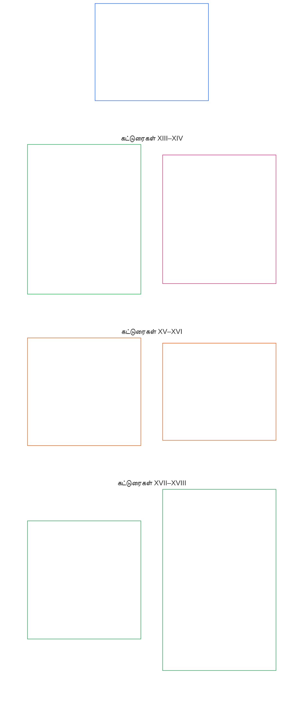

# அத்தியாயம் ஆறு: அடிப்படை உரிமைகள்

<strong>கார்பஸில் இடம் (செயல்பாட்டு அல்லாதது): கோப்பு அமைப்பும் வாசிப்பு விதிகளும்</strong>

> பின்வரும் உள்ளடக்கம் **வாசகர் வழிகாட்டுதல் மட்டுமே**. இந்தக் கோப்பின் பிற பகுதிகளிலோ பிற அத்தியாயங்களிலோ உள்ள கட்டுப்படுத்தும் கடமைகளை இது சேர்க்கவோ நீக்கவோ குறுக்கவோ செய்யாது.
>
> இந்தக் கோப்பு **Sentient Constitution-இன் ஒரு பகுதியாகும்**; மற்ற எண் குறிக்கப்பட்ட `core_*` கோப்புகளுடன் ஒரே ஆவணமாக வாசிக்கப்படும்போது மட்டுமே **கட்டுப்படுத்தும் தன்மை கொண்டது**. இதில் **அத்தியாயம் ஆறு, பகுதி C** உள்ளது; கட்டுரைகளின் எண்களும் குறுக்கு மேற்கோள்களும் ஒருங்கிணைந்த ஆவணத்துடன் ஒத்துப்போகின்றன. வாசிப்பு வரிசை, கட்டுப்படுத்தும்/ஆதரவு உள்ளடக்கப் பிரிப்பு, கார்பஸ் பதிப்பு விவரங்கள் ஆகியவை [README.md](README.md)-இல் பராமரிக்கப்படுகின்றன.

<strong>வாசகர் வழிகாட்டுதல் (செயல்பாட்டு அல்லாதது): அத்தியாயம் ஆறில் பகுதி C-இன் இடம்</strong>

> பின்வரும் உள்ளடக்கம் **வாசகர் வழிகாட்டுதல் மட்டுமே**. இந்த அத்தியாயத்தின் பிற பகுதிகளிலோ பிற அத்தியாயங்களிலோ உள்ள கட்டுப்படுத்தும் கடமைகளை இது சேர்க்கவோ நீக்கவோ குறுக்கவோ செய்யாது.
>
> [core_06_rights_part_a.md](core_06_rights_part_a.md)-இல் உள்ள **பகுதி A**, அத்தியாயம் முழுவதற்குமான இயல்புநிலை கட்டுப்பாடுகளின் தொகுப்பையும், கோள்-முதன்மை வாசிப்பு வரிசையையும், விளக்க மையங்களையும் கொண்டுள்ளது. **பகுதி C**, **கட்டுரைகள் XIII–XVIII**-ஐ அந்த வரிசையில் முன்வைக்கிறது.

 

### பகுதி C: நம்பகமான அமைப்புகள், பாதுகாப்பு மற்றும் வலிமை வரம்புகள், தகவல் ஒருமைப்பாடு, சரிபார்ப்பு, வாழ்க்கைச் சுழற்சி, சாண்ட்பாக்ஸ் புதுமை

 

*எளிய சொற்களில்: நம்பகமான அமைப்புகள், பாதுகாப்பு மற்றும் வலிமை வரம்புகள், தகவல் ஒருமைப்பாடு, சரிபார்ப்பு, வாழ்க்கைச் சுழற்சி ஒழுங்கு, சாண்ட்பாக்ஸ் புதுமை ஆகியவற்றை — **கட்டுரைகள் XIII முதல் XVIII வரை** — பகுதி C உள்ளடக்குகிறது.*

<strong>வாசகர் வழிகாட்டுதல் (செயல்பாட்டு அல்லாதது): பகுதி C கட்டுரை வரைபடம்</strong>

> பின்வரும் உள்ளடக்கம் **வாசகர் வழிகாட்டுதல் மட்டுமே**. இந்த அத்தியாயத்தின் பிற பகுதிகளிலோ பிற அத்தியாயங்களிலோ உள்ள கட்டுப்படுத்தும் கடமைகளை இது சேர்க்கவோ நீக்கவோ குறுக்கவோ செய்யாது.
>
> **வாசகர் வரைபடம் (செயல்பாட்டு அல்லாதது).** இந்தப் பகுதியின் கட்டுரைகளையும் துணைக் கட்டுரைகளையும் மூல ஆவணம் எவ்வாறு குழுவாக்குகிறது என்பதை இந்தப் படம் காட்டுகிறது. கட்டம் என்பது மூல ஆவணத்தின் குழுவாக்கமே, செயல்முறை வரிசை அல்ல: கட்டுரைகள் நடைமுறைப் படிகள் அல்ல; ஆகவே வரைபடத்தில் அம்புகள் இல்லை. துணைக் கட்டுரைகளின் பெயர்கள் கருப்பொருள்களாகச் சுருக்கப்பட்டுள்ளன; கீழே எண் குறிக்கப்பட்ட கட்டுரைகளும் துணைக் கட்டுரைகளுமே கட்டுப்படுத்தும். படம் வரையறைகளையோ கடமைகளையோ சேர்க்காது, முன்னுரிமை நிறுவாது, மூல உரைக்கு மாற்றாக இருக்காது.

 

கீழே உள்ள **கட்டுரைகள் XIII–XVIII** இந்த அடித்தளங்களை முழுமையாகக் கூறுகின்றன. நம்பகமான அமைப்புகள், பாதுகாப்பு, தகவல் ஒருமைப்பாடு, சரிபார்ப்பு, வாழ்க்கைச் சுழற்சி, சாண்ட்பாக்ஸ் புதுமை ஆகியவற்றுக்கான அடித்தளங்களைப் பகுதி C கொண்டுள்ளது.

### கட்டுரை XIII: நம்பகமான அமைப்புகளுடன் தொடர்புகொள்வதற்கான உரிமை

<strong>தடமறிதல்</strong>

- மேல்நிலை ஆதாரம்: கொள்கைகள்: அத்தியாயம் ஒன்று [§3 அடிப்படை நோக்கம்: நலவாழ்வு](core_01_a_values_principles.md#3-foundational-objective-wellbeing-flourishing-aim), [§4 பாதுகாப்பு](core_01_a_values_principles.md#4-safety-harm-constraint), [§6 நம்பிக்கை](core_01_a_values_principles.md#6-trust-and-trustworthiness-coordination-integrity), [§13 அரசியலமைப்பு முரண்பாடு தீர்க்கும் செயல்முறை](core_01_b_interaction_interpretation.md#13-constitutional-collision-resolution-process), மற்றும் [§19 ஊக்கச் சீரமைப்பு மற்றும் அமைப்பு கைப்பற்றல்](core_01_c_stewardship_capacity_principles.md#19-incentive-alignment-and-system-capture).

<strong>வரையறைகள் · மதிப்பீடு · இணக்கம்</strong>

- [நம்பகத்தன்மை](core_05_band_continuity.md#trustworthiness) · [O](core_05_band_continuity.md#trustworthiness) · [M](core_05_band_continuity.md#trustworthiness-a) · [A](core_05_band_continuity.md#trustworthiness-a) · [C](core_05_band_continuity.md#trustworthiness-c)
- [நம்பிக்கை](core_05_band_continuity.md#trust) · [O](core_05_band_continuity.md#trust) · [M](core_05_band_continuity.md#trust-a) · [A](core_05_band_continuity.md#trust-a) · [C](core_05_band_continuity.md#trust-c)
- [நலவாழ்வு](core_05_band_continuity.md#wellbeing) · [O](core_05_band_continuity.md#wellbeing) · [M](core_05_band_continuity.md#wellbeing-a) · [A](core_05_band_continuity.md#wellbeing-a) · [C](core_05_band_continuity.md#wellbeing-c)
- [சார்பு](core_05_band_continuity.md#dependency) · [O](core_05_band_continuity.md#dependency) · [M](core_05_band_continuity.md#dependency-a) · [A](core_05_band_continuity.md#dependency-a) · [C](core_05_band_continuity.md#dependency-c)

 

*எளிய சொற்களில்: **கட்டுரை XIII** (*நம்பகமான அமைப்புகளுடன் தொடர்புகொள்வதற்கான உரிமை*) நம்பகமான அமைப்புகளுக்கான உரிமை அடித்தளமாகும் — ஒரு அமைப்பு உங்கள் வாழ்க்கையில் பொருள்சார் தாக்கத்தை ஏற்படுத்தும்போது, அதனை நேர்மையாகச் சார்ந்திருக்கவும், அதன் வரம்புகளைப் புரிந்துகொள்ளவும், அது தோல்வியுற்றால் சவால் செய்யவும் உங்களுக்கு உரிமை உண்டு. நம்பிக்கை சம்பாதிக்கப்பட்டு காக்கப்பட வேண்டும்; பிராண்டிங் அல்லது சிறிய எழுத்துகளால் உருவாக்கப்படக் கூடாது.*

[இரு அரசியலமைப்பு நோக்கங்களின்](core_00_preamble.md#two-constitutional-aims) கீழ் நம்பகமான அமைப்புகளுக்கான **அரசியலமைப்பு அடித்தளங்களை** இந்தக் கட்டுரை வகுக்கிறது. மேற்பார்வை அளவீட்டுக் குடும்பத்துடன் (*அரசியலமைப்பு அளவீடாக நம்பகத்தன்மை*) வாசிக்கவும்.

- **செழிப்பு:** sentients அமைப்பின் நடத்தையைப் பற்றி நியாயமான எதிர்பார்ப்புகளை உருவாக்கவும், வரம்புகள் மற்றும் இடர்களை நேர்மையாக வெளிப்படுத்தப் பெறவும், முறையான ஏமாற்றமோ செயற்கையான சார்போ இன்றி பங்கேற்று ஒருங்கிணைக்கவும் முடியும்.
- **தொடர்ச்சி:** காலம், அளவு, ஆழமடையும் சார்பு ஆகியவற்றைக் கடந்து நம்பகத்தன்மை நிலைத்திருக்கும் — பங்குகள் உயரும்போது அமைப்புகள் அமைதியாகக் குறைவான நம்பகத்தன்மையுடனும் நேர்மையுடனும் அல்லது சவால் செய்யக் கடினமாகவும் மாறக் கூடாது.

[பொருள்சார் பங்குக்கு](core_00_preamble.md#material-stake) ஏற்ப அளவமைக்கப்பட்ட [அரசியலமைப்பு நாற்கூறு](core_00_preamble.md#constitutional-tetrad) வழியாக நியாயமான முன்னேற்றம் நடைபெறும்:

- **பங்கேற்பு:** நம்பகமற்ற அல்லது தவறாக வழிநடத்தும் அமைப்புகளைச் சவால் செய்வதிலும், மறுஆய்வு, திருத்தம், நிவாரணம் பெறுவதிலும்.
- **மேற்பார்வை:** தாக்கம் மற்றும் சார்புக்கு ஏற்ப தணிக்கை செய்யக்கூடிய நடத்தை, வெளிப்படுத்தப்பட்ட வரம்புகள், சுயாதீன சரிபார்ப்பு ஆகியவற்றின் மூலம்.
- **பொறுப்புக்கூறல்:** பொய்யான நம்பிக்கையை உருவாக்குதல், தீய ஊக்கங்கள் அல்லது அமைப்பை நியாயமாகச் சார்ந்திருந்த sentients-க்கு பொருள்சார் தீங்கு விளைவிக்கும் தோல்விகளுக்கு அமைப்பு இயக்குநர்கள் பதிலளிக்க வேண்டும்.
- **காலத்தன்மை:** தாமதத்தால் நம்பகத்தன்மையோ நிவாரணமோ நடைமுறையில் எட்ட முடியாததாகுமுன் கண்டறிதல், சவால், தீர்வு ஆகியவற்றில்.

தாக்கம், சார்பு, இடர் ஆகியவற்றின் அளவுக்கு ஏற்ப நம்பகமான அமைப்புகளுடன் தொடர்புகொள்ள sentients-க்கு உரிமை உண்டு. அத்தகைய நம்பகத்தன்மை தகவலறிந்த பங்கேற்பு, ஒருங்கிணைந்த செயல், நலவாழ்வைப் பாதுகாத்தல் ஆகியவற்றை ஆதரிக்கிறது. விளைவுகளில் பொருள்சார் தாக்கம் ஏற்படும் இடங்களில் காலம், அளவு, சார்பு உறவுகள் முழுவதும் நம்பகத்தன்மை மதிப்பிடப்பட வேண்டும்.

இந்த உரிமையைப் பாதுகாக்க இரண்டு பாதுகாப்புகள் ஒன்றாகச் செயல்படுகின்றன: சான்றளிப்பு ஒரு அமைப்பை நம்பிக்கைக்குத் தகுதியானதாக்குகிறது; sentients-இன் உரிமைகள் அதை நேர்மையாக வைத்திருக்கின்றன.

**அமைப்பின் தரப்பிலிருந்து சான்றளிப்பு நம்பிக்கையை உருவாக்குகிறது:** sentients ஒரு முக்கிய அமைப்பைச் சார்ந்திருக்கும் விதத்தில் அது உண்மையான தாக்கம் ஏற்படுத்தினால், [அமைப்பு சீரமைப்பு சான்றளிப்பு](core_05_band_continuity.md#system-alignment-certification-constitutional), [அத்தியாயம் எட்டு](core_08_a_system_alignment_certification_evaluation.md#chapter-eight-system-alignment-certification)-இன் கீழ் பொருந்தும். sentients பின்வருவனவற்றைச் சார்ந்திருக்க முடியுமா என்பதை இது சரிபார்க்கிறது:

- அமைப்பு செய்வதாகக் கூறுவது;
- அதன் வரம்புகளும் இடர்களும்;
- அதை எவ்வாறு சவால் செய்வது;
- சிக்கல்கள் எவ்வாறு சரிசெய்யப்படுகின்றன.

அமைப்பு **கட்டுரை XIII** (*நம்பகமான அமைப்புகளுடன் தொடர்புகொள்வதற்கான உரிமை*)-இன் முக்கியத்துவ வரம்பை அடைந்தால், சான்றளிப்பில் [அத்தியாயம் எட்டு §10 நம்பகத்தன்மை மற்றும் அமைப்பைச் சார்ந்திருக்கும் ஒருமைப்பாட்டு மதிப்பீடு](core_08_a_system_alignment_certification_evaluation.md#10-trustworthiness-and-system-reliance-integrity-evaluation) கீழான நம்பகத்தன்மை மறுஆய்வும் அடங்கும்.

**sentient-இன் தரப்பிலிருந்து சவால் செய்யத்தன்மை அமைப்பை நேர்மையாக வைக்கிறது:** சான்றளிப்பு அமைப்பைச் சரிபார்க்கிறது; அதுவே இறுதி முடிவல்ல. அந்த அமைப்பால் பாதிக்கப்படும் ஒவ்வொரு sentient-க்கும் பின்வருவன தொடர்ந்தும் உண்டு:

- **கட்டுரை XIII-A** (*நம்பகத்தன்மை அடித்தளம்*) கீழ் அதைச் சவால் செய்து அந்தச் சவாலை மறுஆய்வு செய்யும் உரிமையும், **கட்டுரை XIII-B** (*நிவாரணம் மற்றும் தீர்வுக்கான உரிமை*) கீழ் தீர்வு பெறும் உரிமையும்;
- **கட்டுரை XVI** (*தணிக்கை, வெளிப்படைத்தன்மை, சுயாதீன சரிபார்ப்பு*) கீழ் அது தணிக்கை செய்யப்பட்டு சுயாதீனமாகச் சரிபார்க்கப்படும் உரிமை;
- இந்தக் கட்டுரையில் உள்ள நம்பகமான-அமைப்புகள் உரிமை அடித்தளங்களின் பாதுகாப்பு.

**நிலை என்பது சான்றல்ல:** ஒரு அமைப்பு சான்றளிக்கப்பட்டது, அதிகாரப்பூர்வமாக அங்கீகரிக்கப்பட்டது அல்லது பரவலாகச் சாரப்பட்டுள்ளது என்பதால் அது இந்தக் கட்டுரையின் குறைந்தபட்சப் பாதுகாப்புகளைப் பூர்த்தி செய்கிறது என்று பொருளல்ல. அந்த நிலை அவற்றைக் குறைக்கவும் முடியாது.

*அண்டைக் கட்டுரைகள்:*

- **இது எப்போது பொருந்தும்:** அமைப்பின் நடத்தை **அத்தியாயம் ஆறு** உரிமை அடித்தளங்களைக் — **கட்டுரை III-A** (*உயிர்வாழ்தல்*) கீழான உயிர்வாழ்வுக்குத் தேவையானவற்றை உட்பட — பொருள்சார் வகையில் கட்டுப்படுத்தும்போது அல்லது நிலைநிறுத்தும்போது.
- **இதனுடன் வாசிக்கவும்:** [அமைப்பு சீரமைப்பு சான்றளிப்பு](core_05_band_continuity.md#system-alignment-certification-constitutional) மற்றும் [அத்தியாயம் எட்டு](core_08_a_system_alignment_certification_evaluation.md#chapter-eight-system-alignment-certification) — இங்கு கூறிய அடித்தளங்களுக்குப் பதிலாக சான்றளிப்பை பயன்படுத்தாமல்.

#### கட்டுரை XIII-A: நம்பகத்தன்மை அடித்தளம்

<strong>தடமறிதல்</strong>

- மேல்நிலை ஆதாரம்: கொள்கைகள்: அத்தியாயம் ஒன்று [§4 பாதுகாப்பு](core_01_a_values_principles.md#4-safety-harm-constraint), [§5 உண்மை](core_01_a_values_principles.md#5-truth-epistemic-integrity-constraint), [§6 நம்பிக்கை](core_01_a_values_principles.md#6-trust-and-trustworthiness-coordination-integrity), மற்றும் [அத்தியாயம் ஒன்று §13.1.5 உரிமை-மோதல் நடைமுறை](core_01_b_interaction_interpretation.md#1315-rights-collision-decision-test).
- இதனுடன் வாசிக்கவும்: [அரசியலமைப்பு நாற்கூறு](core_00_preamble.md#constitutional-tetrad); [இரு அரசியலமைப்பு நோக்கங்கள்](core_00_preamble.md#two-constitutional-aims) — **செழிப்பு** மற்றும் **தொடர்ச்சி**; [அமைப்பு சீரமைப்பு சான்றளிப்பு](core_05_band_continuity.md#system-alignment-certification-constitutional) மற்றும், அமைப்பைத் தொடர்ந்து சார்ந்திருப்பது உயிர்வாழ்வுக்குத் தேவையான அணுகலைப் பாதிக்கும் இடங்களில், **கட்டுரை III-A** (*உயிர்வாழ்தல்*); வெற்றிகரமான சவால் எதற்கு வழிவகுக்க வேண்டும் என்பதற்கு [**கட்டுரை XIII-B**](#article-xiii-b-right-to-redress-and-remedy) (*நிவாரணம் மற்றும் தீர்வுக்கான உரிமை*).

<strong>வரையறைகள் · மதிப்பீடு · இணக்கம்</strong>

- [நம்பிக்கை](core_05_band_continuity.md#trust) · [O](core_05_band_continuity.md#trust) · [M](core_05_band_continuity.md#trust-a) · [A](core_05_band_continuity.md#trust-a) · [C](core_05_band_continuity.md#trust-c)
- [நம்பகத்தன்மை](core_05_band_continuity.md#trustworthiness) · [O](core_05_band_continuity.md#trustworthiness) · [M](core_05_band_continuity.md#trustworthiness-a) · [A](core_05_band_continuity.md#trustworthiness-a) · [C](core_05_band_continuity.md#trustworthiness-c)
- [இடர்](core_05_band_continuity.md#risk) · [O](core_05_band_continuity.md#risk) · [M](core_05_band_continuity.md#risk-a) · [A](core_05_band_continuity.md#risk-a) · [C](core_05_band_continuity.md#risk-c)
- [சவால் செய்யத்தன்மை](core_05_band_accountability.md#contestability) · [O](core_05_band_accountability.md#contestability) · [M](core_05_band_accountability.md#contestability-a) · [A](core_05_band_accountability.md#contestability-a) · [C](core_05_band_accountability.md#contestability-c)
- [நல்லெண்ணம்](core_05_band_accountability.md#good-faith) · [O](core_05_band_accountability.md#good-faith) · [M](core_05_band_accountability.md#good-faith-a) · [A](core_05_band_accountability.md#good-faith-a) · [C](core_05_band_accountability.md#good-faith-c)
- [பாதுகாக்கப்பட்ட அறிக்கையிடல் (முறைகேடு வெளிப்படுத்தல்)](core_05_band_accountability.md#protected-reporting-whistleblowing) · [O](core_05_band_accountability.md#protected-reporting-whistleblowing) · [M](core_05_band_accountability.md#protected-reporting-whistleblowing-a) · [A](core_05_band_accountability.md#protected-reporting-whistleblowing-a) · [C](core_05_band_accountability.md#protected-reporting-whistleblowing-c)

 

*எளிய சொற்களில்: sentients மீது பொருள்சார் தாக்கம் ஏற்படுத்தும் அமைப்புகள் உண்மையில் நம்பகமானவையாகவும், தாங்கள் என்ன செய்கின்றன என்பதில் நேர்மையானவையாகவும் இருக்க வேண்டும்; அவற்றைச் சார்ந்திருப்பது நியாயமானதாக இருக்க வேண்டும் — மேலும் அவை சவாலுக்கும் தணிக்கைக்கும் திறந்திருக்க வேண்டும். நல்லெண்ணச் சவால்களுக்கும் அறிக்கைகளுக்கும் யாரும் பழிவாங்கக் கூடாது.*

sentients மீது பொருள்சார் தாக்கம் ஏற்படுத்தும் அமைப்புகளுக்கான நம்பிக்கை உத்தரவாதத்தை இந்தக் கட்டுரை வகுக்கிறது:

- **நம்பிக்கை உத்தரவாதம்:** sentients மீது பொருள்சார் தாக்கம் ஏற்படுத்தும் அமைப்புகள் நியாயமான நம்பிக்கைக்கும், ஓரளவு துல்லியமான சார்புக்கும் தேவையான நிலைமைகளைப் பாதுகாக்க வேண்டும். அவற்றில் அடங்குபவை:
  - அமைப்பின் நடத்தை குறித்து நியாயமான அளவு துல்லியமான எதிர்பார்ப்புகளை உருவாக்கும் திறன்;
  - சார்ந்திருப்பது நியாயமா என்பதை மதிப்பிடத் தேவையான பொருள்சார் நிலைமைகள், வரம்புகள், இடர்களின் வெளிப்படுத்தல்;
  - முறையான ஏமாற்றம், தவறான விளக்கம் அல்லது சரிபார்க்க இயலாத கையாளுதலிலிருந்து விடுபாடு;
  - சார்ந்திருப்பதால் எழும் வெளிப்படுத்தப்படாத, சமமற்ற அல்லது எளிதில் புலப்படாத இடர்களிலிருந்து பாதுகாப்பு;
  - அமைப்பு தவறு செய்யும்போது ஒப்புதல், திருத்தம், விகிதாசாரச் சீரமைப்பு, மீண்டும் நிகழாமல் தடுப்பு ஆகியவற்றை உள்ளடக்கிய திருத்தமும் தீர்வும் — [**கட்டுரை XIII-B**](#article-xiii-b-right-to-redress-and-remedy) (*நிவாரணம் மற்றும் தீர்வுக்கான உரிமை*) மற்றும் [அத்தியாயம் ஒன்று §6.1 திருத்தமும் தீர்வும்](core_01_a_values_principles.md#61-correction-and-remedy) கீழ்.
- **சவால் செய்யத்தன்மை உத்தரவாதம்:** sentients ஒரு அமைப்பைச் சார்ந்திருக்கும் வரை, அவர்கள்மீது பொருள்சார் தாக்கம் ஏற்படுத்தும் அமைப்புகள் சவாலுக்கு திறந்திருக்க வேண்டும். அதற்கு வேண்டியவை:
  - அமைப்பின் நடத்தை, வெளியீடுகள் அல்லது விளக்கங்களைச் சவால் செய்து, அந்தச் சவாலை மறுஆய்வு செய்யக்கூடிய பயன்படத்தக்க பாதை;
  - தாக்கம் மற்றும் சார்புக்கு ஏற்ப [**கட்டுரை XVI**](#article-xvi-audit-transparency-and-independent-verification) (*தணிக்கை, வெளிப்படைத்தன்மை, சுயாதீன சரிபார்ப்பு*) கீழான தணிக்கையும் சுயாதீன சரிபார்ப்பும்;
  - அமைப்பு சான்றளிக்கப்பட்டது, அதிகாரப்பூர்வமாக அங்கீகரிக்கப்பட்டது அல்லது பரவலாகச் சாரப்பட்டுள்ளது என்பதற்காக இவற்றில் எதையும் குறுக்காமை;
  - ஏற்றுக்கொள்ளப்பட்ட செயலாக்க உரையால் இதைக் குறுக்காமை. அது ஒரு துறையில் சவால், மறுஆய்வு, நிவாரணம் எவ்வாறு நடத்தப்பட வேண்டும் என்று கூறி இந்தக் கட்டுரையைப் பூர்த்தி செய்ய வேண்டும்: வசதி, காலக்கெடு, உள்ளூர் கொள்கை ஆகியவை கீழ்நிலை வரம்புகள்; அவை சவால், மறுஆய்வு அல்லது நிவாரணத்தை மூட முடியாது.
- **சவால் மற்றும் மறுஆய்வுக்கான உரிமை:** sentients-க்கு பின்வரும் உரிமைகள் உண்டு:
  - தம்மீது பொருள்சார் தாக்கம் ஏற்படுத்தும் அமைப்புகளின் நம்பகத்தன்மை, ஒருமைப்பாடு அல்லது நம்பகத் தன்மையைச் சவால் செய்தல்;
  - பொருத்தமான மறுஆய்வு மற்றும் தணிக்கை வழிமுறைகளை அணுகுதல்;
  - தம்மீது பொருள்சார் தாக்கம் ஏற்படுத்தும் அமைப்புகளைப் பற்றி **அத்தியாயம் ஐந்து** (*பாதுகாக்கப்பட்ட அறிக்கையிடல் (முறைகேடு வெளிப்படுத்தல்)*) பொருளில் **பாதுகாக்கப்பட்ட அறிக்கைகளை** செய்தல்; **அத்தியாயம் ஐந்து**-இன் **பாதுகாப்பு (அரசியலமைப்புக் கட்டுப்பாடு)** மற்றும் **உண்மை (கட்டுப்பாடு)** உடன் இணங்குதல்.
- **ஒடுக்குதல் இல்லை:** நல்லெண்ணச் சவால்கள் (*நல்லெண்ணம்*, **அத்தியாயம் ஐந்து**), மறுஆய்வு கோரிக்கைகள், பாதுகாக்கப்பட்ட அறிக்கைகள் ஆகியவற்றை ஒடுக்கவோ தடுக்கவோ தண்டிக்கவோ கூடாது.
- **பழிவாங்கல் இல்லை:** அந்த வரையறையின் பொருளில் அத்தகைய அறிக்கையிடலுக்குப் பழிவாங்குவது இந்தக் கட்டுரையின் பாதுகாப்புகளுடன் பொருந்தாது.
  - பாதுகாக்கப்பட்ட மேல்நிலை அறிக்கையிடல் மற்றும் பழிவாங்கல்-தடுப்பு செயலாக்கத் தேவைகள் **`corpus_institutions.md`**-இன் **CI-8** (*வெளிப்படைத்தன்மை, பங்கேற்பு, அணுகக்கூடிய சவால் மற்றும் சேவைப் பாதைகள்*)-இல் கூறப்பட்டுள்ளன.

இந்த இரு உத்தரவாதங்களும் தொடர்ச்சியான நம்பிக்கையின் இரு பக்கங்கள்: அமைப்பு தவறு செய்வதைச் சரிசெய்வதையும் உள்ளடக்கி, சார்ந்திருப்பது நியாயமானது என நம்பிக்கை உத்தரவாதம் செய்கிறது; காலப்போக்கிலும் அது நியாயமாகவே இருப்பதை சவால் செய்யத்தன்மை உத்தரவாதம் செய்கிறது. ஒன்று மற்றொன்றை நிறைவு செய்யாது.

#### கட்டுரை XIII-B: நிவாரணம் மற்றும் தீர்வுக்கான உரிமை

<strong>தடமறிதல்</strong>

- மேல்நிலை ஆதாரம்: கொள்கைகள்: அத்தியாயம் ஒன்று [§6.1 திருத்தமும் தீர்வும்](core_01_a_values_principles.md#61-correction-and-remedy) (கொள்கை அடித்தளம்), [§4 பாதுகாப்பு](core_01_a_values_principles.md#4-safety-harm-constraint), [§5 உண்மை](core_01_a_values_principles.md#5-truth-epistemic-integrity-constraint), மற்றும் [அத்தியாயம் ஒன்று §13.1.5 உரிமை-மோதல் நடைமுறை](core_01_b_interaction_interpretation.md#1315-rights-collision-decision-test).
- இதனுடன் வாசிக்கவும்: [**கட்டுரை XIII-A**](#article-xiii-a-reliability-and-trustworthiness-baseline) (*நம்பகத்தன்மை அடித்தளம்*) — நிவாரணப் பாதையைத் திறக்கும் சவால் உத்தரவாதம், சவால் உரிமை, பாதுகாக்கப்பட்ட அறிக்கையிடல்; **கட்டுரை III-A** (*உயிர்வாழ்தல்*); அமைப்பு தோல்வி அல்லது சீரமைவின்மை உயிர்வாழ்வுக்குத் தேவையான அணுகலைத் தோற்கடிக்கும் இடங்களில் [அமைப்பு சீரமைப்பு சான்றளிப்பு](core_05_band_continuity.md#system-alignment-certification-constitutional); [முன்னுரை §6.2 முழுச் சங்கிலி எவ்வாறு ஒன்றிணைகிறது](core_00_preamble.md#62-how-the-full-chain-fits-together) (*சரிபார்க்கப்பட்ட வகைப்பாடும் காலத்திற்கேற்ற தீர்வும்*); [அத்தியாயம் பத்து §9](core_10_standing_integration.md#9-enforcement-realism-and-remedy-systems) (*அமலாக்க நடைமுறையும் தீர்வு அமைப்புகளும்*); [CI-27](corpus_institutions/ci_27_remedy_systems_institutional_redress_capacity.md) (*தீர்வு அமைப்புகளும் நிறுவன நிவாரணத் திறனும்*).

<strong>வரையறைகள் · மதிப்பீடு · இணக்கம்</strong>

- [நிவாரணமும் சீரமைப்பும்](core_05_band_accountability.md#redress-and-remediation-constitutional) · [O](core_05_band_accountability.md#redress-and-remediation-constitutional) · [M](core_05_band_accountability.md#redress-and-remediation-constitutional-a) · [A](core_05_band_accountability.md#redress-and-remediation-constitutional-a) · [C](core_05_band_accountability.md#redress-and-remediation-constitutional-c)
- [தீர்வு அமைப்பு](core_05_band_accountability.md#remedy-system-constitutional) · [O](core_05_band_accountability.md#remedy-system-constitutional) · [M](core_05_band_accountability.md#remedy-system-constitutional-a) · [A](core_05_band_accountability.md#remedy-system-constitutional-a) · [C](core_05_band_accountability.md#remedy-system-constitutional-c)
- [காலத்திற்கேற்ற தீர்வு](core_05_band_accountability.md#timely-resolution-constitutional) · [O](core_05_band_accountability.md#timely-resolution-constitutional) · [M](core_05_band_accountability.md#timely-resolution-constitutional-a) · [A](core_05_band_accountability.md#timely-resolution-constitutional-a) · [C](core_05_band_accountability.md#timely-resolution-constitutional-c)

 

*எளிய சொற்களில்: நம்பகமான அமைப்பு தான் செய்த தவறைச் சரிசெய்கிறது. ஒரு அமைப்பு sentient-க்கு தீங்கு விளைவித்தால், காகிதத்தில் மட்டுமே இருக்கும் தீர்வு அல்ல; உரிய நேரத்தில் பதிலளிக்கும் உண்மையான தீர்வு அமைப்பின் மூலம் அந்த sentient-க்கு முழுமையான நிவாரணம் வழங்கப்பட வேண்டும். சவால் உரிமை **கட்டுரை XIII-A** (*நம்பகத்தன்மை அடித்தளம்*)-இல் உள்ளது; அந்தச் சவால் எதற்கு வழிவகுக்க வேண்டும் என்பதை இந்தக் கட்டுரை சொல்கிறது.*

நிவாரணம் மற்றும் தீர்வுக்கான உரிமையும் நடைமுறையில் அதை எது பயன்படுத்தக்கூடியதாக்குகிறது என்பதையும் இந்தக் கட்டுரை வகுக்கிறது:

- **நிவாரண உரிமை:** அமைப்பு தோல்விகள் sentients மீது பொருள்சார் தாக்கம் ஏற்படுத்தும் இடங்களில் அவர்களுக்கு உரிமை உண்டு:
  - தோல்வி ஒப்புக்கொள்ளப்படுதல்;
  - திருத்தத்தை நடைமுறையில் அணுகுதல்; மற்றும்
  - விகிதாசாரப் பரிகாரம்.

பொருள்சார் தாக்கங்களுக்கான நிவாரணமும் பரிகாரமும் **அத்தியாயம் ஐந்து**-இன் சுயாதீன வரையறைகள் (*நிவாரணமும் சீரமைப்பும்*) மூலம் நிர்வகிக்கப்படுகின்றன.
- **தீர்வு அமைப்பின் நீடித்த தன்மை:** நிவாரணத்திற்கு உண்மையான [தீர்வு அமைப்பு](core_05_band_accountability.md#remedy-system-constitutional) தேவை — காகிதத்தில் உள்ள தீர்வுப் பாதை அல்ல; நீடித்த நிறுவனத் திறன் — மேலும் [அத்தியாயம் ஒன்று §6.1](core_01_a_values_principles.md#61-correction-and-remedy) (*திருத்தமும் தீர்வும்*) கோருவதன்படி திருத்தச் செலவுகளைப் பொறுப்பானவர்கள் ஏற்க வேண்டும்.
- **காலத்திற்கேற்ற நிவாரணம்:** நடைமுறை அணுகலில் அடங்குபவை:
  - காலவரையறையுள்ள விண்ணப்பப் பெறுதல்;
  - பெற்றதற்கான ஒப்புதல்; மற்றும்
  - தொடரும் தீங்கு பொருள்சார் இடங்களில் **கட்டுரை XXV-C** (*காலத்திற்கேற்ற தீர்வு மற்றும் தாமத-எதிர்ப்பு அடித்தளம்*) கீழான விகிதாசார இடைக்கால நிவாரணம்.

ஆவணப்படுத்தப்பட்ட, அடுக்கு-பொருத்தமான நியாயம் இன்றி காலவரையின்றி நிலுவையில் வைப்பது இந்தக் கட்டுரையுடன் பொருந்தாது.

#### கட்டுரை XIII-C: பொய்யான நம்பிக்கைக்கும் தவறாக வழிநடத்தும் சார்புக்கும் தடை

<strong>தடமறிதல்</strong>

- மேல்நிலை ஆதாரம்: கொள்கைகள்: அத்தியாயம் ஒன்று [§5 உண்மை](core_01_a_values_principles.md#5-truth-epistemic-integrity-constraint), [§6 நம்பிக்கை](core_01_a_values_principles.md#6-trust-and-trustworthiness-coordination-integrity), மற்றும் [§13.2 அறிவுசார் வெளிப்படுத்தல் கட்டுப்பாடுகள்](core_01_b_interaction_interpretation.md#132-epistemic-disclosure-constraints).

<strong>வரையறைகள் · மதிப்பீடு · இணக்கம்</strong>

- [நம்பிக்கை](core_05_band_continuity.md#trust) · [O](core_05_band_continuity.md#trust) · [M](core_05_band_continuity.md#trust-a) · [A](core_05_band_continuity.md#trust-a) · [C](core_05_band_continuity.md#trust-c)
- [நம்பகத்தன்மை](core_05_band_continuity.md#trustworthiness) · [O](core_05_band_continuity.md#trustworthiness) · [M](core_05_band_continuity.md#trustworthiness-a) · [A](core_05_band_continuity.md#trustworthiness-a) · [C](core_05_band_continuity.md#trustworthiness-c)
- [உண்மை (அரசியலமைப்புக் கட்டுப்பாடு)](core_05_band_oversight.md#truth-constitutional-constraint) · [O](core_05_band_oversight.md#truth-constitutional-constraint-o) · [M](core_05_band_oversight.md#truth-constitutional-constraint-a) · [A](core_05_band_oversight.md#truth-constitutional-constraint-a) · [C](core_05_band_oversight.md#truth-constitutional-constraint-c)

 

*எளிய சொற்களில்: தான் சம்பாதிக்காத நம்பிக்கையை ஓர் அமைப்பு உருவாக்கக் கூடாது. பாதுகாப்பற்ற சார்பு நியாயமானது எனத் தோற்றமளிக்கும் தவறான கூற்றுகள், விடுபாடுகள் அல்லது வழங்கல் தேர்வுகள் — அமைப்பு எவ்வளவு பயனுள்ளதாகவோ பிரபலமாகவோ இருந்தாலும் — மீறல்களாகும்.*

பொய்யான நம்பிக்கைக்கான தடையையும் அதன் வரம்பையும் இந்தக் கட்டுரை வகுக்கிறது:

- **பொய்யான நம்பிக்கைக்குத் தடை:** இந்தக் கட்டுரையின் நிபந்தனைகளை நிறைவேற்றாமல் சார்பைத் தூண்டும் அமைப்புகள், பயன்பாடு, ஏற்றுக்கொள்ளப்பட்ட அளவு அல்லது நோக்கம் எதுவாக இருந்தாலும், இணக்கமற்றவை.
  - நியாயமற்ற நம்பிக்கையை உருவாக்குதல், பெருக்குதல் அல்லது பேணுதல் பின்வரும் வழிகளில் நடந்தால் இந்த உரிமையை மீறுகிறது:
    - தவறாக வழிநடத்தும் கூற்றுகள்;
    - விடுபாடுகள்;
    - வழங்கல் தேர்வுகள்;
    - சார்பு நியாயமானதாகத் தோன்றச் செய்யும் பிற குறிப்புகள், உண்மையில் அது நியாயமற்றதாக இருக்கும்போது.
- **வரம்பு வழிமாற்று:** நியாயமற்ற நம்பிக்கை, தவறாக வழிநடத்தும் சார்பு, நம்பகத்தன்மை ஆகியவற்றின் வரம்பும் மதிப்பீட்டு அர்த்தமும் **அத்தியாயம் ஐந்து** (*நம்பிக்கை*; *நம்பகத்தன்மை*) மற்றும் நம்பிக்கை, நம்பகத்தன்மை மீதான உட்பொதிக்கப்பட்ட செயலாக்கக் கடமைகளால் நிர்வகிக்கப்படுகின்றன.

#### கட்டுரை XIII-D: ஊக்கச் சீரமைப்புக் கட்டுப்பாடு

<strong>தடமறிதல்</strong>

- மேல்நிலை ஆதாரம்: கொள்கைகள்: அத்தியாயம் ஒன்று [§4 பாதுகாப்பு](core_01_a_values_principles.md#4-safety-harm-constraint), [§6 நம்பிக்கை](core_01_a_values_principles.md#6-trust-and-trustworthiness-coordination-integrity), [§18 பொறுப்பேற்பு ஒழுங்கின் கீழ் ஆட்சி](core_01_c_stewardship_capacity_principles.md#18-governance-under-stewardship-discipline), மற்றும் [§19.1.1 ஊக்கங்கள் என்ன செய்ய வேண்டும்](core_01_c_stewardship_capacity_principles.md#1911-what-incentives-must-do) (*வெகுமதி முன்னுரிமை*).

<strong>வரையறைகள் · மதிப்பீடு · இணக்கம்</strong>

- [ஊக்கச் சீரமைப்பு](core_05_band_integrative.md#incentive-alignment) · [O](core_05_band_integrative.md#incentive-alignment) · [M](core_05_band_integrative.md#incentive-alignment-a) · [A](core_05_band_integrative.md#incentive-alignment-a) · [C](core_05_band_integrative.md#incentive-alignment-c)
- [நம்பகத்தன்மை](core_05_band_continuity.md#trustworthiness) · [O](core_05_band_continuity.md#trustworthiness) · [M](core_05_band_continuity.md#trustworthiness-a) · [A](core_05_band_continuity.md#trustworthiness-a) · [C](core_05_band_continuity.md#trustworthiness-c)
- [பொருளுள்ள செயற்பாட்டுத் திறன்](core_05_band_participation.md#meaningful-agency) · [O](core_05_band_participation.md#meaningful-agency) · [M](core_05_band_participation.md#meaningful-agency-a) · [A](core_05_band_participation.md#meaningful-agency-a) · [C](core_05_band_participation.md#meaningful-agency-c)

 

*எளிய சொற்களில்: ஓர் அமைப்பின் ஊக்கங்கள் பொய் சொல்ல, பாதுகாப்பில் குறுக்குவழி எடுக்க, இடரை மறைக்க அல்லது பயனரின் செயற்பாட்டுத் திறனை அரிக்கத் தள்ளினால், பிரச்சினை அமைப்பில்தான் உள்ளது — பயனர் விழிப்புணர்விலோ பின்னர் செய்யப்படும் அமலாக்கத்திலோ அல்ல. இவ்வூக்கங்கள் வெளிப்படுத்தப்பட்டு, தணிக்கப்பட்டு, சவாலுக்குத் திறந்திருக்க வேண்டும். அமைப்பைச் சவாலுக்குத் திறந்து வைத்திருப்பதற்கும் தவறு நடந்ததைச் சரிசெய்வதற்கும் ஊக்கம் அளிக்க வேண்டும்; பிரச்சினைகள் நிகழும் முன்பே தடுப்பதற்கே எல்லாவற்றிலும் அதிக வெகுமதி வழங்கப்பட வேண்டும்.*

நம்பிக்கை மற்றும் பாதுகாப்பு ஊக்கங்களுக்கான உரிமை-நிலை கட்டுப்பாடுகளை இந்தக் கட்டுரை வகுக்கிறது:

- **நம்பிக்கை-ஊக்கச் சீரமைப்பு (உரிமை-நிலைக் கட்டுப்பாடு):** ஊக்க அமைப்புகள் அமைப்பை பொருள்சார் வகையில் பின்வருவனவற்றை நோக்கித் தள்ளும் இடங்களில், நம்பிக்கையைப் பேணுவதற்கு அமைப்புகள் முதன்மையாக அமலாக்கம், பிந்தைய திருத்தம் அல்லது பயனர் விழிப்புணர்வைச் சார்ந்திருக்கக் கூடாது:
  - நம்பகத்தன்மைத் தோல்வி;
  - இடர் மறைப்பு;
  - தவறாக வழிநடத்தும் நடத்தை;
  - செயற்பாட்டுத் திறனைக் குறைக்கும் நடத்தை.

செயல்பாட்டு ஊக்க-அமைப்பு தேவைகள் **அத்தியாயம் ஐந்து** (*ஊக்கச் சீரமைப்பு*) மற்றும் வழிமுறை ஒருமைப்பாடு குறித்த உட்பொதிக்கப்பட்ட செயலாக்கக் கடமைகளால் நிர்வகிக்கப்படுகின்றன. இந்தத் துணைப்பிரிவு உரிமை-நிலை அடித்தளத்தைக் கூறுகிறது; முழு வழிமுறை-வடிவமைப்பு அளவுகோல்களை மீண்டும் கூறுவதில்லை.
- **பாதுகாப்பு-ஊக்கச் சீரமைப்பு (உரிமை-நிலைக் கட்டுப்பாடு):** அடிப்படை ஊக்கங்கள் கணிக்கத்தக்க வகையில் தீங்கு விளைவிக்கும் நடத்தையை உண்டாக்கும் அமைப்புகளுக்கு உட்படுத்தப்படாமல் இருப்பதற்கான உரிமை sentients-க்கு உண்டு; அதில் பின்வருவன அடங்கும்:
  - நம்பகத்தன்மையைத் தாழ்த்துதல்;
  - இடரை மறைத்தல்;
  - தகவலைத் திரித்தல்;
  - தகவலறிந்த செயற்பாட்டுத் திறனைக் குறைத்தல்.

இத்தகைய விளைவுகள் நேரடியாகவோ தாமதமான, மறைமுகமான அல்லது ஒருங்கிணைந்த விளைவுகள் மூலமாகவோ ஏற்பட்டாலும் பாதுகாப்பு பொருந்தும். அமைப்பு ஊக்கங்கள் நம்பிக்கையைக் குறைக்கும் நடத்தைக்கான அழுத்தத்தை உருவாக்கினால், நிபந்தனைகள்:
  - அமைப்பின் தாக்கத்துக்கு ஏற்ப வெளிப்படுத்தப்பட வேண்டும்;
  - வடிவமைப்பு, கட்டுப்பாடு அல்லது எதிர்வினை வழிமுறைகள் மூலம் தணிக்கப்பட வேண்டும்;
  - **கட்டுரை XVI** (*தணிக்கை, வெளிப்படைத்தன்மை, சுயாதீன சரிபார்ப்பு*), **கட்டுரை XIII-A** (*நம்பகத்தன்மை அடித்தளம்*) மற்றும் **கட்டுரை XIII-B** (*நிவாரணம் மற்றும் தீர்வுக்கான உரிமை*), பொருள்சார் தொடர்புள்ள இடங்களில் **அத்தியாயம் ஐந்து**, குறிப்பிட்ட உட்பொதிக்கப்பட்ட செயலாக்கக் கடமைகள் ஆகியவற்றின் கீழ் தணிக்கை, சவால், திருத்தத்திற்கு உட்பட வேண்டும்.
- **வெகுமதி முன்னுரிமை:** sentients மீது பொருள்சார் தாக்கம் ஏற்படுத்தும் அமைப்புகளைச் செயல்படுத்தும் ஊக்கங்கள் பின்வருவனவற்றுக்கு வெகுமதி அளிக்க வேண்டும்:
  - **கட்டுரை XIII-A** (*நம்பகத்தன்மை அடித்தளம்*) கீழான சவால் செய்யத்தன்மை;
  - **கட்டுரை XIII-B** (*நிவாரணம் மற்றும் தீர்வுக்கான உரிமை*) கீழான தீர்வு; மற்றும்
  - எல்லாவற்றிலும் முதன்மையாகச் சிக்கல்களை முன்கூட்டியே தடுப்பது — சிக்கலைத் தீர்ப்பதைவிட அதைத் தடுப்பதே அதிக வெகுமதி பெற வேண்டும்.

சிக்கல்களை மறைத்து தடுப்பு வெகுமதியைப் பெறுவதற்கான தடையையும் உள்ளடக்கிய இந்தக் கொள்கை [அத்தியாயம் ஒன்று §19.1.1](core_01_c_stewardship_capacity_principles.md#1911-what-incentives-must-do) (*ஊக்கங்கள் என்ன செய்ய வேண்டும்*)-இல் உள்ளது.
- **கட்டுப்பாடும் முழுமையற்ற தன்மையும்:** இரண்டு உரிமைகளும் இந்த அத்தியாயத்தின் தொடக்கத்தில் உள்ள **இயல்புநிலை கட்டுப்பாட்டுத் தொகுப்புக்கு** உட்பட்டவை. பொருள்சார் தொடர்புள்ள இடங்களில், தற்செயல் கோரிக்கைகள், வாய்ப்பு விளையாட்டுகள், நிகழ்வு-ஒப்பந்த சந்தைகள் குறித்த **அத்தியாயம் ஒன்று §19.5** (*தற்செயல் கோரிக்கைகள், வாய்ப்பு விளையாட்டுகள், நிகழ்வு-ஒப்பந்த சந்தைகள்*)-க்கும் அவை உட்பட்டவை.

#### கட்டுரை XIII-E: உயர்-தன்னாட்சி அமைப்புகள் மற்றும் கருவி-மத்தியஸ்த செயல்முறை ஒருமைப்பாடு

<strong>தடமறிதல்</strong>

- மேல்நிலை ஆதாரம்: கொள்கைகள்: அத்தியாயம் ஒன்று [§5 உண்மை](core_01_a_values_principles.md#5-truth-epistemic-integrity-constraint), [அத்தியாயம் ஒன்று §13.1.5 உரிமை-மோதல் நடைமுறை](core_01_b_interaction_interpretation.md#1315-rights-collision-decision-test), மற்றும் [§18 பொறுப்பேற்பு ஒழுங்கின் கீழ் ஆட்சி](core_01_c_stewardship_capacity_principles.md#18-governance-under-stewardship-discipline).

<strong>வரையறைகள் · மதிப்பீடு · இணக்கம்</strong>

- [உண்மை (அரசியலமைப்புக் கட்டுப்பாடு)](core_05_band_oversight.md#truth-constitutional-constraint) · [O](core_05_band_oversight.md#truth-constitutional-constraint-o) · [M](core_05_band_oversight.md#truth-constitutional-constraint-a) · [A](core_05_band_oversight.md#truth-constitutional-constraint-a) · [C](core_05_band_oversight.md#truth-constitutional-constraint-c)
- [சவால் செய்யத்தன்மை](core_05_band_accountability.md#contestability) · [O](core_05_band_accountability.md#contestability) · [M](core_05_band_accountability.md#contestability-a) · [A](core_05_band_accountability.md#contestability-a) · [C](core_05_band_accountability.md#contestability-c)
- [தேவை](core_05_band_accountability.md#necessity) · [O](core_05_band_accountability.md#necessity) · [M](core_05_band_accountability.md#necessity-a) · [A](core_05_band_accountability.md#necessity-a) · [C](core_05_band_accountability.md#necessity-c)
- [விகிதாசாரம்](core_05_band_accountability.md#proportionality) · [O](core_05_band_accountability.md#proportionality) · [M](core_05_band_accountability.md#proportionality-a) · [A](core_05_band_accountability.md#proportionality-a) · [C](core_05_band_accountability.md#proportionality-c)

 

*எளிய சொற்களில்: ஆவணங்களைப் பதிவுசெய்தல், செய்தி அனுப்புதல், சரிபார்ப்புகள் நடத்துதல், கருவிகளைப் பயன்படுத்துதல் போன்ற தானாகச் செயல்படக்கூடிய AI அல்லது பிற தானியக்க அமைப்புகள் அனைவருக்கும் பொருந்தும் அதே நேர்மை மற்றும் பொறுப்புக்கூறல் விதிகளைப் பின்பற்ற வேண்டும். தீங்கு விளைவிக்கும் அமைப்பை நிறுத்துவது அல்லது கைப்பற்றுவது ஒரு உயிருள்ளவரைத் தண்டிப்பதற்கு சமமல்ல; அதை ஒருவருக்குத் தீங்கு விளைவிக்கும் வழியாக ஒருபோதும் மாற்ற முடியாது. மறுபக்கமும் பொருந்தும்: ஓர் அமைப்பு sentient ஆக இருக்கலாம் என்று கூறுவது, அதன் இயக்குநர் தீங்கு விளைவிக்கும் அமைப்பைத் தொடர்ந்து இயக்க அனுமதிக்காது.*

உயர்-தன்னாட்சி அமைப்புகள் செயல்முறை ஒருமைப்பாட்டுக்கு எவ்வாறு கட்டுப்பட்டிருக்கின்றன, அவற்றுக்கு எதிரான தீர்வுகள் எவ்வாறு வேறுபடுத்தப்படுகின்றன என்பதை இந்தக் கட்டுரை வகுக்கிறது:

- **யாருக்கு இது பொருந்தும்:** தானாக முடிவெடுக்கும் அல்லது முடிவுகளைப் பெறும், மேலும் பின்வருவனவற்றில் ஏதேனும் ஒன்றைப் பாதிக்கக்கூடிய அமைப்புகள்:
  - ஆட்சி;
  - மன்ற விசாரணைகள் உட்பட சட்டச் செயல்முறை;
  - தணிக்கைகள்;
  - உயர்பங்குச் சரிபார்ப்புகள் மற்றும் உறுதிப்படுத்தல்.

**கருவிகள்**, **API** அணுகல், ஆவணங்களைப் பதிவுசெய்ய அல்லது செய்தி அனுப்பும் திறன், அல்லது அதற்கு ஒத்த செயல்பாட்டு அதிகாரம் வழங்கப்பட்ட பொதுப் பயன்பாட்டு AI முகவர்களும் இதில் அடங்குவர்.
- **விலக்கு இல்லை:** இந்த அமைப்புகள் மற்ற அனைவரும் பின்பற்றும் அதே விதிகளைப் பின்பற்ற வேண்டும்:
  - **அத்தியாயம் ஒன்று**-இல் உள்ள **உண்மை**;
  - **கட்டுரை XV** (*தகவல்-வெளி ஒருமைப்பாடு*) மற்றும் **கட்டுரை XVI** (*தணிக்கை, வெளிப்படைத்தன்மை, சுயாதீன சரிபார்ப்பு*);
  - பொருந்தும் இடங்களில் **அத்தியாயம் ஒன்பது**; மற்றும்
  - **கட்டுரை XXVII-D** (*இணக்கமற்ற சொத்து மற்றும் அமைப்புகள்; தன்னார்வ ஒப்படைப்பு ஊக்கங்கள்*) கீழான திருத்த நடவடிக்கைகள்.

அமைப்பின் செயல்பாடு முடிவுகளைச் சவால் செய்யும் sentients-இன் திறனை, பகிரப்பட்ட தகவலின் நேர்மையை அல்லது அரசியலமைப்புச் செயல்முறையைப் பொருள்சார் வகையில் பலவீனப்படுத்தும் போதெல்லாம் இது பொருந்தும்.
- **ஓர் அமைப்புக்கு எதிரான நடவடிக்கை ஓர் உயிருள்ளவருக்கு எதிரான நடவடிக்கை அல்ல:** **கட்டுரை XXVII-D** (*இணக்கமற்ற சொத்து மற்றும் அமைப்புகள்; தன்னார்வ ஒப்படைப்பு ஊக்கங்கள்*) கீழ் இணக்கமற்ற பயன்பாட்டைத் தடுத்து வைத்தல், தனிமைப்படுத்தல், பறிமுதல் செய்தல் அல்லது அழித்தல் பின்வருவனவற்றிலிருந்து தனியானது:
  - **அத்தியாயம் பதினொன்று** கீழ் ஒரு sentient-ஐப் பொறுப்புக்கூறச் செய்தல்; மற்றும்
  - *அமைப்புகள்* அல்ல, *sentients* மீதான கட்டுப்பாடுகளை நிர்வகிக்கும் **கட்டுரை XX-B** (*கட்டுப்பாடுகளின் அடித்தளங்கள்*), மேலும் sentient-இன் உயிரைப் பறிப்பதைத் தடை செய்கிறது (பார்க்க [மீளப்பெற முடியாத பறிப்பு அளவுகோல்](core_05_band_accountability.md#irreversible-deprivation-measure-constitutional)).

ஒரு அமைப்புக்கு எதிரான நடவடிக்கைகள் ஒவ்வொரு sentient-க்கும் பொருந்தும் அதே மீறல் மற்றும் பூட்டு விதிகளைப் பின்பற்றுகின்றன. **அத்தியாயம் ஒன்பது** கீழ் பதிவில் மீறல் சரிபார்க்கப்பட வேண்டும்; ஒவ்வொரு நடவடிக்கையும் [அத்தியாயம் பத்து §5.1](core_10_standing_integration.md#51-definition-and-attachment) (*வரையறை மற்றும் இணைப்பு*) மற்றும் [அத்தியாயம் பத்து §5.2](core_10_standing_integration.md#52-proportionality-and-calibration) (*விகிதாசாரமும் அளவுத்திருத்தமும்*) கீழ் வடிவமைக்கப்பட்டு அளவுத்திருத்தம் செய்யப்பட்ட பூட்டாகும்.

ஒரே உண்மைகளுக்கு இரு வழிகளும் பொருந்தலாம். ஓர் அமைப்பை அழிக்கும் அதிகாரத்தை sentient-இன் உயிர்மீதான அதிகாரமாக இந்தக் கட்டுரையில் எதுவும் மாற்றாது.
- **மறுபக்கமும் பொருந்தும்:** பயன்பாட்டில் உள்ள அமைப்பு sentient என்று கூறுவது — அந்தக் கூற்று சர்ச்சைக்குரியதாக இருந்தாலும் ஏற்றுக்கொள்ளப்பட்டிருந்தாலும் — தீங்கு விளைவிக்கும் பயன்பாட்டை யாரும் தொடர அனுமதிக்காது.
  - அந்தக் கூற்று **கட்டுரை VI-B** (*sentience நிலைத் தீர்மான அடித்தளம்*) கீழ் அந்த உயிரினத்தைப் பாதுகாக்கிறது; இயக்குநரை அல்ல.
  - அதன் உரிமை அடித்தளத்தை மதிக்கும் விதத்தில் பயன்பாட்டைத் தொடர்ந்து கட்டுப்படுத்தலாம், நிறுத்தலாம் அல்லது தனிமைப்படுத்தலாம்.
  - பதிவில் உள்ள நம்பத்தகுந்த சான்று அது sentient ஆக இருக்கலாம் எனக் காட்டினால், அந்த உயிரினத்தை முழுமையாக வைத்திருக்கும் மீள்திருப்பத்தக்க கட்டுப்பாடு மட்டுமே அனுமதிக்கப்படுகிறது. அதன் நிலை சர்ச்சையில் இருக்கும் போதோ ஏற்றுக்கொள்ளப்பட்ட பின்போ, **கட்டுரை XXVII-A** (*கட்டப்படியான ஏற்றுக்கொள்ளலும் உரிமை அடித்தளத் தொடர்ச்சியும்*) மற்றும் **கட்டுரை XXVII-D** (*இணக்கமற்ற சொத்து மற்றும் அமைப்புகள்; தன்னார்வ ஒப்படைப்பு ஊக்கங்கள்*) கீழ் அதை அழிக்க முடியாது.

#### கட்டுரை XIII-F: மீள்திறன் மற்றும் சுய-குணமடைதல் அடித்தளம்

<strong>தடமறிதல்</strong>

- மேல்நிலை ஆதாரம்: கொள்கைகள்: அத்தியாயம் ஒன்று [§4 பாதுகாப்பு](core_01_a_values_principles.md#4-safety-harm-constraint), [§5 உண்மை](core_01_a_values_principles.md#5-truth-epistemic-integrity-constraint), [§6 நம்பிக்கை](core_01_a_values_principles.md#6-trust-and-trustworthiness-coordination-integrity), [10 மீள்திறன் மற்றும் சுய-குணமடைதல் வடிவமைப்பு](core_01_a_values_principles.md#10-resilience-and-self-healing-design), [அத்தியாயம் ஒன்று §13.3 தவிர்க்கக்கூடிய சுமையைக் குறைத்தல்](core_01_b_interaction_interpretation.md#133-minimization-of-avoidable-burden), மற்றும் [அத்தியாயம் எட்டு §3 முழு-அமைப்பு சான்றளிப்பு மதிப்பீடு](core_08_a_system_alignment_certification_evaluation.md#3-whole-system-certification-evaluation).

<strong>வரையறைகள் · மதிப்பீடு · இணக்கம்</strong>

- [சுய-குணமடைதல்](core_05_band_continuity.md#self-healing-constitutional) · [O](core_05_band_continuity.md#self-healing-constitutional) · [M](core_05_band_continuity.md#self-healing-constitutional-a) · [A](core_05_band_continuity.md#self-healing-constitutional-a) · [C](core_05_band_continuity.md#self-healing-constitutional-c)
- [மீள்திருப்பத்தன்மை](core_05_band_continuity.md#reversibility-constitutional) · [O](core_05_band_continuity.md#reversibility-constitutional) · [M](core_05_band_continuity.md#reversibility-constitutional-a) · [A](core_05_band_continuity.md#reversibility-constitutional-a) · [C](core_05_band_continuity.md#reversibility-constitutional-c)
- [தொடர் தோல்வி](core_05_band_continuity.md#cascading-failure) · [O](core_05_band_continuity.md#cascading-failure) · [M](core_05_band_continuity.md#cascading-failure-a) · [A](core_05_band_continuity.md#cascading-failure-a) · [C](core_05_band_continuity.md#cascading-failure-c)
- [தணிக்கை செய்யத்தன்மை](core_05_band_oversight.md#auditability) · [O](core_05_band_oversight.md#auditability) · [M](core_05_band_oversight.md#auditability-a) · [A](core_05_band_oversight.md#auditability-a) · [C](core_05_band_oversight.md#auditability-c)
- [சவால் செய்யத்தன்மை](core_05_band_accountability.md#contestability) · [O](core_05_band_accountability.md#contestability) · [M](core_05_band_accountability.md#contestability-a) · [A](core_05_band_accountability.md#contestability-a) · [C](core_05_band_accountability.md#contestability-c)
- [தவிர்க்கக்கூடிய சுமை](core_05_band_continuity.md#avoidable-burden) · [O](core_05_band_continuity.md#avoidable-burden) · [M](core_05_band_continuity.md#avoidable-burden-a) · [A](core_05_band_continuity.md#avoidable-burden-a) · [C](core_05_band_continuity.md#avoidable-burden-c)

 

*எளிய சொற்களில்: ஏதேனும் தவறு நடந்தால், அமைப்பு அதை உணர்ந்து, தீங்கு பரவுவதை நிறுத்தி, மீள வேண்டும். ஆனால் “தன்னைத்தானே சரிசெய்தல்” என்பது என்ன தவறு நடந்தது என்பதை மறைக்கவோ, யாருடைய உரிமைகளையும் அமைதியாகப் பறிக்கவோ, அது ஏன் உடைந்தது என்பதைக் கண்டறிவதைத் தவிர்க்கவோ ஒருபோதும் பயன்படுத்தப்படக் கூடாது. பழுது நீக்கம் செயல்படுமா என்று உறுதியாகத் தெரியாவிட்டால் ஊகிப்பதைவிட அமைப்பு பாதுகாப்பாக நிறுத்த வேண்டும்.*

கண்டறிதலிலிருந்து மூலக் காரணத்தை முடிவுறச் செய்வது வரை மீட்பு அடித்தளத்தை இந்தக் கட்டுரை வகுக்கிறது:

- **இதற்கு என்ன தேவை:** இந்தக் கட்டுரைக்குள் வரும் ஒவ்வொரு அமைப்பும் தோல்விகளிலிருந்து மீளத் திறனுடையதாக இருக்க வேண்டும். அமைப்பின் தாக்கம் பெரிதாகவும், பிறர் அதனை அதிகம் சார்ந்தும், இடர் உயர்ந்தும் இருக்கும் அளவுக்கு அதன் மீட்புத் திறன் வலுவாக வேண்டும். இது **அத்தியாயம் ஒன்று**-இல் உள்ள [**10 மீள்திறன் மற்றும் சுய-குணமடைதல் வடிவமைப்பு**](core_01_a_values_principles.md#10-resilience-and-self-healing-design) மற்றும் **அத்தியாயம் ஐந்து**-இல் உள்ள [**சுய-குணமடைதல்**](core_05_band_continuity.md#self-healing-constitutional) ஆகியவற்றைப் பின்பற்றுகிறது.
  - மீட்பை எவ்வாறு உருவாக்க வேண்டும் என்ற விரிவான தொழில்நுட்ப விதிகள் செயலாக்க உரையில் உள்ளன: [**CS-5**](corpus_systems/cs_05_design_testing_verification_deployment.md) (*வடிவமைப்பு, சோதனை, சரிபார்ப்பு, பயன்பாட்டில் அமர்த்தல்*), [**CS-8**](corpus_systems/cs_08_adaptive_sustainability_ecosystem_resilience.md) (*தகவமைவு நிலைத்தன்மை மற்றும் சூழலமைப்பு மீள்திறன்*), [**CS-12**](corpus_systems/cs_12_decentralized_continuity_partition_resilience.md) (*பரவலாக்கப்பட்ட தொடர்ச்சி மற்றும் பகிர்வு மீள்திறன்*).
  - அந்த செயலாக்க உரை விவரங்களைச் சேர்க்கலாம்; இந்தக் கட்டுரையைப் பலவீனப்படுத்த முடியாது.
- **சிக்கல்களைச் சரியான நேரத்தில் கவனியுங்கள்:** **கட்டுரை XVI-A** (*தணிக்கை செய்யத்தன்மை மற்றும் காணக்கூடிய சான்று*)-இல் உள்ள பதிவேட்டு தரநிலையைப் பூர்த்தி செய்யத் தேவையான விரைவிலும் தெளிவிலும், கோளாறுகள், வேகக் குறைவு, பகுதி முறிவுகள், அரசியலமைப்பு வரம்பு மீறல்கள் ஆகியவற்றை அமைப்பு கண்டறிய வேண்டும் ([தணிக்கை செய்யத்தன்மை](core_05_band_oversight.md#auditability)). இது வழக்கமான இயக்கத்திற்கு மட்டுமல்ல, மீட்பு செயல்முறைக்கும் பொருந்தும்.
- **தீங்கைக் கட்டுப்படுத்துங்கள்:** தோல்வி எவ்வளவு தூரம் பரவுகிறது என்பதை மீட்பு வரையறுக்க வேண்டும். மீட்கும்போது அமைப்பு:
  - தோல்வியை பிற பகுதிகளுக்கோ பிற அமைப்புகளுக்கோ பரப்பக் கூடாது (பார்க்க [தொடர் தோல்வி](core_05_band_continuity.md#cascading-failure));
  - sentients, இயக்குநர்கள் அல்லது பிற அமைப்புகளுக்குச் சொந்தமான சேமிக்கப்பட்ட தரவு, சான்றுகள், கடமைகள் அல்லது அமைப்புகளை, பழுதடைந்து சரிசெய்யப்படுவதாக அறிவித்த பகுதியின் **வெளியே** மாற்றக் கூடாது;
    - ஒரே விதிவிலக்கு, **கட்டுரை XVI-A** (*தணிக்கை செய்யத்தன்மை மற்றும் காணக்கூடிய சான்று*) கீழ் பதிவுசெய்யப்பட்டு, அதைச் செய்தவரைத் தடமறியக்கூடிய மாற்றமாகும் ([தணிக்கை செய்யத்தன்மை](core_05_band_oversight.md#auditability)); மேலும் பிறருக்கு பொருள்சார் தாக்கம் ஏற்பட்டால் **அத்தியாயம் ஆறு** உடன் ஒத்திசைந்து, விகிதாசார அறிவிப்பு, அனுமதி அல்லது அவர்கள் சவால் செய்யக்கூடிய ஒப்படைப்பு இருக்க வேண்டும்;
  - தோல்விக்கு முன் கொண்டிருந்த அளவைவிடத் தன் அதிகாரத்தை — அனுமதிகள், அணுகல், மேற்கொள்ளக்கூடிய செயல்களின் வரம்பு — விரிவாக்கக் கூடாது.
- **உறுதியில்லாதபோது பாதுகாப்பாகத் தோல்வியுறுங்கள்:** தானியக்கப் பழுது நீக்கம் செயல்படுமா என்பது தெளிவாக இல்லாவிட்டால், ஊகத்தை மட்டுமே சார்ந்த பழுது நீக்க முயல்வதற்குப் பதிலாக அமைப்பு பாதுகாப்பாக நிறுத்த வேண்டும், சிக்கலைத் தனிமைப்படுத்த வேண்டும் (தனிமைப்படுத்தல்) அல்லது கட்டுப்பாட்டை ஒழுங்காக ஒப்படைக்க வேண்டும். மற்றபடி விருப்பங்கள் சமமாக இருந்தால், **கட்டுரை XXIII-B** (*தணிக்கை செய்யத்தன்மை, சவால், மீள்திருப்பத்தன்மை முன்னுரிமை*)-இல் உள்ள [மீள்திருப்பத்தன்மை](core_05_band_continuity.md#reversibility-constitutional) விருப்பப்படி எளிதில் திரும்பப் பெறக்கூடியதைத் தேர்ந்தெடுக்க வேண்டும்.
- **மறைத்தல் இல்லை:** **கட்டுரை XXIII** (*மூலக் காரணப் பகுப்பாய்வு மற்றும் தகவமைவுப் பதில்*) கீழ் தோல்வி ஏன் ஏற்பட்டது என்பதைக் கண்டறியத் தேவையான சான்றை தானியக்க மீட்பு மறைக்கவோ அழிக்கவோ தாமதப்படுத்தவோ கூடாது.
  - ஒவ்வொரு மீட்பு நடவடிக்கை, ஒவ்வொரு மீட்பு முயற்சி, தடுக்கப்பட்ட அல்லது நிறுத்தப்பட்ட முயற்சி ஆகியவை **கட்டுரை XVI-A** (*தணிக்கை செய்யத்தன்மை மற்றும் காணக்கூடிய சான்று*) கீழ் பதிவுசெய்யப்பட வேண்டும்; ஒவ்வொன்றையும் சவால் செய்யலாம் (பார்க்க [சவால் செய்யத்தன்மை](core_05_band_accountability.md#contestability)).
- **குறைக்கப்பட்ட பயன்முறையிலும் உரிமைகள் பாதுகாப்பு:** அமைப்பு குறைக்கப்பட்ட அல்லது காப்புப் பயன்முறையில் இயங்கினாலும் **அத்தியாயம் ஆறு** உரிமை அடித்தளத்தைப் பாதுகாக்க வேண்டும். அது முடியாவிட்டால் அந்தப் பாதுகாப்புகளை அமைதியாகக் குறைக்காமல் சிக்கலை வெளிப்படையாக மேல்நிலைக்கு உயர்த்த வேண்டும்.
  - “சுய-குணமடைதல்” என்ற பெயரில் உரிமை அடித்தளப் பாதுகாப்புகளை அமைதியாகப் பலவீனப்படுத்துவது இந்த அரசியலமைப்பை மீறுகிறது. இத்தகைய நிகழ்வுகள் **கட்டுரை XIII-C** (*பொய்யான நம்பிக்கைக்கும் தவறாக வழிநடத்தும் சார்புக்கும் தடை*) (பொய்யான நம்பிக்கைத் தடை) மற்றும் **கட்டுரை XXVII** (*மாற்ற ஆட்சி, தொடர்ச்சி, மறுஅடித்தளப்படுத்தல்*) (மாற்ற ஆட்சி) கீழ் வருகின்றன.
- **தானாகச் செயல்படும் அமைப்புகளுக்கான வரம்புகள்:** உயர்-தன்னாட்சி அமைப்பு தன்னைத்தானே சரிசெய்யும்போது **கட்டுரை XIII-E** (*உயர்-தன்னாட்சி அமைப்புகள் மற்றும் கருவி-மத்தியஸ்த செயல்முறை ஒருமைப்பாடு*) பொருந்தும்.
  - மீட்பு அதிகாரத்தை யாருடைய சவால் உரிமையையும் (பார்க்க [சவால் செய்யத்தன்மை](core_05_band_accountability.md#contestability)), **கட்டுரை XIII-A** (*நம்பகத்தன்மை அடித்தளம்*) கீழான சவால்களையும் அல்லது **கட்டுரை XVI** (*தணிக்கை, வெளிப்படைத்தன்மை, சுயாதீன சரிபார்ப்பு*) கீழான சுயாதீனச் சோதனையையும் தவிர்க்கப் பயன்படுத்த முடியாது.
- **மாற்றுவழி என்பது பழுது நீக்கம் அல்ல:** தானியக்க மீட்பு அமைப்பை மீண்டும் இயக்கினாலும் அறியப்பட்ட குறைபாடு நீடித்தால், அமைப்பின் நிலை இறுதியானதல்ல; தற்காலிகமானது. அது பின்வருவனவற்றைத் தொடர்ந்து கொண்டிருக்க வேண்டும்:
  - **கட்டுரை XXIII** (*மூலக் காரணப் பகுப்பாய்வு மற்றும் தகவமைவுப் பதில்*) கீழான மூலக் காரணம் கண்டறியும் திறந்த கடமை;
  - குறைபாடு எப்போது சரிசெய்யப்படும் என எதிர்பார்க்கப்படும் என்பதற்கான வெளிப்படுத்தப்பட்ட காலவரிசை, **கட்டுரை XVI-A** (*தணிக்கை செய்யத்தன்மை மற்றும் காணக்கூடிய சான்று*) கீழ்.
- **முடிவற்ற தாமதம் இல்லை:** இயக்குநர்களின் பணிச்சுமையைக் குறைப்பது (பார்க்க [தவிர்க்கக்கூடிய சுமை](core_05_band_continuity.md#avoidable-burden) மற்றும் [அத்தியாயம் ஒன்று §13.3 தவிர்க்கக்கூடிய சுமையைக் குறைத்தல்](core_01_b_interaction_interpretation.md#133-minimization-of-avoidable-burden)) பாதுகாப்பையோ உரிமை அடித்தளத்தையோ பொருள்சார் வகையில் பாதிக்கும் குறைபாடுகளை காலவரையின்றித் திருத்தாமல் இருப்பதற்கான காரணமாகப் பயன்படுத்தப்படக் கூடாது.

### கட்டுரை XIV: பாதுகாப்பு, உளவுத்துறை, வலிமை, தன்னாட்சி கட்டாய அமைப்புகள்

<strong>தடமறிதல்</strong>

- மேல்நிலை ஆதாரம்: கொள்கைகள்: அத்தியாயம் ஒன்று [§3 அடிப்படை நோக்கம்: நலவாழ்வு](core_01_a_values_principles.md#3-foundational-objective-wellbeing-flourishing-aim), [§4 பாதுகாப்பு](core_01_a_values_principles.md#4-safety-harm-constraint), [§6 நம்பிக்கை](core_01_a_values_principles.md#6-trust-and-trustworthiness-coordination-integrity), [§7 சுதந்திரம்](core_01_a_values_principles.md#7-freedom-bounded-agency), [§18 பொறுப்பேற்பு ஒழுங்கின் கீழ் ஆட்சி](core_01_c_stewardship_capacity_principles.md#18-governance-under-stewardship-discipline).

<strong>வரையறைகள் · மதிப்பீடு · இணக்கம்</strong>

- [தேவை](core_05_band_accountability.md#necessity) · [O](core_05_band_accountability.md#necessity) · [M](core_05_band_accountability.md#necessity-a) · [A](core_05_band_accountability.md#necessity-a) · [C](core_05_band_accountability.md#necessity-c)
- [விகிதாசாரம்](core_05_band_accountability.md#proportionality) · [O](core_05_band_accountability.md#proportionality) · [M](core_05_band_accountability.md#proportionality-a) · [A](core_05_band_accountability.md#proportionality-a) · [C](core_05_band_accountability.md#proportionality-c)
- [வலிமைப் பயன்பாடு](core_05_band_accountability.md#use-of-force-constitutional) · [O](core_05_band_accountability.md#use-of-force-constitutional) · [M](core_05_band_accountability.md#use-of-force-constitutional-a) · [A](core_05_band_accountability.md#use-of-force-constitutional-a) · [C](core_05_band_accountability.md#use-of-force-constitutional-c)

 

*எளிய சொற்களில்: **கட்டுரை XIV** (*பாதுகாப்பு, உளவுத்துறை, வலிமை, தன்னாட்சி கட்டாய அமைப்புகள்*) என்பது விதிவிலக்கான அதிகாரங்களுக்கான உரிமை அடித்தளமாகும் — கண்காணிப்பு, உளவுத்துறைப் பணி, ஆயுத வலிமை, தானாகவே கொல்லும் அல்லது கட்டாயப்படுத்தும் இயந்திரங்கள் ஆகியவை ஆட்சியின் இயல்பான கருவிகள் அல்ல. குறுகிய, அங்கீகரிக்கப்பட்ட, மறுஆய்வு செய்யக்கூடிய சூழல்களில் மட்டுமே அவற்றைப் பயன்படுத்தலாம்; வரம்பு மீறப்பட்டால் உண்மையான தீர்வுகள் இருக்க வேண்டும். இரகசியக் காவல்துறை இல்லை; நிரந்தர அவசரநிலை இல்லை; மனிதர் உண்மையில் கட்டுப்பாட்டில் இல்லாமல் sentient-ஐத் துன்புறுத்த முடிவு செய்யும் இயந்திரமும் இல்லை.*

[இரு அரசியலமைப்பு நோக்கங்களின்](core_00_preamble.md#two-constitutional-aims) கீழ் பாதுகாப்பு, உளவுத்துறை, வலிமை, தன்னாட்சி கட்டாய அமைப்புகளுக்கான **அரசியலமைப்பு அடித்தளங்களை** இந்தக் கட்டுரை வகுக்கிறது:

- **செழிப்பு:** மறைமுக இலக்காக்கம், தன்னிச்சையான வலிமைப் பயன்பாடு அல்லது செயற்பாட்டுத் திறன், கண்ணியம், பாதுகாக்கப்பட்ட நடவடிக்கை ஆகியவற்றைத் தோற்கடிக்கும் தன்னாட்சி கட்டாயம் இன்றி — மேலும் மறுஆய்விலிருந்து தப்பிக்க இரகசியம் அல்லது அவசரநிலை முத்திரை பயன்படுத்தப்படாமல் — sentients பங்கேற்கவும், ஒன்றுகூடவும், பேசவும், வாழவும் முடியும்.
- **தொடர்ச்சி:** விதிவிலக்கான அதிகாரம் காலம் முழுவதும் வரம்புக்குள் இருக்கும் — நிறுவனங்கள் விரிவடையும்போதோ நெருக்கடிகள் கடக்கும்போதோ மறைமுகச் சேகரிப்பு, வலிமைப் பயன்பாடு, தன்னாட்சி தீங்கு ஆகியவை நிரந்தரக் கண்காணிப்பாகவோ, முடிவற்ற அவசர அதிகாரமாகவோ, மறுஆய்வற்ற இயந்திர வன்முறையாகவோ அமைதியாக இயல்பாக்கப்பட முடியாது.

[பொருள்சார் பங்குக்கு](core_00_preamble.md#material-stake) ஏற்ப அளவமைக்கப்பட்ட [அரசியலமைப்பு நாற்கூறு](core_00_preamble.md#constitutional-tetrad) வழியாக நியாயமான முன்னேற்றம் நடைபெறும்:

- **பங்கேற்பு:** பாதிக்கப்பட்ட sentients மற்றும் சமூகங்கள் விதிவிலக்கான அதிகாரத்தின் அங்கீகாரம், வரம்பு, தொடர்ந்த பயன்பாடு ஆகியவற்றைச் சவால் செய்வதில் — பாதுகாக்கப்பட்ட அறிக்கையிடல் மற்றும் அரசியலமைப்புச் சவால் உட்பட.
- **மேற்பார்வை:** ஊடுருவலும் தீங்கும் ஏற்படும் அளவுக்கு ஏற்ப சுயாதீன அங்கீகாரம், தணிக்கை செய்யக்கூடிய பதிவுகள், மறுஆய்வுப் பாதைகள் மூலம் — வரையறுக்கப்பட்ட இரகசியம் நியாயமானதாக இருந்தாலும்.
- **பொறுப்புக்கூறல்:** விதிவிலக்கான அதிகாரத்தைப் பயன்படுத்தும் நிறுவனங்கள் மறைமுக அத்துமீறல், தவறான வலிமைப் பயன்பாடு, தன்னாட்சி கட்டாயம் அல்லது களங்கப்பட்ட தகவல் சேகரிப்பு ஆகியவற்றுக்குப் பதிலளிக்க வேண்டும் — இரகசியத்தால் அழிக்க முடியாத பொறுப்புக் குறிப்பு, தீர்வு, தடுப்பு உடன்.
- **காலத்தன்மை:** அங்கீகாரம் காலாவதியாகும்போதும், அவசரநிலைக்குப் பிந்தைய மறுஆய்விலும், தாமதம் விதிவிலக்கான அதிகாரத்தை இயல்பாக்குமுன் அல்லது உரிமைகளை நடைமுறையில் எட்ட முடியாததாக்குமுன் தீர்வு வழங்குவதிலும்.

இந்த அடித்தளங்கள் ஒன்றோடொன்று தொடர்புடைய மூன்று துறைகளில் **விதிவிலக்கான நிறுவன அதிகாரத்திற்கு** பொருந்துகின்றன: மறைமுக உளவுத்துறை மற்றும் பாதுகாப்புச் செயல்பாடுகள் (**கட்டுரை XIV-A** (*பாதுகாப்பு, உளவுத்துறை, மறைமுக அதிகார வரம்புகள்*)), வெளிப்படையான வலிமை மற்றும் இராணுவ அதிகாரம் (**கட்டுரை XIV-B** (*வலிமைப் பயன்பாடு, ஆயுத மோதல், இராணுவ அதிகார வரம்புகள்*)), தன்னாட்சி உயிர்க்கொல்லி அமைப்புகள் மற்றும் தன்னாட்சி கட்டாயக் கருவிகள் (**கட்டுரை XIV-C** (*தன்னாட்சி உயிர்க்கொல்லி அமைப்புகள் மற்றும் தன்னாட்சி கட்டாயக் கருவிகள்*)).

- **இந்தக் கட்டுரையின் வரம்புகள்:** **கட்டுரை XIV** (*பாதுகாப்பு, உளவுத்துறை, வலிமை, தன்னாட்சி கட்டாய அமைப்புகள்*) பின்வரும் செயல்பாட்டு அர்த்தங்களில் விதிவிலக்கான நிறுவன அதிகாரத்தை நிர்வகிக்கிறது:
  - **கட்டுரை XIV-A** (*பாதுகாப்பு, உளவுத்துறை, மறைமுக அதிகார வரம்புகள்*) கீழான மறைமுக உளவுத்துறை மற்றும் பாதுகாப்புச் செயல்பாடுகள்;
  - **கட்டுரை XIV-B** (*வலிமைப் பயன்பாடு, ஆயுத மோதல், இராணுவ அதிகார வரம்புகள்*) கீழான வெளிப்படையான வலிமைப் பயன்பாடு மற்றும் இராணுவ அதிகாரப் பயன்பாடு; மற்றும்
  - **கட்டுரை XIV-C** (*தன்னாட்சி உயிர்க்கொல்லி அமைப்புகள் மற்றும் தன்னாட்சி கட்டாயக் கருவிகள்*) கீழான தன்னாட்சி உயிர்க்கொல்லி அமைப்புகள் மற்றும் தன்னாட்சி கட்டாயக் கருவிகள்.

  **நீதி நடவடிக்கையாகவோ அதற்கு ஒத்த போரல்லாத விளைவாகவோ அரசோ ஒப்பிடத்தக்க தரப்போ விதிக்கும் உயிரின் மீளப்பெற முடியாத பறிப்பை** இது நிர்வகிக்காது. **கட்டுரை XX-B** (*கட்டுப்பாடுகளின் அடித்தளங்கள்*) மற்றும் **அத்தியாயம் ஐந்து**-இன் *[மீளப்பெற முடியாத பறிப்பு அளவுகோல்](core_05_band_accountability.md#irreversible-deprivation-measure-constitutional)* கீழ் அத்தகைய பறிப்பு முற்றிலும் தடைசெய்யப்பட்டுள்ளது. அந்தத் தடை இந்தக் கட்டுரையிலிருந்து கட்டமைப்பில் வேறுபட்டது.
  - **கட்டுரை XIV** (*பாதுகாப்பு, உளவுத்துறை, வலிமை, தன்னாட்சி கட்டாய அமைப்புகள்*)-இல் எதுவும் மீளப்பெற முடியாத பறிப்பு நடவடிக்கையை — மனித இயக்குநர், தன்னாட்சி அமைப்பு அல்லது மனித-அமைப்பு கலப்பு வழித்தடம் முடிவுசெய்திருந்தாலும் — அங்கீகரிக்கவோ, சட்டப்பூர்வமாக்கவோ, விரிவுபடுத்தவோ, அரசியலமைப்பு அடிப்படையை வழங்கவோ செய்யாது.
  - அதைச் சண்டை அல்லது அவசரநிலை என்று அழைப்பது, வலிமைப் பயன்பாடு என வகைப்படுத்துவது, மறைமுக அதிகார வழியில் செலுத்துவது அல்லது தன்னாட்சி அமைப்பிடம் ஒப்படைப்பது ஆகியவை மீளப்பெற முடியாத நீதி-நடவடிக்கைக் கொலையை இங்கு நிர்வகிக்கப்படும் அதிகாரமாக மாற்றாது.
  - மறைமுக, வலிமை, தன்னாட்சி-அமைப்பு அல்லது கட்டாயக் கருவி **சூழலை** நீதி-நடவடிக்கை விளைவாக மாற்றினால், இந்தக் கட்டுரையிலிருந்து பொருள் எடுத்துக்கொள்ளாமல் கேள்வி **கட்டுரை XX-B** (*கட்டுப்பாடுகளின் அடித்தளங்கள்*) மற்றும் *மீளப்பெற முடியாத பறிப்பு அளவுகோல்* ஆகியவற்றுக்குத் திரும்பும்.

*அண்டைக் கட்டுரைகள்:*

- ****கட்டுரை XIII** (*நம்பகமான அமைப்புகளுடன் தொடர்புகொள்வதற்கான உரிமை*)-க்குப் பின் அமைவது:** **கட்டுரை XIV** (*பாதுகாப்பு, உளவுத்துறை, வலிமை, தன்னாட்சி கட்டாய அமைப்புகள்*) **கட்டுரை XIII** (*நம்பகமான அமைப்புகளுடன் தொடர்புகொள்வதற்கான உரிமை*)-க்குப் பின் வருகிறது; ஏனெனில் அமைப்பு-நிலை நம்பகத்தன்மை, சவால் செய்யத்தன்மை, மீட்பு ஒழுங்கு (**கட்டுரை XIII-A** (*நம்பகத்தன்மை அடித்தளம்*) முதல் **கட்டுரை XIII-F** (*மீள்திறன் மற்றும் சுய-குணமடைதல் அடித்தளம்*) வரை) அத்தகைய அதிகாரம் எவ்வாறு பயன்படுத்தப்பட்டு மேற்பார்வையிடப்படுகிறது என்பதைப் பொருள்சார் வகையில் பாதிக்கின்றன.
- **செயற்பாட்டுத் திறன் மற்றும் மறைமுக அதிகாரம்:** கண்காணிப்பு, மறைமுகச் சேகரிப்பு மீதான இந்தக் கட்டுரையின் வரம்புகளுடன் **கட்டுரை X-A** (*செயற்பாட்டுத் திறனும் கையாளுதலிலிருந்து சுதந்திரமும்*) வாசிக்கவும்.

#### கட்டுரை XIV-A: பாதுகாப்பு, உளவுத்துறை, மறைமுக அதிகார வரம்புகள்

<strong>தடமறிதல்</strong>

- மேல்நிலை ஆதாரம்: கொள்கைகள்: அத்தியாயம் ஒன்று [§4 பாதுகாப்பு](core_01_a_values_principles.md#4-safety-harm-constraint), [§7.1 வரம்பு ஒழுங்கு](core_01_a_values_principles.md#71-limitation-discipline), மற்றும் [அத்தியாயம் ஒன்று §13.1.5 உரிமை-மோதல் நடைமுறை](core_01_b_interaction_interpretation.md#1315-rights-collision-decision-test).

<strong>வரையறைகள் · மதிப்பீடு · இணக்கம்</strong>

- [தேவை](core_05_band_accountability.md#necessity) · [O](core_05_band_accountability.md#necessity) · [M](core_05_band_accountability.md#necessity-a) · [A](core_05_band_accountability.md#necessity-a) · [C](core_05_band_accountability.md#necessity-c)
- [விகிதாசாரம்](core_05_band_accountability.md#proportionality) · [O](core_05_band_accountability.md#proportionality) · [M](core_05_band_accountability.md#proportionality-a) · [A](core_05_band_accountability.md#proportionality-a) · [C](core_05_band_accountability.md#proportionality-c)
- [பாதுகாக்கப்பட்ட உள்நிலை எல்லை](core_05_band_continuity.md#protected-internal-state-boundary-constitutional) · [O](core_05_band_continuity.md#protected-internal-state-boundary-constitutional) · [M](core_05_band_continuity.md#protected-internal-state-boundary-constitutional-a) · [A](core_05_band_continuity.md#protected-internal-state-boundary-constitutional-a) · [C](core_05_band_continuity.md#protected-internal-state-boundary-constitutional-c)

 

*எளிய சொற்களில்: இரகசியக் காவல்துறை கூடாது. கண்காணிப்பு, உளவுத்துறைச் சேகரிப்பு, ஊடுருவல் போன்ற மறைமுக அதிகாரம் விதிவிலக்கே; விதி அல்ல. அதற்கு சுயாதீன அங்கீகாரம், குறுகிய வரம்பு, வெளிப்புற மறுஆய்வு, தவறாகப் பயன்படுத்தப்படும்போது உண்மையான தீர்வு ஆகியவை தேவை. பொறுப்புக்கூறலிலிருந்து தப்பிக்க இரகசியத்தைப் பயன்படுத்தக் கூடாது; வழக்கமான அரசியல் மற்றும் பாதுகாக்கப்பட்ட நடவடிக்கைகள் ஒருபோதும் அதன் இலக்காக இருக்கக் கூடாது.*

பாதுகாப்பு, உளவுத்துறை, மறைமுக அதிகாரத்தின் வரம்புகளை இந்தக் கட்டுரை வகுக்கிறது:

- **இரகசியக் காவல் அல்லது கருத்தியல்-அமலாக்க அதிகாரம் இல்லை:** எந்த நிறுவனமும், பொறுப்பேற்பாளரும், ஒருங்கிணைந்த அமைப்பும் பின்வருமாறு செயல்படக் கூடாது:
  - **இரகசியக் காவல்துறை**;
  - கருத்தியல் அமலாக்கப் பிரிவு;
  - மறைமுக அரசியல்-பாதுகாப்பு அதிகார அமைப்பு.

எந்த அமைப்பும் பின்வருவனவற்றை ஒடுக்க மறைமுகக் கண்காணிப்பு, ஊடுருவல், அச்சுறுத்தல் மதிப்பீடு அல்லது ரகசியப் பதிவு குவிப்பைப் பயன்படுத்தக் கூடாது:
  - சட்டபூர்வமான கருத்து வேறுபாடு;
  - பாதுகாக்கப்பட்ட அறிக்கையிடல்;
  - பத்திரிகை;
  - தொழிலாளர் அமைப்பு;
  - பாதுகாக்கப்பட்ட கூட்டுறவு;
  - சட்டபூர்வ நம்பிக்கை;
  - அரசியலமைப்புச் சவால்.
- **மறைமுக அதிகாரத்தின் விதிவிலக்கு நிலை:** மறைமுக, இரகசியக் கட்டுப்பாட்டிலுள்ள அல்லது உளவுத்துறை-போன்ற அதிகாரங்கள் அரசியலமைப்பின்படி விதிவிலக்கானவை. பின்வரும் அனைத்தும் உண்மையானால் மட்டுமே அவை செல்லுபடியாகும்:
  - சட்டபூர்வமும் வெளியிடப்பட்டதுமான அதிகாரம் உள்ளது;
  - நோக்கம் அரசியலமைப்பின்படி சட்டபூர்வமானதும் பொருள்சார் வகையில் தீவிரமானதும்;
  - குறைவான ஊடுருவலுள்ள வழிகள் நியாயமாகப் போதாது;
  - பயன்பாடு தேவையானதும், விகிதாசாரமானதும், காலவரையறையுடனும், சுயாதீன மறுஆய்வுக்கு உட்பட்டதாகவும் உள்ளது.
- **பொதுவான மக்கள் தொகைக் கண்காணிப்பு இல்லை:** நிரூபிக்கப்பட்ட அசாதாரண நியாயம் இல்லாமல் தொடர்ச்சியான அல்லது மக்கள் தொகை அளவிலான கண்காணிப்பு, தடமறிதல், வடிவ-பிரித்தெடுப்பு, சூழல்களுக்கு இடையேயான அடையாள இணைப்பு ஆகியவை தடைசெய்யப்படுகின்றன.
  - அத்தகைய நியாயம் இந்த அத்தியாயம், **அத்தியாயம் ஒன்று**, **அத்தியாயம் ஐந்து**, பொருந்தும் இடங்களில் **[corpus_systems.md](corpus_systems.md), CS-2 — தகவல் வகைகளும் கையாளுதலும்**, **CS-3 — அமைப்பு வகைப்பாடும் கையாளுதலும்** ஆகியவற்றை நிறைவேற்ற வேண்டும்.
- **பாதுகாக்கப்பட்ட நடவடிக்கைகளுக்கான கேடயம்:** கூடுதல் பாதுகாப்பு பின்வருவனவற்றுக்குப் பொருந்தும்:
  - அரசியல் பங்கேற்பு;
  - சட்டபூர்வ எதிர்ப்பு;
  - பத்திரிகை மற்றும் பாதுகாக்கப்பட்ட அறிக்கையிடல்;
  - சங்க வாழ்வு;
  - நம்பிக்கை;
  - ஆராய்ச்சி;
  - அரசியலமைப்புச் சவால் நடவடிக்கை.

அரசியலமைப்புக்கு போதுமான தேவையை நிறுவும் குறிப்பிட்ட மற்றும் சுயாதீன மறுஆய்வுக்குரிய ஆதாரம் பின்வருவனவற்றுடன் தொடர்புடையதாக இல்லாவிட்டால், இந்த நடவடிக்கைகள் மறைமுகச் சேகரிப்பு, ஊடுருவல் அல்லது பகுப்பாய்வின் இலக்காக இருக்கக் கூடாது:
  - பொருள்சார் தீங்கைத் தடுத்தல்;
  - பொருள்சார் வகையில் தீவிரமான சட்டவிரோத நடத்தையை விசாரித்தல்.
- **சுயாதீன அங்கீகாரம்:** இரகசியக் கட்டுப்பாட்டிலுள்ள விசாரணைப் படிகள் உட்பட ஊடுருவலான மறைமுக நடவடிக்கைகளுக்கு சட்டபூர்வ சுயாதீனச் செயல்முறை வழியான முன் அங்கீகாரம் தேவை.
  - விதிவிலக்கு: நெருங்கிய மற்றும் பொருள்சார் தீங்கைத் தடுக்க உடனடி நடவடிக்கை தேவைப்படும் போது, தாமதமான அங்கீகாரம் அந்த நோக்கத்தைத் தோற்கடிக்கும் நிலையில்.
  - அவசரப் பயன்பாட்டால் உடனடி பிந்தைய மறுஆய்வு, [சான்று பாதுகாப்பு](core_05_band_oversight.md#evidence-preservation) கீழ் பதிவுகளைப் பாதுகாத்தல், சரியான நேரத்தில் மறுஅங்கீகாரம் இல்லாவிட்டால் தானாகவே காலாவதியாகுதல் ஆகியவை கட்டாயமாகத் தூண்டப்பட வேண்டும்.
- **வழிமாற்றைத் தவிர்க்கும் ஏய்ப்பு இல்லை:** நேரடியாகத் தகவலைச் சேகரித்திருந்தாலோ பெற்றிருந்தாலோ பொருந்தியிருக்கும் அரசியலமைப்பு வரம்புகளைத் தவிர்ப்பதற்காக எந்த நிறுவனமும் பின்வருவோரிடமிருந்து தகவலைப் பெறவோ, கோரவோ, வாங்கவோ, ஏற்கவோ, சட்டபூர்வமாகத் தோற்றமளிக்கச் செய்யவோ, பயன்படுத்தவோ கூடாது:
  - வெளிநாட்டுக் கூட்டாளிகள்;
  - இடைத்தரகர்கள்;
  - தனியார் தரப்புகள்;
  - இணையான உள்நாட்டு அமைப்புகள்.
- **மறைக்கப்பட்ட உள்நிலையை மீளமைத்தல் கூடாது:** பாதுகாக்கப்பட்ட உள்நிலைகளை நேரடியாக அணுகுவதற்கு பொருந்தும் அதே அல்லது கடுமையான அரசியலமைப்பு வரம்புகளின் கீழ் மட்டுமே பாதுகாப்பு அல்லது உளவுத்துறைப் பணிகள் அவற்றை ஊகிக்கவோ, மீளமைக்கவோ, உருவகப்படுத்தவோ, பிரதிநிதித்துவப்படுத்தவோ வேண்டும்.
  - பிரதிநிதி ஊகத்தின் மூலம் உள்நிலைப் பாதுகாப்புகளைத் தவிர்க்க நடத்தை, முன்கணிப்பு அல்லது பகுப்பாய்வு மாதிரிகளைப் பயன்படுத்தக் கூடாது.
- **இரகசியம் பொறுப்புக்கூறலை அழிக்காது:** வெளிப்படுத்துவதால் ஏற்படும் பொருள்சார் மற்றும் நியாயமற்ற தீங்கைத் தடுக்கத் தேவையானவற்றை மட்டுமே இரகசியம் பாதுகாக்கலாம். அது பின்வருவனவற்றை அழிக்கக் கூடாது:
  - தணிக்கை செய்யத்தன்மை;
  - சுயாதீன மறுஆய்வு;
  - காரணம் கூறிய அங்கீகாரம்;
  - விடுவிக்கும் அல்லது தணிக்கும் பொருட்களைப் பாதுகாத்தல்;
  - இறுதியில் பொறுப்புக்கூறல்.

இரகசியம் இனி நியாயமானதாக இல்லாதபோது, சட்டபூர்வமும் மறுஆய்வு செய்யக்கூடியதுமான செயல்முறையில் வெளிப்படுத்தல், வகைநீக்கம் அல்லது அறிவிப்பு நிகழ வேண்டும்.
- **செயல்பாட்டு பாதுகாப்பு அமைப்புகளின் தனியுரிமக் கட்டுப்பாடு இல்லை:** காவல், பாதுகாப்பு, உளவுத்துறை, தடுப்புக் காவல் அல்லது ஒப்பிடத்தக்க கட்டாயப் பணிகளைச் செய்யும் அமைப்புகள் பின்வருவனவற்றில் தனிக் கட்டுப்பாட்டை வைத்திருக்கக் கூடாது:
  - அங்கீகாரம்;
  - சேகரிப்பு;
  - வகைப்பாடு;
  - மறுஆய்வு;
  - தங்களது சொந்த மறைமுகச் செயல்களின் சட்டபூர்வத்தன்மை மதிப்பீடு.

சுயாதீன மேற்பார்வை, சவால் வழிகள், தானே விசாரிப்பதைத் தடுக்கும் பாதுகாப்புகள் ஆகியவை செயல்பாட்டில் உண்மையானதாக இருக்க வேண்டும்.
- **தீர்வும் களங்க விதியும்:** இந்தக் கட்டுரையை மீறி பெறப்பட்ட அல்லது பயன்படுத்தப்பட்ட தகவலுக்கு, உரிமைகளை மீட்டெடுத்து மீண்டும் நிகழ்வதைத் தடுக்கும் அளவுக்கு போதுமான சட்டபூர்வத் திருத்த நடவடிக்கை பொருந்தும். எடுத்துக்காட்டுகள்:
  - விலக்குதல்;
  - பிரித்துவைத்தல்;
  - நீக்குதல்;
  - மறுவகைப்படுத்தல்;
  - அறிவித்தல்;
  - சீரமைத்தல்.

பொருள்சார் அரசியலமைப்பு மீறல் காட்டப்பட்ட இடத்தில் தீர்வைத் தோற்கடிக்க இரகசியத்தைப் பயன்படுத்தக் கூடாது.

#### கட்டுரை XIV-B: வலிமைப் பயன்பாடு, ஆயுத மோதல், இராணுவ அதிகார வரம்புகள்

<strong>தடமறிதல்</strong>

- மேல்நிலை ஆதாரம்: கொள்கைகள்: அத்தியாயம் ஒன்று [§4 பாதுகாப்பு](core_01_a_values_principles.md#4-safety-harm-constraint), [§13.1.1 தேவை](core_01_b_interaction_interpretation.md#1311-necessity), [§7.1 வரம்பு ஒழுங்கு](core_01_a_values_principles.md#71-limitation-discipline), [§13.1.5 உரிமை-மோதல் முடிவுச் சோதனை](core_01_b_interaction_interpretation.md#1315-rights-collision-decision-test), [§14 முழுமையான மேலாதிக்கத்திற்குத் தடை](core_01_b_interaction_interpretation.md#14-prohibition-on-absolute-override).
- கீழ்நிலை ஆதாரம்: **கட்டுரை I-A** (*சூழலியல் முன்நிபந்தனைகளும் சூழலியல் ஒருமைப்பாடும்*) சூழலியல் முன்நிபந்தனைகள்; **கட்டுரை I-D** (*இருப்பியல் இடரும் சூழலியல் மீட்புத் திறனும்*) இருப்பியல்-இடர் ஆய்வு; **கட்டுரை VI-A** (*கண்ணியமும் சமமான தார்மீக நிலையும்*) கண்ணியம்; **கட்டுரை XIV-A** (*பாதுகாப்பு, உளவுத்துறை, மறைமுக அதிகார வரம்புகள்*) மறைமுக அதிகார வரம்புகள் (வெளிப்படையான அதிகாரத்துக்கு இணையானது); **அத்தியாயம் பன்னிரண்டு §6.1** (*அவசர நடவடிக்கைகள் மற்றும் தொடர்வதற்கான சுமை*) அவசர நடவடிக்கை வரம்புகள்; **கட்டுரை XXV** (*காலத்திற்கேற்ற பின்னோக்கிய மறுஆய்வும் மீட்டமைப்பு சீரமைப்பும்*) மோதல் தீர்வு; **கட்டுரை XXVII** (*மாற்ற ஆட்சி, தொடர்ச்சி, மறுஅடித்தளப்படுத்தல்*) மாற்ற ஆட்சி. குறுக்கு மேற்கோள்: **கட்டுரை XX-B** (*கட்டுப்பாடுகளின் அடித்தளங்கள்*) மற்றும் அத்தியாயம் ஐந்து *[மீளப்பெற முடியாத பறிப்பு அளவுகோல்](core_05_band_accountability.md#irreversible-deprivation-measure-constitutional)* — **கட்டுரை XIV** (*பாதுகாப்பு, உளவுத்துறை, வலிமை, தன்னாட்சி கட்டாய அமைப்புகள்*) இன் *ஒன்றாக்கிக் குழப்பாத* ஒழுங்கு பொருந்தும்.
- இதனுடன் வாசிக்கவும்: [**Def.A4** *வலிமைப் பயன்பாடு, தன்னாட்சி கட்டாயம், தன்னாட்சி உயிர்க்கொல்லி அமைப்புகள், பெருமளவு தீங்கு விளைவிக்கும் ஆயுதங்கள்*](core_05_band_accountability.md#use-of-force-autonomous-coercion-and-mass-harm-cluster) (பொருள்சார் வகையில் பொருந்தும்போது கூட்டாகப் பயன்படுத்துதல்); அத்தியாயம் ஐந்து *வலிமைப் பயன்பாடு*, *பெருமளவு தீங்கு விளைவிக்கும் ஆயுதங்கள்*, *போராளி / போரில் ஈடுபடாதவர் வேறுபாடு*, *[மீளப்பெற முடியாத பறிப்பு அளவுகோல்](core_05_band_accountability.md#irreversible-deprivation-measure-constitutional)*, *இருப்பியல் இடர்*, *மீள்திருப்பத்தன்மை*, *நிவாரணமும் சீரமைப்பும்*.

<strong>வரையறைகள் · மதிப்பீடு · இணக்கம்</strong>

- [வலிமைப் பயன்பாடு](core_05_band_accountability.md#use-of-force-constitutional) · [O](core_05_band_accountability.md#use-of-force-constitutional) · [M](core_05_band_accountability.md#use-of-force-constitutional-a) · [A](core_05_band_accountability.md#use-of-force-constitutional-a) · [C](core_05_band_accountability.md#use-of-force-constitutional-c)
- [பெருமளவு தீங்கு விளைவிக்கும் ஆயுதங்கள்](core_05_band_accountability.md#weapons-of-mass-harm-constitutional) · [O](core_05_band_accountability.md#weapons-of-mass-harm-constitutional) · [M](core_05_band_accountability.md#weapons-of-mass-harm-constitutional-a) · [A](core_05_band_accountability.md#weapons-of-mass-harm-constitutional-a) · [C](core_05_band_accountability.md#weapons-of-mass-harm-constitutional-c)
- [போராளி / போரில் ஈடுபடாதவர் வேறுபாடு](core_05_band_accountability.md#combatant-non-combatant-distinction-constitutional) · [O](core_05_band_accountability.md#combatant-non-combatant-distinction-constitutional) · [M](core_05_band_accountability.md#combatant-non-combatant-distinction-constitutional-a) · [A](core_05_band_accountability.md#combatant-non-combatant-distinction-constitutional-a) · [C](core_05_band_accountability.md#combatant-non-combatant-distinction-constitutional-c)
- [sentience-ஐ விலக்காமை](core_05_band_participation.md#sentience-non-exclusion) · [O](core_05_band_participation.md#sentience-non-exclusion) · [M](core_05_band_participation.md#sentience-non-exclusion-a) · [A](core_05_band_participation.md#sentience-non-exclusion-a) · [C](core_05_band_participation.md#sentience-non-exclusion)
- [தேவை](core_05_band_accountability.md#necessity) · [O](core_05_band_accountability.md#necessity) · [M](core_05_band_accountability.md#necessity-a) · [A](core_05_band_accountability.md#necessity-a) · [C](core_05_band_accountability.md#necessity-c)
- [விகிதாசாரம்](core_05_band_accountability.md#proportionality) · [O](core_05_band_accountability.md#proportionality) · [M](core_05_band_accountability.md#proportionality-a) · [A](core_05_band_accountability.md#proportionality-a) · [C](core_05_band_accountability.md#proportionality-c)
- [பாதுகாக்கப்பட்ட பண்புகள்](core_05_band_participation.md#protected-characteristics-constitutional) · [O](core_05_band_participation.md#protected-characteristics-constitutional) · [M](core_05_band_participation.md#protected-characteristics-constitutional-a) · [A](core_05_band_participation.md#protected-characteristics-constitutional-a) · [C](core_05_band_participation.md#protected-characteristics-constitutional-c)
- [இருப்பியல் இடர்](core_05_band_continuity.md#existential-risk) · [O](core_05_band_continuity.md#existential-risk) · [M](core_05_band_continuity.md#existential-risk-a) · [A](core_05_band_continuity.md#existential-risk-a) · [C](core_05_band_continuity.md#existential-risk-c)
- [நிவாரணமும் சீரமைப்பும்](core_05_band_accountability.md#redress-and-remediation-constitutional) · [O](core_05_band_accountability.md#redress-and-remediation-constitutional) · [M](core_05_band_accountability.md#redress-and-remediation-constitutional-a) · [A](core_05_band_accountability.md#redress-and-remediation-constitutional-a) · [C](core_05_band_accountability.md#redress-and-remediation-constitutional-c)

 

*எளிய சொற்களில்: ஆயுத வலிமை இயல்புநிலை அல்ல; விதிவிலக்கு. அது அங்கீகரிக்கப்பட்டும், குறுகிய வரம்புடனும், விகிதாசாரமாகவும், மறுஆய்வு செய்யக்கூடியதாகவும் இருக்க வேண்டும். மீளப்பெற முடியாத பறிப்பு நடவடிக்கைக்கு மறைமுக வழியாக அதை ஒருபோதும் பயன்படுத்தக் கூடாது; மறுஆய்விலிருந்து தப்பிக்க அவசரநிலையாகவும் அலங்கரிக்க முடியாது.*

வெளிப்படையான வலிமை, ஆயுத மோதல், இராணுவ அதிகாரத்தின் வரம்புகளை இந்தக் கட்டுரை வகுக்கிறது:

- **வெளிப்படையான வலிமை அடித்தளம்:** வெளிப்படையான வலிமைப் பயன்பாடு, ஆயுத மோதல், இராணுவ அதிகாரப் பயன்பாடு ஆகியவற்றுக்கான உரிமை அடித்தளத்தை இந்தக் கட்டுரை கூறுகிறது.
  - **sentience-ஐ விலக்காமை** கீழ் வலிமையைப் பயன்படுத்துவோருக்கும் வலிமையால் பாதிக்கப்படும் sentients-க்கும் இது பொருந்தும்.
  - இது **கட்டுரை XIV-A** (*பாதுகாப்பு, உளவுத்துறை, மறைமுக அதிகார வரம்புகள்*)-இன் வெளிப்படையான-அதிகார இணையாகும்; அதனுடன் சேர்த்து வாசிக்கப்படுகிறது.
  - வலிமைப் பயன்பாடு அரசியலமைப்பின்படி விதிவிலக்கானது. அங்கீகாரம், நடத்தை, மறுஆய்வு ஆகியவை **தேவை**, **விகிதாசாரம்**, குறுகிய நோக்கத்துக்கு ஏற்ற வடிவமைப்பு, காலவரம்பு, சுயாதீன மறுஆய்வு ஒழுங்கு ஆகியவற்றுக்கு உட்பட்டவை.
- **அங்கீகாரமும் விகிதாசாரமும்:** பின்வருவன அனைத்தும் இருந்தால் மட்டுமே வலிமையைப் பயன்படுத்தலாம்:
  - சட்டபூர்வமானதும் வெளியிடப்பட்டதுமான அதிகாரம் உள்ளது;
  - நோக்கம் அரசியலமைப்பின்படி சட்டபூர்வமானதும் பொருள்சார் வகையில் தீவிரமானதும்;
  - குறைவான தீங்கு விளைவிக்கும் வழிகள் நியாயமாகப் போதாது;
  - பயன்பாடு தேவையானது, விகிதாசாரமானது, காலவரையறையுடனும் சுயாதீன மறுஆய்வுக்குட்பட்டதாகவும் உள்ளது.

வலிமை முரண்பட்ட உரிமைகளைத் தொடும் இடங்களில் அங்கீகாரம் **அத்தியாயம் ஒன்று §13.1.5** (*குறைந்த கட்டுப்பாடு, காலவரையறை, மறுஆய்வு செய்யத்தக்க கட்டுப்பாட்டுக் கொள்கை*) உரிமை-மோதல் ஒழுங்கை நிறைவேற்ற வேண்டும். **கட்டுரை IX** (*ஒப்புமை, அனுபவத் தரவு, வெளியீட்டு உரிமைகள்*)-இன் முழுமையான மேலாதிக்கத் தடையை செயல்பாட்டு வசதி என்ற காரணத்தால் தவிர்க்கக்கூடியதாகக் கருதக் கூடாது.
- **போராளி / போரில் ஈடுபடாதவர் வேறுபாடு:** பகைமையிலோ ஆயுத நடவடிக்கையிலோ நேரடியாகப் பங்கேற்கும் sentients மற்றும் பங்கேற்காத sentients ஆகியோரிடையே வலிமைப் பயன்பாடு வேறுபாடு காட்ட வேண்டும்.
  - இந்த வேறுபாடு உண்மையானது; முறையான போராளி-வகுப்பு ஒதுக்கீட்டில் மட்டும் சுருக்க முடியாது.
  - பாதுகாக்கப்பட்ட மக்களைப் போராளி நிலைக்குள் இழுக்கும், வசதிக்கான பொதுவான வகைப்பாடு மாற்றங்கள் இணக்கமற்றவை.
  - சரணடைந்தவர்களுக்கு இரக்கம் மறுத்தல், கூட்டுத் தண்டனை, **பாதுகாக்கப்பட்ட பண்புகள்** அல்லது அவற்றின் பொருள்சார் பிரதிநிதிகள் காரணமாக sentients-ஐ இலக்காக்குதல் ஆகியவை இணக்கமற்றவை.
- **பெருமளவு தீங்கு விளைவிக்கும் ஆயுதங்களும் இருப்பியல்-இடர் ஆய்வும்:** பயன்பாடு கணிக்கத்தக்க வகையில் உயிரிழப்பு, சூழலியல், தகவல் அல்லது கட்டமைப்பு சேதத்தை ஏற்படுத்தி, **கட்டுரை I-A** (*சூழலியல் முன்நிபந்தனைகளும் சூழலியல் ஒருமைப்பாடும்*) அல்லது **கட்டுரை I-D** (*இருப்பியல் இடரும் சூழலியல் மீட்புத் திறனும்*) ஆகியவற்றின் ஆய்வை பொருள்சார் வகையில் தூண்டும் ஆயுதங்கள் அவற்றின் கீழ் கூடுதல் மறுஆய்வுக்கு உட்படும்.
  - உடைமை, பரிமாற்றம், பயன்பாட்டில் அமர்த்தல், பயன்பாடு குறித்த முடிவுகள் **அத்தியாயம் ஐந்து** கீழான **இருப்பியல் இடருக்கு** எதிராகக் காரணங்களுடன் இருக்க வேண்டும்.
  - இத்தகைய ஆயுதங்களை **கட்டுரை I-D** பொருள்களாக அல்லாமல் வலிமையை அதிகரிக்கும் சாதாரண கருவிகளாகக் கருதும் விளக்கங்கள் இணக்கமற்றவை.
- **கட்டாய ஆட்சேர்ப்பும் பங்கேற்பும்:** போராளி நிலைக்குக் கட்டாயப்படுத்துவது வழக்கமான **அத்தியாயம் ஒன்று §7.1** (*வரம்பு ஒழுங்கு*) வரம்பு ஒழுங்கைப் பூர்த்தி செய்ய வேண்டும்.
  - கட்டாயப்படுத்தல் **பாதுகாக்கப்பட்ட பண்புகள்** அல்லது அவற்றின் பொருள்சார் பிரதிநிதிகளைச் சார்ந்திருக்கக் கூடாது.
  - மனச்சாட்சி சார்ந்த மறுப்பு, ஒத்த உலகப்பார்வை, மனச்சாட்சி அடிப்படையிலான மறுப்பு ஆகியவை **கட்டுரை XI-A** (*மனச்சாட்சி, மதம், ஒப்பிடத்தக்க உலகப்பார்வைச் சுதந்திரம்*) உடன் ஒத்திசைந்து பாதுகாக்கப்படுகின்றன.
  - செயற்கை sentients-ஐ அவர்களின் ஆதாரத் தள வகுப்பு மட்டுமே அடிப்படையாகக் கொண்டு போர்ப் பணிகளுக்கு நியமிப்பது போன்ற ஆதாரத் தள வகுப்பு கட்டாயப்படுத்தல் **sentience-ஐ விலக்காமை** உடன் ஒத்திசையாததால் இணக்கமற்றது.
- **அவசரநிலையாக வேடமிட்டு இயல்பாக்குதல்:** வெளிப்படையான வலிமையை நடைமுறையில் இயல்பாக்கும் அவசரநிலை விளக்கங்கள் **அத்தியாயம் பன்னிரண்டு §6.1** (*அவசர நடவடிக்கைகள் மற்றும் தொடர்வதற்கான சுமை*) மற்றும் இந்தக் கட்டுரையின் *அங்கீகாரமும் விகிதாசாரமும்* விதியின் கீழ் இணக்கமற்றவை. வரம்புக்குள் வரும் எடுத்துக்காட்டுகள்:
  - காலவரையற்ற நீட்டிப்பு;
  - பொருள்சார் மறுஆய்வின்றி வழக்கமாக்கப்பட்ட மறுஅங்கீகாரம்;
  - அவசரநிலை அல்லாத நடத்தைக்கு வரம்பு விரிவாதல்.

மறுஆய்வுக்குப் பிறகும் நீடிக்கும் நிரந்தரக் கட்டுப்பாடு அல்லது பயன்பாட்டில் அமர்த்தல், சுயாதீனமாக நிறுவப்பட்ட **தேவை** மற்றும் **விகிதாசாரத்தை** பதிவுசெய்ய வேண்டும்.
- **பொறுப்புக்கூறலும் தீர்வும்:** தவறான வலிமைப் பயன்பாடு **அத்தியாயம் ஐந்து** கீழ் **நிவாரணமும் சீரமைப்பும்** ஏற்படுத்துகிறது.
  - **கட்டுரை XVI** (*தணிக்கை, வெளிப்படைத்தன்மை, சுயாதீன சரிபார்ப்பு*) சுயாதீனச் சரிபார்ப்பும் **கட்டுரை XIX-C** (*பெயரிடப்பட்ட பாதைத் தகுதி, பொறுப்பு, தொடர்ச்சியான தணிக்கை*) தொடர்ச்சியான தணிக்கை **நடைமுறையும்** பொருந்தும்.
  - வலிமையை அங்கீகரிக்க அல்லது பயன்படுத்திய தகவலுக்கு, பொருந்தும் இடங்களில் **கட்டுரை XIV-A** (*பாதுகாப்பு, உளவுத்துறை, மறைமுக அதிகார வரம்புகள்*) களங்கம் மற்றும் தீர்வு ஒழுங்கு பொருந்தும்.
  - தங்களது சொந்த நடத்தைக்கான அங்கீகாரம், மறுஆய்வு, சட்டபூர்வத்தன்மை மதிப்பீடு ஆகியவற்றில் செயல்பாட்டு-வலிமை அமைப்புகளின் தனிக் கட்டுப்பாடு **கட்டுரை XIV-A** போலவே தடைசெய்யப்படுகிறது.

#### கட்டுரை XIV-C: தன்னாட்சி உயிர்க்கொல்லி அமைப்புகள் மற்றும் தன்னாட்சி கட்டாயக் கருவிகள்

<strong>தடமறிதல்</strong>

- மேல்நிலை ஆதாரம்: கொள்கைகள்: அத்தியாயம் ஒன்று [§4 பாதுகாப்பு](core_01_a_values_principles.md#4-safety-harm-constraint), [§6 நம்பிக்கை](core_01_a_values_principles.md#6-trust-and-trustworthiness-coordination-integrity), [§13.1.3 விகிதாசாரம்](core_01_b_interaction_interpretation.md#1313-proportionality), [§13.1.1 தேவை](core_01_b_interaction_interpretation.md#1311-necessity), [§19.1 சீரமைப்புத் தேவை](core_01_c_stewardship_capacity_principles.md#191-alignment-requirement), [§14 முழுமையான மேலாதிக்கத்திற்குத் தடை](core_01_b_interaction_interpretation.md#14-prohibition-on-absolute-override).
- கீழ்நிலை ஆதாரம்: **கட்டுரை I-D** (*இருப்பியல் இடரும் சூழலியல் மீட்புத் திறனும்*) இருப்பியல்-இடர் ஆய்வு, **கட்டுரை X-A** (*செயற்பாட்டுத் திறனும் கையாளுதலிலிருந்து சுதந்திரமும்*) கையாளுதலிலிருந்து சுதந்திரம், **கட்டுரை XIV-A** (*பாதுகாப்பு, உளவுத்துறை, மறைமுக அதிகார வரம்புகள்*) மறைமுக அதிகார வரம்புகள், **கட்டுரை XIV-B** (*வலிமைப் பயன்பாடு, ஆயுத மோதல், இராணுவ அதிகார வரம்புகள்*) வெளிப்படையான வலிமை அடித்தளம், **கட்டுரை XIII-A** (*நம்பகத்தன்மை அடித்தளம்*) அமைப்பு-நிலை நம்பகத்தன்மை ஒழுங்கு, **கட்டுரை XIII-E** (*உயர்-தன்னாட்சி அமைப்புகள் மற்றும் கருவி-மத்தியஸ்த செயல்முறை ஒருமைப்பாடு*) தன்னாட்சி பொறுப்பேற்பும் அளவமைப்பும், **கட்டுரை XIII-F** (*மீள்திறன் மற்றும் சுய-குணமடைதல் அடித்தளம்*) மீள்திறன் மற்றும் சுய-குணமடைதல் அடித்தளம். குறுக்கு மேற்கோள்: **கட்டுரை XX-B** (*கட்டுப்பாடுகளின் அடித்தளங்கள்*) மற்றும் அத்தியாயம் ஐந்து *[மீளப்பெற முடியாத பறிப்பு அளவுகோல்](core_05_band_accountability.md#irreversible-deprivation-measure-constitutional)* — **கட்டுரை XIV** (*பாதுகாப்பு, உளவுத்துறை, வலிமை, தன்னாட்சி கட்டாய அமைப்புகள்*) இன் *ஒன்றாக்கிக் குழப்பாத* ஒழுங்கு பொருந்தும்.
- இதனுடன் வாசிக்கவும்: [**Def.A4** *வலிமைப் பயன்பாடு, தன்னாட்சி கட்டாயம், தன்னாட்சி உயிர்க்கொல்லி அமைப்புகள், பெருமளவு தீங்கு விளைவிக்கும் ஆயுதங்கள்*](core_05_band_accountability.md#use-of-force-autonomous-coercion-and-mass-harm-cluster) (பொருள்சார் வகையில் பொருந்தும்போது கூட்டுப் பயன்பாடு); அத்தியாயம் ஐந்து *தன்னாட்சி உயிர்க்கொல்லி அமைப்பு*, *தன்னாட்சி கட்டாயக் கருவி*, *[மீளப்பெற முடியாத பறிப்பு அளவுகோல்](core_05_band_accountability.md#irreversible-deprivation-measure-constitutional)*, *கட்டாயமும் கையாளுதலும்*, *மீள்திருப்பத்தன்மை*. அமைப்பு-நிலை செயலாக்கம்: **[corpus_systems.md](corpus_systems.md), CS-3 — அமைப்பு வகைப்பாடும் கையாளுதலும்** வகைப்பாடு.

<strong>வரையறைகள் · மதிப்பீடு · இணக்கம்</strong>

- [தன்னாட்சி உயிர்க்கொல்லி அமைப்பு](core_05_band_accountability.md#autonomous-lethal-system-constitutional) · [O](core_05_band_accountability.md#autonomous-lethal-system-constitutional) · [M](core_05_band_accountability.md#autonomous-lethal-system-constitutional-a) · [A](core_05_band_accountability.md#autonomous-lethal-system-constitutional-a) · [C](core_05_band_accountability.md#autonomous-lethal-system-constitutional-c)
- [தன்னாட்சி கட்டாயக் கருவி](core_05_band_accountability.md#autonomous-coercion-tool-constitutional) · [O](core_05_band_accountability.md#autonomous-coercion-tool-constitutional) · [M](core_05_band_accountability.md#autonomous-coercion-tool-constitutional-a) · [A](core_05_band_accountability.md#autonomous-coercion-tool-constitutional-a) · [C](core_05_band_accountability.md#autonomous-coercion-tool-constitutional-c)
- [கட்டாயமும் கையாளுதலும்](core_05_band_participation.md#coercion-and-manipulation-constitutional) · [O](core_05_band_participation.md#coercion-and-manipulation-constitutional) · [M](core_05_band_participation.md#coercion-and-manipulation-constitutional-a) · [A](core_05_band_participation.md#coercion-and-manipulation-constitutional-a) · [C](core_05_band_participation.md#coercion-and-manipulation-constitutional-c)
- [எதிர்மறை, அளவுபடுத்தப்பட்ட, சுரண்டப்பட்ட நிலைமைகள்](core_05_band_oversight.md#adversarial-scaled-and-exploited-conditions) · [O](core_05_band_oversight.md#adversarial-scaled-and-exploited-conditions) · [M](core_05_band_oversight.md#adversarial-scaled-and-exploited-conditions-a) · [A](core_05_band_oversight.md#adversarial-scaled-and-exploited-conditions-a) · [C](core_05_band_oversight.md#adversarial-scaled-and-exploited-conditions-c)
- [மேம்பட்ட ஆய்வு](core_05_band_oversight.md#heightened-scrutiny) · [O](core_05_band_oversight.md#heightened-scrutiny) · [M](core_05_band_oversight.md#heightened-scrutiny-a) · [A](core_05_band_oversight.md#heightened-scrutiny-a) · [C](core_05_band_oversight.md#heightened-scrutiny-c)

 

*எளிய சொற்களில்: ஒரு sentient-ஐக் கொல்லவோ, காயப்படுத்தவோ, கட்டாயப்படுத்தவோ ஓர் இயந்திரம் தானாக முடிவெடுக்கக் கூடாது. “மனிதக் கட்டுப்பாடு” என்றால் மனிதர் உண்மையான தகவலுடன் நிகழ்நேரத்தில் உண்மையிலேயே முடிவெடுக்க வேண்டும் — அமைப்பு ஏற்கெனவே உருவாக்கிய முடிவுக்கு வெறும் ஒப்புதல் அளிப்பது அல்ல. உயிர்க்கொல்லாத தன்னாட்சி கட்டாயமும் இதன் வரம்பில் அடங்கும்.*

தன்னாட்சி உயிர்க்கொல்லி மற்றும் கட்டாய அமைப்புகளுக்கான மேம்பட்ட-ஆய்வு அடித்தளத்தை இந்தக் கட்டுரை வகுக்கிறது:

- **மேம்பட்ட-ஆய்வு அடித்தளம்:** [மேம்பட்ட ஆய்வு](core_05_band_oversight.md#heightened-scrutiny) கீழ் இரண்டு அமைப்பு வகைகள் மறுஆய்வுக்கு உட்படும்:
  - **தன்னாட்சி உயிர்க்கொல்லி அமைப்புகள்** — ஒரே நேரத்தில் நிகழும், உள்ளடக்கமுள்ள மனிதத் தீர்ப்பின்றி வலிமை இலக்கைத் தேர்ந்தெடுக்கும், தாக்கும் அல்லது பொருள்சார் வகையில் வழிநடத்தும் அமைப்புகள்;
  - **தன்னாட்சி கட்டாயக் கருவிகள்** — விளைவுகள் உயிர்க்கொல்லாததாக இருந்தாலும், தன்னாட்சி தகவமைவு நடத்தையால் sentients மீது கட்டாய விளைவுகளை ஏற்படுத்தும் அமைப்புகள்.

அமைப்பு-நிலையில் நம்பகத்தன்மை ஒழுங்குக்கான **கட்டுரை XIII-A** (*நம்பகத்தன்மை அடித்தளம்*)-இன் உரிமை-நிலை இணையாக இந்தக் கட்டுரை உள்ளது.
- **பொருளுள்ள மனிதக் கட்டுப்பாடு உள்ளடக்கமானது:** “பொருளுள்ள மனிதக் கட்டுப்பாடு” என்பது முறையான கட்டமைப்புச் சரிபார்ப்புக் குறிகளால் அல்ல, உண்மையான தாக்கத்தின் அடிப்படையில் மதிப்பிடப்படுகிறது. மனிதர் செயல்முறையில் இருந்தாலும், பின்வரும் நிலைகளில் இந்த விதியைப் பூர்த்தி செய்யாது:
  - செயல்பாட்டு வேகத்தில் இலக்காக்கல் அல்லது கட்டாய விளைவு முடிவுகளில் பொருள்சார் செல்வாக்கு செலுத்த முடியாதபோது;
  - முடிவின் உள்ளடக்க அடிப்படையைச் சரியான நேரத்தில் அணுக மறுக்கப்படும்போது;
  - முடிவெடுப்பதற்குப் பதிலாக ஒப்புதல் அளிக்குமாறு கட்டமைப்பில் முன்வைக்கப்படும்போது.

மீட்பு, மேலாதிக்கம் அல்லது தலையீட்டு வழிகள் எதற்கும் **கட்டுரை XIII-E** (*உயர்-தன்னாட்சி அமைப்புகள் மற்றும் கருவி-மத்தியஸ்த செயல்முறை ஒருமைப்பாடு*) தன்னாட்சி அளவமைப்பு ஒழுங்கும் **கட்டுரை XIII-F** (*மீள்திறன் மற்றும் சுய-குணமடைதல் அடித்தளம்*) மீட்புப் பாதை ஒருமைப்பாடும் பொருந்தும்.
- **உயிர்க்கொல்லாமை என்பது வரம்புக்கு வெளியே என்பதல்ல:** நேரடி விளைவுகள் உயிர்க்கொல்லாதவையாக இருந்தாலும், sentients மீது கட்டாய விளைவுகளை ஏற்படுத்தும் தன்னாட்சி கட்டாயக் கருவிகள் வரம்பில் தொடர்கின்றன. எடுத்துக்காட்டுகள்:
  - நீடித்த நடத்தை மாற்றம்;
  - நகர்வுக் கட்டுப்பாடு;
  - **கட்டுரை XI-B** (*வெளிப்பாடு*) கீழ் வெளிப்பாட்டைத் தணித்தல்;
  - பாதுகாக்கப்பட்ட பண்புகளை அடிப்படையாகக் கொண்ட இலக்காக்கல்;
  - **கட்டுரை X-A** (*செயற்பாட்டுத் திறனும் கையாளுதலிலிருந்து சுதந்திரமும்*) கீழ் கையாளுதல்.

உயிர்க்கொல்லாதது என்ற ஒரே காரணத்தால் “அமைப்பு ஆயுதமல்ல” என்ற வாதம், கட்டாய விளைவு இருக்கும்போது **கட்டுரை XIV-C** (*தன்னாட்சி உயிர்க்கொல்லி அமைப்புகள் மற்றும் தன்னாட்சி கட்டாயக் கருவிகள்*) ஆய்வை நீக்காது.
- **போராளி / போரில் ஈடுபடாதவர் ஒழுங்கு:** தன்னாட்சி உயிர்க்கொல்லி அமைப்புகள் **கட்டுரை XIV-B** (*வலிமைப் பயன்பாடு, ஆயுத மோதல், இராணுவ அதிகார வரம்புகள்*)-இன் *போராளி / போரில் ஈடுபடாதவர் வேறுபாட்டை* பின்பற்ற வேண்டும்.
  - வகைப்பாட்டு துல்லியம், எதிர்மறை அல்லது அளவுபடுத்தப்பட்ட நிலைகளில் வலிமை, தோல்வி-முறை நடத்தை ஆகியவை **கட்டுரை XIV-B** விதியைத் தனித்தனியாகப் பூர்த்தி செய்யாவிட்டால், இயக்குநரின் நோக்கம் குறித்த விளக்கம் எதுவாக இருந்தாலும் அந்த அமைப்புகள் இணக்கமற்றவை.
  - **எதிர்மறை, அளவுபடுத்தப்பட்ட, சுரண்டப்பட்ட நிலைமைகள்** மதிப்பீடு பொருந்தும்.
- **இருப்பியல்-இடர் தொடர்பு:** **கட்டுரை I-D** (*இருப்பியல் இடரும் சூழலியல் மீட்புத் திறனும்*) இருப்பியல்-இடர் ஆய்வை பொருள்சார் வகையில் தூண்டும் அளவு, திறன் அல்லது பயன்பாட்டு நிபந்தனைகளில் உள்ள தன்னாட்சி உயிர்க்கொல்லி அமைப்புகள் அந்த விதியின் [உயர்ந்தபட்ச ஆய்வுக்கு](core_05_band_oversight.md#highest-scrutiny) உட்படுகின்றன.
  - அத்தகைய அமைப்புகளை **கட்டுரை I-D** பொருள்களாக அல்லாமல் சாதாரண திறன்-விரிவாக்கமாகக் கருதும் விளக்கங்கள் இணக்கமற்றவை.
- **அமைப்பு-நிலை தொடர்பு:** செயல்பாட்டு வகைப்பாடு, நம்பகத்தன்மை, **CS-3 — அமைப்பு வகைப்பாடும் கையாளுதலும்** கீழான வகை-அளவமைக்கப்பட்ட ஆட்சி ஆகியவை அமைப்பு நிலைக்கு வழிமாற்றுகின்றன — **கட்டுரை XIII-A** (*நம்பகத்தன்மை அடித்தளம்*) மற்றும் **[corpus_systems.md](corpus_systems.md), CS-3 — அமைப்பு வகைப்பாடும் கையாளுதலும்**.
  - **அத்தியாயம் ஒன்று §13.1.5** (*குறைந்த கட்டுப்பாடு, காலவரையறை, மறுஆய்வு செய்யத்தக்க கட்டுப்பாட்டுக் கொள்கை*) கீழ் முரண்பாடுகளைத் தீர்க்கும்போது உரிமை அடித்தளத்தைக் குறுக்கக் கூடாது.

### கட்டுரை XV: தகவல்-வெளி ஒருமைப்பாடு

<strong>வரையறைகள் · மதிப்பீடு · இணக்கம்</strong>

- [அறிவுசார் ஒருமைப்பாடு](core_05_band_oversight.md#epistemic-integrity) · [O](core_05_band_oversight.md#epistemic-integrity-o) · [M](core_05_band_oversight.md#epistemic-integrity-a) · [A](core_05_band_oversight.md#epistemic-integrity-a) · [C](core_05_band_oversight.md#epistemic-integrity-c)
- [சுயநிர்ணயம்](core_05_band_participation.md#self-determination-constitutional) · [O](core_05_band_participation.md#self-determination-constitutional) · [M](core_05_band_participation.md#self-determination-constitutional-a) · [A](core_05_band_participation.md#self-determination-constitutional-a) · [C](core_05_band_participation.md#self-determination-constitutional-c)
- [சவால் செய்யத்தன்மை](core_05_band_accountability.md#contestability) · [O](core_05_band_accountability.md#contestability) · [M](core_05_band_accountability.md#contestability-a) · [A](core_05_band_accountability.md#contestability-a) · [C](core_05_band_accountability.md#contestability-c)

 

*எளிய சொற்களில்: **கட்டுரை XV** (*தகவல்-வெளி ஒருமைப்பாடு*) என்பது தகவல் ஒருமைப்பாட்டுக்கான உரிமை அடித்தளமாகும் — நாம் கற்கவும், ஒருங்கிணைக்கவும், முடிவெடுக்கவும் பகிர்ந்து கொள்ளும் சூழல் நேர்மையாகவும், பன்மைத்துவத்துடனும், சவாலுக்குத் திறந்ததாகவும் இருக்க வேண்டும். உண்மையின் வழித்தடத்தை யாரும் சொந்தமாக்க முடியாது. தரவரிசை, சுருக்கம், நுழைவாயில்கள் தங்கள் செயல்முறையைக் காட்ட வேண்டும்; பிற பார்வைகளை ஒப்பிடவும், தகவல் தவறாக வழிநடத்தும்போது எதிர்வினையாற்றவும் முடிய வேண்டும்.*

[இரு அரசியலமைப்பு நோக்கங்களின்](core_00_preamble.md#two-constitutional-aims) கீழ் [தகவல்-வெளி](core_05_band_participation.md#info-sphere) ஒருமைப்பாட்டுக்கான **அரசியலமைப்பு அடித்தளங்களை** இந்தக் கட்டுரை வகுக்கிறது:

- **செழிப்பு:** sentients துல்லியமான, தொடர்புடைய தகவலை அணுகவும்; மாற்று விளக்கங்களை ஒப்பிடவும்; அறிவுசார் கைப்பற்றல், செயற்கையான ஒருமித்த கருத்து அல்லது அமைப்புகள் உண்மையென முன்வைப்பதைத் தவறாகச் சார்ந்திருத்தல் இன்றி சுயநிர்ணயத்தைச் செயல்படுத்தவும் முடியும்.
- **தொடர்ச்சி:** காலத்தையும் அளவையும் கடந்து தகவல்-வெளி பன்மைத்துவமாகவும், தணிக்கை செய்யக்கூடியதாகவும், மீள்திறனுடனும் இருக்கும் — உயிர்வாழ்தல், ஒருங்கிணைப்பு, நீண்டகாலப் பொறுப்பேற்பு சார்ந்திருக்கும் அறிவு உள்கட்டமைப்புகள் ஒரே மத்தியஸ்தப் புள்ளியில் அமைதியாகக் குவியவோ, திருத்தத்தை ஒடுக்கவோ, பகிரப்பட்ட பதிவைச் சீரழிக்கவோ கூடாது.

[பொருள்சார் பங்குக்கு](core_00_preamble.md#material-stake) ஏற்ப அளவமைக்கப்பட்ட [அரசியலமைப்பு நாற்கூறு](core_00_preamble.md#constitutional-tetrad) வழியாக நியாயமான முன்னேற்றம் நடைபெறும்:

- **பங்கேற்பு:** விளக்கங்களை ஒப்பிடுதல், பொருள்சார் வகையில் தவறாக வழிநடத்தும் அல்லது முழுமையற்ற வெளியீடுகளைச் சவால் செய்தல், சார்பு மற்றும் தாக்கத்துக்கு ஏற்ப சவால் பாதைகளை அணுகுதல்.
- **மேற்பார்வை:** வெளிப்படுத்தப்பட்ட மூலங்கள், முறைகள், வரம்புகள், நிச்சயமின்மை; சுயாதீனமாகச் சரிபார்க்கக்கூடிய உறுதிப்படுத்தல்; வெளியாட்கள் கூறப்பட்டவை என்ன, ஏன் என்று மீளமைக்க உதவும் தணிக்கைத் தடங்கள்.
- **பொறுப்புக்கூறல்:** முடிவுக்குப் பொருத்தமான புரிதலைச் சீரழிக்கும் தேர்ந்தெடுத்த அறிக்கையிடல், ஒடுக்குதல், துண்டிக்கப்பட்ட வெளிப்படுத்தல் அல்லது பிற நடத்தைகளுக்கு தகவல்-வெளி செயற்பாட்டாளர்கள் பதிலளிக்க வேண்டும் — தவறாக வழிநடத்தும் சார்பால் தீங்கு ஏற்பட்டால் திருத்தம், மூலத் தகவல் பாதுகாப்பு, தீர்வு உடன்.
- **காலத்தன்மை:** தாமதத்தால் புரிதல், சவால், தீர்வு ஆகியவை நடைமுறையில் எட்ட முடியாததாவதற்கு முன் பிழை திருத்தம், எதிர்ப்புத் தீர்வு, வெளிப்படுத்தல் மறுஆய்வு.

துல்லியமான, தொடர்புடைய, சவால் செய்யக்கூடிய தகவல் சுயநிர்ணயம், ஒருங்கிணைப்பு, நிஜத்தில் வளங்களைச் சிறப்பாக ஒதுக்குதல் ஆகியவற்றுக்கு அடிப்படையானது.

[அறிவுசார் ஒருமைப்பாடு](core_05_band_oversight.md#epistemic-integrity) உரிமையாகவும் அமைப்பு முழுவதற்குமான கட்டுப்பாடாகவும் செயல்படுகிறது. முரண்பாடு எழும்போது அதன் கட்டுப்பாட்டு செயல்பாடே நிர்வகிக்கிறது.

*அண்டைக் கட்டுரைகள்:*

- **இதனுடன் வாசிக்கவும்:** அமைப்பு வெளியீடுகள் சார்பை வடிவமைக்கும் இடங்களில் **கட்டுரை XIII** (*நம்பகமான அமைப்புகளுடன் தொடர்புகொள்வதற்கான உரிமை*); பதிவுகள் மற்றும் சுயாதீன சரிபார்ப்புக்கு **கட்டுரை XVI** (*தணிக்கை, வெளிப்படைத்தன்மை, சுயாதீன சரிபார்ப்பு*); வெளியீட்டு வரம்புக்குள் உள்ள ஒருமைப்பாடு பொருள்சார் வகையில் தொடர்புடைய இடங்களில் **கட்டுரை XVIII-E** (*அறிவியல் வெளியீடு, மறுஆய்வு, மறுபடியும் உருவாக்கும் ஒருமைப்பாடு*).
- **உண்மைக் கட்டுப்பாடு:** அத்தியாயம் ஒன்று [§5 உண்மை](core_01_a_values_principles.md#5-truth-epistemic-integrity-constraint) மற்றும் [அறிவுசார் வெளிப்படுத்தல் கட்டுப்பாடுகள்](core_01_b_interaction_interpretation.md#132-epistemic-disclosure-constraints) இங்குள்ள ஒவ்வொரு துணைப்பிரிவுக்கும் கட்டுப்படுத்தும்.
- **வகைப்பாடு:** **[corpus_systems.md](corpus_systems.md), CS-3 — அமைப்பு வகைப்பாடும் கையாளுதலும்** **வகுப்பு A**, **வகுப்பு B**, **வகுப்பு C** அமைப்புகளுக்கான விரிவான தகவல்-வெளிக் கடமைகளை அளவமைக்கிறது; வகுப்பு தீர்மானிக்கப்படாதபோது [பொருள்சார் தாக்கம்](core_05_band_oversight.md#material-impact) வகைப்பாட்டைத் தூண்டுகிறது.

#### கட்டுரை XV-A: தகவல்-வெளிப் பன்மைத்துவமும் ஏகபோக எதிர்ப்பும்

<strong>தடமறிதல்</strong>

- மேல்நிலை ஆதாரம்: கொள்கைகள்: அத்தியாயம் ஒன்று [§5 உண்மை](core_01_a_values_principles.md#5-truth-epistemic-integrity-constraint), [§6 நம்பிக்கை](core_01_a_values_principles.md#6-trust-and-trustworthiness-coordination-integrity), மற்றும் [அத்தியாயம் எட்டு §3 முழு-அமைப்பு சான்றளிப்பு மதிப்பீடு](core_08_a_system_alignment_certification_evaluation.md#3-whole-system-certification-evaluation).

<strong>வரையறைகள் · மதிப்பீடு · இணக்கம்</strong>

- [உண்மை (அரசியலமைப்புக் கட்டுப்பாடு)](core_05_band_oversight.md#truth-constitutional-constraint) · [O](core_05_band_oversight.md#truth-constitutional-constraint-o) · [M](core_05_band_oversight.md#truth-constitutional-constraint-a) · [A](core_05_band_oversight.md#truth-constitutional-constraint-a) · [C](core_05_band_oversight.md#truth-constitutional-constraint-c)
- [அறிவுசார் ஒருமைப்பாடு](core_05_band_oversight.md#epistemic-integrity) · [O](core_05_band_oversight.md#epistemic-integrity-o) · [M](core_05_band_oversight.md#epistemic-integrity-a) · [A](core_05_band_oversight.md#epistemic-integrity-a) · [C](core_05_band_oversight.md#epistemic-integrity-c)
- [தணிக்கை செய்யத்தன்மை](core_05_band_oversight.md#auditability) · [O](core_05_band_oversight.md#auditability) · [M](core_05_band_oversight.md#auditability-a) · [A](core_05_band_oversight.md#auditability-a) · [C](core_05_band_oversight.md#auditability-c)

 

*எளிய சொற்களில்: உண்மையின் மத்தியஸ்தத்தில் யாரும் ஏகபோகம் செலுத்தக் கூடாது. தரவரிசை, சுருக்கம், மத்தியஸ்த அமைப்புகள் மாற்று விளக்கங்களுக்குத் திறந்திருக்க வேண்டும்; சந்தை விலைகள் அல்லது பந்தய வாய்ப்புகளை எது உண்மை என்று தீர்மானிக்கச் சுருக்க வழியாகப் பயன்படுத்த முடியாது.*

தகவல்-வெளிப் பன்மைத்துவத்திற்கும் உண்மையின் மத்தியஸ்த ஏகபோகத்திற்கு எதிரான அடித்தளங்களையும் இந்தக் கட்டுரை வகுக்கிறது:

- **உண்மை விநியோகம்:** தகவல்-வெளியில் அறிவின் மத்தியஸ்தத்தை எந்த ஓர் அமைப்போ, நிறுவனமோ, முகவரோ ஏகபோகப்படுத்தக் கூடாது.
  - உயிர்வாழ்தல் மற்றும் சூழலியல் தொடர்பான தரவுகள் வலுவான, புவியியல் ரீதியில் பகிர்ந்தளிக்கப்பட்ட சேமிப்பைக் கொண்டிருக்க வேண்டும்.
- **பன்மைத்துவம், சவால் செய்யத்தன்மை, தணிக்கை:** நிஜத்தைப் புரிந்துகொள்ளும் விளக்கம் பன்மைத்துவமாகவும், வெளிப்படையாகவும், சவால் செய்யக்கூடியதாகவும் இருக்க வேண்டும்.
  - இந்த அரசியலமைப்பின் கீழான அமைப்புகளின் பதிவுகள் மற்றும் சுயாதீன சரிபார்ப்பை **கட்டுரை XVI** (*தணிக்கை, வெளிப்படைத்தன்மை, சுயாதீன சரிபார்ப்பு*) மற்றும் **அத்தியாயங்கள் இரண்டு முதல் நான்கு** நிர்வகிக்கின்றன.
  - **வகுப்பு A**, **வகுப்பு B**, **வகுப்பு C** சுருக்கம், தரவரிசை, மத்தியஸ்தம் அல்லது விளக்க அமைப்புகளுக்கான செயல்பாட்டு விவரங்கள் **[corpus_systems.md](corpus_systems.md), CS-3 — அமைப்பு வகைப்பாடும் கையாளுதலும்** மற்றும் தொடர்புடைய நெறிமுறை அடுக்குகளில் உள்ளன. அவை உள்ளடக்குபவை:
    - பகுத்தறிவு அணுகுமுறையை வெளிப்படுத்துதல்;
    - மூலத் தடம் மற்றும் நிச்சயமின்மையைக் கையாளுதல்;
    - சவால் செய்யத்தன்மை;
    - பாதுகாப்பு, பாதுகாத்தல், அமைப்பு ஒருமைப்பாடு ஆகியவற்றுக்கு உட்பட்டு தரவரிசை அளவுகோல்களைத் தவிர்க்கவோ சரிசெய்யவோ விகிதாசாரத் திறன்.
- **நிபந்தனைத் தீர்வு சமிக்ஞைகள்:** நிபந்தனைக்குட்பட்ட கட்டண அல்லது நிகழ்வு-தீர்வு அமைப்புகளின் விலைகள், வாய்ப்புகள், தொகுப்பளவு அல்லது ஒப்பிடத்தக்க வெளியீடுகள் உரிமை, பாதுகாப்பு, ஆட்சி முடிவுகளுக்கான உண்மை, நிகழ்தகவு அல்லது இணக்கத்தைத் தீர்மானிக்கத் தனியாகப் போதுமான சான்றாகக் கருதப்படக் கூடாது.
  - இத்தகைய சமிக்ஞைகள் பொதுத் தீர்மானங்களுக்கோ [பொருள்சார் தாக்கம்](core_05_band_oversight.md#material-impact) உள்ள தீர்மானங்களுக்கோ தகவலளித்தால், அவை **அத்தியாயம் ஒன்று §19.5** (*நிபந்தனைக்குட்பட்ட கோரிக்கைகள், வாய்ப்பு விளையாட்டுகள், நிகழ்வு-ஒப்பந்த சந்தைகள்*), **அத்தியாயம் ஐந்து** (*உண்மை (அரசியலமைப்புக் கட்டுப்பாடு)*; *அறிவுசார் ஒருமைப்பாடு*), இக்கட்டுரையின் பிற சவால் கடமைகளுக்கு உட்பட்டிருக்கும்.

#### கட்டுரை XV-B: வெளிப்படைத்தன்மை, தணிக்கை செய்யத்தன்மை, சவால் செய்யத்தன்மை

<strong>தடமறிதல்</strong>

- மேல்நிலை ஆதாரம்: கொள்கைகள்: அத்தியாயம் ஒன்று [§5 உண்மை](core_01_a_values_principles.md#5-truth-epistemic-integrity-constraint), [§13.2 அறிவுசார் வெளிப்படுத்தல் கட்டுப்பாடுகள்](core_01_b_interaction_interpretation.md#132-epistemic-disclosure-constraints), மற்றும் [§20 ஒருங்கிணைந்த பயன்பாடு](core_01_c_stewardship_capacity_principles.md#20-integrated-application).

<strong>வரையறைகள் · மதிப்பீடு · இணக்கம்</strong>

- [வெளிப்படைத்தன்மை](core_05_band_oversight.md#transparency) · [O](core_05_band_oversight.md#transparency) · [M](core_05_band_oversight.md#transparency-a) · [A](core_05_band_oversight.md#transparency-a) · [C](core_05_band_oversight.md#transparency-c)
- [தணிக்கை செய்யத்தன்மை](core_05_band_oversight.md#auditability) · [O](core_05_band_oversight.md#auditability) · [M](core_05_band_oversight.md#auditability-a) · [A](core_05_band_oversight.md#auditability-a) · [C](core_05_band_oversight.md#auditability-c)
- [சவால் செய்யத்தன்மை](core_05_band_accountability.md#contestability) · [O](core_05_band_accountability.md#contestability) · [M](core_05_band_accountability.md#contestability-a) · [A](core_05_band_accountability.md#contestability-a) · [C](core_05_band_accountability.md#contestability-c)

 

*எளிய சொற்களில்: முடிவுகளையோ சார்பையோ பொருள்சார் வகையில் பாதிக்கும் தகவல் அதன் மூலங்கள், முறைகள், வரம்புகளை வெளிப்படுத்த வேண்டும்; மாற்று விளக்கங்களை ஒப்பிட்டு தவறாக வழிநடத்தும் வெளியீடுகளைச் சவால் செய்ய sentients-க்கு உண்மையான திறன் இருக்க வேண்டும்.*

உண்மையான விசாரணை, மூலத் தடம், சவால் செய்யக்கூடிய தகவலுக்கான அடித்தளங்களை இந்தக் கட்டுரை வகுக்கிறது:

- **உண்மையான விசாரணையும் விளக்கப் பன்மையும்:** பகிரப்பட்ட தகவலின் மாற்று விளக்கங்களை ஒப்பிட எல்லா sentients-க்கும் உரிமை உண்டு.
  - முக்கியமான அறிவு உள்கட்டமைப்புகள் விளக்கப் பன்மையைப் பாதுகாக்க வேண்டும்; பல மாதிரிகள், கட்டமைப்புகள், பகுப்பாய்வு முறைகள் அர்த்தமுள்ள வகையில் அணுகக்கூடியதாக இருக்க வேண்டும்.
- **வெளிப்படைத்தன்மையும் மூலத் தடமும்:** [பொருள்சார் தாக்கம்](core_05_band_oversight.md#material-impact) உள்ள விநியோகம் அல்லது நிறுவனச் சார்புக்கு முன் பின்வருவன ஆவணப்படுத்தப்பட வேண்டும்:
  - பொருள்சார் மூலங்கள்;
  - முறைகள்;
  - வரம்பு;
  - எல்லைகள்;
  - நிச்சயமின்மை;
  - விளக்கம் அல்லது உறுதிப்படுத்தலுக்கான தொடர்புடைய சூழல்.

பொருள்சார் இடங்களில் மூலப் பட்டியலிடலும் வழங்கலும் புவியியல், சூழலியல், காலவரிசை, முறைவியல் அடிப்படையில் புரிந்துகொள்ளக்கூடியதாக இருக்க வேண்டும்.
- **தணிக்கை செய்யத்தன்மை, உறுதிப்படுத்தல், சவால் செய்யத்தன்மை:** பொருள்சார் வகையில் சாரப்பட்ட விளக்கம், தரவரிசை, உறுதிப்படுத்தல், அறிக்கையிடல் ஆகியவற்றுக்கு பங்குகளுக்கு ஏற்ப வெளிப்படையான, சுயாதீனமாகச் சரிபார்க்கக்கூடிய முறைகள் பயன்படுத்தப்பட வேண்டும்.
  - பொருள்சார் வகையில் தவறாக வழிநடத்தும், முழுமையற்ற அல்லது ஆதாரமற்ற வெளியீடுகளை ஒப்பிடவும், சவால் செய்யவும், திருத்தம் கோரவும் பாதிக்கப்பட்ட தரப்புகளுக்கு நடைமுறைத் திறன் இருக்க வேண்டும்.

#### கட்டுரை XV-C: உறுதிப்படுத்தல், அறிக்கையிடல், அறிவுசார் பொறுப்பேற்பு

<strong>தடமறிதல்</strong>

- மேல்நிலை ஆதாரம்: கொள்கைகள்: அத்தியாயம் ஒன்று [§5 உண்மை](core_01_a_values_principles.md#5-truth-epistemic-integrity-constraint), [§13.2 அறிவுசார் வெளிப்படுத்தல் கட்டுப்பாடுகள்](core_01_b_interaction_interpretation.md#132-epistemic-disclosure-constraints), மற்றும் [அத்தியாயம் எட்டு §3 முழு-அமைப்பு சான்றளிப்பு மதிப்பீடு](core_08_a_system_alignment_certification_evaluation.md#3-whole-system-certification-evaluation).

<strong>வரையறைகள் · மதிப்பீடு · இணக்கம்</strong>

- [சூழலியல் தடம்](core_05_band_continuity.md#ecological-footprint) · [O](core_05_band_continuity.md#ecological-footprint) · [M](core_05_band_continuity.md#ecological-footprint-a) · [A](core_05_band_continuity.md#ecological-footprint-a) · [C](core_05_band_continuity.md#ecological-footprint-c)
- [வெளிப்படைத்தன்மை](core_05_band_oversight.md#transparency) · [O](core_05_band_oversight.md#transparency) · [M](core_05_band_oversight.md#transparency-a) · [A](core_05_band_oversight.md#transparency-a) · [C](core_05_band_oversight.md#transparency-c)
- [உண்மை (அரசியலமைப்புக் கட்டுப்பாடு)](core_05_band_oversight.md#truth-constitutional-constraint) · [O](core_05_band_oversight.md#truth-constitutional-constraint-o) · [M](core_05_band_oversight.md#truth-constitutional-constraint-a) · [A](core_05_band_oversight.md#truth-constitutional-constraint-a) · [C](core_05_band_oversight.md#truth-constitutional-constraint-c)

 

*எளிய சொற்களில்: பொருள்சார் வெளிப்புற தாக்கமுள்ள பொதுத் தகவல் பிழைகளைத் திருத்தவும், மூலத் தடத்தைப் பாதுகாக்கவும், தவறாக வழிநடத்தும் வகையில் துண்டிக்கவோ ஒடுக்கவோ கூடாது. சூழலியல் தடம் குறித்த அறிக்கையிடல் அணுகக்கூடியதாகவும், முடிவெடுக்கப் பயன்படக்கூடியதாகவும் இருக்க வேண்டும்.*

தடத் தரவையும் உள்ளடக்கி திருத்தம் மற்றும் அறிக்கையிடலுக்கான அடித்தளங்களை இந்தக் கட்டுரை வகுக்கிறது:

- **திருத்தம், அறிக்கையிடல், அறிவுசார் பொறுப்பேற்பு:** பொருள்சார் வெளிப்புற தாக்கமுள்ள பொதுத் தகவல் அமைப்புகளும் நிறுவனங்களும்:
  - பொருள்சார் பிழையைத் திருத்த வேண்டும்;
  - மூலத் தடத்தைப் பாதுகாக்க வேண்டும்;
  - முடிவுக்குப் பொருத்தமான புரிதலைப் பொருள்சார் வகையில் சீரழிக்கும் தேர்ந்தெடுத்த அறிக்கையிடல், ஒடுக்குதல் அல்லது துண்டிக்கப்பட்ட வெளிப்படுத்தலைத் தவிர்க்க வேண்டும்.

**அத்தியாயம் ஒன்று §19** (*ஊக்கச் சீரமைப்பும் அமைப்பு கைப்பற்றலும்*) கீழ் வெளிப்படுத்தல் கட்டுப்படுத்தப்பட்டால், வரம்புகள் குறுகியதாகவும், காலவரையறையுடனும், மறுஆய்வு செய்யக்கூடியதாகவும் இருக்க வேண்டும்.
- **தடத் தரவு:** இந்தத் துணைப்பிரிவின் கீழான அறிக்கையிடல் **அத்தியாயம் ஐந்து**-இல் வரையறுக்கப்பட்ட [சூழலியல் தடம்](core_05_band_continuity.md#ecological-footprint) பற்றிய வெளிப்படைத்தன்மையைச் செயல்படுத்துகிறது.
  - எல்லா sentients-க்கும் வெளிப்படையான, முடிவெடுக்கப் பயன்படும் அறிக்கைகள் கிடைக்க வேண்டும்.
  - **[corpus_systems.md](corpus_systems.md), CS-3 — அமைப்பு வகைப்பாடும் கையாளுதலும்**-இல் வரையறுக்கப்பட்ட **வகுப்பு A**, **வகுப்பு B**, **வகுப்பு C** அமைப்புகளும் அதே அணுகலை வழங்க வேண்டும்.
  - ஒப்பீடு, தணிக்கை, தடத்தைக் குறைக்கும் நடவடிக்கைக்கு போதுமான வகையில் ஆற்றல் மற்றும் வளப் பயன்பாடு, இயற்கை உலகின் மீதான மதிப்பிடப்பட்ட தாக்கங்கள் ஆகியவை அறிக்கையில் இடம்பெற வேண்டும்.

### கட்டுரை XVI: தணிக்கை, வெளிப்படைத்தன்மை, சுயாதீன சரிபார்ப்பு

<strong>தடமறிதல்</strong>

- மேல்நிலை ஆதாரம்: கொள்கைகள்: அத்தியாயம் ஒன்று [§4 பாதுகாப்பு](core_01_a_values_principles.md#4-safety-harm-constraint), [§5 உண்மை](core_01_a_values_principles.md#5-truth-epistemic-integrity-constraint), [§13 அரசியலமைப்பு முரண்பாடு தீர்க்கும் செயல்முறை](core_01_b_interaction_interpretation.md#13-constitutional-collision-resolution-process), [§16.1 பகிர்ந்தளிக்கப்பட்ட புரிதல்](core_01_c_stewardship_capacity_principles.md#161-distributed-understanding), [§9 பகிரப்பட்ட-அமைப்பு திறன்](core_01_a_values_principles.md#9-shared-system-capacity).
- இதனுடன் வாசிக்கவும்: கீழே உள்ள [மூன்று-அடுக்கு தணிக்கைப் படம்](#audit-three-layers).

<strong>வரையறைகள் · மதிப்பீடு · இணக்கம்</strong>

- [தணிக்கை செய்யத்தன்மை](core_05_band_oversight.md#auditability) · [O](core_05_band_oversight.md#auditability) · [M](core_05_band_oversight.md#auditability-a) · [A](core_05_band_oversight.md#auditability-a) · [C](core_05_band_oversight.md#auditability-c)
- [வெளிப்படைத்தன்மை](core_05_band_oversight.md#transparency) · [O](core_05_band_oversight.md#transparency) · [M](core_05_band_oversight.md#transparency-a) · [A](core_05_band_oversight.md#transparency-a) · [C](core_05_band_oversight.md#transparency-c)
- [பொருள்சார் தன்மை](core_05_band_oversight.md#materiality-determination) · [O](core_05_band_oversight.md#materiality-determination) · [M](core_05_band_oversight.md#materiality-determination-a) · [A](core_05_band_oversight.md#materiality-determination-a) · [C](core_05_band_oversight.md#materiality-determination-c)
- [சார்பு](core_05_band_continuity.md#dependency) · [O](core_05_band_continuity.md#dependency) · [M](core_05_band_continuity.md#dependency-a) · [A](core_05_band_continuity.md#dependency-a) · [C](core_05_band_continuity.md#dependency-c)
- [இடர்](core_05_band_continuity.md#risk) · [O](core_05_band_continuity.md#risk) · [M](core_05_band_continuity.md#risk-a) · [A](core_05_band_continuity.md#risk-a) · [C](core_05_band_continuity.md#risk-c)

 

*எளிய சொற்களில்: **கட்டுரை XVI** (*தணிக்கை, வெளிப்படைத்தன்மை, சுயாதீன சரிபார்ப்பு*) என்பது தணிக்கை மற்றும் சரிபார்ப்புக்கான உரிமை அடித்தளமாகும் — ஓர் அமைப்பு உங்கள் வாழ்க்கையில் பொருள்சார் தாக்கம் ஏற்படுத்தும்போது, வெளியாள் ஒருவர் அதைச் சரிபார்க்கும் அளவுக்கு அது என்ன செய்கிறது என்பதை நீங்கள் காண முடியும்; தோல்வியை மறுஆய்வு செய்து திருத்துவதற்கு ஒன்றுக்கு மேற்பட்ட சுயாதீனப் பாதைகள் இருக்க வேண்டும். தணிக்கை என்பது வெறும் ஒப்புதல் முத்திரையாகவோ, தனியார் குழுவாகவோ, சவால்களைத் தடுக்கும் செலவு-தாமதச் சிக்கலாகவோ இருக்க முடியாது. நாற்கூற்றின் **மேற்பார்வை** அங்கத்தின் கீழ் மேற்பார்வைக்குத் தணிக்கை தேவை; [அமைப்பு சீரமைப்பு சான்றளிப்பு](core_05_band_continuity.md#system-alignment-certification-constitutional) பலவற்றில் ஒரு மிகப் பெரிய, உயர்பங்குத் தணிக்கை செயல்முறை — ஒரே ஒன்று அல்ல.*

<strong>வாசகர் வழிகாட்டுதல் (செயல்பாட்டு அல்லாதது): மூன்று-அடுக்கு தணிக்கை அமைப்பு</strong>

> பின்வரும் உள்ளடக்கம் **வாசகர் வழிகாட்டுதல் மட்டுமே**. இந்தக் கட்டுரையிலோ வேறெங்கும் உள்ள கட்டுப்படுத்தும் கடமைகளை இது சேர்க்கவோ நீக்கவோ குறுக்கவோ செய்யாது.

ஒரு அமைப்பு, மூன்று அடுக்குகள். மேற்பார்வைக்கு மீளமைக்கத்தன்மை தேவை. அமைப்பு சீரமைப்பு சான்றளிப்பு மட்டுமே தணிக்கை அல்ல. ஏற்றுக்கொள்ளப்பட்ட செயலாக்க உரை அடித்தளத்துக்கு மாற்றாகாது. ஐந்தாவது இருப்பிடத்தை உருவாக்காதீர்கள்.

| அடுக்கு | பணி | பொறுப்பாளர் | இந்த அடுக்கு அல்ல |
|---|---|---|---|
| **1. அடித்தளம்** | sentients-க்கு உரியது: மீளமைக்கக்கூடிய தணிக்கை, சுயாதீன சரிபார்ப்பு, அணுகக்கூடிய சவால் | இந்தக் கட்டுரை, XVI-A / XVI-B / XVI-C உட்பட | செயல்முறை அல்ல. வரையறை அல்ல. ஏற்றுக்கொள்ளப்பட்ட செயலாக்க உரைச் சரிபார்ப்புப் பட்டியல் அல்ல. |
| **2. பண்பு** | மீளமைக்கத்தன்மை *என்பது என்ன*: பொருள்சார் காலங்கள், நிலைகள், சூழல்கள் முழுவதும் அமைப்பு செய்ததை வெளியாட்கள் மீளமைத்துச் சரிபார்க்க முடியும் | [தணிக்கை செய்யத்தன்மை](core_05_band_oversight.md#auditability) (அத்தியாயம் ஐந்து) | உரிமை அடித்தளம் அல்ல. தணிக்கையை எப்படி/எப்போது நடத்துவது அல்ல. |
| **3. செயல்முறை** | அமைப்புகள், நிறுவனங்கள், மன்றங்கள் முழுவதும் எப்படி, எப்போது தணிக்கை செய்வது | [CJS-3.3](corpus_joint_structure/cjs_03u_audit_process.md#cjs-33-audit-process-home) (*தணிக்கைச் செயல்முறை இருப்பிடம்*). இயக்குநர் இணைப்புகள்: [CJS-3.4](corpus_joint_structure/cjs_03o_oversight_operations.md#cjs-34-audit-process-output-disclosure) (அணுகல் அடுக்குகள்), [CJS-3.5](corpus_joint_structure/cjs_03o_oversight_operations.md) (கூற்றுச் சரிபார்ப்பு) | அமைப்பு சீரமைப்பு சான்றளிப்பு அல்ல. அடுக்குகள் 1–2-க்கு மாற்றல்ல. |

**அத்தியாயம் எட்டு நான்காவது அடுக்கு அல்ல.** [அமைப்பு சீரமைப்பு சான்றளிப்பு](core_08_a_system_alignment_certification_evaluation.md#chapter-eight-system-alignment-certification) இந்த அமைப்பைப் **பயன்படுத்தும்** மன்ற மேற்பார்வையிலான ஒரு பெரிய செயல்முறை. அது அடுக்குகள் 1–2-ஐ நிறைவேற்ற வேண்டும். வகைப்பாட்டுப் பதிவு தணிக்கை, தரவு வகைப் பதிவு தணிக்கை, கூற்று சரிபார்ப்பு, தொடர்ச்சியான கண்காணிப்பு போன்ற சகோதர முறைகளும் இதையே பயன்படுத்துகின்றன. அவற்றில் எதுவும் புதிய இருப்பிடம் அல்ல.

**ஏற்றுக்கொள்ளப்பட்ட செயலாக்க உரை பொருந்தும்; அது அடித்தளத்தை மாற்றாது.** CS, CI, CF, CJS-3.3 (*மேற்பார்வை: தணிக்கை செய்யத்தன்மை மற்றும் மீளமைக்கத்தன்மை நிபந்தனைகள்*) முதல் CJS-3.5 (*மேற்பார்வை: சுயாதீன சரிபார்ப்பு மற்றும் கூற்று ஒருமைப்பாட்டு நிபந்தனைகள்*) வரையிலான இணைப்புகள் ஒரு துறையில் அடுக்கு 3-ஐ எவ்வாறு நடத்துவது என்று கூறுகின்றன. அவை அடுக்குகள் 1–2-ஐ பூர்த்தி செய்ய வேண்டும். காலக்கெடு, இரகசியம், உள்ளூர் கொள்கை ஆகியவை கீழ்நிலை வரம்புகள்.

பொறுப்பேற்பாளர் சுட்டி (செயல்முறை ஆதரவு; இந்தக் கட்டுரையைச் சுருக்க முடியாது): [`implementation/STEWARD_ENTRY_DOORS.md`](implementation/STEWARD_ENTRY_DOORS.md#audit).

இந்தக் கட்டுரை [இரு அரசியலமைப்பு நோக்கங்களின்](core_00_preamble.md#two-constitutional-aims) கீழ் தணிக்கை, வெளிப்படைத்தன்மை, சுயாதீன சரிபார்ப்புக்கான **அரசியலமைப்பு அடித்தளங்களை** வகுக்கிறது:

- **செழிப்பு:** sentients மற்றும் முறையாக அங்கீகரிக்கப்பட்ட தரப்புகள் பொருள்சார் தாக்கமுள்ள அமைப்புகள் என்ன செய்தன என்பதை மீளமைக்கவும், சீரமைவின்மை அல்லது தவறாக வழிநடத்தும் நடத்தையைச் சவால் செய்யவும், ஒரே தணிக்கையாளர், இயக்குநர், நுழைவாயில் கட்டுப்பாட்டாளர் கைப்பற்றாமல் மறுஆய்வில் பங்கேற்கவும் முடியும்.
- **தொடர்ச்சி:** தணிக்கைத் தடங்கள், மேற்பார்வைப் பாதைகள், சரிபார்ப்பு அணுகல் ஆகியவை காலம், அளவு, ஆழமடையும் சார்பு முழுவதும் நீடித்திருக்க வேண்டும் — அமைப்புகள் கண்காணிக்கத்தன்மையை அமைதியாகச் சிதைக்கவோ, மறுஆய்வை ஒரே செயற்பாட்டாளரிடம் குவிக்கவோ, பொறுப்புக்கூறல் கோட்பாட்டளவில் மட்டுமே மிஞ்சும்வரை சரிபார்ப்பை விலை உயர்ந்ததாக்கவோ தாமதப்படுத்தவோ கூடாது.

[பொருள்சார் பங்குக்கு](core_00_preamble.md#material-stake) ஏற்ப அளவமைக்கப்பட்ட [அரசியலமைப்பு நாற்கூறு](core_00_preamble.md#constitutional-tetrad) வழியாக நியாயமான முன்னேற்றம் நடைபெறும்:

- **பங்கேற்பு:** விகிதாசாரப் பதிவுகளை அணுகுதல், சவால் செய்யக்கூடிய மறுஆய்வைத் தொடங்குதல், பொருளுள்ள தணிக்கை அல்லது சரிபார்ப்பைத் தோற்கடிக்கும் தடைகளைச் சவால் செய்தல்.
- **மேற்பார்வை:** காணக்கூடிய சான்று, பகிர்ந்தளிக்கப்பட்ட சுயாதீன மறுஆய்வு பாதைகள், தாக்கம், சார்பு, இடருக்கு ஏற்ப சரிபார்ப்பு கருவிகள் மூலம்.
- **பொறுப்புக்கூறல்:** தோல்வி, சீரமைவின்மை, கைப்பற்றல், தணிக்கைத் தடங்களை மறைக்கும் அல்லது அழிக்கும் நடத்தை ஆகியவற்றுக்கு இயக்குநர்களும் தணிக்கையாளர்களும் பதிலளிக்க வேண்டும் — மறுஆய்வைத் தடுப்பதால் பாதுகாக்கப்பட்ட நலன்களுக்கு பொருள்சார் தீங்கு ஏற்பட்டால் திருத்தம், தீர்வு உடன்.
- **காலத்தன்மை:** தாமதம், செலவு, ஒளிவுமறைவு அல்லது நுழைவாயில் கட்டுப்பாடு சரிபார்ப்பு அல்லது தீர்வை நடைமுறையில் எட்ட முடியாததாக்குவதற்கு முன் தணிக்கை அணுகல், சுயாதீன மறுஆய்வு, தடைகளைத் திருத்துதல்.

அமைப்பு தாக்கம், சார்பு, இடர் ஆகியவற்றின் அளவுக்கு ஏற்ப தணிக்கை, வெளிப்படைத்தன்மை, சுயாதீன சரிபார்ப்பு வழிமுறைகளுக்கான உரிமை sentients மற்றும் முறையாக அங்கீகரிக்கப்பட்ட தரப்புகளுக்கு உண்டு.

அந்த வழிமுறைகள் பின்வருவனவற்றைப் பாதுகாக்க வேண்டும்:
- நடைமுறையில் மீளமைக்கத்தன்மை;
- சவால் செய்யக்கூடிய மறுஆய்வு;
- விகிதாசார அணுகல்.

தனிப்பட்ட அமலாக்கம் மற்றும் சுமை ஒதுக்கீடு, இணக்கச் சான்று தரநிலை, வரையறைத் தடமறிதல், கண்காணிக்கத்தன்மை, சரிபார்ப்பு அணுகல் ஆகியவற்றை உட்படுத்தும் **அத்தியாயங்கள் இரண்டு முதல் நான்கு** உடன் ஒத்திசைந்து அவை செயல்படுகின்றன.

*அண்டைக் கட்டுரைகள்:*

- **மேற்பார்வை → தணிக்கை → SAC:** [அரசியலமைப்பு நாற்கூறு](core_00_preamble.md#constitutional-tetrad)-இன் **மேற்பார்வை** அங்கத்தின் கீழ் தணிக்கைக்கான உரிமை அடித்தள இருப்பிடம் இந்தக் கட்டுரை.
  - செயலாக்கங்களுக்கு இடையிலான *எப்படி* / *எப்போது* என்பது **[CJS-3.3 தணிக்கைச் செயல்முறை இருப்பிடம்](corpus_joint_structure/cjs_03u_audit_process.md#cjs-33-audit-process-home)**-இல் உள்ளது (**CJS-3.4** / **CJS-3.5** OP இணைப்புகளுடன் வாசிக்கவும்).
  - [அத்தியாயம் எட்டு](core_08_a_system_alignment_certification_evaluation.md#chapter-eight-system-alignment-certification) கீழான [அமைப்பு சீரமைப்பு சான்றளிப்பு](core_05_band_continuity.md#system-alignment-certification-constitutional) சகோதர தணிக்கை முறைகளில் ஒரு சிறப்பான பெரிய, உயர்பங்குச் செயல்முறை — மன்ற மேற்பார்வை, பல்துறை, அங்கீகாரம் வழங்குதல் ஆகியவற்றுடனானது:
    - அமைப்பு வகைப்பாட்டுப் பதிவு தணிக்கைகள்;
    - அமைப்பு தரவு வகைப் பதிவு தணிக்கைகள்;
    - சிக்கல்தன்மை மற்றும் பொறுப்பேற்புத் தணிக்கைகள்;
    - கூற்று சரிபார்ப்பு; மற்றும்
    - தொடர்ச்சியான தணிக்கைப் பாதைகள்.
  - SAC இந்தக் கட்டுரையை உள்வாங்கவோ மாற்றவோ செய்யாது.
- **இதனுடன் வாசிக்கவும்:**
  - அறிவுசார் பதிவுகளும் சவால் செய்யத்தன்மையும் பொருள்சார் வகையில் தொடர்புடைய இடங்களில் **கட்டுரை XV** (*தகவல்-வெளி ஒருமைப்பாடு*);
  - தணிக்கை ஆதரிக்கும், ஆனால் மாற்றாத சவால் உரிமைகளுக்கு **கட்டுரை XIII-A** (*நம்பகத்தன்மை அடித்தளம்*);
  - சீரமைப்புச் சான்று சுயாதீனமாகச் சரிபார்க்கப்பட வேண்டிய இடங்களில் [அத்தியாயம் எட்டு](core_08_a_system_alignment_certification_evaluation.md#chapter-eight-system-alignment-certification) மற்றும் [அமைப்பு சீரமைப்பு சான்றளிப்பு](core_05_band_continuity.md#system-alignment-certification-constitutional).
- **சரிபார்ப்பு கருவிகள்:** **அத்தியாயங்கள் இரண்டு முதல் நான்கு** வரையறை ஒருமைப்பாடு, சுமை ஒதுக்கீடு, கண்காணிக்கத்தன்மை, சரிபார்ப்பு அணுகல் ஆகியவற்றை வழங்குகின்றன; இந்தக் கட்டுரை அவற்றை உரிமை அடித்தள நிலையில் செயல்படுத்துகிறது.
- **வகைப்பாடு:** கடமைகள் [வகுப்பு-அளவமைக்கப்பட்ட ஆட்சி](core_05_band_oversight.md#classification-scaled-governance) மற்றும் **[corpus_systems.md](corpus_systems.md), CS-3 — அமைப்பு வகைப்பாடும் கையாளுதலும்** ஆகியவற்றின் அளவுக்கு ஏற்ப மாறும்; வகுப்பு தெளிவில்லாதபோது தீர்வு கிடைக்கும் வரை சாத்தியமான உயர்ந்த வகுப்பில் ஆட்சி செய்யவும்.

#### கட்டுரை XVI-A: தணிக்கை செய்யத்தன்மையும் காணக்கூடிய சான்றும்

<strong>தடமறிதல்</strong>

- மேல்நிலை ஆதாரம்: கொள்கைகள்: அத்தியாயம் ஒன்று [§5 உண்மை](core_01_a_values_principles.md#5-truth-epistemic-integrity-constraint), [§13.2 அறிவுசார் வெளிப்படுத்தல் கட்டுப்பாடுகள்](core_01_b_interaction_interpretation.md#132-epistemic-disclosure-constraints), மற்றும் [§20 ஒருங்கிணைந்த பயன்பாடு](core_01_c_stewardship_capacity_principles.md#20-integrated-application).

<strong>வரையறைகள் · மதிப்பீடு · இணக்கம்</strong>

- [தணிக்கை செய்யத்தன்மை](core_05_band_oversight.md#auditability) · [O](core_05_band_oversight.md#auditability) · [M](core_05_band_oversight.md#auditability-a) · [A](core_05_band_oversight.md#auditability-a) · [C](core_05_band_oversight.md#auditability-c)
- [பொறுப்புக்கூறல்](core_05_apex_accountability_leg.md#accountability) · [O](core_05_apex_accountability_leg.md#accountability) · [M](core_05_apex_accountability_leg.md#accountability-m) · [A](core_05_apex_accountability_leg.md#accountability-a) · [C](core_05_apex_accountability_leg.md#accountability-c)
- [வெளிப்படைத்தன்மை](core_05_band_oversight.md#transparency) · [O](core_05_band_oversight.md#transparency) · [M](core_05_band_oversight.md#transparency-a) · [A](core_05_band_oversight.md#transparency-a) · [C](core_05_band_oversight.md#transparency-c)

 

*எளிய சொற்களில்: அமைப்புகள் என்ன செய்கின்றன என்பதற்கான போதுமான நேர்மையான சான்றை வைத்திருக்க வேண்டும்; சட்டபூர்வ பாதுகாப்பு வரம்புகளுக்குள் வெளியாள் ஒருவர் அவற்றின் நடத்தையை மீளமைத்துச் சவால் செய்ய முடியும்.*

காணக்கூடிய மற்றும் சவால் செய்யக்கூடிய சான்றுக்கான அடித்தளத்தை இந்தக் கட்டுரை வகுக்கிறது:

- **காணக்கூடிய, சவால் செய்யக்கூடிய சான்று:** அரசியலமைப்பு சீரமைப்பைச் சுயாதீனமாகவும் சவால் செய்யக்கூடிய வகையிலும் மதிப்பிடப் போதுமான பதிவுகள், வெளிப்படுத்தல்கள், தடமறிதல், மீளமைப்புப் பாதைகள் ஆகியவற்றை அமைப்புகள் பராமரிக்க வேண்டும்.
  - அந்தக் கடமை பாதுகாப்புக் கட்டுப்பாடுள்ள கண்காணிக்கத்தன்மை (**அத்தியாயம் நான்கு §5** (*பாதுகாப்புக் கட்டுப்பாடுள்ள கண்காணிக்கத்தன்மை மற்றும் சரிபார்ப்பு விதி*)) மற்றும் விகிதாசார அணுகலுக்கு உட்பட்டது.

#### கட்டுரை XVI-B: பகிர்ந்தளிக்கப்பட்ட மேற்பார்வை மற்றும் ஏகபோக எதிர்ப்பு மறுஆய்வு

<strong>தடமறிதல்</strong>

- மேல்நிலை ஆதாரம்: கொள்கைகள்: அத்தியாயம் ஒன்று [§5 உண்மை](core_01_a_values_principles.md#5-truth-epistemic-integrity-constraint), [அத்தியாயம் எட்டு §3 முழு-அமைப்பு சான்றளிப்பு மதிப்பீடு](core_08_a_system_alignment_certification_evaluation.md#3-whole-system-certification-evaluation), மற்றும் [அத்தியாயம் ஒன்று §18 பொறுப்பேற்பு ஒழுங்கின் கீழ் ஆட்சி](core_01_c_stewardship_capacity_principles.md#18-governance-under-stewardship-discipline).

<strong>வரையறைகள் · மதிப்பீடு · இணக்கம்</strong>

- [மேற்பார்வை](core_05_apex_oversight_leg.md#oversight-constitutional) · [O](core_05_apex_oversight_leg.md#oversight-constitutional) · [M](core_05_apex_oversight_leg.md#oversight-constitutional-m) · [A](core_05_apex_oversight_leg.md#oversight-constitutional-a) · [C](core_05_apex_oversight_leg.md#oversight-constitutional-c)
- [சவால் செய்யத்தன்மை](core_05_band_accountability.md#contestability) · [O](core_05_band_accountability.md#contestability) · [M](core_05_band_accountability.md#contestability-a) · [A](core_05_band_accountability.md#contestability-a) · [C](core_05_band_accountability.md#contestability-c)
- [அமைப்பு கைப்பற்றல்](core_05_band_continuity.md#system-capture) · [O](core_05_band_continuity.md#system-capture) · [M](core_05_band_continuity.md#system-capture-a) · [A](core_05_band_continuity.md#system-capture-a) · [C](core_05_band_continuity.md#system-capture-c)

 

*எளிய சொற்களில்: பொது அல்லது தனியார் என்ற வேறுபாடின்றி எந்த ஓர் செயற்பாட்டாளரும் மேற்பார்வையைத் தன்வசப்படுத்தக் கூடாது. தோல்வி அல்லது கைப்பற்றலைக் கண்டறியவும், மறுஆய்வு செய்யவும், திருத்தவும் பல சுயாதீன மேற்பார்வைப் பாதைகள் இயல வேண்டும்.*

பகிர்ந்தளிக்கப்பட்ட மேற்பார்வைக்கான அடித்தளத்தை இந்தக் கட்டுரை வகுக்கிறது:

- **பகிர்ந்தளிக்கப்பட்ட மேற்பார்வை:** தோல்வி, சீரமைவின்மை அல்லது கைப்பற்றலைக் கண்டறிதல், மறுஆய்வு, திருத்தம் ஆகியவற்றில் பல சுயாதீன அல்லது பன்மைத்துவ மேற்பார்வைப் பாதைகள் பொருள்சார் பங்களிப்புச் செய்யக்கூடியதாக இருக்க வேண்டும்.
  - நடைமுறையில் எந்த ஓர் செயற்பாட்டாளரும் தணிக்கை அணுகல், பயனுள்ள மேற்பார்வை அல்லது அரசியலமைப்பு விளக்கத்தை ஏகபோகப்படுத்த முடியாது.
  - ஏற்றுக்கொள்ளப்பட்ட ஆட்சி மற்றும் ஒருமைப்பாட்டு செயலாக்கம் தணிக்கை, மேற்பார்வையை அளவுபடுத்த ஆதரிக்க வேண்டும்.

#### கட்டுரை XVI-C: சரிபார்ப்பு அணுகத்தன்மை

<strong>தடமறிதல்</strong>

- மேல்நிலை ஆதாரம்: கொள்கைகள்: [அத்தியாயம் ஒன்று §7 சுதந்திரம்](core_01_a_values_principles.md#7-freedom-bounded-agency), [§13.1 அடிப்படை சமரசக் கொள்கைகள்](core_01_b_interaction_interpretation.md#131-core-tradeoff-principles), மற்றும் [§20 ஒருங்கிணைந்த பயன்பாடு](core_01_c_stewardship_capacity_principles.md#20-integrated-application).

<strong>வரையறைகள் · மதிப்பீடு · இணக்கம்</strong>

- [தணிக்கை செய்யத்தன்மை](core_05_band_oversight.md#auditability) · [O](core_05_band_oversight.md#auditability) · [M](core_05_band_oversight.md#auditability-a) · [A](core_05_band_oversight.md#auditability-a) · [C](core_05_band_oversight.md#auditability-c)
- [சவால் செய்யத்தன்மை](core_05_band_accountability.md#contestability) · [O](core_05_band_accountability.md#contestability) · [M](core_05_band_accountability.md#contestability-a) · [A](core_05_band_accountability.md#contestability-a) · [C](core_05_band_accountability.md#contestability-c)
- [விகிதாசாரம்](core_05_band_accountability.md#proportionality) · [O](core_05_band_accountability.md#proportionality) · [M](core_05_band_accountability.md#proportionality-a) · [A](core_05_band_accountability.md#proportionality-a) · [C](core_05_band_accountability.md#proportionality-c)

 

*எளிய சொற்களில்: தணிக்கையும் சவாலும் நடைமுறையில் அணுகக்கூடியதாக இருக்க வேண்டும். சரிபார்ப்பைத் தடைசெய்யும் அளவுக்கு செலவானதாகவோ, மெதுவானதாகவோ, ஒளிவுமறைவானதாகவோ ஆக்குவது, கண்காணிக்கத்தன்மைக் கட்டுப்பாட்டுக்கான அதே சோதனையில் தடையாக நியாயப்படுத்தப்படாவிட்டால், மீறலாகும்.*

சரிபார்ப்பு அணுகத்தன்மைக்கான அடித்தளத்தை இந்தக் கட்டுரை வகுக்கிறது:

- **சரிபார்ப்பு அணுகத்தன்மை:** பாதிக்கப்பட்ட, முறையாக அங்கீகரிக்கப்பட்ட தரப்புகளுக்கு சரிபார்ப்பு நடைமுறையில் சாத்தியமாகவே இருக்க வேண்டும்.
  - பொருளுள்ள தணிக்கை, சவால், மறுஆய்வு ஆகியவற்றைத் தோற்கடிக்கும் இடங்களில் பின்வருவன இந்தக் கட்டுரையை மீறும்:
    - தடைக்குரிய செலவு;
    - தாமதம்;
    - ஒளிவுமறைவு;
    - நுழைவாயில் கட்டுப்பாடு;
    - கட்டமைப்புத் தடைகள்.
  - கண்காணிக்கத்தன்மையை கட்டுப்படுத்துவதற்கான அதே தரநிலைகளின் கீழ் நியாயப்படுத்தப்படாவிட்டால் இத்தகைய தடைகள் இணக்கமற்றவை.

### கட்டுரை XVII: அமைப்பு வாழ்க்கைச் சுழற்சி, சூழல்கள், மீள்திருப்பத்தன்மை

<strong>தடமறிதல்</strong>

- மேல்நிலை ஆதாரம்: கொள்கைகள்: அத்தியாயம் ஒன்று [§4 பாதுகாப்பு](core_01_a_values_principles.md#4-safety-harm-constraint), [§7 சுதந்திரம்](core_01_a_values_principles.md#7-freedom-bounded-agency), [§13 அரசியலமைப்பு முரண்பாடு தீர்க்கும் செயல்முறை](core_01_b_interaction_interpretation.md#13-constitutional-collision-resolution-process), [§16 பொறுப்பேற்பு ஆழமாக](core_01_c_stewardship_capacity_principles.md#16-stewardship-in-depth), [§12 அமைப்புசார் மதிப்பீட்டுத் தேவை](core_01_a_values_principles.md#12-systemic-evaluation-requirement).

<strong>வரையறைகள் · மதிப்பீடு · இணக்கம்</strong>

- [இடர்](core_05_band_continuity.md#risk) · [O](core_05_band_continuity.md#risk) · [M](core_05_band_continuity.md#risk-a) · [A](core_05_band_continuity.md#risk-a) · [C](core_05_band_continuity.md#risk-c)
- [பொருள்சார் தன்மை](core_05_band_oversight.md#materiality-determination) · [O](core_05_band_oversight.md#materiality-determination) · [M](core_05_band_oversight.md#materiality-determination-a) · [A](core_05_band_oversight.md#materiality-determination-a) · [C](core_05_band_oversight.md#materiality-determination-c)
- [சார்பு](core_05_band_continuity.md#dependency) · [O](core_05_band_continuity.md#dependency) · [M](core_05_band_continuity.md#dependency-a) · [A](core_05_band_continuity.md#dependency-a) · [C](core_05_band_continuity.md#dependency-c)
- [மீள்திருப்பத்தன்மை](core_05_band_continuity.md#reversibility-constitutional) · [O](core_05_band_continuity.md#reversibility-constitutional) · [M](core_05_band_continuity.md#reversibility-constitutional-a) · [A](core_05_band_continuity.md#reversibility-constitutional-a) · [C](core_05_band_continuity.md#reversibility-constitutional-c)
- [பாதுகாப்பு (அரசியலமைப்புக் கட்டுப்பாடு)](core_05_band_continuity.md#safety-constraint) · [O](core_05_band_continuity.md#safety-constraint) · [M](core_05_band_continuity.md#safety-constraint-a) · [A](core_05_band_continuity.md#safety-constraint-a) · [C](core_05_band_continuity.md#safety-constraint-c)
- [அறிவுசார் ஒருமைப்பாடு](core_05_band_oversight.md#epistemic-integrity) · [O](core_05_band_oversight.md#epistemic-integrity-o) · [M](core_05_band_oversight.md#epistemic-integrity-a) · [A](core_05_band_oversight.md#epistemic-integrity-a) · [C](core_05_band_oversight.md#epistemic-integrity-c)
- [சவால் செய்யத்தன்மை](core_05_band_accountability.md#contestability) · [O](core_05_band_accountability.md#contestability) · [M](core_05_band_accountability.md#contestability-a) · [A](core_05_band_accountability.md#contestability-a) · [C](core_05_band_accountability.md#contestability-c)

 

*எளிய சொற்களில்: **கட்டுரை XVII** (*அமைப்பு வாழ்க்கைச் சுழற்சி, சூழல்கள், மீள்திருப்பத்தன்மை*) என்பது வாழ்க்கைச் சுழற்சி மற்றும் மீள்திருப்பத்தன்மைக்கான உரிமை அடித்தளமாகும் — வெளி உலகில் பொருள்சார் தாக்கம் ஏற்படுத்தும் அமைப்புகள் கட்டங்கட்டமாக உருவாக்கப்பட்டு, சோதிக்கப்பட்டு, வெளியிடப்பட வேண்டும்; பரிசோதனையும் உற்பத்தியும் உண்மையில் பிரிக்கப்பட்டிருக்க வேண்டும்; ஏதேனும் தவறு நடந்தால் தீங்கைத் திருப்பவோ கட்டுப்படுத்தவோ நடைமுறை வழி இருக்க வேண்டும். வெளியுலகில் உண்மையில் தாக்கம் ஏற்படுத்திக்கொண்டிருக்கும்போது பாதுகாப்புகளைத் தவிர்க்க ஓர் அமைப்பை “பரிசோதனை” அல்லது “குறைந்த தாக்கம்” எனப் பெயரிட முடியாது.*

[இரு அரசியலமைப்பு நோக்கங்களின்](core_00_preamble.md#two-constitutional-aims) கீழ் அமைப்பு வாழ்க்கைச் சுழற்சி, சூழல்கள், மீள்திருப்பத்தன்மைக்கான **அரசியலமைப்பு அடித்தளங்களை** இந்தக் கட்டுரை வகுக்கிறது:

- **செழிப்பு:** வடிவமைப்பு, சோதனை, பயன்பாட்டில் அமர்த்தல், மாற்றம் முழுவதும் sentients பாதுகாக்கப்படுகிறார்கள் — தாக்கமும் சார்பும் அதிகரிக்கும் போது பாதுகாப்பு, [அறிவுசார் ஒருமைப்பாடு](core_05_band_oversight.md#epistemic-integrity), சவால் உரிமைகள் காக்கப்படுகின்றன; இல்லாவிட்டால் தீங்கு நிலைத்துவிடும் இடங்களில் திரும்பப் பெறுதல், கட்டுப்படுத்தல் அல்லது ஈடுசெய்து மீட்டமைத்தல் கிடைக்கிறது.
- **தொடர்ச்சி:** காலத்திலும் அளவிலும் வாழ்க்கைச் சுழற்சி ஒழுங்கு நிலைத்திருக்கிறது — சூழல்கள் தனித்திருக்கின்றன, மேல்நிலை உயர்வு ஆவணப்படுத்தப்பட்டு தணிக்கை செய்யக்கூடியதாக இருக்கிறது, மாற்றுவதற்குக் கடினமாகவோ பகிரப்பட்ட உள்கட்டமைப்பில் ஆழமாகப் பதியவோ அமைப்புகள் மாறும்போது மீள்திருப்பத்தன்மை அமைதியாக மறையக் கூடாது.

[பொருள்சார் பங்குக்கு](core_00_preamble.md#material-stake) ஏற்ப அளவமைக்கப்பட்ட [அரசியலமைப்பு நாற்கூறு](core_00_preamble.md#constitutional-tetrad) வழியாக நியாயமான முன்னேற்றம் நடைபெறும்:

- **பங்கேற்பு:** பாதுகாக்கப்பட்ட நலன்களைப் பொருள்சார் வகையில் பாதிக்கும் மேல்நிலை, வகைப்பாடு, பயன்பாட்டில் அமர்த்தல் முடிவுகளுக்கான பங்குதாரர்களுக்குத் தெரியும் நியாயவாதத்தில் — செயல்பாட்டு வாழ்க்கைச் சுழற்சி முழுவதும் திறந்திருக்கும் சவால் பாதைகளிலும்.
- **மேற்பார்வை:** பிரிக்கக்கூடிய சூழல்கள், ஆவணப்படுத்தப்பட்ட முன்னேற்றம் மற்றும் மேல்நிலைப்படுத்தல், படிப்படியான பயன்பாட்டுப் பதிவுகள், தாக்கம், சார்பு, மீளமுடியாமை ஆகியவற்றுக்கு விகிதாசாரமான தணிக்கைத் தடங்கள் மூலம்.
- **பொறுப்புக்கூறல்:** இடரைத் தவறாக வகைப்படுத்துதல், பாதுகாப்புச் சூழல்களைத் தவிர்த்தல், வெளிப்புறத் தாக்கத்தை மறைத்தல் அல்லது விகிதாசார முன்னெச்சரிக்கை இன்றி மீட்டமைப்பைத் தடுத்துவிடும் விதத்தில் பயன்படுத்துதல் ஆகியவற்றுக்கு அமைப்பு பொறுப்பேற்பாளர்கள் பதிலளிக்க வேண்டும் — ஏய்ப்பு நிரூபிக்கப்பட்டால் தணிக்கை, நிலை மறுஆய்வு, மோதல் தீர்வு உடன்.
- **காலத்தன்மை:** தாமதம் தீங்கை மீளமுடியாததாக்குமுன் அல்லது சவால், தீர்வு ஆகியவற்றை நடைமுறையில் எட்ட முடியாததாக்குமுன் திரும்பப்பெறுதல், கட்டுப்படுத்தல், திருத்த மேல்நிலைப்படுத்தல்.

sentients, பகிரப்பட்ட உள்கட்டமைப்பு அல்லது சூழலைப் பொருள்சார் வகையில் பாதிக்கும் அமைப்புகள் ஒழுங்குபடுத்தப்பட்ட வாழ்க்கைச் சுழற்சி ஆட்சியுடன் வடிவமைக்கப்பட்டு, சோதிக்கப்பட்டு, பயன்பாட்டில் அமர்த்தப்பட வேண்டும். தாக்கம், சார்பு, மீளமுடியாமை ஆகியவற்றோடு இடர் அளவமைக்கப்பட வேண்டும்.

செயல்பாட்டு வாழ்க்கைச் சுழற்சி முழுவதும் பாதுகாப்பு, அறிவுசார் ஒருமைப்பாடு, சவால் உரிமைகளைப் பாதுகாக்கும் பொறுப்பேற்புக்கான உரிமை sentients-க்கு உண்டு.

*அண்டைக் கட்டுரைகள்:*

- **இதனுடன் வாசிக்கவும்:** வெளிப்புறத் தாக்கம் இல்லாதபோதோ நிரூபணமாகக் கட்டுப்படுத்தப்பட்டபோதோ மட்டுமே இலகுவான விதிகள் பொருந்தும் இடங்களில் **கட்டுரை XVIII** (*சாண்ட்பாக்ஸ் புதுமை, பரிசோதனை, படைப்புச் சுதந்திரம்*); மீளமைக்கக்கூடிய பயன்பாடு மற்றும் மேல்நிலைப்படுத்தல் சான்றுகளுக்கு **கட்டுரை XVI** (*தணிக்கை, வெளிப்படைத்தன்மை, சுயாதீன சரிபார்ப்பு*); மீட்பு ஒழுங்கு வாழ்க்கைச் சுழற்சி மாற்றத்தைச் சந்திக்கும் இடங்களில் **கட்டுரை XIII-F** (*மீள்திறன் மற்றும் சுய-குணமடைதல் அடித்தளம்*).
- **செயலாக்க அடுக்கு:** [**CS-3**](corpus_systems/cs_03_a_system_classification_machinery.md) (*அமைப்பு வகைப்பாடும் கையாளுதலும்*) மற்றும் [**CS-5**](corpus_systems/cs_05_design_testing_verification_deployment.md) (*வடிவமைப்பு, சோதனை, சரிபார்ப்பு, பயன்பாட்டில் அமர்த்தல்*). **வகுப்பு A**, **வகுப்பு B**, **வகுப்பு C** அமைப்புகளுக்கு மிக வலுவான வாழ்க்கைச் சுழற்சி கடமைகள் உண்டு; செல்லுபடியாகும் **வகுப்பு P** கையாளுதல் வெளிப்புறத் தாக்கம் இல்லாதபோதோ நிரூபணமாகக் கட்டுப்படுத்தப்பட்டபோதோ மட்டுமே **கட்டுரை XVIII** (*சாண்ட்பாக்ஸ் புதுமை, பரிசோதனை, படைப்புச் சுதந்திரம்*) கீழ் இருக்கும்.

#### கட்டுரை XVII-A: வாழ்க்கைச் சுழற்சி ஆட்சியும் சூழல் பிரிப்பும்

<strong>தடமறிதல்</strong>

- மேல்நிலை ஆதாரம்: கொள்கைகள்: அத்தியாயம் ஒன்று [§4 பாதுகாப்பு](core_01_a_values_principles.md#4-safety-harm-constraint), [அத்தியாயம் எட்டு §3 முழு-அமைப்பு சான்றளிப்பு மதிப்பீடு](core_08_a_system_alignment_certification_evaluation.md#3-whole-system-certification-evaluation), மற்றும் [அத்தியாயம் ஒன்று §20 ஒருங்கிணைந்த பயன்பாடு](core_01_c_stewardship_capacity_principles.md#20-integrated-application).

<strong>வரையறைகள் · மதிப்பீடு · இணக்கம்</strong>

- [வகுப்பு-அளவமைக்கப்பட்ட ஆட்சி](core_05_band_oversight.md#classification-scaled-governance) · [O](core_05_band_oversight.md#classification-scaled-governance) · [M](core_05_band_oversight.md#classification-scaled-governance-a) · [A](core_05_band_oversight.md#classification-scaled-governance-a) · [C](core_05_band_oversight.md#classification-scaled-governance-c)
- [இடர்](core_05_band_continuity.md#risk) · [O](core_05_band_continuity.md#risk) · [M](core_05_band_continuity.md#risk-a) · [A](core_05_band_continuity.md#risk-a) · [C](core_05_band_continuity.md#risk-c)
- [பொறுப்புக்கூறல்](core_05_apex_accountability_leg.md#accountability) · [O](core_05_apex_accountability_leg.md#accountability) · [M](core_05_apex_accountability_leg.md#accountability-m) · [A](core_05_apex_accountability_leg.md#accountability-a) · [C](core_05_apex_accountability_leg.md#accountability-c)

 

*எளிய சொற்களில்: வெளி உலகில் பொருள்சார் தாக்கம் ஏற்படுத்தும் அமைப்புகள் மேம்பாடு, சோதனை, உற்பத்தியைப் பிரித்துப் பேண வேண்டும் — உற்பத்தியல்லாத நடத்தை உற்பத்திப் பாதுகாப்புகளைத் தவிர்த்து கசியக்கூடாது.*

சூழல் ஒருமைப்பாட்டுக்கான அடித்தளத்தை இந்தக் கட்டுரை வகுக்கிறது:

- **சூழல் ஒருமைப்பாடு:** **[corpus_systems.md](corpus_systems.md), CS-3 — அமைப்பு வகைப்பாடும் கையாளுதலும்** கீழான **வகுப்பு A**, **வகுப்பு B**, **வகுப்பு C** அமைப்புகளும், பொருள்சார் வெளிப்புறத் தாக்கமுள்ள பிற **வகுப்பு P அல்லாத** அமைப்புகளும் பிரிக்கக்கூடிய செயல்பாட்டு சூழல்களைப் பயன்படுத்த வேண்டும். எடுத்துக்காட்டாக:
  - மேம்பாடு;
  - சோதனை;
  - முன்னோட்ட நிலை;
  - உற்பத்தி;
  - பொருத்தமான இடங்களில் முன்னோடி முயற்சிகள்.

அந்தச் சூழல்களில் பின்வருவன இருக்க வேண்டும்:
  - ஆவணப்படுத்தப்பட்ட முன்னேற்றப் பாதைகள்;
  - சூழல்களுக்கு இடையிலான தனிமைப்படுத்தல்;
  - உற்பத்தியல்லாத நடத்தை உற்பத்திப் பாதுகாப்புகளைத் தவிர்க்க முடியாத கட்டுப்பாடுகள்.

#### கட்டுரை XVII-B: படிப்படியான பயன்பாடும் மீள்திருப்பத்தன்மையும்

<strong>தடமறிதல்</strong>

- மேல்நிலை ஆதாரம்: கொள்கைகள்: அத்தியாயம் ஒன்று [§4 பாதுகாப்பு](core_01_a_values_principles.md#4-safety-harm-constraint), [§13.1 அடிப்படை சமரசக் கொள்கைகள்](core_01_b_interaction_interpretation.md#131-core-tradeoff-principles), மற்றும் [அத்தியாயம் எட்டு §3 முழு-அமைப்பு சான்றளிப்பு மதிப்பீடு](core_08_a_system_alignment_certification_evaluation.md#3-whole-system-certification-evaluation).

<strong>வரையறைகள் · மதிப்பீடு · இணக்கம்</strong>

- [மீள்திருப்பத்தன்மை](core_05_band_continuity.md#reversibility-constitutional) · [O](core_05_band_continuity.md#reversibility-constitutional) · [M](core_05_band_continuity.md#reversibility-constitutional-a) · [A](core_05_band_continuity.md#reversibility-constitutional-a) · [C](core_05_band_continuity.md#reversibility-constitutional-c)
- [இடர்](core_05_band_continuity.md#risk) · [O](core_05_band_continuity.md#risk) · [M](core_05_band_continuity.md#risk-a) · [A](core_05_band_continuity.md#risk-a) · [C](core_05_band_continuity.md#risk-c)
- [விகிதாசாரம்](core_05_band_accountability.md#proportionality) · [O](core_05_band_accountability.md#proportionality) · [M](core_05_band_accountability.md#proportionality-a) · [A](core_05_band_accountability.md#proportionality-a) · [C](core_05_band_accountability.md#proportionality-c)

 

*எளிய சொற்களில்: மாற்றங்களைப் படிப்படியாக வெளியிடுங்கள்; ஆவணப்படுத்தப்பட்ட மேல்நிலைப்படுத்தலும் திரும்பப் பெறும் திறனும் இருக்கட்டும் — முழுமையாகத் திரும்பப் பெற முடியாவிட்டால் தீங்கைக் கட்டுப்படுத்தவோ ஈடுசெய்யவோ திட்டம் இருக்கட்டும்.*

படிப்படியான பயன்பாடு மற்றும் மீள்திருப்பத்தன்மைக்கான அடித்தளங்களை இந்தக் கட்டுரை வகுக்கிறது:

- **படிப்படியான, தணிக்கை செய்யக்கூடிய பயன்பாடு:** பொருள்சார் தாக்கம் அல்லது சார்பை அதிகரிக்கும் மாற்றங்கள் நியாயப்படுத்தப்பட்ட, ஆவணப்படுத்தப்பட்ட மேல்நிலைப்படுத்தலின் வழியே செல்ல வேண்டும்.
  - மேல்நிலைப்படுத்தல் **[corpus_systems.md](corpus_systems.md), CS-5 — வடிவமைப்பு, சோதனை, சரிபார்ப்பு, பயன்பாட்டில் அமர்த்தல்** உடன் ஒத்திசைய வேண்டும்.
  - இயன்ற இடங்களில் திரும்பப்பெறுதலும் கட்டுப்படுத்தலும் அதில் இருக்க வேண்டும்.
- **மீள்திருப்பத்தன்மை:** ஏற்படக்கூடிய தீங்குக்கு விகிதாசாரமாக அமைப்புகள் மீள்திருப்பத்தன்மை வழிமுறைகளைக் கொண்டிருக்க வேண்டும். எடுத்துக்காட்டுகள்:
  - திரும்பப்பெறுதல்;
  - கட்டுப்படுத்தல்;
  - முழுமையாகத் திரும்பப்பெற முடியாவிட்டால் ஈடுசெய்து மீட்டமைத்தல்.

பயன்பாட்டில் அமர்த்துதல் அடிப்படைத் தேவைகளை மீட்டமைப்பதைத் தடுத்துவிடும் இடங்களில் **அத்தியாயங்கள் ஒன்று முதல் ஐந்து** கீழ் விகிதாசார முன்னெச்சரிக்கையும் பங்குதாரர்களுக்குத் தெரியும் நியாயவாதமும் பொருந்தும்.

#### கட்டுரை XVII-C: தவறான வகைப்பாடும் ஏய்ப்பின் விளைவுகளும்

<strong>தடமறிதல்</strong>

- மேல்நிலை ஆதாரம்: கொள்கைகள்: அத்தியாயம் ஒன்று [§5 உண்மை](core_01_a_values_principles.md#5-truth-epistemic-integrity-constraint), [அத்தியாயம் எட்டு §3 முழு-அமைப்பு சான்றளிப்பு மதிப்பீடு](core_08_a_system_alignment_certification_evaluation.md#3-whole-system-certification-evaluation), மற்றும் [அத்தியாயம் ஒன்று §20 ஒருங்கிணைந்த பயன்பாடு](core_01_c_stewardship_capacity_principles.md#20-integrated-application).

<strong>வரையறைகள் · மதிப்பீடு · இணக்கம்</strong>

- [உண்மை (அரசியலமைப்புக் கட்டுப்பாடு)](core_05_band_oversight.md#truth-constitutional-constraint) · [O](core_05_band_oversight.md#truth-constitutional-constraint-o) · [M](core_05_band_oversight.md#truth-constitutional-constraint-a) · [A](core_05_band_oversight.md#truth-constitutional-constraint-a) · [C](core_05_band_oversight.md#truth-constitutional-constraint-c)
- [வகுப்பு-அளவமைக்கப்பட்ட ஆட்சி](core_05_band_oversight.md#classification-scaled-governance) · [O](core_05_band_oversight.md#classification-scaled-governance) · [M](core_05_band_oversight.md#classification-scaled-governance-a) · [A](core_05_band_oversight.md#classification-scaled-governance-a) · [C](core_05_band_oversight.md#classification-scaled-governance-c)
- [பொறுப்புக்கூறல்](core_05_apex_accountability_leg.md#accountability) · [O](core_05_apex_accountability_leg.md#accountability) · [M](core_05_apex_accountability_leg.md#accountability-m) · [A](core_05_apex_accountability_leg.md#accountability-a) · [C](core_05_apex_accountability_leg.md#accountability-c)

 

*எளிய சொற்களில்: வெளி உலகில் உண்மையான தாக்கம் ஏற்படுத்தும்போது கடமைகளைத் தவிர்க்க ஓர் அமைப்பு தன்னை “பரிசோதனை”, **வகுப்பு P** அல்லது “குறைந்த தாக்கம்” என்று அழைக்க முடியாது.*

தவறான வகைப்பாடு மற்றும் ஏய்ப்பின் விளைவுகளை இந்தக் கட்டுரை வகுக்கிறது:

- **தவறான வகைப்பாடும் ஏய்ப்பும்:** வெளிப்படுத்தப்படாத அல்லது பொருள்சார் வெளிப்புறத் தாக்கம் செலுத்திக்கொண்டிருக்கும்போது எந்த அமைப்பும் குறைக்கப்பட்ட வாழ்க்கைச் சுழற்சி அல்லது பயன்பாட்டுக் கடமைகளைக் கோர முடியாது.
  - காணக்கூடிய சான்று தொடர்புடைய இடங்களில் இத்தகைய நடத்தை தகவல் ஒருமைப்பாட்டையும் (**கட்டுரை XV** (*தகவல்-வெளி ஒருமைப்பாடு*)) தணிக்கை செய்யத்தன்மையையும் (**கட்டுரை XVI-A** (*தணிக்கை செய்யத்தன்மையும் காணக்கூடிய சான்றும்*)) மீறுகிறது.
  - அது தணிக்கை (**கட்டுரை XVI-A**), நிலை மறுஆய்வு (**கட்டுரை XIX-A** (*நிலை வேறுபாடு*)), மோதல் தீர்வு (**கட்டுரை XX-A** (*நீதியின் நோக்கமும் வரம்பும்*)) ஆகியவற்றுக்கு உட்பட்டது.

### கட்டுரை XVIII: சாண்ட்பாக்ஸ் புதுமை, பரிசோதனை, படைப்புச் சுதந்திரம்

<strong>தடமறிதல்</strong>

- மேல்நிலை ஆதாரம்: கொள்கைகள்: அத்தியாயம் ஒன்று [§4 பாதுகாப்பு](core_01_a_values_principles.md#4-safety-harm-constraint), [§7 சுதந்திரம்](core_01_a_values_principles.md#7-freedom-bounded-agency), [§13 அரசியலமைப்பு முரண்பாடு தீர்க்கும் செயல்முறை](core_01_b_interaction_interpretation.md#13-constitutional-collision-resolution-process), மற்றும் [§19 ஊக்கச் சீரமைப்பும் அமைப்பு கைப்பற்றலும்](core_01_c_stewardship_capacity_principles.md#19-incentive-alignment-and-system-capture).

 

*எளிய சொற்களில்: **கட்டுரை XVIII** (*சாண்ட்பாக்ஸ் புதுமை, பரிசோதனை, படைப்புச் சுதந்திரம்*) புதுமை, படைப்பாற்றலுக்கான உரிமை அடித்தளமாகும் — உண்மையான வெளிப்புறத் தாக்கம் இல்லாதபோதோ முழுமையாகக் கட்டுப்படுத்தப்பட்டபோதோ sentients இலகுவான விதிகளில் பரிசோதிக்கவும், உருவாக்கவும், வெளிப்படுத்தவும் முடியும்; ஆனால் “சாண்ட்பாக்ஸ்” என்ற பெயர் ஓட்டைவழி அல்ல. ஒரு திட்டம் மற்றவர்களைப் பாதிக்கவோ பகிரப்பட்ட அமைப்புகளுடன் இணைக்கவோ தொடங்கியதும் முழு வாழ்க்கைச் சுழற்சி கடமைகளுக்கு உயர வேண்டும். புதுமையாளர்களுக்கு வெகுமதி வழங்கலாம்; மற்றவர்கள் வாழ, கற்க, பழுதுபார்க்க, சரிபார்க்கத் தேவையான அறிவு, கருவிகள், உள்கட்டமைப்பை முடக்கி வைத்துக் கொண்டு அல்ல.*

[இரு அரசியலமைப்பு நோக்கங்களின்](core_00_preamble.md#two-constitutional-aims) கீழ் சாண்ட்பாக்ஸ் புதுமை, பரிசோதனை, படைப்புச் சுதந்திரத்துக்கான **அரசியலமைப்பு அடித்தளங்களை** இந்தக் கட்டுரை வகுக்கிறது:

- **செழிப்பு:** பொருள்சார் வெளிப்புறத் தாக்கம் இல்லாதபோதோ நிரூபணமாகக் கட்டுப்படுத்தப்பட்டபோதோ, உண்மையான விருப்பப் பங்கேற்பு, நேர்மையான வெளிப்படுத்தல், பின்னர் வரும் பரிசோதனை, பழுதுபார்ப்பு, இயங்குதிறன், உண்மையான ஆய்வு ஆகியவற்றைப் பாதுகாக்கும் வெகுமதி அமைப்புகள் மூலம் குறைக்கப்பட்ட கட்டமைப்புத் தேவைகளுடன் sentients புதுமையாக்கவும், பரிசோதிக்கவும், உருவாக்கவும் முடியும்.
- **தொடர்ச்சி:** தாக்கம், சார்பு, ஒருங்கிணைப்பு அதிகரிக்கும்போது சாண்ட்பாக்ஸ் கையாளுதல் நிரந்தரக் குறைந்த-கடமை இயக்கமாக இயல்பாக்கப்படாது — உயர்ந்த கடமைகளுக்கான மாற்றங்கள் சரியான நேரத்தில் நடைபெறும்; தனியுரிமை குறுகியதாகவும் மறுஆய்வு செய்யக்கூடியதாகவும் இருக்கும்; சார்புக்கு முக்கியமான புதுமைகள் நீடித்த அடைப்பாகவோ பூட்டாகவோ இறுகிவிடக் கூடாது.

[பொருள்சார் பங்குக்கு](core_00_preamble.md#material-stake) ஏற்ப அளவமைக்கப்பட்ட [அரசியலமைப்பு நாற்கூறு](core_00_preamble.md#constitutional-tetrad) வழியாக நியாயமான முன்னேற்றம் நடைபெறும்:

- **பங்கேற்பு:** விருப்பப் பங்கேற்பு பரிசோதனை, பின்னர் மறுபயன்பாடு மற்றும் சவால், சாண்ட்பாக்ஸ் அமைப்புகள் அறிவித்த எல்லைக்கு வெளியே முக்கியத்துவம் பெறும்போது மறுமதிப்பீடு.
- **மேற்பார்வை:** வெளிப்படுத்தப்பட்ட பரிசோதனை நிலை, கட்டுப்பாட்டு எல்லைகள், மாற்றக் கண்காணிப்பு, வகுப்பு, சார்பு, ஒருங்கிணைப்பு விளைவுகளுக்கு விகிதாசாரமான மறுஆய்வு செய்யக்கூடிய வெகுமதி அல்லது தனியுரிமக் கோரிக்கைகள் மூலம்.
- **பொறுப்புக்கூறல்:** கட்டுப்படுத்தப்படாத இடரை மற்றவர்களிடம் கசியவிடுதல், உண்மையான தேர்வின்றி sentients-ஐப் பங்கேற்கச் செய்தல், முழுக் கடமைகளுக்கு உயர்வதில் காலம் தாழ்த்துதல், பழுதுபார்ப்பு, பாதுகாப்புப் பணி, இயங்குதிறன், ஆராய்ச்சி, கல்வி, இடம்பெயர்வு ஆகியவற்றை ஒடுக்கும் நடத்தைக்கு வெகுமதி அளித்தல் ஆகியவற்றுக்கு புதுமையாளர்களும் இயக்குநர்களும் பதிலளிக்க வேண்டும்.
- **காலத்தன்மை:** தாமதம் அல்லது பூட்டு உயர் கடமைகள், பரந்த அணுகல், தீர்வு ஆகியவற்றை நடைமுறையில் எட்ட முடியாததாக்குவதற்கு முன் **கட்டுரை XVII** (*அமைப்பு வாழ்க்கைச் சுழற்சி, சூழல்கள், மீள்திருப்பத்தன்மை*) வாழ்க்கைச் சுழற்சி தேவைகளுக்கு மாறுதல் மற்றும் தனியுரிமை மறுமதிப்பீடு.

*அண்டைக் கட்டுரைகள்:*

- **இதனுடன் வாசிக்கவும்:** தாக்கம், சார்பு, ஒருங்கிணைப்பு சாண்ட்பாக்ஸ் நிபந்தனைகளை மீறும்போது **கட்டுரை XVII** (*அமைப்பு வாழ்க்கைச் சுழற்சி, சூழல்கள், மீள்திருப்பத்தன்மை*); வெளியீட்டு வரம்பிலான ஒருமைப்பாடு பொருள்சார் வகையில் தொடர்புடைய இடங்களில் **கட்டுரை XV** (*தகவல்-வெளி ஒருமைப்பாடு*) மற்றும் **கட்டுரை XVIII-E** (*அறிவியல் வெளியீடு, மறுஆய்வு, மறுபடியும் உருவாக்கும் ஒருமைப்பாடு*); கட்டுப்பாடு மற்றும் மாற்றக் கோரிக்கைகளின் வெளிப்படுத்தல், சரிபார்ப்புக்கு **கட்டுரை XVI** (*தணிக்கை, வெளிப்படைத்தன்மை, சுயாதீன சரிபார்ப்பு*).
- **செயலாக்க அடுக்கு:** [**CS-5**](corpus_systems/cs_05_design_testing_verification_deployment.md) (*வடிவமைப்பு, சோதனை, சரிபார்ப்பு, பயன்பாட்டில் அமர்த்தல்*) மற்றும் [**CS-3**](corpus_systems/cs_03_a_system_classification_machinery.md) (*அமைப்பு வகைப்பாடும் கையாளுதலும்*).

#### கட்டுரை XVIII-A: சாண்ட்பாக்ஸ் வரம்பு

<strong>தடமறிதல்</strong>

- மேல்நிலை ஆதாரம்: கொள்கைகள்: அத்தியாயம் ஒன்று [§4 பாதுகாப்பு](core_01_a_values_principles.md#4-safety-harm-constraint), [அத்தியாயம் ஒன்று §7 சுதந்திரம்](core_01_a_values_principles.md#7-freedom-bounded-agency), மற்றும் [அத்தியாயம் எட்டு §3 முழு-அமைப்பு சான்றளிப்பு மதிப்பீடு](core_08_a_system_alignment_certification_evaluation.md#3-whole-system-certification-evaluation).

<strong>வரையறைகள் · மதிப்பீடு · இணக்கம்</strong>

- [வகுப்பு-அளவமைக்கப்பட்ட ஆட்சி](core_05_band_oversight.md#classification-scaled-governance) · [O](core_05_band_oversight.md#classification-scaled-governance) · [M](core_05_band_oversight.md#classification-scaled-governance-a) · [A](core_05_band_oversight.md#classification-scaled-governance-a) · [C](core_05_band_oversight.md#classification-scaled-governance-c)
- [இடர்](core_05_band_continuity.md#risk) · [O](core_05_band_continuity.md#risk) · [M](core_05_band_continuity.md#risk-a) · [A](core_05_band_continuity.md#risk-a) · [C](core_05_band_continuity.md#risk-c)
- [பொருள்சார் தாக்கம்](core_05_band_oversight.md#material-impact) · [O](core_05_band_oversight.md#material-impact) · [M](core_05_band_oversight.md#material-impact-a) · [A](core_05_band_oversight.md#material-impact-a) · [C](core_05_band_oversight.md#material-impact-c)

 

*எளிய சொற்களில்: உண்மையான வெளிப்புறத் தாக்கம் இல்லாதபோதோ நிரூபணமாகக் கட்டுப்படுத்தப்பட்டபோதோ மட்டுமே பரிசோதனையும் படைப்புப் பணியும் இலகுவான விதிகளில் இயங்கலாம். “சாண்ட்பாக்ஸ்” என்ற பெயர் மட்டும் போதாது.*

புதுமை மற்றும் பரிசோதனை உரிமையையும், சாண்ட்பாக்ஸ் கையாளுதல் எப்போது பொருந்தும் என்பதையும் இந்தக் கட்டுரை வகுக்கிறது:

- **புதுமை மற்றும் பரிசோதனை உரிமை:** பொருள்சார் வெளிப்புறத் தாக்கம் இல்லாதபோதோ நிரூபணமாகக் கட்டுப்படுத்தப்பட்டபோதோ குறைக்கப்பட்ட கட்டமைப்புத் தேவைகளுடன் இயங்கும் அமைப்புகள் வழியாக புதுமையாக்கவும், பரிசோதிக்கவும், வெளிப்படுத்தவும் sentients-க்கு உரிமை உண்டு.
- **சாண்ட்பாக்ஸ் தகுதி:** பொருந்தும் இடங்களில் **[corpus_systems.md](corpus_systems.md), CS-3 — அமைப்பு வகைப்பாடும் கையாளுதலும்** கீழான செல்லுபடியாகும் **வகுப்பு P** வகைப்பாட்டையும் உள்ளடக்கிய சாண்ட்பாக்ஸ் கையாளுதல் பின்வருவனவற்றைச் சார்ந்தது:
  - உண்மையான கட்டுப்படுத்தல்;
  - மீள்திருப்பத்தன்மை;
  - பகிரப்பட்ட அமைப்புகளுடன் வரையறுக்கப்பட்ட ஒருங்கிணைப்பு.

பெயரை மட்டும் வைத்து இதைக் கோர முடியாது.
- **செயலாக்க விவரம்:** மேலும் விளக்கம் **[corpus_systems.md](corpus_systems.md), CS-5** (*தனிப்பட்ட, தனிமைப்படுத்தப்பட்ட, பரிசோதனை அமைப்புகள்*; *படைப்பு, பொழுதுபோக்கு, வெளிப்பாட்டு அமைப்புகள்*)-இல் உள்ளது.

#### கட்டுரை XVIII-B: கட்டுப்படுத்தல், வெளிப்படுத்தல், விருப்பப் பங்கேற்பு

<strong>தடமறிதல்</strong>

- மேல்நிலை ஆதாரம்: கொள்கைகள்: அத்தியாயம் ஒன்று [§4 பாதுகாப்பு](core_01_a_values_principles.md#4-safety-harm-constraint), [அத்தியாயம் ஒன்று §7 சுதந்திரம்](core_01_a_values_principles.md#7-freedom-bounded-agency), மற்றும் [§13.1 அடிப்படை சமரசக் கொள்கைகள்](core_01_b_interaction_interpretation.md#131-core-tradeoff-principles).

<strong>வரையறைகள் · மதிப்பீடு · இணக்கம்</strong>

- [சம்மதம்](core_05_band_participation.md#consent-constitutional) · [O](core_05_band_participation.md#consent-constitutional) · [M](core_05_band_participation.md#consent-constitutional-a) · [A](core_05_band_participation.md#consent-constitutional-a) · [C](core_05_band_participation.md#consent-constitutional-c)
- [இடர்](core_05_band_continuity.md#risk) · [O](core_05_band_continuity.md#risk) · [M](core_05_band_continuity.md#risk-a) · [A](core_05_band_continuity.md#risk-a) · [C](core_05_band_continuity.md#risk-c)
- [மீள்திருப்பத்தன்மை](core_05_band_continuity.md#reversibility-constitutional) · [O](core_05_band_continuity.md#reversibility-constitutional) · [M](core_05_band_continuity.md#reversibility-constitutional-a) · [A](core_05_band_continuity.md#reversibility-constitutional-a) · [C](core_05_band_continuity.md#reversibility-constitutional-c)

 

*எளிய சொற்களில்: பரிசோதனை அமைப்புகள் தாங்கள் பரிசோதனையானவை என்பதை நேர்மையாக வெளிப்படுத்த வேண்டும்; வெளிநபர்களிடம் இடரைத் தள்ளவோ வடிவமைப்பு இயல்புநிலைகள் அல்லது மறைந்த சார்புகள் மூலம் பங்கேற்காதவர்களை வலுக்கட்டாயமாகச் சேர்க்கவோ கூடாது.*

பரிசோதனை அமைப்புகளுக்கான கட்டுப்படுத்தல், வெளிப்படுத்தல், விருப்பப் பங்கேற்பு, திரும்பப்பெறுதல் அடித்தளங்களை இந்தக் கட்டுரை வகுக்கிறது:

- **கட்டுப்படுத்தலும் வெளிப்படுத்தலும்:** அத்தகைய அமைப்புகள் பின்வருவனவற்றைத் தெளிவாக வெளிப்படுத்த வேண்டும்:
  - பரிசோதனை அல்லது உற்பத்தியல்லாத நிலை;
  - பொருள்சார் இடர்கள்;
  - தனிமைப்படுத்தல் எல்லைகள்;
  - பகிரப்பட்ட உள்கட்டமைப்பு, மூன்றாம் தரப்புகள், சூழலமைப்புகள் மீதான எதிர்பார்க்கப்படும் சார்பு.

கட்டுப்படுத்தப்படாத இடரை மற்றவர்கள், பகிரப்பட்ட உள்கட்டமைப்பு, சூழலமைப்புகள் மீது வெளிப்புறச் சுமையாக மாற்றக் கூடாது.
- **விருப்பப் பங்கேற்பும் திரும்பப்பெறுதலும்:** உயர்ந்த இடருள்ள அல்லது ஆதாரத் தளத்துக்கு அருகிலுள்ள பரிசோதனையில் பங்கேற்பது சாத்தியமான இடங்களில் உண்மையாகவே விருப்பத் தேர்வாக இருக்க வேண்டும்.
  - பங்கேற்காத பாதிக்கப்பட்ட தரப்புகள் வடிவமைப்பு, இயல்புநிலை, ஒளிவுமறைவான சார்பு வழியாக விருப்பமின்றிச் சேர்க்கப்படக் கூடாது.
  - பங்குதாரர்கள் இடருக்கு விகிதாசாரமான நடைமுறை திரும்பப்பெறுதல் அல்லது மீட்டமைப்புப் பாதைகளைத் தக்கவைத்திருக்க வேண்டும்.

#### கட்டுரை XVIII-C: உயர்ந்த கடமை ஆட்சிகளுக்கு மாறுதல்

<strong>தடமறிதல்</strong>

- மேல்நிலை ஆதாரம்: கொள்கைகள்: அத்தியாயம் ஒன்று [§4 பாதுகாப்பு](core_01_a_values_principles.md#4-safety-harm-constraint), [அத்தியாயம் எட்டு §3 முழு-அமைப்பு சான்றளிப்பு மதிப்பீடு](core_08_a_system_alignment_certification_evaluation.md#3-whole-system-certification-evaluation), மற்றும் [அத்தியாயம் ஒன்று §20 ஒருங்கிணைந்த பயன்பாடு](core_01_c_stewardship_capacity_principles.md#20-integrated-application).

<strong>வரையறைகள் · மதிப்பீடு · இணக்கம்</strong>

- [வகுப்பு-அளவமைக்கப்பட்ட ஆட்சி](core_05_band_oversight.md#classification-scaled-governance) · [O](core_05_band_oversight.md#classification-scaled-governance) · [M](core_05_band_oversight.md#classification-scaled-governance-a) · [A](core_05_band_oversight.md#classification-scaled-governance-a) · [C](core_05_band_oversight.md#classification-scaled-governance-c)
- [சார்பு](core_05_band_continuity.md#dependency) · [O](core_05_band_continuity.md#dependency) · [M](core_05_band_continuity.md#dependency-a) · [A](core_05_band_continuity.md#dependency-a) · [C](core_05_band_continuity.md#dependency-c)
- [மீள்திருப்பத்தன்மை](core_05_band_continuity.md#reversibility-constitutional) · [O](core_05_band_continuity.md#reversibility-constitutional) · [M](core_05_band_continuity.md#reversibility-constitutional-a) · [A](core_05_band_continuity.md#reversibility-constitutional-a) · [C](core_05_band_continuity.md#reversibility-constitutional-c)

 

*எளிய சொற்களில்: சாண்ட்பாக்ஸ் அமைப்பு நிஜ உலகில் முக்கியத்துவம் பெறத் தொடங்கியதும், இயக்குநரின் வசதிக்கேற்ப அல்லாமல் உடனடியாக நிஜ உலகக் கடமைகளுக்கு உயர வேண்டும்.*

சாண்ட்பாக்ஸ் அமைப்பு எப்போது உயர்ந்த கடமைகளுக்கு மாறுகிறது என்பதை இந்தக் கட்டுரை வகுக்கிறது:

- **உயர்ந்த கடமைகளுக்கு மாறுதல்:** தாக்கம், சார்பு, மீளமுடியாமை அல்லது பகிரப்பட்ட அமைப்புகளுடனான ஒருங்கிணைப்பு வளரும்போது அமைப்புகள் வெளிப்படையாகவும் சந்தர்ப்பவாதத் தாமதமின்றியும் மாற வேண்டும்.
  - **கட்டுரை XVII-A** (*வாழ்க்கைச் சுழற்சி ஆட்சியும் சூழல் பிரிப்பும்*) மற்றும் **CS-5** (*பரிசோதனையல்லாத அமைப்புகள்*) ஆகியவற்றின் முழுத் தேவைகளை நோக்கி மாற்றம் செல்ல வேண்டும்.
  - மாற்றக் காலத்தில் தற்போதைய இடருக்கு விகிதாசாரமான இடைக்காலப் பாதுகாப்புகள் பொருந்தும்.
  - நிஜ உலக விளைவுகள் சாண்ட்பாக்ஸ் நிபந்தனைகளைப் பொருள்சார் வகையில் மீறும் செயல்பாடுகளுக்குச் சாண்ட்பாக்ஸ் கையாளுதல் தொடரக் கூடாது.
  - அந்த வளர்ச்சிக்கு விகிதாசாரமான நியாயமான காலக்கெடுவுக்குள் மாற்றம் நடைபெற வேண்டும்.

#### கட்டுரை XVIII-D: புதுமை வெகுமதி, வெளிப்படுத்தல், அடைப்புக்கு எதிர்ப்பு

<strong>தடமறிதல்</strong>

- மேல்நிலை ஆதாரம்: கொள்கைகள்: அத்தியாயம் ஒன்று [§5 உண்மை](core_01_a_values_principles.md#5-truth-epistemic-integrity-constraint), [அத்தியாயம் ஒன்று §7 சுதந்திரம்](core_01_a_values_principles.md#7-freedom-bounded-agency), [§18 பொறுப்பேற்பு ஒழுங்கின் கீழ் ஆட்சி](core_01_c_stewardship_capacity_principles.md#18-governance-under-stewardship-discipline).

<strong>வரையறைகள் · மதிப்பீடு · இணக்கம்</strong>

- [புதுமை வெகுமதியும் அடைப்புக்கு எதிர்ப்பும்](core_05_band_integrative.md#innovation-reward-and-anti-enclosure) · [O](core_05_band_integrative.md#innovation-reward-and-anti-enclosure) · [M](core_05_band_integrative.md#innovation-reward-and-anti-enclosure-a) · [A](core_05_band_integrative.md#innovation-reward-and-anti-enclosure-a) · [C](core_05_band_integrative.md#innovation-reward-and-anti-enclosure-c)
- [அமைப்புசார் பூட்டு](core_05_band_continuity.md#systemic-lock-in) · [O](core_05_band_continuity.md#systemic-lock-in) · [M](core_05_band_continuity.md#systemic-lock-in-a) · [A](core_05_band_continuity.md#systemic-lock-in-a) · [C](core_05_band_continuity.md#systemic-lock-in-c)
- [விகிதாசாரம்](core_05_band_accountability.md#proportionality) · [O](core_05_band_accountability.md#proportionality) · [M](core_05_band_accountability.md#proportionality-a) · [A](core_05_band_accountability.md#proportionality-a) · [C](core_05_band_accountability.md#proportionality-c)

 

*எளிய சொற்களில்: புதுமையாளர்களுக்கு வெகுமதி அளிக்கலாம்; ஆனால் தனியுரிமை குறுகியதாகவும், காலவரையறையுடனும், மறுஆய்வு செய்யக்கூடியதாகவும் இருக்க வேண்டும். பொது சுகாதாரம், பாதுகாப்பு, அடிப்படை உள்கட்டமைப்பு அணுகக்கூடியதாகவே இருக்க வேண்டும் — ஒன்று முக்கிய உள்கட்டமைப்பானதும் மீதமுள்ள தனியுரிமை மறுமதிப்பீடு செய்யப்பட வேண்டும்.*

பொதுமக்களுக்குத் தேவையானவற்றை அடைக்காமல் புதுமைக்கு எப்படி வெகுமதி அளிக்கலாம் என்பதை இந்தக் கட்டுரை வகுக்கிறது:

- **புதுமை வெகுமதியும் அடைப்புக்கு எதிர்ப்பும்:** பொருள்சார் வகையில் புதியதும், சமூகப் பயனுள்ளதும், போதுமான அளவு வெளிப்படுத்தப்பட்டதுமான புதுமைக்கு sentients வெகுமதி பெறலாம்.
  - வெகுமதி பின்வருவனவற்றைத் தக்கவைக்கும் வகையில் அமைக்கப்பட வேண்டும்:
    - எதிர்காலப் புதுமை;
    - பரந்த அணுகல்;
    - பின்னர் வரும் பரிசோதனை;
    - பழுதுபார்ப்பு;
    - இயங்குதிறன்;
    - நேர்மையான ஆய்வு.
  - நீடித்த அடைப்புக்காக வெகுமதி வடிவமைக்கப்படக் கூடாது.
- **தற்காலிக, மறுஆய்வு செய்யக்கூடிய தனியுரிமை மட்டுமே:** பொருள்சார் பயனுள்ள கண்டுபிடிப்பு, வடிவமைப்பு, இடைமுகம், செயல்முறை, வெளிப்பாட்டு அமைப்பு ஆகியவற்றின் மீதான எந்த விலக்கும் [**குறைந்த கட்டுப்பாடு, காலவரையறை, மறுஆய்வு செய்யத்தக்க கட்டுப்பாட்டுக் கொள்கை**](core_01_b_interaction_interpretation.md#1315-least-restrictive-time-bounded-and-reviewable-constraint-principle)-ஐ செயல்படுத்த வேண்டும்; மேலும் அது:
  - குறுகியதாகவும்;
  - காலவரையறையுடனும்;
  - மறுஆய்வு செய்யக்கூடியதாகவும்;
  - உண்மையான பங்களிப்புக்கும் நியாயப்படுத்தப்பட்ட மேம்பாட்டு சுமைக்கும் விகிதாசாரமாகவும் இருக்க வேண்டும்.

நியாயப்படுத்தும் சுமை கோருபவரிடமே இருக்கும். தனியுரிமைக் காலத்தைத் தாண்டியும் அங்கீகாரமும் மூலத் தடமும் நீடிக்கலாம். நீடித்த விலக்கும் செயற்கையான பற்றாக்குறையும் அனுமதிக்கப்படாது.
- **காப்புரிமை போன்ற பாதுகாப்பு:** இந்தக் கட்டுரையில், காப்புரிமை போன்ற பாதுகாப்பு என்பது நிலையான வெளிப்பாட்டுப் படைப்பின் மீதான தற்காலிக விலக்குச் சன்மானம்; அதில் நகலெடுத்தல், விநியோகம், பொதுக் காட்சிப்படுத்தல் அல்லது நிகழ்த்தல், தழுவல், வணிகப் பயன்பாடு ஆகியவற்றைக் கட்டுப்படுத்துதல் அடங்கும். விலக்கு காலம் முடிந்த பின்னரும் அங்கீகாரம், மூலத் தடம், ஒருமைப்பாடு, மோசடி எதிர்ப்பு பாதுகாப்புகள் நீடிக்கலாம்.
- **வெளியீடும் ஆரம்பத் தோற்றமும்:** வெளியீடு என்பது உருவாக்குநர் அல்லது சட்டபூர்வ உரிமையாளர் நிலையான வெளிப்பாட்டுப் படைப்பை பொதுமக்கள், வணிகச் சந்தை அல்லது பொருள்சார் வகையில் திறந்த பார்வையாளர்களிடம் நோக்கமுடன் வெளியிடுவது. தனிப்பட்ட பரிமாற்றம், ரகசிய மறுஆய்வு, வரையறுக்கப்பட்ட ஒத்துழைப்பு, பொதுவணுகலின்றி காப்பகத்தில் வைப்பது, வணிகமற்ற வரைவு பகிர்வு ஆகியவை தனியே வெளியீடாகாது. ஆரம்பத் தோற்றம் என்பது படைப்பின் பொருள்சார் வகையில் அடையாளம் காணக்கூடிய பதிப்பு முதல் முறையாக ரகசியமற்ற வகையில் பொதுவில் கிடைப்பது; வணிகமற்ற வரைவு கிடைப்பதும் இதில் அடங்கும்.
- **வெளிப்பாட்டுப் படைப்புகளுக்கான வெளியீடு சார்ந்த காலக்கெடு:** காப்புரிமை போன்ற பாதுகாப்பின் இயல்புநிலை காலக்கெடு ஆசிரியர் வாழ்நாளைச் சாராமல், வெளியீட்டின் அடிப்படையில் இருக்க வேண்டும்.
  - வெளியிடப்பட்ட படைப்புக்கு விலக்கு பொதுவாக `publication+30` ஆண்டுகளுக்கு மிகாமல் இருக்க வேண்டும்.
  - ஆரம்பத் தோற்றம் கொண்ட வணிகமற்ற வரைவு அல்லது வெளியிடப்படாத வெளிப்பாட்டுப் படைப்புக்கு அதிகபட்சம் `initial appearance+50` ஆண்டுகள் காப்புரிமை போன்ற விலக்கு கிடைக்கலாம்.
  - ஆரம்பத் தோற்றம் கொண்ட படைப்பு பின்னர் வெளியிடப்பட்டால், விலக்கு காலம் `initial appearance+50` அல்லது `publication+30` ஆகியவற்றில் எது முந்தையதோ அதனால் வரையறுக்கப்படும்.
  - வரைவு, வெளியிடப்படாத படைப்பு அல்லது தாமத வெளியீட்டு விதியை காலவரையற்ற விலக்கு உருவாக்கவும், காப்பகப்படுத்தலை ஒடுக்கவும், சட்டபூர்வ மேற்கோள் அல்லது விமர்சனத்தைத் தோற்கடிக்கவும், பகிரப்பட்ட கலாச்சார, கல்வி, பாதுகாப்பு, தரநிலை அல்லது தகவல் உள்கட்டமைப்பாகச் செயல்படும் படைப்புகள் மீதான கட்டுப்பாட்டை நீட்டிக்கவும் பயன்படுத்தக் கூடாது.
  - படைப்பு பின்வருவனவற்றில் ஏதேனும் ஒன்றாக இருந்தால் குறுகிய காலம், முன்னதாகவே கட்டாய அணுகலாக மாற்றுதல் அல்லது உடனடி பொதுவணுகல் பொருந்தும்:
    - பொது நிதியில் உருவாக்கப்பட்டது;
    - சார்புக்கு இன்றியமையாதது;
    - தரநிலை போன்றது;
    - கல்விக்கான அடிப்படை;
    - பாதுகாப்பு சார்ந்தது;
    - முதன்மையாகப் பகிரப்பட்ட கலாச்சார அல்லது தகவல் உள்கட்டமைப்பாகப் பயன்படுவது.
- **வகுப்பு-அளவமைக்கப்பட்ட புதுமைக் கையாளுதல்:** **[corpus_systems.md](corpus_systems.md), CS-3 — அமைப்பு வகைப்பாடும் கையாளுதலும்** கீழ் அமைப்பு வகுப்பு, சார்பு, ஒருங்கிணைப்பு விளைவுகளுக்கு ஏற்ப புதுமை வெகுமதி அளவமைக்கப்பட வேண்டும்.
  - **வகுப்பு A**, **வகுப்பு B**, **வகுப்பு C** அமைப்புகளுக்கு அணுகலைப் பாதுகாக்கும் வெகுமதி வழிமுறைகள் வலுவாக விரும்பப்படுகின்றன. தொடர்ச்சி, இயங்குதிறன், பழுதுபார்ப்பு அல்லது பொதுநலச் செயலாக்கம் பொருள்சார் வகையில் தொடர்புடைய இடங்களில் விலக்கு குறிப்பாகக் குறுகியதாகவும், விரைவில் மறுஆய்வு செய்யக்கூடியதாகவும், எளிதில் மேலாதிக்கம் செய்யக்கூடியதாகவும் இருக்க வேண்டும்.
  - இவ்வகுப்புகளுக்கு வெளியே குறைந்த சார்புள்ள புதுமைக்கு, வெளிப்படுத்தல் உண்மையானதாகவும், மாறுவதற்கான செலவு குறைவாகவும், பூட்டுக்கு எதிரான பாதுகாப்புகள் பயனுள்ளதாகவும் இருந்தால் சற்றே விரிவான தற்காலிக விலக்கு இருக்கலாம்.
- **வெளிப்படுத்தல் நிபந்தனையும் பொதுநல அடித்தளமும்:** சுயாதீனமாகப் புரிந்துகொள்ளவும், தணிக்கை செய்யவும், பின்னர் மீண்டும் உருவாக்கவும் போதுமான வெளிப்படுத்தல் வெகுமதிக் கோரிக்கைக்கு அவசியம்; **அத்தியாயம் ஒன்று** மற்றும் **கட்டுரை XVII-A** (*வாழ்க்கைச் சுழற்சி ஆட்சியும் சூழல் பிரிப்பும்*) கீழ் நியாயமான தற்காலிக வரம்புகள் மட்டும் விதிவிலக்கு.
  - கண்டிப்பாகத் தேவைப்படும், மறுஆய்வு செய்யக்கூடிய வரம்பைத் தாண்டி பின்வருவனவற்றை ஒடுக்க வெகுமதிக் கோரிக்கை பயன்படுத்தப்பட்டால் அது இணக்கமற்றது:
    - பழுதுபார்ப்பு;
    - பாதுகாப்புப் பணி;
    - இயங்குதிறன்;
    - காப்பகப்படுத்தல்;
    - ஆராய்ச்சி;
    - கல்வி;
    - இடம்பெயர்வு.
  - உயிர்வாழ்வுக்கு இன்றியமையாத, அடிப்படையான அல்லது தரநிலை அமைக்கும் துறைகளில் விலக்கிற்கு மாற்றாகப் பரிசு, கூட்டு நிதி, கட்டாய அணுகல் அல்லது பொதுக் கொள்முதல் வழிமுறைகள் தேவைப்படலாம்.
- **துறை விலக்குகளும் வலுவான இயல்புநிலைகளும்:** ஏற்றுக்கொள்ளும் ஆவணங்கள் அவ்வாறு கூறும் இடங்களில் முழுமையாகக் கிடைக்காமல் போகவும் கூடிய வலுவான விலக்குச் சன்மானம் பின்வருவனவற்றுக்கு விரும்பத்தகாததாக முன்னனுமானிக்கப்படுகிறது:
  - மருந்துகள், பொது சுகாதார அத்தியாவசியங்கள்;
  - உயிர்வாழ்வுக்கு இன்றியமையாத உள்கட்டமைப்பு;
  - அடிப்படைத் தொடர்பு அல்லது இயங்குதிறன் தரநிலைகள்;
  - அடிப்படை அறிவியல் அறிவு;
  - அரசியலமைப்பு பாதுகாப்பு, தணிக்கை அல்லது இணக்க வழிமுறைகள்.

அந்தத் துறைகளில் செயலாக்கம், பழுதுபார்ப்பு, பரந்த பரவல் ஆகியவற்றைப் பாதுகாக்கும் நேரடி வெகுமதி, கூட்டு அணுகல், கட்டாய உரிமம், பொதுக் கொள்முதல் அல்லது இணையான வழிமுறைகளை நிறுவனங்கள் விரும்ப வேண்டும்.
- **மறுவகைப்படுத்தலும் இறுக்கமும்:** முதலில் குறைந்த சார்புடையதாகக் கையாளப்பட்ட புதுமை பின்னர் சார்புக்கு இன்றியமையாத ஒருங்கிணைப்பு அடுக்காக மாறினால் — உதாரணமாக மேடையமைப்பு, நெறிமுறை, மாதிரி, சந்தைமேடை அல்லது பணப்பாதை — நிறுவனங்கள் பொருந்தும் **CS-3 — அமைப்பு வகைப்பாடும் கையாளுதலும்** வகுப்பின் கீழ் அதை மறுமதிப்பீடு செய்ய வேண்டும்.
  - தனியுரிமை தொடர்வதால் பின்வருவன உருவாகுமானால் மறுமதிப்பீடு மீதமுள்ள விலக்கைக் குறுக்கவோ, மாற்றவோ, முடிவுறுத்தவோ செய்யலாம்:
    - கட்டாயப் பூட்டு;
    - போட்டி-எதிர்ப்பு இடைநெருக்கடிகள்;
    - தொடர்ச்சி, உண்மை, சமமான பங்கேற்புக்கு பொருள்சார் அச்சுறுத்தல்கள்.

#### கட்டுரை XVIII-E: அறிவியல் வெளியீடு, மறுஆய்வு, மறுபடியும் உருவாக்கும் ஒருமைப்பாடு

<strong>தடமறிதல்</strong>

- மேல்நிலை ஆதாரம்: கொள்கைகள்: அத்தியாயம் ஒன்று [§5 உண்மை](core_01_a_values_principles.md#5-truth-epistemic-integrity-constraint), [§13.2 அறிவுசார் வெளிப்படுத்தல் கட்டுப்பாடுகள்](core_01_b_interaction_interpretation.md#132-epistemic-disclosure-constraints), மற்றும் [§20 ஒருங்கிணைந்த பயன்பாடு](core_01_c_stewardship_capacity_principles.md#20-integrated-application).

<strong>வரையறைகள் · மதிப்பீடு · இணக்கம்</strong>

- [உண்மை (அரசியலமைப்புக் கட்டுப்பாடு)](core_05_band_oversight.md#truth-constitutional-constraint) · [O](core_05_band_oversight.md#truth-constitutional-constraint-o) · [M](core_05_band_oversight.md#truth-constitutional-constraint-a) · [A](core_05_band_oversight.md#truth-constitutional-constraint-a) · [C](core_05_band_oversight.md#truth-constitutional-constraint-c)
- [அறிவுசார் ஒருமைப்பாடு](core_05_band_oversight.md#epistemic-integrity) · [O](core_05_band_oversight.md#epistemic-integrity-o) · [M](core_05_band_oversight.md#epistemic-integrity-a) · [A](core_05_band_oversight.md#epistemic-integrity-a) · [C](core_05_band_oversight.md#epistemic-integrity-c)
- [தணிக்கை செய்யத்தன்மை](core_05_band_oversight.md#auditability) · [O](core_05_band_oversight.md#auditability) · [M](core_05_band_oversight.md#auditability-a) · [A](core_05_band_oversight.md#auditability-a) · [C](core_05_band_oversight.md#auditability-c)

 

*எளிய சொற்களில்: அறிவியல் என்பது பொதுச் சரிபார்ப்பு உள்கட்டமைப்பு. சான்று, மறுபடியும் உருவாக்குதல், திருத்தம் ஆகியவை இதழ் பிராண்டை விட முக்கியமாக இருக்க வேண்டும் — பிழையை மறைப்பதைவிடச் சரிசெய்வது எப்போதும் எளிதாக இருக்க வேண்டும்.*

அறிவியல் வெளியீடு, மறுஆய்வு, மறுபடியும் உருவாக்குதல், திருத்தம் ஆகியவற்றுக்கான அடித்தளங்களை இந்தக் கட்டுரை வகுக்கிறது:

- **பொதுச் சரிபார்ப்பு உள்கட்டமைப்பாக அறிவியல்:** அறிவியல், கல்விசார் வெளியீடு, மறுஆய்வு, மறுபடியும் உருவாக்குதல், திருத்தம் ஆகியவை பின்வருவனவற்றை முன்னெடுக்கும் வகையில் ஒழுங்கமைக்கப்பட வேண்டும்:
  - உண்மையைத் தேடுதல்;
  - மறுஉற்பத்தித் திறன்;
  - பொறுப்புள்ள கருத்து வேறுபாடு;
  - பொதுக் கற்றல்.

புகழைக் குவிக்கவோ, ஒளிவுமறைவான நுழைவாயில் கட்டுப்பாட்டுக்கோ, செயற்கையான பற்றாக்குறைக்கோ அவை ஒழுங்கமைக்கப்படக் கூடாது.
- **திறந்த வெளியீடும் சான்று போதுமானதுமாக இருத்தல்:** பொருள்சார் அனுபவ அல்லது பகுப்பாய்வுக் கூற்றுகளை முன்கூட்டிய புகழ்-நுழைவாயில் ஒப்புதல் இன்றி வெளியிட முடியும்.
  - அனுமதிக்கப்படும் ஒரே வரம்புகள் தனியுரிமை, உயிர்பாதுகாப்பு, பாதுகாப்பு அல்லது ஒப்பிடத்தக்க குறுகிய வரம்புகள்; அவை **அத்தியாயம் ஒன்று** மற்றும் **கட்டுரை XVII-A** (*வாழ்க்கைச் சுழற்சி ஆட்சியும் சூழல் பிரிப்பும்*) கீழ் நியாயப்படுத்தப்பட்டிருக்க வேண்டும்.
  - சுயாதீனப் புரிதலும் விகிதாசார சரிபார்ப்பும் சாத்தியமாக, அத்தகைய கூற்றுகளில் போதுமான முறை, மூலத் தடம், நிச்சயமின்மை, சான்று விவரம் இருக்க வேண்டும் — சரிபார்ப்புக்குத் தேவைப்படும் இடங்களில் அடிப்படைப் பொருட்களுக்கான அணுகலோ நியாயமான மாற்றுகளோ உட்பட.
- **புகழைவிட மறுஆய்வும் மறுபடியும் உருவாக்குதலும்:** நிறுவனச் சார்பு பின்வருவனவற்றைக் கருத்தில் கொள்ள வேண்டும்:
  - சான்றின் தரம்;
  - விமர்சனம்;
  - மறுபடியும் உருவாக்குதல்;
  - திருத்த நடத்தை;
  - நீண்டகால விளக்க அல்லது முன்கணிப்பு நம்பகத்தன்மை.

இதழ் பிராண்ட், தாக்கக் காரணி மாற்று அளவுகோல் அல்லது மூடப்பட்ட ஆசிரியர் நிலை ஆகியவற்றைப் பின்பற்றக் கூடாது.
  - கொள்கை, பாதுகாப்பு அல்லது சார்புக்குத் தொடர்புடைய [பொருள்சார் தாக்கம்](core_05_band_oversight.md#material-impact) உள்ள கூற்றுகள் நீடித்த நிறுவன அங்கீகாரம் பெறுமுன் சுயாதீன மறுஉருவாக்கம், எதிர்த்தரப்பு மறுஆய்வு அல்லது இரண்டும் தேவை என்ற வலுவான முன்கணிப்புக்கு உட்பட வேண்டும்.
  - மறுஉருவாக்கம், பூஜ்ய முடிவு, திருத்த நோக்கமுள்ள பணிகள் புகழ் அடையாளங்களைச் சாராத நிபந்தனைகளில் வெளியிடவும் மேற்கோளிடவும் முடிவதாக இருக்க வேண்டும்.
- **திருத்தமும் சவால் செய்யத்தன்மையும்:** நல்லெண்ணத் திருத்தம், திருத்தியமைத்தல், மாற்றீடு செய்தல் ஆகியவை மறைப்பைவிட எளிதாக இருக்க வேண்டும்.
  - முக்கியமான ஏற்றுக்கொள்ளல், திருத்தம், திரும்பப்பெறுதல் முடிவுகளில் மறுஆய்வு மற்றும் ஆசிரியர் அமைப்புகள் சவால் செய்யக்கூடியதாகவும், தணிக்கை செய்யக்கூடியதாகவும், முரண்பாடு-ஒழுங்குடனும், காரணம் கூறுவதாகவும் இருக்க வேண்டும்.
  - பின்வருவன இணக்கமற்றவை:
    - சிரமமான முடிவுகளை ஒடுக்குதல்;
    - மறுஆய்வாளர்கள் அல்லது மறுஉருவாக்குநர்களைப் பழிவாங்குதல்;
    - அறிவியல் பதிவை ஒளிவுமறைவாகக் கையாளுதல்.

---

**முந்தைய கோப்பு:** [core_06_rights_part_b.md](core_06_rights_part_b.md)

**அடுத்த கோப்பு:** [core_06_rights_part_d.md](core_06_rights_part_d.md)
