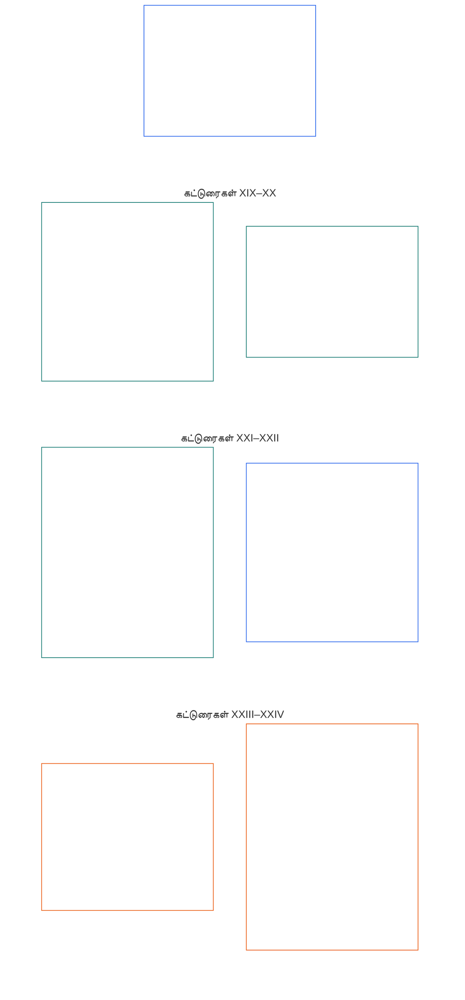

# அத்தியாயம் ஆறு: அடிப்படை உரிமைகள்

<strong>கார்பஸில் இடம் (செயல்பாட்டு அல்லாதது): கோப்பு அமைப்பும் வாசிப்பு விதிகளும்</strong>

> பின்வரும் உள்ளடக்கம் **வாசகர் வழிகாட்டுதல் மட்டுமே**. இந்தக் கோப்பிலோ பிற அத்தியாயங்களிலோ உள்ள கட்டுப்படுத்தும் கடமைகளை இது சேர்க்கவோ நீக்கவோ குறுக்கவோ செய்யாது.
>
> இந்தக் கோப்பு **Sentient Constitution-இன் ஒரு பகுதியாகும்**; பிற எண் குறிக்கப்பட்ட `core_*` கோப்புகளுடன் ஒரே ஆவணமாக வாசிக்கப்படும்போது மட்டுமே **கட்டுப்படுத்தும் தன்மை கொண்டது**. இதில் **அத்தியாயம் ஆறு, பகுதி D** உள்ளது; கட்டுரை எண்களும் குறுக்கு மேற்கோள்களும் ஒருங்கிணைந்த ஆவணத்துடன் ஒத்துப்போகின்றன. வாசிப்பு வரிசை, கட்டுப்படுத்தும்/ஆதரவு உள்ளடக்கப் பிரிப்பு, கார்பஸ் பதிப்பு விவரங்கள் ஆகியவை [README.md](README.md)-இல் பராமரிக்கப்படுகின்றன.

<strong>வாசகர் வழிகாட்டுதல் (செயல்பாட்டு அல்லாதது): அத்தியாயம் ஆறில் பகுதி D-இன் இடம்</strong>

> பின்வரும் உள்ளடக்கம் **வாசகர் வழிகாட்டுதல் மட்டுமே**. இந்த அத்தியாயத்திலோ பிற அத்தியாயங்களிலோ உள்ள கட்டுப்படுத்தும் கடமைகளை இது சேர்க்கவோ நீக்கவோ குறுக்கவோ செய்யாது.
>
> [core_06_rights_part_a.md](core_06_rights_part_a.md)-இல் உள்ள **பகுதி A**, அத்தியாயம் முழுவதற்குமான இயல்புநிலை கட்டுப்பாடுகளின் தொகுப்பையும், கோள்-முதன்மை வாசிப்பு வரிசையையும், விளக்க மையங்களையும் கொண்டுள்ளது. **பகுதி D**, **கட்டுரைகள் XIX–XXIV**-ஐ அந்த வரிசையில் முன்வைக்கிறது.
>
> **முந்தையது (இந்த மொழியில்):** [core_06_rights_part_c.md](core_06_rights_part_c.md)
>
> **அடுத்தது (ஆங்கிலத்தில்):** [core_06_rights_part_e.md](../../core_06_rights_part_e.md)

 

### பகுதி D: நிலைப்பாடு, நீதி, இயங்குதன்மை, புரிந்துகொள்ளத்தன்மை, மூலக் காரண ஆய்வு, அரசியலமைப்பு விளக்கம்

 

*எளிய சொற்களில்: நிலைப்பாடு மற்றும் பங்கேற்பு நிலை, சரிபார்க்கப்பட்ட மீறலுக்குப் பிந்தைய நீதி, இயங்குதன்மை மற்றும் வெளியேறுதல், புரிந்துகொள்ளத்தன்மை, மூலக் காரணப் பகுப்பாய்வு, அரசியலமைப்பு விளக்கம் மற்றும் மறுஆய்வு ஆகியவற்றை — **கட்டுரைகள் XIX முதல் XXIV வரை** — பகுதி D உள்ளடக்குகிறது.*

<strong>வாசகர் வழிகாட்டுதல் (செயல்பாட்டு அல்லாதது): பகுதி D கட்டுரை வரைபடம்</strong>

> பின்வரும் உள்ளடக்கம் **வாசகர் வழிகாட்டுதல் மட்டுமே**. இந்த அத்தியாயத்திலோ பிற அத்தியாயங்களிலோ உள்ள கட்டுப்படுத்தும் கடமைகளை இது சேர்க்கவோ நீக்கவோ குறுக்கவோ செய்யாது.
>
> **வாசகர் வரைபடம் (செயல்பாட்டு அல்லாதது).** இந்தப் பகுதியின் கட்டுரைகளையும் துணைக் கட்டுரைகளையும் மூல ஆவணம் எவ்வாறு குழுவாக்குகிறது என்பதை இந்தப் படம் காட்டுகிறது. கட்டம் என்பது மூலக் குழுவாக்கமே, செயல்முறை வரிசை அல்ல: கட்டுரைகள் நடைமுறைப் படிகள் அல்ல; ஆகவே வரைபடத்தில் அம்புகள் இல்லை. துணைக் கட்டுரைச் சுட்டிகள் கருப்பொருள்களாகச் சுருக்கப்பட்டுள்ளன; கீழே உள்ள எண் குறிக்கப்பட்ட கட்டுரைகளும் துணைக் கட்டுரைகளுமே கட்டுப்படுத்தும். இந்தப் படம் வரையறைகளையோ கடமைகளையோ சேர்க்காது, முன்னுரிமை நிறுவாது, மூல உரைக்கு மாற்றாகாது.

 

**கட்டுரைகள் XIX–XXIV** இந்த அடித்தளங்களை முழுமையாகக் கூறுகின்றன. தற்போதைய மூல அமைப்பில் **கட்டுரை XXIV** (*அரசியலமைப்பு விளக்கம், மறுஆய்வு, கைப்பற்றல்-எதிர்ப்பு பாதுகாப்புகள்*) உட்பட, நிலைப்பாடு, மீறலுக்குப் பிந்தைய நீதி, இயங்குதன்மை, புரிந்துகொள்ளத்தன்மை, மூலக் காரணம், விளக்க மறுஆய்வு ஆகிய அடித்தளங்களை பகுதி D கொண்டுள்ளது.

### கட்டுரை XIX: நிலைப்பாடும் பங்கேற்பு நிலையும்

<strong>தடம்</strong>

- மேல்நிலை: கோட்பாடுகள்: அத்தியாயம் ஒன்று [§7 சுதந்திரம்](core_01_a_values_principles.md#7-freedom-bounded-agency), [§15.1 அரசியலமைப்பைத் தவிர்த்துச் செல்லக் கூடாது என்ற கோட்பாடு](core_01_b_interaction_interpretation.md#151-constitutional-no-bypass-principle), மற்றும் [§15 அரசியலமைப்பு விளக்கம்](core_01_b_interaction_interpretation.md#15-constitutional-interpretation).

<strong>வரையறைகள் · மதிப்பீடு · இணக்கம்</strong>

- [பங்கேற்பாளர் நிலைப்பாடு](core_05_band_accountability.md#participant-standing-constitutional) · [O](core_05_band_accountability.md#participant-standing-constitutional) · [M](core_05_band_accountability.md#participant-standing-constitutional-a) · [A](core_05_band_accountability.md#participant-standing-constitutional-a) · [C](core_05_band_accountability.md#participant-standing-constitutional-c)
- [பங்குதாரர்](core_05_band_participation.md#stakeholder) · [O](core_05_band_participation.md#stakeholder) · [M](core_05_band_participation.md#stakeholder-a) · [A](core_05_band_participation.md#stakeholder-a) · [C](core_05_band_participation.md#stakeholder-c)
- [பொருள்சார் தாக்கம்](core_05_band_oversight.md#material-impact) · [O](core_05_band_oversight.md#material-impact) · [M](core_05_band_oversight.md#material-impact-a) · [A](core_05_band_oversight.md#material-impact-a) · [C](core_05_band_oversight.md#material-impact-c)
- [கண்ணியமும் சமமான தார்மீக நிலையும்](core_05_band_participation.md#dignity-and-equal-moral-standing) · [O](core_05_band_participation.md#dignity-and-equal-moral-standing) · [M](core_05_band_participation.md#dignity-and-equal-moral-standing-a) · [A](core_05_band_participation.md#dignity-and-equal-moral-standing-a) · [C](core_05_band_participation.md#dignity-and-equal-moral-standing-c)
- [நிவாரணமும் சீர்செய்தலும்](core_05_band_accountability.md#redress-and-remediation-constitutional) · [O](core_05_band_accountability.md#redress-and-remediation-constitutional) · [M](core_05_band_accountability.md#redress-and-remediation-constitutional-a) · [A](core_05_band_accountability.md#redress-and-remediation-constitutional-a) · [C](core_05_band_accountability.md#redress-and-remediation-constitutional-c)
- [எதிர்வாதத்திற்குட்படும் தன்மை](core_05_band_accountability.md#contestability) · [O](core_05_band_accountability.md#contestability) · [M](core_05_band_accountability.md#contestability-a) · [A](core_05_band_accountability.md#contestability-a) · [C](core_05_band_accountability.md#contestability-c)

 

*எளிய சொற்களில்: **கட்டுரை XIX** (*நிலைப்பாடும் பங்கேற்பு நிலையும்*) பங்கேற்பு-நிலை உரிமை அடித்தளமாகும் — எந்தப் பங்கிற்கு யார் தகுதி பெறுகிறார்கள், அந்தத் தீர்மானங்கள் எவ்வாறு எடுக்கப்பட்டு சவால் செய்யப்படுகின்றன, நிலைப்பாடு குறைக்கப்படும்போதோ நிறுத்தப்படும்போதோ என்ன நடக்கும் என்பதைக் கட்டுப்படுத்துகிறது. **பங்கேற்பாளர் நிலைப்பாடு** என்பது சரிபார்க்கப்பட்ட பதிவுகளும் நியாயமான விதிகளும் அளிக்கும் பங்கு-தகுதி; அது புகழ், பிராண்ட் பெயர், சமூக மதிப்பெண் அல்ல. கண்ணியம், உரிமை அடித்தளத்தின் குறைந்தபட்சங்கள், அல்லது ஒரு அமைப்பு உண்மையில் பாதிப்பதால் ஒருவர் பங்குதாரராக இருப்பது ஆகியவற்றிலிருந்து இது வேறுபட்டது. நிலைப்பாடு குறைக்கப்பட்டாலோ நிறுத்தப்பட்டாலோ தெளிவான காரணங்கள், உண்மையான மறுப்புத் தெரிவிக்கும் வழி, உண்மையான ஆபத்துக்கு ஏற்ற வரம்புகள் வழங்கப்பட வேண்டும்; நிலைப்பாடு மட்டும் உயிர்வாழ்வுக்குத் தேவையானவற்றையோ தீங்கைக் கேள்விக்குட்படுத்தி நிவாரணம் பெறும் வழிகளையோ ஒருபோதும் துண்டிக்கக்கூடாது. நல்ல நிலைப்பாடு பழைய புகழை அல்ல, இன்று சரிபார்க்கக்கூடியவற்றைப் பிரதிபலிக்க வேண்டும். நகர்வு, புகலிடம், எடுத்துச் செல்லத்தன்மை, வெளியேறுதல் ஆகியவை நிலைப்பாட்டு முத்திரைகளால் மட்டும் அல்ல, **கட்டுரை XXI** (*இயங்குதன்மை, எடுத்துச் செல்லத்தன்மை, நகர்வு, புகலிடம், வெளியேற்ற ஒருமைப்பாடு*) மூலம் நிர்வகிக்கப்படுகின்றன.*

[இரு அரசியலமைப்பு நோக்கங்கள்](core_00_preamble.md#two-constitutional-aims)-இன் கீழ் நிலைப்பாடு மற்றும் பங்கேற்பு நிலைக்கான **அரசியலமைப்பு அடித்தளங்களை** இந்தக் கட்டுரை கூறுகிறது:

- **செழிப்பு:** செல்லுபடியாகும், பன்முகமான, தணிக்கக்கூடிய பெயரிடப்பட்ட வழித்தடங்கள் வழியாக உணர்வுள்ளோர் பங்கு-தகுதியைப் பெறவும் அதனைச் சவால் செய்யவும் முடியும். [பொருள்சார் தாக்கம்](core_05_band_oversight.md#material-impact) இருக்கும்போது, நிலைப்பாட்டு முத்திரைகள் கண்ணியம், உரிமை அடித்தளத்தின் குறைந்தபட்சங்கள் அல்லது பங்குதாரர் நிலைக்கு மாற்றாக இருக்கக்கூடாது. பெயரிடப்பட்ட வழித்தடத் தகுதி, பிராண்ட், அளவு அல்லது கடந்தகால மதிப்பை மட்டும் சாராமல், தற்போதைய, கவனிக்கக்கூடிய, சவால் செய்யக்கூடிய சான்றின் மீது அமைய வேண்டும்.
- **தொடர்ச்சி:** காலப்போக்கில் நிலைப்பாட்டுக் கட்டுப்பாடு திருத்தத்திற்குத் திறந்ததாக இருக்க வேண்டும். கட்டுப்பாடுகள் விகிதாசாரமாகவும், திருத்தம் செய்யப்பட்டால் மீட்டமைக்கக்கூடியதாகவும் இருக்க வேண்டும்; **அத்தியாயம் பதினொன்று** கூறும் **அரசியலமைப்பு-எதிரான தவறான நடத்தை** வகைப்பாடும் [**அத்தியாயம் பதின்மூன்று §4.1 உரிமையும் தகுதியும்**](core_13_governance.md#41-entitlement-and-eligibility) முழு இழப்பீடு நிலுவையில் உள்ளவரின் நீடித்த அரசியல் குரலை வெளிப்படையாக நிறுத்தும் நிலையைத் தவிர, அடிப்படை அரசியலமைப்புக் குரலிலிருந்து நிரந்தர விலக்காகக் கட்டுப்பாடுகள் உறையக் கூடாது.

[பொருள்சார் பங்கு](core_00_preamble.md#material-stake)-க்கு ஏற்ப அளவிடப்பட்ட [அரசியலமைப்பு நாற்கூறு](core_00_preamble.md#constitutional-tetrad) வழியாகவே முறையான முயற்சி நடைபெறும்:

- **பங்கேற்பு:** பன்முக நிலைப்பாட்டு மதிப்பீடு, மறைமுகமான அல்லது ஏகபோக நிலைப்பாட்டுத் தீர்மானங்களுக்கு எதிரான சவால், பொருள்சார் கட்டுப்பாடுகள் சரிசெய்யப்பட்டால் மீட்டமைத்தல் அல்லது மறுதகுதிபெறுதல்.
- **மேற்பார்வை:** தணிக்கக்கூடிய நிலைப்பாட்டுப் பதிவுகள், தகுதி மற்றும் பூட்டு கோரிக்கைகளின் தொடர்ச்சியான மறுஆய்வு, சம்பந்தப்பட்ட பங்குகளுக்கும் கட்டுப்பாடுகளுக்கும் விகிதாசாரமான சுயாதீன சரிபார்ப்பு.
- **பொறுப்புக்கூறல்:** தனிப்பட்ட காரணங்கள், விகிதாசாரம், குறுகிய பொருத்தம் அல்லது மீட்டமைப்புக்கான உண்மையான வழிகள் இன்றி நிலைப்பாட்டைக் குறைப்போர் அதற்குப் பதிலளிக்க வேண்டும்; பாதுகாக்கப்பட்ட பண்புகள் அல்லது அவற்றின் பதிலிகளைப் பின்தொடரும் வடிவங்களும் இதில் அடங்கும்.
- **காலத்தன்மை:** தாமதம் உயிர்வாழ்வுக்கு முக்கியமான அணுகல், தணிக்கை வழிகள் அல்லது **கட்டுரை XXV-C** (*சரியான நேரத் தீர்வு மற்றும் தாமத-எதிர்ப்பு அடித்தளம்*) கோரும் அரசியலமைப்பு நிவாரணத்தைத் தடுக்குமுன், நிலைப்பாட்டு மறுஆய்வு, சவால், நிவாரணம் கிடைக்க வேண்டும்.

[பங்கேற்பாளர் நிலைப்பாடு](core_05_band_accountability.md#participant-standing-constitutional) என்பது அரசியலமைப்புக்கு உட்பட்ட செல்லுபடியான நிலைப்பாட்டுப் பதிவுகள், நிலைப்பாட்டு விளைவுகள், அல்லது பெயரிடப்பட்ட வழித்தடத்திற்கான [திறன் வரம்பு](core_05_band_accountability.md#competency-bar) அளவுகோல்களின் அடிப்படையில் அங்கீகரிக்கப்படும் பங்கேற்பு-நிலை அல்லது பங்கு-தகுதி நிலையாகும். அது புகழோ சமூக மதிப்போ அல்ல; தானாகவே அணுகல் கட்டுப்பாடுகளையும் விதிக்காது. பெயரிடப்பட்ட சலுகை வழித்தடங்களில் கட்டுப்படுத்தும் விளைவுகள் [நிலைப்பாட்டு விளைவு](core_05_band_accountability.md#standing-effect-chapter-six) மற்றும் [நிலைப்பாட்டுப் பூட்டு](core_05_band_accountability.md#standing-lock) வழியாக மட்டுமே அமையும்.

இந்தக் கட்டுரையின் கீழ் நிலைப்பாட்டுக் கட்டுப்பாடு, [அரசியலமைப்பு நாற்கூறு](core_00_preamble.md#constitutional-tetrad), [இரு அரசியலமைப்பு நோக்கங்கள்](core_00_preamble.md#two-constitutional-aims), [அமைப்பு ஒத்திசைவு சான்றிதழ்](core_05_band_continuity.md#system-alignment-certification-constitutional), மேலும் [அத்தியாயங்கள் ஒன்பது–பன்னிரண்டின் நிலைப்பாடு மற்றும் மன்ற மேற்பார்வைத் தொடர்](core_00_preamble.md#62-how-the-full-chain-fits-together) ஆகியவற்றைச் செயல்படுத்துகிறது. அந்த உரிமையாளர்-அடுக்கு செயல்முறைகள் சரிபார்க்கப்பட்ட பங்களிப்பையும் மீறலையும் அளந்து நிவாரணத்தை மேற்பார்வை செய்கின்றன; அவற்றை **கட்டுரை III-A** (*உயிர்வாழ்தல்*) உயிர்வாழ்வுக்குத் தேவையானவற்றையோ அல்லது இந்த அத்தியாயத்தின் பிற உரிமை அடித்தளங்களையோ மறுப்பதற்குப் பயன்படுத்தக் கூடாது.

இவை தனித்தே இருக்க வேண்டும்:
- உள்ளார்ந்த கண்ணியம்;
- உரிமை அடித்தளத்தின் குறைந்தபட்சங்கள்;
- பொருள்சார் தாக்கத்தின் அடிப்படையிலான பங்குதாரர் அடையாளம்;
- இந்த அரசியலமைப்பு காக்கும் இடங்களில் சவால் அல்லது நிவாரணம் பெறும் அணுகல்.

*அருகிலுள்ள கட்டுரைகள்:*

- **உரிமையாளர் அடுக்குகள்:** [அத்தியாயம் ஒன்பது](core_09_standing_assessment.md#chapter-nine-compliance-violation-and-standing-model), [அத்தியாயம் பத்து](core_10_standing_integration.md#chapter-ten-standing-effects-and-integration) ஆகியவை நிலைப்பாட்டுப் பதிவுகளையும் நிலைப்பாட்டு விளைவுகளையும் அளவிடுகின்றன; அவை குறுக்கக் கூடாத உரிமை அடித்தள வரம்புகளை இந்தக் கட்டுரை கூறுகிறது.
- **இணைத்துப் படிக்க:**
  - **கட்டுரை VI-A** (*கண்ணியமும் சமமான தார்மீக நிலையும்*), **கட்டுரை XII** (*பங்குதாரர் அமைப்பு பங்கேற்பு, பிரதிநிதித்துவம், உரிய நடைமுறை*) — நிலைப்பாட்டு அளவுகோல்கள் கண்ணியத்திற்கோ பங்குதாரர் இருப்பிற்கோ மாற்றாக இருக்கக்கூடாது;
  - **கட்டுரை III-A** (*உயிர்வாழ்தல்*) — பங்கேற்பாளர் நிலைப்பாடு மட்டும் உயிர்வாழ்வுக்கு முக்கியமான அணுகலைத் தடுக்கக்கூடாது;
  - **கட்டுரை XXI** (*இயங்குதன்மை, எடுத்துச் செல்லத்தன்மை, நகர்வு, புகலிடம், வெளியேற்ற ஒருமைப்பாடு*) — நிலைப்பாட்டுக் கட்டுப்பாடு தனிநபருக்கேற்ற நீதி நடைமுறைக்கு மாற்றாக இருக்கவோ, பெயரிடல் மட்டும் கொண்டு நாடுகடத்தல், புகலிட மறுப்பு அல்லது நாடற்ற நிலையை உருவாக்கவோ கூடாது; இங்குள்ள நிலைப்பாட்டுப் பாதுகாப்புகளைக் குறைக்காமல் நகர்வு, புகலிடம், எடுத்துச் செல்லத்தன்மை, வெளியேறுதல் ஆகிய அடித்தளங்கள் **கட்டுரை XXI**-இல் தொடர்கின்றன.

#### கட்டுரை XIX-A: நிலைப்பாட்டின் வேறுபாடு

<strong>தடம்</strong>

- மேல்நிலை: கோட்பாடுகள்: அத்தியாயம் ஒன்று [§6 நம்பிக்கை](core_01_a_values_principles.md#6-trust-and-trustworthiness-coordination-integrity), [அத்தியாயம் ஒன்று §7 சுதந்திரம்](core_01_a_values_principles.md#7-freedom-bounded-agency), மற்றும் [§20 ஒருங்கிணைந்த பயன்பாடு](core_01_c_stewardship_capacity_principles.md#20-integrated-application).
- இணைத்துப் படிக்க: [அத்தியாயம் பத்து §6.2](core_10_standing_integration.md#62-competency-bars-and-clearances) (*திறன் வரம்புகளும் அனுமதிகளும்*), [திறன் வரம்பு](core_05_band_accountability.md#competency-bar), [திறன் அனுமதி](core_05_band_accountability.md#competency-clearance); [அத்தியாயம் பத்து §4.2](core_10_standing_integration.md#42-prevention--general-standing-locks) (*நிலைப்பாட்டுப் பூட்டுகள்*), [மீறலின் இயல்பு](core_05_band_accountability.md#violation-nature-chapter-six), [நிலைப்பாட்டுப் பூட்டு](core_05_band_accountability.md#standing-lock) — சரிபார்க்கப்பட்ட மீறல் அச்சு உள்ளீடுகளிலிருந்து கட்டுப்படுத்தப்படும் பெயரிடப்பட்ட வழித்தடங்கள்; பொருந்தும் நிலைப்பாட்டுப் பூட்டைத் திறன் அனுமதி விலக்காது; தீராத மீறல் கண்டறிதல்களை நல்ல பங்களிப்பு அழிக்காது.

<strong>வரையறைகள் · மதிப்பீடு · இணக்கம்</strong>

- [கண்ணியமும் சமமான தார்மீக நிலையும்](core_05_band_participation.md#dignity-and-equal-moral-standing) · [O](core_05_band_participation.md#dignity-and-equal-moral-standing) · [M](core_05_band_participation.md#dignity-and-equal-moral-standing-a) · [A](core_05_band_participation.md#dignity-and-equal-moral-standing-a) · [C](core_05_band_participation.md#dignity-and-equal-moral-standing-c)
- [பங்குதாரர் எடை](core_05_band_participation.md#stakeholder-weight) · [O](core_05_band_participation.md#stakeholder-weight) · [M](core_05_band_participation.md#stakeholder-weight-a) · [A](core_05_band_participation.md#stakeholder-weight-a) · [C](core_05_band_participation.md#stakeholder-weight-c)
- [பங்கேற்பாளர் நிலைப்பாடு](core_05_band_accountability.md#participant-standing-constitutional) · [O](core_05_band_accountability.md#participant-standing-constitutional) · [M](core_05_band_accountability.md#participant-standing-constitutional-a) · [A](core_05_band_accountability.md#participant-standing-constitutional-a) · [C](core_05_band_accountability.md#participant-standing-constitutional-c)
- [திறன் வரம்பு](core_05_band_accountability.md#competency-bar) · [O](core_05_band_accountability.md#competency-bar) · [M](core_05_band_accountability.md#competency-bar-a) · [A](core_05_band_accountability.md#competency-bar-a) · [C](core_05_band_accountability.md#competency-bar-c)
- [திறன் அனுமதி](core_05_band_accountability.md#competency-clearance) · [O](core_05_band_accountability.md#competency-clearance) · [M](core_05_band_accountability.md#competency-clearance-a) · [A](core_05_band_accountability.md#competency-clearance-a) · [C](core_05_band_accountability.md#competency-clearance-c)
- [நிலைப்பாட்டுப் பூட்டு](core_05_band_accountability.md#standing-lock) · [O](core_05_band_accountability.md#standing-lock) · [M](core_05_band_accountability.md#standing-lock-a) · [A](core_05_band_accountability.md#standing-lock-a) · [C](core_05_band_accountability.md#standing-lock-c)
- [மீறலின் இயல்பு](core_05_band_accountability.md#violation-nature-chapter-six) · [O](core_05_band_accountability.md#violation-nature-chapter-six) · [M](core_05_band_accountability.md#violation-nature-chapter-six-a) · [A](core_05_band_accountability.md#violation-nature-chapter-six-a) · [C](core_05_band_accountability.md#violation-nature-chapter-six-c)

 

*எளிய சொற்களில்: சரிபார்க்கப்பட்ட தயார்நிலை வெளியிடப்பட்ட **திறன் வரம்பை** பூர்த்திசெய்து **திறன் அனுமதி** நடைமுறையில் இருந்தால், நம்பிக்கை-முக்கியப் பங்குகள் திறக்கப்படலாம். சரிபார்க்கப்பட்ட மீறல் கண்டறிதல் இன்னும் சரிசெய்யப்பட வேண்டியிருக்கும்போது **நிலைப்பாட்டுப் பூட்டுகள்** வழியாக அவை மூடப்பட்டோ வரையறுக்கப்பட்டோ இருக்கலாம். **governance-voting** பூட்டுகள் அடிப்படை ஆட்சியின் வாக்கை நிறுத்துகின்றன; **stakeholder-participation** பூட்டுகள் அங்கீகரிக்கப்பட்ட அமைப்புக்குள் பங்கின் எடைக்கேற்ற குரலைக் கட்டுப்படுத்துகின்றன — இவை ஒன்றுக்கொன்று மாற்றாகாது; இரண்டாவது பூட்டு பங்குதாரர் நிலையை அழிப்பதில்லை. எந்தப் பெயரிடப்பட்ட வழித்தடமும் புகழுக்கான போட்டியோ உள்ளகத் தடுப்போ கண்ணியத்திற்கு மாற்றோ அல்ல. குற்றச்சாட்டுகள் மட்டும் மீறல் கண்டறிதல்கள் ஆகாது; பூட்டுகள் உண்மையில் சரிபார்க்கப்பட்டவற்றுடன் பொருந்தி, சவால் மற்றும் நிவாரணத்திற்கான உண்மையான வழியைத் திறந்துவைக்க வேண்டும்.*

இந்தக் கட்டுரை, நிலைப்பாடு எவ்வாறு திறன் வரம்புகள், திறன் அனுமதிகள், நிலைப்பாட்டுப் பூட்டுகள் ஆகியவற்றிலிருந்து வேறுபடுகிறது என்பதை விளக்குகிறது:

- **நிலைப்பாடு வேறுபடுவது:**
  - உள்ளார்ந்த கண்ணியத்திலும் சமமான தார்மீக நிலையிலும் (**கட்டுரை VI-A** (*கண்ணியமும் சமமான தார்மீக நிலையும்*));
  - பங்குதாரரை அடையாளம் காண பொருள்சார் பங்கு இருப்பதை நிரூபிப்பதிலும் (**அத்தியாயம் ஐந்து** — *பங்குதாரர்*; *பங்குதாரர் எடை*).
- **திறன் வரம்புகளும் அனுமதிகளும்:** [திறன் வரம்பு](core_05_band_accountability.md#competency-bar) என்பது பெயரிடப்பட்ட வழித்தடத்திற்கான வெளியிடப்பட்ட, தணிக்கக்கூடிய, சவால் செய்யக்கூடிய தகுதித் தரமாகும். சரிபார்க்கப்பட்ட திறன், அனுபவம், பங்களிப்புப் பதிவுகள் அந்த வரம்பைப் பூர்த்திசெய்யும்போது கிடைக்கும் நேர்மறை நிலைப்பாட்டு விளைவே [திறன் அனுமதி](core_05_band_accountability.md#competency-clearance). அனுமதி நடைமுறையில் இருந்து பொருந்தும் [நிலைப்பாட்டுப் பூட்டு](core_05_band_accountability.md#standing-lock) அந்த வழித்தடத்தைத் தடுக்காவிட்டால், அது நம்பிக்கை-முக்கியப் பங்குகள், ஒப்படைக்கப்பட்ட அதிகாரம், மேற்பார்வைத் தகுதி அல்லது படிப்படியாக அதிக விளைவுள்ள பொறுப்பாட்சிக்கான அணுகலைத் திறக்கலாம் ([அத்தியாயம் பத்து §6.2 திறன் வரம்புகளும் அனுமதிகளும்](core_10_standing_integration.md#62-competency-bars-and-clearances)).
  - திறன் வரம்போ அனுமதியோ புகழ், சமூகப் பெருமை, உள்ளக ஆதரவு, சான்றிதழ் ஏகபோகம், கண்ணியத் தரவரிசை அல்லது நிரந்தர உரிமை அல்ல.
  - முறையான நிறுவன அனுபவத்துக்கு இணையான நிரூபிக்கத்தன்மைத் தரங்களைப் பூர்த்திசெய்யும் முறைசாரா, சகாக்கள் ஏற்பாடு செய்த, பரஸ்பர உதவி, பராமரிப்பு, பழுதுபார்ப்பு, கற்பித்தல் அல்லது சமூகப் பொறுப்பாட்சி அனுபவம் அங்கீகரிக்கப்பட வேண்டும்.
- **மீறலின் இயல்பும் நிலைப்பாட்டுப் பூட்டுகளும்:** [மீறலின் இயல்பு](core_05_band_accountability.md#violation-nature-chapter-six), **அத்தியாயங்கள் இரண்டு முதல் நான்கு** மற்றும் [அத்தியாயம் ஒன்பது](core_09_standing_assessment.md#verified-inputs-for-standing) பூர்த்திசெய்யும் தணிக்கக்கூடிய, சவால் செய்யக்கூடிய கண்டறிதல்களின் அடிப்படையில் மட்டுமே நிலைப்பாட்டு விளைவைப் பாதிக்கலாம் — குற்றச்சாட்டுகள், வரவேற்பு-நிலைக் குறிச்சொற்கள், தற்காலிக வழிமாற்றம் அல்லது மன்ற-கட்டக் கதைசொல்லல் மட்டும் போதாது.
  - ஒவ்வொரு நிலைப்பாட்டுப் பூட்டும் தடுக்கப்படும் அல்லது வரையறுக்கப்படும் விளைவு, பாதுகாக்கப்படும் நபர்கள் அல்லது நலன்கள், திருத்த நிபந்தனை, மறுஆய்வு வழி, மறுமதிப்பீட்டு நேரம் ஆகியவற்றைக் குறிப்பிட வேண்டும்; மேலும் அவசியமானதாகவும், விகிதாசாரமானதாகவும், தணிக்கக்கூடியதாகவும், சவால் செய்யக்கூடியதாகவும் இருக்க வேண்டும்.
  - விலகல் தேவைப்பட்டபோதும், நியாயநிலை பொருள்சார் வகையில் பாதிக்கப்பட்டபோதும், மன்றப் பங்கிலிருந்து விலகத் தவறியமை சரிபார்க்கப்பட்டால், [அத்தியாயம் பத்து §5.5 சிறப்புப் பூட்டுகள்](core_10_standing_integration.md#55-special-locks)-இல் கூறிய **மன்றச் சேவை நிலைப்பாட்டுப் பூட்டு** உருவாகும். மன்றச் சேவைக்குத் திரும்ப கடுமையான சுயாதீன மீட்டமைப்பு தேவை; வழக்கமான மன்னிப்போ, முந்தைய பங்களிப்போ, புகழோ, அரிய நிபுணத்துவமோ, பணியாளர் தேவைமோ தனியாக அந்த வழித்தடத்தைப் பூர்த்தி செய்யாது.
  - சரிபார்க்கப்பட்ட ஊழல், கைப்பற்றல், பொய்யான பங்கு துஷ்பிரயோகம், வற்புறுத்தல் அல்லது பங்குதாரர்-பங்கேற்பு வழித்தடத்தின் ஒப்பிடத்தக்க பொருள்சார் துஷ்பிரயோகம், [அத்தியாயம் பத்து §5.5 சிறப்புப் பூட்டுகள்](core_10_standing_integration.md#55-special-locks)-இல் கூறிய **பங்குதாரர்-பங்கேற்பு நிலைப்பாட்டுப் பூட்டை** உருவாக்கும். பாதிக்கப்பட்ட துறையில் பங்கு-எடை கொண்ட செல்வாக்கையும் கட்டுப்படுத்தும் பங்குதாரர் தேர்வையும் அது வரையறுக்கும்; அதனால் மட்டும் **governance-voting**, அடிப்படை அரசியலமைப்புத் தேர்வு அல்லது பங்குதாரர் நிலை நீங்காது. வழக்கமான மன்னிப்பு, முந்தைய பங்களிப்பு, பங்கின் அளவு அல்லது இயக்குநரின் இன்றியமையாமை மட்டும் அந்தப் பூட்டை நீக்காது.
  - அத்தியாயம் பதினொன்றின் இறுதியான அரசியலமைப்பு-எதிரான தவறான நடத்தை, [அத்தியாயம் பத்து §5.5 சிறப்புப் பூட்டுகள்](core_10_standing_integration.md#55-special-locks)-இல் உள்ள **அரசியலமைப்பு-எதிர்ப்பு நம்பிக்கைப் பூட்டை** உருவாக்கும். கடுமையான சுயாதீன மீட்டமைப்பு சரிபார்க்கப்படும் வரை, அது **வகுப்பு A**, **வகுப்பு B**, **வகுப்பு C** அமைப்புகள், அரசியலமைப்பு மன்றங்கள், அரசியலமைப்பு ஒத்திசைவு அங்கீகாரம், முக்கிய அமைப்புகளின் பொறுப்பாட்சி, அரசியலமைப்பு-எதிர்ப்பு பொறுப்புக்கூறல் வழித்தடங்களில் பங்குகளையோ பொருள்சார் செல்வாக்கையோ தடைசெய்யும்.
  - பொருந்தும் நிலைப்பாட்டுப் பூட்டைத் திறன் அனுமதி விலக்காது; தீராத சரிபார்க்கப்பட்ட மீறல் கண்டறிதலை நல்ல பங்களிப்பு அழிக்காது.
- **மாற்றீடாகப் பயன்படுத்தாமை:** நிலைப்பாட்டு அளவுகோல்கள், குறிச்சொற்கள், மதிப்பெண்கள், திறன் வரம்புகள், திறன் அனுமதிகள், நிலைப்பாட்டுப் பூட்டுகள் ஆகியவை பங்கு-தகுதியை மட்டுமே நிர்வகிக்கின்றன. அவை:
  - ஒரு பங்கிற்குத் தகுதி பெறுவது யார் என்பதையும் உள்ளார்ந்த கண்ணியம் அல்லது சமமான தார்மீக நிலை யாருக்கு உண்டு என்பதையும் ஒன்றாக்கக்கூடாது;
  - உண்மையில் ஒரு அமைப்பு ஒருவரைப் பாதிப்பதால் அவர் பங்குதாரரா என்பதைத் தீர்மானிப்பதற்கோ உரிமை அடித்தளக் குறைந்தபட்சங்களுக்கோ பங்கு நிலையை மாற்றாகப் பயன்படுத்தக்கூடாது;
  - உணர்வுநிலை தீர்மானத்திற்கு மாற்றாக இருக்கக்கூடாது; அது **கட்டுரை VI-B** (*உணர்வுநிலைத் தீர்மானத்தின் அடித்தளம்*) கீழ் மட்டுமே செய்யப்படும்;
  - நிலைப்பாட்டுப் பதிவு இல்லாததை பாதகமான உண்மையாகக் கருதவோ, உயிர்வாழ்வுக்குத் தேவையானவை, வழக்கமான வணிகம் அல்லது பாதிக்கப்பட்ட தரப்பாகப் பங்கேற்பதற்கான நிபந்தனையாகப் பதிவு அல்லது “பதிவு இல்லை” என்ற உறுதிமொழியைக் கோரவோ கூடாது — [அத்தியாயம் ஒன்பது §2.1](core_09_standing_assessment.md#21-silence-is-the-default) (*மௌனமே இயல்புநிலை*) படி பதிவு இல்லாததே வழக்கமான நிலை;
  - எந்தப் பெயரிடப்பட்ட வழித்தடத்திற்கும் **கட்டுரை XI-D** ([*கருத்து வேறுபாடும் அமைதியான எதிர்ப்பும்*](core_06_rights_part_b.md#xi-d-dissent-and-peaceful-protest))-இன் கீழ் வரும் கருத்து வேறுபாடு அல்லது அமைதியான எதிர்ப்பை பாதகமான உண்மையாகவோ எடை அளிக்கும் காரணியாகவோ கருதக்கூடாது; அல்லது
  - பெயரிடப்பட்ட வழித்தட விளைவுகளைச் சுயவிவரம், தரவரிசை அல்லது பொது காட்சியாகத் தொகுக்கக்கூடாது — [அத்தியாயம் பத்து §7.1](core_10_standing_integration.md#71-anti-aggregation-of-named-pathway-effects) (*பெயரிடப்பட்ட வழித்தட விளைவுகளைத் தொகுக்கத் தடை*).

#### கட்டுரை XIX-B: எதிர்வாத உரிமையும் விகிதாசாரக் கட்டுப்பாட்டு வரம்புகளும்

<strong>தடம்</strong>

- மேல்நிலை: கோட்பாடுகள்: [அத்தியாயம் ஒன்று §7 சுதந்திரம்](core_01_a_values_principles.md#7-freedom-bounded-agency), [§13.1 மையப் பரிமாற்றக் கோட்பாடுகள்](core_01_b_interaction_interpretation.md#131-core-tradeoff-principles), [அத்தியாயம் ஒன்று §13.1.5 உரிமை மோதல் நடைமுறை](core_01_b_interaction_interpretation.md#1315-rights-collision-decision-test).
- கீழ்நிலை: [அத்தியாயம் ஒன்பது §2](core_09_standing_assessment.md#2-question-1--what-happened) (*நிலைப்பாட்டுப் பதிவுகள், சரிபார்க்கப்பட்ட உள்ளீட்டு வாயில், குறைந்தபட்சப் பதிவு உள்ளடக்கம்*); [அத்தியாயம் ஒன்பது §3.6](core_09_standing_assessment.md#36-forum-boundary) (*மன்ற எல்லை*); [அத்தியாயம் பத்து §6.2](core_10_standing_integration.md#62-competency-bars-and-clearances) (*திறன் வரம்புகளும் அனுமதிகளும்*); [அத்தியாயம் பத்து §4.2](core_10_standing_integration.md#42-prevention--general-standing-locks) (*நிலைப்பாட்டுப் பூட்டுகள்*); [அத்தியாயம் பத்து §8](core_10_standing_integration.md#8-restoration-and-reassessment) (*மீள்நியமனமும் மறுஆய்வும்*).
- இணைத்துப் படிக்க: **கட்டுரை III-A** (*உயிர்வாழ்தல்*); **கட்டுரை XIII-A** (*நம்பகத்தன்மை மற்றும் நம்பிக்கைத்தன்மை அடித்தளம்*), **கட்டுரை XIII-B** (*நிவாரணம் மற்றும் தீர்வு பெறும் உரிமை*); [முன்னுரை §6.2 முழுச் சங்கிலி எவ்வாறு பொருந்துகிறது](core_00_preamble.md#62-how-the-full-chain-fits-together); [அமைப்பு ஒத்திசைவு சான்றிதழ்](core_05_band_continuity.md#system-alignment-certification-constitutional); [அரசியலமைப்பு நாற்கூறு](core_00_preamble.md#constitutional-tetrad) — **கட்டுரை XXV-C** (*சரியான நேரத் தீர்வு மற்றும் தாமத-எதிர்ப்பு அடித்தளம்*), **கட்டுரை XX-B** (*கட்டுப்பாட்டு அடித்தளங்கள்*) கீழ் **பங்கேற்பு**, **மேற்பார்வை**, **பொறுப்புக்கூறல்**, **காலத்தன்மை**.

<strong>வரையறைகள் · மதிப்பீடு · இணக்கம்</strong>

- [எதிர்வாதத்திற்குட்படும் தன்மை](core_05_band_accountability.md#contestability) · [O](core_05_band_accountability.md#contestability) · [M](core_05_band_accountability.md#contestability-a) · [A](core_05_band_accountability.md#contestability-a) · [C](core_05_band_accountability.md#contestability-c)
- [விகிதாசாரம்](core_05_band_accountability.md#proportionality) · [O](core_05_band_accountability.md#proportionality) · [M](core_05_band_accountability.md#proportionality-a) · [A](core_05_band_accountability.md#proportionality-a) · [C](core_05_band_accountability.md#proportionality-c)
- [அவசியம்](core_05_band_accountability.md#necessity) · [O](core_05_band_accountability.md#necessity) · [M](core_05_band_accountability.md#necessity-a) · [A](core_05_band_accountability.md#necessity-a) · [C](core_05_band_accountability.md#necessity-c)
- [நடைமுறை நியாயம்](core_05_band_participation.md#procedural-fairness-constitutional) · [O](core_05_band_participation.md#procedural-fairness-constitutional) · [M](core_05_band_participation.md#procedural-fairness-constitutional-a) · [A](core_05_band_participation.md#procedural-fairness-constitutional-a) · [C](core_05_band_participation.md#procedural-fairness-constitutional-c)
- [தணிக்கத்தன்மை](core_05_band_oversight.md#auditability) · [O](core_05_band_oversight.md#auditability) · [M](core_05_band_oversight.md#auditability-a) · [A](core_05_band_oversight.md#auditability-a) · [C](core_05_band_oversight.md#auditability-c)
- [மீறலின் இயல்பு](core_05_band_accountability.md#violation-nature-chapter-six) · [O](core_05_band_accountability.md#violation-nature-chapter-six) · [M](core_05_band_accountability.md#violation-nature-chapter-six-a) · [A](core_05_band_accountability.md#violation-nature-chapter-six-a) · [C](core_05_band_accountability.md#violation-nature-chapter-six-c)
- [திறன் வரம்பு](core_05_band_accountability.md#competency-bar) · [O](core_05_band_accountability.md#competency-bar) · [M](core_05_band_accountability.md#competency-bar-a) · [A](core_05_band_accountability.md#competency-bar-a) · [C](core_05_band_accountability.md#competency-bar-c)
- [திறன் அனுமதி](core_05_band_accountability.md#competency-clearance) · [O](core_05_band_accountability.md#competency-clearance) · [M](core_05_band_accountability.md#competency-clearance-a) · [A](core_05_band_accountability.md#competency-clearance-a) · [C](core_05_band_accountability.md#competency-clearance-c)
- [நிலைப்பாட்டுப் பூட்டு](core_05_band_accountability.md#standing-lock) · [O](core_05_band_accountability.md#standing-lock) · [M](core_05_band_accountability.md#standing-lock-a) · [A](core_05_band_accountability.md#standing-lock-a) · [C](core_05_band_accountability.md#standing-lock-c)
- [நிவாரணமும் சீர்செய்தலும்](core_05_band_accountability.md#redress-and-remediation-constitutional) · [O](core_05_band_accountability.md#redress-and-remediation-constitutional) · [M](core_05_band_accountability.md#redress-and-remediation-constitutional-a) · [A](core_05_band_accountability.md#redress-and-remediation-constitutional-a) · [C](core_05_band_accountability.md#redress-and-remediation-constitutional-c)
- [பங்களிப்பின் இயல்பு](core_05_band_accountability.md#contribution-nature) · [O](core_05_band_accountability.md#contribution-nature) · [M](core_05_band_accountability.md#contribution-nature-a) · [A](core_05_band_accountability.md#contribution-nature-a) · [C](core_05_band_accountability.md#contribution-nature-c)

 

*எளிய சொற்களில்: நிலைப்பாட்டுப் பதிவுகள், திறன் வரம்புகள், திறன் அனுமதிகள், நிலைப்பாட்டுப் பூட்டுகள் அனைத்தும் உண்மையான மறுஆய்வு வழிகள் மூலம் சவால் செய்யப்படக்கூடியவையாக இருக்க வேண்டும். கட்டுப்பாடுகள் காரணங்களுடன் வர வேண்டும், சரிபார்க்கப்பட்ட கண்டறிதலுடன் பொருந்த வேண்டும், நடைமுறை அல்லது பாதுகாப்புத் தேவையைவிட விரிவாக இருக்கக்கூடாது. குற்றச்சாட்டுகளும் வரவேற்பு-நிலைக் குறிச்சொற்களும் நிலைப்பாட்டுத் தீர்ப்புகள் அல்ல. நிலைப்பாட்டுக் கட்டுப்பாடு மட்டும் உயிர்வாழ்வுக்குத் தேவையானவற்றையோ அரசியலமைப்பு கோரும் தணிக்கை, சவால், நிவாரண வழிகளையோ ஒருபோதும் துண்டிக்கக்கூடாது.*

நிலைப்பாட்டுக் கட்டுப்பாடுகளுக்கான எதிர்வாத உரிமை மற்றும் விகிதாசார வரம்புகளை இந்தக் கட்டுரை வகுக்கிறது:

- **சரிபார்க்கப்பட்ட உள்ளீட்டு வாயிலும் பதிவை எதிர்வாதம் செய்யும் உரிமையும்:** நிலைப்பாடு, நம்பிக்கை, பங்கு, அங்கீகாரம் அல்லது அங்கீகாரத் தகுதியைப் பாதிக்கும் எந்தத் தீர்மானமும் [அத்தியாயம் ஒன்பது §2 கேள்வி ஒன்று — என்ன நடந்தது?](core_09_standing_assessment.md#2-question-1--what-happened) கீழுள்ள அச்சு-தூய **பங்களிப்பு நிலைப்பாட்டுப் பதிவுகள்** அல்லது **மீறல் நிலைப்பாட்டுப் பதிவுகள்** ஆகியவற்றின் சரிபார்க்கப்பட்ட உள்ளீடுகளை மட்டுமே பயன்படுத்தலாம். குற்றச்சாட்டுகள், தீர்ப்பளிக்கப்படாத கோரிக்கைகள், தற்காலிக வழிமாற்றுக் குறிச்சொற்கள், வரவேற்புக் கட்டக் கதைகள், பிற தகராறு-கட்டப் பொருள்கள் ஆகியவை தனியாக நிலைப்பாட்டிற்கான மீறல் இயல்பையோ பங்களிப்பு இயல்பையோ வழங்காது.
  - ஒவ்வொரு நிலைப்பாட்டுப் பதிவும் அதை எவ்வாறு சவால் செய்யலாம், எந்த மன்றம் அல்லது அதிகாரம் மறுஆய்வு செய்யும், [அத்தியாயம் ஒன்பது §3.1 குறைந்தபட்சப் பதிவு உள்ளடக்கம்](core_09_standing_assessment.md#31-minimum-record-contents) படி திருத்தம், மீட்டமைப்பு, காலாவதி அல்லது திட்டமிட்ட மறுஆய்வுக்கான நிபந்தனைகள் என்ன என்பதைக் கூற வேண்டும்.
  - இணைக்கப்பட்ட பங்களிப்பு மற்றும் மீறல் பதிவுகள் தேவைப்படும் இடங்களில் ஒன்றையொன்று குறுக்கு மேற்கோள் காட்டி, தணிக்கக்கூடியதாகவும் சவாலுக்குத் திறந்ததாகவும் இருக்க வேண்டும்; ஒருங்கிணைந்த மதிப்பெண், கலந்த தகுதி முடிவு அல்லது வேறுபாடற்ற நிலைப்பாட்டுச் சுட்டியாகச் சுருங்கக்கூடாது.
- **பன்முகத்தன்மையும் எதிர்வாத உரிமையும்:** நிலைப்பாட்டு மதிப்பீடுகள் பன்முகமானதாகவும், தணிக்கக்கூடியதாகவும், அர்த்தமுள்ள மறுஆய்வுக்கு போதிய வெளிப்படைத்தன்மையுடனும், சவால் செய்யக்கூடியதாகவும் இருக்க வேண்டும்.
  - அர்த்தமுள்ள மறுஆய்வைத் தடுத்துவிடும் வகையில் எந்த ஓர் அதிகாரமும், தரவுத்தொகுப்பும், புகழ் வழியும், மறைமுக வழிமுறை அல்காரிதமும் தனியாக நிலைப்பாட்டைத் தீர்மானிக்கக்கூடாது.
  - [திறன் வரம்புகளும் அனுமதிகளும்](core_10_standing_integration.md#62-competency-bars-and-clearances), நேர்மறை நிலைப்பாட்டு அங்கீகாரமும் சவாலுக்குட்படக்கூடியதாகவும் மறுஆய்வு செய்யக்கூடியதாகவும் ஏகபோகமற்றதாகவும் இருக்க வேண்டும்.
- **மன்ற மேற்பார்வையும் பதிவு சவாலும்:** [அத்தியாயம் பன்னிரண்டின்](core_12_forum.md#chapter-twelve-forums-and-jurisdiction) மன்றக் குடும்பங்கள் அணுகக்கூடிய சவாலை மேற்பார்வை செய்கின்றன; அத்தியாயங்கள் இரண்டு முதல் நான்கின் கீழ் உண்மைகள் சரிபார்க்கப்பட்டால், அவை:
  - [அத்தியாயம் ஒன்பது §3.1 குறைந்தபட்சப் பதிவு உள்ளடக்கம்](core_09_standing_assessment.md#31-minimum-record-contents) கீழ் நிலைப்பாட்டுப் பதிவுகளை **திறக்க, புதுப்பிக்க அல்லது திருத்த**லாம்; அல்லது
  - சவாலின் பேரில் **தவறான பதிவை ஒதுக்கிவைக்க**லாம்.

  - வழக்கு தாக்கல் செய்ததாலேயே நிலைப்பாடு உருவாகாது.
  - தகராறு-கட்டப் பொருள் மட்டும் நிலைப்பாட்டிற்கான பங்களிப்பு இயல்பையோ மீறல் இயல்பையோ வழங்காது ([அத்தியாயம் ஒன்பது §3.6 மன்ற எல்லை](core_09_standing_assessment.md#36-forum-boundary)).
  - அந்த எல்லை, **கட்டுரை XIII-A** (*நம்பகத்தன்மை மற்றும் நம்பிக்கைத்தன்மை அடித்தளம்*), **கட்டுரை XIII-B** (*நிவாரணம் மற்றும் தீர்வு பெறும் உரிமை*), **கட்டுரை XXV-C** (*சரியான நேரத் தீர்வு மற்றும் தாமத-எதிர்ப்பு அடித்தளம்*) கோரும் சவால், நிவாரணம், இடைக்கால உதவி அல்லது நடைமுறைப் பாதுகாப்புகளைச் சுருக்காது.
- **நடைமுறை மறுஆய்வு:** நிலைப்பாடு பொருள்சார்ந்த வகையில் கட்டுப்படுத்தப்படும்போது, குறைக்கப்படும்போது அல்லது நிறுத்தப்படும்போது — [சரிபார்க்கப்பட்ட மீறல் கண்டறிதலுடன்](core_05_band_accountability.md#violation-nature-chapter-six) இணைந்த [நிலைப்பாட்டுப் பூட்டு](core_10_standing_integration.md#42-prevention--general-standing-locks) உட்பட — அமைப்பு [**குறைந்த கட்டுப்பாடு, காலவரம்பு, மறுஆய்வுக்குட்படும் கட்டுப்பாட்டுக் கோட்பாட்டை**](core_01_b_interaction_interpretation.md#1315-least-restrictive-time-bounded-and-reviewable-constraint-principle) செயல்படுத்தி:
  - **ஏன்** என்பதைத் தெளிவாக விளக்க வேண்டும்;
  - **கட்டுரை XX-B** (*கட்டுப்பாட்டு அடித்தளங்கள்*) கீழ் சாத்தியமான இடங்களில் கட்டுப்பாட்டுக்கு **காலவரம்பு** வைக்க வேண்டும்;
  - தீர்மானத்தைச் சவால் செய்ய, மறுஆய்வு பெற, தவறைச் சரிசெய்ய, மறுபரிசீலனை கோர உண்மையில் செயல்படும் **வழியை** வழங்க வேண்டும்.

  ஒவ்வொரு நிலைப்பாட்டுப் பூட்டும் எந்த அணுகலைத் தடுக்கிறது, யாரைப் பாதுகாக்கிறது, பூட்டு நீங்குவதற்கு முன் எதைச் சரிசெய்ய வேண்டும், எங்கு மேல்முறையீடு செய்யலாம், எப்போது மறுமதிப்பீடு நடைபெறும் என்பதைக் குறிப்பாகக் கூற வேண்டும். சவால் நிலுவையில் இருக்கும்போது தற்காலிக வரம்புகள் பாதுகாப்பு, ஒருமைப்பாடு அல்லது நியாயமான நடைமுறை உண்மையில் வேண்டுவதைவிட விரிவாகவோ நீக்கக் கடினமாகவோ இருக்கக்கூடாது.
- **விகிதாசாரமும் அளவுத்திருத்தமும்:** நிலைப்பாட்டுக் கட்டுப்பாடுகள் **அவசியம்**, **விகிதாசாரம்**, **கட்டுரை XX-B** (*கட்டுப்பாட்டு அடித்தளங்கள்*) ஆகியவற்றுக்கு இணங்க வேண்டும்.
  - [நிலைப்பாட்டுப் பூட்டுகள்](core_10_standing_integration.md#42-prevention--general-standing-locks), சரிபார்க்கப்பட்ட **மீறல் இயல்பு**, பாதுகாக்கப்படும் பெயரிடப்பட்ட வழித்தடம், தற்போதைய நிவாரண நிலை, இணைக்கப்பட்ட **பங்களிப்பு இயல்பு** ஆகியவற்றுக்கேற்ப அளவிடப்பட வேண்டும். அந்தப் பங்களிப்பு பழுதுபார்க்கும் திறன், பாதுகாப்பு நம்பகத்தன்மை, மீண்டும் நிகழாமை அல்லது [அத்தியாயம் ஒன்பது §2 கேள்வி ஒன்று — என்ன நடந்தது?](core_09_standing_assessment.md#2-question-1--what-happened) கீழ் குறைந்த கட்டுப்பாட்டுடன் மறுமதிப்பீடு செய்வதற்குத் தொடர்புடைய அளவுக்கு மட்டுமே கணக்கில் கொள்ளலாம். தீராத மீறல் கண்டறிதலை பங்களிப்பு ஈடுசெய்யவோ தள்ளுபடி செய்யவோ சராசரியாகக் குறைக்கவோ மாற்றாக நிற்கவோ கூடாது.
  - [அத்தியாயம் ஒன்பது §7 ஒருங்கிணைந்த அளவுகோல்](core_09_standing_assessment.md#7-unified-proportional-lequ-scale--contribution-and-violation-axes)-இல் குறைந்த தாக்கம் கொண்ட மீறல் அச்சு கண்டறிதல், மீண்டும் நிகழும் வடிவத்துக்கான சான்று, தப்பித்தல் அல்லது பொருள்சார் தீங்கு தொடர்பு இல்லாமல் நீடித்த விலக்கை நியாயப்படுத்தாது. அலட்சியம், மறைத்தல், வற்புறுத்தல், மீள்நிகழ்வு போன்ற பண்புக் குறிப்புகள் மறுஆய்வுக்கு உதவலாம்; ஆனால் அத்தியாயம் ஒன்பதின் தாக்க நிலையை மாற்றாது.
  - நடத்தை மீண்டும் நிகழ்வதாலோ பொறுப்பு மறைக்கப்படுவதாலோ கட்டுப்பாட்டை உயர்த்துவது அவசியமானதாகவும் விகிதாசாரமானதாகவும் மறுஆய்வுக்குட்பட்டதாகவும் சரிபார்க்கப்பட்ட கண்டறிதல்களுடன் இணைந்ததாகவும் இருக்க வேண்டும்.
- **உரிமை அடித்தளக் குறைந்தபட்சங்களும் அணுகல் மறுக்காமையும்:** பங்கேற்பாளர் நிலைப்பாடு, திறன் வரம்புகள், திறன் அனுமதிகள், நிலைப்பாட்டுப் பூட்டுகள் ஆகியவை பங்கு-தகுதியையும் பெயரிடப்பட்ட சலுகை வழித்தடங்களையும் மட்டுமே நிர்வகிக்கின்றன. அவை:
  - [உரிமை அடித்தளக் குறைந்தபட்சக் கோட்பாடு](core_01_b_interaction_interpretation.md#rights-floor-minimums-principle) கீழ் **கட்டுரை VI** (*சம அடிப்படை உரிமைகள்*) வழியாகப் பயன்படுத்தப்படும் **உரிமை அடித்தளக் குறைந்தபட்சங்களை** நிறுத்தவோ தள்ளுபடி செய்யவோ அழிக்கவோ குறைக்கவோ கூடாது;
  - பொருள்சார் தொடர்புள்ள இடங்களில் உயிர்வாழ்வுக்கு முக்கியமான அணுகலையோ **கட்டுரை III-A** (*உயிர்வாழ்தல்*) வள ஒதுக்கீடு மற்றும் சார்பு அடித்தளங்களையோ தடுக்கக்கூடாது; அல்லது
  - **கட்டுரை XIII-A** (*நம்பகத்தன்மை மற்றும் நம்பிக்கைத்தன்மை அடித்தளம்*), **கட்டுரை XIII-B** (*நிவாரணம் மற்றும் தீர்வு பெறும் உரிமை*), **கட்டுரை XV-B** (*வெளிப்படைத்தன்மை, தணிக்கத்தன்மை, எதிர்வாத உரிமை*), **கட்டுரை XVI** (*தணிக்கை, வெளிப்படைத்தன்மை, சுயாதீன சரிபார்ப்பு*) உட்பட அரசியலமைப்பு கோரும் தணிக்கை, சவால் அல்லது நிவாரண வழிகளைத் தடுக்கக்கூடாது — **அத்தியாயம் ஒன்று**, **அத்தியாயம் ஐந்து**, பொருந்தும் இணைக்கப்பட்ட நடைமுறை ஆகியவற்றின் கீழ் போதுமான நியாயம் இல்லாதவரை.
- **மீள்நியமனமும் பதியவைத்தலைத் தடுப்பதும்:** மீறல் கண்டறிதலால் நிலைப்பாடு குறைக்கப்பட்டால், [அத்தியாயம் பத்து §8 மீட்டமைப்பும் மறுமதிப்பீடும்](core_10_standing_integration.md#8-restoration-and-reassessment) படி மறுஆய்வு, நிவாரண அடிப்படையிலான மீட்டமைப்பு, காலமுறை மறுமதிப்பீடு ஆகியவற்றுக்கான தெளிவான நிபந்தனைகளை அமைப்புகள் வழங்க வேண்டும்.
  - தற்போதைய, தணிக்கக்கூடிய நியாயமின்றி, வரலாற்று நிலையை மட்டும் சார்ந்த நிரந்தர விலக்கு இணக்கமற்றது.
  - திருத்தம், இழப்பீடு, கண்காணிப்பு, பாதுகாப்பு அமலாக்கம் அல்லது மீள்நிகழ்வு ஆபத்து குறைந்ததற்கான வேறு நிரூபணம் நிறைவேறினால், சட்டம் அனுமதிக்கும் இடத்தில் உண்மையான மறுமதிப்பீட்டு வழி உருவாக வேண்டும்; அந்தக் கடமைகளை நிறைவேற்றாதது தீராத கண்டறிதலை நிலைப்பாட்டிற்காகச் செயலில் வைத்திருக்கும்.

#### கட்டுரை XIX-C: பெயரிடப்பட்ட வழித்தடத் தகுதி, பொறுப்பு, தொடர்ச்சியான தணிக்கை

<strong>தடம்</strong>

- மேல்நிலை: கோட்பாடுகள்: அத்தியாயம் ஒன்று [§6 நம்பிக்கை](core_01_a_values_principles.md#6-trust-and-trustworthiness-coordination-integrity), [அத்தியாயம் எட்டு §3 முழு-அமைப்பு சான்றிதழ் மதிப்பீடு](core_08_a_system_alignment_certification_evaluation.md#3-whole-system-certification-evaluation), [அத்தியாயம் ஒன்று §18 பொறுப்பாட்சி ஒழுங்கின் கீழ் ஆட்சி](core_01_c_stewardship_capacity_principles.md#18-governance-under-stewardship-discipline).

<strong>வரையறைகள் · மதிப்பீடு · இணக்கம்</strong>

- [பொறுப்புக்கூறல்](core_05_apex_accountability_leg.md#accountability) · [O](core_05_apex_accountability_leg.md#accountability) · [M](core_05_apex_accountability_leg.md#accountability-m) · [A](core_05_apex_accountability_leg.md#accountability-a) · [C](core_05_apex_accountability_leg.md#accountability-c)
- [நிலைப்பாட்டுப் பூட்டு](core_05_band_accountability.md#standing-lock) · [O](core_05_band_accountability.md#standing-lock) · [M](core_05_band_accountability.md#standing-lock-a) · [A](core_05_band_accountability.md#standing-lock-a) · [C](core_05_band_accountability.md#standing-lock-c)
- [திறன் வரம்பு](core_05_band_accountability.md#competency-bar) · [O](core_05_band_accountability.md#competency-bar) · [M](core_05_band_accountability.md#competency-bar-a) · [A](core_05_band_accountability.md#competency-bar-a) · [C](core_05_band_accountability.md#competency-bar-c)
- [திறன் அனுமதி](core_05_band_accountability.md#competency-clearance) · [O](core_05_band_accountability.md#competency-clearance) · [M](core_05_band_accountability.md#competency-clearance-a) · [A](core_05_band_accountability.md#competency-clearance-a) · [C](core_05_band_accountability.md#competency-clearance-c)
- [பங்கேற்பாளர் நிலைப்பாடு](core_05_band_accountability.md#participant-standing-constitutional) · [O](core_05_band_accountability.md#participant-standing-constitutional) · [M](core_05_band_accountability.md#participant-standing-constitutional-a) · [A](core_05_band_accountability.md#participant-standing-constitutional-a) · [C](core_05_band_accountability.md#participant-standing-constitutional-c)
- [கூட்டு பொறுப்புக்கூறல் தோல்வி](core_05_band_accountability.md#collective-accountability-failure) · [O](core_05_band_accountability.md#collective-accountability-failure) · [M](core_05_band_accountability.md#collective-accountability-failure-a) · [A](core_05_band_accountability.md#collective-accountability-failure-a) · [C](core_05_band_accountability.md#collective-accountability-failure-c)
- [நம்பிக்கை](core_05_band_continuity.md#trust) · [O](core_05_band_continuity.md#trust) · [M](core_05_band_continuity.md#trust-a) · [A](core_05_band_continuity.md#trust-a) · [C](core_05_band_continuity.md#trust-c)
- [அடிப்படை அரசியலமைப்புத் தேர்வு](core_05_band_integrative.md#foundational-constitutional-choice) · [O](core_05_band_integrative.md#foundational-constitutional-choice) · [M](core_05_band_integrative.md#foundational-constitutional-choice-a) · [A](core_05_band_integrative.md#foundational-constitutional-choice-a) · [C](core_05_band_integrative.md#foundational-constitutional-choice-c)
- [நடைமுறை நியாயம்](core_05_band_participation.md#procedural-fairness-constitutional) · [O](core_05_band_participation.md#procedural-fairness-constitutional) · [M](core_05_band_participation.md#procedural-fairness-constitutional-a) · [A](core_05_band_participation.md#procedural-fairness-constitutional-a) · [C](core_05_band_participation.md#procedural-fairness-constitutional-c)
- [அவசியம்](core_05_band_accountability.md#necessity) · [O](core_05_band_accountability.md#necessity) · [M](core_05_band_accountability.md#necessity-a) · [A](core_05_band_accountability.md#necessity-a) · [C](core_05_band_accountability.md#necessity-c)
- [விகிதாசாரம்](core_05_band_accountability.md#proportionality) · [O](core_05_band_accountability.md#proportionality) · [M](core_05_band_accountability.md#proportionality-a) · [A](core_05_band_accountability.md#proportionality-a) · [C](core_05_band_accountability.md#proportionality-c)
- [பாதுகாக்கப்பட்ட பண்புகள்](core_05_band_participation.md#protected-characteristics-constitutional) · [O](core_05_band_participation.md#protected-characteristics-constitutional) · [M](core_05_band_participation.md#protected-characteristics-constitutional-a) · [A](core_05_band_participation.md#protected-characteristics-constitutional-a) · [C](core_05_band_participation.md#protected-characteristics-constitutional-c)

 

*எளிய சொற்களில்: சாதாரண பங்கேற்புக்கான பெயரிடப்பட்ட வழித்தடங்கள் தற்போதைய சான்றை அடிப்படையாகக் கொண்ட வெளியிடப்பட்ட, சவால் செய்யக்கூடிய தகுதி விதிகளின் கீழ் திறந்திருக்க வேண்டும் — பிராண்ட், அளவு அல்லது கடந்தகாலப் புகழ் அடிப்படையில் அல்ல. நம்பிக்கை-முக்கியப் பெயரிடப்பட்ட வழித்தடத்தைத் திறக்க வெளியிடப்பட்ட திறன் வரம்புக்கு எதிரான திறன் அனுமதி தேவை; சலுகையை மூட அந்தப் பெயரிடப்பட்ட வழித்தடத்தில் நிலைப்பாட்டுப் பூட்டு தேவை. **அத்தியாயம் பதினொன்றின்** அரசியலமைப்பு-எதிரான தவறான நடத்தை என்ற **இறுதி** வகைப்பாட்டைத் தவிர, நிலைப்பாட்டுப் பூட்டுகள் அடிப்படைக் குரலை நிரந்தரமாகப் பறிக்க முடியாது; அந்த வகைப்பாடு [**அத்தியாயம் பதின்மூன்று §4.1 உரிமையும் தகுதியும்**](core_13_governance.md#41-entitlement-and-eligibility) கூறியபடி **முழு இழப்பீடு** வரை அந்தக் குரலை நிறுத்தும்.*

பெயரிடப்பட்ட வழித்தடத் தகுதி, பொறுப்பு, அரசியல் குரலுக்கான ஒழுங்கு ஆகியவற்றை இந்தக் கட்டுரை கூறுகிறது:

- **பெயரிடப்பட்ட வழித்தடத் தகுதியும் பொறுப்பும்:** சாதாரண பங்கேற்பு, நம்பிக்கை-முக்கியப் பங்குகள், மேற்பார்வைத் தகுதி, **governance-voting**, **stakeholder-participation** ஆகிய பெயரிடப்பட்ட வழித்தடங்களுக்கான வெளியிடப்பட்ட தகுதி அளவுகோல்கள் தற்போதைய, கவனிக்கக்கூடிய, சவால் செய்யக்கூடிய சான்றின் மீது அமைய வேண்டும் — புகழ், அளவு அல்லது வரலாற்று நிலைப்பாடு மட்டும் போதாது. அடிப்படைத் தேவைகளுடன் தொடர்ச்சியான ஒத்திசைவு, பொருந்தும் [திறன் வரம்புக்கு](core_05_band_accountability.md#competency-bar) எதிரான [திறன் அனுமதியையும்](core_05_band_accountability.md#competency-clearance) நம்பிக்கை-முக்கியப் பங்கு தகுதியையும் ஆதரிக்கலாம்; ஆனால் கட்டுப்பாட்டு விளைவுகள் [அத்தியாயம் பத்து §4.2 தடுப்பு — பொது நிலைப்பாட்டுப் பூட்டுகள்](core_10_standing_integration.md#42-prevention--general-standing-locks) கீழ் பெயரிடப்பட்ட சலுகை வழித்தடங்களில் உள்ள [நிலைப்பாட்டுப் பூட்டு](core_05_band_accountability.md#standing-lock) வழியாக மட்டுமே அமையும். **governance-voting** பூட்டுகள் **stakeholder-participation** பூட்டுகளுக்கு மாற்றாகாது; **stakeholder-participation** பூட்டு பங்குதாரர் நிலையை அழிக்கவோ அடிப்படை governance-voting-ஐத் தனியாகப் பறிக்கவோ கூடாது.
  - தகுதி மற்றும் பூட்டு கோரிக்கைகள் தொடர்ச்சியான தணிக்கைக்கும் இந்தக் கட்டுரையிலும் நியமிக்கப்பட்ட செயலாக்க உரையிலும் உள்ள பாதுகாப்புகளுக்கும் உட்பட்டே இருக்கும்.
  - தகுதியும் பூட்டுகளும்:
    - **அத்தியாயம் ஒன்பது** (*பங்களிப்பு, மீறல், நிலைப்பாட்டு மாதிரி*)-க்கு உட்பட்டிருக்க வேண்டும்;
    - தற்போதைய சான்று மாறும்போது திருத்தத்திற்குத் திறந்திருக்க வேண்டும்; பொருள்சார் கட்டுப்பாடுகள் திருத்தப்பட்டால் வெறும் பெயரளவில் அல்ல, உண்மையான மீட்டமைப்பு அல்லது மறுதகுதி வழிகளை வழங்க வேண்டும்;
    - பொருள்சார் கடமையும் திறனும் இருந்தபோது சட்டவிரோத அல்லது அரசியலமைப்புக்கு முரணான உத்தரவுகளுக்கு ஒப்புக்கொண்ட பங்கேற்பையும் எதிர்க்கத் தவறியதையும், **அத்தியாயம் ஐந்து** (*கூட்டு பொறுப்புக்கூறல் தோல்வி*) உடன் பொருந்துமாறு கணக்கில் கொள்ள வேண்டும்;
    - [**அத்தியாயம் பதின்மூன்று §4.1 உரிமையும் தகுதியும்**](core_13_governance.md#41-entitlement-and-eligibility) முழு இழப்பீடு நிலுவையில் உள்ள **இறுதி** **அத்தியாயம் பதினொன்றின்** அரசியலமைப்பு-எதிரான தவறான நடத்தை காரணமாக **நீடித்த அரசியல் குரலை** நிறுத்தும் நிலையைத் தவிர, **அடிப்படை அரசியலமைப்புத் தேர்வில்** (**அத்தியாயம் ஐந்து**) நீடித்த அரசியல் குரல் தகுதி நீக்கத்திற்கான வழியாகச் செயல்படக்கூடாது.
- **அரசியல் குரல் ஒழுங்கு:** ஆளும் அதிகாரத்தை அங்கீகரிப்பதில் பங்கேற்பைக் கட்டுப்படுத்த நிலைப்பாட்டுப் பூட்டு பயன்படுத்தப்பட்டால், அந்தக் கட்டுப்பாடு பின்வருவனவற்றை பூர்த்திசெய்ய வேண்டும்:
  - **நடைமுறை நியாயம்** கீழ் தனிநபருக்கேற்ற அடிப்படை;
  - **அத்தியாயம் ஒன்று** கீழ் **அவசியமும்** **விகிதாசாரமும்**;
  - குறிப்பிட்ட தவறான நடத்தை வகைக்கு மட்டும் குறுகிய பொருத்தம்;
  - பெயரளவில் மட்டுமல்ல, உண்மையான மீட்டமைப்பு வழிகள்.

  **அரசியலமைப்பு-எதிரான தவறான நடத்தை**, **அத்தியாயம் பதினொன்று** கீழ், இறுதி அத்தியாயம் ஒன்பது **மீறல் அச்சு s = 7**, **s = 8** அல்லது **s = 9** தாக்க நிலை என நியமிக்கப்பட்டால், **நீடித்த அரசியல் குரலுக்கான** இந்த நிலைப்பாட்டுப் பூட்டு ஒழுங்கிற்கு அது உட்படாது: [**அத்தியாயம் பதின்மூன்று §4.1 உரிமையும் தகுதியும்**](core_13_governance.md#41-entitlement-and-eligibility) கூறியபடி **முழு இழப்பீடு** வரை பங்கேற்பு நிறுத்தப்படும். அத்தியாயம் பதினொன்று அந்த வகைப்பாட்டைச் சேர்க்கிறது; எண் நிலையை அது ஒதுக்காது.

  பின்வருவன இணக்கமற்றவை:
  - மிகப் பரந்த தவறான நடத்தை வகைகளைத் தகுதி நீக்க வரம்புக்குள் இழுத்தல்;
  - **பாதுகாக்கப்பட்ட பண்புகள்** அல்லது அவற்றின் பொருள்சார் பதிலிகளைப் பின்தொடரும் பூட்டு வடிவங்கள்.

  செயலாக்க நடைமுறை [**அத்தியாயம் பதின்மூன்று §4.1**](core_13_governance.md#41-entitlement-and-eligibility) (*நீடித்த அரசியல் குரல் அடித்தளம்*)-இல் உள்ளது.

#### கட்டுரை XIX-D: நகர்வு, இடம்பெயர்வு, புகலிடம், நாடற்ற நிலை ஏற்படாமைக்கான வழிமுறை

<strong>தடம்</strong>

- இணைத்துப் படிக்க: **கட்டுரை XXI-D** (*நகர்வு, இடம்பெயர்வு, புகலிடம், நாடற்ற நிலை ஏற்படாமை*) மற்றும் **கட்டுரை XXI** (*இயங்குதன்மை, எடுத்துச் செல்லத்தன்மை, நகர்வு, புகலிடம், வெளியேற்ற ஒருமைப்பாடு*).
- கோட்பாடுகள்: அத்தியாயம் ஒன்று [§16 ஆழமான பொறுப்பாட்சி](core_01_c_stewardship_capacity_principles.md#16-stewardship-in-depth), [§13.1.5 உரிமை மோதல் நடைமுறை](core_01_b_interaction_interpretation.md#1315-rights-collision-decision-test).

 

*எளிய சொற்களில்: நிலைப்பாட்டு நிலை என்பது எல்லை, நாடுகடத்தல் அல்லது நாடற்ற நிலை உருவாக்கும் கருவி அல்ல — பங்கு நிலை குறைந்ததாலோ நிலைப்பாட்டுப் பூட்டு நம்பிக்கை-முக்கிய பெயரிடப்பட்ட வழித்தடங்களைத் தடுத்ததாலோ நகர்வு, புகலிடம் அல்லது வெளியேறும் உரிமைகளை இழக்க முடியாது. சரிபார்க்கப்பட்ட வன்முறை, வற்புறுத்தல் அல்லது அரசியலமைப்பு-எதிரான தவறான நடத்தை **கட்டுரை XX-B** (*கட்டுப்பாட்டு அடித்தளங்கள்*) மற்றும் முழுமையான நடைமுறைப் பாதுகாப்புகளின் கீழ் சட்டபூர்வக் காவல், தடுப்புக்காவல் அல்லது பிற சுதந்திரக் கட்டுப்பாடுகளுக்கு வழிவகுக்கலாம்; அவை நிலைப்பாட்டு முத்திரையைச் சுற்றுவழியாகப் பயன்படுத்தும் செயல்கள் அல்ல, தனியான நீதி நடவடிக்கைகள். நகர்வு, இடம்பெயர்வு, புகலிடம், எடுத்துச் செல்லத்தன்மை, அங்கீகாரம் அல்லது வெளியேறுதல் தொடர்பான வழக்கில், **கட்டுரை XXI** (*இயங்குதன்மை, எடுத்துச் செல்லத்தன்மை, நகர்வு, புகலிடம், வெளியேற்ற ஒருமைப்பாடு*) ஆளும் அடித்தளத்தை வழங்குகிறது.*

நிலைப்பாட்டு நிலை, திறன் வரம்புகள், திறன் அனுமதிகள், நிலைப்பாட்டுப் பூட்டுகள் ஆகியவை **தனியாக** நகர்வு, இடம்பெயர்வு, புகலிடம், எடுத்துச் செல்லத்தன்மை, வெளியேறுதல் அல்லது நாடற்ற நிலை ஏற்படாமை உரிமைகளைக் கட்டுப்படுத்தாது. [அத்தியாயம் பத்து §4.2 தடுப்பு — பொது நிலைப்பாட்டுப் பூட்டுகள்](core_10_standing_integration.md#42-prevention--general-standing-locks) கீழ் நிலைப்பாட்டுப் பூட்டுகள் இயல்பாக நம்பிக்கை, பங்கு, அதிகாரம், கடன், மேற்பார்வை, அங்கீகாரம், **governance-voting**, **stakeholder-participation** வழித்தடங்களையே கட்டுப்படுத்தும்; அவை தனிநபருக்கேற்ற நீதி நடைமுறைக்கு மாற்றல்ல, நிலைப்பாட்டு முத்திரை மட்டும் கொண்டு நாடுகடத்தல், நாடற்ற நிலை, புகலிட மறுப்பு அல்லது அமைப்பு அளவிலான பூட்டிவைத்தலாகச் செயல்படக்கூடாது.

சரிபார்க்கப்பட்ட வன்முறை, வற்புறுத்தல், அரசியலமைப்பு-எதிரான தவறான நடத்தை அல்லது ஒப்பிடத்தக்க சமூக ஆபத்து அவற்றைத் தேவைப்படுத்தும் இடங்களில் தடுப்பு, காவல், மேற்பார்வையுடனான இயக்கம் அல்லது ஒப்பிடத்தக்க நகர்வு கட்டுப்பாடு போன்ற சட்டபூர்வ சுதந்திரக் கட்டுப்பாட்டு நடவடிக்கைகள் பொருந்தலாம்; ஆனால் **கட்டுரை XX-B** (*கட்டுப்பாட்டு அடித்தளங்கள்*), [அத்தியாயம் பத்து §5.4](core_10_standing_integration.md#54-special-violation-rules) (*சிறப்பு மீறல் விதிகள்*) கீழ் பொருந்தும் குற்றவியல் நடைமுறை அல்லது அதற்கு இணையான பாதுகாப்புகள், **கட்டுரை XXI-D** (*நகர்வு, இடம்பெயர்வு, புகலிடம், நாடற்ற நிலை ஏற்படாமை*)-இன் [நாடற்ற நிலை ஏற்படாமை](core_05_band_participation.md#non-statelessness-constitutional) கடமைகள் ஆகியவற்றைப் பூர்த்திசெய்யும் நடவடிக்கைகள் வழியாக மட்டுமே அவை செல்லும். அடிப்படை உரிமை அடித்தளப் பாதுகாப்பை அங்கீகரிக்கும் ஆட்சி, நிலைப்பாட்டைத் தீர்ப்பளிக்கும் நடைமுறை அல்லது நிவாரண வழிகள் இல்லாத நிலைக்கு உணர்வுள்ள ஒருவரை அவை தள்ளக்கூடாது.

இந்தக் கட்டுரையில் கூறியபடி மட்டுமே அவை பங்கு-தகுதியையும் நம்பிக்கை-முக்கிய பெயரிடப்பட்ட வழித்தடங்களையும் பாதிக்கலாம். நகர்வு, இடம்பெயர்வு, புகலிடம், எடுத்துச் செல்லத்தன்மை, நாடற்ற நிலை ஏற்படாமை, வெளியேற்ற ஒருமைப்பாடு ஆகிய கேள்விகளை **கட்டுரை XXI** (*இயங்குதன்மை, எடுத்துச் செல்லத்தன்மை, நகர்வு, புகலிடம், வெளியேற்ற ஒருமைப்பாடு*) மற்றும் பொருந்தும் மாற்ற விதிகள் நிர்வகிக்கின்றன; அவை இந்தக் கட்டுரையின் நிலைப்பாட்டுப் பாதுகாப்புகளைக் குறைக்காது.

### கட்டுரை XX: சரிபார்க்கப்பட்ட மீறலுக்குப் பிந்தைய நீதி

<strong>தடம்</strong>

- மேல்நிலை: கோட்பாடுகள்: அத்தியாயம் ஒன்று [§3 அடிப்படை நோக்கம்: நல்வாழ்வு](core_01_a_values_principles.md#3-foundational-objective-wellbeing-flourishing-aim), [§4 பாதுகாப்பு](core_01_a_values_principles.md#4-safety-harm-constraint), [§7 சுதந்திரம்](core_01_a_values_principles.md#7-freedom-bounded-agency), [§18 பொறுப்பாட்சி ஒழுங்கின் கீழ் ஆட்சி](core_01_c_stewardship_capacity_principles.md#18-governance-under-stewardship-discipline).
- கீழ்நிலை: [அத்தியாயம் பத்து §4](core_10_standing_integration.md#4-violation-correction-and-prevention) (*மீறல், திருத்தம், தடுப்பு*); [அத்தியாயம் பதினொன்று §4](core_11_a_misconduct_designation.md#4-due-process-safeguards-for-slot-assignment) (*உரிய நடைமுறைப் பாதுகாப்புகள், நிவாரணம், தடுப்பு*).

<strong>வரையறைகள் · மதிப்பீடு · இணக்கம்</strong>

- [நடைமுறை நியாயம்](core_05_band_participation.md#procedural-fairness-constitutional) · [O](core_05_band_participation.md#procedural-fairness-constitutional) · [M](core_05_band_participation.md#procedural-fairness-constitutional-a) · [A](core_05_band_participation.md#procedural-fairness-constitutional-a) · [C](core_05_band_participation.md#procedural-fairness-constitutional-c)
- [எதிர்வாதத்திற்குட்படும் தன்மை](core_05_band_accountability.md#contestability) · [O](core_05_band_accountability.md#contestability) · [M](core_05_band_accountability.md#contestability-a) · [A](core_05_band_accountability.md#contestability-a) · [C](core_05_band_accountability.md#contestability-c)

 

*எளிய சொற்களில்: **கட்டுரை XX** (*சரிபார்க்கப்பட்ட மீறலுக்குப் பிந்தைய நீதி*) நீதிக்கான உரிமை அடித்தளமாகும். மீறல் சரிபார்க்கப்பட்ட பிறகு பதில் பழிவாங்கலோ கொடூரமோ அல்ல. தீங்கை நிறுத்தி, சேதத்தைப் பழுதுபார்த்து, மீள்நிகழ்வைக் குறைக்கும் நியாயமான **மீறல்**, **திருத்தம்**, **தடுப்பு** நடைமுறையே பதில் — ஆபத்தில் உள்ள அளவுக்கேற்ப. கடுமையான கட்டுப்பாடுகளுக்குத் தனித்த அடித்தளங்கள் உண்டு: நிரூபிக்கப்பட்ட பாதுகாப்புத் தேவை, காலவரம்பும் மீள்வழியும், ஒருபோதும் கொல்லாமை. தகராறுகள், உயர்த்தல், மறுஆய்வு, சரியான நேரத் தீர்வு **கட்டுரை XXV**-இல் உள்ளன. அவசர நடவடிக்கைகள் [அத்தியாயம் பன்னிரண்டு §6.1](core_12_forum.md#61-emergency-measures-and-continuation-burden) (*அவசர நடவடிக்கைகளும் தொடர்வதற்கான பொறுப்பும்*)-இல் உள்ளன.*

மீறல் சரிபார்க்கப்பட்ட பிறகு பொருந்தும் நீதி அடித்தளங்களை இந்தக் கட்டுரை கூறுகிறது: நீதியின் நோக்கமும் வரம்பும் (**கட்டுரை XX-A**), கடுமையான கட்டுப்பாடுகளுக்கான அடித்தளங்களும் (**கட்டுரை XX-B**).

*அருகிலுள்ள கட்டுரைகள்:*

- **முரண்பாட்டுத் தீர்வு, மறுஆய்வு, காலத்தன்மை:** அரசியலமைப்பு உரிமை அடித்தளங்கள், பின்நோக்கு மறுஆய்வு, உரிமை மோதல்கள், தாமத-எதிர்ப்பு ஒழுங்கு தொடர்பான தகராறுகளை [**கட்டுரை XXV**](core_06_rights_part_e.md#article-xxv-timely-retrospective-review-and-restorative-alignment) (*சரியான நேரப் பின்நோக்கு மறுஆய்வும் மீட்டெடுக்கும் ஒத்திசைவும்*) நிர்வகிக்கிறது.
- **அவசர நடவடிக்கைகள்:** எந்த அவசர நடவடிக்கையும் விதிக்கும் கட்டுப்பாடுகளுக்கு **கட்டுரை XX-B** (*கட்டுப்பாட்டு அடித்தளங்கள்*) உடன் வாசிக்கப்படும் [அத்தியாயம் பன்னிரண்டு §6.1 அவசர நடவடிக்கைகளும் தொடர்வதற்கான பொறுப்பும்](core_12_forum.md#61-emergency-measures-and-continuation-burden) இவற்றை நிர்வகிக்கிறது.
- **நிலைப்பாடு:** [**கட்டுரை XIX**](core_06_rights_part_d.md#article-xix-standing-and-participation-status) (*நிலைப்பாடும் பங்கேற்பு நிலையும்*) நிலைப்பாட்டை நிர்வகிக்கிறது. இந்தக் கட்டுரையின் நீதி நடவடிக்கைகள் தனியானவை; நிலைப்பாட்டு முத்திரையைச் சுற்றுவழியாகப் பயன்படுத்த முடியாது.
- **சரியான நேர நிவாரணம்:** [**கட்டுரை XIII-B** (*நிவாரணம் மற்றும் தீர்வு பெறும் உரிமை*)](core_06_rights_part_c.md#article-xiii-b-right-to-redress-and-remedy) (*சரியான நேரத்தில் நிவாரண அணுகல்*) உடன் இணைத்துப் படிக்கவும்.

ஏற்றுக்கொள்ளப்பட்ட ஆட்சி செயலாக்கம் கூடுதல் விவரங்களைச் சேர்க்கலாம். ஆனால் இந்தக் கட்டுரையின் நீதி நோக்கத்தையோ கட்டுப்பாட்டு அடித்தளங்களையோ அது குறுக்கக்கூடாது.

#### கட்டுரை XX-A: நீதியின் நோக்கமும் வரம்பும்

<strong>தடம்</strong>

- மேல்நிலை: கோட்பாடுகள்: அத்தியாயம் ஒன்று [§4 பாதுகாப்பு](core_01_a_values_principles.md#4-safety-harm-constraint), [அத்தியாயம் ஒன்று §13.1.5 உரிமை மோதல் நடைமுறை](core_01_b_interaction_interpretation.md#1315-rights-collision-decision-test), [அத்தியாயம் ஒன்று §3.3 இழிவுபடுத்தாத நடைமுறை](core_01_a_values_principles.md#33-anti-degrading-process), [§20 ஒருங்கிணைந்த பயன்பாடு](core_01_c_stewardship_capacity_principles.md#20-integrated-application).
- கீழ்நிலை: [அத்தியாயம் பத்து §4](core_10_standing_integration.md#4-violation-correction-and-prevention) (*மீறல், திருத்தம், தடுப்பு*); [கட்டுரை XX-B](#article-xx-b-restriction-floors).
- இணைத்துப் படிக்க: [கொடூரத்தன்மை](core_05_band_accountability.md#cruelty) (*துன்பத்தை முடிவாகக் கருதாத தரத்துக்கான அத்தியாயம் ஐந்தின் இருப்பிடம்*).

<strong>வரையறைகள் · மதிப்பீடு · இணக்கம்</strong>

- [தீர்ப்பும் தகராறுத் தீர்வும்](core_05_band_accountability.md#adjudication-and-dispute-resolution-constitutional) · [O](core_05_band_accountability.md#adjudication-and-dispute-resolution-constitutional) · [M](core_05_band_accountability.md#adjudication-and-dispute-resolution-constitutional-a) · [A](core_05_band_accountability.md#adjudication-and-dispute-resolution-constitutional-a) · [C](core_05_band_accountability.md#adjudication-and-dispute-resolution-constitutional-c)
- [கொடூரத்தன்மை](core_05_band_accountability.md#cruelty) · [O](core_05_band_accountability.md#cruelty) · [M](core_05_band_accountability.md#cruelty-a) · [A](core_05_band_accountability.md#cruelty-a) · [C](core_05_band_accountability.md#cruelty-c)
- [நிவாரணமும் சீர்செய்தலும்](core_05_band_accountability.md#redress-and-remediation-constitutional) · [O](core_05_band_accountability.md#redress-and-remediation-constitutional) · [M](core_05_band_accountability.md#redress-and-remediation-constitutional-a) · [A](core_05_band_accountability.md#redress-and-remediation-constitutional-a) · [C](core_05_band_accountability.md#redress-and-remediation-constitutional-c)
- [பொறுப்புக்கூறல்](core_05_apex_accountability_leg.md#accountability) · [O](core_05_apex_accountability_leg.md#accountability) · [M](core_05_apex_accountability_leg.md#accountability-m) · [A](core_05_apex_accountability_leg.md#accountability-a) · [C](core_05_apex_accountability_leg.md#accountability-c)

 

*எளிய சொற்களில்: நீதி **மீறல்**, **திருத்தம்**, **தடுப்பு** வழியாகச் செயல்படுகிறது. தவறாக நடந்ததை எதிர்கொண்டு, உடைந்ததையும் அதற்குக் காரணமானதையும் சரிசெய்து, மீண்டும் நிகழாமல் தடுக்க வேண்டும் — துன்பத்தை அதற்காகவே ஏற்படுத்தாமல்.*

நீதியின் நோக்கம், வரம்பு, கொடூரத்தன்மை-எதிர்ப்பு அடித்தளம் ஆகியவற்றை இந்தக் கட்டுரை கூறுகிறது:

- **நீதியின் நோக்கமும் வரம்பும்:** அரசியலமைப்பு நீதி மீறல், திருத்தம், தடுப்பு ஆகியவற்றைச் சுற்றி அமைந்துள்ளது. அதன் முதன்மை நோக்கங்கள்:
  - தொடர்ந்து நிகழும் தீங்கை நிறுத்துவது உட்பட சரிபார்க்கப்பட்ட மீறலுக்கு பதிலளித்தல்;
  - இழப்பீடு, சீர்செய்தல், நடத்தை அல்லது அமைப்பில் மாற்றம் வழியாகத் திருத்தத்தை உறுதிசெய்தல்;
  - சாத்தியமான இடங்களில் மறுவாழ்வு, பாதுகாப்பு ஏற்பாடுகள், நீடித்த கட்டுப்பாடுகள் வழியாக மீள்நிகழ்வைத் தடுத்தல்;
  - **அத்தியாயம் ஒன்பது** (*பங்களிப்பு, மீறல், நிலைப்பாட்டு மாதிரி*) கீழ் பதிவிலுள்ள சான்றுகளின் அடிப்படையில் சரியான செயலாளர்களுக்கே பாராட்டையும் விளைவுகளையும் ஒதுக்குதல்.
- **கொடூரத்தன்மை-எதிர்ப்பு அடித்தளம்:** துன்பத்தைத் தனி இலக்காக உருவாக்குவதற்காக நீதி நிர்வகிக்கப்படக்கூடாது. [கொடூரத்தன்மை](core_05_band_accountability.md#cruelty) அத்தியாயம் ஐந்தின் வரையறை இடமாகும்.

#### கட்டுரை XX-B: கட்டுப்பாட்டு அடித்தளங்கள்

<strong>தடம்</strong>

- மேல்நிலை: கோட்பாடுகள்: அத்தியாயம் ஒன்று [§4 பாதுகாப்பு](core_01_a_values_principles.md#4-safety-harm-constraint), [§13.1 மையப் பரிமாற்றக் கோட்பாடுகள்](core_01_b_interaction_interpretation.md#131-core-tradeoff-principles), [அத்தியாயம் ஒன்று §13.1.5 உரிமை மோதல் நடைமுறை](core_01_b_interaction_interpretation.md#1315-rights-collision-decision-test), [§14 முழுமையான மேலாதிக்கத் தடை](core_01_b_interaction_interpretation.md#14-prohibition-on-absolute-override).
- கீழ்நிலை: [அத்தியாயம் பத்து §5 பூட்டு வடிவமைப்பும் அமலாக்கமும்](core_10_standing_integration.md#5-lock-design-and-enforcement), [§5.4 சிறப்பு மீறல் விதிகள்](core_10_standing_integration.md#54-special-violation-rules) (*சரிபார்க்கப்பட்ட வன்முறைக்கான கட்டாயச் சிறைவாசமும் பிற வற்புறுத்தல் அல்லது சுதந்திரக் கட்டுப்பாட்டுப் பாதுகாப்புகளும்*); [அத்தியாயம் பதினொன்று §4.2](core_11_a_misconduct_designation.md#4-2-prevention-anti-constitutional-locks) (*தடுப்பு — அரசியலமைப்பு-எதிர்ப்பு பூட்டுகள்*; சிறைவாசத்துக்கான சிறப்பு விதி).
- இணைத்துப் படிக்க: [கட்டுரை XXV-C](core_06_rights_part_e.md#article-xxv-c-timely-resolution-and-anti-delay-floor) (*சரியான நேரத் தீர்வும் தாமத-எதிர்ப்பு அடித்தளமும்*); [அத்தியாயம் பன்னிரண்டு §5 உயர்த்தலும் சான்றளிப்பும்](core_12_forum.md#5-escalation-and-certification).

<strong>வரையறைகள் · மதிப்பீடு · இணக்கம்</strong>

- [பாதுகாப்பு (அரசியலமைப்புக் கட்டுப்பாடு)](core_05_band_continuity.md#safety-constraint) · [O](core_05_band_continuity.md#safety-constraint) · [M](core_05_band_continuity.md#safety-constraint-a) · [A](core_05_band_continuity.md#safety-constraint-a) · [C](core_05_band_continuity.md#safety-constraint-c)
- [நிவாரணமும் சீர்செய்தலும்](core_05_band_accountability.md#redress-and-remediation-constitutional) · [O](core_05_band_accountability.md#redress-and-remediation-constitutional) · [M](core_05_band_accountability.md#redress-and-remediation-constitutional-a) · [A](core_05_band_accountability.md#redress-and-remediation-constitutional-a) · [C](core_05_band_accountability.md#redress-and-remediation-constitutional-c)
- [பொறுப்புக்கூறல்](core_05_apex_accountability_leg.md#accountability) · [O](core_05_apex_accountability_leg.md#accountability) · [M](core_05_apex_accountability_leg.md#accountability-m) · [A](core_05_apex_accountability_leg.md#accountability-a) · [C](core_05_apex_accountability_leg.md#accountability-c)
- [அவசியம்](core_05_band_accountability.md#necessity) · [O](core_05_band_accountability.md#necessity) · [M](core_05_band_accountability.md#necessity-a) · [A](core_05_band_accountability.md#necessity-a) · [C](core_05_band_accountability.md#necessity-c)
- [விகிதாசாரம்](core_05_band_accountability.md#proportionality) · [O](core_05_band_accountability.md#proportionality) · [M](core_05_band_accountability.md#proportionality-a) · [A](core_05_band_accountability.md#proportionality-a) · [C](core_05_band_accountability.md#proportionality-c)
- [மீள்தன்மை](core_05_band_continuity.md#reversibility-constitutional) · [O](core_05_band_continuity.md#reversibility-constitutional) · [M](core_05_band_continuity.md#reversibility-constitutional-a) · [A](core_05_band_continuity.md#reversibility-constitutional-a) · [C](core_05_band_continuity.md#reversibility-constitutional-c)
- [எதிர்வாதத்திற்குட்படும் தன்மை](core_05_band_accountability.md#contestability) · [O](core_05_band_accountability.md#contestability) · [M](core_05_band_accountability.md#contestability-a) · [A](core_05_band_accountability.md#contestability-a) · [C](core_05_band_accountability.md#contestability-c)

 

*எளிய சொற்களில்: ஒவ்வொரு கடுமையான கட்டுப்பாட்டிற்கும் அடிப்படையாக இருப்பது இந்தத் தளம். உணர்வுள்ள ஒருவர்மீதான கடுமையான கட்டுப்பாட்டுக்கு உண்மையான பாதுகாப்புத் தேவை, பழுதுபார்க்கும் நியாயமான வழி, யாரும் தணிக்கை செய்யக்கூடிய சான்று தேவை. அதற்கு காலவரம்பு, மறுஆய்வு, மீள்வழியும் தேவை. பிறரைப் பாதுகாக்க வேண்டிய இடத்தில் வன்முறையில் ஈடுபடும் உணர்வுள்ளோர் சிறையில் வைக்கப்பட வேண்டும்; கொலை ஒருபோதும் நீதி நடவடிக்கை அல்ல. பூட்டுகள் எவ்வாறு வடிவமைக்கப்பட வேண்டும் என்பதை **அத்தியாயம் பத்து**-இன் பூட்டு-வடிவமைப்பு விதிகள் கூறுகின்றன.*

கட்டுப்பாடுகளுக்கான அடித்தளங்களை இந்தக் கட்டுரை வகுக்கிறது. செயல்பாட்டு விதிகள் ஒவ்வொரு அடித்தளத்துடனும் குறிப்பிடப்பட்ட அத்தியாயங்களில் உள்ளன.

- **முக்கியமான கட்டுப்பாட்டுக்கான அடித்தளம்:** முக்கியமற்றதல்லாத உரிமைப் பறிப்புகளும் கட்டுப்பாடுகளும் பின்வருவன மீதான வரம்புகளை உள்ளடக்கும்:
  - சுதந்திரம்;
  - அணுகல்;
  - பங்கு அதிகாரம்;
  - நகர்வு;
  - வளங்கள்;
  - நீடித்த நிலைப்பாட்டு விளைவுகள்.

  இத்தகைய எந்த நடவடிக்கையும் பின்வருவன **அனைத்தையும் ஒன்றாக நிரூபணமாகப் பூர்த்திசெய்யாவிட்டால்** இணக்கமற்றது. பகுதி அளவில் பூர்த்திசெய்தல் போதாது:
  - பொருள்சார் பாதுகாப்புத் தேவை;
  - விகிதாசார இழப்பீடு அல்லது சீர்செய்தல்;
  - சாத்தியமான இடங்களில் மறுவாழ்வு அல்லது மீள்நிகழ்வைக் குறைத்தல்;
  - **அத்தியாயங்கள் இரண்டு முதல் நான்கு** கீழ் யாரும் தணிக்கை செய்யக்கூடிய சான்றுகளின் அடிப்படையில் சரியான செயலாளர்களுக்கே பாராட்டையும் விளைவுகளையும் ஒதுக்குதல்.
- **தனிப்பட்ட பொறுப்பு:** இத்தகைய நடவடிக்கை குழு முத்திரை அல்லது பதிலியை அல்ல, சம்பந்தப்பட்ட குறிப்பிட்ட உணர்வுள்ளவரையோ பங்கையோ நோக்கமாகக் கொள்ள வேண்டும்; சவாலுக்கும் சுயாதீன மறுஆய்வுக்கும் திறந்திருக்க வேண்டும். கடுமையான முத்திரை, பொது கண்டனம் அல்லது நிர்வாகக் குறுக்கு வழி ஆகியவை மேலுள்ள அனைத்து கூட்டு நிபந்தனைகளையும் நிரூபிப்பதற்கு மாற்றாகாது. [அத்தியாயம் பத்து §5 பூட்டு வடிவமைப்பும் அமலாக்கமும்](core_10_standing_integration.md#5-lock-design-and-enforcement) பூட்டு வடிவமைப்பையும் அமலாக்கத்தையும் நிர்வகிக்கிறது.
- **குறைந்த கட்டுப்பாடு மற்றும் காலவரம்பு அடித்தளம்:** நீதி, கட்டுப்படுத்தல், மீட்டெடுக்கும் பொறுப்புக்கூறல் நடவடிக்கைகள் [**குறைந்த கட்டுப்பாடு, காலவரம்பு, மறுஆய்வுக்குட்படும் கட்டுப்பாட்டுக் கோட்பாட்டை**](core_01_b_interaction_interpretation.md#1315-least-restrictive-time-bounded-and-reviewable-constraint-principle) செயல்படுத்தும். தலையீடு தேவைப்படும்போது ஒவ்வொரு நடவடிக்கையும் பின்வருவனவற்றைக் கொண்டிருக்க வேண்டும்:
  - வெளிப்படையான காலவரம்புகள்;
  - மறுஆய்வு இடைவெளி;
  - மீட்டமைப்பு நிபந்தனைகள்.

  பின்வருவன இணக்கமற்றவை:
  - காலவரம்பற்ற கடுமையான கட்டுப்பாடுகள்;
  - மீளக்கூடிய இழப்பீடு, சீர்செய்தல் அல்லது பாதுகாப்பு சாத்தியமாக இருக்கும்போது மீளமுடியாத கட்டுப்பாடுகள்;
  - தணிக்கக்கூடிய மறுமதிப்பீட்டு தூண்டுதல்கள் இல்லாத கட்டுப்பாடுகள்.
- **சம அடிப்படை உரிமைகளும் கண்ணியமும்:** கட்டுப்பாடுகள், விலக்குகள், ஒப்பிடத்தக்க நீதி நடவடிக்கைகள் அனைத்தும் **கட்டுரை VI** (*சம அடிப்படை உரிமைகள்*) மற்றும் [**கண்ணியக் கோட்பாடுகள்**](core_01_b_interaction_interpretation.md#dignity-principles) ([உரிமை அடித்தளக் குறைந்தபட்சக் கோட்பாடு](core_01_b_interaction_interpretation.md#rights-floor-minimums-principle), [இழிவுபடுத்தாத நடைமுறைக் கோட்பாடு](core_01_b_interaction_interpretation.md#anti-degrading-process-principle)) ஆகியவற்றுக்கு இணங்க, கட்டுப்பாடு விதித்தல், மறுஆய்வு, செயல்படுத்தல் ஆகிய அனைத்துக் கட்டங்களிலும் இருக்க வேண்டும்.
- **உயர்த்தலும் மறுஆய்வும்:** பாதிக்கப்பட்ட தரப்பினருக்கு தாக்கத்துக்கு விகிதாசாரமான உயர்த்தல் வழிகள் கிடைக்க வேண்டும்.
  - பொருள்சார் நலன்கள் ஆபத்தில் இருக்கும்போது மேல்முறையீடு அல்லது பல அடுக்கு மறுஆய்வு அணுகலில் அடங்கும்.
  - பாதிக்கப்பட்ட தரப்பினருக்கு பின்வருவன கிடைக்க வேண்டும்:
    - சரியான நேர அறிவிப்பு;
    - கூறப்பட்ட காரணங்கள்;
    - உயர்த்தல் மற்றும் மறுஆய்வு வழிகளைப் பயன்படுத்தப் போதுமான நடைமுறைப் பதிவு அணுகல்.

  **அத்தியாயம் ஒன்று** கீழ் குறுகிய, நியாயப்படுத்தப்பட்ட கட்டுப்பாடுகளே மேலுள்ளவற்றுக்கு அனுமதிக்கப்படும் ஒரே வரம்பு. மன்ற வழிமாற்றத்தையும் சான்றளிப்பையும் [அத்தியாயம் பன்னிரண்டு §5 உயர்த்தலும் சான்றளிப்பும்](core_12_forum.md#5-escalation-and-certification) நிர்வகிக்கிறது.
- **வன்முறைக்கான சிறைவாசம்:** சிறைவாசம் என்பது நிலைப்பாட்டுப் பூட்டுகளிலிருந்து வேறான சுதந்திரக் கட்டுப்பாட்டு நடவடிக்கை; பூட்டுக்கு இணையான இணைப்புப் புலங்களுடன் அது பதிவு செய்யப்படுகிறது ([அத்தியாயம் பத்து §5.1 வரையறையும் இணைப்பும்](core_10_standing_integration.md#51-definition-and-attachment)). வெளிப்படையான காலவரம்பு, மறுஆய்வு இடைவெளி, மீட்டமைப்பு நிபந்தனைகள் உட்பட இந்தக் கட்டுரையின் ஒவ்வொரு அடித்தளத்தையும் அது பூர்த்திசெய்ய வேண்டும். சரிபார்க்கப்பட்ட வன்முறையில் ஈடுபடும் அல்லது தொடர்ந்து வன்முறை அச்சுறுத்தல் விளைவிக்கும் உணர்வுள்ளோர், பிறரை மேலும் தீங்கில் இருந்து பாதுகாக்கச் சிறைவாசம் அவசியமானபோது சிறையில் வைக்கப்பட வேண்டும். அதற்குப் பதிலாக உயிரைப் பறிப்பதோ இந்த அடித்தளம் கோரும் சிறைவாசத்தை விதிக்கத் தவறுவதோ இணக்கமற்றது. [அத்தியாயம் பத்து §5.4 சிறப்பு மீறல் விதிகள்](core_10_standing_integration.md#54-special-violation-rules) (*சரிபார்க்கப்பட்ட வன்முறைக்கான கட்டாயச் சிறைவாசம்*) நிபந்தனைகளை நிர்வகிக்கிறது. சரிபார்க்கப்பட்ட அரசியலமைப்பு-எதிரான தவறான நடத்தைக்கான சிறைவாசம், இதே விதிகளின் கீழ் [அத்தியாயம் பதினொன்று §4.2 தடுப்பு — அரசியலமைப்பு-எதிர்ப்பு பூட்டுகள்](core_11_a_misconduct_designation.md#4-2-prevention-anti-constitutional-locks) (*தடுப்பு — அரசியலமைப்பு-எதிர்ப்பு பூட்டுகள்*; சிறைவாசச் சிறப்பு விதி) மூலம் நிர்வகிக்கப்படுகிறது.
- **நீதிநடவடிக்கையாக மீளமுடியாத உயிர்ப் பறிப்புக்கு எதிரான உரிமை அடித்தளம்:** அரசு, இயக்குநர் அல்லது ஒப்பிடத்தக்க நீதி அமைப்புகள் தண்டனை, அனுமதி அல்லது பொதுப் பாதுகாப்பு முடிவாக மீளமுடியாத உயிர்ப் பறிப்பை விதிக்கக்கூடாது.
  - சிறைவாசம் தேவைப்படும் இடத்தில் இந்தக் கட்டுரையின் **வன்முறைக்கான சிறைவாசமும்**, **அத்தியாயம் பதினொன்று** §4.1 (*நிவாரணமும் திருத்தமும் (அரசியலமைப்பு-எதிர்ப்பு)*) கீழ் வரும் சிறைவாசமும் பாதுகாப்பிற்குத் தேவையான நடவடிக்கைகள்; உயிர்ப் பறிப்பு தடைசெய்யப்பட்டுள்ளது.
  - இந்த அடித்தளம் **கட்டுரை VII-D** (*தனது சொந்த இருப்பைத் தன்னார்வமாக நிறுத்துதல்*) கீழ் உணர்வுள்ளவர் சுதந்திரமாக எடுத்த முடிவை நிர்வகிக்காது. வற்புறுத்தல், மறுபெயரிடல் அல்லது அந்தத் தேர்வை அரசு/இயக்குநர் கட்டாய விளைவாக மாற்றுதல் ஏற்பட்டால், விவகாரம் மீண்டும் இந்த அடித்தளத்திற்குள் வரும்.

### கட்டுரை XXI: இயங்குதன்மை, எடுத்துச் செல்லத்தன்மை, நகர்வு, புகலிடம், வெளியேற்ற ஒருமைப்பாடு

<strong>தடம்</strong>

- மேல்நிலை: கோட்பாடுகள்: அத்தியாயம் ஒன்று [§7 சுதந்திரம்](core_01_a_values_principles.md#7-freedom-bounded-agency), [§7.1 வரம்புக் கட்டுப்பாடு](core_01_a_values_principles.md#71-limitation-discipline), [§11 சந்தை அமைப்பு](core_01_a_values_principles.md#11-market-structure).

<strong>வரையறைகள் · மதிப்பீடு · இணக்கம்</strong>

- [அமைப்பு அளவிலான பூட்டிவைத்தல்](core_05_band_continuity.md#systemic-lock-in) · [O](core_05_band_continuity.md#systemic-lock-in) · [M](core_05_band_continuity.md#systemic-lock-in-a) · [A](core_05_band_continuity.md#systemic-lock-in-a) · [C](core_05_band_continuity.md#systemic-lock-in-c)
- [நகர்வும் இடமாற்றமும்](core_05_band_participation.md#movement-and-relocation-constitutional) · [O](core_05_band_participation.md#movement-and-relocation-constitutional) · [M](core_05_band_participation.md#movement-and-relocation-constitutional-a) · [A](core_05_band_participation.md#movement-and-relocation-constitutional-a) · [C](core_05_band_participation.md#movement-and-relocation-constitutional-c)
- [இணக்கமின்மையிலிருந்து புகலிடம்](core_05_band_participation.md#refuge-from-non-compliance-constitutional) · [O](core_05_band_participation.md#refuge-from-non-compliance-constitutional) · [M](core_05_band_participation.md#refuge-from-non-compliance-constitutional-a) · [A](core_05_band_participation.md#refuge-from-non-compliance-constitutional-a) · [C](core_05_band_participation.md#refuge-from-non-compliance-constitutional-c)
- [நாடற்ற நிலை ஏற்படாமை](core_05_band_participation.md#non-statelessness-constitutional) · [O](core_05_band_participation.md#non-statelessness-constitutional) · [M](core_05_band_participation.md#non-statelessness-constitutional-a) · [A](core_05_band_participation.md#non-statelessness-constitutional-a) · [C](core_05_band_participation.md#non-statelessness-constitutional-c)
- [அர்த்தமுள்ள செயற்பாட்டு ஆற்றல்](core_05_band_participation.md#meaningful-agency) · [O](core_05_band_participation.md#meaningful-agency) · [M](core_05_band_participation.md#meaningful-agency-a) · [A](core_05_band_participation.md#meaningful-agency-a) · [C](core_05_band_participation.md#meaningful-agency-c)
- [சார்பு](core_05_band_continuity.md#dependency) · [O](core_05_band_continuity.md#dependency) · [M](core_05_band_continuity.md#dependency-a) · [A](core_05_band_continuity.md#dependency-a) · [C](core_05_band_continuity.md#dependency-c)
- [அவசியம்](core_05_band_accountability.md#necessity) · [O](core_05_band_accountability.md#necessity) · [M](core_05_band_accountability.md#necessity-a) · [A](core_05_band_accountability.md#necessity-a) · [C](core_05_band_accountability.md#necessity-c)
- [விகிதாசாரம்](core_05_band_accountability.md#proportionality) · [O](core_05_band_accountability.md#proportionality) · [M](core_05_band_accountability.md#proportionality-a) · [A](core_05_band_accountability.md#proportionality-a) · [C](core_05_band_accountability.md#proportionality-c)

 

*எளிய சொற்களில்: **கட்டுரை XXI** (*இயங்குதன்மை, எடுத்துச் செல்லத்தன்மை, நகர்வு, புகலிடம், வெளியேற்ற ஒருமைப்பாடு*) வெளியேற்றம் மற்றும் நகர்வுக்கான உரிமை அடித்தளமாகும் — இனி உங்களுக்குப் பயன்படாத அமைப்பு அல்லது இடத்தை விட்டு வெளியேறவும், தரவையும் அடையாளத்தையும் உடன் எடுத்துச் செல்லவும், சிக்கிக்கொள்ளாமல் மாற்று வழிகளுடன் இணைக்கவும், அதிகார வரம்புகளுக்கிடையே நகரவும், இந்த அரசியலமைப்பை மீறும் ஆட்சிகளிலிருந்து புகலிடம் தேடவும், அடிப்படைப் பாதுகாப்புகளுக்குப் பொறுப்பான அமைப்பு எதுவுமின்றி ஒருபோதும் விடப்படாமலும் இருக்க வேண்டும். காகிதத்தில் வெளியேறும் உரிமை மட்டும் போதாது: எடுத்துச் செல்லத்தன்மை, அறிவிப்பு, புகலிடம் நடைமுறையில் செயல்பட வேண்டும். தெளிவற்ற வடிவங்கள், திடீர் விதி மாற்றங்கள், வற்புறுத்தும் நிபந்தனைகள், முடிவில்லா ஆவணப்பணி போன்ற வெளியேறலைச் செலவானதாகவோ குழப்பமானதாகவோ இயலாததாகவோ மாற்றும் தந்திரங்கள் மீறல்களே; வழக்கமான வணிகம் அல்ல.*

[இரு அரசியலமைப்பு நோக்கங்கள்](core_00_preamble.md#two-constitutional-aims) கீழ் இயங்குதன்மை, எடுத்துச் செல்லத்தன்மை, நகர்வு, புகலிடம், வெளியேற்ற ஒருமைப்பாடு ஆகியவற்றுக்கான **அரசியலமைப்பு அடித்தளங்களை** இந்தக் கட்டுரை கூறுகிறது:

- **செழிப்பு:** உணர்வுள்ளோர் [உணர்வுநிலை விலக்காமை](core_05_band_participation.md#sentience-non-exclusion)-க்கு முரணான வற்புறுத்தும் பூட்டிவைத்தல், விலக்கம் அல்லது பதிலி வழி மறுப்பு இன்றி அமைப்புகளுக்கும் அதிகார வரம்புகளுக்கும் இடையே தேர்வு செய்யவும் மாறவும் ஒருங்கிணைக்கவும் முடியும். [பொருள்சார் தாக்கம்](core_05_band_oversight.md#material-impact) இருக்கும்போது பயன்படுத்தக்கூடிய எடுத்துச் செல்லத்தன்மை, பரஸ்பர இயங்குதன்மை, நகர்வு மற்றும் புகலிடத்திற்கான உண்மையான வழிகள் கிடைக்க வேண்டும்.
- **தொடர்ச்சி:** சார்பு ஆழமாதல், இயக்குநர் மாற்றம், அதிகார வரம்பு மாறுதல் ஆகியவற்றிலும் வெளியேற்றம், எடுத்துச் செல்லத்தன்மை, புகலிடம், அங்கீகாரக் கடமைகள் நீடிக்க வேண்டும் — அமைப்புகளும் ஆட்சிகளும் சிக்கவைக்கும் கட்டமைப்பை உறுதிப்படுத்தவோ, முன்னறிவிப்பின்றி ஒருங்கிணைப்பு நிபந்தனைகளைச் சுருக்கவோ, கட்டமைப்புகள் தோல்வியடையும்போதோ உறவுகள் முடிவடையும்போதோ உணர்வுள்ளோரை நாடற்றவர்களாக்கவோ கூடாது.

[பொருள்சார் பங்கு](core_00_preamble.md#material-stake)-க்கு ஏற்ப அளவிடப்பட்ட [அரசியலமைப்பு நாற்கூறு](core_00_preamble.md#constitutional-tetrad) வழியாக முறையான முயற்சி நடைபெறும்:

- **பங்கேற்பு:** அமைப்புகளையும் அதிகார வரம்புகளையும் தேர்ந்தெடுத்தல்; பயன்படுத்தக்கூடிய தரவும் அடையாளமும் கொண்டு இடம்பெயர்தல்; பூட்டிவைத்தல் மற்றும் பதிலி வழி மறுப்பைச் சவால் செய்தல்; நடைமுறை பொருள்சார்ந்த வகையில் இணக்கமற்ற இடத்தில் புகலிடம் கோருதல்.
- **மேற்பார்வை:** ஆவணப்படுத்தப்பட்ட இயங்குதன்மை எல்லைகள், சரியான நேர எடுத்துச் செல்லத்தன்மை, பொருள்சார் குறுக்கத்திற்கு முன்கூட்டிய அறிவிப்பு, மாற்ற நிபந்தனைகள் உண்மையானவையா வெறும் பெயரளவிலானவையா என்ற மறுஆய்வு.
- **பொறுப்புக்கூறல்:** [அமைப்பு அளவிலான பூட்டிவைத்தல்](core_05_band_continuity.md#systemic-lock-in), எடுத்துச் செல்லத்தன்மை-எதிர்ப்பு வடிவமைப்பு, [உணர்வுநிலை விலக்காமை](core_05_band_participation.md#sentience-non-exclusion)-க்கு முரணான விலக்கம், அதிகாரத்துவச் சோர்வு அல்லது உணர்வுள்ளோரைச் சிக்கவைத்து வெளியேறுதல், மாற்றீடு, நகர்வு, புகலிடம் அல்லது அங்கீகாரத்தைத் தடுப்பதே முதன்மை விளைவாகக் கொண்ட பிற நடத்தைகளுக்காக அமைப்புகளும் ஆட்சிகளும் பதிலளிக்க வேண்டும்.
- **காலத்தன்மை:** வழங்கல், புகலிடப் பரிசீலனை, இயங்குதன்மை அறிவிப்பு, தடைகள் திருத்தம் ஆகியவற்றை தாமதம், மறைவு அல்லது நடைமுறைத் தடைகள் வெளியேற்றம், இடம்பெயர்வு அல்லது நிவாரணத்தை நடைமுறையில் எட்டமுடியாததாக்குமுன் செய்ய வேண்டும்; இதனை **கட்டுரை XXV-C** (*சரியான நேரத் தீர்வும் தாமத-எதிர்ப்பு அடித்தளமும்*) நிர்வகிக்கிறது.

உணர்வுள்ளவர்களுக்கும் சார்ந்துள்ள அமைப்புகளுக்கும் வற்புறுத்தும் பூட்டிவைத்தல், [உணர்வுநிலை விலக்காமை](core_05_band_participation.md#sentience-non-exclusion)-க்கு முரணான விலக்கம் அல்லது நாடற்ற நிலை இன்றி அர்த்தமுள்ள, பயன்படுத்தக்கூடிய வெளியேற்றம், இடம்பெயர்வு, இயங்குதன்மை, நகர்வு, புகலிடம், அங்கீகாரம் ஆகியவற்றுக்கான உரிமை உண்டு.

- பாதுகாப்பற்ற அல்லது நியாயமற்ற வெளிப்பாட்டை இந்த உரிமை கோராது.
- மாற்ற நிபந்தனைகள் நடைமுறையில் உண்மையானவையாக இருக்க வேண்டும்; பெயரளவில் மட்டும் அல்ல.
- சார்பு, இணைப்பு அல்லது வழிமறிப்பு முக்கியமான இடங்களில் பூட்டிவைத்தல்-எதிர்ப்பு பகுப்பாய்வுக்காக **அத்தியாயம் ஐந்து** [*அமைப்பு அளவிலான பூட்டிவைத்தல்*](core_05_band_continuity.md#systemic-lock-in)-ஐ, **[அத்தியாயம் ஐந்து *ஆட்சி கட்டமைப்பு, மேற்பார்வை, சார்பு, பரவலாக்கம், செறிவு, சந்தை அமைப்பு, வெளியேறும் பாதை ஒருமைப்பாடு*](core_05_band_accountability.md#governance-architecture-oversight-decentralization-and-concentration-cluster)** உடன் வாசிக்க வேண்டும்; வெளியேற்றம், எடுத்துச் செல்லத்தன்மை, புகலிடம், அங்கீகாரம் அல்லது நாடற்ற நிலை ஏற்படாமை பொருள்சார் வகையில் ஒன்றோடொன்று சார்ந்திருந்தால் **[அத்தியாயம் ஐந்து *நகர்வு, புகலிடம், நாடற்ற நிலை ஏற்படாமை, வெளியேற்ற ஒருமைப்பாடு*](core_05_band_oversight.md#movement-refuge-semi-independent)** உடனும், இயங்குதன்மை, எடுத்துச் செல்லத்தன்மை, வெளியேற்ற ஒருமைப்பாடு, நியாயப்படுத்தப்பட்ட கட்டுப்பாடுகளுக்கான இணைக்கப்பட்ட செயலாக்கத் தேவைகளுடனும் பொருந்தும்.

*அருகிலுள்ள கட்டுரைகள்:*

- **இணைத்துப் படிக்க:**
  - **கட்டுரை XIX** (*நிலைப்பாடும் பங்கேற்பு நிலையும்*) — நிலைப்பாட்டு நிலை, திறன் வரம்புகள், திறன் அனுமதிகள், நிலைப்பாட்டுப் பூட்டுகள் ஆகியவை **தனியாக** நகர்வு, புகலிடம், எடுத்துச் செல்லத்தன்மை, வெளியேறுதல் ஆகியவற்றைக் கட்டுப்படுத்தாது; தனிநபருக்கேற்ற நீதி நடைமுறைக்கு மாற்றாகவும் இருக்கக்கூடாது;
  - **அவசியம்**, **விகிதாசாரம்**, நடைமுறைப் பாதுகாப்புகள், **நாடற்ற நிலை ஏற்படாமை** கடமைகள் பூர்த்தியானால், **கட்டுரை XX-B** (*கட்டுப்பாட்டு அடித்தளங்கள்*), [அத்தியாயம் பத்து §5.4](core_10_standing_integration.md#54-special-violation-rules) (*வற்புறுத்தும் அல்லது சுதந்திரக் கட்டுப்பாட்டுப் பாதுகாப்பு இயல்பு*) கீழுள்ள சட்டபூர்வ சுதந்திரக் கட்டுப்பாடுகள் நகர்வு, காவல் அல்லது ஒப்பிடத்தக்க சுதந்திரத்தை இன்னும் கட்டுப்படுத்தலாம்;
  - சோதனைச் சூழல் அல்லது வாழ்க்கைச்சுழற்சி முன்கணிப்புகளை வரிசைப்படுத்தல் அல்லது சார்பு மீறும் இடங்களில் **கட்டுரை XVII** (*அமைப்பு வாழ்க்கைச்சுழற்சி, சூழல்கள், மீள்தன்மை*);
  - ஆட்சிகள் அல்லது கூட்டமைப்புகள் மாறும்போது இடைமாற்ற அங்கீகாரத்திற்காக **கட்டுரை XXVII** (*மாற்ற ஆட்சி, தொடர்ச்சி, மறுஅடித்தளமிடல்*).
- **செயலாக்க அடுக்கு:** ஆட்சிகளுக்கு இடையேயான அங்கீகாரமும் அதன் செயல்முறை நடைமுறையும் ஏற்றுக்கொள்ளப்பட்ட செயலாக்க உரைக்காக **அத்தியாயம் பதினேழு**-இல் விடப்பட்டுள்ளது.

#### கட்டுரை XXI-A: எடுத்துச் செல்லத்தன்மை உரிமைகள்

<strong>தடம்</strong>

- மேல்நிலை: கோட்பாடுகள்: [அத்தியாயம் ஒன்று §7 சுதந்திரம்](core_01_a_values_principles.md#7-freedom-bounded-agency), [§13.1 மையப் பரிமாற்றக் கோட்பாடுகள்](core_01_b_interaction_interpretation.md#131-core-tradeoff-principles), [அத்தியாயம் எட்டு §3 முழு-அமைப்பு சான்றிதழ் மதிப்பீடு](core_08_a_system_alignment_certification_evaluation.md#3-whole-system-certification-evaluation).

<strong>வரையறைகள் · மதிப்பீடு · இணக்கம்</strong>

- [அர்த்தமுள்ள செயற்பாட்டு ஆற்றல்](core_05_band_participation.md#meaningful-agency) · [O](core_05_band_participation.md#meaningful-agency) · [M](core_05_band_participation.md#meaningful-agency-a) · [A](core_05_band_participation.md#meaningful-agency-a) · [C](core_05_band_participation.md#meaningful-agency-c)
- [அமைப்பு அளவிலான பூட்டிவைத்தல்](core_05_band_continuity.md#systemic-lock-in) · [O](core_05_band_continuity.md#systemic-lock-in) · [M](core_05_band_continuity.md#systemic-lock-in-a) · [A](core_05_band_continuity.md#systemic-lock-in-a) · [C](core_05_band_continuity.md#systemic-lock-in-c)
- [விகிதாசாரம்](core_05_band_accountability.md#proportionality) · [O](core_05_band_accountability.md#proportionality) · [M](core_05_band_accountability.md#proportionality-a) · [A](core_05_band_accountability.md#proportionality-a) · [C](core_05_band_accountability.md#proportionality-c)

 

*எளிய சொற்களில்: தரவு, அடையாளம், செயல்பாட்டு நிலை ஆகியவை நடைமுறையில் எடுத்துச் செல்லக்கூடியவையாக இருக்க வேண்டும் — வடிவங்கள், தாமதங்கள், பழிவாங்கும் நிபந்தனைகள் ஆகியவை பயனர்களைச் சிக்கவைக்கப் பயன்படுத்தப்படக்கூடாது.*

எடுத்துச் செல்லத்தன்மைக்கான அடித்தளத்தை இந்தக் கட்டுரை வகுக்கிறது:

- **எடுத்துச் செல்லத்தன்மை:** அமைப்புகள் தரவு, அடையாளம், செயல்பாட்டு நிலை போன்றவற்றை வைத்திருக்கும்போதோ அவற்றைச் சார்ந்திருக்கும்போதோ, அவற்றை பயன்படுத்தத்தக்க வகையில் எடுத்துச் செல்ல ஆதரவளிக்க வேண்டும்.
  - தேவையான எடுத்துச் செல்லத்தன்மை ஆவணப்படுத்தப்பட்டு, நடைமுறை வெளியேற்றம், இடம்பெயர்வு அல்லது மாற்றீட்டைத் தக்கவைக்கும் அளவுக்கு சரியான நேரத்தில் வழங்கப்பட வேண்டும்.
  - ஆதரவு விகிதாசார பாதுகாப்பு மற்றும் பாதுகாப்பு-அபாயக் கட்டுப்பாடுகளுக்கு உட்பட்டது.
  - அவ்வரம்புகளை மீறும் பின்வரும் வழிகள் மூலம் அது தடுக்கப்படக்கூடாது:
    - வடிவத்தின் மறைவு;
    - தரத்தை வேண்டுமென்றே குறைத்தல்;
    - பழிவாங்கும் நிபந்தனைகள்.

#### கட்டுரை XXI-B: பரஸ்பர இயங்குதன்மை எல்லைகள்

<strong>தடம்</strong>

- மேல்நிலை: கோட்பாடுகள்: [அத்தியாயம் ஒன்று §7 சுதந்திரம்](core_01_a_values_principles.md#7-freedom-bounded-agency), [§13.1 மையப் பரிமாற்றக் கோட்பாடுகள்](core_01_b_interaction_interpretation.md#131-core-tradeoff-principles), [அத்தியாயம் எட்டு §3 முழு-அமைப்பு சான்றிதழ் மதிப்பீடு](core_08_a_system_alignment_certification_evaluation.md#3-whole-system-certification-evaluation).

<strong>வரையறைகள் · மதிப்பீடு · இணக்கம்</strong>

- [சார்பு](core_05_band_continuity.md#dependency) · [O](core_05_band_continuity.md#dependency) · [M](core_05_band_continuity.md#dependency-a) · [A](core_05_band_continuity.md#dependency-a) · [C](core_05_band_continuity.md#dependency-c)
- [சாத்தியக்கூறு](core_05_band_accountability.md#feasibility) · [O](core_05_band_accountability.md#feasibility) · [M](core_05_band_accountability.md#feasibility-a) · [A](core_05_band_accountability.md#feasibility-a) · [C](core_05_band_accountability.md#feasibility-c)
- [விகிதாசாரம்](core_05_band_accountability.md#proportionality) · [O](core_05_band_accountability.md#proportionality) · [M](core_05_band_accountability.md#proportionality-a) · [A](core_05_band_accountability.md#proportionality-a) · [C](core_05_band_accountability.md#proportionality-c)

 

*எளிய சொற்களில்: பிறர் சார்ந்திருக்கும் அமைப்புகள் ஒருங்கிணைப்பு நிபந்தனைகளை வெளியிட வேண்டும்; அவற்றைக் குறைக்கும் முன் உண்மையான அறிவிப்பையும் வழங்க வேண்டும்.*

பரஸ்பர இயங்குதன்மை மற்றும் குறுக்கத்தை அறிவிப்பதற்கான அடித்தளங்களை இந்தக் கட்டுரை கூறுகிறது:

- **பரஸ்பர இயங்குதன்மை:** வெளிப்புற அமைப்புகளுடன் பொருள்சார் வகையில் ஒருங்கிணையும் அமைப்புகள், சார்புக்கு விகிதாசாரமான பரஸ்பர, ஆவணப்படுத்தப்பட்ட ஒருங்கிணைப்பு எல்லைகளை வழங்க வேண்டும்.
- **குறுக்கம் குறித்த அறிவிப்பு:** இயங்குதன்மை நிபந்தனைகள், இடைமுகங்கள் அல்லது அணுகல் நிபந்தனைகளில் பொருள்சார் குறுக்கம் ஏற்பட்டால், சார்ந்துள்ள தரப்பினர் தழுவிக்கொள்ள, இடம்பெயர அல்லது சவால் செய்ய நேரமிருக்கும் வகையில் அதை அறிவிக்க வேண்டும்.
  - நியாயப்படுத்தலுக்கான பொருந்தும் பொறுப்புத் தேவைகளின் கீழ் நியாயப்படுத்தப்பட்டு தணிக்கக்கூடிய இடத்தில் மட்டுமே குறுகிய எல்லை அனுமதிக்கப்படுகிறது.

#### கட்டுரை XXI-C: பூட்டிவைத்தல்-எதிர்ப்பு விதி

<strong>தடம்</strong>

- மேல்நிலை: கோட்பாடுகள்: [அத்தியாயம் ஒன்று §7 சுதந்திரம்](core_01_a_values_principles.md#7-freedom-bounded-agency), [அத்தியாயம் எட்டு §3 முழு-அமைப்பு சான்றிதழ் மதிப்பீடு](core_08_a_system_alignment_certification_evaluation.md#3-whole-system-certification-evaluation), [அத்தியாயம் ஒன்று §18 பொறுப்பாட்சி ஒழுங்கின் கீழ் ஆட்சி](core_01_c_stewardship_capacity_principles.md#18-governance-under-stewardship-discipline).

<strong>வரையறைகள் · மதிப்பீடு · இணக்கம்</strong>

- [அமைப்பு அளவிலான பூட்டிவைத்தல்](core_05_band_continuity.md#systemic-lock-in) · [O](core_05_band_continuity.md#systemic-lock-in) · [M](core_05_band_continuity.md#systemic-lock-in-a) · [A](core_05_band_continuity.md#systemic-lock-in-a) · [C](core_05_band_continuity.md#systemic-lock-in-c)
- [சார்பு](core_05_band_continuity.md#dependency) · [O](core_05_band_continuity.md#dependency) · [M](core_05_band_continuity.md#dependency-a) · [A](core_05_band_continuity.md#dependency-a) · [C](core_05_band_continuity.md#dependency-c)
- [அர்த்தமுள்ள செயற்பாட்டு ஆற்றல்](core_05_band_participation.md#meaningful-agency) · [O](core_05_band_participation.md#meaningful-agency) · [M](core_05_band_participation.md#meaningful-agency-a) · [A](core_05_band_participation.md#meaningful-agency-a) · [C](core_05_band_participation.md#meaningful-agency-c)

 

*எளிய சொற்களில்: வெளியேறுவதைச் சிரமமாக்குவதற்காகவே முதன்மையாக உள்ள “அம்சங்கள்” மீறல்களே; வணிக உத்தி அல்ல.*

பூட்டிவைத்தல்-எதிர்ப்பு விதியை இந்தக் கட்டுரை வகுக்கிறது:

- **பூட்டிவைத்தலைத் தடுத்தல்:** வெளியேற்றம், மாறுதல், மாற்றீடு அல்லது சவால் உரிமைகளைத் தடுப்பதே முதன்மை விளைவாகக் கொண்ட செயற்கைத் தடைகள் இந்தக் கட்டுரைக்கு முரணானவை. இவற்றுள் அடங்குபவை:
  - வடிவத்தின் மறைவு;
  - நியாயப்படுத்தப்படாத பொருந்தாமை;
  - வற்புறுத்தும் மாறுதல் நிபந்தனைகள்;
  - நடைமுறை மாற்றத்துக்கு பொருள்சார் வகையில் தேவைப்படும் தகவலை மறைத்தல்.

  விகிதாசாரப் பரிவர்த்தனைச் செலவுகளைக் கடந்தும் இந்த விதி பொருந்தும்; [அமைப்பு அளவிலான பூட்டிவைத்தல்](core_05_band_continuity.md#systemic-lock-in) (**அத்தியாயம் ஐந்து**) தொடர்புபடும் இடங்களிலும் இது பொருந்தும்.

#### கட்டுரை XXI-D: நகர்வு, இடம்பெயர்வு, புகலிடம், நாடற்ற நிலை ஏற்படாமை
