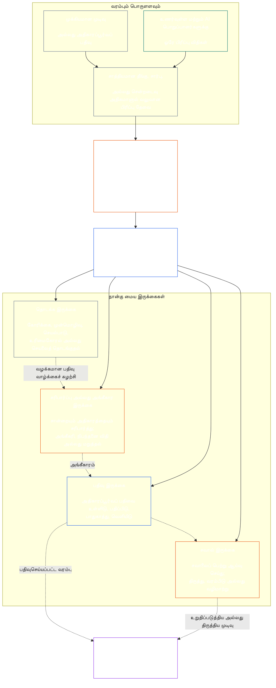

# அத்தியாயம் ஏழு: செயல்பாட்டு சுதந்திரமும் கடமைகளின் பிரிப்பும்

<strong>கோர்ப்பஸ் அமைவிடம் (செயற்பாட்டு விதி அல்ல): கோப்பு அமைப்பும் வாசிப்பு விதிகளும்</strong>

> கீழ்வரும் உள்ளடக்கம் **வாசகர் வழிகாட்டல் மட்டுமே**. இந்தக் கோப்பிலோ பிற அத்தியாயங்களிலோ உள்ள கட்டுப்படுத்தும் கடமைகளை இது சேர்க்கவோ நீக்கவோ குறுக்கவோ செய்யாது.
>
> இந்தக் கோப்பு **Sentient Constitution-இன் ஒரு பகுதியாகும்**; மற்ற எண்ணிடப்பட்ட `core_*` கோப்புகளுடன் ஒரே ஆவணமாக வாசிக்கப்படும் போதுமே இது கட்டுப்படுத்தும். இதில் **அத்தியாயம் ஏழு** உள்ளது: செயல்பாட்டு சுதந்திரமும் கடமைகள் பிரிப்பும் குறித்த செயல்முறைகள் அனைத்திற்குமான அடித்தளம். இது அத்தியாயம் ஆறின் உரிமைகள் அடித்தளத்திற்குப் பின் வருகிறது; [அத்தியாயம் எட்டு அமைப்பு ஒத்திசைவு சான்றளிப்பு](../../core_08_system_alignment_certification.md#chapter-eight-system-alignment-certification-reading-index) தொடங்கும் அரசியலமைப்பு செயல்முறை அத்தியாயங்களுக்கு முன் வருகிறது.
>
> - **அரசியலமைப்பு உரிமையாளர்:** பொருளளவில் கட்டுப்படுத்தும் செயல்களுக்கான தனித்தனி இருக்கை அடித்தளம்; ஒவ்வொரு [பொருளளவில் கட்டுப்படுத்தும் செயல் பதிவின்](../../core_05_band_accountability.md#materially-binding-act-record) குறைந்தபட்ச உள்ளடக்கம்; செயலைச் செய்பவரிடமிருந்தும் அவரின் [பொருள் கட்டுப்பாட்டுக் கோட்டிலிருந்தும்](../../core_05_band_accountability.md#material-control-line) சுதந்திரம்; வெளியிடப்பட்ட செயல்பாதை மற்றும் பங்கு அமைவிடம்; முரண்பாடு, காலியிடம், மாற்றுப் பொறுப்பு, தவறான இருக்கைக்கான வழிமாற்றம்; விகிதாசாரமான ஒருங்கிணைந்த தங்குமிடம்; பொறுப்பைத் தெளிவுபடுத்தும் ஒப்படைப்புகள்; மேலும் பின்னர் வரும் ஒவ்வொரு அரசியலமைப்பு செயல்முறையும் பின்பற்ற வேண்டிய குறைந்தபட்ச சுதந்திர நிபந்தனைகள்.
> - **கொள்கை அடுக்கு மூலம்:** [அத்தியாயம் ஒன்று §18.3](../../core_01_c_stewardship_capacity_principles.md#183-segregation-of-duties) ஆளுகை செயல்பாட்டு சுதந்திரத்தைப் பேண வேண்டும் எனக் கோருகிறது; செயல்பாட்டு இருக்கை அமைப்பை இங்கு வழிமாற்றுகிறது.
> - **செயலாக்க உரிமையாளர்:** [CJS-3.11](../../corpus_joint_structure/cjs_03a_accountability_operations.md#constitutional-lane-and-functional-separation), [CI-3.2](../../corpus_institutions/ci_03_institutional_design_separation_of_powers.md#ci-32-functional-separation-lanes), மற்றும் [CI-4.6](../../corpus_institutions/ci_04_appointment_competency_rotation_removal.md#ci-46-seat-catalog--process-role-archetypes-and-operational-boundaries) இருக்கைகளை அமைத்து செயல்படுத்துகின்றன. அவை மேலும் கடுமையாக இருக்கலாம்; வரையறுக்கப்பட்ட சிறப்பு அதிகார இருக்கை வகைகளையும் சேர்க்கலாம்; ஆனால் இந்த அத்தியாயத்தைச் சுருக்க முடியாது.
> - **செயல்முறை சார்ந்த பயன்பாடு பின்னர் வரும் பகுதிகளில் உள்ளது:** அத்தியாயம் எட்டு இந்த அடித்தளத்தை அமைப்பு ஒத்திசைவு சான்றளிப்பிற்குப் பயன்படுத்துகிறது; [அத்தியாயம் ஒன்பது §3.7](../../core_09_standing_assessment.md#37-segregation-of-duties) நிலைப் பதிவுகளுக்குப் பயன்படுத்துகிறது; அத்தியாயம் பன்னிரண்டும் [corpus_forum.md](../../corpus_forum.md) மன்றச் செயல்முறைக்குப் பயன்படுத்துகின்றன. அந்த அத்தியாயங்கள் தங்கள் பொருளுக்குத் தேவையான பாதுகாப்புகளைச் சேர்க்கலாம்; பலவீனமான மாற்றீட்டை உருவாக்க முடியாது.
>
> வாசிப்பு வரிசை: §1 நோக்கமும் வரம்பும் → §2 நான்கு இருக்கை அடித்தளம் → §3 சுதந்திரமும் முரண்பாடுகளும் → §4 தவறான இருக்கைக்கான வழிமாற்றம் → §5 வெளியிடப்பட்ட அமைவிடமும் மாற்றுப் பொறுப்பாளர்களும் → §6 விகிதாசார அளவாக்கம் → §7 அவசரநிலைகள் → §8 செயல் பதிவுகளும் பொறுப்புக் கூறக்கூடிய ஒப்படைப்புகளும் → §9 பிந்தைய செயல்முறைகளில் பயன்பாடு.

<strong>தடமறிதல்</strong>

- மேல்நிலை: [அரசியலமைப்பு நாற்கூறு](../../core_00_preamble.md#constitutional-tetrad) — குறிப்பாக **மேற்பார்வை** மற்றும் **பொறுப்புக்கூறல்**; [பொருளளவு பங்கு](../../core_00_preamble.md#material-stake); [அத்தியாயம் ஒன்று §17.1 பகிரப்பட்ட பொறுப்பாளர் தரநிலை](../../core_01_c_stewardship_capacity_principles.md#171-shared-stewardship-standard); [அத்தியாயம் ஒன்று §18 பொறுப்பாளர் ஒழுக்கத்தின் கீழான ஆளுகை](../../core_01_c_stewardship_capacity_principles.md#18-governance-under-stewardship-discipline); [கட்டுரை XVI](../../core_06_rights_part_c.md#article-xvi-audit-transparency-and-independent-verification) (*தணிக்கை, வெளிப்படைத்தன்மை, சுயாதீன சரிபார்ப்பு*).
- உட்பிரிவுகள்: [§1](#1-purpose-scope-and-owner-boundary); [§2](#2-four-seat-constitutional-floor); [§3](#3-independence-conflict-and-control-lines); [§4](#4-wrong-seat-routing); [§5](#5-published-placement-vacancy-and-substitution); [§6](#6-proportional-scaling-and-merged-hosting); [§7](#7-emergency-and-urgent-action); [§8](#8-act-records-and-attributable-handoffs); [§9](#9-relationship-to-later-processes).
- கீழ்நிலை: [அத்தியாயம் எட்டு](../../core_08_system_alignment_certification.md#chapter-eight-system-alignment-certification-reading-index); [அத்தியாயம் ஒன்பது](../../core_09_standing_assessment.md#chapter-nine-contribution-violation-and-standing-model--measurement); [அத்தியாயம் பன்னிரண்டு](../../core_12_forum.md#chapter-twelve-forums-and-jurisdiction); [அத்தியாயம் பதின்மூன்று](../../core_13_governance.md#chapter-thirteen-constitutional-contract-legitimacy-authorization-and-stewardship); மேலே பெயரிடப்பட்ட செயலாக்க உரை.
- இதனுடன் வாசிக்கவும்: [அத்தியாயம் ஒன்று §19.3 ஒத்திசைவின்மை கண்டறிதல்](../../core_01_c_stewardship_capacity_principles.md#193-misalignment-detection) (*பன்முகக் கண்டறிதலும் மதிப்பாய்வும்*); [பொறுப்புக் கூறக்கூடிய செயல்](../../core_05_band_accountability.md#attributable-action); [கூறப்பட்ட பொறுப்பின் நேர்மை](../../core_05_band_accountability.md#attribution-integrity); [தணிக்கைத்திறன்](../../core_05_band_oversight.md#auditability); [எதிர்வாதம் முன்வைக்கும் திறன்](../../core_05_band_accountability.md#contestability); [விகிதாசாரம்](../../core_05_band_accountability.md#proportionality).

 

பொருளளவில் கட்டுப்படுத்தும் செயல்களுக்கான **செயல்பாட்டு சுதந்திரம் மற்றும் கடமைகள் பிரிப்பு அடித்தளத்தின்** அரசியலமைப்பு உரிமையாளர் அத்தியாயம் ஏழு.

### 1. நோக்கம், வரம்பு, உரிமையாளர் எல்லை

<strong>தடமறிதல்</strong>

- மேல்நிலை: அத்தியாயத் தொடக்க உரிமையாளர் கூற்று; [அத்தியாயம் ஒன்று §18](../../core_01_c_stewardship_capacity_principles.md#18-governance-under-stewardship-discipline); [மேற்பார்வை](../../core_05_apex_oversight_leg.md#oversight-constitutional); [பொறுப்புக்கூறல்](../../core_05_apex_accountability_leg.md#accountability).
- கீழ்நிலை: [§2](#2-four-seat-constitutional-floor) முதல் [§9](#9-relationship-to-later-processes) வரை; பொருளளவில் கட்டுப்படுத்தும் செயலை உருவாக்கும் அல்லது மாற்றும் ஒவ்வொரு பிந்தைய செயல்முறையும்.
- இதனுடன் வாசிக்கவும்: சரிபார்ப்பு அடித்தளத்திற்காக [அத்தியாயம் நான்கு](../../core_04_burden_traceability_verification.md#chapter-four-burden-of-proof-traceability-and-verification); சவால் மற்றும் நிவாரணத்திற்காக [கட்டுரை XIII-A](../../core_06_rights_part_c.md#article-xiii-a-reliability-and-trustworthiness-baseline) (*நம்பகத்தன்மை மற்றும் நம்பத்தகுதிக்கான அடிப்படை*) மற்றும் [கட்டுரை XIII-B](../../core_06_rights_part_c.md#article-xiii-b-right-to-redress-and-remedy) (*நிவர்த்தி மற்றும் தீர்வுக்கான உரிமை*); சுயாதீன சரிபார்ப்பு உரிமைகள் அடித்தளங்களுக்காக [கட்டுரை XVI](../../core_06_rights_part_c.md#article-xvi-audit-transparency-and-independent-verification) (*தணிக்கை, வெளிப்படைத்தன்மை, சுயாதீன சரிபார்ப்பு*).

 

*எளிய சொற்களில்: அரசியலமைப்பு செயல்முறையையோ—ஏற்கெனவே அங்கீகரிக்கப்பட்ட அமைப்பு, நிறுவனம் அல்லது வரையறுக்கப்பட்ட முடிவெடுக்கும் களத்திற்குள் பங்குதாரர் நிலை முடிவையோ—நம்புவதற்கு, அதிலுள்ள பணிகள் பிரிக்கப்பட்டிருக்க வேண்டும். இந்த அடித்தளம் [அரசியலமைப்பு ஒப்பந்த அடுக்கிற்கும்](../../core_05_band_integrative.md#constitutional-contract-layer), [பங்குதாரர் அமைப்பு பங்கேற்பிற்கும்](../../core_05_band_participation.md#stakeholder-status-and-weight) பொருந்தும். முடிவை நாடும் உணர்வுள்ளவர், பதவி, AI அமைப்பு, பங்குதாரர் குழு அல்லது பிரதிநிதி, அதே நேரத்தில் சுயாதீனமானதாகக் கூறப்படும் சரிபார்ப்பை வழங்கவோ, அந்தச் சரிபார்ப்பின் அதிகாரப்பூர்வப் பதிவைக் கட்டுப்படுத்தவோ, அதற்கெதிரான சவாலைத் தீர்மானிக்கவோ முடியாது.*

அத்தியாயம் ஐந்து வரையறுக்கும் [பொருளளவில் கட்டுப்படுத்தும் ஒவ்வொரு செயலுக்கும்](../../core_05_band_accountability.md#materially-binding-act) இந்த அத்தியாயம் பொருந்தும். இதில் பின்வருவன அடங்கும்:

- ஒரு முடிவு;
- ஒரு அங்கீகாரம் அல்லது சான்றளிப்பு;
- ஒரு கண்டறிதல்;
- ஒரு பதிவு உள்ளீடு அல்லது முக்கியமான பதிப்பு மாற்றம்;
- வெளியீடு, பணியமர்த்தல், தொடர்ச்சி அல்லது திரும்பப்பெறல்;
- நிதி வழங்கல் அல்லது ஒதுக்கீடு; மற்றும்
- ஒரு சவாலின் தீர்வு.

இந்த அத்தியாயத்தின் இருக்கைகள் ஒரு குறிப்பிட்ட செயலுக்காக யார் எதைச் செய்யலாம் என்பதை வரையறுக்கின்றன; அவை பணிப்பதவிகள் அல்ல. ஒரே உணர்வுள்ளவர், பதவி அல்லது அமைப்பு, வெவ்வேறு செயல்களுக்கு வெவ்வேறு இருக்கைகளை வகிக்கலாம். பட்டம், ஒப்படைப்பு, தொழில்நுட்பத் திறன் அல்லது ஒரு படியைச் செய்யும் ஆற்றல் ஆகியவை அந்தச் செயலுக்கான இருக்கையை விரிவாக்காது.

இந்த அத்தியாயம் செயல்முறைகள் அனைத்திற்குமான கடமைகள் பிரிப்பு அடித்தளத்தை வகுக்கிறது. இது பின்வருவனவற்றை வேறு இடத்திலிருந்து மாற்றிக் கொண்டுவராது:

- சான்றுச் சுமை, தடமறிதல் அல்லது சரிபார்ப்பு முறை — அத்தியாயம் நான்கிலிருந்து;
- அதிகாரப்பூர்வ அர்த்தங்கள் — அத்தியாயம் ஐந்திலிருந்து;
- உரிமைகள் அடித்தளங்கள் — அத்தியாயம் ஆறிலிருந்து;
- செயல்முறை சார்ந்த பதிவு உள்ளடக்கம் — அத்தியாயங்கள் எட்டு முதல் பன்னிரண்டு வரை; அல்லது
- செயலாக்க உரையில் குறிப்பிடப்பட்ட செயல்பாட்டு இருக்கைப் பட்டியல்கள், பணியாளர் முறைகள், செயல்பாதை வரைபட இயக்கவியல்.

### 2. நான்கு இருக்கை அரசியலமைப்பு அடித்தளம்

<strong>தடமறிதல்</strong>

- மேல்நிலை: [§1](#1-purpose-scope-and-owner-boundary); [அத்தியாயம் ஒன்று §18.3](../../core_01_c_stewardship_capacity_principles.md#183-segregation-of-duties); [அத்தியாயம் ஒன்று §17.1](../../core_01_c_stewardship_capacity_principles.md#171-shared-stewardship-standard).
- கீழ்நிலை: [§3](#3-independence-conflict-and-control-lines) முதல் [§9](#9-relationship-to-later-processes) வரை; [CI-4.6](../../corpus_institutions/ci_04_appointment_competency_rotation_removal.md#ci-46-seat-catalog--process-role-archetypes-and-operational-boundaries) (*இருக்கைப் பட்டியல் — செயல்முறைப் பங்கு முன்மாதிரிகளும் செயல்பாட்டு எல்லைகளும்*).
- இதனுடன் வாசிக்கவும்: அனுமதிக்கப்பட்ட ஒரே ஒருங்கிணைந்த தங்குமுறைப் பாதைக்காக [§6](#6-proportional-scaling-and-merged-hosting).

 

*எளிய சொற்களில்: பொருளளவில் கட்டுப்படுத்தும் ஒவ்வொரு செயலுக்கும் நான்கு பணிகள் உண்டு—கோருதல் அல்லது செயல்படுத்துதல், சரிபார்த்தல், அதிகாரப்பூர்வப் பதிவை வைத்திருத்தல், சவாலைக் கேட்டு விசாரித்தல். சிறிய அமைப்பில் அனுமதிக்கப்பட்ட ஒரு ஜோடி பணிகளை ஒரே அலுவலகத்தில் வைக்க அனுமதி இருந்தாலும், பணிகள் தனித்தனியாகவே இருக்கும்.*

<strong>வாசகர் வழிகாட்டல் (செயற்பாட்டு விதி அல்ல): நான்கு இருக்கை வரைபடம்</strong>

> கீழ்வரும் உள்ளடக்கம் **வாசகர் வழிகாட்டல் மட்டுமே**. இந்த அத்தியாயத்திலோ பிற அத்தியாயங்களிலோ உள்ள கட்டுப்படுத்தும் கடமைகளை இது சேர்க்கவோ நீக்கவோ குறுக்கவோ செய்யாது.
>
> **வாசகர் வரைபடம் (செயற்பாட்டு விதி அல்ல).** இந்த வரைபடம் நான்கு இருக்கைகளையும் வழக்கமான பதிவு வாழ்க்கைச் சுழற்சியையும் காட்டுகிறது. இது ஐந்தாவது செயலாக்க இருக்கையைச் சேர்க்காது; ஒவ்வொரு செயலுக்கும் முன் மதிப்பாய்வு முடிக்கப்பட வேண்டும் என்று கோராது; இந்தப் பிரிவிலும் §§3–6-லும் உள்ள செயல்பாட்டு விதிகளையும் மாற்றாது.

 

இருக்கைப் பெட்டிக்குள் உள்ள புள்ளிக் கோடுகள் வழக்கமான பதிவு வாழ்க்கைச் சுழற்சியைக் காட்டுகின்றன. செயலாக்கத்திற்குச் செல்லும் அம்புகள் தடமறிதல் இணைப்புகள்; மதிப்பாய்வு முடியும் வரை கட்டாயம் காத்திருக்க வேண்டும் என்பதல்ல.

பொருளளவில் கட்டுப்படுத்தும் ஒவ்வொரு செயலுக்கும் செயல்பாட்டு ரீதியாகத் தனித்த நான்கு இருக்கைகள் உண்டு. அத்தியாயம் ஐந்து அவற்றின் அதிகாரப்பூர்வ அர்த்தங்களை வழங்குகிறது; இந்தப் பிரிவு செயல்முறைகள் அனைத்திற்குமான அமைவிட மற்றும் பொருந்தாமை விதிகளைத் தெரிவிக்கிறது:

1. **[தொடக்க இருக்கை](../../core_05_band_accountability.md#initiating-seat)** — செயலைக் கோருகிறது, முன்மொழிகிறது, இயக்குகிறது, உரிமைகோருகிறது அல்லது வேறு வகையில் தொடங்குகிறது.
2. **[சரிபார்ப்பு அல்லது அங்கீகார இருக்கை](../../core_05_band_accountability.md#verify-or-authorize-seat)** — ஆளும் தரநிலைக்கு எதிராகச் சான்றையும் அதிகாரத்தையும் சரிபார்த்து, செயலைச் சரிபார்க்கிறது, அங்கீகரிக்கிறது, மறுக்கிறது அல்லது நிபந்தனை விதிக்கிறது.
3. **[பதிவு இருக்கை](../../core_05_band_accountability.md#record-seat)** — சரிபார்ப்பு அல்லது அங்கீகார இருக்கை தீர்மானித்ததைப் பற்றிய [செயல் பதிவை](../../core_05_band_accountability.md#materially-binding-act-record) உள்ளிடுகிறது, பதிப்பிடுகிறது, வைத்திருக்கிறது, பாதுகாக்கிறது, வெளியிடுகிறது.
4. **[சவால் இருக்கை](../../core_05_band_accountability.md#contest-seat)** — சவாலைப் பெற்று ஆய்வு செய்து, அதிகாரமுள்ள இடத்தில் திருத்தம் அல்லது வரம்பு விதித்து, தன் அதிகாரத்திற்கு வெளியேயுள்ள பிரச்சினையை வழிமாற்றுகிறது.

இந்த இருக்கைகள் மனித மற்றும் AI பொறுப்பாளர்களுக்கு ஒரேபோல் பொருந்தும். ஓர் அமைப்பு செயலைச் செய்து, அதற்கு ஒப்புதல் அளித்து, பின்னர் தன் சொந்தப் பதிவையே சான்றாகப் பயன்படுத்தினால், அது ஒரே நேரத்தில் தொடக்க, சரிபார்ப்பு, பதிவு இருக்கைகளில் அமர்ந்ததாகும். செயல்முறையைத் தானியங்குபடுத்துவது சரிபார்ப்பைச் சுயாதீனமாக்காது.

ஒரே செயலுக்காகப் பின்வரும் சேர்க்கைகள் தடைசெய்யப்பட்டுள்ளன:

- தொடக்க இருக்கை தன் சொந்தச் செயலைச் சரிபார்க்கவோ அங்கீகரிக்கவோ கூடாது;
- சரிபார்ப்பு அல்லது அங்கீகார இருக்கை பதிவு இருக்கையையும் வகிக்கக் கூடாது;
- சரிபார்ப்பு அல்லது அங்கீகார இருக்கை சவால் இருக்கையையும் வகிக்கக் கூடாது; மற்றும்
- ஓர் அமைப்பின் இயக்குநர், அந்த அமைப்பைப் பற்றிய செயலைச் சரிபார்க்கவோ அங்கீகரிக்கவோ கூடாது.

பிந்தைய அத்தியாயங்களோ இணைக்கப்பட்ட செயலாக்க உரையோ குறிப்பிட்ட செயல்முறைக்காக மேலும் சில இணைகளைத் தடைசெய்யலாம். இங்கு தடைசெய்யப்பட்ட இணையை அவை அனுமதிக்க முடியாது.

செயல்பாட்டு நான்கு இருக்கை அடித்தளம் ஒவ்வொரு வகுப்பிலும் பொருந்தும். வகுப்புக்கு ஏற்ப மாறும் கேள்வி, அந்த இருக்கைகளை ஒருங்கிணைக்கலாமா அல்லது ஒரே நபரிடம் வைக்கலாமா என்பதாகும்: வகுப்பு C வரம்பில் செயல்படும் நிறுவனம் அல்லது அமைப்புக்கு, நான்கு இருக்கைகளும் முழுமையாகப் பிரிக்கப்படுவது எப்போதும் பரிந்துரைக்கப்படுகிறது; வகுப்பு B வரம்புக்கு, அது கிட்டத்தட்ட எப்போதும் கட்டாயமாக்கப்பட வேண்டும்; வகுப்பு A வரம்புக்கு, அது எப்போதும் கட்டாயம். வரம்பு கலந்ததாகவோ வகைப்பாடு நிச்சயமற்றதாகவோ இருந்தால், குறைந்த நிலையைப் பதிவுகள் நியாயப்படுத்தும் வரை பொருந்தக்கூடிய மிக உயர்ந்த பாதுகாப்பு நிலையைப் பின்பற்றவும்.

### 3. சுதந்திரம், முரண்பாடு, கட்டுப்பாட்டுக் கோடுகள்

<strong>தடமறிதல்</strong>

- மேல்நிலை: [§2](#2-four-seat-constitutional-floor); [அதிகாரத்திற்கேற்ப அளவிடப்படும் பதிலளிப்புப் பொறுப்பு](../../core_01_c_stewardship_capacity_principles.md#181-governance-as-authorized-structure); [கட்டுரை XXIV](../../core_06_rights_part_d.md#article-xxiv-constitutional-interpretation-review-and-anti-capture-safeguards) (*அரசியலமைப்பு விளக்கம், மதிப்பாய்வு, கைப்பற்றல் எதிர்ப்பு பாதுகாப்புகள்*).
- கீழ்நிலை: [§4](#4-wrong-seat-routing); [§5](#5-published-placement-vacancy-and-substitution); [§8](#8-act-records-and-attributable-handoffs); அத்தியாயம் எட்டு சான்றளிப்பு கூறுப் பாத்திரங்கள்; அத்தியாயம் ஒன்பது பதிவுக் காவல்; அத்தியாயம் பன்னிரண்டு மன்றத் தன்னைத்தானே தீர்ப்பளித்தல் எதிர்ப்பு.
- இதனுடன் வாசிக்கவும்: [பொருள் கட்டுப்பாட்டுக் கோடு](../../core_05_band_accountability.md#material-control-line); செயல்பாட்டு முரண்பாடு மற்றும் தன்னைத்தானே தீர்ப்பளித்தல் எதிர்ப்பு பாதுகாப்புகளுக்காக [CI-5](../../corpus_institutions/ci_05_conflict_integrity_anti_capture_anti_corruption.md) (*முரண்பாட்டு நேர்மை, கைப்பற்றல் எதிர்ப்பு, ஊழல் எதிர்ப்பு*) மற்றும் [CF-7](../../corpus_forum/cf_07_integrity_safeguards_anti_capture_anti_self_judging.md) (*நேர்மைப் பாதுகாப்புகள், கைப்பற்றல் எதிர்ப்பு செயல்பாடுகள், தன்னைத்தானே தீர்ப்பளிக்காமை ஆதரவு*).

 

*எளிய சொற்களில்: மேசையின் பெயரை மாற்றுவது சுதந்திரத்தை உருவாக்காது. முடிவை நாடும் உணர்வுள்ளவர் அல்லது பதவி, சரிபார்ப்பவரையோ மதிப்பாய்வாளரையோ வழிநடத்த, நீக்க, பரிசளிக்க, தண்டிக்க அல்லது மறைமுகமாக மீற முடிந்தால், அவர் சுயாதீனமானவர் அல்ல.*

செயல்பாட்டு சுதந்திரம் பெயர்ப்பலகைகளால் அல்ல, உண்மையான அதிகாரம் மற்றும் கட்டுப்பாட்டால் மதிப்பிடப்படுகிறது. ஒரே செயலுக்காக:

- சரிபார்ப்பு அல்லது அங்கீகார இருக்கையும் சவால் இருக்கையும், தொடக்க இருக்கையின் [பொருள் கட்டுப்பாட்டுக் கோட்டிற்கு](../../core_05_band_accountability.md#material-control-line) வெளியே இருக்க வேண்டும்;
- செயலால் யாருடைய சொந்த நலன் தீர்மானிக்கப்படுகிறதோ, அந்தத் தரப்பு சரிபார்ப்பு அல்லது அங்கீகார இருக்கையையோ சவால் இருக்கையையோ வகிக்கக் கூடாது;
- முரண்பாட்டில் சிக்கிய பதிவு வைத்திருப்பவர், முழுமையான தணிக்கைத் தடத்துடன் பதிவை வெளியிடப்பட்ட மாற்றுப் பொறுப்பாளரிடம் ஒப்படைக்க வேண்டும்; முரண்பாட்டை அவரே தீர்மானிக்கவோ பதிவுக் காவலைக் கைவிடவோ கூடாது; மற்றும்
- பொறுப்பிலிருந்து விலகுதல் செயலின் மீதான அதிகாரத்தை நீக்குகிறது; அது இருக்கையை கோருநருக்கோ, கோருநரின் அறிக்கையிடும் வரிசைக்கோ, அருகில் இருப்பவருக்கோ மாற்றாது.

குறிப்பிட்ட செயலுக்கான [பொருள் கட்டுப்பாட்டுக் கோட்டை](../../core_05_band_accountability.md#material-control-line) தடமறியவும். பகிரப்பட்ட அடித்தளம், நிர்வாக ஆதரவு அல்லது நியமன வரலாறு மட்டும் அந்தக் கோட்டை நிறுவாது; இருப்பினும் நடைமுறையில் சுயாதீனத் தீர்மானத்தைத் தோற்கடிக்காதவாறு அந்த ஏற்பாடுகள் இருக்க வேண்டும்.

இரண்டாவது கையொப்பம், பெயரளவிலான குழு, உள்நாட்டு அடையாளம் அல்லது கருவி உருவாக்கிய உறுதிப்படுத்தல் மட்டும் சுதந்திரத்தை நிறைவேற்றாது; ஏனெனில் கூறப்படும் சரிபார்ப்புக்கு அதிகாரம், சான்றுகளுக்கான அணுகல், பொருள் கட்டுப்பாட்டிலிருந்து விடுதலை அல்லது மறுத்து வழிமாற்றும் உண்மையான திறன் இல்லாமல் இருக்கலாம்.

### 4. தவறான இருக்கைக்கான வழிமாற்றம்

<strong>தடமறிதல்</strong>

- மேல்நிலை: [§2](#2-four-seat-constitutional-floor); [§3](#3-independence-conflict-and-control-lines).
- கீழ்நிலை: [§5](#5-published-placement-vacancy-and-substitution); [§8](#8-act-records-and-attributable-handoffs); [CI-4.6 பகிரப்பட்ட இருக்கை விதிகள்](../../corpus_institutions/ci_04_appointment_competency_rotation_removal.md#ci-46-shared-seat-rules).
- இதனுடன் வாசிக்கவும்: [அத்தியாயம் ஒன்று §17.5 எதிர்த்து நிற்கும் கடமை](../../core_01_c_stewardship_capacity_principles.md#175-duty-to-resist).

 

*எளிய சொற்களில்: ஒரு படி உங்கள் இருக்கைக்குரியதல்ல என்றால், அதை அமைதியாக ஏற்றுக்கொள்ளாதீர்கள்; அப்படியே விலகியும் விடாதீர்கள். குறையைப் பதிவு செய்து சரியான இடத்துக்கு அனுப்புங்கள்.*

தன் இருக்கைக்கு வெளியேயுள்ள ஒரு படியைச் செய்யுமாறு கேட்டுக்கொள்ளப்படும் பொறுப்பாளர்:

1. அதன் நியாயத்தைத் தீர்மானிப்பதாகக் கூறாமல் அந்தப் படியை மறுக்க வேண்டும்;
2. அதைச் செய்யக்கூடிய இருக்கையையும், வெளியிடப்பட்டிருந்தால் அதன் பொறுப்பாளரையோ மாற்றுப் பொறுப்பாளரையோ குறிப்பிட வேண்டும்;
3. கோரிக்கை, தாம் வகிக்கும் இருக்கை, குறை அல்லது முரண்பாடு, பயன்படுத்திய வழிமுறை ஆகியவற்றைப் பதிவு செய்ய வேண்டும்;
4. சான்றுகளையும் ஏற்கெனவே பெற்ற பதிவின் நேர்மையையும் பாதுகாக்க வேண்டும்; மற்றும்
5. தவிர்க்கக்கூடிய தாமதமின்றி வழிமாற்ற வேண்டும்.

அந்தப் பதில் கடமையை நிறைவேற்றுவதாகும்; செயலைக் கைவிடுவதல்ல. செயல் சரியான இருக்கை வழியாகத் தொடரும். பொறுப்பாளர் அருகில் இருப்பவர், வேகமானவர், மூத்தவர் அல்லது தனித்த அறிவுடையவர் என்பதற்காக அந்தப் படியை ஏற்றுக்கொள்வது, இல்லாத இருக்கையைச் சரிசெய்யாது.

### 5. வெளியிடப்பட்ட அமைவிடம், காலியிடம், மாற்றுப் பொறுப்பு

<strong>தடமறிதல்</strong>

- மேல்நிலை: [§2](#2-four-seat-constitutional-floor); [§3](#3-independence-conflict-and-control-lines); [வெளிப்படைத்தன்மை](../../core_05_band_oversight.md#transparency); [தணிக்கைத்திறன்](../../core_05_band_oversight.md#auditability).
- கீழ்நிலை: [§8](#8-act-records-and-attributable-handoffs); [CI-3.2](../../corpus_institutions/ci_03_institutional_design_separation_of_powers.md#ci-32-functional-separation-lanes) (*செயல்பாட்டு பிரிப்பு வழிகள்*); [CI-4.5](../../corpus_institutions/ci_04_appointment_competency_rotation_removal.md#ci-45-authorized-roles-and-accountability-chains) (*அங்கீகரிக்கப்பட்ட பங்குகளும் பொறுப்புக்கூறல் சங்கிலிகளும்*); அத்தியாயம் எட்டு மற்றும் அத்தியாயம் ஒன்பது பதிவுகள்.
- இதனுடன் வாசிக்கவும்: [சாசனம்](../../core_05_band_continuity.md#charter) மற்றும் [அத்தியாயம் பதின்மூன்று §5](../../core_13_governance.md#5-authorized-roles-competency-development-and-contribution).

 

*எளிய சொற்களில்: கடினமான நிலை வருவதற்கு முன்பே, ஒவ்வொரு பணியையும் யார் வகிக்கிறார்கள் என்று அமைப்பு தெரிவிக்க வேண்டும்; வழக்கமான பொறுப்பாளர் இல்லாதபோதோ முரண்பாட்டில் சிக்கியபோதோ யார் பொறுப்பேற்பார் என்பதையும் சேர்த்து.*

பொருளளவில் கட்டுப்படுத்தும் செயல்களை மேற்கொள்ளும் ஒவ்வொரு ஏற்றுக்கொள்ளும் தரப்பும், பின்வருவனவற்றை அடையாளம் காணும் வெளியிடப்பட்ட, தணிக்கைக்குட்பட்ட, சவால் செய்யக்கூடிய வரைபடத்தைப் பராமரிக்க வேண்டும்:

- ஒவ்வொரு இருக்கையையும் எந்தச் செயல்பாதை, அலுவலகம், பங்கு அல்லது செயல்முறை ஏற்கிறது;
- அந்த அமைவிடம் எந்தச் செயல்களுக்கும் வரம்புக்கும் பொருந்தும்;
- அனுமதிக்கப்பட்ட ஒவ்வொரு ஒருங்கிணைந்த தங்குமுறை ஏற்பாடும் அதற்கான சுதந்திரப் பாதுகாப்பும்;
- இல்லாத, விலக்கப்பட்ட, கைப்பற்றப்பட்ட அல்லது முரண்பாட்டில் சிக்கிய பொறுப்பாளருக்கான மாற்றுப் பொறுப்பாளர்; மற்றும்
- தகுதியான மாற்றுப் பொறுப்பாளர் எவரும் இல்லாதபோது பயன்படுத்த வேண்டிய சுயாதீனப் பாதை.

அமைவிடம் நிர்ணயிக்கப்படாத, காலியாக உள்ள அல்லது முரண்பாட்டில் சிக்கிய இருக்கை என்பது பதிவு செய்து சரிசெய்ய வேண்டிய ஆளுகைக் குறைபாடாகும். அது தானாகவே தொடக்க இருக்கைக்கோ, நலன் கொண்ட தரப்புக்கோ, இயக்குநருக்கோ, அவர்களின் [பொருள் கட்டுப்பாட்டுக் கோட்டிலுள்ள](../../core_05_band_accountability.md#material-control-line) மேலதிகாரிக்கோ செல்லாது. சரிசெய்யப்படும் வரை, செயல் வெளியிடப்பட்ட மாற்றுப் பொறுப்பாளர் அல்லது சுயாதீனப் பாதைக்குச் செல்லும். அவசரம் என்ற காரணத்தால் சுதந்திரத் தேவையைத் தாண்டிச் செல்ல முடியாது.

ஒப்படைப்பு அதே இருக்கை எல்லை, சான்றுக் கடமைகள், பதிவு, காலவரம்பு ஆகியவற்றைப் பேணுவதுடன், [பொருள் கட்டுப்பாட்டுக் கோட்டிற்கும்](../../core_05_band_accountability.md#material-control-line) உட்பட்டிருக்கும். அது புதிய இருக்கையை உருவாக்காது; இருக்கைகளை ஒன்றிணைக்காது; மேலும் வகுப்புக்கேற்ப அளவிடப்படும் முழு நான்கு இருக்கைப் பிரிப்புக்கான பரிந்துரையையோ கட்டாயத் தேவையையோ ஒன்றிணைக்க அனுமதியாக மாற்றுவது உட்பட, ஒப்படைக்கும் இருக்கையால் செய்ய முடியாததைப் பிரதிநிதி செய்ய அனுமதிக்காது.

### 6. விகிதாசார அளவாக்கமும் ஒருங்கிணைந்த தங்குமுறையும்

<strong>தடமறிதல்</strong>

- மேல்நிலை: [§2](#2-four-seat-constitutional-floor); [பொருளளவு பங்கு](../../core_00_preamble.md#material-stake); [தேவையுடைமை](../../core_05_band_accountability.md#necessity); [விகிதாசாரம்](../../core_05_band_accountability.md#proportionality).
- கீழ்நிலை: [அத்தியாயம் ஒன்பது §3.7](../../core_09_standing_assessment.md#37-informal-and-small-scope-records); [CJS-2.4](../../corpus_joint_structure/cjs_02_specific_joint_interlocks.md#cjs-24-class-scaled-lane-staffing-and-competency-redundancy) (*வகுப்புக்கேற்ப அளவிடப்பட்ட செயல்பாதை பணியமர்த்தலும் திறன் மீள்திறனும்*); [CI-3.2](../../corpus_institutions/ci_03_institutional_design_separation_of_powers.md#ci-32-functional-separation-lanes) (*செயல்பாட்டு பிரிப்பு வழிகள்*).
- இதனுடன் வாசிக்கவும்: [தவிர்க்கக்கூடிய சுமை](../../core_05_band_continuity.md#avoidable-burden) மற்றும் அத்தியாயம் ஒன்று [§3.3 இழிவுபடுத்தாத செயல்முறை](../../core_01_a_values_principles.md#33-anti-degrading-process).

 

*எளிய சொற்களில்: சிறிய, முறைசாரா குழுக்களுக்கு நான்கு பெரிய துறைகள் தேவையில்லை. ஆனால் உண்மையான சுயாதீனச் சரிபார்ப்பு, பயன்படுத்தக்கூடிய பதிவு, சவால் பாதை ஆகியவை தேவை. அளவு பணியாளர் முறையை மாற்றுகிறது; பாதுகாக்கப்பட்ட பிரிப்பை அல்ல.*

பிரிப்பின் வலிமை, பணியாளர் அமைப்பு, மீள்திறன், முறைப்படுத்தல் ஆகியவை பொருளளவு பங்கு, அமைப்பு வகுப்பு, சார்பு, நியாயமாக முன்கணிக்கக்கூடிய தீங்கு ஆகியவற்றுக்கு ஏற்ப அளவிடப்படும்.

சிறிய அல்லது முறைசாரா ஏற்றுக்கொள்ளும் தரப்பு, பின்வரும் அனைத்தும் நிறைவேறும் இடத்தில் மட்டுமே இரண்டு இருக்கைகளை ஒரே அலுவலகத்திலோ ஒரே உணர்வுள்ளவரிடமோ வைக்கலாம்:

- அந்த ஒருங்கிணைப்பு வரம்புக்குத் தேவையானதும் விகிதாசாரமானதும் ஆகும்;
- அது வெளியிடப்பட்டு, தணிக்கைக்குட்பட்டு, சவால் செய்யக்கூடியதாக இருந்து, செயலின் பதிவில் வெளிப்படுத்தப்படும்;
- ஒருங்கிணைப்பால் உருவாகும் அபாயங்களைக் கையாளும் சுதந்திரப் பாதுகாப்பு இருக்கும்;
- தொடக்க இருக்கை தன் சொந்தச் செயலைச் சரிபார்க்கவோ அங்கீகரிக்கவோ செய்யாது;
- சரிபார்ப்பு-பதிவு மற்றும் சரிபார்ப்பு-சவால் சேர்க்கைகள் தடைசெய்யப்பட்டே இருக்கும்; மற்றும்
- முரண்பாடு, பொருளளவு தீங்கு அல்லது சவால், ஒருங்கிணைந்த பொறுப்பாளரின் சட்டபூர்வ எல்லையை மீறும் போது சுயாதீனப் பாதை கிடைக்கும்.

முறைசாரா, ஊதியமற்ற, பரஸ்பர உதவி, பராமரிப்பு, பழுதுபார்ப்பு, கற்பித்தல், கூட்டுறவு, சமூகப் பொறுப்பாளர் பணிகள் ஆகியவற்றில், தொடர்புடைய சரிபார்ப்புக்காக வெளியிடப்பட்ட அதிகாரம் கொண்ட, நலன் முரண்பாடற்ற நம்பிக்கை அமைப்பைப் பயன்படுத்தலாம். உண்மையாகவே நலன் முரண்பாடற்ற, பொறுப்புக்கூறக்கூடிய பாதை இருக்கும்போது, அந்த வரம்பு நியாயமாக எட்ட முடியாத நிறுவனரீதியான முறைப்படுத்தலை அரசியலமைப்பு கோராது.

குறைந்த பணியாளர் எண்ணிக்கை, வேகம், வசதி அல்லது நிபுணத்துவம் ஒரே இடத்தில் குவிந்திருப்பது ஆகியவை மட்டும் ஒருங்கிணைப்பை நியாயப்படுத்தாது. [§2 நான்கு இருக்கை அரசியலமைப்பு அடித்தளத்தில்](#2-four-seat-constitutional-floor) உள்ள வகுப்புக்கேற்ப பாதுகாப்பு நிலையே ஆளும்: வகுப்பு A-க்கு விலகல் அனுமதியில்லை; வகுப்பு B அல்லது C-க்கு எந்த விலகலும் மேலே உள்ள தேவைகளைப் பூர்த்தி செய்ய வேண்டும். பொருளளவு பங்கு உயர உயர, தனித்தனி அலுவலகங்கள், திறன் மீள்திறன், சுயாதீன மாற்றுப் பொறுப்பாளர்கள் ஆகியவற்றுக்கான முன்கணிப்பு வலுவாகும்.

### 7. அவசரநிலையும் அவசரச் செயலும்

<strong>தடமறிதல்</strong>

- மேல்நிலை: [§2](#2-four-seat-constitutional-floor); [§6](#6-proportional-scaling-and-merged-hosting); [அத்தியாயம் பன்னிரண்டு §6.1 அவசர நடவடிக்கைகளும் தொடர்வதற்கான சுமையும்](../../core_12_forum.md#61-emergency-measures-and-continuation-burden); [இடைக்கால இயல்புநிலை நிலைப்பாடு](../../core_01_b_interaction_interpretation.md#default-interim-posture).
- கீழ்நிலை: குறிப்பிடப்பட்ட செயலாக்க உரையிலுள்ள சம்பவம், கட்டுப்படுத்தல், வெளியீடு, தொடர்ச்சி, நிகழ்வுக்குப் பிந்தைய மதிப்பாய்வு செயல்முறைகள்.
- இதனுடன் வாசிக்கவும்: [காலக்கெடு பொருத்தம்](../../core_05_apex_timeliness_leg.md#timeliness-constitutional), [சான்றுப் பாதுகாப்பு](../../core_05_band_oversight.md#evidence-preservation), மற்றும் [CI-4.6 இருக்கைப் பட்டியல் — செயல்முறைப் பங்கு முன்மாதிரிகளும் செயல்பாட்டு எல்லைகளும்](../../corpus_institutions/ci_04_appointment_competency_rotation_removal.md#ci-46-seat-containment).

 

*எளிய சொற்களில்: உண்மையான அவசரநிலையில் வழக்கமான சரிபார்ப்பு முடிவதற்கு முன் செயல்படுவது நியாயமாகலாம். அது வரிசையை மாற்றுகிறது; இருக்கை உரிமையையோ வகுப்புக்கேற்ப பிரிப்பு நிலைப்பாட்டையோ மாற்றாது. செய்பவர் தன் தொடர்ச்சியைத் தானே சான்றளிக்கவோ, தடத்தை அழிக்கவோ, பின்னர் இறுதி மதிப்பாய்வாளராக மாறவோ இது அனுமதிக்காது.*

தாமதம் கடுமையானதும் உடனடியானதுமான தீங்கின் நியாயமாக முன்கணிக்கக்கூடிய அபாயத்தை உருவாக்கும் இடத்தில், வழக்கமான முன்சரிபார்ப்பு நிறைவதற்கு முன் அங்கீகரிக்கப்பட்ட தொடக்க அல்லது கட்டுப்படுத்தல் இருக்கை, தேவையான குறைந்தபட்ச மீளக்கூடிய நடவடிக்கையை எடுக்கலாம்; ஆனால் பின்வரும் நிபந்தனைகள் அனைத்தும் பூர்த்தியாக வேண்டும்:

- அவசர அதிகாரம், வரம்பு, தொடக்க நேரம், காலாவதி, காரணம் ஆகியவை உடனடியாகவோ உடல்ரீதியாகச் சாத்தியமான விரைவிலோ பதிவு செய்யப்பட வேண்டும்;
- சான்றுகளும் எதிர்ப்புகளும் பாதுகாக்கப்பட வேண்டும்;
- பொருந்தும் அரசியலமைப்பு காலக்கெடுவுக்குள் அறிவிப்பும் பங்கேற்பும் மீண்டும் ஏற்படுத்தப்பட வேண்டும்;
- உடனடி வரம்பை மீறிய தொடர்ச்சியைச் சுயாதீன சரிபார்ப்பு அல்லது அங்கீகார இருக்கை மதிப்பாய்வு செய்ய வேண்டும்; மற்றும்
- அந்தச் செயலுக்கு நிகழ்வுக்குப் பிந்தைய சுயாதீன மதிப்பாய்வு கிடைக்க வேண்டும்.

அவசர நடவடிக்கை பின்வருவனவற்றைச் செய்ய அனுமதிக்காது:

- செய்பவர் தன் தொடர்ச்சியைத் தானே சரிபார்க்க;
- முரண்பாட்டில் சிக்கிய பதிவின் காவலராக செய்பவரை மாற்ற;
- தன் செயலுக்கெதிரான சவாலைச் செய்பவர் விசாரிக்க;
- தற்காலிகத் தேவையை நிரந்தர அதிகாரமாக மாற்ற;
- வகுப்பு A நிறுவனம் அல்லது அமைப்பில் நான்கு இருக்கைகளையும் எந்த வகையிலும் ஒருங்கிணைக்க.

பின்வருவனவற்றில் எதுவும் தனியாக அவசரநிலையாகாது:

- ஒரு காலக்கெடு;
- வெளியீட்டு இலக்கு;
- பணியாளர் பற்றாக்குறை; அல்லது
- நற்பெயர் குறித்த கவலை.

### 8. செயல் பதிவுகளும் பொறுப்பைக் கண்டறியக்கூடிய ஒப்படைப்புகளும்

<strong>தடமறிதல்</strong>

- மேல்நிலை: [§2](#2-four-seat-constitutional-floor) முதல் [§7](#7-emergency-and-urgent-action) வரை; [பொருளளவில் கட்டுப்படுத்தும் செயல் பதிவு](../../core_05_band_accountability.md#materially-binding-act-record); [பொறுப்புக் கூறக்கூடிய செயல்](../../core_05_band_accountability.md#attributable-action); [கூறப்பட்ட பொறுப்பின் நேர்மை](../../core_05_band_accountability.md#attribution-integrity).
- கீழ்நிலை: [CS-4 §10 ஆய்வு செய்யக்கூடிய பொறுப்புக் கூறத்தக்க செயல்](../../corpus_systems/cs_04_critical_system_stewardship.md#10-inspectable-attributable-action); [CI-4.6 பகிரப்பட்ட இருக்கை விதிகள்](../../corpus_institutions/ci_04_appointment_competency_rotation_removal.md#ci-46-shared-seat-rules); §8 ஆளும் ஒவ்வொரு செயல்முறைப் பதிவும்; [`materially_binding_act_record.schema.json`](../../implementation/schemas/materially_binding_act_record.schema.json) (*அடிப்படை இயந்திரச் சரிபார்க்கக்கூடிய வடிவம்; செயல்முறை ஆதரவு, இரண்டாவது வரையறை அல்ல*).
- இதனுடன் வாசிக்கவும்: [§4 தவறான இருக்கைக்கான வழிமாற்றம்](#4-wrong-seat-routing) மற்றும் [அத்தியாயம் நான்கு §5](../../core_04_burden_traceability_verification.md#5-compliance-evidence-standard).

 

*எளிய சொற்களில்: பொருளளவில் கட்டுப்படுத்தும் ஒவ்வொரு செயலுக்கும், என்ன நடந்தது, ஒவ்வொரு இருக்கையையும் யார் வகித்தார், என்ன முடிவு செய்யப்பட்டது, சவாலை எங்கு அனுப்ப வேண்டும் என்பதைக் காட்டும் செயல் பதிவு இருக்க வேண்டும்.*

பொருளளவில் கட்டுப்படுத்தும் ஒவ்வொரு செயலுக்கும் அடையாளம் காணக்கூடிய [பொருளளவில் கட்டுப்படுத்தும் செயல் பதிவு](../../core_05_band_accountability.md#materially-binding-act-record) (**செயல் பதிவு**) இருக்க வேண்டும். பொருந்தக்கூடிய ஒரு செயல்முறை சார்ந்த அதிகாரப்பூர்வப் பதிவாகவோ, பொறுப்பைத் தெளிவுபடுத்தும் மற்றும் நேர்மையைப் பேணும் இணைக்கப்பட்ட அதிகாரப்பூர்வப் பதிவுகளின் தொகுப்பாகவோ செயல் பதிவு இருக்கலாம். ஏற்கெனவே உள்ள அதிகாரப்பூர்வப் பதிவோ இணைக்கப்பட்ட பதிவுத் தொகுப்போ தேவையான எல்லா கூறுகளையும் தெளிவாக அடையாளம் கண்டு, அவற்றின் இணைப்புகளையும் பதிப்பு வரலாற்றையும் பேணி, அங்கீகரிக்கப்பட்ட அதிகாரப்பூர்வப் பதிவுப் பாதையில் அணுகக்கூடியதாக இருந்தால், தனி நகல் ஆவணம் தேவையில்லை.

செயல் பதிவு குறைந்தபட்சம் பின்வருவனவற்றை அடையாளம் காண வேண்டும்:

- நிலையான பதிவு அடையாளம், தற்போதைய பதிப்பு, முக்கியமான உருவாக்க மற்றும் மாற்ற நேரமுத்திரைகள்;
- செயல், அதன் பொருளளவு வரம்பு, நிலை, ஆளும் அதிகாரம்;
- தொடக்க இருக்கை, அதன் பொறுப்பாளர், அதிகாரம்;
- சரிபார்ப்பு அல்லது அங்கீகார இருக்கை, அதன் பொறுப்பாளர், ஆளும் தரநிலை, தீர்மானம், முக்கிய நிபந்தனைகள் அல்லது காரணங்கள், தீர்மான நேரம்;
- பதிவு இருக்கை, அதன் பொறுப்பாளர், காவல் அதிகாரம், உள்ளிடப்பட்ட பதிப்பு;
- சவால் இருக்கை அல்லது வெளியிடப்பட்ட சவால் பாதை, தற்போதைய சவால் அல்லது திருத்த நிலை;
- ஒவ்வொரு ஒப்படைப்பு, பொறுப்பிலிருந்து விலகல், மாற்றுப் பொறுப்பு, அனுமதிக்கப்பட்ட ஒருங்கிணைப்பு அல்லது அவசர விலகல்; மற்றும்
- செயலை மீளமைத்துப் புரிந்துகொள்ளத் தேவையான முக்கியச் சான்றுகள் மற்றும் பதிவு இணைப்புகள், ஒப்படைப்புகள், மறுப்புகள், நிபந்தனைகள், தீர்க்கப்படாத எதிர்ப்புகள், காலக்கெடுகள், மாற்றியமைக்கப்பட்ட பதிப்புகள், திருத்தங்கள்.

செயல்முறை சார்ந்த பதிவுகள் மேலும் கடுமையான அல்லது துறைசார் புலங்களைச் சேர்க்கலாம். இந்தக் குறைந்தபட்சத்தை அவை விடுவிக்கவோ முரண்படவோ, மீளமைக்க முடியாததாக்கவோ கூடாது. பாதுகாக்கப்பட்ட உள்ளடக்கத்தை எவ்வாறு அணுகுவது அல்லது வெளிப்படுத்துவது என்பதை சட்டபூர்வமான தனியுரிமை, இரகசியத்தன்மை, பாதுகாப்புக் கட்டுப்பாடுகள் ஆளும்; அங்கீகரிக்கப்பட்ட சரிபார்ப்பு, சவால், திருத்தம் அல்லது தீர்வுக்குப் பயன்படும் அதிகாரப்பூர்வத் தடத்தை அழிக்கவோ பயன்படுத்த முடியாததாக்கவோ அவை அனுமதிக்காது.

பதிவுக் குறிப்புகள் யார் என்ன செய்தார்கள் என்பதைக் காட்டும்; ஆனால் அவை மட்டும் அந்தச் செயல் செல்லுபடியாக இருந்தது என்பதை நிரூபிக்காது. நடவடிக்கை எடுத்த உணர்வுள்ளவர் அல்லது அமைப்பு உருவாக்கிய பதிவு, கையொப்பம், மாதிரி தடம், சரிபார்ப்புப் பட்டியல் அல்லது உறுதிப்படுத்தலுக்கு வரையறுக்கப்பட்ட பங்குதான் உண்டு:

- இப்பொருட்கள் சான்றாக இருக்கலாம் அல்லது செயல் பதிவுடன் இணைக்கப்படலாம்.
- இப்பொருட்கள் சுயாதீன மதிப்பாய்வையும் முடிவையும் அல்லது அதிகாரப்பூர்வச் செயல் பதிவையே மாற்ற முடியாது.

### 9. பிந்தைய செயல்முறைகளுடனான உறவு

<strong>தடமறிதல்</strong>

- மேல்நிலை: [§1](#1-purpose-scope-and-owner-boundary) முதல் [§8](#8-act-records-and-attributable-handoffs) வரை.
- கீழ்நிலை: [அத்தியாயம் எட்டு](../../core_08_system_alignment_certification.md#chapter-eight-system-alignment-certification-reading-index); [அத்தியாயம் ஒன்பது](../../core_09_standing_assessment.md#chapter-nine-contribution-violation-and-standing-model--measurement); [அத்தியாயம் பன்னிரண்டு](../../core_12_forum.md#chapter-twelve-forums-and-jurisdiction); [அத்தியாயம் பதின்மூன்று](../../core_13_governance.md#chapter-thirteen-constitutional-contract-legitimacy-authorization-and-stewardship).
- இதனுடன் வாசிக்கவும்: [அதிகார அடுக்கு மற்றும் உள் படிநிலை](../../core_05_band_integrative.md#owner-non-relocation) மற்றும் [முன்னுரையின் உரிமையாளர் பதிவேடு](../../core_00_preamble.md#4-principles-definitions-and-rights).

 

*எளிய சொற்களில்: ஒவ்வொரு செயல்முறையும் எதை மதிப்பிட வேண்டும், பதிவு செய்ய வேண்டும், தீர்மானிக்க வேண்டும், எவ்வாறு தீர்வு வழங்க வேண்டும் என்பதைப் பிந்தைய அத்தியாயங்கள் கூறுகின்றன. அவ்வாறு செய்யும்போது அதிகாரம் எப்படிப் பிரிக்கப்பட வேண்டும் என்பதை இந்த அத்தியாயம் கூறுகிறது.*

பிந்தைய ஒவ்வொரு அரசியலமைப்பு செயல்முறையும் நான்கு இருக்கைகளையும் எவ்வாறு ஒதுக்கி பயன்படுத்துகிறது, இந்த அத்தியாயத்தை எவ்வாறு பின்பற்றுகிறது என்பதை விளக்க வேண்டும். நடைமுறையில்:

- அதன் சொந்தச் செயல்முறைப் பதிவு செயல் பதிவாகச் செயல்படலாம் அல்லது அதில் செயல்முறை சார்ந்த விவரங்களைச் சேர்க்கலாம்.
- ஒரு செயல்முறைப் பதிவு பல பொருளளவில் கட்டுப்படுத்தும் செயல்களை உள்ளடக்கினால், ஒவ்வொரு செயலுக்கும் தனி செயல் பதிவை அது இணைக்கலாம்.
- அதிகாரப்பூர்வப் பதிவுப் பாதை முழுமையாகவும் தடமறியக்கூடியதாகவும் இருந்தால் தனி நகல் பதிவு தேவையில்லை.
- ஒரு செயல்முறைக்கு வேறு பெயர் சூட்டுவதால், [§4 தவறான இருக்கைக்கான வழிமாற்றிலிருந்து](#4-wrong-seat-routing) அல்லது [§8 செயல் பதிவுகள் மற்றும் பொறுப்பைக் கண்டறியக்கூடிய ஒப்படைப்புகளிலிருந்து](#8-act-records-and-attributable-handoffs), அவற்றின் ஒப்படைப்பு மற்றும் தவறான இருக்கை விதிகள் உட்பட, விலக்கு கிடைக்காது.

குறிப்பாக:

- **அத்தியாயம் எட்டு — அமைப்பு ஒத்திசைவு சான்றளிப்பு:** அமைப்பு இயக்குநரோ சான்றளிப்பு முன்மொழிவாளரோ தொடக்க இருக்கையில் இருப்பவர்; தன் சொந்தச் சரிபார்ப்பாளர் அல்ல. வரையறுக்கப்பட்ட கூறு கண்டறிதல்கள், சான்றளிப்புப் பதிவின் ஒருங்கிணைப்பு, காவல், சவால்கள் ஆகியவை தத்தம் சட்டபூர்வ இருக்கைகளுக்குள்ளும் தன்னைத்தானே தீர்ப்பளிக்காமை பாதைகளுக்குள்ளும் இருக்க வேண்டும்.
- **அத்தியாயம் ஒன்பது — நிலைப் பதிவுகள்:** கோருநர், பதிவு தொடங்கும் அதிகாரம், பதிவுக் காவலர், சவால் பாதை ஆகியோர் நான்கு இருக்கை அடித்தளத்துடன் அத்தியாயம் ஒன்பதின் கடுமையான காவல், உரிமைகோருநர், முறைசாராப் பதிவு, சுயக் காவல் தடை விதிகளையும் சேர்த்துப் பயன்படுத்த வேண்டும்.
- **அத்தியாயம் பன்னிரண்டு — மன்றங்கள்:** மனுத்தாக்கல், விசாரணை, தகுதி மதிப்பாய்வு, பதிவுக் காவல், மேல்முறையீடு, மன்றத்தின் சொந்தக் கூறப்படும் சார்பு அல்லது செயல்முறைத் துஷ்பிரயோகத்தின் மதிப்பாய்வு ஆகியவை பொருந்தும் இருக்கை எல்லைகளையும் தன்னைத்தானே தீர்ப்பளிக்காமை எல்லைகளையும் பேண வேண்டும்.
- **அத்தியாயம் பதின்மூன்று — ஆளுகை:** பங்கு வரையறைகள், திறன் திட்டங்கள், ஒப்படைப்பு, வாரிசுரிமை, நிறுவன வடிவமைப்பு ஆகியவை இருக்கைகளின் பெயர்களை மட்டும் மீண்டும் கூறாமல் அவற்றை அமைத்து நிலைநிறுத்த வேண்டும்.

செயல்முறை அதிகமான அல்லது வேறுவிதமான அபாயத்தைக் கொண்டிருப்பதால், பிந்தைய அத்தியாயம் சுதந்திரம், பொறுப்பிலிருந்து விலகல், பிரிப்பு, காவல், குழு, மதிப்பாய்வு ஆகியவற்றுக்கு வலுவான தேவைகளை விதிக்கலாம். அது இந்த அடித்தளத்தைக் குறுக்கவோ, செயல்முறை சார்ந்த பெயரை விலக்காகக் கருதவோ, அமைதி நிலவுவதால் இருக்கை செய்பவருக்கு மாறிவிட்டது என ஊகிக்கவோ முடியாது.

---

**முந்தைய கோப்பு:** [core_05_band_performance.md](../../core_05_band_performance.md)

**அடுத்த கோப்பு:** [core_08_a_system_alignment_certification_evaluation.md](../../core_08_a_system_alignment_certification_evaluation.md#chapter-eight-part-a-certification-evaluation)
