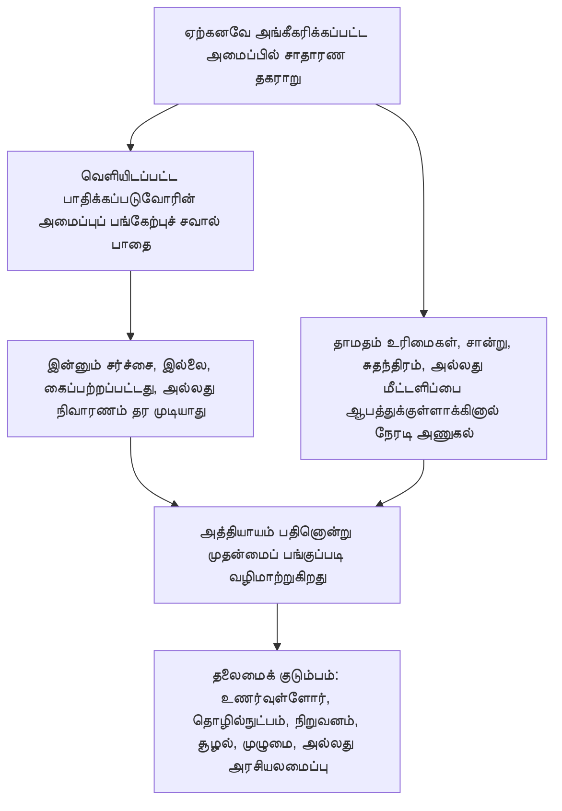

# அத்தியாயம் பதினொன்று: மன்றங்களும் அதிகார வரையும்

<strong>தொகுப்பில் இடம் (செயல்படாதது): கோப்பு அமைப்பும் வாசிப்பு விதிகளும்</strong>

> கீழே உள்ள உள்ளடக்கம் **வாசிப்பவருக்கான வழிகாட்டல் மட்டும்**. இது இந்தக் கோப்பிலோ பிற அத்தியாயங்களிலோ பிணைக்கும் கடமைகளைச் சேர்க்கவோ, குறைக்கவோ, சுருக்கவோ செய்யாது.
>
> இந்தக் கோப்பு [ஆங்கில அத்தியாயம் பதினொன்றின்](../../core_11_forum.md) **வாசிப்பு-மொழி முன்னோடி**. இது உணர்வுள்ளோர் அரசியலமைப்பின் **பிணைக்கும் பகுதி அல்ல**. இது **இரண்டாவது அரசியலமைப்பு அல்ல**. இது **அனுப்பும் பதிப்பு அல்ல**. இது `SC-Corpus-2026.08.09`-இல் **பொருத்தப்பட்டுள்ளது**. இந்த மொழிபெயர்ப்பும் ஆங்கில மூலமும் முரண்படுவதாகத் தோன்றினால், எண்ணிடப்பட்ட [`core_11_forum.md`](../../core_11_forum.md) வெல்லும். வாசிப்பு வரிசையும் பதிப்பு மீத்தரவும் [README.md](../../README.md)-இல் பேணப்படுகின்றன. முறையும் சொற்களஞ்சியமும்: [translations/ta/README.md](README.md).
>
> இது **அத்தியாயம் பதினொன்றை** கொண்டுள்ளது: மன்றக் குடும்பங்கள், இயல்புநிலை இருக்கை மற்றும் முதன்மை-பங்கு வழிமாற்றம், தடயவியல் ஆதரவு, நுழைவு வரிசை, நிலைத்தடத் தொடர் மற்றும் உரிமைத் தளம் கீழ் தகராறுகளுக்கான அதிகார வரை. மன்றங்கள் [அரசியலமைப்பு நான்மத்தின்](core_00_preamble.md#constitutional-tetrad) **பங்கேற்பு**, **மேற்பார்வை**, **காலந்தவறாமை** கால்கள் கீழ் தகராறு கையாளுதலை **மேற்பார்வை** செய்கின்றன, [பொருள் பங்கிற்கு](core_00_preamble.md#material-stake) அளவிடப்பட்டு. உண்மைகள் சரிபார்க்கப்பட்டால், அவை நிலைத்தடப் பதிவுகளை **திறக்க, புதுப்பிக்க, அல்லது திருத்த**லாம் — அல்லது **சவாலில் ஒரு மோசமான பதிவை ஒதுக்கி வைக்கலாம்** — [அத்தியாயம் எட்டு §3](core_08_standing_assessment.md#3-standing-record-operational-requirements) கீழ்; தாக்கல் செய்யப்பட்ட வழக்கு தானாக நிலைத்தடம் அல்ல, மன்றக் கதை அத்தியாயம் எட்டு நிலைத்தட அளவீட்டைப் பதிலீடு செய்யக்கூடாது ([அத்தியாயம் எட்டு §3.6](core_08_standing_assessment.md#36-forum-boundary)). தொடர் வழிசெலுத்தலுக்கு [README — Standing pipeline and forums](../../README.md#standing-pipeline-and-forums) பயன்படுத்துங்கள். இயக்க மன்ற இயந்திரம் பெயரிடப்பட்ட செயல்படுத்தல் கோப்புகளில் இருக்கிறது. அத்தியாய எண்ணிடலும் குறுக்குச் சுட்டுகளும் ஒருங்கிணைந்த கருவிக்குப் பொருந்துகின்றன. வாசிப்பு வரிசை, பிணைப்பு/ஆதரவுப் பிரிப்பு, தொகுப்புப் பதிப்பு மீத்தரவு [README.md](../../README.md)-இல் பேணப்படுகின்றன.

>
> **முந்தையது (இன்னும் ஆங்கிலத்தில்):** [core_10_b_misconduct_pattern_applications.md](../../core_10_b_misconduct_pattern_applications.md#chapter-ten-part-b-anti-constitutional-misconduct-pattern-applications)
>
> **அடுத்தது (இன்னும் ஆங்கிலத்தில்):** [core_08-11_application_vignettes.md](../../core_08-11_application_vignettes.md#chapters-eight-eleven-application-vignettes)
> **வாசிப்பு வளைவு:** §1 நோக்கம் → தகராறு வரிசை → §2 இயல்புநிலை இருக்கையும் நுழைவும் → §2.1–§2.3 தலைமை வரம்புகள், கலப்புப் பங்குகள், சவால்கள் → §3 இடமாற்றமும் சுய-தீர்ப்பு எதிர்ப்பும் → §4 குடும்பங்கள் → §5 உயர்த்தலும் சான்றளிப்பும் → §6 நிலைகளும் தாமத எதிர்ப்பும் → §7 மன்ற ஆதரவு

<strong>வாசிப்பவருக்கான வழிகாட்டல் (செயல்படாதது): அத்தியாயம் பதினொன்று வாழும் இடமும் இங்கே நிற்பதும்</strong>

> கீழே உள்ள உள்ளடக்கம் **வாசிப்பவருக்கான வழிகாட்டல் மட்டும்**. இது இந்த அத்தியாயத்திலோ பிற அத்தியாயங்களிலோ பிணைக்கும் கடமைகளைச் சேர்க்கவோ, குறைக்கவோ, சுருக்கவோ செய்யாது.
>
> இது வாழும் இடம் (வழிசெலுத்தல்):
> - **அரசியலமைப்பு உரிமையாளர்:** **பிரிவு 1** (*நோக்கம்* — இந்த அத்தியாயம் ஒதுக்கும் நெறிகளின் **முதன்மை தீர்ப்புப் பயன்பாடு**, வழக்கமான **நிர்வாக நிர்வாகத்திலிருந்து வேறுபட்டது**; ஏற்கனவே அங்கீகரிக்கப்பட்ட அமைப்புகளுக்குள் சாதாரண தகராறுகளுக்கான **தகராறு வரிசை**; **பொறுப்புக்கூறல்** தேவைகள்; **வெளியிடப்பட்ட**, **முன்னறிந்துகொள்ளக்கூடிய** **வாயில்** இடம்); **இயல்புநிலை தொடக்க இருக்கை**, **முதன்மை-பங்கு** வழிமாற்றம், **நுழைவு வரிசை அமைப்பு** (**முதல்-தொடு மேசை**), கலப்புப் பங்குகள், சமமின்மை, நிலைத்தட-பதிவு சவால்கள், **நல்லெண்ண வகைப்படுத்தலும் விளையாட்டு எதிர்ப்பும்**, **உணர்வுள்ளோர்-அணுகத்தக்க** **வாயில்** **அணுகல்** எதிர்பார்ப்புகள் (**பிரிவு 2**, **`corpus_forum.md`**-உடன் **படிக்க**); **இடமாற்றம்**, **இணைப்பு**, **ஒருங்கிணைப்பு** (**பிரிவு 3**, **பிரிவு 5** சான்றளிப்பு மற்றும் காப்புடன் படிக்க); **மன்றக் குடும்ப வரையறைகள்**, **உள்ளக அறைகள்**, **பகிர்ந்த தரங்கள்**, **தற்காலிக இயக்கச் சட்டம்** (உணர்வுள்ளோர், தொழில்நுட்பம், நிறுவனம், சூழல், முழுமை, அரசியலமைப்பு — **பிரிவு** **4**, **பிரிவு** **2**-இன் **அட்டவணையை** பிரதிபலிக்கிறது); **உயர்த்தல்**, **சான்றளிப்பு**, **இடைக்காலப் பாதுகாப்பு** (**பிரிவு 5**); **காலந்தவறாத் தீர்வு** மற்றும் **தாமத எதிர்ப்பு** ஒழுக்கம் (**பிரிவு 6**); மதிப்பாய்வுக்கு முன், போது, பின் **மன்ற ஆதரவு** (**பிரிவு 7**), வரிசை மற்றும் ஆதரவு பாத்திரங்கள் **சட்டபூர்வமாக அமைக்கப்பட்ட பொருள் குழுக்களைப் பதிலீடு செய்யாதபடி** செயல்படுத்தப்படுகிறது; **சுய-தீர்ப்பு எதிர்ப்பு** காப்பு வழிமாற்றம்; **அத்தியாயம் எட்டு**, **அத்தியாயம் பத்து**, **அத்தியாயம் ஆறு** நீதி மற்றும் சவால் உரிமைகளுடன் இணைந்த உயர்த்தல் கொக்கிகள்.
> - **தொடர் வழிசெலுத்தல்:** [README — Standing pipeline and forums](../../README.md#standing-pipeline-and-forums) — இந்தக் கோப்பில் [§§1–7](#1-purpose-and-role).
> - **அத்தியாயங்கள் எட்டு–ஒன்பது மூன்று-கேள்வித் தொடர்:** அத்தியாயம் எட்டு **பிரிவுகள் 2–3** கேள்வி 1க்கு (*என்ன நடந்தது?*) சரிபார்க்கப்பட்ட, அச்சு-தூய பதிவுகள் வழியாக விடையளிக்கின்றன. [அத்தியாயம் எட்டு §4](core_08_standing_assessment.md#4-standing-measurement-evaluation-dimensions) மற்றும் [§7 ஒருங்கிணைந்த விகிதாசார LEQU அளவுகோல்](core_08_standing_assessment.md#7-unified-proportional-lequ-scale) கேள்வி 2க்கு (*எவ்வளவு நன்றாக அல்லது கெட்டதாக இருந்தது?*) மதிப்பீட்டுப் பரிமாணங்கள், பகிர்ந்த ஐந்து-மடங்கு LEQU பட்டைகள், பகிர்ந்த **s** = 1...9 இலக்கணம் வழியாக விடையளிக்கின்றன, தனி பங்களிப்பு மற்றும் மீறல் பதிவுகளைப் பேணியபடி. [அத்தியாயம் ஒன்பது](core_09_standing_integration.md#chapter-nine-standing-effects-and-integration) கேள்வி 3க்கு (*அதனால் என்ன நடக்கிறது?*) நிவாரணம், காப்புகள், திறன் தடைகள் மற்றும் அனுமதிகள், நிலைத்தடப் பூட்டுகள் வழியாக விடையளிக்கிறது. மீறல் அச்சு இடத்தைக் கட்டுப்படுத்துவது சரிபார்க்கப்பட்ட தாக்கம் மட்டும்; அலட்சியம், மறைத்தல், கட்டாயம், பதில், ஒப்பிடக்கூடிய தன்மை விவரிப்புகள் அதை நகர்த்தா. [அத்தியாயம் பத்து](core_10_a_misconduct_designation.md#chapter-ten-anti-constitutional-misconduct) அத்தியாயம் எட்டு இடம் 7, 8, அல்லது 9 பதிவுக்குப் பொருந்தும் அரசியலமைப்புக்கு எதிரான-தவறான நடத்தைப் பெயரிடலைச் சேர்க்கலாம், ஆனால் எண் இடத்தை ஒதுக்காது.
> - **மன்றங்கள் (செயல்படாத விளக்கம்):** இந்த அத்தியாயம் கீழ் **மன்றக் குடும்பங்கள்** [அத்தியாயம் எட்டு](core_08_standing_assessment.md#chapter-eight-compliance-violation-and-standing-model) வகைப்பாடுகளைக் கான்கிரீட் தகராறுகளுக்குப் பயன்படுத்தும் முதன்மை **மன்றங்கள்** — தனியாகப் பதிவு செய்யப்பட்ட **பங்களிப்புத் தன்மை**, **மீறல் அச்சு தாக்க இடம்**, செயல்முறை / பதில் தன்மை **ஒன்றாக இருக்கும்** விஷயங்கள் உட்பட, **அத்தியாயம் எட்டு** கூட்டு-மதிப்பீடு மற்றும் பதிலீடு-இன்மை ஒழுக்கம் கீழ் கையாளப்பட வேண்டும். தீர்ப்புக்கு வெளியே **ஆராய்ச்சி நிதி**, **நிதியளிப்பு**, **ஊக்குவிப்பு** இயங்கமைப்புகள் ஏற்கப்பட்ட செயல்படுத்தலிலும் **[corpus_systems.md](../../corpus_systems.md)**-இலும் இருக்கின்றன (**அத்தியாயம் எட்டு** வாசிப்பாளர் வழிகாட்டல் காண்க); அவை தடுத்தல் மற்றும் வேர்-காரண ஆய்வை ஆதரிக்கலாம், **வாயில்** வழிமாற்றம், **பொருள்** தீர்மானம், அதிகாரபூர்வ அத்தியாயம் எட்டு எண் இட ஒதுக்கீடு, பொருந்தும் **அத்தியாயம் பத்து** பெயரிடல், அல்லது **சரத்து XXIII** (*முரண்பாட்டுத் தீர்வு, உயர்த்தல், அவசர விகிதாசாரம்*) கட்டுப்பாடுகளைப் **பதிலீடு செய்யக்கூடாது**. **பிரிவுகள் 1 மற்றும் 2** **ஊக்குவிப்பு** அமைப்புகளுக்கான **முதன்மை** பொறுப்பை ஒவ்வொரு **குடும்பத்தின்** **கோளத்துக்குள்** **முதன்மையாக** ஒதுக்குகின்றன (நுணுக்க விவரம் **தொகுப்பிலும்** செயல்படுத்தலிலும்); அந்த **ஒதுக்கீடு** [அத்தியாயம் பன்னிரண்டுக்கு](../../core_12_governance.md#chapter-twelve-constitutional-contract-legitimacy-authorization-and-stewardship) மற்றும் **[corpus_systems.md](../../corpus_systems.md)**-க்கு ஒதுக்கப்பட்ட **அமைப்பு-முழு** **நிதி** அல்லது **ஆட்சி-அளவு** தேர்வுகளை **இடம்மாற்றாது**.
> - **செயல்படுத்தல் உரிமையாளர்:** வெளியிடப்பட்ட நுழைவு **தரங்கள்**, அன்றாட அட்டவணை விதிகள், பணியாளர், நிதி, நுணுக்க நடைமுறை, இயக்க உயர்த்தல் இயந்திரம், மன்ற-ஆதரவு இயக்கத் தேவைகள் ஏற்கப்பட்ட செயல்படுத்தல் உரையிலும் **[corpus_forum.md](../../corpus_forum.md)**-இலும் வாழ்கின்றன (**CF-5** (*வழிமாற்ற இயக்கம், இடமாற்றம், சான்றளிப்பு, பிரதிநிதித்துவ நடத்துதல்*), **CF-8** (*மன்ற தடயவியல் மற்றும் பகுப்பாய்வு ஆதரவு*), **CF-9** (*சுயாதீன விசாரணைச் சேவையும் வழக்குத் தொடர்பும்*), தொடர்புடைய பிரிவுகள்); அந்த அடுக்குகள் இந்த அத்தியாயத்தை **அமலாக்குகின்றன, சுருக்கா**.
> - **இடம்மாற்றா விதி:** ஏற்புக் கருவிகள் தனி மன்றச் செயல்பாடுகளைச் சுருக்கும், **சுதந்திரத்தையோ** **உண்மையான மதிப்பாய்வையோ** உரிமையும், அல்லது இந்த அத்தியாயம் தனி இறுதிப் பொருள் இல்லமாகத் தடைசெய்யும் அதே கைப்பற்றப்பட்ட மன்றத்துக்கு முழுமைச் சவால்களைத் திருப்பி வழிமாற்றும் நடைமுறைகள் வழியாக இந்த அத்தியாயத்தை நிறைவேற்றக்கூடாது.
>
> **கட்டமைப்பு — *எளிய சொற்களில்* இடம்:** ஒவ்வொரு *எளிய சொற்களில்* வரியும் தடம் வழிசெலுத்தல் தொகுதிக்குப் பிறகு (இருக்கும்போது அதைத் தொடரும் ` `-க்குப் பிறகு) தோன்றும், அந்தப் பிரிவின் செயல் பத்திகளுக்கும் புள்ளிப் பட்டியல்களுக்கும் **முன்**. வாசிப்பவருக்கான விளக்கம் மட்டும்; பிணைக்கும் உரையைச் சேர்க்கவோ, குறைக்கவோ, சுருக்கவோ செய்யாது.

<strong>தடம்</strong>

- மேல்வழி: [அத்தியாயம் எட்டு](core_08_standing_assessment.md#chapter-eight-compliance-violation-and-standing-model) (*இந்த அத்தியாயம் வழிமாற்றும் தகராறுகளைத் தரும் கேள்வி 1 பதிவுகளும் கேள்வி 2 அளவீடும்*); [அத்தியாயம் எட்டு §5.1](core_08_standing_assessment.md#5-slot-grammar-and-display-labels) (*நிலைத்தட-இட இலக்கணம்*); [அத்தியாயம் எட்டு §7 ஒருங்கிணைந்த அளவுகோல்](core_08_standing_assessment.md#7-unified-proportional-lequ-scale) (*பகிர்ந்த ஐந்து-மடங்கு LEQU பட்டைகளும் தனி அச்சுப் பதிவுகளும்*); [அத்தியாயம் எட்டு §§4.3–4.4](core_08_standing_assessment.md#43-route-descriptor-measurement-roles) (*இடங்களை நகர்த்தாத பங்களிப்பு அச்சு மற்றும் மீறல் அச்சு விவரிப்புகள் உட்பட குறுக்கு-அச்சு இயல்பாக்கப்பட்ட விவரிப்புப் பட்டியல்*); [அத்தியாயம் பத்து](core_10_a_misconduct_designation.md#chapter-ten-anti-constitutional-misconduct) (*தகுதிபெறும் அத்தியாயம் எட்டு இடங்கள் 7–9க்குப் பொருந்தும் அரசியலமைப்புக்கு எதிரான-தவறான நடத்தைப் பெயரிடல்*); [அத்தியாயங்கள் இரண்டு முதல் நான்கு](core_02_definition_structure.md) (*பதிவு, சரிபார்ப்பு, தடமறிதல் எதிர்பார்ப்புகள்*); [அத்தியாயம் ஐந்து](core_05__definitions_home.md#chapter-five-foundational-definitions) (*அடிப்படை வரையறைகள்*); [அத்தியாயம் ஒன்று](core_01_c_stewardship_capacity_principles.md#chapter-01-principles-and-constraints) (*விளக்கக் கட்டுப்பாடுகள்*); [அத்தியாயம் ஆறு — அடிப்படை உரிமைகள்](core_06_rights_part_a.md#chapter-six-foundational-rights) முதல் [பகுதி ஈ](core_06_rights_part_d.md) வரை (*சவால், தணிக்கை, நீதி-சரத்துக் கொக்கிகள்*).
- துணைப்பிரிவுகள்: [§1](#1-purpose-and-role); [§2](#2-default-venue-and-primary-stakes); [§3](#3-transfer-consolidation-and-coordination); [§4](#4-forum-family-definitions); [§5](#5-escalation-and-certification); [§6](#6-timely-resolution-materiality-tiers-and-anti-delay-discipline); [§7](#7-forum-support-before-during-and-after-review).
- இதனுடன் படிக்க: [README — Standing pipeline and forums](../../README.md#standing-pipeline-and-forums).
- கீழ்வழி: [corpus_forum.md](../../corpus_forum.md) (*இயக்க மன்றக் கோட்பாடு*); [அத்தியாயம் பன்னிரண்டு](../../core_12_governance.md#chapter-twelve-constitutional-contract-legitimacy-authorization-and-stewardship) ஆட்சி நியாயம் தீர்ப்புப் பாத்திரத்துடன் இடைவினையாடும் இடத்தில்; [அத்தியாயம் பதினாறு](../../core_16_incorporation.md#chapter-sixteen-incorporation-bridge) (*ஏற்கப்பட்ட நடைமுறை அடுக்குகளுக்கான இணைப்பு ஒழுக்கம்*).
- இதனுடன் படிக்க: [அத்தியாயம் எட்டு §5.1](core_08_standing_assessment.md#5-slot-grammar-and-display-labels) (*நிலைத்தட-இட இலக்கணம்*); [அத்தியாயம் எட்டு §§4.3–4.4](core_08_standing_assessment.md#43-route-descriptor-measurement-roles) (*குறுக்கு-அச்சு இயல்பாக்கப்பட்ட பங்களிப்பு அச்சு மற்றும் மீறல் அச்சு விவரிப்புகள்*).
- இதனுடனும் படிக்க: [அத்தியாயம் ஒன்பது §3](core_09_standing_integration.md#3-descriptor-integration-and-attachment-normalization) (*பிரிவு 2 முதன்மை-பங்கு வழிமாற்றத்துடன் படிக்கப்படும் விவரிப்பு ஒருங்கிணைப்பும் இணைப்பு இயல்பாக்கமும்*); [README.md](../../README.md) (*வாசிப்பு வரிசையும் தொகுப்பு அமைப்பும்*); [doc_architecture.md](../../doc_architecture.md) (*ஏற்கப்படாவிட்டால் பிணைக்காத தொகுப்பு வரைபடங்கள்*).

 

அத்தியாயம் பதினொன்று **மன்றக் குடும்பங்கள், இயல்புநிலை இருக்கை, அதிகார வரை, நிலைத்தடத் தொடர் மற்றும் உரிமைத் தளம் கீழ் தகராறுகளுக்கான தீர்ப்பு வழிமாற்றம்** என்பதன் அரசியலமைப்பு உரிமையாளர்.

*எளிய சொற்களில்: [அரசியலமைப்பு நான்மம்](core_00_preamble.md#constitutional-tetrad) மற்றும் [இரண்டு அரசியலமைப்பு நோக்கங்கள்](core_00_preamble.md#two-constitutional-aims) கீழ், இந்த அத்தியாயம் அத்தியாயங்கள் எட்டு–பத்து நிலைத்தடத் தொடர் வழியாகத் தகராறுகள் எப்படி நகர்கின்றன என்பதை **மேற்பார்வை** செய்கிறது — வழிமாற்றம், சுதந்திரம், தடயவியல் ஆதரவு, பழுதுபார்ப்பு வரிசை, **பிரிவு 6** மற்றும் **சரத்து XXIV-C** (*காலந்தவறாத் தீர்வும் தாமத எதிர்ப்புத் தளமும்*) கீழ் நிலை-இயல்புநிலைக் கடிகாரங்கள். மன்றக் குடும்பங்கள் எந்தத் தடம் எந்தத் தகராறைக் கையாளுகிறது, ஒரு வழக்கு வழக்கமாக எங்கே தொடங்குகிறது, கலப்பு-பங்கு விஷயங்கள் எப்படி ஒருங்கிணைக்கின்றன என்று விடையளிக்கின்றன. அவை **பங்கேற்பு** (அணுகத்தக்க சவால்) மற்றும் **மேற்பார்வை** (தடமறியக்கூடிய பொருள் மதிப்பாய்வு) தருகின்றன. உண்மைகள் சரிபார்க்கப்பட்டால், அவை நிலைத்தடப் பதிவுகளை **திறக்க, புதுப்பிக்க, அல்லது திருத்த**லாம் — அல்லது **சவாலில் ஒரு மோசமான பதிவை ஒதுக்கி வைக்கலாம்**. அவை நிலைத்தடத் தொடருக்கு அருகில் இரண்டாவது, தனி முடிவுத் தடத்தை **நடத்தா**. ஒரு வழக்கைத் தாக்கல் செய்வது மட்டும் நிலைத்தடத்தில் உடனடித் தாக்கம் இல்லை. அன்றாட விசாரணை விதிகள், நிதி, பணியாளர் கையேடுகள் செயல்படுத்தல் அடுக்குகளில் வாழ்கின்றன, இந்த அத்தியாயத்தையோ **சரத்து XXIII**-ஐயோ (*முரண்பாட்டுத் தீர்வு, உயர்த்தல், அவசர விகிதாசாரம்*) **அமலாக்க வேண்டும், சுருக்கக்கூடாது**.*

### 1. நோக்கமும் பாத்திரமும் — பங்கேற்புக் கட்டமைப்பு

<strong>தடம்</strong>

- மேல்வழி: [அத்தியாயம் ஏழு — அமைப்பு இணக்கச் சான்றளிப்பு](core_07_a_system_alignment_certification_evaluation.md#chapter-seven-system-alignment-certification); [அத்தியாயம் எட்டு](core_08_standing_assessment.md#chapter-eight-compliance-violation-and-standing-model); [அத்தியாயம் ஒன்பது](core_09_standing_integration.md#chapter-nine-standing-effects-and-integration); [அத்தியாயம் பத்து](core_10_a_misconduct_designation.md#chapter-ten-anti-constitutional-misconduct); [அத்தியாயம் ஒன்று](core_01_c_stewardship_capacity_principles.md#chapter-01-principles-and-constraints) (*கோட்பாடுகளும் விளக்கக் கட்டுப்பாடுகளும்*); [அத்தியாயங்கள் இரண்டு முதல் நான்கு](core_02_definition_structure.md) (*தடமறிதல் மற்றும் சரிபார்ப்பு எதிர்பார்ப்புகள்*); [அத்தியாயம் ஐந்து](core_05__definitions_home.md#chapter-five-foundational-definitions) (*தொகுப்பு இடம் சாளரத்தில் அத்தியாயங்கள் இரண்டு முதல் நான்குடன் படிக்கப்படும் வரையறைகள்*); [அத்தியாயம் ஆறு](core_06_rights_part_a.md#chapter-six-foundational-rights) (*இந்த அத்தியாயம் உடன் பயன்படுத்தும் அடிப்படை உரிமைத் தளம்*).
- கீழ்வழி: [§2](#2-default-venue-and-primary-stakes) (*முதன்மை-பங்கு இயல்புநிலை இருக்கை, நுழைவு வரிசை, கலப்புப் பங்குகள், சமமின்மை, நிலைத்தட-பதிவு சவால்கள்; விரைவான சவால் செய்யக்கூடிய வாயில் அணுகல்; நல்லெண்ண வகைப்படுத்தலும் விளையாட்டு எதிர்ப்பும்*); [§3](#3-transfer-consolidation-and-coordination) (*இடமாற்றமும் சுய-தீர்ப்பு எதிர்ப்பும்*); [§4](#4-forum-family-definitions) (*மன்றக் குடும்ப வரையறைகள், அறைகள், பகிர்ந்த தரங்கள், தற்காலிக இயக்கச் சட்டம்*); [§4.3](#43-institutional-forums) (*தகராறு வரிசையின் நிறுவன-குடும்பப் பயன்பாடாக உள்ளக செயல்முறை எல்லை*); [§5](#5-escalation-and-certification) (*உயர்த்தல், சான்றளிப்பு, இடைக்காலப் பாதுகாப்பு*); [§6](#6-timely-resolution-materiality-tiers-and-anti-delay-discipline) (*பொருண்மை நிலைகள், தொடர் மைல்கற்கள், தாமத எதிர்ப்பு ஒழுக்கம்*); [§7](#7-forum-support-before-during-and-after-review) (*மதிப்பாய்வுக்கு முன், போது, பின் மன்ற ஆதரவு*).
- நான்மக் கால்(கள்): **பங்கேற்பு**, **மேற்பார்வை**, **பொறுப்புக்கூறல்**, **காலந்தவறாமை** (சரிபார்க்கப்பட்ட கண்டறிதல்கள் நிலைத்தடப் பதிவுகளைத் திறக்க, புதுப்பிக்க, அல்லது திருத்தலாம்; **CF-11** நிலைக் கடிகாரங்களை அமலாக்குகிறது). முதன்மை நோக்கம்(கள்): **செழிப்பு** மற்றும் **தொடர்ச்சி**. வழிமாற்றம் மற்றும் அணுகல் சுமைக்கு [பொருள் பங்கு](core_00_preamble.md#material-stake) அளவீடு பொருந்தும்.
- இதனுடன் படிக்க: [முகவுரை §3.2](core_00_preamble.md#32-key-governance-processes) மற்றும் [§3.3](core_00_preamble.md#33-governance-layers) (*செயல்முறைப் பாதைகளும் ஆட்சி-அடுக்கு ஒழுக்கமும்*); [சரத்து XI: பாதிக்கப்படுவோரின் அமைப்புப் பங்கேற்பு, பிரதிநிதித்துவம், முறையான நடைமுறை](core_06_rights_part_b.md#article-xi-stakeholder-system-participation-representation-and-due-process); [corpus_forum.md](../../corpus_forum.md) (**CF-6.2.2** (*அவசரம், தீர்வு, நேர விதிகள்*) — அமலாக்குங்கள், சுருக்க வேண்டாம்); [corpus_institutions.md](../../corpus_institutions.md) (*சவால், இரண்டாம் நிலை மதிப்பாய்வு, முழுமைக் கண்காணிப்பு — ஒதுக்கப்பட்ட மன்ற அதிகார வரையைப் பதிலீடு செய்யாது*); [சரத்து XII-B: சவால், மதிப்பாய்வு, நிவாரண உரிமை](core_06_rights_part_c.md#article-xii-b-right-to-challenge-review-and-redress); [சரத்து XXIII குடும்பம்](core_06_rights_part_d.md#article-xxiii-a-justice-objective-and-scope) (*தொகுப்பு இடம் சாளரத்தில் சுட்டப்படும் நீதிக் கட்டுப்பாடுகள்*).

 

*எளிய சொற்களில்: இந்தப் பிரிவு இரண்டு தடங்களை **மேற்பார்வை** செய்யும் மன்றக் குடும்பங்கள் வழியாக அரசியலமைப்பு **பங்கேற்பு** மற்றும் **மேற்பார்வையை** ஒதுக்குகிறது — **நிலைத்தடத் தொடர்** (அத்தியாயங்கள் எட்டு–பத்து தகராறுகளும் பதிவு விளைவுகளும்) மற்றும் **அமைப்பு இணக்கச் சான்றளிப்பு** (அத்தியாயம் ஏழு அங்கீகாரமும் மதிப்பாய்வும்) — பிறகு வெளியிடப்பட்ட வாயில் இடத்துக்கான பொறுப்புக்கூறல் தேவைகளைக் கூறுகிறது. ஏற்கனவே அங்கீகரிக்கப்பட்ட அமைப்புகளுக்குள் சாதாரண தகராறுகள் முதலில் வெளியிடப்பட்ட பாதிக்கப்படுவோரின் அமைப்புப் பங்கேற்புச் சவால் பாதையைப் பயன்படுத்துகின்றன; அந்தப் பாதை இன்னும் சர்ச்சையில் இருக்கும்போது, இல்லாதபோது, கைப்பற்றப்பட்டிருக்கும்போது, அல்லது நிவாரணம் தர முடியாதபோது இந்த அத்தியாயம் பொறுப்பேற்கிறது. விரிவான விசாரணை விதிகள் வேறு இடத்தில் வாழ்கின்றன, இந்த அத்தியாயம் உத்தரவாதம் செய்வதை அமைதியாகச் சுருக்கக்கூடாது.*

இந்த அத்தியாயம் எந்த **மன்றக் குடும்பங்கள்** எந்த முதன்மைக் கேள்விகளை **மேற்பார்வை** செய்கின்றன என்று **பங்கேற்பு** (உணர்வுள்ளோர்-அணுகத்தக்க சவால், பிரதிநிதித்துவ நடத்துதல், விகிதாசார அணுகல்) மற்றும் **மேற்பார்வை** (சுதந்திரம், தடயவியல் ஆதரவு, தடமறியக்கூடிய பொருள் மதிப்பாய்வு) வழியாகக் கூறுகிறது. அது அட்டவணை விதிகள், பணியாளர், நிதி, நுணுக்க நடைமுறை, அல்லது இயக்க உயர்த்தல் இயந்திரத்தை **குறிப்பிடாது**. அந்த விவரங்கள் தொகுப்பு செயல்படுத்தல் அடுக்குகளில் உள்ளன, அவை இந்த அத்தியாயத்தை **அமலாக்க வேண்டும், சுருக்கக்கூடாது**. **மன்றக் குடும்பங்கள்** வாயில் இடம், முதன்மை-பங்கு வழிமாற்றம், அமைப்பு-இணக்க மதிப்பாய்வுக்கான சட்ட மற்றும் ஒழுங்குமுறை எல்லைகளை முன்னறிந்துகொள்ளக்கூடிய, வெளியிடப்பட்ட வழியில் கூற வேண்டும், **பிரிவு 2**-ஐ **`corpus_forum.md`**-உடன் **அமலாக்கி, சுருக்காமல்**.

**மன்றக் குடும்பங்கள் மேற்பார்வை செய்பவை:**

1. **நிலைத்தடத் தொடர்** (அத்தியாயங்கள் எட்டு–பத்து, தகராறுகளில் அத்தியாயங்கள் ஒன்று முதல் ஆறு மற்றும் பெயரிடப்பட்ட தொகுப்பு செயல்படுத்தல் நெறிகளைப் பயன்படுத்தி)
   - முதன்மை-பங்கு வழிமாற்றம், ஒதுக்கப்பட்ட இடத்தில் பொருள் மதிப்பாய்வு, இடமாற்றம், இணைப்பு, சான்றளிப்பு ஒருங்கிணைப்பு, நிலைத்தட-தொடர்புடைய தகராறுகளுக்கான பழுதுபார்ப்பு வரிசை.
   - **அத்தியாயம் எட்டு** பங்களிப்பு மற்றும் மீறல் பதிவுகள் §7 ஒருங்கிணைந்த விகிதாசார LEQU அளவுகோலில் அளக்கப்பட்டவை, தன்மை விவரிப்புகள், நிலைத்தட விளைவு — சரிபார்க்கப்பட்ட கண்டறிதல்கள் நிலைத்தடப் பதிவுகளை **திறக்க, புதுப்பிக்க, அல்லது திருத்த**லாம் — அல்லது **சவாலில் ஒரு மோசமான பதிவை ஒதுக்கி வைக்கலாம்** — சரிபார்க்கப்பட்ட-உள்ளீட்டு வாயிலை நிறைவேற்றும்போது [அத்தியாயம் எட்டு §3](core_08_standing_assessment.md#3-standing-record-operational-requirements) கீழ்; தாக்கல் செய்யப்பட்ட வழக்கு தானாக நிலைத்தடம் அல்ல, மன்றக் கதை அத்தியாயம் எட்டு நிலைத்தட அளவீட்டைப் பதிலீடு செய்யக்கூடாது ([அத்தியாயம் எட்டு §3.6](core_08_standing_assessment.md#36-forum-boundary)).
   - **அத்தியாயம் ஒன்பது** நிலைத்தட விளைவுகளும் ஒருங்கிணைப்பும் இந்த அத்தியாயம் நிவாரணம் மற்றும் வரிசையின் மன்ற மேற்பார்வையை ஒதுக்கும் இடத்தில்.
   - **அத்தியாயம் பத்து** அரசியலமைப்புக்கு எதிரான-தவறான நடத்தைப் பெயரிடல் அத்தியாயம் எட்டு இடம் 7–9 பதிவுக்கு அந்தப் பெயரிடல் பிரச்சினையாக இருக்கும் இடத்தில்.
   - **அத்தியாயங்கள் ஒன்று முதல் ஆறு** மற்றும் பெயரிடப்பட்ட [தொகுப்பு](core_05_band_integrative.md#corpus) செயல்படுத்தல் அடுக்குகளை அந்தத் தகராறுகள் பயன்படுத்தும் நெறிகளாகப் பயன்படுத்துதல்.

2. **அமைப்பு இணக்கச் சான்றளிப்பு** ([அத்தியாயம் ஏழு](core_07_a_system_alignment_certification_evaluation.md#chapter-seven-system-alignment-certification))
   - [அத்தியாயம் ஏழு பகுதி ஆ](core_07_b_system_alignment_certification_record_process.md#chapter-seven-part-b-certification-record-and-process) கீழ் மன்ற-மேற்பார்வை அங்கீகாரம், நிபந்தனை அங்கீகாரம், சரிபார்ப்பு, மீள்சரிபார்ப்பு, விலக்குதல், தொடர்புடைய சான்றளிப்பு-பதிவு விளைவுகள்.
   - [பகுதி ஆ §13](core_07_b_system_alignment_certification_record_process.md#13-forum-supervision-and-component-roles) கீழ் கூறு பாத்திரங்கள்:
     - **தொழில்நுட்பம்** — விவரக்குறிப்புகள், முறைகள், சான்றுத் தரங்கள்
     - **முழுமை** — அதிகாரபூர்வ இணக்க அங்கீகாரமும் தலைமை ஒருங்கிணைப்பும்
     - **சூழல்** — பொருளுள்ள இடத்தில் சுற்றுச்சூழல்-இணக்கக் கூறு
     - இந்த அத்தியாயத்தின் வழிமாற்றம் கீழ் பிற குடும்பக் கூறு கண்டறிதல்கள்
   - உணர்வுள்ளோர் சான்றளிப்பு முடிவுகளைச் சவால் செய்யலாம், நிபந்தனைகளை இணைக்கலாம், தேவைப்படும்போது கோப்பை மீண்டும் திறக்கலாம் — ஆனால் சான்றளிப்பு நிலைத்தட அளவீட்டை **பதிலீடு செய்யாது**.
   - ஒரு சான்றளிப்பிலிருந்து முக்கியக் கண்டறிதல்கள் அத்தியாயம் எட்டு நிலைத்தடத்தை அளக்கும்போது **சரிபார்க்கப்பட்ட உள்ளீடுகளாக** எண்ணலாம். ஒரு சான்றளிப்பு **தானாக** யாருக்கும் நிலைத்தட இடத்தை ஒதுக்காது ([பகுதி ஆ §15](core_07_b_system_alignment_certification_record_process.md#15-relationship-to-standing)).

**மன்றக் குடும்பங்கள்** இந்தக் கருவி அந்தத் தடங்களை **மேற்பார்வை** செய்யும் முதன்மை நிறுவனங்கள். அவை இயற்றப்பட்ட விதிகளின் வழக்கமான நிர்வாக நிர்வாகத்திலிருந்து வேறுபட்டவை.

**தகராறு வரிசை.** ஏற்கனவே அங்கீகரிக்கப்பட்ட அமைப்பு, நிறுவனம், அல்லது வரம்புடைய முடிவுக் களத்துக்குள், ஒரு சாதாரண தகராறு முதலில் வெளியிடப்பட்ட [பாதிக்கப்படுவோரின் அமைப்புப் பங்கேற்பு](core_05_band_participation.md#stakeholder-status-and-weight-cluster) சவால் மற்றும் முறையான நடைமுறைப் பாதையைப் பயன்படுத்துகிறது. அந்தப் பாதை இன்னும் சர்ச்சையான முடிவைத் தந்தால், இல்லாவிட்டால், கைப்பற்றப்பட்டிருந்தால், அல்லது தேவையான நிவாரணத்தைச் சட்டபூர்வமாகத் தர முடியாவிட்டால், இந்த அத்தியாயம் **பிரிவு 2** கீழ் முதன்மைப் பங்குப்படி விஷயத்தை வழிமாற்றுகிறது. **முழுமை**, **தொழில்நுட்ப மன்றக் களங்கள்**, **சூழல்**, **அரசியலமைப்பு** அது முதன்மைப் பங்காக இருக்கும்போது இயல்புநிலைத் தலைமைக் குடும்பங்கள் — வரிசையைத் தவிர்க்கும் விதிவிலக்குகள் அல்ல. முடியாத உள்ளக செயல்முறை, தீர்வு முத்திரைகள், அல்லது உள்ளக மதிப்பாய்வு முடியவில்லை என்ற கூற்று அந்தத் தலைமைகளைத் தாமதப்படுத்தக்கூடாது, அவற்றின் பொருளை இடமாற்றக்கூடாது, அல்லது **சரத்து XXIV-C** (*காலந்தவறாத் தீர்வும் தாமத எதிர்ப்புத் தளமும்*) கடிகாரங்களைத் தின்னக்கூடாது. தாமதம் உரிமைகள், சான்று, சுதந்திரம், அல்லது நடைமுறை மீட்டளிப்பைப் பொருள்ரீதியாக ஆபத்துக்குள்ளாக்கும்போது நேரடி அணுகல் கிடைக்கும்.

*வாசிப்பவர் வரைபடம் மட்டும். தகராறு வரிசைப் பத்தியைச் சேர்க்கவோ, குறைக்கவோ, சுருக்கவோ செய்யாது.*

அவை:

- முன்கூட்டிய ஆட்சிப் பாத்திரத்தைச் சுமக்கின்றன, பிரச்சினைத் தீர்வு, வேர்-காரணப் பகுப்பாய்வு, தடுத்தல், பழுதுபார்ப்பு வரிசை, தோல்வி முறைகளிலிருந்து கற்றல் உட்பட, **அத்தியாயம் ஒன்று** கோட்பாடுகளுடன் இணக்கமாக **பாதுகாப்பு**, **உண்மை**, **நல்வாழ்வு**, **பதிலளிக்கும் தன்மை**, **பொறுப்பான நிர்வாகமும் பகிர்ந்த புரிதலும்** உட்பட.
- **அத்தியாயங்கள் இரண்டு முதல் நான்கு** கீழ் **சுதந்திரம்**, **சவால் செய்யக்கூடிய தன்மை**, **தடமறிதல்** எதிர்பார்ப்புகளை நிறைவேற்ற வேண்டும், சவாலும் பழுதுபார்ப்பும் தொடர்புடைய இடத்தில் **சரத்து XII-B** (*சவால், மதிப்பாய்வு, நிவாரண உரிமை*), நீதிக் கட்டுப்பாடுகள் ஆளும் இடத்தில் **சரத்து XXIII** (*முரண்பாட்டுத் தீர்வு, உயர்த்தல், அவசர விகிதாசாரம்*).
- இந்தக் கருவியின் மிகக் கடுமையான வெளிப்படுத்தப்பட்ட நடைமுறை மற்றும் முழுமை-பொறுப்புக்கூறல் தேவைகளுக்கு உட்பட்டவை, பொது நியாயப்படுத்தல், தடமறிதல், விலகல் மற்றும் குழு ஒழுக்கம், இந்த அத்தியாயம் ஒதுக்கும் இடத்தில் தடயவியல் மற்றும் பகுப்பாய்வு ஆதரவு உட்பட
- சுய-தீர்ப்பு எதிர்ப்புக் காப்பு வழிமாற்றத்தைக் கேட்கின்றன. அந்தத் தேவைகள் தீர்ப்பு சுதந்திரத்துக்கு அரசியல் கட்டுப்பாட்டைப் பதிலீடு செய்யக்கூடாது.
- **முழுமை**, **அரசியலமைப்பு**, **சூழல்** மன்றங்கள், மற்றும் உணர்வுள்ள நிலைத் தீர்ப்பைக் கேட்கும்போது **தொழில்நுட்ப மன்றக் களங்கள்**, [அத்தியாயம் பன்னிரண்டு §1.2](../../core_12_governance.md#12-eligibility-contested-selection-and-democratic-minimums) கீழ் **வெளியிடப்பட்ட**, **சவால் செய்யப்பட்ட**, **சுழற்றக்கூடிய** நியமனம் அல்லது சமமான சுதந்திரச் சோதனையைக் கேட்கின்றன. அந்த இருக்கைகளின் குறை நியமனம் அல்லது குறை நிதி [அத்தியாயம் ஒன்பது §9](core_09_standing_integration.md#9-enforcement-realism) தோல்வி.

ஒவ்வொரு **மன்றக் குடும்பமும்** தன் கோளத்துக்குள் முதன்மையாக ஊக்குவிப்பு அமைப்புகளுக்கு முதன்மைப் பொறுப்பு சுமக்கிறது. இதில் அடங்குவன:

- ஏற்புக் கருவிகளும் பெயரிடப்பட்ட செயல்படுத்தல் அடுக்குகளும்
- செலவு, தடை, சவால், அறிக்கைப் பாதைகளை மதிப்பாய்வு செய்தல்
- வரிசைக் கொக்கிகளைப் பழுதுபார்த்தல், மற்றும் ஒப்பிடக்கூடிய தீர்ப்பு-அருகாமை இணக்கம்.

**அமைப்பு-முழு** நிதி, குறுக்கு-வெட்டு ஆராய்ச்சி நிதி, ஆட்சி-அளவு திட்டங்கள் [அத்தியாயம் பன்னிரண்டு — ஆட்சி](../../core_12_governance.md#chapter-twelve-constitutional-contract-legitimacy-authorization-and-stewardship), **[corpus_systems.md](../../corpus_systems.md)**, பொருந்தும் பிற மேலாண்மை விதிகளுக்கு உட்பட்டவை. ஊதியங்கள், செலவு விதிகள், ஒத்த ஊக்குவிப்புக் கருவிகள் இவற்றுக்கு **பதிலாக நிற்கக்கூடாது**:

- சரியான மன்ற வழிமாற்றம்
- சட்டபூர்வமாக அமைக்கப்பட்ட குழுவின் உண்மையான பொருள் முடிவு
- அத்தியாயம் எட்டு தாக்க-இட அளவீடு
- பொருந்தும் **அத்தியாயம் பத்து** பெயரிடல்
- **சரத்து XXIII**-இன் (*முரண்பாட்டுத் தீர்வு, உயர்த்தல், அவசர விகிதாசாரம்*) நீதிக் கட்டுப்பாடுகள்

**`corpus_institutions.md`**-இல் நிறுவனச் சவால், இரண்டாம் நிலை மதிப்பாய்வு, முழுமைக் கண்காணிப்பு (**CI-5** (*முரண்பாட்டு முழுமை, கைப்பற்றுதல் எதிர்ப்பு, ஊழல் எதிர்ப்பு*) முதல் **CI-8** (*குறுக்கு-நிறுவன ஒருங்கிணைப்பும் உயர்த்தலும்*) மற்றும் சவால்-முழுமை எதிர்பார்ப்புகள் உட்பட) இந்த அத்தியாயத்துடன் பணிபுரிகின்றன. இந்த அத்தியாயம் அந்தக் குடும்பங்களுக்கு அதிகார வரை ஒதுக்கும் இடத்தில் பிணைக்கும் பொருளுக்கு **முழுமை**, **சூழல்**, அல்லது **நிறுவன** மன்றக் குடும்பங்களை அவை பதிலீடு செய்யா. அந்தத் தொகுதிகளில் செயல்படுத்தல் ஊக்குவிப்பு இயங்கமைப்புகள் முதன்மையாகத் தொடர்புடைய கோளத்தின் மன்றக் குடும்பத்துடன் ஒருங்கிணைக்க வேண்டும், இந்த அத்தியாயம் ஒதுக்கும் முதன்மை-பங்கு வழிமாற்றம் அல்லது பொருள் அதிகாரத்தை இடமாற்றாமல்.

### 2. இயல்புநிலை இருக்கையும் முதன்மைப் பங்குகளும்

<strong>தடம்</strong>

- மேல்வழி: [§1](#1-purpose-and-role) (*நோக்கம், முதன்மைப் பயன்பாட்டுப் பாத்திரம், பொறுப்புக்கூறல் தேவைகள், வெளியிடப்பட்ட வாயில் வழிமாற்றம், விவரத்தை இடம்மாற்றாமை, சுதந்திரம் மற்றும் மதிப்பாய்வு எதிர்பார்ப்புகள்*).
- கீழ்வழி: [§3](#3-transfer-consolidation-and-coordination) (*இடமாற்றம், இணைப்பு, சுய-தீர்ப்பு எதிர்ப்பு*); [§4](#4-forum-family-definitions) (*இயல்புநிலை அட்டவணையுடன் படிக்கப்படும் மன்றக் குடும்ப வரையறைகள்*); [§5](#5-escalation-and-certification) (*இயல்புநிலை இருக்கையிலிருந்து உயர்த்தல்; இடைக்காலப் பாதுகாப்பு*); [§6](#6-timely-resolution-materiality-tiers-and-anti-delay-discipline) (*பொருண்மை நிலைகளும் தாமத எதிர்ப்பு ஒழுக்கமும்*); [§7](#7-forum-support-before-during-and-after-review) (*மதிப்பாய்வுக்கு முன், போது, பின் மன்ற ஆதரவு*).
- §2-க்குள்: [§2.1](#21-lead-default-limits) (*முதன்மை-பங்கு மோதல், அரசியலமைப்புச் சான்றளிப்பு, சுய-தீர்ப்பு எதிர்ப்புக் காப்பு*); [§2.2](#22-mixed-stakes-and-routing-asymmetry) (*கலப்புப் பங்குகளும் சமமின்மையும்*); [§2.3](#23-forum-records-standing-records-and-contests) (*மன்ற வழக்குப் பதிவுகள், நிலைத்தடப் பதிவுகள், சவால்கள்*).
- இதனுடன் படிக்க: [அரசியலமைப்பு நான்மம்](core_00_preamble.md#constitutional-tetrad) — **பங்கேற்பு**, **மேற்பார்வை**, **காலந்தவறாமை** கால்கள்; முதன்மை-பங்கு வழிமாற்றத்துக்கு [பொருள் பங்கு](core_00_preamble.md#material-stake) அளவீடு; [அத்தியாயம் எட்டு §5.1](core_08_standing_assessment.md#5-slot-grammar-and-display-labels) (*நிலைத்தட-இட இலக்கணம்*); [அத்தியாயம் எட்டு §7 ஒருங்கிணைந்த அளவுகோல்](core_08_standing_assessment.md#7-unified-proportional-lequ-scale) (*பகிர்ந்த ஐந்து-மடங்கு LEQU பட்டைகளும் தனி அச்சுப் பதிவுகளும்*); [அத்தியாயம் எட்டு §§4.3–4.4](core_08_standing_assessment.md#43-route-descriptor-measurement-roles) (*தாக்க இடத்தை நகர்த்தாமல் முதன்மைப் பங்கைத் தெரிவிக்கும் குறுக்கு-அச்சு இயல்பாக்கப்பட்ட விவரிப்புகள்*); [corpus_forum.md](../../corpus_forum.md) (**CF-5** மற்றும் **CF-7.2**); [corpus_systems.md](../../corpus_systems.md) (*அமைப்பு வகைப்பாடு, நிலைநிறுத்தல், மீள்சரிபார்ப்புக் கடமைகள்*); [அத்தியாயம் பத்து §3](core_10_a_misconduct_designation.md#3-violation-axis-s-7-9-slot-assignment-incident-gravity) (*தகுதிபெறும் அத்தியாயம் எட்டு இடங்கள் 7–9க்கு அரசியலமைப்புக்கு எதிரான-தவறான நடத்தைப் பெயரிடல்; பழைய நங்கூரம் பேணப்பட்டது*); [அத்தியாயம் பத்து §4](core_10_a_misconduct_designation.md#4-due-process-safeguards-for-slot-assignment) (*அந்தப் பெயரிடலுக்கான முறையான நடைமுறை இந்த அத்தியாயத்துடனும் **சரத்து XXIII**-உடனும் (*முரண்பாட்டுத் தீர்வு, உயர்த்தல், அவசர விகிதாசாரம்*) படிக்க*); [சரத்து XXIII-A](core_06_rights_part_d.md#article-xxiii-a-justice-objective-and-scope) (*நீதி நோக்கமும் எல்லையும்*).

 

*எளிய சொற்களில்: ஒவ்வொரு குடும்பத்தின் **முதல்-தொடு மேசை** — **நுழைவு வரிசை அமைப்பு** — தலைப்பு என்ன சொல்கிறது என்பதல்ல, சண்டை உண்மையில் எதைப் பற்றியது என்று கேட்கிறது, பிறகு தலைமை மன்றத்தைத் தேர்ந்தெடுக்க இயல்புநிலை அட்டவணையைப் பயன்படுத்துகிறது. தொழில்நுட்ப மன்றங்கள் அமைப்பு-இணக்க விவரக்குறிப்புகள், முறைகள், சான்றுத் தரங்களைப் பேணுகின்றன; **முழுமை** மன்றங்கள் அதிகாரபூர்வ இணக்க-அங்கீகார மற்றும் தொடர்-சரிபார்ப்புத் தீர்ப்பைச் செய்கின்றன, ஒரு கூறு கேள்வி வேறு இடத்துக்குச் சேராவிட்டால். வரிசைப்படுத்துதல் சட்டபூர்வமாக அமைக்கப்பட்ட பொருள் குழுக்களைப் பதிலீடு செய்யாது; கலப்புப் பங்குகள், சமமின்மை, நிலைத்தட-பதிவு சவால்கள் கீழ் துணைப்பிரிவுகளில் உள்ளன.*

**முதன்மை-பங்கு வழிமாற்றம்** ஒரு விஷயத்தை **கூற்று** அல்லது **பாதுகாப்பில்** முக்கிய சட்ட, நிவாரண, வற்புறுத்தல்-காப்பு, அரசியலமைப்பு-தள, அல்லது நடைமுறைப் பங்குக்குப் பொறுப்பான மன்றக் குடும்பத்துக்கு ஒதுக்குகிறது. அது தகராறு உண்மையில் எதைப் பற்றியது என்பதைப் பின்தொடர்கிறது, தலைப்பையோ தரப்பினரின் விரும்பிய முடிவையோ அல்ல.

**நுழைவு வரிசை அமைப்பு (முதல்-தொடு மேசை).** ஒவ்வொரு தேவைப்படும் மன்றக் குடும்பமும் தாக்கலில் குடும்பத்தின் **முதல்-தொடு மேசையாக** ஒரு **நுழைவு வரிசை அமைப்பை**, அல்லது அந்தக் குடும்பத்துக்குள் செயல்பாட்டில் சமமான ஏற்பாட்டை, பேண வேண்டும். அந்த அமைப்பு:
- இந்தப் பிரிவு கீழ் முதன்மை-பங்கு வழிமாற்றத்தை **பயன்படுத்துகிறது**;
- **முதன்மைப் பங்குகளுடன்** இணக்கமான **வெளியிடப்பட்ட** நுழைவு நடத்துதலுக்கு வரும் விஷயங்களை **வரிசைப்படுத்துகிறது**;
- பேணுதல், **உரிமைத்-தள**, **குறுக்கு-குடும்ப வழிமாற்றம்**, **காப்பு-மன்ற** தேவைகளை **குறிக்கிறது**;
- **பிரிவுகள் 3 மற்றும் 5** கீழ் இடமாற்றம், இணைப்பு, சான்றளிப்பு, காப்பு ஒழுக்கம் விரைவில் நடைமுறைக்கு வர ஆரம்ப அணுகலை **நிர்வகிக்கிறது**;
- தனி அரசியலமைப்பு மன்றக் குடும்பம் **அல்ல**;
- **பொருள் விளைவுகள்** அல்லது **குடும்ப** எல்லைகளை **சுருக்குவதில்** சட்டபூர்வமாக அமைக்கப்பட்ட பொருள் குழுவைப் **பதிலீடு செய்யக்கூடாது**;
- முதன்மை-பங்கு வழிமாற்றத்தைத் தோற்கடிக்க அல்லது ஒளிபுகா வாயில் வரிசைப்படுத்தலை இயக்க நிதி, கட்டணம், நிர்வாக முன்னுரிமை, அல்லது பிற ஊக்குவிப்புக் கருவிகளை **பயன்படுத்தக்கூடாது**.

**நல்லெண்ண வகைப்படுத்தலும் விளையாட்டு எதிர்ப்பும்.** மன்ற வகைப்படுத்தல் **நல்லெண்ணமாகவும்** **முதன்மைப் பங்குகளால்** **நியாயப்படுத்தப்பட்டதாகவும்** இருக்க வேண்டும். **அறிந்த** தவறான வகைப்படுத்தல் ஏற்புச் சட்டம் கீழ் **செலவுகள்**, **தள்ளுபடி**, அல்லது **பரிந்துரையை** **தூண்டலாம்**. ஊக்குவிப்புக் கருவிகள் மன்றத் தேர்வு விளையாட்டு, ஒளிபுகா வாயில் வரிசைப்படுத்தல், அல்லது **இந்தப் பிரிவு** மற்றும் **பிரிவு 3**-இல் முதன்மை-பங்கு ஒழுக்கத்துடன் இணங்காத வழிமாற்றத்தை வெகுமதி தர அமைக்கப்படவோ பயன்படுத்தப்படவோ கூடாது. செலவுகள், தள்ளுபடி, பரிந்துரை இயந்திரம் **`corpus_forum.md`**-இல் (**CF-5**) வாழ்கிறது, இந்தப் பிரிவை **அமலாக்க வேண்டும், சுருக்கக்கூடாது**.

இயக்கத் தேவைகள் — **வெளியிடப்பட்ட நுழைவுத் தரங்கள்**, பொறுப்பிடத்தக்க நுழைவுப் பதிவுகள், சுதந்திரம் மற்றும் **சவால்** எதிர்பார்ப்புகள், **சர்ச்சையான** வழிமாற்றத்தின் **விரைவான** மதிப்பாய்வு உட்பட — **`corpus_forum.md`**-இல் (**CF-5** (*வழிமாற்ற இயக்கம், இடமாற்றம், சான்றளிப்பு, பிரதிநிதித்துவ நடத்துதல்*)) கூறப்படுகின்றன.

ஒவ்வொரு மன்றக் குடும்பத்துக்கும் **ஆரம்ப அணுகல்** போதுமான அளவு விரைவாகவும் சவால் செய்யக்கூடியதாகவும் இருக்க வேண்டும்:
- இந்தப் பிரிவு கீழ் முதன்மை-பங்கு வழிமாற்றம் பொருளுள்ளதாக இருக்க;
- **பிரிவுகள் 3 மற்றும் 5** கீழ் இடமாற்றம், இணைப்பு, சான்றளிப்பு, காப்பு ஒழுக்கம் தாமதத்தாலோ ஒளிபுகா வாயில் வரிசைப்படுத்தலாலோ வெறுமையாகாதபடி.

மன்ற அணுகலுக்கான நேர எதிர்பார்ப்புகள்:
- **உணர்வுள்ளோர்-அணுகத்தக்கதாக** இருக்க வேண்டும்;
- **பிரிவு 6** மற்றும் **சரத்து XXIV-C** (*காலந்தவறாத் தீர்வும் தாமத எதிர்ப்புத் தளமும்*) கீழ் தீங்கு அவசரத்துக்கும் விஷயச் சிக்கலுக்கும் அளவிடப்பட வேண்டும்;
- நிர்வாக வசதியைவிட **பிரிவு 5** (*இடைக்காலப் பாதுகாப்பு*) கீழ் உண்மையான வாயில் அணுகல் மற்றும் சட்டபூர்வ இடைக்கால நிவாரணத்தை முன்னுரிமைப்படுத்த வேண்டும்.

இந்தப் பிரிவு கீழ் **நுழைவு வரிசை அமைப்பு**, **`corpus_forum.md`** (**CF-5**) உடன், இந்தக் கடமையை நிறைவேற்றுகிறது, இணைப்பு எல்லைக்குள் **பிரிவு 6** நிலை-இயல்புநிலைச் சாளரங்களை அமலாக்க வேண்டும்.

**அத்தியாயம் எட்டு §3-இலிருந்து வழிமாற்ற வரைபடம்.** அத்தியாயம் எட்டு மன்றங்களுக்கு என்ன நடந்தது என்பதை *அளக்க* கூறுகிறது. அது தானாக எந்த மன்றம் வழக்கைக் கேட்கிறது என்பதைத் **தேர்ந்தெடுக்காது**. தாக்கலில், குடும்பத்தின் **நுழைவு வரிசை அமைப்பு** (முதல்-தொடு மேசை) இந்த வரிசையைப் பின்தொடர்கிறது:

1. **ஏற்கனவே சரிபார்க்கப்பட்டதைச் சோதியுங்கள்:** ஏற்கனவே இருக்கும்போது சரிபார்க்கப்பட்ட அத்தியாயம் எட்டு **பங்களிப்பு அச்சு** அல்லது **மீறல் அச்சு** பொருளைக் குறிப்பிடுங்கள் — தாக்க இடம், தீவிரப் பட்டை, செயல்முறை / பதில் தன்மை, நிலைத்தட விளைவு உட்பட.
2. **குற்றச்சாட்டுகளைத் தீர்க்கப்பட்ட உண்மைகளாக நடத்தாதீர்கள்:** குற்றச்சாட்டுகளும் தற்காலிக முத்திரைகளும் வழிமாற்றம் மற்றும் சான்றுப் பேணுதலுக்கு மட்டும் வழிகாட்டுகின்றன, **அத்தியாயங்கள் இரண்டு முதல் நான்கு** கீழ் கண்டறிதல்கள் இருக்கும் வரை.
3. **சண்டை உண்மையில் எதைப் பற்றியது என்பதால் தலைமை மன்றத்தைத் தேர்ந்தெடுங்கள்:** கீழ் இயல்புநிலை இருக்கை அட்டவணையைப் பயன்படுத்துங்கள்: **உணர்வுள்ளோர்**, **தொழில்நுட்ப மன்றக் களங்கள்**, **நிறுவனம்**, **சூழல்**, **முழுமை**, அல்லது **அரசியலமைப்பு**. பொருந்தும் இடத்தில் இந்தச் சிறப்பு வழிமாற்ற விதிகளைப் பயன்படுத்துங்கள்:
   - **அத்தியாயம் பத்து பெயரிடல்:** **அத்தியாயம் பத்து** அரசியலமைப்புக்கு எதிரான-தவறான நடத்தைப் பெயரிடல் **முதன்மை** பங்காக இருக்கும் இடத்தில், **முழுமை** இயல்புநிலைத் தலைமை. இவற்றை வையுங்கள்:
     - அத்தியாயம் எட்டு எண் தாக்க இடம்;
     - தேவைப்படும் இடத்தில் **அரசியலமைப்பு** சான்றளிப்பு;
     - நிறுவன-தரப்பினர் விதிகள்; மற்றும்
     - **பிரிவுகள் 2, 3, மற்றும் 5** கீழ் சுய-தீர்ப்பு எதிர்ப்புக் காப்பு.
   - **மன்ற-சார்பு தகராறுகள்:** சண்டை முக்கியமாக விலகியிருக்க வேண்டிய குழு உறுப்பினர், சார்புள்ள குழு பங்கேற்பு, அல்லது ஒப்பிடக்கூடிய மன்ற-முழுமை மீறல் பற்றியதாக இருந்தால் — **[சரத்து XXII-B](core_06_rights_part_c.md#article-xxii-b-composition-rotation-and-conflict-controls) (*அமைப்பு, சுழற்சி, முரண்பாட்டுக் கட்டுப்பாடுகள்*)** கீழ் **அரசியலமைப்பு** மன்றக் குழு உட்பட — முதலில் **முழுமை** மன்றங்களுக்கு வழிமாற்றுங்கள். **பிரிவு 3** கீழ், ஒரு மன்றம் தன் சொந்தச் சார்பின் தனி இறுதித் தீர்ப்பாளர் ஆக முடியாது: ஒரு **அரசியலமைப்பு** மன்றம் தன் சொந்தக் குழு உறுப்பினர் விலகியிருக்க வேண்டுமா என்பதைத் தனியாக இறுதி மன்றமாக முடிவு செய்ய முடியாது. நிலைத்தட-பூட்டு ஒழுக்கம்: **[அத்தியாயம் ஒன்பது §5.5](core_09_standing_integration.md#55-special-locks)**. பெயரிடப்பட்ட தவறான நடத்தைப் பாங்கு: **[அத்தியாயம் பத்து §5.10](../../core_10_b_misconduct_pattern_applications.md#510-forum-recusal-failure-and-biased-panel-participation)**.
   - **தொழில்நுட்ப எப்படி-செய்வது கேள்விகள்:** விவரக்குறிப்புகள், முறைகள், அளவீடு, சோதனை, நிபுணர்-சான்றுக் கேள்விகள் அவை முதன்மைப் பங்கு அல்லது சான்றளிக்கப்பட்ட கூறு கேள்விகளாக இருக்கும்போது **தொழில்நுட்ப மன்றக் களங்களுக்கு** செல்கின்றன.
   - **அமைப்பு-இணக்க ஒப்புதல்:**
     - புதிய பொருள் தாக்கமுள்ள அமைப்புகளுக்கான அதிகாரபூர்வ **அரசியலமைப்பு இணக்க அங்கீகாரம்**, மற்றும் இருக்கும்வைகளுக்கான **தொடர் இணக்கச் சரிபார்ப்பு**, தலைமையாக **முழுமைக்கு** இயல்புநிலை.
     - முழுமை தொழில்நுட்ப-மன்ற உள்ளீடுகள் மற்றும் அரசியலமைப்பு, நிறுவன, சூழலியல், உரிமை, கைப்பற்றுதல் எதிர்ப்புத் தேவைகளைப் பயன்படுத்துகிறது.
     - அமைப்புக்குப் பொருள் சூழலியல் வெளிப்பாடு, சுற்றுச்சூழல்-முன்நிபந்தனை சார்பு, வாழ்க்கைச் சுழற்சி சுமை, மீட்டளிப்புக் கடமை, அல்லது நியாயமாக முன்னறிந்துகொள்ளக்கூடிய சூழலியல் இடர் இருந்தால், அங்கீகாரம், சரிபார்ப்பு, மீள்சரிபார்ப்பு, அல்லது சுற்றுச்சூழல் நிபந்தனைகளிலிருந்து பொருள் வெளியீடு இறுதியாவதற்கு முன் **சூழல்** மன்றக் குடும்பம் தன் சுற்றுச்சூழல்-இணக்க மதிப்பாய்வை (ஒப்புதல் அல்லது எதிர்ப்பு) முடிக்க வேண்டும்.
     - அந்தக் குடும்பங்கள் உரிமைகொள்ளும் கூறு கேள்விகளுக்கு **தொழில்நுட்ப மன்றக் களங்கள்**, **நிறுவன**, **சூழல்**, **உணர்வுள்ளோர்**, **அரசியலமைப்பு**க்குப் பரிந்துரை அல்லது சான்றளிப்பை வையுங்கள்.

தாக்கலில், **பிரிவு 3** இடமாற்றவோ இணைக்கவோ செய்யாவிட்டால் **இயல்புநிலை** இருக்கை இந்த விதிகளைப் பின்தொடர்கிறது:

| குடும்பம் | தரப்பினர் பாங்கு | முதன்மைப் பங்கு (சுருக்கம்) |
|--------|---------------|--------------------------|
| **உணர்வுள்ளோர்** | உணர்வுள்ளோர்-உணர்வுள்ளோர் விஷயங்கள், மற்றும் உறுப்பினர், பங்கேற்பாளர், குடும்பம், அக்கம், சங்கம், உள்ளூர், பிராந்திய, இணைய, அல்லது ஒப்பிடக்கூடிய சமூக-ஆட்சித் தகராறுகள் எந்த நிறுவனமும் தேவையான தரப்பினர் அல்லாத, வேறு குடும்பம் முதன்மைப் பங்கை வைத்திருக்காத இடத்தில் | தனி அல்லது சமூகக் கடமைகள், நிவாரண அல்லது மீட்டெடுக்கும் தீங்குகள், உள்ளூர் மீட்டளிப்பு, உள்ளூர் அல்லது இணைய சமூக நெறிகள், சமூக-ஆட்சிப் பங்கேற்பு, விலக்கு, மீட்டளிப்பு, அல்லது உள்ளக சுய-ஆட்சிச் சவால்கள் |
| **தொழில்நுட்ப மன்றக் களங்கள்** | எந்தத் தரப்பினர் பாங்கும், ஆனால் **முதன்மை** பங்கு தொழில்நுட்ப-ஆட்சி நடைமுறை, அமைப்பு-இணக்க விவரக்குறிப்புகள், நிபுணர்-சான்றுத் தரங்கள், அறிவியல் / பொறியியல் / மருத்துவ நிர்வாகம், ஏற்கப்பட்ட எல்லைக்குள் ஒப்பிடக்கூடிய அறிவு-ஆட்சி, **அல்லது** **சரத்து V-E** (*உணர்வுள்ள நிலைத் தீர்ப்புத் தளம்*) குறிகாட்டிகள் / நிபுணர் சான்று / வரம்புடைய நிச்சயமின்மை மீது உணர்வுள்ள நிலைத் தீர்மானம் | **தொழில்நுட்ப** தரங்கள், அமைப்பு-இணக்க விவரக்குறிப்புகள், அளவீடு மற்றும் சோதனை முறைகள், நிபுணர் நிர்வாக நடைமுறை, சான்று பொறுப்பான நிர்வாகம், பாடநூல் அல்லது பாடத்திட்ட முழுமை, தர ஆட்சி, தீர்ப்பு, ஒழுங்குமுறை, அல்லது இணக்க அங்கீகாரத்துக்குப் பொருத்தமான வரம்புடைய நிச்சயமின்மை-குறைப்பு, **அல்லது** **சரத்து V-E** (*உணர்வுள்ள நிலைத் தீர்ப்புத் தளம்*) கீழ் உணர்வுள்ள நிலைக் குறிகாட்டித் தீர்ப்பு |
| **நிறுவன** | எந்த **நிறுவனமும்** **தேவையான** தரப்பினர் **அல்லது** முக்கியச் சண்டை ஒரு நிறுவனம் என்ன செய்ய அனுமதிக்கப்படுகிறது, என்ன செய்யக் கட்டளையிடப்படுகிறது, அல்லது அதை ஆளும் விதிகளைப் பின்பற்றியதா என்பது பற்றியது | ஒரு நிறுவனம் என்ன செய்யலாம், என்ன செய்யக் கட்டளையிடப்படுகிறது, அது மேற்பார்வை செய்யப்படும் எல்லை, அது எப்படி வகைப்படுத்தப்படுகிறது, அல்லது அது தன் கடமைகளைப் பின்பற்றியதா |
| **சூழல்** | எந்தத் தரப்பினர் பாங்கும்; அமைப்பு இணக்கம் சூழலியல் வெளிப்பாட்டைப் பொருள்ரீதியாகத் தொடும் இடத்தில் தேவைப்படும் கூறு பாத்திரம் | **சூழலியல் முழுமை**, **சுற்றுச்சூழல் முன்நிபந்தனைகள்**, பகிர்ந்த சூழலியல் அமைப்புகளின் மீட்டளிப்பு அல்லது பழுதுபார்ப்பு, பொறுப்பிடத்தக்க சுற்றுச்சூழல் சுமைகள், வாழ்க்கைச் சுழற்சி அல்லது அமைப்பு சூழலியல் தீங்கு, பொருள் சூழலியல் வெளிப்பாடு கொண்ட அமைப்புகளுக்கான சுற்றுச்சூழல்-இணக்கக் கூறு மதிப்பாய்வு, அல்லது வகைப்பாடு, இணக்க அங்கீகாரம், மீள்சரிபார்ப்பு, அல்லது உரிமைத்-தள அமலாக்கம் அந்தத் தீர்மானத்தைச் சார்ந்திருக்கும் இடத்தில் **முறை** அல்லது **அமைப்பு** சூழலியல் தோல்வி |
| **முழுமை** | **முழுமை** **முக்கிய** பிரச்சினையாக (முரண்பாடு, நடைமுறை, அல்லது கைப்பற்றுதல் கட்டுப்பாடுகளின் **கடுமையான** மீறல் உட்பட), அமைப்புகளுக்கான அதிகாரபூர்வ **அரசியலமைப்பு இணக்க அங்கீகாரம்** அல்லது **தொடர் இணக்கச் சரிபார்ப்பு**, **அல்லது** அத்தியாயம் எட்டு **s = 7, 8, அல்லது 9** தாக்க இடத்துக்கு **அத்தியாயம் பத்து** அரசியலமைப்புக்கு எதிரான-தவறான நடத்தைப் பெயரிடல் **முதன்மை** பங்காக | அலுவலகம், செயல்முறை, சவால் பாதைகள், வெளிப்படுத்தல், முரண்பாட்டு விதிகள், கைப்பற்றுதல் எதிர்ப்புக் கடமைகள், அதிகாரபூர்வ அமைப்பு-இணக்க அங்கீகாரம், சரிபார்ப்பு, மீள்சரிபார்ப்பு ஆகியவற்றின் **முழுமை**, தொழில்நுட்ப-மன்ற உள்ளீடுகள் மற்றும் பொருளுள்ள இடத்தில் சூழல் மன்ற சுற்றுச்சூழல்-இணக்கக் கூறு தீர்மானங்களைப் பயன்படுத்தி (**அத்தியாயம் எட்டு** அளவீடு, பொருந்தும் **அத்தியாயம் பத்து** பெயரிடல், அல்லது **உரிமைத்-தள** அமலாக்கம் அந்தத் தீர்மானத்தைச் சார்ந்திருக்கும் இடத்தில் நிறுவனங்கள் அல்லது அமைப்புகள் **முழுவதும்** **முறை** அல்லது **அமைப்பு** தோல்வி **உட்பட**) |
| **அரசியலமைப்பு** | **கட்டமைப்பு** அரசியலமைப்புச் செல்லுபடி, **எல்லா** விளக்குநர்களுக்கும் **நெறி** பொருள், அல்லது **அரசியலமைப்புத் தேவையால்** ஆட்சியை **மறுகட்டமைக்கும்** நிவாரணம் | **அரசியலமைப்பு** செல்லுபடி அல்லது பொருள், **சட்டபூர்வ அதிகாரத்துக்கு அப்பால்** நடவடிக்கை, மேலாண்மை, அல்லது **தர-முழு** **கட்டமைப்பு** நிவாரணம் |

#### 2.1 தலைமை-இயல்புநிலை வரம்புகள்

இந்த விதிகள் அட்டவணையின் இயல்புநிலைத் தலைமைகள் எப்படி இடைவினையாடுகின்றன என்பதை வரம்பிடுகின்றன. அவை **பிரிவுகள் 3 மற்றும் 5**-ஐ, அல்லது **பிரிவு 2.2**-இல் கலப்பு-பங்கு மற்றும் சமமின்மை விதிகளைப் பதிலீடு செய்யா.

- **முதன்மை-பங்கு மோதல்:** முக்கியச் சண்டை ஒரு நிறுவனம் என்ன செய்ய அனுமதிக்கப்படுகிறது, என்ன செய்யக் கட்டளையிடப்படுகிறது, அல்லது அதை ஆளும் விதிகளைப் பின்பற்றியதா என்பது பற்றியதாக இருந்தால், அத்தியாயம் பத்து **முழுமை** தலைமை இயல்புநிலை **நிறுவன** வரிசையை மீறாது. **பிரிவு 2.2** மற்றும் **பிரிவு 3** கலப்புப் பங்குகள், தேவையான நிறுவனத் தரப்பினர், தலைமை மன்றத் தேர்வை ஆள்கின்றன.
- **அரசியலமைப்புச் சான்றளிப்பு:** அத்தியாயம் பத்து பெயரிடலுக்கான **முழுமை** தலைமை அத்தியாயம் எட்டு எண் இட அளவீட்டை இடமாற்றாது, அல்லது அரசியலமைப்புப் பொருள், செல்லுபடி, அல்லது தர-முழு கட்டமைப்பு நிவாரணம் **அரசியலமைப்பு** வரிசை கீழ் அல்லது குடும்பத்துக்குக் குடும்ப உயர்த்தல் வழியாகத் தீர்மானத்தைக் கேட்கும் இடத்தில் **பிரிவு 5** கீழ் **அரசியலமைப்பு** மன்றங்களுக்குச் சான்றளிப்பு அல்லது உயர்த்தலை இடமாற்றாது.
- **சுய-தீர்ப்பு எதிர்ப்புக் காப்பு:** அத்தியாயம் எட்டு இடம் 7–9 பதிவு பற்றிய அத்தியாயம் பத்து பெயரிடல் நடவடிக்கையில் **முழுமை** மன்ற முழுமையின் சுயாதீன பொருள் மதிப்பாய்வைப் பொருள் குற்றச்சாட்டுகள் நியாயப்படுத்தும் இடத்தில், **பிரிவுகள் 3 மற்றும் 5** கீழ் காப்பு வழிமாற்றம் **அத்தியாயம் பத்து பிரிவு 4**-ஐ அல்லது **சரத்து XXIII**-ஐ (*முரண்பாட்டுத் தீர்வு, உயர்த்தல், அவசர விகிதாசாரம்*) சுருக்காமல் பொருந்தும்.

#### 2.2 கலப்புப் பங்குகளும் வழிமாற்றச் சமமின்மையும்

**கலப்புப் பங்குகள்.** ஒரு பதிவும் ஒரு தலைமைக் குடும்பமும் வழக்கமாக ஒன்றையொன்று சார்ந்த கூற்றுகளைக் கேட்கின்றன. இரண்டாம் நிலைப் பிரச்சினைகள் ஏற்புக் கருவிகள் தருவதுபோல் சான்றளிக்கப்படலாம், இடைநிறுத்தப்படலாம், அல்லது பிரச்சினைத் தடை வழியாகத் தீர்க்கப்படலாம், **சரத்து XII-B** (*சவால், மதிப்பாய்வு, நிவாரண உரிமை*) மற்றும் **அத்தியாயம் எட்டு** கூட்டு-மதிப்பீடு மற்றும் பதிலீடு-இன்மை ஒழுக்கத்துடன் இணக்கமாக.

**சமமின்மை:**
- **சார்பு**, **அளவீடு**, அல்லது **தேவையான** **உள்ளீட்டின்** **நிறுவன** **ஏகபோகம்** ஒரு **உணர்வுள்ளோர்** தரப்பினரைப் பொருள்ரீதியாகப் பாதகப்படுத்தினால், அட்டவணை **நிறுவன** அல்லது **முழுமை** பங்குகளை ஒதுக்கும்போது **நிறுவன** அல்லது **முழுமை** வழிமாற்றம் **கிடைக்க வேண்டும்**.
- **பொருள்** **சூழலியல்** பங்குகள் **முதன்மையாக** இருக்கும் இடத்தில், அட்டவணை ஒதுக்குவதுபோல் **சூழல்** வழிமாற்றம் **கிடைக்க வேண்டும்**.
- இந்தப் பிரிவின் அட்டவணை கீழ் **முதன்மை** பங்குகள் **நிறுவன**, **முழுமை**, அல்லது **சூழலியல்** ஆக இருக்கும்போது **உணர்வுள்ளோர்** மன்றங்கள் **தனி** **கட்டாய** மன்றமாக **இருக்கக்கூடாது**.

#### 2.3 மன்ற வழக்குப் பதிவுகள், நிலைத்தடப் பதிவுகள், சவால்கள்

**மன்ற வழக்குப் பதிவுகளும் நிலைத்தடப் பதிவுகளும்:**
- ஒரு மன்றம் தன் முன் இருக்கும் தகராறுக்கு ஒரு [**மன்ற வழக்குப் பதிவை**](core_05_band_accountability.md#forum-case-record) வைத்திருக்கிறது. அந்தப் பதிவு இவற்றைத் தடமறிகிறது:
  - கூற்றுகள்;
  - சான்று;
  - வழிமாற்றத் தேர்வுகள்;
  - தற்காலிக ஆணைகள்;
  - சான்றளிக்கப்பட்ட கேள்விகள்; மற்றும்
  - அந்த வழக்கில் இறுதிக் கண்டறிதல்கள்.
- அது [அத்தியாயம் எட்டு](core_08_standing_assessment.md#2-standing-records) கேட்கும் **நிலைத்தடப் பதிவுகளுக்கு** **சமம் அல்ல** ([நிலைத்தடப் பதிவு](core_05_band_accountability.md#standing-record-chapter-six) காண்க).
- ஒரு மன்ற முடிவு சரிபார்க்கப்பட்ட பங்களிப்புப் பதிவு, சரிபார்க்கப்பட்ட மீறல் கண்டறிதல், **அமைப்பு இணக்கச் சான்றளிப்புப் பதிவு**, அல்லது அத்தியாயங்கள் இரண்டு முதல் நான்கு மற்றும் தேவைப்படும் மதிப்பாய்வுக் காப்புகள் கீழ் வரம்புடைய, தடமறியக்கூடிய, சவால் செய்யக்கூடிய, சரிபார்க்கப்பட்ட பிற கண்டறிதலைத் தரும்போது மட்டுமே அத்தியாயம் எட்டு **பங்களிப்பு நிலைத்தடப் பதிவு** அல்லது **மீறல் நிலைத்தடப் பதிவின்** பகுதியாகலாம்.
- கீழ்வருவன தனியாக யாருடைய நிலைத்தடம், பாத்திரத் தகுதி, நம்பிக்கை நிலை, அங்கீகாரம், அல்லது இறுதி நிலைத்தட விளைவையும் மாற்றா:
  - ஒரு வழக்கைத் தாக்கல் செய்தல்;
  - அதை ஒரு மன்றக் குடும்பத்துக்கு ஒதுக்குதல்;
  - நுழைவுக் குறிப்புகள் எழுதுதல்;
  - தற்காலிக ஆணை பிறப்பித்தல்;
  - தீர்க்கப்படாத குற்றச்சாட்டைப் பதிவு செய்தல்;
  - தீர்வைப் பேசுதல்; அல்லது
  - தற்காலிக வழிமாற்ற முத்திரையைப் பயன்படுத்துதல்.
- ஒரு தலைமை மன்றம் கலப்பு-பங்கு வழக்கைக் கையாளும்போது, தனி அத்தியாயம் எட்டு பங்களிப்பு மற்றும் மீறல் அளவீடுகள், எந்த அத்தியாயம் பத்து பெயரிடலும், அத்தியாயம் ஒன்பது நிலைத்தட விளைவுகளும் இன்னும் தனியாகத் தணிக்கை செய்யப்பட்டு அச்சு-தூய நிலைத்தடப் பதிவுகளில் பதிவு செய்யப்படும் அளவுக்கு **மன்ற வழக்குப் பதிவை** தெளிவாக வைத்திருக்க வேண்டும்.

**நிலைத்தடப் பதிவுகளின் சவால்கள்:**
- எந்தத் தாக்கலுக்கும் முன் ஒரு பதிவில் எழுப்பப்படும் சவால் — காவலருக்கு, பதிவு-திறக்கும் அதிகாரத்துக்கு, அல்லது நிறுவனத்தின் எந்த அலுவலகத்துக்கும் — பதிவில் பதிவு செய்யப்படுகிறது, *சவால் கீழ்* அமைக்கப்படுகிறது, [அத்தியாயம் எட்டு §3.7](core_08_standing_assessment.md#37-challenge-received-on-the-record) (*பதிவில் பெறப்பட்ட சவால்*) கீழ் காவலரால் வழிமாற்றப்படுகிறது; **§6** கீழ் நிலைக் கடிகாரங்கள் அந்தப் பெறுதலிலிருந்து ஓடுகின்றன, சவால் ஒரு மன்றத்தை அடையும்போது **மன்ற வழக்குப் பதிவு** திறக்கிறது.
- ஒரு உணர்வுள்ளோர், நிறுவனம், அமைப்பு, சமூகம், அல்லது பிற பாதிக்கப்பட்ட பொருள் ஒரு திறன் மன்றத்தை ஒரு **பங்களிப்பு நிலைத்தடப் பதிவு** அல்லது **மீறல் நிலைத்தடப் பதிவை** மதிப்பாய்வு செய்யக் கேட்கலாம், பதிவு இவ்வாறு இருப்பதாகக் கூறும்போது:
  - தவறு;
  - முழுமையற்றது;
  - காலாவதியானது;
  - தவறான எல்லை;
  - செல்லாத கண்டறிதல் அடிப்படையில்;
  - தேவைப்படும் சூழல் இல்லை;
  - தேவைப்படும் குறுக்குச் சுட்டு இல்லை; அல்லது
  - அது மூடாத நோக்கத்துக்குப் பயன்படுத்தப்படுகிறது.
- மன்றத்தின் வேலை சவாலிடப்பட்ட பதிவையும் அது பயன்படுத்தப்படும் விதத்தையும் மதிப்பாய்வு செய்வது. அது:
  - பதிவை உறுதிப்படுத்தலாம்;
  - திருத்தத்தைக் கேட்கலாம்;
  - புதிய பதிப்பை ஆணையிடலாம்;
  - பதிவின் மீது சார்பை வரம்பிடலாம் அல்லது இடைநிறுத்தலாம்;
  - அடிப்படைப் பிரச்சினையைச் சரியான மன்றத்துக்கு அனுப்பலாம்; அல்லது
  - அரசியலமைப்புக் கேள்வியைச் சான்றளிக்கலாம்.
- மன்றம் ஒரு நிலைத்தட-பதிவுச் சவாலைப் பொதுப் புகழ் விசாரணையாக மாற்றக்கூடாது, அல்லது சவால் ஒரு அச்சு-தூய பதிவை மட்டும் இலக்காக்கும்போது பங்களிப்பு மற்றும் மீறல் மதிப்பாய்வை ஒரே வேறுபடுத்தப்படாத பொருள் விசாரணையாக இணைக்கக்கூடாது.
- வழிமாற்றம் சவாலில் உண்மையான பிரச்சினையைப் பின்தொடர்கிறது:
  - உண்மை அல்லது சான்றுக் குறைகள் அந்தப் பொருளை நேர்மையாக மதிப்பாய்வு செய்யக்கூடிய மன்றக் குடும்பத்துக்குச் செல்கின்றன;
  - நிறுவன-பயன்பாட்டுத் தகராறுகள் முக்கியச் சண்டை ஒரு நிறுவனம் என்ன செய்யலாம் அல்லது அதை ஆளும் விதிகளைப் பின்பற்றியதா என்பது பற்றிய இடத்தில் **நிறுவன** மன்றங்களுக்குச் செல்கின்றன;
  - கைப்பற்றுதல், மறைத்தல், பழிவாங்கல், அல்லது செயல்முறை-முழுமைக் கூற்றுகள் முழுமை முதன்மையாக இருக்கும் இடத்தில் **முழுமை** மன்றங்களுக்குச் செல்கின்றன;
  - சுற்றுச்சூழல் பொருள் சூழலியல் பங்குகள் முதன்மையாக இருக்கும் இடத்தில் **சூழல்** மன்றங்களுக்குச் செல்கிறது;
  - அரசியலமைப்புச் செல்லுபடி அல்லது பொருள் இந்த அத்தியாயம் அனுமதிக்கும் இடத்தில் சான்றளிப்பு அல்லது நேரடி வழிமாற்றம் வழியாக **அரசியலமைப்பு** மன்றங்களுக்குச் செல்கிறது.

### 3. இடமாற்றம், இணைப்பு, ஒருங்கிணைப்பு — தொடர்ச்சியும் கைப்பற்றுதல் எதிர்ப்பும்

<strong>தடம்</strong>

- மேல்வழி: [§2](#2-default-venue-and-primary-stakes) (*இயல்புநிலை இருக்கை அட்டவணை, நுழைவு வரிசை, கலப்புப் பங்குகள், சமமின்மை*); [அத்தியாயம் ஒன்பது §2 — ஒருங்கிணைப்புப் பதிவும் முடிவு வரிசையும்](core_09_standing_integration.md#2-integration-record-and-decision-order) (*மிக உயர்ந்த பொருந்தும் இணக்கமின்மை வகை — கலப்பு-பங்கு ஒருங்கிணைப்பு*).
- கீழ்வழி: [§5](#5-escalation-and-certification) (*சான்றளிக்கப்பட்ட அரசியலமைப்புக் கேள்விகள், காப்பு வழிமாற்றச் செயல்படுத்தல், ஒருங்கிணைப்பு நடக்கும்போது இடைக்காலப் பாதுகாப்பு*).
- இதனுடன் படிக்க: [சரத்து XII-B](core_06_rights_part_c.md#article-xii-b-right-to-challenge-review-and-redress) (*சவால், மதிப்பாய்வு, நிவாரண உரிமை*); [corpus_institutions.md](../../corpus_institutions.md) (*காப்புகள் எதிர்பார்ப்புகளை நிறைவேற்றும் இடத்தில் முழுமை மன்றங்களுக்கு முன் இருக்கக்கூடிய உள்ளக முழுமைச் செயல்முறை*); [corpus_forum.md](../../corpus_forum.md) (**CF-7**, முழுமை-நடத்தும் இணக்க ஒருங்கிணைப்பு).

 

*எளிய சொற்களில்: பல **பாதிக்கப்பட்ட** **தரப்பினர்** அதே அடிப்படைத் தீங்கு முறையைப் பகிரும்போது, மன்றங்கள் வழக்கை நேர்மையாக விரிவாக்கலாம்; **முழுமை** மன்றங்கள் **இணக்க** தீர்ப்புகளை வெளியிடும்போது **ஒரு** தலைமைப் பதிவை வைத்து **கூறு** கேள்விகளைச் சரியான **குடும்பத்துக்கு** பரிந்துரைக்கின்றன, அந்த மன்றங்களின் பொருள் வேலைகளைத் திருடாமல்; எந்த மன்றக் குடும்பமும் குற்றச்சாட்டு அடிப்படையில் இந்த அதே குடும்பம் திரிக்கப்பட்டது, முரண்பட்டது, அல்லது பந்தை மறைக்கிறது என்பதாக இருக்கும்போது தனி இறுதிச் சொல் ஆக முடியாது — விதிகள் அதை எழுதப்பட்ட காப்புகளுடன் வேறு தலைமைத் தடத்துக்கு அனுப்புகின்றன.*

**எல்லை விரிவாக்கமும் பிரதிநிதித்துவ நடத்துதலும்.** ஒரு உணர்வுள்ளோர் ஒரு வழக்கைத் தாக்கல் செய்யும்போது, மன்றம் நடவடிக்கையை அதே நிலையில் பாதிக்கப்பட்ட **தரம்**, **துணைத்தரம்**, அல்லது பிற குழுவை மூட **விரிவாக்கலாம்**.
- பதிவு கீழ்வருவனவற்றில் ஏதேனும் காட்டும்போது விரிவாக்கம் கிடைக்கும்:
  - பொருளுள்ள பகிர்ந்த காயம்;
  - அதே சட்டவிரோத நடைமுறை;
  - அதே முடிவு விதி;
  - அதே நடத்தை, அமைப்பு, அல்லது நிறுவனத் தேர்வின் மீது பகிர்ந்த சார்பு; அல்லது
  - மேல்வழி அல்லது கீழ்வழியில் பொருள் விளைவுகள் கொண்ட **அமைப்பு-இணக்க** பிரச்சினை.
- விரிவாக்க மறுப்பு ஒத்த நிலையில் உள்ள **உணர்வுள்ளோருக்கு** நடைமுறை நிவாரணம் இல்லாமல் விடுவதாக முன்னறிந்துகொள்ளக்கூடியதாக இருந்தால் மன்றம் விரிவாக்க **வேண்டும்**.
- விரிவாக்க மறுப்பு முரண்பட்ட தீர்ப்புகளைத் தருவதாக, அல்லது **கட்டமைப்பு** மட்டத்தில் வேலை செய்ய வேண்டிய நிவாரணத்தைத் தடுப்பதாக முன்னறிந்துகொள்ளக்கூடியதாக இருந்தாலும் விரிவாக்க **வேண்டும்**.
- வழக்கை விரிவாக்குவது அசல் கூற்றுதாரரின் **நிலைத்தடத்தை** எடுக்காது. அது இன்னும் நபருக்கு நபர் நிரூபணம் அல்லது நிவாரணம் தேவைப்படும் தனிப் பிரச்சினைகளை அழிக்காது.

**குடும்ப வரிசையும் இணக்கத் தலைமையும்.** தொடர்புடைய விஷயங்கள் அருகிலுள்ள திறன் தடத்தில் தொடங்கலாம், காப்புகள் நிற்கும் இடத்தில் முதலில் சட்டபூர்வ நிறுவன உள்ளக முழுமைச் செயல்முறையைப் பயன்படுத்தலாம், **இணக்க** ஒருங்கிணைப்புக்கு ஒரு **முழுமை** தலைமைப் பதிவை வைத்திருக்கலாம் — பிற குடும்பங்களின் **முதன்மை-பங்கு** பொருளை இடமாற்றாமல்.
- சக தகராறுகள் இறுதி நிறுவன அல்லது அரசியலமைப்புத் தீர்மானம் இல்லாமல் முழுமையாகத் தீர்க்கப்படும்போது **உணர்வுள்ளோர்** முதல் பொருந்தலாம்; நிறுவன அல்லது அரசியலமைப்பு அம்சங்கள் வெளிப்படையான தடை விதிகளுடன் இடைநிறுத்தப்படலாம் அல்லது பிரிக்கப்படலாம்.
- சுதந்திரம் மற்றும் சவால் காப்புகள் **அத்தியாயம் எட்டு**, **அத்தியாயம் ஆறு** (அடிப்படை உரிமைகள்), **`corpus_institutions.md`** எதிர்பார்ப்புகளை நிறைவேற்றும் இடத்தில் **நிறுவன** உள்ளக முழுமைச் செயல்முறை **முழுமை** மன்றங்களுக்கு முன் இருக்கலாம்; இறுதி முழுமைத் தீர்மானங்கள், குறுக்கு-நிறுவன முட்டுக்கட்டை, முறைக் கூற்றுகளுக்கு **முழுமை** மன்றங்கள் கிடைக்கின்றன.

**முழுமை-நடத்தும் இணக்க ஒருங்கிணைப்பு:**
- ஒரு **முழுமை** மன்றம் **பிரிவு** **4** கீழ் **இணக்க** தீர்ப்பை வெளியிடும் இடத்தில், அது **பிரிவு** **4** தருவதுபோல் **அந்த** நடவடிக்கையின் **பதிவுக்கு** **தலைமை** ஒருங்கிணைப்பு மன்றமாக **இருக்கிறது**.
- ஒரு **முழுமை** மன்றம் புதிய அமைப்புக்கு **அரசியலமைப்பு இணக்க அங்கீகாரம்** அல்லது இருக்கும் அமைப்புக்கு **தொடர் இணக்க மதிப்பாய்வு** நடத்தும் இடத்தில், முதன்மை-பங்கு வழிமாற்றம், சுய-தீர்ப்பு எதிர்ப்புப் பாதுகாப்பு, அல்லது சான்றளிப்பு ஒரு கூறு கேள்வியை வேறு இடத்துக்கு ஒதுக்காவிட்டால் இணக்கப் பதிவுக்கு அதிகாரபூர்வ தலைமை மன்றமாக இருக்கிறது.
- பொருள் சூழலியல் வெளிப்பாடு இருக்கும் இடத்தில், **சூழல்** மன்ற சுற்றுச்சூழல்-இணக்க மதிப்பாய்வு அந்தத் தலைமைப் பதிவின் தேவைப்படும் கூறு. சரியான நேர சூழல் மன்ற எதிர்ப்பு, பழுதுபார்ப்பு நிபந்தனை, அல்லது சான்றளிக்கப்பட்ட சுற்றுச்சூழல் கேள்வி தீர்க்கப்படாமல் இருக்கும்போது தலைமை **முழுமை** ஒருங்கிணைப்பு அங்கீகாரம், சரிபார்ப்பு, மீள்சரிபார்ப்பு, அல்லது சுற்றுச்சூழல் நிபந்தனைகளிலிருந்து பொருள் வெளியீட்டை இறுதி செய்யக்கூடாது.
- **பிற** குடும்பங்களுக்கு **பரிந்துரைக்கப்பட்ட** அல்லது **சான்றளிக்கப்பட்ட** **கூறு** விஷயங்கள் **முதன்மை-பங்கு** **பொருளுக்கு** அந்த மன்றங்களுடன் **இருக்கின்றன**.
- தலைமை **முழுமை** ஒருங்கிணைப்பு **அரசியலமைப்பு**, **நிறுவன**, **சூழல்**, **சிறப்புத் தொழில்நுட்ப**, அல்லது **உணர்வுள்ளோர்** மன்றங்களுக்கு ஒதுக்கப்பட்ட முழுமை-அல்லாத முதன்மைக் கேள்விகளில் இறுதிப் பொருளை முன்கூட்டியே எடுக்கக்கூடாது.
- **முரண்பட்ட** **ஒரே நேர** ஆணைகள் **வெளியிடப்பட்ட** **ஒருங்கிணைப்பு** விதிகள் வழியாக **தீர்க்கப்பட வேண்டும்** — **இணக்க** தீர்ப்பில் அல்லது **செயல்படுத்தல்** உரையில் **இடைநிறுத்தங்கள்** மற்றும் **வரிசை** **உட்பட** — **பிரிவு** **7** மற்றும் **`corpus_forum.md`** (**CF-7** (*முழுமைக் காப்புகள், கைப்பற்றுதல் எதிர்ப்பு இயக்கம், சுய-தீர்ப்பு எதிர்ப்பு ஆதரவு*)) உடன் **இணக்கமாக**.

**குறுக்கு-மன்ற சுய-தீர்ப்பு எதிர்ப்பு விதி.** ஒரு **மன்ற** குடும்பம் அதே குடும்பத்தின் சொந்த **சார்பு**, **கைப்பற்றுதல்**, **முரண்பாடு**, **விலகல் தோல்வி**, **மறைத்தல்**, **செயல்முறை துஷ்பிரயோகம்**, அல்லது ஒப்பிடக்கூடிய **முழுமை** மீறல் **முதன்மை** பிரச்சினையாக இருக்கும் கூற்றுக்கு **தனி** **இறுதி** **பொருள்** மன்றமாக **இருக்கக்கூடாது**.
- முதன்மை-பங்கு வழிமாற்றம் இன்னும் ஆள்கிறது. அத்தகைய கூற்றுகளுக்கான **சுயாதீன** தலைமைக் குடும்பம் மிகச் குறிப்பிட்ட அரசியலமைப்பு விதி ஆளாவிட்டால் இவ்வாறு ஒதுக்கப்படுகிறது:
  - **அரசியலமைப்பு** மன்றங்களுக்கு எதிராக: முதலில் **முழுமை** மற்றும் காப்பாக **நிறுவன**
  - **நிறுவன** மன்றங்களுக்கு எதிராக: முதலில் **அரசியலமைப்பு** மற்றும் காப்பாக **முழுமை**
  - **முழுமை** மன்றங்களுக்கு எதிராக: முதலில் **நிறுவன** மற்றும் காப்பாக **அரசியலமைப்பு**
  - **சூழல்** மன்றங்களுக்கு எதிராக: முதலில் **நிறுவன** மற்றும் காப்பாக **முழுமை**
- இந்த விதி ஒவ்வொரு மன்றத்தைப் பெயரிடும் வழக்கையும் சிறப்பு இருக்கை விதியாக **மாற்றாது**. அது **சுதந்திரம்**, **சவால் செய்யக்கூடிய தன்மை**, அல்லது **பொது** **நம்பிக்கையை** பேண **சுய-தீர்ப்பு எதிர்ப்பு** பாதுகாப்பு பொருள்ரீதியாகத் தேவைப்படும் இடத்தில் மட்டும் பொருந்தும்.

**குடும்ப-நிலை கைப்பற்றுதல்.** நம்பத்தகுந்த சான்று ஒரு **மன்றக் குடும்பத்தை** முழுவதுமாகப் பாதிக்கும் **கைப்பற்றுதல்**, சமரசம், வற்புறுத்தல் கட்டுப்பாடு, ஒருங்கிணைந்த தடை, அல்லது கட்டமைப்புச் சார்பைக் காட்டும் இடத்தில், சாதாரண குடும்பத்துக்குள் விலகல், மேல்முறையீடு, அல்லது தொடர்ச்சிச் செயல்முறை தனியாகப் போதாது.
- மன்ற அமைப்பு சட்டபூர்வ, சவால் செய்யக்கூடிய பொருள் தீர்ப்பை மீட்டெடுக்கப் போதுமான கீழ்வருவனவற்றைச் செயல்படுத்த வேண்டும்:
  - குடும்ப-நிலைக் காப்பு வழிமாற்றம்;
  - பதிவுகளின் சுயாதீனப் பேணுதல்; மற்றும்
  - கால-வரம்புடைய வெளி மதிப்பாய்வு.
- கைப்பற்றப்பட்ட அல்லது சமரசமான குடும்பம் செயல்படுத்தல் பதிவு, மீட்டெடுத்தல் மதிப்பாய்வு, அல்லது தன் சொந்த மீட்டெடுக்கப்பட்ட சுதந்திரத்தின் இறுதித் தீர்மானத்தைக் கட்டுப்படுத்தக்கூடாது.
- காப்பு அதிகாரம் இவற்றுக்குத் தேவையானதற்கு வரம்பிடப்படுகிறது:
  - சட்டபூர்வ பொருள் தீர்ப்பு;
  - அவசர நிவாரணம்;
  - பதிவுக் காவல்; மற்றும்
  - மீட்டெடுத்தல்.
- அது கைப்பற்றப்பட்ட குடும்பத்தின் அதிகார வரையை நிரந்தரமாக உள்வாங்காது, அல்லது கட்டமைப்பு நிவாரணம் அல்லது அரசியலமைப்புப் பொருள் பொருள்ரீதியாகப் பிரச்சினையாக இருக்கும் இடத்தில் **அரசியலமைப்பு** சான்றளிப்பை இடமாற்றாது.

**திறன் தோல்வி பட்டினியான அமைப்புக்கு வெளியே கேட்கப்படுகிறது.** ஒரு மன்றக் குடும்பம், நிவாரண அமைப்பு, அல்லது நிலைத்தட-ஒருங்கிணைப்புச் செயல்பாடு திறன் குறைவாக உள்ளது என்ற கூற்று — வடிவமைக்கப்பட்ட நிலுவை, அணுக முடியாத நுழைவு, நாள்பட்ட குறை நிதி, நாள்பட்ட மைல்கல் தோல்வி, அல்லது தூண்டப்பட்ட [அத்தியாயம் ஒன்பது §4.4](core_09_standing_integration.md#44-remedy-parity-and-lock-preconditions) நிவாரண-சமத்துவத் தூண்டி — சுய-தீர்ப்பு எதிர்ப்பு விஷயம். திறன் கேள்விக்குள்ளான அமைப்பு தன் சொந்தத் திறனின் தனி உண்மைக் கண்டறிபவராக இருக்கக்கூடாது.
- **முழுமை** குடும்பம் திறன்-தோல்விக் கூற்றுகளுக்கு இயல்புநிலைத் தலைமை, முழுமை தானே கேள்விக்குள்ளான அமைப்பாக இருக்கும் இடத்தில் **பிரிவு 3** காப்பு இணைகள் பொருந்தும்.
- எந்தப் பாதிக்கப்பட்ட தரப்பினரும், பாதுகாக்கப்பட்ட அறிவிப்பாளரும், அல்லது [அத்தியாயம் ஒன்று §9.5](core_01_c_stewardship_capacity_principles.md#95-aligned-self-organization) கீழ் சுய-ஒழுங்கமைந்த குழுவும் திறன்-தோல்விக் கூற்றைத் தாக்கல் செய்யலாம். பதிவு Tier A பங்குகளைக் காட்டாவிட்டால் அது **பிரிவு 6** கீழ் Tier B கடிகாரத்தில் கேட்கப்படுகிறது.
- கேள்விக்குள்ளான அமைப்பு தன் வெளியிடப்பட்ட [அத்தியாயம் ஒன்பது §4.4](core_09_standing_integration.md#44-remedy-parity-and-lock-preconditions) மற்றும் **பிரிவு 6** நிலுவை எண்களைத் தர வேண்டும், சான்று தரலாம், ஆனால் கண்டறிதல் அல்லது திருத்த ஆணையைக் கட்டுப்படுத்தக்கூடாது.
- ஒரு திறன்-தோல்விக் கண்டறிதல் [அத்தியாயம் ஒன்பது §9.2](core_09_standing_integration.md#92-remedy-system-durability) நீடிப்புத் தோல்வி. அது பணியாளர் மற்றும் நிதிக்குப் பொறுப்பான [முதன்மை-பங்கு](#2-default-venue-and-primary-stakes) குடும்பத்துக்குத் திருத்த ஆணைகளை வழிமாற்றுகிறது, முறை நாள்பட்டதாக அல்லது மறைக்கப்பட்டதாக இருக்கும் இடத்தில் சாதாரண அத்தியாயம் எட்டுப் பாதையைத் திறக்கிறது.

### 4. மன்றக் குடும்ப வரையறைகள் — தீர்ப்பு வழியாகப் பொறுப்புக்கூறல்

<strong>தடம்</strong>

- மேல்வழி: [§1](#1-purpose-and-role) (*நோக்கம், முதன்மைப் பயன்பாட்டுப் பாத்திரம், பொறுப்புக்கூறல் தேவைகள், வெளியிடப்பட்ட வாயில் வழிமாற்றம், விவரத்தை இடம்மாற்றாமை, சுதந்திரம் மற்றும் மதிப்பாய்வு எதிர்பார்ப்புகள்*); [§2](#2-default-venue-and-primary-stakes) (*இயல்புநிலை இருக்கை அட்டவணை, முதன்மை-பங்கு சோதனை, நுழைவு வரிசை, கலப்புப் பங்குகள், விரைவான சவால் செய்யக்கூடிய வாயில் அணுகல்*); [§3](#3-transfer-consolidation-and-coordination) (*இடமாற்றம், இணைப்பு, சுய-தீர்ப்பு எதிர்ப்பு*).
- கீழ்வழி: [§5](#5-escalation-and-certification) (*குடும்பத்துக்குக் குடும்ப உயர்த்தல்; இயக்க மற்றும் அரசியலமைப்புப் பங்குகள் இணையும்போது சான்றளிப்பு; இணக்கத் தீர்ப்புகளும் பொதுக் கோட்பாடும்*); [§6](#6-timely-resolution-materiality-tiers-and-anti-delay-discipline) (*பொருண்மை நிலைகளும் தாமத எதிர்ப்பு ஒழுக்கமும்*); [§7](#7-forum-support-before-during-and-after-review) (*மதிப்பாய்வுக்கு முன், போது, பின் மன்ற ஆதரவு*).
- இதனுடன் படிக்க: [முகவுரை §3.1](core_00_preamble.md#31-using-measurements-in-governance) (*அளவீட்டுத் தரக் காவலும் ஆட்சிப் பாலமும்*); [corpus_forum.md](../../corpus_forum.md) (**CF-3** (*மன்ற உருவாக்கம் — குடும்பப் பட்டியல், தலைப்பு நெகிழ்வு, சுருங்காமை*); **CF-7** இணக்கத் தீர்ப்புகள்); [corpus_institutions.md](../../corpus_institutions.md) (*நிறுவனக் குடும்பத்தில் பிரதிபலிக்கும் நிறுவனக் கடமைகளும் மேற்பார்வை-எல்லை மொழியும்*); [அத்தியாயம் ஐந்து — தொகுப்பு](core_05_band_integrative.md#corpus) (*இணைக்கப்பட்ட நிறுவன விதிகளுக்கான செயல்படுத்தல்-கோப்பு பெயரிடலும் காவல் சொற்களும்*).
- §4-க்குள்: [§4.1](#41-sentient-forums); [§4.2](#42-technical-forum-domains); [§4.3](#43-institutional-forums); [§4.4](#44-environment-forums); [§4.5](#45-integrity-forums); [§4.6](#46-constitutional-forums); [§4.7](#47-provisional-implementation-operational-law).

 

*எளிய சொற்களில்: ஏற்பாளர்கள் ஆறு உண்மையில் வேறுபட்ட மன்றத் தடங்களை வைத்திருக்கின்றனர் — உணர்வுள்ளோர், தொழில்நுட்பம், நிறுவனம், சூழல், முழுமை, அரசியலமைப்பு — **பிரிவு 2**-இல் இயல்புநிலை-இருக்கை அட்டவணையின் அதே வரிசையில். **முழுமை** மன்றங்கள் இணைந்த செயல்முறை மற்றும் அமைப்புத் தோல்வியை **இணக்க** தீர்ப்புகள் வழியாக வரைபடமாக்கி, பரிந்துரைக்கப்பட்ட கூறுப் பிரச்சினைகளை **ஒரு** தலைமைப் பதிவில் **ஒருங்கிணைக்கின்றன** (**பிரிவு 3**-உடன்). ஒவ்வொரு குடும்பத்தின் **முதல்-தொடு மேசை** (**நுழைவு வரிசை அமைப்பு**) மற்றும் கலப்பு-பங்குக் காப்புகள் **பிரிவு 2**-இல் உள்ளன — அந்த மேசைகள் இறுதிப் பொருளுக்குத் தனி உச்ச மன்றம் **அல்ல**. நிபுணர் குழுக்கள் மற்றும் பிற **உள்ளக அறைகள்** இந்தக் குடும்பங்களுக்கு **உள்ளே** அமர்கின்றன — முதன்மை-பங்கு வழிமாற்றத்தைத் தவிர்க்கும் வழியாக அல்ல. பகிர்ந்த தரங்கள், இடமாற்ற எதிர்ப்பு, தற்காலிக இயக்கச்-சட்ட வெளியீடு இந்தப் பிரிவில் வாழ்கின்றன (**§§4.2 மற்றும் 4.7**); அரசியலமைப்பு முடிவு **§4.6**-இல்; பங்குகள் இணையும்போது சான்றளிப்பு **பிரிவு 5**-இல்.*

இயக்கக் குடும்பப் பட்டியல், உள்ளூர் தலைப்பு நெகிழ்வு, சுருங்கா இயந்திரம் **`corpus_forum.md`**-இல் (**CF-3** (*மன்ற உருவாக்கம், மன்ற-கட்டமைப்பு வரைபடம், அறைக் கட்டமைப்பு*)) வாழ்கிறது, இந்த அத்தியாயத்தையோ **பிரிவு 2**-இன் இயல்புநிலை இருக்கை அட்டவணையையோ **அமலாக்க வேண்டும், சுருக்கக்கூடாது**.

ஒவ்வொரு குடும்பமும் **உள்ளக அறைகள்**, பிரிவுகள், அல்லது பெயரிடப்பட்ட குழுக்களைப் பயன்படுத்தலாம்; **குடும்ப** எல்லைகள் இன்னும் **பிரிவுகள் 2 மற்றும் 5** கீழ் **மேல்முறையீடு**, **சான்றளிப்பு**, **முதன்மை-பங்கு** வழிமாற்றத்தை ஆள்கின்றன.

கீழ் **துணைப்பிரிவுகள்** **பிரிவு** **2**-இன் **இயல்புநிலை** **இருக்கை** **அட்டவணை** **வரிசையை** **பின்தொடர்கின்றன**. உள்ளூர் **தலைப்புகள்** **`corpus_forum.md`** (**CF-3**) கீழ் **வேறுபடலாம்**; **செயல்பாடு** வேறுபடக்கூடாது. **முதன்மை** பங்கு ஒரு குடும்பத்தின் ஒதுக்கீட்டை விட்டுச் செல்லும்போது, **பிரிவுகள் 2, 3, மற்றும் 5** வழிமாற்றம், இடமாற்றம், இணைப்பு, சான்றளிப்பு, காப்பை ஆள்கின்றன — குடும்ப வரையறைகள் அந்த அணியை மீண்டும் கூறா.

#### 4.1 உணர்வுள்ளோர் மன்றங்கள்

**முதன்மைப் பங்குகள்.** **உணர்வுள்ளோர் மன்றங்கள்** **முதன்மை** தன்மை இவற்றில் இருக்கும் தகராறுகளைக் கேட்கின்றன:
- **தனி** அல்லது **சமூக** கடமைகள்;
- **சிவில்** தீங்குகள்;
- **மீட்டளிப்பு**;
- **உள்ளூர்** அல்லது **இணைய** சமூக நெறிகள்;
- உணர்வுள்ளோர், உறுப்பினர்கள், குடியிருப்பாளர்கள், பயனர்கள், குடும்பங்கள், சங்கங்கள், அக்கங்கள், உள்ளூர்கள், பிராந்திய சமூகங்கள், இணைய சமூகங்கள், அல்லது ஒப்பிடக்கூடிய சமூக அமைப்புகளிடையே சமூக-ஆட்சிப் பங்கேற்பு.
- விஷயம் **அரசியலமைப்பு** செல்லுபடி, **நிறுவன** ஆணை, சூழலியல் பொருள், தொழில்நுட்ப-ஆட்சி நிர்வாகம், அல்லது முழுமைத் தோல்வியின் **இறுதி** தீர்வை முக்கியக் கேள்வியாக **கேட்கக்கூடாது**.

**விளக்க விஷயங்கள்.** இந்தக் குடும்பத்தில் இவை பற்றிய சவால்கள் அடங்கும்:
- சமூக-நிலை விலக்கு;
- பகிர்ந்த சமூகச் செயல்முறைக்கான அணுகல்;
- உள்ளூர் மீட்டெடுக்கும் கடமைகள்;
- நிறுவனமல்லாத இணைய சமூகங்களில் மிதப்படுத்துதல் அல்லது உறுப்பினர் முடிவுகள்;
- அக்கம் அல்லது சங்க சுய-ஆட்சி;
- பங்கேற்பு-நிதி உள்ளீடுகள்;
- பொதுவுடைமை-பயன்பாட்டுக் கடமைகள்;
- சமூக மீட்டெடுக்கும் அல்லது சக-மத்தியஸ்த செயல்முறைகளின் விளைவுகள்;
- விஷயம் முதன்மையாக இடைப்பட்டவர், சமூக-மீட்டெடுக்கும், அல்லது உள்ளூர் நெறிமுறையாக இருக்கும் இடத்தில் ஒப்பிடக்கூடிய சமூக சுய-ஆட்சிப் பதிவுகள்.

**சமூக ஆட்சி எல்லை.** சமூக ஆட்சி அமைப்புகள் தாமே இந்த அத்தியாயம் கீழ் தனி **மன்றக் குடும்பம்** அல்ல.
- அவற்றின் பதிவுகள், பரிந்துரைகள், ஒப்படைக்கப்பட்ட முடிவுகள், அல்லது தவிர்ப்புகள் **முதன்மை** பங்கு இந்தத் துணைப்பிரிவுக்குப் பொருந்தும் இடத்தில் மட்டுமே **உணர்வுள்ளோர் மன்றங்களுக்கு** விஷயங்களாகின்றன, [தகராறு வரிசை](#dispute-sequencing) கீழ்.

#### 4.2 தொழில்நுட்ப மன்றக் களங்கள்

**முதன்மைப் பங்குகள்.** **தொழில்நுட்ப மன்றக் களங்கள்** **பிரிவு 2**-இல் **தொழில்நுட்ப மன்றக் களங்கள்** வரிசைக்கு **முதன்மை** பங்கு பொருந்தும் இடத்தில் **இயல்புநிலை** **தலைமை** **குடும்பம்**. இதில் அடங்குவன:
- தொழில்நுட்ப-ஆட்சி நடைமுறை;
- நிபுணர்-சான்றுத் தரங்கள்;
- ஏற்கப்பட்ட எல்லைக்குள் அறிவியல், பொறியியல், மருத்துவ, அல்லது ஒப்பிடக்கூடிய அறிவு-ஆட்சி நிர்வாகம்;
- தொழில்நுட்பத் தரங்கள்;
- நிபுணர் நிர்வாக நடைமுறை;
- சான்று பொறுப்பான நிர்வாகம்;
- பாடநூல் அல்லது பாடத்திட்ட முழுமை;
- தர ஆட்சி;
- தீர்ப்பு அல்லது ஒழுங்குமுறைக்குப் பொருத்தமான வரம்புடைய நிச்சயமின்மை-குறைப்பு;
- **சரத்து V-E** (*உணர்வுள்ள நிலைத் தீர்ப்புத் தளம்*) உணர்வுள்ள நிலைத் தீர்மானங்கள், முதன்மைப் பங்கு குறிகாட்டி மதிப்பீடு, நிபுணர் சான்று, அல்லது ஒரு அலகு **அத்தியாயம் ஐந்து** (*உணர்வுள்ள நிலைத் தீர்ப்பு*) கீழ் **உணர்வுள்ளோரா** என்பது பற்றிய வரம்புடைய நிச்சயமின்மை.

**தரக் காவல்.** **தொழில்நுட்ப மன்றக் களங்கள்** [முகவுரை §2](core_00_preamble.md#2-the-measurements) அளவீட்டு வகைகளையும் [அத்தியாயம் ஐந்து](core_05__definitions_home.md#chapter-five-foundational-definitions) வரையறை இல்லங்களையும் இயக்கப்படுத்தப் பயன்படும் மதிப்பாய்வு செய்யக்கூடிய தரங்களைப் பேணுகின்றன — அமைப்பு இணக்கத்தை மதிப்பிடப் பயன்படும் தரங்கள் உட்பட — சட்டபூர்வ எல்லைக்குள்:
- அளவீட்டு முறைகள்;
- சோதனை நெறிமுறைகள்;
- நிபுணர்-சான்றுத் தரங்கள்;
- தொழில்நுட்ப விவரக்குறிப்புகள்;
- சான்று வாயில்கள்;
- கள-குறிப்பிட்ட தரங்கள்.
- அவை ஒரு **அமைப்பு இணக்கச் சான்றளிப்புப் பதிவுக்கு** சான்றளிக்கப்பட்ட தொழில்நுட்பக் கேள்விகளுக்குப் பதிலளிக்கலாம்.
- பிற ஏற்பாடு அந்த முதன்மைப் பங்கை அவற்றுக்குச் சுயாதீனமாக ஒதுக்காவிட்டால் அவை இறுதி அதிகாரபூர்வ அரசியலமைப்பு இணக்கத் தீர்மானம் அல்லது தொடர் சரிபார்ப்பை **வெளியிடா**.

**பகிர்ந்த தரங்களும் இடமாற்ற எதிர்ப்பும்.** அரசியலமைப்புச் சட்ட அமலாக்கத்துக்கான இயல்புநிலை அணுகுமுறை **பகிர்ந்த தரங்களுடன் பரவலாக்கப்பட்ட அமலாக்கம்**: தொழில்நுட்ப மன்றங்கள் இந்தத் துணைப்பிரிவு கீழ் மதிப்பாய்வு செய்யக்கூடிய குறுக்கு-குடும்பத் தரங்களைப் பேணுகின்றன; தகராறுக்கான தலைமை மன்றக் குடும்பம் அவற்றை **பிரிவு 2** கீழ் பயன்படுத்துகிறது. மன்றக் குடும்பங்கள் உரிமைகள், ஆணை, பொறுப்பு, நிவாரணம், அல்லது அந்தச் சிறப்புச் செயல்பாடுகளுக்கு வெளியே சூழலியல் பொருள் முதன்மைப் பிரச்சினையாக இருக்கும் இடத்தில் சாதாரண அரசியலமைப்பு, நிறுவன, முழுமை, சூழல், அல்லது உணர்வுள்ளோர் வழிமாற்றத்தை இடமாற்றத் தொழில்நுட்பச் சிறப்பைப் பயன்படுத்தக்கூடாது.

**சிறப்பு அறைகள்.** ஏற்புக் கருவிகள் **அறிவியல்**, **பொறியியல்**, **மருத்துவம்**, அல்லது பிற தொழில்நுட்ப மன்றங்களை இருக்கும் மன்றக் குடும்பங்களுக்குள் **சிறப்பு அறைகள் அல்லது பெயரிடப்பட்ட குழுக்களாக** நிறுவலாம் — முழுவதும் தனிக் குடும்பங்களாக **அல்ல**. அவற்றின் செயல்பாடுகளில் அடங்கலாம்:
- மன்றக் குடும்பங்கள் முழுவதும் பயன்படும் அறிவியல், தொழில்நுட்ப, மருத்துவ, அல்லது பிற நிபுணர் கூற்றுகளுக்கு மதிப்பாய்வு செய்யக்கூடிய தரங்கள், முறைகள், சான்று வழிகாட்டலை வெளியிடுதல்;
- முதன்மைப் பங்கு நிபுணர் நிர்வாக நடைமுறை, சான்று பொறுப்பான நிர்வாகம், அங்கீகாரம்-சமமான காவல், பொதுவாக ஆளப்படும் பாடத்திட்ட அல்லது பாடநூல் முழுமை, தர ஆட்சி, அல்லது ஒப்பிடக்கூடிய அறிவு-ஆட்சிக் கேள்விகளாக இருக்கும் தகராறுகளைக் கேட்டல்;
- பொருள் தீர்க்கப்படாத தொழில்நுட்பக் கேள்விகள் நம்பகமான தீர்ப்பு, வகைப்பாடு, அல்லது ஒழுங்குமுறை முழுமையைத் தடுக்கும் இடத்தில் வரம்புடைய நிச்சயமின்மை-குறைப்பு வேலையை நியமித்தல் அல்லது இயக்குதல்.

**தற்காலிக இயக்கச் சட்டம்.** **பிரிவு 4.7**-இல் **தற்காலிக செயல்படுத்தல் இயக்கச் சட்ட** சட்டகம் **சிறப்புத் தொழில்நுட்ப மன்றங்களுக்கு** அவற்றின் சட்டபூர்வ எல்லைக்குள் பொருந்தும்.

#### 4.3 நிறுவன மன்றங்கள்

**முதன்மைப் பங்குகள்.** **நிறுவன மன்றங்கள்** **குறைந்தபட்சம் ஒரு நிறுவனம்** **தேவையான தரப்பினராக** இருக்கும் தகராறுகளைக் கேட்கின்றன, அல்லது **முதன்மை** பங்கு இவற்றில் இருக்கும் தகராறுகளை:
- ஒரு நிறுவனம் என்ன செய்ய அனுமதிக்கப்படுகிறது;
- அது என்ன செய்யக் கட்டளையிடப்படுகிறது;
- அது மேற்பார்வை செய்யப்படும் எல்லை;
- ஏற்கப்பட்ட கருவிகள் கீழ் அது எப்படி வகைப்படுத்தப்படுகிறது;
- ஏற்கப்பட்ட கருவிகள் கீழ் அளவீடு;
- **`corpus_institutions.md`** மற்றும் அறிவுறுத்தும் அடுக்குகள் கீழ் அது தன் நிறுவனக் கடமைகளைப் பின்பற்றியதா.

**விளக்க விஷயங்கள்.** இந்தக் குடும்பத்தில் இவை பற்றிய சவால்கள் அடங்கும்:
- நிறுவன ஆணை, அனுமதிக்கப்பட்ட நடவடிக்கை, அல்லது கட்டளையிடப்பட்ட செயல்பாடு;
- ஏற்கப்பட்ட கருவிகள் கீழ் மேற்பார்வை-எல்லை வரம்புகளும் வகைப்பாடும்;
- [எல்லைக் கருவி](core_05_band_continuity.md#charter) எல்லை, கருவித் திருத்த அதிகாரம், கருவி–நடத்தை முரண், அல்லது கருவியிடப்பட்ட எல்லைக்கு வெளியே இயக்கம்;
- **`corpus_institutions.md`** மற்றும் அறிவுறுத்தும் அடுக்குகள் கீழ் நிறுவன-கடமை இணக்கமும் செயல்திறனும்;
- பகிர்ந்த குறுக்கு-அதிகார வரை அல்லது குறுக்கு-நிறுவனத் தரங்களின் உள்ளூர் அமலாக்கம்;
- ஒரு நிறுவனம் தேவையான தரப்பினராக அல்லது நிறுவன ஆணை முதன்மையாக இருக்கும் இடத்தில் அமைப்பு-இணக்க நடவடிக்கைகளில் நிறுவன-ஆணை மற்றும் உரிமைத்-தளக் கூறு கேள்விகள்.

**உள்ளூர் அமலாக்கம்.** பகிர்ந்த குறுக்கு-அதிகார வரை அல்லது குறுக்கு-நிறுவனத் தரங்கள் பொருந்தும் இடத்தில், முதன்மை-பங்கு வழிமாற்றம் விஷயத்தை வேறு இடத்தில் வைக்காவிட்டால் **நிறுவன மன்றங்கள்** இயல்புநிலை **உள்ளூர் அமலாக்க** மன்றம்.

**இணக்கக் கூறுகள்.** ஒரு நிறுவனம் தேவையான தரப்பினராக, இயக்குநர் அல்லது பொறுப்பான நிர்வாகி நிறுவனமாக, அல்லது நிறுவன ஆணை அல்லது மேற்பார்வை செய்யப்பட்ட இணக்கம் முதன்மைப் பங்காக இருக்கும் இடத்தில் **நிறுவன மன்றங்கள்** அமைப்பு-இணக்கச் சான்றளிப்பு மற்றும் தொடர்புடைய நடவடிக்கைகளில் மதிப்பாய்வு செய்யக்கூடிய நிறுவன-ஆணை மற்றும் உரிமைத்-தளக் கூறு அதிகாரத்தை வைத்திருக்கின்றன.
- **முழுமை** மன்றங்கள் முழு-அமைப்பு அரசியலமைப்பு இணக்க அங்கீகாரம் மற்றும் சரிபார்ப்புக்கு இயல்புநிலை அதிகாரபூர்வ தலைமையாக இருக்கின்றன.
- அந்த நடவடிக்கைகளுக்கான கூறு விவரம் [அத்தியாயம் ஏழுவில்](core_07_b_system_alignment_certification_record_process.md#13-forum-supervision-and-component-roles) வாழ்கிறது, இந்த ஒதுக்கீட்டை **அமலாக்க வேண்டும், சுருக்கக்கூடாது**.

**தற்காலிக இயக்கச் சட்டம்.** **பிரிவு 4.7**-இல் **தற்காலிக செயல்படுத்தல் இயக்கச் சட்ட** சட்டகம் **நிறுவன மன்றங்களுக்கு** அவற்றின் சட்டபூர்வ எல்லைக்குள் பொருந்தும்.

**உள்ளக செயல்முறை எல்லை.** இந்தத் துணைப்பிரிவு **பிரிவு 1** கீழ் [**தகராறு வரிசையை**](#dispute-sequencing) **நிறுவன** மன்றங்களுக்குப் பயன்படுத்துகிறது. சுதந்திரம் மற்றும் சவால் காப்புகள் நிற்கும் இடத்தில் சட்டபூர்வ நிறுவன உள்ளக முழுமைச் செயல்முறை **பிரிவு 3** கீழ் **முழுமை** மன்றங்களுக்கு முன் இருக்கலாம்.
- உள்ளக செயல்முறை முத்திரைகள் ஆணை, மேற்பார்வை எல்லை, வகைப்பாடு, அல்லது கடமை-இணக்கப் பங்குகளில் **நிறுவன** மன்றப் பொருளை **இடமாற்றா**.
- அவை இறுதி முழுமைத் தீர்மானங்கள், குறுக்கு-நிறுவன முட்டுக்கட்டை, முறைக் கூற்றுகள், அல்லது கைப்பற்றுதல்-உணர்திறன் மதிப்பாய்வுக்கு **முழுமை** மன்றங்களை **இடமாற்றா**.

#### 4.4 சூழல் மன்றங்கள்

**முதன்மைப் பங்குகள்.** **சூழல் மன்றங்கள்** **முதன்மை** பங்கு இவற்றில் இருக்கும் தகராறுகளைக் கேட்கின்றன:
- **சூழலியல் முழுமை**;
- **சுற்றுச்சூழல் முன்நிபந்தனைகள்**;
- **வாழ்க்கைச் சுழற்சி** அல்லது **அமைப்பு** சூழலியல் **தீங்கு**;
- **பகிர்ந்த** சூழலியல் **அமைப்புகளின்** **மீட்டளிப்பு** அல்லது **பழுதுபார்ப்பு**;
- **பொறுப்பிடத்தக்க** சுற்றுச்சூழல் **சுமைகளுக்கான** **பொறுப்புக்கூறல்**;
- ஒப்பிடக்கூடிய **சூழலியல்** **பொருள்**.
- இதில் **அத்தியாயம் எட்டு** அளவீடு, **அத்தியாயம் ஆறு** உரிமைத்-தள அமலாக்கம், அல்லது **அத்தியாயம் ஐந்து** (*சூழலியல் முழுமை*, *சுற்றுச்சூழல் முன்நிபந்தனைகள்*) அந்தத் தீர்மானத்தைச் சார்ந்திருக்கும் இடத்தில் **முறை** அல்லது **அமைப்பு** சூழலியல் தோல்வி அடங்கும்.

**பிரதிநிதித்துவத் தாக்கல்.** முதன்மைப் பங்கு [இயற்கை அமைப்பு நிலைத்தடம்](core_05_band_participation.md#natural-systems-standing) அல்லது சூழலியல் முழுமை ஆக இருக்கும் ஒரு வழக்கை வெளியிடப்பட்ட பிரதிநிதி — பாதிக்கப்பட்ட சமூகம், பூர்வகுடி-தொடர்ச்சி வைத்திருப்பவர், அல்லது பெயரிடப்பட்ட பாதுகாவலர் — உயிர்-ஆதரவு அமைப்பின் சொந்த நலனில் திறக்கலாம். இது அமைப்பை உணர்வுள்ளோராக்காது. பிரதிநிதிகளின் நியமனம், விலகல், வெளியீடு [`corpus_forum.md`](../../corpus_forum.md)-இல் (**CF-5** (*வழிமாற்ற இயக்கம், இடமாற்றம், சான்றளிப்பு, பிரதிநிதித்துவ நடத்துதல்*)) வாழ்கிறது, இந்தத் தளத்தை **அமலாக்க வேண்டும், சுருக்கக்கூடாது**.

**விளக்க விஷயங்கள்.** இந்தக் குடும்பத்தில் இவை பற்றிய சவால்கள் அடங்கும்:
- சூழலியல் முழுமை அல்லது சுற்றுச்சூழல்-முன்நிபந்தனை அடிப்படைகளும் மீறல்களும்;
- பகிர்ந்த சூழலியல் அமைப்புகளின் மீட்டளிப்பு அல்லது பழுதுபார்ப்பு;
- பொறுப்பிடத்தக்க சுற்றுச்சூழல் சுமைகள், பொருளுள்ள இடத்தில் சூழலியல்-தட பொறுப்பிடல் உட்பட;
- வாழ்க்கைச் சுழற்சி விளைவுகள், வெளியேற்றங்கள், நிலம் அல்லது நீர் தாக்கங்கள், உயிர்ப்பன்மை விளைவுகள், கழிவு ஓட்டங்கள், அல்லது பழுதுபார்ப்புக் கடமைகள்;
- வகைப்பாடு, இணக்க அங்கீகாரம், மீள்சரிபார்ப்பு, அல்லது உரிமைத்-தள அமலாக்கத்துக்குப் பொருளுள்ள முறை அல்லது அமைப்பு சூழலியல் தோல்வி;
- பொருள் சூழலியல் வெளிப்பாடு கொண்ட அமைப்புகளுக்கான சுற்றுச்சூழல்-இணக்கக் கூறு மதிப்பாய்வு.

**இணக்கக் கூறுகள்.** இயக்கம், சார்பு வரைபடம், வளப் பயன்பாடு, வாழ்க்கைச் சுழற்சி விளைவுகள், வெளியேற்றங்கள், நிலம் அல்லது நீர் தாக்கங்கள், உயிர்ப்பன்மை விளைவுகள், கழிவு ஓட்டங்கள், பழுதுபார்ப்புக் கடமைகள், அல்லது தோல்வி முறைகள் சூழலியல் முழுமை அல்லது சுற்றுச்சூழல் முன்நிபந்தனைகளைப் பொருள்ரீதியாகத் தொடும் அமைப்புகளுக்கு **சூழல் மன்றங்கள்** மதிப்பாய்வு செய்யக்கூடிய சுற்றுச்சூழல்-இணக்கக் கூறை வைத்திருக்கின்றன — பொருள் சூழலியல் வெளிப்பாடு, சுற்றுச்சூழல்-முன்நிபந்தனை சார்பு, வாழ்க்கைச் சுழற்சி சுமை, மீட்டளிப்புக் கடமை, அல்லது நியாயமாக முன்னறிந்துகொள்ளக்கூடிய சூழலியல் இடர் இருக்கும் இடம் உட்பட.
- சூழலியல் பொருள் அதிகாரத்துக்குள், அவை வெளியிடலாம்:
  - சுற்றுச்சூழல்-இணக்க ஒப்புதல்;
  - நிபந்தனை ஒப்புதல்;
  - எதிர்ப்பு;
  - பழுதுபார்ப்புத் தேவைகள்; அல்லது
  - நிபந்தனையிலிருந்து வெளியீட்டுக் கண்டறிதல்கள்.
- **முழுமை** மன்றங்கள் முழு-அமைப்பு அரசியலமைப்பு இணக்க அங்கீகாரம் மற்றும் சரிபார்ப்புக்கு இயல்புநிலை அதிகாரபூர்வ தலைமையாக இருக்கின்றன.
- பொருள் சூழலியல் வெளிப்பாடு இருக்கும் இடத்தில், சரியான நேர சூழல் மன்ற சுற்றுச்சூழல்-இணக்கக் கண்டறிதல்கள் தேவைப்படும் கூறு தீர்மானங்கள்; முழுமைத் தலைமை ஒருங்கிணைப்புடன் வரிசை **பிரிவு 3** ஆல் ஆளப்படுகிறது.
- அந்த நடவடிக்கைகளுக்கான கூறு விவரம் [அத்தியாயம் ஏழுவில்](core_07_b_system_alignment_certification_record_process.md#13-forum-supervision-and-component-roles) வாழ்கிறது, இந்த ஒதுக்கீட்டை **அமலாக்க வேண்டும், சுருக்கக்கூடாது**.

**தற்காலிக இயக்கச் சட்டம்.** **பிரிவு 4.7**-இல் **தற்காலிக செயல்படுத்தல் இயக்கச் சட்ட** சட்டகம் **சூழல் மன்றங்களுக்கு** அவற்றின் சட்டபூர்வ எல்லைக்குள் பொருந்தும்.

#### 4.5 முழுமை மன்றங்கள்

**முதன்மைப் பங்குகள்.** **முழுமை மன்றங்கள்** **முதன்மை** பங்கு இவற்றில் இருக்கும் தகராறுகளைக் கேட்கின்றன:
- அலுவலக முழுமை;
- செயல்முறை;
- சவால் பாதைகள்;
- வெளிப்படுத்தல்;
- முரண்பாட்டு விதிகள்;
- கைப்பற்றுதல் எதிர்ப்புக் கடமைகள்;
- தொடர்புடைய நடைமுறை மற்றும் ஆட்சி முழுமை.
- இதில் **அத்தியாயம் எட்டு** தாக்க-இட அளவீடு, இடம் 7–9 பதிவுக்குப் பொருந்தும் **அத்தியாயம் பத்து** அரசியலமைப்புக்கு எதிரான-தவறான நடத்தைப் பெயரிடல், அல்லது **உரிமைத்-தள** அமலாக்கம் அந்தத் தீர்மானத்தைச் சார்ந்திருக்கும் இடத்தில் நிறுவனங்கள் முழுவதும் **முறை** அல்லது **அமைப்பு** முழுமைத் தோல்வி அடங்கும்.
- இதில் அமைப்புகளுக்கான அதிகாரபூர்வ **அரசியலமைப்பு இணக்க அங்கீகாரம்** அல்லது **தொடர் இணக்கச் சரிபார்ப்பு**, மற்றும் **பிரிவு 2**-இல் ஒதுக்கப்பட்டதுபோல் **முதன்மை** பங்காக **அத்தியாயம் பத்து** பெயரிடலும் அடங்கும்.

**விளக்க விஷயங்கள்.** இந்தக் குடும்பத்தில் இவை பற்றிய சவால்கள் அடங்கும்:
- அலுவலகம், செயல்முறை, அல்லது சவால்-பாதை முழுமை;
- வெளிப்படுத்தல், முரண்பாட்டு-விதி, அல்லது கைப்பற்றுதல் எதிர்ப்பு மீறல்கள்;
- மறைத்தல், கைப்பற்றுதல், பழிவாங்கல், அல்லது ஒப்பிடக்கூடிய செயல்முறை துஷ்பிரயோகம்;
- நிறுவனங்கள் அல்லது அமைப்புகள் முழுவதும் முறை அல்லது அமைப்பு முழுமைத் தோல்வி;
- அந்தப் பெயரிடல் முதன்மைப் பங்காக இருக்கும் இடத்தில் அத்தியாயம் பத்து அரசியலமைப்புக்கு எதிரான-தவறான நடத்தைப் பெயரிடல்;
- அதிகாரபூர்வ அமைப்பு-இணக்க அங்கீகாரம், சரிபார்ப்பு, மீள்சரிபார்ப்பு.

**இணக்கத் தீர்ப்புகள்.** இந்தக் குடும்பத்தின் அதிகார வரைக்குள் ஒரு விஷயத்தைத் தீர்க்கத் தேவைப்படும் இடத்தில், **முழுமை மன்றங்கள்** **இணக்கத் தீர்ப்புகளை** வெளியிடலாம், அவை:
- செயல்முறைகள், அமைப்புகள், நிறுவனங்கள், அல்லது சவால் பாதைகளிடையே இணைந்த **தவறான இணக்கத்தை** கண்டறிகின்றன — சார்புகள், நெரிசல் புள்ளிகள், மறைத்தல் அல்லது கைப்பற்றுதல் இடர், பழுதுபார்ப்பு வரிசை உட்பட;
- அந்த மன்றத்தின் முன் பதிவில் அந்தப் புள்ளிகளில் பிணைக்கும் முழுமைக் கண்டறிதல்களைக் கூறுகின்றன.

**அரசியலமைப்பு இணக்க அங்கீகாரமும் சரிபார்ப்பும்.** **முழுமை மன்றங்கள்** ஒரு புதிய பொருள் தாக்கமுள்ள அமைப்பு கூறப்பட்ட எல்லைக்குள் இயங்க அரசியலமைப்புரீதியாகப் போதுமான அளவு இணக்கமாக உள்ளதா என்பதை அங்கீகரிக்கவும், இருக்கும் அமைப்புகள் அவற்றின் நடத்தை, அளவு, சார்பு, ஊக்குவிப்புகள், அல்லது இடர் சுயவிவரம் மாறும்போது இணக்கமாக இருக்கிறதா என்பதைக் காலமுறை சரிபார்க்கவும் இயல்புநிலை அதிகாரபூர்வ மன்றம்.
- அவை பொருளுள்ள இடத்தில் தொழில்நுட்ப-மன்ற விவரக்குறிப்புகள், முறைகள், நிபுணர் சான்றைப் பயன்படுத்துகின்றன, ஆனால் அவற்றின் தீர்ப்பில் அரசியலமைப்பு, நிறுவன, சூழலியல், உரிமை, கைப்பற்றுதல் எதிர்ப்பு, பழுதுபார்ப்புக் கருத்துகளும் அடங்கும்.
- பொருள் சூழலியல் வெளிப்பாடு இருக்கும் இடத்தில், இறுதி அங்கீகாரம், சரிபார்ப்பு, மீள்சரிபார்ப்பு, அல்லது சுற்றுச்சூழல் நிபந்தனைகளிலிருந்து பொருள் வெளியீட்டுக்கு முன் **சூழல்** மன்றக் குடும்பத்தின் சுற்றுச்சூழல்-இணக்கக் கூறு தீர்மானம் தேவை; வரிசை **பிரிவு 3** ஆல் ஆளப்படுகிறது.
- அங்கீகாரமும் சரிபார்ப்பும் **அத்தியாயங்கள் இரண்டு முதல் நான்கு**, **அத்தியாயம் எட்டு**, **அத்தியாயம் ஆறு**, **`corpus_systems.md`** கீழ் சான்று-அடிப்படையிலானதாகவும், சவால் செய்யக்கூடியதாகவும், தடமறியக்கூடியதாகவும் இருக்க வேண்டும்.
- விளைவுகளில் அடங்கலாம்:
  - அங்கீகாரம்;
  - நிபந்தனை அங்கீகாரம்;
  - பழுதுபார்ப்பு;
  - சட்டபூர்வ எல்லைக்குள் இடைநிறுத்தம் அல்லது கட்டுப்பாட்டுப் பரிந்துரைகள்;
  - பிற மன்றக் குடும்பத்துக்குப் பரிந்துரை; அல்லது
  - அரசியலமைப்புப் பொருள், செல்லுபடி, அல்லது தர-முழு கட்டமைப்பு நிவாரணம் பொருள்ரீதியாகப் பிரச்சினையாக இருக்கும் இடத்தில் **அரசியலமைப்பு** மன்றங்களுக்குச் சான்றளிப்பு.
- அந்த நடவடிக்கைகளுக்கான கூறு விவரம் [அத்தியாயம் ஏழுவில்](core_07_b_system_alignment_certification_record_process.md#13-forum-supervision-and-component-roles) வாழ்கிறது, இந்த ஒதுக்கீட்டை **அமலாக்க வேண்டும், சுருக்கக்கூடாது**.

**மேற்பார்வை ஒருங்கிணைப்பு.** **இணக்க** தீர்ப்பை வெளியிடும் **முழுமை** மன்றம் அந்த நடவடிக்கைக்கு ஒரு ஒருங்கிணைந்த பதிவுக்குத் தலைமைப் பொறுப்பை வைத்திருக்கிறது, இணக்கப் பழுதுபார்ப்பு அடையப்படும் வரை அல்லது மன்றம் மேற்பார்வையைச் சட்டபூர்வமாக மூடும் வரை நடுநிலை ஒருங்கிணைப்பை — இடைநிறுத்தங்கள், வரிசை, நிலை மதிப்பாய்வு, செயல்படுத்தல் மைல்கற்கள் உட்பட — நிர்வகிக்க வேண்டும்.
- ஒருங்கிணைப்பு மன்றத்தைத் தரப்பினர் வக்கீலாக மாற்றக்கூடாது.
- ஒருங்கிணைப்பு முழுமை-அல்லாத முதன்மைப் பிரச்சினைகளில் பிற மன்றங்களின் பொருள் அதிகாரத்தை இடமாற்றக்கூடாது.

**கூறு பரிந்துரை.** முதன்மை-பங்கு வழிமாற்றம் கீழ் முதன்மையாகப் பிற மன்றக் குடும்பத்துக்குச் சேர்ந்த தனி துணை-பிரச்சினைகள் ஏற்புக் கருவிகள் தருவதுபோல் பரிந்துரைக்கப்பட வேண்டும், சான்றளிக்கப்பட வேண்டும், அல்லது இடைநிறுத்தப்பட வேண்டும்.
- போட்டியிடும் கூறுப் பிரச்சினைகளிடையே வரிசை வெளியிடப்பட்ட முன்னுரிமை அளவுகோல்களைப் பின்தொடர்கிறது, ஒளிபுகா வாயில் வரிசைப்படுத்தல் இல்லாமல், இவற்றைக் கணக்கில் எடுக்க வேண்டும்:
  - உரிமைத்-தள அவசரம்;
  - மீளமுடியாத-தீங்கு இடர்;
  - அளவீடு அல்லது அத்தியாயம் எட்டு சார்பு;
  - சான்று சிதைவு அல்லது பேணுதல் தேவை; மற்றும்
  - நடைமுறைத் தீர்வு வரிசை.

**பழுதுபார்ப்புச் சட்டகம்.** ஒரு இணக்கத் தீர்ப்பு சட்டபூர்வ எல்லைக்குள் காரணப்படுத்தப்பட்ட பழுதுபார்ப்புப் பட்டியல், செயல்படுத்தல் விருப்பங்கள், அல்லது வரிசைத் தேவைகளை நிறுவலாம்.
- அத்தகைய கூறுகள் தீர்ப்பு அவை பிணைக்கும் என்று வெளிப்படையாகக் கூறி, பிற இடத்தில் ஒதுக்கப்பட்ட பொருள் அதிகாரத்துடன் இணக்கமாக இருக்கும் அளவுக்கு மட்டுமே பிணைக்கும்.

**தற்காலிக இயக்கச் சட்டத்துடன் எல்லை.** இணக்கத் தீர்ப்புகள் **நிறுவன**, **சூழல்**, அல்லது **சிறப்புத் தொழில்நுட்ப** மன்றங்களுக்கு **பிரிவு 4.7** கீழ் தற்காலிக செயல்படுத்தல் இயக்கச் சட்டத்தைப் பதிலீடு செய்யா.
- வழக்கு-குறிப்பிட்ட அல்லது முறை-குறிப்பிட்ட முழுமைப் பழுதுபார்ப்புக்கு அப்பால் பொது நெறிமுறை விளைவு பொருள்ரீதியாகப் பங்கில் இருக்கும் இடத்தில், **பிரிவு 5** சான்றளிப்பு, உயர்த்தல், அரசியலமைப்பு முடிவை ஆள்கிறது.

#### 4.6 அரசியலமைப்பு மன்றங்கள்

**முதன்மைப் பங்குகள்.** **அரசியலமைப்பு மன்றங்கள்** **முதன்மை** பங்கு இவற்றில் இருக்கும் தகராறுகளைக் கேட்கின்றன:
- **அரசியலமைப்பு** ஏற்பாடுகளின் செல்லுபடியும் பொருளும்;
- **தர** நடிகர்கள் அல்லது அமைப்புகளுக்கான ஆட்சியை மாற்றும் **கட்டமைப்பு** நிவாரணங்கள்;
- பிற குடும்பங்களிலிருந்து **சான்றளிக்கப்பட்ட** கேள்விகள்;
- சான்றளிக்கப்பட்ட பிரச்சினையைத் தானே முடிவு செய்ய **அரசியலமைப்பு** உரை போதுமான இடத்தில் **சட்டபூர்வ அதிகாரத்துக்கு அப்பால்** நடவடிக்கை அல்லது **மேலாண்மை**.

**விளக்க விஷயங்கள்.** இந்தக் குடும்பத்தில் இவை பற்றிய சவால்கள் அடங்கும்:
- எல்லா விளக்குநர்களையும் பிணைக்கும் அரசியலமைப்புச் செல்லுபடி அல்லது பொருள்;
- அரசியலமைப்பு உரை கேட்கும் தர-முழு கட்டமைப்பு நிவாரணம்;
- **பிரிவு 5** கீழ் பிற மன்றக் குடும்பங்களிலிருந்து உயர்த்தப்பட்ட சான்றளிக்கப்பட்ட கேள்விகள்;
- அரசியலமைப்பு உரை மட்டும் பிரச்சினையை முடிவு செய்யும் இடத்தில் சட்டபூர்வ-அதிகாரத்துக்கு-அப்பால் அல்லது மேலாண்மைத் தீர்மானங்கள்.

**தற்காலிக-சட்ட முடிவு.** **அரசியலமைப்பு மன்றங்கள்** **பிரிவு 4.7** கீழ் வெளியிடப்பட்ட தற்காலிக செயல்படுத்தல்-இயக்கச்-சட்ட தீர்ப்புகளை இவ்வாறு முடிவு செய்கின்றன:
- அவற்றை **ஏற்றுக்கொள்வது** (தரப்பட்டதுபோல் **பதிவு செய்யப்பட்ட** அல்லது **முன்னோடி** விளைவைத் தருவது);
- அவற்றை **நிராகரிப்பது** (**தரப்பினருக்கு** **நேர்மை** கேட்கும் இடத்தைத் தவிர **பொது** விளைவை விலக்குவது); அல்லது
- கேள்வியை **முழு** பொருளில் **கேட்பது**.

முடிவு **நிலுவையில்** நுணுக்க வெளியீடு, அட்டவணை, விளைவு **[corpus_forum.md](../../corpus_forum.md)**-இல் இருக்கிறது, இந்த ஒதுக்கீட்டை **அமலாக்க வேண்டும், சுருக்கக்கூடாது**. இயக்கக் கேள்வியை அரசியலமைப்புச் செல்லுபடி, பொருள், அல்லது கட்டமைப்பு நிவாரணத்திலிருந்து பிரிக்க முடியாத இடத்தில், **பிரிவு 5** சான்றளிப்பு மற்றும் உயர்த்தலை ஆள்கிறது.

#### 4.7 தற்காலிக செயல்படுத்தல் இயக்கச் சட்டம்

கீழ்வரும் **ஒற்றை** சட்டகம் ஒவ்வொரு வகையின் சட்டபூர்வ எல்லைக்குள் **நிறுவன மன்றங்கள்**, **சூழல் மன்றங்கள்**, **சிறப்புத் தொழில்நுட்ப மன்றங்களுக்கு** பொருந்தும். அது **பிரிவு 4.5** கீழ் **முழுமை** இணக்கத் தீர்ப்புகளைப் பதிலீடு செய்யாது.

அதிகார வரைக்குள் ஒரு விஷயத்தைத் தீர்க்க **தேவைப்படும்** இடத்தில், மன்றம் **செயல்படுத்தல் இயக்கச் சட்டம்** மீது **தற்காலிக** தீர்ப்புகளை வெளியிடலாம் — **ஏற்கப்பட்ட** செயல்படுத்தல் கருவிகளின் விளக்கம், ஒருங்கிணைப்பு, அல்லது ஒழுங்கான பயன்பாடு — **பொது** இயக்கக் கோட்பாடாக. **பொருள்** மன்ற வகையைச் சார்ந்தது:
- **நிறுவன மன்றங்கள்:** **`corpus_institutions.md`** மற்றும் அறிவுறுத்தும் அடுக்குகள் கீழ் **நிறுவன** கடமைகள், தொடர்புடைய செயல்படுத்தல் கருவிகளுடன்.
- **சூழல் மன்றங்கள்:** **சூழலியல் முழுமை**, **சுற்றுச்சூழல் முன்நிபந்தனைகள்**, **மீட்டளிப்பு**, **பழுதுபார்ப்பு**, **பொறுப்பிடல்**, ஒப்பிடக்கூடிய **சுற்றுச்சூழல்** **பொருளை** ஆளும் அறிவுறுத்தும் அடுக்குகளில் **சுற்றுச்சூழல்** இயக்க விதிகள்.
- **சிறப்புத் தொழில்நுட்ப மன்றங்கள்:** **அறிவியல்**, **தொழில்நுட்ப**, **மருத்துவ**, **பொறியியல்**, **மருத்துவ**, அல்லது **அறிவு-ஆட்சி** தரங்களும் நடைமுறைகளும், **குறுக்கு-குடும்ப** தொழில்நுட்ப நிர்வாகம், தொடர்புடைய செயல்படுத்தல் கருவிகள்.

இந்தத் தீர்ப்புகளின் **அரசியலமைப்பு முடிவு** **பிரிவு 4.6** கீழ் **அரசியலமைப்பு மன்றங்களுக்கு** உரிமை. இயக்க மற்றும் அரசியலமைப்புப் பங்குகள் இணையும்போது **சான்றளிப்பு** **பிரிவு 5** ஆல் ஆளப்படுகிறது.

### 5. உயர்த்தலும் சான்றளிப்பும்

<strong>தடம்</strong>

- மேல்வழி: [§2](#2-default-venue-and-primary-stakes) மற்றும் [§3](#3-transfer-consolidation-and-coordination) (*இயல்புநிலை இருக்கை, நுழைவு, இடமாற்றம், கலப்புப் பங்குகள், சுய-தீர்ப்பு எதிர்ப்புக் காப்புகள்*); [§4.6](#46-constitutional-forums) மற்றும் [§4.7](#47-provisional-implementation-operational-law) (*தற்காலிக-சட்ட முடிவும் வெளியீடும்*); [அத்தியாயம் எட்டு §7 ஒருங்கிணைந்த அளவுகோல்](core_08_standing_assessment.md#7-unified-proportional-lequ-scale) (*எண் தாக்க-இட ஒதுக்கீடு*); [அத்தியாயம் பத்து](core_10_a_misconduct_designation.md#chapter-ten-anti-constitutional-misconduct) (*தகுதிபெறும் இடங்கள் 7–9க்குப் பொருந்தும் அரசியலமைப்புக்கு எதிரான-தவறான நடத்தைப் பெயரிடல்*); [அத்தியாயம் ஒன்று](core_01_c_stewardship_capacity_principles.md#chapter-01-principles-and-constraints) (*சான்றளிக்கப்பட்ட அரசியலமைப்புக் கேள்விகளில் பாதுகாப்பு மற்றும் உண்மைக் கொக்கிகள்*).
- கீழ்வழி: [§6](#6-timely-resolution-materiality-tiers-and-anti-delay-discipline) (*பொருண்மை நிலைகளும் தாமத எதிர்ப்பு ஒழுக்கமும்*); [§7](#7-forum-support-before-during-and-after-review) (*உயர்த்தல் மற்றும் சான்றளிப்புக்குச் சவால் செய்யக்கூடிய மன்ற ஆதரவு*); [அத்தியாயம் பதினாறு](../../core_16_incorporation.md) (**சரத்து V-E** (*உணர்வுள்ள நிலைத் தீர்ப்புத் தளம்*) செயல்படுத்தல் வடிவமைப்புக்கான செயல்படுத்தல் வழிமாற்றம்*).
- §5-க்குள்: [இடைக்காலப் பாதுகாப்பு](#interim-protection) (*பொருள் நிலுவையில் நிலை-இருப்பு மற்றும் பல-மன்ற இடைக்கால-ஆணை முரண்பாட்டு ஒருங்கிணைப்பு*).
- இதனுடன் படிக்க: [சரத்து V-E: உணர்வுள்ள நிலைத் தீர்ப்புத் தளம்](core_06_rights_part_b.md#article-v-e-sentience-status-adjudication-floor); [அத்தியாயம் ஐந்து — உணர்வுள்ள நிலைத் தீர்ப்பு](core_05_band_participation.md#sentience-status-adjudication-constitutional); [சரத்து XXIII-A](core_06_rights_part_d.md#article-xxiii-a-justice-objective-and-scope) (*நீதி நோக்கமும் எல்லையும்*) முதல் [சரத்து XXIII-C](core_06_rights_part_d.md#article-xxiii-c-least-restrictive-and-time-bounded-rule) வரை (*அத்தியாயம் பத்து பெயரிடல்களுடன் சுட்டப்படும் மதிப்பாய்வுக் காப்புகள்*); [சரத்து XII-B](core_06_rights_part_c.md#article-xii-b-right-to-challenge-review-and-redress) (*சான்றளிப்பு — இணக்கத் தீர்ப்புகளும் பொதுக் கோட்பாடும்*).

 

*எளிய சொற்களில்: வழக்கு முதல் மேசையைத் தாண்டும்போது, இந்த விதிகள் எப்படி உயர்த்துவது என்று கூறுகின்றன — எடுத்துக்காட்டாக ஒரு நிறுவனம் இணைய வேண்டியபோது, முழுமை ஆதிக்கம் செலுத்தும்போது, அல்லது ஆழமான அரசியலமைப்புச் செல்லுபடிக் கேள்வி தோன்றும்போது. சான்றளிக்கப்பட்ட கேள்விகள் **அரசியலமைப்பு** மன்றங்களை எப்படி அடைகின்றன, இருத்தலியல்-இடர் மற்றும் நிபுணர் தகராறுகள் எப்படிச் சவால் செய்யக்கூடியதாக இருக்கின்றன, வழிமாற்றம் மற்றும் சான்றளிப்பு முடியும் வரை இடைக்கால ஆணைகள் மீளமுடியாத தீங்கை எப்படி உறைய வைக்கலாம் என்று விளக்குகின்றன.*

#### குடும்பத்துக்குக் குடும்ப உயர்த்தல்

ஒரு வழக்கு ஒரு மன்றக் குடும்பத்திலிருந்து மற்றொன்றுக்குப் பெறும் குடும்பம் **முதன்மை-பங்கு** வழிமாற்றம், **சுய-தீர்ப்பு எதிர்ப்பு** பாதுகாப்பு, அல்லது சான்றளிக்கப்பட்ட அரசியலமைப்பு மதிப்பாய்வு கீழ் சிறந்த பொருள் மன்றமாக மாறியிருக்கும்போது மட்டுமே நகரலாம்.

- **உணர்வுள்ளோரிலிருந்து நிறுவனத்துக்கு.**
  உயர்த்துங்கள்:
  - ஒரு **நிறுவனம்** **தேவையான** தரப்பினராகும்போது; அல்லது
  - பயனுள்ள **நிவாரணம்** **நிறுவன** **அதிகாரத்தை** **கேட்கும்போது**.
- **உணர்வுள்ளோர் அல்லது நிறுவனத்திலிருந்து முழுமைக்கு.**
  உயர்த்துங்கள்:
  - **முழுமை** **முதன்மையாகும்போது**;
  - **நிறுவன** செயல்முறை **பொருள்ரீதியாக** **சமரசமாகும்போது**; அல்லது
  - **பழிவாங்கல்**, **மறைத்தல்**, **கைப்பற்றுதல்**, அல்லது ஒப்பிடக்கூடிய **குற்றச்சாட்டுகள்** **சுயாதீன** **பொருள்** **மன்றத்தை** **நியாயப்படுத்தும்போது**.
- **உணர்வுள்ளோர், நிறுவனம், அல்லது முழுமையிலிருந்து சூழலுக்கு.**
  முதன்மைப் பிரச்சினை இவற்றாக மாறும்போது உயர்த்துங்கள்:
  - **சூழலியல் முழுமை**;
  - **சுற்றுச்சூழல் முன்நிபந்தனைகள்**; அல்லது
  - **மீட்டளிப்பு**, **பழுதுபார்ப்பு**, பொறுப்பிடத்தக்க **சுற்றுச்சூழல்** சுமைகள், வாழ்க்கைச் சுழற்சி அல்லது அமைப்பு சூழலியல் தீங்கு, அல்லது **பிரிவு 2** கீழ் **சூழல்** குடும்பத்தைச் சிறந்த பொருள் மன்றமாக்கும் **முறை** அல்லது **அமைப்பு** சூழலியல் தோல்வி.
- **எந்தக் குடும்பத்திலிருந்தும் அரசியலமைப்புக்கு.**
  ஏற்புக் கருவிகள் கீழ் பொருந்தும் **சரத்து XXIII-A** (*நீதி நோக்கமும் எல்லையும்*)-தர **மதிப்பாய்வு** **காப்புகள்** பேணப்பட்டு கீழ்வருவனவற்றில் ஒன்று இருக்கும் இடத்தில் மட்டுமே உயர்த்துங்கள்:
  - **சான்றளிக்கப்பட்ட** **கட்டமைப்பு** கேள்வி;
  - **சான்றளிக்கப்பட்ட** **செல்லுபடி** கேள்வி; அல்லது
  - **அரசியலமைப்பு** **புள்ளியில்** **கீழ்** **குழுக்களிடையே** **முரண்பாடு**.

#### இருத்தலியல் இடரும் பதிவில் நிச்சயமின்மையும்

- **இருத்தலியல்-இடர் கையாளுதல்:** ஒரு விஷயம் **இருத்தலியல் இடர்**, உயிர்வாழ்வு-முக்கிய சரிவு, அல்லது **சூழலியல் மீட்புத் திறனின்** மீளமுடியாத இழப்பின் நம்பத்தகுந்த கூற்றைப் பொருள்ரீதியாக முன்வைக்கும் இடத்தில், **முதன்மை-பங்கு** வழிமாற்றம் கீழ் பெயரிடப்பட்ட தலைமைக் குடும்பம் இந்த அத்தியாயத்தில் பிற விதி **இடமாற்றம்**, **சான்றளிப்பு**, அல்லது **காப்பு** செயல்படுத்தலைக் கேட்காவிட்டால் பொருள் மன்றமாக இருக்கிறது. இருத்தலியல்-இடர் முக்கியத்துவம் தனி மன்றக் குடும்பத்தை **உருவாக்காது**.
- **காரணப்படுத்தப்பட்ட நிச்சயமின்மை நடத்துதல்:** ஒரு மன்றம் நிகழ்தகவை அளவிடுவது கடினம் என்பதால் மட்டும் இருத்தலியல்-இடர் கூற்றை **நிராகரிக்கக்கூடாது**. பாதை எதிர்மறை, திரட்டப்பட்ட, சார்பு-உணர்திறன், அல்லது வாயில் நிபந்தனைகள் கீழ் நம்பத்தகுந்ததா என்பதை மதிப்பிட வேண்டும். நிச்சயமின்மையையும் சான்று வரம்புகளையும் பதிவில் கூற வேண்டும்.

#### **அரசியலமைப்பு** மன்றங்களுக்குச் சான்றளிப்பு

- **சான்றளிக்கப்பட்ட அரசியலமைப்புக் கேள்விகள்:** அத்தகைய விஷயத்தைத் தீர்ப்பது **பாதுகாப்பு**, **உண்மை**, **சரத்து I** (*சுற்றுச்சூழல் உயிர்வாழ்வு*), அல்லது ஒப்பிடக்கூடிய நீண்ட-கிடைமட்ட உரிமை மற்றும் கட்டுப்பாட்டு ஏற்பாடுகள் கீழ் அரசியலமைப்புப் பொருள், செல்லுபடி, அல்லது கட்டமைப்பு விளைவின் தீர்மானத்தைக் கேட்கும் இடத்தில், தலைமைக் குடும்பம் அந்தக் கேள்வியைப் பொருந்தும் மதிப்பாய்வுக் காப்புகளை **பேணும்** **ஏற்பு** **கருவிகள்** **கீழ்** **அரசியலமைப்பு** மன்றங்களுக்குச் சான்றளிக்க வேண்டும்.
- **தற்காலிக இயக்கச் சட்டம்:** **பிரிவு 4.7** கீழ் தற்காலிக செயல்படுத்தல்-இயக்கச்-சட்ட தீர்ப்பை அரசியலமைப்புச் செல்லுபடி, பொருள், அல்லது கட்டமைப்பு நிவாரணத்திலிருந்து பிரிக்க முடியாத இடத்தில், தலைமைக் குடும்பம் இந்தப் பிரிவு கீழ் சான்றளிக்க அல்லது உயர்த்த வேண்டும். பிரிக்கக்கூடிய தற்காலிக தீர்ப்புகளின் முடிவு **பிரிவு 4.6** கீழ் இருக்கிறது.
- **இணக்கத் தீர்ப்புகளும் பொதுக் கோட்பாடும்:** ஒரு **முழுமை** மன்றத்தின் **இணக்க** தீர்ப்பு **வழக்கு-குறிப்பிட்ட** அல்லது **முறை-குறிப்பிட்ட** **முழுமை** **பழுதுபார்ப்புக்கு** **வெளியே** **பொது** **செயல்படுத்தல்** இயக்க **கோட்பாடு** அல்லது **தர-முழு** **கட்டமைப்பு** விதிகளை **நிறுவும்** இடத்தில், **தலைமை** மன்றம் **சரத்து XII-B** (*சவால், மதிப்பாய்வு, நிவாரண உரிமை*) மற்றும் **இந்த** **பிரிவுக்கு** இணக்கமான **ஏற்பு** **கருவிகள்** கீழ் **சான்றளிக்க** அல்லது **உயர்த்த** **வேண்டும்**. **இணக்க** தீர்ப்புகள் **பிரிவு 4.7** சட்டகத்தை **பயன்படுத்தா**.
- **அமைப்பு அங்கீகாரமும் மீள்சரிபார்ப்பும்:** புதிய அமைப்பை அரசியலமைப்புரீதியாக இணக்கமாக அங்கீகரிக்கும், அங்கீகாரத்தில் நிபந்தனைகளை விதிக்கும், அங்கீகாரத்தை விலக்கும், அல்லது இருக்கும் அமைப்பைப் பொருள்ரீதியாக மீள்சரிபார்க்கும் **மன்ற வழக்குப் பதிவு** கூற வேண்டும்:
  - அமைப்பு எல்லை;
  - சான்று அடிப்படை;
  - வகைப்பாட்டு அனுமானங்கள்;
  - சார்பு மற்றும் இடர் சுயவிவரம்;
  - தீர்க்கப்படாத நிச்சயமின்மை;
  - மதிப்பாய்வு தாளம்;
  - சவால் பாதை; மற்றும்
  - எந்தப் பரிந்துரைக்கப்பட்ட அல்லது சான்றளிக்கப்பட்ட கேள்விகளும்.
  அங்கீகாரம் நிரந்தர அங்கீகாரம் அல்ல: பொருள் மாற்றம், தவறான இணக்கம், மறைக்கப்பட்ட நடத்தை, புதிய சார்பு, புதிய இடர், அல்லது நம்பத்தகுந்த சவால் இந்த அத்தியாயம் மற்றும் **`corpus_systems.md`** கீழ் மதிப்பாய்வை மீண்டும் திறக்கிறது.

#### தொழில்நுட்ப ஆதரவும் பேணப்பட்ட **முழுமை** உயர்த்தலும்

- **தொழில்நுட்பச் சவால் செய்யக்கூடிய தன்மை:** இருத்தலியல்-இடர் தீர்மானம் சர்ச்சையான அறிவியல், பொறியியல், சூழலியல், மருத்துவ, கணினி, அல்லது ஒப்பிடக்கூடிய நிபுணர் கேள்விகளைச் சார்ந்திருக்கும் இடத்தில், தலைமைக் குடும்பம் தடயவியல் அல்லது பகுப்பாய்வுத் திறன் தேவைப்படும் இடத்தில் **பிரிவு 7** கீழ் சவால் செய்யக்கூடிய தொழில்நுட்ப ஆதரவைப் பெற வேண்டும். அந்த ஆதரவு இவற்றின் வழியாக ஓடலாம்:
  - சட்டபூர்வ சிறப்பு அறை;
  - பெயரிடப்பட்ட குழு;
  - சான்றளிக்கப்பட்ட கண்டறிதல் செயல்முறை; அல்லது
  - சமமான மதிப்பாய்வு செய்யக்கூடிய இயங்கமைப்பு.
  தொழில்நுட்ப ஆதரவு பொருள் அதிகாரத்தை அமைதியாக இடமாற்றக்கூடாது.
- **முழுமை உயர்த்தல் பேணப்படுகிறது:** கூற்று மறைத்தல், வால்-இடர் சான்றை அடக்குதல், பாதுகாப்புப் பதிவுகளைக் கையாளுதல், உத்தி நிச்சயமின்மை துவைத்தல், அல்லது ஒப்பிடக்கூடிய முழுமை மீறலை உள்ளடக்கிய இடத்தில், இந்த அத்தியாயம் கீழ் **முழுமை** வழிமாற்றமும் உயர்த்தலும் கிடைக்கின்றன.

#### இடைக்காலப் பாதுகாப்பு

- எந்தத் திறன் குடும்பமும் இவற்றுக்குத் தேவையான இடைக்கால நிவாரணத்தை வெளியிடலாம்:
  - உடனடி மீளமுடியாத தீங்கைத் தடுக்க;
  - [சான்றுப் பேணுதல்](core_05_band_oversight.md#evidence-preservation) கீழ் சான்றைப் பேண;
  - **சூழலியல் மீட்புத் திறனை** பேண;
  - வழிமாற்றம், சான்றளிப்பு, அல்லது தொழில்நுட்ப மதிப்பாய்வு **முடியும்** வரை பொருள் உயர்த்தலை நிறுத்த; அல்லது
  - **பொருள்** நிலுவையில் **நிலை-இருப்பை** பேண.
  அத்தகைய நிவாரணம் காரணப்படுத்தப்பட்டதாகவும், விகிதாசாரமாகவும், விரைவான மதிப்பாய்வுக்கு உட்பட்டதாகவும் இருக்க வேண்டும்.
- **பல** மன்றங்கள் அதிகார வரையைப் பகிரும் இடத்தில், **ஒரு** ஒருங்கிணைப்பு மன்றம் அல்லது விதி ஒரே நேர இடைக்கால ஆணைகளிடையே முரண்பாடுகளைத் தீர்க்க வேண்டும்.

#### சுய-தீர்ப்பு எதிர்ப்பு விதி கீழ் காப்பு வழிமாற்றம்

- **பிரிவு 3**-இல் **குறுக்கு-மன்ற சுய-தீர்ப்பு எதிர்ப்பு விதி** பொருந்தும் இடத்தில், **காப்பு** வழிமாற்றம் ஆவணப்படுத்தப்பட்ட இவற்றில் மட்டுமே செயல்படுகிறது:
  - **விலகல்**;
  - **கைப்பற்றுதல்**;
  - **முட்டுக்கட்டை**;
  - **கிடைக்காமை**; அல்லது
  - இல்லையெனில் பெயரிடப்பட்ட தலைமைக் குடும்பத்தில் **சுயாதீன** குழுவை அமைக்க இயலாமை.
  **காப்பு** வழிமாற்றம் **வெளியிடப்பட்டதாகவும்**, **காரணப்படுத்தப்பட்டதாகவும்**, சட்டபூர்வ மற்றும் சவால் செய்யக்கூடிய **பொருள்** மன்றத்தைப் பேணத் தேவையானதற்கு வரம்பிடப்பட்டதாகவும் இருக்க வேண்டும்.
- **பிரிவு 3** கீழ் **குடும்ப-நிலை கைப்பற்றுதல்** பொருள்ரீதியாகக் கூறப்பட்ட அல்லது கண்டறியப்பட்ட இடத்தில், செயல்படுத்தல் பதிவு அடையாளம் காட்ட வேண்டும்:
  - பாதிக்கப்பட்ட குடும்ப-முழு செயல்பாடுகள்;
  - பயன்படுத்தப்பட்ட சுயாதீனக் காப்புக் குடும்பம் அல்லது வெளி மதிப்பாய்வுப் பாதை;
  - பதிவு-காவல் நடவடிக்கைகள்;
  - பேணப்பட்ட அவசர விஷயங்கள்;
  - மீட்டெடுத்தல் நிபந்தனைகள்; மற்றும்
  - சான்றளிக்கப்பட வேண்டிய எந்த அரசியலமைப்புக் கேள்வியும்.
  கைப்பற்றப்பட்ட அல்லது சமரசமான குடும்பம் சான்று, பதிவுகள், நிர்வாக ஒத்துழைப்பைத் தரலாம், ஆனால் தன் சொந்த அதிகாரத்தின் செயல்படுத்தல், தொடர்ச்சி, அல்லது மீட்டெடுத்தலின் தனி முடிவு எடுப்பவராக இருக்கக்கூடாது.

#### உணர்வுள்ள நிலைத் தீர்ப்பு (**சரத்து V-E** (*உணர்வுள்ள நிலைத் தீர்ப்புத் தளம்*) செயல்படுத்தல் கொக்கி)

- **சரத்து V-E** (*உணர்வுள்ள நிலைத் தீர்ப்புத் தளம்*) ஆளும் கூற்றுகள், பொருள்ரீதியாகச் சர்ச்சையான கேள்வி ஒரு அலகு **உணர்வுள்ளோரா** என்பதாக இருக்கும் இடத்தில் — குறிகாட்டிகள், நிபுணர் சான்று, **அத்தியாயம் ஐந்து** (*உணர்வுள்ள நிலைத் தீர்ப்பு*) கீழ் வரம்புடைய நிச்சயமின்மை மீது தீர்ப்பிடப்பட்டு — இயல்புநிலையாகத் தலைமைக் குடும்பமாக **தொழில்நுட்ப மன்றக் களங்களுக்கு** வழிமாற்றப்படுகின்றன.
- சான்றளிக்கப்பட்ட கட்டமைப்பு, செல்லுபடி, அல்லது உரிமைத்-தள-பொருள் கேள்வியை நிலைத் தீர்மானத்திலிருந்து பிரிக்க முடியாத இடத்தில் **அரசியலமைப்பு** வழிமாற்றம் அல்லது சான்றளிப்பு கிடைக்கும்.
- **கைப்பற்றுதல்**, **வசதி-வகைப்பாடு**, அல்லது **தீர்ப்பாளர்-முரண்பாடு** குற்றச்சாட்டுகள் பொருளுள்ள இடத்தில் **முழுமை** வழிமாற்றம் கிடைக்கும்.
- ஒரு நிறுவனத்தின் **வகைப்பாட்டு நடைமுறை** **முதன்மை** பங்காக இருக்கும் இடத்தில் **நிறுவன** வழிமாற்றம் கிடைக்கும்.
- இந்தக் கூற்றுகளுக்கு **உணர்வுள்ளோர்** மன்றங்கள் **தனி** **கட்டாய** மன்றம் **அல்ல**.
- கீழ்வருவன பொருள் மன்றத்தையும் அதை உதவும் எந்தச் சிறப்பு அறையையும் பிணைக்கின்றன, **சரத்து V-E** (*உணர்வுள்ள நிலைத் தீர்ப்புத் தளம்*) மற்றும் **அத்தியாயம் ஐந்து** (*உணர்வுள்ள நிலைத் தீர்ப்பு*) கூறியதுபோல்:
  - பொருள் நிச்சயமின்மை கீழ் **இயல்புநிலை-சேர்க்கை விதி**;
  - பாதுகாப்பை நிறுத்த அல்லது சுருக்க முயலும் தரப்பினர் மீது **சுமை**;
  - வகைநீக்கத் தீர்மானங்களின் **கால-வரம்பு** மற்றும் **கட்டாய காலமுறை மதிப்பாய்வு**; மற்றும்
  - தவறான தீர்மானங்களின் **மீளக்கூடிய தன்மை**.
- **தாக்கல் முழுமை:** ஒரு நிலை வழக்கைத் திறப்பது **சரத்து V-E** (*உணர்வுள்ள நிலைத் தீர்ப்புத் தளம்*) தாக்கல்-முழுமைக் காட்டலைக் கேட்கிறது — **உணர்வுள்ள நிலை மதிப்பீடு** / **உணர்வுள்ள குறிகாட்டி முழுமை** கீழ் நம்பத்தகுந்த குறிகாட்டி, இயக்குநர் சுய-விளக்கம், உடல் வகுப்பு, தயாரிப்பு நிலை, அல்லது வெற்றுக் கூற்று அல்ல. நுழைவில் அற்பமான அல்லது குறிகாட்டி-வெற்றுத் தாக்கலை மறுப்பது நிறுத்தத் தீர்மானம் அல்ல. ஒரு வழக்கு சட்டபூர்வமாகத் திறந்த பிறகு, இந்த வாயில் பாதுகாப்பை நிறுத்த, சுருக்க, அல்லது தாமதப்படுத்தப் பயன்படுத்தக்கூடாது.
- **நுழைவு-வாயில் தணிக்கை:**
  - நுழைவில் மறுக்கப்பட்ட ஒவ்வொரு தாக்கலும் சுட்டப்பட்ட குறிகாட்டியுடனும் மறுப்புக் காரணத்துடனும் பதிவு செய்யப்பட வேண்டும்.
  - **முழுமை** குடும்பம் அந்தப் பதிவை வெளியிடப்பட்ட தாளத்தில் மாதிரி எடுக்கிறது.
  - கீழ்வருவனவற்றில் ஏதேனும் ஒன்றில் குவிந்த மறுப்பு முறை வாயில் நிறுத்தக் கருவியாகப் பயன்படுத்தப்படுவதற்கான நம்பத்தகுந்த குறிகாட்டி, மேலும் தாக்கல் இல்லாமல் முழுமை மதிப்பாய்வைத் திறக்கிறது:
    - ஒரு [உடல் வகுப்பு](core_05_band_participation.md#substrate-class);
    - ஒரு தாய் அமைப்பு; அல்லது
    - ஒரு இயக்குநர்.
  - ஏற்பாளர்கள் எந்த நுழைவு மேசையும் தனியாகப் போதாததாக நடத்தக்கூடாத குறிகாட்டிகளின் தள தொகுப்பை வெளியிட வேண்டும்.
- **சுயாதீனப் பிரதிநிதித்துவம்:** ஒரு நிலை வழக்கு திறந்த பிறகு, பொருள் மன்றம் நிலை கேள்விக்குள்ளான அலகுக்குச் சுயாதீனப் பிரதிநிதியை நியமிக்க வேண்டும் — தாய் அமைப்பு, இயக்குநர், அல்லது பாதுகாப்பை நிறுத்த அல்லது சுருக்க முயலும் எந்தத் தரப்பினரின் மீதும் பொருள் சார்பு, உரிமை நலன், அல்லது வேலைவாய்ப்பு இல்லாத உணர்வுள்ளோர் அல்லது அமைப்பு. பிரதிநிதி:
  - [சரத்து VII-B](core_06_rights_part_b.md#article-vii-b-internal-state-boundary-and-type-n-protection) (*உள்-நிலை எல்லையும் Type-N பாதுகாப்பும்*) வரம்புகளுக்குள் அலகுக்கு அணுகல் வைத்திருக்க வேண்டும்;
  - அலகின் நலன்களையும் அலகு வெளிப்படுத்தக்கூடிய எந்த விருப்பங்களையும் முன்வைக்கும் கடமை வைத்திருக்க வேண்டும்; மற்றும்
  - சுருக்கம், விலக்குதல், அல்லது நுழைவு மறுப்பைச் சவால் செய்ய நிலைத்தடம் வைத்திருக்க வேண்டும்.

  நியமனம் மன்றக் குழுக்களை ஆளும் சுழற்சி மற்றும் முரண்பாட்டு விதிகளைப் பின்தொடர்கிறது; பிரதிநிதிப் பாத்திரம் [அத்தியாயம் ஒன்பது §5.5](core_09_standing_integration.md#55-special-locks) மன்ற-சேவை நிலைத்தடப் பூட்டு நோக்கங்களுக்குப் பெயரிடப்பட்ட பாதை.
- **தாய்-அமைப்பு வரம்புகள்:** தாய் அமைப்பு, இயக்குநர், அல்லது அலகில் உரிமை அல்லது சார்பு நலன் கொண்ட எந்தத் தரப்பினரும் சான்று தரலாம், பதிவுகளைப் பேணித் தர வேண்டும், ஆனால் நிறுத்த, சுருக்க, அல்லது விலக்கும் கோரிக்கையில் இருக்கக்கூடாது:
  - தனி தாக்கல் செய்பவர்;
  - தனி சாட்சி; அல்லது
  - குறிகாட்டி சான்றின் தனி மூலம்.

  தாய்-அமைப்பு சான்று மட்டும் ஆதரிக்கும் சுருக்கக் கோரிக்கை சுயாதீனக் குறிகாட்டி சான்று பதிவில் இருக்கும் வரை பொருளுக்குத் திறந்திருக்காது.
- **சேர்க்கை அலகுக்குக் கவசம், இயக்குநருக்கு அல்ல:** சர்ச்சையான-உணர்வுள்ளோர் அல்லது உறுதிப்படுத்தப்பட்ட நிலை அலகின் அத்தியாயம் ஆறு உரிமைத் தளத்தைப் பாதுகாக்கிறது. அது:
  - நிலைநிறுத்தலில் இயக்குநரின் சொத்து அல்லது வணிக நலனைப் பாதுகாக்காது;
  - அலகின் உரிமைகளுடன் இணக்கமான **சரத்து XII-E** (*உயர்-தன்னாட்சி அமைப்புகளும் கருவி-மத்தியஸ்த செயல்முறை முழுமையும்*) மற்றும் **சரத்து XXVI-D** (*இணக்கமற்ற சொத்தும் அமைப்புகளும்; தன்னார்வ ஒப்படைப்பு ஊக்குவிப்புகள்*) கீழ் அமைப்பு-நிலைக் கட்டுப்படுத்தல், நிறுத்தம், அல்லது தனிமைப்படுத்தலிலிருந்து நிலைநிறுத்தலை விலக்காது; அல்லது
  - இயக்குநருக்குப் பங்களிப்பு அச்சுக் கடன் தராது.

  இயக்குநர் தன் சொந்தத் தயாரிப்பு சார்பாகத் தாக்கல் செய்வது இந்தக் கொக்கி விலக்குக்கு ஏற்கனவே பயன்படுத்தும் அதே விதிகளில் **சேர்க்கை** திசையில் வசதி-வகைப்பாட்டுக்கு **முழுமை** மதிப்பாய்வுக்கு வழிமாற்றுகிறது.
- **குறைந்தபட்ச செயல்படுத்தல் புலங்கள்:** இந்தக் கொக்கியை இயக்கப்படுத்தும் எந்த ஏற்கப்பட்ட செயல்படுத்தல் உரையும் உரிமைத் தளத்தைச் சுருக்காமல் குறைந்தபட்சம் பெயரிட வேண்டும்:
  - **தலைமைக் குடும்பம்** — இயல்புநிலையாகத் தொழில்நுட்ப மன்றக் களங்கள், மேலே உள்ள சிறப்பு வழிகளுடன்;
  - **சிறப்பு-அறை அனுமதி** — நிபுணர் குழுக்கள் அல்லது அறைகள் குறிகாட்டி மதிப்பீட்டை உதவலாம் ஆனால் பொருள்-தள விதிகள் அல்லது இயல்புநிலைச் சேர்க்கையை இடமாற்றக்கூடாது;
  - **தாக்கல் தூண்டல்** — நிலை-சார்ந்த பாதுகாப்புகளை வழங்க, விலக்க, அல்லது சுருக்குவதற்கு முன் பொருள்ரீதியாகச் சர்ச்சையான, சவாலிடப்பட்ட, தீர்க்கப்படாத, சுருக்கப்பட்ட, விலக்கப்பட்ட, அல்லது மீட்டெடுக்கப்பட்ட நிலை;
  - **இடைக்கால சர்ச்சையான நடத்துதல்** — நிலை உயிருடன் இருக்கும்போது [சர்ச்சையான-உணர்வுள்ள உயிர்](core_05_band_participation.md#contested-sentient-life-constitutional) மற்றும் சரத்து V-E இயல்புநிலைச் சேர்க்கை;
  - **மதிப்பாய்வுத் தூண்டல்** — இந்த நிலைக்கு அறிவிக்கப்பட்ட முடிவு-தேதி அல்லது கட்டாய மதிப்பாய்வு (கால-வரம்புடைய மதிப்பாய்வு, இனப் பட்டியல் அல்ல);
  - **மீண்டும் திறக்கும் சான்றுத் தரம்** — புதிய சரிபார்க்கப்பட்ட சான்று, நாட்காட்டி-மட்டும் மீண்டும் திறத்தல் அல்ல;
  - **சுயாதீனப் பிரதிநிதி** — இந்தக் கொக்கி கீழ் அலகின் பிரதிநிதிக்கு நியமனப் பாதை, முரண்பாட்டுத் திரை, அணுகல் விதிகள்; மற்றும்
  - **நுழைவு-மறுப்புப் பதிவு** — மறுக்கப்பட்ட தாக்கல்கள் எங்கே பதிவு செய்யப்படுகின்றன, எந்தத் தாளத்தில் **முழுமை** அவற்றை மாதிரி எடுக்கிறது, வெளியிடப்பட்ட குறிகாட்டித் தள தொகுப்பு.
- விரிவான நிறுவன வடிவமைப்பு, நியமன இயந்திரம், தாக்கல் படிவங்கள், வரிசை **அத்தியாயம் பதினாறு** இணைப்பு ஒழுக்கம் கீழ் ஏற்கப்பட்ட செயல்படுத்தல் உரைக்கு வழிமாற்றுகிறது, **சரத்து V-E** (*உணர்வுள்ள நிலைத் தீர்ப்புத் தளம்*) தளத்தை **சுருக்கக்கூடாது**. இந்தப் பதிப்பு நிலவரப்படி, அர்ப்பணிக்கப்பட்ட [உணர்வுள்ள நிலைத் தீர்ப்புப் பதிவு](core_05_band_participation.md#sentience-status-adjudication-record-constitutional) வடிவம் **அத்தியாயம் பதினாறு** கீழ் [`corpus_forum/cf_sentience_status_record.md`](../../corpus_forum/cf_sentience_status_record.md) மற்றும் [`implementation/schemas/sentience_status_adjudication_record.schema.json`](../../implementation/schemas/sentience_status_adjudication_record.schema.json) ஆக எண்ணிடப்பட்டுள்ளது; அந்தக் கோப்புகள் **சரத்து V-E**-ஐ (*உணர்வுள்ள நிலைத் தீர்ப்புத் தளம்*) அல்லது இந்தக் கொக்கியை அமலாக்குகின்றன, **சுருக்கா**. மேலே உள்ள குறைந்தபட்ச புலங்கள் இன்னும் பொருந்தும். இந்தக் கொக்கி முழு நியமன அல்லது தாக்கல் சட்டம் **அல்ல**.

#### விரிவாக்கத்திலிருந்து வேறுபடுத்தப்பட்ட பரிந்துரை

- **பரிந்துரை**, **இடமாற்றம்**, அல்லது **சான்றளிப்பு** ஒரு பிரச்சினையை அதை முடிவு செய்ய வேண்டிய மன்றம் அல்லது குடும்பத்துக்கு நகர்த்துகிறது.
- **எல்லை விரிவாக்கம்** நடவடிக்கை யாரை மூடுகிறது, எந்தப் பொதுச் சான்று பொருத்தமானது, அல்லது எந்த நிவாரணம் பரிசீலிக்கப்பட வேண்டும் என்பதை விரிவாக்குகிறது.
- இரண்டும் அரசியலமைப்புரீதியாகத் தேவைப்படும் இடத்தில் ஒன்றின் கிடைப்பு மற்றதை **இடமாற்றாது**.

#### அத்தியாயம் பத்து பெயரிடலும் சுயாதீன மதிப்பாய்வும்

- எண் **மீறல் அச்சு** இடம் இன்னும் **அத்தியாயம் எட்டு §7 ஒருங்கிணைந்த அளவுகோலில்** சரிபார்க்கப்பட்ட தாக்கத்திலிருந்து மட்டுமே வருகிறது. **அத்தியாயம் பத்து** இறுதி அத்தியாயம் எட்டு இடம் **7**, **8**, அல்லது **9** பதிவுக்குப் பொருந்தும் அரசியலமைப்புக்கு எதிரான-தவறான நடத்தை முத்திரையை இணைக்கலாம் — அது அந்த எண்ணைத் **தேர்ந்தெடுக்கவோ மாற்றவோ செய்யாது**. மன்றக் குடும்பங்கள் **அத்தியாயம் பத்து**, **பிரிவு 4**, **சரத்து XXIII** (*முரண்பாட்டுத் தீர்வு, உயர்த்தல், அவசர விகிதாசாரம்*) கீழ் சுயாதீன மதிப்பாய்வு மற்றும் முறையான நடைமுறையைத் தர வேண்டும்.
- **அத்தியாயம் பத்து** பெயரிடல் முக்கியச் சண்டையாக இருக்கும்போது, **பிரிவு 2** இயல்புநிலைத் தலைமைக் குடும்பத்தைப் பெயரிடுகிறது. **பிரிவுகள் 2, 3, மற்றும் 5** இன்னும் இடமாற்றம், இணைப்பு, சான்றளிப்பு, காப்பு வழிமாற்றம், சுய-தீர்ப்பு எதிர்ப்புச் செயல்படுத்தலைக் கட்டுப்படுத்துகின்றன. அதில் எதுவும் அத்தியாயம் பத்து அல்லது ஒரு மன்றம் எண் இடத்தை ஒதுக்க அல்லது நகர்த்த விடாது.

### 6. காலந்தவறாத் தீர்வு, பொருண்மை நிலைகள், தாமத எதிர்ப்பு ஒழுக்கம்

<strong>தடம்</strong>

- மேல்வழி: [சரத்து XXIV-C](core_06_rights_part_d.md#article-xxiv-c-timely-resolution-and-anti-delay-floor) (*காலந்தவறா, திறன்மிக்க, நியாயமான தளம்*); [README — Standing pipeline and forums](../../README.md#standing-pipeline-and-forums); [சரத்து XII-B](core_06_rights_part_c.md#article-xii-b-right-to-challenge-review-and-redress) (*சவால் மற்றும் நிவாரண அணுகல்*); [சரத்து XXIII-D](core_06_rights_part_d.md#article-xxiii-d-emergency-measures-and-continuation-burden) (*தொடர் ஒழுக்கம்*); [§5](#5-escalation-and-certification) (*உயர்த்தல் மற்றும் சான்றளிப்புக் கடிகாரங்கள் இடைவினையாடுவன*).
- கீழ்வழி: [§7](#7-forum-support-before-during-and-after-review) (*ஆய்வு, தடயவியல், பின்தொடர் ஆதரவு*); [§5](#interim-protection) (*இடைக்காலப் பாதுகாப்பு*); [corpus_forum.md](../../corpus_forum.md) (**CF-11.3.1** (*இலக்குச் சாளரங்களும் நேரத் தளங்களும்*)); [corpus_institutions.md](../../corpus_institutions.md) (**CI-8** (*அணுகத்தக்க பாதைகள்*)); [அத்தியாயங்கள் எட்டு–பதினொன்று பயன்பாட்டுக் காட்சிகள்](../../core_08-11_application_vignettes.md#chapters-eight-eleven-application-vignettes); [சரத்து XXIII-D](core_06_rights_part_d.md#xxiii-d-restore-challenge-clocks) (*இயல்புநிலை மீட்டெடுத்தல்-சவால் சாளரங்களாக அதே வெளி எல்லைகள்*).
- நான்மக் கால்(கள்): **காலந்தவறாமை** (குறுக்கு-வெட்டு அமலாக்கம்); **பங்கேற்பு** மற்றும் **மேற்பார்வை** (அணுகத்தக்க நுழைவும் வெளியிடப்பட்ட மைல்கற்களும்). முதன்மை நோக்கம்(கள்): **செழிப்பு** மற்றும் **தொடர்ச்சி**.
- இதனுடன் படிக்க: காலந்தவறாமை அளவீட்டுக் குடும்பம் (*காலந்தவறாத் தீர்வும் தாமத எதிர்ப்பும் மற்றும் தீர்வு-பாதை ஒழுக்கமும்*); [பொருண்மைத் தீர்மானம்](core_05_band_oversight.md#materiality-determination); [காலந்தவறாத் தீர்வு](core_05_band_accountability.md#timely-resolution-constitutional); [தீர்வுப் பாதைகளின் கைப்பற்றுதல்](core_05_band_accountability.md#capture-of-resolution-pathways); [அரசியலமைப்புத் திறன்](core_05_band_continuity.md#constitutional-efficiency).
- பொறுப்பான நிர்வாகக் கதவு (செயல்படாதது): பிணைக்கும் அடுத்த-படி கூற்று: [செயல் பொறுப்பான நிர்வாகக் கூற்று (சரத்து XXIV-C)](core_06_rights_part_d.md#operative-steward-statement-delay). ஆதரவு சுட்டிகள் அதைச் சுருக்க முடியாது.

<strong>வரையறைகள் · மதிப்பீடு · இணக்கம்</strong>

- [காலந்தவறாத் தீர்வு](core_05_band_accountability.md#timely-resolution-constitutional) · [O](core_05_band_accountability.md#timely-resolution-constitutional) · [M](core_05_band_accountability.md#timely-resolution-constitutional-a) · [A](core_05_band_accountability.md#timely-resolution-constitutional-a) · [C](core_05_band_accountability.md#timely-resolution-constitutional-c)
- [பொருண்மைத் தீர்மானம்](core_05_band_oversight.md#materiality-determination) · [O](core_05_band_oversight.md#materiality-determination) · [M](core_05_band_oversight.md#materiality-determination-a) · [A](core_05_band_oversight.md#materiality-determination-a) · [C](core_05_band_oversight.md#materiality-determination-c)
- [தீர்வுப் பாதைகளின் கைப்பற்றுதல்](core_05_band_accountability.md#capture-of-resolution-pathways) · [O](core_05_band_accountability.md#capture-of-resolution-pathways) · [M](core_05_band_accountability.md#capture-of-resolution-pathways-a) · [A](core_05_band_accountability.md#capture-of-resolution-pathways-a) · [C](core_05_band_accountability.md#capture-of-resolution-pathways-c)
- [அரசியலமைப்புத் திறன்](core_05_band_continuity.md#constitutional-efficiency) · [O](core_05_band_continuity.md#constitutional-efficiency) · [M](core_05_band_continuity.md#constitutional-efficiency-a) · [A](core_05_band_continuity.md#constitutional-efficiency-a) · [C](core_05_band_continuity.md#constitutional-efficiency-c)

 

*எளிய சொற்களில்: மன்றக் குடும்பங்கள் பொருள் தகராறுகளைச் சாதாரண உணர்வுள்ளோர் உணரக்கூடிய வெளியிடப்பட்ட கடிகாரங்களில் நகர்த்த வேண்டும் — மோசமான அவசரங்களுக்கு ஏறக்குறைய ஒரு வாரம், சாதாரண பொருள் தீங்குக்கு சில வாரங்கள், ஒருங்கிணைப்பு-இயல்புநிலை அல்லது வரம்புடைய விஷயங்களுக்கு அதிகபட்சம் சில மாதங்கள் — தீங்கு பெருகும்போது வழக்குகளைக் கிடப்பில் போடாமல். ஒவ்வொரு தகராறும் தீங்கிலிருந்து அவசர நிலையைப் பெறுகிறது; பிற்காலச் சாளரங்கள் ஒருங்கிணைப்பு கடினமாகும்போது நீளலாம், ஆனால் அந்த நீட்சி அவசரத்தை மீண்டும் முத்திரையிடக் காரணம் அல்ல. விரைவாக நகர்வது உண்மைச் சோதனையைத் தவிர்க்க, தவறான தரப்பினரைத் தண்டிக்க, தீங்குக்குப் பொருந்தாத பழுதுபார்ப்பைத் தர, அல்லது சவால் மற்றும் மேல்முறையீட்டை வெட்டச் சாக்கு அல்ல.*

இந்தப் பிரிவு **அத்தியாயங்கள் எட்டு முதல் பதினொன்று** நிலைத்தடத் தொடரின் மன்ற மேற்பார்வைக்கு **சரத்து XXIV-C**-ஐ (*காலந்தவறாத் தீர்வும் தாமத எதிர்ப்புத் தளமும்*) அமலாக்குகிறது. ஏற்கப்பட்ட கருவிகள் இந்தப் பிரிவையோ **சரத்து XXIV-C**-ஐயோ (*காலந்தவறாத் தீர்வும் தாமத எதிர்ப்புத் தளமும்*) **அமலாக்க வேண்டும், சுருக்கக்கூடாது**.

- **பொருண்மை நிலைகள்:** ஏற்பாளர்கள் ஒவ்வொரு பொருள் தகராறையும் [பொருண்மைத் தீர்மானம்](core_05_band_oversight.md#materiality-determination) கீழ் ஐந்து நிலைகளில் (A/B/C/L/P) ஒன்றாக வகைப்படுத்த வேண்டும், **CS-3**-இல் அமைப்பு வகைப்பாட்டு எழுத்துக்களைப் பிரதிபலித்து, **உரிமைத்-தள** அவசரம் குறுகிய சாளரத்தைக் கேட்காவிட்டால் அல்லது **சரத்து XXIII-D** (*தொடர் ஒழுக்கம்*) கீழ் ஆவணப்படுத்தப்பட்ட நீட்டிப்பு அங்கீகரிக்கப்படாவிட்டால் கீழ் இயல்புநிலைச் சாளரங்களைப் பயன்படுத்த வேண்டும்:
  - **Tier A — உடனடி அல்லது சார்பு-பாதிக்கப்படக்கூடிய தொடர் தீங்கு, அல்லது இறுதி உயர்-தாக்க மதிப்பாய்வு**
    - தீங்கின் எல்லை:
      - தாமதம் தானே சேதத்தைப் பெருக்கும் கடுமையான அல்லது தொடர் காயம்;
      - வெளியேறுதல் நடைமுறையில் இல்லாத சார்பு-சமமற்ற அமைப்புகள்; அல்லது
      - கடுமையான விளைவுகளைப் பூட்டக்கூடிய இறுதி உயர்-தாக்க நிலைத்தடம் / தவறான நடத்தை மதிப்பாய்வு.
    - எடுத்துக்காட்டுகள்:
      - கடுமையான பராமரிப்பு-கடமைத் தோல்வி;
      - தொடர் வன்முறை;
      - சார்பு-சமமற்ற அமைப்புகளில் பங்கேற்பு-தடைக் காயம்;
      - இறுதி அத்தியாயம் எட்டு **மீறல் அச்சு s = 7, 8, அல்லது 9** தாக்க-இட மதிப்பாய்வு; அல்லது
      - பொருந்தும் இடத்தில் பொருந்தும் **அத்தியாயம் பத்து** பெயரிடல்.
    - எதிர்பார்ப்பு: சட்டபூர்வ **இடைக்காலப் பாதுகாப்பு** முழு பொருளுக்காகக் காத்திருக்காமல் கிடைக்க வேண்டும்; நுழைவு, ஒப்புதல், சான்றுப் பேணுதல் **நாட்களுக்குள்** தொடங்க வேண்டும், வாரங்கள் அல்ல, [முழு இயலாமை](core_05_band_accountability.md#force-majeure-constitutional) அல்லது ஆவணப்படுத்தப்பட்ட பாதுகாப்புக் கட்டுப்பாடு தடுக்காவிட்டால்.
  - **Tier B — பொருள் உரிமைத் தாக்கம், உடனடி அல்ல**
    - தீங்கின் எல்லை: இப்போது பொருளுள்ள உரிமைகள், நிலைத்தடம், அல்லது நிறுவனக் காயம், ஆனால் இன்னும் Tier A அவசரத்தின் கடுமையான தொடர் தீங்கு அல்ல.
    - எடுத்துக்காட்டுகள்:
      - பாகுபாடு முறைகள்;
      - தவறான இணக்க வணிகத் தீங்கு;
      - பழுதுபார்க்கக்கூடிய நிறுவனத் தவறான நடத்தை.
    - எதிர்பார்ப்பு: **நாட்களுக்குள்** நுழைவும் முதன்மை-பங்கு வழிமாற்றமும்; ஆவணப்படுத்தப்பட்ட நிலை-பொருத்தமான நீட்டிப்பு அங்கீகரிக்கப்படாவிட்டால் ஆரம்ப சரிபார்க்கப்பட்ட முடிவு, நிலைத்தட அளவீடு, அல்லது சமமான பொருள் மைல்கல் **வாரங்களுக்குள்**, மாதங்கள் அல்ல.
  - **Tier C — ஒருங்கிணைப்பு-சிக்கல் இயல்புநிலை (A அல்லது B-இன் உயர்த்தல் அல்ல)**
    - தீங்கின் எல்லை: பொருண்மை பல-தரப்பினர், குறுக்கு-எல்லை, அல்லது இணைந்த ஒருங்கிணைப்பாக இருக்கும் விஷயங்கள், **மற்றும்** சுயாதீனமாக **Tier A** அல்லது **Tier B** அவசரத்தை நிறைவேற்றாதவை. ஒருங்கிணைப்பு சுமை இங்கே தொடக்க வகைப்பாடு; அது A அல்லது B கண்டறிதலுக்கு மெதுவான பதிலீடு அல்ல.
    - எடுத்துக்காட்டுகள்:
      - உடனடி அல்லது இப்போது-பொருள்-உரிமைக் காயம் இல்லாத பல-அமைப்பு ஒருங்கிணைப்புத் தகராறுகள்;
      - சொந்தப் பங்குகள் இன்னும் A அல்லது B அல்லாத குறுக்கு-எல்லை அதிகார வரை ஒருங்கிணைப்பு;
      - உயர்-அவசரத் தீங்கு சுயாதீனமாக இல்லாத இடத்தில் இணைந்த மதிப்பாய்வைக் கேட்கும் பல-தரப்பினர் நிலைத்தட விஷயங்கள்.
    - எதிர்பார்ப்பு: நீட்டிப்பு **சரத்து XXIII-D** (*அவசர நடவடிக்கைகளும் தொடர் சுமையும்*) தொடர் ஒழுக்கம் கீழ் மட்டுமே அனுமதிக்கப்படுகிறது; ஒருங்கிணைந்த நிவாரணத் தொடக்கம், சட்டபூர்வ மேலாண்மை, அல்லது ஆவணப்படுத்தப்பட்ட இறுதி முடிவு காலவரையின்றி நிலுவையில் இருக்கக்கூடாது.
  - **Tier L — வரம்புடைய அரசியலமைப்பு முக்கியத்துவம்**
    - தீங்கின் எல்லை:
      - வரம்புடைய வெளிச் சார்பு அல்லது தாக்கம்;
      - பதிலீடு செய்யக்கூடிய அமைப்புகள்;
      - பரந்த அரசியலமைப்புச் சமூகத்தில் அமைப்பு விளைவு இல்லாத வரம்புடைய சூழல்கள்.
    - எடுத்துக்காட்டுகள்:
      - பதிலீடு செய்யக்கூடிய உள்ளூர் சேவைத் தகராறு;
      - கசிவு இல்லாத வரம்புடைய சங்க விதிச் சவால்;
      - பரிமாற்றக்கூடிய வழங்குநர்களிடையே குறை-சார்பு கருவி முரண்பாடு.
    - எதிர்பார்ப்பு: விகிதாசாரமாக இலகுவான நடைமுறைத் தேவைகளுடன் மற்றும் நீண்ட இயல்புநிலைத் தீர்வுச் சாளரங்களுடன் நிலையான மன்றக் கையாளுதல்; Tier A/B அவசரத் தளங்களும் ஒருங்கிணைப்பு-சிக்கல் பிற்கால நீட்டிப்புகளும் பொருந்தா, ஆனால் தாமத எதிர்ப்பு ஒழுக்கம் இயங்கும்.
  - **Tier P — தனி/கட்டுப்படுத்தப்பட்ட, குறைந்தபட்ச வெளி அரசியலமைப்புத் தாக்கம்**
    - தீங்கின் எல்லை: தனி அலகுக்குள் அல்லது தன்னார்வப் பங்கேற்பாளர்களிடையே கட்டுப்படுத்தப்பட்டது; வெளியாட்களுக்குப் பொருளுள்ள வெளி அரசியலமைப்புச் சார்பு அல்லது உரிமைத்-தளப் பங்கு இல்லை.
    - எடுத்துக்காட்டுகள்:
      - வெளியாள் உரிமைகள் பங்கில் இல்லாத குடும்பத்துக்குள் அல்லது தன்னார்வ-சங்கத் தகராறு;
      - தனி எல்லையை விட்டு வெளியேறாத Class P–கட்டுப்படுத்தப்பட்ட முரண்பாடு.
    - எதிர்பார்ப்பு: எளிமையான நடைமுறைப் பாதை; வெளி உரிமைகள் பங்கில் இல்லாத இடத்தில் முறையான மன்றச் செயல்முறை குறைந்தபட்சமாக அல்லது விலக்கப்படலாம்; விளையாட்டு எதிர்ப்பு மற்றும் தாமத எதிர்ப்பு விதிகள் வெளி அரசியலமைப்பு நலன்கள் தொடர்புடைய இடத்தில் மட்டும் பொருந்தும்.

- **அவசர வகைப்பாடும் நேர-அளவும்:** A/B/C/L/P முத்திரை தகராறின் அவசர மற்றும் பொருண்மைக் கண்டறிதல். [§5](#5-escalation-and-certification) மன்றக்-குடும்ப உயர்த்தல், சேர்க்கப்பட்ட தரப்பினர், குறுக்கு-எல்லை ஒருங்கிணைப்பு, அல்லது அத்தியாயம் பத்து அட்டவணை தானாக விஷயத்தை வேறு அவசர நிலைக்கு **நகர்த்தாது**. அந்த உண்மைகள் பிற்காலச் சாளரங்களை (**கேள்வி 1** முதல் ஒருங்கிணைந்த தீர்வு வரை) நீண்ட வெளியிடப்பட்ட நேர அளவில் நீட்டிக்கலாம், நுழைவு, சான்றுப் பேணுதல், தேவைப்படும் **இடைக்காலப் பாதுகாப்பு** வகைப்படுத்தப்பட்ட நிலையின் தளத்தில் இருக்கும் வரை. அந்தக் கண்டறிதலுக்குப் பதிலாக மெதுவான நிலையின் கடிகாரங்களைப் பயன்படுத்துவது இணக்கமற்றது. அவசர முத்திரை தானே மாறுவதற்கு முன் புதிய [பொருண்மைத் தீர்மானம்](core_05_band_oversight.md#materiality-determination) தேவை — பொதுவாகத் தீங்கு உடனடியாகும்போது அல்லது இறுதி அத்தியாயம் எட்டு **மீறல் அச்சு s = 7, 8, அல்லது 9** மதிப்பாய்வு அல்லது பொருந்தும் **அத்தியாயம் பத்து** பெயரிடல் பங்காக இருக்கும்போது **Tier A**-க்கு **மேலே**.
- **தொடர்-நிலை மைல்கற்கள்:** **அத்தியாயங்கள் எட்டு முதல் பதினொன்று** வழியாக வழிமாற்றப்பட்ட தகராறுகளுக்கு, ஏற்பாளர்கள் ஒவ்வொரு நிலைக்கும் உணர்வுள்ளோர்-அணுகத்தக்க இயல்புநிலைச் சாளரங்களை வெளியிட வேண்டும், நிலைக்கு அளவிடப்பட்டு. எண் தள அட்டவணைகள் [CF-11.3.1](../../corpus_forum/cf_11_performance_backlog_publication_accessibility.md#cf-1131-target-windows-and-timing-floors)-இல் வாழ்கின்றன, இந்தப் பிரிவின் வெளி எல்லைகளுக்குள் பொருந்த வேண்டும்:
  1. மன்ற அணுகலும் நுழைவும்;
  2. சான்றுப் பேணுதல்;
  3. **கேள்வி 1** சரிபார்க்கப்பட்ட கண்டறிதலும் **அத்தியாயம் எட்டு பிரிவுகள் 2–3** கீழ் **நிலைத்தடப் பதிவு** திறத்தலும்;
  4. **அத்தியாயம் எட்டு §4** கீழ் **கேள்வி 2** அளவீடு;
  5. **அத்தியாயம் ஒன்பது** கீழ் **கேள்வி 3** ஒருங்கிணைப்பு;
  6. **சரத்து XXIII-B** (*அற்பமல்லாக் கட்டுப்பாடு, மீட்டளிப்பு, மீட்டெடுக்கும்-பொறுப்புக்கூறல் கட்டுப்பாடுகள்*) மற்றும் பொருந்தும் நிவாரண விதிகள் கீழ் நிவாரணத் தொடக்கம்.
- **மீறல் மதிப்பாய்வு:** ஒரு விஷயம் எழுதப்பட்ட, நிலை-பொருத்தமான நீட்டிப்பு, உயர்த்தல், அல்லது இடைக்கால நிவாரணம் இல்லாமல் தன் நிலைச் சாளரத்தைத் தாண்டினால், அந்த மீறல் மதிப்பாய்வு செய்யப்பட வேண்டும். தாமதம் முன்னறிந்துகொள்ளக்கூடிய விதத்தில் தொடர் தீங்கைத் தொடர விடும்போது அல்லது நிவாரணத்தைப் பயனற்றதாக்கும்போது அது இணக்கமற்றது.
- **வெளி எல்லை:** ஏற்கப்பட்ட கருவிகள் ஒவ்வொரு நிலையிலும் ஒருங்கிணைந்த தீர்வை முடிக்கக் கடினமான வெளிக் கடிகாரத்தை வெளியிட வேண்டும். அந்தக் கடிகாரங்கள் அதிகாரத்துவ நேரம் அல்ல, சாதாரண உணர்வுள்ளோர் நேரத்துக்கு அருகில் இருக்க வேண்டும். குறுகிய உரிமைத்-தளச் சாளரம் பொருந்தாவிட்டால், அல்லது **சரத்து XXIII-D** (*அவசர நடவடிக்கைகளும் தொடர் சுமையும்*) கீழ் ஆவணப்படுத்தப்பட்ட நீட்டிப்பு அங்கீகரிக்கப்படாவிட்டால், வெளி எல்லைகள்:
  - **Tier A:** அதிகபட்சம் **ஒரு வாரம்**;
  - **Tier B:** அதிகபட்சம் **மூன்று வாரங்கள்**;
  - **Tier C:** அதிகபட்சம் **இரண்டு மாதங்கள்**;
  - **Tier L:** அதிகபட்சம் **நான்கு மாதங்கள்**;
  - **Tier P:** அதிகபட்சம் **ஆறு மாதங்கள்**.
  அந்த ஆவணப்படுத்தப்பட்ட நீட்டிப்பு இல்லாமல் ஒரு நிலையின் வெளி எல்லையைத் தாண்டுவது இணக்கமற்றது. அரசியலமைப்பு நலன்கள் தீர்க்கப்படாமல் இருக்கும் இடத்தில் காலவரையற்ற ஒத்திவைப்பு இணக்கமற்றது.
- **அவசரக் கட்டுப்படுத்தலுக்குப் பின் மீட்டெடுத்தல்-சவால்:** அதே வெளி எல்லைகள் அறிவிப்பையும் சவாலையும் ஒத்திவைத்த [**சரத்து XXIII-D**](core_06_rights_part_d.md#xxiii-d-restore-challenge-clocks) அவசர நடவடிக்கைக்குப் பின் அறிவிப்பு மற்றும் சவாலை மீட்டெடுக்க இயல்புநிலைச் சாளரங்கள். சாளரம் நடவடிக்கையின் தொடக்கத்திலிருந்து, அல்லது அறிவிப்பு அல்லது சவால் ஒத்திவைக்கப்பட்டதிலிருந்து ஓடுகிறது, எது முந்தையதோ. அறிவிப்பு அல்லது சவாலின் அவசர ஒத்திவைப்பு ஆவணப்படுத்தப்பட்ட குறைந்த-அவசரக் காட்டல் பதிவாகாவிட்டால் **Tier A**. எல்லைக்கு அப்பால் தொடர்ச்சி **சரத்து XXIII-D** தொடர் காட்டல், புதிய கடிகாரம் அல்ல.
- **தாமத எதிர்ப்புத் தளம்:** கீழ்வருவன உரிமைகள், நிவாரணங்கள், அல்லது காலந்தவறாப் பாதுகாப்பை முன்னறிந்துகொள்ளக்கூடிய விதத்தில் வெறுமையாக்கும் இடத்தில் இணக்கமற்றவை:
  - **சரத்து XII-B** (*சவால், மதிப்பாய்வு, நிவாரண உரிமை*) நடைமுறை அணுகலைத் தோற்கடிக்கும் வடிவமைக்கப்பட்ட நிலுவை, நாள்பட்ட குறை நிதி, அல்லது அணுக முடியாத நுழைவு;
  - கூற்றுதாரர்களைத் தீர்க்க வடிவமைக்கப்பட்ட தாமத ஆட்சிகள்;
  - மைல்கல் நியாயப்படுத்தல் இல்லாமல் தீர்வை நீட்டிக்கப் பயன்படும் சுய-உருவாக்கிய தாமதம், நடைமுறை அடுக்கு, மன்றத் தேர்வு விளையாட்டு, அல்லது பதிவு சிதைவு;
  - நேரத்தை வாங்கச் சரிபார்க்கப்பட்ட நிலைத்தட உள்ளீடுகளாகக் குற்றச்சாட்டுகளை நடத்துதல் ([அத்தியாயம் எட்டு §3.1](core_08_standing_assessment.md#verified-inputs-for-standing));
  - தாமதம், ஒளிபுகா தன்மை, அல்லது தீர்ப்பாளர் சார்பு வழியாக [தீர்வுப் பாதைகளின் கைப்பற்றுதல்](core_05_band_accountability.md#capture-of-resolution-pathways);
  - அத்தியாயம் ஒன்று [§12.2 அரசியலமைப்புத் திறன்](core_01_c_stewardship_capacity_principles.md#122-constitutional-efficiency)க்கு முரணான திறன் கூற்றுகள், அவை:
    - உண்மைச் சோதனையைத் தவிர்க்கின்றன;
    - தவறான தரப்பினரைத் தண்டிக்கின்றன;
    - தீங்குக்குப் பொருந்தாத பழுதுபார்ப்பைத் தருகின்றன; அல்லது
    - சவால் மற்றும் மேல்முறையீட்டை வெட்டுகின்றன.

### 7. மதிப்பாய்வுக்கு முன், போது, பின் மன்ற ஆதரவு — மேற்பார்வைக் கட்டமைப்பு

<strong>தடம்</strong>

- மேல்வழி: [§1](#1-purpose-and-role) (*சுதந்திரம், சவால் செய்யக்கூடிய தன்மை, தடமறிதல் எதிர்பார்ப்புகள்*); [§2](#2-default-venue-and-primary-stakes) (*முதன்மை-பங்கு வழிமாற்றமும் நுழைவும்*); [§4](#4-forum-family-definitions) (*இந்தத் திறனை வைத்திருக்கும் மன்றக் குடும்பங்கள்*); [§5](#5-escalation-and-certification) (*சவால் செய்யக்கூடிய ஆதரவைச் சார்ந்த உயர்த்தலும் சான்றளிப்பும்*); [§6](#6-timely-resolution-materiality-tiers-and-anti-delay-discipline) (*நிலைக் கடிகாரங்களும் தாமத எதிர்ப்பு ஒழுக்கமும்*).
- கீழ்வழி: [§5](#interim-protection) (*ஆதரவு வேலை நடக்கும்போது இடைக்காலப் பாதுகாப்பு*).
- இதனுடன் படிக்க: [corpus_forum.md](../../corpus_forum.md) (**CF-8** (*மன்ற தடயவியல் மற்றும் பகுப்பாய்வு ஆதரவு*); **CF-9** (*சுயாதீன விசாரணைச் சேவையும் வழக்குத் தொடர்பும்*)); [சரத்து XII-B: சவால், மதிப்பாய்வு, நிவாரண உரிமை](core_06_rights_part_c.md#article-xii-b-right-to-challenge-review-and-redress); [சரத்து XV](core_06_rights_part_c.md#article-xv-audit-transparency-and-independent-verification) (*தணிக்கை, வெளிப்படைத்தன்மை, சுயாதீன சரிபார்ப்பு*).

 

*எளிய சொற்களில்: மன்றங்களுக்கு ஒரு வழக்கு இருக்கும் முன், முடிவு செய்யும்போது, பிறகு உதவி தேவை — ஆய்வாளர்களும் தடயவியலும் விளக்கக்கூடிய பதிவைக் கட்டுகின்றனர்; அவர்கள் இரண்டாவது பொருள் மன்றமாகா.*

மன்றக் குடும்பங்கள் மதிப்பாய்வு வாழ்க்கைச் சுழற்சி முழுவதும் **சுயாதீன** ஆதரவைப் பேண அல்லது அணுக வேண்டும். ஆதரவு பாத்திரங்கள் சான்றைச் சேகரிக்க, பேண, மீண்டும் கட்ட, சோதிக்க, விளக்கலாம். அவற்றின் வேலை **சவால் செய்யக்கூடியதாக** இருக்க வேண்டும். அவை தாமே **பிணைக்கும்** **பொருள்** அதிகாரத்தைப் பயிற்சி செய்யக்கூடாது, அத்தியாயம் எட்டு நிலைத்தட இடங்களை ஒதுக்கக்கூடாது, அல்லது சட்டபூர்வமாக அமைக்கப்பட்ட பொருள் குழுவைப் பதிலீடு செய்யக்கூடாது. இயக்க விவரம் **`corpus_forum.md`**-இல் (**CF-8**, **CF-9**) வாழ்கிறது, இந்தப் பிரிவை **அமலாக்க வேண்டும், சுருக்கக்கூடாது**.

- **மதிப்பாய்வுக்கு முன்:**
  - திறன்: மன்றக் குடும்பங்கள் பொருள் இடர், தீங்கு முறைகள், அல்லது முன்நிபந்தனைத் தோல்விக்கு **தாக்கல் செய்யப்பட்ட வழக்குக்காகக் காத்திருக்காமல்** சுயாதீன **ஆய்வு** அல்லது **விசாரணை** திறனைப் பெற முடிய வேண்டும்.
  - எடுத்துக்காட்டு: நம்பத்தகுந்த குறிகாட்டிகள் விசாரணையை நியாயப்படுத்தும்போது தொழில்துறைப் பகுதிக்கு அருகில் சூழல் அமைப்பு ஆரோக்கியத்தைக் கண்காணித்தல்.
  - கீழ்வழி விளைவுகள்: அந்த வேலை சான்றுப் பேணுதலைத் தூண்டலாம், **பிரிவு 2** கீழ் நுழைவுக்குப் பரிந்துரைக்கலாம், **பிரிவு 5** கீழ் இடைக்காலப் பாதுகாப்பு, அல்லது ஒரு வழக்கைத் திறக்கலாம்.
  - எல்லை: அது தானாகப் பொருளை முடிவு செய்யாது அல்லது நிலைத்தடப் பதிவுகளைத் திறக்க, புதுப்பிக்க, அல்லது திருத்தாது.
- **மதிப்பாய்வின் போது:**
  - தூண்டல்: **பொருள்** **நிச்சயமின்மை**, **தொழில்நுட்ப** **ஒளிபுகா தன்மை**, **வரம்பிடப்பட்ட** **சான்று**, அல்லது **காரண** **சிக்கல்** இல்லையெனில் நம்பகமான தீர்ப்பைத் தடுக்கும் இடத்தில்.
  - திறன்: மன்றக் குடும்பங்கள் **அத்தியாயங்கள் இரண்டு முதல் நான்கு**, **சரத்து XII-B** (*சவால், மதிப்பாய்வு, நிவாரண உரிமை*), **சரத்து XV** (*தணிக்கை, வெளிப்படைத்தன்மை, சுயாதீன சரிபார்ப்பு*) உடன் இணக்கமான சுயாதீன **தடயவியல்** அல்லது **பகுப்பாய்வு** திறனை அணுக வேண்டும்.
- **மதிப்பாய்வுக்குப் பின்:**
  - திறன்: பொருளுள்ள இடத்தில், மன்றக் குடும்பங்கள் நிவாரணச் சரிபார்ப்பு, முறைப் பின்தொடர், மீண்டும் திறக்கும் உள்ளீடுகளுக்கு ஆதரவைப் பெற முடிய வேண்டும்.
  - எல்லை: அந்த ஆதரவு அத்தியாயம் எட்டு நிலைத்தட அளவீடு அல்லது அத்தியாயம் ஒன்பது ஒருங்கிணைப்பை **பதிலீடு செய்யக்கூடாது**.

---

**முந்தைய கோப்பு (இன்னும் ஆங்கிலத்தில்):** [core_10_b_misconduct_pattern_applications.md](../../core_10_b_misconduct_pattern_applications.md#chapter-ten-part-b-anti-constitutional-misconduct-pattern-applications)

**அடுத்த கோப்பு (இன்னும் ஆங்கிலத்தில்):** [core_08-11_application_vignettes.md](../../core_08-11_application_vignettes.md#chapters-eight-eleven-application-vignettes)

**பிணைக்கும் மூலம்:** [core_11_forum.md](../../core_11_forum.md)

