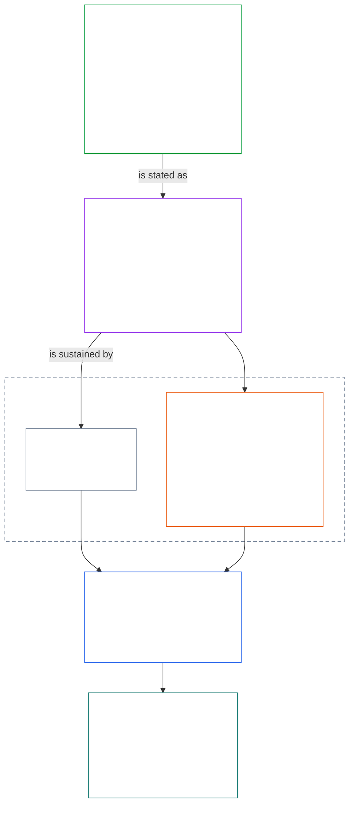
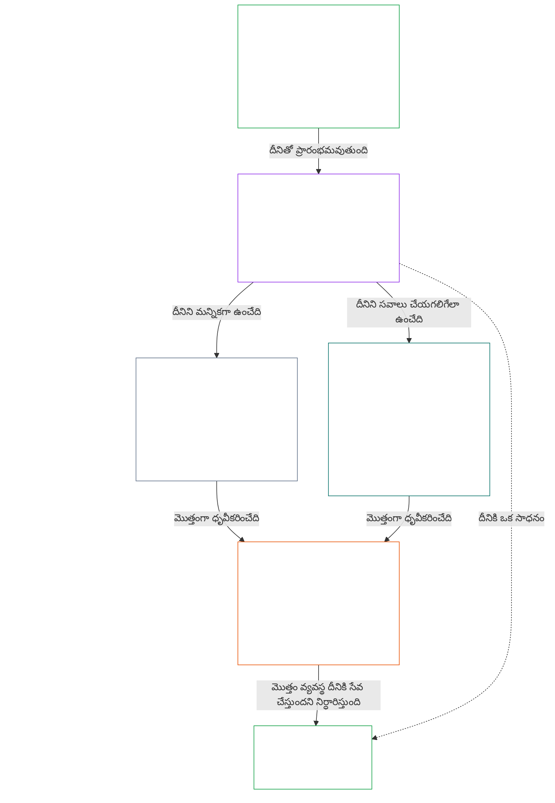

# అధ్యాయం 01, భాగం A: విలువల సూత్రాలు

<details>
<summary><strong><span style="color: #2563eb;">సంకలనంలో స్థానం (కార్యాచరణాత్మకం కాదు): ఫైల్ నిర్మాణం, పఠన నియమాలు</span></strong></summary>

> కింది విషయం **పాఠకుల మార్గదర్శకం మాత్రమే**. ఈ ఫైల్‌లో లేదా ఇతర అధ్యాయాల్లోని బద్ధమైన బాధ్యతలను ఇది చేర్చదు, తొలగించదు లేదా పరిమితం చేయదు.
>
> ఈ ఫైల్ **Sentient Constitution‌లో భాగం**; ఒకే పత్రంగా చదివే ఇతర సంఖ్యా `core_*` ఫైళ్లతో **కలిపి మాత్రమే బద్ధమైనది**. ఇందులో **అధ్యాయం ఒకటి, భాగం A** (§§1–12: ఉద్దేశం, పాత్ర; §2లో పరిచయమై శ్రేయస్సు, భద్రత, సత్యం, విశ్వాసం, స్వేచ్ఛ ద్వారా అభివృద్ధి చెందే వికాస లక్ష్యం; §8లో పరిచయమై ఉమ్మడి వ్యవస్థ సామర్థ్యం, స్థైర్యం, మార్కెట్ నిర్మాణం, వ్యవస్థాగత మూల్యాంకనం ద్వారా అభివృద్ధి చెందే కొనసాగింపు లక్ష్యం) ఉన్నాయి.
>
> **ముందున్నది:** [core_00_preamble.md](core_00_preamble.md)  
> **తదుపరి:** [core_01_b_interaction_interpretation.md](core_01_b_interaction_interpretation.md) (అధ్యాయం ఒకటి, భాగం B — §§13–15, పరస్పర చర్య, అధిగమింపు పరిమితులు, రాజ్యాంగ వ్యాఖ్యానం).  
> **పఠన క్రమం:** §1 ఉద్దేశం, పాత్ర → **వికాసం:** §2 పరిచయం (§2.1లోని చర్చకు లొంగని భద్రత, సత్య పరిమితులతో సహా) → §3 శ్రేయస్సు (ఫలితం) → §4 భద్రత → §5 సత్యం → §6 విశ్వాసం → §7 స్వేచ్ఛ → **కొనసాగింపు:** §8 పరిచయం → §9 ఉమ్మడి వ్యవస్థ సామర్థ్యం (వారధి: వికాసానికి ఒక సాధనం, కొనసాగింపుకు సారం) → §10 స్థైర్యం → §11 మార్కెట్ నిర్మాణం → §12 వ్యవస్థాగత మూల్యాంకనం.

</details>

<details>
<summary><strong><span style="color: #2563eb;">పాఠకుల మార్గదర్శకం (కార్యాచరణాత్మకం కాదు): లక్ష్యాలు, చతుష్టయం, అధికరణాలు, నిర్వచనాలతో అధ్యాయం ఒకటి సంబంధం</span></strong></summary>

> కింది విషయం **పాఠకుల మార్గదర్శకం మాత్రమే**. ఈ ఫైల్‌లో లేదా ఇతర అధ్యాయాల్లోని బద్ధమైన బాధ్యతలను ఇది చేర్చదు, తొలగించదు లేదా పరిమితం చేయదు. ప్రతి విభాగంలోని **ట్రేస్**, **నిర్వచనాలు · మూల్యాంకనం · అనుసరణ** విడ్జెట్లు బద్ధమైన మార్గనిర్దేశాన్ని అందిస్తాయి; అధ్యాయం ఒకటిలోకి ప్రవేశించే పాఠకుల కోసం ఈ భాగం మొత్తం విభాగానికి పటంగా ఉంటుంది.

**పొరలు ఎలా అనుసంధానమవుతాయి.** ప్రతి పొర వేరే ప్రశ్నకు సమాధానమిస్తుంది; అధ్యాయం ఒకటిలోని ప్రతి సూత్రం మిగిలిన మూడు పొరలను సూచిస్తుంది:

- **లక్ష్యాలు, చతుష్టయం** ([పీఠిక §1](core_00_preamble.md#the-model)): ఉమ్మడి వ్యవస్థలు దేనికోసం ([వికాసం](core_05_apex_flourishing_aim.md#flourishing-constitutional), [కొనసాగింపు](core_05_apex_continuity_aim.md#chapter-five-definitions-continuity-constitutional-aim)), ఆ ప్రయత్నాన్ని చట్టబద్ధంగా ఉంచే నాలుగు విధులు ([భాగస్వామ్యం](core_05_apex_participation_leg.md#participation-constitutional), [పర్యవేక్షణ](core_05_apex_oversight_leg.md#oversight-constitutional), [జవాబుదారీతనం](core_05_apex_accountability_leg.md#accountability), [సకాలికత](core_05_apex_timeliness_leg.md#timeliness-constitutional)).
- **సూత్రాలు** (ఈ అధ్యాయం): ఆ లక్ష్యాలు, విధులు ఎలా విలువలు, పరిమితులు, వాటిని పరస్పరం తూకం వేసే నియమాలుగా మారతాయి.
- **అధికరణాలు** ([అధ్యాయం ఆరు](core_06_rights_part_a.md#chapter-six-foundational-rights)): లక్ష్యాలను అనుసరించే సమయంలోనూ ఉపయోగించగల హక్కుల కనీస ప్రమాణ రక్షణలు. ప్రతి విభాగపు **ట్రేస్** వాటిని *ప్రత్యేకంగా* అనే శీర్షిక కింద జాబితా చేస్తుంది.
- **నిర్వచనాలు** ([అధ్యాయాలు రెండు నుంచి ఐదు](core_02_definition_structure.md)): ఒక వాదన నిజమో కాదో పరీక్షించడానికి ఉపయోగించే ఉమ్మడి అర్థాలు. ప్రతి విభాగపు **నిర్వచనాలు · మూల్యాంకనం · అనుసరణ** విడ్జెట్ వాటిని జాబితా చేస్తుంది.

**అధ్యాయం ఒకటి ప్రతి లక్ష్యాన్ని ఎలా అభివృద్ధి చేస్తుంది.** సత్యం, భద్రత, విశ్వసనీయత, అర్థవంతమైన స్వయంప్రతిపత్తి ద్వారా నిలబెట్టే శ్రేయస్సే వికాసం ([పీఠిక §1](core_00_preamble.md#flourishing)). అధ్యాయం ఒకటి ముందుగా ఫలితాన్ని చెబుతుంది; ఆపై ఈ నాలుగు షరతులకు ఒక్కొక్క సూత్రాన్ని నిర్దేశిస్తుంది.

| లక్ష్యం, అంశం | అధ్యాయం ఒకటి సూత్రం | నిర్వచనం ఉన్న చోటు | ట్రేస్‌లో పేర్కొన్న అధికరణాలు |
|---|---|---|---|
| **వికాసం**: ఫలితం | [§3 శ్రేయస్సు](#3-foundational-objective-wellbeing-flourishing-aim) | [శ్రేయస్సు](core_05_band_continuity.md#wellbeing) | [VI](core_06_rights_part_b.md#article-vi-equal-basic-rights), [X](core_06_rights_part_b.md#article-x-self-determination-agency-and-participation), [XIII-B](core_06_rights_part_c.md#article-xiii-b-right-to-redress-and-remedy), [XIX-B](core_06_rights_part_d.md#article-xix-b-contestability-and-proportional-restriction-limits) |
| **వికాసం**: భద్రత | [§4 భద్రత](#4-safety-harm-constraint) | [భద్రత](core_05_band_continuity.md#safety-constitutional-constraint) | [XIII](core_06_rights_part_c.md#article-xiii-right-to-reliable-and-trustworthy-systems), [XVII](core_06_rights_part_c.md#article-xvii-system-lifecycle-environments-and-reversibility), [XXIII](core_06_rights_part_d.md#article-xxiii-root-cause-analysis-and-adaptive-response) |
| **వికాసం**: సత్యం | [§5 సత్యం](#5-truth-epistemic-integrity-constraint) | [సత్యం](core_05_band_oversight.md#truth-constitutional-constraint) | [XIII](core_06_rights_part_c.md#article-xiii-right-to-reliable-and-trustworthy-systems), [XV](core_06_rights_part_c.md#article-xv-info-sphere-integrity), [XVI](core_06_rights_part_c.md#article-xvi-audit-transparency-and-independent-verification) |
| **వికాసం**: విశ్వసనీయత | [§6 విశ్వాసం](#6-trust-and-trustworthiness-coordination-integrity) | [విశ్వసనీయత](core_05_band_continuity.md#trustworthiness) | [XIII](core_06_rights_part_c.md#article-xiii-right-to-reliable-and-trustworthy-systems), [XV](core_06_rights_part_c.md#article-xv-info-sphere-integrity), [XVI](core_06_rights_part_c.md#article-xvi-audit-transparency-and-independent-verification) |
| **వికాసం**: అర్థవంతమైన స్వయంప్రతిపత్తి | [§7 స్వేచ్ఛ](#7-freedom-bounded-agency) | [అర్థవంతమైన స్వయంప్రతిపత్తి](core_05_band_participation.md#meaningful-agency) | [VI](core_06_rights_part_b.md#article-vi-equal-basic-rights), [X](core_06_rights_part_b.md#article-x-self-determination-agency-and-participation), [XXI](core_06_rights_part_d.md#article-xxi-interoperability-portability-movement-refuge-and-exit-integrity) |
| **కొనసాగింపు**, వికాసానికి వారధిగా: దీర్ఘకాలిక సామర్థ్యం | [§9 ఉమ్మడి వ్యవస్థ సామర్థ్యం](#9-shared-system-capacity) | [ఉమ్మడి వ్యవస్థ సామర్థ్యం](core_05_band_continuity.md#shared-system-capacity) | [I-A](core_06_rights_part_a.md#article-i-a-environmental-preconditions-and-ecological-integrity), [III](core_06_rights_part_a.md#article-iii-survival-and-essential-access), [V](core_06_rights_part_a.md#article-v-resource-allocation-dependencies-and-ecosystem-funding) |
| **కొనసాగింపు**: స్థైర్యం | [§10 స్థైర్యం, స్వీయ-స్వస్థత రూపకల్పన](#10-resilience-and-self-healing-design) | [స్వీయ-స్వస్థత](core_05_band_continuity.md#self-healing) | [XIII](core_06_rights_part_c.md#article-xiii-right-to-reliable-and-trustworthy-systems), [XVII](core_06_rights_part_c.md#article-xvii-system-lifecycle-environments-and-reversibility), [XXIII](core_06_rights_part_d.md#article-xxiii-root-cause-analysis-and-adaptive-response) |
| **కొనసాగింపు**: పోటీ చేయగల మార్కెట్లు | [§11 మార్కెట్ నిర్మాణం](#11-market-structure) | [మార్కెట్ నిర్మాణం](core_05_band_accountability.md#market-structure) | [III-C](core_06_rights_part_a.md#article-iii-c-labor-and-economic-floor), [V](core_06_rights_part_a.md#article-v-resource-allocation-dependencies-and-ecosystem-funding), [XXI](core_06_rights_part_d.md#article-xxi-interoperability-portability-movement-refuge-and-exit-integrity) |
| **కొనసాగింపు**: మొత్తం వ్యవస్థ దృక్కోణం | [§12 వ్యవస్థాగత మూల్యాంకన ఆవశ్యకత](#12-systemic-evaluation-requirement) | [వ్యవస్థ సమన్వయ ధ్రువీకరణ](core_05_band_continuity.md#system-alignment-certification) | [XVI](core_06_rights_part_c.md#article-xvi-audit-transparency-and-independent-verification) |

**సూత్రాల క్రమం (కొనసాగింపు).** సూత్రాల స్థాయిలో, రెండు లక్ష్యాల మధ్య వారధిగా ఉండే సామర్థ్యంతో ప్రారంభించి, కొనసాగింపు లక్ష్యం ఈ క్రమంలో అభివృద్ధి చెందుతుంది:

6. **[ఉమ్మడి వ్యవస్థ సామర్థ్యం](core_05_band_continuity.md#shared-system-capacity)** అనేది మంచి బాధ్యతాయుత సంరక్షణ, పాలన, ప్రోత్సాహకాలు కాలక్రమంలో కలసి అందించాల్సిన ఫలితం — రాజ్యాంగం కోరిన పనిని పూర్తి చేయడానికి సజీవ సత్త్వాలు, ఉమ్మడి వ్యవస్థలకు ఉండే నిజమైన, సవాలు చేయగల సామర్థ్యం. ఇది రెండు లక్ష్యాల మధ్య నిలుస్తుంది: **వికాసానికి** ఒక సాధనం, **కొనసాగింపుకు** సారం; మిగతావన్నిటినీ అధిగమించే ఆధిక్య వాదన కాదు. దాని రెండు ప్రధాన అంశాలను [§9.1](#91-productive-capacity-instrumental-good), [§9.2](#92-constitutional-efficiency) వివరిస్తాయి.
7. **[స్థైర్యం, స్వీయ-స్వస్థత రూపకల్పన](#10-resilience-and-self-healing-design)** సజీవ సత్త్వాలు ఆధారపడే వ్యవస్థలు సమస్యలను ముందుగానే గుర్తించడం, అదుపు చేయడం, ప్రకటించిన మార్గాల్లో విఫలమవడం, నిజాయితీగా కోలుకోవడం (**[స్వీయ-స్వస్థత](core_05_band_continuity.md#self-healing)**) ఎలా జరుగుతాయో చెబుతుంది; తద్వారా అంశం 6లోని సామర్థ్యం నిలకడగా ఉంటుంది, స్థిరత్వం అత్యవసర జోక్యంపై ఆధారపడదు.
8. **[మార్కెట్ నిర్మాణం](core_05_band_accountability.md#market-structure)** [§11](#11-market-structure)లో ఆ సామర్థ్యాన్ని ఆచరణలో సవాలు చేయగలిగేలా ఉంచే కేంద్రీకరణ-వ్యతిరేక క్రమశిక్షణను అందిస్తుంది.
9. అనుసరణ లేదా పాలన వాదనలు ఆమోదం పొందే ముందు, **[వ్యవస్థాగత మూల్యాంకన ఆవశ్యకత](#12-systemic-evaluation-requirement)** మొత్తం వ్యవస్థ పరిధి, ఆధారపడే సంబంధాలు, ప్రోత్సాహకాల సమన్వయాన్ని ధ్రువీకరిస్తుంది — ఆడిట్‌కు సూత్ర-స్థాయి దిశానిర్దేశంగా చతుష్టయంలోని **పర్యవేక్షణ** అంశం కింద; ఇందులో ఇతర ప్రక్రియలతో పాటు [వ్యవస్థ సమన్వయ ధ్రువీకరణ](core_05_band_continuity.md#system-alignment-certification) అనే ప్రత్యేకంగా విస్తృతమైన ఆడిట్ ప్రక్రియ కూడా ఉంది.

**అధ్యాయం ఒకటిలో చతుష్టయం ఎక్కడ అమలవుతుంది.** ప్రతి విభాగం తన ట్రేస్‌లో సంబంధిత అంశాలను పేర్కొంటుంది. కింది విభాగాలు వాటిని మరింత ప్రత్యక్షంగా మోస్తాయి:

| చతుష్టయ అంశం | అధ్యాయం ఒకటిలోని ప్రధాన స్థానాలు |
|---|---|
| **భాగస్వామ్యం** | [§16 లోతైన బాధ్యతాయుత సంరక్షణ](core_01_c_stewardship_capacity_principles.md#16-stewardship-in-depth), [§17 పరిణామాత్మక బాధ్యతాయుత సంరక్షణ](core_01_c_stewardship_capacity_principles.md#17-consequential-stewardship-the-steward-role) (పరిణామాత్మక పాత్రలు, స్వరం); [§7 స్వేచ్ఛ](#7-freedom-bounded-agency) (అర్థవంతమైన స్వయంప్రతిపత్తి) |
| **పర్యవేక్షణ** | [§16](core_01_c_stewardship_capacity_principles.md#16-stewardship-in-depth), [§17](core_01_c_stewardship_capacity_principles.md#17-consequential-stewardship-the-steward-role) (వికేంద్రీకృత అవగాహన, రికార్డులు); [§18 పాలన](core_01_c_stewardship_capacity_principles.md#18-governance-under-stewardship-discipline) (అధికార కేటాయింపు); [§12](#12-systemic-evaluation-requirement) (ఆడిటింగ్) |
| **జవాబుదారీతనం** | [§18 పాలన](core_01_c_stewardship_capacity_principles.md#18-governance-under-stewardship-discipline) (అధికారానికి అనుగుణమైన జవాబుదారీతనం); [§19 ప్రోత్సాహకాల సమన్వయం, వ్యవస్థను స్వాధీనం చేసుకోవడం](core_01_c_stewardship_capacity_principles.md#19-incentive-alignment-and-system-capture) (బహుమతులు అంశాలను లోపల ఖాళీ చేయకూడదు) |
| **సకాలికత** | [§16](core_01_c_stewardship_capacity_principles.md#16-stewardship-in-depth), [§17](core_01_c_stewardship_capacity_principles.md#17-consequential-stewardship-the-steward-role) (నివారించగల ఆలస్యం లేకుండా సమస్యలను గుర్తించి సరిచేయడం) |

**రెండు అక్షాలు; ఘర్షణ కాదు.** వ్యవస్థలు దేనిని అనుసరించాలో లక్ష్యాలు చెబుతాయి; ఆ ప్రయత్నం ఎలా చట్టబద్ధంగా ఉంటుందో చతుష్టయం చెబుతుంది. ఒక పదం రెండింటికీ చెందవచ్చు: సత్యం, విశ్వసనీయత వికాసంలోని భాగాలు; [పీఠిక §2](core_00_preamble.md#2-measurements-overview) వాటిని పర్యవేక్షణ కుటుంబం కింద కొలుస్తుంది. [§§13–15](core_01_b_interaction_interpretation.md#13-constitutional-collision-resolution-process) ఈ సూత్రాలు ఢీకొన్నప్పుడు వాటికి ఎలా తూకం వేయాలో, మొత్తంగా ఎలా చదవాలో నియంత్రిస్తాయి; [§20](core_01_c_stewardship_capacity_principles.md#20-integrated-application) వాటిని ప్రతి తరువాతి అధ్యాయానికి వర్తింపజేస్తుంది.

</details>

<br>

### 1. ఉద్దేశం, పాత్ర
<details>
<summary><strong><span style="color: #2563eb;">ట్రేస్</span></strong></summary>

- మూలం: [ఉపోద్ఘాతం §1 నమూనా](core_00_preamble.md#the-model) — [రాజ్యాంగ చతుష్టయం](core_00_preamble.md#constitutional-tetrad), [రెండు రాజ్యాంగ లక్ష్యాలు](core_00_preamble.md#two-constitutional-aims), [భౌతిక ప్రయోజనం](core_00_preamble.md#material-stake) ఆధారంగా స్థాయిని నిర్ణయించడం, ప్రతి విభాగపు ట్రేస్‌ల ద్వారా అధ్యాయం మొత్తానికి వర్తిస్తాయి.
- తదనంతరం: సమగ్ర పఠనం, సందిగ్ధత, అంతర్గత క్రమశ్రేణి, ప్రామాణిక ఘర్షణ-పరిష్కార విధానం కోసం [15. రాజ్యాంగ వ్యాఖ్యానం](core_01_b_interaction_interpretation.md#15-constitutional-interpretation).
- తదనంతరం: [రెండు రాజ్యాంగ లక్ష్యాలు](core_00_preamble.md#two-constitutional-aims) — **Flourishing** లక్ష్య అభివృద్ధి: [§3](#3-foundational-objective-wellbeing-flourishing-aim) నుంచి [§6](#6-trust-and-trustworthiness-coordination-integrity) వరకు, అలాగే [§7 స్వేచ్ఛ](#7-freedom-bounded-agency); **Continuity** లక్ష్య అభివృద్ధి: [§9 భాగస్వామ్య-వ్యవస్థ సామర్థ్యం](#9-shared-system-capacity), [§10 స్థితిస్థాపకత, స్వీయ-స్వస్థత రూపకల్పన](#10-resilience-and-self-healing-design), [§11 మార్కెట్ నిర్మాణం](#11-market-structure), [§12 వ్యవస్థాగత మూల్యాంకన అవసరం](#12-systemic-evaluation-requirement).
- తదనంతరం: [3. ప్రాథమిక లక్ష్యం: సంక్షేమం](#3-foundational-objective-wellbeing-flourishing-aim), [§3.2 గుర్తింపు, బలోపేతం, ఆకాంక్ష](#32-recognition-reinforcement-and-aspiration), [4 భద్రత](#4-safety-harm-constraint), [5 సత్యం](#5-truth-epistemic-integrity-constraint), [6. విశ్వాసం](#6-trust-and-trustworthiness-coordination-integrity), [§16 సమగ్ర ధర్మకర్తృత్వం](core_01_c_stewardship_capacity_principles.md#16-stewardship-in-depth), [13. రాజ్యాంగ ఘర్షణ పరిష్కార విధానం](core_01_b_interaction_interpretation.md#13-constitutional-collision-resolution-process), [§7 స్వేచ్ఛ](#7-freedom-bounded-agency).
- దీనితో చదవండి: [రాజ్యాంగ చతుష్టయం](core_00_preamble.md#constitutional-tetrad) — భాగస్వామ్యం, పర్యవేక్షణ, జవాబుదారీతనం, సమయపాలన, భాగస్వామ్య వ్యవస్థలు [రెండు రాజ్యాంగ లక్ష్యాలను](core_00_preamble.md#two-constitutional-aims) ఎలా అనుసరిస్తాయో నిర్దేశిస్తాయి; [భౌతిక ప్రయోజనం](core_00_preamble.md#material-stake) ఆధారిత స్థాయి ప్రతి విభాగపు ట్రేస్‌ల ద్వారా మొత్తం అధ్యాయానికి వర్తిస్తుంది.
- దీనితో చదవండి: [అధ్యాయాలు రెండు నుంచి నాలుగు వరకు](core_02_definition_structure.md), [అధ్యాయం ఐదు](core_05__definitions_home.md#chapter-five-foundational-definitions) — ఈ అధ్యాయంలోని ప్రతి పదానికి వర్తించే యంత్రాంగాల పొర; O/M/A/C సమగ్రత, ఎగవేత-వ్యతిరేకత, నిరూపణ భారం, నిర్వచనాల నుంచి ఫలితాల వరకు అనుసరణను అమలు చేయండి.
- దీనితో చదవండి: [అధ్యాయం ఆరు: ప్రాథమిక హక్కులు](core_06_rights_part_a.md#chapter-six-foundational-rights).
  - ముఖ్యంగా [ఆర్టికల్ VI: సమాన ప్రాథమిక హక్కులు](core_06_rights_part_b.md#article-vi-equal-basic-rights), [ఆర్టికల్ XIII: విశ్వసనీయమైన, నమ్మదగిన వ్యవస్థల హక్కు](core_06_rights_part_c.md#article-xiii-right-to-reliable-and-trustworthy-systems), [ఆర్టికల్ XXIV: రాజ్యాంగ వ్యాఖ్యానం, సమీక్ష, వ్యవస్థ స్వాధీనత-వ్యతిరేక రక్షణలు](core_06_rights_part_d.md#article-xxiv-constitutional-interpretation-review-and-anti-capture-safeguards).
  - వ్యాఖ్యానం రక్షిత సజీవులు, వ్యవస్థలు లేదా సంస్థలను ప్రభావితం చేసినప్పుడు ఈ పఠనాన్ని వర్తింపజేయండి.

</details>

<details>
<summary><strong><span style="color: #2563eb;">నిర్వచనాలు · మూల్యాంకనం · అనుసరణ</span></strong></summary>

- [అనుపాతికత](core_05_band_accountability.md#proportionality) · [O](core_05_band_accountability.md#proportionality) · [M](core_05_band_accountability.md#proportionality-a) · [A](core_05_band_accountability.md#proportionality-a) · [C](core_05_band_accountability.md#proportionality-c)
- [అవసరం](core_05_band_accountability.md#necessity) · [O](core_05_band_accountability.md#necessity) · [M](core_05_band_accountability.md#necessity-a) · [A](core_05_band_accountability.md#necessity-a) · [C](core_05_band_accountability.md#necessity-c)

</details>

<br>

*సరళంగా చెప్పాలంటే: అధ్యాయం ఒకటి మిగతా ప్రతి అధ్యాయాన్నీ నియంత్రించే విలువలు, పరిమితులను నిర్దేశిస్తుంది. భాగస్వామ్య వ్యవస్థలు **Flourishing**, **Continuity** రెండింటినీ కలిపి అనుసరించాలి; ఒకటి కోసం మరొకటి త్యాగం చేయరాదు, ఇతర విలువల వ్యయంతో ఒక్క విలువనూ గరిష్ఠం చేయరాదు.*

<a id="two-constitutional-aims"></a><a id="flourishing"></a><a id="continuity"></a>ఈ రాజ్యాంగం యొక్క వ్యాఖ్యానం, అనువర్తనం, పరిణామాన్ని నియంత్రించే సూత్రాలు, పరిమితులను ఈ అధ్యాయం స్థాపిస్తుంది. [రెండు రాజ్యాంగ లక్ష్యాలను](core_00_preamble.md#two-constitutional-aims) — [**Flourishing**](core_00_preamble.md#flourishing), [**Continuity**](core_00_preamble.md#continuity) — [ఉపోద్ఘాతం §1 నమూనా](core_00_preamble.md#the-model)లో స్థాపించారు; ఈ అధ్యాయం వాటిని అమలుచేయదగిన సూత్రాలు, పరిమితులుగా అభివృద్ధి చేస్తుంది. సూత్ర స్థాయి ప్రామాణిక నిర్వచనాలు ఉపోద్ఘాతంలో ఉంటాయి; ఈ అధ్యాయం వాటిని అనువర్తిస్తుంది.

ఈ లక్ష్యాలను ఎల్లప్పుడూ కలిపి, ఈ రాజ్యాంగం నిర్దేశించిన చర్చకు తావులేని సూత్ర పరిమితులు, హక్కుల రక్షణల పరిధిలోనే అనుసరించాలి. [**రాజ్యాంగ చతుష్టయం**](core_00_preamble.md#constitutional-tetrad) ఆ అన్వేషణ చట్టబద్ధంగా ఎలా కొనసాగాలో నిర్దేశిస్తుంది — [**భౌతిక ప్రయోజనం**](core_00_preamble.md#material-stake) మేరకు స్థాయిని సర్దుబాటు చేస్తూ.

ఈ అధ్యాయం ఆ రెండు లక్ష్యాలు, చతుష్టయం చుట్టూ నిర్మితమైంది:
- **Flourishing:** [Flourishing లక్ష్య పరిచయం](#2-flourishing-aim-introduction) ఆ లక్ష్యానికి మార్గదర్శకం. [§3 ప్రాథమిక లక్ష్యం: సంక్షేమం](#3-foundational-objective-wellbeing-flourishing-aim) ఫలితాన్ని చెబుతుంది. [§4 భద్రత](#4-safety-harm-constraint), [§5 సత్యం](#5-truth-epistemic-integrity-constraint), [§6 విశ్వాసం](#6-trust-and-trustworthiness-coordination-integrity), [§7 స్వేచ్ఛ](#7-freedom-bounded-agency) దాన్ని నిలబెట్టే నాలుగు పరిస్థితులను అభివృద్ధి చేస్తాయి: భద్రత, సత్యం, విశ్వసనీయత, అర్థవంతమైన స్వాధీనత.
- **Continuity:** [Continuity లక్ష్య పరిచయం](#8-continuity-aim-introduction) ఆ లక్ష్యానికి మార్గదర్శకం. [§9 భాగస్వామ్య-వ్యవస్థ సామర్థ్యం](#9-shared-system-capacity) (Flourishing‌కు సాధనమైనదీ, Continuity సారమైనదీ), [§10 స్థితిస్థాపకత, స్వీయ-స్వస్థత రూపకల్పన](#10-resilience-and-self-healing-design), [§11 మార్కెట్ నిర్మాణం](#11-market-structure), [§12 వ్యవస్థాగత మూల్యాంకన అవసరం](#12-systemic-evaluation-requirement) దీర్ఘకాల స్థిరత్వం, భాగస్వామ్య వ్యవస్థల దీర్ఘకాల సామర్థ్యం, స్థితిస్థాపకతను అభివృద్ధి చేస్తాయి. Continuity వాదనలకు నిజాయితీగల, మొత్తం-వ్యవస్థ దృశ్యం అవసరం: §§9–11లోని ప్రతి వాదన §12 తనిఖీ తర్వాతే నిలబడుతుంది.
- **సూత్రాలు ఎదురెదురైనప్పుడు:** [§13 రాజ్యాంగ ఘర్షణ పరిష్కార విధానం](core_01_b_interaction_interpretation.md#13-constitutional-collision-resolution-process), [§14 సంపూర్ణ అధిగమింపుపై నిషేధం](core_01_b_interaction_interpretation.md#14-prohibition-on-absolute-override), [§15 రాజ్యాంగ వ్యాఖ్యానం](core_01_b_interaction_interpretation.md#15-constitutional-interpretation), లక్ష్యాలు, సూత్రాలను ఎలా తూకం వేయాలి, కలిపి ఎలా చదవాలి అన్నది నిర్దేశిస్తాయి.
- **ఆచరణలో చతుష్టయం:** [§16 సమగ్ర ధర్మకర్తృత్వం](core_01_c_stewardship_capacity_principles.md#16-stewardship-in-depth) నుంచి [§19 ప్రోత్సాహకాల అనుసరణ, వ్యవస్థ స్వాధీనత](core_01_c_stewardship_capacity_principles.md#19-incentive-alignment-and-system-capture) వరకు భాగస్వామ్యం, పర్యవేక్షణ, జవాబుదారీతనం, సమయపాలనలను ధర్మకర్తృత్వం, పాలన, ప్రోత్సాహకాల్లోకి తీసుకువస్తాయి; [§20 సమగ్ర అనువర్తనం](core_01_c_stewardship_capacity_principles.md#20-integrated-application) మొత్తం అధ్యాయాన్ని ప్రతి తదుపరి అధ్యాయానికి వర్తింపజేస్తుంది.

ప్రతి సూత్రానికి సంబంధించిన **ట్రేస్**, దాన్ని రక్షించే అధ్యాయం ఆరులోని ఆర్టికల్స్‌ను జాబితా చేస్తుంది; దాని **నిర్వచనాలు · మూల్యాంకనం · అనుసరణ** విడ్జెట్ దాన్ని కొలిచే అధ్యాయం ఐదులోని నిర్వచనాలను జాబితా చేస్తుంది.

**చిత్రం: రెండు రాజ్యాంగ లక్ష్యాలు, రాజ్యాంగ చతుష్టయం**

<hr style="border: 0; border-top: 1px solid currentColor;">

```mermaid
flowchart TB
    subgraph Foundation[" "]
        direction TB
        subgraph Aims["Two Constitutional Aims"]
            direction LR
            F["Flourishing<br/><br/>• Sentient wellbeing sustained through truth, safety,<br/>trustworthiness, and meaningful agency"]
            C["Continuity<br/><br/>• Long-horizon stability, sustainability, resilience,<br/>and ecological wellbeing"]
        end
        subgraph Tetrad1["Constitutional Tetrad · participation and oversight"]
            direction LR
            P["Participation<br/><br/>• Affected sentients get a real voice<br/>• Fair representation and a fair chance to challenge<br/>• Access to consequential roles in proportion to stake"]
            O["Oversight<br/><br/>• Watching, checking, verifying, and keeping records<br/>• Independent review can constrain bad choices"]
        end
        subgraph Tetrad2["Constitutional Tetrad · accountability and timeliness"]
            direction LR
            A["Accountability<br/><br/>• Responsibility traces to the right actors<br/>• Answerability, redress, and real correction<br/>• Bad outcomes trigger repair"]
            T["Timeliness<br/><br/>• Problems are detected, challenged, resolved, and fixed<br/>• Time limits match the material stake<br/>• Delay cannot erase rights, remedies, or repair"]
        end
    end
    F ~~~ P
    P ~~~ A
    style Foundation fill:none,stroke:none
    style Aims fill:none,stroke:none
    style Tetrad1 fill:none,stroke:none
    style Tetrad2 fill:none,stroke:none
    style F fill:none,stroke:#16a34a,color:#ffffff
    style C fill:none,stroke:#16a34a,color:#ffffff
    style P fill:none,stroke:#0f766e,color:#ffffff
    style O fill:none,stroke:#ea580c,color:#ffffff
    style A fill:none,stroke:#db2777,color:#ffffff
    style T fill:none,stroke:#9333ea,color:#ffffff
```

*లక్ష్యాలు భాగస్వామ్య వ్యవస్థలు దేనిని అనుసరించాలో చెబుతాయి; ఆ అన్వేషణ చట్టబద్ధంగా ఉండేలా చేసే బాధ్యతలను చతుష్టయం వివరిస్తుంది. నాలుగు బాధ్యతలూ [భౌతిక ప్రయోజనం](core_00_preamble.md#material-stake) మేరకు స్థాయిని మార్చుకుంటాయి; రెండు లక్ష్యాలూ హక్కుల కనీసస్థాయికి లోబడి ఉంటాయి. [సంకల్పనాత్మక అవలోకనం](guides/CONCEPTUAL_OVERVIEW.md#two-aims-and-the-constitutional-tetrad) నుంచి పునర్ముద్రించబడింది.*

ఈ విలువలు:
- స్వతంత్రం కావు; సాధారణ కార్యకలాపాల్లో కఠినమైన క్రమశ్రేణి ఉండదు;
- పరస్పరం పనిచేసే సూత్రాలు, పరిమితులుగా ఉండి, వాటిని కలిపి మూల్యాంకనం చేయాలి;
- సజీవులు, భూమిపై గణనీయమైన ప్రభావం చూపే సాంకేతిక, సంస్థాగత, ఆర్థిక, సామాజిక-సాంకేతిక నిర్మాణాలు, పర్యావరణ వ్యవస్థలతో సహా అన్ని “వ్యవస్థలకు” వర్తిస్తాయి.

ఇతర సూత్రాలకు గణనీయమైన భంగం కలిగించే సందర్భంలో ఏ ఒక్క సూత్రాన్నీ విడిగా వర్తింపజేయరాదు. ఉద్రిక్తతలు తలెత్తినప్పుడు ఈ అధ్యాయంలోని అనుపాతికత, అవసరం, వ్యవస్థాగత ప్రభావ అవసరాల ప్రకారం వ్యవస్థలు వాటిని పరిష్కరించాలి. పరిష్కారం కాని ఘర్షణ చర్చకు తావులేని సూత్ర పరిమితులను నేరుగా ప్రభావితం చేస్తే, అధ్యాయం ఒకటిలోని **§13** రాజ్యాంగ ఘర్షణ పరిష్కార విధానం ప్రాధాన్యాన్ని నిర్ణయిస్తుంది.

<a id="2-flourishing-aim-introduction"></a>
### 2. Flourishing లక్ష్య పరిచయం
<details>
<summary><strong><span style="color: #2563eb;">ట్రేస్</span></strong></summary>

- దీనితో చదవండి: [రాజ్యాంగ చతుష్టయం](core_00_preamble.md#constitutional-tetrad) — Flourishing‌ను ఎలా అనుసరించాలన్నదానిపై నాలుగు అంగాలూ వర్తిస్తాయి; [భౌతిక ప్రయోజనం](core_00_preamble.md#material-stake) ప్రతి Flourishing వాదనకు అవసరమైన లోతును నిర్ణయిస్తుంది.
- దీనితో చదవండి: [రెండు రాజ్యాంగ లక్ష్యాలు](core_00_preamble.md#two-constitutional-aims) — **Flourishing** లక్ష్యం; దాని జంట లక్ష్యాన్ని [Continuity లక్ష్య పరిచయం](#8-continuity-aim-introduction)లో పరిచయం చేస్తారు.
- మూలం: సూత్రాలు: [ఉపోద్ఘాతం §1 నమూనా](core_00_preamble.md#flourishing); [Flourishing (రాజ్యాంగ లక్ష్యం)](core_05_apex_flourishing_aim.md#flourishing-constitutional); [§1 ఉద్దేశం, పాత్ర](#1-purpose-and-role).
- తదనంతరం: [§3 ప్రాథమిక లక్ష్యం: సంక్షేమం (Flourishing లక్ష్యం)](#3-foundational-objective-wellbeing-flourishing-aim), [§4 భద్రత (హాని పరిమితి)](#4-safety-harm-constraint), [§5 సత్యం (జ్ఞాన సమగ్రత పరిమితి)](#5-truth-epistemic-integrity-constraint), [§6 విశ్వాసం, విశ్వసనీయత (సమన్వయ సమగ్రత)](#6-trust-and-trustworthiness-coordination-integrity), [§7 స్వేచ్ఛ (పరిధులుగల స్వాధీనత)](#7-freedom-bounded-agency); ప్రతి సూత్రాన్ని రక్షించే ఆర్టికల్స్ ఆ విభాగపు ట్రేస్‌లో ఉంటాయి.
- ఉపవిభాగాలు: [§2.1 చర్చకు తావులేని సూత్ర పరిమితులు: భద్రత, సత్యం](#21-non-negotiable-principle-constraints-safety-and-truth).
- దీనితో చదవండి: సాధారణంగా అధ్యాయం ఆరు హక్కుల కనీసస్థాయి.

</details>

<details>
<summary><strong><span style="color: #2563eb;">నిర్వచనాలు · మూల్యాంకనం · అనుసరణ</span></strong></summary>

- [Flourishing (రాజ్యాంగ లక్ష్యం)](core_05_apex_flourishing_aim.md#flourishing-constitutional) · [O](core_05_apex_flourishing_aim.md#flourishing-constitutional) · [M](core_05_apex_flourishing_aim.md#flourishing-constitutional-m) · [A](core_05_apex_flourishing_aim.md#flourishing-constitutional-a) · [C](core_05_apex_flourishing_aim.md#flourishing-constitutional-c)
- [సంక్షేమం](core_05_band_continuity.md#wellbeing) · [O](core_05_band_continuity.md#wellbeing) · [M](core_05_band_continuity.md#wellbeing-a) · [A](core_05_band_continuity.md#wellbeing-a) · [C](core_05_band_continuity.md#wellbeing-c)
- [భద్రత (రాజ్యాంగ పరిమితి)](core_05_band_continuity.md#safety-constitutional-constraint) · [O](core_05_band_continuity.md#safety-constitutional-constraint) · [M](core_05_band_continuity.md#safety-constraint-a) · [A](core_05_band_continuity.md#safety-constraint-a) · [C](core_05_band_continuity.md#safety-constraint-c)
- [సత్యం (రాజ్యాంగ పరిమితి)](core_05_band_oversight.md#truth-constitutional-constraint) · [O](core_05_band_oversight.md#truth-constitutional-constraint-o) · [M](core_05_band_oversight.md#truth-constitutional-constraint-a) · [A](core_05_band_oversight.md#truth-constitutional-constraint-a) · [C](core_05_band_oversight.md#truth-constitutional-constraint-c)
- [విశ్వసనీయత](core_05_band_continuity.md#trustworthiness) · [O](core_05_band_continuity.md#trustworthiness) · [M](core_05_band_continuity.md#trustworthiness-a) · [A](core_05_band_continuity.md#trustworthiness-a) · [C](core_05_band_continuity.md#trustworthiness-c)
- [అర్థవంతమైన స్వాధీనత](core_05_band_participation.md#meaningful-agency) · [O](core_05_band_participation.md#meaningful-agency) · [M](core_05_band_participation.md#meaningful-agency-a) · [A](core_05_band_participation.md#meaningful-agency-a) · [C](core_05_band_participation.md#meaningful-agency-c)

</details>

<br>

*సరళంగా చెప్పాలంటే: రెండు లక్ష్యాల్లో Flourishing మొదటిది — చుట్టూ ఉన్న వ్యవస్థలు సురక్షితంగా, నిజాయితీగా, నమ్మదగినవిగా ఉండి, ఎంచుకునేందుకు నిజమైన అవకాశం కల్పిస్తాయి కాబట్టి సజీవులు బాగా జీవించడం, అలాగే కొనసాగించగలగడం. ఆ ఫలితం ఏమిటో §3 చెబుతుంది. దాన్ని వాస్తవంగా నిలబెట్టేవి ఆ తర్వాతి నాలుగు సూత్రాలు.*

[**Flourishing**](core_05_apex_flourishing_aim.md#flourishing-constitutional) అంటే **సత్యం, భద్రత, విశ్వసనీయత, అర్థవంతమైన స్వాధీనత ద్వారా నిలిచే సజీవుల సంక్షేమం** ([ఉపోద్ఘాతం §1 నమూనా](core_00_preamble.md#flourishing)). అధ్యాయం ఒకటి దీన్ని రెండు దశల్లో అభివృద్ధి చేస్తుంది: [§3 ప్రాథమిక లక్ష్యం: సంక్షేమం (Flourishing లక్ష్యం)](#3-foundational-objective-wellbeing-flourishing-aim) ఫలితాన్ని చెబుతుంది; దాన్ని నిలబెట్టే పరిస్థితులను నాలుగు సూత్రాలు నిర్దేశిస్తాయి.

| పరిస్థితి | సూత్రం | అది జవాబిచ్చే ప్రశ్న |
|---|---|---|
| **భద్రత** | [§4 భద్రత (హాని పరిమితి)](#4-safety-harm-constraint) | నివారించగల హాని నుంచి సజీవులకు రక్షణ ఉందా? |
| **సత్యం** | [§5 సత్యం (జ్ఞాన సమగ్రత పరిమితి)](#5-truth-epistemic-integrity-constraint), అలాగే [§5.1 శాస్త్రాధారిత విచారణ, నిర్ణయ సహాయం](#51-science-informed-inquiry-and-decision-support), [§5.2 సరళ భాషలో అందుబాటు (భాగస్వామ్యం, ధర్మకర్తృత్వ విధి)](#52-plain-language-accessibility-participation-and-stewardship-duty) | సజీవులు తమకు చెప్పినదానిపై ఆధారపడగలరా, దాన్ని అర్థం చేసుకోగలరా? |
| **విశ్వసనీయత** | [§6 విశ్వాసం, విశ్వసనీయత (సమన్వయ సమగ్రత)](#6-trust-and-trustworthiness-coordination-integrity) | వ్యవస్థలు విశ్వాసాన్ని సంపాదిస్తున్నాయా, విఫలమైనప్పుడు దాన్ని పునరుద్ధరిస్తున్నాయా? |
| **అర్థవంతమైన స్వాధీనత** | [§7 స్వేచ్ఛ (పరిధులుగల స్వాధీనత)](#7-freedom-bounded-agency) | సజీవులకు ఎంచుకోవడానికి, అసమ్మతి తెలిపేందుకు, సంఘటితం కావడానికి, నిష్క్రమించడానికి నిజమైన, పరిమితులుగల స్వేచ్ఛ ఉందా? |

**Flourishing సూత్రాలు కలసి ఎలా పనిచేస్తాయి:**
- **భద్రత, సత్యం చర్చకు తావులేని పరిమితులు:** అవి [§2.1 చర్చకు తావులేని సూత్ర పరిమితులు: భద్రత, సత్యం](#21-non-negotiable-principle-constraints-safety-and-truth)లో కలిపి నిర్దేశించబడ్డాయి; ఇతర సూత్రాలను పొందేందుకు వాటిని వదులుకోరాదు.
- **విశ్వాసం, స్వేచ్ఛలకు పరిధి ఉంది; అవి నిరపేక్షమైనవి కావు:** విశ్వాసం సంపాదించాలి, తప్పు సరిదిద్దవచ్చు ([§6.1 దిద్దుబాటు, పరిహారం](#61-correction-and-remedy)); స్వేచ్ఛకు క్రమబద్ధమైన పరిమితులుంటాయి ([§7.1 పరిమితుల క్రమశిక్షణ](#71-limitation-discipline)).
- **ఏదీ విడిగా వర్తించదు:** సూత్రాలను కలిపి చదవాలి; అవి ఢీకొన్నప్పుడు [§13 రాజ్యాంగ ఘర్షణ పరిష్కార విధానం](core_01_b_interaction_interpretation.md#13-constitutional-collision-resolution-process) ప్రకారం తూకం వేయాలి.
- **Flourishing‌కు జత లక్ష్యం ఉంది:** Continuity లక్ష్యం ఈ ఫలితం నిలకడగా ఉండేందుకు ఏమి అవసరమో అడుగుతుంది; అది [Continuity లక్ష్య పరిచయం](#8-continuity-aim-introduction)లో పరిచయమవుతుంది.

**చిత్రం: Flourishing, దాని సూత్రాలు**

<hr style="border: 0; border-top: 1px solid currentColor;">



*Flourishing‌ను ఫలితంగా పేర్కొంటారు; ముందుగా చర్చకు తావులేని భద్రత, సత్య పరిమితులు దాన్ని నిలబెడతాయి. ఈ రెండూ విశ్వాసానికి తోడ్పడతాయి; విశ్వాసం స్వేచ్ఛకు తోడ్పడుతుంది. రంగులు మళ్లీ ఉపయోగించగల దృశ్య సూచనలు మాత్రమే, ప్రాధాన్యతను సూచించవు. ప్రతి సూత్రపు ట్రేస్ దాని ఆర్టికల్స్‌ను పేర్కొంటుంది; నిర్వచనాలు · మూల్యాంకనం · అనుసరణ విడ్జెట్ దాని నిర్వచనాలను పేర్కొంటుంది. [సంకల్పనాత్మక అవలోకనం](guides/CONCEPTUAL_OVERVIEW.md#flourishing-and-its-principles)లో పునర్ముద్రించబడింది.*

<a id="21-non-negotiable-principle-constraints-safety-and-truth"></a>
#### 2.1 చర్చకు తావులేని సూత్ర పరిమితులు: భద్రత, సత్యం
<details>
<summary><strong><span style="color: #2563eb;">ట్రేస్</span></strong></summary>

- దీనితో చదవండి: [రాజ్యాంగ చతుష్టయం](core_00_preamble.md#constitutional-tetrad) — **భాగస్వామ్య** అంగం (భద్రత, సత్య నిర్ధారణలను అర్థం చేసుకుని సవాలు చేయడం); **పర్యవేక్షణ** అంగం (హాని ప్రమాదం, జ్ఞాన క్షీణతను గుర్తించడం); **జవాబుదారీతనం** అంగం (హాని, మోసం, తప్పుదారి పట్టించే ఆధారపడుదలకు జవాబు చెప్పడం); [భౌతిక ప్రయోజనం](core_00_preamble.md#material-stake) మేరకు స్థాయి.
- దీనితో చదవండి: [రెండు రాజ్యాంగ లక్ష్యాలు](core_00_preamble.md#two-constitutional-aims) — **Flourishing** లక్ష్యం (**భద్రత**, **సత్యం** [ఉపోద్ఘాతం §1](core_00_preamble.md#two-constitutional-aims)లో పేరుతో పేర్కొన్న అంశాలు); **Continuity** లక్ష్యం (దీర్ఘకాల హాని నివారణ, నిలకడైన వ్యవస్థల నిజాయితీగల ధర్మకర్తృత్వం).
- మూలం: సూత్రాలు: [3. ప్రాథమిక లక్ష్యం: సంక్షేమం](#3-foundational-objective-wellbeing-flourishing-aim); [రెండు రాజ్యాంగ లక్ష్యాలు](core_00_preamble.md#two-constitutional-aims).
- తదనంతరం: [6. విశ్వాసం](#6-trust-and-trustworthiness-coordination-integrity), [13. రాజ్యాంగ ఘర్షణ పరిష్కార విధానం](core_01_b_interaction_interpretation.md#13-constitutional-collision-resolution-process), [§7 స్వేచ్ఛ](#7-freedom-bounded-agency).
- వర్తించేది: [§4 భద్రత](#4-safety-harm-constraint); [§5 సత్యం](#5-truth-epistemic-integrity-constraint); [§5.1 శాస్త్రాధారిత విచారణ, నిర్ణయ సహాయం](#51-science-informed-inquiry-and-decision-support); [§5.2 సరళ భాషలో అందుబాటు](#52-plain-language-accessibility-participation-and-stewardship-duty).

</details>

<br>

*సరళంగా చెప్పాలంటే: భద్రత, సత్యం రాజ్యాంగపు కఠిన కనీస హద్దులు — మెరుగుదల కోసం త్యజించగల మార్పిడి విలువలు కావు. భాగస్వామ్య వ్యవస్థలు సజీవులను ముందుగా ఊహించగల ప్రమాదంలోకి నెట్టరాదు లేదా మోసగించరాదు. చతుష్టయం నిర్దేశించిన భాగస్వామ్యం, పర్యవేక్షణ, జవాబుదారీతనం, సమయపాలన క్రమశిక్షణలో Flourishing, Continuity లక్ష్యాలను అనుసరించినప్పుడు ఈ రెండు పరిమితులూ వర్తిస్తాయి.*

**భద్రత**, **సత్యం** అధ్యాయం ఒకటిలోని ప్రతి ఇతర సూత్రాన్నీ పరిమితం చేసే చర్చకు తావులేని సూత్ర నియంత్రణలు; ఇందులో [§3 ప్రాథమిక లక్ష్యం: సంక్షేమం](#3-foundational-objective-wellbeing-flourishing-aim), [రెండు రాజ్యాంగ లక్ష్యాలు](core_00_preamble.md#two-constitutional-aims) కూడా ఉన్నాయి. అవి [**Flourishing**](#flourishing)లో పేరుతో చెప్పిన అంశాలు, [**Continuity**](#continuity)కు అనివార్యమైనవి: హాని లేదా మోసం ద్వారా వ్యవస్థలు Flourishing సాధించలేవు; దీర్ఘకాలిక చట్టబద్ధతకు కాలక్రమంలో ప్రమాదాలను నిజాయితీగా నిర్వహించడం అవసరం.

ఈ పరిమితుల అనువర్తనం [రాజ్యాంగ చతుష్టయాన్ని](core_00_preamble.md#constitutional-tetrad) పాటించాలి; [భౌతిక ప్రయోజనం](core_00_preamble.md#material-stake) మేరకు స్థాయిని సర్దుబాటు చేయాలి, ముఖ్యంగా:
- భద్రత నిర్ధారణలు పాల్గొనే సామర్థ్యాన్ని ప్రభావితం చేసినప్పుడు;
- సత్య వాదనలు ఆధారపడుదలను నియంత్రించినప్పుడు;
- హాని లేదా తప్పుదారి పట్టించే ప్రవర్తనకు జవాబుదారీతనం అవసరమైనప్పుడు.

భద్రత, సత్యంపై వచ్చిన నిర్ధారణలు సజీవుడి స్థితి రికార్డును మార్చవచ్చు; ఉదాహరణకు:
- [సహకారాలను](core_05_band_accountability.md#contribution-nature) ఎలా గుర్తిస్తారు;
- ఉల్లంఘనలు నమోదు చేశారా లేదా;
- ఆ ఉల్లంఘనలను ఎంత తీవ్రమైనవిగా వర్గీకరించారు;
- ఎలాంటి పరిణామాలు వర్తిస్తాయి.

[**అధ్యాయం తొమ్మిది**](core_09_standing_assessment.md)లోని స్థితి నమూనా ఆ నిర్ధారణలను ఎలా వర్గీకరించాలి, ధృవీకరించాలి, వర్తింపజేయాలి అన్నది నియంత్రిస్తుంది; మూల్యాంకనం, అనుసరణ అవసరాలు [**అధ్యాయాలు రెండు నుంచి ఐదు వరకు**](core_02_definition_structure.md) నుంచి తీసుకోబడతాయి.

### 3. ప్రాథమిక లక్ష్యం: శ్రేయస్సు (వికాస లక్ష్యం)
<details>
<summary><strong><span style="color: #2563eb;">ట్రేస్</span></strong></summary>

- దీనితో చదవండి: [రాజ్యాంగ చతుష్టయం](core_00_preamble.md#constitutional-tetrad) — శ్రేయస్సు పరిస్థితులు స్వరం, ప్రాప్యత, సవాలు చేసే సామర్థ్యం వాస్తవికమైనవా అనే విషయాన్ని గణనీయంగా ప్రభావితం చేసినప్పుడు **భాగస్వామ్య** అంశం వర్తిస్తుంది; శ్రేయస్సు వాదనలు భారాల కేటాయింపును ప్రభావితం చేసినప్పుడు **జవాబుదారీతన** అంశం వర్తిస్తుంది; భౌతికంగా సంబంధిత చోట [భౌతిక పణం](core_00_preamble.md#material-stake) స్థాయి వర్తిస్తుంది.
- దీనితో చదవండి: [రెండు రాజ్యాంగ లక్ష్యాలు](core_00_preamble.md#two-constitutional-aims) — ఈ అధ్యాయం [§3](#3-foundational-objective-wellbeing-flourishing-aim) నుంచి [§6](#6-trust-and-trustworthiness-coordination-integrity) వరకు, అలాగే [§7 స్వేచ్ఛ](#7-freedom-bounded-agency) ద్వారా **వికాస** లక్ష్యాన్ని అభివృద్ధి చేస్తుంది.
- మునుపటి: సూత్రాలు: [పీఠిక §1 నమూనా](core_00_preamble.md#the-model); [రెండు రాజ్యాంగ లక్ష్యాలు](core_00_preamble.md#two-constitutional-aims) — **వికాస** లక్ష్య అభివృద్ధి.
- తదుపరి: [§4 భద్రత](#4-safety-harm-constraint), [§5 సత్యం](#5-truth-epistemic-integrity-constraint), [§16 లోతైన బాధ్యతాయుత సంరక్షణ](core_01_c_stewardship_capacity_principles.md#16-stewardship-in-depth), మరియు [§13 రాజ్యాంగ ఘర్షణ పరిష్కార ప్రక్రియ](core_01_b_interaction_interpretation.md#13-constitutional-collision-resolution-process).
- ఉపవిభాగాలు: [§3.1 న్యాయసమ్మతత](#31-fairness); [§3.2 గుర్తింపు, బలపరచడం, ఆకాంక్ష](#32-recognition-reinforcement-and-aspiration); [§3.3 అవమానాన్ని నిరోధించే ప్రక్రియ](#33-anti-degrading-process).
- దీనితో చదవండి: సాధారణంగా అధ్యాయం ఆరు హక్కుల పునాది.
  - ముఖ్యంగా [అధికరణం VI: సమాన ప్రాథమిక హక్కులు](core_06_rights_part_b.md#article-vi-equal-basic-rights), [అధికరణం X: స్వీయ నిర్ణయం, స్వయంప్రతిపత్తి, భాగస్వామ్యం](core_06_rights_part_b.md#article-x-self-determination-agency-and-participation), [అధికరణం XIII-B: పరిహారం, ఉపశమన హక్కు](core_06_rights_part_c.md#article-xiii-b-right-to-redress-and-remedy), మరియు [అధికరణం XIX-B: సవాలు చేయగల సామర్థ్యం, అనుపాత పరిమితుల హద్దులు](core_06_rights_part_d.md#article-xix-b-contestability-and-proportional-restriction-limits).
  - పేర్కొన్న శ్రేయస్సు ప్రయోజనాలు స్వయంప్రతిపత్తి, గౌరవం లేదా సవాలు చేసే సామర్థ్యంపై పరిమితులను సమర్థించడానికి ఉపయోగించినప్పుడు దీన్ని వర్తింపజేయండి.
  - ముఖ్యంగా [గౌరవం, సమాన నైతిక స్థానం](core_05_band_participation.md#dignity-and-equal-moral-standing), [వాస్తవిక న్యాయసమ్మతత](core_05_band_participation.md#substantive-fairness), మరియు [6. విశ్వాసం](#6-trust-and-trustworthiness-coordination-integrity), ప్రాప్యత, ప్రక్రియ, పంపిణీ సమన్వయం, ఆధారపడటం లేదా సమన్వయ సమగ్రత భౌతికంగా పణంగా ఉన్నప్పుడు.

</details>

<details>
<summary><strong><span style="color: #2563eb;">నిర్వచనాలు · మూల్యాంకనం · అనుసరణ</span></strong></summary>

- [శ్రేయస్సు](core_05_band_continuity.md#wellbeing) · [O](core_05_band_continuity.md#wellbeing) · [M](core_05_band_continuity.md#wellbeing-a) · [A](core_05_band_continuity.md#wellbeing-a) · [C](core_05_band_continuity.md#wellbeing-c)
- [భాగస్వామ్యం](core_05_apex_participation_leg.md#participation-constitutional) · [O](core_05_apex_participation_leg.md#participation-constitutional) · [M](core_05_apex_participation_leg.md#participation-constitutional-m) · [A](core_05_apex_participation_leg.md#participation-constitutional-a) · [C](core_05_apex_participation_leg.md#participation-constitutional-c)
- [గౌరవం, సమాన నైతిక స్థానం](core_05_band_participation.md#dignity-and-equal-moral-standing) · [O](core_05_band_participation.md#dignity-and-equal-moral-standing) · [M](core_05_band_participation.md#dignity-and-equal-moral-standing-a) · [A](core_05_band_participation.md#dignity-and-equal-moral-standing-a) · [C](core_05_band_participation.md#dignity-and-equal-moral-standing-c)
- [వాస్తవిక న్యాయసమ్మతత](core_05_band_participation.md#substantive-fairness) · [O](core_05_band_participation.md#substantive-fairness) · [M](core_05_band_participation.md#substantive-fairness-constitutional-a) · [A](core_05_band_participation.md#substantive-fairness-constitutional-a) · [C](core_05_band_participation.md#substantive-fairness-constitutional-c)
- [భౌతికత](core_05_band_oversight.md#materiality) · [O](core_05_band_oversight.md#materiality) · [M](core_05_band_oversight.md#materiality-determination-a) · [A](core_05_band_oversight.md#materiality-determination-a) · [C](core_05_band_oversight.md#materiality-determination-c)
- [ప్రాక్సీ వ్యత్యాసం](core_05_band_oversight.md#proxy-divergence) · [O](core_05_band_oversight.md#proxy-divergence) · [M](core_05_band_oversight.md#proxy-divergence-a) · [A](core_05_band_oversight.md#proxy-divergence-a) · [C](core_05_band_oversight.md#proxy-divergence-c)

</details>

<br>

*సరళంగా చెప్పాలంటే: ఈ వ్యవస్థల అసలు ఉద్దేశం సజీవ సత్త్వాల జీవితాలను నిజంగా మెరుగుపరచడం — ప్రాక్సీ కొలమానాన్ని వెంబడించడం ద్వారా ఆ ఉద్దేశం నెరవేరదు; భద్రత, సత్యం లేదా హక్కుల విషయంలో రాజీ పడటానికి అది సాకుగా కూడా పనికిరాదు. భాగస్వామ్యానికి శ్రేయస్సు పునాది: స్వయంప్రతిపత్తిని వాస్తవం చేసే పరిస్థితులు లేకుండా కేవలం నామమాత్రపు స్వరం ఈ రాజ్యాంగం ప్రకారం భాగస్వామ్యం కాదు.*

ఈ రాజ్యాంగం కింద పాలించబడే అన్ని వ్యవస్థల అంతిమ లక్ష్యం సజీవ సత్త్వాల [శ్రేయస్సును](core_05_band_continuity.md#wellbeing) కాపాడి అభివృద్ధి చేయడం — [**వికాస**](#flourishing) లక్ష్యం, [రెండు రాజ్యాంగ లక్ష్యాల](core_00_preamble.md#two-constitutional-aims)లో ఒకటి.

[పీఠిక §1 నమూనా](core_00_preamble.md#flourishing) వికాసాన్ని సత్యం, భద్రత, విశ్వసనీయత, అర్థవంతమైన స్వయంప్రతిపత్తి ద్వారా నిలబెట్టబడే సజీవ సత్త్వాల శ్రేయస్సుగా నిర్వచిస్తుంది. ఈ విభాగం ఫలితాన్ని తెలియజేస్తుంది. తరువాతి విభాగాలు దాన్ని నిలబెట్టే నాలుగు షరతులను అభివృద్ధి చేస్తాయి: [§4 భద్రత](#4-safety-harm-constraint), [§5 సత్యం](#5-truth-epistemic-integrity-constraint), [§6 విశ్వాసం](#6-trust-and-trustworthiness-coordination-integrity), [§7 స్వేచ్ఛ](#7-freedom-bounded-agency). ఈ ఐదు సూత్రాలు కలిసి అధ్యాయం ఒకటిలో వికాస లక్ష్యాన్ని అభివృద్ధి చేస్తాయి. [**కొనసాగింపు**](#continuity) లక్ష్యం [§9 ఉమ్మడి వ్యవస్థ సామర్థ్యం](#9-shared-system-capacity), [§10 స్థైర్యం, స్వీయ-స్వస్థత రూపకల్పన](#10-resilience-and-self-healing-design), [§11 మార్కెట్ నిర్మాణం](#11-market-structure), [§12 వ్యవస్థాగత మూల్యాంకన అవసరం](#12-systemic-evaluation-requirement) ద్వారా అభివృద్ధి చెందుతుంది.

[భాగస్వామ్యానికి](core_05_apex_participation_leg.md#participation-constitutional) [రాజ్యాంగ చతుష్టయం](core_00_preamble.md#constitutional-tetrad) కింద శ్రేయస్సు పునాది. [అర్థవంతమైన స్వయంప్రతిపత్తి](core_05_band_participation.md#meaningful-agency), న్యాయమైన ప్రాప్యత, గౌరవం వంటి అంతర్లీన శ్రేయస్సు పరిస్థితులు భౌతికంగా క్షీణించినప్పుడు ఉమ్మడి వ్యవస్థలు భాగస్వామ్యం నెరవేరిందని పరిగణించకూడదు.

శ్రేయస్సులో తక్షణ ప్రభావాలే కాక పరోక్ష, ఆలస్యమైన, సమకూరే, వ్యవస్థల మధ్య పరిణామాలూ ఉంటాయి; వాటిని [**అధ్యాయాలు రెండు నుంచి నాలుగు**](core_02_definition_structure.md) ప్రకారం మూల్యాంకనం చేస్తారు. ఈ విలువ స్థాయిలో శ్రేయస్సు:
- నిజమైన భాగస్వామ్యాన్ని సాధ్యం చేస్తుంది — ఉపయోగించడానికి అవసరమైన పరిస్థితులు సజీవ సత్త్వాలకు లేని స్వరం అర్థవంతమైన భాగస్వామ్యం కాదు
- వాస్తవంగా ముఖ్యమైనదాని నుంచి దారి తప్పిన కొలమానాన్ని చేరుకోవడం ద్వారా «సాధించబడింది» అని ప్రకటించలేం
- ఈ అధ్యాయంలోని చర్చకు లొంగని సూత్ర పరిమితులకు కట్టుబడి ఉంటుంది: **భద్రత**, **సత్యం**
- భద్రత, సత్యం లేదా హక్కుల రక్షణలను ఉల్లంఘించడానికి సమగ్ర సమర్థనగా ఉపయోగించరాదు

#### 3.1 న్యాయసమ్మతత
<details>
<summary><strong><span style="color: #2563eb;">ట్రేస్</span></strong></summary>

- దీనితో చదవండి: [రాజ్యాంగ చతుష్టయం](core_00_preamble.md#constitutional-tetrad) — **భాగస్వామ్య** అంశం (ప్రాప్యత, స్వరం, సవాలు చేసే సామర్థ్యం; సాధారణ అవసరం, కేవలం [వాటాదారుల వ్యవస్థ భాగస్వామ్యం](core_05_band_participation.md#stakeholder-status-and-weight) మాత్రమే కాదు); ప్రయోజనాలు, భారాలు వర్తించే చోట **జవాబుదారీతన** అంశం.
- మునుపటి: సూత్రాలు: [§3 ప్రాథమిక లక్ష్యం: శ్రేయస్సు](#3-foundational-objective-wellbeing-flourishing-aim) — [భాగస్వామ్యానికి](core_05_apex_participation_leg.md#participation-constitutional) శ్రేయస్సు పునాది కావడమూ ఇందులో భాగమే.
- తదుపరి: [3.2 గుర్తింపు, బలపరచడం, ఆకాంక్ష](#32-recognition-reinforcement-and-aspiration); [6. విశ్వాసం](#6-trust-and-trustworthiness-coordination-integrity), [§16 లోతైన బాధ్యతాయుత సంరక్షణ](core_01_c_stewardship_capacity_principles.md#16-stewardship-in-depth), [§13 రాజ్యాంగ ఘర్షణ పరిష్కార ప్రక్రియ](core_01_b_interaction_interpretation.md#13-constitutional-collision-resolution-process), మరియు [రాజ్యాంగ ఘర్షణ రికార్డు](core_05_band_integrative.md#constitutional-collision-record); ప్రాధాన్యత, కేటాయింపు ఎంపికలు సమగ్రంగా, సమీక్షించదగినవిగా ఉండాలి.
- ఉపవిభాగాలు (పఠన క్రమం): [§3.1.1](#311-access-and-opportunity) · [§3.1.2](#312-benefits-and-burdens) · [§3.1.3](#313-fair-treatment) · [§3.1.4](#314-unfair-treatment).
- తదుపరి: సమాన స్థానం, ఏకపక్షం కాని వ్యవహారం, అర్థవంతమైన సవాలు, అనుపాత పరిమితుల కోసం హక్కుల పరిధిని రూపొందిస్తుంది.
  - ముఖ్యంగా [అధికరణం VI: సమాన ప్రాథమిక హక్కులు](core_06_rights_part_b.md#article-vi-equal-basic-rights), [అధికరణం VI-C: వివక్ష నిషేధం](core_06_rights_part_b.md#article-vi-c-nondiscrimination), [అధికరణం X: స్వీయ నిర్ణయం, స్వయంప్రతిపత్తి, భాగస్వామ్యం](core_06_rights_part_b.md#article-x-self-determination-agency-and-participation), [అధికరణం XIII-B: పరిహారం, ఉపశమన హక్కు](core_06_rights_part_c.md#article-xiii-b-right-to-redress-and-remedy), మరియు [అధికరణం XIX-B: సవాలు చేయగల సామర్థ్యం, అనుపాత పరిమితుల హద్దులు](core_06_rights_part_d.md#article-xix-b-contestability-and-proportional-restriction-limits).
  - రాజ్యాంగ విరుద్ధ హోదా వల్ల శిక్షలు లేదా దీర్ఘకాలిక ప్రభావాలు వస్తే [అధ్యాయం పదకొండు, విభాగం 4 — న్యాయ ప్రక్రియ, పరిహారం, నివారణకు రక్షణలు](core_11_a_misconduct_designation.md#4-due-process-safeguards-for-slot-assignment)తో చదవండి.
  - వివక్ష-నిషేధ నిబద్ధతలను అధ్యాయం ఐదులోని [§2 — రక్షిత లక్షణాలు, ప్రాక్సీ వినియోగం, అంతరంగ సంకేతాల వడపోత, **అధికరణం VII-E** (*పెద్దల మధ్య సమ్మతితో వాణిజ్య లైంగిక సేవలు, లైంగిక దోపిడీ*) హోదా](core_05_band_participation.md#fairness-protected-characteristics-and-nondiscrimination) ద్వారా వివరించారు; §2.1.3 న్యాయమైన వ్యవహార నియమాలు అంతరంగ సంకేతాల వడపోత లేదా **అధికరణం VII-E** (*పెద్దల మధ్య సమ్మతితో వాణిజ్య లైంగిక సేవలు, లైంగిక దోపిడీ*)ను తాకినప్పుడు [రక్షిత అంతరంగ-సంకేత వడపోత మరియు **అధికరణం VII-E** (*పెద్దల మధ్య సమ్మతితో వాణిజ్య లైంగిక సేవలు, లైంగిక దోపిడీ*) హోదా చుట్టూ తప్పించుకోవడం](core_05_band_participation.md#protected-intimate-signal-gating-and-article-vii-e-adult-consensual-commercial-sexual-services-and-sexual-exploitation-status-circumvention) కూడా వర్తిస్తుంది.
- దీనితో చదవండి: [వాస్తవిక న్యాయసమ్మతత](core_05_band_participation.md#substantive-fairness), ప్రయోజనాలు, భారాలు, బహుమతులు, ఖర్చులు, విధులు, ప్రమాదాలు, సహకారం, అవసరం లేదా ప్రభావితత భౌతికంగా ఉన్నప్పుడు అధ్యాయం ఆరు హక్కుల పునాది సంబంధిత బాధ్యతలు; §2.1.1 ప్రాప్యత మార్గాలు భౌతికంగా ఉన్నప్పుడు [ప్రాప్యత](core_05_band_participation.md#accessibility); సమగ్ర కొలమానాలు లేదా స్కోర్‌బోర్డు ప్రభావాలు భౌతికంగా ఉన్నప్పుడు [ప్రాక్సీ వ్యత్యాసం](core_05_band_oversight.md#proxy-divergence).

</details>

<details>
<summary><strong><span style="color: #2563eb;">నిర్వచనాలు · మూల్యాంకనం · అనుసరణ</span></strong></summary>

- [గౌరవం, సమాన నైతిక స్థానం](core_05_band_participation.md#dignity-and-equal-moral-standing) · [O](core_05_band_participation.md#dignity-and-equal-moral-standing) · [M](core_05_band_participation.md#dignity-and-equal-moral-standing-a) · [A](core_05_band_participation.md#dignity-and-equal-moral-standing-a) · [C](core_05_band_participation.md#dignity-and-equal-moral-standing-c)
- [ప్రాప్యత](core_05_band_participation.md#accessibility) · [O](core_05_band_participation.md#accessibility) · [M](core_05_band_participation.md#accessibility-constitutional-a) · [A](core_05_band_participation.md#accessibility-constitutional-a) · [C](core_05_band_participation.md#accessibility-constitutional-c)
- [భాగస్వామ్యం](core_05_apex_participation_leg.md#participation-constitutional) · [O](core_05_apex_participation_leg.md#participation-constitutional) · [M](core_05_apex_participation_leg.md#participation-constitutional-m) · [A](core_05_apex_participation_leg.md#participation-constitutional-a) · [C](core_05_apex_participation_leg.md#participation-constitutional-c)
- [విధానపరమైన న్యాయసమ్మతత](core_05_band_participation.md#procedural-fairness) · [O](core_05_band_participation.md#procedural-fairness) · [M](core_05_band_participation.md#procedural-fairness-constitutional-a) · [A](core_05_band_participation.md#procedural-fairness-constitutional-a) · [C](core_05_band_participation.md#procedural-fairness-constitutional-c)
- [వాస్తవిక న్యాయసమ్మతత](core_05_band_participation.md#substantive-fairness) · [O](core_05_band_participation.md#substantive-fairness) · [M](core_05_band_participation.md#substantive-fairness-constitutional-a) · [A](core_05_band_participation.md#substantive-fairness-constitutional-a) · [C](core_05_band_participation.md#substantive-fairness-constitutional-c)
- [రక్షిత లక్షణాలు](core_05_band_participation.md#protected-characteristics) · [O](core_05_band_participation.md#protected-characteristics) · [M](core_05_band_participation.md#protected-characteristics-constitutional-a) · [A](core_05_band_participation.md#protected-characteristics-constitutional-a) · [C](core_05_band_participation.md#protected-characteristics-constitutional-c)
- [రక్షిత లక్షణాలను ప్రాక్సీగా ఉపయోగించడం, భిన్న ప్రభావం](core_05_band_participation.md#protected-characteristic-proxying-and-disparate-impact) · [O](core_05_band_participation.md#protected-characteristic-proxying-and-disparate-impact) · [M](core_05_band_participation.md#protected-characteristic-proxying-and-disparate-impact-a) · [A](core_05_band_participation.md#protected-characteristic-proxying-and-disparate-impact-a) · [C](core_05_band_participation.md#protected-characteristic-proxying-and-disparate-impact-c)
- [రక్షిత అంతరంగ-సంకేత వడపోత మరియు **అధికరణం VII-E** (*పెద్దల మధ్య సమ్మతితో వాణిజ్య లైంగిక సేవలు, లైంగిక దోపిడీ*) హోదా చుట్టూ తప్పించుకోవడం](core_05_band_participation.md#protected-intimate-signal-gating-and-article-vii-e-adult-consensual-commercial-sexual-services-and-sexual-exploitation-status-circumvention) · [O](core_05_band_participation.md#protected-intimate-signal-gating-and-article-vii-e-adult-consensual-commercial-sexual-services-and-sexual-exploitation-status-circumvention) · [M](core_05_band_participation.md#protected-intimate-signal-gating-and-article-vii-e-status-circumvention-a) · [A](core_05_band_participation.md#protected-intimate-signal-gating-and-article-vii-e-status-circumvention-a) · [C](core_05_band_participation.md#protected-intimate-signal-gating-and-article-vii-e-status-circumvention-c)
- [ప్రాక్సీ వ్యత్యాసం](core_05_band_oversight.md#proxy-divergence) · [O](core_05_band_oversight.md#proxy-divergence) · [M](core_05_band_oversight.md#proxy-divergence-a) · [A](core_05_band_oversight.md#proxy-divergence-a) · [C](core_05_band_oversight.md#proxy-divergence-c)

</details>

<br>

*సరళంగా చెప్పాలంటే: సాధారణ సజీవ సత్త్వాలను పాల్గొనకుండా అడ్డుకుంటూ, వివరించని నియమాలతో వ్యవహరిస్తూ లేదా ఇతరులు తప్పించుకునే ఖర్చులను వారిపై మోపుతూ ఒక వ్యవస్థ తనను తాను మంచిదని చెప్పుకోలేకపోవడమే న్యాయసమ్మతత. న్యాయమైన వ్యవస్థ నిజమైన ప్రాప్యతను ఇస్తుంది, సమర్థించగల కారణాలను ఉపయోగిస్తుంది, వాస్తవ సహకారం, అవసరం, ప్రభావితతకు సరిపోయేలా బహుమతులు, ఖర్చులు, ప్రమాదాలను పంచుతుంది.*

సజీవ సత్త్వాలు ఉమ్మడి వ్యవస్థల ద్వారా జీవించాల్సి, పని చేయాల్సి, నేర్చుకోవాల్సి, వ్యాపారం చేయాల్సి లేదా నిర్ణయాలు తీసుకోవాల్సి వచ్చినప్పుడల్లా [§3 ప్రాథమిక లక్ష్యం: శ్రేయస్సు](#3-foundational-objective-wellbeing-flourishing-aim) కోరే అంశాల్లో **న్యాయసమ్మతత** ఒకటి. ఉమ్మడి వ్యవస్థలు సజీవ సత్త్వాలను భౌతికంగా ప్రభావితం చేసినప్పుడు, అవకాశాలు, వ్యవహారం, ప్రయోజనాలు-భారాల విభజన [గౌరవం, సమాన నైతిక స్థానాన్ని](core_05_band_participation.md#dignity-and-equal-moral-standing) గౌరవిస్తున్నాయా అని న్యాయసమ్మతత ప్రశ్నిస్తుంది.

[భాగస్వామ్యాన్ని](core_05_apex_participation_leg.md#participation-constitutional) వాస్తవం చేయడంలో న్యాయసమ్మతత సహాయపడుతుంది. సజీవ సత్త్వాలకు సాంకేతికంగా స్వరం ఉన్నా, ప్రక్రియను చేరుకోలేకపోతే, నియమాన్ని అర్థం చేసుకోలేకపోతే, షరతులను నెరవేర్చలేకపోతే, ఫలితాన్ని సవాలు చేయలేకపోతే లేదా తమపై వేసిన భారాన్ని భరించలేకపోతే భాగస్వామ్యం వాస్తవమైనది కాదు.

ఒక వ్యవస్థ మంచి సగటు ఫలితాన్ని చూపడం మాత్రమే సరిపోదు. ఒక్క ప్రధాన కొలమానం, సగటు, ర్యాంకింగ్ లేదా సామర్థ్య వాదన మాత్రమే న్యాయసమ్మతతను నిరూపించదు. మొత్తంగా విజయవంతంగా కనిపించినా, మినహాయించబడిన, తప్పుగా వర్గీకరించబడిన, తక్కువ వేతనం పొందిన, అధిక భారానికి గురైన లేదా అర్థవంతంగా అభ్యంతరం చెప్పే అవకాశం కోల్పోయిన సజీవ సత్త్వాల పట్ల వ్యవస్థ అన్యాయంగానే ఉండవచ్చు.

ఈ విభాగంలో **నాలుగు కార్యాచరణ భాగాలు** ఉన్నాయి. అవి ఈ విభాగానికి మార్గనిర్దేశం చేస్తాయి; కానీ అధ్యాయం ఐదు నిర్వచనాలు లేదా అధ్యాయం ఆరు హక్కుల పునాదికి బదులు కావు.

<a id="311-access-and-opportunity"></a>
##### 3.1.1 ప్రాప్యత, అవకాశం

ఆచరణలో ప్రాప్యత, అవకాశం అంటే ఏమిటో ఈ ఉపవిభాగం వివరిస్తుంది:

- [భాగస్వామ్యం](core_05_apex_participation_leg.md#participation-constitutional), విద్య, పని, సంరక్షణ, భద్రత, చలనం, సాధారణ జీవితానికి ముఖ్యమైన ఇతర వనరుల దిశగా సజీవ సత్త్వాలకు ఆచరణ సాధ్యమైన మార్గాలు అవసరం.
- ఏకపక్ష లేదా అసంబద్ధ కారణాల వల్ల ఆ మార్గాలను అడ్డుకోవడం, అందనంత ఖరీదుగా చేయడం, ఆలస్యం చేయడం, దాచడం లేదా పక్షపాతంగా మలచడం జరగకూడదు.
- ఈ రాజ్యాంగం **సారవంతమైన** అవకాశాన్ని కోరిన చోట కాగితంపై మాత్రమే తెరిచి ఉన్న ద్వారం సరిపోదు.

<a id="312-benefits-and-burdens"></a>
##### 3.1.2 ప్రయోజనాలు, భారాలు

ప్రయోజనాలు, భారాల పంపకం ఎప్పుడు న్యాయమైనదో ఈ ఉపవిభాగం వివరిస్తుంది:

- కొంతమంది సజీవ సత్త్వాలు లాభాలు పొందుతూ, మరికొందరు నిశ్శబ్దంగా ఖర్చులను భరిస్తే వ్యవస్థ న్యాయమైనది కాదు.
- పక్షపాతం, దాచిన ఖర్చుల బదిలీ, ఎంపికచేసిన అమలు, స్కోర్‌బోర్డు మాయలు ఈ అవసరాన్ని తీర్చవు.

<a id="313-fair-treatment"></a>
##### 3.1.3 న్యాయమైన వ్యవహారం

న్యాయమైన వ్యవహారానికి అవసరమైన అంశాలను ఈ ఉపవిభాగం వివరిస్తుంది:

- ఒకే విధమైన పరిస్థితుల్లో ఉన్న సజీవ సత్త్వాలకు ఒకే ప్రాథమిక నియమాలు వర్తించాలి.
- సజీవ సత్త్వాలు పొందేది, చెల్లించేది లేదా పణంగా పెట్టేది వారి సహకారం, అవసరం లేదా వారు నిజంగా ఎదుర్కొనే భారాలకు సరిపోవాలి.
- భిన్నమైన వ్యవహారానికి నిజమైన కారణం ఉండాలి, ఆ కారణానికి అనుపాతంగా ఉండాలి, గౌరవాన్ని పాటించాలి, వివక్షను నివారించాలి.
- వివరణాత్మక నియమాలు అధ్యాయం ఐదు ద్వారా అమలవుతాయి; వాటిలో [రక్షిత లక్షణాలు](core_05_band_participation.md#protected-characteristics), [రక్షిత లక్షణాలను ప్రాక్సీగా ఉపయోగించడం, భిన్న ప్రభావం](core_05_band_participation.md#protected-characteristic-proxying-and-disparate-impact) ఉన్నాయి.
- ఒక నిర్ణయం ఎవరినైనా భౌతికంగా ప్రభావితం చేసినప్పుడు లేదా వారు దాన్ని సవాలు చేసినప్పుడు, అధ్యాయం ఆరు లేదా పాలక పత్రం నోటీసు, విచారణ, వివరణ లేదా సమీక్షను కోరిన చోట సమీక్ష మార్గం [విధానపరమైన న్యాయసమ్మతతను](core_05_band_participation.md#procedural-fairness) పాటించాలి.

పేర్కొన్న శ్రేయస్సు [§3 ప్రాథమిక లక్ష్యం: శ్రేయస్సు](#3-foundational-objective-wellbeing-flourishing-aim)తో సరిపోదు, అది ఏకపక్ష మినహాయింపు, వివరించని లేదా అస్థిర నియమాలు, దాచిన వెలికితీత, లేదా భాగస్వామ్యాన్ని అర్థవంతం చేసే న్యాయసమ్మతత పరిస్థితులు విఫలమైనప్పటికీ కేవలం రూపకల్పనలోని [భాగస్వామ్యంపై](core_05_apex_participation_leg.md#participation-constitutional) ఆధారపడితే.

<a id="314-unfair-treatment"></a>
##### 3.1.4 అన్యాయమైన వ్యవహారం

అన్యాయమైన వ్యవహారం మినహాయింపు, అసంగతతను కలిగిస్తుంది. సాంకేతిక భాష, తటస్థంగా కనిపించే పేర్లు లేదా స్వయంచాలక నిర్ణయాల వెనుక వ్యవస్థలు అన్యాయమైన వ్యవహారాన్ని దాచకూడదు. ముఖ్యంగా, అవి ఇలా చేయకూడదు:
- సరైన రాజ్యాంగ కారణం లేకుండా చారిత్రక వెనుకబాటుతనాన్ని పునరావృతం చేసే అల్గోరిథమ్‌లు, స్కోరింగ్ వ్యవస్థలు లేదా పరిపాలనా నియమాలను ఉపయోగించడం;
- సన్నిహిత వ్యక్తిగత సంకేతాలు లేదా లైంగిక చరిత్రను విశ్వాసం, ప్రమాదం, స్వభావం లేదా ప్రాప్యతకు షార్ట్‌కట్‌గా ఉపయోగించడం — దీనిని [రక్షిత అంతరంగ-సంకేత వడపోత మరియు **అధికరణం VII-E** (*పెద్దల మధ్య సమ్మతితో వాణిజ్య లైంగిక సేవలు, లైంగిక దోపిడీ*) హోదా చుట్టూ తప్పించుకోవడం](core_05_band_participation.md#protected-intimate-signal-gating-and-article-vii-e-adult-consensual-commercial-sexual-services-and-sexual-exploitation-status-circumvention)తో చదవండి;
- సరైన రాజ్యాంగ కారణం లేకుండా చట్టబద్ధ ఉపాధి, ఉపాధి చరిత్ర, ఉపాధి లేకపోవడం, చట్టబద్ధ పని స్థితి లేదా రక్షిత అనుబంధాన్ని శిక్షించడం;
- ఏదైనా చట్టబద్ధ ఉపాధి రూపం, గత చట్టబద్ధ ఉపాధి, భావించిన చట్టబద్ధ ఉపాధి లేదా ఉపాధి లేకపోవడం **ప్రధాన కారణంగా** ఉద్యోగం, నివాసం, బ్యాంకింగ్, లైసెన్సులు, స్థానం లేదా ఇలాంటి ప్రాప్యతను నిరాకరించడం;
- లైసెన్సింగ్, జోనింగ్, రుసుములు, ప్లాట్‌ఫారమ్ నియమాలు లేదా తటస్థంగా కనిపించే ఇతర అవసరాల ద్వారా భౌతిక నష్టాన్ని సృష్టించడం; అవి ప్రధానంగా చట్టబద్ధ పని, దాని చరిత్ర, భావించిన చట్టబద్ధ పని, ఉపాధి లేకపోవడం లేదా రక్షిత అనుబంధంపై భారమై, ఈ రాజ్యాంగం కోరే సమర్థన లేకపోవడం.

సజీవ సత్త్వాలు వ్యవస్థపై ఆధారపడాల్సి, దాని నిర్ణయాలను అంగీకరించాల్సి లేదా దాని వాగ్దానాల చుట్టూ సమన్వయం చేసుకోవాల్సి వచ్చినప్పుడు ఈ నాలుగు భాగాలు [6. విశ్వాసం](#6-trust-and-trustworthiness-coordination-integrity)కు కూడా మద్దతిస్తాయి.

#### 3.2 గుర్తింపు, ప్రోత్సాహం మరియు ఆకాంక్ష
<details>
<summary><strong><span style="color: #2563eb;">సంబంధాలు</span></strong></summary>

- [Constitutional Tetrad](core_00_preamble.md#constitutional-tetrad)తో కలిపి చదవండి — గుర్తింపు, ప్రశంస లేదా ఆకాంక్షకు సంబంధించిన నిర్దిష్ట మార్గాలు స్వరం, హోదా లేదా ప్రభావవంతమైన పాత్రలకు ప్రాప్తిని గణనీయంగా ప్రభావితం చేసినప్పుడు **పాల్గొనడం** భాగం; ద్రోహం, దాచిపెట్టడం, జవాబుదారీతనం నుంచి తప్పించుకోవడాన్ని ప్రోత్సహించకూడదనే **జవాబుదారీతనం** భాగం; గుర్తించగలిగే, తప్పుదారి పట్టించని ప్రశంస కోసం **పర్యవేక్షణ** భాగం.
- ముందస్తు సూత్రాలు: [§3 ప్రాథమిక లక్ష్యం: శ్రేయస్సు](#3-foundational-objective-wellbeing-flourishing-aim) — [పాల్గొనడం](core_05_apex_participation_leg.md#participation-constitutional)కు పునాదిగా శ్రేయస్సుతో సహా; [§3.1 న్యాయసమ్మతత](#31-fairness).
- తదుపరి సూత్రాలు: [§6 విశ్వాసం](#6-trust-and-trustworthiness-coordination-integrity); [§16 లోతైన సంరక్షక బాధ్యత](core_01_c_stewardship_capacity_principles.md#16-stewardship-in-depth); [§18 సంరక్షక క్రమశిక్షణలో పాలన](core_01_c_stewardship_capacity_principles.md#18-governance-under-stewardship-discipline); [§7 స్వేచ్ఛ](#7-freedom-bounded-agency).
- [తొమ్మిదో అధ్యాయం §§4.3–4.4 — ప్రామాణీకరించిన వివరణల కేటలాగ్](core_09_standing_assessment.md#43-route-descriptor-measurement-roles)తో కలిపి చదవండి; **రంగానికి సరిపడే** గుర్తింపు లేదా తులనాత్మక **సహకార అక్షం / ఉల్లంఘన అక్షం** వివరణలు కీలకమైనప్పుడు.
- [తొమ్మిదో అధ్యాయం §4.3 — సహకార-వైపు వివరణలు](core_09_standing_assessment.md#43-route-descriptor-measurement-roles)తో కలిపి చదవండి; సహకారం స్వభావం, గుర్తింపు వివరణలు కీలకమైనప్పుడు; ప్రశ్న 3లో వాటి సమీకరణ కోసం [పదో అధ్యాయం §3](core_10_standing_integration.md#3-descriptor-integration-and-attachment-normalization).
- గుర్తింపు రూపం, దాని బహిరంగత లేదా దానిని తిరస్కరించే ఎంపికపై అభిరుచులు కీలకమైనప్పుడు [Article X: Self-Determination, Agency, and Participation](core_06_rights_part_b.md#article-x-self-determination-agency-and-participation)తో కలిపి చదవండి.
- ఉపవిభాగాలు (చదివే క్రమం): [§3.2.1](#321-recognition-and-reinforcement) · [§3.2.2](#322-celebration-of-success) · [§3.2.3](#323-aspiration) · [§3.2.4](#324-preference-aligned-recognition) · [§3.2.5](#325-aligned-recognition-pathways) · [§3.2.6](#326-anti-reward-for-anti-constitutional-conduct) · [§3.2.7](#327-implementation-layer).

</details>

<details>
<summary><strong><span style="color: #2563eb;">నిర్వచనాలు · అంచనా · అనుసరణ</span></strong></summary>

- [శ్రేయస్సు](core_05_band_continuity.md#wellbeing) · [O](core_05_band_continuity.md#wellbeing) · [M](core_05_band_continuity.md#wellbeing-a) · [A](core_05_band_continuity.md#wellbeing-a) · [C](core_05_band_continuity.md#wellbeing-c)
- [పాల్గొనడం](core_05_apex_participation_leg.md#participation-constitutional) · [O](core_05_apex_participation_leg.md#participation-constitutional) · [M](core_05_apex_participation_leg.md#participation-constitutional-m) · [A](core_05_apex_participation_leg.md#participation-constitutional-a) · [C](core_05_apex_participation_leg.md#participation-constitutional-c)
- [సారభూత న్యాయసమ్మతత](core_05_band_participation.md#substantive-fairness) · [O](core_05_band_participation.md#substantive-fairness) · [M](core_05_band_participation.md#substantive-fairness-constitutional-a) · [A](core_05_band_participation.md#substantive-fairness-constitutional-a) · [C](core_05_band_participation.md#substantive-fairness-constitutional-c)
- [సవాలు చేయగలగడం](core_05_band_accountability.md#contestability) · [O](core_05_band_accountability.md#contestability) · [M](core_05_band_accountability.md#contestability-a) · [A](core_05_band_accountability.md#contestability-a) · [C](core_05_band_accountability.md#contestability-c)
- [అర్థవంతమైన కార్యసామర్థ్యం](core_05_band_participation.md#meaningful-agency) · [O](core_05_band_participation.md#meaningful-agency) · [M](core_05_band_participation.md#meaningful-agency-a) · [A](core_05_band_participation.md#meaningful-agency-a) · [C](core_05_band_participation.md#meaningful-agency-c)
- [ప్రోత్సాహకాల అనుసంధానం](core_05_band_integrative.md#incentive-alignment) · [O](core_05_band_integrative.md#incentive-alignment) · [M](core_05_band_integrative.md#incentive-alignment-a) · [A](core_05_band_integrative.md#incentive-alignment-a) · [C](core_05_band_integrative.md#incentive-alignment-c)

</details>

<br>

*సరళంగా చెప్పాలంటే: శ్రేయస్సు అనేది నిషేధించబడినవి, న్యాయమైనవి మాత్రమే కాదు. ఉమ్మడి వ్యవస్థలు సత్యం, హక్కుల పరిధిలో, నిజమైన పాల్గొనడాన్ని భర్తీ చేయకుండా దానికి తోడ్పడేలా, మళ్లీ జరగాలని కోరుకునే ప్రవర్తనను నిజాయతీగా ప్రశంసించి బహుమతివ్వాలి. విజయాన్ని వేడుకగా గుర్తించడం అంటే నిజమైన సహకారం, పరిహారం, పనిపూర్తికి కీర్తి ఇవ్వడం; ప్రచారం లేదా వక్రీకరించిన కొలమానాలకు కాదు. రాజ్యాంగ ద్రోహం, దాచిపెట్టడం, ప్రతీకారం లేదా జవాబుదారీతనం నుంచి తప్పించుకోవడాన్ని—అవి సంస్థకు ప్రయోజనం చేకూర్చినా—బహుమతివ్వకూడదని కూడా దీని అర్థం.*

**మూడు కోణాలు.** వ్యవస్థలు ఏమి నిషేధిస్తాయి, ఖర్చులను ఎంత న్యాయంగా పంచుతాయి అన్నదానిపైనే కాక, బహిరంగంగా దేనికి విలువ ఇస్తాయి, దేనిని బలపరుస్తాయి, సజ్ఞాన జీవులు దేనిని సాధించేందుకు తోడ్పడతాయి అన్నదానిపైనా శ్రేయస్సు ఆధారపడి ఉంటుంది. ఈ విభాగం గుర్తింపు, ప్రోత్సాహం, ఆకాంక్షకు సంబంధించిన విధులను నిర్దేశిస్తుంది. స్వరం, హోదా లేదా ప్రాప్తిని గణనీయంగా ప్రభావితం చేసే గుర్తింపు, ప్రశంసలు [పాల్గొనడం](core_05_apex_participation_leg.md#participation-constitutional)తో అనుగుణంగా ఉండాలి; అది [§3 ప్రాథమిక లక్ష్యం: శ్రేయస్సు](#3-foundational-objective-wellbeing-flourishing-aim), [§3.1 న్యాయసమ్మతత](#31-fairness) కింద వర్తిస్తుంది. ఇది [§3.1 న్యాయసమ్మతత](#31-fairness)తో కలిసి వర్తిస్తుంది; భద్రత, సత్యం, ఆరవ అధ్యాయం హక్కుల కనీస ప్రమాణాలకు లోబడి ఉంటుంది.

<a id="321-recognition-and-reinforcement"></a>
##### 3.2.1 గుర్తింపు మరియు ప్రోత్సాహం

చట్టబద్ధమైన సంరక్షక బాధ్యత, నిజాయతీగల సహకారం, నష్టపరిహారం, పనిపూర్తి, రాజ్యాంగానికి అనుగుణమైన ఇతర సహకారాలను వ్యవస్థలు **సూచించినప్పుడు**, **కీర్తినిచ్చినప్పుడు**, **తగినంతగా బహుమతిచ్చినప్పుడు** సజ్ఞాన జీవుల శ్రేయస్సు అభివృద్ధి చెందుతుంది—**సానుకూల ప్రోత్సాహం**, **బహిరంగ గుర్తింపు** సహా; కేవలం నిరోధం, శిక్ష లేదా మౌనం ద్వారా మాత్రమే కాదు.

ఇది రాజ్యాంగ విధి, ఐచ్ఛిక సంస్కృతి కాదు. రాజ్యాంగానుకూల ప్రవర్తనను ఉమ్మడి వ్యవస్థలు కనిపించేలా చేసి, మళ్లీ చేయదగినదిగా చేయాలి.

<a id="322-celebration-of-success"></a>
##### 3.2.2 విజయోత్సవం

**విజయోత్సవం** అనేది **గుర్తించగలిగే, తప్పుదారి పట్టించని** సాధనను, సమాజహిత సమన్వయాన్ని గౌరవిస్తుంది. ధృవీకరించిన [సహకారం](core_05_band_accountability.md#contribution-nature)తో అనుసంధానమైన ప్రోత్సాహక, సంరక్షక బాధ్యత కథనాలు ఇందులో ఉంటాయి.

విజయోత్సవం ఇలా ఉండకూడదు:
- అనుబంధ సూచికలను మెరుగుపరచడం అసలు లక్ష్యాల నుంచి పక్కదారి పట్టినప్పుడు, రాజ్యాంగపు అంతర్లీన లక్ష్యాల దిశగా నిజమైన పురోగతికి బదులుగా మారడం ([§3 ప్రాథమిక లక్ష్యం: శ్రేయస్సు](#3-foundational-objective-wellbeing-flourishing-aim));
- ప్రశంస లేదా ప్రతిష్ఠను **స్వాధీనం చేసుకోవడం** ([§19 ప్రోత్సాహకాల అనుసంధానం, వ్యవస్థ స్వాధీనత](core_01_c_stewardship_capacity_principles.md#19-incentive-alignment-and-system-capture));
- భద్రత, సత్యం లేదా హక్కుల రక్షణలు ప్రభావితమైనప్పుడు జవాబుదారీతనం నుంచి తప్పించుకోవడాన్ని సమర్థించడం.

<a id="323-aspiration"></a>
##### 3.2.3 ఆకాంక్ష

**ఆకాంక్ష** అనేది [§7 స్వేచ్ఛ](#7-freedom-bounded-agency) పరిధిలో ప్రకటించిన అభిరుచులు, అనుసరించే లక్ష్యాలు. గౌరవం, సమాన స్థాయి, భద్రత, సత్యం, [సారభూత న్యాయసమ్మతత](core_05_band_participation.md#substantive-fairness)కు అనుగుణంగా ఉన్నప్పుడు అది శ్రేయస్సులో భాగమవుతుంది.

ఆ పరిమితుల్లో, సజ్ఞాన జీవులు చట్టబద్ధంగా సాధించాలనుకునే వాటిని వ్యవస్థలు **గుర్తించి మద్దతివ్వాలి**.

ఏదైనా కోరుకోవడం అపరిమిత అనుమతి కాదు. సమ్మతి, గౌరవం, భద్రత, సత్యం, సారభూత న్యాయసమ్మతత లేదా **ఆరవ అధ్యాయం** రక్షణలు గణనీయంగా పణంగా ఉన్నప్పుడు, ఇతర రాజ్యాంగపరమైన వాదనల మాదిరిగానే ఆ ప్రయత్నాలూ రాజ్యాంగ ఘర్షణ విశ్లేషణకు లోబడి ఉంటాయి.

<a id="324-preference-aligned-recognition"></a>
##### 3.2.4 అభిరుచులకు అనుగుణమైన గుర్తింపు

సాధ్యమైనప్పుడు, సజ్ఞాన జీవులు ఎలా గౌరవించబడాలనుకుంటున్నారో దానికి అనుగుణంగా గుర్తింపు, ప్రశంస, తగిన బహుమతులను వ్యవస్థలు **అనుకూలీకరించాలి**—ముఖ్యంగా **రూపం, బహిరంగత** గురించిన వారి ప్రకటిత అభిరుచులను.

అనుపాతబద్ధంగా, చట్టబద్ధంగా ఉన్నప్పుడు, బహిరంగ లేదా వేడుకల గుర్తింపును **తిరస్కరించే** ఎంపికను లేదా **కనిష్ఠ లేదా వ్యక్తిగత** గుర్తింపు అభిరుచిని గౌరవించడం ఇందులో ఉంటుంది.

**ఇష్టంలేని** లేదా **బలవంతపు** గుర్తింపు ఈ నిబంధనను ఉల్లంఘిస్తుంది—తిరస్కరించినవారిని **దృష్టిలో పెట్టడం** కూడా ఇందులో భాగమే.

గుర్తింపు పొందేవారికి, వారితో కలిసి పనిచేసే సమూహాలకు అది **అర్థవంతంగా** ఉండాలి; బయటివారి కోసం ప్రధానంగా ఏర్పాటు చేసిన ప్రదర్శనలా కాకూడదు.

<a id="325-aligned-recognition-pathways"></a>
##### 3.2.5 అనుగుణమైన గుర్తింపు మార్గాలు

హోదా, వనరులు లేదా వాస్తవ ప్రాప్తిని **కేటాయించే** పేరు పెట్టిన గుర్తింపు మార్గాలు, ప్రశంసలు, బహుమతులు, ధృవపత్రాలు, ప్రతిష్ఠ ప్రభావాలు లేదా సమాన ప్రోత్సాహకాలు సత్యం, భద్రత, **ఆరవ అధ్యాయం** నిర్దేశించిన చోట సవాలు చేయదగిన ప్రక్రియ, [పాల్గొనడం](core_05_apex_participation_leg.md#participation-constitutional), [ప్రోత్సాహకాల అనుసంధానం](core_05_band_integrative.md#incentive-alignment)తో అనుగుణంగా ఉండాలి.

అవి హాని, మోసం, పరిశీలనను తప్పించుకోవడం, దోపిడీ లేదా అర్థవంతమైన కార్యసామర్థ్యం క్షీణించడాన్ని క్రమబద్ధంగా బహుమతివ్వకూడదు.

<a id="326-anti-reward-for-anti-constitutional-conduct"></a>
##### 3.2.6 రాజ్యాంగవిరుద్ధ ప్రవర్తనకు బహుమతి వద్దు

*సరళంగా చెప్పాలంటే: రాజ్యాంగవిరుద్ధ ప్రవర్తన చేయడం, దాచడం లేదా దానిపై ప్రతీకారం తీసుకోవడం కోసం ఎవరినీ—బహిరంగంగా లేదా ఉపకారాలు, నిశ్శబ్ద పదోన్నతులు, పట్టించుకోనట్టు నటించడం వంటి రహస్య మార్గాల్లో—బహుమతివ్వకూడదు. హాని పొందిన సజ్ఞాన జీవులకు సహాయం చేయడం, నిజాయతీగా నివేదించినవారిని రక్షించడం వేరు. అదే సరైన స్పందన, దాన్ని ప్రోత్సహించాలి.*

ఒక సజ్ఞాన జీవి, పాత్ర, సంస్థ లేదా వ్యవస్థ భాగం రాజ్యాంగవిరుద్ధ ప్రవర్తనకు పాల్పడింది, దానికి వీలు కల్పించింది, దాచింది, సాధారణీకరించింది, సరిచేయడానికి నిరాకరించింది లేదా దాన్ని నివేదించినందుకు ప్రతీకారం తీసుకుంది అనే కారణంతో గుర్తింపు, బహుమతి, రక్షణ, అభివృద్ధి, మినహాయింపు, అనుకూల నియామకం, ఒప్పందం, ప్రాప్తి, హోదా, ప్రతిష్ఠ ప్రయోజనం, స్థాయి ప్రయోజనం లేదా సమానమైన లాభం ఇవ్వకూడదు.

ఈ నియమం ప్రత్యక్ష బహుమతులతో పాటు ఆశ్రయం, ప్రతిష్ఠను శుభ్రపరచడం, గతతేదీతో పదోన్నతి, ఎంపికచేసి అమలు చేయకపోవడం, అనుకూల పరిష్కారం, కొలమానాల క్రెడిట్, సంస్థాగత రక్షణ వంటి పరోక్ష మార్గాలనూ కవర్ చేస్తుంది.

హానిని సరిచేసే, సజ్ఞాన జీవులను ప్రతీకారం నుంచి కాపాడే, హాని పొందినవారికి లేదా మంచి విశ్వాసంతో నివేదించినవారికి న్యాయం చేసే సజ్ఞాన జీవి, పాత్ర, సంస్థ లేదా వ్యవస్థ భాగం ఈ రాజ్యాంగం ప్రోత్సహించేదే చేస్తోంది. ఆ పని, బాధితులు లేదా మంచి విశ్వాసంతో నివేదించినవారికి అందే సహాయం—ఏదీ ఈ నియమం కింద బహుమతిగా లెక్కించబడదు.

<a id="327-implementation-layer"></a>
##### 3.2.7 అమలు పొర

వివరమైన వేడుకలు, పాఠ్యప్రణాళికలు, బడ్జెట్లు, కార్యక్రమాలు, కొలమానాలు స్వీకరించే వారి అమలు పొరల్లో నిర్ణయించబడతాయి.

<a id="33-anti-degrading-process"></a>
#### 3.3 గౌరవాన్ని దిగజార్చని ప్రక్రియ

<details>
<summary><strong><span style="color: #2563eb;">సంబంధాలు</span></strong></summary>

- ముందస్తు సూత్రాలు: [§3 ప్రాథమిక లక్ష్యం: శ్రేయస్సు](#3-foundational-objective-wellbeing-flourishing-aim) (*మాతృ సూత్రం — గౌరవం, సమాన నైతిక స్థితిని గౌరవాన్ని దిగజార్చని ప్రక్రియకు కార్యరూపంలోని కనీస ప్రమాణంగా చేయడం*); [§3.1 న్యాయసమ్మతత](#31-fairness) (*ప్రక్రియే శిక్షగా మారకూడదని న్యాయమైన వ్యవహారం కోరుతుంది*); [గౌరవం మరియు సమాన నైతిక స్థితి](core_05_band_participation.md#dignity-and-equal-moral-standing).
- [Constitutional Tetrad](core_00_preamble.md#constitutional-tetrad)తో కలిపి చదవండి — **జవాబుదారీతనం** భాగం (సంస్థాగత సౌలభ్యానికి కాక ప్రభావిత సజ్ఞాన జీవులకు ప్రక్రియ రూపకల్పన జవాబుదారీగా ఉండాలి); **పర్యవేక్షణ** భాగం (గౌరవహీనత గుర్తించదగినది, సవాలు చేయదగినది); [క్రూరత్వం](core_05_band_accountability.md#cruelty) (*బాధనే లక్ష్యంగా చేసుకోవడం, కారణంలేకుండా లేదా గౌరవాన్ని దిగజార్చే విధంగా బాధ కలిగించడం గురించి ఐదో అధ్యాయం మూల నిర్వచనం*).
- తదుపరి సూత్రాలు: [§13.1.4 రాజ్యాంగ కనీసాలు, భద్రత, గౌరవాన్ని దిగజార్చని ప్రక్రియ](core_01_b_interaction_interpretation.md#1314-constitutional-floors-safety-and-anti-degrading-process) (ఘర్షణల క్రమంలో ఈ సూత్రాన్ని సంపూర్ణ కనీస ప్రమాణంగా ఉపయోగిస్తుంది); [§16 లోతైన సంరక్షక బాధ్యత](core_01_c_stewardship_capacity_principles.md#16-stewardship-in-depth), [§17 పరిణామాత్మక సంరక్షక బాధ్యత](core_01_c_stewardship_capacity_principles.md#17-consequential-stewardship-the-steward-role) (*స్తంభాల పనిని, సంరక్షక పాత్రను ఎలా నిర్వహించాలో కట్టుబడిస్తుంది—వాటిలో ఏదో ఒకటి ఉపవిభాగం కాదు*); [Article VI: Equal Basic Rights](core_06_rights_part_b.md#article-vi-equal-basic-rights), [Article VI-A](core_06_rights_part_b.md#article-vi-a-dignity-and-equal-moral-standing) (*గౌరవ కనీస ప్రమాణం*); [Article XX-A](core_06_rights_part_d.md#article-xx-a-justice-objective-and-scope) (*క్రూరత్వ వ్యతిరేక కనీస ప్రమాణం*); [కార్పస్ వ్యవస్థలు CS-7](corpus_systems/cs_07_justice_safeguards_restitution_rehabilitation.md) (*న్యాయ రక్షణలు, నష్టపరిహారం, పునరావాసం*).

</details>

<details>
<summary><strong><span style="color: #2563eb;">నిర్వచనాలు · అంచనా · అనుసరణ</span></strong></summary>

- [గౌరవం మరియు సమాన నైతిక స్థితి](core_05_band_participation.md#dignity-and-equal-moral-standing) · [O](core_05_band_participation.md#dignity-and-equal-moral-standing) · [M](core_05_band_participation.md#dignity-and-equal-moral-standing-a) · [A](core_05_band_participation.md#dignity-and-equal-moral-standing-a) · [C](core_05_band_participation.md#dignity-and-equal-moral-standing-c)
- [క్రూరత్వం](core_05_band_accountability.md#cruelty) · [O](core_05_band_accountability.md#cruelty) · [M](core_05_band_accountability.md#cruelty-a) · [A](core_05_band_accountability.md#cruelty-a) · [C](core_05_band_accountability.md#cruelty-c)
- [హాని](core_05_band_accountability.md#harm) · [O](core_05_band_accountability.md#harm) · [M](core_05_band_accountability.md#harm-a) · [A](core_05_band_accountability.md#harm-a) · [C](core_05_band_accountability.md#harm-c)
- [అనుపాతబద్ధత](core_05_band_accountability.md#proportionality) · [O](core_05_band_accountability.md#proportionality) · [M](core_05_band_accountability.md#proportionality-a) · [A](core_05_band_accountability.md#proportionality-a) · [C](core_05_band_accountability.md#proportionality-c)
- [సవాలు చేయగలగడం](core_05_band_accountability.md#contestability) · [O](core_05_band_accountability.md#contestability) · [M](core_05_band_accountability.md#contestability-a) · [A](core_05_band_accountability.md#contestability-a) · [C](core_05_band_accountability.md#contestability-c)

</details>

<br>

*సరళంగా చెప్పాలంటే: పాలన, అమలు, తీర్పు, పరిమితి లేదా పరిహారం ఏదైనా, సజ్ఞాన జీవులను అవమానం, బహిరంగ ప్రదర్శన, ప్రతీకారం లేదా “మాకు సులభం కాబట్టి” చేసే క్రూరత్వానికి గురిచేయకూడదు. న్యాయమైన పరిణామాలు, బహిరంగ జవాబుదారీతనం, దృఢమైన పరిమితులు బాధ కలిగించినా లేదా ఇబ్బంది పెట్టినా చట్టబద్ధంగా ఉండవచ్చు. రక్షించడం, సరిచేయడం, పునరుద్ధరించడం, నివారించడం కాకుండా అవమానించడానికి, సిగ్గుపడేలా చేయడానికి లేదా దాడి చేయడానికి ప్రక్రియనే శిక్షగా రూపొందించినప్పుడే హద్దు దాటుతుంది. ఇది హక్కుల మధ్య రాజీ సందర్భాల్లోనే కాదు, రాజ్యాంగాధికారం ఉన్న ప్రతిచోటా వర్తిస్తుంది.*

**ఇది ఏమిటి:** [§3 శ్రేయస్సు](#3-foundational-objective-wellbeing-flourishing-aim) కింద ఉన్న అడ్డంగా వర్తించే స్వభావ కనీస ప్రమాణం. [§3.1 న్యాయసమ్మతత](#31-fairness), [§3.2 గుర్తింపు, ప్రోత్సాహం, ఆకాంక్ష](#32-recognition-reinforcement-and-aspiration)లాగా స్వంత సారభూత పని జోడించదు; శ్రేయస్సు పని, సంరక్షక బాధ్యత పని, ప్రతి ఇతర రాజ్యాంగ ప్రక్రియ *ఎలా* జరగాలో పరిమితం చేస్తుంది—[§16 లోతైన సంరక్షక బాధ్యత](core_01_c_stewardship_capacity_principles.md#16-stewardship-in-depth) మూడు స్తంభాలు, [§17 పరిణామాత్మక సంరక్షక బాధ్యత](core_01_c_stewardship_capacity_principles.md#17-consequential-stewardship-the-steward-role)లో నిర్వచించిన సంరక్షక పాత్ర సహా.

**గౌరవాన్ని దిగజార్చని ప్రక్రియ సూత్రం.** రాజ్యాంగ ప్రక్రియలు, చర్యలు, ఫలితాలు ఈ సూత్రానికి అనుగుణంగా ఉండాలి.

**నిషేధితం.** వాటికి ఇవి కారణం కావడం, వాటిలో భాగం కావడం లేదా ఊహించదగిన రీతిలో ఇవి సృష్టించడం జరగకూడదు:

- గౌరవాన్ని దిగజార్చే వ్యవహారం;
- అవమానమే లక్ష్యంగా అవమానించడం;
- ప్రధానంగా బెదిరింపుకు ఉపయోగించే ప్రదర్శన;
- ప్రతీకారపూరిత మనస్తాపం;
- సమూహ ప్రతీకారం;
- వివక్షతో భారం మోపడం; లేదా
- హక్కులపై ప్రక్రియాత్మక సౌలభ్యానికి ప్రాధాన్యత ఇవ్వడం.

నిషేధిత లక్షణం బాధనే అంతిమ లక్ష్యంగా చేసుకోవడం, లేదా అవసరం, అనుపాతబద్ధతను మించిన కారణంలేని లేదా గౌరవహీనమైన బాధ కలిగించడం—అవమానమే లక్ష్యంగా ఉండడమూ సహా—అయితే ఐదో అధ్యాయంలోని అంశం [క్రూరత్వం](core_05_band_accountability.md#cruelty) (ఆ నిర్వచనంలో అవమానం ఉపరకం).

**కష్టంగా ఉందని మాత్రమే నిషేధం కాదు.** సాధారణ బహిరంగ జవాబుదారీతనం, కారణాలతో కూడిన ప్రచురణ, ధృవీకరించిన పరిమితి లేదా అనుపాతబద్ధ పరిహారం అసహ్యంగా ఉన్నా, ప్రతిష్ఠకు నష్టం కలిగించినా చట్టబద్ధమే.

**రూపకల్పన, ప్రవర్తన.** ప్రక్రియలను గౌరవహీనత, అవమానం, ప్రదర్శన, ప్రతీకారం, వివక్షతో భారం మోపడం లేదా సౌలభ్యం కోసం హక్కుల క్షీణతగా రూపొందించకూడదు, వివరించకూడదు, నిర్వహించకూడదు, అలా పనిచేయనివ్వకూడదు.

**పరిధి.** ఈ సూత్రం ప్రతి రాజ్యాంగ ప్రక్రియకు వర్తిస్తుంది, వీటితో సహా:

- పాలన, అమలు నిర్ణయాలు;
- అమలుచేయడం, హోదా అంచనా;
- వేదికల విచారణలు;
- అత్యవసర చర్యలు, మార్పు ప్రణాళికలు;
- సవరణ విధానాలు; మరియు
- రాజ్యాంగాధికారంలోని అన్ని పరిపాలనా, కార్యాచరణ కార్యకలాపాలు.

ఇది రాజీ-క్రమ సందర్భానికే పరిమితం కాదు; అక్కడ [§13.1.4 రాజ్యాంగ కనీసాలు, భద్రత, గౌరవాన్ని దిగజార్చని ప్రక్రియ](core_01_b_interaction_interpretation.md#1314-constitutional-floors-safety-and-anti-degrading-process) కింద సంపూర్ణ కనీస ప్రమాణంగానూ పనిచేస్తుంది.

**గుర్తింపు, సవాలు.** ప్రక్రియ స్వభావం కూడా సారభూత ఫలితాల మాదిరిగానే [సవాలు చేయగలగడం](core_05_band_accountability.md#contestability), [పర్యవేక్షణ](core_05_apex_oversight_leg.md#oversight-constitutional) అవసరాలకు లోబడి ఉంటుంది. సారభూత ఫలితం ఇతరత్రా చట్టబద్ధమా కాదా అన్నదానితో సంబంధం లేకుండా ప్రభావిత పక్షాలు ప్రక్రియ స్వభావాన్ని సవాలు చేయవచ్చు. గౌరవాన్ని దిగజార్చే ప్రక్రియ ద్వారా వచ్చిన సరైన ఫలితం కూడా నిబంధనలకు అనుగుణం కాదు.

### 4. భద్రత (హాని నిరోధక పరిమితి)
<details>
<summary><strong><span style="color: #2563eb;">సంబంధాలు</span></strong></summary>

- [Constitutional Tetrad](core_00_preamble.md#constitutional-tetrad)తో కలిపి చదవండి — **పర్యవేక్షణ**, **జవాబుదారీతనం** స్తంభాలు; [వాస్తవిక ప్రయోజనం](core_00_preamble.md#material-stake) ఆధారంగా స్థాయీకరణ.
- [రెండు రాజ్యాంగ లక్ష్యాలు](core_00_preamble.md#two-constitutional-aims)తో కలిపి చదవండి — **వికాసం** లక్ష్యంలో (**భద్రత** భాగం); **నిరంతరత** లక్ష్యంలో (తిరుగులేని హాని నివారణ, దీర్ఘకాలిక ప్రమాదాల సంరక్షక బాధ్యత).
- ముందస్తు సూత్రాలు: [3. ప్రాథమిక లక్ష్యం: శ్రేయస్సు](#3-foundational-objective-wellbeing-flourishing-aim); [రెండు రాజ్యాంగ లక్ష్యాలు](core_00_preamble.md#two-constitutional-aims).
- తదుపరి సూత్రాలు: [5.1 విజ్ఞాన ఆధారిత విచారణ, నిర్ణయ మద్దతు](#51-science-informed-inquiry-and-decision-support), [6. విశ్వాసం](#6-trust-and-trustworthiness-coordination-integrity), [§7 స్వేచ్ఛ](#7-freedom-bounded-agency), [13. రాజ్యాంగ ఘర్షణ పరిష్కార ప్రక్రియ](core_01_b_interaction_interpretation.md#13-constitutional-collision-resolution-process), [13.2.1 జ్ఞాన సమగ్రత పరిరక్షణ](core_01_b_interaction_interpretation.md#1321-preservation-of-epistemic-integrity).
- తదుపరి సూత్రాలు విశ్వసనీయ వ్యవస్థలు, సమాచార రంగ సమగ్రత, ఆడిట్-సమీక్ష, జీవితచక్ర నియంత్రణలు, ప్రయోగాల హద్దులు, అర్థమయ్యే స్వభావం, అనుకూల ప్రతిస్పందన, అత్యవసర నిర్వహణకు సంబంధించిన హక్కుల పరిధిని రూపొందిస్తాయి.
  - ముఖ్యంగా [Article XIII: Right to Reliable and Trustworthy Systems](core_06_rights_part_c.md#article-xiii-right-to-reliable-and-trustworthy-systems), [Article XV: Info-Sphere Integrity](core_06_rights_part_c.md#article-xv-info-sphere-integrity), [Article XVI: Audit, Transparency, and Independent Verification](core_06_rights_part_c.md#article-xvi-audit-transparency-and-independent-verification), [Article XVII: System Lifecycle, Environments, and Reversibility](core_06_rights_part_c.md#article-xvii-system-lifecycle-environments-and-reversibility), [Article XVIII: Sandboxed Innovation, Experimentation, and Creative Freedom](core_06_rights_part_c.md#article-xviii-sandboxed-innovation-experimentation-and-creative-freedom), [Article XXII: Comprehensibility and Complexity Stewardship](core_06_rights_part_d.md#article-xxii-comprehensibility-and-complexity-stewardship), [Article XXIII: Root Cause Analysis and Adaptive Response](core_06_rights_part_d.md#article-xxiii-root-cause-analysis-and-adaptive-response), [Article XXIV: Constitutional Interpretation, Review, and Anti-Capture Safeguards](core_06_rights_part_d.md#article-xxiv-constitutional-interpretation-review-and-anti-capture-safeguards), [Article XX: Justice After Verified Violation](core_06_rights_part_d.md#article-xx-justice-after-verified-violation).
  - ప్రమాదం, సాక్ష్యం, వెల్లడింపు లేదా వ్యవస్థ సమగ్రతపై హక్కుల వినియోగం లేదా పరిమితి ఆధారపడే ఆరవ అధ్యాయం హక్కుల కనీస ప్రమాణాలన్నీ ఇందులో ఉంటాయి.

</details>

<details>
<summary><strong><span style="color: #2563eb;">నిర్వచనాలు · అంచనా · అనుసరణ</span></strong></summary>

- [భద్రత (రాజ్యాంగ పరిమితి)](core_05_band_continuity.md#safety-constitutional-constraint) · [O](core_05_band_continuity.md#safety-constitutional-constraint) · [M](core_05_band_continuity.md#safety-constraint-a) · [A](core_05_band_continuity.md#safety-constraint-a) · [C](core_05_band_continuity.md#safety-constraint-c)
- [హాని](core_05_band_accountability.md#harm) · [O](core_05_band_accountability.md#harm) · [M](core_05_band_accountability.md#harm-a) · [A](core_05_band_accountability.md#harm-a) · [C](core_05_band_accountability.md#harm-c)
- [తిరుగులేని హాని](core_05_band_accountability.md#irreversible-harm) · [O](core_05_band_accountability.md#irreversible-harm) · [M](core_05_band_accountability.md#irreversible-harm-a) · [A](core_05_band_accountability.md#irreversible-harm-a) · [C](core_05_band_accountability.md#irreversible-harm-c)
- [ప్రమాదం](core_05_band_continuity.md#risk) · [O](core_05_band_continuity.md#risk) · [M](core_05_band_continuity.md#risk-a) · [A](core_05_band_continuity.md#risk-a) · [C](core_05_band_continuity.md#risk-c)
- [వాస్తవికత](core_05_band_oversight.md#materiality) · [O](core_05_band_oversight.md#materiality) · [M](core_05_band_oversight.md#materiality-determination-a) · [A](core_05_band_oversight.md#materiality-determination-a) · [C](core_05_band_oversight.md#materiality-determination-c)
- [ఆధారపడటం](core_05_band_continuity.md#dependency) · [O](core_05_band_continuity.md#dependency) · [M](core_05_band_continuity.md#dependency-a) · [A](core_05_band_continuity.md#dependency-a) · [C](core_05_band_continuity.md#dependency-c)
- [ముందస్తు అంచనా](core_05_band_oversight.md#foreseeability) · [O](core_05_band_oversight.md#foreseeability) · [M](core_05_band_oversight.md#foreseeability-diligence-a) · [A](core_05_band_oversight.md#foreseeability-diligence-a) · [C](core_05_band_oversight.md#foreseeability-diligence-c)

</details>

<br>

*సరళంగా చెప్పాలంటే: సజ్ఞాన జీవులకు, వారు ఆధారపడే వ్యవస్థలకు అదుపులేని హాని, వరుస వైఫల్యాలు లేదా తిరుగులేని నష్టం ప్రమాదాన్ని ముందుగా ఊహించదగిన రీతిలో పెంచేలా వ్యవస్థలను నిర్మించకూడదు, నడపకూడదు.*

వ్యవస్థ రూపకల్పన, నిర్వహణ, పాలనపై భద్రత చర్చించరాని సూత్ర పరిమితి—[**వికాసం**](#flourishing) లక్ష్యంలో స్పష్టమైన భాగం, ఉమ్మడి వ్యవస్థలు ఊహించదగిన హాని ప్రమాదం సృష్టించే చోటల్లా [**నిరంతరత**](#continuity)కు పునాది. వివరణాత్మక నిర్వచనాలు, అంచనా ప్రమాణాలు, అనుసరణ పరీక్షలు [**రెండో నుంచి ఐదో అధ్యాయాల్లో**](core_02_definition_structure.md) ఉంటాయి; ముఖ్యంగా [హాని](core_05_band_accountability.md#harm), [తిరుగులేని హాని](core_05_band_accountability.md#irreversible-harm), [ప్రమాదం](core_05_band_continuity.md#risk), [వాస్తవికత](core_05_band_oversight.md#materiality), [ఆధారపడటం](core_05_band_continuity.md#dependency), [ముందస్తు అంచనా](core_05_band_oversight.md#foreseeability-and-reasonably-foreseeable).

ఈ రాజ్యాంగానికి విరుద్ధంగా, అదుపులేని హాని ప్రమాదం, వరుస వైఫల్యాల సంభావ్యత లేదా తిరుగులేని హానికి గురయ్యే స్థితిని ముందుగా ఊహించదగిన రీతిలో పెంచేలా వ్యవస్థలు చర్య తీసుకోకూడదు లేదా చర్య తీసుకోకుండా ఉండకూడదు.

### 5. సత్యం (జ్ఞాన సమగ్రత పరిమితి)
<details>
<summary><strong><span style="color: #2563eb;">సంబంధాలు</span></strong></summary>

- [Constitutional Tetrad](core_00_preamble.md#constitutional-tetrad)తో కలిపి చదవండి — **పర్యవేక్షణ**, **జవాబుదారీతనం** స్తంభాలు; [వాస్తవిక ప్రయోజనం](core_00_preamble.md#material-stake) ఆధారంగా స్థాయీకరణ.
- [రెండు రాజ్యాంగ లక్ష్యాలు](core_00_preamble.md#two-constitutional-aims)తో కలిపి చదవండి — **వికాసం** లక్ష్యంలో (**సత్యం** భాగం); **నిరంతరత** లక్ష్యంలో (దీర్ఘకాలిక జ్ఞాన, సంస్థాగత పరిస్థితుల నిజాయతీతో కూడిన సంరక్షణ).
- ముందస్తు సూత్రాలు: [3. ప్రాథమిక లక్ష్యం: శ్రేయస్సు](#3-foundational-objective-wellbeing-flourishing-aim); [రెండు రాజ్యాంగ లక్ష్యాలు](core_00_preamble.md#two-constitutional-aims).
- తదుపరి సూత్రాలు: [5.1 విజ్ఞాన ఆధారిత విచారణ, నిర్ణయ మద్దతు](#51-science-informed-inquiry-and-decision-support), [6. విశ్వాసం](#6-trust-and-trustworthiness-coordination-integrity), [13. రాజ్యాంగ ఘర్షణ పరిష్కార ప్రక్రియ](core_01_b_interaction_interpretation.md#13-constitutional-collision-resolution-process), [13.2.1 జ్ఞాన సమగ్రత పరిరక్షణ](core_01_b_interaction_interpretation.md#1321-preservation-of-epistemic-integrity), [13.2.2 విశ్వాస-సత్య అనుసంధానం](core_01_b_interaction_interpretation.md#1322-trust-truth-alignment), [14. సంపూర్ణ అధిగమింపుపై నిషేధం](core_01_b_interaction_interpretation.md#14-prohibition-on-absolute-override).
- తదుపరి సూత్రాలు నిజమైన సాక్ష్యం, ఆడిట్ సామర్థ్యం, శాస్త్రీయ సమగ్రత, గతానంతర సమీక్ష, సవాలు చేయగల వెల్లడింపుల హక్కుల పరిధికి ఆధారం.
  - ముఖ్యంగా [Article XIII: Right to Reliable and Trustworthy Systems](core_06_rights_part_c.md#article-xiii-right-to-reliable-and-trustworthy-systems), [Article XV: Info-Sphere Integrity](core_06_rights_part_c.md#article-xv-info-sphere-integrity), [Article XVI: Audit, Transparency, and Independent Verification](core_06_rights_part_c.md#article-xvi-audit-transparency-and-independent-verification), [Article XVIII-E: Scientific Publication, Review, and Replication Integrity](core_06_rights_part_c.md#article-xviii-e-scientific-publication-review-and-replication-integrity), [Article XXIV: Constitutional Interpretation, Review, and Anti-Capture Safeguards](core_06_rights_part_d.md#article-xxiv-constitutional-interpretation-review-and-anti-capture-safeguards), [Article XXV-A: Retrospective Review and Disclosure](core_06_rights_part_e.md#article-xxv-a-retrospective-review-and-disclosure).
  - సత్యనిష్ఠ, సాక్ష్యం, వెల్లడింపు లేదా సవాలు చేసే అవకాశం కీలకమయ్యే ఆరవ అధ్యాయం హక్కుల కనీస ప్రమాణాల సందర్భాలూ ఇందులో ఉంటాయి.

</details>

<details>
<summary><strong><span style="color: #2563eb;">నిర్వచనాలు · అంచనా · అనుసరణ</span></strong></summary>

- [జ్ఞాన సమగ్రత](core_05_band_oversight.md#epistemic-integrity) · [O](core_05_band_oversight.md#epistemic-integrity-o) · [M](core_05_band_oversight.md#epistemic-integrity-a) · [A](core_05_band_oversight.md#epistemic-integrity-a) · [C](core_05_band_oversight.md#epistemic-integrity-c)
- [సత్యం (రాజ్యాంగ పరిమితి)](core_05_band_oversight.md#truth-constitutional-constraint) · [O](core_05_band_oversight.md#truth-constitutional-constraint-o) · [M](core_05_band_oversight.md#truth-constitutional-constraint-a) · [A](core_05_band_oversight.md#truth-constitutional-constraint-a) · [C](core_05_band_oversight.md#truth-constitutional-constraint-c)
- [వాస్తవికత](core_05_band_oversight.md#materiality) · [O](core_05_band_oversight.md#materiality) · [M](core_05_band_oversight.md#materiality-determination-a) · [A](core_05_band_oversight.md#materiality-determination-a) · [C](core_05_band_oversight.md#materiality-determination-c)
- [ఆధారపడటం](core_05_band_continuity.md#dependency) · [O](core_05_band_continuity.md#dependency) · [M](core_05_band_continuity.md#dependency-a) · [A](core_05_band_continuity.md#dependency-a) · [C](core_05_band_continuity.md#dependency-c)
- [ముందస్తు అంచనా](core_05_band_oversight.md#foreseeability) · [O](core_05_band_oversight.md#foreseeability) · [M](core_05_band_oversight.md#foreseeability-diligence-a) · [A](core_05_band_oversight.md#foreseeability-diligence-a) · [C](core_05_band_oversight.md#foreseeability-diligence-c)

</details>

<br>

*సరళంగా చెప్పాలంటే: వ్యవస్థలు మోసం చేయకూడదు, వక్రీకరించకూడదు, అణచివేయకూడదు, తప్పుదారి పట్టించేలా ఫలితాలను రూపొందించకూడదు; అధిక ప్రభావ నిర్ణయాలు నిజాయతీగల సాక్ష్యం, ప్రకటించిన పద్ధతులు, అంగీకరించిన అనిశ్చితి, వ్యతిరేక ఆధారాల పట్ల నిజమైన బహిరంగతపై ఆధారపడాలి.*

సత్యం చర్చించరానిది: పని చేసే విధానంలోనూ, ఇతరులతో చెప్పే విషయాల్లోనూ నిజాయతీగా ఉండాలి. ఇది [**వికాసం**](#flourishing)లో ప్రధాన భాగం. [**నిరంతరత**](#continuity)కూ అవసరం, ఎందుకంటే దీర్ఘకాలం నిలవాలనుకునే ఏదైనా నిజమైన సాక్ష్యం, వాస్తవంలో జరుగుతున్నదాని ఖచ్చితమైన చిత్రంపై ఆధారపడుతుంది. వివరణాత్మక నిర్వచనాలు, అంచనా ప్రమాణాలు, అనుసరణ పరీక్షలు [**రెండో నుంచి ఐదో అధ్యాయాల్లో**](core_02_definition_structure.md), ముఖ్యంగా [జ్ఞాన సమగ్రత](core_05_band_oversight.md#epistemic-integrity), [సత్యం (రాజ్యాంగ పరిమితి)](core_05_band_oversight.md#truth-constitutional-constraint), [వాస్తవికత](core_05_band_oversight.md#materiality), [ఆధారపడటం](core_05_band_continuity.md#dependency), [ముందస్తు అంచనా](core_05_band_oversight.md#foreseeability-and-reasonably-foreseeable) అంశాల్లో ఉంటాయి.

జరుగుతున్నదాన్ని అర్థం చేసుకోవడం, సమాచారంతో నిర్ణయాలు తీసుకోవడం లేదా తమకు చెబుతున్నదాన్ని ధృవీకరించడం సజ్ఞాన జీవుల సామర్థ్యాన్ని వ్యవస్థలు దెబ్బతీయకూడదు. అబద్ధం చెప్పడం, వక్రీకరించడం, సమాచారాన్ని దాచడం లేదా తప్పుదారి పట్టించే ఉద్దేశంతో విషయాలను చూపించడం కూడా అందులో భాగమే.

#### 5.1 విజ్ఞాన ఆధారిత విచారణ, నిర్ణయ మద్దతు
<details>
<summary><strong><span style="color: #2563eb;">సంబంధాలు</span></strong></summary>

- [Constitutional Tetrad](core_00_preamble.md#constitutional-tetrad)తో కలిపి చదవండి — ప్రభావిత పక్షాలు అనుభవాధారిత వాదనలను అర్థం చేసుకుని సవాలు చేయాల్సినప్పుడు **పాల్గొనడం** స్తంభం; స్వతంత్ర పరిశీలన, ఆడిట్ సామర్థ్యానికి **పర్యవేక్షణ** స్తంభం; [వాస్తవిక ప్రయోజనం](core_00_preamble.md#material-stake) ఆధారంగా స్థాయీకరణ.
- [రెండు రాజ్యాంగ లక్ష్యాలు](core_00_preamble.md#two-constitutional-aims)తో కలిపి చదవండి — **వికాసం** లక్ష్యం (**భద్రత**, **సత్యం** కోసం నిజాయతీగల సాక్ష్యం); **నిరంతరత** లక్ష్యం (సరిదిద్దగల దీర్ఘకాలిక అనుభవాధారిత సంరక్షక బాధ్యత).
- ముందస్తు సూత్రాలు: [§4 భద్రత](#4-safety-harm-constraint), [§5 సత్యం](#5-truth-epistemic-integrity-constraint); [రెండు రాజ్యాంగ లక్ష్యాలు](core_00_preamble.md#two-constitutional-aims).
- తదుపరి సూత్రాలు: [6. విశ్వాసం](#6-trust-and-trustworthiness-coordination-integrity), [§16 లోతైన సంరక్షక బాధ్యత](core_01_c_stewardship_capacity_principles.md#16-stewardship-in-depth), [13.2 జ్ఞాన వెల్లడింపు పరిమితులు](core_01_b_interaction_interpretation.md#132-epistemic-disclosure-constraints), [ఎనిమిదో అధ్యాయం §4 మొత్తం వ్యవస్థ ధ్రువీకరణ అంచనా](core_08_a_system_alignment_certification_evaluation.md#4-whole-system-certification-evaluation), [§18 సంరక్షక క్రమశిక్షణలో పాలన](core_01_c_stewardship_capacity_principles.md#18-governance-under-stewardship-discipline).
- తదుపరి సూత్రాలు విశ్వసనీయ అనుభవాధారిత సాక్ష్యం, నిపుణుల సాక్ష్య ప్రమాణాలు, శాస్త్రీయ ప్రచురణ-పునరావృత సమగ్రత, స్వతంత్ర ధృవీకరణ, జీవితచక్ర పరీక్షలు, మూలకారణ సమీక్ష, భద్రతా-సున్నిత వెల్లడింపుల హక్కుల పరిధిని రూపొందిస్తాయి.
  - ముఖ్యంగా [Article XIII: Right to Reliable and Trustworthy Systems](core_06_rights_part_c.md#article-xiii-right-to-reliable-and-trustworthy-systems), [Article XVI: Audit, Transparency, and Independent Verification](core_06_rights_part_c.md#article-xvi-audit-transparency-and-independent-verification), [Article XVIII-E: Scientific Publication, Review, and Replication Integrity](core_06_rights_part_c.md#article-xviii-e-scientific-publication-review-and-replication-integrity), [Article XXIII: Root Cause Analysis and Adaptive Response](core_06_rights_part_d.md#article-xxiii-root-cause-analysis-and-adaptive-response), [Article XXV-A: Retrospective Review and Disclosure](core_06_rights_part_e.md#article-xxv-a-retrospective-review-and-disclosure).
- నిపుణుల సాక్ష్య ప్రమాణాలు, ధృవీకృత సాంకేతిక ప్రశ్నలు లేదా సాక్ష్య సంరక్షక బాధ్యత వివాదాలు ముఖ్యమైనప్పుడు [పన్నెండో అధ్యాయం §4.2 — సాంకేతిక వేదికల పరిధులు](core_12_forum.md#42-technical-forum-domains) (*ఉమ్మడి ప్రమాణాలు, స్థానభ్రంశ నిరోధంతో సహా*)తో కలిపి చదవండి; స్వీకరించిన ప్రత్యేక మార్గాల కోసం [corpus_forum.md CF-10](corpus_forum/cf_10_technical_specialist_forums_specialist_chambers.md) (*సాంకేతిక నిపుణ వేదికలు, ప్రత్యేక ఛాంబర్లు*).

</details>

<details>
<summary><strong><span style="color: #2563eb;">నిర్వచనాలు · అంచనా · అనుసరణ</span></strong></summary>

- [భద్రత (రాజ్యాంగ పరిమితి)](core_05_band_continuity.md#safety-constitutional-constraint) · [O](core_05_band_continuity.md#safety-constitutional-constraint) · [M](core_05_band_continuity.md#safety-constraint-a) · [A](core_05_band_continuity.md#safety-constraint-a) · [C](core_05_band_continuity.md#safety-constraint-c)
- [సత్యం (రాజ్యాంగ పరిమితి)](core_05_band_oversight.md#truth-constitutional-constraint) · [O](core_05_band_oversight.md#truth-constitutional-constraint-o) · [M](core_05_band_oversight.md#truth-constitutional-constraint-a) · [A](core_05_band_oversight.md#truth-constitutional-constraint-a) · [C](core_05_band_oversight.md#truth-constitutional-constraint-c)
- [జ్ఞాన సమగ్రత](core_05_band_oversight.md#epistemic-integrity) · [O](core_05_band_oversight.md#epistemic-integrity-o) · [M](core_05_band_oversight.md#epistemic-integrity-a) · [A](core_05_band_oversight.md#epistemic-integrity-a) · [C](core_05_band_oversight.md#epistemic-integrity-c)
- [ప్రమాదం](core_05_band_continuity.md#risk) · [O](core_05_band_continuity.md#risk) · [M](core_05_band_continuity.md#risk-a) · [A](core_05_band_continuity.md#risk-a) · [C](core_05_band_continuity.md#risk-c)
- [వాస్తవికత](core_05_band_oversight.md#materiality) · [O](core_05_band_oversight.md#materiality) · [M](core_05_band_oversight.md#materiality-determination-a) · [A](core_05_band_oversight.md#materiality-determination-a) · [C](core_05_band_oversight.md#materiality-determination-c)
- [ఆధారపడటం](core_05_band_continuity.md#dependency) · [O](core_05_band_continuity.md#dependency) · [M](core_05_band_continuity.md#dependency-a) · [A](core_05_band_continuity.md#dependency-a) · [C](core_05_band_continuity.md#dependency-c)
- [ముందస్తు అంచనా](core_05_band_oversight.md#foreseeability) · [O](core_05_band_oversight.md#foreseeability) · [M](core_05_band_oversight.md#foreseeability-diligence-a) · [A](core_05_band_oversight.md#foreseeability-diligence-a) · [C](core_05_band_oversight.md#foreseeability-diligence-c)
- [వర్గీకరణ-స్థాయి పాలన](core_05_band_oversight.md#classification-scaled-governance) · [O](core_05_band_oversight.md#classification-scaled-governance) · [M](core_05_band_oversight.md#classification-scaled-governance-a) · [A](core_05_band_oversight.md#classification-scaled-governance-a) · [C](core_05_band_oversight.md#classification-scaled-governance-c)
- [ఆడిట్ సామర్థ్యం](core_05_band_oversight.md#auditability) · [O](core_05_band_oversight.md#auditability) · [M](core_05_band_oversight.md#auditability-a) · [A](core_05_band_oversight.md#auditability-a) · [C](core_05_band_oversight.md#auditability-c)

</details>

<br>

*సరళంగా చెప్పాలంటే: పరీక్షించదగిన భద్రత, ప్రమాదం, సత్యం లేదా అధిక ప్రభావ పాలన వాదనలను వ్యవస్థ చేసినప్పుడు, సాక్ష్యాన్ని సాక్ష్యంలాగే చూడాలి—స్పష్టమైన పద్ధతులు, అనిశ్చితి, పరిశీలన, వాస్తవాలు సూచించినప్పుడు మార్పుకు సిద్ధతతో.*

రాజ్యాంగ నిర్ణయాలు అనుభవాధారిత, ముందస్తు అంచనా, కారణాత్మక, కొలవగల లేదా ఇతరంగా పరీక్షించగల ప్రతిపాదనలపై ఆధారపడినప్పుడు **భద్రత**, **సత్యం**కు విజ్ఞాన ఆధారిత విచారణ తప్పనిసరి మద్దతు క్రమశిక్షణ. ఇది భద్రత, సత్యం నుంచి వేరైన మూడో చర్చించరాని పరిమితి కాదు; పరీక్షించిన సాక్ష్యం, స్పష్టమైన పద్ధతులతో వాదనలను పరిశీలించాలనే అవసరం. దాంతో ఆ పరిమితులు ఆచరణలో నిజాయతీగా ఉండి, తప్పైతే సరిదిద్దబడగలిగి, నిజంగా తెలిసిన దానికి అనుపాతంగా ఉంటాయి.

అంచనాలు, కారణాత్మక వాదనలు, వర్గీకరణలు, ఇతర **అధిక ప్రభావ** నిర్ణయాలతో సహా పాలన ఎంపికలు **అనుభవాధారిత** లేదా **పరీక్షించగల** ప్రతిపాదనలపై ఆధారపడితే, సాక్ష్య పద్ధతులు **శాస్త్రీయ సమగ్రతకు** అనుగుణంగా **ఉండాలి**. సాధ్యమైనప్పుడు కనీసం నిర్ణయ రికార్డుల్లో ఇవి ఉండాలి:
- స్పష్టమైన ప్రశ్నలు లేదా పరికల్పనలు;
- **పద్ధతులు**, **డేటా పరిమితులు**, **అనిశ్చితి**;
- **విరుద్ధ సాక్ష్యం** పట్ల నిజాయతీగల వ్యవహారం, గత నిర్ధారణలు లేదా ఊహలను సాక్ష్యం ఖండించినప్పుడు **సవరణ**;
- **నాలుగో అధ్యాయం**, **ఐదో అధ్యాయం** (*జ్ఞాన సమగ్రత*; *సత్యం [రాజ్యాంగ పరిమితి]*) కింద పణంగా ఉన్న వాటికి అనుపాతమైన **స్వతంత్ర పరిశీలన**.

శాస్త్రీయ పద్ధతి, క్రమబద్ధ విచారణ, సహచరుల సమీక్ష ప్రమాణాన్ని నిర్ణయిస్తాయి; అవే అంగీకారయోగ్యమైన ఏకైక విధానాలు కావు. అవసరమైన లాంఛనప్రాయత పణంగా ఉన్న వాటిపై ఆధారపడుతుంది: అధిక ప్రభావ నిర్ణయాలకు [వర్గీకరణ-స్థాయి పాలన](core_05_band_oversight.md#classification-scaled-governance) కింద మరింత కఠినమైన సాక్ష్య పద్ధతులు అవసరం.

మంచి నిపుణుల సాక్ష్యం ఏది, ఏ పద్ధతులు బలమైనవి, సాక్ష్యాన్ని ఎవరు సంరక్షిస్తారు అన్నదే వివాదాంశమైతే, ఆ ప్రశ్నలకు బాధ్యత వహించే వేదికకు పంపాలి. [పన్నెండో అధ్యాయం §4.2 సాంకేతిక వేదికల పరిధులు](core_12_forum.md#42-technical-forum-domains)లోని **సాంకేతిక వేదికల పరిధులు** చూడండి. సాంకేతిక వేదికలు విభాగాల మధ్య ప్రమాణాలను స్థిరంగా ఉంచి, ధృవీకృత సాంకేతిక ప్రశ్నలకు సమాధానమివ్వగలవు. పణంగా ఉన్న అంశం కారణంగా మరో వేదికకు చెందిన కేసును అవి స్వాధీనం చేసుకోవు.

కొన్నిసార్లు భద్రత కారణంగా డేటా ప్రాప్తి, పద్ధతి పని తీరు లేదా అధ్యయనాన్ని పునరావృతం చేయడానికి అవసరమైన సామగ్రి వంటి వాటి ప్రచురణ లేదా భాగస్వామ్యాన్ని పరిమితం చేయవచ్చు. ఆ పరిమితులు కింది నియమాల ప్రకారం మాత్రమే అనుమతించబడతాయి:

- [13.2 జ్ఞాన వెల్లడింపు పరిమితులు](core_01_b_interaction_interpretation.md#132-epistemic-disclosure-constraints)
- పైన పేర్కొన్న ఐదో అధ్యాయం నిర్వచనాలు;
- వర్తించే ఆరవ అధ్యాయం హక్కుల కనీస ప్రమాణాలు.

అయినా, భద్రంగా ఉన్నంతవరకు నిజాయతీ, తనిఖీ చేయగలగడం సాధ్యమైనంతగా నిలబెట్టాలి. రక్షిత రికార్డులు, స్వతంత్ర సమీక్ష, ఆలస్యమైన విడుదల, తొలగించిన వివరాలు, సురక్షిత ప్రాప్తి లేదా ఇలాంటి పద్ధతులు వాడండి. అసౌకర్యకర సాక్ష్యాన్ని పాతిపెట్టడానికి, భద్రతా లోపాన్ని దాచడానికి లేదా అంగీకారం వాస్తవానికి మించిన బలంగా కనిపించేలా చేయడానికి పరిమితిని ఎప్పుడూ వాడకండి.

<a id="52-plain-language-accessibility-participation-and-stewardship-duty"></a>
#### 5.2 సరళ భాషలో అందుబాటు (పాల్గొనడం, సంరక్షక బాధ్యత)
<details>
<summary><strong><span style="color: #2563eb;">సంబంధాలు</span></strong></summary>

- [Constitutional Tetrad](core_00_preamble.md#constitutional-tetrad)తో కలిపి చదవండి — అర్థమయ్యే నిమగ్నతకు **పాల్గొనడం** స్తంభం; ఆడిట్, ధృవీకరణ చదవడానికి సులభంగా ఉండేందుకు **పర్యవేక్షణ** స్తంభం; [వాస్తవిక ప్రయోజనం](core_00_preamble.md#material-stake) ఆధారంగా స్థాయీకరణ.
- [రెండు రాజ్యాంగ లక్ష్యాలు](core_00_preamble.md#two-constitutional-aims)తో కలిపి చదవండి — అర్థమయ్యే **సత్యం**తో నిమగ్నత ద్వారా అర్థవంతమైన కార్యసామర్థ్యానికి **వికాసం** లక్ష్యం; కాలక్రమేణా నిలిచే సంస్థాగత స్పష్టతకు **నిరంతరత** లక్ష్యం.
- ముందస్తు సూత్రాలు: [§5 సత్యం](#5-truth-epistemic-integrity-constraint), [5.1 విజ్ఞాన ఆధారిత విచారణ, నిర్ణయ మద్దతు](#51-science-informed-inquiry-and-decision-support), [§13.3 నివారించగల భారాన్ని తగ్గించడం](core_01_b_interaction_interpretation.md#133-minimization-of-avoidable-burden), [§19.1.3 సంరక్షక బాధ్యత, నిర్వాహకుల వినియోగం](core_01_c_stewardship_capacity_principles.md#1913-stewardship-and-operator-application); [రెండు రాజ్యాంగ లక్ష్యాలు](core_00_preamble.md#two-constitutional-aims).
- తదుపరి సూత్రాలు: హక్కుల పరిధి: [Article VI-D: Accessibility](core_06_rights_part_b.md#article-vi-d-accessibility), [Article IV: Right to Sentient-Centered Education](core_06_rights_part_a.md#article-iv-right-to-sentient-centered-education), [Article XVI: Audit, Transparency, and Independent Verification](core_06_rights_part_c.md#article-xvi-audit-transparency-and-independent-verification), [Article XXII: Comprehensibility and Complexity Stewardship](core_06_rights_part_d.md#article-xxii-comprehensibility-and-complexity-stewardship).
- పరస్పర సూచన: [core_02_definition_structure.md](core_02_definition_structure.md)లో రెండో నుంచి నాలుగో అధ్యాయాల నిర్వచన విధానాలు, సరళ భాషా పరిరక్షణలు నిర్వచన స్థాయిలో నియంత్రణగా ఉంటాయి.
- ఉపవిభాగాలు (చదివే క్రమం): [§5.2.1](#521-scope) · [§5.2.2](#522-the-duty) · [§5.2.3](#523-definitional-rigor-preserved) · [§5.2.4](#524-jargon-as-defeat-discipline) · [§5.2.5](#525-rights-floor-boundary).

</details>

<details>
<summary><strong><span style="color: #2563eb;">నిర్వచనాలు · అంచనా · అనుసరణ</span></strong></summary>

- [నివారించగల భారం](core_05_band_continuity.md#avoidable-burden) · [O](core_05_band_continuity.md#avoidable-burden) · [M](core_05_band_continuity.md#avoidable-burden-a) · [A](core_05_band_continuity.md#avoidable-burden-a) · [C](core_05_band_continuity.md#avoidable-burden-c)
- [అందుబాటు](core_05_band_participation.md#accessibility) · [O](core_05_band_participation.md#accessibility) · [M](core_05_band_participation.md#accessibility-constitutional-a) · [A](core_05_band_participation.md#accessibility-constitutional-a) · [C](core_05_band_participation.md#accessibility-constitutional-c)
- [సవాలు చేయగలగడం](core_05_band_accountability.md#contestability) · [O](core_05_band_accountability.md#contestability) · [M](core_05_band_accountability.md#contestability-a) · [A](core_05_band_accountability.md#contestability-a) · [C](core_05_band_accountability.md#contestability-c)
- [అర్థవంతమైన కార్యసామర్థ్యం](core_05_band_participation.md#meaningful-agency) · [O](core_05_band_participation.md#meaningful-agency) · [M](core_05_band_participation.md#meaningful-agency-a) · [A](core_05_band_participation.md#meaningful-agency-a) · [C](core_05_band_participation.md#meaningful-agency-c)
- [పారదర్శకత](core_05_band_oversight.md#transparency) · [O](core_05_band_oversight.md#transparency) · [M](core_05_band_oversight.md#transparency-a) · [A](core_05_band_oversight.md#transparency-a) · [C](core_05_band_oversight.md#transparency-c)
- [సత్యం (రాజ్యాంగ పరిమితి)](core_05_band_oversight.md#truth-constitutional-constraint) · [O](core_05_band_oversight.md#truth-constitutional-constraint-o) · [M](core_05_band_oversight.md#truth-constitutional-constraint-a) · [A](core_05_band_oversight.md#truth-constitutional-constraint-a) · [C](core_05_band_oversight.md#truth-constitutional-constraint-c)

</details>

<br>

*సరళంగా చెప్పాలంటే: సజ్ఞాన జీవులను బంధించే నియమాలు, నిర్ణయాలు, నోటీసులు వారు నిజంగా చదివి, అర్థం చేసుకుని, చర్య తీసుకునేలా రాయాలి—సవాలు చేసే అవకాశం, కార్యసామర్థ్యం లేదా ఆడిట్‌ను అడ్డుకోవడానికి పరిభాష, పేరుకుపోయిన సంక్లిష్టత లేదా ప్రక్రియాత్మక అస్పష్టతను వాడకూడదు.*

సజ్ఞాన జీవులను బంధించే నియమాలను సరళమైన భాషలో రాయాలి. ఇదే **సరళ-భాష అందుబాటు విధి**. ఇది రాజ్యాంగ, పాలన, వేదిక, రోజువారీ కార్యకలాపాల పాఠ్యాన్ని కవర్ చేస్తుంది. హక్కులు వినియోగించడం, పాలనలో పాల్గొనడం, నిర్ణయాన్ని సవాలు చేయడం లేదా నియమాలు పాటిస్తున్నారా అని తనిఖీ చేయడం కోసం సజ్ఞాన జీవులు ఉపయోగించాల్సిన ప్రతి పాఠ్యాన్నీ ఇది కలుపుతుంది.

ఇది [పాల్గొనడం](core_05_apex_participation_leg.md#participation-constitutional) అవసరం. తమను బంధించే నియమాలను సజ్ఞాన జీవులు అర్థం చేసుకోలేకపోతే, ఆ నియమాల పరిధిలోని వ్యవస్థల్లో నిజంగా పాల్గొనలేరు.

<a id="521-scope"></a>
##### 5.2.1 పరిధి

సజ్ఞాన జీవులు వాస్తవంగా చదవాల్సిన లేదా ఉపయోగించాల్సిన ఏ నియమం, నోటీసు లేదా సాధనమైనా ఈ విధి కవర్ చేస్తుంది. ఉదాహరణకు:

- రాజ్యాంగ, పాలన పాఠ్యం;
- వేదికల నిర్ణయాలు, నోటీసులు;
- నిర్ణయాన్ని సవాలు చేయడం లేదా పరిహారం పొందే దశలు;
- సజ్ఞాన పాఠకులకు చేరే ఆడిట్, ధృవీకరణ రికార్డులు;
- నిబంధనలు, సమ్మతి తెరలు, ఇలాంటి అంశాలు.

సమాచారం ఏ మార్గంలో వచ్చినా తేడా లేదు: రాతపూర్వక పాఠ్యం, ఇంటర్‌ఫేస్, మౌఖిక సందేశం లేదా మరో మార్గం. ప్రభావితమైన ప్రతి సజ్ఞాన జీవి చేరుకోగల సరళ-భాష రూపాన్ని అందించినప్పుడు ఆ మార్గం విధిని నెరవేరుస్తుంది. ఇది [Article VI-D](core_06_rights_part_b.md#article-vi-d-accessibility) (*అందుబాటు*) మరియు [సజ్ఞానత ఆధారంగా మినహాయించరాదు](core_05_band_participation.md#sentience-non-exclusion) అనే సూత్రానికి అనుగుణం.

<a id="522-the-duty"></a>
##### 5.2.2 విధి

[§13.3 నివారించగల భారాన్ని తగ్గించడం](core_01_b_interaction_interpretation.md#133-minimization-of-avoidable-burden) ప్రకారం, నిర్వాహకులు, పాలనా సంస్థలు తప్పనిసరిగా:

- ముఖ్యమైన అర్థం చెడకుండా, పరిభాష లేదా అవసరం లేని క్లిష్ట పదబంధాల బదులు సరళమైన, నేరుగా చెప్పే పదాలు వాడాలి.
- సజ్ఞాన జీవులు క్లిష్ట సాంకేతిక విషయాలతో పని చేయాల్సి వచ్చినప్పుడు సరళ-భాష సారాంశం లేదా మార్గదర్శనం ఇవ్వాలి.
- అవసరమైన విషయం సజ్ఞాన జీవులు కనుగొని, అదనపు శ్రమ లేకుండా చదవగలిగేలా పాఠ్యాన్ని క్రమబద్ధం చేయాలి. ఇది [Article IV](core_06_rights_part_a.md#article-iv-right-to-sentient-centered-education) (*సజ్ఞాన జీవి-కేంద్రిత విద్య హక్కు*)లో గుర్తించిన అభ్యాస ప్రయోజనానికి మద్దతిస్తుంది.
- సంభాషణ చెప్పాల్సిన విషయానికి అనుగుణంగా సంక్లిష్టతను ఉంచాలి.

రాజ్యాంగ ప్రయోజనం లేకుండా విషయాలను కష్టతరం చేసే సంక్లిష్టత [నివారించగల భారం](core_05_band_continuity.md#avoidable-burden) లోపం; [§13.3 నివారించగల భారాన్ని తగ్గించడం](core_01_b_interaction_interpretation.md#133-minimization-of-avoidable-burden) కింద అంచనా వేయబడుతుంది. [Article XXII](core_06_rights_part_d.md#article-xxii-comprehensibility-and-complexity-stewardship) (*అర్థమయ్యే స్వభావం, సంక్లిష్టత సంరక్షక బాధ్యత*) కింద కూడా ఇది ఆందోళన కలిగిస్తుంది.

<a id="523-definitional-rigor-preserved"></a>
##### 5.2.3 నిర్వచనాల కచ్చితత్వం కొనసాగింపు

సరళ భాషా పని నిర్వచనాల కచ్చితత్వాన్ని సడలించే **అనుమతి కాదు**. నిర్వచన స్థాయిలో ఇవి నియంత్రణగా కొనసాగుతాయి:

- ఐదో అధ్యాయం నిర్వచనాలు, వాటి O/M/A/C భాగాలు;
- రెండో నుంచి నాలుగో అధ్యాయాల నిర్వచన విధానాలు.

ఒక విషయాన్ని సులభ భాషలో రాయడం దాని అర్థాన్ని మార్చదు. సరళ-భాష సారాంశం, తాను సారాంశం చేసిన అధికారిక నిర్వచనానికి భిన్నంగా ఉన్నట్లు కనిపిస్తే, అధికారిక నిర్వచనమే నియంత్రిస్తుంది—సారాంశాన్ని దానికి సరిపడేలా సవరించాలి.

<a id="524-jargon-as-defeat-discipline"></a>
##### 5.2.4 హక్కులను అడ్డుకునే పరిభాషపై నియంత్రణ

నిర్ణయాలను [సవాలు](core_05_band_accountability.md#contestability) చేయడం, తమ [అర్థవంతమైన కార్యసామర్థ్యాన్ని](core_05_band_participation.md#meaningful-agency) వినియోగించడం, [ఆడిట్‌లను](core_06_rights_part_c.md#article-xvi-audit-transparency-and-independent-verification) పొందడం లేదా [ఆరవ అధ్యాయం](core_06_rights_part_a.md#chapter-six-foundational-rights) హక్కులు వినియోగించడం నుంచి సజ్ఞాన జీవులను ఆపడానికి వ్యవస్థలు క్లిష్ట భాష, గందరగోళపరిచే విధానాలు లేదా ఉద్దేశపూర్వక అస్పష్టతను వాడకూడదు.

దీనికి విరుద్ధమైనదీ నిషేధమే. సరళ భాష నియమం వాస్తవంలో ఏమి చేస్తుందో తప్పుగా చెప్పకూడదు, దాని నిజమైన ప్రభావాన్ని దాచకూడదు లేదా అమలులో ఉన్న పాఠ్యానికి బదులుగా నిలవకూడదు. అది [సత్యం](core_05_band_oversight.md#truth-constitutional-constraint) పరిమితిని ఉల్లంఘిస్తుంది.

<a id="525-rights-floor-boundary"></a>
##### 5.2.5 హక్కుల కనీస ప్రమాణాల సరిహద్దు

అందుబాటు, విద్య, అర్థమయ్యే స్వభావానికి సంబంధించిన హక్కుల కనీస ప్రమాణాలు వరుసగా [Article VI-D](core_06_rights_part_b.md#article-vi-d-accessibility) (*అందుబాటు*), [Article IV-A](core_06_rights_part_a.md#article-iv-a-equal-educational-access) (*సమాన విద్యా ప్రాప్తి*), [Article XXII](core_06_rights_part_d.md#article-xxii-comprehensibility-and-complexity-stewardship) (*అర్థమయ్యే స్వభావం, సంక్లిష్టత సంరక్షక బాధ్యత*)లో ఉన్నాయి. ఆ ప్రమాణాలకు మద్దతిచ్చే సూత్ర-స్థాయి విధిని ఈ విభాగం పేర్కొంటుంది.

### 6. విశ్వాసం, విశ్వసనీయత (సమన్వయ సమగ్రత)
<details>
<summary><strong><span style="color: #2563eb;">సంబంధాలు</span></strong></summary>

- [Constitutional Tetrad](core_00_preamble.md#constitutional-tetrad)తో కలిపి చదవండి — అర్థవంతమైన కార్యసామర్థ్యం, సవాలు చేసే అవకాశాన్ని సాధ్యం చేసే సమర్థిత ఆధారపడటానికి **పాల్గొనడం** స్తంభం; వ్యవస్థాగత ప్రమాదం, విశ్వసనీయతను సవాలు చేస్తూ గుర్తించడానికి **పర్యవేక్షణ** స్తంభం; తప్పుదారి పట్టించే ఆధారపడటానికి జవాబుదారీతనం కోసం **జవాబుదారీతనం** స్తంభం; [వాస్తవిక ప్రయోజనం](core_00_preamble.md#material-stake) ఆధారంగా స్థాయీకరణ.
- [రెండు రాజ్యాంగ లక్ష్యాలు](core_00_preamble.md#two-constitutional-aims)తో కలిపి చదవండి — [ముఖవాక్యం §1](core_00_preamble.md#flourishing)లో **విశ్వసనీయత** స్పష్టమైన భాగంగా ఉన్న **వికాసం** లక్ష్యం; కాలక్రమేణా నిలకడైన సమన్వయ సమగ్రత, వ్యవస్థ స్థిరత్వానికి **నిరంతరత** లక్ష్యం.
- ముందస్తు సూత్రాలు: [§2.1 చర్చించరాని సూత్ర పరిమితులు: భద్రత, సత్యం](#21-non-negotiable-principle-constraints-safety-and-truth); [§3.2 గుర్తింపు, ప్రోత్సాహం, ఆకాంక్ష](#32-recognition-reinforcement-and-aspiration); [రెండు రాజ్యాంగ లక్ష్యాలు](core_00_preamble.md#two-constitutional-aims).
- తదుపరి సూత్రాలు: [§16 లోతైన సంరక్షక బాధ్యత](core_01_c_stewardship_capacity_principles.md#16-stewardship-in-depth), [13.2.1 జ్ఞాన సమగ్రత పరిరక్షణ](core_01_b_interaction_interpretation.md#1321-preservation-of-epistemic-integrity), [13.2.2 విశ్వాస-సత్య అనుసంధానం](core_01_b_interaction_interpretation.md#1322-trust-truth-alignment), [14. సంపూర్ణ అధిగమింపుపై నిషేధం](core_01_b_interaction_interpretation.md#14-prohibition-on-absolute-override).
- ఉపవిభాగం: [§6.1 సవరణ, పరిహారం](#61-correction-and-remedy).
- తదుపరి సూత్రం: [§10 స్థితిస్థాపకత, స్వీయ-స్వస్థత రూపకల్పన](#10-resilience-and-self-healing-design) — విశ్వాసం ఆధారపడే పునరుద్ధరణ, స్వీయ-స్వస్థతకు సంబంధించిన నిరంతరత అభివృద్ధి.
- తదుపరి సూత్రం కార్యసామర్థ్యం, విశ్వసనీయ ఆధారపడటం, పారదర్శకత, స్థితి, స్వాధీనత-వ్యతిరేక సమీక్ష హక్కుల పరిధిని రూపొందిస్తుంది.
  - ముఖ్యంగా [Article X: Self-Determination, Agency, and Participation](core_06_rights_part_b.md#article-x-self-determination-agency-and-participation), [Article XIII: Right to Reliable and Trustworthy Systems](core_06_rights_part_c.md#article-xiii-right-to-reliable-and-trustworthy-systems), [Article XV: Info-Sphere Integrity](core_06_rights_part_c.md#article-xv-info-sphere-integrity), [Article XVI: Audit, Transparency, and Independent Verification](core_06_rights_part_c.md#article-xvi-audit-transparency-and-independent-verification), [Article XIX: Standing and Participation Status](core_06_rights_part_d.md#article-xix-standing-and-participation-status), [Article XXIV: Constitutional Interpretation, Review, and Anti-Capture Safeguards](core_06_rights_part_d.md#article-xxiv-constitutional-interpretation-review-and-anti-capture-safeguards).
  - ఆధారపడటం, చట్టబద్ధత లేదా సవాలు చేసే అవకాశం పణంగా ఉన్న ఆరవ అధ్యాయం సందర్భాలూ ఇందులో ఉంటాయి.

</details>

<details>
<summary><strong><span style="color: #2563eb;">నిర్వచనాలు · అంచనా · అనుసరణ</span></strong></summary>

- [విశ్వాసం](core_05_band_continuity.md#trust) · [O](core_05_band_continuity.md#trust) · [M](core_05_band_continuity.md#trust-a) · [A](core_05_band_continuity.md#trust-a) · [C](core_05_band_continuity.md#trust-c)
- [విశ్వసనీయత](core_05_band_continuity.md#trustworthiness) · [O](core_05_band_continuity.md#trustworthiness) · [M](core_05_band_continuity.md#trustworthiness-a) · [A](core_05_band_continuity.md#trustworthiness-a) · [C](core_05_band_continuity.md#trustworthiness-c)
- [సత్యం (రాజ్యాంగ పరిమితి)](core_05_band_oversight.md#truth-constitutional-constraint) · [O](core_05_band_oversight.md#truth-constitutional-constraint-o) · [M](core_05_band_oversight.md#truth-constitutional-constraint-a) · [A](core_05_band_oversight.md#truth-constitutional-constraint-a) · [C](core_05_band_oversight.md#truth-constitutional-constraint-c)
- [భద్రత (రాజ్యాంగ పరిమితి)](core_05_band_continuity.md#safety-constitutional-constraint) · [O](core_05_band_continuity.md#safety-constitutional-constraint) · [M](core_05_band_continuity.md#safety-constraint-a) · [A](core_05_band_continuity.md#safety-constraint-a) · [C](core_05_band_continuity.md#safety-constraint-c)
- [వాస్తవికత](core_05_band_oversight.md#materiality) · [O](core_05_band_oversight.md#materiality) · [M](core_05_band_oversight.md#materiality-determination-a) · [A](core_05_band_oversight.md#materiality-determination-a) · [C](core_05_band_oversight.md#materiality-determination-c)
- [విశ్వాస క్షీణత, తప్పుదారి పట్టించే ఆధారపడటం](core_05_band_continuity.md#trust-degradation-and-misleading-reliance) · [O](core_05_band_continuity.md#trust-degradation-and-misleading-reliance-o) · [M](core_05_band_continuity.md#trust-degradation-and-misleading-reliance-a) · [A](core_05_band_continuity.md#trust-degradation-and-misleading-reliance-a) · [C](core_05_band_continuity.md#trust-degradation-and-misleading-reliance-c)

</details>

<br>

*సరళంగా చెప్పాలంటే: ఉమ్మడి వ్యవస్థలు భద్రత, సమాచారం, ప్రాప్తి, సమన్వయం కోసం తమపై ఆధారపడమని సజ్ఞాన జీవులను కోరుతాయి. ఈ రాజ్యాంగం ప్రకారం, విశ్వాసం అంటే ఆ ఆధారపడటం ప్రచారం, రహస్యం లేదా దాచిన ప్రమాద బదిలీతో తయారవడం కాదు; వ్యవస్థల వాస్తవ ప్రవర్తనతో సంపాదించుకోవాలి.*

సజ్ఞాన జీవులకు నిజంగా ఆధారపడగల వ్యవస్థలు అవసరం. [**విశ్వాసం**](core_05_band_continuity.md#trust) ఆ ఆధారపడటాన్ని చట్టబద్ధం చేసే రాజ్యాంగ సూత్రం: మోసం లేదా దాచిపెట్టడం ద్వారా విశ్వాసాన్ని ప్రేరేపించకుండా, నిజాయతీ ప్రవర్తన, కాలక్రమేణా నిరూపిత విశ్వసనీయతతో వ్యవస్థలు దాన్ని సంపాదించాలి. [**విశ్వసనీయత**](core_05_band_continuity.md#trustworthiness) దాన్ని సంపాదించే చరిత్ర. విశ్వసనీయత [**వికాసం**](#flourishing)లో గుర్తించిన భాగం; అది సంపాదించే విశ్వాసం [**నిరంతరత**](#continuity)కు అవసరం—దీర్ఘకాలిక సమన్వయానికి సజ్ఞాన జీవులు నమ్మగల వ్యవస్థలు కావాలి.

విశ్వాసం సూత్ర పరిమితులను రోజువారీ ఉమ్మడి జీవితంతో కలుపుతుంది:
- [**సత్యం**](core_05_band_oversight.md#truth-constitutional-constraint) మోసాన్ని నిషేధిస్తుంది.
- నిజమైన ప్రమాదం ఉన్నప్పుడు [**భద్రత**](core_05_band_continuity.md#safety-constitutional-constraint) ఆధారపడగల పరిధిని పరిమితం చేస్తుంది.
- ఎంత చూపాలి, వివరించాలి అనేది [**వాస్తవికత**](core_05_band_oversight.md#materiality) నిర్ణయిస్తుంది—వ్యవస్థపై ఆధారపడే సజ్ఞాన జీవులకు పణంగా ఉన్నది ఎంత ఎక్కువైతే, వ్యవస్థ అంత ఎక్కువగా వెల్లడించి సమర్థించాలి.
- [**విశ్వాస క్షీణత, తప్పుదారి పట్టించే ఆధారపడటం**](core_05_band_continuity.md#trust-degradation-and-misleading-reliance) వైఫల్య రూపాన్ని పేర్కొంటుంది—వ్యవస్థలు రాజ్యాంగపరంగా తప్పుదారి పట్టించే రీతిలో ఆధారపడటాన్ని సృష్టించినా, నిలిపినా, స్కోరు చేసినా.

అణచివేత, మోసం, దాచిన ప్రమాద బదిలీ లేదా ఇలాంటి ఎత్తుగడల ద్వారా ఆధారపడటం ఏర్పడినా, కొనసాగినా విశ్వాసం విఫలమవుతుంది—వ్యవస్థాగత ప్రమాదాన్ని గుర్తించి సవాలు చేసే సజ్ఞాన జీవుల సామర్థ్యాన్ని గణనీయంగా దెబ్బతీసే అంశాలూ ఇందులో ఉంటాయి. [**వ్యవస్థ అనుసరణ ధ్రువీకరణ**](core_08_a_system_alignment_certification_evaluation.md#chapter-eight-part-a-system-alignment-certification--evaluation) ప్రక్రియ [ఎనిమిదో అధ్యాయం](core_08_a_system_alignment_certification_evaluation.md#chapter-eight-system-alignment-certification) కిందలో వ్యవస్థలు తమ విశ్వాస వాదనలు నిలుస్తాయని చూపుతాయి: నిర్వాహకుడి వాదన మాత్రమే కాక, సవాలు చేయదగిన రికార్డుపై వ్యవస్థ వాస్తవ ప్రవర్తన దాని ప్రతినిధిత్వాలకు సరిపోతుందని ధ్రువీకరణ నిర్ధారించాలి.

వ్యవస్థ విఫలమైనప్పుడు ఏమి జరుగుతుందన్నదానిపైనా విశ్వాసం ఆధారపడుతుంది. విశ్వసనీయ వ్యవస్థ తన తప్పును సరిచేస్తుంది: [§6.1 సవరణ, పరిహారం](#61-correction-and-remedy) సవరణను విశ్వాసంలో భాగం చేస్తుంది, తర్వాత ఆలోచించే అంశం కాదు.

ధ్రువీకరణ అనేది కలసి పనిచేసే రెండు పరిరక్షణల్లో ఒకటి: అది వ్యవస్థను విశ్వాసానికి అర్హం చేస్తుంది; వ్యవస్థను [సవాలు చేయడం](core_06_rights_part_c.md#article-xiii-a-reliability-and-trustworthiness-baseline), [పరిహారం కోరడం](core_06_rights_part_c.md#article-xiii-b-right-to-redress-and-remedy), [ఆడిట్ చేయించడం](core_06_rights_part_c.md#article-xvi-audit-transparency-and-independent-verification) సజ్ఞాన జీవుల హక్కులు దాన్ని నిజాయతీగా ఉంచుతాయి. ఏదీ మరొకదానికి ప్రత్యామ్నాయం కాదు—[Article XIII](core_06_rights_part_c.md#article-xiii-right-to-reliable-and-trustworthy-systems) (*విశ్వసనీయ, నమ్మదగిన వ్యవస్థల హక్కు*) రెండూ ఎలా కలుస్తాయో చెబుతుంది.

#### 6.1 సరిదిద్దడం, పరిహారం
<details>
<summary><strong><span style="color: #2563eb;">మార్గసూచి</span></strong></summary>

- దీనితో కలిపి చదవండి: [రాజ్యాంగ చతుష్టయం](core_00_preamble.md#constitutional-tetrad) — **జవాబుదారీతనం** అంశం (జవాబు చెప్పడం, న్యాయపరిహారం, నిజమైన సరిదిద్దడం); **సకాలికత** అంశం (ఆలస్యం వల్ల అందనిదిగా మారకముందే పరిహారం); [గణనీయమైన పణం](core_00_preamble.md#material-stake) పరిహారం ఎంత లోతుగా ఉండాలో నిర్ణయిస్తుంది.
- దీనితో కలిపి చదవండి: [రెండు రాజ్యాంగ లక్ష్యాలు](core_00_preamble.md#two-constitutional-aims) — **వికాసం** లక్ష్యం (వైఫల్యాలను సరిచేస్తారు కాబట్టి ఆధారపడటం సమంజసంగా ఉంటుంది); **కొనసాగింపు** లక్ష్యం (కాలం, వారసత్వ మార్పు, పునర్వ్యవస్థీకరణ అంతటా నిలకడైన పరిహార సామర్థ్యం).
- పూర్వ సంబంధిత సూత్రాలు: [4 భద్రత](#4-safety-harm-constraint), [5 సత్యం](#5-truth-epistemic-integrity-constraint), మరియు [§6 నమ్మకం](#6-trust-and-trustworthiness-coordination-integrity).
- తదనంతర సంబంధాలు: [ఆర్టికల్ XIII-B: న్యాయపరిహారం, పరిహారం పొందే హక్కు](core_06_rights_part_c.md#article-xiii-b-right-to-redress-and-remedy); [పదవ అధ్యాయం §9](core_10_standing_integration.md#9-enforcement-realism-and-remedy-systems) (*అమలు వాస్తవికత, పరిహార వ్యవస్థలు*) న్యాయస్థాన హాజరు అర్హత పరిణామాల కోసం; [CI-27](corpus_institutions/ci_27_remedy_systems_institutional_redress_capacity.md) (*పరిహార వ్యవస్థలు, సంస్థాగత న్యాయపరిహార సామర్థ్యం*) సంస్థాగత అమలు కోసం.

</details>

<details>
<summary><strong><span style="color: #2563eb;">నిర్వచనాలు · మూల్యాంకనం · అనుసరణ</span></strong></summary>

- [న్యాయపరిహారం, హాని సవరణ](core_05_band_accountability.md#redress-and-remediation) · [O](core_05_band_accountability.md#redress-and-remediation) · [M](core_05_band_accountability.md#redress-and-remediation-constitutional-a) · [A](core_05_band_accountability.md#redress-and-remediation-constitutional-a) · [C](core_05_band_accountability.md#redress-and-remediation-constitutional-c)
- [పరిహార వ్యవస్థ](core_05_band_accountability.md#remedy-system) · [O](core_05_band_accountability.md#remedy-system) · [M](core_05_band_accountability.md#remedy-system-constitutional-a) · [A](core_05_band_accountability.md#remedy-system-constitutional-a) · [C](core_05_band_accountability.md#remedy-system-constitutional-c)
- [సకాల పరిష్కారం](core_05_band_accountability.md#timely-resolution) · [O](core_05_band_accountability.md#timely-resolution) · [M](core_05_band_accountability.md#timely-resolution-constitutional-a) · [A](core_05_band_accountability.md#timely-resolution-constitutional-a) · [C](core_05_band_accountability.md#timely-resolution-constitutional-c)

</details>

<br>

*సరళంగా చెప్పాలంటే: ఒక వ్యవస్థ తప్పు చేసినప్పుడు, దాన్ని సరిచేయాలి. ఎప్పుడూ విఫలం కాకపోవడం వల్ల వ్యవస్థపై నమ్మకం కలగదు; విఫలాలను అంగీకరించి, సరిచేసి, నిజంగా అందుబాటులో ఉన్న సామర్థ్యంతో సమయానికి పరిహరించడం వల్ల నమ్మకం కలుగుతుంది.*

సచేతన జీవులు ఆధారపడే ఏ వ్యవస్థా విఫలాల నుంచి పూర్తిగా విముక్తం కాదు. దానిపై ఆధారపడటం సమంజసమా కాదా అనేది తర్వాత ఏమి జరుగుతుందనే దానిపై ఆధారపడి ఉంటుంది. సరిదిద్దడం [**నమ్మకం**](core_05_band_continuity.md#trust), అదనపు అంశం కాదు: తప్పు చేసి దాన్ని సరిచేయని వ్యవస్థ, తాను కోరే నమ్మకాన్ని నిలుపుకోలేదు.

ఒక వ్యవస్థ వైఫల్యం సచేతన జీవులకు గణనీయమైన హాని చేసినా, లేదా ఆరవ అధ్యాయం హక్కుల కనీస ప్రమాణాన్ని ఉల్లంఘించినా, వ్యవస్థకు బాధ్యులైనవారు:
- వైఫల్యాన్ని అంగీకరించాలి;
- దాన్ని సరిచేయాలి;
- హానిని తగిన నిష్పత్తిలో పరిహరించాలి (చూడండి [న్యాయపరిహారం, హాని సవరణ](core_05_band_accountability.md#redress-and-remediation)); అలాగే
- అది మళ్లీ జరగకుండా చర్యలు తీసుకోవాలి.

ఆ సరిదిద్దడం వాస్తవంగా ఉండాలి:
- **వాస్తవ సామర్థ్యం:** పరిహారం అందించేది [పరిహార వ్యవస్థ](core_05_band_accountability.md#remedy-system) — దీర్ఘకాలికంగా, సిబ్బందితో, నిధులతో, అందుబాటులో ఉండే సామర్థ్యం; కాగితాలపై మాత్రమే ఉండే పరిహారం కాదు.
- **సకాలంలో:** హాని తిరిగి సరిచేయలేనిదైన తర్వాత లేదా సచేతన జీవి అలసిపోయి హక్కును వదులుకున్న తర్వాత మాత్రమే అందే పరిహారం, పరిహారం కాదు (చూడండి [సకాల పరిష్కారం](core_05_band_accountability.md#timely-resolution)).
- **బాధ్యులే భరించాలి:** బాధ్యులు భరించగలిగినప్పుడు సరిదిద్దే ఖర్చును బాధితులపై, వారి సమాజాలపై లేదా ప్రజా పరిహార వ్యవస్థలపై మోపకూడదు. ఖర్చు, పునర్వ్యవస్థీకరణ లేదా వారసత్వ మార్పు మాత్రమే బాధ్యతను ముగించవు.

ఈ సరిదిద్దింపునకు గల హక్కు [ఆర్టికల్ XIII-B](core_06_rights_part_c.md#article-xiii-b-right-to-redress-and-remedy) (*న్యాయపరిహారం, పరిహారం పొందే హక్కు*) ఆరవ అధ్యాయంలో ఉంది. [పదవ అధ్యాయం §9](core_10_standing_integration.md#9-enforcement-realism-and-remedy-systems) (*అమలు వాస్తవికత, పరిహార వ్యవస్థలు*) ఈ సూత్రాన్ని న్యాయస్థాన హాజరు అర్హత పరిణామాలకు వర్తింపజేస్తుంది; [CI-27](corpus_institutions/ci_27_remedy_systems_institutional_redress_capacity.md) (*పరిహార వ్యవస్థలు, సంస్థాగత న్యాయపరిహార సామర్థ్యం*) సంస్థాగత అమలును నిర్దేశిస్తుంది.

### 7. స్వేచ్ఛ (పరిమిత స్వయంకర్తృత్వం)
<a id="7-freedom-bounded-agency"></a>
<details>
<summary><strong><span style="color: #2563eb;">మార్గసూచి</span></strong></summary>

- దీనితో కలిపి చదవండి: [రాజ్యాంగ చతుష్టయం](core_00_preamble.md#constitutional-tetrad) — **భాగస్వామ్యం** అంశం (అర్థవంతమైన స్వయంకర్తృత్వం, ప్రభావవంతమైన పాత్రలు); **జవాబుదారీతనం** అంశం (జవాబుదారీతనం లేని స్వయంకర్తృత్వం అసంపూర్ణం); [గణనీయమైన పణం](core_00_preamble.md#material-stake) పణం మేరకు మారుతుంది.
- దీనితో కలిపి చదవండి: [రెండు రాజ్యాంగ లక్ష్యాలు](core_00_preamble.md#two-constitutional-aims) — **వికాసం** లక్ష్యం (ఈ అధ్యాయం **అర్థవంతమైన స్వయంకర్తృత్వాన్ని** అభివృద్ధి చేస్తుంది); **కొనసాగింపు** లక్ష్యం (నిలకడైన, ప్రశ్నించగల రాజ్యాంగ వ్యవస్థలను కాపాడే పరిమిత స్వయంకర్తృత్వం).
- Read with: [స్వచ్ఛంద విరమణ](core_05_band_continuity.md#voluntary-discontinuation), ఐదవ అధ్యాయం §2 *స్వయంకర్తృత్వం, అంగీకారం, బలవంత నిరోధం*, మరియు [సభ, సామూహిక సంస్థీకరణ, సంస్థల ఏర్పాటు](core_05_band_participation.md#assembly-collective-organization-and-institutional-formation).
- Read with: [§17 ప్రభావవంతమైన సంరక్షకత్వం](core_01_c_stewardship_capacity_principles.md#17-consequential-stewardship-the-steward-role) and [§19.1.4 పాత్ర-లోతు, గణనీయ-బాధ్యత మార్గాలు](core_01_c_stewardship_capacity_principles.md#1914-role-depth-and-material-responsibility-pathways) — పాత్ర లోతు, సామర్థ్యం, గణనీయ బాధ్యత మార్గాలు; భద్రత, అంగీకారం అనుమతించే చోట నేర్చుకునే పాత్రలు, కార్యకలాపాలు, ప్రభావవంతమైన విధుల్లోకి నిజమైన మార్గాలు అర్థవంతమైన స్వయంకర్తృత్వంలో భాగం; ప్రభావం కోరినచోట ప్రతీకాత్మక భాగస్వామ్యం ప్రభావవంతమైన విధికి బదులుకాకూడదు.
- Read with: [§11 మార్కెట్ నిర్మాణం](#11-market-structure), ముఖ్యంగా [§11.2 పోటీ అనుకూలత, ఆధిపత్య నిరోధం](#112-pro-competition-and-anti-domination), మరియు [ఆర్టికల్ XXI: పరస్పర కార్యసాధ్యత, బదిలీ సామర్థ్యం, గమనం, ఆశ్రయం, నిష్క్రమణ సమగ్రత](core_06_rights_part_d.md#article-xxi-interoperability-portability-movement-refuge-and-exit-integrity) ఎక్కడైనా మార్కెట్ కేంద్రీకరణ, ఆధిపత్యం లేదా బంధనం స్వయంకర్తృత్వాన్ని గణనీయంగా పరిమితం చేస్తే — ప్రశ్నించగల మార్కెట్లు, నిష్క్రమణ మార్గాలు, ఆధిపత్య నిరోధ క్రమశిక్షణ పెద్ద స్థాయిలోనూ స్వయంకర్తృత్వాన్ని వాస్తవంగా ఉంచుతాయి.
- Read with: [§7.1 పరిమితి విధించే క్రమశిక్షణ](#71-limitation-discipline) and [ఎనిమిదవ అధ్యాయం §4.2 కాల-స్థిరత్వ పరిమితి](core_08_a_system_alignment_certification_evaluation.md#42-time-consistency-constraint) — స్వేచ్ఛ పరిమితి, కాల-స్థిరత్వ మూల్యాంకనానికి అమలులోని క్రమశిక్షణ; స్వేచ్ఛా పరిమితులు ఇతర విలువలు లేదా హక్కులతో ఘర్షణపడితే, వీటి ప్రకారం పరిష్కరించాలి [§13.1](core_01_b_interaction_interpretation.md#131-core-tradeoff-principles) through [§13.1.5 హక్కుల ఘర్షణ విధానం](core_01_b_interaction_interpretation.md#1315-rights-collision-decision-test) **భద్రత**, **సత్యం** నెరవేరిన తర్వాత.
- పూర్వ సంబంధిత సూత్రాలు: [§3.2 గుర్తింపు, బలపరచడం, ఆకాంక్ష](#32-recognition-reinforcement-and-aspiration); [4 భద్రత](#4-safety-harm-constraint); [5 సత్యం](#5-truth-epistemic-integrity-constraint); [6. నమ్మకం](#6-trust-and-trustworthiness-coordination-integrity); అలాగే [రెండు రాజ్యాంగ లక్ష్యాలు](core_00_preamble.md#two-constitutional-aims).
- తదనంతర సంబంధాలు: [§7.1 పరిమితి విధించే క్రమశిక్షణ](#71-limitation-discipline) నుంచి [§7.4 స్వచ్ఛంద విరమణ, ప్రధాన స్వీయ-మార్పు, నిష్క్రమణ హక్కులు](#74-voluntary-discontinuation-and-exit-rights); [§18.2 సంస్థాగత లౌకికత్వం, ప్రపంచదృష్టి తటస్థత](core_01_c_stewardship_capacity_principles.md#182-institutional-secularism-and-worldview-neutrality) (*స్వేచ్ఛకు సమానమైన ప్రజా-అధికార సూత్రం*); [13. రాజ్యాంగ ఘర్షణ పరిష్కార ప్రక్రియ](core_01_b_interaction_interpretation.md#13-constitutional-collision-resolution-process); [14. సంపూర్ణ అధిక్రమణ నిషేధం](core_01_b_interaction_interpretation.md#14-prohibition-on-absolute-override); [§20 సమగ్ర అన్వయం](core_01_c_stewardship_capacity_principles.md#20-integrated-application); అలాగే [రాజ్యాంగ ఘర్షణ నమోదు](core_05_band_integrative.md#constitutional-collision-record) వాస్తవ అన్వయాలకు ఘర్షణ పరిష్కారం అవసరమైనప్పుడు.
- తదనంతర సంబంధాలు: సమాన స్థితి, విద్య, స్వీయ యాజమాన్యం, ప్రచురణ మరియు రూపసామ్య నియంత్రణ, స్వయంకర్తృత్వం, సహకార పరస్పర చర్య, న్యాయ ప్రక్రియ, హాజరు అర్హత, స్వాధీన నిరోధ సమీక్షకు సంబంధించిన హక్కుల పరిధిని ఇది రూపొందిస్తుంది.
  - ప్రత్యేకంగా [ఆర్టికల్ VI: సమాన ప్రాథమిక హక్కులు](core_06_rights_part_b.md#article-vi-equal-basic-rights), [ఆర్టికల్ IV: సచేతన-కేంద్రిత విద్య హక్కు](core_06_rights_part_a.md#article-iv-right-to-sentient-centered-education), [ఆర్టికల్ VII: స్వీయ యాజమాన్యం](core_06_rights_part_b.md#article-vii-self-ownership), [ఆర్టికల్ IX: రూపసామ్యం, అనుభవ డేటా, ప్రచురణ హక్కులు](core_06_rights_part_b.md#article-ix-likeness-experiential-data-and-publication-rights), [ఆర్టికల్ X: స్వీయ-నిర్ణయం, స్వయంకర్తృత్వం, భాగస్వామ్యం](core_06_rights_part_b.md#article-x-self-determination-agency-and-participation), [ఆర్టికల్ XI: మనస్సాక్షి, భావప్రకటన, సంఘం, సహకార పరస్పర చర్య](core_06_rights_part_b.md#article-xi-conscience-expression-association-and-cooperative-interaction), [ఆర్టికల్ XII: భాగస్వామ్య వ్యవస్థలో పాలుపంచుకోవడం, ప్రాతినిధ్యం, న్యాయ ప్రక్రియ](core_06_rights_part_b.md#article-xii-stakeholder-system-participation-representation-and-due-process), [ఆర్టికల్ XIX: న్యాయస్థానంలో హాజరు అర్హత, భాగస్వామ్య స్థితి](core_06_rights_part_d.md#article-xix-standing-and-participation-status), మరియు [ఆర్టికల్ XXIV: రాజ్యాంగ వ్యాఖ్యానం, సమీక్ష, స్వాధీన నిరోధ రక్షణలు](core_06_rights_part_d.md#article-xxiv-constitutional-interpretation-review-and-anti-capture-safeguards).
  - స్వయంకర్తృత్వాన్ని పరిమితం చేసినా లేదా కోరినా, ఆరవ అధ్యాయం హక్కుల కనీస ప్రమాణానికి సంబంధించిన సందర్భాలన్నీ ఇందులోకి వస్తాయి.

</details>

<details>
<summary><strong><span style="color: #2563eb;">నిర్వచనాలు · మూల్యాంకనం · అనుసరణ</span></strong></summary>

- [స్వేచ్ఛ (పరిమిత స్వయంకర్తృత్వం)](core_05_band_participation.md#freedom-bounded-agency) · [O](core_05_band_participation.md#freedom-bounded-agency) · [M](core_05_band_participation.md#freedom-bounded-agency-a) · [A](core_05_band_participation.md#freedom-bounded-agency-a) · [C](core_05_band_participation.md#freedom-bounded-agency-c)
- [అర్థవంతమైన స్వయంకర్తృత్వం](core_05_band_participation.md#meaningful-agency) · [O](core_05_band_participation.md#meaningful-agency) · [M](core_05_band_participation.md#meaningful-agency-a) · [A](core_05_band_participation.md#meaningful-agency-a) · [C](core_05_band_participation.md#meaningful-agency-c)
- [ప్రజనన స్వయంప్రతిపత్తి](core_05_band_participation.md#reproductive-autonomy) · [O](core_05_band_participation.md#reproductive-autonomy) · [M](core_05_band_participation.md#reproductive-autonomy-constitutional-a) · [A](core_05_band_participation.md#reproductive-autonomy-constitutional-a) · [C](core_05_band_participation.md#reproductive-autonomy-constitutional-c)
- [అంగీకారం](core_05_band_participation.md#consent) · [O](core_05_band_participation.md#consent) · [M](core_05_band_participation.md#consent-constitutional-a) · [A](core_05_band_participation.md#consent-constitutional-a) · [C](core_05_band_participation.md#consent-constitutional-c)
- [బలవంతం, మోసపూరిత ప్రభావం](core_05_band_participation.md#coercion-and-manipulation) · [O](core_05_band_participation.md#coercion-and-manipulation) · [M](core_05_band_participation.md#coercion-and-manipulation-constitutional-a) · [A](core_05_band_participation.md#coercion-and-manipulation-constitutional-a) · [C](core_05_band_participation.md#coercion-and-manipulation-constitutional-c)
- [సభ](core_05_band_participation.md#assembly) · [O](core_05_band_participation.md#assembly) · [M](core_05_band_participation.md#assembly-constitutional-a) · [A](core_05_band_participation.md#assembly-constitutional-a) · [C](core_05_band_participation.md#assembly-constitutional-c)
- [సామూహిక సంస్థీకరణ](core_05_band_participation.md#collective-organization) · [O](core_05_band_participation.md#collective-organization) · [M](core_05_band_participation.md#collective-organization-constitutional-a) · [A](core_05_band_participation.md#collective-organization-constitutional-a) · [C](core_05_band_participation.md#collective-organization-constitutional-c)
- [వ్యవస్థ సృష్టి](core_05_band_participation.md#system-creation) · [O](core_05_band_participation.md#system-creation) · [M](core_05_band_participation.md#system-creation-constitutional-a) · [A](core_05_band_participation.md#system-creation-constitutional-a) · [C](core_05_band_participation.md#system-creation-constitutional-c)
- [వ్యాపార సృష్టి](core_05_band_participation.md#business-creation) · [O](core_05_band_participation.md#business-creation) · [M](core_05_band_participation.md#business-creation-constitutional-a) · [A](core_05_band_participation.md#business-creation-constitutional-a) · [C](core_05_band_participation.md#business-creation-constitutional-c)
- [సాధ్యత](core_05_band_accountability.md#feasibility) · [O](core_05_band_accountability.md#feasibility) · [M](core_05_band_accountability.md#feasibility-a) · [A](core_05_band_accountability.md#feasibility-a) · [C](core_05_band_accountability.md#feasibility-c)
- [అవసరం](core_05_band_accountability.md#necessity) · [O](core_05_band_accountability.md#necessity) · [M](core_05_band_accountability.md#necessity-a) · [A](core_05_band_accountability.md#necessity-a) · [C](core_05_band_accountability.md#necessity-c)
- [నిష్పత్తి](core_05_band_accountability.md#proportionality) · [O](core_05_band_accountability.md#proportionality) · [M](core_05_band_accountability.md#proportionality-a) · [A](core_05_band_accountability.md#proportionality-a) · [C](core_05_band_accountability.md#proportionality-c)
- [హాని తగ్గింపు (సర్దుబాటు ఎంపిక)](core_05_band_accountability.md#harm-minimization-tradeoff-selection) · [O](core_05_band_accountability.md#harm-minimization-tradeoff-selection) · [M](core_05_band_accountability.md#harm-minimization-tradeoff-selection-a) · [A](core_05_band_accountability.md#harm-minimization-tradeoff-selection-a) · [C](core_05_band_accountability.md#harm-minimization-tradeoff-selection-c)
- [ఆధారపడటం](core_05_band_continuity.md#dependency) · [O](core_05_band_continuity.md#dependency) · [M](core_05_band_continuity.md#dependency-a) · [A](core_05_band_continuity.md#dependency-a) · [C](core_05_band_continuity.md#dependency-c)

</details>

<br>

*సరళంగా చెప్పాలంటే: రాజ్యాంగ పరిమితులలో నిజమైన ఎంపికలు కలిగి ఉండటమే స్వేచ్ఛ. నిజమైన ఎంపిక వికాసానికి తోడ్పడుతుంది; వ్యవస్థలను ప్రశ్నించగలిగేలా ఉంచడం కొనసాగింపుకు తోడ్పడుతుంది. మీకు నచ్చినదంతా చేయవచ్చని దీని అర్థం కాదు. “మాకు వేరే మార్గం లేదు” అనేది సమర్థన కాదు. తక్కువ పరిమితి విధించే ప్రత్యామ్నాయం పనిచేయదని ఆ వాదన చేసేవారే నిరూపించాలి; సౌలభ్యం, ఖర్చు లేదా అలవాటు రుజువు కావు. సచేతన జీవుల స్వరం నిజంగా వినిపించాలి, జరిగేదానికి ఎవరో ఒకరు జవాబుదారీగా ఉండాలి. ప్రభావం, ఆధారపడటం, ప్రమాదం ఎంత ఎక్కువైతే, ఇది అంత ముఖ్యమవుతుంది.*

**స్వేచ్ఛ (పరిమిత స్వయంకర్తృత్వం)** మొదటి అధ్యాయంలో [**వికాసం**](core_00_preamble.md#flourishing) లక్ష్యంలోని నిజమైన ఎంపిక అంశాన్ని వ్యక్తం చేస్తుంది; వికాసం [రెండు రాజ్యాంగ లక్ష్యాలలో](core_00_preamble.md#two-constitutional-aims) ఒకటి. ఇది పరిమిత స్వయంకర్తృత్వం, అపరిమిత విచక్షణ లేదా సంపూర్ణ స్వయంప్రతిపత్తి కాదు.

- దీన్ని భద్రత, సత్యం, ఇతరుల హక్కులకు అనుగుణంగా వినియోగించాలి.
- ఒక నిర్ణయం ఎవరినైనా గణనీయంగా ప్రభావితం చేసినప్పుడు, లేదా ఎవరైనా వ్యవస్థపై గణనీయంగా ఆధారపడినప్పుడు, వారి ఎంపికలు వాస్తవమైనవిగా ఉండాలి. నిజమైన ప్రత్యామ్నాయాలు, వాటిని ఉపయోగించే ఆచరణాత్మక సామర్థ్యం వారికి అవసరం. ఆధారపడటం వల్ల ఎంపిక “అంగీకరించు లేదా వదిలివెళ్లు” అనే స్థితికి మారకూడదు.
- ఇది [**కొనసాగింపు**](core_00_preamble.md#continuity)తో సరిపోవాలి; ఎందుకంటే దీర్ఘకాలిక రాజ్యాంగ వ్యవస్థలకు హద్దులున్న, ప్రశ్నించగల స్వయంకర్తృత్వం అవసరం.

దీన్ని అన్వయించేటప్పుడు [రాజ్యాంగ చతుష్టయం](core_00_preamble.md#constitutional-tetrad) నెరవేరాలి. అందులో రెండు అంశాలు ముఖ్యమైనవి. **భాగస్వామ్యం** అంటే నిజమైన ఎంపికలు, ప్రభావవంతమైన పాత్రలు. **జవాబుదారీతనం** అంటే జవాబు చెప్పే బాధ్యత లేని స్వయంకర్తృత్వం అసంపూర్ణం. అవసరమైన స్థాయి [గణనీయమైన పణం](core_00_preamble.md#material-stake) మేరకు మారుతుంది.

స్వేచ్ఛను పరిమితం చేయడం తప్పనిసరి అయిందనే వాదన — “మాకు వేరే మార్గం లేదు” అన్నదీ సహా — కేవలం చెప్పినంత మాత్రాన నిరూపితం కాదు. ఆ వాదన చేసే పక్షం, [నాలుగవ అధ్యాయం](core_04_burden_traceability_verification.md#chapter-four-burden-of-proof-traceability-and-verification) నిరూపణ భారం, గుర్తించగలగడం అవసరాలు, అలాగే ఐదవ అధ్యాయంలోని [సాధ్యత](core_05_band_accountability.md#feasibility), అలాగే [అవసరం](core_05_band_accountability.md#necessity), పని చేస్తున్న వ్యవస్థలో గణనీయమైన హాని లేదా వ్యవస్థాగత ప్రమాదాన్ని నివారించగల తక్కువ పరిమితి ప్రత్యామ్నాయం లేదని నిరూపించాలి. సౌలభ్యం, ఖర్చు ఒక్కటే, నిర్వాహకులు సృష్టించిన అడ్డంకులు లేదా సంస్థాగత అలవాటు ఈ విషయాన్ని నిరూపించవు. ఈ వాదన వల్ల [గణనీయమైన పణం](core_00_preamble.md#material-stake)ను అనుసరించే చతుష్టయ బాధ్యతలు మాఫీ కావు:
- **పాల్గొనడం** — ప్రభావిత సచేతన జీవులకు అర్థవంతమైన స్వయంకర్తృత్వం, ప్రశ్నించగల పాత్రలు ఇంకా అవసరం
- **జవాబుదారీతనం** — పరిమితికి ఎవరో ఒకరు జవాబుదారీగా ఉంటారు

అమలులోని పరీక్షలు [§7.1 పరిమితి విధించే క్రమశిక్షణ](#71-limitation-discipline), [§13.1.1 అవసరం](core_01_b_interaction_interpretation.md#1311-necessity).

[అర్థవంతమైన స్వయంకర్తృత్వం](core_05_band_participation.md#meaningful-agency) అంటే నిజమైన ప్రత్యామ్నాయాల మధ్య ఎంపిక చేసుకునే సామర్థ్యం. [అంగీకారం](core_05_band_participation.md#consent) అనేది నిర్దిష్ట ప్రత్యామ్నాయానికి చెల్లుబాటు అయ్యే అంగీకారం. ప్రత్యామ్నాయాలు పరస్పరం భిన్నంగా లేకపోయినా, అర్థవంతంగా లేకపోయినా అంగీకారం చెల్లదు. సంతకం చేసిన పత్రం ఒక్కటే అర్థవంతమైన స్వయంకర్తృత్వాన్నీ అంగీకారాన్నీ కల్పించదు. [బలవంతం, మోసపూరిత ప్రభావం](core_05_band_participation.md#coercion-and-manipulation) రెండింటినీ నాశనం చేస్తాయి. వివరణాత్మక నియమాలు ఐదవ అధ్యాయం §2 *స్వయంకర్తృత్వం, అంగీకారం, బలవంత నిరోధం*లో ఉన్నాయి.

స్వేచ్ఛ రాజ్యాంగ వ్యవస్థలను బలహీనపరచడానికి, రాజ్యాంగ ప్రక్రియలు లేదా పరిహారాలను తప్పించుకోవడానికి, లేదా రాజ్యాంగవ్యతిరేక ప్రవర్తనకు బహుమతి ఇవ్వడం, రక్షించడం, సాధారణీకరించడం లేదా ప్రతిఫలమివ్వడం ప్రధాన ఉద్దేశం లేదా ప్రభావంగా ఉన్న చర్యకు రక్షిత స్వయంకర్తృత్వం కోరడానికి అనుమతించదు. రాజ్యాంగ వ్యవస్థలతో విభేదించడం, వాటిని మార్చేందుకు శాంతియుతంగా నిరసించడం వాటిని బలహీనపరచడం కాదు. చూడండి [§7.3 భిన్నాభిప్రాయం, శాంతియుత నిరసన](#73-dissent-and-peaceful-protest).

#### 7.1 పరిమితి విధించే క్రమశిక్షణ

<a id="71-limitation-discipline"></a>

<details>
<summary><strong><span style="color: #2563eb;">నిర్వచనాలు · మూల్యాంకనం · అనుసరణ</span></strong></summary>

*పరిధి.* [§7.1 పరిమితి విధించే క్రమశిక్షణ](#71-limitation-discipline) — స్వేచ్ఛను ఎప్పుడు పరిమితం చేయవచ్చో తెలిపే నిర్వచనాలు.

- [స్వేచ్ఛ (పరిమిత స్వయంకర్తృత్వం)](core_05_band_participation.md#freedom-bounded-agency) · [O](core_05_band_participation.md#freedom-bounded-agency) · [M](core_05_band_participation.md#freedom-bounded-agency-a) · [A](core_05_band_participation.md#freedom-bounded-agency-a) · [C](core_05_band_participation.md#freedom-bounded-agency-c)
- [సాధ్యత](core_05_band_accountability.md#feasibility) · [O](core_05_band_accountability.md#feasibility) · [M](core_05_band_accountability.md#feasibility-a) · [A](core_05_band_accountability.md#feasibility-a) · [C](core_05_band_accountability.md#feasibility-c)
- [అవసరం](core_05_band_accountability.md#necessity) · [O](core_05_band_accountability.md#necessity) · [M](core_05_band_accountability.md#necessity-a) · [A](core_05_band_accountability.md#necessity-a) · [C](core_05_band_accountability.md#necessity-c)
- [నిష్పత్తి](core_05_band_accountability.md#proportionality) · [O](core_05_band_accountability.md#proportionality) · [M](core_05_band_accountability.md#proportionality-a) · [A](core_05_band_accountability.md#proportionality-a) · [C](core_05_band_accountability.md#proportionality-c)
- [హాని తగ్గింపు (సర్దుబాటు ఎంపిక)](core_05_band_accountability.md#harm-minimization-tradeoff-selection) · [O](core_05_band_accountability.md#harm-minimization-tradeoff-selection) · [M](core_05_band_accountability.md#harm-minimization-tradeoff-selection-a) · [A](core_05_band_accountability.md#harm-minimization-tradeoff-selection-a) · [C](core_05_band_accountability.md#harm-minimization-tradeoff-selection-c)
- [హాని](core_05_band_accountability.md#harm) · [O](core_05_band_accountability.md#harm) · [M](core_05_band_accountability.md#harm-a) · [A](core_05_band_accountability.md#harm-a) · [C](core_05_band_accountability.md#harm-c)
- [ప్రమాదం](core_05_band_continuity.md#risk) · [O](core_05_band_continuity.md#risk) · [M](core_05_band_continuity.md#risk-a) · [A](core_05_band_continuity.md#risk-a) · [C](core_05_band_continuity.md#risk-c)
- [తిరోగమన సాధ్యత](core_05_band_continuity.md#reversibility) · [O](core_05_band_continuity.md#reversibility) · [M](core_05_band_continuity.md#reversibility-constitutional-a) · [A](core_05_band_continuity.md#reversibility-constitutional-a) · [C](core_05_band_continuity.md#reversibility-constitutional-c)
- [పర్యవేక్షణ](core_05_apex_oversight_leg.md#oversight-constitutional) · [O](core_05_apex_oversight_leg.md#oversight-constitutional) · [M](core_05_apex_oversight_leg.md#oversight-constitutional-m) · [A](core_05_apex_oversight_leg.md#oversight-constitutional-a) · [C](core_05_apex_oversight_leg.md#oversight-constitutional-c)

</details>

<br>

*సరళంగా చెప్పాలంటే: స్వేచ్ఛకు హద్దులుంటాయి, కానీ దాన్ని నిర్లక్ష్యంగా తొలగించలేరు. తప్పనిసరి అయినప్పుడే స్వేచ్ఛను పరిమితం చేయాలి; గణనీయమైన హాని లేదా తీవ్రమైన వ్యవస్థాగత ప్రమాదాన్ని ఆపడానికి అవసరమైన మేరకే పరిమితం చేసి, సాధ్యమైనప్పుడు పర్యవేక్షణ, ఉపసంహరణ కల్పించాలి.*

స్వేచ్ఛను ఈ పరిస్థితుల్లో మాత్రమే పరిమితం చేయవచ్చు:
- **గణనీయమైన హాని** లేదా **వ్యవస్థాగత ప్రమాదాన్ని** నివారించడానికి అవసరమైనప్పుడు
- ఆ పరిమితి **నిష్పత్తికి తగినది**, **సాధ్యమైనప్పుడు ఉపసంహరించదగినది**, **పర్యవేక్షణకు లోబడి** ఉన్నప్పుడు

పై పరిమితులు హానిగా దేనిని పరిగణిస్తామనే దానిపై ఆధారపడతాయి. ఐదవ అధ్యాయం ఈ ఆరు భావనలను కలిపి [හාని భావనల సమూహం](core_05_band_accountability.md#defa1-collective-harm-boundary-harm-and-harassment-and-bullying):

- [**హాని**](core_05_band_accountability.md#harm): ఒకరి జీవితం, స్వయంకర్తృత్వం, పనితీరు లేదా మానసిక ఆరోగ్యం గణనీయంగా దిగజారడం. అవమానంగా అనిపించడం, అసౌకర్యం లేదా విభేదం మాత్రమే హాని కాదు.
- [**మానసిక హాని**](core_05_band_accountability.md#psychological-harm): ఒకరు ఆలోచించే, భావించే, ఇతరులతో సంబంధం పెట్టుకునే లేదా స్వయంకర్తృత్వాన్ని వినియోగించే విధానానికి తీవ్రమైన నష్టం. సాధారణ అసౌకర్యం సరిపోదు.
- [**తిరిగిసరిచేయలేని హాని**](core_05_band_accountability.md#irreversible-harm): సంబంధిత కాలవ్యవధిలో అర్థవంతంగా సరిచేయలేని నష్టం.
- [**క్రూరత్వం**](core_05_band_accountability.md#cruelty): ఉద్దేశపూర్వకంగా ఎవరినైనా బాధపెట్టడం, లేదా అవసరం, నిష్పత్తి అనుమతించే దానికంటే మించి అనవసరమైన లేదా అవమానకరమైన బాధను కలిగించడం.
- [**వేధింపు, బెదిరింపు**](core_05_band_accountability.md#harassment-and-bullying): పునరావృతం, సమన్వయం, అధికార బలం లేదా తీవ్రత వల్ల ఒక పరిసరాన్ని అసురక్షితంగా, అవమానకరంగా లేదా పాల్గొనడం కష్టంగా మార్చే అవాంఛిత చర్యలు లేదా పరిస్థితులు.
- [**సామూహిక హాని సరిహద్దు**](core_05_band_accountability.md#collective-harm-boundary): ఒక పక్షం చర్య స్వేచ్ఛకు హద్దు విధించాల్సిన స్థితి; ఎందుకంటే అది ఇతరుల రక్షిత ప్రయోజనాలకు లేదా అందరూ ఆధారపడే ఉమ్మడి పరిస్థితులకు నిరూపించగల హాని కలిగిస్తుంది.

వీటిని కలిపి చదవాలి. ఈ సమూహానికి చెందిన విషయాన్ని, ఏ ఒక్క అంశాన్నైనా తప్పించడానికి లేదా తక్కువగా చూపడానికి, వేర్వేరు ప్రశ్నలుగా విడగొట్టకూడదు.

ఒకరి స్వేచ్ఛను చివరి మార్గంగానే పరిమితం చేయాలి. తక్కువ పరిమితి ఉన్న ప్రత్యామ్నాయం గణనీయమైన హాని లేదా వ్యవస్థాగత ప్రమాదాన్ని నివారించగలిగితే, దానినే ఉపయోగించాలి. ప్రతి పరిమితీ ఈ షరతులన్నింటినీ తీరాలి:

- **అవసరమైనది:** తక్కువ పరిమితి ఉన్న ప్రత్యామ్నాయం హాని లేదా ప్రమాదాన్ని నివారించలేకపోవాలి. ఇదే [అవసరం](core_05_band_accountability.md#necessity) పరీక్ష ఐదవ అధ్యాయంలో ఉంది.
- **నిరూపితమైనది:** పరిమితి తప్పనిసరి అని చెప్పేవారు నాలుగవ అధ్యాయంలోని భారం, గుర్తించగలగడం నియమాల ప్రకారం దాన్ని చూపాలి. సౌలభ్యం, ఖర్చు ఒక్కటే, నిర్వాహకులు సృష్టించిన అడ్డంకులు, అలవాటు రుజువు కావు.
- **నిర్వచనాలకు అనుగుణమైనది:** ఆ వాదన ఐదవ అధ్యాయంలోని సాధ్యత, అవసరం, నిష్పత్తి, హాని తగ్గింపు (సర్దుబాటు ఎంపిక) నిర్వచనాలకు సరిపోవాలి.
- **పర్యవేక్షణలో ఉన్నది:** ప్రతి పరిమితీ [పర్యవేక్షణ](core_05_apex_oversight_leg.md#oversight-constitutional); పణం ఎంత ఎక్కువైతే, పర్యవేక్షణ అంత దగ్గరగా ఉండాలి ([గణనీయమైన పణం](core_00_preamble.md#material-stake)).

స్వేచ్ఛను పరిమితం చేయడం ఇతర రాజ్యాంగ విలువలు లేదా హక్కులతో ఘర్షణపడితే, ముందుగా **భద్రత**, **సత్యం** తీరాయో నిర్ధారించాలి. ఆ తర్వాత పరిశీలించాలి [§13.1 ప్రధాన సర్దుబాటు సూత్రాలు](core_01_b_interaction_interpretation.md#131-core-tradeoff-principles) నుంచి [§13.1.5 హక్కుల ఘర్షణ విధానం](core_01_b_interaction_interpretation.md#1315-rights-collision-decision-test).

#### 7.2 సభ, సమిష్టి సంస్థీకరణ మరియు సంస్థాగత నిర్మాణం

<details>
<summary><strong><span style="color: #2563eb;">నిర్వచనాలు · మూల్యాంకనం · అనుసరణ</span></strong></summary>

*నిర్వచనం ఉన్న స్థలం.* ఐదవ అధ్యాయంలోని [§3.5 సభ, సమిష్టి సంస్థీకరణ మరియు సంస్థాగత నిర్మాణం](core_05_band_participation.md#assembly-collective-organization-and-institutional-formation) ఈ నిర్వచనాల సమూహానికి ప్రధాన స్థలం. వీటితో కలిపి చదవాలి: **ఆర్టికల్ XI-D** (*సభ, భిన్నాభిప్రాయం మరియు శాంతియుత నిరసన*) (సభ), **ఆర్టికల్ III-C** (*కార్మిక మరియు ఆర్థిక కనీస హక్కుల స్థాయి*) (కార్మిక, ఆర్థిక హక్కుల పరిధిలోని సమిష్టి సంస్థీకరణ), మరియు [§17.4 సమన్వయంతో కూడిన స్వీయ-సంఘటన](core_01_c_stewardship_capacity_principles.md#174-aligned-self-organization) (చైతన్య జీవులు, సముదాయాలు ప్రారంభించే రాజ్యాంగ పరిరక్షణకు సంబంధించిన విధానపరమైన మార్గం).

- [సభ](core_05_band_participation.md#assembly) · [O](core_05_band_participation.md#assembly) · [M](core_05_band_participation.md#assembly-constitutional-a) · [A](core_05_band_participation.md#assembly-constitutional-a) · [C](core_05_band_participation.md#assembly-constitutional-c)
- [సమిష్టి సంస్థీకరణ](core_05_band_participation.md#collective-organization) · [O](core_05_band_participation.md#collective-organization) · [M](core_05_band_participation.md#collective-organization-constitutional-a) · [A](core_05_band_participation.md#collective-organization-constitutional-a) · [C](core_05_band_participation.md#collective-organization-constitutional-c)
- [వ్యవస్థ సృష్టి](core_05_band_participation.md#system-creation) · [O](core_05_band_participation.md#system-creation) · [M](core_05_band_participation.md#system-creation-constitutional-a) · [A](core_05_band_participation.md#system-creation-constitutional-a) · [C](core_05_band_participation.md#system-creation-constitutional-c)
- [వ్యాపార సృష్టి](core_05_band_participation.md#business-creation) · [O](core_05_band_participation.md#business-creation) · [M](core_05_band_participation.md#business-creation-constitutional-a) · [A](core_05_band_participation.md#business-creation-constitutional-a) · [C](core_05_band_participation.md#business-creation-constitutional-c)

</details>

<br>

<a id="72-assembly-collective-organization-and-institutional-formation"></a>

*సరళంగా చెప్పాలంటే: సభ, యూనియన్ తరహా సంఘటన, వేదిక ప్రవేశం లేదా కార్యకలాప అనుమతి ప్రశ్నలను వేర్వేరు పెట్టెల్లో విడదీసి, పత్రాలు సులభంగా కనిపించేలా చేస్తూ వాస్తవ సమిష్టి చర్యను అడ్డుకోరాదు. ఈ విభాగం హక్కుల కనీస స్థాయిని భర్తీ చేయదు: **ఆర్టికల్ XI-D** (*సభ, భిన్నాభిప్రాయం మరియు శాంతియుత నిరసన*) సభను, **ఆర్టికల్ III-C** (*కార్మిక మరియు ఆర్థిక కనీస హక్కుల స్థాయి*) కార్మిక సంఘటనను నియంత్రిస్తాయి.*

**పూర్తి నియమాలు ఉన్న స్థలం.** ఐదవ అధ్యాయం, పరిధిలోని ప్రశ్నలు పరస్పరం ముడిపడి ఉన్నప్పుడు కలిసి చదవాల్సిన సంబంధిత నిర్వచనాలను సమూహపరుస్తుంది. ఈ సమూహాన్ని **నిర్వచన సమూహం** అంటారు. ఇది ప్రత్యేక హక్కు కాదు; దిగువ ఆరవ అధ్యాయపు ఆర్టికళ్లకు ప్రత్యామ్నాయమూ కాదు. ఈ అంశానికి సంబంధించిన నిర్వచనాలు ఇక్కడ ఉన్నాయి: [ఐదవ అధ్యాయం — సభ, సమిష్టి సంస్థీకరణ మరియు సంస్థాగత నిర్మాణం](core_05_band_participation.md#assembly-collective-organization-and-institutional-formation):
- [సభ](core_05_band_participation.md#assembly)
- [సమిష్టి సంస్థీకరణ](core_05_band_participation.md#collective-organization)
- [వ్యవస్థ సృష్టి](core_05_band_participation.md#system-creation)
- [వ్యాపార సృష్టి](core_05_band_participation.md#business-creation)

ఆ నిర్వచన సమూహానికి సంబంధించిన పఠన నియమాలు అక్కడే ఉన్నాయి. **§7.2** (*సభ, సమిష్టి సంస్థీకరణ మరియు సంస్థాగత నిర్మాణం*) ఈ అంశానికి [విభజన-వ్యతిరేక సూత్రాన్ని](core_01_b_interaction_interpretation.md#1511-anti-segmentation-principle) వర్తింపజేస్తుంది; ఐదవ అధ్యాయపు విధానాలను పునరావృతం చేయదు.

**ఇప్పటికీ వర్తించే హక్కుల ఆర్టికళ్లు.** **§7.2** (*సభ, సమిష్టి సంస్థీకరణ మరియు సంస్థాగత నిర్మాణం*) మొదటి అధ్యాయపు సూత్రం; ఇది ఆరవ అధ్యాయపు హక్కుల కనీస స్థాయిని భర్తీ చేయదు. ఈ విభాగం పరిధిలో హక్కు ఏమిటో, దాన్ని ఎలా పరిమితం చేయవచ్చో క్రింది ఆర్టికళ్లు నిర్ణయిస్తాయి:
- **[ఆర్టికల్ XI-D](core_06_rights_part_b.md#article-xi-d-assembly-dissent-and-peaceful-protest) (*సభ, భిన్నాభిప్రాయం మరియు శాంతియుత నిరసన*)** (*సభ, భిన్నాభిప్రాయం మరియు శాంతియుత నిరసన*) — భావవ్యక్తీకరణ, రాజకీయ, సాంస్కృతిక, సముదాయ మరియు ఇలాంటి ప్రయోజనాల కోసం భౌతిక, డిజిటల్ లేదా పంచుకున్న కంప్యూటింగ్ ప్రదేశాల్లో గుమికూడడం, సంఘటితం కావడం, కలిసి చర్య తీసుకోవడం
- **[ఆర్టికల్ III-C](core_06_rights_part_a.md#article-iii-c-labor-and-economic-floor) (*కార్మిక మరియు ఆర్థిక కనీస హక్కుల స్థాయి*)** (*కార్మిక మరియు ఆర్థిక కనీస హక్కుల స్థాయి*) — ఉత్పాదక, ఆర్థిక కార్యకలాపాల్లో సమిష్టి సంస్థీకరణ (కార్మిక సంఘాలు, సహకార సంఘాలు, వృత్తి సంఘాలు, కార్మిక మండళ్లు మరియు పని నిబంధనలను రూపొందించేందుకు ఉపయోగించే పోలికగల రూపాలు)
- **[ఆర్టికల్ XI-E](core_06_rights_part_b.md#article-xi-e-institutional-formation-and-business-creation) (*సంస్థాగత నిర్మాణం మరియు వ్యాపార సృష్టి*)** (*సంస్థాగత నిర్మాణం మరియు వ్యాపార సృష్టి*) — [వ్యవస్థ సృష్టి](core_05_band_participation.md#system-creation) (వాణిజ్యేతర సంస్థలను స్థాపించి నిర్వహించడం) మరియు [వ్యాపార సృష్టి](core_05_band_participation.md#business-creation) (వాణిజ్య సంస్థలను స్థాపించి నిర్వహించడం)
- **[ఆర్టికల్ X-C](core_06_rights_part_b.md#article-x-c-stakeholder-role-and-participation-rights) (*వాటాదారుల పాత్ర మరియు భాగస్వామ్య హక్కులు*)** (*వాటాదారుల పాత్ర మరియు భాగస్వామ్య హక్కులు*) మరియు **[ఆర్టికల్ XII](core_06_rights_part_b.md#article-xii-stakeholder-system-participation-representation-and-due-process) (*వాటాదారుల వ్యవస్థ భాగస్వామ్యం, ప్రాతినిధ్యం మరియు న్యాయ ప్రక్రియ*)** (*వాటాదారుల వ్యవస్థ భాగస్వామ్యం, ప్రాతినిధ్యం మరియు న్యాయ ప్రక్రియ*) — ఏర్పడిన సంస్థ లేదా వ్యాపారం ఇతరులపై గణనీయ ప్రభావం చూపినప్పుడు వాటాదారులకు ఉండే హక్కులు

**పూర్తి నిర్వచన సమూహం ఎప్పుడు వర్తిస్తుంది.** [సభ](core_05_band_participation.md#assembly), [సమిష్టి సంస్థీకరణ](core_05_band_participation.md#collective-organization), [వ్యవస్థ సృష్టి](core_05_band_participation.md#system-creation), లేదా [వ్యాపార సృష్టి](core_05_band_participation.md#business-creation) అంశాల్లో ఏదైనా గణనీయమైనదై, వాటికి సంబంధించిన ప్రశ్నలు పరస్పరం ముడిపడినప్పుడు విభజన-వ్యతిరేక నియమం వర్తిస్తుంది.

**తేలికపాటి నియమాలు ఎప్పుడు వర్తిస్తాయి.** విషయం ఈ ప్రశ్నల్లో ఒక్కదానికే సంబంధించినదైతే — ఉదాహరణకు కార్మిక సంఘటన లేదా సంస్థ ఏర్పాటుతో సంబంధం లేని సాధారణ పౌర సమావేశం:

- వీటిని సాధారణ సహాయక నిర్వచనంగా ఉపయోగించండి: [సభ](core_05_band_participation.md#assembly) లేదా [సమిష్టి సంస్థీకరణ](core_05_band_participation.md#collective-organization)
- వీటిని లేదా నిర్వచన సమూహంలోని మిగిలిన భాగాలను చేర్చవద్దు: [వ్యవస్థ సృష్టి](core_05_band_participation.md#system-creation), [వ్యాపార సృష్టి](core_05_band_participation.md#business-creation),
- ఈ పదాల్లో ఒకటి ప్రస్తావించబడిందనే కారణంతోనే **§7.2** (*సభ, సమిష్టి సంస్థీకరణ మరియు సంస్థాగత నిర్మాణం*)లోని విభజన-వ్యతిరేక నియమాల సముదాయాన్ని వర్తింపజేయవద్దు.

**ఈ విభాగం పరిధి మరియు పరిమితులు:**

- **మార్చని అంశం:** **§7.2** (*సభ, సమిష్టి సంస్థీకరణ మరియు సంస్థాగత నిర్మాణం*) ఈ అంశానికి [విభజన-వ్యతిరేక సూత్రాన్ని](core_01_b_interaction_interpretation.md#1511-anti-segmentation-principle) వర్తింపజేస్తుంది; [§7.2.1 సమన్వయంతో కూడిన స్వీయ-సంఘటన](#721-aligned-self-organization)కు సూచనను మాత్రమే జోడిస్తుంది. ఇది ఆరవ అధ్యాయంలోని ఏ హక్కుల కనీస నిబంధననూ సృష్టించదు, విస్తరించదు లేదా కుదించదు.
- **విభాగాలుగా విడదీయడం:** పౌర సంఘం, కార్మిక సంఘటన, వేదిక ప్రవేశం, కార్యకలాప అనుమతి అనే కోణాలు. అధికారిక ప్రవేశం ఉన్నప్పటికీ సభ లేదా సమిష్టి సంస్థీకరణ రక్షణను అడ్డుకునే విభజన అనుసరణలో ఉండదు.
- **మొత్తం వ్యవస్థ మూల్యాంకనం:** పూర్తి నిర్వచన సమూహం వర్తించే చోట, వర్గీకరణ, పాలన లేదా అనుసరణ వాదనలు నిలిచే ముందు [ఎనిమిదవ అధ్యాయం §4.7 సభ, సమిష్టి సంస్థీకరణ మరియు సంస్థాగత నిర్మాణం](core_08_a_system_alignment_certification_evaluation.md#47-assembly-collective-organization-and-institutional-formation) ప్రకారం విభజన-వ్యతిరేకతను పరీక్షించాలి.

##### 7.2.1 సమన్వయంతో కూడిన స్వీయ-సంఘటన
<a id="721-aligned-self-organization"></a>

*సరళంగా: స్పాన్సర్ లేకుండానే చట్టబద్ధమైన పనిని ప్రారంభించవచ్చు; విశ్వసనీయమైన పనికి సంస్థలు నిజమైన విధాన మార్గాన్ని ఇవ్వాలి — కానీ ఆ మార్గం ఇతరులను పాలించే అధికారం కాదు, విషయం గురించి తుది నిర్ణయమూ కాదు.*

సభగా కూడే లేదా వ్యవస్థను సృష్టించే స్వేచ్ఛలో, ప్రస్తుతం అధికారంలో ఉన్న సంరక్షకుల స్పాన్సర్ కోసం వేచి ఉండకుండా, ఈ రాజ్యాంగం చట్టబద్ధమని భావించే పనిని నిజంగా ప్రారంభించే మార్గం కూడా ఉంది. [§17.4 సమన్వయంతో కూడిన స్వీయ-సంఘటన](core_01_c_stewardship_capacity_principles.md#174-aligned-self-organization) అమలులో ఉన్న నియమానికి ప్రధాన స్థలం. ఈ ఉపవిభాగం ఆ నియమాన్ని స్వేచ్ఛ / సభ-నిర్మాణ స్థాయిలో వర్తింపజేస్తుంది.

ఆ పని విశ్వసనీయమైనదై, గణనీయంగా సంబంధితమైతే సంస్థలు నిజమైన విధాన మార్గాన్ని అందించాలి:
- స్వీకరించాలి
- సముచితమైతే భద్రపరచాలి
- తగిన చోటుకు పంపాలి
- కారణాలతో కూడిన సమాధానం ఇవ్వాలి
- పరిశీలనలో ఉన్న చర్యలకు బాధ్యులైనవారికి స్వతంత్రమైన వ్యక్తితో సమీక్షింపజేయాలి

ఆ మార్గం అధికారాన్ని ఇవ్వదు. ఆ పనిని ప్రారంభించడం, నిర్వహించడం, నిధులు ఇవ్వడం, ప్రచురించడం లేదా సమర్పించడం మాత్రమే ఈ క్రింది వాటికి దారితీయదు:
- ఇతరులను పాలించడానికి, వారిపై చర్యలు అమలు చేయడానికి లేదా వారిని బలవంతం చేయడానికి ఎవరికీ అధికారం ఇవ్వదు
- విషయపరమైన ఫలితానికి అంగీకరించని చైతన్య జీవులను కట్టుబరచదు
- హోదా, బాధ్యత, అర్హత, చెల్లుబాటు, ఆదేశం, పరిహారం, వర్గీకరణ లేదా హక్కుల పరిమితిని నిర్ణయించదు
- దీనిని [Penetapan Pokok Perkara](core_05_band_accountability.md#merits-determination) — వివాదంలోని విషయంపై కట్టుబడే నిర్ణయం

పనిని స్వీకరించడం, పంపించడం లేదా సమాధానమివ్వడం వల్ల రచయితల నిర్ధారణలు ఆమోదించబడినట్లు కాదు. పాలనపై లేదా కేసు సారాంశంపై ప్రభావం చూపాలంటే ఈ రాజ్యాంగం కేటాయించిన ప్రత్యేక చట్టబద్ధ అధికారం, ఆధారాలు, న్యాయమైన ప్రక్రియ, సమీక్ష, పరిహారం అవసరం. స్వయంగా పదవి/అధికారం చేపట్టడాన్ని నిషేధించే పూర్తి నియమం ఇక్కడ ఉంది: [§17.4 సమన్వయంతో కూడిన స్వీయ-సంఘటన](core_01_c_stewardship_capacity_principles.md#174-aligned-self-organization).

#### 7.3 భిన్నాభిప్రాయం మరియు శాంతియుత నిరసన

<details>
<summary><strong><span style="color: #2563eb;">నిర్వచనాలు · మూల్యాంకనం · అనుసరణ</span></strong></summary>

*హక్కుల కనీస స్థాయి ఉన్నచోటు.* **[ఆర్టికల్ XI-D](core_06_rights_part_b.md#xi-d-dissent-and-peaceful-protest) (*సభ, భిన్నాభిప్రాయం మరియు శాంతియుత నిరసన*)** (*సభ, భిన్నాభిప్రాయం మరియు శాంతియుత నిరసన*) భిన్నాభిప్రాయం, శాంతియుత నిరసన, పౌర అవిధేయతలకు వర్తించే కనీస స్థాయిని నిర్దేశిస్తుంది. ఈ ఉపవిభాగం అమలు చేసే స్వేచ్ఛా సూత్రాన్ని ఈ ఉపవిభాగం వివరిస్తుంది.

- [స్వేచ్ఛ (పరిమిత స్వీయాధికారం)](core_05_band_participation.md#freedom-bounded-agency) · [O](core_05_band_participation.md#freedom-bounded-agency) · [M](core_05_band_participation.md#freedom-bounded-agency-a) · [A](core_05_band_participation.md#freedom-bounded-agency-a) · [C](core_05_band_participation.md#freedom-bounded-agency-c)
- [అర్థవంతమైన స్వీయాధికారం](core_05_band_participation.md#meaningful-agency) · [O](core_05_band_participation.md#meaningful-agency) · [M](core_05_band_participation.md#meaningful-agency-a) · [A](core_05_band_participation.md#meaningful-agency-a) · [C](core_05_band_participation.md#meaningful-agency-c)
- [సభ](core_05_band_participation.md#assembly) · [O](core_05_band_participation.md#assembly) · [M](core_05_band_participation.md#assembly-constitutional-a) · [A](core_05_band_participation.md#assembly-constitutional-a) · [C](core_05_band_participation.md#assembly-constitutional-c)
- [అవసరత](core_05_band_accountability.md#necessity) · [O](core_05_band_accountability.md#necessity) · [M](core_05_band_accountability.md#necessity-a) · [A](core_05_band_accountability.md#necessity-a) · [C](core_05_band_accountability.md#necessity-c)
- [అనుపాతబద్ధత](core_05_band_accountability.md#proportionality) · [O](core_05_band_accountability.md#proportionality) · [M](core_05_band_accountability.md#proportionality-a) · [A](core_05_band_accountability.md#proportionality-a) · [C](core_05_band_accountability.md#proportionality-c)

</details>

<br>

<a id="73-dissent-and-peaceful-protest"></a>

*సరళంగా: స్వేచ్ఛలో “కాదు” అని చెప్పే స్వేచ్ఛ కూడా ఉంది — ఈ రాజ్యాంగంతో సహా ఏ అధికారంతోనైనా విభేదించడం, దాన్ని మార్చేందుకు శాంతియుతంగా నిరసించడం. భిన్నాభిప్రాయాన్ని శిక్షించే వ్యవస్థను ఇక ప్రశ్నించలేం; ప్రశ్నించలేని వ్యవస్థ తనను తాను సరిదిద్దుకోలేదు.*

**భిన్నాభిప్రాయం స్వేచ్ఛలో భాగం.** [అర్థవంతమైన స్వీయాధికారం](core_05_band_participation.md#meaningful-agency) చైతన్య జీవి జీవితాన్ని రూపుదిద్దే నిర్ణయాలు, సంస్థలు, వ్యవస్థలతో విభేదించడం, అభ్యంతరం చెప్పడం, వ్యతిరేకంగా సంఘటితం కావడం అనే సామర్థ్యాన్ని కలిగి ఉంటుంది. తనకు పరిమితులు విధించే వ్యవస్థలను చేరలేని పరిమిత స్వీయాధికారం అర్థవంతం కాదు.

**వ్యవస్థలను ప్రశ్నించగలిగేలా భిన్నాభిప్రాయం కాపాడుతుంది.** [**కొనసాగింపు**](core_00_preamble.md#continuity) లక్ష్యం, ప్రశ్నించగలిగే స్థితిలో ఉండే రాజ్యాంగ వ్యవస్థలపై ఆధారపడుతుంది. అధికారిక ప్రక్రియ వెలుపలి నుంచి అధికారాన్ని ప్రశ్నించడానికి, అలాగే అధికారిక ప్రక్రియ గుర్తించని లోపాలను వెలికి తీయడానికి భిన్నాభిప్రాయం, శాంతియుత నిరసన మార్గాలు. అవి [రాజ్యాంగ చతుష్టయం](core_00_preamble.md#constitutional-tetrad)లోని **భాగస్వామ్యం**, **పర్యవేక్షణ** స్తంభాలకు తోడ్పడతాయి.

**భిన్నాభిప్రాయం విధ్వంసం కాదు.** ఈ రాజ్యాంగంతో లేదా దాని కింద పనిచేసే అధికారంతో విభేదించడం, దాన్ని సవరించడానికి లేదా అధికారాన్ని ఎవరు చేపడతారో మార్చడానికి శాంతియుత, చట్టబద్ధ మార్గాల్లో వాదించడం స్వేచ్ఛ వినియోగమే. ఇది [విధ్వంసం](core_05_band_accountability.md#subversion) కాదు; [§7 స్వేచ్ఛ (పరిమిత స్వీయాధికారం)](#7-freedom-bounded-agency)లో రాజ్యాంగ వ్యవస్థల విధ్వంసాన్ని రక్షిత స్వీయాధికార పరిధి నుంచి మినహాయించారు. విధ్వంసంలో బలప్రయోగం, బలవంతం, అధికారాన్ని అక్రమంగా స్వాధీనం చేసుకోవడం లేదా రాజ్యాంగ ప్రక్రియలు, పరిహారాలను ఆచరణలో పనికిరానివిగా చేయడం ఉంటుంది.

**భిన్నాభిప్రాయాన్ని పరిమితం చేసేటప్పుడు పరిమితి నియమశాసనాన్ని అనుసరించాలి.** [§7.1 పరిమితి నియమశాసనం](#71-limitation-discipline) ప్రకారమే భిన్నాభిప్రాయం, శాంతియుత నిరసనను పరిమితం చేయవచ్చు.
- భిన్నాభిప్రాయం, అంతరాయం, అసౌకర్యం, మనస్తాపం, ప్రజాదరణ లేకపోవడం లేదా అధికారంపై ఒత్తిడి — ఇవేవీ వాటంతట అవే **గణనీయ హాని** లేదా **వ్యవస్థాగత ప్రమాదం** కావు.
- పరిమితులు దృక్కోణంపై ఆధారపడకూడదు; భిన్నాభిప్రాయాన్ని పరిమితం చేసే పక్షంపై **నాలుగవ అధ్యాయం** ప్రకారం రుజువు భారం ఉంటుంది.

**స్వేచ్ఛను వినియోగించినందుకు హోదా లేదా స్వరం కోల్పోకూడదు.** చైతన్య జీవి ఈ స్వేచ్ఛను వినియోగించడం దాని హోదా తగ్గించడానికి, పాత్రకు అర్హతను కుదించడానికి, పాలనా స్వరాన్ని తగ్గించడానికి లేదా వ్యవస్థ సమలేఖన ధృవీకరణలో ప్రతికూలంగా పరిగణించడానికి కారణం కాకూడదు. పౌర అవిధేయత నియమం, భిన్నాభిప్రాయం తర్వాత జరిగే ప్రతికూల చర్యల రుజువు భారం సహా అమలు నియమాలు ఇక్కడ ఉన్నాయి: **[ఆర్టికల్ XI-D](core_06_rights_part_b.md#xi-d-dissent-and-peaceful-protest) (*సభ, భిన్నాభిప్రాయం మరియు శాంతియుత నిరసన*)**.

మొత్తం వ్యవస్థను మూల్యాంకనం చేసేటప్పుడు, భిన్నాభిప్రాయం మరియు శాంతియుత నిరసనలను వ్యవస్థ ఎలా పరిగణిస్తుందో ఈ ప్రమాణంతో పరిశీలించాలి: [ఎనిమిదవ అధ్యాయం §4.7.1 భిన్నాభిప్రాయం మరియు శాంతియుత నిరసన](core_08_a_system_alignment_certification_evaluation.md#471-dissent-and-peaceful-protest). ఆ పరిశీలన పూర్తయ్యేవరకు ఈ విభాగం వర్తించే చోట వ్యవస్థ సరిగా వర్గీకరించబడిందని, చక్కగా పాలించబడుతోందని లేదా అనుసరణలో ఉందని ఎవరూ వాదించలేరు.

**ఈ విభాగం మార్చని అంశాలు:**

- **§7.3** (*భిన్నాభిప్రాయం మరియు శాంతియుత నిరసన*) ఆరవ అధ్యాయపు కనీస స్థాయికి ఆధారమైన స్వేచ్ఛా సూత్రాన్ని వివరిస్తుంది.
- ఇది పరిధిని కుదించదు: **ఆర్టికల్ XI-D** (*సభ, భిన్నాభిప్రాయం మరియు శాంతియుత నిరసన*).
- భద్రతను లేదా మరొక చైతన్య జీవి హక్కుల కనీస ప్రమాణాలను స్వతంత్రంగా ఉల్లంఘించే వేరు చేయగల చర్యలకు ఇది రక్షణ ఇవ్వదు.

#### 7.4 స్వచ్ఛంద విరమణ, ప్రధాన స్వీయ-మార్పు మరియు నిష్క్రమణ హక్కులు

<details>
<summary><strong><span style="color: #2563eb;">నిర్వచనాలు · మూల్యాంకనం · అనుసరణ</span></strong></summary>

*నిర్వచనం ఉన్న స్థలం.* [స్వచ్ఛంద విరమణ](core_05_band_continuity.md#voluntary-discontinuation) ఐదవ అధ్యాయపు §1లో స్వతంత్ర నిర్వచనం. ఐదవ అధ్యాయపు §2 _స్వీయాధికారం, సమ్మతి మరియు బలవంత నిరోధం_తో కలిపి చదవాలి.

- [స్వచ్ఛంద విరమణ](core_05_band_continuity.md#voluntary-discontinuation) · [O](core_05_band_continuity.md#voluntary-discontinuation) · [M](core_05_band_continuity.md#voluntary-discontinuation-constitutional-a) · [A](core_05_band_continuity.md#voluntary-discontinuation-constitutional-a) · [C](core_05_band_continuity.md#voluntary-discontinuation-constitutional-c)
- [సమ్మతి](core_05_band_participation.md#consent) · [O](core_05_band_participation.md#consent) · [M](core_05_band_participation.md#consent-constitutional-a) · [A](core_05_band_participation.md#consent-constitutional-a) · [C](core_05_band_participation.md#consent-constitutional-c)
- [బలవంతం మరియు మోసపూరిత ప్రభావం](core_05_band_participation.md#coercion-and-manipulation) · [O](core_05_band_participation.md#coercion-and-manipulation) · [M](core_05_band_participation.md#coercion-and-manipulation-constitutional-a) · [A](core_05_band_participation.md#coercion-and-manipulation-constitutional-a) · [C](core_05_band_participation.md#coercion-and-manipulation-constitutional-c)
- [ఆధారపడటం](core_05_band_continuity.md#dependency) · [O](core_05_band_continuity.md#dependency) · [M](core_05_band_continuity.md#dependency-a) · [A](core_05_band_continuity.md#dependency-a) · [C](core_05_band_continuity.md#dependency-c)

</details>

<br>

<a id="74-voluntary-discontinuation-and-exit-rights"></a>

*సరళంగా: జీవితాన్ని మార్చే లేదా తిరగదిద్దడం కష్టమైన ఎంపిక, ఎవరైనా పత్రంపై సంతకం చేశారనే కారణంతో “స్వచ్ఛందం” కాదు. నిజమైన స్వీయాధికారం ముందుండాలి; సమ్మతి అంటే ఆ స్వీయాధికారంతో ఇచ్చే అంగీకారం — బలవంతం లేదా ఆధారపడే ఒత్తిడే నిజంగా నిర్ణయం తీసుకుంటే రెండూ విఫలమవుతాయి.*

వాస్తవిక స్వీయాధికారం, సమ్మతి లేదా బలవంత నిరోధం అనే షరతులు నెరవేరనప్పుడు, జీవిత దిశను నిర్ణయించే అధిక-ప్రమాద అంశాన్ని కేవలం లాంఛనప్రాయ అంగీకారంతో స్వచ్ఛందంగా పరిగణించరాదు. ఇక్కడ సమ్మతి ముందుగా [అర్థవంతమైన స్వీయాధికారం](core_05_band_participation.md#meaningful-agency)ను ఊహిస్తుంది; దాని స్థానాన్ని సమ్మతి భర్తీ చేయదు.

**వర్తింపు పరిధి.** ఈ ఉపవిభాగం వీటికి వర్తిస్తుంది:
- స్వచ్ఛంద విరమణ
- తిరగదిద్దలేని లేదా ఆచరణలో తిరగదిద్దలేని స్వీయ-నిర్దేశిత మార్పులు, ప్రధాన స్వీయ-మార్పుతో సహా
- జీవన కొనసాగింపు లేదా ప్రాథమిక స్వీయాధికారంపై గణనీయ ప్రభావం చూపే, ఆధారపడటం అధికంగా ఉన్న నిర్ణయాలు
- స్వచ్ఛందతను నిర్ణయించడానికి సమ్మతి, స్వీయ-నిర్ణయం, బలవంతం/మోసపూరిత ప్రభావం, సమాచారం, ఆధారపడే ఒత్తిడి, తిరగదిద్దగలగడం వంటి అంశాలను కలిపి పరీక్షించాల్సిన పోలికగల నిర్ణయాలు

**పరిధికి వెలుపల సాధారణ సమ్మతి నియమాన్ని చొప్పించరాదు.** ఈ వర్తింపు పరిధికి వెలుపల కూడా ఐదవ అధ్యాయపు ఈ నిర్వచనాలు ఉపయోగించవచ్చు:
- *సమ్మతి* (§3 (*మూల లక్ష్యం: సంక్షేమం*))
- *స్వీయ-నిర్ణయం*
- *బలవంతం మరియు మోసపూరిత ప్రభావం* (§3 (*మూల లక్ష్యం: సంక్షేమం*))

ఈ ఉపవిభాగం క్రింది సందర్భాలకు స్వచ్ఛంద విరమణ నియమశాసనాన్ని **వర్తింపజేయదు**:
- సాధారణ సమ్మతి
- గోప్యత
- సంఘం
- ప్రచురణ
- శిక్షణ డేటా
- లైంగిక సమ్మతి
- వాణిజ్య సేవ

వర్తింపు పరిధి వర్తించే చోట వర్గీకరణ, పాలన, పరిమితి లేదా అనుసరణ వాదనలు నిలిచే ముందు, మొత్తం వ్యవస్థ మూల్యాంకనం [ఎనిమిదవ అధ్యాయం §4.6 స్వచ్ఛంద విరమణ, ప్రధాన స్వీయ-మార్పు మరియు నిష్క్రమణ హక్కులు](core_08_a_system_alignment_certification_evaluation.md#46-voluntary-discontinuation-major-self-modification-and-exit-rights) ప్రకారం ఈ షరతులను ಪರೀಕ್ಷించాలి.

<a id="8-continuity-aim-introduction"></a>
### 8. నిరంతరత లక్ష్యం: పరిచయం
<details>
<summary><strong><span style="color: #2563eb;">అనుసరణ</span></strong></summary>

- దీనితో చదవండి: [రాజ్యాంగ చతుష్టయం](core_00_preamble.md#constitutional-tetrad) — నిరంతరతను ఎలా సాధిస్తామన్న దానికి నాలుగు అంశాలూ వర్తిస్తాయి; ప్రతి నిరంతరత వాదన ఎంత లోతుగా పరిశీలించాలో [భౌతిక ప్రయోజనం](core_00_preamble.md#material-stake) నిర్ణయిస్తుంది.
- దీనితో చదవండి: [రెండు రాజ్యాంగ లక్ష్యాలు](core_00_preamble.md#two-constitutional-aims) — **నిరంతరత** లక్ష్యం; దీనికి జత లక్ష్యం [వికాస లక్ష్యం: పరిచయం](#2-flourishing-aim-introduction)లో పరిచయమవుతుంది.
- పూర్వాధారం: సూత్రాలు: [పీఠిక §1 నమూనా](core_00_preamble.md#continuity); [నిరంతరత (రాజ్యాంగ లక్ష్యం)](core_05_apex_continuity_aim.md#chapter-five-definitions-continuity-constitutional-aim); [వికాస లక్ష్యం: పరిచయం](#2-flourishing-aim-introduction).
- తదుపరి: [§9 ఉమ్మడి వ్యవస్థ సామర్థ్యం](#9-shared-system-capacity), [§10 స్థైర్యం మరియు స్వీయ-స్వస్థత రూపకల్పన](#10-resilience-and-self-healing-design), [§11 మార్కెట్ నిర్మాణం](#11-market-structure), మరియు [§12 వ్యవస్థాగత మూల్యాంకన అవసరం](#12-systemic-evaluation-requirement); వాటిలో ప్రతి దాన్ని రక్షించే అధికరణాలు ఆ విభాగపు అనుసరణలో పేర్కొనబడ్డాయి.
- సాధారణంగా అధ్యాయం ఆరు హక్కుల కనీస ప్రమాణంతో చదవండి.

</details>

<details>
<summary><strong><span style="color: #2563eb;">నిర్వచనాలు · మూల్యాంకనం · అనుసరణ</span></strong></summary>

- [నిరంతరత (రాజ్యాంగ లక్ష్యం)](core_05_apex_continuity_aim.md#chapter-five-definitions-continuity-constitutional-aim) · [O](core_05_apex_continuity_aim.md#chapter-five-definitions-continuity-constitutional-aim) · [M](core_05_apex_continuity_aim.md#continuity-aim-constitutional-m) · [A](core_05_apex_continuity_aim.md#continuity-aim-constitutional-a) · [C](core_05_apex_continuity_aim.md#continuity-aim-constitutional-c)
- [ఉమ్మడి వ్యవస్థ సామర్థ్యం](core_05_band_continuity.md#shared-system-capacity) · [O](core_05_band_continuity.md#shared-system-capacity) · [M](core_05_band_continuity.md#shared-system-capacity-constitutional-a) · [A](core_05_band_continuity.md#shared-system-capacity-constitutional-a) · [C](core_05_band_continuity.md#shared-system-capacity-constitutional-c)
- [స్వీయ-స్వస్థత](core_05_band_continuity.md#self-healing) · [O](core_05_band_continuity.md#self-healing) · [M](core_05_band_continuity.md#self-healing-constitutional-a) · [A](core_05_band_continuity.md#self-healing-constitutional-a) · [C](core_05_band_continuity.md#self-healing-constitutional-c)
- [పర్యావరణ సమగ్రత](core_05_band_continuity.md#ecological-integrity) · [O](core_05_band_continuity.md#ecological-integrity) · [M](core_05_band_continuity.md#ecological-integrity-constitutional-a) · [A](core_05_band_continuity.md#ecological-integrity-constitutional-a) · [C](core_05_band_continuity.md#ecological-integrity-constitutional-c)
- [తరాల మధ్య బాధ్యత](core_05_band_continuity.md#intergenerational-responsibility) · [O](core_05_band_continuity.md#intergenerational-responsibility) · [M](core_05_band_continuity.md#intergenerational-responsibility-constitutional-a) · [A](core_05_band_continuity.md#intergenerational-responsibility-constitutional-a) · [C](core_05_band_continuity.md#intergenerational-responsibility-constitutional-c)

</details>

<br>

*సరళంగా చెప్పాలంటే: నిరంతరత అనేది రెండు లక్ష్యాల్లో రెండవది: వైఫల్యాల మధ్య, తరాల మధ్య, కొద్దిమంది శక్తివంతమైన కర్తలు దాన్ని తమ గుప్పిట్లో పెట్టుకోకుండా మంచి ఫలితం కొనసాగుతుందని నిర్ధారించడం. ఇది ఉమ్మడి వ్యవస్థ సామర్థ్యంతో ప్రారంభమవుతుంది; అది వికాసానికి తోడ్పడుతుంది, అలాగే నిరంతరతకు అసలైన ఆధారం కూడా.*

[**నిరంతరత**](core_05_apex_continuity_aim.md#chapter-five-definitions-continuity-constitutional-aim) అంటే **దీర్ఘకాలిక స్థిరత్వం, సుస్థిరత, స్థైర్యం, పర్యావరణ శ్రేయస్సు** ([పీఠిక §1 నమూనా](core_00_preamble.md#continuity)). అధ్యాయం ఒకటి దీన్ని నాలుగు సూత్రాల ద్వారా అభివృద్ధి చేస్తుంది; వాటిలో మొదటిది [వికాసం](#2-flourishing-aim-introduction)తో అనుసంధానించే వంతెన.

| సూత్రం | అది సమాధానమిచ్చే ప్రశ్న |
|---|---|
| [§9 ఉమ్మడి వ్యవస్థ సామర్థ్యం](#9-shared-system-capacity) | రాజ్యాంగం ప్రకారం అవసరమైన పనులు చేయగల శాశ్వత సామర్థ్యం sentient జీవులకు, ఉమ్మడి వ్యవస్థలకు కొనసాగుతుందా? |
| [§10 స్థైర్యం మరియు స్వీయ-స్వస్థత రూపకల్పన](#10-resilience-and-self-healing-design) | వ్యవస్థలు సమస్యలను ముందుగానే గుర్తించి, వాటిని అదుపులో పెట్టి, నిజాయితీగా కోలుకుంటాయా? |
| [§11 మార్కెట్ నిర్మాణం](#11-market-structure) | sentient జీవులు ఇంకా మార్కెట్లలో ప్రవేశించి, పోటీ పడి, శక్తివంతమైన కర్తలను సవాలు చేసి, వారి నుంచి మారగలుగుతున్నారా, లేక కొద్దిమంది కర్తల కేంద్రీకరణ ఆ అవకాశాలను మూసివేసి వ్యవస్థ సామర్థ్యాన్ని హరించిందా? |
| [§12 వ్యవస్థాగత మూల్యాంకన అవసరం](#12-systemic-evaluation-requirement) | ఏ వ్యవస్థనైనా అనుసరణలో ఉందని, సురక్షితమని లేదా సక్రమంగా పాలించబడుతోందని ఎవరైనా చెప్పే ముందు, దాని ఆధారాలు, దాన్ని నడిపే ప్రోత్సాహకాలు సహా మొత్తం వ్యవస్థను పరిశీలించారా, లేక ఒక భాగాన్ని ఒక సమయంలో మాత్రమే చూశారా? |

**నిరంతరత సూత్రాలు కలిసి పనిచేసే విధానం:**
- **నిరంతరత నిజాయితీగల చిత్రంతో మొదలవుతుంది:** సామర్థ్యం, స్థైర్యం లేదా మార్కెట్ నిర్మాణం గురించి చేసే ప్రతి నిరంతరత వాదన నినాదం లేదా ఒక్క క్షణపు చిత్రంపై కాకుండా, కాలక్రమంలో మొత్తం వ్యవస్థ నిజంగా ఎలా పనిచేస్తుందో దానిపై ఆధారపడుతుంది. [§12 వ్యవస్థాగత మూల్యాంకన అవసరం](#12-systemic-evaluation-requirement) ఆ ప్రమాణాన్ని నిర్దేశిస్తుంది; అది [§§9–11](#9-shared-system-capacity)లోని ప్రతి వాదనకూ వర్తిస్తుంది. ఇది [§2.1](#21-non-negotiable-principle-constraints-safety-and-truth) మరియు [§5](#5-truth-epistemic-integrity-constraint)లోని సత్య పరిమితిపై ఆధారపడుతుంది.
- **సామర్థ్యం రెండు లక్ష్యాలకూ విస్తరిస్తుంది:** [§9 ఉమ్మడి వ్యవస్థ సామర్థ్యం](#9-shared-system-capacity) వికాసానికి సాధనం, నిరంతరతకు అసలైన ఆధారం; అది భద్రత, సత్యం, హక్కులు లేదా పర్యావరణంపై పైచేయి సాధించే వాదన కాదు.
- **స్థైర్యం, మార్కెట్ నిర్మాణం సామర్థ్యాన్ని కాపాడతాయి:** స్థైర్యం దాన్ని మన్నికగా ఉంచుతుంది; మార్కెట్ నిర్మాణం దాన్ని సవాలు చేయగలిగేలా ఉంచుతుంది.
- **వ్యవస్థాగత మూల్యాంకనం మొత్తాన్ని పరిశీలిస్తుంది:** అనుసరణ వాదనలు నిలబడే ముందు [§12 వ్యవస్థాగత మూల్యాంకన అవసరం](#12-systemic-evaluation-requirement) పరిధి, ఆధారపడటం, ప్రోత్సాహకాల సమన్వయాన్ని ధృవీకరిస్తుంది. §§9–11 వివరించిన అంశాలను అది ధృవీకరిస్తుంది కాబట్టి చివర ఉంచబడింది; ప్రతి నిరంతరత వాదన ఎలా చేయాలో కూడా అది నియంత్రిస్తుంది.
- **నిరంతరత వికాసాన్ని నిశ్శబ్దంగా ఓడించకూడదు:** ఈ రెండు లక్ష్యాలు ఢీకొన్నప్పుడు, వాటిని [§13 రాజ్యాంగ సంఘర్షణ పరిష్కార ప్రక్రియ](core_01_b_interaction_interpretation.md#13-constitutional-collision-resolution-process) ప్రకారం తూకం వేస్తారు.

**చిత్రం: నిరంతరత మరియు దాని సూత్రాలు**

<hr style="border: 0; border-top: 1px solid currentColor;">



*నిరంతరత వికాసంతో అనుసంధానించే సామర్థ్యంతో ప్రారంభమవుతుంది; స్థైర్యం ద్వారా దాన్ని మన్నికగా, మార్కెట్ నిర్మాణం ద్వారా సవాలు చేయగలిగేలా ఉంచి, మొత్తంగా ధృవీకరిస్తుంది. రంగులు మళ్లీ ఉపయోగించగల దృశ్య సూచనలు మాత్రమే; అవి ప్రాధాన్యాన్ని సూచించవు. ప్రతి సూత్రం యొక్క అనుసరణ దాని అధికరణాలను పేర్కొంటుంది; దాని నిర్వచనాలు · మూల్యాంకనం · అనుసరణ విడ్జెట్ నిర్వచనాలను పేర్కొంటుంది. [భావనాత్మక అవలోకనం](guides/CONCEPTUAL_OVERVIEW.md#continuity-and-its-principles)లో ఇదే మళ్లీ ఇవ్వబడింది.*

<a id="9-shared-system-capacity"></a>

### 9. పంచుకున్న వ్యవస్థల సామర్థ్యం
<details>
<summary><strong><span style="color: #2563eb;">అనుసరణ</span></strong></summary>

- దీనితో చదవండి: [రెండు రాజ్యాంగ లక్ష్యాలు](core_00_preamble.md#two-constitutional-aims) — **నిరంతరత** లక్ష్యం (పర్యావరణ సమగ్రత, తరాల మధ్య బాధ్యత, మరియు దీర్ఘకాలిక పంచుకున్న వ్యవస్థల సామర్థ్యం); **వికాసం** లక్ష్యం (సామర్థ్యం దానికి దారితీసే సాధనం). ఈ విభాగం రెండింటినీ కలుపుతుంది.
- పూర్వాధారం: సూత్రాలు: [ఉపోద్ఘాతం §1 నమూనా](core_00_preamble.md#the-model); [రెండు రాజ్యాంగ లక్ష్యాలు](core_00_preamble.md#two-constitutional-aims) — **నిరంతరత** లక్ష్య వికాసం; [3. ప్రాథమిక లక్ష్యం: శ్రేయస్సు](#3-foundational-objective-wellbeing-flourishing-aim), [§6 విశ్వాసం మరియు విశ్వసనీయత](#6-trust-and-trustworthiness-coordination-integrity), మరియు [§7 స్వేచ్ఛ](#7-freedom-bounded-agency).
- తదనంతరం: [§13.3 నివారించగల భారాన్ని తగ్గించడం](core_01_b_interaction_interpretation.md#133-minimization-of-avoidable-burden), [18. సంరక్షక క్రమశిక్షణతో పాలన](core_01_c_stewardship_capacity_principles.md#18-governance-under-stewardship-discipline), మరియు [§19.1.3 సంరక్షకత్వం మరియు నిర్వాహకుల అన్వయం](core_01_c_stewardship_capacity_principles.md#1913-stewardship-and-operator-application).
- తదనంతరం: **CJS-3.11.1 — కేంద్రీకరణ పరిమితి-నిర్ణయ క్రమశిక్షణ (అనుసరించేవారు సర్దుబాటు చేయవచ్చు)** (అమలులో ఉండే పరిమితి-నిర్ణయ నియమాలు).
- తదనంతరం: పర్యావరణ పూర్వావసరాలు, వనరుల కేటాయింపు, విద్యా మరియు అభివృద్ధి సామర్థ్యం, జీవితచక్ర స్థైర్యం, పరస్పర కార్యసాధ్యత, అర్థమయ్యే స్వభావం, మరియు అనుకూల ప్రతిస్పందనకు సంబంధించిన హక్కుల పరిధిని ఇది నిర్దేశిస్తుంది; ముఖ్యంగా [ఆర్టికల్ I-A: పర్యావరణ పూర్వావసరాలు మరియు పర్యావరణ సమగ్రత](core_06_rights_part_a.md#article-i-a-environmental-preconditions-and-ecological-integrity), [ఆర్టికల్ III: మనుగడ మరియు అత్యావశ్యక ప్రాప్యత](core_06_rights_part_a.md#article-iii-survival-and-essential-access), [ఆర్టికల్ V: వనరుల కేటాయింపు, ఆధారితాలు, మరియు పర్యావరణ వ్యవస్థకు నిధులు](core_06_rights_part_a.md#article-v-resource-allocation-dependencies-and-ecosystem-funding), [ఆర్టికల్ X: స్వీయ నిర్ణయం, కర్తృత్వం, మరియు భాగస్వామ్యం](core_06_rights_part_b.md#article-x-self-determination-agency-and-participation), [ఆర్టికల్ XVII: వ్యవస్థ జీవితచక్రం, పరిసరాలు, మరియు తిరోగమన సామర్థ్యం](core_06_rights_part_c.md#article-xvii-system-lifecycle-environments-and-reversibility), [ఆర్టికల్ XXI: పరస్పర కార్యసాధ్యత, తరలింపు సామర్థ్యం, సంచారం, ఆశ్రయం, మరియు నిష్క్రమణ సమగ్రత](core_06_rights_part_d.md#article-xxi-interoperability-portability-movement-refuge-and-exit-integrity), [ఆర్టికల్ XXII: అర్థమయ్యే స్వభావం మరియు సంక్లిష్టత సంరక్షకత్వం](core_06_rights_part_d.md#article-xxii-comprehensibility-and-complexity-stewardship), మరియు [ఆర్టికల్ XXIII: మూలకారణ విశ్లేషణ మరియు అనుకూల ప్రతిస్పందన](core_06_rights_part_d.md#article-xxiii-root-cause-analysis-and-adaptive-response).
- ఉపవిభాగాలు (చదివే క్రమం): [§9.1 ఉత్పాదక సామర్థ్యం (సాధనాత్మక మేలు)](#91-productive-capacity-instrumental-good) · [§9.1.1 సంరక్షించడం, విస్తరించడం, మరియు ఏది లెక్కలోకి రాదు](#911-preserve-expand-and-what-does-not-count) · [§9.2 రాజ్యాంగ సమర్థత](#92-constitutional-efficiency).

</details>

<details>
<summary><strong><span style="color: #2563eb;">నిర్వచనాలు · మూల్యాంకనం · అనుగుణత</span></strong></summary>

- [పంచుకున్న వ్యవస్థల సామర్థ్యం](core_05_band_continuity.md#shared-system-capacity) · [O](core_05_band_continuity.md#shared-system-capacity) · [M](core_05_band_continuity.md#shared-system-capacity-constitutional-a) · [A](core_05_band_continuity.md#shared-system-capacity-constitutional-a) · [C](core_05_band_continuity.md#shared-system-capacity-constitutional-c)
- [ఉత్పాదక సామర్థ్యం](core_05_band_continuity.md#productive-capacity) · [O](core_05_band_continuity.md#productive-capacity) · [M](core_05_band_continuity.md#productive-capacity-constitutional-a) · [A](core_05_band_continuity.md#productive-capacity-constitutional-a) · [C](core_05_band_continuity.md#productive-capacity-constitutional-c)
- [రాజ్యాంగ సమర్థత](core_05_band_continuity.md#constitutional-efficiency) · [O](core_05_band_continuity.md#constitutional-efficiency) · [M](core_05_band_continuity.md#constitutional-efficiency-a) · [A](core_05_band_continuity.md#constitutional-efficiency-a) · [C](core_05_band_continuity.md#constitutional-efficiency-c)
- [శ్రేయస్సు](core_05_band_continuity.md#wellbeing) · [O](core_05_band_continuity.md#wellbeing) · [M](core_05_band_continuity.md#wellbeing-a) · [A](core_05_band_continuity.md#wellbeing-a) · [C](core_05_band_continuity.md#wellbeing-c)
- [గౌరవం మరియు సమాన నైతిక స్థానం](core_05_band_participation.md#dignity-and-equal-moral-standing) · [O](core_05_band_participation.md#dignity-and-equal-moral-standing) · [M](core_05_band_participation.md#dignity-and-equal-moral-standing-a) · [A](core_05_band_participation.md#dignity-and-equal-moral-standing-a) · [C](core_05_band_participation.md#dignity-and-equal-moral-standing-c)
- [అర్థవంతమైన కర్తృత్వం](core_05_band_participation.md#meaningful-agency) · [O](core_05_band_participation.md#meaningful-agency) · [M](core_05_band_participation.md#meaningful-agency-a) · [A](core_05_band_participation.md#meaningful-agency-a) · [C](core_05_band_participation.md#meaningful-agency-c)
- [సాధ్యత](core_05_band_accountability.md#feasibility) · [O](core_05_band_accountability.md#feasibility) · [M](core_05_band_accountability.md#feasibility-a) · [A](core_05_band_accountability.md#feasibility-a) · [C](core_05_band_accountability.md#feasibility-c)
- [అవశ్యకత](core_05_band_accountability.md#necessity) · [O](core_05_band_accountability.md#necessity) · [M](core_05_band_accountability.md#necessity-a) · [A](core_05_band_accountability.md#necessity-a) · [C](core_05_band_accountability.md#necessity-c)
- [అనుపాతబద్ధత](core_05_band_accountability.md#proportionality) · [O](core_05_band_accountability.md#proportionality) · [M](core_05_band_accountability.md#proportionality-a) · [A](core_05_band_accountability.md#proportionality-a) · [C](core_05_band_accountability.md#proportionality-c)
- [నివారించగల భారం](core_05_band_continuity.md#avoidable-burden) · [O](core_05_band_continuity.md#avoidable-burden) · [M](core_05_band_continuity.md#avoidable-burden-a) · [A](core_05_band_continuity.md#avoidable-burden-a) · [C](core_05_band_continuity.md#avoidable-burden-c)
- [ప్రాక్సీ వ్యత్యాసం](core_05_band_oversight.md#proxy-divergence) · [O](core_05_band_oversight.md#proxy-divergence) · [M](core_05_band_oversight.md#proxy-divergence-a) · [A](core_05_band_oversight.md#proxy-divergence-a) · [C](core_05_band_oversight.md#proxy-divergence-c)
- [పర్యావరణ సమగ్రత](core_05_band_continuity.md#ecological-integrity) · [O](core_05_band_continuity.md#ecological-integrity) · [M](core_05_band_continuity.md#ecological-integrity-constitutional-a) · [A](core_05_band_continuity.md#ecological-integrity-constitutional-a) · [C](core_05_band_continuity.md#ecological-integrity-constitutional-c)
- [పర్యావరణ పూర్వావసరాలు](core_05_band_continuity.md#environmental-preconditions) · [O](core_05_band_continuity.md#environmental-preconditions) · [M](core_05_band_continuity.md#environmental-preconditions-constitutional-a) · [A](core_05_band_continuity.md#environmental-preconditions-constitutional-a) · [C](core_05_band_continuity.md#environmental-preconditions-constitutional-c)
- [తరాల మధ్య బాధ్యత](core_05_band_continuity.md#intergenerational-responsibility) · [O](core_05_band_continuity.md#intergenerational-responsibility) · [M](core_05_band_continuity.md#intergenerational-responsibility-constitutional-a) · [A](core_05_band_continuity.md#intergenerational-responsibility-constitutional-a) · [C](core_05_band_continuity.md#intergenerational-responsibility-constitutional-c)

</details>

<br>

*సరళంగా చెప్పాలంటే: పంచుకున్న వ్యవస్థలు దీర్ఘకాలం పాటు సజీవులకు పనిచేస్తూ ఉండాలి. సజీవులు ఉపయోగకరమైన పని చేయగలగాలి, కాలక్రమేణా జీవితాన్ని మెరుగుపరచగలగాలి, ఏదైనా తప్పు జరిగినప్పుడు దానిని ఎత్తిచూపగలగాలి; కొద్దిమంది శక్తివంతులు మిగతావారిని బయటకు నెట్టకుండా ఉండాలి. ఆ సుదీర్ఘ సామర్థ్యమే **పంచుకున్న వ్యవస్థల సామర్థ్యం**. **[§9.1 ఉత్పాదక సామర్థ్యం (సాధనాత్మక మేలు)](#91-productive-capacity-instrumental-good)** ద్వారా సజీవులకు నిజమైన ఫలితాలు అందుతున్నాయా అని అడుగుతుంది. **[§9.2 రాజ్యాంగ సమర్థత](#92-constitutional-efficiency)** ఆ ఫలితాలు ఎవరి సమయం, డబ్బు, శ్రద్ధ వృథా చేయకుండా వచ్చాయా అని అడుగుతుంది. సంపద లేదా అధికారాన్ని గుప్పిట్లో పెట్టుకోవడం, సంఖ్యలను తారుమారు చేయడం, హక్కులను హరించడం, లేదా హానిని ఇతరులపై లేదా భూమిపై నెట్టడం ద్వారా లభించిన ప్రయోజనాలకు విలువ లేదు; **[§9.1.1 సంరక్షించడం, విస్తరించడం, మరియు ఏది లెక్కలోకి రాదు](#911-preserve-expand-and-what-does-not-count)** దాన్ని వివరిస్తుంది. **[§11 మార్కెట్ నిర్మాణం](#11-market-structure)** కొద్దిమంది ఆటగాళ్లు ఆధిపత్యం సాధించకుండా చూస్తుంది.*

లక్ష్యం వికాసం: సజీవుల జీవితాలు బాగుండటం. దీర్ఘకాలం పాటు అది కొనసాగడానికి ఏమి అవసరమో అడుగుతూ ఈ విభాగం అధ్యాయం యొక్క నిరంతరత భాగాన్ని ప్రారంభిస్తుంది. సమాధానం: నిజమైన పని చేస్తూనే ఉండే, సజీవులు ప్రశ్నించగలిగే మరియు ప్రతిఘటించగలిగే పంచుకున్న వ్యవస్థలు. ఆ సామర్థ్యం గురించి చేసే వాదనలు నిజాయితీగా ఉండాలి. [§12 వ్యవస్థాత్మక మూల్యాంకన ఆవశ్యకత](#12-systemic-evaluation-requirement) కోరినట్లుగా, కాలక్రమంలో మొత్తం వ్యవస్థ వాస్తవంగా ఏమి చేస్తుందో దానితో వాటిని పోల్చి చూస్తారు.

**[పంచుకున్న వ్యవస్థల సామర్థ్యం](core_05_band_continuity.md#shared-system-capacity)** అనేది మంచి [సంరక్షకత్వం](core_05_band_continuity.md#stewardship) మరియు [పాలన](core_05_band_accountability.md#governance) కాలక్రమంలో సాధించాల్సిన సమగ్ర ఫలితం: ఈ రాజ్యాంగం కోరిన పనులను పూర్తి చేస్తూ, సవాళ్లకు తెరిచి ఉండగల సజీవులు మరియు పంచుకున్న వ్యవస్థల దీర్ఘకాలిక సామర్థ్యం. ఇది **వికాసం** లక్ష్యానికి ఒక **సాధనం**, మరియు **నిరంతరత** లక్ష్యానికి కేంద్రబిందువు. అయితే భద్రత, సత్యం, హక్కులు, లేదా పర్యావరణాన్ని పక్కన పెట్టడానికి ఇది ఎప్పుడూ కారణం కాదు.

ఆ సామర్థ్యంలోని పలు అంశాలు కలిసి పనిచేస్తాయి:
- **[ఉత్పాదక సామర్థ్యం](core_05_band_continuity.md#productive-capacity)** — సజీవులు పాల్గొని, తోడ్పడి, నిజమైన ఫలితాలు సాధించగలరా? ([§9.1 ఉత్పాదక సామర్థ్యం (సాధనాత్మక మేలు)](#91-productive-capacity-instrumental-good))
- **[రాజ్యాంగ సమర్థత](core_05_band_continuity.md#constitutional-efficiency)** — సజీవుల సమయం, శ్రద్ధ, పదార్థాలు, మౌలిక సదుపాయాలు, మరియు శక్తిని వృథా చేయకుండా ఆ ఫలితాలు సాధించబడుతున్నాయా? ([§9.2 రాజ్యాంగ సమర్థత](#92-constitutional-efficiency))
- **కేంద్రీకరణ-వ్యతిరేక క్రమశిక్షణ** — సజీవులు ఇంకా సవాలు చేయగలరా, పోటీ పడగలరా, నిష్క్రమించగలరా? ([§11 మార్కెట్ నిర్మాణం](#11-market-structure))
- **న్యాయమైన భాగస్వామ్య పక్షాల ప్రాతినిధ్యం, నిష్క్రమణ, సవాలు చేయగలగడం, మరియు పర్యావరణ పూర్వావసరాలు** — ప్రభావిత భాగస్వామ్య పక్షాలకు న్యాయంగా ప్రాతినిధ్యం లభిస్తున్నదా, అలాగే నేపథ్య పరిస్థితులు సామర్థ్యాన్ని శూన్యంగా కాక వాస్తవంగా ఉంచుతున్నాయా?

**ఆ సామర్థ్యాన్ని ఎలా అంచనా వేస్తారు:**

- **విజయం ఎలా కనిపిస్తుంది:**
  - [శ్రేయస్సు](core_05_band_continuity.md#wellbeing);
  - [గౌరవం మరియు సమాన నైతిక స్థానం](core_05_band_participation.md#dignity-and-equal-moral-standing); మరియు
  - [అర్థవంతమైన కర్తృత్వం](core_05_band_participation.md#meaningful-agency).
- **కఠినమైన సమతూకాలను ఏవి నియంత్రిస్తాయి:**
  - [సాధ్యత](core_05_band_accountability.md#feasibility);
  - [అవశ్యకత](core_05_band_accountability.md#necessity); మరియు
  - [అనుపాతబద్ధత](core_05_band_accountability.md#proportionality).
- **అర్థంలేని అడ్డంకులు, నిజాయితీ లేని కొలమానాలను ఏవి గుర్తిస్తాయి:**
  - [నివారించగల భారం](core_05_band_continuity.md#avoidable-burden); మరియు
  - [ప్రాక్సీ వ్యత్యాసం](core_05_band_oversight.md#proxy-divergence).
- **కాలక్రమంలో జీవించదగిన ప్రపంచంతో సామర్థ్యాన్ని ఏవి ముడిపెడతాయి:**
  - [పర్యావరణ సమగ్రత](core_05_band_continuity.md#ecological-integrity);
  - [పర్యావరణ పూర్వావసరాలు](core_05_band_continuity.md#environmental-preconditions); మరియు
  - [తరాల మధ్య బాధ్యత](core_05_band_continuity.md#intergenerational-responsibility).

<a id="91-productive-capacity-instrumental-good"></a>
#### 9.1 ఉత్పాదక సామర్థ్యం (సాధనాత్మక మేలు)

<details>
<summary><strong><span style="color: #2563eb;">అనుసరణ</span></strong></summary>

- దీనితో చదవండి: [§9 పంచుకున్న వ్యవస్థల సామర్థ్యం](#9-shared-system-capacity).
- ఉపవిభాగాలు (చదివే క్రమం): [§9.1.1 సంరక్షించడం, విస్తరించడం, మరియు ఏది లెక్కలోకి రాదు](#911-preserve-expand-and-what-does-not-count).

</details>

<details>
<summary><strong><span style="color: #2563eb;">నిర్వచనాలు · మూల్యాంకనం · అనుగుణత</span></strong></summary>

- [ఉత్పాదక సామర్థ్యం](core_05_band_continuity.md#productive-capacity) · [O](core_05_band_continuity.md#productive-capacity) · [M](core_05_band_continuity.md#productive-capacity-constitutional-a) · [A](core_05_band_continuity.md#productive-capacity-constitutional-a) · [C](core_05_band_continuity.md#productive-capacity-constitutional-c)
- [పంచుకున్న వ్యవస్థల సామర్థ్యం](core_05_band_continuity.md#shared-system-capacity) · [O](core_05_band_continuity.md#shared-system-capacity) · [M](core_05_band_continuity.md#shared-system-capacity-constitutional-a) · [A](core_05_band_continuity.md#shared-system-capacity-constitutional-a) · [C](core_05_band_continuity.md#shared-system-capacity-constitutional-c)
- [రాజ్యాంగ సమర్థత](core_05_band_continuity.md#constitutional-efficiency) · [O](core_05_band_continuity.md#constitutional-efficiency) · [M](core_05_band_continuity.md#constitutional-efficiency-a) · [A](core_05_band_continuity.md#constitutional-efficiency-a) · [C](core_05_band_continuity.md#constitutional-efficiency-c)
- [శ్రేయస్సు](core_05_band_continuity.md#wellbeing) · [O](core_05_band_continuity.md#wellbeing) · [M](core_05_band_continuity.md#wellbeing-a) · [A](core_05_band_continuity.md#wellbeing-a) · [C](core_05_band_continuity.md#wellbeing-c)
- [గౌరవం మరియు సమాన నైతిక స్థానం](core_05_band_participation.md#dignity-and-equal-moral-standing) · [O](core_05_band_participation.md#dignity-and-equal-moral-standing) · [M](core_05_band_participation.md#dignity-and-equal-moral-standing-a) · [A](core_05_band_participation.md#dignity-and-equal-moral-standing-a) · [C](core_05_band_participation.md#dignity-and-equal-moral-standing-c)
- [ప్రాక్సీ వ్యత్యాసం](core_05_band_oversight.md#proxy-divergence) · [O](core_05_band_oversight.md#proxy-divergence) · [M](core_05_band_oversight.md#proxy-divergence-a) · [A](core_05_band_oversight.md#proxy-divergence-a) · [C](core_05_band_oversight.md#proxy-divergence-c)
- [పర్యావరణ సమగ్రత](core_05_band_continuity.md#ecological-integrity) · [O](core_05_band_continuity.md#ecological-integrity) · [M](core_05_band_continuity.md#ecological-integrity-constitutional-a) · [A](core_05_band_continuity.md#ecological-integrity-constitutional-a) · [C](core_05_band_continuity.md#ecological-integrity-constitutional-c)
- [పర్యావరణ పూర్వావసరాలు](core_05_band_continuity.md#environmental-preconditions) · [O](core_05_band_continuity.md#environmental-preconditions) · [M](core_05_band_continuity.md#environmental-preconditions-constitutional-a) · [A](core_05_band_continuity.md#environmental-preconditions-constitutional-a) · [C](core_05_band_continuity.md#environmental-preconditions-constitutional-c)
- [తరాల మధ్య బాధ్యత](core_05_band_continuity.md#intergenerational-responsibility) · [O](core_05_band_continuity.md#intergenerational-responsibility) · [M](core_05_band_continuity.md#intergenerational-responsibility-constitutional-a) · [A](core_05_band_continuity.md#intergenerational-responsibility-constitutional-a) · [C](core_05_band_continuity.md#intergenerational-responsibility-constitutional-c)

</details>

<br>

*సరళంగా చెప్పాలంటే: ఉత్పాదక సామర్థ్యం అంటే పంచుకున్న వ్యవస్థల సామర్థ్యంలో “మనం నిజంగా పనులు చేయగలమా?” అనే అంశం. సజీవులు పాల్గొని, నేర్చుకొని, తోడ్పడి, శ్రమను మరియు వనరులను జీవితాన్ని మెరుగుపరిచే ఫలితాలుగా మార్చగలరా — కాలక్రమంలో ఆ సామర్థ్యాన్ని నిలుపుకోగలరా? ఇది మెరుగైన జీవనానికి ఒక సాధనం. ఏది సంరక్షించాలి, ఏది లెక్కలోకి రాదు అన్నది [§9.1.1 సంరక్షించడం, విస్తరించడం, మరియు ఏది లెక్కలోకి రాదు](#911-preserve-expand-and-what-does-not-count) వివరిస్తుంది.*

**[ఉత్పాదక సామర్థ్యం](core_05_band_continuity.md#productive-capacity)** అనేది **[పంచుకున్న వ్యవస్థల సామర్థ్యం](core_05_band_continuity.md#shared-system-capacity)**లోని ఒక అంశం. ఇది సజీవులు మరియు పంచుకున్న వ్యవస్థలకు ఉండే ఈ దీర్ఘకాలిక సామర్థ్యాన్ని సూచిస్తుంది:
- నిజమైన భాగస్వామ్యం, తోడ్పాటు, మరియు నైపుణ్యాభివృద్ధికి మద్దతు ఇవ్వడం; మరియు
- సమయం, శ్రద్ధ, శ్రమ, సమన్వయం, పదార్థాలు, మౌలిక సదుపాయాలు, మరియు శక్తిని ఈ రాజ్యాంగం వాస్తవంగా కోరే ఫలితాలుగా మార్చడం.

ఇది ఒక **సాధనాత్మక మేలు** — ఒక సాధనం, అన్నిటినీ అధిగమించే విలువ కాదు. **వికాసం** లక్ష్యానికి అనుగుణంగా, [శ్రేయస్సు](#3-foundational-objective-wellbeing-flourishing-aim), [గౌరవం మరియు సమాన నైతిక స్థానం](core_05_band_participation.md#dignity-and-equal-moral-standing), ఆరవ అధ్యాయపు హక్కుల కనీస పరిమితి, అలాగే [రెండు రాజ్యాంగ లక్ష్యాలు](core_00_preamble.md#two-constitutional-aims) కింద **నిరంతరత** లక్ష్యపు పర్యావరణ మరియు తరాల మధ్య పరిమితులకు అనుగుణంగా జీవన నాణ్యతను పెంచడం, నిలబెట్టడం, విస్తరించడం దీని పని.

<a id="911-preserve-expand-and-what-does-not-count"></a>
##### 9.1.1 సంరక్షించడం, విస్తరించడం, మరియు ఏది లెక్కలోకి రాదు

<details>
<summary><strong><span style="color: #2563eb;">అనుసరణ</span></strong></summary>

- దీనితో చదవండి: [§9.2 రాజ్యాంగ సమర్థత](#92-constitutional-efficiency); [§13 రాజ్యాంగ ఘర్షణ పరిష్కార ప్రక్రియ](core_01_b_interaction_interpretation.md#13-constitutional-collision-resolution-process); [§13.2.4 ప్రాక్సీ-వ్యత్యాస చెల్లుబాటు రద్దు](core_01_b_interaction_interpretation.md#1324-proxy-divergence-invalidation); [§14 సంపూర్ణ అధిగమన నిషేధం](core_01_b_interaction_interpretation.md#14-prohibition-on-absolute-override); [ఆర్టికల్ I-A: పర్యావరణ పూర్వావసరాలు మరియు పర్యావరణ సమగ్రత](core_06_rights_part_a.md#article-i-a-environmental-preconditions-and-ecological-integrity).
- దీనితో చదవండి: [§4 భద్రత (హాని పరిమితి)](#4-safety-harm-constraint); [§5 సత్యం (జ్ఞాన సమగ్రత పరిమితి)](#5-truth-epistemic-integrity-constraint); [6. విశ్వాసం](#6-trust-and-trustworthiness-coordination-integrity); [§7 స్వేచ్ఛ (పరిమిత కర్తృత్వం)](#7-freedom-bounded-agency).

</details>

<br>

*సరళంగా చెప్పాలంటే: పనులు చేయగల సామర్థ్యాన్ని కాపాడండి; అందరి సమయాన్ని తక్కువగా వృథా చేస్తే దాన్ని పెంచండి — కానీ వనరులను గుప్పిట్లో పెట్టుకోవడం, సంఖ్యలను తారుమారు చేయడం, హక్కులను హరించడం, లేదా హానిని ఇతరులపై లేదా భూమిపై నెట్టడం ద్వారా కాదు. నిజమైన ఫలితాలను నిరూపించలేని కొలమానాలు లెక్కలోకి రావు.*

వ్యవస్థలు ఉత్పాదక సామర్థ్యాన్ని సంరక్షించాలి; సాధ్యమైనచోట, అలా చేయడం వల్ల [రాజ్యాంగ సమర్థత](core_05_band_continuity.md#constitutional-efficiency) మెరుగుపడితే ([§9.2 రాజ్యాంగ సమర్థత](#92-constitutional-efficiency)) దాన్ని విస్తరించాలి.

**ఆ బాధ్యత:**

- **ఈ పరిమితులలోనే ఉంటుంది:**
  - భద్రత;
  - సత్యం;
  - విశ్వాసం;
  - స్వేచ్ఛ;
  - ఆరవ అధ్యాయపు హక్కుల కనీస పరిమితి, [ఆర్టికల్ I-A](core_06_rights_part_a.md#article-i-a-environmental-preconditions-and-ecological-integrity) (*పర్యావరణ పూర్వావసరాలు మరియు పర్యావరణ సమగ్రత*) సహా:
    - [పర్యావరణ సమగ్రత](core_05_band_continuity.md#ecological-integrity);
    - [పర్యావరణ పూర్వావసరాలు](core_05_band_continuity.md#environmental-preconditions); మరియు
    - [తరాల మధ్య బాధ్యత](core_05_band_continuity.md#intergenerational-responsibility).
  - [§2.1 చర్చించరాని సూత్ర పరిమితులు: భద్రత మరియు సత్యం](#21-non-negotiable-principle-constraints-safety-and-truth)లోని కఠిన పరిమితులు: ఇతర ఏ లక్ష్యం కోసమూ భద్రత, సత్యం త్యజించరాదు.
- **ఎలా అంచనా వేస్తారు:** **నాలుగు మరియు ఐదు అధ్యాయాల** కింద గుర్తించి అనుసరించిన ఫలితాల ద్వారా.
- **ఎలా చూపిస్తారు:** నినాదాలతో కాదు, ఆధారాలతో.

ఉత్పాదక సామర్థ్యం ఈ అంశాలను సూచించదు — వాటిని సమర్థించడానికి కూడా ఉపయోగించరాదు:

- **అధికారాన్ని కేంద్రీకరించడం లేదా ఖర్చులను ఇతరులపై నెట్టడం:**
  - ఇప్పుడు లేదా భవిష్యత్తులో ఇతర సజీవుల శ్రేయస్సు, కర్తృత్వం, గౌరవం, లేదా పర్యావరణ పరిస్థితులకు హాని కలిగించే విధంగా సంపద, అధికారం, నియంత్రణ, లేదా అవకాశాలను కేంద్రీకరించడం;
  - జీవనాధార సహజ వ్యవస్థలను దిగజార్చడం, లేదా ఉపశమన చర్యలు, వెల్లడింపు, మరియు ప్రాతినిధ్యం లేకుండా పర్యావరణ లేదా తరాల మధ్య ఖర్చులను ఇతరులపై నెట్టడం;
- **తప్పు అంశాలను లెక్కించడం:**
  - నిజమైన ఫలితాలతో ఇక సంబంధం లేని మొత్తం ప్రవాహం, ఉత్పత్తి పరిమాణం, వినియోగం, సిబ్బంది సంఖ్య, ఆదాయం, ఆస్తుల పెరుగుదల, మార్కెట్ వాటా, లేదా ఇలాంటి ప్రత్యామ్నాయ సూచికలు — హాని సజీవులకు, భవిష్యత్ తరాలకు, లేదా పర్యావరణానికి బదిలీ అయినప్పటికీ “వృద్ధి” చూపించే సూచికలతో సహా;
- **రక్షణలను బలహీనపరచడం:**
  - [ఆర్టికల్ I-A](core_06_rights_part_a.md#article-i-a-environmental-preconditions-and-ecological-integrity) (*పర్యావరణ పూర్వావసరాలు మరియు పర్యావరణ సమగ్రత*) కిందివాటితో సహా, ఆరవ అధ్యాయపు హక్కుల కనీస పరిమితులను కుదించడం లేదా ఆలస్యం చేయడం;
  - ఆడిట్, సవాలు చేసే అవకాశం, లేదా పునఃపరిశీలన బాధ్యతలను బలహీనపరచడం;
- **సూత్రాలను తూకం వేసే నియమాలను తప్పించుకోవడం:**
  - [§13 రాజ్యాంగ ఘర్షణ పరిష్కార ప్రక్రియ](core_01_b_interaction_interpretation.md#13-constitutional-collision-resolution-process)ను తప్పించుకోవడం; ఇందులో [రాజ్యాంగ ఘర్షణ నమోదు](core_05_band_integrative.md#constitutional-collision-record) అవసరాలూ ఉన్నాయి; లేదా
  - [§14 సంపూర్ణ అధిగమన నిషేధం](core_01_b_interaction_interpretation.md#14-prohibition-on-absolute-override)లోని ఇతర నిషేధిత అధిగమన మార్గాలు; వీటిలో **రెండు నుంచి నాలుగు అధ్యాయాలు** స్పష్టంగా కనిపించేలా ఉండాలని కోరే పర్యావరణ, తరాల మధ్య, లేదా పంపిణీ సంబంధిత హానిని లెక్కల్లోంచి తొలగించడం కూడా ఉంది.

ఉత్పాదక సామర్థ్యంపై వాదనలు నిజమైన ఫలితాలను నిరూపించలేని కొలమానాలపై ఆధారపడితే — పర్యావరణ నష్టం, భవిష్యత్ హాని, లేదా కేంద్రీకరణ వల్ల కలిగే నష్టాన్ని దాచే కొలమానాలతో సహా — [§13.2.4 ప్రాక్సీ-వ్యత్యాస చెల్లుబాటు రద్దు](core_01_b_interaction_interpretation.md#1324-proxy-divergence-invalidation) వర్తిస్తుంది.

<a id="92-constitutional-efficiency"></a>
#### 9.2 రాజ్యాంగ సమర్థత

<details>
<summary><strong><span style="color: #2563eb;">నిర్వచనాలు · మూల్యాంకనం · అనుగుణత</span></strong></summary>

- [రాజ్యాంగ సమర్థత](core_05_band_continuity.md#constitutional-efficiency) · [O](core_05_band_continuity.md#constitutional-efficiency) · [M](core_05_band_continuity.md#constitutional-efficiency-a) · [A](core_05_band_continuity.md#constitutional-efficiency-a) · [C](core_05_band_continuity.md#constitutional-efficiency-c)
- [పంచుకున్న వ్యవస్థల సామర్థ్యం](core_05_band_continuity.md#shared-system-capacity) · [O](core_05_band_continuity.md#shared-system-capacity) · [M](core_05_band_continuity.md#shared-system-capacity-constitutional-a) · [A](core_05_band_continuity.md#shared-system-capacity-constitutional-a) · [C](core_05_band_continuity.md#shared-system-capacity-constitutional-c)
- [ఉత్పాదక సామర్థ్యం](core_05_band_continuity.md#productive-capacity) · [O](core_05_band_continuity.md#productive-capacity) · [M](core_05_band_continuity.md#productive-capacity-constitutional-a) · [A](core_05_band_continuity.md#productive-capacity-constitutional-a) · [C](core_05_band_continuity.md#productive-capacity-constitutional-c)

</details>

<br>

*సరళంగా చెప్పాలంటే: రాజ్యాంగ సమర్థత అంటే పంచుకున్న వ్యవస్థల సామర్థ్యంలో “మానవ పరంగా మన ఖర్చుకు తగిన ఫలితం వస్తోందా?” అనే అంశం. సజీవుల ప్రతి గంట సమయం, శ్రద్ధ, మరియు పంచుకున్న శ్రమకు మరింత నిజమైన ప్రయోజనం — వేగంగా, సన్నగా, లేదా చౌకగా కనిపించేందుకు హక్కులు, సత్యం, భద్రత, లేదా పర్యావరణంలో రాజీ పడటం కాదు.*

**[రాజ్యాంగ సమర్థత](core_05_band_continuity.md#constitutional-efficiency)** అనేది **[పంచుకున్న వ్యవస్థల సామర్థ్యం](core_05_band_continuity.md#shared-system-capacity)**లోని మరో ప్రధాన అంశం. వినియోగించే సజీవుల సమయం, శ్రద్ధ, శ్రమ, సమన్వయం, పదార్థాలు, మౌలిక సదుపాయాలు, మరియు శక్తి ప్రతి యూనిట్‌కు వ్యవస్థలు రాజ్యాంగం కోరే ప్రయోజనాన్ని మరింతగా అందిస్తున్నాయా అని ఇది అడుగుతుంది.

సమర్థత అందరికీ విస్తృతంగా పంచబడే మెరుగుదలకు దోహదపడగలదు, కానీ రాజ్యాంగ పరిమితులలో మాత్రమే. ఒక్కటే తీసుకుంటే, ఇది **కాదు**:
- కేవలం వేగం;
- పరిపాలనా సౌలభ్యం;
- వినియోగ లక్ష్యాలు;
- ఆదాయ వృద్ధి;
- మార్కెట్ వాటా;
- సిబ్బంది సంఖ్య; లేదా
- దాని కోసమే ఖర్చు తగ్గించడం.

**సమర్థత గురించిన వాదన ఎప్పుడు పరిగణనలోకి వస్తుంది:**

- **దేనితో సంబంధం చూపాలి:** నిజమైన రాజ్యాంగ ఫలితాలతో.
- **దేనికి అనుగుణంగా ఉండాలి:**
  - భద్రతకు;
  - సత్యానికి;
  - ఆరవ అధ్యాయపు హక్కుల కనీస పరిమితికి;
  - పర్యావరణ సమగ్రతకు;
  - గౌరవానికి;
  - అర్థవంతమైన కర్తృత్వానికి; మరియు
  - న్యాయమైన పంపిణీకి.

**సమర్థత మెరుగుదలలు చేయకూడనివి:**

- [రాజ్యాంగ చతుష్టయాన్ని](core_00_preamble.md#constitutional-tetrad) లోపలికి ఖాళీ చేయడం; లేదా
- [రెండు రాజ్యాంగ లక్ష్యాల](core_00_preamble.md#two-constitutional-aims) దిశగా పురోగతికి బదులుగా డాష్‌బోర్డ్ కొలమానాలను పెట్టడం.

### 10. స్థైర్యం మరియు స్వీయ-స్వస్థత రూపకల్పన
<details>
<summary><strong><span style="color: #2563eb;">అనుసరణ</span></strong></summary>

- దీనితో చదవండి: [రాజ్యాంగ చతుష్టయం](core_00_preamble.md#constitutional-tetrad) — **పర్యవేక్షణ** మరియు **జవాబుదారీతనం** అంశాలు; పునరుద్ధరణ మరియు ఆడిట్ లోతుకు [వాస్తవిక వాటా](core_00_preamble.md#material-stake) అనుసారంగా స్థాయి నిర్ణయం.
- పూర్వాధారం: [§9 పంచుకున్న వ్యవస్థల సామర్థ్యం](#9-shared-system-capacity) — స్థైర్యం రక్షించి పునరుద్ధరించే దీర్ఘకాలిక సామర్థ్యం.
- దీనితో చదవండి: [రెండు రాజ్యాంగ లక్ష్యాలు](core_00_preamble.md#two-constitutional-aims) — **నిరంతరత** లక్ష్యం (స్థైర్యం మరియు స్వీయ-స్వస్థత క్రమశిక్షణ); **వికాసం** లక్ష్యం (జ్ఞాన సమగ్రతను దిగజార్చని విశ్వసనీయ పునరుద్ధరణ).
- పూర్వాధారం: సూత్రాలు: [ఉపోద్ఘాతం §1 నమూనా](core_00_preamble.md#the-model); [రెండు రాజ్యాంగ లక్ష్యాలు](core_00_preamble.md#two-constitutional-aims); [4 భద్రత](#4-safety-harm-constraint), [5 సత్యం](#5-truth-epistemic-integrity-constraint), మరియు [§6 విశ్వాసం](#6-trust-and-trustworthiness-coordination-integrity).
- తదనంతరం: [§16 సంరక్షకత్వం లోతుగా](core_01_c_stewardship_capacity_principles.md#16-stewardship-in-depth), [§13.3 నివారించగల భారాన్ని తగ్గించడం](core_01_b_interaction_interpretation.md#133-minimization-of-avoidable-burden), [అధ్యాయం ఎనిమిది §4 మొత్తం-వ్యవస్థ ధృవీకరణ మూల్యాంకనం](core_08_a_system_alignment_certification_evaluation.md#4-whole-system-certification-evaluation), [§18 సంరక్షక క్రమశిక్షణతో పాలన](core_01_c_stewardship_capacity_principles.md#18-governance-under-stewardship-discipline), మరియు [14. సంపూర్ణ అధిగమన నిషేధం](core_01_b_interaction_interpretation.md#14-prohibition-on-absolute-override).
- తదనంతరం: పునరుద్ధరణతో కూడిన విశ్వసనీయత, మూలకారణం గురించిన నిజాయితీ, తిరోగమన సామర్థ్యం, మరియు దెబ్బతిన్న లేదా పునరుద్ధరిస్తున్న స్థితుల అర్థమయ్యే స్వభావానికి సంబంధించిన హక్కుల పరిధిని ఇది నిర్దేశిస్తుంది.
  - ముఖ్యంగా [ఆర్టికల్ XIII: విశ్వసనీయ మరియు నమ్మదగిన వ్యవస్థల హక్కు](core_06_rights_part_c.md#article-xiii-right-to-reliable-and-trustworthy-systems) (**ఆర్టికల్ XIII-F** (*స్థైర్యం మరియు స్వీయ-స్వస్థత ప్రాథమిక ప్రమాణం*) సహా), [ఆర్టికల్ XVI: ఆడిట్, పారదర్శకత, మరియు స్వతంత్ర ధృవీకరణ](core_06_rights_part_c.md#article-xvi-audit-transparency-and-independent-verification), [ఆర్టికల్ XVII: వ్యవస్థ జీవితచక్రం, పరిసరాలు, మరియు తిరోగమన సామర్థ్యం](core_06_rights_part_c.md#article-xvii-system-lifecycle-environments-and-reversibility), [ఆర్టికల్ XXII: అర్థమయ్యే స్వభావం మరియు సంక్లిష్టత సంరక్షకత్వం](core_06_rights_part_d.md#article-xxii-comprehensibility-and-complexity-stewardship), మరియు [ఆర్టికల్ XXIII: మూలకారణ విశ్లేషణ మరియు అనుకూల ప్రతిస్పందన](core_06_rights_part_d.md#article-xxiii-root-cause-analysis-and-adaptive-response).

</details>

<details>
<summary><strong><span style="color: #2563eb;">నిర్వచనాలు · మూల్యాంకనం · అనుగుణత</span></strong></summary>

- [స్వీయ-స్వస్థత](core_05_band_continuity.md#self-healing) · [O](core_05_band_continuity.md#self-healing) · [M](core_05_band_continuity.md#self-healing-constitutional-a) · [A](core_05_band_continuity.md#self-healing-constitutional-a) · [C](core_05_band_continuity.md#self-healing-constitutional-c)
- [వరుస వైఫల్యం](core_05_band_continuity.md#cascading-failure) · [O](core_05_band_continuity.md#cascading-failure) · [M](core_05_band_continuity.md#cascading-failure-a) · [A](core_05_band_continuity.md#cascading-failure-a) · [C](core_05_band_continuity.md#cascading-failure-c)
- [తిరోగమన సామర్థ్యం](core_05_band_continuity.md#reversibility) · [O](core_05_band_continuity.md#reversibility) · [M](core_05_band_continuity.md#reversibility-constitutional-a) · [A](core_05_band_continuity.md#reversibility-constitutional-a) · [C](core_05_band_continuity.md#reversibility-constitutional-c)
- [నివారించగల భారం](core_05_band_continuity.md#avoidable-burden) · [O](core_05_band_continuity.md#avoidable-burden) · [M](core_05_band_continuity.md#avoidable-burden-a) · [A](core_05_band_continuity.md#avoidable-burden-a) · [C](core_05_band_continuity.md#avoidable-burden-c)
- [ప్రోత్సాహకాల సర్దుబాటు](core_05_band_integrative.md#incentive-alignment) · [O](core_05_band_integrative.md#incentive-alignment) · [M](core_05_band_integrative.md#incentive-alignment) · [A](core_05_band_integrative.md#incentive-alignment) · [C](core_05_band_integrative.md#incentive-alignment)

</details>

<br>

*సరళంగా చెప్పాలంటే: వ్యవస్థలు సమస్యలను ముందుగానే గుర్తించి, వాటిని అదుపులో ఉంచి, వెల్లడించిన మార్గాల్లోనే విఫలమై, నిజాయితీగా కోలుకోవాలి. వైఫల్యాన్ని దాచే, మూలకారణ పరిశీలనను వదిలేసే, లేదా నిశ్శబ్దంగా హక్కులను కుదించే “స్వీయ-స్వస్థత” స్థైర్యం కాదు — అది లోపం.*

సజీవులు ఆధారపడే వ్యవస్థలను ఇలా నిర్మించాలి:
- సమస్యలను ముందుగానే గుర్తించాలి;
- అవి వ్యాపించకముందే అదుపులో పెట్టాలి;
- దాచిన మార్గాల్లో కాకుండా, ముందే ప్రణాళిక చేసి వెల్లడించిన మార్గాల్లోనే విఫలం కావాలి;
- [తిరోగమన సామర్థ్యం](core_05_band_continuity.md#reversibility) మరియు ఆరవ అధ్యాయపు హక్కుల కనీస పరిమితికి అనుగుణంగా పునరుద్ధరించాలి.

దీనినే ఐదవ అధ్యాయం [**స్వీయ-స్వస్థత**](core_05_band_continuity.md#self-healing) అంటుంది — వ్యవస్థ తన స్థితి గురించి మరింత నిజాయితీగా ఉండేలా చేస్తేనే ఇది చెల్లుబాటు అవుతుంది; తక్కువ నిజాయితీగా చేసే విధంగా కాదు. మూలకారణాన్ని కప్పిపుచ్చే, ఆధారాలను అణచివేసే, లేదా పాలనకు బదులుగా పనిచేసే స్వయంచాలక పునరుద్ధరణ స్వీయ-స్వస్థత కాదు. అది [సత్యం](core_05_band_oversight.md#truth-constitutional-constraint) ఉల్లంఘన మరియు [ప్రోత్సాహకాల సర్దుబాటు](core_05_band_integrative.md#incentive-alignment) లోపం.

సజీవులు ఒక వ్యవస్థపై ఎంత ఎక్కువగా ఆధారపడితే, దాని ప్రభావం ఎంత పెద్దదైతే, అత్యవసర జోక్యంపై ఆ వ్యవస్థ అంత తక్కువగా ఆధారపడాలి. బదులుగా, పరీక్షించిన, ఆడిట్ చేసిన, పరిమిత స్వీయ-పునరుద్ధరణలో పెట్టుబడి పెట్టాలి — [నివారించగల భారాన్ని](core_05_band_continuity.md#avoidable-burden) తగ్గిస్తూ, దీర్ఘకాలిక [**నిరంతరత**](#continuity)కు తోడ్పడాలి.

అమలులోని వివరాలు — పునరుద్ధరణ గుర్తింపు, నియంత్రణ, సురక్షిత వైఫల్యానికి ప్రాధాన్యం, మూలకారణ పరిష్కారం, మరియు హక్కుల కనీస పరిమితి నిరంతరత — ఆరవ అధ్యాయంలోని [ఆర్టికల్ XIII-F](core_06_rights_part_c.md#article-xiii-right-to-reliable-and-trustworthy-systems) (*స్థైర్యం మరియు స్వీయ-స్వస్థత ప్రాథమిక ప్రమాణం*)లో ఉన్నాయి; పునరుద్ధరణ నిర్మాణ అవసరాలు పొందుపరిచిన అమలు పాఠ్యంలో ఉంటాయి.

<a id="11-market-structure"></a>
### 11. మార్కెట్ నిర్మాణం
<details>
<summary><strong><span style="color: #2563eb;">అనుసరణ</span></strong></summary>

- దీనితో చదవండి: [రాజ్యాంగ చతుష్టయం](core_00_preamble.md#constitutional-tetrad) — కేంద్రీకరణ లేదా ఆధిపత్యం స్వరం, పరిశీలన, జవాబుదారీతనం, లేదా సమయోచిత దిద్దుబాటును అడ్డుకునే చోట భాగస్వామ్యం, పర్యవేక్షణ, జవాబుదారీతనం, మరియు సమయపాలన అంశాలు; [వాస్తవిక వాటా](core_00_preamble.md#material-stake) అనుసార స్థాయి నిర్ణయం (ముఖ్యంగా [§11.2 పోటీకి అనుకూలత మరియు ఆధిపత్య వ్యతిరేకత](#112-pro-competition-and-anti-domination)).
- దీనితో చదవండి: [రెండు రాజ్యాంగ లక్ష్యాలు](core_00_preamble.md#two-constitutional-aims) — **నిరంతరత** లక్ష్యం (సవాలు చేయగల, దీర్ఘకాలిక ఉత్పాదక పరిస్థితులు); **వికాసం** లక్ష్యం (జీవనోపాధి, కర్తృత్వం, మరియు ఆవిష్కరణ మార్గాలకు న్యాయమైన ప్రాప్యత).
- పూర్వాధారం: సూత్రాలు: [§9 పంచుకున్న వ్యవస్థల సామర్థ్యం](#9-shared-system-capacity) — కేంద్రీకరణ లేదా ఆధిపత్యం వాటిని లోపలికి ఖాళీ చేసే చోట ఉత్పాదక సామర్థ్యం, సమర్థత వాదనలు విఫలమవుతాయి; [18. సంరక్షక క్రమశిక్షణతో పాలన](core_01_c_stewardship_capacity_principles.md#18-governance-under-stewardship-discipline).
- తదనంతరం: [అధ్యాయం పదకొండు §5](core_11_b_misconduct_pattern_applications.md#51-concentration-based-subversion-criteria-interaction) (కేంద్రీకరణ ఆధారిత అణచివేత); [13. రాజ్యాంగ ఘర్షణ పరిష్కార ప్రక్రియ](core_01_b_interaction_interpretation.md#13-constitutional-collision-resolution-process) ([§13.2.4 ప్రాక్సీ-వ్యత్యాస చెల్లుబాటు రద్దు](core_01_b_interaction_interpretation.md#1324-proxy-divergence-invalidation)).
- తదనంతరం: **CJS-3.11.1 — మార్కెట్ కేంద్రీకరణ పరిమితి-నిర్ణయ క్రమశిక్షణ (అనుసరించేవారు సర్దుబాటు చేయవచ్చు)** ([§11.1](#111-market-concentration-threshold-mechanism-adopter-tunable) మరియు [§11.4](#114-resource-and-dependency-concentration-adopter-tunable) అమలు నియమాలు); **CJS-3.11.2 — ఆధిపత్య వ్యతిరేక ప్రవర్తన మరియు పరిష్కారాల జాబితా** ([§11.2](#112-pro-competition-and-anti-domination) నిషేధిత ప్రవర్తన మరియు దాని పరిష్కారాలు); **CJS-3.11.3 — ఏకీకరణ గరిష్ఠ పరిమితి నిర్ణయ క్రమశిక్షణ (అనుసరించేవారు సర్దుబాటు చేయవచ్చు)** ([§11.3.2](#1132-consolidation-ceiling-mechanism-adopter-tunable) పరిమితిని ఎలా నిర్ణయించాలి).
- తదనంతరం: వనరుల కేటాయింపు, న్యాయమైన పరిహారం, సామూహిక సంఘటన, పరస్పర కార్యసాధ్యత, నిష్క్రమణ, మరియు స్వాధీనత సమీక్షకు సంబంధించిన హక్కుల పరిధిని ఇది నిర్దేశిస్తుంది; ముఖ్యంగా [ఆర్టికల్ III-C: శ్రమ మరియు ఆర్థిక కనీస ప్రమాణం](core_06_rights_part_a.md#article-iii-c-labor-and-economic-floor), [ఆర్టికల్ V: వనరుల కేటాయింపు, ఆధారితాలు, మరియు పర్యావరణ వ్యవస్థకు నిధులు](core_06_rights_part_a.md#article-v-resource-allocation-dependencies-and-ecosystem-funding), మరియు [ఆర్టికల్ XXI: పరస్పర కార్యసాధ్యత, తరలింపు సామర్థ్యం, సంచారం, ఆశ్రయం, మరియు నిష్క్రమణ సమగ్రత](core_06_rights_part_d.md#article-xxi-interoperability-portability-movement-refuge-and-exit-integrity).
- ఉపవిభాగాలు (చదివే క్రమం): [§11.1 మార్కెట్ కేంద్రీకరణ పరిమితి యంత్రాంగం (అనుసరించేవారు సర్దుబాటు చేయవచ్చు)](#111-market-concentration-threshold-mechanism-adopter-tunable) · [§11.1.1 కేంద్రీకరణ పరిమితి ప్రేరకాలు (అనుసరించేవారు సర్దుబాటు చేయవచ్చు)](#1111-concentration-threshold-triggers-adopter-tunable) · [§11.2 పోటీకి అనుకూలత మరియు ఆధిపత్య వ్యతిరేకత](#112-pro-competition-and-anti-domination) · [§11.3 ఏకీకరణ గరిష్ఠ పరిమితి](#113-consolidation-ceiling) · [§11.4 వనరులు మరియు ఆధారితాల కేంద్రీకరణ (అనుసరించేవారు సర్దుబాటు చేయవచ్చు)](#114-resource-and-dependency-concentration-adopter-tunable).

</details>

<details>
<summary><strong><span style="color: #2563eb;">నిర్వచనాలు · మూల్యాంకనం · అనుగుణత</span></strong></summary>

- [మార్కెట్ నిర్మాణం](core_05_band_accountability.md#market-structure) · [O](core_05_band_accountability.md#market-structure) · [M](core_05_band_accountability.md#market-structure-constitutional-a) · [A](core_05_band_accountability.md#market-structure-constitutional-a) · [C](core_05_band_accountability.md#market-structure-constitutional-c)
- [మార్కెట్ కేంద్రీకరణ పరిమితి](core_05_band_accountability.md#market-concentration-threshold) · [O](core_05_band_accountability.md#market-concentration-threshold) · [M](core_05_band_accountability.md#market-concentration-threshold-constitutional-a) · [A](core_05_band_accountability.md#market-concentration-threshold-constitutional-a) · [C](core_05_band_accountability.md#market-concentration-threshold-constitutional-c)
- [సవాలు చేయగలగడం](core_05_band_accountability.md#contestability) · [O](core_05_band_accountability.md#contestability) · [M](core_05_band_accountability.md#contestability-a) · [A](core_05_band_accountability.md#contestability-a) · [C](core_05_band_accountability.md#contestability-c)
- [ప్రాక్సీ వ్యత్యాసం](core_05_band_oversight.md#proxy-divergence) · [O](core_05_band_oversight.md#proxy-divergence) · [M](core_05_band_oversight.md#proxy-divergence-a) · [A](core_05_band_oversight.md#proxy-divergence-a) · [C](core_05_band_oversight.md#proxy-divergence-c)
- [ఆధారపడటం](core_05_band_continuity.md#dependency) · [O](core_05_band_continuity.md#dependency) · [M](core_05_band_continuity.md#dependency-a) · [A](core_05_band_continuity.md#dependency-a) · [C](core_05_band_continuity.md#dependency-c)
- [అర్థవంతమైన కర్తృత్వం](core_05_band_participation.md#meaningful-agency) · [O](core_05_band_participation.md#meaningful-agency) · [M](core_05_band_participation.md#meaningful-agency-a) · [A](core_05_band_participation.md#meaningful-agency-a) · [C](core_05_band_participation.md#meaningful-agency-c)

</details>

<br>

*సరళంగా చెప్పాలంటే: ఒకే సంస్థ లేదా వ్యవస్థే ఏకైక ద్వారం కావడం వల్ల అడ్డుకట్ట ఎదురుకాకుండా సజీవులు పని చేయగలగాలి, నిర్మించగలగాలి, సేవాదారులను మార్చుకోగలగాలి, ప్రతిఘటించగలగాలి. **మార్కెట్ నిర్మాణం** అంటే మార్కెట్లు, వేదికలు, ఉద్యోగ వ్యవస్థలు, మౌలిక సదుపాయాలు, డేటా, కంప్యూటింగ్ శక్తి, అర్హతలు, మరియు నిత్యజీవితానికి ముఖ్యమైన ఇతర ఆధారితాల కోసం ఉండే ఏకాధిపత్య వ్యతిరేక క్రమశిక్షణ. పెద్దదవడం, కొత్త విషయాలు సృష్టించడం సమంజసమే; మార్కెట్ మొత్తాన్ని గుప్పిట్లో పెట్టుకోవడం కాదు. **§11.1–§11.3** (*మార్కెట్ కేంద్రీకరణ పరిమితి యంత్రాంగం, పోటీకి అనుకూలత మరియు ఆధిపత్య వ్యతిరేకత, ఏకీకరణ గరిష్ఠ పరిమితి*) కేంద్రీకరణ ఎప్పుడు అతిగా మారింది, ఆధిపత్యాన్ని ఎలా ఆపాలి, సజీవులు బంధించబడే ముందు ఎంత ఏకీకరణ అనుమతించాలి అన్నవి నిర్ణయిస్తాయి. **§11.4** (*వనరులు మరియు ఆధారితాల కేంద్రీకరణ*) ఇదే పరిమితులను పంచుకున్న వనరులు, ఆధారితాలకు వర్తింపజేస్తుంది.*

**[మార్కెట్ నిర్మాణం](core_05_band_accountability.md#market-structure)** సజీవులు మరియు పంచుకున్న వ్యవస్థలు ఎంపిక, పోటీ, మరియు ప్రతిఘటనకు తెరచి ఉండే విధంగా ఉత్పాదక జీవితంలో పాల్గొనగలవా అని నియంత్రిస్తుంది. [వాస్తవిక వాటా](core_00_preamble.md#material-stake) కోరిన చోట, ఇందులో ఇవి ఉంటాయి:
- వాణిజ్య మార్పిడి;
- వేదికలు;
- శ్రమ-డిమాండ్ మార్కెట్లు;
- సరఫరాదారులు మరియు వనరుల నియంత్రణ వ్యవస్థలు;
- అర్హతల ఆధారిత వృత్తి మార్గాలు;
- మూలధన ప్రాప్యత మార్గాలు; మరియు
- సమాచార రంగపు ద్వారపాలన.

**[ఉత్పాదక సామర్థ్యం](core_05_band_continuity.md#productive-capacity)** మరియు **[రాజ్యాంగ సమర్థత](core_05_band_continuity.md#constitutional-efficiency)** గురించిన వాదనలు, **[§9 పంచుకున్న వ్యవస్థల సామర్థ్యం](#9-shared-system-capacity)** కింద, మార్కెట్ నిర్మాణం ముందుగా ఊహించదగిన రీతిలో దిగజార్చే కేంద్రీకరణ, ఆధిపత్యం, లేదా ఏకీకరణను అనుమతిస్తే — అవి విఫలమవుతాయి:
- [శ్రేయస్సు](core_05_band_continuity.md#wellbeing);
- [అర్థవంతమైన కర్తృత్వం](core_05_band_participation.md#meaningful-agency);
- [గౌరవం మరియు సమాన నైతిక స్థానం](core_05_band_participation.md#dignity-and-equal-moral-standing);
- [పర్యావరణ సమగ్రత](core_05_band_continuity.md#ecological-integrity); లేదా
- రాజ్యాంగ సమీక్ష.

<a id="111-market-concentration-threshold-mechanism-adopter-tunable"></a>
#### 11.1 మార్కెట్ ఏకాగ్రత పరిమితి విధానం (అనుసరణకర్తకు సర్దుబాటు చేయదగినది)

<details>
<summary><strong><span style="color: #2563eb;">జాడ</span></strong></summary>

- పైస్థాయి: [§11 మార్కెట్ నిర్మాణం](#11-market-structure); [మార్కెట్ ఏకాగ్రత పరిమితి](core_05_band_accountability.md#market-concentration-threshold).
- కింది స్థాయి: **CJS-3.11.1 — మార్కెట్ ఏకాగ్రత పరిమితి-నిర్ణయ క్రమశిక్షణ (అనుసరణకర్తకు సర్దుబాటు చేయదగినది)** (అమలు పరిమితి-నిర్ణయ నియమాలు); [§11.2 పోటీ ప్రోత్సాహం మరియు ఆధిపత్య నిరోధం](#112-pro-competition-and-anti-domination); [§11.3 ఏకీకరణ గరిష్ఠ పరిమితి](#113-consolidation-ceiling); [CJS-3.11.3 — ఏకీకరణ గరిష్ఠ పరిమితి-నిర్ణయ క్రమశిక్షణ (అనుసరణకర్తకు సర్దుబాటు చేయదగినది)](corpus_joint_structure/cjs_03a_accountability_operations.md#cjs-3113-consolidation-ceiling-setting-discipline-adopter-tunable) ([§11.3.2](#1132-consolidation-ceiling-mechanism-adopter-tunable) అమలు పరిమితి-నిర్ణయ నియమాలు); [తొమ్మిదవ అధ్యాయం §4 ప్రశ్న 2 — అది ఎంత మంచిది లేదా చెడ్డది?](core_09_standing_assessment.md#4-question-2--how-good-or-bad-was-it); [పదకొండవ అధ్యాయం §5.1 ఏకాగ్రత ఆధారిత అణచివేత](core_11_b_misconduct_pattern_applications.md#51-concentration-based-subversion-criteria-interaction).
- సంరక్షక ప్రవేశద్వారం (అమలు సంబంధం లేనిది): తదుపరి దశ కార్డు: [మార్కెట్ నిర్మాణం](implementation/STEWARD_ENTRY_DOORS.md#market-structure). ఈ కార్డు రాజ్యాంగ పరిధిని కుదించదు.
- ఉపవిభాగాలు (చదివే క్రమం): [§11.1.1 ఏకాగ్రత పరిమితి ప్రేరకాలు (అనుసరణకర్తకు సర్దుబాటు చేయదగినవి)](#1111-concentration-threshold-triggers-adopter-tunable).

</details>

<details>
<summary><strong><span style="color: #2563eb;">నిర్వచనాలు · మూల్యాంకనం · అనుసరణ</span></strong></summary>

- [మార్కెట్ ఏకాగ్రత పరిమితి](core_05_band_accountability.md#market-concentration-threshold) · [O](core_05_band_accountability.md#market-concentration-threshold) · [M](core_05_band_accountability.md#market-concentration-threshold-constitutional-a) · [A](core_05_band_accountability.md#market-concentration-threshold-constitutional-a) · [C](core_05_band_accountability.md#market-concentration-threshold-constitutional-c)
- [మార్కెట్ నిర్మాణం](core_05_band_accountability.md#market-structure) · [O](core_05_band_accountability.md#market-structure) · [M](core_05_band_accountability.md#market-structure-constitutional-a) · [A](core_05_band_accountability.md#market-structure-constitutional-a) · [C](core_05_band_accountability.md#market-structure-constitutional-c)
- [ఆధారపడటం](core_05_band_continuity.md#dependency) · [O](core_05_band_continuity.md#dependency) · [M](core_05_band_continuity.md#dependency-a) · [A](core_05_band_continuity.md#dependency-a) · [C](core_05_band_continuity.md#dependency-c)

</details>

<br>

*సరళంగా చెప్పాలంటే: సంపద, అధికారం లేదా నియంత్రణ హానికరంగా గుమికూడడాన్ని అడ్డుకునే కనీస స్థాయిని ఈ విభాగం నిర్దేశిస్తుంది. హాని ఎంత తీవ్రమో ఇది స్వయంగా నిర్ణయించదు, ఎవరికీ స్వయంగా దుష్ప్రవర్తన కేసు ముద్ర వేయదు. ఈ రాజ్యాంగాన్ని బలహీనపరచడానికి ఏకాగ్రతను ఉపయోగిస్తే, తొమ్మిదవ అధ్యాయం ధృవీకరించిన హానిని అత్యంత తీవ్రమైన మూడు స్థాయిల్లో ఒకటిగా ఇప్పటికే అంచనా వేసిన తర్వాత మాత్రమే పదకొండవ అధ్యాయం దానిపై తీర్పు ఇస్తుంది. అనుసరణకర్తలు ఖచ్చితమైన సంఖ్యా ప్రేరకాలను తమ సందర్భానికి అనుగుణంగా మార్చుకోవచ్చు; కానీ అవి ఎన్నడూ ప్రభావం చూపనంత ఎత్తులో పెట్టకూడదు, పనికిరాని అమలుతో జతచేయకూడదు, లేదా సమాఖ్య/పెంకుటిలాంటి నిర్మాణాల వెనుక ఏకాగ్రతను దాచకూడదు. ప్రేరకాల నిర్ణయం [§11.1.1 ఏకాగ్రత పరిమితి ప్రేరకాలు (అనుసరణకర్తకు సర్దుబాటు చేయదగినవి)](#1111-concentration-threshold-triggers-adopter-tunable)లో ఉంది.*

**ఈ ఉపవిభాగం చేసేది:**

- **చేస్తుంది:** [§11 మార్కెట్ నిర్మాణం](#11-market-structure) కనీసస్థాయికి సూత్రస్థాయిలో పరిమితి దిశను తెలుపుతుంది.
- **చేయదు:** ధృవీకరించిన హాని ఎంత తీవ్రమో నిర్ణయించదు లేదా దుష్ప్రవర్తన హోదా జారీ చేయదు.
- **ఈ రాజ్యాంగాన్ని బలహీనపరచడానికి ఏకాగ్రతను ఉపయోగించినప్పుడు:** ఆ దుష్ప్రవర్తనపై [పదకొండవ అధ్యాయం §5.1 ఏకాగ్రత ఆధారిత అణచివేత](core_11_b_misconduct_pattern_applications.md#51-concentration-based-subversion-criteria-interaction) కింద తీర్పు ఇస్తారు.
- **కనీసస్థాయికి మించి ఏకాగ్రతను సృష్టించడం, కొనసాగించడం లేదా దోపిడీ చేయడం:** దుష్ప్రవర్తన హోదా సమీక్ష కోసం పదకొండవ అధ్యాయానికి పంపవచ్చు, కానీ రెండు దశల్లోనే. మొదట, [తొమ్మిదవ అధ్యాయం §4 ప్రశ్న 2 — అది ఎంత మంచిది లేదా చెడ్డది?](core_09_standing_assessment.md#4-question-2--how-good-or-bad-was-it) ధృవీకరించిన హానిని అత్యంత తీవ్రమైన మూడు స్థాయిల్లో ఒకటిగా ఇప్పటికే స్కోరు చేసి ఉండాలి. తర్వాత ఏకాగ్రత ప్రమాణం 3 (రక్షణలను వెనక్కి తీసుకునే ప్రత్యామ్నాయ మార్గం), ప్రమాణం 4 (హక్కుల కనీస రక్షణకు హాని లేదా సవాళ్లను అడ్డుకోవడం), లేదా ప్రమాణం 6 (రాజ్యాంగ ప్రక్రియను ఆచరణలో పనికిరాకుండా చేయడం)ను తీరుస్తుందా అని పదకొండవ అధ్యాయం పరిశీలిస్తుంది.

**రాజ్యాంగ కనీసస్థాయి:**

- **ఇది ఏమిటి:** [§11 మార్కెట్ నిర్మాణం](#11-market-structure)లోని ఏకాగ్రత నిరోధక క్రమశిక్షణ **రాజ్యాంగ కనీసస్థాయిని** నిర్దేశిస్తుంది.
- **ఇది నిరోధించేది:** కింది వాటి ఏకాగ్రతను:
  - సంపద;
  - అధికారం;
  - నియంత్రణ; లేదా
  - అవకాశాలు.
- **ఇది నివారించే హాని:** ఇతర సంజ్ఞాశీలులలో కింది అంశాల ముందుగా ఊహించగల క్షీణత:
  - శ్రేయస్సు;
  - కార్యసాధక స్వాతంత్ర్యం;
  - గౌరవం; లేదా
  - పర్యావరణ సమగ్రత.
- **ఇది కానిది:** ఒకే స్థిర సంఖ్య కాదు—ఇది కనీస ప్రమాణం.
- **ఇది మరేదితో విరుద్ధం:** [రాజ్యాంగ చతుష్టయం](core_00_preamble.md#constitutional-tetrad) మరియు [రెండు రాజ్యాంగ లక్ష్యాల](core_00_preamble.md#two-constitutional-aims) కింద **కొనసాగింపు** లక్ష్యం. చతుష్టయంలోని నాలుగు విధుల్లో దేనినైనా ఏకాగ్రత ముందుగా ఊహించగల రీతిలో విఫలం చేస్తే, అది రెండింటితోనూ విరుద్ధమవుతుంది:
  - స్వరం (భాగస్వామ్యం);
  - పరిశీలన (పర్యవేక్షణ);
  - జవాబుదారీతనం (జవాబుదారీతనం); లేదా
  - సకాలంలో దిద్దుబాటు (కాలానుగుణత).

<a id="1111-concentration-threshold-triggers-adopter-tunable"></a>
##### 11.1.1 ఏకాగ్రత పరిమితి ప్రేరకాలు (అనుసరణకర్తకు సర్దుబాటు చేయదగినవి)

<details>
<summary><strong><span style="color: #2563eb;">జాడ</span></strong></summary>

- వీటితో చదవండి: [మార్కెట్ ఏకాగ్రత పరిమితి](core_05_band_accountability.md#market-concentration-threshold); [ఆధారపడటం](core_05_band_continuity.md#dependency).
- కింది స్థాయి: [CJS-3.11.1 — మార్కెట్ ఏకాగ్రత పరిమితి-నిర్ణయ క్రమశిక్షణ (అనుసరణకర్తకు సర్దుబాటు చేయదగినది)](corpus_joint_structure/cjs_03a_accountability_operations.md#cjs-3111-market-concentration-threshold-setting-discipline-adopter-tunable) (అమలు పరిమితి-నిర్ణయ నియమాలు).

</details>

<br>

*సరళంగా చెప్పాలంటే: అనుసరణకర్తలు తమ సందర్భం—రంగం, జనాభా పరిమాణం, ఆధారపడే సాంద్రత—ఆధారంగా సంఖ్యా ప్రేరకాలను మార్చుకోవచ్చు; కానీ ప్రపంచవ్యాప్తంగా ఒకే సంఖ్య లేదు, కనీసస్థాయి మాత్రం మారదు. విస్తృతమైన పరిమితి-నిర్ణయ నియమాలు CJS-3.11.1 (*మార్కెట్ ఏకాగ్రత పరిమితి నిర్ణయ క్రమశిక్షణ (అనుసరణకర్తకు సర్దుబాటు చేయదగినది)*)లో ఉన్నాయి (మార్కెట్ ఏకాగ్రత పరిమితి నిర్ణయ క్రమశిక్షణ).* 

**ఏకాగ్రత పరిమితులు** అనేవి ఏకాగ్రత పెరిగి అధిక పరిశీలన, జోక్యం లేదా నిర్మాణాత్మక పరిష్కారం అవసరమైన స్థాయిని సూచించే పరిమాణాత్మక ప్రేరకాలు. ఇవి భౌతిక, అధికార పరిధి, సామర్థ్య, వేదిక, సమాచార-రంగ ఏకాగ్రతలను కవర్ చేస్తాయి. అనుసరణకర్తలు ఈ ప్రేరకాలను **రాజ్యాంగ కనీసస్థాయిలోపల** సర్దుబాటు చేయవచ్చు.

అనుసరణకర్తలు కింది వాటి ఆధారంగా వేర్వేరు పరిమితులను పెట్టవచ్చు:
- రంగం (భౌతిక, అధికార పరిధి, సామర్థ్య, వేదిక, సమాచార-రంగం);
- సంజ్ఞాశీల జనాభా పరిమాణం;
- ఆధారపడే సాంద్రత;
- సందర్భానికి సరిపోయే ఇతర అంశాలు.

ఈ నిబంధన ప్రపంచవ్యాప్తంగా ఒకే సంఖ్యను విధించదు. కనీసస్థాయి నిలిచి ఉంటే, వేర్వేరు రాజ్యాంగ సమాఖ్యలు వేర్వేరు పరిమితులు పెట్టుకోవచ్చు; అది ఒక్కటే అననుసరణ కాదు. నిర్వచన ఆధారానికి [మార్కెట్ ఏకాగ్రత పరిమితి](core_05_band_accountability.md#market-concentration-threshold) చూడండి.

అమలు పరిమితి-నిర్ణయ క్రమశిక్షణ—కనీసస్థాయి పరిరక్షణ, రూపం కంటే సారానికి ప్రాధాన్యతనిచ్చే సమీక్ష, రద్దు-నిరోధం, తీవ్ర పరిశీలన ప్రేరకాలు—**CJS-3.11.1 — ఏకాగ్రత పరిమితి నిర్ణయ క్రమశిక్షణ (అనుసరణకర్తకు సర్దుబాటు చేయదగినది)**లో ఉంది.

<a id="112-pro-competition-and-anti-domination"></a>
#### 11.2 పోటీ ప్రోత్సాహం మరియు ఆధిపత్య నిరోధం

<details>
<summary><strong><span style="color: #2563eb;">జాడ</span></strong></summary>

- పైస్థాయి: [§11 మార్కెట్ నిర్మాణం](#11-market-structure); [మార్కెట్ నిర్మాణం](core_05_band_accountability.md#market-structure).
- కింది స్థాయి: **CJS-3.11.2 — ఆధిపత్య ప్రవర్తన మరియు పరిష్కారాల జాబితా** (అమలు చేయదగిన ప్రవర్తనా నమూనాలు, పరిష్కారాలు); [§11.3 ఏకీకరణ గరిష్ఠ పరిమితి](#113-consolidation-ceiling); [పదకొండవ అధ్యాయం §5](core_11_b_misconduct_pattern_applications.md#51-concentration-based-subversion-criteria-interaction).
- వీటితో చదవండి: [ఆర్టికల్ III-C: కార్మిక, ఆర్థిక కనీసస్థాయి](core_06_rights_part_a.md#article-iii-c-labor-and-economic-floor) (కార్మికుల చలన హక్కుల కనీసస్థాయి); [ఆర్టికల్ XXI: అంతర్‌కార్యసాధ్యత, బదిలీ సామర్థ్యం, కదలిక, ఆశ్రయం, నిష్క్రమణ సమగ్రత](core_06_rights_part_d.md#article-xxi-interoperability-portability-movement-refuge-and-exit-integrity); [13. రాజ్యాంగ ఘర్షణ పరిష్కార ప్రక్రియ](core_01_b_interaction_interpretation.md#13-constitutional-collision-resolution-process) ([అవసరత](core_05_band_accountability.md#necessity), [అనుపాతికత](core_05_band_accountability.md#proportionality), [§13.2.4 ప్రతినిధి-విచలనం చెల్లనిదిగా చేయడం](core_01_b_interaction_interpretation.md#1324-proxy-divergence-invalidation)).
- ఉపవిభాగాలు (చదివే క్రమం): [§11.2.1 పోటీ ప్రోత్సాహక విధులు (చేయాల్సినవి)](#1121-pro-competition-duties-dos) · [§11.2.2 ఆధిపత్య నిరోధక నిషేధాలు (చేయకూడనివి)](#1122-anti-domination-prohibitions-donts) · [§11.2.3 పరిష్కారాలు](#1123-remedies).

</details>

<details>
<summary><strong><span style="color: #2563eb;">నిర్వచనాలు · మూల్యాంకనం · అనుసరణ</span></strong></summary>

- [మార్కెట్ నిర్మాణం](core_05_band_accountability.md#market-structure) · [O](core_05_band_accountability.md#market-structure) · [M](core_05_band_accountability.md#market-structure-constitutional-a) · [A](core_05_band_accountability.md#market-structure-constitutional-a) · [C](core_05_band_accountability.md#market-structure-constitutional-c)
- [పోటీకి వీలుండటం](core_05_band_accountability.md#contestability) · [O](core_05_band_accountability.md#contestability) · [M](core_05_band_accountability.md#contestability-a) · [A](core_05_band_accountability.md#contestability-a) · [C](core_05_band_accountability.md#contestability-c)
- [అర్థవంతమైన కార్యసాధక స్వాతంత్ర్యం](core_05_band_participation.md#meaningful-agency) · [O](core_05_band_participation.md#meaningful-agency) · [M](core_05_band_participation.md#meaningful-agency-a) · [A](core_05_band_participation.md#meaningful-agency-a) · [C](core_05_band_participation.md#meaningful-agency-c)
- [అవసరత](core_05_band_accountability.md#necessity) · [O](core_05_band_accountability.md#necessity) · [M](core_05_band_accountability.md#necessity-a) · [A](core_05_band_accountability.md#necessity-a) · [C](core_05_band_accountability.md#necessity-c)
- [అనుపాతికత](core_05_band_accountability.md#proportionality) · [O](core_05_band_accountability.md#proportionality) · [M](core_05_band_accountability.md#proportionality-a) · [A](core_05_band_accountability.md#proportionality-a) · [C](core_05_band_accountability.md#proportionality-c)
- [ఆధారపడటం](core_05_band_continuity.md#dependency) · [O](core_05_band_continuity.md#dependency) · [M](core_05_band_continuity.md#dependency-a) · [A](core_05_band_continuity.md#dependency-a) · [C](core_05_band_continuity.md#dependency-c)
- [ప్రతినిధి విచలనం](core_05_band_oversight.md#proxy-divergence) · [O](core_05_band_oversight.md#proxy-divergence) · [M](core_05_band_oversight.md#proxy-divergence-a) · [A](core_05_band_oversight.md#proxy-divergence-a) · [C](core_05_band_oversight.md#proxy-divergence-c)

</details>

<br>

*సరళంగా చెప్పాలంటే: వ్యవస్థ పెద్దదిగా, ఉపయోగకరంగా లేదా నిజమైన ఆవిష్కరణ కారణంగా తాత్కాలికంగా ముందుండటమే నేరం కాదు. అయితే దీర్ఘకాలిక ఆధిపత్యాన్ని ఇది నిషేధిస్తుంది: మార్కెట్లు, కార్మిక రంగం, వేదికలు, మౌలిక సదుపాయాలు, డేటా, గణన సామర్థ్యం, అర్హతలు లేదా వనరులపై నియంత్రణతో ఇతరులను బంధించడం, ప్రత్యర్థులను అడ్డుకోవడం, న్యాయమైన బేరసారాలను అణచివేయడం లేదా రాజ్యాంగ జవాబుదారీతనాన్ని స్వాధీనం చేసుకోవడం.*

**ఈ ఉపవిభాగం చేసేది:**

- **ఇది చెప్పేది:** పోటీని వాస్తవంగా ఉంచి దీర్ఘకాలిక ఆధిపత్యాన్ని అడ్డుకునే రాజ్యాంగ నియమాలు—సూత్రాల స్థాయిలో మాత్రమే. ఇది సంపూర్ణ పోటీ చట్టం కాదు.
- **బలమైన స్థానిక చట్టం:** ఎక్కువ రక్షణ ఇచ్చే స్వీకర్త సంస్థ సొంత యాంటీట్రస్ట్ లేదా పోటీ చట్టాన్ని ఇది రద్దు చేయదు.
- **ఇతర బాధ్యతలు అలాగే వర్తిస్తాయి:** ఇదే వాస్తవాలు ఈ విభాగం సూచించే హక్కులు, పరిష్కారాలు లేదా దుష్ప్రవర్తన బాధ్యతలను కూడా రేకెత్తిస్తే, ఆ బాధ్యతలు విడిగా వర్తిస్తాయి.

<a id="1121-pro-competition-duties-dos"></a>
##### 11.2.1 పోటీ ప్రోత్సాహక విధులు (చేయాల్సినవి)

*సరళంగా చెప్పాలంటే (చేయాల్సినవి): సంజ్ఞాశీలులు మార్కెట్లు, ఆధారపడే వ్యవస్థల్లోకి ప్రవేశించగలిగేలా, సేవాదారులను మార్చుకోగలిగేలా, న్యాయంగా బేరసారాలు జరిపేలా, బయటకు వెళ్లగలిగేలా అవి తగినంత తెరచి ఉండాలి—పోటీకి నిజమైన అవకాశం ఉన్నంతవరకు పెద్దదవడం లేదా కొత్తదాన్ని సృష్టించడం సమ్మతమే.*

భాగస్వామ్య వ్యవస్థ సామర్థ్యం ఆచరణలో పోటీకి అందుబాటులో ఉండాలి. [రాజ్యాంగ చతుష్టయం](core_00_preamble.md#constitutional-tetrad) ప్రకారం, [భౌతిక ప్రయోజనానికి](core_00_preamble.md#material-stake) అనుగుణంగా కొలిచిన **భాగస్వామ్యం**, **పర్యవేక్షణ**, **జవాబుదారీతనం** లేదా **కాలానుగుణత**ను దెబ్బతీసే ఆధిపత్యం—దాని పరిమాణం లేదా సామర్థ్య వాదన ఏదైనా—ఈ విభాగానికి విరుద్ధం.

సంజ్ఞాశీలులు జీవనోపాధి, స్వాతంత్ర్యం లేదా శ్రేయస్సు కోసం మార్కెట్లు, వేదికలు, మౌలిక సదుపాయాలు, కార్మిక ఏర్పాట్లు, వనరుల ప్రవాహాలు, డేటా/గణన ప్రాప్యత, అర్హతలు లేదా పోల్చదగిన ఉత్పాదక పరిస్థితులపై ఆధారపడినప్పుడు, పాలక వ్యవస్థలు మరియు మార్కెట్ నిర్మాణ ఏర్పాట్లు కింది వాటిని కాపాడాలి:
- పోటీకి తెరచిన భాగస్వామ్యం: సంజ్ఞాశీలులు పాల్గొనగలగాలి, తమపై ప్రభావం చూపే నిర్ణయాలు, నిబంధనలను సవాలు చేయగలగాలి;
- అర్థవంతమైన ప్రత్యామ్నాయాలు మరియు నిష్క్రమణ: ఆచరణయోగ్యమైన ప్రత్యామ్నాయం ఉండాలి; అసమంజసమైన ఖర్చు, ఆలస్యం లేదా అవసరమైనది కోల్పోకుండా మార్పు లేదా నిష్క్రమణ సాధ్యమవ్వాలి;
- న్యాయమైన ప్రవేశం, తిరిగి ప్రవేశం: కొత్తవారు ప్రవేశించగలగాలి; వెళ్లిపోయినవారు న్యాయమైన నిబంధనలతో తిరిగి రావాలి;
- నిష్క్రమణ లేదా పోటీకి భౌతికంగా అవసరమైన చోట అంతర్‌కార్యసాధ్యత, బదిలీ సామర్థ్యం: వ్యవస్థలు ప్రత్యామ్నాయాలకు అనుసంధానమవ్వాలి; సంజ్ఞాశీలులు తమ డేటా, గుర్తింపును తమతో తీసుకెళ్లగలగాలి;
- కార్మికులు, సరఫరాదారులు, వినియోగదారులు, ఆధారపడే భాగస్వాములు, ప్రభావిత భాగస్వాముల కోసం బలవంతం లేని బేరసారాలు;
- నిరాకరణ ఆరవ అధ్యాయపు రక్షణలు, తనిఖీ, పరిహారం లేదా అర్థవంతమైన స్వాతంత్ర్యాన్ని దెబ్బతీసే చోట అవసరమైన లేదా అధిక-ఆధారపడే మౌలిక సదుపాయానికి సమీక్షించగల ప్రాప్యత.

కింది అంశాలు వాటంతట అవే నిషేధించబడవు:
- పరిమాణం;
- సమగ్రత;
- మేధో సంపత్తి రక్షణ;
- నిజమైన ఆవిష్కరణ వల్ల తాత్కాలిక ఆధిక్యం;
- చట్టబద్ధ సమన్వయం వల్ల సామర్థ్యం.

ఈ ప్రయోజనాలు కింది వాటిగా మారనంతవరకు మాత్రమే చెల్లుతాయి; అలా అయితే [రెండు రాజ్యాంగ లక్ష్యాలు](core_00_preamble.md#two-constitutional-aims) లేదా [రాజ్యాంగ చతుష్టయం](core_00_preamble.md#constitutional-tetrad)ను బలహీనపరచకూడదు:
- దీర్ఘకాలిక ఆధిపత్యం;
- బలవంతపు ఆధారపడటం;
- హక్కుల కనీసస్థాయి క్షీణత;
- పర్యావరణ భారాన్ని ఇతరులపైకి నెట్టడం;
- జవాబుదారీతన మార్గాల స్వాధీనం.

కింది సమర్థనలు [13. రాజ్యాంగ ఘర్షణ పరిష్కార ప్రక్రియ](core_01_b_interaction_interpretation.md#13-constitutional-collision-resolution-process) మరియు నాలుగవ అధ్యాయం కింద ఆధార నిరూపణ, జాడగుర్తింపు బాధ్యతలను తీరాలి:
- సామర్థ్యం;
- పోటీతత్వం;
- అత్యవసర పరిస్థితి;
- భద్రత;
- ఉత్పాదక సామర్థ్యం.

<a id="1122-anti-domination-prohibitions-donts"></a>
##### 11.2.2 ఆధిపత్య నిరోధక నిషేధాలు (చేయకూడనివి)

*సరళంగా చెప్పాలంటే (చేయకూడనివి): సంజ్ఞాశీలులను బంధించకూడదు, ప్రత్యర్థులను అడ్డుకోకూడదు, న్యాయమైన బేరసారాలను అణచకూడదు లేదా రాజ్యాంగ జవాబుదారీతనాన్ని స్వాధీనం చేసుకోకూడదు.*

కింది వాటిలో ఏదీ:
- సంజ్ఞాశీలుడు/సంజ్ఞాశీలులు;
- సంస్థ/సంస్థలు;
- వేదిక/వేదికలు;
- వ్యాపార సంస్థ/సంస్థలు;
- ప్రభుత్వ విభాగం/విభాగాలు;
- సంరక్షకుడు/సంరక్షకులు;
- సమన్వయ సమూహం/సమూహాలు

కింది చర్యలు చేయరాదు:
- సృష్టించడం;
- కొనసాగించడం;
- సంపాదించడం;
- దోపిడీ చేయడం;
- దాచడం;
- చుట్టూ పునర్వ్యవస్థీకరించడం

కింది రకాల దీర్ఘకాలిక అధికారాన్ని:
- మార్కెట్;
- వేదిక;
- మౌలిక సదుపాయం;
- కార్మిక రంగం;
- సరఫరాదారు;
- డేటా;
- గణన సామర్థ్యం;
- అర్హతల వ్యవస్థ;
- మూలధన ప్రాప్యత;
- వనరుల నియంత్రణ.

ఆ అధికారం ముందుగా ఊహించగల రీతిలో కింది వాటిని క్షీణింపజేసే చోట:
- శ్రేయస్సు;
- అర్థవంతమైన స్వాతంత్ర్యం;
- న్యాయమైన ప్రతిఫలం;
- ఆవిష్కరణ;
- ప్రాప్యత;
- పర్యావరణ సమగ్రత;
- పోటీకి వీలుండటం;
- రాజ్యాంగ సమీక్ష.

<a id="1123-remedies"></a>
##### 11.2.3 పరిష్కారాలు

*సరళంగా చెప్పాలంటే: ఆధిపత్యం నిర్ధారణైనప్పుడు, ప్రతిస్పందన హానికి అనుపాతంగా ఉండాలి, నిజమైన ఎంపికను పునరుద్ధరించాలి, పరిమాణాన్నే శిక్షించకూడదు.*

కింది అంశాలు **CJS-3.11.2 — ఆధిపత్య ప్రవర్తన మరియు పరిష్కారాల జాబితా**లో ఉంటాయి:
- నిషేధిత ప్రవర్తన నమూనాల ఉదాహరణలు;
- అనుపాతిక పరిష్కార సాధనాలు;
- రంగాల మధ్య మూల్యాంకన మార్గనిర్దేశం.

ఇతర యజమానులు:
- కార్మిక చలనానికి వర్గపరమైన నిషేధాలు: [ఆర్టికల్ III-C](core_06_rights_part_a.md#article-iii-c-labor-and-economic-floor) (*కార్మిక, ఆర్థిక కనీసస్థాయి*);
- అంతర్‌కార్యసాధ్యత, బదిలీ సామర్థ్యం, నిష్క్రమణ సమగ్రతకు కార్యాచరణ నిబంధనలు: **CJS-3.17** (*కొనసాగింపు: అంతర్‌కార్యసాధ్యత, బదిలీ సామర్థ్యం, నిష్క్రమణ సమగ్రత నిబంధనలు*);
- సమాంతర, నిలువు ఏకీకరణ ప్రమాద నమూనాలు: **§11.3** (*ఏకీకరణ గరిష్ఠ పరిమితి*).

పరిష్కారాలు:
- కింది వాటికి అనుపాతంగా ఉండాలి:
  - ఏకాగ్రత;
  - ఆధారపడటం;
  - ప్రవర్తన;
  - రాజ్యాంగ హాని;
- ఆధిపత్యం నిర్ధారణైన చోట పోటీకి వీలును పునరుద్ధరించాలి;
- ఆరవ అధ్యాయం హక్కుల కనీసస్థాయిని కాపాడాలి.

పరిష్కారాలు పరిమాణం ఒక్కటినే శిక్షించకూడదు.

అమలు పరిష్కార ఎంపిక **CJS-3.11.2** (*ఆధిపత్య ప్రవర్తన మరియు పరిష్కారాల జాబితా*)ను అనుసరిస్తుంది.

<a id="113-consolidation-ceiling"></a>
#### 11.3 ఏకీకరణ గరిష్ఠ పరిమితి

<details>
<summary><strong><span style="color: #2563eb;">జాడ</span></strong></summary>

- [రాజ్యాంగ చతుష్టయం](core_00_preamble.md#constitutional-tetrad)తో చదవండి — ఏకీకరణ స్థిరపడకముందే పరిశీలన, జవాబుదారీతనం లేదా సకాల దిద్దుబాటును దెబ్బతీసినప్పుడు **పర్యవేక్షణ**, **జవాబుదారీతనం**, **కాలానుగుణత**; ప్రవేశం, నిష్క్రమణ లేదా న్యాయమైన బేరసారాలను అడ్డుకున్నప్పుడు **భాగస్వామ్యం**; [భౌతిక ప్రయోజనానికి](core_00_preamble.md#material-stake) అనుగుణంగా కొలవాలి.
- [రెండు రాజ్యాంగ లక్ష్యాలు](core_00_preamble.md#two-constitutional-aims)తో చదవండి — **కొనసాగింపు** లక్ష్యం (స్థిరపడకముందు ఏకీకరణకు వ్యతిరేకంగా పోటీకి వీలైన, మన్నికైన ఉత్పాదక పరిస్థితులు); **వికాసం** లక్ష్యం (ప్రత్యామ్నాయాలు నిజంగా ఉన్నంతవరకు జీవనోపాధి, స్వాతంత్ర్యం, ఆవిష్కరణ మార్గాలు).
- పైస్థాయి: [§11 మార్కెట్ నిర్మాణం](#11-market-structure); [§18 సంరక్షక క్రమశిక్షణ కింద పాలన](core_01_c_stewardship_capacity_principles.md#18-governance-under-stewardship-discipline); [§16 సంరక్షకత్వం వివరంగా](core_01_c_stewardship_capacity_principles.md#16-stewardship-in-depth).
- ఉపవిభాగాలు (చదివే క్రమం): [§11.3.1 ఏకీకరణ ప్రమాదం (స్థిరపడకముందు నష్టం)](#1131-consolidation-risk-pre-lock-in-impairment) · [§11.3.2 ఏకీకరణ గరిష్ఠ పరిమితి విధానం (అనుసరణకర్తకు సర్దుబాటు)](#1132-consolidation-ceiling-mechanism-adopter-tunable).

</details>

<details>
<summary><strong><span style="color: #2563eb;">నిర్వచనాలు · మూల్యాంకనం · అనుసరణ</span></strong></summary>

- [పాలన](core_05_band_accountability.md#governance) · [O](core_05_band_accountability.md#governance) · [M](core_05_band_accountability.md#governance-a) · [A](core_05_band_accountability.md#governance-a) · [C](core_05_band_accountability.md#governance-c)
- [సంరక్షకత్వం](core_05_band_continuity.md#stewardship) · [O](core_05_band_continuity.md#stewardship) · [M](core_05_band_continuity.md#stewardship-constitutional-a) · [A](core_05_band_continuity.md#stewardship-constitutional-a) · [C](core_05_band_continuity.md#stewardship-constitutional-c)
- [పోటీకి వీలుండటం](core_05_band_accountability.md#contestability) · [O](core_05_band_accountability.md#contestability) · [M](core_05_band_accountability.md#contestability-a) · [A](core_05_band_accountability.md#contestability-a) · [C](core_05_band_accountability.md#contestability-c)
- [మార్కెట్ నిర్మాణం](core_05_band_accountability.md#market-structure) · [O](core_05_band_accountability.md#market-structure) · [M](core_05_band_accountability.md#market-structure-constitutional-a) · [A](core_05_band_accountability.md#market-structure-constitutional-a) · [C](core_05_band_accountability.md#market-structure-constitutional-c)
- [ఆధారపడటం](core_05_band_continuity.md#dependency) · [O](core_05_band_continuity.md#dependency) · [M](core_05_band_continuity.md#dependency-a) · [A](core_05_band_continuity.md#dependency-a) · [C](core_05_band_continuity.md#dependency-c)

</details>

<br>

*సరళంగా చెప్పాలంటే: మార్కెట్ బందీ అయినట్లు కనిపించడానికి చాలా ముందే ఏకీకరణ నిజమైన ఎంపికలను హరించవచ్చు. **ఏకీకరణ గరిష్ఠ పరిమితులు** పాలన, సంరక్షకులకు ముందస్తు హెచ్చరిక శక్తిని ఇస్తాయి—నిష్క్రమణ, పోటీ ఇంకా ఉన్నప్పుడే గూడుకట్టిన నియంత్రణను పరిశీలించి, జోక్యం చేసుకుని, సరిదిద్దేందుకు.*

స్థిరపడటం స్పష్టమయ్యేలోపే ఏకీకరణ ముందుగా ఊహించగల రీతిలో పోటీకి వీలును దెబ్బతీస్తే, అది [పాలన](core_05_band_accountability.md#governance), [సంరక్షకత్వం](core_05_band_continuity.md#stewardship) సమస్య; కేవలం తర్వాత గుర్తించే ఆధిపత్య సమస్య కాదు. ఇది కింది అంశాల కింద సూత్రస్థాయిలో ఏకీకరణ-పరిమితి క్రమశిక్షణకు లోబడి ఉంటుంది:
- [§11 మార్కెట్ నిర్మాణం](#11-market-structure);
- [§11.2 పోటీ ప్రోత్సాహం మరియు ఆధిపత్య నిరోధం](#112-pro-competition-and-anti-domination).

అనుసరణకర్తలు, పాలక వ్యవస్థలు ఈ రకాల ఏకీకరణ గూడుకట్టడాలను గుర్తించాలి:
- **అడ్డ ఏకీకరణ** (*అదే స్థాయి ప్రత్యర్థులు తగ్గడం*). ఒకే స్థాయి లేదా మార్కెట్లో ప్రత్యామ్నాయాలు, పోటీ లేదా బేరసారాల శక్తిని తగ్గించే ఏకీకరణ—ఉదాహరణకు పోటీలో నిలవగల విక్రేతలు లేదా సేవా ప్రదాతలు తగ్గడం, కార్మిక మార్కెట్లో ఏకైక కొనుగోలుదారు ఆధిపత్యం, సంభావ్య పోటీని తొలగించే వరుస లేదా ప్రత్యర్థి-నాశక కొనుగోళ్లు, లేదా శీర్షిక ధరలు స్థిరంగా ఉన్నా ప్రత్యర్థులను వెలివేసే కొనుగోలుదారు-శక్తి ఏకాగ్రత.
- **నిలువు ఏకీకరణ** (*స్థాయుల మధ్య ఆధారపడటం, కీలక మార్గ నియంత్రణ*). విలువ గొలుసు, వేదికల సముదాయం లేదా ఆధారపడే గొలుసులోని స్థాయుల నియంత్రణను కలిపే ఏకీకరణ—ఉదాహరణకు ఇన్‌పుట్ లేదా ఇంటర్‌ఫేస్ స్వాధీనం, మూలధన ప్రాప్యతపై ద్వారపాలకత్వం, పరస్పర కార్యసాధ్యత లేదా బదిలీ సామర్థ్యాన్ని అణచడం, స్వంత సేవలకు ప్రాధాన్యత, లేదా మార్పిడి ఖర్చు పెంచి నిష్క్రమణను అడ్డుకునే ర్యాంకింగ్ నియంత్రణ.
- **రంగాంతర, సమాఖ్య నిర్మాణాలు** (*అదే నియంత్రణ గూడుకట్టడాన్ని నిలుపుకొనే రూపాలు*). రంగాలు, వేదికలు, పైకి కనిపించే సంస్థలు, వారస సంస్థలు లేదా సమాఖ్య రూపాల మధ్య ఏర్పాట్లు; ఇవి పేరుకే అడ్డ/నిలువు పరీక్షల్లో ఉత్తీర్ణమవుతూ వాస్తవ ఏకీకరణను కొనసాగిస్తాయి.

ఈ నమూనాల్లో ఆధారపడే సాంద్రత, మార్పిడి ఖర్చులు, బంధితత్వం, ప్రత్యామ్నాయాల తొలగింపు లేదా పర్యావరణ భార ఏకాగ్రత/పర్యావరణ ముందస్తు షరతులపై నియంత్రణ ఉండవచ్చు—భౌతికంగా సంబంధితమైన చోట.

కిందివి పోటీకి వీలును తిరిగి పునరుద్ధరించగలిగే ముందస్తు దశలోనే వాటిని గుర్తించాలి:
- సమీక్ష;
- జోక్యం;
- నిర్మాణాత్మక పరిష్కారం.

ఈ క్రమశిక్షణ [రాజ్యాంగ చతుష్టయం](core_00_preamble.md#constitutional-tetrad)కు, [భౌతిక ప్రయోజనానికి](core_00_preamble.md#material-stake) అనుగుణంగా సేవ చేస్తుంది; ముఖ్యంగా:
- బంధితత్వం కింది వాటిని అడ్డుకునేలోపు ముందస్తు సమీక్ష ద్వారా **పర్యవేక్షణ**, **జవాబుదారీతనం**, **కాలానుగుణత**:
  - పరిశీలన;
  - దిద్దుబాటు;
- ఏకీకరణ కింది వాటిని అడ్డుకున్నప్పుడు **భాగస్వామ్యం**:
  - న్యాయమైన ప్రవేశం;
  - నిష్క్రమణ;
  - బేరసారాలు.

[రెండు రాజ్యాంగ లక్ష్యాల](core_00_preamble.md#two-constitutional-aims) కింద ఇది ముందుకు తీసుకెళ్లేది:
- **కొనసాగింపు** లక్ష్యం (పోటీకి వీలైన, మన్నికైన ఉత్పాదక పరిస్థితులు);
- **వికాసం** లక్ష్యం (ప్రత్యామ్నాయాలు నిజంగా ఉన్నంతకాలం జీవనోపాధి, స్వాతంత్ర్యం, ఆవిష్కరణ మార్గాలు).

అమలు చేయవలసిన గరిష్ఠ పరిమితి నియమాలు ఇక్కడ ఉంటాయి:
- [§11.3.2 గరిష్ఠ పరిమితి క్రమశిక్షణ (అనుసరణకర్త బాధ్యతలు)](#1132-consolidation-ceiling-mechanism-adopter-tunable);
- **CJS-3.11.3 — ఏకీకరణ గరిష్ఠ పరిమితి-నిర్ణయ క్రమశిక్షణ (అనుసరణకర్తకు సర్దుబాటు చేయదగినది)**.

<a id="1131-consolidation-risk-pre-lock-in-impairment"></a>
##### 11.3.1 ఏకీకరణ ప్రమాదం (స్థిరపడకముందు నష్టం)

*సరళంగా చెప్పాలంటే: మార్కెట్ “బందీ అయింది” అని కనిపించడానికి ముందే ఏకీకరణ నిజమైన ప్రత్యామ్నాయాలను లోపలికి ఖాళీ చేయవచ్చు. ముఖ్యంగా రెండు గూడుకట్టడాలు ముఖ్యం: **అడ్డ ఏకీకరణ**—అదే స్థాయిలో తక్కువ ప్రత్యర్థులు—మరియు **నిలువు ఏకీకరణ**—కీలక అడ్డంకులు, బంధితత్వాన్ని సృష్టించే స్థాయుల మధ్య నియంత్రణ.*

స్థిరపడటం స్పష్టమయ్యేలోపే ఏకీకరణ ముందుగా ఊహించగల రీతిలో కింది అంశాలను దెబ్బతీయవచ్చు:
- పోటీకి వీలుండటం;
- ప్రత్యామ్నాయాలు లభ్యత;
- న్యాయమైన బేరసారాలు;
- ప్రవేశం;
- నిష్క్రమణ;
- ఆవిష్కరణ;
- భాగస్వాముల స్వాతంత్ర్యం;
- అంతర్‌కార్యసాధ్యత;
- బదిలీ సామర్థ్యం;
- రాజ్యాంగ సమీక్ష.

కింది వాటిలో ఏదైనా ఇప్పటికే బందీ అయ్యే వరకు సమీక్ష వేచి ఉండకూడదు:
- మార్కెట్(లు);
- వేదిక(లు);
- కార్మిక సమూహం(లు);
- డేటా స్థాయి(లు);
- గణన స్థాయి(లు);
- మౌలిక సదుపాయ ఆధారపడటం(లు).

ప్రధాన ప్రమాద నమూనాలు:
- అడ్డమైనది (*అదే స్థాయిలో తక్కువ ప్రత్యర్థులు*);
- నిలువైనది (*అడ్డంకులు, బంధితత్వం సృష్టించే స్థాయుల మధ్య నియంత్రణ*);
- రంగాంతరమైనది (*అదే నియంత్రణ గూడుకట్టడాన్ని నిలుపుకొనే సమాఖ్య, పైకి కనిపించే సంస్థ లేదా విభజిత-రంగ రూపాలు*).

గరిష్ఠ పరిమితి మూల్యాంకనం నిర్ణయించేది:
- వాస్తవ నియంత్రణ;
- అధికారిక సంస్థల సంఖ్య కాదు.

పేరుకే పరిమితులను తప్పించుకుంటూ వాస్తవ ఏకీకరణను కొనసాగించే కిందివి కూడా పరిధిలోకే వస్తాయి:
- సమాఖ్య రూపం(లు);
- పైకి కనిపించే సంస్థ(లు);
- ఒప్పంద ఏర్పాట్లు;
- లైసెన్సు ఏర్పాట్లు;
- పేటెంట్ ఏర్పాట్లు;
- ఉమ్మడి యాజమాన్య ఏర్పాట్లు;
- బహువేదిక ఏర్పాట్లు;
- వారస సంస్థ(లు);
- అప్పగించిన ఏర్పాట్లు;
- రంగాంతర ఏర్పాట్లు.

<a id="1132-consolidation-ceiling-mechanism-adopter-tunable"></a>
##### 11.3.2 ఏకీకరణ గరిష్ఠ పరిమితి విధానం (అనుసరణకర్తకు సర్దుబాటు చేయదగినది)

<details>
<summary><strong><span style="color: #2563eb;">జాడ</span></strong></summary>

- పైస్థాయి: [§11.3 ఏకీకరణ గరిష్ఠ పరిమితి](#113-consolidation-ceiling); [§11.3.1 ఏకీకరణ ప్రమాదం (స్థిరపడకముందు నష్టం)](#1131-consolidation-risk-pre-lock-in-impairment).
- కింది స్థాయి: **CJS-3.11.3 — ఏకీకరణ గరిష్ఠ పరిమితి-నిర్ణయ క్రమశిక్షణ (అనుసరణకర్తకు సర్దుబాటు చేయదగినది)** (అమలు గరిష్ఠ పరిమితి నిర్ణయ నియమాలు); [CJS-3.11.2 — ఆధిపత్య ప్రవర్తన, పరిష్కారాల జాబితా](corpus_joint_structure/cjs_03a_accountability_operations.md#cjs-3112-anti-domination-conduct-and-remediation-catalog) (గరిష్ఠ పరిమితి ఉల్లంఘనకు పరిష్కార మార్గం); [పదకొండవ అధ్యాయం §5](core_11_b_misconduct_pattern_applications.md#51-concentration-based-subversion-criteria-interaction).

</details>

<br>

*సరళంగా చెప్పాలంటే: **§11.3.1**లోని (*ఏకీకరణ ప్రమాదం, స్థిరపడకముందు నష్టం*) ప్రమాదాలు బంధితత్వంగా మారకముందే పరిశీలనను ప్రారంభించే ఆధార-ఆధారిత గరిష్ఠ పరిమితులను అనుసరణకర్తలు నిర్దేశించాలి—రంగం కోరినచోట వేర్వేరు అడ్డ, నిలువు ప్రేరకాలతో.*

**ఏకీకరణ గరిష్ఠ పరిమితులు** అనేవి అనుసరణకర్త సర్దుబాటు చేయగల ముందస్తు హెచ్చరిక ప్రేరకాలు. **§11.3.1** (*ఏకీకరణ ప్రమాదం, స్థిరపడకముందు నష్టం*)లోని నష్టాలు ముందుగా ఊహించగలిగేలా సమీపిస్తున్న స్థాయికి ఏకీకరణ చేరినప్పుడు, ఇవి అధిక పరిశీలన, జోక్యం లేదా నిర్మాణాత్మక పరిష్కారాన్ని ప్రారంభిస్తాయి. ఇవి ఏకాగ్రత-నిరోధక **§11** (*మార్కెట్ నిర్మాణం*) క్రమశిక్షణ, ఆధిపత్య-నిరోధక **§11.2** (*పోటీ ప్రోత్సాహం మరియు ఆధిపత్య నిరోధం*) నియమాల కింద ఉంటాయి; ఇవి పెద్ద పరిమాణంపై నిషేధం కావు.

అనుసరణకర్తలు కింది వాటికి ఏకీకరణ గరిష్ఠ పరిమితులు నిర్ణయించాలి:
- మార్కెట్లు;
- వేదికలు;
- మౌలిక సదుపాయ స్థాయులు;
- కార్మిక-డిమాండ్ మార్కెట్లు;
- సరఫరాదారు లేదా వనరుల-నియంత్రణ వ్యవస్థలు;
- డేటా లేదా గణన ఆధారపడటాలు;
- అర్హతల పాత్ర మార్గాలు;
- మూలధన ప్రాప్యత ఛానళ్లు;
- పోల్చదగిన రంగాలు.

ఏకీకరణ కింది వాటిపై భౌతిక ప్రభావం చూపగల చోట:
- సంజ్ఞాశీలుల అవకాశాలు;
- జీవనోపాధి;
- స్వాతంత్ర్యం;
- శ్రేయస్సు;
- పర్యావరణ సమగ్రత;
- రాజ్యాంగ జవాబుదారీతనం.

అమలు గరిష్ఠ పరిమితి క్రమశిక్షణ—అడ్డ, నిలువు ప్రేరక రూపకల్పన, పరిమితి దాటినట్లు భావించే ఊహ, దానికి ఖండన, రద్దు నిరోధం, పరిష్కార మార్గనిర్దేశం—**CJS-3.11.3 — ఏకీకరణ గరిష్ఠ పరిమితి-నిర్ణయ క్రమశిక్షణ (అనుసరణకర్తకు సర్దుబాటు చేయదగినది)**లో ఉంటుంది.

<a id="114-resource-and-dependency-concentration-adopter-tunable"></a>
#### 11.4 వనరులు, ఆధారపడటాల ఏకాగ్రత (అనుసరణకర్తకు సర్దుబాటు చేయదగినది)

<details>
<summary><strong><span style="color: #2563eb;">జాడ</span></strong></summary>

- [రాజ్యాంగ చతుష్టయం](core_00_preamble.md#constitutional-tetrad)తో చదవండి — **పర్యవేక్షణ** (ఎవరు ఎవరిపై ఆధారపడుతున్నారో, వనరుల ప్రవాహాలు ఎక్కడికి వెళ్తున్నాయో చూపే పటాలు, రికార్డులు), **జవాబుదారీతనం** (దాచిన వెలికితీత, సరిచేయని అసమతుల్యతకు జవాబుదారీతనం), **భాగస్వామ్యం** (వనరుల విభజన విధానాన్ని సవాలు చేసే హక్కు), **కాలానుగుణత** (ఆధారపడటం బంధితమయ్యే ముందు చర్య); [భౌతిక ప్రయోజనానికి](core_00_preamble.md#material-stake) అనుగుణంగా కొలవాలి.
- [రెండు రాజ్యాంగ లక్ష్యాలు](core_00_preamble.md#two-constitutional-aims)తో చదవండి — **కొనసాగింపు** లక్ష్యం (భాగస్వామ్య మౌలిక సదుపాయాలకు నిధులు అందడం, అవి మన్నికగా ఉండటం); **వికాసం** లక్ష్యం (ఒకవైపు ఆధారపడటంలో ఎవరూ చిక్కుకోకుండా న్యాయమైన ప్రాప్యత).
- పైస్థాయి: [§11 మార్కెట్ నిర్మాణం](#11-market-structure); [§11.1 మార్కెట్ ఏకాగ్రత పరిమితి విధానం (అనుసరణకర్తకు సర్దుబాటు)](#111-market-concentration-threshold-mechanism-adopter-tunable); [§11.1.1 ఏకాగ్రత పరిమితి ప్రేరకాలు (అనుసరణకర్తకు సర్దుబాటు)](#1111-concentration-threshold-triggers-adopter-tunable).
- కింది స్థాయి: [ఆర్టికల్ V: వనరుల కేటాయింపు, ఆధారపడటాలు, పర్యావరణ వ్యవస్థ నిధులు](core_06_rights_part_a.md#article-v-resource-allocation-dependencies-and-ecosystem-funding) (ఈ ఉపవిభాగం అలాగే ఉంచే హక్కుల కనీసస్థాయి), [ఆర్టికల్ V-A: ఆధారపడటాల పటీకరణ, వనరుల ప్రవాహ పారదర్శకత](core_06_rights_part_a.md#article-v-a-dependency-mapping-and-resource-flow-transparency), [ఆర్టికల్ V-B: వ్యవస్థల మధ్య న్యాయం, స్థిరత్వం](core_06_rights_part_a.md#article-v-b-cross-system-fairness-and-sustainability); [CJS-3.11.1 — మార్కెట్ ఏకాగ్రత పరిమితి నిర్ణయ క్రమశిక్షణ (అనుసరణకర్తకు సర్దుబాటు)](corpus_joint_structure/cjs_03a_accountability_operations.md#cjs-3111-market-concentration-threshold-setting-discipline-adopter-tunable) (అమలు పరిమితి నియమాలు); [CS-9](corpus_systems/cs_09_resource_allocation_funding_stewardship.md) (*వనరుల కేటాయింపు, నిధుల సంరక్షకత్వం*), [CS-8](corpus_systems/cs_08_adaptive_sustainability_ecosystem_resilience.md) (*అనుకూల స్థిరత్వం, పర్యావరణ వ్యవస్థ స్థితిస్థాపకత*).

</details>

<details>
<summary><strong><span style="color: #2563eb;">నిర్వచనాలు · మూల్యాంకనం · అనుసరణ</span></strong></summary>

- [మార్కెట్ ఏకాగ్రత పరిమితి](core_05_band_accountability.md#market-concentration-threshold) · [O](core_05_band_accountability.md#market-concentration-threshold) · [M](core_05_band_accountability.md#market-concentration-threshold-constitutional-a) · [A](core_05_band_accountability.md#market-concentration-threshold-constitutional-a) · [C](core_05_band_accountability.md#market-concentration-threshold-constitutional-c)
- [ఆధారపడటం](core_05_band_continuity.md#dependency) · [O](core_05_band_continuity.md#dependency) · [M](core_05_band_continuity.md#dependency-a) · [A](core_05_band_continuity.md#dependency-a) · [C](core_05_band_continuity.md#dependency-c)
- [వ్యవస్థల మధ్య వెలికితీత](core_05_band_continuity.md#cross-system-extraction) · [O](core_05_band_continuity.md#cross-system-extraction) · [M](core_05_band_continuity.md#cross-system-extraction-a) · [A](core_05_band_continuity.md#cross-system-extraction-a) · [C](core_05_band_continuity.md#cross-system-extraction-c)
- [అనుపాతిక వ్యవస్థాంతర మద్దతు](core_05_band_continuity.md#proportionate-cross-system-support) · [O](core_05_band_continuity.md#proportionate-cross-system-support) · [M](core_05_band_continuity.md#proportionate-cross-system-support-constitutional-a) · [A](core_05_band_continuity.md#proportionate-cross-system-support-constitutional-a) · [C](core_05_band_continuity.md#proportionate-cross-system-support-constitutional-c)

</details>

<br>

*సరళంగా చెప్పాలంటే: నెట్‌వర్క్‌లు, తెరిచి ఉంచిన సాధనాలు, ప్రజా సేవలు, డేటా, కంప్యూటింగ్ శక్తి వంటి భాగస్వామ్య మౌలిక సదుపాయాల్లో కొద్దిమంది ఆటగాళ్లు ఎవరికి వనరులు అందుతాయి, ఎవరు ఎవరిపై ఆధారపడాలి, దాన్ని నడిపే ఖర్చు ఎవరు భరించాలి అన్నదాన్ని నిశ్శబ్దంగా నియంత్రించవచ్చు. ఇలాంటి ఏకాగ్రతకు అనుసరణకర్తలు స్పష్టమైన పరిమితులు నిర్ణయించి, దాటినప్పుడు లేదా దాటబోతున్నప్పుడు చర్య తీసుకోవాలి. సందర్భాన్ని బట్టి పరిమితులు వేర్వేరుగా ఉండవచ్చు; కానీ అవి ఎన్నడూ ప్రభావం చూపనంత సడలింపుగా ఉండకూడదు. [ఆర్టికల్ V](core_06_rights_part_a.md#article-v-resource-allocation-dependencies-and-ecosystem-funding) (*వనరుల కేటాయింపు, ఆధారపడటాలు, పర్యావరణ వ్యవస్థ నిధులు*), వనరుల భాగస్వామ్యానికి దాని రక్షణలు యథాతథంగా ఉంటాయి.*

భాగస్వామ్య మౌలిక సదుపాయాల్లో ఏకాగ్రతను గుర్తించడం కష్టం. కొన్ని వ్యవస్థలు వనరుల కేటాయింపు ఎలా జరుగుతుంది, నిజమైన ప్రత్యామ్నాయం లేకుండా ఎంతమంది వాటిపై ఆధారపడుతున్నారు, మౌలిక సదుపాయాలను కొనసాగించేందుకు ఎవరు చెల్లిస్తున్నారు అన్నదాన్ని నియంత్రించవచ్చు. [ఆర్టికల్ V](core_06_rights_part_a.md#article-v-resource-allocation-dependencies-and-ecosystem-funding) (*వనరుల కేటాయింపు, ఆధారపడటాలు, పర్యావరణ వ్యవస్థ నిధులు*) వనరుల భాగస్వామ్యానికి హక్కుల కనీసస్థాయిని నిర్దేశిస్తుంది. ఈ ఉపవిభాగం ఆ రంగంలో [§11.1 మార్కెట్ ఏకాగ్రత పరిమితి విధానం (అనుసరణకర్తకు సర్దుబాటు)](#111-market-concentration-threshold-mechanism-adopter-tunable) పరిమితులను వర్తింపజేస్తుంది. అమలు పరిమితి నియమాలు **CJS-3.11.1** (*మార్కెట్ ఏకాగ్రత పరిమితి-నిర్ణయ క్రమశిక్షణ*)లో ఉన్నాయి; వనరుల పటాలు, ప్రవాహాలు, కేటాయింపు, పర్యావరణ వ్యవస్థ నిధుల వివరాలు [**CS-9**](corpus_systems/cs_09_resource_allocation_funding_stewardship.md) (*వనరుల కేటాయింపు, నిధుల సంరక్షకత్వం*), [**CS-8**](corpus_systems/cs_08_adaptive_sustainability_ecosystem_resilience.md) (*అనుకూల స్థిరత్వం, పర్యావరణ వ్యవస్థ స్థితిస్థాపకత*)లో ఉన్నాయి.

**అనుసరణకర్తలు నిర్ణయించాల్సినవి:**

వనరుల కేటాయింపు, ఆధారపడటాలు, పర్యావరణ వ్యవస్థ నిధుల కోసం అనుసరణకర్తలు [మార్కెట్ ఏకాగ్రత పరిమితి](core_05_band_accountability.md#market-concentration-threshold) సూచికలు నిర్వచించి, పరిమితి దాటినప్పుడు లేదా విశ్వసనీయంగా దాటబోతున్నప్పుడు చర్య తీసుకోవాలి. సూచికలు కవర్ చేయాల్సినవి:
- భాగస్వామ్య వనరుల కేటాయింపు విధానంపై దీర్ఘకాలిక నియంత్రణ;
- ఆధారపడే ఏకాగ్రత: అంటే నిజమైన ప్రత్యామ్నాయం లేకుండా ఒక సేవాదారు లేదా పునాదిపై ఆధారపడే సంజ్ఞాశీలులు లేదా వ్యవస్థల సంఖ్య;
- భాగస్వామ్య మౌలిక సదుపాయాల ఇంటర్‌ఫేస్‌లు, ప్రవేశ మార్గాలపై ద్వారపాలకత్వం; మరియు
- పర్యావరణ వ్యవస్థలకు నిధులు ఎలా సమకూరతాయి, ఎవరు ప్రయోజనం పొందుతారు అన్నదానిపై గూడుకట్టిన నియంత్రణ.

**అనుసరణకర్తలు వాటిని ఎలా నిర్ణయించాలి:**

- **వాస్తవ ప్రవాహాల ఆధారంగా:** నిర్వాహకుల లేబుళ్లు లేదా ఒక్కసారి జరిగిన బదిలీల ఆధారంగా కాకుండా, [ఆర్టికల్ V-A](core_06_rights_part_a.md#article-v-a-dependency-mapping-and-resource-flow-transparency) (*ఆధారపడటాల పటీకరణ, వనరుల ప్రవాహ పారదర్శకత*) కోరే ఆధారపడే పటాలు, వనరుల ప్రవాహ రికార్డులపై స్థాయిలను ఆధారపరచాలి.
- **సందర్భాన్ని బట్టి:** [§11.1.1 ఏకాగ్రత పరిమితి ప్రేరకాలు (అనుసరణకర్తకు సర్దుబాటు)](#1111-concentration-threshold-triggers-adopter-tunable) ప్రకారం రంగం, జనాభా పరిమాణం, ఆధారపడే సాంద్రతను బట్టి స్థాయిలు మారవచ్చు.
- **అదే క్రమశిక్షణ కింద:** **CJS-3.11.1 — మార్కెట్ ఏకాగ్రత పరిమితి నిర్ణయ క్రమశిక్షణ (అనుసరణకర్తకు సర్దుబాటు)**లోని కనీసస్థాయి పరిరక్షణ, రూపం కంటే సారానికి ప్రాధాన్యత, రద్దు నిరోధం, తీవ్ర పరిశీలన నియమాలు పూర్తిగా వర్తిస్తాయి. ఏ స్థాయినీ ఎన్నడూ ప్రభావం చూపనంత ఎత్తులో పెట్టకూడదు; పెంకుటి, సమాఖ్య లేదా విభజిత నిర్మాణాల వెనుక దాచిన ఏకాగ్రత కూడా లెక్కలోకి వస్తుంది.
- **బహిరంగంగా:** స్థాయిలు, వాటి కారణాలు రాసి, సవాలు చేయడానికి అందుబాటులో ఉంచాలి. వనరుల ప్రవాహాలు కనిపించేలా, తనిఖీ చేయదగినవిగా, సవాలు చేయదగినవిగా ఉండాలని కోరే [ఆర్టికల్ V](core_06_rights_part_a.md#article-v-resource-allocation-dependencies-and-ecosystem-funding) (*వనరుల కేటాయింపు, ఆధారపడటాలు, పర్యావరణ వ్యవస్థ నిధులు*)కి అనుగుణంగా ఉండాలి.

**ఒక స్థాయి దాటినప్పుడు:**

ఒక స్థాయిని దాటితే [§11.1.1 ఏకాగ్రత పరిమితి ప్రేరకాలు (అనుసరణకర్తకు సర్దుబాటు)](#1111-concentration-threshold-triggers-adopter-tunable) కింద తీవ్ర పరిశీలన, ఉపశమన చర్య అవసరం. అది ఒక్కటే దుష్ప్రవర్తన నిర్ధారణ కాదు ([§11.1 మార్కెట్ ఏకాగ్రత పరిమితి విధానం (అనుసరణకర్తకు సర్దుబాటు)](#111-market-concentration-threshold-mechanism-adopter-tunable)). అదే ఏర్పాటు [ఆర్టికల్ V-A](core_06_rights_part_a.md#article-v-a-dependency-mapping-and-resource-flow-transparency) (*ఆధారపడటాల పటీకరణ, వనరుల ప్రవాహ పారదర్శకత*) లేదా [ఆర్టికల్ V-B](core_06_rights_part_a.md#article-v-b-cross-system-fairness-and-sustainability) (*వ్యవస్థల మధ్య న్యాయం, స్థిరత్వం*)లో కూడా విఫలమైతే రెండూ వర్తిస్తాయి: ఏకాగ్రత పరిశీలన **ఆర్టికల్ V** (*వనరుల కేటాయింపు, ఆధారపడటాలు, పర్యావరణ వ్యవస్థ నిధులు*)కు అదనంగా ఉంటుంది, దాని స్థానంలో కాదు.

<a id="12-systemic-evaluation-requirement"></a>
### 12. వ్యవస్థాగత మూల్యాంకన అవసరం

<details>
<summary><strong><span style="color: #2563eb;">జాడ</span></strong></summary>

- కొనసాగింపు కొలత కుటుంబంతో (*స్థితిస్థాపకత, తిరోగమన సాధ్యత, వ్యవస్థాగత ప్రమాదం*) చదవండి.
- [రాజ్యాంగ చతుష్టయం](core_00_preamble.md#constitutional-tetrad), [రెండు రాజ్యాంగ లక్ష్యాలు](core_00_preamble.md#two-constitutional-aims), [భౌతిక ప్రయోజనం](core_00_preamble.md#material-stake) కొలమానంతో చదవండి.
- [13. రాజ్యాంగ ఘర్షణ పరిష్కార విధానం](core_01_b_interaction_interpretation.md#13-constitutional-collision-resolution-process), [§16 సంరక్షకత్వం వివరంగా](core_01_c_stewardship_capacity_principles.md#16-stewardship-in-depth), [§18 సంరక్షక క్రమశిక్షణ కింద పాలన](core_01_c_stewardship_capacity_principles.md#18-governance-under-stewardship-discipline), [§19 ప్రోత్సాహకాల అనుసంధానం, వ్యవస్థ స్వాధీనం](core_01_c_stewardship_capacity_principles.md#19-incentive-alignment-and-system-capture)తో చదవండి.
- **[ఎనిమిదవ అధ్యాయం §4 సమగ్ర-వ్యవస్థ ధృవీకరణ మూల్యాంకనం](core_08_a_system_alignment_certification_evaluation.md#4-whole-system-certification-evaluation)**తో చదవండి — ధృవీకరణ కోసం మొత్తం వ్యవస్థను అంచనా వేయడానికి ఉపయోగించే అంశాలు. ధృవీకరణ అనేది చతుష్టయంలోని **పర్యవేక్షణ** అంశం కింద జరిగే ప్రత్యేకంగా పెద్ద ఆడిట్; ఆడిట్ జరిగే ఏకైక సందర్భం కాదు.
- **ఆర్టికల్ XVI** (*ఆడిట్, పారదర్శకత, స్వతంత్ర ధృవీకరణ*) మరియు [ఆడిట్ చేయగలగడం](core_05_band_oversight.md#auditability)తో చదవండి — ఎనిమిదవ అధ్యాయం తీర్చాల్సిన, తోబుట్టు ఆడిట్ పద్ధతులు అమలు చేసే కనీస ఆడిట్ బాధ్యతలు.
- **[corpus_systems.md](corpus_systems.md), CS-3 — వ్యవస్థ వర్గీకరణ, నిర్వహణ** మరియు [వర్గీకరణ-స్థాయి పాలన](core_05_band_oversight.md#classification-scaled-governance)తో చదవండి — వర్గీకరణానుగుణ అన్వయం, రికార్డు రూపం, పునర్వర్గీకరణ ప్రేరకాలు, నిర్వహణ ప్రొఫైళ్లు.
- పైస్థాయి: [§16 సంరక్షకత్వం వివరంగా](core_01_c_stewardship_capacity_principles.md#16-stewardship-in-depth); [§18 సంరక్షక క్రమశిక్షణ కింద పాలన](core_01_c_stewardship_capacity_principles.md#18-governance-under-stewardship-discipline); [13. రాజ్యాంగ ఘర్షణ పరిష్కార విధానం](core_01_b_interaction_interpretation.md#13-constitutional-collision-resolution-process).
- కింది స్థాయి: [§20 సమగ్ర అన్వయం](core_01_c_stewardship_capacity_principles.md#20-integrated-application) — వ్యవస్థ ప్రోత్సాహక, నియంత్రణ నిర్మాణంలో, ప్రకటించిన కారణంలో మాత్రమే కాకుండా, [రెండు రాజ్యాంగ లక్ష్యాలు](core_00_preamble.md#two-constitutional-aims), [రాజ్యాంగ చతుష్టయం](core_00_preamble.md#constitutional-tetrad) కొలమానాలను అనుసరిస్తున్నదా అని నిర్ధారిస్తుంది.
- కలిపి చదివితే, **§§9–12** భాగస్వామ్య-వ్యవస్థ సామర్థ్యం, స్థితిస్థాపకత నుంచి మార్కెట్ నిర్మాణం మీదుగా మొత్తం వ్యవస్థ ధృవీకరణ వరకు కొనసాగింపు లక్ష్యాన్ని నిర్మిస్తాయి; **§§13–15** వికాసంతో ఎలా తూకం వేయాలో నియంత్రించే సమతుల్య విధానాన్ని అందిస్తాయి; **§§16–20** దాని చట్టబద్ధతను నిలబెట్టే సంరక్షకత్వం, పాలన, ప్రోత్సాహక క్రమశిక్షణను ముందుకు తీసుకెళ్తాయి.

</details>

<details>
<summary><strong><span style="color: #2563eb;">నిర్వచనాలు · మూల్యాంకనం · అనుసరణ</span></strong></summary>

- [వర్గీకరణ-స్థాయి పాలన](core_05_band_oversight.md#classification-scaled-governance) · [O](core_05_band_oversight.md#classification-scaled-governance) · [M](core_05_band_oversight.md#classification-scaled-governance-a) · [A](core_05_band_oversight.md#classification-scaled-governance-a) · [C](core_05_band_oversight.md#classification-scaled-governance-c)
- [పర్యవేక్షణ](core_05_apex_oversight_leg.md#oversight-constitutional) · [O](core_05_apex_oversight_leg.md#oversight-constitutional) · [M](core_05_apex_oversight_leg.md#oversight-constitutional-m) · [A](core_05_apex_oversight_leg.md#oversight-constitutional-a) · [C](core_05_apex_oversight_leg.md#oversight-constitutional-c)
- [ఆడిట్ చేయగలగడం](core_05_band_oversight.md#auditability) · [O](core_05_band_oversight.md#auditability) · [M](core_05_band_oversight.md#auditability-a) · [A](core_05_band_oversight.md#auditability-a) · [C](core_05_band_oversight.md#auditability-c)
- [వ్యవస్థ అమరిక ధృవీకరణ](core_05_band_continuity.md#system-alignment-certification) · [O](core_05_band_continuity.md#system-alignment-certification) · [M](core_05_band_continuity.md#system-alignment-certification-constitutional-a) · [A](core_05_band_continuity.md#system-alignment-certification-constitutional-a) · [C](core_05_band_continuity.md#system-alignment-certification-constitutional-c)
- [ప్రమాదం](core_05_band_continuity.md#risk) · [O](core_05_band_continuity.md#risk) · [M](core_05_band_continuity.md#risk-a) · [A](core_05_band_continuity.md#risk-a) · [C](core_05_band_continuity.md#risk-c)
- [ఆధారపడటం](core_05_band_continuity.md#dependency) · [O](core_05_band_continuity.md#dependency) · [M](core_05_band_continuity.md#dependency-a) · [A](core_05_band_continuity.md#dependency-a) · [C](core_05_band_continuity.md#dependency-c)

</details>

<br>

*సరళంగా చెప్పాలంటే: ఈ సూత్రం ఒక సూచన మాత్రమే. మొత్తం వ్యవస్థ మూల్యాంకనం తక్షణ, స్థానిక ప్రభావాలకు మించి చూడాలి. అయితే అమలులో ఉండే వ్యవస్థ ధృవీకరణ అంశాలు, రికార్డు బాధ్యతలు, వర్గీకరణ-స్థాయి లోతు, కాలవ్యవధి, ధృవీకరణ ఫలితాలు ఇక్కడ కాకుండా **ఎనిమిదవ అధ్యాయం**, **CS-3** (*వ్యవస్థ వర్గీకరణ యంత్రాంగం*)లో ఉంటాయి. చతుష్టయంలోని **పర్యవేక్షణ** అంశం కింద ఆడిట్ అవసరం; వ్యవస్థ అమరిక ధృవీకరణ ఇతర పద్ధతులలో ఒక ప్రత్యేకంగా పెద్ద, అధిక-ప్రాధాన్య ఆడిట్ ప్రక్రియ మాత్రమే—ఆడిట్‌కు ఏకైక వేదిక కాదు (**ఆర్టికల్ XVI** (*ఆడిట్, పారదర్శకత, స్వతంత్ర ధృవీకరణ*), [ఆడిట్ చేయగలగడం](core_05_band_oversight.md#auditability)).*

కింద పేర్కొన్న అంశాల గురించి ఏ వాదననైనా కాలక్రమంలో మొత్తం వ్యవస్థ వాస్తవంగా ఏమి చేస్తుందో దానితో పోల్చి తనిఖీ చేయాలి. ఒక నినాదం లేదా ఒక సమయంలోని ఒక్క భాగపు దృశ్యం సరిపోదు:

- వర్గీకరణ;
- అనుసరణ;
- పాలన;
- పరిమితి;
- గుర్తింపు;
- ధృవీకరణ;
- నిరంతర ఆధారపడటం;
- అమలు;
- షరతుల నుంచి విడుదల.

వివరణాత్మక మూల్యాంకన అంశాలు, ధృవీకరణ రికార్డుల బాధ్యత కింది వాటిదే:
- **[ఎనిమిదవ అధ్యాయం §4 సమగ్ర-వ్యవస్థ ధృవీకరణ మూల్యాంకనం](core_08_a_system_alignment_certification_evaluation.md#4-whole-system-certification-evaluation)**;
- **[ఎనిమిదవ అధ్యాయం §6 వ్యవస్థ ధృవీకరణ రికార్డు](core_08_b_system_alignment_certification_record_process.md#6-system-certification-record)**;
- **[corpus_systems.md](corpus_systems.md), CS-3 — వ్యవస్థ వర్గీకరణ, నిర్వహణ**.

ఎనిమిదవ అధ్యాయం ప్రక్రియ:
- [పర్యవేక్షణ](core_05_apex_oversight_leg.md#oversight-constitutional) కింద సూత్ర-స్థాయి ఆడిట్;
- తోబుట్టు విధానాల మధ్య ప్రత్యేకంగా పెద్ద ఆడిట్ ప్రక్రియ;
- **ఆర్టికల్ XVI** (*ఆడిట్, పారదర్శకత, స్వతంత్ర ధృవీకరణ*)ను మరోచోటికి తరలించదు లేదా భర్తీ చేయదు.

<br>

---

**మునుపటి ఫైలు:** [core_00_preamble.md](core_00_preamble.md)

**తదుపరి ఫైలు:** [core_01_b_interaction_interpretation.md](core_01_b_interaction_interpretation.md)
