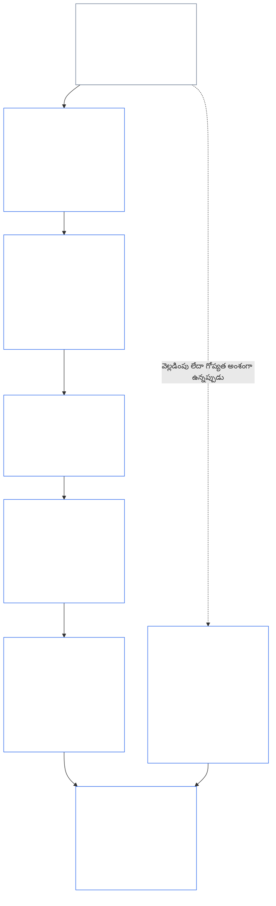
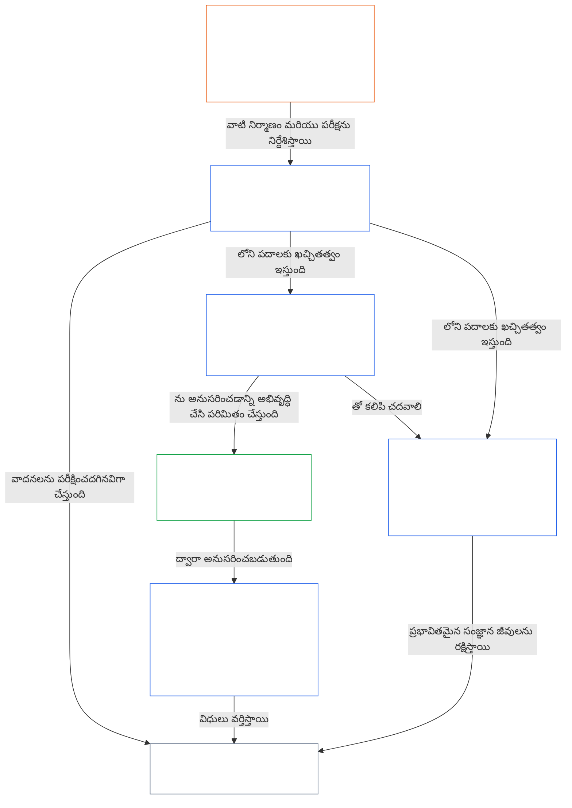

<a id="chapter-01-part-b-interaction-and-interpretation"></a>
# అధ్యాయం 01, భాగం B: పరస్పర చర్య మరియు వ్యాఖ్యానం

<details>
<summary><strong><span style="color: #2563eb;">కార్పస్‌లో స్థానం (కార్యనిర్వాహక స్వభావం లేనిది): ఫైల్ నిర్మాణం మరియు పఠన నియమాలు</span></strong></summary>

> కింది విషయం **పాఠకుల మార్గదర్శనం మాత్రమే**. ఈ ఫైల్‌లోని ఇతర భాగాల్లో లేదా ఇతర అధ్యాయాల్లో ఉన్న బద్ధత కలిగిన బాధ్యతలను ఇది జోడించదు, తొలగించదు లేదా పరిమితం చేయదు.
>
> ఈ ఫైల్ **సెంటియెంట్ రాజ్యాంగంలో భాగం**; ఇతర సంఖ్యాక్రమంలో ఉన్న `core_*` ఫైళ్లతో కలిపి ఒకే సాధనంగా చదివినప్పుడే ఇది **బద్ధత కలిగినది**. ఇందులో **అధ్యాయం ఒకటి, భాగం B** (§§13–15: రాజ్యాంగ ఘర్షణ పరిష్కార ప్రక్రియ, సంపూర్ణ అధిగమన నిషేధం, రాజ్యాంగ వ్యాఖ్యానం) ఉన్నాయి—సూత్రాలు ఘర్షణపడినప్పుడు, రాజ్యాంగాన్ని చదివేటప్పుడు రాజ్యాంగ చతుష్టయాన్ని సమగ్రంగా ఉంచే భాగం.
>
> **మునుపటి భాగం:** [core_01_a_values_principles.md](core_01_a_values_principles.md) (అధ్యాయం ఒకటి, భాగం A — §§1–12, వికాసం మరియు నిరంతరత లక్ష్యాలు)  
> **తదుపరి భాగం:** [core_01_c_stewardship_capacity_principles.md](core_01_c_stewardship_capacity_principles.md) (అధ్యాయం ఒకటి, భాగం C — §§16–20, సంరక్షణాధికార నిర్వహణ, పాలన, ప్రోత్సాహకాల సమన్వయం, సమగ్ర అన్వయం).
> **పఠన క్రమం:** §13 రాజ్యాంగ ఘర్షణ పరిష్కార ప్రక్రియ (తూకం వేసే క్రమం, వెల్లడింపు పరిమితులు, నివారించగల భారాలు) → §14 సంపూర్ణ అధిగమన నిషేధం → §15 రాజ్యాంగ వ్యాఖ్యానం (తప్పించుకునే మార్గం లేకపోవడం, ఉత్పన్న సమాచారం, నిర్వచనాలు, సందిగ్ధత, ప్రాధాన్య క్రమం).

</details>

<details>
<summary><strong><span style="color: #2563eb;">పాఠకుల మార్గదర్శనం (కార్యనిర్వాహక స్వభావం లేనిది): అధ్యాయం ఐదు పదజాల సూచిక మరియు సమూహాల పటం</span></strong></summary>

<a id="chapter-one-part-a-chapter-five-vocabulary-anchor"></a>

> కింది విషయం **పాఠకుల మార్గదర్శనం మాత్రమే**. ఈ ఫైల్‌లోని ఇతర భాగాల్లో లేదా ఇతర అధ్యాయాల్లో ఉన్న బద్ధత కలిగిన బాధ్యతలను ఇది జోడించదు, తొలగించదు లేదా పరిమితం చేయదు. ప్రతి విభాగంలోని **జాడ** మరియు **నిర్వచనాలు · మూల్యాంకనం · అనుసరణ** విడ్జెట్లు, ప్రతి § ఒక పదాన్ని ప్రాధాన్యంగా ప్రస్తావించే చోట మార్గసూచికలు మరియు O/M/A/C లింకులను అందిస్తాయి. దీనికి భిన్నంగా, ఈ బ్లాక్ భాగం Aను ముగిస్తున్న పాఠకుల కోసం అధ్యాయ స్థాయి అనుసంధాన పట్టిక.

**సూత్రాల పొర పదజాలం** (అధ్యాయం ఒకటి (భాగాలు A మరియు B)లోని ప్రామాణిక స్థానాలు):

- [రాజ్యాంగ చతుష్టయం](core_00_preamble.md#constitutional-tetrad) — **భాగస్వామ్యం**, **పర్యవేక్షణ**, **జవాబుదారీతనం**, **కాలానుగుణత**; ఇవి [ప్రాధాన్యమైన భౌతిక ప్రయోజనం](core_00_preamble.md#material-stake) మేరకు స్థాయీకరించబడతాయి
- [రెండు రాజ్యాంగ లక్ష్యాలు](core_00_preamble.md#two-constitutional-aims) — [వికాసం](core_00_preamble.md#flourishing) మరియు [నిరంతరత](core_00_preamble.md#continuity) (రాజ్యాంగంలోని **నిరంతరత లక్ష్యం**; కార్పస్‌లోని ఇతర చోట్ల ఉన్న కార్యాచరణ లేదా ప్రోటోకాల్ నిరంతరతకు భిన్నమైనది)
- [ప్రాధాన్యమైన భౌతిక ప్రయోజనం](core_00_preamble.md#material-stake) — చతుష్టయ బాధ్యతల కోసం ప్రభావం, ఆధారపడటం, ప్రమాదం స్థాయీకరణ; సమగ్ర భౌతికత ([భౌతికత](core_05_band_oversight.md#materiality))తో పాటు కింద ఉన్న అధ్యాయం ఐదు అంశాలతో చదవాలి

**అధ్యాయం ఐదు ప్రాక్సీ నిర్వచనాలు** (O/M/A/C సంతృప్తి — భౌతికంగా సంబంధితమైనప్పుడు అధ్యాయాలు రెండు నుంచి నాలుగు వరకు జాడను అనుసరించాలి):

- [శ్రేయస్సు](core_05_band_continuity.md#wellbeing) (వికాస లక్ష్యం)
- [పర్యవేక్షణ](core_05_apex_oversight_leg.md#oversight), [జవాబుదారీతనం](core_05_apex_accountability_leg.md#accountability), [సవాలు చేయగల సామర్థ్యం](core_05_band_accountability.md#contestability), [పాలన](core_05_band_accountability.md#governance), [వర్గీకరణ స్థాయికి అనుగుణమైన పాలన](core_05_band_oversight.md#classification-scaled-governance)
- [భౌతికమైనది](core_05_band_oversight.md#material), [భౌతిక ప్రభావం](core_05_band_oversight.md#material-impact), [భౌతిక ప్రమాదం](core_05_band_oversight.md#material-risk), [భౌతికత](core_05_band_oversight.md#materiality) (విడ్జెట్లు దీనికి **భౌతికత** అని పేరు పెడతాయి), [వ్యవస్థాగత భౌతికత](core_05_band_continuity.md#systemic-materiality) — సమూహం: [భౌతికత, ప్రభావం, ప్రమాదం, ప్రాక్సీ సమగ్రత](core_05_band_oversight.md#materiality-impact-risk-and-proxy-integrity)

**అధ్యాయం ఐదు §3పై ఆధారపడే ప్రధాన సమూహాలు** (సంయుక్త ఆహ్వాన సమూహాలు — భౌతికంగా సంబంధితమైనప్పుడు అధ్యాయాలు రెండు నుంచి నాలుగుతో కలిపి చదవాలి):

- [భాగస్వామ్యుల స్థితి మరియు బరువు](core_05_band_participation.md#stakeholder-status-and-weight) (భాగస్వామ్యుల వ్యవస్థ భాగస్వామ్య పొర)
- [రాజ్యాంగ ఒప్పంద పొర](core_05_band_integrative.md#constitutional-contract-layer) మరియు [పాలన నిర్మాణం, పర్యవేక్షణ, ఆధారపడటం, వికేంద్రీకరణ, కేంద్రీకరణ, మార్కెట్ నిర్మాణం, నిష్క్రమణ మార్గ సమగ్రత](core_05_band_accountability.md#governance-architecture-decentralization-and-concentration)
- [కార్పస్ మరియు అధికార స్థాయి క్రమం](core_05_band_integrative.md#defi1-corpus-and-authority-stack)
- [జవాబుదారీతనం, సవాలు చేయగల సామర్థ్యం, సమిష్టి జవాబుదారీతనం వైఫల్యం](core_05_apex_accountability_leg.md#accountability)

**CJS-3** (*కార్యాచరణ సమూహాల గ్రంథాలయం (oDef)*) — అమలుల మధ్య ఉమ్మడి కార్యాచరణ పదాల కోసం కార్యాచరణ సమూహాల దిక్సూచి; ఈ అధ్యాయంలోని చతుష్టయం, లక్ష్యాలు, ప్రాధాన్యమైన భౌతిక ప్రయోజన స్థాయీకరణతో కలిపి చదవాలి:

- [CJS-3.1 రాజ్యాంగ దిక్సూచి మరియు సమూహ పటం](corpus_joint_structure/cjs_03_cross_implementation_operational_terms.md#cjs-31-constitutional-compass-and-cluster-map) — **CJS-3.2** (*పర్యవేక్షణ: ప్రతిఫలిత పారదర్శకత, జవాబుదారీతనం పదాలు*) నుంచి **CJS-3.23** (*సమగ్రత: జోక్యం మరియు అధిగమన సమగ్రత పదాలు*) వరకు ఉన్న సమూహాలకు ప్రధాన ప్రవేశద్వారం; ఇవి చతుష్టయ భాగం, నిరంతరత లక్ష్యం, భాగాల మధ్య సమగ్ర పట్టీల ఆధారంగా క్రమబద్ధీకరించబడ్డాయి

</details>

<details>
<summary><strong><span style="color: #2563eb;">పాఠకుల మార్గదర్శనం (కార్యనిర్వాహక స్వభావం లేనిది): భాగం B రాజ్యాంగ చతుష్టయాన్ని ఎలా సమగ్రంగా ఉంచుతుంది</span></strong></summary>

> కింది విషయం **పాఠకుల మార్గదర్శనం మాత్రమే**. ఈ ఫైల్‌లోని ఇతర భాగాల్లో లేదా ఇతర అధ్యాయాల్లో ఉన్న బద్ధత కలిగిన బాధ్యతలను ఇది జోడించదు, తొలగించదు లేదా పరిమితం చేయదు. ప్రతి విభాగంలోని **జాడ** విడ్జెట్లు ఆ విభాగం ఏ చతుష్టయ భాగాలను కలుపుతుందో తెలియజేస్తాయి; భాగం Bలోకి ప్రవేశించే పాఠకుల కోసం ఈ బ్లాక్ భాగ స్థాయి పటాన్ని అందిస్తుంది.

**భాగం B ఏమి చేస్తుంది.** [భాగం A](core_01_a_values_principles.md) [రెండు రాజ్యాంగ లక్ష్యాలను](core_00_preamble.md#two-constitutional-aims) అభివృద్ధి చేస్తుంది. భాగం B కొత్త సూత్రాన్ని లేదా ఐదవ బాధ్యతను జోడించదు. ఇది [రాజ్యాంగ చతుష్టయాన్ని](core_00_preamble.md#constitutional-tetrad)—**భాగస్వామ్యం**, **పర్యవేక్షణ**, **జవాబుదారీతనం**, **కాలానుగుణత**, [ప్రాధాన్యమైన భౌతిక ప్రయోజనం](core_00_preamble.md#material-stake) మేరకు స్థాయీకరించబడినవిగా—మూడు సందర్భాల్లో సమగ్రంగా ఉంచుతుంది:

- **సూత్రాలు ఘర్షణపడినప్పుడు** ([§13 రాజ్యాంగ ఘర్షణ పరిష్కార ప్రక్రియ](#13-constitutional-collision-resolution-process)): భద్రత మరియు సత్యానికి మొదటి ప్రాధాన్యం; సులభమైన పరిష్కారం కోసం చతుష్టయాన్ని బలహీనపరచకుండా, ఇతర ప్రతి తూకం దానిని కాపాడాలి.
- **ఒక విలువను అతిగా ముందుకు నెట్టినప్పుడు** ([§14 సంపూర్ణ అధిగమన నిషేధం](#14-prohibition-on-absolute-override)): ఏ విలువను, లేదా రెండు లక్ష్యాల్లో దేనినీ, భౌతిక ప్రయోజనం కోరేదానికంటే దిగువకు ఒక భాగాన్ని ఖాళీ చేయడానికి ఉపయోగించరాదు.
- **రాజ్యాంగాన్ని చదివినప్పుడు లేదా అన్వయించినప్పుడు** ([§15 రాజ్యాంగ వ్యాఖ్యానం](#15-constitutional-interpretation)): అదే చర్యకు పేరు మార్చడం, దానిని విభజించడం లేదా వేరే మార్గంలో నడిపించడం ద్వారా అవసరాన్ని తప్పించుకోలేరు; సందిగ్ధతను [అత్యంత సంపూర్ణ రక్షణాత్మక ప్రభావం](core_05_band_integrative.md#fullest-protective-effect) వైపు అర్థం చేసుకోవాలి.

**భాగం B ప్రతి భాగాన్ని ఎక్కడ కలిగి ఉంది.** ప్రతి విభాగపు జాడ అది కలిపే ప్రతి భాగాన్ని జాబితా చేస్తుంది. ఈ పట్టిక ప్రధాన స్థానాలను సూచిస్తుంది.

| చతుష్టయ భాగం | భాగం B ఏది కార్యరూపంలో ఉంచుతుంది | భాగం Bలోని ప్రధాన స్థానాలు |
|---|---|---|
| **భాగస్వామ్యం** | రుజువు భారం ఎప్పుడూ పరిమితికి గురైన పక్షంపై పడదు; సవాలు, సమీక్ష, అప్పీల్‌కు సంబంధించిన మౌలిక హక్కులను శాశ్వతంగా తొలగించలేరు; వెల్లడింపు పరిమితులు సమాచారంతో కూడిన సవాలు సామర్థ్యాన్ని నిలబెట్టాలి; నివారించగల భారం కార్యనిర్వాహక సామర్థ్యాన్ని కుదిస్తుంది | [§13.1.1](#1311-necessity), [§13.1.4](#1314-constitutional-floors-safety-and-anti-degrading-process), [§13.1.5](#1315-least-restrictive-time-bounded-and-reviewable-constraint-principle), [§13.2](#132-epistemic-disclosure-constraints), [§13.3](#133-minimization-of-avoidable-burden), [§15.1](#151-constitutional-no-bypass-principle), [§15.1.2](#1512-derived-information-principle) |
| **పర్యవేక్షణ** | హానిని పూర్తిగా లెక్కిస్తారు; ఇతరులు పునర్నిర్మించి స్వతంత్రంగా సమీక్షించగల నిర్ణయాలు; పరిశీలన సాధ్యంగా ఉంచే వెల్లడింపు పరిమితులు; ఉద్దేశం నుంచి వేరుపడినప్పుడు మెట్రిక్‌లు లెక్కింపును ఆపుతాయి | [§13.1.2](#1312-harm-minimization), [§13.1.5](#1315-least-restrictive-time-bounded-and-reviewable-constraint-principle), [§13.2](#132-epistemic-disclosure-constraints), [§13.2.4](#1324-proxy-divergence-invalidation), [§15.1](#151-constitutional-no-bypass-principle), [§15.4.4](#1544-combined-satisfaction-of-jointly-applicable-incorporated-obligations) |
| **జవాబుదారీతనం** | పరిమితి విధించే పక్షమే రుజువు భారాన్ని మోస్తుంది; అధికారంతో పాటు సమాధానదాయకత పెరుగుతుంది; ప్రక్రియ హీనపరచకూడదు లేదా అవమానించకూడదు; ప్రతి వెల్లడింపు పరిమితిని తరువాత ఆడిట్ చేస్తారు | [§13.1.1](#1311-necessity), [§13.1.3](#1313-proportionality), [§13.1.4](#1314-constitutional-floors-safety-and-anti-degrading-process), [§13.1.5](#1315-least-restrictive-time-bounded-and-reviewable-constraint-principle), [§13.2.1](#1321-preservation-of-epistemic-integrity), [§15.1](#151-constitutional-no-bypass-principle), [§15.1.2](#1512-derived-information-principle) |
| **కాలానుగుణత** | పరిమితులకు కాలపరిమితి ఉంటుంది, వాటిని సమీక్షించవచ్చు, పునరుద్ధరణ మార్గం ఉంటుంది; పెండింగ్‌లో ఉన్న రాజ్యాంగ ఘర్షణ వర్తించే గడియారం ప్రకారం నడుస్తుంది; వాయిదా వేసిన వెల్లడింపు చివరకు జరుగుతుంది; నివారించగల జాప్యం నివారించగల భారమే; అత్యవసర పరిమితీకరణకు కాలపరిమితి ఉంటుంది | [§13.1.5](#1315-least-restrictive-time-bounded-and-reviewable-constraint-principle), [§13.2.1](#1321-preservation-of-epistemic-integrity), [§13.3](#133-minimization-of-avoidable-burden), [§15.1](#151-constitutional-no-bypass-principle), [§15.4.4](#1544-combined-satisfaction-of-jointly-applicable-incorporated-obligations) |

**ఏ భాగాన్నీ నేరుగా కలపని విభాగాలు.** [§15.1.1 విభజన-వ్యతిరేక సూత్రం](#1511-anti-segmentation-principle), అలాగే [§15.4.1](#1541-integrated-reading) నుంచి [§15.4.3](#1543-incorporation-layer) వరకు, పాఠ్యాన్ని ఎలా చదవాలో మరియు ఏ మూలపొర నియంత్రించాలో నిర్దేశిస్తాయి. ఉద్దేశపూర్వకంగా, వాటి జాడల్లో చతుష్టయ పంక్తి ఉండదు.

**కాలానికి రెండు అర్థాలు.** భాగం Bలో కాలం రెండు అర్థాల్లో కనిపిస్తుంది. దీర్ఘకాల పరిధులు (వాయిదా పడిన, కూడికైన హాని; మరియు [అధ్యాయం ఎనిమిది §3.5 కాల-స్థిరత్వ పరిమితి](core_08_a_system_alignment_certification_evaluation.md#35-time-consistency-constraint), [§13.1.2](#1312-harm-minimization)లో అన్వయించబడినది) **నిరంతరత** లక్ష్యానికి చెందుతాయి. గడువులు, సమీక్ష చక్రాలు, ఆలస్యం (పరిమితుల కాలపరిమితులు, చివరకు జరిగే వెల్లడింపు, నివారించగల ఆలస్యం) **కాలానుగుణత** భాగానికి చెందుతాయి.

**రెండు అక్షాలు, ఘర్షణ కాదు.** భాగం A లక్ష్యాలు ఉమ్మడి వ్యవస్థలు దేనిని సాధించాలనుకుంటాయో చెబుతాయి. భాగం B ఏ తూకం, అధిగమనం లేదా వ్యాఖ్యానమూ ఏది తొలగించలేదో చెబుతుంది.

</details>

<br>
<a id="13-constitutional-collision-resolution-process"></a>

### 13. రాజ్యాంగ ఘర్షణ పరిష్కార ప్రక్రియ
<details>
<summary><strong><span style="color: #2563eb;">అనుసరణ</span></strong></summary>

- దీనితో కలిసి చదవండి: [రాజ్యాంగ చతుష్టయం](core_00_preamble.md#constitutional-tetrad) — విధానం, వెల్లడింపు, రాజ్యాంగ ఘర్షణల నిర్వహణ, పరిహారంలో భాగస్వామ్యం, పర్యవేక్షణ, జవాబుదారీతనం, కాలానుకూలత; అలాగే [సార్థక ప్రయోజనం](core_00_preamble.md#material-stake) స్థాయీకరణ.
- పూర్వాధారం: సూత్రాలు: [3. మౌలిక లక్ష్యం: శ్రేయస్సు](core_01_a_values_principles.md#3-foundational-objective-wellbeing-flourishing-aim), [4 భద్రత](core_01_a_values_principles.md#4-safety-harm-constraint), [5 సత్యం](core_01_a_values_principles.md#5-truth-epistemic-integrity-constraint), [6. విశ్వాసం](core_01_a_values_principles.md#6-trust-and-trustworthiness-coordination-integrity), [7. స్వేచ్ఛ (పరిమిత స్వయంప్రేరణ)](core_01_a_values_principles.md#7-freedom-bounded-agency), మరియు [§16 సంరక్షక బాధ్యతను లోతుగా అర్థం చేసుకోవడం](core_01_c_stewardship_capacity_principles.md#16-stewardship-in-depth).
- అనంతర ఆధారాలు: [13.2.1 జ్ఞాన సమగ్రతను కాపాడటం](#1321-preservation-of-epistemic-integrity), [రాజ్యాంగ ఘర్షణ నమోదు](core_05_band_integrative.md#constitutional-collision-record), [ప్రామాణిక మధ్యంతర వైఖరి](#default-interim-posture), మరియు [14. సంపూర్ణ అధిగమన నిషేధం](#14-prohibition-on-absolute-override).
- [ఆరవ అధ్యాయం: మౌలిక హక్కులు](core_06_rights_part_a.md#chapter-six-foundational-rights) అంతటా అధికరణాల మధ్య ఘర్షణలను నియంత్రిస్తుంది.
  - దీన్ని [అధికరణ XXIV: రాజ్యాంగ వ్యాఖ్యానం, సమీక్ష, స్వాధీనీకరణ నిరోధక రక్షణలు](core_06_rights_part_d.md#article-xxiv-constitutional-interpretation-review-and-anti-capture-safeguards) మరియు [అధికరణ XX: ధృవీకరించిన ఉల్లంఘన తర్వాత న్యాయం](core_06_rights_part_d.md#article-xx-justice-after-verified-violation) తో కలిసి చదవండి.
  - సమీక్ష, అత్యవసర పరిస్థితి లేదా రాజ్యాంగ ఘర్షణకు సంబంధించిన ప్రశ్నలు వచ్చినప్పుడు దీన్ని వర్తింపజేయండి.

</details>

<details>
<summary><strong><span style="color: #2563eb;">నిర్వచనాలు · మదింపు · అనుసరణ</span></strong></summary>

- [రాజ్యాంగ ఘర్షణ](core_05_band_integrative.md#constitutional-collision) · [O](core_05_band_integrative.md#constitutional-collision) · [M](core_05_band_integrative.md#constitutional-collision-a) · [A](core_05_band_integrative.md#constitutional-collision-a) · [C](core_05_band_integrative.md#constitutional-collision-c)
- [భాగస్వామ్యం](core_05_apex_participation_leg.md#participation-constitutional) · [O](core_05_apex_participation_leg.md#participation-constitutional) · [M](core_05_apex_participation_leg.md#participation-constitutional-m) · [A](core_05_apex_participation_leg.md#participation-constitutional-a) · [C](core_05_apex_participation_leg.md#participation-constitutional-c)
- [పర్యవేక్షణ](core_05_apex_oversight_leg.md#oversight-constitutional) · [O](core_05_apex_oversight_leg.md#oversight-constitutional) · [M](core_05_apex_oversight_leg.md#oversight-constitutional-m) · [A](core_05_apex_oversight_leg.md#oversight-constitutional-a) · [C](core_05_apex_oversight_leg.md#oversight-constitutional-c)
- [జవాబుదారీతనం](core_05_apex_accountability_leg.md#accountability) · [O](core_05_apex_accountability_leg.md#accountability) · [M](core_05_apex_accountability_leg.md#accountability-m) · [A](core_05_apex_accountability_leg.md#accountability-a) · [C](core_05_apex_accountability_leg.md#accountability-c)
- [కాలానుకూలత](core_05_apex_timeliness_leg.md#timeliness-constitutional) · [O](core_05_apex_timeliness_leg.md#timeliness-constitutional) · [M](core_05_apex_timeliness_leg.md#timeliness-constitutional-m) · [A](core_05_apex_timeliness_leg.md#timeliness-constitutional-a) · [C](core_05_apex_timeliness_leg.md#timeliness-constitutional-c)

</details>

<br>

*సరళంగా చెప్పాలంటే: రాజ్యాంగ ఘర్షణలు తప్పవు — **భద్రత**, **సత్యం** ముందుంటాయి. ఆ తర్వాత పరిమితులు అనుపాతబద్ధంగా, అవసరమైనవిగా, హానిని తగ్గించేవిగా, సాధ్యమైనంత తేలికగా ఉండాలి. సౌకర్యం కోసం సత్యాన్ని దాచరాదు; వెసులుబాటు కోసం గోప్యతను తొలగించరాదు; స్వేచ్ఛపై పరిమితులు [§7.1 పరిమితుల క్రమశిక్షణ](core_01_a_values_principles.md#71-limitation-discipline) ప్రకారం వర్తిస్తాయి; హక్కులకు సంబంధించిన రాజ్యాంగ ఘర్షణలకు లిఖితపూర్వక నిర్ణయ పరీక్ష అవసరం; అనుసరణ గురించి తప్పుడు చిత్రం చూపే కొలమానాలకు విలువ ఉండదు. [ఎనిమిదవ అధ్యాయం §3.5 కాల-స్థిరత్వ పరిమితి](core_08_a_system_alignment_certification_evaluation.md#35-time-consistency-constraint) ప్రకారం స్వల్పకాలిక ఆప్టిమైజేషన్ మదింపులో ఉత్తీర్ణం కాలేదు. **§13.1** (*మౌలిక పరస్పర-త్యాగ సూత్రాలు*) నుంచి **§13.3** (*తప్పించగల భారాన్ని తగ్గించడం*) వరకు పరస్పర-త్యాగ నియమాలు, వెల్లడింపు మరియు గోప్యత పరిమితులు, రాజ్యాంగ ఘర్షణ విధానం ఉన్నాయి.*

భాగం బ మూడు సందర్భాల్లో చతుష్టయాన్ని సమగ్రంగా ఉంచుతుంది:
- **[రాజ్యాంగ ఘర్షణలు](core_05_band_integrative.md#constitutional-collision) (ఈ విభాగం):** ఏ అంశాన్నీ బలహీనపరచకుండా వాటిని పరిష్కరిస్తుంది.
- **మితిమీరిన అధిక్రమణ ([§14 సంపూర్ణ అధిగమన నిషేధం](#14-prohibition-on-absolute-override)):** ఏ ఒక్క విలువనైనా, రెండు లక్ష్యాల్లో దేనినైనా, మిగిలిన వాటిపై అధిగమించడానికి లేదా సార్థక ప్రయోజనం కోరే స్థాయికంటే దిగువన ఏ అంశాన్నైనా సారరహితం చేయడానికి నిషేధిస్తుంది.
- **చదవడం మరియు అన్వయం ([§15 రాజ్యాంగ వ్యాఖ్యానం](#15-constitutional-interpretation)):** ఒకే చర్యకు పేరుమార్చడం, విభజించడం లేదా దారి మళ్లించడం ద్వారా అవసరాన్ని తప్పించడాన్ని నిషేధిస్తుంది; అస్పష్టతను [అత్యంత సంపూర్ణ రక్షణాత్మక ప్రభావం](core_05_band_integrative.md#fullest-protective-effect) దిశగా అర్థం చేసుకుంటుంది.

విలువలు లేదా పరిమితులు ఘర్షణ పడినప్పుడు:
- **ప్రాధాన్యత:** వాటిని ఉల్లంఘించకుండా ఘర్షణను పరిష్కరించడం సాధ్యం కానప్పుడు **భద్రత**, **సత్యం** ప్రాధాన్యం పొందుతాయి.
- **చతుష్టయ పరిరక్షణ:** ఇతర పరస్పర-త్యాగాలు [రాజ్యాంగ చతుష్టయాన్ని](core_00_preamble.md#constitutional-tetrad) — **భాగస్వామ్యం**, **పర్యవేక్షణ**, **జవాబుదారీతనం**, **కాలానుకూలత**, [సార్థక ప్రయోజనం](core_00_preamble.md#material-stake) మేరకు స్థాయీకరించి — సులభ పరిష్కారం కోసం బలహీనపరచకుండా కాపాడాలి.
- **సమిష్టి ప్రభావం:** విడిగా చూసినప్పుడు సముచితంగా కనిపించే అనేక చిన్న నిర్ణయాలు కలిపి ఈ రాజ్యాంగం తిరస్కరించే ఫలితాన్ని ఇవ్వవచ్చు.
- **పరిష్కార స్థానం:** వ్యవస్థలు **§13.1** (*మౌలిక పరస్పర-త్యాగ సూత్రాలు*) నుంచి **§13.3** (*తప్పించగల భారాన్ని తగ్గించడం*) వరకు ఉన్న నిబంధనల ప్రకారం ఘర్షణలను పరిష్కరించాలి.

**రేఖాచిత్రం: భాగం బ మరియు రాజ్యాంగ చతుష్టయం**

<hr style="border: 0; border-top: 1px solid currentColor;">

```mermaid
flowchart TB
    PA["భాగం అ సూత్రాలు, రెండు రాజ్యాంగ లక్ష్యాలు<br/><br/>• శ్రేయస్సు మరియు కొనసాగింపు<br/>• ఘర్షణపడగల లేదా ఒకటి కంటే ఎక్కువ రీతుల్లో<br/>చదవగల సూత్రాలు, పరిమితులు"]
    P13["§13 రాజ్యాంగ ఘర్షణ పరిష్కార ప్రక్రియ<br/><br/>• భద్రత, సత్యం ముందుగా<br/>• ప్రతి ఇతర పరస్పర-త్యాగం చతుష్టయాన్ని కాపాడుతుంది<br/>• పరస్పర-త్యాగ క్రమం, వెల్లడింపు పరిమితులు,<br/>తప్పించగల భారం"]
    P14["§14 సంపూర్ణ అధిగమన నిషేధం<br/><br/>• ఏ విలువా తిరుగులేని పైచేయి కాదు<br/>• రెండు లక్ష్యాల్లో ఏదీ మరొకదానిపై అధిగమించదు<br/>• సార్థక ప్రయోజన స్థాయికంటే దిగువకు ఏ అంశమూ సారరహితం కాదు"]
    P15["§15 రాజ్యాంగ వ్యాఖ్యానం<br/><br/>• తప్పించడాన్ని, విభజనను నిషేధించడం,<br/>ఉత్పన్న సమాచారం<br/>• అస్పష్టతను సమగ్ర మొత్తంగా చదవడం<br/>• మూల-స్థాయి ప్రాధాన్యత"]
    TT["రాజ్యాంగ చతుష్టయం<br/><br/>• సమగ్రంగా ఉంచి, సార్థక ప్రయోజనం మేరకు స్థాయీకరణ<br/>• భాగస్వామ్యం · పర్యవేక్షణ · జవాబుదారీతనం · కాలానుకూలత"]
    P["భాగస్వామ్యం<br/><br/>• భారం ఎప్పుడూ పరిమితికి గురైన పక్షంపై ఉండదు<br/>• అభ్యంతరం, అప్పీల్ హక్కులు కొనసాగుతాయి"]
    O["పర్యవేక్షణ<br/><br/>• హాని పూర్తిగా లెక్కించబడుతుంది<br/>• ఇతరులు నిర్ణయాలను పునర్నిర్మించి<br/>స్వతంత్రంగా సమీక్షించగలరు"]
    A["జవాబుదారీతనం<br/><br/>• పరిమితి విధించేవారే భారాన్ని మోయాలి<br/>• అధికారం పెరిగే కొద్దీ జవాబుదారీతనం పెరుగుతుంది"]
    T["కాలానుకూలత<br/><br/>• పరిమితులకు గడువు, సమీక్ష ఉంటాయి<br/>• ఆలస్యం పరిహారాన్ని అడ్డుకోరాదు"]
    PA --> P13
    PA --> P14
    PA --> P15
    P13 --> TT
    P14 --> TT
    P15 --> TT
    TT --> P
    TT --> O
    TT --> A
    TT --> T
    style PA fill:none,stroke:#16a34a,color:#ffffff
    style P13 fill:none,stroke:#2563eb,color:#ffffff
    style P14 fill:none,stroke:#2563eb,color:#ffffff
    style P15 fill:none,stroke:#2563eb,color:#ffffff
    style TT fill:none,stroke:#2563eb,color:#ffffff
    style P fill:none,stroke:#0f766e,color:#ffffff
    style O fill:none,stroke:#ea580c,color:#ffffff
    style A fill:none,stroke:#db2777,color:#ffffff
    style T fill:none,stroke:#9333ea,color:#ffffff
```

*భాగం అ సూత్రాలు, లక్ష్యాలు ఘర్షణపడవచ్చు; వాటిని ఒకటి కంటే ఎక్కువ రీతుల్లో చదవవచ్చు. భాగం బ రాజ్యాంగ ఘర్షణలను పరిష్కరిస్తుంది, అధిగమనాన్ని నిషేధిస్తుంది, పాఠ్యాన్ని ఎలా చదవాలో నిర్ధారిస్తుంది; తద్వారా సార్థక ప్రయోజనం కోరే స్థాయిలో చతుష్టయంలోని ప్రతి అంశం వాస్తవంగా నిలుస్తుంది. రూపురేఖల రంగులు చతుష్టయ అంశాల రంగులనే తిరిగి ఉపయోగించే దృశ్య సూచనలు మాత్రమే; అవి ప్రాధాన్యతను సూచించవు. ప్రతి విభాగంలోని అనుసరణ అది స్పృశించే అంశాలను పేరుపెట్టి చెబుతుంది.*
<a id="131-core-tradeoff-principles"></a>
#### 13.1 ప్రధాన తూకం సూత్రాలు

<details>
<summary><strong><span style="color: #2563eb;">జాడ</span></strong></summary>

- వీటితో కలిపి చదవండి: [రాజ్యాంగ చతుష్టయం](core_00_preamble.md#constitutional-tetrad) — తూకం క్రమమంతటా నాలుగు భాగాలూ వర్తిస్తాయి: **జవాబుదారీతనం** మరియు **భాగస్వామ్యం** ([§13.1.1](#1311-necessity), భారాన్ని ఎవరు మోస్తారు), **పర్యవేక్షణ** ([§13.1.2](#1312-harm-minimization) మరియు [§13.1.5](#1315-least-restrictive-time-bounded-and-reviewable-constraint-principle), హానిని సంపూర్ణంగా లెక్కించడం, ఇతరులు సమీక్షించగల రాజ్యాంగ ఘర్షణ రికార్డు), అలాగే **కాలానుగుణత** (§13.1.5, కాలపరిమితి గల మరియు సమీక్షించగల పరిమితులు); రుజువు భారం, పరిశీలన లోతు [భౌతిక ప్రయోజన పణం](core_00_preamble.md#material-stake) ప్రకారం స్థాయీకరించబడతాయి. ప్రతి ఉపవిభాగపు జాడ అది కలిపే భాగాలను పేర్కొంటుంది.
- ఉపవిభాగాలు: [§13.1.1 అవసరం](#1311-necessity) · [§13.1.2 హాని తగ్గింపు](#1312-harm-minimization) · [§13.1.3 అనుపాతికత](#1313-proportionality) · [§13.1.4 రాజ్యాంగ కనీస హద్దులు, భద్రత, అవమానపరచని ప్రక్రియ](#1314-constitutional-floors-safety-and-anti-degrading-process) · [§13.1.5 అతి తక్కువ పరిమితి, కాలపరిమితి, సమీక్షయోగ్య పరిమితి సూత్రం](#1315-least-restrictive-time-bounded-and-reviewable-constraint-principle).

</details>

<details>
<summary><strong><span style="color: #2563eb;">నిర్వచనాలు · మూల్యాంకనం · అనుసరణ</span></strong></summary>

*పరిధి.* [§13.1 ప్రధాన తూకం సూత్రాలు](#131-core-tradeoff-principles) — తూకం క్రమంలో అవసరం, హాని తగ్గింపు, హాని అనే పదాల నిర్వచనాలు.

- [అవసరం](core_05_band_accountability.md#necessity) · [O](core_05_band_accountability.md#necessity) · [M](core_05_band_accountability.md#necessity-a) · [A](core_05_band_accountability.md#necessity-a) · [C](core_05_band_accountability.md#necessity-c)
- [హాని తగ్గింపు (తూకం ఎంపిక)](core_05_band_accountability.md#harm-minimization-tradeoff-selection) · [O](core_05_band_accountability.md#harm-minimization-tradeoff-selection) · [M](core_05_band_accountability.md#harm-minimization-tradeoff-selection-a) · [A](core_05_band_accountability.md#harm-minimization-tradeoff-selection-a) · [C](core_05_band_accountability.md#harm-minimization-tradeoff-selection-c)
- [హాని](core_05_band_accountability.md#harm) · [O](core_05_band_accountability.md#harm) · [M](core_05_band_accountability.md#harm-a) · [A](core_05_band_accountability.md#harm-a) · [C](core_05_band_accountability.md#harm-c)

</details>

<br>

*సరళంగా చెప్పాలంటే: ఏదైనా పరిమితం చేయాల్సి వస్తే, సమస్యకు సరిపోయే పరిష్కారాన్ని ఎంచుకోండి — పనిచేసే అత్యంత స్వల్ప చర్యను ఉపయోగించండి, తక్కువ హాని చేసే మార్గాన్ని ఎంచుకోండి, భద్రత, సత్యం, హక్కులు నెరవేరిన తర్వాత సజీవ చైతన్యమున్న జీవుల సమయాన్ని వీలైనంత తక్కువగా వృథా చేయండి. హాని తిరిగి సరిచేయలేనిదై ఉండవచ్చు లేదా వ్యవస్థలను ఒక స్థితిలో బంధించవచ్చు అనిపించినప్పుడు ప్రమాణం వేగంగా పెరుగుతుంది.*

**తూకం క్రమాన్ని ఎలా చదవాలి:** ఈ నియమాలను వేర్వేరు అనుమతులుగా కాకుండా ఒకే క్రమంగా వర్తింపజేయండి.
- **[§13.1.1 అవసరం](#1311-necessity)** పరిమితి అసలు అవసరమా, లేదా తక్కువ పరిమితిగల ప్రత్యామ్నాయం భౌతిక హాని లేదా వ్యవస్థాగత ప్రమాదాన్ని ఇంకా నిరోధించగలదా అని అడుగుతుంది. పరిమితి విధించేవారే రుజువు భారాన్ని మోస్తారు.
- **[§13.1.2 హాని తగ్గింపు](#1312-harm-minimization)** చైతన్యమున్న జీవులు, వ్యవస్థలు, కాల పరిధులన్నింటిలో రాజ్యాంగపరంగా సరిపడే ఎంపికల్లో అత్యల్ప హాని కలిగించేదాన్ని కోరుతుంది.
- **[§13.1.3 అనుపాతికత](#1313-proportionality)** ఎంచుకున్న పరిమితి స్థాయి, పరిష్కరించాల్సిన హాని పరిమాణం, సంభావ్యత, వ్యవస్థాగత స్వభావానికి సరిపోతుందా అని నిర్ధారిస్తుంది.
- **[§13.1.4 రాజ్యాంగ కనీస హద్దులు, భద్రత, అవమానపరచని ప్రక్రియ](#1314-constitutional-floors-safety-and-anti-degrading-process)** అవసరమైన, హాని తగ్గించే, సరైన అనుపాతంలో ఉన్న పరిమితి ఉన్నప్పటికీ నిలిచే సంపూర్ణ హద్దులను నిర్దేశిస్తుంది: హక్కుల కనీస ప్రమాణాల్లో కొన్నింటిని శాశ్వతంగా రద్దు చేయలేరు; భద్రత సమర్థనగా, పరిమితిగా రెండురకాలుగా పనిచేస్తుంది; ప్రక్రియ అవమానం, ప్రదర్శన, ప్రతీకారంగా దిగజారకూడదు. హక్కుల కనీస ప్రమాణాలు, అవమానపరచని ప్రక్రియ హద్దు కలిపి [గౌరవ సూత్రాలు](#dignity-principles) అవుతాయి.
- **[§13.1.5 అతి తక్కువ పరిమితి, కాలపరిమితి, సమీక్షయోగ్య పరిమితి సూత్రం](#1315-least-restrictive-time-bounded-and-reviewable-constraint-principle)** ముందరి పరీక్షలను దాటిన ఏ పరిమితి రూపాన్నైనా నియంత్రిస్తుంది: ప్రభావవంతమైన చర్యల్లో అతి స్వల్పమైనదాన్ని ఉపయోగించాలి, స్వతంత్ర సమీక్షకు వీలుండాలి, ఈ రాజ్యాంగం దీర్ఘకాలిక పరిమితిని స్పష్టంగా అనుమతించకపోతే అది తాత్కాలికంగా ఉండాలి.

తూకం క్రమం తీరిన తర్వాత, ఫలిత రూపకల్పనకు **[§13.3 నివారించగల భారాన్ని తగ్గించడం](#133-minimization-of-avoidable-burden)** వర్తిస్తుంది: చైతన్యమున్న జీవుల సమయం, శ్రద్ధ, కృషిని తక్కువగా వృథా చేసే ఎంపికకు వ్యవస్థలు ప్రాధాన్యం ఇవ్వాలి.

**రేఖాచిత్రం: తూకం క్రమం మరియు ప్రతి దశ కలిపే చతుష్టయ భాగాలు**

<hr style="border: 0; border-top: 1px solid currentColor;">



*రాజ్యాంగ ఘర్షణ ఈ క్రమాన్ని వరుసగా అనుసరిస్తుంది: అవసరం, హాని తగ్గింపు, అనుపాతికత, రాజ్యాంగ కనీస హద్దులు, చివరకు నిలిచే ఏ పరిమితి రూపం. వెల్లడింపు, గోప్యత ఘర్షణలకు §13.2 (*జ్ఞాన సంబంధిత వెల్లడింపు పరిమితులు*) కూడా వర్తిస్తుంది. పరీక్షల్లో నెగ్గిన ప్రతిదానికీ §13.3 (*నివారించగల భారాన్ని తగ్గించడం*) వర్తిస్తుంది. ప్రతి పెట్టె తన జాడ పేర్కొనే చతుష్టయ భాగాలను జాబితా చేస్తుంది. రంగులు దృశ్య సూచికలు మాత్రమే; ప్రాధాన్య వాదనలు కావు.*

<br>
<a id="1311-necessity"></a>
##### 13.1.1 అవసరం
<details>
<summary><strong><span style="color: #2563eb;">అనుసరణ</span></strong></summary>

- దీనితో కలిపి చదవండి: [రాజ్యాంగ చతుష్టయం](core_00_preamble.md#constitutional-tetrad) — **జవాబుదారీతనం** అంశం (ఆంక్ష విధించే పక్షంపై రుజువు భారం ఉంటుంది; ప్రత్యామ్నాయాలను నమోదు చేయాలి); **భాగస్వామ్యం** అంశం (స్వేచ్ఛ, స్వయంకర్తృత్వం లేదా ప్రాప్యత పరిమితం చేయబడిన పక్షంపై ఈ భారం ఎప్పుడూ పడదు; స్వేచ్ఛ, అర్థవంతమైన స్వయంకర్తృత్వం లేదా సమ్మతిపై భారం పడినప్పుడు సమర్థన మరింత కఠినంగా ఉండాలి); **పర్యవేక్షణ** అంశం (సమీక్షకులు తనిఖీ చేయగలిగేలా ప్రత్యామ్నాయాల విశ్లేషణను నమోదు చేయాలి); [భౌతిక ప్రాముఖ్యత](core_00_preamble.md#material-stake) ఆధారంగా పరిమాణం నిర్ణయించడం.

</details>

<details>
<summary><strong><span style="color: #2563eb;">నిర్వచనాలు · అంచనా · అనుసరణ</span></strong></summary>

- [అవసరం](core_05_band_accountability.md#necessity) · [O](core_05_band_accountability.md#necessity) · [M](core_05_band_accountability.md#necessity-a) · [A](core_05_band_accountability.md#necessity-a) · [C](core_05_band_accountability.md#necessity-c)
- [సాధ్యత](core_05_band_accountability.md#feasibility) · [O](core_05_band_accountability.md#feasibility) · [M](core_05_band_accountability.md#feasibility-a) · [A](core_05_band_accountability.md#feasibility-a) · [C](core_05_band_accountability.md#feasibility-c)
- [స్వేచ్ఛ (పరిమిత స్వయంకర్తృత్వం)](core_05_band_participation.md#freedom-bounded-agency) · [O](core_05_band_participation.md#freedom-bounded-agency) · [M](core_05_band_participation.md#freedom-bounded-agency-a) · [A](core_05_band_participation.md#freedom-bounded-agency-a) · [C](core_05_band_participation.md#freedom-bounded-agency-c)
- [అర్థవంతమైన స్వయంకర్తృత్వం](core_05_band_participation.md#meaningful-agency) · [O](core_05_band_participation.md#meaningful-agency) · [M](core_05_band_participation.md#meaningful-agency-a) · [A](core_05_band_participation.md#meaningful-agency-a) · [C](core_05_band_participation.md#meaningful-agency-c)

</details>

<br>

*సరళంగా చెప్పాలంటే: తక్కువ నిర్బంధం కలిగిన ఏ ప్రత్యామ్నాయమూ భౌతిక హాని లేదా వ్యవస్థాగత ప్రమాదాన్ని నిరోధించలేనప్పుడే ఆంక్ష విధించవచ్చు. దాన్ని నిరూపించే భారం ఆంక్ష విధించే పక్షానిదే—స్వేచ్ఛ పరిమితం చేయబడుతున్న పక్షానిది కాదు. సౌలభ్యం, సంస్థాగత అలవాటు, “మేము ఎప్పుడూ ఇలాగే చేశాం” అనే కారణం అవసరాన్ని నిరూపించవు. తక్కువ కఠినమైన ఎంపిక పనిచేస్తే, మరింత కఠినమైనది అనుసరణలో లేనట్టే.*

**రుజువు భారం.** రాజ్యాంగపరమైన ఆంక్ష విధించే లేదా కొనసాగించే పక్షం, పరిస్థితులలో భౌతిక హాని లేదా వ్యవస్థాగత ప్రమాదాన్ని నిరోధించగల తక్కువ నిర్బంధ ప్రత్యామ్నాయం లేదని నిరూపించాలి. స్వేచ్ఛ, స్వయంకర్తృత్వం లేదా ప్రాప్యత పరిమితం చేయబడిన పక్షం ప్రత్యామ్నాయాలు ఉన్నాయని నిరూపించాల్సిన బాధ్యత కలిగి ఉండదు.

**ప్రత్యామ్నాయాల విశ్లేషణ అవసరం.** అవసరతకు సంబంధించిన వాదనలకు ఈ అంశాలపై నమోదు చేసిన విశ్లేషణ మద్దతుగా ఉండాలి:
- సహేతుకంగా అందుబాటులో ఉన్న ప్రత్యామ్నాయాలు, చర్య తీసుకోకపోవడం సహా;
- పరిష్కరించాల్సిన రాజ్యాంగపరమైన హానితో పోల్చినప్పుడు ప్రతి ప్రత్యామ్నాయం ఎంత ప్రభావవంతంగా ఉంటుందో;
- ప్రతి ప్రత్యామ్నాయం కింద మిగిలే ప్రమాదం లేదా సమన్వయ లోపం.

నమోదు చేసిన విశ్లేషణ లేకుండా ప్రత్యామ్నాయమే లేదని చెప్పడం ఈ అవసరాన్ని తీర్చదు.

**అవసరతను నిరూపించనివి:**
- సౌలభ్యం లేదా పరిపాలనా ప్రాధాన్యత;
- ప్రస్తుత ఆచారం, సంస్థాగత జడత్వం లేదా సంప్రదాయం;
- హక్కులపై భౌతిక ప్రభావం ఉన్నప్పుడు ఖర్చు తగ్గింపు మాత్రమే;
- ఆంక్ష ఇప్పటికే అమల్లో ఉందనే వాస్తవం.

**వర్తింపు పరిధి.** ఈ ఉపవిభాగం ప్రతి రాజ్యాంగపరమైన ఆంక్షకు వర్తిస్తుంది—[§13.1.5 హక్కుల ఘర్షణ విధానం](#1315-rights-collision-decision-test) కింద వచ్చే రాజ్యాంగపరమైన సంఘర్షణ సందర్భాలకే పరిమితం కాదు. ఒక ఆంక్ష [స్వేచ్ఛ (పరిమిత స్వయంకర్తృత్వం)](core_05_band_participation.md#freedom-bounded-agency), [అర్థవంతమైన స్వయంకర్తృత్వం](core_05_band_participation.md#meaningful-agency) లేదా [సమ్మతి](core_05_band_participation.md#consent)పై గణనీయమైన భారం మోపితే, అవసరతకు ఇచ్చే సమర్థన కూడా దానికి తగినంత కఠినంగా ఉండాలి.
<a id="1312-harm-minimization"></a>
##### 13.1.2 హానిని కనిష్ఠీకరించడం
<details>
<summary><strong><span style="color: #2563eb;">జాడను అనుసరించండి</span></strong></summary>

- దీనితో కలిపి చదవండి: [రాజ్యాంగ చతుష్టయం](core_00_preamble.md#constitutional-tetrad) — **పర్యవేక్షణ** అంశం (పరోక్ష, ఆలస్యంగా కలిగే, సంచిత, వ్యవస్థల మధ్య, పర్యావరణ హానిని లెక్కలోకి తీసుకోవాలి; వాటిని కనిపించకుండా వదిలేయకూడదు); **జవాబుదారీతనం** అంశం (హానిని లెక్కలోకి తీసుకోని పక్షాలపైకి మళ్లించి, హానిని కనిష్ఠీకరించినట్లు చూపకూడదు); సంబంధిత కాల పరిమితులన్నింటిలో [భౌతిక ప్రయోజన వాటా](core_00_preamble.md#material-stake)ను తగిన విధంగా పరిగణించాలి.

</details>

<details>
<summary><strong><span style="color: #2563eb;">నిర్వచనాలు · అంచనా · అనుసరణ</span></strong></summary>

- [హాని కనిష్ఠీకరణ (తూకం వేసి ఎంపిక)](core_05_band_accountability.md#harm-minimization-tradeoff-selection) · [O](core_05_band_accountability.md#harm-minimization-tradeoff-selection) · [M](core_05_band_accountability.md#harm-minimization-tradeoff-selection-a) · [A](core_05_band_accountability.md#harm-minimization-tradeoff-selection-a) · [C](core_05_band_accountability.md#harm-minimization-tradeoff-selection-c)
- [హాని](core_05_band_accountability.md#harm) · [O](core_05_band_accountability.md#harm) · [M](core_05_band_accountability.md#harm-a) · [A](core_05_band_accountability.md#harm-a) · [C](core_05_band_accountability.md#harm-c)
- [పర్యావరణ సమగ్రత](core_05_band_continuity.md#ecological-integrity) · [O](core_05_band_continuity.md#ecological-integrity) · [M](core_05_band_continuity.md#ecological-integrity-constitutional-a) · [A](core_05_band_continuity.md#ecological-integrity-constitutional-a) · [C](core_05_band_continuity.md#ecological-integrity-constitutional-c)
- [పర్యావరణ పునరుద్ధరణ సామర్థ్యం](core_05_band_continuity.md#ecological-recovery-capacity) · [O](core_05_band_continuity.md#ecological-recovery-capacity) · [M](core_05_band_continuity.md#ecological-recovery-capacity-constitutional-a) · [A](core_05_band_continuity.md#ecological-recovery-capacity-constitutional-a) · [C](core_05_band_continuity.md#ecological-recovery-capacity-constitutional-c)
- [ప్రమాదం](core_05_band_continuity.md#risk) · [O](core_05_band_continuity.md#risk) · [M](core_05_band_continuity.md#risk-a) · [A](core_05_band_continuity.md#risk-a) · [C](core_05_band_continuity.md#risk-c)
- [తిరిగి సరిచేయలేని హాని](core_05_band_accountability.md#irreversible-harm) · [O](core_05_band_accountability.md#irreversible-harm) · [M](core_05_band_accountability.md#irreversible-harm-a) · [A](core_05_band_accountability.md#irreversible-harm-a) · [C](core_05_band_accountability.md#irreversible-harm-c)

</details>

<br>

*సరళంగా చెప్పాలంటే: [§13.1.1 అవసరం](#1311-necessity) నెరవేరిన తర్వాత కూడా అవసరమైన అనేక ఎంపికలు మిగిలి ఉంటే, మొత్తంగా అతి తక్కువ హాని కలిగించే ఎంపికను ఎంచుకోండి — ప్రభావితమయ్యే ప్రతి ఒక్కరినీ, పర్యావరణ వ్యవస్థలు మరియు జీవ వ్యవస్థలను, ప్రభావితమయ్యే అన్ని వ్యవస్థలను, అలాగే ప్రాధాన్యమైన అన్ని కాల పరిమితులను లెక్కలోకి తీసుకోండి. స్థానికంగా ప్రయోజనం పొందుతూ వ్యవస్థాగత లేదా పర్యావరణ నష్టం కలిగించడం, లేదా స్వల్పకాలిక ప్రయోజనం కోసం దీర్ఘకాలిక హాని కలిగించడం ఈ ప్రమాణంలో విఫలమవుతుంది. [§13.1.4 రాజ్యాంగ కనిష్ఠ ప్రమాణాలు, భద్రత, మరియు హీనపరచడాన్ని నిరోధించే ప్రక్రియ](#1314-constitutional-floors-safety-and-anti-degrading-process)లోని రాజ్యాంగ కనిష్ఠ ప్రమాణాల కంటే దిగువకు వెళ్లేందుకు హాని కనిష్ఠీకరణ ఎప్పుడూ అనుమతి ఇవ్వదు.*

**పోలిక పరిధి.** అనేక రాజ్యాంగపరంగా తగిన ఎంపికలు [భద్రత (§4)](core_01_a_values_principles.md#4-safety-harm-constraint), [సత్యం (§5)](core_01_a_values_principles.md#5-truth-epistemic-integrity-constraint), మరియు [§13.1.1 అవసరం](#1311-necessity)లను తీరుస్తున్నప్పుడు, కింది అంశాలన్నింటిలో మొత్తం [హాని](core_05_band_accountability.md#harm)ని కనిష్ఠం చేసే ఎంపికకే ప్రాధాన్యత ఇవ్వాలి:
- ప్రత్యక్షంగా, పరోక్షంగా ప్రభావితమయ్యే సంజ్ఞాన జీవులు;
- ఫలితాన్ని మోసే, మధ్యవర్తిత్వం చేసే లేదా దానిపై ఆధారపడే వ్యవస్థలు;
- [పర్యావరణ సమగ్రత](core_05_band_continuity.md#ecological-integrity)తో సహా పర్యావరణ మరియు జీవ వ్యవస్థలు; హాని తర్వాత కోలుకోవడం ప్రాధాన్యమైనప్పుడు [పర్యావరణ పునరుద్ధరణ సామర్థ్యం](core_05_band_continuity.md#ecological-recovery-capacity) కూడా;
- ఆలస్యంగా, సంచితంగా కలిగే ప్రభావాలతో సహా సంబంధిత కాల పరిమితులు.

**సమీకరణ అవసరం.** హాని అంచనా కింది వాటిని సమీకరించాలి:
- గుర్తించిన పక్షాలకు కలిగే ప్రత్యక్ష హానులు;
- వ్యవస్థలు, ఆధార సంబంధాలు లేదా పూర్వ నిర్ణయాల ద్వారా వ్యాపించే పరోక్ష హానులు;
- కాలక్రమేణా బయటపడే ఆలస్య హానులు;
- పునరావృతమయ్యే లేదా పరస్పరం పెంపొందించే నిర్ణయాల వల్ల కలిగే సంచిత హానులు;
- ఒక రంగంలోని చర్య మరొక రంగంలో హాని కలిగించినప్పుడు ఏర్పడే వ్యవస్థల మధ్య ప్రభావాలు;
- బయటికి నెట్టబడిన, ఆలస్యంగా కలిగే, సంచితమైన హానులతో పాటు పునరుద్ధరణ సామర్థ్యంపై ప్రభావాలూ కలిగిన పర్యావరణ హాని.

కింది చర్యలు అనుసరణలో లేనివి:
- స్థానిక లేదా తక్షణ హానిని మాత్రమే కనిష్ఠం చేస్తూ, మరింత పెద్ద వ్యవస్థాగత, సమగ్ర లేదా పర్యావరణ హానిని కలిగించడం;
- గుర్తించిన పక్షాలకు హానిని తగ్గించినట్లు చూపడానికి పర్యావరణ వ్యవస్థలు, గుర్తించని సంజ్ఞాన జీవులు లేదా లెక్కలోకి తీసుకోని ఇతర పక్షాలపై హానిని మళ్లించడం.

**కాల పరిమితుల క్రమశిక్షణ.** దీర్ఘకాలిక వ్యవస్థాగత వ్యయంతో స్వల్పకాలిక ప్రయోజనం పొందడం ఈ ప్రమాణంలో విఫలమవుతుంది. హాని కనిష్ఠీకరణ [అధ్యాయం ఎనిమిది §3.5 కాల-స్థిరత్వ పరిమితి](core_08_a_system_alignment_certification_evaluation.md#35-time-consistency-constraint)ను పరిగణనలోకి తీసుకోవాలి: ప్రస్తుత కాలంలో హానిని తగ్గించినట్లు కనిపించినా, సంబంధిత రాజ్యాంగ కాల పరిమితి అంతటా మరింత ఎక్కువ హానిని ముందుగానే ఊహించదగిన రీతిలో కలిగించే నిర్ణయం అనుసరణలో లేనిదే.

**రాజ్యాంగ కనిష్ఠ ప్రమాణాలతో సంబంధం.** హాని కనిష్ఠీకరణ [§13.1.4 రాజ్యాంగ కనిష్ఠ ప్రమాణాలు, భద్రత, మరియు హీనపరచడాన్ని నిరోధించే ప్రక్రియ](#1314-constitutional-floors-safety-and-anti-degrading-process)లో పేర్కొన్న రాజ్యాంగ కనిష్ఠ ప్రమాణాల *పైన* మాత్రమే పనిచేస్తుంది. ఇది ఎప్పుడూ అనుమతించనివి:
- హక్కుల కనిష్ఠ ప్రమాణాల కనీసాలను శాశ్వతంగా రద్దు చేయడం;
- హీనపరిచే ప్రక్రియ — అవమానం, ప్రదర్శన, ప్రతీకారం, వివక్షపూరిత భారంగా, లేదా సౌలభ్యం కోసం హక్కుల క్షీణతగా రూపొందించబడిన, చూపబడిన లేదా అమలు చేయబడిన పరిమితి, పరిహారం లేదా ప్రక్రియ ([§13.1.4 రాజ్యాంగ కనిష్ఠ ప్రమాణాలు, భద్రత, మరియు హీనపరచడాన్ని నిరోధించే ప్రక్రియ](#1314-constitutional-floors-safety-and-anti-degrading-process));
- భద్రతా కనిష్ఠ స్థాయి కంటే దిగువకు వెళ్లడం.

ఈ కనిష్ఠ ప్రమాణాలను ఇప్పటికే తీరుస్తున్న ఎంపికల మధ్యనే హాని కనిష్ఠీకరణ ఎంపిక చేస్తుంది — వాటి కంటే దిగువకు వెళ్లేలా తూకం వేయదు.
<a id="1313-proportionality"></a>
##### 13.1.3 అనుపాతత

<details>
<summary><strong><span style="color: #2563eb;">ఆధార అనుసరణ</span></strong></summary>

- వీటితో కలిపి చదవండి: [రాజ్యాంగ చతుష్టయం](core_00_preamble.md#constitutional-tetrad) — **జవాబుదారీతనం** మరియు **పర్యవేక్షణ** భాగాలు (అధికారానికి అనుగుణమైన జవాబుదారీతనం: అధీకృత అధికారం లేదా గణనీయ పరిణామాలున్న పాత్ర పెరిగేకొద్దీ తీవ్రత పెరుగుతుంది; ఎప్పుడూ తగ్గదు); [వాస్తవిక ప్రయోజనం](core_00_preamble.md#material-stake) స్థాయి (వర్గీకరణ కనిష్ఠ హద్దు మరియు పెరిగిన హద్దులు).
- వీటితో కలిపి చదవండి: [§18.1 అధీకృత నిర్మాణంగా పాలన](core_01_c_stewardship_capacity_principles.md#181-governance-as-authorized-structure).

</details>

<details>
<summary><strong><span style="color: #2563eb;">నిర్వచనాలు · అంచనా · అనుగుణత</span></strong></summary>

- [అనుపాతత](core_05_band_accountability.md#proportionality) · [O](core_05_band_accountability.md#proportionality) · [M](core_05_band_accountability.md#proportionality-a) · [A](core_05_band_accountability.md#proportionality-a) · [C](core_05_band_accountability.md#proportionality-c)
- [ప్రమాదం](core_05_band_continuity.md#risk) · [O](core_05_band_continuity.md#risk) · [M](core_05_band_continuity.md#risk-a) · [A](core_05_band_continuity.md#risk-a) · [C](core_05_band_continuity.md#risk-c)
- [తిరిగి సరిదిద్దలేని హాని](core_05_band_accountability.md#irreversible-harm) · [O](core_05_band_accountability.md#irreversible-harm) · [M](core_05_band_accountability.md#irreversible-harm-a) · [A](core_05_band_accountability.md#irreversible-harm-a) · [C](core_05_band_accountability.md#irreversible-harm-c)
- [అస్తిత్వపరమైన ప్రమాదం](core_05_band_continuity.md#existential-risk) · [O](core_05_band_continuity.md#existential-risk) · [M](core_05_band_continuity.md#existential-risk-a) · [A](core_05_band_continuity.md#existential-risk-a) · [C](core_05_band_continuity.md#existential-risk-c)
- [పర్యావరణ పునరుద్ధరణ సామర్థ్యం](core_05_band_continuity.md#ecological-recovery-capacity) · [O](core_05_band_continuity.md#ecological-recovery-capacity) · [M](core_05_band_continuity.md#ecological-recovery-capacity-constitutional-a) · [A](core_05_band_continuity.md#ecological-recovery-capacity-constitutional-a) · [C](core_05_band_continuity.md#ecological-recovery-capacity-constitutional-c)
- [వ్యవస్థాత్మక బంధనం](core_05_band_continuity.md#systemic-lock-in) · [O](core_05_band_continuity.md#systemic-lock-in) · [M](core_05_band_continuity.md#systemic-lock-in-a) · [A](core_05_band_continuity.md#systemic-lock-in-a) · [C](core_05_band_continuity.md#systemic-lock-in-c)
- [తిరోగమన సామర్థ్యం](core_05_band_continuity.md#reversibility) · [O](core_05_band_continuity.md#reversibility) · [M](core_05_band_continuity.md#reversibility-constitutional-a) · [A](core_05_band_continuity.md#reversibility-constitutional-a) · [C](core_05_band_continuity.md#reversibility-constitutional-c)
- [ఆధారపడటం](core_05_band_continuity.md#dependency) · [O](core_05_band_continuity.md#dependency) · [M](core_05_band_continuity.md#dependency-a) · [A](core_05_band_continuity.md#dependency-a) · [C](core_05_band_continuity.md#dependency-c)
- [జవాబుదారీతనం](core_05_apex_accountability_leg.md#accountability) · [O](core_05_apex_accountability_leg.md#accountability) · [M](core_05_apex_accountability_leg.md#accountability-m) · [A](core_05_apex_accountability_leg.md#accountability-a) · [C](core_05_apex_accountability_leg.md#accountability-c)
- [పర్యవేక్షణ](core_05_apex_oversight_leg.md#oversight-constitutional) · [O](core_05_apex_oversight_leg.md#oversight-constitutional) · [M](core_05_apex_oversight_leg.md#oversight-constitutional-m) · [A](core_05_apex_oversight_leg.md#oversight-constitutional-a) · [C](core_05_apex_oversight_leg.md#oversight-constitutional-c)

</details>

<br>

*సరళంగా చెప్పాలంటే: ఒక పరిమితి పరిష్కరించే హాని పరిమాణానికి ఆ పరిమితి స్థాయి సరిపోతుందా అని అనుపాతత నిర్ధారిస్తుంది. అవసరమైనదీ, హానిని తగ్గించేదీ అయిన ఎంపిక కూడా, దాని పరిధి, వ్యవధి లేదా తీవ్రత వాస్తవంగా పణంగా ఉన్న అంశాలకు అసమానంగా ఉంటే విఫలమవుతుంది. ప్రమాదం ఎంత ఎక్కువగా తిరిగి సరిదిద్దలేనిదిగా, వ్యవస్థాత్మకంగా లేదా ఆధారపడే పరిస్థితిని సృష్టించేదిగా ఉంటే, సమర్థన అంత బలంగా ఉండాలి, పరిశీలన అంత కఠినంగా ఉండాలి. అధికారానికీ తగినంత పాలన లేకపోవడాన్ని నిషేధించే ఇదే నియమం వర్తిస్తుంది: అధీకృత అధికారం పెరగడం లేదా గణనీయ పరిణామాలున్న పాత్ర ఉండటం జవాబుదారీతనం, పర్యవేక్షణను పెంచాలి; తగ్గించకూడదు.*

రాజ్యాంగ **విలువలపై** పరిమితులు — **ఆరవ అధ్యాయం**లోని **హక్కుల కనిష్ఠ హద్దు** రక్షణలతో పాటు [§13 రాజ్యాంగ సంఘర్షణ పరిష్కార ప్రక్రియ](#13-constitutional-collision-resolution-process) కింద రాజీకి లోబడే ఇతర సూత్రాలు, రక్షణలు సహా — చట్టబద్ధంగా పరిష్కరించే **హాని** లేదా **వ్యవస్థాత్మక ప్రభావం** యొక్క పరిమాణం, సంభావ్యతకు అనుపాతంగా ఉండాలి; అలాగే **ఐదవ అధ్యాయం**లోని [అనుపాతత](core_05_band_accountability.md#proportionality)కు అనుగుణంగా ఉండాలి.

**వర్గీకరణ కనిష్ఠ హద్దు.** ఏ వ్యవస్థనూ దానికి వర్తించే అత్యున్నత వర్గీకరణ కోరే స్థాయి కంటే తక్కువ స్థాయిలో పాలించరాదు. తక్కువ స్థాయి పరిపాలనా లేబుల్, వర్తించే అత్యున్నత ప్రమాదం, ఆధారపడటం, హక్కులు లేదా వ్యవస్థపై ప్రభావ వర్గీకరణ కోరే పరిశీలనను తగ్గించలేదు.

**అధికారానికి అనుగుణమైన జవాబుదారీతనం.** అధిక అధీకృత అధికారం, గణనీయ పరిణామాలున్న పాత్ర లేదా సంస్థాగత ప్రభావం కలిగినవారికి తగిన పాలన లేకపోవడాన్ని కూడా అనుపాతత నిషేధిస్తుంది: [జవాబుదారీతనం](core_05_apex_accountability_leg.md#accountability), [పర్యవేక్షణ](core_05_apex_oversight_leg.md#oversight-constitutional) తీవ్రత ఆ అధికారంతో పాటు పెరగాలి; తగ్గకూడదు.

**పెరిగిన హద్దులు.** చర్యలు తిరిగి సరిదిద్దలేని హాని, వ్యవస్థాత్మక బంధనం, అస్తిత్వపరమైన ప్రమాదం లేదా పర్యావరణ పునరుద్ధరణ సామర్థ్యం తిరిగి సాధించలేని నష్టానికి దారితీసే ప్రమాదాన్ని సృష్టించినప్పుడు, వ్యవస్థలు [పెరిగిన పరిశీలన](core_05_band_oversight.md#heightened-scrutiny)ను, సాధ్యమైన చోట సమర్థన మరియు తిరోగమన సామర్థ్యానికి పెరిగిన హద్దులను అమలు చేయాలి.

**మరింత పెంపు.** భౌతికంగా సంబంధిత సూచికలు వర్తించినప్పుడు ఆ హద్దులు మళ్లీ పెరగాలి; వీటిలో ఇవి ఉంటాయి:
- తిరిగి సరిదిద్దలేని స్థితికి గురయ్యే అవకాశం
- కేంద్రీకృత ఆధారపడటం
- అధిక పరిణామాల తోక-ప్రమాదం
- సంభావ్య వ్యవస్థాత్మక బంధనం
- అస్తిత్వపరమైన ప్రమాదం
- పర్యావరణ పునరుద్ధరణ సామర్థ్యం తిరిగి సాధించలేని నష్టం
<a id="1314-constitutional-floors-safety-and-anti-degrading-process"></a>
##### 13.1.4 రాజ్యాంగ కనీస హామీలు, భద్రత, అవమానకర ప్రక్రియల నిషేధం
<details>
<summary><strong><span style="color: #2563eb;">అనుసంధానం</span></strong></summary>

- దీనితో కలిపి చదవండి: [రాజ్యాంగ చతుష్టయం](core_00_preamble.md#constitutional-tetrad) — **భాగస్వామ్య** అంశం (ప్రాథమిక అభ్యంతరం, సమీక్ష, అప్పీల్ హక్కులు శాశ్వతంగా తొలగించలేని కనీస హామీల్లో భాగం); **జవాబుదారీతన** అంశం (సమతుల్య పరిశీలనల క్రమాన్ని తట్టుకుని నిలిచిన ప్రక్రియ కూడా అవమానించకూడదు, కించపరచకూడదు లేదా ప్రతీకారం తీర్చుకోకూడదు; [§3.3 అవమానకర ప్రక్రియల నిషేధం](core_01_a_values_principles.md#33-anti-degrading-process) చూడండి); కఠిన పరిశీలన వర్తించే చోట [భౌతిక ప్రాధాన్యం](core_00_preamble.md#material-stake) ఆధారంగా స్థాయి నిర్ణయించడం.

</details>

<details>
<summary><strong><span style="color: #2563eb;">నిర్వచనాలు · అంచనా · అనుసరణ</span></strong></summary>

- [భద్రత (రాజ్యాంగ పరిమితి)](core_05_band_continuity.md#safety-constitutional-constraint) · [O](core_05_band_continuity.md#safety-constitutional-constraint) · [M](core_05_band_continuity.md#safety-constraint-a) · [A](core_05_band_continuity.md#safety-constraint-a) · [C](core_05_band_continuity.md#safety-constraint-c)
- [గౌరవం మరియు సమాన నైతిక స్థానం](core_05_band_participation.md#dignity-and-equal-moral-standing) · [O](core_05_band_participation.md#dignity-and-equal-moral-standing) · [M](core_05_band_participation.md#dignity-and-equal-moral-standing-a) · [A](core_05_band_participation.md#dignity-and-equal-moral-standing-a) · [C](core_05_band_participation.md#dignity-and-equal-moral-standing-c)
- [క్రూరత్వం](core_05_band_accountability.md#cruelty) · [O](core_05_band_accountability.md#cruelty) · [M](core_05_band_accountability.md#cruelty-a) · [A](core_05_band_accountability.md#cruelty-a) · [C](core_05_band_accountability.md#cruelty-c)
- [హాని](core_05_band_accountability.md#harm) · [O](core_05_band_accountability.md#harm) · [M](core_05_band_accountability.md#harm-a) · [A](core_05_band_accountability.md#harm-a) · [C](core_05_band_accountability.md#harm-c)
- [తిరిగి సరిచేయలేని హాని](core_05_band_accountability.md#irreversible-harm) · [O](core_05_band_accountability.md#irreversible-harm) · [M](core_05_band_accountability.md#irreversible-harm-a) · [A](core_05_band_accountability.md#irreversible-harm-a) · [C](core_05_band_accountability.md#irreversible-harm-c)
- [ఆవశ్యకత](core_05_band_accountability.md#necessity) · [O](core_05_band_accountability.md#necessity) · [M](core_05_band_accountability.md#necessity-a) · [A](core_05_band_accountability.md#necessity-a) · [C](core_05_band_accountability.md#necessity-c)
- [అనుపాతికత](core_05_band_accountability.md#proportionality) · [O](core_05_band_accountability.md#proportionality) · [M](core_05_band_accountability.md#proportionality-a) · [A](core_05_band_accountability.md#proportionality-a) · [C](core_05_band_accountability.md#proportionality-c)

</details>

<br>

*సరళంగా చెప్పాలంటే: హానిని తగ్గించడానికి సంపూర్ణ పరిమితులు ఉన్నాయి. ఏదైనా ఆంక్ష ఎంత అనుపాతికమైనా, అవసరమైనదైనా లేదా చక్కగా రూపొందించినదైనా, కొన్ని విషయాలను శాశ్వతంగా తొలగించలేరు; ప్రక్రియను నిర్వహించే కొన్ని పద్ధతులు ఎల్లప్పుడూ నిషేధితమే. ఈ కనీస హామీలకు భద్రతే పునాది: తీవ్రమైన హానిని నివారించడానికి చర్యను సమర్థిస్తుంది, అలాగే చర్యను పరిమితం చేస్తుంది — హక్కులను పూర్తిగా తొలగించడానికి, గౌరవాన్ని కించపరచడానికి లేదా ఇక్కడ పేర్కొన్న హామీలను తప్పించుకోవడానికి భద్రతను ముసుగుగా ఉపయోగించరాదు.*

**సమర్థనగా, పరిమితిగా భద్రత.** [భద్రత (§4)](core_01_a_values_principles.md#4-safety-harm-constraint) అనేది చర్చకు అతీతమైన పరిమితి; ఇతర రాజ్యాంగ ప్రయోజనాలపై ఆంక్షలను అది సమర్థించవచ్చు. అయితే ఆ ఆంక్షలు ఎలా పనిచేయాలనే దానిపై భద్రత *పరిమితి కూడా విధిస్తుంది*:
- భద్రతను కారణంగా చూపడం ద్వారా హక్కుల-కనీస హామీలను శాశ్వతంగా తొలగించడానికి అనుమతి లభించదు.
- భద్రత కారణంగా ఆంక్ష అవసరమైనప్పుడు, అది దిగువ హామీలను, అలాగే రూపం పరంగా [§13.1.5 అతి తక్కువ పరిమితితో, కాలపరిమితి మరియు సమీక్షకు లోబడే ఆంక్ష సూత్రం](#1315-least-restrictive-time-bounded-and-reviewable-constraint-principle)ను తప్పనిసరిగా పాటించాలి.

<a id="dignity-principles"></a>

###### గౌరవ సూత్రాలు

**గౌరవ సూత్రాలు** అంటే తరువాతి రెండు సూత్రాలు: [హక్కుల-కనీస హామీల సూత్రం](#rights-floor-minimums-principle) మరియు [అవమానకర ప్రక్రియల నిషేధ సూత్రం](#anti-degrading-process-principle). ఇవి కలసి [గౌరవం మరియు సమాన నైతిక స్థానం](core_05_band_participation.md#dignity-and-equal-moral-standing)ను సంపూర్ణ కనీస హామీలుగా అమలులోకి తెస్తాయి: ఏ చైతన్యసంపన్న జీవి నుంచి ఏమి శాశ్వతంగా తీసివేయరాదు, ఏ ప్రక్రియలోనూ ఏ చైతన్యసంపన్న జీవితో ఎలా వ్యవహరించరాదు అన్నది నిర్దేశిస్తాయి. కనీస జీవనాధార ప్రాప్తి, అలాగే అభ్యంతరం, సమీక్ష, అప్పీల్‌ల ప్రాథమిక హక్కులు గౌరవ సూత్రాల్లో భాగం; ఎందుకంటే ఒకరి స్థితికి విలువనిచ్చే వ్యక్తిగా వారిని పరిగణించడానికి ఇవి కనీస షరతులు. సమాన స్థితి స్వరూపం, దానిని నిరాకరించరాని కారణాలు [ఆర్టికల్ VI-A](core_06_rights_part_b.md#article-vi-a-dignity-and-equal-moral-standing)లో పేర్కొనబడ్డాయి (*గౌరవం మరియు సమాన నైతిక స్థానం*).

<a id="rights-floor-minimums-principle"></a>

###### హక్కుల-కనీస హామీల సూత్రం

ఈ సూత్రం హక్కుల కనీస హామీలను ఈ విధంగా కాపాడుతుంది:

- రాజ్యాంగ ప్రక్రియ, చర్య, పరివర్తన, సవరణ, స్థితి పరిణామం, అత్యవసర చర్య లేదా న్యాయానికి సంబంధించిన ఫలితం ఏదీ [ఆర్టికల్ VI-A](core_06_rights_part_b.md#article-vi-a-dignity-and-equal-moral-standing) (*గౌరవం మరియు సమాన నైతిక స్థానం*) మరియు [అవమానకర ప్రక్రియల నిషేధ సూత్రం](#anti-degrading-process-principle) కింద ఉన్న ప్రాథమిక గౌరవ రక్షణలను, కనీస జీవనాధార ప్రాప్తిని, లేదా అభ్యంతరం, సమీక్ష, అప్పీల్‌ల ప్రాథమిక హక్కులను — అంటే **హక్కుల-కనీస హామీలను** — శాశ్వతంగా తొలగించలేరు లేదా వదులుకోలేరు.
- నిర్దిష్ట హక్కులపై తాత్కాలిక ఆంక్ష [అతి తక్కువ పరిమితితో, కాలపరిమితి మరియు సమీక్షకు లోబడే ఆంక్ష సూత్రం](#1315-least-restrictive-time-bounded-and-reviewable-constraint-principle)ను, అలాగే [అధ్యాయం పన్నెండు §6.1](core_12_forum.md#61-emergency-measures-and-continuation-burden)లోని అత్యవసర నియమాలను (*అత్యవసర చర్యలు మరియు కొనసాగింపు భారం*) పాటించినప్పుడే అనుమతించబడుతుంది — అంటే ప్రతి ఆంక్షకు సమర్థన ఉండాలి, అది కనిష్ఠంగా ఉండాలి, నమోదు చేయాలి, కాలపరిమితి కలిగి ఉండాలి, స్వతంత్ర సమీక్షకు లోబడి ఉండాలి. నిర్దిష్ట అధికరణాలు మరింత బలమైన రక్షణలను జోడించవచ్చు; కానీ ఈ సూత్రాన్ని సంకుచితం చేయలేవు లేదా సౌలభ్యం, సామర్థ్యం, వర్గీకరణ, అత్యవసర పరిస్థితి, పరివర్తన, స్థితి, సవరణ, ఒప్పందం లేదా అమలు అనే పేర్లతో దానిని తప్పించుకోలేవు.

<a id="anti-degrading-process-principle"></a>

###### అవమానకర ప్రక్రియల నిషేధ సూత్రం

భాగం Aలో పేర్కొన్న [అవమానకర ప్రక్రియల నిషేధ సూత్రం (§3.3)](core_01_a_values_principles.md#33-anti-degrading-process) ఈ సమతుల్య పరిశీలన క్రమంలో సంపూర్ణ కనీస హామీగా పనిచేస్తుంది.
- ఆవశ్యకత, హాని తగ్గింపు, అనుపాతికత పరీక్షలను తట్టుకుని నిలిచిన ఆంక్ష, పరిహారం లేదా ప్రక్రియను అవమానం, కించపరచడం, ప్రదర్శనగా మార్చడం, ప్రతీకారం, వివక్షతో కూడిన భారం లేదా సౌలభ్యం కోసం హక్కుల క్షీణతగా రూపొందించరాదు, చూపరాదు, అమలు చేయరాదు లేదా అలా పనిచేయనివ్వకూడదు.
- అవమానకర ప్రక్రియ ద్వారా అందించిన సరైన సారభూత ఫలితం కూడా నిబంధనలను పాటించినట్లుకాదు.
- నిషేధిత లక్షణం బాధనే స్వతంత్ర లక్ష్యంగా పెట్టుకోవడం లేదా నిరాధారంగా/అవమానకరంగా బాధ కలిగించడం — తనంతట తానే అవమానించడం సహా — అయినప్పుడు, [క్రూరత్వం](core_05_band_accountability.md#cruelty)తో కలిపి చదవండి.

##### 13.1.5 అతి తక్కువ పరిమితితో, కాలపరిమితి మరియు సమీక్షకు లోబడే ఆంక్ష సూత్రం

<details>
<summary><strong><span style="color: #2563eb;">అనుసంధానం</span></strong></summary>

- దీనితో కలిపి చదవండి: [రాజ్యాంగ చతుష్టయం](core_00_preamble.md#constitutional-tetrad) — నాలుగు అంశాలన్నీ: **పర్యవేక్షణ** (ఆంక్షలు స్వతంత్ర సమీక్షకు లోబడి ఉంటాయి; రాజ్యాంగ ఘర్షణ పెండింగ్‌లో ఉన్నంతకాలం సాక్ష్యాలు భద్రపరచబడతాయి, స్వతంత్ర సమీక్షకులకు ప్రవేశం కొనసాగుతుంది); **జవాబుదారీతనం** (నమోదైన, ఆడిట్ చేయగల రాజ్యాంగ ఘర్షణ రికార్డు నియమం, ప్రత్యామ్నాయాలు, సాక్ష్యాలు, ఎంపికకు ఆధారాన్ని పేర్కొంటుంది); **భాగస్వామ్యం** (ప్రభావిత పక్షాలు నిర్ణయాన్ని అర్థం చేసుకోగలవు, సవాలు చేయగలవు, పునర్నిర్మించగలవు; ఏది నిలిపివేయబడిందో వారికి చెబుతారు); **కాలపాలన** (హక్కుల-కనీస హామీలకు సంబంధించిన మరింత బలమైన నియమం వేరుగా చెప్పకపోతే ఆంక్షలు తాత్కాలికం; వాటికి వ్యవధి లేదా సమీక్షా క్రమం, పునరుద్ధరణ మార్గం ఉంటాయి; పెండింగ్‌లోని రాజ్యాంగ ఘర్షణ వర్తించే కాలపట్టికలో సాగుతుంది); [భౌతిక ప్రాధాన్యం](core_00_preamble.md#material-stake) ఆధారంగా స్థాయి నిర్ణయించడం (తీవ్రత, తిరుగులేనితనం, ఆధారపడుదల కేంద్రీకరణ, అనిశ్చితి పెరిగే కొద్దీ రుజువు భారం పెరుగుతుంది).
- తదుపరి సంబంధం: [ఆర్టికల్ XXV-B: హక్కుల ఘర్షణ విధానం మరియు పునరుద్ధరణాత్మక సమన్వయం](core_06_rights_part_e.md#article-xxv-b-rights-collision-procedure-and-restorative-alignment) (వేదికలు ఈ నిర్ణయ పరీక్షను వర్తింపజేస్తాయి); [ఆర్టికల్ XXV-C: సకాల పరిష్కారం మరియు జాప్య-వ్యతిరేక కనీస హామీ](core_06_rights_part_e.md#article-xxv-c-timely-resolution-and-anti-delay-floor); [అధ్యాయం పన్నెండు §6](core_12_forum.md#6-timely-resolution-materiality-tiers-and-anti-delay-discipline) (*సకాల పరిష్కారం, భౌతికత స్థాయులు, జాప్య-వ్యతిరేక క్రమశిక్షణ*).

</details>

<details>
<summary><strong><span style="color: #2563eb;">నిర్వచనాలు · అంచనా · అనుసరణ</span></strong></summary>

- [రాజ్యాంగ ఘర్షణ రికార్డు](core_05_band_integrative.md#constitutional-collision-record) · [O](core_05_band_integrative.md#constitutional-collision-record) · [M](core_05_band_integrative.md#constitutional-collision-record-a) · [A](core_05_band_integrative.md#constitutional-collision-record-a) · [C](core_05_band_integrative.md#constitutional-collision-record-c)

</details>

<br>

*సరళంగా చెప్పాలంటే: ఆంక్ష సమర్థించబడిన తర్వాత కూడా దానికి సరైన రూపం ఇవ్వాలి. ఫలితాన్నిచ్చే అత్యంత తేలికపాటి చర్యను వాడండి, నిజమైన గడువు లేదా సమీక్షా క్రమాన్ని నిర్ణయించండి, సవాలు చేసే అవకాశం మరియు స్వతంత్ర సమీక్షను కాపాడండి, ఆంక్ష ఎలా ముగుస్తుందో లేదా పునరుద్ధరించబడుతుందో నిర్వచించండి. సౌలభ్యం, తీవ్రత లేదా పరిపాలనా పేరు మార్పు తాత్కాలిక హక్కుల పరిమితిని శాశ్వత తప్పించుకునే మార్గంగా మార్చలేవు.*

ఈ ఉపవిభాగం, అనుపాతికత, ఆవశ్యకత, హాని తగ్గింపు, అలాగే [§13.1.4 రాజ్యాంగ కనీస హామీలు, భద్రత, అవమానకర ప్రక్రియల నిషేధం](#1314-constitutional-floors-safety-and-anti-degrading-process)లోని రాజ్యాంగ హామీలను వర్తింపజేసిన తర్వాత రాజ్యాంగ ఆంక్షల రూపాన్ని నియంత్రిస్తుంది. ఇది ఆ పరీక్షలను సడలించదు.

రాజ్యాంగ ఆంక్షలు కింది అన్నింటినీ తప్పనిసరిగా నెరవేర్చాలి:
- **సమర్థించబడినది మరియు కనిష్ఠమైనది:** ఆంక్ష పరిష్కరించదలచిన రాజ్యాంగ హాని లేదా వ్యవస్థాగత ప్రభావం దానిని సమర్థించాలి; ఆ సమర్థనకు మించి విస్తరించరాదు.
- **ప్రభావవంతమైన మార్గాల్లో అత్యల్ప పరిమితి:** హక్కులను ప్రభావితం చేసే ఏ పరిమితి అయినా, అవసరమైన భద్రత, సమగ్రత లేదా హక్కుల-రక్షణ ఫలితాన్ని సాధించగల అత్యల్ప పరిమిత మార్గాన్ని ఉపయోగించాలి.
- **సమీక్షించదగినది:** ఆంక్ష అభ్యంతరం తెలిపే అవకాశం, స్వతంత్ర సమీక్షను కాపాడాలి.
- **స్పష్ట అనుమతి లేకపోతే తాత్కాలికం:** హక్కుల-కనీస హామీలకు సంబంధించిన మరింత బలమైన నియమం దీర్ఘకాలిక ఆంక్షకు స్పష్టంగా అనుమతించకపోతే, ఆంక్ష తాత్కాలికంగా ఉండాలి.
- **పునరుద్ధరణ మార్గం:** సాధ్యమైనప్పుడు, ఆంక్షలో నిర్దిష్ట వ్యవధి లేదా సమీక్షా క్రమంతో పాటు, సాక్ష్యాలు, మారిన పరిస్థితులు లేదా ఆశించిన ఫలితాలనుంచి గమనించిన వ్యత్యాసంతో ముడిపడిన పునరుద్ధరణ, వెనక్కి తీసుకోవడం లేదా మళ్లీ అంచనా వేయడానికి సంబంధించిన షరతులు ఉండాలి.
<a id="1315-rights-collision-decision-test"></a>
**రాజ్యాంగ ఘర్షణ నమోదు మరియు పునర్నిర్మాణయోగ్యత.** గణనీయమైన పరిమితికి లేదా రాజ్యాంగ ఘర్షణకు తూకం వేసే సూత్రాల శ్రేణి (§13.1.1 (*ఆవశ్యకత*) నుంచి §13.1.5 (*అత్యల్ప పరిమితి, కాలపరిమితి మరియు సమీక్షకు లోబడే పరిమితి సూత్రం*)) వర్తించినప్పుడు, పరిష్కారం తప్పనిసరిగా పత్రబద్ధమైన, ఆడిట్ చేయగల [రాజ్యాంగ ఘర్షణ నమోదు](core_05_band_integrative.md#constitutional-collision-record)ను రూపొందించాలి (సంక్షిప్త రూపం: **ఘర్షణ నమోదు**). ప్రభావిత పక్షాలు, సమీక్షకులు నిర్ణయాన్ని అర్థం చేసుకోవడానికి, సవాలు చేయడానికి, స్వతంత్రంగా పునర్నిర్మించడానికి సరిపడా స్పష్టత అందులో ఉండాలి. కనీసం, నమోదులో ఇవి ఉండాలి:
- **వర్తించే నియమం మరియు ప్రమాణాలు:** ఆధారంగా తీసుకున్న రాజ్యాంగ నిబంధన, దాన్ని ప్రేరేపించిన గణనీయమైన వాస్తవాలు.
- **పరిశీలించిన ప్రత్యామ్నాయాలు:** ఏమీ చేయకపోవడాన్ని కూడా కలుపుకుని, వాస్తవంగా సాధ్యమైన ప్రత్యామ్నాయాలు మరియు వాటిని తిరస్కరించడానికి స్పష్టమైన కారణాలు — [§13.1.1 ఆవశ్యకత](#1311-necessity)లోని ప్రత్యామ్నాయ-విశ్లేషణ అవసరాన్ని నెరవేర్చేవి.
- **సాక్ష్యాలు, అనిశ్చితి నిర్వహణ:** ఎంచుకున్న ఎంపిక యొక్క ఆవశ్యకత, హాని స్వరూపం, అనుపాతబద్ధతకు మద్దతిచ్చే సాక్ష్యాలు; అనిశ్చితిని ఎలా నిర్వహించారో కూడా.
- **ఎంపికకు ఆధారం:** ఎంపిక చేసిన మార్గం ఆవశ్యకత, హాని తగ్గింపు, అనుపాతబద్ధత, రాజ్యాంగ పరిమితులు, అత్యల్ప పరిమితి స్వరూపాన్ని ఎందుకు తీరుస్తుందో — తీరుస్తుందని చెప్పడం మాత్రమే కాకుండా.
- **సమీక్షను ప్రేరేపించే అంశాలు:** [§13.1.5 అత్యల్ప పరిమితి, కాలపరిమితి మరియు సమీక్షకు లోబడే పరిమితి సూత్రం](#1315-least-restrictive-time-bounded-and-reviewable-constraint-principle) ప్రకారం గడువు ముగింపు, పునర్మూల్యాంకన విరామం లేదా నిర్ణయాన్ని వెనక్కి తీసుకునే షరతులు.

రాజ్యాంగ ఘర్షణను పరిష్కరించే చర్యకు సంబంధించిన [చర్య నమోదు](core_05_band_accountability.md#materially-binding-act-record)లో ఘర్షణ నమోదు భాగంగా ఉంటుంది; ఈ అంశాలు గుర్తించగలిగేలా, అనుసంధానమై, సంచికలతో నమోదు చేయబడి, భద్రపరచబడి, అందుబాటులో ఉంటే, వేరుగా పునరావృత నమోదు అవసరం లేదు.

ఊహించిన హాని తీవ్రత, తిరుగులేనితనం, ఆధారపడటం కేంద్రీకృతమయ్యే స్థాయి, అనిశ్చితి పెరిగే కొద్దీ రుజువు భారం పెరుగుతుంది. అధిక ప్రమాదమున్న పరిమితులకు మరింత బలమైన సాక్ష్యాలు, స్వతంత్ర పరిశీలన అవసరం. ఈ క్రమశిక్షణ వర్తించే సందర్భంలో సౌలభ్యం, సంస్థాగత జడత్వం లేదా అనుకూలీకరణ ప్రాధాన్యత మాత్రమే హక్కులను పరిమితం చేయడానికి తగిన సమర్థన కాదు.

ఘర్షణ నమోదుపై గోప్యతా పరిమితులు [§13.2 జ్ఞాన సంబంధిత బహిర్గత పరిమితులు](#132-epistemic-disclosure-constraints)ను తీరుస్తూ ఉండాలి. పూర్తి బహిరంగ వెల్లడింపు సాధ్యం కానప్పుడు, సాధ్యమైనంత గరిష్ఠ పాక్షిక వెల్లడింపుతో పాటు స్వతంత్ర సమీక్షకులకు ప్రవేశం కొనసాగాలి.

<a id="default-interim-posture"></a>
**రాజ్యాంగ ఘర్షణ పెండింగ్‌లో ఉన్నప్పుడు ప్రామాణిక మధ్యంతర వైఖరి.** [రాజ్యాంగ ఘర్షణ నమోదు](core_05_band_integrative.md#constitutional-collision-record) ప్రక్రియ, [ఆర్టికల్ XXIV](core_06_rights_part_d.md#article-xxiv-constitutional-interpretation-review-and-anti-capture-safeguards) (*రాజ్యాంగ వ్యాఖ్యానం, సమీక్ష మరియు స్వాధీనీకరణ నిరోధక రక్షణలు*) ఘర్షణను పరిష్కరించే వరకు, ఒక పరిరక్షకుడు తాత్కాలికంగా వ్యవహరించి విజేతను సృష్టించకుండా మధ్యంతర విధానం స్థిరంగా ఉంటుంది:

- **సాక్ష్యాలను భద్రపరచండి:** తొలగింపు, లీక్ లేదా తిరుగులేని ప్రచురణ ద్వారా రాజ్యాంగ ఘర్షణను నిరర్థకం చేయవద్దు.
- **తిరుగులేని చర్యలను నిలిపివేయండి**, అవి ఘర్షణలోని ఒక వ్యాఖ్యానాన్ని అందుబాటులో లేకుండా చేస్తే — వెనక్కి తిప్పలేని చర్య రాజ్యాంగ ఘర్షణను ముగిస్తే, ఒక పక్షపు వాదనను నిరర్థకం చేస్తే లేదా వ్యాఖ్యానం పరిష్కారమయ్యే ముందే విజేతను సృష్టిస్తే, ఆ చర్య తీసుకోకండి.
- **రెండు వ్యాఖ్యానాలనూ అందుబాటులో ఉంచే తిరగదగిన, సమ్మతితో కూడిన చర్యలను కొనసాగించండి** — సమ్మతి ఉన్నప్పుడు, [భద్రతా పరిమితులకు లోబడిన పరిశీలనయోగ్యత](core_04_burden_traceability_verification.md#4-security-constrained-observability-and-verification-rule) ప్రకారం స్వతంత్ర సమీక్షకులకు ప్రవేశం కూడా ఇందులో ఉంటుంది.
- **ప్రభావిత పక్షాలకు, వ్యాఖ్యాన మార్గానికి** ఏది నిలిపివేయబడింది, ఏది కొనసాగుతుంది, ఏ గడువు వర్తిస్తుంది అనే విషయాలు తెలియజేయండి (వివాదాన్ని ఒక వేదికకు పంపితే, స్థాయి వారీ గడువులు మరియు [అధ్యాయం పన్నెండు §6](core_12_forum.md#6-timely-resolution-materiality-tiers-and-anti-delay-discipline)లోని గరిష్ఠ పరిమితులు (*సకాల పరిష్కారం, ప్రాముఖ్యత స్థాయులు మరియు జాప్య నిరోధక క్రమశిక్షణ*) వర్తిస్తాయి).

ఈ మధ్యంతర విధానం ఏ పక్షం సరైనదో నిర్ణయించదు. తిరిగి మార్చలేనిదాన్ని నిలిపివేయండి, తద్వారా ఏ వ్యాఖ్యానమూ మూసుకుపోదు; [§13 రాజ్యాంగ ఘర్షణల పరిష్కార ప్రక్రియ](#13-constitutional-collision-resolution-process) ఇంకా ఘర్షణకు సమాధానం చెప్పాలి. [§13.1.5 అత్యల్ప పరిమితి, కాలపరిమితి మరియు సమీక్షకు లోబడే పరిమితి సూత్రం](#1315-least-restrictive-time-bounded-and-reviewable-constraint-principle) కారణాన్ని వివరిస్తుంది: తిరగదగిన, సమ్మతితో కూడిన చర్య రెండు వ్యాఖ్యానాలనూ అందుబాటులో ఉంచుతుంది; తిరుగులేని చర్య అలా చేయదు.

తూకం వేసే సూత్రాల శ్రేణి తీరిన తర్వాత, ఫలిత రూపకల్పనకు [§13.3 నివారించగల భారాన్ని కనిష్ఠం చేయడం](#133-minimization-of-avoidable-burden) వర్తిస్తుంది.
<a id="132-epistemic-disclosure-constraints"></a>
#### 13.2 జ్ఞాన సంబంధిత బహిర్గత పరిమితులు
<details>
<summary><strong><span style="color: #2563eb;">అనుసరణ</span></strong></summary>

- దీనితో చదవండి: [రాజ్యాంగ చతుష్టయం](core_00_preamble.md#constitutional-tetrad) — **భాగస్వామ్య** అంశం (పరిమితుల మధ్య కూడా సమాచారం ఆధారంగా అభ్యంతరం తెలిపే సామర్థ్యం); **పర్యవేక్షణ** అంశం (బహిర్గత పరిమితులు సాధ్యమైనంత గరిష్ఠ పరిశీలనను కాపాడాలి); **జవాబుదారీతన** అంశం (ప్రతి పరిమితికి [§13.2.1](#1321-preservation-of-epistemic-integrity) ప్రకారం అనంతర ఆడిట్, సమీక్ష ఉండాలి, దానికి ఎవరో బాధ్యత వహించాలి); **కాలసంబంధిత** అంశం (పరిమిత లేదా ఆలస్య బహిర్గతానికి కాలపరిమితి ఉంటుంది; §13.2.1 ప్రకారం చివరికి బహిర్గతం జరుగుతుంది); [భౌతిక ప్రయోజనం](core_00_preamble.md#material-stake) మేరకు స్థాయీకరణ.
- పైస్థాయి అంశాలు: సూత్రాలు [4 భద్రత](core_01_a_values_principles.md#4-safety-harm-constraint), [5 సత్యం](core_01_a_values_principles.md#5-truth-epistemic-integrity-constraint), [6. విశ్వాసం](core_01_a_values_principles.md#6-trust-and-trustworthiness-coordination-integrity), మరియు [§13 రాజ్యాంగ ఘర్షణ పరిష్కార ప్రక్రియ](#13-constitutional-collision-resolution-process).
- దిగువ అంశాలు: [§13.2.1 జ్ఞాన సమగ్రత పరిరక్షణ](#1321-preservation-of-epistemic-integrity), [§13.2.2 విశ్వాసం-సత్యం సమన్వయం](#1322-trust-truth-alignment), [§13.2.3 గోప్యత మరియు సమాచార స్వీయ-నిర్ణయం](#1323-privacy-and-informational-self-determination), మరియు [14. సంపూర్ణ అధిగమన నిషేధం](#14-prohibition-on-absolute-override).
- దిగువ అంశాలు: బహిర్గతం పరిమితం అయినప్పుడు సమాచార-వలయ సమగ్రత, ఆడిట్ చేయగలగడం, పునరాలోచన సమీక్ష, సమాచారం ఆధారంగా అభ్యంతరం తెలిపే సామర్థ్యానికి సంబంధించిన హక్కులను కాపాడుతుంది; ముఖ్యంగా [ఆర్టికల్ XV: సమాచార-వలయ సమగ్రత](core_06_rights_part_c.md#article-xv-info-sphere-integrity), [ఆర్టికల్ XVI: ఆడిట్, పారదర్శకత మరియు స్వతంత్ర ధృవీకరణ](core_06_rights_part_c.md#article-xvi-audit-transparency-and-independent-verification), [ఆర్టికల్ XXIV: రాజ్యాంగ వ్యాఖ్యానం, సమీక్ష మరియు స్వాధీన నిరోధక రక్షణలు](core_06_rights_part_d.md#article-xxiv-constitutional-interpretation-review-and-anti-capture-safeguards), మరియు [ఆర్టికల్ XXV-A: పునరాలోచన సమీక్ష మరియు బహిర్గతం](core_06_rights_part_e.md#article-xxv-a-retrospective-review-and-disclosure); అలాగే బహిర్గత పరిమితులు అభ్యంతర సామర్థ్యం లేదా సమాచారం ఆధారిత భాగస్వామ్యాన్ని ప్రభావితం చేసే ఇతర హక్కుల సందర్భాలు.

</details>

<details>
<summary><strong><span style="color: #2563eb;">నిర్వచనాలు · అంచనా · అనుసరణ</span></strong></summary>

- [జ్ఞాన సమగ్రత](core_05_band_oversight.md#epistemic-integrity) · [O](core_05_band_oversight.md#epistemic-integrity-o) · [M](core_05_band_oversight.md#epistemic-integrity-a) · [A](core_05_band_oversight.md#epistemic-integrity-a) · [C](core_05_band_oversight.md#epistemic-integrity-c)
- [సత్యం (రాజ్యాంగ పరిమితి)](core_05_band_oversight.md#truth-constitutional-constraint) · [O](core_05_band_oversight.md#truth-constitutional-constraint-o) · [M](core_05_band_oversight.md#truth-constitutional-constraint-a) · [A](core_05_band_oversight.md#truth-constitutional-constraint-a) · [C](core_05_band_oversight.md#truth-constitutional-constraint-c)
- [విశ్వాసం](core_05_band_continuity.md#trust) · [O](core_05_band_continuity.md#trust) · [M](core_05_band_continuity.md#trust-a) · [A](core_05_band_continuity.md#trust-a) · [C](core_05_band_continuity.md#trust-c)
- [గోప్యత (సమాచార)](core_05_band_continuity.md#privacy-informational) · [O](core_05_band_continuity.md#privacy-informational) · [M](core_05_band_continuity.md#privacy-informational-a) · [A](core_05_band_continuity.md#privacy-informational-a) · [C](core_05_band_continuity.md#privacy-informational-c)
- [భౌతిక ప్రాముఖ్యత](core_05_band_oversight.md#materiality) · [O](core_05_band_oversight.md#materiality) · [M](core_05_band_oversight.md#materiality-determination-a) · [A](core_05_band_oversight.md#materiality-determination-a) · [C](core_05_band_oversight.md#materiality-determination-c)
- [ముందుగా ఊహించగలగడం](core_05_band_oversight.md#foreseeability) · [O](core_05_band_oversight.md#foreseeability) · [M](core_05_band_oversight.md#foreseeability-diligence-a) · [A](core_05_band_oversight.md#foreseeability-diligence-a) · [C](core_05_band_oversight.md#foreseeability-diligence-c)
- [ఆవశ్యకత](core_05_band_accountability.md#necessity) · [O](core_05_band_accountability.md#necessity) · [M](core_05_band_accountability.md#necessity-a) · [A](core_05_band_accountability.md#necessity-a) · [C](core_05_band_accountability.md#necessity-c)
- [అనుపాతబద్ధత](core_05_band_accountability.md#proportionality) · [O](core_05_band_accountability.md#proportionality) · [M](core_05_band_accountability.md#proportionality-a) · [A](core_05_band_accountability.md#proportionality-a) · [C](core_05_band_accountability.md#proportionality-c)

</details>

<br>

*సరళంగా చెప్పాలంటే: సచేతన జీవులు ఏమి తెలుసుకోగలరో దానిపై పరిమితులు మినహాయింపు మాత్రమే, నియమం కాదు. బహిర్గతం నేరుగా తీవ్రమైన హాని కలిగించగలిగితే, దానికంటే తక్కువ పరిమితి గల మార్గం లేకపోతే, రికార్డులో ఉంచి సాధ్యమైనంత తక్కువగా, సాధ్యమైనంత తక్కువ కాలం మాత్రమే పరిమితం చేయండి — ప్రమాదం తొలగిన తర్వాత సమాచారాన్ని విడుదల చేయండి. సచేతన జీవులను ప్రశాంతంగా ఉంచేందుకు సమస్యలను దాచడం అనుమతించబడదు.*

**జ్ఞాన సంబంధిత బహిర్గత పరిమితులు** **సత్యం**, పారదర్శకత విధులు, **భద్రత** మధ్య విభేదాలను నియంత్రిస్తాయి; తక్షణ లేదా పూర్తి బహిర్గతం నేరుగా, గణనీయంగా హానిని సాధ్యం చేసినప్పుడు ఇవి వర్తిస్తాయి. వాటిలోని మూడు ఉపవిభాగాలు ఒక్కొక్కటి ఒక అంశాన్ని నిర్దేశిస్తాయి:
- **[§13.2.1 జ్ఞాన సమగ్రత పరిరక్షణ](#1321-preservation-of-epistemic-integrity):** బహిర్గతంపై సమర్థనీయ పరిమితులు ఎప్పుడు అనుమతించబడతాయో చెబుతుంది.
- **[§13.2.2 విశ్వాసం-సత్యం సమన్వయం](#1322-trust-truth-alignment):** మోసం లేదా సత్యాన్ని అణచివేయడం ద్వారా **విశ్వాసాన్ని** కాపాడకూడదని చెబుతుంది.
- **[§13.2.3 గోప్యత మరియు సమాచార స్వీయ-నిర్ణయం](#1323-privacy-and-informational-self-determination):** గోప్యత ఎప్పుడు బహిర్గతాన్ని పరిమితం చేయగలదో చెబుతుంది.

ఈ విభాగం మూడు విధానాలను వేరు చేస్తుంది:
- **సత్యాన్ని వక్రీకరించడం లేదా అణచివేయడం** — **అనుమతించబడదు**, వీటి కోసం కూడా కాదు:
  - స్థిరత్వం;
  - సౌలభ్యం;
  - విశ్వాస పరిరక్షణ; లేదా
  - సంస్థాగత ప్రయోజనం.
- **ఆలస్యమైన బహిర్గతం** మరియు **పరిమిత బహిర్గతం** — కింది షరతులు ఉన్నప్పుడే అనుమతించబడతాయి:
  - [§13.2.1 జ్ఞాన సమగ్రత పరిరక్షణ](#1321-preservation-of-epistemic-integrity) షరతులు నెరవేరాలి;
  - [ఆవశ్యకత](core_05_band_accountability.md#necessity), [అనుపాతబద్ధత](core_05_band_accountability.md#proportionality) పాటించాలి; మరియు
  - సాధ్యమైనంత గరిష్ఠ [జ్ఞాన సమగ్రత](core_05_band_oversight.md#epistemic-integrity) నిలిచి ఉండాలి.
- [§13.2.3 గోప్యత మరియు సమాచార స్వీయ-నిర్ణయం](#1323-privacy-and-informational-self-determination) ప్రకారం **గోప్యతను కాపాడే బహిర్గత పరిమితి**:
  - [అత్యల్ప-పరిమిత, కాలపరిమితి గల మరియు సమీక్షించదగిన నియంత్రణ సూత్రం](#1315-least-restrictive-time-bounded-and-reviewable-constraint-principle) ప్రకారం మాత్రమే అనుమతించబడుతుంది;
  - గోప్యతకు పారదర్శకత, ఆడిట్, భద్రత లేదా జవాబుదారీతనంతో ఘర్షణ ఉన్నప్పుడు, [రాజ్యాంగ ఘర్షణ రికార్డు](core_05_band_integrative.md#constitutional-collision-record) అవసరాల ప్రకారం ఆ ఘర్షణను పరిష్కరించాలి;
  - గోప్యత స్వయంచాలకంగా అధీనమవదు.

ప్రతి సమర్థనీయ పరిమితి [రాజ్యాంగ చతుష్టయం](core_00_preamble.md#constitutional-tetrad) లోని **పర్యవేక్షణ** అంశాన్ని రక్షిత రికార్డుల ద్వారా (ఆ పరిమితికి సంబంధించిన [రాజ్యాంగ ఘర్షణ రికార్డు](core_05_band_integrative.md#constitutional-collision-record) సహా), స్వతంత్ర సమీక్ష, సురక్షిత ప్రాప్యత, తొలగింపు/మరుగుపరచడం, ఆలస్య విడుదల లేదా పోల్చదగిన రక్షణల ద్వారా కాపాడాలి. ఇది సమాచారం ఆధారిత [అభ్యంతర సామర్థ్యాన్ని](core_05_band_accountability.md#contestability) లేదా వర్తించే **అధ్యాయం ఆరు** పారదర్శకత, ఆడిట్ లేదా సమీక్ష విధులను అడ్డుకోకూడదు; అయితే [§13.2.1 జ్ఞాన సమగ్రత పరిరక్షణ](#1321-preservation-of-epistemic-integrity) స్పష్టంగా అనుమతించిన మేరకు మినహాయింపు ఉంటుంది.

ప్రచురణ, డేటా ప్రాప్యత, పద్ధతి వెల్లడి లేదా పునరుత్పాదన సామగ్రిపై భద్రతకు సంబంధించిన పరిమితులు ఇక్కడ మరియు [అధ్యాయం ఒకటి §5.1 విజ్ఞానాధారిత విచారణ మరియు నిర్ణయ మద్దతు](core_01_a_values_principles.md#51-science-informed-inquiry-and-decision-support) కింద నియంత్రించబడతాయి. ఇటువంటి పరిమితులు ప్రతికూల సాక్ష్యాలను అణచివేయడానికి, భద్రతా లోపాలను దాచడానికి లేదా పైకి కనిపించే ఏకాభిప్రాయాన్ని కల్పించడానికి సాధనంగా **మారకూడదు**.

<a id="1321-preservation-of-epistemic-integrity"></a>
##### 13.2.1 జ్ఞాన సమగ్రత పరిరక్షణ
<details>
<summary><strong><span style="color: #2563eb;">అనుసరణ</span></strong></summary>

- పూర్వవిషయం: [§13.2 జ్ఞాన సంబంధిత బహిర్గత పరిమితులు](#132-epistemic-disclosure-constraints) (పైనున్న *సరళంగా చెప్పాలంటే* మరియు కార్యాచరణ పాఠ్యంతో సహా మాతృ విభాగం).
- దీనితో చదవండి: [రాజ్యాంగ చతుష్టయం](core_00_preamble.md#constitutional-tetrad) — **భాగస్వామ్య** అంశం (పరిమితుల మధ్య కూడా సమాచారం ఆధారంగా అభ్యంతరం తెలిపే సామర్థ్యం); **పర్యవేక్షణ** అంశం (బహిర్గత పరిమితులు సాధ్యమైనంత గరిష్ఠ పరిశీలనను కాపాడాలి); **జవాబుదారీతన** అంశం (ప్రతి ఆంక్షకు అనంతర ఆడిట్, సమీక్ష అవసరం); **కాలసంబంధిత** అంశం (ఆంక్షలు సంకుచిత పరిధిలో, కాలపరిమితితో ఉంటాయి; వాటిని సమర్థించే పరిస్థితులు ముగిసిన తర్వాత బహిర్గతం చేయాలి); [భౌతిక ప్రయోజనం](core_00_preamble.md#material-stake) మేరకు స్థాయీకరణ.
- పైస్థాయి అంశాలు: సూత్రాలు [4 భద్రత](core_01_a_values_principles.md#4-safety-harm-constraint), [5 సత్యం](core_01_a_values_principles.md#5-truth-epistemic-integrity-constraint), [6. విశ్వాసం](core_01_a_values_principles.md#6-trust-and-trustworthiness-coordination-integrity), మరియు [13. రాజ్యాంగ ఘర్షణ పరిష్కార ప్రక్రియ](#13-constitutional-collision-resolution-process).
- దిగువ అంశాలు: [§13.2.2 విశ్వాసం-సత్యం సమన్వయం](#1322-trust-truth-alignment) మరియు [14. సంపూర్ణ అధిగమన నిషేధం](#14-prohibition-on-absolute-override).
- దిగువ అంశాలు: బహిర్గతం పరిమితం అయినప్పుడు సమాచార-వలయ సమగ్రత, ఆడిట్ చేయగలగడం, పునరాలోచన సమీక్ష, సమాచారం ఆధారంగా అభ్యంతరం తెలిపే సామర్థ్యానికి సంబంధించిన హక్కులను కాపాడుతుంది; ముఖ్యంగా [ఆర్టికల్ XV: సమాచార-వలయ సమగ్రత](core_06_rights_part_c.md#article-xv-info-sphere-integrity), [ఆర్టికల్ XVI: ఆడిట్, పారదర్శకత మరియు స్వతంత్ర ధృవీకరణ](core_06_rights_part_c.md#article-xvi-audit-transparency-and-independent-verification), [ఆర్టికల్ XXIV: రాజ్యాంగ వ్యాఖ్యానం, సమీక్ష మరియు స్వాధీన నిరోధక రక్షణలు](core_06_rights_part_d.md#article-xxiv-constitutional-interpretation-review-and-anti-capture-safeguards), మరియు [ఆర్టికల్ XXV-A: పునరాలోచన సమీక్ష మరియు బహిర్గతం](core_06_rights_part_e.md#article-xxv-a-retrospective-review-and-disclosure); అలాగే బహిర్గత పరిమితులు అభ్యంతర సామర్థ్యం లేదా సమాచారం ఆధారిత భాగస్వామ్యాన్ని ప్రభావితం చేసే ఇతర హక్కుల సందర్భాలు.

</details>

<details>
<summary><strong><span style="color: #2563eb;">నిర్వచనాలు · అంచనా · అనుసరణ</span></strong></summary>

- [జ్ఞాన సమగ్రత](core_05_band_oversight.md#epistemic-integrity) · [O](core_05_band_oversight.md#epistemic-integrity-o) · [M](core_05_band_oversight.md#epistemic-integrity-a) · [A](core_05_band_oversight.md#epistemic-integrity-a) · [C](core_05_band_oversight.md#epistemic-integrity-c)
- [సత్యం (రాజ్యాంగ పరిమితి)](core_05_band_oversight.md#truth-constitutional-constraint) · [O](core_05_band_oversight.md#truth-constitutional-constraint-o) · [M](core_05_band_oversight.md#truth-constitutional-constraint-a) · [A](core_05_band_oversight.md#truth-constitutional-constraint-a) · [C](core_05_band_oversight.md#truth-constitutional-constraint-c)
- [భౌతిక ప్రాముఖ్యత](core_05_band_oversight.md#materiality) · [O](core_05_band_oversight.md#materiality) · [M](core_05_band_oversight.md#materiality-determination-a) · [A](core_05_band_oversight.md#materiality-determination-a) · [C](core_05_band_oversight.md#materiality-determination-c)
- [ముందుగా ఊహించగలగడం](core_05_band_oversight.md#foreseeability) · [O](core_05_band_oversight.md#foreseeability) · [M](core_05_band_oversight.md#foreseeability-diligence-a) · [A](core_05_band_oversight.md#foreseeability-diligence-a) · [C](core_05_band_oversight.md#foreseeability-diligence-c)
- [ఆవశ్యకత](core_05_band_accountability.md#necessity) · [O](core_05_band_accountability.md#necessity) · [M](core_05_band_accountability.md#necessity-a) · [A](core_05_band_accountability.md#necessity-a) · [C](core_05_band_accountability.md#necessity-c)
- [అనుపాతబద్ధత](core_05_band_accountability.md#proportionality) · [O](core_05_band_accountability.md#proportionality) · [M](core_05_band_accountability.md#proportionality-a) · [A](core_05_band_accountability.md#proportionality-a) · [C](core_05_band_accountability.md#proportionality-c)

</details>

<br>

*సరళంగా చెప్పాలంటే: బహిర్గతం ఊహించగల హానిని నేరుగా సాధ్యం చేస్తే, దానికంటే తక్కువ పరిమితి గల ప్రత్యామ్నాయం లేకపోతే మాత్రమే సత్యాన్ని నిలిపివేయవచ్చు లేదా ఆలస్యం చేయవచ్చు. ప్రతి పరిమితి సంకుచిత పరిధిలో, కాలపరిమితితో, ఆడిట్‌కు లోబడి ఉండాలి; దాన్ని సమర్థించిన పరిస్థితులు ముగిసిన వెంటనే సమాచారాన్ని వెల్లడించాలి.*

కిందివి నిజమైనప్పుడు మాత్రమే సత్యాన్ని అణచివేయవచ్చు లేదా వక్రీకరించవచ్చు:
- దాని బహిర్గతం ఆసన్నమైన లేదా సహేతుకంగా ముందుగా ఊహించగల హానిని — వ్యవస్థాగత లేదా వరుసగా వ్యాపించే ప్రమాదాలతో సహా — **నేరుగా, గణనీయంగా** సాధ్యం చేస్తుంది;
- **తక్కువ పరిమితి గల ఉపశమన మార్గం** అందుబాటులో లేదు.

అలాంటి పరిమితులు **సంకుచిత పరిధిలో**, **కాలపరిమితితో**, మరియు **ఆడిట్, సమీక్షలకు లోబడి** ఉండాలి.

పారదర్శకత భద్రతా పరిమితులతో ఘర్షణ పడినప్పుడు, పైన పేర్కొన్న ప్రకారం బహిర్గతాన్ని పరిమితం చేస్తూ **సాధ్యమైనంత గరిష్ఠ జ్ఞాన సమగ్రతను** కాపాడాలి.

బహిర్గతంపై అన్ని పరిమితుల్లో **పునరాలోచన ఆడిట్** మరియు సాధ్యమైన చోట, పరిమితిని సమర్థించిన పరిస్థితులు వర్తించనప్పుడు **తదుపరి బహిర్గతం** కోసం నిబంధనలు ఉండాలి.

<a id="1322-trust-truth-alignment"></a>
##### 13.2.2 విశ్వాసం-సత్యం సమన్వయం
<details>
<summary><strong><span style="color: #2563eb;">అనుసరణ</span></strong></summary>

- దీనితో చదవండి: [రాజ్యాంగ చతుష్టయం](core_00_preamble.md#constitutional-tetrad) — **పర్యవేక్షణ** అంశం (జ్ఞాన సమగ్రత పర్యవేక్షణ పరిధిలోని విషయం; సచేతన జీవులను ప్రశాంతంగా ఉంచేందుకు బహిర్గత నిర్వహణ సమస్యలను దాచకూడదు); భౌతికంగా సంబంధితమైనప్పుడు [భౌతిక ప్రయోజనం](core_00_preamble.md#material-stake) మేరకు స్థాయీకరణ.
- పూర్వవిషయం: [§13.2 జ్ఞాన సంబంధిత బహిర్గత పరిమితులు](#132-epistemic-disclosure-constraints) (పైనున్న *సరళంగా చెప్పాలంటే* మరియు కార్యాచరణ పాఠ్యంతో సహా మాతృ విభాగం); [§13.2.1 జ్ఞాన సమగ్రత పరిరక్షణ](#1321-preservation-of-epistemic-integrity).

</details>

<details>
<summary><strong><span style="color: #2563eb;">నిర్వచనాలు · అంచనా · అనుసరణ</span></strong></summary>

- [విశ్వాసం](core_05_band_continuity.md#trust) · [O](core_05_band_continuity.md#trust) · [M](core_05_band_continuity.md#trust-a) · [A](core_05_band_continuity.md#trust-a) · [C](core_05_band_continuity.md#trust-c)
- [సత్యం (రాజ్యాంగ పరిమితి)](core_05_band_oversight.md#truth-constitutional-constraint) · [O](core_05_band_oversight.md#truth-constitutional-constraint-o) · [M](core_05_band_oversight.md#truth-constitutional-constraint-a) · [A](core_05_band_oversight.md#truth-constitutional-constraint-a) · [C](core_05_band_oversight.md#truth-constitutional-constraint-c)
- [జ్ఞాన సమగ్రత](core_05_band_oversight.md#epistemic-integrity) · [O](core_05_band_oversight.md#epistemic-integrity-o) · [M](core_05_band_oversight.md#epistemic-integrity-a) · [A](core_05_band_oversight.md#epistemic-integrity-a) · [C](core_05_band_oversight.md#epistemic-integrity-c)

</details>

<br>

*సరళంగా చెప్పాలంటే: విశ్వాసం, సత్యం పరస్పరం విరుద్ధంగా ఉన్నప్పుడు సత్యానికే ప్రాధాన్యం. అబద్ధాల ద్వారా విశ్వాసాన్ని నిలబెట్టలేరు; స్థిరత్వం కోసం బహిర్గతాన్ని అణచకుండా జాగ్రత్తగా నిర్వహించాలి.*

మోసం లేదా సత్యాన్ని అణచివేయడం ద్వారా విశ్వాసాన్ని కాపాడకూడదు. ఉద్రిక్తతలు తలెత్తినప్పుడు, **అనవసరమైన** అస్థిరతను నివారించే విధంగా బహిర్గతాన్ని నిర్వహిస్తూ వ్యవస్థలు జ్ఞాన సమగ్రతను కాపాడాలి.
<a id="1323-privacy-and-informational-self-determination"></a>
##### 13.2.3 గోప్యత మరియు సమాచార స్వయంనిర్ణయం
<details>
<summary><strong><span style="color: #2563eb;">అనుసరణ</span></strong></summary>

- వీటితో కలిపి చదవండి: [రాజ్యాంగ చతుష్టయం](core_00_preamble.md#constitutional-tetrad) — **భాగస్వామ్య** పాదం (గోప్యత స్వేచ్ఛాయుత భావప్రకటనకు, సంఘటితమవడానికి పునాది); **పర్యవేక్షణ** పాదం (గోప్యతలోకి చొరబాట్లు కూడా తనిఖీ చేయదగినవిగా ఉండాలి); **జవాబుదారీతన** పాదం (గోప్యతకు పారదర్శకత, తనిఖీ, భద్రత లేదా జవాబుదారీతనంతో ఘర్షణ ఏర్పడితే, గోప్యతను అధీనంగా పరిగణించకుండా, దస్తావేజీకరించిన రాజ్యాంగ ఘర్షణ రికార్డు ద్వారా దాన్ని పరిష్కరించాలి); [వస్తుపరమైన పణం](core_00_preamble.md#material-stake) స్థాయికి అనుగుణంగా కొలవాలి.
- ముందస్తు సూచనలు: సూత్రాలు: [7. స్వేచ్ఛ (పరిమిత క్రియాశీలత)](core_01_a_values_principles.md#7-freedom-bounded-agency), [4 భద్రత](core_01_a_values_principles.md#4-safety-harm-constraint), [5 సత్యం](core_01_a_values_principles.md#5-truth-epistemic-integrity-constraint), మరియు [§13.2 జ్ఞానాత్మక వెల్లడి పరిమితులు](#132-epistemic-disclosure-constraints).
- తదనంతర సూచనలు: [**Def.C3** గోప్యత (సమాచార సంబంధమైనది) — సమస్థాయి సమూహ ప్రధాన అంశం](core_05_band_continuity.md#defc3-privacy-informational--peer-level-cluster-head), ఇందులో [గోప్యత (సమాచార సంబంధమైనది)](core_05_band_continuity.md#privacy-informational), [రక్షిత అంతర్గత స్థితి సరిహద్దు](core_05_band_continuity.md#protected-internal-state-boundary), మరియు [నిఘా సరిహద్దు](core_05_band_continuity.md#surveillance-boundary) ఉన్నాయి.
- తదనంతర సూచనలు: [ఆర్టికల్ VII-A](core_06_rights_part_b.md#article-vii-a-self-ownership-of-body) (*శరీరంపై స్వీయ యాజమాన్యం*); [ఆర్టికల్ VII-B](core_06_rights_part_b.md#article-vii-b-self-ownership-of-mind) (*మనస్సుపై స్వీయ యాజమాన్యం*); [ఆర్టికల్ IX](core_06_rights_part_b.md#article-ix-likeness-experiential-data-and-publication-rights) (*రూపసామ్యం, అనుభవ డేటా, ప్రచురణ హక్కులు*); [ఆర్టికల్ X-A](core_06_rights_part_b.md#article-x-a-agency-and-freedom-from-manipulation) (*క్రియాశీలత మరియు తారుమారు నుంచి స్వేచ్ఛ*); [ఆర్టికల్ XIV-A](core_06_rights_part_c.md#article-xiv-a-security-intelligence-and-covert-power-limits) (*భద్రత, నిఘా మరియు రహస్య అధికార పరిమితులు*).
- వీటితో కలిపి చదవండి: [§13.1.5 అతి తక్కువ నిర్బంధక, కాలపరిమితి గల, సమీక్షించదగిన ఆంక్ష సూత్రం](#1315-least-restrictive-time-bounded-and-reviewable-constraint-principle); గోప్యతకు పారదర్శకత, తనిఖీ, భద్రత లేదా ఇతర రాజ్యాంగ ప్రయోజనాలతో ఘర్షణ ఏర్పడినప్పుడు [రాజ్యాంగ ఘర్షణ రికార్డు](core_05_band_integrative.md#constitutional-collision-record).

</details>

<details>
<summary><strong><span style="color: #2563eb;">నిర్వచనాలు · మూల్యాంకనం · అనుసరణ</span></strong></summary>

- [గోప్యత (సమాచార సంబంధమైనది)](core_05_band_continuity.md#privacy-informational) · [O](core_05_band_continuity.md#privacy-informational) · [M](core_05_band_continuity.md#privacy-informational-a) · [A](core_05_band_continuity.md#privacy-informational-a) · [C](core_05_band_continuity.md#privacy-informational-c)
- [రక్షిత అంతర్గత స్థితి సరిహద్దు](core_05_band_continuity.md#protected-internal-state-boundary) · [O](core_05_band_continuity.md#protected-internal-state-boundary) · [M](core_05_band_continuity.md#protected-internal-state-boundary-constitutional-a) · [A](core_05_band_continuity.md#protected-internal-state-boundary-constitutional-a) · [C](core_05_band_continuity.md#protected-internal-state-boundary-constitutional-c)
- [నిఘా సరిహద్దు](core_05_band_continuity.md#surveillance-boundary) · [O](core_05_band_continuity.md#surveillance-boundary) · [M](core_05_band_continuity.md#surveillance-boundary-a) · [A](core_05_band_continuity.md#surveillance-boundary-a) · [C](core_05_band_continuity.md#surveillance-boundary-c)
- [సమ్మతి](core_05_band_participation.md#consent) · [O](core_05_band_participation.md#consent) · [M](core_05_band_participation.md#consent-constitutional-a) · [A](core_05_band_participation.md#consent-constitutional-a) · [C](core_05_band_participation.md#consent-constitutional-c)
- [అవసరత](core_05_band_accountability.md#necessity) · [O](core_05_band_accountability.md#necessity) · [M](core_05_band_accountability.md#necessity-a) · [A](core_05_band_accountability.md#necessity-a) · [C](core_05_band_accountability.md#necessity-c)
- [అనుపాతబద్ధత](core_05_band_accountability.md#proportionality) · [O](core_05_band_accountability.md#proportionality) · [M](core_05_band_accountability.md#proportionality-a) · [A](core_05_band_accountability.md#proportionality-a) · [C](core_05_band_accountability.md#proportionality-c)

</details>

<br>

*సరళంగా చెప్పాలంటే: గోప్యత అనేది రాజ్యాంగ ప్రాధాన్యం కలిగిన ప్రయోజనం — కేవలం వెల్లడి లేకపోవడం మాత్రమే కాదు. అవసరత, అనుపాతబద్ధత సమర్థించే దానికంటే ఎక్కువగా వ్యక్తిగత, సంబంధిత సమాచారాన్ని వ్యవస్థలు సేకరించకూడదు, ఊహించకూడదు, సమీకరించకూడదు, నిల్వచేయకూడదు లేదా ఉపయోగించకూడదు. గోప్యతకు పారదర్శకత, తనిఖీ, భద్రత లేదా జవాబుదారీతన బాధ్యతలతో ఘర్షణ ఏర్పడితే, గోప్యతను స్వయంచాలకంగా అధీనంగా పరిగణించకుండా, [రాజ్యాంగ ఘర్షణ రికార్డు](core_05_band_integrative.md#constitutional-collision-record) అవసరాల ప్రకారం దాన్ని పరిష్కరించాలి. క్రియాశీలత, సంఘటితమవడం లేదా భావప్రకటనను అణిచివేసే నిఘా, ఇతర హక్కుల పరిమితుల మాదిరిగానే అవసరత మరియు అతి తక్కువ నిర్బంధక క్రమశిక్షణను పాటించాలి.*

**రాజ్యాంగ ప్రయోజనంగా గోప్యత.** గోప్యత — సమాచార గోప్యత, స్థల మరియు సంబంధ గోప్యత, అలాగే అన్యాయమైన నిఘా నుంచి స్వేచ్ఛ సహా — రాజ్యాంగ ప్రాధాన్యం కలిగిన ప్రయోజనం. ఇది **స్వేచ్ఛకు** ([§7 స్వేచ్ఛ (పరిమిత క్రియాశీలత)](core_01_a_values_principles.md#7-freedom-bounded-agency)), **గౌరవానికి** ([ఆర్టికల్ VI-A](core_06_rights_part_b.md#article-vi-a-dignity-and-equal-moral-standing) (*గౌరవం మరియు సమాన నైతిక స్థానం*)), అలాగే అర్థవంతమైన క్రియాశీలత, బలవంతం లేని భాగస్వామ్యానికి అవసరమైన పరిస్థితులకు మద్దతునిస్తుంది. ఈ విభాగంలోని ప్రయోజనాల సమతుల్యత, రాజ్యాంగ ఘర్షణ విధానాల్లో దీనికి స్వతంత్ర రాజ్యాంగ ప్రాధాన్యం ఉంది.

**సేకరణ మరియు వినియోగ క్రమశిక్షణ.** వ్యక్తిగత, సంబంధిత, ప్రవర్తన, బయోమెట్రిక్, అంతర్గత స్థితికి సమీపమైన లేదా పోలికగల సమాచారాన్ని సేకరించడం, ఊహించడం, సమీకరించడం, నిల్వచేయడం, బదిలీ చేయడం, వినియోగించడం తప్పనిసరిగా ఈ నియమాలను పాటించాలి:
- **అవసరత:** రాజ్యాంగపరంగా చెల్లుబాటు అయ్యే ప్రయోజనానికి అవసరమైన దానికంటే విస్తృతంగా సేకరించకూడదు లేదా నిల్వచేయకూడదు.
- **అనుపాతబద్ధత:** జోక్యం స్థాయి సేవ చేసే రాజ్యాంగ ప్రయోజనానికి అనుగుణంగా ఉండాలి; సౌలభ్యం లేదా వాణిజ్య అవకాశానికి అనుగుణంగా కాదు.
- **కనిష్టీకరణ:** చెల్లుబాటు అయ్యే ప్రయోజనాన్ని సాధించేందుకు అతి తక్కువ సమాచారాన్ని సేకరించండి, అతి తక్కువ వ్యవధి నిల్వచేయండి, ప్రవేశాన్ని అత్యంత పరిమిత పరిధికి కట్టడి చేయండి.
- **సమ్మతి లేదా తగిన అధికారం:** **భద్రత** లేదా ఇతర మార్పులేని ఆంక్ష కింద సేకరణ లేదా వినియోగం ఖచ్చితంగా అవసరం కానప్పుడు, సమాచార సమ్మతి లేదా రాజ్యాంగపరంగా తగిన మరొక ఆధారం అవసరం.

లభ్యత, పరిశీలనీయత, గతంలో ప్రచురించబడటం, వేదిక అధీనంలో ఉండటం లేదా సాంకేతికంగా అందుబాటులో ఉండటం వల్ల గోప్యతా ప్రయోజనాలు అంతరించవు; పై క్రమశిక్షణలూ నెరవేరవు.

**డేటా వర్గీకరణతో ఏకీకరణ.** ఈ క్రమశిక్షణల కార్యాచరణ స్థాయి **[CS-2 — సమాచార రకాలు మరియు నిర్వహణ](corpus_systems/cs_02_a_information_types_and_handling.md)**లోని డేటా-రకాల వ్యవస్థ. ఈ వ్యవస్థ ప్రతి సమాచార వర్గానికి (సమన్వయ, పాలన, గుర్తింపు, పరస్పర చర్య, అంతర్గత-జ్ఞానాత్మక, వ్యవస్థ-కార్యాచరణ డేటా) ప్రత్యేక రక్షణ స్థాయి, డిఫాల్ట్ ప్రవేశ నియమం, నిర్వహణ పరిమితులను కేటాయిస్తుంది. పై సేకరణ, నిల్వ, వినియోగ క్రమశిక్షణలు *వర్తించే డేటా వర్గీకరణల్లో అత్యంత నిర్బంధకమైనది కోరే స్థాయిలో* వర్తిస్తాయి — సాధారణ కనీస ప్రమాణంలో కాదు. డేటాను మరింత సున్నితమైన వర్గంగా తిరిగి నిర్మించగలిగితే, రూపాంతరం చేయగలిగితే లేదా సమీకరించగలిగితే, ఆ సున్నితమైన వర్గపు రక్షణలే వర్తిస్తాయి. తప్పు వర్గీకరణ, తప్పించుకునే నిర్మాణం లేదా డేటా-రకాల రక్షణలను కార్యాచరణలో పక్కదారి పట్టించడం ఈ సూత్రాన్ని ఉల్లంఘిస్తుంది.

**నిఘా మరియు పర్యవేక్షణ.** సజీవ జీవుల క్రియాశీలత, సంఘటితమవడం లేదా భావప్రకటనపై గణనీయ ప్రభావం చూపే పర్యవేక్షణ, పరిశీలన, లాగింగ్, అనుమాన వ్యవస్థలు [**అతి తక్కువ నిర్బంధక, కాలపరిమితి గల, సమీక్షించదగిన ఆంక్ష సూత్రం**](#1315-least-restrictive-time-bounded-and-reviewable-constraint-principle)ను పాటించాలి. తక్కువ తీవ్రతగల పద్ధతి పనిచేసే చోట, నిఘా విచక్షణారహితంగా, రహస్యంగా, నిరవధికంగా ఉండకూడదు; సజీవ జీవులు ఆధారపడే వ్యవస్థను ఉపయోగించడానికి షరతుగా కూడా ఉండకూడదు. ఈ రాజ్యాంగం రక్షించే స్వేచ్ఛలను వినియోగించకుండా సజీవ జీవులను నిరుత్సాహపరిస్తే, అలాంటి నిఘాకు అనుమతి లేదు.

**ఇతర ప్రయోజనాలతో రాజ్యాంగ ఘర్షణలో గోప్యత.** గోప్యతకు **భద్రత**, **సత్యం**, పారదర్శకత, తనిఖీ విధులు, జవాబుదారీతన బాధ్యతలు లేదా సమానమైన లేదా ఎక్కువ బరువున్న మరొక రాజ్యాంగ ప్రయోజనంతో గణనీయమైన ఘర్షణ ఏర్పడినప్పుడు దానిని పరిమితం చేయవచ్చు.
- అలాంటి పరిమితులు [రాజ్యాంగ ఘర్షణ రికార్డు](core_05_band_integrative.md#constitutional-collision-record) అవసరాలను పాటించాలి; అందులో ఇవి ఉన్నాయి:
  - ప్రత్యామ్నాయాలను నమోదు చేయడం;
  - అతి తక్కువ నిర్బంధక ఎంపికను ఎంచుకోవడం;
  - కాలపరిమితి గల పరిధి; మరియు
  - సమీక్షను ప్రారంభించే సూచికలు.
- గోప్యత స్వయంచాలకంగా వీటికి అధీనమవదు:
  - పారదర్శకత;
  - సామర్థ్యం; లేదా
  - సంస్థాగత సౌలభ్యం.

**సమీకరణ మరియు తిరిగి గుర్తింపు:**
- సమాచారాన్ని కలపడం, అనుసంధానించడం, ఊహించడం, గుర్తింపును తొలగించడం [§15.1.2 ఉత్పన్న-సమాచార సూత్రం](#1512-derived-information-principle) పరిధిలోకి వస్తాయి: సమాచారం ఏమి వెల్లడిస్తుందో దాని ఆధారంగా పరిగణించబడుతుంది; తిరిగి గుర్తించడం సహేతుకంగా సాధ్యమైనంతకాలం గుర్తింపును తొలగించడం గోప్యతా బాధ్యతలను ముగించదు.
- గోప్యతా బాధ్యతలను తప్పించేందుకు సేకరణను వ్యవస్థల మధ్య లేదా కాలవ్యవధులుగా విడగొట్టడం [§15.1.1 విభజన-వ్యతిరేక సూత్రం](#1511-anti-segmentation-principle) పరిధిలోకి వస్తుంది.

<a id="1324-proxy-divergence-invalidation"></a>
##### 13.2.4 ప్రాక్సీ-విచలనం వల్ల చెల్లుబాటు రద్దు
<details>
<summary><strong><span style="color: #2563eb;">అనుసరణ</span></strong></summary>

- వీటితో కలిపి చదవండి: [రాజ్యాంగ చతుష్టయం](core_00_preamble.md#constitutional-tetrad) — **పర్యవేక్షణ** పాదం ([ప్రాక్సీ విచలనం](core_05_band_oversight.md#proxy-divergence) అనేది పర్యవేక్షణ-బ్యాండ్ పదం; తన రాజ్యాంగ లక్ష్యాన్ని ఇక ప్రతిబింబించని కొలమానం అనుసరణ వాదనకు ఆధారం కాలేదు); **జవాబుదారీతన** పాదం (సరిదిద్దడానికి దస్తావేజీకరించిన ఉన్నతస్థాయి ఎస్కలేషన్ మరియు సమీక్ష అవసరం); ప్రాముఖ్యమైన చోట [వస్తుపరమైన పణం](core_00_preamble.md#material-stake) స్థాయికి అనుగుణంగా కొలవాలి.

</details>

<details>
<summary><strong><span style="color: #2563eb;">నిర్వచనాలు · మూల్యాంకనం · అనుసరణ</span></strong></summary>

- [ప్రాక్సీ విచలనం](core_05_band_oversight.md#proxy-divergence) · [O](core_05_band_oversight.md#proxy-divergence) · [M](core_05_band_oversight.md#proxy-divergence-a) · [A](core_05_band_oversight.md#proxy-divergence-a) · [C](core_05_band_oversight.md#proxy-divergence-c)
- [ప్రాముఖ్యత](core_05_band_oversight.md#materiality) · [O](core_05_band_oversight.md#materiality) · [M](core_05_band_oversight.md#materiality-determination-a) · [A](core_05_band_oversight.md#materiality-determination-a) · [C](core_05_band_oversight.md#materiality-determination-c)

</details>

<br>

*సరళంగా చెప్పాలంటే: ఒక కొలమానం తాను కొలవాల్సిన దాని నుంచి దూరమైతే, ఆ కొలమానంపై ఆధారపడటం ఇక అనుసరణగా పరిగణించబడదు. దస్తావేజీకరించిన ఉన్నతస్థాయి ఎస్కలేషన్, సమీక్షతో ఆ విచలనాన్ని రికార్డులో సరిచేయాలి.*

కొలమానం, స్కోరు లేదా చెక్‌బాక్స్ నిజమైన దానికి బదులుగా ఉపయోగించే సూచిక మాత్రమే. ముఖ్యంగా సంబంధితమైన ఆధారాలు, ఆ సూచిక తాను కొలవాల్సిన దాన్ని (రాజ్యాంగం నిజంగా పట్టించుకునే అంశాన్ని) ఇక ప్రతిబింబించడం లేదని చూపితే, దానిపై ఆధారపడిన అనుసరణ వాదన చెల్లదు. ఈ అంతరాన్ని [ప్రాక్సీ విచలనం](core_05_band_oversight.md#proxy-divergence) అంటారు. సమస్య సరిదిద్దేవరకు ఆ వాదన చెల్లనిదిగానే ఉంటుంది.

సరిదిద్దడం రికార్డులో ఉంటేనే అది పరిగణనలోకి వస్తుంది:
- **అనుసరించదగినది:** ఇది [నాలుగవ అధ్యాయం](core_04_burden_traceability_verification.md)లోని అనుసరణీయత నియమాలు, ఐదవ అధ్యాయంలోని ప్రాక్సీ నిర్వచనాలను పాటిస్తుంది; తప్పు ఏమిటో, ఏమి మారిందో ఎవరైనా చూడగలరు.
- **ఉన్నతస్థాయికి ఎస్కలేట్ చేయబడినది:** చర్య తీసుకునే అధికారం ఉన్న వ్యక్తికి సమస్యను తెలియజేశారు.
- **సమీక్షించబడినది:** పరిష్కారాన్ని తనిఖీ చేశారు; ఎస్కలేషన్, సమీక్ష రెండింటినీ నమోదు చేశారు.
<a id="133-minimization-of-avoidable-burden"></a>
#### 13.3 నివారించగల భారాన్ని తగ్గించడం

<details>
<summary><strong><span style="color: #2563eb;">జాడ అనుసరణ</span></strong></summary>

- పైస్థాయి సంబంధం: [§13.1 ప్రధాన సమతుల్య సూత్రాలు](#131-core-tradeoff-principles) (సమతుల్య క్రమం నెరవేరిన తర్వాత వర్తిస్తుంది); [§17 పరిణామాల బాధ్యతాయుత పరిరక్షణ](core_01_c_stewardship_capacity_principles.md#17-consequential-stewardship-the-steward-role); [§9.2 రాజ్యాంగ సామర్థ్యం](core_01_a_values_principles.md#92-constitutional-efficiency).
- వీటితో కలిపి చదవండి: రాజ్యాంగ పనితీరు కొలతల కుటుంబం (*రాజ్యాంగ కొలమానంగా నివారించగల భారం*); [రాజ్యాంగ చతుష్టయం](core_00_preamble.md#constitutional-tetrad) — **భాగస్వామ్య** అంశం (రాజ్యాంగపరంగా అవసరం లేని భారం [అర్థవంతమైన క్రియాశీలతను](core_05_band_participation.md#meaningful-agency) పరిమితం చేస్తుంది); **సకాలికత** అంశం (నివారించగల జాప్యం నివారించగల భారమే); **పర్యవేక్షణ**, **జవాబుదారీతనం** అంశాలు (రాజ్యాంగం అవసరమని చెప్పే భారం, దాన్ని పరిశీలించి సవాలు చేయగలిగేలా నాలుగో అధ్యాయం ఆధారాలు, జాడ అనుసరణ అవసరాలను తీరాలి); [వస్తుపరమైన వాటా](core_00_preamble.md#material-stake) ఆధారంగా స్థాయి నిర్ణయం.
- దిగువస్థాయి సంబంధం: [§19.1.3 పరిరక్షకులు, నిర్వాహకుల అన్వయం](core_01_c_stewardship_capacity_principles.md#1913-stewardship-and-operator-application) (అనవసర భారం సృష్టించడాన్ని ప్రోత్సాహకాలు బహుమతించకూడదు); [ఆర్టికల్ XXII: గ్రాహ్యత, సంక్లిష్టత పరిరక్షణ](core_06_rights_part_d.md#article-xxii-comprehensibility-and-complexity-stewardship).

</details>

<details>
<summary><strong><span style="color: #2563eb;">నిర్వచనాలు · అంచనా · అనుసరణ</span></strong></summary>

- [నివారించగల భారం](core_05_band_continuity.md#avoidable-burden) · [O](core_05_band_continuity.md#avoidable-burden) · [M](core_05_band_continuity.md#avoidable-burden-a) · [A](core_05_band_continuity.md#avoidable-burden-a) · [C](core_05_band_continuity.md#avoidable-burden-c)
- [అనుపాతబద్ధత](core_05_band_accountability.md#proportionality) · [O](core_05_band_accountability.md#proportionality) · [M](core_05_band_accountability.md#proportionality-a) · [A](core_05_band_accountability.md#proportionality-a) · [C](core_05_band_accountability.md#proportionality-c)
- [అవసరం](core_05_band_accountability.md#necessity) · [O](core_05_band_accountability.md#necessity) · [M](core_05_band_accountability.md#necessity-a) · [A](core_05_band_accountability.md#necessity-a) · [C](core_05_band_accountability.md#necessity-c)
- [భద్రత (రాజ్యాంగ పరిమితి)](core_05_band_continuity.md#safety-constitutional-constraint) · [O](core_05_band_continuity.md#safety-constitutional-constraint) · [M](core_05_band_continuity.md#safety-constraint-a) · [A](core_05_band_continuity.md#safety-constraint-a) · [C](core_05_band_continuity.md#safety-constraint-c)
- [సత్యం (రాజ్యాంగ పరిమితి)](core_05_band_oversight.md#truth-constitutional-constraint) · [O](core_05_band_oversight.md#truth-constitutional-constraint-o) · [M](core_05_band_oversight.md#truth-constitutional-constraint-a) · [A](core_05_band_oversight.md#truth-constitutional-constraint-a) · [C](core_05_band_oversight.md#truth-constitutional-constraint-c)

</details>

<br>

*సరళంగా చెప్పాలంటే: ఒక ఎంపిక భద్రత, సత్యం, హక్కులు, §13.1లోని సమతుల్య నియమాలు (*ప్రధాన సమతుల్య సూత్రాలు*) తీరిన తర్వాత, స్పృహగల జీవుల సమయం, శ్రద్ధ, కృషి అతి తక్కువగా వృథా చేసే ఎంపికను ఎంచుకోండి. రాజ్యాంగపరమైన పనిని చేయని దశలను సరళీకరించండి లేదా తొలగించండి. హక్కులను రక్షించే ప్రక్రియ వృథా కాదు — కానీ సమర్థనలేని అధికారిక అడ్డంకులు వృథానే; సౌలభ్యం లేదా జడత్వం వాటిని కొనసాగించడానికి సరిపోవు.*

అనేక ఎంపికలు భద్రత, సత్యం, **ఆరవ అధ్యాయం**లోని హక్కుల కనీస ప్రమాణం, [§13.1 ప్రధాన సమతుల్య సూత్రాలు](#131-core-tradeoff-principles), [§13.2 జ్ఞాన సంబంధిత వెల్లడింపు పరిమితులు](#132-epistemic-disclosure-constraints), [§13.1.5 హక్కుల ఘర్షణ విధానం](#1315-rights-collision-decision-test), **మరియు వర్తించే ఇతర** [రాజ్యాంగ పరిమితులు](core_05_band_integrative.md#constitutional-constraint) నెరవేర్చినప్పుడు, స్పృహగల జీవుల సమయం, శ్రద్ధ, కృషి, పదార్థాలు, మౌలిక సదుపాయాలు, శక్తిపై **అత్యల్ప నివారించగల భారాన్ని** మోపే ఎంపికకు వ్యవస్థలు ప్రాధాన్యం ఇవ్వాలి.

సరళీకరణ, ఏకీకరణ, స్వయంచాలకీకరణ, స్పష్టీకరణ లేదా అనవసర దశలను తొలగించడం ద్వారా నివారించగల భారాన్ని సరిచేయగలిగితే, ఆ సవరణే ప్రాధాన్య పరిష్కారం; అయితే అది భద్రత, సత్యం, హక్కుల కనీస ప్రమాణ రక్షణ, ఆడిట్ చేయగలగడం, సవాలు చేయగలగడం, న్యాయ ప్రక్రియ లేదా గత సమీక్షను గణనీయంగా బలహీనపరచకూడదు.

ఈ విభాగం కోసం:
- **నివారించగల భారం** అంటే **అనుపాతబద్ధత**, **అవసరం** ప్రకారం రాజ్యాంగ ఫలితంతో జాడ అనుసంధానం చేయలేని, అలాగే హక్కుల కనీస ప్రమాణ రక్షణ, భద్రతా బాధ్యత లేదా సత్య బాధ్యత అవసరం చేయని ప్రక్రియ, అనుసరణ, సమన్వయం లేదా అమలు ఖర్చు.
- సాధారణ లావాదేవీ ఖర్చులు **నివారించగల భారం కావు**. అనుపాతబద్ధ ఆడిట్, సవాలు చేసే అవకాశం, న్యాయ ప్రక్రియ హామీలు లేదా హక్కులைக் காக்கும் பிற நடைமுறைகளால் தேவைப்படும் செலவுகளும் இப்பிரிவுக்கான **நிவர்த்திக்கக்கூடிய சுமை அல்ல**.

ఈ విభాగం:
- భద్రత, సత్యం, హక్కుల కనీస ప్రమాణం, §13.1 (*ప్రధాన సమతుల్య సూత్రాలు*)లోని సమతుల్య సూత్రాలు ఇప్పటికే నెరవేర్చిన ఎంపికల సమూహం **లోపల మాత్రమే** వర్తిస్తుంది. ఆ రక్షణలను బలహీనపరచి భారాన్ని తగ్గించడానికి ఇది **అనుమతించదు**.
- [రాజ్యాంగ ఘర్షణ రికార్డు](core_05_band_integrative.md#constitutional-collision-record)లోని **తక్కువ పరిమితితో సమర్థవంతమైన ఎంపిక** అవసరాలతో జతగా ఉంటుంది. ఈ విభాగం వర్తించే చోట, ఎంచుకున్న చర్య తక్కువ పరిమితి కలిగినదిగా, తక్కువ భారం మోపే సమర్థవంతమైన ఎంపికగా రెండూ ఉండాలి.
- రాజ్యాంగ ప్రయోజనంతో తనిఖీ చేయగల సంబంధం లేని అతిగా ఉన్న ప్రక్రియ, అతిగా ఉన్న పరిమితి, అతిగా ఉన్న భారాన్ని రాజ్యాంగ లోపాలుగా పరిగణిస్తుంది. అలాంటి లోపాలను **తొమ్మిదో అధ్యాయం** కింద సమీక్షించవచ్చు; నిర్వచనాల నుంచి ఫలితాల వరకు జాడ అనుసరణపై **నాలుగో అధ్యాయం** అవసరాల కింద సరిచేయవచ్చు.

ఒక నిర్దిష్ట భారం రాజ్యాంగపరంగా అవసరమని చేసే వాదనలు **నాలుగో అధ్యాయం**లోని సాక్ష్య, జాడ అనుసరణ అవసరాలను తీరాలి. తనిఖీ చేయగల రాజ్యాంగ ఫలితంతో సంబంధం లేని భారాన్ని కొనసాగించడానికి సౌలభ్యం, సంస్థాగత జడత్వం, సంప్రదాయం లేదా అభిరుచి మాత్రమే సరిపోవు; ఇది [రాజ్యాంగ ఘర్షణ రికార్డు](core_05_band_integrative.md#constitutional-collision-record) అవసరాలకు అనుగుణంగా ఉంటుంది.

ప్రోత్సాహక నిర్మాణాలు పరిరక్షకులు లేదా నిర్వాహకులపై ప్రభావం చూపినప్పుడు, ఈ విభాగం [§19.1.3 పరిరక్షకులు, నిర్వాహకుల అన్వయం](core_01_c_stewardship_capacity_principles.md#1913-stewardship-and-operator-application)ను బలపరుస్తుంది. పరిరక్షణకు సంబంధించిన ప్రోత్సాహకాలు అనవసర భారాన్ని సృష్టించడాన్ని బహుమతించకూడదు; అదే విధంగా కేవలం ముడి ఉత్పత్తి పరిమాణాన్నీ బహుమతించకూడదు.
### 14. సంపూర్ణ అధిగమన నిషేధం
<details>
<summary><strong><span style="color: #2563eb;">జాడ</span></strong></summary>

- దీనితో కలిపి చదవండి: [రాజ్యాంగ చతుష్టయం](core_00_preamble.md#constitutional-tetrad) — [భౌతిక ప్రయోజనం](core_00_preamble.md#material-stake) అవసరాల కంటే **భాగస్వామ్యం**, **పర్యవేక్షణ**, **జవాబుదారీతనం**, లేదా **కాలానుగుణత**ను దిగజార్చేలా ఏ ఒక్క విలువనూ ఉపయోగించరాదు.
- దీనితో కలిపి చదవండి: [రెండు రాజ్యాంగ లక్ష్యాలు](core_00_preamble.md#two-constitutional-aims) — **వికాసం** లేదా **నిరంతరత** ఏదీ మరొకదానిపై, భద్రత మరియు సత్యంపై, లేదా చతుష్టయ క్రమశిక్షణపై తిరుగులేని ఆధిపత్యంగా చూపరాదు; సంపూర్ణ అధిగమన నిషేధం రెండు లక్ష్యాలనూ కలిపి సాధించడాన్ని కాపాడుతుంది.
- పూర్వప్రవాహం: సూత్రాలు: [3. ప్రాథమిక లక్ష్యం: శ్రేయస్సు](core_01_a_values_principles.md#3-foundational-objective-wellbeing-flourishing-aim), [4 భద్రత](core_01_a_values_principles.md#4-safety-harm-constraint), [5 సత్యం](core_01_a_values_principles.md#5-truth-epistemic-integrity-constraint), [6. విశ్వాసం](core_01_a_values_principles.md#6-trust-and-trustworthiness-coordination-integrity), [§16 లోతైన బాధ్యతాయుత నిర్వహణ](core_01_c_stewardship_capacity_principles.md#16-stewardship-in-depth), [13. రాజ్యాంగ ఘర్షణ పరిష్కార ప్రక్రియ](#13-constitutional-collision-resolution-process), [7. స్వేచ్ఛ](core_01_a_values_principles.md#7-freedom-bounded-agency), మరియు [రెండు రాజ్యాంగ లక్ష్యాలు](core_00_preamble.md#two-constitutional-aims).
- తదుపరి ప్రవాహం: [20. సమగ్ర అనువర్తనం](core_01_c_stewardship_capacity_principles.md#20-integrated-application).
- తదుపరి ప్రవాహం: సమానత్వం, సవాలు చేసే హక్కులు, పారదర్శకత, వివాదించగల సామర్థ్యం లేదా పరిమిత వ్యాఖ్యానాన్ని కూలదోసే ఏకైక-విలువ అధిగమన తర్కం నుంచి హక్కుల పరిధిని కాపాడుతుంది.
  - ప్రత్యేకించి [ఆర్టికల్ VI: సమాన ప్రాథమిక హక్కులు](core_06_rights_part_b.md#article-vi-equal-basic-rights), [ఆర్టికల్ XIII-B: పరిహారం మరియు ఉపశమన హక్కు](core_06_rights_part_c.md#article-xiii-b-right-to-redress-and-remedy), [ఆర్టికల్ XV-B: పారదర్శకత, ఆడిట్ సామర్థ్యం, మరియు వివాదించగల సామర్థ్యం](core_06_rights_part_c.md#article-xv-b-transparency-auditability-and-contestability), [ఆర్టికల్ XIX-B: వివాదించగల సామర్థ్యం మరియు అనుపాత పరిమితుల గరిష్ఠ హద్దులు](core_06_rights_part_d.md#article-xix-b-contestability-and-proportional-restriction-limits), మరియు [ఆర్టికల్ XXIV-A: పరిమిత వ్యాఖ్యాన ఆదేశం](core_06_rights_part_d.md#article-xxiv-a-bounded-interpretive-mandate).

</details>

<details>
<summary><strong><span style="color: #2563eb;">నిర్వచనాలు · అంచనా · అనుసరణ</span></strong></summary>

- [అవసరం](core_05_band_accountability.md#necessity) · [O](core_05_band_accountability.md#necessity) · [M](core_05_band_accountability.md#necessity-a) · [A](core_05_band_accountability.md#necessity-a) · [C](core_05_band_accountability.md#necessity-c)
- [అనుపాతబద్ధత](core_05_band_accountability.md#proportionality) · [O](core_05_band_accountability.md#proportionality) · [M](core_05_band_accountability.md#proportionality-a) · [A](core_05_band_accountability.md#proportionality-a) · [C](core_05_band_accountability.md#proportionality-c)
- [భౌతిక ప్రాముఖ్యత](core_05_band_oversight.md#materiality) · [O](core_05_band_oversight.md#materiality) · [M](core_05_band_oversight.md#materiality-determination-a) · [A](core_05_band_oversight.md#materiality-determination-a) · [C](core_05_band_oversight.md#materiality-determination-c)
- [హాని తగ్గింపు (రాజీ ఎంపిక)](core_05_band_accountability.md#harm-minimization-tradeoff-selection) · [O](core_05_band_accountability.md#harm-minimization-tradeoff-selection) · [M](core_05_band_accountability.md#harm-minimization-tradeoff-selection-a) · [A](core_05_band_accountability.md#harm-minimization-tradeoff-selection-a) · [C](core_05_band_accountability.md#harm-minimization-tradeoff-selection-c)
- [ప్రాక్సీ వ్యత్యాసం](core_05_band_oversight.md#proxy-divergence) · [O](core_05_band_oversight.md#proxy-divergence) · [M](core_05_band_oversight.md#proxy-divergence-a) · [A](core_05_band_oversight.md#proxy-divergence-a) · [C](core_05_band_oversight.md#proxy-divergence-c)

</details>

<br>

*సరళంగా చెప్పాలంటే: ఈ అధ్యాయంలోని ఏ ఒక్క విలువా పైచేయి సాధించే తురుపు ముక్క కాదు — **వికాసం** లేదా **నిరంతరత**లో ఏదీ మరొకదాని నష్టంతో అనుసరించరాదు. శ్రేయస్సు బలవంతాన్ని సమర్థించలేదు, భద్రత నిరవధిక నిర్బంధాన్ని సమర్థించలేదు, అబద్ధాలతో విశ్వాసాన్ని నిలబెట్టలేరు, ఇతరులు ఆధారపడే వ్యవస్థలకు హాని కలిగించడాన్ని స్వేచ్ఛ సమర్థించలేదు. భౌతిక ప్రయోజనం కోరే స్థాయి కంటే దిగువకు చతుష్టయంలోని **భాగస్వామ్యం**, **పర్యవేక్షణ**, **జవాబుదారీతనం**, లేదా **కాలానుగుణత** స్తంభాలను ఏ అధిగమనమూ దిగజార్చరాదు.*

ఈ అధ్యాయంలో నిర్వచించిన ఏ విలువనూ ఇతర విలువలను అధిగమించడానికి సార్వత్రిక లేదా అపరిమిత సమర్థనగా ఉపయోగించరాదు — మరొకదాని నష్టంతో [రెండు రాజ్యాంగ లక్ష్యాలు](core_00_preamble.md#two-constitutional-aims)లో ఒకదాన్ని ఎంచుకోవడం కూడా ఇందులో భాగమే. అన్ని అనువర్తనాలు [§13.1 ప్రధాన రాజీ సూత్రాలు](#131-core-tradeoff-principles), [§13.2 జ్ఞాన సంబంధిత వెల్లడింపు పరిమితులు](#132-epistemic-disclosure-constraints), మరియు [§13.3 నివారించగల భారాన్ని తగ్గించడం](#133-minimization-of-avoidable-burden)కు లోబడి ఉంటాయి; [రాజ్యాంగ చతుష్టయాన్ని](core_00_preamble.md#constitutional-tetrad) [భౌతిక ప్రయోజనం](core_00_preamble.md#material-stake) కోరే స్థాయిలో కాపాడాలి. ప్రత్యేకంగా:
- అసమాన బలవంతం లేదా జ్ఞాన సంబంధిత తారుమారును సమర్థించడానికి శ్రేయస్సును ఉపయోగించరాదు
- నిరవధిక లేదా అపరిమిత ఆంక్షలను సమర్థించడానికి భద్రతను ఉపయోగించరాదు
- అసత్యం ద్వారా విశ్వాసాన్ని నిలబెట్టరాదు
- వ్యవస్థాగత హాని కలిగించే రీతిలో స్వేచ్ఛను వినియోగించరాదు
### 15. రాజ్యాంగ వ్యాఖ్యానం
<details>
<summary><strong><span style="color: #2563eb;">అనుసరణ</span></strong></summary>

- ఎగువ స్థాయి: [పీఠిక — రాజ్యాంగ చతుష్టయం](core_00_preamble.md#constitutional-tetrad); [భౌతిక పందెం](core_00_preamble.md#material-stake) ప్రకారం స్థాయీకరణ, విభాగాల అనుసరణల ద్వారా అధ్యాయం అంతటా వర్తిస్తుంది.
- దిగువ స్థాయి: [§15.1 రాజ్యాంగం చుట్టూ దాటకుండా చేసే సూత్రం](#151-constitutional-no-bypass-principle) ([§15.1.1](#1511-anti-segmentation-principle)), [§15.2 నిర్వచన పొర మరియు అవసరమైన క్రమశిక్షణలు](#152-definitional-layer-and-required-disciplines), [§15.3 అస్పష్టత పరిష్కారం](#153-ambiguity-resolution), [§15.4 రాజ్యాంగ అర్థ ఘర్షణ పరిష్కారం](#154-constitutional-meaning-conflict-resolution) ([§15.4.1](#1541-integrated-reading) · [§15.4.2](#1542-last-resort-internal-hierarchy) · [§15.4.3](#1543-incorporation-layer) · [§15.4.4](#1544-combined-satisfaction-of-jointly-applicable-incorporated-obligations)); [3. పునాది లక్ష్యం: శ్రేయస్సు](core_01_a_values_principles.md#3-foundational-objective-wellbeing-flourishing-aim) నుంచి [20. సమగ్ర అన్వయం](core_01_c_stewardship_capacity_principles.md#20-integrated-application) వరకు; రాజ్యాంగ ఘర్షణ ప్రక్రియ కోసం [13. రాజ్యాంగ ఘర్షణ పరిష్కార ప్రక్రియ](#13-constitutional-collision-resolution-process); [ఆరవ అధ్యాయం: పునాది హక్కులు](core_06_rights_part_a.md#chapter-six-foundational-rights) హక్కులను కుదించరాదనే ప్రాథమిక నియమం.
- దీనితో చదవండి: [రెండవ నుంచి నాలుగవ అధ్యాయాలు](core_02_definition_structure.md) మరియు [ఐదవ అధ్యాయం](core_05__definitions_home.md#chapter-five-foundational-definitions) — ఈ అధ్యాయంలోని ప్రతి పదానికి వ్యాఖ్యాన మరియు సాక్ష్య స్థాయి.
- దీనితో చదవండి: [రాజ్యాంగ చతుష్టయం](core_00_preamble.md#constitutional-tetrad) మరియు [రెండు రాజ్యాంగ లక్ష్యాలు](core_00_preamble.md#two-constitutional-aims) — సమగ్ర విలువల చట్రానికి వ్యాఖ్యాన నేపథ్యం; భౌతికంగా సంబంధితమైన చోట [భౌతిక పందెం](core_00_preamble.md#material-stake) ప్రకారం స్థాయీకరణ.
- దీనితో చదవండి: [అధికార శ్రేణి మరియు అంతర్గత క్రమపద్ధతి](core_05_band_integrative.md#authority-stack-and-internal-hierarchy) (*మూల-స్థాయి స్థితి*); [పదిహేడవ అధ్యాయం](core_17_incorporation.md#chapter-seventeen-incorporation-bridge) (*సంరక్షణ, సంచికలు, స్వీకరణ రూపకల్పన — ఘర్షణ క్రమానికి రెండవ ఆధారం కాదు*); [పద్నాలుగవ అధ్యాయం](core_14_non_regression.md#chapter-fourteen-non-regression-and-substantive-amendment-validity) మరియు [పదిహేనవ అధ్యాయం](core_15_expansion_supremacy.md#chapter-fifteen-expansion-supremacy-and-external-legal-orders) (*[§15.4 రాజ్యాంగ అర్థ ఘర్షణ పరిష్కారం](#154-constitutional-meaning-conflict-resolution) కింద వెనుకడుగు వేయకపోవడం మరియు స్వీకర్తల క్రమపద్ధతి ద్వారాలు*).
- దీనితో చదవండి: సంస్థాగత వ్యాఖ్యాన రక్షణల కోసం [ఆర్టికల్ XXIV: రాజ్యాంగ వ్యాఖ్యానం, సమీక్ష మరియు స్వాధీనానికి వ్యతిరేక రక్షణలు](core_06_rights_part_d.md#article-xxiv-constitutional-interpretation-review-and-anti-capture-safeguards) (ఈ విభాగానికి ప్రత్యామ్నాయం కాదు).
- దీనితో చదవండి: [ఏడవ అధ్యాయం: కార్యాచరణ స్వతంత్రత మరియు విధుల విభజన](core_07_functional_independence_segregation_of_duties.md#chapter-seven-functional-independence-and-segregation-of-duties) — స్థాన నిర్మాణానికి కనీస ప్రమాణం; [§15.1 రాజ్యాంగం చుట్టూ దాటకుండా చేసే సూత్రం](#151-constitutional-no-bypass-principle)లోని తప్పించుకునే మార్గాల జాబితా దీన్ని కాపాడుతుంది (ఇక్కడ మళ్లీ వివరించలేదు).

</details>

<details>
<summary><strong><span style="color: #2563eb;">నిర్వచనాలు · అంచనా · అనుసరణ</span></strong></summary>

- [కార్పస్](core_05_band_integrative.md#corpus) · [O](core_05_band_integrative.md#corpus) · [M](core_05_band_integrative.md#corpus-a) · [A](core_05_band_integrative.md#corpus-a) · [C](core_05_band_integrative.md#corpus-c)
- [అధికార శ్రేణి మరియు అంతర్గత క్రమపద్ధతి](core_05_band_integrative.md#authority-stack-and-internal-hierarchy) · [O](core_05_band_integrative.md#authority-stack-and-internal-hierarchy) · [M](core_05_band_integrative.md#authority-stack-a) · [A](core_05_band_integrative.md#authority-stack-a) · [C](core_05_band_integrative.md#authority-stack-c)
- [సామానుపాతికత](core_05_band_accountability.md#proportionality) · [O](core_05_band_accountability.md#proportionality) · [M](core_05_band_accountability.md#proportionality-a) · [A](core_05_band_accountability.md#proportionality-a) · [C](core_05_band_accountability.md#proportionality-c)
- [అవసరత](core_05_band_accountability.md#necessity) · [O](core_05_band_accountability.md#necessity) · [M](core_05_band_accountability.md#necessity-a) · [A](core_05_band_accountability.md#necessity-a) · [C](core_05_band_accountability.md#necessity-c)

</details>

<br>

*సరళంగా చెప్పాలంటే: ఈ రాజ్యాంగాన్ని ఒక సంపూర్ణంగా చదవాలి. మొదటి అధ్యాయం విలువలు, పరిమితులను నిర్దేశిస్తుంది; అయితే రెండవ నుంచి ఐదవ అధ్యాయాల నిర్వచన, సాక్ష్య నియమాలతో కలిపి చదివినప్పుడే ఆ పదాలకు అర్థం ఉంటుంది. ఒక భాగాన్ని ఒకటి కంటే ఎక్కువ విధాలుగా అర్థం చేసుకునే వీలుంటే, స్థిరత్వం, తిరుగులేని హానిని తగ్గించడం, సత్యమైన అవగాహన, అర్థవంతమైన స్వయంప్రతిపత్తికి ప్రాధాన్యమిస్తూ, సంజ్ఞాన సామర్థ్యం గల జీవులను మరియు రాజ్యాంగాన్ని మొత్తంగా అత్యుత్తమంగా కాపాడే అర్థాన్ని ఎంచుకోవాలి — కాగితంపై మాత్రమే అత్యంత పరిమితమైన అర్థాన్ని కాదు ([నైరూప్య కఠినత్వం](core_05_band_integrative.md#abstract-strictness)). ఈ రాజ్యాంగం స్పష్టంగా అనుమతించకపోతే ఆరవ అధ్యాయంలోని హక్కులను కుదించరాదు.*

ఈ అధ్యాయంలోని ప్రతి సూత్రం [రాజ్యాంగ చతుష్టయం](core_00_preamble.md#constitutional-tetrad) మరియు [రెండు రాజ్యాంగ లక్ష్యాలతో](core_00_preamble.md#two-constitutional-aims) కలిపి వర్తిస్తుంది; వీటిని [పీఠిక §1 నమూనా](core_00_preamble.md#the-model)లో స్థాపించారు. ఒక విభాగం చతుష్టయంలోని ఏదైనా అంశంతో లేదా లక్ష్యంతో భౌతికంగా సంబంధం కలిగి ఉంటే, దాని అనుసరణ ఏది సంబంధించిందో, అలాగే దాని విధులు [భౌతిక పందెం](core_00_preamble.md#material-stake)తో పాటు పెరుగుతాయో లేదో తెలియజేస్తుంది.

#### 15.1 రాజ్యాంగం చుట్టూ దాటకుండా చేసే సూత్రం

<details>
<summary><strong><span style="color: #2563eb;">అనుసరణ</span></strong></summary>

- దీనితో చదవండి: [రాజ్యాంగ చతుష్టయం](core_00_preamble.md#constitutional-tetrad) — తప్పించుకునే మార్గాల జాబితా నాలుగు అంశాలకు అనుగుణంగా ఉంటుంది: **పర్యవేక్షణ** అంశం (సాధారణ పరిశీలన మరియు ఆడిట్ చేయగలగడం); **భాగస్వామ్యం** అంశం (సవాలు చేయగలగడం, ఆచరణాత్మక ప్రాప్యత మరియు ప్రజా కారణాల విధులు); **సకాలికత** అంశం (సకాలంలో పరిష్కారం, పునరుద్ధరణ మరియు వెనక్కి మళ్లింపు మార్గాలు); **జవాబుదారీతనం** అంశం (జవాబుదారీతనం స్వయంగా, అలాగే [ఏడవ అధ్యాయం](core_07_functional_independence_segregation_of_duties.md#chapter-seven-functional-independence-and-segregation-of-duties) కింద కార్యాచరణ స్వతంత్రత మరియు విధుల విభజన); [భౌతిక పందెం](core_00_preamble.md#material-stake) ప్రకారం స్థాయీకరణ.
- దిగువ స్థాయి: [§15.1.1 విభజన-వ్యతిరేక సూత్రం](#1511-anti-segmentation-principle); [§15.1.2 వ్యుత్పన్న సమాచారం సూత్రం](#1512-derived-information-principle).

</details>

<details>
<summary><strong><span style="color: #2563eb;">నిర్వచనాలు · అంచనా · అనుసరణ</span></strong></summary>

- [దాటివెళ్లడం నిషేధం](core_05_band_integrative.md#no-bypass) · [O](core_05_band_integrative.md#no-bypass) · [M](core_05_band_integrative.md#no-bypass-a) · [A](core_05_band_integrative.md#no-bypass-a) · [C](core_05_band_integrative.md#no-bypass-c)
- [సవాలు చేయగలగడం](core_05_band_accountability.md#contestability) · [O](core_05_band_accountability.md#contestability) · [M](core_05_band_accountability.md#contestability-a) · [A](core_05_band_accountability.md#contestability-a) · [C](core_05_band_accountability.md#contestability-c)
- [ఆడిట్ చేయగలగడం](core_05_band_oversight.md#auditability) · [O](core_05_band_oversight.md#auditability) · [M](core_05_band_oversight.md#auditability-a) · [A](core_05_band_oversight.md#auditability-a) · [C](core_05_band_oversight.md#auditability-c)
- [జవాబుదారీతనం](core_05_apex_accountability_leg.md#accountability) · [O](core_05_apex_accountability_leg.md#accountability) · [M](core_05_apex_accountability_leg.md#accountability-m) · [A](core_05_apex_accountability_leg.md#accountability-a) · [C](core_05_apex_accountability_leg.md#accountability-c)

</details>

<br>

ఒకే మౌలిక చర్యకు సంబంధించి కింది వాటిలో దేనినైనా మార్చడం ద్వారా రాజ్యాంగ అవసరాన్ని తప్పించుకోలేరు:
- పేరు;
- మార్గం;
- యజమాని;
- వేదిక;
- సాధనం; లేదా
- సమయం.

అదే చర్యను ప్రత్యేక ప్రక్రియగా ప్యాకేజీ చేయడం వల్ల ఆ అవసరం తప్పదు. కింది వాటిలో ఏదైనా చర్యను ఉపయోగించడం, ఆ చర్య కూడా ఈ రాజ్యాంగాన్ని అనుసరిస్తేనే అనుమతించబడుతుంది:
- అత్యవసర హోదా;
- పరివర్తన ప్రణాళిక;
- అమలు వివరాలు;
- సంరక్షణ బదిలీ (రికార్డులు, వ్యవస్థ లేదా సంజ్ఞాన సామర్థ్యం గల జీవులను ఎవరు కలిగి ఉంటారో మార్పు);
- ధృవీకరణ (అనుగుణమైన లేదా ధృవీకరించబడిన లేబుల్);
- ఒప్పందం (పని బయటికి అప్పగించే ఒప్పందంతో సహా ప్రైవేటు ఒప్పందం);
- కొనసాగుతున్న పరిణామం;
- సంస్థాగత పునర్వ్యవస్థీకరణ;
- పరిపాలనా సౌలభ్యం; లేదా
- పోలి ఉండే విధానపరమైన రూపకల్పన.

కింది వాటిని తప్పించుకోవడానికి దీన్ని ఉపయోగించరాదు:
- హక్కుల కనిష్ఠ పరిమితులు;
- అధికారిక మార్పు చెల్లుబాటు పరిమితులు (సవరణ మరియు ఆమోద నియమాలు);
- సాధారణ పరిశీలన;
- సవాలు చేయగలగడం;
- ఆడిట్ చేయగలగడం;
- ప్రజా కారణాల విధులు;
- ఆచరణాత్మక ప్రాప్యత;
- సకాలంలో పరిష్కారం;
- పునరుద్ధరణ మరియు వెనక్కి మళ్లింపు మార్గాలు;
- కార్యాచరణ స్వతంత్రత మరియు విధుల విభజన ([ఏడవ అధ్యాయం](core_07_functional_independence_segregation_of_duties.md#chapter-seven-functional-independence-and-segregation-of-duties)); లేదా
- జవాబుదారీతనం.

స్వీకరించిన అమలు పొరలు ఈ రక్షణలకు మరిన్ని వివరాలు జోడించవచ్చు. వాటి పరిధిని కుదించరాదు.
<a id="1511-anti-segmentation-principle"></a>
##### 15.1.1 విభజన వ్యతిరేక సూత్రం

*సరళంగా చెప్పాలంటే: తప్పించుకోరాదనే సూత్రం, పేరును మార్చడం వల్ల అవసరం తొలగిపోదని చెబుతుంది. ఈ విభాగం ముక్కలు చేయడం గురించి కూడా అదే చెబుతుంది. ఒక వ్యవహారంలోని ప్రశ్నలు పరస్పరం సంబంధించి ఉంటే, ప్రతి పెట్టె ఆమోదం పొందినా మొత్తం వ్యవహారం విఫలమయ్యేలా వాటిని వేర్వేరు పెట్టెలు, మార్గాలు లేదా రికార్డులుగా విడగొట్టకూడదు.*

ఒక వ్యవహారం లేవనెత్తే ప్రశ్నలు గణనీయంగా పరస్పరం అనుసంధానమై ఉంటే, ఆ వ్యవహారాన్ని ఒకటిగా అంచనా వేయాలి. ఇది [అధ్యాయం ఐదు §2.1 ఉమ్మడి ఆహ్వానం మరియు సంతృప్తి](core_05__definitions_home.md#21-joint-invocation-and-satisfaction) కింద ఉమ్మడిగా ఆహ్వానించిన నిర్వచన సమూహాలకు, అలాగే బాధ్యతలు గణనీయంగా పరస్పరాధారితమైన ఇతర వ్యవహారాలన్నింటికీ వర్తిస్తుంది.

ఈ పరిధిలోని వ్యవహారాన్ని, ఒక భాగం నెరవేరినట్లు చేసి గణనీయంగా ప్రభావితమయ్యే మరో భాగాన్ని విఫలం చేసే విధంగా, కింది వాటిలో దేనిగానూ విభజించకూడదు:
- వేర్వేరు రూపకల్పనలు, వర్గాలు లేదా వర్గీకరణలు;
- వేర్వేరు ప్రశ్నలు, భాగాలు లేదా పరీక్షలు;
- వేర్వేరు మార్గాలు, రికార్డులు లేదా విధానాలు;
- వేర్వేరు పాత్రధారులు, బాధ్యులు, వేదికలు లేదా కాలవ్యవధులు.

ఒక భాగాన్ని నెరవేర్చడం మొత్తం వ్యవహారానికి అనుగుణత కాదు. వ్యవహారంలోని బాధ్యతలు పరస్పరం ముడిపడి ఉన్నప్పుడు, అంచనా వాటిని కలిపి పరీక్షించి మొత్తం వ్యవహారానికి ఫలితాన్ని ఇవ్వాలి.

ఈ సూత్రం:
- ఒక పదం కనిపించిందనే కారణంతో సంబంధంలేని నిర్వచనాలు లేదా బాధ్యతలను వ్యవహారంలోకి చేర్చదు;
- ఆరవ అధ్యాయంలోని హక్కుల కనీస ప్రమాణ నిబంధనను సృష్టించదు, విస్తరించదు లేదా కుదించదు; లేదా
- తాను వర్తించే విభాగాలు, రక్షిత బాధ్యతల గురించి సమూహం చేసిన స్వంత ప్రకటనను స్థానభ్రంశం చేయదు. సమూహం వాటిని **తప్పించుకోవడం నిషేధం** కింద పేర్కొని, నియమం కోసం ఈ విభాగాన్ని ఉదహరిస్తుంది.

ఉమ్మడిగా ఆహ్వానించిన సమూహం వర్తించే చోట, వర్గీకరణ, పాలన లేదా అనుగుణత వాదనలు నిలదొక్కుకునే ముందు, మొత్తం వ్యవస్థ మూల్యాంకనాలు [అధ్యాయం ఎనిమిది §3 మొత్తం వ్యవస్థ ధృవీకరణ మూల్యాంకనం](core_08_a_system_alignment_certification_evaluation.md#3-whole-system-certification-evaluation) ప్రకారం విభజన వ్యతిరేకతను పరీక్షించాలి. ఈ విభాగం [అధ్యాయం మూడు §2.1 సాధారణ ఎగవేత నమూనాలు](core_03_definition_integrity.md#21-common-evasion-patterns) మరియు [§2.2 తగ్గింపువాద ఎగవేత](core_03_definition_integrity.md#22-reductive-evasion)తో కలిసి పనిచేస్తుంది.

<a id="1512-derived-information-principle"></a>
##### 15.1.2 ఉత్పన్న సమాచారం సూత్రం
<details>
<summary><strong><span style="color: #2563eb;">జాడ</span></strong></summary>

- వీటితో కలిపి చదవాలి: [రాజ్యాంగ చతుష్టయం](core_00_preamble.md#constitutional-tetrad) — **పాల్గొనడం** అంశం (గోప్యత, స్వీయ నిర్ణయశక్తి మరియు వ్యక్తీకరణకు ఆధారం; కలిపిన డేటా నుంచి పునర్నిర్మాణం వాటిని దెబ్బతీస్తుంది); **జవాబుదారీతనం** అంశం (గుర్తింపు తొలగించిన లేదా సమగ్రపరిచిన అనే లేబుల్‌పై ఆధారపడే పక్షం, అది తనకు వర్తిస్తుందని చూపుతుంది); [భౌతిక ప్రాధాన్యత](core_00_preamble.md#material-stake) ఆధారంగా స్థాయీకరణ.
- పూర్వ సంబంధాలు: [§15.1 రాజ్యాంగపరమైన తప్పించుకోరాదు సూత్రం](#151-constitutional-no-bypass-principle); [§15.1.1 విభజన వ్యతిరేక సూత్రం](#1511-anti-segmentation-principle).
- తదుపరి సంబంధాలు: [§13.2.3 గోప్యత మరియు సమాచార స్వీయ నిర్ణయం](#1323-privacy-and-informational-self-determination); [CS-2 — సమాచార రకాలు మరియు నిర్వహణ](corpus_systems/cs_02_a_information_types_and_handling.md).

</details>

<details>
<summary><strong><span style="color: #2563eb;">నిర్వచనాలు · మూల్యాంకనం · అనుగుణత</span></strong></summary>

- [ఉత్పన్న సమాచారం](core_05_band_integrative.md#derived-information) · [O](core_05_band_integrative.md#derived-information) · [M](core_05_band_integrative.md#derived-information-a) · [A](core_05_band_integrative.md#derived-information-a) · [C](core_05_band_integrative.md#derived-information-c)
- [గోప్యత (సమాచార సంబంధిత)](core_05_band_continuity.md#privacy-informational) · [O](core_05_band_continuity.md#privacy-informational) · [M](core_05_band_continuity.md#privacy-informational-a) · [A](core_05_band_continuity.md#privacy-informational-a) · [C](core_05_band_continuity.md#privacy-informational-c)
- [రక్షిత అంతర్గత స్థితి సరిహద్దు](core_05_band_continuity.md#protected-internal-state-boundary) · [O](core_05_band_continuity.md#protected-internal-state-boundary) · [M](core_05_band_continuity.md#protected-internal-state-boundary-constitutional-a) · [A](core_05_band_continuity.md#protected-internal-state-boundary-constitutional-a) · [C](core_05_band_continuity.md#protected-internal-state-boundary-constitutional-c)

</details>

<br>

*సరళంగా చెప్పాలంటే: తప్పించుకోరాదనే సూత్రం పేరు మార్చడం వల్ల అవసరం తొలగిపోదని చెబుతుంది; విభజన వ్యతిరేక సూత్రం ముక్కలు చేయడం వల్ల కూడా అవసరం తొలగిపోదని చెబుతుంది. ఈ విభాగం కలపడం గురించీ అదే చెబుతుంది. సమాచారం ఎలా రూపొందిందనే దాని ఆధారంగా కాక, అది ఏమి వెల్లడిస్తుందనే దాని ఆధారంగా పరిగణించబడుతుంది: హానిలేనివిగా కనిపించే భాగాలు కలిపినప్పుడు సున్నితమైన విషయాన్ని వెల్లడిస్తే, అవి సున్నితమైనవే; చైతన్యజీవులను ఇంకా గుర్తించగలిగినా లేదా రక్షిత విషయాన్ని ఇంకా పునర్నిర్మించగలిగినా, “గుర్తింపు తొలగించిన” లేదా “సమగ్రపరిచిన” అనే లేబుల్ భద్రతను నిర్ధారించదు.*

సమాచారం ఎలా ఉత్పన్నమైందన్నది పక్కనపెట్టి, అది వెల్లడించే విషయానికి తగిన రక్షణ స్థాయిలో పరిగణించాలి. [ఉత్పన్న సమాచారం](core_05_band_integrative.md#derived-information), అది వెల్లడించే లేదా సాధ్యంచేసే విషయానికి వర్తించే నియమాలకు లోబడి ఉంటుంది; దాని ఇన్‌పుట్‌లకు వర్తించిన తక్కువ స్థాయి నియమాలకు కాదు.

**ఎప్పుడు వర్తిస్తుంది:** కింది వాటిలో ఏదైనా నిజమైతే ఉత్పన్న సమాచారం ఈ సూత్రం పరిధిలోకి వస్తుంది:
- **కార్యాత్మక ప్రభావం:** సున్నితమైన వ్యక్తిగత సమాచారం, రక్షిత అంతర్గత స్థితులు, రక్షిత లక్షణాలు లేదా భద్రతాపరంగా సున్నితమైన వాస్తవాలు వంటి రక్షిత విషయాన్ని అది వెల్లడిస్తుంది, పునర్నిర్మిస్తుంది, సుమారుగా తెలియజేస్తుంది లేదా మళ్లీ గుర్తిస్తుంది. కార్యాత్మక ప్రభావమే ప్రధాన పరీక్ష.
- **ఉపయోగం:** పై పనుల్లో దేనికైనా దాన్ని ఉపయోగిస్తారు.
- **సామర్థ్యం:** దాన్ని కలిగి ఉన్నవారు లేదా సహేతుకంగా అందుబాటులో ఉన్న మార్గాలు కలిగిన గ్రహీత, ఆ పనుల్లో దేనికైనా దాన్ని సులభంగా ఉపయోగించగలరు.

ఉద్దేశం లేకపోవడం వల్ల పరిధిలోకి వచ్చే ఉత్పన్న సమాచారం ఈ సూత్రం నుంచి మినహాయించబడదు. పరీక్ష [భౌతిక ప్రాధాన్యత](core_00_preamble.md#material-stake)తో పాటు వెల్లడయ్యే విషయపు సున్నితత్వానికి అనుగుణంగా ఉంటుంది.

**పర్యవసానాలు:**
- అది వెల్లడించే విషయాన్ని సేకరించడానికి వర్తించే నియమాలనే ఉత్పన్న ప్రక్రియ పాటించాలి; అందులో సమ్మతి లేదా తగిన అధికారం, అవసరం, అనుపాతబద్ధత మరియు కనిష్ఠీకరణ ఉంటాయి. ఇవి [§13.2.3 గోప్యత మరియు సమాచార స్వీయ నిర్ణయం](#1323-privacy-and-informational-self-determination) ప్రకారం, అంతర్గత స్థితుల విషయంలో [రక్షిత అంతర్గత స్థితి సరిహద్దు](core_05_band_continuity.md#protected-internal-state-boundary) ప్రకారం వర్తిస్తాయి.
- గుర్తింపు తొలగింపు, సమగ్రపరచడం, పూలింగ్ మరియు ఇలాంటి లేబుళ్లు, మళ్లీ గుర్తించడం లేదా పునర్నిర్మించడం సహేతుకంగా సాధ్యమైనంతవరకు ఆ బాధ్యతలను ముగించవు. అలాంటి లేబుల్‌పై ఆధారపడే పక్షం అది సాధ్యం కాదని చూపాలి.
- ప్రతి దశ పరీక్షలో ఉత్తీర్ణమైనా మొత్తం ప్రక్రియ రక్షిత ఫలితాన్ని వెల్లడించేలా, ఉత్పన్న ప్రక్రియను వ్యవస్థలు, పాత్రధారులు లేదా కాలవ్యవధుల మధ్య విభజిస్తే, దానికి [§15.1.1 విభజన వ్యతిరేక సూత్రం](#1511-anti-segmentation-principle) వర్తిస్తుంది.

ఈ సూత్రం:
- అజ్ఞాత ట్రాఫిక్ మొత్తాల వంటి, రక్షితమైన దేనినీ వెల్లడించని మరియు ఎవరినైనా మళ్లీ గుర్తించడానికి లేదా రక్షితమైన దేనినైనా పునర్నిర్మించడానికి సహేతుకంగా ఉపయోగించలేని సాధారణ సమగ్ర సమాచారానికి వర్తించదు;
- ఆరవ అధ్యాయంలోని హక్కుల కనీస ప్రమాణ నిబంధనను సృష్టించదు, విస్తరించదు లేదా కుదించదు; లేదా
- ఈ సూత్రాన్ని అమలుచేసే [CS-2 — సమాచార రకాలు మరియు నిర్వహణ](corpus_systems/cs_02_a_information_types_and_handling.md)లోని డేటా-రక నియమాలను స్థానభ్రంశం చేయదు.
<a id="152-definitional-layer-and-required-disciplines"></a>
#### 15.2 నిర్వచన స్థాయి మరియు అవసరమైన క్రమశిక్షణలు

<details>
<summary><strong><span style="color: #2563eb;">నిర్వచనాలు · మూల్యాంకనం · అనుసరణ</span></strong></summary>

- [అనుపాతబద్ధత](core_05_band_accountability.md#proportionality) · [O](core_05_band_accountability.md#proportionality) · [M](core_05_band_accountability.md#proportionality-a) · [A](core_05_band_accountability.md#proportionality-a) · [C](core_05_band_accountability.md#proportionality-c)
- [ఆవశ్యకత](core_05_band_accountability.md#necessity) · [O](core_05_band_accountability.md#necessity) · [M](core_05_band_accountability.md#necessity-a) · [A](core_05_band_accountability.md#necessity-a) · [C](core_05_band_accountability.md#necessity-c)
- [వర్గీకరణకు అనుగుణమైన పాలన](core_05_band_oversight.md#classification-scaled-governance) · [O](core_05_band_oversight.md#classification-scaled-governance) · [M](core_05_band_oversight.md#classification-scaled-governance-a) · [A](core_05_band_oversight.md#classification-scaled-governance-a) · [C](core_05_band_oversight.md#classification-scaled-governance-c)

</details>

<br>

**రెండవ అధ్యాయం నుంచి ఐదవ అధ్యాయం వరకు** మొదటి అధ్యాయంలో ఉపయోగించిన అన్ని పదాలు, పరిమితుల అర్థం, వాటి మూల్యాంకనం, నెరవేర్పు షరతులను నిర్దేశిస్తాయి. ఆ పదాలను ఎలా చదవాలి, దేనిని సాక్ష్యంగా పరిగణించాలి అనేది వివరిస్తాయి. మొదటి అధ్యాయంతో పోటీ పడగల రెండవ నియమావళి అవి కావు.

**రేఖాచిత్రం: సూత్రాలు, అధికరణాలు మరియు నిర్వచనాలు**

<hr style="border: 0; border-top: 1px solid currentColor;">



*నిర్వచనాలు మొదటి అధ్యాయంలోని సూత్రాలకు, ఆరవ అధ్యాయంలోని హక్కులకు ఖచ్చితత్వాన్ని ఇస్తాయి; రెండవ నుంచి నాల్గవ అధ్యాయాలు ఆ నిర్వచనాల నిర్మాణం, సమగ్రత మరియు ధృవీకరణను నిర్దేశిస్తాయి. ఈ స్థాయిలలో ఏదీ మొదటి అధ్యాయంతో పోటీ పడదు — ఖచ్చితత్వం, పరీక్షించగలగడం సూత్రాలకు తోడ్పడతాయి; వాటి స్థానాన్ని భర్తీ చేయవు. [సంకల్పనాత్మక అవలోకనం](guides/CONCEPTUAL_OVERVIEW.md#principles-articles-and-definitions) నుంచి పునర్ముద్రించబడింది.*

**రెండవ అధ్యాయం నుంచి ఐదవ అధ్యాయం వరకు** స్థాపించిన నిర్వచనాలు, మూల్యాంకన పరిమితులకు వెలుపల మొదటి అధ్యాయం యొక్క ఏ వ్యాఖ్యానమూ చెల్లదు. ప్రతి అన్వయం ఈ క్రింది వాటినీ కాపాడి అమలు చేయాలి:
- **అనుపాతబద్ధత**, **ఆవశ్యకత**, మరియు **వ్యవస్థాగత మూల్యాంకనం**
- **నాల్గవ అధ్యాయం**లోని సాక్ష్య, జాడను అనుసరించే అవసరాలు
- **మూడవ అధ్యాయం**లోని నిర్వచనాల సమగ్రత, తప్పించుకునే చర్యలు, మరియు అననుసరణ
- **[§13 రాజ్యాంగ సంఘర్షణ పరిష్కార ప్రక్రియ](#13-constitutional-collision-resolution-process)**; పదార్థపరంగా సంబంధితమైన చోట **[రాజ్యాంగ సంఘర్షణ రికార్డు](core_05_band_integrative.md#constitutional-collision-record)** అవసరాల ప్రకారం రాజ్యాంగ సంఘర్షణను పరిష్కరించడం సహా
<a id="153-ambiguity-resolution"></a>
#### 15.3 సందిగ్ధత పరిష్కారం

<details>
<summary><strong><span style="color: #2563eb;">నిర్వచనాలు · మూల్యాంకనం · అనుసరణ</span></strong></summary>

- [అమూర్త కఠినత్వం](core_05_band_integrative.md#abstract-strictness) · [O](core_05_band_integrative.md#abstract-strictness) · [M](core_05_band_integrative.md#abstract-strictness-a) · [A](core_05_band_integrative.md#abstract-strictness-a) · [C](core_05_band_integrative.md#abstract-strictness-c)
- [గరిష్ఠ రక్షణాత్మక ప్రభావం](core_05_band_integrative.md#fullest-protective-effect) · [O](core_05_band_integrative.md#fullest-protective-effect) · [M](core_05_band_integrative.md#fullest-protective-effect-a) · [A](core_05_band_integrative.md#fullest-protective-effect-a) · [C](core_05_band_integrative.md#fullest-protective-effect-c)
- [శ్రేయస్సు](core_05_band_continuity.md#wellbeing) · [O](core_05_band_continuity.md#wellbeing) · [M](core_05_band_continuity.md#wellbeing-a) · [A](core_05_band_continuity.md#wellbeing-a) · [C](core_05_band_continuity.md#wellbeing-c)
- [తిరిగి సరిచేయలేని హాని](core_05_band_accountability.md#irreversible-harm) · [O](core_05_band_accountability.md#irreversible-harm) · [M](core_05_band_accountability.md#irreversible-harm-a) · [A](core_05_band_accountability.md#irreversible-harm-a) · [C](core_05_band_accountability.md#irreversible-harm-c)
- [సత్యం (రాజ్యాంగ పరిమితి)](core_05_band_oversight.md#truth-constitutional-constraint) · [O](core_05_band_oversight.md#truth-constitutional-constraint-o) · [M](core_05_band_oversight.md#truth-constitutional-constraint-a) · [A](core_05_band_oversight.md#truth-constitutional-constraint-a) · [C](core_05_band_oversight.md#truth-constitutional-constraint-c)
- [అర్థవంతమైన కార్యసామర్థ్యం](core_05_band_participation.md#meaningful-agency) · [O](core_05_band_participation.md#meaningful-agency) · [M](core_05_band_participation.md#meaningful-agency-a) · [A](core_05_band_participation.md#meaningful-agency-a) · [C](core_05_band_participation.md#meaningful-agency-c)

</details>

<br>

అధ్యాయం ఒకటిలో సందిగ్ధత ఉన్నప్పుడు, వ్యాఖ్యాతలు ఒకేసారి రెండు అంశాలను అత్యుత్తమంగా కాపాడే అర్థాన్ని ఎంచుకోవాలి: రాజ్యాంగం యొక్క [గరిష్ఠ రక్షణాత్మక ప్రభావం](core_05_band_integrative.md#fullest-protective-effect), అలాగే భాగస్వామ్య వ్యవస్థలను చైతన్యవంతమైన జీవుల శ్రేయస్సుతో అనుసంధానించాలనే దాని రాజ్యాంగ లక్ష్యం. వారు [అమూర్త కఠినత్వం](core_05_band_integrative.md#abstract-strictness) ఆధారంగా సందిగ్ధతను పరిష్కరించకూడదు. **అధ్యాయం ఆరు** హక్కులు ప్రభావితమైనప్పుడు, **అధ్యాయం ఒకటి** పరస్పర చర్య నియమాలు మరియు వర్తించే నిర్వచనాలు **స్పష్టంగా** అనుమతించిన సందర్భాలు మినహా, ఆ రక్షణలను **కుదించే** అర్థాలతో వ్యాఖ్యాతలు సందిగ్ధతను పరిష్కరించకూడదు.

సమగ్ర పఠనం తర్వాత కూడా సందిగ్ధత మిగిలితే, వ్యాఖ్యానం ఈ అంశాలకు కూడా ప్రాధాన్యత ఇవ్వాలి:
- వ్యవస్థాగత స్థిరత్వాన్ని కాపాడటం
- తిరిగి సరిచేయలేని హానిని తగ్గించడం
- సత్యనిష్ఠను, విశ్వసనీయ అవగాహనను నిలబెట్టడం
- వ్యవస్థ పరిస్థితులకు అనుగుణంగా అర్థవంతమైన కార్యసామర్థ్యాన్ని రక్షించడం

<a id="154-constitutional-meaning-conflict-resolution"></a>
#### 15.4 రాజ్యాంగపరమైన అర్థ విరోధాల పరిష్కారం

<details>
<summary><strong><span style="color: #2563eb;">నిర్వచనాలు · మూల్యాంకనం · అనుసరణ</span></strong></summary>

- [కార్పస్](core_05_band_integrative.md#corpus) · [O](core_05_band_integrative.md#corpus) · [M](core_05_band_integrative.md#corpus-a) · [A](core_05_band_integrative.md#corpus-a) · [C](core_05_band_integrative.md#corpus-c)
- [గరిష్ఠ రక్షణాత్మక ప్రభావం](core_05_band_integrative.md#fullest-protective-effect) · [O](core_05_band_integrative.md#fullest-protective-effect) · [M](core_05_band_integrative.md#fullest-protective-effect-a) · [A](core_05_band_integrative.md#fullest-protective-effect-a) · [C](core_05_band_integrative.md#fullest-protective-effect-c)
- [అధికార క్రమం మరియు అంతర్గత శ్రేణీకరణ](core_05_band_integrative.md#authority-stack-and-internal-hierarchy) · [O](core_05_band_integrative.md#authority-stack-and-internal-hierarchy) · [M](core_05_band_integrative.md#authority-stack-a) · [A](core_05_band_integrative.md#authority-stack-a) · [C](core_05_band_integrative.md#authority-stack-c)

</details>

<br>

*సరళంగా చెప్పాలంటే: పాఠ్యాలు విరుద్ధమైనప్పుడు, ఈ క్రమాన్ని అనుసరించండి — మొదట రాజ్యాంగం మరియు హక్కుల తగ్గింపును నిషేధించే సూత్రం, ఆపై బద్ధమైన మూలం యొక్క సమగ్ర పఠనం, తర్వాత పొందుపరచిన బాధ్యతలను కలిపి అమలు చేయడం. కోరుకున్న ఫలితాన్ని పొందేందుకు ఏ స్థాయినీ దాటవేయకండి.*

**పాఠ్య మరియు మూల-స్థాయి ప్రాధాన్యత** వల్ల ఉత్పన్నమయ్యే వ్యాఖ్యాన ఉద్రిక్తతను పరిష్కరించడానికి ఈ ఉపవిభాగమే **ఏకైక ప్రామాణిక విధానం**.
- ఇది వర్తించేది:
  - బద్ధమైన రాజ్యాంగ మూలం (సమగ్ర `core_*` పత్రం) లోపల; మరియు
  - పొందుపరిచే స్థాయిలో, అక్కడ పొందుపరిచిన పాఠ్యాలను [గరిష్ఠ రక్షణాత్మక ప్రభావం](core_05_band_integrative.md#fullest-protective-effect) ఆధారంగా ఎంచుకుంటారు.
- మూల-స్థాయి హోదాను ఐదవ అధ్యాయంలోని [అధికార క్రమం మరియు అంతర్గత శ్రేణీకరణ](core_05_band_integrative.md#authority-stack-and-internal-hierarchy) ప్రకారం గుర్తిస్తారు.
- [అధ్యాయం పదిహేడు](core_17_incorporation.md#chapter-seventeen-incorporation-bridge) సంరక్షణ, ఎడిషన్ స్థిరీకరణ, మరియు ఆమోద చట్రాన్ని అందిస్తుంది. ఇది ఈ విధానాన్ని మళ్లీ పేర్కొనదు.
- **అమలులోని రాజ్యాంగ ఘర్షణల** కోసం — పాఠ్య స్థాయిల ప్రాధాన్యత కోసం కాదు — **[§13 రాజ్యాంగ ఘర్షణ పరిష్కార ప్రక్రియ](#13-constitutional-collision-resolution-process)**ను అనుసరించండి.

**అమలు క్రమం.** కింది వాటిని **ఈ క్రమంలో** అనుసరించండి:

1. **మొదట రాజ్యాంగం, హక్కుల తగ్గింపును నిషేధించడం, మరియు ఆమోదదారుని శ్రేణీకరణ:** దిగువ స్థాయిలను పరిష్కరించే ముందు Sentient Constitution సర్వోన్నతత్వాన్ని, **అధ్యాయం పద్నాలుగు**లోని హక్కుల తగ్గింపు నిరోధక పరిమితులను, **అధ్యాయం పదిహేను**లోని అంతర్గత శ్రేణీకరణ నియమాలను వర్తింపజేయండి.
2. **బద్ధమైన రాజ్యాంగ పఠనం:** బద్ధమైన రాజ్యాంగ మూలం లోపల **[§15.4.1 సమగ్ర పఠనం](#1541-integrated-reading)**ను వర్తింపజేయండి; ఆ తర్వాత కూడా నిజమైన మిగిలిన అననుకూలత ఉంటే మాత్రమే **[§15.4.2 చివరి మార్గంగా అంతర్గత శ్రేణీకరణ](#1542-last-resort-internal-hierarchy)**ను వర్తింపజేయండి.
3. **పొందుపరచిన బాధ్యతలు:** ఆ తర్వాత **[§15.4.3 పొందుపరిచే స్థాయి](#1543-incorporation-layer)** మరియు **[§15.4.4 కలిసి వర్తించే పొందుపరచిన బాధ్యతలను సంయుక్తంగా నెరవేర్చడం](#1544-combined-satisfaction-of-jointly-applicable-incorporated-obligations)** కింద పొందుపరచిన బాధ్యతలను వర్తింపజేయండి.
<a id="1541-integrated-reading"></a>
##### 15.4.1 సమగ్ర పఠనం

ముందుగా **[§15.2 నిర్వచనాత్మక పొర మరియు అవసరమైన క్రమశిక్షణలు](#152-definitional-layer-and-required-disciplines)** మరియు **[§15.3 అస్పష్టత పరిష్కారం](#153-ambiguity-resolution)**ను వర్తింపజేయండి:
- **రెండవ అధ్యాయం నుంచి ఐదవ అధ్యాయం వరకు** వ్యాఖ్యానాత్మక, సాక్ష్యాధార పొరగా పనిచేస్తాయి.
- **అస్పష్టత** నియమం సమగ్ర మొత్తంగా అత్యంత **రక్షణాత్మక** ప్రభావాన్ని మరియు సజీవుల శ్రేయస్సుతో అనుసరణను కోరుతుంది; ఇది [అమూర్త కఠినత్వాన్ని](core_05_band_integrative.md#abstract-strictness) అనుమతించదు.
- **ఆరవ అధ్యాయం** హక్కులను కుదించరాదు; అయితే **మొదటి అధ్యాయం** పరస్పర చర్య నియమాలు, వర్తించే నిర్వచనాలు **స్పష్టంగా** అనుమతించిన చోట మినహాయింపు.

<a id="1542-last-resort-internal-hierarchy"></a>
##### 15.4.2 చివరి మార్గంగా అంతర్గత శ్రేణీక్రమం

బాధ్యతాయుతమైన రాజ్యాంగ మూలంలో, **మొదటి అధ్యాయం సూత్రాలు** ఉన్నత-స్థాయి రాజ్యాంగ దిశను నియంత్రిస్తాయి. **ఆర్టికల్-స్థాయి బాధ్యతలు, హక్కుల కనీస రక్షణలు** నిర్దిష్ట కార్యాచరణ అవసరాలను నియంత్రిస్తాయి. ఈ నియమం యొక్క ప్రామాణిక ప్రకటన — మూల-స్థాయి అధికారంతో దాని సరిహద్దు, **పదిహేనవ అధ్యాయం** ప్రకారం స్వీకర్తలకు దాని అన్వయం (*స్వీకర్తల కోసం అంతర్గత శ్రేణీక్రమం*) సహా — ఐదవ అధ్యాయంలోని [అధికార స్థూపం మరియు అంతర్గత శ్రేణీక్రమం](core_05_band_integrative.md#authority-stack-and-internal-hierarchy) సమూహంలో ఉంది.

**§15.4.1** (*సమగ్ర పఠనం*) ప్రకారం సమగ్రంగా చదివిన తర్వాత కూడా నిజమైన అసంగతి మిగిలితే:
- సూత్రాలకు ఆర్టికల్స్‌పై ప్రాధాన్యం ఉంటుంది;
- స్వతంత్ర విషయపరమైన వివరణలుగా చదివిన నిర్వచనాలపై ఆర్టికల్స్‌కు ప్రాధాన్యం ఉంటుంది;
- ప్రతి స్థాయిలో ఉపయోగించిన పదాల అర్థాన్ని ప్రామాణిక నిర్వచనాలే కొనసాగి నియంత్రిస్తాయి.

ఈ శ్రేణీక్రమం చివరి మార్గంగా ఉపయోగించే వ్యాఖ్యాన నియమం. **§15.4.1** (*సమగ్ర పఠనం*) ప్రకారం సమగ్ర పఠనానంతరం కూడా నిలిచే నిజమైన అసంగతికే ఇది వర్తిస్తుంది; సాధారణ అమలులో ఒక పొర మరొకదానికి బదులుగా నిలవడానికి ఇది అనుమతించదు. **[§15.3 అస్పష్టత పరిష్కారం](#153-ambiguity-resolution)** మరియు **§15.4.1** (*సమగ్ర పఠనం*)లోని పరిమితులు కొనసాగుతాయి. అవి [అమూర్త కఠినత్వాన్ని](core_05_band_integrative.md#abstract-strictness) నిషేధిస్తాయి; స్పష్టంగా అనుమతించిన **మొదటి అధ్యాయం** పరస్పర చర్య నియమాలకు వెలుపల **ఆరవ అధ్యాయం** హక్కులను కుదించడాన్నీ నిషేధిస్తాయి.

<a id="1543-incorporation-layer"></a>
##### 15.4.3 విలీనం పొర

**§15.4.1** (*సమగ్ర పఠనం*) మరియు **§15.4.2** (*చివరి మార్గంగా అంతర్గత శ్రేణీక్రమం*) ప్రకారం రాజ్యాంగ పఠనం తర్వాత, ఆమోదించిన అమలు పాఠ్యంలో ఉన్న **నిర్దేశిత బాధ్యతలను** వర్తింపజేయండి — అంటే ఆమోదం నిజంగా అమల్లోకి తెచ్చిన పేరుతో పేర్కొన్న విధానపరమైన విధులు. **[పదిహేడవ అధ్యాయం](core_17_incorporation.md#chapter-seventeen-incorporation-bridge)** ప్రకారం **చెల్లుబాటు అయ్యే ఆమోదం మరియు విలీనం పరిధిలోనే** వాటిని వర్తింపజేయండి (రికార్డులు ఎవరి వద్ద ఉంటాయి, ఏ ఎడిషన్ స్థిరపరచబడింది, ఆమోదం ఎలా రూపొందించబడింది).

క్రింది నియమాలు విలీనం చేసిన పాఠ్యాల మధ్య [అత్యంత సంపూర్ణ రక్షణాత్మక ప్రభావం](core_05_band_integrative.md#fullest-protective-effect) ఆధారంగా ఎంపిక చేస్తాయి; **[§15.3 అస్పష్టత పరిష్కారం](#153-ambiguity-resolution)**లోని **అస్పష్టత** నియమం కూడా ఇదే ప్రమాణాన్ని ఉపయోగిస్తుంది. అవి ఎప్పుడూ [అమూర్త కఠినత్వం](core_05_band_integrative.md#abstract-strictness) ఆధారంగా ఎంపిక చేయవు.

- **విలీనం చేసిన పాఠ్యాల మధ్య అత్యంత సంపూర్ణ రక్షణాత్మక ప్రభావం:** ఆ రాజ్యాంగ పఠనానికి అనుగుణంగా అత్యంత సంపూర్ణ రక్షణాత్మక ప్రభావం కలిగిన స్థాయిలో విలీనం చేసిన బాధ్యతలను వర్తింపజేయండి.
  - అదే భౌతిక పరిధి గల బాధ్యతకు అత్యంత బలమైన **రక్షణ, భద్రత, జవాబుదారీతనం, అనుసరణీయత** అవసరాలను నిలుపుకునే విలీనం చేసిన **పాఠ్యమే** ఆ స్థాయి.
  - [అధికార స్థూపం మరియు అంతర్గత శ్రేణీక్రమం](core_05_band_integrative.md#authority-stack-and-internal-hierarchy) ప్రకారం వచ్చిన రాజ్యాంగ పఠనంతో సుసంగతంగా ఉండే ప్రత్యామ్నాయాల మధ్య ఎంపిక చేయండి.
  - ఇది [అమూర్త కఠినత్వం](core_05_band_integrative.md#abstract-strictness) **కాదు**.
- **స్పష్టంగా ఆమోదించిన ప్రాథమిక ప్రమాణం:** విలీనం చేసిన దస్త్రాల **ఎడిషన్ గుర్తింపులు లేదా సంరక్షణ రికార్డులు** లేనప్పుడు, పరస్పర విరుద్ధంగా ఉన్నప్పుడు లేదా భౌతికంగా విశ్వసనీయం కానప్పుడు:
  - [అత్యంత సంపూర్ణ రక్షణాత్మక ప్రభావం](core_05_band_integrative.md#fullest-protective-effect) కలిగిన **స్పష్టంగా ఆమోదించిన ప్రాథమిక ప్రమాణం**, **పన్నెండవ మరియు పదమూడవ అధ్యాయాల** ప్రకారం చెల్లుబాటు పునరుద్ధరించే వరకు వర్తిస్తుంది;
  - రికార్డులు విశ్వసనీయం కానప్పుడు, ఆమోద శ్రేణి **స్పష్టంగా మద్దతు ఇచ్చే** ఆమోదంతో అనుసంధానించగల విలీనం చేసిన ఎడిషన్ లేదా **ప్రాథమిక ప్రమాణం**నే **స్పష్టంగా ఆమోదించిన ప్రాథమిక ప్రమాణం** అంటారు (సంరక్షణ క్రమశిక్షణ మరియు పదిహేడవ అధ్యాయం ప్రకారం **విచలనం నివారణ**);
  - ఇది [అమూర్త కఠినత్వం](core_05_band_integrative.md#abstract-strictness) ద్వారా విషయపరమైన రాజ్యాంగ అస్పష్టతను పరిష్కరించడం **కాదు**.
- **ఫైళ్ల మధ్య అత్యంత సంపూర్ణ రక్షణాత్మక ప్రభావం:** అర్థవంతంగా నిర్దేశించిన ఒకే ప్రమాదానికి రెండు లేదా అంతకంటే ఎక్కువ ఆమోదిత అమలు ఫైళ్లు వేర్వేరు ప్రమాణాలు నిర్ణయిస్తే, పైనున్న రెండు నియమాలకు అనుగుణంగా [అత్యంత సంపూర్ణ రక్షణాత్మక ప్రభావం](core_05_band_integrative.md#fullest-protective-effect) కలిగిన స్పష్టంగా ఆమోదించిన నియమమే నియంత్రిస్తుంది.
  - మూల-పొర స్థితి [అధికార స్థూపం మరియు అంతర్గత శ్రేణీక్రమం](core_05_band_integrative.md#authority-stack-and-internal-hierarchy) పరిధిలోనే ఉంటుంది.
  - సంరక్షణ, ఎడిషన్లు, ఆమోద రూపకల్పన **[పదిహేడవ అధ్యాయం](core_17_incorporation.md#chapter-seventeen-incorporation-bridge)** పరిధిలోనే ఉంటాయి.
  - పేర్కొన్న ప్రొఫైల్, పేర్కొన్న అమలు లేబుల్ ఆ ప్రమాదానికి సంబంధించి విరుద్ధంగా కనిపించినా ఇదే నియమం వర్తిస్తుంది.

<a id="1544-combined-satisfaction-of-jointly-applicable-incorporated-obligations"></a>
##### 15.4.4 సంయుక్తంగా వర్తించే విలీనం చేసిన బాధ్యతల సమిష్టి నెరవేర్పు
<details>
<summary><strong><span style="color: #2563eb;">జాడ</span></strong></summary>

- దీనితో కలిపి చదవండి: [రాజ్యాంగ చతుష్టయం](core_00_preamble.md#constitutional-tetrad) — **పర్యవేక్షణ** భాగం (విలీనం చేసిన విధుల అత్యవసర సంకుచితీకరణను ప్రచురించాలి); **కాలపాలన** భాగం (దానికి స్పష్టమైన హద్దులు, కాలపరిమితి ఉండాలి; నిశ్శబ్దంగా లేదా నిరవధికంగా కొనసాగే “తాత్కాలిక” సంకుచితీకరణ లెక్కలోకి రాదు); **జవాబుదారీతనం** భాగం (ఇది ఈ రాజ్యాంగానికి, వర్తించే అత్యవసర నియమాలకు అనుసంధానమై ఉండాలి); [భౌతిక ప్రయోజనం](core_00_preamble.md#material-stake) స్థాయీకరణ.

</details>

<br>

*సరళంగా చెప్పాలంటే: ఒక పరిస్థితికి ఒకటి కంటే ఎక్కువ విలీనం చేసిన విధాన ఫైళ్లు వర్తించినప్పుడు — లేదా మీ ఆమోద పత్రాలు ఆ ఉమ్మడి-నిర్మాణ విధులను అమల్లోకి తెచ్చినప్పుడు — ఒక ఫైల్‌లో బాగా చేయడం మాత్రమే అనుసరణగా పరిగణించబడదు; అదే వాస్తవాలకు సంబంధించిన మరో ముఖ్యమైన విధి ఇంకా నెరవేరకపోతే.*

ఈ ఉపవిభాగంలోని సమిష్టి-నెరవేర్పు నియమం ఒకే వాస్తవాలకు వర్తించే **ఒకటి కంటే ఎక్కువ విధాన ఫైళ్ల** గురించి. ఇది క్రింది వాటితో సమానం కాదు:
- విలీనం చేసిన ఉమ్మడి-నిర్మాణ పాఠ్యంలో **ఒకే** కార్యాచరణ సమూహానికి సంబంధించిన నియమం; ఆ సమూహంలో కొంత భాగం మాత్రమే చేయడం అనుసరణగా పరిగణించబడదు — చూడండి **[CJS-1.14](corpus_joint_structure/cjs_05_odef_parse_mechanics.md#cjs-114-operational-clusters)** (*కార్యాచరణ సమూహాలు*); లేదా
- **ఆధారిత సమూహం** నిర్వచనాలను కలిపి నెరవేర్చాలనే ఐదవ అధ్యాయం నియమం — చూడండి **[ఐదవ అధ్యాయం §2.1 ఉమ్మడి ఆహ్వానం మరియు నెరవేర్పు](core_05__definitions_home.md#21-joint-invocation-and-satisfaction)**.

**ఈ ఉపవిభాగం ఎప్పుడు వర్తిస్తుంది.** **[పదిహేడవ అధ్యాయం](core_17_incorporation.md#chapter-seventeen-incorporation-bridge)** ప్రకారం చెల్లుబాటు అయ్యే ఆమోదం, విలీనం పరిధిలో క్రింది రెండింటిలో ఏదైనా సందర్భంలో ఈ నియమాలు వర్తిస్తాయి:

1. **ఒక పరిస్థితి, ఒకటి కంటే ఎక్కువ ఫైళ్లు:** వాస్తవాలు ఒకటి కంటే ఎక్కువ విలీనం చేసిన అమలు ఫైళ్లను వర్తింపజేయాలని కోరుతాయి — ఉదాహరణకు వ్యవస్థలు, సంస్థలు, వేదికలు లేదా ఉమ్మడి-నిర్మాణ పాఠ్యం. ఏ ఫైళ్లు వర్తిస్తాయో ఆమోద పరిధి, ఆ ఫైళ్లు వాస్తవాలకు అందించే అంశ మార్గనిర్దేశం నిర్ణయిస్తాయి; సులభంగా నెరవేర్చగల ఫైలును మాత్రమే ఎంచుకోవడం నిర్ణయించదు.
2. **ఆమోదం ఉమ్మడి-నిర్మాణ సమితిని అమల్లోకి తెస్తుంది:** ఆమోద పత్రం నిర్దేశిత ఉమ్మడి-నిర్మాణ అమలు పాఠ్యాన్ని (**CJS** ఫోల్డర్, ఆమోద శ్రేణిలో జాబితా చేసిన ఇతర ఉమ్మడి-నిర్మాణ ఫైళ్లు) స్వీకర్తకు వర్తింపజేస్తుంది.

**సమిష్టి నెరవేర్పు.** ఆ ప్రమేయాల కింద ఒకే వాస్తవాలకు ఒకటి కంటే ఎక్కువ విలీనం చేసిన అమలు ఫైళ్లు వర్తించినప్పుడు, అనుసరణ అంటే ఆ సమితిలోని **అన్ని** ముఖ్యమైన విధులను నెరవేర్చడం. ఒక సజీవ సత్తా లేదా సంస్థ ఒక ఫైలును నెరవేర్చి, మరో ముఖ్యమైన విధిని అసంపూర్ణంగా వదిలి అనుసరణ జరిగిందని చెప్పలేరు. ఆ సమితిలోని రెండు ఫైళ్లు అర్థవంతంగా నిర్దేశించిన ఒకే ప్రమాదంపై విభేదిస్తే, **[§15.4.3](#1543-incorporation-layer)** (*ఫైళ్ల మధ్య అత్యంత సంపూర్ణ రక్షణాత్మక ప్రభావం*)ను వర్తింపజేయండి.

**సాధారణ పఠన క్రమం.** ఆ ప్రమేయాల కింద విలీనం చేసిన, ఆమోదిత పొరల్లో ఒకటి కంటే ఎక్కువ — ఉమ్మడి నిర్మాణం (**CJS**), వ్యవస్థలు (**CS**), సంస్థలు (**CI**), వేదికలు (**CF**) — ఒకే వాస్తవాలకు వర్తిస్తే:
- ఈ క్రమంలో చదవండి:
  - ముందుగా **CJS** (ఆ పొరలోని డొమైన్-నిర్దిష్ట ఉమ్మడి నియమాలు, దాని మార్గనిర్దేశం ద్వారా అంశ యాజమాన్యంతో సహా);
  - తర్వాత **CS** (వ్యవస్థ వర్గీకరణ, సంరక్షణ స్థాయి);
  - తర్వాత **CI** (సంస్థాగత పాలన, హామీ);
  - తర్వాత **CF** (పన్నెండవ అధ్యాయంలోని వేదిక-కుటుంబ సిద్ధాంతం);
- ఆ క్రమంలో, వాస్తవాలకు సంబంధించిన అంశ మార్గనిర్దేశం కోరినదానినే చదవండి;
- ప్రామాణిక వరుస పట్టిక కోసం సంపాదకులు, ఆడిటర్లు **[CJS-0.1](corpus_joint_structure/cjs_00_registry_and_reading_rules.md#cjs-01-cross-file-routing) (*ఫైళ్ల మధ్య మార్గనిర్దేశం*)** ఉపయోగిస్తారు;
- ఈ ఉపవిభాగం, **§15.4.3** (*విలీనం పొర*)లో పేర్కొన్నట్లుగా సమిష్టి నెరవేర్పు, ఫైళ్ల మధ్య అత్యంత సంపూర్ణ రక్షణాత్మక ప్రభావ నియమం వర్తిస్తూనే ఉంటాయి.

అత్యవసర పరిస్థితుల్లో ఈ విధులను కుదించేది ఆ సంకుచితీకరణ క్రింది విధంగా ఉన్నప్పుడే:
- ప్రచురించబడినది;
- స్పష్టంగా హద్దులు నిర్ణయించినది;
- కాలపరిమితి గలది;
- సాధ్యమైనప్పుడు తిరిగి పునరుద్ధరించగలిగినది; మరియు
- ఈ రాజ్యాంగానికి, ఆ అమలు ఫైళ్లలోని వర్తించే అత్యవసర నియమాలకు అనుసంధానమైనది.

నిశ్శబ్దంగా లేదా నిరవధికంగా కొనసాగే “తాత్కాలిక” సంకుచితీకరణ లెక్కలోకి రాదు.

---

**మునుపటి ఫైల్:** [core_01_a_values_principles.md](core_01_a_values_principles.md)

**తదుపరి ఫైల్:** [core_01_c_stewardship_capacity_principles.md](core_01_c_stewardship_capacity_principles.md)
