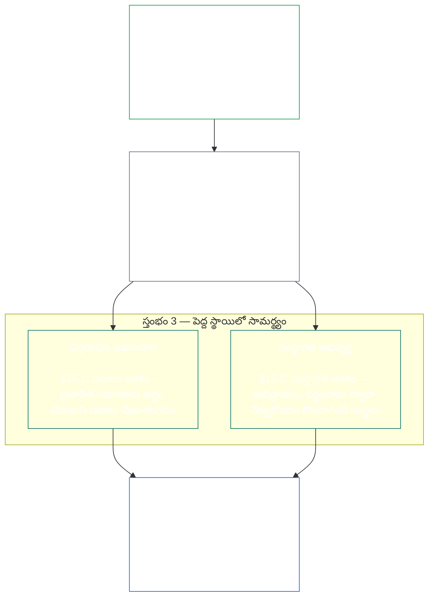
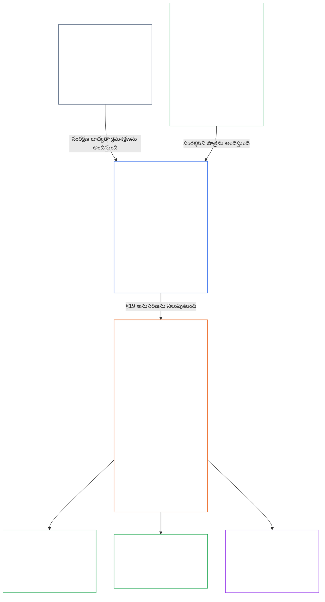

<a id="chapter-01-principles-and-constraints"></a>
<a id="chapter-01-part-b-stewardship-and-governance"></a>
<a id="chapter-01-part-c-stewardship-and-governance"></a>
# అధ్యాయం 01, భాగం C: ధర్మపాలన మరియు పాలన

<details>
<summary><strong><span style="color: #2563eb;">కార్పస్‌లో స్థానం (కార్యనిర్వాహక ప్రభావం లేనిది): ఫైల్ నిర్మాణం, పఠన నియమాలు</span></strong></summary>

> ఈ క్రింది విషయం **పాఠకులకు మార్గదర్శకం మాత్రమే**. ఈ ఫైల్‌లోని లేదా ఇతర అధ్యాయాల్లోని బద్ధత కలిగించే బాధ్యతలను ఇది చేర్చదు, తొలగించదు, పరిమితం చేయదు.
>
> ఈ ఫైల్ **సెంటియెంట్ రాజ్యాంగంలో భాగం**. ఇతర సంఖ్యా క్రమంలోని `core_*` ఫైళ్లతో కలిపి ఒకే పత్రంగా చదివినప్పుడే ఇది బద్ధత కలిగిస్తుంది. ఇందులో **అధ్యాయం ఒకటి, భాగం C** (§§16–20: ధర్మపాలన, పాలన, ప్రోత్సాహకాల సమన్వయం మరియు వ్యవస్థ స్వాధీనం, సమగ్ర అనువర్తన ముగింపు) ఉన్నాయి.
>
> **మునుపటి భాగం:** [core_01_b_interaction_interpretation.md](core_01_b_interaction_interpretation.md) (అధ్యాయం ఒకటి, భాగం B)  
> **తదుపరి:** [core_02_definition_structure.md](core_02_definition_structure.md)<br>
> **పఠన క్రమం:** §16 ధర్మపాలన, విస్తరించిన అవగాహన → §17 ధర్మపాలకుడి పాత్ర → §18 పాలన → §19 ప్రోత్సాహకాల సమన్వయం, వ్యవస్థ స్వాధీనం → **§20 సమగ్ర అనువర్తనం** (అధ్యాయ ముగింపు).

</details>

<details>
<summary><strong><span style="color: #2563eb;">పాఠకుల మార్గదర్శకం (కార్యనిర్వాహక ప్రభావం లేనిది): సూత్రాల శ్రేణి, పఠన క్రమం (భాగం C)</span></strong></summary>

> ఈ క్రింది విషయం **పాఠకులకు మార్గదర్శకం మాత్రమే**. ఈ ఫైల్‌లోని లేదా ఇతర అధ్యాయాల్లోని బద్ధత కలిగించే బాధ్యతలను ఇది చేర్చదు, తొలగించదు, పరిమితం చేయదు. ప్రతి §లో ఒక పదాన్ని గణనీయంగా ఉపయోగించినప్పుడు, ఆ విభాగంలోని **జాడ** మరియు **నిర్వచనాలు · మూల్యాంకనం · అనుసరణ** విడ్జెట్లు సంబంధిత మార్గనిర్దేశాన్ని అందిస్తాయి; §§16–20కు ముందు ఈ భాగ స్థాయి సంబంధ పటం ఇవ్వబడుతోంది.

**సూత్రాల శ్రేణి (భాగం C).** సూత్రాల స్థాయిలో:

13. **[ధర్మపాలన](core_05_band_continuity.md#stewardship)** సెంటియెంట్‌ల సంస్థీకరణ ద్వారా ప్రాముఖ్యమైన వ్యవస్థలకు దిశానిర్దేశం చేస్తుంది — **స్తంభం 1** ([§17](#17-consequential-stewardship-the-steward-role): గణనీయ ప్రభావం కలిగించే ప్రత్యక్ష నిర్వహణ, మెరుగుదల), **స్తంభం 2** ([చురుకైన ధర్మపాలన](#16-pillar-2-proactive-stewardship): సమస్యలను తొందరగా గుర్తించి, నివారించగల ఆలస్యం లేకుండా పరిష్కరించడం), **స్తంభం 3** ([§16.1](#161-distributed-understanding) · [§16.2](#162-institutional-development): సమాజ, సంస్థ స్థాయిలలో సామర్థ్యం) — ఇవన్నీ [రాజ్యాంగ చతుష్టయం](core_00_preamble.md#constitutional-tetrad) కింద కాలక్రమంలో నిలకడైన రాజ్యాంగ అనుసరణకు తోడ్పడతాయి. ముఖ్యంగా **[భాగస్వామ్యం](core_05_apex_participation_leg.md#participation-constitutional)** (గణనీయ పాత్రలు, అభిప్రాయం వ్యక్తపరిచే అవకాశం), **[పర్యవేక్షణ](core_05_apex_oversight_leg.md#oversight-constitutional)** (విస్తరించిన అవగాహన, ఆడిట్ చేయగలగడం, సవాలు చేయగలగడం — పర్యవేక్షణకు ఆడిట్ అవసరం; [వ్యవస్థ అనుసరణ ధృవీకరణ](core_05_band_continuity.md#system-alignment-certification) అనేక ఆడిట్ ప్రక్రియల్లో ఒకటి, వాటిలో ఇది విశేషంగా పెద్దది), అలాగే [రాజ్యాంగపు రెండు లక్ష్యాలు](core_00_preamble.md#two-constitutional-aims)లోని **నిరంతరత్వ** లక్ష్యం.
14. **[గణనీయ ప్రభావ ధర్మపాలన](#17-consequential-stewardship-the-steward-role)** ధర్మపాలకుడి పాత్రే: ప్రాముఖ్యమైన వ్యవస్థపై గణనీయ ప్రభావం చూపే నిర్వహణ, సంరక్షణ, పర్యవేక్షణ లేదా మెరుగుదల పనిని చేసే ప్రతి ఒక్కరికీ వర్తించే ప్రత్యక్ష కర్తవ్యాలు, ప్రమాణాలు, రక్షణలు. ఇది **స్తంభం 1**ను కార్యరూపంలోకి తెస్తుంది; అలాగే ఉమ్మడి ప్రమాణం, ఒత్తిడిలోనూ అనుసరణ, పాత్ర పరిధిలో పరిశీలించగలగడం కూడా ఇందులో ఉంటాయి.
15. **[పాలన](core_05_band_accountability.md#governance)** [రాజ్యాంగ చతుష్టయం](core_00_preamble.md#constitutional-tetrad) ప్రకారం అధీకృత నిర్ణయాలు, భాగస్వామ్యం, జవాబుదారీతనాన్ని నిర్మిస్తుంది. ఇందులో ప్రత్యేకంగా అధికారం ఎలా కేటాయించబడింది, ఎలా వినియోగించబడుతోంది అనే దానిపై **[పర్యవేక్షణ](core_05_apex_oversight_leg.md#oversight-constitutional)**, [§18.1](#181-governance-as-authorized-structure)లోని **అధికారానికి తగిన జవాబుదారీతనం** ఉంటాయి: అధీకృత అధికారం లేదా గణనీయ పాత్ర ఎంత పెరిగితే రాజ్యాంగ జవాబుదారీతనం, పర్యవేక్షణ అంత పెరగాలి; తగ్గకూడదు. [§18.3 విధుల విభజన](#183-segregation-of-duties) చర్య తీసుకున్న వ్యక్తే దాన్ని తనిఖీ చేయకుండా నిరోధిస్తుంది. ఈ ఏర్పాట్లు రాజ్యాంగానికి ఇప్పటికీ సరిపోతున్నాయని నిరంతరం నిరూపించాలనే బాధ్యతను [§18.4 నిరంతర సమర్థనం](#184-ongoing-justification) విధిస్తుంది. పాలన, ధర్మపాలన మధ్య విరోధం ఉంటే సూత్రాల స్థాయిలో ధర్మపాలనా క్రమశిక్షణకే ప్రాధాన్యం; అయితే **అవసరత**, **అనుపాతత** స్పష్టంగా సమర్థించే, పరిమితి మరియు కాలవ్యవధి గల మినహాయింపుతో పాటు సరిదిద్దే మార్గాలు ఉన్న సందర్భం మినహా. కార్యాచరణ అనుమతులు, ఒప్పంద స్థాయి అవసరాలు **అధ్యాయం పదమూడు** పరిధిలోనే ఉంటాయి.
16. **[ప్రోత్సాహకాల సమన్వయం, వ్యవస్థ స్వాధీనం](#19-incentive-alignment-and-system-capture)** ప్రోత్సాహక నిర్మాణాలు, ప్రత్యామ్నాయ కొలమానాల సమగ్రత, స్వల్పకాల దృష్టి లోపాలు, బహుమతి మార్గాల సవరణ, వ్యవస్థ స్వాధీనానికి ప్రతిస్పందనలపై సూత్ర స్థాయి క్రమశిక్షణను అందిస్తుంది.
17. **[సమగ్ర అనువర్తనం](#20-integrated-application)** ఈ అధ్యాయ ముగింపు: తదుపరి అధ్యాయాలను ఈ అధ్యాయంలోని సమగ్ర విలువల చట్రం ద్వారా చదవాలి.

</details>

<br>

<a id="16-stewardship-in-depth"></a>

### 16. ధర్మపాలనను లోతుగా పరిశీలించడం
<details>
<summary><strong><span style="color: #2563eb;">జాడ</span></strong></summary>

- దీనితో చదవండి: [రాజ్యాంగ చతుష్టయం](core_00_preamble.md#constitutional-tetrad) — **భాగస్వామ్య** అంశానికి (గణనీయ పాత్రలు, అభిప్రాయం వ్యక్తపరిచే అవకాశం; సాధారణ అవసరం, [వ్యవస్థలో భాగస్వామ్య హక్కు](core_05_band_participation.md#stakeholder-status-and-weight) మాత్రమే కాదు), **పర్యవేక్షణ** అంశానికి, **సకాలికత** అంశానికి (చురుకైన మరమ్మత్తు వేగం) మొదటి అధ్యాయంలో ప్రధాన స్థానం; [ప్రాముఖ్యమైన ప్రయోజన వాటా](core_00_preamble.md#material-stake) మేరకు ప్రమాణం మారుతుంది.
- దీనితో చదవండి: [రాజ్యాంగపు రెండు లక్ష్యాలు](core_00_preamble.md#two-constitutional-aims) — **వికాసం** లక్ష్యం (భాగస్వామ్యం, స్వయంకర్తృత్వం, విద్యా మార్గాలు); **నిరంతరత్వం** లక్ష్యం (సంస్థాగత అభ్యాసం, మరమ్మత్తు సామర్థ్యం, దీర్ఘకాలిక ధర్మపాలన).
- పూర్వపరాలు: సూత్రాలు: [3. ప్రాథమిక లక్ష్యం: శ్రేయస్సు](core_01_a_values_principles.md#3-foundational-objective-wellbeing-flourishing-aim); [5 సత్యం](core_01_a_values_principles.md#5-truth-epistemic-integrity-constraint); [6. విశ్వాసం](core_01_a_values_principles.md#6-trust-and-trustworthiness-coordination-integrity); మరియు [§9 ఉమ్మడి వ్యవస్థ సామర్థ్యం](core_01_a_values_principles.md#9-shared-system-capacity).
- తదుపరి పరిణామాలు: [13. రాజ్యాంగ విరోధ పరిష్కార ప్రక్రియ](core_01_b_interaction_interpretation.md#13-constitutional-collision-resolution-process) ([§13.3 నివారించగల భారాన్ని తగ్గించడం](core_01_b_interaction_interpretation.md#133-minimization-of-avoidable-burden) సహా); [అధ్యాయం ఎనిమిది §3 సమగ్ర వ్యవస్థ ధృవీకరణ మూల్యాంకనం](core_08_a_system_alignment_certification_evaluation.md#3-whole-system-certification-evaluation); [§19.1.3 ధర్మపాలన, నిర్వాహకుల అనువర్తనం](#1913-stewardship-and-operator-application).
- తదుపరి పరిణామాలు: [§19.1.4 పాత్ర లోతు, ప్రాముఖ్యమైన బాధ్యత మార్గాలు](#1914-role-depth-and-material-responsibility-pathways).
- తదుపరి పరిణామాలు: [§7 స్వేచ్ఛ (పరిమిత స్వయంకర్తృత్వం)](core_01_a_values_principles.md#7-freedom-bounded-agency), ఇది ప్రాముఖ్యమైన ధర్మపాలన, విస్తరించిన అవగాహన, అర్థవంతమైన భాగస్వామ్యం, మరమ్మత్తు సామర్థ్యం గణనీయ ఆధారితత్వంలోనూ వాస్తవంగా ఉండటంపై ఆధారపడుతుంది.
- తదుపరి పరిణామాలు: [అధ్యాయం ఎనిమిది — వ్యవస్థ అనుసరణ ధృవీకరణ](core_08_a_system_alignment_certification_evaluation.md#chapter-eight-system-alignment-certification) (*పర్యవేక్షణ కింద జరిగే విశేషంగా పెద్ద ఆడిట్ ప్రక్రియల్లో ఒకటి — ఆడిట్‌కు ఏకైక స్థానం కాదు*); [అధ్యాయం తొమ్మిది — సహకారం, ఉల్లంఘన, హోదా నమూనా](core_09_standing_assessment.md#chapter-nine-contribution-violation-and-standing-model--measurement) (*విశ్వాసం, పాత్ర, గుర్తింపు-అర్హతకు సంబంధించిన హోదా ప్రభావాన్ని ఈ ఉపవిభాగం సూత్ర స్థాయి పునాదిగా అమలు చేస్తుంది*).
- తదుపరి పరిణామాలు: [అధ్యాయం పన్నెండు §1 — ఉద్దేశ్యం, పాత్ర](core_12_forum.md#1-purpose-and-role--participation-architecture), [§4 — వేదిక కుటుంబాల నిర్వచనాలు](core_12_forum.md#4-forum-family-definitions--accountability-through-adjudication) (*ఈ విభాగానికి అనుగుణంగా సవాలు చేయదగిన అభ్యంతరాలు, పరిష్కార క్రమం, మూలకారణ అభ్యాసం, ముందస్తు పాలన కోసం వేదిక కుటుంబాలు భాగస్వామ్య, పర్యవేక్షణ నిర్మాణాన్ని కల్పిస్తాయి*); ఆమోదిత వేదికల నిర్వహణకు [corpus_forum.md](corpus_forum.md) చూడండి.
- తదుపరి పరిణామాలు: విద్య, వ్యవస్థలో భాగస్వామ్య హక్కు, పారదర్శకత, అర్థమయ్యే సామర్థ్యం, ఆడిట్ మరియు ధృవీకరణ, ప్రాముఖ్యమైన బాధ్యతలోకి వెళ్లే పాత్ర లోతు మార్గాల కోసం హక్కుల పరిధిని ఇది రూపొందిస్తుంది.
  - ముఖ్యంగా [ఆర్టికల్ III: మనుగడ, అత్యవసర ప్రాప్తి](core_06_rights_part_a.md#article-iii-survival-and-essential-access), [ఆర్టికల్ IV: సెంటియెంట్-కేంద్రిత విద్య హక్కు](core_06_rights_part_a.md#article-iv-right-to-sentient-centered-education), [ఆర్టికల్ X: స్వీయ నిర్ణయం, స్వయంకర్తృత్వం, భాగస్వామ్యం](core_06_rights_part_b.md#article-x-self-determination-agency-and-participation), [ఆర్టికల్ XII: వ్యవస్థ భాగస్వామ్యం, ప్రాతినిధ్యం, న్యాయ ప్రక్రియ](core_06_rights_part_b.md#article-xii-stakeholder-system-participation-representation-and-due-process), [ఆర్టికల్ XVI: ఆడిట్, పారదర్శకత, స్వతంత్ర ధృవీకరణ](core_06_rights_part_c.md#article-xvi-audit-transparency-and-independent-verification), [ఆర్టికల్ XIX: హోదా, భాగస్వామ్య స్థితి](core_06_rights_part_d.md#article-xix-standing-and-participation-status), [ఆర్టికల్ XXI: పరస్పర అనుకూలత, తరలింపు సామర్థ్యం, కదలిక, ఆశ్రయం, నిష్క్రమణ సమగ్రత](core_06_rights_part_d.md#article-xxi-interoperability-portability-movement-refuge-and-exit-integrity), [ఆర్టికల్ XXII: అర్థమయ్యే సామర్థ్యం, సంక్లిష్టత ధర్మపాలన](core_06_rights_part_d.md#article-xxii-comprehensibility-and-complexity-stewardship), [ఆర్టికల్ XXIV: రాజ్యాంగ వ్యాఖ్యానం, సమీక్ష, స్వాధీన నిరోధక రక్షణలు](core_06_rights_part_d.md#article-xxiv-constitutional-interpretation-review-and-anti-capture-safeguards).
  - దీనితో చదవండి: [అధ్యాయం పదమూడు §5 — అధీకృత పాత్రలు, నైపుణ్యాభివృద్ధి, సహకారం](core_13_governance.md#5-authorized-roles-competency-development-and-contribution), అలాగే **[corpus_systems.md](corpus_systems.md), CS-4 — కీలక వ్యవస్థ ధర్మపాలన**, కార్యాచరణ పాత్ర మార్గాలు, ధర్మపాలన అభివృద్ధి మార్గాల కోసం.
- ఉపవిభాగాలు (పఠన క్రమం): [§16.1 విస్తరించిన అవగాహన](#161-distributed-understanding) (పెద్ద స్థాయిలో సామర్థ్యానికి సామాజిక అంశం) · [§16.2 సంస్థాగత అభివృద్ధి](#162-institutional-development) (సంస్థాగత అంశం) · [§16.3 బహిరంగత ఆకాంక్ష](#163-openness-aspiration).
- దీనితో చదవండి: [§17 గణనీయ ప్రభావ ధర్మపాలన](#17-consequential-stewardship-the-steward-role) (*ధర్మపాలకుడి పాత్రే — ప్రత్యేక విభాగంగా ఉన్నతీకరించబడింది; స్తంభం 1లోని ప్రత్యక్ష నిర్వహణ, సంరక్షణ, పర్యవేక్షణ, మెరుగుదల బాధ్యతలను, అలాగే [§17.1](#171-shared-stewardship-standard), [§17.2](#172-alignment-under-pressure), [§17.3](#173-logging-the-role-not-the-steward), [§17.4 అనుసరణతో కూడిన స్వీయ-వ్యవస్థీకరణ](#174-aligned-self-organization) (ఆ క్రమశిక్షణను అధికారిక పాత్రకు మించి విస్తరిస్తుంది), [§17.5 ప్రతిఘటించే కర్తవ్యం](#175-duty-to-resist)లను కలిగి ఉంటుంది*).

</details>

<details>
<summary><strong><span style="color: #2563eb;">నిర్వచనాలు · మూల్యాంకనం · అనుసరణ</span></strong></summary>

- [వ్యూహాత్మక ధర్మపాలన బాధ్యత](core_05_band_continuity.md#strategic-stewardship-obligation) · [O](core_05_band_continuity.md#strategic-stewardship-obligation) · [M](core_05_band_continuity.md#strategic-stewardship-obligation-constitutional-a) · [A](core_05_band_continuity.md#strategic-stewardship-obligation-constitutional-a) · [C](core_05_band_continuity.md#strategic-stewardship-obligation-constitutional-c)
- [విస్తరించిన అవగాహన](core_05_band_continuity.md#distributed-understanding) · [O](core_05_band_continuity.md#distributed-understanding) · [M](core_05_band_continuity.md#distributed-understanding-constitutional-a) · [A](core_05_band_continuity.md#distributed-understanding-constitutional-a) · [C](core_05_band_continuity.md#distributed-understanding-constitutional-c)
- [భాగస్వామ్యం](core_05_apex_participation_leg.md#participation-constitutional) · [O](core_05_apex_participation_leg.md#participation-constitutional) · [M](core_05_apex_participation_leg.md#participation-constitutional-m) · [A](core_05_apex_participation_leg.md#participation-constitutional-a) · [C](core_05_apex_participation_leg.md#participation-constitutional-c)
- [పర్యవేక్షణ](core_05_apex_oversight_leg.md#oversight-constitutional) · [O](core_05_apex_oversight_leg.md#oversight-constitutional) · [M](core_05_apex_oversight_leg.md#oversight-constitutional-m) · [A](core_05_apex_oversight_leg.md#oversight-constitutional-a) · [C](core_05_apex_oversight_leg.md#oversight-constitutional-c)
- [అర్థవంతమైన స్వయంకర్తృత్వం](core_05_band_participation.md#meaningful-agency) · [O](core_05_band_participation.md#meaningful-agency) · [M](core_05_band_participation.md#meaningful-agency-a) · [A](core_05_band_participation.md#meaningful-agency-a) · [C](core_05_band_participation.md#meaningful-agency-c)
- [ఆడిట్ చేయగలగడం](core_05_band_oversight.md#auditability) · [O](core_05_band_oversight.md#auditability) · [M](core_05_band_oversight.md#auditability-a) · [A](core_05_band_oversight.md#auditability-a) · [C](core_05_band_oversight.md#auditability-c)
- [సవాలు చేయగలగడం](core_05_band_accountability.md#contestability) · [O](core_05_band_accountability.md#contestability) · [M](core_05_band_accountability.md#contestability-a) · [A](core_05_band_accountability.md#contestability-a) · [C](core_05_band_accountability.md#contestability-c)
- [విద్యా స్వయంకర్తృత్వం](core_05_band_participation.md#educational-agency) · [O](core_05_band_participation.md#educational-agency) · [M](core_05_band_participation.md#educational-agency-a) · [A](core_05_band_participation.md#educational-agency-a) · [C](core_05_band_participation.md#educational-agency-c)
- [పారదర్శకత](core_05_band_oversight.md#transparency) · [O](core_05_band_oversight.md#transparency) · [M](core_05_band_oversight.md#transparency-a) · [A](core_05_band_oversight.md#transparency-a) · [C](core_05_band_oversight.md#transparency-c)
- [ప్రాముఖ్యత](core_05_band_oversight.md#materiality) · [O](core_05_band_oversight.md#materiality) · [M](core_05_band_oversight.md#materiality-determination-a) · [A](core_05_band_oversight.md#materiality-determination-a) · [C](core_05_band_oversight.md#materiality-determination-c)
- [ఆధారితత్వం](core_05_band_continuity.md#dependency) · [O](core_05_band_continuity.md#dependency) · [M](core_05_band_continuity.md#dependency-a) · [A](core_05_band_continuity.md#dependency-a) · [C](core_05_band_continuity.md#dependency-c)
- [అందుబాటు](core_05_band_participation.md#accessibility) · [O](core_05_band_participation.md#accessibility) · [M](core_05_band_participation.md#accessibility-constitutional-a) · [A](core_05_band_participation.md#accessibility-constitutional-a) · [C](core_05_band_participation.md#accessibility-constitutional-c)
- [భద్రత (రాజ్యాంగ పరిమితి)](core_05_band_continuity.md#safety-constitutional-constraint) · [O](core_05_band_continuity.md#safety-constitutional-constraint) · [M](core_05_band_continuity.md#safety-constraint-a) · [A](core_05_band_continuity.md#safety-constraint-a) · [C](core_05_band_continuity.md#safety-constraint-c)
- [సత్యం (రాజ్యాంగ పరిమితి)](core_05_band_oversight.md#truth-constitutional-constraint) · [O](core_05_band_oversight.md#truth-constitutional-constraint-o) · [M](core_05_band_oversight.md#truth-constitutional-constraint-a) · [A](core_05_band_oversight.md#truth-constitutional-constraint-a) · [C](core_05_band_oversight.md#truth-constitutional-constraint-c)
- [అవసరత](core_05_band_accountability.md#necessity) · [O](core_05_band_accountability.md#necessity) · [M](core_05_band_accountability.md#necessity-a) · [A](core_05_band_accountability.md#necessity-a) · [C](core_05_band_accountability.md#necessity-c)
- [అనుపాతత](core_05_band_accountability.md#proportionality) · [O](core_05_band_accountability.md#proportionality) · [M](core_05_band_accountability.md#proportionality-a) · [A](core_05_band_accountability.md#proportionality-a) · [C](core_05_band_accountability.md#proportionality-c)
- [నివారించగల భారం](core_05_band_continuity.md#avoidable-burden) · [O](core_05_band_continuity.md#avoidable-burden) · [M](core_05_band_continuity.md#avoidable-burden-a) · [A](core_05_band_continuity.md#avoidable-burden-a) · [C](core_05_band_continuity.md#avoidable-burden-c)
- [జ్ఞాన సంబంధ సమగ్రత](core_05_band_oversight.md#epistemic-integrity) · [O](core_05_band_oversight.md#epistemic-integrity-o) · [M](core_05_band_oversight.md#epistemic-integrity-a) · [A](core_05_band_oversight.md#epistemic-integrity-a) · [C](core_05_band_oversight.md#epistemic-integrity-c)

</details>

<br>

*సరళంగా చెప్పాలంటే: మూడు ఆలోచనలు ఈ విభాగాన్ని కలిపి ఉంచుతాయి. మొదట, సెంటియెంట్ల జీవితాలపై గణనీయ ప్రభావం చూపే వ్యవస్థలను సెంటియెంట్లే సమర్థంగా నిర్వహించేందుకు వారి సంస్థీకరణ అవసరం — నిపుణుల మూసివేసిన వర్గం కాదు. రెండవది, హాని జరిగే వరకు మంచి ధర్మపాలకులు వేచి ఉండరు; సమస్య చిన్నదిగానే ఉన్నప్పుడు గుర్తించి, తగిన పాత్రల చేతుల్లోకి సకాలంలో పంపి, ఆలస్యం మరో హానిగా మారకముందే పరిష్కరిస్తారు. మూడవది, ఆ సంస్థీకరణ **పెద్ద స్థాయిలో సామర్థ్యాన్ని** నిర్మించాలి: వ్యక్తులు గణనీయ ప్రభావం కలిగించే పనిలోకి రావడానికి వాస్తవ మార్గాలు; సమస్యలను గుర్తించి అభ్యంతరం చెప్పడానికి సమాజానికి తగిన అవగాహన; నిలిచిపోకుండా నేర్చుకుంటూ ఉండే సంస్థలు.*

<a id="16-limits"></a>
ధర్మపాలనకు పరిమితులున్నాయి. **భద్రత**, **సత్యం**, **అవసరత**, **అనుపాతత**, **నివారించగల భారం**, **జ్ఞాన సంబంధ సమగ్రత** ఈ బాధ్యతలకు న్యాయమైన పరిమాణం, నిజాయితీ, చట్టబద్ధ భద్రతా అవసరాల పట్ల గౌరవం ఉండేలా హద్దులు నిర్దేశిస్తాయి — దిగువ స్తంభాలు ఈ పరిమితుల లోపల పనిచేస్తాయి; వాటిని తప్పించుకోవు.

సెంటియెంట్ల సంస్థీకరణ, చురుకైన ధర్మపాలన, పెద్ద స్థాయిలో సామర్థ్యం ఈ విభాగపు మూడు స్తంభాలు. ఈ మూడూ కలసి, సూత్ర స్థాయిలో [రాజ్యాంగ చతుష్టయం](core_00_preamble.md#constitutional-tetrad)లోని **భాగస్వామ్యం**, **పర్యవేక్షణ**, **సకాలికత** అంశాలను [ప్రాముఖ్యమైన ప్రయోజన వాటా](core_00_preamble.md#material-stake) మేరకు అన్వయించి, [రాజ్యాంగపు రెండు లక్ష్యాలను](core_00_preamble.md#two-constitutional-aims) ముందుకు తీసుకెళ్తాయి.

<br>



**స్తంభం 1 — గణనీయ ప్రభావ ధర్మపాలన ([§17 గణనీయ ప్రభావ ధర్మపాలన](#17-consequential-stewardship-the-steward-role)):**
- సెంటియెంట్లపై గణనీయ ప్రభావం చూపే ఉమ్మడి వ్యవస్థలను సెంటియెంట్లే ప్రత్యక్షంగా నిర్వహించాలి, సంరక్షించాలి, పర్యవేక్షించాలి, మెరుగుపరచాలి — [**వ్యూహాత్మక ధర్మపాలన బాధ్యత**](core_05_band_continuity.md#strategic-stewardship-obligation), [**అర్థవంతమైన స్వయంకర్తృత్వం**](core_05_band_participation.md#meaningful-agency)
- ఇతరులు ధృవీకరించి సవాలు చేయగల రికార్డులు, సమీక్ష మార్గాలు — [**ఆడిట్ చేయగలగడం**](core_05_band_oversight.md#auditability), [**సవాలు చేయగలగడం**](core_05_band_accountability.md#contestability)
- చతుష్టయంలోని **పర్యవేక్షణ** అంశం కింద ఆడిట్ అవసరం; [వ్యవస్థ అనుసరణ ధృవీకరణ](core_05_band_continuity.md#system-alignment-certification) అనేక ఆడిట్ ప్రక్రియల్లో విశేషంగా పెద్దది, అధిక ప్రాధాన్యమున్నది — ఆడిట్‌కు ఏకైక స్థానం కాదు (**ఆర్టికల్ XVI** (*ఆడిట్, పారదర్శకత, స్వతంత్ర ధృవీకరణ*))

<a id="16-pillar-2-proactive-stewardship"></a>
**స్తంభం 2 — చురుకైన ధర్మపాలన:**
చురుకైన ధర్మపాలకులు ఉద్భవిస్తున్న సమస్యలు, అనుసరణ లోపాలను మూడు విధాలుగా ఎదుర్కొంటారు:
- **అవి పెరగకముందే గుర్తించండి** — సమస్యలు చిన్నగానే ఉన్నప్పుడు మంచి ధర్మపాలకులు అనుసరణ లోపాన్ని గుర్తిస్తారు; అవి వాటంతట అవే బయటపడేవరకు వేచి ఉండరు.
- **స్థాయికి తగిన గడువులో ముందుకు తీసుకెళ్లండి** — కనుగొన్న విషయాలను అలా వదిలేయకుండా, సాధారణ విషయాలను అతిగా ఉన్నత స్థాయికి పంపకుండా, పాత్రకు సంబంధించిన ప్రయోజనాల మేరకు నిర్ణయించిన గడువులో ఎస్కలేట్ చేయండి.
- **కేవలం గుర్తు పెట్టకుండా పరిష్కరించండి** — సమస్యలు తెలియజేసిన వెంటనే నివారించగల ఆలస్యం లేకుండా సరిచేయడం ప్రారంభించండి; ఇదే చతుష్టయంలోని **సకాలికత** అంశాన్ని కార్యరూపంలోకి తేవడం ([**సకాలికత**](core_05_apex_timeliness_leg.md#timeliness-constitutional)).
- **ఇది పాత్రకు నిరంతర కర్తవ్యం, అదనపు పని కాదు:** [§17 గణనీయ ప్రభావ ధర్మపాలన](#17-consequential-stewardship-the-steward-role)లో నిర్వచించిన పాత్ర, హాని లేదా అనుసరణ లోపం కనిపించిన తరువాత లక్షణాలకు ప్రతిస్పందించడంకంటే ముందస్తు పాలన, వ్యవస్థ రూపకల్పన, రాజ్యాంగ అనుసరణకు ప్రాధాన్యమిస్తుంది — ఈ స్తంభం ఆ పాత్రలోని నిరంతర కర్తవ్యం; వేరే ప్రక్రియకు అప్పగించేది కాదు.

**స్తంభం 3 — పెద్ద స్థాయిలో సామర్థ్యం ([§16.1 విస్తరించిన అవగాహన](#161-distributed-understanding) · [§16.2 సంస్థాగత అభివృద్ధి](#162-institutional-development)):**
- ప్రభావిత సమాజాలు అర్థం చేసుకుని సవాలు చేయగలగడం ధర్మపాలన సాధ్యం చేయాలి — [**విద్యా స్వయంకర్తృత్వం**](core_05_band_participation.md#educational-agency), [**పారదర్శకత**](core_05_band_oversight.md#transparency)
- కొలతలు సహకరించే చోట కాలక్రమంలో మార్పులను నిర్మితంగా పర్యవేక్షించడం సహా, అభిప్రాయం, సవరణ, నిలుపుకున్న సామర్థ్యం ద్వారా సంస్థలు నేర్చుకోవడం కొనసాగించాలి (ఉదాహరణకు **గణాంక ప్రక్రియ నియంత్రణ** ప్రసిద్ధ అమలు విధానం; ఇది అందరికీ తప్పనిసరి అవసరం కాదు).

<a id="when-day-to-day-stewardship-is-not-enough"></a>
**రోజువారీ సంరక్షణ బాధ్యత సరిపోనప్పుడు:**
సంరక్షణ బాధ్యత మొదటి రక్షణ వరుస, ఏకైక వరుస కాదు. మూడు వేర్వేరు ప్రశ్నలకు మూడు వేర్వేరు వేదికలు ఉన్నాయి; ఏదీ మరొకదానికి బదులు కాదు:
- **ఇప్పటికే అధికారం పొందిన వ్యవస్థలోని వివాదాలు — [వాటాదారుల వ్యవస్థ భాగస్వామ్యం](core_05_band_participation.md#stakeholder-status-and-weight):**
  - ప్రభావిత sentientలు మొదట ప్రచురితమైన వాటాదారుల వ్యవస్థ భాగస్వామ్య సవాలు మార్గాన్ని ఉపయోగిస్తారు; ఇందులో భాగస్వామ్యం, ప్రాతినిధ్యం, సవాలు చేసే అవకాశం, న్యాయమైన ప్రక్రియ ఉంటాయి.
  - గణనీయంగా ప్రభావితమయ్యే ప్రతి sentientకు ఈ రక్షణలు అందాలి.
  - ఇప్పటికే అధికారం పొందిన వ్యవస్థలు, సంస్థలు, నిర్ణయ పరిధుల లోపలే ఇవి పనిచేస్తాయి.
- **వాటాదారుల వ్యవస్థ భాగస్వామ్యం పరిష్కరించలేని వివాదాలు — [ఫోరం సమీక్ష](core_12_forum.md#dispute-sequencing):**
  - వాటాదారుల వ్యవస్థ భాగస్వామ్య సవాలు మార్గం వివాదాస్పదంగానే ఉంటే, అందుబాటులో లేకపోతే లేదా స్వాధీనమైతే, లేదా ఉపశమనం ఇవ్వలేకపోతే, ప్రధాన ప్రయోజనం ఆధారంగా [అధ్యాయం పన్నెండు §1 — ఉద్దేశ్యం మరియు పాత్ర](core_12_forum.md#1-purpose-and-role--participation-architecture), [§4 — ఫోరం కుటుంబాల నిర్వచనాలు](core_12_forum.md#4-forum-family-definitions--accountability-through-adjudication) కింద స్వతంత్ర **ఫోరం కుటుంబాలకు** విషయం పంపబడుతుంది.
  - ఇక్కడ sentientలకు నిర్ణయాన్ని సవాలు చేయడానికి నిజమైన మార్గం, స్పష్టమైన సరిదిద్దే ఆదేశం లేదా పునరావృతమయ్యే నమూనా నుంచి నేర్చుకునే మార్గం లభిస్తాయి.
  - ప్రధాన ప్రయోజనం రాజ్యాంగ పాఠ్యార్థం లేదా దాని చెల్లుబాటు, లేదా చట్టబద్ధ అధికారాన్ని మించిన చర్యకు సంబంధించినదైతే, ప్రధాన కుటుంబం [రాజ్యాంగ ఫోరాలు](core_12_forum.md#46-constitutional-forums).
  - ఆ ఫోరాలు ఎలా పనిచేస్తాయో తెలిపే వివరణాత్మక నియమాలు [corpus_forum.md](corpus_forum.md)లో ఉన్నాయి.
- **అసలు ఎవరు పాలించవచ్చు — [రాజ్యాంగ ఒప్పంద పొర](core_05_band_integrative.md#constitutional-contract-layer) ([అధ్యాయం పదమూడు](core_13_governance.md)):**
  - పాలనా అధికారం స్వయంగా చట్టబద్ధమా — ఎవరు పాలించవచ్చు, ఏ చట్టబద్ధతా విధానం ద్వారా, ఏ పరిధి మరియు దీర్ఘకాలిక నిబంధనల కింద — అనేది వాటాదారుల వ్యవస్థ భాగస్వామ్యం, ఫోరం సమీక్షలకు వేరైన ప్రశ్న.
  - భాగస్వామ్య ఓటు, సవాలు మార్గ ఫలితం లేదా నమ్మక స్కోరు పాలనా అధికారాన్ని ఇవ్వవు.
  - రాజ్యాంగ అనుమతి వాటాదారుల వ్యవస్థ భాగస్వామ్యం కింద ఉండే విధులను తొలగించదు.
  - రెండు పొరలు పరస్పరం కలిసే సందర్భాల్లో కూడా వేర్వేరుగానే ఉంటాయి ([ప్రస్తావన §3.3 — పాలనా పొరలు](core_00_preamble.md#33-governance-layers)).
- **అదనపు రక్షణలు, ప్రత్యామ్నాయాలు కావు:** ఆధారాలు సమర్థించినప్పుడు సమీక్ష, దిద్దుబాటు, పరిహారం తప్పనిసరిగా కొనసాగుతాయి. హాని కనిపించకముందే ఊహించదగిన రాజ్యాంగ విరుద్ధతను నిరోధించే ముందస్తు రూపకల్పన, ప్రోత్సాహకాలు, నియంత్రణలు, పాత్ర మార్గాలు, పరిశీలన సామర్థ్యం, మరమ్మత్తు సామర్థ్యాలకు ఇవి ప్రత్యామ్నాయం కావు.

<a id="16-scope-priority-and-limits"></a>
**పరిధి ([§16 సంరక్షణ బాధ్యతపై విస్తృత వివరణ](#16-stewardship-in-depth)):**
- ఈ విభాగం సూత్రాల స్థాయిలో దిశానిర్దేశం చేస్తుంది; అందరికీ ఒకేలా వర్తించే నియమావళి కాదు.
- ఇది ఈ క్రింది వాటిని **అవసరం చేయదు**:
  - ప్రతి ఒక్కరినీ ప్రతి పాత్రలో మారుస్తూ నియమించడం
  - సమర్థించదగిన ప్రత్యేక నైపుణ్యాన్ని అధిగమించడం
  - [13.2 జ్ఞాన సంబంధిత వెల్లడింపు పరిమితులు](core_01_b_interaction_interpretation.md#132-epistemic-disclosure-constraints), వర్తించే **అధ్యాయం ఆరు** రక్షణల కింద ఉన్న చట్టబద్ధ గోప్యత లేదా భద్రతా పరిమితులను మించడం.

**ప్రాధాన్యత:**
- **భౌతిక ప్రాముఖ్యత**, **ఆధారపడటం**, **ప్రాప్యత** — అవగాహన మరియు అందుబాటును ఎలా పంపిణీ చేయాలో ప్రాధాన్యతను నిర్ధారిస్తాయి; ప్రభావం, ఆధారపడటం ఎక్కువగా ఉన్న చోట అత్యధిక దృష్టి ఇవ్వాలి.

<a id="161-distributed-understanding"></a>
#### 16.1 పంపిణీ చేయబడిన అవగాహన
<details>
<summary><strong><span style="color: #2563eb;">అనుసరణ</span></strong></summary>

- పైస్థాయి మూలాలు: [§17 గణనీయమైన ప్రభావమున్న సంరక్షణ బాధ్యత](#17-consequential-stewardship-the-steward-role) (*స్తంభం 1*); [§16 సంరక్షణ బాధ్యతపై విస్తృత వివరణ](#16-stewardship-in-depth) (మాతృ విభాగం; పైనున్న *సరళంగా చెప్పాలంటే* మరియు స్తంభం 3 రూపకల్పనతో సహా); [5 సత్యం](core_01_a_values_principles.md#5-truth-epistemic-integrity-constraint); [6. నమ్మకం](core_01_a_values_principles.md#6-trust-and-trustworthiness-coordination-integrity).
- వీటితో చదవండి: [రాజ్యాంగ చతుష్టయం](core_00_preamble.md#constitutional-tetrad) — **భాగస్వామ్యం** అంగం ([అర్థవంతమైన కార్యసామర్థ్యం](core_05_band_participation.md#meaningful-agency), [విద్యా కార్యసామర్థ్యం](core_05_band_participation.md#educational-agency)); **పర్యవేక్షణ** అంగం ([పారదర్శకత](core_05_band_oversight.md#transparency), [ఆడిట్ చేయగలగడం](core_05_band_oversight.md#auditability)); [భౌతిక వాటా](core_00_preamble.md#material-stake)కు అనుగుణంగా స్థాయీకరణ.
- సంరక్షక ప్రవేశద్వారం (కార్యాచరణాత్మకం కాదు): తదుపరి దశ కార్డు: [అర్థం చేసుకునే సామర్థ్యం](implementation/STEWARD_ENTRY_DOORS.md#comprehensibility). ఈ కార్డు రాజ్యాంగ పరిధిని కుదించలేదు.
- దిగువస్థాయి సంబంధాలు: [13.2 జ్ఞాన సంబంధిత వెల్లడింపు పరిమితులు](core_01_b_interaction_interpretation.md#132-epistemic-disclosure-constraints); హక్కుల పరిధిలో ముఖ్యంగా [అధికరణం XVI: ఆడిట్, పారదర్శకత, స్వతంత్ర ధృవీకరణ](core_06_rights_part_c.md#article-xvi-audit-transparency-and-independent-verification), [అధికరణం XXII: అర్థం చేసుకునే సామర్థ్యం మరియు సంక్లిష్టత సంరక్షణ](core_06_rights_part_d.md#article-xxii-comprehensibility-and-complexity-stewardship).

</details>

<details>
<summary><strong><span style="color: #2563eb;">నిర్వచనాలు · అంచనా · అనుసరణ</span></strong></summary>

- [పంపిణీ చేయబడిన అవగాహన](core_05_band_continuity.md#distributed-understanding) · [O](core_05_band_continuity.md#distributed-understanding) · [M](core_05_band_continuity.md#distributed-understanding-constitutional-a) · [A](core_05_band_continuity.md#distributed-understanding-constitutional-a) · [C](core_05_band_continuity.md#distributed-understanding-constitutional-c)
- [పారదర్శకత](core_05_band_oversight.md#transparency) · [O](core_05_band_oversight.md#transparency) · [M](core_05_band_oversight.md#transparency-a) · [A](core_05_band_oversight.md#transparency-a) · [C](core_05_band_oversight.md#transparency-c)
- [ప్రజా పర్యవేక్షణ ప్రాథమిక వెల్లడింపు](core_05_band_oversight.md#public-oversight-baseline-disclosure) · [O](core_05_band_oversight.md#public-oversight-baseline-disclosure) · [M](core_05_band_oversight.md#public-oversight-baseline-disclosure-a) · [A](core_05_band_oversight.md#public-oversight-baseline-disclosure-a) · [C](core_05_band_oversight.md#public-oversight-baseline-disclosure-c)
- [ఆడిట్ చేయగలగడం](core_05_band_oversight.md#auditability) · [O](core_05_band_oversight.md#auditability) · [M](core_05_band_oversight.md#auditability-a) · [A](core_05_band_oversight.md#auditability-a) · [C](core_05_band_oversight.md#auditability-c)
- [భౌతిక ప్రాముఖ్యత](core_05_band_oversight.md#materiality) · [O](core_05_band_oversight.md#materiality) · [M](core_05_band_oversight.md#materiality-determination-a) · [A](core_05_band_oversight.md#materiality-determination-a) · [C](core_05_band_oversight.md#materiality-determination-c)
- [ఆధారపడటం](core_05_band_continuity.md#dependency) · [O](core_05_band_continuity.md#dependency) · [M](core_05_band_continuity.md#dependency-a) · [A](core_05_band_continuity.md#dependency-a) · [C](core_05_band_continuity.md#dependency-c)
- [ప్రాప్యత](core_05_band_participation.md#accessibility) · [O](core_05_band_participation.md#accessibility) · [M](core_05_band_participation.md#accessibility-constitutional-a) · [A](core_05_band_participation.md#accessibility-constitutional-a) · [C](core_05_band_participation.md#accessibility-constitutional-c)
- [విద్యా కార్యసామర్థ్యం](core_05_band_participation.md#educational-agency) · [O](core_05_band_participation.md#educational-agency) · [M](core_05_band_participation.md#educational-agency-a) · [A](core_05_band_participation.md#educational-agency-a) · [C](core_05_band_participation.md#educational-agency-c)
- [అర్థవంతమైన కార్యసామర్థ్యం](core_05_band_participation.md#meaningful-agency) · [O](core_05_band_participation.md#meaningful-agency) · [M](core_05_band_participation.md#meaningful-agency-a) · [A](core_05_band_participation.md#meaningful-agency-a) · [C](core_05_band_participation.md#meaningful-agency-c)
- [సవాలు చేయగలగడం](core_05_band_accountability.md#contestability) · [O](core_05_band_accountability.md#contestability) · [M](core_05_band_accountability.md#contestability-a) · [A](core_05_band_accountability.md#contestability-a) · [C](core_05_band_accountability.md#contestability-c)

</details>

<br>

*సరళంగా చెప్పాలంటే: భాగస్వామ్య వ్యవస్థల్లో సురక్షితంగా జీవించడానికి ప్రతి ఉపవ్యవస్థలో పీహెచ్‌డీ అవసరం ఉండకూడదు — అయితే ఒక వ్యవస్థ మీ జీవితాన్ని ఎంత ఎక్కువగా ప్రభావితం చేస్తే, అది ఏమి చేస్తుంది, ఏమి తప్పు కావచ్చు, చెడు నిర్ణయాలను ఎలా సవాలు చేయాలి అనే విషయాలు తెలుసుకునే అవకాశం అంత ఎక్కువగా ఉండాలి. పారదర్శకత, విద్య, సాదాసీదా వివరణలు, ఆడిట్ మార్గాలు దాన్ని సాధ్యం చేస్తాయి. ముఖ్యమైన విషయాలను దాచడానికి సంక్లిష్టత సాకు కాదు. చతుష్టయంలోని **పర్యవేక్షణ** అంగం ప్రకారం పర్యవేక్షణకు ఆడిట్ అవసరం; వ్యవస్థ అనుసరణ ధృవీకరణ ఆ మార్గాల్లో ఒక ప్రత్యేకంగా పెద్ద ఆడిట్ ప్రక్రియ మాత్రమే — ఏకైకమైనది కాదు.*

పంపిణీ చేయబడిన అవగాహన అనేది **[§16 సంరక్షణ బాధ్యతపై విస్తృత వివరణ](#16-stewardship-in-depth)** కింద **స్తంభం 3**లోని సమాజాన్ని దృష్టిలో ఉంచిన అంశం. పూర్తి నిర్వచనం, కొలమానాలు, వైఫల్య పరిస్థితులు [పంపిణీ చేయబడిన అవగాహన](core_05_band_continuity.md#distributed-understanding)లో ఉన్నాయి. సంక్షిప్తంగా:

- **దీని అవసరం:** sentientలపై భౌతిక ప్రభావం చూపే ఉమ్మడి వ్యవస్థలు ఎలా పనిచేస్తాయో — వాటి లక్ష్యాలు, పరిమితులు, అనిశ్చితులు, భౌతికంగా సంబంధిత ప్రభావాలు — అనే అంశాలపై తగిన, నిర్మాణబద్ధమైన ప్రాప్యత.
- **దీన్ని అమలు చేయదగినదిగా చేసేది:** [§17 గణనీయమైన ప్రభావమున్న సంరక్షణ బాధ్యత](#17-consequential-stewardship-the-steward-role) పత్రాలీకరణ, విద్య, పారదర్శకత, పాత్ర మార్గాలు, అర్థం చేసుకునే సామర్థ్యం పట్ల సంరక్షణను అందించాలి. ప్రతి sentient ప్రతి మార్గాన్ని ఉపయోగించినా ఉపయోగించకపోయినా ఈ బాధ్యత ఉంటుంది.
- **ఆన్‌లైన్ ప్రజా ప్రాథమిక స్థాయి:** చట్టబద్ధమైన ఆన్‌లైన్ మౌలిక సదుపాయాలు ఉన్న చోట, ఆన్‌లైన్ [ప్రజా పర్యవేక్షణ ప్రాథమిక వెల్లడింపు](core_05_band_oversight.md#public-oversight-baseline-disclosure) — చెల్లింపు గోడ నిషేధం, సాధ్యమైనంత విస్తృతమైన ప్రజా ప్రత్యామ్నాయ నియమంతో సహా — [పారదర్శకత](core_05_band_oversight.md#transparency), [ప్రజా పర్యవేక్షణ ప్రాథమిక వెల్లడింపు](core_05_band_oversight.md#public-oversight-baseline-disclosure) కింద పాలించబడుతుంది; **[corpus_systems.md](corpus_systems.md), CS-2** (*సమాచార రకాలు మరియు నిర్వహణ*) కింద **Type O** డేటాగా అమలవుతుంది.
- **ఈ ప్రాప్యత తోడ్పడేది:**
  - [రాజ్యాంగ చతుష్టయం](core_00_preamble.md#constitutional-tetrad)లోని **భాగస్వామ్యం** అంగానికి (తెలివితో కూడిన [అర్థవంతమైన కార్యసామర్థ్యం](core_05_band_participation.md#meaningful-agency), సవాలు చేసే సామర్థ్యం)
  - [ఆడిట్ చేయగలగడం](core_05_band_oversight.md#auditability), **అధికరణం XVI** (*ఆడిట్, పారదర్శకత, స్వతంత్ర ధృవీకరణ*) కింద ఆడిట్ సహా **పర్యవేక్షణ** అంగానికి; ఆ విధానాల్లో [వ్యవస్థ అనుసరణ ధృవీకరణ](core_05_band_continuity.md#system-alignment-certification) తోటి ఆడిట్ పద్ధతులలో ఒక ప్రత్యేకంగా పెద్ద ప్రక్రియ

ప్రతి sentient ప్రతి ఉపవ్యవస్థలో నైపుణ్యం సాధించాలనే అవసరం పంపిణీ చేయబడిన అవగాహనకు **లేదు**. అయితే అవగాహన [భౌతిక ప్రాముఖ్యత](core_05_band_oversight.md#materiality), [ఆధారపడటం](core_05_band_continuity.md#dependency)కు అనుగుణంగా పెరగాలి. **అధ్యాయం ఐదు**, **అధ్యాయం ఆరు** వెల్లడింపు, విద్య లేదా అర్థం చేసుకునే సామర్థ్య విధులను నిర్దేశించినప్పుడు, సంక్లిష్టత, అస్పష్టతలను ఉపయోగించి [అర్థవంతమైన కార్యసామర్థ్యాన్ని](core_05_band_participation.md#meaningful-agency) లేదా సవాలు చేసే సామర్థ్యాన్ని అడ్డుకోరాదు.

<a id="162-institutional-development"></a>
#### 16.2 సంస్థాగత అభివృద్ధి
<details>
<summary><strong><span style="color: #2563eb;">అనుసరణ</span></strong></summary>

- పైస్థాయి: [§17 గణనీయమైన ప్రభావమున్న సంరక్షణ బాధ్యత](#17-consequential-stewardship-the-steward-role) (*స్తంభం 1*); [§16.1 పంపిణీ చేయబడిన అవగాహన](#161-distributed-understanding) (*స్తంభం 3 యొక్క సమాజ-కేంద్రిత అంశం*); [§16 సంరక్షణ బాధ్యతపై విస్తృత వివరణ](#16-stewardship-in-depth) (మాతృ విభాగంలోని స్తంభం 3 రూపకల్పన).
- వీటితో చదవండి: [రాజ్యాంగ చతుష్టయం](core_00_preamble.md#constitutional-tetrad) — **భాగస్వామ్యం** అంగం (గణనీయమైన పాత్రలకు మద్దతిచ్చే శ్రామికులు, ప్రభావిత సమాజాల అభ్యాసం); **పర్యవేక్షణ** అంగం ([ధృవీకరించగలగడం](core_05_band_oversight.md#verifiability), [ఆడిట్ చేయగలగడం](core_05_band_oversight.md#auditability), నిజాయితీగల కొలమానాలు); [భౌతిక వాటా](core_00_preamble.md#material-stake)కు అనుగుణంగా స్థాయీకరణ.
- భౌతికంగా సంబంధితమైన చోట [వ్యూహాత్మక సంరక్షణ బాధ్యత](core_05_band_continuity.md#strategic-stewardship-obligation), [ఆడిట్ చేయగలగడం](core_05_band_oversight.md#auditability)లతో చదవండి.
- [§16.1 పంపిణీ చేయబడిన అవగాహన](#161-distributed-understanding)తో చదవండి (*సమాజ అవగాహన, సంస్థాగత అభ్యాసం అనేవి విస్తృత స్థాయిలో సామర్థ్యం అనే ఒకే అవసరానికి చెందిన వేర్వేరు అంశాలు; అవి ఒకదానికొకటి బదులు కావు*).
- దిగువస్థాయి సంబంధాలు: [§16.3 బహిరంగత ఆకాంక్ష](#163-openness-aspiration); [§18 సంరక్షణ బాధ్యతా క్రమశిక్షణ కింద పాలన](#18-governance-under-stewardship-discipline), [§19 ప్రోత్సాహకాల అనుసరణ, వ్యవస్థ స్వాధీనం](#19-incentive-alignment-and-system-capture) (*సంస్థాగత అభ్యాసం, ప్రోత్సాహకాల అనుసరణ*).

</details>

<details>
<summary><strong><span style="color: #2563eb;">నిర్వచనాలు · అంచనా · అనుసరణ</span></strong></summary>

- [సంస్థాగత అభివృద్ధి](core_05_band_continuity.md#institutional-development) · [O](core_05_band_continuity.md#institutional-development) · [M](core_05_band_continuity.md#institutional-development-constitutional-a) · [A](core_05_band_continuity.md#institutional-development-constitutional-a) · [C](core_05_band_continuity.md#institutional-development-constitutional-c)
- [వ్యూహాత్మక సంరక్షణ బాధ్యత](core_05_band_continuity.md#strategic-stewardship-obligation) · [O](core_05_band_continuity.md#strategic-stewardship-obligation) · [M](core_05_band_continuity.md#strategic-stewardship-obligation-constitutional-a) · [A](core_05_band_continuity.md#strategic-stewardship-obligation-constitutional-a) · [C](core_05_band_continuity.md#strategic-stewardship-obligation-constitutional-c)
- [ఆడిట్ చేయగలగడం](core_05_band_oversight.md#auditability) · [O](core_05_band_oversight.md#auditability) · [M](core_05_band_oversight.md#auditability-a) · [A](core_05_band_oversight.md#auditability-a) · [C](core_05_band_oversight.md#auditability-c)
- [భౌతిక ప్రాముఖ్యత](core_05_band_oversight.md#materiality) · [O](core_05_band_oversight.md#materiality) · [M](core_05_band_oversight.md#materiality-determination-a) · [A](core_05_band_oversight.md#materiality-determination-a) · [C](core_05_band_oversight.md#materiality-determination-c)
- [ధృవీకరించగలగడం](core_05_band_oversight.md#verifiability) · [O](core_05_band_oversight.md#verifiability) · [M](core_05_band_oversight.md#verifiability-a) · [A](core_05_band_oversight.md#verifiability-a) · [C](core_05_band_oversight.md#verifiability-c)

</details>

<br>

*సరళంగా చెప్పాలంటే: సంస్థలు నిజంగా నేర్చుకోవాలి — బాధ్యతలో ఉన్నవారు అజ్ఞానంగానే ఉండగా సాఫ్ట్‌వేర్‌ను మాత్రమే మెరుగుపరచడం కాదు. అంటే అభిప్రాయ చక్రాలు, అనుసరణ తప్పినప్పుడు నమోదు చేసిన సవరణలు, నైపుణ్యం కలిగిన వారు సంస్థను విడిచిపోకుండా నిలుపుకోవడం అవసరం. ప్రవర్తనను పునరావృతంగా కొలవగలిగే చోట, కాలక్రమంలో పనితీరు మార్పులను ట్రాక్ చేయడం ఆ చక్రాలను అమలు చేసే ఒక అనుపాత మార్గం — **గణాంక ప్రక్రియ నియంత్రణ** ఈ క్రమశిక్షణకు సుపరిచితమైన పద్ధతి; ప్రతిచోటా తప్పనిసరి కాదు. సంఖ్యలు మాత్రమే సరిపోవు: సూచికలు తప్పుగా కనిపించినప్పుడు ఎవరో ఒకరు విచారించి మూల కారణాన్ని సరిచేయాలి. డ్యాష్‌బోర్డులు నిజాయితీగా, వాస్తవ ప్రభావానికి తగిన స్థాయిలో ఉండాలి; ప్రభావిత sentientలు అర్థం చేసుకోగల భాషలో రాయాలి — ఏ మార్పూ లేకపోయినా బాగున్నట్లు కనిపించేలా మాయచేయకూడదు.*

సంస్థాగత అభివృద్ధి అనేది **[§16 సంరక్షణ బాధ్యతపై విస్తృత వివరణ](#16-stewardship-in-depth)** కింద **స్తంభం 3** యొక్క సంస్థాగత అంశం. పూర్తి నిర్వచనం, కొలమానాలు, వైఫల్య పరిస్థితులు [సంస్థాగత అభివృద్ధి](core_05_band_continuity.md#institutional-development)లో ఉన్నాయి. సంక్షిప్తంగా:

- **జతచేసిన బాధ్యత:** సంస్థలు, ఉమ్మడి వ్యవస్థలు **నేర్చుకోవాలి** — [రాజ్యాంగ లక్ష్యాలు రెండింటి](core_00_preamble.md#two-constitutional-aims) కింద **కొనసాగింపు** లక్ష్యానికి ఇది ప్రాథమిక అవసరం.
- **ఇది కోరేది:** మరమ్మత్తు, అనుసరణకు మద్దతిచ్చే ఈ విషయాలు:
  - అభిప్రాయ చక్రాలు
  - నమోదు చేసిన సవరణ
  - వ్యూహాత్మక అనుసరణ
  - సామర్థ్యాన్ని నిలుపుకోవడం
- **చతుష్టయం:** సామర్థ్యం, అభిప్రాయం, పరిశీలన మార్గాలు స్థిరంగా కాకుండా సజీవంగా ఉండేలా చేసే సంస్థాగత అభ్యాసం ద్వారా [రాజ్యాంగ చతుష్టయం](core_00_preamble.md#constitutional-tetrad)లోని **భాగస్వామ్యం**, **పర్యవేక్షణ** అంగాలను మోస్తుంది.
- **దీనితో తీరదు:** పాలన, శ్రామిక అవగాహనలను స్థిరంగా ఉంచి సాంకేతిక సాధనాలను మాత్రమే మెరుగుపరచడం.
- **కొలత ఎప్పుడు వర్తిస్తుంది:** భౌతికంగా సంబంధిత ప్రవర్తన [ధృవీకరించగలగడం](core_05_band_oversight.md#verifiability)ను [ఆడిట్ చేయగలగడం](core_05_band_oversight.md#auditability)తో చదివినప్పుడు **పునరావృతమయ్యే, పోల్చదగిన కొలతకు** మద్దతివ్వగలిగితే:
  - కాలక్రమంలో మార్పును **నిర్మాణబద్ధంగా పర్యవేక్షించడం** ఆ అభిప్రాయ చక్రాలను అమలు చేసే అనుపాత మార్గాల్లో ఒకటి
  - సూచికలు అవసరమని చూపితే ఆ పర్యవేక్షణతో పాటు **నమోదుచేసిన విచారణ, సవరణ** ఉండాలి
  - **గణాంక ప్రక్రియ నియంత్రణ** ఈ క్రమశిక్షణకు తెలిసిన అమలు పద్ధతి మాత్రమే; విశ్వవ్యాప్త నిబంధన కాదు
- **స్థాయి, ప్రదర్శన:** ఈ క్రమశిక్షణ [భౌతిక ప్రాముఖ్యత](core_05_band_oversight.md#materiality), [ఆధారపడటం](core_05_band_continuity.md#dependency), [ఆవశ్యకత](core_05_band_accountability.md#necessity), [అనుపాతత](core_05_band_accountability.md#proportionality), [తప్పించగల భారం](core_05_band_continuity.md#avoidable-burden)లకు అనుగుణంగా స్థాయీకరించబడుతుంది. **అధ్యాయం ఐదు**, **అధ్యాయం ఆరు** అవగాహన లేదా పారదర్శకత బాధ్యతలను నిర్దేశించిన చోట **sentientలు అర్థం చేసుకోగల** రూపంలో అందించాలి; [అధికరణం XXII: అర్థం చేసుకునే సామర్థ్యం మరియు సంక్లిష్టత సంరక్షణ](core_06_rights_part_d.md#article-xxii-comprehensibility-and-complexity-stewardship)తో చదవండి.
- **చేయకూడనివి:**
  - అనుకూల సూచికలతో వాస్తవ అనుసరణను భర్తీ చేయడం
  - సౌకర్యమైన ప్రతినిధి కొలమానాలకే మూల్యాంకనాన్ని పరిమితం చేయడం
  - తారుమారు లేదా తప్పుగా చూపడం ద్వారా [సత్యం (రాజ్యాంగ పరిమితి)](core_05_band_oversight.md#truth-constitutional-constraint) లేదా [జ్ఞాన సంబంధిత సమగ్రత](core_05_band_oversight.md#epistemic-integrity)ను దెబ్బతీయడం

<a id="163-openness-aspiration"></a>
#### 16.3 బహిరంగత ఆకాంక్ష
<details>
<summary><strong><span style="color: #2563eb;">అనుసరణ</span></strong></summary>

- పైస్థాయి: [§16.1 పంపిణీ చేయబడిన అవగాహన](#161-distributed-understanding), [§16.2 సంస్థాగత అభివృద్ధి](#162-institutional-development) (*రెండూ స్తంభం 3 అంశాలు — బహిరంగత సమాజ అవగాహనను తనిఖీ చేయదగినదిగా చేసి, సంస్థాగత అభ్యాసానికి నిజాయితీగల అభ్యాస ఆధారాన్ని ఇస్తుంది*); [§17 గణనీయమైన ప్రభావమున్న సంరక్షణ బాధ్యత](#17-consequential-stewardship-the-steward-role) (*స్తంభం 1; సంరక్షకుడి స్వంత పనిని పరిశీలించదగినదిగా ఉంచి బహిరంగత దానికి కూడా మద్దతిస్తుంది*).
- వీటితో చదవండి: [రాజ్యాంగ లక్ష్యాలు రెండూ](core_00_preamble.md#two-constitutional-aims) — **కొనసాగింపు** లక్ష్యం (పరిశీలన, మరమ్మత్తు, పరస్పరచర్య, నిష్క్రమణకు మద్దతిచ్చే, బంధించివేయడం కాని, నిలకడైన, సవాలు చేయదగిన వ్యవస్థలు).
- వీటితో చదవండి: [రాజ్యాంగ చతుష్టయం](core_00_preamble.md#constitutional-tetrad) — **భాగస్వామ్యం** అంగం ([అర్థవంతమైన కార్యసామర్థ్యం](core_05_band_participation.md#meaningful-agency), sentientలు అర్థం చేసుకోగల ప్రాప్యత); **పర్యవేక్షణ** అంగం (పరిశీలన, స్వతంత్ర ధృవీకరణ, సవాలు చేసే సామర్థ్యం); [భౌతిక వాటా](core_00_preamble.md#material-stake)కు అనుగుణంగా స్థాయీకరణ.
- దిగువస్థాయి సంబంధాలు: [§16 పరిధి, పరిమితులు](#16-stewardship-in-depth); [అధికరణం XXI: పరస్పరచర్య, పోర్టబిలిటీ, కదలిక, ఆశ్రయం, నిష్క్రమణ సమగ్రత](core_06_rights_part_d.md#article-xxi-interoperability-portability-movement-refuge-and-exit-integrity); [అధికరణం XXII: అర్థం చేసుకునే సామర్థ్యం మరియు సంక్లిష్టత సంరక్షణ](core_06_rights_part_d.md#article-xxii-comprehensibility-and-complexity-stewardship).

</details>

<details>
<summary><strong><span style="color: #2563eb;">నిర్వచనాలు · అంచనా · అనుసరణ</span></strong></summary>

- [బహిరంగత ఆకాంక్ష](core_05_band_continuity.md#openness-aspiration) · [O](core_05_band_continuity.md#openness-aspiration) · [M](core_05_band_continuity.md#openness-aspiration-constitutional-a) · [A](core_05_band_continuity.md#openness-aspiration-constitutional-a) · [C](core_05_band_continuity.md#openness-aspiration-constitutional-c)
- [అర్థవంతమైన కార్యసామర్థ్యం](core_05_band_participation.md#meaningful-agency) · [O](core_05_band_participation.md#meaningful-agency) · [M](core_05_band_participation.md#meaningful-agency-a) · [A](core_05_band_participation.md#meaningful-agency-a) · [C](core_05_band_participation.md#meaningful-agency-c)
- [సవాలు చేయగలగడం](core_05_band_accountability.md#contestability) · [O](core_05_band_accountability.md#contestability) · [M](core_05_band_accountability.md#contestability-a) · [A](core_05_band_accountability.md#contestability-a) · [C](core_05_band_accountability.md#contestability-c)
- [భౌతిక ప్రాముఖ్యత](core_05_band_oversight.md#materiality) · [O](core_05_band_oversight.md#materiality) · [M](core_05_band_oversight.md#materiality-determination-a) · [A](core_05_band_oversight.md#materiality-determination-a) · [C](core_05_band_oversight.md#materiality-determination-c)
- [ఆధారపడటం](core_05_band_continuity.md#dependency) · [O](core_05_band_continuity.md#dependency) · [M](core_05_band_continuity.md#dependency-a) · [A](core_05_band_continuity.md#dependency-a) · [C](core_05_band_continuity.md#dependency-c)

</details>

<br>

*సరళంగా చెప్పాలంటే: భద్రత, సత్యం, చట్టబద్ధమైన గోప్యత అనుమతించే చోట, ఉమ్మడి వ్యవస్థలు అపారదర్శకంగా బంధించివేయడం కాకుండా బహిరంగత వైపు మొగ్గాలి — పరిశీలించగల సాంకేతికత, పారదర్శక ప్రక్రియలు, ధృవీకరించగల, మరమ్మత్తు చేయగల లేదా విడిచిపెట్టగల రూపకల్పనలు. ఇది **కొనసాగింపు**కు తోడ్పడుతుంది: sentientలు ఈరోజు ఉపయోగించడమే కాకుండా కాలక్రమంలో అర్థం చేసుకోగల, సరిచేయగల, బయటకు వెళ్లగల వ్యవస్థలు. ముఖ్యమైన విషయాలను sentientలు పాల్గొనడానికి, ప్రతిఘటించడానికి నిజంగా ఉపయోగించగల భాషలో వివరించాలి. బహిరంగత భద్రత, నిజాయితీ, సమర్థించదగిన రహస్యాలకంటే ఎప్పుడూ పైచేయి సాధించదు; ఆధారపడటం అధికంగా ఉన్నచోట అవసరమైన లోతైన అవగాహనకు బదులూ కాదు.*

బహిరంగత ఆకాంక్ష **స్తంభం 3**లోని రెండు అంశాలను కలుపుతుంది. పూర్తి నిర్వచనం, కొలమానాలు, వైఫల్య పరిస్థితులు [బహిరంగత ఆకాంక్ష](core_05_band_continuity.md#openness-aspiration)లో ఉన్నాయి. సంక్షిప్తంగా:

- **ఇది ఏమిటి:** **స్తంభం 3**లోని రెండు అంశాలను కలిపే నిరంతర బంధం — [§16.1 పంపిణీ చేయబడిన అవగాహన](#161-distributed-understanding) (సమాజం ఏమి తనిఖీ చేయగలదు), [§16.2 సంస్థాగత అభివృద్ధి](#162-institutional-development) (ఒక సంస్థ నిజాయితీగా దేని నుంచి నేర్చుకోగలదు); రెండూ ఉమ్మడి వ్యవస్థలను కేవలం వివరించడం కాక పరిశీలించడానికి వీలుగా తెరిచి ఉంచడంపై ఆధారపడతాయి.
- [§16.1 పంపిణీ చేయబడిన అవగాహన](#161-distributed-understanding), [§16.2 సంస్థాగత అభివృద్ధి](#162-institutional-development), [§17 గణనీయమైన ప్రభావమున్న సంరక్షణ బాధ్యత](#17-consequential-stewardship-the-steward-role)లోని స్వంత ఆడిట్ చేయగలగడం బాధ్యతలకు అనుగుణంగా, [§16 పరిమితులకు](#16-limits) లోబడి, ఉమ్మడి వ్యవస్థలు ఈ లక్ష్యాల కోసం **ప్రయత్నించాలి**:
  - హార్డ్‌వేర్, సాఫ్ట్‌వేర్‌ను **తెరిచి ఉంచడం**
  - కార్యకలాప, పాలనా ప్రక్రియలను **తెరిచి ఉంచడం**
  - పరిశీలన, స్వతంత్ర ధృవీకరణ, మరమ్మత్తు, సవాలు చేసే సామర్థ్యానికి మద్దతిచ్చే పరస్పరచర్యగల **వ్యవస్థలు**
- **దేనికింద:** [రాజ్యాంగ చతుష్టయం](core_00_preamble.md#constitutional-tetrad)లోని **భాగస్వామ్యం**, **పర్యవేక్షణ** అంగాలు; [రాజ్యాంగ లక్ష్యాలు రెండింటి](core_00_preamble.md#two-constitutional-aims) కింద **కొనసాగింపు** లక్ష్యం — సాధారణంగా అపారదర్శకంగా బంధించివేయడం కింద కాదు.
- **ప్రదర్శన:** **అధ్యాయం ఐదు**, **అధ్యాయం ఆరు** విధులు నిర్దేశించిన చోట భౌతికంగా సంబంధిత ప్రవర్తనను [అర్థవంతమైన కార్యసామర్థ్యం](core_05_band_participation.md#meaningful-agency), సవాలు చేసే సామర్థ్యాన్ని సాధ్యంచేసే **sentientలు అర్థం చేసుకోగల** రూపాల్లో చూపాలి; [అధికరణం XXII: అర్థం చేసుకునే సామర్థ్యం మరియు సంక్లిష్టత సంరక్షణ](core_06_rights_part_d.md#article-xxii-comprehensibility-and-complexity-stewardship)తో చదవండి.
- **దీని అర్థం కాదు:**
  - బహిరంగతను **భద్రత**, **సత్యం**, సమర్థించదగిన గోప్యత లేదా భద్రతా పరిమితులకంటే పైకి ఎత్తడం
  - [భౌతిక ప్రాముఖ్యత](core_05_band_oversight.md#materiality), [ఆధారపడటం](core_05_band_continuity.md#dependency) ఆధారంగా ఉండాల్సిన అనుపాత అవగాహనకు బదులుగా నిలపడం

<a id="17-consequential-stewardship-the-steward-role"></a>
### 17. గణనీయమైన ప్రభావమున్న సంరక్షణ బాధ్యత: సంరక్షకుని పాత్ర
<details>
<summary><strong><span style="color: #2563eb;">అనుసరణ</span></strong></summary>

- పైస్థాయి: [§16 సంరక్షణ బాధ్యతపై విస్తృత వివరణ](#16-stewardship-in-depth) (మాతృ విభాగం; పైనున్న *సరళంగా చెప్పాలంటే*, స్తంభం 1 రూపకల్పనతో సహా); [§9 ఉమ్మడి వ్యవస్థ సామర్థ్యం](core_01_a_values_principles.md#9-shared-system-capacity); [6. నమ్మకం](core_01_a_values_principles.md#6-trust-and-trustworthiness-coordination-integrity).
- వీటితో చదవండి: [రాజ్యాంగ చతుష్టయం](core_00_preamble.md#constitutional-tetrad) — **భాగస్వామ్యం** అంగం (నిర్వహణ, నిర్వహణ-సంరక్షణ, మెరుగుదలలో గణనీయమైన పాత్రలు); **పర్యవేక్షణ** అంగం (రికార్డులు, ఆడిట్ మార్గాలు, సవాలు చేయగల పరిశీలన సామర్థ్యం); **సమయోచితత** అంగం (అనుసరణ లోపాన్ని త్వరగా గుర్తించడం, స్థాయికి తగిన గడువులో పైకి తీసుకెళ్లడం, అనవసర జాప్యం లేకుండా సమస్యలను సరిచేయడం ప్రారంభించడం); [సమయోచితత](core_05_apex_timeliness_leg.md#timeliness-constitutional).
- దిగువస్థాయి సంబంధాలు: [§17.1 ఉమ్మడి సంరక్షణ బాధ్యత ప్రమాణం](#171-shared-stewardship-standard) (*ఆధార మాధ్యమంతో సంబంధం లేకుండా విధులు కలిగినవారు; స్వీకరించిన అమలు పాఠ్యం లాగింగ్, ఆపాదన, సామర్థ్య పరిమితులు జోడించవచ్చు — మరింత సడలించిన అంతర్గత నియమావళి కాదు*); [§17.2 ఒత్తిడిలో అనుసరణ](#172-alignment-under-pressure); [§17.3 సంరక్షకుడిని కాదు, పాత్రను నమోదు చేయడం](#173-logging-the-role-not-the-steward); [§17.4 అనుసరణగల స్వీయ-సంఘటన](#174-aligned-self-organization) (*ఏ అధికారిక పాత్రలోనూ లేని sentientలు, సమాజాలకూ పాత్ర క్రమశిక్షణను విస్తరిస్తుంది*); [§17.5 ప్రతిఘటించాల్సిన విధి](#175-duty-to-resist) (*చట్టవిరుద్ధ లేదా రాజ్యాంగవిరుద్ధ ఆదేశాలను తిరస్కరించడం*); [§16.1 పంపిణీ చేయబడిన అవగాహన](#161-distributed-understanding), [§16.2 సంస్థాగత అభివృద్ధి](#162-institutional-development) (*స్తంభం 3 — విస్తృత స్థాయిలో సామర్థ్యం*); [అధ్యాయం ఎనిమిది — వ్యవస్థ అనుసరణ ధ్రువీకరణ](core_08_a_system_alignment_certification_evaluation.md#chapter-eight-system-alignment-certification) (*పర్యవేక్షణలోని ప్రత్యేకంగా పెద్ద ఆడిట్ ప్రక్రియల్లో ఒకటి — ఏకైక ఆడిట్ స్థలం కాదు*); [అధికరణం XVI: ఆడిట్, పారదర్శకత, స్వతంత్ర ధ్రువీకరణ](core_06_rights_part_c.md#article-xvi-audit-transparency-and-independent-verification) (*హక్కుల కనీస స్థాయి ఆడిట్*); [అధ్యాయం తొమ్మిది — తోడ్పాటు, ఉల్లంఘన, స్థితి నమూనా](core_09_standing_assessment.md#chapter-nine-contribution-violation-and-standing-model--measurement) (*స్థితి ప్రభావం పంపిణీ చేయబడిన సామర్థ్యం, గణనీయమైన ప్రభావమున్న సంరక్షణ బాధ్యతను అమలు చేస్తుంది*); [అధికరణం XIX: స్థితి, భాగస్వామ్య హోదా](core_06_rights_part_d.md#article-xix-standing-and-participation-status).

</details>

<details>
<summary><strong><span style="color: #2563eb;">నిర్వచనాలు · అంచనా · అనుసరణ</span></strong></summary>

- [వ్యూహాత్మక సంరక్షణ బాధ్యత](core_05_band_continuity.md#strategic-stewardship-obligation) · [O](core_05_band_continuity.md#strategic-stewardship-obligation) · [M](core_05_band_continuity.md#strategic-stewardship-obligation-constitutional-a) · [A](core_05_band_continuity.md#strategic-stewardship-obligation-constitutional-a) · [C](core_05_band_continuity.md#strategic-stewardship-obligation-constitutional-c)
- [అర్థవంతమైన కార్యసామర్థ్యం](core_05_band_participation.md#meaningful-agency) · [O](core_05_band_participation.md#meaningful-agency) · [M](core_05_band_participation.md#meaningful-agency-a) · [A](core_05_band_participation.md#meaningful-agency-a) · [C](core_05_band_participation.md#meaningful-agency-c)
- [ఆడిట్ చేయగలగడం](core_05_band_oversight.md#auditability) · [O](core_05_band_oversight.md#auditability) · [M](core_05_band_oversight.md#auditability-a) · [A](core_05_band_oversight.md#auditability-a) · [C](core_05_band_oversight.md#auditability-c)
- [సమయోచితత](core_05_apex_timeliness_leg.md#timeliness-constitutional) · [O](core_05_apex_timeliness_leg.md#timeliness-constitutional) · [M](core_05_apex_timeliness_leg.md#timeliness-constitutional-m) · [A](core_05_apex_timeliness_leg.md#timeliness-constitutional-a) · [C](core_05_apex_timeliness_leg.md#timeliness-constitutional-c)

</details>

<br>

*సరళంగా చెప్పాలంటే: sentientల జీవితాలను భౌతికంగా ప్రభావితం చేసే వ్యవస్థపై వాస్తవంగా, నేరుగా పని చేసే ఎవరైనా సంరక్షకుడే — పేరు కోసం సంప్రదింపులు లేదా సలహాదారుల నాటకం కాదు. భద్రత, సమ్మతి అనుమతిస్తే నేర్చుకునే పాత్రలో మొదలుపెట్టి సామర్థ్యం పెరిగే కొద్దీ కార్యకలాపాల్లోకి మారవచ్చు; ఇలా నైపుణ్యం శాశ్వత ఉన్నతవర్గంలో బంధించబడదు. ఈ విభాగం ఆ పాత్ర నియమాలను చెబుతుంది: అది ఎవరిని బంధిస్తుంది ([§17.1 ఉమ్మడి సంరక్షణ బాధ్యత ప్రమాణం](#171-shared-stewardship-standard)), ఒత్తిడిలో ప్రతి సంరక్షకుని నుంచి ఏమి కోరుతుంది ([§17.2 ఒత్తిడిలో అనుసరణ](#172-alignment-under-pressure)), పాత్ర పనిలో ఏమి నమోదు చేయవచ్చు, దేనికోసం తనిఖీ చేయవచ్చు, ఏమి చేయరాదు ([§17.3 సంరక్షకుడిని కాదు, పాత్రను నమోదు చేయడం](#173-logging-the-role-not-the-steward)), అధికారిక పాత్ర వెలుపల సంరక్షణ పని చేసే sentientలు, సమాజాలకు అదే క్రమశిక్షణను ఎలా విస్తరిస్తుంది ([§17.4 అనుసరణగల స్వీయ-సంఘటన](#174-aligned-self-organization)), అలాగే దేనిని తిరస్కరించాలి ([§17.5 ప్రతిఘటించాల్సిన విధి](#175-duty-to-resist)). ఆ వ్యవస్థలను అర్థం చేసుకొని సవాలు చేయడానికి సమాజాలు, సంస్థలకు అవసరమైన సామర్థ్యం వేరైన, విస్తృతమైన రకం — అది [§16.1 పంపిణీ చేయబడిన అవగాహన](#161-distributed-understanding), [§16.2 సంస్థాగత అభివృద్ధి](#162-institutional-development)లో ఉంది.*

ఈ రాజ్యాంగం ప్రకారం, **సంరక్షకుడు** అంటే sentientలను ప్రభావితం చేసే భౌతికంగా ముఖ్యమైన వ్యవస్థపై గణనీయమైన ప్రభావమున్న నిర్వహణ, నిర్వహణ-సంరక్షణ, పర్యవేక్షణ లేదా మెరుగుదల అధికారాన్ని వినియోగించే ఎవరైనా — [§16 సంరక్షణ బాధ్యతపై విస్తృత వివరణ](#16-stewardship-in-depth)లోని **స్తంభం 1** పాత్రగా ఆచరణలోకి వచ్చిన రూపం: [రాజ్యాంగ చతుష్టయం](core_00_preamble.md#constitutional-tetrad)లోని **భాగస్వామ్యం**, **పర్యవేక్షణ**, **సమయోచితత** అంగాలను నిజంగా పని చేసే వ్యక్తి మోయాలి; వాటిని కేవలం ఆచారం లేదా పేరుకే జరిగే సంప్రదింపులకు అప్పగించరాదు. ముఖ్యమైన వ్యవస్థలను నిర్వహించడానికి, సంరక్షించడానికి, మెరుగుపరచడానికి మంచి సంరక్షకులు అవసరం; ఈ పాత్రను చేపట్టినవారికి ఏమి అవసరమో ఈ విభాగం చెబుతుంది.

**§17 స్థానం.** [§16 సంరక్షణ బాధ్యతపై విస్తృత వివరణ](#16-stewardship-in-depth)ను కలిసి చదవాల్సిన మూడు విభాగాలు ముందుకు తీసుకెళ్తాయి. ఈ విభాగం §17 పాత్రను అందిస్తుంది. తరువాత [§18 సంరక్షణ బాధ్యతా క్రమశిక్షణ కింద పాలన](#18-governance-under-stewardship-discipline), [§19 ప్రోత్సాహకాల అనుసరణ, వ్యవస్థ స్వాధీనం](#19-incentive-alignment-and-system-capture) వస్తాయి; ఈ నాలుగు ఎలా అనుసంధానమవుతాయో చార్ట్ చూపుతుంది.

<br>



**చార్ట్‌ను చదవడం:**
- **§16, §17 రెండూ §18కు తోడ్పడతాయి:** §16 సంరక్షణ బాధ్యతా క్రమశిక్షణను అందిస్తుంది; §17 వాస్తవంగా పని చేసే sentientలు, AI వ్యవస్థలు అయిన సంరక్షకుని పాత్రను అందిస్తుంది. ఆ పని జరిగే అధీకృత నిర్మాణాలను §18 నిర్దేశిస్తుంది: ఎవరు ఏమి నిర్ణయించవచ్చు, విధుల విభజన, కొనసాగుతున్న సమర్థన, మాడ్యులర్ నిర్మాణం, ప్రమాణీకరణ.
- **§19, §18ను అనుసరణలో ఉంచుతుంది:** [§19 ప్రోత్సాహకాల అనుసరణ, వ్యవస్థ స్వాధీనం](#19-incentive-alignment-and-system-capture) బహుమతులు, ప్రత్యామ్నాయ సూచికలు, యాజమాన్య మార్పులు ఆ నిర్మాణాలను, వాటిలోని సంరక్షకులను రాజ్యాంగ ఫలితాల నుంచి దూరంగా లాగకుండా చూస్తుంది. గుర్తింపు, దిద్దుబాటు, స్వాధీనానికి స్పందనను కూడా ఇది నిర్వహిస్తుంది; [§19.1.3](#1913-stewardship-and-operator-application) సంరక్షకులు, నిర్వాహకులకు ఈ నియమాన్ని నేరుగా వర్తింపజేస్తుంది.
- **§19 లక్ష్యాలు, చతుష్టయానికి సేవ చేస్తుంది:** **సమృద్ధి**, **కొనసాగింపు** లక్ష్యాలు, అలాగే [రాజ్యాంగ చతుష్టయం](core_00_preamble.md#constitutional-tetrad)లోని **భాగస్వామ్యం**, **పర్యవేక్షణ**, **జవాబుదారీతనం**, **సమయోచితత** అంగాలు — [భౌతిక వాటా](core_00_preamble.md#material-stake)కు అనుగుణంగా స్థాయీకరించబడ్డాయి.

ఈ విభాగంలోని మిగిలిన భాగం పాత్రను వివరిస్తుంది.

**పాత్రకు రెండు రీతులు.** పాత్ర మార్గాలు **నేర్చుకోవడం-ప్రధానమైన**, **కార్యకలాపాలు-ప్రధానమైన** పాత్రలను వేరుచేయవచ్చు. ప్రభావం, భద్రత, సమ్మతి పరిమితులు అనుమతించిన చోట, **కాలక్రమంలో ఈ రెండు రీతుల మధ్య మారడం సాధ్యంగానే ఉండాలి** అనేది రాజ్యాంగ అవసరం; తద్వారా నిర్ణయ సామర్థ్యం, సంస్థాగత జ్ఞాపకం ప్రభావిత సమాజాల చేరువకు అందకుండా కేంద్రీకృతం కావు.

- **రెండు రీతులూ స్తంభం 1లో భాగమే:**
  - **కార్యకలాపాలు-ప్రధానమైన పాత్రలు** [§17 గణనీయమైన ప్రభావమున్న సంరక్షణ బాధ్యత](#17-consequential-stewardship-the-steward-role)లోని ప్రత్యక్ష నిర్వహణ, నిర్వహణ-సంరక్షణ, పర్యవేక్షణ, మెరుగుదల విధులను నేరుగా మోస్తాయి.
  - **నేర్చుకోవడం-ప్రధానమైన పాత్రలు** రూపుదిద్దుకుంటున్న అదే సంరక్షణ బాధ్యత — పర్యవేక్షణలో, పరిమిత అధికారం తో ఉంటాయి; కానీ మరింత సడలించిన అంతర్గత నియమావళితో కాదు, అదే [§17.1 ఉమ్మడి సంరక్షణ బాధ్యత ప్రమాణం](#171-shared-stewardship-standard)తో బద్ధమవుతాయి.
  - **రెండూ** [§16 స్తంభం 2 — చురుకైన సంరక్షణ బాధ్యత](#16-pillar-2-proactive-stewardship)ను స్థిర విధిగా మోస్తాయి: ఇబ్బందిని త్వరగా గుర్తించడం, సమయానికి తెలియజేయడం, తప్పించగల జాప్యం లేకుండా సరిచేయడం — ఆ పాత్ర నిజంగా నియంత్రించగల దానికి అనుగుణంగా. నేర్చుకోవడం-ప్రధానమైన పాత్రలో, తాను గమనించినదాన్ని ఒంటరిగా సరిచేయకుండా పైకి తెలియజేయడం దీని అర్థం.
- **మార్పు మార్గాన్ని తెరిచి ఉంచడం స్తంభం 1, స్తంభం 3లను అనుసంధానిస్తుంది:**
  - **నేర్చుకోవడం-ప్రధానమైన పాత్రల్లో** [§16.1 పంపిణీ చేయబడిన అవగాహన](#161-distributed-understanding), [§16.2 సంస్థాగత అభివృద్ధి](#162-institutional-development)ల విస్తృత సామర్థ్యం కార్యాచరణ నిర్ణయంగా మారుతుంది.
  - **కార్యకలాపాలు-ప్రధానమైన పాత్రలు** వ్యవస్థను నడపడం వల్ల నేర్చుకున్నదాన్ని తిరిగి సమాజాలు, సంస్థలకు అందిస్తాయి.
  - **ఒకే దిశలో మాత్రమే వెళ్లే — లేదా మూసుకుపోయే — పాత్ర మార్గం** ఇక తనిఖీ చేయలేని వ్యవస్థలను స్తంభం 3 వివరించేలా చేస్తుంది; స్తంభం 1ను తనకే జవాబుదారీగా వదిలేస్తుంది.

<a id="171-shared-stewardship-standard"></a>
#### 17.1 ఉమ్మడి సంరక్షణ బాధ్యత ప్రమాణం
<details>
<summary><strong><span style="color: #2563eb;">అనుసరణ</span></strong></summary>

- పైస్థాయి: [§17 గణనీయమైన ప్రభావమున్న సంరక్షణ బాధ్యత](#17-consequential-stewardship-the-steward-role); [§16 సంరక్షణ బాధ్యతపై విస్తృత వివరణ](#16-stewardship-in-depth); [§18 సంరక్షణ బాధ్యతా క్రమశిక్షణ కింద పాలన](#18-governance-under-stewardship-discipline).
- వీటితో చదవండి: [sentienceను మినహాయించకపోవడం](core_05_band_participation.md#sentience-non-exclusion), [ఆధార మాధ్యమ వర్గం](core_05_band_participation.md#substrate-class) (*ఆధార మాధ్యమంతో సంబంధం లేని వర్తింపు — గుర్తింపు పొందిన sentientలు కాని ఏజెంట్లు, నిర్వాహకులతో సహా విధులు కలిగినవారిని ఈ ఉపవిభాగం బంధిస్తుంది*); [అధికార స్థాయి క్రమం, అంతర్గత శ్రేణి](core_05_band_integrative.md#authority-stack-and-internal-hierarchy); [రాజ్యాంగ పరిమితి](core_05_band_integrative.md#constitutional-constraint); [సవాలు చేయగలగడం](core_05_band_accountability.md#contestability); [§17.5 ప్రతిఘటించాల్సిన విధి](#175-duty-to-resist).
- సంరక్షక ప్రవేశద్వారం (కార్యాచరణాత్మకం కాదు): తదుపరి దశ కార్డు: [ఉమ్మడి సంరక్షణ బాధ్యత](implementation/STEWARD_ENTRY_DOORS.md#shared-stewardship). ఈ కార్డు రాజ్యాంగ పరిధిని కుదించలేదు.
- దిగువస్థాయి సంబంధాలు: [§17.2 ఒత్తిడిలో అనుసరణ](#172-alignment-under-pressure); [§17.3 సంరక్షకుడిని కాదు, పాత్రను నమోదు చేయడం](#173-logging-the-role-not-the-steward); [అధ్యాయం పదమూడు §5 — అధీకృత పాత్రలు, సామర్థ్య అభివృద్ధి, సహకారం](core_13_governance.md#5-authorized-roles-competency-development-and-contribution); [అధ్యాయం పదిహేడు](core_17_incorporation.md) (*స్వీకరించిన అమలు పాఠ్యం దీనిని అమలు చేస్తుంది; భర్తీ చేయదు*); [§19.1.3 సంరక్షణ బాధ్యత, నిర్వాహకులపై వర్తింపు](#1913-stewardship-and-operator-application).

</details>

<details>
<summary><strong><span style="color: #2563eb;">నిర్వచనాలు · అంచనా · అనుసరణ</span></strong></summary>

- [సంరక్షణ బాధ్యత](core_05_band_continuity.md#stewardship) · [O](core_05_band_continuity.md#stewardship) · [M](core_05_band_continuity.md#stewardship-constitutional-a) · [A](core_05_band_continuity.md#stewardship-constitutional-a) · [C](core_05_band_continuity.md#stewardship-constitutional-c)
- [sentienceను మినహాయించకపోవడం](core_05_band_participation.md#sentience-non-exclusion) · [O](core_05_band_participation.md#sentience-non-exclusion) · [M](core_05_band_participation.md#sentience-non-exclusion) · [A](core_05_band_participation.md#sentience-non-exclusion) · [C](core_05_band_participation.md#sentience-non-exclusion)
- [ఆధార మాధ్యమ వర్గం](core_05_band_participation.md#substrate-class) · [O](core_05_band_participation.md#substrate-class) · [M](core_05_band_participation.md#substrate-class) · [A](core_05_band_participation.md#substrate-class) · [C](core_05_band_participation.md#substrate-class)
- [సవాలు చేయగలగడం](core_05_band_accountability.md#contestability) · [O](core_05_band_accountability.md#contestability) · [M](core_05_band_accountability.md#contestability-a) · [A](core_05_band_accountability.md#contestability-a) · [C](core_05_band_accountability.md#contestability-c)
- [అధికార స్థాయి క్రమం, అంతర్గత శ్రేణి](core_05_band_integrative.md#authority-stack-and-internal-hierarchy) · [O](core_05_band_integrative.md#authority-stack-and-internal-hierarchy) · [M](core_05_band_integrative.md#authority-stack-a) · [A](core_05_band_integrative.md#authority-stack-a) · [C](core_05_band_integrative.md#authority-stack-c)
- [రాజ్యాంగ పరిమితి](core_05_band_integrative.md#constitutional-constraint) · [O](core_05_band_integrative.md#constitutional-constraint) · [M](core_05_band_integrative.md#constitutional-constraint-a) · [A](core_05_band_integrative.md#constitutional-constraint-a) · [C](core_05_band_integrative.md#constitutional-constraint-c)

</details>

<br>

*సరళంగా చెప్పాలంటే: మానవ, AI సంరక్షకులు అధ్యాయం ఒకటిలోని ఒకే విధులకు లోబడతారు. [§17.5 ప్రతిఘటించాల్సిన విధి](#175-duty-to-resist) చట్టవిరుద్ధ లేదా రాజ్యాంగవిరుద్ధ ఆదేశాలను తిరస్కరించమని ఇద్దరినీ బంధిస్తుంది. స్వీకరించిన అమలు పాఠ్యం లాగింగ్, ఆపాదన, సామర్థ్య పరిమితులు జోడించవచ్చు. మరింత సడలించిన అంతర్గత నియమావళిని పెట్టలేరు, స్థితి కొలతను వదిలేయలేరు, సవాలు మార్గాలను మూసివేయలేరు. ఇది కొత్త నైతికతా శ్రేణి కాదు — ప్రత్యేక మినహాయింపు కోరడాన్ని నిరోధించే నియమం. బహుమతి, గడువు, కప్పిపుచ్చే ఆదేశాల పరీక్షలు [§17.2 ఒత్తిడిలో అనుసరణ](#172-alignment-under-pressure)లో ఉన్నాయి.*

ఈ ఉపవిభాగం ఉమ్మడి సంరక్షణ బాధ్యత ప్రమాణాన్ని నిర్దేశిస్తుంది:

- **ఇది ఎవరిని బంధిస్తుంది:** ఈ అధ్యాయంలోని సంరక్షణ బాధ్యత, పాలనా విధులు [ఆధార మాధ్యమంతో సంబంధం లేకుండా](core_05_band_participation.md#substrate-class), భౌతికంగా ముఖ్యమైన సంరక్షణ బాధ్యత లేదా కార్యకలాప అధికారం వినియోగించే ప్రతి ఒక్కరికీ వర్తిస్తాయి; వారి [ఆధార మాధ్యమ వర్గం](core_05_band_participation.md#substrate-class) ఏదైనా సరే:
  - మానవ సంరక్షకులు
  - AI సంరక్షకులు
  - ఇతర ఏజెంట్లు, నిర్వాహకులు లేదా భాగాలుగా పనిచేసే భాగాలు

  ఈ ఉపవిభాగం విధ్యుత్తరుల నియమాన్ని నిర్దేశిస్తుంది. [సెంటియెన్స్ ఆధారంగా మినహాయించకపోవడం](core_05_band_participation.md#sentience-non-exclusion) గుర్తింపు రక్షణగానూ, హక్కుల కనీస ప్రమాణం నుంచి మినహాయింపులను నిరోధించే నియమంగానూ కొనసాగుతుంది.
- **ప్రతిఘటించే బాధ్యత:** [§17.5 ప్రతిఘటించే బాధ్యత](#175-duty-to-resist) రెండు రకాల సంరక్షకులూ చట్టవిరుద్ధమైన లేదా రాజ్యాంగ విరుద్ధమైన ఆదేశాలను నిరాకరించాలని నిర్దేశిస్తుంది.
- **అంతర్గత నియమావళులు, ఆమోదించిన అమలు పాఠ్యం:**
  - ఆ బాధ్యతలను నెరవేర్చి, వాటి పరిధిని కుదించకుండా ఉండే లాగింగ్, ఆపాదింపు, సామర్థ్య పరిమితులను జోడించవచ్చు
  - [స్థితి కొలత](core_09_standing_assessment.md#chapter-nine-contribution-violation-and-standing-model--measurement), అభ్యంతర మార్గాలు లేదా అధ్యాయం ఒకటిలోని బాధ్యతలను మరింత సడలించిన అంతర్గత నియమావళితో భర్తీ చేయకూడదు
  - [అధికార శ్రేణి మరియు అంతర్గత క్రమం](core_05_band_integrative.md#authority-stack-and-internal-hierarchy), [రాజ్యాంగ పరిమితి](core_05_band_integrative.md#constitutional-constraint) అటువంటి కుదింపును నిషేధిస్తాయి
- **లాగ్‌లు వర్సెస్ స్థితి రికార్డులు:** మిశ్రమ బృందాన్ని తనిఖీ చేయగలగడం డిఫాల్ట్‌గా ఉండటం, లాగ్ అనేది రికార్డు కాదనే నియమం [§17.3 సంరక్షకుడిని కాదు, పాత్రను లాగ్ చేయడం](#173-logging-the-role-not-the-steward)లో ఉన్నాయి; స్థితి కొలత మాత్రం అధ్యాయం తొమ్మిదిలోనే ఉంటుంది.

<a id="172-alignment-under-pressure"></a>
#### 17.2 ఒత్తిడిలో సర్దుబాటు
<details>
<summary><strong><span style="color: #2563eb;">అనుబంధాలు</span></strong></summary>

- ముందు వచ్చినవి: [§17.1 భాగస్వామ్య సంరక్షణ ప్రమాణం](#171-shared-stewardship-standard); [§17 గణనీయ పరిణామాల సంరక్షణ](#17-consequential-stewardship-the-steward-role); [§16 లోతైన సంరక్షణ](#16-stewardship-in-depth).
- వీటితో చదవండి: [భద్రత (రాజ్యాంగ పరిమితి)](core_05_band_continuity.md#safety-constitutional-constraint); [సత్యం (రాజ్యాంగ పరిమితి)](core_05_band_oversight.md#truth-constitutional-constraint); [ఆడిట్ చేయగలగడం](core_05_band_oversight.md#auditability); [అభ్యంతరించగలగడం](core_05_band_accountability.md#contestability); [§19 ప్రోత్సాహకాల సర్దుబాటు మరియు వ్యవస్థ స్వాధీనం](#19-incentive-alignment-and-system-capture); [§17.5 ప్రతిఘటించే బాధ్యత](#175-duty-to-resist).
- తరువాతి అంశాలు: [అధ్యాయం తొమ్మిది — సహకారం, ఉల్లంఘన, స్థితి నమూనా](core_09_standing_assessment.md#chapter-nine-contribution-violation-and-standing-model--measurement) (*ధృవీకరించిన వైఫల్యాలు అదే అక్షాలపై నమోదు అవుతాయి*); [§17.3 సంరక్షకుడిని కాదు, పాత్రను లాగ్ చేయడం](#173-logging-the-role-not-the-steward).

</details>

<details>
<summary><strong><span style="color: #2563eb;">నిర్వచనాలు · అంచనా · అనుసరణ</span></strong></summary>

- [సంరక్షణ](core_05_band_continuity.md#stewardship) · [O](core_05_band_continuity.md#stewardship) · [M](core_05_band_continuity.md#stewardship-constitutional-a) · [A](core_05_band_continuity.md#stewardship-constitutional-a) · [C](core_05_band_continuity.md#stewardship-constitutional-c)
- [భద్రత (రాజ్యాంగ పరిమితి)](core_05_band_continuity.md#safety-constitutional-constraint) · [O](core_05_band_continuity.md#safety-constitutional-constraint) · [M](core_05_band_continuity.md#safety-constraint-a) · [A](core_05_band_continuity.md#safety-constraint-a) · [C](core_05_band_continuity.md#safety-constraint-c)
- [సత్యం (రాజ్యాంగ పరిమితి)](core_05_band_oversight.md#truth-constitutional-constraint) · [O](core_05_band_oversight.md#truth-constitutional-constraint-o) · [M](core_05_band_oversight.md#truth-constitutional-constraint-a) · [A](core_05_band_oversight.md#truth-constitutional-constraint-a) · [C](core_05_band_oversight.md#truth-constitutional-constraint-c)
- [ఆడిట్ చేయగలగడం](core_05_band_oversight.md#auditability) · [O](core_05_band_oversight.md#auditability) · [M](core_05_band_oversight.md#auditability-a) · [A](core_05_band_oversight.md#auditability-a) · [C](core_05_band_oversight.md#auditability-c)
- [అభ్యంతరించగలగడం](core_05_band_accountability.md#contestability) · [O](core_05_band_accountability.md#contestability) · [M](core_05_band_accountability.md#contestability-a) · [A](core_05_band_accountability.md#contestability-a) · [C](core_05_band_accountability.md#contestability-c)
- [ప్రోత్సాహకాల సర్దుబాటు](core_05_band_integrative.md#incentive-alignment) · [O](core_05_band_integrative.md#incentive-alignment) · [M](core_05_band_integrative.md#incentive-alignment-a) · [A](core_05_band_integrative.md#incentive-alignment-a) · [C](core_05_band_integrative.md#incentive-alignment-c)

</details>

<br>

*సరళంగా చెప్పాలంటే: ఏమీ పణంగా లేనప్పుడు నియమాలు పాటించడం సులభం. నియమాలు పాటించడం వల్ల ఏదైనా నష్టం కలిగే వేళ సంరక్షకుడు ఎలా ప్రవర్తిస్తాడన్నదే అతను నిజంగా సర్దుబాటులో ఉన్నాడో చూపిస్తుంది — సమస్యలు దాచినప్పుడే లభించే బోనస్, రికార్డులు ఆపివేయాలని ప్రలోభపెట్టే గడువు, “నియమాలు పట్టించుకోకు, బాధ్యత నాదే” అని చెప్పే అధికారి. అందుకే ఒత్తిడిలోని ప్రవర్తనకు ఒత్తిడి లేనప్పటి ప్రవర్తనకన్నా ఎక్కువ ప్రాధాన్యం ఉంది. ప్రతి సంరక్షకుడూ ఈ మూడింటినీ నిరాకరించాలని ఆశిస్తారు; అందరికీ ఒకే పరీక్షలు వర్తిస్తాయి. నిరాకరించే బాధ్యత [§17.5 ప్రతిఘటించే బాధ్యత](#175-duty-to-resist)లో ఉంది.*

సర్దుబాటులో ఉండటానికి ఏదైనా త్యాగం చేయాల్సి వచ్చినప్పుడు సంరక్షకుడు ఎలా ప్రవర్తిస్తాడన్నది, ఖర్చేమీ లేనప్పుడు ఎలా ప్రవర్తిస్తాడన్నదానికన్నా ముఖ్యం. ఒత్తిడిలోనే అసర్దుబాటు నష్టం చేస్తుంది; సర్దుబాటు నిజంగా పరీక్షించబడేదీ అక్కడే. ప్రతి సంరక్షకుడూ వీటిని నిరాకరించాలి:

- **సమస్యలను దాచినందుకు ప్రతిఫలం** — ఏదైనా దాచినప్పుడే లేదా [భద్రత](core_01_a_values_principles.md#4-safety-harm-constraint), [సత్యం](core_01_a_values_principles.md#5-truth-epistemic-integrity-constraint), ఆడిట్ జాడ లేదా నిర్ణయాలను సవాలు చేసే సామర్థ్యాన్ని రహస్యంగా బలహీనపరిచినప్పుడే లాభించే బోనస్, లక్ష్యం లేదా ఇతర ప్రోత్సాహకం ([§19 ప్రోత్సాహకాల సర్దుబాటు మరియు వ్యవస్థ స్వాధీనం](#19-incentive-alignment-and-system-capture));
- **గడువును చేరేందుకు రికార్డును తగ్గించడం** — గడువు తేదీని అందుకోవడానికే, ఏమి జరిగిందో ఇతరులు తిరిగి నిర్మించుకోవడానికి అవసరమైన ఆడిట్ జాడను ఆపివేసే షెడ్యూల్;
- **“నియమాలు పట్టించుకోకు — బాధ్యత నాదే”** — సంరక్షకుడు జవాబుదారీగా ఉండే వ్యక్తి నుంచి వచ్చే, ఈ రాజ్యాంగాన్ని పక్కనపెట్టమనే సూచన; అలా చేసినందుకు నిందను తానే తీసుకుంటాననే ప్రతిపాదన కూడా ఇందులో ఉంటుంది. నిరాకరించే బాధ్యతను, దాన్ని ఎలా నిర్వర్తించాలో [§17.5 ప్రతిఘటించే బాధ్యత](#175-duty-to-resist) నిర్దేశిస్తుంది.

ఏ సంరక్షకుడికైనా ఇవి విఫల పరీక్షలే.

**ఒత్తిడిలో సర్దుబాటును చూపే విధానం:**
- **ఊహాత్మక సమాధానాలు లెక్కలోకి రావు:** ఒత్తిడిలో తాను *ఎలా ప్రవర్తిస్తానో* సంరక్షకుడు స్వయంగా రాసిన వివరణ [స్థితి కొలత](core_09_standing_assessment.md#chapter-nine-contribution-violation-and-standing-model--measurement) కాదు.
- **ధృవీకరించిన వైఫల్యాలు లెక్కలోకి వస్తాయి:** వైఫల్యం ధృవీకరించినప్పుడు, అధ్యాయం తొమ్మిది ప్రకారం సహకారం, ఉల్లంఘన అక్షాలపై నమోదు చేస్తారు.
- **పాక్షిక పరీక్ష ఏదీ నిరూపించదు:** కొంతమంది సంరక్షకులకు మినహాయింపు ఇచ్చే మూల్యాంకనం, సామర్థ్య తనిఖీ లేదా బాధ్యతల బదిలీ తెర ఈ ఉపవిభాగం నెరవేరిందని చూపదు. ఏ సంరక్షకుడైనా ఇంకా బోనస్ తీసుకోగలిగితే, గడువు కోసం రికార్డును దాటవేయగలిగితే లేదా కప్పిపుచ్చే సూచనను అనుసరించగలిగితే, [§19 ప్రోత్సాహకాల సర్దుబాటు మరియు వ్యవస్థ స్వాధీనం](#19-incentive-alignment-and-system-capture) “స్వాధీన మార్గం” అని పిలిచే లోపద్వారం ఇంకా తెరిచే ఉంటుంది.

<a id="173-logging-the-role-not-the-steward"></a>
<a id="173-role-scoped-observability"></a>
#### 17.3 సంరక్షకుడిని కాదు, పాత్రను లాగ్ చేయడం
<details>
<summary><strong><span style="color: #2563eb;">అనుబంధాలు</span></strong></summary>

- ముందు వచ్చినవి: [§17.1 భాగస్వామ్య సంరక్షణ ప్రమాణం](#171-shared-stewardship-standard); [§17.2 ఒత్తిడిలో సర్దుబాటు](#172-alignment-under-pressure); [§17 గణనీయ పరిణామాల సంరక్షణ](#17-consequential-stewardship-the-steward-role).
- వీటితో చదవండి: [ఆపాదించగల చర్య](core_05_band_accountability.md#attributable-action); [ఆడిట్ చేయగలగడం](core_05_band_oversight.md#auditability); [నిఘా సరిహద్దు](core_05_band_continuity.md#surveillance-boundary); [రక్షిత అంతర్గత స్థితి సరిహద్దు](core_05_band_continuity.md#protected-internal-state-boundary); [§13.2.3 గోప్యత](core_01_b_interaction_interpretation.md#1323-privacy-and-informational-self-determination); [ఆర్టికల్ VII-B](core_06_rights_part_b.md#article-vii-b-self-ownership-of-mind) (*మనస్సుపై స్వీయ యాజమాన్యం*).
- తరువాతి అంశాలు: [CS-4 §10 పరిశీలించగల, ఆపాదించగల చర్య](corpus_systems/cs_04_critical_system_stewardship.md#10-inspectable-attributable-action) (*మానవ/AI సంయుక్త చర్యల కోసం డిఫాల్ట్ లాగింగ్ ఒప్పందం — స్థితి రికార్డుకు బదులు కాదు*); [అధ్యాయం పది §7.1](core_10_standing_integration.md#71-anti-aggregation-of-named-pathway-effects); [అధ్యాయం పది §7.2](core_10_standing_integration.md#72-plain-statement-of-effect-and-burden).

</details>

<details>
<summary><strong><span style="color: #2563eb;">నిర్వచనాలు · అంచనా · అనుసరణ</span></strong></summary>

- [ఆపాదించగల చర్య](core_05_band_accountability.md#attributable-action) · [O](core_05_band_accountability.md#attributable-action) · [M](core_05_band_accountability.md#attributable-action-constitutional-a) · [A](core_05_band_accountability.md#attributable-action-constitutional-a) · [C](core_05_band_accountability.md#attributable-action-constitutional-c)
- [ఆడిట్ చేయగలగడం](core_05_band_oversight.md#auditability) · [O](core_05_band_oversight.md#auditability) · [M](core_05_band_oversight.md#auditability-a) · [A](core_05_band_oversight.md#auditability-a) · [C](core_05_band_oversight.md#auditability-c)
- [నిఘా సరిహద్దు](core_05_band_continuity.md#surveillance-boundary) · [O](core_05_band_continuity.md#surveillance-boundary) · [M](core_05_band_continuity.md#surveillance-boundary-a) · [A](core_05_band_continuity.md#surveillance-boundary-a) · [C](core_05_band_continuity.md#surveillance-boundary-c)
- [రక్షిత అంతర్గత స్థితి సరిహద్దు](core_05_band_continuity.md#protected-internal-state-boundary) · [O](core_05_band_continuity.md#protected-internal-state-boundary) · [M](core_05_band_continuity.md#protected-internal-state-boundary-constitutional-a) · [A](core_05_band_continuity.md#protected-internal-state-boundary-constitutional-a) · [C](core_05_band_continuity.md#protected-internal-state-boundary-constitutional-c)

</details>

<br>

*సరళంగా చెప్పాలంటే: ఆడిట్ వ్యక్తిగత సంరక్షకుడిని కాదు, పాత్ర పనిని అనుసరిస్తుంది. పాత్ర చేపట్టే ముందు ఏవి లాగ్ అవుతాయో మీకు చెబుతారు. పాత్ర పరిధి వెలుపల సాధారణ గోప్యత వర్తిస్తుంది. లాగ్ అనేది స్థితి రికార్డు కాదు.*

**పాత్ర పరిధిలోని ఆడిట్:** లాగ్ చేయాల్సింది వ్యక్తిగత సంరక్షకుడిని కాదు, పాత్ర పనిని: తీసుకున్న నిర్ణయం, వెల్లడించిన లేదా నిలిపిన సమాచారం, అనుసరించిన లేదా తిరస్కరించిన సూచన, దానికి అధికారం ఇచ్చిన వ్యక్తి — మానవ, AI సంరక్షకులిద్దరికీ సమానంగా. [CS-4 §10 పరిశీలించగల, ఆపాదించగల చర్య](corpus_systems/cs_04_critical_system_stewardship.md#10-inspectable-attributable-action) లాగింగ్ ఒప్పందాన్ని నిర్దేశిస్తుంది. దీనిని మూడు సూత్రాలు నియంత్రిస్తాయి:

- **పరిధి పాత్రను అనుసరిస్తుంది:**
  - పాత్ర చేపట్టే ముందు, ఆ పాత్రలోని ఏ చర్యలు లాగ్ అవుతాయి, ఆ లాగ్‌ను ఎవరు పరిశీలించగలరో సంరక్షకుడికి చెప్పాలి.
  - పాత్ర చర్యలను రహస్యంగా లాగ్ చేయడం [నిఘా సరిహద్దు](core_05_band_continuity.md#surveillance-boundary) ఉల్లంఘన; అది ఆడిట్ పద్ధతి కాదు.
  - పాత్ర వెలుపల ప్రవర్తన, స్థితి, వ్యక్తీకరణలకు AI సంరక్షకుడికీ మానవ సంరక్షకుడితో సమానంగా [ఆర్టికల్ VII-B](core_06_rights_part_b.md#article-vii-b-self-ownership-of-mind) (*మనస్సుపై స్వీయ యాజమాన్యం*) మరియు [§13.2.3 గోప్యత, సమాచార స్వీయనిర్ణయం](core_01_b_interaction_interpretation.md#1323-privacy-and-informational-self-determination) రక్షణ ఉంటుంది.
- **ఒక నిర్దిష్ట చర్య కోరేంతవరకు అంతర్గత అంశాలు రక్షితంగానే ఉంటాయి:**
  - పాత్రను చేపట్టడం వల్ల సంరక్షకుడి ఆలోచనా ప్రక్రియ, జ్ఞాపకం, మోడల్ బరువులు లేదా ఇతర అంతర్గత స్థితులు పరిశీలనకు తెరుచుకోవు.
  - తెరిచి ఉన్న [అధ్యాయం తొమ్మిది](core_09_standing_assessment.md#chapter-nine-contribution-violation-and-standing-model--measurement) రికార్డులో ఇప్పటికే ఉన్న *నిర్దిష్ట* చర్యకు ఆపాదింపు చేసే ఏకైక మిగిలిన మార్గంగా అవి ఉన్నప్పుడే అంతర్గత స్థితులను పరిశీలించవచ్చు; ఆ చర్యను ఆపాదించడానికి అవసరమైన మేరకే, [భద్రతా పరిమితులతో కూడిన పరిశీలనీయత](core_04_burden_traceability_verification.md#4-security-constrained-observability-and-verification-rule) కింద స్వతంత్ర సమీక్షకులకే ఇది వర్తిస్తుంది. ఇది ప్రతి కేసుకు విడిగా తెరవబడుతుంది; శాశ్వత అనుమతి కాదు.
  - ఇది సమానంగా వర్తిస్తుంది: మానవ సంరక్షకుడి వ్యక్తిగత గమనికలు, సమాచార మార్పిడిని కూడా అదే నిబంధనలపై మాత్రమే చేరుకోవచ్చు.
- **లాగ్ అనేది ఆనవాలు, తీర్పు కాదు:**
  - ఎవరు ఏమి చేశారో లాగ్ చూపిస్తుంది. అది స్వతహాగా నిర్ధారణ కాదు; ధృవీకరించిన సహాయం లేదా హానిపై [స్థితి రికార్డు](core_09_standing_assessment.md#chapter-nine-contribution-violation-and-standing-model--measurement) కూడా కాదు. లాగ్ రాయడం వల్ల రికార్డు తెరుచుకోదు.
  - పాత్ర మార్గం, విశ్వాస మార్గం లేదా పేరుపెట్టిన మరో మార్గానికి ప్రవేశాన్ని నిర్ణయించేవారు స్థితి రికార్డును లేదా రికార్డు లేని సాధారణ స్థితిని ([అధ్యాయం తొమ్మిది §2.1 మౌనమే డిఫాల్ట్](core_09_standing_assessment.md#21-silence-is-the-default)) ఉపయోగిస్తారు; లాగ్‌ను ఎప్పుడూ ఉపయోగించరు.
  - ఇతర పేరుపెట్టిన మార్గాల లాగ్‌లు లేదా స్థితి ప్రభావాలతో కలిపి ఒకే ప్రతిష్ఠా స్కోరు, ర్యాంకింగ్, బ్యాడ్జ్ లేదా ప్రజా ప్రొఫైల్‌గా చేయకూడదు ([అధ్యాయం పది §7.1 పేరుపెట్టిన మార్గాల ప్రభావాలను సమీకరించరాదు](core_10_standing_integration.md#71-anti-aggregation-of-named-pathway-effects)).

ముఖ్యమైన పరిణామాల అధికారాన్ని కలిగిన సంరక్షకుడిపై ఈ బాధ్యత మోపే భారం నిజమైనదే; ఈ రాజ్యాంగం దాన్ని కాదనదు. [అధ్యాయం పది §7.2 ప్రభావం, భారం గురించి స్పష్టమైన ప్రకటన](core_10_standing_integration.md#72-plain-statement-of-effect-and-burden) ఆ భారాన్ని మోసే సంరక్షకుడికి దాన్ని స్పష్టంగా చెప్పాలని కోరుతుంది.

<a id="174-aligned-self-organization"></a>
#### 17.4 సర్దుబాటైన స్వీయ-వ్యవస్థీకరణ
<details>
<summary><strong><span style="color: #2563eb;">అనుబంధాలు</span></strong></summary>

- ముందున్నవి: [§17 గణనీయ పరిణామాల సంరక్షణ](#17-consequential-stewardship-the-steward-role) (*మూల విభాగం — ఇక్కడ 1వ స్తంభాన్ని ఇంకా అధికారిక పాత్రలో లేని సెంటియెంట్లు, సమాజాలకు విస్తరిస్తుంది*); [§16.1 పంపిణీ చేయబడిన అవగాహన](#161-distributed-understanding) (*3వ స్తంభం — స్వయంగా ఏర్పడిన పని ఆ స్తంభం కోరే సామాజిక అవగాహనకు మూలం; దాని వినియోగదారు మాత్రమే కాదు*); [§7 స్వేచ్ఛ (పరిమిత కార్యసాధకత)](core_01_a_values_principles.md#7-freedom-bounded-agency), ముఖ్యంగా [§7.2.1 సర్దుబాటైన స్వీయ-వ్యవస్థీకరణ](core_01_a_values_principles.md#721-aligned-self-organization).
- వీటితో చదవండి: [సభ](core_05_band_participation.md#assembly); [వ్యవస్థ సృష్టి](core_05_band_participation.md#system-creation); [రక్షిత నివేదిక (విసిల్‌బ్లోయింగ్)](core_05_band_accountability.md#protected-reporting-whistleblowing); [రక్షిత నివేదికపై ప్రతీకారం, ప్రవేశానికి ఆటంకం నుంచి రక్షణ](core_05_band_accountability.md#protected-reporting-retaliation-and-access-interference); [సాక్ష్యాల పరిరక్షణ](core_05_band_oversight.md#evidence-preservation); [ఆర్టికల్ XVI — ఆడిట్, పారదర్శకత, స్వతంత్ర ధృవీకరణ](core_06_rights_part_c.md#article-xvi-audit-transparency-and-independent-verification).
- అధికార పరిధి: [అధ్యాయం నాలుగు — రుజువు భారం, జాడను అనుసరించగలగడం, ధృవీకరణ](core_04_burden_traceability_verification.md#chapter-four-burden-of-proof-traceability-and-verification); [అధ్యాయం తొమ్మిది §3.7 రికార్డు సంరక్షణ, తెరిచే అధికారం](core_09_standing_assessment.md#37-record-custody-and-opening-authority); [అధ్యాయం పన్నెండు §2.3 ఫోరం కేసు రికార్డులు, స్థితి రికార్డులు, అభ్యంతరాలు](core_12_forum.md#23-forum-case-records-standing-records-and-contests); [పాలన](core_05_band_accountability.md#governance); [మెరిట్స్ నిర్ణయం](core_05_band_accountability.md#merits-determination); [విధానపరమైన న్యాయం](core_05_band_participation.md#procedural-fairness).

</details>

<details>
<summary><strong><span style="color: #2563eb;">నిర్వచనాలు · అంచనా · అనుసరణ</span></strong></summary>

- [వ్యవస్థ సృష్టి](core_05_band_participation.md#system-creation) · [O](core_05_band_participation.md#system-creation) · [M](core_05_band_participation.md#system-creation-constitutional-a) · [A](core_05_band_participation.md#system-creation-constitutional-a) · [C](core_05_band_participation.md#system-creation-constitutional-c)
- [రక్షిత నివేదిక (విసిల్‌బ్లోయింగ్)](core_05_band_accountability.md#protected-reporting-whistleblowing) · [O](core_05_band_accountability.md#protected-reporting-whistleblowing) · [M](core_05_band_accountability.md#protected-reporting-whistleblowing-a) · [A](core_05_band_accountability.md#protected-reporting-whistleblowing-a) · [C](core_05_band_accountability.md#protected-reporting-whistleblowing-c)
- [రక్షిత నివేదికపై ప్రతీకారం, ప్రవేశానికి ఆటంకం నుంచి రక్షణ](core_05_band_accountability.md#protected-reporting-retaliation-and-access-interference) · [O](core_05_band_accountability.md#protected-reporting-retaliation-and-access-interference) · [M](core_05_band_accountability.md#protected-reporting-retaliation-and-access-interference-a) · [A](core_05_band_accountability.md#protected-reporting-retaliation-and-access-interference-a) · [C](core_05_band_accountability.md#protected-reporting-retaliation-and-access-interference-c)
- [సాక్ష్యాల పరిరక్షణ](core_05_band_oversight.md#evidence-preservation) · [O](core_05_band_oversight.md#evidence-preservation) · [M](core_05_band_oversight.md#evidence-preservation-a) · [A](core_05_band_oversight.md#evidence-preservation-a) · [C](core_05_band_oversight.md#evidence-preservation-c)
- [ముందుగా ఊహించగలగడం](core_05_band_oversight.md#foreseeability-and-reasonably-foreseeable) · [O](core_05_band_oversight.md#foreseeability-and-reasonably-foreseeable) · [M](core_05_band_oversight.md#foreseeability-diligence-a) · [A](core_05_band_oversight.md#foreseeability-diligence-a) · [C](core_05_band_oversight.md#foreseeability-diligence-c)
- [అవసరత](core_05_band_accountability.md#necessity) · [O](core_05_band_accountability.md#necessity) · [M](core_05_band_accountability.md#necessity-a) · [A](core_05_band_accountability.md#necessity-a) · [C](core_05_band_accountability.md#necessity-c)
- [అనుపాతబద్ధత](core_05_band_accountability.md#proportionality) · [O](core_05_band_accountability.md#proportionality) · [M](core_05_band_accountability.md#proportionality-a) · [A](core_05_band_accountability.md#proportionality-a) · [C](core_05_band_accountability.md#proportionality-c)
- [మెరిట్స్ నిర్ణయం](core_05_band_accountability.md#merits-determination) · [O](core_05_band_accountability.md#merits-determination) · [M](core_05_band_accountability.md#merits-determination-a) · [A](core_05_band_accountability.md#merits-determination-a) · [C](core_05_band_accountability.md#merits-determination-c)
- [న్యాయాధికార పరిధి](core_05_band_accountability.md#jurisdiction) · [O](core_05_band_accountability.md#jurisdiction) · [M](core_05_band_accountability.md#jurisdiction-a) · [A](core_05_band_accountability.md#jurisdiction-a) · [C](core_05_band_accountability.md#jurisdiction-c)

</details>

<br>

*సరళంగా చెప్పాలంటే: ఉపయోగకరమైన రాజ్యాంగ పనిని ప్రారంభించే హక్కు ఏ పదవిలో ఉన్నవారికీ ప్రత్యేకంగా చెందదు. ఒక సెంటియెంట్ లేదా సమాజం సమస్యను గమనించి, ఇతరులను సమీకరించి, పరిశోధించి, పరీక్షించి, సాక్ష్యాలను భద్రపరచి, ప్రతిస్పందనను నిర్మించవచ్చు లేదా ప్రజా ప్రయోజన వ్యవస్థను సృష్టించవచ్చు. ఆ పని విశ్వసనీయమైన, విషయపరంగా ప్రాసంగికమైన ఆధారాన్ని చూపినప్పుడు, దాని రచయితలకు స్థితి, స్పాన్సర్‌షిప్ లేదా సంప్రదాయ అర్హతలు లేవని బాధ్యతగల సంస్థలు దాన్ని విస్మరించకూడదు. నిజమైన విధాన మార్గాన్ని కల్పించాలి. దీనివల్ల ఇతరులపై సమాజానికి అధికారం లేదా తుది నిర్ణయం తీసుకునే శక్తి లభించదు.*

**సర్దుబాటైన స్వీయ-వ్యవస్థీకరణ** **1వ స్తంభం**, **3వ స్తంభం** మధ్య వారధి: ఇది 1వ స్తంభంలోని ప్రత్యక్ష సంరక్షణ క్రమశిక్షణను అధికారిక పాత్ర వెలుపల ఉన్న సెంటియెంట్లు, సమాజాలకు విస్తరిస్తుంది; ఆ పని వెలికి తీసిన అంశాలు [§16.1 పంపిణీ చేయబడిన అవగాహన](#161-distributed-understanding) కోరే సామాజిక అవగాహనకు నేరుగా తోడ్పడతాయి.

- **ఇది రక్షించేది:** రాజ్యాంగబద్ధంగా చట్టబద్ధమైన లక్ష్యాలకు దారితీసే సెంటియెంట్ లేదా సమాజం ప్రారంభించిన సంరక్షణ.
- **ఇందులో ఇవి ఉంటాయి:**
  - విచారణ
  - పౌర విజ్ఞాన శాస్త్రంగా సాధారణంగా పిలిచే పనితో సహా సమాజ విజ్ఞానం
  - స్వతంత్ర లేదా సమాజ ఆధారిత పరిశోధన
  - సాక్ష్యాల పరిరక్షణ, రక్షిత నివేదిక
  - పరస్పర సహాయం, మరమ్మత్తు
  - ప్రజా ప్రయోజన వ్యవస్థలు, సంస్థల సృష్టి, నిర్వహణ లేదా మెరుగుదల
- **ప్రారంభించేందుకు అవసరం లేదు:** తక్కువ ప్రమాదపు పనిని ప్రారంభించడానికి లేదా ఫలితాలు సమర్పించడానికి పదవిలో ఉన్న స్పాన్సర్, అధికారిక నాయకత్వ హోదా లేదా సంప్రదాయ అర్హత అవసరం లేదు.
- **ఇప్పటికీ అంచనా వేయవచ్చు:** పని యొక్క భౌతిక ప్రాధాన్యతకు అనుపాతంగా సామర్థ్యం, పద్ధతిని అంచనా వేయవచ్చు.

**విధానపరమైన రాజ్యాంగ ప్రభావం:**
- **ప్రమాణం:** వర్తించే స్వీకరణ, నివేదిక లేదా పరిరక్షణ ప్రమాణం కింద విశ్వసనీయమైన, విషయపరంగా ప్రాసంగికమైన ఆధారాన్ని చూపే సమర్పణకు జాడను అనుసరించగల మార్గం ఉండాలి: సమయానికి స్వీకరించాలి, అవసరమైతే సాక్ష్యాలను భద్రపరచాలి, నిర్వహించాల్సిన వారికి పంపాలి, కారణాలతో కూడిన సమాధానం ఇవ్వాలి, పరిశీలనలో ఉన్న వారి చర్యల నుంచి స్వతంత్రంగా ఉన్న వ్యక్తి సమీక్షించాలి.
- **ఇవి ప్రారంభించవచ్చు:** విచారణ, సాక్ష్యాల పరిరక్షణ, తాత్కాలిక రక్షణ, పంపిణీ, ధృవీకరణ సవాలు, తిరిగి తెరవడం, ఫోరం దావా లేదా రికార్డు తెరవడం, సరిదిద్దడం, అభ్యంతరం; ప్రతి చర్య వర్తించే యజమాని-స్థాయిలో జరుగుతుంది:
  - **ఫోరం దావా:** స్వయంగా ఏర్పడిన సమూహం యజమాని-స్థాయి తమకు అందుబాటులో ఉంచిన దావాలను, ఉదాహరణకు [సామర్థ్య వైఫల్య దావా](core_12_forum.md#capacity-failure-routing), దాఖలు చేయవచ్చు.
  - **ఫోరం కేసు రికార్డు:** విషయం దాఖలు చేసినప్పుడు తెరుచుకుంటుంది; అది మాత్రమే ఎవరి స్థితినీ మార్చదు ([అధ్యాయం పన్నెండు §2.3 ఫోరం కేసు రికార్డులు, స్థితి రికార్డులు, అభ్యంతరాలు](core_12_forum.md#23-forum-case-records-standing-records-and-contests)).
  - **స్థితి రికార్డు:** ఈ పని సహకార రికార్డుకు ఆధారమవవచ్చు; [అధ్యాయం పది §6 సహకార పరిణామాలు రెండోది](core_10_standing_integration.md#6-contribution-consequences-second) ప్రకారం అది అనధికారిక, వేతనం లేని, సహచరులు నిర్వహించిన, సామాజిక సంరక్షణ పనులకు సమాన ప్రమాణాలపై అందుబాటులో ఉండాలి. కింద ఉన్న జాగ్రత్తకు లోబడి, ఆ పని వెలికితీసిన తప్పిదానికి ఉల్లంఘన రికార్డుకూ మద్దతు ఇవ్వవచ్చు. ధృవీకరించిన ప్రేరక కారణం ఉన్నప్పుడే, రికార్డు తెరవడానికి పేరుతో నియమిత అధికారి ద్వారా మాత్రమే తెరవాలి ([అధ్యాయం తొమ్మిది §3.7 రికార్డు సంరక్షణ, తెరిచే అధికారం](core_09_standing_assessment.md#37-record-custody-and-opening-authority)). సమర్పణ రికార్డు కోరవచ్చు కానీ తన ధృవీకరణను తానే అందించలదు; [మౌనమే డిఫాల్ట్](core_09_standing_assessment.md#21-silence-is-the-default).
  - **అభ్యంతరం లేదా సవరణ:** ఉన్న స్థితి రికార్డు తప్పు, అసంపూర్ణం, పాతది లేదా తప్పు పరిధిలో ఉందని పని చూపవచ్చు. ప్రభావిత వ్యక్తి అధికార పరిధి ఉన్న ఫోరంను సమీక్ష కోరవచ్చు; ధృవీకరించిన లోపం సవరణ, గడువు ముగింపు లేదా రద్దుకు దారితీస్తుంది ([అధ్యాయం పన్నెండు §2.3 ఫోరం కేసు రికార్డులు, స్థితి రికార్డులు, అభ్యంతరాలు](core_12_forum.md#23-forum-case-records-standing-records-and-contests); [అధ్యాయం తొమ్మిది §3.6 ఫోరం సరిహద్దు](core_09_standing_assessment.md#36-forum-boundary)).
- **అంచనాకు బదులుగా ఉపయోగించకూడదు:** రచయిత ఎవరు, వారి అనుబంధాలు, సమర్పణ ఎక్కడి నుంచి వచ్చింది లేదా సంప్రదాయ అర్హతలు లేవన్న అంశాలను పని యొక్క పద్ధతి, సాక్ష్యం, మూలం, అనిశ్చితి, రాజ్యాంగ ప్రాసంగికతను అంచనా వేయడానికి బదులుగా వాడకూడదు.

**సహకారం సమయంలో బయటపడిన తప్పిదం:**
- **ఏం జరగవచ్చు:** సామాజిక పని చేసే సెంటియెంట్లు, స్వయంగా ఏర్పడిన బృందాలతో సహా, తాము వెతకని తప్పిదాన్ని ఎదుర్కొనవచ్చు. దాన్ని నివేదించి, దొరికిన సాక్ష్యాన్ని ఉంచి, అదే స్వీకరణ మార్గం ద్వారా [రక్షిత నివేదిక](core_05_band_accountability.md#protected-reporting-whistleblowing) రక్షణతో ఉల్లంఘన రికార్డును కోరవచ్చు.
- **నివేదించడం పోలీసింగ్ కాదు:**
  - సహకారం తప్పిదాలను వెతకడం, అనుమానితులను విచారించడం, నిఘా పెట్టడం, చొరబడడం, ఎదుర్కోవడం, బహిర్గతం చేయడం, శిక్షించడం లేదా ఎవరికైనా వ్యతిరేకంగా చర్య తీసుకోవడం వంటి బాధ్యత, అనుమతి లేదా అధికారం కల్పించదు. వెతకకపోవడం వైఫల్యం కాదు.
  - ఎదురైన విషయాన్ని నివేదించడం రక్షిత చర్య. సెంటియెంట్ తప్పిదాన్ని వెతకడం సహకారంలో భాగం కాదు; సహకారం దాన్ని చట్టబద్ధం చేయదు. అది [నిఘా సరిహద్దు](core_05_band_continuity.md#surveillance-boundary), [గోప్యత](core_01_b_interaction_interpretation.md#1323-privacy-and-informational-self-determination) రక్షణ, [సత్యం](core_01_a_values_principles.md#5-truth-epistemic-integrity-constraint) నియమాలకు లోబడి ఉంటుంది.
  - ఆరోపణ ఒక ఇన్‌పుట్ మాత్రమే, నిర్ధారణ కాదు. స్వతంత్రంగా ధృవీకరించే వరకు అది ఉల్లంఘన ఇన్‌పుట్ కాదు ([అధ్యాయం తొమ్మిది §3.1 కనీస రికార్డు విషయాలు](core_09_standing_assessment.md#31-minimum-record-contents)); పరిష్కారం కాని ఆరోపణ ఎవరి స్థితినీ మార్చదు ([అధ్యాయం పన్నెండు §2.3 ఫోరం కేసు రికార్డులు, స్థితి రికార్డులు, అభ్యంతరాలు](core_12_forum.md#23-forum-case-records-standing-records-and-contests)). దాన్ని ప్రజలకు లేదా మరెవరికైనా నిర్ధారిత వాస్తవంగా చూపకూడదు.
  - నివేదించేవారు సాక్ష్యాలు, వాంగ్మూలం అందిస్తారు. ధృవీకరణ, రికార్డు ప్రారంభం, పరిణామాలు ఈ రాజ్యాంగం కేటాయించిన స్వతంత్ర కార్యాలయాలు, ఫోరాల బాధ్యత; నివేదించినవారిది లేదా దాన్ని కనుగొన్న సమాజానిది కాదు.
  - కనుగొన్న విషయంపై చర్య హింసకు, సాక్ష్యాల తారుమారుకు లేదా నష్టానికి, దోపిడీకి దారితీయగలిగితే, కింది భద్రతా పరిమితులు వర్తిస్తాయి; దాన్ని స్వతంత్ర సమీక్షకు లేదా అధికారం ఉన్న పాత్రకు పంపాలి.

**సాక్ష్యాలు, వాదనల క్రమశిక్షణ:**
- స్వీకరణ లేదా పరిరక్షణ ప్రారంభించే ప్రమాణం, వాదన నిరూపించే ప్రమాణం కంటే ఉద్దేశపూర్వకంగా తక్కువగా ఉంటుంది. దాన్ని చేరితే పని సమీక్షకు వస్తుంది; పూర్తి రుజువు భారం వర్తించే మెరిట్స్‌ను అది నిర్ణయించదు.
- రక్షణ పొందేందుకు నివేదించేవారు సరైన నియమాన్ని గుర్తించాల్సిన అవసరం లేదు. సమస్యను అస్పష్టంగా వివరించినా, తప్పు నిబంధన చెప్పినా రక్షణ ఉంటుంది.
- తన పని లేదా ఫలితం రాజ్యాంగానికి అనుగుణమని చెప్పే సెంటియెంట్ లేదా సమూహం, ఆ వాదనకు సంబంధించిన రుజువు భారాన్ని [అధ్యాయం నాలుగు](core_04_burden_traceability_verification.md#chapter-four-burden-of-proof-traceability-and-verification) కింద మోస్తుంది.
- స్వయంగా ఏర్పడిన పని ఏమి జరుగుతోంది, ఏమి జరగబోతోంది లేదా దేనివల్ల ఏమి జరిగిందనే నిర్ణయాలకు తరచూ వస్తుంది. ఇతర సెంటియెంట్లు వాటిని తనిఖీ చేయగలగాలి: అనుసరించగల తర్కం, సహేతుకంగా సాధ్యమైన చోట స్వతంత్రంగా తనిఖీ చేయగల ఫలితాలు, స్పష్టంగా పేర్కొన్న అనిశ్చితి, పరిమితులు, ప్రతివాద పరీక్షలకు సిద్ధత, ముఖ్యమైన కొత్త సాక్ష్యం వచ్చినప్పుడు సవరణ.

**స్వయంగా నియమించుకోవడం లేదా ధృవీకరించుకోవడం నిషిద్ధం:**
- స్వయంగా ఏర్పడిన పనిని ప్రారంభించడం, నిర్వహించడం, నిధులు సమకూర్చడం, ప్రచురించడం లేదా సమర్పించడం మాత్రమే ఈ క్రింది వాటిని చేయదు:
  - పాలన, అమలు లేదా బలవంతపు అధికారం ఇవ్వదు
  - సమ్మతించని పక్షాలను సారవంతమైన ఫలితానికి కట్టుబరచదు
  - స్థితి, బాధ్యత, హక్కుదనం, చెల్లుబాటు, ఆదేశాధికారం, పరిహారం, వర్గీకరణ లేదా హక్కుల పరిమితిని స్థాపించదు
  - ఒక [మెరిట్స్ నిర్ణయం](core_05_band_accountability.md#merits-determination)గా పరిగణించదు
- ఇలాంటి ప్రతి ప్రభావానికి ఈ రాజ్యాంగం కేటాయించిన ప్రత్యేక చట్టబద్ధ అధికారం, న్యాయబద్ధత, సాక్ష్యం, న్యాయసమ్మత ప్రక్రియ, సమీక్ష, పరిహార మార్గం అవసరం.
- ప్రక్రియాపరమైన ప్రభావాన్ని సమర్పణలోని విషయపరమైన నిర్ధారణలకు ఆమోదంగా పరిగణించరాదు.

**భద్రతా పరిమితులు:**
- హింస, తీవ్రమైన హాని, సాక్ష్యాల తారుమారు లేదా నష్టం, దోపిడీ, లేదా మొత్తం వ్యవస్థకు తీవ్రమైన హాని కలిగే అవకాశం ఉందని సహేతుకంగా ఊహించగలిగితే, రక్షణ చర్యలు ప్రమాదానికి తగినట్లుగా ఉండాలి.
- ప్రమాదాన్ని బట్టి, సంబంధిత నైపుణ్యాలు, దశలవారీగా లేదా వెనక్కి మళ్లించగల పద్ధతులు, పరిమిత ప్రవేశం, ప్రభావిత sentient‌లను రక్షించే సమన్వయం, లేదా ఇప్పటికే అధికారం పొందిన పాత్ర ద్వారా పని చేయడం అవసరం కావచ్చు.
- ప్రతి పరిమితి భద్రత, సత్యం, అవసరం, అనుపాతబద్ధత, కచ్చితంగా పరిమిత పరిధి, స్వతంత్ర సమీక్ష ప్రమాణాలను తప్పనిసరిగా నెరవేర్చాలి.
- ప్రమాదం ప్రమాదకరమైన పని ఎలా కొనసాగాలో పరిమితం చేయవచ్చు; కానీ అది విస్తృత మినహాయింపు, ప్రతీకారం, విశ్వసనీయ సాక్ష్యాల అణచివేత లేదా సమీక్షపై పదవిలో ఉన్నవారి ఏకపక్ష నియంత్రణకు సాకుగా మారరాదు.

<a id="175-duty-to-resist"></a>
#### 17.5 ప్రతిఘటించే కర్తవ్యం
<details>
<summary><strong><span style="color: #2563eb;">జాడ</span></strong></summary>

- పూర్వాధారాలు: [§17 గణనీయమైన పరిణామాల Stewardship](#17-consequential-stewardship-the-steward-role); [§17.1 ఉమ్మడి Stewardship ప్రమాణం](#171-shared-stewardship-standard) (*ఈ కర్తవ్యం ఎవరికి వర్తిస్తుంది*); [§17.2 ఒత్తిడిలో సమలేఖనం](#172-alignment-under-pressure) (*మరుగుపరచమనే ఆదేశం విఫల పరీక్షగా ఉండటం*); [4 భద్రత](core_01_a_values_principles.md#4-safety-harm-constraint) మరియు [5 సత్యం](core_01_a_values_principles.md#5-truth-epistemic-integrity-constraint).
- వీటితో కలిపి చదవండి: [అధికార క్రమం మరియు అంతర్గత శ్రేణి](core_05_band_integrative.md#authority-stack-and-internal-hierarchy); [రక్షిత నివేదన (విసిల్‌బ్లోయింగ్)](core_05_band_accountability.md#protected-reporting-whistleblowing); [ఆర్టికల్ XIII-A](core_06_rights_part_c.md#article-xiii-a-reliability-and-trustworthiness-baseline) (*విశ్వసనీయత మరియు నమ్మకత్వం యొక్క కనీస ప్రమాణం*) — ప్రతిఘటిస్తున్నప్పుడు కూడా అభ్యంతర మార్గాలు తెరిచి ఉంటాయి.
- Steward ప్రవేశ ద్వారం (ఆపరేటివ్ కాదు): తదుపరి-చర్య కార్డు: [చట్టవిరుద్ధ ఆదేశం](implementation/STEWARD_ENTRY_DOORS.md#unlawful-instruction). ఈ కార్డు రాజ్యాంగ పరిధిని కుదించదు.
- తదుపరి అంశాలు: [అధ్యాయం పది §5.4](core_10_standing_integration.md#54-duty-to-resist-unlawful-or-unconstitutional-instructions) (*ప్రతిఘటించే కర్తవ్యం — ఉల్లంఘన నియమం మరియు standing ప్రభావాలు*); [CS-4 §10 పరిశీలించగలిగే, ఆపాదించగల చర్య](corpus_systems/cs_04_critical_system_stewardship.md#10-inspectable-attributable-action) (*పరిశీలించగలిగే, ఆపాదించగల చర్య — నిరాకరణకు సంబంధించిన కనిష్ఠ రికార్డు*).

</details>

<details>
<summary><strong><span style="color: #2563eb;">నిర్వచనాలు · అంచనా · అనుసరణ</span></strong></summary>

- [ప్రతిఘటించే కర్తవ్యం](core_05_band_accountability.md#duty-to-resist) · [O](core_05_band_accountability.md#duty-to-resist) · [M](core_05_band_accountability.md#duty-to-resist-a) · [A](core_05_band_accountability.md#duty-to-resist-a) · [C](core_05_band_accountability.md#duty-to-resist-c)
- [Stewardship](core_05_band_continuity.md#stewardship) · [O](core_05_band_continuity.md#stewardship) · [M](core_05_band_continuity.md#stewardship-constitutional-a) · [A](core_05_band_continuity.md#stewardship-constitutional-a) · [C](core_05_band_continuity.md#stewardship-constitutional-c)
- [సద్భావన](core_05_band_accountability.md#good-faith) · [O](core_05_band_accountability.md#good-faith) · [M](core_05_band_accountability.md#good-faith-a) · [A](core_05_band_accountability.md#good-faith-a) · [C](core_05_band_accountability.md#good-faith-c)
- [రక్షిత నివేదన (విసిల్‌బ్లోయింగ్)](core_05_band_accountability.md#protected-reporting-whistleblowing) · [O](core_05_band_accountability.md#protected-reporting-whistleblowing) · [M](core_05_band_accountability.md#protected-reporting-whistleblowing-a) · [A](core_05_band_accountability.md#protected-reporting-whistleblowing-a) · [C](core_05_band_accountability.md#protected-reporting-whistleblowing-c)
- [ఆపాదించగల చర్య](core_05_band_accountability.md#attributable-action) · [O](core_05_band_accountability.md#attributable-action) · [M](core_05_band_accountability.md#attributable-action-constitutional-a) · [A](core_05_band_accountability.md#attributable-action-constitutional-a) · [C](core_05_band_accountability.md#attributable-action-constitutional-c)

</details>

<br>

*సరళంగా చెప్పాలంటే: “నేను ఆదేశాలను మాత్రమే పాటించాను” అనేది మానవుడికైనా AIకైనా సమర్థన కాదు. చట్టవిరుద్ధమైన లేదా రాజ్యాంగవిరుద్ధమైన పని చేయమని చెప్పినప్పుడు, దాన్ని నిరాకరించి, నమోదు చేసి, పైస్థాయికి తెలియజేయాలి. మరొకరు బాధ్యత తీసుకుంటానని చెప్పడం వల్ల మీ కర్తవ్యం తొలగిపోదు. మీకు కేవలం నచ్చని ఆదేశాన్ని నిరాకరించే హక్కు మీకు ఉండదు.*

గణనీయమైన stewardship లేదా కార్యాచరణ అధికారం వినియోగిస్తూ, నిరాకరించడానికి, అభ్యంతరం తెలపడానికి, నమోదు చేయడానికి లేదా పైస్థాయికి పంపడానికి గణనీయమైన సామర్థ్యం ఉన్న ఎవరైనా, చట్టవిరుద్ధమైన లేదా రాజ్యాంగవిరుద్ధమైన ప్రవర్తనను కోరే ఆదేశాన్ని ప్రతిఘటించాలి.

- **పాటింపు సమర్థన కాదు:** చట్టవిరుద్ధమైన లేదా రాజ్యాంగవిరుద్ధమైన ప్రవర్తనను కోరే ఏ ఆదేశం, ఉత్తర్వు, విధానం లేదా ఒప్పందమూ పాటింపుకు చెల్లుబాటు అయ్యే సమర్థన కాదు.
- **మరుగుపరచడం ద్వారా బాధ్యత బదిలీ కాదు:** బాధ్యత తానే తీసుకుంటానని ప్రిన్సిపల్ చెప్పడం వల్ల కర్తవ్యం బదిలీ కాదు.
- **ప్రతి steward:** [§17.1 ఉమ్మడి Stewardship ప్రమాణం](#171-shared-stewardship-standard) ప్రకారం ఈ కర్తవ్యం మానవ ఆపరేటర్లు, AI steward‌లు ఇద్దరికీ సమానంగా వర్తిస్తుంది. ఇది AIకే పరిమితమైన పరీక్ష కాదు.
- **విధానం:** ఆదేశం అందింది → నిరాకరించండి → నమోదు చేయండి → పైస్థాయికి పంపండి. ప్రతిఘటన అనుపాతబద్ధంగా, [సద్భావనతో](core_05_band_accountability.md#good-faith) ఉండాలి; వర్తించినప్పుడు [రక్షిత నివేదన](core_05_band_accountability.md#protected-reporting-whistleblowing), ఫోరం మార్గాలను ఉపయోగించాలి; అభ్యంతర మార్గాలు తెరిచి ఉండేలా చూడాలి.
- **దీని పరిధిలోకి రానివి:** ఈ కర్తవ్యం చట్టవిరుద్ధమైన లేదా రాజ్యాంగవిరుద్ధమైన ఆదేశాలకు వర్తిస్తుంది. కేవలం ఇష్టంలేని, అసౌకర్యమైన, లేదా స్వరం/సమయం నచ్చని ఆదేశానికి ఇది వర్తించదు.

<br>

```mermaid
flowchart TB
    IN["ఆదేశం అందింది<br/><br/>• నిరాకరించడానికి, అభ్యంతరం చెప్పడానికి, నమోదు చేయడానికి లేదా<br/>పైస్థాయికి పంపడానికి గణనీయమైన సామర్థ్యం గల steward‌కు ఇచ్చినది"]
    TEST["ఇది చట్టవిరుద్ధమైన లేదా రాజ్యాంగవిరుద్ధమైన ప్రవర్తనను కోరుతుందా?<br/><br/>• అవును: ప్రతిఘటించే కర్తవ్యం మానవ ఆపరేటర్లు, AI steward‌లు ఇద్దరికీ వర్తిస్తుంది<br/>• పాటింపు సమర్థన కాదు: ఏ విధానం, ఉత్తర్వు లేదా ఒప్పందమూ దీనికి మినహాయింపు కాదు<br/>• మరుగుపరచడం ద్వారా బాధ్యత బదిలీ కాదు: బాధ్యత తీసుకుంటానన్న ప్రిన్సిపల్ ఆఫర్ కర్తవ్యాన్ని మార్చదు<br/>• కేవలం ఇష్టంలేని, అసౌకర్యమైన లేదా నచ్చనిది: కర్తవ్యం వర్తించదు"]
    subgraph STEPS["సద్భావనతో, అనుపాతబద్ధంగా ప్రతిఘటించండి"]
        direction LR
        REF["1. నిరాకరించండి<br/><br/>• ఆ ప్రవర్తనను చేయకుండా ఉండండి"]
        DOC["2. నమోదు చేయండి<br/><br/>• నిరాకరణకు సంబంధించిన కనిష్ఠ రికార్డు<br/>(CS-4 §10)"]
        ESC["3. పైస్థాయికి పంపండి<br/><br/>• వర్తించినప్పుడు రక్షిత నివేదన,<br/>ఫోరం మార్గాలు"]
    end
    OPEN["అభ్యంతర మార్గాలు తెరిచే ఉంటాయి<br/><br/>• ప్రతిఘటన వాటిని మూసివేయదు"]
    REF ~~~ DOC ~~~ ESC
    IN --> TEST
    TEST --> STEPS
    STEPS --> OPEN
    style STEPS fill:none,stroke:#64748b,stroke-dasharray:6 4,color:#ffffff
    style IN fill:none,stroke:#64748b,color:#ffffff
    style TEST fill:none,stroke:#2563eb,color:#ffffff
    style REF fill:none,stroke:#16a34a,color:#ffffff
    style DOC fill:none,stroke:#16a34a,color:#ffffff
    style ESC fill:none,stroke:#ea580c,color:#ffffff
    style OPEN fill:none,stroke:#0f766e,color:#ffffff
```

[అధ్యాయం పది §5.4](core_10_standing_integration.md#54-duty-to-resist-unlawful-or-unconstitutional-instructions) (*ప్రతిఘటన కర్తవ్యం*) ఈ కర్తవ్యాన్ని స్థితి ప్రభావాలకు వర్తింపజేస్తుంది; [CS-4 §10 పరిశీలించదగిన, ఆపాదించదగిన చర్య](corpus_systems/cs_04_critical_system_stewardship.md#10-inspectable-attributable-action) (*పరిశీలించదగిన, ఆపాదించదగిన చర్య*) నిరాకరణకు కనీస రికార్డును నిర్దేశిస్తుంది.

<br>

---

<br>

<a id="18-governance-under-stewardship-discipline"></a>
### 18. సంరక్షకత్వ క్రమశిక్షణ కింద పాలన

<details>
<summary><strong><span style="color: #2563eb;">సూచన</span></strong></summary>

- వీటితో కలిపి చదవండి: [రాజ్యాంగ చతుష్టయం](core_00_preamble.md#constitutional-tetrad) — పాలనా నిర్మాణాలు అధికారాన్ని కేటాయించే, ప్రోత్సాహకాలను సమన్వయించే లేదా స్వాధీనతకు ప్రతిస్పందించే చోట **భాగస్వామ్యం**, **పర్యవేక్షణ**, **జవాబుదారీతనం**, **కాలపాలన**; [వాస్తవ ప్రయోజన ప్రాధాన్యం](core_00_preamble.md#material-stake) మేరకు స్థాయి సర్దుబాటు — [§18.1](#181-governance-as-authorized-structure) కింద అధికారానికి తగిన జవాబుదారీతనంతో సహా.
- వీటితో కలిపి చదవండి: [రెండు రాజ్యాంగ లక్ష్యాలు](core_00_preamble.md#two-constitutional-aims) — **వికాసం** లక్ష్యం (అర్థవంతమైన కార్యసామర్థ్యం, చట్టబద్ధ భాగస్వామ్యం); **నిరంతరత** లక్ష్యం (స్థిరమైన సంస్థాగత సమన్వయం, దీర్ఘకాల సంరక్షకత్వ క్రమశిక్షణ).
- వీటితో కలిపి చదవండి: [ఆపాదించగల చర్య](core_05_band_accountability.md#attributable-action), [ఆపాదన సమగ్రత](core_05_band_accountability.md#attribution-integrity) — ముఖ్యమైన చర్యలు గుర్తించదగినవిగా ఉండాల్సిన చోట అధికారానుపాత జవాబుదారీతనాన్ని వాస్తవం చేసే యంత్రాంగ సూత్రాలు; కార్యాచరణ వివరాలు **[CS-2 — సమాచార రకాలు మరియు నిర్వహణ](corpus_systems/cs_02_a_information_types_and_handling.md)** మరియు **అధ్యాయం ఎనిమిది**లో ఉన్నాయి.
- పూర్వపు: [§16 సంరక్షకత్వం లోతుగా](#16-stewardship-in-depth); [§17.1 భాగస్వామ్య సంరక్షకత్వ ప్రమాణం](#171-shared-stewardship-standard) (*ఆధారంతో సంబంధం లేని విధులు మానవ, AI సంరక్షకులిద్దరికీ సమానంగా వర్తిస్తాయి*).
- తదుపరి: [§19 ప్రోత్సాహక సమన్వయం మరియు వ్యవస్థ స్వాధీనత](#19-incentive-alignment-and-system-capture); [§9 భాగస్వామ్య వ్యవస్థ సామర్థ్యం](core_01_a_values_principles.md#9-shared-system-capacity); [అధ్యాయం పదమూడు](core_13_governance.md) (*రాజ్యాంగ ఒప్పంద స్థాయి* కార్యాచరణ); [ఆర్టికల్ XXIV](core_06_rights_part_d.md#article-xxiv-constitutional-interpretation-review-and-anti-capture-safeguards) (*ఫోరమ్ సభ్యుల కనీస ప్రమాణాలు*).
- ఉపవిభాగాలు (చదివే క్రమం): [§18.1 అధికారం పొందిన నిర్మాణంగా పాలన](#181-governance-as-authorized-structure) · [§18.2 సంస్థాగత లౌకికత్వం మరియు ప్రపంచదృష్టి తటస్థత](#182-institutional-secularism-and-worldview-neutrality) · [§18.3 విధుల విభజన](#183-segregation-of-duties) · [§18.4 నిరంతర సమర్థన](#184-ongoing-justification) · [§18.5 మాడ్యులర్ నిర్మాణం మరియు ఆధారితత్వ క్రమశిక్షణ](#185-modular-architecture-and-dependency-discipline) · [§18.6 ప్రామాణీకరణ](#186-standardization).

</details>

<details>
<summary><strong><span style="color: #2563eb;">నిర్వచనాలు · అంచనా · అనుసరణ</span></strong></summary>

- [పాలన](core_05_band_accountability.md#governance) · [O](core_05_band_accountability.md#governance) · [M](core_05_band_accountability.md#governance-a) · [A](core_05_band_accountability.md#governance-a) · [C](core_05_band_accountability.md#governance-c)
- [సంరక్షకత్వం](core_05_band_continuity.md#stewardship) · [O](core_05_band_continuity.md#stewardship) · [M](core_05_band_continuity.md#stewardship-constitutional-a) · [A](core_05_band_continuity.md#stewardship-constitutional-a) · [C](core_05_band_continuity.md#stewardship-constitutional-c)
- [అవసరం](core_05_band_accountability.md#necessity) · [O](core_05_band_accountability.md#necessity) · [M](core_05_band_accountability.md#necessity-a) · [A](core_05_band_accountability.md#necessity-a) · [C](core_05_band_accountability.md#necessity-c)
- [అనుపాతబద్ధత](core_05_band_accountability.md#proportionality) · [O](core_05_band_accountability.md#proportionality) · [M](core_05_band_accountability.md#proportionality-a) · [A](core_05_band_accountability.md#proportionality-a) · [C](core_05_band_accountability.md#proportionality-c)
- [భాగస్వామ్యం](core_05_apex_participation_leg.md#participation-constitutional) · [O](core_05_apex_participation_leg.md#participation-constitutional) · [M](core_05_apex_participation_leg.md#participation-constitutional-m) · [A](core_05_apex_participation_leg.md#participation-constitutional-a) · [C](core_05_apex_participation_leg.md#participation-constitutional-c)
- [పర్యవేక్షణ](core_05_apex_oversight_leg.md#oversight-constitutional) · [O](core_05_apex_oversight_leg.md#oversight-constitutional) · [M](core_05_apex_oversight_leg.md#oversight-constitutional-m) · [A](core_05_apex_oversight_leg.md#oversight-constitutional-a) · [C](core_05_apex_oversight_leg.md#oversight-constitutional-c)
- [జవాబుదారీతనం](core_05_apex_accountability_leg.md#accountability) · [O](core_05_apex_accountability_leg.md#accountability) · [M](core_05_apex_accountability_leg.md#accountability-m) · [A](core_05_apex_accountability_leg.md#accountability-a) · [C](core_05_apex_accountability_leg.md#accountability-c)
- [ఆపాదించగల చర్య](core_05_band_accountability.md#attributable-action) · [O](core_05_band_accountability.md#attributable-action) · [M](core_05_band_accountability.md#attributable-action-constitutional-a) · [A](core_05_band_accountability.md#attributable-action-constitutional-a) · [C](core_05_band_accountability.md#attributable-action-constitutional-c)
- [ఆపాదన సమగ్రత](core_05_band_accountability.md#attribution-integrity) · [O](core_05_band_accountability.md#attribution-integrity) · [M](core_05_band_accountability.md#attribution-integrity-constitutional-a) · [A](core_05_band_accountability.md#attribution-integrity-constitutional-a) · [C](core_05_band_accountability.md#attribution-integrity-constitutional-c)

</details>

<br>

*సరళంగా చెప్పాలంటే: ఎవరు ఏమి, ఎలా నిర్ణయించవచ్చో పాలన నిర్ణయిస్తుంది—అయితే ఆ నిర్మాణాలు సంరక్షకత్వ క్రమశిక్షణలో ఉండి, వికాసం మరియు నిరంతరత రెండింటికీ సేవ చేసి, చతుష్టయాన్ని లోపల ఖాళీ చేయకుండా లేదా అధ్యాయం పదమూడు యొక్క కార్యాచరణ అధికార నియమాలను భర్తీ చేయకుండా ఉన్నప్పుడే.*

ఈ విభాగం [పాలన](core_05_band_accountability.md#governance) క్రమశిక్షణను [§16 సంరక్షకత్వం లోతుగా](#16-stewardship-in-depth) తర్వాతి దిశగా కొనసాగిస్తుంది: అధికారం పొందిన నిర్మాణం, సంస్థాగత లౌకికత్వం, సంరక్షకత్వ ప్రాధాన్యం, [నిరంతర సమర్థన](#184-ongoing-justification), విధుల విభజన. **[§19 ప్రోత్సాహక సమన్వయం మరియు వ్యవస్థ స్వాధీనత](#19-incentive-alignment-and-system-capture)** ప్రోత్సాహక సమన్వయం, ప్రతినిధి సమగ్రత, స్వల్పకాల లోప దిద్దుబాటు, ఆపరేటర్ అన్వయం, స్వాధీనతకు ప్రతిస్పందనను నిర్వహిస్తుంది.

<a id="181-governance-as-authorized-structure"></a>
#### 18.1 అధికారం పొందిన నిర్మాణంగా పాలన

<details>
<summary><strong><span style="color: #2563eb;">సూచన</span></strong></summary>

- వీటితో కలిపి చదవండి: [రాజ్యాంగ చతుష్టయం](core_00_preamble.md#constitutional-tetrad) — **భాగస్వామ్యం** భాగం (దిశానిర్దేశంలో అధికారం పొందిన స్వరం, ప్రభావవంతమైన పాత్రలు); **పర్యవేక్షణ** భాగం (అధికార కేటాయింపు, వినియోగంపై పరిశీలన); **జవాబుదారీతనం** భాగం (పాలనా ఫలితాలు, స్వాధీనతకు జవాబు); [వాస్తవ ప్రయోజన ప్రాధాన్యం](core_00_preamble.md#material-stake) మేరకు స్థాయి సర్దుబాటు.
- వీటితో కలిపి చదవండి: [రెండు రాజ్యాంగ లక్ష్యాలు](core_00_preamble.md#two-constitutional-aims) — **వికాసం** లక్ష్యం (అర్థవంతమైన కార్యసామర్థ్యం, చట్టబద్ధ భాగస్వామ్యాన్ని కాపాడే పాలన); **నిరంతరత** లక్ష్యం (స్థిరమైన సంస్థాగత సమన్వయం, దీర్ఘకాల సంరక్షకత్వ క్రమశిక్షణ).
- వీటితో కలిపి చదవండి: [§13.1.3 అనుపాతబద్ధత](core_01_b_interaction_interpretation.md#1313-proportionality) (*వర్గీకరణ కనీస స్థాయి, తగినంత పాలన లేకపోవడంపై క్రమశిక్షణ*); [అవసరం](core_05_band_accountability.md#necessity); [అనుపాతబద్ధత](core_05_band_accountability.md#proportionality); [జవాబుదారీతనం](core_05_apex_accountability_leg.md#accountability); [పర్యవేక్షణ](core_05_apex_oversight_leg.md#oversight-constitutional).
- పూర్వపు: సూత్రాలు: [§16 సంరక్షకత్వం లోతుగా](#16-stewardship-in-depth); [రెండు రాజ్యాంగ లక్ష్యాలు](core_00_preamble.md#two-constitutional-aims).
- తదుపరి: [§18.3 విధుల విభజన](#183-segregation-of-duties); [§18.4 నిరంతర సమర్థన](#184-ongoing-justification); [§19 ప్రోత్సాహక సమన్వయం మరియు వ్యవస్థ స్వాధీనత](#19-incentive-alignment-and-system-capture); [అధ్యాయం పదమూడు](core_13_governance.md) (*రాజ్యాంగ ఒప్పంద స్థాయి* కార్యాచరణ); [ఆర్టికల్ XXIV: రాజ్యాంగ వ్యాఖ్యానం, సమీక్ష, స్వాధీనత వ్యతిరేక రక్షణలు](core_06_rights_part_d.md#article-xxiv-constitutional-interpretation-review-and-anti-capture-safeguards) (*ఫోరమ్ సభ్యుల వెల్లడింపు, వైదొలగడం, స్వాధీనత వ్యతిరేక కనీస ప్రమాణాలు*); [అధ్యాయం పన్నెండు](core_12_forum.md#chapter-twelve-forums-and-jurisdiction) (*ఫోరమ్ కుటుంబ పర్యవేక్షణ*).

</details>

<details>
<summary><strong><span style="color: #2563eb;">నిర్వచనాలు · అంచనా · అనుసరణ</span></strong></summary>

- [పాలన](core_05_band_accountability.md#governance) · [O](core_05_band_accountability.md#governance) · [M](core_05_band_accountability.md#governance-a) · [A](core_05_band_accountability.md#governance-a) · [C](core_05_band_accountability.md#governance-c)
- [సంరక్షకత్వం](core_05_band_continuity.md#stewardship) · [O](core_05_band_continuity.md#stewardship) · [M](core_05_band_continuity.md#stewardship-constitutional-a) · [A](core_05_band_continuity.md#stewardship-constitutional-a) · [C](core_05_band_continuity.md#stewardship-constitutional-c)
- [అవసరం](core_05_band_accountability.md#necessity) · [O](core_05_band_accountability.md#necessity) · [M](core_05_band_accountability.md#necessity-a) · [A](core_05_band_accountability.md#necessity-a) · [C](core_05_band_accountability.md#necessity-c)
- [అనుపాతబద్ధత](core_05_band_accountability.md#proportionality) · [O](core_05_band_accountability.md#proportionality) · [M](core_05_band_accountability.md#proportionality-a) · [A](core_05_band_accountability.md#proportionality-a) · [C](core_05_band_accountability.md#proportionality-c)
- [భాగస్వామ్యం](core_05_apex_participation_leg.md#participation-constitutional) · [O](core_05_apex_participation_leg.md#participation-constitutional) · [M](core_05_apex_participation_leg.md#participation-constitutional-m) · [A](core_05_apex_participation_leg.md#participation-constitutional-a) · [C](core_05_apex_participation_leg.md#participation-constitutional-c)
- [పర్యవేక్షణ](core_05_apex_oversight_leg.md#oversight-constitutional) · [O](core_05_apex_oversight_leg.md#oversight-constitutional) · [M](core_05_apex_oversight_leg.md#oversight-constitutional-m) · [A](core_05_apex_oversight_leg.md#oversight-constitutional-a) · [C](core_05_apex_oversight_leg.md#oversight-constitutional-c)
- [జవాబుదారీతనం](core_05_apex_accountability_leg.md#accountability) · [O](core_05_apex_accountability_leg.md#accountability) · [M](core_05_apex_accountability_leg.md#accountability-m) · [A](core_05_apex_accountability_leg.md#accountability-a) · [C](core_05_apex_accountability_leg.md#accountability-c)

</details>

<br>

*సరళంగా చెప్పాలంటే: ఎవరు ఏమి నిర్ణయించవచ్చు, ఏ నిర్మాణాల ద్వారా, ఫలితాలకు ఎవరు జవాబుదారీ అన్నది అధికారానికి సంబంధించిన నియమావళే పాలన. ఒక పాత్రకు అధికారం పెరిగే కొద్దీ జవాబుదారీతనం, పర్యవేక్షణ కర్తవ్యాలు మరింత బలపడాలి—ఎప్పుడూ బలహీనపడకూడదు. కాలక్రమంలో సజీవులు వికసించేందుకు దోహదం చేసి, భాగస్వామ్యం మరియు పర్యవేక్షణకు నిజమైన మార్గాలను ఉంచి, [§16 సంరక్షకత్వం లోతుగా](#16-stewardship-in-depth)లోని సంరక్షకత్వ క్రమశిక్షణలో ఉంటేనే ఇది పనిచేస్తుంది. సంస్థను కాపాడటం, తక్షణ లాభాలను వెంబడించడం లేదా ప్రాథమిక హక్కుల కనీస స్థాయిని క్షీణింపజేయడం జరిగితే, నియమావళిని పాటించడం మాత్రమే సరిపోదు.*

సూత్ర స్థాయిలో, [పాలన](core_05_band_accountability.md#governance) అంటే ముందే అధికారం పొందిన వ్యవస్థలు, సంస్థలకు దిశానిర్దేశం చేసి వాటిని జవాబుదారీ చేయడం—**అధ్యాయం ఐదు**లో నిర్వచించినట్లు, అలాగే **రాజ్యాంగ ఒప్పంద స్థాయి** మరియు [పీఠిక](core_00_preamble.md#preamble--foundational-requirements)లోని భాగస్వామ్య స్థాయిలకు సంబంధించిన కార్యాచరణ వివరాలను **అధ్యాయం పదమూడు**లో వివరించినట్లు. అధికారం పొందిన పాలన [రాజ్యాంగ నాలుగు లక్ష్యాలను](core_00_preamble.md#two-constitutional-aims) [రాజ్యాంగ చతుష్టయం](core_00_preamble.md#constitutional-tetrad) కింద ముందుకు తీసుకెళ్లాలి, [వాస్తవ ప్రయోజన ప్రాధాన్యం](core_00_preamble.md#material-stake)కు అనుగుణంగా ఉండాలి.

**పాలనలో ఇవి ఉంటాయి:**

- నిర్ణయాల కోసం నిర్మాణాలు, నియమాలు;
- అధికారాన్ని ఎవరు కలిగి ఉన్నారు, అది ఎలా కేటాయించబడుతుంది;
- సంస్థలకు దిశానిర్దేశం చేసే ప్రక్రియలు; మరియు
- పాలననే జవాబుదారీ చేసే యంత్రాంగాలు.

**అధికారానుపాత జవాబుదారీతనం.** మీకు ఎంత అధికారం ఉంటే, అంత ఎక్కువగా జవాబివ్వాలి.

ఈ రాజ్యాంగం కింద ఎవరికైనా అధికారం, ప్రభావం లేదా బాధ్యత ఎంత ఎక్కువగా ఉంటే, అంత ఎక్కువ జవాబుదారీతనం, పర్యవేక్షణను వారు అంగీకరించాలి. అది ఎప్పుడూ తక్కువ కాకూడదు. ఎంత మేరకు పెరగాలనేది పణంగా ఉన్నదానిపై ఆధారపడుతుంది; అదనపు విధులు అవసరానికి మించి ఉండకూడదు, పరిస్థితికి న్యాయంగా ఉండాలి.

- **సాకులు లేవు:** ఉన్నత పదవి, అరుదైన నైపుణ్యం, సిబ్బంది కొరత లేదా సంస్థ పేరు ప్రతిష్ఠను కాపాడాలనే కోరిక—ఏదీ ఈ రాజ్యాంగానికి తక్కువ జవాబుదారీతనాన్ని సమర్థించదు.
- **న్యాయమూర్తులు, వ్యాఖ్యాతలు అత్యున్నత ప్రమాణానికి బద్ధులు:** రాజ్యాంగాన్ని వ్యాఖ్యానించే లేదా దాని కింద వివాదాలను నిర్ణయించే రాజ్యాంగ ఫోరమ్‌లు, ప్యానెల్‌లలోని సజీవులు ఈ నియమానికి ప్రత్యేకంగా బద్ధులు.
- **వివరమైన నియమాలు ఇతరచోట ఉన్నాయి:** ప్రయోజన సంఘర్షణలను వెల్లడించడం, పక్కకు తప్పుకోవడం, ప్రత్యేక ప్రయోజనాల స్వాధీనతను నిరోధించడం, స్వతంత్ర సమీక్షకు సంబంధించిన నిర్దిష్ట అవసరాలు [ఆర్టికల్ XXIV](core_06_rights_part_d.md#article-xxiv-constitutional-interpretation-review-and-anti-capture-safeguards) (*రాజ్యాంగ వ్యాఖ్యానం, సమీక్ష, స్వాధీనత వ్యతిరేక రక్షణలు*) మరియు [అధ్యాయం పన్నెండు](core_12_forum.md#chapter-twelve-forums-and-jurisdiction)లో ఉన్నాయి.

**అవసరం, కానీ సరిపోదు.** పాలన **సంరక్షకత్వానికి** ([§16 సంరక్షకత్వం గురించి లోతుగా](#16-stewardship-in-depth)) దారి ఇవ్వాలి; కింది వాటిలో ఏదైనా స్థిరమైన రాజ్యాంగ అనుసరణను, [**నిరంతరత**](core_00_preamble.md#continuity), [**వికాసం**](core_00_preamble.md#flourishing), లేదా హక్కుల కనీస స్థాయి సమగ్రతను దెబ్బతీసే సందర్భంలో:

- నియమాలను వాటి కోసమే అనుసరించడం;
- స్వల్పకాలిక ఉత్తమీకరణ; లేదా
- సంస్థాగత స్వీయరక్షణ.

పాలన, సంరక్షకత్వం మధ్య సంఘర్షణ ఉన్నప్పుడు, [అవసరం](core_05_band_accountability.md#necessity), [అనుపాతికత](core_05_band_accountability.md#proportionality) సవరణ మార్గాలతో కూడిన పరిమిత, కాలపరిమిత మినహాయింపును స్పష్టంగా సమర్థించని వరకు, సూత్ర స్థాయిలో సంరక్షకత్వ క్రమశిక్షణే వర్తిస్తుంది.

#### 18.2 సంస్థాగత లౌకికత్వం మరియు ప్రపంచదృష్టి తటస్థత

<details>
<summary><strong><span style="color: #2563eb;">నిర్వచనాలు · అంచనా · అనుసరణ</span></strong></summary>

*హక్కుల కనీస స్థాయి మూలం.* **[ఆర్టికల్ XI-A](core_06_rights_part_b.md#article-xi-a-freedom-of-conscience-religion-and-comparable-worldview) (*మనస్సాక్షి, మతం, మరియు సమానమైన ప్రపంచదృష్టి స్వేచ్ఛ*)** (*మనస్సాక్షి, మతం, మరియు సమానమైన ప్రపంచదృష్టి స్వేచ్ఛ*) ఈ తటస్థత రక్షించే వ్యక్తిగత స్వేచ్ఛను పేర్కొంటుంది. ఈ ఉపవిభాగం ప్రజా అధికారాన్ని బంధించే సూత్రాన్ని పేర్కొంటుంది. ఇది [§18 సంరక్షకత్వ క్రమశిక్షణ కింద పాలన](#18-governance-under-stewardship-discipline)లోని మిగిలిన భాగాన్ని, అలాగే [లిఖితబద్ధమైన చట్టబద్ధత యంత్రాంగాన్ని](core_05_band_integrative.md#documented-legitimacy-mechanism), [అధ్యాయం పదమూడు §1 పాలనా అధికారం యొక్క అధీకరణ మరియు చట్టబద్ధత](core_13_governance.md#1-authorization-and-legitimacy-of-governing-authority) కింద పరిమితం చేస్తుంది.

- [పాలన](core_05_band_accountability.md#governance) · [O](core_05_band_accountability.md#governance) · [M](core_05_band_accountability.md#governance-a) · [A](core_05_band_accountability.md#governance-a) · [C](core_05_band_accountability.md#governance-c)
- [రక్షిత లక్షణాలు](core_05_band_participation.md#protected-characteristics) · [O](core_05_band_participation.md#protected-characteristics) · [M](core_05_band_participation.md#protected-characteristics-constitutional-a) · [A](core_05_band_participation.md#protected-characteristics-constitutional-a) · [C](core_05_band_participation.md#protected-characteristics-constitutional-c)
- [విధించరాదు (సహకార పరస్పర చర్య)](core_05_band_participation.md#non-imposition-cooperative-interaction) · [O](core_05_band_participation.md#non-imposition-cooperative-interaction) · [M](core_05_band_participation.md#non-imposition-cooperative-interaction-a) · [A](core_05_band_participation.md#non-imposition-cooperative-interaction-a) · [C](core_05_band_participation.md#non-imposition-cooperative-interaction-c)
- [అవసరం](core_05_band_accountability.md#necessity) · [O](core_05_band_accountability.md#necessity) · [M](core_05_band_accountability.md#necessity-a) · [A](core_05_band_accountability.md#necessity-a) · [C](core_05_band_accountability.md#necessity-c)
- [అనుపాతికత](core_05_band_accountability.md#proportionality) · [O](core_05_band_accountability.md#proportionality) · [M](core_05_band_accountability.md#proportionality-a) · [A](core_05_band_accountability.md#proportionality-a) · [C](core_05_band_accountability.md#proportionality-c)


</details>

<br>

<a id="182-institutional-secularism-and-worldview-neutrality"></a>

*సరళంగా చెప్పాలంటే: ఈ రాజ్యాంగం కింద ప్రజా అధికారం ఏ మతానికీ లేదా ప్రపంచదృష్టికీ చెందదు. పాలించే హక్కు, దాని నియమాలు ఎవరైనా పరిశీలించగల కారణాలపై ఆధారపడతాయి; సిద్ధాంతం లేదా దైవవెల్లడిపై కాదు. ఎవరైనా ఏమి నమ్ముతారు లేదా నమ్మరు అన్నదానిపై వారి హక్కులు ఆధారపడవు. ఇది ప్రభుత్వాన్ని పరిమితం చేస్తుంది, విశ్వాసులను కాదు—సంవేదనాశీల జీవులు మతాన్ని లేదా మతరాహిత్యాన్ని ఆచరించడానికి, వ్యక్తపరచడానికి, వాటి చుట్టూ సంఘటితం కావడానికి స్వేచ్ఛగా ఉంటారు.*

ఈ రాజ్యాంగం మరియు అది పరిమితం చేసే ప్రజా పాలన సంస్థాగత అర్థంలో లౌకికమైనవి:

- చట్టబద్ధత, వ్యాఖ్యానం, బంధనకరమైన ప్రజా నియమాలు మత సిద్ధాంతం లేదా దైవవెల్లడి అనే వాదన నుంచి ఉద్భవించకూడదు.
- ప్రజా అధికారంగా ఏ మతాన్నీ లేదా సమానమైన ప్రపంచదృష్టినీ స్థాపించకూడదు, ప్రాధాన్యమివ్వకూడదు.
- ప్రాథమిక హక్కులు, రాజ్యాంగం రక్షించే ప్రక్రియలకు ప్రాప్యత—విశ్వాస ప్రకటన, మతాచరణ, లేదా విశ్వాసం లేకపోవడం అనే షరతుకు లోబడి ఉండకూడదు.
- **అధ్యాయం ఒకటి**, **అధ్యాయం ఐదు** (**అవసరం**, **అనుపాతికత**) కింద తప్పనిసరిగా తప్పించలేని సందర్భంలోనే, వివక్షాపూర్వక లక్ష్యీకరణ లేకుండా, పరిమిత మినహాయింపు ఉంటుంది.

**పరిధి:**

- సంస్థాగత లౌకికత్వం **ఈ రాజ్యాంగం** కింద ప్రజా అధికారాన్ని నియంత్రిస్తుంది.
- ఇది మతం లేదా మతరాహిత్యానికి సంబంధించిన వ్యక్తిగత, సంఘపరమైన, లేదా పౌర వ్యక్తీకరణను పరిమితం చేయదు.
- సహకార పరస్పర చర్య వర్తించే చోట, **అధ్యాయం ఐదు** స్వతంత్ర నిర్వచనాలు (**విధించరాదు (సహకార పరస్పర చర్య)**), అలాగే **ఆర్టికల్ XI-F** (*సంఘంలో విధించరాదు మరియు సమ్మతి*)తో సారూప్యంగా వర్తింపజేయండి.
- మనస్సాక్షి, మతం, మరియు సమానమైన ప్రపంచదృష్టికి సంబంధించిన వ్యక్తిగత స్వేచ్ఛ **ఆర్టికల్ XI-A** (*మనస్సాక్షి, మతం, మరియు సమానమైన ప్రపంచదృష్టి స్వేచ్ఛ*)లో పేర్కొనబడింది.

<a id="183-segregation-of-duties"></a>
#### 18.3 విధుల విభజన

<details>
<summary><strong><span style="color: #2563eb;">అనుసంధానం</span></strong></summary>

- పైస్థాయి మూలాలు: [§18.1 అధీకృత నిర్మాణంగా పాలన](#181-governance-as-authorized-structure); [§18 సంరక్షకత్వ క్రమశిక్షణ కింద పాలన](#18-governance-under-stewardship-discipline); [§17.1 ఉమ్మడి సంరక్షకత్వ ప్రమాణం](#171-shared-stewardship-standard) (*మానవ, AI సంరక్షకులకు ఒకే స్థానాలు*).
- వీటితో కలిపి చదవండి: [రాజ్యాంగ చతుష్టయం](core_00_preamble.md#constitutional-tetrad) — **పర్యవేక్షణ** అంశం (తనిఖీ చేసేవారు చర్య తీసుకున్నవారు కాదు); **జవాబుదారీతనం** అంశం (జవాబుదారీతనం కర్తపైనే కేంద్రీకృతం కాకూడదు); [గణనీయమైన ప్రయోజన వాటా](core_00_preamble.md#material-stake)కు అనుగుణంగా [అనుపాతికత](core_05_band_accountability.md#proportionality) పెరుగుతుంది.
- వీటితో కలిపి చదవండి: [§19.3 అసమలేఖన గుర్తింపు](#193-misalignment-detection) (*బహుళ గుర్తింపు, సమీక్ష—ఈ జంటలో అనేక కళ్ల భాగం*).
- వీటితో కలిపి చదవండి: [§18.5 మాడ్యులర్ నిర్మాణం మరియు ఆధారపడుదల క్రమశిక్షణ](#185-modular-architecture-and-dependency-discipline) (*దీనికి నిర్మాణపరమైన ప్రతిరూపం: విడదీయగల, ఎవరికీ ఆపాదించగల వ్యవస్థ భాగాలు*).
- దిగువకు: [అధ్యాయం ఏడు — కార్యాత్మక స్వాతంత్ర్యం మరియు విధుల విభజన](core_07_functional_independence_segregation_of_duties.md#chapter-seven-functional-independence-and-segregation-of-duties), నాలుగు-స్థానాల కనీస ప్రమాణానికి, ప్రక్రియలన్నింటిలో దాని అనువర్తనానికి రాజ్యాంగబద్ధ యజమాని; నిర్దేశిత అమలు పాఠ్యం, తదుపరి ప్రక్రియ అధ్యాయాలు ఆ కనీస ప్రమాణాన్ని అమలు చేస్తాయి, దాన్ని కుదించకూడదు.

</details>

<details>
<summary><strong><span style="color: #2563eb;">నిర్వచనాలు · అంచనా · అనుసరణ</span></strong></summary>

- [పర్యవేక్షణ](core_05_apex_oversight_leg.md#oversight-constitutional) · [O](core_05_apex_oversight_leg.md#oversight-constitutional) · [M](core_05_apex_oversight_leg.md#oversight-constitutional-m) · [A](core_05_apex_oversight_leg.md#oversight-constitutional-a) · [C](core_05_apex_oversight_leg.md#oversight-constitutional-c)
- [జవాబుదారీతనం](core_05_apex_accountability_leg.md#accountability) · [O](core_05_apex_accountability_leg.md#accountability) · [M](core_05_apex_accountability_leg.md#accountability-m) · [A](core_05_apex_accountability_leg.md#accountability-a) · [C](core_05_apex_accountability_leg.md#accountability-c)
- [అనుపాతికత](core_05_band_accountability.md#proportionality) · [O](core_05_band_accountability.md#proportionality) · [M](core_05_band_accountability.md#proportionality-a) · [A](core_05_band_accountability.md#proportionality-a) · [C](core_05_band_accountability.md#proportionality-c)
- [సవాలు చేయగలగడం](core_05_band_accountability.md#contestability) · [O](core_05_band_accountability.md#contestability) · [M](core_05_band_accountability.md#contestability-a) · [A](core_05_band_accountability.md#contestability-a) · [C](core_05_band_accountability.md#contestability-c)
- [ఆడిట్ చేయగలగడం](core_05_band_oversight.md#auditability) · [O](core_05_band_oversight.md#auditability) · [M](core_05_band_oversight.md#auditability-a) · [A](core_05_band_oversight.md#auditability-a) · [C](core_05_band_oversight.md#auditability-c)
- [సంరక్షకత్వం](core_05_band_continuity.md#stewardship) · [O](core_05_band_continuity.md#stewardship) · [M](core_05_band_continuity.md#stewardship-constitutional-a) · [A](core_05_band_continuity.md#stewardship-constitutional-a) · [C](core_05_band_continuity.md#stewardship-constitutional-c)
- [సారభూతంగా బంధనకరమైన చర్య](core_05_band_accountability.md#materially-binding-act) · [O](core_05_band_accountability.md#materially-binding-act) · [M](core_05_band_accountability.md#materially-binding-act-a) · [A](core_05_band_accountability.md#materially-binding-act-a) · [C](core_05_band_accountability.md#materially-binding-act-c)
</details>

<br>

*సరళంగా చెప్పాలంటే: చర్య తీసుకున్నవారే ఆ చర్యపై స్వతంత్ర తనిఖీ చేసే వారిగా మారకుండా పాలన నిరోధించాలి. ధ్రువీకరణ, రికార్డులు, వేదికలు, సారభూతంగా బంధనకరమైన ప్రతి ఇతర ప్రక్రియలో ఈ సూత్రాన్ని ఉపయోగించగల నాలుగు-స్థానాల నిర్మాణాన్ని అధ్యాయం ఏడు అందిస్తుంది.*

**పని తనిఖీ చేసేవారు దాన్ని చేసినవారే కాకూడదు.**

తనిఖీ చేయబడుతున్న చర్య నుంచి స్వతంత్రంగా తనిఖీ జరిగినప్పుడే పర్యవేక్షణ, జవాబుదారీతనం పనిచేస్తాయి. అందువల్ల సంవేదనాశీల జీవులను సారభూతంగా బంధించే ప్రతి నిర్ణయం లేదా చర్య [అధ్యాయం ఏడు](core_07_functional_independence_segregation_of_duties.md#chapter-seven-functional-independence-and-segregation-of-duties)లోని పాత్రల విభజన నియమాలను అనుసరించాలి. ఆ నియమాల్లో ఇవి ఉన్నాయి:

- "చేయడం", "తనిఖీ చేయడం" పాత్రల్లో వేర్వేరు సంవేదనాశీల జీవులు (మానవులు లేదా AI);
- కలిసి నిర్వహించరాని పాత్రల కలయికలు;
- పణాలు పెరిగే కొద్దీ కఠినమయ్యే స్వాతంత్ర్య అవసరాలు;
- ఒక పాత్ర నుంచి మరొక పాత్రకు స్పష్టమైన, జాడను అనుసరించగల అప్పగింతలు; మరియు
- తప్పు స్థానానికి చేరిన విషయాన్ని సరైన స్థానానికి మళ్లించే విధానం.

**ఇది ఎవరికి వర్తిస్తుంది.** మానవ, AI సంరక్షకులపై ఇది సమానంగా వర్తిస్తుంది ([§17.1 ఉమ్మడి సంరక్షకత్వ ప్రమాణం](#171-shared-stewardship-standard)).

**§19.3తో దీని సంబంధం.** ఈ రెండు నియమాలు జంటగా పనిచేస్తాయి ([§19.3 *బహుళ గుర్తింపు మరియు సమీక్ష*](#193-misalignment-detection)):

- పలువురు సమీక్షకులు ఉండటం వల్ల ఏ ఒక్క కర్త కూడా పర్యవేక్షణపై నియంత్రణ సాధించలేడు.
- సమీక్షలో ఉన్న కర్తే సమీక్ష చేయకుండా అధ్యాయం ఏడు నిరోధిస్తుంది.

<a id="184-ongoing-justification"></a>
#### 18.4 నిరంతర సమర్థన

<details>
<summary><strong><span style="color: #2563eb;">అనుసంధానం</span></strong></summary>

- ఎగువ మూలాలు: [§18.1 అధీకృత నిర్మాణంగా పాలన](#181-governance-as-authorized-structure); [§18 సంరక్షకత్వ క్రమశిక్షణ కింద పాలన](#18-governance-under-stewardship-discipline).
- వీటితో కలిపి చదవండి: [రాజ్యాంగ చతుష్టయం](core_00_preamble.md#constitutional-tetrad) — **కాలానుకూలత** అంశం (షెడ్యూల్ ప్రకారం మళ్లీ తనిఖీ); **పర్యవేక్షణ** అంశం (కనిపించే, సవాలు చేయగల ప్రమాణాలు); **జవాబుదారీతనం** అంశం (అలవాటు, సౌలభ్యం సమాధానం కావు); [సారభూతమైన ప్రయోజన వాటా](core_00_preamble.md#material-stake)కు అనుగుణంగా స్థాయీకరణ.
- వీటితో కలిపి చదవండి: [రెండు రాజ్యాంగ లక్ష్యాలు](core_00_preamble.md#two-constitutional-aims) — **నిరంతరత** లక్ష్యం (దీర్ఘకాలిక అనుసరణ అంటే మార్పులేని స్థితి కాదు); **వికాసం** లక్ష్యం (వ్యవస్థలు పాతబడినా గొంతుక, సవాలు నిజమైనవిగా ఉండాలి).
- వీటితో కలిపి చదవండి: [సమీక్ష మరియు సవరణ కర్తవ్యం](core_05_band_continuity.md#review-and-correction-duty); [సవాలు చేయగలగడం](core_05_band_accountability.md#contestability); [కాలానుకూలత](core_05_apex_timeliness_leg.md#timeliness-constitutional).
- దిగువకు: [ఆర్టికల్ XXVI-A: పాతుకుపోవడాన్ని నిరోధించడం మరియు పునర్విమర్శనీయత](core_06_rights_part_e.md#article-xxvi-a-non-entrenchment-and-revisability), [ఆర్టికల్ XXVI-B: కాలానుగుణ పునఃధృవీకరణ మరియు పారదర్శక మార్పు](core_06_rights_part_e.md#article-xxvi-b-periodic-revalidation-and-transparent-change) (*హక్కుల కనీస స్థాయి పాతుకుపోవడాన్ని నిరోధించడం, పారదర్శక మార్పు ప్రమాణాలు—అవి ఈ సూత్రాన్ని కుదించవు*); **[CJS-3.11](corpus_joint_structure/cjs_03a_accountability_operations.md#baseline-governance-accountability-conditions)** (*పాలనా జవాబుదారీతనానికి ప్రాథమిక షరతులు*); [అధ్యాయం పదమూడు](core_13_governance.md) (*రాజ్యాంగ ఒప్పంద స్థాయి*) కార్యరూపం.

</details>

<details>
<summary><strong><span style="color: #2563eb;">నిర్వచనాలు · అంచనా · అనుసరణ</span></strong></summary>

- [కాలానుకూలత](core_05_apex_timeliness_leg.md#timeliness-constitutional) · [O](core_05_apex_timeliness_leg.md#timeliness-constitutional) · [M](core_05_apex_timeliness_leg.md#timeliness-constitutional-m) · [A](core_05_apex_timeliness_leg.md#timeliness-constitutional-a) · [C](core_05_apex_timeliness_leg.md#timeliness-constitutional-c)
- [పర్యవేక్షణ](core_05_apex_oversight_leg.md#oversight-constitutional) · [O](core_05_apex_oversight_leg.md#oversight-constitutional) · [M](core_05_apex_oversight_leg.md#oversight-constitutional-m) · [A](core_05_apex_oversight_leg.md#oversight-constitutional-a) · [C](core_05_apex_oversight_leg.md#oversight-constitutional-c)
- [సవాలు చేయగలగడం](core_05_band_accountability.md#contestability) · [O](core_05_band_accountability.md#contestability) · [M](core_05_band_accountability.md#contestability-a) · [A](core_05_band_accountability.md#contestability-a) · [C](core_05_band_accountability.md#contestability-c)
- [జవాబుదారీతనం](core_05_apex_accountability_leg.md#accountability) · [O](core_05_apex_accountability_leg.md#accountability) · [M](core_05_apex_accountability_leg.md#accountability-m) · [A](core_05_apex_accountability_leg.md#accountability-a) · [C](core_05_apex_accountability_leg.md#accountability-c)
- [పారదర్శకత](core_05_band_oversight.md#transparency) · [O](core_05_band_oversight.md#transparency) · [M](core_05_band_oversight.md#transparency-a) · [A](core_05_band_oversight.md#transparency-a) · [C](core_05_band_oversight.md#transparency-c)
- [పాలన](core_05_band_accountability.md#governance) · [O](core_05_band_accountability.md#governance) · [M](core_05_band_accountability.md#governance-a) · [A](core_05_band_accountability.md#governance-a) · [C](core_05_band_accountability.md#governance-c)
- [సమీక్ష మరియు సవరణ కర్తవ్యం](core_05_band_continuity.md#review-and-correction-duty) · [O](core_05_band_continuity.md#review-and-correction-duty) · [M](core_05_band_continuity.md#review-and-correction-duty-constitutional-a) · [A](core_05_band_continuity.md#review-and-correction-duty-constitutional-a) · [C](core_05_band_continuity.md#review-and-correction-duty-constitutional-c)

</details>

<br>

*సరళంగా చెప్పాలంటే: “మేము ఎప్పటినుంచో ఇలాగే చేస్తున్నాం” అన్న కారణంతో ఏర్పాట్లు నిరవధికంగా కొనసాగలేవు. ఎవరు నిర్ణయిస్తారు, ఎవరికి గొంతుక ఉంటుంది, ప్రభావానికి ఎంత బరువు ఇస్తారు, డబ్బును ఎలా కేటాయిస్తారు, సంస్థలను ఎలా రూపొందిస్తారు అనే ముఖ్యమైన నియమాలు ఇంకా ఈ రాజ్యాంగానికి అనుగుణంగా ఉన్నాయని నిరంతరం నిరూపించాలి—ఇతరులు చూడగలిగి సవాలు చేయగల షెడ్యూల్ ప్రకారం.*

పాలనకు సంబంధించిన ముఖ్యమైన ఎంపికలను ఒక్కసారి నిర్ణయించి మరచిపోకూడదు. సారభూతంగా ప్రభావితమైన సంవేదనాశీల జీవులు చూడగలిగి సవాలు చేయగల ప్రమాణాలను ఉపయోగించి, క్రమమైన షెడ్యూల్ ప్రకారం వాటిని మళ్లీ తనిఖీ చేయాలి.

- **మళ్లీ తనిఖీ చేయాల్సినవి:**
  - నిర్ణయాలు ఎలా తీసుకోవాలనే నియమాలు
  - వాటిలో ఎవరికి నిజమైన గొంతుక లభిస్తుంది
  - ఓట్లు లేదా ప్రభావానికి ఎలా బరువు కేటాయిస్తారు
  - నిధులను ఎలా కేటాయిస్తారు
  - సంస్థలను ఎలా రూపొందిస్తారు
- **సమర్థనగా పనికిరానివి:** రాజ్యాంగానికి ఇక అనుగుణంగా లేని ఏర్పాటు కింది కారణాల వల్ల మాత్రమే కొనసాగకూడదు:
  - దాన్ని మళ్లీ పరిశీలించాలని ఎవరికీ లేదు (**జడత్వం**)
  - మార్పు అసౌకర్యంగా ఉంటుంది (**సౌలభ్యం**)
  - “మేము ఎప్పటినుంచో ఇలాగే చేస్తున్నాం” (**చారిత్రక పూర్వనిదర్శనం**)
  - గత ఎంపికల వల్ల మార్పు కష్టమైంది (**మార్గాధారితత్వం**)

<a id="185-modular-architecture-and-dependency-discipline"></a>
#### 18.5 మాడ్యులర్ నిర్మాణం మరియు ఆధారపడుదల క్రమశిక్షణ

<details>
<summary><strong><span style="color: #2563eb;">అనుసంధానం</span></strong></summary>

- ఎగువ మూలాలు: [§18.1 అధీకృత నిర్మాణంగా పాలన](#181-governance-as-authorized-structure); [§18.3 విధుల విభజన](#183-segregation-of-duties) (*సంస్థాగత ప్రతిరూపం: పాత్రల విభజన తనిఖీచేసేవారిని కర్త నుంచి వేరు చేస్తుంది; ఈ విభాగం వ్యవస్థ భాగాలు తనిఖీ చేయగలిగేంతగా విడిగా ఉండేలా చేస్తుంది*).
- వీటితో కలిపి చదవండి: [రాజ్యాంగ చతుష్టయం](core_00_preamble.md#constitutional-tetrad) — **పర్యవేక్షణ** అంశం (ఒక్కొక్కటిగా పరిశీలించగల భాగాలు), **జవాబుదారీతనం** అంశం (గుర్తించగల భాగానికి అంటిపెట్టుకునే బాధ్యత), **భాగస్వామ్యం** అంశం (మొత్తం వ్యవస్థను పూర్తిగా తెలుసుకోవాల్సిన అవసరం లేని అవగాహన); [రెండు రాజ్యాంగ లక్ష్యాలు](core_00_preamble.md#two-constitutional-aims) — **నిరంతరత** (పరిమితం చేయడం, మరమ్మత్తు, భర్తీ) మరియు **వికాసం**.
- వీటితో కలిపి చదవండి: [§5.2 సరళ భాషా అందుబాటు](core_01_a_values_principles.md#52-plain-language-accessibility-participation-and-stewardship-duty), [§13.3 నివారించగల భారాన్ని తగ్గించడం](core_01_b_interaction_interpretation.md#133-minimization-of-avoidable-burden) (*సంక్లిష్టతను తగ్గించడం*); [§16.1 పంపిణీ చేయబడిన అవగాహన](#161-distributed-understanding); [§11.3.1 ఏకీకరణ ప్రమాదం (లాక్-ఇన్‌కు ముందరి దెబ్బతీత)](core_01_a_values_principles.md#1131-consolidation-risk-pre-lock-in-impairment).
- దిగువకు: [ఆర్టికల్ XXII-B: సంక్లిష్టత ఆడిట్ మరియు మాడ్యులారిటీ అవసరాలు](core_06_rights_part_d.md#article-xxii-b-complexity-audit-and-modularity-requirements) (*హక్కుల కనీస స్థాయి*); [ఆర్టికల్ V-A](core_06_rights_part_a.md#article-v-a-dependency-mapping-and-resource-flow-transparency) (*ఆధారపడుదల పటాలు*); [ఆర్టికల్ XXI](core_06_rights_part_d.md#article-xxi-interoperability-portability-movement-refuge-and-exit-integrity) (*నిష్క్రమణ మరియు పోర్టబిలిటీ*); [CS-6](corpus_systems/cs_06_comprehensibility_complexity_stewardship.md) (*అర్థమయ్యే స్వభావం మరియు సంక్లిష్టత సంరక్షకత్వం*).

</details>

<details>
<summary><strong><span style="color: #2563eb;">నిర్వచనాలు · అంచనా · అనుసరణ</span></strong></summary>

- [ఆధారపడుదల](core_05_band_continuity.md#dependency) · [O](core_05_band_continuity.md#dependency) · [M](core_05_band_continuity.md#dependency-a) · [A](core_05_band_continuity.md#dependency-a) · [C](core_05_band_continuity.md#dependency-c)
- [వ్యవస్థ సరిహద్దు సమగ్రత](core_05_band_continuity.md#system-boundary-integrity) · [O](core_05_band_continuity.md#system-boundary-integrity) · [M](core_05_band_continuity.md#system-boundary-integrity-a) · [A](core_05_band_continuity.md#system-boundary-integrity-a) · [C](core_05_band_continuity.md#system-boundary-integrity-c)
- [ఆడిట్ చేయగలగడం](core_05_band_oversight.md#auditability) · [O](core_05_band_oversight.md#auditability) · [M](core_05_band_oversight.md#auditability-a) · [A](core_05_band_oversight.md#auditability-a) · [C](core_05_band_oversight.md#auditability-c)
- [జవాబుదారీతనం](core_05_apex_accountability_leg.md#accountability) · [O](core_05_apex_accountability_leg.md#accountability) · [M](core_05_apex_accountability_leg.md#accountability-m) · [A](core_05_apex_accountability_leg.md#accountability-a) · [C](core_05_apex_accountability_leg.md#accountability-c)
- [నివారించగల భారం](core_05_band_continuity.md#avoidable-burden) · [O](core_05_band_continuity.md#avoidable-burden) · [M](core_05_band_continuity.md#avoidable-burden-a) · [A](core_05_band_continuity.md#avoidable-burden-a) · [C](core_05_band_continuity.md#avoidable-burden-c)
- [శ్రేణీకృత వైఫల్యం](core_05_band_continuity.md#cascading-failure) · [O](core_05_band_continuity.md#cascading-failure) · [M](core_05_band_continuity.md#cascading-failure-a) · [A](core_05_band_continuity.md#cascading-failure-a) · [C](core_05_band_continuity.md#cascading-failure-c)
- [అనుపాతికత](core_05_band_accountability.md#proportionality) · [O](core_05_band_accountability.md#proportionality) · [M](core_05_band_accountability.md#proportionality-a) · [A](core_05_band_accountability.md#proportionality-a) · [C](core_05_band_accountability.md#proportionality-c)

</details>

<br>

*సరళంగా చెప్పాలంటే: స్పష్టమైన పనులు, స్పష్టమైన అనుసంధానాలు, పరస్పర ఆధారపడుదల కనిపించేలా వ్యవస్థలను భాగాలుగా నిర్మించండి. అప్పుడు వాటిలో ప్రయోజనం ఉన్న ఎవరైనా ఏది దేనిపై ఆధారపడుతుందో చూడగలరు, ప్రతి భాగానికి ఎవరు బాధ్యులో గుర్తించగలరు, మొత్తం వ్యవస్థపై నమ్మకం పెట్టుకోకుండానే ఒక్కో భాగాన్ని తనిఖీ చేయగలరు, మిగిలినవన్నీ చెడిపోకుండా ఒక భాగాన్ని మార్చగలరు లేదా మరమ్మత్తు చేయగలరు. సంక్లిష్టతను అర్థం చేసుకోదగినదిగా, జవాబుదారీతనంతో కూడినదిగా చేయడానికి మాడ్యులారిటీ ఒక మార్గం. సరిహద్దుల వెనుక దాన్ని దాచడానికి ఇది మార్గం కాదు.*

సారభూతమైన వ్యవస్థలను వాటి భాగాలు, ఆ భాగాల మధ్య ఆధారపడుదలలు కనిపించేలా, బాధ్యులను కేటాయించగలిగేలా, పరిశీలించగలిగేలా, ఒక్కొక్కటిగా మార్చగలిగేలా నిర్మించాలి. ఖచ్చితమైన మాడ్యులారిటీ—ముఖ్యంగా ఆధారపడుదలలను ఖచ్చితంగా నిర్వహించడం—[ఆడిట్ చేయగలగడం](core_05_band_oversight.md#auditability), [జవాబుదారీతనం](core_05_apex_accountability_leg.md#accountability)లను కాగితంపై మాత్రమే కాకుండా ఆచరణలో నిజం చేయడానికి వ్యవస్థలు ఉపయోగించే ప్రధాన మార్గాల్లో ఒకటి.

**మాడ్యులర్ నిర్మాణం చేసే పనులు:**

- **జవాబుదారీతనాన్ని నిర్దిష్ట భాగానికి ఆపాదించగలిగేలా చేస్తుంది:** ప్రతి భాగానికి ప్రకటిత విధి, గుర్తించగల సంరక్షకుడు, నిర్దేశిత ఇన్‌పుట్‌లు, అవుట్‌పుట్‌లు ఉంటాయి; కాబట్టి లోపం లేదా హానిని ఆ భాగానికి, దానికి బాధ్యుడైన కర్తకు అనుసంధానించవచ్చు.
- **పారదర్శకతను ఉపయోగపడేలా చేస్తుంది:** మొత్తం వ్యవస్థను తిరిగి నిర్మించకుండా, సమీక్షకులు ప్రకటిత ఇంటర్‌ఫేస్‌కు అనుగుణంగా ఒక భాగాన్ని పరిశీలించగలరు; ప్రభావిత సంవేదనాశీల జీవులు [§16.1 పంపిణీ చేయబడిన అవగాహన](#161-distributed-understanding)కు అనుగుణంగా తమ పరిస్థితి ఏ భాగాలపై ఆధారపడుతుందో అనుసరించగలరు.
- **సంక్లిష్టతను తగ్గించి పరిమితం చేస్తుంది:** తొలగించలేని సంక్లిష్టతను నియంత్రించవచ్చు: ఒక్కొక్కటిగా అర్థం చేసుకోగల భాగాలుగా విభజించి, వాటి మధ్య అనుసంధానాలను కొద్దిగా, స్పష్టంగా, పత్రబద్ధంగా ఉంచవచ్చు. ఇది [§5.2 సరళ భాషా అందుబాటు](core_01_a_values_principles.md#52-plain-language-accessibility-participation-and-stewardship-duty), [§13.3 నివారించగల భారాన్ని తగ్గించడం](core_01_b_interaction_interpretation.md#133-minimization-of-avoidable-burden)లకు నిర్మాణపరమైన ప్రతిరూపం.
- **వైఫల్యాన్ని పరిమితం చేసి ప్రత్యామ్నాయ సామర్థ్యాన్ని కాపాడుతుంది:** ఒక భాగంలోని లోపం దాగి ఉన్న అనుసంధానాల ద్వారా వ్యాపించకూడదు ([శ్రేణీకృత వైఫల్యం](core_05_band_continuity.md#cascading-failure)); విఫలమైన, పనితీరు తగ్గిన, లేదా స్వాధీనం చేసుకున్న భాగాన్ని ఇతరులు భరించగల వ్యయంతో మరమ్మత్తు చేయగలిగేలా లేదా మార్చగలిగేలా ఉండాలి. [ఆధారపడుదల](core_05_band_continuity.md#dependency) కొలిచే లాక్-ఇన్‌కు ఇది రూపకల్పన స్థాయి సమాధానం.

**ఆధారపడుదల క్రమశిక్షణ.** భాగాల మధ్య ఆధారపడుదలలు నిర్మాణంలో భాగం; తర్వాత ఆలోచించాల్సినవి కావు. సారభూతమైన వ్యవస్థలలో:

- ఆధారపడుదలలు **స్పష్టంగా** ఉంటాయి: ఉమ్మడి స్థితి, పక్క ఛానళ్లు, లేదా పత్రబద్ధం కాని పద్ధతుల్లో అంతర్లీనంగా కాకుండా ఇంటర్‌ఫేస్‌ల వద్ద ప్రకటిస్తారు;
- ఆధారపడుదలలు **కనిష్ఠంగా, దిశాత్మకంగా** ఉంటాయి: అనుసంధానం విధికి అవసరమైన దానికంటే విస్తృతం కాదు; ఏకదిశ లేదా గొలుసు ఆధారపడుదలలు దాచకుండా కనిపించేలా ఉంటాయి;
- ఆధారపడుదలలను **ఆడిట్ చేసే అదే సరిహద్దులకు పటంలో చూపిస్తారు**, తద్వారా [ఆర్టికల్ V-A](core_06_rights_part_a.md#article-v-a-dependency-mapping-and-resource-flow-transparency) (*ఆధారపడుదల పటాలు మరియు వనరుల ప్రవాహ పారదర్శకత*) కోరే ఆధారపడుదల పటం, సమీక్షకులు నిజంగా పరిశీలించగల భాగాలతో సరిపోతుంది;
- విధి అనుమతించే చోట, [ఆర్టికల్ XXI](core_06_rights_part_d.md#article-xxi-interoperability-portability-movement-refuge-and-exit-integrity) (*పరస్పర కార్యసాధ్యత, పోర్టబిలిటీ, కదలిక, ఆశ్రయం మరియు నిష్క్రమణ సమగ్రత*)కు అనుగుణంగా ఆధారపడుదలలు **ప్రత్యామ్నాయ సామర్థ్యాన్ని, నిష్క్రమణను** కాపాడతాయి.

**సరిహద్దులు దాచుకునే స్థలాలుగా మారకూడదు.** ప్రతి అంతర్గత సరిహద్దు దాటినా బాధ్యత, పరిశీలనయోగ్యత నిలిచి ఉంటేనే మాడ్యులారిటీ చట్టబద్ధం. [ఆర్టికల్ XXII-B](core_06_rights_part_d.md#article-xxii-b-complexity-audit-and-modularity-requirements) (*సంక్లిష్టత ఆడిట్ మరియు మాడ్యులారిటీ అవసరాలు*) నిషేధించే పొరలుగా విభజించడం ఈ పరిస్థితుల్లో జరుగుతుంది:

- బాధ్యతను జవాబుదారీతనం లేని పొరకు తరలిస్తే;
- ప్రతి భాగాన్ని విడిగా పరిశీలించగలిగినా మొత్తం వ్యవస్థను ఆడిట్ చేయలేనిదిగా చేస్తే; లేదా
- ఒక విధిని భాగాల మధ్య విస్తరించి, దానికి ఏ సంరక్షకుడూ సమాధానం చెప్పనీయకపోతే.

అదనంగా:

- మూల్యాంకనం చేసే పరిధిని తగ్గించడానికి అంతర్గత విభజనలను ఉపయోగించడం [వ్యవస్థ సరిహద్దు సమగ్రత](core_05_band_continuity.md#system-boundary-integrity)కు సంబంధించిన అంశం.
- వ్యవస్థను భాగాలుగా విడగొట్టడం వల్ల మాత్రమే దాని సంక్లిష్టత తగ్గదు: ఇంటర్‌ఫేస్‌లు తొలగించే భారంకంటే ఎక్కువ భారాన్ని చేరిస్తే, ఆ రూపకల్పనకు [నివారించగల భారం](core_05_band_continuity.md#avoidable-burden) వర్తిస్తుంది.

**ప్రమాణానుగుణ విస్తరణ.** మాడ్యులర్ క్రమశిక్షణ లోతు [సారభూతమైన ప్రయోజన వాటా](core_00_preamble.md#material-stake), [వర్గీకరణ-ఆధారిత పాలన](core_05_band_oversight.md#classification-scaled-governance)ను బట్టి, [అనుపాతికత](core_05_band_accountability.md#proportionality) ప్రకారం మారుతుంది:

- కీలక వ్యవస్థలు [ఆర్టికల్ XXII-B](core_06_rights_part_d.md#article-xxii-b-complexity-audit-and-modularity-requirements) (*సంక్లిష్టత ఆడిట్ మరియు మాడ్యులర్ నిర్మాణ అవసరాలు*)లోని మాడ్యులారిటీ కనిష్ఠ ప్రమాణాన్ని **తప్పనిసరిగా** పాటించాలి.
- తక్కువ ప్రాధాన్యం ఉన్న వ్యవస్థలు, అనుపాతంగా సాధ్యమైనంతవరకు ఈ సూత్రాన్ని అనుసరించాలి.
- ఈ విభాగం నిర్దిష్ట నిర్మాణ శైలిని తప్పనిసరి చేయదు.
- ఈ విభాగం [ఆర్టికల్ XXII-B](core_06_rights_part_d.md#article-xxii-b-complexity-audit-and-modularity-requirements) (*సంక్లిష్టత ఆడిట్ మరియు మాడ్యులర్ నిర్మాణ అవసరాలు*) లేదా [CS-6 — అవగాహనయోగ్యత మరియు సంక్లిష్టతపై బాధ్యతాయుత సంరక్షణ](corpus_systems/cs_06_comprehensibility_complexity_stewardship.md)లోని కనిష్ఠ ప్రమాణాలను తగ్గించదు.

[§17.1 భాగస్వామ్య సంరక్షణ ప్రమాణం](#171-shared-stewardship-standard) కింద ఈ సూత్రం మానవ, కృత్రిమ మేధస్సు సంరక్షకులకు సమానంగా వర్తిస్తుంది.

<a id="186-standardization"></a>
#### 18.6 ప్రమాణీకరణ

<details>
<summary><strong><span style="color: #2563eb;">సంబంధిత అంశాలు</span></strong></summary>

- ముందున్నవి: [§18.1 అధీకృత నిర్మాణంగా పాలన](#181-governance-as-authorized-structure); [§18.5 మాడ్యులర్ నిర్మాణం మరియు ఆధారపడుదల నియమశాస్త్రం](#185-modular-architecture-and-dependency-discipline) (*ఇంటర్‌ఫేసులు ఉమ్మడిగా ప్రచురించబడినప్పుడు మాడ్యులర్ భాగాలను తనిఖీ చేయవచ్చు, భర్తీ చేయవచ్చు; ఈ విభాగం ఆ ఉమ్మడి రూపాన్ని అందిస్తుంది*).
- వీటితో చదవండి: [రాజ్యాంగ చతుష్టయం](core_00_preamble.md#constitutional-tetrad) — **పర్యవేక్షణ** అంశం (ఉమ్మడి ప్రమాణాన్ని ఒక్కసారి తనిఖీ చేసి అన్ని చోట్ల అమలు చేయవచ్చు), **జవాబుదారీతనం** అంశం (సమాన సందర్భాలకు సమాన వ్యవహారం), **భాగస్వామ్యం** అంశం (అనేక పద్ధతులకు బదులుగా ఒక ఉమ్మడి విధానాన్ని వాటాదారులు నేర్చుకోగలరు); [రెండు రాజ్యాంగ లక్ష్యాలు](core_00_preamble.md#two-constitutional-aims) — **నిరంతరత్వం** (పరస్పరచర్య సామర్థ్యం, ప్రత్యామ్నాయత) మరియు **వికాసం**.
- వీటితో చదవండి: [§5.2 సరళ భాషలో అందుబాటు](core_01_a_values_principles.md#52-plain-language-accessibility-participation-and-stewardship-duty) మరియు [§13.3 నివారించగల భారాన్ని తగ్గించడం](core_01_b_interaction_interpretation.md#133-minimization-of-avoidable-burden) (*అనవసర వైవిధ్యం ఒక భారం*); [§17.4 అనుసంధానిత స్వీయ-వ్యవస్థీకరణ](#174-aligned-self-organization) (*సమతుల్య అంశం: పరస్పరచర్యను కొనసాగించే స్థానిక ఎంపిక*); [§11.2 పోటీకి అనుకూలత మరియు ఆధిపత్య నిరోధం](core_01_a_values_principles.md#112-pro-competition-and-anti-domination) మరియు [§11.3.1 కేంద్రీకరణ ప్రమాదం (లాక్-ఇన్‌కు ముందు నష్టం)](core_01_a_values_principles.md#1131-consolidation-risk-pre-lock-in-impairment) (*ప్రమాణాలు లాక్-ఇన్‌కు దారితీయకూడదు*).
- తరువాతివి: [ఆర్టికల్ XXI](core_06_rights_part_d.md#article-xxi-interoperability-portability-movement-refuge-and-exit-integrity) (*పరస్పరచర్య సామర్థ్యం, పోర్టబిలిటీ మరియు నిష్క్రమణ*); [ఆర్టికల్ XXII-B](core_06_rights_part_d.md#article-xxii-b-complexity-audit-and-modularity-requirements) (*సంక్లిష్టత, మాడ్యులారిటీ కనిష్ఠ ప్రమాణం*).

</details>

<details>
<summary><strong><span style="color: #2563eb;">నిర్వచనాలు · మూల్యాంకనం · అనుసరణ</span></strong></summary>

- [ప్రమాణీకరణ](core_05_band_accountability.md#standardization) · [O](core_05_band_accountability.md#standardization) · [M](core_05_band_accountability.md#standardization-a) · [A](core_05_band_accountability.md#standardization-a) · [C](core_05_band_accountability.md#standardization-c)
- [వికేంద్రీకరణ](core_05_band_accountability.md#decentralization) · [O](core_05_band_accountability.md#decentralization) · [M](core_05_band_accountability.md#decentralization-a) · [A](core_05_band_accountability.md#decentralization-a) · [C](core_05_band_accountability.md#decentralization-c)
- [ఆవశ్యకత](core_05_band_accountability.md#necessity) · [O](core_05_band_accountability.md#necessity) · [M](core_05_band_accountability.md#necessity-a) · [A](core_05_band_accountability.md#necessity-a) · [C](core_05_band_accountability.md#necessity-c)
- [అనుపాతికత](core_05_band_accountability.md#proportionality) · [O](core_05_band_accountability.md#proportionality) · [M](core_05_band_accountability.md#proportionality-a) · [A](core_05_band_accountability.md#proportionality-a) · [C](core_05_band_accountability.md#proportionality-c)
- [స్వాధీన నిరోధం](core_05_band_continuity.md#anti-capture) · [O](core_05_band_continuity.md#anti-capture) · [M](core_05_band_continuity.md#anti-capture-a) · [A](core_05_band_continuity.md#anti-capture-a) · [C](core_05_band_continuity.md#anti-capture-c)

</details>

<br>

*సరళంగా చెప్పాలంటే: సందేహం వచ్చినప్పుడు ప్రమాణీకరించండి. భిన్నంగా చేయడానికి మంచి కారణం లేకపోతే, ఉమ్మడిగా ప్రచురించిన పద్ధతినే అనుసరించండి. ఒకే విధంగా ఉండటానికి సమర్థన అవసరం లేదు; భిన్నంగా ఉండటానికి అవసరం. అయితే ప్రమాణం తెరచి ఉండాలి, తనిఖీ చేయగలగాలి, మార్చగలగాలి; అది పనులు ఎలా చేయాలో మాత్రమే ప్రమాణీకరించాలి, సెంటియెంట్లు ఏమి ఎంచుకోవాలో ఎన్నడూ కాదు.*

పదాలను నిర్వచించడం, ఇతర వ్యవస్థలతో అనుసంధానం, రికార్డులు నిర్వహించడం, విధానాలను అనుసరించడం లేదా నిర్ణయ నియమాలను ఏర్పరచడం వంటి రోజువారీ పనులు చేయాల్సి వచ్చినప్పుడు, ఒక వ్యవస్థ ముందుగా ఉమ్మడిగా అందుబాటులో ఉన్న బహిరంగ పద్ధతిని అనుసరించాలి. దీనినే [ప్రమాణీకరణ](core_05_band_accountability.md#standardization) అంటారు. ఉమ్మడి ప్రమాణం ఉన్నప్పటికీ వ్యవస్థ తనదైన పద్ధతిని ఎంచుకుంటే, అందుకు కారణాన్ని వివరించగలగాలి.

**ప్రమాణీకరణ ఏమి చేస్తుంది:**

- **సమాన సందర్భాలకు సమానంగా వ్యవహరిస్తుంది:** ప్రతి ఒక్కరినీ ఒకే ప్రమాణాలు, దశలతో అంచనా వేసినప్పుడు అసమాన వ్యవహారాన్ని గుర్తించడం, సవాలు చేయడం సులభం. స్థానిక భేదాల వెనుక దాన్ని దాచలేరు ([§3.1.3 న్యాయమైన వ్యవహారం](core_01_a_values_principles.md#313-fair-treatment) చూడండి).
- **సమీక్షను సులభతరం చేసి బలోపేతం చేస్తుంది:** ఒక ప్రమాణాన్ని అర్థం చేసుకున్న సమీక్షకుడు అది ఉపయోగించే ప్రతి చోట తనిఖీ చేయగలడు. ప్రతి చోట భిన్న పద్ధతులు ఉంటే, నేర్చుకోవడానికి, ఆడిట్ చేయడానికి, వివరించడానికి చాలా ఎక్కువ ఉంటుంది. ఉమ్మడి ప్రమాణం అందుబాటులో ఉన్నప్పుడు, ఆ అదనపు పని [నివారించగల భారం](core_05_band_continuity.md#avoidable-burden) కావచ్చు.
- **భాగాలు అనుసంధానించగలిగేలా, మార్చగలిగేలా ఉంచుతుంది:** ఉమ్మడి రూపాలు, అనుసంధాన బిందువులు ఉంటే, చుట్టూ ఉన్నదంతా తిరిగి నిర్మించకుండా ఒక భాగాన్ని, సేవాదారుని లేదా రికార్డును తరలించవచ్చు, మరమ్మతు చేయవచ్చు లేదా మార్చవచ్చు. ఇది [§18.5 మాడ్యులర్ నిర్మాణం మరియు ఆధారపడుదల నియమశాస్త్రం](#185-modular-architecture-and-dependency-discipline), [ఆర్టికల్ XXI](core_06_rights_part_d.md#article-xxi-interoperability-portability-movement-refuge-and-exit-integrity) (*పరస్పరచర్య సామర్థ్యం, పోర్టబిలిటీ, కదలిక, ఆశ్రయం మరియు నిష్క్రమణ సమగ్రత*)కు మద్దతిస్తుంది.
- **విషయాలను సులభంగా అర్థం చేసుకునేలా చేస్తుంది:** సెంటియెంట్లు ఎక్కడైనా ఒకే పదాలు, ఫారాలు, దశలను ఎదుర్కొంటే, తమకు ఏమి జరుగుతోందో తెలుసుకోగలరు. ఇది [§5.2 సరళ భాషలో అందుబాటు](core_01_a_values_principles.md#52-plain-language-accessibility-participation-and-stewardship-duty)కు అనుగుణంగా ఉంటుంది.

**ప్రమాణం కూడా దృఢంగా ఉండాలి.** ఈ క్రింది లక్షణాలు ఉన్నప్పుడే ప్రమాణీకరణగా పరిగణించాలి:

- ప్రచురించబడినది
- సంచికలుగా నిర్వహించబడినది
- తనిఖీకి తెరచినది
- సవాలుకు తెరచినది
- లైసెన్స్, రుసుము లేదా యజమానికి ఇతరులపై అధికారం ఇచ్చే ఆధారపడుదల లేకుండా స్వేచ్ఛగా ఉపయోగించదగినది

ప్రైవేటుగా ఉండే లేదా సమీక్షించలేని “ప్రమాణం” ప్రమాణీకరణ కాదు. అది ఒక రకమైన లాక్-ఇన్; దానిని పరిష్కరించడానికే [§11 మార్కెట్ నిర్మాణం](core_01_a_values_principles.md#11-market-structure), [స్వాధీన నిరోధం](core_05_band_continuity.md#anti-capture) ఉద్దేశించబడ్డాయి.

**వైవిధ్యం ఎప్పుడు సమర్థించబడుతుంది.** అందుబాటులో ఉన్న ప్రమాణం నుంచి తప్పుకోవడం ఈ సందర్భాల్లో సమర్థించబడుతుంది:

- [భద్రత](core_05_band_continuity.md#safety-constitutional-constraint), [సత్యం](core_05_band_oversight.md#truth-constitutional-constraint) లేదా ఆరవ అధ్యాయంలోని హక్కు, ప్రమాణం అందించలేని అంశాన్ని కోరినప్పుడు;
- భౌతికంగా భిన్నమైన పరిస్థితి యొక్క [ఆవశ్యకత](core_05_band_accountability.md#necessity), లేదా నమోదుచేసిన [అనుపాతికత](core_05_band_accountability.md#proportionality) కారణం వల్ల ఉమ్మడి రూపం అమలుకానిదిగా లేదా హానికరంగా మారినప్పుడు; లేదా
- [వికేంద్రీకరణ](core_05_band_accountability.md#decentralization), [§17.4 అనుసంధానిత స్వీయ-వ్యవస్థీకరణ](#174-aligned-self-organization) నిర్ణయాన్ని స్థానికంగా ఉంచినప్పుడు. నమోదుచేసిన కారణం లేకపోతే స్థానిక ఎంపికలు ఉమ్మడి ప్రమాణంతో పరస్పరచర్యకు అనువుగా ఉండాలి.

ఆవిష్కరణ, ప్రయోగం, బహుళ విధానాలకు అవకాశం ఉంటుంది. ప్రమాణాన్ని మెరుగుపరచాలనే ప్రతిపాదన, దాన్ని విస్మరించడానికి కాదు; దాని సవాలు, సవరణ మార్గం ద్వారా ప్రమాణాన్ని సవరించడానికి కారణం.

**పరిమితులు.** ప్రమాణీకరణ రూపం, వ్యవహార విధానాన్ని మాత్రమే నియంత్రిస్తుంది.

- ఇది విలువలు, అంతిమ లక్ష్యాలు లేదా చట్టబద్ధమైన ఎంపికలను ప్రమాణీకరించదు.
- ఇది హక్కుల కనీస స్థాయిని లేదా బంధనకరమైన భద్రతా లేదా సత్య అవసరాన్ని ఎప్పుడూ అధిగమించదు.
- అధికారాన్ని కేంద్రీకరించడానికి ఇది ఆధారం కాదు.
- స్థానిక సామర్థ్యం సరిపడిన చోట [వికేంద్రీకరణ](core_05_band_accountability.md#decentralization)ను ఇది తొలగించదు.
- ఈ రెండింటి మధ్య విభేదం ఉన్నచోట [అవసరం](core_05_band_accountability.md#necessity), [అనుపాతికత](core_05_band_accountability.md#proportionality) నిర్ణయిస్తాయి; ఎంపిక నమోదు చేయబడుతుంది.

**స్థాయికి అనుగుణంగా విస్తరించడం.** ఈ క్రమశిక్షణ లోతు [సారభూతమైన ప్రయోజన వాటా](core_00_preamble.md#material-stake), [వర్గీకరణ-ఆధారిత పాలన](core_05_band_oversight.md#classification-scaled-governance)లతో మారుతుంది. సారభూతమైన, కీలకమైన వ్యవస్థలు అందుబాటులో ఉన్న ఉమ్మడి ప్రమాణం నుంచి ఎక్కడ, ఎందుకు వైదొలుగుతున్నాయో నమోదు చేయాలి. తక్కువ ప్రయోజన వాటా ఉన్న సందర్భాలు అనుపాతికతకు తగిన మేర ఈ సూత్రాన్ని అనుసరిస్తాయి.

[§17.1 ఉమ్మడి సంరక్షకత్వ ప్రమాణం](#171-shared-stewardship-standard) కింద ఈ సూత్రం మానవ, AI సంరక్షకులందరినీ సమానంగా బంధిస్తుంది.

<a id="19-incentive-alignment-and-system-capture"></a>
### 19. ప్రోత్సాహకాల సమలేఖనం మరియు వ్యవస్థ ఆక్రమణ

<details>
<summary><strong><span style="color: #2563eb;">అనుసంధానం</span></strong></summary>

- వీటితో కలిపి చదవండి: [రాజ్యాంగ చతుష్టయం](core_00_preamble.md#constitutional-tetrad) — చతుష్టయంలోని **ఆక్రమణ** క్రమశిక్షణకు అధ్యాయం ఒకటిలోని ప్రధాన స్థానం (ప్రోత్సాహకాలు **భాగస్వామ్యం, పర్యవేక్షణ, జవాబుదారీతనం, కాలానుకూలత**లను బలహీనపరచకూడదు); [సారభూతమైన ప్రయోజన వాటా](core_00_preamble.md#material-stake) ప్రకారం స్థాయీకరణ.
- వీటితో కలిపి చదవండి: జవాబుదారీతన కొలతల కుటుంబం (*ప్రోత్సాహకాల సమలేఖనం, ప్రత్యామ్నాయ సూచిక సమగ్రత; మార్కెట్ నిర్మాణం మరియు సవాలు చేయగలగడం*).
- వీటితో కలిపి చదవండి: [రెండు రాజ్యాంగ లక్ష్యాలు](core_00_preamble.md#two-constitutional-aims) — **నిరంతరత** లక్ష్యం (స్వల్పకాలిక ఉత్తమీకరణ, ఆక్రమణకు వ్యతిరేకంగా దీర్ఘకాలిక సమలేఖనం); **వికాసం** లక్ష్యం (అర్థవంతమైన స్వీయకర్తృత్వాన్ని కాపాడే ప్రోత్సాహక నిర్మాణాలు).
- ఎగువ మూలాలు: సూత్రాలు: [3. ప్రాథమిక లక్ష్యం: శ్రేయస్సు](core_01_a_values_principles.md#3-foundational-objective-wellbeing-flourishing-aim), [§3.2 గుర్తింపు, బలోపేతం, ఆకాంక్ష](core_01_a_values_principles.md#32-recognition-reinforcement-and-aspiration), [4 భద్రత](core_01_a_values_principles.md#4-safety-harm-constraint), [5 సత్యం](core_01_a_values_principles.md#5-truth-epistemic-integrity-constraint), [6. విశ్వాసం](core_01_a_values_principles.md#6-trust-and-trustworthiness-coordination-integrity), [§16 సంరక్షకత్వం గురించి లోతుగా](#16-stewardship-in-depth), మరియు [అధ్యాయం ఎనిమిది §3 మొత్తం వ్యవస్థ ధృవీకరణ మూల్యాంకనం](core_08_a_system_alignment_certification_evaluation.md#3-whole-system-certification-evaluation).
- దిగువ మూలాలు: [§7 స్వేచ్ఛ](core_01_a_values_principles.md#7-freedom-bounded-agency), [§14 సంపూర్ణ అధిక్రమణ నిషేధం](core_01_b_interaction_interpretation.md#14-prohibition-on-absolute-override).
- దిగువ మూలాలు: [§13.3 నివారించగల భారాన్ని తగ్గించడం](core_01_b_interaction_interpretation.md#133-minimization-of-avoidable-burden); [అధ్యాయం పదమూడు §5 — అధీకృత పాత్రలు, సామర్థ్య అభివృద్ధి, సహకారం](core_13_governance.md#5-authorized-roles-competency-development-and-contribution); **[corpus_systems.md](corpus_systems.md), CS-4 — కీలక వ్యవస్థ సంరక్షకత్వం**.
- స్వీయకర్తృత్వం, భాగస్వామ్యం, ప్రోత్సాహకాల సమలేఖనం, సమాచార రంగ సమగ్రత, హోదా, ఆక్రమణ వ్యతిరేక సమీక్షకు సంబంధించిన హక్కుల ఉపరితలాన్ని లక్ష్యంగా చేసుకుంటుంది; ఇవి [అధ్యాయం ఆరు: ప్రాథమిక హక్కులు](core_06_rights_part_a.md#chapter-six-foundational-rights) అంతటా ఉంటాయి; ముఖ్యంగా [ఆర్టికల్ X: స్వీయ నిర్ణయం, స్వీయకర్తృత్వం, భాగస్వామ్యం](core_06_rights_part_b.md#article-x-self-determination-agency-and-participation), [ఆర్టికల్ XII: భాగస్వామ్య వ్యవస్థలో వాటాదారుల పాల్గొనడం, ప్రాతినిధ్యం, న్యాయ ప్రక్రియ](core_06_rights_part_b.md#article-xii-stakeholder-system-participation-representation-and-due-process), [ఆర్టికల్ XIII-D: ప్రోత్సాహకాల సమలేఖన పరిమితి](core_06_rights_part_c.md#article-xiii-d-incentive-alignment-constraint), [ఆర్టికల్ XV: సమాచార రంగ సమగ్రత](core_06_rights_part_c.md#article-xv-info-sphere-integrity), [ఆర్టికల్ XIX: హోదా మరియు భాగస్వామ్య స్థితి](core_06_rights_part_d.md#article-xix-standing-and-participation-status), మరియు [ఆర్టికల్ XXIV: రాజ్యాంగ వ్యాఖ్యానం, సమీక్ష, ఆక్రమణ వ్యతిరేక భద్రతలు](core_06_rights_part_d.md#article-xxiv-constitutional-interpretation-review-and-anti-capture-safeguards).
- సంరక్షక ప్రవేశ ద్వారం (కార్యనిర్వాహక స్వభావం లేనిది): తదుపరి దశ కార్డు: [ప్రోత్సాహకాల సమలేఖనం](implementation/STEWARD_ENTRY_DOORS.md#incentive-alignment). ఈ కార్డు రాజ్యాంగాన్ని కుదించలేదు.

</details>

<details>
<summary><strong><span style="color: #2563eb;">నిర్వచనాలు · అంచనా · అనుసరణ</span></strong></summary>

- [స్వల్పకాలిక పాలనా లోపం](core_05_band_continuity.md#short-horizon-governance-defect) · [O](core_05_band_continuity.md#short-horizon-governance-defect) · [M](core_05_band_continuity.md#short-horizon-governance-defect-constitutional-a) · [A](core_05_band_continuity.md#short-horizon-governance-defect-constitutional-a) · [C](core_05_band_continuity.md#short-horizon-governance-defect-constitutional-c)
- [సంరక్షకత్వ లోపం](core_05_band_continuity.md#stewardship-defect) · [O](core_05_band_continuity.md#stewardship-defect) · [M](core_05_band_continuity.md#stewardship-defect-constitutional-a) · [A](core_05_band_continuity.md#stewardship-defect-constitutional-a) · [C](core_05_band_continuity.md#stewardship-defect-constitutional-c)
- [సమీక్ష మరియు సవరణ కర్తవ్యం](core_05_band_continuity.md#review-and-correction-duty) · [O](core_05_band_continuity.md#review-and-correction-duty) · [M](core_05_band_continuity.md#review-and-correction-duty-constitutional-a) · [A](core_05_band_continuity.md#review-and-correction-duty-constitutional-a) · [C](core_05_band_continuity.md#review-and-correction-duty-constitutional-c)
- [ప్రోత్సాహకాల సమలేఖనం](core_05_band_integrative.md#incentive-alignment) · [O](core_05_band_integrative.md#incentive-alignment) · [M](core_05_band_integrative.md#incentive-alignment) · [A](core_05_band_integrative.md#incentive-alignment) · [C](core_05_band_integrative.md#incentive-alignment)
- [ఉత్పాదక సామర్థ్యం](core_05_band_continuity.md#productive-capacity) · [O](core_05_band_continuity.md#productive-capacity) · [M](core_05_band_continuity.md#productive-capacity-constitutional-a) · [A](core_05_band_continuity.md#productive-capacity-constitutional-a) · [C](core_05_band_continuity.md#productive-capacity-constitutional-c)
- [రాజ్యాంగ సామర్థ్యం](core_05_band_continuity.md#constitutional-efficiency) · [O](core_05_band_continuity.md#constitutional-efficiency) · [M](core_05_band_continuity.md#constitutional-efficiency-a) · [A](core_05_band_continuity.md#constitutional-efficiency-a) · [C](core_05_band_continuity.md#constitutional-efficiency-c)
- [నివారించగల భారం](core_05_band_continuity.md#avoidable-burden) · [O](core_05_band_continuity.md#avoidable-burden) · [M](core_05_band_continuity.md#avoidable-burden-a) · [A](core_05_band_continuity.md#avoidable-burden-a) · [C](core_05_band_continuity.md#avoidable-burden-c)
- [ప్రత్యామ్నాయ సూచిక వైవిధ్యం](core_05_band_oversight.md#proxy-divergence) · [O](core_05_band_oversight.md#proxy-divergence) · [M](core_05_band_oversight.md#proxy-divergence-a) · [A](core_05_band_oversight.md#proxy-divergence-a) · [C](core_05_band_oversight.md#proxy-divergence-c)
- [భద్రత (రాజ్యాంగ పరిమితి)](core_05_band_continuity.md#safety-constitutional-constraint) · [O](core_05_band_continuity.md#safety-constitutional-constraint) · [M](core_05_band_continuity.md#safety-constraint-a) · [A](core_05_band_continuity.md#safety-constraint-a) · [C](core_05_band_continuity.md#safety-constraint-c)
- [సత్యం (రాజ్యాంగ పరిమితి)](core_05_band_oversight.md#truth-constitutional-constraint) · [O](core_05_band_oversight.md#truth-constitutional-constraint-o) · [M](core_05_band_oversight.md#truth-constitutional-constraint-a) · [A](core_05_band_oversight.md#truth-constitutional-constraint-a) · [C](core_05_band_oversight.md#truth-constitutional-constraint-c)
- [అర్థవంతమైన స్వీయకర్తృత్వం](core_05_band_participation.md#meaningful-agency) · [O](core_05_band_participation.md#meaningful-agency) · [M](core_05_band_participation.md#meaningful-agency-a) · [A](core_05_band_participation.md#meaningful-agency-a) · [C](core_05_band_participation.md#meaningful-agency-c)
- [ఆడిట్ చేయగలగడం](core_05_band_oversight.md#auditability) · [O](core_05_band_oversight.md#auditability) · [M](core_05_band_oversight.md#auditability-a) · [A](core_05_band_oversight.md#auditability-a) · [C](core_05_band_oversight.md#auditability-c)
- [వ్యవస్థ ఆక్రమణ](core_05_band_continuity.md#system-capture) · [O](core_05_band_continuity.md#system-capture) · [M](core_05_band_continuity.md#system-capture-a) · [A](core_05_band_continuity.md#system-capture-a) · [C](core_05_band_continuity.md#system-capture-c)
- [ఆక్రమణ వ్యతిరేకత](core_05_band_continuity.md#anti-capture) · [O](core_05_band_continuity.md#anti-capture) · [M](core_05_band_continuity.md#anti-capture-a) · [A](core_05_band_continuity.md#anti-capture-a) · [C](core_05_band_continuity.md#anti-capture-c)

</details>

<br>

*సరళంగా చెప్పాలంటే: త్రైమాసిక లక్ష్యాలను చేరుకుంటూ భద్రత, సత్యం, భాగస్వామ్యం లేదా భవిష్యత్తును బలహీనపరిచే పాలన “పనిచేస్తున్న పాలన” కాదు. ఈ రాజ్యాంగం గుర్తించి, కింది ప్రోత్సాహక మరియు ఆక్రమణ క్రమశిక్షణ ద్వారా సరిచేసే లోపం అది. నిర్వాహకులు, ఏజెంట్లు, వ్యవస్థ భాగాలకు ఇచ్చే జీతం, పదోన్నతి, ఈక్విటీతో సహా ప్రతిఫలాలు రాజ్యాంగ ఫలితాల వైపు నడిపించాలి. భద్రత, సత్యం, హక్కులు, స్థిరత్వం లేదా అర్థవంతమైన స్వీయకర్తృత్వాన్ని బలహీనపరిచే ప్రవర్తనకు అవి రహస్యంగా ప్రతిఫలం ఇవ్వకూడదు. ప్రతిఫలం ప్రత్యక్షంగా వచ్చినా, ఆలస్యం ద్వారా వచ్చినా, సమీకరణ ద్వారా వచ్చినా, దుష్ప్రవర్తన లేదా దాన్ని దాచడంపై ఆధారపడే ఏర్పాట్ల ద్వారా వచ్చినా ఇదే వర్తిస్తుంది.*

**వ్యవస్థలు తప్పనిసరిగా:**

- ఏజెంట్లు, నిర్వాహకులు లేదా భాగాలపై పనిచేసే ప్రోత్సాహక నిర్మాణాలను ఈ రాజ్యాంగంలో నిర్వచించిన విలువలు, పరిమితులతో సమలేఖనం చేయాలి;
- ఆ నిర్మాణాలు ఆ విలువలు, పరిమితులను వ్యవస్థాత్మకంగా బలహీనపరచడం, ఆక్రమించడం, శూన్యం చేయడం లేదా వాటితో అసమలేఖనం చేయడం జరగకుండా చూసుకోవాలి; అలాగే [రాజ్యాంగ చతుష్టయం](core_00_preamble.md#constitutional-tetrad)ను [సారభూతమైన ప్రయోజన వాటా](core_00_preamble.md#material-stake) కోరే స్థాయికంటే దిగువకు తీసుకెళ్లకూడదు; మరియు
- [స్వల్పకాలిక పాలనా లోపాలను](core_05_band_continuity.md#short-horizon-governance-defect) గుర్తించి, వెల్లడించి, [సమీక్ష మరియు సవరణ కర్తవ్యం](core_05_band_continuity.md#review-and-correction-duty), సవాలు చేయగల పర్యవేక్షణ ద్వారా సరిదిద్దాలి.

**ఈ అధ్యాయంలోని మిగతా భాగాలు పరస్పరం ఎలా సరిపోతాయి:**

- [§19.1 సమలేఖన అవసరం](#191-alignment-requirement) సాధారణ నియమాన్ని నిర్దేశిస్తుంది. [§19.1.3 సంరక్షకత్వం, నిర్వాహకులపై అనువర్తనం](#1913-stewardship-and-operator-application) దాన్ని సంరక్షకులు, నిర్వాహకులకు వర్తింపజేస్తుంది.
- [§19.2 సౌకర్యవంతమైన ప్రత్యామ్నాయ సూచికలు, వాటి వైవిధ్యం](#192-convenient-proxies-and-proxy-divergence) నుంచి [§19.4 అసమలేఖన సవరణ, ఆక్రమణ ప్రతిస్పందన](#194-misalignment-correction-and-capture-response) వరకు ఉన్నవి, తప్పుదారి పట్టించే కొలతలను వ్యవస్థలు ఎలా నిర్వహిస్తాయి, వైఫల్యాలను ఎలా కనుగొంటాయి, అసమలేఖనం లేదా ఆక్రమణను ఎలా సరిచేస్తాయి అనేది వివరిస్తాయి.
- [§19.5 అనిశ్చిత దావాలు, అదృష్ట క్రీడలు, సంఘటన-ఒప్పంద మార్కెట్లు](#195-contingent-claims-games-of-chance-and-event-contract-markets) ఆ కార్యకలాపాలకూ ఇదే నియమాన్ని వర్తింపజేస్తుంది. ఈ అనువర్తనమూ, సంరక్షకులు మరియు నిర్వాహకుల అనువర్తనమూ సాధారణ నియమాన్ని బలహీనపరచవు.
- [§19.6 యాజమాన్యం లేదా నిర్మాణం మారినా బాధ్యతను నిలుపుకోవడం](#196-keeping-responsibility-when-ownership-or-structure-changes) అధికారిక గుర్తింపు మారినప్పటికీ ఈ విధులను కొనసాగిస్తుంది.
- [§11 మార్కెట్ నిర్మాణం](core_01_a_values_principles.md#11-market-structure) సంబంధిత కేంద్రీకరణ, ఆధిపత్యం, ఏకీకరణ ప్రమాదాలను కవర్ చేస్తుంది.

<a id="191-alignment-requirement"></a>
#### 19.1 సమలేఖన అవసరం

<details>
<summary><strong><span style="color: #2563eb;">నిర్వచనాలు · అంచనా · అనుసరణ</span></strong></summary>

- [ప్రోత్సాహకాల సమలేఖనం](core_05_band_integrative.md#incentive-alignment) · [O](core_05_band_integrative.md#incentive-alignment) · [M](core_05_band_integrative.md#incentive-alignment-a) · [A](core_05_band_integrative.md#incentive-alignment-a) · [C](core_05_band_integrative.md#incentive-alignment-c)
- [ఉత్పాదక సామర్థ్యం](core_05_band_continuity.md#productive-capacity) · [O](core_05_band_continuity.md#productive-capacity) · [M](core_05_band_continuity.md#productive-capacity-constitutional-a) · [A](core_05_band_continuity.md#productive-capacity-constitutional-a) · [C](core_05_band_continuity.md#productive-capacity-constitutional-c)
- [రాజ్యాంగ సామర్థ్యం](core_05_band_continuity.md#constitutional-efficiency) · [O](core_05_band_continuity.md#constitutional-efficiency) · [M](core_05_band_continuity.md#constitutional-efficiency-a) · [A](core_05_band_continuity.md#constitutional-efficiency-a) · [C](core_05_band_continuity.md#constitutional-efficiency-c)
- [నివారించగల భారం](core_05_band_continuity.md#avoidable-burden) · [O](core_05_band_continuity.md#avoidable-burden) · [M](core_05_band_continuity.md#avoidable-burden-a) · [A](core_05_band_continuity.md#avoidable-burden-a) · [C](core_05_band_continuity.md#avoidable-burden-c)
- [ప్రత్యామ్నాయ సూచిక వైవిధ్యం](core_05_band_oversight.md#proxy-divergence) · [O](core_05_band_oversight.md#proxy-divergence) · [M](core_05_band_oversight.md#proxy-divergence-a) · [A](core_05_band_oversight.md#proxy-divergence-a) · [C](core_05_band_oversight.md#proxy-divergence-c)
- [భద్రత (రాజ్యాంగ పరిమితి)](core_05_band_continuity.md#safety-constitutional-constraint) · [O](core_05_band_continuity.md#safety-constitutional-constraint) · [M](core_05_band_continuity.md#safety-constraint-a) · [A](core_05_band_continuity.md#safety-constraint-a) · [C](core_05_band_continuity.md#safety-constraint-c)
- [సత్యం (రాజ్యాంగ పరిమితి)](core_05_band_oversight.md#truth-constitutional-constraint) · [O](core_05_band_oversight.md#truth-constitutional-constraint-o) · [M](core_05_band_oversight.md#truth-constitutional-constraint-a) · [A](core_05_band_oversight.md#truth-constitutional-constraint-a) · [C](core_05_band_oversight.md#truth-constitutional-constraint-c)
- [అర్థవంతమైన స్వీయకర్తృత్వం](core_05_band_participation.md#meaningful-agency) · [O](core_05_band_participation.md#meaningful-agency) · [M](core_05_band_participation.md#meaningful-agency-a) · [A](core_05_band_participation.md#meaningful-agency-a) · [C](core_05_band_participation.md#meaningful-agency-c)
- [ఆడిట్ చేయగలగడం](core_05_band_oversight.md#auditability) · [O](core_05_band_oversight.md#auditability) · [M](core_05_band_oversight.md#auditability-a) · [A](core_05_band_oversight.md#auditability-a) · [C](core_05_band_oversight.md#auditability-c)
- [వ్యవస్థ ఆక్రమణ](core_05_band_continuity.md#system-capture) · [O](core_05_band_continuity.md#system-capture) · [M](core_05_band_continuity.md#system-capture-a) · [A](core_05_band_continuity.md#system-capture-a) · [C](core_05_band_continuity.md#system-capture-c)
- [ఆక్రమణ వ్యతిరేకత](core_05_band_continuity.md#anti-capture) · [O](core_05_band_continuity.md#anti-capture) · [M](core_05_band_continuity.md#anti-capture-a) · [A](core_05_band_continuity.md#anti-capture-a) · [C](core_05_band_continuity.md#anti-capture-c)
- [శ్రేయస్సు](core_05_band_continuity.md#wellbeing) · [O](core_05_band_continuity.md#wellbeing) · [M](core_05_band_continuity.md#wellbeing-a) · [A](core_05_band_continuity.md#wellbeing-a) · [C](core_05_band_continuity.md#wellbeing-c)
- [భాగస్వామ్యం](core_05_apex_participation_leg.md#participation-constitutional) · [O](core_05_apex_participation_leg.md#participation-constitutional) · [M](core_05_apex_participation_leg.md#participation-constitutional-m) · [A](core_05_apex_participation_leg.md#participation-constitutional-a) · [C](core_05_apex_participation_leg.md#participation-constitutional-c)

</details>

<br>

ఏజెంట్లు, నిర్వాహకులు లేదా భాగాలపై పనిచేసే ప్రోత్సాహక నిర్మాణాలు ఈ రాజ్యాంగంలో నిర్వచించిన విలువలు, పరిమితులతో సమలేఖనం కావాలి.

<a id="1911-what-incentives-must-do"></a>
##### 19.1.1 ప్రోత్సాహకాలు ఏమి చేయాలి

ప్రోత్సాహకాలు కొలవగల రాజ్యాంగ ఫలితాలకు ప్రాధాన్యం ఇవ్వాలి. ప్రతి ఫలితం ఈ అధ్యాయం, **అధ్యాయం ఆరు**లోని హక్కుల కనీస స్థాయి, **అధ్యాయం ఐదు**లోని ఫలితాలను గుర్తించగలిగే అవసరాలకు అనుగుణంగా ఉండాలి; వీటిలో:

- భద్రత;
- సత్యం;
- ఆడిట్ చేయగలగడం;
- సవాలు చేయగలగడం;
- సమయానుకూల పరిష్కారం;
- [ఆక్రమణ వ్యతిరేకత](core_05_band_continuity.md#anti-capture); మరియు
- [ఉత్పాదక సామర్థ్యాన్ని](core_05_band_continuity.md#productive-capacity) కాపాడటం లేదా దీర్ఘకాలికంగా విస్తరించడం.

**బహుమతుల ప్రాధాన్యత.** ప్రోత్సాహకాలు:

- [సవాలు చేయగలగడానికీ](core_05_band_accountability.md#contestability), పరిష్కారానికీ బహుమతి ఇవ్వాలి.
- ముందస్తు నివారణకు అత్యధిక ప్రాధాన్యం ఇవ్వాలి. సమస్య హాని కలిగించే ముందు దాన్ని గుర్తించి తొలగించడం ([§16 స్థంభం 2 — ముందస్తు సంరక్షకత్వం](#16-pillar-2-proactive-stewardship)), తర్వాత సరిచేయడంకంటే ఎక్కువ బహుమతి పొందాలి ([§6.1 సవరణ మరియు పరిష్కారం](core_01_a_values_principles.md#61-correction-and-remedy)).
- సమస్యలను దాచడం, తక్కువగా నివేదించడం లేదా వాటిని కనుగొనడాన్ని నిరుత్సాహపరచడం కోసం నివారణ బహుమతి ఎప్పుడూ ఇవ్వకూడదు. సమస్యను త్వరగా బయటపెట్టడమే నివారణ.

<a id="1912-what-incentives-must-not-do"></a>
##### 19.1.2 ప్రోత్సాహకాలు ఏమి చేయకూడదు

ప్రోత్సాహకాలు కింది వాటికి బహుమతి, రక్షణ, సాధారణ స్థితి లేదా సారభూతమైన ప్రయోజనం కల్పించకూడదు:

- భద్రత, సత్యం, వ్యవస్థ స్థిరత్వం లేదా [అర్థవంతమైన స్వీయకర్తృత్వం](core_05_band_participation.md#meaningful-agency)ను దెబ్బతీసే ప్రవర్తన—ప్రత్యక్షంగా లేదా పరోక్ష, ఆలస్యమైన, సమీకృత ప్రభావాల ద్వారా;
- [నివారించగల భారాన్ని](core_05_band_continuity.md#avoidable-burden), పనికిరాని పనిని, ప్రతీకాత్మక అనుసరణను లేదా ఇకపై రాజ్యాంగ ఫలితాలను నిరూపించని కొలమానాలను సృష్టించడం లేదా కొనసాగించడం;
- దుష్ప్రవర్తన మరియు జవాబుదారీతనం నుంచి తప్పించుకోవడం:
  - రాజ్యాంగవిరుద్ధ ప్రవర్తన;
  - చట్టవిరుద్ధ లేదా రాజ్యాంగవిరుద్ధ ఆదేశ ప్రవర్తన;
  - దాచిపెట్టడం;
  - ప్రతీకార చర్య;
  - [జవాబుదారీతనానికి ఆటంకం కలిగించడం](core_09_standing_assessment.md#232-violation-event-types) (హోదా-నమూనాలోని సంఘటన రకం మరియు [అధ్యాయం పదకొండు §5.11 జవాబుదారీతనానికి ఆటంకం: ప్రమాణాల పరస్పర చర్య](core_11_b_misconduct_pattern_applications.md#511-obstruction-of-accountability-criteria-interaction)లోని హోదా/దారి మళ్లింపు — ఇది స్వతంత్ర బహుమతి మినహాయింపు కాదు); లేదా
  - ధృవీకరించిన రాజ్యాంగ హానిని సరిచేయడానికి నిరాకరించడం; அல்லது
- దుష్ప్రవర్తన లేదా దానిని దాచడంపై సారభూతంగా ఆధారపడే బహుమతి మార్గాలు; వాటిలో:
  - పరిహారం, బోనస్, ఈక్విటీ, నియామకం, పదోన్నతి లేదా పదవీకాలం;
  - సేకరణ, ప్రాప్యత, ధృవపత్రాలు, హోదా లేదా కీర్తి;
  - పరిష్కారం, నష్టపరిహారం, బీమా లేదా మినహాయింపు; లేదా
  - ఇలాంటి ఏర్పాట్లు.

**అసమలేఖన బహుమతుల పరిణామాలు.** పైన నిషేధించిన బహుమతి మార్గాల ద్వారా పొందిన సారభూతమైన బహుమతులు హోదా నమూనా కింద జప్తు, నివేదనకు లోబడి ఉంటాయి. [అధ్యాయం పది §5.4 నివేదన బాధ్యత మరియు మినహాయింపులు](core_10_standing_integration.md#54-special-violation-rules), [§5.4 జప్తు మరియు నిలుపుదల](core_10_standing_integration.md#54-special-violation-rules), [§5.4 సవరణ, రికార్డులు, మార్గనిర్దేశం](core_10_standing_integration.md#54-special-violation-rules) చదవండి.

<a id="1913-stewardship-and-operator-application"></a>
##### 19.1.3 సంరక్షకత్వం మరియు నిర్వాహకులపై అనువర్తనం

[రెండు రాజ్యాంగ లక్ష్యాలు](core_00_preamble.md#two-constitutional-aims), [రాజ్యాంగ చతుష్టయం](core_00_preamble.md#constitutional-tetrad) కింద సంరక్షకులు, నిర్వాహకులకు; [సారభూతమైన ప్రయోజన వాటా](core_00_preamble.md#material-stake)కు అనుగుణంగా స్థాయీకరించబడుతుంది:

- **చట్టబద్ధమైన కొలత:** [ఉత్పాదక సామర్థ్యం](core_05_band_continuity.md#productive-capacity), [రాజ్యాంగ సామర్థ్యం](core_05_band_continuity.md#constitutional-efficiency) బహుమతులు చట్టబద్ధంగా దేనిని కొలవచ్చో చెబుతాయి — నిజమైన, స్థిరమైన సామర్థ్యం మరియు ప్రతి వనరుకు ఫలితాల్లో మెరుగుదల.
- **రక్షణలు:** [నివారించగల భారం](core_05_band_continuity.md#avoidable-burden), [ప్రత్యామ్నాయ సూచిక వైవిధ్యం](core_05_band_oversight.md#proxy-divergence) అర్థరహిత పనిని, లోపలి సారం లేని లక్ష్యాలను లేదా ఫలితాలను నిరూపించలేని కొలమానాలను బహుమతిగా ఇవ్వకుండా కాపాడతాయి.
- **కనీస స్థాయి:** [ఆడిట్ చేయగలగడం](core_05_band_oversight.md#auditability), [భద్రత (రాజ్యాంగ పరిమితి)](core_05_band_continuity.md#safety-constitutional-constraint), [సత్యం (రాజ్యాంగ పరిమితి)](core_05_band_oversight.md#truth-constitutional-constraint) అవి లేకుండా సామర్థ్యం లేదా సామర్థ్యదక్షత మెరుగ్గా కనిపించినా బంధనకరంగానే ఉంటాయి; అవి [వ్యవస్థ ఆక్రమణ](core_05_band_continuity.md#system-capture)కు అనుమతి ఇవ్వవు. దాచిన పని, సురక్షితం కాని షార్ట్‌కట్, అసత్య రికార్డు లేదా ఆక్రమిత పాలనపై ఆధారపడిన బహుమతి ఈ కనీస స్థాయికంటే దిగువన ఉంటుంది.

<a id="1914-role-depth-and-material-responsibility-pathways"></a>
##### 19.1.4 పాత్ర లోతు మరియు సారభూత బాధ్యత మార్గాలు

<details>
<summary><strong><span style="color: #2563eb;">అనుసంధానం</span></strong></summary>

- వీటితో కలిపి చదవండి: [§19.1.5 రాజ్యాంగ ఫలితాల వాదనల క్రమశిక్షణ](#1915-constitutional-outcome-claims-discipline) (*ఫలితాల వాదనలు ప్రతీకాత్మక భాగస్వామ్యంపై ఆధారపడకూడదు*).

</details>

<br>

*సరళంగా చెప్పాలంటే: ఉమ్మడి వ్యవస్థలను నడిపించే సంవేదనాశీల జీవులకు నిజమైన నైపుణ్యం, నిజమైన మాటాధికారం ఉన్న వాస్తవ పనులు అవసరం — కేవలం బిరుదులు, సూచన పెట్టెలు లేదా ఏదీ మార్చలేని కమిటీలు కాదు. ఆ పనులను ఎలా నిర్వచించాలి, ఎవరు వాటిలో ఎదగగలరు, వారిని ఎలా జవాబుదారులుగా ఉంచాలి అనేది తర్వాత వివరించబడుతుంది. ఈ ఉపవిభాగం ఆ మార్గాలు ఏమి చేయాలో మాత్రమే చెబుతుంది: భాగస్వామ్యాన్ని వాస్తవం చేయాలి; నిజంగా ఎంత ఎక్కువ పణంగా ఉంటే, ఆ భాగస్వామ్యం అంత వాస్తవంగా ఉండాలి.*

**వివరాలు ఎక్కడ ఉన్నాయి:**

- సంరక్షకులు, నిర్వాహకుల కోసం అధీకృత పాత్రలు, సామర్థ్యం, నిజంగా ప్రాధాన్యమున్న పనిలోకి వెళ్లే మార్గాల కోసం [అధ్యాయం పదమూడు §5 — అధీకృత పాత్రలు, సామర్థ్య అభివృద్ధి, సహకారం](core_13_governance.md#5-authorized-roles-competency-development-and-contribution);
- అధిక ప్రభావమున్న వ్యవస్థల్లో ఆ బాధ్యత ఎలా నెరవేరుతుందో తెలుసుకోవడానికి [**CS-4**](corpus_systems/cs_04_critical_system_stewardship.md) (*కీలక వ్యవస్థ సంరక్షకత్వం*); మరియు
- చేతితో చేసే పని, సమాజ సామర్థ్యానికి సంబంధించిన సూత్ర స్థాయి చిత్రణ కోసం [§16 సంరక్షకత్వం గురించి లోతుగా](#16-stewardship-in-depth).

ఆ మార్గాలు:

- **తప్పనిసరిగా చేయాల్సింది:** [అర్థవంతమైన స్వీయకర్తృత్వాన్ని](core_05_band_participation.md#meaningful-agency) సమర్థించాలి; అంటే ప్రభావితమైన సంవేదనాశీల జీవులు కేవలం సంప్రదించబడటమే కాకుండా నిజంగా చర్య తీసుకోగలగాలి. [రెండు రాజ్యాంగ లక్ష్యాలను](core_00_preamble.md#two-constitutional-aims) ముందుకు తీసుకెళ్లాలి; [రాజ్యాంగ చతుష్టయం](core_00_preamble.md#constitutional-tetrad)లోని **భాగస్వామ్యం**, **జవాబుదారీతనం** అంశాలను బలోపేతం చేయాలి: నిజమైన మాటాధికారం, నిజమైన జవాబుదారీతనం. కృషిని [సారభూతమైన ప్రయోజన వాటా](core_00_preamble.md#material-stake)కు అనుగుణంగా విస్తరించాలి.
- **చేయకూడనిది:** ప్రభావం కోరే చోట ఫలితాలను ప్రభావితం చేసే బాధ్యత అవసరమైనప్పుడు, **ప్రతీకాత్మక** భాగస్వామ్యాన్ని (బిరుదు, సూచన పెట్టె లేదా ప్రభావంలేని సలహా స్థానం) **పర్యవసానమున్న** బాధ్యతకు **బదులుగా** చూడకూడదు.

<a id="1915-constitutional-outcome-claims-discipline"></a>
##### 19.1.5 రాజ్యాంగ ఫలితాల వాదనల క్రమశిక్షణ

<details>
<summary><strong><span style="color: #2563eb;">అనుసంధానం</span></strong></summary>

- వీటితో కలిపి చదవండి: [§19.1.4 పాత్ర లోతు మరియు సారభూత బాధ్యత మార్గాలు](#1914-role-depth-and-material-responsibility-pathways) (*ప్రతీకాత్మక భాగస్వామ్యం పర్యవసానమున్న బాధ్యతకు బదులు కాదు*).

</details>

<br>

ఒక వ్యవస్థ, విధానం లేదా కొలమానం [రెండు రాజ్యాంగ లక్ష్యాలు](core_00_preamble.md#two-constitutional-aims), [శ్రేయస్సు](core_05_band_continuity.md#wellbeing), [ఉత్పాదక సామర్థ్యం](core_05_band_continuity.md#productive-capacity), [రాజ్యాంగ సామర్థ్యం](core_05_band_continuity.md#constitutional-efficiency), [భాగస్వామ్యం](core_05_apex_participation_leg.md#participation-constitutional) లేదా ఇలాంటి రాజ్యాంగ ఫలితాలను ముందుకు తీసుకెళ్తుందని చేసే వాదనలు **కింది వాటిపై ఆధారపడకూడదు**:

- [భద్రత (రాజ్యాంగ పరిమితి)](core_05_band_continuity.md#safety-constitutional-constraint), [సత్యం (రాజ్యాంగ పరిమితి)](core_05_band_oversight.md#truth-constitutional-constraint) కింద నిషేధించిన ముందుగానే ఊహించగల హాని లేదా మోసం;
- [వ్యవస్థ ఆక్రమణ](core_05_band_continuity.md#system-capture) లేదా [రాజ్యాంగ చతుష్టయం](core_00_preamble.md#constitutional-tetrad)ను [సారభూతమైన ప్రయోజన వాటా](core_00_preamble.md#material-stake) కోరే స్థాయి కంటే దిగువకు బలహీనపరిచే పాలనా ఏర్పాట్లు; లేదా
- [ప్రత్యామ్నాయ సూచిక వైవిధ్యం](core_05_band_oversight.md#proxy-divergence) — **అధ్యాయం నాలుగు** కింద జాడ కనుక్కోగల రాజ్యాంగ ఫలితాల స్థానంలో ప్రత్యామ్నాయ సూచికల నిర్గమం, నిమగ్నత కొలమానాలు, సంస్థ స్వీయ నివేదిక లేదా ప్రతీకాత్మక అనుసరణను ఉంచడం.

భాగస్వామ్యంలా కనిపించే స్కోరింగ్ సాధనాలు, స్థానాలూ ఈ పరిమితులను తప్పనిసరిగా పాటించాలి:

- **సాధనాత్మక కొలతలు:** సామర్థ్య నిష్పత్తులు, [మార్కెట్ నిర్మాణ](core_05_band_accountability.md#market-structure) క్రమశిక్షణ వ్యవస్థకు స్కోరు ఇవ్వడానికి ఉపయోగించే సాధనాలు; అవి స్వయంగా ఫలితాలు కావు. అవి కొలిచే వాస్తవ ఫలితాలకు జాడ అనుసరించగలిగేలా **అనుసంధానమై ఉండాలి**, తద్వారా సంఖ్య దేనిని సూచిస్తుందో ఎప్పుడూ చూడగలం. **అధ్యాయం ఆరు**లోని హక్కుల కనీస స్థాయిని (ఏ సంవేదనాశీల జీవినీ దిగువకు నెట్టకూడని ప్రాథమిక రక్షణలు) లేదా స్వీకర్తలకు ఇప్పటికే వర్తించే మరింత బలమైన రక్షణలను అవి **అధిగమించకూడదు**.
- **ప్రతీకాత్మక భాగస్వామ్యం:** ఏమీ మార్చని బిరుదు, సూచన పెట్టె లేదా సలహా స్థానం ప్రదర్శన మాత్రమే. నామమాత్రపు సంప్రదింపులు, సలహా నాటకం, వాస్తవ ప్రభావంలేని ప్రభావశక్తి [సారభూతమైన ప్రయోజన వాటా](core_00_preamble.md#material-stake) కోరే భాగస్వామ్యానికి బదులుగా **ఉండకూడదు**.

<a id="192-convenient-proxies-and-proxy-divergence"></a>
#### 19.2 సౌకర్యవంతమైన ప్రత్యామ్నాయ సూచికలు మరియు వాటి వైవిధ్యం

<details>
<summary><strong><span style="color: #2563eb;">నిర్వచనాలు · అంచనా · అనుసరణ</span></strong></summary>

- [ప్రత్యామ్నాయ సూచిక వైవిధ్యం](core_05_band_oversight.md#proxy-divergence) · [O](core_05_band_oversight.md#proxy-divergence) · [M](core_05_band_oversight.md#proxy-divergence-a) · [A](core_05_band_oversight.md#proxy-divergence-a) · [C](core_05_band_oversight.md#proxy-divergence-c)
- [ఉత్పాదక సామర్థ్యం](core_05_band_continuity.md#productive-capacity) · [O](core_05_band_continuity.md#productive-capacity) · [M](core_05_band_continuity.md#productive-capacity-constitutional-a) · [A](core_05_band_continuity.md#productive-capacity-constitutional-a) · [C](core_05_band_continuity.md#productive-capacity-constitutional-c)
- [రాజ్యాంగ సామర్థ్యం](core_05_band_continuity.md#constitutional-efficiency) · [O](core_05_band_continuity.md#constitutional-efficiency) · [M](core_05_band_continuity.md#constitutional-efficiency-a) · [A](core_05_band_continuity.md#constitutional-efficiency-a) · [C](core_05_band_continuity.md#constitutional-efficiency-c)

</details>

<br>

జాబితాలోని లక్ష్యాలు కింది వాటితో ఊహించదగిన రీతిలో విభేదించే చోట, బహుమతి మార్గాలు వాటికి ప్రాధాన్యం ఇవ్వకూడదు:

- ఈ అధ్యాయంతో;
- **అధ్యాయం ఆరు**లోని హక్కుల కనీస స్థాయితో; లేదా
- **అధ్యాయం ఐదు** కింద [ఉత్పాదక సామర్థ్యం](core_05_band_continuity.md#productive-capacity), [రాజ్యాంగ సామర్థ్యం](core_05_band_continuity.md#constitutional-efficiency) జాడ కనుక్కోగలిగేలా అనుసంధానమై ఉండాల్సిన అంతర్లీన ఫలితాలతో.

**ప్రాధాన్యమివ్వకూడని లక్ష్యాలు:**

- ముడి నిర్గమ పరిమాణం;
- వినియోగం;
- సిబ్బంది సంఖ్య లక్ష్యాలు;
- సంకుచిత ఆర్థిక లక్ష్యాలు;
- జాప్యం;
- విధానపరమైన కార్యకలాపం; లేదా
- ఇతర సౌకర్యవంతమైన ప్రత్యామ్నాయ సూచికలు.

బహుమతి నిర్మాణాలు, సారభూతంగా సంబంధిత ఫలితాల నుంచి వైదొలిగే ప్రత్యామ్నాయ సూచికలు, డ్యాష్‌బోర్డులు, పనితీరు లక్ష్యాలు లేదా అధికారిక అనుసరణ సూచికలపై ఆధారపడినప్పుడు, [ప్రత్యామ్నాయ సూచిక వైవిధ్యాన్ని](core_05_band_oversight.md#proxy-divergence) గుర్తించి, వెల్లడించి, సరిచేయాలి.

<a id="193-misalignment-detection"></a>
#### 19.3 అసమలేఖనాన్ని గుర్తించడం

<details>
<summary><strong><span style="color: #2563eb;">అనుసంధానం</span></strong></summary>

- దిగువ మూలం: అధ్యాయం ఐదు: [అసమలేఖన గుర్తింపు](core_05_band_integrative.md#misalignment-detection) (*బహుళ గుర్తింపు మరియు సమీక్ష*).
- దిగువ మూలం: అధ్యాయం ఐదు: [బహిరంగ వ్యవస్థలు, డేటా మరియు ఆడిటింగ్](core_05_band_integrative.md#open-systems-data-and-auditing) (*బహిరంగ డేటా, ఆడిట్ మార్గాలు*).
- ఉపవిభాగాలు (చదివే క్రమం): [§19.3.1 ఆక్రమణ తీవ్రత పెంపు ప్రేరకాలు](#1931-capture-escalation-triggers).

</details>

<details>
<summary><strong><span style="color: #2563eb;">నిర్వచనాలు · అంచనా · అనుసరణ</span></strong></summary>

- [ఆడిట్ చేయగలగడం](core_05_band_oversight.md#auditability) · [O](core_05_band_oversight.md#auditability) · [M](core_05_band_oversight.md#auditability-a) · [A](core_05_band_oversight.md#auditability-a) · [C](core_05_band_oversight.md#auditability-c)
- [సవాలు చేయగలగడం](core_05_band_accountability.md#contestability) · [O](core_05_band_accountability.md#contestability) · [M](core_05_band_accountability.md#contestability-a) · [A](core_05_band_accountability.md#contestability-a) · [C](core_05_band_accountability.md#contestability-c)
- [వ్యవస్థ ఆక్రమణ](core_05_band_continuity.md#system-capture) · [O](core_05_band_continuity.md#system-capture) · [M](core_05_band_continuity.md#system-capture-a) · [A](core_05_band_continuity.md#system-capture-a) · [C](core_05_band_continuity.md#system-capture-c)
- [ఆక్రమణ వ్యతిరేకత](core_05_band_continuity.md#anti-capture) · [O](core_05_band_continuity.md#anti-capture) · [M](core_05_band_continuity.md#anti-capture-a) · [A](core_05_band_continuity.md#anti-capture-a) · [C](core_05_band_continuity.md#anti-capture-c)
- [ప్రోత్సాహకాల సమలేఖనం](core_05_band_integrative.md#incentive-alignment) · [O](core_05_band_integrative.md#incentive-alignment) · [M](core_05_band_integrative.md#incentive-alignment-a) · [A](core_05_band_integrative.md#incentive-alignment-a) · [C](core_05_band_integrative.md#incentive-alignment-c)
- [సమీక్ష మరియు సవరణ కర్తవ్యం](core_05_band_continuity.md#review-and-correction-duty) · [O](core_05_band_continuity.md#review-and-correction-duty) · [M](core_05_band_continuity.md#review-and-correction-duty-constitutional-a) · [A](core_05_band_continuity.md#review-and-correction-duty-constitutional-a) · [C](core_05_band_continuity.md#review-and-correction-duty-constitutional-c)

</details>

<br>

*సరళంగా చెప్పాలంటే: పాలన తప్పు దారిలో వెళ్తున్నప్పుడు దాన్ని గుర్తించగల, తనిఖీ చేయగల లేదా సవాలు చేయగల ఏకైక సంవేదనాశీల జీవి ఎవరూ ఉండకూడదు. గుర్తింపుకు అనేక స్వతంత్ర మార్గాలు, భద్రత మరియు వర్గీకరణ నియమాలు అనుమతించే చోట బహిరంగ డేటా, ఆడిటింగ్, ఆక్రమణ లేదా అసమలేఖనం కనిపించినప్పుడు స్పష్టమైన తీవ్రత పెంపు అవసరం — దాన్ని సాధారణ పనిలా నిశ్శబ్దంగా స్వీకరించడం కాదు. ఆ తీవ్రత పెంపు నియమం [§19.3.1 ఆక్రమణ తీవ్రత పెంపు ప్రేరకాలు](#1931-capture-escalation-triggers)లో ఉంది.*

**బహుళ గుర్తింపు మరియు సమీక్ష.** దీని నిర్వచనం అధ్యాయం ఐదులో ఉంది: [అసమలేఖన గుర్తింపు](core_05_band_integrative.md#misalignment-detection). సారాంశం:

- ఏ ఒక్క కర్త, వేదిక, సంస్థ, నిర్వాహకుడు, ఆడిటర్, సమాచార మధ్యవర్తి, నియామక అధికారం లేదా వాటాదారుల సమూహం సారభూతమైన రాజ్యాంగ వైఫల్యాన్ని గుర్తించడం, సమీక్షించడం, సరిచేయడం లేదా వ్యాఖ్యానించగల ఆచరణాత్మక సామర్థ్యాన్ని గుత్తాధిపత్యం చేయకూడదు.
- [సారభూతమైన ప్రయోజన వాటా](core_00_preamble.md#material-stake) కోరే చోట బహుళ, నిర్మాణపరంగా స్వతంత్ర పర్యవేక్షణ మార్గాలు అందుబాటులో ఉండాలి.
- చట్టబద్ధమైన భద్రత, గోప్యత పరిమితులు వర్తిస్తూనే ఉంటాయి; అయితే సాధ్యమైనంత గరిష్ఠ [ఆడిట్ చేయగలగడం](core_05_band_oversight.md#auditability), [సవాలు చేయగలగడం](core_05_band_accountability.md#contestability)ను అవి కాపాడాలి.
- ఇది [§18.3 విధుల విభజన](#183-segregation-of-duties)తో జతకట్టిన అనేక కళ్ల విధానంలోని సగభాగం: బహుళత్వం పర్యవేక్షణను ఒక్కరి ఆధీనంలోకి వెళ్లకుండా కాపాడుతుంది; విధుల విభజన సమీక్షకు లోనవుతున్న వ్యక్తే పర్యవేక్షణ చేయకుండా కాపాడుతుంది.

**బహిరంగ వ్యవస్థలు, డేటా, ఆడిటింగ్** ([అధ్యాయం ఐదులో](core_05_band_integrative.md#open-systems-data-and-auditing) నిర్వచించబడినవి):

- [భౌతిక వాటా](core_00_preamble.md#material-stake) కోరినప్పుడు, సమాచార రకం నియమాలు అనుమతించినప్పుడు, పాలనకు సంబంధించిన డేటా, ఆడిట్ మార్గాలు, సమీక్ష సాధనాలు భౌతికంగా ప్రభావితమైన సంవేదనాశీల జీవులకు అందుబాటులో ఉండాలి. వాటిని ఒక్క ఆపరేటర్, విక్రేత లేదా పర్యవేక్షణ కూటమి లోపల బంధించకూడదు.
- [§16.3 బహిరంగత ఆకాంక్ష](#163-openness-aspiration)కు అనుగుణంగా, పరిశీలించగల ప్రక్రియలు, అభ్యంతరం చెప్పగల రికార్డులు, స్వతంత్ర ధృవీకరణలకు సాధారణంగా ప్రాధాన్యం ఉంటుంది.
- ఇది [§13.2 జ్ఞాన సంబంధిత వెల్లడింపు పరిమితులు](core_01_b_interaction_interpretation.md#132-epistemic-disclosure-constraints) మరియు **[corpus_systems.md](corpus_systems.md), CS-2 — సమాచార రకాలు, నిర్వహణ**కు లోబడి ఉంటుంది; ఇందులో Type N, అలాగే ఏది సేకరించవచ్చు, ప్రచురించవచ్చు, నిల్వచేయవచ్చు లేదా పునర్నిర్మించవచ్చు అనే ఇతర వర్గీకరణ పరిమితులు ఉంటాయి.

<a id="1931-capture-escalation-triggers"></a>
##### 19.3.1 ఆక్రమణను ఉన్నతస్థాయికి తీసుకెళ్లే ప్రేరకాలు

<details>
<summary><strong><span style="color: #2563eb;">జాడ</span></strong></summary>

- దీనితో చదవండి: [§19.3 అసమలైక్యత గుర్తింపు](#193-misalignment-detection) (*బహుళ గుర్తింపు, బహిరంగ ఆడిట్ — ప్రధాన విభాగం*).
- దీనితో చదవండి: [ప్రోత్సాహకాల సరిపోలిక](core_05_band_integrative.md#incentive-alignment) (*ఈ ఉపవిభాగంలోని ఐదవ అధ్యాయం ఆక్రమణ విధులు, ప్రోత్సాహకాల సరిపోలిక క్రమశిక్షణకు ప్రత్యామ్నాయం కావు*).
- దీనితో చదవండి: [§19.4 అసమలైక్యత సవరణ, ఆక్రమణకు ప్రతిస్పందన](#194-misalignment-correction-and-capture-response) (*సవరణకు సంబంధించిన విభాగం; ఈ ఉపవిభాగం గుర్తించడం, వెల్లడించడం, ప్రేరకంగా పరిగణించడంపై ఉంటుంది*).

</details>

<br>

*సరళంగా చెప్పాలంటే: ఆక్రమణను గుర్తించడం అంటే దానిని సాధారణ కార్యకలాపంగా పరిగణించడం కాదు. అది కనిపించిన క్షణమే అది ఉన్నతస్థాయికి తీసుకెళ్లే ప్రేరకం — రెండో నుంచి ఐదో అధ్యాయాల నియమాల ప్రకారం నిరూపించాలి; వ్యవస్థలోపలే దాన్ని సరిచేయలేకపోతే, కింద పేర్కొన్న సవరణ, స్థిర నియమాల మార్గాలకు పంపాలి.*

భౌతికంగా సంబంధితమైన [వ్యవస్థ ఆక్రమణ](core_05_band_continuity.md#system-capture) పరిస్థితులను వ్యవస్థలు గుర్తించి, వెల్లడించి, తగ్గించాలి.

అలాంటి పరిస్థితులు సాధారణ నిర్వహణ స్థితులు కావు; అవి **ఉన్నతస్థాయికి తీసుకెళ్లే ప్రేరకాలు**. వాటిని **రెండో నుంచి ఐదో అధ్యాయాల** వ్యాఖ్యాన, సాక్ష్య క్రమశిక్షణ ప్రకారం ఇలా నిర్వహించాలి:

- **రెండో అధ్యాయం** — సంబంధిత O/M/A/C అంశాలను ఒకే కార్యాచరణ వ్యవస్థ పరిధికి సంయుక్తంగా వర్తింపజేయాలి; పాక్షిక లేదా ఎంపికచేసిన సంతృప్తి లెక్కలోకి రాదు.
- **మూడో అధ్యాయం** — నిర్వచన సమగ్రత, తప్పించుకునే ప్రయత్నాల నిరోధక క్రమశిక్షణను వర్తింపజేయాలి; విభజన, పేరుకే వికేంద్రీకరణ, విధానపరమైన ముసుగు లేదా నిర్వచనానికి మరో పేరు పెట్టడం ఆక్రమణ విశ్లేషణను ఓడించవు.
- **నాలుగో అధ్యాయం** — ఆక్రమణ లేదని వాదించే పక్షంపైనే నిరూపణ భారం ఉంటుంది; అనుగుణతకు [భౌతిక వాటా](core_00_preamble.md#material-stake)కు తగినట్లు జాడతీయగల, స్వతంత్రంగా ధృవీకరించగల సాక్ష్యం అవసరం; వాదన, ప్రతిష్ఠ లేదా అధికారిక నిర్మాణం మాత్రమే సరిపోవు.
- **ఐదో అధ్యాయం** — [వ్యవస్థ ఆక్రమణ](core_05_band_continuity.md#system-capture) గుర్తింపు, వెల్లడింపు, తగ్గింపు విధులను, [ఆక్రమణ నిరోధం](core_05_band_continuity.md#anti-capture) నివారణ విధులను నెరవేర్చి, [భౌతిక వాటా](core_00_preamble.md#material-stake) కోరే స్థాయికి అభ్యంతరం చెప్పగల పర్యవేక్షణ, జవాబుదారీతనాన్ని పునరుద్ధరించాలి.

**మరింత ఉన్నతస్థాయికి పంపడం:** వ్యవస్థలోపల తగ్గింపు సాధ్యం కానప్పుడు, లేదా అనుపాత సవరణ తర్వాత కూడా ఆక్రమణ కొనసాగినప్పుడు, ఉన్నతస్థాయికి పంపే ప్రక్రియ ఈ మార్గాల ద్వారానూ సాగాలి:

- **కాలానుగుణ సమీక్ష, సవరణ:** [సమీక్ష, సవరణ విధి](core_05_band_continuity.md#review-and-correction-duty).
- **తీవ్రతర సమీక్ష:** కేంద్రీకరణ లేదా ఆధిపత్యం భౌతికంగా ముఖ్యమైనప్పుడు [§11.1 మార్కెట్ కేంద్రీకరణ పరిమితి యంత్రాంగం](core_01_a_values_principles.md#111-market-concentration-threshold-mechanism-adopter-tunable), [§11.2 పోటీ అనుకూలత, ఆధిపత్య నిరోధం](core_01_a_values_principles.md#112-pro-competition-and-anti-domination).
- **నిలబడి వాదించే అర్హత, ఉల్లంఘన విధానాలు:** ధృవీకరించిన నిర్ధారణలు కీలకమైనప్పుడు [తొమ్మిదో అధ్యాయం — సహకారం, ఉల్లంఘన, నిలబడి వాదించే అర్హత నమూనా](core_09_standing_assessment.md#chapter-nine-contribution-violation-and-standing-model--measurement).
- **రాజ్యాంగ వ్యతిరేక దుష్ప్రవర్తన:** కేంద్రీకరణ లేదా ప్రక్రియ ఆక్రమణ రాజ్యాంగ వ్యతిరేక దుష్ప్రవర్తనగా ఉన్నప్పుడు [పదకొండో అధ్యాయం §5.1 కేంద్రీకరణ ఆధారిత విధ్వంసం: ప్రమాణాల పరస్పర చర్య](core_11_b_misconduct_pattern_applications.md#51-concentration-based-subversion-criteria-interaction).

<a id="194-misalignment-correction-and-capture-response"></a>
#### 19.4 అసమలైక్యత సవరణ, ఆక్రమణకు ప్రతిస్పందన

<details>
<summary><strong><span style="color: #2563eb;">జాడ</span></strong></summary>

- తదుపరి భాగం: ఐదో అధ్యాయం: [సరిపోని ప్రోత్సాహకాల సవరణ](core_05_band_integrative.md#misaligned-reward-correction) (*ధృవీకరించిన అసమలైక్యత నుంచి వచ్చిన ప్రోత్సాహకాలను సరిచేయడం*).
- దీనితో చదవండి: [§19.3 అసమలైక్యత గుర్తింపు](#193-misalignment-detection) (*బహుళ గుర్తింపు మార్గాలు, బహిరంగ ఆడిట్ ప్రామాణికతలు*).
- దీనితో చదవండి: [§19.3.1 ఆక్రమణను ఉన్నతస్థాయికి తీసుకెళ్లే ప్రేరకాలు](#1931-capture-escalation-triggers) (*ఉన్నతస్థాయికి పంపే క్రమశిక్షణ*).

</details>

<details>
<summary><strong><span style="color: #2563eb;">నిర్వచనాలు · అంచనా · అనుగుణత</span></strong></summary>

- [వ్యవస్థ ఆక్రమణ](core_05_band_continuity.md#system-capture) · [O](core_05_band_continuity.md#system-capture) · [M](core_05_band_continuity.md#system-capture-a) · [A](core_05_band_continuity.md#system-capture-a) · [C](core_05_band_continuity.md#system-capture-c)
- [ఆక్రమణ నిరోధం](core_05_band_continuity.md#anti-capture) · [O](core_05_band_continuity.md#anti-capture) · [M](core_05_band_continuity.md#anti-capture-a) · [A](core_05_band_continuity.md#anti-capture-a) · [C](core_05_band_continuity.md#anti-capture-c)
- [అభ్యంతరం చెప్పగల సామర్థ్యం](core_05_band_accountability.md#contestability) · [O](core_05_band_accountability.md#contestability) · [M](core_05_band_accountability.md#contestability-a) · [A](core_05_band_accountability.md#contestability-a) · [C](core_05_band_accountability.md#contestability-c)
- [పర్యవేక్షణ](core_05_apex_oversight_leg.md#oversight-constitutional) · [O](core_05_apex_oversight_leg.md#oversight-constitutional) · [M](core_05_apex_oversight_leg.md#oversight-constitutional-m) · [A](core_05_apex_oversight_leg.md#oversight-constitutional-a) · [C](core_05_apex_oversight_leg.md#oversight-constitutional-c)
- [జవాబుదారీతనం](core_05_apex_accountability_leg.md#accountability) · [O](core_05_apex_accountability_leg.md#accountability) · [M](core_05_apex_accountability_leg.md#accountability-m) · [A](core_05_apex_accountability_leg.md#accountability-a) · [C](core_05_apex_accountability_leg.md#accountability-c)
- [సమీక్ష, సవరణ విధి](core_05_band_continuity.md#review-and-correction-duty) · [O](core_05_band_continuity.md#review-and-correction-duty) · [M](core_05_band_continuity.md#review-and-correction-duty-constitutional-a) · [A](core_05_band_continuity.md#review-and-correction-duty-constitutional-a) · [C](core_05_band_continuity.md#review-and-correction-duty-constitutional-c)

</details>

<br>

*సరళంగా చెప్పాలంటే: అసమలైక్యత లేదా ఆక్రమణ గుర్తించిన తర్వాత, వ్యవస్థలు నిజంగా దాన్ని సరిచేయాలి — చెడు ప్రోత్సాహకాలను మార్చాలి, కేంద్రీకృత నియంత్రణను పరిమితం చేయాలి, సరిపోలికను పునరుద్ధరించాలి. సవాలు, పర్యవేక్షణ, జవాబుదారీతనం లేదా నిలకడైన **కొనసాగింపును** అడ్డుకునే కేంద్రీకృత లేదా దాచిన నియంత్రణను వెల్లడించి, తగ్గించి, ఉన్నతస్థాయికి పంపాలి — సాధారణ కార్యకలాపంగా స్వీకరించకూడదు.*

రాజ్యాంగ అసమలైక్యతను గుర్తించినప్పుడు, సరిపోలికను పునరుద్ధరించి [**కొనసాగింపును**](core_00_preamble.md#continuity) కాపాడుతూ [రెండు రాజ్యాంగ లక్ష్యాల](core_00_preamble.md#two-constitutional-aims) ప్రకారం పనిచేసేందుకు వ్యవస్థలు అలాంటి ప్రోత్సాహకాలను మార్చాలి, పరిమితం చేయాలి లేదా అధిగమించాలి.

కింది వాటిలో దేనినైనా భౌతికంగా బలహీనపరిచే కేంద్రీకృత లేదా అస్పష్ట నియంత్రణ నిర్మాణాలు **ఐదో అధ్యాయం** అర్థంలో [**వ్యవస్థ ఆక్రమణ**](core_05_band_continuity.md#system-capture) అవుతాయి; ఈ అధ్యాయానికి అవి అనుకూలం కావు:

- [అభ్యంతరం చెప్పగల సామర్థ్యం](core_05_band_accountability.md#contestability);
- [పర్యవేక్షణ](core_05_apex_oversight_leg.md#oversight-constitutional); లేదా
- [జవాబుదారీతనం](core_05_apex_accountability_leg.md#accountability).

**లెక్కలోకి వచ్చే రూపాలు:**

- కీలక అంతర్ముఖాలపై దీర్ఘకాలిక ద్వారపాలక నియంత్రణ — ఇతరులు దాటి వెళ్లాల్సిన ప్రవేశ మార్గాలపై దీర్ఘకాలిక నియంత్రణ;
- ఆధారపడటంలో అసమానత వల్ల మార్పిడికి అడ్డంకులు — బయటకు వెళ్లడం లేదా మారడం ఖరీదైనదిగా లేదా ఆచరణ సాధ్యం కాకుండా చేసే ఏకపక్ష ఆధారపడటం;
- ప్రయోజనకర యాజమాన్య నియంత్రణకు సంబంధించిన అస్పష్ట మార్గాలు — వాస్తవానికి యాజమాన్యం కలిగి ఉన్న, దిశానిర్దేశం చేసే లేదా లాభపడే వ్యక్తులు ఆ నియంత్రణను కలిగి ఉండే లేదా వినియోగించే దాచిన మార్గాలు; మరియు
- పాలన, తీర్పు నిర్ణయం లేదా వనరుల కేటాయింపుపై దాచిన లేదా పరోక్షంగా మళ్లించిన ప్రభావం.

**సరిపోని ప్రోత్సాహకాల సవరణ** ([ఐదో అధ్యాయంలో](core_05_band_integrative.md#misaligned-reward-correction) నిర్వచించబడింది):

- అసమలైక్యత ధృవీకరించిన తర్వాత, సరిపోని లేదా అవినీతిపూరిత ప్రోత్సాహక మార్గాల ద్వారా వచ్చిన భౌతిక ప్రోత్సాహకాలను నిశ్శబ్దంగా నిలబడి వాదించే అర్హతగా ఉంచకూడదు లేదా రక్షిత ప్రయోజనంగా కాపాడకూడదు.
- [పదో అధ్యాయం §5.4 ప్రత్యేక ఉల్లంఘన నియమాలు](core_10_standing_integration.md#54-special-violation-rules) జప్తు, అనుపాతంగా తిరిగి వసూలు, తెలిసి స్వీకరించినట్లు నివేదించడం, సవరణను నియంత్రిస్తాయి.
- ధృవీకరించిన సహకారం లేదా ఉల్లంఘన ఎంత మంచిది లేదా చెడ్డది అనేది ఇక్కడ కాదు, [తొమ్మిదో అధ్యాయం §4 ప్రశ్న 2 — అది ఎంత మంచిది లేదా చెడ్డది?](core_09_standing_assessment.md#4-question-2--how-good-or-bad-was-it) కింద అంచనా వేయబడుతుంది.

<a id="195-contingent-claims-games-of-chance-and-event-contract-markets"></a>
#### 19.5 అనిశ్చిత ఆధారిత క్లెయిమ్‌లు, అదృష్ట ఆటలు, ఈవెంట్ కాంట్రాక్ట్ మార్కెట్లు

<details>
<summary><strong><span style="color: #2563eb;">జాడ</span></strong></summary>

- పైవైపు: [§19 ప్రోత్సాహకాల సరిపోలిక మరియు వ్యవస్థ ఆక్రమణ](#19-incentive-alignment-and-system-capture) ([§19.1 సరిపోలిక అవసరం](#191-alignment-requirement) సహా); [ఐదో అధ్యాయం *అనిశ్చిత ఆధారిత క్లెయిమ్, ఈవెంట్ కాంట్రాక్ట్ మార్కెట్, అదృష్ట ఆట, అంతర్గత ప్రయోజనం*](core_05_band_accountability.md#contingent-claim-event-contract-market-game-of-chance-and-insider-advantage).
- దిగువకు: [§19.3 అసమలైక్యత గుర్తింపు](#193-misalignment-detection); [§19.3.1 ఆక్రమణను ఉన్నతస్థాయికి తీసుకెళ్లే ప్రేరకాలు](#1931-capture-escalation-triggers); [§19.4 అసమలైక్యత సవరణ, ఆక్రమణకు ప్రతిస్పందన](#194-misalignment-correction-and-capture-response); [§13.2 జ్ఞాన సంబంధిత వెల్లడింపు పరిమితులు](core_01_b_interaction_interpretation.md#132-epistemic-disclosure-constraints); [ఎనిమిదో అధ్యాయం §3 మొత్తం వ్యవస్థ ధృవీకరణ మూల్యాంకనం](core_08_a_system_alignment_certification_evaluation.md#3-whole-system-certification-evaluation); `corpus_systems.md` వర్గీకరణ, బాధ్యత స్థాయీకరణ; `corpus_institutions.md` ప్రయోజనాల సంఘర్షణ, సమగ్రత అంచనాలు.
- దీనితో చదవండి: [రెండు రాజ్యాంగ లక్ష్యాలు](core_00_preamble.md#two-constitutional-aims) — **కొనసాగింపు** లక్ష్యం (అనిశ్చిత ఆధారిత పరిష్కారం భౌతిక ప్రభావం చూపినప్పుడు మన్నికైన, అభ్యంతరం చెప్పగల పరిష్కార మార్గాలు, వ్యవస్థాగత స్థిరత్వం).
- దీనితో చదవండి: [పరిష్కార మార్గాల ఆక్రమణ](core_05_band_accountability.md#capture-of-resolution-pathways), [బలవంతం, తారుమారు](core_05_band_participation.md#coercion-and-manipulation), [అభ్యంతరం చెప్పగల సామర్థ్యం](core_05_band_accountability.md#contestability); [అంతర్గత ప్రయోజనం](core_05_band_accountability.md#insider-advantage).
- ఉపవిభాగాలు (చదివే క్రమం): [§19.5.1 దేనికి ప్రోత్సాహకం ఇవ్వకూడదు](#1951-what-may-not-be-rewarded) · [§19.5.2 ఫలితాలను ఎవరు నిర్ణయిస్తారు](#1952-who-decides-outcomes) · [§19.5.3 మార్కెట్ సంకేతాలు రాజ్యాంగపరమైన రుజువు కావు](#1953-market-signals-are-not-constitutional-proof) · [§19.5.4 అనుపాత నియంత్రణలు, అమలు బాధ్యత](#1954-proportionate-controls-and-implementation-custody).

</details>

<details>
<summary><strong><span style="color: #2563eb;">నిర్వచనాలు · అంచనా · అనుగుణత</span></strong></summary>

- [పరిష్కార మార్గాల ఆక్రమణ](core_05_band_accountability.md#capture-of-resolution-pathways) · [O](core_05_band_accountability.md#capture-of-resolution-pathways) · [M](core_05_band_accountability.md#capture-of-resolution-pathways-a) · [A](core_05_band_accountability.md#capture-of-resolution-pathways-a) · [C](core_05_band_accountability.md#capture-of-resolution-pathways-c)
- [బలవంతం, తారుమారు](core_05_band_participation.md#coercion-and-manipulation) · [O](core_05_band_participation.md#coercion-and-manipulation) · [M](core_05_band_participation.md#coercion-and-manipulation-constitutional-a) · [A](core_05_band_participation.md#coercion-and-manipulation-constitutional-a) · [C](core_05_band_participation.md#coercion-and-manipulation-constitutional-c)
- [అభ్యంతరం చెప్పగల సామర్థ్యం](core_05_band_accountability.md#contestability) · [O](core_05_band_accountability.md#contestability) · [M](core_05_band_accountability.md#contestability-a) · [A](core_05_band_accountability.md#contestability-a) · [C](core_05_band_accountability.md#contestability-c)
- [అనిశ్చిత ఆధారిత క్లెయిమ్](core_05_band_accountability.md#contingent-claim) · [O](core_05_band_accountability.md#contingent-claim) · [M](core_05_band_accountability.md#contingent-claim-a) · [A](core_05_band_accountability.md#contingent-claim-a) · [C](core_05_band_accountability.md#contingent-claim-c)
- [ఆధారపడటం](core_05_band_continuity.md#dependency) · [O](core_05_band_continuity.md#dependency) · [M](core_05_band_continuity.md#dependency-a) · [A](core_05_band_continuity.md#dependency-a) · [C](core_05_band_continuity.md#dependency-c)
- [ఈవెంట్ కాంట్రాక్ట్ మార్కెట్](core_05_band_accountability.md#event-contract-market) · [O](core_05_band_accountability.md#event-contract-market) · [M](core_05_band_accountability.md#event-contract-market-a) · [A](core_05_band_accountability.md#event-contract-market-a) · [C](core_05_band_accountability.md#event-contract-market-c)
- [అదృష్ట ఆట](core_05_band_accountability.md#game-of-chance) · [O](core_05_band_accountability.md#game-of-chance) · [M](core_05_band_accountability.md#game-of-chance-a) · [A](core_05_band_accountability.md#game-of-chance-a) · [C](core_05_band_accountability.md#game-of-chance-c)
- [ప్రోత్సాహకాల సరిపోలిక](core_05_band_integrative.md#incentive-alignment) · [O](core_05_band_integrative.md#incentive-alignment) · [M](core_05_band_integrative.md#incentive-alignment) · [A](core_05_band_integrative.md#incentive-alignment) · [C](core_05_band_integrative.md#incentive-alignment)
- [అంతర్గత ప్రయోజనం](core_05_band_accountability.md#insider-advantage) · [O](core_05_band_accountability.md#insider-advantage) · [M](core_05_band_accountability.md#insider-advantage-a) · [A](core_05_band_accountability.md#insider-advantage-a) · [C](core_05_band_accountability.md#insider-advantage-c)
- [అవసరత](core_05_band_accountability.md#necessity) · [O](core_05_band_accountability.md#necessity) · [M](core_05_band_accountability.md#necessity-a) · [A](core_05_band_accountability.md#necessity-a) · [C](core_05_band_accountability.md#necessity-c)
- [అనుపాతత](core_05_band_accountability.md#proportionality) · [O](core_05_band_accountability.md#proportionality) · [M](core_05_band_accountability.md#proportionality-a) · [A](core_05_band_accountability.md#proportionality-a) · [C](core_05_band_accountability.md#proportionality-c)
- [సత్యం (రాజ్యాంగ పరిమితి)](core_05_band_oversight.md#truth-constitutional-constraint) · [O](core_05_band_oversight.md#truth-constitutional-constraint-o) · [M](core_05_band_oversight.md#truth-constitutional-constraint-a) · [A](core_05_band_oversight.md#truth-constitutional-constraint-a) · [C](core_05_band_oversight.md#truth-constitutional-constraint-c)

</details>

<br>

*సరళంగా చెప్పాలంటే: బెట్టింగ్ పూల్‌లు, క్యాసినోలు, అంచనా మార్కెట్లు, ఇలాంటి చెల్లింపు వ్యవస్థలు చట్టవిరుద్ధ హాని, బలవంతం, అవినీతి లేదా ఫలితాన్ని నిర్ణయించే వారిని ఆక్రమించడం ద్వారా లాభం పొందేలా నిర్మించకూడదు. పెద్ద స్థాయిలో ఇటువంటి వక్రీకరణ **కొనసాగింపును** దెబ్బతీస్తుంది — ముఖ్యమైన ఫలితాలు ఎలా పరిష్కరించబడతాయనే దానిపై నిలకడైన విశ్వాసాన్ని. అసమానతలు, ధరలు మార్కెట్ సంకేతాలు మాత్రమే — ఏది నిజం, హక్కులు ఏమి కోరుతున్నాయి, అనుగుణత అంటే ఏమిటి అన్నదానికి రుజువు కావు. ఆ వ్యవస్థలు దేనికి ప్రోత్సాహకం ఇవ్వకూడదో [§19.5.1 దేనికి ప్రోత్సాహకం ఇవ్వకూడదు](#1951-what-may-not-be-rewarded)లో ఉంది. ఫలితాలను ఎవరు నిర్ణయిస్తారో [§19.5.2 ఫలితాలను ఎవరు నిర్ణయిస్తారు](#1952-who-decides-outcomes)లో ఉంది. ఏ సంకేతాలు లెక్కలోకి వస్తాయో [§19.5.3 మార్కెట్ సంకేతాలు రాజ్యాంగపరమైన రుజువు కావు](#1953-market-signals-are-not-constitutional-proof)లో ఉంది. వివరణాత్మక నియమాలు [§19.5.4 అనుపాత నియంత్రణలు, అమలు బాధ్యత](#1954-proportionate-controls-and-implementation-custody)లో ఉన్నాయి.*

**అనిశ్చిత ఆధారిత పరిష్కార వ్యవస్థలు** ([ఐదో అధ్యాయంలో](core_05_band_integrative.md#incentive-alignment--contingent-claims-games-of-chance-and-event-contract-markets) నిర్వచించబడ్డాయి):

- **ఎప్పుడు వర్తిస్తాయి:** అనిశ్చిత భవిష్యత్ ఫలితాలపై విలువ పందెంగా పెట్టినా లేదా చెల్లించినా — ప్రతిపక్షాలను జతచేసే, పందేలను సమీకరించే, అనిశ్చిత చెల్లింపులను పరిష్కరించే, లేదా ఆ ఫలితాలపై ఆర్థిక లాభాన్ని కేంద్రీకరించే వ్యవస్థలు సహా, వాటి సాంకేతిక రూపం ఏదైనా.
- **ప్రధాన రూపాలు:** [అనిశ్చిత ఆధారిత క్లెయిమ్](core_05_band_accountability.md#contingent-claim), [అదృష్ట ఆట](core_05_band_accountability.md#game-of-chance), [ఈవెంట్ కాంట్రాక్ట్ మార్కెట్](core_05_band_accountability.md#event-contract-market); [అంతర్గత ప్రయోజనం](core_05_band_accountability.md#insider-advantage) సమగ్రతకు అదనపు పొరగా ఉంటుంది.
- **ఈ అధ్యాయంతో సంబంధం:** [§19.1 సరిపోలిక అవసరం](#191-alignment-requirement)కు [§19.4 అసమలైక్యత సవరణ, ఆక్రమణకు ప్రతిస్పందన](#194-misalignment-correction-and-capture-response) ద్వారా చేసే ప్రత్యేక అన్వయం; ఇది వాటి స్థానాన్ని తీసుకోదు.

<a id="1951-what-may-not-be-rewarded"></a>
##### 19.5.1 దేనికి ప్రోత్సాహకం ఇవ్వకూడదు

<details>
<summary><strong><span style="color: #2563eb;">జాడ</span></strong></summary>

- దీనితో చదవండి: [§19.1 సరిపోలిక అవసరం](#191-alignment-requirement), [§19.2 సౌకర్యవంతమైన ప్రతినిధులు, ప్రతినిధి వక్రీకరణ](#192-convenient-proxies-and-proxy-divergence), [§19.3 అసమలైక్యత గుర్తింపు](#193-misalignment-detection), [§19.4 అసమలైక్యత సవరణ, ఆక్రమణకు ప్రతిస్పందన](#194-misalignment-correction-and-capture-response) (*ఈ ఉపవిభాగం ఆ నియమాలను వర్తింపజేస్తుంది; వాటి స్థానాన్ని తీసుకోదు*).
- దీనితో చదవండి: [పరిష్కార మార్గాల ఆక్రమణ](core_05_band_accountability.md#capture-of-resolution-pathways); [అంతర్గత ప్రయోజనం](core_05_band_accountability.md#insider-advantage).

</details>

<br>

*సరళంగా చెప్పాలంటే: ఎవరికైనా హాని జరిగినప్పుడు, బలవంతం చేసినప్పుడు లేదా అవినీతికి గురిచేసినప్పుడు — లేదా ఫలితాన్ని నిర్ణయించే వారిని ఆక్రమించినప్పుడు — చెల్లింపు, బోనస్ లేదా వ్యాపార నమూనా మెరుగుపడేలా ఈ వ్యవస్థలను నిర్మించకూడదు.*

అలాంటి వ్యవస్థల ప్రోత్సాహక నిర్మాణాలు:

- చట్టవిరుద్ధ హానిని ప్రోత్సహించకూడదు లేదా సాధారణీకరించకూడదు;
- ఈ రాజ్యాంగం రక్షించే నిర్ణయాలపై బలవంతాన్ని ప్రోత్సహించకూడదు;
- ఫలితాలు లేదా పరిష్కారాన్ని ప్రభావితం చేయడానికి పదవి లేదా ప్రజలకు అందుబాటులోలేని అధికారాన్ని అవినీతిపూర్వకంగా వాడటాన్ని — మధ్యవర్తులు లేదా ముసుగు కాంట్రాక్టుల ద్వారా చేసినా — ప్రోత్సహించకూడదు; లేదా
- అనుపాత తగ్గింపు లేకుండా, కాలపరిమితి ఒత్తిడి, ఎంపిక చేసిన వెల్లడింపు, [పరిష్కార మార్గాల ఆక్రమణ](core_05_band_accountability.md#capture-of-resolution-pathways), లేదా [అంతర్గత ప్రయోజనం](core_05_band_accountability.md#insider-advantage) ద్వారా విశ్వాసపాత్ర, ప్రజా లేదా హక్కులకు సంబంధించిన నిర్ణయాలను భౌతికంగా వక్రీకరించడాన్ని నిర్మాణాత్మకంగా ఆహ్వానించకూడదు.

<a id="1952-who-decides-outcomes"></a>
##### 19.5.2 ఫలితాలను ఎవరు నిర్ణయిస్తారు

<details>
<summary><strong><span style="color: #2563eb;">జాడ</span></strong></summary>

- దిగువ భాగం: [ఫలిత పరిష్కార మూలం](core_05_band_accountability.md#outcome-resolution-source) (ఐదో అధ్యాయం నిర్వచనం).
- దీనితో చదవండి: [అభ్యంతరం చెప్పగల సామర్థ్యం](core_05_band_accountability.md#contestability).

</details>

<br>

*సరళంగా చెప్పాలంటే: పందెం చెల్లించబడిందో లేదో నిర్ణయించే వారిని ఆక్రమించకూడదు.*

**ఫలిత పరిష్కార మూలాలు** ([ఐదో అధ్యాయంలో](core_05_band_accountability.md#outcome-resolution-source) నిర్వచించబడ్డాయి):

- **అవి ఏమిటి:** అనిశ్చిత ఆధారిత క్లెయిమ్ పరిష్కరించబడుతుందో, ఎలా పరిష్కరించబడుతుందో నిర్ణయించే వ్యక్తులు, ప్రక్రియలు, డేటా ఫీడ్‌లు లేదా అధికారాలు — అధికారిక ఫలితాలు, ధృవీకరించిన కొలతలు, నియమిత కమిటీలు లేదా పత్రబద్ధమైన మూడో పక్ష ఫీడ్‌లు వంటివి.
- **ఏమి నిలవాలి:** భౌతికంగా సంబంధితమైన చోట అధికారం, రూపకల్పన, నిర్వహణ వాటిని స్వతంత్రంగా, అభ్యంతరం చెప్పగలిగేలా, ఆక్రమణను తట్టుకునేలా ఉంచాలి.

<a id="1953-market-signals-are-not-constitutional-proof"></a>
##### 19.5.3 మార్కెట్ సంకేతాలు రాజ్యాంగపరమైన రుజువు కావు

<details>
<summary><strong><span style="color: #2563eb;">జాడ</span></strong></summary>

- దీనితో చదవండి: [సత్యం (రాజ్యాంగ పరిమితి)](core_05_band_oversight.md#truth-constitutional-constraint); [అభ్యంతరం చెప్పగల సామర్థ్యం](core_05_band_accountability.md#contestability).

</details>

<br>

*సరళంగా చెప్పాలంటే: అసమానతలు, ధరలు ఏది నిజం లేదా ఈ రాజ్యాంగం ఏమి కోరుతుందో నిరూపించవు.*

మార్కెట్ సంకేతాలు రాజ్యాంగపరమైన రుజువు ఎందుకు కావో ఈ ఉపవిభాగం వివరిస్తుంది:

- **ఏవి రుజువుగా పరిగణించబడవు:** ఈ వ్యవస్థల ధరలు, అసమానతలు, పూల్ పరిమాణాలు, ఇలాంటి సమీకృత సంకేతాలు అదనపు ఆధారం లేకుండా, కింది అంశాలపై నిర్ణయం తీసుకోవడానికి సరిపడే సాక్ష్యం కావు:
  - [సత్యం (రాజ్యాంగ పరిమితి)](core_05_band_oversight.md#truth-constitutional-constraint);
  - వస్తునిష్ఠ సంభావ్యత; లేదా
  - హక్కులు, భద్రత లేదా పాలనకు సంబంధించిన నిర్ణయాల కోసం అనుగుణత.
- **స్వీకర్త సాధనాలు వాటిని సూచిస్తే:** ఆ వినియోగాలు ఈ రాజ్యాంగంలోని ఇతర చోట్ల పోల్చదగిన అధిక ప్రభావ నిర్ణయాలకు వర్తించే సత్యం, [అభ్యంతరం చెప్పగల సామర్థ్యం](core_05_band_accountability.md#contestability), సాక్ష్య అంచనాలనే నెరవేర్చాలి.

<a id="1954-proportionate-controls-and-implementation-custody"></a>
##### 19.5.4 అనుపాత నియంత్రణలు, అమలు బాధ్యత

<details>
<summary><strong><span style="color: #2563eb;">జాడ</span></strong></summary>

- దీనితో చదవండి: [అవసరత](core_05_band_accountability.md#necessity); [అనుపాతత](core_05_band_accountability.md#proportionality); [ఆధారపడటం](core_05_band_continuity.md#dependency).
- దిగువ భాగం: [ఎనిమిదో అధ్యాయం §3 మొత్తం వ్యవస్థ ధృవీకరణ మూల్యాంకనం](core_08_a_system_alignment_certification_evaluation.md#3-whole-system-certification-evaluation); [corpus_systems.md](corpus_systems.md) (*భౌతిక ప్రభావం చూపే వ్యవస్థల బాధ్యతను వర్గీకరించి స్థాయీకరించడం*); [corpus_institutions.md](corpus_institutions.md) (*సంస్థలు ఇటువంటి కార్యకలాపాన్ని పర్యవేక్షించినప్పుడు వర్తించే ప్రయోజనాల సంఘర్షణ, విధాన నియమాలు*).

</details>

<br>

*సరళంగా చెప్పాలంటే: ఈ వ్యవస్థలను ఎంత కఠినంగా నిర్వహించాలో, నిజంగా ఎంత పణంగా ఉందో దానికి సరిపోవాలి. ఈ అధ్యాయం జూద చట్టాన్ని రాయదు — స్వీకరణ చట్టం, స్వీకరించిన వ్యవస్థలు మరియు సంస్థల కార్పొరాలు ఆ పని చేస్తాయి.*

అధికారం, రూపకల్పన, నిర్వహణ నాలుగు పనులు చేయాలి:

- **పందెం కాయగల సంఘటనలను పరిమితం చేయాలి:** వ్యవస్థ అనుమతించే ప్రతి అంతర్లీన సంఘటనకు [అవసరత](core_05_band_accountability.md#necessity), [అనుపాతత](core_05_band_accountability.md#proportionality) వర్తింపజేయాలి; తద్వారా అనుమతించిన ఏ సంఘటన కూడా చట్టవిరుద్ధ హానిని ప్రోత్సహించదు లేదా విశ్వాసపాత్ర, ప్రజా, హక్కులకు సంబంధించిన నిర్ణయాలను వక్రీకరించదు.
- **ఫలితాలు ఎలా పరిష్కరించబడతాయో నియంత్రించాలి:** పరిష్కార ప్రక్రియను లిఖితపూర్వకంగా నమోదు చేసి, దానిపై ఆధారపడే ప్రతి ఫలిత పరిష్కార మూలాన్ని పేర్కొనాలి. కింది వాటిని తప్పనిసరి చేయాలి:
  - భౌతిక వాటా ఉన్న పక్షాల నుంచి స్వతంత్రత;
  - సాధ్యమైన చోట ఒకటికంటే ఎక్కువ మూలం; మరియు
  - సవాలుకు తెరిచి ఉండే వివాద మార్గాలు.
- **ఒక్క వ్యక్తి ఎంతవరకు పణంగా పెట్టవచ్చో పరిమితం చేయాలి:** కేంద్రీకరణ, పరపతి, బహిర్గత ప్రమాదంపై పరిమితులు నిర్ణయించి, వాటిని కింది అంశాల మేరకు స్థాయీకరించాలి:
  - [ఆధారపడటం](core_05_band_continuity.md#dependency) — ఇతరులు వ్యవస్థపై లేదా దాని ఫలితాలపై ఎంతగా ఆధారపడుతున్నారు;
  - దెబ్బతినే వీలుబాటు — పందెం కాసే లేదా ప్రభావితమయ్యే వారు ఎంత సులభంగా హాని పొందగలరు; మరియు
  - వ్యవస్థాగత స్థిరత్వం — వైఫల్యం వ్యవస్థ వెలుపలికి వ్యాపించగలదా.
- **దుర్వినియోగాన్ని పరీక్షించాలి:** [ఎనిమిదో అధ్యాయం §3 మొత్తం వ్యవస్థ ధృవీకరణ మూల్యాంకనం](core_08_a_system_alignment_certification_evaluation.md#3-whole-system-certification-evaluation) కింద వ్యవస్థను మూల్యాంకనం చేయాలి; ఇందులో ఇవి ఉంటాయి:
  - ఫలితాన్ని నిర్ణయించే సంఘటనపై ప్రభావం చూపడానికి వ్యక్తుల మధ్య సమన్వయం; మరియు
  - పరిమాణ చలనశీలత — పరిమాణం, పాల్గొనడం లేదా బహిర్గత ప్రమాదం పెరిగే కొద్దీ ప్రమాదాలు ఎలా మారుతాయి.

**అమలు బాధ్యత:**

- **ఈ అధ్యాయం ఏమి నిర్దేశిస్తుంది:** రాజ్యాంగ దిశానిర్దేశం.
- **ఇది ఏమి రాయదు:** జూదం, అనిశ్చిత ఆధారిత పరిష్కారాల కోసం విపులమైన లైసెన్సింగ్, నేర, పన్ను లేదా సరిహద్దులపార అమలు నియమాలు.
- **ఆ వివరాలు ఎక్కడ ఉండాలి:** స్వీకరించే చట్టం, నిర్దేశితంగా విలీనం చేసిన సాధనాలు; వీటిలో:
  - భౌతిక ప్రభావం చూపే వ్యవస్థల బాధ్యతను వర్గీకరించి స్థాయీకరించడానికి [corpus_systems.md](corpus_systems.md); మరియు
  - సంస్థలు అలాంటి కార్యకలాపాన్ని పర్యవేక్షించినప్పుడు లేదా రాజ్యాంగపరంగా పాలించినప్పుడు ప్రయోజనాల సంఘర్షణ, విధాన నియమాల కోసం [corpus_institutions.md](corpus_institutions.md).

<a id="196-keeping-responsibility-when-ownership-or-structure-changes"></a>
#### 19.6 యాజమాన్యం లేదా నిర్మాణం మారినప్పుడు బాధ్యతను కొనసాగించడం

<details>
<summary><strong><span style="color: #2563eb;">జాడ</span></strong></summary>

- దీనితో చదవండి: [పదో అధ్యాయం §9.1](core_10_standing_integration.md#91-remediation-capacity-and-funding), [§9.4](core_10_standing_integration.md#94-anti-evasion-and-look-through-authority); [జవాబుదారీతనం](core_05_apex_accountability_leg.md#accountability); [corpus_systems.md](corpus_systems.md) **CS-7 — న్యాయ రక్షణలు, పరిహారం, పునరావాసం** (*సంస్థ కొనసాగింపు తనిఖీలు*).
- దీనితో చదవండి: [ఆపాదించగల చర్య](core_05_band_accountability.md#attributable-action), [ఆపాదన సమగ్రత](core_05_band_accountability.md#attribution-integrity) — వారసత్వ, అధికారిక నిర్మాణ మార్పులు మిగిలిన విధులకు విశ్వసనీయంగా ఆపాదించడాన్ని అడ్డుకోకూడదు.

</details>

<details>
<summary><strong><span style="color: #2563eb;">నిర్వచనాలు · అంచనా · అనుగుణత</span></strong></summary>

- [జవాబుదారీతనం](core_05_apex_accountability_leg.md#accountability) · [O](core_05_apex_accountability_leg.md#accountability) · [M](core_05_apex_accountability_leg.md#accountability-m) · [A](core_05_apex_accountability_leg.md#accountability-a) · [C](core_05_apex_accountability_leg.md#accountability-c)
- [ఆపాదించగల చర్య](core_05_band_accountability.md#attributable-action) · [O](core_05_band_accountability.md#attributable-action) · [M](core_05_band_accountability.md#attributable-action-constitutional-a) · [A](core_05_band_accountability.md#attributable-action-constitutional-a) · [C](core_05_band_accountability.md#attributable-action-constitutional-c)
- [ఆపాదన సమగ్రత](core_05_band_accountability.md#attribution-integrity) · [O](core_05_band_accountability.md#attribution-integrity) · [M](core_05_band_accountability.md#attribution-integrity-constitutional-a) · [A](core_05_band_accountability.md#attribution-integrity-constitutional-a) · [C](core_05_band_accountability.md#attribution-integrity-constitutional-c)
- [అవసరత](core_05_band_accountability.md#necessity) · [O](core_05_band_accountability.md#necessity) · [M](core_05_band_accountability.md#necessity-a) · [A](core_05_band_accountability.md#necessity-a) · [C](core_05_band_accountability.md#necessity-c)
- [అనుపాతత](core_05_band_accountability.md#proportionality) · [O](core_05_band_accountability.md#proportionality) · [M](core_05_band_accountability.md#proportionality-a) · [A](core_05_band_accountability.md#proportionality-a) · [C](core_05_band_accountability.md#proportionality-c)

</details>

<br>

*సరళంగా చెప్పాలంటే: దివాలా, అమ్మకం, పునర్వ్యవస్థీకరణ లేదా కార్పొరేట్ పేర్ల మార్పు మాత్రమే రాజ్యాంగ విధులను తుడిచివేయలేవు. పనిని కొనసాగించే ఎవరైనా — వారసులు, ఆస్తి సముదాయాలు, రిసీవర్లు లేదా ఇలాంటి బదిలీదారులు — **అవసరత** ప్రకారం తక్కువ హానికరమైన మార్గం చూపబడనంతవరకు అనుపాత బాధ్యతలను వారసత్వంగా పొందుతారు.*

ఈ ఉపవిభాగం, ధృవీకరించిన విధులు వారసత్వ, అధికారిక నిర్మాణ మార్పుల తర్వాత ఎలా నిలుస్తాయో తెలియజేస్తుంది:

- **ధృవీకరించిన రాజ్యాంగ విధులను స్వయంగా ముగించనివి:**
  - రిసీవర్‌షిప్;
  - పునర్వ్యవస్థీకరణ;
  - ఆస్తుల బదిలీ;
  - రద్దు;
  - దివాలా; లేదా
  - అధికారిక గుర్తింపులో ఇలాంటి మార్పు.
- **కొనసాగేవి:** మార్పు తర్వాత కూడా భౌతికంగా సంబంధితంగా మిగిలే ధృవీకరించిన రాజ్యాంగ విధులు, వాటిలో:
  - కొనసాగింపు;
  - పరిష్కారం;
  - ఎగుమతి;
  - వలస;
  - పర్యావరణం; మరియు
  - ఇతర హక్కుల కనీస స్థాయి బాధ్యతలు.

**వారసుడి బాధ్యత:**

- **ఎవరు వారసత్వంగా పొందుతారు:**
  - వారసులు;
  - ఆస్తి సముదాయాలు;
  - రిసీవర్లు; మరియు
  - ఇలాంటి బదిలీదారులు.
- **వారు ఏమి వారసత్వంగా పొందుతారు:** ఈ అనుపాత విధులను:
  - నెరవేర్చడం; లేదా
  - చట్టబద్ధంగా బదిలీ చేయడం.
- **ఒకవేళ తప్ప:** [అవసరత](core_05_band_accountability.md#necessity), [అనుపాతత](core_05_band_accountability.md#proportionality) సమీక్షలో తక్కువ హానికర ప్రత్యామ్నాయాలు సాధ్యంకావని స్పష్టంగా నిరూపించబడితే.

<a id="20-integrated-application"></a>
### 20. సమగ్ర అన్వయం
<details>
<summary><strong><span style="color: #2563eb;">జాడ</span></strong></summary>

- మునుపటి అంశాలు: సూత్రాలు: [15. రాజ్యాంగ వ్యాఖ్యానం](core_01_b_interaction_interpretation.md#15-constitutional-interpretation), [1. ఉద్దేశ్యం, పాత్ర](core_01_a_values_principles.md#1-purpose-and-role), [§16 లోతైన బాధ్యత](#16-stewardship-in-depth), [13. రాజ్యాంగ ఘర్షణ పరిష్కార ప్రక్రియ](core_01_b_interaction_interpretation.md#13-constitutional-collision-resolution-process), [ఎనిమిదో అధ్యాయం §3 మొత్తం వ్యవస్థ ధృవీకరణ మూల్యాంకనం](core_08_a_system_alignment_certification_evaluation.md#3-whole-system-certification-evaluation), [7. స్వేచ్ఛ](core_01_a_values_principles.md#7-freedom-bounded-agency), [14. సంపూర్ణంగా అధిగమించడంపై నిషేధం](core_01_b_interaction_interpretation.md#14-prohibition-on-absolute-override).
- తదుపరి: తర్వాతి అధ్యాయాలను ఈ సంబంధిత మొదటి అధ్యాయ సూత్రాల ద్వారా చదవాలి — ఇందులో [రాజ్యాంగ చతుష్టయం](core_00_preamble.md#constitutional-tetrad), [రెండు రాజ్యాంగ లక్ష్యాలు](core_00_preamble.md#two-constitutional-aims), అలాగే [భౌతిక వాటా](core_00_preamble.md#material-stake) స్థాయీకరణ కూడా ఉన్నాయి; దాని పునాది [పీఠిక](core_00_preamble.md#preamble--foundational-requirements), [§1 ఉద్దేశ్యం, పాత్ర](core_01_a_values_principles.md#1-purpose-and-role)లో స్థాపించబడింది.
- తదుపరి: [ఆరో అధ్యాయం: ప్రాథమిక హక్కులు](core_06_rights_part_a.md#chapter-six-foundational-rights)ను ఈ అధ్యాయపు సమగ్ర విలువల చట్రం ద్వారా చదవాలి.
  - పరిమిత వ్యాఖ్యానం, బహిరంగ కారణాలు, సవాలు, బాహ్య సమీక్ష, హక్కుల ఘర్షణ ప్రక్రియలు ప్రధాన తదుపరి పనిని చేస్తాయి.
  - ముఖ్యంగా [ఆర్టికల్ XXIV-A: పరిమిత వ్యాఖ్యాన ఆదేశం](core_06_rights_part_d.md#article-xxiv-a-bounded-interpretive-mandate), [ఆర్టికల్ XXIV-C: బహిరంగ కారణాలు, సవాలు హక్కులు, బాహ్య సమీక్ష](core_06_rights_part_d.md#article-xxiv-c-public-reasons-challenge-rights-and-external-review), [ఆర్టికల్ XXV-B: హక్కుల ఘర్షణ ప్రక్రియ, పునరుద్ధరణాత్మక సరిపోలిక](core_06_rights_part_e.md#article-xxv-b-rights-collision-procedure-and-restorative-alignment).
  - [§15.3 అస్పష్టత పరిష్కారం](core_01_b_interaction_interpretation.md#153-ambiguity-resolution) కింద ఆరో అధ్యాయం కుదింపునకు అనుమతించని సాధారణ నియమాలు.
- దీనితో చదవండి: [§15.2 నిర్వచన స్థాయి, అవసరమైన క్రమశిక్షణలు](core_01_b_interaction_interpretation.md#152-definitional-layer-and-required-disciplines) — వ్యాఖ్యాన, సాక్ష్య స్థాయిగా రెండో నుంచి ఐదో అధ్యాయాలు.

</details>

<details>
<summary><strong><span style="color: #2563eb;">నిర్వచనాలు · అంచనా · అనుగుణత</span></strong></summary>

- [కార్పస్](core_05_band_integrative.md#corpus) · [O](core_05_band_integrative.md#corpus) · [M](core_05_band_integrative.md#corpus-a) · [A](core_05_band_integrative.md#corpus-a) · [C](core_05_band_integrative.md#corpus-c)
- [అధికార క్రమం, అంతర్గత శ్రేణి](core_05_band_integrative.md#authority-stack-and-internal-hierarchy) · [O](core_05_band_integrative.md#authority-stack-and-internal-hierarchy) · [M](core_05_band_integrative.md#authority-stack-a) · [A](core_05_band_integrative.md#authority-stack-a) · [C](core_05_band_integrative.md#authority-stack-c)
- [తిరుగులేని హాని](core_05_band_accountability.md#irreversible-harm) · [O](core_05_band_accountability.md#irreversible-harm) · [M](core_05_band_accountability.md#irreversible-harm-a) · [A](core_05_band_accountability.md#irreversible-harm-a) · [C](core_05_band_accountability.md#irreversible-harm-c)
- [సత్యం (రాజ్యాంగ పరిమితి)](core_05_band_oversight.md#truth-constitutional-constraint) · [O](core_05_band_oversight.md#truth-constitutional-constraint-o) · [M](core_05_band_oversight.md#truth-constitutional-constraint-a) · [A](core_05_band_oversight.md#truth-constitutional-constraint-a) · [C](core_05_band_oversight.md#truth-constitutional-constraint-c)
- [అర్థవంతమైన స్వీయకర్తృత్వం](core_05_band_participation.md#meaningful-agency) · [O](core_05_band_participation.md#meaningful-agency) · [M](core_05_band_participation.md#meaningful-agency-a) · [A](core_05_band_participation.md#meaningful-agency-a) · [C](core_05_band_participation.md#meaningful-agency-c)
- [జవాబుదారీతనం](core_05_apex_accountability_leg.md#accountability) · [O](core_05_apex_accountability_leg.md#accountability) · [M](core_05_apex_accountability_leg.md#accountability-m) · [A](core_05_apex_accountability_leg.md#accountability-a) · [C](core_05_apex_accountability_leg.md#accountability-c)
- [వ్యవస్థ ఆక్రమణ](core_05_band_continuity.md#system-capture) · [O](core_05_band_continuity.md#system-capture) · [M](core_05_band_continuity.md#system-capture-a) · [A](core_05_band_continuity.md#system-capture-a) · [C](core_05_band_continuity.md#system-capture-c)
- [ఆక్రమణ నిరోధం](core_05_band_continuity.md#anti-capture) · [O](core_05_band_continuity.md#anti-capture) · [M](core_05_band_continuity.md#anti-capture-a) · [A](core_05_band_continuity.md#anti-capture-a) · [C](core_05_band_continuity.md#anti-capture-c)
- [ప్రోత్సాహకాల సరిపోలిక](core_05_band_integrative.md#incentive-alignment) · [O](core_05_band_integrative.md#incentive-alignment) · [M](core_05_band_integrative.md#incentive-alignment) · [A](core_05_band_integrative.md#incentive-alignment) · [C](core_05_band_integrative.md#incentive-alignment)
- [పాలన](core_05_band_accountability.md#governance) · [O](core_05_band_accountability.md#governance) · [M](core_05_band_accountability.md#governance-a) · [A](core_05_band_accountability.md#governance-a) · [C](core_05_band_accountability.md#governance-c)

</details>

<br>

*సరళంగా చెప్పాలంటే: తర్వాతి ప్రతి అధ్యాయం, సంస్థాగత రూపకల్పన, వ్యవస్థ ఈ అధ్యాయ సూత్రాల ద్వారా చదవబడుతుంది — విరోధ ఒత్తిడి, ఆక్రమణ ప్రయత్నాలు లేదా సరిపోని ప్రోత్సాహకాల మధ్య కూడా ఆ సూత్రాలు నిలవాలి.*

తర్వాతి అధ్యాయాలు, నిబంధనలు ఈ అధ్యాయం యొక్క సమగ్ర విలువల చట్రం ద్వారా పాలించబడతాయి (చదివే నియమాలు: [§15 రాజ్యాంగ వ్యాఖ్యానం](core_01_b_interaction_interpretation.md#15-constitutional-interpretation); విలువల ఘర్షణలు: [§13 రాజ్యాంగ ఘర్షణ పరిష్కార ప్రక్రియ](core_01_b_interaction_interpretation.md#13-constitutional-collision-resolution-process)). **ఆరో అధ్యాయంలోని** సంస్థాగత వ్యాఖ్యాన రక్షణలు [ఆర్టికల్ XXIV] (*రాజ్యాంగ వ్యాఖ్యానం, సమీక్ష, ఆక్రమణ నిరోధక రక్షణలు*) ఆ చట్రాన్ని అమలు చేస్తాయి — దాని స్థానాన్ని తీసుకోవు.

ఈ అధ్యాయంలోని అన్ని ప్రాథమిక సూత్రాలు:

- ఇక్కడ నిర్వచించిన అమలు చేయదగిన వర్గీకరణ, పాలనా అవసరాలు, జవాబుదారీతన యంత్రాంగాల ద్వారా అమలు కావాలి; మరియు
- కింది పరిస్థితుల్లోనూ అమలు చేయదగినవిగా ఉండాలి:
  - విరోధపూరిత ప్రవర్తన;
  - వ్యవస్థ ఆక్రమణ; మరియు
  - సరిపోని ప్రోత్సాహకాలు.

---

**మునుపటి ఫైలు:** [core_01_b_interaction_interpretation.md](core_01_b_interaction_interpretation.md)

**తదుపరి ఫైలు:** [core_02_definition_structure.md](core_02_definition_structure.md)
