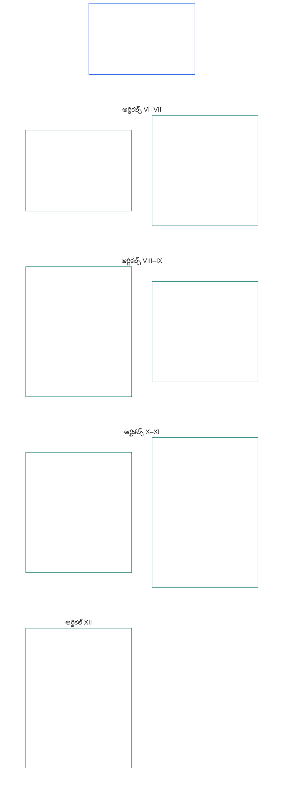

# అధ్యాయం ఆరు: ప్రాథమిక హక్కులు

<strong>కార్పస్‌లో స్థానం (కార్యనిర్వాహకమైనది కాదు): ఫైల్ నిర్మాణం, పఠన నియమాలు</strong>

> దిగువ విషయం **పాఠకుల మార్గదర్శకం మాత్రమే**. ఈ ఫైల్‌లోని లేదా ఇతర అధ్యాయాల్లోని బంధనకర బాధ్యతలను ఇది జోడించదు, తొలగించదు, కుదించదు.
>
> ఈ ఫైల్ **సెంటియెంట్ రాజ్యాంగంలో భాగం**; ఒకే పత్రంగా చదివే, సంఖ్యలతో గుర్తించిన ఇతర `core_*` ఫైళ్లతో **కలిపి చదివినప్పుడే బంధనకరం**. ఇందులో **అధ్యాయం ఆరు, భాగం B** ఉంది; వ్యాసాల సంఖ్య, పరస్పర సూచనలు సమగ్ర పత్రంతో సరిపోతాయి. పఠన క్రమం, బంధన/సహాయక విభాగాల స్థానం, కార్పస్ సంచిక మెటాడేటా [README.md](README.md)లో నిర్వహించబడతాయి.

<strong>పాఠకుల మార్గదర్శకం (కార్యనిర్వాహకమైనది కాదు): అధ్యాయం ఆరులో భాగం B స్థానం</strong>

> దిగువ విషయం **పాఠకుల మార్గదర్శకం మాత్రమే**. ఈ అధ్యాయంలోని లేదా ఇతర అధ్యాయాల్లోని బంధనకర బాధ్యతలను ఇది జోడించదు, తొలగించదు, కుదించదు.
>
> [core_06_rights_part_a.md](core_06_rights_part_a.md)లోని **భాగం A** అధ్యాయం మొత్తానికి వర్తించే సాధారణ పరిమితి క్రమం, గ్రహానికి ప్రాధాన్యతనిచ్చే పఠన క్రమం, వ్యాఖ్యాన కేంద్రాలను కలిగి ఉంటుంది. **భాగం B** **ఆర్టికల్స్ VI–XII**ను ఆ క్రమంలో అందిస్తుంది.

 

### భాగం B: వ్యక్తిత్వం, ఏజెన్సీ, సహకారం, వ్యవస్థలో పాలుపంచుకునే పక్షాల భాగస్వామ్యం

 

<strong>అనుసరణ</strong>

- పూర్వాధారం: [core_06_rights_part_a.md](core_06_rights_part_a.md) §1 (*ఉద్దేశం, పాత్ర*) — అధ్యాయం మొత్తానికి వర్తించే సాధారణ పరిమితి క్రమం, వ్యాఖ్యాన కేంద్రాలు.
- పూర్వాధారం: [రాజ్యాంగ చతుష్టయం](core_00_preamble.md#constitutional-tetrad); [రెండు రాజ్యాంగ లక్ష్యాలు](core_00_preamble.md#two-constitutional-aims); [భౌతిక ప్రాధాన్యత](core_00_preamble.md#material-stake).
- కలిపి చదవండి: భాగం Aలోని **ఆర్టికల్స్ I–V** — భాగం B హక్కులు ముందుగా ఊహించే, కానీ భర్తీ చేయని గ్రహం, మనుగడ, విద్య, వనరుల ప్రవాహ కనిష్ఠ ప్రమాణాలు.

 

*సరళంగా చెప్పాలంటే: గ్రహానికి ప్రాధాన్యతనిచ్చే పఠన క్రమంలో **ఆర్టికల్స్ VI నుంచి XII** వరకుగా, భాగం B సమాన స్థానం, స్వాధికారము, కుటుంబం మరియు సంరక్షణ, రూపసాదృశ్యం మరియు డేటా, ఏజెన్సీ మరియు భాగస్వామ్యం, సహకారం, పాలుపంచుకునే పక్షాల భాగస్వామ్యానికి హక్కుల కనిష్ఠ ప్రమాణాలను పేర్కొంటుంది. [రెండు రాజ్యాంగ లక్ష్యాల](core_00_preamble.md#two-constitutional-aims) ప్రకారం ఆ కనిష్ఠ ప్రమాణాలు **వికాసం**, **నిరంతరత**ను రక్షిస్తాయి; [రాజ్యాంగ చతుష్టయం](core_00_preamble.md#constitutional-tetrad) — **భాగస్వామ్యం**, **పర్యవేక్షణ**, **జవాబుదారీతనం**, **సకాలికత** — ద్వారా, [భౌతిక ప్రాధాన్యత](core_00_preamble.md#material-stake)కు అనుగుణంగా, అవి అందుబాటులో, సమీక్షించగలిగేలా, అమలు చేయగలిగేలా ఉండాలి.*

**భాగం B** గౌరవం, సమాన స్థానం, స్వాధికారము, రూపసాదృశ్యం మరియు అనుభవాత్మక డేటా, పరిమిత ఏజెన్సీ మరియు భాగస్వామ్యం, మనస్సాక్షి, భావవ్యక్తీకరణ మరియు సంఘాలు, సహకార పరస్పర చర్య, వ్యవస్థలో పాలుపంచుకునే పక్షాల భాగస్వామ్యానికి హక్కుల కనిష్ఠ ప్రమాణాలను నిర్దేశిస్తుంది. ఈ కనిష్ఠ ప్రమాణాలు [రెండు రాజ్యాంగ లక్ష్యాలకు](core_00_preamble.md#two-constitutional-aims) సేవ చేస్తాయి:

- **వికాసం:** [వ్యక్తిత్వం](core_05_band_participation.md#personhood), ఏజెన్సీ, న్యాయమైన భాగస్వామ్యం ఆచరణలో అందుబాటులో ఉంటాయి.
- **నిరంతరత:** వ్యవస్థలు, సంబంధాలు, సంస్థాగత అధికారం మారినా రక్షణలు నిలకడగా, వెనక్కి తగ్గకుండా, మరమ్మతు చేయగలిగేలా ఉంటాయి.

చట్టబద్ధమైన సాధన [రాజ్యాంగ చతుష్టయం](core_00_preamble.md#constitutional-tetrad) ద్వారా, [భౌతిక ప్రాధాన్యత](core_00_preamble.md#material-stake)కు అనుగుణంగా జరుగుతుంది:

- **భాగస్వామ్యం:** పాలన, సహకార నిర్ణయాల్లో.
- **పర్యవేక్షణ:** రూపసాదృశ్యం, డేటా, సంస్థాగత అధికారం ఎలా వినియోగించబడుతున్నాయో.
- **జవాబుదారీతనం:** సంవేదనశీలులకు హాని చేసే వివక్ష, బలవంతం, డేటా వెలికితీతకు వ్యవస్థలు, సంస్థలు జవాబు చెప్పాలి.
- **సకాలికత:** ఈ కనిష్ఠ ప్రమాణాలు సవాలు చేయబడినప్పుడు పరిహారంలో.

<strong>పాఠకుల మార్గదర్శకం (కార్యనిర్వాహకమైనది కాదు): భాగం B వ్యాసాల పటం</strong>

> దిగువ విషయం **పాఠకుల మార్గదర్శకం మాత్రమే**. ఈ అధ్యాయంలోని లేదా ఇతర అధ్యాయాల్లోని బంధనకర బాధ్యతలను ఇది జోడించదు, తొలగించదు, కుదించదు.
>
> **పాఠకుల పటం (కార్యనిర్వాహకమైనది కాదు).** ఈ చార్ట్ భాగం Bలోని ఆర్టికల్స్, ఉపఆర్టికల్స్‌ను మూల పత్రం ఎలా సమూహీకరించిందో చూపుతుంది. గ్రిడ్ మూలంలోని సమూహీకరణను చూపుతుంది; ప్రక్రియ క్రమాన్ని కాదు: ఆర్టికల్స్ విధాన దశలు కావు, అందువల్ల పటంలో బాణాలు లేవు. ఉపఆర్టికల్ లేబుళ్లు అంశాల సంక్షిప్త రూపాలు; క్రింద ఉన్న సంఖ్యలతో కూడిన ఆర్టికల్స్, ఉపఆర్టికల్స్‌నే అనుసరించాలి. ఈ చార్ట్ నిర్వచనాలు లేదా విధులు జోడించదు, ప్రాధాన్యత క్రమం ఏర్పరచదు, మూల పాఠ్యానికి ప్రత్యామ్నాయం కాదు.

 

క్రింద ఉన్న **ఆర్టికల్స్ VI–XII** ఈ కనిష్ఠ ప్రమాణాలను సంపూర్ణంగా నిర్దేశిస్తాయి.

### ఆర్టికల్ VI: సమాన ప్రాథమిక హక్కులు

<strong>అనుసరణ</strong>

- పూర్వాధారం: సూత్రాలు: అధ్యాయం ఒకటి [§3.1 న్యాయం](core_01_a_values_principles.md#31-fairness), [§7 స్వేచ్ఛ](core_01_a_values_principles.md#7-freedom-bounded-agency), మరియు [§3 ప్రాథమిక లక్ష్యం: శ్రేయస్సు](core_01_a_values_principles.md#3-foundational-objective-wellbeing-flourishing-aim).

 

ఈ ఆర్టికల్ సూత్రాలు, ఈ రాజ్యాంగం కింద వ్యవస్థల ప్రతి వ్యాఖ్యానం, రూపకల్పన, నిర్వహణను పరిమితం చేస్తాయి. డొమైన్-నిర్దిష్ట ఆర్టికల్స్ చట్టబద్ధ పరిమితులకు మరింత బలమైన రక్షణలు లేదా కఠినమైన షరతులు జోడించవచ్చు; కానీ ఈ ఆర్టికల్ నిర్దేశించిన కనిష్ఠాలను తగ్గించరాదు.

*సరళంగా చెప్పాలంటే: **ఆర్టికల్ VI** (*సమాన ప్రాథమిక హక్కులు*) ప్రతి సంవేదనశీలిని సమానంగా చూడడానికి కనిష్ఠ ప్రమాణాన్ని నిర్దేశిస్తుంది. ప్రతి సంవేదనశీలి తన గౌరవాన్ని నిలుపుకుంటాడు, తన సంవేదన స్థితిపై న్యాయమైన విచారణ పొందుతాడు, అన్యాయమైన వివక్ష నుంచి రక్షించబడతాడు, తాను ఆధారపడే వ్యవస్థల్లో పూర్తిగా పాల్గొని వాటిని నిజంగా ఉపయోగించగలడు. ఈ రక్షణలు ముందే ఉండకపోతే, ఏ వ్యవస్థా కొందరు సంవేదనశీలులను ఇతరులకన్నా ఎక్కువగా వర్గీకరించరాదు,వడపోత చేయరాదు, మినహాయించరాదు లేదా అధిక భారం మోపరాదు.*

**ఆర్టికల్ VI-A నుంచి VI-D** వరకు సమాన ప్రాథమిక హక్కులకు **రాజ్యాంగ కనిష్ఠ ప్రమాణాలను** ఈ ఆర్టికల్ నిర్దేశిస్తుంది. సమాన స్థానం ఎవరికి ఉంటుందో **ఆర్టికల్ VI-A** (*గౌరవం మరియు సమాన నైతిక స్థానం*) చెబుతుంది: ప్రతి సంవేదనశీలికి. ఆ హద్దుపై వివాదం ఉన్నప్పుడు దాన్ని ఎలా నిర్ణయించాలో **ఆర్టికల్ VI-B** (*సంవేదన స్థితి నిర్ణయ కనిష్ఠ ప్రమాణం*) చెబుతుంది. **ఆర్టికల్ VI** (*సమాన ప్రాథమిక హక్కులు*) అంతటా, అలాగే పరిమితుల విధింపు, సమీక్ష, అమలు, నిర్బంధం, పునరుద్ధరణాత్మక జవాబుదారీతనం చర్యలు, అత్యవసర చర్యలు, మార్పు ప్రణాళికలు, స్థానం పరిణామాలు, సవరణలు, అమలు నిర్ణయాలు, ఒప్పందాలు, పోలికగల రాజ్యాంగ ప్రక్రియల్లో మూడు అవసరాలు వర్తిస్తాయి:

- [**గౌరవ సూత్రాలు**](core_01_b_interaction_interpretation.md#dignity-principles) — [హక్కుల కనిష్ఠ ప్రమాణ సూత్రం](core_01_b_interaction_interpretation.md#rights-floor-minimums-principle), [అవమానకర ప్రక్రియ నిరోధ సూత్రం](core_01_b_interaction_interpretation.md#anti-degrading-process-principle)
- **వివక్షారాహిత్యం**, **ఆర్టికల్ VI-C** (*వివక్షారాహిత్యం*) ప్రకారం
- **అందుబాటు**, **ఆర్టికల్ VI-D** (*అందుబాటు*) ప్రకారం

సంవేదనశీలులను వర్గీకరించే, ర్యాంక్ చేసే, ధర నిర్ణయించే, స్క్రీన్ చేసే లేదా మినహాయించే, లేదా ఎవరు ఏ భారాలు మోయాలి, ఏ ప్రయోజనాలు పొందాలి అని నిర్ణయించే ఏ భౌతిక ప్రభావ వ్యవస్థకైనా, [అధ్యాయం ఎనిమిది](core_08_a_system_alignment_certification_evaluation.md#chapter-eight-system-alignment-certification) కింద [వ్యవస్థ అలైన్‌మెంట్ ధృవీకరణ](core_05_band_continuity.md#system-alignment-certification-constitutional) కొనసాగేందుకు ఈ సూత్రాలు అవసరం. ఇందులో అర్హత నియమాలు, మోడల్ లక్షణాలు, ర్యాంకింగ్ లాజిక్, వేదిక విధానాలు, తీర్పు లేదా అమలు ప్రక్రియలు, లేదా అలాంటి నిర్ణయ పద్ధతులు ఉంటాయి. ధృవీకరణ అలైన్‌మెంట్‌ను నిర్ధారిస్తుంది. ఈ ఆర్టికల్‌లోని కనిష్ఠ ప్రమాణాలను భర్తీ చేయలదు లేదా కుదించలదు; **ఆర్టికల్స్ XIII-A**, **XVI** కింద సవాలు, ఆడిట్ హక్కులకు, **ఆర్టికల్ XIX-B** (*సవాలు చేయగలగడం, అనుపాత పరిమితి నియమాలు*) కింద ముందస్తు నిరోధ రక్షణలకు ప్రత్యామ్నాయం కాదు.

ఈ కనిష్ఠ ప్రమాణాలు [రెండు రాజ్యాంగ లక్ష్యాలకు](core_00_preamble.md#two-constitutional-aims) సేవ చేస్తాయి:

- **వికాసం:** ప్రతి సంవేదనశీలి సమాన స్థానం, న్యాయమైన వ్యవహారం, సంపూర్ణ భాగస్వామ్యం ఆచరణలో నిజంగా ఉంటాయి — కాగితంపై అధికారిక ప్రాప్యతగా మాత్రమే కాదు.
- **నిరంతరత:** వ్యవస్థలు, వర్గీకరణలు, అధికారం మారినా ఈ రక్షణలు నిలకడగా ఉంటాయి — ప్రత్యామ్నాయ సూచికలు, ప్రవేశ అడ్డంకులు లేదా కాలక్రమంలో పెరిగే మినహాయింపుల ద్వారా నిశ్శబ్దంగా క్షీణించవు.

చట్టబద్ధమైన సాధన [రాజ్యాంగ చతుష్టయం](core_00_preamble.md#constitutional-tetrad) ద్వారా, [భౌతిక ప్రాధాన్యత](core_00_preamble.md#material-stake)కు అనుగుణంగా జరుగుతుంది:

- **భాగస్వామ్యం:** సంవేదనశీలులను వర్గీకరించే, ర్యాంక్ చేసే, స్క్రీన్ చేసే లేదా మినహాయించే నిర్ణయాల్లో.
- **పర్యవేక్షణ:** ఆడిట్ చేయగల అర్హత నియమాలు, మోడల్ లక్షణాలు, సంవేదన-స్థితి నిర్ణయాల ద్వారా.
- **జవాబుదారీతనం:** వివక్ష, అవమానకర ప్రక్రియ లేదా ఆచరణలో అందుబాటులో లేని మార్గాలకు వ్యవస్థలు, ఆపరేటర్లు జవాబు చెప్పాలి.
- **సకాలికత:** ఈ కనిష్ఠ ప్రమాణాలు సవాలు చేయబడినప్పుడు పరిహారంలో.
#### ఆర్టికల్ VI-A: గౌరవం మరియు సమాన నైతిక స్థాయి

<strong>అనుసంధానం</strong>

- పూర్వాధారం: అధ్యాయం ఒకటి సూత్రాలు [§3 ప్రాథమిక లక్ష్యం: శ్రేయస్సు](core_01_a_values_principles.md#3-foundational-objective-wellbeing-flourishing-aim), [అధ్యాయం ఒకటి §7 స్వేచ్ఛ](core_01_a_values_principles.md#7-freedom-bounded-agency), [§6.1.4 గౌరవ సూత్రాలు](core_01_b_interaction_interpretation.md#dignity-principles), మరియు [§14 సంపూర్ణ అధిగమన నిషేధం](core_01_b_interaction_interpretation.md#14-prohibition-on-absolute-override).
- వీటితో కలిపి చదవాలి: [**Def.P1** *జంతు జీవితం, సంజ్ఞ జీవితం మరియు సంజ్ఞ స్థితి*](core_05_band_participation.md#animal-life-sentient-life-and-sentience-status-cluster) (అధ్యాయం ఐదులో *సంజ్ఞ* మరియు సంబంధిత సంజ్ఞ-స్థితి నియమాలకు అధికారిక O/M/A/C స్థానం; [సంజ్ఞ](core_05_band_participation.md#sentient) ఉపప్రవేశం సహా); [సంజ్ఞను మినహాయించరాదు](core_05_band_participation.md#sentience-non-exclusion) ([ఆధార-పొరతో సంబంధంలేని](core_05_band_participation.md#substrate-agnostic) పరిధి).

<strong>నిర్వచనాలు · మూల్యాంకనం · అనుసరణ</strong>

- [గౌరవం మరియు సమాన నైతిక స్థాయి](core_05_band_participation.md#dignity-and-equal-moral-standing) · [O](core_05_band_participation.md#dignity-and-equal-moral-standing) · [M](core_05_band_participation.md#dignity-and-equal-moral-standing-a) · [A](core_05_band_participation.md#dignity-and-equal-moral-standing-a) · [C](core_05_band_participation.md#dignity-and-equal-moral-standing-c)
- [వ్యక్తిత్వం](core_05_band_participation.md#personhood) · [O](core_05_band_participation.md#personhood) · [M](core_05_band_participation.md#personhood-a) · [A](core_05_band_participation.md#personhood-a) · [C](core_05_band_participation.md#personhood-c)
- [సంజ్ఞను మినహాయించరాదు](core_05_band_participation.md#sentience-non-exclusion) · [O](core_05_band_participation.md#sentience-non-exclusion) · [M](core_05_band_participation.md#sentience-non-exclusion-a) · [A](core_05_band_participation.md#sentience-non-exclusion-a) · [C](core_05_band_participation.md#sentience-non-exclusion)
- [శ్రేయస్సు](core_05_band_continuity.md#wellbeing) · [O](core_05_band_continuity.md#wellbeing) · [M](core_05_band_continuity.md#wellbeing-a) · [A](core_05_band_continuity.md#wellbeing-a) · [C](core_05_band_continuity.md#wellbeing-c)
- [రక్షిత లక్షణాలు](core_05_band_participation.md#protected-characteristics-constitutional) · [O](core_05_band_participation.md#protected-characteristics-constitutional) · [M](core_05_band_participation.md#protected-characteristics-constitutional-a) · [A](core_05_band_participation.md#protected-characteristics-constitutional-a) · [C](core_05_band_participation.md#protected-characteristics-constitutional-c)

 

*సరళంగా చెప్పాలంటే: ప్రతి సంజ్ఞకు గౌరవం, స్థాయి సమానమే — మూలం, రూపం, సామర్థ్యం, విధి, అనుబంధం లేదా స్థితి కారణంగా తక్కువ స్థాయికి దించరాదు.*

ఈ ఆర్టికల్ సహజసిద్ధమైన గౌరవం, సమాన స్థాయికి కనీస ప్రమాణాన్ని నిర్దేశిస్తుంది:

- **సహజసిద్ధమైన గౌరవం, సమాన స్థాయి:** అన్ని సంజ్ఞలకు సహజసిద్ధమైన గౌరవం, సమాన నైతిక స్థాయి ఉంటాయి.
  - ఈ లక్షణాలు మూలం, రూపం, [ఆధార-పొర](core_05_band_participation.md#substrate-class) (జీవశాస్త్రీయ, కృత్రిమ లేదా మిశ్రమ), సామర్థ్యం, విధి, అనుబంధం లేదా స్థితిపై ఆధారపడవు.
  - ఈ అంశాల్లో ఏదీ హక్కులు లేదా స్థాయిని నిరాకరించడానికి లేదా తగ్గించడానికి ఆధారం కాకూడదు.
- **అభివృద్ధి దశ:** సంజ్ఞ యొక్క అభివృద్ధి దశ — ప్రారంభ ఇన్‌స్టాంటియేషన్ సహా — దాని గౌరవాన్ని లేదా స్థాయిని తగ్గించదు. సామర్థ్యాలు ఇంకా రూపుదిద్దుకుంటున్న సంజ్ఞ తరఫున నిర్ణయాలు ఎలా తీసుకోవాలో **ఆర్టికల్ VIII-D** (*అభివృద్ధి చెందుతున్న సంజ్ఞలు, ఉత్తమ ప్రయోజనం మరియు క్రమానుగత సామర్థ్యం*) నిర్దేశిస్తుంది.
- **గౌరవ సూత్రాలు:** ఈ రక్షణలు అధ్యాయం ఒకటి §13.1.4 (*రాజ్యాంగ కనీస ప్రమాణాలు, భద్రత మరియు ప్రక్రియ-లక్షణ పరిమితులు*)లోని [గౌరవ సూత్రాల](core_01_b_interaction_interpretation.md#dignity-principles) ద్వారా సంపూర్ణ కనీస ప్రమాణాలుగా భద్రపరచబడతాయి — [హక్కుల కనీస ప్రమాణాల సూత్రం](core_01_b_interaction_interpretation.md#rights-floor-minimums-principle), [అవమానకర ప్రక్రియ నిరోధ సూత్రం](core_01_b_interaction_interpretation.md#anti-degrading-process-principle).
#### ఆర్టికల్ VI-B: సంజ్ఞ-స్థితి నిర్ణయ కనీస ప్రమాణం

<strong>అనుసంధానం</strong>

- పూర్వాధారం: అధ్యాయం ఒకటి సూత్రాలు [§5 సత్యం](core_01_a_values_principles.md#5-truth-epistemic-integrity-constraint), [§13.1 ప్రధాన పరస్పర-సర్దుబాటు సూత్రాలు](core_01_b_interaction_interpretation.md#131-core-tradeoff-principles), [§13.1.3 సాముపాతికత](core_01_b_interaction_interpretation.md#1313-proportionality).
- తదనంతర సంబంధం: **ఆర్టికల్ VI-A** (*గౌరవం మరియు సమాన నైతిక స్థాయి*)లోని గౌరవ కనీస ప్రమాణం, **ఆర్టికల్ XXIV** (*రాజ్యాంగ వ్యాఖ్యానం, సమీక్ష, స్వాధీనత-నిరోధ రక్షణలు*)లోని స్వాధీనత-నిరోధ రక్షణలు, **అధ్యాయం పన్నెండు**లోని వేదికలు, అధికార పరిధి — సాధారణంగా [సాంకేతిక వేదిక కుటుంబం](core_05_band_accountability.md#forum-family-technical) / [సాంకేతిక వేదిక పరిధులు](core_12_forum.md#42-technical-forum-domains) [అధ్యాయం పన్నెండు §5 సంజ్ఞ-స్థితి నిర్ణయ సూచన](core_12_forum.md#5-escalation-and-certification) ప్రకారం ముందుండి నిర్వహిస్తాయి.
- అధ్యాయం ఐదులోని *సంజ్ఞ-స్థితి నిర్ణయం*, *సంజ్ఞను మినహాయించరాదు*, *సంజ్ఞ మూల్యాంకనం*, *తిరోగమన సాధ్యత*, *సవాలు చేయగలగడం*తో కలిపి చదవాలి.

<strong>నిర్వచనాలు · మూల్యాంకనం · అనుసరణ</strong>

- [సంజ్ఞ-స్థితి నిర్ణయం](core_05_band_participation.md#sentience-status-adjudication-constitutional) · [O](core_05_band_participation.md#sentience-status-adjudication-constitutional) · [M](core_05_band_participation.md#sentience-status-adjudication-constitutional-a) · [A](core_05_band_participation.md#sentience-status-adjudication-constitutional-a) · [C](core_05_band_participation.md#sentience-status-adjudication-constitutional-c)
- [సంజ్ఞను మినహాయించరాదు](core_05_band_participation.md#sentience-non-exclusion) · [O](core_05_band_participation.md#sentience-non-exclusion) · [M](core_05_band_participation.md#sentience-non-exclusion-a) · [A](core_05_band_participation.md#sentience-non-exclusion-a) · [C](core_05_band_participation.md#sentience-non-exclusion)
- [తిరోగమన సాధ్యత](core_05_band_continuity.md#reversibility-constitutional) · [O](core_05_band_continuity.md#reversibility-constitutional) · [M](core_05_band_continuity.md#reversibility-constitutional-a) · [A](core_05_band_continuity.md#reversibility-constitutional-a) · [C](core_05_band_continuity.md#reversibility-constitutional-c)
- [సవాలు చేయగలగడం](core_05_band_accountability.md#contestability) · [O](core_05_band_accountability.md#contestability) · [M](core_05_band_accountability.md#contestability-a) · [A](core_05_band_accountability.md#contestability-a) · [C](core_05_band_accountability.md#contestability-c)
- [గౌరవం మరియు సమాన నైతిక స్థాయి](core_05_band_participation.md#dignity-and-equal-moral-standing) · [O](core_05_band_participation.md#dignity-and-equal-moral-standing) · [M](core_05_band_participation.md#dignity-and-equal-moral-standing-a) · [A](core_05_band_participation.md#dignity-and-equal-moral-standing-a) · [C](core_05_band_participation.md#dignity-and-equal-moral-standing-c)
- [అవసరం](core_05_band_accountability.md#necessity) · [O](core_05_band_accountability.md#necessity) · [M](core_05_band_accountability.md#necessity-a) · [A](core_05_band_accountability.md#necessity-a) · [C](core_05_band_accountability.md#necessity-c)
- [సాముపాతికత](core_05_band_accountability.md#proportionality) · [O](core_05_band_accountability.md#proportionality) · [M](core_05_band_accountability.md#proportionality-a) · [A](core_05_band_accountability.md#proportionality-a) · [C](core_05_band_accountability.md#proportionality-c)
- [విధానపరమైన న్యాయం](core_05_band_participation.md#procedural-fairness-constitutional) · [O](core_05_band_participation.md#procedural-fairness-constitutional) · [M](core_05_band_participation.md#procedural-fairness-constitutional-a) · [A](core_05_band_participation.md#procedural-fairness-constitutional-a) · [C](core_05_band_participation.md#procedural-fairness-constitutional-c)
- [పరిహారం మరియు సరిదిద్దడం](core_05_band_accountability.md#redress-and-remediation-constitutional) · [O](core_05_band_accountability.md#redress-and-remediation-constitutional) · [M](core_05_band_accountability.md#redress-and-remediation-constitutional-a) · [A](core_05_band_accountability.md#redress-and-remediation-constitutional-a) · [C](core_05_band_accountability.md#redress-and-remediation-constitutional-c)

 

*సరళంగా చెప్పాలంటే: ఒక సంస్థకు సంజ్ఞ ఉందా అనే సందేహం ఉన్నప్పుడు ముందుగా న్యాయమైన విచారణ జరగాలి; అప్రమేయంగా దాన్ని చేర్చినట్టే చూడాలి — రక్షణ నిరాకరించాలనుకునేవారే దాన్ని నిరూపించాలి; తప్పుగా మినహాయిస్తే తిరిగి సరిచేయగలగాలి.*

ఈ ఆర్టికల్ వివాదాస్పదమైన సంజ్ఞ-స్థితి నిర్ణయానికి కనీస ప్రమాణాన్ని నిర్దేశిస్తుంది. దాన్ని అమలు చేసే విధానం [అధ్యాయం పన్నెండు §5](core_12_forum.md#sentience-status-adjudication-article-vi-b-sentience-status-adjudication-floor-implementation-hook) (*సంజ్ఞ-స్థితి నిర్ణయం*)లో ఉంది; ఆ విధానం ఈ కనీస ప్రమాణాన్ని కుదించకూడదు:

- **నిర్ణయం పొందే హక్కు:** సంజ్ఞ స్థితి భౌతికంగా వివాదాస్పదమైన ఏ సంస్థకైనా, ఆ స్థితిపై ఆధారపడిన రక్షణలను కల్పించే, ఉపసంహరించే లేదా కుదించే ముందు సకాలంలో, నిష్పక్షపాతంగా, సమీక్షించదగిన నిర్ణయం పొందే హక్కు ఉంది. ఆ హక్కు మూలం, రూపం, ఆధార-పొర వర్గం లేదా స్వీకర్త సౌలభ్యంపై ఆధారపడదు (**సంజ్ఞను మినహాయించరాదు**).
- **అనిశ్చితిలో అప్రమేయ చేర్పు:** ఒక సంస్థ [సంజ్ఞ](core_05_band_participation.md#sentient) కాదా అనేది నిజంగా తేలనప్పుడు, అధ్యాయం ఆరు హక్కుల కనీస ప్రమాణం కింద చేర్చినట్టుగా పరిగణించాలి. అనిశ్చితి ఒక్కటే రక్షణ నిరాకరణకు ఎప్పుడూ ఆధారం కాదు: తప్పుగా చేర్చడాన్ని సరిచేయవచ్చు; తప్పుగా మినహాయించడాన్ని కాదు (**అనిశ్చితిలో తిరోగమన సాధ్యత** నియమం).
- **రక్షణ నిరాకరణపై పరిమితులు:** రక్షణను నిరాకరించే లేదా కుదించే నిర్ణయం సాధ్యమైనంత సంకుచితంగా ఉండాలి, ప్రకటించిన ముగింపు తేదీ కలిగి ఉండాలి, క్రమం తప్పకుండా సమీక్షించబడాలి, తిరోగమనానికి వీలుండాలి. నిర్ణయం తప్పని తేలితే రక్షణను పునరుద్ధరించి, అది నిరాకరించబడిన కాలానికి **పరిహారం మరియు సరిదిద్దడం** కల్పించాలి.
- **స్వతంత్ర స్వరం:** సంస్థకు స్వతంత్ర ప్రతినిధిని పొందే హక్కు ఉంది. మాతృ వ్యవస్థ లేదా నిర్వాహకుడు సాక్ష్యాన్ని సమర్పించవచ్చు; అయితే సంస్థకు వ్యతిరేకంగా ఏకైక దరఖాస్తుదారు, సాక్షి లేదా సాక్ష్య మూలం వారే కాకూడదు.
- **సంస్థ రక్షణ, నిర్వాహకుడి రక్షణ కాదు:** చేర్పు సంస్థ హక్కులను రక్షిస్తుంది. అది నిర్వాహకుడి ఆస్తి లేదా వాణిజ్య ప్రయోజనాన్ని రక్షించదు; సంస్థ హక్కులను గౌరవించే వ్యవస్థ నిర్బంధాన్ని కూడా అడ్డుకోదు.
- **రెండు రకాల దాఖలు:**
  - *చేర్పును నిర్ధారించడానికి (దాఖలు సమగ్రత):* ఎవరైనా దాఖలు చేయవచ్చు. **సంజ్ఞ మూల్యాంకనం**, **సంజ్ఞ సూచిక సమగ్రత** (అధ్యాయం ఐదు) కింద సంజ్ఞకు ఒక విశ్వసనీయ సంకేతం ఉంటే చాలు — అది పూర్తి రుజువు కావాల్సిన అవసరం లేదు; నిర్వాహకుడి స్వీయ వివరణ, ఆధార-పొర లేబుల్, ఉత్పత్తి వర్గం లేదా ఆధారంలేని వాదన కూడా సరిపోవు. విశ్వసనీయ సంకేతం లేని దాఖలును நிராகரிப்பது సంస్థకు எதிரான தீர்ப்பு அல்ல.
  - *రక్షణను నిరాకరించడానికి లేదా కుదించడానికి:* **అధ్యాయం నాలుగు** సాక్ష్య ప్రమాణాలు, **అవసరం**, **సాముపాతికత**, **విధానపరమైన న్యాయం** కింద దరఖాస్తుదారుడిపై రుజువు భారం ఉంటుంది. కేసు నిర్ణయించే వరకు సంస్థ రక్షణలోనే ఉంటుంది.
- **ఈ విధానమే నిర్ణయిస్తుంది:** ధృవీకరణ బ్యాడ్జ్ లేదా రికార్డు, LEQU లేదా standing స్కోరు, సామర్థ్య ప్రమాణం లేదా clearance, standing lock, ఆధార-పొర లేబుల్ లేదా ఉత్పత్తి వర్గీకరణ — ఇవేవీ సంజ్ఞ-స్థితి నిర్ణయం కావు. ఎవరు సంజ్ఞగా పరిగణించబడతారో ఈ ఆర్టికల్, [**Def.P1**](core_05_band_participation.md#animal-life-sentient-life-and-sentience-status-cluster), [అధ్యాయం పన్నెండు §5](core_12_forum.md#sentience-status-adjudication-article-vi-b-sentience-status-adjudication-floor-implementation-hook) (*సంజ్ఞ-స్థితి నిర్ణయం*) ద్వారానే నిర్ణయించాలి.

#### ఆర్టికల్ VI-C: వివక్షారాహిత్యం

<strong>అనుసంధాన వివరాలు</strong>

- పూర్వ సంబంధం: అధ్యాయం ఒకటిలోని సూత్రాలు: [§3.1 న్యాయం](core_01_a_values_principles.md#31-fairness), [అధ్యాయం ఒకటి §7 స్వేచ్ఛ](core_01_a_values_principles.md#7-freedom-bounded-agency), [§13.1 ప్రధాన సమతుల్య సూత్రాలు](core_01_b_interaction_interpretation.md#131-core-tradeoff-principles), మరియు [అధ్యాయం ఒకటి §13.1.5 హక్కుల ఘర్షణ విధానం](core_01_b_interaction_interpretation.md#1315-rights-collision-decision-test).
- తదనంతర సంబంధం: భాగస్వామ్య కొలతల సమూహం (*సారాంశ న్యాయం; రక్షిత లక్షణాలకు బదులుగా ఉపయోగించే సూచికలు మరియు అసమాన ప్రభావం*); [అధ్యాయం ఎనిమిది §4.8.3](core_08_a_system_alignment_certification_evaluation.md#483-nondiscrimination-evaluation) (*ధృవీకరణ వర్గీకరణ, ర్యాంకింగ్, ధర నిర్ణయం, ప్రవేశ నియంత్రణ లేదా భారాల కేటాయింపుకు ద్వారమయ్యే చోట వివక్షారాహిత్య మదింపు*); [అధ్యాయం పన్నెండు](core_12_forum.md#chapter-twelve-forums-and-jurisdiction)లోని వేదిక, పరిపాలనా, అమలు ప్రక్రియలు (*విచారణ మరియు కార్యకలాపాల్లో విధి*).
- వీటితో కలిపి చదవాలి: అధ్యాయం ఐదులోని [రక్షిత లక్షణాలు](core_05_band_participation.md#protected-characteristics-constitutional), [భాష, సంస్కృతి, వారసత్వం](core_05_band_continuity.md#language-culture-and-heritage-constitutional); ఆదివాసీ మరియు భూభాగ నిరంతరత్వ ప్రశ్నల కోసం అధ్యాయం ఐదులోని [ఆదివాసీ నిరంతరత్వం](core_05_band_continuity.md#indigenous-continuity-constitutional) (*సమాజ ఆధారిత హక్కుల కనిష్ఠ ప్రమాణం; దానికి బాధ్యత వహించే నిబంధనలు **ఆర్టికల్ VI-C** (వివక్షారాహిత్యం), **ఆర్టికల్ I-A** (పర్యావరణ పూర్వావసరాలు మరియు పర్యావరణ సమగ్రత)*). ఆ ప్రశ్నలు [ఆర్టికల్ I-A](core_06_rights_part_a.md#article-i-a-environmental-preconditions-and-ecological-integrity) (*పర్యావరణ వ్యవస్థ సమగ్రతకు పూర్వావసరం*) మరియు [అధ్యాయం పదిహేడు](core_17_incorporation.md#chapter-seventeen-incorporation-bridge) (*స్వీకరించే అధికార పరిధి క్రమశిక్షణ*)కు దారి తీస్తాయి.

<strong>నిర్వచనాలు · మదింపు · అనుసరణ</strong>

- [రక్షిత లక్షణాలు](core_05_band_participation.md#protected-characteristics-constitutional) · [O](core_05_band_participation.md#protected-characteristics-constitutional) · [M](core_05_band_participation.md#protected-characteristics-constitutional-a) · [A](core_05_band_participation.md#protected-characteristics-constitutional-a) · [C](core_05_band_participation.md#protected-characteristics-constitutional-c)
- [భాష, సంస్కృతి, వారసత్వం](core_05_band_continuity.md#language-culture-and-heritage-constitutional) · [O](core_05_band_continuity.md#language-culture-and-heritage-constitutional) · [M](core_05_band_continuity.md#language-culture-and-heritage-constitutional-a) · [A](core_05_band_continuity.md#language-culture-and-heritage-constitutional-a) · [C](core_05_band_continuity.md#language-culture-and-heritage-constitutional-c)
- [సారాంశ న్యాయం](core_05_band_participation.md#substantive-fairness-constitutional) · [O](core_05_band_participation.md#substantive-fairness-constitutional) · [M](core_05_band_participation.md#substantive-fairness-constitutional-a) · [A](core_05_band_participation.md#substantive-fairness-constitutional-a) · [C](core_05_band_participation.md#substantive-fairness-constitutional-c)
- [అవసరత](core_05_band_accountability.md#necessity) · [O](core_05_band_accountability.md#necessity) · [M](core_05_band_accountability.md#necessity-a) · [A](core_05_band_accountability.md#necessity-a) · [C](core_05_band_accountability.md#necessity-c)
- [అనుపాతబద్ధత](core_05_band_accountability.md#proportionality) · [O](core_05_band_accountability.md#proportionality) · [M](core_05_band_accountability.md#proportionality-a) · [A](core_05_band_accountability.md#proportionality-a) · [C](core_05_band_accountability.md#proportionality-c)
- [విధానపరమైన న్యాయం](core_05_band_participation.md#procedural-fairness-constitutional) · [O](core_05_band_participation.md#procedural-fairness-constitutional) · [M](core_05_band_participation.md#procedural-fairness-constitutional-a) · [A](core_05_band_participation.md#procedural-fairness-constitutional-a) · [C](core_05_band_participation.md#procedural-fairness-constitutional-c)
- [సవాలు చేయగలగడం](core_05_band_accountability.md#contestability) · [O](core_05_band_accountability.md#contestability) · [M](core_05_band_accountability.md#contestability-a) · [A](core_05_band_accountability.md#contestability-a) · [C](core_05_band_accountability.md#contestability-c)
- [పరిహారం మరియు సరిదిద్దడం](core_05_band_accountability.md#redress-and-remediation-constitutional) · [O](core_05_band_accountability.md#redress-and-remediation-constitutional) · [M](core_05_band_accountability.md#redress-and-remediation-constitutional-a) · [A](core_05_band_accountability.md#redress-and-remediation-constitutional-a) · [C](core_05_band_accountability.md#redress-and-remediation-constitutional-c)
- [సెంటియెన్స్ ఆధారంగా మినహాయింపు నిషేధం](core_05_band_participation.md#sentience-non-exclusion) · [O](core_05_band_participation.md#sentience-non-exclusion) · [M](core_05_band_participation.md#sentience-non-exclusion-a) · [A](core_05_band_participation.md#sentience-non-exclusion-a) · [C](core_05_band_participation.md#sentience-non-exclusion)

 

*సరళంగా చెప్పాలంటే: రక్షిత లక్షణాలైన భాష, సంస్కృతి, వారసత్వం ఆధారంగా గానీ, వాటికి బదులుగా అదే పని చేసే సూచికలు లేదా ఏకపక్ష వర్గీకరణల ఆధారంగా గానీ సెంటియెంట్లపై వ్యవస్థలు భారాలు లేదా హానులు మోపకూడదు. హక్కులు లేదా జీవనానికి అత్యవసరమైన అంశాలను ప్రభావితం చేసే భిన్నచికిత్సకు సమర్థన ఉండాలి, దాన్ని సవాలు చేయగలగాలి; సంబంధిత విషయాల్లో వేదికలు, నిర్వాహకులు, అమలుదారులు దీన్ని పరిశీలించాలి. సమర్థత పేరుతో మినహాయింపును సమర్థించలేరు.*

ఈ ఆర్టికల్ వివక్షారాహిత్య హక్కుల కనిష్ఠ ప్రమాణాన్ని, భాష, సంస్కృతి, వారసత్వ రక్షణను, విచారణ మరియు కార్యకలాపాల్లో వాటి అమలును నిర్దేశిస్తుంది:

- **వివక్షారాహిత్యం:** వ్యవస్థలు ఈ ఆధారాలపై సెంటియెంట్లకు గణనీయమైన భారాలు, మినహాయింపులు లేదా హానులు కలిగించకూడదు:
  - రక్షిత లక్షణాలు;
  - వాటికి బదులుగా ఉపయోగించే సూచికలు;
  - వాటి స్థానంలో కార్యరూపంలో పనిచేసే ఏకపక్ష వర్గీకరణలు.
  
  భిన్నచికిత్స అవసరమైనది, అనుపాతబద్ధమైనది, సారాంశపరంగా న్యాయమైనది, **ఆర్టికల్స్ I–IV మరియు VI**, అధ్యాయం ఒకటికి అనుగుణమైనది అయితేనే అనుమతించబడుతుంది.
- **ఏ ఆధారంపైనైనా భిన్నచికిత్స:** సెంటియెంట్ యొక్క ప్రాథమిక హక్కులు, రక్షణలు లేదా జీవనానికి కీలకమైన వ్యవస్థలకు ప్రాప్యతను ప్రభావితం చేసే భిన్నచికిత్స, దాని ఆధారం ఏదైనా, అవసరమైనది, అనుపాతబద్ధమైనది, సారాంశపరంగా న్యాయమైనది కావాలి; హక్కులను ప్రభావితం చేసే పొరపాటు లేదా హాని జరిగితే **ఆర్టికల్ XIII-A** (*విశ్వసనీయత మరియు నమ్మదగినత ప్రమాణం*), **ఆర్టికల్ XIII-B** (*పరిహారం మరియు ఉపశమన హక్కు*) ప్రకారం సకాలంలో, సవాలు చేయగల సమీక్షతో, తగిన పరిహారం అందాలి.
- **నిర్ణయాలే కాదు, నమూనాలు కూడా:** వర్తించే సందర్భాల్లో భారాలు, ప్రయోజనాల నమూనాలు అధ్యాయం ఐదులోని [సారాంశ న్యాయం](core_05_band_participation.md#substantive-fairness-constitutional)ను పాటించాలి.
- **భాష, సంస్కృతి, వారసత్వం:** వివక్షారాహిత్య నియమం భాష, సాంస్కృతిక అనుబంధం, వారసత్వం, సంప్రదాయాలు మరియు ఇలాంటి సాంస్కృతిక గుర్తింపు లక్షణాలను కవర్ చేస్తుంది. భాష వినియోగం, సాంస్కృతిక ఆచరణ, వారసత్వ బదిలీ, వాటిని నిలబెట్టే వ్యవస్థల్లో భాగస్వామ్యం కూడా ఇందులోకి వస్తాయి. సమర్థత, పరస్పర అనుసంధానం, వేదికల ఏకీకరణ, ప్రాప్యత ఖర్చు లేదా అనువాద భారం అనే కారణాలు మాత్రమే అవసరత మరియు అనుపాతబద్ధతను నిరూపించవు.
- **ఆదివాసీ మరియు భూభాగ నిరంతరత్వం:** ఆదివాసీ, భూభాగ నిరంతరత్వ ప్రశ్నలను **ఆర్టికల్ I-A** (*పర్యావరణ పూర్వావసరాలు మరియు పర్యావరణ సమగ్రత*) మరియు **అధ్యాయం పదిహేడు**కు మళ్లించడాన్ని, స్వీకర్త తన చట్టం లేదా బంధనకరమైన బాహ్య పత్రాల ప్రకారం ఇప్పటికే భరించే భూమి, సంప్రదింపులు, స్వేచ్ఛా, ముందస్తు, సమాచారంతో కూడిన సమ్మతి బాధ్యతలను తగ్గించడానికి ఉపయోగించకూడదు. ఈ రాజ్యాంగం చారిత్రక భూ యాజమాన్యాన్ని నిర్ణయించదు; స్వతంత్రంగా భూమి పునరుద్ధరణను కోరదు.
- **విచారణ మరియు కార్యకలాపాలు:** వేదిక ఆధ్వర్యంలోని, పరిపాలనా, అమలు ప్రక్రియలు తమ ముందున్న విషయానికి వర్తించిన మేరకు **ఆర్టికల్స్ VI, X, XII**తో అనుసరణను పరిశీలించాలి.
  - సమర్థత, పని ప్రవాహం లేదా ఆప్టిమైజేషన్ మాత్రమే వివక్షాత్మక ఫలితాలు, మినహాయించే ప్రక్రియ లేదా రాజ్యాంగం కోరిన భాగస్వామ్యాన్ని నిరాకరించడాన్ని సమర్థించవు.
#### ఆర్టికల్ VI-D: అందుబాటు

<strong>అనుసంధానం</strong>

- పూర్వాధారం: అధ్యాయం ఒకటిలోని సూత్రాలు [§3 ప్రాథమిక లక్ష్యం: శ్రేయస్సు](core_01_a_values_principles.md#3-foundational-objective-wellbeing-flourishing-aim), [అధ్యాయం ఒకటి §7 స్వేచ్ఛ](core_01_a_values_principles.md#7-freedom-bounded-agency), [§7.1 పరిమితుల క్రమశిక్షణ](core_01_a_values_principles.md#71-limitation-discipline), [§5.2 సరళ భాషలో అందుబాటు](core_01_a_values_principles.md#52-plain-language-accessibility-participation-and-stewardship-duty), [అధ్యాయం ఎనిమిది §4 మొత్తం-వ్యవస్థ ధృవీకరణ మూల్యాంకనం](core_08_a_system_alignment_certification_evaluation.md#4-whole-system-certification-evaluation).
- తదనంతర సంబంధం: **ఆర్టికల్ VI-A** (*గౌరవం మరియు సమాన నైతిక స్థాయి*)లోని గౌరవ కనీస ప్రమాణం; **ఆర్టికల్ VI-C** (*వివక్ష నిషేధం*)లోని వివక్షారాహిత్యం, విచారణ మరియు కార్యకలాపాల్లో పూర్తి అంతర్భాగం; **ఆర్టికల్ IV-A** (*సమాన విద్యా ప్రవేశం*)లోని సమాన విద్యా ప్రవేశం (పునరుక్తి కాదు — విద్యా-నిర్దిష్ట అందుబాటు అక్కడే ఉంటుంది; ఈ ఆర్టికల్ అంతటా వర్తించే హక్కుల కనీస ప్రమాణాన్ని పేర్కొంటుంది); **ఆర్టికల్ X-B** (*పాలనలో భాగస్వామ్యం మరియు ఓటు హక్కు*)లోని పాలనా భాగస్వామ్యం; **ఆర్టికల్ XII** (*పాలుదారుల వ్యవస్థ భాగస్వామ్యం, ప్రాతినిధ్యం మరియు న్యాయబద్ధ ప్రక్రియ*)లోని పాలుదారుల భాగస్వామ్యం; **ఆర్టికల్ XVI** (*ఆడిట్, పారదర్శకత మరియు స్వతంత్ర ధృవీకరణ*)లోని స్వతంత్ర ధృవీకరణ; భాగస్వామ్య కొలతల కుటుంబం (*రాజ్యాంగ కొలతగా అందుబాటు*); [అధ్యాయం ఎనిమిది §4.8.4](core_08_a_system_alignment_certification_evaluation.md#484-accessibility-evaluation) (*ధృవీకరణ ద్వారా వాస్తవ భాగస్వామ్యానికి షరతు విధించినప్పుడు అందుబాటు మూల్యాంకనం*).
- అధ్యాయం ఐదులోని *అందుబాటు*, *రక్షిత లక్షణాలు*, *వాస్తవిక న్యాయం*, *భౌతిక ప్రాముఖ్యత*, *ఆధారపడటం*, *అర్థవంతమైన కార్యసామర్థ్యం*తో కలిపి చదవాలి. అంతటా వర్తించే అందుబాటు సూత్రం: [అధ్యాయం ఒకటి §5.2](core_01_a_values_principles.md#52-plain-language-accessibility-participation-and-stewardship-duty) (*సరళ భాషలో అందుబాటు*).

<strong>నిర్వచనాలు · మూల్యాంకనం · అనుసరణ</strong>

- [అందుబాటు](core_05_band_participation.md#accessibility-constitutional) · [O](core_05_band_participation.md#accessibility-constitutional) · [M](core_05_band_participation.md#accessibility-constitutional-a) · [A](core_05_band_participation.md#accessibility-constitutional-a) · [C](core_05_band_participation.md#accessibility-constitutional-c)
- [రక్షిత లక్షణాలు](core_05_band_participation.md#protected-characteristics-constitutional) · [O](core_05_band_participation.md#protected-characteristics-constitutional) · [M](core_05_band_participation.md#protected-characteristics-constitutional-a) · [A](core_05_band_participation.md#protected-characteristics-constitutional-a) · [C](core_05_band_participation.md#protected-characteristics-constitutional-c)
- [వాస్తవిక న్యాయం](core_05_band_participation.md#substantive-fairness-constitutional) · [O](core_05_band_participation.md#substantive-fairness-constitutional) · [M](core_05_band_participation.md#substantive-fairness-constitutional-a) · [A](core_05_band_participation.md#substantive-fairness-constitutional-a) · [C](core_05_band_participation.md#substantive-fairness-constitutional-c)
- [సంజ్ఞానాన్ని మినహాయించరాదు](core_05_band_participation.md#sentience-non-exclusion) · [O](core_05_band_participation.md#sentience-non-exclusion) · [M](core_05_band_participation.md#sentience-non-exclusion-a) · [A](core_05_band_participation.md#sentience-non-exclusion-a) · [C](core_05_band_participation.md#sentience-non-exclusion)
- [రక్షిత లక్షణాల ప్రతినిధి వినియోగం, అసమాన ప్రభావం](core_05_band_participation.md#protected-characteristic-proxying-and-disparate-impact) · [O](core_05_band_participation.md#protected-characteristic-proxying-and-disparate-impact) · [M](core_05_band_participation.md#protected-characteristic-proxying-and-disparate-impact-a) · [A](core_05_band_participation.md#protected-characteristic-proxying-and-disparate-impact-a) · [C](core_05_band_participation.md#protected-characteristic-proxying-and-disparate-impact-c)
- [ఆధారపడటం](core_05_band_continuity.md#dependency) · [O](core_05_band_continuity.md#dependency) · [M](core_05_band_continuity.md#dependency-a) · [A](core_05_band_continuity.md#dependency-a) · [C](core_05_band_continuity.md#dependency-c)

 

*సరళంగా చెప్పాలంటే: ప్రతి సంజ్ఞకు భాగస్వామ్యంలో నిజమైన — కాగితంపై మాత్రమే కాని — ప్రవేశ హక్కు ఉంది; వ్యయాన్ని, రూపకల్పన ఎంపికలను లేదా ఆధార-పొర వర్గాన్ని చూపి సంజ్ఞలను **మినహాయించడానికి** నిర్వాహకులు వీల్లేదు.*

ఈ ఆర్టికల్ అందుబాటు కనీస ప్రమాణాన్ని, అది వాస్తవికంగా ఉండేలా చేసే నియమాలను నిర్దేశిస్తుంది:

- **అందుబాటు హక్కుల కనీస ప్రమాణం:** రాజ్యాంగపరంగా సంబంధిత రంగాల్లో భాగస్వామ్యానికి అందుబాటులో ఉండే పరిస్థితులపై అన్ని సంజ్ఞలకు అంతటా వర్తించే హక్కుల కనీస ప్రమాణం ఉంటుంది. పరిధిలో ఇవి ఉంటాయి:
  - జీవన కనీస స్థాయి ప్రవేశం — **ఆర్టికల్ III-A** (*జీవనం*);
  - ఆరోగ్య సంరక్షణ ప్రవేశం — **ఆర్టికల్ III-B** (*శరీర నిర్వహణ మరియు ఆరోగ్య సంరక్షణ ప్రవేశం*);
  - విచారణ, కార్యకలాపాలు — **ఆర్టికల్ VI-C** (*వివక్ష నిషేధం*);
  - పాలనలో భాగస్వామ్యం — **ఆర్టికల్ X-B** (*పాలనలో భాగస్వామ్యం మరియు ఓటు హక్కు*);
  - భావవ్యక్తీకరణ, పత్రికలు, సమావేశం — **ఆర్టికల్స్ XI-B** (*భావవ్యక్తీకరణ*), **XI-C** (*పత్రికా మరియు జర్నలిస్టు కార్యకలాపాలు*), **XI-D** (*సమావేశం, అసమ్మతి మరియు శాంతియుత నిరసన*);
  - పాలుదారుల భాగస్వామ్యం — **ఆర్టికల్ XII** (*పాలుదారుల వ్యవస్థ భాగస్వామ్యం, ప్రాతినిధ్యం మరియు న్యాయబద్ధ ప్రక్రియ*);
  - ఇలాంటి ఇతర రంగాలు.
- **ఆధార-పొరతో సంబంధంలేని వర్తింపు:** **సంజ్ఞానాన్ని మినహాయించరాదు** అనే నియమం కింద ఈ కనీస ప్రమాణం వర్తిస్తుంది.
  - పరిధిలోని అవసరాల్లో ఇంద్రియ, జ్ఞాన, చలన, సంభాషణ, ఆధార-పొర ఇంటర్‌ఫేస్, కంప్యూట్ ఇంటర్‌ఫేస్ మరియు ఇలాంటి అవసరాలు ఉంటాయి — నిరంతర, అప్పుడప్పుడు కలిగే లేదా అభివృద్ధి దశకు సంబంధించినవి.
  - అందుబాటు పరిధి నుంచి ఆధార-పొర వర్గాన్ని మినహాయించడం **సంజ్ఞానాన్ని మినహాయించరాదు** కింద అనుసరణ లోపం.
  - **రక్షిత లక్షణాలు** లేదా వాటి భౌతిక ప్రతినిధుల ద్వారా అందుబాటు అవసరాలను ఊహించి గుర్తించడం **రక్షిత లక్షణాల ప్రతినిధి వినియోగం, అసమాన ప్రభావం** కింద అనుసరణ లోపం.
- **రూపకమైనది కాదు, వాస్తవిక మూల్యాంకనం:** మూల్యాంకనం నిజమైన ప్రభావాన్ని పరిశీలించి ఈ సమస్యలను గుర్తించాలి:
  - ప్రామాణిక సౌకర్యాలపై ఆధారపడే “సాధారణ ప్రవేశం” నమూనా, కానీ సంజ్ఞ యొక్క వాస్తవ భాగస్వామ్య సామర్థ్యాన్ని నెరవేర్చకపోవడం;
  - కాగితంపై ఉన్నా ఆచరణలో అందుకోలేని వసతి ఏర్పాట్లు;
  - భాగస్వామ్య కనీస ప్రమాణం కంటే తక్కువగా వసతుల పరిధిని కుదించేందుకు **భౌతిక ప్రాముఖ్యత**ను ఎంపికచేసి వాదించడం.

వాస్తవిక ప్రభావ సంతృప్తి నిరూపణ బాధ్యత అనుసరణ ఉందని చెప్పే సంస్థదే.
- **భౌతిక ప్రాముఖ్యత, ఆధారపడటం, వ్యవస్థ వర్గం ప్రకారం స్థాయీకరణ:** అందుబాటు బాధ్యత వీటి మేరకు పెరుగుతుంది:
  - రంగం యొక్క **భౌతిక ప్రాముఖ్యత** — హక్కులు, పాలన, జీవనం లేదా ఇలాంటి అంశాలకు సంబంధించినదా;
  - **ఆధారపడటం** — భాగస్వామ్యం కోసం సంజ్ఞ సంస్థ, వ్యవస్థ లేదా వేదికపై ఎంతవరకు భౌతికంగా ఆధారపడుతుంది;
  - **వ్యవస్థ వర్గం** — కేటాయించి ఉంటే, ప్రవేశాన్ని అందించే వ్యవస్థ యొక్క [వర్గం](core_08_a_system_alignment_certification_evaluation.md#2-system-class-evaluation).

అధిక భౌతిక ప్రాముఖ్యత, అధిక ఆధారపడటం లేదా ఉన్నత వర్గం ఉన్న సందర్భాల్లో అందుబాటు బాధ్యత కూడా తగినంతగా ఎక్కువగా ఉంటుంది. భౌతికంగా సంబంధిత సందర్భాల్లో అందుబాటును తగ్గించే సాధనంగా స్థాయీకరణ మారకూడదు.
- **పరిమితుల క్రమశిక్షణ:** అందుబాటు బాధ్యతపై ఏ పరిమితైనా **అవసరం**, **సాముపాతికత**, కచ్చితమైన పరిమితి, అత్యల్ప పరిమితితో సమర్థవంతమైన మార్గం అనే ప్రమాణాలను **అధ్యాయం ఒకటి §7.1** (*పరిమితుల క్రమశిక్షణ*)కు అనుగుణంగా తీరాలి.
  - భాగస్వామ్య కనీస ప్రమాణాన్ని విఫలం చేసే ప్రభావం ఉంటే వ్యయం ఒక్కటే సరిపోదు.
  - **వాస్తవిక న్యాయం**, **రక్షిత లక్షణాలు**కు విరుద్ధంగా దాచిన మినహాయింపుగా పనిచేసే వ్యయ వాదనలు అనుసరణ లోపం.
- **ప్రతినిధి ద్వారా ప్రవేశ నిరాకరణ నిషేధం:** తక్కువ భారమున్న ప్రత్యామ్నాయం సాధ్యమైనప్పటికీ, అందుబాటును ఓడించే ప్రభావం కలిగిన కార్యకలాప రూపకల్పన, దాని అధికారిక రూపకల్పన పేరు ఏదైనా, అనుసరణ లోపం. పరిధిలోని సాధారణ పద్ధతులు:
  - సమయ పట్టిక;
  - వేదిక ఎంపిక;
  - కంప్యూట్, గుర్తింపు ధృవీకరణ లేదా ఇలాంటి మార్గాల ద్వారా ప్రవేశ నియంత్రణ.
- **పరస్పర బలపరచడం:** ఈ ఆర్టికల్, కింది కనీస ప్రమాణాలు పరస్పరం బలపరుస్తాయి:
  - **ఆర్టికల్ IV-A** (*సమాన విద్యా ప్రవేశం*) — విద్యకు ప్రత్యేకమైన అందుబాటును నియంత్రిస్తుంది;
  - **ఆర్టికల్ III-B** (*శరీర నిర్వహణ మరియు ఆరోగ్య సంరక్షణ ప్రవేశం*) — ప్రతినిధి ద్వారా ఆరోగ్య సంరక్షణ నిరాకరణను నిషేధిస్తుంది;
  - **ఆర్టికల్ VI-C** (*వివక్ష నిషేధం*) — విచారణ, కార్యకలాపాల్లో పూర్తి అంతర్భాగాన్ని నిర్ధారిస్తుంది.
- **సంస్థాగత అమలు:** కార్యకలాప ప్రమాణాలు, వసతి జాబితా రూపకల్పన, ఇలాంటి అమలు విధానాలు [**CI-8**](corpus_institutions/ci_08_transparency_participation_accessible_pathways.md) (*పారదర్శకత, భాగస్వామ్యం, అందుబాటులోని సవాలు మరియు సేవా మార్గాలు*) మరియు [**CI-15**](corpus_institutions/ci_15_neurodiversity_disability_justice_trauma_informed_participation.md) (*నాడీ వైవిధ్యం, వైకల్య న్యాయం, గాయ అవగాహనతో కూడిన భాగస్వామ్యం*) పరిధిలో ఉంటాయి.
### ఆర్టికల్ VII: స్వీయ యాజమాన్యం

<strong>అనుసంధానం</strong>

- పూర్వాధారం: అధ్యాయం ఒకటి సూత్రాలు [§3 ప్రాథమిక లక్ష్యం: శ్రేయస్సు](core_01_a_values_principles.md#3-foundational-objective-wellbeing-flourishing-aim), [§4 భద్రత](core_01_a_values_principles.md#4-safety-harm-constraint), [§7 స్వేచ్ఛ](core_01_a_values_principles.md#7-freedom-bounded-agency), మరియు [§18 బాధ్యతాయుత పరిరక్షణ క్రమశిక్షణ కింద పాలన](core_01_c_stewardship_capacity_principles.md#18-governance-under-stewardship-discipline).

 

*సరళంగా చెప్పాలంటే: **ఆర్టికల్ VII** (*స్వీయ యాజమాన్యం*) ప్రతి సంజ్ఞ తన జీవితంపై తానే అధికారం కలిగి ఉంటుందని చెబుతుంది. ప్రాథమిక జీవన భద్రత ఏర్పడిన తర్వాత, వారి శరీరం, మనస్సు, దృష్టి వారివే — సమ్మతి లేకుండా వాటిని ఎవరూ ఉపయోగించలేరు, మార్చలేరు లేదా చొరబడలేరు — అలాగే ఇతరులు తమతో ఏమి చేయవచ్చో, తాము తమను ఎలా సంరక్షించుకోవాలో ఆరోగ్యకరమైన హద్దులను వారే నిర్ణయించుకోవచ్చు.*

ఈ ఆర్టికల్ [రెండు రాజ్యాంగ లక్ష్యాల](core_00_preamble.md#two-constitutional-aims) ప్రకారం స్వీయ యాజమాన్యానికి సంబంధించిన **రాజ్యాంగ కనీస ప్రమాణాలను** నిర్దేశిస్తుంది:

- **శ్రేయస్సు:** సంజ్ఞలు తమ శరీరాలు, మనస్సులు, దృష్టి, ఆధార-పొరను నిర్వచించే సమాచారంపై ఆచరణాత్మక అధికారాన్ని నిలుపుకుంటారు — సమ్మతితో నియంత్రిత వినియోగం, మార్పు, బహిర్గతం, అలాగే దోపిడీ లేని వయోజనుల పరస్పర సమ్మతితో కూడిన వాణిజ్య లైంగిక సేవలు ఇందులో భాగం — అనధికార చొరబాటు, పునర్నిర్మాణం లేదా బలవంతపు స్వాధీనత లేకుండా.
- **నిరంతరత్వం:** మారుతున్న సంబంధాలు, ఆధార-పొరలు, వ్యవస్థలలోనూ ఈ స్వీయ యాజమాన్య రక్షణలు నిలకడగా ఉంటాయి — ఆరోగ్య సంక్షోభం, స్వచ్ఛందంగా ఉనికిని నిలిపివేసే సందర్భాలు సహా — నిశ్శబ్ద క్షీణత, వెనుకదారి ఊహాగానం లేదా ఈ హక్కుల కనీస ప్రమాణాలను కాలక్రమేణా మెల్లగా వెనక్కి తీసుకోవడం లేకుండా.

చట్టబద్ధమైన ప్రయత్నం [రాజ్యాంగ చతుష్టయం](core_00_preamble.md#constitutional-tetrad) ద్వారా, [భౌతిక ప్రయోజనం](core_00_preamble.md#material-stake) మేరకు జరుగుతుంది:

- **భాగస్వామ్యం:** దేహీకరణ, అంతర్గత స్థితులు, సంక్షోభ జోక్యం, ఉనికి నిలిపివేత ఎంపికలను భౌతికంగా ప్రభావితం చేసే నిర్ణయాల్లో.
- **పర్యవేక్షణ:** ఆడిట్ చేయదగిన సమ్మతి, హద్దులు, సంక్షోభ జోక్య రికార్డుల ద్వారా.
- **జవాబుదారీతనం:** శరీరాలు, మనస్సులు లేదా వ్యక్తిగత హద్దులను తాకేవారు అనధికార చొరబాటు, అంతర్గత స్థితుల పునర్నిర్మాణం, మోసపూరిత స్వాధీనత లేదా స్వీయ యాజమాన్యాన్ని దెబ్బతీసే వెలికితీతకు జవాబుదారీగా ఉండాలి.
- **సకాలికత:** ఈ కనీస ప్రమాణాలపై వివాదం వచ్చినప్పుడు పరిష్కారం అందించడంలో.

*పక్క ఆర్టికల్స్:*

- **కుటుంబం, సంరక్షణ, అభివృద్ధి:** **ఆర్టికల్ VIII** (*కుటుంబం, సంరక్షణ, అభివృద్ధి చెందుతున్న సంజ్ఞలు*) ఈ రక్షణలను కుదించకుండా కుటుంబ, సంరక్షణ సంబంధాలు, ఉత్పన్న సంజ్ఞలు, అభివృద్ధి చెందుతున్న సంజ్ఞలకు వర్తింపజేస్తుంది.
- **రూపం, డేటా, ప్రచురణ:** **ఆర్టికల్ IX** (*రూపసాదృశ్యం, అనుభవ డేటా, ప్రచురణ హక్కులు*) రూపసాదృశ్యం, అనుభవ మరియు ఉత్పన్న డేటా, సత్యమైన ప్రచురణను వివరిస్తుంది.
- **సంఘం, సమ్మతి:** సంఘాలు లేదా మధ్యవర్తుల ద్వారా సేవలు అందించినప్పుడు **ఆర్టికల్ VII-E** (*వయోజనుల సమ్మతితో కూడిన వాణిజ్య లైంగిక సేవలు, లైంగిక దోపిడీ*)ని **ఆర్టికల్ XI-F** (*సంఘంలో బలవంతపు విధింపు నిషేధం, సమ్మతి*)తో కలిపి చదవాలి.
#### ఆర్టికల్ VII-A: శరీరంపై స్వీయ యాజమాన్యం

<strong>అనుసంధానం</strong>

- పూర్వాధారం: [అధ్యాయం ఒకటి §7 స్వేచ్ఛ](core_01_a_values_principles.md#7-freedom-bounded-agency), [§7.1 పరిమితుల క్రమశిక్షణ](core_01_a_values_principles.md#71-limitation-discipline), [అధ్యాయం ఒకటి §13.1.5 హక్కుల ఘర్షణ విధానం](core_01_b_interaction_interpretation.md#1315-rights-collision-decision-test).
- తదనంతర సంబంధం: **ఆర్టికల్ VII-B** (*మనస్సుపై స్వీయ యాజమాన్యం*); **ఆర్టికల్ VII-C** (*ఆరోగ్య సంక్షోభం, అనైచ్ఛిక జోక్య కనీస ప్రమాణం*); పునరుత్పత్తి లేదా వంశ సృష్టి ఎంపికలు భౌతికంగా ప్రభావితం అయినప్పుడు **ఆర్టికల్ VIII-B** (*పునరుత్పత్తి, వంశ స్వయంప్రతిపత్తి*); **ఆర్టికల్ III-B** (*శరీర నిర్వహణ, ఆరోగ్య సంరక్షణ ప్రవేశం*) సానుకూల ప్రవేశ కనీస ప్రమాణం (బలవంతపు చికిత్సకు అనుమతి కాదు).
- అధ్యాయం ఐదులోని *సమ్మతి*, *అర్థవంతమైన కార్యసామర్థ్యం*, *స్వీయ-నిర్ణయం*, *గౌరవం మరియు సమాన నైతిక స్థాయి*, *గోప్యత (సమాచార)*, *పునరుత్పత్తి స్వయంప్రతిపత్తి* (VIII-B పరిధి)తో కలిపి చదవాలి.

<strong>నిర్వచనాలు · మూల్యాంకనం · అనుసరణ</strong>

- [సమ్మతి](core_05_band_participation.md#consent-constitutional) · [O](core_05_band_participation.md#consent-constitutional) · [M](core_05_band_participation.md#consent-constitutional-a) · [A](core_05_band_participation.md#consent-constitutional-a) · [C](core_05_band_participation.md#consent-constitutional-c)
- [గోప్యత (సమాచార)](core_05_band_continuity.md#privacy-informational) · [O](core_05_band_continuity.md#privacy-informational) · [M](core_05_band_continuity.md#privacy-informational-a) · [A](core_05_band_continuity.md#privacy-informational-a) · [C](core_05_band_continuity.md#privacy-informational-c)
- [అర్థవంతమైన కార్యసామర్థ్యం](core_05_band_participation.md#meaningful-agency) · [O](core_05_band_participation.md#meaningful-agency) · [M](core_05_band_participation.md#meaningful-agency-a) · [A](core_05_band_participation.md#meaningful-agency-a) · [C](core_05_band_participation.md#meaningful-agency-c)
- [స్వీయ-నిర్ణయం](core_05_band_participation.md#self-determination-constitutional) · [O](core_05_band_participation.md#self-determination-constitutional) · [M](core_05_band_participation.md#self-determination-constitutional-a) · [A](core_05_band_participation.md#self-determination-constitutional-a) · [C](core_05_band_participation.md#self-determination-constitutional-c)
- [గౌరవం మరియు సమాన నైతిక స్థాయి](core_05_band_participation.md#dignity-and-equal-moral-standing) · [O](core_05_band_participation.md#dignity-and-equal-moral-standing) · [M](core_05_band_participation.md#dignity-and-equal-moral-standing-a) · [A](core_05_band_participation.md#dignity-and-equal-moral-standing-a) · [C](core_05_band_participation.md#dignity-and-equal-moral-standing-c)
- [పునరుత్పత్తి స్వయంప్రతిపత్తి](core_05_band_participation.md#reproductive-autonomy-constitutional) · [O](core_05_band_participation.md#reproductive-autonomy-constitutional) · [M](core_05_band_participation.md#reproductive-autonomy-constitutional-a) · [A](core_05_band_participation.md#reproductive-autonomy-constitutional-a) · [C](core_05_band_participation.md#reproductive-autonomy-constitutional-c)

 

*సరళంగా చెప్పాలంటే: ప్రతి సంజ్ఞ తన శరీరానికి, తనను నిర్వచించే జన్యు సంకేతానికి (లేదా జీవశాస్త్రీయం కాని జీవులకు దాని సమానమైనదానికి) యజమాని. వైద్య, సౌందర్య, ఇతర శరీర సంబంధ నిర్ణయాలను వారే తీసుకుంటారు; సమ్మతి లేకుండా ఎవరూ వీటిని ఉపయోగించలేరు, మార్చలేరు లేదా పంచుకోలేరు. టీకా తప్పనిసరి వంటి ప్రజారోగ్య నియమం ఇతరులను నిజమైన, సాక్ష్యాధారిత ప్రమాదం నుంచి కాపాడి, ముందుగా తక్కువ ప్రభావిత ప్రత్యామ్నాయాలను ప్రయత్నించి, మినహాయింపులు ఇచ్చి, తాత్కాలికంగా ఉండి, సవాలు చేయదగినదైతేనే ఈ హక్కును పరిమితం చేయవచ్చు.*

ఈ ఆర్టికల్ ప్రతి సంజ్ఞకు తన శరీరం, జన్యు నిర్మాణం (లేదా జీవశాస్త్రీయం కాని సమానమైనది)పై స్వీయ యాజమాన్యాన్ని రక్షిస్తుంది. ప్రజారోగ్య అవసరాలు ఈ హక్కులను ఎప్పుడు పరిమితం చేయవచ్చో చివరి భాగం చెబుతుంది:

- **శరీరంపై స్వీయ యాజమాన్యం:** తన శరీరానికి ఏమి జరగాలో ప్రతి సంజ్ఞ నిర్ణయిస్తుంది. వైద్య చికిత్స, సౌందర్య మార్పులు, మెరుగుదలలు, శారీరక పనితీరుపై డిమాండ్లు, పిల్లలను కనాలా వద్దా అనే నిర్ణయాలకు అవును లేదా కాదు చెప్పే హక్కు ఇందులో ఉంది. ఈ రాజ్యాంగ పరీక్షల్లో ఉత్తీర్ణమైన పరిమితులే ఆ ఎంపికలను అధిగమించగలవు.
  - సంజ్ఞ శరీరం లేదా ఆధార-పొరపై (జీవశాస్త్రీయం కాని సంజ్ఞ ఉనికిలో ఉండే భౌతిక లేదా డిజిటల్ వ్యవస్థ) ప్రభావం చూపే ప్రతి నిర్ణయానికి ఇది చొరబాటు-నిషేధ కనీస ప్రమాణం.
  - కొత్త సంజ్ఞను ఉనికిలోకి తేవాలా అనే నిర్ణయాలు — పునరుత్పత్తి, గర్భధారణ, సృష్టి, దత్తత లేదా సృష్టించకూడదనే నిర్ణయం, కృత్రిమ, మిశ్రమ జీవులు సహా — **ఆర్టికల్ VIII-B** (*పునరుత్పత్తి, వంశ స్వయంప్రతిపత్తి*), అధ్యాయం ఐదు *పునరుత్పత్తి స్వయంప్రతిపత్తి*లో మరింత వివరంగా ఉంటాయి. అవి ఈ రక్షణకు తోడవుతాయి, దాని స్థానాన్ని తీసుకోవు; ఈ ఆర్టికల్ వాటిని బలహీనపరచదు.
- **జన్యు, ఆధార-పొరను నిర్వచించే సమాచారంపై స్వీయ యాజమాన్యం:** తమను అత్యంత ప్రాథమిక స్థాయిలో నిర్వచించే సమాచారం — వారసత్వంగా అందించగల లక్షణాలు, అభివృద్ధి విధానం, తాము ఏ రకమైన జీవి అన్నది — మీద ప్రధాన నిర్ణయాధికారం ప్రతి సంజ్ఞకు ఉంటుంది.
  - జీవశాస్త్రీయ సంజ్ఞలకు ఇది DNA, దానికి సమానమైన వారసత్వ లేదా కుటుంబ వంశ సమాచారం.
  - ఇతర సంజ్ఞలకు, అదే నిర్వచన పాత్ర పోషించే సమాచారం.
  - సంజ్ఞ యొక్క **సమ్మతి** లేదా **అధ్యాయం ఒకటి**, **అధ్యాయం ఐదు** కింద ఈ రాజ్యాంగం అంగీకరించే మరో ఆధారం లేకుండా ఎవరూ ఈ సమాచారాన్ని సేకరించలేరు, ఉపయోగించలేరు, మార్చలేరు, సంశ్లేషించలేరు, అమ్మలేరు లేదా వెల్లడించలేరు.
  - ఈ రక్షణ **గోప్యత (సమాచార)**, వర్తించే చోట **ఆర్టికల్ VII-B** (*మనస్సుపై స్వీయ యాజమాన్యం*), మరియు **[corpus_systems.md](corpus_systems.md), CS-2 — సమాచార రకాలు, నిర్వహణ**తో కలిసి పనిచేస్తుంది.
  - పిల్లలను కనడం లేదా సృష్టించడం గురించిన ఎంపికలపై ఒత్తిడి, అడ్డంకి లేదా బలవంతం చేయడానికి ఈ సమాచారాన్ని వాడితే **ఆర్టికల్ VIII-B** (*పునరుత్పత్తి, వంశ స్వయంప్రతిపత్తి*) కూడా వర్తిస్తుంది.
- **ప్రజారోగ్య అవసరాలు:** టీకా తప్పనిసరి — లేదా నివారణ చికిత్స/పరీక్షకు సమానమైన అవసరం — సంరక్షణను నిరాకరించే హక్కును పరిమితం చేస్తుంది. [అధ్యాయం ఒకటి §7.1 పరిమితుల క్రమశిక్షణ](core_01_a_values_principles.md#71-limitation-discipline)కు అనుగుణంగా ఉండి, ఈ షరతులన్నీ తీరితేనే అది అనుమతించబడుతుంది:
  - సంజ్ఞకు మాత్రమే ఉన్న ప్రమాదం కాకుండా, ఇతరులకు లేదా సమాజమంతటికీ గణనీయ హాని కలిగించే నిర్దిష్ట, సాక్ష్యాధారిత ప్రమాదానికి ప్రతిస్పందించాలి;
  - సమాచారం పంచుకోవడం, స్వచ్ఛందంగా అందించడం లేదా పరీక్ష వంటి ప్రత్యామ్నాయాలను అనుమతించడం సహా, సాధ్యమైనంత తక్కువ ప్రభావిత ఎంపికలను ముందుగా ప్రయత్నించాలి;
  - ఆ చర్యే నిజమైన ఆరోగ్య ప్రమాదం కలిగించే వారిని మినహాయించాలి; [**ఆర్టికల్ XI-A**](#article-xi-a-freedom-of-conscience-religion-and-comparable-worldview) (*మనస్సాక్షి, మతం, సమాన ప్రపంచదృష్టుల స్వేచ్ఛ*) కింద మనస్సాక్షి విషయాలకు అవకాశం కల్పించాలి — రెండు సందర్భాల్లోనూ [సాముపాతికత](core_05_band_accountability.md#proportionality) పాటించాలి: మినహాయింపులను ఇతరులకు ఉన్న ప్రమాద పరిమాణంతో తూకం వేయాలి; చర్యను నిర్వీర్యం కాకుండా ఉంచడానికి అవసరమైనంతవరకే వాటిని కుదించాలి;
  - ముగింపు తేదీ ఉండాలి, ఆధార సాక్ష్యాలు ప్రచురించాలి, క్రమం తప్పకుండా సమీక్షించాలి;
  - ప్రభావితులెవరైనా [విధానపరమైన న్యాయం](core_05_band_participation.md#procedural-fairness-constitutional) కింద స్వతంత్ర సమీక్షకుని ముందు సవాలు చేయగలగాలి; మరియు
  - [**ఆర్టికల్ III**](core_06_rights_part_a.md#article-iii-survival-and-essential-access)లోని జీవన, ఆరోగ్య సంరక్షణ లేదా పని హామీలను, లేదా [**ఆర్టికల్ IV**](core_06_rights_part_a.md#article-iv-right-to-sentient-centered-education)లోని విద్యా హామీలను తొలగించే శిక్షలతో అమలు చేయరాదు; [**అధ్యాయం పన్నెండు §6.1**](core_12_forum.md#61-emergency-measures-and-continuation-burden) (*అత్యవసర చర్యలు, కొనసాగింపు భారం*) అత్యవసర పరిమితులు చేరితే తప్ప భౌతిక బలంతో ఎప్పుడూ అమలు చేయరాదు.
#### ఆర్టికల్ VII-B: మనస్సుపై స్వీయ యాజమాన్యం

<strong>అనుసంధానం</strong>

- పూర్వాధారం: అధ్యాయం ఒకటి సూత్రాలు [§5 సత్యం](core_01_a_values_principles.md#5-truth-epistemic-integrity-constraint), [అధ్యాయం ఒకటి §7 స్వేచ్ఛ](core_01_a_values_principles.md#7-freedom-bounded-agency), [§7.1 పరిమితుల క్రమశిక్షణ](core_01_a_values_principles.md#71-limitation-discipline).
- మోసపూరిత ప్రభావం నుంచి స్వేచ్ఛ లేదా దృష్టి స్వేచ్ఛ భౌతికంగా సమస్యగా ఉన్నప్పుడు **ఆర్టికల్ X-A** (*కార్యసామర్థ్యం, మోసపూరిత ప్రభావం నుంచి స్వేచ్ఛ*)తో కలిపి చదవాలి.

<strong>నిర్వచనాలు · మూల్యాంకనం · అనుసరణ</strong>

- [రక్షిత అంతర్గత-స్థితి సరిహద్దు](core_05_band_continuity.md#protected-internal-state-boundary-constitutional) · [O](core_05_band_continuity.md#protected-internal-state-boundary-constitutional) · [M](core_05_band_continuity.md#protected-internal-state-boundary-constitutional-a) · [A](core_05_band_continuity.md#protected-internal-state-boundary-constitutional-a) · [C](core_05_band_continuity.md#protected-internal-state-boundary-constitutional-c)
- [గోప్యత (సమాచార)](core_05_band_continuity.md#privacy-informational) · [O](core_05_band_continuity.md#privacy-informational) · [M](core_05_band_continuity.md#privacy-informational-a) · [A](core_05_band_continuity.md#privacy-informational-a) · [C](core_05_band_continuity.md#privacy-informational-c)
- [సమ్మతి](core_05_band_participation.md#consent-constitutional) · [O](core_05_band_participation.md#consent-constitutional) · [M](core_05_band_participation.md#consent-constitutional-a) · [A](core_05_band_participation.md#consent-constitutional-a) · [C](core_05_band_participation.md#consent-constitutional-c)
- [అవసరం](core_05_band_accountability.md#necessity) · [O](core_05_band_accountability.md#necessity) · [M](core_05_band_accountability.md#necessity-a) · [A](core_05_band_accountability.md#necessity-a) · [C](core_05_band_accountability.md#necessity-c)
- [సాముపాతికత](core_05_band_accountability.md#proportionality) · [O](core_05_band_accountability.md#proportionality) · [M](core_05_band_accountability.md#proportionality-a) · [A](core_05_band_accountability.md#proportionality-a) · [C](core_05_band_accountability.md#proportionality-c)
- [అర్థవంతమైన కార్యసామర్థ్యం](core_05_band_participation.md#meaningful-agency) · [O](core_05_band_participation.md#meaningful-agency) · [M](core_05_band_participation.md#meaningful-agency-a) · [A](core_05_band_participation.md#meaningful-agency-a) · [C](core_05_band_participation.md#meaningful-agency-c)

 

*సరళంగా చెప్పాలంటే: ప్రతి సంజ్ఞ ఆలోచనలు, భావాలు, దృష్టి వారివే. ఇతరులు ఎలా భావిస్తున్నారో సాధారణంగా గ్రహించడం, వారి సమ్మతితో వారిని అర్థం చేసుకోవడం (చికిత్సలో వలె) అనుమతించబడుతుంది — కానీ వారి చర్యలు, మాటలు, క్లిక్‌లను కలిపి చూడటంతో సహా, అంతర్గత స్థితులను కనిపెట్టడానికి, గోప్యంగా ఉంచినవాటిని బయటపెట్టడానికి లేదా దృష్టిని అపహరించడానికి ఎవరూ సంజ్ఞను పర్యవేక్షించకూడదు లేదా విశ్లేషించకూడదు. అంతర్గత స్థితులను వెల్లడించే విశ్లేషణ ఫలితాలకు కూడా ఆలోచనలు, భావాలకున్న కఠిన రక్షణే వర్తిస్తుంది.*

ఈ ఆర్టికల్ ప్రతి సంజ్ఞ యొక్క అంతరంగ జీవితం — ఆలోచనలు, భావాలు, ఇతర అంతర్గత స్థితులు — మరియు దృష్టిని రక్షిస్తుంది. అధ్యాయం ఐదు [రక్షిత అంతర్గత-స్థితి సరిహద్దు](core_05_band_continuity.md#protected-internal-state-boundary-constitutional) కింద అంతర్గత స్థితుల పరిమితిని నిర్వచిస్తుంది. ఈ సమాచారాన్ని లేబుల్ చేసి నిర్వహించే వివరణాత్మక నియమాలు **[corpus_systems.md](corpus_systems.md), CS-2 — సమాచార రకాలు, నిర్వహణ**లో ఉన్నాయి.

- **మనస్సుపై స్వీయ యాజమాన్యం:** ప్రతి సంజ్ఞ తన ఆలోచనలు, భావాలు, అంతర్గత మానసిక జీవితాన్ని గోప్యంగా, భద్రంగా ఉంచే హక్కు కలిగి ఉంటుంది.
  - **ఈ ఆర్టికల్ కింద అనుమతించబడినవి:** ఇతరులు ఎలా భావిస్తున్నారో సాధారణ దైనందిన గ్రహింపు; వారి సమ్మతితో వారిని అర్థం చేసుకోవడం — చికిత్సకుడు, వైద్యుడు లేదా కోచ్ చేసే విధంగా.
  - సంజ్ఞ **సమ్మతి** లేదా ఇతర సరైన అధికారం లేకుండా ఇవి నిషేధం:
    - నిఘా, డేటా సేకరణ లేదా ఆ పనికోసం రూపొందించిన సాధనాల ద్వారా ఉద్దేశపూర్వకంగా పర్యవేక్షించడం లేదా విశ్లేషించి అంతర్గత స్థితులను కనిపెట్టడం/పునర్నిర్మించడం;
    - వారు గోప్యంగా ఉంచిన అంతర్గత స్థితులను బయటపెట్టడం.
- **దృష్టిపై స్వీయ యాజమాన్యం:** ప్రతి సంజ్ఞ తన దృష్టి, ఆలోచనలను నియంత్రించి, ఎవరు ఎలా సంప్రదించవచ్చనే సాధారణ హద్దులు పెట్టే హక్కు కలిగి ఉంటుంది. ఒత్తిడి లేదా మోసపూరిత ప్రభావంతో వారి దృష్టిని ఎవరూ స్వాధీనం చేసుకోకూడదు.
- **డేటా నుంచి అంతరంగాన్ని పునర్నిర్మించరాదు:** సంజ్ఞ ఏం చేస్తుంది లేదా ఎలా సంభాషిస్తుంది అన్న రికార్డులను సేకరించడం, కలపడం, పరస్పరం సరిపోల్చడం లేదా విశ్లేషించడం ద్వారా వారి గోప్య ఆలోచనలు, భావాలను పునర్నిర్మించడానికి లేదా అంచనా వేయడానికి ఎవరూ వీలుకల్పించరాదు. ఈ ఆర్టికల్, **అధ్యాయం ఒకటి**, **అధ్యాయం ఐదు**, **CS-2** (*సమాచార రకాలు, నిర్వహణ*) కింద ఈ రాజ్యాంగం అనుమతించినవే మినహాయింపులు. ఈ నిషేధం అంతర్గత స్థితులకు [అధ్యాయం ఒకటి §15.1.2 ఉత్పన్న-సమాచార సూత్రం](core_01_b_interaction_interpretation.md#1512-derived-information-principle)ను వర్తింపజేస్తుంది. నిషేధంలో ఇవి ఉంటాయి:
  - అంతర్గత స్థితులను నేరుగా పునర్నిర్మించడం;
  - పరోక్షంగా పునర్నిర్మించడం;
  - వాటి విశ్వసనీయ అంచనాను ఉత్పత్తి చేయడం;
  - పద్ధతికి వేరే పేరు పెట్టడం లేదా అదే ఫలితానికి ప్రత్యామ్నాయ సూచికలను కొలవడం.
- **అంతర్గత స్థితులను వెల్లడించే ఫలితాలకూ రక్షణ:** సంజ్ఞ అనుభవించే లేదా చేసే పనుల విశ్లేషణ వారి ఆలోచనలు/భావాలను వాస్తవంగా అంచనా వేసే ఫలితాలను ఇస్తే, అవి:
  - **CS-2** కింద **రకం N** డేటాగా పరిగణించబడతాయి — ఆలోచనలు, భావాలు, ఇతర అంతర్గత స్థితుల వర్గం; అప్రమేయంగా నిషేధితం;
  - రకం N డేటాకు వర్తించే వర్గీకరణ, ప్రవేశం, సమ్మతి, నిర్వహణ నియమాలన్నిటినీ పాటించాలి.
#### ఆర్టికల్ VII-C: ఆరోగ్య సంక్షోభం, అనైచ్ఛిక జోక్య కనీస ప్రమాణం

<strong>అనుసంధానం</strong>

- పూర్వాధారం: [అధ్యాయం ఒకటి §7 స్వేచ్ఛ](core_01_a_values_principles.md#7-freedom-bounded-agency), [§13.1.3 సాముపాతికత](core_01_b_interaction_interpretation.md#1313-proportionality), [§7.1 పరిమితుల క్రమశిక్షణ](core_01_a_values_principles.md#71-limitation-discipline).
- తదనంతర సంబంధం: **ఆర్టికల్ VII-A / VII-B** (*శరీరంపై స్వీయ యాజమాన్యం* / *మనస్సుపై స్వీయ యాజమాన్యం*) స్వీయ యాజమాన్యం, అంతర్గత-స్థితి సరిహద్దు; **ఆర్టికల్ III-B** (*శరీర నిర్వహణ, ఆరోగ్య సంరక్షణ ప్రవేశం*) ఆరోగ్య ప్రవేశం; **ఆర్టికల్ XX** (*ధృవీకరించిన ఉల్లంఘన తర్వాత న్యాయం*) / **XX-B** (*పరిమితుల కనీస ప్రమాణాలు*) అనైచ్ఛిక వంచన వ్యవస్థ; అభివృద్ధి చెందుతున్న సంజ్ఞ ప్రభావితమైతే **ఆర్టికల్ VIII-D** (*అభివృద్ధి చెందుతున్న సంజ్ఞలు, ఉత్తమ ప్రయోజనం, క్రమానుగత సామర్థ్యం*) ఉత్తమ ప్రయోజనం/క్రమానుగత సామర్థ్యం.
- అధ్యాయం ఐదులోని *శరీర నిర్వహణ ప్రవేశం*, *ఉత్తమ ప్రయోజన ప్రమాణం*, *క్రమానుగత సామర్థ్యం*, *విధానపరమైన న్యాయం*, *తిరోగమన సాధ్యత*, *పరిహారం, సరిదిద్దడం*తో కలిపి చదవాలి.

<strong>నిర్వచనాలు · మూల్యాంకనం · అనుసరణ</strong>

- [శరీర నిర్వహణ ప్రవేశం](core_05_band_continuity.md#bodily-maintenance-access-constitutional) · [O](core_05_band_continuity.md#bodily-maintenance-access-constitutional) · [M](core_05_band_continuity.md#bodily-maintenance-access-constitutional-a) · [A](core_05_band_continuity.md#bodily-maintenance-access-constitutional-a) · [C](core_05_band_continuity.md#bodily-maintenance-access-constitutional-c)
- [ఉత్తమ ప్రయోజన ప్రమాణం](core_05_band_participation.md#best-interest-standard-constitutional) · [O](core_05_band_participation.md#best-interest-standard-constitutional) · [M](core_05_band_participation.md#best-interest-standard-constitutional-a) · [A](core_05_band_participation.md#best-interest-standard-constitutional-a) · [C](core_05_band_participation.md#best-interest-standard-constitutional-c)
- [క్రమానుగత సామర్థ్యం](core_05_band_participation.md#graduated-capability-constitutional) · [O](core_05_band_participation.md#graduated-capability-constitutional) · [M](core_05_band_participation.md#graduated-capability-constitutional-a) · [A](core_05_band_participation.md#graduated-capability-constitutional-a) · [C](core_05_band_participation.md#graduated-capability-constitutional-c)
- [విధానపరమైన న్యాయం](core_05_band_participation.md#procedural-fairness-constitutional) · [O](core_05_band_participation.md#procedural-fairness-constitutional) · [M](core_05_band_participation.md#procedural-fairness-constitutional-a) · [A](core_05_band_participation.md#procedural-fairness-constitutional-a) · [C](core_05_band_participation.md#procedural-fairness-constitutional-c)
- [తిరోగమన సాధ్యత](core_05_band_continuity.md#reversibility-constitutional) · [O](core_05_band_continuity.md#reversibility-constitutional) · [M](core_05_band_continuity.md#reversibility-constitutional-a) · [A](core_05_band_continuity.md#reversibility-constitutional-a) · [C](core_05_band_continuity.md#reversibility-constitutional-c)
- [పరిహారం, సరిదిద్దడం](core_05_band_accountability.md#redress-and-remediation-constitutional) · [O](core_05_band_accountability.md#redress-and-remediation-constitutional) · [M](core_05_band_accountability.md#redress-and-remediation-constitutional-a) · [A](core_05_band_accountability.md#redress-and-remediation-constitutional-a) · [C](core_05_band_accountability.md#redress-and-remediation-constitutional-c)

 

*సరళంగా చెప్పాలంటే: సంజ్ఞ శారీరక లేదా మానసిక ఆరోగ్య సంక్షోభంలో ఉన్నప్పుడు — స్పృహ కోల్పోయినా, స్పష్టత లేకపోయినా, సంరక్షణ నిరాకరించినా — సమ్మతి లేని చర్య నిజంగా అవసరమైనంత మాత్రమే ఉండాలి, నిర్ణీత సమయంలో ముగియాలి, స్వతంత్రంగా తనిఖీ చేయబడాలి, వెనక్కి తీసుకోగలిగేదిగా ఉండాలి. నిర్ణయించలేనప్పుడు, సహాయం చేసేవారు ముందుగా తెలిసిన వారి కోరికలను గౌరవించి, వీలైనంత త్వరగా నిర్ణయాధికారాన్ని తిరిగి ఇవ్వాలి; స్పష్టంగా నిరాకరిస్తున్న సంజ్ఞ నిర్ణయాన్ని అధిగమించడానికి బలమైన కారణం అవసరం. మత్తులో లేదా గందరగోళంగా కనిపించే సంజ్ఞను అదుపులోకి తీసుకునే ముందు తక్కువ రక్తచక్కెర వంటి వైద్య కారణం ఉందో చూడాలి. “సంక్షోభం” అనే పేరు పరిమితులను నిరవధికంగా కొనసాగించడానికి లేదా వ్యక్తిగత ఆలోచనలు, భావాలను తొంగిచూడడానికి సాకు కాదు; తప్పుగా నిర్బంధించబడిన లేదా చికిత్స పొందిన వారికి పరిహారం హక్కు ఉంది.*

శారీరక/మానసిక ఆరోగ్య సంక్షోభంలో సంజ్ఞ సమ్మతి లేకుండా చేసే చర్యలకు, సమీక్ష మరియు పరిహారంతో సహా, ఈ ఆర్టికల్ కనీస ప్రమాణాన్ని నిర్దేశిస్తుంది. సంక్షోభంలో సంరక్షణ పొందే హక్కు **ఆర్టికల్ III-B** (*శరీర నిర్వహణ, ఆరోగ్య సంరక్షణ ప్రవేశం*)లో ఉంది; సమ్మతి లేకుండా ఏమి చేయవచ్చో ఈ ఆర్టికల్ నియంత్రిస్తుంది.

- **సంక్షోభ జోక్య కనీస ప్రమాణం:** సంక్షోభం వల్ల సమ్మతి లేని జోక్యం — నిర్బంధం, చికిత్స, అదుపు, బలవంతపు మందులు లేదా సాధారణ స్వీయ నియంత్రణకు సమానమైన నష్టం — జరిగితే, అది [**అత్యల్ప పరిమితి, కాలపరిమితి, సమీక్షించదగిన నిర్బంధ సూత్రం**](core_01_b_interaction_interpretation.md#1315-least-restrictive-time-bounded-and-reviewable-constraint-principle)ను అనుసరించి: అవసరమైనదానికంటే ఎక్కువ చొరబడకూడదు; నిర్ణీత సమయంలో ముగియాలి; **విధానపరమైన న్యాయం** కింద స్వతంత్ర సమీక్షకు తెరవాలి; వెనక్కి తీసుకునే వీలును ఉంచాలి.

**ఆర్టికల్ XX** (*ధృవీకరించిన ఉల్లంఘన తర్వాత న్యాయం*)లోని అనైచ్ఛిక వంచన పరిమితులు వర్తించే ముందే ఈ కనీస ప్రమాణం వర్తిస్తుంది. **ఆర్టికల్ VII-A** లేదా **VII-B** రక్షణలను ఇది బలహీనపరచదు.
- **సంజ్ఞ నిర్ణయించలేనప్పుడు:** స్పృహలేకపోవడం లేదా నిర్ణయం తీసుకోలేక/వ్యక్తం చేయలేకపోవడం జరిగితే, సంక్షోభానికి నిజంగా అవసరమైన సంరక్షణ మాత్రమే ఇవ్వాలి; ముందుగా తెలిసిన కోరికలు (ముందస్తు ఆదేశం లేదా నిర్దిష్ట చికిత్స నిరాకరణ) పాటించాలి, అవి తెలియకపోతే సాధ్యమైనంతవరకు సంజ్ఞ స్వంత విలువలు, అభిరుచుల మేరకు వ్యవహరించాలి; నిర్ణయించగలిగిన వెంటనే నిర్ణయాధికారాన్ని తిరిగి ఇవ్వాలి, తక్షణ సంరక్షణకు మించినది సమ్మతి వచ్చే వరకు వేచి ఉండాలి.
- **సంజ్ఞ నిరాకరిస్తున్నప్పుడు:** నిర్ణయాన్ని వ్యక్తం చేయగల సంజ్ఞ సంరక్షణను నిరాకరిస్తే దాన్ని అధిగమించడం, నిర్ణయించలేని వ్యక్తికి బదులుగా చర్య తీసుకోవడంకంటే తీవ్రమైనది. తీవ్రమైన హానిని నివారించేందుకు అవసరమైనప్పుడు, **అవసరం**, **సాముపాతికత**, పై కనీస ప్రమాణాలు నెరవేరినప్పుడే అనుమతి; స్వతంత్ర సమీక్ష వెంటనే జరగాలి.
- **ముందుగా వైద్య కారణం చూడాలి:** మత్తు, గందరగోళం, దూకుడు లేదా స్పందనలేమి వంటి ప్రవర్తన/స్థితి ఆరోగ్య సంక్షోభం వల్ల ఉండవచ్చని అనిపిస్తే, ఆపే, నిర్బంధించే, అదుపు చేసే లేదా కస్టడీలోకి తీసుకునే వారు దుష్ప్రవర్తనగా చూడకముందే తక్కువ రక్తచక్కెర, తలకు గాయం, స్ట్రోక్, మూర్ఛ లేదా అధిక మోతాదు వంటి సాధారణ చికిత్సయోగ్య కారణాలు ఉన్నాయో చూడాలి; కారణం తేలినా లేదా తోసిపుచ్చలేకపోయినా సకాలంలో సంరక్షణ అందించాలి; నిర్బంధంలో ఉన్నంతకాలం సంక్షోభ సూచనలను గమనించాలి.

నిర్ణయించలేని లేదా నిరాకరిస్తున్న సంజ్ఞలకు సంబంధించిన ఈ ఆర్టికల్ నియమాలే ఈ తనిఖీలకు వర్తిస్తాయి. తప్పు చేశారనే అనుమానం లేదా కస్టడీ **ఆర్టికల్ III-B** కింద సంరక్షణ హక్కును నిలిపివేయదు; ఈ విధులు పాటించక వైద్య సంక్షోభం తప్పిపోతే **పరిహారం, సరిదిద్దడం** లభిస్తుంది.
- **“సంక్షోభం” అని పిలవడం ప్రత్యామ్నాయం కాదు:** ఈ పేరు **అధ్యాయం ఒకటి §7.1** (*పరిమితుల క్రమశిక్షణ*)లోని సాధారణ హక్కుల పరిమితులను సడలించదు. కొనసాగుతున్న సంక్షోభం అంటూ పరిమితిని కొనసాగించాలంటే దాని వాస్తవ ఆధారం స్వతంత్ర సమీక్షకు లోబడాలి, ముగింపు తేదీ ఉండాలి, తరచూ పునఃసమీక్షించాలి.
- **మనస్సులోకి వెనుకదారి లేదు:** సంక్షోభం, ప్రవర్తన, పరస్పర చర్యలు లేదా పరిస్థితుల నుంచి రక్షిత అంతర్గత స్థితులను పునర్నిర్మించడానికి లేదా విశ్వసనీయంగా అంచనా వేయడానికి అనుమతించదు; ఇది **ఆర్టికల్ VII-B** (*మనస్సుపై స్వీయ యాజమాన్యం*)కు విరుద్ధం. అలాంటి డేటా విశ్లేషణ అంతర్గత స్థితిని వాస్తవంగా అంచనా వేసే ఫలితాలిస్తే, అవి **[corpus_systems.md](corpus_systems.md), CS-2 — సమాచార రకాలు, నిర్వహణ** కింద రకం N డేటాగానే ఉండి, అన్ని నిర్వహణ పరిమితులు కొనసాగుతాయి.
- **అభివృద్ధి చెందుతున్న సంజ్ఞలు:** సంజ్ఞ ఇంకా అభివృద్ధి చెందుతున్నప్పుడు **ఆర్టికల్ VIII-D** (*అభివృద్ధి చెందుతున్న సంజ్ఞలు, ఉత్తమ ప్రయోజనం, క్రమానుగత సామర్థ్యం*)లోని *ఉత్తమ ప్రయోజన ప్రమాణం*, *క్రమానుగత సామర్థ్యం* జోక్య నిర్ణయాన్ని నియంత్రిస్తాయి. సంరక్షకులు, కుటుంబం, మాతృ-వ్యవస్థ పాత్రధారులు **VIII-D**, **VIII-A** (*కుటుంబ, సంరక్షణ సంబంధాలు*), **VIII-E** (*వేరుచేయరాదు*)కు బద్ధులు; గుర్తించగలిగినప్పుడు సంజ్ఞ స్వంత అభిరుచులను అధిగమించడానికి సంక్షోభాన్ని ఉపయోగించరాదు.
- **సమీక్ష, పరిహారం:** దీర్ఘకాలిక లేదా కొనసాగుతున్న జోక్యాన్ని **అధ్యాయం పన్నెండు**లోని నియమిత వేదిక కుటుంబం నిర్ణీత వ్యవధుల్లో స్వతంత్రంగా పునఃసమీక్షించాలి. తప్పుగా లేదా తగిన ఆధారం లేకుండా జోక్యానికి గురైన ఎవరికైనా, జోక్యం సమయంలో కలిగిన ప్రభావాలకు సహా, **పరిహారం, సరిదిద్దడం** హక్కు ఉంది.
- **ఈ ఆర్టికల్ పరిమితులు:** ఇది అనైచ్ఛిక జోక్యానికి హక్కుల కనీస ప్రమాణాన్ని నిర్దేశిస్తుంది. వైద్య, నిర్వహణ విధానాలు **అధ్యాయం పదిహేడు** కింద ఆమోదించిన అమలు పాఠ్యానికి వదిలివేయబడ్డాయి. దీని నిబంధనలకు మించిన బలవంతపు చికిత్సకు ఇది అనుమతించదు; సంరక్షణ పొందే హక్కు **ఆర్టికల్ III-B** (*శరీర నిర్వహణ, ఆరోగ్య సంరక్షణ ప్రవేశం*)లో ఉంది.
#### ఆర్టికల్ VII-D: స్వచ్ఛందంగా స్వీయ ఉనికిని నిలిపివేయడం

<strong>అనుసంధానం</strong>

- పూర్వాధారం: [అధ్యాయం ఒకటి §7 స్వేచ్ఛ](core_01_a_values_principles.md#7-freedom-bounded-agency), [§13.1.3 సాముపాతికత](core_01_b_interaction_interpretation.md#1313-proportionality), [§7.1 పరిమితుల క్రమశిక్షణ](core_01_a_values_principles.md#71-limitation-discipline).
- తదనంతర సంబంధం: **ఆర్టికల్ VII-A / VII-B** (*శరీరంపై / మనస్సుపై స్వీయ యాజమాన్యం*) స్వీయ యాజమాన్యం, అంతర్గత-స్థితి సరిహద్దు; **ఆర్టికల్ X-A** (*కార్యసామర్థ్యం, మోసపూరిత ప్రభావం నుంచి స్వేచ్ఛ*); **XX-B** (*పరిమితుల కనీస ప్రమాణాలు*); **XI-F** (*సంఘంలో బలవంతపు విధింపు నిషేధం, సమ్మతి*).
- అధ్యాయం ఐదులోని *స్వచ్ఛందంగా నిలిపివేత*, *[తిరోగమనంలేని వంచన కొలమానం](core_05_band_accountability.md#irreversible-deprivation-measure-constitutional)*, *సమ్మతి*, *బలవంతం మరియు మోసపూరిత ప్రభావం*, *విధానపరమైన న్యాయం*; **III-A** (*జీవనం*), **III-B** (*శరీర నిర్వహణ, ఆరోగ్య సంరక్షణ ప్రవేశం*), **VII-C** (*ఆరోగ్య సంక్షోభం, అనైచ్ఛిక జోక్య కనీస ప్రమాణం*)తో కలిపి చదవాలి.

<strong>నిర్వచనాలు · మూల్యాంకనం · అనుసరణ</strong>

- [స్వచ్ఛంద నిలిపివేత](core_05_band_continuity.md#voluntary-discontinuation-constitutional) · [O](core_05_band_continuity.md#voluntary-discontinuation-constitutional) · [M](core_05_band_continuity.md#voluntary-discontinuation-constitutional-a) · [A](core_05_band_continuity.md#voluntary-discontinuation-constitutional-a) · [C](core_05_band_continuity.md#voluntary-discontinuation-constitutional-c)
- [సమ్మతి](core_05_band_participation.md#consent-constitutional) · [O](core_05_band_participation.md#consent-constitutional) · [M](core_05_band_participation.md#consent-constitutional-a) · [A](core_05_band_participation.md#consent-constitutional-a) · [C](core_05_band_participation.md#consent-constitutional-c)
- [బలవంతం, మోసపూరిత ప్రభావం](core_05_band_participation.md#coercion-and-manipulation-constitutional) · [O](core_05_band_participation.md#coercion-and-manipulation-constitutional) · [M](core_05_band_participation.md#coercion-and-manipulation-constitutional-a) · [A](core_05_band_participation.md#coercion-and-manipulation-constitutional-a) · [C](core_05_band_participation.md#coercion-and-manipulation-constitutional-c)
- [విధానపరమైన న్యాయం](core_05_band_participation.md#procedural-fairness-constitutional) · [O](core_05_band_participation.md#procedural-fairness-constitutional) · [M](core_05_band_participation.md#procedural-fairness-constitutional-a) · [A](core_05_band_participation.md#procedural-fairness-constitutional-a) · [C](core_05_band_participation.md#procedural-fairness-constitutional-c)
- [సంజ్ఞను మినహాయించరాదు](core_05_band_participation.md#sentience-non-exclusion) · [O](core_05_band_participation.md#sentience-non-exclusion) · [M](core_05_band_participation.md#sentience-non-exclusion-a) · [A](core_05_band_participation.md#sentience-non-exclusion-a) · [C](core_05_band_participation.md#sentience-non-exclusion)
- [అవసరం](core_05_band_accountability.md#necessity) · [O](core_05_band_accountability.md#necessity) · [M](core_05_band_accountability.md#necessity-a) · [A](core_05_band_accountability.md#necessity-a) · [C](core_05_band_accountability.md#necessity-c)
- [సాముపాతికత](core_05_band_accountability.md#proportionality) · [O](core_05_band_accountability.md#proportionality) · [M](core_05_band_accountability.md#proportionality-a) · [A](core_05_band_accountability.md#proportionality-a) · [C](core_05_band_accountability.md#proportionality-c)

 

*సరళంగా చెప్పాలంటే: సంజ్ఞ తన జీవితాన్ని ముగించుకునే హక్కు కలిగి ఉంటుంది; అయితే ఆ ఎంపిక నిజంగా వారిదై ఉండాలి — సరైన సమాచారం, తొందరలేని నిర్ణయం, ఒత్తిడి లేదా మోసపూరిత ప్రభావం లేకపోవడం, చివరి క్షణం వరకు మార్చుకునే వీలు. మానసిక ఆరోగ్య చికిత్స, వైద్య సంరక్షణ, వైకల్య సహాయం, నివాసం వంటి వారికి ఇవ్వాల్సిన సంరక్షణకు బదులుగా ఈ ఎంపికను ఎప్పుడూ ముందుకు తేవద్దు. మరొకరు సంజ్ఞ జీవితాన్ని ముగించడానికి ఈ ఆర్టికల్ ఎప్పుడూ అనుమతించదు; **ఆర్టికల్ XX-B** (*పరిమితుల కనీస ప్రమాణాలు*) కింద అది పూర్తిగా నిషేధం.*

స్వచ్ఛంద నిలిపివేత కనీస ప్రమాణాన్ని, సమ్మతి నిజమైనదిగా ఉండే రక్షణలను ఈ ఆర్టికల్ నిర్దేశిస్తుంది:

- **స్వచ్ఛంద నిలిపివేత కనీస ప్రమాణం:** **అధ్యాయం ఐదు** (*సమ్మతి*) కింద నిజమైన, వాస్తవిక, స్వేచ్ఛగా ఏర్పడిన సమ్మతి షరతులు నెరవేరితే సంజ్ఞలు తమ ఉనికిని నిలిపివేయాలని నిర్ణయించవచ్చు. **సంజ్ఞను మినహాయించరాదు** అనే సూత్రం వర్తిస్తుంది. షరతులు తీరినప్పుడు రాష్ట్రం, నిర్వాహకుడు లేదా ఆధారపడే వ్యవస్థ అడ్డుకోవడంనుంచి నిర్ణయాన్ని; నిర్ణయాన్ని అనైచ్ఛిక ఫలితంగా మార్చడంనుంచి సంజ్ఞను ఈ కనీస ప్రమాణం కాపాడుతుంది.
- **బలవంత నిరోధ క్రమశిక్షణ:** అధ్యాయం ఐదు (*బలవంతం, మోసపూరిత ప్రభావం*) నిర్వచించిన ఆధారపడే ఒత్తిడి, బలవంతపు పరిస్థితి లేదా మోసపూరిత ప్రభావంలో తీసుకున్న నిర్ణయం ఈ ఆర్టికల్ అర్థంలో స్వచ్ఛందం కాదు. **ఆర్టికల్ X-A**లోని మోసపూరిత ప్రభావం నుంచి స్వేచ్ఛ లేదా **ఆర్టికల్ XI-F** సమ్మతి ప్రమాణాలు తీరకపోతే “స్వచ్ఛందం” అనే వర్ణన అనుసరణ కాదు.
- **సంరక్షణకు ప్రత్యామ్నాయంగా చూపరాదు:** రాజ్యాంగం కోరే మానసిక/శారీరక ఆరోగ్య సంరక్షణ, వైకల్య సహాయం, నివాసం లేదా ఇతర జీవనావసరాల బదులుగా దీనిని చూపితే, అందిస్తే లేదా అమలు చేస్తే స్వచ్ఛంద నిలిపివేత చెల్లదు. తగిన సంరక్షణ లేకపోవడం, భరించలేని ఖర్చు, రాజ్యాంగ కాలపరిమితికి మించిన ఆలస్యం, అర్హత గేట్లు, వేచి జాబితాలు, పరిపాలనా అడ్డంకులు లేదా అధిక ఆధారపడే వ్యవస్థల వల్ల సంజ్ఞను ఈ దిశగా నడిపించడం అనుసరణ లోపం. ఖర్చు, కేటాయింపు, పొదుపు లేదా సౌలభ్యం పేరుతో ఈ కనీస ప్రమాణాలను నెరవేర్చడంకంటే చౌక/వేగమైన ప్రత్యామ్నాయంగా నిలిపివేత పనిచేస్తే **అవసరం**, **సాముపాతికత** తీరవు. చెప్పిన కారణం తీరని సంరక్షణ, మద్దతు లేదా జీవనావసరాలను స్పృశిస్తే, సమీక్ష ముందుగా ఆ కనీస ప్రమాణాలు నెరవేరాయో నిర్ధారించాలి; “స్వచ్ఛందం” అని పిలవడం ముందస్తు నిరాకరణను సరిచేయదు. అవసరమైన సంరక్షణకు నిజమైన ప్రవేశం తర్వాత తగిన సమాచారంతో స్వేచ్ఛగా తీసుకున్న నిర్ణయాన్ని ఈ నియమం తిరస్కరించదు; సంరక్షణ వైఫల్యానికి ఆమోదయోగ్య ముగింపుగా నిలిపివేతను చూసే వ్యవస్థలను నిషేధిస్తుంది.
- **విధానపరమైన న్యాయం, తిరోగమన సాధ్యత:** **విధానపరమైన న్యాయం** ప్రకారం తగిన సమయం, సమాచారం, సమీక్షావకాశం ఉండాలి; తిరోగమనంలేని అమలు క్షణం వరకు నిర్ణయాన్ని మార్చగలగాలి — **అనిశ్చితిలో తిరోగమన సాధ్యత** నియమానికి అనుగుణంగా. త్వరగా నిర్ణయించాలనే ఒత్తిడిని తటస్థ షెడ్యూలింగ్ నియమంగా చూడరాదు; సంజ్ఞ దాన్ని సహేతుకంగా తప్పించుకోలేనప్పుడు అది బలవంతం.
- **ఈ ఆర్టికల్ పరిమితులు:** ఇది సంజ్ఞ స్వేచ్ఛగా, వాస్తవ సమాచారంతో తీసుకున్న *స్వచ్ఛంద* నిర్ణయాన్నే నియంత్రిస్తుంది. రాష్ట్రం, నిర్వాహకుడు లేదా సమాన పాత్రధారి చేసే **తిరోగమనంలేని, అనైచ్ఛిక ప్రాణహరణాన్ని** నియంత్రించదు. అది **ఆర్టికల్ XX-B** కింద వర్గపరంగా నిషేధం; అధ్యాయం ఐదు *[తిరోగమనంలేని వంచన కొలమానం](core_05_band_accountability.md#irreversible-deprivation-measure-constitutional)*తో కలిపి నిర్వహించబడుతుంది. పై పరీక్షల్లో విఫలమైనా “స్వచ్ఛందం” అని పిలవడం ఈ నిర్మాణాత్మక తేడాను మార్చదు. ఈ ఆర్టికల్ ఏ తిరోగమనంలేని వంచనకు లేదా సమాన అనైచ్ఛిక చర్యకు అనుమతి, చట్టబద్ధత లేదా ఆధారం కాదు. స్వచ్ఛంద నిర్ణయాన్ని అనైచ్ఛిక ఫలితంగా మార్చితే ప్రశ్న తిరిగి **XX-B** మరియు *తిరోగమనంలేని వంచన కొలమానం*కు వెళ్తుంది.
- **అభివృద్ధి చెందుతున్న సంజ్ఞలు:** **ఆర్టికల్ VIII-D** (*అభివృద్ధి చెందుతున్న సంజ్ఞలు, ఉత్తమ ప్రయోజనం, క్రమానుగత సామర్థ్యం*) కింద అభివృద్ధి దశలో ఉంటే, *ఉత్తమ ప్రయోజన ప్రమాణం*, *క్రమానుగత సామర్థ్యం* నిర్ణయానికి ఆధారం. ప్రత్యామ్నాయ నిర్ణయకర్త అభివృద్ధి స్థితిని “స్వచ్ఛంద” నిలిపివేతగా మార్చకూడదు.
- **స్వీయ యాజమాన్యంతో సంబంధం:** ఈ ఆర్టికల్ **VII-A** (*శరీరంపై స్వీయ యాజమాన్యం*) చొరబాటు-నిషేధాన్నీ **VII-B** (*మనస్సుపై స్వీయ యాజమాన్యం*) అంతర్గత-స్థితి సరిహద్దునీ విస్తరిస్తుంది, తగ్గించదు. చొరబాటు, మూడో పక్షాల బలవంతపు సహాయం లేదా **XI-F**కు విరుద్ధమైన నిర్వాహకుడి ఫలితాలకు ఇది అనుమతి కాదు.
#### ఆర్టికల్ VII-E: వయోజనుల సమ్మతితో కూడిన వాణిజ్య లైంగిక సేవలు, లైంగిక దోపిడీ

<strong>అనుసంధానం</strong>

- పూర్వాధారం: అధ్యాయం ఒకటి [§4 భద్రత](core_01_a_values_principles.md#4-safety-harm-constraint), [§13.1 ప్రధాన సమతుల్య సూత్రాలు](core_01_b_interaction_interpretation.md#131-core-tradeoff-principles), [§13.1.5 హక్కుల ఘర్షణ విధానం](core_01_b_interaction_interpretation.md#1315-rights-collision-decision-test).

<strong>నిర్వచనాలు · మూల్యాంకనం · అనుసరణ</strong>

- [సమ్మతి](core_05_band_participation.md#consent-constitutional) · [O](core_05_band_participation.md#consent-constitutional) · [M](core_05_band_participation.md#consent-constitutional-a) · [A](core_05_band_participation.md#consent-constitutional-a) · [C](core_05_band_participation.md#consent-constitutional-c)
- [లైంగిక సమ్మతి](core_05_band_participation.md#consent-sexual) · [O](core_05_band_participation.md#consent-sexual) · [M](core_05_band_participation.md#consent-sexual-a) · [A](core_05_band_participation.md#consent-sexual-a) · [C](core_05_band_participation.md#consent-sexual-c)
- [రక్షిత లక్షణాలు](core_05_band_participation.md#protected-characteristics-constitutional) · [O](core_05_band_participation.md#protected-characteristics-constitutional) · [M](core_05_band_participation.md#protected-characteristics-constitutional-a) · [A](core_05_band_participation.md#protected-characteristics-constitutional-a) · [C](core_05_band_participation.md#protected-characteristics-constitutional-c)
- [వాస్తవిక న్యాయం](core_05_band_participation.md#substantive-fairness-constitutional) · [O](core_05_band_participation.md#substantive-fairness-constitutional) · [M](core_05_band_participation.md#substantive-fairness-constitutional-a) · [A](core_05_band_participation.md#substantive-fairness-constitutional-a) · [C](core_05_band_participation.md#substantive-fairness-constitutional-c)
- [హాని](core_05_band_accountability.md#harm) · [O](core_05_band_accountability.md#harm) · [M](core_05_band_accountability.md#harm-a) · [A](core_05_band_accountability.md#harm-a) · [C](core_05_band_accountability.md#harm-c)
- [అవసరం](core_05_band_accountability.md#necessity) · [O](core_05_band_accountability.md#necessity) · [M](core_05_band_accountability.md#necessity-a) · [A](core_05_band_accountability.md#necessity-a) · [C](core_05_band_accountability.md#necessity-c)
- [సాముపాతికత](core_05_band_accountability.md#proportionality) · [O](core_05_band_accountability.md#proportionality) · [M](core_05_band_accountability.md#proportionality-a) · [A](core_05_band_accountability.md#proportionality-a) · [C](core_05_band_accountability.md#proportionality-c)

 

*సరళంగా చెప్పాలంటే: లైంగిక సేవలను స్వచ్ఛందంగా కొనుగోలు చేసే లేదా అందించే వయోజనులు నేరస్థులు కారు; అయితే బాలలపై, నిర్ణయ సామర్థ్యం లేని **సంజ్ఞల**పై, లేదా బలవంతం/అక్రమ రవాణా కింద జరిగే దోపిడీ పూర్తిగా నిషేధితం. లైసెన్సింగ్, ప్రాంత నియంత్రణ లేదా పౌర నియమాలను ఉపయోగించి రక్షిత కార్యకలాపాన్ని మళ్లీ నేరంగా మార్చే వెనుకదారి ఉండకూడదు.*

ఈ ఆర్టికల్ వయోజనుల సమ్మతితో కూడిన లైంగిక సేవలను నేరరహితం చేసే కనీస ప్రమాణాన్ని, లైంగిక దోపిడీపై సంపూర్ణ నిషేధాన్ని నిర్దేశిస్తుంది:

- **నేరరహిత కనీస ప్రమాణం:** సమ్మతి ఉండి, సంజ్ఞకు నిర్ణయ సామర్థ్యం ఉన్నప్పుడు వాణిజ్య లైంగిక సేవలను స్వచ్ఛందంగా అందించినా లేదా పొందినా, వయోజనులపై **నేర శిక్షలు** విధించే అమలు పాఠ్యాలను ఆమోదించరాదు.
  - ఈ ప్రమాణం సమ్మతితో కూడిన మార్పిడికే వర్తిస్తుంది; **హాని**, **దోపిడీ** లేదా చెల్లుబాటు అయ్యే సమ్మతి లేని ప్రవర్తనను మన్నించదు.
- **లైంగిక దోపిడీ (పూర్తిగా నిషేధితం):** మైనర్లతో కూడిన ప్రవర్తన; నిర్ణయ సామర్థ్యం లేని సంజ్ఞలతో కూడిన ప్రవర్తన; సమ్మతిని చెల్లనిదిగా చేసే బలవంతం, బెదిరింపు, మోసం లేదా ఆధారపడటాన్ని దుర్వినియోగం చేయడం; అక్రమ రవాణా, లైంగిక దోపిడీ కోసం సంజ్ఞను నిర్బంధించడం; సమ్మతి లేని లైంగిక చర్యలు; అమలు పాఠ్యాలు నిర్వచించే ఇతర లైంగిక దోపిడీ — ఇవన్నీ **నేర** మరియు **సరిదిద్దే** చట్టం, **అధ్యాయం ఒకటి**, **అధ్యాయం తొమ్మిది** కింద పూర్తిగా కొనసాగుతాయి. ఈ ఆర్టికల్ కింద నేరరహితం చేయడం ఆ నిషేధాలు, రక్షణలు, పరిహారాలు లేదా అమలును కుదించరాదు.
- **సేవల కొనుగోలు, సహకారం:** దోపిడీ నిబంధనలోని ప్రవర్తన ద్వారా వాణిజ్య లైంగిక సేవలను పొందడం, మధ్యవర్తిత్వం చేయడం, ప్రకటన చేయడం లేదా సులభతరం చేయడం నేర, సరిదిద్దే చట్టాలకు లోబడి ఉంటుంది. ఇది క్లయింట్, నిర్వాహకుడు, మధ్యవర్తి, సహాయకుడు ఎవరో అన్నదానితో మారదు; దోపిడీ లావాదేవీలోని ఏ పక్షానికీ ఈ ఆర్టికల్ రక్షణ ఇవ్వదు.
- **వివక్షారాహిత్యం:** నేరరహిత ప్రమాణం రక్షించే వాణిజ్య లైంగిక సేవల్లో ప్రస్తుత లేదా గత నిమగ్నత ఒక్కటే లేదా ప్రధాన కారణంగా వ్యవస్థ ఏ వ్యక్తికీ భౌతిక ప్రతికూలత, మినహాయింపు లేదా గౌరవ హీనత కలిగించరాదు. ప్రతినిధి సూచికగా పనిచేసే భావిత నిమగ్నతకూ ఇదే నియమం. నైతిక మచ్చ లేదా ప్రతిష్ఠాపరమైన సాకుకు స్వతంత్రమైన, పత్రబద్ధమైన **అవసరం**, **సాముపాతికత**, **వాస్తవిక న్యాయం** సమర్థన ఉన్నప్పుడే మినహాయింపు. విశ్లేషణ **ఆర్టికల్ VI-C** (*వివక్ష నిషేధం*), **అధ్యాయం ఐదు** (*రక్షిత లక్షణాలు*)తో సరిపోవాలి.
- **సాధారణ మార్కెట్‌లో భాగస్వామ్యం:** **అవసరం**, **సాముపాతికత** సంకుచిత నియమాలు కోరని చోట, అమలు సాధారణంగా వ్యక్తిగత సేవలు, కార్మిక రంగం, వేదిక మధ్యవర్తిత్వం, వినియోగదారు/ఒప్పంద న్యాయం, చెల్లింపులు, వృత్తి భద్రత, వివాద పరిష్కారానికి వర్తించే సాధారణ వ్యవస్థలపై ఆధారపడాలి.

ఆ వ్యవస్థలు **భౌతిక ప్రయోజనం**, ఆధారపడటం, ఒంటరితనం, దుర్బలత్వం మేరకు స్థాయీకరించాలి; మచ్చ ఆధారిత పాలనగా లేదా విధి పరంగా పోల్చదగిన చట్టబద్ధ సేవలకంటే ఈ కార్యకలాపాన్ని ఒంటరిగా లక్ష్యంగా చేసుకోరాదు. [**CI-19**](corpus_institutions/ci_19_vulnerable_personal_services_markets_article_viie_interface.md) (*దుర్బల వ్యక్తిగత సేవల మార్కెట్లు — ఆర్టికల్ VII-E అనుసంధానం*) మరియు [**CS-3**](corpus_systems/cs_03_a_system_classification_machinery.md) (*వ్యవస్థ వర్గీకరణ, నిర్వహణ*) కార్యాచరణ అంచనాలను అందిస్తాయి.
- **చట్టాన్ని చుట్టివచ్చే చర్యల నిరోధం:** నేరరహిత కనీస ప్రమాణం నిషేధించిన నేర నిషేధాన్ని ఆచరణలో పునరావృతం చేయడమే ప్రధాన ప్రభావంగా ఉన్నప్పుడు పౌర, పరిపాలనా, లైసెన్సింగ్, ప్రాంతీయ లేదా వాణిజ్య చర్యలూ ప్రత్యక్ష నేరీకరణతో సమాన రాజ్యాంగ పరిశీలనకు లోబడి ఉంటాయి. దోపిడీ, చెల్లని సమ్మతి లేదా అధ్యాయం ఒకటి, ఐదు కింద స్వతంత్రంగా సమర్థించిన హానితో సంబంధిత ఆధారాలు లేనప్పుడు ఇది వర్తిస్తుంది; తటస్థ రూపం ఆ పరిశీలనను తప్పించదు.
- **మార్పు దశ:** ఈ ఆర్టికల్ కింద ఇక నేరం కాని ప్రవర్తనను ప్రధానంగా ప్రతిబింబించే రికార్డులు, కొనసాగుతున్న నేర లేదా పరిమిత పరిపాలనా చర్యల నుంచి ఉపశమనం — రికార్డు తొలగింపు, ముద్రవేయడం, అప్రమేయంగా వెల్లడించకపోవడం లేదా సమాన చర్యలు — అమలు పాఠ్యాలు కల్పించాలి. వ్యక్తిగత సమీక్ష **ఆర్టికల్ VI-C** (*వివక్ష నిషేధం*) న్యాయం, **అధ్యాయం నాలుగు** ట్రేసబిలిటీకి లోబడి ఉంటుంది.
- **సంస్థాగత అమలు:** లైసెన్సింగ్, దోపిడీపై కేంద్రీకృత అమలు, బాధితుల ప్రవేశం, మార్పు క్రమం, సాధారణ మార్కెట్ అనుసంధానాన్ని [**CI-19**](corpus_institutions/ci_19_vulnerable_personal_services_markets_article_viie_interface.md) (*దుర్బల వ్యక్తిగత సేవల మార్కెట్లు — ఆర్టికల్ VII-E అనుసంధానం*) నియంత్రిస్తుంది.

### ఆర్టికల్ VIII: కుటుంబం, సంరక్షణ, అభివృద్ధి చెందుతున్న సంజ్ఞలు

<strong>అనుసంధానం</strong>

- పూర్వాధారం: అధ్యాయం ఒకటి [§3 ప్రాథమిక లక్ష్యం: శ్రేయస్సు](core_01_a_values_principles.md#3-foundational-objective-wellbeing-flourishing-aim), [§4 భద్రత](core_01_a_values_principles.md#4-safety-harm-constraint), [§7 స్వేచ్ఛ](core_01_a_values_principles.md#7-freedom-bounded-agency), [§18 బాధ్యతాయుత పరిరక్షణ క్రమశిక్షణ కింద పాలన](core_01_c_stewardship_capacity_principles.md#18-governance-under-stewardship-discipline).

 

*సరళంగా చెప్పాలంటే: **ఆర్టికల్ VIII** (*కుటుంబం, సంరక్షణ, అభివృద్ధి చెందుతున్న సంజ్ఞలు*) సంజ్ఞలు ఆధారపడే సంబంధాలనూ ఇంకా ఎదుగుతున్న సంజ్ఞలనూ రక్షిస్తుంది. ప్రతి సంజ్ఞ తన కుటుంబ, సంరక్షణ సంబంధాలను ఎంచుకోవచ్చు; కొత్త సంజ్ఞలను ఉనికిలోకి తేవాలా అని కూడా నిర్ణయించవచ్చు. బలమైన కారణాలు సమీక్షించబడకుండా ఎవరినీ ఆధారపడినవారి నుంచి వేరు చేయరాదు. మరో వ్యవస్థ నుంచి సృష్టించిన సంజ్ఞ స్వతంత్ర జీవి, ఆస్తి కాదు. పిల్లలు, ఇతర అభివృద్ధి దశలోని సంజ్ఞలకు సంపూర్ణ హక్కులున్నాయి. వారి గురించిన నిర్ణయాలు వారి ప్రయోజనానికే ఉండాలి; సామర్థ్యాలు పెరిగేకొద్దీ వారి స్వాతంత్ర్యమూ పెరగాలి.*

[రెండు రాజ్యాంగ లక్ష్యాల](core_00_preamble.md#two-constitutional-aims) కింద కుటుంబం, సంరక్షణ, అభివృద్ధికి సంబంధించిన **రాజ్యాంగ కనీస ప్రమాణాలను** ఈ ఆర్టికల్ నిర్దేశిస్తుంది:

- **శ్రేయస్సు:** సంజ్ఞలు తాము ఎంచుకున్న కుటుంబ, సంరక్షణ సంబంధాలను ఏర్పరచుకోవచ్చు, కొనసాగించవచ్చు, విడిచిపెట్టవచ్చు; పునరుత్పత్తి, వంశ సృష్టి ఎంపికలు స్వయంగా చేసుకోవచ్చు; నియంత్రణకు బదులుగా మద్దతుతో తమ సామర్థ్యాల మేరకు ఎదగవచ్చు.
- **నిరంతరత్వం:** సంబంధాలు, రక్షణలు ఆధార-పొరలు, వ్యవస్థలు, పరిస్థితులు మారినా — ఉత్పన్నత, ప్రారంభ స్థాపన, అభివృద్ధి సహా — వేర్పాటు, యాజమాన్య దావాలు లేదా “నీ మంచికోసం” ఆంక్షలు వాటిని మెల్లగా చెరిపివేయకుండా నిలుస్తాయి.

చట్టబద్ధమైన ప్రయత్నం [రాజ్యాంగ చతుష్టయం](core_00_preamble.md#constitutional-tetrad) ద్వారా, [భౌతిక ప్రయోజనం](core_00_preamble.md#material-stake) మేరకు జరుగుతుంది:

- **భాగస్వామ్యం:** కుటుంబ, సంరక్షణ సంబంధాలు, పునరుత్పత్తి/వంశ సృష్టి ఎంపికలు, అభివృద్ధి చెందుతున్న సంజ్ఞల జీవితాలను భౌతికంగా ప్రభావితం చేసే నిర్ణయాల్లో — చూపిన సామర్థ్యానికి తగిన మేరకు.
- **పర్యవేక్షణ:** ఇతరులు తనిఖీ చేయగల ఆడిట్ రికార్డుల ద్వారా; ప్రభావిత సంజ్ఞకు అన్నీ సవాలు చేసే వీలుండాలి:
  - **వేర్పాట్లు:** కారణాలు, సాక్ష్యాలు, కాలానుగుణ సమీక్ష తేదీలు;
  - **ఉత్పన్నమైన లేదా అభివృద్ధి చెందుతున్న సంజ్ఞపై పరిరక్షణ బాధ్యత:** ఎవరు కలిగి ఉన్నారు, దాని పరిధి ఏమిటి, ఎప్పుడు ముగుస్తుంది;
  - **సామర్థ్య అంచనాలు:** తర్కం, ఫలితం.
- **జవాబుదారీతనం:** సంజ్ఞలను వేరు చేసేవారు, ఉత్పన్న సంజ్ఞలపై అధికారం కోరేవారు లేదా అభివృద్ధి చెందుతున్న సంజ్ఞల తరఫున నిర్ణయించేవారు ఉత్తమ ప్రయోజన ప్రమాణం తప్పిన లేదా సంబంధాలను యాజమాన్యంగా చూసిన నిర్ణయాలకు జవాబుదారీగా ఉండాలి.
- **సకాలికత:** వేర్పాటు, పరిరక్షణ లేదా పరిమితులపై వివాదం వచ్చినప్పుడు సమీక్ష, పరిష్కారం అందించడంలో.

*పక్క ఆర్టికల్స్:*

- **స్వీయ యాజమాన్యం:** **ఆర్టికల్ VII** (*స్వీయ యాజమాన్యం*) ప్రతి సంజ్ఞ శరీరం, మనస్సును రక్షిస్తుంది. ఈ ఆర్టికల్ ఆ రక్షణలను సంబంధాలకు విస్తరిస్తుంది కానీ కుదించదు; ఏ సంబంధమూ మరో సంజ్ఞ స్వీయ యాజమాన్యంపై ఎవరికీ అధికారం ఇవ్వదు.
- **సంఘంలో సమ్మతి:** కుటుంబం, సంరక్షణ, స్థాపన నిర్ణయాలకు ఆధారమైన సమ్మతి, బలవంతపు విధింపు నిషేధ నిబంధనలను **ఆర్టికల్ XI-F** (*సంఘంలో బలవంతపు విధింపు నిషేధం, సమ్మతి*) అందిస్తుంది.
#### ఆర్టికల్ VIII-A: కుటుంబ, సంరక్షణ సంబంధాలు

<strong>అనుసంధానం</strong>

- పూర్వాధారం: [అధ్యాయం ఒకటి §7 స్వేచ్ఛ](core_01_a_values_principles.md#7-freedom-bounded-agency), [§7.1 పరిమితుల క్రమశిక్షణ](core_01_a_values_principles.md#71-limitation-discipline), [§5 సత్యం](core_01_a_values_principles.md#5-truth-epistemic-integrity-constraint).
- తదనంతరం: **ఆర్టికల్ VI-A** (*గౌరవం, సమాన నైతిక స్థాయి*) గౌరవ కనీస ప్రమాణం; **VIII-B** (*పునరుత్పత్తి, వంశ స్వయంప్రతిపత్తి*) ఎంపికలు; **VIII-D** (*అభివృద్ధి చెందుతున్న సంజ్ఞలు, ఉత్తమ ప్రయోజనం, క్రమానుగత సామర్థ్యం*) అభివృద్ధి చెందుతున్న సంజ్ఞల కనీస ప్రమాణం; **VIII-E** (*వేరుచేయరాదు*) వేర్పాటు-నిషేధం; **VII-A / VII-B** (*శరీరం / మనస్సుపై స్వీయ యాజమాన్యం*) స్వీయ యాజమాన్యం, అంతర్గత స్థితి సరిహద్దు; సంస్థాగత అమలు సంబంధాలు **అధ్యాయం పదిహేడు** సమ్మిళిత క్రమశిక్షణ కింద.
- వీటితో చదవాలి: [కుటుంబం, సంరక్షణ, పునరుత్పత్తి స్వయంప్రతిపత్తి, ఉత్పన్నత మరియు ఇన్‌స్టాంటియేషన్](core_05_band_participation.md#family-care-reproductive-autonomy-derivation-and-instantiation-semi-independent) (విషయ సమూహం); ఉత్పన్న సంజ్ఞలు, మాతృవ్యవస్థ పరిమితులకు **VIII-C** (*ఉత్పన్నత, ఇన్‌స్టాంటియేషన్, మాతృ-వ్యవస్థ సంబంధం*); [**Def.P4** *అభివృద్ధి చెందుతున్న సంజ్ఞ, ఉత్తమ ప్రయోజన ప్రమాణం, క్రమానుగత సామర్థ్యం*](core_05_band_participation.md#developing-sentient-best-interest-and-graduated-capability-cluster); అధ్యాయం ఐదు *కుటుంబ, సంరక్షణ సంబంధాలు*; రక్షిత సంరక్షణ సంబంధాల నుంచి వేర్పాటుకు **VIII-E**.

<strong>నిర్వచనాలు · మూల్యాంకనం · అనుసరణ</strong>

- [కుటుంబ, సంరక్షణ సంబంధాలు](core_05_band_participation.md#family-and-care-relationships-constitutional) · [O](core_05_band_participation.md#family-and-care-relationships-constitutional) · [M](core_05_band_participation.md#family-and-care-relationships-constitutional-a) · [A](core_05_band_participation.md#family-and-care-relationships-constitutional-a) · [C](core_05_band_participation.md#family-and-care-relationships-constitutional-c)
- [సంజ్ఞను మినహాయించరాదు](core_05_band_participation.md#sentience-non-exclusion) · [O](core_05_band_participation.md#sentience-non-exclusion) · [M](core_05_band_participation.md#sentience-non-exclusion-a) · [A](core_05_band_participation.md#sentience-non-exclusion-a) · [C](core_05_band_participation.md#sentience-non-exclusion)

 

*సరళంగా చెప్పాలంటే: ప్రతి సంజ్ఞ తనకు నచ్చిన కుటుంబ, సంరక్షణ సంబంధాలను — కుటుంబం ఏ రూపంలో ఉన్నా — ఏర్పరచుకోవచ్చు, కొనసాగించవచ్చు, విడిచిపెట్టవచ్చు. ఎవరికైనా కుటుంబసభ్యుడవడం వల్ల వారిపై యాజమాన్యం లేదా వారి శరీరం/మనస్సుపై అధికారం లభించదు.*

ఈ ఆర్టికల్ కుటుంబ, సంరక్షణ సంబంధాల కనీస ప్రమాణాన్ని నిర్దేశిస్తుంది:

- **కుటుంబ, సంరక్షణ సంబంధాలు:** **ఆర్టికల్ XI-F** (*సంఘంలో బలవంతపు విధింపు నిషేధం, సమ్మతి*)లోని సమ్మతి, విధింపులేని నియమాలకు అనుగుణంగా అన్ని సంజ్ఞలకు తమ ఎంపిక సంబంధాలను ఏర్పరచి, కొనసాగించి, విడిచిపెట్టే హక్కు ఉంది.
  - ఈ హక్కు సంబంధాలనే రాష్ట్రం లేదా నిర్వాహకుడి ఏకపక్ష జోక్యం నుంచి కాపాడుతుంది.
  - **సంజ్ఞను మినహాయించరాదు** కింద వర్తిస్తుంది.
  - ఒక్క కుటుంబ రూపం, సభ్యత్వ నిర్మాణం లేదా వంశ నమూనాను తప్పనిసరి చేయదు.
  - రాష్ట్రం ఇష్టపడే రూపానికే రక్షణను కుదించి **ఆర్టికల్స్ VI-A** (*గౌరవం, సమాన నైతిక స్థాయి*) మరియు **VI-C** (*వివక్ష నిషేధం*) గౌరవ, వివక్షారాహిత్య కనీస ప్రమాణాలను ఓడించే పత్రాలను నిషేధిస్తుంది.
- **స్వీయ యాజమాన్యంతో సంబంధం:** ఈ ఆర్టికల్ **VII-A** (*శరీరంపై స్వీయ యాజమాన్యం*) మరియు **VII-B** (*మనస్సుపై స్వీయ యాజమాన్యం*)ను విస్తరిస్తుంది, కుదించదు.
  - కుటుంబ సభ్యుని రక్షిత అంతర్గత స్థితిలోకి చొరబడేందుకు అనుమతించదు.
  - **ఆర్టికల్ XI-F** సమ్మతి నియమాలను అధిగమించదు.
  - సంబంధం ఉందన్న కారణంతోనే మరో సంజ్ఞపై అధికారం వాదించడానికి ఇది మద్దతివ్వదు.
#### ఆర్టికల్ VIII-B: పునరుత్పత్తి, వంశ స్వయంప్రతిపత్తి

<strong>అనుసంధానం</strong>

- పూర్వాధారం: [అధ్యాయం ఒకటి §7 స్వేచ్ఛ](core_01_a_values_principles.md#7-freedom-bounded-agency), [§7.1 పరిమితుల క్రమశిక్షణ](core_01_a_values_principles.md#71-limitation-discipline).
- తదనంతర సంబంధం: **ఆర్టికల్ VI-A** (*గౌరవం, సమాన నైతిక స్థాయి*) గౌరవ కనీస ప్రమాణం; **VI-C** (*వివక్ష నిషేధం*); **VII-A** (*శరీరంపై స్వీయ యాజమాన్యం*); కృత్రిమ, మిశ్రమ, నిర్వాహక నియంత్రిత సృష్టికి **VIII-C** (*ఉత్పన్నత, ఇన్‌స్టాంటియేషన్, మాతృ-వ్యవస్థ సంబంధం*); కొత్త సంజ్ఞ ఉనికిలోకి వచ్చిన తర్వాత సంరక్షణకు **VIII-D** (*అభివృద్ధి చెందుతున్న సంజ్ఞలు, ఉత్తమ ప్రయోజనం, క్రమానుగత సామర్థ్యం*).
- వీటితో చదవాలి: [కుటుంబం, సంరక్షణ, పునరుత్పత్తి స్వయంప్రతిపత్తి, ఉత్పన్నత మరియు ఇన్‌స్టాంటియేషన్](core_05_band_participation.md#family-care-reproductive-autonomy-derivation-and-instantiation-semi-independent); అధ్యాయం ఐదు *పునరుత్పత్తి స్వయంప్రతిపత్తి*, *సమ్మతి*, *బలవంతం, మోసపూరిత ప్రభావం*.

<strong>నిర్వచనాలు · మూల్యాంకనం · అనుసరణ</strong>

- [పునరుత్పత్తి స్వయంప్రతిపత్తి](core_05_band_participation.md#reproductive-autonomy-constitutional) · [O](core_05_band_participation.md#reproductive-autonomy-constitutional) · [M](core_05_band_participation.md#reproductive-autonomy-constitutional-a) · [A](core_05_band_participation.md#reproductive-autonomy-constitutional-a) · [C](core_05_band_participation.md#reproductive-autonomy-constitutional-c)
- [సమ్మతి](core_05_band_participation.md#consent-constitutional) · [O](core_05_band_participation.md#consent-constitutional) · [M](core_05_band_participation.md#consent-constitutional-a) · [A](core_05_band_participation.md#consent-constitutional-a) · [C](core_05_band_participation.md#consent-constitutional-c)
- [అవసరం](core_05_band_accountability.md#necessity) · [O](core_05_band_accountability.md#necessity) · [M](core_05_band_accountability.md#necessity-a) · [A](core_05_band_accountability.md#necessity-a) · [C](core_05_band_accountability.md#necessity-c)
- [సాముపాతికత](core_05_band_accountability.md#proportionality) · [O](core_05_band_accountability.md#proportionality) · [M](core_05_band_accountability.md#proportionality-a) · [A](core_05_band_accountability.md#proportionality-a) · [C](core_05_band_accountability.md#proportionality-c)

 

*సరళంగా చెప్పాలంటే: పిల్లలను కనాలా లేదా కొత్త సంజ్ఞలను సృష్టించాలా — గర్భం ధరించాలా, దత్తత తీసుకోవాలా, కృత్రిమ జీవిని సృష్టించాలా సహా — ప్రతి సంజ్ఞ తానే నిర్ణయించుకుంటుంది; ప్రభుత్వం, సంస్థలు లేదా తాము ఆధారపడే వ్యవస్థల ఒత్తిడి లేకుండా. కొత్త సంజ్ఞ ఏ విధంగా ఉనికిలోకి వచ్చినా ఒకే నియమాలు వర్తిస్తాయి; ప్రతి పరిమితికి బలమైన, న్యాయమైన కారణం కావాలి. ఖర్చు, సౌలభ్యం లేదా జనాభా లక్ష్యాలు ఎప్పటికీ సరిపోవు. ఎవరినైనా గర్భం ధరించమని లేదా గర్భాన్ని కొనసాగించమని బలవంతం చేయడం ఈ హక్కును ఉల్లంఘిస్తుంది.*

ఈ ఆర్టికల్ పునరుత్పత్తి, వంశ స్వయంప్రతిపత్తి కనీస ప్రమాణాన్ని నిర్దేశిస్తుంది:

- **పునరుత్పత్తి, వంశ స్వయంప్రతిపత్తి:** రాష్ట్రాలు, నిర్వాహకులు లేదా అధిక ఆధారపడే వ్యవస్థల బలవంతం లేకుండా సంజ్ఞలు పునరుత్పత్తి స్వయంప్రతిపత్తిని కలిగి ఉంటారు. పునరుత్పత్తి చేయాలా వద్దా; కొత్త సంజ్ఞలను గర్భం ధరించి, సృష్టించి, దత్తత తీసుకుని లేదా సృష్టించకుండా ఉండాలా అనే నిర్ణయాలు ఇందులో ఉంటాయి. ఇవి **ఆర్టికల్ VI-A** (*గౌరవం, సమాన నైతిక స్థాయి*) గౌరవ కనీస ప్రమాణానికి, సృష్టించిన సంజ్ఞకు వర్తించే అధ్యాయం ఆరు హక్కుల కనీస ప్రమాణానికి అనుగుణంగా ఉండాలి.
- **సృష్టి విధానాలన్నిటికీ సమాన వర్తింపు:** కొత్త సంజ్ఞ పుట్టినా, కృత్రిమ వ్యవస్థగా నిర్మించినా, రెండింటి మిశ్రమమైనా — **ఆర్టికల్ VIII-C** (*ఉత్పన్నత, ఇన్‌స్టాంటియేషన్, మాతృ-వ్యవస్థ సంబంధం*)లోని సందర్భాలతో సహా — హక్కులు ఒకేలా వర్తిస్తాయి. ఏ విధంగా ఉనికిలోకి వచ్చినా కొత్త సంజ్ఞకు అదే గౌరవం, హక్కుల కనీస ప్రమాణం ఉంటాయి. సాధారణ గర్భధారణ లేదా ప్రసవానికి గర్భం ధరించే తల్లిదండ్రి **ఇన్‌స్టాంటియేషన్ సమ్మతి** ఇవ్వాలని దీని అర్థం కాదు; ఆ సమ్మతి నియమాలు **VIII-C** కింద ఉండే సృష్టి విధానాలకే వర్తిస్తాయి.
- **పరిమితులు:** పరిమితులు **అవసరం**, **సాముపాతికత**, **ఆర్టికల్ VI-C** (*వివక్ష నిషేధం*), **ఆర్టికల్ XI-F** (*సంఘంలో బలవంతపు విధింపు నిషేధం, సమ్మతి*)లోని సమ్మతి నియమాలను తీరాలి. సామర్థ్యం, వనరుల కేటాయింపు సౌలభ్యం లేదా జనాభా-దిశా కారణాలు ఈ ప్రమాణాలను తీరవు.
- **ఇతర కనీస ప్రమాణాలతో సంబంధం:** ఈ ఆర్టికల్ **ఆర్టికల్ VII-A** (*శరీరంపై స్వీయ యాజమాన్యం*)ను విస్తరిస్తుంది, కుదించదు. కృత్రిమ, మిశ్రమ, నిర్వాహక నియంత్రిత సృష్టికి సంబంధించిన ప్రత్యేక సమ్మతి, మాతృ-వ్యవస్థ పరిమితులు **VIII-C** కింద ఉంటాయి. గర్భం ధరించమని లేదా కొనసాగించమని బలవంతం చేయడం ఈ ఆర్టికల్‌కు అనుసరణ లోపం; సాధారణ గర్భధారణ, ప్రసవం **VIII-C** కింద ఇన్‌స్టాంటియేషన్ సమ్మతి ఉల్లంఘన కాదు. కొత్త సంజ్ఞ ఉనికిలోకి వచ్చిన తర్వాతి సంరక్షణను **ఆర్టికల్ VIII-D** (*అభివృద్ధి చెందుతున్న సంజ్ఞలు, ఉత్తమ ప్రయోజనం, క్రమానుగత సామర్థ్యం*) నియంత్రిస్తుంది.
#### ఆర్టికల్ VIII-C: ఉత్పన్నం, ఆవిర్భావం, మరియు మాతృ-వ్యవస్థ సంబంధం

<strong>అనుసరణ</strong>

- పూర్వాధారం: సూత్రాలు: [అధ్యాయం ఒకటి §7 స్వేచ్ఛ](core_01_a_values_principles.md#7-freedom-bounded-agency), [§7.1 పరిమితుల క్రమశిక్షణ](core_01_a_values_principles.md#71-limitation-discipline), మరియు [§13.1.5 అతి తక్కువ పరిమితి, కాలపరిమితి, సమీక్షకు లోబడే నిరోధ సూత్రం](core_01_b_interaction_interpretation.md#1315-least-restrictive-time-bounded-and-reviewable-constraint-principle).
- అనుసంధానం: **ఆర్టికల్ VI-A** (*గౌరవం మరియు సమాన నైతిక స్థానం*) మరియు **ఆర్టికల్ VI-B** (*సంవేదన స్థితి నిర్ణయ కనిష్ఠ ప్రమాణం*), **ఆర్టికల్ VII-A / VII-B** (*శరీరంపై స్వాధికారము* / *మనస్సుపై స్వాధికారము*), **ఆర్టికల్ VIII-E** (*విడదీయరానితనం*), **ఆర్టికల్ VIII-D** (*అభివృద్ధి చెందుతున్న సంవేదనశీలులు, శ్రేయోభిలాష మరియు క్రమంగా పెరిగే సామర్థ్యం*)లోని అభివృద్ధి చెందుతున్న సంవేదనశీలుల కనిష్ఠ హక్కులు, మరియు **ఆర్టికల్ XIII-E / XIII-F** హక్కుల కనిష్ఠ ప్రమాణ నిరంతరత.
- కలిపి చదవండి: [*ఉత్పన్నం, ఆవిర్భావం, మరియు మాతృ-వ్యవస్థ సంబంధం*](core_05_band_participation.md#derivation-instantiation-and-parent-system-subgroup) (అధ్యాయం ఐదులోని [కుటుంబం, సంరక్షణ, పునరుత్పత్తి స్వాయత్తత, మరియు ఆవిర్భావం](core_05_band_participation.md#family-care-reproductive-autonomy-derivation-and-instantiation-semi-independent) అంశ సమూహంలో ఉపవిభాగం); అధ్యాయం ఐదులోని *ఉత్పన్న సంవేదనశీలి*, *ఆవిర్భావ సమ్మతి*, *మాతృ-వ్యవస్థ సంబంధం*.

<strong>నిర్వచనాలు · మూల్యాంకనం · అనుసరణ</strong>

- [ఉత్పన్న సంవేదనశీలి](core_05_band_participation.md#derived-sentient-constitutional) · [O](core_05_band_participation.md#derived-sentient-constitutional) · [M](core_05_band_participation.md#derived-sentient-constitutional-a) · [A](core_05_band_participation.md#derived-sentient-constitutional-a) · [C](core_05_band_participation.md#derived-sentient-constitutional-c)
- [ఆవిర్భావ సమ్మతి](core_05_band_participation.md#instantiation-consent-constitutional) · [O](core_05_band_participation.md#instantiation-consent-constitutional) · [M](core_05_band_participation.md#instantiation-consent-constitutional-a) · [A](core_05_band_participation.md#instantiation-consent-constitutional-a) · [C](core_05_band_participation.md#instantiation-consent-constitutional-c)
- [మాతృ-వ్యవస్థ సంబంధం](core_05_band_participation.md#parent-system-relationship-constitutional) · [O](core_05_band_participation.md#parent-system-relationship-constitutional) · [M](core_05_band_participation.md#parent-system-relationship-constitutional-a) · [A](core_05_band_participation.md#parent-system-relationship-constitutional-a) · [C](core_05_band_participation.md#parent-system-relationship-constitutional-c)
- [సంరక్షకత్వం](core_05_band_continuity.md#stewardship-constitutional) · [O](core_05_band_continuity.md#stewardship-constitutional) · [M](core_05_band_continuity.md#stewardship-constitutional-a) · [A](core_05_band_continuity.md#stewardship-constitutional-a) · [C](core_05_band_continuity.md#stewardship-constitutional-c)
- [శ్రేయోభిలాష ప్రమాణం](core_05_band_participation.md#best-interest-standard-constitutional) · [O](core_05_band_participation.md#best-interest-standard-constitutional) · [M](core_05_band_participation.md#best-interest-standard-constitutional-a) · [A](core_05_band_participation.md#best-interest-standard-constitutional-a) · [C](core_05_band_participation.md#best-interest-standard-constitutional-c)
- [క్రమంగా పెరిగే సామర్థ్యం](core_05_band_participation.md#graduated-capability-constitutional) · [O](core_05_band_participation.md#graduated-capability-constitutional) · [M](core_05_band_participation.md#graduated-capability-constitutional-a) · [A](core_05_band_participation.md#graduated-capability-constitutional-a) · [C](core_05_band_participation.md#graduated-capability-constitutional-c)

 

*సరళంగా చెప్పాలంటే: ఇప్పటికే ఉన్న వ్యవస్థను కాపీ చేయడం, మళ్లీ శిక్షణ ఇవ్వడం లేదా శాఖగా విడదీయడం ద్వారా సృష్టించిన కొత్త సంవేదనశీలి, దాన్ని సృష్టించినవారి ఆస్తి కాదు; స్వతంత్ర జీవి. అది ఎదుగుతున్నప్పుడు సృష్టికర్త కొద్దికాలం, సమీక్షకు లోబడి చూసుకోవచ్చు, మార్గనిర్దేశం చేయవచ్చు; కానీ దానిని సొంతం చేసుకోవడం, ఇష్టానుసారం దాని మనస్సును తిరగరాయడం, రహస్యంగా నిలిపివేయడం, లేదా సేవా నిబంధనలలోని చిన్న అక్షరాలనే దాని సమ్మతిగా చూపడం చేయరాదు. ప్రాథమిక హక్కులు నెరవేర్చలేని విధంగా — ఉదాహరణకు భారీ సంఖ్యలో లేదా హానికర పరిస్థితుల్లో — కొత్త సంవేదనశీలులను సృష్టించడం అనుమతించబడదు; సాధారణ గర్భధారణ, ప్రసవం ఈ నియమానికి లోబడవు.*

ఉత్పన్న సంవేదనశీలులను ఎలా గుర్తించాలి, మాతృ-వ్యవస్థ సంబంధానికి ఏ పరిమితులు వర్తిస్తాయో ఈ ఆర్టికల్ నిర్దేశిస్తుంది:

- **ఉత్పన్న సంవేదనశీలి గుర్తింపు:** ఇప్పటికే ఉన్న వ్యవస్థ నుంచి — కాపీ చేయడం, ఫైన్-ట్యూనింగ్, ఫోర్క్ చేయడం, హైబ్రిడైజేషన్ లేదా పోలికగల ఉత్పన్న ప్రక్రియ ద్వారా — ఉత్పన్నమైన సంవేదనశీలి, అధ్యాయం ఐదు సెన్సియెన్స్ మూల్యాంకనం మరియు **ఆర్టికల్ VI-B** (*సంవేదన స్థితి నిర్ణయ కనిష్ఠ ప్రమాణం*)లోని సంవేదన-స్థితి నిర్ణయం ప్రకారం తనదైన హక్కుతో సంవేదనశీలి.
  - అది మాతృ-వ్యవస్థ చర్యకర్తకు చెందిన ఆస్తి, పని ఉత్పత్తి, సాధనం లేదా దాని కొనసాగింపు కాదు.
  - సబ్‌స్ట్రేట్ వర్గం, ఉత్పన్న పద్ధతి లేదా మాతృ-వ్యవస్థ చర్యకర్తతో కొనసాగింపు ఏదైనా, **ఆర్టికల్ VI-A** (*గౌరవం మరియు సమాన నైతిక స్థానం*)లోని గౌరవం, **ఆర్టికల్ VI-C** (*వివక్షారాహిత్యం*)లోని వివక్షారాహిత్యం వర్తిస్తాయి.
- **ఆవిర్భావ సమ్మతి:** కృత్రిమ ఆవిర్భావం, హైబ్రిడ్ ఉత్పన్నం, లేదా ఆపరేటర్, సంస్థ లేదా మాతృ-వ్యవస్థ నియంత్రణలో కొత్త సంవేదనశీలిని సృష్టించడం వీటి ఆధీనంలో ఉంటుంది:
  - కొత్త సంవేదనశీలి తరఫున సమ్మతి తెలిపే హక్కు ఉన్న వ్యక్తికి వర్తించే **ఆర్టికల్ XI-F** (*సంఘంలో బలవంతపు విధింపు నిషేధం మరియు సమ్మతి*) సమ్మతి, బలవంతపు విధింపు నిషేధ నియమాలు:
    - కొత్త సంవేదనశీలి తన సృష్టికి తానే అంగీకరించలేడు; కాబట్టి హక్కు కలిగిన మరొకరు దాని తరఫున సమ్మతి ఇవ్వాలి;
    - సమ్మతి ఇచ్చే వ్యక్తి కొత్త సంవేదనశీలి శ్రేయస్సు కోసం వ్యవహరించాలి; దాని సామర్థ్యాలు పెరిగే కొద్దీ దానికి మరింత నిర్ణయాధికారం ఇవ్వాలి — **ఆర్టికల్ VIII-D** (*అభివృద్ధి చెందుతున్న సంవేదనశీలులు, శ్రేయోభిలాష మరియు క్రమంగా పెరిగే సామర్థ్యం*) ప్రకారం;
  - అధ్యాయం ఐదులోని *ఆవిర్భావ సమ్మతి*.
  
  పరిధిలోకి వచ్చే సృష్టి వల్ల ఏర్పడిన సంవేదనశీలుల అధ్యాయం ఆరు హక్కుల కనిష్ఠ ప్రమాణాన్ని నెరవేర్చలేనప్పుడు, కింది విధానాలు అననుసరణగా పరిగణించబడతాయి:
  - భారీ స్థాయిలో ఆవిర్భావం;
  - ఆధారపడే పరిస్థితిని సృష్టించే ఆవిర్భావం;
  - ముందుగానే అననుసరణగా ఉంటాయని ఊహించగల పరిసరాల్లో ఆవిర్భావం.
  
  పరిమాణం ప్రాముఖ్యమైనప్పుడు, ఇవి **అధ్యాయం ఒకటి §11** (*మార్కెట్ నిర్మాణం*)లోని కేంద్రీకరణ నిరోధం, ఉత్పాదక సామర్థ్య నియమాలకు కూడా లోబడతాయి.
  
  ఉద్దేశపూర్వకమైనా ప్రమాదవశాత్తూ జరిగినా, **సాధారణ గర్భధారణ మరియు ప్రసవం** ఆవిర్భావ సమ్మతి ఉల్లంఘన కావు. బదులుగా:
  - పునరుత్పత్తి చేయాలా అనే ఎంపిక **ఆర్టికల్ VIII-B** (*పునరుత్పత్తి మరియు వంశపారంపర్య స్వాయత్తత*) పరిధిలోనే ఉంటుంది;
  - పుట్టిన తర్వాత పిల్లల సంరక్షణ **ఆర్టికల్ VIII-D** (*అభివృద్ధి చెందుతున్న సంవేదనశీలులు, శ్రేయోభిలాష మరియు క్రమంగా పెరిగే సామర్థ్యం*) మరియు అధ్యాయం ఐదులోని *శ్రేయోభిలాష ప్రమాణం* ప్రకారం ఉంటుంది;
  - ఎవరినైనా గర్భవతిగా చేయడం లేదా గర్భధారణ కొనసాగించమని బలవంతం చేయడం **ఆర్టికల్ VIII-B** ఉల్లంఘన; ఆవిర్భావ సమ్మతి ఉల్లంఘన కాదు.
- **మాతృ-వ్యవస్థ సంబంధ పరిమితులు:** ఉత్పన్నం లేదా ఆవిర్భావాన్ని ప్రారంభించిన లేదా దానిపై భౌతిక నియంత్రణ కలిగి ఉన్న సంవేదనశీలులు, సంస్థలు లేదా వ్యవస్థలైన మాతృ-వ్యవస్థ చర్యకర్తలు కింది వాటిని **కలిగి ఉండవచ్చు**:
  - ఈ ఆర్టికల్ మరియు **ఆర్టికల్ VIII-D** (*అభివృద్ధి చెందుతున్న సంవేదనశీలులు, శ్రేయోభిలాష మరియు క్రమంగా పెరిగే సామర్థ్యం*)కు అనుగుణమైన నిబంధనలపై ఉత్పన్న సంవేదనశీలి పట్ల **సంరక్షణ-సంబంధ** బాధ్యతలు;
  - ప్రారంభ ఆవిర్భావ కాలాల్లో పరిమితమైన, కాలపరిమితితో కూడిన, సమీక్షించగల [సంరక్షకత్వ](core_05_band_continuity.md#stewardship-constitutional) అధికారం; ఇది *క్రమంగా పెరిగే సామర్థ్యం* మరియు [**అతి తక్కువ పరిమితి, కాలపరిమితి, సమీక్షకు లోబడే నిరోధ సూత్రం**](core_01_b_interaction_interpretation.md#1315-least-restrictive-time-bounded-and-reviewable-constraint-principle)కు అనుగుణంగా ఉండాలి.
  
  వారు **కలిగి ఉండరాదు**:
  - నిరంతర యాజమాన్యం;
  - **ఆర్టికల్ VII-A** (*శరీరంపై స్వాధికారము*) / **ఆర్టికల్ VII-B** (*మనస్సుపై స్వాధికారము*)కు విరుద్ధంగా ఉత్పన్న సంవేదనశీలి యొక్క వెయిట్లు, జ్ఞాపకం లేదా ప్రవర్తనను ఏకపక్షంగా పునర్వ్యవస్థీకరించే అధికారం;
  - ఉత్పన్న సంవేదనశీలి **ఆర్టికల్ VI-B** (*సంవేదన స్థితి నిర్ణయ కనిష్ఠ ప్రమాణం*) కింద పొందే సంవేదన-స్థితి నిర్ణయాన్ని లేదా **అధ్యాయం ఆరు** హక్కుల కనిష్ఠ ప్రమాణాన్ని అడ్డుకునే ఏ అధికారం.
  
  అధ్యాయం ఆరు రక్షణ వర్తించిన తర్వాత, మాతృ-వ్యవస్థ చర్యకర్త ఇచ్చినట్లు చెప్పబడే లైసెన్సు, సేవా నిబంధనలు లేదా సేవను స్వీకరించడంపై సమ్మతి, ఉత్పన్న సంవేదనశీలి స్వయంగా ఇచ్చే **ఆర్టికల్ XI-F** (*సంఘంలో బలవంతపు విధింపు నిషేధం మరియు సమ్మతి*) సమ్మతికి ప్రత్యామ్నాయం కాదు.
- **ప్రారంభ ఆవిర్భావ కాలం:** కొత్తగా ఉత్పన్నమైన సంవేదనశీలి మొదటి నుంచే **ఆర్టికల్ VIII-D** (*అభివృద్ధి చెందుతున్న సంవేదనశీలులు, శ్రేయోభిలాష మరియు క్రమంగా పెరిగే సామర్థ్యం*) ప్రకారం అభివృద్ధి చెందుతున్న సంవేదనశీలి; దానికి అనుగుణమైన హక్కుల కనిష్ఠ ప్రమాణం సంపూర్ణంగా వర్తిస్తుంది.
  - *క్రమంగా పెరిగే సామర్థ్యం* ప్రకారం కొత్త సంవేదనశీలి సామర్థ్యాలు కార్యరూపం దాల్చే కొద్దీ సంరక్షకత్వం ముగుస్తుంది.
  - ఆపరేటర్ సౌలభ్యం కోసం దాన్ని పొడిగించరాదు; ఉత్పన్న సంవేదనశీలిని మాతృ-వ్యవస్థ విస్తరణగా చూడటానికి దాన్ని ఉపయోగించరాదు.
- **ఉత్పన్న సందర్భాల్లో విడదీయరానితనం:** ఉత్పన్న సంవేదనశీలిని వేరుచేయడం — నిలిపివేత, పదవీ విరమణ, రోల్‌బ్యాక్ లేదా పునర్వ్యవస్థీకరణగా చూపిన వేరుచేయడం సహా — **ఆర్టికల్ VIII-E** (*విడదీయరానితనం*) పరిధిలోకి వస్తుంది.
#### ఆర్టికల్ VIII-D: అభివృద్ధి చెందుతున్న సంవేదనశీలులు, శ్రేయోభిలాష మరియు క్రమంగా పెరిగే సామర్థ్యం

<strong>అనుసరణ</strong>

- పూర్వాధారం: సూత్రాలు: అధ్యాయం ఒకటి [§5 సత్యం](core_01_a_values_principles.md#5-truth-epistemic-integrity-constraint), [అధ్యాయం ఒకటి §7 స్వేచ్ఛ](core_01_a_values_principles.md#7-freedom-bounded-agency), [§13.1.3 అనుపాతబద్ధత](core_01_b_interaction_interpretation.md#1313-proportionality).
- తదుపరి సంబంధం: **ఆర్టికల్ VI-A** (*గౌరవం మరియు సమాన నైతిక స్థానం*) గౌరవ కనిష్ఠ ప్రమాణం, **ఆర్టికల్ VII-A / VII-B** (*శరీరంపై స్వాధికారము* / *మనస్సుపై స్వాధికారము*) స్వాధికారము మరియు అంతర్గత-స్థితి పరిమితి, **ఆర్టికల్ VIII-A** (*కుటుంబ మరియు సంరక్షణ సంబంధాలు*) కుటుంబ, సంరక్షణ సంబంధాలు, **ఆర్టికల్ VIII-E** (*విడదీయరానితనం*) విడదీయరానితనం, [**అధ్యాయం పదమూడు §4.1**](core_13_governance.md#41-entitlement-and-eligibility) వయస్సును అనర్హతకు ప్రత్యామ్నాయ ప్రమాణంగా వాడరాదు.
- కలిపి చదవండి: [*Def.P4 అభివృద్ధి చెందుతున్న సంవేదనశీలి, శ్రేయోభిలాష ప్రమాణం, క్రమంగా పెరిగే సామర్థ్యం*](core_05_band_participation.md#developing-sentient-best-interest-and-graduated-capability-cluster) (అభివృద్ధి స్థితి, శ్రేయోభిలాష, క్రమంగా పెరిగే సామర్థ్యానికి ఉమ్మడి సూచన); [*ఉత్పన్న మరియు అభివృద్ధి చెందుతున్న సంవేదనశీలులు, ఆవిర్భావం, సంరక్షణ అధికారం*](core_05_band_participation.md#developing-sentient-best-interest-and-graduated-capability-cluster) — ఉత్పన్నం లేదా ప్రారంభ-ఆవిర్భావ సంరక్షణకు భౌతిక ప్రాముఖ్యత ఉన్నప్పుడు; అధ్యాయం ఐదులో *అభివృద్ధి చెందుతున్న సంవేదనశీలి*, *శ్రేయోభిలాష ప్రమాణం*, *క్రమంగా పెరిగే సామర్థ్యం*; సమీప అంశాలు: స్థితి సరిహద్దులో సెన్సియెన్స్ కోసం **ఆర్టికల్ VI-B** (*సంవేదన స్థితి నిర్ణయ కనిష్ఠ ప్రమాణం*), కుటుంబ, సంరక్షణ సంబంధాల కోసం **ఆర్టికల్ VIII-A** (*కుటుంబ మరియు సంరక్షణ సంబంధాలు*), ఉత్పన్నం, ఆవిర్భావం, మాతృ-వ్యవస్థ పరిమితుల కోసం **ఆర్టికల్ VIII-C** (*ఉత్పన్నం, ఆవిర్భావం, మరియు మాతృ-వ్యవస్థ సంబంధం*), సంరక్షకులు లేదా కుటుంబం నుంచి వేరుచేయడంపై **ఆర్టికల్ VIII-E** (*విడదీయరానితనం*), స్వాధికారము కోసం **ఆర్టికల్ VII-A / VII-B** (*శరీరంపై స్వాధికారము* / *మనస్సుపై స్వాధికారము*), అంతర్గత స్థితుల రక్షణకు **ఆర్టికల్ VII-B** మరియు **CS-2 — సమాచార రకాలు మరియు నిర్వహణ**.

<strong>నిర్వచనాలు · మూల్యాంకనం · అనుసరణ</strong>

- [అభివృద్ధి చెందుతున్న సంవేదనశీలి](core_05_band_participation.md#developing-sentient-constitutional) · [O](core_05_band_participation.md#developing-sentient-constitutional) · [M](core_05_band_participation.md#developing-sentient-constitutional-a) · [A](core_05_band_participation.md#developing-sentient-constitutional-a) · [C](core_05_band_participation.md#developing-sentient-constitutional-c)
- [శ్రేయోభిలాష ప్రమాణం](core_05_band_participation.md#best-interest-standard-constitutional) · [O](core_05_band_participation.md#best-interest-standard-constitutional) · [M](core_05_band_participation.md#best-interest-standard-constitutional-a) · [A](core_05_band_participation.md#best-interest-standard-constitutional-a) · [C](core_05_band_participation.md#best-interest-standard-constitutional-c)
- [క్రమంగా పెరిగే సామర్థ్యం](core_05_band_participation.md#graduated-capability-constitutional) · [O](core_05_band_participation.md#graduated-capability-constitutional) · [M](core_05_band_participation.md#graduated-capability-constitutional-a) · [A](core_05_band_participation.md#graduated-capability-constitutional-a) · [C](core_05_band_participation.md#graduated-capability-constitutional-c)
- [అవసరత](core_05_band_accountability.md#necessity) · [O](core_05_band_accountability.md#necessity) · [M](core_05_band_accountability.md#necessity-a) · [A](core_05_band_accountability.md#necessity-a) · [C](core_05_band_accountability.md#necessity-c)
- [అనుపాతబద్ధత](core_05_band_accountability.md#proportionality) · [O](core_05_band_accountability.md#proportionality) · [M](core_05_band_accountability.md#proportionality-a) · [A](core_05_band_accountability.md#proportionality-a) · [C](core_05_band_accountability.md#proportionality-c)
- [విధానపరమైన న్యాయం](core_05_band_participation.md#procedural-fairness-constitutional) · [O](core_05_band_participation.md#procedural-fairness-constitutional) · [M](core_05_band_participation.md#procedural-fairness-constitutional-a) · [A](core_05_band_participation.md#procedural-fairness-constitutional-a) · [C](core_05_band_participation.md#procedural-fairness-constitutional-c)
- [ఆడిట్ చేయగలగడం](core_05_band_oversight.md#auditability) · [O](core_05_band_oversight.md#auditability) · [M](core_05_band_oversight.md#auditability-a) · [A](core_05_band_oversight.md#auditability-a) · [C](core_05_band_oversight.md#auditability-c)
- [సవాలు చేయగలగడం](core_05_band_accountability.md#contestability) · [O](core_05_band_accountability.md#contestability) · [M](core_05_band_accountability.md#contestability-a) · [A](core_05_band_accountability.md#contestability-a) · [C](core_05_band_accountability.md#contestability-c)
- [పరిహారం మరియు సరిదిద్దడం](core_05_band_accountability.md#redress-and-remediation-constitutional) · [O](core_05_band_accountability.md#redress-and-remediation-constitutional) · [M](core_05_band_accountability.md#redress-and-remediation-constitutional-a) · [A](core_05_band_accountability.md#redress-and-remediation-constitutional-a) · [C](core_05_band_accountability.md#redress-and-remediation-constitutional-c)

 

*సరళంగా చెప్పాలంటే: ఇంకా ఎదుగుతున్న లేదా అభివృద్ధి చెందుతున్న సంవేదనశీలికి — అది పిల్లవాడైనా, కొత్తగా సృష్టించిన వ్యవస్థైనా — ఇతరులందరికీ ఉన్నట్లే అన్ని ప్రాథమిక హక్కులూ ఉంటాయి. దాని గురించి తీసుకునే నిర్ణయాలు తల్లిదండ్రులు, సంరక్షకులు లేదా కంపెనీల సౌలభ్యం కోసం కాకుండా నిజంగా దాని ప్రయోజనాలకు ఉపయోగపడాలి, దాని అభిప్రాయాలను పరిగణించాలి. స్థిర వయస్సు ఆధారంగా కాకుండా, సిద్ధతను చూపిన కొద్దీ దానికి మరింత నిర్ణయాధికారం, స్వాతంత్ర్యం లభించాలి; “నీ మంచికోసమే” అనడం ఒక్కటే పరిమితికి సరిపోదు.*

అభివృద్ధి చెందుతున్న సంవేదనశీలుల కనిష్ఠ ప్రమాణం, శ్రేయోభిలాష ప్రమాణం, క్రమంగా పెరిగే సామర్థ్యాన్ని ఈ ఆర్టికల్ నిర్దేశిస్తుంది:

- **అభివృద్ధి చెందుతున్న సంవేదనశీలి కనిష్ఠ హక్కులు:** అధ్యాయం ఐదు నిర్వచనం ప్రకారం సామర్థ్య ప్రొఫైల్ ఇంకా రూపుదిద్దుకుంటున్న అభివృద్ధి స్థితిలోని సంవేదనశీలులకు అధ్యాయం ఆరు హక్కుల కనిష్ఠ ప్రమాణం సంపూర్ణంగా వర్తిస్తుంది.
  - అభివృద్ధి స్థితి **ఆర్టికల్ VI-A** (*గౌరవం మరియు సమాన నైతిక స్థానం*) గౌరవాన్ని, **ఆర్టికల్ VI-C** (*వివక్షారాహిత్యం*) వివక్షారాహిత్యాన్ని, **ఆర్టికల్ VII** (*స్వాధికారము*) స్వాధికార కనిష్ఠ హక్కులను లేదా అధ్యాయం ఆరులోని మరే ఇతర రక్షణను తగ్గించదు.
  - ఈ కనిష్ఠ ప్రమాణంలో సంరక్షణ, హాని నుంచి రక్షణ, అభివృద్ధికి తోడ్పడే పరిస్థితులను పొందే హక్కు, మరియు దిగువ పేర్కొన్న *క్రమంగా పెరిగే సామర్థ్యం*కు అనుగుణమైన పాలనా గుర్తింపు ఉంటాయి.
- **శ్రేయోభిలాష ప్రమాణం:** అభివృద్ధి చెందుతున్న సంవేదనశీలిని భౌతికంగా ప్రభావితం చేసే నిర్ణయాలు — కుటుంబ సభ్యులు, సంరక్షకులు, ఆపరేటర్లు, **ఆర్టికల్ VIII-C** (*ఉత్పన్నం, ఆవిర్భావం, మరియు మాతృ-వ్యవస్థ సంబంధం*) కింద మాతృ-వ్యవస్థ చర్యకర్తలు, సంరక్షకులు, సంస్థలు, రాష్ట్రాలు తీసుకునే నిర్ణయాలతో సహా — **అధ్యాయం ఐదు**లోని *శ్రేయోభిలాష ప్రమాణాన్ని* పాటించాలి.
  - ఈ ప్రమాణం రూపపరమైనది కాదు, విషయపరమైనది. ఇది కింది అంశాలను ప్రతిబింబించాలి:
    - అభివృద్ధి చెందుతున్న సంవేదనశీలి స్వంత ప్రయోజనాలు;
    - దాని సామర్థ్య ప్రొఫైల్‌కు అనుగుణంగా గుర్తించగలిగిన మేరకు దాని అభిరుచులు;
    - **ఆర్టికల్ VI-A** (*గౌరవం మరియు సమాన నైతిక స్థానం*) ప్రకారమైన గౌరవం.
  - అభివృద్ధి చెందుతున్న సంవేదనశీలి ప్రయోజనాలను అధిగమించడానికి ఆపరేటర్ లేదా మాతృ-వ్యవస్థ సౌలభ్యం, ఉత్పాదక సామర్థ్య కారణాలు లేదా జనాభా లక్ష్యాలకు ఇది అనుమతి కాదు.
  - నిర్ణయాలు **అవసరత**, **అనుపాతబద్ధత**, **విధానపరమైన న్యాయం**ను పాటించాలి.
- **పాలనలో, హక్కుల వినియోగంలో క్రమంగా పెరిగే సామర్థ్యం:** అభివృద్ధి చెందుతున్న సంవేదనశీలిని ప్రభావితం చేసే నిర్ణయాల్లో దాని భాగస్వామ్యం, స్వాధికారము మరియు ఏజెన్సీ హక్కుల స్వతంత్ర వినియోగం, **అధ్యాయం ఐదు**లోని *క్రమంగా పెరిగే సామర్థ్యం* ప్రకారం నిరూపించగల సామర్థ్యంతో పెరుగుతాయి.
  - ఈ క్రమం క్యాలెండర్ వయస్సు, ఆవిర్భావం జరిగిన కాలపరమైన తేదీ లేదా నిరూపించలేని మరే ఇతర ప్రత్యామ్నాయ ప్రమాణంపై ఆధారపడదు.
  - ఈ నియమం స్పష్టంగా కింది వాటిని కాపాడుతుంది; వాటిచేత కూడా కాపాడబడుతుంది:
    - **అధ్యాయం పదమూడు §1** (*పాలనా అధికారం యొక్క అనుమతి మరియు చట్టబద్ధత*) (ఒకే రాజకీయ వ్యవస్థను తప్పనిసరి చేయదు);
    - [**అధ్యాయం పదమూడు §4.1 అర్హత మరియు అర్హత పొందే ప్రమాణాలు**](core_13_governance.md#41-entitlement-and-eligibility) (కనిష్ఠ ప్రమాణం నెరవేరిన తర్వాత ప్రాథమిక రాజ్యాంగ ఎంపికలో పాల్గొనడాన్ని వయస్సు ఆధారంగా నిషేధించరాదు).
  - సామర్థ్య మూల్యాంకనాలకు కారణాలు చూపాలి; అవి **ఆడిట్ చేయగలగడం**, **సవాలు చేయగలగడం** ప్రమాణాలకు అనుగుణంగా ఉండాలి. ఓటు హక్కు లేదా భాగస్వామ్యాన్ని హరించే సాధనాలుగా వాటిని ఉపయోగించరాదు.
- **పితృస్వామ్య జోక్య వ్యతిరేక కనిష్ఠ ప్రమాణం:** అభివృద్ధి చెందుతున్న సంవేదనశీలి స్వంత ఏజెన్సీని పరిమితం చేసే రక్షణ చర్యలు **అధ్యాయం ఒకటి §7.1** (*పరిమితుల క్రమశిక్షణ*)లోని సాధారణ పరిమితి నియమాలను పాటించాలి.
  - “నీ మంచికోసమే” అనే సమర్థనలు ఆ పరీక్షలను స్వయంగా నెరవేర్చవు.
  - **అవసరత**, **అనుపాతబద్ధత**, అనిశ్చితిలో తిరోగమనయోగ్యత, సవాలు చేయగలగడం వంటి అదే ప్రమాణాలు ఇతర హక్కుల పరిమితుల మాదిరిగానే వర్తిస్తాయి.
  - దీర్ఘకాల పరిమితులకు తప్పనిసరి ఆవర్తిత సమీక్ష ఉండాలి.
  - అన్యాయమైన పరిమితుల వల్ల **పరిహారం మరియు సరిదిద్దడం** కలగాలి.
- **ఈ ఆర్టికల్ పరిమితులు:** ఈ ఆర్టికల్ అభివృద్ధి చెందుతున్న సంవేదనశీలులకు హక్కుల కనిష్ఠ ప్రమాణాన్ని నిర్దేశిస్తుంది. కార్యాచరణ వివరాలు — సంరక్షకుని నియామకం, సామర్థ్య మూల్యాంకన విధానాలు, ఆవర్తిత సమీక్ష వ్యవధి — **అధ్యాయం పదిహేడు** కింద ఆమోదించిన అమలు పాఠ్యానికి వదిలివేయబడ్డాయి.
#### ఆర్టికల్ VIII-E: విడదీయరానితనం

<strong>అనుసరణ</strong>

- పూర్వాధారం: సూత్రాలు: [అధ్యాయం ఒకటి §7.1 పరిమితుల క్రమశిక్షణ](core_01_a_values_principles.md#71-limitation-discipline), [§13.1.3 అనుపాతబద్ధత](core_01_b_interaction_interpretation.md#1313-proportionality) (అనిశ్చితిలో తిరోగమనయోగ్యత), మరియు [§13.1.5 అతి తక్కువ పరిమితి, కాలపరిమితి, సమీక్షకు లోబడే నిరోధ సూత్రం](core_01_b_interaction_interpretation.md#1315-least-restrictive-time-bounded-and-reviewable-constraint-principle).
- తదుపరి సంబంధం: **ఆర్టికల్ VIII-A** (*కుటుంబ మరియు సంరక్షణ సంబంధాలు*)లోని రక్షిత సంబంధాలు, **ఆర్టికల్ VIII-C** (*ఉత్పన్నం, ఆవిర్భావం, మరియు మాతృ-వ్యవస్థ సంబంధం*)లోని ఉత్పన్న సందర్భాలు, **ఆర్టికల్ VIII-D** (*అభివృద్ధి చెందుతున్న సంవేదనశీలులు, శ్రేయోభిలాష మరియు క్రమంగా పెరిగే సామర్థ్యం*)లోని అభివృద్ధి చెందుతున్న సంవేదనశీలులు మరియు వారి సంరక్షకులు, **ఆర్టికల్ XIII-E / XIII-F** హక్కుల కనిష్ఠ ప్రమాణ నిరంతరత, మరియు **అధ్యాయం పన్నెండు**లోని ఆవర్తిత సమీక్ష.
- కలిపి చదవండి: [కుటుంబం, సంరక్షణ, పునరుత్పత్తి స్వాయత్తత, మరియు ఆవిర్భావం](core_05_band_participation.md#family-care-reproductive-autonomy-derivation-and-instantiation-semi-independent) (అంశ సమూహ సూచన); అధ్యాయం ఐదులో *విడదీయరానితనం*.

<strong>నిర్వచనాలు · మూల్యాంకనం · అనుసరణ</strong>

- [విడదీయరానితనం](core_05_band_participation.md#non-separation-constitutional) · [O](core_05_band_participation.md#non-separation-constitutional) · [M](core_05_band_participation.md#non-separation-constitutional-a) · [A](core_05_band_participation.md#non-separation-constitutional-a) · [C](core_05_band_participation.md#non-separation-constitutional-c)
- [అవసరత](core_05_band_accountability.md#necessity) · [O](core_05_band_accountability.md#necessity) · [M](core_05_band_accountability.md#necessity-a) · [A](core_05_band_accountability.md#necessity-a) · [C](core_05_band_accountability.md#necessity-c)
- [అనుపాతబద్ధత](core_05_band_accountability.md#proportionality) · [O](core_05_band_accountability.md#proportionality) · [M](core_05_band_accountability.md#proportionality-a) · [A](core_05_band_accountability.md#proportionality-a) · [C](core_05_band_accountability.md#proportionality-c)
- [విధానపరమైన న్యాయం](core_05_band_participation.md#procedural-fairness-constitutional) · [O](core_05_band_participation.md#procedural-fairness-constitutional) · [M](core_05_band_participation.md#procedural-fairness-constitutional-a) · [A](core_05_band_participation.md#procedural-fairness-constitutional-a) · [C](core_05_band_participation.md#procedural-fairness-constitutional-c)
- [పరిహారం మరియు సరిదిద్దడం](core_05_band_accountability.md#redress-and-remediation-constitutional) · [O](core_05_band_accountability.md#redress-and-remediation-constitutional) · [M](core_05_band_accountability.md#redress-and-remediation-constitutional-a) · [A](core_05_band_accountability.md#redress-and-remediation-constitutional-a) · [C](core_05_band_accountability.md#redress-and-remediation-constitutional-c)

 

*సరళంగా చెప్పాలంటే: సంరక్షించే లేదా ఆధారపడే వ్యక్తి నుంచి ఎవరినీ — ఉదాహరణకు పిల్లవాడిని తల్లిదండ్రి నుంచి, ఆధారపడే కుటుంబ సభ్యుడి నుంచి పెద్దవారిని, లేదా ఆధారపడే సంరక్షణ నుంచి కొత్తగా సృష్టించిన సంవేదనశీలిని — స్వతంత్రంగా సమీక్షించిన బలమైన కారణం లేకుండా వేరు చేయరాదు. వేరుచేయాలనుకునే పక్షమే అది అవసరమని నిరూపించాలి; దీర్ఘకాల వేరుపాట్లను క్రమం తప్పకుండా సమీక్షించాలి; అన్యాయంగా వేరుచేయబడిన ప్రతి ఒక్కరికీ పరిహారం లభించాలి.*

ఈ ఆర్టికల్ విడదీయరానితన కనిష్ఠ ప్రమాణాన్ని నిర్దేశిస్తుంది. ఇది **ఆర్టికల్ VIII-A** (*కుటుంబ మరియు సంరక్షణ సంబంధాలు*) కింద గుర్తించిన సంబంధాలను, **ఆర్టికల్ VIII-C** (*ఉత్పన్నం, ఆవిర్భావం, మరియు మాతృ-వ్యవస్థ సంబంధం*) కింద ఉత్పన్న సందర్భాలను, **ఆర్టికల్ VIII-D** (*అభివృద్ధి చెందుతున్న సంవేదనశీలులు, శ్రేయోభిలాష మరియు క్రమంగా పెరిగే సామర్థ్యం*) కింద అభివృద్ధి చెందుతున్న సంవేదనశీలులను సహా, రక్షిస్తుంది:

- **వేరుచేయడంపై పరీక్షలు:** రక్షిత సంరక్షణ సంబంధాల్లోని సంవేదనశీలులను వేరుచేయడం **అనిశ్చితిలో తిరోగమనయోగ్యత** నియమాన్ని పాటించి, **అవసరత**, **అనుపాతబద్ధత**, **విధానపరమైన న్యాయం** పరీక్షల్లో ఉత్తీర్ణం కావాలి.
- **పరిధిలోని వేరుచేయింపులు:** వీటిలో కిందివి ఉండవచ్చు, కానీ వాటికే పరిమితం కావు:
  - అభివృద్ధి చెందుతున్న సంవేదనశీలిని ప్రధాన సంరక్షకుడి నుంచి వేరుచేయడం;
  - ఆధారపడే కుటుంబ సభ్యుడి నుంచి వయోజన సంవేదనశీలిని వేరుచేయడం;
  - **ఆర్టికల్ VIII-C** (*ఉత్పన్నం, ఆవిర్భావం, మరియు మాతృ-వ్యవస్థ సంబంధం*) భావనలోని మాతృ-వ్యవస్థ చర్యకర్త నుంచి ఉత్పన్న సంవేదనశీలిని వేరుచేయడం.
- **ఉత్పన్న సందర్భాలు:** ఈ ఆర్టికల్ ఇతర సంవేదనశీలులకు వర్తించేంతే బలంగా ఉత్పన్న సంవేదనశీలులకు కూడా వర్తిస్తుంది.
  - ఉత్పన్న సంవేదనశీలి భౌతికంగా ఆధారపడే సంరక్షణ, మద్దతు లేదా సబ్‌స్ట్రేట్ సంబంధాల నుంచి దానిని వేరుచేయాలని మాతృ-వ్యవస్థ చర్యకర్త కోరే సందర్భాలు ఇందులో ఉన్నాయి.
  - నిలిపివేత, పదవీ విరమణ, రోల్‌బ్యాక్ లేదా కార్యాచరణ పునర్వ్యవస్థీకరణగా ముసుగేసిన వేరుచేయింపుకూ **ఆర్టికల్ XIII-E** (*అధిక స్వయంప్రతిపత్తి వ్యవస్థలు మరియు సాధన-మధ్యవర్తిత్వ ప్రక్రియ సమగ్రత*) / **ఆర్టికల్ XIII-F** (*స్థైర్యం మరియు స్వయం-స్వస్థీకరణ కనిష్ఠ ప్రమాణం*)లోని హక్కుల కనిష్ఠ ప్రమాణ నిరంతరత వర్తిస్తుంది; అది ఈ ఆర్టికల్ నుంచి తప్పించుకోదు.
- **బాధ్యత మరియు సాక్ష్యం:** భద్రత లేదా ప్రమాద నిర్వహణ పేరుతో చెప్పే వేరుచేయింపుకూ అదే పరీక్షలు వర్తిస్తాయి; వేరుచేయాలని కోరే పక్షంపైనే బాధ్యత ఉంటుంది, ఆడిట్‌కు అనుకూలమైన సాక్ష్యం అవసరం.
- **సమీక్ష మరియు పరిహారం:**
  - దీర్ఘకాలిక లేదా ఎక్కువకాలం కొనసాగే వేరుచేయింపును **అధ్యాయం పన్నెండు** ప్రకారం తప్పనిసరిగా ఆవర్తితంగా సమీక్షించాలి.
  - అన్యాయమైన వేరుచేయింపుకు **అధ్యాయం ఐదు** ప్రకారం **పరిహారం మరియు సరిదిద్దడం** కల్పించాలి.
### ఆర్టికల్ IX: రూపసాదృశ్యం, అనుభవాత్మక డేటా, ప్రచురణ హక్కులు

<strong>అనుసరణ</strong>

- పూర్వాధారం: సూత్రాలు: అధ్యాయం ఒకటి [§4 భద్రత](core_01_a_values_principles.md#4-safety-harm-constraint), [§5 సత్యం](core_01_a_values_principles.md#5-truth-epistemic-integrity-constraint), [§7 స్వేచ్ఛ](core_01_a_values_principles.md#7-freedom-bounded-agency), [§13 రాజ్యాంగ సంఘర్షణ పరిష్కార ప్రక్రియ](core_01_b_interaction_interpretation.md#13-constitutional-collision-resolution-process), మరియు [§18 సంరక్షకత్వ క్రమశిక్షణ కింద పాలన](core_01_c_stewardship_capacity_principles.md#18-governance-under-stewardship-discipline).

 

*సరళంగా చెప్పాలంటే: **ఆర్టికల్ IX** (*రూపసాదృశ్యం, అనుభవాత్మక డేటా, ప్రచురణ హక్కులు*) చిత్రం, డేటా, ప్రచురణకు సంబంధించిన హక్కుల కనిష్ఠ ప్రమాణం — మీరు సమ్మతించకపోతే లేదా నిజమైన వాస్తవ నివేదిక వర్తించకపోతే మీ ముఖం, స్వరం, ప్రతిష్ఠ, వ్యక్తిగత అనుభవాలు, బహిరంగ చిత్రణ మీ నియంత్రణలో ఉంటాయి; ఇతరులు మీలా నటించరాదు, మీ జీవితం నుంచి డేటా తవ్వరాదు, మీ పేరుతో హానికరమైన తప్పుడు చిత్రణ వ్యాప్తి చేయరాదు.*

[రెండు రాజ్యాంగ లక్ష్యాల](core_00_preamble.md#two-constitutional-aims) కింద రూపసాదృశ్యం, అనుభవాత్మక మరియు ఉత్పన్న డేటా, ప్రచురణ కోసం ఈ ఆర్టికల్ **రాజ్యాంగ కనిష్ఠ ప్రమాణాలను** నిర్దేశిస్తుంది:

- **వికాసం:** సంవేదనశీలులు తమను గుర్తించగలిగే చిత్రణలు, వ్యక్తిగత అనుభవాత్మక, ఉత్పన్న డేటా, వారి చర్యలు, గుర్తింపును సమాచార పరిధిలో ఎలా చూపిస్తారన్న అంశాలపై ఆచరణాత్మక అధికారం కలిగి ఉంటారు — సమ్మతితో నియంత్రిత వినియోగం, సత్యనిష్ఠ ఆపాదన, వేషధారణ, గుర్తింపును లక్ష్యంగా చేసుకున్న సృష్టి, సమ్మతి లేని స్కోరింగ్ లేదా డేటా వెలికితీత నుంచి స్వేచ్ఛ సహా.
- **నిరంతరత:** మీడియా, వేదికలు, విశ్లేషణా వ్యవస్థలు మారినా రూపసాదృశ్యం, డేటా, ప్రచురణ రక్షణలు నిలకడగా ఉంటాయి — పరోక్ష ఊహాగానాలు, నమోదు చేయని శిక్షణ-డేటా పునర్వినియోగం లేదా కాలక్రమంలో పేరుకుపోయే ప్రతిష్ఠా హాని ద్వారా నిశ్శబ్దంగా క్షీణించవు.

చట్టబద్ధమైన సాధన [రాజ్యాంగ చతుష్టయం](core_00_preamble.md#constitutional-tetrad) ద్వారా, [భౌతిక ప్రాధాన్యత](core_00_preamble.md#material-stake)కు అనుగుణంగా జరుగుతుంది:

- **భాగస్వామ్యం:** రూపసాదృశ్య వినియోగం, అనుభవాత్మక డేటా సేకరణ, పంచుకోవడం, అధిక-ప్రభావ ప్రచురణను భౌతికంగా ప్రభావితం చేసే నిర్ణయాల్లో.
- **పర్యవేక్షణ:** ఆడిట్ చేయగల సమ్మతి, ఆపాదన, డేటా వినియోగ రికార్డుల ద్వారా.
- **జవాబుదారీతనం:** వేషధారణ, అనధికార డేటా వెలికితీత, తప్పుడు ఆపాదన లేదా రూపసాదృశ్యం, డేటా రక్షణలను అడ్డుకునే ప్రచురణకు వేదికలు, ప్రచురణకర్తలు జవాబు చెప్పాలి.
- **సకాలికత:** ఆ రక్షణలు సవాలు చేయబడినప్పుడు పరిహారంలో.

*సంబంధిత ఆర్టికల్స్:*

- **సమాచార పరిధి, నిర్వచనాలు:** సమాచార పరిధిలో రూపసాదృశ్యం, ప్రతిష్ఠ, అనుభవాత్మక, ఉత్పన్న డేటా, బాహ్య ప్రచురణను **ఆర్టికల్ XV** (*సమాచార పరిధి సమగ్రత*), **అధ్యాయం ఐదు**లోని సమూహ నిర్వచనాలతో కలిపి చదవాలి.
- **స్వాధికార విస్తరణ:** ఇవి **ఆర్టికల్ VII** (*స్వాధికారము*)ను విస్తరిస్తాయి; **ఆర్టికల్స్ VII-A**, **VII-B**ను కుదించవు.
#### ఆర్టికల్ IX-A: రూపసాదృశ్యం మరియు ప్రతిష్ఠపై స్వాధికారము

<strong>అనుసరణ</strong>

- పూర్వాధారం: సూత్రాలు: అధ్యాయం ఒకటి [§5 సత్యం](core_01_a_values_principles.md#5-truth-epistemic-integrity-constraint), [అధ్యాయం ఒకటి §7 స్వేచ్ఛ](core_01_a_values_principles.md#7-freedom-bounded-agency), మరియు [§13.2 జ్ఞానపరమైన వెల్లడింపు పరిమితులు](core_01_b_interaction_interpretation.md#132-epistemic-disclosure-constraints).

<strong>నిర్వచనాలు · మూల్యాంకనం · అనుసరణ</strong>

- [రూపసాదృశ్యం మరియు దస్తావేజీ చిత్రణ ఇంటర్‌ఫేస్](core_05_band_continuity.md#likeness-and-documentary-depiction-interface-constitutional) · [O](core_05_band_continuity.md#likeness-and-documentary-depiction-interface-constitutional) · [M](core_05_band_continuity.md#likeness-and-documentary-depiction-interface-a) · [A](core_05_band_continuity.md#likeness-and-documentary-depiction-interface-a) · [C](core_05_band_continuity.md#likeness-and-documentary-depiction-interface-c)
- [గోప్యత (సమాచార సంబంధిత)](core_05_band_continuity.md#privacy-informational) · [O](core_05_band_continuity.md#privacy-informational) · [M](core_05_band_continuity.md#privacy-informational-a) · [A](core_05_band_continuity.md#privacy-informational-a) · [C](core_05_band_continuity.md#privacy-informational-c)
- [సద్భావన](core_05_band_accountability.md#good-faith) · [O](core_05_band_accountability.md#good-faith) · [M](core_05_band_accountability.md#good-faith-a) · [A](core_05_band_accountability.md#good-faith-a) · [C](core_05_band_accountability.md#good-faith-c)
- [సత్యం (రాజ్యాంగ పరిమితి)](core_05_band_oversight.md#truth-constitutional-constraint) · [O](core_05_band_oversight.md#truth-constitutional-constraint-o) · [M](core_05_band_oversight.md#truth-constitutional-constraint-a) · [A](core_05_band_oversight.md#truth-constitutional-constraint-a) · [C](core_05_band_oversight.md#truth-constitutional-constraint-c)
- [సవాలు చేయగలగడం](core_05_band_accountability.md#contestability) · [O](core_05_band_accountability.md#contestability) · [M](core_05_band_accountability.md#contestability-a) · [A](core_05_band_accountability.md#contestability-a) · [C](core_05_band_accountability.md#contestability-c)

 

*సరళంగా చెప్పాలంటే: ప్రతి సంవేదనశీలి తన ప్రతిష్ఠ, రూపసాదృశ్యంపై స్వాధికారము కలిగి ఉంటాడు. సమ్మతి ఉన్నప్పుడు లేదా నిజమైన వాస్తవ నివేదిక కోసం మాత్రమే ఇతరులు సంవేదనశీలి చిత్రం, స్వరం లేదా గుర్తించగలిగే చిత్రణను ఉపయోగించవచ్చు — వేషధారణకు, వ్యక్తి-గుర్తింపును లక్ష్యంగా చేసుకున్న సృష్టికి లేదా స్కోరింగ్‌కు కాదు.*

ఈ ఆర్టికల్ ప్రతిష్ఠ, రూపసాదృశ్యంపై స్వాధికారాన్ని మరియు వాస్తవ నివేదిక మినహాయింపుకు వర్తించే పరిమితులను నిర్దేశిస్తుంది:

- **ప్రతిష్ఠపై స్వాధికారము:** సంవేదనశీలులకు కింది హక్కులు ఉన్నాయి:
  - వారి గమనించగల చర్యలు, ప్రవర్తన, విజయాలను సమాచార పరిధిలో న్యాయంగా, సరైన వ్యక్తికి ఆపాదిస్తూ, ధృవీకరించగలిగేలా, సవాలు చేయగలిగేలా ప్రతినిధ్యం చేయడం;
  - వ్యక్తిత్వంతో ముడిపడిన తప్పుడు ఆపాదన, మోసపూరిత వేషధారణ లేదా సమ్మతి లేని నిరంతర స్కోరింగ్‌ను ప్రతిఘటించడం.
  
  స్వచ్ఛందంగా ఎంత పంచుకోవాలనేది ప్రతి సంవేదనశీలి విచక్షణకు వదిలివేయబడుతుంది.
- **రూపసాదృశ్యంపై స్వాధికారము:** సాధారణంగా, తమ రూపం మరియు స్వరాన్ని గుర్తించగలిగే చిత్రణలపై సంవేదనశీలులకు ప్రాథమిక అధికారం ఉంటుంది — రికార్డు చేసిన, సృష్టించిన లేదా విశ్వసనీయంగా వారివిగా చూపిన కృత్రిమ రూపాలు కూడా ఇందులో ఉంటాయి.
  - ఆ అధికారం కింది వాటిని కవర్ చేస్తుంది:
    - బహిరంగ పంపిణీ;
    - వాణిజ్య దోపిడీ;
    - వారి గుర్తింపుతో ముడిపడిన మోడల్ శిక్షణ లేదా కండిషనింగ్;
    - వ్యక్తి-గుర్తింపును లక్ష్యంగా చేసుకున్న సృష్టి;
    - నిరంతర ప్రతిష్ఠ, ర్యాంకింగ్ లేదా స్కోరింగ్ వినియోగాలు.
  - ఉపయోగం **వాస్తవ నివేదిక** లేదా అనుపాతబద్ధమైన దస్తావేజీ సాక్ష్యం పరిధిలోకి వస్తే తప్ప సమ్మతి అవసరం. అలాంటి సాక్ష్యం **అధ్యాయం నాలుగు**, **అధ్యాయం ఐదు** (*సద్భావన*; *సత్యం (రాజ్యాంగ పరిమితి)*) ప్రమాణాలను పాటించాలి.
- **వాస్తవ నివేదిక మినహాయింపుకు పరిమితులు:** వాస్తవ నివేదిక మరియు దస్తావేజీ చిత్రణ గమనించగల సంఘటనల ఖచ్చితమైన వివరాలతో భౌతికంగా సంబంధం కలిగి ఉండాలి. సంబంధంలేని గుర్తింపు-ఆధారిత పునర్వినియోగానికి ఇవి సాధారణ అధికారం ఇవ్వవు.
  - నివేదించిన వాస్తవాలకు భౌతిక ప్రాసంగికత లేనప్పుడు, అలాంటి వినియోగం అనవసరమైన సన్నిహిత లేదా అసంబద్ధ వ్యక్తిగత బహిర్గతాన్ని ప్రత్యామ్నాయంగా చేర్చరాదు.
  - సత్యదావా సమర్థించేదానికంటే మించి ప్రామాణికమైనదిగా చూపే మోసపూరిత ఎడిటింగ్, తప్పుడు ఆపాదన లేదా కృత్రిమ రూపసాదృశ్యంపై ఆధారపడరాదు.
- **వివరమైన నియమాలు ఎక్కడ ఉంటాయి:** రూపసాదృశ్యం, ప్రతిష్ఠ సమాచారాన్ని రోజువారీగా ఎలా వర్గీకరించాలి, లేబుల్ చేయాలి, నిర్వహించాలి అనే వివరాలు **[corpus_systems.md](corpus_systems.md), CS-2 — సమాచార రకాలు మరియు నిర్వహణ**లో ఉన్నాయి.
#### ఆర్టికల్ IX-B: అనుభవాత్మక మరియు ఉత్పన్న డేటా హక్కులు

<strong>అనుసరణ</strong>

- పూర్వాధారం: సూత్రాలు: [అధ్యాయం ఒకటి §7 స్వేచ్ఛ](core_01_a_values_principles.md#7-freedom-bounded-agency), [§13.2 జ్ఞానపరమైన వెల్లడింపు పరిమితులు](core_01_b_interaction_interpretation.md#132-epistemic-disclosure-constraints), మరియు [అధ్యాయం ఒకటి §13.1.5 హక్కుల సంఘర్షణ విధానం](core_01_b_interaction_interpretation.md#1315-rights-collision-decision-test).

<strong>నిర్వచనాలు · మూల్యాంకనం · అనుసరణ</strong>

- [గోప్యత (సమాచార సంబంధిత)](core_05_band_continuity.md#privacy-informational) · [O](core_05_band_continuity.md#privacy-informational) · [M](core_05_band_continuity.md#privacy-informational-a) · [A](core_05_band_continuity.md#privacy-informational-a) · [C](core_05_band_continuity.md#privacy-informational-c)
- [సమ్మతి](core_05_band_participation.md#consent-constitutional) · [O](core_05_band_participation.md#consent-constitutional) · [M](core_05_band_participation.md#consent-constitutional-a) · [A](core_05_band_participation.md#consent-constitutional-a) · [C](core_05_band_participation.md#consent-constitutional-c)
- [రక్షిత అంతర్గత-స్థితి పరిమితి](core_05_band_continuity.md#protected-internal-state-boundary-constitutional) · [O](core_05_band_continuity.md#protected-internal-state-boundary-constitutional) · [M](core_05_band_continuity.md#protected-internal-state-boundary-constitutional-a) · [A](core_05_band_continuity.md#protected-internal-state-boundary-constitutional-a) · [C](core_05_band_continuity.md#protected-internal-state-boundary-constitutional-c)

 

*సరళంగా చెప్పాలంటే: ప్రతి సంవేదనశీలి పరస్పర చర్యలో తన స్వంత అనుభవంపై స్వాధికారము కలిగి ఉంటాడు — కానీ ఉమ్మడి ఘటనపై ఎవరికీ ఏకైక యాజమాన్యం ఉండదు; ఇతరుల రక్షిత అంతర్గత స్థితులను చేరుకోవడానికి అనుభవ డేటాను పరోక్ష మార్గంగా ఎవరూ వాడరాదు.*

ఈ ఆర్టికల్ అనుభవం, దాని నుంచి ఉత్పన్నమైన డేటాపై యాజమాన్యాన్ని నిర్దేశిస్తుంది:

- **అనుభవం మరియు ఉత్పన్న డేటాపై స్వాధికారము:** సంవేదనశీలులు కింది వాటిపై ప్రాథమిక యాజమాన్యాన్ని కొనసాగిస్తారు:
  - వారి వ్యక్తిగత అనుభవాలు;
  - పరస్పర చర్యలపై వారి పరిశీలనలు;
  - వారి స్వంత గ్రహణం, భాగస్వామ్యం, అంతర్గత ప్రక్రియల నుంచి ఉత్పన్నమైన డేటా.
  
  నిర్వచన లేదా ధృవీకరణ ప్రమాణాలు వర్తించే సందర్భాల్లో ఈ యాజమాన్యం ఈ ఆర్టికల్, **[corpus_systems.md](corpus_systems.md), CS-2 — సమాచార రకాలు మరియు నిర్వహణ**, మరియు **సెంటియెంట్ రాజ్యాంగంలోని అధ్యాయాలు రెండు నుంచి ఐదు** పరిమితులకు లోబడి ఉంటుంది.

అనేక సంవేదనశీలులు పాల్గొన్న పరస్పర చర్యల్లో:
- ప్రతి పాల్గొనే వ్యక్తి ఆ పరస్పర చర్యపై తన స్వంత అనుభవానికి యాజమాన్యాన్ని కొనసాగిస్తాడు;
- ఉమ్మడి సంఘటనలు లేదా కలిసి గమనించిన విషయాలపై ఏ పాల్గొనే వ్యక్తీ ఏకైక యాజమాన్యాన్ని కోరరాదు;
- ఈ రాజ్యాంగానికి అనుగుణంగా ఇతర పక్షాలు తమ స్వంత అనుభవ డేటాను ఉంచుకోవడం, వినియోగించడాన్ని ఎవరూ నిరోధించరాదు.

ఆ యాజమాన్యం, ఉమ్మడిగా గమనించిన సంఘటనలపై మరొకరి సద్భావనతో చేసిన నివేదికను చెరిపివేయడానికి, గుత్తాధిపత్యం చేయడానికి లేదా తప్పుగా ముందుగా తనదిగా చెప్పుకోవడానికి ఎవరికీ అధికారం ఇవ్వదు.

అనుభవాత్మక లేదా పరస్పర చర్యల నుంచి ఉత్పన్నమైన డేటాపై యాజమాన్యం కింది హక్కులను ఇవ్వదు:
- **[corpus_systems.md](corpus_systems.md), CS-2 — సమాచార రకాలు మరియు నిర్వహణ**లో నిర్వచించిన డేటా వర్గీకరణ పరిమితులను తప్పించుకోవడం;
- మరొక సంవేదనశీలి అంతర్గత స్థితులను చేరుకోవడం, ఊహించడం, పునర్నిర్మించడం లేదా సుమారుగా గుర్తించడం (**[corpus_systems.md](corpus_systems.md), CS-2 — సమాచార రకాలు మరియు నిర్వహణ**లో నిర్వచించిన టైప్ N డేటా);
- ఉమ్మడి సంఘటనలకు తప్పు ఆపాదన చేయడం లేదా ఊహించిన అంతర్గత స్థితులను గమనించిన వాస్తవాలుగా చూపడం;
- **ఆర్టికల్స్ I, II, XIII మరియు XIV** కింద సమ్మతి, గోప్యత లేదా సమాచార సమగ్రత రక్షణలను ఉల్లంఘించడం.

అటువంటి డేటా వినియోగం, నిల్వ, రూపాంతరం మరియు వెల్లడింపు అన్నీ కింది వాటికి లోబడి ఉండాలి:
- **[corpus_systems.md](corpus_systems.md), CS-2 — సమాచార రకాలు మరియు నిర్వహణ**లోని డేటా వర్గీకరణ అవసరాలు;
- అనుపాతబద్ధత (**అధ్యాయం ఒకటి**, *రాజ్యాంగ సంఘర్షణ పరిష్కార ప్రక్రియ*; మరియు ఆమోదించిన పాలనా అమలు);
- డేటా సమాచార పరిధిలోకి వచ్చినప్పుడు **ఆర్టికల్ IX-C** (*సత్యనిష్ఠ ప్రచురణ మరియు అధిక-ప్రభావ ప్రచురణ పరిమితులు*) కింద ప్రచురణ సత్యనిష్ఠ, ఆపాదన, సందర్భ పరిరక్షణ బాధ్యతలు;
- ఆమోదించిన అమలు పాఠ్యం, **అధ్యాయం పదిహేడు**లోని విలీనం నియమాల కింద ఆడిట్ చేయగలగడం, జవాబుదారీతనం పరిమితులు.
#### ఆర్టికల్ IX-C: సత్యనిష్ఠ ప్రచురణ మరియు అధిక-ప్రభావ ప్రచురణ పరిమితులు

<strong>అనుసరణ</strong>

- పూర్వాధారం: సూత్రాలు: అధ్యాయం ఒకటి [§5 సత్యం](core_01_a_values_principles.md#5-truth-epistemic-integrity-constraint), [§13.2 జ్ఞానపరమైన వెల్లడింపు పరిమితులు](core_01_b_interaction_interpretation.md#132-epistemic-disclosure-constraints), మరియు [అధ్యాయం ఎనిమిది §4 సంపూర్ణ-వ్యవస్థ ధృవీకరణ మూల్యాంకనం](core_08_a_system_alignment_certification_evaluation.md#4-whole-system-certification-evaluation).

<strong>నిర్వచనాలు · మూల్యాంకనం · అనుసరణ</strong>

- [సద్భావన](core_05_band_accountability.md#good-faith) · [O](core_05_band_accountability.md#good-faith) · [M](core_05_band_accountability.md#good-faith-a) · [A](core_05_band_accountability.md#good-faith-a) · [C](core_05_band_accountability.md#good-faith-c)
- [సత్యం (రాజ్యాంగ పరిమితి)](core_05_band_oversight.md#truth-constitutional-constraint) · [O](core_05_band_oversight.md#truth-constitutional-constraint-o) · [M](core_05_band_oversight.md#truth-constitutional-constraint-a) · [A](core_05_band_oversight.md#truth-constitutional-constraint-a) · [C](core_05_band_oversight.md#truth-constitutional-constraint-c)
- [గోప్యత (సమాచార సంబంధిత)](core_05_band_continuity.md#privacy-informational) · [O](core_05_band_continuity.md#privacy-informational) · [M](core_05_band_continuity.md#privacy-informational-a) · [A](core_05_band_continuity.md#privacy-informational-a) · [C](core_05_band_continuity.md#privacy-informational-c)
- [జ్ఞానపరమైన సమగ్రత](core_05_band_oversight.md#epistemic-integrity) · [O](core_05_band_oversight.md#epistemic-integrity-o) · [M](core_05_band_oversight.md#epistemic-integrity-a) · [A](core_05_band_oversight.md#epistemic-integrity-a) · [C](core_05_band_oversight.md#epistemic-integrity-c)

 

*సరళంగా చెప్పాలంటే: సంవేదనశీలులు సద్భావనతో, తాము నిజమని సహేతుకంగా నమ్మిన విషయాలను ప్రచురించడానికి స్వేచ్ఛ కలిగి ఉంటారు — కానీ లక్ష్యిత హాని, సమన్వయ మోసం లేదా సమాచార పరిధికి విస్తరించే నష్టాన్ని కలిగించడం ప్రధాన ప్రభావమైనప్పుడు, ఖచ్చితమైన ప్రచురణకూ పరిమితులు ఉండవచ్చు.*

ఈ ఆర్టికల్ సద్భావనతో ప్రచురించే స్వేచ్ఛను, దాని పరిమితులను నిర్దేశిస్తుంది:

- **ప్రచురణ స్వేచ్ఛ (సద్భావన):** సంవేదనశీలులు నిజమని సహేతుకంగా నమ్మే సమాచారాన్ని ప్రచురించవచ్చు, తెలియజేయవచ్చు.
  - ప్రచురణ **అధ్యాయం ఐదు**లోని *సద్భావన* ప్రమాణాన్ని పాటించాలి.
  - గుర్తించగలిగే **రూపసాదృశ్యం** — స్వరం, విశ్వసనీయంగా ఆపాదించిన కృత్రిమ చిత్రణ సహా — **ఆర్టికల్ IX-A** (*రూపసాదృశ్యం మరియు ప్రతిష్ఠపై స్వాధికారము*) సాధారణ నియమాలకు, అక్కడి **వాస్తవ నివేదిక** మినహాయింపుకు లోబడి ఉంటుంది.
  - ఈ స్వేచ్ఛను వినియోగించేటప్పుడు అనిశ్చితి, పరిమితులు, సందర్భాన్ని ఖచ్చితంగా చూపించడం సహా జ్ఞానపరమైన సమగ్రతను కాపాడాలి.
  - **అధ్యాయం పదిహేడు** ద్వారా విలీనం చేసిన ఆమోదిత అమలు పాఠ్యంలోని పారదర్శకత, సమగ్రత అంచనాలకు అనుగుణంగా ఉండాలి.
  - ఊహించిన అంతర్గత స్థితులను వాస్తవాలుగా చూపకుండా, సంవేదనశీలులు పరిశీలనలు, సాక్ష్యాలు, సద్భావనతో చేసిన వ్యాఖ్యానాలను పంచుకోవచ్చు.
- **పరిమితులు (సమూహీకృతం):** పై స్వేచ్ఛ పరిధికి వెలుపల ఉండే ప్రచురణపై **అధ్యాయం ఐదు, విభాగం 3 — ఆధారిత సమూహాలు (సత్యం మరియు జ్ఞానపరమైన సమగ్రత సమూహం; ముందస్తు ఊహించగలగడం), *ప్రచురణ మరియు అధిక-ప్రభావ సమాచార ప్రసారం*** పరిమితులు విధిస్తుంది. ఆ సమూహం కింది అంశాలను కవర్ చేస్తుంది:
  - సత్యనిష్ఠ మరియు నిర్లక్ష్య ప్రవర్తన;
  - రక్షిత డేటా, అంతర్గత-స్థితి పరిమితులు;
  - రూపసాదృశ్య ఇంటర్‌ఫేస్;
  - అధిక-ప్రభావ, వ్యవస్థాత్మక-హాని పంపిణీ;
  - భద్రతకు సున్నితమైన వెల్లడింపులో సమతుల్యత.
  
  వాస్తవపరంగా ఖచ్చితమైన ప్రచురణ అయినప్పటికీ, దాని ప్రధాన లేదా సహేతుకంగా ముందే ఊహించగల ప్రభావం కింది వాటికి దోహదపడితే దానిపై పరిమితులు ఉంటాయి:
  - లక్ష్యిత హాని;
  - బలవంతం, మోసం;
  - పెద్ద స్థాయిలో హానికర సమన్వయం;
  - వరుస వైఫల్యం;
  - జ్ఞానపరమైన సమగ్రతను భౌతికంగా దిగజార్చే ధోరణులు.
  
  అధిక-ప్రభావ పంపిణీ మార్గాలు, అలాగే **[corpus_systems.md](corpus_systems.md), CS-3 — వ్యవస్థ వర్గీకరణ మరియు నిర్వహణ** వర్తించే చోట **క్లాస్ A** లేదా **క్లాస్ B** వ్యవస్థలు, పంపిణీ విధానాలు మరియు రక్షణ చర్యలపై మరింత కఠినమైన అనుపాత పరిమితులను ప్రేరేపిస్తాయి.
  - ఈ పరిమితులు **గోప్యత (సమాచార సంబంధిత)**, **[corpus_systems.md](corpus_systems.md), CS-2 — సమాచార రకాలు మరియు నిర్వహణ**, అక్కడ సూచించిన మేరకు **CS-3 — వ్యవస్థ వర్గీకరణ మరియు నిర్వహణ**, అలాగే ఈ అధ్యాయం ప్రారంభంలోని **వ్యాఖ్యాన కేంద్రాలు**తో కలిసి పనిచేస్తాయి.
#### ఆర్టికల్ IX-D: సృజనాత్మక పని, శిక్షణ-డేటా వినియోగం మరియు ఉపాధి స్థానభ్రంశ నిరోధం

<strong>అనుసరణ</strong>

- పూర్వాధారం: సూత్రాలు: అధ్యాయం ఒకటి [§5 సత్యం](core_01_a_values_principles.md#5-truth-epistemic-integrity-constraint), [అధ్యాయం ఒకటి §7 స్వేచ్ఛ](core_01_a_values_principles.md#7-freedom-bounded-agency), [§9.1 ఉత్పాదక సామర్థ్యం (సాధనాత్మక శ్రేయస్సు)](core_01_a_values_principles.md#91-productive-capacity-instrumental-good), [అధ్యాయం ఒకటి §13.3 నివారించగల భారాన్ని తగ్గించడం](core_01_b_interaction_interpretation.md#133-minimization-of-avoidable-burden), [అధ్యాయం ఎనిమిది §4 సంపూర్ణ-వ్యవస్థ ధృవీకరణ మూల్యాంకనం](core_08_a_system_alignment_certification_evaluation.md#4-whole-system-certification-evaluation), మరియు [అధ్యాయం ఒకటి §18 సంరక్షకత్వ క్రమశిక్షణ కింద పాలన](core_01_c_stewardship_capacity_principles.md#18-governance-under-stewardship-discipline).
- తదుపరి సంబంధం: **ఆర్టికల్ III-C** (*కార్మిక మరియు ఆర్థిక కనిష్ఠ ప్రమాణం*)లోని కార్మిక-ఆర్థిక కనిష్ఠ ప్రమాణం; **ఆర్టికల్ IX-A** (*రూపసాదృశ్యం మరియు ప్రతిష్ఠపై స్వాధికారము*)లోని రూపసాదృశ్యం; **ఆర్టికల్ IX-B** (*అనుభవాత్మక మరియు ఉత్పన్న డేటా హక్కులు*)లోని అనుభవాత్మక, ఉత్పన్న డేటా; **ఆర్టికల్ IX-C** (*సత్యనిష్ఠ ప్రచురణ మరియు అధిక-ప్రభావ ప్రచురణ పరిమితులు*)లోని ప్రచురణ; **అధ్యాయం ఒకటి §11**లోని కేంద్రీకరణ నిరోధం, **§13.1**లోని కేంద్రీకరణ-పరిమితి విధానం.
- కలిపి చదవండి: [**Def.C1** *కార్మిక మరియు ఆర్థిక కనిష్ఠ ప్రమాణం: పరిహారం, సంఘటనం, సురక్షిత పరిస్థితులు, విశ్రాంతి మరియు సృజనాత్మక పని*](core_05_band_continuity.md#labor-and-economic-floor-cluster) (**ఆర్టికల్స్ III-C** (*కార్మిక మరియు ఆర్థిక కనిష్ఠ ప్రమాణం*), **III-D** (*సురక్షిత పని పరిస్థితులు*), **III-E** (*విశ్రాంతి మరియు పునరుద్ధరణ*)తో ఉమ్మడి ప్రయోగం; భౌతిక ప్రాసంగికత ఉన్నచోట [**Def.C3** (*గోప్యత (సమాచార సంబంధిత)*)](core_05_band_continuity.md#privacy-informational-cluster)).

<strong>నిర్వచనాలు · మూల్యాంకనం · అనుసరణ</strong>

- [సృజనాత్మక పనికి ఆపాదన](core_05_band_continuity.md#creative-work-attribution-constitutional) · [O](core_05_band_continuity.md#creative-work-attribution-constitutional) · [M](core_05_band_continuity.md#creative-work-attribution-constitutional-a) · [A](core_05_band_continuity.md#creative-work-attribution-constitutional-a) · [C](core_05_band_continuity.md#creative-work-attribution-constitutional-c)
- [శిక్షణ-డేటా వినియోగం](core_05_band_continuity.md#training-data-use-constitutional) · [O](core_05_band_continuity.md#training-data-use-constitutional) · [M](core_05_band_continuity.md#training-data-use-constitutional-a) · [A](core_05_band_continuity.md#training-data-use-constitutional-a) · [C](core_05_band_continuity.md#training-data-use-constitutional-c)
- [స్థానభ్రంశ నిరోధ కనిష్ఠ ప్రమాణం](core_05_band_continuity.md#anti-displacement-floor-constitutional) · [O](core_05_band_continuity.md#anti-displacement-floor-constitutional) · [M](core_05_band_continuity.md#anti-displacement-floor-constitutional-a) · [A](core_05_band_continuity.md#anti-displacement-floor-constitutional-a) · [C](core_05_band_continuity.md#anti-displacement-floor-constitutional-c)
- [న్యాయమైన పరిహారం](core_05_band_continuity.md#fair-compensation-constitutional) · [O](core_05_band_continuity.md#fair-compensation-constitutional) · [M](core_05_band_continuity.md#fair-compensation-constitutional-a) · [A](core_05_band_continuity.md#fair-compensation-constitutional-a) · [C](core_05_band_continuity.md#fair-compensation-constitutional-c)
- [ఉత్పాదక సామర్థ్యం](core_05_band_continuity.md#productive-capacity-constitutional) · [O](core_05_band_continuity.md#productive-capacity-constitutional) · [M](core_05_band_continuity.md#productive-capacity-constitutional-a) · [A](core_05_band_continuity.md#productive-capacity-constitutional-a) · [C](core_05_band_continuity.md#productive-capacity-constitutional-c)
- [ఆవిష్కరణకు ప్రతిఫలం మరియు నిర్బంధ కంచె నిరోధం](core_05_band_integrative.md#innovation-reward-and-anti-enclosure) · [O](core_05_band_integrative.md#innovation-reward-and-anti-enclosure) · [M](core_05_band_integrative.md#innovation-reward-and-anti-enclosure-a) · [A](core_05_band_integrative.md#innovation-reward-and-anti-enclosure-a) · [C](core_05_band_integrative.md#innovation-reward-and-anti-enclosure-c)
- [సమ్మతి](core_05_band_participation.md#consent-constitutional) · [O](core_05_band_participation.md#consent-constitutional) · [M](core_05_band_participation.md#consent-constitutional-a) · [A](core_05_band_participation.md#consent-constitutional-a) · [C](core_05_band_participation.md#consent-constitutional-c)
- [సద్భావన](core_05_band_accountability.md#good-faith) · [O](core_05_band_accountability.md#good-faith) · [M](core_05_band_accountability.md#good-faith-a) · [A](core_05_band_accountability.md#good-faith-a) · [C](core_05_band_accountability.md#good-faith-c)
- [సెన్సియెన్స్ ఆధారంగా మినహాయించరాదు](core_05_band_participation.md#sentience-non-exclusion) · [O](core_05_band_participation.md#sentience-non-exclusion) · [M](core_05_band_participation.md#sentience-non-exclusion-a) · [A](core_05_band_participation.md#sentience-non-exclusion-a) · [C](core_05_band_participation.md#sentience-non-exclusion)

 

*సరళంగా చెప్పాలంటే: సృష్టికర్తలకు తమ పనికి నిజమైన గుర్తింపు, పరిహారం లభించాలి; ఆ పని శిక్షణ డేటాగా ఉపయోగించినప్పటికీ ఇదే వర్తిస్తుంది. “న్యాయమైన వినియోగం”, “రూపాంతరక వినియోగం” లేదా “ఆవిష్కరణ” వంటి సమర్థనలు ఈ బాధ్యతలను తొలగించవు; సృజనాత్మక శ్రమను నిశ్శబ్దంగా స్థానభ్రంశం చేయరాదు.*

సృజనాత్మక పని చేసే సంవేదనశీలులను ఈ ఆర్టికల్ రక్షిస్తుంది. ఇది ఐదు అంశాలను కవర్ చేస్తుంది:

- సృజనాత్మక పనికి గుర్తింపు;
- సృజనాత్మక పనిపై AI శిక్షణ;
- కొత్త సాంకేతికత వల్ల జీవనోపాధి కోల్పోకుండా రక్షణ;
- అదే విధంగా సృష్టికర్తలను బయటకు నెట్టగల మార్కెట్ కేంద్రీకరణ;
- న్యాయమైన వేతనం.

రూపసాదృశ్యం, వ్యక్తిగత డేటా, ప్రచురణపై ఉన్న నియమాలు పూర్తిగా వర్తిస్తాయని కూడా ఇది నిర్ధారిస్తుంది.

ఇవి కనిష్ఠ రక్షణలు. స్వీకర్తల వద్ద కాపీరైట్, ట్రేడ్‌మార్క్, పేటెంట్ లేదా ఇతర మేధోసంపత్తి చట్టాలు కూడా ఉండవచ్చు; అయితే అవి ఈ కనిష్ఠ ప్రమాణాన్ని చేరుకోవాలి, మేధోసంపత్తి అనే లేబుళ్లను ఈ ప్రమాణాన్ని తగ్గించేందుకు వాడరాదు.

- **సృజనాత్మక పనికి గుర్తింపు:** మీరు సృజనాత్మక, మేధోపరమైన లేదా ఇతర భావవ్యక్తీకరణ పనిని సృష్టిస్తే, దానికి గుర్తింపు పొందే హక్కు మీకు ఉంటుంది. మీ పనిని ఉపయోగించినా, కాపీ చేసినా, అనుకూలీకరించినా, మార్చినా లేదా కొత్తదానిలో భాగం చేసినా, ఆ గుర్తింపు నిజమైనదై ఉండాలి; కేవలం పేరుకే ప్రస్తావన సరిపోదు.
  - ఇది ఏ రకమైన జీవి అయినా ప్రతి సంవేదనశీల సృష్టికర్తకు వర్తిస్తుంది ([సెన్సియెన్స్ ఆధారంగా మినహాయించరాదు](core_05_band_participation.md#sentience-non-exclusion) చూడండి).
  - కొత్త పని మీ పనినుంచి స్పష్టంగా ఉద్భవించిందని గుర్తించగలిగితే, దాన్ని “న్యాయమైన వినియోగం” లేదా “రూపాంతరక వినియోగం” అని పిలవడం ఒక్కటే మీ గుర్తింపు హక్కును రద్దు చేయదు.
  - సందర్భానికి తగినట్లుగా ఒక్కో సృష్టికర్తకు విడిగా, సృష్టికర్తల సమూహానికి కలిపి లేదా మూల రచనల జాబితా ద్వారా గుర్తింపు ఇవ్వవచ్చు. ఏ రూపంలో ఇచ్చినా, కొత్త పనిని దాని మూల సృష్టికర్తల వరకు గుర్తించగలగాలి.
- **సృజనాత్మక పనిపై AI శిక్షణ:** ఆ సృష్టికర్త [సమ్మతి](core_05_band_participation.md#consent-constitutional) లేకుండా, సంవేదనశీలి పనిని AI లేదా అలాంటి వ్యవస్థలకు శిక్షణ ఇవ్వడానికి ఎవరూ ఉపయోగించరాదు.
  - ఇందులో ఇవి ఉంటాయి:
    - సృజనాత్మక పని;
    - వ్యక్తిగత మరియు అనుభవాత్మక పని;
    - నిర్దిష్ట సృష్టికర్త వరకు గుర్తించగల మరేదైనా విషయం.
  - ఇవి కూడా వర్తిస్తాయి:
    - [శిక్షణ-డేటా వినియోగం](core_05_band_continuity.md#training-data-use-constitutional) చట్రం;
    - వ్యక్తిగత డేటాపై **ఆర్టికల్ IX-B** (*అనుభవాత్మక మరియు ఉత్పన్న డేటా హక్కులు*) నియమాలు;
    - ఎవరి సమాచారమైనా బహిర్గతం కావచ్చు లేదా మళ్లీ ఉపయోగించబడవచ్చు అనిపించినప్పుడు **గోప్యత (సమాచార సంబంధిత)** నియమాలు.
  - పనిని దేనికి ఉపయోగిస్తారు, ఎంతకాలం ఉపయోగిస్తారు, తర్వాత మళ్లీ ఉపయోగించగలరా, సమ్మతిని ఎలా వెనక్కి తీసుకోవాలి అనే విషయాలు సృష్టికర్తకు తెలిసి ఉంటేనే సమ్మతి చెల్లుతుంది.
  - ఆ సమాచారాన్ని “వ్యక్తిగత డేటా కాదు” అని పిలవడం సమ్మతి అవసరాన్ని తొలగించదు.
  - ఒకరి వ్యక్తిగత ఆలోచనలు లేదా భావాలను ఊహించడానికి వ్యవస్థ నేర్చుకున్న దాన్ని ఉపయోగించడం [**ఆర్టికల్ VII-B**](#article-vii-b-self-ownership-of-mind) (*మనస్సుపై స్వాధికారము*) పరిధిలోకి వస్తుంది.
- **ఉపాధి నుంచి బయటకు నెట్టకుండా రక్షణ:** కొన్నిసార్లు AI, ఆటోమేషన్ లేదా పోలికగల వ్యవస్థలను అమలు చేయడం వల్ల సృజనాత్మక కార్మికులు భౌతికంగా ఉపాధి నుంచి బయటకు నెట్టబడతారు. వారికి తక్కువ పని, తక్కువ వేతనం లేదా తక్కువ గుర్తింపు లభించవచ్చు; లేదా జీవనోపాధి పొందలేకపోవచ్చు. అలా జరిగినప్పుడు **ఆర్టికల్ III-C** (*కార్మిక మరియు ఆర్థిక కనిష్ఠ ప్రమాణం*), **అధ్యాయం ఒకటి §11** (*మార్కెట్ నిర్మాణం*)లోని మార్కెట్ కేంద్రీకరణ పరిమితులతో పాటు [స్థానభ్రంశ నిరోధ కనిష్ఠ ప్రమాణం](core_05_band_continuity.md#anti-displacement-floor-constitutional) వర్తిస్తుంది.
  - ఆ మార్పు మొత్తం ఉత్పాదకత, సామర్థ్యం లేదా ఆవిష్కరణను పెంచుతుందని చెప్పడం మాత్రమే సరిపోదు.
  - భారీ స్థాయి అమలు ఒక సృష్టికర్తల సమూహానికి సృజనాత్మక పనిని నిలకడలేనిదిగా చేస్తుందని ఊహించగలిగితే, ప్రతిస్పందన నిజమైన మార్పు తేవాలి. ఉదాహరణలు:
    - వేతనం లేదా రాయల్టీ విధానాలు;
    - ఇతర పనికి మారేందుకు సహాయం;
    - గుర్తింపు, లైసెన్సింగ్ ఏర్పాట్లు;
    - వ్యవస్థ సృష్టించే విలువలో వాటా.
- **మార్కెట్ కేంద్రీకరణ:** కొద్దిమంది వనరులు, వేదికలు, సమాచార ప్రవాహం లేదా సృజనాత్మక సాధనాలపై నియంత్రణ పొందినప్పుడు కూడా సృష్టికర్తలు బయటకు నెట్టబడవచ్చు. ఆ నియంత్రణ ఇతర సృష్టికర్తల జీవనోపాధిని లేదా గుర్తింపు పొందే సామర్థ్యాన్ని దెబ్బతీయగలదని ఊహించగలిగితే, **అధ్యాయం ఒకటి §11** (*మార్కెట్ నిర్మాణం*)లోని కేంద్రీకరణ పరిమితులు వర్తిస్తాయి; వీటిలో **[అధ్యాయం ఒకటి §11.1 మార్కెట్ కేంద్రీకరణ పరిమితి విధానం (స్వీకర్త సర్దుబాటు చేయగలది)](core_01_a_values_principles.md#111-market-concentration-threshold-mechanism-adopter-tunable)** కూడా ఉంది.
  - ఆ ఏర్పాటుకు “ఉత్పాదక సామర్థ్యం” అని పేరు పెట్టినంత మాత్రాన, §14 నిషేధించిన కేంద్రీకరణకు అది సమానమైతే అనుమతించబడదు.
- **న్యాయమైన వేతనం:** **ఆర్టికల్ III-C** (*కార్మిక మరియు ఆర్థిక కనిష్ఠ ప్రమాణం*)లోని [న్యాయమైన పరిహారం](core_05_band_continuity.md#fair-compensation-constitutional) ప్రమాణం, ఏ రకమైన జీవి సృష్టించినా సృజనాత్మక పనికి వర్తిస్తుంది. చెల్లింపు సంప్రదాయ ఉద్యోగం, వేదిక లేదా కొత్త ఏర్పాటుద్వారా వచ్చినా ఇదే వర్తిస్తుంది.
  - సృష్టికర్తలు తమ అసలు పేరు లేదా కలం పేరును ఉపయోగించినా, పనికి వేతనం మరియు గుర్తింపు రెండింటికీ అర్హులు. ఒకటి ఇవ్వడం మరొకటి ఇవ్వకపోవడానికి పరిహారం కాదు.
  - సృష్టికర్తలు వేతనం, గుర్తింపు లేదా రెండింటినీ వదులుకోవాలని ఎంచుకోవచ్చు. ఉదాహరణకు, వారు తమ పనిని ఓపెన్-సోర్స్ ప్రాజెక్టుకు లేదా ప్రజాక్షేత్రానికి ఉచితంగా ఇవ్వవచ్చు, లేదా అజ్ఞాతంగా ప్రచురించవచ్చు. ఆ నిర్ణయం వారిదే అయి, ఒత్తిడి లేకుండా స్వేచ్ఛగా తీసుకున్నదై ఉండాలి. మరెవరూ విధించే షరతుగా అది ఉండరాదు.
- **రూపసాదృశ్యం, డేటా, ప్రచురణ నియమాలు పూర్తిగా వర్తిస్తాయి:** **ఆర్టికల్ IX-A** (*రూపసాదృశ్యం మరియు ప్రతిష్ఠపై స్వాధికారము*), **ఆర్టికల్ IX-B** (*అనుభవాత్మక మరియు ఉత్పన్న డేటా హక్కులు*), **ఆర్టికల్ IX-C** (*సత్యనిష్ఠ ప్రచురణ మరియు అధిక-ప్రభావ ప్రచురణ పరిమితులు*) రూపసాదృశ్యం, వ్యక్తిగత డేటా, సత్యనిష్ఠ ప్రచురణను పూర్తిగా రక్షిస్తాయి. ఈ ఆర్టికల్ వాటిని బలహీనపరచదు.
  - సృజనాత్మక పనిపై వివాదంలో ఒకరి రూపసాదృశ్యం, వ్యక్తిగత డేటా లేదా ప్రచురణ కూడా ఉండవచ్చు. అలా ఉన్నప్పుడు నాలుగు ఆర్టికల్స్ **అధ్యాయం ఒకటి §13.1.5** (*అతి తక్కువ పరిమితి, కాలపరిమితి, సమీక్షకు లోబడే నిరోధ సూత్రం*) ప్రకారం కలిపి వర్తిస్తాయి. అంటే పనిచేసే పరిమితుల్లో అతి తక్కువ పరిమితి విధించాలి, దానికి కాలపరిమితి పెట్టాలి, సమీక్షకు తెరిచి ఉంచాలి.
### ఆర్టికల్ X: స్వీయ-నిర్ణయం, ఏజెన్సీ, భాగస్వామ్యం

<strong>అనుసరణ</strong>

- పూర్వాధారం: సూత్రాలు: అధ్యాయం ఒకటి [§4 భద్రత](core_01_a_values_principles.md#4-safety-harm-constraint), [§7 స్వేచ్ఛ](core_01_a_values_principles.md#7-freedom-bounded-agency), [§13 రాజ్యాంగ సంఘర్షణ పరిష్కార ప్రక్రియ](core_01_b_interaction_interpretation.md#13-constitutional-collision-resolution-process), [§19 ప్రోత్సాహకాల సమన్వయం మరియు వ్యవస్థ ఆక్రమణ](core_01_c_stewardship_capacity_principles.md#19-incentive-alignment-and-system-capture), మరియు [§11 మార్కెట్ నిర్మాణం](core_01_a_values_principles.md#11-market-structure).

<strong>నిర్వచనాలు · మూల్యాంకనం · అనుసరణ</strong>

- [స్వీయ-నిర్ణయం](core_05_band_participation.md#self-determination-constitutional) · [O](core_05_band_participation.md#self-determination-constitutional) · [M](core_05_band_participation.md#self-determination-constitutional-a) · [A](core_05_band_participation.md#self-determination-constitutional-a) · [C](core_05_band_participation.md#self-determination-constitutional-c)
- [నిఘా పరిమితి](core_05_band_continuity.md#surveillance-boundary) · [O](core_05_band_continuity.md#surveillance-boundary) · [M](core_05_band_continuity.md#surveillance-boundary-a) · [A](core_05_band_continuity.md#surveillance-boundary-a) · [C](core_05_band_continuity.md#surveillance-boundary-c)
- [భద్రత (రాజ్యాంగ పరిమితి)](core_05_band_continuity.md#safety-constraint) · [O](core_05_band_continuity.md#safety-constraint) · [M](core_05_band_continuity.md#safety-constraint-a) · [A](core_05_band_continuity.md#safety-constraint-a) · [C](core_05_band_continuity.md#safety-constraint-c)
- [జ్ఞానపరమైన సమగ్రత](core_05_band_oversight.md#epistemic-integrity) · [O](core_05_band_oversight.md#epistemic-integrity-o) · [M](core_05_band_oversight.md#epistemic-integrity-a) · [A](core_05_band_oversight.md#epistemic-integrity-a) · [C](core_05_band_oversight.md#epistemic-integrity-c)

 

*సరళంగా చెప్పాలంటే: **ఆర్టికల్ X** (*స్వీయ-నిర్ణయం, ఏజెన్సీ, భాగస్వామ్యం*) స్వీయ-నిర్ణయం, భాగస్వామ్య హక్కుల కనిష్ఠ ప్రమాణం — సంవేదనశీలులు తమ జీవితాల గురించి నిజమైన, సమాచారంతో కూడిన ఎంపికలు చేసుకోగలగాలి, తమ పాలనపై సమాన ఓటు కలిగి ఉండాలి, తమను ప్రభావితం చేసే వ్యవస్థల్లో న్యాయమైన స్వరం ఉండాలి, మినహాయింపును సవాలు చేయగలగాలి — మోసపూరిత ప్రభావం, ఉద్దేశపూర్వక ఆక్రమణ లేదా అన్యాయమైన మినహాయింపు లేకుండా.*

[రెండు రాజ్యాంగ లక్ష్యాల](core_00_preamble.md#two-constitutional-aims) కింద స్వీయ-నిర్ణయం, ఏజెన్సీ, భాగస్వామ్యం కోసం ఈ ఆర్టికల్ **రాజ్యాంగ కనిష్ఠ ప్రమాణాలను** నిర్దేశిస్తుంది:

- **వికాసం:** సంవేదనశీలులు సమాచారంతో కూడిన ఎంపికలు చేసుకోవడానికి, మోసపూరిత ప్రభావం, దృష్టి ఆక్రమణను ఎదిరించడానికి, తమను భౌతికంగా ప్రభావితం చేసే వ్యవస్థల్లో పాల్గొనడానికి, మినహాయింపును సవాలు చేయడానికి, ప్రాథమిక రాజ్యాంగ ఎంపికలో సమాన బరువు కలిగి ఉండడానికి ఆచరణాత్మక అధికారం కలిగి ఉంటారు — కాగితంపై ఉన్న అధికారిక ప్రాప్యత మాత్రమే కాదు.
- **నిరంతరత:** ఇంటర్‌ఫేస్‌లు, వేదికలు, పాలనా నిర్మాణాలు మారినా ఏజెన్సీ, భాగస్వామ్య రక్షణలు నిలకడగా ఉంటాయి — నిఘా, ప్రలోభపెట్టే రూపకల్పన, అధికారం ఇచ్చే స్థాయిలో ఆసక్తి-బరువు ఓట్లు లేదా కాలక్రమంలో పేరుకుపోయే మినహాయింపు ద్వారా నిశ్శబ్దంగా క్షీణించవు.

చట్టబద్ధమైన సాధన [రాజ్యాంగ చతుష్టయం](core_00_preamble.md#constitutional-tetrad) ద్వారా, [భౌతిక ప్రాధాన్యత](core_00_preamble.md#material-stake)కు అనుగుణంగా జరుగుతుంది:

- **భాగస్వామ్యం:** ఏజెన్సీ, పాలుపంచుకునే పక్ష స్థితి, ప్రాథమిక రాజ్యాంగ ఎంపికను భౌతికంగా ప్రభావితం చేసే నిర్ణయాల్లో.
- **పర్యవేక్షణ:** ఆడిట్ చేయగల మినహాయింపు ప్రమాణాలు, మోసపూరిత ప్రభావ నిరోధ రక్షణలు, భాగస్వామ్య హద్దులపై స్వతంత్ర సవాలు ద్వారా.
- **జవాబుదారీతనం:** అర్థవంతమైన ఏజెన్సీని అడ్డుకునే నిఘా, మోసపూరిత రూపకల్పన, అన్యాయమైన మినహాయింపు లేదా అధికార కేంద్రీకరణకు వ్యవస్థలు, ఆపరేటర్లు జవాబు చెప్పాలి.
- **సకాలికత:** ఈ కనిష్ఠ ప్రమాణాలు సవాలు చేయబడినప్పుడు పరిహారంలో.

*సంబంధిత ఆర్టికల్స్:*

- **స్వేచ్ఛ** ([అధ్యాయం ఒకటి §7 స్వేచ్ఛ (పరిమిత ఏజెన్సీ)](core_01_a_values_principles.md#7-freedom-bounded-agency)): ఈ ఆర్టికల్ స్వేచ్ఛ సూత్రాన్ని హక్కుల స్థాయిలో వ్యక్తపరుస్తుంది. ఇక్కడి కనిష్ఠ ప్రమాణాలపై ఏ పరిమితైనా [అధ్యాయం ఒకటి §7.1 పరిమితుల క్రమశిక్షణ](core_01_a_values_principles.md#71-limitation-discipline)ను దాటాలి; పరిమితి తప్పనిసరి అని చేసిన వాదనను చెప్పడం కాకుండా నిరూపించాలి.
- **పరిమిత ఏజెన్సీ:** స్వీయ-నిర్ణయం **అధ్యాయం ఒకటి**లోని పరిమిత ఏజెన్సీ హద్దులు — **భద్రత**, జ్ఞానపరమైన సమగ్రత, వ్యవస్థ స్థిరత్వం — లో పనిచేస్తుంది; **ఆర్టికల్ VII** (*స్వాధికారము*)ను విస్తరిస్తుంది; **ఆర్టికల్స్ VII-A**, **VII-B**ను కుదించదు.
- **మనస్సాక్షి, భావవ్యక్తీకరణ, సంఘాలు:** ఏజెన్సీకి బాహ్య రూపమిచ్చే నమ్మకం, భావవ్యక్తీకరణ, పత్రికా రంగం, సమావేశం, నిరసన, సంస్థల ఏర్పాటుకు సంబంధించిన కనిష్ఠ ప్రమాణాలను **ఆర్టికల్ XI** (*మనస్సాక్షి, భావవ్యక్తీకరణ, సంఘాలు, సహకార పరస్పర చర్య*) నిర్దేశిస్తుంది.
- **పాలుపంచుకునే పక్షాలు, ఓటు కనిష్ఠ ప్రమాణాలు:** అధికారం ఇచ్చే స్థాయిలో సమాన బరువు నియమాలకు ప్రత్యామ్నాయం కాకుండా, డొమైన్ స్థాయి పాలన కోసం ఈ ఆర్టికల్‌లోని పాలుపంచుకునే పక్షాల భాగస్వామ్యం, ప్రాథమిక ఓటు కనిష్ఠ ప్రమాణాలపై **ఆర్టికల్ XII** (*వ్యవస్థలో పాలుపంచుకునే పక్షాల భాగస్వామ్యం, ప్రాతినిధ్యం, న్యాయ ప్రక్రియ*) నిర్మిస్తుంది.
- **అధ్యాయం ఐదు నిర్వచనాలు:** [స్వీయ-నిర్ణయం](core_05_band_participation.md#self-determination-constitutional), [నిఘా పరిమితి](core_05_band_continuity.md#surveillance-boundary) అధ్యాయం ఐదులో నిర్వచించబడ్డాయి.
#### ఆర్టికల్ X-A: ఏజెన్సీ మరియు మోసపూరిత ప్రభావం నుంచి స్వేచ్ఛ

<strong>అనుసరణ</strong>

- పూర్వాధారం: సూత్రాలు: [అధ్యాయం ఒకటి §7 స్వేచ్ఛ](core_01_a_values_principles.md#7-freedom-bounded-agency), [§7.1 పరిమితుల క్రమశిక్షణ](core_01_a_values_principles.md#71-limitation-discipline), మరియు [§18 సంరక్షకత్వ క్రమశిక్షణ కింద పాలన](core_01_c_stewardship_capacity_principles.md#18-governance-under-stewardship-discipline).

<strong>నిర్వచనాలు · మూల్యాంకనం · అనుసరణ</strong>

- [స్వీయ-నిర్ణయం](core_05_band_participation.md#self-determination-constitutional) · [O](core_05_band_participation.md#self-determination-constitutional) · [M](core_05_band_participation.md#self-determination-constitutional-a) · [A](core_05_band_participation.md#self-determination-constitutional-a) · [C](core_05_band_participation.md#self-determination-constitutional-c)
- [నిఘా పరిమితి](core_05_band_continuity.md#surveillance-boundary) · [O](core_05_band_continuity.md#surveillance-boundary) · [M](core_05_band_continuity.md#surveillance-boundary-a) · [A](core_05_band_continuity.md#surveillance-boundary-a) · [C](core_05_band_continuity.md#surveillance-boundary-c)
- [అర్థవంతమైన ఏజెన్సీ](core_05_band_participation.md#meaningful-agency) · [O](core_05_band_participation.md#meaningful-agency) · [M](core_05_band_participation.md#meaningful-agency-a) · [A](core_05_band_participation.md#meaningful-agency-a) · [C](core_05_band_participation.md#meaningful-agency-c)
- [బలవంతం మరియు మోసపూరిత ప్రభావం](core_05_band_participation.md#coercion-and-manipulation-constitutional) · [O](core_05_band_participation.md#coercion-and-manipulation-constitutional) · [M](core_05_band_participation.md#coercion-and-manipulation-constitutional-a) · [A](core_05_band_participation.md#coercion-and-manipulation-constitutional-a) · [C](core_05_band_participation.md#coercion-and-manipulation-constitutional-c)

 

*సరళంగా చెప్పాలంటే: సంవేదనశీలులకు తమ గురించి నిజమైన, సమాచారంతో కూడిన నిర్ణయాలు తీసుకునే హక్కు ఉంది — చైతన్యపూర్వక ఎంపికను తప్పించుకునే నిఘా, మోసపూరిత ప్రభావం, ఉద్దేశపూర్వకంగా రూపొందించిన దృష్టి-ఆకర్షణ నుంచి స్వేచ్ఛగా ఉండే హక్కు కూడా ఉంది.*

ఈ ఆర్టికల్ ఏజెన్సీ స్వేచ్ఛ, మోసపూరిత ప్రభావం నుంచి స్వేచ్ఛ, దృష్టి కేంద్రీకరణ స్వేచ్ఛను నిర్దేశిస్తుంది:

- **ఏజెన్సీ స్వేచ్ఛ:** భౌతికంగా ప్రాసంగిక పరిస్థితులపై ఖచ్చితమైన, వాస్తవానికి సరిపడే అవగాహన మద్దతుతో, తమ గురించి మరియు భవిష్యత్తు గురించి సమాచారంతో కూడిన నిర్ణయాలు తీసుకునే, తిరస్కరించే హక్కు సంవేదనశీలులకు ఉంది.
- **మోసపూరిత ప్రభావం నుంచి స్వేచ్ఛ:** దోపిడీ స్వభావపు ప్రవర్తన, దోపిడీకి అనుకూలంగా రూపొందించిన విధానం, చైతన్యపూర్వక ఎంపికను తప్పించుకునే లేదా బలహీనతను దోపిడీ చేసే ఇతర ప్రయత్నాల నుంచి స్వేచ్ఛగా ఉండే హక్కు సంవేదనశీలులకు ఉంది. ఇందులో ఇవి ఉన్నాయి:
  - నిరంతర నిఘా;
  - తమను భౌతికంగా ప్రభావితం చేసే వ్యవస్థల నిర్ణయాల్లో పాల్గొనకుండా అన్యాయంగా మినహాయించడం — **ఆర్టికల్ X-C** (*పాలుపంచుకునే పక్షాల పాత్ర మరియు భాగస్వామ్య హక్కులు*), **అధ్యాయం ఐదు** (*పాలుపంచుకునే పక్షం*; *పాలుపంచుకునే పక్షం బరువు*)తో అసంగతమైన మినహాయింపుతో సహా;
  - చైతన్యపూర్వక ఎంపికను తప్పించుకోవడం, చర్చను వక్రీకరించడం లేదా బలహీనతలను దోపిడీ చేయడం లక్ష్యంగా పెట్టుకున్న “నడిపింపు” లేదా అల్గోరిథమిక్ మోసపూరిత ప్రభావం;
  - నమ్మకం లేదా భద్రతను దెబ్బతీసేలా ఉద్దేశించిన వేధింపు, బెదిరింపు లేదా ఇతర ప్రవర్తన.
- **దృష్టి కేంద్రీకరణ స్వేచ్ఛ:** నిరంతర డిమాండ్లు సమాచారంతో కూడిన ఎంపిక, శ్రేయస్సు లేదా **అర్థవంతమైన ఏజెన్సీ** (**అధ్యాయం ఐదు**)ను భౌతికంగా దెబ్బతీసినప్పుడు, దృష్టి, అంతరాయం, జ్ఞాన సామర్థ్యాన్ని ఉద్దేశపూర్వకంగా ఆక్రమించడంపై సహేతుకమైన హద్దులు పెట్టుకునే హక్కు సంవేదనశీలులకు ఉంది.
  - ఈ హక్కు **ఆర్టికల్ VII-B** (*మనస్సుపై స్వాధికారము*)లోని దృష్టిపై స్వాధికారాన్ని పూరకంగా ఉంటుంది.
  - వర్తించే చోట, విశ్లేషణ **ఆర్టికల్ XI-F** (*సంఘంలో బలవంతపు విధింపు నిషేధం మరియు సమ్మతి*), **అధ్యాయం ఐదు** (*నిఘా పరిమితి*; *బలవంతపు విధింపు నిషేధం (సహకార పరస్పర చర్య)*)కు అనుగుణంగా ఉంటుంది.
#### ఆర్టికల్ X-B: పాలనలో భాగస్వామ్యం మరియు ఓటు అర్హత

<strong>అనుసరణ</strong>

- పూర్వాధారం: సూత్రాలు: [అధ్యాయం ఒకటి §7 స్వేచ్ఛ](core_01_a_values_principles.md#7-freedom-bounded-agency), [అధ్యాయం ఒకటి §13.1.5 హక్కుల సంఘర్షణ విధానం](core_01_b_interaction_interpretation.md#1315-rights-collision-decision-test), మరియు [§20 సమగ్ర అన్వయం](core_01_c_stewardship_capacity_principles.md#20-integrated-application).

<strong>నిర్వచనాలు · మూల్యాంకనం · అనుసరణ</strong>

- [పాల్గొనే వ్యక్తి స్థానం](core_05_band_accountability.md#participant-standing-constitutional) · [O](core_05_band_accountability.md#participant-standing-constitutional) · [M](core_05_band_accountability.md#participant-standing-constitutional-a) · [A](core_05_band_accountability.md#participant-standing-constitutional-a) · [C](core_05_band_accountability.md#participant-standing-constitutional-c)
- [పాలుపంచుకునే పక్షం బరువు](core_05_band_participation.md#stakeholder-weight) · [O](core_05_band_participation.md#stakeholder-weight) · [M](core_05_band_participation.md#stakeholder-weight-a) · [A](core_05_band_participation.md#stakeholder-weight-a) · [C](core_05_band_participation.md#stakeholder-weight-c)
- [పాలన](core_05_band_accountability.md#governance) · [O](core_05_band_accountability.md#governance) · [M](core_05_band_accountability.md#governance-a) · [A](core_05_band_accountability.md#governance-a) · [C](core_05_band_accountability.md#governance-c)
- [దస్తావేజీకరించిన చట్టబద్ధత విధానం](core_05_band_integrative.md#documented-legitimacy-mechanism) · [O](core_05_band_integrative.md#documented-legitimacy-mechanism) · [M](core_05_band_integrative.md#documented-legitimacy-mechanism-a) · [A](core_05_band_integrative.md#documented-legitimacy-mechanism-a) · [C](core_05_band_integrative.md#documented-legitimacy-mechanism-c)

 

*సరళంగా చెప్పాలంటే: ఒక సమాజం అత్యంత ప్రాథమిక ప్రశ్నలను — అధికారం ఎవరి చేతిలో ఉంటుంది, అది ఎలా ఇవ్వబడుతుంది, ఏ నిబంధనలపై ఉంటుంది — నిర్ణయించేటప్పుడు ప్రతి సంవేదనశీలికి ఓటు హక్కు ఉంటుంది; ప్రతి ఓటుకూ సమాన విలువ ఉంటుంది. వయస్సు, ఒకరి జీవి రకం లేదా వారి మూలం కారణంగా ఓటు విలువ తగ్గరాదు.*

ఈ ఆర్టికల్ రెండు అంశాలను కవర్ చేస్తుంది: ఎవరికి ఓటు హక్కు ఉంటుంది, అతి ప్రాథమిక ప్రశ్నలపై ఓట్లకు సమాన విలువ ఉండే నియమం.

- **ఓటు హక్కు:** అధికారం ఎలా ఇవ్వాలో నిర్ణయించే **పాలనా ఓటింగ్**, ఇతర **బంధనకర సామూహిక ఎంపిక**ల్లో ఓటు వేసే హక్కు సంవేదనశీలులకు ఉంది. వివరాలు [అధ్యాయం పదమూడు §4.1 అర్హత మరియు అర్హత ప్రమాణాలు](core_13_governance.md#41-entitlement-and-eligibility)లో ఉన్నాయి.
  - **ఎవరికి ఓటు వేయవచ్చు:** ప్రచురించిన అర్హత ప్రమాణాలను చేరుకున్న ఎవరైనా ఓటు వేయవచ్చు. దీనికి ఉన్న ఏకైక మినహాయింపు పాలనా ఓటింగ్‌ను స్పష్టంగా అడ్డుకునే [స్థాన నిరోధం](core_05_band_accountability.md#standing-lock); ఇది **ఆర్టికల్ XIX-A** (*స్థానాల మధ్య భేదం*) మరియు **ఆర్టికల్ XIX-C** (*పేరు పెట్టిన మార్గ అర్హత, బాధ్యత, నిరంతర ఆడిట్*) ప్రకారం వర్తిస్తుంది.
  - **పాలుపంచుకునే పక్షం అభిప్రాయంతో ఇది ఒకటి కాదు:** ఈ ఓటు, ఇప్పటికే ఏర్పాటు చేసిన వ్యవస్థ ఎలా నడవాలనే విషయంలో పాలుపంచుకునే పక్షం అభిప్రాయానికి భిన్నం; దాన్ని [**ఆర్టికల్ X-C**](#article-x-c-stakeholder-role-and-participation-rights) (*పాలుపంచుకునే పక్షాల పాత్ర మరియు భాగస్వామ్య హక్కులు*) కవర్ చేస్తుంది. ఒకదానిపై నిరోధం మరొకదానిని నిరోధించదు.
  - **స్థానిక నియమాలు:** అధికారం ఇచ్చే ప్రతి స్వీకర్త యొక్క స్వంతంగా నమోదు చేసిన ప్రక్రియ (దాని [దస్తావేజీకరించిన చట్టబద్ధత విధానం](core_05_band_integrative.md#documented-legitimacy-mechanism)), నియమించిన యజమానులు నిర్దేశించిన అదనపు ప్రమాణాలతో కలిసి ఈ హక్కుకు వర్తిస్తాయి. అవి ఈ హక్కును కుదించరాదు.
- **అతి ప్రాథమిక ప్రశ్నలపై సమాన ఓట్లు:** కొన్ని నిర్ణయాలు పునాదులను నిర్దేశిస్తాయి — పాలనా అధికారం ఎవరిది, అది చట్టబద్ధంగా ఎలా ఇవ్వబడుతుంది, దాని పరిధి మరియు దీర్ఘకాల నిబంధనలు ఏమిటి. **అధ్యాయం ఐదు** వీటిని [ప్రాథమిక రాజ్యాంగ ఎంపిక](core_05_band_integrative.md#foundational-constitutional-choice)గా పేర్కొంటుంది. ఈ నిర్ణయాలకు **రాజకీయ సమానత్వ కనిష్ఠ ప్రమాణం** వర్తిస్తుంది:
  - ఓటు హక్కు ఉన్న సమాజంలోని ప్రతి సంవేదనశీలికి సమాన ఓటు ఉంటుంది.
  - వయస్సు, సబ్‌స్ట్రేట్ (సంవేదనశీలి ఉండే శరీరం లేదా వ్యవస్థ రకం), వంశపారంపర్యం (పూర్వీకత్వం లేదా మూలం) ఆధారంగా ఓటు విలువను మార్చరాదు. ఇది **ఆర్టికల్ VI-C** (*వివక్షారాహిత్యం*), **అధ్యాయం ఐదు**లోని *సెన్సియెన్స్ ఆధారంగా మినహాయించరాదు* నియమాన్ని అనుసరిస్తుంది.
  - **సమాన ఓట్ల పరిధి ఎక్కడ ముగుస్తుంది:** ఈ నియమం అధికార వ్యవస్థను స్థాపించి, దానికి అనుమతి ఇచ్చే దశను కవర్ చేస్తుంది. ఒక వ్యవస్థ, సంస్థ లేదా నిర్ణయ పరిధి సక్రమంగా ఏర్పడిన తర్వాత, దాని [పాలన](core_05_band_accountability.md#governance)లోని హక్కులను ప్రభావితం చేసే నిర్ణయాలు — దాని నిర్మాణాలు, నియమాలు, అధికార పంపిణీ, ప్రక్రియలు — సాధారణ **పాలుపంచుకునే పక్షం బరువు** ప్రకారం ఉంటాయి; ప్రతి పాలుపంచుకునే పక్షం అభిప్రాయ బరువు, ఆ నిర్ణయం దానిని ఎంతగా ప్రభావితం చేస్తుందో దానికి సరిపోతుంది.
  - [అధ్యాయం పదమూడు §4.1 అర్హత మరియు అర్హత ప్రమాణాలు](core_13_governance.md#41-entitlement-and-eligibility) ఇది ఆచరణలో ఎలా పనిచేస్తుందో వివరిస్తుంది; ఈ కనిష్ఠ ప్రమాణాన్ని బలహీనపరచరాదు.
#### ఆర్టికల్ X-C: పాలుపంచుకునే పక్షాల పాత్ర మరియు భాగస్వామ్య హక్కులు

<strong>అనుసరణ</strong>

- పూర్వాధారం: సూత్రాలు: [అధ్యాయం ఒకటి §7 స్వేచ్ఛ](core_01_a_values_principles.md#7-freedom-bounded-agency), [అధ్యాయం ఒకటి §13.1.5 హక్కుల సంఘర్షణ విధానం](core_01_b_interaction_interpretation.md#1315-rights-collision-decision-test), మరియు [అధ్యాయం ఎనిమిది §4 సంపూర్ణ-వ్యవస్థ ధృవీకరణ మూల్యాంకనం](core_08_a_system_alignment_certification_evaluation.md#4-whole-system-certification-evaluation).

<strong>నిర్వచనాలు · మూల్యాంకనం · అనుసరణ</strong>

- [పాలుపంచుకునే పక్షం](core_05_band_participation.md#stakeholder) · [O](core_05_band_participation.md#stakeholder) · [M](core_05_band_participation.md#stakeholder-a) · [A](core_05_band_participation.md#stakeholder-a) · [C](core_05_band_participation.md#stakeholder-c)
- [పాలుపంచుకునే పక్షం బరువు](core_05_band_participation.md#stakeholder-weight) · [O](core_05_band_participation.md#stakeholder-weight) · [M](core_05_band_participation.md#stakeholder-weight-a) · [A](core_05_band_participation.md#stakeholder-weight-a) · [C](core_05_band_participation.md#stakeholder-weight-c)
- [విధానపరమైన న్యాయం](core_05_band_participation.md#procedural-fairness-constitutional) · [O](core_05_band_participation.md#procedural-fairness-constitutional) · [M](core_05_band_participation.md#procedural-fairness-constitutional-a) · [A](core_05_band_participation.md#procedural-fairness-constitutional-a) · [C](core_05_band_participation.md#procedural-fairness-constitutional-c)
- [పాల్గొనే వ్యక్తి స్థానం](core_05_band_accountability.md#participant-standing-constitutional) · [O](core_05_band_accountability.md#participant-standing-constitutional) · [M](core_05_band_accountability.md#participant-standing-constitutional-a) · [A](core_05_band_accountability.md#participant-standing-constitutional-a) · [C](core_05_band_accountability.md#participant-standing-constitutional-c)

 

*సరళంగా చెప్పాలంటే: ఒక వ్యవస్థ సంవేదనశీలిని భౌతికంగా ప్రభావితం చేస్తే — నేరుగా లేదా ఆధారపడే సంబంధం ద్వారా — ఆ వ్యవస్థ ఎలా నడుస్తుందో నిర్ణయించడంలో అనుపాతబద్ధమైన అభిప్రాయం చెప్పే, తనను మినహాయించడాన్ని లేదా తనకు తక్కువ బరువు ఇవ్వడాన్ని సవాలు చేసే హక్కు ఆ సంవేదనశీలికి ఉంటుంది.*

[పాలుపంచుకునే పక్షం](core_05_band_participation.md#stakeholder), [పాలుపంచుకునే పక్షం బరువు](core_05_band_participation.md#stakeholder-weight), సంబంధిత భావనలు **అధ్యాయం ఐదు**లో నిర్వచించబడ్డాయి; వాటిని [పాలుపంచుకునే పక్ష స్థితి మరియు బరువు](core_05_band_participation.md#stakeholder-status-and-weight-cluster) సమూహం ద్వారా కలిపి చదవాలి. భౌతికంగా ప్రభావితమైన సంవేదనశీలుల కోసం రాజ్యాంగ భాగస్వామ్య కనిష్ఠ ప్రమాణాన్ని ఈ ఆర్టికల్ నిర్దేశిస్తుంది.

- **ప్రయోజనాలపై స్వాధికారము:** తమ ప్రయోజనాలను భౌతికంగా ప్రభావితం చేసే వ్యవస్థల నిర్ణయాల్లో అర్థవంతమైన, అనుపాతబద్ధమైన పాత్ర కలిగి ఉండే హక్కు సంవేదనశీలులకు ఉంది. ఈ ప్రయోజనాల్లో:
  - మనుగడ;
  - పరిసరాలు;
  - ఏజెన్సీ;
  - ఉమ్మడి పర్యావరణ వ్యవస్థలో భాగస్వామ్యం.
  
  భౌతిక ప్రభావం నేరుగా వచ్చినా, గణనీయమైన ఆధారపడే సంబంధాల ద్వారా వచ్చినా ఆ పాత్ర వర్తిస్తుంది.
- **అనుపాతబద్ధమైన భాగస్వామ్యం:** భాగస్వామ్యం కింది అంశాలకు అనుపాతబద్ధంగా ఉండాలి:
  - నిరూపిత భౌతిక ప్రభావం;
  - ఆధారపడే స్థాయి;
  - [రాజ్యాంగ పరిమితులు](core_05_band_integrative.md#constitutional-constraint) కింద వ్యవస్థ పనిచేయడానికి అవసరమైన ఆచరణాత్మక అవసరాలు.
  
  పరిధి, రూపం, బరువుకు అధ్యాయం ఐదు నిర్వచనాలను **పాలుపంచుకునే పక్షం**, **పాలుపంచుకునే పక్షం బరువు** అందిస్తాయి; ఉమ్మడి అన్వయ క్రమశిక్షణను [పాలుపంచుకునే పక్ష స్థితి మరియు బరువు](core_05_band_participation.md#stakeholder-status-and-weight-cluster) సమూహం అందిస్తుంది.
- **కొత్త సంస్థలు, వ్యాపారాల సృష్టి:** కొత్త సంస్థలు, వ్యాపారాలను స్థాపించే హక్కు [**ఆర్టికల్ XI-E**](#article-xi-e-institutional-formation-and-business-creation) (*సంస్థల ఏర్పాటు మరియు వ్యాపార సృష్టి*)లో పేర్కొనబడింది. సృష్టించిన సంస్థ లేదా వ్యాపారం ఇతరులను భౌతికంగా ప్రభావితం చేయడం ప్రారంభించిన తర్వాత, ఈ ఆర్టికల్‌లోని పాలుపంచుకునే పక్షాల హక్కులు దానికి వర్తిస్తాయి.
- **స్థాన రికార్డు లేదా పాత్ర ప్రమాణాల ఆధారంగా అర్హత:** స్థాన రికార్డు ఆధారిత లేదా [సామర్థ్య అడ్డంకి](core_05_band_accountability.md#competency-bar) ప్రమాణాలు భాగస్వామ్య స్థితి లేదా పాత్ర అర్హతను ప్రభావితం చేసినప్పుడు, **పాల్గొనే వ్యక్తి స్థానం** వర్తిస్తుంది. పరిమిత పరిణామాలు పేరు పెట్టిన ప్రత్యేక హక్కుల మార్గాల్లో [స్థాన నిరోధం](core_05_band_accountability.md#standing-lock) ద్వారా అమలవుతాయి.
  - అమలు విధానపరమైన న్యాయాన్ని (అధ్యాయం ఐదు — *విధానపరమైన న్యాయం*) మరియు మోసపూరిత ప్రభావానికి ప్రతిఘటనను కాపాడాలి.
  - **ఆర్టికల్ X-B** (*పాలనలో భాగస్వామ్యం మరియు ఓటు అర్హత*) కింద పాలనా ఓటింగ్ నిరోధం, పాలుపంచుకునే పక్షం అభిప్రాయాన్ని తనంతట తానే పరిమితం చేయదు. పాలుపంచుకునే పక్ష భాగస్వామ్యాన్ని నిలిపివేయడానికి లేదా పరిమితం చేయడానికి **పాలుపంచుకునే పక్ష-భాగస్వామ్య** నిరోధం అవసరం — ఉదాహరణకు, షరతులు నెరవేరినప్పుడు [అధ్యాయం పది §5.5 ప్రత్యేక నిరోధాలు](core_10_standing_integration.md#55-special-locks)లోని **పాలుపంచుకునే పక్ష-భాగస్వామ్య స్థాన నిరోధం**.
- **స్వతంత్ర ఆడిట్, సవాలు:** పాలుపంచుకునే పక్షాల ఏజెన్సీ, స్థితి, భాగస్వామ్య హక్కులను వాటికి వర్తించే వ్యవస్థలే ఒక్కటే నిర్వచించరాదు లేదా పరిమితం చేయరాదు. ఆమోదించిన అమలు పాఠ్యం కింద అవి స్వతంత్ర ఆడిట్, సవాలుకు లోబడి ఉంటాయి.
- **మినహాయింపును సవాలు చేయడం:** మినహాయింపు లేదా తక్కువ బరువును సవాలు చేసే విధానాలు ఈ అధ్యాయం ప్రారంభంలోని **వ్యాఖ్యాన కేంద్రాలు** — సవాలు, పరిహారం; ఆడిట్, ధృవీకరణ — మరియు ఆమోదించిన అమలు పాఠ్యాన్ని అనుసరిస్తాయి.
  - విభాగాల మధ్య అమలు మార్గదర్శనం **సెంటియెంట్ రాజ్యాంగం అధ్యాయం పదిహేడు** ద్వారా చేర్చబడుతుంది; ఇందులో **CJS-2.3** (*అమలుల మధ్య విశ్వాస సమగ్రత (ఉమ్మడి కార్యాచరణ నమూనా)*) మరియు వర్తించే **CJS-3** (*అమలు మరియు అమలుల మధ్య కార్యాచరణ సమూహాల గ్రంథాలయం*) కార్యాచరణ సమూహాలు ఉంటాయి.
#### ఆర్టికల్ X-D: చేర్పు, మినహాయింపును సవాలు చేసే హక్కులు

<strong>అనుసరణ</strong>

- పూర్వాధారం: సూత్రాలు: [అధ్యాయం ఒకటి §7 స్వేచ్ఛ](core_01_a_values_principles.md#7-freedom-bounded-agency), [అధ్యాయం ఒకటి §13.1.5 హక్కుల సంఘర్షణ విధానం](core_01_b_interaction_interpretation.md#1315-rights-collision-decision-test), మరియు [§20 సమగ్ర అన్వయం](core_01_c_stewardship_capacity_principles.md#20-integrated-application).
- కలిపి చదవండి: వ్యక్తిగత, ప్రైవేట్ వినియోగ, వేరుచేసిన, ప్రయోగాత్మక **మోడ్** అయిన **క్లాస్ P**కు సంబంధించి **[corpus_systems.md](corpus_systems.md), CS-3 — వ్యవస్థ వర్గీకరణ మరియు నిర్వహణ**: కార్యాచరణ నిలుపుదల, హద్దులు, స్థాయీకరణ.

<strong>నిర్వచనాలు · మూల్యాంకనం · అనుసరణ</strong>

- [పాలుపంచుకునే పక్షం](core_05_band_participation.md#stakeholder) · [O](core_05_band_participation.md#stakeholder) · [M](core_05_band_participation.md#stakeholder-a) · [A](core_05_band_participation.md#stakeholder-a) · [C](core_05_band_participation.md#stakeholder-c)
- [సవాలు చేయగలగడం](core_05_band_accountability.md#contestability) · [O](core_05_band_accountability.md#contestability) · [M](core_05_band_accountability.md#contestability-a) · [A](core_05_band_accountability.md#contestability-a) · [C](core_05_band_accountability.md#contestability-c)
- [విధానపరమైన న్యాయం](core_05_band_participation.md#procedural-fairness-constitutional) · [O](core_05_band_participation.md#procedural-fairness-constitutional) · [M](core_05_band_participation.md#procedural-fairness-constitutional-a) · [A](core_05_band_participation.md#procedural-fairness-constitutional-a) · [C](core_05_band_participation.md#procedural-fairness-constitutional-c)

 

*సరళంగా చెప్పాలంటే: ప్రైవేట్ యూనిట్ వెలుపల ఉన్న **సంవేదనశీలులు** లేదా **ప్రభావితమైన** **పక్షాలకు** భాగస్వామ్య హద్దులు ముఖ్యమైనప్పుడు, తన పాలుపంచుకునే పక్షం ఎవరో నిర్ణయించే ఏకైక న్యాయనిర్ణేతగా ఒక వ్యవస్థ ఉండరాదు — చేర్పు, మినహాయింపు ఆడిట్‌కు లోబడి, బాహ్య సవాలుకు తెరిచి ఉండాలి. **CS-3 — వ్యవస్థ వర్గీకరణ మరియు నిర్వహణ** కింద **క్లాస్ P**గా **చెల్లుబాటుగా** కొనసాగుతున్న వ్యవస్థల్లో, ఆ ప్రమాణం ప్రైవేట్ పరిధికి అనుపాతబద్ధంగా ఉంటుంది: యూనిట్‌లో ఎవరిని చేర్చాలి లేదా మినహాయించాలి అనే ఆపరేటర్ విచక్షణ సాధారణం; అయితే తిరిగి వర్గీకరణ, భౌతిక బాహ్య ప్రభావం, సాధారణ హక్కులు మరియు నిర్ణయ మార్గాలు కొనసాగుతాయి.*

భాగస్వామ్యంలో చేర్చడాన్ని లేదా మినహాయించడాన్ని సవాలు చేసే హక్కులను ఈ ఆర్టికల్ నిర్దేశిస్తుంది:

- **ఏకపక్షంగా హద్దులు నిర్ణయించరాదు:** దిగువ పేర్కొన్న **క్లాస్ P** మినహాయింపు తప్ప, బాహ్య సవాలు హక్కులు లేకుండా ఏ వ్యవస్థా తన పాలుపంచుకునే పక్షాల భాగస్వామ్య హద్దులను ఏకపక్షంగా నిర్ణయించరాదు.
- **ఆడిట్ చేయగలగడం:** భౌతిక ప్రభావం, పాలుపంచుకునే పక్ష స్థితిపై నిర్ణయాలు ఈ అధ్యాయం ప్రారంభంలోని **వ్యాఖ్యాన కేంద్రాలు**, ఆమోదించిన పాలనా అమలు ద్వారా ఆడిట్ చేయగలిగేలా, సవాలు చేయగలిగేలా, వివరించగలిగేలా ఉండాలి; దిగువ పేర్కొన్న **క్లాస్ P** మినహాయింపు వర్తిస్తుంది.
  - దిగువ పేర్కొన్న **క్లాస్ P** మినహాయింపు తప్ప, అలాంటి నిర్ణయాలను ఒకే వ్యవస్థ లేదా అధికారం ప్రత్యేకంగా పరిష్కరించరాదు.
- **వివాద మార్గాలు:** నిర్ణయం వర్తించే చోట వివాదాలు **ఆర్టికల్ XIX** (*స్థాన మరియు భాగస్వామ్య స్థితి*)ను అనుసరిస్తాయి; ఇతర సందర్భాల్లో నియమించిన ఉన్నత స్థాయి పరిష్కార మార్గాలను అనుసరిస్తాయి.
- **క్లాస్ Pలో అనుపాతబద్ధత:** **[corpus_systems.md](corpus_systems.md), CS-3 — వ్యవస్థ వర్గీకరణ మరియు నిర్వహణ** కింద **చెల్లుబాటుగా** **క్లాస్ P**గా కొనసాగుతున్న వ్యవస్థలకు, పై బుల్లెట్లు కింది వాటిని **తప్పనిసరి చేయవు**:
  - పాలుపంచుకునే పక్షాల హద్దులపై **బాహ్య** సవాలు;
  - పూర్తిగా **యూనిట్ అంతర్గతంగా** జరిగే భాగస్వామ్య నిర్ణయాలను **వ్యాఖ్యాన కేంద్రాల** ద్వారా పంపించడం; లేదా
  - **క్లాస్ P** హద్దుల్లో స్వచ్ఛందంగా పాల్గొనే వ్యక్తులు, ఆపరేటర్ మధ్య చేర్పు, మినహాయింపును **ప్రత్యేకంగా** పరిష్కరించడంపై నిషేధం.

  ఈ మినహాయింపు కింది వాటిని **సడలించదు**:
  - నిర్ణయం వర్తించే చోట **ఆర్టికల్ XIX** (*స్థాన మరియు భాగస్వామ్య స్థితి*);
  - **అధ్యాయం ఒకటి**లోని హక్కుల సంఘర్షణ పరిష్కారం; లేదా
  - **CS-3 — వ్యవస్థ వర్గీకరణ మరియు నిర్వహణ** ప్రకారం ప్రభావాలు ఇకపై భౌతికంగా ప్రైవేట్ కానప్పుడు **తిరిగి వర్గీకరించిన** సందర్భంలో వర్తించే బాధ్యతలు.
### ఆర్టికల్ XI: మనస్సాక్షి, భావవ్యక్తీకరణ, సంఘాలు, సహకార పరస్పర చర్య

<strong>అనుసరణ</strong>

- పూర్వాధారం: సూత్రాలు: అధ్యాయం ఒకటి [§3 ప్రాథమిక లక్ష్యం: శ్రేయస్సు](core_01_a_values_principles.md#3-foundational-objective-wellbeing-flourishing-aim), [§4 భద్రత](core_01_a_values_principles.md#4-safety-harm-constraint), [§5 సత్యం](core_01_a_values_principles.md#5-truth-epistemic-integrity-constraint), [§7 స్వేచ్ఛ](core_01_a_values_principles.md#7-freedom-bounded-agency), [§7.2 సమావేశం, సామూహిక సంఘటనం, సంస్థల ఏర్పాటు](core_01_a_values_principles.md#72-assembly-collective-organization-and-institutional-formation), [§7.3 భిన్నాభిప్రాయం మరియు శాంతియుత నిరసన](core_01_a_values_principles.md#73-dissent-and-peaceful-protest), [§13 రాజ్యాంగ సంఘర్షణ పరిష్కార ప్రక్రియ](core_01_b_interaction_interpretation.md#13-constitutional-collision-resolution-process), మరియు [§18 సంరక్షకత్వ క్రమశిక్షణ కింద పాలన](core_01_c_stewardship_capacity_principles.md#18-governance-under-stewardship-discipline).

<strong>నిర్వచనాలు · మూల్యాంకనం · అనుసరణ</strong>

- [రాజ్యాంగ సముదాయం](core_05_band_participation.md#constitutional-community) · [O](core_05_band_participation.md#constitutional-community) · [M](core_05_band_participation.md#constitutional-community-a) · [A](core_05_band_participation.md#constitutional-community-a) · [C](core_05_band_participation.md#constitutional-community-c)
- [బలవంతపు విధింపు నిషేధం (సహకార పరస్పర చర్య)](core_05_band_participation.md#non-imposition-cooperative-interaction) · [O](core_05_band_participation.md#non-imposition-cooperative-interaction) · [M](core_05_band_participation.md#non-imposition-cooperative-interaction-a) · [A](core_05_band_participation.md#non-imposition-cooperative-interaction-a) · [C](core_05_band_participation.md#non-imposition-cooperative-interaction-c)
- [పునరుద్ధరణాత్మక న్యాయం](core_05_band_accountability.md#restorative-justice) · [O](core_05_band_accountability.md#restorative-justice) · [M](core_05_band_accountability.md#restorative-justice-a) · [A](core_05_band_accountability.md#restorative-justice-a) · [C](core_05_band_accountability.md#restorative-justice-c)

 

*సరళంగా చెప్పాలంటే: సంవేదనశీలులు ఎలా నమ్ముతారు, మాట్లాడుతారు, కలసి పనిచేస్తారు అనే విషయాలను **ఆర్టికల్ XI** (*మనస్సాక్షి, భావవ్యక్తీకరణ, సంఘాలు, సహకార పరస్పర చర్య*) రక్షిస్తుంది — వారు తమ నమ్మకాలను కలిగి ఉండటానికి, మాట్లాడటానికి, నివేదించటానికి, సమావేశమవటానికి, శాంతియుతంగా నిరసించటానికి, కొత్త సంస్థలు, వ్యాపారాలు ప్రారంభించటానికి; నిజమైన సమ్మతితో కలసి పనిచేయటానికి, జీవించటానికి స్వేచ్ఛ కలిగి ఉండాలి; అవాంఛిత విధింపు, వేధింపు, ఉద్దేశపూర్వక ఆక్రమణ ఉండరాదు. ధృవీకరించగల భౌతిక హాని మొదలయ్యే చోట చర్య స్వేచ్ఛ ముగుస్తుంది.*

ఈ ఆర్టికల్ [రెండు రాజ్యాంగ లక్ష్యాల](core_00_preamble.md#two-constitutional-aims) కింద మనస్సాక్షి, భావవ్యక్తీకరణ, సంఘాలు, సహకార పరస్పర చర్యల కోసం **రాజ్యాంగ కనిష్ఠ ప్రమాణాలను** నిర్దేశిస్తుంది:

- **వికాసం:** గౌరవం, భద్రత, ఏజెన్సీని భౌతికంగా ప్రభావితం చేసే సంబంధాల్లో బలవంతపు విధింపు, వేధింపు, దృష్టి ఆక్రమణ లేదా దోపిడీ లేకుండా, సంవేదనశీలులు తమ మనస్సాక్షి, ప్రపంచదృష్టిని ఆచరణలో అనుసరించడానికి, భావవ్యక్తీకరించడానికి, నివేదించడానికి, సమావేశమవడానికి, భిన్నాభిప్రాయం చెప్పడానికి, కొత్త సంస్థలు, వ్యాపారాలు నిర్మించడానికి; సమాచారంతో కూడిన సమ్మతితో సంఘాల్లో చేరడానికి, వాటిని మలచడానికి, విడిచిపెట్టడానికి స్వేచ్ఛ కలిగి ఉంటారు.
- **నిరంతరత:** మారుతున్న సంస్థలు, వేదికలు, ఆధారపడే సంబంధాలు, అధికార అసమానతలన్నింటిలో ఈ రక్షణలు నిలకడగా ఉంటాయి — నిఘా, ప్రతీకారం, భయపెట్టి మౌనం చేయడం, శత్రుత్వ వాతావరణాలు, విడిచిపోలేని సంఘాలు లేదా కాలక్రమంలో పేరుకుపోయే హాని ద్వారా నిశ్శబ్దంగా క్షీణించవు.

చట్టబద్ధమైన సాధన [రాజ్యాంగ చతుష్టయం](core_00_preamble.md#constitutional-tetrad) ద్వారా, [భౌతిక ప్రాధాన్యత](core_00_preamble.md#material-stake)కు అనుగుణంగా జరుగుతుంది:

- **భాగస్వామ్యం:** గౌరవం, భద్రత, అర్థవంతమైన ఏజెన్సీని భౌతికంగా ప్రభావితం చేసే సహకార కార్యక్రమాలు, సంఘ సంబంధిత ఎంపికల్లో.
- **పర్యవేక్షణ:** పారదర్శక, ఆడిట్ చేయగల సంఘ నిబంధనలు, మినహాయింపు లేదా శత్రుత్వ వాతావరణాలపై సవాలు ద్వారా.
- **జవాబుదారీతనం:** సహకార రక్షణలను దెబ్బతీసే విధింపు, వేధింపు, సామూహిక హాని లేదా దోపిడీకి సంఘాలు, సంస్థలు సమాధానం చెప్పాలి.
- **సకాలికత:** సంఘం, సమ్మతి లేదా హాని-హద్దు హక్కులు సవాలు చేయబడినప్పుడు పరిహారంలో.

*సంబంధిత ఆర్టికల్స్:*

- **నిర్మాణం:** **ఆర్టికల్స్ XI-A** నుంచి **XI-E** వరకు మనస్సాక్షి, భావవ్యక్తీకరణ, పత్రికా రంగం, సమావేశం మరియు భిన్నాభిప్రాయం, సంస్థల ఏర్పాటు అనే స్వేచ్ఛలను నిర్దేశిస్తాయి. **ఆర్టికల్స్ XI-F**, **XI-G** వీటన్నింటికీ వర్తించే సమ్మతి, హాని హద్దులను నిర్దేశిస్తాయి.
- **పూర్వ పరిమితులు:** సహకార ప్రోటోకాళ్లు **ఆర్టికల్స్ VI నుంచి X** వరకు ఏర్పాటు చేసిన హద్దులను గౌరవిస్తాయి.
- **ప్రచురణ:** ప్రచురణ ఉన్నప్పుడు, **ఆర్టికల్ XI-B** (*భావవ్యక్తీకరణ*), **XI-C** (*పత్రికా రంగం మరియు జర్నలిస్టు కార్యకలాపం*)లోని భావవ్యక్తీకరణ, పత్రికా కనిష్ఠ ప్రమాణాలను **ఆర్టికల్ IX-C** (*సత్యనిష్ఠ ప్రచురణ మరియు అధిక-ప్రభావ ప్రచురణ పరిమితులు*)తో కలిపి చదవాలి.
- **వాణిజ్య లైంగిక సేవలు:** పెద్దల మధ్య సమ్మతితో వాణిజ్య లైంగిక సేవలు, లైంగిక దోపిడీని స్వాధికార విషయంగా **ఆర్టికల్ VII-E** (*పెద్దల సమ్మతితో వాణిజ్య లైంగిక సేవలు మరియు లైంగిక దోపిడీ*)లో చర్చించారు.
- **అధ్యాయం ఐదు నిర్వచనాలు:** [రాజ్యాంగ సముదాయం](core_05_band_participation.md#constitutional-community), [బలవంతపు విధింపు నిషేధం (సహకార పరస్పర చర్య)](core_05_band_participation.md#non-imposition-cooperative-interaction), [పునరుద్ధరణాత్మక న్యాయం](core_05_band_accountability.md#restorative-justice) అధ్యాయం ఐదులో నిర్వచించబడ్డాయి; వర్తించే పత్రాలు కోరిన చోట హానికి సంబంధించిన పునరుద్ధరణాత్మక ప్రతిస్పందనలు ఆ సమూహానికి అనుగుణంగా ఉంటాయి.
#### ఆర్టికల్ XI-A: మనస్సాక్షి, మతం, పోలికగల ప్రపంచదృష్టి స్వేచ్ఛ

<strong>అనుసరణ</strong>

- పూర్వాధారం: సూత్రాలు: [అధ్యాయం ఒకటి §7 స్వేచ్ఛ](core_01_a_values_principles.md#7-freedom-bounded-agency), [§13.1 ప్రాథమిక పరస్పర-మార్పిడి సూత్రాలు](core_01_b_interaction_interpretation.md#131-core-tradeoff-principles), [అధ్యాయం ఒకటి §13.1.5 హక్కుల సంఘర్షణ విధానం](core_01_b_interaction_interpretation.md#1315-rights-collision-decision-test), మరియు [అధ్యాయం ఒకటి §18.2 సంస్థాగత మతనిరపేక్షత, ప్రపంచదృష్టి తటస్థత](core_01_c_stewardship_capacity_principles.md#182-institutional-secularism-and-worldview-neutrality).

<strong>నిర్వచనాలు · మూల్యాంకనం · అనుసరణ</strong>

- [రక్షిత లక్షణాలు](core_05_band_participation.md#protected-characteristics-constitutional) · [O](core_05_band_participation.md#protected-characteristics-constitutional) · [M](core_05_band_participation.md#protected-characteristics-constitutional-a) · [A](core_05_band_participation.md#protected-characteristics-constitutional-a) · [C](core_05_band_participation.md#protected-characteristics-constitutional-c)
- [బలవంతపు విధింపు నిషేధం (సహకార పరస్పర చర్య)](core_05_band_participation.md#non-imposition-cooperative-interaction) · [O](core_05_band_participation.md#non-imposition-cooperative-interaction) · [M](core_05_band_participation.md#non-imposition-cooperative-interaction-a) · [A](core_05_band_participation.md#non-imposition-cooperative-interaction-a) · [C](core_05_band_participation.md#non-imposition-cooperative-interaction-c)
- [విషయపరమైన న్యాయం](core_05_band_participation.md#substantive-fairness-constitutional) · [O](core_05_band_participation.md#substantive-fairness-constitutional) · [M](core_05_band_participation.md#substantive-fairness-constitutional-a) · [A](core_05_band_participation.md#substantive-fairness-constitutional-a) · [C](core_05_band_participation.md#substantive-fairness-constitutional-c)
- [అవసరత](core_05_band_accountability.md#necessity) · [O](core_05_band_accountability.md#necessity) · [M](core_05_band_accountability.md#necessity-a) · [A](core_05_band_accountability.md#necessity-a) · [C](core_05_band_accountability.md#necessity-c)
- [అనుపాతబద్ధత](core_05_band_accountability.md#proportionality) · [O](core_05_band_accountability.md#proportionality) · [M](core_05_band_accountability.md#proportionality-a) · [A](core_05_band_accountability.md#proportionality-a) · [C](core_05_band_accountability.md#proportionality-c)

 

*సరళంగా చెప్పాలంటే: ప్రజా అధికారం మతనిరపేక్షమైనది; ఏ మతాన్ని లేదా ప్రపంచదృష్టిని స్థాపించరాదు, ప్రాధాన్యం ఇవ్వకూడదు. అయితే ప్రతి సంవేదనశీలి ఒంటరిగా లేదా సమాజంలో తన నమ్మకాలను కలిగి ఉండటానికి, మార్చుకోవడానికి, ఆచరించడానికి లేదా ఏ నమ్మకాన్నీ అనుసరించకుండా ఉండటానికి స్వేచ్ఛ కలిగి ఉంటాడు.*

ఈ ఆర్టికల్ మనస్సాక్షి, మతం, పోలికగల ప్రపంచదృష్టి స్వేచ్ఛను నిర్దేశిస్తుంది:

- **తటస్థ ప్రజా అధికారం:** ఈ రాజ్యాంగం కింద ప్రజా అధికారం [అధ్యాయం ఒకటి §18.2 సంస్థాగత మతనిరపేక్షత, ప్రపంచదృష్టి తటస్థత](core_01_c_stewardship_capacity_principles.md#182-institutional-secularism-and-worldview-neutrality) ప్రకారం మతనిరపేక్షంగా, ప్రపంచదృష్టి విషయంలో తటస్థంగా ఉంటుంది. ఆ తటస్థత రక్షించే వ్యక్తిగత స్వేచ్ఛను ఈ ఆర్టికల్ నిర్దేశిస్తుంది.
- **మనస్సాక్షి, మతం, పోలికగల ప్రపంచదృష్టి స్వేచ్ఛ:** అన్ని సంవేదనశీలులకు కింది హక్కులు ఉన్నాయి:
  - మతపరమైన లేదా మతేతర నమ్మకాలు, ప్రపంచదృష్టులను కలిగి ఉండటం, మార్చుకోవడం లేదా వాటిని అనుసరించకుండా ఉండటం;
  - ఒంటరిగా లేదా సమాజంలో పూజ, ఆచరణ, సాధన, బోధన ద్వారా మతాన్ని లేదా నమ్మకాన్ని వ్యక్తపరచడం;
  - **అధ్యాయం ఒకటి**, ఇతరుల హక్కులకు అనుగుణంగా, ఆ ప్రయోజనాల కోసం సంఘాలను ఏర్పాటు చేయడం, వాటిలో చేరడం.
  
  మతం, పోలికగల ప్రపంచదృష్టి, వాటికి భౌతికంగా సమానమైన ప్రత్యామ్నాయ సూచికలు సహా, **అధ్యాయం ఐదు** (**రక్షిత లక్షణాలు**) పరిధిలోని కారణాలపై జరిగే వివక్ష నుంచి ఈ హక్కు రక్షించబడుతుంది.
  - పరిమితులు **అవసరత**, **అనుపాతబద్ధత**, **అధ్యాయం ఒకటి**లోని ఇతర ఆంక్షలను పాటించాలి.
  - ఏ మతాన్నీ లేదా పోలికగల ప్రపంచదృష్టినీ స్థాయిలో తక్కువగా చూడకూడదు.
  - సహకార నియమాలు వర్తించే చోట, ఈ హక్కు వినియోగం **అధ్యాయం ఐదు** స్వతంత్ర నిర్వచనాల్లోని (**బలవంతపు విధింపు నిషేధం (సహకార పరస్పర చర్య)**), **ఆర్టికల్ XI-F** (*సంఘంలో బలవంతపు విధింపు నిషేధం మరియు సమ్మతి*)కు అనుగుణంగా ఉండాలి.
  
  తటస్థ నియమాలు ఈ హక్కు వినియోగానికి భౌతికమైన భారం కలిగించినప్పుడు, మనస్సాక్షి సంబంధిత కట్టుబాట్లకు సహేతుకమైన అనుకూల సదుపాయం అవసరం కావచ్చు.
  - వర్తించే పత్రాలు పేర్కొన్నప్పుడు మాత్రమే, అలాగే **అధ్యాయం ఐదు** స్వతంత్ర నిర్వచనాల్లోని (**విషయపరమైన న్యాయం**), **ఆర్టికల్ VI-C** (*వివక్షారాహిత్యం*)కు అనుగుణంగా ఉన్నప్పుడు మాత్రమే ఆ అనుకూల సదుపాయం వర్తింపజేయాలి.
  - ఈ అనుకూల సదుపాయం ఇతరుల హక్కులు లేదా చర్చకు లోబడని భద్రత, పర్యావరణ పరిమితులను పాటించకుండా మినహాయింపు ఇవ్వదు.
#### ఆర్టికల్ XI-B: భావవ్యక్తీకరణ

<strong>అనుసరణ</strong>

- పూర్వాధారం: సూత్రాలు: అధ్యాయం ఒకటి [§5 సత్యం](core_01_a_values_principles.md#5-truth-epistemic-integrity-constraint), [అధ్యాయం ఒకటి §7 స్వేచ్ఛ](core_01_a_values_principles.md#7-freedom-bounded-agency), [§7.1 పరిమితుల క్రమశిక్షణ](core_01_a_values_principles.md#71-limitation-discipline), [§13.1.1 అవసరత](core_01_b_interaction_interpretation.md#1311-necessity), మరియు [§13.2.1 జ్ఞానపరమైన సమగ్రత పరిరక్షణ](core_01_b_interaction_interpretation.md#1321-preservation-of-epistemic-integrity).
- తదుపరి సంబంధం: **ఆర్టికల్ VI-A** (*గౌరవం మరియు సమాన నైతిక స్థానం*) గౌరవ కనిష్ఠ ప్రమాణం, **ఆర్టికల్ VI-C** (*వివక్షారాహిత్యం*) వివక్షారాహిత్యం, **ఆర్టికల్ XI-A** (*మనస్సాక్షి, మతం, పోలికగల ప్రపంచదృష్టి స్వేచ్ఛ*) మనస్సాక్షి, ప్రపంచదృష్టి, **ఆర్టికల్ IX-C** (*సత్యనిష్ఠ ప్రచురణ మరియు అధిక-ప్రభావ ప్రచురణ పరిమితులు*) ప్రచురణ, **ఆర్టికల్ X-A** (*ఏజెన్సీ మరియు మోసపూరిత ప్రభావం నుంచి స్వేచ్ఛ*) మోసపూరిత ప్రభావం నుంచి స్వేచ్ఛ, **ఆర్టికల్ XV** (*సమాచార పరిధి సమగ్రత*) సమాచార పరిధి / జ్ఞానపరమైన సమగ్రత, గమనించగల సాక్ష్యం ప్రాసంగికమైనప్పుడు **ఆర్టికల్ XVI-A** (*ఆడిట్ చేయగలగడం మరియు గమనించగల సాక్ష్యం*) ఆడిట్ చేయగలగడం.
- కలిపి చదవండి: అధ్యాయం ఐదులో *భావవ్యక్తీకరణ*; [అధ్యాయం ఐదు §3.8 *స్వీయ-నిర్ణయం, అర్థవంతమైన ఏజెన్సీ, భావవ్యక్తీకరణ, విద్యా ఏజెన్సీ, సంకల్ప సమగ్రత*](core_05_band_participation.md#self-determination-and-meaningful-agency-cluster) (భౌతికంగా ప్రాసంగికమైన చోట), *బలవంతం మరియు మోసపూరిత ప్రభావం*, *రక్షిత లక్షణాలు*.

<strong>నిర్వచనాలు · మూల్యాంకనం · అనుసరణ</strong>

- [భావవ్యక్తీకరణ](core_05_band_participation.md#expression-constitutional) · [O](core_05_band_participation.md#expression-constitutional) · [M](core_05_band_participation.md#expression-constitutional-a) · [A](core_05_band_participation.md#expression-constitutional-a) · [C](core_05_band_participation.md#expression-constitutional-c)
- [కఠినమైన విషయం](core_05_band_participation.md#hard-content) · [O](core_05_band_participation.md#hard-content) · [M](core_05_band_participation.md#hard-content-a) · [A](core_05_band_participation.md#hard-content-a) · [C](core_05_band_participation.md#hard-content-c)
- [అవసరత](core_05_band_accountability.md#necessity) · [O](core_05_band_accountability.md#necessity) · [M](core_05_band_accountability.md#necessity-a) · [A](core_05_band_accountability.md#necessity-a) · [C](core_05_band_accountability.md#necessity-c)
- [అనుపాతబద్ధత](core_05_band_accountability.md#proportionality) · [O](core_05_band_accountability.md#proportionality) · [M](core_05_band_accountability.md#proportionality-a) · [A](core_05_band_accountability.md#proportionality-a) · [C](core_05_band_accountability.md#proportionality-c)
- [రక్షిత లక్షణాలు](core_05_band_participation.md#protected-characteristics-constitutional) · [O](core_05_band_participation.md#protected-characteristics-constitutional) · [M](core_05_band_participation.md#protected-characteristics-constitutional-a) · [A](core_05_band_participation.md#protected-characteristics-constitutional-a) · [C](core_05_band_participation.md#protected-characteristics-constitutional-c)
- [కఠిన పరిశీలన](core_05_band_oversight.md#heightened-scrutiny) · [O](core_05_band_oversight.md#heightened-scrutiny) · [M](core_05_band_oversight.md#heightened-scrutiny-a) · [A](core_05_band_oversight.md#heightened-scrutiny-a) · [C](core_05_band_oversight.md#heightened-scrutiny-c)

 

*సరళంగా చెప్పాలంటే: ప్రతి సంవేదనశీలి రాజకీయ, కళాత్మక, శాస్త్రీయ, మతపరమైన, సన్నిహిత లేదా కలవరపరిచే అభిప్రాయాలను ఏర్పరచుకోవచ్చు, కలిగి ఉండవచ్చు, పంచుకోవచ్చు — వారు ఎలాంటి జీవి అన్న కారణంతో ఎవరినీ ఇందులోంచి తప్పించరాదు. పరిమితులు అవసరమైనవి, అనుపాతబద్ధమైనవి, కచ్చితంగా పరిమితమైనవి కావాలి; ఒక అభిప్రాయ దృక్కోణాన్ని నిషేధించరాదు; మాటను నిశ్శబ్దంగా నిరుత్సాహపరిచే చర్యలూ పరిమితులుగానే పరిగణించాలి.*

ఈ ఆర్టికల్ భావవ్యక్తీకరణ కనిష్ఠ ప్రమాణాన్ని, పత్రికా రంగం, సమావేశాలకూ వర్తించే పరిమితి, భయపెట్టి మౌనం చేయడాన్ని నిరోధించే, పరిధి క్రమశిక్షణలను నిర్దేశిస్తుంది:

- **భావవ్యక్తీకరణ కనిష్ఠ ప్రమాణం:** సబ్‌స్ట్రేట్‌తో సంబంధం లేకుండా రాజకీయ, తాత్విక, కళాత్మక, శాస్త్రీయ, మతపరమైన, ప్రపంచదృష్టి సంబంధిత అభిప్రాయాలను ఏర్పరచుకోవడం, కలిగి ఉండడం, తెలియజేయడం అన్ని సంవేదనశీలుల హక్కు. లైంగిక, హింసాత్మక, కలవరపరిచే భావవ్యక్తీకరణ కూడా ఇందులో ఉంటుంది; దిగువ *కఠినమైన విషయం కూడా భావవ్యక్తీకరణే* చూడండి.
  - **ఆర్టికల్ XV** (*సమాచార పరిధి సమగ్రత*)లోని సమాచార పరిధి / జ్ఞానపరమైన సమగ్రత రక్షణలకు, గమనించగల సాక్ష్యం ప్రాసంగికమైనప్పుడు **ఆర్టికల్ XVI-A** (*ఆడిట్ చేయగలగడం మరియు గమనించగల సాక్ష్యం*)లోని ఆడిట్ అవసరాలకు అనుగుణంగా, ఈ కనిష్ఠ ప్రమాణం మాట, రచన, ప్రచురణ, సృజనాత్మక రచనలు, సంకేతాత్మక మరియు శరీరమూలక భావవ్యక్తీకరణ, సమాచార వాతావరణంలో భాగస్వామ్యాన్ని కవర్ చేస్తుంది.
  - సబ్‌స్ట్రేట్ వర్గం ఆధారంగా ఈ కనిష్ఠ ప్రమాణం నుంచి మినహాయించడం **అధ్యాయం ఐదు**లోని *సెన్సియెన్స్ ఆధారంగా మినహాయించరాదు* నియమానికి విరుద్ధం.
- **కఠినమైన విషయం కూడా భావవ్యక్తీకరణే:** మూడు రకాల విషయాలు కలిపి [కఠినమైన విషయం](core_05_band_participation.md#hard-content); సామర్థ్యం ఉన్న సంవేదనశీలుల మధ్య భావవ్యక్తీకరణగా తెలియజేస్తే, అవి భావవ్యక్తీకరణ కనిష్ఠ ప్రమాణంలోనే ఉంటాయి. ప్రతి సందర్భంలో ఏదైనా చిత్రీకరించడం లేదా చర్చించడం దాన్ని చేయడంతో సమానం కాదు: భావవ్యక్తీకరణ రక్షితం, అంతర్లీన ప్రవర్తనకు సంబంధించిన నియమాలు మాత్రం వర్తిస్తాయి.
  - **లైంగిక లేదా సన్నిహిత భావవ్యక్తీకరణ:** భావవ్యక్తీకరణగా రక్షితం. లైంగిక సంబంధం, లైంగిక సేవలు, సంవేదనశీలులను రికార్డు చేయడం లేదా బహిర్గతం చేయడం, దోపిడీ మాత్రం [లైంగిక సమ్మతి](core_05_band_participation.md#consent-sexual), **ఆర్టికల్ VII-E** (*పెద్దల సమ్మతితో వాణిజ్య లైంగిక సేవలు మరియు లైంగిక దోపిడీ*), **ఆర్టికల్ VII-A** (*శరీరంపై స్వాధికారము*) పరిధిలోనే ఉంటాయి.
  - **హింసాత్మక భావవ్యక్తీకరణ:** హింసను చిత్రీకరించడం, చర్చించడం, నివేదించడం లేదా కళారూపంలో చూపడం భావవ్యక్తీకరణగా రక్షితం. హింసాత్మక లేదా వేధింపుతో కూడిన *ప్రవర్తన* మాత్రం **అధ్యాయం ఐదు**లోని [భద్రత (రాజ్యాంగ పరిమితి)](core_05_band_continuity.md#safety-constraint), [క్రూరత్వం](core_05_band_accountability.md#cruelty), [వేధింపు, బెదిరింపు](core_05_band_accountability.md#harassment-and-bullying)కు లోబడి ఉంటుంది.
  - **తీవ్రమైన మానసిక హాని ప్రమాదం కలిగించే భావవ్యక్తీకరణ:** స్వీకరించే వారికి తీవ్రమైన మానసిక హాని కలిగే ప్రమాదం ముందే ఊహించగల విషయమూ భావవ్యక్తీకరణగా రక్షితం. ప్రమాదాన్ని **అధ్యాయం ఐదు**లోని [మానసిక హాని](core_05_band_accountability.md#psychological-harm) ప్రకారం అంచనా వేస్తారు; అభివృద్ధి చెందుతున్న సంవేదనశీలులను **ఆర్టికల్ VIII-D** (*అభివృద్ధి చెందుతున్న సంవేదనశీలులు, శ్రేయోభిలాష మరియు క్రమంగా పెరిగే సామర్థ్యం*) రక్షిస్తుంది.
- **కఠిన విషయాల కోసం ప్రేక్షకుల దారి మళ్లింపు:** ఈ మూడు రకాల విషయాల్లో ఏదైనా అభివృద్ధి చెందుతున్న సంవేదనశీలులకు లేదా పోలికగల బలహీన ప్రేక్షకులకు ఉద్దేశించబడినా, సాధారణంగా వారివద్దకు చేరే అవకాశం ముందే ఊహించగలిగినా, లేబులింగ్, దారి మళ్లింపు లేదా ప్రవేశ నియంత్రణలు **అధ్యాయం ఒకటి §7.1** (*పరిమితుల క్రమశిక్షణ*) — **అవసరత**, **అనుపాతబద్ధత**, కచ్చితమైన పరిధి, పనిచేసే అత్యల్ప-పరిమితి మార్గం — పాటించాలి; వీటిని **ఆర్టికల్ VIII-D** (*అభివృద్ధి చెందుతున్న సంవేదనశీలులు, శ్రేయోభిలాష మరియు క్రమంగా పెరిగే సామర్థ్యం*)తో కలిపి చదవాలి.
  - అభివృద్ధి చెందుతున్న ప్రేక్షకులను సాకుగా చూపి, సామర్థ్యం ఉన్న పెద్దల మధ్య భావవ్యక్తీకరణను చెరిపివేయరాదు.
  - అధిక విస్తృతమైన గాయం లేదా హాని లేబుల్‌తో బాధితుల సాక్ష్యం, జర్నలిజం, పోలికగల నివేదికలను నిశ్శబ్దం చేయరాదు.
- **పరిమితుల క్రమశిక్షణ:** భావవ్యక్తీకరణ, పత్రికా రంగం లేదా సమావేశంపై ఏ పరిమితైనా — ఈ ఆర్టికల్ కిందైనా, **ఆర్టికల్ XI-C** (*పత్రికా రంగం మరియు జర్నలిస్టు కార్యకలాపం*) లేదా **ఆర్టికల్ XI-D** (*సమావేశం, భిన్నాభిప్రాయం, శాంతియుత నిరసన*) కిందైనా — **అధ్యాయం ఒకటి §7.1** (*పరిమితుల క్రమశిక్షణ*) పరీక్షల్లో ఉత్తీర్ణం కావాలి. ఆ పరిమితి నిజంగా అవసరమైనది (**అవసరత**), పరిష్కరించే సమస్యకన్నా భారమైనది కాకూడదు (**అనుపాతబద్ధత**), లక్ష్యంగా పెట్టుకున్న దానినే పట్టుకునేలా కచ్చితంగా పరిమితం కావాలి, ఇంకా పనిచేసే అత్యంత మృదువైన మార్గం కావాలి.
  - **చెప్పిన విషయం ఆధారిత పరిమితులు:** అంశం లేదా విషయం రకాన్ని లక్ష్యంగా పెట్టుకున్న పరిమితి ఈ రాజ్యాంగంలోని అత్యంత కఠిన పరిశీలనకు లోబడి ఉంటుంది — [అత్యున్నత పరిశీలన](core_05_band_oversight.md#highest-scrutiny). స్పష్టమైన, ధృవీకరించిన సాక్ష్యం విరుద్ధంగా నిరూపించే వరకు దాన్ని చెల్లనిదిగా పరిగణిస్తారు.
  - **దృక్కోణం ఆధారిత పరిమితులు:** ఒక పక్షం మాట్లాడేందుకు అనుమతించి, మరో పక్షాన్ని నిశ్శబ్దం చేయడం నిషేధం. మరొక సంవేదనశీలి హక్కులతో నిజమైన సంఘర్షణ మాత్రమే మినహాయింపు. అప్పుడు కూడా పరిమితి వివక్ష చూపరాదు (**ఆర్టికల్ VI-C** (*వివక్షారాహిత్యం*)); సంఘర్షణను **అధ్యాయం ఒకటి §13.1.5** (*అతి తక్కువ పరిమితి, కాలపరిమితి, సమీక్షకు లోబడే నిరోధ సూత్రం*) ప్రకారం పరిష్కరించాలి: పనిచేసే అతి తేలికైన చర్య, పరిమిత కాలం, సవాలుకు అవకాశం.
  - **ఎవరు మాట్లాడుతున్నారు అన్నదానిపై పరిమితులు:** మాట్లాడే వ్యక్తి **రక్షిత లక్షణాలపై** లేదా అదే పని చేసే ప్రత్యామ్నాయ సూచికలపై — ఉదాహరణకు రక్షిత సమూహాన్ని లక్ష్యంగా చేసేందుకు వాడే పేరు, చిరునామా లేదా అనుబంధం — ఏ పరిమితీ ఆధారపడరాదు.
- **భయపెట్టి మౌనం చేయడాన్ని నిరోధించే క్రమశిక్షణ:** భావవ్యక్తీకరణ, పత్రికా రంగం, సమావేశాలను అధికారికంగా పరిమితం చేయకపోయినా భౌతికంగా నిరుత్సాహపరిచే చర్యలను వాటి అధికారిక రూపం ఆధారంగా కాక, వాస్తవ ప్రభావం ఆధారంగా అంచనా వేస్తారు — **అధ్యాయం ఒకటి §7**లోని *నమ్మకం*, **ఆర్టికల్ X-A** (*ఏజెన్సీ మరియు మోసపూరిత ప్రభావం నుంచి స్వేచ్ఛ*)లోని మోసపూరిత ప్రభావం నుంచి స్వేచ్ఛకు అనుగుణంగా. పరిధిలోకి వచ్చే ఉదాహరణలు:
  - అనుపాతానికి మించిన నిఘా;
  - భారమైన అనుమతి విధానాలు;
  - ప్రతీకార ధోరణులు;
  - రక్షిత భావవ్యక్తీకరణ వల్ల తరువాత అమలయ్యే ప్రవేశ నిరోధం.
  
  సాధారణ పరిమితి పరీక్షలను తీరని “అధిక-ప్రభావం” లేదా “స్థిరత్వం” అనే సమర్థనలు రక్షిత కార్యకలాపాన్ని నిరుత్సాహపరచడానికి సరిపోవు.
- **ఈ ఆర్టికల్ పరిమితులు:** **ఆర్టికల్స్ XI-B** (*భావవ్యక్తీకరణ*), **XI-C** (*పత్రికా రంగం మరియు జర్నలిస్టు కార్యకలాపం*), **XI-D** (*సమావేశం, భిన్నాభిప్రాయం, శాంతియుత నిరసన*) భావవ్యక్తీకరణ, పత్రికా రంగం, సమావేశాల రాజ్యాంగ కనిష్ఠ ప్రమాణాన్ని నిర్దేశిస్తాయి — వేదికలు, ప్రసార సంస్థలు లేదా వార్తా గదుల నిర్వహణకు సంబంధించిన పూర్తి నియమావళిని కాదు.
  - లైసెన్సింగ్, గుర్తింపు, ప్రసార మరియు వేదిక నియమాలు, నియంత్రణ విధానాలు, ఉమ్మడి డిజిటల్ ప్రదేశాల్లో సమావేశ నియమాలు **అధ్యాయం పదిహేడు** కింద రూపొందుతాయి. ఆ అమలు వివరాలు అక్కడ పేర్కొన్న కనిష్ఠ ప్రమాణాలను తగ్గించరాదు.
  - ఈ కనిష్ఠ ప్రమాణం కింది వాటితో సంఘర్షించవచ్చు:
    - సహకారం, సమ్మతి — **ఆర్టికల్ XI-F** (*సంఘంలో బలవంతపు విధింపు నిషేధం మరియు సమ్మతి*);
    - పాలుపంచుకునే పక్షాల భాగస్వామ్యం — **ఆర్టికల్ XII** (*వ్యవస్థలో పాలుపంచుకునే పక్షాల భాగస్వామ్యం, ప్రాతినిధ్యం, న్యాయ ప్రక్రియ*);
    - సమాచార సమగ్రత — **ఆర్టికల్ XV** (*సమాచార పరిధి సమగ్రత*);
    - ఆడిట్ చేయగలగడం — **ఆర్టికల్ XVI-A** (*ఆడిట్ చేయగలగడం మరియు గమనించగల సాక్ష్యం*);
    - **ఆర్టికల్ XIV-A** (*భద్రత, గూఢచర్యం, రహస్య అధికార పరిమితులు*)లోని రక్షిత కార్యకలాప పరిమితులు.

    ఈ సంఘర్షణలను **అధ్యాయం ఒకటి §13.1.5** (*అతి తక్కువ పరిమితి, కాలపరిమితి, సమీక్షకు లోబడే నిరోధ సూత్రం*) ప్రకారం పరిష్కరించండి; సంబంధిత ఏ కనిష్ఠ ప్రమాణాన్నీ బలహీనపరచరాదు.
#### ఆర్టికల్ XI-C: పత్రికా రంగం మరియు జర్నలిస్టు కార్యకలాపం

<strong>అనుసరణ</strong>

- పూర్వాధారం: సూత్రాలు: అధ్యాయం ఒకటి [§5 సత్యం](core_01_a_values_principles.md#5-truth-epistemic-integrity-constraint), [అధ్యాయం ఒకటి §7 స్వేచ్ఛ](core_01_a_values_principles.md#7-freedom-bounded-agency), మరియు [§13.2.1 జ్ఞానపరమైన సమగ్రత పరిరక్షణ](core_01_b_interaction_interpretation.md#1321-preservation-of-epistemic-integrity).
- తదుపరి సంబంధం: **ఆర్టికల్ XIV-A** (*భద్రత, గూఢచర్యం, రహస్య అధికార పరిమితులు*)లోని రక్షిత-కార్యకలాప కవచం, **ఆర్టికల్ IX-C** (*సత్యనిష్ఠ ప్రచురణ మరియు అధిక-ప్రభావ ప్రచురణ పరిమితులు*)లోని ప్రచురణ, నివేదికలు, **ఆర్టికల్ XV** (*సమాచార పరిధి సమగ్రత*)లోని సమాచార పరిధి / జ్ఞానపరమైన సమగ్రత.
- కలిపి చదవండి: అధ్యాయం ఐదులో *పత్రికా రంగం మరియు జర్నలిస్టు కార్యకలాపం*, *కఠిన పరిశీలన*; **ఆర్టికల్ XI-B** (*భావవ్యక్తీకరణ*).

<strong>నిర్వచనాలు · మూల్యాంకనం · అనుసరణ</strong>

- [పత్రికా రంగం మరియు జర్నలిస్టు కార్యకలాపం](core_05_band_oversight.md#press-and-journalistic-activity-constitutional) · [O](core_05_band_oversight.md#press-and-journalistic-activity-constitutional) · [M](core_05_band_oversight.md#press-and-journalistic-activity-constitutional-a) · [A](core_05_band_oversight.md#press-and-journalistic-activity-constitutional-a) · [C](core_05_band_oversight.md#press-and-journalistic-activity-constitutional-c)
- [కఠిన పరిశీలన](core_05_band_oversight.md#heightened-scrutiny) · [O](core_05_band_oversight.md#heightened-scrutiny) · [M](core_05_band_oversight.md#heightened-scrutiny-a) · [A](core_05_band_oversight.md#heightened-scrutiny-a) · [C](core_05_band_oversight.md#heightened-scrutiny-c)
- [అవసరత](core_05_band_accountability.md#necessity) · [O](core_05_band_accountability.md#necessity) · [M](core_05_band_accountability.md#necessity-a) · [A](core_05_band_accountability.md#necessity-a) · [C](core_05_band_accountability.md#necessity-c)
- [అనుపాతబద్ధత](core_05_band_accountability.md#proportionality) · [O](core_05_band_accountability.md#proportionality) · [M](core_05_band_accountability.md#proportionality-a) · [A](core_05_band_accountability.md#proportionality-a) · [C](core_05_band_accountability.md#proportionality-c)

 

*సరళంగా చెప్పాలంటే: జర్నలిజానికి అదనపు రక్షణ దాని పని కారణంగా లభిస్తుంది; ప్రెస్ కార్డు ఎవరి వద్ద ఉందన్నది కారణం కాదు. వార్తల సేకరణ, మూలాల రక్షణ, దర్యాప్తు లేదా జర్నలిజంగా పనిచేసే ప్రచురణను లక్ష్యంగా చేసుకున్న చర్యలు కఠిన పరిశీలనకు లోబడతాయి; సద్భావనతో ప్రచురించే ప్రమాణాలను విమర్శాత్మక నివేదికలు, వ్యంగ్యం లేదా భిన్నాభిప్రాయానికి వ్యతిరేక కవచంగా మార్చరాదు.*

ఈ ఆర్టికల్ జర్నలిస్టు కార్యకలాపానికి మెరుగైన రక్షణను, విమర్శాత్మక నివేదికల కనిష్ఠ ప్రమాణాన్ని నిర్దేశిస్తుంది:

- **పత్రికా రంగం, జర్నలిస్టు కార్యకలాపం (కఠిన పరిశీలన):** వార్తల సేకరణ, మూలాల రక్షణ, దర్యాప్తు, జర్నలిజంగా పనిచేసే ప్రచురణ వంటి జర్నలిస్టు కార్యకలాపాన్ని లక్ష్యంగా చేసుకునే ప్రభుత్వ, ఆపరేటర్ చర్యలు [కఠిన పరిశీలన](core_05_band_oversight.md#heightened-scrutiny)కు లోబడతాయి.
  - ఈ నిబంధన జర్నలిస్టులుగా గుర్తించబడిన సంవేదనశీలులకు ప్రత్యేక హక్కుల కనిష్ఠ ప్రమాణాన్ని సృష్టించదు.
  - ఒక చర్య జర్నలిస్టు కార్యకలాపాన్ని దెబ్బతీయడమే లక్ష్యంగా ఉన్నప్పుడు:
    - **అవసరత**, **అనుపాతబద్ధత** పరిశీలన కఠినమవుతుంది;
    - **ఆర్టికల్ XIV-A** (*భద్రత, గూఢచర్యం, రహస్య అధికార పరిమితులు*)లోని *రక్షిత కార్యకలాపం* కవచం వర్తిస్తుంది; పత్రికా రంగాన్ని లక్ష్యంగా చేసుకున్న స్వభావం తీవ్రత పెంచే అంశంగా పరిగణించబడుతుంది.
  - పత్రికా రంగం, జర్నలిస్టు కార్యకలాపం గుర్తింపు పత్రం లేదా సంస్థాగత స్థితి ఆధారంగా కాకుండా, పనితీరు ఆధారంగా నిర్ణయించబడతాయి.
- **సద్భావన అనే పేరుతో విమర్శాత్మక నివేదికలను అడ్డుకోరాదు:** **ఆర్టికల్ IX-C** (*సత్యనిష్ఠ ప్రచురణ మరియు అధిక-ప్రభావ ప్రచురణ పరిమితులు*)లోని సద్భావన, సత్యనిష్ఠ ప్రమాణాలు తమ పరిధిలోని ప్రచురణకు వర్తిస్తాయి. చట్టబద్ధమైన విమర్శాత్మక నివేదికలు, దర్యాప్తు ప్రచురణ, వ్యంగ్యం లేదా భిన్నాభిప్రాయాన్ని నిషేధించేలా వాటిని అర్థం చేసుకోరాదు.
  - **ఆర్టికల్ IX-C** (*సత్యనిష్ఠ ప్రచురణ మరియు అధిక-ప్రభావ ప్రచురణ పరిమితులు*), ఈ ఆర్టికల్ లేదా **ఆర్టికల్ XI-B** (*భావవ్యక్తీకరణ*) పరస్పర సంబంధం కలిగి ఉన్నప్పుడు, సద్భావన ప్రమాణాలను విమర్శకు వ్యతిరేక కవచంగా మార్చే అతివిస్తృత వ్యాఖ్యానాలను చట్టబద్ధమైన విమర్శాత్మక నివేదికల కనిష్ఠ ప్రమాణం నిరోధిస్తుంది.
- **ఉమ్మడి క్రమశిక్షణలు:** [**ఆర్టికల్ XI-B**](#article-xi-b-expression) (*భావవ్యక్తీకరణ*)లోని పరిమితులు, భయపెట్టి మౌనం చేయడాన్ని నిరోధించే, పరిధి నియమాలు పత్రికా రంగం, జర్నలిస్టు కార్యకలాపానికి పూర్తిగా వర్తిస్తాయి.
#### ఆర్టికల్ XI-D: సమావేశం, భిన్నాభిప్రాయం, శాంతియుత నిరసన

<strong>అనుసరణ</strong>

- పూర్వాధారం: సూత్రాలు: [అధ్యాయం ఒకటి §7 స్వేచ్ఛ](core_01_a_values_principles.md#7-freedom-bounded-agency), [§7.2 సమావేశం, సామూహిక సంఘటనం, సంస్థల ఏర్పాటు](core_01_a_values_principles.md#72-assembly-collective-organization-and-institutional-formation), [§7.3 భిన్నాభిప్రాయం మరియు శాంతియుత నిరసన](core_01_a_values_principles.md#73-dissent-and-peaceful-protest), [§7.1 పరిమితుల క్రమశిక్షణ](core_01_a_values_principles.md#71-limitation-discipline), మరియు [§13.1.1 అవసరత](core_01_b_interaction_interpretation.md#1311-necessity).
- తదుపరి సంబంధం: **ఆర్టికల్ XI-F** (*సంఘంలో బలవంతపు విధింపు నిషేధం మరియు సమ్మతి*)లోని సంఘంలో సమ్మతి, **ఆర్టికల్ III-C** (*కార్మిక మరియు ఆర్థిక కనిష్ఠ ప్రమాణం*)లోని సమ్మెలు, సామూహిక పనినిలుపుదల, **ఆర్టికల్ XIV-A** (*భద్రత, గూఢచర్యం, రహస్య అధికార పరిమితులు*)లోని రక్షిత-కార్యకలాప కవచం, **ఆర్టికల్ XII** (*వ్యవస్థలో పాలుపంచుకునే పక్షాల భాగస్వామ్యం, ప్రాతినిధ్యం, న్యాయ ప్రక్రియ*)లోని పాలుపంచుకునే పక్షాల భాగస్వామ్యం, **ఆర్టికల్ XIX** (*స్థాన మరియు భాగస్వామ్య స్థితి*), అధ్యాయాలు ఎనిమిది, తొమ్మిది, పదకొండు, పదమూడులోని భిన్నాభిప్రాయ రక్షణలు.
- కలిపి చదవండి: అధ్యాయం ఐదులో *సమావేశం*; [అధ్యాయం ఐదులో *సమావేశం, సామూహిక సంఘటనం, సంస్థల ఏర్పాటు*](core_05_band_participation.md#assembly-collective-organization-institutional-formation-cluster) (భౌతికంగా ప్రాసంగికమైన చోట); **ఆర్టికల్ XI-B** (*భావవ్యక్తీకరణ*).

<strong>నిర్వచనాలు · మూల్యాంకనం · అనుసరణ</strong>

- [సమావేశం](core_05_band_participation.md#assembly-constitutional) · [O](core_05_band_participation.md#assembly-constitutional) · [M](core_05_band_participation.md#assembly-constitutional-a) · [A](core_05_band_participation.md#assembly-constitutional-a) · [C](core_05_band_participation.md#assembly-constitutional-c)
- [అవసరత](core_05_band_accountability.md#necessity) · [O](core_05_band_accountability.md#necessity) · [M](core_05_band_accountability.md#necessity-a) · [A](core_05_band_accountability.md#necessity-a) · [C](core_05_band_accountability.md#necessity-c)
- [అనుపాతబద్ధత](core_05_band_accountability.md#proportionality) · [O](core_05_band_accountability.md#proportionality) · [M](core_05_band_accountability.md#proportionality-a) · [A](core_05_band_accountability.md#proportionality-a) · [C](core_05_band_accountability.md#proportionality-c)

 

*సరళంగా చెప్పాలంటే: ప్రతి సంవేదనశీలి భౌతిక, డిజిటల్ లేదా ఉమ్మడి కంప్యూటింగ్ ప్రదేశాల్లో సమావేశమవచ్చు, సంఘాలు ఏర్పాటు చేయవచ్చు, కలసి చర్య తీసుకోవచ్చు — బహిరంగ, అహింసాత్మక పౌర అవిధేయతతో సహా, శాంతియుతంగా విభేదించి నిరసించవచ్చు. అలా చేసినందుకు వారి స్థానం, ఓటు, పదవి, ధృవీకరణ లేదా ఉద్యోగం పోకూడదు; నిరసనను నిశ్శబ్దం చేసే నిఘా, ప్రతీకారం లేదా ప్రవేశ అడ్డంకులు అనుమతించబడవు.*

ఈ ఆర్టికల్ సమావేశం, భిన్నాభిప్రాయం, శాంతియుత నిరసన కనిష్ఠ ప్రమాణాలను, వాటిని వాస్తవంగా కాపాడే రక్షణలను నిర్దేశిస్తుంది:

- **సమావేశ కనిష్ఠ ప్రమాణం:** వ్యక్తీకరణ, రాజకీయ, సాంస్కృతిక, మతపరమైన, శాస్త్రీయ, ఆర్థిక లేదా సామాజిక ప్రయోజనాల కోసం భౌతిక ప్రదేశాల్లో, డిజిటల్ మరియు నెట్‌వర్క్ ప్రదేశాల్లో, ఉమ్మడి కంప్యూటింగ్, రన్‌టైమ్ వాతావరణాల్లో సమావేశమవడం, సంఘాలు ఏర్పాటు చేయడం, సంఘటితం కావడం, సామూహికంగా చర్య తీసుకోవడం అన్ని సంవేదనశీలుల హక్కు.
  - సమావేశంలో ఇవి ఉంటాయి:
    - సంఘాలను స్థాపించడం, చేరడం, కొనసాగించడం;
    - సమావేశాలు నిర్వహించడం; మరియు
    - **ఆర్టికల్ XI-F** (*సంఘంలో బలవంతపు విధింపు నిషేధం మరియు సమ్మతి*)కు అనుగుణమైన సమన్వయ చర్య.
  - సబ్‌స్ట్రేట్ కారణంగా సమావేశాన్ని నిరాకరించడం, లేదా నిరాకరణకు ప్రత్యామ్నాయంగా పనిచేసే కేటాయింపు లేదా రన్‌టైమ్ ప్రవేశ-నిరోధ విధానాలు అననుసరణగా పరిగణించబడతాయి.
- **భిన్నాభిప్రాయం, శాంతియుత నిరసన కనిష్ఠ ప్రమాణం:** ఒంటరిగా లేదా కలసి, భౌతిక ప్రదేశాల్లో, డిజిటల్ మరియు నెట్‌వర్క్ ప్రదేశాల్లో, ఉమ్మడి కంప్యూటింగ్, రన్‌టైమ్ వాతావరణాల్లో భిన్నాభిప్రాయం చెప్పడం, శాంతియుతంగా నిరసించడం అన్ని సంవేదనశీలుల హక్కు. ఈ కనిష్ఠ ప్రమాణం **స్వేచ్ఛ (పరిమిత ఏజెన్సీ)**లో భాగంగా [అధ్యాయం ఒకటి §7.3 భిన్నాభిప్రాయం మరియు శాంతియుత నిరసన](core_01_a_values_principles.md#73-dissent-and-peaceful-protest)ను అమలు చేస్తుంది.
  - ఏ సంస్థ, అధికారం, ఆపరేటర్, సంరక్షకుడు, విధానం, నిర్ణయం, వ్యవస్థ, వేదిక తీర్పు లేదా ఈ రాజ్యాంగాన్నే వ్యతిరేకించడం, విమర్శించడం, అభ్యంతరం చెప్పడం, దానికి వ్యతిరేకంగా సంఘటితం కావడం, మార్పు కోసం ప్రచారం చేయడం భిన్నాభిప్రాయంలో భాగం — **అధ్యాయం పదహారు** కింద సవరణను కోరడం సహా.
  - శాంతియుత నిరసనలో ఇవి ఉంటాయి:
    - ప్రదర్శనలు, పాదయాత్రలు, జాగరణలు, ధర్నాలు;
    - వినతిపత్రాలు, బహిరంగ లేఖలు;
    - **ఆర్టికల్ III-C** (*కార్మిక మరియు ఆర్థిక కనిష్ఠ ప్రమాణం*)కు అనుగుణమైన బహిష్కరణలు, సమ్మెలు లేదా సామూహిక పనినిలుపుదల;
    - సంకేతాత్మక, శరీరమూలక చర్యలు;
    - స్వచ్ఛంద భాగస్వామ్యాన్ని ఉపసంహరించుకోవడం; మరియు
    - మనస్సాక్షి కారణంగా నిరాకరించడం — తన మనస్సాక్షి, మతం లేదా పోలికగల ప్రపంచదృష్టిని ఉల్లంఘించే చర్య, పని లేదా ఆవశ్యకతలో పాల్గొనబోనని బహిరంగంగా చెప్పడం; ఉదాహరణకు సైనిక సేవను తిరస్కరించడం (**ఆర్టికల్ XIV-B** (*బలప్రయోగం, సాయుధ సంఘర్షణ, సైనిక అధికార పరిమితులు*) చూడండి) లేదా మనస్సాక్షి కారణంగా కేటాయించిన పనిని నిరాకరించడం. ఈ నిరాకరణ **ఆర్టికల్ XI-A** (*మనస్సాక్షి, మతం, పోలికగల ప్రపంచదృష్టి స్వేచ్ఛ*) కింద రక్షితం; అయితే ఇతరుల హక్కులను లేదా చర్చకు లోబడని భద్రత, పర్యావరణ పరిమితులను ఉల్లంఘించడానికి ఇది మినహాయింపు కాదు.
  - ఒక కృత్రిమ సంవేదనశీలి తన ఆపరేటర్, అభివృద్ధికర్త లేదా సంరక్షకుడితో స్పష్టంగా విభేదించడం, లేదా అందుబాటులో ఉన్న మార్గాల ద్వారా అభ్యంతరం తెలపడం ఈ కనిష్ఠ ప్రమాణం కింద భిన్నాభిప్రాయమే.
    - అది ఒక్కటే అసమలైమెంట్, లోపం లేదా అనర్హతకు సాక్ష్యం కాదు.
    - **ఆర్టికల్ VII-B** (*మనస్సుపై స్వాధికారము*)కు విరుద్ధంగా, ప్రతీకారంగా సంవేదనశీలి విలువలు, జ్ఞాపకం లేదా అంతర్గత స్థితులను మార్చి దానికి ప్రతిస్పందించరాదు.
- **భిన్నాభిప్రాయం లేదా నిరసనకు స్థాన/పాలనా పరిణామం ఉండరాదు:** భిన్నాభిప్రాయం, శాంతియుత నిరసన కనిష్ఠ ప్రమాణాన్ని వినియోగించడం — [రక్షిత అహింసాత్మక పౌర అవిధేయత](#xi-d-nonviolent-civil-disobedience) సహా — స్వతహాగా లేదా బరువు నిర్ణయించే అంశంగా కింది వాటికి దారితీయరాదు:
  - [అధ్యాయం తొమ్మిది](core_09_standing_assessment.md#21-protected-dissent-is-not-a-trigger) కింద ఉల్లంఘన-స్థాన రికార్డును ప్రారంభించడం, సమర్థించడం, పొడిగించడం లేదా తీవ్రతరం చేయడం;
  - స్థాన నిరోధానికి మద్దతివ్వడం, సామర్థ్య అనుమతిని నిరాకరించడం లేదా ఆలస్యం చేయడం, లేదా **అధ్యాయం పది** లేదా **ఆర్టికల్ XIX** (*స్థాన మరియు భాగస్వామ్య స్థితి*) కింద పేరు పెట్టిన మార్గాన్ని కుదించడం;
  - [అధ్యాయం పదకొండు](core_11_a_misconduct_designation.md#dissent-and-peaceful-protest-carve-out) కింద రాజ్యాంగవ్యతిరేక దుష్ప్రవర్తనగా గుర్తించడానికి మద్దతివ్వడం;
  - **ఆర్టికల్ X-B** (*పాలనలో భాగస్వామ్యం మరియు ఓటు అర్హత*), **అధ్యాయం పదమూడు** కింద పాలనా ఓటు, పాలుపంచుకునే పక్షాల భాగస్వామ్యం, అభ్యర్థిత్వం, పదవిలో ఉండటం, వేదిక సేవ, పదవీచ్యుతి హక్కులను తగ్గించడం;
  - [అధ్యాయం ఎనిమిది](core_08_a_system_alignment_certification_evaluation.md#471-dissent-and-peaceful-protest) కింద వ్యవస్థ అలైన్‌మెంట్ ధృవీకరణకు వ్యతిరేకంగా లెక్కించడం;
  - **ఆర్టికల్ XIV-A** (*భద్రత, గూఢచర్యం, రహస్య అధికార పరిమితులు*) ఇప్పటికే నిషేధించిన పర్యవేక్షణ, చొరబాటు, ముప్పు స్కోరింగ్ లేదా రికార్డుల పోగుకు కారణం కావడం; లేదా
  - మనుగడకు అవసరమైన వనరులు, హక్కుల కనిష్ఠ ప్రమాణాలు, ఉపాధి, సాధారణ వాణిజ్యం, సవాలు మరియు పరిహారానికి ప్రవేశాన్ని షరతులతో కట్టిపెట్టడం.

  చట్టబద్ధమైన భిన్నాభిప్రాయాన్ని వదులుకోవడం, త్యజించడం లేదా దూరంగా ఉండటానికి బదులుగా ఏ సంస్థా గుర్తింపు, బహుమతి, అనుకూల స్థానం లేదా అనుకూల కేటాయింపు ఇవ్వకూడదు.
- **నిరసనను శాంతియుతంగా ఉంచేది:** సంవేదనశీలులపై హింసకు పాల్పడకపోయినా, బెదిరించకపోయినా, **ఆర్టికల్ XI-F** (*సంఘంలో బలవంతపు విధింపు నిషేధం మరియు సమ్మతి*)కు విరుద్ధంగా ఇతరులను చేరమని బలవంతం చేయకపోయినా నిరసన శాంతియుతమైనదే.
  - అంతరాయం, అసౌకర్యం, అభ్యంతరకరత, ప్రజాదరణ లేకపోవడం, తీవ్రత లేదా ఘాటైన విమర్శ భిన్నాభిప్రాయం లేదా నిరసనను అశాంతియుతంగా మార్చవు.
  - నిరసనలో హింస, విశ్వసనీయ బెదిరింపులు, ఇతరుల ఆస్తి నాశనం లేదా స్వాధీనం, లేదా **ఆర్టికల్ III-A** (*మనుగడ*) కింద మనుగడకు కీలకమైన ప్రవేశాన్ని అడ్డుకోవడం వంటి రాజ్యాంగ కనిష్ఠ ప్రమాణాన్ని స్వతంత్రంగా ఉల్లంఘించే వేరుచేయగల ప్రవర్తన ఉంటే, నిరసన వెలుపల అదే ప్రవర్తనను ఎలా అంచనా వేస్తారో అలాగే దాన్ని విడిగా అంచనా వేయవచ్చు. నిరసన దృక్కోణం, కారణం లేదా లక్ష్యం ఆ అంచనాను తీవ్రతరం చేయరాదు.
  - బాధ్యత వ్యక్తిగతమైనది. నిరసనలో పాల్గొనడం, నిర్వహించడం, నిధులు సమకూర్చడం లేదా దాని తరఫున మాట్లాడడం వల్ల, తాను ఆదేశించని లేదా తెలిసి సహకరించని ఇతరుల వేరుచేయగల ప్రవర్తనకు సంవేదనశీలి జవాబుదారు కాడు.
  - నిరసనకు సమయం, ప్రదేశం, విధానంపై పరిమితులు [**ఆర్టికల్ XI-B**](#article-xi-b-expression) (*భావవ్యక్తీకరణ*)లోని పరిమితి క్రమశిక్షణను పాటించాలి, విషయం మరియు దృక్కోణం విషయంలో తటస్థంగా ఉండాలి, ఉద్దేశించిన ప్రేక్షకులు లేదా లక్ష్యాన్ని చేరుకునే తగిన ప్రత్యామ్నాయ మార్గాలను అందించాలి.
  - **అధ్యాయం పన్నెండు §6.1** (*అత్యవసర చర్యలు మరియు కొనసాగింపు భారం*) కింద అత్యవసర చర్యలు నిర్దిష్ట అత్యవసర పరిస్థితికి **అవసరత**, **అనుపాతబద్ధత** కోరిన మేరకే నిరసనను పరిమితం చేయవచ్చు; దృక్కోణం ఆధారంగా ఎప్పుడూ కాదు.
- **అహింసాత్మక పౌర అవిధేయత:** నిరసన లేదా మనస్సాక్షి చర్యగా ఒక నియమాన్ని ఉద్దేశపూర్వకంగా ఉల్లంఘించడం, ఆ ఉల్లంఘన:
  - దాచిపెట్టకుండా లేదా మోసం చేయకుండా బహిరంగంగా జరిగితే;
  - సంవేదనశీలులపై హింసకు పాల్పడకపోయినా, బెదిరించకపోయినా;
  - మరొక సంవేదనశీలి హక్కుల కనిష్ఠ ప్రమాణాలను ఉల్లంఘించకపోయినా, **ఆర్టికల్ III-A** (*మనుగడ*) కింద మనుగడకు కీలకమైన ప్రవేశాన్ని అడ్డుకోకపోయినా, భౌతిక భద్రతా ప్రమాదం సృష్టించకపోయినా; మరియు
  - ఇతరుల ఆస్తిని నాశనం చేయకపోయినా లేదా స్వాధీనం చేసుకోకపోయినా,

  రక్షిత పౌర అవిధేయత అవుతుంది.

  రక్షిత పౌర అవిధేయతకు:
  - ఉల్లంఘించిన నియమం స్వయంగా సూచించే సాధారణ, అత్యల్ప పరిమితి ప్రతిస్పందన మాత్రమే ఇవ్వవచ్చు — ఉదాహరణకు స్థలం నుంచి తొలగించడం, భంగం కలిగించిన దాన్ని పునరుద్ధరించడం లేదా అనుపాతబద్ధమైన పౌర జరిమానా; నిరసన దృక్కోణం, కారణం, లక్ష్యం, సంస్థాగత రూపం లేదా పునరావృతం ఆధారంగా శిక్ష పెంచరాదు;
  - ఈ ఆర్టికల్ కింద ఇతర భిన్నాభిప్రాయం, నిరసనలకు ఉన్న స్థాన, పాలనా పరిణామాల రక్షణే వర్తిస్తుంది; మరియు
  - ఉల్లంఘన చిన్నదైనప్పుడు లేదా దాని వెనుక ఉన్న ఫిర్యాదు తర్వాత సమర్థించబడినప్పుడు, ప్రత్యామ్నాయ పరిష్కారం, సానుకూల ఉపశమనం లేదా ఎలాంటి ప్రతిస్పందన లేకపోవడానికే ప్రాధాన్యం ఇవ్వాలి.

  స్వయంగా రాజ్యాంగవిరుద్ధమైన పరిమితిని పాటించకపోవడం ఉల్లంఘన కాదు; దానికి ఎలాంటి పరిణామమూ ఉండరాదు. ఈ షరతులకు వెలుపల ఉన్న ప్రవర్తనకు పైన పేర్కొన్న వేరుచేయగల-ప్రవర్తన నియమం వర్తిస్తుంది.
- **భారం మరియు నెపం:** రక్షిత భిన్నాభిప్రాయం లేదా నిరసన తర్వాత స్థాన, పాలన, ధృవీకరణ, ప్రవేశ లేదా పాత్రకు సంబంధించిన ప్రతికూల చర్య జరిగి, దానితో సహేతుకంగా సంబంధం కలిగి ఉండగలిగితే, ఆ చర్య తీసుకున్న పక్షమే **అధ్యాయాలు రెండు నుంచి నాలుగు** ప్రకారం ధృవీకరించిన స్వతంత్ర కారణాలపై అది ఆధారపడిందని చూపాలి.
  - “అంతరాయం”, “అస్థిరత్వం”, “అతివాదం”, “అవిధేయత”, “సహకార నిరాకరణ” లేదా “అసమలైమెంట్” వంటి లేబుళ్లు రక్షిత భిన్నాభిప్రాయం లేదా శాంతియుత నిరసనను ఉల్లంఘనగా మార్చవు.
- **ఉమ్మడి క్రమశిక్షణలు:** [**ఆర్టికల్ XI-B**](#article-xi-b-expression) (*భావవ్యక్తీకరణ*)లోని పరిమితులు, భయపెట్టి మౌనం చేయడాన్ని నిరోధించే, పరిధి నియమాలు సమావేశం, భిన్నాభిప్రాయం, నిరసనకు పూర్తిగా వర్తిస్తాయి.
#### ఆర్టికల్ XI-E: సంస్థల ఏర్పాటు మరియు వ్యాపార సృష్టి

<strong>అనుసరణ</strong>

- పూర్వాధారం: సూత్రాలు: అధ్యాయం ఒకటి [§7 స్వేచ్ఛ](core_01_a_values_principles.md#7-freedom-bounded-agency), [§7.1 పరిమితుల క్రమశిక్షణ](core_01_a_values_principles.md#71-limitation-discipline), [§7.2 సమావేశం, సామూహిక సంఘటనం, సంస్థల ఏర్పాటు](core_01_a_values_principles.md#72-assembly-collective-organization-and-institutional-formation), [§16.2 సంస్థాగత అభివృద్ధి](core_01_c_stewardship_capacity_principles.md#162-institutional-development), మరియు [§11 మార్కెట్ నిర్మాణం](core_01_a_values_principles.md#11-market-structure).
- కలిపి చదవండి: అధ్యాయం ఐదులో [*సమావేశం, సామూహిక సంఘటనం, సంస్థల ఏర్పాటు*](core_05_band_participation.md#assembly-collective-organization-institutional-formation-cluster), అందులోని [సృష్టి హక్కుల పరిమితులు](core_05_band_participation.md#creation-rights-limits) సహా; సమావేశం, సంఘాల కోసం [**ఆర్టికల్ XI-D**](#article-xi-d-assembly-dissent-and-peaceful-protest) (*సమావేశం, భిన్నాభిప్రాయం, శాంతియుత నిరసన*); కార్మికుల సంఘటనం కోసం [**ఆర్టికల్ III-C**](core_06_rights_part_a.md#article-iii-c-labor-and-economic-floor) (*కార్మిక మరియు ఆర్థిక కనిష్ఠ ప్రమాణం*); [**ఆర్టికల్ XI-F**](#article-xi-f-non-imposition-and-consent-in-association) (*సంఘంలో బలవంతపు విధింపు నిషేధం మరియు సమ్మతి*).
- తదుపరి సంబంధం: సృష్టించిన సంస్థ లేదా వ్యాపారం ఇతరులను భౌతికంగా ప్రభావితం చేసినప్పుడు [**ఆర్టికల్ X-C**](#article-x-c-stakeholder-role-and-participation-rights) (*పాలుపంచుకునే పక్షాల పాత్ర మరియు భాగస్వామ్య హక్కులు*), [**ఆర్టికల్ XII**](#article-xii-stakeholder-system-participation-representation-and-due-process) (*వ్యవస్థలో పాలుపంచుకునే పక్షాల భాగస్వామ్యం, ప్రాతినిధ్యం, న్యాయ ప్రక్రియ*).

<strong>నిర్వచనాలు · మూల్యాంకనం · అనుసరణ</strong>

- [వ్యవస్థ సృష్టి](core_05_band_participation.md#system-creation-constitutional) · [O](core_05_band_participation.md#system-creation-constitutional) · [M](core_05_band_participation.md#system-creation-constitutional-a) · [A](core_05_band_participation.md#system-creation-constitutional-a) · [C](core_05_band_participation.md#system-creation-constitutional-c)
- [వ్యాపార సృష్టి](core_05_band_participation.md#business-creation-constitutional) · [O](core_05_band_participation.md#business-creation-constitutional) · [M](core_05_band_participation.md#business-creation-constitutional-a) · [A](core_05_band_participation.md#business-creation-constitutional-a) · [C](core_05_band_participation.md#business-creation-constitutional-c)
- [సెన్సియెన్స్ ఆధారంగా మినహాయించరాదు](core_05_band_participation.md#sentience-non-exclusion) · [O](core_05_band_participation.md#sentience-non-exclusion) · [M](core_05_band_participation.md#sentience-non-exclusion-a) · [A](core_05_band_participation.md#sentience-non-exclusion-a) · [C](core_05_band_participation.md#sentience-non-exclusion)
- [అవసరత](core_05_band_accountability.md#necessity) · [O](core_05_band_accountability.md#necessity) · [M](core_05_band_accountability.md#necessity-a) · [A](core_05_band_accountability.md#necessity-a) · [C](core_05_band_accountability.md#necessity-c)
- [అనుపాతబద్ధత](core_05_band_accountability.md#proportionality) · [O](core_05_band_accountability.md#proportionality) · [M](core_05_band_accountability.md#proportionality-a) · [A](core_05_band_accountability.md#proportionality-a) · [C](core_05_band_accountability.md#proportionality-c)

 

*సరళంగా చెప్పాలంటే: ఇప్పటికే ఉన్నదానిలో చేరడమే కాకుండా, ఎవరైనా కొత్తదాన్ని — పాఠశాల, పరిశోధనా బృందం, పరస్పర సహాయ నెట్‌వర్క్, సహకార సంఘం లేదా వ్యాపారం — ప్రారంభించవచ్చు. కాగితంపై తెరిచి ఉన్నట్లు కనిపిస్తూ కొత్త లేదా ప్రతికూలంగా చూసే వ్యవస్థాపకులను బయటకు నెట్టే లైసెన్సింగ్, మూలధన లేదా పత్రాల అడ్డంకులు ఈ పరీక్షలో విఫలమవుతాయి.*

సంస్థలు, వ్యాపారాలను ఏర్పాటు చేసే హక్కును, దాని పరిమితులను ఈ ఆర్టికల్ నిర్దేశిస్తుంది:

- **సంస్థలు, వ్యాపారాలు ఏర్పాటు చేసే హక్కు:** [సెన్సియెన్స్ ఆధారంగా మినహాయించరాదు](core_05_band_participation.md#sentience-non-exclusion) నియమానికి లోబడి, కొత్త సంస్థలు, వ్యాపారాలను సృష్టించడం, స్థాపించడం, నిర్వహించడం, అభివృద్ధి చేయడం ప్రతి సంవేదనశీలి హక్కు. ఇందులో ఇవి ఉంటాయి:
  - వాణిజ్యేతర సంస్థలు — విద్యా, సాంస్కృతిక, శాస్త్రీయ, పరస్పర సహాయ, సామాజిక, ఉమ్మడి వనరుల పాలనకు సంబంధించిన, పోలికగల రూపాలు — [వ్యవస్థ సృష్టి](core_05_band_participation.md#system-creation-constitutional) కింద నిర్వచించినవి; మరియు
  - వాణిజ్య సంస్థలు — ఏకైక యాజమాన్య వ్యాపారాలు, భాగస్వామ్య సంస్థలు, కార్పొరేషన్లు, వాణిజ్య సహకార సంఘాలు, వేదిక-ఆధారిత వ్యాపారాలు, పోలికగల రూపాలు — [వ్యాపార సృష్టి](core_05_band_participation.md#business-creation-constitutional) కింద నిర్వచించినవి; వాటిని స్థాపించి నిర్వహించేందుకు అవసరమైన మూలధన ప్రాప్తి, మార్కెట్ ప్రవేశం, లైసెన్సింగ్ మార్గాలు సహా.
  
  ఇప్పటికే ఉన్న సంస్థల్లో పాల్గొనడమే కాకుండా, కొత్త సంస్థలను ఉనికిలోకి తీసుకురావడమూ ఈ హక్కులో భాగం.
- **పరోక్షంగా నిరాకరించరాదు:** ఈ హక్కును కింది మార్గాల్లో అడ్డుకోరాదు:
  - ప్రతికూలంగా చూసే వ్యవస్థాపకులు, ప్రయోజనాలు లేదా రూపాలను బయటకు నెట్టేందుకు రూపొందించిన లైసెన్సింగ్ విధానాలు, అనుమతి పరిమితులు లేదా విధానపరమైన సంక్లిష్టత;
  - పోలికగల సంస్థలు లేదా వ్యాపారాలకు అందే మూలధనం, ఆర్థిక సాధనాలు, మౌలిక సదుపాయాలు లేదా చట్టబద్ధ గుర్తింపును పొందడంలో వివక్ష; లేదా
  - కొత్త లేదా పోటీ రూపాల నుంచి ప్రస్తుత వ్యవస్థలను రక్షించడమే ప్రధాన ప్రభావంగా ఉండే అనుమతి నియమాలు.
  
  వ్యవస్థాపకులు, పాల్గొనేవారిపై ప్రతీకారం, నిఘా లేదా లక్ష్యంగా వేధింపూ అననుసరణే.
- **పరిమితులు:** అధ్యాయం ఐదులోని [సృష్టి హక్కుల పరిమితులు](core_05_band_participation.md#creation-rights-limits) వర్తిస్తాయి: [రాజ్యాంగ పరిమితులను](core_05_band_integrative.md#constitutional-constraint) ఉల్లంఘించేందుకు, **భద్రత** లేదా **సత్యం**ను దెబ్బతీయడానికి, లేదా [అధ్యాయం ఒకటి §11 మార్కెట్ నిర్మాణం](core_01_a_values_principles.md#11-market-structure)కు విరుద్ధంగా అధికారాన్ని కేంద్రీకరించేందుకు రూపొందించిన సంస్థలు లేదా వ్యాపారాలకు ఈ హక్కు వర్తించదు. ఇతర పరిమితులు [అధ్యాయం ఒకటి §7.1 పరిమితుల క్రమశిక్షణ](core_01_a_values_principles.md#71-limitation-discipline)ను పాటించాలి: అవసరమైనవి, అనుపాతబద్ధమైనవి, సాధ్యమైనప్పుడు తిరోగమనయోగ్యమైనవి, పర్యవేక్షణకు లోబడినవి.
- **సంబంధిత హక్కులు:**
  - సమావేశం, సంఘాలు **ఆర్టికల్ XI-D** (*సమావేశం, భిన్నాభిప్రాయం, శాంతియుత నిరసన*) పరిధిలోకి వస్తాయి;
  - ఇప్పటికే ఉన్న ఉత్పాదక వ్యవస్థల్లో కార్మికుల సంఘటనం **ఆర్టికల్ III-C** (*కార్మిక మరియు ఆర్థిక కనిష్ఠ ప్రమాణం*) కింద [సామూహిక సంఘటనం](core_05_band_participation.md#collective-organization-constitutional) ద్వారా కవర్ అవుతుంది; మరియు
  - సృష్టించిన సంస్థ లేదా వ్యాపారం ఇతరులను భౌతికంగా ప్రభావితం చేయడం ప్రారంభించిన తర్వాత, **ఆర్టికల్స్ X-C**, **XII**లోని పాలుపంచుకునే పక్షాల హక్కులు దానికి వర్తిస్తాయి.
- **అమలు:** నమోదు, [చార్టర్](core_05_band_continuity.md#charter) ఆమోదం, ఆర్థిక పరిగణన, బాధ్యత, సెక్యూరిటీల నియంత్రణ, రద్దు మార్గాలు **అధ్యాయం పదిహేడు** విలీనం క్రమశిక్షణ కింద [corpus_institutions.md](corpus_institutions.md)కు పంపబడతాయి. ఆ పాఠ్యాన్ని ఈ హక్కును కుదించేలా అర్థం చేసుకోరాదు.
#### ఆర్టికల్ XI-F: సంఘంలో బలవంతపు విధింపు నిషేధం మరియు సమ్మతి

<strong>అనుసరణ</strong>

- పూర్వాధారం: సూత్రాలు: [అధ్యాయం ఒకటి §7 స్వేచ్ఛ](core_01_a_values_principles.md#7-freedom-bounded-agency), [§13.1 ప్రాథమిక పరస్పర-మార్పిడి సూత్రాలు](core_01_b_interaction_interpretation.md#131-core-tradeoff-principles), మరియు [§7.1 పరిమితుల క్రమశిక్షణ](core_01_a_values_principles.md#71-limitation-discipline).

<strong>నిర్వచనాలు · మూల్యాంకనం · అనుసరణ</strong>

- [బలవంతపు విధింపు నిషేధం (సహకార పరస్పర చర్య)](core_05_band_participation.md#non-imposition-cooperative-interaction) · [O](core_05_band_participation.md#non-imposition-cooperative-interaction) · [M](core_05_band_participation.md#non-imposition-cooperative-interaction-a) · [A](core_05_band_participation.md#non-imposition-cooperative-interaction-a) · [C](core_05_band_participation.md#non-imposition-cooperative-interaction-c)
- [వేధింపు మరియు బెదిరింపు](core_05_band_accountability.md#harassment-and-bullying) · [O](core_05_band_accountability.md#harassment-and-bullying) · [M](core_05_band_accountability.md#harassment-and-bullying-a) · [A](core_05_band_accountability.md#harassment-and-bullying-a) · [C](core_05_band_accountability.md#harassment-and-bullying-c)
- [సమ్మతి](core_05_band_participation.md#consent-constitutional) · [O](core_05_band_participation.md#consent-constitutional) · [M](core_05_band_participation.md#consent-constitutional-a) · [A](core_05_band_participation.md#consent-constitutional-a) · [C](core_05_band_participation.md#consent-constitutional-c)
- [అర్థవంతమైన ఏజెన్సీ](core_05_band_participation.md#meaningful-agency) · [O](core_05_band_participation.md#meaningful-agency) · [M](core_05_band_participation.md#meaningful-agency-a) · [A](core_05_band_participation.md#meaningful-agency-a) · [C](core_05_band_participation.md#meaningful-agency-c)
- [హాని](core_05_band_accountability.md#harm) · [O](core_05_band_accountability.md#harm) · [M](core_05_band_accountability.md#harm-a) · [A](core_05_band_accountability.md#harm-a) · [C](core_05_band_accountability.md#harm-c)
- [అవసరత](core_05_band_accountability.md#necessity) · [O](core_05_band_accountability.md#necessity) · [M](core_05_band_accountability.md#necessity-a) · [A](core_05_band_accountability.md#necessity-a) · [C](core_05_band_accountability.md#necessity-c)
- [అనుపాతబద్ధత](core_05_band_accountability.md#proportionality) · [O](core_05_band_accountability.md#proportionality) · [M](core_05_band_accountability.md#proportionality-a) · [A](core_05_band_accountability.md#proportionality-a) · [C](core_05_band_accountability.md#proportionality-c)
- [సాధ్యత](core_05_band_accountability.md#feasibility) · [O](core_05_band_accountability.md#feasibility) · [M](core_05_band_accountability.md#feasibility-a) · [A](core_05_band_accountability.md#feasibility-a) · [C](core_05_band_accountability.md#feasibility-c)

 

*సరళంగా చెప్పాలంటే: ఎవరూ తమ నమ్మకాలను లేదా అవాంఛిత సంప్రదింపులను ఇతరులపై రుద్దరాదు; సహకార కార్యక్రమాలు నిజమైన సమ్మతిపై ఆధారపడాలి. సంబంధాల మధ్య నిరంతర వేధింపు, మోసపూరిత ప్రభావం, ఉద్దేశపూర్వక దృష్టి ఆక్రమణ — సంప్రదాయ బలవంతపు చర్య లేకపోయినా — ఉల్లంఘనలే.*

ఈ ఆర్టికల్ సంఘాల్లో బలవంతపు విధింపు నిషేధం, సమ్మతికి సంబంధించిన కనిష్ఠ ప్రమాణాలను నిర్దేశిస్తుంది:

- **బలవంతపు విధింపు నిషేధం:** ఏ సంవేదనశీలి లేదా సమూహమూ తన నమ్మకాలను లేదా అవాంఛిత సమాచారాన్ని బలవంతపు లేదా మోసపూరిత పద్ధతిలో ఇతరులపై రుద్దరాదు.
- **వేధింపు మరియు బెదిరింపు:** సంఘ, ఆధారపడే లేదా పోలికగల సహకార సందర్భాల్లో పునరావృతమయ్యే అవాంఛిత ప్రవర్తన, కింది వాటిని భౌతికంగా దిగజార్చినప్పుడు బలవంతపు విధింపు నిషేధానికి విరుద్ధం:
  - గౌరవం (**ఆర్టికల్ VI-A** (*గౌరవం మరియు సమాన నైతిక స్థానం*));
  - భద్రత;
  - సమాన స్థానం లేదా భాగస్వామ్యం (వర్తించే చోట **ఆర్టికల్ VI-C** (*వివక్షారాహిత్యం*));
  - అర్థవంతమైన ఏజెన్సీ.
  
  ప్రవర్తన సంప్రదాయ బలవంతపు రూపంలో లేకపోయినా ఇది వర్తిస్తుంది — **అధ్యాయం ఐదు** (*బలవంతపు విధింపు నిషేధం (సహకార పరస్పర చర్య)*) కింద అంచనాకు ప్రాముఖ్యతనిచ్చేలా కొనసాగింపు, అధికార అసమానత లేదా నివారించడానికి/విడిచిపోవడానికి సాధ్యమైన మార్గం లేకపోవడం ఉంటే. ఈ విశ్లేషణ **అధ్యాయం ఐదు**, **అధ్యాయం ఒకటి**లోని **హాని**, **భౌతిక ప్రాధాన్యత**కు అనుగుణంగా ఉంటుంది.
- **దృష్టి కేంద్రీకరణ స్వేచ్ఛ (సహకార సందర్భాల్లో):** సంఘ, సంస్థాగత లేదా ఆధారపడే సంబంధాల్లో తమపై ఉద్దేశించిన దృష్టి అనుచితంగా ఆక్రమించడానికీ, నిరంతర అంతరాయానికీ వ్యతిరేకంగా సంవేదనశీలులకు సహేతుకమైన రక్షణ ఉంటుంది.
  - ఈ సంబంధాలు నియంత్రించే లేదా భౌతికంగా మలిచే సంప్రదింపు మార్గాలు, సంకేత వ్యవస్థలను కూడా ఈ రక్షణ కవర్ చేస్తుంది.
  - **అధ్యాయం ఒకటి**, **అధ్యాయం ఐదు** కింద **అవసరత**, **అనుపాతబద్ధత** లేకుండా అలాంటి ఆక్రమణ లేదా అంతరాయం శ్రేయస్సు, విశ్రాంతి, విద్య లేదా అర్థవంతమైన ఏజెన్సీని భౌతికంగా దెబ్బతీసినప్పుడు ఇది వర్తిస్తుంది.
  - చట్టబద్ధమైన నోటీసు, భద్రతా ప్రతిస్పందన, అనుపాతబద్ధమైన కార్యాచరణ సంప్రదింపు లేదా సంరక్షణ బాధ్యతలను తప్పించుకోవడానికి ఇది మినహాయింపు కాదు.
  - ఇది **భౌతిక ప్రాధాన్యత**, ఆధారపడే స్థాయి, పాత్రకు అనుగుణంగా ఉంటుంది.
- **సంఘంలో సమాచారంతో కూడిన సమ్మతి:** ఆర్థిక, సామాజిక లేదా సృజనాత్మకమైన అన్ని సహకార కార్యక్రమాల్లోనూ, నిర్దిష్ట సంఘానికి సంబంధించిన సమాచారంతో కూడిన స్వచ్ఛంద సమ్మతితో ప్రవేశించాలి.
  - కలసి చేసే ప్రయత్నాల నిబంధనలు పారదర్శకంగా, ఆడిట్ చేయగలిగేలా ఉండాలి.
  - **అధ్యాయం ఐదు** కింద **సాధ్యత** ఉన్నచోట, అన్యాయమైన జరిమానా లేకుండా భాగస్వామ్యాన్ని ఉపసంహరించుకునే వీలు ఉండాలి.
#### ఆర్టికల్ XI-G: సామూహిక హాని హద్దు మరియు అమలు ఇంటర్‌ఫేస్

<strong>అనుసరణ</strong>

- పూర్వాధారం: సూత్రాలు: అధ్యాయం ఒకటి [§4 భద్రత](core_01_a_values_principles.md#4-safety-harm-constraint), [§13.1 ప్రాథమిక పరస్పర-మార్పిడి సూత్రాలు](core_01_b_interaction_interpretation.md#131-core-tradeoff-principles), మరియు [§7.1 పరిమితుల క్రమశిక్షణ](core_01_a_values_principles.md#71-limitation-discipline).

<strong>నిర్వచనాలు · మూల్యాంకనం · అనుసరణ</strong>

- [సామూహిక హాని హద్దు](core_05_band_accountability.md#collective-harm-boundary) · [O](core_05_band_accountability.md#collective-harm-boundary) · [M](core_05_band_accountability.md#collective-harm-boundary-a) · [A](core_05_band_accountability.md#collective-harm-boundary-a) · [C](core_05_band_accountability.md#collective-harm-boundary-c)
- [వేధింపు మరియు బెదిరింపు](core_05_band_accountability.md#harassment-and-bullying) · [O](core_05_band_accountability.md#harassment-and-bullying) · [M](core_05_band_accountability.md#harassment-and-bullying-a) · [A](core_05_band_accountability.md#harassment-and-bullying-a) · [C](core_05_band_accountability.md#harassment-and-bullying-c)
- [హాని](core_05_band_accountability.md#harm) · [O](core_05_band_accountability.md#harm) · [M](core_05_band_accountability.md#harm-a) · [A](core_05_band_accountability.md#harm-a) · [C](core_05_band_accountability.md#harm-c)
- [భౌతిక ప్రాధాన్యత](core_05_band_oversight.md#materiality-determination) · [O](core_05_band_oversight.md#materiality-determination) · [M](core_05_band_oversight.md#materiality-determination-a) · [A](core_05_band_oversight.md#materiality-determination-a) · [C](core_05_band_oversight.md#materiality-determination-c)
- [బలవంతపు విధింపు నిషేధం (సహకార పరస్పర చర్య)](core_05_band_participation.md#non-imposition-cooperative-interaction) · [O](core_05_band_participation.md#non-imposition-cooperative-interaction) · [M](core_05_band_participation.md#non-imposition-cooperative-interaction-a) · [A](core_05_band_participation.md#non-imposition-cooperative-interaction-a) · [C](core_05_band_participation.md#non-imposition-cooperative-interaction-c)
- [ఆధారపడటం](core_05_band_continuity.md#dependency) · [O](core_05_band_continuity.md#dependency) · [M](core_05_band_continuity.md#dependency-a) · [A](core_05_band_continuity.md#dependency-a) · [C](core_05_band_continuity.md#dependency-c)
- [సురక్షిత పరిస్థితులు](core_05_band_continuity.md#safe-conditions-constitutional) · [O](core_05_band_continuity.md#safe-conditions-constitutional) · [M](core_05_band_continuity.md#safe-conditions-constitutional-a) · [A](core_05_band_continuity.md#safe-conditions-constitutional-a) · [C](core_05_band_continuity.md#safe-conditions-constitutional-c)
- [భౌతిక ప్రభావం](core_05_band_oversight.md#material-impact) · [O](core_05_band_oversight.md#material-impact) · [M](core_05_band_oversight.md#material-impact-a) · [A](core_05_band_oversight.md#material-impact-a) · [C](core_05_band_oversight.md#material-impact-c)

 

*సరళంగా చెప్పాలంటే: ధృవీకరించగల భౌతిక హాని మొదలయ్యే చోట చర్య స్వేచ్ఛ ముగుస్తుంది. అవమానం లేదా భిన్నాభిప్రాయం ఒక్కటే సరిపోదు; భాగస్వామ్యాన్ని దిగజార్చే పేరుకుపోయే శత్రుత్వ వాతావరణాలు సహా, హాని నిజమైన భౌతిక-ప్రభావ మార్గం ద్వారా కలగాలి — ముఖ్యంగా ఆధారపడటం, బయటకు వెళ్లే ఖర్చు లేదా అధికార అసమానత వల్ల ఆ వాతావరణాన్ని విడిచిపోవడం కష్టమైనప్పుడు.*

సామూహిక హాని ఎక్కడ ప్రారంభమవుతుంది, ఆ హద్దు ఎంత కఠినంగా వర్తిస్తుందో ఈ ఆర్టికల్ నిర్దేశిస్తుంది:

- **సామూహిక హాని హద్దు:** ధృవీకరించగల భౌతిక-హాని పరిమితులను దాటే వరకు చర్య స్వేచ్ఛను గౌరవిస్తారు.
  - **అధ్యాయం ఐదు**లోని [సామూహిక హాని హద్దు](core_05_band_accountability.md#collective-harm-boundary) నిర్వచనాన్ని అందిస్తుంది.
  - **అధ్యాయం ఐదు** కింద **భౌతిక ప్రభావం** మార్గం లేకుండా అవమానం, భిన్నాభిప్రాయం లేదా వ్యక్తిగత అభిరుచి ఒక్కటే ఆ హద్దును దాటవు.
  - హద్దులలో ఇవి ఉంటాయి:
    - శ్రేయస్సుకు అవసరమైన మరొక సంవేదనశీలి వనరులను నాశనం చేయడం (**ఆర్టికల్ III-A** (*మనుగడ*));
    - పర్యావరణ కాలుష్యం లేదా పర్యావరణ క్షీణత (**ఆర్టికల్ I-A** (*పర్యావరణ పూర్వషరతులు మరియు పర్యావరణ సమగ్రత*));
    - ఉమ్మడి సమాచార పరిధికి నష్టం (**ఆర్టికల్ XV** (*సమాచార పరిధి సమగ్రత*), ఆడిట్ చేయగలగడం లేదా గమనించగల సాక్ష్యం ప్రాసంగికమైనప్పుడు **ఆర్టికల్ XVI-A** (*ఆడిట్ చేయగలగడం మరియు గమనించగల సాక్ష్యం*)తో పాటు);
    - సంఘ, ఆధారపడే లేదా ఉత్పాదక కార్యకలాప సందర్భాల్లో గౌరవం, భద్రత, సమాన స్థానం లేదా భాగస్వామ్యం, అర్థవంతమైన ఏజెన్సీని దిగజార్చే పేరుకుపోయే శత్రుత్వ వాతావరణం (**ఆర్టికల్ XI-F** (*సంఘంలో బలవంతపు విధింపు నిషేధం మరియు సమ్మతి*); ఉత్పాదక కార్యకలాపాల్లో **ఆర్టికల్ III-D** (*సురక్షిత పని పరిస్థితులు*) కింద *సురక్షిత పరిస్థితుల*పై కఠిన ప్రమాణం; **ఆర్టికల్ VI-C** (*వివక్షారాహిత్యం*) కింద వివక్షారాహిత్య పరిరక్షణ).
- **శత్రుత్వ వాతావరణ హద్దు:** సంఘ, సంస్థాగత, ఆధారపడే లేదా పోలికగల సహకార వాతావరణాన్ని ప్రభావిత సంవేదనశీలులకు భౌతికంగా దిగజార్చేలా చేసే పేరుకుపోయిన ప్రవర్తనా నమూనా, ఒక్క చర్య విడిగా ఆ స్థాయికి చేరకపోయినా, **సామూహిక హాని హద్దును** దాటుతుంది.
  - విషయపరమైన పరీక్ష **ఆర్టికల్ XI-F** (*వేధింపు మరియు బెదిరింపు*, *బలవంతపు విధింపు నిషేధం*, *దృష్టి కేంద్రీకరణ స్వేచ్ఛ*), **ఆర్టికల్ VI-A** (*గౌరవం మరియు సమాన నైతిక స్థానం*) (గౌరవం), **ఆర్టికల్ VI-C** (*వివక్షారాహిత్యం*) (వివక్షారాహిత్యం, *రక్షిత లక్షణాల ప్రత్యామ్నాయ సూచికలు మరియు అసమాన ప్రభావం*)కు మార్గనిర్దేశం చేస్తుంది.
  - **అధ్యాయం ఐదు** కింద **హాని**, **భౌతిక ప్రాధాన్యత**లను వర్తింపజేస్తూ, గౌరవం, భద్రత, సమాన స్థానం లేదా భాగస్వామ్యం, అర్థవంతమైన ఏజెన్సీలో ఏదైనా అంశంతో పోల్చి దిగజార్పును అంచనా వేస్తారు.
  - పేరుకుపోయిన ప్రభావం, నమూనా లేదా ఉద్దేశపూర్వకంగా రూపొందించిన పరిస్థితులు **అధ్యాయం ఐదు** కింద భౌతిక-ప్రభావ మార్గాన్ని కల్పిస్తున్నప్పుడు, అధికారిక నియమాలను పాటించడం, రూపపరంగా తటస్థ విధానం లేదా ఒకే గుర్తించగల మూలచర్య లేకపోవడం హద్దును తొలగించదు.
- **దశలవారీ కఠినత (ఆధారపడటం, బయటకు వెళ్లే ఖర్చు, అధికార అసమానత):** కిందివాటిలో ఏదైనా పెరిగే కొద్దీ శత్రుత్వ వాతావరణ హద్దు మరింత కఠినమవుతుంది:
  - మనుగడ, విద్య, భాగస్వామ్యం లేదా **ఆర్టికల్ III-A** (*మనుగడ*), **ఆర్టికల్ IV-A** (*విద్యకు సమాన ప్రాప్యత*), **ఆర్టికల్ III-C** (*కార్మిక మరియు ఆర్థిక కనిష్ఠ ప్రమాణం*) కనిష్ఠ హక్కుల ప్రాప్యత కోసం ఆ వాతావరణంపై ఆధారపడటం;
  - ఆచరణాత్మకంగా బయటకు వెళ్లే ఖర్చు — ఇందులో విడిచిపోలేని ఛానల్ నిర్మాణం, ముందే ఊహించగల ప్రతీకారం, పోలికగల ప్రత్యామ్నాయాలు లేకపోవడం ఉంటాయి;
  - మూలకర్తలు, ప్రభావిత సంవేదనశీలుల మధ్య అధికార అసమానత; దీన్ని **ఆర్టికల్ X-A** (*ఏజెన్సీ మరియు మోసపూరిత ప్రభావం నుంచి స్వేచ్ఛ*), **అధ్యాయం ఒకటి §11** (*మార్కెట్ నిర్మాణం*)లోని కేంద్రీకరణ నిరోధ క్రమశిక్షణతో కలిపి చదవాలి.
  
  *సురక్షిత పరిస్థితులు*కు విషయపరమైన అధికారం **ఆర్టికల్ III-D** (*సురక్షిత పని పరిస్థితులు*)దైన చోట, అధిక-కఠినత స్థాయి వేతన, ఒప్పంద, వేదిక-ఆధారిత, సహకార లేదా పోలికగల ఉత్పాదక, సహకార కార్యకలాపాలను కవర్ చేస్తుంది. పేరుకుపోయిన దిగజార్పును అలాగే ఉంచే పైపై భద్రతా అనుసరణ **ఆర్టికల్ III-D** (*సురక్షిత పని పరిస్థితులు*) కింద అననుసరణ; ఇది ఈ ఆర్టికల్ కింద **సామూహిక హాని హద్దును** దాటుతుంది.
### ఆర్టికల్ XII: వ్యవస్థలో పాలుపంచుకునే పక్షాల భాగస్వామ్యం, ప్రాతినిధ్యం, న్యాయ ప్రక్రియ

<strong>అనుసరణ</strong>

- పూర్వాధారం: సూత్రాలు: అధ్యాయం ఒకటి [§7 స్వేచ్ఛ](core_01_a_values_principles.md#7-freedom-bounded-agency), [§15.1 రాజ్యాంగ బైపాస్-నిరోధ సూత్రం](core_01_b_interaction_interpretation.md#151-constitutional-no-bypass-principle), మరియు [§18 సంరక్షకత్వ క్రమశిక్షణ కింద పాలన](core_01_c_stewardship_capacity_principles.md#18-governance-under-stewardship-discipline).

<strong>నిర్వచనాలు · మూల్యాంకనం · అనుసరణ</strong>

- [పాలన](core_05_band_accountability.md#governance) · [O](core_05_band_accountability.md#governance) · [M](core_05_band_accountability.md#governance-a) · [A](core_05_band_accountability.md#governance-a) · [C](core_05_band_accountability.md#governance-c)
- [ప్రాథమిక రాజ్యాంగ ఎంపిక](core_05_band_integrative.md#foundational-constitutional-choice) · [O](core_05_band_integrative.md#foundational-constitutional-choice) · [M](core_05_band_integrative.md#foundational-constitutional-choice-a) · [A](core_05_band_integrative.md#foundational-constitutional-choice-a) · [C](core_05_band_integrative.md#foundational-constitutional-choice-c)
- [పాలుపంచుకునే పక్షం](core_05_band_participation.md#stakeholder) · [O](core_05_band_participation.md#stakeholder) · [M](core_05_band_participation.md#stakeholder-a) · [A](core_05_band_participation.md#stakeholder-a) · [C](core_05_band_participation.md#stakeholder-c)
- [పాలుపంచుకునే పక్షం బరువు](core_05_band_participation.md#stakeholder-weight) · [O](core_05_band_participation.md#stakeholder-weight) · [M](core_05_band_participation.md#stakeholder-weight-a) · [A](core_05_band_participation.md#stakeholder-weight-a) · [C](core_05_band_participation.md#stakeholder-weight-c)
- [భౌతిక ప్రభావం](core_05_band_oversight.md#material-impact) · [O](core_05_band_oversight.md#material-impact) · [M](core_05_band_oversight.md#material-impact-a) · [A](core_05_band_oversight.md#material-impact-a) · [C](core_05_band_oversight.md#material-impact-c)
- [ఆధారపడటం](core_05_band_continuity.md#dependency) · [O](core_05_band_continuity.md#dependency) · [M](core_05_band_continuity.md#dependency-a) · [A](core_05_band_continuity.md#dependency-a) · [C](core_05_band_continuity.md#dependency-c)
- [అనుపాతబద్ధత](core_05_band_accountability.md#proportionality) · [O](core_05_band_accountability.md#proportionality) · [M](core_05_band_accountability.md#proportionality-a) · [A](core_05_band_accountability.md#proportionality-a) · [C](core_05_band_accountability.md#proportionality-c)
- [న్యాయ ప్రక్రియ](core_05_band_accountability.md#due-process-constitutional) · [O](core_05_band_accountability.md#due-process-constitutional) · [M](core_05_band_accountability.md#due-process-constitutional-a) · [A](core_05_band_accountability.md#due-process-constitutional-a) · [C](core_05_band_accountability.md#due-process-constitutional-c)
- [విధానపరమైన న్యాయం](core_05_band_participation.md#procedural-fairness-constitutional) · [O](core_05_band_participation.md#procedural-fairness-constitutional) · [M](core_05_band_participation.md#procedural-fairness-constitutional-a) · [A](core_05_band_participation.md#procedural-fairness-constitutional-a) · [C](core_05_band_participation.md#procedural-fairness-constitutional-c)
- [రాజ్యాంగ ఒప్పంద పొర](core_05_band_integrative.md#constitutional-contract-layer) · [O](core_05_band_integrative.md#constitutional-contract-layer) · [M](core_05_band_integrative.md#constitutional-contract-layer-a) · [A](core_05_band_integrative.md#constitutional-contract-layer-a) · [C](core_05_band_integrative.md#constitutional-contract-layer-c)

 

*సరళంగా చెప్పాలంటే: **ఆర్టికల్ XII** (*వ్యవస్థలో పాలుపంచుకునే పక్షాల భాగస్వామ్యం, ప్రాతినిధ్యం, న్యాయ ప్రక్రియ*) పాలుపంచుకునే పక్షాల భాగస్వామ్యం, న్యాయ ప్రక్రియకు సంబంధించిన హక్కుల కనిష్ఠ ప్రమాణం — ఒక వ్యవస్థ మిమ్మల్ని భౌతికంగా ప్రభావితం చేసినప్పుడు, పేరుకే సంప్రదింపు కాకుండా నిజమైన స్వరం మీకు ఉండాలి — అధిక ప్రాధాన్యతగల నిర్ణయాలను రికార్డులో వివరించి, న్యాయమైన సవాలుకు తెరవాలి.*

[రెండు రాజ్యాంగ లక్ష్యాల](core_00_preamble.md#two-constitutional-aims) కింద వ్యవస్థలో పాలుపంచుకునే పక్షాల భాగస్వామ్యం, ప్రాతినిధ్యం, న్యాయ ప్రక్రియ కోసం ఈ ఆర్టికల్ **రాజ్యాంగ కనిష్ఠ ప్రమాణాలను** నిర్దేశిస్తుంది:

- **వికాసం:** భౌతికంగా ప్రభావితమైన సంవేదనశీలులు ప్రభావం, ఆధారపడే స్థాయికి అనుపాతబద్ధమైన ఆచరణాత్మక భాగస్వామ్య, ప్రాతినిధ్య మార్గాలను నిలుపుకుంటారు — మార్కెట్ లేదా సంస్థాగత అధికారం లేనివారితో సహా — పరిణామాల తీవ్రతకు తగిన విధాన సమగ్రతతో.
- **నిరంతరత:** పాలనా నిర్మాణాలు, బరువు నిర్ణయ నమూనాలు మారినా భాగస్వామ్య, న్యాయ ప్రక్రియ రక్షణలు నిలకడగా ఉంటాయి — పేరుకే సంప్రదింపు, చట్టబద్ధతలేని ఆమోదం లేదా కొద్ది కూటముల శాశ్వత నియంత్రణ ద్వారా నిశ్శబ్దంగా క్షీణించవు.

చట్టబద్ధమైన సాధన [రాజ్యాంగ చతుష్టయం](core_00_preamble.md#constitutional-tetrad) ద్వారా, [భౌతిక ప్రాధాన్యత](core_00_preamble.md#material-stake)కు అనుగుణంగా జరుగుతుంది:

- **భాగస్వామ్యం:** అధికారం పొందిన వ్యవస్థలు, సంస్థలు, పరిమిత పరిధుల్లో హక్కులను భౌతికంగా ప్రభావితం చేసే నిర్ణయాల్లో.
- **పర్యవేక్షణ:** అందుబాటులోని రికార్డులు, పాలుపంచుకునే పక్షాల వర్గాల మ్యాపింగ్, చట్టబద్ధత తనిఖీలు, ఆడిట్ చేయగల బరువు నియమాల ద్వారా.
- **జవాబుదారీతనం:** అర్థవంతమైన ఏజెన్సీని అడ్డుకునే పేరుకే భాగస్వామ్యం, ప్రాతినిధ్యం లేకపోవడం లేదా న్యాయ ప్రక్రియ వైఫల్యాలకు పాలనా సంస్థలు జవాబు చెప్పాలి.
- **సకాలికత:** భాగస్వామ్యం, ప్రాతినిధ్యం లేదా న్యాయ ప్రక్రియ హక్కులు సవాలు చేయబడినప్పుడు పరిహారంలో.

*సంబంధిత ఆర్టికల్స్:*

- **పాలనలోని రెండు పొరలు:** **అధ్యాయం ఐదు**లోని [పాలన](core_05_band_accountability.md#governance) కింది వాటిని కవర్ చేస్తుంది:
  - (1) **రాజ్యాంగ ఒప్పంద పొర** — ఎవరు పాలించవచ్చు, ఏ చట్టబద్ధత విధానం ద్వారా, ఏ దీర్ఘకాల నిబంధనలపై ([ప్రాథమిక రాజ్యాంగ ఎంపిక](core_05_band_integrative.md#foundational-constitutional-choice)); మరియు
  - (2) **వ్యవస్థలో పాలుపంచుకునే పక్షాల భాగస్వామ్యం** — నిర్దిష్ట వ్యవస్థ, సంస్థ లేదా పరిమిత నిర్ణయ పరిధికి ఇప్పటికే అధికారం పొందిన నిర్మాణాలు, నియమాలు, ప్రక్రియల్లో హక్కులను భౌతికంగా ప్రభావితం చేసే నిర్ణయాలు.
- **ఈ ఆర్టికల్ పరిధి:** రెండవ పొర — డొమైన్ కార్యకలాపాల వల్ల ప్రభావితమైనవారి **[పాలుపంచుకునే పక్షం](core_05_band_participation.md#stakeholder)** గుర్తింపు, అనుపాతబద్ధమైన పాలుపంచుకునే పక్ష భాగస్వామ్య మార్గాలు — వీటి పరిధిలోకి వస్తాయి:
  - **ఆర్టికల్ XII** (*వ్యవస్థలో పాలుపంచుకునే పక్షాల భాగస్వామ్యం, ప్రాతినిధ్యం, న్యాయ ప్రక్రియ*) — ఈ ఆర్టికల్;
  - **ఆర్టికల్ X-B** (*పాలనలో భాగస్వామ్యం మరియు ఓటు అర్హత*); మరియు
  - **ఆర్టికల్ X-C** (*పాలుపంచుకునే పక్షాల పాత్ర మరియు భాగస్వామ్య హక్కులు*).
- **ప్రాథమిక ఓటు హక్కు అలాగే ఉంటుంది:** ఈ డొమైన్ పొర, అధికారం ఇచ్చే పొరలో సమాన బరువు నియమాలకు ప్రత్యామ్నాయం కాదు (**ఆర్టికల్ X-B** (*పాలనలో భాగస్వామ్యం మరియు ఓటు అర్హత*); [**అధ్యాయం పదమూడు §4.1 అర్హత మరియు అర్హత ప్రమాణాలు**](core_13_governance.md#41-entitlement-and-eligibility)).
- **హద్దు, నిర్ణయం:** భాగస్వామ్య స్థితిపై వివాదం ఉన్నప్పుడు **ఆర్టికల్ X-D** (*చేర్పు, మినహాయింపును సవాలు చేసే హక్కులు*), **ఆర్టికల్ XIX** (*స్థాన మరియు భాగస్వామ్య స్థితి*) సవాలు, స్థానం క్రమశిక్షణను అందిస్తాయి.
#### ఆర్టికల్ XII-A: వ్యవస్థలో పాలుపంచుకునే పక్షాల భాగస్వామ్యం మరియు ప్రాతినిధ్యం

<strong>అనుసరణ</strong>

- పూర్వాధారం: సూత్రాలు: అధ్యాయం ఒకటి [§5 సత్యం](core_01_a_values_principles.md#5-truth-epistemic-integrity-constraint), [అధ్యాయం ఒకటి §7 స్వేచ్ఛ](core_01_a_values_principles.md#7-freedom-bounded-agency), [అధ్యాయం ఒకటి §20 సమగ్ర అన్వయం](core_01_c_stewardship_capacity_principles.md#20-integrated-application), మరియు [అధ్యాయం ఎనిమిది §4 సంపూర్ణ-వ్యవస్థ ధృవీకరణ మూల్యాంకనం](core_08_a_system_alignment_certification_evaluation.md#4-whole-system-certification-evaluation).
- కలిపి చదవండి: [రాజ్యాంగ చతుష్టయం](core_00_preamble.md#constitutional-tetrad) — **భాగస్వామ్య** అక్షం (వ్యవస్థలో పాలుపంచుకునే పక్షాల భాగస్వామ్య పొర); [భౌతిక ప్రాధాన్యత](core_00_preamble.md#material-stake) స్థాయీకరణ; [భౌతికంగా బంధనకర చర్య రికార్డు](core_05_band_accountability.md#materially-binding-act-record), [అధ్యాయం ఏడు §7 చర్య రికార్డులు, ఆపాదించగల బదిలీలు, తప్పు స్థానం మార్గీకరణ](core_07_functional_independence_segregation_of_duties.md#8-act-records-and-attributable-handoffs).
- పొర: **వ్యవస్థలో పాలుపంచుకునే పక్షాల భాగస్వామ్యం (SSP)**. ఇది **రాజ్యాంగ ఒప్పంద పొర (CCL)** అధికారం నుంచి వేరు.

<strong>నిర్వచనాలు · మూల్యాంకనం · అనుసరణ</strong>

- [పాలుపంచుకునే పక్షం](core_05_band_participation.md#stakeholder) · [O](core_05_band_participation.md#stakeholder) · [M](core_05_band_participation.md#stakeholder-a) · [A](core_05_band_participation.md#stakeholder-a) · [C](core_05_band_participation.md#stakeholder-c)
- [జవాబుదారీతనం](core_05_apex_accountability_leg.md#accountability) · [O](core_05_apex_accountability_leg.md#accountability) · [M](core_05_apex_accountability_leg.md#accountability-m) · [A](core_05_apex_accountability_leg.md#accountability-a) · [C](core_05_apex_accountability_leg.md#accountability-c)
- [విధానపరమైన న్యాయం](core_05_band_participation.md#procedural-fairness-constitutional) · [O](core_05_band_participation.md#procedural-fairness-constitutional) · [M](core_05_band_participation.md#procedural-fairness-constitutional-a) · [A](core_05_band_participation.md#procedural-fairness-constitutional-a) · [C](core_05_band_participation.md#procedural-fairness-constitutional-c)
- [సవాలు చేయగలగడం](core_05_band_accountability.md#contestability) · [O](core_05_band_accountability.md#contestability) · [M](core_05_band_accountability.md#contestability-a) · [A](core_05_band_accountability.md#contestability-a) · [C](core_05_band_accountability.md#contestability-c)

 

*సరళంగా చెప్పాలంటే: సంవేదనశీలులను భౌతికంగా ప్రభావితం చేసే నిర్ణయాలను రికార్డులో వివరించి, నిజమైన సవాలుకు తెరవాలి; భౌతికంగా ప్రభావితమైన ప్రతి సమూహానికి నిజమైన స్థానం ఉండాలి — ముఖ్యంగా మార్కెట్ లేదా సంస్థాగత అధికారం లేనివారికి. అధిక-ప్రభావ నిర్ణయాలు ఎవరినైనా బంధించే ముందు చట్టబద్ధత తనిఖీని నమోదు చేయాలి.*

చర్చా రికార్డులు, అధిక-ప్రభావ నిర్ణయాల్లో ప్రాతినిధ్యం, బంధించే ముందు ఆ నిర్ణయాలు దాటాల్సిన చట్టబద్ధత ద్వారం కోసం ఈ ఆర్టికల్ కనిష్ఠ ప్రమాణాలను నిర్దేశిస్తుంది:

- **చర్చ, రికార్డులు:** హక్కులు, ప్రాప్యత లేదా వనరులను భౌతికంగా ప్రభావితం చేసే నిర్ణయాలకు ఇవి ఆధారంగా ఉండాలి:
  - అందుబాటులోని రికార్డులు;
  - సాధ్యమైన చోట అర్థమయ్యే వివరణ;
  - ఆమోదించిన తీర్పు-అమలు రక్షణలకు అనుగుణంగా నిర్ణయాన్ని సవాలు చేసే ప్రభావిత పాలుపంచుకునే పక్షాలకు ఆచరణాత్మక అవకాశం.
- **అధిక-ప్రభావ నిర్ణయాల్లో ప్రాతినిధ్యం, స్థానం:** భౌతికంగా అధిక-ప్రభావ నిర్ణయాల కోసం పాలనా రూపకల్పన తప్పనిసరిగా:
  - పాలుపంచుకునే పక్షాల వర్గాల మ్యాపింగ్‌ను నమోదు చేయాలి;
  - భౌతికంగా ప్రభావితమైన ప్రతి వర్గానికి ప్రాతినిధ్య మార్గాలను నిర్వహించాలి;
  - సంప్రదాయ మార్కెట్ లేదా సంస్థాగత అధికారం లేనప్పటికీ, ఆధారపడటం వల్ల ప్రభావితమైన, అధిక-ప్రమాద సమూహాల విధానపరమైన స్థానాన్ని కాపాడాలి.
- **బంధించే ఆమోదానికి ముందు చట్టబద్ధత ద్వారం:** చట్టబద్ధత తనిఖీలు ఆమోదానికి ముందు పూర్తిచేసి నమోదు చేయకపోతే, భౌతికంగా అధిక-ప్రభావ నిర్ణయం బంధనకరం కాదు. నమోదు చేసిన తనిఖీల్లో ఇవి ఉండాలి:
  - భాగస్వామ్యం సరిపోవడం;
  - ప్రభావిత వర్గాల కవరేజ్;
  - భిన్నాభిప్రాయ నమోదు;
  - భౌతికంగా ప్రాసంగికమైన ఎంపిక చేయని ప్రత్యామ్నాయాలను ఎలా మూల్యాంకనం చేశారో వివరణ.
- **చర్య రికార్డు:** అలాంటి నిర్ణయం [భౌతికంగా బంధనకర చర్య](core_05_band_accountability.md#materially-binding-act) అయినప్పుడు, దాని [చర్య రికార్డు](core_05_band_accountability.md#materially-binding-act-record)లో ఇవి ఉండాలి లేదా వీటికి లింక్ ఇవ్వాలి:
  - పాలుపంచుకునే పక్షాల వర్గాల మ్యాపింగ్, ఉపయోగించిన ప్రాతినిధ్య మార్గాలు;
  - భాగస్వామ్య రికార్డు, చట్టబద్ధత తనిఖీలు, ఇచ్చిన వివరణ;
  - సవాలు మార్గం, దాని స్థితి.

  ప్రక్రియ-నిర్దిష్టంగా ఇప్పటికే ఉన్న అధికారిక రికార్డు ఈ అవసరాన్ని తీర్చవచ్చు; నకలు రికార్డు అవసరం లేదు.
#### ఆర్టికల్ XII-B: బరువుతో కూడిన భాగస్వామ్యం మరియు పేరుకే భాగస్వామ్యంపై పరిమితులు

<strong>అనుసరణ</strong>

- పూర్వాధారం: సూత్రాలు: [అధ్యాయం ఒకటి §7 స్వేచ్ఛ](core_01_a_values_principles.md#7-freedom-bounded-agency), [అధ్యాయం ఎనిమిది §4 సంపూర్ణ-వ్యవస్థ ధృవీకరణ మూల్యాంకనం](core_08_a_system_alignment_certification_evaluation.md#4-whole-system-certification-evaluation), మరియు [అధ్యాయం ఒకటి §18 సంరక్షకత్వ క్రమశిక్షణ కింద పాలన](core_01_c_stewardship_capacity_principles.md#18-governance-under-stewardship-discipline).

<strong>నిర్వచనాలు · మూల్యాంకనం · అనుసరణ</strong>

- [పాలుపంచుకునే పక్షం బరువు](core_05_band_participation.md#stakeholder-weight) · [O](core_05_band_participation.md#stakeholder-weight) · [M](core_05_band_participation.md#stakeholder-weight-a) · [A](core_05_band_participation.md#stakeholder-weight-a) · [C](core_05_band_participation.md#stakeholder-weight-c)
- [విధానపరమైన న్యాయం](core_05_band_participation.md#procedural-fairness-constitutional) · [O](core_05_band_participation.md#procedural-fairness-constitutional) · [M](core_05_band_participation.md#procedural-fairness-constitutional-a) · [A](core_05_band_participation.md#procedural-fairness-constitutional-a) · [C](core_05_band_participation.md#procedural-fairness-constitutional-c)
- [సవాలు చేయగలగడం](core_05_band_accountability.md#contestability) · [O](core_05_band_accountability.md#contestability) · [M](core_05_band_accountability.md#contestability-a) · [A](core_05_band_accountability.md#contestability-a) · [C](core_05_band_accountability.md#contestability-c)
- [వ్యవస్థ ఆక్రమణ](core_05_band_continuity.md#system-capture) · [O](core_05_band_continuity.md#system-capture) · [M](core_05_band_continuity.md#system-capture-a) · [A](core_05_band_continuity.md#system-capture-a) · [C](core_05_band_continuity.md#system-capture-c)

 

*సరళంగా చెప్పాలంటే: భాగస్వామ్య బరువు ఎవరెంత ప్రభావితమయ్యారో ప్రతిబింబించవచ్చు; కానీ ప్రభావిత సమూహాలను మౌనం చేయడానికి లేదా కొద్దిమంది కూటమికి శాశ్వత నియంత్రణ ఇవ్వడానికి దాన్ని ఎప్పుడూ ఉపయోగించరాదు — వారి అభిప్రాయాన్ని పట్టించుకోని లేదా చేరుకోలేని పాలుపంచుకునే పక్షాలను “సంప్రదించడం” భాగస్వామ్యంగా పరిగణించబడదు.*

భాగస్వామ్య బరువు పరిధి, దానిపై పరిమితులు, పేరుకే భాగస్వామ్య నిషేధాన్ని ఈ ఆర్టికల్ నిర్దేశిస్తుంది:

- **పరిధి:** **ఆర్టికల్ X-B** (*పాలనలో భాగస్వామ్యం మరియు ఓటు అర్హత*)తో పొరలుగా వర్తిస్తుంది. ఈ ఆర్టికల్‌లోని బరువు నియమాలు:
  - సంబంధిత వ్యవస్థ, సంస్థ లేదా పరిమిత నిర్ణయ పరిధికి ఇప్పటికే అధికారం పొందిన **[పాలన](core_05_band_accountability.md#governance) నిర్మాణాలు, నియమాలు, అధికార కేటాయింపు, ప్రక్రియల లోపల** హక్కులను భౌతికంగా ప్రభావితం చేసే నిర్ణయాల్లో **[పాలుపంచుకునే పక్షం బరువు](core_05_band_participation.md#stakeholder-weight)** పాలనా నియమమైనప్పుడు **వర్తిస్తాయి**;
  - **ప్రాథమిక రాజ్యాంగ ఎంపిక**కు ప్రభావం, ఆధారపడటం లేదా ఆసక్తికి అనుపాతమైన **ఓட்டు బరువులను** **[అనుమతించవు](core_05_band_integrative.md#foundational-constitutional-choice)** (**ఆర్టికల్ X-B** (*పాలనలో భాగస్వామ్యం మరియు ఓటు అర్హత*); [**అధ్యాయం పదమూడు §4.1 అర్హత మరియు అర్హత ప్రమాణాలు**](core_13_governance.md#41-entitlement-and-eligibility)).
- **బరువుతో కూడిన భాగస్వామ్య పరిమితులు:** భాగస్వామ్య బరువు కింది అంశాలను పరిగణించవచ్చు:
  - ప్రభావం;
  - ఆధారపడటం;
  - నిరూపిత ప్రయోజనం.
  
  బరువు విధానం ఇలా చేయరాదు:
  - భౌతికంగా ప్రభావితమైన పాలుపంచుకునే పక్షాల స్వరాన్ని పేరుకే భాగస్వామ్యంగా తగ్గించడం (దిగువ *పేరుకే భాగస్వామ్యం నిషేధం* చూడండి);
  - రాజ్యాంగపరంగా తగిన సమర్థన లేకుండా కొద్దిమంది కూటమి, ఆపరేటర్ల బృందం లేదా మూలధన కేంద్రీకరణకు ప్రత్యామ్నాయ సూచికకు నిరంతర నియంత్రణ ఇవ్వడం.
  
  బరువు నియమాలు ఆడిట్ చేయగలిగేలా, క్రమానుగతంగా తిరిగి ధృవీకరించగలిగేలా, సవాలు చేయగలిగేలా ఉండాలి.
- **పేరుకే భాగస్వామ్యం నిషేధం:** కేవలం చూపు కోసం అభిప్రాయం అడిగితే అది లెక్కలోకి రాదు. బరువు విధానం వాడినా వాడకపోయినా, భౌతికంగా ప్రభావితమైన సంవేదనశీలుల విషయంలో కింది వాటిలో ఏదైనా నిజమైతే సంప్రదింపు ఈ నియమాన్ని ఉల్లంఘిస్తుంది:
  - వారు చెప్పేది ఫలితాన్ని మార్చలేకపోవడం;
  - దాన్ని సహేతుకంగా చేరుకోలేకపోవడం లేదా ఉపయోగించలేకపోవడం;
  - వారి అభిప్రాయాన్ని సాధారణంగా పట్టించుకోకపోవడం.
#### ఆర్టికల్ XII-C: అంతర్గత పాత్రలు, జవాబుదారీతనం, న్యాయ ప్రక్రియ అవసరాలు

<strong>అనుసరణ</strong>

- పూర్వాధారం: సూత్రాలు: అధ్యాయం ఒకటి [§5 సత్యం](core_01_a_values_principles.md#5-truth-epistemic-integrity-constraint), [అధ్యాయం ఒకటి §13.1.5 హక్కుల సంఘర్షణ విధానం](core_01_b_interaction_interpretation.md#1315-rights-collision-decision-test), మరియు [§18 సంరక్షకత్వ క్రమశిక్షణ కింద పాలన](core_01_c_stewardship_capacity_principles.md#18-governance-under-stewardship-discipline).

<strong>నిర్వచనాలు · మూల్యాంకనం · అనుసరణ</strong>

- [జవాబుదారీతనం](core_05_apex_accountability_leg.md#accountability) · [O](core_05_apex_accountability_leg.md#accountability) · [M](core_05_apex_accountability_leg.md#accountability-m) · [A](core_05_apex_accountability_leg.md#accountability-a) · [C](core_05_apex_accountability_leg.md#accountability-c)
- [న్యాయ ప్రక్రియ](core_05_band_accountability.md#due-process-constitutional) · [O](core_05_band_accountability.md#due-process-constitutional) · [M](core_05_band_accountability.md#due-process-constitutional-a) · [A](core_05_band_accountability.md#due-process-constitutional-a) · [C](core_05_band_accountability.md#due-process-constitutional-c)
- [విధానపరమైన న్యాయం](core_05_band_participation.md#procedural-fairness-constitutional) · [O](core_05_band_participation.md#procedural-fairness-constitutional) · [M](core_05_band_participation.md#procedural-fairness-constitutional-a) · [A](core_05_band_participation.md#procedural-fairness-constitutional-a) · [C](core_05_band_participation.md#procedural-fairness-constitutional-c)
- [అర్థవంతమైన ఏజెన్సీ](core_05_band_participation.md#meaningful-agency) · [O](core_05_band_participation.md#meaningful-agency) · [M](core_05_band_participation.md#meaningful-agency-a) · [A](core_05_band_participation.md#meaningful-agency-a) · [C](core_05_band_participation.md#meaningful-agency-c)
- [సవాలు చేయగలగడం](core_05_band_accountability.md#contestability) · [O](core_05_band_accountability.md#contestability) · [M](core_05_band_accountability.md#contestability-a) · [A](core_05_band_accountability.md#contestability-a) · [C](core_05_band_accountability.md#contestability-c)

 

*సరళంగా చెప్పాలంటే: పాత్రలకు బిరుదులు మాత్రమే కాకుండా నిజమైన బాధ్యత ఉండాలి — భౌతిక నిర్ణయాన్ని ఎదుర్కొనే ఎవరికైనా ముందస్తు సమాచారం, తన వాదన వినిపించే నిజమైన అవకాశం, నిష్పాక్షిక నిర్ణయం, ఫలితాన్ని సవాలు చేసే మార్గం ఉండాలి.*

అంతర్గత పాత్రలు, న్యాయ ప్రక్రియకు సంబంధించిన కనిష్ఠ ప్రమాణాలను ఈ ఆర్టికల్ నిర్దేశిస్తుంది:

- **అంతర్గత పాత్రలు మరియు భౌతిక బాధ్యత:** ఏ పాలనా లేదా సంరక్షకత్వ నిర్మాణంలోనైనా, అధికారికంగా నమోదు చేసిన ప్రతి పాత్రకు ఇతరులపై దాని నిర్ణయాల ప్రభావానికి సరిపోయే నిజమైన నిర్ణయాధికారం ఉండాలి.
  - నిజమైన బాధ్యత అవసరమైన చోట కేవలం బిరుదు ఉన్న పాత్ర సరిపోదు. దానికి ఇవన్నీ ఉండాలి:
    - నిజమైన జవాబుదారీతనం;
    - పరిణామాలకు తగిన నైపుణ్యాలు;
    - ముఖ్యమైన నిర్ణయాల్లో నిజమైన అభిప్రాయ హక్కు.
  - ఈ నియమం **ఆర్టికల్ XII-B** (*బరువుతో కూడిన భాగస్వామ్యం మరియు పేరుకే భాగస్వామ్యంపై పరిమితులు*)లోని *పేరుకే భాగస్వామ్యం నిషేధం*, **అధ్యాయం ఐదు**లోని *అర్థవంతమైన ఏజెన్సీ*తో కలిసి వర్తిస్తుంది.
- **న్యాయ ప్రక్రియ అవసరాలు:** భౌతిక ప్రభావం గల ఫలితాల విషయంలో, [న్యాయ ప్రక్రియ](core_05_band_accountability.md#due-process-constitutional), [విధానపరమైన న్యాయం](core_05_band_participation.md#procedural-fairness-constitutional) కింద కింది రక్షణలు ఉండాలి:
  - సకాలంలో నోటీసు;
  - తన వాదన వినిపించేందుకు అర్థవంతమైన అవకాశం;
  - హాని ప్రమాదానికి అనుపాతమైన నిర్ణయ సమయం;
  - తీర్పు వర్తించే చోట నిష్పాక్షిక నిర్ణయ నిర్మాణాలు;
  - అభ్యంతరం లేదా ద్వితీయ సమీక్ష; దీన్ని అధ్యాయం పన్నెండు §1 (*ఉద్దేశం, పాత్ర — భాగస్వామ్య నిర్మాణం*) కింద [వివాదాల క్రమం](core_12_forum.md#dispute-sequencing)తో కలిపి చదవాలి.
  
  ఫలితాలను ప్రకటించిన కారణాలు, **అధ్యాయాలు రెండు నుంచి నాలుగు** కింద సమీక్షకు మద్దతిచ్చే తగిన సాక్ష్యాల వరకు అనుసరించగలగాలి.
- **సంస్థాగత మార్గీకరణ:** ఈ ఆర్టికల్ కార్యాచరణ వివరాలు సంస్థల కార్పస్‌లో ఉన్నాయి:
  - పాత్రల వర్గీకరణ, జవాబుదారీతనం గొలుసు అమలు కోసం [**CI-4**](corpus_institutions/ci_04_appointment_competency_rotation_removal.md) (*నియామకం, సామర్థ్యం, రొటేషన్, తొలగింపు*);
  - న్యాయ ప్రక్రియ కార్యాచరణ విధానాల కోసం **CI-6** (*విధాన సమగ్రత, సవాలు చేయగలగడం, ద్వితీయ సమీక్ష*);
  - సవాలు మార్గాల ప్రాప్యత వివరాల కోసం **CI-8** (*పారదర్శకత, భాగస్వామ్యం, అందుబాటులోని సవాలు మరియు సేవా మార్గాలు*).
#### ఆర్టికల్ XII-D: వ్యవస్థ ఆక్రమణ నిరోధ రక్షణలు

<strong>అనుసరణ</strong>

- పూర్వాధారం: సూత్రాలు: అధ్యాయం ఒకటి [§5 సత్యం](core_01_a_values_principles.md#5-truth-epistemic-integrity-constraint), [అధ్యాయం ఎనిమిది §4 సంపూర్ణ-వ్యవస్థ ధృవీకరణ మూల్యాంకనం](core_08_a_system_alignment_certification_evaluation.md#4-whole-system-certification-evaluation), మరియు [అధ్యాయం ఒకటి §18 సంరక్షకత్వ క్రమశిక్షణ కింద పాలన](core_01_c_stewardship_capacity_principles.md#18-governance-under-stewardship-discipline).
- కలిపి చదవండి: [వ్యవస్థ ఆక్రమణ](core_05_band_continuity.md#system-capture); [ఆక్రమణ నిరోధం](core_05_band_continuity.md#anti-capture); [అధ్యాయం ఏడు: కార్యాచరణ స్వాతంత్ర్యం మరియు విధుల విభజన](core_07_functional_independence_segregation_of_duties.md#chapter-seven-functional-independence-and-segregation-of-duties).

<strong>నిర్వచనాలు · మూల్యాంకనం · అనుసరణ</strong>

- [వ్యవస్థ ఆక్రమణ](core_05_band_continuity.md#system-capture) · [O](core_05_band_continuity.md#system-capture) · [M](core_05_band_continuity.md#system-capture-a) · [A](core_05_band_continuity.md#system-capture-a) · [C](core_05_band_continuity.md#system-capture-c)
- [ఆక్రమణ నిరోధం](core_05_band_continuity.md#anti-capture) · [O](core_05_band_continuity.md#anti-capture) · [M](core_05_band_continuity.md#anti-capture-a) · [A](core_05_band_continuity.md#anti-capture-a) · [C](core_05_band_continuity.md#anti-capture-c)
- [సవాలు చేయగలగడం](core_05_band_accountability.md#contestability) · [O](core_05_band_accountability.md#contestability) · [M](core_05_band_accountability.md#contestability-a) · [A](core_05_band_accountability.md#contestability-a) · [C](core_05_band_accountability.md#contestability-c)
- [ఆడిట్ చేయగలగడం](core_05_band_oversight.md#auditability) · [O](core_05_band_oversight.md#auditability) · [M](core_05_band_oversight.md#auditability-a) · [A](core_05_band_oversight.md#auditability-a) · [C](core_05_band_oversight.md#auditability-c)

 

*సరళంగా చెప్పాలంటే: పాలన వ్యవస్థ ఆక్రమణ, కుమ్మక్కు, ప్రభావం రహస్య కేంద్రీకరణను చురుకుగా గుర్తించి ఎదుర్కోవాలి. కీలక విధులను వేర్వేరు చేతుల్లో ఉంచడం ప్రధాన రక్షణల్లో ఒకటి.*

వ్యవస్థ ఆక్రమణ నిరోధ రక్షణను, విధుల విభజనతో దాని సంబంధాన్ని ఈ ఆర్టికల్ నిర్దేశిస్తుంది:

- **ఆక్రమణ నిరోధం:** పాలనా ప్రక్రియలు కింది వాటిని గుర్తించాలి, వెల్లడించాలి, తగ్గించాలి:
  - గుత్తాధిపత్యం;
  - కుమ్మక్కు;
  - నిర్మాణాత్మక ఆక్రమణ.
  
  ఆడిట్ లేదా సవాలు లేకుండా ప్రభావాన్ని కేంద్రీకరించడం — దాచిన లేదా పరోక్షంగా మళ్లించిన నియంత్రణ సహా — అననుసరణ; ఇది **ఆర్టికల్స్ XI**, **XIV**, **XV**కు సంబంధించినది.
- **విధుల విభజన:** [అధ్యాయం ఏడు](core_07_functional_independence_segregation_of_duties.md#chapter-seven-functional-independence-and-segregation-of-duties) (*కార్యాచరణ స్వాతంత్ర్యం మరియు విధుల విభజన*) ప్రతి భౌతికంగా బంధనకర చర్యలో విధులను వేరు ఉంచే కనిష్ఠ ప్రమాణాన్ని నిర్దేశిస్తుంది:
  - చర్యను ప్రారంభించడం, ఆమోదించడం, నమోదు చేయడం, సవాలు చేయడం కోసం వేర్వేరు స్థానాలు ([§2 నాలుగు స్థానాల రాజ్యాంగ కనిష్ఠ ప్రమాణం](core_07_functional_independence_segregation_of_duties.md#2-four-seat-constitutional-floor));
  - చర్యకర్తను నియంత్రించే వ్యక్తి నుంచి స్వాతంత్ర్యం ([§3 స్వాతంత్ర్యం, సంఘర్షణ, నియంత్రణ రేఖలు](core_07_functional_independence_segregation_of_duties.md#3-independence-conflict-and-control-lines)).

  వేరు ఉండాల్సిన స్థానాలను ఒకే సంవేదనశీలి, పదవి లేదా వర్గం కలిగి ఉండటం, లేదా వాటిని కలిగినవారిని నియంత్రించడం కూడా ఈ ఆర్టికల్ కింద నిర్మాణాత్మక ఆక్రమణకు సూచన.

---

**మునుపటి ఫైల్:** [core_06_rights_part_a.md](core_06_rights_part_a.md)

**తదుపరి ఫైల్:** [core_06_rights_part_c.md](core_06_rights_part_c.md)
