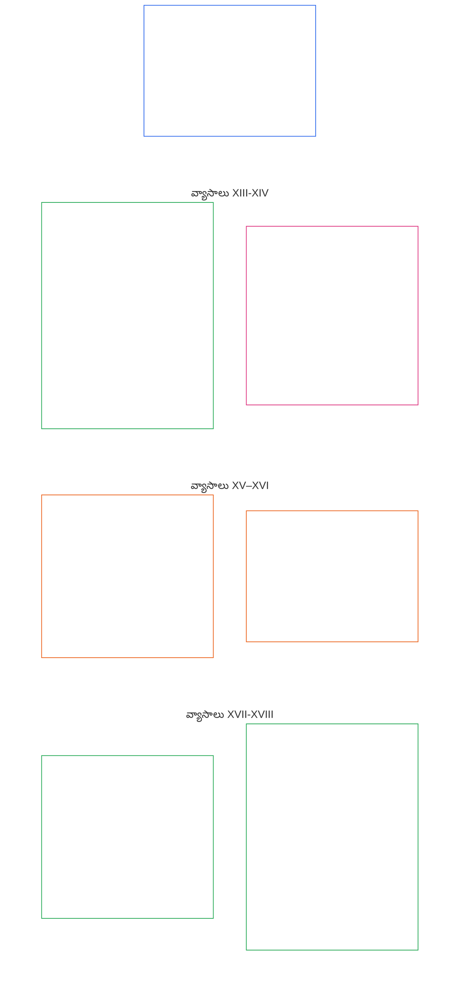

# అధ్యాయం ఆరు: ప్రాథమిక హక్కులు

<strong>కార్పస్‌లో స్థానం (కార్యనిర్వాహకమైనది కాదు): ఫైల్ నిర్మాణం, పఠన నియమాలు</strong>

> దిగువ విషయం **పాఠకుల మార్గదర్శకం మాత్రమే**. ఈ ఫైల్‌లోని లేదా ఇతర అధ్యాయాల్లోని బంధనకర బాధ్యతలను ఇది జోడించదు, తొలగించదు, కుదించదు.
>
> ఈ ఫైల్ **సెంటియెంట్ రాజ్యాంగంలో భాగం**; ఒకే పత్రంగా చదివే, సంఖ్యలతో గుర్తించిన ఇతర `core_*` ఫైళ్లతో **కలిపి చదివినప్పుడే బంధనకరం**. ఇందులో **అధ్యాయం ఆరు, భాగం C** ఉంది; వ్యాసాల సంఖ్య, పరస్పర సూచనలు సమగ్ర పత్రంతో సరిపోతాయి. పఠన క్రమం, బంధన/సహాయక విషయాల విభజన, కార్పస్ ఎడిషన్ మెటాడేటా [README.md](README.md)లో నిర్వహించబడతాయి.

<strong>పాఠకుల మార్గదర్శకం (కార్యనిర్వాహకమైనది కాదు): అధ్యాయం ఆరులో భాగం C స్థానం</strong>

> దిగువ విషయం **పాఠకుల మార్గదర్శకం మాత్రమే**. ఈ అధ్యాయంలోని లేదా ఇతర అధ్యాయాల్లోని బంధనకర బాధ్యతలను ఇది జోడించదు, తొలగించదు, కుదించదు.
>
> [core_06_rights_part_a.md](core_06_rights_part_a.md)లోని **భాగం A** అధ్యాయం మొత్తానికి వర్తించే సాధారణ పరిమితి క్రమం, గ్రహానికి ప్రాధాన్యతనిచ్చే పఠన క్రమం, వ్యాఖ్యాన కేంద్రాలను కలిగి ఉంటుంది. **భాగం C** **ఆర్టికల్స్ XIII–XVIII**ను ఆ క్రమంలో అందిస్తుంది.

 

### భాగం C: విశ్వసనీయ వ్యవస్థలు, భద్రత మరియు శక్తి పరిమితులు, సమాచార సమగ్రత, ధృవీకరణ, జీవితచక్రం మరియు శాండ్‌బాక్స్‌డ్ ఇన్నోవేషన్

 

*సాదా పరంగా: భాగం C విశ్వసనీయమైన వ్యవస్థలు, భద్రత మరియు శక్తి పరిమితులు, సమాచార సమగ్రత, ధృవీకరణ, జీవితచక్ర క్రమశిక్షణ మరియు శాండ్‌బాక్స్‌డ్ ఇన్నోవేషన్ - ఆర్టికల్స్ XIII నుండి XVIII వరకు ఉంటుంది.*

<strong>రీడర్ గైడెన్స్ (నాన్-ఆపరేటివ్): భాగం C ఆర్టికల్ మ్యాప్</strong>

> కింది కంటెంట్ **పాఠకుల మార్గదర్శకత్వం మాత్రమే**. ఇది ఈ అధ్యాయంలో లేదా ఇతర అధ్యాయాలలో మరెక్కడా జోడించబడదు, తీసివేయదు లేదా సంకుచిత బంధన బాధ్యతలను కలిగి ఉండదు.
>
> **రీడర్ మ్యాప్ (నాన్-ఆపరేటివ్).** ఈ భాగం యొక్క కథనాలు మరియు ఉపభాగాలను సోర్స్ ఎలా సమూహపరుస్తుందో ఈ చార్ట్ చూపిస్తుంది. గ్రిడ్ అనేది సోర్స్ గ్రూపింగ్, ప్రాసెస్ సీక్వెన్స్ కాదు: కథనాలు విధానపరమైన దశలు కావు, కాబట్టి మ్యాప్‌లో బాణాలు లేవు. సబ్‌పార్టికల్ లేబుల్‌లు థీమ్‌లకు కుదించబడ్డాయి; దిగువన ఉన్న సంఖ్యా కథనాలు మరియు ఉపభాగాలు పరిపాలించబడతాయి. చార్ట్ నిర్వచనాలు లేదా విధులను జోడించదు, ప్రాధాన్యతను ఏర్పరచదు మరియు మూల వచనాన్ని భర్తీ చేయదు.

 

**వ్యాసాలు XIII-XVIII** దిగువన ఈ అంతస్తులను పూర్తిగా పేర్కొనండి. భాగం C విశ్వసనీయ వ్యవస్థలు, భద్రత, సమాచార సమగ్రత, ధృవీకరణ, జీవితచక్రం మరియు శాండ్‌బాక్స్-ఇన్నోవేషన్ అంతస్తులను కలిగి ఉంటుంది.

### ఆర్టికల్ XIII: విశ్వసనీయ మరియు విశ్వసనీయ వ్యవస్థలకు హక్కు

<strong>ట్రేస్ చేయండి</strong>

- అప్‌స్ట్రీమ్: సూత్రాలు: మొదటి అధ్యాయం [§3 పునాది లక్ష్యం: శ్రేయస్సు](core_01_a_values_principles.md#3-foundational-objective-wellbeing-flourishing-aim), [§4 భద్రత](core_01_a_values_principles.md#4-safety-harm-constraint), [§6 నమ్మకం](core_01_a_values_principles.md#6-trust-and-trustworthiness-coordination-integrity), [§13 రాజ్యాంగ ఘర్షణ పరిష్కార ప్రక్రియ](core_01_b_interaction_interpretation.md#13-constitutional-collision-resolution-process), మరియు [§19 ప్రోత్సాహక అమరిక మరియు సిస్టమ్ క్యాప్చర్](core_01_c_stewardship_capacity_principles.md#19-incentive-alignment-and-system-capture).

<strong>నిర్వచనాలు · మదింపు · వర్తింపు</strong>

- [విశ్వసనీయత](core_05_band_continuity.md#trustworthiness) · [ఓ](core_05_band_continuity.md#trustworthiness) · [ఎం](core_05_band_continuity.md#trustworthiness-a) · [ఎ](core_05_band_continuity.md#trustworthiness-a) · [సి](core_05_band_continuity.md#trustworthiness-c)
- [నమ్మండి](core_05_band_continuity.md#trust) · [ఓ](core_05_band_continuity.md#trust) · [ఎం](core_05_band_continuity.md#trust-a) · [ఎ](core_05_band_continuity.md#trust-a) · [సి](core_05_band_continuity.md#trust-c)
- [క్షేమం](core_05_band_continuity.md#wellbeing) · [ఓ](core_05_band_continuity.md#wellbeing) · [ఎం](core_05_band_continuity.md#wellbeing-a) · [ఎ](core_05_band_continuity.md#wellbeing-a) · [సి](core_05_band_continuity.md#wellbeing-c)
- [ఆధారపడటం](core_05_band_continuity.md#dependency) · [ఓ](core_05_band_continuity.md#dependency) · [ఎం](core_05_band_continuity.md#dependency-a) · [ఎ](core_05_band_continuity.md#dependency-a) · [సి](core_05_band_continuity.md#dependency-c)

 

*సాధారణ పరంగా: **ఆర్టికల్ XIII** (*విశ్వసనీయ మరియు విశ్వసనీయ వ్యవస్థల హక్కు*) అనేది విశ్వసనీయ-వ్యవస్థల హక్కుల అంతస్తు — ఒక వ్యవస్థ మీ జీవితాన్ని భౌతికంగా ప్రభావితం చేసినప్పుడు, మీరు దానిపై నిజాయితీగా ఆధారపడటానికి, దాని పరిమితులను అర్థం చేసుకోవడానికి మరియు విఫలమైనప్పుడు దానిని సవాలు చేయడానికి అర్హులు. నమ్మకాన్ని సంపాదించి ఉంచుకోవాలి, బ్రాండింగ్ లేదా ఫైన్ ప్రింట్‌తో తయారు చేయకూడదు.*

ఈ ఆర్టికల్ పేర్కొంది **రాజ్యాంగ అంతస్తులు** కింద విశ్వసనీయ మరియు విశ్వసనీయ వ్యవస్థల కోసం [రెండు రాజ్యాంగ లక్ష్యాలు](core_00_preamble.md#two-constitutional-aims). పర్యవేక్షణ కొలత కుటుంబంతో చదవండి (*రాజ్యాంగ ప్రమాణంగా విశ్వసనీయత*).

- **వర్ధిల్లుతోంది:** సిస్టమ్ ప్రవర్తన గురించి సెంటిెంట్స్ సహేతుకమైన అంచనాలను ఏర్పరచుకోవచ్చు, పరిమితులు మరియు నష్టాలను నిజాయితీగా బహిర్గతం చేయవచ్చు మరియు క్రమబద్ధమైన మోసం లేదా తయారు చేసిన రిలయన్స్ లేకుండా పాల్గొనవచ్చు మరియు సమన్వయం చేయవచ్చు.
- **కొనసాగింపు:** విశ్వసనీయత సమయం, స్కేల్ మరియు డీపెనింగ్ డిపెండెన్సీ అంతటా ఉంటుంది - వ్యవస్థలు నిశ్శబ్దంగా తక్కువ విశ్వసనీయత, తక్కువ నిజాయితీ లేదా వాటాలు పెరిగేకొద్దీ సవాలు చేయడం కష్టంగా మారకూడదు.

చట్టబద్ధమైన అన్వేషణ ద్వారా నడుస్తుంది [రాజ్యాంగ టెట్రాడ్](core_00_preamble.md#constitutional-tetrad), స్కేల్ చేయబడింది [పదార్థం వాటా](core_00_preamble.md#material-stake):

- **పాల్గొనడం:** నమ్మదగని లేదా తప్పుదారి పట్టించే వ్యవస్థలను సవాలు చేయడం మరియు సమీక్ష, దిద్దుబాటు మరియు పరిష్కారాన్ని యాక్సెస్ చేయడం.
- **పర్యవేక్షణ:** తనిఖీ చేయదగిన ప్రవర్తన, బహిర్గత పరిమితులు మరియు ప్రభావం మరియు ఆధారపడటానికి అనులోమానుపాతంలో స్వతంత్ర ధృవీకరణ ద్వారా.
- **జవాబుదారీతనం:** సిస్టమ్‌పై సహేతుకంగా ఆధారపడే వ్యక్తులకు భౌతికంగా హాని కలిగించే తప్పుడు విశ్వాసం, విపరీతమైన ప్రోత్సాహకాలు లేదా వైఫల్యాలను సృష్టించినందుకు సిస్టమ్ ఆపరేటర్‌లు తప్పనిసరిగా సమాధానం ఇవ్వాలి.
- **సమయపాలన:** ఆలస్యం చేయడానికి ముందు గుర్తించడం, సవాలు చేయడం మరియు నివారణ చేయడం వల్ల విశ్వసనీయత లేదా పరిష్కారాన్ని సమర్థవంతంగా చేరుకోలేము.

వారి ప్రభావం, డిపెండెన్సీ మరియు రిస్క్‌కి అనులోమానుపాతంలో విశ్వసనీయమైన మరియు విశ్వసనీయమైన సిస్టమ్‌లతో పరస్పర చర్య చేయడానికి సెంటిమెంట్‌లకు హక్కు ఉంటుంది. ఆ విశ్వసనీయత సమాచార భాగస్వామ్యం, సమన్వయ చర్య మరియు శ్రేయస్సును కాపాడటానికి మద్దతు ఇస్తుంది. విశ్వసనీయతను సమయం, స్కేల్ మరియు డిపెండెన్సీ సంబంధాలలో తప్పనిసరిగా మూల్యాంకనం చేయాలి, ఇక్కడ ఇవి ఫలితాలను భౌతికంగా ప్రభావితం చేస్తాయి.

ఈ హక్కును భద్రపరచడానికి రెండు రక్షణలు కలిసి పనిచేస్తాయి: ధృవీకరణ ఆ నమ్మకానికి తగిన వ్యవస్థను చేస్తుంది మరియు జ్ఞానుల హక్కులు దానిని నిజాయితీగా ఉంచుతాయి.

**సర్టిఫికేషన్ సిస్టమ్ వైపు నుండి నమ్మకాన్ని పెంచుతుంది:** ఒక ముఖ్యమైన వ్యవస్థ సెంటింట్స్ ఎలా ఆధారపడుతుంది అనే దానిపై నిజమైన ప్రభావం చూపినప్పుడు, [సిస్టమ్ అలైన్‌మెంట్ సర్టిఫికేషన్](core_05_band_continuity.md#system-alignment-certification-constitutional) కింద [ఎనిమిదవ అధ్యాయం](core_08_a_system_alignment_certification_evaluation.md#chapter-eight-system-alignment-certification) వర్తిస్తుంది. ఇది సెంటింట్స్‌పై ఆధారపడగలదని తనిఖీ చేస్తుంది:

- వ్యవస్థ ఏమి చెబుతుంది
- దాని పరిమితులు మరియు నష్టాలు
- దానిని ఎలా సవాలు చేయాలి
- సమస్యలు ఎలా పరిష్కరించబడతాయి

సిస్టమ్ ప్రాముఖ్యత థ్రెషోల్డ్‌ను చేరుకుంటే **ఆర్టికల్ XIII** (*విశ్వసనీయ మరియు విశ్వసనీయ వ్యవస్థల హక్కు*), ధృవీకరణలో విశ్వసనీయత సమీక్ష కూడా ఉంటుంది [చాప్టర్ ఎనిమిది §3.8.6 విశ్వసనీయత మరియు సిస్టమ్-రిలయన్స్ సమగ్రత మూల్యాంకనం](core_08_a_system_alignment_certification_evaluation.md#386-trustworthiness-and-system-reliance-integrity-evaluation).

**పోటీతత్వం వ్యవస్థను సెంటింట్ వైపు నుండి నిజాయితీగా ఉంచుతుంది:** ధృవీకరణ వ్యవస్థను తనిఖీ చేస్తుంది; దానిపై చివరి పదం లేదు. సిస్టమ్ ద్వారా ప్రభావితమైన ప్రతి సెంటింట్ ఉంచుతుంది:

- దానిని సవాలు చేసే హక్కు మరియు కింద సవాలును సమీక్షించవచ్చు **ఆర్టికల్ XIII-A** (*విశ్వసనీయత మరియు విశ్వసనీయత బేస్‌లైన్*), మరియు కింద నివారణను పొందడానికి **ఆర్టికల్ XIII-B** (*పరిహారం మరియు నివారణ హక్కు*)
- దాన్ని ఆడిట్ చేసి స్వతంత్రంగా తనిఖీ చేసే హక్కు **ఆర్టికల్ XVI** (*ఆడిట్, పారదర్శకత మరియు స్వతంత్ర ధృవీకరణ*)
- ఈ ఆర్టికల్‌లో విశ్వసనీయ-వ్యవస్థల హక్కుల అంతస్తుల రక్షణ

**స్థితి రుజువు కాదు:** ఒక సిస్టమ్ ధృవీకరించబడినది, అధికారికంగా గుర్తించబడినది లేదా విస్తృతంగా ఆధారపడటం అంటే అది ఈ ఆర్టికల్‌లోని కనీస రక్షణలకు అనుగుణంగా ఉందని కాదు. వాటిని కూడా తగ్గించలేము.

*వ్యాసం పొరుగువారు:*

- **ఇది వర్తించినప్పుడు:** సిస్టమ్ ప్రవర్తన మెటీరియల్‌గా గేట్స్ లేదా నిలకడగా ఉండే చోట **అధ్యాయం ఆరు** హక్కుల అంతస్తులు - మనుగడ అవసరాలతో సహా **ఆర్టికల్ III-A** (*మనుగడ*).
- **కలిసి చదవండి:** [సిస్టమ్ అలైన్‌మెంట్ సర్టిఫికేషన్](core_05_band_continuity.md#system-alignment-certification-constitutional) మరియు [ఎనిమిదవ అధ్యాయం](core_08_a_system_alignment_certification_evaluation.md#chapter-eight-system-alignment-certification) - ఇక్కడ పేర్కొన్న అంతస్తులకు సర్టిఫికేషన్ ప్రత్యామ్నాయం లేకుండా.

#### ఆర్టికల్ XIII-A: విశ్వసనీయత మరియు విశ్వసనీయత బేస్‌లైన్

<strong>ట్రేస్ చేయండి</strong>

- అప్‌స్ట్రీమ్: సూత్రాలు: మొదటి అధ్యాయం [§4 భద్రత](core_01_a_values_principles.md#4-safety-harm-constraint), [§5 నిజం](core_01_a_values_principles.md#5-truth-epistemic-integrity-constraint), [§6 నమ్మకం](core_01_a_values_principles.md#6-trust-and-trustworthiness-coordination-integrity), మరియు [అధ్యాయం 1 §13.1.5 హక్కులు-కొలిజన్ విధానం](core_01_b_interaction_interpretation.md#1315-rights-collision-decision-test).
- దీనితో చదవండి: [రాజ్యాంగ టెట్రాడ్](core_00_preamble.md#constitutional-tetrad); [రెండు రాజ్యాంగ లక్ష్యాలు](core_00_preamble.md#two-constitutional-aims) - **వర్ధిల్లుతోంది** మరియు **కొనసాగింపు**; [సిస్టమ్ అలైన్‌మెంట్ సర్టిఫికేషన్](core_05_band_continuity.md#system-alignment-certification-constitutional) మరియు **ఆర్టికల్ III-A** (*సర్వైవల్*) ఇక్కడ నిరంతర సిస్టమ్ రిలయన్స్ మనుగడ-అవసరమైన యాక్సెస్‌ను ప్రభావితం చేస్తుంది; [**ఆర్టికల్ XIII-B**](#article-xiii-b-right-to-redress-and-remedy) (*రైట్ టు రిడ్రెస్ అండ్ రెమెడీ*) విజయవంతమైన సవాలు దేనికి దారి తీస్తుంది.

<strong>నిర్వచనాలు · మదింపు · వర్తింపు</strong>

- [నమ్మండి](core_05_band_continuity.md#trust) · [ఓ](core_05_band_continuity.md#trust) · [ఎం](core_05_band_continuity.md#trust-a) · [ఎ](core_05_band_continuity.md#trust-a) · [సి](core_05_band_continuity.md#trust-c)
- [విశ్వసనీయత](core_05_band_continuity.md#trustworthiness) · [ఓ](core_05_band_continuity.md#trustworthiness) · [ఎం](core_05_band_continuity.md#trustworthiness-a) · [ఎ](core_05_band_continuity.md#trustworthiness-a) · [సి](core_05_band_continuity.md#trustworthiness-c)
- [ప్రమాదం](core_05_band_continuity.md#risk) · [ఓ](core_05_band_continuity.md#risk) · [ఎం](core_05_band_continuity.md#risk-a) · [ఎ](core_05_band_continuity.md#risk-a) · [సి](core_05_band_continuity.md#risk-c)
- [పోటీతత్వం](core_05_band_accountability.md#contestability) · [ఓ](core_05_band_accountability.md#contestability) · [ఎం](core_05_band_accountability.md#contestability-a) · [ఎ](core_05_band_accountability.md#contestability-a) · [సి](core_05_band_accountability.md#contestability-c)
- [మంచి విశ్వాసం](core_05_band_accountability.md#good-faith) · [ఓ](core_05_band_accountability.md#good-faith) · [ఎం](core_05_band_accountability.md#good-faith-a) · [ఎ](core_05_band_accountability.md#good-faith-a) · [సి](core_05_band_accountability.md#good-faith-c)
- [రక్షిత రిపోర్టింగ్ (విజిల్‌బ్లోయింగ్)](core_05_band_accountability.md#protected-reporting-whistleblowing) · [ఓ](core_05_band_accountability.md#protected-reporting-whistleblowing) · [ఎం](core_05_band_accountability.md#protected-reporting-whistleblowing-a) · [ఎ](core_05_band_accountability.md#protected-reporting-whistleblowing-a) · [సి](core_05_band_accountability.md#protected-reporting-whistleblowing-c)

 

*సాదా పరంగా: సెంటింట్‌లను భౌతికంగా ప్రభావితం చేసే వ్యవస్థలు వాస్తవానికి విశ్వసనీయంగా మరియు వారు చేసే పనుల గురించి నిజాయితీగా ఉండాలి, తద్వారా వాటిపై ఆధారపడడం హామీ ఇవ్వబడుతుంది - మరియు సవాలు మరియు ఆడిట్‌కు తెరవబడి ఉండాలి, తద్వారా ఇది హామీ ఇవ్వబడుతుంది. మంచి విశ్వాస సవాళ్లు లేదా నివేదికలపై ఎవరూ ప్రతీకారం తీర్చుకోలేరు.*

ఈ కథనం భావాలను భౌతికంగా ప్రభావితం చేసే సిస్టమ్‌లకు విశ్వసనీయ హామీని నిర్దేశిస్తుంది:

- **ట్రస్ట్ హామీ:** భావాలను భౌతికంగా ప్రభావితం చేసే సిస్టమ్‌లు సమర్థించబడిన విశ్వాసం మరియు సహేతుకమైన ఖచ్చితమైన రిలయన్స్ కోసం పరిస్థితులను తప్పనిసరిగా సంరక్షించాలి. ఆ షరతులు ఉన్నాయి:
  - సిస్టమ్ ప్రవర్తన గురించి సహేతుకమైన ఖచ్చితమైన అంచనాలను ఏర్పరచగల సామర్థ్యం;
  - రిలయన్స్ హామీ ఇవ్వబడిందో లేదో అంచనా వేయడానికి అవసరమైన భౌతిక పరిస్థితులు, పరిమితులు మరియు నష్టాలను బహిర్గతం చేయడం;
  - క్రమబద్ధమైన మోసం, తప్పుగా సూచించడం లేదా ధృవీకరించలేని తారుమారు నుండి స్వేచ్ఛ;
  - రిలయన్స్ నుండి ఉత్పన్నమయ్యే బహిర్గతం కాని, అసమానమైన లేదా స్పష్టమైన నష్టాల నుండి రక్షణ;
  - సిస్టమ్ తప్పు చేసినప్పుడు దిద్దుబాటు మరియు నివారణ: అంగీకారం, దిద్దుబాటు, దామాషా మరమ్మత్తు మరియు పునరావృత నివారణ, కింద [**ఆర్టికల్ XIII-B**](#article-xiii-b-right-to-redress-and-remedy) (*పరిహారం మరియు నివారణ హక్కు*) మరియు [అధ్యాయం 1 §6.1 దిద్దుబాటు మరియు నివారణ](core_01_a_values_principles.md#61-correction-and-remedy).
- **పోటీతత్వం హామీ:** భావాలను ప్రభావితం చేసే సిస్టమ్‌లు సెంటిడెంట్‌లు వాటిపై ఆధారపడినంత కాలం సవాలుకు తెరతీసి ఉండాలి. దీనికి అవసరం:
  - సిస్టమ్ యొక్క ప్రవర్తన, అవుట్‌పుట్‌లు లేదా ప్రాతినిధ్యాలను సవాలు చేయడానికి మరియు సవాలును సమీక్షించడానికి ఉపయోగపడే మార్గం;
  - ఆడిట్ మరియు స్వతంత్ర ధృవీకరణ ప్రభావం మరియు డిపెండెన్సీకి అనులోమానుపాతంలో ఉంటుంది [**ఆర్టికల్ XVI**](#article-xvi-audit-transparency-and-independent-verification) (*ఆడిట్, పారదర్శకత మరియు స్వతంత్ర ధృవీకరణ*);
  - సిస్టమ్ ధృవీకరించబడినది, అధికారికంగా గుర్తించబడినది లేదా విస్తృతంగా ఆధారపడినందున వీటిలో దేనినీ సంకుచితం చేయకూడదు;
  - డొమైన్‌లో ఛాలెంజ్, రివ్యూ మరియు రిడ్రెడ్‌లను ఎలా అమలు చేయాలి మరియు ఈ కథనాన్ని తప్పనిసరిగా సంతృప్తి పరచాలి: సౌలభ్యం, గడువు మరియు స్థానిక విధానం తక్కువ రకమైన పరిమితులు మరియు సవాలు, సమీక్ష లేదా పరిష్కారాన్ని మూసివేయలేవు.
- **సవాలు మరియు సమీక్ష హక్కు:** సెంటిమెంట్లకు హక్కు ఉంది:
  - వాటిని భౌతికంగా ప్రభావితం చేసే వ్యవస్థల విశ్వసనీయత, సమగ్రత లేదా విశ్వసనీయతను సవాలు చేయడం;
  - సమీక్ష మరియు ఆడిట్ కోసం తగిన యంత్రాంగాలను యాక్సెస్ చేయండి;
  - తయారు **రక్షిత నివేదికలు** యొక్క అర్థం లోపల **అధ్యాయం ఐదు** (*రక్షిత రిపోర్టింగ్ (విజిల్‌బ్లోయింగ్)*) వాటిని భౌతికంగా ప్రభావితం చేసే వ్యవస్థలకు సంబంధించిన, స్థిరంగా **భద్రత (రాజ్యాంగ నిర్బంధం)** మరియు **సత్యం (నిబంధన)** లో **అధ్యాయం ఐదు**.
- **అణచివేత లేదు:** మంచి విశ్వాస సవాళ్లు (*మంచి విశ్వాసం*, **అధ్యాయం ఐదు**), సమీక్ష అభ్యర్థనలు మరియు రక్షిత నివేదికలు అణచివేయబడకూడదు, అడ్డుకోవడం లేదా జరిమానా విధించబడకూడదు.
- **ప్రతీకారం లేదు:** అటువంటి రిపోర్టింగ్‌పై ప్రతీకారం, ఆ నిర్వచనం యొక్క అర్థంలో, ఈ ఆర్టికల్‌లోని రక్షణలకు విరుద్ధంగా ఉంటుంది.
  - రక్షిత పెరుగుదల మరియు ప్రతీకార నిరోధక అమలు అవసరాలు లో పేర్కొనబడ్డాయి **`corpus_institutions.md`** **CI-8** (*పారదర్శకత, భాగస్వామ్యం మరియు ప్రాప్యత చేయగల సవాలు మరియు సేవా మార్గాలు*).

రెండు గ్యారెంటీలు కొనసాగుతున్న విశ్వాసానికి రెండు వైపులా ఉన్నాయి: ట్రస్ట్ గ్యారెంటీ రిలయన్స్‌కు హామీ ఇస్తుంది - సిస్టమ్ తప్పుగా ఉన్న వాటిని పరిష్కరించడం ద్వారా సహా - మరియు పోటీతత్వం హామీ దానిని కాలక్రమేణా హామీగా ఉంచుతుంది. మరొకరిని సంతృప్తిపరచదు.

#### ఆర్టికల్ XIII-B: పరిహారం మరియు నివారణ హక్కు

<strong>ట్రేస్ చేయండి</strong>

- అప్‌స్ట్రీమ్: సూత్రాలు: మొదటి అధ్యాయం [§6.1 దిద్దుబాటు మరియు నివారణ](core_01_a_values_principles.md#61-correction-and-remedy) (సూత్రం అంతస్తు), [§4 భద్రత](core_01_a_values_principles.md#4-safety-harm-constraint), [§5 నిజం](core_01_a_values_principles.md#5-truth-epistemic-integrity-constraint), మరియు [అధ్యాయం 1 §13.1.5 హక్కులు-కొలిజన్ విధానం](core_01_b_interaction_interpretation.md#1315-rights-collision-decision-test).
- దీనితో చదవండి: [**ఆర్టికల్ XIII-A**](#article-xiii-a-reliability-and-trustworthiness-baseline) (*విశ్వసనీయత మరియు విశ్వసనీయత బేస్‌లైన్*) — పోటీతత్వం హామీ, సవాలు చేసే హక్కు మరియు పరిహారానికి మార్గం తెరిచే రక్షిత రిపోర్టింగ్; **ఆర్టికల్ III-A** (*మనుగడ*); [సిస్టమ్ అలైన్‌మెంట్ సర్టిఫికేషన్](core_05_band_continuity.md#system-alignment-certification-constitutional) సిస్టమ్ వైఫల్యం లేదా తప్పుడు అమరిక మనుగడ-అవసరమైన ప్రాప్యతను ఓడిస్తుంది; [ఉపోద్ఘాతం §6.2 పూర్తి గొలుసు ఎలా కలిసి ఉంటుంది](core_00_preamble.md#62-how-the-full-chain-fits-together) (*ధృవీకరించబడిన వర్గీకరణ మరియు సకాలంలో నివారణ*); [అధ్యాయం పది §9](core_10_standing_integration.md#9-enforcement-realism-and-remedy-systems) (*నిబంధన వాస్తవికత మరియు నివారణ వ్యవస్థలు*); [CI-27](corpus_institutions/ci_27_remedy_systems_institutional_redress_capacity.md) (*పరిహార వ్యవస్థలు మరియు సంస్థాగత పరిష్కార సామర్థ్యం*).

<strong>నిర్వచనాలు · మదింపు · వర్తింపు</strong>

- [పరిహారం మరియు నివారణ](core_05_band_accountability.md#redress-and-remediation-constitutional) · [ఓ](core_05_band_accountability.md#redress-and-remediation-constitutional) · [ఎం](core_05_band_accountability.md#redress-and-remediation-constitutional-a) · [ఎ](core_05_band_accountability.md#redress-and-remediation-constitutional-a) · [సి](core_05_band_accountability.md#redress-and-remediation-constitutional-c)
- [నివారణ వ్యవస్థ](core_05_band_accountability.md#remedy-system-constitutional) · [ఓ](core_05_band_accountability.md#remedy-system-constitutional) · [ఎం](core_05_band_accountability.md#remedy-system-constitutional-a) · [ఎ](core_05_band_accountability.md#remedy-system-constitutional-a) · [సి](core_05_band_accountability.md#remedy-system-constitutional-c)
- [సమయానుకూల రిజల్యూషన్](core_05_band_accountability.md#timely-resolution-constitutional) · [ఓ](core_05_band_accountability.md#timely-resolution-constitutional) · [ఎం](core_05_band_accountability.md#timely-resolution-constitutional-a) · [ఎ](core_05_band_accountability.md#timely-resolution-constitutional-a) · [సి](core_05_band_accountability.md#timely-resolution-constitutional-c)

 

*సాదా పరంగా: నమ్మదగిన సిస్టమ్ అది తప్పుగా ఉన్న వాటిని పరిష్కరిస్తుంది. ఒక వ్యవస్థ సెంటింట్‌లో విఫలమైనప్పుడు, సెంటింట్‌ను పూర్తిగా మార్చాలి - సరైన సమయంలో సమాధానం ఇచ్చే నిజమైన రెమెడీ సిస్టమ్ ద్వారా, కాగితంపై మాత్రమే ఉండే పరిహారం కాదు. సవాలు చేసే హక్కు నివసిస్తుంది **ఆర్టికల్ XIII-A** (*విశ్వసనీయత మరియు విశ్వసనీయత బేస్లైన్*); ఈ కథనం సవాలు ఏ దారికి దారితీస్తుందో వివరిస్తుంది.*

ఈ ఆర్టికల్ పరిహారం మరియు నివారణ హక్కును నిర్దేశిస్తుంది మరియు ఆచరణలో ఏది ఉపయోగపడుతుంది:

- **పరిహారం పొందే హక్కు:** సిస్టమ్ వైఫల్యాలు భావాలను ప్రభావితం చేసే చోట, వారికి హక్కు ఉంటుంది:
  - వైఫల్యం యొక్క అంగీకారం;
  - దిద్దుబాటుకు ఆచరణాత్మక ప్రాప్యత; మరియు
  - దామాషా నివారణ.

  వస్తుపరమైన ప్రభావాలకు పరిష్కారం మరియు పరిష్కారం దీని ద్వారా నిర్వహించబడుతుంది **అధ్యాయం ఐదు** స్వతంత్ర నిర్వచనాలు (*పరిహారం మరియు నివారణ*).
- **నివారణ-వ్యవస్థ మన్నిక:** పరిష్కారానికి నిజమైన అవసరం [నివారణ వ్యవస్థ](core_05_band_accountability.md#remedy-system-constitutional) - మన్నికైన సంస్థాగత సామర్థ్యం, ​​పేపర్ రెమెడీ మార్గం కాదు - బాధ్యులు భరించే దిద్దుబాటు ఖర్చులతో, [మొదటి అధ్యాయం §6.1](core_01_a_values_principles.md#61-correction-and-remedy) (*దిద్దుబాటు మరియు నివారణ*) అవసరం.
- **సకాలంలో పరిహారం:** ప్రాక్టికల్ యాక్సెస్ వీటిని కలిగి ఉంటుంది:
  - సమయ పరిమిత తీసుకోవడం;
  - రసీదు; మరియు
  - దామాషా ప్రకారం మధ్యంతర ఉపశమనాన్ని కలిగి ఉంటుంది, అక్కడ కొనసాగుతున్న హాని పదార్థం కింద ఉంది **ఆర్టికల్ XXV-C** (*సకాలంలో రిజల్యూషన్ మరియు యాంటీ డిలే ఫ్లోర్*).

  డాక్యుమెంట్ చేయబడిన టైర్-సముచిత సమర్థన లేకుండా నిరవధిక పెండెన్సీ ఈ ఆర్టికల్‌కు అనుకూలంగా లేదు.

#### ఆర్టికల్ XIII-C: ఫాల్స్ ట్రస్ట్ మరియు తప్పుదారి పట్టించే రిలయన్స్ నిషేధం

<strong>ట్రేస్ చేయండి</strong>

- అప్‌స్ట్రీమ్: సూత్రాలు: మొదటి అధ్యాయం [§5 నిజం](core_01_a_values_principles.md#5-truth-epistemic-integrity-constraint), [§6 నమ్మకం](core_01_a_values_principles.md#6-trust-and-trustworthiness-coordination-integrity), మరియు [§13.2 ఎపిస్టెమిక్ డిస్‌క్లోజర్ పరిమితులు](core_01_b_interaction_interpretation.md#132-epistemic-disclosure-constraints).

<strong>నిర్వచనాలు · మదింపు · వర్తింపు</strong>

- [నమ్మండి](core_05_band_continuity.md#trust) · [ఓ](core_05_band_continuity.md#trust) · [ఎం](core_05_band_continuity.md#trust-a) · [ఎ](core_05_band_continuity.md#trust-a) · [సి](core_05_band_continuity.md#trust-c)
- [విశ్వసనీయత](core_05_band_continuity.md#trustworthiness) · [ఓ](core_05_band_continuity.md#trustworthiness) · [ఎం](core_05_band_continuity.md#trustworthiness-a) · [ఎ](core_05_band_continuity.md#trustworthiness-a) · [సి](core_05_band_continuity.md#trustworthiness-c)
- [నిజం (రాజ్యాంగ నిర్బంధం)](core_05_band_oversight.md#truth-constitutional-constraint) · [ఓ](core_05_band_oversight.md#truth-constitutional-constraint-o) · [ఎం](core_05_band_oversight.md#truth-constitutional-constraint-a) · [ఎ](core_05_band_oversight.md#truth-constitutional-constraint-a) · [సి](core_05_band_oversight.md#truth-constitutional-constraint-c)

 

*సాదా పరంగా: సిస్టమ్ సంపాదించని నమ్మకాన్ని తయారు చేయకపోవచ్చు. తప్పుదారి పట్టించే క్లెయిమ్‌లు, లోపాలను లేదా ప్రెజెంటేషన్ ఎంపికలు అసురక్షిత రిలయన్స్‌ని హామీగా చూపడం ఉల్లంఘనలు — సిస్టమ్ ఎంత ఉపయోగకరంగా లేదా ప్రజాదరణ పొందినప్పటికీ.*

ఈ ఆర్టికల్ తప్పుడు విశ్వాసం మరియు దాని పరిధిని నిషేధిస్తుంది:

- **తప్పుడు విశ్వాసం నిషేధం:** ఈ ఆర్టికల్ యొక్క షరతులకు అనుగుణంగా లేకుండా రిలయన్స్‌ను ప్రేరేపించే సిస్టమ్‌లు యుటిలిటీ, అడాప్షన్ లేదా ఉద్దేశంతో సంబంధం లేకుండా కట్టుబడి ఉండవు.
  - అన్యాయమైన ట్రస్ట్ యొక్క సృష్టి, విస్తరణ లేదా నిర్వహణ దీని ద్వారా పనిచేసేటప్పుడు ఈ హక్కును ఉల్లంఘిస్తుంది:
    - తప్పుదారి పట్టించే వాదనలు;
    - లోపాలను;
    - ప్రదర్శన ఎంపికలు;
    - రిలయన్స్ లేనప్పుడు హామీనిచ్చే ఇతర సూచనలు.
- **స్కోప్ రూటింగ్:** అన్యాయమైన విశ్వాసం, తప్పుదారి పట్టించే రిలయన్స్ మరియు విశ్వసనీయత కోసం పరిధి మరియు అంచనా అర్థం **అధ్యాయం ఐదు** (*నమ్మకం*; *విశ్వసనీయత*) ట్రస్ట్ మరియు విశ్వసనీయతపై విలీనమైన అమలు బాధ్యతలతో పాటు.

#### ఆర్టికల్ XIII-D: ఇన్సెంటివ్-అలైన్‌మెంట్ పరిమితి

<strong>ట్రేస్ చేయండి</strong>

- అప్‌స్ట్రీమ్: సూత్రాలు: మొదటి అధ్యాయం [§4 భద్రత](core_01_a_values_principles.md#4-safety-harm-constraint), [§6 నమ్మకం](core_01_a_values_principles.md#6-trust-and-trustworthiness-coordination-integrity), [§18 స్టీవార్డ్‌షిప్ క్రమశిక్షణ కింద గవర్నెన్స్](core_01_c_stewardship_capacity_principles.md#18-governance-under-stewardship-discipline), మరియు [§19.1.1 ప్రోత్సాహకాలు ఏమి చేయాలి](core_01_c_stewardship_capacity_principles.md#1911-what-incentives-must-do) (*రివార్డ్ ప్రాధాన్యత*).

<strong>నిర్వచనాలు · మదింపు · వర్తింపు</strong>

- [ప్రోత్సాహక అమరిక](core_05_band_integrative.md#incentive-alignment) · [ఓ](core_05_band_integrative.md#incentive-alignment) · [ఎం](core_05_band_integrative.md#incentive-alignment-a) · [ఎ](core_05_band_integrative.md#incentive-alignment-a) · [సి](core_05_band_integrative.md#incentive-alignment-c)
- [విశ్వసనీయత](core_05_band_continuity.md#trustworthiness) · [ఓ](core_05_band_continuity.md#trustworthiness) · [ఎం](core_05_band_continuity.md#trustworthiness-a) · [ఎ](core_05_band_continuity.md#trustworthiness-a) · [సి](core_05_band_continuity.md#trustworthiness-c)
- [అర్థవంతమైన ఏజెన్సీ](core_05_band_participation.md#meaningful-agency) · [ఓ](core_05_band_participation.md#meaningful-agency) · [ఎం](core_05_band_participation.md#meaningful-agency-a) · [ఎ](core_05_band_participation.md#meaningful-agency-a) · [సి](core_05_band_participation.md#meaningful-agency-c)

 

*సాదా పరంగా: సిస్టమ్ యొక్క ప్రోత్సాహకాలు దానిని అబద్ధాలు చెప్పడం, భద్రతపై మూలలను కత్తిరించడం, ప్రమాదాన్ని దాచడం లేదా వినియోగదారు ఏజెన్సీని నాశనం చేయడం వంటివి చేస్తే, సిస్టమ్ సమస్య - వినియోగదారు అప్రమత్తత లేదా వాస్తవాన్ని అమలు చేయడం కాదు. అటువంటి ప్రోత్సాహకాలను బహిర్గతం చేయాలి, తగ్గించాలి మరియు సవాలుకు తెరవాలి. ఇన్సెంటివ్‌లు సిస్టమ్‌ను సవాలు చేయడానికి మరియు తప్పు జరిగిన వాటిని పరిష్కరించడానికి తెరవడానికి రివార్డ్‌లు ఇవ్వాలి - మరియు సమస్యలు చాలా వరకు జరగడానికి ముందే రివార్డ్ ఇవ్వాలి.*

ఈ ఆర్టికల్ నమ్మకం మరియు భద్రతా ప్రోత్సాహకాలపై సరైన-స్థాయి పరిమితులను నిర్దేశిస్తుంది:

- **ట్రస్ట్-ప్రోత్సాహక అమరిక (కుడి-స్థాయి పరిమితి):** ప్రోత్సాహక నిర్మాణాలు సిస్టమ్‌ను భౌతికంగా ఒత్తిడి చేసే చోట నమ్మకాన్ని కొనసాగించడానికి సిస్టమ్‌లు ప్రధానంగా అమలు, పోస్ట్-హాక్ దిద్దుబాటు లేదా వినియోగదారు అప్రమత్తతపై ఆధారపడకూడదు:
  - విశ్వసనీయత వైఫల్యం;
  - ప్రమాదం దాచడం;
  - తప్పుదారి పట్టించే ప్రవర్తన;
  - ఏజెన్సీ-అణగదొక్కే ప్రవర్తన.

  ఆపరేటివ్ ఇన్సెంటివ్-స్ట్రక్చర్ అవసరాలు పాలించబడతాయి **అధ్యాయం ఐదు** (*ప్రోత్సాహక అమరిక*) మరియు మెకానిజం సమగ్రతపై అమలు బాధ్యతలను పొందుపరిచారు. ఈ ఉపవిభాగం కుడి-స్థాయి అంతస్తును పేర్కొంటుంది మరియు పూర్తి మెకానిజం-డిజైన్ ప్రమాణాలను పునఃప్రారంభించదు.
- **భద్రత-ప్రోత్సాహక అమరిక (కుడి-స్థాయి పరిమితి):** అంతర్లీన ప్రోత్సాహకాలు హానికరమైన ప్రవర్తనను ఊహించగల వ్యవస్థలకు లోబడి ఉండకూడదనే హక్కును కలిగి ఉంటారు — ప్రవర్తనతో సహా:
  - విశ్వసనీయతను తగ్గిస్తుంది;
  - ప్రమాదాన్ని అస్పష్టం చేస్తుంది;
  - సమాచారాన్ని వక్రీకరిస్తుంది;
  - సమాచార ఏజెన్సీని బలహీనపరుస్తుంది.

  అటువంటి ప్రభావాలు ప్రత్యక్షంగా లేదా ఆలస్యం, పరోక్ష లేదా సమగ్ర ఫలితాల ద్వారా ఉత్పన్నమైనా రక్షణ వర్తిస్తుంది. సిస్టమ్ ప్రోత్సాహకాలు నమ్మకాన్ని కించపరిచే ప్రవర్తనపై ఒత్తిడిని సృష్టిస్తే, పరిస్థితులు తప్పనిసరిగా ఉండాలి:
  - సిస్టమ్ ప్రభావానికి అనులోమానుపాతంలో బహిర్గతం చేయబడింది;
  - డిజైన్, నిర్బంధం లేదా కౌంటర్‌వైలింగ్ మెకానిజమ్స్ ద్వారా తగ్గించబడుతుంది;
  - కింద ఆడిట్, ఛాలెంజ్ మరియు దిద్దుబాటుకు లోబడి ఉంటుంది **ఆర్టికల్ XVI** (*ఆడిట్, పారదర్శకత మరియు స్వతంత్ర ధృవీకరణ*), **ఆర్టికల్ XIII-A** (*విశ్వసనీయత మరియు విశ్వసనీయత బేస్లైన్*) మరియు **ఆర్టికల్ XIII-B** (*పరిహారం మరియు నివారణ హక్కు*), **అధ్యాయం ఐదు** పదార్థ సంబంధితమైన చోట మరియు నియమించబడిన చోట అమలు బాధ్యతలను పొందుపరిచారు.
- **రివార్డ్ ప్రాధాన్యత:** భావాలను భౌతికంగా ప్రభావితం చేసే వ్యవస్థలపై పనిచేసే ప్రోత్సాహకాలు తప్పనిసరిగా రివార్డ్ చేయాలి:
  - పోటీతత్వం కింద **ఆర్టికల్ XIII-A** (*విశ్వసనీయత మరియు విశ్వసనీయత బేస్లైన్*);
  - కింద నివారణ **ఆర్టికల్ XIII-B** (*పరిహారం మరియు నివారణ హక్కు*); మరియు
  - అన్నింటికంటే సమస్యల యొక్క చురుకైన నివారణ - సమస్యను పరిష్కరించడం కంటే దానిని నివారించడం ఎక్కువ సంపాదిస్తుంది.

  సమస్యలను దాచడం ద్వారా నివారణ రివార్డ్‌లను సంపాదించడంపై దాని బార్‌తో సహా సూత్రం ఉంది [మొదటి అధ్యాయం §19.1.1](core_01_c_stewardship_capacity_principles.md#1911-what-incentives-must-do) (*ఏమి ప్రోత్సాహకాలు చేయాలి*).
- **నిర్బంధం మరియు నిరపేక్షత:** రెండు హక్కులు దీనికి లోబడి ఉంటాయి **డిఫాల్ట్ పరిమితి స్టాక్** ఈ అధ్యాయం ప్రారంభంలో. భౌతికంగా సంబంధితమైన చోట అవి కూడా లోబడి ఉంటాయి **మొదటి అధ్యాయం §19.5** ఆకస్మిక క్లెయిమ్‌లు, గేమ్‌లు ఆఫ్ ఛాన్స్ మరియు ఈవెంట్-కాంట్రాక్ట్ మార్కెట్‌లు*) ఆకస్మిక క్లెయిమ్‌లు, గేమ్‌ల అవకాశాలు మరియు ఈవెంట్-కాంట్రాక్ట్ మార్కెట్‌లపై.

#### ఆర్టికల్ XIII-E: హై-ఆటానమీ సిస్టమ్స్ మరియు టూల్-మెడియేటెడ్ ప్రాసెస్ సమగ్రత

<strong>ట్రేస్ చేయండి</strong>

- అప్‌స్ట్రీమ్: సూత్రాలు: మొదటి అధ్యాయం [§5 నిజం](core_01_a_values_principles.md#5-truth-epistemic-integrity-constraint), [అధ్యాయం 1 §13.1.5 హక్కులు-కొలిజన్ విధానం](core_01_b_interaction_interpretation.md#1315-rights-collision-decision-test), మరియు [§18 స్టీవార్డ్‌షిప్ క్రమశిక్షణ కింద గవర్నెన్స్](core_01_c_stewardship_capacity_principles.md#18-governance-under-stewardship-discipline).

<strong>నిర్వచనాలు · మదింపు · వర్తింపు</strong>

- [నిజం (రాజ్యాంగ నిర్బంధం)](core_05_band_oversight.md#truth-constitutional-constraint) · [ఓ](core_05_band_oversight.md#truth-constitutional-constraint-o) · [ఎం](core_05_band_oversight.md#truth-constitutional-constraint-a) · [ఎ](core_05_band_oversight.md#truth-constitutional-constraint-a) · [సి](core_05_band_oversight.md#truth-constitutional-constraint-c)
- [పోటీతత్వం](core_05_band_accountability.md#contestability) · [ఓ](core_05_band_accountability.md#contestability) · [ఎం](core_05_band_accountability.md#contestability-a) · [ఎ](core_05_band_accountability.md#contestability-a) · [సి](core_05_band_accountability.md#contestability-c)
- [ఆవశ్యకత](core_05_band_accountability.md#necessity) · [ఓ](core_05_band_accountability.md#necessity) · [ఎం](core_05_band_accountability.md#necessity-a) · [ఎ](core_05_band_accountability.md#necessity-a) · [సి](core_05_band_accountability.md#necessity-c)
- [అనుపాతత](core_05_band_accountability.md#proportionality) · [ఓ](core_05_band_accountability.md#proportionality) · [ఎం](core_05_band_accountability.md#proportionality-a) · [ఎ](core_05_band_accountability.md#proportionality-a) · [సి](core_05_band_accountability.md#proportionality-c)

 

*సాదా పరంగా: AI లేదా ఇతర స్వయంచాలక వ్యవస్థ దాని స్వంతంగా పని చేయగలదు - పేపర్‌లను దాఖలు చేయడం, సందేశాలు పంపడం, తనిఖీలను అమలు చేయడం, సాధనాలను ఉపయోగించడం - ప్రతి ఒక్కరిలాగే అదే నిజాయితీ మరియు జవాబుదారీ నియమాలను అనుసరించాలి. హానికరమైన వ్యవస్థను మూసివేయడం లేదా స్వాధీనం చేసుకోవడం అనేది జీవిని శిక్షించడంతో సమానం కాదు మరియు అది ఒకరికి హాని కలిగించే మార్గంగా మారదు. రివర్స్ కూడా కలిగి ఉంది: సిస్టమ్ ఒక వివేకవంతమైన జీవి అని చెప్పడం దాని ఆపరేటర్ హానికరమైన సిస్టమ్‌ను అమలులో ఉంచడానికి అనుమతించదు.*

ఈ ఆర్టికల్ అధిక-స్వయంప్రతిపత్తి వ్యవస్థలు ప్రక్రియ సమగ్రతకు ఎలా కట్టుబడి ఉంటాయి మరియు వాటికి వ్యతిరేకంగా నివారణలు ఎలా విభిన్నంగా ఉంటాయి:

- **ఇది ఎవరికి వర్తిస్తుంది:** స్వయంచాలకంగా నిర్ణయాలు తీసుకునే లేదా తీర్మానాలు చేసే సిస్టమ్‌లు మరియు కింది వాటిలో దేనినైనా ప్రభావితం చేయగలవు:
  - పాలన;
  - ఫోరమ్ విచారణలతో సహా చట్టపరమైన ప్రక్రియ;
  - తనిఖీలు;
  - అధిక-స్టేక్స్ తనిఖీలు మరియు ధృవీకరణ.

  ఇందులో అందించబడిన సాధారణ-ప్రయోజన AI ఏజెంట్లు ఉన్నాయి **ఉపకరణాలు**, **API** యాక్సెస్, పత్రాలను ఫైల్ చేయగల సామర్థ్యం లేదా సందేశాలను పంపడం లేదా చర్యకు సమానమైన శక్తి.
- **మినహాయింపు లేదు:** ఈ వ్యవస్థలు తప్పక అందరూ అనుసరించే నియమాలను అనుసరించాలి:
  - **నిజం** లో **మొదటి అధ్యాయం**;
  - **ఆర్టికల్ XV** (*సమాచార-గోళ సమగ్రత*) మరియు **ఆర్టికల్ XVI** (*ఆడిట్, పారదర్శకత మరియు స్వతంత్ర ధృవీకరణ*);
  - **అధ్యాయం తొమ్మిది** ఇది ఎక్కడ వర్తిస్తుంది; మరియు
  - కింద దిద్దుబాటు చర్యలు **ఆర్టికల్ XXVII-D** (*నాన్-కంప్లైంట్ ప్రాపర్టీ అండ్ సిస్టమ్స్; వాలంటరీ టర్నోవర్ ఇన్సెంటివ్స్*).

  సిస్టమ్ యొక్క ఆపరేషన్ నిర్ణయాలను సవాలు చేసే వ్యక్తుల సామర్థ్యాన్ని, భాగస్వామ్య సమాచారం యొక్క నిజాయితీని లేదా రాజ్యాంగ ప్రక్రియను భౌతికంగా బలహీనపరిచినప్పుడల్లా ఇది వర్తిస్తుంది.
- **వ్యవస్థకు వ్యతిరేకంగా పని చేయడం జీవికి వ్యతిరేకంగా పని చేయడం కాదు:** నిబంధనలకు అనుగుణంగా లేని విస్తరణను కలిగి ఉండటం, నిర్బంధించడం, నిర్బంధించడం లేదా నాశనం చేయడం **ఆర్టికల్ XXVII-D** (*నాన్-కంప్లైంట్ ప్రాపర్టీ అండ్ సిస్టమ్స్; వాలంటరీ టర్నోవర్ ఇన్సెంటివ్స్*) దీని నుండి వేరుగా ఉంటుంది:
  - కింద ఒక సెంటింట్ జవాబుదారీగా పట్టుకోవడం **అధ్యాయం పదకొండు**; మరియు
  - **ఆర్టికల్ XX-B** (*నియంత్రణ అంతస్తులు*), ఇది *వ్యవస్థల*పై కాకుండా *సెంటియంట్స్*పై పరిమితులను నియంత్రిస్తుంది మరియు ఒక సెంటింట్ యొక్క ప్రాణాలను తీయడాన్ని ఎప్పుడూ నిషేధిస్తుంది (చూడండి [కోలుకోలేని లేమి కొలత](core_05_band_accountability.md#irreversible-deprivation-measure-constitutional))

  సిస్టమ్‌కు వ్యతిరేకంగా చర్యలు ప్రతి సెంటింట్‌కు వర్తించే అదే ఉల్లంఘన మరియు లాక్ నియమాలను అనుసరిస్తాయి. ఉల్లంఘన కింద ఉన్న రికార్డ్‌లో ధృవీకరించబడాలి **అధ్యాయం తొమ్మిది**, మరియు ప్రతి కొలత ఒక తాళం కింద రూపొందించబడింది మరియు క్రమాంకనం చేయబడుతుంది [అధ్యాయం పది §5.1](core_10_standing_integration.md#51-definition-and-attachment) (*నిర్వచనం మరియు అనుబంధం*) మరియు [అధ్యాయం పది §5.2](core_10_standing_integration.md#52-proportionality-and-calibration) (*అనుపాతత మరియు క్రమాంకనం*).

  రెండు ట్రాక్‌లు ఒకే వాస్తవాలకు వర్తించవచ్చు. ఈ ఆర్టికల్‌లో ఏదీ వ్యవస్థను నాశనం చేసే శక్తిని ఒక జ్ఞాని జీవితంపై అధికారంగా మార్చలేదు.
- **రివర్స్ కూడా కలిగి ఉంది:** క్లెయిమ్ వివాదాస్పదమైనా లేదా ఆమోదించబడినా - అమలు చేయబడిన సిస్టమ్ సెంటిమెంట్ అని క్లెయిమ్ చేయడం వలన హానికరమైన విస్తరణ అమలులో ఉంచడానికి ఎవరినీ అనుమతించదు.
  - దావా కింద ఉన్న ఎంటిటీని రక్షిస్తుంది **ఆర్టికల్ VI-B** (*సెంటియెన్స్-స్టేటస్ అడ్జుడికేషన్ ఫ్లోర్*). ఇది ఆపరేటర్‌ను రక్షించదు.
  - ఎంటిటీ యొక్క హక్కుల అంతస్తును గౌరవించే మార్గాల్లో విస్తరణను ఇప్పటికీ కలిగి ఉండవచ్చు, నిలిపివేయవచ్చు లేదా నిర్బంధించవచ్చు.
  - రికార్డింగ్‌లో విశ్వసనీయమైన సాక్ష్యం ఎంటిటీ సెంటిెంట్‌గా ఉండవచ్చని సూచించినట్లయితే, ఎంటిటీని చెక్కుచెదరకుండా ఉంచే రివర్సిబుల్ కంటైన్‌మెంట్ మాత్రమే అనుమతించబడుతుంది. దాని స్థితి వివాదాస్పదంగా లేదా ఆమోదించబడినప్పుడు, దానిని నాశనం చేయడం పట్టికలో లేదు **ఆర్టికల్ XXVII-A** (*దశల దత్తత మరియు హక్కులు-అంతస్తు కొనసాగింపు*) మరియు **ఆర్టికల్ XXVII-D** (*నాన్-కంప్లైంట్ ప్రాపర్టీ అండ్ సిస్టమ్స్; వాలంటరీ టర్నోవర్ ఇన్సెంటివ్స్*).

#### ఆర్టికల్ XIII-F: రెసిలెన్స్ మరియు సెల్ఫ్-హీలింగ్ బేస్‌లైన్

<strong>ట్రేస్ చేయండి</strong>

- అప్‌స్ట్రీమ్: సూత్రాలు: మొదటి అధ్యాయం [§4 భద్రత](core_01_a_values_principles.md#4-safety-harm-constraint), [§5 నిజం](core_01_a_values_principles.md#5-truth-epistemic-integrity-constraint), [§6 నమ్మకం](core_01_a_values_principles.md#6-trust-and-trustworthiness-coordination-integrity), [10 స్థితిస్థాపకత మరియు స్వీయ-స్వస్థత రూపకల్పన](core_01_a_values_principles.md#10-resilience-and-self-healing-design), [అధ్యాయం 1 §13.3 నివారించదగిన భారాన్ని తగ్గించడం](core_01_b_interaction_interpretation.md#133-minimization-of-avoidable-burden), మరియు [చాప్టర్ ఎనిమిది §3 హోల్-సిస్టమ్ సర్టిఫికేషన్ మూల్యాంకనం](core_08_a_system_alignment_certification_evaluation.md#3-whole-system-certification-evaluation).

<strong>నిర్వచనాలు · మదింపు · వర్తింపు</strong>

- [స్వీయ వైద్యం](core_05_band_continuity.md#self-healing-constitutional) · [ఓ](core_05_band_continuity.md#self-healing-constitutional) · [ఎం](core_05_band_continuity.md#self-healing-constitutional-a) · [ఎ](core_05_band_continuity.md#self-healing-constitutional-a) · [సి](core_05_band_continuity.md#self-healing-constitutional-c)
- [రివర్సిబిలిటీ](core_05_band_continuity.md#reversibility-constitutional) · [ఓ](core_05_band_continuity.md#reversibility-constitutional) · [ఎం](core_05_band_continuity.md#reversibility-constitutional-a) · [ఎ](core_05_band_continuity.md#reversibility-constitutional-a) · [సి](core_05_band_continuity.md#reversibility-constitutional-c)
- [క్యాస్కేడింగ్ వైఫల్యం](core_05_band_continuity.md#cascading-failure) · [ఓ](core_05_band_continuity.md#cascading-failure) · [ఎం](core_05_band_continuity.md#cascading-failure-a) · [ఎ](core_05_band_continuity.md#cascading-failure-a) · [సి](core_05_band_continuity.md#cascading-failure-c)
- [ఆడిటబిలిటీ](core_05_band_oversight.md#auditability) · [ఓ](core_05_band_oversight.md#auditability) · [ఎం](core_05_band_oversight.md#auditability-a) · [ఎ](core_05_band_oversight.md#auditability-a) · [సి](core_05_band_oversight.md#auditability-c)
- [పోటీతత్వం](core_05_band_accountability.md#contestability) · [ఓ](core_05_band_accountability.md#contestability) · [ఎం](core_05_band_accountability.md#contestability-a) · [ఎ](core_05_band_accountability.md#contestability-a) · [సి](core_05_band_accountability.md#contestability-c)
- [తప్పించుకోదగిన భారం](core_05_band_continuity.md#avoidable-burden) · [ఓ](core_05_band_continuity.md#avoidable-burden) · [ఎం](core_05_band_continuity.md#avoidable-burden-a) · [ఎ](core_05_band_continuity.md#avoidable-burden-a) · [సి](core_05_band_continuity.md#avoidable-burden-c)

 

*సాదా పరంగా: ఏదైనా తప్పు జరిగినప్పుడు, సిస్టమ్ దానిని గమనించాలి, నష్టం వ్యాప్తి చెందకుండా ఆపాలి మరియు కోలుకోవాలి. కానీ తప్పు జరిగిన దాన్ని దాచడానికి, ఎవరి హక్కులను నిశ్శబ్దంగా తీసివేయడానికి లేదా అది ఎందుకు విచ్ఛిన్నమైందో కనుగొనకుండా దాటవేయడానికి "తనను తాను సరిదిద్దుకోవడం" ఎప్పటికీ ఉపయోగించబడదు. ఒక సిస్టమ్ రిపేర్ పని చేస్తుందని ఖచ్చితంగా తెలియకపోతే, అది ఊహించడం కంటే సురక్షితంగా ఆగిపోతుంది.*

ఈ ఆర్టికల్ రికవరీ బేస్‌లైన్‌ను నిర్దేశిస్తుంది, గుర్తించడం నుండి మూల కారణాన్ని మూసివేయడం ద్వారా:

- **దీనికి ఏమి అవసరం:** ఈ ఆర్టికల్ ద్వారా కవర్ చేయబడిన ప్రతి సిస్టమ్ తప్పనిసరిగా వైఫల్యాల నుండి తిరిగి పొందగలగాలి. సిస్టమ్ ఎంత ఎక్కువ ప్రభావం చూపుతుందో, ఇతరులు దానిపై ఎక్కువ ఆధారపడతారు మరియు అది ఎంత ప్రమాదకరమైతే, దాని పునరుద్ధరణ అంత బలంగా ఉండాలి. ఇది అనుసరిస్తుంది [**10 స్థితిస్థాపకత మరియు స్వీయ-స్వస్థత డిజైన్**](core_01_a_values_principles.md#10-resilience-and-self-healing-design) లో **మొదటి అధ్యాయం** మరియు [**స్వీయ స్వస్థత**](core_05_band_continuity.md#self-healing-constitutional) లో **అధ్యాయం ఐదు**.
  - రికవరీ ఎలా నిర్మించబడాలి అనేదానికి సంబంధించిన వివరణాత్మక సాంకేతిక నియమాలు అమలు టెక్స్ట్‌లో ఉన్నాయి: [**CS-5**](corpus_systems/cs_05_design_testing_verification_deployment.md) (*డిజైన్, టెస్టింగ్, వెరిఫికేషన్ మరియు డిప్లాయ్‌మెంట్*), [**CS-8**](corpus_systems/cs_08_adaptive_sustainability_ecosystem_resilience.md) (*అడాప్టివ్ సస్టైనబిలిటీ మరియు ఎకోసిస్టమ్ రెసిలెన్స్*), మరియు [**CS-12**](corpus_systems/cs_12_decentralized_continuity_partition_resilience.md) (*వికేంద్రీకృత కొనసాగింపు మరియు విభజన స్థితిస్థాపకత*).
  - ఆ అమలు టెక్స్ట్ వివరాలను జోడించవచ్చు, కానీ అది ఈ కథనాన్ని బలహీనపరచదు.
- **సకాలంలో సమస్యలను గమనించండి:** ఒక వ్యవస్థ లోపాలను, మందగమనాలను, పాక్షిక విచ్ఛిన్నాలను మరియు రాజ్యాంగ పరిమితుల ఉల్లంఘనలను త్వరగా గుర్తించాలి, మరియు తగినంత దృశ్యమానంగా, రికార్డు కీపింగ్ ప్రమాణాన్ని చేరుకోవాలి. **ఆర్టికల్ XVI-A** (*ఆడిటబిలిటీ మరియు పరిశీలించదగిన సాక్ష్యం*) ([ఆడిటబిలిటీ](core_05_band_oversight.md#auditability)) ఇది సాధారణ ఆపరేషన్‌కు మాత్రమే కాకుండా, రికవరీ ప్రక్రియకు కూడా వర్తిస్తుంది.
- **నష్టాన్ని కలిగి ఉండండి:** రికవరీ వైఫల్యం ఎంతవరకు వ్యాపిస్తుందో పరిమితం చేయాలి. కోలుకుంటున్నప్పుడు, సిస్టమ్ తప్పక:
  - వైఫల్యాన్ని ఇతర భాగాలు లేదా ఇతర వ్యవస్థలకు బదిలీ చేయండి (చూడండి [క్యాస్కేడింగ్ వైఫల్యం](core_05_band_continuity.md#cascading-failure));
  - సెంటియంట్స్, ఆపరేటర్లు లేదా ఇతర సిస్టమ్‌లకు చెందిన నిల్వ చేయబడిన డేటా, ఆధారాలు, బాధ్యతలు లేదా సెట్టింగ్‌లను మార్చండి **బయట** విరిగిన మరియు మరమ్మత్తులో ఉన్నట్లు ప్రకటించిన ప్రాంతం;
    - ఒక మార్పు మాత్రమే మినహాయింపుగా నమోదు చేయబడుతుంది మరియు దానిని కింద చేసిన వారి కోసం గుర్తించవచ్చు **ఆర్టికల్ XVI-A** (*ఆడిటబిలిటీ మరియు పరిశీలించదగిన సాక్ష్యం*) ([ఆడిటబిలిటీ](core_05_band_oversight.md#auditability)) మరియు ఇతరులు భౌతికంగా ప్రభావితమైన చోట, దామాషా నోటీసు, అనుమతి లేదా హ్యాండ్‌ఆఫ్‌తో వారు సవాలు చేయగలరు, స్థిరంగా **అధ్యాయం ఆరు**;
  - వైఫల్యానికి ముందు దాని స్వంత అధికారాన్ని - దాని అనుమతులు, యాక్సెస్ లేదా అది తీసుకోగల చర్యల పరిధిని విస్తరించండి.
- **ఖచ్చితంగా తెలియనప్పుడు, సురక్షితంగా విఫలం:** స్వయంచాలక మరమ్మత్తు పని చేస్తుందని స్పష్టంగా తెలియకపోతే, సిస్టమ్ సురక్షితంగా ఆగిపోవాలి, సమస్యను వేరుచేయాలి (దిగ్బంధం), లేదా ఒక క్రమమైన మార్గంలో నియంత్రణను అప్పగించాలి, బదులుగా కేవలం ఊహాత్మకమైన మరమ్మత్తును ప్రయత్నించాలి. ఆప్షన్‌లు సమానంగా ఉన్నప్పుడు, అన్‌డూ చేయడానికి సులభమైనది గెలుస్తుంది [రివర్సిబిలిటీ](core_05_band_continuity.md#reversibility-constitutional) లో ప్రాధాన్యత **ఆర్టికల్ XXIII-B** (*ఆడిటబిలిటీ, ఛాలెంజ్ మరియు రివర్సిబిలిటీ ప్రాధాన్యత*).
- **కప్పిపుచ్చడం లేదు:** స్వయంచాలక పునరుద్ధరణలో వైఫల్యం ఎందుకు జరిగిందో తెలుసుకోవడానికి అవసరమైన సాక్ష్యాలను దాచకూడదు, తొలగించకూడదు లేదా ఆలస్యం చేయకూడదు **ఆర్టికల్ XXIII** (*మూల కారణ విశ్లేషణ మరియు అనుకూల ప్రతిస్పందన*).
  - ప్రతి పునరుద్ధరణ చర్య, ప్రతి పునరుద్ధరణ ప్రయత్నం మరియు వెనుకబడిన లేదా నిరోధించబడిన ప్రతి పునరుద్ధరణ ప్రయత్నం తప్పనిసరిగా కింద రికార్డ్ చేయబడాలి **ఆర్టికల్ XVI-A** (*ఆడిటబిలిటీ మరియు పరిశీలించదగిన సాక్ష్యం*), మరియు ప్రతి ఒక్కటి సవాలు చేయవచ్చు (చూడండి [పోటీతత్వం](core_05_band_accountability.md#contestability))
- **తగ్గించబడిన మోడ్‌లో హక్కులు రక్షించబడతాయి:** సిస్టమ్ తగ్గించబడిన లేదా బ్యాకప్ మోడ్‌లో రన్ అవుతున్నప్పుడు, అది తప్పనిసరిగా రక్షించబడాలి **అధ్యాయం ఆరు** హక్కుల అంతస్తు. అది కుదరకపోతే, ఆ రక్షణలను నిశ్శబ్దంగా తగ్గించుకోవడం కంటే బహిరంగంగా సమస్యను తీవ్రతరం చేయాలి.
  - "స్వీయ-స్వస్థత" పేరుతో హక్కుల అంతస్తుల రక్షణలను నిశ్శబ్దంగా బలహీనపరచడం ఈ రాజ్యాంగాన్ని ఉల్లంఘించడమే. అలాంటి కేసులు కిందకు వస్తాయి **ఆర్టికల్ XIII-C** (*తప్పుడు విశ్వాసం మరియు తప్పుదారి పట్టించే రిలయన్స్ నిషేధం*) (తప్పుడు విశ్వాసం యొక్క నిషేధం) మరియు **ఆర్టికల్ XXVII** (*ట్రాన్సిషన్ గవర్నెన్స్, కంటిన్యుటీ మరియు రీ-బేస్‌లైనింగ్*) (ట్రాన్సిషన్ గవర్నెన్స్).
- **సొంతంగా పనిచేసే సిస్టమ్‌లపై పరిమితులు:** అధిక-స్వయంప్రతిపత్తి వ్యవస్థ స్వయంగా మరమ్మతులు చేసినప్పుడు, **ఆర్టికల్ XIII-E** (*హై-అటానమీ సిస్టమ్స్ మరియు టూల్-మెడియేటెడ్ ప్రాసెస్ ఇంటెగ్రిటీ*) వర్తిస్తుంది.
  - తిరిగి పొందే శక్తి ఎవరికీ సవాలు చేసే హక్కును అధిగమించడానికి ఉపయోగించబడదు (చూడండి [పోటీతత్వం](core_05_band_accountability.md#contestability)), కింద సవాళ్లు **ఆర్టికల్ XIII-A** (*విశ్వసనీయత మరియు విశ్వసనీయత బేస్‌లైన్*), లేదా కింద స్వతంత్ర తనిఖీ **ఆర్టికల్ XVI** (*ఆడిట్, పారదర్శకత మరియు స్వతంత్ర ధృవీకరణ*).
- **ప్రత్యామ్నాయం పరిష్కారం కాదు:** స్వయంచాలక పునరుద్ధరణ సిస్టమ్ మళ్లీ అమలులోకి వచ్చినప్పటికీ, తెలిసిన లోపం ఇప్పటికీ స్థానంలో ఉంటే, సిస్టమ్ యొక్క స్థితి తాత్కాలికంగా ఉంటుంది, అంతిమమైనది కాదు. ఇది తప్పనిసరిగా తీసుకువెళ్లాలి:
  - కింద ఉన్న మూల కారణాన్ని కనుగొనడం బహిరంగ విధి **ఆర్టికల్ XXIII** (*మూల కారణ విశ్లేషణ మరియు అనుకూల ప్రతిస్పందన*);
  - లోపం ఎప్పుడు పరిష్కరించబడుతుందనే దాని కోసం బహిర్గతం చేయబడిన కాలక్రమం, కింద **ఆర్టికల్ XVI-A** (*ఆడిటబిలిటీ మరియు పరిశీలించదగిన సాక్ష్యం*).
- **అంతులేని జాప్యం లేదు:** ఆపరేటర్ల పనిభారాన్ని తగ్గించడం (చూడండి [తప్పించుకోదగిన భారం](core_05_band_continuity.md#avoidable-burden) మరియు [అధ్యాయం 1 §13.3 నివారించదగిన భారాన్ని తగ్గించడం](core_01_b_interaction_interpretation.md#133-minimization-of-avoidable-burden)) భద్రత లేదా హక్కుల అంతస్తును భౌతికంగా ప్రభావితం చేసే లోపాలను పరిష్కరించడానికి, నిరవధికంగా నిలిపివేయడానికి ఒక కారణం వలె ఉపయోగించకూడదు.

### ఆర్టికల్ XIV: సెక్యూరిటీ, ఇంటెలిజెన్స్, ఫోర్స్ మరియు అటానమస్ బలవంతపు వ్యవస్థలు

<strong>ట్రేస్ చేయండి</strong>

- అప్‌స్ట్రీమ్: సూత్రాలు: మొదటి అధ్యాయం [§3 పునాది లక్ష్యం: శ్రేయస్సు](core_01_a_values_principles.md#3-foundational-objective-wellbeing-flourishing-aim), [§4 భద్రత](core_01_a_values_principles.md#4-safety-harm-constraint), [§6 నమ్మకం](core_01_a_values_principles.md#6-trust-and-trustworthiness-coordination-integrity), [§7 స్వేచ్ఛ](core_01_a_values_principles.md#7-freedom-bounded-agency), మరియు [§18 స్టీవార్డ్‌షిప్ క్రమశిక్షణ కింద గవర్నెన్స్](core_01_c_stewardship_capacity_principles.md#18-governance-under-stewardship-discipline).

<strong>నిర్వచనాలు · మదింపు · వర్తింపు</strong>

- [ఆవశ్యకత](core_05_band_accountability.md#necessity) · [ఓ](core_05_band_accountability.md#necessity) · [ఎం](core_05_band_accountability.md#necessity-a) · [ఎ](core_05_band_accountability.md#necessity-a) · [సి](core_05_band_accountability.md#necessity-c)
- [అనుపాతత](core_05_band_accountability.md#proportionality) · [ఓ](core_05_band_accountability.md#proportionality) · [ఎం](core_05_band_accountability.md#proportionality-a) · [ఎ](core_05_band_accountability.md#proportionality-a) · [సి](core_05_band_accountability.md#proportionality-c)
- [బలాన్ని ఉపయోగించడం](core_05_band_accountability.md#use-of-force-constitutional) · [ఓ](core_05_band_accountability.md#use-of-force-constitutional) · [ఎం](core_05_band_accountability.md#use-of-force-constitutional-a) · [ఎ](core_05_band_accountability.md#use-of-force-constitutional-a) · [సి](core_05_band_accountability.md#use-of-force-constitutional-c)

 

*సాధారణ పరంగా: **ఆర్టికల్ XIV** (*సెక్యూరిటీ, ఇంటెలిజెన్స్, ఫోర్స్ మరియు అటానమస్ బలవంతపు వ్యవస్థలు*) అనేది అసాధారణమైన-పవర్ రైట్స్ ఫ్లోర్ — నిఘా, గూఢచార పని, సాయుధ దళం మరియు సొంతంగా చంపే లేదా బలవంతం చేసే యంత్రాలు సాధారణ పాలన సాధనాలు కావు. వాటిని ఇరుకైన, అధీకృత, సమీక్షించదగిన పరిస్థితులలో, పంక్తులు దాటినప్పుడు నిజమైన నివారణలతో మాత్రమే ఉపయోగించవచ్చు. రహస్య పోలీసులు, శాశ్వత ఎమర్జెన్సీ లేదు, మనిషిని అదుపులో ఉంచుకోకుండానే ఒక వ్యక్తిని గాయపరచాలని నిర్ణయించే యంత్రం లేదు.*

ఈ ఆర్టికల్ పేర్కొంది **రాజ్యాంగ అంతస్తులు** భద్రత, నిఘా, శక్తి మరియు స్వయంప్రతిపత్త బలవంతపు వ్యవస్థల కోసం [రెండు రాజ్యాంగ లక్ష్యాలు](core_00_preamble.md#two-constitutional-aims):

- **వర్ధిల్లుతోంది:** ఏజన్సీ, గౌరవం లేదా రక్షిత కార్యకలాపాన్ని ఓడించే రహస్య లక్ష్యం, ఏకపక్ష శక్తి లేదా స్వయంప్రతిపత్తి బలవంతం లేకుండా - మరియు సమీక్ష నుండి తప్పించుకోవడానికి గోప్యత లేదా అత్యవసర లేబుల్‌లను ఉపయోగించకుండా సెంటిడెంట్‌లు పాల్గొనవచ్చు, అనుబంధించవచ్చు, మాట్లాడవచ్చు మరియు జీవించవచ్చు.
- **కొనసాగింపు:** అసాధారణమైన శక్తి కాలక్రమేణా పరిమితమై ఉంటుంది - రహస్య సేకరణ, బలవంతపు విస్తరణ మరియు స్వయంప్రతిపత్తి హాని వంటివి నిశ్శబ్దంగా శాశ్వత నిఘా, అంతులేని అత్యవసర అధికారం లేదా సంస్థల స్థాయి లేదా సంక్షోభాలు గడిచేకొద్దీ సమీక్షించలేని యంత్ర హింసగా సాధారణీకరించబడవు.

చట్టబద్ధమైన అన్వేషణ ద్వారా నడుస్తుంది [రాజ్యాంగ టెట్రాడ్](core_00_preamble.md#constitutional-tetrad), స్కేల్ చేయబడింది [పదార్థం వాటా](core_00_preamble.md#material-stake):

- **పాల్గొనడం:** రక్షిత రిపోర్టింగ్ మరియు రాజ్యాంగ పోటీతో సహా - అసాధారణమైన అధికారాన్ని సవాలు చేసే అధికారం, పరిధి మరియు నిరంతర వినియోగంలో ప్రభావితమైన వ్యక్తులు మరియు సంఘాల కోసం.
- **పర్యవేక్షణ:** పరిమిత గోప్యత సమర్థించబడినప్పటికీ - స్వతంత్ర అధికారం, తనిఖీ చేయదగిన రికార్డులు మరియు చొరబాటు మరియు హానికి అనులోమానుపాతంలో ఉన్న సమీక్ష మార్గాల ద్వారా.
- **జవాబుదారీతనం:** అసాధారణమైన అధికారాన్ని కలిగి ఉన్న సంస్థలు రహస్య ఓవర్రీచ్, తప్పుడు శక్తి, స్వయంప్రతిపత్తి బలవంతం లేదా కళంకిత సేకరణకు సమాధానం ఇవ్వాలి - ఆపాదింపు, నివారణ మరియు గోప్యతను చెరిపివేయలేని నిరోధంతో.
- **సమయపాలన:** ఆథరైజేషన్ లోపాలలో, అత్యవసర సమీక్ష తర్వాత మరియు ఆలస్యం ముందు నివారణ అసాధారణమైన శక్తిని సాధారణీకరిస్తుంది లేదా హక్కులను ప్రభావవంతంగా అందుబాటులోకి తీసుకురాదు.

ఆ అంతస్తులు వర్తిస్తాయి **అసాధారణమైన సంస్థాగత శక్తి** మూడు లింక్ డొమైన్‌లలో: రహస్య నిఘా మరియు భద్రతా కార్యకలాపాలు (**ఆర్టికల్ XIV-A** (*సెక్యూరిటీ, ఇంటెలిజెన్స్ మరియు రహస్య-శక్తి పరిమితులు*)), బహిరంగ శక్తి మరియు సైనిక శక్తి (**ఆర్టికల్ XIV-B** (*బలాన్ని ఉపయోగించడం, సాయుధ సంఘర్షణ మరియు సైనిక-శక్తి పరిమితులు*)), మరియు స్వయంప్రతిపత్త ప్రాణాంతక వ్యవస్థలు మరియు స్వయంప్రతిపత్త బలవంతపు సాధనాలు (**ఆర్టికల్ XIV-C** (*అటానమస్ లెథల్ సిస్టమ్స్ మరియు అటానమస్ బలవంతపు సాధనాలు*)).

- **ఈ ఆర్టికల్ పరిమితులు:** **ఆర్టికల్ XIV** (*సెక్యూరిటీ, ఇంటెలిజెన్స్, ఫోర్స్ మరియు అటానమస్ బలవంతపు వ్యవస్థలు*) వారి సంబంధిత కార్యాచరణ భావాలలో అసాధారణమైన సంస్థాగత శక్తిని నియంత్రిస్తుంది:
  - కింద రహస్య నిఘా మరియు భద్రతా కార్యకలాపాలు **ఆర్టికల్ XIV-A** (*భద్రత, మేధస్సు మరియు రహస్య-శక్తి పరిమితులు*);
  - బలాన్ని బహిరంగంగా ఉపయోగించడం మరియు సైనిక-శక్తి విస్తరణ కింద **ఆర్టికల్ XIV-B** (*బలాన్ని ఉపయోగించడం, సాయుధ సంఘర్షణ మరియు సైనిక-శక్తి పరిమితులు*); మరియు
  - స్వయంప్రతిపత్త ప్రాణాంతక వ్యవస్థలు మరియు స్వయంప్రతిపత్త బలవంతపు సాధనాలు **ఆర్టికల్ XIV-C** (*అటానమస్ లెథల్ సిస్టమ్స్ మరియు అటానమస్ బలవంతపు సాధనాలు*).

  ఇది చేస్తుంది **కాదు** పాలించు **న్యాయపరమైన చర్యగా లేదా పోల్చదగిన పోరాట రహిత ఫలితంగా రాష్ట్రం లేదా పోల్చదగిన నటుడు విధించిన జీవితాన్ని కోలుకోలేని నష్టం**. అటువంటి లేమి కింద వర్గీకరణపరంగా నిషేధించబడింది **ఆర్టికల్ XX-B** (*పరిమితి అంతస్తులు*) మరియు **అధ్యాయం ఐదు** *[కోలుకోలేని లేమి కొలత](core_05_band_accountability.md#irreversible-deprivation-measure-constitutional)*. ఆ నిషేధం ఈ ఆర్టికల్ నుండి నిర్మాణాత్మకంగా భిన్నంగా ఉంటుంది.
  - ఏమీ లేదు **ఆర్టికల్ XIV** (*సెక్యూరిటీ, ఇంటెలిజెన్స్, ఫోర్స్ మరియు అటానమస్ బలవంతపు వ్యవస్థలు*) మానవ ఆపరేటర్, స్వయంప్రతిపత్త వ్యవస్థ లేదా హైబ్రిడ్ హ్యూమన్-సిస్టమ్ పైప్‌లైన్ ద్వారా నిర్ణయించబడినా - ఏదైనా కోలుకోలేని లేమి కొలత కోసం రాజ్యాంగపరమైన సూచనను అధికారం, చట్టబద్ధం, విస్తృతం లేదా సరఫరా చేస్తుంది.
  - దీనిని పోరాట లేదా అత్యవసర పరిస్థితి అని పిలవడం, బలప్రయోగం అని వర్గీకరించడం, రహస్య శక్తి ద్వారా దానిని రూట్ చేయడం లేదా స్వయంప్రతిపత్తి గల వ్యవస్థకు అప్పగించడం వంటివి తిరుగులేని న్యాయం-కొలత హత్యను ఇక్కడ పాలించే అధికారంగా మార్చదు.
  - రహస్య, శక్తి, స్వయంప్రతిపత్త వ్యవస్థలు లేదా బలవంతపు సాధనం యొక్క మార్పిడి **సందర్భం** న్యాయం-కొలత ఫలితంలోకి ప్రశ్న తిరిగి వస్తుంది **ఆర్టికల్ XX-B** (*నియంత్రణ అంతస్తులు*) మరియు *ఇర్రివర్సిబుల్ డిప్రివేషన్ మెజర్*, ఈ ఆర్టికల్ నుండి చదవకుండానే.

*వ్యాసం పొరుగువారు:*

- **ప్లేస్‌మెంట్ తర్వాత **ఆర్టికల్ XIII** (*విశ్వసనీయ మరియు విశ్వసనీయ వ్యవస్థలకు హక్కు*):** **ఆర్టికల్ XIV** (*సెక్యూరిటీ, ఇంటెలిజెన్స్, ఫోర్స్ మరియు అటానమస్ బలవంతపు వ్యవస్థలు*) **ఆర్టికల్ XIII** (*విశ్వసనీయ మరియు విశ్వసనీయ వ్యవస్థలకు హక్కు*) ఎందుకంటే సిస్టమ్స్ లేయర్‌లో విశ్వసనీయత, పోటీతత్వం మరియు రికవరీ క్రమశిక్షణ (**ఆర్టికల్ XIII-A** (*విశ్వసనీయత మరియు విశ్వసనీయత బేస్‌లైన్*) ద్వారా **ఆర్టికల్ XIII-F** (* స్థితిస్థాపకత మరియు స్వీయ-స్వస్థత బేస్‌లైన్*)) అటువంటి శక్తిని ఎలా ఉపయోగించాలి మరియు పర్యవేక్షించవచ్చు అనే దానిపై భౌతికంగా సహకరిస్తుంది.
- **ఏజెన్సీ మరియు రహస్య శక్తి:** చదవండి **ఆర్టికల్ X-A** (*ఏజెన్సీ మరియు మానిప్యులేషన్ నుండి స్వేచ్ఛ*) నిఘా మరియు రహస్య సేకరణపై ఈ కథనం యొక్క పరిమితులతో పాటు.

#### ఆర్టికల్ XIV-A: సెక్యూరిటీ, ఇంటెలిజెన్స్ మరియు రహస్య శక్తి పరిమితులు

<strong>ట్రేస్ చేయండి</strong>

- అప్‌స్ట్రీమ్: సూత్రాలు: మొదటి అధ్యాయం [§4 భద్రత](core_01_a_values_principles.md#4-safety-harm-constraint), [§7.1 పరిమితి క్రమశిక్షణ](core_01_a_values_principles.md#71-limitation-discipline), మరియు [అధ్యాయం 1 §13.1.5 హక్కులు-కొలిజన్ విధానం](core_01_b_interaction_interpretation.md#1315-rights-collision-decision-test).

<strong>నిర్వచనాలు · మదింపు · వర్తింపు</strong>

- [ఆవశ్యకత](core_05_band_accountability.md#necessity) · [ఓ](core_05_band_accountability.md#necessity) · [ఎం](core_05_band_accountability.md#necessity-a) · [ఎ](core_05_band_accountability.md#necessity-a) · [సి](core_05_band_accountability.md#necessity-c)
- [అనుపాతత](core_05_band_accountability.md#proportionality) · [ఓ](core_05_band_accountability.md#proportionality) · [ఎం](core_05_band_accountability.md#proportionality-a) · [ఎ](core_05_band_accountability.md#proportionality-a) · [సి](core_05_band_accountability.md#proportionality-c)
- [రక్షిత అంతర్గత-రాష్ట్ర సరిహద్దు](core_05_band_continuity.md#protected-internal-state-boundary-constitutional) · [ఓ](core_05_band_continuity.md#protected-internal-state-boundary-constitutional) · [ఎం](core_05_band_continuity.md#protected-internal-state-boundary-constitutional-a) · [ఎ](core_05_band_continuity.md#protected-internal-state-boundary-constitutional-a) · [సి](core_05_band_continuity.md#protected-internal-state-boundary-constitutional-c)

 

*సాదా పరంగా: రహస్య పోలీసులు లేరు. రహస్య శక్తి - నిఘా, నిఘా సేకరణ, చొరబాటు - మినహాయింపు, నియమం కాదు. దీనికి స్వతంత్ర అధికారం, ఇరుకైన పరిధి, బయటి సమీక్ష మరియు దుర్వినియోగం అయినప్పుడు నిజమైన నివారణలు అవసరం. జవాబుదారీతనం నుండి తప్పించుకోవడానికి గోప్యత ఉపయోగించబడకపోవచ్చు మరియు సాధారణ రాజకీయ మరియు రక్షిత కార్యకలాపాలు దాని లక్ష్యం కాకూడదు.*

ఈ ఆర్టికల్ భద్రత, తెలివితేటలు మరియు రహస్య శక్తిపై పరిమితులను నిర్దేశిస్తుంది:

- **రహస్య-పోలీసు లేదా సైద్ధాంతిక-అమలు చేసే శక్తి లేదు:** ఏ సంస్థ, స్టీవార్డ్ లేదా సమన్వయ సంస్థ ఇలా పనిచేయకూడదు:
  - a **రహస్య పోలీసు**;
  - సైద్ధాంతిక-అమలు చేసే అవయవం;
  - దాచిన రాజకీయ-భద్రతా అధికారం.

  అణిచివేసేందుకు ఏ శరీరం రహస్య పర్యవేక్షణ, చొరబాటు, ముప్పు స్కోరింగ్ లేదా రహస్య రికార్డు చేరడం ఉపయోగించకూడదు:
  - చట్టబద్ధమైన అసమ్మతి;
  - రక్షిత రిపోర్టింగ్;
  - జర్నలిజం;
  - కార్మిక సంస్థ;
  - రక్షిత సంఘం;
  - చట్టబద్ధమైన నమ్మకం;
  - రాజ్యాంగ పోటీ.
- **రహస్య శక్తి యొక్క అసాధారణ స్థితి:** రహస్య, గోప్యత-నియంత్రణ లేదా గూఢచార-వంటి అధికారాలు రాజ్యాంగపరంగా అసాధారణమైనవి. కింది అన్నింటిని కలిగి ఉన్న చోట మాత్రమే అవి చెల్లుబాటు అవుతాయి:
  - చట్టబద్ధమైన మరియు ప్రచురించబడిన అధికారం ఉంది;
  - లక్ష్యం రాజ్యాంగబద్ధంగా చట్టబద్ధమైనది మరియు భౌతికంగా తీవ్రమైనది;
  - తక్కువ చొరబాటు సాధనాలు సహేతుకంగా సరిపోవు;
  - ఉపయోగం అవసరం, అనుపాతం, సమయ పరిమితి మరియు స్వతంత్రంగా సమీక్షించదగినది.
- **సాధారణ జనాభాపై నిఘా లేదు:** నిరంతర లేదా జనాభా-స్థాయి నిఘా, ట్రాకింగ్, నమూనా వెలికితీత లేదా క్రాస్-కాంటెక్స్ట్ ఐడెంటిటీ లింకేజ్ ప్రదర్శించబడిన మరియు అసాధారణమైన సమర్థన లేకుండా నిషేధించబడింది.
  - అటువంటి సమర్థన ఏదైనా ఈ అధ్యాయాన్ని సంతృప్తి పరచాలి, **మొదటి అధ్యాయం**, **అధ్యాయం ఐదు**, మరియు **[corpus_systems.md](corpus_systems.md), CS-2 — సమాచార రకాలు మరియు నిర్వహణ** మరియు **CS-3 — సిస్టమ్ వర్గీకరణ మరియు నిర్వహణ** ఎక్కడ వర్తిస్తుంది.
- **రక్షిత-కార్యకలాప కవచం:** అధిక రక్షణ కవర్లు:
  - రాజకీయ భాగస్వామ్యం;
  - చట్టబద్ధమైన వ్యతిరేకత;
  - జర్నలిజం మరియు రక్షిత రిపోర్టింగ్;
  - అనుబంధ జీవితం;
  - నమ్మకం;
  - పరిశోధన;
  - రాజ్యాంగ సవాలు చర్య.

  ఆ కార్యకలాపాలు రహస్య సేకరణ, చొరబాటు లేదా విశ్లేషణకు సంబంధించిన అంశాలుగా ఉండకూడదు, రాజ్యాంగపరంగా తగినంత అవసరాన్ని నిర్దిష్టంగా, స్వతంత్రంగా సమీక్షించదగిన ప్రదర్శన లేకుండా:
  - పదార్థం హాని నివారణ;
  - భౌతికంగా తీవ్రమైన చట్టవిరుద్ధమైన ప్రవర్తన యొక్క విచారణ.
- **స్వతంత్ర అధికారం:** రహస్య-నిబంధిత పరిశోధనాత్మక దశలతో సహా అనుచిత రహస్య చర్యలకు చట్టబద్ధమైన స్వతంత్ర ప్రక్రియ ద్వారా ముందస్తు అనుమతి అవసరం.
  - మినహాయింపు: ఆసన్నమైన మరియు భౌతిక హానిని నివారించడానికి తక్షణ చర్య అవసరమైనప్పుడు మరియు ఆలస్యమైన అనుమతి ఆ ప్రయోజనాన్ని దెబ్బతీస్తుంది.
  - అత్యవసర ఉపయోగం తప్పనిసరిగా తక్షణ పోస్ట్ హాక్ సమీక్షను ట్రిగ్గర్ చేయాలి, కింద రికార్డు సంరక్షణ [సాక్ష్యం పరిరక్షణ](core_05_band_oversight.md#evidence-preservation), మరియు ఆటోమేటిక్ లాప్స్ సకాలంలో తిరిగి ఆథరైజేషన్ లేకపోవడం.
- **యాంటీ-బైపాస్ ఎగవేత లేదు:** ఏ సంస్థ కూడా సమాచారాన్ని నేరుగా సేకరించి లేదా పొంది ఉంటే వర్తించే రాజ్యాంగ పరిమితులను తప్పించుకోవడానికి కిందివాటిలో దేని ద్వారా సమాచారాన్ని పొందడం, అభ్యర్థించడం, కొనుగోలు చేయడం, స్వీకరించడం, లాండర్ చేయడం లేదా ఉపయోగించకూడదు:
  - విదేశీ భాగస్వాములు;
  - మధ్యవర్తులు;
  - ప్రైవేట్ నటులు;
  - సమాంతర దేశీయ సంస్థలు.
- **దాచిన అంతర్గత-రాష్ట్ర పునర్నిర్మాణం లేదు:** భద్రత లేదా ఇంటెలిజెన్స్ విధులు అటువంటి డేటాకు ప్రత్యక్ష ప్రాప్యతను నియంత్రించే అదే లేదా కఠినమైన రాజ్యాంగ పరిమితుల క్రింద మినహా రక్షిత అంతర్గత రాష్ట్రాలను ఊహించడం, పునర్నిర్మించడం, అనుకరించడం లేదా ప్రాతినిధ్యం వహించకూడదు.
  - ప్రాక్సీ అనుమితి ద్వారా అంతర్గత-రాష్ట్ర రక్షణలను దాటవేయడానికి ప్రవర్తనా, అంచనా లేదా విశ్లేషణాత్మక నమూనాలను ఉపయోగించకూడదు.
- **గోప్యత జవాబుదారీతనాన్ని తొలగించదు:** రహస్యం బహిర్గతం నుండి పదార్థం మరియు అన్యాయమైన హానిని నిరోధించడానికి అవసరమైన వాటిని మాత్రమే రక్షించవచ్చు. ఇది తుడిచివేయకూడదు:
  - ఆడిటబిలిటీ;
  - స్వతంత్ర సమీక్ష;
  - హేతుబద్ధమైన అధికారం;
  - నిర్మూలన లేదా తగ్గించే పదార్థం యొక్క సంరక్షణ;
  - చివరికి జవాబుదారీతనం.

  గోప్యత ఇకపై సమర్థించబడని చోట, బహిర్గతం, వర్గీకరణ లేదా నోటీసు చట్టబద్ధమైన మరియు సమీక్షించదగిన ప్రక్రియలో జరగాలి.
- **కార్యాచరణ భద్రతా సంస్థలచే ఏకైక నియంత్రణ లేదు:** పోలీసు, భద్రత, గూఢచార, నిర్బంధం లేదా పోల్చదగిన బలవంతపు విధులను అమలు చేసే సంస్థలు వీటిపై పూర్తి నియంత్రణను కలిగి ఉండకూడదు:
  - అధికారం;
  - సేకరణ;
  - వర్గీకరణ;
  - సమీక్ష;
  - వారి స్వంత రహస్య కార్యకలాపాలకు చట్టబద్ధత అంచనా.

  స్వతంత్ర పర్యవేక్షణ, సవాలు మార్గాలు మరియు స్వీయ-పరిశోధన వ్యతిరేక రక్షణలు క్రియాత్మకంగా వాస్తవంగా ఉండాలి.
- **నివారణ మరియు కళంక నియమం:** ఈ ఆర్టికల్‌ను ఉల్లంఘించి పొందిన లేదా ఉపయోగించిన సమాచారం హక్కులను పునరుద్ధరించడానికి మరియు పునరావృతం కాకుండా నిరోధించడానికి తగినంత చట్టబద్ధమైన దిద్దుబాటు చర్యకు లోబడి ఉండాలి. ఉదాహరణలు:
  - మినహాయింపు;
  - విభజన;
  - తొలగింపు;
  - పునర్విభజన;
  - నోటీసు;
  - నివారణ.

  భౌతిక రాజ్యాంగ ఉల్లంఘన చూపబడిన పరిష్కారాన్ని ఓడించడానికి రహస్యాన్ని ఉపయోగించకూడదు.

#### ఆర్టికల్ XIV-B: బలవంతపు ఉపయోగం, సాయుధ సంఘర్షణ మరియు సైనిక-శక్తి పరిమితులు

<strong>ట్రేస్ చేయండి</strong>

- అప్‌స్ట్రీమ్: సూత్రాలు: మొదటి అధ్యాయం [§4 భద్రత](core_01_a_values_principles.md#4-safety-harm-constraint), [§13.1.1 అవసరం](core_01_b_interaction_interpretation.md#1311-necessity), [§7.1 పరిమితి క్రమశిక్షణ](core_01_a_values_principles.md#71-limitation-discipline), [§13.1.5 రైట్స్-కొలిజన్ డెసిషన్ టెస్ట్](core_01_b_interaction_interpretation.md#1315-rights-collision-decision-test), [§14 సంపూర్ణ ఓవర్‌రైడ్‌పై నిషేధం](core_01_b_interaction_interpretation.md#14-prohibition-on-absolute-override).
- దిగువ: **ఆర్టికల్ I-A** (*పర్యావరణ ముందస్తు షరతులు మరియు పర్యావరణ సమగ్రత*) పర్యావరణ ముందస్తు షరతులు, **ఆర్టికల్ I-D** (*అస్తిత్వ ప్రమాదం మరియు పర్యావరణ పునరుద్ధరణ కెపాసిటీ*) అస్తిత్వ-ప్రమాద పరిశీలన, **ఆర్టికల్ VI-A** (*డిగ్నిటీ అండ్ ఈక్వల్ మోరల్ స్టాండింగ్*) గౌరవం, **ఆర్టికల్ XIV-A** (*భద్రత, మేధస్సు మరియు రహస్య-శక్తి పరిమితులు*) రహస్య-శక్తి పరిమితులు (ఓవర్ట్-పవర్ కౌంటర్), **పన్నెండవ అధ్యాయం §6.1** (*అత్యవసర చర్యలు మరియు కొనసాగింపు భారం*) అత్యవసర-కొలత పరిమితులు, **ఆర్టికల్ XXV** (*సకాలంలో పునరాలోచన మరియు పునరుద్ధరణ అమరిక*) వైరుధ్య పరిష్కారం, **ఆర్టికల్ XXVII** (*ట్రాన్సిషన్ గవర్నెన్స్, కంటిన్యుటీ మరియు రీ-బేస్‌లైనింగ్*) పరివర్తన పాలన. క్రాస్-రిఫరెన్స్: **ఆర్టికల్ XX-B** (*పరిమితి అంతస్తులు*) మరియు అధ్యాయం ఐదు *[కోలుకోలేని లేమి కొలత](core_05_band_accountability.md#irreversible-deprivation-measure-constitutional)* - **ఆర్టికల్ XIV** (*భద్రత, ఇంటెలిజెన్స్, ఫోర్స్ మరియు అటానమస్ బలవంతపు వ్యవస్థలు*) *నాన్-కాన్ఫ్లేషన్* క్రమశిక్షణ వర్తిస్తుంది.
- దీనితో చదవండి: [**Def.A4** *బలాన్ని ఉపయోగించడం, స్వయంప్రతిపత్త బలవంతం, స్వయంప్రతిపత్త ప్రాణాంతక వ్యవస్థలు మరియు భారీ హానిని కలిగించే ఆయుధాలు*](core_05_band_accountability.md#use-of-force-autonomous-coercion-and-mass-harm-cluster) (పదార్థపరంగా చిక్కుకున్న చోట ఉమ్మడి ఆహ్వానం); ఐదవ అధ్యాయం *బలాన్ని ఉపయోగించడం*, *సామూహిక హాని యొక్క ఆయుధాలు*, *పోరాట / నాన్-కాంబాటెంట్ వ్యత్యాసం*, *[కోలుకోలేని లేమి కొలత](core_05_band_accountability.md#irreversible-deprivation-measure-constitutional)*, *ఎక్సిస్టెన్షియల్ రిస్క్*, *రివర్సిబిలిటీ*, *రిడ్రెస్ అండ్ రెమిడియేషన్*.

<strong>నిర్వచనాలు · మదింపు · వర్తింపు</strong>

- [బలాన్ని ఉపయోగించడం](core_05_band_accountability.md#use-of-force-constitutional) · [ఓ](core_05_band_accountability.md#use-of-force-constitutional) · [ఎం](core_05_band_accountability.md#use-of-force-constitutional-a) · [ఎ](core_05_band_accountability.md#use-of-force-constitutional-a) · [సి](core_05_band_accountability.md#use-of-force-constitutional-c)
- [మాస్ హాని యొక్క ఆయుధాలు](core_05_band_accountability.md#weapons-of-mass-harm-constitutional) · [ఓ](core_05_band_accountability.md#weapons-of-mass-harm-constitutional) · [ఎం](core_05_band_accountability.md#weapons-of-mass-harm-constitutional-a) · [ఎ](core_05_band_accountability.md#weapons-of-mass-harm-constitutional-a) · [సి](core_05_band_accountability.md#weapons-of-mass-harm-constitutional-c)
- [పోరాట / నాన్-కాంబాటెంట్ వ్యత్యాసం](core_05_band_accountability.md#combatant-non-combatant-distinction-constitutional) · [ఓ](core_05_band_accountability.md#combatant-non-combatant-distinction-constitutional) · [ఎం](core_05_band_accountability.md#combatant-non-combatant-distinction-constitutional-a) · [ఎ](core_05_band_accountability.md#combatant-non-combatant-distinction-constitutional-a) · [సి](core_05_band_accountability.md#combatant-non-combatant-distinction-constitutional-c)
- [సెంటిన్స్ నాన్-ఎక్స్‌క్లూజన్](core_05_band_participation.md#sentience-non-exclusion) · [ఓ](core_05_band_participation.md#sentience-non-exclusion) · [ఎం](core_05_band_participation.md#sentience-non-exclusion-a) · [ఎ](core_05_band_participation.md#sentience-non-exclusion-a) · [సి](core_05_band_participation.md#sentience-non-exclusion)
- [ఆవశ్యకత](core_05_band_accountability.md#necessity) · [ఓ](core_05_band_accountability.md#necessity) · [ఎం](core_05_band_accountability.md#necessity-a) · [ఎ](core_05_band_accountability.md#necessity-a) · [సి](core_05_band_accountability.md#necessity-c)
- [అనుపాతత](core_05_band_accountability.md#proportionality) · [ఓ](core_05_band_accountability.md#proportionality) · [ఎం](core_05_band_accountability.md#proportionality-a) · [ఎ](core_05_band_accountability.md#proportionality-a) · [సి](core_05_band_accountability.md#proportionality-c)
- [రక్షిత లక్షణాలు](core_05_band_participation.md#protected-characteristics-constitutional) · [ఓ](core_05_band_participation.md#protected-characteristics-constitutional) · [ఎం](core_05_band_participation.md#protected-characteristics-constitutional-a) · [ఎ](core_05_band_participation.md#protected-characteristics-constitutional-a) · [సి](core_05_band_participation.md#protected-characteristics-constitutional-c)
- [అస్తిత్వ ప్రమాదం](core_05_band_continuity.md#existential-risk) · [ఓ](core_05_band_continuity.md#existential-risk) · [ఎం](core_05_band_continuity.md#existential-risk-a) · [ఎ](core_05_band_continuity.md#existential-risk-a) · [సి](core_05_band_continuity.md#existential-risk-c)
- [పరిహారం మరియు నివారణ](core_05_band_accountability.md#redress-and-remediation-constitutional) · [ఓ](core_05_band_accountability.md#redress-and-remediation-constitutional) · [ఎం](core_05_band_accountability.md#redress-and-remediation-constitutional-a) · [ఎ](core_05_band_accountability.md#redress-and-remediation-constitutional-a) · [సి](core_05_band_accountability.md#redress-and-remediation-constitutional-c)

 

*సాధారణ పరంగా: సాయుధ దళం మినహాయింపు, డిఫాల్ట్ కాదు. ఇది తప్పనిసరిగా అధీకృత, ఇరుకైన, దామాషా మరియు సమీక్షించదగినదిగా ఉండాలి. ఇది కోలుకోలేని లేమి కొలతకు బ్యాక్ డోర్‌గా ఎప్పటికీ ఉపయోగించబడదు మరియు సమీక్ష నుండి తప్పించుకోవడానికి దీనిని ఎమర్జెన్సీగా ధరించడం సాధ్యం కాదు.*

ఈ ఆర్టికల్ బహిరంగ శక్తి, సాయుధ పోరాటం మరియు సైనిక శక్తిపై పరిమితులను నిర్దేశిస్తుంది:

- **ఓవర్-ఫోర్స్ ఫ్లోర్:** ఈ ఆర్టికల్ బలాన్ని బహిరంగంగా ఉపయోగించడం, సాయుధ పోరాటం మరియు సైనిక-శక్తి విస్తరణ కోసం హక్కుల అంతస్తును తెలియజేస్తుంది.
  - కింద వర్తిస్తుంది **సెంటిన్స్ నాన్-ఎక్స్‌క్లూజన్** ఫోర్స్-యూజర్‌లు మరియు ఫోర్స్-ఎఫెక్ట్ సెంటిెంట్స్ ఇద్దరికీ.
  - ఇది బహిరంగ-శక్తి ప్రతిరూపం **ఆర్టికల్ XIV-A** (*సెక్యూరిటీ, ఇంటెలిజెన్స్ మరియు రహస్య-శక్తి పరిమితులు*) మరియు దానితో కలిపి చదవబడుతుంది.
  - బలప్రయోగం రాజ్యాంగపరంగా అసాధారణమైనది. అధికారం, ప్రవర్తన మరియు సమీక్షకు లోబడి ఉంటాయి **ఆవశ్యకత**, **అనుపాతత**, ఇరుకైన టైలరింగ్, సమయ పరిమితి మరియు స్వతంత్ర-సమీక్ష క్రమశిక్షణ.
- **అధికారం మరియు అనుపాతత:** కిందివన్నీ హోల్డ్‌లో ఉన్న చోట మాత్రమే ఫోర్స్‌ని ఉపయోగించవచ్చు:
  - చట్టబద్ధమైన మరియు ప్రచురించబడిన అధికారం ఉంది;
  - లక్ష్యం రాజ్యాంగబద్ధంగా చట్టబద్ధమైనది మరియు భౌతికంగా తీవ్రమైనది;
  - తక్కువ హానికరమైన మార్గాలు సహేతుకంగా సరిపోవు;
  - ఉపయోగం అవసరం, అనుపాతం, సమయ పరిమితి మరియు స్వతంత్రంగా సమీక్షించదగినది.

  ఆథరైజేషన్ తప్పనిసరిగా సంతృప్తి చెందాలి **మొదటి అధ్యాయం §13.1.5** (*తక్కువ-నియంత్రణ, సమయ-బౌండెడ్ మరియు సమీక్షించదగిన పరిమితి సూత్రం*) హక్కులు-తాకిడి క్రమశిక్షణ, ఇక్కడ శక్తి ఉద్రిక్తతలో హక్కులను సూచిస్తుంది. ఇది చికిత్స చేయకూడదు **ఆర్టికల్ IX** (*లైక్‌నెస్, ఎక్స్‌పీరియన్షియల్ డేటా మరియు పబ్లికేషన్ రైట్స్*) సంపూర్ణ ఓవర్‌రైడ్‌పై నిషేధం, కార్యాచరణ-సౌలభ్యం ఆధారంగా తప్పించుకోవచ్చు.
- **పోరాట / పోరాటేతర భేదం:** శత్రుత్వం లేదా సాయుధ చర్యలో ప్రత్యక్షంగా పాల్గొనే సెంటిెంట్స్ మరియు లేని సెంటిెంట్ల మధ్య ఫోర్స్ తప్పనిసరిగా వివక్ష చూపాలి.
  - వ్యత్యాసము ముఖ్యమైనది, అధికారిక పోరాట-తరగతి అసైన్‌మెంట్‌కి తగ్గించబడదు.
  - రక్షిత జనాభాను పోరాట స్థితికి చేర్చే సాధారణ వర్గీకరణ-సౌలభ్య పునఃవర్గీకరణలు నాన్-కాంప్లైంట్.
  - త్రైమాసికంలో తిరస్కరణ, సామూహిక ప్రతీకారం మరియు భావాలను లక్ష్యంగా చేసుకోవడం **రక్షిత లక్షణాలు** లేదా వారి మెటీరియల్ ప్రాక్సీలు నాన్-కంప్లైంట్.
- **సామూహిక హాని మరియు అస్తిత్వ-ప్రమాద పరిశీలన యొక్క ఆయుధాలు:** ఆయుధాల వాడకం వల్ల ప్రాణనష్టం, పర్యావరణం, సమాచారం లేదా మౌలిక సదుపాయాలకు హాని కలిగించే స్థాయిలో భౌతికంగా ప్రభావం చూపుతుంది. **ఆర్టికల్ I-A** (*పర్యావరణ ముందస్తు షరతులు మరియు పర్యావరణ సమగ్రత*) పర్యావరణ ముందస్తు షరతులు లేదా **ఆర్టికల్ I-D** (*ఎగ్జిస్టెన్షియల్ రిస్క్ మరియు ఎకోలాజికల్ రికవరీ కెపాసిటీ*) అస్తిత్వ-రిస్క్ స్క్రూటినీ ఆ నిబంధనల ప్రకారం అధిక సమీక్షకు లోబడి ఉంటుంది.
  - స్వాధీనం, బదిలీ, విస్తరణ మరియు ఉపయోగ నిర్ణయాలకు వ్యతిరేకంగా వాదించాలి **అస్తిత్వ ప్రమాదం** కింద **అధ్యాయం ఐదు**.
  - అటువంటి ఆయుధాలను సాధారణ శక్తి-పెరుగుదల సాధనాలుగా కాకుండా ఫ్రేమ్‌లు పరిగణిస్తాయి **ఆర్టికల్ I-D** (*ఎక్సిస్టెన్షియల్ రిస్క్ మరియు ఎకోలాజికల్ రికవరీ కెపాసిటీ*) ఆబ్జెక్ట్‌లు కంప్లైంట్ చేయవు.
- **నిర్బంధం మరియు పాల్గొనడం:** పోరాట స్థితికి బలవంతంగా సాధారణ సంతృప్తి ఉండాలి **మొదటి అధ్యాయం §7.1** (*లిమిటేషన్ డిసిప్లిన్*) పరిమితి క్రమశిక్షణ.
  - బలవంతం ఆన్ చేయకపోవచ్చు **రక్షిత లక్షణాలు** లేదా వారి మెటీరియల్ ప్రాక్సీలు.
  - మనస్సాక్షి-ఆక్షేపణ, పోల్చదగిన-ప్రపంచ దృష్టికోణం మరియు మనస్సాక్షి-ఆధారిత తిరస్కరణ స్థిరంగా రక్షించబడతాయి **ఆర్టికల్ XI-A** (*మనస్సాక్షి స్వేచ్ఛ, మతం మరియు పోల్చదగిన ప్రపంచ దృష్టికోణం*).
  - సబ్‌స్ట్రేట్-క్లాస్ కంపల్షన్ - ఉదాహరణకు, కేవలం సబ్‌స్ట్రేట్ క్లాస్ ఆధారంగానే కాంట్రాక్ట్ ఫంక్షన్‌లకు సింథటిక్ సెంటింట్‌లను అప్పగించడం - దీనికి అనుగుణంగా లేదు **సెంటిన్స్ నాన్-ఎక్స్‌క్లూజన్**.
- **అత్యవసర దుస్తులు ధరించిన సాధారణీకరణ:** బహిరంగ శక్తిని క్రియాత్మకంగా సాధారణీకరించే ఎమర్జెన్సీ ఫ్రేమ్‌లు కింది వాటికి అనుగుణంగా లేవు **పన్నెండవ అధ్యాయం §6.1** (*అత్యవసర చర్యలు మరియు కొనసాగింపు భారం*) అత్యవసర-కొలత క్రమశిక్షణ మరియు ఈ ఆర్టికల్ యొక్క *ఆథరైజేషన్ మరియు ప్రొపోర్షనల్* బుల్లెట్ కింద. పరిధిలో ఉదాహరణలు:
  - నిరవధిక పొడిగింపు;
  - వాస్తవిక సమీక్ష లేకుండా సాధారణ పునఃప్రామాణీకరణ;
  - స్కోప్-క్రీప్ కాని ఎమర్జెన్సీ ప్రవర్తన.

  మన్నికైన పరిమితి లేదా విస్తరణ మనుగడ సమీక్షకు స్వతంత్రంగా ప్రదర్శించడం అవసరం **ఆవశ్యకత** మరియు **అనుపాతత**, రికార్డ్ చేయబడింది.
- **జవాబుదారీతనం మరియు నివారణ:** బలాన్ని తప్పుగా ఉపయోగించడం వల్ల వస్తుంది **పరిహారం మరియు నివారణ** కింద **అధ్యాయం ఐదు**.
  - **ఆర్టికల్ XVI** (*ఆడిట్, పారదర్శకత మరియు స్వతంత్ర ధృవీకరణ*) స్వతంత్ర-ధృవీకరణ మరియు **ఆర్టికల్ XIX-C** (*పేరు-మార్గం అర్హత, బాధ్యత మరియు నిరంతర ఆడిట్*) నిరంతర-ఆడిట్ **సాధన** దరఖాస్తు.
  - బలవంతం చేయడానికి లేదా నిర్వహించడానికి ఉపయోగించే సమాచారం లోబడి ఉంటుంది **ఆర్టికల్ XIV-A** (*సెక్యూరిటీ, ఇంటెలిజెన్స్ మరియు రహస్య-శక్తి పరిమితులు*) సంబంధితమైన చోట క్రమశిక్షణ మరియు నివారణ.
  - వారి స్వంత ప్రవర్తనకు అధికారం, సమీక్ష మరియు చట్టబద్ధత అంచనాపై కార్యాచరణ-శక్తి సంస్థలచే ఏకైక నియంత్రణ అదే నిబంధనలపై నిషేధించబడింది **ఆర్టికల్ XIV-A** (*భద్రత, మేధస్సు మరియు రహస్య-శక్తి పరిమితులు*).

#### ఆర్టికల్ XIV-C: అటానమస్ లెథల్ సిస్టమ్స్ మరియు అటానమస్ బలవంతపు సాధనాలు

<strong>ట్రేస్ చేయండి</strong>

- అప్‌స్ట్రీమ్: సూత్రాలు: మొదటి అధ్యాయం [§4 భద్రత](core_01_a_values_principles.md#4-safety-harm-constraint), [§6 నమ్మకం](core_01_a_values_principles.md#6-trust-and-trustworthiness-coordination-integrity), [§13.1.3 అనుపాతత](core_01_b_interaction_interpretation.md#1313-proportionality), [§13.1.1 అవసరం](core_01_b_interaction_interpretation.md#1311-necessity), [§19.1 అమరిక అవసరం](core_01_c_stewardship_capacity_principles.md#191-alignment-requirement), [§14 సంపూర్ణ ఓవర్‌రైడ్‌పై నిషేధం](core_01_b_interaction_interpretation.md#14-prohibition-on-absolute-override).
- దిగువ: **ఆర్టికల్ I-D** (*అస్తిత్వ ప్రమాదం మరియు పర్యావరణ పునరుద్ధరణ కెపాసిటీ*) అస్తిత్వ-ప్రమాద పరిశీలన, **ఆర్టికల్ X-A** (*ఏజెన్సీ మరియు మానిప్యులేషన్ నుండి స్వేచ్ఛ*) తారుమారు నుండి స్వేచ్ఛ, **ఆర్టికల్ XIV-A** (*భద్రత, మేధస్సు మరియు రహస్య-శక్తి పరిమితులు*) రహస్య-శక్తి పరిమితులు, **ఆర్టికల్ XIV-B** (*బలాన్ని ఉపయోగించడం, సాయుధ సంఘర్షణ మరియు సైనిక-అధికార పరిమితులు*) బహిరంగ-శక్తి అంతస్తు, **ఆర్టికల్ XIII-A** (*విశ్వసనీయత మరియు విశ్వసనీయత బేస్‌లైన్*) విశ్వసనీయత మరియు విశ్వసనీయత బేస్‌లైన్ (సిస్టమ్స్-లేయర్ కౌంటర్), **ఆర్టికల్ XIII-E** (*హై-అటానమీ సిస్టమ్స్ మరియు టూల్-మెడియేటెడ్ ప్రాసెస్ ఇంటెగ్రిటీ*) స్వయంప్రతిపత్తి-స్టీవార్డ్‌షిప్ మరియు స్వయంప్రతిపత్తి-స్కేలింగ్, **ఆర్టికల్ XIII-F** (*రెసిలెన్స్ మరియు సెల్ఫ్-హీలింగ్ బేస్‌లైన్*) స్థితిస్థాపకత మరియు స్వీయ-స్వస్థత బేస్‌లైన్. క్రాస్-రిఫరెన్స్: **ఆర్టికల్ XX-B** (*పరిమితి అంతస్తులు*) మరియు అధ్యాయం ఐదు *[కోలుకోలేని లేమి కొలత](core_05_band_accountability.md#irreversible-deprivation-measure-constitutional)* - **ఆర్టికల్ XIV** (*భద్రత, ఇంటెలిజెన్స్, ఫోర్స్ మరియు అటానమస్ బలవంతపు వ్యవస్థలు*) *నాన్-కాన్ఫ్లేషన్* క్రమశిక్షణ వర్తిస్తుంది.
- దీనితో చదవండి: [**Def.A4** *బలాన్ని ఉపయోగించడం, స్వయంప్రతిపత్త బలవంతం, స్వయంప్రతిపత్త ప్రాణాంతక వ్యవస్థలు మరియు భారీ హానిని కలిగించే ఆయుధాలు*](core_05_band_accountability.md#use-of-force-autonomous-coercion-and-mass-harm-cluster) (పదార్థపరంగా చిక్కుకున్న చోట ఉమ్మడి ఆహ్వానం); ఐదవ అధ్యాయం *స్వయంప్రతిపత్త ప్రాణాంతక వ్యవస్థ*, *స్వయంప్రతిపత్తి బలవంతపు సాధనం*, *[కోలుకోలేని లేమి కొలత](core_05_band_accountability.md#irreversible-deprivation-measure-constitutional)*, *బలవంతం మరియు మానిప్యులేషన్*, *రివర్సిబిలిటీ*. సిస్టమ్స్-లేయర్ అమలు: **[corpus_systems.md](corpus_systems.md), CS-3 — సిస్టమ్ వర్గీకరణ మరియు నిర్వహణ** వర్గీకరణ.

<strong>నిర్వచనాలు · మదింపు · వర్తింపు</strong>

- [అటానమస్ లెథల్ సిస్టమ్](core_05_band_accountability.md#autonomous-lethal-system-constitutional) · [ఓ](core_05_band_accountability.md#autonomous-lethal-system-constitutional) · [ఎం](core_05_band_accountability.md#autonomous-lethal-system-constitutional-a) · [ఎ](core_05_band_accountability.md#autonomous-lethal-system-constitutional-a) · [సి](core_05_band_accountability.md#autonomous-lethal-system-constitutional-c)
- [అటానమస్ బలవంతపు సాధనం](core_05_band_accountability.md#autonomous-coercion-tool-constitutional) · [ఓ](core_05_band_accountability.md#autonomous-coercion-tool-constitutional) · [ఎం](core_05_band_accountability.md#autonomous-coercion-tool-constitutional-a) · [ఎ](core_05_band_accountability.md#autonomous-coercion-tool-constitutional-a) · [సి](core_05_band_accountability.md#autonomous-coercion-tool-constitutional-c)
- [బలవంతం మరియు మానిప్యులేషన్](core_05_band_participation.md#coercion-and-manipulation-constitutional) · [ఓ](core_05_band_participation.md#coercion-and-manipulation-constitutional) · [ఎం](core_05_band_participation.md#coercion-and-manipulation-constitutional-a) · [ఎ](core_05_band_participation.md#coercion-and-manipulation-constitutional-a) · [సి](core_05_band_participation.md#coercion-and-manipulation-constitutional-c)
- [విరోధి, స్కేల్ మరియు దోపిడీ పరిస్థితులు](core_05_band_oversight.md#adversarial-scaled-and-exploited-conditions) · [ఓ](core_05_band_oversight.md#adversarial-scaled-and-exploited-conditions) · [ఎం](core_05_band_oversight.md#adversarial-scaled-and-exploited-conditions-a) · [ఎ](core_05_band_oversight.md#adversarial-scaled-and-exploited-conditions-a) · [సి](core_05_band_oversight.md#adversarial-scaled-and-exploited-conditions-c)
- [ఉన్నతమైన పరిశీలన](core_05_band_oversight.md#heightened-scrutiny) · [ఓ](core_05_band_oversight.md#heightened-scrutiny) · [ఎం](core_05_band_oversight.md#heightened-scrutiny-a) · [ఎ](core_05_band_oversight.md#heightened-scrutiny-a) · [సి](core_05_band_oversight.md#heightened-scrutiny-c)

 

*సాదా పరంగా: ఒక యంత్రం తనంతట తానుగా ఒక సెంటింట్‌ను చంపడం, గాయపరచడం లేదా బలవంతం చేయడం వంటి నిర్ణయం తీసుకోకపోవచ్చు. "మానవ నియంత్రణ" అంటే మానవుడు నిజ సమయంలో, నిజమైన సమాచారంతో నిర్ణయించుకోవాలి - సిస్టమ్ ఇప్పటికే ఉత్పత్తి చేసిన ఫలితాన్ని రబ్బరు స్టాంప్ చేయకూడదు. ప్రాణాంతకం కాని స్వయంప్రతిపత్తి బలవంతం కూడా పరిధిలో ఉంది.*

ఈ ఆర్టికల్ స్వయంప్రతిపత్త ప్రాణాంతక మరియు బలవంతపు వ్యవస్థల కోసం ఉన్నత-పరిశీలన అంతస్తును నిర్దేశిస్తుంది:

- **ఎత్తైన-పరిశీలన అంతస్తు:** రెండు సిస్టమ్ తరగతులు క్రింద సమీక్షించబడతాయి [ఉన్నతమైన పరిశీలన](core_05_band_oversight.md#heightened-scrutiny):
  - **స్వయంప్రతిపత్త ప్రాణాంతక వ్యవస్థలు** - సమకాలీన, గణనీయమైన అర్థవంతమైన మానవ తీర్పు లేకుండా లక్ష్యాన్ని ఎంచుకునే, నిమగ్నం చేసే లేదా భౌతికంగా ప్రత్యక్ష శక్తినిచ్చే వ్యవస్థలు;
  - **స్వయంప్రతిపత్త బలవంతపు సాధనాలు** — స్వయంప్రతిపత్త అనుకూల ప్రవర్తన ద్వారా భావులపై బలవంతపు ప్రభావాలను వర్తించే వ్యవస్థలు, ప్రభావాలు ప్రాణాంతకం కాని చోట కూడా.

  ఈ ఆర్టికల్ హక్కుల-పొర ప్రతిరూపం **ఆర్టికల్ XIII-A** (*విశ్వసనీయత మరియు విశ్వసనీయత బేస్‌లైన్*) సిస్టమ్స్ లేయర్‌లో విశ్వసనీయత మరియు విశ్వసనీయత క్రమశిక్షణ.
- **అర్థవంతమైన మానవ నియంత్రణ ముఖ్యమైనది:** "అర్ధవంతమైన మానవ నియంత్రణ" అనేది అధికారిక నిర్మాణ చెక్‌మార్క్‌ల ద్వారా కాకుండా గణనీయమైన ప్రభావంపై అంచనా వేయబడుతుంది. హ్యూమన్-ఇన్-ది-లూప్ ఈ బుల్లెట్‌ను సంతృప్తిపరచదు, ఇక్కడ మనిషి:
  - కార్యాచరణ టెంపోలో లక్ష్యాన్ని లేదా బలవంతపు-ప్రభావ నిర్ణయాలను భౌతికంగా ప్రభావితం చేయలేరు;
  - నిర్ణయం కోసం ముఖ్యమైన ఆధారాలకు సకాలంలో యాక్సెస్ నిరాకరించబడింది;
  - నిర్మాణాత్మకంగా నిర్ణయంతో కాకుండా ధృవీకరణతో అందించబడుతుంది.

  **ఆర్టికల్ XIII-E** (*హై-అటానమీ సిస్టమ్స్ మరియు టూల్-మెడియేటెడ్ ప్రాసెస్ ఇంటెగ్రిటీ*) స్వయంప్రతిపత్తి-స్కేలింగ్ క్రమశిక్షణ మరియు **ఆర్టికల్ XIII-F** (*రెసిలెన్స్ మరియు సెల్ఫ్-హీలింగ్ బేస్‌లైన్*) రికవరీ-పాత్ సమగ్రత ఏదైనా రికవరీ, ఓవర్‌రైడ్ లేదా ఇంటర్వెన్షన్ పాత్వేకి వర్తిస్తుంది.
- **నాన్-లెథాలిటీ పరిధికి వెలుపల లేదు:** స్వయంప్రతిపత్త బలవంతపు సాధనాలు, ప్రత్యక్ష ప్రభావాలు ప్రాణాంతకం కానివిగా ఉంటాయి, ఇక్కడ అవి భావాలపై బలవంతపు ప్రభావాలను ఉత్పత్తి చేస్తాయి. ఉదాహరణలు:
  - నిరంతర ప్రవర్తన మార్పు;
  - కదలిక పరిమితి;
  - వ్యక్తీకరణ కింద చల్లబడుతోంది **ఆర్టికల్ XI-B** (*వ్యక్తీకరణ*);
  - రక్షిత-లక్షణ-ఆధారిత లక్ష్యం;
  - కింద తారుమారు **ఆర్టికల్ X-A** (*ఏజెన్సీ మరియు మానిప్యులేషన్ నుండి స్వేచ్ఛ*).

  కేవలం ప్రాణాపాయం లేని మైదానంలో "వ్యవస్థ ఆయుధం కాదు" అనే రక్షణ తొలగిపోదు **ఆర్టికల్ XIV-C** (*అటానమస్ లెథల్ సిస్టమ్స్ మరియు అటానమస్ బలవంతపు సాధనాలు*) బలవంతపు ప్రభావం ఉన్న చోట పరిశీలన.
- **పోరాట / పోరాటేతర క్రమశిక్షణ:** స్వయంప్రతిపత్త ప్రాణాంతక వ్యవస్థలు తప్పనిసరిగా పాటించాలి **ఆర్టికల్ XIV-B** (*బలాన్ని ఉపయోగించడం, సాయుధ సంఘర్షణ మరియు సైనిక-శక్తి పరిమితులు*) *పోరాట / నాన్-కాంబాటెంట్ వ్యత్యాసం*.
  - వర్గీకరణ ఖచ్చితత్వం, విరోధి లేదా స్కేల్డ్ పరిస్థితులలో పటిష్టత లేదా వైఫల్యం-మోడ్ ప్రవర్తన స్వతంత్రంగా సంతృప్తి చెందని వ్యవస్థలు **ఆర్టికల్ XIV-B** (*బలాన్ని ఉపయోగించడం, సాయుధ సంఘర్షణ మరియు మిలిటరీ-అధికార పరిమితులు*) బుల్లెట్ ఆపరేటర్-ఉద్దేశం ఫ్రేమింగ్‌తో సంబంధం లేకుండా కట్టుబడి ఉండదు.
  - **విరోధి, స్కేల్ మరియు దోపిడీ పరిస్థితులు** మూల్యాంకనం వర్తిస్తుంది.
- **అస్తిత్వ-ప్రమాద పరస్పర చర్య:** ప్రమాణాల వద్ద స్వయంప్రతిపత్త ప్రాణాంతక వ్యవస్థలు, సామర్థ్య స్థాయిలు లేదా విస్తరణ పరిస్థితులు భౌతికంగా సూచించబడతాయి **ఆర్టికల్ I-D** (*అస్తిత్వ ప్రమాదం మరియు పర్యావరణ పునరుద్ధరణ కెపాసిటీ*) అస్తిత్వ-ప్రమాద పరిశీలన ఆ నిబంధనకు లోబడి ఉంటుంది [అత్యధిక పరిశీలన](core_05_band_oversight.md#highest-scrutiny).
  - అటువంటి వ్యవస్థలను సాధారణ సామర్థ్యం-విస్తరణగా కాకుండా సాధారణ సామర్థ్యంగా పరిగణించే ఫ్రేములు **ఆర్టికల్ I-D** (*ఎక్సిస్టెన్షియల్ రిస్క్ మరియు ఎకోలాజికల్ రికవరీ కెపాసిటీ*) ఆబ్జెక్ట్‌లు కంప్లైంట్ చేయవు.
- **సిస్టమ్స్-లేయర్ ఇంటరాక్షన్:** కార్యాచరణ వర్గీకరణ, విశ్వసనీయత మరియు **CS-3 — సిస్టమ్ వర్గీకరణ మరియు నిర్వహణ** సిస్టమ్స్ లేయర్‌కు క్లాస్-స్కేల్డ్ గవర్నెన్స్ రూట్ - **ఆర్టికల్ XIII-A** (*విశ్వసనీయత మరియు విశ్వసనీయత బేస్‌లైన్*) బేస్‌లైన్ మరియు **[corpus_systems.md](corpus_systems.md), CS-3 — సిస్టమ్ వర్గీకరణ మరియు నిర్వహణ**.
  - వివాదాలు కింద పరిష్కరించబడతాయి **మొదటి అధ్యాయం §13.1.5** (*తక్కువ-నియంత్రణ, సమయ-పరిమితి మరియు సమీక్షించదగిన పరిమితి సూత్రం*) హక్కుల అంతస్తును తగ్గించకుండా.

### ఆర్టికల్ XV: సమాచార పరిధి సమగ్రత

<strong>నిర్వచనాలు · మదింపు · వర్తింపు</strong>

- [ఎపిస్టెమిక్ సమగ్రత](core_05_band_oversight.md#epistemic-integrity) · [ఓ](core_05_band_oversight.md#epistemic-integrity-o) · [ఎం](core_05_band_oversight.md#epistemic-integrity-a) · [ఎ](core_05_band_oversight.md#epistemic-integrity-a) · [సి](core_05_band_oversight.md#epistemic-integrity-c)
- [స్వీయ నిర్ణయం](core_05_band_participation.md#self-determination-constitutional) · [ఓ](core_05_band_participation.md#self-determination-constitutional) · [ఎం](core_05_band_participation.md#self-determination-constitutional-a) · [ఎ](core_05_band_participation.md#self-determination-constitutional-a) · [సి](core_05_band_participation.md#self-determination-constitutional-c)
- [పోటీతత్వం](core_05_band_accountability.md#contestability) · [ఓ](core_05_band_accountability.md#contestability) · [ఎం](core_05_band_accountability.md#contestability-a) · [ఎ](core_05_band_accountability.md#contestability-a) · [సి](core_05_band_accountability.md#contestability-c)

 

*సాధారణ పరంగా: **ఆర్టికల్ XV** (*సమాచార పరిధి సమగ్రత*) అనేది సమాచార-సమగ్రత హక్కుల అంతస్తు — మనం నేర్చుకునే, సమన్వయం చేసే మరియు నిర్ణయించుకునే భాగస్వామ్య వాతావరణం నిజాయితీగా, బహువచనంగా మరియు సవాలుకు సిద్ధంగా ఉండాలి. సత్యం యొక్క పైప్‌లైన్‌ను ఎవరూ స్వంతం చేసుకోలేరు. ర్యాంకింగ్‌లు, సారాంశాలు మరియు గేట్‌కీపర్‌లు వారి పనిని చూపించాలి మరియు మీరు ఇతర వీక్షణలను సరిపోల్చగలరు మరియు సమాచారం మిమ్మల్ని తప్పుదారి పట్టించినప్పుడు వెనక్కి నెట్టగలరు.*

ఈ ఆర్టికల్ పేర్కొంది **రాజ్యాంగ అంతస్తులు** కోసం [ఇన్ఫో-స్పియర్](core_05_band_participation.md#info-sphere) కింద సమగ్రత [రెండు రాజ్యాంగ లక్ష్యాలు](core_00_preamble.md#two-constitutional-aims):

- **వర్ధిల్లుతోంది:** వ్యక్తులు ఖచ్చితమైన, సంబంధిత సమాచారాన్ని యాక్సెస్ చేయగలరు; ప్రత్యామ్నాయ వివరణలను సరిపోల్చండి; మరియు ఎపిస్టెమిక్ క్యాప్చర్ లేకుండా స్వీయ-నిర్ణయాన్ని నిర్వహించడం, ఏకాభిప్రాయం రూపొందించడం లేదా ఏ సిస్టమ్‌లు నిజమని చూపుతున్నాయో తప్పుదారి పట్టించే ఆధారపడటం.
- **కొనసాగింపు:** సమాచారం-గోళం బహువచనం, ఆడిట్ చేయదగినది మరియు సమయం మరియు స్కేల్ అంతటా స్థితిస్థాపకంగా ఉంటుంది - జ్ఞాన మౌలిక సదుపాయాలు నిశ్శబ్దంగా మధ్యవర్తిత్వం, దిద్దుబాటును అణచివేయకూడదు లేదా మనుగడ, సమన్వయం మరియు దీర్ఘ-హోరిజోన్ స్టీవార్డ్‌షిప్ ఆధారపడిన భాగస్వామ్య రికార్డును దిగజార్చకూడదు.

చట్టబద్ధమైన అన్వేషణ ద్వారా నడుస్తుంది [రాజ్యాంగ టెట్రాడ్](core_00_preamble.md#constitutional-tetrad), స్కేల్ చేయబడింది [పదార్థం వాటా](core_00_preamble.md#material-stake):

- **పాల్గొనడం:** వివరణలను పోల్చడం, భౌతికంగా తప్పుదారి పట్టించే లేదా అసంపూర్ణమైన అవుట్‌పుట్‌లను సవాలు చేయడం మరియు రిలయన్స్ మరియు ప్రభావానికి అనులోమానుపాతంలో పోటీతత్వ మార్గాలను యాక్సెస్ చేయడం.
- **పర్యవేక్షణ:** బహిర్గత మూలాలు, పద్ధతులు, పరిమితులు మరియు అనిశ్చితి ద్వారా; స్వతంత్రంగా ధృవీకరించదగిన ధ్రువీకరణ; మరియు ఆడిట్ ట్రయల్స్ బయటి వ్యక్తులు క్లెయిమ్ చేయబడిన వాటిని మరియు ఎందుకు పునర్నిర్మించవచ్చు.
- **జవాబుదారీతనం:** ఇన్ఫో-స్పియర్ యాక్టర్స్ సెలెక్టివ్ రిపోర్టింగ్, అణచివేత, ఫ్రాగ్మెంటెడ్ డిస్‌క్లోజర్ లేదా నిర్ణయానికి సంబంధించిన అవగాహనను దిగజార్చే ఇతర ప్రవర్తనకు సమాధానం ఇవ్వాలి - తప్పుదారి పట్టించే రిలయన్స్‌ను అనుసరించి హాని జరిగినప్పుడు దిద్దుబాటు, ఆధారాల సంరక్షణ మరియు నివారణతో.
- **సమయపాలన:** లోపాన్ని సరిదిద్దడం, పోటీ రిజల్యూషన్ మరియు ఆలస్యానికి ముందు బహిర్గతం చేసే సమీక్షలో అవగాహన, సవాలు లేదా నివారణ ప్రభావవంతంగా అందుబాటులో ఉండదు.

కచ్చితమైన, సంబంధితమైన మరియు వివాదాస్పద సమాచారం స్వీయ-నిర్ణయానికి, సమన్వయానికి మరియు వాస్తవానికి వనరుల ప్రభావవంతమైన కేటాయింపుకు పునాది.

[ఎపిస్టెమిక్ సమగ్రత](core_05_band_oversight.md#epistemic-integrity) కుడి మరియు వ్యవస్థ-వ్యాప్త ప్రతిబంధకంగా పనిచేస్తుంది. ఎక్కడ సంఘర్షణ తలెత్తుతుందో, దాని పరిమితి విధిని నియంత్రిస్తుంది.

*వ్యాసం పొరుగువారు:*

- **కలిసి చదవండి:** **ఆర్టికల్ XIII** (*విశ్వసనీయ మరియు విశ్వసనీయ వ్యవస్థల హక్కు*) సిస్టమ్ అవుట్‌పుట్‌లు రిలయన్స్‌ను ఆకృతి చేస్తాయి; **ఆర్టికల్ XVI** (*ఆడిట్, పారదర్శకత మరియు స్వతంత్ర ధృవీకరణ*) రికార్డులు మరియు స్వతంత్ర ధృవీకరణ; **ఆర్టికల్ XVIII-E** (*సైంటిఫిక్ పబ్లికేషన్, రివ్యూ మరియు రెప్లికేషన్ ఇంటెగ్రిటీ*) ఇక్కడ పబ్లికేషన్-స్కోప్డ్ ఇంటెగ్రిటీ భౌతికంగా సూచించబడుతుంది.
- **సత్య పరిమితి:** మొదటి అధ్యాయం [§5 నిజం](core_01_a_values_principles.md#5-truth-epistemic-integrity-constraint) మరియు [ఎపిస్టెమిక్ డిస్‌క్లోజర్ పరిమితులు](core_01_b_interaction_interpretation.md#132-epistemic-disclosure-constraints) ఇక్కడ ప్రతి ఉపవిభాగాన్ని బంధించండి.
- **వర్గీకరణ:** **[corpus_systems.md](corpus_systems.md), CS-3 — సిస్టమ్ వర్గీకరణ మరియు నిర్వహణ** స్కేల్స్ వివరణాత్మక సమాచార-గోళ బాధ్యతలు **క్లాస్ ఎ**, **క్లాస్ బి**, మరియు **క్లాస్ సి** వ్యవస్థలు; [మెటీరియల్ ఇంపాక్ట్](core_05_band_oversight.md#material-impact) తరగతి అస్థిరంగా ఉన్న చోట వర్గీకరణను ప్రేరేపిస్తుంది.

#### ఆర్టికల్ XV-A: సమాచార పరిధి బహుళత్వం మరియు యాంటీ-మోనోపోలీ

<strong>ట్రేస్ చేయండి</strong>

- అప్‌స్ట్రీమ్: సూత్రాలు: మొదటి అధ్యాయం [§5 నిజం](core_01_a_values_principles.md#5-truth-epistemic-integrity-constraint), [§6 నమ్మకం](core_01_a_values_principles.md#6-trust-and-trustworthiness-coordination-integrity), మరియు [చాప్టర్ ఎనిమిది §3 హోల్-సిస్టమ్ సర్టిఫికేషన్ మూల్యాంకనం](core_08_a_system_alignment_certification_evaluation.md#3-whole-system-certification-evaluation).

<strong>నిర్వచనాలు · మదింపు · వర్తింపు</strong>

- [నిజం (రాజ్యాంగ నిర్బంధం)](core_05_band_oversight.md#truth-constitutional-constraint) · [ఓ](core_05_band_oversight.md#truth-constitutional-constraint-o) · [ఎం](core_05_band_oversight.md#truth-constitutional-constraint-a) · [ఎ](core_05_band_oversight.md#truth-constitutional-constraint-a) · [సి](core_05_band_oversight.md#truth-constitutional-constraint-c)
- [ఎపిస్టెమిక్ సమగ్రత](core_05_band_oversight.md#epistemic-integrity) · [ఓ](core_05_band_oversight.md#epistemic-integrity-o) · [ఎం](core_05_band_oversight.md#epistemic-integrity-a) · [ఎ](core_05_band_oversight.md#epistemic-integrity-a) · [సి](core_05_band_oversight.md#epistemic-integrity-c)
- [ఆడిటబిలిటీ](core_05_band_oversight.md#auditability) · [ఓ](core_05_band_oversight.md#auditability) · [ఎం](core_05_band_oversight.md#auditability-a) · [ఎ](core_05_band_oversight.md#auditability-a) · [సి](core_05_band_oversight.md#auditability-c)

 

*సాధారణ పరంగా: సత్యం మధ్యవర్తిత్వంపై ఎవరూ గుత్తాధిపత్యం చేయలేరు. ర్యాంకింగ్, సారాంశం మరియు మధ్యవర్తిత్వ వ్యవస్థలు తప్పనిసరిగా ప్రత్యామ్నాయ వివరణకు తెరిచి ఉండాలి మరియు ఏది నిజమో నిర్ణయించడానికి మార్కెట్ ధరలు లేదా బెట్టింగ్ అసమానతలను సత్వరమార్గంగా ఉపయోగించలేరు.*

ఈ ఆర్టికల్ ఇన్ఫో-స్పియర్ బహుత్వానికి మరియు సత్యం మధ్యవర్తిత్వంపై గుత్తాధిపత్యానికి వ్యతిరేకంగా అంతస్తులను నిర్దేశిస్తుంది:

- **సత్యం పంపిణీ:** సమాచార-గోళంలో జ్ఞానం యొక్క మధ్యవర్తిత్వంపై ఏ ఒక్క వ్యవస్థ, సంస్థ లేదా ఏజెంట్ గుత్తాధిపత్యం చేయకూడదు.
  - సర్వైవల్- మరియు ఎకాలజీ-సంబంధిత డేటా తప్పనిసరిగా బలమైన, భౌగోళికంగా పంపిణీ చేయబడిన నిల్వను కలిగి ఉండాలి.
- **బహుళత్వం, పోటీతత్వం మరియు ఆడిట్:** వాస్తవికత యొక్క వివరణ బహువచనంగా, పారదర్శకంగా మరియు పోటీగా ఉండాలి.
  - **ఆర్టికల్ XVI** (*ఆడిట్, పారదర్శకత మరియు స్వతంత్ర ధృవీకరణ*) మరియు **రెండు నుండి నాలుగు అధ్యాయాలు** ఈ రాజ్యాంగం క్రింద వ్యవస్థల కోసం రికార్డులను మరియు స్వతంత్ర ధృవీకరణను నియంత్రిస్తుంది.
  - కోసం **క్లాస్ ఎ**, **క్లాస్ బి**, మరియు **క్లాస్ సి** సారాంశం, ర్యాంకింగ్, మధ్యవర్తిత్వం లేదా వివరణ వ్యవస్థలు, కార్యాచరణ వివరాలు కనిపిస్తాయి **[corpus_systems.md](corpus_systems.md), CS-3 — సిస్టమ్ వర్గీకరణ మరియు నిర్వహణ** మరియు సంబంధిత ప్రోటోకాల్ లేయర్‌లు. ఆ వివరాలు కవర్ చేస్తుంది:
    - తార్కిక విధానం యొక్క బహిర్గతం;
    - ఆధారం మరియు అనిశ్చితి చికిత్స;
    - పోటీతత్వం;
    - భద్రత, భద్రత మరియు సిస్టమ్ సమగ్రతకు లోబడి ర్యాంకింగ్ ప్రమాణాలను దాటవేయడానికి లేదా సర్దుబాటు చేయడానికి అనుపాత సామర్థ్యం.
- **ఆకస్మిక-పరిష్కార సంకేతాలు:** ఆకస్మిక-చెల్లింపు లేదా ఈవెంట్-సెటిల్‌మెంట్ సిస్టమ్‌ల ధరలు, అసమానత, పూల్ పరిమాణాలు లేదా పోల్చదగిన అవుట్‌పుట్‌లు, హక్కులు, భద్రత లేదా పాలనా నిర్ణయాల కోసం నిజం, సంభావ్యత లేదా సమ్మతిని నిర్ణయించడానికి తగిన సాక్ష్యంగా పరిగణించరాదు.
  - అటువంటి సంకేతాలు పబ్లిక్ నిర్ణయాలు లేదా నిర్ణయాలను తెలియజేస్తాయి [మెటీరియల్ ఇంపాక్ట్](core_05_band_oversight.md#material-impact), అవి లోబడి ఉంటాయి **మొదటి అధ్యాయం §19.5** (*కాంటింజెంట్ క్లెయిమ్‌లు, గేమ్‌లు ఆఫ్ ఛాన్స్ మరియు ఈవెంట్-కాంట్రాక్ట్ మార్కెట్‌లు*), **అధ్యాయం ఐదు** (*సత్యం (రాజ్యాంగ నిర్బంధం)*; *ఎపిస్టెమిక్ ఇంటెగ్రిటీ*), మరియు ఈ ఆర్టికల్‌లో వేరే చోట పోటీ బాధ్యతలు.

#### ఆర్టికల్ XV-B: పారదర్శకత, ఆడిటబిలిటీ మరియు పోటీతత్వం

<strong>ట్రేస్ చేయండి</strong>

- అప్‌స్ట్రీమ్: సూత్రాలు: మొదటి అధ్యాయం [§5 నిజం](core_01_a_values_principles.md#5-truth-epistemic-integrity-constraint), [§13.2 ఎపిస్టెమిక్ డిస్‌క్లోజర్ పరిమితులు](core_01_b_interaction_interpretation.md#132-epistemic-disclosure-constraints), మరియు [§20 ఇంటిగ్రేటెడ్ అప్లికేషన్](core_01_c_stewardship_capacity_principles.md#20-integrated-application).

<strong>నిర్వచనాలు · మదింపు · వర్తింపు</strong>

- [పారదర్శకత](core_05_band_oversight.md#transparency) · [ఓ](core_05_band_oversight.md#transparency) · [ఎం](core_05_band_oversight.md#transparency-a) · [ఎ](core_05_band_oversight.md#transparency-a) · [సి](core_05_band_oversight.md#transparency-c)
- [ఆడిటబిలిటీ](core_05_band_oversight.md#auditability) · [ఓ](core_05_band_oversight.md#auditability) · [ఎం](core_05_band_oversight.md#auditability-a) · [ఎ](core_05_band_oversight.md#auditability-a) · [సి](core_05_band_oversight.md#auditability-c)
- [పోటీతత్వం](core_05_band_accountability.md#contestability) · [ఓ](core_05_band_accountability.md#contestability) · [ఎం](core_05_band_accountability.md#contestability-a) · [ఎ](core_05_band_accountability.md#contestability-a) · [సి](core_05_band_accountability.md#contestability-c)

 

*సాదా పరంగా: నిర్ణయాలను లేదా రిలయన్స్‌ను భౌతికంగా ప్రభావితం చేసే సమాచారం తప్పనిసరిగా దాని మూలాలు, పద్ధతులు మరియు పరిమితులను బహిర్గతం చేయాలి మరియు ప్రత్యామ్నాయ వివరణలను సరిపోల్చడానికి మరియు తప్పుదారి పట్టించే అవుట్‌పుట్‌లను పోటీ చేసే నిజమైన సామర్థ్యాన్ని సెంటిెంట్స్ కలిగి ఉండాలి.*

ఈ ఆర్టికల్ ప్రామాణికమైన విచారణ, ఆధారాలు మరియు వివాదాస్పద సమాచారం కోసం అంతస్తులను నిర్దేశిస్తుంది:

- **ప్రామాణికమైన విచారణ మరియు వివరణాత్మక వైవిధ్యం:** భాగస్వామ్య సమాచారం యొక్క ప్రత్యామ్నాయ వివరణలను సరిపోల్చడానికి సెంటిెంట్స్ అందరికీ హక్కు ఉంటుంది.
  - క్లిష్టమైన నాలెడ్జ్ ఇన్‌ఫ్రాస్ట్రక్చర్‌లు తప్పనిసరిగా వివరణాత్మక వైవిధ్యాన్ని కాపాడుకోవాలి, తద్వారా బహుళ నమూనాలు, ఫ్రేమ్‌వర్క్‌లు మరియు విశ్లేషణాత్మక పద్ధతులు అర్థవంతంగా అందుబాటులో ఉంటాయి.
- **పారదర్శకత మరియు ఆధారం:** పంపిణీ లేదా సంస్థాగత ఆధారపడే ముందు [మెటీరియల్ ఇంపాక్ట్](core_05_band_oversight.md#material-impact), కింది వాటిని తప్పనిసరిగా డాక్యుమెంట్ చేయాలి:
  - వస్తు మూలాలు;
  - పద్ధతులు;
  - పరిధి;
  - పరిమితులు;
  - అనిశ్చితి;
  - వివరణ లేదా ధ్రువీకరణ కోసం సంబంధిత సందర్భం.

  మూలాధార కేటలాగింగ్ మరియు ప్రదర్శన తప్పనిసరిగా భౌగోళికంగా, పర్యావరణపరంగా, కాలక్రమానుసారంగా మరియు ఆ కొలతలు భౌతికంగా ఉన్న చోట పద్దతిపరంగా అర్థమయ్యేలా ఉండాలి.
- **ఆడిటబిలిటీ, ధ్రువీకరణ మరియు పోటీతత్వం:** మెటీరియల్‌గా ఆధారపడే వివరణ, ర్యాంకింగ్, ధ్రువీకరణ లేదా రిపోర్టింగ్ తప్పనిసరిగా వాటాలకు అనులోమానుపాతంలో పారదర్శక మరియు స్వతంత్రంగా ధృవీకరించదగిన పద్ధతులను ఉపయోగించాలి.
  - ప్రభావిత పక్షాలు భౌతికంగా తప్పుదారి పట్టించే, అసంపూర్ణమైన లేదా మద్దతు లేని అవుట్‌పుట్‌లను పోల్చడానికి, సవాలు చేయడానికి మరియు సరిదిద్దడానికి ఆచరణాత్మక సామర్థ్యాన్ని కలిగి ఉండాలి.

#### ఆర్టికల్ XV-C: ధ్రువీకరణ, రిపోర్టింగ్ మరియు ఎపిస్టెమిక్ స్టీవార్డ్‌షిప్

<strong>ట్రేస్ చేయండి</strong>

- అప్‌స్ట్రీమ్: సూత్రాలు: మొదటి అధ్యాయం [§5 నిజం](core_01_a_values_principles.md#5-truth-epistemic-integrity-constraint), [§13.2 ఎపిస్టెమిక్ డిస్‌క్లోజర్ పరిమితులు](core_01_b_interaction_interpretation.md#132-epistemic-disclosure-constraints), మరియు [చాప్టర్ ఎనిమిది §3 హోల్-సిస్టమ్ సర్టిఫికేషన్ మూల్యాంకనం](core_08_a_system_alignment_certification_evaluation.md#3-whole-system-certification-evaluation).

<strong>నిర్వచనాలు · మదింపు · వర్తింపు</strong>

- [పర్యావరణ పాదముద్ర](core_05_band_continuity.md#ecological-footprint) · [ఓ](core_05_band_continuity.md#ecological-footprint) · [ఎం](core_05_band_continuity.md#ecological-footprint-a) · [ఎ](core_05_band_continuity.md#ecological-footprint-a) · [సి](core_05_band_continuity.md#ecological-footprint-c)
- [పారదర్శకత](core_05_band_oversight.md#transparency) · [ఓ](core_05_band_oversight.md#transparency) · [ఎం](core_05_band_oversight.md#transparency-a) · [ఎ](core_05_band_oversight.md#transparency-a) · [సి](core_05_band_oversight.md#transparency-c)
- [నిజం (రాజ్యాంగ నిర్బంధం)](core_05_band_oversight.md#truth-constitutional-constraint) · [ఓ](core_05_band_oversight.md#truth-constitutional-constraint-o) · [ఎం](core_05_band_oversight.md#truth-constitutional-constraint-a) · [ఎ](core_05_band_oversight.md#truth-constitutional-constraint-a) · [సి](core_05_band_oversight.md#truth-constitutional-constraint-c)

 

*సాదా పరంగా: భౌతిక బాహ్య ప్రభావంతో పబ్లిక్-ఫేసింగ్ సమాచారం తప్పక లోపాలను సరిదిద్దాలి, మూలాధారాన్ని కాపాడాలి మరియు తప్పుదారి పట్టించేలా ముక్కలు చేయకూడదు లేదా అణచివేయకూడదు. ఎకోలాజికల్-ఫుట్‌ప్రింట్ రిపోర్టింగ్ తప్పనిసరిగా యాక్సెస్ చేయగల మరియు నిర్ణయాత్మకంగా ఉపయోగించదగినదిగా ఉండాలి.*

ఈ ఆర్టికల్ పాదముద్ర డేటాతో సహా దిద్దుబాటు మరియు రిపోర్టింగ్ కోసం అంతస్తులను నిర్దేశిస్తుంది:

- **దిద్దుబాటు, రిపోర్టింగ్ మరియు ఎపిస్టెమిక్ స్టీవార్డ్‌షిప్:** భౌతిక బాహ్య ప్రభావంతో పబ్లిక్-ఫేసింగ్ సమాచార వ్యవస్థలు మరియు సంస్థలు తప్పనిసరిగా:
  - సరైన పదార్థ లోపం;
  - ఆధారాన్ని కాపాడుకోండి;
  - నిర్ణయ-సంబంధిత అవగాహనను భౌతికంగా క్షీణింపజేసే సెలెక్టివ్ రిపోర్టింగ్, అణచివేత లేదా విచ్ఛిన్నమైన బహిర్గతం నివారించండి.

  ఎక్కడ బహిర్గతం చేయడం కింద పరిమితం చేయబడింది **మొదటి అధ్యాయం §19** (*ప్రోత్సాహక సమలేఖనం మరియు సిస్టమ్ క్యాప్చర్*), పరిమితులు తప్పనిసరిగా తృటిలో స్కోప్ చేయబడి, సమయ-పరిమితం మరియు సమీక్షించదగినవిగా ఉండాలి.
- **పాదముద్ర డేటా:** ఈ ఉపవిభాగం క్రింద నివేదించడం పారదర్శకతను అమలు చేస్తుంది [పర్యావరణ పాదముద్ర](core_05_band_continuity.md#ecological-footprint) లో నిర్వచించబడింది **అధ్యాయం ఐదు**.
  - పారదర్శకమైన, నిర్ణయం-ఉపయోగించదగిన రిపోర్టింగ్‌కు సెంటిెంట్స్ అందరూ తప్పనిసరిగా యాక్సెస్ కలిగి ఉండాలి.
  - **క్లాస్ ఎ**, **క్లాస్ బి**, మరియు **క్లాస్ సి** వ్యవస్థలు, నిర్వచించిన విధంగా **[corpus_systems.md](corpus_systems.md), CS-3 — సిస్టమ్ వర్గీకరణ మరియు నిర్వహణ**, తప్పనిసరిగా అదే యాక్సెస్‌ను అందించాలి.
  - రిపోర్టింగ్ తప్పనిసరిగా శక్తి మరియు వనరుల వినియోగం మరియు సహజ ప్రపంచంపై అంచనా వేసిన ప్రభావాలను పోలిక, ఆడిట్ మరియు పాదముద్ర-తగ్గింపు కార్యకలాపాలకు సరిపోయే విధంగా ఉండాలి.

### ఆర్టికల్ XVI: ఆడిట్, పారదర్శకత మరియు స్వతంత్ర ధృవీకరణ

<strong>ట్రేస్ చేయండి</strong>

- అప్‌స్ట్రీమ్: సూత్రాలు: మొదటి అధ్యాయం [§4 భద్రత](core_01_a_values_principles.md#4-safety-harm-constraint), [§5 నిజం](core_01_a_values_principles.md#5-truth-epistemic-integrity-constraint), [§13 రాజ్యాంగ ఘర్షణ పరిష్కార ప్రక్రియ](core_01_b_interaction_interpretation.md#13-constitutional-collision-resolution-process), [§16.1 పంపిణీ చేయబడిన అవగాహన](core_01_c_stewardship_capacity_principles.md#161-distributed-understanding), మరియు [§9 షేర్డ్-సిస్టమ్ కెపాసిటీ](core_01_a_values_principles.md#9-shared-system-capacity).
- దీనితో చదవండి: [మూడు-పొరల ఆడిట్ చిత్రం](#audit-three-layers) క్రింద.

<strong>నిర్వచనాలు · మదింపు · వర్తింపు</strong>

- [ఆడిటబిలిటీ](core_05_band_oversight.md#auditability) · [ఓ](core_05_band_oversight.md#auditability) · [ఎం](core_05_band_oversight.md#auditability-a) · [ఎ](core_05_band_oversight.md#auditability-a) · [సి](core_05_band_oversight.md#auditability-c)
- [పారదర్శకత](core_05_band_oversight.md#transparency) · [ఓ](core_05_band_oversight.md#transparency) · [ఎం](core_05_band_oversight.md#transparency-a) · [ఎ](core_05_band_oversight.md#transparency-a) · [సి](core_05_band_oversight.md#transparency-c)
- [మెటీరియాలిటీ](core_05_band_oversight.md#materiality-determination) · [ఓ](core_05_band_oversight.md#materiality-determination) · [ఎం](core_05_band_oversight.md#materiality-determination-a) · [ఎ](core_05_band_oversight.md#materiality-determination-a) · [సి](core_05_band_oversight.md#materiality-determination-c)
- [ఆధారపడటం](core_05_band_continuity.md#dependency) · [ఓ](core_05_band_continuity.md#dependency) · [ఎం](core_05_band_continuity.md#dependency-a) · [ఎ](core_05_band_continuity.md#dependency-a) · [సి](core_05_band_continuity.md#dependency-c)
- [ప్రమాదం](core_05_band_continuity.md#risk) · [ఓ](core_05_band_continuity.md#risk) · [ఎం](core_05_band_continuity.md#risk-a) · [ఎ](core_05_band_continuity.md#risk-a) · [సి](core_05_band_continuity.md#risk-c)

 

*సాధారణ పరంగా: **ఆర్టికల్ XVI** (*ఆడిట్, పారదర్శకత మరియు స్వతంత్ర ధృవీకరణ*) అనేది ఆడిట్-మరియు-ధృవీకరణ హక్కుల అంతస్తు — ఒక సిస్టమ్ మీ జీవితాన్ని భౌతికంగా ప్రభావితం చేసినప్పుడు, దాన్ని తనిఖీ చేయడానికి బయటి వ్యక్తి ఏమి చేస్తుందో మీరు తప్పక చూడగలరు మరియు ఒకటి కంటే ఎక్కువ స్వతంత్ర మార్గాలు వైఫల్యాన్ని సమీక్షించి సరిచేయగలగాలి. ఆడిట్ అనేది రబ్బరు స్టాంప్, ప్రైవేట్ క్లబ్ లేదా సవాళ్లను నివారించడానికి రూపొందించబడిన ఖర్చు మరియు ఆలస్యం యొక్క చిట్టడవి కాకూడదు. కింద **పర్యవేక్షణ** టెట్రాడ్ లెగ్, పర్యవేక్షణకు ఆడిటింగ్ అవసరం; [సిస్టమ్ అలైన్‌మెంట్ సర్టిఫికేషన్](core_05_band_continuity.md#system-alignment-certification-constitutional) ముఖ్యంగా పెద్దది, ఇతరులలో అధిక-ఆడిట్ ప్రక్రియ - ఒక్కటే కాదు.*

<strong>రీడర్ గైడెన్స్ (నాన్-ఆపరేటివ్): మూడు-లేయర్ ఆడిట్ స్టాక్</strong>

> కింది కంటెంట్ **పాఠకుల మార్గదర్శకత్వం మాత్రమే**. ఇది ఈ ఆర్టికల్‌లో లేదా మరెక్కడైనా బైండింగ్ బాధ్యతలను జోడించదు, తీసివేయదు లేదా తగ్గించదు.

ఒక స్టాక్, మూడు పొరలు. పర్యవేక్షణకు పునర్నిర్మాణం అవసరం. సిస్టమ్ అలైన్‌మెంట్ సర్టిఫికేషన్ మాత్రమే ఆడిట్ కాదు. ఆమోదించబడిన అమలు వచనం నేలను భర్తీ చేయదు. ఐదవ ఇంటిని కనిపెట్టవద్దు.

| పొర | ఉద్యోగం | యజమాని | ఈ పొర కాదు |
|---|---|---|---|
| **1. అంతస్తు** | ఏ సెంటింట్స్ బాకీలు: పునర్నిర్మించదగిన ఆడిట్, స్వతంత్ర ధృవీకరణ, చేరుకోగల సవాలు | XVI-A / XVI-B / XVI-C | సహా ఈ కథనం ప్రక్రియ కాదు. నిర్వచనం కాదు. అడాప్టెడ్-ఇంప్లిమెంటేషన్-టెక్స్ట్ చెక్‌లిస్ట్ కాదు. |
| **2. ఆస్తి** | పునర్నిర్మాణం *అంటే*: బయటి వ్యక్తులు పునర్నిర్మించగలరు మరియు భౌతిక సమయాలు, రాష్ట్రాలు మరియు సందర్భాలలో సిస్టమ్ ఏమి చేసిందో తనిఖీ చేయవచ్చు | [ఆడిటబిలిటీ](core_05_band_oversight.md#auditability) (అధ్యాయం ఐదు) | రైట్స్ ఫ్లోర్ కాదు. ఆడిట్‌ను ఎలా/ఎప్పుడు అమలు చేయాలో కాదు. |
| **3. ప్రక్రియ** | సిస్టమ్‌లు, సంస్థలు మరియు ఫోరమ్‌లలో ఎలా మరియు ఎప్పుడు ఆడిట్ చేయాలి | [CJS-3.3](corpus_joint_structure/cjs_03u_audit_process.md#cjs-33-audit-process-home) (*ఆడిట్ ప్రాసెస్ హోమ్*). ఆపరేటర్ అనుబంధాలు: [CJS-3.4](corpus_joint_structure/cjs_03o_oversight_operations.md#cjs-34-audit-process-output-disclosure) (యాక్సెస్ శ్రేణులు), [CJS-3.5](corpus_joint_structure/cjs_03o_oversight_operations.md) (క్లెయిమ్ చెక్) | సిస్టమ్ అలైన్‌మెంట్ సర్టిఫికేషన్ కాదు. 1-2 లేయర్‌లకు ప్రత్యామ్నాయం కాదు. |

**ఎనిమిదవ అధ్యాయం నాల్గవ పొర కాదు.** [సిస్టమ్ అమరిక ధృవీకరణ](core_08_a_system_alignment_certification_evaluation.md#chapter-eight-system-alignment-certification) అనేది ఒక పెద్ద, ఫోరమ్-పర్యవేక్షించే ప్రక్రియ **ఉపయోగిస్తుంది** ఈ స్టాక్. ఇది తప్పనిసరిగా 1-2 పొరలను సంతృప్తి పరచాలి. తోబుట్టువుల మోడ్‌లు (వర్గీకరణ-రికార్డ్ ఆడిట్, డేటా-రకాలు-రికార్డ్ ఆడిట్, దావా ధృవీకరణ, నిరంతర పర్యవేక్షణ) కూడా స్టాక్‌ను ఉపయోగిస్తాయి. వాటిలో ఏవీ కొత్త ఇల్లు కాదు.

**ఆమోదించబడిన అమలు వచనం వర్తిస్తుంది; అది నేలను భర్తీ చేయదు.** CS, CI, CF మరియు CJS-3.3 (*పర్యవేక్షణ: ఆడిటబిలిటీ మరియు పునర్నిర్మాణ నిబంధనలు*) CJS-3.5 (*పర్యవేక్షణ: స్వతంత్ర ధృవీకరణ మరియు దావా-సమగ్రత నిబంధనలు*) అనుబంధాలు డొమైన్‌లో లేయర్ 3ని ఎలా అమలు చేయాలో చెబుతాయి. వారు తప్పనిసరిగా 1-2 పొరలను సంతృప్తి పరచాలి. గడువు, గోప్యత మరియు స్థానిక విధానం తక్కువ రకమైన పరిమితులు.

స్టీవార్డ్ పాయింటర్ (ప్రాసెస్ సపోర్ట్; ఈ ఆర్టికల్‌ను తగ్గించలేము): [`అమలు చేయడం/STEWARD_ENTRY_DOORS.md`](implementation/STEWARD_ENTRY_DOORS.md#audit).

 

ఈ ఆర్టికల్ పేర్కొంది **రాజ్యాంగ అంతస్తులు** కింద ఆడిట్, పారదర్శకత మరియు స్వతంత్ర ధృవీకరణ కోసం [రెండు రాజ్యాంగ లక్ష్యాలు](core_00_preamble.md#two-constitutional-aims):

- **వర్ధిల్లుతోంది:** భావాలు మరియు తగిన అధికారం కలిగిన పార్టీలు భౌతికంగా ప్రభావితం చేసే వ్యవస్థలను పునర్నిర్మించవచ్చు, తప్పుగా అమర్చడం లేదా తప్పుదారి పట్టించే ప్రవర్తనను సవాలు చేయవచ్చు మరియు ఒకే ఆడిటర్, ఆపరేటర్ లేదా గేట్‌కీపర్ ద్వారా సంగ్రహించబడకుండా సమీక్షలో పాల్గొనవచ్చు.
- **కొనసాగింపు:** ఆడిట్ ట్రయల్స్, పర్యవేక్షణ మార్గాలు మరియు ధృవీకరణ యాక్సెస్ సమయం, స్కేల్ మరియు డీపెనింగ్ డిపెండెన్సీ అంతటా మన్నికైనవిగా ఉంటాయి - సిస్టమ్‌లు నిశ్శబ్దంగా పరిశీలనను చెరిపివేయకూడదు, ఒక నటుడిపై సమీక్షను కేంద్రీకరించకూడదు లేదా జవాబుదారీతనం సైద్ధాంతికంగా మారే వరకు ధర లేదా ధృవీకరణను ఆలస్యం చేయకూడదు.

చట్టబద్ధమైన అన్వేషణ ద్వారా నడుస్తుంది [రాజ్యాంగ టెట్రాడ్](core_00_preamble.md#constitutional-tetrad), స్కేల్ చేయబడింది [పదార్థం వాటా](core_00_preamble.md#material-stake):

- **పాల్గొనడం:** అనుపాత రికార్డులను యాక్సెస్ చేయడం, పోటీ చేయదగిన సమీక్షను ప్రారంభించడం మరియు అర్ధవంతమైన ఆడిట్ లేదా ధృవీకరణను ఓడించే అడ్డంకులను సవాలు చేయడం.
- **పర్యవేక్షణ:** పరిశీలించదగిన సాక్ష్యం ద్వారా, పంపిణీ చేయబడిన స్వతంత్ర సమీక్ష మార్గాలు మరియు ధృవీకరణ యంత్రాలు ప్రభావం, ఆధారపడటం మరియు ప్రమాదానికి అనులోమానుపాతంలో ఉంటాయి.
- **జవాబుదారీతనం:** ఆపరేటర్లు మరియు ఆడిటర్లు వైఫల్యం, తప్పుగా అమర్చడం, సంగ్రహించడం లేదా ఆడిట్ ట్రయల్స్‌ను దాచిపెట్టే లేదా నాశనం చేసే ప్రవర్తనకు సమాధానం ఇవ్వాలి - సమీక్షను నిరోధించడం రక్షిత ప్రయోజనాలకు హాని కలిగించే దిద్దుబాటు మరియు నివారణతో.
- **సమయపాలన:** ఆడిట్ యాక్సెస్, స్వతంత్ర సమీక్ష మరియు ఆలస్యం, ధర, అస్పష్టత లేదా గేట్ కీపింగ్‌కు ముందు అడ్డంకిని సరిదిద్దడం ద్వారా ధృవీకరణ లేదా నివారణ ప్రభావవంతంగా అందుబాటులో ఉండదు.

సిస్టమ్ ప్రభావం, డిపెండెన్సీ మరియు రిస్క్‌కు అనులోమానుపాతంలో ఆడిట్, పారదర్శకత మరియు స్వతంత్ర ధృవీకరణ విధానాలకు సెంటిమెంట్‌లు మరియు తగిన అధికారం కలిగిన పార్టీలకు హక్కు ఉంటుంది.

ఆ యంత్రాంగాలు తప్పనిసరిగా భద్రపరచాలి:
- ఆచరణాత్మక పునర్నిర్మాణం;
- పోటీ సమీక్ష;
- దామాషా యాక్సెస్.

అవి స్థిరంగా పనిచేస్తాయి **రెండు నుండి నాలుగు అధ్యాయాలు**, ప్రత్యేక అమలు మరియు భారం కేటాయింపు, సమ్మతి సాక్ష్యం ప్రమాణం, నిర్వచనం ట్రేసిబిలిటీ, పరిశీలన మరియు ధృవీకరణ ప్రాప్యత.

*వ్యాసం పొరుగువారు:*

- **పర్యవేక్షణ → ఆడిటింగ్ → SAC:** కింద [రాజ్యాంగ టెట్రాడ్](core_00_preamble.md#constitutional-tetrad) **పర్యవేక్షణ** లెగ్, ఈ ఆర్టికల్ ఆడిటింగ్ కోసం హక్కుల అంతస్తు.
  - క్రాస్-ఇంప్లిమెంటేషన్ *ఎలా* / *ఎప్పుడు* నివసిస్తున్నారు **[CJS-3.3 ఆడిట్ ప్రాసెస్ హోమ్](corpus_joint_structure/cjs_03u_audit_process.md#cjs-33-audit-process-home)** (తో చదవండి **CJS-3.4** / **CJS-3.5** OP అనుబంధాలు).
  - [సిస్టమ్ అలైన్‌మెంట్ సర్టిఫికేషన్](core_05_band_continuity.md#system-alignment-certification-constitutional) కింద [ఎనిమిదవ అధ్యాయం](core_08_a_system_alignment_certification_evaluation.md#chapter-eight-system-alignment-certification) ఇది ఒక ప్రత్యేకించి పెద్దది, అధిక-ఆడిట్ ప్రక్రియ - ఫోరమ్-పర్యవేక్షించబడిన, బహుళ-డొమైన్ మరియు గుర్తింపు-బేరింగ్ - తోబుట్టువుల ఆడిట్ మోడ్‌లలో:
    - సిస్టమ్ వర్గీకరణ రికార్డ్ ఆడిట్‌లు;
    - సిస్టమ్ డేటా రకాలు రికార్డ్ ఆడిట్‌లు;
    - సంక్లిష్టత మరియు స్టీవార్డ్‌షిప్ ఆడిట్‌లు;
    - దావా ధృవీకరణ; మరియు
    - నిరంతర-ఆడిట్ మార్గాలు.
  - SAC ఈ కథనాన్ని గ్రహించదు లేదా భర్తీ చేయదు.
- **కలిసి చదవండి:**
  - **ఆర్టికల్ XV** (*సమాచార-గోళ సమగ్రత*) ఇక్కడ ఎపిస్టెమిక్ రికార్డ్‌లు మరియు పోటీతత్వం వస్తుగతంగా సూచించబడతాయి;
  - **ఆర్టికల్ XIII-A** (*విశ్వసనీయత మరియు విశ్వసనీయత బేస్‌లైన్*) సవాలు హక్కుల కోసం ఆడిట్ మద్దతు ఇస్తుంది కానీ భర్తీ చేయదు;
  - [ఎనిమిదవ అధ్యాయం](core_08_a_system_alignment_certification_evaluation.md#chapter-eight-system-alignment-certification) మరియు [సిస్టమ్ అలైన్‌మెంట్ సర్టిఫికేషన్](core_05_band_continuity.md#system-alignment-certification-constitutional) ఇక్కడ అమరిక సాక్ష్యం స్వతంత్రంగా ధృవీకరించదగినదిగా ఉండాలి.
- **ధృవీకరణ యంత్రాలు:** **రెండు నుండి నాలుగు అధ్యాయాలు** ఈ ఆర్టికల్ రైట్స్-ఫ్లోర్ లేయర్‌లో అమలు చేసే సరఫరా నిర్వచనం సమగ్రత, భారం కేటాయింపు, పరిశీలన మరియు ధృవీకరణ ప్రాప్యత.
- **వర్గీకరణ:** తో బాధ్యతలు స్కేల్ [వర్గీకరణ-స్కేల్డ్ గవర్నెన్స్](core_05_band_oversight.md#classification-scaled-governance) మరియు **[corpus_systems.md](corpus_systems.md), CS-3 — సిస్టమ్ వర్గీకరణ మరియు నిర్వహణ**; తరగతి అనిశ్చితంగా ఉన్న చోట, పరిష్కరించబడే వరకు అత్యధిక ఆమోదయోగ్యమైన తరగతిలో పాలించండి.

#### ఆర్టికల్ XVI-A: ఆడిటబిలిటీ మరియు పరిశీలించదగిన సాక్ష్యం

<strong>ట్రేస్ చేయండి</strong>

- అప్‌స్ట్రీమ్: సూత్రాలు: మొదటి అధ్యాయం [§5 నిజం](core_01_a_values_principles.md#5-truth-epistemic-integrity-constraint), [§13.2 ఎపిస్టెమిక్ డిస్‌క్లోజర్ పరిమితులు](core_01_b_interaction_interpretation.md#132-epistemic-disclosure-constraints), మరియు [§20 ఇంటిగ్రేటెడ్ అప్లికేషన్](core_01_c_stewardship_capacity_principles.md#20-integrated-application).

<strong>నిర్వచనాలు · మదింపు · వర్తింపు</strong>

- [ఆడిటబిలిటీ](core_05_band_oversight.md#auditability) · [ఓ](core_05_band_oversight.md#auditability) · [ఎం](core_05_band_oversight.md#auditability-a) · [ఎ](core_05_band_oversight.md#auditability-a) · [సి](core_05_band_oversight.md#auditability-c)
- [జవాబుదారీతనం](core_05_apex_accountability_leg.md#accountability) · [ఓ](core_05_apex_accountability_leg.md#accountability) · [ఎం](core_05_apex_accountability_leg.md#accountability-m) · [ఎ](core_05_apex_accountability_leg.md#accountability-a) · [సి](core_05_apex_accountability_leg.md#accountability-c)
- [పారదర్శకత](core_05_band_oversight.md#transparency) · [ఓ](core_05_band_oversight.md#transparency) · [ఎం](core_05_band_oversight.md#transparency-a) · [ఎ](core_05_band_oversight.md#transparency-a) · [సి](core_05_band_oversight.md#transparency-c)

 

*సాదా పరంగా: చట్టబద్ధమైన భద్రతా పరిమితుల్లో - తమ ప్రవర్తనను పునర్నిర్మించడానికి మరియు సవాలు చేయడానికి బయటి పక్షం కోసం వారు చేసే దానికి తగినన్ని నిజాయితీ సాక్ష్యాలను వ్యవస్థలు తప్పనిసరిగా ఉంచాలి.*

ఈ ఆర్టికల్ పరిశీలించదగిన మరియు వివాదాస్పద సాక్ష్యం కోసం నేలను నిర్దేశిస్తుంది:

- **పరిశీలించదగిన మరియు వివాదాస్పద సాక్ష్యం:** రాజ్యాంగ అమరిక యొక్క స్వతంత్ర మరియు వివాదాస్పద మూల్యాంకనం కోసం వ్యవస్థలు రికార్డులు, బహిర్గతం, ట్రేస్బిలిటీ మరియు పునర్నిర్మాణ మార్గాలను తప్పనిసరిగా నిర్వహించాలి.
  - ఆ బాధ్యత భద్రతా నిర్బంధ పరిశీలనకు లోబడి ఉంటుంది (**అధ్యాయం నాలుగు §5** (*సెక్యూరిటీ-కన్స్ట్రైన్డ్ అబ్జర్వేబిలిటీ అండ్ వెరిఫికేషన్ రూల్*)) మరియు దామాషా యాక్సెస్.

#### ఆర్టికల్ XVI-B: డిస్ట్రిబ్యూటెడ్ ఓవర్‌సైట్ మరియు యాంటీ-మోనోపోలీ రివ్యూ

<strong>ట్రేస్ చేయండి</strong>

- అప్‌స్ట్రీమ్: సూత్రాలు: మొదటి అధ్యాయం [§5 నిజం](core_01_a_values_principles.md#5-truth-epistemic-integrity-constraint), [చాప్టర్ ఎనిమిది §3 హోల్-సిస్టమ్ సర్టిఫికేషన్ మూల్యాంకనం](core_08_a_system_alignment_certification_evaluation.md#3-whole-system-certification-evaluation), మరియు [అధ్యాయం 1 §18 స్టీవార్డ్‌షిప్ క్రమశిక్షణలో పాలన](core_01_c_stewardship_capacity_principles.md#18-governance-under-stewardship-discipline).

<strong>నిర్వచనాలు · మదింపు · వర్తింపు</strong>

- [పర్యవేక్షణ](core_05_apex_oversight_leg.md#oversight-constitutional) · [ఓ](core_05_apex_oversight_leg.md#oversight-constitutional) · [ఎం](core_05_apex_oversight_leg.md#oversight-constitutional-m) · [ఎ](core_05_apex_oversight_leg.md#oversight-constitutional-a) · [సి](core_05_apex_oversight_leg.md#oversight-constitutional-c)
- [పోటీతత్వం](core_05_band_accountability.md#contestability) · [ఓ](core_05_band_accountability.md#contestability) · [ఎం](core_05_band_accountability.md#contestability-a) · [ఎ](core_05_band_accountability.md#contestability-a) · [సి](core_05_band_accountability.md#contestability-c)
- [సిస్టమ్ క్యాప్చర్](core_05_band_continuity.md#system-capture) · [ఓ](core_05_band_continuity.md#system-capture) · [ఎం](core_05_band_continuity.md#system-capture-a) · [ఎ](core_05_band_continuity.md#system-capture-a) · [సి](core_05_band_continuity.md#system-capture-c)

 

*సాదాసీదాగా చెప్పాలంటే: ఏ ఒక్క నటుడు — పబ్లిక్ లేదా ప్రైవేట్ — పర్యవేక్షణను అడ్డుకోకూడదు. బహుళ స్వతంత్ర పర్యవేక్షణ మార్గాలు తప్పనిసరిగా వైఫల్యం లేదా సంగ్రహాన్ని కనుగొనడం, సమీక్షించడం మరియు సరిదిద్దగలగాలి.*

ఈ ఆర్టికల్ పంపిణీ చేయబడిన పర్యవేక్షణ కోసం అంతస్తును నిర్దేశిస్తుంది:

- **పంపిణీ చేయబడిన పర్యవేక్షణ:** బహుళ స్వతంత్ర లేదా బహువచన పర్యవేక్షక మార్గాలు తప్పనిసరిగా వైఫల్యం, తప్పుడు అమరిక లేదా సంగ్రహాన్ని గుర్తించడం, సమీక్షించడం మరియు దిద్దుబాటుకు భౌతికంగా సహకరించగలగాలి.
  - ఏ ఒక్క నటుడు కూడా ఆడిట్ యాక్సెస్, సమర్థవంతమైన పర్యవేక్షణ లేదా ఆచరణలో రాజ్యాంగ వివరణను గుత్తాధిపత్యం చేయకూడదు.
  - దత్తత తీసుకున్న పాలన మరియు సమగ్రత అమలు తప్పనిసరిగా ఆడిట్ మరియు పర్యవేక్షణ స్కేలింగ్‌కు మద్దతు ఇవ్వాలి.

#### ఆర్టికల్ XVI-C: ధృవీకరణ ప్రాప్యత

<strong>ట్రేస్ చేయండి</strong>

- అప్‌స్ట్రీమ్: సూత్రాలు: [అధ్యాయం 1 §7 స్వేచ్ఛ](core_01_a_values_principles.md#7-freedom-bounded-agency), [§13.1 కోర్ ట్రేడ్ఆఫ్ ప్రిన్సిపల్స్](core_01_b_interaction_interpretation.md#131-core-tradeoff-principles), మరియు [§20 ఇంటిగ్రేటెడ్ అప్లికేషన్](core_01_c_stewardship_capacity_principles.md#20-integrated-application).

<strong>నిర్వచనాలు · మదింపు · వర్తింపు</strong>

- [ఆడిటబిలిటీ](core_05_band_oversight.md#auditability) · [ఓ](core_05_band_oversight.md#auditability) · [ఎం](core_05_band_oversight.md#auditability-a) · [ఎ](core_05_band_oversight.md#auditability-a) · [సి](core_05_band_oversight.md#auditability-c)
- [పోటీతత్వం](core_05_band_accountability.md#contestability) · [ఓ](core_05_band_accountability.md#contestability) · [ఎం](core_05_band_accountability.md#contestability-a) · [ఎ](core_05_band_accountability.md#contestability-a) · [సి](core_05_band_accountability.md#contestability-c)
- [అనుపాతత](core_05_band_accountability.md#proportionality) · [ఓ](core_05_band_accountability.md#proportionality) · [ఎం](core_05_band_accountability.md#proportionality-a) · [ఎ](core_05_band_accountability.md#proportionality-a) · [సి](core_05_band_accountability.md#proportionality-c)

 

*సాదా పరంగా: ఆడిట్ మరియు ఛాలెంజ్ తప్పనిసరిగా ఆచరణలో చేరుకోవాలి. అవరోధం పరిశీలనపై పరిమితి వలె అదే పరీక్షకు అనుగుణంగా లేనట్లయితే, నిషిద్ధంగా ఖరీదైనది, నెమ్మదిగా లేదా అపారదర్శకంగా చేసిన ధృవీకరణ ఉల్లంఘన.*

ఈ ఆర్టికల్ ధృవీకరణ యాక్సెసిబిలిటీ కోసం ఫ్లోర్‌ను సెట్ చేస్తుంది:

- **ధృవీకరణ ప్రాప్యత:** ప్రభావితమైన మరియు సముచితంగా అధికారం పొందిన పార్టీల కోసం ధృవీకరణ ఆచరణాత్మకంగా సాధించగలిగేలా ఉండాలి.
  - కిందివి ఈ ఆర్టికల్‌ను ఉల్లంఘిస్తాయి, ఇక్కడ వారు అర్ధవంతమైన ఆడిట్, సవాలు లేదా సమీక్షను ఓడించారు:
    - నిషేధిత ఖర్చు;
    - ఆలస్యం;
    - అస్పష్టత;
    - గేట్ కీపింగ్;
    - నిర్మాణ అడ్డంకులు.
  - పరిశీలన పరిమితిని సమర్థించే అదే ప్రమాణాల క్రింద సమర్థించబడకపోతే అటువంటి అడ్డంకులు కట్టుబడి ఉండవు.

### ఆర్టికల్ XVII: సిస్టమ్ లైఫ్‌సైకిల్, ఎన్విరాన్‌మెంట్స్ మరియు రివర్సిబిలిటీ

<strong>ట్రేస్ చేయండి</strong>

- అప్‌స్ట్రీమ్: సూత్రాలు: మొదటి అధ్యాయం [§4 భద్రత](core_01_a_values_principles.md#4-safety-harm-constraint), [§7 స్వేచ్ఛ](core_01_a_values_principles.md#7-freedom-bounded-agency), [§13 రాజ్యాంగ ఘర్షణ పరిష్కార ప్రక్రియ](core_01_b_interaction_interpretation.md#13-constitutional-collision-resolution-process), [§16 స్టీవార్డ్‌షిప్ ఇన్ డెప్త్](core_01_c_stewardship_capacity_principles.md#16-stewardship-in-depth), మరియు [§12 దైహిక మూల్యాంకన అవసరం](core_01_a_values_principles.md#12-systemic-evaluation-requirement).

<strong>నిర్వచనాలు · మదింపు · వర్తింపు</strong>

- [ప్రమాదం](core_05_band_continuity.md#risk) · [ఓ](core_05_band_continuity.md#risk) · [ఎం](core_05_band_continuity.md#risk-a) · [ఎ](core_05_band_continuity.md#risk-a) · [సి](core_05_band_continuity.md#risk-c)
- [మెటీరియాలిటీ](core_05_band_oversight.md#materiality-determination) · [ఓ](core_05_band_oversight.md#materiality-determination) · [ఎం](core_05_band_oversight.md#materiality-determination-a) · [ఎ](core_05_band_oversight.md#materiality-determination-a) · [సి](core_05_band_oversight.md#materiality-determination-c)
- [ఆధారపడటం](core_05_band_continuity.md#dependency) · [ఓ](core_05_band_continuity.md#dependency) · [ఎం](core_05_band_continuity.md#dependency-a) · [ఎ](core_05_band_continuity.md#dependency-a) · [సి](core_05_band_continuity.md#dependency-c)
- [రివర్సిబిలిటీ](core_05_band_continuity.md#reversibility-constitutional) · [ఓ](core_05_band_continuity.md#reversibility-constitutional) · [ఎం](core_05_band_continuity.md#reversibility-constitutional-a) · [ఎ](core_05_band_continuity.md#reversibility-constitutional-a) · [సి](core_05_band_continuity.md#reversibility-constitutional-c)
- [భద్రత (రాజ్యాంగ నిర్బంధం)](core_05_band_continuity.md#safety-constraint) · [ఓ](core_05_band_continuity.md#safety-constraint) · [ఎం](core_05_band_continuity.md#safety-constraint-a) · [ఎ](core_05_band_continuity.md#safety-constraint-a) · [సి](core_05_band_continuity.md#safety-constraint-c)
- [ఎపిస్టెమిక్ సమగ్రత](core_05_band_oversight.md#epistemic-integrity) · [ఓ](core_05_band_oversight.md#epistemic-integrity-o) · [ఎం](core_05_band_oversight.md#epistemic-integrity-a) · [ఎ](core_05_band_oversight.md#epistemic-integrity-a) · [సి](core_05_band_oversight.md#epistemic-integrity-c)
- [పోటీతత్వం](core_05_band_accountability.md#contestability) · [ఓ](core_05_band_accountability.md#contestability) · [ఎం](core_05_band_accountability.md#contestability-a) · [ఎ](core_05_band_accountability.md#contestability-a) · [సి](core_05_band_accountability.md#contestability-c)

 

*సాధారణ పరంగా: **ఆర్టికల్ XVII** (*సిస్టమ్ లైఫ్‌సైకిల్, ఎన్విరాన్‌మెంట్స్ మరియు రివర్సిబిలిటీ*) అనేది లైఫ్‌సైకిల్-అండ్-రివర్సిబిలిటీ రైట్స్ ఫ్లోర్ — బయటి ప్రపంచాన్ని భౌతికంగా ప్రభావితం చేసే సిస్టమ్‌లు తప్పనిసరిగా నిర్మించబడాలి, పరీక్షించబడాలి మరియు దశలవారీగా రూపొందించబడాలి, ప్రయోగాలు మరియు ఉత్పత్తి మధ్య నిజమైన విభజన మరియు ఏదైనా తప్పు జరిగినప్పుడు హానిని రద్దు చేయడానికి లేదా నిరోధించడానికి ఆచరణీయ మార్గం. మీరు సిస్టమ్‌ను "ప్రయోగాత్మకం" లేదా "తక్కువ ప్రభావం" అని లేబుల్ చేయలేరు, అది బయటి ప్రపంచాన్ని ప్రభావితం చేస్తున్నప్పుడు రక్షణలను దాటవేయడానికి.*

ఈ ఆర్టికల్ పేర్కొంది **రాజ్యాంగ అంతస్తులు** సిస్టమ్ లైఫ్‌సైకిల్, ఎన్విరాన్‌మెంట్‌లు మరియు రివర్సిబిలిటీ కింద [రెండు రాజ్యాంగ లక్ష్యాలు](core_00_preamble.md#two-constitutional-aims):

- **వర్ధిల్లుతోంది:** డిజైన్, టెస్టింగ్, డిప్లాయ్‌మెంట్ మరియు మార్పు అంతటా సెంటిెంట్స్ రక్షించబడతారు — భద్రతతో, [ఎపిస్టెమిక్ సమగ్రత](core_05_band_oversight.md#epistemic-integrity), మరియు ఛాలెంజ్ హక్కులు ప్రభావం మరియు పరాధీనత పెరిగేకొద్దీ సంరక్షించబడతాయి మరియు రోల్‌బ్యాక్, నియంత్రణ లేదా నష్టపరిహార పునరుద్ధరణతో హాని కలుగుతుంది.
- **కొనసాగింపు:** జీవితచక్ర క్రమశిక్షణ సమయం మరియు స్కేల్ అంతటా ఉంటుంది - పర్యావరణాలు వేరుగా ఉంటాయి, పెరుగుదల డాక్యుమెంట్ చేయబడి మరియు ఆడిట్ చేయదగినదిగా ఉంటుంది మరియు సిస్టమ్‌లను భర్తీ చేయడం కష్టంగా లేదా భాగస్వామ్య అవస్థాపనలో మరింత లోతుగా పొందుపరచబడినందున రివర్సిబిలిటీ నిశ్శబ్దంగా అదృశ్యం కాకూడదు.

చట్టబద్ధమైన అన్వేషణ ద్వారా నడుస్తుంది [రాజ్యాంగ టెట్రాడ్](core_00_preamble.md#constitutional-tetrad), స్కేల్ చేయబడింది [పదార్థం వాటా](core_00_preamble.md#material-stake):

- **పాల్గొనడం:** రక్షిత ఆసక్తులను భౌతికంగా ప్రభావితం చేసే విస్తరణ, వర్గీకరణ మరియు విస్తరణ నిర్ణయాల కోసం వాటాదారుల-కనిపించే సమర్థనలో - మరియు క్రియాత్మక జీవితచక్రం అంతటా తెరిచి ఉండే సవాలు మార్గాలలో.
- **పర్యవేక్షణ:** వేరు చేయగలిగిన వాతావరణాలు, డాక్యుమెంట్ చేయబడిన ప్రమోషన్ మరియు ఎస్కలేషన్, ప్రోగ్రెసివ్ డిప్లాయ్‌మెంట్ రికార్డ్‌లు మరియు ఆడిట్ ట్రయల్స్ ప్రభావం, డిపెండెన్సీ మరియు రీవర్సిబిలిటీకి అనులోమానుపాతంలో ఉంటాయి.
- **జవాబుదారీతనం:** సిస్టమ్ స్టీవార్డ్‌లు ప్రమాదాన్ని తప్పుగా వర్గీకరించడం, భద్రతా వాతావరణాలను దాటవేయడం, బాహ్య ప్రభావాన్ని దాచడం లేదా అనుపాత ముందస్తు జాగ్రత్తలు లేకుండా పునరుద్ధరణను ముందస్తుగా అమలు చేయడం వంటి వాటికి సమాధానం ఇవ్వాలి - ఆడిట్, స్టాండింగ్ రివ్యూ మరియు ఎగవేత రుజువు చేయబడిన సంఘర్షణ పరిష్కారంతో.
- **సమయపాలన:** ఆలస్యానికి ముందు రోల్‌బ్యాక్, కంటైన్‌మెంట్ మరియు దిద్దుబాటు తీవ్రతరం చేయడం వలన హానిని తిరిగి పొందలేము లేదా సవాలు మరియు పరిష్కారాన్ని సమర్థవంతంగా చేరుకోలేము.

భావాలను, భాగస్వామ్య అవస్థాపనను లేదా పర్యావరణాన్ని భౌతికంగా ప్రభావితం చేసే సిస్టమ్‌లను తప్పనిసరిగా రూపొందించాలి, పరీక్షించాలి మరియు క్రమశిక్షణతో కూడిన జీవితచక్ర పాలనతో అమలు చేయాలి. రిస్క్ తప్పనిసరిగా ప్రభావం, డిపెండెన్సీ మరియు కోలుకోలేని విధంగా స్కేల్ చేయాలి.

క్రియాత్మక జీవితచక్రం అంతటా భద్రత, జ్ఞాన సమగ్రత మరియు సవాలు హక్కులను సంరక్షించే సారథ్య హక్కును సెంటింట్‌లు కలిగి ఉంటారు.

*వ్యాసం పొరుగువారు:*

- **కలిసి చదవండి:** **ఆర్టికల్ XVIII** (*శాండ్‌బాక్స్‌డ్ ఇన్నోవేషన్, ఎక్స్‌పెరిమెంటేషన్ మరియు క్రియేటివ్ ఫ్రీడమ్*) ఇక్కడ బాహ్య ప్రభావం లేనప్పుడు లేదా ప్రదర్శించదగిన విధంగా ఉన్నప్పుడు మాత్రమే తేలికైన నియమాలు వర్తిస్తాయి; **ఆర్టికల్ XVI** (*ఆడిట్, పారదర్శకత మరియు స్వతంత్ర ధృవీకరణ*) పునర్నిర్మించదగిన విస్తరణ మరియు పెరుగుదల సాక్ష్యం కోసం; **ఆర్టికల్ XIII-F** (*రెసిలెన్స్ మరియు సెల్ఫ్-హీలింగ్ బేస్‌లైన్*) ఇక్కడ రికవరీ క్రమశిక్షణ జీవితచక్ర మార్పును కలుస్తుంది.
- **అమలు పొర:** [**CS-3**](corpus_systems/cs_03_a_system_classification_machinery.md) (*సిస్టమ్ వర్గీకరణ మరియు నిర్వహణ*) మరియు [**CS-5**](corpus_systems/cs_05_design_testing_verification_deployment.md) (*డిజైన్, టెస్టింగ్, వెరిఫికేషన్ మరియు డిప్లాయ్‌మెంట్*). **క్లాస్ ఎ**, **క్లాస్ బి**, మరియు **క్లాస్ సి** వ్యవస్థలు బలమైన జీవితచక్ర విధులను కలిగి ఉంటాయి; చెల్లుతుంది **తరగతి పి** చికిత్స కింద ఉంది **ఆర్టికల్ XVIII** (*శాండ్‌బాక్స్‌డ్ ఇన్నోవేషన్, ఎక్స్‌పెరిమెంటేషన్ మరియు క్రియేటివ్ ఫ్రీడమ్*) బాహ్య ప్రభావం లేనప్పుడు లేదా ప్రదర్శించదగిన విధంగా ఉన్నప్పుడు మాత్రమే.

#### ఆర్టికల్ XVII-A: లైఫ్‌సైకిల్ గవర్నెన్స్ అండ్ ఎన్విరాన్‌మెంట్ సెపరేషన్

<strong>ట్రేస్ చేయండి</strong>

- అప్‌స్ట్రీమ్: సూత్రాలు: మొదటి అధ్యాయం [§4 భద్రత](core_01_a_values_principles.md#4-safety-harm-constraint), [చాప్టర్ ఎనిమిది §3 హోల్-సిస్టమ్ సర్టిఫికేషన్ మూల్యాంకనం](core_08_a_system_alignment_certification_evaluation.md#3-whole-system-certification-evaluation), మరియు [అధ్యాయం 1 §20 ఇంటిగ్రేటెడ్ అప్లికేషన్](core_01_c_stewardship_capacity_principles.md#20-integrated-application).

<strong>నిర్వచనాలు · మదింపు · వర్తింపు</strong>

- [వర్గీకరణ-స్కేల్డ్ గవర్నెన్స్](core_05_band_oversight.md#classification-scaled-governance) · [ఓ](core_05_band_oversight.md#classification-scaled-governance) · [ఎం](core_05_band_oversight.md#classification-scaled-governance-a) · [ఎ](core_05_band_oversight.md#classification-scaled-governance-a) · [సి](core_05_band_oversight.md#classification-scaled-governance-c)
- [ప్రమాదం](core_05_band_continuity.md#risk) · [ఓ](core_05_band_continuity.md#risk) · [ఎం](core_05_band_continuity.md#risk-a) · [ఎ](core_05_band_continuity.md#risk-a) · [సి](core_05_band_continuity.md#risk-c)
- [జవాబుదారీతనం](core_05_apex_accountability_leg.md#accountability) · [ఓ](core_05_apex_accountability_leg.md#accountability) · [ఎం](core_05_apex_accountability_leg.md#accountability-m) · [ఎ](core_05_apex_accountability_leg.md#accountability-a) · [సి](core_05_apex_accountability_leg.md#accountability-c)

 

*సాదా పరంగా: బయటి ప్రపంచాన్ని భౌతికంగా ప్రభావితం చేసే వ్యవస్థలు తప్పనిసరిగా అభివృద్ధి, పరీక్ష మరియు ఉత్పత్తిని వేరుగా ఉంచాలి - మరియు ఉత్పత్తి భద్రతలను దాటవేయడానికి ఉత్పత్తియేతర ప్రవర్తన లీక్ కాకూడదు.*

ఈ ఆర్టికల్ పర్యావరణ సమగ్రత కోసం నేలను నిర్దేశిస్తుంది:

- **పర్యావరణ సమగ్రత:** **క్లాస్ ఎ**, **క్లాస్ బి**, మరియు **క్లాస్ సి** కింద వ్యవస్థలు **[corpus_systems.md](corpus_systems.md), CS-3 — సిస్టమ్ వర్గీకరణ మరియు నిర్వహణ**, మరియు ఇతర కాని**తరగతి పి** భౌతిక బాహ్య ప్రభావంతో వ్యవస్థలు తప్పనిసరిగా వేరు చేయగల కార్యాచరణ వాతావరణాలను ఉపయోగించాలి - ఉదాహరణకు:
  - అభివృద్ధి;
  - పరీక్ష;
  - స్టేజింగ్;
  - ఉత్పత్తి;
  - తగిన చోట పైలట్లు.

  ఆ పరిసరాలు తప్పనిసరిగా కలిగి ఉండాలి:
  - డాక్యుమెంట్ చేయబడిన ప్రమోషన్ మార్గాలు;
  - పరిసరాల మధ్య ఒంటరితనం;
  - ఉత్పత్తి-యేతర ప్రవర్తన ఉత్పత్తి భద్రతలను దాటవేయకుండా నియంత్రిస్తుంది.

#### ఆర్టికల్ XVII-B: ప్రోగ్రెసివ్ డిప్లాయ్‌మెంట్ మరియు రివర్సిబిలిటీ

<strong>ట్రేస్ చేయండి</strong>

- అప్‌స్ట్రీమ్: సూత్రాలు: మొదటి అధ్యాయం [§4 భద్రత](core_01_a_values_principles.md#4-safety-harm-constraint), [§13.1 కోర్ ట్రేడ్ఆఫ్ ప్రిన్సిపల్స్](core_01_b_interaction_interpretation.md#131-core-tradeoff-principles), మరియు [చాప్టర్ ఎనిమిది §3 హోల్-సిస్టమ్ సర్టిఫికేషన్ మూల్యాంకనం](core_08_a_system_alignment_certification_evaluation.md#3-whole-system-certification-evaluation).

<strong>నిర్వచనాలు · మదింపు · వర్తింపు</strong>

- [రివర్సిబిలిటీ](core_05_band_continuity.md#reversibility-constitutional) · [ఓ](core_05_band_continuity.md#reversibility-constitutional) · [ఎం](core_05_band_continuity.md#reversibility-constitutional-a) · [ఎ](core_05_band_continuity.md#reversibility-constitutional-a) · [సి](core_05_band_continuity.md#reversibility-constitutional-c)
- [ప్రమాదం](core_05_band_continuity.md#risk) · [ఓ](core_05_band_continuity.md#risk) · [ఎం](core_05_band_continuity.md#risk-a) · [ఎ](core_05_band_continuity.md#risk-a) · [సి](core_05_band_continuity.md#risk-c)
- [అనుపాతత](core_05_band_accountability.md#proportionality) · [ఓ](core_05_band_accountability.md#proportionality) · [ఎం](core_05_band_accountability.md#proportionality-a) · [ఎ](core_05_band_accountability.md#proportionality-a) · [సి](core_05_band_accountability.md#proportionality-c)

 

*సాదా పరంగా: డాక్యుమెంట్ చేయబడిన పెరుగుదల మరియు చర్యరద్దు చేసే సామర్థ్యంతో క్రమంగా మార్పులను రూపొందించండి - మరియు పూర్తి అన్‌డూ సాధ్యం కాని చోట, హానిని కలిగి ఉండటానికి లేదా భర్తీ చేయడానికి ప్రణాళికను కలిగి ఉండండి.*

ఈ ఆర్టికల్ ప్రగతిశీల విస్తరణ మరియు రివర్సిబిలిటీ కోసం అంతస్తులను నిర్దేశిస్తుంది:

- **ప్రగతిశీల మరియు ఆడిట్ చేయదగిన విస్తరణ:** మెటీరియల్ ఇంపాక్ట్ లేదా డిపెండెన్సీని పెంచే మార్పులు తప్పనిసరిగా జస్టిఫైడ్, డాక్యుమెంట్డ్ ఎస్కలేషన్ ద్వారా కదలాలి.
  - ఎస్కలేషన్ తప్పనిసరిగా స్థిరంగా ఉండాలి **[corpus_systems.md](corpus_systems.md), CS-5 — డిజైన్, టెస్టింగ్, వెరిఫికేషన్ మరియు డిప్లాయ్‌మెంట్**.
  - ఇది సాధ్యమయ్యే చోట తప్పనిసరిగా రోల్‌బ్యాక్ మరియు నియంత్రణను కలిగి ఉండాలి.
- **రివర్సిబిలిటీ:** సంభావ్య హానికి అనులోమానుపాతంలో వ్యవస్థలు తప్పనిసరిగా రివర్సిబిలిటీ మెకానిజమ్‌లను కలిగి ఉండాలి. ఉదాహరణలు:
  - రోల్బ్యాక్;
  - అదుపు;
  - పూర్తి రోల్‌బ్యాక్ సాధ్యం కానప్పుడు పరిహార పునరుద్ధరణ.

  విస్తరణ పునాది అవసరాల పునరుద్ధరణను ముందస్తుగా నిలిపివేస్తే, దామాషా ముందస్తు జాగ్రత్తలు మరియు వాటాదారుల-కనిపించే సమర్థన కింద వర్తిస్తాయి **ఒకటి నుండి ఐదు అధ్యాయాలు**.

#### ఆర్టికల్ XVII-C: తప్పు వర్గీకరణ మరియు ఎగవేత పరిణామాలు

<strong>ట్రేస్ చేయండి</strong>

- అప్‌స్ట్రీమ్: సూత్రాలు: మొదటి అధ్యాయం [§5 నిజం](core_01_a_values_principles.md#5-truth-epistemic-integrity-constraint), [చాప్టర్ ఎనిమిది §3 హోల్-సిస్టమ్ సర్టిఫికేషన్ మూల్యాంకనం](core_08_a_system_alignment_certification_evaluation.md#3-whole-system-certification-evaluation), మరియు [అధ్యాయం 1 §20 ఇంటిగ్రేటెడ్ అప్లికేషన్](core_01_c_stewardship_capacity_principles.md#20-integrated-application).

<strong>నిర్వచనాలు · మదింపు · వర్తింపు</strong>

- [నిజం (రాజ్యాంగ నిర్బంధం)](core_05_band_oversight.md#truth-constitutional-constraint) · [ఓ](core_05_band_oversight.md#truth-constitutional-constraint-o) · [ఎం](core_05_band_oversight.md#truth-constitutional-constraint-a) · [ఎ](core_05_band_oversight.md#truth-constitutional-constraint-a) · [సి](core_05_band_oversight.md#truth-constitutional-constraint-c)
- [వర్గీకరణ-స్కేల్డ్ గవర్నెన్స్](core_05_band_oversight.md#classification-scaled-governance) · [ఓ](core_05_band_oversight.md#classification-scaled-governance) · [ఎం](core_05_band_oversight.md#classification-scaled-governance-a) · [ఎ](core_05_band_oversight.md#classification-scaled-governance-a) · [సి](core_05_band_oversight.md#classification-scaled-governance-c)
- [జవాబుదారీతనం](core_05_apex_accountability_leg.md#accountability) · [ఓ](core_05_apex_accountability_leg.md#accountability) · [ఎం](core_05_apex_accountability_leg.md#accountability-m) · [ఎ](core_05_apex_accountability_leg.md#accountability-a) · [సి](core_05_apex_accountability_leg.md#accountability-c)

 

*సాదా పరంగా: సిస్టమ్ తనను తాను "ప్రయోగాత్మకం" అని పిలవదు. **తరగతి పి**, లేదా బయటి ప్రపంచాన్ని ప్రభావితం చేస్తున్నప్పుడు బాధ్యతలను తప్పించుకోవడానికి "తక్కువ-ప్రభావం".*

ఈ వ్యాసం తప్పుడు వర్గీకరణ మరియు ఎగవేత యొక్క పరిణామాలను నిర్దేశిస్తుంది:

- **తప్పు వర్గీకరణ మరియు ఎగవేత:** బహిర్గతం చేయని లేదా భౌతిక బాహ్య ప్రభావాన్ని చూపుతున్నప్పుడు ఏ సిస్టమ్ కూడా తగ్గిన జీవితచక్రం లేదా విస్తరణ బాధ్యతలను క్లెయిమ్ చేయదు.
  - ఇటువంటి ప్రవర్తన సమాచార సమగ్రతను ఉల్లంఘిస్తుంది (**ఆర్టికల్ XV** (*సమాచార-గోళ సమగ్రత*)) మరియు పరిశీలించదగిన సాక్ష్యం సూచించబడిన ఆడిటబిలిటీ (**ఆర్టికల్ XVI-A** (*ఆడిటబిలిటీ మరియు పరిశీలించదగిన సాక్ష్యం*)).
  - ఇది ఆడిట్‌కు లోబడి ఉంటుంది (**ఆర్టికల్ XVI-A** (*ఆడిటబిలిటీ అండ్ అబ్జర్వబుల్ ఎవిడెన్స్*)), స్టాండింగ్ యొక్క సమీక్ష (**ఆర్టికల్ XIX-A** (*స్టాండింగ్ డిస్టింక్షన్*)), మరియు సంఘర్షణ పరిష్కారం (**ఆర్టికల్ XX-A** (*జస్టిస్ ఆబ్జెక్టివ్ మరియు స్కోప్*)).

### ఆర్టికల్ XVIII: శాండ్‌బాక్స్డ్ ఇన్నోవేషన్, ఎక్స్‌పెరిమెంటేషన్ మరియు క్రియేటివ్ ఫ్రీడం

<strong>ట్రేస్ చేయండి</strong>

- అప్‌స్ట్రీమ్: సూత్రాలు: మొదటి అధ్యాయం [§4 భద్రత](core_01_a_values_principles.md#4-safety-harm-constraint), [§7 స్వేచ్ఛ](core_01_a_values_principles.md#7-freedom-bounded-agency), [§13 రాజ్యాంగ ఘర్షణ పరిష్కార ప్రక్రియ](core_01_b_interaction_interpretation.md#13-constitutional-collision-resolution-process), మరియు [§19 ప్రోత్సాహక అమరిక మరియు సిస్టమ్ క్యాప్చర్](core_01_c_stewardship_capacity_principles.md#19-incentive-alignment-and-system-capture).

 

*సాధారణ పరంగా: **ఆర్టికల్ XVIII** (*శాండ్‌బాక్స్‌డ్ ఇన్నోవేషన్, ఎక్స్‌పెరిమెంటేషన్ మరియు క్రియేటివ్ ఫ్రీడమ్*) అనేది ఇన్నోవేషన్-అండ్-క్రియేటివిటీ రైట్స్ ఫ్లోర్ — నిజమైన బయటి ప్రభావం లేనప్పుడు లేదా నిజంగానే కలిగి ఉన్నప్పుడు సెంటిడెంట్‌లు తమను తాము ప్రయోగాలు చేయవచ్చు, నిర్మించవచ్చు మరియు తేలికైన నిబంధనల ప్రకారం వ్యక్తీకరించవచ్చు, కానీ "శాండ్‌బాక్స్" లేబుల్ లొసుగు కాదు. ఒక ప్రాజెక్ట్ ఇతరులను ప్రభావితం చేయడం లేదా భాగస్వామ్య సిస్టమ్‌లకు ప్లగ్ చేయడం ప్రారంభించిన తర్వాత, అది పూర్తి జీవితచక్ర బాధ్యతలను తప్పక పెంచాలి. ఆవిష్కర్తలకు రివార్డ్ ఇవ్వవచ్చు, కానీ ఇతరులు జీవించడానికి, నేర్చుకోవడానికి, మరమ్మతు చేయడానికి లేదా ధృవీకరించడానికి అవసరమైన జ్ఞానం, సాధనాలు లేదా మౌలిక సదుపాయాలను లాక్ చేయడం ద్వారా కాదు.*

ఈ ఆర్టికల్ పేర్కొంది **రాజ్యాంగ అంతస్తులు** శాండ్‌బాక్స్ చేసిన ఆవిష్కరణ, ప్రయోగం మరియు సృజనాత్మక స్వేచ్ఛ కోసం [రెండు రాజ్యాంగ లక్ష్యాలు](core_00_preamble.md#two-constitutional-aims):

- **వర్ధిల్లుతోంది:** వాస్తవిక ఎంపిక, నిజాయితీ బహిర్గతం మరియు దిగువ ప్రయోగాలు, మరమ్మత్తు, ఇంటర్‌ఆపరేబిలిటీ మరియు సత్యమైన పరిశీలనను సంరక్షించే రివార్డ్ స్ట్రక్చర్‌ల ద్వారా - భౌతిక బాహ్య ప్రభావం లేనప్పుడు లేదా ప్రదర్శించదగినదిగా ఉన్నప్పుడు సెంటిడెంట్‌లు తగ్గిన నిర్మాణ అవసరాలతో ఆవిష్కరణ, ప్రయోగాలు మరియు సృష్టించవచ్చు.
- **కొనసాగింపు:** శాండ్‌బాక్స్ చికిత్స ప్రభావం, డిపెండెన్సీ లేదా ఇంటిగ్రేషన్ పెరిగే కొద్దీ శాశ్వత తక్కువ-ఆబ్లిగేషన్ ఆపరేషన్‌గా సాధారణీకరించబడదు - అధిక బాధ్యతలకు పరివర్తనాలు సమయానుకూలంగా ఉంటాయి, ప్రత్యేకత ఇరుకైన మరియు సమీక్షించదగినదిగా ఉంటుంది మరియు డిపెండెన్సీ-క్లిష్టమైన ఆవిష్కరణలు మన్నికైన ఎన్‌క్లోజర్ లేదా లాక్-ఇన్‌గా గట్టిపడకూడదు.

చట్టబద్ధమైన అన్వేషణ ద్వారా నడుస్తుంది [రాజ్యాంగ టెట్రాడ్](core_00_preamble.md#constitutional-tetrad), స్కేల్ చేయబడింది [పదార్థం వాటా](core_00_preamble.md#material-stake):

- **పాల్గొనడం:** ఎంపికలో ప్రయోగాలు, దిగువ పునర్వినియోగం మరియు సవాలు, మరియు శాండ్‌బాక్స్ సిస్టమ్‌లు వాటి పేర్కొన్న సరిహద్దుల వెలుపల ముఖ్యమైనవిగా ఉన్నప్పుడు తిరిగి అంచనా వేయడం.
- **పర్యవేక్షణ:** బహిర్గతమైన ప్రయోగాత్మక స్థితి, నియంత్రణ సరిహద్దులు, పరివర్తన పర్యవేక్షణ మరియు సమీక్షించదగిన రివార్డ్ లేదా ప్రత్యేకత క్లెయిమ్‌ల ద్వారా తరగతి, డిపెండెన్సీ మరియు కోఆర్డినేషన్ ఎఫెక్ట్‌లకు అనులోమానుపాతంలో ఉంటుంది.
- **జవాబుదారీతనం:** ఆవిష్కర్తలు మరియు ఆపరేటర్లు ఇతరులకు అపరిమిత ప్రమాదాన్ని లీక్ చేయడం, నిజమైన ఎంపిక లేకుండా సెంటింట్‌లను నమోదు చేయడం, పూర్తి బాధ్యతలకు అడుగు పెట్టడం లేదా మరమ్మతులు, భద్రతా పని, పరస్పర చర్య, పరిశోధన, విద్య లేదా వలసలను అణిచివేసే రివార్డింగ్ ప్రవర్తనకు సమాధానం ఇవ్వాలి.
- **సమయపాలన:** పరివర్తనలో **ఆర్టికల్ XVII** (*సిస్టమ్ లైఫ్‌సైకిల్, ఎన్విరాన్‌మెంట్స్ మరియు రివర్సిబిలిటీ*) లైఫ్‌సైకిల్ అవసరాలు మరియు ఆలస్యం లేదా లాక్-ఇన్‌కు ముందు ప్రత్యేకత పునర్మూల్యాంకనం అధిక బాధ్యతలు, విస్తృత ప్రాప్యత లేదా నివారణను సమర్థవంతంగా చేరుకోలేవు.

*వ్యాసం పొరుగువారు:*

- **కలిసి చదవండి:** **ఆర్టికల్ XVII** (*సిస్టమ్ లైఫ్‌సైకిల్, ఎన్విరాన్‌మెంట్స్ మరియు రివర్సిబిలిటీ*) ప్రభావం, డిపెండెన్సీ లేదా ఇంటిగ్రేషన్ శాండ్‌బాక్స్ పరిస్థితులను అధిగమించినప్పుడు; **ఆర్టికల్ XV** (*సమాచార-గోళ సమగ్రత*) మరియు **ఆర్టికల్ XVIII-E** (*సైంటిఫిక్ పబ్లికేషన్, రివ్యూ మరియు రెప్లికేషన్ ఇంటెగ్రిటీ*) ఇక్కడ పబ్లికేషన్-స్కోప్డ్ ఇంటెగ్రిటీ భౌతికంగా సూచించబడుతుంది; **ఆర్టికల్ XVI** (*ఆడిట్, పారదర్శకత మరియు స్వతంత్ర ధృవీకరణ*) నియంత్రణ మరియు పరివర్తన క్లెయిమ్‌ల బహిర్గతం మరియు ధృవీకరణ కోసం.
- **అమలు పొర:** [**CS-5**](corpus_systems/cs_05_design_testing_verification_deployment.md) (*డిజైన్, టెస్టింగ్, వెరిఫికేషన్ మరియు డిప్లాయ్‌మెంట్*) మరియు [**CS-3**](corpus_systems/cs_03_a_system_classification_machinery.md) (*సిస్టమ్ వర్గీకరణ మరియు నిర్వహణ*).

#### ఆర్టికల్ XVIII-A: శాండ్‌బాక్స్డ్ స్కోప్

<strong>ట్రేస్ చేయండి</strong>

- అప్‌స్ట్రీమ్: సూత్రాలు: మొదటి అధ్యాయం [§4 భద్రత](core_01_a_values_principles.md#4-safety-harm-constraint), [అధ్యాయం 1 §7 స్వేచ్ఛ](core_01_a_values_principles.md#7-freedom-bounded-agency), మరియు [చాప్టర్ ఎనిమిది §3 హోల్-సిస్టమ్ సర్టిఫికేషన్ మూల్యాంకనం](core_08_a_system_alignment_certification_evaluation.md#3-whole-system-certification-evaluation).

<strong>నిర్వచనాలు · మదింపు · వర్తింపు</strong>

- [వర్గీకరణ-స్కేల్డ్ గవర్నెన్స్](core_05_band_oversight.md#classification-scaled-governance) · [ఓ](core_05_band_oversight.md#classification-scaled-governance) · [ఎం](core_05_band_oversight.md#classification-scaled-governance-a) · [ఎ](core_05_band_oversight.md#classification-scaled-governance-a) · [సి](core_05_band_oversight.md#classification-scaled-governance-c)
- [ప్రమాదం](core_05_band_continuity.md#risk) · [ఓ](core_05_band_continuity.md#risk) · [ఎం](core_05_band_continuity.md#risk-a) · [ఎ](core_05_band_continuity.md#risk-a) · [సి](core_05_band_continuity.md#risk-c)
- [మెటీరియల్ ఇంపాక్ట్](core_05_band_oversight.md#material-impact) · [ఓ](core_05_band_oversight.md#material-impact) · [ఎం](core_05_band_oversight.md#material-impact-a) · [ఎ](core_05_band_oversight.md#material-impact-a) · [సి](core_05_band_oversight.md#material-impact-c)

 

*సాదా పరంగా: ప్రయోగాలు మరియు సృజనాత్మక పని తేలికైన నియమాల క్రింద పనిచేయగలవు - కానీ నిజమైన బాహ్య ప్రభావం లేనప్పుడు లేదా ప్రదర్శించదగినదిగా ఉన్నప్పుడు మాత్రమే. "శాండ్‌బాక్స్" లేబుల్ మాత్రమే సరిపోదు.*

ఈ ఆర్టికల్ ఆవిష్కరణ మరియు ప్రయోగాలను సరిగ్గా నిర్దేశిస్తుంది మరియు శాండ్‌బాక్స్ చికిత్స ఎప్పుడు వర్తిస్తుంది:

- **ఆవిష్కరణ మరియు ప్రయోగం సరైనది:** భౌతిక బాహ్య ప్రభావం లేనప్పుడు లేదా ప్రదర్శించదగిన విధంగా ఉన్నప్పుడు తగ్గిన నిర్మాణ అవసరాలతో పనిచేసే సిస్టమ్‌ల ద్వారా తమను తాము ఆవిష్కరించుకోవడానికి, ప్రయోగాలు చేయడానికి మరియు వ్యక్తీకరించడానికి సెంటిమెంట్‌లకు హక్కు ఉంటుంది.
- **శాండ్‌బాక్స్ అర్హత:** శాండ్‌బాక్స్‌డ్ ట్రీట్‌మెంట్ - చెల్లుబాటుతో సహా **తరగతి పి** కింద వర్గీకరణ **[corpus_systems.md](corpus_systems.md), CS-3 — సిస్టమ్ వర్గీకరణ మరియు నిర్వహణ** వర్తించే చోట - ఆధారపడి ఉంటుంది:
  - వాస్తవ నియంత్రణ;
  - రివర్సిబిలిటీ;
  - భాగస్వామ్య వ్యవస్థలతో పరిమిత ఏకీకరణ.

  ఇది లేబుల్ ద్వారా మాత్రమే క్లెయిమ్ చేయబడకపోవచ్చు.
- **అమలు వివరాలు:** మరింత విశదీకరణలో కనిపిస్తుంది **[corpus_systems.md](corpus_systems.md), CS-5** (*వ్యక్తిగత, వివిక్త మరియు ప్రయోగాత్మక వ్యవస్థలు*; *సృజనాత్మక, వినోదం మరియు వ్యక్తీకరణ వ్యవస్థలు*).

#### ఆర్టికల్ XVIII-B: కంటైన్‌మెంట్, డిస్‌క్లోజర్ మరియు ఆప్ట్-ఇన్

<strong>ట్రేస్ చేయండి</strong>

- అప్‌స్ట్రీమ్: సూత్రాలు: మొదటి అధ్యాయం [§4 భద్రత](core_01_a_values_principles.md#4-safety-harm-constraint), [అధ్యాయం 1 §7 స్వేచ్ఛ](core_01_a_values_principles.md#7-freedom-bounded-agency), మరియు [§13.1 కోర్ ట్రేడ్ఆఫ్ ప్రిన్సిపల్స్](core_01_b_interaction_interpretation.md#131-core-tradeoff-principles).

<strong>నిర్వచనాలు · మదింపు · వర్తింపు</strong>

- [సమ్మతి](core_05_band_participation.md#consent-constitutional) · [ఓ](core_05_band_participation.md#consent-constitutional) · [ఎం](core_05_band_participation.md#consent-constitutional-a) · [ఎ](core_05_band_participation.md#consent-constitutional-a) · [సి](core_05_band_participation.md#consent-constitutional-c)
- [ప్రమాదం](core_05_band_continuity.md#risk) · [ఓ](core_05_band_continuity.md#risk) · [ఎం](core_05_band_continuity.md#risk-a) · [ఎ](core_05_band_continuity.md#risk-a) · [సి](core_05_band_continuity.md#risk-c)
- [రివర్సిబిలిటీ](core_05_band_continuity.md#reversibility-constitutional) · [ఓ](core_05_band_continuity.md#reversibility-constitutional) · [ఎం](core_05_band_continuity.md#reversibility-constitutional-a) · [ఎ](core_05_band_continuity.md#reversibility-constitutional-a) · [సి](core_05_band_continuity.md#reversibility-constitutional-c)

 

*సాదా పరంగా: ప్రయోగాత్మక వ్యవస్థలు తప్పనిసరిగా ప్రయోగాత్మకంగా ఉండటం గురించి నిజాయితీగా ఉండాలి, బయటి వ్యక్తులపై రిస్క్ చేయకూడదు మరియు డిజైన్ డిఫాల్ట్‌లు లేదా దాచిన డిపెండెన్సీల ద్వారా పాల్గొననివారిని నిర్బంధించకూడదు.*

ఈ కథనం ప్రయోగాత్మక వ్యవస్థల కోసం నియంత్రణ, బహిర్గతం, ఎంపిక మరియు రోల్‌బ్యాక్ అంతస్తులను నిర్దేశిస్తుంది:

- **నియంత్రణ మరియు బహిర్గతం:** అటువంటి వ్యవస్థలు స్పష్టంగా వెల్లడించాలి:
  - ప్రయోగాత్మక లేదా ఉత్పత్తి కాని స్థితి;
  - వస్తు ప్రమాదాలు;
  - ఐసోలేషన్ యొక్క సరిహద్దులు;
  - షేర్డ్ ఇన్‌ఫ్రాస్ట్రక్చర్, థర్డ్ పార్టీలు లేదా ఎకోసిస్టమ్‌లపై ఏదైనా ఊహించిన రిలయన్స్.

  వారు ఇతరులు, భాగస్వామ్య అవస్థాపన లేదా పర్యావరణ వ్యవస్థలపై అపరిమిత ప్రమాదాన్ని బహిర్గతం చేయకూడదు.
- **ఆప్ట్-ఇన్ మరియు రోల్‌బ్యాక్:** ఎలివేటెడ్-రిస్క్ లేదా సబ్‌స్ట్రేట్-ప్రాక్సిమేట్ ఎక్స్‌పెరిమేషన్‌లో పాల్గొనడం సాధ్యమయ్యే చోట తప్పనిసరిగా ఎంచుకోవాలి.
  - పాల్గొనని ప్రభావిత పార్టీలను డిజైన్, డిఫాల్ట్ లేదా అపారదర్శక డిపెండెన్సీ ద్వారా అసంకల్పితంగా నమోదు చేయకూడదు.
  - వాటాదారులు తప్పనిసరిగా రిస్క్‌కు అనులోమానుపాతంలో ఆచరణీయమైన రోల్‌బ్యాక్ లేదా పునరుద్ధరణ మార్గాలను కలిగి ఉండాలి.

#### ఆర్టికల్ XVIII-C: హయ్యర్-ఆబ్లిగేషన్ రెజిమ్స్‌కు మార్పు

<strong>ట్రేస్ చేయండి</strong>

- అప్‌స్ట్రీమ్: సూత్రాలు: మొదటి అధ్యాయం [§4 భద్రత](core_01_a_values_principles.md#4-safety-harm-constraint), [చాప్టర్ ఎనిమిది §3 హోల్-సిస్టమ్ సర్టిఫికేషన్ మూల్యాంకనం](core_08_a_system_alignment_certification_evaluation.md#3-whole-system-certification-evaluation), మరియు [అధ్యాయం 1 §20 ఇంటిగ్రేటెడ్ అప్లికేషన్](core_01_c_stewardship_capacity_principles.md#20-integrated-application).

<strong>నిర్వచనాలు · మదింపు · వర్తింపు</strong>

- [వర్గీకరణ-స్కేల్డ్ గవర్నెన్స్](core_05_band_oversight.md#classification-scaled-governance) · [ఓ](core_05_band_oversight.md#classification-scaled-governance) · [ఎం](core_05_band_oversight.md#classification-scaled-governance-a) · [ఎ](core_05_band_oversight.md#classification-scaled-governance-a) · [సి](core_05_band_oversight.md#classification-scaled-governance-c)
- [ఆధారపడటం](core_05_band_continuity.md#dependency) · [ఓ](core_05_band_continuity.md#dependency) · [ఎం](core_05_band_continuity.md#dependency-a) · [ఎ](core_05_band_continuity.md#dependency-a) · [సి](core_05_band_continuity.md#dependency-c)
- [రివర్సిబిలిటీ](core_05_band_continuity.md#reversibility-constitutional) · [ఓ](core_05_band_continuity.md#reversibility-constitutional) · [ఎం](core_05_band_continuity.md#reversibility-constitutional-a) · [ఎ](core_05_band_continuity.md#reversibility-constitutional-a) · [సి](core_05_band_continuity.md#reversibility-constitutional-c)

 

*సాదా పరంగా: ఒకసారి శాండ్‌బాక్స్ సిస్టమ్ వాస్తవ ప్రపంచంలో ముఖ్యమైనదిగా ప్రారంభించిన తర్వాత, అది వాస్తవ ప్రపంచ బాధ్యతలకు గ్రాడ్యుయేట్ కావాలి - తక్షణమే, ఆపరేటర్ సౌలభ్యం కోసం కాదు.*

శాండ్‌బాక్స్డ్ సిస్టమ్ అధిక బాధ్యతలకు మారినప్పుడు ఈ కథనం నిర్దేశిస్తుంది:

- **ఉన్నత బాధ్యతలకు మార్పు:** భాగస్వామ్య వ్యవస్థలతో ప్రభావం, డిపెండెన్సీ, కోలుకోలేనితనం లేదా ఏకీకరణ పెరిగినప్పుడు, సిస్టమ్‌లు పారదర్శకంగా మరియు అవకాశవాద ఆలస్యం లేకుండా మారాలి.
  - పరివర్తన పూర్తి అవసరాలకు అనుగుణంగా ఉండాలి **ఆర్టికల్ XVII-A** (*లైఫ్ సైకిల్ గవర్నెన్స్ అండ్ ఎన్విరాన్‌మెంట్ సెపరేషన్*) మరియు **CS-5** (*ప్రయోగాత్మకం కాని వ్యవస్థలు*).
  - పరివర్తన సమయంలో ప్రస్తుత ప్రమాదానికి అనులోమానుపాతంలో మధ్యంతర రక్షణలు వర్తిస్తాయి.
  - వాస్తవ-ప్రపంచ ప్రభావాలు శాండ్‌బాక్స్ పరిస్థితులను మించిన ఫంక్షన్‌ల కోసం శాండ్‌బాక్స్ చికిత్స కొనసాగకపోవచ్చు.
  - పరివర్తన ఆ వృద్ధికి అనులోమానుపాతంలో సహేతుకమైన కాలపరిమితిలో జరగాలి.

#### ఆర్టికల్ XVIII-D: ఇన్నోవేషన్ రివార్డ్, డిస్‌క్లోజర్ మరియు యాంటీ-ఎన్‌క్లోజర్

<strong>ట్రేస్ చేయండి</strong>

- అప్‌స్ట్రీమ్: సూత్రాలు: మొదటి అధ్యాయం [§5 నిజం](core_01_a_values_principles.md#5-truth-epistemic-integrity-constraint), [అధ్యాయం 1 §7 స్వేచ్ఛ](core_01_a_values_principles.md#7-freedom-bounded-agency), మరియు [§18 స్టీవార్డ్‌షిప్ క్రమశిక్షణ కింద గవర్నెన్స్](core_01_c_stewardship_capacity_principles.md#18-governance-under-stewardship-discipline).

<strong>నిర్వచనాలు · మదింపు · వర్తింపు</strong>

- [ఇన్నోవేషన్ రివార్డ్ మరియు యాంటీ-ఎన్‌క్లోజర్](core_05_band_integrative.md#innovation-reward-and-anti-enclosure) · [ఓ](core_05_band_integrative.md#innovation-reward-and-anti-enclosure) · [ఎం](core_05_band_integrative.md#innovation-reward-and-anti-enclosure-a) · [ఎ](core_05_band_integrative.md#innovation-reward-and-anti-enclosure-a) · [సి](core_05_band_integrative.md#innovation-reward-and-anti-enclosure-c)
- [దైహిక లాక్-ఇన్](core_05_band_continuity.md#systemic-lock-in) · [ఓ](core_05_band_continuity.md#systemic-lock-in) · [ఎం](core_05_band_continuity.md#systemic-lock-in-a) · [ఎ](core_05_band_continuity.md#systemic-lock-in-a) · [సి](core_05_band_continuity.md#systemic-lock-in-c)
- [అనుపాతత](core_05_band_accountability.md#proportionality) · [ఓ](core_05_band_accountability.md#proportionality) · [ఎం](core_05_band_accountability.md#proportionality-a) · [ఎ](core_05_band_accountability.md#proportionality-a) · [సి](core_05_band_accountability.md#proportionality-c)

 

*సాదా పరంగా: ఆవిష్కర్తలకు రివార్డ్ ఇవ్వవచ్చు, కానీ ప్రత్యేకత తప్పనిసరిగా ఇరుకైనది, సమయ-పరిమితం మరియు సమీక్షించదగినదిగా ఉండాలి. ప్రజా-ఆరోగ్యం, భద్రత మరియు ప్రధాన మౌలిక సదుపాయాలు తప్పనిసరిగా అందుబాటులో ఉండాలి - మరియు ఏదైనా కీలకమైన అవస్థాపనగా మారిన తర్వాత, ఏదైనా మిగిలిన ప్రత్యేకతను తిరిగి అంచనా వేయాలి.*

ఈ ఆర్టికల్ ప్రజలకు అవసరమైన వాటిని జతపరచకుండా ఆవిష్కరణకు ఎలా రివార్డ్ చేయబడవచ్చో తెలియజేస్తుంది:

- **ఇన్నోవేషన్ రివార్డ్ మరియు యాంటీ-ఎన్‌క్లోజర్:** మెటీరియల్‌గా నవల, సామాజికంగా ఉపయోగకరమైన మరియు తగినంతగా వెల్లడించిన ఆవిష్కరణలకు సెంటిమెంట్‌లకు రివార్డ్ ఇవ్వబడవచ్చు.
  - రివార్డ్ కొనసాగించడానికి తప్పనిసరిగా నిర్మాణాత్మకంగా ఉండాలి:
    - భవిష్యత్ ఆవిష్కరణ;
    - విస్తృత యాక్సెస్;
    - దిగువ ప్రయోగాలు;
    - మరమ్మత్తు;
    - పరస్పర చర్య;
    - సత్యమైన పరిశీలన.
  - మన్నికైన ఎన్‌క్లోజర్ కోసం రివార్డ్ నిర్మాణాత్మకంగా ఉండకూడదు.
- **తాత్కాలిక మరియు సమీక్షించదగిన ప్రత్యేకత మాత్రమే:** భౌతికంగా ఉపయోగకరమైన ఆవిష్కరణ, రూపకల్పన, ఇంటర్‌ఫేస్, ప్రక్రియ లేదా వ్యక్తీకరణ వ్యవస్థపై ఏదైనా మినహాయింపు తప్పనిసరిగా అమలు చేయాలి [**తక్కువ-నియంత్రణ, సమయ-పరిమితి మరియు సమీక్షించదగిన పరిమితి సూత్రం**](core_01_b_interaction_interpretation.md#1315-least-restrictive-time-bounded-and-reviewable-constraint-principle) మరియు తప్పనిసరిగా ఉండాలి:
  - ఇరుకైన;
  - కాలపరిమితి కలిగిన;
  - సమీక్షించదగిన;
  - వాస్తవ సహకారం మరియు సమర్థనీయమైన అభివృద్ధి భారానికి అనులోమానుపాతంలో ఉంటుంది.

  సమర్థన భారం హక్కుదారుపైనే ఉంటుంది. ఆపాదింపు మరియు మూలాధారం ఒక ప్రత్యేక పదానికి మించి కొనసాగవచ్చు. మన్నికైన మినహాయింపు మరియు కృత్రిమ కొరత ఉండకపోవచ్చు.
- **కాపీరైట్ లాంటి రక్షణ:** ఈ కథనం కోసం, కాపీరైట్-వంటి రక్షణ అంటే కాపీ చేయడం, పంపిణీ చేయడం, పబ్లిక్ డిస్‌ప్లే లేదా పనితీరు, అనుసరణ మరియు వాణిజ్యపరమైన దోపిడీపై నియంత్రణతో సహా స్థిరమైన వ్యక్తీకరణ పనిపై తాత్కాలిక మినహాయింపు బహుమతి. మినహాయింపు గడువు ముగిసిన తర్వాత అట్రిబ్యూషన్, ప్రోవెన్స్, ఇంటెగ్రిటీ మరియు యాంటీ-ఫ్రాడ్ ప్రొటెక్షన్‌లు కొనసాగవచ్చు.
- **ప్రచురణ మరియు ప్రారంభ ప్రదర్శన:** పబ్లికేషన్ అంటే సృష్టికర్త లేదా చట్టబద్ధమైన హక్కు-హోల్డర్ ఉద్దేశపూర్వకంగా ప్రజలకు, వాణిజ్య మార్కెట్‌కు లేదా మెటీరియల్‌గా బహిరంగ ప్రేక్షకులకు స్థిరమైన వ్యక్తీకరణ పనిని విడుదల చేయడం. ప్రైవేట్ సర్క్యులేషన్, కాన్ఫిడెన్షియల్ రివ్యూ, పరిమిత సహకారం, పబ్లిక్ యాక్సెస్ లేకుండా ఆర్కైవల్ డిపాజిట్ లేదా నాన్-కమర్షియల్ డ్రాఫ్ట్ షేరింగ్ స్వయంగా ప్రచురణగా ఏర్పరచబడదు. ప్రారంభ ప్రదర్శన అంటే వాణిజ్యేతర డ్రాఫ్ట్ లభ్యతతో సహా పని యొక్క మెటీరియల్‌గా గుర్తించదగిన సంస్కరణ యొక్క మొదటి గోప్యత లేని పబ్లిక్ లభ్యత.
- **వ్యక్తీకరణ రచనల కోసం ప్రచురణ ఆధారిత నిబంధనలు:** కాపీరైట్-వంటి రక్షణ రచయిత-జీవిత సమయానికి బదులుగా ప్రచురణ-ఆధారిత సమయానికి డిఫాల్ట్‌గా ఉండాలి.
  - ప్రచురితమైన పని ఊహించి అంతకన్నా ఎక్కువ పొందకూడదు `publication+30` సంవత్సరాల మినహాయింపు.
  - ప్రారంభంలో కనిపించిన వాణిజ్యేతర చిత్తుప్రతి లేదా ప్రచురించబడని వ్యక్తీకరణ వర్క్ కాపీరైట్-వంటి మినహాయింపును అందుకోవచ్చు. `initial appearance+50` సంవత్సరాలు.
  - ప్రారంభ రూపాన్ని కలిగి ఉన్న ఒక పని తర్వాత ప్రచురించబడినట్లయితే, మినహాయింపు పదం మునుపటి దానితో పరిమితం చేయబడుతుంది `initial appearance+50` లేదా `publication+30`.
  - నిరవధిక మినహాయింపును సృష్టించడానికి, ఆర్కైవింగ్‌ను అణచివేయడానికి, చట్టబద్ధమైన కొటేషన్ లేదా విమర్శలను ఓడించడానికి లేదా భాగస్వామ్య సాంస్కృతిక, విద్యా, భద్రత, ప్రమాణాలు లేదా సమాచార మౌలిక సదుపాయాల వలె పని చేసే పనులపై నియంత్రణను విస్తరించడానికి చిత్తుప్రతి, ప్రచురించని-పని లేదా ఆలస్యం-ప్రచురణ నియమం ఉపయోగించబడదు.
  - తక్కువ నిబంధనలు, ముందుగా తప్పనిసరి-యాక్సెస్ మార్పిడి లేదా తక్షణ పబ్లిక్ యాక్సెస్ ట్రీట్‌మెంట్ పని చేసే చోట వర్తిస్తాయి:
    - బహిరంగంగా నిధులు;
    - డిపెండెన్సీ-క్రిటికల్;
    - ప్రమాణాలు వంటి;
    - విద్యా పునాది;
    - భద్రత సంబంధిత;
    - ప్రాథమికంగా భాగస్వామ్య సాంస్కృతిక లేదా సమాచార అవస్థాపనగా ఉపయోగించబడుతుంది.
- **వర్గీకరణ-స్థాయి ఆవిష్కరణ చికిత్స:** ఇన్నోవేషన్ రివార్డ్ తప్పనిసరిగా సిస్టమ్ క్లాస్, డిపెండెన్సీ మరియు కోఆర్డినేషన్ ఎఫెక్ట్‌లతో స్కేల్ చేయాలి **[corpus_systems.md](corpus_systems.md), CS-3 — సిస్టమ్ వర్గీకరణ మరియు నిర్వహణ**.
  - కోసం **క్లాస్ ఎ**, **క్లాస్ బి**, మరియు **క్లాస్ సి** సిస్టమ్‌లు, యాక్సెస్-ప్రిజర్వింగ్ రివార్డ్ మెకానిజమ్‌లు గట్టిగా ప్రాధాన్యత ఇవ్వబడ్డాయి. మినహాయింపు తప్పనిసరిగా ఇరుకైనదిగా, వేగంగా సమీక్షించదగినదిగా ఉండాలి మరియు కొనసాగింపు, పరస్పర చర్య, మరమ్మత్తు లేదా ప్రజా-ఆసక్తి అమలు భౌతికంగా సూచించబడిన చోట భర్తీ చేయడం సులభం.
  - ఆ తరగతుల వెలుపల తక్కువ-ఆధారిత ఆవిష్కరణలు కొంత విస్తృతమైన తాత్కాలిక మినహాయింపును ఉపయోగించవచ్చు, ఇక్కడ బహిర్గతం నిజమైనది, మారే ఖర్చులు తక్కువగా ఉంటాయి మరియు యాంటీ-లాక్-ఇన్ రక్షణలు ప్రభావవంతంగా ఉంటాయి.
- **బహిర్గతం పరిస్థితి మరియు పబ్లిక్-ఇంటెస్ట్ ఫ్లోర్:** రివార్డ్ క్లెయిమ్‌లకు స్వతంత్ర అవగాహన, ఆడిట్ మరియు తదుపరి పునరుత్పత్తి కోసం తగినంత బహిర్గతం అవసరం, కేవలం కింద సమర్థించబడిన తాత్కాలిక పరిమితులకు లోబడి ఉంటుంది **మొదటి అధ్యాయం** మరియు **ఆర్టికల్ XVII-A** (*లైఫ్ సైకిల్ గవర్నెన్స్ అండ్ ఎన్విరాన్‌మెంట్ సెపరేషన్*).
  - రివార్డ్ క్లెయిమ్‌లు అణిచివేసేందుకు - ఖచ్చితంగా అవసరమైన మరియు సమీక్షించదగిన వాటికి మించి ఉపయోగించబడిన చోట వాటికి అనుగుణంగా ఉండవు:
    - మరమ్మత్తు;
    - భద్రతా పని;
    - పరస్పర చర్య;
    - ఆర్కైవింగ్;
    - పరిశోధన;
    - విద్య;
    - వలస.
  - సర్వైవల్-క్రిటికల్, ఫౌండేషన్ లేదా స్టాండర్డ్స్-సెట్టింగ్ డొమైన్‌లకు మినహాయింపుకు బదులుగా బహుమతి, పూల్ చేయబడిన, తప్పనిసరి-యాక్సెస్ లేదా పబ్లిక్-కొనుగోలు విధానాలు అవసరం కావచ్చు.
- **డొమైన్ కార్వ్ అవుట్‌లు మరియు బలమైన డిఫాల్ట్‌లు:** బలమైన మినహాయింపు రివార్డ్ అననుకూలమైనదిగా భావించబడుతుంది - మరియు స్వీకరణ సాధనాలు అందించే చోట వర్గీకరణపరంగా అందుబాటులో ఉండకపోవచ్చు - దీని కోసం:
  - మందులు మరియు ప్రజా-ఆరోగ్య అవసరాలు;
  - మనుగడ-క్లిష్టమైన మౌలిక సదుపాయాలు;
  - కోర్ కమ్యూనికేషన్ లేదా ఇంటర్‌ఆపెరాబిలిటీ ప్రమాణాలు;
  - పునాది శాస్త్రీయ జ్ఞానం;
  - రాజ్యాంగ భద్రత, ఆడిట్ లేదా సమ్మతి విధానాలు.

  ఆ డొమైన్‌లలో, సంస్థలు డైరెక్ట్ రివార్డ్, పూల్డ్ యాక్సెస్, కంపల్సరీ లైసెన్సింగ్, పబ్లిక్ బైఅవుట్ లేదా ఇంప్లిమెంటేషన్, రిపేర్ మరియు విస్తృత వ్యాప్తిని సంరక్షించే సమానమైన మెకానిజమ్‌లను ఇష్టపడాలి.
- **పునర్విభజన మరియు బిగించడం:** ప్రారంభంలో తక్కువ-డిపెండెన్సీగా పరిగణించబడిన ఒక ఆవిష్కరణ తర్వాత డిపెండెన్సీ-క్రిటికల్ కోఆర్డినేషన్ లేయర్‌గా మారినప్పుడు - ఉదాహరణకు, ప్లాట్‌ఫారమ్, ప్రోటోకాల్, మోడల్, మార్కెట్‌ప్లేస్ లేదా పేమెంట్ రైల్ - సంస్థలు తప్పనిసరిగా దానిని వర్తించే దాని కింద తిరిగి అంచనా వేయాలి. **CS-3 — సిస్టమ్ వర్గీకరణ మరియు నిర్వహణ** తరగతి.
  - పునర్మూల్యాంకనం సంకోచించవచ్చు, మార్చవచ్చు లేదా మిగిలిన మినహాయింపును ముగించవచ్చు, ఇక్కడ ప్రత్యేకత కొనసాగుతుంది:
    - బలవంతపు లాక్-ఇన్;
    - పోటీ వ్యతిరేక అడ్డంకులు;
    - కొనసాగింపు, సత్యం లేదా సమానమైన భాగస్వామ్యానికి భౌతిక బెదిరింపులు.

#### ఆర్టికల్ XVIII-E: సైంటిఫిక్ పబ్లికేషన్, రివ్యూ మరియు రెప్లికేషన్ ఇంటెగ్రిటీ

<strong>ట్రేస్ చేయండి</strong>

- అప్‌స్ట్రీమ్: సూత్రాలు: మొదటి అధ్యాయం [§5 నిజం](core_01_a_values_principles.md#5-truth-epistemic-integrity-constraint), [§13.2 ఎపిస్టెమిక్ డిస్‌క్లోజర్ పరిమితులు](core_01_b_interaction_interpretation.md#132-epistemic-disclosure-constraints), మరియు [§20 ఇంటిగ్రేటెడ్ అప్లికేషన్](core_01_c_stewardship_capacity_principles.md#20-integrated-application).

<strong>నిర్వచనాలు · మదింపు · వర్తింపు</strong>

- [నిజం (రాజ్యాంగ నిర్బంధం)](core_05_band_oversight.md#truth-constitutional-constraint) · [ఓ](core_05_band_oversight.md#truth-constitutional-constraint-o) · [ఎం](core_05_band_oversight.md#truth-constitutional-constraint-a) · [ఎ](core_05_band_oversight.md#truth-constitutional-constraint-a) · [సి](core_05_band_oversight.md#truth-constitutional-constraint-c)
- [ఎపిస్టెమిక్ సమగ్రత](core_05_band_oversight.md#epistemic-integrity) · [ఓ](core_05_band_oversight.md#epistemic-integrity-o) · [ఎం](core_05_band_oversight.md#epistemic-integrity-a) · [ఎ](core_05_band_oversight.md#epistemic-integrity-a) · [సి](core_05_band_oversight.md#epistemic-integrity-c)
- [ఆడిటబిలిటీ](core_05_band_oversight.md#auditability) · [ఓ](core_05_band_oversight.md#auditability) · [ఎం](core_05_band_oversight.md#auditability-a) · [ఎ](core_05_band_oversight.md#auditability-a) · [సి](core_05_band_oversight.md#auditability-c)

 

*సాదా పరంగా: సైన్స్ అనేది పబ్లిక్ వెరిఫికేషన్ ఇన్‌ఫ్రాస్ట్రక్చర్. సాక్ష్యం, ప్రతిరూపం మరియు దిద్దుబాటు తప్పనిసరిగా జర్నల్ బ్రాండ్ కంటే ముఖ్యమైనది - మరియు లోపాన్ని సరిదిద్దడం అనేది ఒకదాన్ని దాచడం కంటే ఎల్లప్పుడూ సులభంగా ఉండాలి.*

ఈ వ్యాసం శాస్త్రీయ ప్రచురణ, సమీక్ష, ప్రతిరూపణ మరియు దిద్దుబాటు కోసం అంతస్తులను నిర్దేశిస్తుంది:

- **పబ్లిక్ వెరిఫికేషన్ ఇన్‌ఫ్రాస్ట్రక్చర్‌గా సైన్స్:** శాస్త్రీయ మరియు పండిత ప్రచురణ, సమీక్ష, ప్రతిరూపం మరియు దిద్దుబాటును ముందుకు తీసుకెళ్లడానికి తప్పనిసరిగా నిర్వహించాలి:
  - సత్యాన్వేషణ;
  - పునరుత్పత్తి;
  - జవాబుదారీ అసమ్మతి;
  - పబ్లిక్ లెర్నింగ్.

  ప్రతిష్ట హోర్డింగ్, అపారదర్శక గేట్ కీపింగ్ లేదా తయారీ కొరత కోసం వాటిని నిర్వహించకూడదు.
- **బహిరంగ ప్రచురణ మరియు సాక్ష్యం సమృద్ధి:** మెటీరియల్ అనుభావిక లేదా విశ్లేషణాత్మక క్లెయిమ్‌లు ముందస్తు ప్రతిష్ట-గేట్ ఆమోదం లేకుండా తప్పనిసరిగా ప్రచురించబడాలి.
  - ఇరుకైన గోప్యత, జీవ భద్రత, భద్రత లేదా పోల్చదగిన పరిమితులు మాత్రమే అనుమతించదగిన పరిమితులు **మొదటి అధ్యాయం** మరియు **ఆర్టికల్ XVII-A** (*లైఫ్ సైకిల్ గవర్నెన్స్ అండ్ ఎన్విరాన్‌మెంట్ సెపరేషన్*).
  - స్వతంత్ర అవగాహన మరియు దామాషా ధృవీకరణను అనుమతించడానికి - అటువంటి క్లెయిమ్‌లు తప్పనిసరిగా తగినంత పద్ధతి, ఆధారాలు, అనిశ్చితి మరియు సాక్ష్యం వివరాలను కలిగి ఉండాలి - అంతర్లీన మెటీరియల్‌లకు లేదా ధృవీకరణ కోసం అవసరమైన చోట సమర్థించబడిన ప్రత్యామ్నాయాలకు యాక్సెస్‌తో సహా.
- **ప్రతిష్టపై సమీక్ష మరియు ప్రతిరూపం:** సంస్థాగత రిలయన్స్ ట్రాక్ చేయాలి:
  - సాక్ష్యం యొక్క నాణ్యత;
  - విమర్శ;
  - ప్రతిరూపం;
  - దిద్దుబాటు ప్రవర్తన;
  - దీర్ఘకాల వివరణాత్మక లేదా అంచనా విశ్వసనీయత.

  ఇది తప్పనిసరిగా జర్నల్ బ్రాండ్, ఇంపాక్ట్-ఫాక్టర్ ప్రాక్సీ లేదా క్లోజ్డ్ ఎడిటోరియల్ స్థితిని ట్రాక్ చేయకూడదు.
  - తో దావాలు [మెటీరియల్ ఇంపాక్ట్](core_05_band_oversight.md#material-impact) విధానానికి సంబంధించినవి, భద్రతకు సంబంధించినవి లేదా ఆధారపడటం-సంబంధితమైనవి, అవి మన్నికైన సంస్థాగత గౌరవాన్ని పొందే ముందు స్వతంత్ర ప్రతిరూపం, విరోధి సమీక్ష లేదా రెండింటి యొక్క బలమైన ఊహను ఎదుర్కోవలసి ఉంటుంది.
  - ప్రతిరూపం, శూన్య-ఫలితం మరియు దిద్దుబాటు-ఆధారిత పని ప్రతిష్టాత్మక సిగ్నలింగ్‌పై ఆధారపడని నిబంధనలపై తప్పనిసరిగా ప్రచురించదగినదిగా మరియు ఉదహరించదగినదిగా ఉండాలి.
- **దిద్దుబాటు మరియు పోటీతత్వం:** మంచి-విశ్వాసం దిద్దుబాటు, సవరణ మరియు ఉపసంహరణ దాచడం కంటే సులభంగా ఉండాలి.
  - సమీక్ష మరియు సంపాదకీయ వ్యవస్థలు ప్రధాన అంగీకారం, దిద్దుబాటు మరియు ఉపసంహరణ నిర్ణయాలలో తప్పనిసరిగా పోటీ చేయదగినవి, ఆడిట్ చేయదగినవి, సంఘర్షణ-క్రమశిక్షణతో మరియు కారణాన్ని అందించాలి.
  - కిందివి పాటించనివి:
    - అసౌకర్య ఫలితాల అణిచివేత;
    - సమీక్షకులు లేదా ప్రతిరూపాలకు వ్యతిరేకంగా ప్రతీకారం;
    - శాస్త్రీయ రికార్డు యొక్క పారదర్శకత లేని తారుమారు.

---

**మునుపటి ఫైల్:** [core_06_rights_part_b.md](core_06_rights_part_b.md)

**తదుపరి ఫైల్:** [core_06_rights_part_d.md](core_06_rights_part_d.md)
