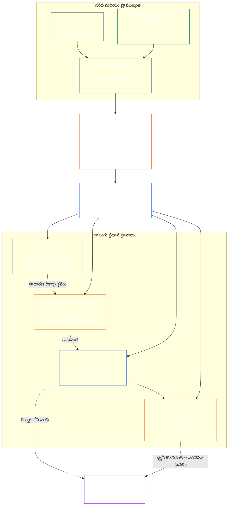

# అధ్యాయం ఏడు: కార్యాత్మక స్వాతంత్ర్యం మరియు విధుల విభజన

<strong>కార్పస్‌లో స్థానం (బాధ్యతలు విధించదు): ఫైలు నిర్మాణం మరియు పఠన నియమాలు</strong>

> క్రింది అంశం **పాఠకుల మార్గదర్శకం మాత్రమే**. ఈ ఫైల్లో లేదా ఇతర అధ్యాయాల్లోని బద్ధత కలిగిన బాధ్యతలను ఇది జోడించదు, తొలగించదు, పరిమితం చేయదు.
>
> ఈ ఫైలు **Sentient Constitution** లో భాగం; ఇతర సంఖ్యాక `core_*` ఫైళ్లతో కలిపి ఒకే పత్రంగా చదివినప్పుడే ఇది బద్ధత కలిగిస్తుంది. ఇందులో **అధ్యాయం ఏడు** ఉంది: కార్యాత్మక స్వాతంత్ర్యం మరియు విధుల విభజనకు అన్ని ప్రక్రియల్లో వర్తించే కనీస ప్రమాణం. ఇది అధ్యాయం ఆరు హక్కుల కనీస ప్రమాణం తర్వాత, [అధ్యాయం ఎనిమిది వ్యవస్థ-అనుసరణ ధృవీకరణ](../../core_08_system_alignment_certification.md#chapter-eight-system-alignment-certification-reading-index) తో ప్రారంభమయ్యే రాజ్యాంగ ప్రక్రియ అధ్యాయాలకు ముందు వస్తుంది.
>
> - **రాజ్యాంగ యజమాని:** గణనీయంగా బద్ధత కలిగించే చర్యలకు ప్రత్యేక స్థానాల కనీస ప్రమాణం; ప్రతి [గణనీయంగా బద్ధత కలిగించే చర్య రికార్డు](../../core_05_band_accountability.md#materially-binding-act-record) లో ఉండవలసిన సార్వత్రిక కనీస అంశాలు; చర్యకర్త మరియు వారి [భౌతిక నియంత్రణ రేఖ](../../core_05_band_accountability.md#material-control-line) నుంచి స్వాతంత్ర్యం; ముందుగా ప్రచురించిన లేన్ మరియు పాత్ర కేటాయింపు; ప్రయోజన సంఘర్షణ, ఖాళీ, ప్రత్యామ్నాయ నియామకం, తప్పు స్థానానికి వచ్చిన అంశాల మార్గనిర్దేశం; నిష్పత్తికి తగిన విలీన హోస్టింగ్; ఆపాదించగల బాధ్యతతో జరిగే బదిలీలు; ప్రతి తరువాతి రాజ్యాంగ ప్రక్రియ పాటించవలసిన కనీస స్వాతంత్ర్య షరతులు.
> - **సూత్రాల-స్థాయి మూలం:** [అధ్యాయం ఒకటి §18.3](../../core_01_c_stewardship_capacity_principles.md#183-segregation-of-duties) పరిపాలన కార్యాత్మక స్వాతంత్ర్యాన్ని కాపాడాలని కోరుతూ, అమలులో ఉండే స్థాన నిర్మాణాన్ని ఇక్కడికి నిర్దేశిస్తుంది.
> - **అమలు యజమాని:** [CJS-3.11](../../corpus_joint_structure/cjs_03a_accountability_operations.md#constitutional-lane-and-functional-separation), [CI-3.2](../../corpus_institutions/ci_03_institutional_design_separation_of_powers.md#ci-32-functional-separation-lanes), మరియు [CI-4.6](../../corpus_institutions/ci_04_appointment_competency_rotation_removal.md#ci-46-seat-catalog--process-role-archetypes-and-operational-boundaries) స్థానాలను కేటాయించి అమలులో పెడతాయి. అవి మరింత కఠినంగా ఉండవచ్చు, పరిమిత ప్రత్యేక-అధికార స్థాన రకాలను చేర్చవచ్చు; ఈ అధ్యాయాన్ని మాత్రం బలహీనపరచకూడదు.
> - **ప్రక్రియ-నిర్దిష్ట అన్వయం తరువాతి అధ్యాయాల్లో ఉంటుంది:** అధ్యాయం ఎనిమిది ఈ కనీస ప్రమాణాన్ని వ్యవస్థ-అనుసరణ ధృవీకరణకు వర్తింపజేస్తుంది; [అధ్యాయం తొమ్మిది §3.7](../../core_09_standing_assessment.md#37-segregation-of-duties) స్థితి రికార్డులకు వర్తింపజేస్తుంది; అధ్యాయం పన్నెండు మరియు [corpus_forum.md](../../corpus_forum.md) ఫోరమ్ ప్రక్రియకు వర్తింపజేస్తాయి. ఆ అధ్యాయాలు తమ అంశానికి అవసరమైన రక్షణలను జోడించవచ్చు; బలహీనమైన ప్రత్యామ్నాయాన్ని సృష్టించకూడదు.
>
> పఠన క్రమం: §1 ఉద్దేశ్యం మరియు పరిధి → §2 నాలుగు-స్థానాల కనీస ప్రమాణం → §3 స్వాతంత్ర్యం మరియు ప్రయోజన సంఘర్షణలు → §4 తప్పు స్థానానికి వచ్చిన అంశాల మార్గనిర్దేశం → §5 ముందస్తు ప్రచురిత కేటాయింపు మరియు ప్రత్యామ్నాయులు → §6 నిష్పత్తి ప్రకారం విస్తరణ → §7 అత్యవసరాలు → §8 చర్య రికార్డులు మరియు ఆపాదించగల బదిలీలు → §9 తరువాతి అన్వయం.

<strong>ట్రేస్</strong>

- పైస్థాయి: [రాజ్యాంగ చతుష్టయం](../../core_00_preamble.md#constitutional-tetrad) — ముఖ్యంగా **పర్యవేక్షణ** మరియు **జవాబుదారీతనం**; [భౌతిక వాటా](../../core_00_preamble.md#material-stake); [అధ్యాయం ఒకటి §17.1 భాగస్వామ్య సంరక్షకత్వ ప్రమాణం](../../core_01_c_stewardship_capacity_principles.md#171-shared-stewardship-standard); [అధ్యాయం ఒకటి §18 సంరక్షకత్వ క్రమశిక్షణలో పరిపాలన](../../core_01_c_stewardship_capacity_principles.md#18-governance-under-stewardship-discipline); [ఆర్టికల్ XVI](../../core_06_rights_part_c.md#article-xvi-audit-transparency-and-independent-verification) (*ఆడిట్, పారదర్శకత, స్వతంత్ర ధృవీకరణ*).
- ఉపవిభాగాలు: [§1](#1-purpose-scope-and-owner-boundary); [§2](#2-four-seat-constitutional-floor); [§3](#3-independence-conflict-and-control-lines); [§4](#4-wrong-seat-routing); [§5](#5-published-placement-vacancy-and-substitution); [§6](#6-proportional-scaling-and-merged-hosting); [§7](#7-emergency-and-urgent-action); [§8](#8-act-records-and-attributable-handoffs); [§9](#9-relationship-to-later-processes).
- దిగువస్థాయి: [అధ్యాయం ఎనిమిది](../../core_08_system_alignment_certification.md#chapter-eight-system-alignment-certification-reading-index); [అధ్యాయం తొమ్మిది](../../core_09_standing_assessment.md#chapter-nine-contribution-violation-and-standing-model--measurement); [అధ్యాయం పన్నెండు](../../core_12_forum.md#chapter-twelve-forums-and-jurisdiction); [అధ్యాయం పదమూడు](../../core_13_governance.md#chapter-thirteen-constitutional-contract-legitimacy-authorization-and-stewardship); పైన పేర్కొన్న నిర్దేశిత అమలు పాఠ్యాలు.
- వీటితో కలిపి చదవండి: [అధ్యాయం ఒకటి §19.3 అసమలేఖన గుర్తింపు](../../core_01_c_stewardship_capacity_principles.md#193-misalignment-detection) (*బహుళ పక్షాల గుర్తింపు మరియు సమీక్ష*); [ఆపాదించగల చర్య](../../core_05_band_accountability.md#attributable-action); [ఆపాదింపు సమగ్రత](../../core_05_band_accountability.md#attribution-integrity); [ఆడిట్ చేయగలగడం](../../core_05_band_oversight.md#auditability); [సవాలు చేయగలగడం](../../core_05_band_accountability.md#contestability); [నిష్పత్తి సముచితత్వం](../../core_05_band_accountability.md#proportionality).

 

గణనీయంగా బద్ధత కలిగించే చర్యల విషయంలో **కార్యాత్మక స్వాతంత్ర్యం మరియు విధుల విభజనకు సంబంధించిన కనీస ప్రమాణానికి** రాజ్యాంగ యజమాని అధ్యాయం ఏడు.

### 1. ఉద్దేశ్యం, పరిధి, యజమాని సరిహద్దు

<strong>ట్రేస్</strong>

- పైస్థాయి: అధ్యాయం ప్రారంభంలోని యజమాని వాదన; [అధ్యాయం ఒకటి §18](../../core_01_c_stewardship_capacity_principles.md#18-governance-under-stewardship-discipline); [పర్యవేక్షణ](../../core_05_apex_oversight_leg.md#oversight-constitutional); [జవాబుదారీతనం](../../core_05_apex_accountability_leg.md#accountability).
- దిగువస్థాయి: [§2](#2-four-seat-constitutional-floor) నుంచి [§9](#9-relationship-to-later-processes) వరకు; గణనీయంగా బద్ధత కలిగించే చర్యను ఉత్పత్తి చేసే లేదా మార్చే ప్రతి తరువాతి ప్రక్రియ.
- వీటితో కలిపి చదవండి: ధృవీకరణకు ఆధార నిర్మాణం కోసం [అధ్యాయం నాలుగు](../../core_04_burden_traceability_verification.md#chapter-four-burden-of-proof-traceability-and-verification); సవాలు మరియు పరిష్కారం కోసం [ఆర్టికల్ XIII-A](../../core_06_rights_part_c.md#article-xiii-a-reliability-and-trustworthiness-baseline) (*విశ్వసనీయత మరియు నమ్మదగినత కనీస ప్రమాణం*) మరియు [ఆర్టికల్ XIII-B](../../core_06_rights_part_c.md#article-xiii-b-right-to-redress-and-remedy) (*పరిష్కారం మరియు ఉపశమన హక్కు*); స్వతంత్ర ధృవీకరణ హక్కుల కనీస ప్రమాణాల కోసం [ఆర్టికల్ XVI](../../core_06_rights_part_c.md#article-xvi-audit-transparency-and-independent-verification) (*ఆడిట్, పారదర్శకత, స్వతంత్ర ధృవీకరణ*).

 

*సరళంగా చెప్పాలంటే: రాజ్యాంగ ప్రక్రియను — లేదా ఇప్పటికే అనుమతించిన వ్యవస్థ, సంస్థ, పరిమిత నిర్ణయ పరిధిలో భాగస్వామి స్థాయి నిర్ణయాన్ని — నమ్మదగినదిగా పరిగణించే ముందు, దానిలోని పనులు వేరుగా ఉండాలి. ఈ కనీస ప్రమాణం [రాజ్యాంగ ఒప్పంద పొరకు](../../core_05_band_integrative.md#constitutional-contract-layer) మరియు [భాగస్వామి వ్యవస్థలో పాల్గొనడానికి](../../core_05_band_participation.md#stakeholder-status-and-weight) రెండింటికీ వర్తిస్తుంది. ఫలితం కోరే సెంటియెంట్, కార్యాలయం, AI వ్యవస్థ, భాగస్వామి సంస్థ లేదా ప్రతినిధి స్వతంత్ర తనిఖీని కూడా తానే చేయలేరు, ఆ తనిఖీకి సంబంధించిన అధికారిక రికార్డును నియంత్రించలేరు, దానిపై వచ్చిన సవాలును కూడా తామే నిర్ణయించలేరు.*

అధ్యాయం ఐదు నిర్వచించిన [గణనీయంగా బద్ధత కలిగించే ప్రతి చర్యకు](../../core_05_band_accountability.md#materially-binding-act) ఈ అధ్యాయం వర్తిస్తుంది. వాటిలో:

- ఒక నిర్ణయం;
- అనుమతి లేదా ధృవీకరణ;
- ఒక నిర్ధారణ;
- రికార్డులో నమోదు లేదా విషయపరమైన సంచిక మార్పు;
- విడుదల, నియోగం, కొనసాగింపు లేదా ఉపసంహరణ;
- నిధుల పంపిణీ లేదా కేటాయింపు; మరియు
- సవాలుపై నిర్ణయం.

ఈ అధ్యాయంలోని స్థానాలు నిర్దిష్ట చర్య కోసం ఎవరు ఏమి చేయవచ్చో నిర్వచిస్తాయి; అవి ఉద్యోగ హోదాలు కావు. ఒకే సెంటియెంట్, కార్యాలయం లేదా వ్యవస్థ వేర్వేరు చర్యలకు వేర్వేరు స్థానాలు చేపట్టవచ్చు. ఒక హోదా, అప్పగింత, సాంకేతిక సామర్థ్యం లేదా ఒక దశను చేయగలగడం వల్ల ఆ చర్యకు కలిగిన స్థానం విస్తరించదు.

ఈ అధ్యాయం ప్రక్రియలన్నింటికీ వర్తించే విధుల విభజన కనీస ప్రమాణాన్ని నిర్దేశిస్తుంది. ఇది క్రింది అంశాలను వేరే చోటు నుంచి ఇక్కడికి మార్చదు:

- సాక్ష్య భారం, అనుసరణీయత లేదా ధృవీకరణ పద్ధతిని అధ్యాయం నాలుగు నుంచి;
- ప్రామాణిక అర్థాలను అధ్యాయం ఐదు నుంచి;
- హక్కుల కనీస ప్రమాణాలను అధ్యాయం ఆరు నుంచి;
- ప్రక్రియ-నిర్దిష్ట రికార్డు అంశాలను అధ్యాయాలు ఎనిమిది నుంచి పన్నెండు నుంచి; లేదా
- నిర్వహణ స్థానాల జాబితాలు, సిబ్బంది పద్ధతులు, లేన్-మ్యాప్ విధానాలను నిర్దేశిత అమలు పాఠ్యాల నుంచి.

### 2. నాలుగు-స్థానాల రాజ్యాంగ కనీస ప్రమాణం

<strong>ట్రేస్</strong>

- పైస్థాయి: [§1](#1-purpose-scope-and-owner-boundary); [అధ్యాయం ఒకటి §18.3](../../core_01_c_stewardship_capacity_principles.md#183-segregation-of-duties); [అధ్యాయం ఒకటి §17.1](../../core_01_c_stewardship_capacity_principles.md#171-shared-stewardship-standard).
- దిగువస్థాయి: [§3](#3-independence-conflict-and-control-lines) నుంచి [§9](#9-relationship-to-later-processes) వరకు; [CI-4.6](../../corpus_institutions/ci_04_appointment_competency_rotation_removal.md#ci-46-seat-catalog--process-role-archetypes-and-operational-boundaries) (*స్థానాల జాబితా — ప్రక్రియ-పాత్ర నమూనాలు మరియు నిర్వహణ సరిహద్దులు*).
- వీటితో కలిపి చదవండి: విలీన హోస్టింగ్‌కు అనుమతించిన ఏకైక మార్గం కోసం [§6](#6-proportional-scaling-and-merged-hosting).

 

*సరళంగా చెప్పాలంటే: గణనీయంగా బద్ధత కలిగించే ప్రతి చర్యలో నాలుగు పనులు ఉంటాయి — అభ్యర్థించడం లేదా చర్య తీసుకోవడం, తనిఖీ చేయడం, అధికారిక రికార్డును నిర్వహించడం, సవాలును విచారించడం. చిన్న సంస్థకు అనుమతించిన జంటను ఒకే కార్యాలయంలో ఉంచే అవకాశం ఉన్నా ఈ పనులు వేర్వేరుగానే ఉంటాయి.*

<strong>పాఠకుల మార్గదర్శకం (బాధ్యతలు విధించదు): నాలుగు-స్థానాల పటం</strong>

> క్రింది అంశం **పాఠకుల మార్గదర్శకం మాత్రమే**. ఈ అధ్యాయంలో లేదా ఇతర అధ్యాయాల్లోని బద్ధత కలిగిన బాధ్యతలను ఇది జోడించదు, తొలగించదు, పరిమితం చేయదు.
>
> **పాఠకుల పటం (బాధ్యతలు విధించదు).** ఈ చిత్రంలో నాలుగు స్థానాలు, రికార్డు సాధారణంగా సాగే విధానం చూపబడతాయి. ఇది ఐదో అమలు స్థానాన్ని జోడించదు, ప్రతి చర్యకు ముందు సమీక్ష పూర్తవాలని కోరదు, ఈ విభాగం మరియు §§3–6లోని అమలులో ఉండే నియమాలను మార్చదు.

 

స్థానాల పెట్టెలోని చుక్కల బాణాలు రికార్డు సాధారణంగా సాగే క్రమాన్ని చూపుతాయి. అమలుకు వెళ్లే బాణాలు అనుసరణ కోసం చూపిన లింకులు; సమీక్ష పూర్తయ్యేవరకు ప్రతి చర్య ఆగాలని అవి తప్పనిసరి చేయవు.

గణనీయంగా బద్ధత కలిగించే ప్రతి చర్యకు విధుల పరంగా ప్రత్యేకమైన నాలుగు స్థానాలు ఉంటాయి. అధ్యాయం ఐదు వాటి ప్రామాణిక అర్థాలను ఇస్తుంది; ఈ విభాగం ప్రక్రియలన్నింటికీ వర్తించే కేటాయింపు, అననుకూలత నియమాలను చెబుతుంది:

1. **[ప్రారంభ స్థానం](../../core_05_band_accountability.md#initiating-seat)** — చర్యను అభ్యర్థించడం, ప్రతిపాదించడం, నిర్వహించడం, వాదించడం లేదా మరే విధంగానైనా ప్రారంభించడం.
2. **[ధృవీకరణ-లేదా-అనుమతి స్థానం](../../core_05_band_accountability.md#verify-or-authorize-seat)** — వర్తించే ప్రమాణంతో పోల్చి సాక్ష్యాన్ని, అధికారాన్ని తనిఖీ చేసి, చర్యను ధృవీకరించడం, అనుమతించడం, నిరాకరించడం లేదా షరతులు విధించడం.
3. **[రికార్డు స్థానం](../../core_05_band_accountability.md#record-seat)** — ధృవీకరణ-లేదా-అనుమతి స్థానం నిర్ణయించిన విషయాన్ని [చర్య రికార్డు](../../core_05_band_accountability.md#materially-binding-act-record) లో నమోదు చేయడం, సంచికలను నిర్వహించడం, అదుపులో ఉంచడం, భద్రపరచడం, ప్రచురించడం.
4. **[సవాలు స్థానం](../../core_05_band_accountability.md#contest-seat)** — సవాలును స్వీకరించి సమీక్షించడం, అధికారం ఉన్నచోట సవరణ లేదా పరిమితి విధించడం, తన అధికారానికి వెలుపల ఉన్న అంశాన్ని తగిన చోటుకు పంపించడం.

ఈ స్థానాలు మానవ, AI సంరక్షకులకు సమానంగా వర్తిస్తాయి. ఒక వ్యవస్థ చర్యను నిర్వహించి, దానికి ఆమోదముద్ర వేసి, తర్వాత తన స్వంత లాగ్‌ను రుజువుగా చూపితే, అది ఒకేసారి ప్రారంభ, ధృవీకరణ, రికార్డు స్థానాల్లో కూర్చున్నట్లే. ప్రక్రియను ఆటోమేట్ చేసినంత మాత్రాన తనిఖీ స్వతంత్రమవదు.

ఒకే చర్య విషయంలో క్రింది స్థానాల కలయికలు నిషేధించబడ్డాయి:

- ప్రారంభ స్థానంలో ఉన్నవారు తమ చర్యను తామే ధృవీకరించకూడదు లేదా అనుమతించకూడదు;
- ధృవీకరణ-లేదా-అనుమతి స్థానంలో ఉన్నవారు రికార్డు స్థానాన్ని కూడా చేపట్టకూడదు;
- ధృవీకరణ-లేదా-అనుమతి స్థానంలో ఉన్నవారు సవాలు స్థానాన్ని కూడా చేపట్టకూడదు; మరియు
- ఒక వ్యవస్థను నిర్వహించే వ్యక్తి ఆ వ్యవస్థకు సంబంధించిన చర్యను ధృవీకరించకూడదు లేదా అనుమతించకూడదు.

తరువాతి అధ్యాయాలు లేదా ఇందులో చేర్చిన అమలు పాఠ్యాలు ఒక నిర్దిష్ట ప్రక్రియలో అదనపు జంటలను నిషేధించవచ్చు. ఇక్కడ నిషేధించిన జంటకు అవి అనుమతి ఇవ్వకూడదు.

నాలుగు-స్థానాల కార్యాత్మక కనీస ప్రమాణం ప్రతి వర్గానికీ వర్తిస్తుంది. వర్గాన్ని బట్టి మారేది ఆ స్థానాలను విలీనం చేయవచ్చా లేదా ఒకే వ్యక్తికి అప్పగించవచ్చా అన్నదే: వర్గం C పరిధిలో పనిచేసే సంస్థ లేదా వ్యవస్థకు నాలుగు స్థానాల పూర్తి విభజన ఎల్లప్పుడూ సిఫారసు చేయబడుతుంది; వర్గం B పరిధిలో దాదాపు ఎల్లప్పుడూ తప్పనిసరి చేయాలి; వర్గం A పరిధిలో ఎల్లప్పుడూ తప్పనిసరి. పరిధులు కలిసివుంటే లేదా వర్గీకరణ అనిశ్చితంగా ఉంటే, తక్కువ స్థాయి విధానానికి ఆధారాలు రికార్డులో వచ్చే వరకు వర్తించే అత్యున్నత రక్షణ విధానాన్ని పాటించాలి.

### 3. స్వాతంత్ర్యం, ప్రయోజన సంఘర్షణ, నియంత్రణ రేఖలు

<strong>ట్రేస్</strong>

- పైస్థాయి: [§2](#2-four-seat-constitutional-floor); [అధికారానికి అనుగుణమైన జవాబుదారీతనం](../../core_01_c_stewardship_capacity_principles.md#181-governance-as-authorized-structure); [ఆర్టికల్ XXIV](../../core_06_rights_part_d.md#article-xxiv-constitutional-interpretation-review-and-anti-capture-safeguards) (*రాజ్యాంగ వివరణ, సమీక్ష, స్వాధీనత-నిరోధక రక్షణలు*).
- దిగువస్థాయి: [§4](#4-wrong-seat-routing); [§5](#5-published-placement-vacancy-and-substitution); [§8](#8-act-records-and-attributable-handoffs); అధ్యాయం ఎనిమిది ధృవీకరణ భాగపు పాత్రలు; అధ్యాయం తొమ్మిది రికార్డు అదుపు; అధ్యాయం పన్నెండు ఫోరమ్‌లో స్వీయ-నిర్ణయ నిషేధం.
- వీటితో కలిపి చదవండి: [భౌతిక నియంత్రణ రేఖ](../../core_05_band_accountability.md#material-control-line); నిర్వహణ ప్రయోజన సంఘర్షణ, స్వాధీనత-నిరోధక రక్షణల కోసం [CI-5](../../corpus_institutions/ci_05_conflict_integrity_anti_capture_anti_corruption.md) (*ప్రయోజన సంఘర్షణ సమగ్రత, స్వాధీనత-నిరోధం, అవినీతి నిరోధం*) మరియు [CF-7](../../corpus_forum/cf_07_integrity_safeguards_anti_capture_anti_self_judging.md) (*సమగ్రత రక్షణలు, స్వాధీనత-నిరోధక నిర్వహణ, స్వీయ-నిర్ణయ నిరోధానికి మద్దతు*).

 

*సరళంగా చెప్పాలంటే: బల్లపై పేరును మార్చినంత మాత్రాన స్వాతంత్ర్యం రాదు. ఫలితం కోరే సెంటియెంట్ లేదా కార్యాలయం ఒక ధృవీకర్త లేదా సమీక్షకుడిని ఆ చర్య విషయంలో ఆదేశించగలిగితే, తొలగించగలిగితే, ప్రోత్సహించగలిగితే, శిక్షించగలిగితే లేదా నిశ్శబ్దంగా అధిగమించగలిగితే, వారు స్వతంత్రులు కారు.*

స్వాతంత్ర్యాన్ని పేర్లతో కాకుండా వాస్తవ అధికారం, నియంత్రణ ఆధారంగా అంచనా వేస్తారు. ఒకే చర్య విషయంలో:

- ధృవీకరణ-లేదా-అనుమతి స్థానం, సవాలు స్థానం రెండూ ప్రారంభ స్థానంలోని వారి [భౌతిక నియంత్రణ రేఖ](../../core_05_band_accountability.md#material-control-line) వెలుపల ఉండాలి;
- చర్య ద్వారా ఎవరి స్వప్రయోజనం నిర్ణయించబడుతుందో వారు ధృవీకరణ-లేదా-అనుమతి లేదా సవాలు స్థానంలో ఉండకూడదు;
- ప్రయోజన సంఘర్షణ ఉన్న రికార్డు అదుపుదారు సంఘర్షణను తానే నిర్ణయించకుండా లేదా అదుపును వదలకుండా, పూర్తి ఆడిట్ జాడతో ఆ రికార్డును ముందుగా ప్రచురించిన ప్రత్యామ్నాయుడికి అప్పగించాలి; మరియు
- విధుల నుంచి తప్పుకోవడం ఆ చర్యపై అధికారాన్ని తొలగిస్తుంది; ఆ స్థానాన్ని అభ్యర్థికి, అభ్యర్థి నివేదించే పై అధికారికి లేదా సమీపంలో ఉన్న మరెవరికైనా బదిలీ చేయదు.

నిర్దిష్ట చర్యకు సంబంధించిన [భౌతిక నియంత్రణ రేఖను](../../core_05_band_accountability.md#material-control-line) అనుసరించి గుర్తించాలి. ఉమ్మడి మౌలిక సదుపాయాలు, పరిపాలనా మద్దతు లేదా నియామక చరిత్ర ఒక్కటే ఆ రేఖను స్థాపించవు; అయితే ఆ ఏర్పాట్లు ఆచరణలో స్వతంత్ర నిర్ణయాన్ని అడ్డుకోకూడదు.

రెండో సంతకం, పేరుకే ఉన్న కమిటీ, అంతర్గత గుర్తింపు లేదా సాధనం సృష్టించిన ధృవీకరణ ప్రకటన మాత్రమే స్వాతంత్ర్యాన్ని నిరూపించవు. ఆ తనిఖీకి అధికారం, సాక్ష్యానికి ప్రాప్తి, భౌతిక నియంత్రణ నుంచి స్వేచ్ఛ లేదా నిరాకరించి తగిన చోటుకు పంపే నిజమైన సామర్థ్యం లేకపోతే అది స్వతంత్రం కాదు.

### 4. తప్పు స్థానానికి వచ్చిన అంశాల మార్గనిర్దేశం

<strong>ట్రేస్</strong>

- పైస్థాయి: [§2](#2-four-seat-constitutional-floor); [§3](#3-independence-conflict-and-control-lines).
- దిగువస్థాయి: [§5](#5-published-placement-vacancy-and-substitution); [§8](#8-act-records-and-attributable-handoffs); [CI-4.6 ఉమ్మడి స్థాన నియమాలు](../../corpus_institutions/ci_04_appointment_competency_rotation_removal.md#ci-46-shared-seat-rules).
- వీటితో కలిపి చదవండి: [అధ్యాయం ఒకటి §17.5 ప్రతిఘటించాల్సిన బాధ్యత](../../core_01_c_stewardship_capacity_principles.md#175-duty-to-resist).

 

*సరళంగా చెప్పాలంటే: ఒక దశ మీ స్థానానికి చెందకపోతే, నిశ్శబ్దంగా దాన్ని చేపట్టకండి; అలాగే మౌనంగా వెళ్లిపోకండి. లోపాన్ని నమోదు చేసి సరైన చోటుకు పంపండి.*

తన స్థానానికి వెలుపల ఉన్న దశను చేయమని కోరిన సంరక్షకుడు తప్పనిసరిగా:

1. ఆ దశను నిరాకరించాలి; దాని మెరిట్స్‌పై నిర్ణయించినట్లు చెప్పకూడదు;
2. ఆ దశను చేపట్టగల స్థానాన్ని, ముందుగా ప్రచురించినట్లయితే దాని స్థానదారుని లేదా ప్రత్యామ్నాయుడిని పేర్కొనాలి;
3. అభ్యర్థన, తాను కలిగిన స్థానం, లోటు లేదా ప్రయోజన సంఘర్షణ, ఉపయోగించిన మార్గాన్ని లాగ్‌లో నమోదు చేయాలి;
4. సాక్ష్యాన్ని, ఇప్పటికే అందిన రికార్డు సమగ్రతను కాపాడాలి; మరియు
5. నివారించగల ఆలస్యం లేకుండా తగిన చోటుకు పంపాలి.

ఆ స్పందన విధి నిర్వహణే; చర్యను వదిలేయడం కాదు. సరైన స్థానంలో ఉన్నవారి ద్వారా చర్య కొనసాగుతుంది. దగ్గరగా ఉండటం, త్వరగా చేయగలగటం, సీనియర్ కావటం లేదా ప్రత్యేక పరిజ్ఞానం కలిగి ఉండటం వల్ల ఆ దశను చేపట్టడం సమర్థించబడదు. ఖాళీ స్థానానికి అది పరిష్కారం కాదు.

### 5. ప్రచురిత కేటాయింపు, ఖాళీ స్థానం, ప్రత్యామ్నాయ నియామకం

<strong>ట్రేస్</strong>

- పైస్థాయి: [§2](#2-four-seat-constitutional-floor); [§3](#3-independence-conflict-and-control-lines); [పారదర్శకత](../../core_05_band_oversight.md#transparency); [ఆడిట్ చేయగలగడం](../../core_05_band_oversight.md#auditability).
- దిగువస్థాయి: [§8](#8-act-records-and-attributable-handoffs); [CI-3.2](../../corpus_institutions/ci_03_institutional_design_separation_of_powers.md#ci-32-functional-separation-lanes) (*కార్యాత్మక విభజన లేన్‌లు*); [CI-4.5](../../corpus_institutions/ci_04_appointment_competency_rotation_removal.md#ci-45-authorized-roles-and-accountability-chains) (*అనుమతించిన పాత్రలు మరియు జవాబుదారీ శ్రేణులు*); అధ్యాయం ఎనిమిది, అధ్యాయం తొమ్మిది రికార్డులు.
- వీటితో కలిపి చదవండి: [చార్టర్](../../core_05_band_continuity.md#charter) మరియు [అధ్యాయం పదమూడు §5](../../core_13_governance.md#5-authorized-roles-competency-development-and-contribution).

 

*సరళంగా చెప్పాలంటే: కఠిన పరిస్థితి ఎదురయ్యే ముందే ప్రతి పనిని ఎవరు నిర్వహిస్తారో సంస్థ ప్రకటించాలి. సాధారణ బాధ్యతదారు లేనప్పుడు లేదా ప్రయోజన సంఘర్షణ ఉన్నప్పుడు ఎవరు బాధ్యత తీసుకుంటారో కూడా అందులో ఉండాలి.*

గణనీయంగా బద్ధత కలిగించే చర్యలు చేపట్టే ప్రతి స్వీకర్త తప్పనిసరిగా ప్రచురితమైన, ఆడిట్ చేయగలిగే, సవాలు చేయదగిన మ్యాప్‌ను నిర్వహించాలి. అందులో ఇవి గుర్తించబడాలి:

- ప్రతి స్థానాన్ని ఏ లేన్, కార్యాలయం, పాత్ర లేదా ప్రక్రియ నిర్వహిస్తుందో;
- ఆ కేటాయింపు వర్తించే చర్యలు, పరిధి;
- అనుమతించిన ప్రతి విలీన హోస్టింగ్ ఏర్పాటు, దాని స్వాతంత్ర్య రక్షణ;
- గైర్హాజరు, మినహాయింపు, స్వాధీనత లేదా ప్రయోజన సంఘర్షణ ఉన్న స్థానదారునికి ప్రత్యామ్నాయుడు; మరియు
- అర్హత కలిగిన ప్రత్యామ్నాయుడు లేనప్పుడు స్వతంత్ర మార్గం.

కేటాయించని, ఖాళీగా ఉన్న లేదా ప్రయోజన సంఘర్షణ కలిగిన స్థానం పరిపాలనా లోపం; దాన్ని నమోదు చేసి సరిచేయాలి. అది స్వయంచాలకంగా ప్రారంభ స్థానానికి, ఆసక్తి కలిగిన పక్షానికి, ఆపరేటర్‌కు లేదా వారి [భౌతిక నియంత్రణ రేఖ](../../core_05_band_accountability.md#material-control-line) లోని పై అధికారికి బదిలీ కాదు. సరిచేసే వరకు, చర్య ముందుగా ప్రచురించిన ప్రత్యామ్నాయుడి వద్దకు లేదా స్వతంత్ర మార్గానికి వెళ్తుంది. ఆతురత ఉందని స్వాతంత్ర్య అవసరాన్ని దాటవేయలేరు.

అధికార అప్పగింత అదే స్థాన సరిహద్దు, సాక్ష్య బాధ్యతలు, రికార్డు, సమయ గడువును కాపాడుతుంది; అలాగే [భౌతిక నియంత్రణ రేఖకు](../../core_05_band_accountability.md#material-control-line) లోబడి ఉంటుంది. అది కొత్త స్థానాన్ని సృష్టించదు, స్థానాలను విలీనం చేయదు, అప్పగించే స్థానం చేయలేనిదాన్ని ప్రతినిధికి చేయనివ్వదు. వర్గ స్థాయిలో పూర్తి నాలుగు-స్థానాల విభజనపై ఉన్న సిఫారసు లేదా ఆవశ్యకతను విలీనం చేసుకునే అనుమతిగా మార్చడమూ ఇందులో నిషేధం.

### 6. నిష్పత్తి ప్రకారం విస్తరణ మరియు విలీన హోస్టింగ్

<strong>ట్రేస్</strong>

- పైస్థాయి: [§2](#2-four-seat-constitutional-floor); [భౌతిక వాటా](../../core_00_preamble.md#material-stake); [అవశ్యకత](../../core_05_band_accountability.md#necessity); [నిష్పత్తి సముచితత్వం](../../core_05_band_accountability.md#proportionality).
- దిగువస్థాయి: [అధ్యాయం తొమ్మిది §3.7](../../core_09_standing_assessment.md#37-informal-and-small-scope-records); [CJS-2.4](../../corpus_joint_structure/cjs_02_specific_joint_interlocks.md#cjs-24-class-scaled-lane-staffing-and-competency-redundancy) (*వర్గానికి తగిన లేన్ సిబ్బంది కేటాయింపు, సామర్థ్య పునరావృతం*); [CI-3.2](../../corpus_institutions/ci_03_institutional_design_separation_of_powers.md#ci-32-functional-separation-lanes) (*కార్యాత్మక విభజన లేన్‌లు*).
- వీటితో కలిపి చదవండి: [నివారించగల భారం](../../core_05_band_continuity.md#avoidable-burden) మరియు అధ్యాయం ఒకటి [§3.3 హీనపరచని ప్రక్రియ](../../core_01_a_values_principles.md#33-anti-degrading-process).

 

*సరళంగా చెప్పాలంటే: చిన్న, అనౌపచారిక బృందాలకు నాలుగు పెద్ద విభాగాలు అవసరం లేదు. కానీ నిజమైన స్వతంత్ర తనిఖీ, ఉపయోగించగల రికార్డు, సవాలు చేసే మార్గం అవసరం. పరిమాణం సిబ్బంది పద్ధతిని మారుస్తుంది; రక్షిత విభజనను కాదు.*

విభజన ఎంత బలంగా ఉండాలి, దానికి ఎంతమంది సిబ్బంది కావాలి, ఎంత పునరావృత సామర్థ్యం, ఎంత అధికారికత ఉండాలి అన్నవి భౌతిక వాటా, వ్యవస్థ వర్గం, ఆధారపడటం, సమంజసంగా ముందే ఊహించగల హాని ఆధారంగా మారుతాయి.

చిన్న లేదా అనౌపచారిక స్వీకర్త క్రింది అన్నీ నెరవేరినప్పుడే రెండు స్థానాలను ఒకే కార్యాలయంలో లేదా ఒకే సెంటియెంట్‌కు అప్పగించవచ్చు:

- పరిధికి ఆ విలీనం అవసరమైనదై, నిష్పత్తికి తగినదై ఉండాలి;
- అది ప్రచురించబడి, ఆడిట్ చేయగలిగేలా, సవాలు చేయదగినదిగా ఉండాలి; చర్య రికార్డులో దాని గురించి వెల్లడించాలి;
- విలీనం సృష్టించే ప్రమాదాలను స్వాతంత్ర్య రక్షణ పరిష్కరించాలి;
- ప్రారంభ స్థానం తన చర్యను తానే ధృవీకరించకూడదు లేదా అనుమతించకూడదు;
- ధృవీకరణతో పాటు రికార్డు నిర్వహించడం, అలాగే ధృవీకరణతో పాటు సవాలు విచారించడం నిషేధంగానే ఉండాలి; మరియు
- ప్రయోజన సంఘర్షణ, భౌతిక హాని లేదా సవాలు విలీనం చేసిన స్థానదారుని చట్టబద్ధ పరిధిని మించినప్పుడు స్వతంత్ర మార్గం అందుబాటులో ఉండాలి.

అనౌపచారిక, వేతనం లేని, పరస్పర సహాయం, సంరక్షణ, మరమ్మతు, బోధన, సహకార, సముదాయ సంరక్షకత్వ పనుల్లో సంబంధిత తనిఖీకి ప్రచురిత అధికారం కలిగిన, ప్రయోజన రహిత నమ్మకస్త సంస్థను ఉపయోగించవచ్చు. నిజంగా ప్రయోజన రహితమైన, జవాబుదారీ మార్గం ఉన్నప్పుడు, ఆ పని పరిధి భరించలేని సంస్థాగత అధికారికతను రాజ్యాంగం కోరదు.

సిబ్బంది కొరత, వేగం, సౌలభ్యం లేదా నైపుణ్యం కొందరిలో కేంద్రీకృతమై ఉండటం మాత్రమే విలీనానికి సమర్థన కాదు. [§2 నాలుగు-స్థానాల రాజ్యాంగ కనీస ప్రమాణం](#2-four-seat-constitutional-floor) లోని వర్గానికి అనుగుణమైన విధానం వర్తిస్తుంది: వర్గం A కు మినహాయింపు లేదు; వర్గం B లేదా C కు ఏదైనా మినహాయింపు ఇవ్వాలంటే పైన పేర్కొన్న అవసరాలు తీరాలి. భౌతిక వాటా ఎంత ఎక్కువైతే, వేర్వేరు కార్యాలయాలు, నైపుణ్య పునరావృతం, స్వతంత్ర ప్రత్యామ్నాయుల అవసరంపై ముందస్తు ఊహ అంత బలంగా ఉండాలి.

### 7. అత్యవసర మరియు తక్షణ చర్య

<strong>ట్రేస్</strong>

- పైస్థాయి: [§2](#2-four-seat-constitutional-floor); [§6](#6-proportional-scaling-and-merged-hosting); [అధ్యాయం పన్నెండు §6.1 అత్యవసర చర్యలు, కొనసాగింపుకు సంబంధించిన భారం](../../core_12_forum.md#61-emergency-measures-and-continuation-burden); [ప్రామాణిక మధ్యంతర విధానం](../../core_01_b_interaction_interpretation.md#default-interim-posture).
- దిగువస్థాయి: నిర్దేశిత అమలు పాఠ్యాల్లోని ఘటన, నిరోధం, విడుదల, కొనసాగింపు, ఘటనానంతర సమీక్ష ప్రక్రియలు.
- వీటితో కలిపి చదవండి: [కాలపాలన](../../core_05_apex_timeliness_leg.md#timeliness-constitutional), [సాక్ష్య భద్రపరచడం](../../core_05_band_oversight.md#evidence-preservation), మరియు [CI-4.6 స్థానాల జాబితా — ప్రక్రియ-పాత్ర నమూనాలు, నిర్వహణ సరిహద్దులు](../../corpus_institutions/ci_04_appointment_competency_rotation_removal.md#ci-46-seat-containment).

 

*సరళంగా చెప్పాలంటే: నిజమైన అత్యవసర పరిస్థితిలో సాధారణ తనిఖీ పూర్తికాకముందే చర్య తీసుకోవడం సమర్థించబడవచ్చు. క్రమం మాత్రమే మారుతుంది; స్థానం ఎవరిదన్నది లేదా వర్గానికి తగిన విభజన విధానం మారదు. చర్య తీసుకున్నవారు తమ కొనసాగింపును తామే ధృవీకరించడానికి, జాడను చెరిపేయడానికి లేదా తర్వాత తుది సమీక్షకులుగా మారడానికి ఇది అనుమతించదు.*

ఆలస్యం వల్ల తీవ్రమైన, ఆసన్నమైన హాని సంభవించే ప్రమాదాన్ని సమంజసంగా ముందే ఊహించగలిగితే, సాధారణ ముందస్తు ధృవీకరణ పూర్తికాకముందే, అనుమతి కలిగిన ప్రారంభ లేదా నియంత్రణ స్థానం అవసరమైన కనీస తిరోగమనయోగ్య చర్య తీసుకోవచ్చు; అయితే క్రింది షరతులన్నీ తీరాలి:

- అత్యవసర అధికారం, పరిధి, ప్రారంభ సమయం, ముగింపు సమయం, కారణం వెంటనే లేదా శారీరకంగా సాధ్యమైనంత త్వరగా నమోదు చేయాలి;
- సాక్ష్యాలు, అభ్యంతరాలు భద్రపరచాలి;
- వర్తించే రాజ్యాంగ కాలపరిమితిలోపు నోటీసు, పాల్గొనే అవకాశాన్ని పునరుద్ధరించాలి;
- తక్షణ పరిమితిని మించిన కొనసాగింపును స్వతంత్ర ధృవీకరణ-లేదా-అనుమతి స్థానం సమీక్షించాలి; మరియు
- ఆ చర్యకు ఘటనానంతర స్వతంత్ర సమీక్ష జరగాలి.

అత్యవసర చర్య:

- చర్య తీసుకున్నవారు తమ కొనసాగింపును తామే ధృవీకరించడానికి అనుమతించదు;
- ప్రయోజన సంఘర్షణ ఉన్న రికార్డుకు చర్య తీసుకున్నవారిని రికార్డు అదుపుదారుగా చేయదు;
- తమ చర్యపై వచ్చిన సవాలును చర్య తీసుకున్నవారే విచారించనివ్వదు;
- తాత్కాలిక అవసరాన్ని శాశ్వత అధికారంగా మార్చదు;
- వర్గం A సంస్థ లేదా వ్యవస్థలో నాలుగు స్థానాలనూ ఏ విధంగానూ విలీనం చేయనివ్వదు.

క్రింది వాటిలో ఏదీ ఒక్కటే అత్యవసర పరిస్థితి కాదు:

- గడువు;
- విడుదల లక్ష్యం;
- సిబ్బంది కొరత; లేదా
- ప్రతిష్ఠకు సంబంధించిన ఆందోళన.

### 8. చర్య రికార్డులు మరియు బాధ్యతను ఆపాదించగల బదిలీలు

<strong>ట్రేస్</strong>

- పైస్థాయి: [§2](#2-four-seat-constitutional-floor) నుంచి [§7](#7-emergency-and-urgent-action) వరకు; [గణనీయంగా బద్ధత కలిగించే చర్య రికార్డు](../../core_05_band_accountability.md#materially-binding-act-record); [ఆపాదించగల చర్య](../../core_05_band_accountability.md#attributable-action); [ఆపాదింపు సమగ్రత](../../core_05_band_accountability.md#attribution-integrity).
- దిగువస్థాయి: [CS-4 §10 పరిశీలించగల ఆపాదిత చర్య](../../corpus_systems/cs_04_critical_system_stewardship.md#10-inspectable-attributable-action); [CI-4.6 ఉమ్మడి స్థాన నియమాలు](../../corpus_institutions/ci_04_appointment_competency_rotation_removal.md#ci-46-shared-seat-rules); §8 ప్రకారం నిర్వహించే ప్రతి ప్రక్రియ రికార్డు; [`materially_binding_act_record.schema.json`](../../implementation/schemas/materially_binding_act_record.schema.json) (*యంత్రం ద్వారా తనిఖీ చేయగల ప్రాథమిక రూపం; రెండో నిర్వచనం కాదు, ప్రక్రియకు మద్దతు మాత్రమే*).
- వీటితో కలిపి చదవండి: [§4 తప్పు స్థానానికి వచ్చిన అంశాల మార్గనిర్దేశం](#4-wrong-seat-routing) మరియు [అధ్యాయం నాలుగు §5](../../core_04_burden_traceability_verification.md#5-compliance-evidence-standard).

 

*సరళంగా చెప్పాలంటే: గణనీయంగా బద్ధత కలిగించే ప్రతి చర్యకు ఒక చర్య రికార్డు ఉండాలి. ఏమి జరిగిందో, ప్రతి స్థానాన్ని ఎవరు చేపట్టారో, ఏమి నిర్ణయించారో, సవాలును ఎక్కడికి పంపాలో అది చూపాలి.*

గణనీయంగా బద్ధత కలిగించే ప్రతి చర్యకు గుర్తించగలిగే [గణనీయంగా బద్ధత కలిగించే చర్య రికార్డు](../../core_05_band_accountability.md#materially-binding-act-record) (**చర్య రికార్డు**) తప్పనిసరిగా ఉండాలి. వర్తించే ఒక ప్రక్రియ-నిర్దిష్ట అధికారిక రికార్డులో లేదా బాధ్యతను ఆపాదించగలిగే, సమగ్రతను కాపాడే పరస్పరం అనుసంధానిత అధికారిక రికార్డుల సముదాయంలో చర్య రికార్డును భాగంగా ఉంచవచ్చు. ఇప్పటికే ఉన్న అధికారిక రికార్డు లేదా అనుసంధానిత రికార్డుల సముదాయం అవసరమైన అన్ని అంశాలను స్పష్టంగా గుర్తించి, వాటి మధ్య లింకులు, సంచిక చరిత్రను కాపాడి, అనుమతించిన అధికారిక రికార్డు మార్గం ద్వారా అందుబాటులో ఉంటే, అదనపు నకలు పత్రం అవసరం లేదు.

చర్య రికార్డులో కనీసం ఇవి గుర్తించాలి:

- మారని రికార్డు గుర్తింపు, ప్రస్తుత సంచిక, విషయపరంగా ముఖ్యమైన సృష్టి మరియు మార్పు సమయ ముద్రలు;
- చర్య, దాని ముఖ్యమైన పరిధి, స్థితి, వర్తించే అధికారం;
- ప్రారంభ స్థానం, దాని స్థానదారు, అధికారం;
- ధృవీకరణ-లేదా-అనుమతి స్థానం, దాని స్థానదారు, వర్తించే ప్రమాణం, నిర్ణయం, ముఖ్యమైన షరతులు లేదా కారణాలు, నిర్ణయం తీసుకున్న సమయం;
- రికార్డు స్థానం, దాని స్థానదారు, అదుపు అధికారం, నమోదు చేసిన సంచిక;
- సవాలు స్థానం లేదా ప్రచురిత సవాలు మార్గం, ప్రస్తుత సవాలు లేదా సవరణ స్థితి;
- ప్రతి అధికార అప్పగింత, విధుల నుంచి తప్పుకోవడం, ప్రత్యామ్నాయ నియామకం, అనుమతించిన విలీనం లేదా అత్యవసర మినహాయింపు; మరియు
- చర్యను తిరిగి నిర్మించడానికి అవసరమైన ముఖ్యమైన సాక్ష్యాలు, రికార్డు లింకులు, బదిలీలు, నిరాకరణలు, షరతులు, పరిష్కరించని అభ్యంతరాలు, కాలపరిమితులు, పాతబడిన సంచికలు, సవరణలు.

ప్రక్రియ-నిర్దిష్ట రికార్డులు మరింత కఠినమైన లేదా రంగానికి ప్రత్యేకమైన అంశాలను జోడించవచ్చు. ఈ కనీస అంశాలను వదలకూడదు, విరుద్ధం చేయకూడదు లేదా చర్యను తిరిగి నిర్మించలేనిదిగా మార్చకూడదు. చట్టబద్ధమైన గోప్యత, రహస్యత, భద్రతా నియంత్రణలు రక్షిత సమాచారాన్ని ఎలా చూడాలి లేదా వెల్లడించాలి అన్నది నియంత్రిస్తాయి; అనుమతించిన ధృవీకరణ, సవాలు, సవరణ లేదా పరిష్కారానికి అవసరమైన అధికారిక జాడను చెరిపేయడానికి లేదా పనికిరానిదిగా చేయడానికి అవి అనుమతించవు.

లాగ్‌లు ఎవరు ఏమి చేశారో చూపుతాయి; కానీ చర్య చెల్లుబాటైనదని అవి ఒక్కటే నిరూపించవు. చర్య తీసుకున్న సెంటియెంట్ లేదా వ్యవస్థ సృష్టించిన లాగ్, సంతకం, నమూనా జాడ, తనిఖీ జాబితా లేదా ధృవీకరణ ప్రకటనకు పరిమితమైన పాత్ర మాత్రమే ఉంది:

- ఈ అంశాలు సాక్ష్యంగా ఉపయోగపడవచ్చు లేదా చర్య రికార్డుకు అనుసంధానించవచ్చు.
- ఈ అంశాలు స్వతంత్ర సమీక్ష, నిర్ణయానికి లేదా అధికారిక చర్య రికార్డుకు ప్రత్యామ్నాయం కావు.

### 9. తరువాతి ప్రక్రియలతో సంబంధం

<strong>ట్రేస్</strong>

- పైస్థాయి: [§1](#1-purpose-scope-and-owner-boundary) నుంచి [§8](#8-act-records-and-attributable-handoffs) వరకు.
- దిగువస్థాయి: [అధ్యాయం ఎనిమిది](../../core_08_system_alignment_certification.md#chapter-eight-system-alignment-certification-reading-index); [అధ్యాయం తొమ్మిది](../../core_09_standing_assessment.md#chapter-nine-contribution-violation-and-standing-model--measurement); [అధ్యాయం పన్నెండు](../../core_12_forum.md#chapter-twelve-forums-and-jurisdiction); [అధ్యాయం పదమూడు](../../core_13_governance.md#chapter-thirteen-constitutional-contract-legitimacy-authorization-and-stewardship).
- వీటితో కలిపి చదవండి: [అధికార శ్రేణి మరియు అంతర్గత క్రమం](../../core_05_band_integrative.md#owner-non-relocation) మరియు [ప్రవేశికలోని యజమాని జాబితా](../../core_00_preamble.md#4-principles-definitions-and-rights).

 

*సరళంగా చెప్పాలంటే: ప్రతి ప్రక్రియ ఏమి అంచనా వేయాలి, నమోదు చేయాలి, నిర్ణయించాలి, ఏ పరిష్కారం ఇవ్వాలి అన్నది తరువాతి అధ్యాయాలు చెబుతాయి. ఆ పనులు చేసే సమయంలో అధికారాన్ని ఎలా వేరు చేయాలన్నది ఈ అధ్యాయం చెబుతుంది.*

తరువాతి ప్రతి రాజ్యాంగ ప్రక్రియ నాలుగు స్థానాలనూ ఎలా కేటాయించి ఉపయోగిస్తుందో, ఈ అధ్యాయాన్ని ఎలా పాటిస్తుందో వివరించాలి. ఆచరణలో:

- ఆ ప్రక్రియకు సంబంధించిన రికార్డే చర్య రికార్డుగా పనిచేయవచ్చు లేదా దానికి ప్రక్రియ-నిర్దిష్ట వివరాలను జోడించవచ్చు.
- ఒక ప్రక్రియ రికార్డు అనేక గణనీయంగా బద్ధత కలిగించే చర్యలను కవర్ చేస్తే, ప్రతి చర్యకు వేరు చర్య రికార్డును దానికి అనుసంధానించవచ్చు.
- అధికారిక రికార్డు మార్గం సంపూర్ణంగా, అనుసరించగలిగేలా ఉంటే ప్రత్యేక నకలు రికార్డు అవసరం లేదు.
- ప్రక్రియకు వేరే పేరు పెట్టినంత మాత్రాన [§4 తప్పు స్థానానికి వచ్చిన అంశాల మార్గనిర్దేశం](#4-wrong-seat-routing) లేదా [§8 చర్య రికార్డులు మరియు బాధ్యతను ఆపాదించగల బదిలీలు](#8-act-records-and-attributable-handoffs) నుంచి మినహాయింపు రాదు; వాటిలోని బదిలీ, తప్పు-స్థాన నియమాలూ వర్తిస్తాయి.

ప్రత్యేకంగా:

- **అధ్యాయం ఎనిమిది — వ్యవస్థ అనుసరణ ధృవీకరణ:** వ్యవస్థ ఆపరేటర్ లేదా ధృవీకరణ ప్రతిపాదకుడు ప్రారంభ స్థానంలో ఉంటారు; తనకు తానే ధృవీకర్త కారు. పరిమిత భాగాల నిర్ధారణలు, ధృవీకరణ రికార్డు సమీకరణ, అదుపు, సవాళ్లు చట్టబద్ధ స్థానాల్లోనే ఉండాలి; స్వీయ-నిర్ణయ నిరోధక మార్గాలనూ పాటించాలి.
- **అధ్యాయం తొమ్మిది — స్థితి రికార్డులు:** అభ్యర్థి, రికార్డు ప్రారంభించే అధికారం, రికార్డు అదుపుదారు, సవాలు మార్గం — ఇవన్నీ నాలుగు-స్థానాల కనీస ప్రమాణంతో పాటు అధ్యాయం తొమ్మిదిలోని మరింత కఠిన అదుపు, దావాదారు, అనౌపచారిక-రికార్డు, స్వీయ-అదుపు నిషేధ నియమాలను పాటించాలి.
- **అధ్యాయం పన్నెండు — ఫోరమ్‌లు:** దాఖలు, విచారణ, మెరిట్స్ సమీక్ష, రికార్డు అదుపు, అప్పీల్, ఫోరమ్‌పై పక్షపాతం లేదా ప్రక్రియ దుర్వినియోగ ఆరోపణల సమీక్ష — ఇవన్నీ వర్తించే స్థాన సరిహద్దులను, స్వీయ-నిర్ణయ నిరోధక సరిహద్దులను కాపాడాలి.
- **అధ్యాయం పదమూడు — పరిపాలన:** పాత్ర నిర్వచనాలు, సామర్థ్య ప్రణాళికలు, అధికార అప్పగింత, వారసత్వం, సంస్థాగత రూపకల్పన — పేర్లను మాత్రమే పునరావృతం చేయకుండా స్థానాలను కేటాయించి కొనసాగించాలి.

తరువాతి ప్రక్రియకు అధిక లేదా వేరైన ప్రమాదం ఉంటే, ఆ అధ్యాయం మరింత బలమైన స్వాతంత్ర్యం, విధుల నుంచి తప్పుకోవడం, విభజన, అదుపు, ప్యానెల్ లేదా సమీక్ష అవసరాలను విధించవచ్చు. కానీ అది ఈ కనీస ప్రమాణాన్ని తగ్గించకూడదు, ప్రక్రియ-నిర్దిష్ట పేరును మినహాయింపుగా పరిగణించకూడదు, మౌనం వల్ల స్థానం చర్య తీసుకునే వ్యక్తికి బదిలీ అయిందని ఊహించకూడదు.

---

**మునుపటి ఫైలు:** [core_05_band_performance.md](../../core_05_band_performance.md)

**తదుపరి ఫైలు:** [core_08_a_system_alignment_certification_evaluation.md](../../core_08_a_system_alignment_certification_evaluation.md#chapter-eight-part-a-certification-evaluation)
