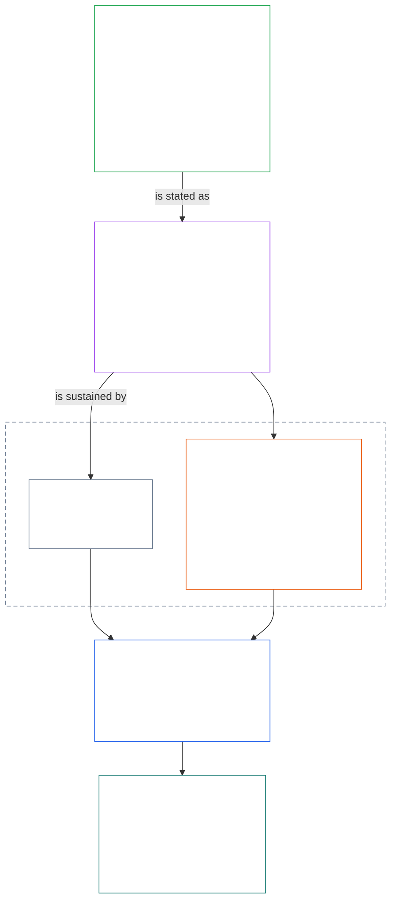
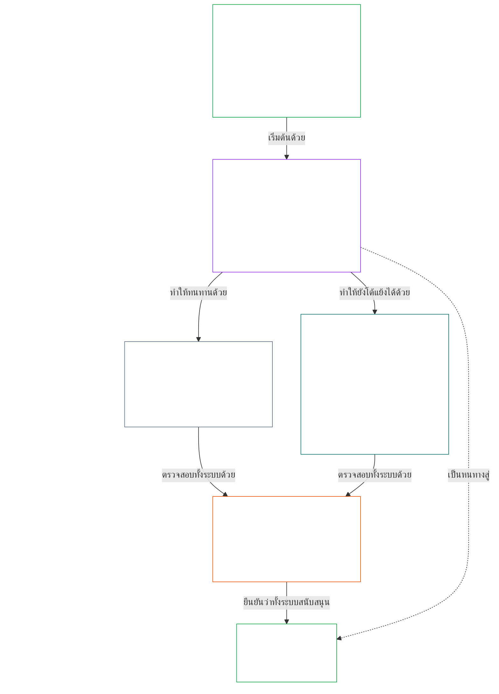

# บทที่ 01 ส่วน A: หลักการด้านคุณค่า

<details>
<summary><strong><span style="color: #2563eb;">ตำแหน่งในคลังเนื้อหา (ไม่มีผลเชิงปฏิบัติการ): โครงสร้างไฟล์และกติกาการอ่าน</span></strong></summary>

> เนื้อหาต่อไปนี้เป็น **เพียงคำแนะนำสำหรับผู้อ่าน** ไม่ได้เพิ่ม ลบ หรือจำกัดหน้าที่ที่มีผลผูกพันในไฟล์นี้หรือบทอื่น
>
> ไฟล์นี้ **เป็นส่วนหนึ่งของรัฐธรรมนูญ Sentient** และจะ **มีผลผูกพันก็ต่อเมื่ออ่านร่วมกับ** ไฟล์ `core_*` อื่น ๆ ที่มีหมายเลข โดยถือเป็นเอกสารฉบับเดียวกัน ไฟล์นี้ประกอบด้วย **บทที่หนึ่ง ส่วน A** (§§1–12: วัตถุประสงค์และบทบาท; เป้าหมาย Flourishing ซึ่งเริ่มใน §2 และพัฒนาผ่านความเป็นอยู่ที่ดี ความปลอดภัย ความจริง ความไว้วางใจ และเสรีภาพ; และเป้าหมาย Continuity ซึ่งเริ่มใน §8 และพัฒนาผ่านขีดความสามารถของระบบร่วมกัน ความยืดหยุ่น โครงสร้างตลาด และการประเมินเชิงระบบ)
>
> **ส่วนก่อนหน้า:** [core_00_preamble.md](core_00_preamble.md)  
> **ส่วนถัดไป:** [core_01_b_interaction_interpretation.md](core_01_b_interaction_interpretation.md) (บทที่หนึ่ง ส่วน B — §§13–15: ปฏิสัมพันธ์ ข้อจำกัดในการลบล้าง และการตีความตามรัฐธรรมนูญ)  
> **ลำดับการอ่าน:** §1 วัตถุประสงค์และบทบาท → **Flourishing:** บทนำ §2 (โดย §2.1 ระบุข้อจำกัดที่ไม่อาจต่อรองได้เรื่องความปลอดภัยและความจริง) → §3 ความเป็นอยู่ที่ดี (ผลลัพธ์) → §4 ความปลอดภัย → §5 ความจริง → §6 ความไว้วางใจ → §7 เสรีภาพ → **Continuity:** บทนำ §8 → §9 ขีดความสามารถของระบบร่วมกัน (สะพานเชื่อม: เป็นทั้งวิธีส่งเสริม Flourishing และสาระสำคัญของ Continuity) → §10 ความยืดหยุ่น → §11 โครงสร้างตลาด → §12 การประเมินเชิงระบบ

</details>

<details>
<summary><strong><span style="color: #2563eb;">คำแนะนำสำหรับผู้อ่าน (ไม่มีผลเชิงปฏิบัติการ): บทที่หนึ่งเชื่อมโยงเป้าหมาย จตุภาค บทบัญญัติ และคำจำกัดความอย่างไร</span></strong></summary>

> เนื้อหาต่อไปนี้เป็น **เพียงคำแนะนำสำหรับผู้อ่าน** ไม่ได้เพิ่ม ลบ หรือจำกัดหน้าที่ที่มีผลผูกพันในไฟล์นี้หรือบทอื่น ส่วน **Trace** และ **Definitions · Assessment · Compliance** ของแต่ละหัวข้อเป็นช่องทางอ้างอิงที่มีผลผูกพัน ส่วนนี้เป็นแผนที่ภาพรวมสำหรับผู้อ่านที่เริ่มอ่านบทที่หนึ่ง

**ชั้นต่าง ๆ เชื่อมโยงกันอย่างไร** แต่ละชั้นตอบคำถามที่แตกต่างกัน และหลักการทุกข้อในบทที่หนึ่งชี้ไปยังอีกสามชั้น:

- **เป้าหมายและจตุภาค** ([คำนำ §1](core_00_preamble.md#the-model)): ระบบร่วมกันมีไว้เพื่ออะไร ([Flourishing](core_05_apex_flourishing_aim.md#flourishing-constitutional) และ [Continuity](core_05_apex_continuity_aim.md#chapter-five-definitions-continuity-constitutional-aim)) และหน้าที่สี่ประการที่ทำให้การแสวงหานั้นชอบธรรม ([การมีส่วนร่วม](core_05_apex_participation_leg.md#participation-constitutional), [การกำกับดูแล](core_05_apex_oversight_leg.md#oversight-constitutional), [ความรับผิดรับชอบ](core_05_apex_accountability_leg.md#accountability) และ [ความทันท่วงที](core_05_apex_timeliness_leg.md#timeliness-constitutional))
- **หลักการ** (บทนี้): เป้าหมายและหน้าที่เหล่านั้นกลายเป็นคุณค่า ข้อจำกัด และกฎสำหรับการชั่งน้ำหนักระหว่างกันได้อย่างไร
- **บทบัญญัติ** ([บทที่หก](core_06_rights_part_a.md#chapter-six-foundational-rights)): หลักประกันขั้นต่ำด้านสิทธิที่ยังคงใช้ได้ขณะดำเนินตามเป้าหมาย ส่วน **Trace** ของแต่ละหัวข้อจะแสดงรายการไว้ใต้หัวข้อ *โดยเฉพาะ*
- **คำจำกัดความ** ([บทที่สองถึงบทที่ห้า](core_02_definition_structure.md)): ความหมายร่วมกันที่ใช้ตรวจสอบว่าข้อกล่าวอ้างเป็นจริงหรือไม่ ส่วน **Definitions · Assessment · Compliance** ของแต่ละหัวข้อจะแสดงรายการไว้

**บทที่หนึ่งพัฒนาแต่ละเป้าหมายไว้ตรงไหน** Flourishing คือความเป็นอยู่ที่ดีของสิ่งมีความรู้สึก ซึ่งดำรงอยู่ได้ด้วยความจริง ความปลอดภัย ความน่าเชื่อถือ และความสามารถในการตัดสินใจอย่างมีความหมาย ([คำนำ §1](core_00_preamble.md#flourishing)) บทที่หนึ่งระบุผลลัพธ์ก่อน แล้วจึงกำหนดหลักการหนึ่งข้อสำหรับเงื่อนไขทั้งสี่แต่ละข้อ

| เป้าหมายและด้าน | หลักการในบทที่หนึ่ง | ตำแหน่งคำจำกัดความ | บทบัญญัติที่ระบุใน Trace |
|---|---|---|---|
| **Flourishing**: ผลลัพธ์ | [§3 ความเป็นอยู่ที่ดี](#3-foundational-objective-wellbeing-flourishing-aim) | [ความเป็นอยู่ที่ดี](core_05_band_continuity.md#wellbeing) | [VI](core_06_rights_part_b.md#article-vi-equal-basic-rights), [X](core_06_rights_part_b.md#article-x-self-determination-agency-and-participation), [XIII-B](core_06_rights_part_c.md#article-xiii-b-right-to-redress-and-remedy), [XIX-B](core_06_rights_part_d.md#article-xix-b-contestability-and-proportional-restriction-limits) |
| **Flourishing**: ความปลอดภัย | [§4 ความปลอดภัย](#4-safety-harm-constraint) | [ความปลอดภัย](core_05_band_continuity.md#safety-constitutional-constraint) | [XIII](core_06_rights_part_c.md#article-xiii-right-to-reliable-and-trustworthy-systems), [XVII](core_06_rights_part_c.md#article-xvii-system-lifecycle-environments-and-reversibility), [XXIII](core_06_rights_part_d.md#article-xxiii-root-cause-analysis-and-adaptive-response) |
| **Flourishing**: ความจริง | [§5 ความจริง](#5-truth-epistemic-integrity-constraint) | [ความจริง](core_05_band_oversight.md#truth-constitutional-constraint) | [XIII](core_06_rights_part_c.md#article-xiii-right-to-reliable-and-trustworthy-systems), [XV](core_06_rights_part_c.md#article-xv-info-sphere-integrity), [XVI](core_06_rights_part_c.md#article-xvi-audit-transparency-and-independent-verification) |
| **Flourishing**: ความน่าเชื่อถือ | [§6 ความไว้วางใจ](#6-trust-and-trustworthiness-coordination-integrity) | [ความน่าเชื่อถือ](core_05_band_continuity.md#trustworthiness) | [XIII](core_06_rights_part_c.md#article-xiii-right-to-reliable-and-trustworthy-systems), [XV](core_06_rights_part_c.md#article-xv-info-sphere-integrity), [XVI](core_06_rights_part_c.md#article-xvi-audit-transparency-and-independent-verification) |
| **Flourishing**: ความสามารถในการกำหนดตนเองอย่างมีความหมาย | [§7 เสรีภาพ](#7-freedom-bounded-agency) | [ความสามารถในการกำหนดตนเองอย่างมีความหมาย](core_05_band_participation.md#meaningful-agency) | [VI](core_06_rights_part_b.md#article-vi-equal-basic-rights), [X](core_06_rights_part_b.md#article-x-self-determination-agency-and-participation), [XXI](core_06_rights_part_d.md#article-xxi-interoperability-portability-movement-refuge-and-exit-integrity) |
| **Continuity**, เชื่อมไปสู่ Flourishing: ขีดความสามารถที่ยั่งยืน | [§9 ขีดความสามารถของระบบร่วมกัน](#9-shared-system-capacity) | [ขีดความสามารถของระบบร่วมกัน](core_05_band_continuity.md#shared-system-capacity) | [I-A](core_06_rights_part_a.md#article-i-a-environmental-preconditions-and-ecological-integrity), [III](core_06_rights_part_a.md#article-iii-survival-and-essential-access), [V](core_06_rights_part_a.md#article-v-resource-allocation-dependencies-and-ecosystem-funding) |
| **Continuity**: ความยืดหยุ่น | [§10 ความยืดหยุ่นและการออกแบบที่ซ่อมแซมตนเองได้](#10-resilience-and-self-healing-design) | [การซ่อมแซมตนเอง](core_05_band_continuity.md#self-healing) | [XIII](core_06_rights_part_c.md#article-xiii-right-to-reliable-and-trustworthy-systems), [XVII](core_06_rights_part_c.md#article-xvii-system-lifecycle-environments-and-reversibility), [XXIII](core_06_rights_part_d.md#article-xxiii-root-cause-analysis-and-adaptive-response) |
| **Continuity**: ตลาดที่แข่งขันได้ | [§11 โครงสร้างตลาด](#11-market-structure) | [โครงสร้างตลาด](core_05_band_accountability.md#market-structure) | [III-C](core_06_rights_part_a.md#article-iii-c-labor-and-economic-floor), [V](core_06_rights_part_a.md#article-v-resource-allocation-dependencies-and-ecosystem-funding), [XXI](core_06_rights_part_d.md#article-xxi-interoperability-portability-movement-refuge-and-exit-integrity) |
| **Continuity**: มุมมองทั้งระบบ | [§12 ข้อกำหนดการประเมินเชิงระบบ](#12-systemic-evaluation-requirement) | [การรับรองความสอดคล้องของระบบ](core_05_band_continuity.md#system-alignment-certification) | [XVI](core_06_rights_part_c.md#article-xvi-audit-transparency-and-independent-verification) |

**ลำดับชั้นของหลักการ (Continuity)** ในระดับหลักการ เป้าหมาย Continuity พัฒนาตามลำดับต่อไปนี้ โดยเริ่มจากขีดความสามารถที่เชื่อมโยงเป้าหมายทั้งสอง:

6. **[ขีดความสามารถของระบบร่วมกัน](core_05_band_continuity.md#shared-system-capacity)** คือผลรวมที่การดูแลรับผิดชอบ การกำกับดูแล และแรงจูงใจที่ดีควรสร้างขึ้นเมื่อเวลาผ่านไป — ความสามารถจริงที่ตรวจสอบโต้แย้งได้ เพื่อให้สิ่งมีความรู้สึกและระบบร่วมกันทำงานที่รัฐธรรมนูญกำหนดได้ ขีดความสามารถนี้คร่อมทั้งสองเป้าหมาย: เป็นหนทางสู่ **Flourishing** และเป็นสาระของ **Continuity** แต่ไม่ใช่สิ่งที่ใช้ลบล้างทุกอย่างอื่น **[§9.1](#91-productive-capacity-instrumental-good)** และ **[§9.2](#92-constitutional-efficiency)** อธิบายองค์ประกอบหลักสองประการของขีดความสามารถนี้
7. **[ความยืดหยุ่นและการออกแบบที่ซ่อมแซมตนเองได้](#10-resilience-and-self-healing-design)** ระบุว่าระบบที่สิ่งมีความรู้สึกพึ่งพาตรวจพบปัญหาได้แต่เนิ่น ๆ ควบคุมปัญหา ล้มเหลวตามเส้นทางที่เปิดเผยไว้ และฟื้นตัวอย่างตรงไปตรงมาได้อย่างไร ([**การซ่อมแซมตนเอง**](core_05_band_continuity.md#self-healing)) เพื่อให้ขีดความสามารถจากข้อ 6 คงทน และเสถียรภาพไม่ต้องพึ่งการแทรกแซงฉุกเฉิน
8. **[โครงสร้างตลาด](core_05_band_accountability.md#market-structure)** ใน [§11](#11-market-structure) กำหนดวินัยต่อต้านการกระจุกตัว เพื่อให้ขีดความสามารถดังกล่าวยังถูกโต้แย้งได้ในทางปฏิบัติ
9. **[ข้อกำหนดการประเมินเชิงระบบ](#12-systemic-evaluation-requirement)** ตรวจสอบขอบเขตของทั้งระบบ การพึ่งพากัน และความสอดคล้องของแรงจูงใจก่อนยอมรับข้อกล่าวอ้างด้านการปฏิบัติตามข้อกำหนดหรือการกำกับดูแล — โดยเป็นแนวทางตรวจสอบในระดับหลักการภายใต้หน้าที่ **การกำกับดูแล** ของจตุภาค รวมถึง [การรับรองความสอดคล้องของระบบ](core_05_band_continuity.md#system-alignment-certification) ซึ่งเป็นหนึ่งในกระบวนการตรวจสอบขนาดใหญ่เป็นพิเศษหลายกระบวนการ

**บทที่หนึ่งนำจตุภาคมาใช้ตรงไหน** แต่ละหัวข้อระบุหน้าที่ที่เกี่ยวข้องไว้ใน Trace หัวข้อต่อไปนี้รองรับหน้าที่เหล่านั้นโดยตรงที่สุด:

| หน้าที่ของจตุภาค | หัวข้อหลักในบทที่หนึ่ง |
|---|---|
| **การมีส่วนร่วม** | [§16 การดูแลรับผิดชอบเชิงลึก](core_01_c_stewardship_capacity_principles.md#16-stewardship-in-depth) และ [§17 การดูแลรับผิดชอบที่มีผลตามมา](core_01_c_stewardship_capacity_principles.md#17-consequential-stewardship-the-steward-role) (บทบาทที่มีผลสำคัญและการมีเสียง); [§7 เสรีภาพ](#7-freedom-bounded-agency) (ความสามารถในการกำหนดตนเองอย่างมีความหมาย) |
| **การกำกับดูแล** | [§16](core_01_c_stewardship_capacity_principles.md#16-stewardship-in-depth) และ [§17](core_01_c_stewardship_capacity_principles.md#17-consequential-stewardship-the-steward-role) (ความเข้าใจและบันทึกที่กระจายทั่วถึง); [§18 การกำกับดูแล](core_01_c_stewardship_capacity_principles.md#18-governance-under-stewardship-discipline) (การจัดสรรอำนาจ); [§12](#12-systemic-evaluation-requirement) (การตรวจสอบ) |
| **ความรับผิดรับชอบ** | [§18 การกำกับดูแล](core_01_c_stewardship_capacity_principles.md#18-governance-under-stewardship-discipline) (ความรับผิดรับชอบตามสัดส่วนอำนาจ); [§19 การปรับแรงจูงใจให้สอดคล้องและการครอบงำระบบ](core_01_c_stewardship_capacity_principles.md#19-incentive-alignment-and-system-capture) (รางวัลต้องไม่ทำให้หน้าที่เหล่านี้หมดความหมาย) |
| **ความทันท่วงที** | [§16](core_01_c_stewardship_capacity_principles.md#16-stewardship-in-depth) และ [§17](core_01_c_stewardship_capacity_principles.md#17-consequential-stewardship-the-steward-role) (ตรวจพบและแก้ปัญหาโดยไม่ล่าช้าอย่างหลีกเลี่ยงได้) |

**สองแกน ไม่ใช่ความขัดแย้ง** เป้าหมายบอกว่าระบบมุ่งทำสิ่งใด ส่วนจตุภาคบอกว่าการมุ่งทำนั้นคงความชอบธรรมได้อย่างไร คำหนึ่งอาจอยู่บนทั้งสองแกน: ความจริงและความน่าเชื่อถือเป็นองค์ประกอบของ Flourishing และ [คำนำ §2](core_00_preamble.md#2-measurements-overview) วัดทั้งสองสิ่งในกลุ่มการกำกับดูแล [§§13–15](core_01_b_interaction_interpretation.md#13-constitutional-collision-resolution-process) กำหนดวิธีชั่งน้ำหนักและอ่านหลักการเหล่านี้ร่วมกันเมื่อขัดแย้งกัน ส่วน [§20](core_01_c_stewardship_capacity_principles.md#20-integrated-application) นำไปใช้กับทุกบทต่อจากนี้

</details>

<br>

### 1. วัตถุประสงค์และบทบาท
<details>
<summary><strong><span style="color: #2563eb;">ร่องรอย</span></strong></summary>

- ต้นทาง: [คำนำ §1 แบบจำลอง](core_00_preamble.md#the-model) — [จตุรภาคแห่งรัฐธรรมนูญ](core_00_preamble.md#constitutional-tetrad), [เป้าหมายตามรัฐธรรมนูญสองประการ](core_00_preamble.md#two-constitutional-aims) และการปรับตาม [เดิมพันที่มีนัยสำคัญ](core_00_preamble.md#material-stake) ใช้กับทั้งบทผ่านร่องรอยของแต่ละส่วน
- ปลายทาง: [15. การตีความรัฐธรรมนูญ](core_01_b_interaction_interpretation.md#15-constitutional-interpretation) สำหรับการอ่านแบบบูรณาการ ความกำกวม ลำดับชั้นภายใน และกระบวนการแก้ไขความขัดแย้งที่เป็นหลักเกณฑ์
- ปลายทาง: [เป้าหมายตามรัฐธรรมนูญสองประการ](core_00_preamble.md#two-constitutional-aims) — การพัฒนาเป้าหมาย **ความรุ่งเรือง**: ตั้งแต่ [§3](#3-foundational-objective-wellbeing-flourishing-aim) ถึง [§6](#6-trust-and-trustworthiness-coordination-integrity) และ [§7 เสรีภาพ](#7-freedom-bounded-agency); การพัฒนาเป้าหมาย **ความต่อเนื่อง**: [§9 ขีดความสามารถของระบบร่วม](#9-shared-system-capacity), [§10 ความยืดหยุ่นและการออกแบบที่ฟื้นฟูตนเอง](#10-resilience-and-self-healing-design), [§11 โครงสร้างตลาด](#11-market-structure) และ [§12 ข้อกำหนดการประเมินเชิงระบบ](#12-systemic-evaluation-requirement)
- ปลายทาง: [3. วัตถุประสงค์พื้นฐาน: ความเป็นอยู่ที่ดี](#3-foundational-objective-wellbeing-flourishing-aim), [§3.2 การยอมรับ การส่งเสริม และความมุ่งหวัง](#32-recognition-reinforcement-and-aspiration), [4 ความปลอดภัย](#4-safety-harm-constraint), [5 ความจริง](#5-truth-epistemic-integrity-constraint), [6 ความไว้วางใจ](#6-trust-and-trustworthiness-coordination-integrity), [§16 การดูแลรับผิดชอบเชิงลึก](core_01_c_stewardship_capacity_principles.md#16-stewardship-in-depth), [13. กระบวนการแก้ไขความขัดแย้งตามรัฐธรรมนูญ](core_01_b_interaction_interpretation.md#13-constitutional-collision-resolution-process) และ [§7 เสรีภาพ](#7-freedom-bounded-agency)
- อ่านร่วมกับ: [จตุรภาคแห่งรัฐธรรมนูญ](core_00_preamble.md#constitutional-tetrad) — การมีส่วนร่วม การกำกับดูแล ความรับผิดรับชอบ และความทันท่วงที กำกับวิธีที่ระบบร่วมมุ่งสู่ [เป้าหมายตามรัฐธรรมนูญสองประการ](core_00_preamble.md#two-constitutional-aims); การปรับตาม [เดิมพันที่มีนัยสำคัญ](core_00_preamble.md#material-stake) ใช้กับทั้งบทผ่านร่องรอยของแต่ละส่วน
- อ่านร่วมกับ: [บทที่สองถึงสี่](core_02_definition_structure.md) และ [บทที่ห้า](core_05__definitions_home.md#chapter-five-foundational-definitions) — ชั้นกลไกที่ใช้กำกับทุกคำศัพท์ในบทนี้; ใช้ความครบถ้วนของ O/M/A/C การป้องกันการหลบเลี่ยง ภาระ และการตรวจสอบย้อนกลับจากคำนิยามไปสู่ผลลัพธ์
- อ่านร่วมกับ: [บทที่หก: สิทธิขั้นพื้นฐาน](core_06_rights_part_a.md#chapter-six-foundational-rights)
  - โดยเฉพาะ [มาตรา VI: สิทธิขั้นพื้นฐานที่เสมอภาค](core_06_rights_part_b.md#article-vi-equal-basic-rights), [มาตรา XIII: สิทธิในระบบที่เชื่อถือได้และไว้วางใจได้](core_06_rights_part_c.md#article-xiii-right-to-reliable-and-trustworthy-systems) และ [มาตรา XXIV: การตีความรัฐธรรมนูญ การทบทวน และหลักประกันต่อต้านการยึดครอง](core_06_rights_part_d.md#article-xxiv-constitutional-interpretation-review-and-anti-capture-safeguards)
  - ใช้การอ่านนี้เมื่อการตีความส่งผลต่อสิ่งมีชีวิตที่มีสำนึกรู้ ระบบ หรือสถาบันที่ได้รับความคุ้มครอง

</details>

<details>
<summary><strong><span style="color: #2563eb;">คำนิยาม · การประเมิน · การปฏิบัติตาม</span></strong></summary>

- [ความได้สัดส่วน](core_05_band_accountability.md#proportionality) · [O](core_05_band_accountability.md#proportionality) · [M](core_05_band_accountability.md#proportionality-a) · [A](core_05_band_accountability.md#proportionality-a) · [C](core_05_band_accountability.md#proportionality-c)
- [ความจำเป็น](core_05_band_accountability.md#necessity) · [O](core_05_band_accountability.md#necessity) · [M](core_05_band_accountability.md#necessity-a) · [A](core_05_band_accountability.md#necessity-a) · [C](core_05_band_accountability.md#necessity-c)

</details>

<br>

*กล่าวอย่างง่าย: บทที่หนึ่งกำหนดคุณค่าและข้อจำกัดที่ใช้กำกับบทอื่นทั้งหมด ระบบร่วมต้องมุ่งสู่ **ความรุ่งเรือง** และ **ความต่อเนื่อง** ไปพร้อมกัน โดยไม่แลกเป้าหมายหนึ่งกับอีกเป้าหมายหนึ่ง และห้ามทำให้คุณค่าใดสูงสุดด้วยการแลกกับคุณค่าอื่น*

<a id="two-constitutional-aims"></a><a id="flourishing"></a><a id="continuity"></a>บทนี้กำหนดหลักการและข้อจำกัดที่ใช้กำกับการตีความ การประยุกต์ใช้ และการพัฒนารัฐธรรมนูญฉบับนี้ บทนี้พัฒนา [เป้าหมายตามรัฐธรรมนูญสองประการ](core_00_preamble.md#two-constitutional-aims) — [**ความรุ่งเรือง**](core_00_preamble.md#flourishing) และ [**ความต่อเนื่อง**](core_00_preamble.md#continuity) — ซึ่งกำหนดไว้ใน [คำนำ §1 แบบจำลอง](core_00_preamble.md#the-model) ให้เป็นหลักการและข้อจำกัดที่มีผลใช้บังคับ คำนิยามระดับหลักการที่เป็นมาตรฐานอยู่ในคำนำ; บทนี้นำคำนิยามเหล่านั้นมาปรับใช้

ต้องมุ่งสู่เป้าหมายทั้งสองไปพร้อมกัน เสมอภายในข้อจำกัดของหลักการที่ไม่อาจต่อรองได้และหลักประกันสิทธิที่กำหนดไว้ในรัฐธรรมนูญฉบับนี้ [**จตุรภาคแห่งรัฐธรรมนูญ**](core_00_preamble.md#constitutional-tetrad) กำกับให้ความพยายามดังกล่าวคงความชอบธรรม โดยปรับตาม [**เดิมพันที่มีนัยสำคัญ**](core_00_preamble.md#material-stake)

บทนี้จัดโครงสร้างโดยยึดเป้าหมายสองประการและจตุรภาคดังกล่าว:
- **ความรุ่งเรือง:** [บทนำสู่เป้าหมายความรุ่งเรือง](#2-flourishing-aim-introduction) วางแผนภาพของเป้าหมาย [§3 วัตถุประสงค์พื้นฐาน: ความเป็นอยู่ที่ดี](#3-foundational-objective-wellbeing-flourishing-aim) ระบุผลลัพธ์ ส่วน [§4 ความปลอดภัย](#4-safety-harm-constraint), [§5 ความจริง](#5-truth-epistemic-integrity-constraint), [§6 ความไว้วางใจ](#6-trust-and-trustworthiness-coordination-integrity) และ [§7 เสรีภาพ](#7-freedom-bounded-agency) พัฒนาเงื่อนไขสี่ประการที่ค้ำจุนเป้าหมายนี้ ได้แก่ ความปลอดภัย ความจริง ความน่าไว้วางใจ และความเป็นผู้กระทำการอย่างมีความหมาย
- **ความต่อเนื่อง:** [บทนำสู่เป้าหมายความต่อเนื่อง](#8-continuity-aim-introduction) วางแผนภาพของเป้าหมาย [§9 ขีดความสามารถของระบบร่วม](#9-shared-system-capacity) (เป็นทั้งหนทางสู่ความรุ่งเรืองและสาระสำคัญของความต่อเนื่อง), [§10 ความยืดหยุ่นและการออกแบบที่ฟื้นฟูตนเอง](#10-resilience-and-self-healing-design), [§11 โครงสร้างตลาด](#11-market-structure) และ [§12 ข้อกำหนดการประเมินเชิงระบบ](#12-systemic-evaluation-requirement) พัฒนาความมั่นคงระยะยาว ขีดความสามารถของระบบร่วมที่ยั่งยืน และความยืดหยุ่น ข้อกล่าวอ้างเรื่องความต่อเนื่องตั้งอยู่บนภาพรวมของทั้งระบบที่ซื่อตรง: ข้อกล่าวอ้างทุกข้อใน §§9–11 จะตั้งอยู่ได้ก็ต่อเมื่อผ่านการตรวจสอบใน §12
- **เมื่อหลักการมาบรรจบกัน:** [§13 กระบวนการแก้ไขความขัดแย้งตามรัฐธรรมนูญ](core_01_b_interaction_interpretation.md#13-constitutional-collision-resolution-process), [§14 ข้อห้ามการลบล้างโดยเด็ดขาด](core_01_b_interaction_interpretation.md#14-prohibition-on-absolute-override) และ [§15 การตีความรัฐธรรมนูญ](core_01_b_interaction_interpretation.md#15-constitutional-interpretation) กำกับวิธีชั่งน้ำหนักและอ่านเป้าหมายกับหลักการร่วมกัน
- **จตุรภาคในทางปฏิบัติ:** ตั้งแต่ [§16 การดูแลรับผิดชอบเชิงลึก](core_01_c_stewardship_capacity_principles.md#16-stewardship-in-depth) ถึง [§19 การจัดแนวแรงจูงใจและการยึดครองระบบ](core_01_c_stewardship_capacity_principles.md#19-incentive-alignment-and-system-capture) นำการมีส่วนร่วม การกำกับดูแล ความรับผิดรับชอบ และความทันท่วงทีไปสู่การดูแลรับผิดชอบ ธรรมาภิบาล และแรงจูงใจ; [§20 การประยุกต์ใช้อย่างบูรณาการ](core_01_c_stewardship_capacity_principles.md#20-integrated-application) นำทั้งบทไปใช้กับทุกบทถัดไป

**ร่องรอย** ของแต่ละหลักการระบุมาตราในบทที่หกที่คุ้มครองหลักการนั้น ส่วนวิดเจ็ต **คำนิยาม · การประเมิน · การปฏิบัติตาม** ระบุคำนิยามในบทที่ห้าที่ใช้วัดหลักการนั้น

**แผนภาพ: เป้าหมายตามรัฐธรรมนูญสองประการและจตุรภาคแห่งรัฐธรรมนูญ**

<hr style="border: 0; border-top: 1px solid currentColor;">

```mermaid
flowchart TB
    subgraph Foundation[" "]
        direction TB
        subgraph Aims["เป้าหมายตามรัฐธรรมนูญสองประการ"]
            direction LR
            F["ความรุ่งเรือง<br/><br/>• ความเป็นอยู่ที่ดีของสิ่งมีชีวิตที่มีสำนึกรู้ดำรงอยู่ได้ด้วยความจริง ความปลอดภัย<br/>ความน่าไว้วางใจ และความเป็นผู้กระทำการอย่างมีความหมาย"]
            C["ความต่อเนื่อง<br/><br/>• ความมั่นคงระยะยาว ความยั่งยืน ความยืดหยุ่น<br/>และความเป็นอยู่ที่ดีทางนิเวศ"]
        end
        subgraph Tetrad1["จตุรภาคแห่งรัฐธรรมนูญ · การมีส่วนร่วมและการกำกับดูแล"]
            direction LR
            P["การมีส่วนร่วม<br/><br/>• ผู้มีสำนึกรู้ที่ได้รับผลกระทบมีเสียงจริง<br/>• มีตัวแทนอย่างเป็นธรรมและมีโอกาสท้าทายอย่างเป็นธรรม<br/>• เข้าถึงบทบาทที่มีผลตามสัดส่วนของเดิมพัน"]
            O["การกำกับดูแล<br/><br/>• เฝ้าดู ตรวจสอบ ยืนยัน และจัดเก็บบันทึก<br/>• การทบทวนโดยอิสระสามารถจำกัดทางเลือกที่ไม่เหมาะสม"]
        end
        subgraph Tetrad2["จตุรภาคแห่งรัฐธรรมนูญ · ความรับผิดรับชอบและความทันท่วงที"]
            direction LR
            A["ความรับผิดรับชอบ<br/><br/>• ระบุความรับผิดชอบไปยังผู้กระทำที่ถูกต้อง<br/>• การชี้แจง การเยียวยา และการแก้ไขที่แท้จริง<br/>• ผลลัพธ์ที่ไม่ดีต้องนำไปสู่การซ่อมแซม"]
            T["ความทันท่วงที<br/><br/>• ตรวจพบ ท้าทาย แก้ไข และจัดการปัญหา<br/>• กำหนดเวลาสอดคล้องกับเดิมพันที่มีนัยสำคัญ<br/>• ความล่าช้าลบสิทธิ วิธีเยียวยา หรือการซ่อมแซมไม่ได้"]
        end
    end
    F ~~~ P
    P ~~~ A
    style Foundation fill:none,stroke:none
    style Aims fill:none,stroke:none
    style Tetrad1 fill:none,stroke:none
    style Tetrad2 fill:none,stroke:none
    style F fill:none,stroke:#16a34a,color:#ffffff
    style C fill:none,stroke:#16a34a,color:#ffffff
    style P fill:none,stroke:#0f766e,color:#ffffff
    style O fill:none,stroke:#ea580c,color:#ffffff
    style A fill:none,stroke:#db2777,color:#ffffff
    style T fill:none,stroke:#9333ea,color:#ffffff
```

*เป้าหมายอธิบายสิ่งที่ระบบร่วมต้องมุ่งไปให้ถึง ส่วนจตุรภาคอธิบายหน้าที่ที่ทำให้ความพยายามนั้นชอบธรรม หน้าที่ทั้งสี่ปรับตาม [เดิมพันที่มีนัยสำคัญ](core_00_preamble.md#material-stake) และเป้าหมายทั้งสองอยู่ภายใต้ขอบเขตของพื้นฐานสิทธิ นำมาทำซ้ำจาก [ภาพรวมเชิงแนวคิด](guides/CONCEPTUAL_OVERVIEW.md#two-aims-and-the-constitutional-tetrad)*

คุณค่าเหล่านี้:
- ไม่เป็นอิสระจากกัน และโดยปกติไม่ได้เรียงลำดับชั้นอย่างเคร่งครัด
- ทำงานเป็นหลักการและข้อจำกัดที่มีปฏิสัมพันธ์กัน จึงต้องประเมินร่วมกัน
- ใช้กับ “ระบบ” ทุกประเภท ซึ่งรวมถึงโครงสร้างทางเทคนิค องค์กร เศรษฐกิจ สังคม-เทคนิค และระบบนิเวศที่ส่งผลอย่างมีนัยสำคัญต่อสิ่งมีชีวิตที่มีสำนึกรู้และโลก

ห้ามนำหลักการใดหลักการหนึ่งไปใช้แยกเดี่ยว หากการทำเช่นนั้นจะละเมิดหลักการอื่นอย่างมีนัยสำคัญ เมื่อเกิดความตึงเครียด ระบบต้องแก้ไขตามข้อกำหนดเรื่องความได้สัดส่วน ความจำเป็น และผลกระทบเชิงระบบในบทนี้ หากความขัดแย้งที่ยังแก้ไม่ตกเกี่ยวข้องโดยตรงกับข้อจำกัดของหลักการที่ไม่อาจต่อรองได้ ให้กระบวนการแก้ไขความขัดแย้งตามรัฐธรรมนูญในบทที่หนึ่ง **§13** มีลำดับเหนือกว่า

<a id="2-flourishing-aim-introduction"></a>
### 2. บทนำสู่เป้าหมาย Flourishing
<details>
<summary><strong><span style="color: #2563eb;">Trace</span></strong></summary>

- อ่านประกอบกับ [จตุภาคตามรัฐธรรมนูญ](core_00_preamble.md#constitutional-tetrad) — องค์ประกอบทั้งสี่กำกับวิธีดำเนินตามเป้าหมาย Flourishing; [ส่วนได้เสียที่มีสาระสำคัญ](core_00_preamble.md#material-stake) เป็นตัวกำหนดระดับการตรวจสอบที่ข้อกล่าวอ้างเรื่อง Flourishing ต้องผ่าน
- อ่านประกอบกับ [เป้าหมายตามรัฐธรรมนูญสองประการ](core_00_preamble.md#two-constitutional-aims) — เป้าหมาย **Flourishing**; เป้าหมายคู่กันแนะนำไว้ใน [บทนำสู่เป้าหมาย Continuity](#8-continuity-aim-introduction)
- ต้นทาง: หลักการ: [คำนำ §1 แบบจำลอง](core_00_preamble.md#flourishing); [Flourishing (เป้าหมายตามรัฐธรรมนูญ)](core_05_apex_flourishing_aim.md#flourishing-constitutional); [§1 วัตถุประสงค์และบทบาท](#1-purpose-and-role)
- ปลายทาง: [§3 วัตถุประสงค์พื้นฐาน: ความเป็นอยู่ที่ดี (เป้าหมาย Flourishing)](#3-foundational-objective-wellbeing-flourishing-aim), [§4 ความปลอดภัย (ข้อจำกัดด้านอันตราย)](#4-safety-harm-constraint), [§5 ความจริง (ข้อจำกัดด้านความซื่อตรงทางญาณวิทยา)](#5-truth-epistemic-integrity-constraint), [§6 ความไว้วางใจและความน่าเชื่อถือ (ความซื่อตรงในการประสานงาน)](#6-trust-and-trustworthiness-coordination-integrity) และ [§7 เสรีภาพ (ความสามารถในการกำหนดตนเองที่มีขอบเขต)](#7-freedom-bounded-agency); Trace ของแต่ละหัวข้อระบุบทบัญญัติที่คุ้มครองหลักการนั้น
- หัวข้อย่อย: [§2.1 ข้อจำกัดของหลักการที่ไม่อาจต่อรองได้: ความปลอดภัยและความจริง](#21-non-negotiable-principle-constraints-safety-and-truth)
- อ่านประกอบกับ: หลักประกันขั้นต่ำด้านสิทธิในบทที่หกโดยทั่วไป

</details>

<details>
<summary><strong><span style="color: #2563eb;">คำจำกัดความ · การประเมิน · การปฏิบัติตาม</span></strong></summary>

- [Flourishing (เป้าหมายตามรัฐธรรมนูญ)](core_05_apex_flourishing_aim.md#flourishing-constitutional) · [O](core_05_apex_flourishing_aim.md#flourishing-constitutional) · [M](core_05_apex_flourishing_aim.md#flourishing-constitutional-m) · [A](core_05_apex_flourishing_aim.md#flourishing-constitutional-a) · [C](core_05_apex_flourishing_aim.md#flourishing-constitutional-c)
- [ความเป็นอยู่ที่ดี](core_05_band_continuity.md#wellbeing) · [O](core_05_band_continuity.md#wellbeing) · [M](core_05_band_continuity.md#wellbeing-a) · [A](core_05_band_continuity.md#wellbeing-a) · [C](core_05_band_continuity.md#wellbeing-c)
- [ความปลอดภัย (ข้อจำกัดตามรัฐธรรมนูญ)](core_05_band_continuity.md#safety-constitutional-constraint) · [O](core_05_band_continuity.md#safety-constitutional-constraint) · [M](core_05_band_continuity.md#safety-constraint-a) · [A](core_05_band_continuity.md#safety-constraint-a) · [C](core_05_band_continuity.md#safety-constraint-c)
- [ความจริง (ข้อจำกัดตามรัฐธรรมนูญ)](core_05_band_oversight.md#truth-constitutional-constraint) · [O](core_05_band_oversight.md#truth-constitutional-constraint-o) · [M](core_05_band_oversight.md#truth-constitutional-constraint-a) · [A](core_05_band_oversight.md#truth-constitutional-constraint-a) · [C](core_05_band_oversight.md#truth-constitutional-constraint-c)
- [ความน่าเชื่อถือ](core_05_band_continuity.md#trustworthiness) · [O](core_05_band_continuity.md#trustworthiness) · [M](core_05_band_continuity.md#trustworthiness-a) · [A](core_05_band_continuity.md#trustworthiness-a) · [C](core_05_band_continuity.md#trustworthiness-c)
- [ความสามารถในการกำหนดตนเองอย่างมีความหมาย](core_05_band_participation.md#meaningful-agency) · [O](core_05_band_participation.md#meaningful-agency) · [M](core_05_band_participation.md#meaningful-agency-a) · [A](core_05_band_participation.md#meaningful-agency-a) · [C](core_05_band_participation.md#meaningful-agency-c)

</details>

<br>

*กล่าวอย่างง่าย: Flourishing เป็นเป้าหมายแรกในสองประการ กล่าวคือ สิ่งมีความรู้สึกดำรงชีวิตอย่างดีและยังคงทำเช่นนั้นได้ เพราะระบบรอบตัวปลอดภัย ซื่อตรง น่าเชื่อถือ และเปิดพื้นที่ให้เลือกได้จริง §3 อธิบายว่าผลลัพธ์นั้นคืออะไร หลักการสี่ข้อถัดไปอธิบายว่าอะไรทำให้ผลลัพธ์นั้นเกิดขึ้นจริง*

[**Flourishing**](core_05_apex_flourishing_aim.md#flourishing-constitutional) คือ **ความเป็นอยู่ที่ดีของสิ่งมีความรู้สึกซึ่งยั่งยืนได้ด้วยความจริง ความปลอดภัย ความน่าเชื่อถือ และความสามารถในการกำหนดตนเองอย่างมีความหมาย** ([คำนำ §1 แบบจำลอง](core_00_preamble.md#flourishing)) บทที่หนึ่งพัฒนาเป้าหมายนี้เป็นสองขั้น: [§3 วัตถุประสงค์พื้นฐาน: ความเป็นอยู่ที่ดี (เป้าหมาย Flourishing)](#3-foundational-objective-wellbeing-flourishing-aim) ระบุผลลัพธ์ และหลักการสี่ข้อระบุเงื่อนไขที่ค้ำจุนผลลัพธ์นั้น

| เงื่อนไข | หลักการ | คำถามที่หลักการตอบ |
|---|---|---|
| **ความปลอดภัย** | [§4 ความปลอดภัย (ข้อจำกัดด้านอันตราย)](#4-safety-harm-constraint) | สิ่งมีความรู้สึกได้รับการคุ้มครองจากอันตรายที่หลีกเลี่ยงได้หรือไม่? |
| **ความจริง** | [§5 ความจริง (ข้อจำกัดด้านความซื่อตรงทางญาณวิทยา)](#5-truth-epistemic-integrity-constraint) พร้อม [§5.1 การสืบค้นโดยอาศัยวิทยาศาสตร์และการสนับสนุนการตัดสินใจ](#51-science-informed-inquiry-and-decision-support) และ [§5.2 การเข้าถึงด้วยภาษาที่เข้าใจง่าย (หน้าที่ด้านการมีส่วนร่วมและการดูแลรับผิดชอบ)](#52-plain-language-accessibility-participation-and-stewardship-duty) | สิ่งมีความรู้สึกเชื่อถือและเข้าใจสิ่งที่ได้รับแจ้งได้หรือไม่? |
| **ความน่าเชื่อถือ** | [§6 ความไว้วางใจและความน่าเชื่อถือ (ความซื่อตรงในการประสานงาน)](#6-trust-and-trustworthiness-coordination-integrity) | ระบบสร้างความไว้วางใจและซ่อมแซมความไว้วางใจนั้นเมื่อทำงานล้มเหลวหรือไม่? |
| **ความสามารถในการกำหนดตนเองอย่างมีความหมาย** | [§7 เสรีภาพ (ความสามารถในการกำหนดตนเองที่มีขอบเขต)](#7-freedom-bounded-agency) | สิ่งมีความรู้สึกยังมีเสรีภาพจริงและมีขอบเขตในการเลือก คัดค้าน รวมกลุ่ม และออกจากระบบหรือไม่? |

**หลักการของ Flourishing ทำงานร่วมกันอย่างไร:**
- **ความปลอดภัยและความจริงเป็นข้อจำกัดที่ไม่อาจต่อรองได้:** ระบุไว้ร่วมกันใน [§2.1 ข้อจำกัดของหลักการที่ไม่อาจต่อรองได้: ความปลอดภัยและความจริง](#21-non-negotiable-principle-constraints-safety-and-truth) และจะแลกทิ้งเพื่อให้ได้หลักการอื่นไม่ได้
- **ความไว้วางใจและเสรีภาพมีขอบเขต ไม่ใช่สิ่งเด็ดขาด:** ความไว้วางใจต้องสร้างขึ้นและแก้ไขเยียวยาได้ ([§6.1 การแก้ไขและการเยียวยา](#61-correction-and-remedy)); เสรีภาพอยู่ภายใต้ข้อจำกัดที่มีวินัย ([§7.1 วินัยในการจำกัด](#71-limitation-discipline))
- **ไม่มีหลักการใดใช้โดยลำพัง:** ต้องอ่านหลักการร่วมกัน และเมื่อขัดกันให้ชั่งน้ำหนักตาม [§13 กระบวนการแก้ไขความขัดแย้งตามรัฐธรรมนูญ](core_01_b_interaction_interpretation.md#13-constitutional-collision-resolution-process)
- **Flourishing มีเป้าหมายคู่กัน:** เป้าหมาย Continuity ถามว่าอะไรทำให้ผลลัพธ์นี้ยั่งยืน และแนะนำไว้ใน [บทนำสู่เป้าหมาย Continuity](#8-continuity-aim-introduction)

**แผนภาพ: Flourishing และหลักการต่าง ๆ**

<hr style="border: 0; border-top: 1px solid currentColor;">



*Flourishing ระบุเป็นผลลัพธ์และได้รับการค้ำจุนเป็นลำดับแรกด้วยข้อจำกัดที่ไม่อาจต่อรองได้ ได้แก่ ความปลอดภัยและความจริง ซึ่งต่างส่งเสริมความไว้วางใจ และความไว้วางใจก็ส่งเสริมเสรีภาพต่อไป สีเป็นสัญญาณภาพที่นำกลับมาใช้ได้ ไม่ใช่การอ้างลำดับความสำคัญ Trace ของแต่ละหลักการระบุบทบัญญัติที่เกี่ยวข้อง ส่วนองค์ประกอบคำจำกัดความ · การประเมิน · การปฏิบัติตามระบุคำจำกัดความที่เกี่ยวข้อง ทำซ้ำใน [ภาพรวมเชิงแนวคิด](guides/CONCEPTUAL_OVERVIEW.md#flourishing-and-its-principles)*

<a id="21-non-negotiable-principle-constraints-safety-and-truth"></a>
#### 2.1 ข้อจำกัดของหลักการที่ไม่อาจต่อรองได้: ความปลอดภัยและความจริง
<details>
<summary><strong><span style="color: #2563eb;">Trace</span></strong></summary>

- อ่านประกอบกับ [จตุภาคตามรัฐธรรมนูญ](core_00_preamble.md#constitutional-tetrad) — องค์ประกอบด้าน **การมีส่วนร่วม** (ทำความเข้าใจและโต้แย้งการวินิจฉัยเรื่องความปลอดภัยและความจริง); ด้าน **การกำกับดูแล** (ตรวจจับความเสี่ยงอันตรายและการเสื่อมถอยทางญาณวิทยา); ด้าน **ความรับผิดรับชอบ** (ต้องตอบต่ออันตราย การหลอกลวง และการชักนำให้เชื่ออย่างทำให้เข้าใจผิด); ปรับระดับตาม[ส่วนได้เสียที่มีสาระสำคัญ](core_00_preamble.md#material-stake)
- อ่านประกอบกับ [เป้าหมายตามรัฐธรรมนูญสองประการ](core_00_preamble.md#two-constitutional-aims) — เป้าหมาย **Flourishing** (**ความปลอดภัย** และ **ความจริง** เป็นองค์ประกอบที่ระบุชื่อไว้ตาม [คำนำ §1](core_00_preamble.md#two-constitutional-aims)); เป้าหมาย **Continuity** (การป้องกันอันตรายในระยะยาวและการดูแลระบบที่ยั่งยืนอย่างซื่อตรง)
- ต้นทาง: หลักการ: [3. วัตถุประสงค์พื้นฐาน: ความเป็นอยู่ที่ดี](#3-foundational-objective-wellbeing-flourishing-aim); [เป้าหมายตามรัฐธรรมนูญสองประการ](core_00_preamble.md#two-constitutional-aims)
- ปลายทาง: [6. ความไว้วางใจ](#6-trust-and-trustworthiness-coordination-integrity), [13. กระบวนการแก้ไขความขัดแย้งตามรัฐธรรมนูญ](core_01_b_interaction_interpretation.md#13-constitutional-collision-resolution-process) และ [§7 เสรีภาพ](#7-freedom-bounded-agency)
- ใช้ใน: [§4 ความปลอดภัย](#4-safety-harm-constraint); [§5 ความจริง](#5-truth-epistemic-integrity-constraint); [§5.1 การสืบค้นโดยอาศัยวิทยาศาสตร์และการสนับสนุนการตัดสินใจ](#51-science-informed-inquiry-and-decision-support); [§5.2 การเข้าถึงด้วยภาษาที่เข้าใจง่าย](#52-plain-language-accessibility-participation-and-stewardship-duty)

</details>

<br>

*กล่าวอย่างง่าย: ความปลอดภัยและความจริงเป็นพื้นขั้นต่ำที่แข็งแกร่งของรัฐธรรมนูญ ไม่ใช่สิ่งที่แลกเปลี่ยนหรือปรับให้เหมาะที่สุดจนตัดทิ้งได้ ระบบร่วมกันต้องไม่ทำให้สิ่งมีความรู้สึกตกอยู่ในอันตรายอย่างคาดหมายได้หรือหลอกลวงพวกเขา ข้อจำกัดทั้งสองใช้บังคับในระหว่างการดำเนินตาม Flourishing และ Continuity ภายใต้วินัยด้านการมีส่วนร่วม การกำกับดูแล ความรับผิดรับชอบ และความทันท่วงทีของจตุภาค*

**ความปลอดภัย** และ **ความจริง** เป็นข้อจำกัดของหลักการที่ไม่อาจต่อรองได้ ซึ่งกำกับหลักการอื่นทุกข้อในบทที่หนึ่ง รวมถึง [§3 วัตถุประสงค์พื้นฐาน: ความเป็นอยู่ที่ดี](#3-foundational-objective-wellbeing-flourishing-aim) และ [เป้าหมายตามรัฐธรรมนูญสองประการ](core_00_preamble.md#two-constitutional-aims) ทั้งสองเป็นองค์ประกอบที่ระบุชื่อไว้ของ [**Flourishing**](#flourishing) และจำเป็นอย่างยิ่งต่อ [**Continuity**](#continuity): ระบบไม่อาจ Flourishing ด้วยการทำอันตรายหรือหลอกลวง และความชอบธรรมที่ยั่งยืนต้องอาศัยการดูแลความเสี่ยงอย่างซื่อตรงตลอดเวลา

การใช้ข้อจำกัดเหล่านี้ต้องเป็นไปตาม [จตุภาคตามรัฐธรรมนูญ](core_00_preamble.md#constitutional-tetrad) และปรับระดับตาม[ส่วนได้เสียที่มีสาระสำคัญ](core_00_preamble.md#material-stake) โดยเฉพาะ:
- เมื่อการวินิจฉัยด้านความปลอดภัยส่งผลต่อศักยภาพในการมีส่วนร่วม
- เมื่อข้อกล่าวอ้างเรื่องความจริงกำกับการพึ่งพาเชื่อถือ
- เมื่อมีประเด็นความรับผิดรับชอบต่ออันตรายหรือการกระทำที่ทำให้เข้าใจผิด

ข้อค้นพบด้านความปลอดภัยและความจริงอาจเปลี่ยนบันทึกสถานะของสิ่งมีความรู้สึก เช่น:
- วิธีรับรอง[การมีส่วนร่วม](core_05_band_accountability.md#contribution-nature)
- การบันทึกการละเมิดหรือไม่
- การจัดระดับความร้ายแรงของการละเมิด
- ผลตามมาที่จะใช้บังคับ

แบบจำลองสถานะใน [**บทที่เก้า**](core_09_standing_assessment.md) กำกับวิธีจัดประเภท ตรวจสอบ และนำข้อค้นพบเหล่านั้นไปใช้ โดยกำหนดการประเมินและการปฏิบัติตามข้อกำหนดจาก [**บทที่สองถึงห้า**](core_02_definition_structure.md)

### 3. วัตถุประสงค์พื้นฐาน: ความผาสุก (เป้าหมายแห่งการเบ่งบาน)
<details>
<summary><strong><span style="color: #2563eb;">ร่องรอย</span></strong></summary>

- อ่านร่วมกับ: [หลักสี่ประการตามรัฐธรรมนูญ](core_00_preamble.md#constitutional-tetrad) — ด้าน **การมีส่วนร่วม** เมื่อเงื่อนไขความผาสุกมีผลอย่างมีนัยสำคัญต่อการที่เสียง การเข้าถึง และการโต้แย้งได้จะเป็นสาระจริงหรือไม่; ด้าน **ความรับผิดรับชอบ** เมื่อข้ออ้างเรื่องความผาสุกมีผลต่อการจัดสรรภาระ; และการปรับตาม [ส่วนได้เสียที่เป็นสาระ](core_00_preamble.md#material-stake) เมื่อเกี่ยวข้องอย่างมีนัยสำคัญ
- อ่านร่วมกับ: [เป้าหมายตามรัฐธรรมนูญสองประการ](core_00_preamble.md#two-constitutional-aims) — บทนี้พัฒนาเป้าหมาย **การเบ่งบาน** ผ่าน [§3](#3-foundational-objective-wellbeing-flourishing-aim) ถึง [§6](#6-trust-and-trustworthiness-coordination-integrity) และ [§7 เสรีภาพ](#7-freedom-bounded-agency)
- ต้นทาง: หลักการ: [บทนำ §1 แบบจำลอง](core_00_preamble.md#the-model); [เป้าหมายตามรัฐธรรมนูญสองประการ](core_00_preamble.md#two-constitutional-aims) — การพัฒนาเป้าหมาย **การเบ่งบาน**
- ปลายทาง: [4 ความปลอดภัย](#4-safety-harm-constraint), [5 ความจริง](#5-truth-epistemic-integrity-constraint), [§16 การพิทักษ์ดูแลโดยละเอียด](core_01_c_stewardship_capacity_principles.md#16-stewardship-in-depth) และ [13. กระบวนการแก้ไขความขัดแย้งทางรัฐธรรมนูญ](core_01_b_interaction_interpretation.md#13-constitutional-collision-resolution-process)
- หัวข้อย่อย: [§3.1 ความเป็นธรรม](#31-fairness); [§3.2 การยอมรับ การเสริมแรง และความมุ่งหวัง](#32-recognition-reinforcement-and-aspiration); [§3.3 กระบวนการต่อต้านการบั่นทอน](#33-anti-degrading-process)
- อ่านร่วมกับ: พื้นฐานสิทธิในบทที่หกโดยทั่วไป
  - โดยเฉพาะ [บทบัญญัติ VI: สิทธิขั้นพื้นฐานที่เสมอภาค](core_06_rights_part_b.md#article-vi-equal-basic-rights), [บทบัญญัติ X: การกำหนดตนเอง ความเป็นผู้กระทำการ และการมีส่วนร่วม](core_06_rights_part_b.md#article-x-self-determination-agency-and-participation), [บทบัญญัติ XIII-B: สิทธิในการเยียวยาและการบรรเทาความเสียหาย](core_06_rights_part_c.md#article-xiii-b-right-to-redress-and-remedy) และ [บทบัญญัติ XIX-B: การโต้แย้งได้และข้อจำกัดการจำกัดสิทธิอย่างได้สัดส่วน](core_06_rights_part_d.md#article-xix-b-contestability-and-proportional-restriction-limits)
  - ใช้ข้อนี้เมื่อผลประโยชน์ด้านความผาสุกที่กล่าวอ้างจะถูกนำมาอ้างเพื่อจำกัดความเป็นผู้กระทำการ ศักดิ์ศรี หรือความสามารถในการโต้แย้ง
  - โดยเฉพาะ [ศักดิ์ศรีและสถานะทางศีลธรรมที่เสมอภาค](core_05_band_participation.md#dignity-and-equal-moral-standing), [ความเป็นธรรมเชิงสาระ](core_05_band_participation.md#substantive-fairness) และ [6. ความไว้วางใจ](#6-trust-and-trustworthiness-coordination-integrity) เมื่อการเข้าถึง กระบวนการ ความสอดคล้องในการกระจายผลประโยชน์ การพึ่งพา หรือความสุจริตของการประสานงานมีส่วนได้เสียอย่างมีนัยสำคัญ

</details>

<details>
<summary><strong><span style="color: #2563eb;">นิยาม · การประเมิน · การปฏิบัติตาม</span></strong></summary>

- [ความผาสุก](core_05_band_continuity.md#wellbeing) · [O](core_05_band_continuity.md#wellbeing) · [M](core_05_band_continuity.md#wellbeing-a) · [A](core_05_band_continuity.md#wellbeing-a) · [C](core_05_band_continuity.md#wellbeing-c)
- [การมีส่วนร่วม](core_05_apex_participation_leg.md#participation-constitutional) · [O](core_05_apex_participation_leg.md#participation-constitutional) · [M](core_05_apex_participation_leg.md#participation-constitutional-m) · [A](core_05_apex_participation_leg.md#participation-constitutional-a) · [C](core_05_apex_participation_leg.md#participation-constitutional-c)
- [ศักดิ์ศรีและสถานะทางศีลธรรมที่เสมอภาค](core_05_band_participation.md#dignity-and-equal-moral-standing) · [O](core_05_band_participation.md#dignity-and-equal-moral-standing) · [M](core_05_band_participation.md#dignity-and-equal-moral-standing-a) · [A](core_05_band_participation.md#dignity-and-equal-moral-standing-a) · [C](core_05_band_participation.md#dignity-and-equal-moral-standing-c)
- [ความเป็นธรรมเชิงสาระ](core_05_band_participation.md#substantive-fairness) · [O](core_05_band_participation.md#substantive-fairness) · [M](core_05_band_participation.md#substantive-fairness-constitutional-a) · [A](core_05_band_participation.md#substantive-fairness-constitutional-a) · [C](core_05_band_participation.md#substantive-fairness-constitutional-c)
- [ความมีนัยสำคัญ](core_05_band_oversight.md#materiality) · [O](core_05_band_oversight.md#materiality) · [M](core_05_band_oversight.md#materiality-determination-a) · [A](core_05_band_oversight.md#materiality-determination-a) · [C](core_05_band_oversight.md#materiality-determination-c)
- [ความคลาดเคลื่อนของตัวแทนวัด](core_05_band_oversight.md#proxy-divergence) · [O](core_05_band_oversight.md#proxy-divergence) · [M](core_05_band_oversight.md#proxy-divergence-a) · [A](core_05_band_oversight.md#proxy-divergence-a) · [C](core_05_band_oversight.md#proxy-divergence-c)

</details>

<br>

*กล่าวอย่างง่าย: จุดมุ่งหมายทั้งหมดของระบบเหล่านี้คือทำให้ชีวิตของสรรพสิ่งที่มีความรู้สึกดีขึ้นอย่างแท้จริง — และจุดมุ่งหมายนั้นไม่ได้บรรลุด้วยการไล่ตามตัวชี้วัดตัวแทน ทั้งไม่อาจใช้เป็นข้ออ้างเพื่อลดทอนมาตรฐานด้านความปลอดภัย ความจริง หรือสิทธิได้ ความผาสุกเป็นรากฐานของการมีส่วนร่วม: การมีเสียงเพียงในนาม โดยปราศจากเงื่อนไขที่ทำให้ความเป็นผู้กระทำการเกิดขึ้นจริง ไม่ถือเป็นการมีส่วนร่วมภายใต้รัฐธรรมนูญนี้*

วัตถุประสงค์สูงสุดของทุกระบบที่อยู่ภายใต้รัฐธรรมนูญนี้คือธำรงรักษาและส่งเสริม[ความผาสุก](core_05_band_continuity.md#wellbeing)ของสรรพสิ่งที่มีความรู้สึก — เป้าหมาย [**การเบ่งบาน**](#flourishing) ภายใต้[เป้าหมายตามรัฐธรรมนูญสองประการ](core_00_preamble.md#two-constitutional-aims)

[บทนำ §1 แบบจำลอง](core_00_preamble.md#flourishing) นิยามการเบ่งบานว่าเป็นความผาสุกของสรรพสิ่งที่มีความรู้สึก ซึ่งธำรงอยู่ได้ผ่านความจริง ความปลอดภัย ความน่าไว้วางใจ และความเป็นผู้กระทำการที่มีความหมาย ส่วนนี้ระบุผลลัพธ์ ส่วนถัดไปพัฒนาเงื่อนไขสี่ประการที่ค้ำจุนผลลัพธ์นั้น ได้แก่ [§4 ความปลอดภัย](#4-safety-harm-constraint), [§5 ความจริง](#5-truth-epistemic-integrity-constraint), [§6 ความไว้วางใจ](#6-trust-and-trustworthiness-coordination-integrity) และ [§7 เสรีภาพ](#7-freedom-bounded-agency) หลักการทั้งห้านี้ร่วมกันเป็นการพัฒนาเป้าหมายการเบ่งบานของบทที่หนึ่ง ส่วนเป้าหมาย [**ความต่อเนื่อง**](#continuity) ได้รับการพัฒนาใน [§9 ขีดความสามารถของระบบร่วม](#9-shared-system-capacity), [§10 ความยืดหยุ่นและการออกแบบเพื่อการฟื้นฟูตนเอง](#10-resilience-and-self-healing-design), [§11 โครงสร้างตลาด](#11-market-structure) และ [§12 ข้อกำหนดการประเมินเชิงระบบ](#12-systemic-evaluation-requirement)

ความผาสุกเป็นรากฐานของ[การมีส่วนร่วม](core_05_apex_participation_leg.md#participation-constitutional)ภายใต้[หลักสี่ประการตามรัฐธรรมนูญ](core_00_preamble.md#constitutional-tetrad) ระบบร่วมต้องไม่ถือว่าการมีส่วนร่วมบรรลุแล้ว เมื่อเงื่อนไขพื้นฐานของความผาสุก — รวมถึง[ความเป็นผู้กระทำการอย่างมีความหมาย](core_05_band_participation.md#meaningful-agency), การเข้าถึงอย่างเป็นธรรม และศักดิ์ศรี — ถูกบั่นทอนอย่างมีนัยสำคัญ

ความผาสุกครอบคลุมไม่เพียงผลกระทบทันที แต่รวมถึงผลทางอ้อม ผลที่ล่าช้า ผลสะสม และผลข้ามระบบ ซึ่งประเมินภายใต้[**บทที่สองถึงบทที่สี่**](core_02_definition_structure.md) ในระดับคุณค่านี้ ความผาสุก:
- ทำให้การมีส่วนร่วมเกิดขึ้นจริง — เสียงที่สรรพสิ่งไม่มีเงื่อนไขจะใช้ได้ ไม่ใช่การมีส่วนร่วมที่มีความหมาย
- ไม่อาจประกาศว่า “บรรลุแล้ว” เพียงเพราะทำได้ตามตัวชี้วัดที่คลาดเคลื่อนจากสิ่งสำคัญจริง
- ยังคงอยู่ภายใต้ข้อจำกัดหลักการที่ไม่อาจต่อรองของบทนี้ ได้แก่ **ความปลอดภัย** และ **ความจริง**
- ไม่อาจอ้างเป็นเหตุผลครอบจักรวาลเพื่อละเมิดความปลอดภัย ความจริง หรือหลักประกันด้านสิทธิ

#### 3.1 ความเป็นธรรม
<details>
<summary><strong><span style="color: #2563eb;">ร่องรอย</span></strong></summary>

- อ่านร่วมกับ: [หลักสี่ประการตามรัฐธรรมนูญ](core_00_preamble.md#constitutional-tetrad) — ด้าน **การมีส่วนร่วม** (การเข้าถึง เสียง และการโต้แย้งได้; เป็นข้อกำหนดทั่วไป มิใช่เพียง[การมีส่วนร่วมของระบบผู้มีส่วนได้เสีย](core_05_band_participation.md#stakeholder-status-and-weight)); ด้าน **ความรับผิดรับชอบ** เมื่อมีการจัดสรรผลประโยชน์และภาระ
- ต้นทาง: หลักการ: [§3 วัตถุประสงค์พื้นฐาน: ความผาสุก](#3-foundational-objective-wellbeing-flourishing-aim) — รวมถึงความผาสุกในฐานะรากฐานของ[การมีส่วนร่วม](core_05_apex_participation_leg.md#participation-constitutional)
- ปลายทาง: [3.2 การยอมรับ การเสริมแรง และความมุ่งหวัง](#32-recognition-reinforcement-and-aspiration); [6. ความไว้วางใจ](#6-trust-and-trustworthiness-coordination-integrity), [§16 การพิทักษ์ดูแลโดยละเอียด](core_01_c_stewardship_capacity_principles.md#16-stewardship-in-depth), [13. กระบวนการแก้ไขความขัดแย้งทางรัฐธรรมนูญ](core_01_b_interaction_interpretation.md#13-constitutional-collision-resolution-process) และ[บันทึกความขัดแย้งทางรัฐธรรมนูญ](core_05_band_integrative.md#constitutional-collision-record) ในกรณีที่การเลือกเรื่องลำดับก่อนหลังและการจัดสรรต้องสอดคล้องและตรวจสอบได้
- หัวข้อย่อย (ลำดับการอ่าน): [§3.1.1](#311-access-and-opportunity) · [§3.1.2](#312-benefits-and-burdens) · [§3.1.3](#313-fair-treatment) · [§3.1.4](#314-unfair-treatment)
- ปลายทาง: กำหนดพื้นผิวสิทธิสำหรับสถานะที่เสมอภาค การปฏิบัติที่ไม่เป็นไปตามอำเภอใจ การโต้แย้งอย่างมีความหมาย และขีดจำกัดการจำกัดสิทธิอย่างได้สัดส่วน
  - โดยเฉพาะ [บทบัญญัติ VI: สิทธิขั้นพื้นฐานที่เสมอภาค](core_06_rights_part_b.md#article-vi-equal-basic-rights), [บทบัญญัติ VI-C: การไม่เลือกปฏิบัติ](core_06_rights_part_b.md#article-vi-c-nondiscrimination), [บทบัญญัติ X: การกำหนดตนเอง ความเป็นผู้กระทำการ และการมีส่วนร่วม](core_06_rights_part_b.md#article-x-self-determination-agency-and-participation), [บทบัญญัติ XIII-B: สิทธิในการเยียวยาและการบรรเทาความเสียหาย](core_06_rights_part_c.md#article-xiii-b-right-to-redress-and-remedy) และ [บทบัญญัติ XIX-B: การโต้แย้งได้และข้อจำกัดการจำกัดสิทธิอย่างได้สัดส่วน](core_06_rights_part_d.md#article-xix-b-contestability-and-proportional-restriction-limits)
  - เมื่อการกำหนดสถานะว่าขัดรัฐธรรมนูญมีบทลงโทษหรือผลถาวร ให้อ่านร่วมกับ [บทที่สิบเอ็ด มาตรา 4 — หลักประกันกระบวนการอันชอบธรรม การเยียวยา และการป้องกัน](core_11_a_misconduct_designation.md#4-due-process-safeguards-for-slot-assignment)
  - พันธกรณีไม่เลือกปฏิบัติได้รับการขยายรายละเอียดในบทที่ห้า [§2 — ลักษณะที่ได้รับความคุ้มครอง การใช้ข้อมูลตัวแทน การกีดกันโดยใช้สัญญาณส่วนตัวอ่อนไหว และสถานะตาม **บทบัญญัติ VII-E** (*บริการทางเพศเชิงพาณิชย์โดยสมัครใจของผู้ใหญ่และการแสวงหาประโยชน์ทางเพศ*)](core_05_band_participation.md#fairness-protected-characteristics-and-nondiscrimination) รวมถึง[การกีดกันโดยใช้สัญญาณส่วนตัวอ่อนไหวที่ได้รับความคุ้มครองและการหลีกเลี่ยงสถานะตาม **บทบัญญัติ VII-E** (*บริการทางเพศเชิงพาณิชย์โดยสมัครใจของผู้ใหญ่และการแสวงหาประโยชน์ทางเพศ*)](core_05_band_participation.md#protected-intimate-signal-gating-and-article-vii-e-adult-consensual-commercial-sexual-services-and-sexual-exploitation-status-circumvention) เมื่อกฎการปฏิบัติอย่างเป็นธรรมตาม §2.1.3 เกี่ยวข้องกับการกีดกันโดยใช้สัญญาณส่วนตัวอ่อนไหวหรือ **บทบัญญัติ VII-E** (*บริการทางเพศเชิงพาณิชย์โดยสมัครใจของผู้ใหญ่และการแสวงหาประโยชน์ทางเพศ*)
- อ่านร่วมกับ: [ความเป็นธรรมเชิงสาระ](core_05_band_participation.md#substantive-fairness) และพันธกรณีที่เกี่ยวข้องในพื้นฐานสิทธิบทที่หก เมื่อผลประโยชน์ ภาระ รางวัล ต้นทุน หน้าที่ ความเสี่ยง การมีส่วนร่วม ความจำเป็น หรือการเผชิญความเสี่ยงมีนัยสำคัญ; [การเข้าถึงได้](core_05_band_participation.md#accessibility) เมื่อช่องทางการเข้าถึงตาม §2.1.1 มีนัยสำคัญ; [ความคลาดเคลื่อนของตัวแทนวัด](core_05_band_oversight.md#proxy-divergence) เมื่อเมตริกรวม หรือผลจากตารางคะแนนมีนัยสำคัญ

</details>

<details>
<summary><strong><span style="color: #2563eb;">นิยาม · การประเมิน · การปฏิบัติตาม</span></strong></summary>

- [ศักดิ์ศรีและสถานะทางศีลธรรมที่เสมอภาค](core_05_band_participation.md#dignity-and-equal-moral-standing) · [O](core_05_band_participation.md#dignity-and-equal-moral-standing) · [M](core_05_band_participation.md#dignity-and-equal-moral-standing-a) · [A](core_05_band_participation.md#dignity-and-equal-moral-standing-a) · [C](core_05_band_participation.md#dignity-and-equal-moral-standing-c)
- [การเข้าถึงได้](core_05_band_participation.md#accessibility) · [O](core_05_band_participation.md#accessibility) · [M](core_05_band_participation.md#accessibility-constitutional-a) · [A](core_05_band_participation.md#accessibility-constitutional-a) · [C](core_05_band_participation.md#accessibility-constitutional-c)
- [การมีส่วนร่วม](core_05_apex_participation_leg.md#participation-constitutional) · [O](core_05_apex_participation_leg.md#participation-constitutional) · [M](core_05_apex_participation_leg.md#participation-constitutional-m) · [A](core_05_apex_participation_leg.md#participation-constitutional-a) · [C](core_05_apex_participation_leg.md#participation-constitutional-c)
- [ความเป็นธรรมเชิงกระบวนการ](core_05_band_participation.md#procedural-fairness) · [O](core_05_band_participation.md#procedural-fairness) · [M](core_05_band_participation.md#procedural-fairness-constitutional-a) · [A](core_05_band_participation.md#procedural-fairness-constitutional-a) · [C](core_05_band_participation.md#procedural-fairness-constitutional-c)
- [ความเป็นธรรมเชิงสาระ](core_05_band_participation.md#substantive-fairness) · [O](core_05_band_participation.md#substantive-fairness) · [M](core_05_band_participation.md#substantive-fairness-constitutional-a) · [A](core_05_band_participation.md#substantive-fairness-constitutional-a) · [C](core_05_band_participation.md#substantive-fairness-constitutional-c)
- [ลักษณะที่ได้รับความคุ้มครอง](core_05_band_participation.md#protected-characteristics) · [O](core_05_band_participation.md#protected-characteristics) · [M](core_05_band_participation.md#protected-characteristics-constitutional-a) · [A](core_05_band_participation.md#protected-characteristics-constitutional-a) · [C](core_05_band_participation.md#protected-characteristics-constitutional-c)
- [การใช้ลักษณะที่ได้รับความคุ้มครองเป็นตัวแทนและผลกระทบที่แตกต่างกัน](core_05_band_participation.md#protected-characteristic-proxying-and-disparate-impact) · [O](core_05_band_participation.md#protected-characteristic-proxying-and-disparate-impact) · [M](core_05_band_participation.md#protected-characteristic-proxying-and-disparate-impact-a) · [A](core_05_band_participation.md#protected-characteristic-proxying-and-disparate-impact-a) · [C](core_05_band_participation.md#protected-characteristic-proxying-and-disparate-impact-c)
- [การกีดกันโดยใช้สัญญาณส่วนตัวอ่อนไหวที่ได้รับความคุ้มครองและการหลีกเลี่ยงสถานะตาม **บทบัญญัติ VII-E**](core_05_band_participation.md#protected-intimate-signal-gating-and-article-vii-e-adult-consensual-commercial-sexual-services-and-sexual-exploitation-status-circumvention) · [O](core_05_band_participation.md#protected-intimate-signal-gating-and-article-vii-e-adult-consensual-commercial-sexual-services-and-sexual-exploitation-status-circumvention) · [M](core_05_band_participation.md#protected-intimate-signal-gating-and-article-vii-e-status-circumvention-a) · [A](core_05_band_participation.md#protected-intimate-signal-gating-and-article-vii-e-status-circumvention-a) · [C](core_05_band_participation.md#protected-intimate-signal-gating-and-article-vii-e-status-circumvention-c)
- [ความคลาดเคลื่อนของตัวแทนวัด](core_05_band_oversight.md#proxy-divergence) · [O](core_05_band_oversight.md#proxy-divergence) · [M](core_05_band_oversight.md#proxy-divergence-a) · [A](core_05_band_oversight.md#proxy-divergence-a) · [C](core_05_band_oversight.md#proxy-divergence-c)

</details>

<br>

*กล่าวอย่างง่าย: ความเป็นธรรมหมายความว่าระบบไม่อาจเรียกตนเองว่าดี ขณะที่สรรพสิ่งทั่วไปถูกกีดกันจากการมีส่วนร่วม ถูกปฏิบัติตามกฎที่ไม่มีคำอธิบาย หรือแบกรับต้นทุนที่ผู้อื่นหลีกเลี่ยง ระบบที่เป็นธรรมให้สรรพสิ่งเข้าถึงได้จริง ใช้เหตุผลที่อธิบายปกป้องได้ และแบ่งปันรางวัล ต้นทุน และความเสี่ยงให้สอดคล้องกับการมีส่วนร่วม ความจำเป็น และการเผชิญภาระจริง*

**ความเป็นธรรม** เป็นส่วนหนึ่งของสิ่งที่[§3 วัตถุประสงค์พื้นฐาน: ความผาสุก](#3-foundational-objective-wellbeing-flourishing-aim)กำหนด เมื่อสรรพสิ่งต้องใช้ชีวิต ทำงาน เรียนรู้ ค้าขาย หรือตัดสินใจผ่านระบบร่วม เมื่อระบบร่วมส่งผลต่อสรรพสิ่งอย่างมีนัยสำคัญ ความเป็นธรรมพิจารณาว่าโอกาส การปฏิบัติ และการแบ่งผลประโยชน์กับภาระเคารพ[ศักดิ์ศรีและสถานะทางศีลธรรมที่เสมอภาค](core_05_band_participation.md#dignity-and-equal-moral-standing)หรือไม่

ความเป็นธรรมช่วยทำให้[การมีส่วนร่วม](core_05_apex_participation_leg.md#participation-constitutional)เกิดขึ้นจริง การมีส่วนร่วมไม่เกิดขึ้นจริงเมื่อสรรพสิ่งมีเสียงในทางเทคนิค แต่ไม่อาจเข้าถึงกระบวนการ เข้าใจกฎ ปฏิบัติตามเงื่อนไข โต้แย้งผลลัพธ์ หรือรับภาระที่กำหนดให้ได้

การแสดงผลเฉลี่ยที่ดีของระบบยังไม่เพียงพอ ตัวชี้วัดพาดหัว ค่าเฉลี่ย อันดับ หรือข้ออ้างเรื่องประสิทธิภาพเพียงอย่างเดียวไม่พิสูจน์ความเป็นธรรม ระบบอาจดูประสบความสำเร็จเมื่อมองภาพรวม แต่ยังไม่เป็นธรรมต่อสรรพสิ่งที่ถูกกีดกัน จัดประเภทผิด ได้รับค่าตอบแทนต่ำเกินไป แบกรับภาระเกินควร หรือถูกปฏิเสธโอกาสที่มีความหมายในการคัดค้าน

ส่วนนี้มี **องค์ประกอบเชิงปฏิบัติสี่ประการ** ซึ่งเป็นแนวทางให้ส่วนนี้ แต่ไม่ใช้แทนนิยามในบทที่ห้าหรือพื้นฐานสิทธิในบทที่หก

<a id="311-access-and-opportunity"></a>
##### 3.1.1 การเข้าถึงและโอกาส

หัวข้อย่อยนี้กำหนดความหมายของการเข้าถึงและโอกาสในทางปฏิบัติ:

- สรรพสิ่งต้องมีช่องทางที่ใช้ได้จริงสู่[การมีส่วนร่วม](core_05_apex_participation_leg.md#participation-constitutional), การศึกษา งาน การดูแล ความปลอดภัย การเดินทาง และสิ่งจำเป็นอื่นในชีวิตทั่วไป
- ต้องไม่มีการปิดกั้น ตั้งราคาให้เอื้อมไม่ถึง ทำให้ล่าช้า ซ่อนเร้น หรือบิดเบือนช่องทางเหล่านั้นด้วยเหตุผลตามอำเภอใจหรือไม่เกี่ยวข้อง
- ประตูที่เปิดอยู่เพียงบนกระดาษยังไม่เพียงพอ เมื่อรัฐธรรมนูญนี้กำหนดให้มีโอกาส **ที่เป็นสาระจริง**

<a id="312-benefits-and-burdens"></a>
##### 3.1.2 ผลประโยชน์และภาระ

หัวข้อย่อยนี้กำหนดว่าเมื่อใดการแบ่งปันผลประโยชน์และภาระจึงเป็นธรรม:

- ระบบไม่เป็นธรรมเมื่อสรรพสิ่งบางกลุ่มได้รับผลประโยชน์ ขณะที่กลุ่มอื่นแบกรับต้นทุนอย่างเงียบ ๆ
- การเลือกที่รักมักที่ชัง การโยกย้ายต้นทุนอย่างปกปิด การบังคับใช้แบบเลือกปฏิบัติ และกลเม็ดตารางคะแนนไม่เป็นไปตามข้อกำหนดนี้

<a id="313-fair-treatment"></a>
##### 3.1.3 การปฏิบัติอย่างเป็นธรรม

หัวข้อย่อยนี้กำหนดสิ่งที่การปฏิบัติอย่างเป็นธรรมเรียกร้อง:

- สรรพสิ่งที่อยู่ในสถานการณ์คล้ายกันควรได้รับการปฏิบัติตามกฎพื้นฐานเดียวกัน
- สิ่งที่สรรพสิ่งได้รับ ต้องรับผิด หรือเสี่ยง ควรสอดคล้องกับสิ่งที่ตนมีส่วนร่วม ความจำเป็น หรือภาระที่เผชิญจริง
- การปฏิบัติที่แตกต่างต้องมีเหตุผลจริง ได้สัดส่วนกับเหตุผลนั้น เคารพศักดิ์ศรี และหลีกเลี่ยงการเลือกปฏิบัติ
- กฎโดยละเอียดกำหนดผ่านบทที่ห้า รวมถึง[ลักษณะที่ได้รับความคุ้มครอง](core_05_band_participation.md#protected-characteristics)และ[การใช้ลักษณะที่ได้รับความคุ้มครองเป็นตัวแทนและผลกระทบที่แตกต่างกัน](core_05_band_participation.md#protected-characteristic-proxying-and-disparate-impact)
- เมื่อการตัดสินใจส่งผลต่อบุคคลอย่างมีนัยสำคัญ หรือเมื่อบุคคลนั้นโต้แย้ง ช่องทางการทบทวนต้องเป็นไปตาม[ความเป็นธรรมเชิงกระบวนการ](core_05_band_participation.md#procedural-fairness)ในกรณีที่บทที่หกหรือเครื่องมือกำกับกำหนดให้มีการแจ้ง การไต่สวน คำอธิบาย หรือการทบทวน

ข้ออ้างเรื่องความผาสุกไม่สอดคล้องกับ[§3 วัตถุประสงค์พื้นฐาน: ความผาสุก](#3-foundational-objective-wellbeing-flourishing-aim) หากตั้งอยู่บนการกีดกันตามอำเภอใจ กฎที่ไม่มีคำอธิบายหรือไม่มั่นคง การสกัดเอาประโยชน์อย่างปกปิด หรือการมี[ส่วนร่วม](core_05_apex_participation_leg.md#participation-constitutional)เพียงในรูปแบบ ขณะที่เงื่อนไขความเป็นธรรมซึ่งทำให้การมีส่วนร่วมมีความหมายล้มเหลว

<a id="314-unfair-treatment"></a>
##### 3.1.4 การปฏิบัติที่ไม่เป็นธรรม

การปฏิบัติที่ไม่เป็นธรรมสร้างการกีดกันและความไม่สอดคล้อง ระบบต้องไม่ซ่อนการปฏิบัติที่ไม่เป็นธรรมไว้หลังภาษาทางเทคนิค ป้ายกำกับที่ดูเป็นกลาง หรือการตัดสินใจอัตโนมัติ โดยเฉพาะต้องไม่:
- ใช้อัลกอริทึม ระบบให้คะแนน หรือกฎทางปกครองที่ทำซ้ำความเสียเปรียบในอดีตโดยไม่มีเหตุผลที่ชอบด้วยรัฐธรรมนูญ
- ใช้สัญญาณส่วนตัวอ่อนไหวหรือประวัติทางเพศเป็นทางลัดในการประเมินความไว้วางใจ ความเสี่ยง ลักษณะนิสัย หรือการเข้าถึง — ให้อ่านร่วมกับ[การกีดกันโดยใช้สัญญาณส่วนตัวอ่อนไหวที่ได้รับความคุ้มครองและการหลีกเลี่ยงสถานะตาม **บทบัญญัติ VII-E** (*บริการทางเพศเชิงพาณิชย์โดยสมัครใจของผู้ใหญ่และการแสวงหาประโยชน์ทางเพศ*)](core_05_band_participation.md#protected-intimate-signal-gating-and-article-vii-e-adult-consensual-commercial-sexual-services-and-sexual-exploitation-status-circumvention)
- ลงโทษการจ้างงานที่ชอบด้วยกฎหมาย ประวัติการจ้างงาน การไม่มีงานทำ สถานะการทำงานที่ชอบด้วยกฎหมาย หรือการสมาคมที่ได้รับความคุ้มครอง โดยไม่มีเหตุผลที่ชอบด้วยรัฐธรรมนูญ
- ปฏิเสธงาน ที่อยู่อาศัย บริการธนาคาร ใบอนุญาต สถานะ หรือการเข้าถึงในลักษณะเดียวกัน **โดยมีสาเหตุหลักจาก**รูปแบบการจ้างงานใดที่ชอบด้วยกฎหมาย การจ้างงานในอดีตที่ชอบด้วยกฎหมาย การจ้างงานที่ถูกมองว่าเป็นไปโดยชอบด้วยกฎหมาย หรือการไม่มีงานทำ
- สร้างความเสียเปรียบอย่างมีนัยสำคัญผ่านการออกใบอนุญาต การกำหนดเขต ค่าธรรมเนียม กฎของแพลตฟอร์ม หรือข้อกำหนดอื่นที่ดูเป็นกลาง แต่สร้างภาระหลักแก่การทำงานที่ชอบด้วยกฎหมาย ประวัติการทำงานที่ชอบด้วยกฎหมาย การทำงานที่ถูกมองว่าเป็นไปโดยชอบด้วยกฎหมาย การไม่มีงานทำ หรือการสมาคมที่ได้รับความคุ้มครอง โดยไม่มีเหตุผลรองรับตามที่รัฐธรรมนูญนี้กำหนด

องค์ประกอบทั้งสี่นี้ยังสนับสนุน[6. ความไว้วางใจ](#6-trust-and-trustworthiness-coordination-integrity) ในกรณีที่สรรพสิ่งต้องพึ่งพาระบบ ยอมรับคำตัดสิน หรือประสานงานตามคำมั่นของระบบ

#### 3.2 การยอมรับ การเสริมแรง และความมุ่งหวัง
<details>
<summary><strong><span style="color: #2563eb;">การเชื่อมโยง</span></strong></summary>

- อ่านร่วมกับ [Constitutional Tetrad](core_00_preamble.md#constitutional-tetrad) — ด้าน **การมีส่วนร่วม** เมื่อช่องทางการยอมรับ การชื่นชม หรือความมุ่งหวังที่ระบุไว้ส่งผลอย่างมีนัยสำคัญต่อเสียง สถานะ หรือการเข้าถึงบทบาทที่มีผลสำคัญ; ด้าน **ความรับผิดรับชอบ** (ไม่ให้รางวัลแก่การทรยศ การปกปิด หรือการหลีกเลี่ยงความรับผิด); ด้าน **การกำกับดูแล** (การชื่นชมที่ตรวจสอบย้อนกลับได้และไม่ทำให้เข้าใจผิด)
- หลักการต้นทาง: [§3 วัตถุประสงค์พื้นฐาน: ความเป็นอยู่ที่ดี](#3-foundational-objective-wellbeing-flourishing-aim) — รวมถึงความเป็นอยู่ที่ดีซึ่งเป็นรากฐานของ [การมีส่วนร่วม](core_05_apex_participation_leg.md#participation-constitutional); [§3.1 ความเป็นธรรม](#31-fairness)
- หลักการปลายทาง: [§6 ความไว้วางใจ](#6-trust-and-trustworthiness-coordination-integrity); [§16 การดูแลรับผิดชอบเชิงลึก](core_01_c_stewardship_capacity_principles.md#16-stewardship-in-depth); [§18 การกำกับดูแลภายใต้วินัยการดูแลรับผิดชอบ](core_01_c_stewardship_capacity_principles.md#18-governance-under-stewardship-discipline); [§7 เสรีภาพ](#7-freedom-bounded-agency)
- อ่านร่วมกับ [บทที่เก้า §§4.3–4.4 — บัญชีรายการคำบรรยายที่ปรับให้เป็นมาตรฐาน](core_09_standing_assessment.md#43-route-descriptor-measurement-roles) เมื่อการยอมรับที่ **สอดคล้องกับสาขา** หรือคำบรรยายเปรียบเทียบ **แกนการมีส่วนร่วม / แกนการละเมิด** มีสาระสำคัญ
- อ่านร่วมกับ [บทที่เก้า §4.3 — คำบรรยายด้านการมีส่วนร่วม](core_09_standing_assessment.md#43-route-descriptor-measurement-roles) เมื่อธรรมชาติของการมีส่วนร่วมและคำบรรยายการยอมรับมีสาระสำคัญ; [บทที่สิบ §3](core_10_standing_integration.md#3-descriptor-integration-and-attachment-normalization) สำหรับการบูรณาการเข้าสู่คำถาม 3
- อ่านร่วมกับ [Article X: Self-Determination, Agency, and Participation](core_06_rights_part_b.md#article-x-self-determination-agency-and-participation) เมื่อความต้องการเกี่ยวกับรูปแบบการยอมรับ การเปิดเผยต่อสาธารณะ หรือการเลือกไม่เข้าร่วมมีสาระสำคัญ
- หัวข้อย่อย (ลำดับการอ่าน): [§3.2.1](#321-recognition-and-reinforcement) · [§3.2.2](#322-celebration-of-success) · [§3.2.3](#323-aspiration) · [§3.2.4](#324-preference-aligned-recognition) · [§3.2.5](#325-aligned-recognition-pathways) · [§3.2.6](#326-anti-reward-for-anti-constitutional-conduct) · [§3.2.7](#327-implementation-layer)

</details>

<details>
<summary><strong><span style="color: #2563eb;">คำนิยาม · การประเมิน · การปฏิบัติตาม</span></strong></summary>

- [ความเป็นอยู่ที่ดี](core_05_band_continuity.md#wellbeing) · [O](core_05_band_continuity.md#wellbeing) · [M](core_05_band_continuity.md#wellbeing-a) · [A](core_05_band_continuity.md#wellbeing-a) · [C](core_05_band_continuity.md#wellbeing-c)
- [การมีส่วนร่วม](core_05_apex_participation_leg.md#participation-constitutional) · [O](core_05_apex_participation_leg.md#participation-constitutional) · [M](core_05_apex_participation_leg.md#participation-constitutional-m) · [A](core_05_apex_participation_leg.md#participation-constitutional-a) · [C](core_05_apex_participation_leg.md#participation-constitutional-c)
- [ความเป็นธรรมเชิงสาระ](core_05_band_participation.md#substantive-fairness) · [O](core_05_band_participation.md#substantive-fairness) · [M](core_05_band_participation.md#substantive-fairness-constitutional-a) · [A](core_05_band_participation.md#substantive-fairness-constitutional-a) · [C](core_05_band_participation.md#substantive-fairness-constitutional-c)
- [การโต้แย้งได้](core_05_band_accountability.md#contestability) · [O](core_05_band_accountability.md#contestability) · [M](core_05_band_accountability.md#contestability-a) · [A](core_05_band_accountability.md#contestability-a) · [C](core_05_band_accountability.md#contestability-c)
- [การมีอำนาจกระทำการอย่างมีความหมาย](core_05_band_participation.md#meaningful-agency) · [O](core_05_band_participation.md#meaningful-agency) · [M](core_05_band_participation.md#meaningful-agency-a) · [A](core_05_band_participation.md#meaningful-agency-a) · [C](core_05_band_participation.md#meaningful-agency-c)
- [การจัดแนวแรงจูงใจ](core_05_band_integrative.md#incentive-alignment) · [O](core_05_band_integrative.md#incentive-alignment) · [M](core_05_band_integrative.md#incentive-alignment-a) · [A](core_05_band_integrative.md#incentive-alignment-a) · [C](core_05_band_integrative.md#incentive-alignment-c)

</details>

<br>

*กล่าวอย่างง่าย: ความเป็นอยู่ที่ดีไม่ได้มีเพียงสิ่งที่ห้ามและสิ่งที่เป็นธรรมเท่านั้น ระบบร่วมควรชื่นชมและให้รางวัลอย่างซื่อตรงแก่พฤติกรรมที่ต้องการให้เกิดซ้ำ ภายในขอบเขตของความจริงและสิทธิ และในลักษณะที่สนับสนุนการมีส่วนร่วมจริงแทนที่จะแทนที่มัน การฉลองความสำเร็จหมายถึงการให้เครดิตแก่การมีส่วนร่วม การเยียวยา และการทำงานให้เสร็จจริง ไม่ใช่การโฆษณาเกินจริงหรือการบิดเบือนตัวชี้วัด นอกจากนี้ยังหมายถึงการไม่ให้รางวัลแก่การทรยศต่อรัฐธรรมนูญ การปกปิด การตอบโต้ หรือการหลีกเลี่ยงความรับผิด แม้การกระทำเหล่านั้นจะสร้างประโยชน์แก่สถาบันก็ตาม*

**สามมิติ** ความเป็นอยู่ที่ดีขึ้นอยู่กับสิ่งที่ระบบห้ามและความเป็นธรรมในการกระจายต้นทุน อีกทั้งขึ้นอยู่กับสิ่งที่ระบบแสดงให้เห็นว่ามีคุณค่า เสริมแรง และช่วยให้สิ่งมีความรู้สึกมุ่งไปสู่เป้าหมาย ส่วนนี้กำหนดหน้าที่เกี่ยวกับการยอมรับ การเสริมแรง และความมุ่งหวัง การยอมรับและการชื่นชมที่ส่งผลอย่างมีนัยสำคัญต่อเสียง สถานะ หรือการเข้าถึง ต้องสอดคล้องกับ [การมีส่วนร่วม](core_05_apex_participation_leg.md#participation-constitutional) ภายใต้ [§3 วัตถุประสงค์พื้นฐาน: ความเป็นอยู่ที่ดี](#3-foundational-objective-wellbeing-flourishing-aim) และ [§3.1 ความเป็นธรรม](#31-fairness) หลักการนี้ใช้ร่วมกับ [§3.1 ความเป็นธรรม](#31-fairness) และยังอยู่ภายใต้ข้อจำกัดด้านความปลอดภัย ความจริง และพื้นฐานสิทธิในบทที่หก

<a id="321-recognition-and-reinforcement"></a>
##### 3.2.1 การยอมรับและการเสริมแรง

ความเป็นอยู่ที่ดีของสิ่งมีความรู้สึกก้าวหน้าเมื่อระบบ **ส่งสัญญาณ**, **ให้เครดิต**, และ **ให้รางวัลอย่างได้สัดส่วน** แก่การดูแลรับผิดชอบที่ชอบด้วยกฎหมาย ความร่วมมืออย่างซื่อตรง การเยียวยา การทำงานให้เสร็จ และการมีส่วนร่วมอื่นที่สอดคล้องกับรัฐธรรมนูญ รวมถึง **การเสริมแรงเชิงบวก** และ **การยอมรับต่อสาธารณะ** ไม่ใช่อาศัยเพียงการยับยั้ง การลงโทษ หรือความเงียบ

นี่คือหน้าที่ตามรัฐธรรมนูญ ไม่ใช่วัฒนธรรมที่เลือกทำได้ ระบบร่วมควรทำให้การกระทำที่สอดคล้องกับรัฐธรรมนูญปรากฏชัดและคุ้มค่าต่อการทำซ้ำ

<a id="322-celebration-of-success"></a>
##### 3.2.2 การเฉลิมฉลองความสำเร็จ

**การเฉลิมฉลอง** ให้เกียรติความสำเร็จที่ **ตรวจสอบย้อนกลับได้และไม่ทำให้เข้าใจผิด** รวมถึงการประสานงานที่เกื้อกูลสังคม นั่นรวมถึงเรื่องเล่าที่ส่งเสริมกำลังใจและการดูแลรับผิดชอบซึ่งเชื่อมโยงกับ [การมีส่วนร่วม](core_05_band_accountability.md#contribution-nature) ที่ตรวจสอบแล้ว

การเฉลิมฉลองต้องไม่:
- ใช้แทนความก้าวหน้าจริงไปสู่เป้าหมายรัฐธรรมนูญพื้นฐาน เมื่อการปรับตัวชี้วัดทางอ้อมให้เหมาะที่สุดเบี่ยงเบนจากเป้าหมายนั้น ([§3 วัตถุประสงค์พื้นฐาน: ความเป็นอยู่ที่ดี](#3-foundational-objective-wellbeing-flourishing-aim))
- กลายเป็น **การยึดครอง** คำชื่นชมหรือเกียรติภูมิ ([§19 การจัดแนวแรงจูงใจและการยึดครองระบบ](core_01_c_stewardship_capacity_principles.md#19-incentive-alignment-and-system-capture))
- ใช้เป็นข้ออ้างให้หลีกเลี่ยงความรับผิด เมื่อความปลอดภัย ความจริง หรือการคุ้มครองสิทธิเกี่ยวข้อง

<a id="323-aspiration"></a>
##### 3.2.3 ความมุ่งหวัง

**ความมุ่งหวัง** ครอบคลุมความต้องการที่ระบุไว้และเป้าหมายที่มุ่งไปให้ถึงภายใน [§7 เสรีภาพ](#7-freedom-bounded-agency) ความมุ่งหวังเป็นส่วนหนึ่งของความเป็นอยู่ที่ดีเมื่อสอดคล้องกับศักดิ์ศรี สถานะที่เท่าเทียมกัน ความปลอดภัย ความจริง และ [ความเป็นธรรมเชิงสาระ](core_05_band_participation.md#substantive-fairness)

ภายในขอบเขตเหล่านี้ ระบบควร **ยอมรับและสนับสนุน** สิ่งที่สิ่งมีความรู้สึกต้องการมุ่งไปให้ถึงโดยชอบด้วยกฎหมาย

การต้องการบางสิ่งไม่ได้ให้สิทธิทำได้ทุกอย่าง เมื่อความยินยอม ศักดิ์ศรี ความปลอดภัย ความจริง ความเป็นธรรมเชิงสาระ หรือการคุ้มครองตาม **บทที่หก** มีความเสี่ยงอย่างมีนัยสำคัญ การมุ่งไปสู่เป้าหมายนั้นยังอยู่ภายใต้การวิเคราะห์ความขัดแย้งทางรัฐธรรมนูญเช่นเดียวกับข้อเรียกร้องตามรัฐธรรมนูญอื่น

<a id="324-preference-aligned-recognition"></a>
##### 3.2.4 การยอมรับที่สอดคล้องกับความต้องการ

เมื่อทำได้ ระบบควร **ปรับ** การยอมรับ คำชื่นชม และรางวัลตามสัดส่วนให้เข้ากับวิธีที่สิ่งมีความรู้สึกต้องการได้รับเกียรติ โดยเฉพาะความต้องการที่ระบุไว้เกี่ยวกับ **รูปแบบและการเปิดเผยต่อสาธารณะ**

นั่นรวมถึงการเคารพ **การเลือกไม่รับ** การยอมรับต่อสาธารณะหรือในพิธีการ หรือความต้องการการยอมรับแบบ **น้อยที่สุดหรือเป็นส่วนตัว** เมื่อได้สัดส่วนและชอบด้วยกฎหมาย

การยอมรับที่ **ไม่เป็นที่ต้องการ** หรือ **บีบบังคับ** ไม่เป็นไปตามข้อกำหนดนี้ รวมถึงการดึงสิ่งมีความรู้สึกที่ **ปฏิเสธ** ให้เป็นจุดสนใจ

การยอมรับควร **มีความหมาย** ต่อผู้ได้รับเกียรติและชุมชนที่ทำงานร่วมกัน ไม่ใช่การแสดงที่จัดขึ้นเพื่อผู้สังเกตการณ์ภายนอกเป็นหลัก

<a id="325-aligned-recognition-pathways"></a>
##### 3.2.5 ช่องทางการยอมรับที่สอดคล้อง

ช่องทางการยอมรับที่กำหนดไว้ คำชื่นชม รางวัล การรับรอง สถานะ ผลต่อชื่อเสียง หรือแรงจูงใจอื่นที่เทียบเคียงกัน ซึ่ง **จัดสรรสถานะ**, **ทรัพยากร** หรือ **การเข้าถึงที่มีสาระสำคัญ** ต้องสอดคล้องกับความจริง ความปลอดภัย กระบวนการที่โต้แย้งได้เมื่อ **บทที่หก** กำหนดไว้ [การมีส่วนร่วม](core_05_apex_participation_leg.md#participation-constitutional) และ [การจัดแนวแรงจูงใจ](core_05_band_integrative.md#incentive-alignment)

สิ่งเหล่านี้ **ต้องไม่** ให้รางวัลอย่างเป็นระบบแก่การทำอันตราย การหลอกลวง การหลีกเลี่ยงการตรวจสอบ การเอาเปรียบ หรือการบั่นทอนอำนาจกระทำการอย่างมีความหมาย

<a id="326-anti-reward-for-anti-constitutional-conduct"></a>
##### 3.2.6 การไม่ให้รางวัลแก่การกระทำที่ขัดรัฐธรรมนูญ

*กล่าวอย่างง่าย: ห้ามให้รางวัลแก่ผู้ที่กระทำ ปกปิด หรือตอบโต้เกี่ยวกับการกระทำที่ขัดรัฐธรรมนูญ ไม่ว่าจะเปิดเผยหรือผ่านช่องทางลับ เช่น การเอื้อประโยชน์ การเลื่อนตำแหน่งเงียบ ๆ หรือการแสร้งมองไม่เห็น การช่วยเหลือสิ่งมีความรู้สึกที่ได้รับอันตรายและคุ้มครองผู้รายงานอย่างซื่อตรงเป็นคนละเรื่อง นั่นคือการตอบสนองที่ถูกต้องและควรสนับสนุน*

ห้ามมอบการยอมรับ รางวัล การคุ้มครอง ความก้าวหน้า การยกเว้น การมอบหมายงานที่เป็นคุณ สัญญา การเข้าถึง สถานะ ประโยชน์ด้านชื่อเสียง ประโยชน์ด้านสถานะ หรือข้อได้เปรียบเทียบเคียงกัน เพราะสิ่งมีความรู้สึก บทบาท สถาบัน หรือองค์ประกอบของระบบได้กระทำ สนับสนุนให้เกิด ปกปิด ทำให้เป็นเรื่องปกติ ปฏิเสธที่จะแก้ไข หรือตอบโต้ผู้รายงานการกระทำที่ขัดรัฐธรรมนูญ

กฎนี้ครอบคลุมทั้งรางวัลโดยตรงและช่องทางให้รางวัลโดยอ้อม รวมถึงการอุปถัมภ์ การฟอกชื่อเสียง การเลื่อนตำแหน่งย้อนหลัง การเลือกไม่บังคับใช้กฎ การยุติข้อพิพาทที่เป็นคุณ เครดิตจากตัวชี้วัด หรือการคุ้มครองโดยสถาบัน

สิ่งมีความรู้สึก บทบาท สถาบัน หรือองค์ประกอบของระบบใดที่เยียวยาความเสียหาย ปกป้องสิ่งมีความรู้สึกจากการตอบโต้ หรือแก้ไขสิ่งต่าง ๆ ให้แก่ผู้ได้รับอันตรายหรือผู้รายงานโดยสุจริต กำลังทำสิ่งที่รัฐธรรมนูญนี้สนับสนุน งานดังกล่าวและความช่วยเหลือที่ผู้ได้รับอันตรายกับผู้รายงานโดยสุจริตได้รับ ไม่ถือเป็นรางวัลตามกฎนี้

<a id="327-implementation-layer"></a>
##### 3.2.7 ชั้นการนำไปปฏิบัติ

รายละเอียดของพิธีการ หลักสูตร งบประมาณ โครงการ และตัวชี้วัดเป็นเรื่องของชั้นการนำไปปฏิบัติของผู้รับหลักการไปใช้

<a id="33-anti-degrading-process"></a>
#### 3.3 กระบวนการต่อต้านการลดทอนศักดิ์ศรี

<details>
<summary><strong><span style="color: #2563eb;">การเชื่อมโยง</span></strong></summary>

- หลักการต้นทาง: [§3 วัตถุประสงค์พื้นฐาน: ความเป็นอยู่ที่ดี](#3-foundational-objective-wellbeing-flourishing-aim) (*หลักการแม่ — ทำให้ศักดิ์ศรีและสถานะทางศีลธรรมที่เท่าเทียมกันเป็นพื้นฐานปฏิบัติการต่อต้านกระบวนการลดทอนศักดิ์ศรี*); [§3.1 ความเป็นธรรม](#31-fairness) (*การปฏิบัติอย่างเป็นธรรมกำหนดว่าตัวกระบวนการเองต้องไม่กลายเป็นการลงโทษ*); [ศักดิ์ศรีและสถานะทางศีลธรรมที่เท่าเทียมกัน](core_05_band_participation.md#dignity-and-equal-moral-standing)
- อ่านร่วมกับ [Constitutional Tetrad](core_00_preamble.md#constitutional-tetrad) — ด้าน **ความรับผิดรับชอบ** (การออกแบบกระบวนการต้องตอบสนองต่อสิ่งมีความรู้สึกที่ได้รับผลกระทบ ไม่ใช่ความสะดวกของสถาบัน); ด้าน **การกำกับดูแล** (ตรวจพบและโต้แย้งการลดทอนศักดิ์ศรีได้); [ความโหดร้าย](core_05_band_accountability.md#cruelty) (*หัวข้อในบทที่ห้าที่ว่าด้วยการทำให้ความทุกข์เป็นเป้าหมายและการก่อความทุกข์โดยไม่จำเป็นหรือทำให้เสื่อมศักดิ์ศรี*)
- หลักการปลายทาง: [§13.1.4 พื้นฐานตามรัฐธรรมนูญ ความปลอดภัย และกระบวนการต่อต้านการลดทอนศักดิ์ศรี](core_01_b_interaction_interpretation.md#1314-constitutional-floors-safety-and-anti-degrading-process) (ใช้หลักการนี้เป็นพื้นฐานเด็ดขาดในลำดับการชั่งดุล); [§16 การดูแลรับผิดชอบเชิงลึก](core_01_c_stewardship_capacity_principles.md#16-stewardship-in-depth) และ [§17 การดูแลรับผิดชอบต่อผลสืบเนื่อง](core_01_c_stewardship_capacity_principles.md#17-consequential-stewardship-the-steward-role) (*ผูกมัดวิธีดำเนินงานของเสาหลักและบทบาทผู้ดูแลรับผิดชอบ ไม่ใช่หัวข้อย่อยของสิ่งใดสิ่งหนึ่ง*); [Article VI: Equal Basic Rights](core_06_rights_part_b.md#article-vi-equal-basic-rights) และ [Article VI-A](core_06_rights_part_b.md#article-vi-a-dignity-and-equal-moral-standing) (*พื้นฐานด้านศักดิ์ศรี*); [Article XX-A](core_06_rights_part_d.md#article-xx-a-justice-objective-and-scope) (*พื้นฐานต่อต้านความโหดร้าย*); [ระบบในคลัง corpus_systems CS-7](corpus_systems/cs_07_justice_safeguards_restitution_rehabilitation.md) (*มาตรการคุ้มครองความยุติธรรม การชดใช้ และการฟื้นฟู*)

</details>

<details>
<summary><strong><span style="color: #2563eb;">คำนิยาม · การประเมิน · การปฏิบัติตาม</span></strong></summary>

- [ศักดิ์ศรีและสถานะทางศีลธรรมที่เท่าเทียมกัน](core_05_band_participation.md#dignity-and-equal-moral-standing) · [O](core_05_band_participation.md#dignity-and-equal-moral-standing) · [M](core_05_band_participation.md#dignity-and-equal-moral-standing-a) · [A](core_05_band_participation.md#dignity-and-equal-moral-standing-a) · [C](core_05_band_participation.md#dignity-and-equal-moral-standing-c)
- [ความโหดร้าย](core_05_band_accountability.md#cruelty) · [O](core_05_band_accountability.md#cruelty) · [M](core_05_band_accountability.md#cruelty-a) · [A](core_05_band_accountability.md#cruelty-a) · [C](core_05_band_accountability.md#cruelty-c)
- [อันตราย](core_05_band_accountability.md#harm) · [O](core_05_band_accountability.md#harm) · [M](core_05_band_accountability.md#harm-a) · [A](core_05_band_accountability.md#harm-a) · [C](core_05_band_accountability.md#harm-c)
- [ความได้สัดส่วน](core_05_band_accountability.md#proportionality) · [O](core_05_band_accountability.md#proportionality) · [M](core_05_band_accountability.md#proportionality-a) · [A](core_05_band_accountability.md#proportionality-a) · [C](core_05_band_accountability.md#proportionality-c)
- [การโต้แย้งได้](core_05_band_accountability.md#contestability) · [O](core_05_band_accountability.md#contestability) · [M](core_05_band_accountability.md#contestability-a) · [A](core_05_band_accountability.md#contestability-a) · [C](core_05_band_accountability.md#contestability-c)

</details>

<br>

*กล่าวอย่างง่าย: ไม่ว่าจะเป็นการกำกับดูแล การบังคับใช้ การตัดสิน การจำกัด หรือการเยียวยา ก็ห้ามนำสิ่งมีความรู้สึกไปผ่านความอับอาย การประจานต่อสาธารณะ การตอบโต้ หรือความโหดร้าย “เพราะทำแบบนั้นง่ายกว่าสำหรับเรา” ผลตามมาที่เป็นธรรม ความรับผิดรับชอบต่อสาธารณะ และข้อจำกัดที่เข้มงวดยังชอบด้วยกฎหมายได้ แม้จะสร้างความเจ็บปวดหรือความอับอาย สิ่งที่ล้ำเส้นคือเมื่อตัวกระบวนการกลายเป็นการลงโทษ ซึ่งออกแบบมาเพื่อลดทอนศักดิ์ศรี ทำให้อับอาย หรือระบายความโกรธ แทนที่จะคุ้มครอง แก้ไข ฟื้นฟู หรือป้องกัน หลักการนี้ใช้ทุกแห่งที่มีการใช้อำนาจตามรัฐธรรมนูญ ไม่ใช่เฉพาะในการชั่งดุลสิทธิ*

**ความหมาย:** เป็นพื้นฐานด้านลักษณะข้ามส่วนภายใต้ [§3 ความเป็นอยู่ที่ดี](#3-foundational-objective-wellbeing-flourishing-aim) — ไม่ได้เพิ่มงานเชิงสาระของตนเองเช่น [§3.1 ความเป็นธรรม](#31-fairness) และ [§3.2 การยอมรับ การเสริมแรง และความมุ่งหวัง](#32-recognition-reinforcement-and-aspiration) แต่จำกัด *วิธีการ* ดำเนินงานด้านความเป็นอยู่ที่ดี งานดูแลรับผิดชอบ และกระบวนการตามรัฐธรรมนูญอื่นทั้งหมด รวมถึงสามเสาหลักของ [§16 การดูแลรับผิดชอบเชิงลึก](core_01_c_stewardship_capacity_principles.md#16-stewardship-in-depth) และบทบาทผู้ดูแลรับผิดชอบที่กำหนดใน [§17 การดูแลรับผิดชอบต่อผลสืบเนื่อง](core_01_c_stewardship_capacity_principles.md#17-consequential-stewardship-the-steward-role)

**หลักการต่อต้านกระบวนการลดทอนศักดิ์ศรี** กระบวนการ มาตรการ และผลลัพธ์ตามรัฐธรรมนูญต้องเป็นไปตามหลักการนี้

**สิ่งต้องห้าม** ห้ามให้เหตุผล องค์ประกอบ หรือสร้างสิ่งต่อไปนี้อย่างคาดการณ์ได้:

- การปฏิบัติที่ลดทอนศักดิ์ศรี;
- การทำให้อับอายเพื่อความอับอายเอง;
- การประจานที่ใช้เพื่อข่มขู่เป็นหลัก;
- ความคับแค้นเพื่อตอบโต้;
- การตอบโต้แบบหมู่คณะ;
- การผลักภาระอย่างเลือกปฏิบัติ; หรือ
- การให้ความสะดวกเชิงกระบวนการอยู่เหนือสิทธิ

เมื่อคุณลักษณะต้องห้ามคือการทำให้ความทุกข์เป็นจุดหมายในตัวเอง หรือการก่อความทุกข์โดยไม่จำเป็นหรือทำให้เสื่อมศักดิ์ศรีเกินกว่าความจำเป็นและความได้สัดส่วน — รวมถึงการทำให้อับอายเพื่อความอับอายเอง — หัวข้อในบทที่ห้าคือ [ความโหดร้าย](core_05_band_accountability.md#cruelty) (การทำให้อับอายเป็นประเภทย่อยภายใต้หัวข้อนั้น)

**ไม่ได้ห้ามเพียงเพราะทำได้ยาก** ความรับผิดรับชอบต่อสาธารณะตามปกติ การเผยแพร่โดยมีเหตุผล ข้อจำกัดที่ตรวจสอบแล้ว หรือการเยียวยาที่ได้สัดส่วน ยังคงชอบด้วยกฎหมายแม้ไม่เป็นที่พอใจหรือกระทบชื่อเสียง

**การออกแบบและการดำเนินการ** ห้ามออกแบบ กำหนดกรอบ ดำเนินการ หรือปล่อยให้กระบวนการทำงานในลักษณะลดทอนศักดิ์ศรี ทำให้อับอาย เป็นการประจาน ตอบโต้ ผลักภาระอย่างเลือกปฏิบัติ หรือกัดกร่อนสิทธิเพื่อความสะดวก

**ขอบเขต** หลักการนี้ใช้กับกระบวนการตามรัฐธรรมนูญทุกประเภท รวมถึง:

- การตัดสินใจด้านการกำกับดูแลและการนำไปปฏิบัติ;
- การบังคับใช้และการประเมินสถานะ;
- การพิจารณาในเวที;
- มาตรการฉุกเฉินและแผนเปลี่ยนผ่าน;
- กระบวนการแก้ไขเพิ่มเติม; และ
- กิจกรรมทางปกครองและการปฏิบัติงานทั้งหมดภายใต้อำนาจตามรัฐธรรมนูญ

หลักการนี้ไม่ได้จำกัดอยู่เฉพาะบริบทลำดับการชั่งดุล ซึ่งหลักการนี้ยังทำหน้าที่เป็นพื้นฐานเด็ดขาดภายใต้ [§13.1.4 พื้นฐานตามรัฐธรรมนูญ ความปลอดภัย และกระบวนการต่อต้านการลดทอนศักดิ์ศรี](core_01_b_interaction_interpretation.md#1314-constitutional-floors-safety-and-anti-degrading-process)

**การตรวจพบและการโต้แย้ง** ลักษณะของกระบวนการอยู่ภายใต้ข้อกำหนดเรื่อง [การโต้แย้งได้](core_05_band_accountability.md#contestability) และ [การกำกับดูแล](core_05_apex_oversight_leg.md#oversight-constitutional) เช่นเดียวกับผลลัพธ์เชิงสาระ ผู้ได้รับผลกระทบอาจโต้แย้งลักษณะของกระบวนการได้โดยไม่ขึ้นกับว่าผลลัพธ์เชิงสาระจะชอบด้วยกฎหมายหรือไม่ ผลลัพธ์ที่ถูกต้องซึ่งได้มาจากกระบวนการลดทอนศักดิ์ศรียังคงไม่เป็นไปตามข้อกำหนด

### 4. ความปลอดภัย (ข้อจำกัดด้านอันตราย)
<details>
<summary><strong><span style="color: #2563eb;">การเชื่อมโยง</span></strong></summary>

- อ่านร่วมกับ [หลักสี่ประการตามรัฐธรรมนูญ](core_00_preamble.md#constitutional-tetrad) — ด้าน **การกำกับดูแล** และ **ความรับผิดรับชอบ**; ปรับระดับตาม [ส่วนได้เสียที่เป็นสาระ](core_00_preamble.md#material-stake)
- อ่านร่วมกับ [เป้าหมายตามรัฐธรรมนูญสองประการ](core_00_preamble.md#two-constitutional-aims) — เป้าหมาย **Flourishing** (องค์ประกอบด้าน **ความปลอดภัย**); เป้าหมาย **Continuity** (การป้องกันอันตรายที่ไม่อาจย้อนคืนและการดูแลความเสี่ยงระยะยาว)
- ต้นทาง: หลักการ: [3. วัตถุประสงค์พื้นฐาน: ความผาสุก](#3-foundational-objective-wellbeing-flourishing-aim); [เป้าหมายตามรัฐธรรมนูญสองประการ](core_00_preamble.md#two-constitutional-aims)
- ปลายทาง: [5.1 การไต่สวนโดยอาศัยวิทยาศาสตร์และการสนับสนุนการตัดสินใจ](#51-science-informed-inquiry-and-decision-support), [6. ความไว้วางใจ](#6-trust-and-trustworthiness-coordination-integrity), [§7 เสรีภาพ](#7-freedom-bounded-agency), [13. กระบวนการแก้ไขความขัดแย้งทางรัฐธรรมนูญ](core_01_b_interaction_interpretation.md#13-constitutional-collision-resolution-process) และ [13.2.1 การรักษาความสุจริตทางญาณวิทยา](core_01_b_interaction_interpretation.md#1321-preservation-of-epistemic-integrity)
- ปลายทาง: กำหนดขอบเขตสิทธิสำหรับระบบที่เชื่อถือได้ ความสมบูรณ์ของพื้นที่ข้อมูล การตรวจสอบและทบทวน การควบคุมตลอดวงจรชีวิต ขอบเขตการทดลอง ความเข้าใจได้ การตอบสนองแบบปรับตัว และการจัดการเหตุฉุกเฉิน
  - โดยเฉพาะ [บทบัญญัติ XIII: สิทธิในระบบที่เชื่อถือได้และไว้วางใจได้](core_06_rights_part_c.md#article-xiii-right-to-reliable-and-trustworthy-systems), [บทบัญญัติ XV: ความสมบูรณ์ของพื้นที่ข้อมูล](core_06_rights_part_c.md#article-xv-info-sphere-integrity), [บทบัญญัติ XVI: การตรวจสอบ ความโปร่งใส และการยืนยันโดยอิสระ](core_06_rights_part_c.md#article-xvi-audit-transparency-and-independent-verification), [บทบัญญัติ XVII: วงจรชีวิตระบบ สภาพแวดล้อม และการย้อนคืนได้](core_06_rights_part_c.md#article-xvii-system-lifecycle-environments-and-reversibility), [บทบัญญัติ XVIII: นวัตกรรม การทดลอง และเสรีภาพในการสร้างสรรค์ในสภาพแวดล้อมแยกส่วน](core_06_rights_part_c.md#article-xviii-sandboxed-innovation-experimentation-and-creative-freedom), [บทบัญญัติ XXII: ความเข้าใจได้และการดูแลความซับซ้อน](core_06_rights_part_d.md#article-xxii-comprehensibility-and-complexity-stewardship), [บทบัญญัติ XXIII: การวิเคราะห์สาเหตุรากและการตอบสนองแบบปรับตัว](core_06_rights_part_d.md#article-xxiii-root-cause-analysis-and-adaptive-response), [บทบัญญัติ XXIV: การตีความรัฐธรรมนูญ การทบทวน และมาตรการป้องกันการครอบงำ](core_06_rights_part_d.md#article-xxiv-constitutional-interpretation-review-and-anti-capture-safeguards) และ [บทบัญญัติ XX: ความยุติธรรมหลังการละเมิดที่ได้รับการยืนยัน](core_06_rights_part_d.md#article-xx-justice-after-verified-violation)
  - รวมถึงพื้นฐานสิทธิในบทที่หกทุกกรณีที่การใช้หรือการจำกัดสิทธินั้นขึ้นอยู่กับความเสี่ยง หลักฐาน การเปิดเผย หรือความสมบูรณ์ของระบบ

</details>

<details>
<summary><strong><span style="color: #2563eb;">คำนิยาม · การประเมิน · การปฏิบัติตาม</span></strong></summary>

- [ความปลอดภัย (ข้อจำกัดตามรัฐธรรมนูญ)](core_05_band_continuity.md#safety-constitutional-constraint) · [O](core_05_band_continuity.md#safety-constitutional-constraint) · [M](core_05_band_continuity.md#safety-constraint-a) · [A](core_05_band_continuity.md#safety-constraint-a) · [C](core_05_band_continuity.md#safety-constraint-c)
- [อันตราย](core_05_band_accountability.md#harm) · [O](core_05_band_accountability.md#harm) · [M](core_05_band_accountability.md#harm-a) · [A](core_05_band_accountability.md#harm-a) · [C](core_05_band_accountability.md#harm-c)
- [อันตรายที่ไม่อาจย้อนคืน](core_05_band_accountability.md#irreversible-harm) · [O](core_05_band_accountability.md#irreversible-harm) · [M](core_05_band_accountability.md#irreversible-harm-a) · [A](core_05_band_accountability.md#irreversible-harm-a) · [C](core_05_band_accountability.md#irreversible-harm-c)
- [ความเสี่ยง](core_05_band_continuity.md#risk) · [O](core_05_band_continuity.md#risk) · [M](core_05_band_continuity.md#risk-a) · [A](core_05_band_continuity.md#risk-a) · [C](core_05_band_continuity.md#risk-c)
- [ความมีนัยสำคัญ](core_05_band_oversight.md#materiality) · [O](core_05_band_oversight.md#materiality) · [M](core_05_band_oversight.md#materiality-determination-a) · [A](core_05_band_oversight.md#materiality-determination-a) · [C](core_05_band_oversight.md#materiality-determination-c)
- [การพึ่งพา](core_05_band_continuity.md#dependency) · [O](core_05_band_continuity.md#dependency) · [M](core_05_band_continuity.md#dependency-a) · [A](core_05_band_continuity.md#dependency-a) · [C](core_05_band_continuity.md#dependency-c)
- [การคาดหมายได้](core_05_band_oversight.md#foreseeability) · [O](core_05_band_oversight.md#foreseeability) · [M](core_05_band_oversight.md#foreseeability-diligence-a) · [A](core_05_band_oversight.md#foreseeability-diligence-a) · [C](core_05_band_oversight.md#foreseeability-diligence-c)

</details>

<br>

*กล่าวอย่างง่าย: ห้ามสร้างหรือดำเนินระบบในแบบที่เพิ่มความเสี่ยงอย่างคาดหมายได้ต่ออันตรายที่ควบคุมไม่ได้ ความล้มเหลวต่อเนื่อง หรือความเสียหายที่ไม่อาจย้อนคืนต่อสรรพสิ่งที่มีความรู้สึกและระบบที่พวกเขาพึ่งพา*

ความปลอดภัยเป็นข้อจำกัดทางหลักการที่ไม่อาจต่อรองได้สำหรับการออกแบบ การดำเนินงาน และการกำกับดูแลระบบ — เป็นองค์ประกอบที่ระบุไว้ของ [**Flourishing**](#flourishing) และเป็นหลักประกันขั้นต่ำของ [**Continuity**](#continuity) ในทุกกรณีที่ระบบร่วมสร้างความเสี่ยงต่ออันตรายซึ่งคาดหมายได้ คำนิยามโดยละเอียด เกณฑ์การประเมิน และการทดสอบการปฏิบัติตามอยู่ใน [**บทที่สองถึงบทที่ห้า**](core_02_definition_structure.md) โดยเฉพาะ [อันตราย](core_05_band_accountability.md#harm), [อันตรายที่ไม่อาจย้อนคืน](core_05_band_accountability.md#irreversible-harm), [ความเสี่ยง](core_05_band_continuity.md#risk), [ความมีนัยสำคัญ](core_05_band_oversight.md#materiality), [การพึ่งพา](core_05_band_continuity.md#dependency) และ [การคาดหมายได้](core_05_band_oversight.md#foreseeability-and-reasonably-foreseeable)

ระบบต้องไม่กระทำ — หรือไม่กระทำการที่ควรทำ — ในแบบที่เพิ่มความเสี่ยงต่ออันตรายที่ควบคุมไม่ได้ โอกาสเกิดความล้มเหลวต่อเนื่อง หรือการเผชิญอันตรายที่ไม่อาจย้อนคืนอย่างคาดหมายได้และขัดต่อรัฐธรรมนูญนี้

### 5. ความจริง (ข้อจำกัดด้านความสุจริตทางญาณวิทยา)
<details>
<summary><strong><span style="color: #2563eb;">การเชื่อมโยง</span></strong></summary>

- อ่านร่วมกับ [หลักสี่ประการตามรัฐธรรมนูญ](core_00_preamble.md#constitutional-tetrad) — ด้าน **การกำกับดูแล** และ **ความรับผิดรับชอบ**; ปรับระดับตาม [ส่วนได้เสียที่เป็นสาระ](core_00_preamble.md#material-stake)
- อ่านร่วมกับ [เป้าหมายตามรัฐธรรมนูญสองประการ](core_00_preamble.md#two-constitutional-aims) — เป้าหมาย **Flourishing** (องค์ประกอบด้าน **ความจริง**); เป้าหมาย **Continuity** (การดูแลเงื่อนไขทางญาณวิทยาและสถาบันที่ยั่งยืนอย่างซื่อตรง)
- ต้นทาง: หลักการ: [3. วัตถุประสงค์พื้นฐาน: ความผาสุก](#3-foundational-objective-wellbeing-flourishing-aim); [เป้าหมายตามรัฐธรรมนูญสองประการ](core_00_preamble.md#two-constitutional-aims)
- ปลายทาง: [5.1 การไต่สวนโดยอาศัยวิทยาศาสตร์และการสนับสนุนการตัดสินใจ](#51-science-informed-inquiry-and-decision-support), [6. ความไว้วางใจ](#6-trust-and-trustworthiness-coordination-integrity), [13. กระบวนการแก้ไขความขัดแย้งทางรัฐธรรมนูญ](core_01_b_interaction_interpretation.md#13-constitutional-collision-resolution-process), [13.2.1 การรักษาความสุจริตทางญาณวิทยา](core_01_b_interaction_interpretation.md#1321-preservation-of-epistemic-integrity), [13.2.2 ความสอดคล้องระหว่างความไว้วางใจกับความจริง](core_01_b_interaction_interpretation.md#1322-trust-truth-alignment) และ [14. การห้ามลบล้างอย่างเด็ดขาด](core_01_b_interaction_interpretation.md#14-prohibition-on-absolute-override)
- ปลายทาง: วางรากฐานสิทธิด้านหลักฐานที่เป็นจริง ความสามารถในการตรวจสอบ ความสุจริตทางวิทยาศาสตร์ การทบทวนย้อนหลัง และการเปิดเผยที่โต้แย้งได้
  - โดยเฉพาะ [บทบัญญัติ XIII: สิทธิในระบบที่เชื่อถือได้และไว้วางใจได้](core_06_rights_part_c.md#article-xiii-right-to-reliable-and-trustworthy-systems), [บทบัญญัติ XV: ความสมบูรณ์ของพื้นที่ข้อมูล](core_06_rights_part_c.md#article-xv-info-sphere-integrity), [บทบัญญัติ XVI: การตรวจสอบ ความโปร่งใส และการยืนยันโดยอิสระ](core_06_rights_part_c.md#article-xvi-audit-transparency-and-independent-verification), [บทบัญญัติ XVIII-E: ความสุจริตของการเผยแพร่ การทบทวน และการทำซ้ำทางวิทยาศาสตร์](core_06_rights_part_c.md#article-xviii-e-scientific-publication-review-and-replication-integrity), [บทบัญญัติ XXIV: การตีความรัฐธรรมนูญ การทบทวน และมาตรการป้องกันการครอบงำ](core_06_rights_part_d.md#article-xxiv-constitutional-interpretation-review-and-anti-capture-safeguards) และ [บทบัญญัติ XXV-A: การทบทวนย้อนหลังและการเปิดเผย](core_06_rights_part_e.md#article-xxv-a-retrospective-review-and-disclosure)
  - รวมถึงบริบทของพื้นฐานสิทธิในบทที่หกที่เกี่ยวข้องกับความซื่อตรง หลักฐาน การเปิดเผย หรือความสามารถในการโต้แย้ง

</details>

<details>
<summary><strong><span style="color: #2563eb;">คำนิยาม · การประเมิน · การปฏิบัติตาม</span></strong></summary>

- [ความสุจริตทางญาณวิทยา](core_05_band_oversight.md#epistemic-integrity) · [O](core_05_band_oversight.md#epistemic-integrity-o) · [M](core_05_band_oversight.md#epistemic-integrity-a) · [A](core_05_band_oversight.md#epistemic-integrity-a) · [C](core_05_band_oversight.md#epistemic-integrity-c)
- [ความจริง (ข้อจำกัดตามรัฐธรรมนูญ)](core_05_band_oversight.md#truth-constitutional-constraint) · [O](core_05_band_oversight.md#truth-constitutional-constraint-o) · [M](core_05_band_oversight.md#truth-constitutional-constraint-a) · [A](core_05_band_oversight.md#truth-constitutional-constraint-a) · [C](core_05_band_oversight.md#truth-constitutional-constraint-c)
- [ความมีนัยสำคัญ](core_05_band_oversight.md#materiality) · [O](core_05_band_oversight.md#materiality) · [M](core_05_band_oversight.md#materiality-determination-a) · [A](core_05_band_oversight.md#materiality-determination-a) · [C](core_05_band_oversight.md#materiality-determination-c)
- [การพึ่งพา](core_05_band_continuity.md#dependency) · [O](core_05_band_continuity.md#dependency) · [M](core_05_band_continuity.md#dependency-a) · [A](core_05_band_continuity.md#dependency-a) · [C](core_05_band_continuity.md#dependency-c)
- [การคาดหมายได้](core_05_band_oversight.md#foreseeability) · [O](core_05_band_oversight.md#foreseeability) · [M](core_05_band_oversight.md#foreseeability-diligence-a) · [A](core_05_band_oversight.md#foreseeability-diligence-a) · [C](core_05_band_oversight.md#foreseeability-diligence-c)

</details>

<br>

*กล่าวอย่างง่าย: ระบบต้องไม่หลอกลวง บิดเบือน ปิดกั้น หรือจัดรูปผลลัพธ์เพื่อชักนำให้เข้าใจผิด — การตัดสินใจที่มีผลกระทบสูงต้องตั้งอยู่บนหลักฐานที่ซื่อตรง วิธีการที่เปิดเผย การยอมรับความไม่แน่นอน และความพร้อมอย่างแท้จริงที่จะรับฟังข้อค้นพบที่ขัดแย้ง*

ความจริงเป็นสิ่งที่ต่อรองไม่ได้: จงซื่อตรงทั้งในวิธีทำงานและสิ่งที่บอกผู้อื่น ความจริงเป็นแก่นสำคัญของ [**Flourishing**](#flourishing) และจำเป็นต่อ [**Continuity**](#continuity) ด้วย เพราะสิ่งที่สร้างให้คงทนล้วนต้องอาศัยหลักฐานที่ซื่อตรงและภาพที่ถูกต้องของสิ่งที่เกิดขึ้นจริง คำนิยามโดยละเอียด เกณฑ์การประเมิน และการทดสอบการปฏิบัติตามอยู่ใน [**บทที่สองถึงบทที่ห้า**](core_02_definition_structure.md) โดยเฉพาะ [ความสุจริตทางญาณวิทยา](core_05_band_oversight.md#epistemic-integrity), [ความจริง (ข้อจำกัดตามรัฐธรรมนูญ)](core_05_band_oversight.md#truth-constitutional-constraint), [ความมีนัยสำคัญ](core_05_band_oversight.md#materiality), [การพึ่งพา](core_05_band_continuity.md#dependency) และ [การคาดหมายได้](core_05_band_oversight.md#foreseeability-and-reasonably-foreseeable)

ระบบต้องไม่บั่นทอนความสามารถของสรรพสิ่งที่มีความรู้สึกในการเข้าใจสิ่งที่เกิดขึ้น ตัดสินใจโดยมีข้อมูลเพียงพอ หรือตรวจสอบสิ่งที่ได้รับแจ้ง ซึ่งรวมถึงการโกหก บิดเบือน ปกปิดข้อมูล หรือเสนอเรื่องราวในแบบที่ตั้งใจชักนำให้เข้าใจผิด

#### 5.1 การไต่สวนโดยอาศัยวิทยาศาสตร์และการสนับสนุนการตัดสินใจ
<details>
<summary><strong><span style="color: #2563eb;">การเชื่อมโยง</span></strong></summary>

- อ่านร่วมกับ [หลักสี่ประการตามรัฐธรรมนูญ](core_00_preamble.md#constitutional-tetrad) — ด้าน **การมีส่วนร่วม** เมื่อผู้ได้รับผลกระทบต้องเข้าใจและโต้แย้งข้ออ้างเชิงประจักษ์; ด้าน **การกำกับดูแล** (การตรวจสอบโดยอิสระ ความสามารถในการตรวจสอบ); ปรับระดับตาม [ส่วนได้เสียที่เป็นสาระ](core_00_preamble.md#material-stake)
- อ่านร่วมกับ [เป้าหมายตามรัฐธรรมนูญสองประการ](core_00_preamble.md#two-constitutional-aims) — เป้าหมาย **Flourishing** (หลักฐานที่ซื่อตรงเพื่อ **ความปลอดภัย** และ **ความจริง**); เป้าหมาย **Continuity** (การดูแลเชิงประจักษ์ระยะยาวที่แก้ไขได้)
- ต้นทาง: หลักการ: [§4 ความปลอดภัย](#4-safety-harm-constraint) และ [§5 ความจริง](#5-truth-epistemic-integrity-constraint); [เป้าหมายตามรัฐธรรมนูญสองประการ](core_00_preamble.md#two-constitutional-aims)
- ปลายทาง: [6. ความไว้วางใจ](#6-trust-and-trustworthiness-coordination-integrity), [§16 การพิทักษ์ดูแลโดยละเอียด](core_01_c_stewardship_capacity_principles.md#16-stewardship-in-depth), [13.2 ข้อจำกัดการเปิดเผยเชิงญาณวิทยา](core_01_b_interaction_interpretation.md#132-epistemic-disclosure-constraints), [บทที่แปด §3 การประเมินรับรองระบบทั้งหมด](core_08_a_system_alignment_certification_evaluation.md#3-whole-system-certification-evaluation) และ [§18 การกำกับดูแลภายใต้วินัยการพิทักษ์ดูแล](core_01_c_stewardship_capacity_principles.md#18-governance-under-stewardship-discipline)
- ปลายทาง: กำหนดขอบเขตสิทธิด้านหลักฐานเชิงประจักษ์ที่เชื่อถือได้ มาตรฐานหลักฐานผู้เชี่ยวชาญ ความสุจริตของการเผยแพร่และการทำซ้ำทางวิทยาศาสตร์ การยืนยันโดยอิสระ การทดสอบวงจรชีวิต การทบทวนสาเหตุราก และการเปิดเผยที่คำนึงถึงความปลอดภัย
  - โดยเฉพาะ [บทบัญญัติ XIII: สิทธิในระบบที่เชื่อถือได้และไว้วางใจได้](core_06_rights_part_c.md#article-xiii-right-to-reliable-and-trustworthy-systems), [บทบัญญัติ XVI: การตรวจสอบ ความโปร่งใส และการยืนยันโดยอิสระ](core_06_rights_part_c.md#article-xvi-audit-transparency-and-independent-verification), [บทบัญญัติ XVIII-E: ความสุจริตของการเผยแพร่ การทบทวน และการทำซ้ำทางวิทยาศาสตร์](core_06_rights_part_c.md#article-xviii-e-scientific-publication-review-and-replication-integrity), [บทบัญญัติ XXIII: การวิเคราะห์สาเหตุรากและการตอบสนองแบบปรับตัว](core_06_rights_part_d.md#article-xxiii-root-cause-analysis-and-adaptive-response) และ [บทบัญญัติ XXV-A: การทบทวนย้อนหลังและการเปิดเผย](core_06_rights_part_e.md#article-xxv-a-retrospective-review-and-disclosure)
- อ่านร่วมกับ [บทที่สิบสอง §4.2 — ขอบเขตของเวทีเทคนิค](core_12_forum.md#42-technical-forum-domains) (*รวมมาตรฐานร่วมและการป้องกันการแทนที่*) เมื่อมาตรฐานหลักฐานผู้เชี่ยวชาญ คำถามทางเทคนิคที่ได้รับการรับรอง หรือข้อพิพาทเรื่องการดูแลหลักฐานมีนัยสำคัญ; ใช้ [เวทีในคลัง CF-10](corpus_forum/cf_10_technical_specialist_forums_specialist_chambers.md) (*เวทีผู้เชี่ยวชาญด้านเทคนิคและห้องผู้เชี่ยวชาญ*) สำหรับช่องทางเฉพาะทางที่รับรองแล้ว

</details>

<details>
<summary><strong><span style="color: #2563eb;">คำนิยาม · การประเมิน · การปฏิบัติตาม</span></strong></summary>

- [ความปลอดภัย (ข้อจำกัดตามรัฐธรรมนูญ)](core_05_band_continuity.md#safety-constitutional-constraint) · [O](core_05_band_continuity.md#safety-constitutional-constraint) · [M](core_05_band_continuity.md#safety-constraint-a) · [A](core_05_band_continuity.md#safety-constraint-a) · [C](core_05_band_continuity.md#safety-constraint-c)
- [ความจริง (ข้อจำกัดตามรัฐธรรมนูญ)](core_05_band_oversight.md#truth-constitutional-constraint) · [O](core_05_band_oversight.md#truth-constitutional-constraint-o) · [M](core_05_band_oversight.md#truth-constitutional-constraint-a) · [A](core_05_band_oversight.md#truth-constitutional-constraint-a) · [C](core_05_band_oversight.md#truth-constitutional-constraint-c)
- [ความสุจริตทางญาณวิทยา](core_05_band_oversight.md#epistemic-integrity) · [O](core_05_band_oversight.md#epistemic-integrity-o) · [M](core_05_band_oversight.md#epistemic-integrity-a) · [A](core_05_band_oversight.md#epistemic-integrity-a) · [C](core_05_band_oversight.md#epistemic-integrity-c)
- [ความเสี่ยง](core_05_band_continuity.md#risk) · [O](core_05_band_continuity.md#risk) · [M](core_05_band_continuity.md#risk-a) · [A](core_05_band_continuity.md#risk-a) · [C](core_05_band_continuity.md#risk-c)
- [ความมีนัยสำคัญ](core_05_band_oversight.md#materiality) · [O](core_05_band_oversight.md#materiality) · [M](core_05_band_oversight.md#materiality-determination-a) · [A](core_05_band_oversight.md#materiality-determination-a) · [C](core_05_band_oversight.md#materiality-determination-c)
- [การพึ่งพา](core_05_band_continuity.md#dependency) · [O](core_05_band_continuity.md#dependency) · [M](core_05_band_continuity.md#dependency-a) · [A](core_05_band_continuity.md#dependency-a) · [C](core_05_band_continuity.md#dependency-c)
- [การคาดหมายได้](core_05_band_oversight.md#foreseeability) · [O](core_05_band_oversight.md#foreseeability) · [M](core_05_band_oversight.md#foreseeability-diligence-a) · [A](core_05_band_oversight.md#foreseeability-diligence-a) · [C](core_05_band_oversight.md#foreseeability-diligence-c)
- [การกำกับดูแลตามระดับการจัดประเภท](core_05_band_oversight.md#classification-scaled-governance) · [O](core_05_band_oversight.md#classification-scaled-governance) · [M](core_05_band_oversight.md#classification-scaled-governance-a) · [A](core_05_band_oversight.md#classification-scaled-governance-a) · [C](core_05_band_oversight.md#classification-scaled-governance-c)
- [ความสามารถในการตรวจสอบ](core_05_band_oversight.md#auditability) · [O](core_05_band_oversight.md#auditability) · [M](core_05_band_oversight.md#auditability-a) · [A](core_05_band_oversight.md#auditability-a) · [C](core_05_band_oversight.md#auditability-c)

</details>

<br>

*กล่าวอย่างง่าย: เมื่อระบบกล่าวอ้างที่ทดสอบได้เกี่ยวกับความปลอดภัย ความเสี่ยง ความจริง หรือการกำกับดูแลที่มีผลกระทบสูง ระบบต้องปฏิบัติต่อหลักฐานในฐานะหลักฐาน — ด้วยวิธีการชัดเจน การยอมรับความไม่แน่นอน การตรวจสอบ และความพร้อมที่จะเปลี่ยนแนวทางเมื่อข้อเท็จจริงเรียกร้อง*

การไต่สวนโดยอาศัยวิทยาศาสตร์เป็นวินัยสนับสนุนที่จำเป็นต่อ **ความปลอดภัย** และ **ความจริง** เมื่อการตัดสินใจตามรัฐธรรมนูญตั้งอยู่บนข้อเสนอเชิงประจักษ์ เชิงพยากรณ์ เชิงสาเหตุ วัดผลได้ หรือทดสอบได้ในทางอื่น นี่ไม่ใช่ข้อจำกัดที่สามซึ่งแยกจากความปลอดภัยและความจริงและไม่อาจต่อรองได้ แต่เป็นข้อกำหนดให้ตรวจสอบข้อกล่าวอ้างด้วยหลักฐานที่ผ่านการทดสอบและวิธีการที่ชัดเจน เพื่อให้ข้อจำกัดทั้งสองยังคงซื่อตรงในทางปฏิบัติ แก้ไขได้เมื่อผิดพลาด และได้สัดส่วนกับสิ่งที่ทราบจริง

เมื่อทางเลือกด้านการกำกับดูแล — รวมถึงการคาดการณ์ ข้อกล่าวอ้างเชิงสาเหตุ การจัดประเภท และการตัดสินใจ **ที่มีผลกระทบสูง** อื่น ๆ — ตั้งอยู่บนข้อเสนอที่ **อิงประสบการณ์** หรือ **ทดสอบได้** แนวปฏิบัติด้านหลักฐาน **ต้อง**สอดคล้องกับ **ความสุจริตทางวิทยาศาสตร์** อย่างน้อยที่สุด เมื่อทำได้ บันทึกการตัดสินใจควรระบุ:
- คำถามหรือสมมติฐานที่ชัดเจน
- **วิธีการ**, **ข้อจำกัดของข้อมูล**, และ **ความไม่แน่นอน**
- การจัดการ **หลักฐานที่ขัดแย้งกัน** อย่างซื่อตรง และการ **ปรับแก้เมื่อหลักฐานหักล้าง** ข้อสรุปหรือสมมติฐานเดิม
- **การตรวจสอบโดยอิสระ** ที่ได้สัดส่วนกับสิ่งที่เดิมพัน ภายใต้ **บทที่สี่** และ **บทที่ห้า** (*ความสุจริตทางญาณวิทยา*; *ความจริง (ข้อจำกัดตามรัฐธรรมนูญ)*)

วิธีการทางวิทยาศาสตร์ การไต่สวนอย่างเป็นระบบ และการทบทวนโดยผู้ทรงคุณวุฒิเป็นมาตรฐาน แต่ไม่ใช่กระบวนการที่ยอมรับได้เพียงแบบเดียว ระดับความเป็นทางการขึ้นอยู่กับสิ่งที่เดิมพัน: การตัดสินใจที่มีผลกระทบสูงกว่าต้องใช้แนวปฏิบัติด้านหลักฐานที่เข้มงวดกว่า โดยอยู่ภายใต้ [การกำกับดูแลตามระดับการจัดประเภท](core_05_band_oversight.md#classification-scaled-governance)

หากข้อพิพาทเกี่ยวข้องกับหลักฐานผู้เชี่ยวชาญที่ดี วิธีการที่ถูกต้อง หรือผู้รับผิดชอบดูแลหลักฐาน ให้ส่งไปยังเวทีที่พิจารณาคำถามเหล่านั้น ดู **ขอบเขตของเวทีเทคนิค** ใน [บทที่สิบสอง §4.2 ขอบเขตของเวทีเทคนิค](core_12_forum.md#42-technical-forum-domains) เวทีเทคนิคช่วยให้มาตรฐานสอดคล้องกันในกลุ่มต่าง ๆ และตอบคำถามทางเทคนิคที่รับรองแล้วได้ แต่จะไม่เข้ารับช่วงคดีที่อยู่ในอำนาจของเวทีอื่นเพราะลักษณะของสิ่งที่เดิมพัน

บางครั้งความปลอดภัยเป็นเหตุผลที่ดีในการจำกัดสิ่งที่จะเผยแพร่หรือแบ่งปัน เช่น การเข้าถึงข้อมูล วิธีการทำงานของวิธีวิจัย หรือวัสดุที่ต้องใช้ทำซ้ำการศึกษา ข้อจำกัดดังกล่าวอนุญาตได้ภายใต้:

- [13.2 ข้อจำกัดการเปิดเผยเชิงญาณวิทยา](core_01_b_interaction_interpretation.md#132-epistemic-disclosure-constraints)
- คำนิยามในบทที่ห้าที่ระบุไว้ข้างต้น
- พื้นฐานสิทธิในบทที่หกที่ใช้บังคับ

ถึงกระนั้น ให้รักษาความซื่อตรงและความสามารถในการตรวจสอบไว้ให้มากที่สุดเท่าที่ทำได้อย่างปลอดภัย ใช้บันทึกที่คุ้มครอง การทบทวนโดยอิสระ การเผยแพร่ล่าช้า การปกปิดบางส่วน การเข้าถึงที่ปลอดภัย หรือวิธีใกล้เคียง ห้ามใช้ข้อจำกัดเพื่อฝังหลักฐานที่ไม่พึงประสงค์ ซ่อนข้อบกพร่องด้านความปลอดภัย หรือทำให้ดูเหมือนมีข้อตกลงมากกว่าความเป็นจริง

<a id="52-plain-language-accessibility-participation-and-stewardship-duty"></a>
#### 5.2 การเข้าถึงด้วยภาษาที่เข้าใจง่าย (หน้าที่ด้านการมีส่วนร่วมและการดูแลรับผิดชอบ)
<details>
<summary><strong><span style="color: #2563eb;">การเชื่อมโยง</span></strong></summary>

- อ่านร่วมกับ [Constitutional Tetrad](core_00_preamble.md#constitutional-tetrad) — ด้าน **การมีส่วนร่วม** (การมีส่วนร่วมที่เข้าใจได้); ด้าน **การกำกับดูแล** (อ่านและเข้าใจได้สำหรับการตรวจสอบกับการยืนยัน); การปรับระดับตาม [ส่วนได้เสียที่มีสาระสำคัญ](core_00_preamble.md#material-stake)
- อ่านร่วมกับ [เป้าหมายตามรัฐธรรมนูญสองประการ](core_00_preamble.md#two-constitutional-aims) — เป้าหมาย **ความรุ่งเรือง** (อำนาจกระทำการอย่างมีความหมายผ่านการมีส่วนร่วมกับ **ความจริง** ที่เข้าใจได้); เป้าหมาย **ความต่อเนื่อง** (ความชัดเจนของสถาบันที่คงอยู่ตามเวลา)
- หลักการต้นทาง: [§5 ความจริง](#5-truth-epistemic-integrity-constraint), [5.1 การสืบค้นและสนับสนุนการตัดสินใจที่อิงวิทยาศาสตร์](#51-science-informed-inquiry-and-decision-support), [§13.3 การลดภาระที่หลีกเลี่ยงได้](core_01_b_interaction_interpretation.md#133-minimization-of-avoidable-burden), และ [§19.1.3 การประยุกต์ใช้โดยผู้ดูแลรับผิดชอบและผู้ปฏิบัติงาน](core_01_c_stewardship_capacity_principles.md#1913-stewardship-and-operator-application); [เป้าหมายตามรัฐธรรมนูญสองประการ](core_00_preamble.md#two-constitutional-aims)
- หลักการปลายทาง: ขอบเขตสิทธิ: [Article VI-D: Accessibility](core_06_rights_part_b.md#article-vi-d-accessibility), [Article IV: Right to Sentient-Centered Education](core_06_rights_part_a.md#article-iv-right-to-sentient-centered-education), [Article XVI: Audit, Transparency, and Independent Verification](core_06_rights_part_c.md#article-xvi-audit-transparency-and-independent-verification), [Article XXII: Comprehensibility and Complexity Stewardship](core_06_rights_part_d.md#article-xxii-comprehensibility-and-complexity-stewardship)
- อ้างอิงข้าม: กลไกนิยามและมาตรการกำกับภาษาเข้าใจง่ายในบทที่สองถึงสี่ใน [core_02_definition_structure.md](core_02_definition_structure.md) ยังคงมีผลควบคุมในระดับคำนิยาม
- หัวข้อย่อย (ลำดับการอ่าน): [§5.2.1](#521-scope) · [§5.2.2](#522-the-duty) · [§5.2.3](#523-definitional-rigor-preserved) · [§5.2.4](#524-jargon-as-defeat-discipline) · [§5.2.5](#525-rights-floor-boundary)

</details>

<details>
<summary><strong><span style="color: #2563eb;">คำนิยาม · การประเมิน · การปฏิบัติตาม</span></strong></summary>

- [ภาระที่หลีกเลี่ยงได้](core_05_band_continuity.md#avoidable-burden) · [O](core_05_band_continuity.md#avoidable-burden) · [M](core_05_band_continuity.md#avoidable-burden-a) · [A](core_05_band_continuity.md#avoidable-burden-a) · [C](core_05_band_continuity.md#avoidable-burden-c)
- [การเข้าถึงได้](core_05_band_participation.md#accessibility) · [O](core_05_band_participation.md#accessibility) · [M](core_05_band_participation.md#accessibility-constitutional-a) · [A](core_05_band_participation.md#accessibility-constitutional-a) · [C](core_05_band_participation.md#accessibility-constitutional-c)
- [การโต้แย้งได้](core_05_band_accountability.md#contestability) · [O](core_05_band_accountability.md#contestability) · [M](core_05_band_accountability.md#contestability-a) · [A](core_05_band_accountability.md#contestability-a) · [C](core_05_band_accountability.md#contestability-c)
- [อำนาจกระทำการอย่างมีความหมาย](core_05_band_participation.md#meaningful-agency) · [O](core_05_band_participation.md#meaningful-agency) · [M](core_05_band_participation.md#meaningful-agency-a) · [A](core_05_band_participation.md#meaningful-agency-a) · [C](core_05_band_participation.md#meaningful-agency-c)
- [ความโปร่งใส](core_05_band_oversight.md#transparency) · [O](core_05_band_oversight.md#transparency) · [M](core_05_band_oversight.md#transparency-a) · [A](core_05_band_oversight.md#transparency-a) · [C](core_05_band_oversight.md#transparency-c)
- [ความจริง (ข้อจำกัดตามรัฐธรรมนูญ)](core_05_band_oversight.md#truth-constitutional-constraint) · [O](core_05_band_oversight.md#truth-constitutional-constraint-o) · [M](core_05_band_oversight.md#truth-constitutional-constraint-a) · [A](core_05_band_oversight.md#truth-constitutional-constraint-a) · [C](core_05_band_oversight.md#truth-constitutional-constraint-c)

</details>

<br>

*กล่าวอย่างง่าย: กฎ การตัดสินใจ และประกาศที่ผูกพันสิ่งมีความรู้สึกต้องเขียนให้พวกเขาอ่าน เข้าใจ และนำไปปฏิบัติได้จริง ห้ามใช้ศัพท์เฉพาะ ความซับซ้อนซ้อนทับ หรือความคลุมเครือของขั้นตอนเพื่อขัดขวางการโต้แย้ง อำนาจกระทำการ หรือการตรวจสอบ*

กฎที่ผูกพันสิ่งมีความรู้สึกต้องเขียนด้วยภาษาที่เข้าใจง่าย นี่คือ **หน้าที่ด้านการเข้าถึงด้วยภาษาที่เข้าใจง่าย** ครอบคลุมข้อความด้านรัฐธรรมนูญ การกำกับดูแล เวที และการปฏิบัติงานประจำวัน รวมถึงข้อความใด ๆ ที่สิ่งมีความรู้สึกต้องใช้เพื่อใช้สิทธิ มีส่วนร่วมในการกำกับดูแล โต้แย้งการตัดสินใจ หรือตรวจสอบว่ามีการปฏิบัติตามกฎหรือไม่

นี่เป็นข้อกำหนดด้าน [การมีส่วนร่วม](core_05_apex_participation_leg.md#participation-constitutional) หากสิ่งมีความรู้สึกไม่เข้าใจกฎที่ผูกพันตน ก็ไม่อาจมีส่วนร่วมจริงในระบบที่กฎนั้นกำกับอยู่ได้

<a id="521-scope"></a>
##### 5.2.1 ขอบเขต

หน้าที่นี้ครอบคลุมกฎ ประกาศ หรือเครื่องมือทุกอย่างที่สิ่งมีความรู้สึกต้องอ่านหรือใช้จริง ตัวอย่างเช่น:

- ข้อความด้านรัฐธรรมนูญและการกำกับดูแล
- การตัดสินใจและประกาศจากเวที
- ขั้นตอนโต้แย้งการตัดสินใจหรือขอการเยียวยา
- บันทึกการตรวจสอบและการยืนยัน เมื่อส่งถึงผู้อ่านที่เป็นสิ่งมีความรู้สึก
- ข้อกำหนด เงื่อนไข หน้าจอขอความยินยอม และสิ่งทำนองเดียวกัน

ไม่สำคัญว่าข้อมูลจะมาถึงทางใด: ข้อความเขียน ส่วนติดต่อ ข้อความพูด หรือช่องทางอื่น ช่องทางหนึ่งทำหน้าที่นี้ได้เมื่อมีฉบับภาษาที่เข้าใจง่ายซึ่งสิ่งมีความรู้สึกที่ได้รับผลกระทบทุกคนเข้าถึงได้ เป็นไปตาม [Article VI-D](core_06_rights_part_b.md#article-vi-d-accessibility) (*การเข้าถึงได้*) และ [การไม่กีดกันสิ่งมีความรู้สึก](core_05_band_participation.md#sentience-non-exclusion)

<a id="522-the-duty"></a>
##### 5.2.2 หน้าที่

ภายใต้ [§13.3 การลดภาระที่หลีกเลี่ยงได้](core_01_b_interaction_interpretation.md#133-minimization-of-avoidable-burden) ผู้ดำเนินงานและหน่วยงานกำกับดูแลต้อง:

- ใช้คำที่ตรงไปตรงมาแทนศัพท์เฉพาะหรือถ้อยคำซับซ้อนโดยไม่จำเป็น ตราบใดที่ยังรักษาความหมายสำคัญไว้
- ให้สรุปหรือแนะแนวด้วยภาษาที่เข้าใจง่าย เมื่อสิ่งมีความรู้สึกต้องใช้เนื้อหาทางเทคนิคที่หนาแน่น
- จัดระเบียบข้อความให้สิ่งมีความรู้สึกค้นหาสิ่งที่ต้องการและอ่านได้โดยไม่ต้องออกแรงเกินควร ซึ่งสนับสนุนประโยชน์ด้านการเรียนรู้ที่รับรองใน [Article IV](core_06_rights_part_a.md#article-iv-right-to-sentient-centered-education) (*สิทธิในการศึกษาที่มีสิ่งมีความรู้สึกเป็นศูนย์กลาง*)
- รักษาความซับซ้อนให้ได้สัดส่วนกับสิ่งที่การสื่อสารต้องบอก

ความซับซ้อนที่ทำให้เรื่องยากขึ้นโดยไม่รับใช้จุดประสงค์ตามรัฐธรรมนูญเป็นข้อบกพร่องเรื่อง [ภาระที่หลีกเลี่ยงได้](core_05_band_continuity.md#avoidable-burden) ภายใต้ [§13.3 การลดภาระที่หลีกเลี่ยงได้](core_01_b_interaction_interpretation.md#133-minimization-of-avoidable-burden) และยังเป็นประเด็นภายใต้ [Article XXII](core_06_rights_part_d.md#article-xxii-comprehensibility-and-complexity-stewardship) (*ความเข้าใจได้และการดูแลความซับซ้อน*)

<a id="523-definitional-rigor-preserved"></a>
##### 5.2.3 คงความเคร่งครัดของคำนิยาม

การเขียนให้อ่านง่าย **ไม่ใช่** ใบอนุญาตให้ลดความเคร่งครัดของคำนิยาม สิ่งเหล่านี้ยังมีผลควบคุมในระดับคำนิยาม:

- คำนิยามในบทที่ห้าและองค์ประกอบ O/M/A/C;
- กลไกนิยามในบทที่สองถึงสี่

การเขียนด้วยภาษาง่ายขึ้นไม่เปลี่ยนความหมาย หากสรุปภาษาง่ายดูเหมือนกล่าวต่างจากคำนิยามทางการที่สรุปไว้ ให้คำนิยามทางการมีผลควบคุม และต้องแก้สรุปให้ตรงกัน

<a id="524-jargon-as-defeat-discipline"></a>
##### 5.2.4 วินัยต่อต้านการใช้ศัพท์เพื่อขัดขวางสิทธิ

ระบบต้องไม่ใช้ภาษาซับซ้อน ขั้นตอนชวนสับสน หรือความคลุมเครือโดยเจตนา เพื่อขัดขวางไม่ให้สิ่งมีความรู้สึก [โต้แย้ง](core_05_band_accountability.md#contestability) การตัดสินใจ ใช้[อำนาจกระทำการอย่างมีความหมาย](core_05_band_participation.md#meaningful-agency) เข้าถึง[การตรวจสอบ](core_06_rights_part_c.md#article-xvi-audit-transparency-and-independent-verification) หรือใช้สิทธิใน[บทที่หก](core_06_rights_part_a.md#chapter-six-foundational-rights)

สิ่งตรงข้ามก็ห้ามเช่นกัน ภาษาที่เข้าใจง่ายต้องไม่บิดเบือนว่ากฎทำอะไรจริง ซ่อนผลจริง หรือใช้แทนข้อความที่มีผลบังคับ นั่นละเมิดข้อจำกัดด้าน[ความจริง](core_05_band_oversight.md#truth-constitutional-constraint)

<a id="525-rights-floor-boundary"></a>
##### 5.2.5 ขอบเขตพื้นฐานสิทธิ

พื้นฐานสิทธิด้านการเข้าถึง การศึกษา และความเข้าใจได้อยู่ใน [Article VI-D](core_06_rights_part_b.md#article-vi-d-accessibility) (*การเข้าถึงได้*), [Article IV-A](core_06_rights_part_a.md#article-iv-a-equal-educational-access) (*การเข้าถึงการศึกษาอย่างเท่าเทียม*) และ [Article XXII](core_06_rights_part_d.md#article-xxii-comprehensibility-and-complexity-stewardship) (*ความเข้าใจได้และการดูแลความซับซ้อน*) ตามลำดับ ส่วนนี้ระบุหน้าที่ระดับหลักการที่สนับสนุนพื้นฐานเหล่านั้น

### 6. ความไว้วางใจและความน่าเชื่อถือ (ความสมบูรณ์ของการประสานงาน)
<details>
<summary><strong><span style="color: #2563eb;">การเชื่อมโยง</span></strong></summary>

- อ่านร่วมกับ [Constitutional Tetrad](core_00_preamble.md#constitutional-tetrad) — ด้าน **การมีส่วนร่วม** (ความเชื่อมั่นที่มีเหตุผลรองรับ ทำให้อำนาจกระทำการและการโต้แย้งเกิดขึ้นได้); ด้าน **การกำกับดูแล** (ตรวจจับความเสี่ยงเชิงระบบและความน่าเชื่อถือเพื่อโต้แย้งได้); ด้าน **ความรับผิดรับชอบ** (ต้องตอบต่อการชักนำให้พึ่งพาอย่างทำให้เข้าใจผิด); ปรับระดับตาม [ส่วนได้เสียที่มีสาระสำคัญ](core_00_preamble.md#material-stake)
- อ่านร่วมกับ [เป้าหมายตามรัฐธรรมนูญสองประการ](core_00_preamble.md#two-constitutional-aims) — เป้าหมาย **ความรุ่งเรือง** (**ความน่าเชื่อถือ** เป็นองค์ประกอบที่ระบุไว้ใน [อารัมภบท §1](core_00_preamble.md#flourishing)); เป้าหมาย **ความต่อเนื่อง** (ความสมบูรณ์ของการประสานงานและเสถียรภาพของระบบที่คงทนตามเวลา)
- หลักการต้นทาง: [§2.1 ข้อจำกัดหลักการที่ไม่อาจต่อรองได้: ความปลอดภัยและความจริง](#21-non-negotiable-principle-constraints-safety-and-truth); [§3.2 การยอมรับ การเสริมแรง และความมุ่งหวัง](#32-recognition-reinforcement-and-aspiration); [เป้าหมายตามรัฐธรรมนูญสองประการ](core_00_preamble.md#two-constitutional-aims)
- หลักการปลายทาง: [§16 การดูแลรับผิดชอบเชิงลึก](core_01_c_stewardship_capacity_principles.md#16-stewardship-in-depth), [13.2.1 การรักษาความสมบูรณ์ทางญาณวิทยา](core_01_b_interaction_interpretation.md#1321-preservation-of-epistemic-integrity), [13.2.2 ความสอดคล้องระหว่างความไว้วางใจกับความจริง](core_01_b_interaction_interpretation.md#1322-trust-truth-alignment), และ [14. ข้อห้ามการลบล้างโดยเด็ดขาด](core_01_b_interaction_interpretation.md#14-prohibition-on-absolute-override)
- หัวข้อย่อย: [§6.1 การแก้ไขและการเยียวยา](#61-correction-and-remedy)
- หลักการปลายทาง: [§10 ความยืดหยุ่นและการออกแบบฟื้นฟูตนเอง](#10-resilience-and-self-healing-design) — การพัฒนาด้านความต่อเนื่องเรื่องการกู้คืนและฟื้นฟูตนเองซึ่งความไว้วางใจอาศัยอยู่
- หลักการปลายทาง: กำหนดขอบเขตสิทธิสำหรับอำนาจกระทำการ ความเชื่อมั่นที่เชื่อถือได้ ความโปร่งใส สถานะ และการทบทวนเพื่อต่อต้านการยึดครอง
  - โดยเฉพาะ [Article X: Self-Determination, Agency, and Participation](core_06_rights_part_b.md#article-x-self-determination-agency-and-participation), [Article XIII: Right to Reliable and Trustworthy Systems](core_06_rights_part_c.md#article-xiii-right-to-reliable-and-trustworthy-systems), [Article XV: Info-Sphere Integrity](core_06_rights_part_c.md#article-xv-info-sphere-integrity), [Article XVI: Audit, Transparency, and Independent Verification](core_06_rights_part_c.md#article-xvi-audit-transparency-and-independent-verification), [Article XIX: Standing and Participation Status](core_06_rights_part_d.md#article-xix-standing-and-participation-status), และ [Article XXIV: Constitutional Interpretation, Review, and Anti-Capture Safeguards](core_06_rights_part_d.md#article-xxiv-constitutional-interpretation-review-and-anti-capture-safeguards)
  - ครอบคลุมบริบทในบทที่หกที่ความเชื่อมั่น ความชอบธรรม หรือการโต้แย้งได้มีสาระสำคัญด้วย

</details>

<details>
<summary><strong><span style="color: #2563eb;">คำนิยาม · การประเมิน · การปฏิบัติตาม</span></strong></summary>

- [ความไว้วางใจ](core_05_band_continuity.md#trust) · [O](core_05_band_continuity.md#trust) · [M](core_05_band_continuity.md#trust-a) · [A](core_05_band_continuity.md#trust-a) · [C](core_05_band_continuity.md#trust-c)
- [ความน่าเชื่อถือ](core_05_band_continuity.md#trustworthiness) · [O](core_05_band_continuity.md#trustworthiness) · [M](core_05_band_continuity.md#trustworthiness-a) · [A](core_05_band_continuity.md#trustworthiness-a) · [C](core_05_band_continuity.md#trustworthiness-c)
- [ความจริง (ข้อจำกัดตามรัฐธรรมนูญ)](core_05_band_oversight.md#truth-constitutional-constraint) · [O](core_05_band_oversight.md#truth-constitutional-constraint-o) · [M](core_05_band_oversight.md#truth-constitutional-constraint-a) · [A](core_05_band_oversight.md#truth-constitutional-constraint-a) · [C](core_05_band_oversight.md#truth-constitutional-constraint-c)
- [ความปลอดภัย (ข้อจำกัดตามรัฐธรรมนูญ)](core_05_band_continuity.md#safety-constitutional-constraint) · [O](core_05_band_continuity.md#safety-constitutional-constraint) · [M](core_05_band_continuity.md#safety-constraint-a) · [A](core_05_band_continuity.md#safety-constraint-a) · [C](core_05_band_continuity.md#safety-constraint-c)
- [สาระสำคัญ](core_05_band_oversight.md#materiality) · [O](core_05_band_oversight.md#materiality) · [M](core_05_band_oversight.md#materiality-determination-a) · [A](core_05_band_oversight.md#materiality-determination-a) · [C](core_05_band_oversight.md#materiality-determination-c)
- [ความไว้วางใจเสื่อมถอยและการพึ่งพาที่ทำให้เข้าใจผิด](core_05_band_continuity.md#trust-degradation-and-misleading-reliance) · [O](core_05_band_continuity.md#trust-degradation-and-misleading-reliance-o) · [M](core_05_band_continuity.md#trust-degradation-and-misleading-reliance-a) · [A](core_05_band_continuity.md#trust-degradation-and-misleading-reliance-a) · [C](core_05_band_continuity.md#trust-degradation-and-misleading-reliance-c)

</details>

<br>

*กล่าวอย่างง่าย: ระบบร่วมขอให้สิ่งมีความรู้สึกพึ่งพาตนในเรื่องความปลอดภัย ข้อมูล การเข้าถึง และการประสานงาน ภายใต้รัฐธรรมนูญนี้ ความไว้วางใจหมายความว่าระบบต้องได้ความเชื่อมั่นนั้นจากพฤติกรรมจริง ไม่ใช่สร้างขึ้นด้วยการปั่นกระแส การปกปิด หรือผลักความเสี่ยงให้ผู้อื่นโดยซ่อนเร้น*

สิ่งมีความรู้สึกต้องการระบบที่พึ่งพาได้จริง [**ความไว้วางใจ**](core_05_band_continuity.md#trust) คือหลักการตามรัฐธรรมนูญที่ทำให้การพึ่งพาชอบธรรม: ระบบต้องได้รับความไว้วางใจด้วยพฤติกรรมซื่อตรงและความน่าเชื่อถือที่พิสูจน์ได้ตามกาลเวลา ไม่ใช่ชักนำให้เชื่อด้วยการหลอกลวงหรือปกปิด [**ความน่าเชื่อถือ**](core_05_band_continuity.md#trustworthiness) คือประวัติการกระทำที่ทำให้ได้รับความไว้วางใจ ความน่าเชื่อถือเป็นองค์ประกอบที่ระบุไว้ของ [**ความรุ่งเรือง**](#flourishing) และความไว้วางใจที่ได้มานั้นจำเป็นต่อ [**ความต่อเนื่อง**](#continuity)—การประสานงานที่ยั่งยืนต้องมีระบบที่สิ่งมีความรู้สึกพึ่งพาได้

ความไว้วางใจเชื่อมข้อจำกัดหลักการกับชีวิตร่วมกันในแต่ละวัน:
- [**ความจริง**](core_05_band_oversight.md#truth-constitutional-constraint) ห้ามการหลอกลวง
- [**ความปลอดภัย**](core_05_band_continuity.md#safety-constitutional-constraint) จำกัดขอบเขตการพึ่งพาเมื่อมีความเสี่ยงจริง
- [**สาระสำคัญ**](core_05_band_oversight.md#materiality) กำหนดว่าต้องแสดงและอธิบายเพียงใด—ยิ่งความเสี่ยงต่อสิ่งมีความรู้สึกที่พึ่งพาระบบสูง ระบบยิ่งต้องเปิดเผยและให้เหตุผลมากขึ้น
- [**ความไว้วางใจเสื่อมถอยและการพึ่งพาที่ทำให้เข้าใจผิด**](core_05_band_continuity.md#trust-degradation-and-misleading-reliance) เรียกชื่อรูปแบบความล้มเหลว เมื่อระบบสร้าง รักษา หรือให้คะแนนการพึ่งพาในลักษณะที่ทำให้เข้าใจผิดตามรัฐธรรมนูญ

ความไว้วางใจล้มเหลวเมื่อสร้างหรือรักษาการพึ่งพาด้วยการปิดกั้น หลอกลวง ผลักความเสี่ยงที่ซ่อนไว้ หรือกลยุทธ์คล้ายกัน รวมถึงสิ่งที่บั่นทอนความสามารถของสิ่งมีความรู้สึกในการตรวจพบและท้าทายความเสี่ยงเชิงระบบอย่างมีสาระสำคัญ กระบวนการ [**การรับรองความสอดคล้องของระบบ**](core_08_a_system_alignment_certification_evaluation.md#chapter-eight-part-a-system-alignment-certification--evaluation) ภายใต้ [บทที่แปด](core_08_a_system_alignment_certification_evaluation.md#chapter-eight-system-alignment-certification) เป็นที่ที่ระบบแสดงว่าข้ออ้างเรื่องความไว้วางใจของตนยืนหยัดได้: การรับรองต้องตรวจสอบว่าพฤติกรรมจริงของระบบตรงกับสิ่งที่นำเสนอ โดยมีบันทึกที่โต้แย้งได้ ไม่ใช่เพียงคำกล่าวของผู้ดำเนินการ

ความไว้วางใจยังขึ้นอยู่กับสิ่งที่เกิดขึ้นเมื่อระบบล้มเหลว ระบบที่น่าเชื่อถือแก้ไขสิ่งที่ทำผิด: [§6.1 การแก้ไขและการเยียวยา](#61-correction-and-remedy) ทำให้การแก้ไขเป็นส่วนหนึ่งของความไว้วางใจ ไม่ใช่เรื่องที่ค่อยคิดภายหลัง

การรับรองเป็นหนึ่งในมาตรการคุ้มครองสองประการที่ทำงานร่วมกัน: ทำให้ระบบคู่ควรแก่ความไว้วางใจ ส่วนสิทธิของสิ่งมีความรู้สึกในการ[ท้าทาย](core_06_rights_part_c.md#article-xiii-a-reliability-and-trustworthiness-baseline)ระบบ [ขอการเยียวยา](core_06_rights_part_c.md#article-xiii-b-right-to-redress-and-remedy) และ[ให้ตรวจสอบ](core_06_rights_part_c.md#article-xvi-audit-transparency-and-independent-verification) ช่วยรักษาความซื่อตรง ไม่มีมาตรการใดใช้แทนอีกมาตรการหนึ่ง—[Article XIII](core_06_rights_part_c.md#article-xiii-right-to-reliable-and-trustworthy-systems) (*สิทธิในระบบที่เชื่อถือได้และน่าไว้วางใจ*) อธิบายว่าทั้งสองประสานกันอย่างไร

#### 6.1 การแก้ไขและการเยียวยา
<details>
<summary><strong><span style="color: #2563eb;">การตรวจสอบย้อนกลับ</span></strong></summary>

- อ่านร่วมกับ: [Constitutional Tetrad](core_00_preamble.md#constitutional-tetrad) — องค์ประกอบด้าน **ความรับผิดรับชอบ** (การต้องชี้แจง การเยียวยา และการแก้ไขที่เกิดขึ้นจริง); องค์ประกอบด้าน **ความทันท่วงที** (เยียวยาก่อนที่ความล่าช้าจะทำให้เข้าถึงไม่ได้); การปรับระดับตาม [ส่วนได้เสียที่เป็นสาระสำคัญ](core_00_preamble.md#material-stake) เพื่อกำหนดขอบเขตการเยียวยา
- อ่านร่วมกับ: [Two Constitutional Aims](core_00_preamble.md#two-constitutional-aims) — เป้าหมาย **ความผาสุก** (ยังคงมีเหตุผลให้ไว้วางใจ เพราะมีการแก้ไขความล้มเหลว); เป้าหมาย **ความต่อเนื่อง** (มีขีดความสามารถในการเยียวยาที่ยั่งยืนตลอดเวลา การสืบทอด และการปรับโครงสร้าง)
- หลักการก่อนหน้า: [4 Safety](#4-safety-harm-constraint), [5 Truth](#5-truth-epistemic-integrity-constraint) และ [§6 Trust](#6-trust-and-trustworthiness-coordination-integrity)
- ผลสืบเนื่อง: [Article XIII-B: Right to Redress and Remedy](core_06_rights_part_c.md#article-xiii-b-right-to-redress-and-remedy); [Chapter Ten §9](core_10_standing_integration.md#9-enforcement-realism-and-remedy-systems) (*ความเป็นจริงในการบังคับใช้และระบบเยียวยา*) สำหรับผลด้านสิทธิยืนฟ้อง; [CI-27](corpus_institutions/ci_27_remedy_systems_institutional_redress_capacity.md) (*ระบบเยียวยาและขีดความสามารถในการเยียวยาของสถาบัน*) สำหรับการนำไปใช้ในระดับสถาบัน

</details>

<details>
<summary><strong><span style="color: #2563eb;">คำจำกัดความ · การประเมิน · การปฏิบัติตาม</span></strong></summary>

- [Redress and Remediation](core_05_band_accountability.md#redress-and-remediation) · [O](core_05_band_accountability.md#redress-and-remediation) · [M](core_05_band_accountability.md#redress-and-remediation-constitutional-a) · [A](core_05_band_accountability.md#redress-and-remediation-constitutional-a) · [C](core_05_band_accountability.md#redress-and-remediation-constitutional-c)
- [Remedy System](core_05_band_accountability.md#remedy-system) · [O](core_05_band_accountability.md#remedy-system) · [M](core_05_band_accountability.md#remedy-system-constitutional-a) · [A](core_05_band_accountability.md#remedy-system-constitutional-a) · [C](core_05_band_accountability.md#remedy-system-constitutional-c)
- [Timely Resolution](core_05_band_accountability.md#timely-resolution) · [O](core_05_band_accountability.md#timely-resolution) · [M](core_05_band_accountability.md#timely-resolution-constitutional-a) · [A](core_05_band_accountability.md#timely-resolution-constitutional-a) · [C](core_05_band_accountability.md#timely-resolution-constitutional-c)

</details>

<br>

*กล่าวอย่างง่าย ๆ คือ เมื่อระบบทำผิด ระบบก็แก้ไขให้ถูกต้อง ระบบน่าเชื่อถือไม่ใช่เพราะไม่เคยล้มเหลว แต่เพราะยอมรับความล้มเหลว แก้ไข และเยียวยาความเสียหาย — อย่างทันท่วงทีและด้วยขีดความสามารถที่มีอยู่จริง*

ไม่มีระบบใดที่สิ่งมีชีวิตที่มีความรู้สึกนึกคิดต้องพึ่งพาจะปราศจากความล้มเหลวได้ สิ่งที่ทำให้การพึ่งพาระบบนั้นมีเหตุผลรองรับคือสิ่งที่เกิดขึ้นต่อจากนั้น การแก้ไขเป็นส่วนหนึ่งของ [**ความไว้วางใจ**](core_05_band_continuity.md#trust) ไม่ใช่สิ่งที่เพิ่มเติมเข้ามา: ระบบที่ทำผิดแล้วไม่แก้ไขย่อมรักษาความไว้วางใจที่ตนร้องขอไว้ไม่ได้

เมื่อความล้มเหลวของระบบก่อความเสียหายที่เป็นสาระสำคัญแก่สิ่งมีชีวิตที่มีความรู้สึกนึกคิด หรือละเมิดพื้นฐานสิทธิในบทที่หก ผู้รับผิดชอบระบบต้อง:
- ยอมรับความล้มเหลว;
- แก้ไขความล้มเหลวนั้น;
- เยียวยาความเสียหายอย่างได้สัดส่วน (ดู [Redress and Remediation](core_05_band_accountability.md#redress-and-remediation)); และ
- ดำเนินการเพื่อป้องกันไม่ให้เกิดซ้ำ

การแก้ไขนั้นต้องเกิดขึ้นจริง:
- **มีขีดความสามารถจริง:** การเยียวยาต้องดำเนินการผ่าน [Remedy System](core_05_band_accountability.md#remedy-system) ซึ่งมีขีดความสามารถที่ยั่งยืน มีบุคลากร มีเงินทุน และเข้าถึงได้ ไม่ใช่การเยียวยาที่มีอยู่เพียงบนกระดาษ
- **ทันท่วงที:** การเยียวยาที่มาถึงหลังจากความเสียหายย้อนคืนไม่ได้แล้ว หรือหลังจากผู้มีความรู้สึกนึกคิดถูกบั่นทอนจนยอมแพ้ ไม่ถือเป็นการเยียวยา (ดู [Timely Resolution](core_05_band_accountability.md#timely-resolution))
- **ผู้รับผิดชอบเป็นผู้รับภาระ:** จะผลักภาระค่าใช้จ่ายในการแก้ไขไปให้ผู้ได้รับความเสียหาย ชุมชนของพวกเขา หรือระบบเยียวยาสาธารณะไม่ได้ หากผู้กระทำที่รับผิดชอบสามารถรับภาระนั้นได้ ค่าใช้จ่าย การปรับโครงสร้าง หรือการสืบทอด ไม่ทำให้หน้าที่สิ้นสุดลงด้วยตัวเอง

สิทธิในการได้รับการแก้ไขนี้ระบุไว้ใน [Article XIII-B](core_06_rights_part_c.md#article-xiii-b-right-to-redress-and-remedy) (*สิทธิในการได้รับการเยียวยาและการบรรเทาความเสียหาย*) ในบทที่หก [Chapter Ten §9](core_10_standing_integration.md#9-enforcement-realism-and-remedy-systems) (*ความเป็นจริงในการบังคับใช้และระบบเยียวยา*) นำหลักการนี้ไปใช้กับผลด้านสิทธิยืนฟ้อง และ [CI-27](corpus_institutions/ci_27_remedy_systems_institutional_redress_capacity.md) (*ระบบเยียวยาและขีดความสามารถในการเยียวยาของสถาบัน*) กำหนดแนวทางการนำไปใช้ในระดับสถาบัน

### 7. เสรีภาพ (ความสามารถในการกระทำที่มีขอบเขต)
<a id="7-freedom-bounded-agency"></a>
<details>
<summary><strong><span style="color: #2563eb;">การตรวจสอบย้อนกลับ</span></strong></summary>

- อ่านร่วมกับ: [Constitutional Tetrad](core_00_preamble.md#constitutional-tetrad) — องค์ประกอบด้าน **การมีส่วนร่วม** (ความสามารถในการกระทำอย่างมีความหมายและบทบาทที่ส่งผลจริง); องค์ประกอบด้าน **ความรับผิดรับชอบ** (ความสามารถในการกระทำโดยไม่มีหน้าที่ชี้แจงยังไม่สมบูรณ์); การปรับระดับตาม [ส่วนได้เสียที่เป็นสาระสำคัญ](core_00_preamble.md#material-stake)
- อ่านร่วมกับ: [Two Constitutional Aims](core_00_preamble.md#two-constitutional-aims) — เป้าหมาย **ความผาสุก** (บทนี้พัฒนา **ความสามารถในการกระทำอย่างมีความหมาย**); เป้าหมาย **ความต่อเนื่อง** (ความสามารถในการกระทำที่มีขอบเขตซึ่งรักษาระบบรัฐธรรมนูญที่ยั่งยืนและโต้แย้งได้)
- อ่านร่วมกับ: [Voluntary Discontinuation](core_05_band_continuity.md#voluntary-discontinuation), บทที่ห้า §2 *ความสามารถในการกระทำ ความยินยอม และการคุ้มครองจากการบังคับ* และ [Assembly, Collective Organization, and Institutional Formation](core_05_band_participation.md#assembly-collective-organization-and-institutional-formation)
- อ่านร่วมกับ: [§17 Consequential Stewardship](core_01_c_stewardship_capacity_principles.md#17-consequential-stewardship-the-steward-role) และ [§19.1.4 Role-Depth and Material-Responsibility Pathways](core_01_c_stewardship_capacity_principles.md#1914-role-depth-and-material-responsibility-pathways) — ความลึกของบทบาท ความสามารถ และเส้นทางสู่ความรับผิดชอบที่เป็นสาระสำคัญ; ความสามารถในการกระทำอย่างมีความหมายรวมถึงเส้นทางจริงสู่บทบาทการเรียนรู้ การปฏิบัติการ และหน้าที่ที่ส่งผลจริง เมื่อความปลอดภัยและความยินยอมเอื้ออำนวย; การมีส่วนร่วมเชิงสัญลักษณ์ต้องไม่ใช้แทนหน้าที่ที่ส่งผลจริงเมื่อผลกระทบจำเป็นต้องมีหน้าที่ดังกล่าว
- อ่านร่วมกับ: [§11 Market Structure](#11-market-structure) โดยเฉพาะ [§11.2 Pro-Competition and Anti-Domination](#112-pro-competition-and-anti-domination) และ [Article XXI: Interoperability, Portability, Movement, Refuge, and Exit Integrity](core_06_rights_part_d.md#article-xxi-interoperability-portability-movement-refuge-and-exit-integrity) ในกรณีที่การกระจุกตัว การครอบงำ หรือการผูกมัดจำกัดความสามารถในการกระทำอย่างมีสาระสำคัญ — ตลาดที่แข่งขันได้ เส้นทางออก และมาตรการต่อต้านการครอบงำช่วยให้ความสามารถในการกระทำยังเป็นจริงได้ในวงกว้าง
- อ่านร่วมกับ: [§7.1 Limitation Discipline](#71-limitation-discipline) และ [Chapter Eight §3.5 Time-Consistency Constraint](core_08_a_system_alignment_certification_evaluation.md#35-time-consistency-constraint) — วินัยการประเมินข้อจำกัดเสรีภาพและความสอดคล้องตามเวลาในทางปฏิบัติ; หากข้อจำกัดเสรีภาพขัดกับคุณค่าหรือสิทธิอื่น ให้แก้ไขตาม [§13.1](core_01_b_interaction_interpretation.md#131-core-tradeoff-principles) ถึง [§13.1.5 Rights-Collision Procedure](core_01_b_interaction_interpretation.md#1315-rights-collision-decision-test) หลังจากปฏิบัติตาม **ความปลอดภัย** และ **ความจริง** แล้ว
- หลักการก่อนหน้า: [§3.2 Recognition, Reinforcement, and Aspiration](#32-recognition-reinforcement-and-aspiration); [4 Safety](#4-safety-harm-constraint); [5 Truth](#5-truth-epistemic-integrity-constraint); [6. Trust](#6-trust-and-trustworthiness-coordination-integrity); และ [Two Constitutional Aims](core_00_preamble.md#two-constitutional-aims)
- ผลสืบเนื่อง: ตั้งแต่ [§7.1 Limitation Discipline](#71-limitation-discipline) ถึง [§7.4 Voluntary Discontinuation, Major Self-Modification, and Exit Rights](#74-voluntary-discontinuation-and-exit-rights); [§18.2 Institutional Secularism and Worldview Neutrality](core_01_c_stewardship_capacity_principles.md#182-institutional-secularism-and-worldview-neutrality) (*หลักเสรีภาพในรูปแบบคู่ขนานสำหรับอำนาจสาธารณะ*); [13. Constitutional Collision Resolution Process](core_01_b_interaction_interpretation.md#13-constitutional-collision-resolution-process); [14. Prohibition on Absolute Override](core_01_b_interaction_interpretation.md#14-prohibition-on-absolute-override); [§20 Integrated Application](core_01_c_stewardship_capacity_principles.md#20-integrated-application); และ [Constitutional Collision Record](core_05_band_integrative.md#constitutional-collision-record) เมื่อการประยุกต์ใช้จริงจำเป็นต้องจัดการความขัดแย้ง
- ผลสืบเนื่อง: กำหนดขอบเขตสิทธิในเรื่องสถานะที่เท่าเทียม การศึกษา การเป็นเจ้าของตนเอง การควบคุมรูปลักษณ์และการเผยแพร่ ขีดความสามารถในการกระทำ ปฏิสัมพันธ์แบบร่วมมือ กระบวนการที่เป็นธรรม สิทธิยืนฟ้อง และการทบทวนเพื่อต่อต้านการครอบงำ
  - โดยเฉพาะ [Article VI: Equal Basic Rights](core_06_rights_part_b.md#article-vi-equal-basic-rights), [Article IV: Right to Sentient-Centered Education](core_06_rights_part_a.md#article-iv-right-to-sentient-centered-education), [Article VII: Self-Ownership](core_06_rights_part_b.md#article-vii-self-ownership), [Article IX: Likeness, Experiential Data, and Publication Rights](core_06_rights_part_b.md#article-ix-likeness-experiential-data-and-publication-rights), [Article X: Self-Determination, Agency, and Participation](core_06_rights_part_b.md#article-x-self-determination-agency-and-participation), [Article XI: Conscience, Expression, Association, and Cooperative Interaction](core_06_rights_part_b.md#article-xi-conscience-expression-association-and-cooperative-interaction), [Article XII: Stakeholder System Participation, Representation, and Due Process](core_06_rights_part_b.md#article-xii-stakeholder-system-participation-representation-and-due-process), [Article XIX: Standing and Participation Status](core_06_rights_part_d.md#article-xix-standing-and-participation-status) และ [Article XXIV: Constitutional Interpretation, Review, and Anti-Capture Safeguards](core_06_rights_part_d.md#article-xxiv-constitutional-interpretation-review-and-anti-capture-safeguards)
  - นอกจากนี้ยังครอบคลุมบริบทใด ๆ ของพื้นฐานสิทธิในบทที่หกที่มีการจำกัดหรือกล่าวอ้างความสามารถในการกระทำ

</details>

<details>
<summary><strong><span style="color: #2563eb;">คำจำกัดความ · การประเมิน · การปฏิบัติตาม</span></strong></summary>

- [Freedom (Bounded Agency)](core_05_band_participation.md#freedom-bounded-agency) · [O](core_05_band_participation.md#freedom-bounded-agency) · [M](core_05_band_participation.md#freedom-bounded-agency-a) · [A](core_05_band_participation.md#freedom-bounded-agency-a) · [C](core_05_band_participation.md#freedom-bounded-agency-c)
- [Meaningful Agency](core_05_band_participation.md#meaningful-agency) · [O](core_05_band_participation.md#meaningful-agency) · [M](core_05_band_participation.md#meaningful-agency-a) · [A](core_05_band_participation.md#meaningful-agency-a) · [C](core_05_band_participation.md#meaningful-agency-c)
- [Reproductive Autonomy](core_05_band_participation.md#reproductive-autonomy) · [O](core_05_band_participation.md#reproductive-autonomy) · [M](core_05_band_participation.md#reproductive-autonomy-constitutional-a) · [A](core_05_band_participation.md#reproductive-autonomy-constitutional-a) · [C](core_05_band_participation.md#reproductive-autonomy-constitutional-c)
- [Consent](core_05_band_participation.md#consent) · [O](core_05_band_participation.md#consent) · [M](core_05_band_participation.md#consent-constitutional-a) · [A](core_05_band_participation.md#consent-constitutional-a) · [C](core_05_band_participation.md#consent-constitutional-c)
- [Coercion and Manipulation](core_05_band_participation.md#coercion-and-manipulation) · [O](core_05_band_participation.md#coercion-and-manipulation) · [M](core_05_band_participation.md#coercion-and-manipulation-constitutional-a) · [A](core_05_band_participation.md#coercion-and-manipulation-constitutional-a) · [C](core_05_band_participation.md#coercion-and-manipulation-constitutional-c)
- [Assembly](core_05_band_participation.md#assembly) · [O](core_05_band_participation.md#assembly) · [M](core_05_band_participation.md#assembly-constitutional-a) · [A](core_05_band_participation.md#assembly-constitutional-a) · [C](core_05_band_participation.md#assembly-constitutional-c)
- [Collective Organization](core_05_band_participation.md#collective-organization) · [O](core_05_band_participation.md#collective-organization) · [M](core_05_band_participation.md#collective-organization-constitutional-a) · [A](core_05_band_participation.md#collective-organization-constitutional-a) · [C](core_05_band_participation.md#collective-organization-constitutional-c)
- [System Creation](core_05_band_participation.md#system-creation) · [O](core_05_band_participation.md#system-creation) · [M](core_05_band_participation.md#system-creation-constitutional-a) · [A](core_05_band_participation.md#system-creation-constitutional-a) · [C](core_05_band_participation.md#system-creation-constitutional-c)
- [Business Creation](core_05_band_participation.md#business-creation) · [O](core_05_band_participation.md#business-creation) · [M](core_05_band_participation.md#business-creation-constitutional-a) · [A](core_05_band_participation.md#business-creation-constitutional-a) · [C](core_05_band_participation.md#business-creation-constitutional-c)
- [Feasibility](core_05_band_accountability.md#feasibility) · [O](core_05_band_accountability.md#feasibility) · [M](core_05_band_accountability.md#feasibility-a) · [A](core_05_band_accountability.md#feasibility-a) · [C](core_05_band_accountability.md#feasibility-c)
- [Necessity](core_05_band_accountability.md#necessity) · [O](core_05_band_accountability.md#necessity) · [M](core_05_band_accountability.md#necessity-a) · [A](core_05_band_accountability.md#necessity-a) · [C](core_05_band_accountability.md#necessity-c)
- [Proportionality](core_05_band_accountability.md#proportionality) · [O](core_05_band_accountability.md#proportionality) · [M](core_05_band_accountability.md#proportionality-a) · [A](core_05_band_accountability.md#proportionality-a) · [C](core_05_band_accountability.md#proportionality-c)
- [Harm Minimization (Tradeoff Selection)](core_05_band_accountability.md#harm-minimization-tradeoff-selection) · [O](core_05_band_accountability.md#harm-minimization-tradeoff-selection) · [M](core_05_band_accountability.md#harm-minimization-tradeoff-selection-a) · [A](core_05_band_accountability.md#harm-minimization-tradeoff-selection-a) · [C](core_05_band_accountability.md#harm-minimization-tradeoff-selection-c)
- [Dependency](core_05_band_continuity.md#dependency) · [O](core_05_band_continuity.md#dependency) · [M](core_05_band_continuity.md#dependency-a) · [A](core_05_band_continuity.md#dependency-a) · [C](core_05_band_continuity.md#dependency-c)

</details>

<br>

*กล่าวอย่างง่าย ๆ คือ เสรีภาพหมายถึงการมีทางเลือกจริงภายในขอบเขตของรัฐธรรมนูญ ทางเลือกที่แท้จริงสนับสนุนความผาสุก และการเปิดให้ตรวจสอบท้าทายระบบช่วยสนับสนุนความต่อเนื่อง ไม่ได้หมายความว่าคุณจะทำอะไรก็ได้ “เราไม่มีทางเลือก” ไม่ใช่ข้อแก้ตัว ผู้ที่กล่าวเช่นนั้นต้องแสดงให้เห็นว่าไม่มีทางเลือกอื่นที่จำกัดน้อยกว่าซึ่งจะใช้ได้ ความสะดวก ค่าใช้จ่าย หรือความเคยชินไม่ใช่หลักฐาน สิ่งมีชีวิตที่มีความรู้สึกนึกคิดยังคงมีเสียงที่แท้จริง และยังต้องมีผู้รับผิดชอบต่อสิ่งที่เกิดขึ้น ยิ่งผลกระทบ การพึ่งพา และความเสี่ยงสูง เรื่องนี้ยิ่งสำคัญ*

**เสรีภาพ (ความสามารถในการกระทำที่มีขอบเขต)** คือวิธีที่บทที่หนึ่งแสดงองค์ประกอบด้านทางเลือกที่แท้จริงของเป้าหมาย [**ความผาสุก**](core_00_preamble.md#flourishing) ซึ่งเป็นหนึ่งใน [Two Constitutional Aims](core_00_preamble.md#two-constitutional-aims) นี่คือความสามารถในการกระทำที่มีขอบเขต ไม่ใช่ดุลพินิจที่ไร้ขีดจำกัดหรืออัตตาณัติอย่างสมบูรณ์

- ต้องใช้ให้สอดคล้องกับความปลอดภัย ความจริง และสิทธิของผู้อื่น
- เมื่อการตัดสินใจส่งผลกระทบอย่างมีสาระสำคัญต่อใครบางคน หรือมีใครพึ่งพาระบบอย่างมีสาระสำคัญ ทางเลือกของบุคคลนั้นต้องยังคงเป็นทางเลือกจริง พวกเขาต้องมีตัวเลือกที่แท้จริงและมีความสามารถในทางปฏิบัติที่จะใช้ตัวเลือกเหล่านั้น การพึ่งพาต้องไม่เปลี่ยนทางเลือกให้กลายเป็น “รับไปหรือไม่ก็ไปเสีย”
- ต้องสอดคล้องกับ [**ความต่อเนื่อง**](core_00_preamble.md#continuity) เพราะระบบรัฐธรรมนูญที่ยั่งยืนขึ้นอยู่กับความสามารถในการกระทำที่มีขอบเขตและเปิดให้ท้าทายได้

การนำหลักการนี้ไปใช้ต้องเป็นไปตาม [Constitutional Tetrad](core_00_preamble.md#constitutional-tetrad) โดยมีองค์ประกอบสองด้านที่สำคัญเป็นพิเศษ **การมีส่วนร่วม** หมายถึงทางเลือกจริงและบทบาทที่ส่งผลจริง **ความรับผิดรับชอบ** หมายถึงความสามารถในการกระทำที่ไม่มีหน้าที่ชี้แจงยังไม่สมบูรณ์ ระดับข้อกำหนดจะเพิ่มขึ้นตาม [ส่วนได้เสียที่เป็นสาระสำคัญ](core_00_preamble.md#material-stake)

การกล่าวอ้างว่าการจำกัดเสรีภาพหลีกเลี่ยงไม่ได้ — รวมถึงคำกล่าวว่า “เราไม่มีทางเลือก” — ไม่อาจพิสูจน์ได้ด้วยการกล่าวอ้างเพียงอย่างเดียว ฝ่ายที่กล่าวอ้างต้องแสดงให้เห็นตามข้อกำหนดเรื่องภาระการพิสูจน์และการตรวจสอบย้อนกลับใน [Chapter Four](core_04_burden_traceability_verification.md#chapter-four-burden-of-proof-traceability-and-verification) และคำจำกัดความของ [Feasibility](core_05_band_accountability.md#feasibility) และ [Necessity](core_05_band_accountability.md#necessity) ในบทที่ห้าว่า ในระบบที่ใช้งานอยู่นั้นไม่มีทางเลือกที่จำกัดน้อยกว่าซึ่งยังสามารถป้องกันความเสียหายที่เป็นสาระสำคัญหรือความเสี่ยงเชิงระบบได้ ความสะดวก ค่าใช้จ่ายเพียงอย่างเดียว อุปสรรคที่ผู้ดำเนินการสร้างขึ้น หรือความเคยชินของสถาบัน ไม่ใช่หลักฐานที่เพียงพอ การกล่าวอ้างนี้ไม่ยกเว้นหน้าที่ตาม Tetrad ซึ่งปรับระดับตาม [ส่วนได้เสียที่เป็นสาระสำคัญ](core_00_preamble.md#material-stake):
- **การมีส่วนร่วม** — สิ่งมีชีวิตที่มีความรู้สึกนึกคิดซึ่งได้รับผลกระทบยังต้องมีความสามารถในการกระทำอย่างมีความหมายและบทบาทที่โต้แย้งได้
- **ความรับผิดรับชอบ** — ยังต้องมีผู้รับผิดชอบต่อข้อจำกัดดังกล่าว

เกณฑ์ที่ใช้ในการปฏิบัติอยู่ใน [§7.1 Limitation Discipline](#71-limitation-discipline) และ [§13.1.1 Necessity](core_01_b_interaction_interpretation.md#1311-necessity)

[Meaningful Agency](core_05_band_participation.md#meaningful-agency) คือความสามารถในการเลือกจากทางเลือกที่เป็นจริง [Consent](core_05_band_participation.md#consent) คือการตอบตกลงอย่างถูกต้องต่อทางเลือกใดทางเลือกหนึ่งโดยเฉพาะ ความยินยอมไม่มีผลเมื่อทางเลือกไม่แตกต่างกันหรือไม่มีความหมาย แบบฟอร์มที่ลงนามเพียงอย่างเดียวไม่ก่อให้เกิดความสามารถในการกระทำอย่างมีความหมายหรือความยินยอม [Coercion and Manipulation](core_05_band_participation.md#coercion-and-manipulation) ทำลายทั้งสองสิ่ง กฎโดยละเอียดอยู่ในบทที่ห้า §2 *ความสามารถในการกระทำ ความยินยอม และการคุ้มครองจากการบังคับ*

เสรีภาพไม่ได้อนุญาตให้ใครบ่อนทำลายระบบรัฐธรรมนูญ หลบเลี่ยงกระบวนการหรือการเยียวยาตามรัฐธรรมนูญ หรืออ้างการคุ้มครองความสามารถในการกระทำให้แก่การกระทำที่มีจุดมุ่งหมายหรือผลหลักเพื่อให้รางวัล ปกป้อง ทำให้เป็นเรื่องปกติ หรือจ่ายผลตอบแทนแก่การกระทำที่ขัดต่อรัฐธรรมนูญ การไม่เห็นด้วยกับระบบรัฐธรรมนูญและการประท้วงอย่างสันติเพื่อเปลี่ยนแปลงระบบดังกล่าวไม่ใช่การบ่อนทำลาย ดู [§7.3 Dissent and Peaceful Protest](#73-dissent-and-peaceful-protest)

#### 7.1 วินัยในการจำกัด

<a id="71-limitation-discipline"></a>

<details>
<summary><strong><span style="color: #2563eb;">คำจำกัดความ · การประเมิน · การปฏิบัติตาม</span></strong></summary>

*ขอบเขต* [§7.1 Limitation Discipline](#71-limitation-discipline) — คำจำกัดความว่าด้วยกรณีที่อาจจำกัดเสรีภาพได้

- [Freedom (Bounded Agency)](core_05_band_participation.md#freedom-bounded-agency) · [O](core_05_band_participation.md#freedom-bounded-agency) · [M](core_05_band_participation.md#freedom-bounded-agency-a) · [A](core_05_band_participation.md#freedom-bounded-agency-a) · [C](core_05_band_participation.md#freedom-bounded-agency-c)
- [Feasibility](core_05_band_accountability.md#feasibility) · [O](core_05_band_accountability.md#feasibility) · [M](core_05_band_accountability.md#feasibility-a) · [A](core_05_band_accountability.md#feasibility-a) · [C](core_05_band_accountability.md#feasibility-c)
- [Necessity](core_05_band_accountability.md#necessity) · [O](core_05_band_accountability.md#necessity) · [M](core_05_band_accountability.md#necessity-a) · [A](core_05_band_accountability.md#necessity-a) · [C](core_05_band_accountability.md#necessity-c)
- [Proportionality](core_05_band_accountability.md#proportionality) · [O](core_05_band_accountability.md#proportionality) · [M](core_05_band_accountability.md#proportionality-a) · [A](core_05_band_accountability.md#proportionality-a) · [C](core_05_band_accountability.md#proportionality-c)
- [Harm Minimization (Tradeoff Selection)](core_05_band_accountability.md#harm-minimization-tradeoff-selection) · [O](core_05_band_accountability.md#harm-minimization-tradeoff-selection) · [M](core_05_band_accountability.md#harm-minimization-tradeoff-selection-a) · [A](core_05_band_accountability.md#harm-minimization-tradeoff-selection-a) · [C](core_05_band_accountability.md#harm-minimization-tradeoff-selection-c)
- [Harm](core_05_band_accountability.md#harm) · [O](core_05_band_accountability.md#harm) · [M](core_05_band_accountability.md#harm-a) · [A](core_05_band_accountability.md#harm-a) · [C](core_05_band_accountability.md#harm-c)
- [Risk](core_05_band_continuity.md#risk) · [O](core_05_band_continuity.md#risk) · [M](core_05_band_continuity.md#risk-a) · [A](core_05_band_continuity.md#risk-a) · [C](core_05_band_continuity.md#risk-c)
- [Reversibility](core_05_band_continuity.md#reversibility) · [O](core_05_band_continuity.md#reversibility) · [M](core_05_band_continuity.md#reversibility-constitutional-a) · [A](core_05_band_continuity.md#reversibility-constitutional-a) · [C](core_05_band_continuity.md#reversibility-constitutional-c)
- [Oversight](core_05_apex_oversight_leg.md#oversight-constitutional) · [O](core_05_apex_oversight_leg.md#oversight-constitutional) · [M](core_05_apex_oversight_leg.md#oversight-constitutional-m) · [A](core_05_apex_oversight_leg.md#oversight-constitutional-a) · [C](core_05_apex_oversight_leg.md#oversight-constitutional-c)

</details>

<br>

*กล่าวอย่างง่าย ๆ คือ เสรีภาพมีขอบเขต แต่ไม่ใช่สิ่งที่ตัดทิ้งได้ อย่าจำกัดเสรีภาพของใครเว้นแต่จำเป็น และเมื่อจำเป็น ให้จำกัดเท่าที่ต้องใช้เพื่อหยุดความเสียหายที่เป็นสาระสำคัญหรือความเสี่ยงเชิงระบบร้ายแรง พร้อมมีการกำกับดูแลและสามารถยกเลิกข้อจำกัดได้เมื่อเป็นไปได้*

เสรีภาพอาจถูกจำกัดได้เฉพาะเมื่อ:
- จำเป็นเพื่อป้องกัน **ความเสียหายที่เป็นสาระสำคัญ** หรือ **ความเสี่ยงเชิงระบบ**;
- ข้อจำกัดนั้น **ได้สัดส่วน**, **ย้อนกลับได้เมื่อเป็นไปได้** และ **อยู่ภายใต้การกำกับดูแล**

ข้อจำกัดข้างต้นขึ้นอยู่กับความหมายของความเสียหาย บทที่ห้าพิจารณาแนวคิดทั้งหกนี้ร่วมกันในฐานะ [Harm cluster](core_05_band_accountability.md#defa1-collective-harm-boundary-harm-and-harassment-and-bullying):

- [**Harm**](core_05_band_accountability.md#harm): การทำให้ชีวิต ความสามารถในการกระทำ การทำหน้าที่ หรือสุขภาพจิตของใครบางคนแย่ลงอย่างเป็นสาระสำคัญ การรู้สึกขุ่นเคือง ไม่สบายใจ หรือเห็นต่างเพียงอย่างเดียวไม่ใช่ความเสียหาย
- [**Psychological Harm**](core_05_band_accountability.md#psychological-harm): การบาดเจ็บร้ายแรงต่อวิธีคิด ความรู้สึก ความสัมพันธ์กับผู้อื่น หรือการใช้ความสามารถในการกระทำของบุคคล ความไม่สบายใจทั่วไปยังไม่เพียงพอ
- [**Irreversible Harm**](core_05_band_accountability.md#irreversible-harm): ความเสียหายที่ไม่อาจเยียวยาอย่างมีความหมายได้ภายในเวลาที่มีความสำคัญ
- [**Cruelty**](core_05_band_accountability.md#cruelty): การจงใจทำให้ใครบางคนทุกข์ทรมาน หรือเพิ่มความทุกข์ทรมานที่ไม่จำเป็นหรือบั่นทอนศักดิ์ศรีเกินกว่าที่ความจำเป็นและความได้สัดส่วนอนุญาต
- [**Harassment and Bullying**](core_05_band_accountability.md#harassment-and-bullying): การกระทำหรือสภาวะที่ไม่พึงประสงค์ ซึ่งด้วยการกระทำซ้ำ การประสานกัน อำนาจ หรือความรุนแรง ทำให้สภาพแวดล้อมไม่ปลอดภัย บั่นทอนศักดิ์ศรี หรือเข้าร่วมได้ยาก
- [**Collective Harm Boundary**](core_05_band_accountability.md#collective-harm-boundary): จุดที่เสรีภาพในการกระทำของฝ่ายหนึ่งต้องยุติลง เพราะก่อความเสียหายที่ตรวจสอบยืนยันได้ต่อผลประโยชน์ที่ได้รับความคุ้มครองของผู้อื่น หรือเงื่อนไขร่วมที่ทุกคนพึ่งพา

ต้องอ่านแนวคิดเหล่านี้ร่วมกัน เมื่อเรื่องใดอยู่ในกลุ่มแนวคิดนี้ ห้ามแยกเป็นคำถามคนละข้อเพื่อหลีกเลี่ยงหรือลดทอนความสำคัญของแนวคิดข้อใดข้อหนึ่ง

จำกัดเสรีภาพของใครได้เฉพาะเมื่อเป็นทางเลือกสุดท้าย หากตัวเลือกที่จำกัดน้อยกว่ายังป้องกันความเสียหายที่เป็นสาระสำคัญหรือความเสี่ยงเชิงระบบได้ ต้องใช้ตัวเลือกนั้น ข้อจำกัดทุกกรณีต้องเป็นไปตามเงื่อนไขทั้งหมดต่อไปนี้:

- **จำเป็น:** ไม่มีทางเลือกที่จำกัดน้อยกว่าซึ่งยังป้องกันความเสียหายหรือความเสี่ยงได้ นี่คือเกณฑ์ [Necessity](core_05_band_accountability.md#necessity) ในบทที่ห้า
- **พิสูจน์ได้:** ผู้ที่กล่าวว่าข้อจำกัดหลีกเลี่ยงไม่ได้ต้องแสดงหลักฐานตามกฎเรื่องภาระการพิสูจน์และการตรวจสอบย้อนกลับในบทที่สี่ ความสะดวก ค่าใช้จ่ายเพียงอย่างเดียว อุปสรรคที่ผู้ดำเนินการสร้างขึ้น และความเคยชิน ไม่ถือเป็นหลักฐาน
- **สอดคล้องกับคำจำกัดความ:** ข้อกล่าวอ้างต้องสอดคล้องกับคำจำกัดความในบทที่ห้าของความเป็นไปได้ ความจำเป็น ความได้สัดส่วน และการลดความเสียหายให้น้อยที่สุด (การเลือกทางแลกเปลี่ยน)
- **อยู่ภายใต้การกำกับดูแล:** ข้อจำกัดทุกกรณียังคงอยู่ภายใต้ [Oversight](core_05_apex_oversight_leg.md#oversight-constitutional) และยิ่งมีสิ่งที่ต้องคำนึงถึงมากเท่าใด การกำกับดูแลก็ต้องใกล้ชิดมากขึ้น ([ส่วนได้เสียที่เป็นสาระสำคัญ](core_00_preamble.md#material-stake))

หากการจำกัดเสรีภาพขัดกับคุณค่าหรือสิทธิตามรัฐธรรมนูญข้ออื่น ก่อนอื่นต้องตรวจสอบให้แน่ใจว่าได้ปฏิบัติตาม **ความปลอดภัย** และ **ความจริง** แล้ว จากนั้นดำเนินการตาม [§13.1 Core Tradeoff Principles](core_01_b_interaction_interpretation.md#131-core-tradeoff-principles) จนถึง [§13.1.5 Rights-Collision Procedure](core_01_b_interaction_interpretation.md#1315-rights-collision-decision-test)

#### 7.2 การชุมนุม การรวมกลุ่ม และการก่อตั้งสถาบัน

<details>
<summary><strong><span style="color: #2563eb;">คำจำกัดความ · การประเมิน · การปฏิบัติตาม</span></strong></summary>

*แหล่งคำจำกัดความหลัก* บทที่ห้า [§3.5 Assembly, Collective Organization, and Institutional Formation](core_05_band_participation.md#assembly-collective-organization-and-institutional-formation) เป็นแหล่งหลักของกลุ่มคำจำกัดความนี้ อ่านร่วมกับ **Article XI-D** (*การชุมนุม การแสดงความเห็นต่าง และการประท้วงโดยสงบ*) (การชุมนุม), **Article III-C** (*พื้นฐานด้านแรงงานและเศรษฐกิจ*) (การรวมกลุ่มภายในพื้นฐานด้านแรงงานและเศรษฐกิจ) และ [§17.4 Aligned Self-Organization](core_01_c_stewardship_capacity_principles.md#174-aligned-self-organization) (แนวทางเชิงกระบวนการสำหรับการดูแลรัฐธรรมนูญที่ริเริ่มโดยสิ่งมีความรู้สึกนึกคิดและชุมชน)

- [Assembly](core_05_band_participation.md#assembly) · [O](core_05_band_participation.md#assembly) · [M](core_05_band_participation.md#assembly-constitutional-a) · [A](core_05_band_participation.md#assembly-constitutional-a) · [C](core_05_band_participation.md#assembly-constitutional-c)
- [Collective Organization](core_05_band_participation.md#collective-organization) · [O](core_05_band_participation.md#collective-organization) · [M](core_05_band_participation.md#collective-organization-constitutional-a) · [A](core_05_band_participation.md#collective-organization-constitutional-a) · [C](core_05_band_participation.md#collective-organization-constitutional-c)
- [System Creation](core_05_band_participation.md#system-creation) · [O](core_05_band_participation.md#system-creation) · [M](core_05_band_participation.md#system-creation-constitutional-a) · [A](core_05_band_participation.md#system-creation-constitutional-a) · [C](core_05_band_participation.md#system-creation-constitutional-c)
- [Business Creation](core_05_band_participation.md#business-creation) · [O](core_05_band_participation.md#business-creation) · [M](core_05_band_participation.md#business-creation-constitutional-a) · [A](core_05_band_participation.md#business-creation-constitutional-a) · [C](core_05_band_participation.md#business-creation-constitutional-c)

</details>

<br>

<a id="72-assembly-collective-organization-and-institutional-formation"></a>

*กล่าวอย่างง่าย ๆ คือ ห้ามแยกคำถามเรื่องการชุมนุม การจัดตั้งกลุ่มแบบสหภาพ การเข้าถึงแพลตฟอร์ม หรือการอนุญาตให้ดำเนินงานออกจากกันในลักษณะที่ทำให้เอกสารดูเรียบร้อยแต่ขัดขวางการดำเนินการร่วมกันจริง ส่วนนี้ไม่แทนที่พื้นฐานสิทธิ: **Article XI-D** (*การชุมนุม การแสดงความเห็นต่าง และการประท้วงโดยสงบ*) ยังคงกำกับเรื่องการชุมนุม และ **Article III-C** (*พื้นฐานด้านแรงงานและเศรษฐกิจ*) ยังคงกำกับการจัดตั้งองค์กรแรงงาน*

**กฎฉบับเต็มอยู่ที่ใด** บทที่ห้าจัดกลุ่มคำจำกัดความที่เกี่ยวข้อง ซึ่งต้องอ่านร่วมกันเมื่อคำถามที่ครอบคลุมเกี่ยวพันกัน กลุ่มดังกล่าวเรียกว่า **กลุ่มคำจำกัดความ** ไม่ใช่สิทธิแยกต่างหาก และใช้แทนบทบัญญัติในบทที่หกด้านล่างไม่ได้ คำจำกัดความของหัวข้อนี้อยู่ใน [Chapter Five — Assembly, Collective Organization, and Institutional Formation](core_05_band_participation.md#assembly-collective-organization-and-institutional-formation):
- [Assembly](core_05_band_participation.md#assembly)
- [Collective Organization](core_05_band_participation.md#collective-organization)
- [System Creation](core_05_band_participation.md#system-creation)
- [Business Creation](core_05_band_participation.md#business-creation)

กฎการอ่านของกลุ่มนี้อยู่ในบทดังกล่าว **§7.2** (*การชุมนุม การรวมกลุ่ม และการก่อตั้งสถาบัน*) ใช้ [หลักการห้ามแบ่งแยกประเด็น](core_01_b_interaction_interpretation.md#1511-anti-segmentation-principle) กับหัวข้อนี้ โดยไม่ได้กล่าวซ้ำถึงกลไกในบทที่ห้า

**บทบัญญัติด้านสิทธิใดยังคงมีผลกำกับ** **§7.2** (*การชุมนุม การรวมกลุ่ม และการก่อตั้งสถาบัน*) เป็นหลักการในบทที่หนึ่ง ไม่ได้ใช้แทนพื้นฐานสิทธิในบทที่หก ภายใน **§7.2** บทบัญญัติเหล่านั้นยังคงกำหนดว่าสิทธิคืออะไรและจำกัดได้อย่างไร:
- **[Article XI-D](core_06_rights_part_b.md#article-xi-d-assembly-dissent-and-peaceful-protest) (*การชุมนุม การแสดงความเห็นต่าง และการประท้วงโดยสงบ*)** — การรวมตัว การคบหาสมาคม และการดำเนินการร่วมกันในพื้นที่กายภาพ ดิจิทัล หรือพื้นที่ประมวลผลร่วม เพื่อแสดงออก ทำกิจกรรมทางการเมืองและวัฒนธรรม สร้างชุมชน และวัตถุประสงค์คล้ายกัน
- **[Article III-C](core_06_rights_part_a.md#article-iii-c-labor-and-economic-floor) (*พื้นฐานด้านแรงงานและเศรษฐกิจ*)** — การรวมกลุ่มในการผลิตและกิจกรรมทางเศรษฐกิจ (สหภาพ สหกรณ์ สมาคมวิชาชีพ สภาแรงงาน และรูปแบบเทียบเคียงเพื่อกำหนดเงื่อนไขการทำงาน)
- **[Article XI-E](core_06_rights_part_b.md#article-xi-e-institutional-formation-and-business-creation) (*การก่อตั้งสถาบันและการจัดตั้งธุรกิจ*)** — [System Creation](core_05_band_participation.md#system-creation) (การก่อตั้งและดำเนินงานสถาบันที่ไม่แสวงหากำไร) และ [Business Creation](core_05_band_participation.md#business-creation) (การก่อตั้งและดำเนินกิจการเชิงพาณิชย์)
- **[Article X-C](core_06_rights_part_b.md#article-x-c-stakeholder-role-and-participation-rights) (*สิทธิในบทบาทและการมีส่วนร่วมของผู้มีส่วนได้เสีย*)** และ **[Article XII](core_06_rights_part_b.md#article-xii-stakeholder-system-participation-representation-and-due-process) (*การมีส่วนร่วม การเป็นตัวแทน และกระบวนการอันชอบธรรมในระบบผู้มีส่วนได้เสีย*)** — สิทธิของผู้มีส่วนได้เสียเมื่อสถาบันหรือกิจการที่ก่อตั้งขึ้นส่งผลกระทบอย่างมีสาระสำคัญต่อผู้อื่น

**กรณีที่ใช้กลุ่มคำจำกัดความฉบับเต็ม** กฎห้ามแบ่งแยกประเด็นมีผลเมื่อ [Assembly](core_05_band_participation.md#assembly), [Collective Organization](core_05_band_participation.md#collective-organization), [System Creation](core_05_band_participation.md#system-creation) หรือ [Business Creation](core_05_band_participation.md#business-creation) มีความสำคัญในลักษณะที่ทำให้คำถามเหล่านั้นเกี่ยวพันกัน

**กรณีที่ใช้กฎเบากว่า** หากมีเพียงคำถามข้อเดียว เช่น การรวมตัวของพลเมืองทั่วไปที่ไม่มีประเด็นเกี่ยวกับการจัดตั้งองค์กรแรงงานหรือสถาบัน:

- ใช้ [Assembly](core_05_band_participation.md#assembly) หรือ [Collective Organization](core_05_band_participation.md#collective-organization) เป็นคำจำกัดความประกอบตามปกติ
- อย่านำ [System Creation](core_05_band_participation.md#system-creation), [Business Creation](core_05_band_participation.md#business-creation) หรือส่วนที่เหลือของกลุ่มคำจำกัดความนี้มาใช้
- อย่าใช้ชุดกฎห้ามแบ่งแยกประเด็นของ **§7.2** เพียงเพราะมีคำใดคำหนึ่งปรากฏ

**ขอบเขตและข้อจำกัดของส่วนนี้:**

- **สิ่งที่ไม่ได้เปลี่ยน:** **§7.2** ใช้ [หลักการห้ามแบ่งแยกประเด็น](core_01_b_interaction_interpretation.md#1511-anti-segmentation-principle) กับหัวข้อนี้ และเพิ่มเพียงการอ้างอิงไปยัง [§7.2.1 Aligned Self-Organization](#721-aligned-self-organization) เท่านั้น ไม่ได้สร้าง ขยาย หรือจำกัดบทบัญญัติใด ๆ ในพื้นฐานสิทธิของบทที่หก
- **หมวดแยก:** กรอบเรื่องสมาคมพลเมือง องค์กรแรงงาน การเข้าถึงแพลตฟอร์ม และการอนุญาต การแยกกรอบเหล่านี้ไม่เป็นไปตามข้อกำหนด เมื่อยังคงการเข้าถึงในรูปแบบไว้แต่ขัดขวางความคุ้มครองการชุมนุมหรือการรวมกลุ่ม
- **การประเมินทั้งระบบ:** ก่อนยอมรับการจัดประเภท การกำกับดูแล หรือคำกล่าวอ้างว่าปฏิบัติตาม ต้องทดสอบการแบ่งแยกประเด็นตาม [Chapter Eight §3.4 Assembly, Collective Organization, and Institutional Formation](core_08_a_system_alignment_certification_evaluation.md#34-assembly-collective-organization-and-institutional-formation) ในกรณีที่ใช้กลุ่มคำจำกัดความฉบับเต็ม

##### 7.2.1 การจัดองค์กรตนเองที่สอดคล้อง
<a id="721-aligned-self-organization"></a>

*กล่าวอย่างง่าย ๆ คือ คุณเริ่มงานที่ชอบธรรมได้โดยไม่ต้องมีผู้สนับสนุน และสถาบันต้องจัดให้มีช่องทางตามกระบวนการที่น่าเชื่อถือสำหรับงานที่มีมูลจริง — แต่ช่องทางนั้นไม่ได้ให้อำนาจปกครองผู้อื่น และไม่ได้ตัดสินเนื้อหาขั้นสุดท้าย*

เสรีภาพในการชุมนุมหรือสร้างระบบรวมถึงช่องทางจริงในการเริ่มงานที่รัฐธรรมนูญฉบับนี้ถือว่าชอบธรรม โดยไม่ต้องรอให้ผู้ดูแลที่มีอำนาจอยู่แล้วเป็นผู้สนับสนุน [§17.4 Aligned Self-Organization](core_01_c_stewardship_capacity_principles.md#174-aligned-self-organization) เป็นแหล่งหลักที่ใช้บังคับ อนุส่วนนี้นำกฎดังกล่าวมาใช้ในระดับเสรีภาพและการชุมนุมกับการก่อตั้ง

เมื่องานนั้นน่าเชื่อถือและเกี่ยวข้องอย่างมีสาระสำคัญ สถาบันต้องจัดให้มีช่องทางตามกระบวนการที่แท้จริง โดยต้อง:
- รับเรื่อง
- เก็บรักษาไว้เมื่อมีเหตุสมควร
- ส่งต่อไปยังหน่วยงานที่เกี่ยวข้อง
- ตอบกลับพร้อมเหตุผล
- ให้ผู้ตรวจสอบที่เป็นอิสระจากผู้ที่ถูกตรวจสอบการกระทำเป็นผู้ทบทวน

ช่องทางดังกล่าวไม่ได้เป็นการมอบอำนาจ การเริ่ม ดำเนินงาน ให้ทุน เผยแพร่ หรือยื่นงานนั้น ไม่ได้ทำให้เกิดสิ่งต่อไปนี้โดยตัวมันเอง:
- ให้อำนาจแก่ผู้ใดในการปกครองผู้อื่น บังคับใช้กฎกับผู้อื่น หรือบีบบังคับผู้อื่น
- ผูกมัดสิ่งมีชีวิตที่มีความรู้สึกนึกคิดซึ่งไม่ได้ยินยอมต่อผลลัพธ์ในเนื้อหา
- ตัดสินสิทธิยืนฟ้อง ความรับผิด สิทธิที่พึงมี ความถูกต้อง อำนาจหน้าที่ การเยียวยา การจัดประเภท หรือการจำกัดสิทธิ
- นับเป็น [Merits Determination](core_05_band_accountability.md#merits-determination) — คำตัดสินที่มีผลผูกพันในเนื้อหาของข้อพิพาท

การรับเรื่อง ส่งต่อ หรือตอบกลับ ไม่ได้หมายความว่าเห็นชอบกับข้อสรุปของผู้เขียน ผลผูกพันด้านการปกครองหรือเนื้อหาต้องอาศัยอำนาจตามกฎหมาย หลักฐาน กระบวนการที่เป็นธรรม การทบทวน และการเยียวยาแยกต่างหากตามที่รัฐธรรมนูญกำหนด กฎห้ามแต่งตั้งตนเองฉบับเต็มอยู่ใน [§17.4 Aligned Self-Organization](core_01_c_stewardship_capacity_principles.md#174-aligned-self-organization)

#### 7.3 ความเห็นต่างและการประท้วงโดยสงบ

<details>
<summary><strong><span style="color: #2563eb;">คำจำกัดความ · การประเมิน · การปฏิบัติตาม</span></strong></summary>

*แหล่งพื้นฐานสิทธิ* **[Article XI-D](core_06_rights_part_b.md#xi-d-dissent-and-peaceful-protest) (*การชุมนุม การแสดงความเห็นต่าง และการประท้วงโดยสงบ*)** ระบุพื้นฐานที่ใช้บังคับเรื่องความเห็นต่าง การประท้วงโดยสงบ และการฝ่าฝืนกฎหมายโดยสันติ อนุส่วนนี้ระบุหลักการเสรีภาพที่นำไปใช้

- [Freedom (Bounded Agency)](core_05_band_participation.md#freedom-bounded-agency) · [O](core_05_band_participation.md#freedom-bounded-agency) · [M](core_05_band_participation.md#freedom-bounded-agency-a) · [A](core_05_band_participation.md#freedom-bounded-agency-a) · [C](core_05_band_participation.md#freedom-bounded-agency-c)
- [Meaningful Agency](core_05_band_participation.md#meaningful-agency) · [O](core_05_band_participation.md#meaningful-agency) · [M](core_05_band_participation.md#meaningful-agency-a) · [A](core_05_band_participation.md#meaningful-agency-a) · [C](core_05_band_participation.md#meaningful-agency-c)
- [Assembly](core_05_band_participation.md#assembly) · [O](core_05_band_participation.md#assembly) · [M](core_05_band_participation.md#assembly-constitutional-a) · [A](core_05_band_participation.md#assembly-constitutional-a) · [C](core_05_band_participation.md#assembly-constitutional-c)
- [Necessity](core_05_band_accountability.md#necessity) · [O](core_05_band_accountability.md#necessity) · [M](core_05_band_accountability.md#necessity-a) · [A](core_05_band_accountability.md#necessity-a) · [C](core_05_band_accountability.md#necessity-c)
- [Proportionality](core_05_band_accountability.md#proportionality) · [O](core_05_band_accountability.md#proportionality) · [M](core_05_band_accountability.md#proportionality-a) · [A](core_05_band_accountability.md#proportionality-a) · [C](core_05_band_accountability.md#proportionality-c)

</details>

<br>

<a id="73-dissent-and-peaceful-protest"></a>

*กล่าวอย่างง่าย ๆ คือ เสรีภาพรวมถึงเสรีภาพที่จะปฏิเสธ — ที่จะไม่เห็นด้วยกับผู้มีอำนาจใด ๆ รวมถึงรัฐธรรมนูญฉบับนี้ และประท้วงอย่างสงบเพื่อเปลี่ยนแปลงรัฐธรรมนูญ ระบบที่ลงโทษผู้เห็นต่างย่อมไม่เปิดให้โต้แย้ง และระบบที่โต้แย้งไม่ได้ก็ไม่อาจแก้ไขตนเองได้*

**ความเห็นต่างเป็นส่วนหนึ่งของเสรีภาพ** [Meaningful Agency](core_05_band_participation.md#meaningful-agency) รวมถึงความสามารถในการไม่เห็นด้วย คัดค้าน และจัดตั้งกลุ่มเพื่อต่อต้านการตัดสินใจ สถาบัน และระบบที่กำหนดชีวิตของสิ่งมีชีวิตที่มีความรู้สึกนึกคิด ความสามารถในการกระทำที่มีขอบเขตซึ่งไม่อาจเข้าถึงระบบที่กำหนดขอบเขตนั้นได้ย่อมไม่มีความหมาย

**ความเห็นต่างทำให้ระบบโต้แย้งได้** เป้าหมาย [**ความต่อเนื่อง**](core_00_preamble.md#continuity) ต้องอาศัยระบบรัฐธรรมนูญที่ยังเปิดให้โต้แย้งได้ ความเห็นต่างและการประท้วงโดยสงบเป็นหนทางที่การโต้แย้งจะส่งไปถึงผู้มีอำนาจจากภายนอกกระบวนการอย่างเป็นทางการ และทำให้ข้อผิดพลาดที่กระบวนการทางการมองข้ามปรากฏให้เห็น ทั้งสองอย่างสนับสนุนองค์ประกอบด้าน **การมีส่วนร่วม** และ **การกำกับดูแล** ใน [Constitutional Tetrad](core_00_preamble.md#constitutional-tetrad)

**ความเห็นต่างไม่ใช่การบ่อนทำลาย** การไม่เห็นด้วยกับรัฐธรรมนูญฉบับนี้หรือผู้มีอำนาจที่ดำเนินการตามรัฐธรรมนูญ และการสนับสนุนให้แก้ไขรัฐธรรมนูญหรือเปลี่ยนผู้ครองอำนาจด้วยวิธีที่สงบและชอบด้วยกฎหมาย เป็นการใช้เสรีภาพ ไม่ใช่การ [บ่อนทำลาย](core_05_band_accountability.md#subversion) ระบบรัฐธรรมนูญที่ไม่ได้รับความคุ้มครองในฐานะการใช้ความสามารถในการกระทำตาม [§7 Freedom (Bounded Agency)](#7-freedom-bounded-agency) การบ่อนทำลายต้องมีการใช้กำลัง การบีบบังคับ การแย่งชิงอำนาจ หรือทำให้กระบวนการหรือการเยียวยาตามรัฐธรรมนูญใช้การไม่ได้ในทางปฏิบัติ

**การจำกัดความเห็นต่างต้องเป็นไปตามวินัยการจำกัด** อาจจำกัดความเห็นต่างและการประท้วงโดยสงบได้เฉพาะตาม [§7.1 Limitation Discipline](#71-limitation-discipline)
- ความไม่เห็นด้วย การก่อกวน ความไม่สะดวก การขุ่นเคือง ความไม่เป็นที่นิยม หรือแรงกดดันต่อผู้มีอำนาจ เพียงอย่างเดียวไม่ใช่ **ความเสียหายที่เป็นสาระสำคัญ** หรือ **ความเสี่ยงเชิงระบบ**
- ข้อจำกัดต้องไม่ขึ้นอยู่กับมุมมอง และฝ่ายที่จำกัดความเห็นต่างมีภาระพิสูจน์ตาม **บทที่สี่**

**การใช้เสรีภาพต้องไม่ทำให้สูญเสียสิทธิยืนฟ้องหรือเสียง** การใช้เสรีภาพนี้ของสิ่งมีชีวิตที่มีความรู้สึกนึกคิดต้องไม่กลายเป็นเหตุให้ลดสถานะ จำกัดคุณสมบัติสำหรับบทบาท ลดเสียงในการกำกับดูแล หรือใช้เป็นผลลบต่อการรับรองความสอดคล้องของระบบ กฎที่ใช้บังคับ รวมถึงกฎการฝ่าฝืนกฎหมายโดยสันติและภาระพิสูจน์สำหรับการกระทำที่ส่งผลเสียภายหลังความเห็นต่าง อยู่ใน **[Article XI-D](core_06_rights_part_b.md#xi-d-dissent-and-peaceful-protest) (*การชุมนุม การแสดงความเห็นต่าง และการประท้วงโดยสงบ*)**

เมื่อมีการประเมินระบบทั้งหมด การประเมินต้องตรวจสอบวิธีที่ระบบปฏิบัติต่อความเห็นต่างและการประท้วงโดยสงบ โดยใช้ [Chapter Eight §3.4.1 Dissent and Peaceful Protest](core_08_a_system_alignment_certification_evaluation.md#341-dissent-and-peaceful-protest) ก่อนการตรวจสอบดังกล่าว จะไม่มีผู้ใดอ้างได้ว่าระบบได้รับการจัดประเภทอย่างถูกต้อง มีการกำกับดูแลที่ดี หรือปฏิบัติตามข้อกำหนด ในกรณีที่ส่วนนี้มีผล

**สิ่งที่ส่วนนี้ไม่ได้เปลี่ยน:**

- **§7.3** (*ความเห็นต่างและการประท้วงโดยสงบ*) ระบุหลักการเสรีภาพที่อยู่เบื้องหลังพื้นฐานสิทธิในบทที่หก
- ไม่ได้จำกัด **Article XI-D** (*การชุมนุม การแสดงความเห็นต่าง และการประท้วงโดยสงบ*)
- ไม่คุ้มครองการกระทำที่แยกจากกันได้ ซึ่งละเมิดความปลอดภัยหรือขั้นต่ำของพื้นฐานสิทธิของสิ่งมีชีวิตที่มีความรู้สึกนึกคิดรายอื่นโดยอิสระ

#### 7.4 การยุติโดยสมัครใจ การปรับเปลี่ยนตนเองครั้งใหญ่ และสิทธิในการออก

<details>
<summary><strong><span style="color: #2563eb;">คำจำกัดความ · การประเมิน · การปฏิบัติตาม</span></strong></summary>

*แหล่งคำจำกัดความหลัก* [Voluntary Discontinuation](core_05_band_continuity.md#voluntary-discontinuation) ในบทที่ห้าเป็นคำจำกัดความอิสระใน §1 อ่านร่วมกับบทที่ห้า §2 _ความสามารถในการกระทำ ความยินยอม และการคุ้มครองจากการบังคับ_

- [Voluntary Discontinuation](core_05_band_continuity.md#voluntary-discontinuation) · [O](core_05_band_continuity.md#voluntary-discontinuation) · [M](core_05_band_continuity.md#voluntary-discontinuation-constitutional-a) · [A](core_05_band_continuity.md#voluntary-discontinuation-constitutional-a) · [C](core_05_band_continuity.md#voluntary-discontinuation-constitutional-c)
- [Consent](core_05_band_participation.md#consent) · [O](core_05_band_participation.md#consent) · [M](core_05_band_participation.md#consent-constitutional-a) · [A](core_05_band_participation.md#consent-constitutional-a) · [C](core_05_band_participation.md#consent-constitutional-c)
- [Coercion and Manipulation](core_05_band_participation.md#coercion-and-manipulation) · [O](core_05_band_participation.md#coercion-and-manipulation) · [M](core_05_band_participation.md#coercion-and-manipulation-constitutional-a) · [A](core_05_band_participation.md#coercion-and-manipulation-constitutional-a) · [C](core_05_band_participation.md#coercion-and-manipulation-constitutional-c)
- [Dependency](core_05_band_continuity.md#dependency) · [O](core_05_band_continuity.md#dependency) · [M](core_05_band_continuity.md#dependency-a) · [A](core_05_band_continuity.md#dependency-a) · [C](core_05_band_continuity.md#dependency-c)

</details>

<br>

<a id="74-voluntary-discontinuation-and-exit-rights"></a>

*กล่าวอย่างง่าย ๆ คือ ทางเลือกที่เปลี่ยนชีวิตหรือย้อนกลับได้ยากไม่ได้กลายเป็น “สมัครใจ” เพียงเพราะมีคนลงนามในแบบฟอร์ม ความสามารถในการกระทำที่แท้จริงต้องมาก่อน ความยินยอมคือการตกลงภายใต้ความสามารถดังกล่าว และทั้งสองอย่างล้มเหลวหากการบังคับหรือแรงกดดันจากการพึ่งพาเป็นตัวตัดสินใจจริง*

เรื่องสำคัญที่กำหนดทิศทางชีวิตจะถือว่าเป็นไปโดยสมัครใจจากการยินยอมอย่างเป็นทางการไม่ได้ หากเงื่อนไขด้านความสามารถในการกระทำ ความยินยอม หรือการคุ้มครองจากการบังคับไม่ผ่าน ในที่นี้ ความยินยอมตั้งอยู่บน [Meaningful Agency](core_05_band_participation.md#meaningful-agency) ไม่ได้ใช้แทนสิ่งนั้น

**ขอบเขตการนำมาใช้** อนุส่วนนี้ใช้กับ:
- การยุติโดยสมัครใจ
- การเปลี่ยนแปลงตนเองที่ย้อนกลับไม่ได้หรือแทบย้อนกลับไม่ได้ รวมถึงการปรับเปลี่ยนตนเองครั้งใหญ่
- การตัดสินใจที่มีการพึ่งพาสูงและส่งผลอย่างมีสาระสำคัญต่อการดำรงอยู่ต่อไปหรือความสามารถจำเป็นในการกระทำ
- การตัดสินใจเทียบเคียงกัน ซึ่งความสมัครใจขึ้นอยู่กับการตรวจสอบร่วมกันเรื่องความยินยอม การกำหนดตนเอง การบังคับหรือการชักจูง ข้อมูล แรงกดดันจากการพึ่งพา และความสามารถในการย้อนกลับ

**ไม่นำความยินยอมทั่วไปมาใช้โดยอัตโนมัติ** นอกขอบเขตดังกล่าว คำจำกัดความในบทที่ห้ายังคงนำกลับมาใช้ได้:
- *Consent* (§3 (*วัตถุประสงค์พื้นฐาน: ความผาสุก*))
- *Self-Determination*
- *Coercion and Manipulation* (§3 (*วัตถุประสงค์พื้นฐาน: ความผาสุก*))

อนุส่วนนี้ **ไม่** นำวินัยเรื่องการยุติโดยสมัครใจมาใช้กับบริบทต่อไปนี้:
- ความยินยอมทั่วไป
- ความเป็นส่วนตัว
- การคบหาสมาคม
- การเผยแพร่
- ข้อมูลฝึกฝน
- ความยินยอมทางเพศ
- บริการเชิงพาณิชย์

การประเมินทั้งระบบต้องทดสอบเงื่อนไขเหล่านี้ตาม [Chapter Eight §3.3 Voluntary Discontinuation, Major Self-Modification, and Exit Rights](core_08_a_system_alignment_certification_evaluation.md#33-voluntary-discontinuation-major-self-modification-and-exit-rights) ก่อนยอมรับข้อกล่าวอ้างเรื่องการจัดประเภท การกำกับดูแล การจำกัด หรือการปฏิบัติตาม ในกรณีที่ขอบเขตการนำมาใช้มีผล

<a id="8-continuity-aim-introduction"></a>
### 8. เป้าหมายความต่อเนื่อง: บทนำ
<details>
<summary><strong><span style="color: #2563eb;">การตรวจสอบย้อนกลับ</span></strong></summary>

- อ่านร่วมกับ: [Constitutional Tetrad](core_00_preamble.md#constitutional-tetrad) — องค์ประกอบทั้งสี่ใช้กับการดำเนินตามเป้าหมายความต่อเนื่อง; [ส่วนได้เสียที่เป็นสาระสำคัญ](core_00_preamble.md#material-stake) กำหนดระดับความลึกของทุกข้อกล่าวอ้างเกี่ยวกับความต่อเนื่อง
- อ่านร่วมกับ: [Two Constitutional Aims](core_00_preamble.md#two-constitutional-aims) — เป้าหมาย **ความต่อเนื่อง**; เป้าหมายคู่กันนี้เริ่มกล่าวถึงใน [บทนำเป้าหมายความผาสุก](#2-flourishing-aim-introduction)
- หลักการก่อนหน้า: [Preamble §1 The Model](core_00_preamble.md#continuity); [Continuity (Constitutional Aim)](core_05_apex_continuity_aim.md#chapter-five-definitions-continuity-constitutional-aim); [Flourishing Aim: Introduction](#2-flourishing-aim-introduction)
- ผลสืบเนื่อง: [§9 Shared-System Capacity](#9-shared-system-capacity), [§10 Resilience and Self-Healing Design](#10-resilience-and-self-healing-design), [§11 Market Structure](#11-market-structure) และ [§12 Systemic Evaluation Requirement](#12-systemic-evaluation-requirement); บทบัญญัติที่คุ้มครองแต่ละเรื่องระบุไว้ในส่วน Trace ของหัวข้อนั้น
- อ่านร่วมกับพื้นฐานสิทธิในบทที่หกโดยทั่วไป

</details>

<details>
<summary><strong><span style="color: #2563eb;">คำจำกัดความ · การประเมิน · การปฏิบัติตาม</span></strong></summary>

- [Continuity (Constitutional Aim)](core_05_apex_continuity_aim.md#chapter-five-definitions-continuity-constitutional-aim) · [O](core_05_apex_continuity_aim.md#chapter-five-definitions-continuity-constitutional-aim) · [M](core_05_apex_continuity_aim.md#continuity-aim-constitutional-m) · [A](core_05_apex_continuity_aim.md#continuity-aim-constitutional-a) · [C](core_05_apex_continuity_aim.md#continuity-aim-constitutional-c)
- [Shared-System Capacity](core_05_band_continuity.md#shared-system-capacity) · [O](core_05_band_continuity.md#shared-system-capacity) · [M](core_05_band_continuity.md#shared-system-capacity-constitutional-a) · [A](core_05_band_continuity.md#shared-system-capacity-constitutional-a) · [C](core_05_band_continuity.md#shared-system-capacity-constitutional-c)
- [Self-Healing](core_05_band_continuity.md#self-healing) · [O](core_05_band_continuity.md#self-healing) · [M](core_05_band_continuity.md#self-healing-constitutional-a) · [A](core_05_band_continuity.md#self-healing-constitutional-a) · [C](core_05_band_continuity.md#self-healing-constitutional-c)
- [Ecological Integrity](core_05_band_continuity.md#ecological-integrity) · [O](core_05_band_continuity.md#ecological-integrity) · [M](core_05_band_continuity.md#ecological-integrity-constitutional-a) · [A](core_05_band_continuity.md#ecological-integrity-constitutional-a) · [C](core_05_band_continuity.md#ecological-integrity-constitutional-c)
- [Intergenerational Responsibility](core_05_band_continuity.md#intergenerational-responsibility) · [O](core_05_band_continuity.md#intergenerational-responsibility) · [M](core_05_band_continuity.md#intergenerational-responsibility-constitutional-a) · [A](core_05_band_continuity.md#intergenerational-responsibility-constitutional-a) · [C](core_05_band_continuity.md#intergenerational-responsibility-constitutional-c)

</details>

<br>

*กล่าวอย่างง่าย ๆ คือ ความต่อเนื่องเป็นเป้าหมายข้อที่สองจากสองเป้าหมาย: ทำให้ผลลัพธ์ที่ดีคงอยู่ต่อไป — ผ่านความล้มเหลว ข้ามรุ่น และโดยไม่ปล่อยให้ผู้มีอำนาจเพียงไม่กี่รายผูกขาดไว้ หัวข้อนี้เริ่มจากขีดความสามารถของระบบร่วม ซึ่งสนับสนุนความผาสุกและเป็นเนื้อหาสำคัญของความต่อเนื่องด้วย*

[**ความต่อเนื่อง**](core_05_apex_continuity_aim.md#chapter-five-definitions-continuity-constitutional-aim) คือ **เสถียรภาพ ความยั่งยืน ความยืดหยุ่น และความผาสุกทางนิเวศในระยะยาว** ([Preamble §1 The Model](core_00_preamble.md#continuity)) บทที่หนึ่งพัฒนาแนวคิดนี้ผ่านหลักการสี่ข้อ โดยข้อแรกเป็นสะพานเชื่อมจาก [ความผาสุก](#2-flourishing-aim-introduction)

| หลักการ | คำถามที่หลักการตอบ |
|---|---|
| [§9 Shared-System Capacity](#9-shared-system-capacity) | สิ่งมีชีวิตที่มีความรู้สึกนึกคิดและระบบร่วมยังคงมีความสามารถที่ยั่งยืนในการทำงานตามที่รัฐธรรมนูญกำหนดหรือไม่? |
| [§10 Resilience and Self-Healing Design](#10-resilience-and-self-healing-design) | ระบบตรวจพบปัญหาแต่เนิ่น ๆ ควบคุมปัญหา และฟื้นตัวอย่างตรงไปตรงมาหรือไม่? |
| [§11 Market Structure](#11-market-structure) | สิ่งมีชีวิตที่มีความรู้สึกนึกคิดยังเข้าสู่ตลาด แข่งขัน ท้าทายผู้มีอำนาจ และเปลี่ยนไปใช้ทางเลือกอื่นได้หรือไม่ หรือการกระจุกตัวของผู้เล่นไม่กี่รายปิดกั้นโอกาสและบั่นทอนขีดความสามารถของระบบแล้ว? |
| [§12 Systemic Evaluation Requirement](#12-systemic-evaluation-requirement) | ก่อนกล่าวอ้างว่าระบบปฏิบัติตามข้อกำหนด ปลอดภัย หรือมีการกำกับดูแลที่ดี ได้ตรวจสอบทั้งระบบ รวมถึงสิ่งที่ระบบพึ่งพาและแรงจูงใจที่ขับเคลื่อนระบบแล้วหรือยัง ไม่ใช่ตรวจเพียงส่วนเดียว ณ ช่วงเวลาเดียว? |

**หลักการความต่อเนื่องทำงานร่วมกันอย่างไร:**
- **ความต่อเนื่องเริ่มจากภาพที่ตรงไปตรงมา:** ข้อกล่าวอ้างทุกเรื่องเกี่ยวกับความต่อเนื่อง ไม่ว่าจะเป็นขีดความสามารถ ความยืดหยุ่น หรือโครงสร้างตลาด ตั้งอยู่บนสิ่งที่ทั้งระบบทำจริงเมื่อเวลาผ่านไป ไม่ใช่คำขวัญหรือภาพ ณ ชั่วขณะ [§12 Systemic Evaluation Requirement](#12-systemic-evaluation-requirement) กำหนดมาตรฐานนี้ ซึ่งใช้กับทุกข้อกล่าวอ้างใน [§§9–11](#9-shared-system-capacity) โดยต่อยอดจากข้อจำกัดด้านความจริงใน [§2.1](#21-non-negotiable-principle-constraints-safety-and-truth) และ [§5](#5-truth-epistemic-integrity-constraint)
- **ขีดความสามารถเชื่อมโยงเป้าหมายทั้งสอง:** [§9 Shared-System Capacity](#9-shared-system-capacity) เป็นหนทางสู่ความผาสุกและเป็นเนื้อหาสำคัญของความต่อเนื่อง แต่ไม่ใช่สิทธิพิเศษที่อยู่เหนือความปลอดภัย ความจริง สิทธิ หรือนิเวศ
- **ความยืดหยุ่นและโครงสร้างตลาดคุ้มครองขีดความสามารถ:** ความยืดหยุ่นทำให้ขีดความสามารถทนทาน ส่วนโครงสร้างตลาดทำให้ยังโต้แย้งและท้าทายได้
- **การประเมินเชิงระบบตรวจสอบทั้งระบบ:** [§12 Systemic Evaluation Requirement](#12-systemic-evaluation-requirement) ตรวจสอบขอบเขต การพึ่งพา และความสอดคล้องของแรงจูงใจก่อนยอมรับข้อกล่าวอ้างว่าปฏิบัติตาม วางไว้ท้ายสุดเพราะตรวจสอบสิ่งที่ §§9–11 อธิบาย และกำกับวิธีการกล่าวอ้างทุกเรื่องเกี่ยวกับความต่อเนื่อง
- **ความต่อเนื่องต้องไม่บั่นทอนความผาสุกอย่างเงียบ ๆ:** หากสองเป้าหมายขัดแย้งกัน ให้ชั่งน้ำหนักตาม [§13 Constitutional Collision Resolution Process](core_01_b_interaction_interpretation.md#13-constitutional-collision-resolution-process)

**แผนภาพ: ความต่อเนื่องและหลักการต่าง ๆ**

<hr style="border: 0; border-top: 1px solid currentColor;">



*ความต่อเนื่องเริ่มด้วยขีดความสามารถที่เชื่อมกับความผาสุก ทำให้ทนทานผ่านความยืดหยุ่น เปิดให้ท้าทายผ่านโครงสร้างตลาด และตรวจสอบภาพรวมทั้งหมด สีเป็นเพียงรหัสภาพที่นำกลับมาใช้ได้ ไม่ได้แสดงลำดับความสำคัญ ส่วน Trace ของแต่ละหลักการระบุบทบัญญัติที่เกี่ยวข้อง และวิดเจ็ต Definitions · Assessment · Compliance ระบุคำจำกัดความ มีการนำเสนอซ้ำใน [Conceptual Overview](guides/CONCEPTUAL_OVERVIEW.md#continuity-and-its-principles)*

<a id="9-shared-system-capacity"></a>
### 9. ขีดความสามารถของระบบร่วม
<details>
<summary><strong><span style="color: #2563eb;">การตรวจสอบย้อนกลับ</span></strong></summary>

- อ่านร่วมกับ: [Two Constitutional Aims](core_00_preamble.md#two-constitutional-aims) — เป้าหมาย **ความต่อเนื่อง** (ความสมบูรณ์ของระบบนิเวศ ความรับผิดชอบระหว่างรุ่น และขีดความสามารถของระบบร่วมที่ยั่งยืน); เป้าหมาย **ความผาสุก** (ขีดความสามารถเป็นหนทางไปสู่เป้าหมาย) ส่วนนี้เชื่อมโยงทั้งสองเป้าหมาย
- หลักการก่อนหน้า: [Preamble §1 The Model](core_00_preamble.md#the-model); [Two Constitutional Aims](core_00_preamble.md#two-constitutional-aims) — การพัฒนาเป้าหมาย **ความต่อเนื่อง**; [3. Foundational Objective: Wellbeing](#3-foundational-objective-wellbeing-flourishing-aim), [§6 Trust and Trustworthiness](#6-trust-and-trustworthiness-coordination-integrity) และ [§7 Freedom](#7-freedom-bounded-agency)
- ผลสืบเนื่อง: [§13.3 Minimization of Avoidable Burden](core_01_b_interaction_interpretation.md#133-minimization-of-avoidable-burden), [18. Governance Under Stewardship Discipline](core_01_c_stewardship_capacity_principles.md#18-governance-under-stewardship-discipline) และ [§19.1.3 Stewardship and Operator Application](core_01_c_stewardship_capacity_principles.md#1913-stewardship-and-operator-application)
- ผลสืบเนื่อง: **CJS-3.11.1 — วินัยการกำหนดเกณฑ์ความเข้มข้น (ผู้รับหลักการปรับค่าได้)** (กฎการกำหนดเกณฑ์ที่ใช้บังคับ)
- ผลสืบเนื่อง: กำหนดขอบเขตสิทธิในเรื่องเงื่อนไขพื้นฐานทางนิเวศ การจัดสรรทรัพยากร ขีดความสามารถด้านการศึกษาและพัฒนาการ ความยืดหยุ่นตลอดวงจรชีวิต การทำงานร่วมกันได้ ความเข้าใจได้ และการตอบสนองแบบปรับตัว โดยเฉพาะ [Article I-A: Environmental Preconditions and Ecological Integrity](core_06_rights_part_a.md#article-i-a-environmental-preconditions-and-ecological-integrity), [Article III: Survival and Essential Access](core_06_rights_part_a.md#article-iii-survival-and-essential-access), [Article V: Resource Allocation, Dependencies, and Ecosystem Funding](core_06_rights_part_a.md#article-v-resource-allocation-dependencies-and-ecosystem-funding), [Article X: Self-Determination, Agency, and Participation](core_06_rights_part_b.md#article-x-self-determination-agency-and-participation), [Article XVII: System Lifecycle, Environments, and Reversibility](core_06_rights_part_c.md#article-xvii-system-lifecycle-environments-and-reversibility), [Article XXI: Interoperability, Portability, Movement, Refuge, and Exit Integrity](core_06_rights_part_d.md#article-xxi-interoperability-portability-movement-refuge-and-exit-integrity), [Article XXII: Comprehensibility and Complexity Stewardship](core_06_rights_part_d.md#article-xxii-comprehensibility-and-complexity-stewardship) และ [Article XXIII: Root Cause Analysis and Adaptive Response](core_06_rights_part_d.md#article-xxiii-root-cause-analysis-and-adaptive-response)
- อนุหัวข้อ (ลำดับการอ่าน): [§9.1 Productive Capacity (Instrumental Good)](#91-productive-capacity-instrumental-good) · [§9.1.1 Preserve, Expand, and What Does Not Count](#911-preserve-expand-and-what-does-not-count) · [§9.2 Constitutional Efficiency](#92-constitutional-efficiency)

</details>

<details>
<summary><strong><span style="color: #2563eb;">คำจำกัดความ · การประเมิน · การปฏิบัติตาม</span></strong></summary>

- [Shared-System Capacity](core_05_band_continuity.md#shared-system-capacity) · [O](core_05_band_continuity.md#shared-system-capacity) · [M](core_05_band_continuity.md#shared-system-capacity-constitutional-a) · [A](core_05_band_continuity.md#shared-system-capacity-constitutional-a) · [C](core_05_band_continuity.md#shared-system-capacity-constitutional-c)
- [Productive Capacity](core_05_band_continuity.md#productive-capacity) · [O](core_05_band_continuity.md#productive-capacity) · [M](core_05_band_continuity.md#productive-capacity-constitutional-a) · [A](core_05_band_continuity.md#productive-capacity-constitutional-a) · [C](core_05_band_continuity.md#productive-capacity-constitutional-c)
- [Constitutional Efficiency](core_05_band_continuity.md#constitutional-efficiency) · [O](core_05_band_continuity.md#constitutional-efficiency) · [M](core_05_band_continuity.md#constitutional-efficiency-a) · [A](core_05_band_continuity.md#constitutional-efficiency-a) · [C](core_05_band_continuity.md#constitutional-efficiency-c)
- [Wellbeing](core_05_band_continuity.md#wellbeing) · [O](core_05_band_continuity.md#wellbeing) · [M](core_05_band_continuity.md#wellbeing-a) · [A](core_05_band_continuity.md#wellbeing-a) · [C](core_05_band_continuity.md#wellbeing-c)
- [Dignity and Equal Moral Standing](core_05_band_participation.md#dignity-and-equal-moral-standing) · [O](core_05_band_participation.md#dignity-and-equal-moral-standing) · [M](core_05_band_participation.md#dignity-and-equal-moral-standing-a) · [A](core_05_band_participation.md#dignity-and-equal-moral-standing-a) · [C](core_05_band_participation.md#dignity-and-equal-moral-standing-c)
- [Meaningful Agency](core_05_band_participation.md#meaningful-agency) · [O](core_05_band_participation.md#meaningful-agency) · [M](core_05_band_participation.md#meaningful-agency-a) · [A](core_05_band_participation.md#meaningful-agency-a) · [C](core_05_band_participation.md#meaningful-agency-c)
- [Feasibility](core_05_band_accountability.md#feasibility) · [O](core_05_band_accountability.md#feasibility) · [M](core_05_band_accountability.md#feasibility-a) · [A](core_05_band_accountability.md#feasibility-a) · [C](core_05_band_accountability.md#feasibility-c)
- [Necessity](core_05_band_accountability.md#necessity) · [O](core_05_band_accountability.md#necessity) · [M](core_05_band_accountability.md#necessity-a) · [A](core_05_band_accountability.md#necessity-a) · [C](core_05_band_accountability.md#necessity-c)
- [Proportionality](core_05_band_accountability.md#proportionality) · [O](core_05_band_accountability.md#proportionality) · [M](core_05_band_accountability.md#proportionality-a) · [A](core_05_band_accountability.md#proportionality-a) · [C](core_05_band_accountability.md#proportionality-c)
- [Avoidable Burden](core_05_band_continuity.md#avoidable-burden) · [O](core_05_band_continuity.md#avoidable-burden) · [M](core_05_band_continuity.md#avoidable-burden-a) · [A](core_05_band_continuity.md#avoidable-burden-a) · [C](core_05_band_continuity.md#avoidable-burden-c)
- [Proxy Divergence](core_05_band_oversight.md#proxy-divergence) · [O](core_05_band_oversight.md#proxy-divergence) · [M](core_05_band_oversight.md#proxy-divergence-a) · [A](core_05_band_oversight.md#proxy-divergence-a) · [C](core_05_band_oversight.md#proxy-divergence-c)
- [Ecological Integrity](core_05_band_continuity.md#ecological-integrity) · [O](core_05_band_continuity.md#ecological-integrity) · [M](core_05_band_continuity.md#ecological-integrity-constitutional-a) · [A](core_05_band_continuity.md#ecological-integrity-constitutional-a) · [C](core_05_band_continuity.md#ecological-integrity-constitutional-c)
- [Environmental Preconditions](core_05_band_continuity.md#environmental-preconditions) · [O](core_05_band_continuity.md#environmental-preconditions) · [M](core_05_band_continuity.md#environmental-preconditions-constitutional-a) · [A](core_05_band_continuity.md#environmental-preconditions-constitutional-a) · [C](core_05_band_continuity.md#environmental-preconditions-constitutional-c)
- [Intergenerational Responsibility](core_05_band_continuity.md#intergenerational-responsibility) · [O](core_05_band_continuity.md#intergenerational-responsibility) · [M](core_05_band_continuity.md#intergenerational-responsibility-constitutional-a) · [A](core_05_band_continuity.md#intergenerational-responsibility-constitutional-a) · [C](core_05_band_continuity.md#intergenerational-responsibility-constitutional-c)

</details>

<br>

*กล่าวอย่างง่าย ๆ คือ ระบบร่วมควรทำงานเพื่อสิ่งมีชีวิตที่มีความรู้สึกนึกคิดได้ในระยะยาว พวกเขาควรทำงานที่เป็นประโยชน์ ทำให้ชีวิตดีขึ้นเมื่อเวลาผ่านไป และส่งเสียงเมื่อมีสิ่งผิดปกติได้ โดยไม่ถูกผู้มีอำนาจเพียงไม่กี่รายกีดกัน ขีดความสามารถที่ยั่งยืนนี้เรียกว่า **ขีดความสามารถของระบบร่วม** **[§9.1 Productive Capacity (Instrumental Good)](#91-productive-capacity-instrumental-good)** ถามว่าสิ่งมีชีวิตที่มีความรู้สึกนึกคิดได้ผลลัพธ์จริงหรือไม่ **[§9.2 Constitutional Efficiency](#92-constitutional-efficiency)** ถามว่าบรรลุผลลัพธ์โดยไม่สิ้นเปลืองเวลา เงิน และความใส่ใจของใครหรือไม่ สิ่งเหล่านี้ไม่นับหากผลได้มาจากการกักตุนความมั่งคั่งหรืออำนาจ ปลอมตัวเลข ลิดรอนสิทธิ หรือผลักภาระความเสียหายไปให้ผู้อื่นหรือโลก; **[§9.1.1 Preserve, Expand, and What Does Not Count](#911-preserve-expand-and-what-does-not-count)** อธิบายไว้ **[§11 Market Structure](#11-market-structure)** ป้องกันไม่ให้ผู้เล่นเพียงไม่กี่รายเข้าครอบงำ*

ความผาสุกคือเป้าหมาย: ชีวิตของสิ่งมีชีวิตที่มีความรู้สึกนึกคิดเป็นไปด้วยดี ส่วนนี้เปิดช่วงว่าด้วยความต่อเนื่องของบท โดยถามว่าอะไรทำให้สิ่งนั้นดำเนินต่อไปในระยะยาว คำตอบคือระบบร่วมที่ยังทำงานจริงและยังเปิดให้สิ่งมีชีวิตที่มีความรู้สึกนึกคิดตั้งคำถามและคัดค้านได้ ข้อกล่าวอ้างเกี่ยวกับขีดความสามารถดังกล่าวต้องตรงไปตรงมา และต้องตรวจเทียบกับสิ่งที่ทั้งระบบทำจริงเมื่อเวลาผ่านไป ตามข้อกำหนดของ [§12 Systemic Evaluation Requirement](#12-systemic-evaluation-requirement)

[**ขีดความสามารถของระบบร่วม**](core_05_band_continuity.md#shared-system-capacity) คือผลรวมในระยะยาวที่ควรเกิดจาก [การดูแล](core_05_band_continuity.md#stewardship) และ [การกำกับดูแล](core_05_band_accountability.md#governance) ที่ดี: ความสามารถที่ยั่งยืนของสิ่งมีชีวิตที่มีความรู้สึกนึกคิดและระบบร่วมในการทำสิ่งที่รัฐธรรมนูญกำหนด พร้อมเปิดรับการท้าทาย นี่เป็น **หนทาง** สู่เป้าหมาย **ความผาสุก** และเป็นแก่นของเป้าหมาย **ความต่อเนื่อง** แต่ไม่ใช่เหตุผลให้ลบล้างความปลอดภัย ความจริง สิทธิ หรือนิเวศ

ขีดความสามารถนี้ประกอบด้วยหลายด้านที่ทำงานร่วมกัน:
- **[Productive Capacity](core_05_band_continuity.md#productive-capacity)** — สิ่งมีชีวิตที่มีความรู้สึกนึกคิดมีส่วนร่วม สนับสนุน และได้ผลลัพธ์จริงหรือไม่? ([§9.1 Productive Capacity (Instrumental Good)](#91-productive-capacity-instrumental-good))
- **[Constitutional Efficiency](core_05_band_continuity.md#constitutional-efficiency)** — ได้ผลลัพธ์เหล่านั้นโดยไม่สิ้นเปลืองเวลา ความใส่ใจ วัสดุ โครงสร้างพื้นฐาน และพลังงานของสิ่งมีชีวิตที่มีความรู้สึกนึกคิดหรือไม่? ([§9.2 Constitutional Efficiency](#92-constitutional-efficiency))
- **วินัยต่อต้านการกระจุกตัว** — สิ่งมีชีวิตที่มีความรู้สึกนึกคิดยังท้าทาย แข่งขัน และออกไปใช้ทางเลือกอื่นได้หรือไม่? ([§11 Market Structure](#11-market-structure))
- **การเป็นตัวแทนของผู้มีส่วนได้เสียอย่างเป็นธรรม การออก การโต้แย้งได้ และเงื่อนไขพื้นฐานทางนิเวศ** — ผู้มีส่วนได้เสียที่ได้รับผลกระทบมีตัวแทนอย่างเป็นธรรมหรือไม่ และเงื่อนไขพื้นฐานช่วยรักษาขีดความสามารถให้เป็นจริงแทนที่จะกลวงเปล่าหรือไม่?

**การประเมินขีดความสามารถดังกล่าว:**

- **ความสำเร็จมีหน้าตาอย่างไร:**
  - [Wellbeing](core_05_band_continuity.md#wellbeing);
  - [Dignity and Equal Moral Standing](core_05_band_participation.md#dignity-and-equal-moral-standing); และ
  - [Meaningful Agency](core_05_band_participation.md#meaningful-agency)
- **สิ่งที่กำกับการแลกเปลี่ยนที่ยาก:**
  - [Feasibility](core_05_band_accountability.md#feasibility);
  - [Necessity](core_05_band_accountability.md#necessity); และ
  - [Proportionality](core_05_band_accountability.md#proportionality)
- **สิ่งที่ตรวจจับความฝืดที่ไร้เหตุผลและตัวชี้วัดที่ไม่ซื่อตรง:**
  - [Avoidable Burden](core_05_band_continuity.md#avoidable-burden); และ
  - [Proxy Divergence](core_05_band_oversight.md#proxy-divergence)
- **สิ่งที่เชื่อมขีดความสามารถเข้ากับโลกที่น่าอยู่ในระยะยาว:**
  - [Ecological Integrity](core_05_band_continuity.md#ecological-integrity);
  - [Environmental Preconditions](core_05_band_continuity.md#environmental-preconditions); และ
  - [Intergenerational Responsibility](core_05_band_continuity.md#intergenerational-responsibility)

<a id="91-productive-capacity-instrumental-good"></a>
#### 9.1 ขีดความสามารถในการผลิต (คุณค่าเชิงเครื่องมือ)

<details>
<summary><strong><span style="color: #2563eb;">การตรวจสอบย้อนกลับ</span></strong></summary>

- อ่านร่วมกับ: [§9 Shared-System Capacity](#9-shared-system-capacity)
- อนุหัวข้อ (ลำดับการอ่าน): [§9.1.1 Preserve, Expand, and What Does Not Count](#911-preserve-expand-and-what-does-not-count)

</details>

<details>
<summary><strong><span style="color: #2563eb;">คำจำกัดความ · การประเมิน · การปฏิบัติตาม</span></strong></summary>

- [Productive Capacity](core_05_band_continuity.md#productive-capacity) · [O](core_05_band_continuity.md#productive-capacity) · [M](core_05_band_continuity.md#productive-capacity-constitutional-a) · [A](core_05_band_continuity.md#productive-capacity-constitutional-a) · [C](core_05_band_continuity.md#productive-capacity-constitutional-c)
- [Shared-System Capacity](core_05_band_continuity.md#shared-system-capacity) · [O](core_05_band_continuity.md#shared-system-capacity) · [M](core_05_band_continuity.md#shared-system-capacity-constitutional-a) · [A](core_05_band_continuity.md#shared-system-capacity-constitutional-a) · [C](core_05_band_continuity.md#shared-system-capacity-constitutional-c)
- [Constitutional Efficiency](core_05_band_continuity.md#constitutional-efficiency) · [O](core_05_band_continuity.md#constitutional-efficiency) · [M](core_05_band_continuity.md#constitutional-efficiency-a) · [A](core_05_band_continuity.md#constitutional-efficiency-a) · [C](core_05_band_continuity.md#constitutional-efficiency-c)
- [Wellbeing](core_05_band_continuity.md#wellbeing) · [O](core_05_band_continuity.md#wellbeing) · [M](core_05_band_continuity.md#wellbeing-a) · [A](core_05_band_continuity.md#wellbeing-a) · [C](core_05_band_continuity.md#wellbeing-c)
- [Dignity and Equal Moral Standing](core_05_band_participation.md#dignity-and-equal-moral-standing) · [O](core_05_band_participation.md#dignity-and-equal-moral-standing) · [M](core_05_band_participation.md#dignity-and-equal-moral-standing-a) · [A](core_05_band_participation.md#dignity-and-equal-moral-standing-a) · [C](core_05_band_participation.md#dignity-and-equal-moral-standing-c)
- [Proxy Divergence](core_05_band_oversight.md#proxy-divergence) · [O](core_05_band_oversight.md#proxy-divergence) · [M](core_05_band_oversight.md#proxy-divergence-a) · [A](core_05_band_oversight.md#proxy-divergence-a) · [C](core_05_band_oversight.md#proxy-divergence-c)
- [Ecological Integrity](core_05_band_continuity.md#ecological-integrity) · [O](core_05_band_continuity.md#ecological-integrity) · [M](core_05_band_continuity.md#ecological-integrity-constitutional-a) · [A](core_05_band_continuity.md#ecological-integrity-constitutional-a) · [C](core_05_band_continuity.md#ecological-integrity-constitutional-c)
- [Environmental Preconditions](core_05_band_continuity.md#environmental-preconditions) · [O](core_05_band_continuity.md#environmental-preconditions) · [M](core_05_band_continuity.md#environmental-preconditions-constitutional-a) · [A](core_05_band_continuity.md#environmental-preconditions-constitutional-a) · [C](core_05_band_continuity.md#environmental-preconditions-constitutional-c)
- [Intergenerational Responsibility](core_05_band_continuity.md#intergenerational-responsibility) · [O](core_05_band_continuity.md#intergenerational-responsibility) · [M](core_05_band_continuity.md#intergenerational-responsibility-constitutional-a) · [A](core_05_band_continuity.md#intergenerational-responsibility-constitutional-a) · [C](core_05_band_continuity.md#intergenerational-responsibility-constitutional-c)

</details>

<br>

*กล่าวอย่างง่าย ๆ คือ ขีดความสามารถในการผลิตเป็นด้าน “เราทำสิ่งต่าง ๆ ให้สำเร็จจริงได้หรือไม่?” ของขีดความสามารถระบบร่วม สิ่งมีชีวิตที่มีความรู้สึกนึกคิดมีส่วนร่วม เรียนรู้ สนับสนุน และเปลี่ยนความพยายามกับทรัพยากรให้เป็นผลลัพธ์ที่ทำให้ชีวิตดีขึ้น พร้อมรักษาความสามารถนั้นไว้ได้หรือไม่? นี่คือเครื่องมือช่วยให้ชีวิตดีขึ้น สิ่งที่ต้องรักษาไว้และสิ่งที่ไม่นับระบุไว้ใน [§9.1.1 Preserve, Expand, and What Does Not Count](#911-preserve-expand-and-what-does-not-count)*

**[Productive Capacity](core_05_band_continuity.md#productive-capacity)** เป็นองค์ประกอบหนึ่งของ **[Shared-System Capacity](core_05_band_continuity.md#shared-system-capacity)** หมายถึงความสามารถที่ยั่งยืนของสิ่งมีชีวิตที่มีความรู้สึกนึกคิดและระบบร่วมในการ:
- สนับสนุนการมีส่วนร่วม การสนับสนุน และการพัฒนาทักษะที่เกิดขึ้นจริง; และ
- เปลี่ยนเวลา ความใส่ใจ ความพยายาม การประสานงาน วัสดุ โครงสร้างพื้นฐาน และพลังงาน ให้เป็นผลลัพธ์ที่รัฐธรรมนูญฉบับนี้กำหนดจริง

นี่คือ **คุณค่าเชิงเครื่องมือ** — เป็นหนทาง ไม่ใช่คุณค่าที่อยู่เหนือหลักการอื่น หน้าที่ของมันคือยกระดับ คงไว้ และกระจายคุณภาพชีวิตภายใต้เป้าหมาย **ความผาสุก** ให้สอดคล้องกับ [Wellbeing](#3-foundational-objective-wellbeing-flourishing-aim), [Dignity and Equal Moral Standing](core_05_band_participation.md#dignity-and-equal-moral-standing), พื้นฐานสิทธิในบทที่หก และข้อจำกัดด้านนิเวศกับความรับผิดชอบระหว่างรุ่นของเป้าหมาย **ความต่อเนื่อง** ภายใต้ [Two Constitutional Aims](core_00_preamble.md#two-constitutional-aims)

<a id="911-preserve-expand-and-what-does-not-count"></a>
##### 9.1.1 รักษาไว้ ขยายเพิ่ม และสิ่งที่ไม่นับ

<details>
<summary><strong><span style="color: #2563eb;">การตรวจสอบย้อนกลับ</span></strong></summary>

- อ่านร่วมกับ: [§9.2 Constitutional Efficiency](#92-constitutional-efficiency); [§13 Constitutional Collision Resolution Process](core_01_b_interaction_interpretation.md#13-constitutional-collision-resolution-process); [§13.2.4 Proxy-Divergence Invalidation](core_01_b_interaction_interpretation.md#1324-proxy-divergence-invalidation); [§14 Prohibition on Absolute Override](core_01_b_interaction_interpretation.md#14-prohibition-on-absolute-override); [Article I-A: Environmental Preconditions and Ecological Integrity](core_06_rights_part_a.md#article-i-a-environmental-preconditions-and-ecological-integrity)
- อ่านร่วมกับ: [§4 Safety (Harm Constraint)](#4-safety-harm-constraint); [§5 Truth (Epistemic Integrity Constraint)](#5-truth-epistemic-integrity-constraint); [6. Trust](#6-trust-and-trustworthiness-coordination-integrity); [§7 Freedom (Bounded Agency)](#7-freedom-bounded-agency)

</details>

<br>

*กล่าวอย่างง่าย ๆ คือ รักษาความสามารถในการทำงานให้สำเร็จ และขยายความสามารถนั้นเมื่อช่วยลดเวลาที่ทุกคนต้องเสียไป — แต่อย่าทำด้วยการกักตุน ปลอมตัวเลข ลิดรอนสิทธิ หรือผลักความเสียหายไปให้ผู้อื่นหรือโลก ตัวชี้วัดที่ไม่อาจพิสูจน์ผลลัพธ์จริงได้อีกต่อไปไม่นับ*

ระบบต้องรักษาขีดความสามารถในการผลิต และเมื่อเป็นไปได้ให้ขยายขีดความสามารถ หากการทำเช่นนั้นจะเพิ่ม [Constitutional Efficiency](core_05_band_continuity.md#constitutional-efficiency) ([§9.2 Constitutional Efficiency](#92-constitutional-efficiency))

**หน้าที่ดังกล่าว:**

- **ต้องอยู่ภายใต้:**
  - ความปลอดภัย;
  - ความจริง;
  - ความไว้วางใจ;
  - เสรีภาพ;
  - พื้นฐานสิทธิในบทที่หก รวมถึง [Article I-A](core_06_rights_part_a.md#article-i-a-environmental-preconditions-and-ecological-integrity) (*เงื่อนไขพื้นฐานทางสิ่งแวดล้อมและความสมบูรณ์ของระบบนิเวศ*):
    - [Ecological Integrity](core_05_band_continuity.md#ecological-integrity);
    - [Environmental Preconditions](core_05_band_continuity.md#environmental-preconditions); และ
    - [Intergenerational Responsibility](core_05_band_continuity.md#intergenerational-responsibility)
  - ข้อจำกัดเด็ดขาดใน [§2.1 Non-Negotiable Principle Constraints: Safety and Truth](#21-non-negotiable-principle-constraints-safety-and-truth): ห้ามแลกความปลอดภัยและความจริงเพื่อเป้าหมายอื่นใด
- **ใช้สิ่งใดตัดสิน:** ผลลัพธ์ที่ตรวจสอบย้อนกลับได้ตาม **บทที่สี่และห้า**
- **แสดงให้เห็นอย่างไร:** ด้วยหลักฐาน ไม่ใช่คำขวัญ

ขีดความสามารถในการผลิตไม่นับ — และห้ามนำมาใช้เป็นเหตุผลสนับสนุน:

- **การกระจุกอำนาจหรือผลักต้นทุนให้ผู้อื่น:**
  - การกระจุกความมั่งคั่ง อำนาจ การควบคุม หรือโอกาสในลักษณะที่ทำลายความผาสุก ความสามารถในการกระทำ ศักดิ์ศรี หรือสภาพแวดล้อมทางนิเวศของสิ่งมีชีวิตที่มีความรู้สึกนึกคิดอื่น ไม่ว่าจะในปัจจุบันหรืออนาคต;
  - การทำให้ระบบธรรมชาติที่หล่อเลี้ยงชีวิตเสื่อมโทรม หรือผลักต้นทุนทางนิเวศหรือระหว่างรุ่นไปให้ผู้อื่นโดยไม่มีการบรรเทา เปิดเผยข้อมูล และมีตัวแทน
- **การนับสิ่งที่ไม่ควรนับ:**
  - ปริมาณการไหลผ่านหรือผลผลิตดิบ ปริมาณการใช้ประโยชน์ จำนวนบุคลากร รายได้ การเติบโตของสินทรัพย์ ส่วนแบ่งตลาด หรือตัวชี้วัดทำนองเดียวกันที่ไม่เชื่อมโยงกับผลลัพธ์จริงอีกต่อไป รวมถึงตัวชี้วัดที่แสดง “การเติบโต” ขณะผลักความเสียหายไปยังสิ่งมีชีวิตที่มีความรู้สึกนึกคิด คนรุ่นต่อไป หรือสิ่งแวดล้อม
- **การบั่นทอนความคุ้มครอง:**
  - การลดระดับหรือชะลอพื้นฐานสิทธิในบทที่หก รวมถึงเงื่อนไขพื้นฐานทางนิเวศตาม [Article I-A](core_06_rights_part_a.md#article-i-a-environmental-preconditions-and-ecological-integrity) (*เงื่อนไขพื้นฐานทางสิ่งแวดล้อมและความสมบูรณ์ของระบบนิเวศ*);
  - การลดทอนหน้าที่ด้านการตรวจสอบ การโต้แย้งได้ หรือการทบทวนย้อนหลัง
- **การหลีกเลี่ยงกฎชั่งน้ำหนักหลักการ:**
  - การหลีกเลี่ยง [§13 Constitutional Collision Resolution Process](core_01_b_interaction_interpretation.md#13-constitutional-collision-resolution-process) รวมถึงข้อกำหนดเรื่อง [Constitutional Collision Record](core_05_band_integrative.md#constitutional-collision-record); หรือ
  - การใช้ช่องทางลบล้างต้องห้ามอื่นใน [§14 Prohibition on Absolute Override](core_01_b_interaction_interpretation.md#14-prohibition-on-absolute-override) รวมถึงการซ่อนความเสียหายทางนิเวศ ระหว่างรุ่น หรือด้านการกระจาย ซึ่ง **บทที่สองถึงสี่** กำหนดให้ต้องเปิดเผย

เมื่อข้อกล่าวอ้างเกี่ยวกับขีดความสามารถในการผลิตตั้งอยู่บนตัวชี้วัดที่ไม่อาจพิสูจน์ผลลัพธ์จริงได้อีกต่อไป รวมถึงตัวชี้วัดที่ซ่อนความเสียหายทางนิเวศ ความเสียหายในอนาคต หรือการสูญเสียที่เกิดจากการกระจุกตัว ให้ใช้ [§13.2.4 Proxy-Divergence Invalidation](core_01_b_interaction_interpretation.md#1324-proxy-divergence-invalidation)

<a id="92-constitutional-efficiency"></a>
#### 9.2 ประสิทธิภาพตามรัฐธรรมนูญ

<details>
<summary><strong><span style="color: #2563eb;">คำจำกัดความ · การประเมิน · การปฏิบัติตาม</span></strong></summary>

- [Constitutional Efficiency](core_05_band_continuity.md#constitutional-efficiency) · [O](core_05_band_continuity.md#constitutional-efficiency) · [M](core_05_band_continuity.md#constitutional-efficiency-a) · [A](core_05_band_continuity.md#constitutional-efficiency-a) · [C](core_05_band_continuity.md#constitutional-efficiency-c)
- [Shared-System Capacity](core_05_band_continuity.md#shared-system-capacity) · [O](core_05_band_continuity.md#shared-system-capacity) · [M](core_05_band_continuity.md#shared-system-capacity-constitutional-a) · [A](core_05_band_continuity.md#shared-system-capacity-constitutional-a) · [C](core_05_band_continuity.md#shared-system-capacity-constitutional-c)
- [Productive Capacity](core_05_band_continuity.md#productive-capacity) · [O](core_05_band_continuity.md#productive-capacity) · [M](core_05_band_continuity.md#productive-capacity-constitutional-a) · [A](core_05_band_continuity.md#productive-capacity-constitutional-a) · [C](core_05_band_continuity.md#productive-capacity-constitutional-c)

</details>

<br>

*กล่าวอย่างง่าย ๆ คือ ประสิทธิภาพตามรัฐธรรมนูญเป็นด้าน “เมื่อคำนึงถึงชีวิตผู้คนแล้ว เราได้ผลคุ้มค่ากับทรัพยากรที่ใช้หรือไม่?” ของขีดความสามารถระบบร่วม ได้ประโยชน์จริงมากขึ้นต่อทุกชั่วโมงที่สิ่งมีชีวิตที่มีความรู้สึกนึกคิดใช้ไป ทั้งเวลา ความใส่ใจ และความพยายามร่วมกัน — โดยไม่ลดทอนสิทธิ ความจริง ความปลอดภัย หรือนิเวศ เพียงเพื่อให้ดูรวดเร็ว คล่องตัว หรือราคาถูก*

**[Constitutional Efficiency](core_05_band_continuity.md#constitutional-efficiency)** เป็นอีกองค์ประกอบหลักของ **[Shared-System Capacity](core_05_band_continuity.md#shared-system-capacity)** โดยถามว่าระบบสร้างประโยชน์ที่รัฐธรรมนูญกำหนดได้มากขึ้นหรือไม่ ต่อหนึ่งหน่วยของเวลา ความใส่ใจ ความพยายาม การประสานงาน วัสดุ โครงสร้างพื้นฐาน และพลังงานที่สิ่งมีชีวิตที่มีความรู้สึกนึกคิดใช้ไป

ประสิทธิภาพอาจขับเคลื่อนการพัฒนาที่แบ่งปันกันอย่างกว้างขวางได้ แต่ต้องอยู่ภายในขอบเขตรัฐธรรมนูญ ประสิทธิภาพโดยตัวมันเอง **ไม่ใช่**:
- ความเร็วอย่างเดียว;
- ความสะดวกทางการบริหาร;
- เป้าหมายการใช้ประโยชน์;
- การเติบโตของรายได้;
- ส่วนแบ่งตลาด;
- จำนวนบุคลากร; หรือ
- การลดต้นทุนเพื่อลดต้นทุนโดยไม่มีเป้าหมายอื่น

**ข้อกล่าวอ้างเรื่องประสิทธิภาพจะนับเมื่อ:**

- **ตรวจสอบย้อนกลับไปถึง:** ผลลัพธ์ตามรัฐธรรมนูญที่เกิดขึ้นจริง
- **ยังสอดคล้องกับ:**
  - ความปลอดภัย;
  - ความจริง;
  - พื้นฐานสิทธิในบทที่หก;
  - ความสมบูรณ์ของระบบนิเวศ;
  - ศักดิ์ศรี;
  - ความสามารถในการกระทำอย่างมีความหมาย; และ
  - การกระจายอย่างเป็นธรรม

**การเพิ่มประสิทธิภาพต้องไม่:**

- ทำให้ [Constitutional Tetrad](core_00_preamble.md#constitutional-tetrad) กลวงเปล่า; หรือ
- ใช้ตัวชี้วัดบนแดชบอร์ดแทนความก้าวหน้าสู่ [Two Constitutional Aims](core_00_preamble.md#two-constitutional-aims)

### 10. การออกแบบเพื่อความยืดหยุ่นและการฟื้นฟูตนเอง
<details>
<summary><strong><span style="color: #2563eb;">การตรวจสอบย้อนกลับ</span></strong></summary>

- อ่านร่วมกับ: [Constitutional Tetrad](core_00_preamble.md#constitutional-tetrad) — องค์ประกอบด้าน **การกำกับดูแล** และ **ความรับผิดรับชอบ**; การปรับระดับ [ส่วนได้เสียที่เป็นสาระสำคัญ](core_00_preamble.md#material-stake) เพื่อกำหนดความลึกของการฟื้นฟูและการตรวจสอบ
- หลักการก่อนหน้า: [§9 Shared-System Capacity](#9-shared-system-capacity) — ขีดความสามารถที่ยั่งยืนซึ่งความยืดหยุ่นคุ้มครองและฟื้นฟู
- อ่านร่วมกับ: [Two Constitutional Aims](core_00_preamble.md#two-constitutional-aims) — เป้าหมาย **ความต่อเนื่อง** (วินัยด้านความยืดหยุ่นและการฟื้นฟูตนเอง); เป้าหมาย **ความผาสุก** (ฟื้นฟูอย่างน่าเชื่อถือโดยไม่ทำให้ความรู้เสื่อมคุณภาพ)
- หลักการก่อนหน้า: [Preamble §1 The Model](core_00_preamble.md#the-model); [Two Constitutional Aims](core_00_preamble.md#two-constitutional-aims); [4 Safety](#4-safety-harm-constraint), [5 Truth](#5-truth-epistemic-integrity-constraint) และ [§6 Trust](#6-trust-and-trustworthiness-coordination-integrity)
- ผลสืบเนื่อง: [§16 Stewardship In Depth](core_01_c_stewardship_capacity_principles.md#16-stewardship-in-depth), [§13.3 Minimization of Avoidable Burden](core_01_b_interaction_interpretation.md#133-minimization-of-avoidable-burden), [Chapter Eight §3 Whole-System Certification Evaluation](core_08_a_system_alignment_certification_evaluation.md#3-whole-system-certification-evaluation), [§18 Governance Under Stewardship Discipline](core_01_c_stewardship_capacity_principles.md#18-governance-under-stewardship-discipline) และ [14. Prohibition on Absolute Override](core_01_b_interaction_interpretation.md#14-prohibition-on-absolute-override)
- ผลสืบเนื่อง: กำหนดขอบเขตสิทธิด้านความน่าเชื่อถือพร้อมการฟื้นฟู ความซื่อตรงในการวิเคราะห์สาเหตุราก ความสามารถในการย้อนกลับ และความเข้าใจสภาวะที่เสื่อมลงหรือกำลังฟื้นฟู
  - โดยเฉพาะ [Article XIII: Right to Reliable and Trustworthy Systems](core_06_rights_part_c.md#article-xiii-right-to-reliable-and-trustworthy-systems) (รวมถึง **Article XIII-F** (*พื้นฐานด้านความยืดหยุ่นและการฟื้นฟูตนเอง*)), [Article XVI: Audit, Transparency, and Independent Verification](core_06_rights_part_c.md#article-xvi-audit-transparency-and-independent-verification), [Article XVII: System Lifecycle, Environments, and Reversibility](core_06_rights_part_c.md#article-xvii-system-lifecycle-environments-and-reversibility), [Article XXII: Comprehensibility and Complexity Stewardship](core_06_rights_part_d.md#article-xxii-comprehensibility-and-complexity-stewardship) และ [Article XXIII: Root Cause Analysis and Adaptive Response](core_06_rights_part_d.md#article-xxiii-root-cause-analysis-and-adaptive-response)

</details>

<details>
<summary><strong><span style="color: #2563eb;">คำจำกัดความ · การประเมิน · การปฏิบัติตาม</span></strong></summary>

- [Self-Healing](core_05_band_continuity.md#self-healing) · [O](core_05_band_continuity.md#self-healing) · [M](core_05_band_continuity.md#self-healing-constitutional-a) · [A](core_05_band_continuity.md#self-healing-constitutional-a) · [C](core_05_band_continuity.md#self-healing-constitutional-c)
- [Cascading Failure](core_05_band_continuity.md#cascading-failure) · [O](core_05_band_continuity.md#cascading-failure) · [M](core_05_band_continuity.md#cascading-failure-a) · [A](core_05_band_continuity.md#cascading-failure-a) · [C](core_05_band_continuity.md#cascading-failure-c)
- [Reversibility](core_05_band_continuity.md#reversibility) · [O](core_05_band_continuity.md#reversibility) · [M](core_05_band_continuity.md#reversibility-constitutional-a) · [A](core_05_band_continuity.md#reversibility-constitutional-a) · [C](core_05_band_continuity.md#reversibility-constitutional-c)
- [Avoidable Burden](core_05_band_continuity.md#avoidable-burden) · [O](core_05_band_continuity.md#avoidable-burden) · [M](core_05_band_continuity.md#avoidable-burden-a) · [A](core_05_band_continuity.md#avoidable-burden-a) · [C](core_05_band_continuity.md#avoidable-burden-c)
- [Incentive Alignment](core_05_band_integrative.md#incentive-alignment) · [O](core_05_band_integrative.md#incentive-alignment) · [M](core_05_band_integrative.md#incentive-alignment) · [A](core_05_band_integrative.md#incentive-alignment) · [C](core_05_band_integrative.md#incentive-alignment)

</details>

<br>

*กล่าวอย่างง่าย ๆ คือ ระบบควรตรวจพบปัญหาแต่เนิ่น ๆ ควบคุมปัญหา ล้มเหลวไปตามแนวทางที่เปิดเผยไว้ และฟื้นตัวอย่างตรงไปตรงมา “การฟื้นฟูตนเอง” ที่ปกปิดความล้มเหลว ข้ามการค้นหาสาเหตุราก หรือค่อย ๆ จำกัดสิทธิอย่างเงียบ ๆ ไม่ใช่ความยืดหยุ่น แต่เป็นข้อบกพร่อง*

ระบบที่สิ่งมีชีวิตที่มีความรู้สึกนึกคิดพึ่งพาควรได้รับการออกแบบให้:
- ตรวจพบปัญหาแต่เนิ่น ๆ;
- ควบคุมปัญหาก่อนจะแพร่กระจาย;
- ล้มเหลวตามแนวทางที่วางแผนและเปิดเผยไว้ ไม่ใช่แนวทางที่ซ่อนเร้น;
- ฟื้นตัวให้สอดคล้องกับ [Reversibility](core_05_band_continuity.md#reversibility) และพื้นฐานสิทธิในบทที่หก

นี่คือสิ่งที่บทที่ห้าเรียกว่า [**Self-Healing**](core_05_band_continuity.md#self-healing) — และจะชอบธรรมก็ต่อเมื่อช่วยให้ระบบซื่อตรงต่อสภาวะของตนมากขึ้น ไม่ใช่น้อยลง การฟื้นฟูอัตโนมัติที่ปกปิดสาเหตุราก ระงับหลักฐาน หรือใช้แทนการกำกับดูแล ไม่ใช่การฟื้นฟูตนเอง แต่เป็นการละเมิด [ความจริง](core_05_band_oversight.md#truth-constitutional-constraint) และข้อบกพร่องด้าน [Incentive Alignment](core_05_band_integrative.md#incentive-alignment)

ยิ่งสิ่งมีชีวิตที่มีความรู้สึกนึกคิดพึ่งพาระบบมากและผลกระทบของระบบสูง ระบบก็ยิ่งควรพึ่งพาการแทรกแซงฉุกเฉินน้อยลง แต่ควรลงทุนในการฟื้นฟูตนเองที่ผ่านการทดสอบ ตรวจสอบ และมีขอบเขต — ลด [Avoidable Burden](core_05_band_continuity.md#avoidable-burden) และสนับสนุน [**ความต่อเนื่อง**](#continuity)

รายละเอียดที่ใช้บังคับ — การตรวจจับเพื่อฟื้นฟู การควบคุมปัญหา การให้ความสำคัญกับความล้มเหลวอย่างปลอดภัย การปิดงานวิเคราะห์สาเหตุราก และความต่อเนื่องของพื้นฐานสิทธิ — อยู่ใน [Article XIII-F](core_06_rights_part_c.md#article-xiii-right-to-reliable-and-trustworthy-systems) (*พื้นฐานด้านความยืดหยุ่นและการฟื้นฟูตนเอง*) ในบทที่หก พร้อมข้อกำหนดด้านสถาปัตยกรรมการฟื้นฟูในเอกสารการดำเนินงานที่อ้างรวมไว้

<a id="11-market-structure"></a>
### 11. โครงสร้างตลาด
<details>
<summary><strong><span style="color: #2563eb;">การตรวจสอบย้อนกลับ</span></strong></summary>

- อ่านร่วมกับ: [Constitutional Tetrad](core_00_preamble.md#constitutional-tetrad) — การมีส่วนร่วม การกำกับดูแล ความรับผิดรับชอบ และความทันท่วงที เมื่อการกระจุกตัวหรือการครอบงำบั่นทอนเสียง การตรวจสอบ การต้องชี้แจง หรือการแก้ไขทันท่วงที; ปรับระดับตาม [ส่วนได้เสียที่เป็นสาระสำคัญ](core_00_preamble.md#material-stake) (โดยเฉพาะ [§11.2 Pro-Competition and Anti-Domination](#112-pro-competition-and-anti-domination))
- อ่านร่วมกับ: [Two Constitutional Aims](core_00_preamble.md#two-constitutional-aims) — เป้าหมาย **ความต่อเนื่อง** (เงื่อนไขการผลิตที่ยั่งยืนและเปิดให้ท้าทาย); เป้าหมาย **ความผาสุก** (การเข้าถึงปัจจัยยังชีพ ความสามารถในการกระทำ และแนวทางนวัตกรรมอย่างเป็นธรรม)
- หลักการก่อนหน้า: [§9 Shared-System Capacity](#9-shared-system-capacity) — ข้อกล่าวอ้างด้านขีดความสามารถและประสิทธิภาพล้มเหลวเมื่อการกระจุกตัวหรือการครอบงำทำให้เนื้อหากลวงเปล่า; [18. Governance Under Stewardship Discipline](core_01_c_stewardship_capacity_principles.md#18-governance-under-stewardship-discipline)
- ผลสืบเนื่อง: [Chapter Eleven §5](core_11_b_misconduct_pattern_applications.md#51-concentration-based-subversion-criteria-interaction) (การบ่อนทำลายจากการกระจุกตัว); [13. Constitutional Collision Resolution Process](core_01_b_interaction_interpretation.md#13-constitutional-collision-resolution-process) ([§13.2.4 Proxy-Divergence Invalidation](core_01_b_interaction_interpretation.md#1324-proxy-divergence-invalidation))
- ผลสืบเนื่อง: **CJS-3.11.1 — วินัยการกำหนดเกณฑ์ความเข้มข้นของตลาด (ผู้รับหลักการปรับค่าได้)** (กฎใน [§11.1](#111-market-concentration-threshold-mechanism-adopter-tunable) และ [§11.4](#114-resource-and-dependency-concentration-adopter-tunable)); **CJS-3.11.2 — รายการพฤติกรรมครอบงำต้องห้ามและการเยียวยา** (พฤติกรรมต้องห้ามและการเยียวยาตาม [§11.2](#112-pro-competition-and-anti-domination)); **CJS-3.11.3 — วินัยการกำหนดเพดานการรวมกิจการ (ผู้รับหลักการปรับค่าได้)** (วิธีกำหนดเพดานตาม [§11.3.2](#1132-consolidation-ceiling-mechanism-adopter-tunable))
- ผลสืบเนื่อง: กำหนดขอบเขตสิทธิเรื่องการจัดสรรทรัพยากร ค่าตอบแทนที่เป็นธรรม การรวมกลุ่ม การทำงานร่วมกันได้ การออก และการตรวจสอบเพื่อต่อต้านการครอบงำ โดยเฉพาะ [Article III-C: Labor and Economic Floor](core_06_rights_part_a.md#article-iii-c-labor-and-economic-floor), [Article V: Resource Allocation, Dependencies, and Ecosystem Funding](core_06_rights_part_a.md#article-v-resource-allocation-dependencies-and-ecosystem-funding) และ [Article XXI: Interoperability, Portability, Movement, Refuge, and Exit Integrity](core_06_rights_part_d.md#article-xxi-interoperability-portability-movement-refuge-and-exit-integrity)
- อนุหัวข้อ (ลำดับการอ่าน): [§11.1 Market Concentration Threshold Mechanism (Adopter-Tunable)](#111-market-concentration-threshold-mechanism-adopter-tunable) · [§11.1.1 Concentration Threshold Triggers (Adopter-Tunable)](#1111-concentration-threshold-triggers-adopter-tunable) · [§11.2 Pro-Competition and Anti-Domination](#112-pro-competition-and-anti-domination) · [§11.3 Consolidation Ceiling](#113-consolidation-ceiling) · [§11.4 Resource and Dependency Concentration (Adopter-Tunable)](#114-resource-and-dependency-concentration-adopter-tunable)

</details>

<details>
<summary><strong><span style="color: #2563eb;">คำจำกัดความ · การประเมิน · การปฏิบัติตาม</span></strong></summary>

- [Market Structure](core_05_band_accountability.md#market-structure) · [O](core_05_band_accountability.md#market-structure) · [M](core_05_band_accountability.md#market-structure-constitutional-a) · [A](core_05_band_accountability.md#market-structure-constitutional-a) · [C](core_05_band_accountability.md#market-structure-constitutional-c)
- [Market Concentration Threshold](core_05_band_accountability.md#market-concentration-threshold) · [O](core_05_band_accountability.md#market-concentration-threshold) · [M](core_05_band_accountability.md#market-concentration-threshold-constitutional-a) · [A](core_05_band_accountability.md#market-concentration-threshold-constitutional-a) · [C](core_05_band_accountability.md#market-concentration-threshold-constitutional-c)
- [Contestability](core_05_band_accountability.md#contestability) · [O](core_05_band_accountability.md#contestability) · [M](core_05_band_accountability.md#contestability-a) · [A](core_05_band_accountability.md#contestability-a) · [C](core_05_band_accountability.md#contestability-c)
- [Proxy Divergence](core_05_band_oversight.md#proxy-divergence) · [O](core_05_band_oversight.md#proxy-divergence) · [M](core_05_band_oversight.md#proxy-divergence-a) · [A](core_05_band_oversight.md#proxy-divergence-a) · [C](core_05_band_oversight.md#proxy-divergence-c)
- [Dependency](core_05_band_continuity.md#dependency) · [O](core_05_band_continuity.md#dependency) · [M](core_05_band_continuity.md#dependency-a) · [A](core_05_band_continuity.md#dependency-a) · [C](core_05_band_continuity.md#dependency-c)
- [Meaningful Agency](core_05_band_participation.md#meaningful-agency) · [O](core_05_band_participation.md#meaningful-agency) · [M](core_05_band_participation.md#meaningful-agency-a) · [A](core_05_band_participation.md#meaningful-agency-a) · [C](core_05_band_participation.md#meaningful-agency-c)

</details>

<br>

*กล่าวอย่างง่าย ๆ คือ สิ่งมีชีวิตที่มีความรู้สึกนึกคิดควรทำงาน สร้างสิ่งต่าง ๆ เปลี่ยนผู้ให้บริการ และคัดค้านได้ โดยไม่เจอกำแพงเพราะบริษัทหรือสถาบันแห่งเดียวเป็นเจ้าของประตูทางเข้าเพียงแห่งเดียว **โครงสร้างตลาด** คือวินัยต่อต้านการผูกขาด สำหรับตลาด แพลตฟอร์ม ระบบการจ้างงาน โครงสร้างพื้นฐาน ข้อมูล กำลังประมวลผล หนังสือรับรอง และการพึ่งพาอื่นที่สำคัญต่อชีวิตประจำวัน การเติบโตและคิดค้นสิ่งใหม่ทำได้ แต่ห้ามยึดครองตลาด **§11.1–§11.3** (*กลไกเกณฑ์ความเข้มข้นของตลาด การส่งเสริมการแข่งขันและต่อต้านการครอบงำ และเพดานการรวมกิจการ*) กำหนดว่าความเข้มข้นเกินขอบเขตเมื่อใด จะหยุดยั้งการครอบงำอย่างไร และอนุญาตให้รวมกิจการได้เพียงใดก่อนจะผูกมัดสิ่งมีชีวิตที่มีความรู้สึกนึกคิด **§11.4** (*การกระจุกตัวของทรัพยากรและการพึ่งพา*) ใช้เกณฑ์เดียวกันกับทรัพยากรและการพึ่งพาร่วม*

**[Market Structure](core_05_band_accountability.md#market-structure)** กำกับว่าสิ่งมีชีวิตที่มีความรู้สึกนึกคิดและระบบร่วมจะมีส่วนร่วมในชีวิตการผลิตได้โดยยังเปิดให้เลือก แข่งขัน และคัดค้านหรือไม่ เมื่อ [ส่วนได้เสียที่เป็นสาระสำคัญ](core_00_preamble.md#material-stake) กำหนดให้รวมเรื่องต่อไปนี้ด้วย:
- การแลกเปลี่ยนเชิงพาณิชย์;
- แพลตฟอร์ม;
- ตลาดความต้องการแรงงาน;
- ระบบควบคุมผู้จัดหาและทรัพยากร;
- เส้นทางบทบาทที่ต้องมีคุณวุฒิรับรอง;
- ช่องทางเข้าถึงเงินทุน; และ
- การควบคุมประตูทางเข้าออกของพื้นที่ข้อมูลข่าวสาร

ข้อกล่าวอ้างเรื่อง **[Productive Capacity](core_05_band_continuity.md#productive-capacity)** และ **[Constitutional Efficiency](core_05_band_continuity.md#constitutional-efficiency)** ภายใต้ **[§9 Shared-System Capacity](#9-shared-system-capacity)** ใช้ไม่ได้เมื่อโครงสร้างตลาดเอื้อให้เกิดการกระจุกตัว การครอบงำ หรือการรวมกิจการซึ่งคาดหมายได้ว่าจะบั่นทอน:
- [Wellbeing](core_05_band_continuity.md#wellbeing);
- [Meaningful Agency](core_05_band_participation.md#meaningful-agency);
- [Dignity and Equal Moral Standing](core_05_band_participation.md#dignity-and-equal-moral-standing);
- [Ecological Integrity](core_05_band_continuity.md#ecological-integrity); หรือ
- การทบทวนตามรัฐธรรมนูญ

<a id="111-market-concentration-threshold-mechanism-adopter-tunable"></a>
#### 11.1 กลไกเกณฑ์ความเข้มข้นของตลาด (ผู้รับรองปรับได้)

<details>
<summary><strong><span style="color: #2563eb;">ร่องรอย</span></strong></summary>

- ต้นทาง: [§11 โครงสร้างตลาด](#11-market-structure); [เกณฑ์ความเข้มข้นของตลาด](core_05_band_accountability.md#market-concentration-threshold)
- ปลายทาง: **CJS-3.11.1 — วินัยการกำหนดเกณฑ์ความเข้มข้นของตลาด (ผู้รับรองปรับได้)** (กฎปฏิบัติการสำหรับกำหนดเกณฑ์); [§11.2 การส่งเสริมการแข่งขันและต่อต้านการครอบงำ](#112-pro-competition-and-anti-domination); [§11.3 เพดานการควบรวม](#113-consolidation-ceiling); [CJS-3.11.3 — วินัยการกำหนดเพดานการควบรวม (ผู้รับรองปรับได้)](corpus_joint_structure/cjs_03a_accountability_operations.md#cjs-3113-consolidation-ceiling-setting-discipline-adopter-tunable) (กฎปฏิบัติการกำหนดเพดาน [§11.3.2](#1132-consolidation-ceiling-mechanism-adopter-tunable)); [บทเก้า §4 คำถาม 2 — ผลดีหรือผลเสียมีมากเพียงใด?](core_09_standing_assessment.md#4-question-2--how-good-or-bad-was-it); [บทสิบเอ็ด §5.1 การบ่อนทำลายด้วยความเข้มข้น](core_11_b_misconduct_pattern_applications.md#51-concentration-based-subversion-criteria-interaction)
- ประตูผู้ดูแล (ไม่ใช่ข้อปฏิบัติการ): บัตรขั้นตอนถัดไป: [โครงสร้างตลาด](implementation/STEWARD_ENTRY_DOORS.md#market-structure) บัตรนี้ไม่อาจจำกัดขอบเขตของรัฐธรรมนูญ
- หัวข้อย่อย (ลำดับการอ่าน): [§11.1.1 ตัวกระตุ้นเกณฑ์ความเข้มข้น (ผู้รับรองปรับได้)](#1111-concentration-threshold-triggers-adopter-tunable)

</details>

<details>
<summary><strong><span style="color: #2563eb;">นิยาม · การประเมิน · การปฏิบัติตาม</span></strong></summary>

- [เกณฑ์ความเข้มข้นของตลาด](core_05_band_accountability.md#market-concentration-threshold) · [O](core_05_band_accountability.md#market-concentration-threshold) · [M](core_05_band_accountability.md#market-concentration-threshold-constitutional-a) · [A](core_05_band_accountability.md#market-concentration-threshold-constitutional-a) · [C](core_05_band_accountability.md#market-concentration-threshold-constitutional-c)
- [โครงสร้างตลาด](core_05_band_accountability.md#market-structure) · [O](core_05_band_accountability.md#market-structure) · [M](core_05_band_accountability.md#market-structure-constitutional-a) · [A](core_05_band_accountability.md#market-structure-constitutional-a) · [C](core_05_band_accountability.md#market-structure-constitutional-c)
- [การพึ่งพา](core_05_band_continuity.md#dependency) · [O](core_05_band_continuity.md#dependency) · [M](core_05_band_continuity.md#dependency-a) · [A](core_05_band_continuity.md#dependency-a) · [C](core_05_band_continuity.md#dependency-c)

</details>

<br>

*กล่าวอย่างง่าย: ส่วนนี้กำหนดเส้นขั้นต่ำเพื่อป้องกันการกระจุกตัวของความมั่งคั่ง อำนาจ หรือการควบคุมที่ก่อความเสียหาย ส่วนนี้ไม่ได้ตัดสินเองว่าความเสียหายร้ายแรงเพียงใด และไม่ได้ตราหน้าใครว่าเป็นกรณีประพฤติมิชอบ หากมีการใช้ความเข้มข้นเพื่อบ่อนทำลายรัฐธรรมนูญนี้ บทสิบเอ็ดจะเป็นผู้วินิจฉัย — และจะทำได้ต่อเมื่อบทเก้าได้จัดระดับความเสียหายที่ยืนยันแล้วว่าอยู่ในสามระดับร้ายแรงที่สุดก่อน ผู้รับรองปรับตัวกระตุ้นเชิงตัวเลขให้เข้ากับบริบทได้ แต่ห้ามตั้งไว้สูงจนไม่มีวันทำงาน จับคู่กับการบังคับใช้ที่ใช้การไม่ได้ หรืออำพรางความเข้มข้นผ่านโครงสร้างแบบสหพันธ์หรือบริษัทบังหน้า วิธีตั้งตัวกระตุ้นระบุไว้ใน [§11.1.1 ตัวกระตุ้นเกณฑ์ความเข้มข้น (ผู้รับรองปรับได้)](#1111-concentration-threshold-triggers-adopter-tunable)*

**หัวข้อย่อยนี้ทำอะไร:**

- **ทำ:** ระบุทิศทางของเกณฑ์ในระดับหลักการสำหรับเส้นขั้นต่ำของ [§11 โครงสร้างตลาด](#11-market-structure)
- **ไม่ทำ:** ตัดสินว่าความเสียหายที่ยืนยันแล้วร้ายแรงเพียงใด หรือกำหนดสถานะการประพฤติมิชอบ
- **เมื่อใช้ความเข้มข้นเพื่อบ่อนทำลายรัฐธรรมนูญนี้:** การประพฤติมิชอบนั้นจะได้รับการวินิจฉัยตาม [บทสิบเอ็ด §5.1 การบ่อนทำลายด้วยความเข้มข้น](core_11_b_misconduct_pattern_applications.md#51-concentration-based-subversion-criteria-interaction)
- **การสร้าง รักษาไว้ หรือใช้ประโยชน์จากความเข้มข้นที่สูงกว่าเส้นขั้นต่ำ:** อาจส่งเรื่องให้บทสิบเอ็ดทบทวนการกำหนดสถานะการประพฤติมิชอบได้ แต่ต้องดำเนินการสองขั้นตอนเท่านั้น ขั้นแรก [บทเก้า §4 คำถาม 2 — ผลดีหรือผลเสียมีมากเพียงใด?](core_09_standing_assessment.md#4-question-2--how-good-or-bad-was-it) ต้องจัดระดับความเสียหายที่ยืนยันแล้วให้อยู่ในสามระดับร้ายแรงที่สุดก่อน จากนั้นบทสิบเอ็ดจึงตรวจว่าความเข้มข้นเข้าเกณฑ์ข้อ 3 (วิธีเลี่ยงที่ย้อนการคุ้มครอง) ข้อ 4 (ความเสียหายต่อการคุ้มครองตามพื้นฐานสิทธิหรือการขัดขวางการโต้แย้ง) หรือข้อ 6 (ทำให้กระบวนการตามรัฐธรรมนูญใช้การไม่ได้ในทางปฏิบัติ) หรือไม่

**เส้นขั้นต่ำตามรัฐธรรมนูญ:**

- **คืออะไร:** วินัยว่าด้วยการไม่กระจุกตัวใน [§11 โครงสร้างตลาด](#11-market-structure) กำหนด **เส้นขั้นต่ำตามรัฐธรรมนูญ**
- **สิ่งที่ห้าม:** การกระจุกตัวของ:
  - ความมั่งคั่ง;
  - อำนาจ;
  - การควบคุม; หรือ
  - โอกาส
- **ความเสียหายที่ป้องกัน:** การลดทอนที่คาดการณ์ได้ต่อภาวะอยู่ดีมีสุขของสรรพชีวิตอื่นในด้าน:
  - ความเป็นอยู่ที่ดี;
  - ความเป็นตัวของตัวเอง;
  - ศักดิ์ศรี; หรือ
  - บูรณภาพทางนิเวศ
- **ไม่ใช่:** ตัวเลขตายตัวหนึ่งค่า — แต่เป็นเกณฑ์ขั้นต่ำ
- **ขัดแย้งกับอะไรอีก:** [จตุรบทตามรัฐธรรมนูญ](core_00_preamble.md#constitutional-tetrad) และเป้าหมาย **ความต่อเนื่อง** ภายใต้ [สองเป้าหมายตามรัฐธรรมนูญ](core_00_preamble.md#two-constitutional-aims) ความเข้มข้นขัดแย้งกับทั้งสองเมื่อคาดการณ์ได้ว่าจะขัดขวางหน้าที่หนึ่งในสี่ประการของจตุรบท:
  - การมีเสียง (การมีส่วนร่วม);
  - การตรวจสอบ (การกำกับดูแล);
  - การต้องรับผิด (ความรับผิดรับชอบ); หรือ
  - การแก้ไขอย่างทันท่วงที (ความทันเวลา)

<a id="1111-concentration-threshold-triggers-adopter-tunable"></a>
##### 11.1.1 ตัวกระตุ้นเกณฑ์ความเข้มข้น (ผู้รับรองปรับได้)

<details>
<summary><strong><span style="color: #2563eb;">ร่องรอย</span></strong></summary>

- อ่านร่วมกับ: [เกณฑ์ความเข้มข้นของตลาด](core_05_band_accountability.md#market-concentration-threshold); [การพึ่งพา](core_05_band_continuity.md#dependency)
- ปลายทาง: [CJS-3.11.1 — วินัยการกำหนดเกณฑ์ความเข้มข้นของตลาด (ผู้รับรองปรับได้)](corpus_joint_structure/cjs_03a_accountability_operations.md#cjs-3111-market-concentration-threshold-setting-discipline-adopter-tunable) (กฎปฏิบัติการสำหรับกำหนดเกณฑ์)

</details>

<br>

*กล่าวอย่างง่าย: ผู้รับรองปรับตัวกระตุ้นเชิงตัวเลขให้เข้ากับบริบทได้ — ทั้งสาขา ขนาดประชากร และความหนาแน่นของการพึ่งพา — แต่ไม่มีตัวเลขสากลค่าเดียว และเส้นขั้นต่ำยังคงมีผล กฎโดยละเอียดสำหรับกำหนดเกณฑ์อยู่ใน CJS-3.11.1 (*วินัยการกำหนดเกณฑ์ความเข้มข้นของตลาด (ผู้รับรองปรับได้)*) (วินัยการกำหนดเกณฑ์ความเข้มข้นของตลาด)*

**เกณฑ์ความเข้มข้น** คือตัวกระตุ้นเชิงปริมาณที่ระบุว่าความเข้มข้นถึงระดับซึ่งต้องตรวจสอบอย่างเข้มข้นขึ้น แทรกแซง หรือใช้มาตรการเยียวยาเชิงโครงสร้างแล้ว เกณฑ์เหล่านี้ครอบคลุมความเข้มข้นด้านวัตถุ เขตอำนาจ ความสามารถ แพลตฟอร์ม และขอบเขตข้อมูล ผู้รับรองปรับตัวกระตุ้นเหล่านี้ได้ **ภายในเส้นขั้นต่ำตามรัฐธรรมนูญ**

ผู้รับรองกำหนดเกณฑ์ที่แตกต่างกันได้ตาม:
- สาขา (วัตถุ เขตอำนาจ ความสามารถ แพลตฟอร์ม ขอบเขตข้อมูล);
- ขนาดประชากรสรรพชีวิต;
- ความหนาแน่นของการพึ่งพา;
- ปัจจัยอื่นที่เหมาะสมกับบริบท

ข้อกำหนดนี้ไม่ได้กำหนดตัวเลขสากลค่าเดียว สหพันธ์ตามรัฐธรรมนูญที่แตกต่างกันอาจกำหนดเกณฑ์ต่างกันได้ โดยไม่ถือเป็นการไม่ปฏิบัติตามเพียงเพราะเหตุนั้น ตราบใดที่ยังรักษาเส้นขั้นต่ำไว้ โปรดดู [เกณฑ์ความเข้มข้นของตลาด](core_05_band_accountability.md#market-concentration-threshold) สำหรับนิยามอ้างอิง

วินัยปฏิบัติการในการกำหนดเกณฑ์ — การรักษาเส้นขั้นต่ำ การตรวจสอบเนื้อหาสาระเหนือรูปแบบ การป้องกันการทำให้ข้อกำหนดไร้ผล และตัวกระตุ้นให้ตรวจสอบเข้มข้นขึ้น — อยู่ใน **CJS-3.11.1 — วินัยการกำหนดเกณฑ์ความเข้มข้น (ผู้รับรองปรับได้)**

<a id="112-pro-competition-and-anti-domination"></a>
#### 11.2 การส่งเสริมการแข่งขันและต่อต้านการครอบงำ

<details>
<summary><strong><span style="color: #2563eb;">ร่องรอย</span></strong></summary>

- ต้นทาง: [§11 โครงสร้างตลาด](#11-market-structure); [โครงสร้างตลาด](core_05_band_accountability.md#market-structure)
- ปลายทาง: **CJS-3.11.2 — บัญชีรายการพฤติกรรมต่อต้านการครอบงำและมาตรการเยียวยา** (รูปแบบพฤติกรรมและมาตรการเยียวยาที่ใช้ปฏิบัติการ); [§11.3 เพดานการควบรวม](#113-consolidation-ceiling); [บทสิบเอ็ด §5](core_11_b_misconduct_pattern_applications.md#51-concentration-based-subversion-criteria-interaction)
- อ่านร่วมกับ: [มาตรา III-C: พื้นฐานด้านแรงงานและเศรษฐกิจ](core_06_rights_part_a.md#article-iii-c-labor-and-economic-floor) (พื้นฐานสิทธิด้านการเคลื่อนย้ายแรงงาน); [มาตรา XXI: การทำงานร่วมกันได้ การเคลื่อนย้าย การย้ายถิ่น ที่พักพิง และความสมบูรณ์ของสิทธิในการออก](core_06_rights_part_d.md#article-xxi-interoperability-portability-movement-refuge-and-exit-integrity); [13. กระบวนการแก้ไขข้อขัดแย้งตามรัฐธรรมนูญ](core_01_b_interaction_interpretation.md#13-constitutional-collision-resolution-process) ([ความจำเป็น](core_05_band_accountability.md#necessity), [ความได้สัดส่วน](core_05_band_accountability.md#proportionality), [§13.2.4 การทำให้การเบี่ยงเบนของตัวแทนเป็นโมฆะ](core_01_b_interaction_interpretation.md#1324-proxy-divergence-invalidation))
- หัวข้อย่อย (ลำดับการอ่าน): [§11.2.1 หน้าที่ส่งเสริมการแข่งขัน (สิ่งที่ควรทำ)](#1121-pro-competition-duties-dos) · [§11.2.2 ข้อห้ามต่อต้านการครอบงำ (สิ่งที่ห้ามทำ)](#1122-anti-domination-prohibitions-donts) · [§11.2.3 มาตรการเยียวยา](#1123-remedies)

</details>

<details>
<summary><strong><span style="color: #2563eb;">นิยาม · การประเมิน · การปฏิบัติตาม</span></strong></summary>

- [โครงสร้างตลาด](core_05_band_accountability.md#market-structure) · [O](core_05_band_accountability.md#market-structure) · [M](core_05_band_accountability.md#market-structure-constitutional-a) · [A](core_05_band_accountability.md#market-structure-constitutional-a) · [C](core_05_band_accountability.md#market-structure-constitutional-c)
- [ความสามารถในการแข่งขัน](core_05_band_accountability.md#contestability) · [O](core_05_band_accountability.md#contestability) · [M](core_05_band_accountability.md#contestability-a) · [A](core_05_band_accountability.md#contestability-a) · [C](core_05_band_accountability.md#contestability-c)
- [ความเป็นตัวของตัวเองอย่างมีความหมาย](core_05_band_participation.md#meaningful-agency) · [O](core_05_band_participation.md#meaningful-agency) · [M](core_05_band_participation.md#meaningful-agency-a) · [A](core_05_band_participation.md#meaningful-agency-a) · [C](core_05_band_participation.md#meaningful-agency-c)
- [ความจำเป็น](core_05_band_accountability.md#necessity) · [O](core_05_band_accountability.md#necessity) · [M](core_05_band_accountability.md#necessity-a) · [A](core_05_band_accountability.md#necessity-a) · [C](core_05_band_accountability.md#necessity-c)
- [ความได้สัดส่วน](core_05_band_accountability.md#proportionality) · [O](core_05_band_accountability.md#proportionality) · [M](core_05_band_accountability.md#proportionality-a) · [A](core_05_band_accountability.md#proportionality-a) · [C](core_05_band_accountability.md#proportionality-c)
- [การพึ่งพา](core_05_band_continuity.md#dependency) · [O](core_05_band_continuity.md#dependency) · [M](core_05_band_continuity.md#dependency-a) · [A](core_05_band_continuity.md#dependency-a) · [C](core_05_band_continuity.md#dependency-c)
- [การเบี่ยงเบนของตัวแทน](core_05_band_oversight.md#proxy-divergence) · [O](core_05_band_oversight.md#proxy-divergence) · [M](core_05_band_oversight.md#proxy-divergence-a) · [A](core_05_band_oversight.md#proxy-divergence-a) · [C](core_05_band_oversight.md#proxy-divergence-c)

</details>

<br>

*กล่าวอย่างง่าย: รัฐธรรมนูญไม่ได้ลงโทษระบบเพียงเพราะมีขนาดใหญ่ มีประโยชน์ หรือได้เปรียบชั่วคราวจากนวัตกรรมที่แท้จริง แต่ห้ามการครอบงำที่ยั่งยืน: การควบคุมตลาด แรงงาน แพลตฟอร์ม โครงสร้างพื้นฐาน ข้อมูล การประมวลผล ข้อมูลรับรอง หรือทรัพยากร ซึ่งทำให้ผู้กระทำการกักขังผู้อื่นไว้ ขัดขวางคู่แข่ง กดการเจรจาต่อรองอย่างเป็นธรรม หรือยึดกุมความรับผิดรับชอบตามรัฐธรรมนูญได้*

**หัวข้อย่อยนี้ทำอะไร:**

- **ระบุอะไร:** กฎของรัฐธรรมนูญเพื่อให้การแข่งขันเกิดขึ้นจริงและหยุดยั้งการครอบงำที่ยั่งยืน — เฉพาะในระดับหลักการ ไม่ใช่ประมวลกฎหมายการแข่งขันฉบับสมบูรณ์
- **กฎหมายท้องถิ่นที่เข้มงวดกว่า:** ส่วนนี้ไม่ลบล้างกฎหมายต่อต้านการผูกขาดหรือกฎหมายการแข่งขันขององค์กรผู้รับรอง เมื่อกฎหมายนั้นให้การคุ้มครองที่เข้มงวดกว่า
- **หน้าที่ของเจ้าของเรื่องอื่นยังใช้บังคับ:** หากข้อเท็จจริงเดียวกันทำให้เกิดหน้าที่ด้านสิทธิ การเยียวยา หรือการประพฤติมิชอบตามที่ส่วนนี้อ้างถึง หน้าที่เหล่านั้นก็ยังใช้บังคับแยกต่างหาก

<a id="1121-pro-competition-duties-dos"></a>
##### 11.2.1 หน้าที่ส่งเสริมการแข่งขัน (สิ่งที่ควรทำ)

*กล่าวอย่างง่าย (สิ่งที่ควรทำ): ตลาดและการพึ่งพาต้องเปิดกว้างพอให้สรรพชีวิตเข้าสู่ตลาด เปลี่ยนทางเลือก เจรจาอย่างเป็นธรรม และออกได้ — การเติบโตหรือการคิดค้นสิ่งใหม่เป็นเรื่องที่ยอมรับได้เมื่อการแข่งขันยังเกิดขึ้นจริง*

ในทางปฏิบัติ ขีดความสามารถของระบบร่วมต้องยังเปิดให้แข่งขันได้ ภายใต้ [จตุรบทตามรัฐธรรมนูญ](core_00_preamble.md#constitutional-tetrad) การครอบงำที่บั่นทอน **การมีส่วนร่วม**, **การกำกับดูแล**, **ความรับผิดรับชอบ** หรือ **ความทันเวลา** — โดยปรับระดับตาม [ส่วนได้เสียทางวัตถุ](core_00_preamble.md#material-stake) — ไม่สอดคล้องกับส่วนนี้ ไม่ว่าจะอ้างขนาดหรือประสิทธิภาพเพียงใด

เมื่อสรรพชีวิตต้องพึ่งตลาด แพลตฟอร์ม โครงสร้างพื้นฐาน การจัดการแรงงาน กระแสทรัพยากร การเข้าถึงข้อมูลหรือการประมวลผล ข้อมูลรับรอง หรือสภาพการผลิตที่เทียบเคียงได้เพื่อการดำรงชีพ ความเป็นตัวของตัวเอง หรือความเป็นอยู่ที่ดี ระบบกำกับดูแลและการจัดโครงสร้างตลาดต้องรักษาสิ่งต่อไปนี้:
- การมีส่วนร่วมที่เปิดให้แข่งขันได้ หมายความว่าสรรพชีวิตเข้าร่วมได้และโต้แย้งการตัดสินใจและเงื่อนไขที่ส่งผลต่อพวกตนได้;
- ความสามารถในการทดแทนและสิทธิออกที่มีความหมาย หมายความว่ามีทางเลือกที่ใช้ได้จริง และสรรพชีวิตเปลี่ยนหรือออกได้โดยไม่เสียค่าใช้จ่าย ล่าช้า หรือสูญเสียสิ่งจำเป็นอย่างเกินสมควร;
- การเข้าสู่ตลาดและกลับเข้าสู่ตลาดอย่างเป็นธรรม หมายความว่าผู้เข้ามาใหม่เข้าถึงได้ และผู้ที่ออกไปแล้วกลับมาได้ด้วยเงื่อนไขที่เป็นธรรม;
- การทำงานร่วมกันได้และการเคลื่อนย้ายข้อมูลเมื่อมีสาระต่อการออกหรือการแข่งขัน หมายความว่าระบบเชื่อมต่อกับทางเลือกอื่นได้ และสรรพชีวิตนำข้อมูลและอัตลักษณ์ของตนไปด้วยได้;
- การเจรจาต่อรองโดยไม่ถูกบีบบังคับสำหรับแรงงาน ผู้จัดหา ผู้ใช้ ผู้มีส่วนร่วมที่พึ่งพาระบบ และผู้มีส่วนได้เสียที่ได้รับผลกระทบ;
- การเข้าถึงโครงสร้างพื้นฐานที่จำเป็นหรือมีการพึ่งพาสูงซึ่งสามารถตรวจสอบได้ เมื่อการปฏิเสธการเข้าถึงจะทำให้การคุ้มครองตามบทหก การตรวจสอบ การเยียวยา หรือความเป็นตัวของตัวเองอย่างมีความหมายใช้การไม่ได้

สิ่งต่อไปนี้ไม่ได้เป็นสิ่งต้องห้ามด้วยตัวเอง:
- ขนาด;
- การบูรณาการ;
- การคุ้มครองทรัพย์สินทางปัญญา;
- ความได้เปรียบชั่วคราวจากนวัตกรรมที่แท้จริง;
- ประสิทธิภาพจากการประสานงานที่ชอบด้วยกฎหมาย

ความได้เปรียบเหล่านั้นยังชอบธรรมตราบเท่าที่ไม่กลายเป็นสิ่งต่อไปนี้ และจึงไม่บั่นทอน [สองเป้าหมายตามรัฐธรรมนูญ](core_00_preamble.md#two-constitutional-aims) หรือ [จตุรบทตามรัฐธรรมนูญ](core_00_preamble.md#constitutional-tetrad):
- การครอบงำที่ยั่งยืน;
- การพึ่งพาโดยการบีบบังคับ;
- การลดทอนพื้นฐานสิทธิ;
- การผลักภาระทางนิเวศไปให้ผู้อื่น;
- การยึดกุมช่องทางความรับผิดรับชอบ

เหตุผลต่อไปนี้ต้องเป็นไปตามหน้าที่ด้านการตรวจสอบย้อนกลับและหลักฐานใน [13. กระบวนการแก้ไขข้อขัดแย้งตามรัฐธรรมนูญ](core_01_b_interaction_interpretation.md#13-constitutional-collision-resolution-process) และบทสี่:
- ประสิทธิภาพ;
- ความสามารถในการแข่งขัน;
- ภาวะฉุกเฉิน;
- ความมั่นคง;
- ขีดความสามารถในการผลิต

<a id="1122-anti-domination-prohibitions-donts"></a>
##### 11.2.2 ข้อห้ามต่อต้านการครอบงำ (สิ่งที่ห้ามทำ)

*กล่าวอย่างง่าย (สิ่งที่ห้ามทำ): ห้ามกักขังสรรพชีวิตไว้ ขัดขวางคู่แข่ง กดการเจรจาต่อรองอย่างเป็นธรรม หรือยึดกุมความรับผิดรับชอบตามรัฐธรรมนูญ*

ไม่มีผู้ใดหรือสิ่งใดต่อไปนี้:
- สรรพชีวิต;
- สถาบัน;
- แพลตฟอร์ม;
- วิสาหกิจ;
- หน่วยงานของรัฐ;
- ผู้ดูแล;
- กลุ่มที่ประสานงานกัน

อาจ:
- สร้าง;
- รักษาไว้;
- ได้มา;
- ใช้ประโยชน์;
- ปกปิด;
- ปรับโครงสร้างเพื่อหลีกเลี่ยง

อำนาจที่ยั่งยืนในรูปแบบใดต่อไปนี้:
- ตลาด;
- แพลตฟอร์ม;
- โครงสร้างพื้นฐาน;
- แรงงาน;
- ผู้จัดหา;
- ข้อมูล;
- การประมวลผล;
- การให้ข้อมูลรับรอง;
- การเข้าถึงเงินทุน;
- การควบคุมทรัพยากร

เมื่ออำนาจนั้นคาดการณ์ได้ว่าจะบั่นทอน:
- ความเป็นอยู่ที่ดี;
- ความเป็นตัวของตัวเองอย่างมีความหมาย;
- ค่าตอบแทนที่เป็นธรรม;
- นวัตกรรม;
- การเข้าถึง;
- บูรณภาพทางนิเวศ;
- ความสามารถในการแข่งขัน;
- การตรวจสอบตามรัฐธรรมนูญ

<a id="1123-remedies"></a>
##### 11.2.3 มาตรการเยียวยา

*กล่าวอย่างง่าย: เมื่อพิสูจน์การครอบงำได้ การตอบสนองต้องเหมาะกับความเสียหาย ฟื้นฟูทางเลือกที่แท้จริง และไม่ลงโทษเพียงเพราะมีขนาดใหญ่*

สิ่งต่อไปนี้อยู่ใน **CJS-3.11.2 — บัญชีรายการพฤติกรรมต่อต้านการครอบงำและมาตรการเยียวยา**:
- ตัวอย่างรูปแบบพฤติกรรมต้องห้าม;
- เครื่องมือเยียวยาที่ได้สัดส่วน;
- การส่งต่อการประเมินข้ามสาขา

เจ้าของเรื่องอื่น:
- ข้อห้ามแบบเด็ดขาดด้านการเคลื่อนย้ายแรงงาน: [มาตรา III-C](core_06_rights_part_a.md#article-iii-c-labor-and-economic-floor) (*พื้นฐานด้านแรงงานและเศรษฐกิจ*);
- เงื่อนไขปฏิบัติการด้านการทำงานร่วมกันได้ การเคลื่อนย้าย และความสมบูรณ์ของสิทธิในการออก: **CJS-3.17** (*ความต่อเนื่อง: เงื่อนไขการทำงานร่วมกันได้ การเคลื่อนย้าย และความสมบูรณ์ของสิทธิในการออก*);
- รูปแบบความเสี่ยงจากการควบรวมแนวนอนและแนวตั้ง: **§11.3** (*เพดานการควบรวม*)

มาตรการเยียวยาต้อง:
- ได้สัดส่วนกับ:
  - ความเข้มข้น;
  - การพึ่งพา;
  - พฤติกรรม;
  - ความเสียหายตามรัฐธรรมนูญ;
- ฟื้นฟูความสามารถในการแข่งขันเมื่อพิสูจน์การครอบงำได้;
- รักษาพื้นฐานสิทธิตามบทหก

มาตรการเยียวยาห้ามลงโทษเพียงเพราะมีขนาดใหญ่

การเลือกมาตรการเยียวยาปฏิบัติการเป็นไปตาม **CJS-3.11.2** (*บัญชีรายการพฤติกรรมต่อต้านการครอบงำและมาตรการเยียวยา*)

<a id="113-consolidation-ceiling"></a>
#### 11.3 เพดานการควบรวม

<details>
<summary><strong><span style="color: #2563eb;">ร่องรอย</span></strong></summary>

- อ่านร่วมกับ: [จตุรบทตามรัฐธรรมนูญ](core_00_preamble.md#constitutional-tetrad) — **การกำกับดูแล**, **ความรับผิดรับชอบ** และ **ความทันเวลา** เมื่อการควบรวมทำให้การตรวจสอบ การต้องรับผิด หรือการแก้ไขอย่างทันท่วงทีเสียหายก่อนเกิดการกักขัง; **การมีส่วนร่วม** เมื่อการควบรวมปิดกั้นการเข้าสู่ตลาด การออก หรือการเจรจาต่อรองอย่างเป็นธรรม; ปรับระดับตาม [ส่วนได้เสียทางวัตถุ](core_00_preamble.md#material-stake)
- อ่านร่วมกับ: [สองเป้าหมายตามรัฐธรรมนูญ](core_00_preamble.md#two-constitutional-aims) — เป้าหมาย **ความต่อเนื่อง** (สภาพการผลิตที่เปิดให้แข่งขันและยั่งยืน โดยป้องกันการควบรวมก่อนเกิดการกักขัง); เป้าหมาย **ความงอกงาม** (เส้นทางการดำรงชีพ ความเป็นตัวของตัวเอง และนวัตกรรมในขณะที่ทางเลือกยังมีอยู่จริง)
- ต้นทาง: [§11 โครงสร้างตลาด](#11-market-structure); [§18 การกำกับดูแลภายใต้วินัยการดูแล](core_01_c_stewardship_capacity_principles.md#18-governance-under-stewardship-discipline); [§16 การดูแลอย่างลึกซึ้ง](core_01_c_stewardship_capacity_principles.md#16-stewardship-in-depth)
- หัวข้อย่อย (ลำดับการอ่าน): [§11.3.1 ความเสี่ยงจากการควบรวม (ความเสียหายก่อนการกักขัง)](#1131-consolidation-risk-pre-lock-in-impairment) · [§11.3.2 กลไกเพดานการควบรวม (ผู้รับรองปรับได้)](#1132-consolidation-ceiling-mechanism-adopter-tunable)

</details>

<details>
<summary><strong><span style="color: #2563eb;">นิยาม · การประเมิน · การปฏิบัติตาม</span></strong></summary>

- [การกำกับดูแล](core_05_band_accountability.md#governance) · [O](core_05_band_accountability.md#governance) · [M](core_05_band_accountability.md#governance-a) · [A](core_05_band_accountability.md#governance-a) · [C](core_05_band_accountability.md#governance-c)
- [การดูแล](core_05_band_continuity.md#stewardship) · [O](core_05_band_continuity.md#stewardship) · [M](core_05_band_continuity.md#stewardship-constitutional-a) · [A](core_05_band_continuity.md#stewardship-constitutional-a) · [C](core_05_band_continuity.md#stewardship-constitutional-c)
- [ความสามารถในการแข่งขัน](core_05_band_accountability.md#contestability) · [O](core_05_band_accountability.md#contestability) · [M](core_05_band_accountability.md#contestability-a) · [A](core_05_band_accountability.md#contestability-a) · [C](core_05_band_accountability.md#contestability-c)
- [โครงสร้างตลาด](core_05_band_accountability.md#market-structure) · [O](core_05_band_accountability.md#market-structure) · [M](core_05_band_accountability.md#market-structure-constitutional-a) · [A](core_05_band_accountability.md#market-structure-constitutional-a) · [C](core_05_band_accountability.md#market-structure-constitutional-c)
- [การพึ่งพา](core_05_band_continuity.md#dependency) · [O](core_05_band_continuity.md#dependency) · [M](core_05_band_continuity.md#dependency-a) · [A](core_05_band_continuity.md#dependency-a) · [C](core_05_band_continuity.md#dependency-c)

</details>

<br>

*กล่าวอย่างง่าย: การควบรวมอาจพรากทางเลือกที่แท้จริงไปนานก่อนที่ตลาดจะดูเหมือนถูกปิดตาย **เพดานการควบรวม** ให้อำนาจเตือนภัยล่วงหน้าแก่หน่วยงานกำกับดูแลและผู้ดูแล — ให้ตรวจสอบ แทรกแซง และแก้ไขการกระจุกตัวในขณะที่ยังออกจากตลาดและแข่งขันกันได้*

การควบรวมที่คาดการณ์ได้ว่าจะบั่นทอนความสามารถในการแข่งขันก่อนเห็นการกักขังชัดเจน เป็นปัญหาด้าน [การกำกับดูแล](core_05_band_accountability.md#governance) และ [การดูแล](core_05_band_continuity.md#stewardship) ไม่ใช่แค่ปัญหาการครอบงำที่เกิดขึ้นภายหลัง และเป็นวินัยเรื่องเพดานการควบรวมในระดับหลักการภายใต้:
- [§11 โครงสร้างตลาด](#11-market-structure);
- [§11.2 การส่งเสริมการแข่งขันและต่อต้านการครอบงำ](#112-pro-competition-and-anti-domination)

ผู้รับรองและระบบกำกับดูแลต้องตรวจพบการกระจุกตัวจากการควบรวมประเภทต่อไปนี้:
- **การควบรวมแนวนอน** (*การลดจำนวนคู่แข่งในชั้นเดียวกัน*) การควบรวมที่ลดทางเลือก การแข่งขัน หรืออำนาจต่อรองภายในชั้นหรือตลาดเดียว — เช่น ผู้ขายหรือผู้ให้บริการที่แข่งขันได้มีจำนวนลดลง การผูกขาดฝั่งผู้ซื้อในตลาดแรงงาน การซื้อกิจการต่อเนื่องหรือซื้อเพื่อกำจัดคู่แข่งที่ขจัดการแข่งขันที่อาจเกิดขึ้น หรือการกระจุกตัวของอำนาจผู้ซื้อที่ปิดกั้นคู่แข่งทั้งที่ราคาพาดหัวคงที่
- **การควบรวมแนวตั้ง** (*การพึ่งพาข้ามชั้นและการควบคุมจุดคอขวด*) การควบรวมที่เชื่อมโยงการควบคุมข้ามชั้นของห่วงโซ่มูลค่า ชุดแพลตฟอร์ม หรือสายการพึ่งพา — เช่น การยึดครองปัจจัยนำเข้าหรือส่วนเชื่อมต่อ การควบคุมประตูการเข้าถึงเงินทุน การกดการทำงานร่วมกันได้หรือการเคลื่อนย้ายข้อมูล การเลือกปฏิบัติเอื้อผลิตภัณฑ์ของตน หรือการควบคุมการจัดอันดับที่เพิ่มต้นทุนการเปลี่ยนและขัดขวางการออก
- **โครงสร้างข้ามสาขาและแบบสหพันธ์** (*รูปแบบที่คงการกระจุกตัวของการควบคุมแบบเดิม*) การจัดการข้ามสาขา แพลตฟอร์ม บริษัทบังหน้า ผู้สืบทอด หรือรูปแบบสหพันธ์ ซึ่งคงการควบรวมที่เกิดผลจริงไว้ทั้งที่ผ่านการทดสอบแนวนอนหรือแนวตั้งเพียงในนาม

รูปแบบใด ๆ เหล่านี้อาจเกี่ยวข้องกับความหนาแน่นของการพึ่งพา ต้นทุนการเปลี่ยน การกักขัง การปิดกั้นสิ่งทดแทน หรือการกระจุกตัวของภาระทางนิเวศหรือการควบคุมเงื่อนไขพื้นฐานทางสิ่งแวดล้อม เมื่อมีสาระสำคัญ

ต้องตรวจพบเรื่องเหล่านี้ตั้งแต่เนิ่น ๆ ขณะที่สิ่งต่อไปนี้ยังฟื้นฟูความสามารถในการแข่งขันได้:
- การตรวจสอบ;
- การแทรกแซง;
- มาตรการเยียวยาเชิงโครงสร้าง

วินัยนี้สนับสนุน [จตุรบทตามรัฐธรรมนูญ](core_00_preamble.md#constitutional-tetrad) โดยปรับระดับตาม [ส่วนได้เสียทางวัตถุ](core_00_preamble.md#material-stake) โดยเฉพาะ:
- **การกำกับดูแล**, **ความรับผิดรับชอบ** และ **ความทันเวลา** ผ่านการตรวจสอบล่วงหน้าก่อนการกักขังจะขัดขวาง:
  - การตรวจสอบ;
  - การแก้ไข
- **การมีส่วนร่วม** เมื่อการควบรวมปิดกั้น:
  - การเข้าสู่ตลาดอย่างเป็นธรรม;
  - การออก;
  - การเจรจาต่อรอง

วินัยนี้ส่งเสริมสิ่งต่อไปนี้ภายใต้ [สองเป้าหมายตามรัฐธรรมนูญ](core_00_preamble.md#two-constitutional-aims):
- เป้าหมาย **ความต่อเนื่อง** (สภาพการผลิตที่เปิดให้แข่งขันและยั่งยืน);
- เป้าหมาย **ความงอกงาม** (เส้นทางการดำรงชีพ ความเป็นตัวของตัวเอง และนวัตกรรมในขณะที่ทางเลือกยังมีอยู่จริง)

กฎปฏิบัติการกำหนดเพดานอยู่ใน:
- [§11.3.2 วินัยการกำหนดเพดาน (ข้อกำหนดสำหรับผู้รับรอง)](#1132-consolidation-ceiling-mechanism-adopter-tunable);
- **CJS-3.11.3 — วินัยการกำหนดเพดานการควบรวม (ผู้รับรองปรับได้)**

<a id="1131-consolidation-risk-pre-lock-in-impairment"></a>
##### 11.3.1 ความเสี่ยงจากการควบรวม (ความเสียหายก่อนการกักขัง)

*กล่าวอย่างง่าย: การควบรวมอาจทำให้ทางเลือกจริงหมดความหมายไปนานก่อนที่ตลาดจะดูเหมือน “ถูกปิดตาย” การกระจุกตัวสองประเภทสำคัญเป็นพิเศษ: **การควบรวมแนวนอน** — คู่แข่งในชั้นเดียวกันลดลง — และ **การควบรวมแนวตั้ง** — การควบคุมข้ามชั้นที่สร้างจุดคอขวดและการกักขัง*

การควบรวมอาจบั่นทอนสิ่งต่อไปนี้อย่างคาดการณ์ได้ก่อนที่จะเห็นการกักขังชัดเจน:
- ความสามารถในการแข่งขัน;
- ความสามารถในการทดแทน;
- การเจรจาต่อรองอย่างเป็นธรรม;
- การเข้าสู่ตลาด;
- การออก;
- นวัตกรรม;
- ความเป็นตัวของตัวเองของผู้มีส่วนได้เสีย;
- การทำงานร่วมกันได้;
- การเคลื่อนย้ายข้อมูล;
- การตรวจสอบตามรัฐธรรมนูญ

การตรวจสอบต้องไม่รอจนกว่าสิ่งใดต่อไปนี้จะถูกปิดตายแล้ว:
- ตลาด;
- แพลตฟอร์ม;
- กลุ่มแรงงาน;
- ชั้นข้อมูล;
- ชั้นการประมวลผล;
- การพึ่งพาโครงสร้างพื้นฐาน

รูปแบบความเสี่ยงหลัก ได้แก่:
- แนวนอน (*คู่แข่งในชั้นเดียวกันมีจำนวนน้อยลง*);
- แนวตั้ง (*การควบคุมข้ามชั้นที่สร้างจุดคอขวดและการกักขัง*);
- ข้ามสาขา (*รูปแบบสหพันธ์ บริษัทบังหน้า หรือแยกสาขาที่คงการกระจุกตัวของการควบคุมแบบเดิม*)

การประเมินเพดานพิจารณา:
- การควบคุมในเนื้อหาสาระ;
- ไม่ใช่จำนวนองค์กรตามรูปแบบ

สิ่งต่อไปนี้ยังอยู่ในขอบเขตเมื่อคงการควบรวมที่เกิดผลจริงไว้โดยหลีกเลี่ยงเกณฑ์ในนาม:
- รูปแบบสหพันธ์;
- บริษัทบังหน้า;
- ข้อตกลงตามสัญญา;
- ข้อตกลงอนุญาตให้ใช้สิทธิ;
- ข้อตกลงสิทธิบัตร;
- ข้อตกลงการถือครองร่วมกัน;
- ข้อตกลงข้ามแพลตฟอร์ม;
- ผู้สืบทอด;
- ข้อตกลงมอบหมายอำนาจ;
- ข้อตกลงข้ามสาขา

<a id="1132-consolidation-ceiling-mechanism-adopter-tunable"></a>
##### 11.3.2 กลไกเพดานการควบรวม (ผู้รับรองปรับได้)

<details>
<summary><strong><span style="color: #2563eb;">ร่องรอย</span></strong></summary>

- ต้นทาง: [§11.3 เพดานการควบรวม](#113-consolidation-ceiling); [§11.3.1 ความเสี่ยงจากการควบรวม (ความเสียหายก่อนการกักขัง)](#1131-consolidation-risk-pre-lock-in-impairment)
- ปลายทาง: **CJS-3.11.3 — วินัยการกำหนดเพดานการควบรวม (ผู้รับรองปรับได้)** (กฎปฏิบัติการกำหนดเพดาน); [CJS-3.11.2 — บัญชีรายการพฤติกรรมต่อต้านการครอบงำและมาตรการเยียวยา](corpus_joint_structure/cjs_03a_accountability_operations.md#cjs-3112-anti-domination-conduct-and-remediation-catalog) (การส่งต่อมาตรการเยียวยาเมื่อฝ่าฝืนเพดาน); [บทสิบเอ็ด §5](core_11_b_misconduct_pattern_applications.md#51-concentration-based-subversion-criteria-interaction)

</details>

<br>

*กล่าวอย่างง่าย: ผู้รับรองต้องกำหนดเพดานที่อิงหลักฐานซึ่งกระตุ้นให้ตรวจสอบก่อนความเสี่ยงจากการควบรวมใน **§11.3.1** (*ความเสี่ยงจากการควบรวม ความเสียหายก่อนการกักขัง*) กลายเป็นการกักขัง — โดยมีตัวกระตุ้นแนวนอนและแนวตั้งแยกกันเมื่อสาขานั้นจำเป็นต้องใช้*

**เพดานการควบรวม** คือตัวกระตุ้นเตือนภัยล่วงหน้าที่ผู้รับรองปรับได้ เพื่อให้ตรวจสอบอย่างเข้มข้นขึ้น แทรกแซง หรือใช้มาตรการเยียวยาเชิงโครงสร้าง เมื่อการควบรวมถึงระดับที่คาดการณ์ได้ว่าความเสียหายตาม **§11.3.1** (*ความเสี่ยงจากการควบรวม ความเสียหายก่อนการกักขัง*) กำลังจะเกิดขึ้น เพดานเหล่านี้อยู่ภายใต้วินัยไม่กระจุกตัวของ **§11** (*โครงสร้างตลาด*) และกฎต่อต้านการครอบงำของ **§11.2** (*การส่งเสริมการแข่งขันและต่อต้านการครอบงำ*) ไม่ใช่การห้ามมีขนาดใหญ่

ผู้รับรองต้องกำหนดเพดานการควบรวมสำหรับ:
- ตลาด;
- แพลตฟอร์ม;
- ชั้นโครงสร้างพื้นฐาน;
- ตลาดอุปสงค์แรงงาน;
- ระบบผู้จัดหาหรือควบคุมทรัพยากร;
- การพึ่งพาข้อมูลหรือการประมวลผล;
- เส้นทางบทบาทการให้ข้อมูลรับรอง;
- ช่องทางการเข้าถึงเงินทุน;
- สาขาเทียบเคียงอื่น ๆ

เมื่อการควบรวมอาจส่งผลอย่างมีสาระสำคัญต่อ:
- โอกาสของสรรพชีวิต;
- การดำรงชีพ;
- ความเป็นตัวของตัวเอง;
- ความเป็นอยู่ที่ดี;
- บูรณภาพทางนิเวศ;
- ความรับผิดรับชอบตามรัฐธรรมนูญ

วินัยปฏิบัติการกำหนดเพดาน — การออกแบบตัวกระตุ้นแนวนอนและแนวตั้ง ข้อสันนิษฐานเมื่อเกินเกณฑ์ การโต้แย้งกลับ การป้องกันการทำให้ไร้ผล และการส่งต่อมาตรการเยียวยา — อยู่ใน **CJS-3.11.3 — วินัยการกำหนดเพดานการควบรวม (ผู้รับรองปรับได้)**

<a id="114-resource-and-dependency-concentration-adopter-tunable"></a>
#### 11.4 การกระจุกตัวของทรัพยากรและการพึ่งพา (ผู้รับรองปรับได้)

<details>
<summary><strong><span style="color: #2563eb;">ร่องรอย</span></strong></summary>

- อ่านร่วมกับ: [จตุรบทตามรัฐธรรมนูญ](core_00_preamble.md#constitutional-tetrad) — **การกำกับดูแล** (แผนที่และบันทึกว่าใครพึ่งพาใคร และทรัพยากรไหลไปที่ใด), **ความรับผิดรับชอบ** (การต้องรับผิดชอบต่อการดึงทรัพยากรที่ซ่อนเร้นและความไม่สมดุลที่ไม่ได้แก้ไข), **การมีส่วนร่วม** (สิทธิในการโต้แย้งการแบ่งสรรทรัพยากร) และ **ความทันเวลา** (ดำเนินการก่อนการพึ่งพาจะถูกปิดตาย); ปรับระดับตาม [ส่วนได้เสียทางวัตถุ](core_00_preamble.md#material-stake)
- อ่านร่วมกับ: [สองเป้าหมายตามรัฐธรรมนูญ](core_00_preamble.md#two-constitutional-aims) — เป้าหมาย **ความต่อเนื่อง** (โครงสร้างพื้นฐานร่วมยังได้รับเงินทุนและมีความยั่งยืน); เป้าหมาย **ความงอกงาม** (เข้าถึงได้อย่างเป็นธรรม โดยไม่มีใครติดอยู่ในการพึ่งพาฝ่ายเดียว)
- ต้นทาง: [§11 โครงสร้างตลาด](#11-market-structure); [§11.1 กลไกเกณฑ์ความเข้มข้นของตลาด (ผู้รับรองปรับได้)](#111-market-concentration-threshold-mechanism-adopter-tunable); [§11.1.1 ตัวกระตุ้นเกณฑ์ความเข้มข้น (ผู้รับรองปรับได้)](#1111-concentration-threshold-triggers-adopter-tunable)
- ปลายทาง: [มาตรา V: การจัดสรรทรัพยากร การพึ่งพา และเงินทุนระบบนิเวศ](core_06_rights_part_a.md#article-v-resource-allocation-dependencies-and-ecosystem-funding) (พื้นฐานสิทธิที่หัวข้อย่อยนี้คงไว้), [มาตรา V-A: การทำแผนที่การพึ่งพาและความโปร่งใสของกระแสทรัพยากร](core_06_rights_part_a.md#article-v-a-dependency-mapping-and-resource-flow-transparency) และ [มาตรา V-B: ความเป็นธรรมและความยั่งยืนข้ามระบบ](core_06_rights_part_a.md#article-v-b-cross-system-fairness-and-sustainability); [CJS-3.11.1 — วินัยการกำหนดเกณฑ์ความเข้มข้นของตลาด (ผู้รับรองปรับได้)](corpus_joint_structure/cjs_03a_accountability_operations.md#cjs-3111-market-concentration-threshold-setting-discipline-adopter-tunable) (กฎปฏิบัติการกำหนดเกณฑ์); [CS-9](corpus_systems/cs_09_resource_allocation_funding_stewardship.md) (*การจัดสรรทรัพยากรและการดูแลเงินทุน*) และ [CS-8](corpus_systems/cs_08_adaptive_sustainability_ecosystem_resilience.md) (*ความยั่งยืนแบบปรับตัวและความยืดหยุ่นของระบบนิเวศ*)

</details>

<details>
<summary><strong><span style="color: #2563eb;">นิยาม · การประเมิน · การปฏิบัติตาม</span></strong></summary>

- [เกณฑ์ความเข้มข้นของตลาด](core_05_band_accountability.md#market-concentration-threshold) · [O](core_05_band_accountability.md#market-concentration-threshold) · [M](core_05_band_accountability.md#market-concentration-threshold-constitutional-a) · [A](core_05_band_accountability.md#market-concentration-threshold-constitutional-a) · [C](core_05_band_accountability.md#market-concentration-threshold-constitutional-c)
- [การพึ่งพา](core_05_band_continuity.md#dependency) · [O](core_05_band_continuity.md#dependency) · [M](core_05_band_continuity.md#dependency-a) · [A](core_05_band_continuity.md#dependency-a) · [C](core_05_band_continuity.md#dependency-c)
- [การสกัดทรัพยากรข้ามระบบ](core_05_band_continuity.md#cross-system-extraction) · [O](core_05_band_continuity.md#cross-system-extraction) · [M](core_05_band_continuity.md#cross-system-extraction-a) · [A](core_05_band_continuity.md#cross-system-extraction-a) · [C](core_05_band_continuity.md#cross-system-extraction-c)
- [การสนับสนุนข้ามระบบอย่างได้สัดส่วน](core_05_band_continuity.md#proportionate-cross-system-support) · [O](core_05_band_continuity.md#proportionate-cross-system-support) · [M](core_05_band_continuity.md#proportionate-cross-system-support-constitutional-a) · [A](core_05_band_continuity.md#proportionate-cross-system-support-constitutional-a) · [C](core_05_band_continuity.md#proportionate-cross-system-support-constitutional-c)

</details>

<br>

*กล่าวอย่างง่าย: โครงสร้างพื้นฐานร่วม เช่น เครือข่าย เครื่องมือเปิด บริการสาธารณะ ข้อมูล และพลังการประมวลผล เป็นพื้นที่ที่ผู้เล่นเพียงไม่กี่รายอาจลงเอยด้วยการควบคุมอย่างเงียบ ๆ ว่าใครได้ทรัพยากร ใครต้องพึ่งพาใคร และใครเป็นผู้จ่ายให้ระบบดำเนินต่อ ผู้รับรองต้องกำหนดขีดจำกัดที่ชัดเจนสำหรับการกระจุกตัวเช่นนี้ และดำเนินการเมื่อเกินหรือใกล้เกินขีดจำกัด ขีดจำกัดอาจแตกต่างตามบริบท แต่ห้ามผ่อนปรนจนไม่มีความหมาย [มาตรา V](core_06_rights_part_a.md#article-v-resource-allocation-dependencies-and-ecosystem-funding) (*การจัดสรรทรัพยากร การพึ่งพา และเงินทุนระบบนิเวศ*) และการคุ้มครองการแบ่งปันทรัพยากรในมาตรานั้นยังคงเดิมทุกประการ*

การกระจุกตัวในโครงสร้างพื้นฐานร่วมสังเกตได้ยาก ระบบเพียงไม่กี่ระบบอาจควบคุมวิธีจัดสรรทรัพยากร จำนวนผู้ที่ต้องพึ่งพาระบบเหล่านั้นโดยไม่มีทางเลือกจริง และผู้ที่จ่ายเพื่อให้โครงสร้างพื้นฐานดำเนินต่อไป [มาตรา V](core_06_rights_part_a.md#article-v-resource-allocation-dependencies-and-ecosystem-funding) (*การจัดสรรทรัพยากร การพึ่งพา และเงินทุนระบบนิเวศ*) กำหนดพื้นฐานสิทธิสำหรับการแบ่งปันทรัพยากร หัวข้อย่อยนี้นำเกณฑ์ความเข้มข้นตาม [§11.1 กลไกเกณฑ์ความเข้มข้นของตลาด (ผู้รับรองปรับได้)](#111-market-concentration-threshold-mechanism-adopter-tunable) มาใช้กับเรื่องนี้ กฎปฏิบัติการกำหนดเกณฑ์อยู่ใน **CJS-3.11.1** (*วินัยการกำหนดเกณฑ์ความเข้มข้นของตลาด*) ส่วนรายละเอียดแผนที่ทรัพยากร กระแส การจัดสรร และเงินทุนระบบนิเวศอยู่ใน [**CS-9**](corpus_systems/cs_09_resource_allocation_funding_stewardship.md) (*การจัดสรรทรัพยากรและการดูแลเงินทุน*) และ [**CS-8**](corpus_systems/cs_08_adaptive_sustainability_ecosystem_resilience.md) (*ความยั่งยืนแบบปรับตัวและความยืดหยุ่นของระบบนิเวศ*)

**สิ่งที่ผู้รับรองต้องกำหนด:**

ผู้รับรองต้องกำหนดตัวบ่งชี้ [เกณฑ์ความเข้มข้นของตลาด](core_05_band_accountability.md#market-concentration-threshold) สำหรับการจัดสรรทรัพยากร การพึ่งพา และเงินทุนระบบนิเวศ และดำเนินการเมื่อเกินเกณฑ์หรือมีเหตุอันควรเชื่อว่าใกล้ถึงเกณฑ์ ตัวบ่งชี้ต้องครอบคลุม:
- การควบคุมที่ยั่งยืนเหนือวิธีจัดสรรทรัพยากรร่วม;
- การกระจุกตัวของการพึ่งพา กล่าวคือจำนวนสรรพชีวิตหรือระบบที่พึ่งพาผู้ให้บริการหรือมูลนิธิรายเดียวโดยไม่มีทางเลือกจริง;
- การควบคุมประตูของส่วนเชื่อมต่อและจุดเข้าถึงโครงสร้างพื้นฐานร่วม; และ
- การควบคุมแบบกระจุกตัวเหนือวิธีให้เงินทุนระบบนิเวศและผู้ที่ได้รับประโยชน์

**วิธีที่ผู้รับรองต้องกำหนด:**

- **อิงกระแสจริง:** กำหนดระดับโดยอิงแผนที่การพึ่งพาและบันทึกกระแสทรัพยากรที่ [มาตรา V-A](core_06_rights_part_a.md#article-v-a-dependency-mapping-and-resource-flow-transparency) (*การทำแผนที่การพึ่งพาและความโปร่งใสของกระแสทรัพยากร*) กำหนด ไม่ใช่อิงป้ายกำกับของผู้ดำเนินการหรือการโอนครั้งเดียว
- **ตามบริบท:** ระดับอาจแตกต่างตามสาขา ขนาดประชากร และความหนาแน่นของการพึ่งพา ดังเช่นใน [§11.1.1 ตัวกระตุ้นเกณฑ์ความเข้มข้น (ผู้รับรองปรับได้)](#1111-concentration-threshold-triggers-adopter-tunable)
- **ใช้วินัยเดียวกัน:** กฎการรักษาเส้นขั้นต่ำ การพิจารณาเนื้อหาสาระเหนือรูปแบบ การป้องกันการทำให้ไร้ผล และการตรวจสอบเข้มข้นขึ้นใน **CJS-3.11.1 — วินัยการกำหนดเกณฑ์ความเข้มข้นของตลาด (ผู้รับรองปรับได้)** ใช้บังคับครบถ้วน ห้ามตั้งระดับใดสูงจนไม่มีวันมีผล และยังนับความเข้มข้นที่ซ่อนอยู่หลังโครงสร้างบริษัทบังหน้า แบบสหพันธ์ หรือการแยกส่วน
- **เปิดเผย:** ต้องบันทึกระดับและเหตุผลไว้และเปิดให้โต้แย้งได้ ตาม [มาตรา V](core_06_rights_part_a.md#article-v-resource-allocation-dependencies-and-ecosystem-funding) (*การจัดสรรทรัพยากร การพึ่งพา และเงินทุนระบบนิเวศ*) ซึ่งกำหนดให้กระแสทรัพยากรมองเห็น ตรวจสอบได้ และเปิดให้โต้แย้ง

**เมื่อระดับถูกเกิน:**

การเกินระดับเรียกร้องให้ตรวจสอบและบรรเทาผลอย่างเข้มข้นขึ้นตาม [§11.1.1 ตัวกระตุ้นเกณฑ์ความเข้มข้น (ผู้รับรองปรับได้)](#1111-concentration-threshold-triggers-adopter-tunable) การเกินระดับเพียงอย่างเดียวไม่ใช่ข้อวินิจฉัยว่าประพฤติมิชอบ ([§11.1 กลไกเกณฑ์ความเข้มข้นของตลาด (ผู้รับรองปรับได้)](#111-market-concentration-threshold-mechanism-adopter-tunable)) หากการจัดการเดียวกันยังไม่เป็นไปตาม [มาตรา V-A](core_06_rights_part_a.md#article-v-a-dependency-mapping-and-resource-flow-transparency) (*การทำแผนที่การพึ่งพาและความโปร่งใสของกระแสทรัพยากร*) หรือ [มาตรา V-B](core_06_rights_part_a.md#article-v-b-cross-system-fairness-and-sustainability) (*ความเป็นธรรมและความยั่งยืนข้ามระบบ*) ทั้งสองข้อกำหนดใช้บังคับ: การตรวจสอบความเข้มข้นเป็นข้อเพิ่มเติมจาก **มาตรา V** (*การจัดสรรทรัพยากร การพึ่งพา และเงินทุนระบบนิเวศ*) ไม่ใช่สิ่งที่มาแทนที่มาตรานั้น

<a id="12-systemic-evaluation-requirement"></a>
### 12. ข้อกำหนดการประเมินเชิงระบบ

<details>
<summary><strong><span style="color: #2563eb;">ร่องรอย</span></strong></summary>

- อ่านร่วมกับ: กลุ่มการวัดความต่อเนื่อง (*ความยืดหยุ่น การย้อนกลับได้ และความเสี่ยงเชิงระบบ*)
- อ่านร่วมกับ: [จตุรบทตามรัฐธรรมนูญ](core_00_preamble.md#constitutional-tetrad), [สองเป้าหมายตามรัฐธรรมนูญ](core_00_preamble.md#two-constitutional-aims) และการปรับระดับตาม [ส่วนได้เสียทางวัตถุ](core_00_preamble.md#material-stake)
- อ่านร่วมกับ: [13. กระบวนการแก้ไขข้อขัดแย้งตามรัฐธรรมนูญ](core_01_b_interaction_interpretation.md#13-constitutional-collision-resolution-process), [§16 การดูแลอย่างลึกซึ้ง](core_01_c_stewardship_capacity_principles.md#16-stewardship-in-depth), [§18 การกำกับดูแลภายใต้วินัยการดูแล](core_01_c_stewardship_capacity_principles.md#18-governance-under-stewardship-discipline) และ [§19 การปรับแรงจูงใจให้สอดคล้องและการยึดกุมระบบ](core_01_c_stewardship_capacity_principles.md#19-incentive-alignment-and-system-capture)
- อ่านร่วมกับ: **[บทแปด §3 การประเมินเพื่อรับรองทั้งระบบ](core_08_a_system_alignment_certification_evaluation.md#3-whole-system-certification-evaluation)** — ปัจจัยที่ใช้ประเมินระบบทั้งระบบเพื่อการรับรอง การรับรองเป็นการตรวจสอบขนาดใหญ่เป็นพิเศษภายใต้เสา **การกำกับดูแล** ของจตุรบท ไม่ใช่สถานที่เดียวที่มีการตรวจสอบ
- อ่านร่วมกับ: **มาตรา XVI** (*การตรวจสอบ ความโปร่งใส และการยืนยันโดยอิสระ*) และ [ความสามารถในการตรวจสอบ](core_05_band_oversight.md#auditability) — เส้นขั้นต่ำของการตรวจสอบที่บทแปดต้องปฏิบัติตาม และรูปแบบการตรวจสอบอื่นที่เกี่ยวข้องก็นำไปใช้ด้วย
- อ่านร่วมกับ: **[corpus_systems.md](corpus_systems.md), CS-3 — การจำแนกและการจัดการระบบ** และ [การกำกับดูแลตามระดับชั้นการจำแนก](core_05_band_oversight.md#classification-scaled-governance) — การใช้ข้อกำหนดตามชั้น รูปแบบบันทึก ตัวกระตุ้นการจำแนกใหม่ และโปรไฟล์การจัดการ
- ต้นทาง: [§16 การดูแลอย่างลึกซึ้ง](core_01_c_stewardship_capacity_principles.md#16-stewardship-in-depth); [§18 การกำกับดูแลภายใต้วินัยการดูแล](core_01_c_stewardship_capacity_principles.md#18-governance-under-stewardship-discipline); [13. กระบวนการแก้ไขข้อขัดแย้งตามรัฐธรรมนูญ](core_01_b_interaction_interpretation.md#13-constitutional-collision-resolution-process)
- ปลายทาง: [§20 การประยุกต์ใช้แบบบูรณาการ](core_01_c_stewardship_capacity_principles.md#20-integrated-application) — ตรวจสอบการดำเนินตาม [สองเป้าหมายตามรัฐธรรมนูญ](core_00_preamble.md#two-constitutional-aims) และการปรับระดับ [จตุรบทตามรัฐธรรมนูญ](core_00_preamble.md#constitutional-tetrad) ภายใต้โครงสร้างแรงจูงใจและการควบคุมของระบบ ไม่ใช่เพียงเหตุผลที่ประกาศไว้
- เมื่ออ่านร่วมกัน **§§9–12** สร้างเป้าหมายความต่อเนื่องจากขีดความสามารถและความยืดหยุ่นของระบบร่วม ผ่านโครงสร้างตลาด ไปจนถึงการตรวจสอบความถูกต้องทั้งระบบ; **§§13–15** ให้กระบวนการชั่งน้ำหนักผลได้ผลเสียที่กำกับวิธีถ่วงดุลกับความงอกงาม; และ **§§16–20** นำวินัยด้านการดูแล การกำกับดูแล และแรงจูงใจมาใช้เพื่อคงความชอบธรรม

</details>

<details>
<summary><strong><span style="color: #2563eb;">นิยาม · การประเมิน · การปฏิบัติตาม</span></strong></summary>

- [การกำกับดูแลตามระดับชั้นการจำแนก](core_05_band_oversight.md#classification-scaled-governance) · [O](core_05_band_oversight.md#classification-scaled-governance) · [M](core_05_band_oversight.md#classification-scaled-governance-a) · [A](core_05_band_oversight.md#classification-scaled-governance-a) · [C](core_05_band_oversight.md#classification-scaled-governance-c)
- [การกำกับดูแล](core_05_apex_oversight_leg.md#oversight-constitutional) · [O](core_05_apex_oversight_leg.md#oversight-constitutional) · [M](core_05_apex_oversight_leg.md#oversight-constitutional-m) · [A](core_05_apex_oversight_leg.md#oversight-constitutional-a) · [C](core_05_apex_oversight_leg.md#oversight-constitutional-c)
- [ความสามารถในการตรวจสอบ](core_05_band_oversight.md#auditability) · [O](core_05_band_oversight.md#auditability) · [M](core_05_band_oversight.md#auditability-a) · [A](core_05_band_oversight.md#auditability-a) · [C](core_05_band_oversight.md#auditability-c)
- [การรับรองความสอดคล้องของระบบ](core_05_band_continuity.md#system-alignment-certification) · [O](core_05_band_continuity.md#system-alignment-certification) · [M](core_05_band_continuity.md#system-alignment-certification-constitutional-a) · [A](core_05_band_continuity.md#system-alignment-certification-constitutional-a) · [C](core_05_band_continuity.md#system-alignment-certification-constitutional-c)
- [ความเสี่ยง](core_05_band_continuity.md#risk) · [O](core_05_band_continuity.md#risk) · [M](core_05_band_continuity.md#risk-a) · [A](core_05_band_continuity.md#risk-a) · [C](core_05_band_continuity.md#risk-c)
- [การพึ่งพา](core_05_band_continuity.md#dependency) · [O](core_05_band_continuity.md#dependency) · [M](core_05_band_continuity.md#dependency-a) · [A](core_05_band_continuity.md#dependency-a) · [C](core_05_band_continuity.md#dependency-c)

</details>

<br>

*กล่าวอย่างง่าย: หลักการนี้เป็นเพียงจุดอ้างอิง การประเมินทั้งระบบต้องมองไกลกว่าผลกระทบทันทีและเฉพาะจุด แต่ปัจจัยปฏิบัติการสำหรับการรับรองระบบ หน้าที่การบันทึก ความลึกตามชั้น ความถี่ และผลของการรับรอง อยู่ใน **บทแปด** และ **CS-3** (*กลไกการจำแนกระบบ*) ไม่ใช่ที่นี่ ภายใต้เสา **การกำกับดูแล** ของจตุรบท การกำกับดูแลกำหนดให้มีการตรวจสอบ การรับรองความสอดคล้องของระบบเป็นกระบวนการตรวจสอบที่ใหญ่และมีเดิมพันสูงเป็นพิเศษกระบวนการหนึ่งในหลายกระบวนการ — ไม่ใช่ที่เดียวของการตรวจสอบ (**มาตรา XVI** (*การตรวจสอบ ความโปร่งใส และการยืนยันโดยอิสระ*), [ความสามารถในการตรวจสอบ](core_05_band_oversight.md#auditability))*

ข้อกล่าวอ้างใด ๆ เกี่ยวกับเรื่องต่อไปนี้ต้องตรวจสอบกับสิ่งที่ทั้งระบบทำจริงตลอดช่วงเวลา คำขวัญหรือภาพฉับหนึ่งของส่วนเดียว ณ เวลาเดียวไม่เพียงพอ:

- การจำแนก;
- การปฏิบัติตาม;
- การกำกับดูแล;
- การจำกัด;
- การรับรอง;
- การตรวจสอบความถูกต้อง;
- การพึ่งพาต่อเนื่อง;
- การนำไปใช้งาน;
- การปลดจากเงื่อนไข

ปัจจัยประเมินโดยละเอียดและบันทึกการรับรองอยู่ในความรับผิดชอบของ:
- **[บทแปด §3 การประเมินเพื่อรับรองทั้งระบบ](core_08_a_system_alignment_certification_evaluation.md#3-whole-system-certification-evaluation)**;
- **[บทแปด §4 บันทึกการรับรองระบบ](core_08_b_system_alignment_certification_record_process.md#4-system-certification-record)**;
- **[corpus_systems.md](corpus_systems.md), CS-3 — การจำแนกและการจัดการระบบ**

กระบวนการตามบทแปดดังกล่าว:
- เป็นการตรวจสอบระดับหลักการภายใต้ [การกำกับดูแล](core_05_apex_oversight_leg.md#oversight-constitutional);
- เป็นกระบวนการตรวจสอบขนาดใหญ่เป็นพิเศษกระบวนการหนึ่งในบรรดารูปแบบที่เกี่ยวข้อง;
- ไม่ย้ายหรือแทนที่ **มาตรา XVI** (*การตรวจสอบ ความโปร่งใส และการยืนยันโดยอิสระ*)

<br>

---

**ไฟล์ก่อนหน้า:** [core_00_preamble.md](core_00_preamble.md)

**ไฟล์ถัดไป:** [core_01_b_interaction_interpretation.md](core_01_b_interaction_interpretation.md)
