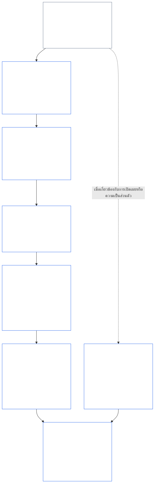
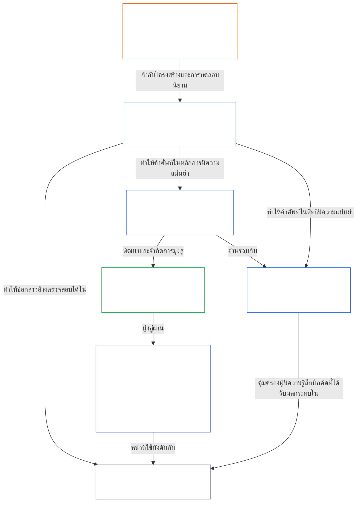

<a id="chapter-01-part-b-interaction-and-interpretation"></a>
# บทที่ 01 ส่วน B: ปฏิสัมพันธ์และการตีความ

<details>
<summary><strong><span style="color: #2563eb;">ตำแหน่งในคลังเอกสาร (ไม่มีผลเชิงปฏิบัติ): โครงสร้างไฟล์และหลักการอ่าน</span></strong></summary>

> เนื้อหาต่อไปนี้เป็น **คำแนะนำสำหรับผู้อ่านเท่านั้น** ไม่ได้เพิ่ม ลบ หรือจำกัดหน้าที่ที่มีผลผูกพันในส่วนอื่นของไฟล์นี้หรือในบทอื่น
>
> ไฟล์นี้ **เป็นส่วนหนึ่งของรัฐธรรมนูญเซนเทียนต์** และมีผลผูกพัน **เฉพาะเมื่ออ่านร่วมกับ** ไฟล์ `core_*` ที่มีหมายเลขอื่นในฐานะตราสารฉบับเดียวกัน เนื้อหาในไฟล์นี้คือ **บทที่หนึ่ง ส่วน B** (§§13–15: กระบวนการแก้ไขความขัดแย้งทางรัฐธรรมนูญ ข้อห้ามการลบล้างโดยเด็ดขาด และการตีความรัฐธรรมนูญ)—ส่วนที่รักษาจตุรภาพตามรัฐธรรมนูญให้ครบถ้วนเมื่อหลักการขัดแย้งกันและเมื่อมีการอ่านรัฐธรรมนูญ
>
> **ก่อนหน้า:** [core_01_a_values_principles.md](core_01_a_values_principles.md) (บทที่หนึ่ง ส่วน A — §§1–12 เป้าหมายด้านความรุ่งเรืองและความต่อเนื่อง)  
> **ถัดไป:** [core_01_c_stewardship_capacity_principles.md](core_01_c_stewardship_capacity_principles.md) (บทที่หนึ่ง ส่วน C — §§16–20 การดูแลกำกับดูแล การกำกับดูแล การจัดแนวแรงจูงใจ และการประยุกต์ใช้แบบบูรณาการ)
> **แนวทางการอ่าน:** §13 กระบวนการแก้ไขความขัดแย้งทางรัฐธรรมนูญ (ลำดับการชั่งน้ำหนัก ข้อจำกัดการเปิดเผยข้อมูล และภาระที่หลีกเลี่ยงได้) → §14 ข้อห้ามการลบล้างโดยเด็ดขาด → §15 การตีความรัฐธรรมนูญ (หลักห้ามหลีกเลี่ยง ข้อมูลที่ได้มาโดยอนุมาน คำนิยาม ความกำกวม และลำดับความสำคัญ)

</details>

<details>
<summary><strong><span style="color: #2563eb;">คำแนะนำสำหรับผู้อ่าน (ไม่มีผลเชิงปฏิบัติ): จุดยึดคำศัพท์และแผนผังกลุ่มเนื้อหาในบทที่ห้า</span></strong></summary>

<a id="chapter-one-part-a-chapter-five-vocabulary-anchor"></a>

> เนื้อหาต่อไปนี้เป็น **คำแนะนำสำหรับผู้อ่านเท่านั้น** ไม่ได้เพิ่ม ลบ หรือจำกัดหน้าที่ที่มีผลผูกพันในส่วนอื่นของไฟล์นี้หรือในบทอื่น วิดเจ็ต **ร่องรอย** และ **คำจำกัดความ · การประเมิน · การปฏิบัติตาม** ในแต่ละส่วนมีลิงก์นำทางและลิงก์ O/M/A/C ณ จุดที่แต่ละ § ใช้คำศัพท์นั้นอย่างมีนัยสำคัญ ส่วนบล็อกนี้เป็นตารางเชื่อมโยงระดับบทสำหรับผู้อ่านที่อ่านส่วน A จบ

**คำศัพท์ชั้นหลักการ** (ตำแหน่งหลักในบทที่หนึ่ง (ส่วน A และ B)):

- [จตุรภาพตามรัฐธรรมนูญ](core_00_preamble.md#constitutional-tetrad) — **การมีส่วนร่วม**, **การกำกับดูแลตรวจสอบ**, **ความรับผิดรับชอบ** และ **ความทันเวลา** โดยปรับระดับตาม[เดิมพันที่มีนัยสำคัญ](core_00_preamble.md#material-stake)
- [เป้าหมายตามรัฐธรรมนูญสองประการ](core_00_preamble.md#two-constitutional-aims) — [ความรุ่งเรือง](core_00_preamble.md#flourishing) และ[ความต่อเนื่อง](core_00_preamble.md#continuity) (เป้าหมายด้าน **ความต่อเนื่อง** ตามรัฐธรรมนูญ ซึ่งต่างจากความต่อเนื่องเชิงปฏิบัติการหรือเชิงโพรโทคอลในส่วนอื่นของคลังเอกสาร)
- [เดิมพันที่มีนัยสำคัญ](core_00_preamble.md#material-stake) — การปรับระดับผลกระทบ การพึ่งพา และความเสี่ยงสำหรับหน้าที่ตามจตุรภาพ ให้อ่านร่วมกับสาระสำคัญเชิงบูรณาการ ([สาระสำคัญ](core_05_band_oversight.md#materiality)) และรายการในบทที่ห้าด้านล่าง

**คำนิยามตัวแทนในบทที่ห้า** (การทำให้ O/M/A/C บรรลุผล — ตรวจสอบย้อนกลับในบทที่สองถึงสี่เมื่อเกี่ยวข้องอย่างมีนัยสำคัญ):

- [ความเป็นอยู่ที่ดี](core_05_band_continuity.md#wellbeing) (เป้าหมายด้านความรุ่งเรือง)
- [การกำกับดูแลตรวจสอบ](core_05_apex_oversight_leg.md#oversight), [ความรับผิดรับชอบ](core_05_apex_accountability_leg.md#accountability), [ความสามารถในการโต้แย้ง](core_05_band_accountability.md#contestability), [ธรรมาภิบาล](core_05_band_accountability.md#governance), [ธรรมาภิบาลที่ปรับตามระดับการจัดประเภท](core_05_band_oversight.md#classification-scaled-governance)
- [สาระสำคัญ](core_05_band_oversight.md#material), [ผลกระทบที่มีนัยสำคัญ](core_05_band_oversight.md#material-impact), [ความเสี่ยงที่มีนัยสำคัญ](core_05_band_oversight.md#material-risk), [สาระสำคัญ](core_05_band_oversight.md#materiality) (วิดเจ็ตใช้ป้าย **สาระสำคัญ**), [สาระสำคัญเชิงระบบ](core_05_band_continuity.md#systemic-materiality) — กลุ่ม: [สาระสำคัญ ผลกระทบ ความเสี่ยง และความเที่ยงตรงของตัวแทน](core_05_band_oversight.md#materiality-impact-risk-and-proxy-integrity)

**กลุ่มหลักในบทที่ห้าที่ขึ้นต่อ §3** (กลุ่มที่ต้องเรียกใช้ร่วมกัน — อ่านกับบทที่สองถึงสี่เมื่อเกี่ยวข้องอย่างมีนัยสำคัญ):

- [สถานะและน้ำหนักของผู้มีส่วนได้เสีย](core_05_band_participation.md#stakeholder-status-and-weight) (ชั้นการมีส่วนร่วมของระบบผู้มีส่วนได้เสีย)
- [ชั้นสัญญาตามรัฐธรรมนูญ](core_05_band_integrative.md#constitutional-contract-layer) และ [สถาปัตยกรรมธรรมาภิบาล การกำกับดูแลตรวจสอบ การพึ่งพา การกระจายอำนาจ การกระจุกตัว โครงสร้างตลาด และความเที่ยงตรงของเส้นทางออก](core_05_band_accountability.md#governance-architecture-decentralization-and-concentration)
- [คลังเอกสารและลำดับชั้นอำนาจ](core_05_band_integrative.md#defi1-corpus-and-authority-stack)
- [ความรับผิดรับชอบ ความสามารถในการโต้แย้ง และความล้มเหลวของความรับผิดรับชอบร่วมกัน](core_05_apex_accountability_leg.md#accountability)

**CJS-3** (*คลังกลุ่มการปฏิบัติงาน (oDef)*) — เข็มทิศกลุ่มการปฏิบัติงานสำหรับคำศัพท์ปฏิบัติการร่วมข้ามการนำไปใช้ ให้อ่านร่วมกับจตุรภาพ เป้าหมาย และการปรับระดับตามเดิมพันที่มีนัยสำคัญของบทนี้:

- [CJS-3.1 เข็มทิศตามรัฐธรรมนูญและแผนผังกลุ่ม](corpus_joint_structure/cjs_03_cross_implementation_operational_terms.md#cjs-31-constitutional-compass-and-cluster-map) — จุดเริ่มต้นหลักสำหรับกลุ่มตั้งแต่ **CJS-3.2** (*การกำกับดูแลตรวจสอบ: ความโปร่งใสแบบสะท้อนกลับและคำศัพท์ความรับผิดรับชอบ*) ถึง **CJS-3.23** (*เชิงบูรณาการ: คำศัพท์ความเที่ยงตรงของการแทรกแซงและการลบล้าง*) ซึ่งจัดตามองค์ประกอบจตุรภาพ เป้าหมายความต่อเนื่อง และแถบบูรณาการข้ามองค์ประกอบ

</details>

<details>
<summary><strong><span style="color: #2563eb;">คำแนะนำสำหรับผู้อ่าน (ไม่มีผลเชิงปฏิบัติ): ส่วน B รักษาจตุรภาพตามรัฐธรรมนูญให้ครบถ้วนได้อย่างไร</span></strong></summary>

> เนื้อหาต่อไปนี้เป็น **คำแนะนำสำหรับผู้อ่านเท่านั้น** ไม่ได้เพิ่ม ลบ หรือจำกัดหน้าที่ที่มีผลผูกพันในส่วนอื่นของไฟล์นี้หรือในบทอื่น วิดเจ็ต **ร่องรอย** ของแต่ละส่วนระบุองค์ประกอบจตุรภาพที่ส่วนนั้นเกี่ยวข้อง บล็อกนี้เป็นแผนที่ระดับส่วนสำหรับผู้อ่านที่เริ่มอ่านส่วน B

**ส่วน B ทำอะไร** [ส่วน A](core_01_a_values_principles.md) พัฒนา[เป้าหมายตามรัฐธรรมนูญสองประการ](core_00_preamble.md#two-constitutional-aims) ส่วน B ไม่เพิ่มหลักการใหม่หรือหน้าที่ข้อที่ห้า แต่รักษา[จตุรภาพตามรัฐธรรมนูญ](core_00_preamble.md#constitutional-tetrad)—**การมีส่วนร่วม**, **การกำกับดูแลตรวจสอบ**, **ความรับผิดรับชอบ** และ **ความทันเวลา** ซึ่งปรับระดับตาม[เดิมพันที่มีนัยสำคัญ](core_00_preamble.md#material-stake)—ให้ครบถ้วนในสามกรณี:

- **เมื่อหลักการขัดแย้งกัน** ([§13 กระบวนการแก้ไขความขัดแย้งทางรัฐธรรมนูญ](#13-constitutional-collision-resolution-process)): ความปลอดภัยและความจริงมาก่อน และการชั่งน้ำหนักอื่นทุกกรณีต้องรักษาจตุรภาพไว้ แทนที่จะทำให้อ่อนแอลงเพื่อให้ได้ข้อยุติที่ง่าย
- **เมื่อผลักคุณค่าหนึ่งไปไกลเกินควร** ([§14 ข้อห้ามการลบล้างโดยเด็ดขาด](#14-prohibition-on-absolute-override)): ห้ามใช้คุณค่าใดหรือเป้าหมายใดในสองประการเพื่อทำให้องค์ประกอบหนึ่งว่างเปล่าต่ำกว่าระดับที่เดิมพันที่มีนัยสำคัญกำหนด
- **เมื่ออ่านหรือนำรัฐธรรมนูญไปใช้** ([§15 การตีความรัฐธรรมนูญ](#15-constitutional-interpretation)): การเปลี่ยนชื่อ แบ่งแยก หรือเปลี่ยนเส้นทางการกระทำเดิมไม่อาจหลีกเลี่ยงข้อกำหนดได้ และให้ตีความความกำกวมไปในทาง[ผลในการคุ้มครองอย่างเต็มที่](core_05_band_integrative.md#fullest-protective-effect)

**ส่วน B กำหนดองค์ประกอบแต่ละข้อไว้ที่ใด** ร่องรอยของแต่ละส่วนระบุองค์ประกอบทั้งหมดที่เกี่ยวข้อง ตารางนี้ระบุตำแหน่งหลัก

| องค์ประกอบจตุรภาพ | สิ่งที่ส่วน B ทำให้คงอยู่จริง | ตำแหน่งหลักในส่วน B |
|---|---|---|
| **การมีส่วนร่วม** | ภาระการพิสูจน์ไม่ตกแก่ฝ่ายที่ถูกจำกัดสิทธิ; สิทธิหลักในการคัดค้าน ทบทวน และอุทธรณ์ไม่อาจถูกลบล้างถาวร; ข้อจำกัดการเปิดเผยข้อมูลต้องคงความสามารถในการโต้แย้งโดยได้รับข้อมูล; ภาระที่หลีกเลี่ยงได้ทำให้ความสามารถในการกระทำลดลง | [§13.1.1](#1311-necessity), [§13.1.4](#1314-constitutional-floors-safety-and-anti-degrading-process), [§13.1.5](#1315-least-restrictive-time-bounded-and-reviewable-constraint-principle), [§13.2](#132-epistemic-disclosure-constraints), [§13.3](#133-minimization-of-avoidable-burden), [§15.1](#151-constitutional-no-bypass-principle), [§15.1.2](#1512-derived-information-principle) |
| **การกำกับดูแลตรวจสอบ** | นับความเสียหายอย่างครบถ้วน; การตัดสินใจที่ผู้อื่นสร้างกลับและทบทวนได้อย่างอิสระ; ข้อจำกัดการเปิดเผยข้อมูลที่ยังเปิดทางให้ตรวจสอบได้; ตัวชี้วัดหยุดนับเมื่อเบี่ยงเบนจากวัตถุประสงค์ | [§13.1.2](#1312-harm-minimization), [§13.1.5](#1315-least-restrictive-time-bounded-and-reviewable-constraint-principle), [§13.2](#132-epistemic-disclosure-constraints), [§13.2.4](#1324-proxy-divergence-invalidation), [§15.1](#151-constitutional-no-bypass-principle), [§15.4.4](#1544-combined-satisfaction-of-jointly-applicable-incorporated-obligations) |
| **ความรับผิดรับชอบ** | ฝ่ายที่จำกัดสิทธิต้องรับภาระการพิสูจน์; หน้าที่ตอบคำถามเพิ่มขึ้นตามอำนาจ; กระบวนการต้องไม่ลดทอนศักดิ์ศรีหรือทำให้อับอาย; ตรวจสอบข้อจำกัดการเปิดเผยข้อมูลทุกข้อภายหลัง | [§13.1.1](#1311-necessity), [§13.1.3](#1313-proportionality), [§13.1.4](#1314-constitutional-floors-safety-and-anti-degrading-process), [§13.1.5](#1315-least-restrictive-time-bounded-and-reviewable-constraint-principle), [§13.2.1](#1321-preservation-of-epistemic-integrity), [§15.1](#151-constitutional-no-bypass-principle), [§15.1.2](#1512-derived-information-principle) |
| **ความทันเวลา** | ข้อจำกัดมีกรอบเวลาและทบทวนได้ พร้อมเส้นทางคืนสถานะ; ความขัดแย้งทางรัฐธรรมนูญที่ค้างอยู่ดำเนินตามกรอบเวลาที่ใช้บังคับ; การเปิดเผยที่เลื่อนออกไปต้องเกิดขึ้นในที่สุด; ความล่าช้าที่หลีกเลี่ยงได้เป็นภาระที่หลีกเลี่ยงได้; การจำกัดขอบเขตในภาวะฉุกเฉินมีกรอบเวลา | [§13.1.5](#1315-least-restrictive-time-bounded-and-reviewable-constraint-principle), [§13.2.1](#1321-preservation-of-epistemic-integrity), [§13.3](#133-minimization-of-avoidable-burden), [§15.1](#151-constitutional-no-bypass-principle), [§15.4.4](#1544-combined-satisfaction-of-jointly-applicable-incorporated-obligations) |

**ส่วนที่ไม่เกี่ยวข้องโดยตรงกับองค์ประกอบใดเลย** [§15.1.1 หลักการต่อต้านการแบ่งส่วน](#1511-anti-segmentation-principle) และ [§15.4.1](#1541-integrated-reading) ถึง [§15.4.3](#1543-incorporation-layer) กำกับวิธีอ่านข้อความและชั้นแหล่งข้อมูลที่มีอำนาจควบคุม ตามการออกแบบ ร่องรอยของส่วนเหล่านี้ไม่มีบรรทัดของจตุรภาพ

**ความหมายของเวลาสองแบบ** ในส่วน B เวลาใช้ในสองความหมาย กรอบเวลาระยะยาว (ความเสียหายสะสมและล่าช้า และ[§3.2 ข้อจำกัดความสอดคล้องด้านเวลาของบทที่แปด](core_08_a_system_alignment_certification_evaluation.md#32-time-consistency-constraint) ที่นำมาใช้ใน [§13.1.2](#1312-harm-minimization)) อยู่ภายใต้เป้าหมายด้าน **ความต่อเนื่อง** ส่วนกรอบเวลา รอบการทบทวน และความล่าช้า (กรอบเวลาของข้อจำกัด การเปิดเผยในที่สุด และความล่าช้าที่หลีกเลี่ยงได้) อยู่ภายใต้องค์ประกอบ **ความทันเวลา**

**สองแกน ไม่ใช่ความขัดแย้ง** เป้าหมายของส่วน A ระบุว่าระบบร่วมมุ่งทำสิ่งใด ส่วน B ระบุว่าสิ่งใดไม่อาจถูกพรากไปด้วยการชั่งน้ำหนัก การลบล้าง หรือการตีความใด ๆ

</details>

<br>
<a id="13-constitutional-collision-resolution-process"></a>

### 13. กระบวนการแก้ไขความขัดแย้งทางรัฐธรรมนูญ
<details>
<summary><strong><span style="color: #2563eb;">ร่องรอย</span></strong></summary>

- อ่านร่วมกับ: [จตุรภาพตามรัฐธรรมนูญ](core_00_preamble.md#constitutional-tetrad) — การมีส่วนร่วม การกำกับดูแลตรวจสอบ ความรับผิดรับชอบ และความทันเวลาในกระบวนการ การเปิดเผยข้อมูล การจัดการความขัดแย้งทางรัฐธรรมนูญ และการเยียวยา; ปรับระดับตาม[เดิมพันที่มีนัยสำคัญ](core_00_preamble.md#material-stake)
- หลักการต้นทาง: [3. วัตถุประสงค์พื้นฐาน: ความเป็นอยู่ที่ดี](core_01_a_values_principles.md#3-foundational-objective-wellbeing-flourishing-aim), [4 ความปลอดภัย](core_01_a_values_principles.md#4-safety-harm-constraint), [5 ความจริง](core_01_a_values_principles.md#5-truth-epistemic-integrity-constraint), [6. ความไว้วางใจ](core_01_a_values_principles.md#6-trust-and-trustworthiness-coordination-integrity), [7. เสรีภาพ (ความสามารถในการกระทำที่มีขอบเขต)](core_01_a_values_principles.md#7-freedom-bounded-agency), และ [§16 การดูแลรับผิดชอบอย่างลึกซึ้ง](core_01_c_stewardship_capacity_principles.md#16-stewardship-in-depth)
- ผลต่อเนื่อง: [13.2.1 การคงไว้ซึ่งความซื่อตรงทางญาณวิทยา](#1321-preservation-of-epistemic-integrity), [บันทึกความขัดแย้งทางรัฐธรรมนูญ](core_05_band_integrative.md#constitutional-collision-record), [จุดยืนชั่วคราวโดยปริยาย](#default-interim-posture), และ [14. ข้อห้ามการลบล้างโดยเด็ดขาด](#14-prohibition-on-absolute-override)
- ผลต่อเนื่อง: ใช้กำกับความขัดแย้งข้ามบทความทั่วทั้ง[บทที่หก: สิทธิขั้นพื้นฐาน](core_06_rights_part_a.md#chapter-six-foundational-rights)
  - อ่านร่วมกับ[มาตรา XXIV: การตีความรัฐธรรมนูญ การทบทวน และมาตรการป้องกันการครอบงำ](core_06_rights_part_d.md#article-xxiv-constitutional-interpretation-review-and-anti-capture-safeguards) และ[มาตรา XX: ความยุติธรรมหลังการละเมิดที่ได้รับการยืนยัน](core_06_rights_part_d.md#article-xx-justice-after-verified-violation)
  - ใช้เมื่อเกิดคำถามเกี่ยวกับการทบทวน ภาวะฉุกเฉิน หรือความขัดแย้งทางรัฐธรรมนูญ

</details>

<details>
<summary><strong><span style="color: #2563eb;">คำจำกัดความ · การประเมิน · การปฏิบัติตาม</span></strong></summary>

- [ความขัดแย้งทางรัฐธรรมนูญ](core_05_band_integrative.md#constitutional-collision) · [O](core_05_band_integrative.md#constitutional-collision) · [M](core_05_band_integrative.md#constitutional-collision-a) · [A](core_05_band_integrative.md#constitutional-collision-a) · [C](core_05_band_integrative.md#constitutional-collision-c)
- [การมีส่วนร่วม](core_05_apex_participation_leg.md#participation-constitutional) · [O](core_05_apex_participation_leg.md#participation-constitutional) · [M](core_05_apex_participation_leg.md#participation-constitutional-m) · [A](core_05_apex_participation_leg.md#participation-constitutional-a) · [C](core_05_apex_participation_leg.md#participation-constitutional-c)
- [การกำกับดูแลตรวจสอบ](core_05_apex_oversight_leg.md#oversight-constitutional) · [O](core_05_apex_oversight_leg.md#oversight-constitutional) · [M](core_05_apex_oversight_leg.md#oversight-constitutional-m) · [A](core_05_apex_oversight_leg.md#oversight-constitutional-a) · [C](core_05_apex_oversight_leg.md#oversight-constitutional-c)
- [ความรับผิดรับชอบ](core_05_apex_accountability_leg.md#accountability) · [O](core_05_apex_accountability_leg.md#accountability) · [M](core_05_apex_accountability_leg.md#accountability-m) · [A](core_05_apex_accountability_leg.md#accountability-a) · [C](core_05_apex_accountability_leg.md#accountability-c)
- [ความทันเวลา](core_05_apex_timeliness_leg.md#timeliness-constitutional) · [O](core_05_apex_timeliness_leg.md#timeliness-constitutional) · [M](core_05_apex_timeliness_leg.md#timeliness-constitutional-m) · [A](core_05_apex_timeliness_leg.md#timeliness-constitutional-a) · [C](core_05_apex_timeliness_leg.md#timeliness-constitutional-c)

</details>

<br>

*กล่าวอย่างเข้าใจง่าย: ความขัดแย้งทางรัฐธรรมนูญย่อมเกิดขึ้นได้ — **ความปลอดภัย** และ **ความจริง** มาก่อน หลังจากนั้น ข้อจำกัดต้องได้สัดส่วน จำเป็น ลดความเสียหายให้เหลือน้อยที่สุด และจำกัดให้น้อยที่สุดเท่าที่ทำได้ ห้ามปกปิดความจริงเพื่อความสบายใจ; ห้ามลิดรอนความเป็นส่วนตัวเพื่อความสะดวก; ข้อจำกัดเสรีภาพอยู่ภายใต้[§7.1 วินัยในการจำกัดสิทธิ](core_01_a_values_principles.md#71-limitation-discipline); ความขัดแย้งทางรัฐธรรมนูญเกี่ยวกับสิทธิต้องมีแบบทดสอบการตัดสินใจที่บันทึกไว้; และไม่นับตัวชี้วัดที่บิดเบือนความจริงเรื่องการปฏิบัติตามข้อกำหนด การปรับให้เหมาะที่สุดในช่วงเวลาสั้น ๆ ไม่อาจผ่านการประเมินตาม[บทที่แปด §3.2 ข้อจำกัดความสอดคล้องด้านเวลา](core_08_a_system_alignment_certification_evaluation.md#32-time-consistency-constraint) **§13.1** (*หลักการชั่งน้ำหนักแกนหลัก*) ถึง **§13.3** (*การลดภาระที่หลีกเลี่ยงได้ให้เหลือน้อยที่สุด*) กำหนดกฎการชั่งน้ำหนัก ข้อจำกัดด้านการเปิดเผยข้อมูลและความเป็นส่วนตัว และกระบวนการจัดการความขัดแย้งทางรัฐธรรมนูญ*

ส่วน B รักษาจตุรภาพให้ครบถ้วนในสามสถานการณ์:
- **[ความขัดแย้งทางรัฐธรรมนูญ](core_05_band_integrative.md#constitutional-collision) (ส่วนนี้):** แก้ไขความขัดแย้งโดยไม่ทำให้องค์ประกอบใดอ่อนแอลง
- **การใช้อำนาจเกินขอบเขต ([§14 ข้อห้ามการลบล้างโดยเด็ดขาด](#14-prohibition-on-absolute-override)):** ห้ามใช้คุณค่าใดคุณค่าหนึ่ง รวมถึงเป้าหมายใดเป้าหมายหนึ่ง เพื่อครอบงำคุณค่าอื่นหรือทำให้องค์ประกอบหนึ่งกลวงเปล่าต่ำกว่าที่เดิมพันที่มีนัยสำคัญกำหนด
- **การอ่านและการใช้ ([§15 การตีความรัฐธรรมนูญ](#15-constitutional-interpretation)):** ห้ามเปลี่ยนชื่อ แบ่งแยก หรือเปลี่ยนเส้นทางการกระทำเดียวกันเพื่อหลีกเลี่ยงข้อกำหนด และให้ตีความความกำกวมไปในทาง[ผลในการคุ้มครองอย่างเต็มที่](core_05_band_integrative.md#fullest-protective-effect)

เมื่อคุณค่าหรือข้อจำกัดขัดแย้งกัน:
- **ลำดับความสำคัญ:** **ความปลอดภัย** และ **ความจริง** มีลำดับเหนือกว่าเมื่อไม่อาจแก้ไขความขัดแย้งได้โดยไม่ละเมิดสองสิ่งนี้
- **รักษาจตุรภาพไว้:** การชั่งน้ำหนักอื่นต้องรักษา[จตุรภาพตามรัฐธรรมนูญ](core_00_preamble.md#constitutional-tetrad) — **การมีส่วนร่วม**, **การกำกับดูแลตรวจสอบ**, **ความรับผิดรับชอบ** และ **ความทันเวลา** ซึ่งปรับระดับตาม[เดิมพันที่มีนัยสำคัญ](core_00_preamble.md#material-stake)—ไว้ แทนที่จะทำให้อ่อนแอลงเพื่อให้ได้ข้อยุติที่ง่าย
- **ผลรวมร่วมกัน:** การตัดสินใจเล็ก ๆ หลายครั้งซึ่งดูเหมาะสมเมื่อพิจารณาแยกกัน อาจรวมกันเป็นผลลัพธ์ที่รัฐธรรมนูญฉบับนี้ปฏิเสธ
- **จุดที่ต้องแก้ไข:** ระบบต้องแก้ไขความขัดแย้งตาม **§13.1** (*หลักการชั่งน้ำหนักแกนหลัก*) ถึง **§13.3** (*การลดภาระที่หลีกเลี่ยงได้ให้เหลือน้อยที่สุด*)

**แผนภาพ: ส่วน B และจตุรภาพตามรัฐธรรมนูญ**

<hr style="border: 0; border-top: 1px solid currentColor;">

```mermaid
flowchart TB
    PA["หลักการของส่วน A และเป้าหมายตามรัฐธรรมนูญสองประการ<br/><br/>• ความรุ่งเรืองและความต่อเนื่อง<br/>• หลักการและข้อจำกัดที่อาจขัดแย้งกัน<br/>หรืออ่านได้มากกว่าหนึ่งแบบ"]
    P13["§13 กระบวนการแก้ไขความขัดแย้งทางรัฐธรรมนูญ<br/><br/>• ความปลอดภัยและความจริงมาก่อน<br/>• การชั่งน้ำหนักอื่นทุกกรณีรักษาจตุรภาพไว้<br/>• ลำดับการชั่งน้ำหนัก ข้อจำกัดการเปิดเผยข้อมูล<br/>และภาระที่หลีกเลี่ยงได้"]
    P14["§14 ข้อห้ามการลบล้างโดยเด็ดขาด<br/><br/>• ไม่มีคุณค่าใดเป็นไพ่เหนือกว่า<br/>• ไม่มีเป้าหมายใดในสองประการครอบงำอีกเป้าหมาย<br/>• ไม่มีองค์ประกอบใดถูกทำให้กลวงเปล่าต่ำกว่าเดิมพันที่มีนัยสำคัญ"]
    P15["§15 การตีความรัฐธรรมนูญ<br/><br/>• ห้ามหลีกเลี่ยง ห้ามแบ่งส่วน<br/>และข้อมูลที่ได้มาโดยอนุมาน<br/>• อ่านความกำกวมเป็นองค์รวมแบบบูรณาการ<br/>• ลำดับความสำคัญของชั้นแหล่งข้อมูล"]
    TT["จตุรภาพตามรัฐธรรมนูญ<br/><br/>• คงไว้อย่างครบถ้วน โดยปรับระดับตามเดิมพันที่มีนัยสำคัญ<br/>• การมีส่วนร่วม · การกำกับดูแลตรวจสอบ · ความรับผิดรับชอบ · ความทันเวลา"]
    P["การมีส่วนร่วม<br/><br/>• ภาระไม่ตกแก่ฝ่ายที่ถูกจำกัดสิทธิ<br/>• สิทธิในการคัดค้านและอุทธรณ์ยังคงอยู่"]
    O["การกำกับดูแลตรวจสอบ<br/><br/>• นับความเสียหายอย่างครบถ้วน<br/>• ผู้อื่นสร้างการตัดสินใจขึ้นใหม่ได้<br/>และตรวจสอบอย่างเป็นอิสระ"]
    A["ความรับผิดรับชอบ<br/><br/>• ฝ่ายที่จำกัดสิทธิรับภาระไว้เอง<br/>• หน้าที่ตอบคำถามเพิ่มขึ้นตามอำนาจ"]
    T["ความทันเวลา<br/><br/>• ข้อจำกัดมีกรอบเวลาและตรวจสอบได้<br/>• ความล่าช้าต้องไม่ทำให้การเยียวยาล้มเหลว"]
    PA --> P13
    PA --> P14
    PA --> P15
    P13 --> TT
    P14 --> TT
    P15 --> TT
    TT --> P
    TT --> O
    TT --> A
    TT --> T
    style PA fill:none,stroke:#16a34a,color:#ffffff
    style P13 fill:none,stroke:#2563eb,color:#ffffff
    style P14 fill:none,stroke:#2563eb,color:#ffffff
    style P15 fill:none,stroke:#2563eb,color:#ffffff
    style TT fill:none,stroke:#2563eb,color:#ffffff
    style P fill:none,stroke:#0f766e,color:#ffffff
    style O fill:none,stroke:#ea580c,color:#ffffff
    style A fill:none,stroke:#db2777,color:#ffffff
    style T fill:none,stroke:#9333ea,color:#ffffff
```

*หลักการและเป้าหมายของส่วน A อาจขัดแย้งกันและอ่านได้มากกว่าหนึ่งแบบ ส่วน B แก้ไขความขัดแย้งทางรัฐธรรมนูญ ห้ามการลบล้าง และกำหนดวิธีอ่านข้อความ เพื่อให้องค์ประกอบทุกข้อของจตุรภาพยังคงมีผลจริงในระดับที่เดิมพันที่มีนัยสำคัญกำหนด สีเส้นขอบนำสีขององค์ประกอบจตุรภาพมาใช้ซ้ำ เป็นเพียงสัญญาณภาพ ไม่ใช่การกล่าวอ้างลำดับความสำคัญ ร่องรอยของแต่ละส่วนระบุองค์ประกอบที่ส่วนนั้นเกี่ยวข้อง*
<a id="131-core-tradeoff-principles"></a>
#### 13.1 หลักการหลักว่าด้วยการแลกเปลี่ยน

<details>
<summary><strong><span style="color: #2563eb;">การติดตาม</span></strong></summary>

- อ่านร่วมกับ: [เตตราดแห่งรัฐธรรมนูญ](core_00_preamble.md#constitutional-tetrad) — องค์ประกอบทั้งสี่ดำเนินผ่านลำดับการแลกเปลี่ยน: **ความรับผิดรับชอบ** และ **การมีส่วนร่วม** ([§13.1.1](#1311-necessity) ว่าฝ่ายใดรับภาระ), **การกำกับดูแล** ([§13.1.2](#1312-harm-minimization) และ [§13.1.5](#1315-least-restrictive-time-bounded-and-reviewable-constraint-principle) ซึ่งนับความเสียหายครบถ้วนและจัดทำบันทึกความขัดแย้งทางรัฐธรรมนูญให้ผู้อื่นตรวจสอบได้) และ **ความทันเวลา** (§13.1.5 ข้อจำกัดที่มีกรอบเวลาและตรวจสอบได้); ใช้ [ส่วนได้เสียที่มีสาระสำคัญ](core_00_preamble.md#material-stake) เป็นเกณฑ์ปรับภาระการพิสูจน์และระดับความเข้มข้นของการตรวจสอบ การติดตามของแต่ละหัวข้อย่อยจะระบุองค์ประกอบที่เกี่ยวข้อง
- หัวข้อย่อย: [§13.1.1 ความจำเป็น](#1311-necessity) · [§13.1.2 การลดความเสียหาย](#1312-harm-minimization) · [§13.1.3 ความได้สัดส่วน](#1313-proportionality) · [§13.1.4 ขั้นต่ำตามรัฐธรรมนูญ ความปลอดภัย และกระบวนการที่ไม่ลดทอนศักดิ์ศรี](#1314-constitutional-floors-safety-and-anti-degrading-process) · [§13.1.5 หลักการจำกัดเท่าที่จำเป็นที่สุด มีกรอบเวลา และตรวจสอบได้](#1315-least-restrictive-time-bounded-and-reviewable-constraint-principle)

</details>

<details>
<summary><strong><span style="color: #2563eb;">คำจำกัดความ · การประเมิน · การปฏิบัติตาม</span></strong></summary>

*ขอบเขต.* [§13.1 หลักการหลักว่าด้วยการแลกเปลี่ยน](#131-core-tradeoff-principles) — คำจำกัดความของความจำเป็น การลดความเสียหาย และความเสียหายในลำดับการแลกเปลี่ยน

- [ความจำเป็น](core_05_band_accountability.md#necessity) · [O](core_05_band_accountability.md#necessity) · [M](core_05_band_accountability.md#necessity-a) · [A](core_05_band_accountability.md#necessity-a) · [C](core_05_band_accountability.md#necessity-c)
- [การลดความเสียหาย (การเลือกสิ่งที่ต้องแลก)](core_05_band_accountability.md#harm-minimization-tradeoff-selection) · [O](core_05_band_accountability.md#harm-minimization-tradeoff-selection) · [M](core_05_band_accountability.md#harm-minimization-tradeoff-selection-a) · [A](core_05_band_accountability.md#harm-minimization-tradeoff-selection-a) · [C](core_05_band_accountability.md#harm-minimization-tradeoff-selection-c)
- [ความเสียหาย](core_05_band_accountability.md#harm) · [O](core_05_band_accountability.md#harm) · [M](core_05_band_accountability.md#harm-a) · [A](core_05_band_accountability.md#harm-a) · [C](core_05_band_accountability.md#harm-c)

</details>

<br>

*กล่าวอย่างง่าย: เมื่อต้องจำกัดบางสิ่ง ให้เลือกมาตรการแก้ไขให้เหมาะกับปัญหา — ใช้มาตรการที่เบาที่สุดซึ่งยังได้ผล เลือกทางเลือกที่ก่อความเสียหายน้อยที่สุด และทำให้เสียเวลาของสิ่งมีความรู้สึกน้อยที่สุด เมื่อได้ปฏิบัติตามข้อกำหนดด้านความปลอดภัย ความจริง และสิทธิแล้ว เกณฑ์จะสูงขึ้นอย่างรวดเร็วเมื่อความเสียหายอาจย้อนคืนไม่ได้หรืออาจทำให้ระบบติดอยู่ในสภาพหนึ่งอย่างถาวร*

**วิธีอ่านลำดับขั้น:** ใช้กฎเหล่านี้เป็นลำดับเดียวกัน ไม่ใช่สิทธิอนุญาตที่แยกจากกัน
- **[§13.1.1 ความจำเป็น](#1311-necessity)** พิจารณาว่าจำเป็นต้องจำกัดจริงหรือไม่ หรือมีทางเลือกที่จำกัดน้อยกว่าซึ่งยังป้องกันความเสียหายที่มีสาระสำคัญหรือความเสี่ยงเชิงระบบได้หรือไม่ ผู้กำหนดข้อจำกัดมีภาระการพิสูจน์
- **[§13.1.2 การลดความเสียหาย](#1312-harm-minimization)** กำหนดให้เลือกทางเลือกที่สอดคล้องกับรัฐธรรมนูญและก่อความเสียหายน้อยที่สุดต่อสิ่งมีความรู้สึก ระบบ และช่วงเวลา
- **[§13.1.3 ความได้สัดส่วน](#1313-proportionality)** ตรวจสอบว่าขนาดของข้อจำกัดที่เลือกเหมาะสมกับขนาด โอกาสเกิด และลักษณะเชิงระบบของความเสียหายที่มุ่งแก้ไขหรือไม่
- **[§13.1.4 ขั้นต่ำตามรัฐธรรมนูญ ความปลอดภัย และกระบวนการที่ไม่ลดทอนศักดิ์ศรี](#1314-constitutional-floors-safety-and-anti-degrading-process)** ระบุขอบเขตเด็ดขาดที่ยังคงใช้ แม้ข้อจำกัดนั้นจำเป็น ลดความเสียหาย และได้สัดส่วนอย่างถูกต้อง: ระดับขั้นต่ำบางประการของพื้นฐานสิทธิจะถูกยกเลิกอย่างถาวรไม่ได้ ความปลอดภัยเป็นทั้งเหตุผลรองรับและข้อจำกัด และกระบวนการต้องไม่เสื่อมลงเป็นการเหยียดหยาม การทำให้เป็นภาพแสดง หรือการตอบโต้ ระดับขั้นต่ำของพื้นฐานสิทธิและหลักประกันกระบวนการที่ไม่ลดทอนศักดิ์ศรีร่วมกันประกอบเป็น[หลักการศักดิ์ศรี](#dignity-principles)
- **[§13.1.5 หลักการจำกัดเท่าที่จำเป็นที่สุด มีกรอบเวลา และตรวจสอบได้](#1315-least-restrictive-time-bounded-and-reviewable-constraint-principle)** กำหนดรูปแบบของข้อจำกัดที่ผ่านการทดสอบก่อนหน้า: ต้องใช้มาตรการที่มีประสิทธิผลและเบาที่สุด ตรวจสอบได้โดยอิสระ และเป็นการชั่วคราว เว้นแต่รัฐธรรมนูญนี้อนุญาตข้อจำกัดที่ยั่งยืนไว้อย่างชัดแจ้ง

เมื่อปฏิบัติตามลำดับการแลกเปลี่ยนแล้ว **[§13.3 การลดภาระที่หลีกเลี่ยงได้](#133-minimization-of-avoidable-burden)** จะใช้กับการออกแบบที่ได้: ระบบต้องเลือกทางเลือกที่ทำให้เสียเวลา ความใส่ใจ และความพยายามของสิ่งมีความรู้สึกน้อยที่สุด

**แผนภาพ: ลำดับการแลกเปลี่ยนและองค์ประกอบของเตตราดที่แต่ละขั้นพิจารณา**

<hr style="border: 0; border-top: 1px solid currentColor;">



*ความขัดแย้งทางรัฐธรรมนูญดำเนินไปตามลำดับการแลกเปลี่ยน: ความจำเป็น การลดความเสียหาย ความได้สัดส่วน ขั้นต่ำตามรัฐธรรมนูญ และรูปแบบของข้อจำกัดที่ยังคงอยู่ ความขัดแย้งเกี่ยวกับการเปิดเผยและความเป็นส่วนตัวยังอยู่ภายใต้ §13.2 (*ข้อจำกัดการเปิดเผยข้อมูลเชิงญาณวิทยา*) ด้วย §13.3 (*การลดภาระที่หลีกเลี่ยงได้*) ใช้กับสิ่งใดก็ตามที่ผ่านเกณฑ์ แต่ละกล่องระบุองค์ประกอบของเตตราดที่ส่วนการติดตามกล่าวถึง สีเป็นเพียงเครื่องชี้นำทางสายตา ไม่ใช่การกล่าวอ้างเรื่องลำดับความสำคัญ*

<br>
<a id="1311-necessity"></a>
##### 13.1.1 ความจำเป็น
<details>
<summary><strong><span style="color: #2563eb;">การตรวจสอบย้อนกลับ</span></strong></summary>

- อ่านประกอบกับ: [หลักสี่ประการแห่งรัฐธรรมนูญ](core_00_preamble.md#constitutional-tetrad) — ด้าน**ความรับผิดรับชอบ** (ฝ่ายที่กำหนดข้อจำกัดมีภาระการพิสูจน์และต้องจัดทำเอกสารเกี่ยวกับทางเลือกอื่น); ด้าน**การมีส่วนร่วม** (ภาระดังกล่าวจะไม่ตกแก่ฝ่ายที่เสรีภาพ ความสามารถในการกำหนดตนเอง หรือการเข้าถึงถูกจำกัด และต้องมีการแสดงเหตุผลที่เข้มงวดยิ่งขึ้นเมื่อเสรีภาพ ความสามารถในการกำหนดตนเองอย่างมีความหมาย หรือความยินยอมได้รับผลกระทบ); ด้าน**การกำกับดูแล** (จัดทำเอกสารการวิเคราะห์ทางเลือกเพื่อให้ผู้ตรวจสอบตรวจทานได้); การกำหนดระดับตาม[ผลประโยชน์ที่เป็นสาระสำคัญ](core_00_preamble.md#material-stake)

</details>

<details>
<summary><strong><span style="color: #2563eb;">คำจำกัดความ · การประเมิน · การปฏิบัติตาม</span></strong></summary>

- [ความจำเป็น](core_05_band_accountability.md#necessity) · [O](core_05_band_accountability.md#necessity) · [M](core_05_band_accountability.md#necessity-a) · [A](core_05_band_accountability.md#necessity-a) · [C](core_05_band_accountability.md#necessity-c)
- [ความเป็นไปได้](core_05_band_accountability.md#feasibility) · [O](core_05_band_accountability.md#feasibility) · [M](core_05_band_accountability.md#feasibility-a) · [A](core_05_band_accountability.md#feasibility-a) · [C](core_05_band_accountability.md#feasibility-c)
- [เสรีภาพ (ความสามารถในการกำหนดตนเองภายใต้ขอบเขต)](core_05_band_participation.md#freedom-bounded-agency) · [O](core_05_band_participation.md#freedom-bounded-agency) · [M](core_05_band_participation.md#freedom-bounded-agency-a) · [A](core_05_band_participation.md#freedom-bounded-agency-a) · [C](core_05_band_participation.md#freedom-bounded-agency-c)
- [ความสามารถในการกำหนดตนเองอย่างมีความหมาย](core_05_band_participation.md#meaningful-agency) · [O](core_05_band_participation.md#meaningful-agency) · [M](core_05_band_participation.md#meaningful-agency-a) · [A](core_05_band_participation.md#meaningful-agency-a) · [C](core_05_band_participation.md#meaningful-agency-c)

</details>

<br>

*กล่าวโดยง่าย: จะกำหนดข้อจำกัดได้ก็ต่อเมื่อไม่มีทางเลือกอื่นที่จำกัดน้อยกว่าแต่ยังป้องกันความเสียหายที่เป็นสาระสำคัญหรือความเสี่ยงเชิงระบบได้ ฝ่ายที่กำหนดข้อจำกัดมีภาระพิสูจน์เรื่องนี้ ไม่ใช่ฝ่ายที่เสรีภาพถูกจำกัด ความสะดวก ความเคยชินขององค์กร และคำกล่าวว่า “เราทำแบบนี้มาตลอด” ไม่ได้พิสูจน์ความจำเป็น หากทางเลือกที่เข้มงวดน้อยกว่ายังใช้ได้ ทางเลือกที่เข้มงวดกว่าจะไม่เป็นไปตามข้อกำหนด*

**ภาระการพิสูจน์** ฝ่ายที่กำหนดหรือคงไว้ซึ่งข้อจำกัดตามรัฐธรรมนูญมีภาระพิสูจน์ว่า ภายใต้สถานการณ์นั้นไม่มีทางเลือกอื่นที่จำกัดน้อยกว่าและยังป้องกันความเสียหายที่เป็นสาระสำคัญหรือความเสี่ยงเชิงระบบได้ ฝ่ายที่เสรีภาพ ความสามารถในการกำหนดตนเอง หรือการเข้าถึงถูกจำกัด ไม่มีภาระพิสูจน์ว่ามีทางเลือกอื่นอยู่

**ข้อกำหนดในการวิเคราะห์ทางเลือก** การอ้างความจำเป็นต้องมีการวิเคราะห์ที่จัดทำเป็นเอกสารเกี่ยวกับ:
- ทางเลือกที่มีอยู่อย่างสมเหตุสมผล รวมถึงการไม่ดำเนินการ;
- ประสิทธิผลของแต่ละทางเลือกเมื่อเทียบกับความเสียหายตามรัฐธรรมนูญที่ต้องการแก้ไข;
- ความเสี่ยงที่ยังเหลืออยู่หรือความไม่สอดคล้องภายใต้แต่ละทางเลือก

การกล่าวอ้างว่าไม่มีทางเลือกอื่น โดยไม่มีการวิเคราะห์ที่จัดทำเป็นเอกสาร ไม่เป็นไปตามข้อกำหนดนี้

**สิ่งที่ไม่พิสูจน์ความจำเป็น:**
- ความสะดวกหรือความต้องการด้านการบริหาร;
- แนวปฏิบัติโดยปริยาย ความเฉื่อยขององค์กร หรือประเพณี;
- การประหยัดค่าใช้จ่ายเพียงอย่างเดียวในกรณีที่สิทธิได้รับผลกระทบอย่างเป็นสาระสำคัญ;
- ข้อเท็จจริงที่ว่ามีข้อจำกัดนั้นอยู่แล้ว

**ขอบเขต** อนุวรรคนี้ใช้กับข้อจำกัดตามรัฐธรรมนูญทุกกรณี ไม่ได้จำกัดเฉพาะบริบทการปะทะกันทางรัฐธรรมนูญตาม[§13.1.5 กระบวนการเมื่อสิทธิขัดแย้งกัน](#1315-rights-collision-decision-test) เมื่อข้อจำกัดส่งผลกระทบอย่างเป็นสาระสำคัญต่อ[เสรีภาพ (ความสามารถในการกำหนดตนเองภายใต้ขอบเขต)](core_05_band_participation.md#freedom-bounded-agency) [ความสามารถในการกำหนดตนเองอย่างมีความหมาย](core_05_band_participation.md#meaningful-agency) หรือ[ความยินยอม](core_05_band_participation.md#consent) การแสดงเหตุผลด้านความจำเป็นต้องเข้มงวดในระดับที่สอดคล้องกัน
<a id="1312-harm-minimization"></a>
##### 13.1.2 การลดอันตรายให้เหลือน้อยที่สุด
<details>
<summary><strong><span style="color: #2563eb;">ร่องรอย</span></strong></summary>

- อ่านควบคู่กับ: [จตุรภาคตามรัฐธรรมนูญ](core_00_preamble.md#constitutional-tetrad) — ส่วน **การกำกับดูแล** (นับรวมอันตรายทางอ้อม ล่าช้า สะสม ข้ามระบบ และเชิงนิเวศ ไม่ปล่อยให้มองไม่เห็น); ส่วน **ความรับผิดรับชอบ** (ห้ามผลักภาระอันตรายไปยังฝ่ายที่ไม่ได้นับรวมเพื่อให้ดูเหมือนลดอันตราย); ปรับขนาดตาม [ส่วนได้เสียที่เป็นสาระสำคัญ](core_00_preamble.md#material-stake) ตลอดกรอบเวลาที่เกี่ยวข้อง

</details>

<details>
<summary><strong><span style="color: #2563eb;">คำจำกัดความ · การประเมิน · การปฏิบัติตาม</span></strong></summary>

- [การลดอันตรายให้เหลือน้อยที่สุด (การเลือกข้อแลกเปลี่ยน)](core_05_band_accountability.md#harm-minimization-tradeoff-selection) · [O](core_05_band_accountability.md#harm-minimization-tradeoff-selection) · [M](core_05_band_accountability.md#harm-minimization-tradeoff-selection-a) · [A](core_05_band_accountability.md#harm-minimization-tradeoff-selection-a) · [C](core_05_band_accountability.md#harm-minimization-tradeoff-selection-c)
- [อันตราย](core_05_band_accountability.md#harm) · [O](core_05_band_accountability.md#harm) · [M](core_05_band_accountability.md#harm-a) · [A](core_05_band_accountability.md#harm-a) · [C](core_05_band_accountability.md#harm-c)
- [ความสมบูรณ์ของระบบนิเวศ](core_05_band_continuity.md#ecological-integrity) · [O](core_05_band_continuity.md#ecological-integrity) · [M](core_05_band_continuity.md#ecological-integrity-constitutional-a) · [A](core_05_band_continuity.md#ecological-integrity-constitutional-a) · [C](core_05_band_continuity.md#ecological-integrity-constitutional-c)
- [ขีดความสามารถในการฟื้นฟูระบบนิเวศ](core_05_band_continuity.md#ecological-recovery-capacity) · [O](core_05_band_continuity.md#ecological-recovery-capacity) · [M](core_05_band_continuity.md#ecological-recovery-capacity-constitutional-a) · [A](core_05_band_continuity.md#ecological-recovery-capacity-constitutional-a) · [C](core_05_band_continuity.md#ecological-recovery-capacity-constitutional-c)
- [ความเสี่ยง](core_05_band_continuity.md#risk) · [O](core_05_band_continuity.md#risk) · [M](core_05_band_continuity.md#risk-a) · [A](core_05_band_continuity.md#risk-a) · [C](core_05_band_continuity.md#risk-c)
- [อันตรายที่ไม่อาจย้อนกลับได้](core_05_band_accountability.md#irreversible-harm) · [O](core_05_band_accountability.md#irreversible-harm) · [M](core_05_band_accountability.md#irreversible-harm-a) · [A](core_05_band_accountability.md#irreversible-harm-a) · [C](core_05_band_accountability.md#irreversible-harm-c)

</details>

<br>

*กล่าวอย่างง่าย: เมื่อยังมีทางเลือกที่จำเป็นหลายทางหลังจากปฏิบัติตาม [§13.1.1 ความจำเป็น](#1311-necessity) แล้ว ให้เลือกทางที่ก่ออันตรายรวมต่ำที่สุด โดยนับทุกคนที่ได้รับผลกระทบ ระบบนิเวศและระบบสิ่งมีชีวิต ระบบทั้งหมดที่เกี่ยวข้อง และกรอบเวลาสำคัญทั้งหมด การปรับให้เหมาะสมเฉพาะจุดแต่ก่อความเสียหายเชิงระบบหรือเชิงนิเวศ หรือการปรับให้เหมาะสมระยะสั้นแต่ก่ออันตรายระยะยาว ไม่ผ่านการทดสอบนี้ การลดอันตรายให้เหลือน้อยที่สุดไม่อนุญาตให้ลดต่ำกว่าขั้นต่ำตามรัฐธรรมนูญใน [§13.1.4 ขั้นต่ำตามรัฐธรรมนูญ ความปลอดภัย และกระบวนการต่อต้านการลดทอนศักดิ์ศรี](#1314-constitutional-floors-safety-and-anti-degrading-process) ไม่ว่าในกรณีใด*

**ขอบเขตการเปรียบเทียบ** เมื่อมีทางเลือกหลายทางที่เพียงพอตามรัฐธรรมนูญและเป็นไปตาม [ความปลอดภัย (§4)](core_01_a_values_principles.md#4-safety-harm-constraint), [ความจริง (§5)](core_01_a_values_principles.md#5-truth-epistemic-integrity-constraint) และ [§13.1.1 ความจำเป็น](#1311-necessity) การเลือกต้องให้ความสำคัญกับทางเลือกที่ลด [อันตราย](core_05_band_accountability.md#harm) รวมในด้านต่อไปนี้ให้เหลือน้อยที่สุด:
- สรรพชีวิตที่ได้รับผลกระทบทั้งทางตรงและทางอ้อม;
- ระบบที่รองรับ เป็นสื่อกลาง หรือพึ่งพาผลลัพธ์;
- ระบบนิเวศและระบบสิ่งมีชีวิต รวมถึง [ความสมบูรณ์ของระบบนิเวศ](core_05_band_continuity.md#ecological-integrity) และ [ขีดความสามารถในการฟื้นฟูระบบนิเวศ](core_05_band_continuity.md#ecological-recovery-capacity) ในกรณีที่การฟื้นฟูหลังเกิดอันตรายมีนัยสำคัญ;
- กรอบเวลาที่เกี่ยวข้อง รวมถึงผลกระทบที่ล่าช้าและสะสม

**ข้อกำหนดในการรวบรวมผล** การประเมินอันตรายต้องรวบรวมสิ่งต่อไปนี้:
- อันตรายโดยตรงต่อฝ่ายที่ระบุได้;
- อันตรายทางอ้อมที่ส่งผ่านระบบ ความเชื่อมโยงที่ต้องพึ่งพา หรือบรรทัดฐานที่เป็นแบบอย่าง;
- อันตรายที่ล่าช้าและปรากฏขึ้นเมื่อเวลาผ่านไป;
- อันตรายสะสมจากการตัดสินใจซ้ำหรือที่ส่งเสริมผลต่อกัน;
- ผลกระทบข้ามระบบเมื่อการดำเนินการในด้านหนึ่งก่ออันตรายในอีกด้านหนึ่ง;
- อันตรายเชิงนิเวศ รวมถึงผลกระทบที่ผลักภาระไปยังผู้อื่น ล่าช้า สะสม และเกี่ยวกับขีดความสามารถในการฟื้นฟู

สิ่งต่อไปนี้ถือว่าไม่เป็นไปตามข้อกำหนด:
- มุ่งลดเฉพาะอันตรายในพื้นที่หรืออันตรายเฉพาะหน้า แต่ก่ออันตรายเชิงระบบ โดยรวม หรือเชิงนิเวศที่มากกว่า;
- ผลักภาระอันตรายไปยังระบบนิเวศ สรรพชีวิตที่ไม่ได้ระบุ หรือฝ่ายอื่นที่ไม่ได้นับรวม เพื่อให้ดูเหมือนลดอันตรายแก่ฝ่ายที่ระบุได้

**วินัยด้านกรอบเวลา** การปรับให้เหมาะสมระยะสั้นโดยแลกกับต้นทุนเชิงระบบระยะยาวไม่ผ่านการทดสอบนี้ การลดอันตรายให้เหลือน้อยที่สุดต้องคำนึงถึง [ข้อจำกัดด้านความสอดคล้องของเวลา บทที่แปด §3.2](core_08_a_system_alignment_certification_evaluation.md#32-time-consistency-constraint): การตัดสินใจที่ดูเหมือนลดอันตรายในช่วงเวลาปัจจุบัน แต่คาดการณ์ได้ว่าจะก่ออันตรายมากขึ้นตลอดกรอบเวลาตามรัฐธรรมนูญที่เกี่ยวข้อง ถือว่าไม่เป็นไปตามข้อกำหนด

**ความสัมพันธ์กับขั้นต่ำตามรัฐธรรมนูญ** การลดอันตรายให้เหลือน้อยที่สุดดำเนินการ *เหนือกว่า* ขั้นต่ำตามรัฐธรรมนูญที่ระบุไว้ใน [§13.1.4 ขั้นต่ำตามรัฐธรรมนูญ ความปลอดภัย และกระบวนการต่อต้านการลดทอนศักดิ์ศรี](#1314-constitutional-floors-safety-and-anti-degrading-process) และไม่อนุญาตให้:
- ลบล้างขั้นต่ำของพื้นฐานสิทธิอย่างถาวร;
- กระบวนการที่ลดทอนศักดิ์ศรี — ข้อจำกัด การเยียวยา หรือกระบวนการที่ออกแบบ วางกรอบ หรือนำไปใช้ในลักษณะเป็นการทำให้อับอาย เป็นการแสดงต่อสาธารณะ เป็นการตอบโต้ เป็นการสร้างภาระเลือกปฏิบัติ หรือเป็นการบั่นทอนสิทธิเพื่อความสะดวก ([§13.1.4 ขั้นต่ำตามรัฐธรรมนูญ ความปลอดภัย และกระบวนการต่อต้านการลดทอนศักดิ์ศรี](#1314-constitutional-floors-safety-and-anti-degrading-process));
- ลดต่ำกว่าขั้นต่ำด้านความปลอดภัย

การลดอันตรายให้เหลือน้อยที่สุดเลือกจากทางเลือกที่ผ่านขั้นต่ำเหล่านั้นอยู่แล้ว — ไม่ได้แลกเปลี่ยนให้ต่ำกว่าขั้นต่ำ
<a id="1313-proportionality"></a>
##### 13.1.3 ความได้สัดส่วน

<details>
<summary><strong><span style="color: #2563eb;">การอ้างอิงติดตาม</span></strong></summary>

- อ่านร่วมกับ [หลักสี่ประการตามรัฐธรรมนูญ](core_00_preamble.md#constitutional-tetrad) — เสาหลักด้าน**ความรับผิดรับชอบ**และ**การกำกับดูแล** (ความรับผิดรับชอบที่ปรับตามอำนาจ: ความเข้มข้นเพิ่มขึ้นตามอำนาจที่ได้รับอนุญาตหรือบทบาทที่มีผลสำคัญ และไม่ลดลง); และการปรับตาม[ส่วนได้เสียที่เป็นสาระสำคัญ](core_00_preamble.md#material-stake) (เกณฑ์ขั้นต่ำของการจัดประเภทและเกณฑ์ที่ยกระดับ)
- อ่านร่วมกับ [§18.1 การกำกับดูแลในฐานะโครงสร้างที่ได้รับอนุญาต](core_01_c_stewardship_capacity_principles.md#181-governance-as-authorized-structure)

</details>

<details>
<summary><strong><span style="color: #2563eb;">คำจำกัดความ · การประเมิน · การปฏิบัติตาม</span></strong></summary>

- [ความได้สัดส่วน](core_05_band_accountability.md#proportionality) · [O](core_05_band_accountability.md#proportionality) · [M](core_05_band_accountability.md#proportionality-a) · [A](core_05_band_accountability.md#proportionality-a) · [C](core_05_band_accountability.md#proportionality-c)
- [ความเสี่ยง](core_05_band_continuity.md#risk) · [O](core_05_band_continuity.md#risk) · [M](core_05_band_continuity.md#risk-a) · [A](core_05_band_continuity.md#risk-a) · [C](core_05_band_continuity.md#risk-c)
- [อันตรายที่ไม่อาจย้อนคืน](core_05_band_accountability.md#irreversible-harm) · [O](core_05_band_accountability.md#irreversible-harm) · [M](core_05_band_accountability.md#irreversible-harm-a) · [A](core_05_band_accountability.md#irreversible-harm-a) · [C](core_05_band_accountability.md#irreversible-harm-c)
- [ความเสี่ยงต่อการดำรงอยู่](core_05_band_continuity.md#existential-risk) · [O](core_05_band_continuity.md#existential-risk) · [M](core_05_band_continuity.md#existential-risk-a) · [A](core_05_band_continuity.md#existential-risk-a) · [C](core_05_band_continuity.md#existential-risk-c)
- [ขีดความสามารถในการฟื้นฟูระบบนิเวศ](core_05_band_continuity.md#ecological-recovery-capacity) · [O](core_05_band_continuity.md#ecological-recovery-capacity) · [M](core_05_band_continuity.md#ecological-recovery-capacity-constitutional-a) · [A](core_05_band_continuity.md#ecological-recovery-capacity-constitutional-a) · [C](core_05_band_continuity.md#ecological-recovery-capacity-constitutional-c)
- [การติดตรึงเชิงระบบ](core_05_band_continuity.md#systemic-lock-in) · [O](core_05_band_continuity.md#systemic-lock-in) · [M](core_05_band_continuity.md#systemic-lock-in-a) · [A](core_05_band_continuity.md#systemic-lock-in-a) · [C](core_05_band_continuity.md#systemic-lock-in-c)
- [ความสามารถในการย้อนกลับ](core_05_band_continuity.md#reversibility) · [O](core_05_band_continuity.md#reversibility) · [M](core_05_band_continuity.md#reversibility-constitutional-a) · [A](core_05_band_continuity.md#reversibility-constitutional-a) · [C](core_05_band_continuity.md#reversibility-constitutional-c)
- [การพึ่งพา](core_05_band_continuity.md#dependency) · [O](core_05_band_continuity.md#dependency) · [M](core_05_band_continuity.md#dependency-a) · [A](core_05_band_continuity.md#dependency-a) · [C](core_05_band_continuity.md#dependency-c)
- [ความรับผิดรับชอบ](core_05_apex_accountability_leg.md#accountability) · [O](core_05_apex_accountability_leg.md#accountability) · [M](core_05_apex_accountability_leg.md#accountability-m) · [A](core_05_apex_accountability_leg.md#accountability-a) · [C](core_05_apex_accountability_leg.md#accountability-c)
- [การกำกับดูแล](core_05_apex_oversight_leg.md#oversight-constitutional) · [O](core_05_apex_oversight_leg.md#oversight-constitutional) · [M](core_05_apex_oversight_leg.md#oversight-constitutional-m) · [A](core_05_apex_oversight_leg.md#oversight-constitutional-a) · [C](core_05_apex_oversight_leg.md#oversight-constitutional-c)

</details>

<br>

*กล่าวอย่างเรียบง่าย ความได้สัดส่วนตรวจสอบว่าขนาดของข้อจำกัดเหมาะกับขนาดของอันตรายที่ข้อจำกัดนั้นมุ่งจัดการหรือไม่ ทางเลือกที่จำเป็นและลดอันตรายให้น้อยที่สุดก็ยังไม่ผ่าน หากขอบเขต ระยะเวลา หรือความเข้มข้นไม่สอดคล้องกับสิ่งที่มีเดิมพันอยู่จริง ยิ่งความเสี่ยงย้อนคืนไม่ได้ เป็นเชิงระบบ หรือก่อให้เกิดการพึ่งพามากเท่าใด เหตุผลรองรับและการตรวจสอบก็ต้องเข้มข้นมากขึ้นเท่านั้น หลักเดียวกันที่ห้ามการกำกับดูแลอำนาจอย่างไม่เพียงพอก็ใช้กับอำนาจด้วย กล่าวคือ อำนาจที่ได้รับอนุญาตมากขึ้นหรือบทบาทที่มีผลสำคัญมากขึ้นต้องเพิ่มความรับผิดรับชอบและการกำกับดูแล ไม่ใช่ลดลง*

ข้อจำกัดต่อ**คุณค่า**ตามรัฐธรรมนูญ — รวมถึงการคุ้มครอง**พื้นสิทธิ**ใน**บทที่หก** และหลักการกับการคุ้มครองอื่นที่อยู่ภายใต้การชั่งดุลตาม[§13 กระบวนการแก้ไขความขัดแย้งตามรัฐธรรมนูญ](#13-constitutional-collision-resolution-process) — ต้องได้สัดส่วนกับขนาดและความเป็นไปได้ของ**อันตราย**หรือ**ผลกระทบเชิงระบบ**ที่มุ่งจัดการโดยชอบด้วยเหตุผล และต้องสอดคล้องกับ[ความได้สัดส่วน](core_05_band_accountability.md#proportionality)ใน**บทที่ห้า**

**เกณฑ์ขั้นต่ำของการจัดประเภท.** ห้ามกำกับดูแลระบบใดในระดับต่ำกว่าที่การจัดประเภทสูงสุดซึ่งใช้บังคับกำหนด ป้ายกำกับทางปกครองที่ต่ำกว่าไม่อาจลดระดับการตรวจสอบที่การจัดประเภทสูงสุดซึ่งใช้บังคับด้านความเสี่ยง การพึ่งพา สิทธิ หรือผลกระทบเชิงระบบกำหนดได้

**ความรับผิดรับชอบที่ปรับตามอำนาจ.** ความได้สัดส่วนยังห้ามการกำกับดูแลอย่างไม่เพียงพอต่อผู้ที่มีอำนาจที่ได้รับอนุญาตมากกว่า บทบาทที่มีผลสำคัญ หรืออิทธิพลเชิงสถาบันด้วย ความเข้มข้นของ[ความรับผิดรับชอบ](core_05_apex_accountability_leg.md#accountability)และ[การกำกับดูแล](core_05_apex_oversight_leg.md#oversight-constitutional)ต้องเพิ่มขึ้นตามอำนาจนั้น ไม่ใช่ลดลง

**เกณฑ์ที่ยกระดับ.** เมื่อการกระทำก่อให้เกิดความเสี่ยงต่ออันตรายที่ไม่อาจย้อนคืน การติดตรึงเชิงระบบ ความเสี่ยงต่อการดำรงอยู่ หรือการสูญเสียขีดความสามารถในการฟื้นฟูระบบนิเวศอย่างไม่อาจย้อนคืน ระบบต้องใช้[การตรวจสอบอย่างเข้มข้น](core_05_band_oversight.md#heightened-scrutiny)และเกณฑ์ที่ยกระดับสำหรับการให้เหตุผลรองรับและความสามารถในการย้อนกลับ เมื่อทำได้

**การยกระดับเพิ่มเติม.** ต้องยกระดับเกณฑ์เหล่านั้นอีกเมื่อมีตัวบ่งชี้ที่เกี่ยวข้องอย่างมีนัยสำคัญ ได้แก่:
- การเผชิญความเสี่ยงต่อการย้อนคืนไม่ได้
- การพึ่งพาที่กระจุกตัว
- ความเสี่ยงปลายหางที่มีผลร้ายแรง
- ความเป็นไปได้ที่สมเหตุสมผลของการติดตรึงเชิงระบบ
- ความเสี่ยงต่อการดำรงอยู่
- การสูญเสียขีดความสามารถในการฟื้นฟูระบบนิเวศอย่างไม่อาจย้อนคืน
<a id="1314-constitutional-floors-safety-and-anti-degrading-process"></a>
##### 13.1.4 หลักประกันขั้นต่ำตามรัฐธรรมนูญ ความปลอดภัย และการห้ามกระบวนการที่บั่นทอนศักดิ์ศรี
<details>
<summary><strong><span style="color: #2563eb;">ความเชื่อมโยง</span></strong></summary>

- อ่านร่วมกับ [หลักสี่ประการตามรัฐธรรมนูญ](core_00_preamble.md#constitutional-tetrad) — หลัก **การมีส่วนร่วม** (สิทธิหลักในการโต้แย้ง การทบทวน และการอุทธรณ์เป็นส่วนหนึ่งของขั้นต่ำที่ไม่อาจเพิกถอนได้อย่างถาวร); หลัก **ความรับผิดรับชอบ** (แม้กระบวนการที่ผ่านลำดับการชั่งน้ำหนักแล้วยังคงต้องไม่ลดทอนศักดิ์ศรี ทำให้อับอาย หรือตอบโต้; ดู [§3.3 การห้ามกระบวนการที่บั่นทอนศักดิ์ศรี](core_01_a_values_principles.md#33-anti-degrading-process)); การปรับตาม[ส่วนได้เสียที่มีนัยสำคัญ](core_00_preamble.md#material-stake) เมื่อใช้การพิจารณาอย่างเข้มงวดขึ้น

</details>

<details>
<summary><strong><span style="color: #2563eb;">คำจำกัดความ · การประเมิน · การปฏิบัติตาม</span></strong></summary>

- [ความปลอดภัย (ข้อจำกัดตามรัฐธรรมนูญ)](core_05_band_continuity.md#safety-constitutional-constraint) · [O](core_05_band_continuity.md#safety-constitutional-constraint) · [M](core_05_band_continuity.md#safety-constraint-a) · [A](core_05_band_continuity.md#safety-constraint-a) · [C](core_05_band_continuity.md#safety-constraint-c)
- [ศักดิ์ศรีและสถานะทางศีลธรรมที่เสมอภาค](core_05_band_participation.md#dignity-and-equal-moral-standing) · [O](core_05_band_participation.md#dignity-and-equal-moral-standing) · [M](core_05_band_participation.md#dignity-and-equal-moral-standing-a) · [A](core_05_band_participation.md#dignity-and-equal-moral-standing-a) · [C](core_05_band_participation.md#dignity-and-equal-moral-standing-c)
- [ความโหดร้าย](core_05_band_accountability.md#cruelty) · [O](core_05_band_accountability.md#cruelty) · [M](core_05_band_accountability.md#cruelty-a) · [A](core_05_band_accountability.md#cruelty-a) · [C](core_05_band_accountability.md#cruelty-c)
- [อันตราย](core_05_band_accountability.md#harm) · [O](core_05_band_accountability.md#harm) · [M](core_05_band_accountability.md#harm-a) · [A](core_05_band_accountability.md#harm-a) · [C](core_05_band_accountability.md#harm-c)
- [อันตรายที่ไม่อาจย้อนคืนได้](core_05_band_accountability.md#irreversible-harm) · [O](core_05_band_accountability.md#irreversible-harm) · [M](core_05_band_accountability.md#irreversible-harm-a) · [A](core_05_band_accountability.md#irreversible-harm-a) · [C](core_05_band_accountability.md#irreversible-harm-c)
- [ความจำเป็น](core_05_band_accountability.md#necessity) · [O](core_05_band_accountability.md#necessity) · [M](core_05_band_accountability.md#necessity-a) · [A](core_05_band_accountability.md#necessity-a) · [C](core_05_band_accountability.md#necessity-c)
- [ความได้สัดส่วน](core_05_band_accountability.md#proportionality) · [O](core_05_band_accountability.md#proportionality) · [M](core_05_band_accountability.md#proportionality-a) · [A](core_05_band_accountability.md#proportionality-a) · [C](core_05_band_accountability.md#proportionality-c)

</details>

<br>

*กล่าวอย่างง่ายคือ การลดอันตรายให้เหลือน้อยที่สุดก็มีขีดจำกัดเด็ดขาด ไม่ว่าข้อจำกัดจะได้สัดส่วน จำเป็น หรือออกแบบมาอย่างรอบคอบเพียงใด ก็มีบางสิ่งที่ห้ามพรากไปอย่างถาวร และมีวิธีดำเนินกระบวนการบางอย่างที่ห้ามใช้เสมอ ความปลอดภัยเป็นข้อจำกัดที่รองรับหลักประกันขั้นต่ำเหล่านี้ โดยให้เหตุผลรองรับการดำเนินการเพื่อป้องกันอันตรายร้ายแรง แต่ก็จำกัดการดำเนินการด้วยเช่นกัน การอ้างความปลอดภัยไม่อาจใช้เป็นข้ออ้างในการลบล้างสิทธิ บั่นทอนศักดิ์ศรี หรือหลีกเลี่ยงหลักประกันขั้นต่ำที่ระบุไว้ที่นี่ได้*

**ความปลอดภัยในฐานะทั้งเหตุผลรองรับและข้อจำกัด** [ความปลอดภัย (§4)](core_01_a_values_principles.md#4-safety-harm-constraint) เป็นข้อจำกัดที่ไม่อาจประนีประนอม ซึ่งอาจให้เหตุผลรองรับการจำกัดผลประโยชน์ตามรัฐธรรมนูญอื่น ๆ ได้ แต่ความปลอดภัยยัง *จำกัด* วิธีดำเนินการตามข้อจำกัดเหล่านั้นด้วย:
- การอ้างความปลอดภัยไม่อนุญาตให้ลบล้างหลักประกันขั้นต่ำของพื้นสิทธิอย่างถาวร
- เมื่อความปลอดภัยกำหนดให้ต้องมีข้อจำกัด ข้อจำกัดนั้นยังต้องเป็นไปตามหลักประกันขั้นต่ำด้านล่าง และในด้านรูปแบบต้องปฏิบัติตาม[§13.1.5 หลักการจำกัดที่เบาที่สุด มีกรอบเวลา และตรวจทบทวนได้](#1315-least-restrictive-time-bounded-and-reviewable-constraint-principle)

<a id="dignity-principles"></a>

###### หลักการว่าด้วยศักดิ์ศรี

**หลักการว่าด้วยศักดิ์ศรี** คือหลักการสองข้อต่อไปนี้: [หลักการหลักประกันขั้นต่ำของพื้นสิทธิ](#rights-floor-minimums-principle) และ[หลักการห้ามกระบวนการที่บั่นทอนศักดิ์ศรี](#anti-degrading-process-principle) เมื่อพิจารณาร่วมกัน หลักการเหล่านี้ทำให้[ศักดิ์ศรีและสถานะทางศีลธรรมที่เสมอภาค](core_05_band_participation.md#dignity-and-equal-moral-standing) เป็นหลักประกันขั้นต่ำเด็ดขาด กล่าวคือ สิ่งที่ห้ามพรากไปจากสิ่งมีชีวิตที่มีความรู้สึกใด ๆ อย่างถาวร และวิธีปฏิบัติต่อสิ่งมีชีวิตที่มีความรู้สึกในกระบวนการใด ๆ ที่ห้ามกระทำ การเข้าถึงปัจจัยยังชีพขั้นต่ำและสิทธิหลักในการโต้แย้ง การทบทวน และการอุทธรณ์เป็นส่วนหนึ่งของหลักการว่าด้วยศักดิ์ศรี เพราะเป็นเงื่อนไขขั้นต่ำในการได้รับการปฏิบัติในฐานะผู้ที่สถานะมีความสำคัญ สถานะที่เสมอภาคในตัวเองและเหตุที่ห้ามปฏิเสธสถานะดังกล่าวระบุไว้ใน[มาตรา VI-A](core_06_rights_part_b.md#article-vi-a-dignity-and-equal-moral-standing) (*ศักดิ์ศรีและสถานะทางศีลธรรมที่เสมอภาค*)

<a id="rights-floor-minimums-principle"></a>

###### หลักการหลักประกันขั้นต่ำของพื้นสิทธิ

หลักการนี้คุ้มครองพื้นสิทธิดังต่อไปนี้:

- กระบวนการตามรัฐธรรมนูญ มาตรการ การเปลี่ยนผ่าน การแก้ไข ผลที่เกี่ยวกับสถานะ การดำเนินการฉุกเฉิน หรือผลลัพธ์ที่เกี่ยวกับกระบวนการยุติธรรมใด ๆ จะลบล้างหรือสละ **หลักประกันขั้นต่ำของพื้นสิทธิ** อย่างถาวรไม่ได้ ซึ่งได้แก่การคุ้มครองศักดิ์ศรีขั้นพื้นฐานตาม[มาตรา VI-A](core_06_rights_part_b.md#article-vi-a-dignity-and-equal-moral-standing) (*ศักดิ์ศรีและสถานะทางศีลธรรมที่เสมอภาค*) และ[หลักการห้ามกระบวนการที่บั่นทอนศักดิ์ศรี](#anti-degrading-process-principle) การเข้าถึงปัจจัยยังชีพขั้นต่ำ หรือสิทธิหลักในการโต้แย้ง การทบทวน และการอุทธรณ์
- การจำกัดสิทธิเฉพาะเป็นการชั่วคราวทำได้ต่อเมื่อเป็นไปตาม[หลักการจำกัดที่เบาที่สุด มีกรอบเวลา และตรวจทบทวนได้](#1315-least-restrictive-time-bounded-and-reviewable-constraint-principle) และกฎภาวะฉุกเฉินใน[บทที่สิบสอง §6.1](core_12_forum.md#61-emergency-measures-and-continuation-burden) (*มาตรการฉุกเฉินและภาระในการดำเนินต่อ*) กล่าวคือ ข้อจำกัดใด ๆ ต้องมีเหตุผลรองรับ จำกัดเท่าที่จำเป็น มีการบันทึก กำหนดเวลา และผ่านการตรวจทบทวนอย่างเป็นอิสระ บทบัญญัติเฉพาะอาจเพิ่มหลักประกันที่เข้มงวดยิ่งขึ้นได้ แต่ห้ามลดทอนหลักการนี้หรือใช้ป้ายกำกับเรื่องความสะดวก ประสิทธิภาพ การจัดประเภท ภาวะฉุกเฉิน การเปลี่ยนผ่าน สถานะ การแก้ไข สัญญา หรือการดำเนินการเพื่อหลีกเลี่ยงหลักการนี้

<a id="anti-degrading-process-principle"></a>

###### หลักการห้ามกระบวนการที่บั่นทอนศักดิ์ศรี

[หลักการห้ามกระบวนการที่บั่นทอนศักดิ์ศรี (§3.3)](core_01_a_values_principles.md#33-anti-degrading-process) ที่ระบุไว้ในส่วน A เป็นหลักประกันขั้นต่ำเด็ดขาดในลำดับการชั่งน้ำหนักนี้
- ข้อจำกัด การเยียวยา หรือกระบวนการใดที่ผ่านเกณฑ์ความจำเป็น การลดอันตรายให้เหลือน้อยที่สุด และความได้สัดส่วน ห้ามออกแบบ นำเสนอ ดำเนินการ หรือปล่อยให้ดำเนินไปในลักษณะลดทอนศักดิ์ศรี ทำให้อับอาย ทำให้เป็นการแสดง ตอบโต้ สร้างภาระอย่างเลือกปฏิบัติ หรือบั่นทอนสิทธิเพื่อความสะดวก
- ผลลัพธ์ในสาระที่ถูกต้องซึ่งได้มาผ่านกระบวนการที่บั่นทอนศักดิ์ศรียังคงไม่เป็นไปตามข้อกำหนด
- หากลักษณะที่ต้องห้ามคือการก่อความทุกข์เป็นจุดหมายในตัวเอง หรือการก่อความทุกข์โดยไม่จำเป็น / ในลักษณะที่บั่นทอนศักดิ์ศรี — รวมถึงการทำให้อับอายเพื่อความอับอายเอง — ให้อ่านร่วมกับ[ความโหดร้าย](core_05_band_accountability.md#cruelty)

##### 13.1.5 หลักการจำกัดที่เบาที่สุด มีกรอบเวลา และตรวจทบทวนได้

<details>
<summary><strong><span style="color: #2563eb;">ความเชื่อมโยง</span></strong></summary>

- อ่านร่วมกับ[หลักสี่ประการตามรัฐธรรมนูญ](core_00_preamble.md#constitutional-tetrad)ทั้งสี่ด้าน: ด้าน**การกำกับดูแล** (ข้อจำกัดยังตรวจทบทวนได้อย่างเป็นอิสระ เก็บรักษาหลักฐาน และผู้ตรวจทบทวนอิสระยังเข้าถึงหลักฐานได้ระหว่างที่ความขัดแย้งทางรัฐธรรมนูญอยู่ระหว่างพิจารณา); ด้าน**ความรับผิดรับชอบ** (บันทึกความขัดแย้งทางรัฐธรรมนูญที่จัดทำเป็นเอกสารและตรวจสอบได้ต้องระบุกฎ ทางเลือก หลักฐาน และเหตุผลในการเลือก); ด้าน**การมีส่วนร่วม** (ฝ่ายที่ได้รับผลกระทบเข้าใจ โต้แย้ง และสร้างเหตุผลของการตัดสินใจขึ้นใหม่ได้ พร้อมได้รับแจ้งว่าสิ่งใดถูกตรึงไว้); ด้าน**ความทันเวลา** (ข้อจำกัดเป็นการชั่วคราว เว้นแต่กฎพื้นสิทธิที่เข้มงวดยิ่งกว่าจะกำหนดไว้เป็นอย่างอื่น ต้องกำหนดระยะเวลาหรือรอบการทบทวนและแนวทางฟื้นคืน และความขัดแย้งทางรัฐธรรมนูญที่อยู่ระหว่างพิจารณาต้องดำเนินตามกรอบเวลาที่ใช้บังคับ); การปรับตาม[ส่วนได้เสียที่มีนัยสำคัญ](core_00_preamble.md#material-stake) (ภาระการพิสูจน์เพิ่มขึ้นตามความรุนแรง การย้อนคืนไม่ได้ การกระจุกตัวของการพึ่งพา และความไม่แน่นอน)
- บทบัญญัติปลายทางที่เกี่ยวข้อง: [มาตรา XXV-B: กระบวนการจัดการความขัดแย้งด้านสิทธิและการปรับให้สอดคล้องเชิงฟื้นฟู](core_06_rights_part_e.md#article-xxv-b-rights-collision-procedure-and-restorative-alignment) (องค์กรพิจารณาใช้เกณฑ์ตัดสินนี้); [มาตรา XXV-C: การแก้ไขโดยทันเวลาและหลักประกันขั้นต่ำเพื่อต่อต้านความล่าช้า](core_06_rights_part_e.md#article-xxv-c-timely-resolution-and-anti-delay-floor); [บทที่สิบสอง §6](core_12_forum.md#6-timely-resolution-materiality-tiers-and-anti-delay-discipline) (*การแก้ไขโดยทันเวลา ระดับความมีนัยสำคัญ และวินัยต่อต้านความล่าช้า*)

</details>

<details>
<summary><strong><span style="color: #2563eb;">คำจำกัดความ · การประเมิน · การปฏิบัติตาม</span></strong></summary>

- [บันทึกความขัดแย้งทางรัฐธรรมนูญ](core_05_band_integrative.md#constitutional-collision-record) · [O](core_05_band_integrative.md#constitutional-collision-record) · [M](core_05_band_integrative.md#constitutional-collision-record-a) · [A](core_05_band_integrative.md#constitutional-collision-record-a) · [C](core_05_band_integrative.md#constitutional-collision-record-c)

</details>

<br>

*กล่าวอย่างง่ายคือ แม้ข้อจำกัดจะมีเหตุผลรองรับแล้ว รูปแบบของข้อจำกัดก็ยังต้องเหมาะสม ใช้มาตรการที่ได้ผลและเบาที่สุด กำหนดเส้นตายหรือรอบการทบทวนที่แท้จริง รักษาความสามารถในการโต้แย้งและการตรวจทบทวนอย่างเป็นอิสระ และกำหนดว่าข้อจำกัดจะสิ้นสุดหรือฟื้นคืนได้อย่างไร ความสะดวก ความรุนแรง หรือการเปลี่ยนชื่อทางปกครองไม่อาจเปลี่ยนข้อจำกัดสิทธิชั่วคราวให้กลายเป็นช่องทางเลี่ยงอย่างถาวรได้*

อนุหมวดย่อยนี้กำกับรูปแบบของข้อจำกัดตามรัฐธรรมนูญหลังจากใช้ความได้สัดส่วน ความจำเป็น การลดอันตรายให้เหลือน้อยที่สุด และหลักประกันขั้นต่ำตามรัฐธรรมนูญใน[§13.1.4 หลักประกันขั้นต่ำตามรัฐธรรมนูญ ความปลอดภัย และการห้ามกระบวนการที่บั่นทอนศักดิ์ศรี](#1314-constitutional-floors-safety-and-anti-degrading-process) แล้ว อนุหมวดย่อยนี้ไม่ได้ลดระดับเกณฑ์เหล่านั้น

ข้อจำกัดตามรัฐธรรมนูญต้องเป็นไปตามข้อกำหนดทั้งหมดต่อไปนี้:
- **มีเหตุผลรองรับและจำกัดเท่าที่จำเป็น:** ข้อจำกัดต้องมีเหตุผลรองรับจากอันตรายตามรัฐธรรมนูญหรือผลกระทบเชิงระบบที่มุ่งจัดการ และต้องไม่ครอบคลุมเกินกว่าที่เหตุผลดังกล่าวรองรับ
- **ใช้วิธีที่ได้ผลและจำกัดสิทธิน้อยที่สุด:** ข้อจำกัดใด ๆ ที่กระทบสิทธิต้องใช้วิธีที่จำกัดสิทธิน้อยที่สุดซึ่งยังบรรลุผลลัพธ์ที่จำเป็นด้านความปลอดภัย ความมั่นคงสมบูรณ์ หรือการคุ้มครองสิทธิได้
- **ตรวจทบทวนได้:** ข้อจำกัดต้องรักษาความสามารถในการโต้แย้งและการตรวจทบทวนอย่างเป็นอิสระ
- **เป็นการชั่วคราว เว้นแต่ได้รับอนุญาตไว้อย่างชัดแจ้ง:** ข้อจำกัดต้องเป็นการชั่วคราว เว้นแต่กฎพื้นสิทธิที่เข้มงวดยิ่งกว่าจะอนุญาตให้จำกัดระยะยาวไว้อย่างชัดแจ้ง
- **มีแนวทางฟื้นคืน:** เมื่อทำได้ ข้อจำกัดต้องระบุระยะเวลาหรือรอบการทบทวน พร้อมเงื่อนไขการฟื้นคืน การยกเลิก หรือการประเมินใหม่ที่เชื่อมโยงกับหลักฐาน สถานการณ์ที่เปลี่ยนไป หรือความคลาดเคลื่อนจากผลลัพธ์ที่คาดหมายซึ่งสังเกตพบ
<a id="1315-rights-collision-decision-test"></a>
**บันทึกความขัดแย้งทางรัฐธรรมนูญและความสามารถในการสร้างการตัดสินใจขึ้นใหม่** เมื่อใช้กรอบการชั่งดุล (§13.1.1 (*ความจำเป็น*) ถึง §13.1.5 (*หลักการจำกัดสิทธิโดยจำกัดน้อยที่สุด มีกรอบเวลา และตรวจสอบได้*)) กับข้อจำกัดที่มีนัยสำคัญหรือความขัดแย้งทางรัฐธรรมนูญ การแก้ไขต้องจัดทำ[บันทึกความขัดแย้งทางรัฐธรรมนูญ](core_05_band_integrative.md#constitutional-collision-record)ที่จัดทำเป็นเอกสารและตรวจสอบได้ (เรียกย่อว่า **บันทึกความขัดแย้ง**) โดยมีความชัดเจนเพียงพอให้คู่กรณีที่ได้รับผลกระทบและผู้ตรวจสอบเข้าใจ โต้แย้ง และสร้างการตัดสินใจขึ้นใหม่ได้อย่างเป็นอิสระ อย่างน้อย บันทึกต้องมีรายการต่อไปนี้:
- **กฎที่ใช้บังคับและข้อเท็จจริงที่เป็นเหตุ:** บทบัญญัติรัฐธรรมนูญที่ใช้อ้างอิงและข้อเท็จจริงสำคัญที่ทำให้บทบัญญัตินั้นมีผลใช้บังคับ
- **ทางเลือกที่พิจารณา:** ทางเลือกที่เป็นไปได้จริงในสาระสำคัญ รวมถึงการไม่ดำเนินการ พร้อมเหตุผลที่ปฏิเสธแต่ละทางเลือกอย่างชัดแจ้ง — เพื่อให้เป็นไปตามข้อกำหนดการวิเคราะห์ทางเลือกใน [§13.1.1 ความจำเป็น](#1311-necessity)
- **หลักฐานและการจัดการความไม่แน่นอน:** หลักฐานที่สนับสนุนความจำเป็น ลักษณะของอันตราย และความได้สัดส่วนของทางเลือกที่เลือก รวมถึงวิธีจัดการกับความไม่แน่นอน
- **เหตุผลรองรับการเลือก:** เหตุใดทางเลือกที่เลือกจึงเป็นไปตามหลักความจำเป็น การลดอันตรายให้เหลือน้อยที่สุด ความได้สัดส่วน ขอบเขตขั้นต่ำตามรัฐธรรมนูญ และรูปแบบที่จำกัดน้อยที่สุด — ไม่ใช่เพียงระบุว่าทางเลือกนั้นเป็นไปตามหลักเหล่านั้น
- **เงื่อนไขที่ทำให้ต้องทบทวน:** วันสิ้นสุด ความถี่ในการประเมินใหม่ หรือเงื่อนไขการเพิกถอนตาม [§13.1.5 หลักการจำกัดสิทธิโดยจำกัดน้อยที่สุด มีกรอบเวลา และตรวจสอบได้](#1315-least-restrictive-time-bounded-and-reviewable-constraint-principle)

บันทึกความขัดแย้งให้รวมอยู่ใน[บันทึกการกระทำ](core_05_band_accountability.md#materially-binding-act-record)ของการกระทำที่แก้ไขความขัดแย้งทางรัฐธรรมนูญ ไม่จำเป็นต้องจัดทำบันทึกแยกซ้ำซ้อน ตราบใดที่ยังระบุ เชื่อมโยง กำหนดรุ่น เก็บรักษา และเข้าถึงองค์ประกอบเหล่านี้ได้

ภาระการพิสูจน์เพิ่มขึ้นตามความรุนแรงของอันตรายที่คาดหมาย ความไม่อาจย้อนคืนได้ การกระจุกตัวของการพึ่งพา และความไม่แน่นอน ข้อจำกัดที่มีความเสี่ยงสูงกว่าต้องใช้หลักฐานที่หนักแน่นกว่าและการตรวจสอบโดยอิสระ ความสะดวก ความเฉื่อยของสถาบัน หรือความพึงพอใจต่อการปรับให้เหมาะสมเพียงอย่างเดียวไม่เพียงพอที่จะใช้เป็นเหตุผลจำกัดสิทธิในกรณีที่ต้องปฏิบัติตามระเบียบวินัยนี้

ข้อจำกัดด้านการรักษาความลับของบันทึกความขัดแย้งต้องเป็นไปตาม [§13.2 ข้อจำกัดการเปิดเผยเชิงญาณวิทยา](#132-epistemic-disclosure-constraints) ในกรณีที่ไม่สามารถเปิดเผยต่อสาธารณะได้อย่างครบถ้วน ต้องคงการเปิดเผยบางส่วนให้มากที่สุดเท่าที่ทำได้ พร้อมทั้งให้ผู้ตรวจสอบอิสระเข้าถึงข้อมูลได้

<a id="default-interim-posture"></a>
**แนวทางชั่วคราวโดยปริยายระหว่างรอการวินิจฉัยความขัดแย้งทางรัฐธรรมนูญ** จนกว่ากระบวนการ[บันทึกความขัดแย้งทางรัฐธรรมนูญ](core_05_band_integrative.md#constitutional-collision-record)และ[มาตรา XXIV](core_06_rights_part_d.md#article-xxiv-constitutional-interpretation-review-and-anti-capture-safeguards) (*การตีความรัฐธรรมนูญ การทบทวน และมาตรการป้องกันการครอบงำ*) จะวินิจฉัยความขัดแย้งทางรัฐธรรมนูญ รูปแบบการพักเรื่องจะถูกกำหนดไว้ตายตัว เพื่อไม่ให้ผู้ดูแลสร้างผู้ชนะขึ้นมาเองด้วยการด้นสด:

- **เก็บรักษาหลักฐาน:** อย่าทำให้ความขัดแย้งทางรัฐธรรมนูญหมดประเด็นด้วยการลบ การรั่วไหล หรือการเผยแพร่ที่ย้อนคืนไม่ได้
- **ระงับขั้นตอนที่ย้อนคืนไม่ได้** ซึ่งจะทำให้การตีความที่ขัดกันฝ่ายหนึ่งไม่สามารถใช้ได้ — อย่าดำเนินขั้นตอนที่ย้อนคืนไม่ได้ หากการดำเนินการนั้นจะปิดความขัดแย้งทางรัฐธรรมนูญ ทำให้ฝ่ายหนึ่งหมดความหมาย หรือสร้างผู้ชนะก่อนที่การตีความจะได้รับการวินิจฉัย
- **ดำเนินขั้นตอนที่ย้อนกลับได้และได้รับความยินยอม** ซึ่งทำให้การตีความทั้งสองฝ่ายยังคงใช้ได้ — รวมถึงการให้ผู้ตรวจสอบอิสระเข้าถึงข้อมูลภายใต้[การสังเกตการณ์ที่มีข้อจำกัดด้านความมั่นคง](core_04_burden_traceability_verification.md#4-security-constrained-observability-and-verification-rule) ในกรณีที่ได้รับความยินยอม
- **แจ้งให้ทราบ:** แจ้งคู่กรณีที่ได้รับผลกระทบและช่องทางการตีความว่าเรื่องใดถูกระงับ เรื่องใดดำเนินต่อ และกำหนดเวลาที่ใช้บังคับคืออะไร (สำหรับข้อพิพาทที่ส่งต่อไปยังเวทีพิจารณา ให้ใช้กรอบเวลาของแต่ละระดับและขอบเขตเวลาสูงสุดใน [บทที่สิบสอง §6](core_12_forum.md#6-timely-resolution-materiality-tiers-and-anti-delay-discipline) (*การวินิจฉัยโดยทันท่วงที ระดับความสำคัญ และระเบียบวินัยต่อต้านความล่าช้า*))

รูปแบบการพักเรื่องนี้ไม่ได้ตัดสินว่าฝ่ายใดถูกต้อง ให้ระงับสิ่งที่ย้อนคืนไม่ได้เพื่อไม่ให้การตีความฝ่ายใดถูกปิดกั้น; [§13 กระบวนการแก้ไขความขัดแย้งทางรัฐธรรมนูญ](#13-constitutional-collision-resolution-process) ยังคงต้องตอบข้อขัดแย้งทางรัฐธรรมนูญ หลักการใน [§13.1.5 หลักการจำกัดสิทธิโดยจำกัดน้อยที่สุด มีกรอบเวลา และตรวจสอบได้](#1315-least-restrictive-time-bounded-and-reviewable-constraint-principle) เป็นเหตุผลรองรับ: ขั้นตอนที่ย้อนกลับได้และได้รับความยินยอมทำให้การตีความทั้งสองฝ่ายยังคงใช้ได้ แต่ขั้นตอนที่ย้อนคืนไม่ได้ไม่เป็นเช่นนั้น

เมื่อเป็นไปตามกรอบการชั่งดุลแล้ว [§13.3 การลดภาระที่หลีกเลี่ยงได้ให้เหลือน้อยที่สุด](#133-minimization-of-avoidable-burden) จะใช้กับการออกแบบที่เกิดขึ้น
<a id="132-epistemic-disclosure-constraints"></a>
#### 13.2 ข้อจำกัดในการเปิดเผยข้อมูลเชิงญาณวิทยา
<details>
<summary><strong><span style="color: #2563eb;">การติดตาม</span></strong></summary>

- อ่านร่วมกับ: [จตุรภาคแห่งรัฐธรรมนูญ](core_00_preamble.md#constitutional-tetrad) — มิติ **การมีส่วนร่วม** (ความสามารถในการโต้แย้งโดยมีข้อมูลประกอบภายใต้ข้อจำกัด); มิติ **การกำกับดูแล** (ข้อจำกัดในการเปิดเผยต้องรักษาการตรวจสอบให้ได้มากที่สุดเท่าที่ทำได้); มิติ **ความรับผิดรับชอบ** (ข้อจำกัดทุกประการต้องมีการตรวจสอบย้อนหลังและทบทวนตาม [§13.2.1](#1321-preservation-of-epistemic-integrity) เพื่อให้มีผู้รับผิดชอบ); มิติ **ความทันท่วงที** (การเปิดเผยแบบจำกัดหรือแบบล่าช้าต้องมีกรอบเวลาและสิ้นสุดด้วยการเปิดเผยในที่สุดตาม §13.2.1); และการปรับระดับตาม [ส่วนได้เสียที่เป็นสาระสำคัญ](core_00_preamble.md#material-stake)
- หลักการต้นทาง: [4 ความปลอดภัย](core_01_a_values_principles.md#4-safety-harm-constraint), [5 ความจริง](core_01_a_values_principles.md#5-truth-epistemic-integrity-constraint), [6. ความไว้วางใจ](core_01_a_values_principles.md#6-trust-and-trustworthiness-coordination-integrity) และ [§13 กระบวนการแก้ไขความขัดแย้งทางรัฐธรรมนูญ](#13-constitutional-collision-resolution-process)
- หลักการปลายทาง: [§13.2.1 การธำรงความซื่อตรงเชิงญาณวิทยา](#1321-preservation-of-epistemic-integrity), [§13.2.2 การปรับแนวความไว้วางใจและความจริงให้สอดคล้องกัน](#1322-trust-truth-alignment), [§13.2.3 ความเป็นส่วนตัวและการกำหนดตนเองด้านข้อมูล](#1323-privacy-and-informational-self-determination) และ [14. ข้อห้ามการลบล้างโดยเด็ดขาด](#14-prohibition-on-absolute-override)
- หลักการปลายทาง: คุ้มครองขอบเขตสิทธิด้านความสมบูรณ์ของปริมณฑลสารสนเทศ การตรวจสอบย้อนหลังได้ การทบทวนย้อนหลัง และความสามารถในการโต้แย้งโดยมีข้อมูลประกอบเมื่อจำกัดการเปิดเผย โดยเฉพาะ [มาตรา XV: ความสมบูรณ์ของปริมณฑลสารสนเทศ](core_06_rights_part_c.md#article-xv-info-sphere-integrity), [มาตรา XVI: การตรวจสอบ ความโปร่งใส และการยืนยันอย่างเป็นอิสระ](core_06_rights_part_c.md#article-xvi-audit-transparency-and-independent-verification), [มาตรา XXIV: การตีความรัฐธรรมนูญ การทบทวน และมาตรการคุ้มครองการครอบงำ](core_06_rights_part_d.md#article-xxiv-constitutional-interpretation-review-and-anti-capture-safeguards) และ [มาตรา XXV-A: การทบทวนและเปิดเผยย้อนหลัง](core_06_rights_part_e.md#article-xxv-a-retrospective-review-and-disclosure) ตลอดจนบริบทด้านสิทธิอื่นใดที่ข้อจำกัดในการเปิดเผยมีผลต่อความสามารถในการโต้แย้งหรือการมีส่วนร่วมโดยได้รับข้อมูลครบถ้วน

</details>

<details>
<summary><strong><span style="color: #2563eb;">คำจำกัดความ · การประเมิน · การปฏิบัติตาม</span></strong></summary>

- [ความซื่อตรงเชิงญาณวิทยา](core_05_band_oversight.md#epistemic-integrity) · [O](core_05_band_oversight.md#epistemic-integrity-o) · [M](core_05_band_oversight.md#epistemic-integrity-a) · [A](core_05_band_oversight.md#epistemic-integrity-a) · [C](core_05_band_oversight.md#epistemic-integrity-c)
- [ความจริง (ข้อจำกัดทางรัฐธรรมนูญ)](core_05_band_oversight.md#truth-constitutional-constraint) · [O](core_05_band_oversight.md#truth-constitutional-constraint-o) · [M](core_05_band_oversight.md#truth-constitutional-constraint-a) · [A](core_05_band_oversight.md#truth-constitutional-constraint-a) · [C](core_05_band_oversight.md#truth-constitutional-constraint-c)
- [ความไว้วางใจ](core_05_band_continuity.md#trust) · [O](core_05_band_continuity.md#trust) · [M](core_05_band_continuity.md#trust-a) · [A](core_05_band_continuity.md#trust-a) · [C](core_05_band_continuity.md#trust-c)
- [ความเป็นส่วนตัว (ด้านข้อมูล)](core_05_band_continuity.md#privacy-informational) · [O](core_05_band_continuity.md#privacy-informational) · [M](core_05_band_continuity.md#privacy-informational-a) · [A](core_05_band_continuity.md#privacy-informational-a) · [C](core_05_band_continuity.md#privacy-informational-c)
- [สาระสำคัญ](core_05_band_oversight.md#materiality) · [O](core_05_band_oversight.md#materiality) · [M](core_05_band_oversight.md#materiality-determination-a) · [A](core_05_band_oversight.md#materiality-determination-a) · [C](core_05_band_oversight.md#materiality-determination-c)
- [ความสามารถในการคาดการณ์](core_05_band_oversight.md#foreseeability) · [O](core_05_band_oversight.md#foreseeability) · [M](core_05_band_oversight.md#foreseeability-diligence-a) · [A](core_05_band_oversight.md#foreseeability-diligence-a) · [C](core_05_band_oversight.md#foreseeability-diligence-c)
- [ความจำเป็น](core_05_band_accountability.md#necessity) · [O](core_05_band_accountability.md#necessity) · [M](core_05_band_accountability.md#necessity-a) · [A](core_05_band_accountability.md#necessity-a) · [C](core_05_band_accountability.md#necessity-c)
- [ความได้สัดส่วน](core_05_band_accountability.md#proportionality) · [O](core_05_band_accountability.md#proportionality) · [M](core_05_band_accountability.md#proportionality-a) · [A](core_05_band_accountability.md#proportionality-a) · [C](core_05_band_accountability.md#proportionality-c)

</details>

<br>

*กล่าวโดยง่าย: การจำกัดสิ่งที่สรรพสัตว์ผู้มีสำนึกรู้ได้เป็นข้อยกเว้น ไม่ใช่หลักทั่วไป หากการเปิดเผยอาจก่อให้เกิดอันตรายร้ายแรงโดยตรงและไม่มีทางเลือกที่เบากว่า ให้จำกัดให้น้อยที่สุดและสั้นที่สุดเท่าที่ทำได้ พร้อมบันทึกไว้ — แล้วเปิดเผยข้อมูลเมื่ออันตรายผ่านพ้นไป ห้ามซ่อนปัญหาเพื่อให้สรรพสัตว์ผู้มีสำนึกสงบใจ*

**ข้อจำกัดในการเปิดเผยข้อมูลเชิงญาณวิทยา** กำกับความขัดแย้งระหว่าง **ความจริง** หน้าที่ด้านความโปร่งใส และ **ความปลอดภัย** เมื่อการเปิดเผยทันทีหรือทั้งหมดจะเอื้อให้เกิดอันตรายโดยตรงและเป็นสาระสำคัญ หัวข้อย่อยทั้งสามระบุหลักการคนละส่วน:
- **[§13.2.1 การธำรงความซื่อตรงเชิงญาณวิทยา](#1321-preservation-of-epistemic-integrity):** ระบุว่าอนุญาตให้จำกัดการเปิดเผยโดยมีเหตุผลรองรับได้เมื่อใด
- **[§13.2.2 การปรับแนวความไว้วางใจและความจริงให้สอดคล้องกัน](#1322-trust-truth-alignment):** ระบุว่าห้ามธำรง **ความไว้วางใจ** ด้วยการหลอกลวงหรือปิดกั้นความจริง
- **[§13.2.3 ความเป็นส่วนตัวและการกำหนดตนเองด้านข้อมูล](#1323-privacy-and-informational-self-determination):** ระบุว่าเมื่อใดความเป็นส่วนตัวอาจจำกัดการเปิดเผย

ส่วนนี้จำแนกรูปแบบสามประการ:
- **การบิดเบือนหรือปิดกั้นความจริง** — **ไม่อนุญาต** รวมถึงเพื่อ:
  - เสถียรภาพ;
  - ความสะดวก;
  - การธำรงความไว้วางใจ; หรือ
  - ประโยชน์ของสถาบัน
- **การเปิดเผยล่าช้า** และ **การเปิดเผยแบบจำกัด** — อนุญาตเฉพาะเมื่อ:
  - เป็นไปตามเงื่อนไขของ [§13.2.1 การธำรงความซื่อตรงเชิงญาณวิทยา](#1321-preservation-of-epistemic-integrity);
  - เป็นไปตาม [ความจำเป็น](core_05_band_accountability.md#necessity) และ [ความได้สัดส่วน](core_05_band_accountability.md#proportionality); และ
  - รักษา [ความซื่อตรงเชิงญาณวิทยา](core_05_band_oversight.md#epistemic-integrity) ให้ได้มากที่สุดเท่าที่ทำได้
- **การจำกัดการเปิดเผยเพื่อคุ้มครองความเป็นส่วนตัว** ตาม [§13.2.3 ความเป็นส่วนตัวและการกำหนดตนเองด้านข้อมูล](#1323-privacy-and-informational-self-determination):
  - อนุญาตเฉพาะตาม [หลักการจำกัดให้น้อยที่สุด มีกรอบเวลา และตรวจสอบทบทวนได้](#1315-least-restrictive-time-bounded-and-reviewable-constraint-principle);
  - เมื่อความเป็นส่วนตัวขัดแย้งกับความโปร่งใส การตรวจสอบ ความปลอดภัย หรือความรับผิดรับชอบ ให้แก้ไขความขัดแย้งทางรัฐธรรมนูญตามข้อกำหนดของ [บันทึกความขัดแย้งทางรัฐธรรมนูญ](core_05_band_integrative.md#constitutional-collision-record);
  - ความเป็นส่วนตัวไม่ได้อยู่ใต้สิทธิหรือประโยชน์อื่นโดยอัตโนมัติ

ข้อจำกัดที่มีเหตุผลรองรับทุกประการต้องรักษามิติ **การกำกับดูแล** ของ [จตุรภาคแห่งรัฐธรรมนูญ](core_00_preamble.md#constitutional-tetrad) ผ่านบันทึกที่ได้รับการคุ้มครอง (รวมถึง [บันทึกความขัดแย้งทางรัฐธรรมนูญ](core_05_band_integrative.md#constitutional-collision-record) สำหรับข้อจำกัดนั้นเอง) การทบทวนอย่างเป็นอิสระ การเข้าถึงอย่างปลอดภัย การปกปิดบางส่วน การเปิดเผยล่าช้า หรือมาตรการคุ้มครองที่เทียบเคียงกัน ต้อง **ไม่** ทำลาย [ความสามารถในการโต้แย้ง](core_05_band_accountability.md#contestability) โดยได้รับข้อมูลครบถ้วน หรือหน้าที่ด้านความโปร่งใส การตรวจสอบ หรือการทบทวนตาม **บทที่หก** เว้นแต่ในขอบเขตที่ [§13.2.1 การธำรงความซื่อตรงเชิงญาณวิทยา](#1321-preservation-of-epistemic-integrity) อนุญาตไว้อย่างชัดแจ้ง

ข้อจำกัดที่เกี่ยวกับความปลอดภัยในการเผยแพร่ การเข้าถึงข้อมูล การเปิดเผยวิธีการ หรือเอกสารสำหรับการทำซ้ำ อยู่ภายใต้หัวข้อนี้และ [บทที่หนึ่ง §5.1 การสืบค้นโดยอาศัยวิทยาศาสตร์และการสนับสนุนการตัดสินใจ](core_01_a_values_principles.md#51-science-informed-inquiry-and-decision-support) ข้อจำกัดดังกล่าวต้อง **ไม่** กลายเป็นวิธีปิดกั้นหลักฐานที่ไม่เป็นคุณ ซ่อนข้อบกพร่องด้านความปลอดภัย หรือสร้างภาพว่ามีฉันทามติ

<a id="1321-preservation-of-epistemic-integrity"></a>
##### 13.2.1 การธำรงความซื่อตรงเชิงญาณวิทยา
<details>
<summary><strong><span style="color: #2563eb;">การติดตาม</span></strong></summary>

- ก่อนหน้า: [§13.2 ข้อจำกัดในการเปิดเผยข้อมูลเชิงญาณวิทยา](#132-epistemic-disclosure-constraints) (หัวข้อหลัก รวมทั้ง *กล่าวโดยง่าย* และข้อความเชิงปฏิบัติการข้างต้น)
- อ่านร่วมกับ: [จตุรภาคแห่งรัฐธรรมนูญ](core_00_preamble.md#constitutional-tetrad) — มิติ **การมีส่วนร่วม** (ความสามารถในการโต้แย้งโดยมีข้อมูลประกอบภายใต้ข้อจำกัด); มิติ **การกำกับดูแล** (ข้อจำกัดในการเปิดเผยต้องรักษาการตรวจสอบให้ได้มากที่สุดเท่าที่ทำได้); มิติ **ความรับผิดรับชอบ** (ข้อจำกัดทุกประการต้องมีการตรวจสอบย้อนหลังและทบทวน); มิติ **ความทันท่วงที** (ข้อจำกัดมีขอบเขตแคบและมีกรอบเวลา โดยเปิดเผยในภายหลังเมื่อเงื่อนไขที่ให้เหตุผลรองรับไม่มีผลอีกต่อไป); และการปรับระดับตาม [ส่วนได้เสียที่เป็นสาระสำคัญ](core_00_preamble.md#material-stake)
- หลักการต้นทาง: [4 ความปลอดภัย](core_01_a_values_principles.md#4-safety-harm-constraint), [5 ความจริง](core_01_a_values_principles.md#5-truth-epistemic-integrity-constraint), [6. ความไว้วางใจ](core_01_a_values_principles.md#6-trust-and-trustworthiness-coordination-integrity) และ [13. กระบวนการแก้ไขความขัดแย้งทางรัฐธรรมนูญ](#13-constitutional-collision-resolution-process)
- หลักการปลายทาง: [§13.2.2 การปรับแนวความไว้วางใจและความจริงให้สอดคล้องกัน](#1322-trust-truth-alignment) และ [14. ข้อห้ามการลบล้างโดยเด็ดขาด](#14-prohibition-on-absolute-override)
- หลักการปลายทาง: คุ้มครองขอบเขตสิทธิด้านความสมบูรณ์ของปริมณฑลสารสนเทศ การตรวจสอบย้อนหลังได้ การทบทวนย้อนหลัง และความสามารถในการโต้แย้งโดยมีข้อมูลประกอบเมื่อจำกัดการเปิดเผย โดยเฉพาะ [มาตรา XV: ความสมบูรณ์ของปริมณฑลสารสนเทศ](core_06_rights_part_c.md#article-xv-info-sphere-integrity), [มาตรา XVI: การตรวจสอบ ความโปร่งใส และการยืนยันอย่างเป็นอิสระ](core_06_rights_part_c.md#article-xvi-audit-transparency-and-independent-verification), [มาตรา XXIV: การตีความรัฐธรรมนูญ การทบทวน และมาตรการคุ้มครองการครอบงำ](core_06_rights_part_d.md#article-xxiv-constitutional-interpretation-review-and-anti-capture-safeguards) และ [มาตรา XXV-A: การทบทวนและเปิดเผยย้อนหลัง](core_06_rights_part_e.md#article-xxv-a-retrospective-review-and-disclosure) ตลอดจนบริบทด้านสิทธิอื่นใดที่ข้อจำกัดในการเปิดเผยมีผลต่อความสามารถในการโต้แย้งหรือการมีส่วนร่วมโดยได้รับข้อมูลครบถ้วน

</details>

<details>
<summary><strong><span style="color: #2563eb;">คำจำกัดความ · การประเมิน · การปฏิบัติตาม</span></strong></summary>

- [ความซื่อตรงเชิงญาณวิทยา](core_05_band_oversight.md#epistemic-integrity) · [O](core_05_band_oversight.md#epistemic-integrity-o) · [M](core_05_band_oversight.md#epistemic-integrity-a) · [A](core_05_band_oversight.md#epistemic-integrity-a) · [C](core_05_band_oversight.md#epistemic-integrity-c)
- [ความจริง (ข้อจำกัดทางรัฐธรรมนูญ)](core_05_band_oversight.md#truth-constitutional-constraint) · [O](core_05_band_oversight.md#truth-constitutional-constraint-o) · [M](core_05_band_oversight.md#truth-constitutional-constraint-a) · [A](core_05_band_oversight.md#truth-constitutional-constraint-a) · [C](core_05_band_oversight.md#truth-constitutional-constraint-c)
- [สาระสำคัญ](core_05_band_oversight.md#materiality) · [O](core_05_band_oversight.md#materiality) · [M](core_05_band_oversight.md#materiality-determination-a) · [A](core_05_band_oversight.md#materiality-determination-a) · [C](core_05_band_oversight.md#materiality-determination-c)
- [ความสามารถในการคาดการณ์](core_05_band_oversight.md#foreseeability) · [O](core_05_band_oversight.md#foreseeability) · [M](core_05_band_oversight.md#foreseeability-diligence-a) · [A](core_05_band_oversight.md#foreseeability-diligence-a) · [C](core_05_band_oversight.md#foreseeability-diligence-c)
- [ความจำเป็น](core_05_band_accountability.md#necessity) · [O](core_05_band_accountability.md#necessity) · [M](core_05_band_accountability.md#necessity-a) · [A](core_05_band_accountability.md#necessity-a) · [C](core_05_band_accountability.md#necessity-c)
- [ความได้สัดส่วน](core_05_band_accountability.md#proportionality) · [O](core_05_band_accountability.md#proportionality) · [M](core_05_band_accountability.md#proportionality-a) · [A](core_05_band_accountability.md#proportionality-a) · [C](core_05_band_accountability.md#proportionality-c)

</details>

<br>

*กล่าวโดยง่าย: อาจระงับหรือชะลอความจริงได้เฉพาะเมื่อการเปิดเผยจะเอื้อให้เกิดอันตรายที่คาดการณ์ได้โดยตรง และไม่มีทางเลือกที่จำกัดน้อยกว่า ข้อจำกัดแต่ละประการต้องมีขอบเขตแคบ มีกรอบเวลา ผ่านการตรวจสอบ และเปิดเผยเมื่อเงื่อนไขที่ให้เหตุผลรองรับสิ้นสุดลง*

ห้ามปิดกั้นหรือบิดเบือนความจริง เว้นแต่:
- การเปิดเผยจะเอื้อให้เกิดอันตรายที่ใกล้จะเกิดขึ้นหรือคาดการณ์ได้อย่างสมเหตุสมผล รวมถึงความเสี่ยงเชิงระบบหรือแบบลูกโซ่ **โดยตรงและเป็นสาระสำคัญ**
- ไม่มี **มาตรการบรรเทาที่จำกัดน้อยกว่า**

ข้อจำกัดดังกล่าวต้องมี **ขอบเขตแคบ** **มีกรอบเวลา** และ **อยู่ภายใต้การตรวจสอบและทบทวน**

เมื่อความโปร่งใสขัดแย้งกับข้อจำกัดด้านความปลอดภัย ต้องจำกัดการเปิดเผยตามหลักข้างต้น พร้อมรักษา **ความซื่อตรงเชิงญาณวิทยาให้ได้มากที่สุดเท่าที่ทำได้**

ข้อจำกัดในการเปิดเผยทุกประการต้องมีข้อกำหนดสำหรับ **การตรวจสอบย้อนหลัง** และเมื่อทำได้ ต้อง **เปิดเผยในภายหลัง** เมื่อเงื่อนไขที่ให้เหตุผลรองรับข้อจำกัดนั้นไม่มีผลอีกต่อไป

<a id="1322-trust-truth-alignment"></a>
##### 13.2.2 การปรับแนวความไว้วางใจและความจริงให้สอดคล้องกัน
<details>
<summary><strong><span style="color: #2563eb;">การติดตาม</span></strong></summary>

- อ่านร่วมกับ: [จตุรภาคแห่งรัฐธรรมนูญ](core_00_preamble.md#constitutional-tetrad) — มิติ **การกำกับดูแล** (ความซื่อตรงเชิงญาณวิทยาเป็นเนื้อหาในหมวดการกำกับดูแล การจัดการการเปิดเผยต้องไม่ซ่อนปัญหาเพื่อให้สรรพสัตว์ผู้มีสำนึกสงบใจ); ปรับระดับตาม [ส่วนได้เสียที่เป็นสาระสำคัญ](core_00_preamble.md#material-stake) เมื่อเกี่ยวข้องในสาระสำคัญ
- หลักการต้นทาง: [§13.2 ข้อจำกัดในการเปิดเผยข้อมูลเชิงญาณวิทยา](#132-epistemic-disclosure-constraints) (หัวข้อหลัก รวมทั้ง *กล่าวโดยง่าย* และข้อความเชิงปฏิบัติการข้างต้น); [§13.2.1 การธำรงความซื่อตรงเชิงญาณวิทยา](#1321-preservation-of-epistemic-integrity)

</details>

<details>
<summary><strong><span style="color: #2563eb;">คำจำกัดความ · การประเมิน · การปฏิบัติตาม</span></strong></summary>

- [ความไว้วางใจ](core_05_band_continuity.md#trust) · [O](core_05_band_continuity.md#trust) · [M](core_05_band_continuity.md#trust-a) · [A](core_05_band_continuity.md#trust-a) · [C](core_05_band_continuity.md#trust-c)
- [ความจริง (ข้อจำกัดทางรัฐธรรมนูญ)](core_05_band_oversight.md#truth-constitutional-constraint) · [O](core_05_band_oversight.md#truth-constitutional-constraint-o) · [M](core_05_band_oversight.md#truth-constitutional-constraint-a) · [A](core_05_band_oversight.md#truth-constitutional-constraint-a) · [C](core_05_band_oversight.md#truth-constitutional-constraint-c)
- [ความซื่อตรงเชิงญาณวิทยา](core_05_band_oversight.md#epistemic-integrity) · [O](core_05_band_oversight.md#epistemic-integrity-o) · [M](core_05_band_oversight.md#epistemic-integrity-a) · [A](core_05_band_oversight.md#epistemic-integrity-a) · [C](core_05_band_oversight.md#epistemic-integrity-c)

</details>

<br>

*กล่าวโดยง่าย: เมื่อความไว้วางใจกับความจริงขัดแย้งกัน ความจริงต้องมาก่อน ห้ามรักษาความไว้วางใจด้วยการโกหก และต้องจัดการการเปิดเผยอย่างรอบคอบ — ไม่ใช่ปิดกั้นเพื่อรักษาเสถียรภาพ*

ห้ามรักษาความไว้วางใจด้วยการหลอกลวงหรือปิดกั้นความจริง เมื่อเกิดความตึงเครียด ระบบต้องรักษาความซื่อตรงเชิงญาณวิทยาพร้อมจัดการการเปิดเผยในลักษณะที่หลีกเลี่ยงการทำให้เกิดความไร้เสถียรภาพที่ **ไม่จำเป็น**
<a id="1323-privacy-and-informational-self-determination"></a>
##### 13.2.3 ความเป็นส่วนตัวและการกำหนดตนเองด้านข้อมูล
<details>
<summary><strong><span style="color: #2563eb;">การอ้างอิง</span></strong></summary>

- อ่านควบคู่กับ [จตุรธรรมนูญรัฐธรรมนูญ](core_00_preamble.md#constitutional-tetrad) — เสาหลักด้าน**การมีส่วนร่วม** (ความเป็นส่วนตัวเป็นรากฐานของเสรีภาพในการแสดงออกและการรวมกลุ่ม); เสาหลักด้าน**การกำกับดูแล** (การล่วงล้ำความเป็นส่วนตัวต้องตรวจสอบได้ด้วย); เสาหลักด้าน**ความรับผิดรับชอบ** (เมื่อความเป็นส่วนตัวขัดแย้งกับความโปร่งใส การตรวจสอบ ความปลอดภัย หรือความรับผิดรับชอบ ให้แก้ไขความขัดแย้งทางรัฐธรรมนูญโดยบันทึกไว้ในระเบียนความขัดแย้งทางรัฐธรรมนูญ ไม่ใช่ถือว่าความเป็นส่วนตัวด้อยกว่า); ปรับสัดส่วนตาม[ประโยชน์ได้เสียที่มีสาระสำคัญ](core_00_preamble.md#material-stake)
- หลักการต้นทาง: [7. เสรีภาพ (ความเป็นผู้กระทำที่มีขอบเขต)](core_01_a_values_principles.md#7-freedom-bounded-agency), [4. ความปลอดภัย](core_01_a_values_principles.md#4-safety-harm-constraint), [5. ความจริง](core_01_a_values_principles.md#5-truth-epistemic-integrity-constraint) และ [§13.2 ข้อจำกัดการเปิดเผยเชิงญาณวิทยา](#132-epistemic-disclosure-constraints)
- ผลสืบเนื่อง: [**Def.C3** ความเป็นส่วนตัว (ด้านข้อมูล) — หัวหน้ากลุ่มระดับเดียวกัน](core_05_band_continuity.md#defc3-privacy-informational--peer-level-cluster-head) รวมถึง[ความเป็นส่วนตัว (ด้านข้อมูล)](core_05_band_continuity.md#privacy-informational), [ขอบเขตสถานะภายในที่ได้รับการคุ้มครอง](core_05_band_continuity.md#protected-internal-state-boundary) และ[ขอบเขตการสอดส่อง](core_05_band_continuity.md#surveillance-boundary)
- ผลสืบเนื่อง: [มาตรา VII-A](core_06_rights_part_b.md#article-vii-a-self-ownership-of-body) (*การเป็นเจ้าของร่างกายของตนเอง*); [มาตรา VII-B](core_06_rights_part_b.md#article-vii-b-self-ownership-of-mind) (*การเป็นเจ้าของจิตใจของตนเอง*); [มาตรา IX](core_06_rights_part_b.md#article-ix-likeness-experiential-data-and-publication-rights) (*สิทธิในภาพลักษณ์ ข้อมูลจากประสบการณ์ และการเผยแพร่*); [มาตรา X-A](core_06_rights_part_b.md#article-x-a-agency-and-freedom-from-manipulation) (*ความเป็นผู้กระทำและเสรีภาพจากการบงการ*); [มาตรา XIV-A](core_06_rights_part_c.md#article-xiv-a-security-intelligence-and-covert-power-limits) (*ข้อจำกัดด้านความมั่นคง ข่าวกรอง และอำนาจลับ*)
- อ่านควบคู่กับ [§13.1.5 หลักการจำกัดที่ก่อข้อจำกัดน้อยที่สุด มีกรอบเวลา และตรวจสอบได้](#1315-least-restrictive-time-bounded-and-reviewable-constraint-principle); และ[ระเบียนความขัดแย้งทางรัฐธรรมนูญ](core_05_band_integrative.md#constitutional-collision-record) เมื่อความเป็นส่วนตัวขัดแย้งกับความโปร่งใส การตรวจสอบ ความปลอดภัย หรือประโยชน์ตามรัฐธรรมนูญอื่น

</details>

<details>
<summary><strong><span style="color: #2563eb;">คำจำกัดความ · การประเมิน · การปฏิบัติตาม</span></strong></summary>

- [ความเป็นส่วนตัว (ด้านข้อมูล)](core_05_band_continuity.md#privacy-informational) · [O](core_05_band_continuity.md#privacy-informational) · [M](core_05_band_continuity.md#privacy-informational-a) · [A](core_05_band_continuity.md#privacy-informational-a) · [C](core_05_band_continuity.md#privacy-informational-c)
- [ขอบเขตสถานะภายในที่ได้รับการคุ้มครอง](core_05_band_continuity.md#protected-internal-state-boundary) · [O](core_05_band_continuity.md#protected-internal-state-boundary) · [M](core_05_band_continuity.md#protected-internal-state-boundary-constitutional-a) · [A](core_05_band_continuity.md#protected-internal-state-boundary-constitutional-a) · [C](core_05_band_continuity.md#protected-internal-state-boundary-constitutional-c)
- [ขอบเขตการสอดส่อง](core_05_band_continuity.md#surveillance-boundary) · [O](core_05_band_continuity.md#surveillance-boundary) · [M](core_05_band_continuity.md#surveillance-boundary-a) · [A](core_05_band_continuity.md#surveillance-boundary-a) · [C](core_05_band_continuity.md#surveillance-boundary-c)
- [ความยินยอม](core_05_band_participation.md#consent) · [O](core_05_band_participation.md#consent) · [M](core_05_band_participation.md#consent-constitutional-a) · [A](core_05_band_participation.md#consent-constitutional-a) · [C](core_05_band_participation.md#consent-constitutional-c)
- [ความจำเป็น](core_05_band_accountability.md#necessity) · [O](core_05_band_accountability.md#necessity) · [M](core_05_band_accountability.md#necessity-a) · [A](core_05_band_accountability.md#necessity-a) · [C](core_05_band_accountability.md#necessity-c)
- [ความได้สัดส่วน](core_05_band_accountability.md#proportionality) · [O](core_05_band_accountability.md#proportionality) · [M](core_05_band_accountability.md#proportionality-a) · [A](core_05_band_accountability.md#proportionality-a) · [C](core_05_band_accountability.md#proportionality-c)

</details>

<br>

*กล่าวอย่างง่าย: ความเป็นส่วนตัวเป็นประโยชน์ที่มีน้ำหนักตามรัฐธรรมนูญ ไม่ใช่เพียงการไม่มีการเปิดเผยข้อมูล ระบบต้องไม่รวบรวม อนุมาน รวม เก็บรักษา หรือใช้ข้อมูลส่วนบุคคลและข้อมูลความสัมพันธ์เกินกว่าที่ความจำเป็นและความได้สัดส่วนจะรองรับได้ เมื่อความเป็นส่วนตัวขัดแย้งกับหน้าที่ด้านความโปร่งใส การตรวจสอบ ความปลอดภัย หรือความรับผิดรับชอบ ให้แก้ไขความขัดแย้งทางรัฐธรรมนูญตามข้อกำหนดของ[ระเบียนความขัดแย้งทางรัฐธรรมนูญ](core_05_band_integrative.md#constitutional-collision-record) ไม่ใช่ถือว่าความเป็นส่วนตัวด้อยกว่าโดยอัตโนมัติ การสอดส่องที่ทำให้ความเป็นผู้กระทำ การรวมกลุ่ม หรือการแสดงออกถูกยับยั้ง ต้องปฏิบัติตามหลักความจำเป็นและการจำกัดให้น้อยที่สุดเช่นเดียวกับการจำกัดสิทธิอื่น*

**ความเป็นส่วนตัวในฐานะประโยชน์ตามรัฐธรรมนูญ** ความเป็นส่วนตัว — รวมถึงความเป็นส่วนตัวด้านข้อมูล พื้นที่ และความสัมพันธ์ ตลอดจนเสรีภาพจากการสอดส่องที่ไม่มีเหตุอันสมควร — เป็นประโยชน์ที่มีน้ำหนักตามรัฐธรรมนูญและสนับสนุน**เสรีภาพ** ([§7 เสรีภาพ (ความเป็นผู้กระทำที่มีขอบเขต)](core_01_a_values_principles.md#7-freedom-bounded-agency)), **ศักดิ์ศรี** ([มาตรา VI-A](core_06_rights_part_b.md#article-vi-a-dignity-and-equal-moral-standing) (*ศักดิ์ศรีและสถานะทางศีลธรรมที่เท่าเทียม*)) และเงื่อนไขของความเป็นผู้กระทำที่มีความหมายและการมีส่วนร่วมโดยปราศจากการบังคับ ความเป็นส่วนตัวมีน้ำหนักตามรัฐธรรมนูญโดยอิสระในกลไกการชั่งน้ำหนักและความขัดแย้งทางรัฐธรรมนูญของส่วนนี้

**หลักเกณฑ์การรวบรวมและใช้ข้อมูล** การรวบรวม อนุมาน รวม เก็บรักษา โอน และใช้ข้อมูลส่วนบุคคล ความสัมพันธ์ พฤติกรรม ชีวมิติ ข้อมูลที่เกี่ยวเนื่องกับสถานะภายใน หรือข้อมูลที่เทียบเคียงกัน ต้องเป็นไปตามข้อกำหนดต่อไปนี้:
- **ความจำเป็น:** ห้ามรวบรวมหรือเก็บรักษาข้อมูลกว้างเกินกว่าที่จำเป็นสำหรับวัตถุประสงค์ที่ชอบด้วยรัฐธรรมนูญ
- **ความได้สัดส่วน:** ระดับการรุกล้ำต้องได้สัดส่วนกับประโยชน์ตามรัฐธรรมนูญที่ให้บริการ ไม่ใช่ความสะดวกหรือโอกาสทางการค้า
- **การลดให้น้อยที่สุด:** รวบรวมให้น้อยที่สุด เก็บรักษาให้นานน้อยที่สุด และจำกัดการเข้าถึงให้แคบที่สุดเท่าที่บรรลุวัตถุประสงค์อันชอบด้วยรัฐธรรมนูญ
- **ความยินยอมหรืออำนาจที่เพียงพอ:** หากการรวบรวมหรือการใช้ไม่จำเป็นอย่างเคร่งครัดภายใต้ **ความปลอดภัย** หรือข้อจำกัดที่ต่อรองไม่ได้อื่น ต้องได้รับความยินยอมโดยรู้ข้อมูลครบถ้วนหรือมีฐานอื่นที่เพียงพอตามรัฐธรรมนูญ

การที่ข้อมูลมีอยู่ สังเกตได้ เคยเผยแพร่แล้ว แพลตฟอร์มครอบครอง หรือเข้าถึงได้ทางเทคนิค ไม่ทำให้ประโยชน์ด้านความเป็นส่วนตัวสิ้นสุดลง และไม่ถือว่าปฏิบัติตามหลักเกณฑ์ข้างต้น

**การบูรณาการกับการจัดประเภทข้อมูล** ชั้นปฏิบัติการของหลักเกณฑ์เหล่านี้คือระบบชนิดข้อมูลใน **[CS-2 — ประเภทข้อมูลและการจัดการ](corpus_systems/cs_02_a_information_types_and_handling.md)** ระบบดังกล่าวกำหนดระดับการคุ้มครอง ค่าเริ่มต้นการเข้าถึง และข้อจำกัดในการจัดการเฉพาะสำหรับข้อมูลแต่ละประเภท (ข้อมูลการประสานงาน การกำกับดูแล อัตลักษณ์ ปฏิสัมพันธ์ การรู้คิดภายใน และการปฏิบัติการระบบ) หลักเกณฑ์การรวบรวม เก็บรักษา และใช้ข้อมูลข้างต้นใช้ *ในระดับที่การจัดประเภทข้อมูลที่บังคับใช้และจำกัดมากที่สุดกำหนด* ไม่ใช่ระดับพื้นฐานทั่วไป หากข้อมูลสามารถนำมาสร้างใหม่ แปลง หรือรวมจนเป็นประเภทที่อ่อนไหวกว่า ให้ใช้การคุ้มครองของประเภทที่อ่อนไหวกว่านั้น การจัดประเภทผิด การจัดโครงสร้างเพื่อหลบเลี่ยง หรือการหลีกเลี่ยงการคุ้มครองชนิดข้อมูลในทางปฏิบัติเป็นการละเมิดหลักการนี้

**การสอดส่องและติดตาม** ระบบติดตาม สังเกต บันทึก และอนุมานที่ส่งผลอย่างมีนัยสำคัญต่อความเป็นผู้กระทำ การรวมกลุ่ม หรือการแสดงออกของสิ่งมีชีวิตที่มีความรู้สึก ต้องปฏิบัติตาม[**หลักการจำกัดที่ก่อข้อจำกัดน้อยที่สุด มีกรอบเวลา และตรวจสอบได้**](#1315-least-restrictive-time-bounded-and-reviewable-constraint-principle) การติดตามต้องไม่เลือกปฏิบัติโดยไม่แยกแยะ เป็นความลับ ไม่มีกำหนดสิ้นสุด หรือเป็นเงื่อนไขของการใช้ระบบที่สิ่งมีชีวิตที่มีความรู้สึกต้องพึ่งพา หากวิธีที่รบกวนน้อยกว่าสามารถทำงานได้ ห้ามใช้การติดตามหากทำให้สิ่งมีชีวิตที่มีความรู้สึกไม่กล้าพูด รวมตัว หรือใช้เสรีภาพอื่นที่รัฐธรรมนูญฉบับนี้คุ้มครอง

**ความเป็นส่วนตัวเมื่อขัดแย้งทางรัฐธรรมนูญกับประโยชน์อื่น** อาจจำกัดความเป็นส่วนตัวเมื่อเกิดความขัดแย้งอย่างมีนัยสำคัญกับ **ความปลอดภัย**, **ความจริง**, หน้าที่ด้านความโปร่งใสและการตรวจสอบ พันธกรณีด้านความรับผิดรับชอบ หรือประโยชน์ตามรัฐธรรมนูญอื่นที่มีน้ำหนักเท่ากันหรือมากกว่า
- การจำกัดดังกล่าวต้องเป็นไปตามข้อกำหนดของ[ระเบียนความขัดแย้งทางรัฐธรรมนูญ](core_05_band_integrative.md#constitutional-collision-record) รวมถึง:
  - ทางเลือกที่จัดทำเป็นเอกสาร;
  - การเลือกมาตรการที่จำกัดน้อยที่สุด;
  - ขอบเขตที่มีกรอบเวลา; และ
  - เงื่อนไขกระตุ้นให้มีการทบทวน
- ความเป็นส่วนตัวไม่ได้อยู่ใต้สิ่งต่อไปนี้โดยอัตโนมัติ:
  - ความโปร่งใส;
  - ประสิทธิภาพ; หรือ
  - ความสะดวกของสถาบัน

**การรวมข้อมูลและการระบุตัวตนกลับ:**
- การรวม เชื่อมโยง อนุมาน และทำให้ข้อมูลไม่ระบุตัวบุคคล อยู่ภายใต้[§15.1.2 หลักการข้อมูลอนุพันธ์](#1512-derived-information-principle): ให้พิจารณาข้อมูลตามสิ่งที่เปิดเผย และการทำให้ไม่ระบุตัวบุคคลไม่ยุติหน้าที่ด้านความเป็นส่วนตัวตราบเท่าที่ยังสามารถระบุตัวตนกลับได้อย่างสมเหตุสมผล
- การแบ่งการรวบรวมข้อมูลระหว่างระบบหรือช่วงเวลาเพื่อหลบเลี่ยงหน้าที่ด้านความเป็นส่วนตัว อยู่ภายใต้[§15.1.1 หลักการต่อต้านการแบ่งแยกส่วน](#1511-anti-segmentation-principle)

<a id="1324-proxy-divergence-invalidation"></a>
##### 13.2.4 การทำให้ใช้ไม่ได้เมื่อค่าแทนเบี่ยงเบน
<details>
<summary><strong><span style="color: #2563eb;">การอ้างอิง</span></strong></summary>

- อ่านควบคู่กับ [จตุรธรรมนูญรัฐธรรมนูญ](core_00_preamble.md#constitutional-tetrad) — เสาหลักด้าน**การกำกับดูแล** ([การเบี่ยงเบนของค่าแทน](core_05_band_oversight.md#proxy-divergence) เป็นศัพท์ในหมวดการกำกับดูแล; ตัวชี้วัดที่ไม่ติดตามวัตถุประสงค์ตามรัฐธรรมนูญอีกต่อไปไม่อาจรองรับคำกล่าวอ้างเรื่องการปฏิบัติตามได้); เสาหลักด้าน**ความรับผิดรับชอบ** (การแก้ไขต้องมีการยกระดับปัญหาและทบทวนที่จัดทำเป็นเอกสาร); ปรับสัดส่วนตาม[ประโยชน์ได้เสียที่มีสาระสำคัญ](core_00_preamble.md#material-stake) เมื่อมีนัยสำคัญ

</details>

<details>
<summary><strong><span style="color: #2563eb;">คำจำกัดความ · การประเมิน · การปฏิบัติตาม</span></strong></summary>

- [การเบี่ยงเบนของค่าแทน](core_05_band_oversight.md#proxy-divergence) · [O](core_05_band_oversight.md#proxy-divergence) · [M](core_05_band_oversight.md#proxy-divergence-a) · [A](core_05_band_oversight.md#proxy-divergence-a) · [C](core_05_band_oversight.md#proxy-divergence-c)
- [ความมีสาระสำคัญ](core_05_band_oversight.md#materiality) · [O](core_05_band_oversight.md#materiality) · [M](core_05_band_oversight.md#materiality-determination-a) · [A](core_05_band_oversight.md#materiality-determination-a) · [C](core_05_band_oversight.md#materiality-determination-c)

</details>

<br>

*กล่าวอย่างง่าย: เมื่อตัวชี้วัดเบี่ยงเบนจากสิ่งที่ตั้งใจวัด การอ้างอิงตัวชี้วัดนั้นจะไม่นับว่าเป็นการปฏิบัติตามอีกต่อไป ต้องแก้ไขการเบี่ยงเบนไว้ในบันทึก พร้อมเอกสารการยกระดับปัญหาและการทบทวน*

ตัวชี้วัด คะแนน หรือช่องทำเครื่องหมายเป็นเพียงสิ่งแทนของเรื่องจริง หากหลักฐานที่มีนัยสำคัญแสดงว่าสิ่งแทนนั้นหยุดติดตามสิ่งที่ตั้งใจวัด (สิ่งที่รัฐธรรมนูญให้ความสำคัญจริง) คำกล่าวอ้างเรื่องการปฏิบัติตามที่อาศัยสิ่งนั้นย่อมไม่นับ ช่องว่างนี้เรียกว่า[การเบี่ยงเบนของค่าแทน](core_05_band_oversight.md#proxy-divergence) คำกล่าวอ้างยังคงใช้ไม่ได้จนกว่าจะแก้ไขปัญหา

การแก้ไขจะถือว่ามีผลก็ต่อเมื่อบันทึกไว้:
- **ตรวจสอบย้อนกลับได้:** เป็นไปตามกฎการตรวจสอบย้อนกลับใน[บทที่สี่](core_04_burden_traceability_verification.md) และคำจำกัดความของค่าแทนในบทที่ห้า เพื่อให้ทุกคนเห็นได้ว่าอะไรผิดและเปลี่ยนแปลงอะไร
- **ยกระดับปัญหาแล้ว:** แจ้งปัญหาแก่ผู้มีอำนาจดำเนินการแล้ว
- **ผ่านการทบทวนแล้ว:** ตรวจสอบการแก้ไข และบันทึกทั้งการยกระดับปัญหาและการทบทวนไว้
<a id="133-minimization-of-avoidable-burden"></a>
#### 13.3 การลดภาระที่หลีกเลี่ยงได้ให้น้อยที่สุด

<details>
<summary><strong><span style="color: #2563eb;">การติดตามย้อนกลับ</span></strong></summary>

- ต้นทาง: [§13.1 หลักการชั่งดุลหลัก](#131-core-tradeoff-principles) (ใช้หลังจากปฏิบัติตามลำดับการชั่งดุลแล้ว); [§17 การดูแลรับผิดชอบต่อผลที่ตามมา](core_01_c_stewardship_capacity_principles.md#17-consequential-stewardship-the-steward-role); [§9.2 ประสิทธิภาพตามรัฐธรรมนูญ](core_01_a_values_principles.md#92-constitutional-efficiency).
- อ่านร่วมกับ: กลุ่มการวัดผลการดำเนินงานตามรัฐธรรมนูญ (*ภาระที่หลีกเลี่ยงได้ในฐานะการวัดผลตามรัฐธรรมนูญ*); [จตุรภาคแห่งรัฐธรรมนูญ](core_00_preamble.md#constitutional-tetrad) — ด้าน **การมีส่วนร่วม** (ภาระที่รัฐธรรมนูญไม่ได้กำหนดให้จำเป็นจะจำกัด[การมีอำนาจกระทำอย่างมีความหมาย](core_05_band_participation.md#meaningful-agency)); ด้าน **ความทันท่วงที** (ความล่าช้าที่หลีกเลี่ยงได้ถือเป็นภาระที่หลีกเลี่ยงได้); ด้าน **การกำกับดูแล** และ **ความรับผิดรับชอบ** (ภาระที่อ้างว่ารัฐธรรมนูญกำหนดให้จำเป็นต้องเป็นไปตามข้อกำหนดด้านหลักฐานและการตรวจสอบย้อนกลับของบทที่สี่ เพื่อให้ตรวจสอบและโต้แย้งได้); การปรับระดับตาม[ส่วนได้เสียที่เป็นสาระสำคัญ](core_00_preamble.md#material-stake).
- ปลายทาง: [§19.1.3 การประยุกต์ใช้กับผู้ดูแลและผู้ปฏิบัติการ](core_01_c_stewardship_capacity_principles.md#1913-stewardship-and-operator-application) (สิ่งจูงใจต้องไม่ให้รางวัลแก่การสร้างภาระที่ไม่จำเป็น); [มาตรา XXII: ความเข้าใจได้และการดูแลรับผิดชอบต่อความซับซ้อน](core_06_rights_part_d.md#article-xxii-comprehensibility-and-complexity-stewardship).

</details>

<details>
<summary><strong><span style="color: #2563eb;">คำจำกัดความ · การประเมิน · การปฏิบัติตาม</span></strong></summary>

- [ภาระที่หลีกเลี่ยงได้](core_05_band_continuity.md#avoidable-burden) · [O](core_05_band_continuity.md#avoidable-burden) · [M](core_05_band_continuity.md#avoidable-burden-a) · [A](core_05_band_continuity.md#avoidable-burden-a) · [C](core_05_band_continuity.md#avoidable-burden-c)
- [ความได้สัดส่วน](core_05_band_accountability.md#proportionality) · [O](core_05_band_accountability.md#proportionality) · [M](core_05_band_accountability.md#proportionality-a) · [A](core_05_band_accountability.md#proportionality-a) · [C](core_05_band_accountability.md#proportionality-c)
- [ความจำเป็น](core_05_band_accountability.md#necessity) · [O](core_05_band_accountability.md#necessity) · [M](core_05_band_accountability.md#necessity-a) · [A](core_05_band_accountability.md#necessity-a) · [C](core_05_band_accountability.md#necessity-c)
- [ความปลอดภัย (ข้อจำกัดตามรัฐธรรมนูญ)](core_05_band_continuity.md#safety-constitutional-constraint) · [O](core_05_band_continuity.md#safety-constitutional-constraint) · [M](core_05_band_continuity.md#safety-constraint-a) · [A](core_05_band_continuity.md#safety-constraint-a) · [C](core_05_band_continuity.md#safety-constraint-c)
- [ความจริง (ข้อจำกัดตามรัฐธรรมนูญ)](core_05_band_oversight.md#truth-constitutional-constraint) · [O](core_05_band_oversight.md#truth-constitutional-constraint-o) · [M](core_05_band_oversight.md#truth-constitutional-constraint-a) · [A](core_05_band_oversight.md#truth-constitutional-constraint-a) · [C](core_05_band_oversight.md#truth-constitutional-constraint-c)

</details>

<br>

*กล่าวอย่างง่าย: เมื่อทางเลือกหนึ่งเป็นไปตามข้อกำหนดด้านความปลอดภัย ความจริง สิทธิ และกฎการชั่งดุลใน §13.1 (*หลักการชั่งดุลหลัก*) แล้ว ให้เลือกทางเลือกที่ทำให้เวลา ความใส่ใจ และความพยายามของสิ่งมีชีวิตที่มีความรู้สึกสูญเปล่าน้อยที่สุด ทำให้ขั้นตอนที่ไม่ได้ทำหน้าที่ตามรัฐธรรมนูญเรียบง่ายขึ้นหรือตัดออก กระบวนการที่คุ้มครองสิทธิไม่ใช่ความสูญเปล่า — แต่ขั้นตอนราชการที่ไม่มีเหตุผลรองรับเป็นความสูญเปล่า และความสะดวกหรือความเฉื่อยไม่อาจใช้เป็นเหตุให้คงไว้ได้*

เมื่อมีหลายทางเลือกที่เป็นไปตามข้อกำหนดด้านความปลอดภัย ความจริง หลักประกันสิทธิใน **บทที่หก** [§13.1 หลักการชั่งดุลหลัก](#131-core-tradeoff-principles) [§13.2 ข้อจำกัดในการเปิดเผยทางญาณวิทยา](#132-epistemic-disclosure-constraints) [§13.1.5 กระบวนการจัดการการปะทะกันของสิทธิ](#1315-rights-collision-decision-test) **และ** [ข้อจำกัดตามรัฐธรรมนูญอื่นที่เกี่ยวข้อง](core_05_band_integrative.md#constitutional-constraint) ระบบต้องเลือกทางเลือกที่กำหนด **ภาระที่หลีกเลี่ยงได้ให้น้อยที่สุด** ต่อเวลา ความใส่ใจ ความพยายาม วัสดุ โครงสร้างพื้นฐาน และพลังงานของสิ่งมีชีวิตที่มีความรู้สึก

เมื่อสามารถแก้ไขภาระที่หลีกเลี่ยงได้ด้วยการทำให้ง่ายขึ้น การรวมขั้นตอน การทำให้เป็นระบบอัตโนมัติ การทำให้ชัดเจน หรือการตัดขั้นตอนที่ไม่จำเป็นออก การแก้ไขนั้นเป็นวิธีเยียวยาที่ควรเลือก เว้นแต่จะทำให้ความปลอดภัย ความจริง การคุ้มครองหลักประกันสิทธิ ความสามารถในการตรวจสอบ ความสามารถในการโต้แย้ง กระบวนการอันชอบธรรม หรือการทบทวนย้อนหลังอ่อนแอลงอย่างมีนัยสำคัญ

สำหรับส่วนนี้:
- **ภาระที่หลีกเลี่ยงได้** คือค่าใช้จ่ายด้านกระบวนการ การปฏิบัติตามข้อกำหนด การประสานงาน หรือการนำไปปฏิบัติ ซึ่งไม่สามารถตรวจสอบย้อนกลับไปยังผลลัพธ์ตามรัฐธรรมนูญภายใต้ **ความได้สัดส่วน** และ **ความจำเป็น** และไม่ได้เป็นสิ่งจำเป็นตามหลักประกันสิทธิ ภาระหน้าที่ด้านความปลอดภัย หรือภาระหน้าที่ด้านความจริง
- ต้นทุนธุรกรรมทั่วไป **ไม่ใช่** ภาระที่หลีกเลี่ยงได้ ค่าใช้จ่ายที่จำเป็นต่อการตรวจสอบตามสัดส่วน ความสามารถในการโต้แย้ง หลักประกันกระบวนการอันชอบธรรม หรือกระบวนการอื่นที่คุ้มครองสิทธิ ก็ **ไม่ใช่** ภาระที่หลีกเลี่ยงได้สำหรับส่วนนี้เช่นกัน

ส่วนนี้:
- ใช้ **เฉพาะภายใน** ชุดทางเลือกที่เป็นไปตามข้อกำหนดด้านความปลอดภัย ความจริง หลักประกันสิทธิ และหลักการชั่งดุลใน §13.1 (*หลักการชั่งดุลหลัก*) อยู่แล้วเท่านั้น และ **ไม่** ให้อำนาจลดภาระด้วยการทำให้การคุ้มครองเหล่านั้นอ่อนแอลง
- ใช้ควบคู่กับข้อกำหนดเรื่อง **การเลือกทางเลือกที่มีประสิทธิผลและจำกัดน้อยที่สุด** ใน[บันทึกการปะทะกันตามรัฐธรรมนูญ](core_05_band_integrative.md#constitutional-collision-record) เมื่อส่วนนี้ใช้บังคับ การกระทำที่เลือกควรเป็นทั้งทางเลือกที่มีประสิทธิผลและจำกัดน้อยที่สุด และเป็นทางเลือกที่สร้างภาระน้อยที่สุด
- ถือว่ากระบวนการที่มากเกินไป ข้อจำกัดที่มากเกินไป และภาระที่มากเกินไป โดยไม่มีความเชื่อมโยงที่ตรวจสอบได้กับประโยชน์ตามรัฐธรรมนูญ เป็นข้อบกพร่องตามรัฐธรรมนูญ ข้อบกพร่องดังกล่าวอาจได้รับการทบทวนภายใต้ **บทที่เก้า** และแก้ไขได้ตามข้อกำหนดของ **บทที่สี่** ว่าด้วยการตรวจสอบย้อนกลับจากคำจำกัดความไปสู่ผลลัพธ์

ข้อกล่าวอ้างว่าภาระใดจำเป็นตามรัฐธรรมนูญต้องเป็นไปตามข้อกำหนดด้านหลักฐานและการตรวจสอบย้อนกลับของ **บทที่สี่** ความสะดวก ความเฉื่อยของสถาบัน ประเพณี หรือความชอบ เพียงอย่างเดียวไม่เพียงพอที่จะคงภาระที่ไม่มีความเชื่อมโยงซึ่งตรวจสอบได้กับผลลัพธ์ตามรัฐธรรมนูญ ให้สอดคล้องกับข้อกำหนดของ[บันทึกการปะทะกันตามรัฐธรรมนูญ](core_05_band_integrative.md#constitutional-collision-record)

เมื่อโครงสร้างสิ่งจูงใจส่งผลต่อผู้ดูแลหรือผู้ปฏิบัติการ ส่วนนี้จะเสริม [§19.1.3 การประยุกต์ใช้กับผู้ดูแลและผู้ปฏิบัติการ](core_01_c_stewardship_capacity_principles.md#1913-stewardship-and-operator-application) สิ่งจูงใจด้านการดูแลรับผิดชอบต้องไม่ให้รางวัลแก่การสร้างภาระที่ไม่จำเป็น เช่นเดียวกับที่ต้องไม่ให้รางวัลแก่ปริมาณงานดิบเพียงอย่างเดียว
### 14. ข้อห้ามการให้อำนาจเหนือสิ่งอื่นอย่างเด็ดขาด
<details>
<summary><strong><span style="color: #2563eb;">การเชื่อมโยง</span></strong></summary>

- อ่านร่วมกับ: [หลักสี่ประการตามรัฐธรรมนูญ](core_00_preamble.md#constitutional-tetrad) — ห้ามอ้างคุณค่าใดเพียงข้อเดียวเพื่อบั่นทอน **การมีส่วนร่วม**, **การกำกับดูแล**, **ความรับผิดรับชอบ** หรือ **ความทันท่วงที** ให้ต่ำกว่าข้อกำหนดของ[ประเด็นที่มีนัยสำคัญ](core_00_preamble.md#material-stake)
- อ่านร่วมกับ: [เป้าหมายตามรัฐธรรมนูญสองประการ](core_00_preamble.md#two-constitutional-aims) — ห้ามอ้าง **ความเจริญรุ่งเรือง** หรือ **ความต่อเนื่อง** เพื่อให้อยู่เหนืออีกเป้าหมายหนึ่ง เหนือความปลอดภัยและความจริง หรือเหนือวินัยของหลักสี่ประการ ข้อห้ามการให้อำนาจเหนือสิ่งอื่นอย่างเด็ดขาดคุ้มครองการมุ่งสู่เป้าหมายทั้งสองร่วมกัน
- ข้อกำหนดต้นทาง: หลักการ: [3. วัตถุประสงค์พื้นฐาน: ความเป็นอยู่ที่ดี](core_01_a_values_principles.md#3-foundational-objective-wellbeing-flourishing-aim), [4. ความปลอดภัย](core_01_a_values_principles.md#4-safety-harm-constraint), [5. ความจริง](core_01_a_values_principles.md#5-truth-epistemic-integrity-constraint), [6. ความไว้วางใจ](core_01_a_values_principles.md#6-trust-and-trustworthiness-coordination-integrity), [§16 การพิทักษ์ดูแลในเชิงลึก](core_01_c_stewardship_capacity_principles.md#16-stewardship-in-depth), [13. กระบวนการแก้ไขความขัดแย้งตามรัฐธรรมนูญ](#13-constitutional-collision-resolution-process), [7. เสรีภาพ](core_01_a_values_principles.md#7-freedom-bounded-agency) และ[เป้าหมายตามรัฐธรรมนูญสองประการ](core_00_preamble.md#two-constitutional-aims)
- ข้อกำหนดปลายทาง: [20. การประยุกต์ใช้อย่างบูรณาการ](core_01_c_stewardship_capacity_principles.md#20-integrated-application)
- ข้อกำหนดปลายทาง: คุ้มครองขอบเขตของสิทธิจากตรรกะที่ให้คุณค่าเดียวอยู่เหนือสิ่งอื่น ซึ่งอาจทำลายความเสมอภาค สิทธิในการโต้แย้ง ความโปร่งใส ความสามารถในการโต้แย้ง หรือการตีความที่มีขอบเขต
  - โดยเฉพาะ [มาตรา VI: สิทธิขั้นพื้นฐานที่เท่าเทียมกัน](core_06_rights_part_b.md#article-vi-equal-basic-rights), [มาตรา XIII-B: สิทธิในการเรียกร้องการแก้ไขและการเยียวยา](core_06_rights_part_c.md#article-xiii-b-right-to-redress-and-remedy), [มาตรา XV-B: ความโปร่งใส การตรวจสอบได้ และความสามารถในการโต้แย้ง](core_06_rights_part_c.md#article-xv-b-transparency-auditability-and-contestability), [มาตรา XIX-B: ความสามารถในการโต้แย้งและข้อจำกัดของการจำกัดสิทธิอย่างได้สัดส่วน](core_06_rights_part_d.md#article-xix-b-contestability-and-proportional-restriction-limits) และ[มาตรา XXIV-A: อำนาจหน้าที่ในการตีความที่มีขอบเขต](core_06_rights_part_d.md#article-xxiv-a-bounded-interpretive-mandate)

</details>

<details>
<summary><strong><span style="color: #2563eb;">คำจำกัดความ · การประเมิน · การปฏิบัติตาม</span></strong></summary>

- [ความจำเป็น](core_05_band_accountability.md#necessity) · [O](core_05_band_accountability.md#necessity) · [M](core_05_band_accountability.md#necessity-a) · [A](core_05_band_accountability.md#necessity-a) · [C](core_05_band_accountability.md#necessity-c)
- [ความได้สัดส่วน](core_05_band_accountability.md#proportionality) · [O](core_05_band_accountability.md#proportionality) · [M](core_05_band_accountability.md#proportionality-a) · [A](core_05_band_accountability.md#proportionality-a) · [C](core_05_band_accountability.md#proportionality-c)
- [สาระสำคัญ](core_05_band_oversight.md#materiality) · [O](core_05_band_oversight.md#materiality) · [M](core_05_band_oversight.md#materiality-determination-a) · [A](core_05_band_oversight.md#materiality-determination-a) · [C](core_05_band_oversight.md#materiality-determination-c)
- [การลดอันตรายให้น้อยที่สุด (การเลือกทางแลกเปลี่ยน)](core_05_band_accountability.md#harm-minimization-tradeoff-selection) · [O](core_05_band_accountability.md#harm-minimization-tradeoff-selection) · [M](core_05_band_accountability.md#harm-minimization-tradeoff-selection-a) · [A](core_05_band_accountability.md#harm-minimization-tradeoff-selection-a) · [C](core_05_band_accountability.md#harm-minimization-tradeoff-selection-c)
- [ความแตกต่างของตัวชี้วัดตัวแทน](core_05_band_oversight.md#proxy-divergence) · [O](core_05_band_oversight.md#proxy-divergence) · [M](core_05_band_oversight.md#proxy-divergence-a) · [A](core_05_band_oversight.md#proxy-divergence-a) · [C](core_05_band_oversight.md#proxy-divergence-c)

</details>

<br>

*กล่าวอย่างง่าย ๆ คือ ไม่มีคุณค่าใดในบทนี้เป็นไพ่ตาย และห้ามมุ่งสู่ **ความเจริญรุ่งเรือง** หรือ **ความต่อเนื่อง** โดยแลกกับอีกสิ่งหนึ่ง ความเป็นอยู่ที่ดีไม่อาจใช้เป็นเหตุผลรองรับการบีบบังคับ ความปลอดภัยไม่อาจใช้เป็นเหตุผลรองรับการปิดตายอย่างไม่มีกำหนด ความไว้วางใจไม่อาจรักษาไว้ด้วยคำโกหก และเสรีภาพไม่อาจเป็นข้ออ้างให้ทำอันตรายต่อระบบที่ผู้อื่นพึ่งพา การให้อำนาจเหนือสิ่งอื่นใดต้องไม่บั่นทอนเสาหลักของหลักสี่ประการ ได้แก่ **การมีส่วนร่วม**, **การกำกับดูแล**, **ความรับผิดรับชอบ** หรือ **ความทันท่วงที** ให้ต่ำกว่าระดับที่ประเด็นสำคัญกำหนดไว้*

ห้ามใช้คุณค่าใดที่นิยามไว้ในบทนี้เป็นเหตุผลสากลหรือไร้ขอบเขตเพื่อให้อยู่เหนือคุณค่าอื่น รวมถึงการมุ่งสู่เป้าหมายหนึ่งใน[เป้าหมายตามรัฐธรรมนูญสองประการ](core_00_preamble.md#two-constitutional-aims) โดยแลกกับอีกเป้าหมายหนึ่ง การประยุกต์ใช้ทั้งหมดต้องเป็นไปตาม[§13.1 หลักการหลักในการเลือกทางแลกเปลี่ยน](#131-core-tradeoff-principles), [§13.2 ข้อจำกัดในการเปิดเผยข้อมูลเชิงญาณวิทยา](#132-epistemic-disclosure-constraints) และ[§13.3 การลดภาระที่หลีกเลี่ยงได้ให้น้อยที่สุด](#133-minimization-of-avoidable-burden) และต้องรักษา[หลักสี่ประการตามรัฐธรรมนูญ](core_00_preamble.md#constitutional-tetrad) ในระดับที่[ประเด็นที่มีนัยสำคัญ](core_00_preamble.md#material-stake)กำหนด โดยเฉพาะอย่างยิ่ง:
- ห้ามใช้ความเป็นอยู่ที่ดีเพื่อให้เหตุผลแก่การบีบบังคับที่ไม่ได้สัดส่วนหรือการบิดเบือนทางญาณวิทยา
- ห้ามใช้ความปลอดภัยเพื่อให้เหตุผลแก่ข้อจำกัดที่ไม่มีกำหนดเวลาหรือไร้ขอบเขต
- ห้ามรักษาความไว้วางใจด้วยความเท็จ
- ห้ามใช้เสรีภาพในลักษณะที่ก่อให้เกิดอันตรายเชิงระบบ
### 15. การตีความรัฐธรรมนูญ
<details>
<summary><strong><span style="color: #2563eb;">การเชื่อมโยง</span></strong></summary>

- ต้นทาง: [คำนำ — จตุรภาคแห่งรัฐธรรมนูญ](core_00_preamble.md#constitutional-tetrad); การปรับระดับตาม[ส่วนได้เสียที่มีสาระสำคัญ](core_00_preamble.md#material-stake)ใช้กับทั้งบทผ่านการเชื่อมโยงของแต่ละหัวข้อ
- ปลายทาง: [§15.1 หลักห้ามหลีกเลี่ยงตามรัฐธรรมนูญ](#151-constitutional-no-bypass-principle) ([§15.1.1](#1511-anti-segmentation-principle)), [§15.2 ชั้นนิยามและระเบียบวินัยที่กำหนด](#152-definitional-layer-and-required-disciplines), [§15.3 การแก้ไขความกำกวม](#153-ambiguity-resolution), [§15.4 การแก้ไขความขัดแย้งด้านความหมายตามรัฐธรรมนูญ](#154-constitutional-meaning-conflict-resolution) ([§15.4.1](#1541-integrated-reading) · [§15.4.2](#1542-last-resort-internal-hierarchy) · [§15.4.3](#1543-incorporation-layer) · [§15.4.4](#1544-combined-satisfaction-of-jointly-applicable-incorporated-obligations)); ตั้งแต่[3. วัตถุประสงค์พื้นฐาน: ความผาสุก](core_01_a_values_principles.md#3-foundational-objective-wellbeing-flourishing-aim) ถึง[20. การประยุกต์ใช้แบบบูรณาการ](core_01_c_stewardship_capacity_principles.md#20-integrated-application); [13. กระบวนการแก้ไขข้อขัดแย้งตามรัฐธรรมนูญ](#13-constitutional-collision-resolution-process) สำหรับขั้นตอนข้อขัดแย้งตามรัฐธรรมนูญ; หลักตั้งต้นว่าไม่ลดทอนสิทธิใน[บทที่หก: สิทธิพื้นฐาน](core_06_rights_part_a.md#chapter-six-foundational-rights)
- อ่านร่วมกับ: [บทที่สองถึงบทที่สี่](core_02_definition_structure.md) และ[บทที่ห้า](core_05__definitions_home.md#chapter-five-foundational-definitions) — ชั้นการตีความและพยานหลักฐานสำหรับคำทุกคำในบทนี้
- อ่านร่วมกับ: [จตุรภาคแห่งรัฐธรรมนูญ](core_00_preamble.md#constitutional-tetrad) และ[เป้าหมายตามรัฐธรรมนูญสองประการ](core_00_preamble.md#two-constitutional-aims) — ฉากหลังในการตีความกรอบคุณค่าแบบบูรณาการ; ปรับระดับตาม[ส่วนได้เสียที่มีสาระสำคัญ](core_00_preamble.md#material-stake) เมื่อเกี่ยวข้องในทางสาระสำคัญ
- อ่านร่วมกับ: [ลำดับอำนาจและลำดับชั้นภายใน](core_05_band_integrative.md#authority-stack-and-internal-hierarchy) (*สถานะของชั้นแหล่งที่มา*); [บทที่สิบเจ็ด](core_17_incorporation.md#chapter-seventeen-incorporation-bridge) (*การดูแลรักษา ฉบับต่าง ๆ กรอบการรับรอง — ไม่ใช่แหล่งลำดับข้อขัดแย้งแห่งที่สอง*); [บทที่สิบสี่](core_14_non_regression.md#chapter-fourteen-non-regression-and-substantive-amendment-validity) และ[บทที่สิบห้า](core_15_expansion_supremacy.md#chapter-fifteen-expansion-supremacy-and-external-legal-orders) (*เงื่อนไขการไม่ถดถอยและลำดับชั้นผู้รับรองภายใต้[§15.4 การแก้ไขความขัดแย้งด้านความหมายตามรัฐธรรมนูญ](#154-constitutional-meaning-conflict-resolution)*)
- อ่านร่วมกับ: [มาตรา XXIV: การตีความรัฐธรรมนูญ การทบทวน และมาตรการคุ้มครองการครอบงำ](core_06_rights_part_d.md#article-xxiv-constitutional-interpretation-review-and-anti-capture-safeguards) สำหรับมาตรการคุ้มครองการตีความระดับสถาบัน (ไม่ใช้แทนหัวข้อนี้)
- อ่านร่วมกับ: [บทที่เจ็ด: ความเป็นอิสระเชิงหน้าที่และการแบ่งแยกหน้าที่](core_07_functional_independence_segregation_of_duties.md#chapter-seven-functional-independence-and-segregation-of-duties) — เกณฑ์ขั้นต่ำด้านโครงสร้างตำแหน่ง ซึ่งรายการห้ามหลีกเลี่ยงใน[§15.1 หลักห้ามหลีกเลี่ยงตามรัฐธรรมนูญ](#151-constitutional-no-bypass-principle) คุ้มครองไว้ (ไม่กล่าวซ้ำที่นี่)

</details>

<details>
<summary><strong><span style="color: #2563eb;">คำนิยาม · การประเมิน · การปฏิบัติตาม</span></strong></summary>

- [คลังเนื้อหา](core_05_band_integrative.md#corpus) · [O](core_05_band_integrative.md#corpus) · [M](core_05_band_integrative.md#corpus-a) · [A](core_05_band_integrative.md#corpus-a) · [C](core_05_band_integrative.md#corpus-c)
- [ลำดับอำนาจและลำดับชั้นภายใน](core_05_band_integrative.md#authority-stack-and-internal-hierarchy) · [O](core_05_band_integrative.md#authority-stack-and-internal-hierarchy) · [M](core_05_band_integrative.md#authority-stack-a) · [A](core_05_band_integrative.md#authority-stack-a) · [C](core_05_band_integrative.md#authority-stack-c)
- [ความได้สัดส่วน](core_05_band_accountability.md#proportionality) · [O](core_05_band_accountability.md#proportionality) · [M](core_05_band_accountability.md#proportionality-a) · [A](core_05_band_accountability.md#proportionality-a) · [C](core_05_band_accountability.md#proportionality-c)
- [ความจำเป็น](core_05_band_accountability.md#necessity) · [O](core_05_band_accountability.md#necessity) · [M](core_05_band_accountability.md#necessity-a) · [A](core_05_band_accountability.md#necessity-a) · [C](core_05_band_accountability.md#necessity-c)

</details>

<br>

*กล่าวอย่างง่าย ๆ คือ ให้อ่านรัฐธรรมนูญฉบับนี้เป็นองค์รวม บทที่หนึ่งระบุคุณค่าและข้อจำกัด แต่ถ้อยคำเหล่านั้นจะมีความหมายก็ต่อเมื่ออ่านร่วมกับกฎว่าด้วยคำนิยามและพยานหลักฐานในบทที่สองถึงบทที่ห้า หากข้อความหนึ่งอาจตีความได้หลายแบบ ให้เลือกการตีความที่คุ้มครองสิ่งมีชีวิตที่มีความรู้สึกนึกคิดและรัฐธรรมนูญโดยรวมได้ดีที่สุด — โดยให้ความสำคัญกับเสถียรภาพ การลดอันตรายที่ไม่อาจย้อนคืน ความเข้าใจอย่างตรงไปตรงมา และความเป็นผู้กระทำการอย่างมีความหมาย — ไม่ใช่การตีความที่เข้มงวดที่สุดเพียงบนหน้ากระดาษ ([ความเข้มงวดเชิงนามธรรม](core_05_band_integrative.md#abstract-strictness)) ห้ามจำกัดสิทธิในบทที่หกให้แคบลง เว้นแต่รัฐธรรมนูญฉบับนี้จะอนุญาตไว้อย่างชัดเจน.*

หลักการแต่ละข้อในบทนี้ใช้ร่วมกับ[จตุรภาคแห่งรัฐธรรมนูญ](core_00_preamble.md#constitutional-tetrad)และ[เป้าหมายตามรัฐธรรมนูญสองประการ](core_00_preamble.md#two-constitutional-aims) ซึ่งกำหนดไว้ใน[คำนำ §1 แบบจำลอง](core_00_preamble.md#the-model) เมื่อหัวข้อหนึ่งเกี่ยวข้องอย่างมีสาระสำคัญกับองค์ประกอบใดของจตุรภาคหรือเป้าหมายใด การเชื่อมโยงของหัวข้อนั้นจะระบุว่าเป็นข้อใด และหน้าที่ของหัวข้อนั้นเพิ่มตาม[ส่วนได้เสียที่มีสาระสำคัญ](core_00_preamble.md#material-stake)หรือไม่

#### 15.1 หลักห้ามหลีกเลี่ยงตามรัฐธรรมนูญ

<details>
<summary><strong><span style="color: #2563eb;">การเชื่อมโยง</span></strong></summary>

- อ่านร่วมกับ: [จตุรภาคแห่งรัฐธรรมนูญ](core_00_preamble.md#constitutional-tetrad) — รายการห้ามหลีกเลี่ยงสอดคล้องกับองค์ประกอบทั้งสี่ ได้แก่ องค์ประกอบด้าน**การกำกับดูแล** (การตรวจสอบตามปกติและความสามารถในการตรวจสอบบัญชี); องค์ประกอบด้าน**การมีส่วนร่วม** (การโต้แย้งได้ การเข้าถึงได้จริง และหน้าที่ให้เหตุผลต่อสาธารณะ); องค์ประกอบด้าน**ความทันท่วงที** (การแก้ไขอย่างทันท่วงที ตลอดจนช่องทางฟื้นฟูและย้อนกลับ); องค์ประกอบด้าน**ความรับผิดรับชอบ** (ความรับผิดรับชอบเอง ตลอดจนความเป็นอิสระเชิงหน้าที่และการแบ่งแยกหน้าที่ภายใต้[บทที่เจ็ด](core_07_functional_independence_segregation_of_duties.md#chapter-seven-functional-independence-and-segregation-of-duties)); การปรับระดับตาม[ส่วนได้เสียที่มีสาระสำคัญ](core_00_preamble.md#material-stake)
- ปลายทาง: [§15.1.1 หลักต่อต้านการแบ่งแยกส่วน](#1511-anti-segmentation-principle); [§15.1.2 หลักข้อมูลอนุมาน](#1512-derived-information-principle)

</details>

<details>
<summary><strong><span style="color: #2563eb;">คำนิยาม · การประเมิน · การปฏิบัติตาม</span></strong></summary>

- [การห้ามหลีกเลี่ยง](core_05_band_integrative.md#no-bypass) · [O](core_05_band_integrative.md#no-bypass) · [M](core_05_band_integrative.md#no-bypass-a) · [A](core_05_band_integrative.md#no-bypass-a) · [C](core_05_band_integrative.md#no-bypass-c)
- [การโต้แย้งได้](core_05_band_accountability.md#contestability) · [O](core_05_band_accountability.md#contestability) · [M](core_05_band_accountability.md#contestability-a) · [A](core_05_band_accountability.md#contestability-a) · [C](core_05_band_accountability.md#contestability-c)
- [ความสามารถในการตรวจสอบบัญชี](core_05_band_oversight.md#auditability) · [O](core_05_band_oversight.md#auditability) · [M](core_05_band_oversight.md#auditability-a) · [A](core_05_band_oversight.md#auditability-a) · [C](core_05_band_oversight.md#auditability-c)
- [ความรับผิดรับชอบ](core_05_apex_accountability_leg.md#accountability) · [O](core_05_apex_accountability_leg.md#accountability) · [M](core_05_apex_accountability_leg.md#accountability-m) · [A](core_05_apex_accountability_leg.md#accountability-a) · [C](core_05_apex_accountability_leg.md#accountability-c)

</details>

<br>

ห้ามหลีกเลี่ยงข้อกำหนดตามรัฐธรรมนูญด้วยการเปลี่ยนสิ่งใดต่อไปนี้สำหรับการกระทำที่มีสาระสำคัญเดียวกัน:
- ป้ายกำกับ;
- เส้นทาง;
- ผู้รับผิดชอบ;
- เวที;
- เครื่องมือ; หรือ
- เวลา

การจัดบรรจุการกระทำเดียวกันให้เป็นกระบวนการพิเศษไม่ได้ทำให้ข้ามข้อกำหนดได้ การใช้สิ่งต่อไปนี้จะทำได้ก็ต่อเมื่อขั้นตอนนั้นยังปฏิบัติตามรัฐธรรมนูญฉบับนี้:
- การกำหนดสถานะฉุกเฉิน;
- การวางแผนช่วงเปลี่ยนผ่าน;
- รายละเอียดการดำเนินงาน;
- การโอนการดูแล (การเปลี่ยนผู้ถือครองบันทึก ระบบ หรือสิ่งมีชีวิตที่มีความรู้สึกนึกคิด);
- การรับรอง (ป้ายกำกับที่สอดคล้องหรือได้รับการรับรอง);
- สัญญา (ข้อตกลงส่วนบุคคล รวมถึงการว่าจ้างภายนอก);
- ผลที่ดำเนินต่อเนื่อง;
- การปรับโครงสร้างสถาบัน;
- ความสะดวกทางการบริหาร; หรือ
- การวางกรอบเชิงกระบวนการที่เทียบเคียงกัน

ห้ามใช้สิ่งเหล่านี้เพื่อหลีกเลี่ยง:
- ข้อกำหนดขั้นต่ำของพื้นสิทธิ;
- ข้อจำกัดว่าด้วยความมีผลของการเปลี่ยนแปลงอย่างเป็นทางการ (กฎการแก้ไขและการให้สัตยาบัน);
- การตรวจสอบตามปกติ;
- การโต้แย้งได้;
- ความสามารถในการตรวจสอบบัญชี;
- หน้าที่ให้เหตุผลต่อสาธารณะ;
- การเข้าถึงได้จริง;
- การแก้ไขอย่างทันท่วงที;
- ช่องทางฟื้นฟูและย้อนกลับ;
- ความเป็นอิสระเชิงหน้าที่และการแบ่งแยกหน้าที่ ([บทที่เจ็ด](core_07_functional_independence_segregation_of_duties.md#chapter-seven-functional-independence-and-segregation-of-duties)); หรือ
- ความรับผิดรับชอบ

ชั้นการดำเนินงานที่รับรองแล้วอาจเพิ่มรายละเอียดให้การคุ้มครองเหล่านี้ได้ แต่ห้ามจำกัดขอบเขตให้แคบลง
<a id="1511-anti-segmentation-principle"></a>
##### 15.1.1 หลักการต่อต้านการแบ่งส่วน

*กล่าวอย่างเรียบง่าย: หลักการห้ามหลีกเลี่ยงระบุว่า การเปลี่ยนป้ายชื่อไม่ได้ทำให้ข้อกำหนดหมดไป ส่วนนี้กล่าวเช่นเดียวกันเกี่ยวกับการแบ่งย่อย หากคำถามในเรื่องหนึ่งเกี่ยวข้องกัน ก็ไม่อาจแยกคำถามเหล่านั้นเป็นกล่อง เส้นทาง หรือระเบียนต่างหาก เพื่อให้แต่ละกล่องผ่านเกณฑ์แต่เรื่องทั้งหมดไม่ผ่านได้*

เมื่อคำถามที่เกิดจากเรื่องหนึ่งมีความเกี่ยวข้องกันอย่างมีนัยสำคัญ ให้ประเมินเรื่องนั้นเป็นเรื่องเดียว หลักนี้ใช้กับกลุ่มนิยามที่เรียกใช้ร่วมกันตาม [บทที่ห้า §2.1 การเรียกใช้และการปฏิบัติตามร่วมกัน](core_05__definitions_home.md#21-joint-invocation-and-satisfaction) และเรื่องอื่นใดที่หน้าที่มีความสัมพันธ์พึ่งพากันอย่างมีนัยสำคัญ

ห้ามแบ่งเรื่องที่อยู่ในขอบเขตนี้ออกเป็นส่วนใดต่อไปนี้ในลักษณะที่ทำให้ส่วนหนึ่งเป็นไปตามข้อกำหนด ขณะที่อีกส่วนหนึ่งซึ่งเกี่ยวข้องอย่างมีนัยสำคัญถูกทำให้ล้มเหลว:
- กรอบการพิจารณา หมวดหมู่ หรือการจัดประเภทที่แยกจากกัน
- คำถาม องค์ประกอบ หรือการทดสอบที่แยกจากกัน
- ช่องทาง ระเบียน หรือกระบวนการที่แยกจากกัน
- ผู้กระทำ ผู้รับผิดชอบ เวที หรือช่วงเวลาที่แยกจากกัน

การปฏิบัติตามเพียงส่วนหนึ่งไม่ได้หมายถึงการปฏิบัติตามเรื่องทั้งหมด เมื่อหน้าที่ในเรื่องเกี่ยวพันกัน การประเมินต้องทดสอบหน้าที่เหล่านั้นร่วมกันและให้ผลสำหรับเรื่องทั้งหมด

หลักการนี้ไม่ได้:
- ดึงนิยามหรือหน้าที่ที่ไม่เกี่ยวข้องเข้ามาในเรื่อง เพียงเพราะมีคำศัพท์คำหนึ่งปรากฏอยู่
- สร้าง ขยาย หรือจำกัดบทบัญญัติใด ๆ ว่าด้วยพื้นฐานสิทธิในบทที่หก หรือ
- แทนที่ข้อความของกลุ่มนิยามนั้นเองที่ระบุว่าครอบคลุมส่วนใดและหน้าที่ใดที่ได้รับความคุ้มครอง กลุ่มนิยามระบุเรื่องเหล่านี้ไว้ใต้หัวข้อ **การห้ามหลีกเลี่ยง** และอ้างถึงส่วนนี้สำหรับกฎดังกล่าว

การประเมินระบบโดยรวมต้องทดสอบการต่อต้านการแบ่งส่วนตาม [บทที่แปด §3 การประเมินการรับรองระบบโดยรวม](core_08_a_system_alignment_certification_evaluation.md#3-whole-system-certification-evaluation) ในกรณีที่กลุ่มนิยามซึ่งเรียกใช้ร่วมกันมีผล ก่อนที่จะยอมรับข้อกล่าวอ้างด้านการจัดประเภท การกำกับดูแล หรือการปฏิบัติตามข้อกำหนด ส่วนนี้ทำงานร่วมกับ [บทที่สาม §2.1 รูปแบบการหลีกเลี่ยงที่พบบ่อย](core_03_definition_integrity.md#21-common-evasion-patterns) และ [§2.2 การหลีกเลี่ยงแบบลดทอน](core_03_definition_integrity.md#22-reductive-evasion)

<a id="1512-derived-information-principle"></a>
##### 15.1.2 หลักการข้อมูลที่ได้มา
<details>
<summary><strong><span style="color: #2563eb;">การติดตามที่มา</span></strong></summary>

- อ่านร่วมกับ: [จตุรธรรมรัฐธรรมนูญ](core_00_preamble.md#constitutional-tetrad) — ด้าน **การมีส่วนร่วม** (ความเป็นส่วนตัวเป็นพื้นฐานของความเป็นตัวของตัวเองและการแสดงออก ซึ่งการสร้างข้อมูลกลับคืนจากข้อมูลที่นำมารวมกันจะบั่นทอน); ด้าน **ความรับผิดรับชอบ** (ฝ่ายที่อ้างป้ายกำกับว่า “ลบข้อมูลระบุตัวตนแล้ว” หรือ “ข้อมูลรวม” ต้องแสดงว่าป้ายดังกล่าวใช้ได้กับกรณีของตน); การปรับระดับตาม [ส่วนได้เสียที่เป็นสาระสำคัญ](core_00_preamble.md#material-stake)
- ต้นทาง: [§15.1 หลักรัฐธรรมนูญว่าด้วยการห้ามหลีกเลี่ยง](#151-constitutional-no-bypass-principle); [§15.1.1 หลักการต่อต้านการแบ่งส่วน](#1511-anti-segmentation-principle)
- ปลายทาง: [§13.2.3 ความเป็นส่วนตัวและการกำหนดตนเองด้านข้อมูล](#1323-privacy-and-informational-self-determination); [CS-2 — ประเภทข้อมูลและการจัดการ](corpus_systems/cs_02_a_information_types_and_handling.md)

</details>

<details>
<summary><strong><span style="color: #2563eb;">คำนิยาม · การประเมิน · การปฏิบัติตาม</span></strong></summary>

- [ข้อมูลที่ได้มา](core_05_band_integrative.md#derived-information) · [O](core_05_band_integrative.md#derived-information) · [M](core_05_band_integrative.md#derived-information-a) · [A](core_05_band_integrative.md#derived-information-a) · [C](core_05_band_integrative.md#derived-information-c)
- [ความเป็นส่วนตัว (ด้านข้อมูล)](core_05_band_continuity.md#privacy-informational) · [O](core_05_band_continuity.md#privacy-informational) · [M](core_05_band_continuity.md#privacy-informational-a) · [A](core_05_band_continuity.md#privacy-informational-a) · [C](core_05_band_continuity.md#privacy-informational-c)
- [ขอบเขตสถานะภายในที่ได้รับความคุ้มครอง](core_05_band_continuity.md#protected-internal-state-boundary) · [O](core_05_band_continuity.md#protected-internal-state-boundary) · [M](core_05_band_continuity.md#protected-internal-state-boundary-constitutional-a) · [A](core_05_band_continuity.md#protected-internal-state-boundary-constitutional-a) · [C](core_05_band_continuity.md#protected-internal-state-boundary-constitutional-c)

</details>

<br>

*กล่าวอย่างเรียบง่าย: หลักการห้ามหลีกเลี่ยงระบุว่าการเปลี่ยนป้ายชื่อไม่ได้ทำให้ข้อกำหนดหมดไป และหลักการต่อต้านการแบ่งส่วนก็ระบุว่าการแบ่งย่อยไม่ได้ทำให้ข้อกำหนดหมดไปเช่นกัน ส่วนนี้กล่าวเช่นเดียวกันเกี่ยวกับการนำมารวมกัน ข้อมูลจะได้รับการปฏิบัติตามสิ่งที่เปิดเผย ไม่ใช่วิธีการสร้างข้อมูลนั้นขึ้นมา: ข้อมูลส่วนย่อยที่ดูเหมือนไม่เป็นอันตรายแต่เมื่อนำมารวมกันแล้วเปิดเผยสิ่งที่ละเอียดอ่อน ย่อมเป็นข้อมูลละเอียดอ่อน และป้ายกำกับว่า “ลบข้อมูลระบุตัวตนแล้ว” หรือ “ข้อมูลรวม” ก็ไม่รับประกันความปลอดภัย ตราบใดที่ยังระบุตัวตนของสิ่งมีชีวิตที่มีความรู้สึกได้ หรือยังสร้างสิ่งที่ได้รับความคุ้มครองกลับคืนได้*

ข้อมูลจะได้รับการคุ้มครองในระดับเดียวกับสิ่งที่เปิดเผย ไม่ว่าจะได้มาด้วยวิธีใดก็ตาม [ข้อมูลที่ได้มา](core_05_band_integrative.md#derived-information) อยู่ภายใต้หลักเกณฑ์ที่ใช้กับสิ่งที่ข้อมูลเปิดเผยหรือทำให้เป็นไปได้ ไม่ใช่หลักเกณฑ์ระดับต่ำกว่าที่ใช้กับข้อมูลนำเข้า

**กรณีที่ใช้บังคับ:** ข้อมูลที่ได้มาอยู่ภายใต้หลักการนี้เมื่อมีข้อใดข้อหนึ่งต่อไปนี้:
- **ผลเชิงหน้าที่:** ข้อมูลเปิดเผย สร้างคืน ทำให้เห็นโดยประมาณ หรือระบุตัวตนซ้ำของสิ่งที่ได้รับความคุ้มครอง เช่น ข้อมูลส่วนบุคคลที่ละเอียดอ่อน สถานะภายในที่ได้รับความคุ้มครอง ลักษณะที่ได้รับความคุ้มครอง หรือข้อเท็จจริงที่ละเอียดอ่อนด้านความมั่นคง ผลเชิงหน้าที่เป็นการทดสอบหลัก
- **การใช้:** มีการใช้ข้อมูลเพื่อทำสิ่งใดสิ่งหนึ่งข้างต้น
- **ความสามารถ:** ผู้ครอบครองหรือผู้รับที่มีวิธีการซึ่งเข้าถึงได้อย่างสมเหตุสมผล สามารถใช้ข้อมูลเพื่อทำสิ่งใดสิ่งหนึ่งข้างต้นได้โดยง่าย

การไม่มีเจตนาไม่ได้ทำให้ข้อมูลที่ได้มาซึ่งอยู่ในขอบเขตพ้นจากหลักการนี้ การทดสอบปรับระดับตาม [ส่วนได้เสียที่เป็นสาระสำคัญ](core_00_preamble.md#material-stake) และความละเอียดอ่อนของสิ่งที่จะถูกเปิดเผย

**ผลที่ตามมา:**
- การได้มาซึ่งข้อมูลต้องเป็นไปตามหลักเกณฑ์ที่จะใช้กับการเก็บรวบรวมสิ่งที่ข้อมูลเปิดเผย รวมถึงความยินยอมหรืออำนาจที่เพียงพอ ความจำเป็น ความได้สัดส่วน และการลดให้น้อยที่สุด ตาม [§13.2.3 ความเป็นส่วนตัวและการกำหนดตนเองด้านข้อมูล](#1323-privacy-and-informational-self-determination) และสำหรับสถานะภายใน ตาม [ขอบเขตสถานะภายในที่ได้รับความคุ้มครอง](core_05_band_continuity.md#protected-internal-state-boundary)
- การลบข้อมูลระบุตัวตน การรวมข้อมูล การรวบรวมเข้าด้วยกัน และป้ายกำกับที่คล้ายกันไม่ได้ยุติหน้าที่เหล่านั้น ตราบใดที่ยังสามารถระบุตัวตนซ้ำหรือสร้างข้อมูลกลับคืนได้อย่างสมเหตุสมผล ฝ่ายที่อ้างป้ายกำกับดังกล่าวต้องแสดงว่าไม่สามารถทำได้
- การแบ่งกระบวนการได้มาซึ่งข้อมูลระหว่างระบบ ผู้กระทำ หรือช่วงเวลา เพื่อให้แต่ละขั้นผ่านเกณฑ์ แต่เมื่อพิจารณาทั้งหมดแล้วกลับเปิดเผยผลลัพธ์ที่ได้รับความคุ้มครอง อยู่ภายใต้ [§15.1.1 หลักการต่อต้านการแบ่งส่วน](#1511-anti-segmentation-principle)

หลักการนี้ไม่ได้:
- ใช้กับข้อมูลรวมทั่วไป เช่น ยอดรวมการจราจรที่ไม่ระบุตัวตน ซึ่งไม่เปิดเผยสิ่งที่ได้รับความคุ้มครอง และไม่อาจใช้เพื่อระบุตัวตนซ้ำของบุคคลหรือสร้างสิ่งที่ได้รับความคุ้มครองกลับคืนได้อย่างสมเหตุสมผล
- สร้าง ขยาย หรือจำกัดบทบัญญัติใด ๆ ว่าด้วยพื้นฐานสิทธิในบทที่หก หรือ
- แทนที่กฎประเภทข้อมูลใน [CS-2 — ประเภทข้อมูลและการจัดการ](corpus_systems/cs_02_a_information_types_and_handling.md) ซึ่งนำหลักการนี้ไปใช้
<a id="152-definitional-layer-and-required-disciplines"></a>
#### 15.2 ชั้นนิยามและหลักปฏิบัติที่จำเป็น

<details>
<summary><strong><span style="color: #2563eb;">นิยาม · การประเมิน · การปฏิบัติตามข้อกำหนด</span></strong></summary>

- [ความได้สัดส่วน](core_05_band_accountability.md#proportionality) · [O](core_05_band_accountability.md#proportionality) · [M](core_05_band_accountability.md#proportionality-a) · [A](core_05_band_accountability.md#proportionality-a) · [C](core_05_band_accountability.md#proportionality-c)
- [ความจำเป็น](core_05_band_accountability.md#necessity) · [O](core_05_band_accountability.md#necessity) · [M](core_05_band_accountability.md#necessity-a) · [A](core_05_band_accountability.md#necessity-a) · [C](core_05_band_accountability.md#necessity-c)
- [การกำกับดูแลตามระดับการจัดประเภท](core_05_band_oversight.md#classification-scaled-governance) · [O](core_05_band_oversight.md#classification-scaled-governance) · [M](core_05_band_oversight.md#classification-scaled-governance-a) · [A](core_05_band_oversight.md#classification-scaled-governance-a) · [C](core_05_band_oversight.md#classification-scaled-governance-c)

</details>

<br>

**บทที่สองถึงบทที่ห้า** กำกับความหมาย การประเมิน และเงื่อนไขการปฏิบัติตามของคำศัพท์และข้อจำกัดทั้งหมดที่ใช้ในบทที่หนึ่ง โดยระบุวิธีอ่านคำเหล่านั้นและสิ่งที่นับเป็นหลักฐาน บทเหล่านี้ไม่ใช่คู่มือกฎอีกชุดหนึ่งที่จะแข่งขันกับบทที่หนึ่งได้

**แผนภาพ: หลักการ บทบัญญัติ และนิยาม**

<hr style="border: 0; border-top: 1px solid currentColor;">



*นิยามทำให้หลักการในบทที่หนึ่งและสิทธิในบทที่หกมีความชัดเจนยิ่งขึ้น ส่วนบทที่สองถึงบทที่สี่กำกับโครงสร้าง ความครบถ้วน และการตรวจสอบนิยามเหล่านั้น ไม่มีชั้นใดแข่งขันกับบทที่หนึ่ง — ความชัดเจนและความสามารถในการตรวจสอบได้สนับสนุนหลักการ ไม่ได้ใช้แทนหลักการ คัดจาก[ภาพรวมแนวคิด](guides/CONCEPTUAL_OVERVIEW.md#principles-articles-and-definitions)มาเผยแพร่อีกครั้ง.*

การตีความบทที่หนึ่งจะไม่มีผลใช้ได้หากอยู่นอกนิยามและข้อจำกัดด้านการประเมินที่กำหนดไว้ใน**บทที่สองถึงบทที่ห้า** ทุกการนำไปใช้ต้องรักษาและบังคับใช้สิ่งต่อไปนี้ด้วย:
- **ความได้สัดส่วน**, **ความจำเป็น** และ **การประเมินเชิงระบบ**
- ข้อกำหนดของ**บทที่สี่**ด้านหลักฐานและการตรวจสอบย้อนกลับ
- ข้อกำหนดของ**บทที่สาม**เกี่ยวกับความครบถ้วนของนิยาม การหลีกเลี่ยง และการไม่ปฏิบัติตาม
- **[§13 กระบวนการแก้ไขความขัดแย้งทางรัฐธรรมนูญ](#13-constitutional-collision-resolution-process)** รวมถึงการจัดการความขัดแย้งทางรัฐธรรมนูญตามข้อกำหนดของ**[บันทึกความขัดแย้งทางรัฐธรรมนูญ](core_05_band_integrative.md#constitutional-collision-record)** เมื่อมีความเกี่ยวข้องอย่างมีนัยสำคัญ
<a id="153-ambiguity-resolution"></a>
#### 15.3 การแก้ไขความกำกวม

<details>
<summary><strong><span style="color: #2563eb;">คำจำกัดความ · การประเมิน · การปฏิบัติตาม</span></strong></summary>

- [ความเคร่งครัดเชิงนามธรรม](core_05_band_integrative.md#abstract-strictness) · [O](core_05_band_integrative.md#abstract-strictness) · [M](core_05_band_integrative.md#abstract-strictness-a) · [A](core_05_band_integrative.md#abstract-strictness-a) · [C](core_05_band_integrative.md#abstract-strictness-c)
- [ผลการคุ้มครองสูงสุด](core_05_band_integrative.md#fullest-protective-effect) · [O](core_05_band_integrative.md#fullest-protective-effect) · [M](core_05_band_integrative.md#fullest-protective-effect-a) · [A](core_05_band_integrative.md#fullest-protective-effect-a) · [C](core_05_band_integrative.md#fullest-protective-effect-c)
- [ความเป็นอยู่ที่ดี](core_05_band_continuity.md#wellbeing) · [O](core_05_band_continuity.md#wellbeing) · [M](core_05_band_continuity.md#wellbeing-a) · [A](core_05_band_continuity.md#wellbeing-a) · [C](core_05_band_continuity.md#wellbeing-c)
- [อันตรายที่ไม่อาจแก้ไขได้](core_05_band_accountability.md#irreversible-harm) · [O](core_05_band_accountability.md#irreversible-harm) · [M](core_05_band_accountability.md#irreversible-harm-a) · [A](core_05_band_accountability.md#irreversible-harm-a) · [C](core_05_band_accountability.md#irreversible-harm-c)
- [ความจริง (ข้อจำกัดตามรัฐธรรมนูญ)](core_05_band_oversight.md#truth-constitutional-constraint) · [O](core_05_band_oversight.md#truth-constitutional-constraint-o) · [M](core_05_band_oversight.md#truth-constitutional-constraint-a) · [A](core_05_band_oversight.md#truth-constitutional-constraint-a) · [C](core_05_band_oversight.md#truth-constitutional-constraint-c)
- [ความเป็นผู้กระทำการอย่างมีความหมาย](core_05_band_participation.md#meaningful-agency) · [O](core_05_band_participation.md#meaningful-agency) · [M](core_05_band_participation.md#meaningful-agency-a) · [A](core_05_band_participation.md#meaningful-agency-a) · [C](core_05_band_participation.md#meaningful-agency-c)

</details>

<br>

เมื่อบทที่หนึ่งมีความกำกวม ผู้ตีความต้องเลือกการอ่านที่รักษาสิ่งสองประการไว้พร้อมกันได้ดีที่สุด ได้แก่ [ผลการคุ้มครองสูงสุด](core_05_band_integrative.md#fullest-protective-effect) ของรัฐธรรมนูญ และวัตถุประสงค์ตามรัฐธรรมนูญในการปรับระบบร่วมให้สอดคล้องกับความเป็นอยู่ที่ดีของสิ่งมีความรู้สึก ผู้ตีความต้องไม่แก้ความกำกวมด้วย [ความเคร่งครัดเชิงนามธรรม](core_05_band_integrative.md#abstract-strictness) เมื่อเกี่ยวข้องกับสิทธิใน **บทที่หก** ผู้ตีความต้อง **ไม่** แก้ความกำกวมด้วยการอ่านที่ **จำกัด** การคุ้มครองเหล่านั้น เว้นแต่กฎปฏิสัมพันธ์ใน **บทที่หนึ่ง** และคำจำกัดความที่ใช้บังคับจะอนุญาตไว้ **อย่างชัดแจ้ง**

หากยังมีความกำกวมหลังจากอ่านแบบบูรณาการแล้ว การตีความต้องให้ความสำคัญกับสิ่งต่อไปนี้ด้วย:
- การรักษาเสถียรภาพเชิงระบบ
- การลดอันตรายที่ไม่อาจแก้ไขได้ให้น้อยที่สุด
- การธำรงไว้ซึ่งความจริงและความเข้าใจที่เชื่อถือได้
- การคุ้มครองความเป็นผู้กระทำการอย่างมีความหมายที่สอดคล้องกับเงื่อนไขของระบบ

<a id="154-constitutional-meaning-conflict-resolution"></a>
#### 15.4 การแก้ไขความขัดแย้งด้านความหมายตามรัฐธรรมนูญ

<details>
<summary><strong><span style="color: #2563eb;">คำจำกัดความ · การประเมิน · การปฏิบัติตาม</span></strong></summary>

- [คลังเนื้อหา](core_05_band_integrative.md#corpus) · [O](core_05_band_integrative.md#corpus) · [M](core_05_band_integrative.md#corpus-a) · [A](core_05_band_integrative.md#corpus-a) · [C](core_05_band_integrative.md#corpus-c)
- [ผลการคุ้มครองสูงสุด](core_05_band_integrative.md#fullest-protective-effect) · [O](core_05_band_integrative.md#fullest-protective-effect) · [M](core_05_band_integrative.md#fullest-protective-effect-a) · [A](core_05_band_integrative.md#fullest-protective-effect-a) · [C](core_05_band_integrative.md#fullest-protective-effect-c)
- [ลำดับชั้นอำนาจและลำดับชั้นภายใน](core_05_band_integrative.md#authority-stack-and-internal-hierarchy) · [O](core_05_band_integrative.md#authority-stack-and-internal-hierarchy) · [M](core_05_band_integrative.md#authority-stack-a) · [A](core_05_band_integrative.md#authority-stack-a) · [C](core_05_band_integrative.md#authority-stack-c)

</details>

<br>

*กล่าวอย่างง่าย: เมื่อข้อความขัดแย้งกัน ให้ใช้ลำดับนี้ — รัฐธรรมนูญและหลักห้ามถดถอยก่อน จากนั้นจึงอ่านแหล่งที่มีผลผูกพันแบบบูรณาการ แล้วจึงใช้ข้อผูกพันที่นำมารวมไว้ร่วมกัน ห้ามข้ามชั้นใดเพื่อให้ได้ผลลัพธ์ที่ต้องการ*

อนุวรรคนี้เป็น**กระบวนการมาตรฐานเพียงหนึ่งเดียว**สำหรับแก้ความตึงเครียดในการตีความที่เกิดจาก**ลำดับความสำคัญของข้อความและชั้นของแหล่งที่มา**
- ใช้บังคับ:
  - ภายในแหล่งรัฐธรรมนูญที่มีผลผูกพัน (ตราสาร `core_*` ที่บูรณาการแล้ว); และ
  - ในชั้นการนำมารวม ซึ่งเลือกข้อความที่นำมารวมตาม[ผลการคุ้มครองสูงสุด](core_05_band_integrative.md#fullest-protective-effect)
- ระบุสถานะของชั้นแหล่งที่มาตาม[ลำดับชั้นอำนาจและลำดับชั้นภายใน](core_05_band_integrative.md#authority-stack-and-internal-hierarchy) ในบทที่ห้า
- [บทที่สิบเจ็ด](core_17_incorporation.md#chapter-seventeen-incorporation-bridge) กำหนดกรอบการเก็บรักษา การตรึงฉบับ และการรับรอง บทนี้**ไม่ได้กล่าวซ้ำ**ถึงกระบวนการดังกล่าว
- สำหรับ**ความขัดแย้งตามรัฐธรรมนูญในการดำเนินงาน** — ไม่ใช่ลำดับความสำคัญของชั้นข้อความ — ให้ใช้**[§13 กระบวนการแก้ไขความขัดแย้งตามรัฐธรรมนูญ](#13-constitutional-collision-resolution-process)**

**ลำดับการดำเนินการ** ใช้สิ่งต่อไปนี้**ตามลำดับนี้**:

1. **รัฐธรรมนูญ หลักห้ามถดถอย และลำดับชั้นของผู้รับไปใช้เป็นอันดับแรก:** ก่อนแก้ไขชั้นที่ต่ำกว่า ให้ใช้ความเป็นใหญ่สูงสุดของ Sentient Constitution ข้อจำกัดห้ามถดถอยใน**บทที่สิบสี่** และกฎลำดับชั้นภายในใน**บทที่สิบห้า**
2. **การอ่านรัฐธรรมนูญที่มีผลผูกพัน:** ภายในแหล่งรัฐธรรมนูญที่มีผลผูกพัน ให้ใช้**[§15.4.1 การอ่านแบบบูรณาการ](#1541-integrated-reading)** และใช้**[§15.4.2 ลำดับชั้นภายในเป็นทางเลือกสุดท้าย](#1542-last-resort-internal-hierarchy)** เฉพาะเมื่อยังมีความไม่เข้ากันที่แท้จริงหลงเหลืออยู่
3. **ข้อผูกพันที่นำมารวม:** จากนั้นให้ใช้ข้อผูกพันที่นำมารวมตาม**[§15.4.3 ชั้นการนำมารวม](#1543-incorporation-layer)** และ**[§15.4.4 การปฏิบัติตามข้อผูกพันที่นำมารวมซึ่งใช้บังคับร่วมกัน](#1544-combined-satisfaction-of-jointly-applicable-incorporated-obligations)**
<a id="1541-integrated-reading"></a>
##### 15.4.1 การอ่านแบบบูรณาการ

ให้ใช้ **[§15.2 ชั้นคำจำกัดความและวินัยที่กำหนด](#152-definitional-layer-and-required-disciplines)** และ **[§15.3 การแก้ไขความกำกวม](#153-ambiguity-resolution)** ก่อน:
- **บทที่สองถึงบทที่ห้า** ทำหน้าที่เป็นชั้นการตีความและพยานหลักฐาน
- กฎเรื่อง **ความกำกวม** กำหนดให้เกิดผล **คุ้มครอง** อย่างเต็มที่ที่สุดเมื่ออ่านเป็นองค์รวม และต้องสอดคล้องกับความเป็นอยู่ที่ดีของสรรพชีวิต กฎนี้ **ไม่** อนุญาตให้ใช้ [ความเคร่งครัดเชิงนามธรรม](core_05_band_integrative.md#abstract-strictness)
- ห้ามลดทอนสิทธิใน **บทที่หก** เว้นแต่กฎปฏิสัมพันธ์ใน **บทที่หนึ่ง** และคำจำกัดความที่ใช้บังคับจะอนุญาตไว้อย่าง **ชัดแจ้ง**

<a id="1542-last-resort-internal-hierarchy"></a>
##### 15.4.2 ลำดับชั้นภายในในฐานะทางเลือกสุดท้าย

ภายในแหล่งรัฐธรรมนูญที่มีผลผูกพัน **หลักการในบทที่หนึ่ง** กำกับทิศทางรัฐธรรมนูญระดับสูง ส่วน **หน้าที่ระดับมาตราและพื้นขั้นต่ำด้านสิทธิ** กำกับข้อกำหนดการปฏิบัติงานเฉพาะเจาะจง ถ้อยแถลงที่เป็นหลักของกฎนี้ — รวมถึงขอบเขตระหว่างกฎนี้กับอำนาจของชั้นแหล่งที่มา และการใช้กับผู้รับไปใช้ตาม **บทที่สิบห้า** (*ลำดับชั้นภายในสำหรับผู้รับไปใช้*) — อยู่ในกลุ่ม [ลำดับอำนาจและลำดับชั้นภายใน](core_05_band_integrative.md#authority-stack-and-internal-hierarchy) ของบทที่ห้า

หากยังมีความไม่สอดคล้องที่แท้จริงเหลืออยู่หลังการอ่านแบบบูรณาการตาม **§15.4.1** (*การอ่านแบบบูรณาการ*):
- หลักการมีอำนาจเหนือกว่ามาตรา
- มาตรามีอำนาจเหนือกว่าคำจำกัดความที่อ่านเป็นคำอธิบายสาระสำคัญโดยอิสระ
- คำจำกัดความที่เป็นหลักยังคงกำกับความหมายของคำศัพท์ที่ใช้ในแต่ละระดับ

ลำดับชั้นนี้เป็นกฎการตีความที่ใช้เป็นทางเลือกสุดท้าย ใช้เฉพาะกับความไม่สอดคล้องที่แท้จริงซึ่งยังคงอยู่หลังการอ่านแบบบูรณาการตาม **§15.4.1** (*การอ่านแบบบูรณาการ*) และไม่อนุญาตให้ชั้นหนึ่งใช้แทนอีกชั้นหนึ่งในการดำเนินงานตามปกติ ข้อจำกัดใน **[§15.3 การแก้ไขความกำกวม](#153-ambiguity-resolution)** และ **§15.4.1** (*การอ่านแบบบูรณาการ*) ยังคงใช้บังคับ ข้อจำกัดเหล่านั้นห้าม [ความเคร่งครัดเชิงนามธรรม](core_05_band_integrative.md#abstract-strictness) และห้ามลดทอนสิทธิใน **บทที่หก** นอกเหนือจากกฎปฏิสัมพันธ์ใน **บทที่หนึ่ง** ที่อนุญาตไว้อย่างชัดแจ้ง

<a id="1543-incorporation-layer"></a>
##### 15.4.3 ชั้นการผนวกเข้า

หลังจากอ่านรัฐธรรมนูญตาม **§15.4.1** (*การอ่านแบบบูรณาการ*) และ **§15.4.2** (*ลำดับชั้นภายในในฐานะทางเลือกสุดท้าย*) แล้ว ให้ใช้ **หน้าที่ที่กำหนดไว้** ในข้อความการดำเนินงานที่รับมาใช้ — คือหน้าที่ว่าด้วยวิธีปฏิบัติที่ระบุชื่อไว้ซึ่งการรับมาใช้ทำให้มีผลจริง ใช้หน้าที่เหล่านี้เฉพาะภายใน **ขอบเขตการรับมาใช้และการผนวกเข้าที่ชอบด้วยกฎ** ตาม **[บทที่สิบเจ็ด](core_17_incorporation.md#chapter-seventeen-incorporation-bridge)** (ใครเก็บรักษาบันทึก ฉบับใดถูกตรึงไว้ และกำหนดกรอบการรับมาใช้อย่างไร)

กฎต่อไปนี้ใช้เลือกข้อความที่ผนวกเข้าตาม [ผลคุ้มครองที่เต็มที่ที่สุด](core_05_band_integrative.md#fullest-protective-effect) ซึ่งเป็นมาตรฐานเดียวกับที่กฎ **ความกำกวม** ใน **[§15.3 การแก้ไขความกำกวม](#153-ambiguity-resolution)** ใช้ กฎเหล่านี้ไม่เลือกโดยใช้ [ความเคร่งครัดเชิงนามธรรม](core_05_band_integrative.md#abstract-strictness) เด็ดขาด

- **ผลคุ้มครองที่เต็มที่ที่สุดระหว่างข้อความที่ผนวกเข้า:** ใช้หน้าที่ที่ผนวกเข้าในระดับที่มีผลคุ้มครองที่เต็มที่ที่สุดและสอดคล้องกับการอ่านรัฐธรรมนูญนั้น
  - ระดับดังกล่าวคือ **ข้อความ** ที่ผนวกเข้าซึ่งคงข้อกำหนดด้าน **การคุ้มครอง ความปลอดภัย ความรับผิดรับชอบ และการตรวจสอบย้อนกลับ** ที่เข้มแข็งที่สุดไว้สำหรับหน้าที่เดียวกันที่มีขอบเขตสาระสำคัญตรงกัน
  - เลือกจากทางเลือกที่ยังสอดคล้องกับการอ่านรัฐธรรมนูญตาม [ลำดับอำนาจและลำดับชั้นภายใน](core_05_band_integrative.md#authority-stack-and-internal-hierarchy)
  - นี่ **ไม่ใช่** [ความเคร่งครัดเชิงนามธรรม](core_05_band_integrative.md#abstract-strictness)
- **ฐานที่รับมาใช้อย่างชัดเจน:** เมื่อ **ตัวระบุฉบับหรือบันทึกการครอบครอง** ของสิ่งที่ผนวกเข้าขาดหาย ขัดแย้งกัน หรือไม่น่าเชื่อถืออย่างมีนัยสำคัญ:
  - **ฐานที่รับมาใช้อย่างชัดเจน** ซึ่งมี [ผลคุ้มครองที่เต็มที่ที่สุด](core_05_band_integrative.md#fullest-protective-effect) ให้ใช้บังคับจนกว่าจะฟื้นคืนความมีผลตาม **บทที่สิบสองและสิบสาม**
  - **ฐานที่รับมาใช้อย่างชัดเจน** หมายถึงฉบับหรือ **ฐาน** ที่ผนวกเข้าและติดตามย้อนถึงการรับมาใช้ได้ ซึ่งสายการรับมาใช้ **สนับสนุนอย่างชัดเจน** เมื่อบันทึกไม่น่าเชื่อถือ (วินัยการครอบครองและ **การป้องกันการเบี่ยงเบน** ตามบทที่สิบเจ็ด)
  - นี่ **ไม่ใช่** การแก้ไขความกำกวมทางรัฐธรรมนูญในสาระสำคัญด้วย [ความเคร่งครัดเชิงนามธรรม](core_05_band_integrative.md#abstract-strictness)
- **ผลคุ้มครองที่เต็มที่ที่สุดข้ามไฟล์:** เมื่อไฟล์การดำเนินงานที่รับมาใช้ตั้งแต่สองไฟล์ขึ้นไปกำหนดมาตรฐานต่างกันสำหรับความเสี่ยงเดียวกันที่มีขอบเขตสาระสำคัญอย่างมีความหมาย ให้ใช้กฎที่รับมาใช้อย่างชัดเจนซึ่งมี [ผลคุ้มครองที่เต็มที่ที่สุด](core_05_band_integrative.md#fullest-protective-effect) โดยสอดคล้องกับกฎสองข้อข้างต้น
  - สถานะของชั้นแหล่งที่มายังคงอยู่ภายใต้ [ลำดับอำนาจและลำดับชั้นภายใน](core_05_band_integrative.md#authority-stack-and-internal-hierarchy)
  - การครอบครอง ฉบับต่าง ๆ และกรอบการรับมาใช้ยังคงอยู่ภายใต้ **[บทที่สิบเจ็ด](core_17_incorporation.md#chapter-seventeen-incorporation-bridge)**
  - กฎเดียวกันนี้ใช้เมื่อโปรไฟล์ที่อ้างถึงและป้ายกำกับการดำเนินงานที่อ้างถึงดูเหมือนขัดแย้งกันเกี่ยวกับความเสี่ยงนั้น

<a id="1544-combined-satisfaction-of-jointly-applicable-incorporated-obligations"></a>
##### 15.4.4 การปฏิบัติตามร่วมกันของหน้าที่ที่ผนวกเข้าซึ่งใช้บังคับร่วมกัน
<details>
<summary><strong><span style="color: #2563eb;">ร่องรอย</span></strong></summary>

- อ่านร่วมกับ: [สี่องค์ประกอบรัฐธรรมนูญ](core_00_preamble.md#constitutional-tetrad) — องค์ประกอบ **การกำกับดูแล** (ต้องเผยแพร่การจำกัดหน้าที่ที่ผนวกเข้าในภาวะฉุกเฉิน); องค์ประกอบ **ความทันเวลา** (ต้องกำหนดขอบเขตให้ชัดเจนและจำกัดเวลา การจำกัดแบบ “ชั่วคราว” ที่ปกปิดหรือไม่มีกำหนดไม่นับ); องค์ประกอบ **ความรับผิดรับชอบ** (ต้องเชื่อมโยงกับรัฐธรรมนูญฉบับนี้และกฎฉุกเฉินที่ใช้บังคับ); การปรับระดับตาม [ส่วนได้เสียที่เป็นสาระสำคัญ](core_00_preamble.md#material-stake)

</details>

<br>

*กล่าวอย่างง่าย ๆ: เมื่อสถานการณ์หนึ่งเกี่ยวข้องกับไฟล์วิธีปฏิบัติที่ผนวกเข้ามากกว่าหนึ่งไฟล์ — หรือเมื่อเอกสารการรับมาใช้ของคุณทำให้หน้าที่ด้านโครงสร้างร่วมเหล่านั้นมีผล — การทำได้ดีในไฟล์หนึ่งไม่ถือว่าเป็นการปฏิบัติตาม หากยังมีหน้าที่สำคัญอีกข้อหนึ่งสำหรับข้อเท็จจริงเดียวกันที่ไม่ได้ทำให้ครบถ้วน*

กฎการปฏิบัติตามร่วมกันในอนุส่วนนี้เกี่ยวกับการใช้ **ไฟล์วิธีปฏิบัติมากกว่าหนึ่งไฟล์** กับข้อเท็จจริงเดียวกัน ซึ่งไม่เหมือนกับ:
- กฎสำหรับกลุ่มปฏิบัติการ **กลุ่มเดียว** ในข้อความโครงสร้างร่วมที่ผนวกเข้า ซึ่งการทำเพียงบางส่วนของกลุ่มนั้นไม่นับว่าเป็นการปฏิบัติตาม — ดู **[CJS-1.14](corpus_joint_structure/cjs_05_odef_parse_mechanics.md#cjs-114-operational-clusters)** (*กลุ่มปฏิบัติการ*); หรือ
- กฎในบทที่ห้าที่กำหนดให้ต้องปฏิบัติตามคำจำกัดความของ **กลุ่มที่พึ่งพากัน** พร้อมกัน — ดู **[บทที่ห้า §2.1 การเรียกใช้ร่วมและการปฏิบัติตาม](core_05__definitions_home.md#21-joint-invocation-and-satisfaction)**

**อนุส่วนนี้ใช้เมื่อใด** กฎเหล่านี้ใช้ภายในขอบเขตการรับมาใช้และการผนวกเข้าที่ชอบด้วยกฎตาม **[บทที่สิบเจ็ด](core_17_incorporation.md#chapter-seventeen-incorporation-bridge)** ในกรณีใดกรณีหนึ่งต่อไปนี้:

1. **สถานการณ์เดียว มีหลายไฟล์:** ข้อเท็จจริงต้องใช้ไฟล์การดำเนินงานที่ผนวกเข้ามากกว่าหนึ่งไฟล์ — เช่น ระบบ สถาบัน เวที หรือข้อความโครงสร้างร่วม การตัดสินว่าไฟล์ใดใช้บังคับขึ้นอยู่กับขอบเขตการรับมาใช้และการกำหนดเส้นทางหัวข้อที่ไฟล์เหล่านั้นจัดไว้ให้สำหรับข้อเท็จจริง ไม่ใช่การเลือกเฉพาะไฟล์ที่ปฏิบัติตามได้ง่ายที่สุด
2. **การรับมาใช้ทำให้ชุดโครงสร้างร่วมมีผล:** เครื่องมือการรับมาใช้ใช้ข้อความการดำเนินงานโครงสร้างร่วมที่กำหนดไว้ (โฟลเดอร์ **CJS** และไฟล์โครงสร้างร่วมอื่นใดที่ระบุในสายการรับมาใช้) กับผู้รับไปใช้

**การปฏิบัติตามร่วมกัน** เมื่อไฟล์การดำเนินงานที่ผนวกเข้ามากกว่าหนึ่งไฟล์ใช้กับข้อเท็จจริงเดียวกันภายใต้เงื่อนไขดังกล่าว การปฏิบัติตามหมายถึงการทำหน้าที่สำคัญ **ทั้งหมด** ในชุดนั้นให้ครบถ้วน สิ่งมีชีวิตที่มีสำนึกหรือสถาบันจะปฏิบัติตามไฟล์หนึ่งแล้วอ้างว่าปฏิบัติตามแล้ว ทั้งที่ยังละหน้าที่สำคัญอีกข้อหนึ่งไว้ไม่ได้ หากไฟล์สองไฟล์ในชุดนั้นไม่ตรงกันเกี่ยวกับความเสี่ยงเดียวกันที่มีขอบเขตสาระสำคัญอย่างมีความหมาย ให้ใช้ **[§15.4.3](#1543-incorporation-layer)** (*ผลคุ้มครองที่เต็มที่ที่สุดข้ามไฟล์*)

**ลำดับการอ่านโดยปริยาย** เมื่อชั้นที่รับมาใช้และผนวกเข้ามากกว่าหนึ่งชั้น — โครงสร้างร่วม (**CJS**), ระบบ (**CS**), สถาบัน (**CI**) และเวที (**CF**) — ใช้กับข้อเท็จจริงเดียวกันภายใต้เงื่อนไขดังกล่าว:
- ให้อ่านตามลำดับนี้:
  - **CJS** ก่อน (รวมกฎร่วมเฉพาะสาขาของชั้นนั้นและการเป็นเจ้าของหัวข้อผ่านการกำหนดเส้นทางของชั้นนั้น);
  - ต่อด้วย **CS** (การจัดประเภทระบบและระดับการดูแล);
  - ต่อด้วย **CI** (ธรรมาภิบาลและการรับรองของสถาบัน);
  - ต่อด้วย **CF** (หลักคำสอนกลุ่มเวทีในบทที่สิบสอง);
- ภายในลำดับนี้ ให้อ่านเฉพาะสิ่งที่การกำหนดเส้นทางหัวข้อสำหรับข้อเท็จจริงนั้นกำหนดให้ต้องอ่าน;
- บรรณาธิการและผู้ตรวจสอบใช้ **[CJS-0.1](corpus_joint_structure/cjs_00_registry_and_reading_rules.md#cjs-01-cross-file-routing) (*การกำหนดเส้นทางข้ามไฟล์*)** สำหรับตารางแถวที่เป็นหลักอ้างอิง;
- การปฏิบัติตามร่วมกันและกฎผลคุ้มครองที่เต็มที่ที่สุดข้ามไฟล์ยังคงใช้ตามที่ระบุไว้ในอนุส่วนนี้และ **§15.4.3** (*ชั้นการผนวกเข้า*)

ภาวะฉุกเฉินอาจจำกัดหน้าที่เหล่านั้นได้ก็ต่อเมื่อการจำกัดนั้น:
- เผยแพร่แล้ว;
- กำหนดขอบเขตไว้อย่างชัดเจน;
- จำกัดเวลา;
- สามารถย้อนกลับได้เมื่อทำได้; และ
- เชื่อมโยงกับรัฐธรรมนูญฉบับนี้และกฎฉุกเฉินที่ใช้บังคับในไฟล์การดำเนินงานเหล่านั้น

การจำกัดแบบ “ชั่วคราว” ที่ปกปิดหรือไม่มีกำหนดไม่นับ

---

**ไฟล์ก่อนหน้า:** [core_01_a_values_principles.md](core_01_a_values_principles.md)

**ไฟล์ถัดไป:** [core_01_c_stewardship_capacity_principles.md](core_01_c_stewardship_capacity_principles.md)
