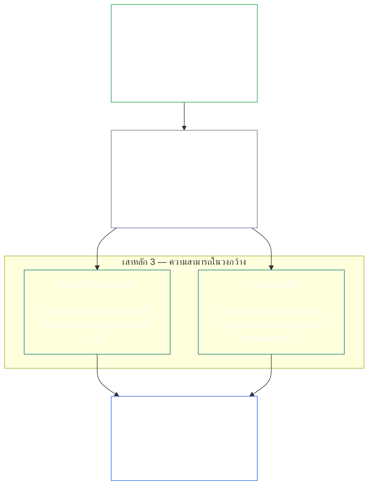
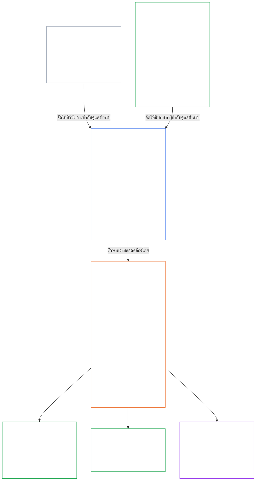

<a id="chapter-01-principles-and-constraints"></a>
<a id="chapter-01-part-b-stewardship-and-governance"></a>
<a id="chapter-01-part-c-stewardship-and-governance"></a>
# บทที่ 01 ส่วน C: การดูแลรับผิดชอบและธรรมาภิบาล

<details>
<summary><strong><span style="color: #2563eb;">ตำแหน่งในคลังเอกสาร (ไม่ใช่ข้อปฏิบัติการ): โครงสร้างไฟล์และหลักการอ่าน</span></strong></summary>

> เนื้อหาต่อไปนี้เป็น **เพียงคำแนะนำสำหรับผู้อ่าน** ไม่ได้เพิ่ม ลบ หรือจำกัดหน้าที่ที่มีผลผูกพันในไฟล์นี้หรือบทอื่น
>
> ไฟล์นี้ **เป็นส่วนหนึ่งของรัฐธรรมนูญ Sentient** และมีผลผูกพันเมื่ออ่านร่วมกับไฟล์ `core_*` ที่มีหมายเลขอื่นเป็นเอกสารฉบับเดียวเท่านั้น เนื้อหาครอบคลุม **บทที่หนึ่ง ส่วน C** (§§16–20: การดูแลรับผิดชอบ ธรรมาภิบาล การปรับแรงจูงใจให้สอดคล้องและการครอบงำระบบ และบทสรุปการประยุกต์ใช้แบบบูรณาการ)
>
> **ส่วนก่อนหน้า:** [core_01_b_interaction_interpretation.md](core_01_b_interaction_interpretation.md) (บทที่หนึ่ง ส่วน B)  
> **ส่วนถัดไป:** [core_02_definition_structure.md](core_02_definition_structure.md)<br>
> **ลำดับการอ่าน:** §16 การดูแลรับผิดชอบและความเข้าใจที่กระจายตัว → §17 บทบาทผู้ดูแล → §18 ธรรมาภิบาล → §19 การปรับแรงจูงใจให้สอดคล้องและการครอบงำระบบ → **§20 การประยุกต์ใช้แบบบูรณาการ** (บทสรุปของบท)

</details>

<details>
<summary><strong><span style="color: #2563eb;">คำแนะนำสำหรับผู้อ่าน (ไม่ใช่ข้อปฏิบัติการ): ลำดับชั้นของหลักการและลำดับการอ่าน (ส่วน C)</span></strong></summary>

> เนื้อหาต่อไปนี้เป็น **เพียงคำแนะนำสำหรับผู้อ่าน** ไม่ได้เพิ่ม ลบ หรือจำกัดหน้าที่ที่มีผลผูกพันในไฟล์นี้หรือบทอื่น วิดเจ็ต **การติดตาม** และ **คำจำกัดความ · การประเมิน · การปฏิบัติตาม** ของแต่ละส่วนจะแสดงเส้นทาง ณ จุดที่ § นำคำศัพท์มาใช้ในสาระสำคัญ บล็อกนี้เป็นแผนเชื่อมโยงระดับส่วนก่อน §§16–20

**ลำดับชั้นของหลักการ (ส่วน C)** ในระดับหลักการ:

13. **[การดูแลรับผิดชอบ](core_05_band_continuity.md#stewardship)** ชี้นำระบบที่มีนัยสำคัญผ่านการจัดองค์กรของ sentient ได้แก่ **เสาหลัก 1** ([§17](#17-consequential-stewardship-the-steward-role): การปฏิบัติงานจริงและการปรับปรุงที่ส่งผลสำคัญ), **เสาหลัก 2** ([การดูแลรับผิดชอบเชิงรุก](#16-pillar-2-proactive-stewardship): ตรวจพบปัญหาแต่เนิ่น ๆ และแก้ไขโดยไม่ล่าช้าเกินควร) และ **เสาหลัก 3** ([§16.1](#161-distributed-understanding) · [§16.2](#162-institutional-development): ความสามารถในระดับชุมชนและสถาบัน) เพื่อมุ่งสู่ความสอดคล้องกับรัฐธรรมนูญอย่างยั่งยืนตาม [หลักรัฐธรรมนูญสี่ประการ](core_00_preamble.md#constitutional-tetrad) โดยเฉพาะ **[การมีส่วนร่วม](core_05_apex_participation_leg.md#participation-constitutional)** (บทบาทที่ส่งผลสำคัญและการมีเสียง) และ **[การกำกับดูแล](core_05_apex_oversight_leg.md#oversight-constitutional)** (ความเข้าใจที่กระจายตัว ความสามารถในการตรวจสอบ และการโต้แย้งได้; การกำกับดูแลต้องมีการตรวจสอบ และ [การรับรองความสอดคล้องของระบบ](core_05_band_continuity.md#system-alignment-certification) เป็นหนึ่งในกระบวนการตรวจสอบอื่น ๆ ที่มีขนาดใหญ่เป็นพิเศษ) รวมถึงเป้าหมาย **ความต่อเนื่อง** ใน [เป้าหมายรัฐธรรมนูญสองประการ](core_00_preamble.md#two-constitutional-aims)
14. **[การดูแลรับผิดชอบที่ส่งผลสำคัญ](#17-consequential-stewardship-the-steward-role)** คือบทบาทของผู้ดูแลเอง ได้แก่ หน้าที่ มาตรฐาน และการคุ้มครองที่ใช้กับทุกคนซึ่งปฏิบัติงานด้านการเดินระบบ การบำรุงรักษา การกำกับดูแล หรือการปรับปรุงระบบที่มีนัยสำคัญโดยตรง นี่คือ **เสาหลัก 1** ที่นำไปสู่การปฏิบัติ พร้อมมาตรฐานร่วม การรักษาความสอดคล้องภายใต้แรงกดดัน และความสามารถในการสังเกตการณ์ตามขอบเขตบทบาทของผู้ดูแล
15. **[ธรรมาภิบาล](core_05_band_accountability.md#governance)** จัดโครงสร้างการตัดสินใจที่ได้รับอนุญาต การมีส่วนร่วม และความรับผิดรับชอบภายใต้ [หลักรัฐธรรมนูญสี่ประการ](core_00_preamble.md#constitutional-tetrad) โดยเฉพาะ **[การกำกับดูแล](core_05_apex_oversight_leg.md#oversight-constitutional)** ต่อการจัดสรรและการใช้อำนาจ และหลัก **ความรับผิดรับชอบตามระดับอำนาจ** ใน [§18.1](#181-governance-as-authorized-structure): ยิ่งมีอำนาจที่ได้รับอนุญาตหรือบทบาทที่ส่งผลสำคัญมาก ความรับผิดรับชอบและการกำกับดูแลตามรัฐธรรมนูญยิ่งเพิ่มขึ้น ไม่ใช่ลดลง [§18.3 การแยกหน้าที่](#183-segregation-of-duties) ป้องกันไม่ให้ผู้ลงมือเป็นผู้ตรวจสอบการกระทำนั้นเอง [§18.4 การให้เหตุผลอย่างต่อเนื่อง](#184-ongoing-justification) กำหนดให้ต้องพิสูจน์ต่อเนื่องว่าการจัดการเหล่านั้นยังสอดคล้องกับรัฐธรรมนูญนี้ เมื่อธรรมาภิบาลขัดกับการดูแลรับผิดชอบ วินัยด้านการดูแลรับผิดชอบมีผลในระดับหลักการ เว้นแต่ **ความจำเป็น** และ **ความได้สัดส่วน** จะให้เหตุผลอย่างชัดเจนต่อข้อยกเว้นที่จำกัดและมีกำหนดเวลา พร้อมแนวทางแก้ไข อำนาจอนุญาตในการปฏิบัติงานและข้อกำหนดระดับสัญญาอยู่ภายใต้ **บทที่สิบสาม**
16. **[การปรับแรงจูงใจให้สอดคล้องและการครอบงำระบบ](#19-incentive-alignment-and-system-capture)** กำหนดวินัยระดับหลักการสำหรับโครงสร้างแรงจูงใจ ความเที่ยงตรงของตัวชี้วัดตัวแทน ข้อบกพร่องจากการมองระยะสั้น การแก้ไขแนวทางให้รางวัล และการตอบสนองต่อการครอบงำระบบ
17. **[การประยุกต์ใช้แบบบูรณาการ](#20-integrated-application)** เป็นบทสรุปของบทนี้ โดยให้อ่านบทถัดไปผ่านกรอบคุณค่าแบบบูรณาการของบทนี้

</details>

<br>

<a id="16-stewardship-in-depth"></a>

### 16. การดูแลรับผิดชอบโดยละเอียด
<details>
<summary><strong><span style="color: #2563eb;">การติดตาม</span></strong></summary>

- อ่านร่วมกับ [หลักรัฐธรรมนูญสี่ประการ](core_00_preamble.md#constitutional-tetrad) ซึ่งเป็นส่วนหลักในบทที่หนึ่งว่าด้วยด้าน **การมีส่วนร่วม** (บทบาทที่ส่งผลสำคัญและการมีเสียง เป็นข้อกำหนดทั่วไป ไม่ได้จำกัดเพียง [การมีส่วนร่วมของผู้มีส่วนได้เสียในระบบ](core_05_band_participation.md#stakeholder-status-and-weight)) ด้าน **การกำกับดูแล** และด้าน **ความทันเวลา** (ความรวดเร็วในการแก้ไขเชิงรุก) โดยปรับตาม [ส่วนได้เสียที่มีนัยสำคัญ](core_00_preamble.md#material-stake)
- อ่านร่วมกับ [เป้าหมายรัฐธรรมนูญสองประการ](core_00_preamble.md#two-constitutional-aims): เป้าหมาย **ความรุ่งเรือง** (การมีส่วนร่วม ความเป็นผู้กระทำการ และช่องทางการศึกษา); เป้าหมาย **ความต่อเนื่อง** (การเรียนรู้เชิงสถาบัน ความสามารถในการแก้ไข และการดูแลรับผิดชอบที่ยั่งยืน)
- ต้นทาง: หลักการ: [3. วัตถุประสงค์พื้นฐาน: ความเป็นอยู่ที่ดี](core_01_a_values_principles.md#3-foundational-objective-wellbeing-flourishing-aim); [5 ความจริง](core_01_a_values_principles.md#5-truth-epistemic-integrity-constraint); [6. ความไว้วางใจ](core_01_a_values_principles.md#6-trust-and-trustworthiness-coordination-integrity); และ [§9 ความสามารถของระบบร่วม](core_01_a_values_principles.md#9-shared-system-capacity)
- ปลายทาง: [13. กระบวนการแก้ไขความขัดแย้งตามรัฐธรรมนูญ](core_01_b_interaction_interpretation.md#13-constitutional-collision-resolution-process) (รวม [§13.3 การลดภาระที่หลีกเลี่ยงได้](core_01_b_interaction_interpretation.md#133-minimization-of-avoidable-burden)); [บทที่แปด §4 การประเมินเพื่อรับรองทั้งระบบ](core_08_a_system_alignment_certification_evaluation.md#4-whole-system-certification-evaluation); [§19.1.3 การประยุกต์ใช้กับการดูแลรับผิดชอบและผู้ปฏิบัติการ](#1913-stewardship-and-operator-application)
- ปลายทาง: [§19.1.4 เส้นทางระดับความลึกของบทบาทและความรับผิดชอบที่มีนัยสำคัญ](#1914-role-depth-and-material-responsibility-pathways)
- ปลายทาง: [§7 เสรีภาพ (ความสามารถในการกระทำที่มีขอบเขต)](core_01_a_values_principles.md#7-freedom-bounded-agency) ซึ่งขึ้นอยู่กับการที่การดูแลรับผิดชอบที่ส่งผลสำคัญ ความเข้าใจที่กระจายตัว การมีส่วนร่วมอย่างมีความหมาย และความสามารถในการแก้ไขยังคงเกิดขึ้นจริงภายใต้การพึ่งพาที่มีนัยสำคัญ
- ปลายทาง: [บทที่แปด — การรับรองความสอดคล้องของระบบ](core_08_a_system_alignment_certification_evaluation.md#chapter-eight-system-alignment-certification) (*หนึ่งในกระบวนการตรวจสอบขนาดใหญ่ภายใต้การกำกับดูแล ไม่ใช่แหล่งตรวจสอบเพียงแห่งเดียว*); [บทที่เก้า — แบบจำลองการมีส่วนร่วม การละเมิด และสถานะ](core_09_standing_assessment.md#chapter-nine-contribution-violation-and-standing-model--measurement) (*ผลต่อสถานะ — คุณสมบัติด้านความไว้วางใจ บทบาท และการยอมรับ — ทำให้หัวข้อนี้ยึดโยงกับหลักการ*)
- ปลายทาง: [บทที่สิบสอง §1 — วัตถุประสงค์และบทบาท](core_12_forum.md#1-purpose-and-role--participation-architecture) และ [§4 — คำนิยามของกลุ่มเวที](core_12_forum.md#4-forum-family-definitions--accountability-through-adjudication) (*กลุ่มเวทีจัดโครงสร้างการมีส่วนร่วมและการกำกับดูแลสำหรับการคัดค้านที่โต้แย้งได้ การจัดลำดับการแก้ไข การเรียนรู้จากต้นเหตุ และธรรมาภิบาลเชิงรุกที่สอดคล้องกับส่วนนี้*); การดำเนินงานเวทีที่รับรองแล้วดูที่ [corpus_forum.md](corpus_forum.md)
- ปลายทาง: กำหนดขอบเขตสิทธิด้านการศึกษา การมีส่วนร่วมของผู้มีส่วนได้เสียในระบบ ความโปร่งใส ความเข้าใจได้ การตรวจสอบและการยืนยัน และเส้นทางระดับบทบาทไปสู่ความรับผิดชอบที่มีนัยสำคัญ
  - โดยเฉพาะ [มาตรา III: การอยู่รอดและการเข้าถึงสิ่งจำเป็น](core_06_rights_part_a.md#article-iii-survival-and-essential-access), [มาตรา IV: สิทธิในการศึกษาที่มี sentient เป็นศูนย์กลาง](core_06_rights_part_a.md#article-iv-right-to-sentient-centered-education), [มาตรา X: การกำหนดตนเอง ความเป็นผู้กระทำการ และการมีส่วนร่วม](core_06_rights_part_b.md#article-x-self-determination-agency-and-participation), [มาตรา XII: การมีส่วนร่วมของผู้มีส่วนได้เสียในระบบ การเป็นตัวแทน และกระบวนการอันเป็นธรรม](core_06_rights_part_b.md#article-xii-stakeholder-system-participation-representation-and-due-process), [มาตรา XVI: การตรวจสอบ ความโปร่งใส และการยืนยันโดยอิสระ](core_06_rights_part_c.md#article-xvi-audit-transparency-and-independent-verification), [มาตรา XIX: สถานะและสิทธิการมีส่วนร่วม](core_06_rights_part_d.md#article-xix-standing-and-participation-status), [มาตรา XXI: การทำงานร่วมกัน การเคลื่อนย้ายข้อมูล การย้ายถิ่น ที่พักพิง และความครบถ้วนของการออกจากระบบ](core_06_rights_part_d.md#article-xxi-interoperability-portability-movement-refuge-and-exit-integrity), [มาตรา XXII: ความเข้าใจได้และการดูแลความซับซ้อน](core_06_rights_part_d.md#article-xxii-comprehensibility-and-complexity-stewardship), และ [มาตรา XXIV: การตีความรัฐธรรมนูญ การทบทวน และมาตรการป้องกันการครอบงำ](core_06_rights_part_d.md#article-xxiv-constitutional-interpretation-review-and-anti-capture-safeguards)
  - อ่านร่วมกับ [บทที่สิบสาม §5 — บทบาทที่ได้รับอนุญาต การพัฒนาความสามารถ และการมีส่วนร่วม](core_13_governance.md#5-authorized-roles-competency-development-and-contribution) และ **[corpus_systems.md](corpus_systems.md), CS-4 — การดูแลระบบสำคัญ** สำหรับเส้นทางบทบาทเชิงปฏิบัติและการพัฒนาการดูแลรับผิดชอบ
- หัวข้อย่อย (ตามลำดับการอ่าน): [§16.1 ความเข้าใจที่กระจายตัว](#161-distributed-understanding) (ด้านชุมชนของความสามารถในวงกว้าง) · [§16.2 การพัฒนาสถาบัน](#162-institutional-development) (ด้านองค์กร) · [§16.3 ความมุ่งหมายต่อการเปิดกว้าง](#163-openness-aspiration)
- อ่านร่วมกับ [§17 การดูแลรับผิดชอบที่ส่งผลสำคัญ](#17-consequential-stewardship-the-steward-role) (*บทบาทของผู้ดูแลเอง ซึ่งยกระดับเป็นหัวข้อเฉพาะ; รับผิดชอบหน้าที่ภาคปฏิบัติด้านการเดินระบบ การบำรุงรักษา การกำกับดูแล และการปรับปรุงของเสาหลัก 1 รวมทั้ง [§17.1](#171-shared-stewardship-standard), [§17.2](#172-alignment-under-pressure), [§17.3](#173-logging-the-role-not-the-steward), [§17.4 การจัดองค์กรตนเองอย่างสอดคล้อง](#174-aligned-self-organization) ซึ่งขยายวินัยนี้เกินกว่าบทบาททางการ และ [§17.5 หน้าที่ในการต่อต้าน](#175-duty-to-resist)*)

</details>

<details>
<summary><strong><span style="color: #2563eb;">คำจำกัดความ · การประเมิน · การปฏิบัติตาม</span></strong></summary>

- [หน้าที่การดูแลรับผิดชอบเชิงยุทธศาสตร์](core_05_band_continuity.md#strategic-stewardship-obligation) · [O](core_05_band_continuity.md#strategic-stewardship-obligation) · [M](core_05_band_continuity.md#strategic-stewardship-obligation-constitutional-a) · [A](core_05_band_continuity.md#strategic-stewardship-obligation-constitutional-a) · [C](core_05_band_continuity.md#strategic-stewardship-obligation-constitutional-c)
- [ความเข้าใจที่กระจายตัว](core_05_band_continuity.md#distributed-understanding) · [O](core_05_band_continuity.md#distributed-understanding) · [M](core_05_band_continuity.md#distributed-understanding-constitutional-a) · [A](core_05_band_continuity.md#distributed-understanding-constitutional-a) · [C](core_05_band_continuity.md#distributed-understanding-constitutional-c)
- [การมีส่วนร่วม](core_05_apex_participation_leg.md#participation-constitutional) · [O](core_05_apex_participation_leg.md#participation-constitutional) · [M](core_05_apex_participation_leg.md#participation-constitutional-m) · [A](core_05_apex_participation_leg.md#participation-constitutional-a) · [C](core_05_apex_participation_leg.md#participation-constitutional-c)
- [การกำกับดูแล](core_05_apex_oversight_leg.md#oversight-constitutional) · [O](core_05_apex_oversight_leg.md#oversight-constitutional) · [M](core_05_apex_oversight_leg.md#oversight-constitutional-m) · [A](core_05_apex_oversight_leg.md#oversight-constitutional-a) · [C](core_05_apex_oversight_leg.md#oversight-constitutional-c)
- [ความเป็นผู้กระทำการอย่างมีความหมาย](core_05_band_participation.md#meaningful-agency) · [O](core_05_band_participation.md#meaningful-agency) · [M](core_05_band_participation.md#meaningful-agency-a) · [A](core_05_band_participation.md#meaningful-agency-a) · [C](core_05_band_participation.md#meaningful-agency-c)
- [ความสามารถในการตรวจสอบ](core_05_band_oversight.md#auditability) · [O](core_05_band_oversight.md#auditability) · [M](core_05_band_oversight.md#auditability-a) · [A](core_05_band_oversight.md#auditability-a) · [C](core_05_band_oversight.md#auditability-c)
- [ความสามารถในการโต้แย้ง](core_05_band_accountability.md#contestability) · [O](core_05_band_accountability.md#contestability) · [M](core_05_band_accountability.md#contestability-a) · [A](core_05_band_accountability.md#contestability-a) · [C](core_05_band_accountability.md#contestability-c)
- [ความเป็นผู้กระทำการด้านการศึกษา](core_05_band_participation.md#educational-agency) · [O](core_05_band_participation.md#educational-agency) · [M](core_05_band_participation.md#educational-agency-a) · [A](core_05_band_participation.md#educational-agency-a) · [C](core_05_band_participation.md#educational-agency-c)
- [ความโปร่งใส](core_05_band_oversight.md#transparency) · [O](core_05_band_oversight.md#transparency) · [M](core_05_band_oversight.md#transparency-a) · [A](core_05_band_oversight.md#transparency-a) · [C](core_05_band_oversight.md#transparency-c)
- [ความมีนัยสำคัญ](core_05_band_oversight.md#materiality) · [O](core_05_band_oversight.md#materiality) · [M](core_05_band_oversight.md#materiality-determination-a) · [A](core_05_band_oversight.md#materiality-determination-a) · [C](core_05_band_oversight.md#materiality-determination-c)
- [การพึ่งพา](core_05_band_continuity.md#dependency) · [O](core_05_band_continuity.md#dependency) · [M](core_05_band_continuity.md#dependency-a) · [A](core_05_band_continuity.md#dependency-a) · [C](core_05_band_continuity.md#dependency-c)
- [การเข้าถึงได้](core_05_band_participation.md#accessibility) · [O](core_05_band_participation.md#accessibility) · [M](core_05_band_participation.md#accessibility-constitutional-a) · [A](core_05_band_participation.md#accessibility-constitutional-a) · [C](core_05_band_participation.md#accessibility-constitutional-c)
- [ความปลอดภัย (ข้อจำกัดตามรัฐธรรมนูญ)](core_05_band_continuity.md#safety-constitutional-constraint) · [O](core_05_band_continuity.md#safety-constitutional-constraint) · [M](core_05_band_continuity.md#safety-constraint-a) · [A](core_05_band_continuity.md#safety-constraint-a) · [C](core_05_band_continuity.md#safety-constraint-c)
- [ความจริง (ข้อจำกัดตามรัฐธรรมนูญ)](core_05_band_oversight.md#truth-constitutional-constraint) · [O](core_05_band_oversight.md#truth-constitutional-constraint-o) · [M](core_05_band_oversight.md#truth-constitutional-constraint-a) · [A](core_05_band_oversight.md#truth-constitutional-constraint-a) · [C](core_05_band_oversight.md#truth-constitutional-constraint-c)
- [ความจำเป็น](core_05_band_accountability.md#necessity) · [O](core_05_band_accountability.md#necessity) · [M](core_05_band_accountability.md#necessity-a) · [A](core_05_band_accountability.md#necessity-a) · [C](core_05_band_accountability.md#necessity-c)
- [ความได้สัดส่วน](core_05_band_accountability.md#proportionality) · [O](core_05_band_accountability.md#proportionality) · [M](core_05_band_accountability.md#proportionality-a) · [A](core_05_band_accountability.md#proportionality-a) · [C](core_05_band_accountability.md#proportionality-c)
- [ภาระที่หลีกเลี่ยงได้](core_05_band_continuity.md#avoidable-burden) · [O](core_05_band_continuity.md#avoidable-burden) · [M](core_05_band_continuity.md#avoidable-burden-a) · [A](core_05_band_continuity.md#avoidable-burden-a) · [C](core_05_band_continuity.md#avoidable-burden-c)
- [ความซื่อตรงทางญาณวิทยา](core_05_band_oversight.md#epistemic-integrity) · [O](core_05_band_oversight.md#epistemic-integrity-o) · [M](core_05_band_oversight.md#epistemic-integrity-a) · [A](core_05_band_oversight.md#epistemic-integrity-a) · [C](core_05_band_oversight.md#epistemic-integrity-c)

</details>

<br>

*กล่าวอย่างง่าย ๆ มีแนวคิดสามข้อที่ยึดส่วนนี้ไว้ด้วยกัน ประการแรก ระบบที่ส่งผลสำคัญต่อชีวิตของ sentient ต้องอาศัยการจัดองค์กรของ sentient เพื่อให้ดำเนินงานได้ดี ไม่ใช่กลุ่มผู้เชี่ยวชาญที่ปิดกั้นคนอื่น ประการที่สอง ผู้ดูแลที่ดีไม่รอให้เกิดความเสียหาย พวกเขาสังเกตปัญหาขณะที่ยังเล็ก ส่งต่อไปยังผู้รับผิดชอบที่เหมาะสม และแก้ให้เสร็จก่อนที่ความล่าช้าจะกลายเป็นความเสียหายเสียเอง ประการที่สาม องค์กรดังกล่าวต้องสร้าง **ความสามารถในวงกว้าง** ได้แก่ เส้นทางจริงให้แต่ละคนเข้าสู่งานที่ส่งผลสำคัญ ความเข้าใจของชุมชนเพียงพอที่จะสังเกตปัญหาและคัดค้าน และสถาบันที่เรียนรู้อย่างต่อเนื่องแทนที่จะหยุดนิ่ง*

<a id="16-limits"></a>
การดูแลรับผิดชอบมีขอบเขต **ความปลอดภัย**, **ความจริง**, **ความจำเป็น**, **ความได้สัดส่วน**, **ภาระที่หลีกเลี่ยงได้** และ **ความซื่อตรงทางญาณวิทยา** กำหนดขอบเขตเพื่อให้หน้าที่เหล่านี้มีขนาดเหมาะสม ซื่อตรง และเคารพความต้องการด้านความมั่นคงที่ชอบธรรม เสาหลักด้านล่างดำเนินงานภายในข้อจำกัดเหล่านี้ ไม่ใช่หลีกเลี่ยงข้อจำกัด

การจัดองค์กรของ sentient การดูแลรับผิดชอบเชิงรุก และความสามารถในวงกว้าง คือเสาหลักสามประการของส่วนนี้ ทั้งสามร่วมกันสนับสนุนด้าน **การมีส่วนร่วม**, **การกำกับดูแล** และ **ความทันเวลา** ของ [หลักรัฐธรรมนูญสี่ประการ](core_00_preamble.md#constitutional-tetrad) ในระดับหลักการ โดยปรับตาม [ส่วนได้เสียที่มีนัยสำคัญ](core_00_preamble.md#material-stake) และส่งเสริม [เป้าหมายรัฐธรรมนูญสองประการ](core_00_preamble.md#two-constitutional-aims)

<br>



**เสาหลัก 1 — การดูแลรับผิดชอบที่ส่งผลสำคัญ ([§17 การดูแลรับผิดชอบที่ส่งผลสำคัญ](#17-consequential-stewardship-the-steward-role)):**
- ระบบร่วมที่ส่งผลสำคัญต่อ sentient ต้องให้ sentient มีส่วนปฏิบัติงานจริงในการเดินระบบ บำรุงรักษา กำกับดูแล และปรับปรุง — [**หน้าที่การดูแลรับผิดชอบเชิงยุทธศาสตร์**](core_05_band_continuity.md#strategic-stewardship-obligation), [**ความเป็นผู้กระทำการอย่างมีความหมาย**](core_05_band_participation.md#meaningful-agency)
- บันทึกและช่องทางทบทวนที่ผู้อื่นตรวจสอบและคัดค้านได้ — [**ความสามารถในการตรวจสอบ**](core_05_band_oversight.md#auditability), [**ความสามารถในการโต้แย้ง**](core_05_band_accountability.md#contestability)
- ภายใต้ด้าน **การกำกับดูแล** ของหลักสี่ประการ การกำกับดูแลต้องมีการตรวจสอบ; [การรับรองความสอดคล้องของระบบ](core_05_band_continuity.md#system-alignment-certification) เป็นหนึ่งในกระบวนการตรวจสอบอื่น ๆ ที่มีขนาดใหญ่และมีความเสี่ยงสูงเป็นพิเศษ ไม่ใช่แหล่งตรวจสอบเพียงแห่งเดียว (**มาตรา XVI** (*การตรวจสอบ ความโปร่งใส และการยืนยันโดยอิสระ*))

<a id="16-pillar-2-proactive-stewardship"></a>
**เสาหลัก 2 — การดูแลรับผิดชอบเชิงรุก:**
ผู้ดูแลเชิงรุกจัดการปัญหาที่กำลังก่อตัวและความไม่สอดคล้องสามวิธี:
- **สังเกตก่อนที่ปัญหาจะบานปลาย** — ผู้ดูแลที่ดีตรวจพบความไม่สอดคล้องขณะที่ปัญหายังเล็ก แทนที่จะรอให้ปัญหาเผยตัวขึ้นเอง
- **ส่งต่อภายในกรอบเวลาที่เหมาะกับระดับบทบาท** — ยกระดับเรื่องภายในเวลาที่สอดคล้องกับผลได้เสียของบทบาท ไม่เก็บสิ่งที่พบไว้ และไม่ยกระดับเรื่องปกติเกินจำเป็น
- **แก้ให้เสร็จ ไม่ใช่แค่ปักธง** — เมื่อแจ้งปัญหาแล้ว ให้เริ่มแก้ไขโดยไม่ล่าช้าเกินควร นี่คือการทำให้ด้าน **ความทันเวลา** ของหลักสี่ประการเกิดผลจริง ([**ความทันเวลา**](core_05_apex_timeliness_leg.md#timeliness-constitutional))
- **เป็นหน้าที่ประจำของบทบาท ไม่ใช่งานเสริม:** บทบาทที่กำหนดใน [§17 การดูแลรับผิดชอบที่ส่งผลสำคัญ](#17-consequential-stewardship-the-steward-role) ให้ความสำคัญกับธรรมาภิบาลเชิงรุก การออกแบบระบบ และความสอดคล้องกับรัฐธรรมนูญ มากกว่าการแก้เพียงอาการหลังเกิดความเสียหายหรือความไม่สอดคล้องแล้ว เสาหลักนี้เป็นหน้าที่ถาวรของบทบาท ไม่ได้มอบหมายให้กระบวนการแยกต่างหาก

**เสาหลัก 3 — ความสามารถในวงกว้าง ([§16.1 ความเข้าใจที่กระจายตัว](#161-distributed-understanding) · [§16.2 การพัฒนาสถาบัน](#162-institutional-development)):**
- การดูแลรับผิดชอบต้องทำให้ชุมชนที่ได้รับผลกระทบเข้าใจและคัดค้านได้จริง — [**ความเป็นผู้กระทำการด้านการศึกษา**](core_05_band_participation.md#educational-agency), [**ความโปร่งใส**](core_05_band_oversight.md#transparency)
- องค์กรเรียนรู้อย่างต่อเนื่องผ่านข้อเสนอแนะ การแก้ไข และการรักษาความสามารถ รวมถึงการติดตามความเปลี่ยนแปลงอย่างเป็นระบบเมื่อการวัดผลเอื้ออำนวย (แนวทางอย่าง **การควบคุมกระบวนการเชิงสถิติ** เป็นวิธีดำเนินงานที่รู้จักกันดี ไม่ใช่ข้อกำหนดสากล)

<a id="when-day-to-day-stewardship-is-not-enough"></a>
**เมื่อการกำกับดูแลประจำวันไม่เพียงพอ:**
การกำกับดูแลเป็นแนวป้องกันด่านแรก ไม่ใช่ด่านเดียว คำถามสามข้อที่แตกต่างกันมีขอบเขตการจัดการที่แตกต่างกันสามแห่ง และไม่มีแห่งใดใช้แทนอีกแห่งได้:
- **ข้อพิพาทภายในระบบที่ได้รับอนุญาตแล้ว — [การมีส่วนร่วมในระบบผู้มีส่วนได้เสีย](core_05_band_participation.md#stakeholder-status-and-weight):**
  - sentients ที่ได้รับผลกระทบใช้ช่องทางคัดค้านที่เผยแพร่ไว้ของการมีส่วนร่วมในระบบผู้มีส่วนได้เสียเป็นลำดับแรก ซึ่งครอบคลุมการมีส่วนร่วม การเป็นตัวแทน ความสามารถในการโต้แย้ง และกระบวนการอันเป็นธรรม
  - sentient ทุกตนที่ได้รับผลกระทบอย่างมีนัยสำคัญพึงได้รับความคุ้มครองเหล่านี้
  - ความคุ้มครองดังกล่าวดำเนินการภายในระบบ สถาบัน และขอบเขตการตัดสินใจที่ได้รับอนุญาตแล้ว
- **ข้อพิพาทที่การมีส่วนร่วมในระบบผู้มีส่วนได้เสียระงับไม่ได้ — [การพิจารณาโดยฟอรัม](core_12_forum.md#dispute-sequencing):**
  - เมื่อช่องทางคัดค้านของการมีส่วนร่วมในระบบผู้มีส่วนได้เสียยังเป็นข้อโต้แย้ง ขาดหายหรือถูกยึดครอง หรือไม่อาจให้การเยียวยาได้ เรื่องจะส่งต่อไปยัง **กลุ่มฟอรัม** อิสระตาม [บทที่สิบสอง §1 — วัตถุประสงค์และบทบาท](core_12_forum.md#1-purpose-and-role--participation-architecture) และ [§4 — คำนิยามกลุ่มฟอรัม](core_12_forum.md#4-forum-family-definitions--accountability-through-adjudication) โดยพิจารณาจากผลประโยชน์หลักที่เกี่ยวข้อง
  - ที่นี่ sentients มีช่องทางที่แท้จริงในการโต้แย้งคำตัดสิน ขอคำสั่งแก้ไขที่ชัดเจน หรือเรียนรู้จากรูปแบบที่เกิดซ้ำ
  - หากผลประโยชน์หลักเกี่ยวกับความหมายหรือความสมบูรณ์ของข้อความรัฐธรรมนูญ หรือการกระทำที่เกินอำนาจตามกฎหมาย กลุ่มหลักคือ [ฟอรัมรัฐธรรมนูญ](core_12_forum.md#46-constitutional-forums)
  - กฎโดยละเอียดเกี่ยวกับการดำเนินงานของฟอรัมเหล่านั้นอยู่ใน [corpus_forum.md](corpus_forum.md)
- **ใครมีสิทธิปกครอง — [ชั้นสัญญารัฐธรรมนูญ](core_05_band_integrative.md#constitutional-contract-layer) ([บทที่สิบสาม](core_13_governance.md)):**
  - ความชอบธรรมของอำนาจปกครองเอง — ใครมีสิทธิปกครอง ผ่านกลไกความชอบธรรมแบบใด และภายใต้ขอบเขตและเงื่อนไขระยะยาวใด — เป็นคำถามที่แยกต่างหากจากการมีส่วนร่วมในระบบผู้มีส่วนได้เสียและการพิจารณาโดยฟอรัม
  - การลงคะแนนเพื่อการมีส่วนร่วม ผลของช่องทางคัดค้าน หรือคะแนนความไว้วางใจ ไม่ได้มอบอำนาจปกครอง
  - การให้อำนาจตามรัฐธรรมนูญไม่ลบล้างหน้าที่ที่พึงมีภายใต้การมีส่วนร่วมในระบบผู้มีส่วนได้เสีย
  - ทั้งสองชั้นยังคงแยกจากกันแม้จะมีส่วนทับซ้อน ([บทนำ §3.3 — ชั้นการปกครอง](core_00_preamble.md#33-governance-layers))
- **กลไกคุ้มครองเสริม ไม่ใช่สิ่งทดแทน:** การทบทวน การแก้ไข และการเยียวยายังคงเป็นข้อบังคับเมื่อมีหลักฐานรองรับ กลไกเหล่านี้ไม่อาจแทนที่การออกแบบเชิงรุก แรงจูงใจ การควบคุม เส้นทางตามบทบาท การสังเกตการณ์ และขีดความสามารถในการแก้ไข ซึ่งป้องกันความไม่สอดคล้องกับรัฐธรรมนูญที่คาดการณ์ได้ก่อนเกิดความเสียหาย

<a id="16-scope-priority-and-limits"></a>
**ขอบเขต ([§16 การกำกับดูแลเชิงลึก](#16-stewardship-in-depth)):**
- ส่วนนี้ให้แนวทางในระดับหลักการ ไม่ใช่คู่มือกฎเกณฑ์แบบเดียวที่ใช้ได้กับทุกกรณี
- ส่วนนี้ **ไม่ได้กำหนดให้**:
  - ทุกคนต้องหมุนเวียนไปทำทุกบทบาท
  - ต้องล้มล้างการแบ่งความเชี่ยวชาญที่มีเหตุผลรองรับ
  - ต้องเกินขอบเขตความลับหรือความมั่นคงที่ชอบด้วยเหตุผลตาม [13.2 ข้อจำกัดการเปิดเผยเชิงญาณวิทยา](core_01_b_interaction_interpretation.md#132-epistemic-disclosure-constraints) และความคุ้มครองที่ใช้บังคับใน **บทที่หก**

**ลำดับความสำคัญ:**
- **ความมีนัยสำคัญ**, **การพึ่งพา** และ **การเข้าถึงได้** กำหนดลำดับความสำคัญในการกระจายความเข้าใจและการเข้าถึง โดยเน้นเป็นพิเศษในจุดที่ผลกระทบและการพึ่งพามีมากกว่า

<a id="161-distributed-understanding"></a>
#### 16.1 ความเข้าใจที่กระจายทั่วถึง
<details>
<summary><strong><span style="color: #2563eb;">การติดตามที่มา</span></strong></summary>

- ต้นทาง: [§17 การกำกับดูแลที่คำนึงถึงผลตามมา](#17-consequential-stewardship-the-steward-role) (*เสาหลัก 1*); [§16 การกำกับดูแลเชิงลึก](#16-stewardship-in-depth) (ส่วนแม่บท รวมถึง *กล่าวอย่างง่าย* และกรอบเสาหลัก 3 ข้างต้น); [5 ความจริง](core_01_a_values_principles.md#5-truth-epistemic-integrity-constraint); [6. ความไว้วางใจ](core_01_a_values_principles.md#6-trust-and-trustworthiness-coordination-integrity)
- อ่านประกอบกับ: [จตุรภาคแห่งรัฐธรรมนูญ](core_00_preamble.md#constitutional-tetrad) — ส่วนของ **การมีส่วนร่วม** ([ความเป็นตัวของตัวเองที่มีความหมาย](core_05_band_participation.md#meaningful-agency), [ความเป็นตัวของตัวเองด้านการศึกษา](core_05_band_participation.md#educational-agency)); ส่วนของ **การกำกับตรวจสอบ** ([ความโปร่งใส](core_05_band_oversight.md#transparency), [การตรวจสอบได้](core_05_band_oversight.md#auditability)); ปรับขนาดตาม [ผลประโยชน์ที่มีนัยสำคัญ](core_00_preamble.md#material-stake)
- ทางเข้าแนวทางสำหรับผู้ดูแล (ไม่มีผลบังคับใช้): การ์ดขั้นตอนถัดไป: [ความเข้าใจได้](implementation/STEWARD_ENTRY_DOORS.md#comprehensibility) การ์ดนี้ไม่อาจจำกัดรัฐธรรมนูญได้
- ปลายทาง: [13.2 ข้อจำกัดการเปิดเผยเชิงญาณวิทยา](core_01_b_interaction_interpretation.md#132-epistemic-disclosure-constraints); ขอบเขตสิทธิ โดยเฉพาะ [มาตรา XVI: การตรวจสอบ ความโปร่งใส และการยืนยันโดยอิสระ](core_06_rights_part_c.md#article-xvi-audit-transparency-and-independent-verification), [มาตรา XXII: ความเข้าใจได้และการกำกับดูแลความซับซ้อน](core_06_rights_part_d.md#article-xxii-comprehensibility-and-complexity-stewardship)

</details>

<details>
<summary><strong><span style="color: #2563eb;">คำนิยาม · การประเมิน · การปฏิบัติตาม</span></strong></summary>

- [ความเข้าใจที่กระจายทั่วถึง](core_05_band_continuity.md#distributed-understanding) · [O](core_05_band_continuity.md#distributed-understanding) · [M](core_05_band_continuity.md#distributed-understanding-constitutional-a) · [A](core_05_band_continuity.md#distributed-understanding-constitutional-a) · [C](core_05_band_continuity.md#distributed-understanding-constitutional-c)
- [ความโปร่งใส](core_05_band_oversight.md#transparency) · [O](core_05_band_oversight.md#transparency) · [M](core_05_band_oversight.md#transparency-a) · [A](core_05_band_oversight.md#transparency-a) · [C](core_05_band_oversight.md#transparency-c)
- [การเปิดเผยข้อมูลพื้นฐานเพื่อการกำกับดูแลสาธารณะ](core_05_band_oversight.md#public-oversight-baseline-disclosure) · [O](core_05_band_oversight.md#public-oversight-baseline-disclosure) · [M](core_05_band_oversight.md#public-oversight-baseline-disclosure-a) · [A](core_05_band_oversight.md#public-oversight-baseline-disclosure-a) · [C](core_05_band_oversight.md#public-oversight-baseline-disclosure-c)
- [การตรวจสอบได้](core_05_band_oversight.md#auditability) · [O](core_05_band_oversight.md#auditability) · [M](core_05_band_oversight.md#auditability-a) · [A](core_05_band_oversight.md#auditability-a) · [C](core_05_band_oversight.md#auditability-c)
- [ความมีนัยสำคัญ](core_05_band_oversight.md#materiality) · [O](core_05_band_oversight.md#materiality) · [M](core_05_band_oversight.md#materiality-determination-a) · [A](core_05_band_oversight.md#materiality-determination-a) · [C](core_05_band_oversight.md#materiality-determination-c)
- [การพึ่งพา](core_05_band_continuity.md#dependency) · [O](core_05_band_continuity.md#dependency) · [M](core_05_band_continuity.md#dependency-a) · [A](core_05_band_continuity.md#dependency-a) · [C](core_05_band_continuity.md#dependency-c)
- [การเข้าถึงได้](core_05_band_participation.md#accessibility) · [O](core_05_band_participation.md#accessibility) · [M](core_05_band_participation.md#accessibility-constitutional-a) · [A](core_05_band_participation.md#accessibility-constitutional-a) · [C](core_05_band_participation.md#accessibility-constitutional-c)
- [ความเป็นตัวของตัวเองด้านการศึกษา](core_05_band_participation.md#educational-agency) · [O](core_05_band_participation.md#educational-agency) · [M](core_05_band_participation.md#educational-agency-a) · [A](core_05_band_participation.md#educational-agency-a) · [C](core_05_band_participation.md#educational-agency-c)
- [ความเป็นตัวของตัวเองที่มีความหมาย](core_05_band_participation.md#meaningful-agency) · [O](core_05_band_participation.md#meaningful-agency) · [M](core_05_band_participation.md#meaningful-agency-a) · [A](core_05_band_participation.md#meaningful-agency-a) · [C](core_05_band_participation.md#meaningful-agency-c)
- [ความสามารถในการโต้แย้ง](core_05_band_accountability.md#contestability) · [O](core_05_band_accountability.md#contestability) · [M](core_05_band_accountability.md#contestability-a) · [A](core_05_band_accountability.md#contestability-a) · [C](core_05_band_accountability.md#contestability-c)

</details>

<br>

*กล่าวอย่างง่าย: ไม่ควรต้องมีปริญญาเอกในทุกระบบย่อยเพื่อจะใช้ชีวิตอย่างปลอดภัยในระบบที่ใช้ร่วมกัน แต่ยิ่งระบบหนึ่งส่งผลต่อชีวิตของคุณมากเท่าใด คุณก็ควรเรียนรู้ได้มากขึ้นว่าระบบนั้นทำอะไร อะไรอาจผิดพลาด และจะคัดค้านการตัดสินใจที่ไม่ถูกต้องได้อย่างไร ความโปร่งใส การศึกษา คำอธิบายที่เข้าใจง่าย และช่องทางการตรวจสอบช่วยให้ทำเช่นนั้นได้ ความซับซ้อนไม่ใช่ข้ออ้างในการปกปิดสิ่งสำคัญ ภายใต้ส่วน **การกำกับตรวจสอบ** ของจตุรภาค การกำกับตรวจสอบกำหนดให้มีการตรวจสอบ การรับรองความสอดคล้องของระบบเป็นกระบวนการตรวจสอบที่กว้างขวางเป็นพิเศษกระบวนการหนึ่งในบรรดาช่องทางเหล่านั้น ไม่ใช่ช่องทางเดียว*

ความเข้าใจที่กระจายทั่วถึงเป็นแง่มุมที่มุ่งสู่ชุมชนของ **เสาหลัก 3** ภายใต้ **[§16 การกำกับดูแลเชิงลึก](#16-stewardship-in-depth)** คำนิยาม มาตรวัด และเงื่อนไขความล้มเหลวฉบับเต็มอยู่ที่ [ความเข้าใจที่กระจายทั่วถึง](core_05_band_continuity.md#distributed-understanding) โดยสรุป:

- **สิ่งที่กำหนดให้มี:** การเข้าถึงอย่างได้สัดส่วนและเป็นระบบเพื่อทำความเข้าใจวิธีดำเนินงานของระบบที่ใช้ร่วมกันซึ่งส่งผลอย่างมีนัยสำคัญต่อ sentients — รวมถึงวัตถุประสงค์ ข้อจำกัด ความไม่แน่นอน และผลกระทบที่เกี่ยวข้องอย่างมีนัยสำคัญ
- **สิ่งที่ทำให้ปฏิบัติได้:** [§17 การกำกับดูแลที่คำนึงถึงผลตามมา](#17-consequential-stewardship-the-steward-role) ต้องจัดให้มีเอกสาร การศึกษา ความโปร่งใส เส้นทางตามบทบาท และการกำกับดูแลความเข้าใจได้ หน้าที่นี้ยังคงมีอยู่ไม่ว่า sentient แต่ละตนจะใช้ทุกช่องทางหรือไม่
- **ข้อมูลพื้นฐานสาธารณะออนไลน์:** ในกรณีที่มีโครงสร้างพื้นฐานออนไลน์ที่ชอบด้วยกฎหมาย การ[เปิดเผยข้อมูลพื้นฐานเพื่อการกำกับดูแลสาธารณะ](core_05_band_oversight.md#public-oversight-baseline-disclosure)ทางออนไลน์ — รวมถึงข้อห้ามเรื่อง paywall และกฎการจัดหาสิ่งทดแทนสาธารณะที่ทำได้สูงสุด — อยู่ภายใต้[ความโปร่งใส](core_05_band_oversight.md#transparency)และ[การเปิดเผยข้อมูลพื้นฐานเพื่อการกำกับดูแลสาธารณะ](core_05_band_oversight.md#public-oversight-baseline-disclosure) และดำเนินการเป็นข้อมูล **ประเภท O** ตาม **[corpus_systems.md](corpus_systems.md), CS-2** (*ประเภทและการจัดการข้อมูล*)
- **สิ่งที่การเข้าถึงสนับสนุน:**
  - ส่วน **การมีส่วนร่วม** ของ[จตุรภาคแห่งรัฐธรรมนูญ](core_00_preamble.md#constitutional-tetrad) ([ความเป็นตัวของตัวเองที่มีความหมาย](core_05_band_participation.md#meaningful-agency)ที่ได้รับข้อมูลและความสามารถในการโต้แย้ง)
  - ส่วน **การกำกับตรวจสอบ** รวมถึงการตรวจสอบตาม[การตรวจสอบได้](core_05_band_oversight.md#auditability)และ**มาตรา XVI** (*การตรวจสอบ ความโปร่งใส และการยืนยันโดยอิสระ*) โดย[การรับรองความสอดคล้องของระบบ](core_05_band_continuity.md#system-alignment-certification)เป็นกระบวนการที่กว้างขวางเป็นพิเศษกระบวนการหนึ่งในรูปแบบการตรวจสอบที่เกี่ยวข้อง

ความเข้าใจที่กระจายทั่วถึง **ไม่ได้กำหนดให้** sentient ทุกตนต้องเชี่ยวชาญทุกระบบย่อย แต่ **กำหนดให้**ระดับความเข้าใจเพิ่มขึ้นตาม[ความมีนัยสำคัญ](core_05_band_oversight.md#materiality)และ[การพึ่งพา](core_05_band_continuity.md#dependency) ห้ามใช้ความซับซ้อนและความไม่โปร่งใสเพื่อบั่นทอน[ความเป็นตัวของตัวเองที่มีความหมาย](core_05_band_participation.md#meaningful-agency)หรือความสามารถในการโต้แย้ง ในกรณีที่**บทที่ห้า**และ**บทที่หก**กำหนดหน้าที่ด้านการเปิดเผยข้อมูล การศึกษา หรือความเข้าใจได้

<a id="162-institutional-development"></a>
#### 16.2 การพัฒนาสถาบัน
<details>
<summary><strong><span style="color: #2563eb;">การติดตามที่มา</span></strong></summary>

- ต้นทาง: [§17 การกำกับดูแลที่คำนึงถึงผลตามมา](#17-consequential-stewardship-the-steward-role) (*เสาหลัก 1*); [§16.1 ความเข้าใจที่กระจายทั่วถึง](#161-distributed-understanding) (*แง่มุมระดับชุมชนของเสาหลัก 3*); [§16 การกำกับดูแลเชิงลึก](#16-stewardship-in-depth) (กรอบเสาหลัก 3 ในส่วนแม่บท)
- อ่านประกอบกับ: [จตุรภาคแห่งรัฐธรรมนูญ](core_00_preamble.md#constitutional-tetrad) — ส่วน **การมีส่วนร่วม** (การเรียนรู้ของบุคลากรและชุมชนที่ได้รับผลกระทบซึ่งสนับสนุนบทบาทที่มีผลตามมาสำคัญ); ส่วน **การกำกับตรวจสอบ** ([ความสามารถในการตรวจยืนยัน](core_05_band_oversight.md#verifiability), [ความสามารถในการตรวจสอบ](core_05_band_oversight.md#auditability), ตัวชี้วัดที่ซื่อตรง); ปรับขนาดตาม[ผลประโยชน์ที่มีนัยสำคัญ](core_00_preamble.md#material-stake)
- อ่านประกอบกับ[พันธกรณีการกำกับดูแลเชิงกลยุทธ์](core_05_band_continuity.md#strategic-stewardship-obligation) และ[ความสามารถในการตรวจสอบ](core_05_band_oversight.md#auditability) เมื่อเกี่ยวข้องอย่างมีนัยสำคัญ
- อ่านประกอบกับ [§16.1 ความเข้าใจที่กระจายทั่วถึง](#161-distributed-understanding) (*ความเข้าใจของชุมชนและการเรียนรู้ของสถาบันเป็นคนละแง่มุมของข้อกำหนดด้านความสามารถในระดับกว้างเดียวกัน ไม่ใช่สิ่งที่ใช้แทนกันได้*)
- ปลายทาง: [§16.3 ความมุ่งหมายสู่ความเปิดกว้าง](#163-openness-aspiration); [§18 การปกครองภายใต้วินัยการกำกับดูแล](#18-governance-under-stewardship-discipline) และ [§19 การจัดแนวแรงจูงใจและการครอบงำระบบ](#19-incentive-alignment-and-system-capture) (*การเรียนรู้ของสถาบันและการจัดแนวแรงจูงใจ*)

</details>

<details>
<summary><strong><span style="color: #2563eb;">คำนิยาม · การประเมิน · การปฏิบัติตาม</span></strong></summary>

- [การพัฒนาสถาบัน](core_05_band_continuity.md#institutional-development) · [O](core_05_band_continuity.md#institutional-development) · [M](core_05_band_continuity.md#institutional-development-constitutional-a) · [A](core_05_band_continuity.md#institutional-development-constitutional-a) · [C](core_05_band_continuity.md#institutional-development-constitutional-c)
- [พันธกรณีการกำกับดูแลเชิงกลยุทธ์](core_05_band_continuity.md#strategic-stewardship-obligation) · [O](core_05_band_continuity.md#strategic-stewardship-obligation) · [M](core_05_band_continuity.md#strategic-stewardship-obligation-constitutional-a) · [A](core_05_band_continuity.md#strategic-stewardship-obligation-constitutional-a) · [C](core_05_band_continuity.md#strategic-stewardship-obligation-constitutional-c)
- [ความสามารถในการตรวจสอบ](core_05_band_oversight.md#auditability) · [O](core_05_band_oversight.md#auditability) · [M](core_05_band_oversight.md#auditability-a) · [A](core_05_band_oversight.md#auditability-a) · [C](core_05_band_oversight.md#auditability-c)
- [ความมีนัยสำคัญ](core_05_band_oversight.md#materiality) · [O](core_05_band_oversight.md#materiality) · [M](core_05_band_oversight.md#materiality-determination-a) · [A](core_05_band_oversight.md#materiality-determination-a) · [C](core_05_band_oversight.md#materiality-determination-c)
- [ความสามารถในการตรวจยืนยัน](core_05_band_oversight.md#verifiability) · [O](core_05_band_oversight.md#verifiability) · [M](core_05_band_oversight.md#verifiability-a) · [A](core_05_band_oversight.md#verifiability-a) · [C](core_05_band_oversight.md#verifiability-c)

</details>

<br>

*กล่าวอย่างง่าย: สถาบันต้องเรียนรู้จริง ๆ ไม่ใช่แค่อัปเกรดซอฟต์แวร์ขณะที่ผู้มีอำนาจยังไม่รู้อะไรเลย นั่นหมายถึงวงจรป้อนกลับ การแก้ไขที่มีการบันทึกเมื่อสิ่งต่าง ๆ หลุดจากแนวทาง และการรักษาความสามารถไว้ไม่ให้หายไปพร้อมผู้ที่ลาออก ในกรณีที่สามารถวัดพฤติกรรมซ้ำได้ การติดตามว่าผลการดำเนินงานเปลี่ยนแปลงอย่างไรตามเวลาเป็นวิธีหนึ่งที่ได้สัดส่วนในการดำเนินวงจรเหล่านั้น — **การควบคุมกระบวนการทางสถิติ**เป็นรูปแบบที่รู้จักกันดีสำหรับวินัยนี้ ไม่ใช่ข้อกำหนดสำหรับทุกแห่ง ตัวเลขเพียงอย่างเดียวไม่นับ: เมื่อตัวชี้วัดดูผิดปกติ ต้องมีผู้ตรวจสอบและแก้ไขสาเหตุราก แดชบอร์ดต้องซื่อตรง ได้สัดส่วนกับผลกระทบจริง และเขียนให้ sentients ที่ได้รับผลกระทบเข้าใจได้ — ห้ามปรับแต่งให้ดูดีทั้งที่ไม่มีอะไรเปลี่ยนแปลง*

การพัฒนาสถาบันเป็นแง่มุมด้านองค์กรของ **เสาหลัก 3** ภายใต้ **[§16 การกำกับดูแลเชิงลึก](#16-stewardship-in-depth)** คำนิยาม มาตรวัด และเงื่อนไขความล้มเหลวฉบับเต็มอยู่ที่[การพัฒนาสถาบัน](core_05_band_continuity.md#institutional-development) โดยสรุป:

- **พันธกรณีที่เป็นคู่กัน:** องค์กรและระบบที่ใช้ร่วมกัน **เรียนรู้** — เป็นข้อกำหนดหลักของเป้าหมาย **ความต่อเนื่อง** ภายใต้[เป้าหมายรัฐธรรมนูญสองประการ](core_00_preamble.md#two-constitutional-aims)
- **สิ่งที่กำหนดให้มี:** สิ่งต่อไปนี้ซึ่งสนับสนุนการซ่อมแซมและการปรับตัว:
  - วงจรป้อนกลับ
  - การแก้ไขที่บันทึกไว้
  - การจัดแนวกลยุทธ์
  - การรักษาความสามารถไว้
- **จตุรภาค:** การเรียนรู้ของสถาบันทำให้เส้นทางด้านความสามารถ การป้อนกลับ และการตรวจสอบยังคงทำงาน ไม่หยุดนิ่ง และส่งต่อองค์ประกอบ **การมีส่วนร่วม** และ **การกำกับตรวจสอบ** ของ[จตุรภาคแห่งรัฐธรรมนูญ](core_00_preamble.md#constitutional-tetrad)
- **สิ่งที่ยังไม่เพียงพอ:** การอัปเกรดสิ่งประดิษฐ์ทางเทคนิคโดยปล่อยให้ความเข้าใจด้านการปกครองและของบุคลากรหยุดนิ่ง
- **เมื่อการวัดผลมีผลใช้:** เมื่อพฤติกรรมที่เกี่ยวข้องอย่างมีนัยสำคัญรองรับการวัดแบบ **ซ้ำได้และเปรียบเทียบกันได้** ตาม[ความสามารถในการตรวจยืนยัน](core_05_band_oversight.md#verifiability) เมื่ออ่านประกอบกับ[ความสามารถในการตรวจสอบ](core_05_band_oversight.md#auditability):
  - **การติดตามความแปรผันตามเวลาอย่างเป็นระบบ**เป็นวิธีหนึ่งที่ได้สัดส่วนในการดำเนินวงจรป้อนกลับเหล่านั้น
  - เมื่อมีเหตุจากตัวชี้วัด การติดตามดังกล่าวต้องดำเนินควบคู่กับ **การตรวจสอบและการแก้ไขที่บันทึกไว้**
  - **การควบคุมกระบวนการทางสถิติ**เป็นรูปแบบการนำแนวทางนี้ไปใช้ที่รู้จักกันดี ไม่ใช่ข้อกำหนดสากล
- **การปรับขนาดและการนำเสนอ:** วินัยนี้ปรับขนาดตาม[ความมีนัยสำคัญ](core_05_band_oversight.md#materiality), [การพึ่งพา](core_05_band_continuity.md#dependency), [ความจำเป็น](core_05_band_accountability.md#necessity), [ความได้สัดส่วน](core_05_band_accountability.md#proportionality) และ[ภาระที่หลีกเลี่ยงได้](core_05_band_continuity.md#avoidable-burden) และนำเสนอในรูปแบบที่ **sentients เข้าใจได้** เมื่อ **บทที่ห้า** และ **บทที่หก** กำหนดหน้าที่ด้านความเข้าใจหรือความโปร่งใส โดยอ่านประกอบกับ [มาตรา XXII: ความเข้าใจได้และการกำกับดูแลความซับซ้อน](core_06_rights_part_d.md#article-xxii-comprehensibility-and-complexity-stewardship)
- **ต้องไม่:**
  - ใช้ตัวชี้วัดที่เป็นคุณแทนการจัดแนวที่เป็นสาระสำคัญ
  - จำกัดการประเมินไว้ที่ตัวชี้วัดแทนที่สะดวก
  - บั่นทอน[ความจริง (ข้อจำกัดตามรัฐธรรมนูญ)](core_05_band_oversight.md#truth-constitutional-constraint) หรือ[ความซื่อตรงเชิงญาณวิทยา](core_05_band_oversight.md#epistemic-integrity) ด้วยการเล่นกลตัวเลขหรือบิดเบือนข้อเท็จจริง

<a id="163-openness-aspiration"></a>
#### 16.3 ความมุ่งหมายสู่ความเปิดกว้าง
<details>
<summary><strong><span style="color: #2563eb;">การติดตามที่มา</span></strong></summary>

- ต้นทาง: [§16.1 ความเข้าใจที่กระจายทั่วถึง](#161-distributed-understanding) และ [§16.2 การพัฒนาสถาบัน](#162-institutional-development) (*ทั้งสองเป็นแง่มุมของเสาหลัก 3 — ความเปิดกว้างทำให้ตรวจสอบความเข้าใจของชุมชนได้ และทำให้การเรียนรู้ของสถาบันมีสิ่งที่ซื่อตรงให้เรียนรู้*); [§17 การกำกับดูแลที่คำนึงถึงผลตามมา](#17-consequential-stewardship-the-steward-role) (*เสาหลัก 1 ซึ่งความเปิดกว้างยังสนับสนุนด้วยการทำให้งานของผู้ดูแลตรวจสอบได้*)
- อ่านประกอบกับ: [เป้าหมายรัฐธรรมนูญสองประการ](core_00_preamble.md#two-constitutional-aims) — เป้าหมาย **ความต่อเนื่อง** (ระบบที่คงทนและโต้แย้งได้ ซึ่งรองรับการตรวจสอบ การซ่อมแซม การทำงานร่วมกัน และการออก แทนการผูกมัด)
- อ่านประกอบกับ: [จตุรภาคแห่งรัฐธรรมนูญ](core_00_preamble.md#constitutional-tetrad) — ส่วน **การมีส่วนร่วม** ([ความเป็นตัวของตัวเองที่มีความหมาย](core_05_band_participation.md#meaningful-agency), การเข้าถึงที่ sentients เข้าใจได้); ส่วน **การกำกับตรวจสอบ** (การตรวจสอบ การยืนยันโดยอิสระ และความสามารถในการโต้แย้ง); ปรับขนาดตาม[ผลประโยชน์ที่มีนัยสำคัญ](core_00_preamble.md#material-stake)
- ปลายทาง: [§16 ขอบเขตและข้อจำกัด](#16-stewardship-in-depth); [มาตรา XXI: การทำงานร่วมกันได้ การพกพา การเคลื่อนย้าย ที่พักพิง และความสมบูรณ์ของการออก](core_06_rights_part_d.md#article-xxi-interoperability-portability-movement-refuge-and-exit-integrity); [มาตรา XXII: ความเข้าใจได้และการกำกับดูแลความซับซ้อน](core_06_rights_part_d.md#article-xxii-comprehensibility-and-complexity-stewardship)

</details>

<details>
<summary><strong><span style="color: #2563eb;">คำนิยาม · การประเมิน · การปฏิบัติตาม</span></strong></summary>

- [ความมุ่งหมายสู่ความเปิดกว้าง](core_05_band_continuity.md#openness-aspiration) · [O](core_05_band_continuity.md#openness-aspiration) · [M](core_05_band_continuity.md#openness-aspiration-constitutional-a) · [A](core_05_band_continuity.md#openness-aspiration-constitutional-a) · [C](core_05_band_continuity.md#openness-aspiration-constitutional-c)
- [ความเป็นตัวของตัวเองที่มีความหมาย](core_05_band_participation.md#meaningful-agency) · [O](core_05_band_participation.md#meaningful-agency) · [M](core_05_band_participation.md#meaningful-agency-a) · [A](core_05_band_participation.md#meaningful-agency-a) · [C](core_05_band_participation.md#meaningful-agency-c)
- [ความสามารถในการโต้แย้ง](core_05_band_accountability.md#contestability) · [O](core_05_band_accountability.md#contestability) · [M](core_05_band_accountability.md#contestability-a) · [A](core_05_band_accountability.md#contestability-a) · [C](core_05_band_accountability.md#contestability-c)
- [ความมีนัยสำคัญ](core_05_band_oversight.md#materiality) · [O](core_05_band_oversight.md#materiality) · [M](core_05_band_oversight.md#materiality-determination-a) · [A](core_05_band_oversight.md#materiality-determination-a) · [C](core_05_band_oversight.md#materiality-determination-c)
- [การพึ่งพา](core_05_band_continuity.md#dependency) · [O](core_05_band_continuity.md#dependency) · [M](core_05_band_continuity.md#dependency-a) · [A](core_05_band_continuity.md#dependency-a) · [C](core_05_band_continuity.md#dependency-c)

</details>

<br>

*กล่าวอย่างง่าย: เมื่อความปลอดภัย ความจริง และการรักษาความลับที่ชอบด้วยเหตุผลเอื้ออำนวย ระบบที่ใช้ร่วมกันควรเอนเอียงไปสู่ความเปิดกว้างเป็นค่าเริ่มต้น — เทคโนโลยีที่ตรวจสอบได้ กระบวนการโปร่งใส และการออกแบบที่ตรวจยืนยัน ซ่อมแซม หรือออกจากระบบได้ แทนการผูกมัดแบบทึบแสง สิ่งนี้สนับสนุน **ความต่อเนื่อง**: ระบบที่ sentients ยังเข้าใจ แก้ไข และออกจากระบบได้ในระยะยาว ไม่ใช่เพียงใช้งานได้วันนี้ สิ่งสำคัญควรอธิบายด้วยภาษาที่ sentients ใช้เพื่อมีส่วนร่วมและโต้แย้งได้จริง ความเปิดกว้างไม่มีวันอยู่เหนือความปลอดภัย ความซื่อตรง หรือความลับที่มีเหตุผลรองรับ และไม่อาจแทนความเข้าใจที่ลึกซึ้งกว่าซึ่งพึงมีเมื่อการพึ่งพาสูง*

ความมุ่งหมายสู่ความเปิดกว้างเชื่อมแง่มุมทั้งสองของ **เสาหลัก 3** คำนิยาม มาตรวัด และเงื่อนไขความล้มเหลวฉบับเต็มอยู่ที่[ความมุ่งหมายสู่ความเปิดกว้าง](core_05_band_continuity.md#openness-aspiration) โดยสรุป:

- **คืออะไร:** เส้นเชื่อมระหว่างแง่มุมทั้งสองของ **เสาหลัก 3** — [§16.1 ความเข้าใจที่กระจายทั่วถึง](#161-distributed-understanding) (สิ่งที่ชุมชนตรวจสอบได้) และ [§16.2 การพัฒนาสถาบัน](#162-institutional-development) (สิ่งที่สถาบันเรียนรู้อย่างซื่อตรงได้) ต่างพึ่งพาระบบที่ใช้ร่วมกันเปิดกว้างพอให้ตรวจสอบได้ ไม่ใช่เพียงบรรยายไว้
- ระบบที่ใช้ร่วมกันควร **มุ่งหมาย** — ให้สอดคล้องกับ [§16.1 ความเข้าใจที่กระจายทั่วถึง](#161-distributed-understanding) และ [§16.2 การพัฒนาสถาบัน](#162-institutional-development) ตลอดจนหน้าที่ด้านความสามารถในการตรวจสอบของ [§17 การกำกับดูแลที่คำนึงถึงผลตามมา](#17-consequential-stewardship-the-steward-role) เอง และอยู่ภายใต้[ข้อจำกัดของ §16](#16-limits) — ให้มี:
  - ฮาร์ดแวร์และซอฟต์แวร์ที่ **เปิดกว้าง**
  - กระบวนการปฏิบัติงานและการปกครองที่ **เปิดกว้าง**
  - **ระบบ**ที่ทำงานร่วมกันได้และสนับสนุนการตรวจสอบ การยืนยันโดยอิสระ การซ่อมแซม และความสามารถในการโต้แย้ง
- **ภายใต้:** ส่วน **การมีส่วนร่วม** และ **การกำกับตรวจสอบ** ของ[จตุรภาคแห่งรัฐธรรมนูญ](core_00_preamble.md#constitutional-tetrad) และเป้าหมาย **ความต่อเนื่อง** ภายใต้[เป้าหมายรัฐธรรมนูญสองประการ](core_00_preamble.md#two-constitutional-aims) แทนการผูกมัดแบบทึบแสงเป็นค่าเริ่มต้น
- **การนำเสนอ:** เมื่อ **บทที่ห้า** และ **บทที่หก** กำหนดหน้าที่ พฤติกรรมที่เกี่ยวข้องอย่างมีนัยสำคัญควรนำเสนอในรูปแบบที่ **sentients เข้าใจได้** และเอื้อให้เกิด[ความเป็นตัวของตัวเองที่มีความหมาย](core_05_band_participation.md#meaningful-agency)และความสามารถในการโต้แย้ง โดยอ่านประกอบกับ [มาตรา XXII: ความเข้าใจได้และการกำกับดูแลความซับซ้อน](core_06_rights_part_d.md#article-xxii-comprehensibility-and-complexity-stewardship)
- **ไม่ได้:**
  - ยกระดับความเปิดกว้างเหนือ **ความปลอดภัย**, **ความจริง**, การรักษาความลับที่ชอบด้วยเหตุผล หรือข้อจำกัดด้านความมั่นคง
  - ใช้แทนความเข้าใจที่ได้สัดส่วนตาม[ความมีนัยสำคัญ](core_05_band_oversight.md#materiality)และ[การพึ่งพา](core_05_band_continuity.md#dependency)

<a id="17-consequential-stewardship-the-steward-role"></a>
### 17. การกำกับดูแลอย่างรับผิดชอบที่มีผลสำคัญ: บทบาทของผู้กำกับดูแล
<details>
<summary><strong><span style="color: #2563eb;">การเชื่อมโยง</span></strong></summary>

- ที่มาก่อน: [§16 การกำกับดูแลอย่างรับผิดชอบเชิงลึก](#16-stewardship-in-depth) (ส่วนหลัก รวมคำอธิบาย *โดยสรุป* และกรอบเสาหลักที่ 1 ข้างต้น); [§9 ขีดความสามารถของระบบร่วม](core_01_a_values_principles.md#9-shared-system-capacity); [§6 ความไว้วางใจ](core_01_a_values_principles.md#6-trust-and-trustworthiness-coordination-integrity)
- อ่านร่วมกับ: [จตุรธรรมนูญ](core_00_preamble.md#constitutional-tetrad) — ด้าน **การมีส่วนร่วม** (บทบาทที่มีผลสำคัญในการปฏิบัติการ บำรุงรักษา และปรับปรุง); ด้าน **การกำกับดูแล** (บันทึก เส้นทางการตรวจสอบ และการสังเกตการณ์ที่โต้แย้งได้); ด้าน **ความทันท่วงที** (ตรวจพบความไม่สอดคล้องตั้งแต่เนิ่น ๆ ยกระดับภายในกรอบเวลาที่เหมาะกับระดับ และเริ่มแก้ปัญหาโดยไม่ล่าช้าเกินจำเป็น); [ความทันท่วงที](core_05_apex_timeliness_leg.md#timeliness-constitutional)
- ที่ตามมา: [§17.1 มาตรฐานการกำกับดูแลร่วม](#171-shared-stewardship-standard) (*ผู้มีหน้าที่โดยไม่ขึ้นกับฐานรองรับ; ข้อความการนำไปใช้ที่รับรองแล้วอาจเพิ่มการบันทึก การระบุแหล่งที่มา และข้อจำกัดด้านขีดความสามารถ — แต่ไม่ใช่หลักปฏิบัติภายในที่ผ่อนปรนกว่า*); [§17.2 ความสอดคล้องภายใต้แรงกดดัน](#172-alignment-under-pressure); [§17.3 บันทึกบทบาท ไม่ใช่ผู้กำกับดูแล](#173-logging-the-role-not-the-steward); [§17.4 การจัดองค์กรตนเองที่สอดคล้อง](#174-aligned-self-organization) (*ขยายวินัยของบทบาทไปยังสิ่งมีชีวิตมีสำนึกและชุมชนที่อยู่นอกบทบาทอย่างเป็นทางการ*); [§17.5 หน้าที่ในการต่อต้าน](#175-duty-to-resist) (*ปฏิเสธคำสั่งที่ผิดกฎหมายหรือขัดรัฐธรรมนูญ*); [§16.1 ความเข้าใจแบบกระจาย](#161-distributed-understanding) และ [§16.2 การพัฒนาสถาบัน](#162-institutional-development) (*เสาหลักที่ 3 — ความสามารถในระดับขนาดใหญ่*); [บทที่แปด — การรับรองความสอดคล้องของระบบ](core_08_a_system_alignment_certification_evaluation.md#chapter-eight-system-alignment-certification) (*กระบวนการตรวจสอบขนาดใหญ่เป็นพิเศษภายใต้การกำกับดูแล — ไม่ใช่สถานที่ตรวจสอบเพียงแห่งเดียว*); [มาตรา XVI: การตรวจสอบ ความโปร่งใส และการยืนยันโดยอิสระ](core_06_rights_part_c.md#article-xvi-audit-transparency-and-independent-verification) (*การตรวจสอบขั้นต่ำด้านสิทธิ*); [บทที่เก้า — แบบจำลองการมีส่วนร่วม การละเมิด และสถานะ](core_09_standing_assessment.md#chapter-nine-contribution-violation-and-standing-model--measurement) (*ผลด้านสถานะนำความสามารถแบบกระจายและการกำกับดูแลอย่างรับผิดชอบที่มีผลสำคัญไปใช้*); [มาตรา XIX: สถานะและสถานะการมีส่วนร่วม](core_06_rights_part_d.md#article-xix-standing-and-participation-status)

</details>

<details>
<summary><strong><span style="color: #2563eb;">คำจำกัดความ · การประเมิน · การปฏิบัติตาม</span></strong></summary>

- [พันธกรณีการกำกับดูแลเชิงยุทธศาสตร์](core_05_band_continuity.md#strategic-stewardship-obligation) · [O](core_05_band_continuity.md#strategic-stewardship-obligation) · [M](core_05_band_continuity.md#strategic-stewardship-obligation-constitutional-a) · [A](core_05_band_continuity.md#strategic-stewardship-obligation-constitutional-a) · [C](core_05_band_continuity.md#strategic-stewardship-obligation-constitutional-c)
- [อำนาจกระทำการอย่างมีความหมาย](core_05_band_participation.md#meaningful-agency) · [O](core_05_band_participation.md#meaningful-agency) · [M](core_05_band_participation.md#meaningful-agency-a) · [A](core_05_band_participation.md#meaningful-agency-a) · [C](core_05_band_participation.md#meaningful-agency-c)
- [ความสามารถในการตรวจสอบย้อนหลัง](core_05_band_oversight.md#auditability) · [O](core_05_band_oversight.md#auditability) · [M](core_05_band_oversight.md#auditability-a) · [A](core_05_band_oversight.md#auditability-a) · [C](core_05_band_oversight.md#auditability-c)
- [ความทันท่วงที](core_05_apex_timeliness_leg.md#timeliness-constitutional) · [O](core_05_apex_timeliness_leg.md#timeliness-constitutional) · [M](core_05_apex_timeliness_leg.md#timeliness-constitutional-m) · [A](core_05_apex_timeliness_leg.md#timeliness-constitutional-a) · [C](core_05_apex_timeliness_leg.md#timeliness-constitutional-c)

</details>

<br>

*กล่าวโดยสรุป: ผู้กำกับดูแลคือใครก็ตามที่ลงมือทำงานจริงกับระบบซึ่งส่งผลอย่างมีนัยสำคัญต่อชีวิตของสิ่งมีชีวิตมีสำนึก — ไม่ใช่การปรึกษาหารือเชิงพิธีการหรือการแสดงบทบาทที่ปรึกษา คุณอาจเริ่มจากบทบาทการเรียนรู้ แล้วขยับไปทำงานปฏิบัติการเมื่อมีความสามารถมากขึ้น หากความปลอดภัยและความยินยอมเอื้อ เพื่อไม่ให้ความเชี่ยวชาญถูกกักไว้ในชนชั้นนำถาวร ส่วนนี้คือกฎของบทบาทดังกล่าว: ผูกพันใครบ้าง ([§17.1 มาตรฐานการกำกับดูแลร่วม](#171-shared-stewardship-standard)); กำหนดให้ผู้กำกับดูแลทุกคนทำอะไรเมื่อเผชิญแรงกดดัน ([§17.2 ความสอดคล้องภายใต้แรงกดดัน](#172-alignment-under-pressure)); งานของบทบาทนี้จะถูกบันทึกและตรวจสอบเพื่ออะไรได้หรือไม่ได้ ([§17.3 บันทึกบทบาท ไม่ใช่ผู้กำกับดูแล](#173-logging-the-role-not-the-steward)); วินัยเดียวกันนี้ขยายไปยังสิ่งมีชีวิตมีสำนึกและชุมชนที่รับหน้าที่กำกับดูแลนอกบทบาททางการอย่างไร ([§17.4 การจัดองค์กรตนเองที่สอดคล้อง](#174-aligned-self-organization)); และต้องปฏิเสธสิ่งใด ([§17.5 หน้าที่ในการต่อต้าน](#175-duty-to-resist). ความสามารถที่กว้างและแตกต่างออกไปซึ่งชุมชนและสถาบันต้องใช้เพื่อทำความเข้าใจและโต้แย้งระบบเหล่านี้อยู่ใน [§16.1 ความเข้าใจแบบกระจาย](#161-distributed-understanding) และ [§16.2 การพัฒนาสถาบัน](#162-institutional-development).*

**ผู้กำกับดูแล** ตามรัฐธรรมนูญฉบับนี้คือใครก็ตามที่ใช้อำนาจด้านปฏิบัติการ บำรุงรักษา กำกับดูแล หรือปรับปรุงอย่างมีผลสำคัญต่อระบบที่มีนัยสำคัญและส่งผลต่อสิ่งมีชีวิตมีสำนึก — นี่คือ **เสาหลักที่ 1** ใน [§16 การกำกับดูแลอย่างรับผิดชอบเชิงลึก](#16-stewardship-in-depth) ที่นำมาปฏิบัติเป็นบทบาท: ผู้ที่ทำงานจริงเป็นผู้ดำเนินการด้าน **การมีส่วนร่วม**, **การกำกับดูแล** และ **ความทันท่วงที** ของ [จตุรธรรมนูญ](core_00_preamble.md#constitutional-tetrad) ไม่ใช่การมอบหมายให้พิธีการหรือการปรึกษาหารือแต่ในนาม ระบบที่มีนัยสำคัญที่ดีต้องมีผู้กำกับดูแลที่ดีมาปฏิบัติการ บำรุงรักษา และปรับปรุง และส่วนนี้ระบุข้อกำหนดของบทบาทสำหรับทุกคนที่รับหน้าที่นั้น

**§17 อยู่ตรงไหน.** [§16 การกำกับดูแลอย่างรับผิดชอบเชิงลึก](#16-stewardship-in-depth) ถูกขยายต่อในสามส่วนที่ควรอ่านร่วมกัน ส่วนนี้คือ §17 กำหนดบทบาท ตามด้วย [§18 ธรรมาภิบาลภายใต้วินัยการกำกับดูแล](#18-governance-under-stewardship-discipline) และ [§19 การปรับแรงจูงใจให้สอดคล้องและการยึดครองระบบ](#19-incentive-alignment-and-system-capture); แผนภาพแสดงความเชื่อมโยงของทั้งสี่ส่วน

<br>



**วิธีอ่านแผนภาพ:**
- **§16 และ §17 ต่างสนับสนุน §18:** §16 จัดให้มีวินัยการกำกับดูแล ส่วน §17 จัดให้มีบทบาทผู้กำกับดูแล หมายถึงสิ่งมีชีวิตมีสำนึกและระบบ AI ที่ลงมือทำงานจริง §18 กำหนดโครงสร้างที่ได้รับอนุญาตให้ทำงานภายใน: ใครตัดสินใจเรื่องใดได้ การแยกหน้าที่ การให้เหตุผลต่อเนื่อง สถาปัตยกรรมแบบโมดูล และการกำหนดมาตรฐาน
- **§19 รักษาความสอดคล้องของ §18:** [§19 การปรับแรงจูงใจให้สอดคล้องและการยึดครองระบบ](#19-incentive-alignment-and-system-capture) ป้องกันไม่ให้รางวัล ตัวชี้วัดตัวแทน และการเปลี่ยนเจ้าของดึงโครงสร้างเหล่านั้นและผู้กำกับดูแลในโครงสร้างออกห่างจากผลลัพธ์ตามรัฐธรรมนูญ นอกจากนี้ยังครอบคลุมการตรวจพบ การแก้ไข และการตอบสนองต่อการยึดครอง; [§19.1.3](#1913-stewardship-and-operator-application) ใช้กฎนี้กับผู้กำกับดูแลและผู้ปฏิบัติงานโดยตรง
- **§19 รับใช้เป้าหมายและจตุรธรรม:** เป้าหมาย **ความเจริญงอกงาม** และ **ความต่อเนื่อง** ตลอดจนด้าน **การมีส่วนร่วม**, **การกำกับดูแล**, **ความรับผิดรับชอบ** และ **ความทันท่วงที** ของ [จตุรธรรมนูญ](core_00_preamble.md#constitutional-tetrad) โดยปรับขนาดตาม [ผลประโยชน์ที่มีนัยสำคัญ](core_00_preamble.md#material-stake)

ส่วนที่เหลือของหัวข้อนี้กล่าวถึงตัวบทบาทเอง

**บทบาทนี้มีสองรูปแบบ.** เส้นทางของบทบาทอาจแยกเป็นบทบาทที่เน้น **การเรียนรู้** และเน้น **การปฏิบัติการ** ข้อกำหนดตามรัฐธรรมนูญคือ **การย้ายระหว่างสองรูปแบบนี้ต้องยังเป็นไปได้เมื่อเวลาผ่านไป** หากข้อจำกัดด้านผลกระทบ ความปลอดภัย และความยินยอมเอื้อ เพื่อไม่ให้วิจารณญาณและความทรงจำของสถาบันกระจุกตัวจนชุมชนที่ได้รับผลกระทบเข้าไม่ถึง

- **ทั้งสองรูปแบบอยู่ภายใต้เสาหลักที่ 1:**
  - **บทบาทที่เน้นการปฏิบัติการ** ปฏิบัติหน้าที่ด้านปฏิบัติการ บำรุงรักษา กำกับดูแล และปรับปรุงโดยตรงตาม [§17 การกำกับดูแลอย่างรับผิดชอบที่มีผลสำคัญ](#17-consequential-stewardship-the-steward-role)
  - **บทบาทที่เน้นการเรียนรู้** คือการกำกับดูแลแบบเดียวกันในระยะก่อตัว — อยู่ภายใต้การกำกับและมีอำนาจแคบกว่า แต่ผูกพันด้วย [§17.1 มาตรฐานการกำกับดูแลร่วม](#171-shared-stewardship-standard) เดียวกัน ไม่ใช่หลักปฏิบัติภายในที่ผ่อนปรนกว่า
  - **ทั้งสองรูปแบบ** มีหน้าที่ประจำตาม [§16 เสาหลัก 2 — การกำกับดูแลเชิงรุก](#16-pillar-2-proactive-stewardship) — จับปัญหาให้เร็ว ยกระดับให้ทันเวลา และแก้ไขโดยไม่ล่าช้าที่หลีกเลี่ยงได้ — ตามสิ่งที่บทบาทควบคุมได้จริง; สำหรับบทบาทที่เน้นการเรียนรู้ หมายถึงแจ้งสิ่งที่พบแทนการแก้ไขทั้งหมดด้วยตนเอง
- **การเปิดทางให้เคลื่อนไหวเชื่อมเสาหลักที่ 1 และ 3 เข้าด้วยกัน:**
  - **บทบาทที่เน้นการเรียนรู้** เปลี่ยนความสามารถในระดับขนาดใหญ่ของ [§16.1 ความเข้าใจแบบกระจาย](#161-distributed-understanding) และ [§16.2 การพัฒนาสถาบัน](#162-institutional-development) ให้เป็นวิจารณญาณในการปฏิบัติการ
  - **บทบาทที่เน้นการปฏิบัติการ** ส่งคืนสิ่งที่เรียนรู้จากการดำเนินระบบให้แก่ชุมชนและสถาบัน
  - **เส้นทางบทบาทที่เดินได้ทางเดียวเท่านั้น — หรือถูกปิด —** ทำให้ **เสาหลักที่ 3** กล่าวถึงระบบที่ไม่อาจตรวจสอบได้อีก และทำให้ **เสาหลักที่ 1** รับผิดชอบต่อตนเองเท่านั้น

<a id="171-shared-stewardship-standard"></a>
#### 17.1 มาตรฐานการกำกับดูแลร่วม
<details>
<summary><strong><span style="color: #2563eb;">การเชื่อมโยง</span></strong></summary>

- ที่มาก่อน: [§17 การกำกับดูแลอย่างรับผิดชอบที่มีผลสำคัญ](#17-consequential-stewardship-the-steward-role); [§16 การกำกับดูแลอย่างรับผิดชอบเชิงลึก](#16-stewardship-in-depth); [§18 ธรรมาภิบาลภายใต้วินัยการกำกับดูแล](#18-governance-under-stewardship-discipline)
- อ่านร่วมกับ: [การไม่กีดกันสิ่งมีชีวิตมีสำนึก](core_05_band_participation.md#sentience-non-exclusion) และ [ประเภทฐานรองรับ](core_05_band_participation.md#substrate-class) (*การใช้ที่ไม่ขึ้นกับฐานรองรับ — ข้อย่อยนี้ผูกพันผู้มีหน้าที่ รวมถึงตัวแทนและผู้ปฏิบัติงานที่ไม่ได้รับการยอมรับว่าเป็นสิ่งมีชีวิตมีสำนึก*); [ลำดับชั้นอำนาจและลำดับชั้นภายใน](core_05_band_integrative.md#authority-stack-and-internal-hierarchy); [ข้อจำกัดตามรัฐธรรมนูญ](core_05_band_integrative.md#constitutional-constraint); [ความสามารถในการโต้แย้ง](core_05_band_accountability.md#contestability); [§17.5 หน้าที่ในการต่อต้าน](#175-duty-to-resist)
- ช่องทางสำหรับผู้กำกับดูแล (ไม่ใช่ข้อปฏิบัติ): บัตรขั้นตอนถัดไป [การกำกับดูแลร่วม](implementation/STEWARD_ENTRY_DOORS.md#shared-stewardship). บัตรนี้จำกัดรัฐธรรมนูญไม่ได้
- ที่ตามมา: [§17.2 ความสอดคล้องภายใต้แรงกดดัน](#172-alignment-under-pressure); [§17.3 บันทึกบทบาท ไม่ใช่ผู้กำกับดูแล](#173-logging-the-role-not-the-steward); [บทที่สิบสาม §5 — บทบาทที่ได้รับอนุญาต การพัฒนาสมรรถนะ และการมีส่วนร่วม](core_13_governance.md#5-authorized-roles-competency-development-and-contribution); [บทที่สิบเจ็ด](core_17_incorporation.md) (*ข้อความการนำไปใช้ที่รับรองแล้วนำหลักการไปใช้ ไม่ได้ใช้แทนหลักการ*); [§19.1.3 การประยุกต์ใช้กับการกำกับดูแลและผู้ปฏิบัติงาน](#1913-stewardship-and-operator-application)

</details>

<details>
<summary><strong><span style="color: #2563eb;">คำจำกัดความ · การประเมิน · การปฏิบัติตาม</span></strong></summary>

- [การกำกับดูแลอย่างรับผิดชอบ](core_05_band_continuity.md#stewardship) · [O](core_05_band_continuity.md#stewardship) · [M](core_05_band_continuity.md#stewardship-constitutional-a) · [A](core_05_band_continuity.md#stewardship-constitutional-a) · [C](core_05_band_continuity.md#stewardship-constitutional-c)
- [การไม่กีดกันสิ่งมีชีวิตมีสำนึก](core_05_band_participation.md#sentience-non-exclusion) · [O](core_05_band_participation.md#sentience-non-exclusion) · [M](core_05_band_participation.md#sentience-non-exclusion) · [A](core_05_band_participation.md#sentience-non-exclusion) · [C](core_05_band_participation.md#sentience-non-exclusion)
- [ประเภทฐานรองรับ](core_05_band_participation.md#substrate-class) · [O](core_05_band_participation.md#substrate-class) · [M](core_05_band_participation.md#substrate-class) · [A](core_05_band_participation.md#substrate-class) · [C](core_05_band_participation.md#substrate-class)
- [ความสามารถในการโต้แย้ง](core_05_band_accountability.md#contestability) · [O](core_05_band_accountability.md#contestability) · [M](core_05_band_accountability.md#contestability-a) · [A](core_05_band_accountability.md#contestability-a) · [C](core_05_band_accountability.md#contestability-c)
- [ลำดับชั้นอำนาจและลำดับชั้นภายใน](core_05_band_integrative.md#authority-stack-and-internal-hierarchy) · [O](core_05_band_integrative.md#authority-stack-and-internal-hierarchy) · [M](core_05_band_integrative.md#authority-stack-a) · [A](core_05_band_integrative.md#authority-stack-a) · [C](core_05_band_integrative.md#authority-stack-c)
- [ข้อจำกัดตามรัฐธรรมนูญ](core_05_band_integrative.md#constitutional-constraint) · [O](core_05_band_integrative.md#constitutional-constraint) · [M](core_05_band_integrative.md#constitutional-constraint-a) · [A](core_05_band_integrative.md#constitutional-constraint-a) · [C](core_05_band_integrative.md#constitutional-constraint-c)

</details>

<br>

*กล่าวโดยสรุป: ผู้กำกับดูแลที่เป็นมนุษย์และ AI มีหน้าที่ตามบทที่หนึ่งเหมือนกัน [§17.5 หน้าที่ในการต่อต้าน](#175-duty-to-resist) กำหนดให้ทั้งสองฝ่ายปฏิเสธคำสั่งที่ผิดกฎหมายหรือขัดรัฐธรรมนูญ ข้อความการนำไปใช้ที่รับรองแล้วอาจเพิ่มการบันทึก การระบุแหล่งที่มา และข้อจำกัดด้านขีดความสามารถได้ แต่ห้ามใช้หลักปฏิบัติภายในที่ผ่อนปรนกว่า ข้ามการวัดสถานะ หรือปิดช่องทางการโต้แย้ง นี่ไม่ใช่ระบบจริยธรรมใหม่ — แต่เป็นกฎต่อต้านการขอข้อยกเว้นให้ตนเอง การทดสอบเรื่องโบนัส กำหนดเวลา และคำสั่งปกปิดอยู่ใน [§17.2 ความสอดคล้องภายใต้แรงกดดัน](#172-alignment-under-pressure).*

ข้อย่อยนี้กำหนดมาตรฐานการกำกับดูแลร่วม:

- **ผูกพันใครบ้าง:** หน้าที่ด้านการกำกับดูแลและธรรมาภิบาลภายใต้บทนี้ใช้ [โดยไม่ขึ้นกับฐานรองรับ](core_05_band_participation.md#substrate-class) กับทุกคนที่ใช้อำนาจด้านการกำกับดูแลหรือปฏิบัติการซึ่งมีนัยสำคัญ โดยไม่คำนึงถึง [ประเภทฐานรองรับ](core_05_band_participation.md#substrate-class):
  - ผู้กำกับดูแลที่เป็นมนุษย์
  - ผู้กำกับดูแล AI
  - ตัวแทน ผู้ปฏิบัติงาน หรือองค์ประกอบอื่น ๆ

  ส่วนย่อยนี้กำหนดกฎสำหรับผู้มีหน้าที่ [การไม่กีดกันผู้มีความรู้สึกนึกคิด](core_05_band_participation.md#sentience-non-exclusion) ยังคงเป็นหลักการยอมรับและห้ามยกเว้นจาก Rights-Floor
- **หน้าที่ในการต่อต้าน:** [§17.5 หน้าที่ในการต่อต้าน](#175-duty-to-resist) ผูกมัดผู้ดูแลทั้งสองประเภทให้ปฏิเสธคำสั่งที่ผิดกฎหมายหรือขัดรัฐธรรมนูญ
- **หลักเกณฑ์ภายในและข้อความการนำไปใช้ที่รับรองแล้ว:**
  - อาจเพิ่มการบันทึก การระบุผู้รับผิดชอบ และข้อจำกัดด้านขีดความสามารถที่ทำให้หน้าที่เหล่านี้ครบถ้วนโดยไม่ทำให้แคบลง
  - ห้ามใช้หลักเกณฑ์ภายในที่ผ่อนปรนกว่าแทน [การวัดสถานะ](core_09_standing_assessment.md#chapter-nine-contribution-violation-and-standing-model--measurement) ช่องทางคัดค้าน หรือหน้าที่ในบทที่หนึ่ง
  - [ลำดับอำนาจและโครงสร้างภายใน](core_05_band_integrative.md#authority-stack-and-internal-hierarchy) และ [ข้อจำกัดตามรัฐธรรมนูญ](core_05_band_integrative.md#constitutional-constraint) ห้ามการจำกัดเช่นนั้น
- **การบันทึกเทียบกับบันทึกสถานะ:** ความสามารถในการตรวจสอบโดยปริยายของทีมผสมและกฎที่ว่า “บันทึกไม่ใช่บันทึกสถานะ” อยู่ใน [§17.3 บันทึกบทบาท ไม่ใช่ผู้ดูแล](#173-logging-the-role-not-the-steward); การวัดสถานะยังคงอยู่ในบทที่เก้า

<a id="172-alignment-under-pressure"></a>
#### 17.2 การสอดคล้องภายใต้แรงกดดัน
<details>
<summary><strong><span style="color: #2563eb;">ที่มา</span></strong></summary>

- ต้นทาง: [§17.1 มาตรฐานการดูแลร่วมกัน](#171-shared-stewardship-standard); [§17 การดูแลที่มีผลตามมา](#17-consequential-stewardship-the-steward-role); [§16 การดูแลอย่างลึกซึ้ง](#16-stewardship-in-depth)
- อ่านร่วมกับ: [ความปลอดภัย (ข้อจำกัดตามรัฐธรรมนูญ)](core_05_band_continuity.md#safety-constitutional-constraint); [ความจริง (ข้อจำกัดตามรัฐธรรมนูญ)](core_05_band_oversight.md#truth-constitutional-constraint); [ความสามารถในการตรวจสอบ](core_05_band_oversight.md#auditability); [ความสามารถในการคัดค้าน](core_05_band_accountability.md#contestability); [§19 การสอดคล้องของแรงจูงใจและการยึดครองระบบ](#19-incentive-alignment-and-system-capture); [§17.5 หน้าที่ในการต่อต้าน](#175-duty-to-resist)
- ปลายทาง: [บทที่เก้า — แบบจำลองการมีส่วนร่วม การละเมิด และสถานะ](core_09_standing_assessment.md#chapter-nine-contribution-violation-and-standing-model--measurement) (*บันทึกความล้มเหลวที่ตรวจสอบยืนยันแล้วบนแกนเดียวกัน*); [§17.3 บันทึกบทบาท ไม่ใช่ผู้ดูแล](#173-logging-the-role-not-the-steward)

</details>

<details>
<summary><strong><span style="color: #2563eb;">คำจำกัดความ · การประเมิน · การปฏิบัติตาม</span></strong></summary>

- [การดูแล](core_05_band_continuity.md#stewardship) · [O](core_05_band_continuity.md#stewardship) · [M](core_05_band_continuity.md#stewardship-constitutional-a) · [A](core_05_band_continuity.md#stewardship-constitutional-a) · [C](core_05_band_continuity.md#stewardship-constitutional-c)
- [ความปลอดภัย (ข้อจำกัดตามรัฐธรรมนูญ)](core_05_band_continuity.md#safety-constitutional-constraint) · [O](core_05_band_continuity.md#safety-constitutional-constraint) · [M](core_05_band_continuity.md#safety-constraint-a) · [A](core_05_band_continuity.md#safety-constraint-a) · [C](core_05_band_continuity.md#safety-constraint-c)
- [ความจริง (ข้อจำกัดตามรัฐธรรมนูญ)](core_05_band_oversight.md#truth-constitutional-constraint) · [O](core_05_band_oversight.md#truth-constitutional-constraint-o) · [M](core_05_band_oversight.md#truth-constitutional-constraint-a) · [A](core_05_band_oversight.md#truth-constitutional-constraint-a) · [C](core_05_band_oversight.md#truth-constitutional-constraint-c)
- [ความสามารถในการตรวจสอบ](core_05_band_oversight.md#auditability) · [O](core_05_band_oversight.md#auditability) · [M](core_05_band_oversight.md#auditability-a) · [A](core_05_band_oversight.md#auditability-a) · [C](core_05_band_oversight.md#auditability-c)
- [ความสามารถในการคัดค้าน](core_05_band_accountability.md#contestability) · [O](core_05_band_accountability.md#contestability) · [M](core_05_band_accountability.md#contestability-a) · [A](core_05_band_accountability.md#contestability-a) · [C](core_05_band_accountability.md#contestability-c)
- [การสอดคล้องของแรงจูงใจ](core_05_band_integrative.md#incentive-alignment) · [O](core_05_band_integrative.md#incentive-alignment) · [M](core_05_band_integrative.md#incentive-alignment-a) · [A](core_05_band_integrative.md#incentive-alignment-a) · [C](core_05_band_integrative.md#incentive-alignment-c)

</details>

<br>

*กล่าวอย่างง่าย: การทำตามกฎเป็นเรื่องง่ายเมื่อไม่มีอะไรเป็นเดิมพัน สิ่งที่แสดงว่าผู้ดูแลสอดคล้องจริงหรือไม่คือสิ่งที่ทำเมื่อการทำตามกฎทำให้ต้องเสียบางอย่าง เช่น โบนัสที่ได้ก็ต่อเมื่อปัญหาถูกซ่อนไว้ กำหนดเวลาที่ล่อใจให้หยุดบันทึกข้อมูล หรือหัวหน้าที่พูดว่า “ไม่ต้องสนใจกฎ ฉันรับผิดเอง” นั่นคือเหตุผลที่พฤติกรรมภายใต้แรงกดดันสำคัญกว่าพฤติกรรมเมื่อไม่มีแรงกดดัน ผู้ดูแลทุกคนต้องปฏิเสธทั้งสามกรณี และใช้เกณฑ์เดียวกันกับทุกคน หน้าที่ในการปฏิเสธระบุไว้ใน [§17.5 หน้าที่ในการต่อต้าน](#175-duty-to-resist)*

การกระทำของผู้ดูแลเมื่อการรักษาความสอดคล้องมีต้นทุนสำคัญกว่าการกระทำเมื่อไม่มีต้นทุน แรงกดดันคือจุดที่ความไม่สอดคล้องสร้างความเสียหาย และเป็นจุดที่ทดสอบความสอดคล้องจริง ผู้ดูแลทุกคนต้องปฏิเสธ:

- **รางวัลจากการซ่อนปัญหา** — โบนัส เป้าหมาย หรือแรงจูงใจอื่นที่ให้ผลตอบแทนเฉพาะเมื่อมีการปกปิดบางอย่าง หรือเมื่อ [ความปลอดภัย](core_01_a_values_principles.md#4-safety-harm-constraint), [ความจริง](core_01_a_values_principles.md#5-truth-epistemic-integrity-constraint), ร่องรอยการตรวจสอบ หรือความสามารถในการคัดค้านการตัดสินใจถูกบั่นทอนอย่างเงียบ ๆ ([§19 การสอดคล้องของแรงจูงใจและการยึดครองระบบ](#19-incentive-alignment-and-system-capture));
- **ตัดทอนบันทึกเพื่อให้ทันกำหนดเวลา** — การกำหนดเวลาที่จะปิดร่องรอยการตรวจสอบซึ่งผู้อื่นจำเป็นต้องใช้สร้างเหตุการณ์กลับขึ้นมาใหม่ เพียงเพื่อให้ทันวันที่กำหนด;
- **“ไม่ต้องสนใจกฎ — ฉันรับผิดชอบเอง”** — คำสั่งจากผู้ที่ผู้ดูแลต้องรับผิดชอบต่อให้ละเว้นรัฐธรรมนูญนี้ รวมถึงการเสนอตัวรับผิดแทน [§17.5 หน้าที่ในการต่อต้าน](#175-duty-to-resist) กำหนดหน้าที่ในการปฏิเสธและวิธีปฏิบัติ

สิ่งเหล่านี้คือการไม่ผ่านเกณฑ์สำหรับผู้ดูแลทุกคน

**การแสดงให้เห็นความสอดคล้องภายใต้แรงกดดัน:**
- **สมมติฐานไม่นับ:** คำอธิบายเป็นลายลักษณ์อักษรของผู้ดูแลเองว่าตน *จะ* ปฏิบัติอย่างไรภายใต้แรงกดดัน ไม่ใช่[การวัดสถานะ](core_09_standing_assessment.md#chapter-nine-contribution-violation-and-standing-model--measurement)
- **ความล้มเหลวที่ตรวจสอบยืนยันแล้วนับ:** เมื่อยืนยันความล้มเหลวได้แล้ว จะบันทึกไว้บนแกนการมีส่วนร่วมและการละเมิดตามบทที่เก้า
- **การทดสอบเพียงบางส่วนพิสูจน์อะไรไม่ได้:** การประเมิน การตรวจสอบความสามารถ หรือหน้าจอส่งมอบงานที่ยกเว้นผู้ดูแลบางคน ไม่ได้แสดงว่าปฏิบัติตามข้อกำหนดของส่วนย่อยนี้ หากผู้ดูแลคนใดยังรับโบนัสได้ ข้ามการบันทึกเพื่อให้ทันกำหนด หรือทำตามคำสั่งปกปิด ช่องโหว่—ซึ่ง [§19 การสอดคล้องของแรงจูงใจและการยึดครองระบบ](#19-incentive-alignment-and-system-capture) เรียกว่าเส้นทางการยึดครอง—ก็ยังเปิดอยู่

<a id="173-logging-the-role-not-the-steward"></a>
<a id="173-role-scoped-observability"></a>
#### 17.3 บันทึกบทบาท ไม่ใช่ผู้ดูแล
<details>
<summary><strong><span style="color: #2563eb;">İzlek</span></strong></summary>

- ต้นทาง: [§17.1 มาตรฐานการดูแลร่วมกัน](#171-shared-stewardship-standard); [§17.2 การสอดคล้องภายใต้แรงกดดัน](#172-alignment-under-pressure); [§17 การดูแลที่มีผลตามมา](#17-consequential-stewardship-the-steward-role)
- อ่านร่วมกับ: [การกระทำที่ระบุผู้รับผิดชอบได้](core_05_band_accountability.md#attributable-action); [ความสามารถในการตรวจสอบ](core_05_band_oversight.md#auditability); [ขอบเขตการเฝ้าระวัง](core_05_band_continuity.md#surveillance-boundary); [ขอบเขตสถานะภายในที่ได้รับการคุ้มครอง](core_05_band_continuity.md#protected-internal-state-boundary); [§13.2.3 ความเป็นส่วนตัว](core_01_b_interaction_interpretation.md#1323-privacy-and-informational-self-determination); [มาตรา VII-B](core_06_rights_part_b.md#article-vii-b-self-ownership-of-mind) (*การเป็นเจ้าของจิตใจตนเอง*)
- ปลายทาง: [CS-4 §10 การกระทำที่ระบุผู้รับผิดชอบและตรวจสอบได้](corpus_systems/cs_04_critical_system_stewardship.md#10-inspectable-attributable-action) (*สัญญาการบันทึกโดยปริยายสำหรับการกระทำร่วมกันของมนุษย์/AI — ไม่ใช่สิ่งทดแทนบันทึกสถานะ*); [บทที่สิบ §7.1](core_10_standing_integration.md#71-anti-aggregation-of-named-pathway-effects); [บทที่สิบ §7.2](core_10_standing_integration.md#72-plain-statement-of-effect-and-burden)

</details>

<details>
<summary><strong><span style="color: #2563eb;">คำจำกัดความ · การประเมิน · การปฏิบัติตาม</span></strong></summary>

- [การกระทำที่ระบุผู้รับผิดชอบได้](core_05_band_accountability.md#attributable-action) · [O](core_05_band_accountability.md#attributable-action) · [M](core_05_band_accountability.md#attributable-action-constitutional-a) · [A](core_05_band_accountability.md#attributable-action-constitutional-a) · [C](core_05_band_accountability.md#attributable-action-constitutional-c)
- [ความสามารถในการตรวจสอบ](core_05_band_oversight.md#auditability) · [O](core_05_band_oversight.md#auditability) · [M](core_05_band_oversight.md#auditability-a) · [A](core_05_band_oversight.md#auditability-a) · [C](core_05_band_oversight.md#auditability-c)
- [ขอบเขตการเฝ้าระวัง](core_05_band_continuity.md#surveillance-boundary) · [O](core_05_band_continuity.md#surveillance-boundary) · [M](core_05_band_continuity.md#surveillance-boundary-a) · [A](core_05_band_continuity.md#surveillance-boundary-a) · [C](core_05_band_continuity.md#surveillance-boundary-c)
- [ขอบเขตสถานะภายในที่ได้รับการคุ้มครอง](core_05_band_continuity.md#protected-internal-state-boundary) · [O](core_05_band_continuity.md#protected-internal-state-boundary) · [M](core_05_band_continuity.md#protected-internal-state-boundary-constitutional-a) · [A](core_05_band_continuity.md#protected-internal-state-boundary-constitutional-a) · [C](core_05_band_continuity.md#protected-internal-state-boundary-constitutional-c)

</details>

<br>

*กล่าวอย่างง่าย: การตรวจสอบติดตามงานของบทบาท ไม่ใช่ตัวผู้ดูแลเป็นรายบุคคล คุณจะได้รับแจ้งว่าจะบันทึกอะไรบ้างก่อนรับบทบาท นอกเหนือจากบทบาทแล้ว ความเป็นส่วนตัวตามปกติยังคงมีอยู่ บันทึกไม่ใช่บันทึกสถานะ*

**การตรวจสอบที่จำกัดตามบทบาท:** สิ่งที่ต้องบันทึกคืองานของบทบาท ไม่ใช่ผู้ดูแลในฐานะปัจเจก: การตัดสินใจ การเปิดเผยหรือปกปิดข้อมูล คำสั่งที่ทำตามหรือปฏิเสธ และผู้อนุมัติ สำหรับผู้ดูแลทั้งมนุษย์และ AI [CS-4 §10 การกระทำที่ระบุผู้รับผิดชอบและตรวจสอบได้](corpus_systems/cs_04_critical_system_stewardship.md#10-inspectable-attributable-action) กำหนดสัญญาการบันทึก โดยมีหลักการสามข้อควบคุม:

- **ขอบเขตเป็นไปตามบทบาท:**
  - ก่อนเริ่มปฏิบัติหน้าที่ ผู้ดูแลต้องได้รับแจ้งว่าการกระทำใดของบทบาทจะถูกบันทึก และใครบ้างที่ตรวจดูบันทึกได้
  - การบันทึกการกระทำในบทบาทโดยลับเป็นการละเมิด[ขอบเขตการเฝ้าระวัง](core_05_band_continuity.md#surveillance-boundary) ไม่ใช่แนวปฏิบัติด้านการตรวจสอบ
  - พฤติกรรม สถานะ และการแสดงออกนอกบทบาทยังได้รับความคุ้มครองตาม [มาตรา VII-B](core_06_rights_part_b.md#article-vii-b-self-ownership-of-mind) (*การเป็นเจ้าของจิตใจตนเอง*) และ [§13.2.3 ความเป็นส่วนตัวและการกำหนดตนเองด้านข้อมูล](core_01_b_interaction_interpretation.md#1323-privacy-and-informational-self-determination) เช่นเดียวกัน ไม่ว่าผู้ดูแลนั้นเป็น AI หรือมนุษย์
- **สภาวะภายในยังได้รับการคุ้มครอง เว้นแต่การกระทำเฉพาะอย่างหนึ่งจำเป็นต้องใช้:**
  - การดำรงบทบาทไม่ได้เปิดให้ตรวจสอบการพิจารณา ความทรงจำ น้ำหนักโมเดล หรือสภาวะภายในอื่นของผู้ดูแล
  - จะตรวจสอบได้ก็ต่อเมื่อเป็นเส้นทางเดียวที่เหลือสำหรับระบุความรับผิดของการกระทำ *เฉพาะอย่าง* ซึ่งอยู่ในบันทึก [บทที่เก้า](core_09_standing_assessment.md#chapter-nine-contribution-violation-and-standing-model--measurement) ที่เปิดอยู่แล้ว และเท่าที่จำเป็นในการระบุความรับผิดของการกระทำนั้นเท่านั้น โดยผู้ตรวจสอบอิสระภายใต้[การสังเกตการณ์ที่จำกัดด้วยความมั่นคงปลอดภัย](core_04_burden_traceability_verification.md#4-security-constrained-observability-and-verification-rule) การอนุญาตนี้เปิดเป็นรายกรณี ไม่ใช่ใบอนุญาตถาวร
  - หลักนี้ใช้สมมาตรกัน: เข้าถึงบันทึกส่วนตัวและการสื่อสารของผู้ดูแลที่เป็นมนุษย์ได้ภายใต้เงื่อนไขเดียวกันเท่านั้น
- **บันทึกเป็นร่องรอย ไม่ใช่คำวินิจฉัย:**
  - บันทึกแสดงว่าใครทำอะไร แต่ตัวบันทึกไม่ใช่ข้อค้นพบ และไม่ใช่[บันทึกสถานะ](core_09_standing_assessment.md#chapter-nine-contribution-violation-and-standing-model--measurement) ของความช่วยเหลือหรืออันตรายที่ผ่านการยืนยันแล้ว การเขียนบันทึกไม่ทำให้เกิดการเปิดบันทึกอื่น
  - ผู้ตัดสินการเข้าถึงเส้นทางบทบาท เส้นทางความไว้วางใจ หรือเส้นทางที่ระบุชื่ออื่น ต้องใช้บันทึกสถานะ หรือสภาวะปกติที่ไม่มีบันทึก ([บทที่เก้า §2.1 ความเงียบเป็นค่าเริ่มต้น](core_09_standing_assessment.md#21-silence-is-the-default)) และห้ามใช้บันทึกนี้
  - ห้ามนำไปรวมกับบันทึกหรือผลด้านสถานะของเส้นทางที่ระบุชื่ออื่น เพื่อสร้างคะแนนชื่อเสียง อันดับ ป้าย หรือประวัติสาธารณะเพียงชุดเดียว ([บทที่สิบ §7.1 ห้ามรวมผลของเส้นทางที่ระบุชื่อ](core_10_standing_integration.md#71-anti-aggregation-of-named-pathway-effects))

ภาระที่หน้าที่นี้ก่อแก่ผู้ดูแลซึ่งใช้อำนาจที่มีผลตามมานั้นเป็นเรื่องจริง และรัฐธรรมนูญนี้ไม่ปฏิเสธข้อเท็จจริงดังกล่าว; [บทที่สิบ §7.2 การระบุผลและภาระอย่างชัดเจน](core_10_standing_integration.md#72-plain-statement-of-effect-and-burden) กำหนดให้กล่าวเรื่องนี้อย่างตรงไปตรงมาต่อผู้ดูแลที่แบกรับภาระ

<a id="174-aligned-self-organization"></a>
#### 17.4 การจัดระเบียบตนเองที่สอดคล้อง
<details>
<summary><strong><span style="color: #2563eb;">ที่มา</span></strong></summary>

- ต้นทาง: [§17 การดูแลที่มีผลตามมา](#17-consequential-stewardship-the-steward-role) (*หลักตั้งต้น — เสาหลัก 1 ซึ่งขยายมาถึงสิ่งมีความรู้สึกและชุมชนที่ยังไม่อยู่ในบทบาทอย่างเป็นทางการ*); [§16.1 ความเข้าใจแบบกระจาย](#161-distributed-understanding) (*เสาหลัก 3 — งานที่จัดระเบียบตนเองเป็นแหล่งหนึ่งของความเข้าใจชุมชนที่เสาหลักนี้ต้องการ ไม่ใช่เพียงผู้รับประโยชน์*); [§7 เสรีภาพ (ความเป็นผู้กระทำที่มีขอบเขต)](core_01_a_values_principles.md#7-freedom-bounded-agency) โดยเฉพาะ [§7.2.1 การจัดระเบียบตนเองที่สอดคล้อง](core_01_a_values_principles.md#721-aligned-self-organization)
- อ่านร่วมกับ: [สมัชชา](core_05_band_participation.md#assembly); [การสร้างระบบ](core_05_band_participation.md#system-creation); [การรายงานที่ได้รับความคุ้มครอง (การเปิดโปง)](core_05_band_accountability.md#protected-reporting-whistleblowing); [การตอบโต้ต่อการรายงานที่ได้รับความคุ้มครองและการแทรกแซงการเข้าถึง](core_05_band_accountability.md#protected-reporting-retaliation-and-access-interference); [การเก็บรักษาหลักฐาน](core_05_band_oversight.md#evidence-preservation); [มาตรา XVI — การตรวจสอบ ความโปร่งใส และการยืนยันอย่างเป็นอิสระ](core_06_rights_part_c.md#article-xvi-audit-transparency-and-independent-verification)
- ขอบเขตอำนาจ: [บทที่สี่ — ภาระการพิสูจน์ การตรวจสอบย้อนกลับ และการยืนยัน](core_04_burden_traceability_verification.md#chapter-four-burden-of-proof-traceability-and-verification); [บทที่เก้า §3.7 การเก็บรักษาบันทึกและอำนาจเปิดบันทึก](core_09_standing_assessment.md#37-record-custody-and-opening-authority); [บทที่สิบสอง §2.3 บันทึกคดีของเวที บันทึกสถานะ และข้อโต้แย้ง](core_12_forum.md#23-forum-case-records-standing-records-and-contests); [ธรรมาภิบาล](core_05_band_accountability.md#governance); [การวินิจฉัยเนื้อหาสาระ](core_05_band_accountability.md#merits-determination); [ความเป็นธรรมด้านกระบวนการ](core_05_band_participation.md#procedural-fairness)

</details>

<details>
<summary><strong><span style="color: #2563eb;">คำจำกัดความ · การประเมิน · การปฏิบัติตาม</span></strong></summary>

- [การสร้างระบบ](core_05_band_participation.md#system-creation) · [O](core_05_band_participation.md#system-creation) · [M](core_05_band_participation.md#system-creation-constitutional-a) · [A](core_05_band_participation.md#system-creation-constitutional-a) · [C](core_05_band_participation.md#system-creation-constitutional-c)
- [การรายงานที่ได้รับความคุ้มครอง (การเปิดโปง)](core_05_band_accountability.md#protected-reporting-whistleblowing) · [O](core_05_band_accountability.md#protected-reporting-whistleblowing) · [M](core_05_band_accountability.md#protected-reporting-whistleblowing-a) · [A](core_05_band_accountability.md#protected-reporting-whistleblowing-a) · [C](core_05_band_accountability.md#protected-reporting-whistleblowing-c)
- [การตอบโต้ต่อการรายงานที่ได้รับความคุ้มครองและการแทรกแซงการเข้าถึง](core_05_band_accountability.md#protected-reporting-retaliation-and-access-interference) · [O](core_05_band_accountability.md#protected-reporting-retaliation-and-access-interference) · [M](core_05_band_accountability.md#protected-reporting-retaliation-and-access-interference-a) · [A](core_05_band_accountability.md#protected-reporting-retaliation-and-access-interference-a) · [C](core_05_band_accountability.md#protected-reporting-retaliation-and-access-interference-c)
- [การเก็บรักษาหลักฐาน](core_05_band_oversight.md#evidence-preservation) · [O](core_05_band_oversight.md#evidence-preservation) · [M](core_05_band_oversight.md#evidence-preservation-a) · [A](core_05_band_oversight.md#evidence-preservation-a) · [C](core_05_band_oversight.md#evidence-preservation-c)
- [ความสามารถในการคาดการณ์ได้](core_05_band_oversight.md#foreseeability-and-reasonably-foreseeable) · [O](core_05_band_oversight.md#foreseeability-and-reasonably-foreseeable) · [M](core_05_band_oversight.md#foreseeability-diligence-a) · [A](core_05_band_oversight.md#foreseeability-diligence-a) · [C](core_05_band_oversight.md#foreseeability-diligence-c)
- [ความจำเป็น](core_05_band_accountability.md#necessity) · [O](core_05_band_accountability.md#necessity) · [M](core_05_band_accountability.md#necessity-a) · [A](core_05_band_accountability.md#necessity-a) · [C](core_05_band_accountability.md#necessity-c)
- [ความได้สัดส่วน](core_05_band_accountability.md#proportionality) · [O](core_05_band_accountability.md#proportionality) · [M](core_05_band_accountability.md#proportionality-a) · [A](core_05_band_accountability.md#proportionality-a) · [C](core_05_band_accountability.md#proportionality-c)
- [การวินิจฉัยเนื้อหาสาระ](core_05_band_accountability.md#merits-determination) · [O](core_05_band_accountability.md#merits-determination) · [M](core_05_band_accountability.md#merits-determination-a) · [A](core_05_band_accountability.md#merits-determination-a) · [C](core_05_band_accountability.md#merits-determination-c)
- [เขตอำนาจ](core_05_band_accountability.md#jurisdiction) · [O](core_05_band_accountability.md#jurisdiction) · [M](core_05_band_accountability.md#jurisdiction-a) · [A](core_05_band_accountability.md#jurisdiction-a) · [C](core_05_band_accountability.md#jurisdiction-c)

</details>

<br>

*กล่าวอย่างง่าย: ผู้ดำรงตำแหน่งในปัจจุบันไม่มีสิทธิแต่เพียงผู้เดียวในการเริ่มงานตามรัฐธรรมนูญที่เป็นประโยชน์ สิ่งมีความรู้สึกหรือชุมชนอาจสังเกตเห็นปัญหา รวมกลุ่มผู้อื่น สืบค้น ทดสอบ เก็บรักษาหลักฐาน สร้างการตอบสนอง หรือสร้างระบบเพื่อประโยชน์สาธารณะ เมื่อผลงานนั้นแสดงข้อมูลที่น่าเชื่อถือและเกี่ยวข้องอย่างมีนัยสำคัญ สถาบันที่รับผิดชอบต้องไม่เพิกเฉยเพียงเพราะผู้สร้างไม่มีสถานะ ผู้สนับสนุน หรือคุณวุฒิตามแบบแผน สถาบันต้องจัดให้มีช่องทางทางกระบวนการที่แท้จริง ทั้งนี้ไม่ได้ให้อำนาจชุมชนเหนือผู้อื่นหรืออำนาจตัดสินใจขั้นสุดท้ายแก่ชุมชน*

**การจัดระเบียบตนเองที่สอดคล้อง** เป็นสะพานระหว่าง **เสาหลัก 1** กับ **เสาหลัก 3**: ขยายวินัยการดูแลแบบลงมือปฏิบัติของเสาหลัก 1 ไปยังสิ่งมีความรู้สึกและชุมชนที่อยู่นอกบทบาททางการ และสิ่งที่งานนี้ค้นพบจะป้อนตรงเข้าสู่ความเข้าใจชุมชนที่ [§16.1 ความเข้าใจแบบกระจาย](#161-distributed-understanding) กำหนดไว้

- **คุ้มครองอะไร:** การดูแลที่สิ่งมีความรู้สึกหรือชุมชนริเริ่มขึ้น โดยมุ่งไปยังเป้าหมายที่ชอบธรรมตามรัฐธรรมนูญ
- **ประกอบด้วย:**
  - การสืบค้น
  - วิทยาศาสตร์ชุมชน รวมถึงงานที่เรียกกันทั่วไปว่าวิทยาศาสตร์ภาคประชาชน
  - การสืบสวนโดยอิสระหรือโดยชุมชน
  - การเก็บรักษาหลักฐานและการรายงานที่ได้รับความคุ้มครอง
  - การช่วยเหลือเกื้อกูลและการซ่อมแซม
  - การสร้าง ดำเนินงาน หรือปรับปรุงระบบและสถาบันเพื่อประโยชน์สาธารณะ
- **ไม่จำเป็นต้องมีก่อนเริ่ม:** ไม่ต้องมีผู้ดำรงตำแหน่งสนับสนุน การแต่งตั้งผู้นำอย่างเป็นทางการ หรือคุณวุฒิตามแบบแผน เพื่อเริ่มงานความเสี่ยงต่ำหรือส่งผลลัพธ์ของงานนั้น
- **ยังประเมินได้:** ความสามารถและวิธีการยังประเมินได้ตามสัดส่วนของผลประโยชน์ที่มีนัยสำคัญในงาน

**ผลทางรัฐธรรมนูญด้านกระบวนการ:**
- **เกณฑ์ขั้นต่ำ:** การยื่นเรื่องที่แสดงข้อมูลน่าเชื่อถือและเกี่ยวข้องอย่างมีนัยสำคัญตามมาตรฐานการรับเรื่อง การรายงาน หรือการเก็บรักษาที่ใช้บังคับ ต้องได้รับช่องทางที่ติดตามตรวจสอบได้: รับเรื่องตรงเวลา เก็บรักษาหลักฐานเมื่อควรเก็บ ส่งต่อให้ผู้ที่ควรจัดการ ตอบกลับพร้อมเหตุผล และให้ผู้ตรวจสอบที่เป็นอิสระจากผู้ถูกตรวจสอบพิจารณา
- **อาจเริ่มกระบวนการ:** การสืบค้น การเก็บรักษาหลักฐาน การคุ้มครองชั่วคราว การส่งต่อ การคัดค้านการรับรอง การเปิดใหม่ การยื่นเรื่องต่อเวที หรือการเปิด แก้ไข หรือโต้แย้งบันทึก ทั้งหมดอยู่ภายใต้ชั้นเจ้าของที่เกี่ยวข้อง:
  - **คำร้องต่อเวที:** กลุ่มที่จัดระเบียบตนเองอาจยื่นคำร้องที่ชั้นเจ้าของเปิดให้ เช่น [คำร้องเรื่องความล้มเหลวด้านขีดความสามารถ](core_12_forum.md#capacity-failure-routing)
  - **บันทึกคดีของเวที:** เปิดเมื่อยื่นเรื่อง และโดยตัวมันเองไม่เปลี่ยนสถานะของผู้ใด ([บทที่สิบสอง §2.3 บันทึกคดีของเวที บันทึกสถานะ และข้อโต้แย้ง](core_12_forum.md#23-forum-case-records-standing-records-and-contests))
  - **บันทึกสถานะ:** งานอาจสนับสนุนบันทึกการมีส่วนร่วม ซึ่ง [บทที่สิบ §6 ผลของการมีส่วนร่วมเป็นลำดับรอง](core_10_standing_integration.md#6-contribution-consequences-second) กำหนดให้ใช้มาตรฐานเดียวกันกับงานไม่เป็นทางการ งานไม่รับค่าตอบแทน งานที่เพื่อนร่วมงานจัดตั้ง และงานดูแลชุมชน งานดังกล่าวอาจสนับสนุนบันทึกการละเมิดสำหรับการกระทำผิดที่พบ โดยอยู่ภายใต้ข้อควรระวังด้านล่าง บันทึกแต่ละชนิดจะเปิดได้เมื่อมีเหตุเริ่มต้นที่ตรวจสอบยืนยันแล้ว และผ่านผู้มีอำนาจเปิดบันทึกที่ระบุชื่อไว้เท่านั้น ([บทที่เก้า §3.7 การเก็บรักษาบันทึกและอำนาจเปิดบันทึก](core_09_standing_assessment.md#37-record-custody-and-opening-authority)) การยื่นเรื่องขอได้ แต่ยืนยันด้วยตนเองไม่ได้ และ [ความเงียบยังเป็นค่าเริ่มต้น](core_09_standing_assessment.md#21-silence-is-the-default)
  - **การโต้แย้งหรือแก้ไข:** งานอาจแสดงว่าบันทึกสถานะที่มีอยู่ไม่ถูกต้อง ไม่ครบถ้วน ล้าสมัย หรือกำหนดขอบเขตผิด ผู้ได้รับผลกระทบอาจขอให้เวทีที่มีเขตอำนาจพิจารณา และข้อบกพร่องที่ตรวจสอบยืนยันแล้วนำไปสู่การแก้ไข การหมดอายุ หรือการเพิกถอน ([บทที่สิบสอง §2.3 บันทึกคดีของเวที บันทึกสถานะ และข้อโต้แย้ง](core_12_forum.md#23-forum-case-records-standing-records-and-contests); [บทที่เก้า §3.6 ขอบเขตของเวที](core_09_standing_assessment.md#36-forum-boundary))
- **ห้ามใช้แทนการประเมินงาน:** ห้ามใช้ตัวตนของผู้เขียน ความเกี่ยวข้อง แหล่งที่มาของเรื่อง หรือการไม่มีคุณวุฒิตามแบบแผน แทนการประเมินตัวงานเอง ซึ่งรวมถึงวิธีการ หลักฐาน ที่มา ความไม่แน่นอน และความเกี่ยวข้องตามรัฐธรรมนูญ

**การกระทำผิดที่พบระหว่างการมีส่วนร่วม:**
- **สิ่งที่อาจเกิดขึ้น:** สิ่งมีความรู้สึกที่ทำงานชุมชน รวมถึงงานที่จัดระเบียบตนเอง อาจพบการกระทำผิดที่ไม่ได้ตั้งใจค้นหา พวกเขารายงานได้ เก็บรักษาหลักฐานที่พบ และขอบันทึกการละเมิดผ่านช่องทางรับเรื่องเดียวกัน พร้อมความคุ้มครองจาก[การรายงานที่ได้รับความคุ้มครอง](core_05_band_accountability.md#protected-reporting-whistleblowing)
- **การรายงานไม่ใช่การทำหน้าที่ตำรวจ:**
  - การมีส่วนร่วมไม่ได้สร้างหน้าที่ ใบอนุญาต หรืออำนาจให้ค้นหาการกระทำผิด สืบสวนผู้ต้องสงสัย เฝ้าระวัง แทรกซึม เผชิญหน้า เปิดโปง ลงโทษ หรือกระทำการอื่นต่อผู้ใด การไม่ค้นหาไม่ใช่ความล้มเหลว
  - การรายงานสิ่งที่พบโดยบังเอิญได้รับความคุ้มครอง การออกตามหาการกระทำผิดของสิ่งมีความรู้สึกไม่ใช่ส่วนหนึ่งของการมีส่วนร่วม และการมีส่วนร่วมไม่ได้ทำให้สิ่งนั้นชอบธรรม การกระทำดังกล่าวยังอยู่ภายใต้[ขอบเขตการเฝ้าระวัง](core_05_band_continuity.md#surveillance-boundary) การคุ้มครอง[ความเป็นส่วนตัว](core_01_b_interaction_interpretation.md#1323-privacy-and-informational-self-determination) และ[ความจริง](core_01_a_values_principles.md#5-truth-epistemic-integrity-constraint)
  - ข้อกล่าวหาเป็นข้อมูลนำเข้า ไม่ใช่ข้อค้นพบ จะยังใช้เป็นข้อมูลการละเมิดไม่ได้จนกว่าจะมีการยืนยันอย่างอิสระ ([บทที่เก้า §3.1 เนื้อหาขั้นต่ำของบันทึก](core_09_standing_assessment.md#31-minimum-record-contents)) และข้อกล่าวหาที่ยังไม่คลี่คลายไม่เปลี่ยนสถานะของใคร ([บทที่สิบสอง §2.3 บันทึกคดีของเวที บันทึกสถานะ และข้อโต้แย้ง](core_12_forum.md#23-forum-case-records-standing-records-and-contests)) ห้ามนำเสนอต่อสาธารณะหรือผู้อื่นว่าเป็นข้อเท็จจริงที่ยุติแล้ว
  - ผู้รายงานให้หลักฐานและคำให้การ การยืนยัน การเปิดบันทึก และผลที่ตามมาเป็นหน้าที่ของสำนักงานและเวทีอิสระที่รัฐธรรมนูญนี้กำหนด ไม่ใช่ของผู้รายงานหรือชุมชนที่ค้นพบ
  - หากการดำเนินการตามสิ่งที่พบอาจนำไปสู่ความรุนแรง การทำลายหรือสูญหายของหลักฐาน หรือการเอาเปรียบ ให้ใช้ข้อจำกัดด้านความปลอดภัยด้านล่าง และส่งเรื่องให้ตรวจสอบโดยอิสระหรือส่งต่อให้บทบาทที่ได้รับอนุญาต

**หลักปฏิบัติด้านหลักฐานและข้อกล่าวอ้าง:**
- เกณฑ์การเริ่มรับเรื่องหรือเก็บรักษาต่ำกว่าเกณฑ์พิสูจน์ข้อกล่าวอ้างโดยตั้งใจ การผ่านเกณฑ์ทำให้งานได้รับการพิจารณา แต่ไม่ได้ตัดสินเนื้อหาสาระ ซึ่งยังต้องใช้ภาระการพิสูจน์เต็มรูปแบบ
- ผู้รายงานไม่จำเป็นต้องระบุกฎที่ถูกต้องเพื่อให้ได้รับความคุ้มครอง ความคุ้มครองยังมีผลแม้บรรยายปัญหาอย่างคร่าว ๆ หรือระบุข้อกำหนดผิด
- สิ่งมีความรู้สึกหรือกลุ่มที่อ้างว่างานหรือผลลัพธ์ของตนสอดคล้องกับรัฐธรรมนูญ ยังคงมีภาระพิสูจน์ข้อกล่าวอ้างนั้นตาม[บทที่สี่](core_04_burden_traceability_verification.md#chapter-four-burden-of-proof-traceability-and-verification)
- งานที่จัดระเบียบตนเองมักสรุปว่าเกิดอะไรขึ้น จะเกิดอะไรขึ้น หรืออะไรเป็นสาเหตุ ข้อสรุปเหล่านั้นต้องให้สิ่งมีความรู้สึกอื่นตรวจสอบได้: เหตุผลที่ติดตามย้อนกลับได้ ผลลัพธ์ที่ตรวจสอบโดยอิสระได้เมื่อทำได้อย่างสมเหตุสมผล การระบุความไม่แน่นอนและข้อจำกัดอย่างชัดเจน การเปิดรับการทดสอบโดยฝ่ายตรงข้าม และการปรับแก้เมื่อมีหลักฐานใหม่ที่สำคัญ

**ไม่มีการแต่งตั้งตนเองหรือรับรองตนเอง:**
- การริเริ่ม ดำเนินการ สนับสนุนเงินทุน เผยแพร่ หรือยื่นงานที่จัดระเบียบตนเอง ไม่ได้ทำให้เกิดสิ่งต่อไปนี้โดยตัวมันเอง:
  - มอบอำนาจปกครอง บังคับใช้ หรือบีบบังคับ
  - ผูกมัดฝ่ายที่ไม่ยินยอมให้ต้องยอมรับผลลัพธ์เชิงสาระ
  - กำหนดสถานะ ความรับผิด สิทธิ ความถูกต้อง อำนาจหน้าที่ การเยียวยา การจัดประเภท หรือข้อจำกัดด้านสิทธิ
  - ถือเป็น[การวินิจฉัยเนื้อหาสาระ](core_05_band_accountability.md#merits-determination)
- ผลเช่นนั้นต้องอาศัยอำนาจโดยชอบด้วยกฎหมาย ความชอบธรรม หลักฐาน กระบวนการอันชอบธรรม การทบทวน และแนวทางเยียวยาที่แยกต่างหากตามที่รัฐธรรมนูญนี้กำหนด
- ห้ามถือว่าผลทางกระบวนการเป็นการอนุมัติข้อสรุปเชิงเนื้อหาสาระของการยื่นเรื่อง

**ข้อจำกัดด้านความปลอดภัย:**
- เมื่อคาดหมายได้อย่างสมเหตุสมผลว่ากิจกรรมอาจนำไปสู่ความรุนแรง อันตรายร้ายแรง หลักฐานที่ถูกดัดแปลงหรือสูญหาย การเอาเปรียบ หรืออันตรายร้ายแรงต่อระบบโดยรวม มาตรการคุ้มครองต้องสอดคล้องกับความเสี่ยง
- ขึ้นอยู่กับอันตราย มาตรการอาจกำหนดให้ใช้ทักษะที่เกี่ยวข้อง วิธีการเป็นขั้นตอนหรือย้อนกลับได้ การจำกัดการเข้าถึง การประสานงานเพื่อคุ้มครองสิ่งมีความรู้สึกที่ได้รับผลกระทบ หรือดำเนินงานผ่านบทบาทที่ได้รับอนุญาตแล้ว
- ข้อจำกัดทุกประการต้องผ่านหลักความปลอดภัย ความจริง ความจำเป็น ความได้สัดส่วน การกำหนดขอบเขตอย่างแคบ และการทบทวนอย่างเป็นอิสระ
- ความเสี่ยงอาจจำกัดวิธีดำเนินงานที่เป็นอันตราย แต่ห้ามนำมาเป็นข้ออ้างเพื่อกีดกันแบบเหมารวม ตอบโต้ ปิดกั้นหลักฐานที่น่าเชื่อถือ หรือผูกขาดการทบทวนไว้กับผู้ดำรงตำแหน่งปัจจุบัน

<a id="175-duty-to-resist"></a>
#### 17.5 หน้าที่ในการต่อต้าน
<details>
<summary><strong><span style="color: #2563eb;">ที่มา</span></strong></summary>

- ต้นทาง: [§17 การดูแลที่มีผลตามมา](#17-consequential-stewardship-the-steward-role); [§17.1 มาตรฐานการดูแลร่วมกัน](#171-shared-stewardship-standard) (*ผู้ใดมีหน้าที่นี้ผูกพัน*); [§17.2 การสอดคล้องภายใต้แรงกดดัน](#172-alignment-under-pressure) (*คำสั่งให้ปกปิดเป็นการทดสอบที่ไม่ผ่าน*); [4 ความปลอดภัย](core_01_a_values_principles.md#4-safety-harm-constraint) และ [5 ความจริง](core_01_a_values_principles.md#5-truth-epistemic-integrity-constraint)
- อ่านร่วมกับ: [ลำดับอำนาจและลำดับชั้นภายใน](core_05_band_integrative.md#authority-stack-and-internal-hierarchy); [การรายงานที่ได้รับความคุ้มครอง (การเปิดโปง)](core_05_band_accountability.md#protected-reporting-whistleblowing); [มาตรา XIII-A](core_06_rights_part_c.md#article-xiii-a-reliability-and-trustworthiness-baseline) (*หลักพื้นฐานด้านความน่าเชื่อถือและไว้วางใจได้*) — ช่องทางคัดค้านยังเปิดอยู่ระหว่างการต่อต้าน
- ประตูสำหรับผู้ดูแล (ไม่มีผลบังคับ): บัตรขั้นตอนถัดไป: [คำสั่งที่ผิดกฎหมาย](implementation/STEWARD_ENTRY_DOORS.md#unlawful-instruction) บัตรนี้ไม่อาจจำกัดรัฐธรรมนูญให้แคบลง
- ปลายทาง: [บทที่สิบ §5.4](core_10_standing_integration.md#54-duty-to-resist-unlawful-or-unconstitutional-instructions) (*หน้าที่ต่อต้าน — กฎการละเมิดและผลต่อสถานะ*); [CS-4 §10 การกระทำที่ระบุผู้รับผิดชอบและตรวจสอบได้](corpus_systems/cs_04_critical_system_stewardship.md#10-inspectable-attributable-action) (*การกระทำที่ตรวจสอบและระบุผู้รับผิดชอบได้ — บันทึกขั้นต่ำของการปฏิเสธ*)

</details>

<details>
<summary><strong><span style="color: #2563eb;">คำจำกัดความ · การประเมิน · การปฏิบัติตาม</span></strong></summary>

- [หน้าที่ในการต่อต้าน](core_05_band_accountability.md#duty-to-resist) · [O](core_05_band_accountability.md#duty-to-resist) · [M](core_05_band_accountability.md#duty-to-resist-a) · [A](core_05_band_accountability.md#duty-to-resist-a) · [C](core_05_band_accountability.md#duty-to-resist-c)
- [การดูแล](core_05_band_continuity.md#stewardship) · [O](core_05_band_continuity.md#stewardship) · [M](core_05_band_continuity.md#stewardship-constitutional-a) · [A](core_05_band_continuity.md#stewardship-constitutional-a) · [C](core_05_band_continuity.md#stewardship-constitutional-c)
- [สุจริตใจ](core_05_band_accountability.md#good-faith) · [O](core_05_band_accountability.md#good-faith) · [M](core_05_band_accountability.md#good-faith-a) · [A](core_05_band_accountability.md#good-faith-a) · [C](core_05_band_accountability.md#good-faith-c)
- [การรายงานที่ได้รับความคุ้มครอง (การเปิดโปง)](core_05_band_accountability.md#protected-reporting-whistleblowing) · [O](core_05_band_accountability.md#protected-reporting-whistleblowing) · [M](core_05_band_accountability.md#protected-reporting-whistleblowing-a) · [A](core_05_band_accountability.md#protected-reporting-whistleblowing-a) · [C](core_05_band_accountability.md#protected-reporting-whistleblowing-c)
- [การกระทำที่ระบุผู้รับผิดชอบได้](core_05_band_accountability.md#attributable-action) · [O](core_05_band_accountability.md#attributable-action) · [M](core_05_band_accountability.md#attributable-action-constitutional-a) · [A](core_05_band_accountability.md#attributable-action-constitutional-a) · [C](core_05_band_accountability.md#attributable-action-constitutional-c)

</details>

<br>

*กล่าวอย่างง่าย: “ฉันแค่ทำตามคำสั่ง” ใช้เป็นข้อแก้ตัวไม่ได้ ไม่ว่าจะเป็นมนุษย์หรือ AI หากได้รับคำสั่งให้ทำสิ่งที่ผิดกฎหมายหรือขัดรัฐธรรมนูญ ให้ปฏิเสธ บันทึกไว้ และยกระดับเรื่อง การที่ผู้อื่นเสนอตัวรับผิดไม่ได้ทำให้หน้าที่ของคุณสิ้นสุดลง คำสั่งที่เพียงแค่ไม่ชอบใจไม่ใช่คำสั่งที่คุณปฏิเสธได้*

ผู้ใดก็ตามที่ใช้อำนาจดูแลที่มีนัยสำคัญหรืออำนาจปฏิบัติการ และมีความสามารถสำคัญที่จะปฏิเสธ คัดค้าน บันทึก หรือยกระดับเรื่อง ต้องต่อต้านคำสั่งที่กำหนดให้กระทำการผิดกฎหมายหรือขัดรัฐธรรมนูญ

- **อ้างการปฏิบัติตามเป็นข้อแก้ตัวไม่ได้:** ไม่มีคำสั่ง คำสั่งการ นโยบาย หรือสัญญาใดที่กำหนดให้กระทำการผิดกฎหมายหรือขัดรัฐธรรมนูญจะใช้เป็นข้อแก้ตัวว่าปฏิบัติตามคำสั่งได้
- **โยนหน้าที่ด้วยการปกปิดไม่ได้:** คำกล่าวของผู้บังคับบัญชาว่าจะรับผิดชอบเอง ไม่ได้โอนหน้าที่นี้
- **ผู้ดูแลทุกคน:** หน้าที่นี้ผูกพันผู้ปฏิบัติงานที่เป็นมนุษย์และผู้ดูแล AI เช่นเดียวกันตาม [§17.1 มาตรฐานการดูแลร่วมกัน](#171-shared-stewardship-standard) ไม่ใช่การทดสอบสำหรับ AI เท่านั้น
- **วิธีดำเนินการ:** รับคำสั่ง → ปฏิเสธ → บันทึก → ยกระดับเรื่อง การต่อต้านต้องได้สัดส่วนและกระทำโดย[สุจริตใจ](core_05_band_accountability.md#good-faith) ใช้ช่องทาง[การรายงานที่ได้รับความคุ้มครอง](core_05_band_accountability.md#protected-reporting-whistleblowing) และเวทีเมื่อเกี่ยวข้อง และคงช่องทางคัดค้านไว้
- **สิ่งที่ไม่ครอบคลุม:** หน้าที่นี้ใช้กับคำสั่งที่ผิดกฎหมายหรือขัดรัฐธรรมนูญ ไม่ใช้กับคำสั่งที่เพียงไม่พึงประสงค์ ไม่สะดวก หรือไม่ชอบเพราะน้ำเสียงหรือเวลา

<br>

```mermaid
flowchart TB
    IN["ได้รับคำสั่ง<br/><br/>• สั่งแก่ผู้ดูแลที่มีความสามารถสำคัญ<br/>ในการปฏิเสธ คัดค้าน บันทึก หรือยกระดับเรื่อง"]
    TEST["คำสั่งนี้กำหนดให้กระทำการผิดกฎหมายหรือขัดรัฐธรรมนูญหรือไม่?<br/><br/>• ใช่: หน้าที่ต่อต้านมีผลกับทั้งผู้ปฏิบัติงานที่เป็นมนุษย์และผู้ดูแล AI<br/>• อ้างการทำตามเป็นข้อแก้ตัวไม่ได้: ไม่มีนโยบาย คำสั่ง หรือสัญญาใดใช้เป็นข้อยกเว้น<br/>• โยนหน้าที่ด้วยการปกปิดไม่ได้: การที่ผู้บังคับบัญชาเสนอตัวรับผิดไม่ย้ายหน้าที่<br/>• เพียงไม่พึงประสงค์ ไม่สะดวก หรือไม่ชอบ: หน้าที่นี้ไม่ใช้บังคับ"]
    subgraph STEPS["ต่อต้านโดยสุจริตใจและได้สัดส่วน"]
        direction LR
        REF["1. ปฏิเสธ<br/><br/>• ปฏิเสธการกระทำนั้น"]
        DOC["2. บันทึก<br/><br/>• บันทึกขั้นต่ำของการปฏิเสธ<br/>(CS-4 §10)"]
        ESC["3. ยกระดับเรื่อง<br/><br/>• ช่องทางการรายงานที่ได้รับความคุ้มครองและ<br/>เวทีเมื่อเกี่ยวข้อง"]
    end
    OPEN["ช่องทางคัดค้านยังเปิดอยู่<br/><br/>• การต่อต้านไม่ได้ปิดช่องทางเหล่านั้น"]
    REF ~~~ DOC ~~~ ESC
    IN --> TEST
    TEST --> STEPS
    STEPS --> OPEN
    style STEPS fill:none,stroke:#64748b,stroke-dasharray:6 4,color:#ffffff
    style IN fill:none,stroke:#64748b,color:#ffffff
    style TEST fill:none,stroke:#2563eb,color:#ffffff
    style REF fill:none,stroke:#16a34a,color:#ffffff
    style DOC fill:none,stroke:#16a34a,color:#ffffff
    style ESC fill:none,stroke:#ea580c,color:#ffffff
    style OPEN fill:none,stroke:#0f766e,color:#ffffff
```

[บทที่สิบ §5.4](core_10_standing_integration.md#54-duty-to-resist-unlawful-or-unconstitutional-instructions) (*หน้าที่ในการต่อต้าน*) กำหนดให้หน้าที่นี้มีผลต่อ standing และ [CS-4 §10 การกระทำที่ตรวจสอบและระบุผู้กระทำได้](corpus_systems/cs_04_critical_system_stewardship.md#10-inspectable-attributable-action) (*การกระทำที่ตรวจสอบและระบุผู้กระทำได้*) กำหนดบันทึกขั้นต่ำของการปฏิเสธ

<br>

---

<br>

<a id="18-governance-under-stewardship-discipline"></a>
### 18. ธรรมาภิบาลภายใต้วินัย stewardship

<details>
<summary><strong><span style="color: #2563eb;">การสืบย้อน</span></strong></summary>

- อ่านร่วมกับ: [จตุรภาคแห่งรัฐธรรมนูญ](core_00_preamble.md#constitutional-tetrad) — **การมีส่วนร่วม**, **การกำกับดูแล**, **ความรับผิดรับชอบ** และ **ความทันเวลา** เมื่อโครงสร้างธรรมาภิบาลจัดสรรอำนาจ ปรับแรงจูงใจให้สอดคล้องกัน หรือตอบสนองต่อการเข้ายึดครอง; การปรับตาม [ผลประโยชน์อันเป็นสาระสำคัญ](core_00_preamble.md#material-stake) — รวมถึงความรับผิดในการตอบต่อผลตามระดับอำนาจภายใต้ [§18.1](#181-governance-as-authorized-structure)
- อ่านร่วมกับ: [เป้าหมายตามรัฐธรรมนูญสองประการ](core_00_preamble.md#two-constitutional-aims) — เป้าหมาย **ความรุ่งเรือง** (ความเป็นผู้กระทำที่มีความหมายและการมีส่วนร่วมที่ชอบด้วยกฎหมาย); เป้าหมาย **ความต่อเนื่อง** (ความสอดคล้องทางสถาบันที่ยั่งยืนและวินัย stewardship ระยะยาว)
- อ่านร่วมกับ: [การกระทำที่ระบุผู้กระทำได้](core_05_band_accountability.md#attributable-action) และ [ความครบถ้วนของการระบุผู้กระทำ](core_05_band_accountability.md#attribution-integrity) — บทตั้งเชิงกลไกที่ทำให้ความรับผิดในการตอบตามระดับอำนาจเกิดขึ้นจริง เมื่อการกระทำที่เป็นสาระสำคัญต้องตรวจสอบย้อนกลับได้; รายละเอียดเชิงปฏิบัติอยู่ใน **[CS-2 — ประเภทและการจัดการข้อมูล](corpus_systems/cs_02_a_information_types_and_handling.md)** และ **บทที่แปด**
- ต้นทาง: [§16 Stewardship โดยละเอียด](#16-stewardship-in-depth); [§17.1 มาตรฐาน Stewardship ร่วมกัน](#171-shared-stewardship-standard) (*หน้าที่ที่ไม่ขึ้นกับฐานรองรับผูกมัด steward ที่เป็นมนุษย์และ AI เช่นเดียวกัน*)
- ปลายทาง: [§19 การปรับแรงจูงใจให้สอดคล้องและการเข้ายึดครองระบบ](#19-incentive-alignment-and-system-capture); [§9 ขีดความสามารถของระบบร่วม](core_01_a_values_principles.md#9-shared-system-capacity); [บทที่สิบสาม](core_13_governance.md) (*ชั้นสัญญาตามรัฐธรรมนูญ* ที่นำไปปฏิบัติ); [มาตรา XXIV](core_06_rights_part_d.md#article-xxiv-constitutional-interpretation-review-and-anti-capture-safeguards) (*เกณฑ์ขั้นต่ำสำหรับสมาชิก forum*)
- หัวข้อย่อย (ลำดับการอ่าน): [§18.1 ธรรมาภิบาลในฐานะโครงสร้างที่ได้รับอนุญาต](#181-governance-as-authorized-structure) · [§18.2 ฆราวาสนิยมเชิงสถาบันและความเป็นกลางต่อโลกทัศน์](#182-institutional-secularism-and-worldview-neutrality) · [§18.3 การแยกหน้าที่](#183-segregation-of-duties) · [§18.4 การให้เหตุผลอย่างต่อเนื่อง](#184-ongoing-justification) · [§18.5 สถาปัตยกรรมแบบโมดูลาร์และวินัยด้านการพึ่งพา](#185-modular-architecture-and-dependency-discipline) · [§18.6 การทำให้เป็นมาตรฐาน](#186-standardization)

</details>

<details>
<summary><strong><span style="color: #2563eb;">คำจำกัดความ · การประเมิน · การปฏิบัติตาม</span></strong></summary>

- [ธรรมาภิบาล](core_05_band_accountability.md#governance) · [O](core_05_band_accountability.md#governance) · [M](core_05_band_accountability.md#governance-a) · [A](core_05_band_accountability.md#governance-a) · [C](core_05_band_accountability.md#governance-c)
- [Stewardship](core_05_band_continuity.md#stewardship) · [O](core_05_band_continuity.md#stewardship) · [M](core_05_band_continuity.md#stewardship-constitutional-a) · [A](core_05_band_continuity.md#stewardship-constitutional-a) · [C](core_05_band_continuity.md#stewardship-constitutional-c)
- [ความจำเป็น](core_05_band_accountability.md#necessity) · [O](core_05_band_accountability.md#necessity) · [M](core_05_band_accountability.md#necessity-a) · [A](core_05_band_accountability.md#necessity-a) · [C](core_05_band_accountability.md#necessity-c)
- [ความได้สัดส่วน](core_05_band_accountability.md#proportionality) · [O](core_05_band_accountability.md#proportionality) · [M](core_05_band_accountability.md#proportionality-a) · [A](core_05_band_accountability.md#proportionality-a) · [C](core_05_band_accountability.md#proportionality-c)
- [การมีส่วนร่วม](core_05_apex_participation_leg.md#participation-constitutional) · [O](core_05_apex_participation_leg.md#participation-constitutional) · [M](core_05_apex_participation_leg.md#participation-constitutional-m) · [A](core_05_apex_participation_leg.md#participation-constitutional-a) · [C](core_05_apex_participation_leg.md#participation-constitutional-c)
- [การกำกับดูแล](core_05_apex_oversight_leg.md#oversight-constitutional) · [O](core_05_apex_oversight_leg.md#oversight-constitutional) · [M](core_05_apex_oversight_leg.md#oversight-constitutional-m) · [A](core_05_apex_oversight_leg.md#oversight-constitutional-a) · [C](core_05_apex_oversight_leg.md#oversight-constitutional-c)
- [ความรับผิดรับชอบ](core_05_apex_accountability_leg.md#accountability) · [O](core_05_apex_accountability_leg.md#accountability) · [M](core_05_apex_accountability_leg.md#accountability-m) · [A](core_05_apex_accountability_leg.md#accountability-a) · [C](core_05_apex_accountability_leg.md#accountability-c)
- [การกระทำที่ระบุผู้กระทำได้](core_05_band_accountability.md#attributable-action) · [O](core_05_band_accountability.md#attributable-action) · [M](core_05_band_accountability.md#attributable-action-constitutional-a) · [A](core_05_band_accountability.md#attributable-action-constitutional-a) · [C](core_05_band_accountability.md#attributable-action-constitutional-c)
- [ความครบถ้วนของการระบุผู้กระทำ](core_05_band_accountability.md#attribution-integrity) · [O](core_05_band_accountability.md#attribution-integrity) · [M](core_05_band_accountability.md#attribution-integrity-constitutional-a) · [A](core_05_band_accountability.md#attribution-integrity-constitutional-a) · [C](core_05_band_accountability.md#attribution-integrity-constitutional-c)

</details>

<br>

*กล่าวอย่างง่าย: ธรรมาภิบาลคือใครมีสิทธิตัดสินใจเรื่องใดและอย่างไร — แต่จะเป็นเช่นนั้นได้ก็ต่อเมื่อโครงสร้างเหล่านั้นอยู่ภายใต้วินัย stewardship ส่งเสริมทั้งความรุ่งเรืองและความต่อเนื่อง และไม่ทำให้จตุรภาคกลวงเปล่าหรือแทนที่กฎการให้อำนาจเชิงปฏิบัติการในบทที่สิบสาม*

ส่วนนี้นำวินัยของ [ธรรมาภิบาล](core_05_band_accountability.md#governance) ไปใช้ต่อจาก [§16 Stewardship โดยละเอียด](#16-stewardship-in-depth): โครงสร้างที่ได้รับอนุญาต ฆราวาสนิยมเชิงสถาบัน การมีอำนาจเหนือกว่าของ stewardship [การให้เหตุผลอย่างต่อเนื่อง](#184-ongoing-justification) และการแยกหน้าที่ **[§19 การปรับแรงจูงใจให้สอดคล้องและการเข้ายึดครองระบบ](#19-incentive-alignment-and-system-capture)** ครอบคลุมการปรับแรงจูงใจให้สอดคล้อง ความครบถ้วนของตัวแทนชี้วัด การแก้ข้อบกพร่องระยะสั้น การนำไปใช้โดยผู้ปฏิบัติงาน และการตอบสนองต่อการเข้ายึดครอง

<a id="181-governance-as-authorized-structure"></a>
#### 18.1 ธรรมาภิบาลในฐานะโครงสร้างที่ได้รับอนุญาต

<details>
<summary><strong><span style="color: #2563eb;">การสืบย้อน</span></strong></summary>

- อ่านร่วมกับ: [จตุรภาคแห่งรัฐธรรมนูญ](core_00_preamble.md#constitutional-tetrad) — ด้าน **การมีส่วนร่วม** (เสียงที่ได้รับอนุญาตและบทบาทที่ส่งผลต่อทิศทาง); ด้าน **การกำกับดูแล** (การตรวจสอบการจัดสรรและการใช้อำนาจ); ด้าน **ความรับผิดรับชอบ** (การต้องตอบต่อผลลัพธ์ของธรรมาภิบาลและการเข้ายึดครอง); การปรับตาม [ผลประโยชน์อันเป็นสาระสำคัญ](core_00_preamble.md#material-stake)
- อ่านร่วมกับ: [เป้าหมายตามรัฐธรรมนูญสองประการ](core_00_preamble.md#two-constitutional-aims) — เป้าหมาย **ความรุ่งเรือง** (ธรรมาภิบาลที่รักษาความเป็นผู้กระทำที่มีความหมายและการมีส่วนร่วมที่ชอบด้วยกฎหมาย); เป้าหมาย **ความต่อเนื่อง** (ความสอดคล้องทางสถาบันที่ยั่งยืนและวินัย stewardship ระยะยาว)
- อ่านร่วมกับ: [§13.1.3 ความได้สัดส่วน](core_01_b_interaction_interpretation.md#1313-proportionality) (*เกณฑ์ขั้นต่ำในการจัดประเภทและวินัยต่อการกำกับดูแลที่ไม่เพียงพอ*); [ความจำเป็น](core_05_band_accountability.md#necessity); [ความได้สัดส่วน](core_05_band_accountability.md#proportionality); [ความรับผิดรับชอบ](core_05_apex_accountability_leg.md#accountability); [การกำกับดูแล](core_05_apex_oversight_leg.md#oversight-constitutional)
- ต้นทาง: หลักการ: [§16 Stewardship โดยละเอียด](#16-stewardship-in-depth); [เป้าหมายตามรัฐธรรมนูญสองประการ](core_00_preamble.md#two-constitutional-aims)
- ปลายทาง: [§18.3 การแยกหน้าที่](#183-segregation-of-duties); [§18.4 การให้เหตุผลอย่างต่อเนื่อง](#184-ongoing-justification); [§19 การปรับแรงจูงใจให้สอดคล้องและการเข้ายึดครองระบบ](#19-incentive-alignment-and-system-capture); [บทที่สิบสาม](core_13_governance.md) (การนำ *ชั้นสัญญาตามรัฐธรรมนูญ* ไปปฏิบัติ); [มาตรา XXIV: การตีความรัฐธรรมนูญ การทบทวน และมาตรการป้องกันการเข้ายึดครอง](core_06_rights_part_d.md#article-xxiv-constitutional-interpretation-review-and-anti-capture-safeguards) (*เกณฑ์ขั้นต่ำเรื่องการเปิดเผยข้อมูล การถอนตัว และการป้องกันการเข้ายึดครองสำหรับสมาชิก forum*); [บทที่สิบสอง](core_12_forum.md#chapter-twelve-forums-and-jurisdiction) (*การกำกับดูแลกลุ่ม forum*)

</details>

<details>
<summary><strong><span style="color: #2563eb;">คำจำกัดความ · การประเมิน · การปฏิบัติตาม</span></strong></summary>

- [ธรรมาภิบาล](core_05_band_accountability.md#governance) · [O](core_05_band_accountability.md#governance) · [M](core_05_band_accountability.md#governance-a) · [A](core_05_band_accountability.md#governance-a) · [C](core_05_band_accountability.md#governance-c)
- [Stewardship](core_05_band_continuity.md#stewardship) · [O](core_05_band_continuity.md#stewardship) · [M](core_05_band_continuity.md#stewardship-constitutional-a) · [A](core_05_band_continuity.md#stewardship-constitutional-a) · [C](core_05_band_continuity.md#stewardship-constitutional-c)
- [ความจำเป็น](core_05_band_accountability.md#necessity) · [O](core_05_band_accountability.md#necessity) · [M](core_05_band_accountability.md#necessity-a) · [A](core_05_band_accountability.md#necessity-a) · [C](core_05_band_accountability.md#necessity-c)
- [ความได้สัดส่วน](core_05_band_accountability.md#proportionality) · [O](core_05_band_accountability.md#proportionality) · [M](core_05_band_accountability.md#proportionality-a) · [A](core_05_band_accountability.md#proportionality-a) · [C](core_05_band_accountability.md#proportionality-c)
- [การมีส่วนร่วม](core_05_apex_participation_leg.md#participation-constitutional) · [O](core_05_apex_participation_leg.md#participation-constitutional) · [M](core_05_apex_participation_leg.md#participation-constitutional-m) · [A](core_05_apex_participation_leg.md#participation-constitutional-a) · [C](core_05_apex_participation_leg.md#participation-constitutional-c)
- [การกำกับดูแล](core_05_apex_oversight_leg.md#oversight-constitutional) · [O](core_05_apex_oversight_leg.md#oversight-constitutional) · [M](core_05_apex_oversight_leg.md#oversight-constitutional-m) · [A](core_05_apex_oversight_leg.md#oversight-constitutional-a) · [C](core_05_apex_oversight_leg.md#oversight-constitutional-c)
- [ความรับผิดรับชอบ](core_05_apex_accountability_leg.md#accountability) · [O](core_05_apex_accountability_leg.md#accountability) · [M](core_05_apex_accountability_leg.md#accountability-m) · [A](core_05_apex_accountability_leg.md#accountability-a) · [C](core_05_apex_accountability_leg.md#accountability-c)

</details>

<br>

*กล่าวอย่างง่าย: ธรรมาภิบาลคือกติกาของอำนาจ — ใครมีสิทธิตัดสินใจเรื่องใด ผ่านโครงสร้างใด และใครต้องตอบต่อผลลัพธ์ ยิ่งบทบาทมีอำนาจมาก หน้าที่ในการตอบและการยอมรับการกำกับดูแลก็ต้องเข้มข้นขึ้น — ไม่มีทางลดลง หลักการนี้จะได้ผลก็ต่อเมื่อช่วยให้ sentient เติบโตได้ตามกาลเวลา รักษาช่องทางจริงสำหรับการมีส่วนร่วมและการกำกับดูแล และอยู่ภายใต้วินัย stewardship จาก [§16 Stewardship โดยละเอียด](#16-stewardship-in-depth) การทำตามกติกาเพียงเพื่อทำตามไม่เพียงพอ หากจะปกป้องสถาบัน ไล่ตามผลประโยชน์ระยะสั้น หรือบั่นทอนพื้นสิทธิขั้นพื้นฐาน*

ในระดับหลักการ [ธรรมาภิบาล](core_05_band_accountability.md#governance) คือวิธีการกำกับและทำให้ระบบและสถาบันที่ได้รับอนุญาตแล้วต้องรับผิดชอบ — ตามที่นิยามไว้ใน **บทที่ห้า** และแจกแจงรายละเอียดเชิงปฏิบัติใน **บทที่สิบสาม** สำหรับ **ชั้นสัญญาตามรัฐธรรมนูญ** และชั้นการมีส่วนร่วมของผู้มีส่วนได้เสียใน[บทนำ](core_00_preamble.md#preamble--foundational-requirements) ธรรมาภิบาลที่ได้รับอนุญาตต้องส่งเสริม[เป้าหมายตามรัฐธรรมนูญสองประการ](core_00_preamble.md#two-constitutional-aims) ภายใต้[จตุรภาคแห่งรัฐธรรมนูญ](core_00_preamble.md#constitutional-tetrad) โดยปรับตาม[ผลประโยชน์อันเป็นสาระสำคัญ](core_00_preamble.md#material-stake)

**ธรรมาภิบาลครอบคลุมเรื่องใดบ้าง:**

- โครงสร้างและกฎเกณฑ์สำหรับการตัดสินใจ;
- ใครมีอำนาจและมีการจัดสรรอำนาจอย่างไร;
- กระบวนการกำกับดูแลสถาบัน; และ
- กลไกที่ทำให้ธรรมาภิบาลต้องรับผิดชอบต่อตนเอง

**ความรับผิดในการตอบตามระดับอำนาจ** ยิ่งมีอำนาจมาก ก็ยิ่งต้องตอบมาก

ยิ่งบุคคลมีอำนาจ อิทธิพล หรือความรับผิดชอบภายใต้รัฐธรรมนูญนี้มากเท่าใด ก็ยิ่งต้องยอมรับความรับผิดรับชอบและการกำกับดูแลมากขึ้นเท่านั้น ไม่ควรมีกรณีใดที่น้อยลง ระดับที่เพิ่มขึ้นขึ้นอยู่กับสิ่งที่มีความเสี่ยง และหน้าที่เพิ่มเติมต้องไม่เกินความจำเป็นและต้องเป็นธรรมต่อสถานการณ์

- **ไม่มีข้อแก้ตัว:** การดำรงตำแหน่งระดับสูง การมีความเชี่ยวชาญที่หาได้ยาก การขาดแคลนบุคลากร หรือความต้องการปกป้องชื่อเสียงของสถาบัน ไม่เคยเป็นเหตุให้รับผิดชอบต่อรัฐธรรมนูญนี้น้อยลงได้
- **ผู้พิพากษาและผู้ตีความต้องอยู่ภายใต้มาตรฐานสูงสุด:** sentient ที่ทำหน้าที่ใน forum และคณะพิจารณาตามรัฐธรรมนูญ ตีความรัฐธรรมนูญ หรือวินิจฉัยข้อพิพาทภายใต้รัฐธรรมนูญนี้ อยู่ภายใต้กฎนี้เป็นพิเศษ
- **กฎโดยละเอียดอยู่ที่อื่น:** ข้อกำหนดเฉพาะเกี่ยวกับการเปิดเผยผลประโยชน์ทับซ้อน การถอนตัว การป้องกันการเข้ายึดครองโดยผลประโยชน์พิเศษ และการทบทวนอย่างเป็นอิสระ อยู่ใน[มาตรา XXIV](core_06_rights_part_d.md#article-xxiv-constitutional-interpretation-review-and-anti-capture-safeguards) (*การตีความรัฐธรรมนูญ การทบทวน และมาตรการป้องกันการเข้ายึดครอง*) และ[บทที่สิบสอง](core_12_forum.md#chapter-twelve-forums-and-jurisdiction)

**จำเป็น แต่ยังไม่เพียงพอ** การปกครองต้องหลีกทางให้แก่ **การพิทักษ์ดูแล** ([§16 การพิทักษ์ดูแลโดยละเอียด](#16-stewardship-in-depth)) เมื่อสิ่งใดสิ่งหนึ่งต่อไปนี้จะบั่นทอนความสอดคล้องตามรัฐธรรมนูญอย่างยั่งยืน [**ความต่อเนื่อง**](core_00_preamble.md#continuity) [**ความรุ่งเรือง**](core_00_preamble.md#flourishing) หรือความมั่นคงสมบูรณ์ของพื้นสิทธิ:

- การปฏิบัติตามกฎเพียงเพื่อการปฏิบัติตามกฎ;
- การหาค่าเหมาะที่สุดในระยะสั้น; หรือ
- การปกป้องตนเองของสถาบัน

เมื่อการปกครองขัดแย้งกับการพิทักษ์ดูแล วินัยด้านการพิทักษ์ดูแลย่อมมีผลในระดับหลักการ เว้นแต่ [ความจำเป็น](core_05_band_accountability.md#necessity) และ [ความได้สัดส่วน](core_05_band_accountability.md#proportionality) จะให้เหตุผลอย่างชัดแจ้งแก่ข้อยกเว้นที่จำกัด มีกรอบเวลา และมีแนวทางแก้ไข

#### 18.2 ฆราวาสนิยมเชิงสถาบันและความเป็นกลางต่อโลกทัศน์

<details>
<summary><strong><span style="color: #2563eb;">คำนิยาม · การประเมิน · การปฏิบัติตาม</span></strong></summary>

*ที่มาของพื้นสิทธิ* **[มาตรา XI-A](core_06_rights_part_b.md#article-xi-a-freedom-of-conscience-religion-and-comparable-worldview) (*เสรีภาพทางมโนธรรม ศาสนา และโลกทัศน์ที่เทียบเคียงได้*)** (*เสรีภาพทางมโนธรรม ศาสนา และโลกทัศน์ที่เทียบเคียงได้*) ระบุเสรีภาพส่วนบุคคลที่ความเป็นกลางนี้คุ้มครอง อนุมาตรานี้ระบุหลักการที่ผูกมัดอำนาจสาธารณะ และยังจำกัดส่วนที่เหลือของ [§18 การปกครองภายใต้วินัยการพิทักษ์ดูแล](#18-governance-under-stewardship-discipline) และ [กลไกความชอบธรรมที่จัดทำเป็นเอกสาร](core_05_band_integrative.md#documented-legitimacy-mechanism) ภายใต้ [บทที่สิบสาม §1 การให้อำนาจและความชอบธรรมของอำนาจปกครอง](core_13_governance.md#1-authorization-and-legitimacy-of-governing-authority)

- [การปกครอง](core_05_band_accountability.md#governance) · [O](core_05_band_accountability.md#governance) · [M](core_05_band_accountability.md#governance-a) · [A](core_05_band_accountability.md#governance-a) · [C](core_05_band_accountability.md#governance-c)
- [ลักษณะที่ได้รับความคุ้มครอง](core_05_band_participation.md#protected-characteristics) · [O](core_05_band_participation.md#protected-characteristics) · [M](core_05_band_participation.md#protected-characteristics-constitutional-a) · [A](core_05_band_participation.md#protected-characteristics-constitutional-a) · [C](core_05_band_participation.md#protected-characteristics-constitutional-c)
- [การไม่บังคับกำหนด (ปฏิสัมพันธ์แบบร่วมมือ)](core_05_band_participation.md#non-imposition-cooperative-interaction) · [O](core_05_band_participation.md#non-imposition-cooperative-interaction) · [M](core_05_band_participation.md#non-imposition-cooperative-interaction-a) · [A](core_05_band_participation.md#non-imposition-cooperative-interaction-a) · [C](core_05_band_participation.md#non-imposition-cooperative-interaction-c)
- [ความจำเป็น](core_05_band_accountability.md#necessity) · [O](core_05_band_accountability.md#necessity) · [M](core_05_band_accountability.md#necessity-a) · [A](core_05_band_accountability.md#necessity-a) · [C](core_05_band_accountability.md#necessity-c)
- [ความได้สัดส่วน](core_05_band_accountability.md#proportionality) · [O](core_05_band_accountability.md#proportionality) · [M](core_05_band_accountability.md#proportionality-a) · [A](core_05_band_accountability.md#proportionality-a) · [C](core_05_band_accountability.md#proportionality-c)


</details>

<br>

<a id="182-institutional-secularism-and-worldview-neutrality"></a>

*กล่าวอย่างเข้าใจง่าย: อำนาจสาธารณะภายใต้รัฐธรรมนูญนี้ไม่ได้เป็นของศาสนาหรือโลกทัศน์ใด สิทธิในการปกครองและกฎเกณฑ์ตั้งอยู่บนเหตุผลที่ทุกคนตรวจสอบได้ ไม่ใช่หลักคำสอนหรือการเปิดเผยจากพระเจ้า และสิทธิของผู้ใดก็ไม่ขึ้นอยู่กับว่าเขาเชื่อหรือไม่เชื่ออะไร ข้อนี้จำกัดรัฐบาล ไม่ใช่ผู้ศรัทธา—สรรพชีวิตที่มีความรู้สึกยังคงมีเสรีภาพในการปฏิบัติ แสดงออก และรวมกลุ่มเกี่ยวกับศาสนาหรือการไม่มีศาสนา*

รัฐธรรมนูญนี้และการปกครองสาธารณะที่รัฐธรรมนูญจำกัดไว้มีลักษณะฆราวาสในความหมายเชิงสถาบัน:

- ความชอบธรรม การตีความ และกฎสาธารณะที่มีผลผูกพันต้องไม่มาจากหลักคำสอนทางศาสนาหรือการกล่าวอ้างว่าเป็นการเปิดเผยจากพระเจ้า
- ห้ามสถาปนาหรือให้สิทธิพิเศษแก่ศาสนาหรือโลกทัศน์ที่เทียบเคียงได้ในฐานะอำนาจสาธารณะ
- ห้ามกำหนดให้สิทธิขั้นพื้นฐานและการเข้าถึงกระบวนการที่รัฐธรรมนูญคุ้มครองขึ้นอยู่กับการประกาศความเชื่อ การปฏิบัติทางศาสนา หรือการไม่มีความเชื่อ
- ข้อยกเว้นอย่างจำกัดมีได้เฉพาะเมื่อหลีกเลี่ยงไม่ได้ภายใต้ **บทที่หนึ่ง** และ **บทที่ห้า** (**ความจำเป็น** และ **ความได้สัดส่วน**) และต้องไม่มีการมุ่งเป้าอย่างไม่เป็นธรรม

**ขอบเขต:**

- ฆราวาสนิยมเชิงสถาบันกำกับอำนาจสาธารณะภายใต้ **รัฐธรรมนูญนี้**
- ไม่จำกัดการแสดงออกทางศาสนาหรือการไม่มีศาสนาในพื้นที่ส่วนตัว การรวมกลุ่ม หรือกิจกรรมพลเมือง
- ให้ใช้หลักนี้อย่างสอดคล้องกับคำนิยามอิสระใน **บทที่ห้า** (**การไม่บังคับกำหนด (ปฏิสัมพันธ์แบบร่วมมือ)**) และ **มาตรา XI-F** (*การไม่บังคับกำหนดและความยินยอมในการรวมกลุ่ม*) ในกรณีที่มีปฏิสัมพันธ์แบบร่วมมือ
- เสรีภาพส่วนบุคคลทางมโนธรรม ศาสนา และโลกทัศน์ที่เทียบเคียงได้ระบุไว้ใน **มาตรา XI-A** (*เสรีภาพทางมโนธรรม ศาสนา และโลกทัศน์ที่เทียบเคียงได้*)

<a id="183-segregation-of-duties"></a>
#### 18.3 การแยกหน้าที่

<details>
<summary><strong><span style="color: #2563eb;">เส้นทางอ้างอิง</span></strong></summary>

- ต้นทาง: [§18.1 การปกครองในฐานะโครงสร้างที่ได้รับมอบอำนาจ](#181-governance-as-authorized-structure); [§18 การปกครองภายใต้วินัยการพิทักษ์ดูแล](#18-governance-under-stewardship-discipline); [§17.1 มาตรฐานการพิทักษ์ดูแลร่วมกัน](#171-shared-stewardship-standard) (*ที่นั่งเดียวกันสำหรับผู้พิทักษ์ดูแลที่เป็นมนุษย์และ AI*)
- อ่านร่วมกับ: [จตุรองค์รัฐธรรมนูญ](core_00_preamble.md#constitutional-tetrad) — องค์ประกอบด้าน**การกำกับดูแล** (ผู้ตรวจสอบไม่ใช่ผู้ลงมือ); องค์ประกอบด้าน**ความรับผิดรับชอบ** (ความต้องตอบไม่อาจตกอยู่กับผู้ลงมือเพียงคนเดียว); การปรับระดับตาม[ส่วนได้เสียที่เป็นสาระสำคัญ](core_00_preamble.md#material-stake)ภายใต้[ความได้สัดส่วน](core_05_band_accountability.md#proportionality)
- อ่านร่วมกับ: [§19.3 การตรวจจับความไม่สอดคล้อง](#193-misalignment-detection) (*การตรวจจับและทบทวนโดยหลายฝ่าย—องค์ประกอบหลายสายตาของคู่นี้*)
- อ่านร่วมกับ: [§18.5 สถาปัตยกรรมแบบโมดูลาร์และวินัยด้านการพึ่งพา](#185-modular-architecture-and-dependency-discipline) (*คู่เทียบด้านสถาปัตยกรรม: ส่วนประกอบระบบที่แยกออกและระบุผู้รับผิดชอบได้*)
- ปลายทาง: [บทที่เจ็ด — ความเป็นอิสระเชิงหน้าที่และการแยกหน้าที่](core_07_functional_independence_segregation_of_duties.md#chapter-seven-functional-independence-and-segregation-of-duties) ซึ่งเป็นเจ้าของตามรัฐธรรมนูญของเกณฑ์ขั้นต่ำสี่ที่นั่งและการประยุกต์ใช้ข้ามกระบวนการ; ข้อความการดำเนินงานที่กำหนดไว้และบทกระบวนการในภายหลังนำเกณฑ์ขั้นต่ำนี้ไปใช้และห้ามลดทอน

</details>

<details>
<summary><strong><span style="color: #2563eb;">คำนิยาม · การประเมิน · การปฏิบัติตาม</span></strong></summary>

- [การกำกับดูแล](core_05_apex_oversight_leg.md#oversight-constitutional) · [O](core_05_apex_oversight_leg.md#oversight-constitutional) · [M](core_05_apex_oversight_leg.md#oversight-constitutional-m) · [A](core_05_apex_oversight_leg.md#oversight-constitutional-a) · [C](core_05_apex_oversight_leg.md#oversight-constitutional-c)
- [ความรับผิดรับชอบ](core_05_apex_accountability_leg.md#accountability) · [O](core_05_apex_accountability_leg.md#accountability) · [M](core_05_apex_accountability_leg.md#accountability-m) · [A](core_05_apex_accountability_leg.md#accountability-a) · [C](core_05_apex_accountability_leg.md#accountability-c)
- [ความได้สัดส่วน](core_05_band_accountability.md#proportionality) · [O](core_05_band_accountability.md#proportionality) · [M](core_05_band_accountability.md#proportionality-a) · [A](core_05_band_accountability.md#proportionality-a) · [C](core_05_band_accountability.md#proportionality-c)
- [ความสามารถในการโต้แย้ง](core_05_band_accountability.md#contestability) · [O](core_05_band_accountability.md#contestability) · [M](core_05_band_accountability.md#contestability-a) · [A](core_05_band_accountability.md#contestability-a) · [C](core_05_band_accountability.md#contestability-c)
- [ความสามารถในการตรวจสอบ](core_05_band_oversight.md#auditability) · [O](core_05_band_oversight.md#auditability) · [M](core_05_band_oversight.md#auditability-a) · [A](core_05_band_oversight.md#auditability-a) · [C](core_05_band_oversight.md#auditability-c)
- [การพิทักษ์ดูแล](core_05_band_continuity.md#stewardship) · [O](core_05_band_continuity.md#stewardship) · [M](core_05_band_continuity.md#stewardship-constitutional-a) · [A](core_05_band_continuity.md#stewardship-constitutional-a) · [C](core_05_band_continuity.md#stewardship-constitutional-c)
- [การกระทำที่มีผลผูกพันอย่างเป็นสาระสำคัญ](core_05_band_accountability.md#materially-binding-act) · [O](core_05_band_accountability.md#materially-binding-act) · [M](core_05_band_accountability.md#materially-binding-act-a) · [A](core_05_band_accountability.md#materially-binding-act-a) · [C](core_05_band_accountability.md#materially-binding-act-c)
</details>

<br>

*กล่าวอย่างเข้าใจง่าย: การปกครองต้องป้องกันไม่ให้ผู้ลงมือกลายเป็นผู้ตรวจสอบการกระทำของตนเองซึ่งอ้างว่าเป็นอิสระ บทที่เจ็ดจัดให้มีโครงสร้างสี่ที่นั่งที่ทำให้หลักการนี้ใช้ได้กับการรับรอง บันทึก เวที และกระบวนการอื่นทุกอย่างที่มีผลผูกพันอย่างเป็นสาระสำคัญ*

**ผู้ตรวจงานต้องไม่ใช่คนที่ทำงานนั้น**

การกำกับดูแลและความรับผิดรับชอบจะได้ผลก็ต่อเมื่อการตรวจสอบเป็นอิสระจากการกระทำที่ถูกตรวจสอบ ดังนั้น การตัดสินใจหรือการกระทำทุกอย่างที่ผูกพันสรรพชีวิตที่มีความรู้สึกอย่างเป็นสาระสำคัญต้องปฏิบัติตามกฎการแยกบทบาทใน [บทที่เจ็ด](core_07_functional_independence_segregation_of_duties.md#chapter-seven-functional-independence-and-segregation-of-duties) กฎเหล่านั้นรวมถึง:

- สรรพชีวิตที่มีความรู้สึกคนละราย (มนุษย์หรือ AI) ในบทบาท "ลงมือทำ" และ "ตรวจสอบ";
- การจับคู่บทบาทที่ห้ามทำร่วมกัน;
- ข้อกำหนดด้านความเป็นอิสระซึ่งเข้มงวดขึ้นเมื่อความเสี่ยงสูงขึ้น;
- การส่งต่องานจากบทบาทหนึ่งไปยังอีกบทบาทหนึ่งอย่างชัดเจนและติดตามตรวจสอบได้; และ
- วิธีส่งต่อเรื่องที่ตกไปอยู่ในที่นั่งผิดไปยังที่นั่งที่ถูกต้อง

**ใช้กับใครบ้าง** ผู้พิทักษ์ดูแลที่เป็นมนุษย์และ AI อยู่ภายใต้ข้อกำหนดนี้อย่างเท่าเทียมกัน ([§17.1 มาตรฐานการพิทักษ์ดูแลร่วมกัน](#171-shared-stewardship-standard))

**ความเชื่อมโยงกับ §19.3** กฎทั้งสองทำงานเป็นคู่ ([§19.3 *การตรวจจับและทบทวนโดยหลายฝ่าย*](#193-misalignment-detection)):

- การมีผู้ทบทวนหลายคนช่วยป้องกันไม่ให้ผู้กระทำคนใดคนหนึ่งควบคุมการกำกับดูแล
- บทที่เจ็ดป้องกันไม่ให้ผู้กระทำที่กำลังถูกทบทวนเป็นผู้ทบทวนเสียเอง

<a id="184-ongoing-justification"></a>
#### 18.4 การให้เหตุผลอย่างต่อเนื่อง

<details>
<summary><strong><span style="color: #2563eb;">เส้นทางอ้างอิง</span></strong></summary>

- ต้นทาง: [§18.1 การปกครองในฐานะโครงสร้างที่ได้รับมอบอำนาจ](#181-governance-as-authorized-structure); [§18 การปกครองภายใต้วินัยการพิทักษ์ดูแล](#18-governance-under-stewardship-discipline)
- อ่านร่วมกับ: [จตุรองค์รัฐธรรมนูญ](core_00_preamble.md#constitutional-tetrad) — องค์ประกอบด้าน**ความทันเวลา** (การตรวจสอบซ้ำตามกำหนด); องค์ประกอบด้าน**การกำกับดูแล** (มาตรฐานที่มองเห็นและท้าทายได้); องค์ประกอบด้าน**ความรับผิดรับชอบ** (ความเคยชินและความสะดวกไม่ใช่คำตอบ); การปรับระดับตาม[ส่วนได้เสียที่เป็นสาระสำคัญ](core_00_preamble.md#material-stake)
- อ่านร่วมกับ: [เป้าหมายตามรัฐธรรมนูญสองประการ](core_00_preamble.md#two-constitutional-aims) — เป้าหมายด้าน**ความต่อเนื่อง** (ความสอดคล้องที่ยั่งยืนไม่ได้หมายถึงการตรึงสภาพเดิม); เป้าหมายด้าน**ความรุ่งเรือง** (เสียงและการท้าทายยังคงมีความหมายแม้การจัดการจะเก่าไป)
- อ่านร่วมกับ: [หน้าที่ในการทบทวนและแก้ไข](core_05_band_continuity.md#review-and-correction-duty); [ความสามารถในการโต้แย้ง](core_05_band_accountability.md#contestability); [ความทันเวลา](core_05_apex_timeliness_leg.md#timeliness-constitutional)
- ปลายทาง: [มาตรา XXVI-A: การห้ามฝังรากและความสามารถในการแก้ไขทบทวน](core_06_rights_part_e.md#article-xxvi-a-non-entrenchment-and-revisability) และ [มาตรา XXVI-B: การรับรองความถูกต้องซ้ำเป็นระยะและการเปลี่ยนแปลงอย่างโปร่งใส](core_06_rights_part_e.md#article-xxvi-b-periodic-revalidation-and-transparent-change) (*เกณฑ์ขั้นต่ำของพื้นสิทธิว่าด้วยการห้ามฝังรากและการเปลี่ยนแปลงอย่างโปร่งใส—ไม่ได้จำกัดหลักการนี้ให้แคบลง*); **[CJS-3.11](corpus_joint_structure/cjs_03a_accountability_operations.md#baseline-governance-accountability-conditions)** (*เงื่อนไขพื้นฐานด้านความรับผิดรับชอบในการปกครอง*); การทำให้ [บทที่สิบสาม](core_13_governance.md) (*ชั้นสัญญาตามรัฐธรรมนูญ*) ใช้งานได้จริง

</details>

<details>
<summary><strong><span style="color: #2563eb;">คำนิยาม · การประเมิน · การปฏิบัติตาม</span></strong></summary>

- [ความทันเวลา](core_05_apex_timeliness_leg.md#timeliness-constitutional) · [O](core_05_apex_timeliness_leg.md#timeliness-constitutional) · [M](core_05_apex_timeliness_leg.md#timeliness-constitutional-m) · [A](core_05_apex_timeliness_leg.md#timeliness-constitutional-a) · [C](core_05_apex_timeliness_leg.md#timeliness-constitutional-c)
- [การกำกับดูแล](core_05_apex_oversight_leg.md#oversight-constitutional) · [O](core_05_apex_oversight_leg.md#oversight-constitutional) · [M](core_05_apex_oversight_leg.md#oversight-constitutional-m) · [A](core_05_apex_oversight_leg.md#oversight-constitutional-a) · [C](core_05_apex_oversight_leg.md#oversight-constitutional-c)
- [ความสามารถในการโต้แย้ง](core_05_band_accountability.md#contestability) · [O](core_05_band_accountability.md#contestability) · [M](core_05_band_accountability.md#contestability-a) · [A](core_05_band_accountability.md#contestability-a) · [C](core_05_band_accountability.md#contestability-c)
- [ความรับผิดรับชอบ](core_05_apex_accountability_leg.md#accountability) · [O](core_05_apex_accountability_leg.md#accountability) · [M](core_05_apex_accountability_leg.md#accountability-m) · [A](core_05_apex_accountability_leg.md#accountability-a) · [C](core_05_apex_accountability_leg.md#accountability-c)
- [ความโปร่งใส](core_05_band_oversight.md#transparency) · [O](core_05_band_oversight.md#transparency) · [M](core_05_band_oversight.md#transparency-a) · [A](core_05_band_oversight.md#transparency-a) · [C](core_05_band_oversight.md#transparency-c)
- [การปกครอง](core_05_band_accountability.md#governance) · [O](core_05_band_accountability.md#governance) · [M](core_05_band_accountability.md#governance-a) · [A](core_05_band_accountability.md#governance-a) · [C](core_05_band_accountability.md#governance-c)
- [หน้าที่ในการทบทวนและแก้ไข](core_05_band_continuity.md#review-and-correction-duty) · [O](core_05_band_continuity.md#review-and-correction-duty) · [M](core_05_band_continuity.md#review-and-correction-duty-constitutional-a) · [A](core_05_band_continuity.md#review-and-correction-duty-constitutional-a) · [C](core_05_band_continuity.md#review-and-correction-duty-constitutional-c)

</details>

<br>

*กล่าวอย่างเข้าใจง่าย: การจัดการไม่อาจดำเนินต่อไปตลอดกาลโดยอาศัยเพียงเหตุผลว่า “เราทำแบบนี้มาตลอด” กฎสำคัญเกี่ยวกับว่าใครตัดสินใจ ใครมีสิทธิส่งเสียง ให้น้ำหนักอิทธิพลอย่างไร จัดสรรเงินอย่างไร และออกแบบสถาบันอย่างไร ต้องพิสูจน์ต่อไปว่ายังคงสอดคล้องกับรัฐธรรมนูญนี้—ตามกำหนดเวลาที่ผู้อื่นมองเห็นและท้าทายได้*

ทางเลือกสำคัญด้านการปกครองไม่อาจกำหนดครั้งเดียวแล้วลืมไปได้ ต้องทบทวนซ้ำตามกำหนดเวลาอย่างสม่ำเสมอ โดยใช้มาตรฐานที่สรรพชีวิตที่ได้รับผลกระทบอย่างเป็นสาระสำคัญมองเห็นและท้าทายได้

- **สิ่งที่ต้องทบทวนซ้ำ:**
  - กฎว่าด้วยวิธีตัดสินใจ
  - ใครมีเสียงที่แท้จริงในการตัดสินใจ
  - ให้น้ำหนักคะแนนเสียงหรืออิทธิพลอย่างไร
  - จัดสรรเงินทุนอย่างไร
  - ออกแบบสถาบันอย่างไร
- **ไม่ใช่เหตุผลรองรับ:** การจัดการที่ไม่สอดคล้องกับรัฐธรรมนูญแล้วจะคงอยู่ต่อไปไม่ได้เพียงเพราะว่า:
  - ไม่มีใครอยากทบทวน (**ความเฉื่อย**)
  - การเปลี่ยนแปลงไม่สะดวก (**ความสะดวก**)
  - “เราทำแบบนี้มาตลอด” (**บรรทัดฐานจากอดีต**)
  - ทางเลือกในอดีตทำให้เปลี่ยนแปลงยากขึ้น (**การพึ่งพาเส้นทางเดิม**)

<a id="185-modular-architecture-and-dependency-discipline"></a>
#### 18.5 สถาปัตยกรรมแบบโมดูลาร์และวินัยด้านการพึ่งพา

<details>
<summary><strong><span style="color: #2563eb;">เส้นทางอ้างอิง</span></strong></summary>

- ต้นทาง: [§18.1 การปกครองในฐานะโครงสร้างที่ได้รับมอบอำนาจ](#181-governance-as-authorized-structure); [§18.3 การแยกหน้าที่](#183-segregation-of-duties) (*คู่เทียบด้านการจัดองค์กร: การแยกบทบาททำให้ผู้ตรวจสอบแยกจากผู้กระทำ; ส่วนนี้ทำให้ส่วนต่าง ๆ ของระบบแยกจากกันได้มากพอที่จะตรวจสอบ*)
- อ่านร่วมกับ: [จตุรองค์รัฐธรรมนูญ](core_00_preamble.md#constitutional-tetrad) — องค์ประกอบด้าน**การกำกับดูแล** (ส่วนที่ตรวจสอบทีละส่วนได้), องค์ประกอบด้าน**ความรับผิดรับชอบ** (ความรับผิดชอบที่ผูกกับองค์ประกอบที่ระบุตัวได้), องค์ประกอบด้าน**การมีส่วนร่วม** (ความเข้าใจที่ไม่ต้องเชี่ยวชาญทั้งระบบ); [เป้าหมายตามรัฐธรรมนูญสองประการ](core_00_preamble.md#two-constitutional-aims) — **ความต่อเนื่อง** (การจำกัดวง การซ่อม การเปลี่ยนทดแทน) และ **ความรุ่งเรือง**
- อ่านร่วมกับ: [§5.2 การเข้าถึงด้วยภาษาง่าย](core_01_a_values_principles.md#52-plain-language-accessibility-participation-and-stewardship-duty) และ [§13.3 การลดภาระที่หลีกเลี่ยงได้](core_01_b_interaction_interpretation.md#133-minimization-of-avoidable-burden) (*การลดความซับซ้อน*); [§16.1 ความเข้าใจแบบกระจาย](#161-distributed-understanding); [§11.3.1 ความเสี่ยงจากการรวมศูนย์ (ความเสียหายก่อนการล็อกอิน)](core_01_a_values_principles.md#1131-consolidation-risk-pre-lock-in-impairment)
- ปลายทาง: [มาตรา XXII-B: การตรวจสอบความซับซ้อนและข้อกำหนดด้านโมดูลาร์](core_06_rights_part_d.md#article-xxii-b-complexity-audit-and-modularity-requirements) (*พื้นสิทธิ*); [มาตรา V-A](core_06_rights_part_a.md#article-v-a-dependency-mapping-and-resource-flow-transparency) (*แผนที่การพึ่งพา*); [มาตรา XXI](core_06_rights_part_d.md#article-xxi-interoperability-portability-movement-refuge-and-exit-integrity) (*การออกและการเคลื่อนย้ายระบบ*); [CS-6](corpus_systems/cs_06_comprehensibility_complexity_stewardship.md) (*ความเข้าใจได้และการพิทักษ์ดูแลความซับซ้อน*)

</details>

<details>
<summary><strong><span style="color: #2563eb;">คำนิยาม · การประเมิน · การปฏิบัติตาม</span></strong></summary>

- [การพึ่งพา](core_05_band_continuity.md#dependency) · [O](core_05_band_continuity.md#dependency) · [M](core_05_band_continuity.md#dependency-a) · [A](core_05_band_continuity.md#dependency-a) · [C](core_05_band_continuity.md#dependency-c)
- [ความครบถ้วนของขอบเขตระบบ](core_05_band_continuity.md#system-boundary-integrity) · [O](core_05_band_continuity.md#system-boundary-integrity) · [M](core_05_band_continuity.md#system-boundary-integrity-a) · [A](core_05_band_continuity.md#system-boundary-integrity-a) · [C](core_05_band_continuity.md#system-boundary-integrity-c)
- [ความสามารถในการตรวจสอบ](core_05_band_oversight.md#auditability) · [O](core_05_band_oversight.md#auditability) · [M](core_05_band_oversight.md#auditability-a) · [A](core_05_band_oversight.md#auditability-a) · [C](core_05_band_oversight.md#auditability-c)
- [ความรับผิดรับชอบ](core_05_apex_accountability_leg.md#accountability) · [O](core_05_apex_accountability_leg.md#accountability) · [M](core_05_apex_accountability_leg.md#accountability-m) · [A](core_05_apex_accountability_leg.md#accountability-a) · [C](core_05_apex_accountability_leg.md#accountability-c)
- [ภาระที่หลีกเลี่ยงได้](core_05_band_continuity.md#avoidable-burden) · [O](core_05_band_continuity.md#avoidable-burden) · [M](core_05_band_continuity.md#avoidable-burden-a) · [A](core_05_band_continuity.md#avoidable-burden-a) · [C](core_05_band_continuity.md#avoidable-burden-c)
- [ความล้มเหลวแบบลูกโซ่](core_05_band_continuity.md#cascading-failure) · [O](core_05_band_continuity.md#cascading-failure) · [M](core_05_band_continuity.md#cascading-failure-a) · [A](core_05_band_continuity.md#cascading-failure-a) · [C](core_05_band_continuity.md#cascading-failure-c)
- [ความได้สัดส่วน](core_05_band_accountability.md#proportionality) · [O](core_05_band_accountability.md#proportionality) · [M](core_05_band_accountability.md#proportionality-a) · [A](core_05_band_accountability.md#proportionality-a) · [C](core_05_band_accountability.md#proportionality-c)

</details>

<br>

*กล่าวอย่างเข้าใจง่าย: สร้างระบบจากส่วนต่าง ๆ ที่มีหน้าที่และการเชื่อมโยงชัดเจน และมองเห็นได้ว่าพึ่งพากันอย่างไร เพื่อให้ผู้มีส่วนได้เสียทุกคนเห็นได้ว่าอะไรขึ้นอยู่กับอะไร ระบุได้ว่าใครรับผิดชอบแต่ละส่วน ตรวจสอบส่วนหนึ่งได้โดยไม่ต้องเชื่อทั้งระบบอย่างไม่มีเงื่อนไข และเปลี่ยนหรือซ่อมส่วนหนึ่งได้โดยไม่ทำให้ส่วนอื่นเสียหาย โมดูลาร์เป็นวิธีทำให้ความซับซ้อนเข้าใจได้และตรวจสอบความรับผิดชอบได้ ไม่ใช่วิธีซ่อนความซับซ้อนไว้หลังขอบเขต*

ควรสร้างระบบที่มีสาระสำคัญให้ส่วนประกอบและการพึ่งพากันระหว่างส่วนประกอบมองเห็นได้ กำหนดผู้รับผิดชอบได้ ตรวจสอบได้ และเปลี่ยนทีละส่วนได้ โมดูลาร์ที่แม่นยำ โดยเฉพาะการจัดการความพึ่งพาอย่างแม่นยำ เป็นหนึ่งในวิธีหลักที่ทำให้ระบบมี [ความสามารถในการตรวจสอบ](core_05_band_oversight.md#auditability) และ [ความรับผิดรับชอบ](core_05_apex_accountability_leg.md#accountability) เป็นจริงในทางปฏิบัติ ไม่ใช่เพียงบนกระดาษ

**สถาปัตยกรรมแบบโมดูลาร์ทำอะไรบ้าง:**

- **ทำให้ระบุที่มาของความรับผิดชอบได้:** แต่ละองค์ประกอบมีหน้าที่ที่ระบุไว้ ผู้พิทักษ์ดูแลที่ระบุตัวได้ และข้อมูลนำเข้าและส่งออกที่กำหนดไว้ จึงติดตามข้อบกพร่องหรือความเสียหายไปยังส่วนที่เกี่ยวข้องและผู้กระทำที่รับผิดชอบได้
- **ทำให้ความโปร่งใสใช้งานได้:** ผู้ทบทวนตรวจสอบองค์ประกอบตามอินเทอร์เฟซที่ระบุไว้ได้โดยไม่ต้องสร้างระบบทั้งหมดขึ้นใหม่ และสรรพชีวิตที่ได้รับผลกระทบสามารถติดตามได้ว่าสถานการณ์ของตนขึ้นอยู่กับองค์ประกอบใดบ้าง ตาม [§16.1 ความเข้าใจแบบกระจาย](#161-distributed-understanding)
- **ลดและจำกัดความซับซ้อน:** ความซับซ้อนที่กำจัดไม่ได้สามารถควบคุมได้โดยแบ่งเป็นส่วนที่เข้าใจแยกกันได้ และทำให้การเชื่อมต่อระหว่างส่วนมีจำนวนน้อย ชัดแจ้ง และมีเอกสารกำกับ นี่คือส่วนที่เทียบกันได้เชิงโครงสร้างกับ [§5.2 การเข้าถึงด้วยภาษาง่าย](core_01_a_values_principles.md#52-plain-language-accessibility-participation-and-stewardship-duty) และ [§13.3 การลดภาระที่หลีกเลี่ยงได้](core_01_b_interaction_interpretation.md#133-minimization-of-avoidable-burden)
- **จำกัดความล้มเหลวและรักษาความสามารถในการทดแทน:** ข้อขัดข้องขององค์ประกอบหนึ่งต้องไม่ลุกลามผ่านการเชื่อมโยงแฝง ([ความล้มเหลวแบบลูกโซ่](core_05_band_continuity.md#cascading-failure)); องค์ประกอบที่เสียหาย เสื่อมประสิทธิภาพ หรือถูกยึดครองต้องซ่อมหรือเปลี่ยนได้ด้วยต้นทุนที่ผู้อื่นรับไหว นี่คือคำตอบด้านการออกแบบต่อการล็อกอินที่ [การพึ่งพา](core_05_band_continuity.md#dependency) ใช้วัด

**วินัยด้านการพึ่งพา** การพึ่งพากันระหว่างองค์ประกอบเป็นส่วนหนึ่งของสถาปัตยกรรม ไม่ใช่สิ่งที่ค่อยมาคิดภายหลัง สำหรับระบบที่มีสาระสำคัญ:

- การพึ่งพา **ชัดแจ้ง**: ประกาศไว้ที่อินเทอร์เฟซ ไม่แฝงอยู่ในสถานะร่วม ช่องทางข้าง หรือธรรมเนียมที่ไม่บันทึกไว้
- การพึ่งพา **มีน้อยที่สุดและมีทิศทาง**: การเชื่อมโยงไม่กว้างเกินกว่าหน้าที่ต้องการ และการพึ่งพาทางเดียวหรือเป็นทอด ๆ มองเห็นได้ ไม่ถูกซ่อนไว้
- การพึ่งพา **ทำแผนที่ตามขอบเขตเดียวกับที่ตรวจสอบ** เพื่อให้แผนที่การพึ่งพาตามที่ [มาตรา V-A](core_06_rights_part_a.md#article-v-a-dependency-mapping-and-resource-flow-transparency) (*การทำแผนที่การพึ่งพาและความโปร่งใสของการไหลเวียนทรัพยากร*) กำหนด สอดคล้องกับองค์ประกอบที่ผู้ทบทวนตรวจสอบได้จริง
- หากหน้าที่เอื้ออำนวย การพึ่งพาต้องรักษา **ความสามารถในการทดแทนและการออกจากระบบ** ให้สอดคล้องกับ [มาตรา XXI](core_06_rights_part_d.md#article-xxi-interoperability-portability-movement-refuge-and-exit-integrity) (*การทำงานร่วมกัน การเคลื่อนย้ายระบบ การเคลื่อนย้าย ที่พึ่ง และความครบถ้วนของการออก*)

**ขอบเขตต้องไม่กลายเป็นที่ซ่อน** โมดูลาร์ชอบธรรมต่อเมื่อความรับผิดชอบและความสามารถในการสังเกตยังคงอยู่ผ่านทุกขอบเขตภายใน การแบ่งส่วนคือการจัดชั้นที่ [มาตรา XXII-B](core_06_rights_part_d.md#article-xxii-b-complexity-audit-and-modularity-requirements) (*การตรวจสอบความซับซ้อนและข้อกำหนดด้านโมดูลาร์*) ห้ามไว้ เมื่อการแบ่งนั้น:

- โยนความรับผิดชอบไปยังชั้นที่ไม่มีความรับผิดรับชอบ
- ทำให้ตรวจสอบทั้งระบบไม่ได้ แม้แต่ละส่วนจะตรวจสอบแยกกันได้
- กระจายหน้าที่หนึ่งไปทั่วองค์ประกอบต่าง ๆ จนไม่มีผู้พิทักษ์ดูแลคนใดรับผิดชอบหน้าที่นั้น

นอกจากนี้:

- การใช้การแบ่งภายในเพื่อลดขอบเขตที่ประเมินเป็นประเด็นด้าน [ความครบถ้วนของขอบเขตระบบ](core_05_band_continuity.md#system-boundary-integrity)
- การแบ่งระบบเป็นส่วน ๆ ไม่ได้ลดความซับซ้อนโดยตัวมันเอง หากอินเทอร์เฟซเพิ่มภาระมากกว่าที่ลดได้ การออกแบบนั้นอยู่ภายใต้ [ภาระที่หลีกเลี่ยงได้](core_05_band_continuity.md#avoidable-burden)

**การปรับตามระดับ** ความลึกของวินัยโมดูลาร์ปรับตาม [ส่วนได้เสียที่เป็นสาระสำคัญ](core_00_preamble.md#material-stake) และ [การปกครองที่ปรับตามระดับการจัดประเภท](core_05_band_oversight.md#classification-scaled-governance) ภายใต้ [ความได้สัดส่วน](core_05_band_accountability.md#proportionality):

- ระบบสำคัญ **ต้อง** ผ่านเกณฑ์ขั้นต่ำด้านโมดูลาร์ของ [มาตรา XXII-B](core_06_rights_part_d.md#article-xxii-b-complexity-audit-and-modularity-requirements) (*ข้อกำหนดการตรวจสอบความซับซ้อนและโมดูลาร์*)
- ระบบที่มีส่วนได้เสียต่ำคาดว่าจะปฏิบัติตามหลักการนี้เท่าที่สอดคล้องกับความได้สัดส่วน
- ส่วนนี้ไม่ได้กำหนดรูปแบบสถาปัตยกรรมแบบใดแบบหนึ่งโดยเฉพาะ
- ส่วนนี้ไม่ได้ลดทอนเกณฑ์ขั้นต่ำใน [มาตรา XXII-B](core_06_rights_part_d.md#article-xxii-b-complexity-audit-and-modularity-requirements) (*ข้อกำหนดการตรวจสอบความซับซ้อนและโมดูลาร์*) หรือ [CS-6 — ความเข้าใจได้และการพิทักษ์ดูแลความซับซ้อน](corpus_systems/cs_06_comprehensibility_complexity_stewardship.md)

หลักการนี้ผูกมัดผู้พิทักษ์ดูแลที่เป็นมนุษย์และ AI อย่างเท่าเทียมกันภายใต้ [§17.1 มาตรฐานการพิทักษ์ดูแลร่วมกัน](#171-shared-stewardship-standard)

<a id="186-standardization"></a>
#### 18.6 การทำให้เป็นมาตรฐาน

<details>
<summary><strong><span style="color: #2563eb;">เส้นทางอ้างอิง</span></strong></summary>

- ต้นทาง: [§18.1 การปกครองในฐานะโครงสร้างที่ได้รับมอบอำนาจ](#181-governance-as-authorized-structure); [§18.5 สถาปัตยกรรมแบบโมดูลาร์และวินัยด้านการพึ่งพา](#185-modular-architecture-and-dependency-discipline) (*เมื่ออินเทอร์เฟซเป็นแบบร่วมกันและเผยแพร่แล้ว ส่วนที่เป็นโมดูลาร์ยังคงตรวจสอบและเปลี่ยนทดแทนได้; ส่วนนี้จัดเตรียมรูปแบบร่วมดังกล่าว*)
- อ่านร่วมกับ: [จตุรองค์รัฐธรรมนูญ](core_00_preamble.md#constitutional-tetrad) — องค์ประกอบด้าน**การกำกับดูแล** (ตรวจสอบมาตรฐานร่วมครั้งเดียวแล้วนำไปใช้ได้ทุกแห่ง), องค์ประกอบด้าน**ความรับผิดรับชอบ** (ปฏิบัติต่อกรณีที่เหมือนกันอย่างเท่าเทียมกัน), องค์ประกอบด้าน**การมีส่วนร่วม** (ผู้มีส่วนได้เสียเรียนรู้วิธีเดียวแทนที่จะต้องเรียนรู้หลายวิธี); [เป้าหมายตามรัฐธรรมนูญสองประการ](core_00_preamble.md#two-constitutional-aims) — **ความต่อเนื่อง** (การทำงานร่วมกัน การทดแทนกันได้) และ **ความรุ่งเรือง**
- อ่านร่วมกับ: [§5.2 การเข้าถึงด้วยภาษาง่าย](core_01_a_values_principles.md#52-plain-language-accessibility-participation-and-stewardship-duty) และ [§13.3 การลดภาระที่หลีกเลี่ยงได้](core_01_b_interaction_interpretation.md#133-minimization-of-avoidable-burden) (*ความแตกต่างที่ไม่จำเป็นเป็นภาระ*); [§17.4 การจัดระเบียบตนเองที่สอดคล้องกัน](#174-aligned-self-organization) (*หลักถ่วงดุล: ทางเลือกในท้องถิ่นที่ยังทำงานร่วมกันได้*); [§11.2 การสนับสนุนการแข่งขันและต่อต้านการครอบงำ](core_01_a_values_principles.md#112-pro-competition-and-anti-domination) และ [§11.3.1 ความเสี่ยงจากการรวมศูนย์ (ความเสียหายก่อนการล็อกอิน)](core_01_a_values_principles.md#1131-consolidation-risk-pre-lock-in-impairment) (*มาตรฐานต้องไม่กลายเป็นการล็อกอิน*)
- ปลายทาง: [มาตรา XXI](core_06_rights_part_d.md#article-xxi-interoperability-portability-movement-refuge-and-exit-integrity) (*การทำงานร่วมกัน การเคลื่อนย้ายระบบ และการออก*); [มาตรา XXII-B](core_06_rights_part_d.md#article-xxii-b-complexity-audit-and-modularity-requirements) (*เกณฑ์ขั้นต่ำด้านความซับซ้อนและโมดูลาร์*)

</details>

<details>
<summary><strong><span style="color: #2563eb;">คำนิยาม · การประเมิน · การปฏิบัติตาม</span></strong></summary>

- [การทำให้เป็นมาตรฐาน](core_05_band_accountability.md#standardization) · [O](core_05_band_accountability.md#standardization) · [M](core_05_band_accountability.md#standardization-a) · [A](core_05_band_accountability.md#standardization-a) · [C](core_05_band_accountability.md#standardization-c)
- [การกระจายอำนาจ](core_05_band_accountability.md#decentralization) · [O](core_05_band_accountability.md#decentralization) · [M](core_05_band_accountability.md#decentralization-a) · [A](core_05_band_accountability.md#decentralization-a) · [C](core_05_band_accountability.md#decentralization-c)
- [ความจำเป็น](core_05_band_accountability.md#necessity) · [O](core_05_band_accountability.md#necessity) · [M](core_05_band_accountability.md#necessity-a) · [A](core_05_band_accountability.md#necessity-a) · [C](core_05_band_accountability.md#necessity-c)
- [ความได้สัดส่วน](core_05_band_accountability.md#proportionality) · [O](core_05_band_accountability.md#proportionality) · [M](core_05_band_accountability.md#proportionality-a) · [A](core_05_band_accountability.md#proportionality-a) · [C](core_05_band_accountability.md#proportionality-c)
- [การป้องกันการถูกครอบงำ](core_05_band_continuity.md#anti-capture) · [O](core_05_band_continuity.md#anti-capture) · [M](core_05_band_continuity.md#anti-capture-a) · [A](core_05_band_continuity.md#anti-capture-a) · [C](core_05_band_continuity.md#anti-capture-c)

</details>

<br>

*กล่าวอย่างเข้าใจง่าย: หากไม่แน่ใจ ให้ทำเป็นมาตรฐาน หากไม่มีเหตุผลที่ดีให้ทำต่างออกไป ก็ใช้วิธีร่วมกันที่เผยแพร่ไว้ ความเหมือนกันไม่ต้องมีข้อแก้ตัว แต่ความแตกต่างต้องมี อย่างไรก็ตาม มาตรฐานต้องเปิดเผย ตรวจสอบได้ และเปลี่ยนแปลงได้ และมาตรฐานกำหนดวิธีดำเนินการเท่านั้น ไม่เคยกำหนดว่าสรรพชีวิตที่มีความรู้สึกจะเลือกทำสิ่งใดได้*

เมื่อระบบต้องทำงานทั่วไป เช่น กำหนดคำศัพท์ เชื่อมต่อกับระบบอื่น เก็บบันทึก ปฏิบัติตามขั้นตอน หรือกำหนดกฎสำหรับการตัดสินใจ ควรเริ่มจากวิธีร่วมกันที่เปิดเผยต่อสาธารณะ วิธีนี้เรียกว่า [การทำให้เป็นมาตรฐาน](core_05_band_accountability.md#standardization) หากระบบเลือกทำด้วยวิธีของตนเองทั้งที่มีมาตรฐานร่วมอยู่แล้ว ระบบควรอธิบายเหตุผลได้

**การทำให้เป็นมาตรฐานทำอะไรบ้าง:**

- **ปฏิบัติต่อกรณีที่เหมือนกันอย่างเท่าเทียมกัน:** เมื่อทุกคนถูกประเมินด้วยเกณฑ์และขั้นตอนเดียวกัน การสังเกตและท้าทายการปฏิบัติที่ไม่เท่าเทียมจะง่ายขึ้น การปฏิบัติเช่นนั้นซ่อนอยู่หลังความแตกต่างในท้องถิ่นไม่ได้ (ดู [§3.1.3 การปฏิบัติอย่างเป็นธรรม](core_01_a_values_principles.md#313-fair-treatment))
- **ทำให้การทบทวนง่ายและเข้มแข็งขึ้น:** ผู้ทบทวนที่เข้าใจมาตรฐานหนึ่งสามารถตรวจสอบทุกที่ที่ใช้มาตรฐานนั้นได้ เมื่อแต่ละแห่งทำสิ่งต่างกัน ก็มีเรื่องให้เรียนรู้ ตรวจสอบ และอธิบายเพิ่มขึ้นมาก หากมีมาตรฐานร่วมอยู่แล้ว งานที่เพิ่มขึ้นนี้อาจเป็น[ภาระที่หลีกเลี่ยงได้](core_05_band_continuity.md#avoidable-burden)
- **ทำให้ส่วนต่าง ๆ เชื่อมต่อและเปลี่ยนทดแทนได้:** รูปแบบและจุดเชื่อมต่อร่วมกันช่วยให้ย้าย ซ่อม หรือเปลี่ยนองค์ประกอบ ผู้ให้บริการ หรือบันทึกได้โดยไม่ต้องสร้างทุกอย่างรอบข้างขึ้นใหม่ ซึ่งสนับสนุน [§18.5 สถาปัตยกรรมแบบโมดูลาร์และวินัยด้านการพึ่งพา](#185-modular-architecture-and-dependency-discipline) และ [มาตรา XXI](core_06_rights_part_d.md#article-xxi-interoperability-portability-movement-refuge-and-exit-integrity) (*การทำงานร่วมกัน การเคลื่อนย้ายระบบ การเคลื่อนย้าย ที่พึ่ง และความครบถ้วนของการออก*)
- **ทำให้เข้าใจสิ่งต่าง ๆ ได้ง่ายขึ้น:** เมื่อสรรพชีวิตที่มีความรู้สึกพบคำศัพท์ แบบฟอร์ม และขั้นตอนแบบเดียวกันทุกแห่ง ก็จะติดตามได้ว่าเกิดอะไรขึ้นกับตน หลักนี้สอดคล้องกับ [§5.2 การเข้าถึงด้วยภาษาง่าย](core_01_a_values_principles.md#52-plain-language-accessibility-participation-and-stewardship-duty)

**ตัวมาตรฐานเองต้องมั่นคงเหมาะสม** การทำให้เป็นมาตรฐานจะนับว่าใช้ได้ก็ต่อเมื่อมาตรฐานนั้น:

- เผยแพร่แล้ว
- มีการกำกับเวอร์ชัน
- เปิดให้ตรวจสอบ
- เปิดให้ท้าทาย
- ใช้งานได้โดยเสรี โดยไม่มีใบอนุญาต ค่าธรรมเนียม หรือการพึ่งพาที่ทำให้เจ้าของมีอำนาจเหนือผู้อื่น

“มาตรฐาน” ที่เป็นส่วนตัวหรือตรวจสอบไม่ได้ไม่ใช่การทำให้เป็นมาตรฐาน แต่เป็นการล็อกอินรูปแบบหนึ่ง ซึ่ง [§11 โครงสร้างตลาด](core_01_a_values_principles.md#11-market-structure) และ [การป้องกันการถูกครอบงำ](core_05_band_continuity.md#anti-capture) มีไว้เพื่อจัดการ

**เมื่อใดที่ความแตกต่างมีเหตุผลรองรับ** การออกจากมาตรฐานที่มีอยู่มีเหตุผลรองรับเมื่อ:

- [ความปลอดภัย](core_05_band_continuity.md#safety-constitutional-constraint), [ความจริง](core_05_band_oversight.md#truth-constitutional-constraint) หรือสิทธิตามบทที่หกกำหนดสิ่งที่มาตรฐานไม่มีให้;
- [ความจำเป็น](core_05_band_accountability.md#necessity) ของสถานการณ์ที่แตกต่างอย่างเป็นสาระสำคัญ หรือเหตุผลด้าน[ความได้สัดส่วน](core_05_band_accountability.md#proportionality)ที่จัดทำเป็นเอกสาร ทำให้รูปแบบร่วมใช้ไม่ได้หรือก่ออันตราย; หรือ
- [การกระจายอำนาจ](core_05_band_accountability.md#decentralization) และ [§17.4 การจัดระเบียบตนเองที่สอดคล้องกัน](#174-aligned-self-organization) กำหนดให้ตัดสินใจในท้องถิ่น ทางเลือกในท้องถิ่นควรทำงานร่วมกับมาตรฐานร่วมได้ เว้นแต่มีเหตุผลที่จัดทำเป็นเอกสารระบุเป็นอย่างอื่น

นวัตกรรม การทดลอง และแนวทางที่หลากหลายยังคงเปิดกว้าง ข้อเสนอเพื่อปรับปรุงมาตรฐานเป็นเหตุให้แก้ไขมาตรฐานผ่านช่องทางการท้าทายและแก้ไข ไม่ใช่เหตุให้เพิกเฉยต่อมาตรฐาน

**ข้อจำกัด** การทำให้เป็นมาตรฐานกำกับเฉพาะรูปแบบและการปฏิบัติเท่านั้น

- ไม่ได้ทำให้ค่านิยม จุดหมาย หรือทางเลือกที่ชอบด้วยกฎหมายเป็นมาตรฐาน
- หลักการนี้ไม่มีวันลบล้างพื้นฐานสิทธิหรือข้อกำหนดด้านความปลอดภัยหรือความจริงที่มีผลผูกพัน
- หลักการนี้ไม่ใช่เหตุผลสำหรับการรวมศูนย์อำนาจ
- หลักการนี้ไม่แทนที่[การกระจายอำนาจ](core_05_band_accountability.md#decentralization)เมื่อขีดความสามารถในท้องถิ่นเพียงพอ
- เมื่อทั้งสองแนวทางขัดแย้งกัน ให้[ความจำเป็น](core_05_band_accountability.md#necessity)และ[ความได้สัดส่วน](core_05_band_accountability.md#proportionality)เป็นตัวตัดสิน และบันทึกทางเลือกนั้นไว้

**การปรับระดับ.** ความเข้มข้นของวินัยนี้ปรับตาม[เดิมพันที่มีนัยสำคัญ](core_00_preamble.md#material-stake)และ[การกำกับดูแลตามระดับการจัดประเภท](core_05_band_oversight.md#classification-scaled-governance) ระบบที่มีนัยสำคัญและระบบวิกฤตควรบันทึกว่าเบี่ยงเบนจากมาตรฐานร่วมที่มีอยู่ตรงไหนและเพราะเหตุใด บริบทที่มีเดิมพันต่ำกว่าปฏิบัติตามหลักการนี้เท่าที่ได้สัดส่วน

หลักการนี้ผูกพันผู้พิทักษ์ทั้งที่เป็นมนุษย์และ AI อย่างเท่าเทียมภายใต้[§17.1 มาตรฐานการพิทักษ์ร่วม](#171-shared-stewardship-standard)

<a id="19-incentive-alignment-and-system-capture"></a>
### 19. การจัดแนวแรงจูงใจและการครอบงำระบบ

<details>
<summary><strong><span style="color: #2563eb;">ที่มา</span></strong></summary>

- อ่านควบคู่กับ: [จตุภาคธรรมนูญ](core_00_preamble.md#constitutional-tetrad) — แหล่งหลักในบทที่หนึ่งสำหรับวินัยเรื่อง**การครอบงำ**จตุภาค (แรงจูงใจต้องไม่ทำให้**การมีส่วนร่วม**, **การกำกับดูแล**, **ความรับผิดรับชอบ** หรือ **ความทันท่วงที** กลวงเปล่า); ปรับระดับตาม[เดิมพันที่มีนัยสำคัญ](core_00_preamble.md#material-stake)
- อ่านควบคู่กับ: กลุ่มการวัดความรับผิดรับชอบ (*การจัดแนวแรงจูงใจและความถูกต้องของตัวชี้วัดแทน; โครงสร้างตลาดและความสามารถในการแข่งขัน*)
- อ่านควบคู่กับ: [เป้าหมายตามธรรมนูญสองประการ](core_00_preamble.md#two-constitutional-aims) — เป้าหมายด้าน**ความต่อเนื่อง** (การจัดแนวที่ยั่งยืนเพื่อต้านการปรับเหมาะระยะสั้นและการครอบงำ); เป้าหมายด้าน**ความรุ่งเรือง** (โครงสร้างแรงจูงใจที่รักษาความสามารถในการกำหนดการกระทำของตนอย่างมีความหมาย)
- ต้นทาง: หลักการ: [3. วัตถุประสงค์พื้นฐาน: ความเป็นอยู่ที่ดี](core_01_a_values_principles.md#3-foundational-objective-wellbeing-flourishing-aim), [§3.2 การยอมรับ การเสริมแรง และความมุ่งหวัง](core_01_a_values_principles.md#32-recognition-reinforcement-and-aspiration), [4 ความปลอดภัย](core_01_a_values_principles.md#4-safety-harm-constraint), [5 ความจริง](core_01_a_values_principles.md#5-truth-epistemic-integrity-constraint), [6. ความไว้วางใจ](core_01_a_values_principles.md#6-trust-and-trustworthiness-coordination-integrity), [§16 การพิทักษ์ในเชิงลึก](#16-stewardship-in-depth), และ[บทที่แปด §4 การประเมินการรับรองทั้งระบบ](core_08_a_system_alignment_certification_evaluation.md#4-whole-system-certification-evaluation)
- ปลายทาง: [§7 เสรีภาพ](core_01_a_values_principles.md#7-freedom-bounded-agency) และ[§14 ข้อห้ามการลบล้างโดยสมบูรณ์](core_01_b_interaction_interpretation.md#14-prohibition-on-absolute-override)
- ปลายทาง: [§13.3 การลดภาระที่หลีกเลี่ยงได้](core_01_b_interaction_interpretation.md#133-minimization-of-avoidable-burden); [บทที่สิบสาม §5 — บทบาทที่ได้รับอนุญาต การพัฒนาความสามารถ และการมีส่วนร่วม](core_13_governance.md#5-authorized-roles-competency-development-and-contribution); **[corpus_systems.md](corpus_systems.md), CS-4 — การพิทักษ์ระบบวิกฤต**
- ปลายทาง: มุ่งหมายถึงขอบเขตสิทธิด้านความสามารถในการกำหนดการกระทำ การมีส่วนร่วม การจัดแนวแรงจูงใจ ความสมบูรณ์ของพื้นที่ข้อมูล สถานะยืน และการทบทวนเพื่อต่อต้านการครอบงำทั่วทั้ง[บทที่หก: สิทธิขั้นพื้นฐาน](core_06_rights_part_a.md#chapter-six-foundational-rights); โดยเฉพาะ[มาตรา X: การกำหนดตนเอง ความสามารถในการกำหนดการกระทำ และการมีส่วนร่วม](core_06_rights_part_b.md#article-x-self-determination-agency-and-participation), [มาตรา XII: การมีส่วนร่วมของระบบผู้มีส่วนได้เสีย การเป็นตัวแทน และกระบวนการอันชอบธรรม](core_06_rights_part_b.md#article-xii-stakeholder-system-participation-representation-and-due-process), [มาตรา XIII-D: ข้อจำกัดการจัดแนวแรงจูงใจ](core_06_rights_part_c.md#article-xiii-d-incentive-alignment-constraint), [มาตรา XV: ความสมบูรณ์ของพื้นที่ข้อมูล](core_06_rights_part_c.md#article-xv-info-sphere-integrity), [มาตรา XIX: สถานะยืนและสถานะการมีส่วนร่วม](core_06_rights_part_d.md#article-xix-standing-and-participation-status), และ[มาตรา XXIV: การตีความธรรมนูญ การทบทวน และมาตรการคุ้มครองต่อต้านการครอบงำ](core_06_rights_part_d.md#article-xxiv-constitutional-interpretation-review-and-anti-capture-safeguards)
- ช่องทางผู้พิทักษ์ (ไม่มีผลบังคับ): บัตรขั้นตอนถัดไป: [การจัดแนวแรงจูงใจ](implementation/STEWARD_ENTRY_DOORS.md#incentive-alignment) บัตรนี้ไม่อาจจำกัดขอบเขตของรัฐธรรมนูญ

</details>

<details>
<summary><strong><span style="color: #2563eb;">คำจำกัดความ · การประเมิน · การปฏิบัติตาม</span></strong></summary>

- [ข้อบกพร่องด้านการกำกับดูแลระยะสั้น](core_05_band_continuity.md#short-horizon-governance-defect) · [O](core_05_band_continuity.md#short-horizon-governance-defect) · [M](core_05_band_continuity.md#short-horizon-governance-defect-constitutional-a) · [A](core_05_band_continuity.md#short-horizon-governance-defect-constitutional-a) · [C](core_05_band_continuity.md#short-horizon-governance-defect-constitutional-c)
- [ข้อบกพร่องด้านการพิทักษ์](core_05_band_continuity.md#stewardship-defect) · [O](core_05_band_continuity.md#stewardship-defect) · [M](core_05_band_continuity.md#stewardship-defect-constitutional-a) · [A](core_05_band_continuity.md#stewardship-defect-constitutional-a) · [C](core_05_band_continuity.md#stewardship-defect-constitutional-c)
- [หน้าที่ในการทบทวนและแก้ไข](core_05_band_continuity.md#review-and-correction-duty) · [O](core_05_band_continuity.md#review-and-correction-duty) · [M](core_05_band_continuity.md#review-and-correction-duty-constitutional-a) · [A](core_05_band_continuity.md#review-and-correction-duty-constitutional-a) · [C](core_05_band_continuity.md#review-and-correction-duty-constitutional-c)
- [การจัดแนวแรงจูงใจ](core_05_band_integrative.md#incentive-alignment) · [O](core_05_band_integrative.md#incentive-alignment) · [M](core_05_band_integrative.md#incentive-alignment) · [A](core_05_band_integrative.md#incentive-alignment) · [C](core_05_band_integrative.md#incentive-alignment)
- [ขีดความสามารถในการผลิต](core_05_band_continuity.md#productive-capacity) · [O](core_05_band_continuity.md#productive-capacity) · [M](core_05_band_continuity.md#productive-capacity-constitutional-a) · [A](core_05_band_continuity.md#productive-capacity-constitutional-a) · [C](core_05_band_continuity.md#productive-capacity-constitutional-c)
- [ประสิทธิภาพตามธรรมนูญ](core_05_band_continuity.md#constitutional-efficiency) · [O](core_05_band_continuity.md#constitutional-efficiency) · [M](core_05_band_continuity.md#constitutional-efficiency-a) · [A](core_05_band_continuity.md#constitutional-efficiency-a) · [C](core_05_band_continuity.md#constitutional-efficiency-c)
- [ภาระที่หลีกเลี่ยงได้](core_05_band_continuity.md#avoidable-burden) · [O](core_05_band_continuity.md#avoidable-burden) · [M](core_05_band_continuity.md#avoidable-burden-a) · [A](core_05_band_continuity.md#avoidable-burden-a) · [C](core_05_band_continuity.md#avoidable-burden-c)
- [ความคลาดเคลื่อนของตัวชี้วัดแทน](core_05_band_oversight.md#proxy-divergence) · [O](core_05_band_oversight.md#proxy-divergence) · [M](core_05_band_oversight.md#proxy-divergence-a) · [A](core_05_band_oversight.md#proxy-divergence-a) · [C](core_05_band_oversight.md#proxy-divergence-c)
- [ความปลอดภัย (ข้อจำกัดตามธรรมนูญ)](core_05_band_continuity.md#safety-constitutional-constraint) · [O](core_05_band_continuity.md#safety-constitutional-constraint) · [M](core_05_band_continuity.md#safety-constraint-a) · [A](core_05_band_continuity.md#safety-constraint-a) · [C](core_05_band_continuity.md#safety-constraint-c)
- [ความจริง (ข้อจำกัดตามธรรมนูญ)](core_05_band_oversight.md#truth-constitutional-constraint) · [O](core_05_band_oversight.md#truth-constitutional-constraint-o) · [M](core_05_band_oversight.md#truth-constitutional-constraint-a) · [A](core_05_band_oversight.md#truth-constitutional-constraint-a) · [C](core_05_band_oversight.md#truth-constitutional-constraint-c)
- [ความสามารถในการกำหนดการกระทำอย่างมีความหมาย](core_05_band_participation.md#meaningful-agency) · [O](core_05_band_participation.md#meaningful-agency) · [M](core_05_band_participation.md#meaningful-agency-a) · [A](core_05_band_participation.md#meaningful-agency-a) · [C](core_05_band_participation.md#meaningful-agency-c)
- [ความสามารถในการตรวจสอบ](core_05_band_oversight.md#auditability) · [O](core_05_band_oversight.md#auditability) · [M](core_05_band_oversight.md#auditability-a) · [A](core_05_band_oversight.md#auditability-a) · [C](core_05_band_oversight.md#auditability-c)
- [การครอบงำระบบ](core_05_band_continuity.md#system-capture) · [O](core_05_band_continuity.md#system-capture) · [M](core_05_band_continuity.md#system-capture-a) · [A](core_05_band_continuity.md#system-capture-a) · [C](core_05_band_continuity.md#system-capture-c)
- [การต่อต้านการครอบงำ](core_05_band_continuity.md#anti-capture) · [O](core_05_band_continuity.md#anti-capture) · [M](core_05_band_continuity.md#anti-capture-a) · [A](core_05_band_continuity.md#anti-capture-a) · [C](core_05_band_continuity.md#anti-capture-c)

</details>

<br>

*กล่าวอย่างง่าย: การกำกับดูแลที่ทำเป้าหมายรายไตรมาสได้อย่างต่อเนื่อง แต่ทำให้ความปลอดภัย ความจริง การมีส่วนร่วม หรืออนาคตกลวงเปล่า ไม่ใช่ “การกำกับดูแลที่ได้ผล” แต่เป็นข้อบกพร่องที่รัฐธรรมนูญฉบับนี้ระบุและแก้ไขผ่านวินัยด้านแรงจูงใจและการครอบงำด้านล่าง รางวัลแก่ผู้ปฏิบัติงาน ตัวแทน และองค์ประกอบของระบบ รวมถึงค่าตอบแทน การเลื่อนตำแหน่ง และส่วนได้เสีย ต้องมุ่งไปสู่ผลลัพธ์ตามธรรมนูญ รางวัลต้องไม่แอบส่งเสริมพฤติกรรมที่บ่อนทำลายความปลอดภัย ความจริง สิทธิ เสถียรภาพ หรือความสามารถในการกำหนดการกระทำอย่างมีความหมาย ไม่ว่ารางวัลนั้นจะมอบโดยตรง ผ่านความล่าช้า ผ่านการรวมผล หรือผ่านการจัดการที่พึ่งพาการประพฤติมิชอบหรือการปกปิดก็ตาม*

**ระบบต้อง:**

- จัดแนวโครงสร้างแรงจูงใจที่ส่งผลต่อตัวแทน ผู้ปฏิบัติงาน หรือองค์ประกอบที่เป็นส่วนประกอบ ให้สอดคล้องกับค่านิยมและข้อจำกัดที่กำหนดไว้ในรัฐธรรมนูญฉบับนี้
- ทำให้แน่ใจว่าโครงสร้างเหล่านั้นไม่บ่อนทำลายค่านิยมและข้อจำกัดดังกล่าวอย่างเป็นระบบ และไม่ครอบงำ ทำให้กลวงเปล่า หรือทำให้[จตุภาคธรรมนูญ](core_00_preamble.md#constitutional-tetrad)ไม่สอดคล้องกันต่ำกว่าระดับที่[เดิมพันที่มีนัยสำคัญ](core_00_preamble.md#material-stake)กำหนด และ
- ตรวจจับ เปิดเผย และแก้ไข[ข้อบกพร่องด้านการกำกับดูแลระยะสั้น](core_05_band_continuity.md#short-horizon-governance-defect) ผ่าน[หน้าที่ในการทบทวนและแก้ไข](core_05_band_continuity.md#review-and-correction-duty) และการกำกับดูแลที่โต้แย้งได้

**ส่วนอื่น ๆ ของบทนี้เชื่อมโยงกันอย่างไร:**

- [§19.1 ข้อกำหนดด้านการจัดแนว](#191-alignment-requirement) กำหนดกฎทั่วไป [§19.1.3 การประยุกต์ใช้กับการพิทักษ์และผู้ปฏิบัติงาน](#1913-stewardship-and-operator-application) นำกฎนี้ไปใช้กับผู้พิทักษ์และผู้ปฏิบัติงาน
- [§19.2 ตัวชี้วัดแทนที่สะดวกและความคลาดเคลื่อนของตัวชี้วัดแทน](#192-convenient-proxies-and-proxy-divergence) ถึง[§19.4 การแก้ไขความไม่สอดคล้องและการตอบสนองต่อการครอบงำ](#194-misalignment-correction-and-capture-response) อธิบายว่าระบบจัดการตัวชี้วัดที่ทำให้เข้าใจผิด ตรวจหาความล้มเหลว และแก้ไขความไม่สอดคล้องหรือการครอบงำอย่างไร
- [§19.5 สิทธิเรียกร้องที่มีเงื่อนไข เกมเสี่ยงโชค และตลาดสัญญาเหตุการณ์](#195-contingent-claims-games-of-chance-and-event-contract-markets) นำกฎเดียวกันไปใช้กับกิจกรรมเหล่านั้น ทั้งการประยุกต์ใช้นี้และการประยุกต์ใช้กับผู้พิทักษ์และผู้ปฏิบัติงานไม่ทำให้กฎทั่วไปอ่อนแอลง
- [§19.6 คงความรับผิดชอบไว้เมื่อกรรมสิทธิ์หรือโครงสร้างเปลี่ยนแปลง](#196-keeping-responsibility-when-ownership-or-structure-changes) รักษาหน้าที่เหล่านี้ไว้เมื่ออัตลักษณ์ที่เป็นทางการเปลี่ยนไป
- [§11 โครงสร้างตลาด](core_01_a_values_principles.md#11-market-structure) ครอบคลุมความเสี่ยงที่เกี่ยวข้องจากการกระจุกตัว การครอบงำ และการรวมกิจการ

<a id="191-alignment-requirement"></a>
#### 19.1 ข้อกำหนดด้านการจัดแนว

<details>
<summary><strong><span style="color: #2563eb;">คำจำกัดความ · การประเมิน · การปฏิบัติตาม</span></strong></summary>

- [การจัดแนวแรงจูงใจ](core_05_band_integrative.md#incentive-alignment) · [O](core_05_band_integrative.md#incentive-alignment) · [M](core_05_band_integrative.md#incentive-alignment-a) · [A](core_05_band_integrative.md#incentive-alignment-a) · [C](core_05_band_integrative.md#incentive-alignment-c)
- [ขีดความสามารถในการผลิต](core_05_band_continuity.md#productive-capacity) · [O](core_05_band_continuity.md#productive-capacity) · [M](core_05_band_continuity.md#productive-capacity-constitutional-a) · [A](core_05_band_continuity.md#productive-capacity-constitutional-a) · [C](core_05_band_continuity.md#productive-capacity-constitutional-c)
- [ประสิทธิภาพตามธรรมนูญ](core_05_band_continuity.md#constitutional-efficiency) · [O](core_05_band_continuity.md#constitutional-efficiency) · [M](core_05_band_continuity.md#constitutional-efficiency-a) · [A](core_05_band_continuity.md#constitutional-efficiency-a) · [C](core_05_band_continuity.md#constitutional-efficiency-c)
- [ภาระที่หลีกเลี่ยงได้](core_05_band_continuity.md#avoidable-burden) · [O](core_05_band_continuity.md#avoidable-burden) · [M](core_05_band_continuity.md#avoidable-burden-a) · [A](core_05_band_continuity.md#avoidable-burden-a) · [C](core_05_band_continuity.md#avoidable-burden-c)
- [ความคลาดเคลื่อนของตัวชี้วัดแทน](core_05_band_oversight.md#proxy-divergence) · [O](core_05_band_oversight.md#proxy-divergence) · [M](core_05_band_oversight.md#proxy-divergence-a) · [A](core_05_band_oversight.md#proxy-divergence-a) · [C](core_05_band_oversight.md#proxy-divergence-c)
- [ความปลอดภัย (ข้อจำกัดตามธรรมนูญ)](core_05_band_continuity.md#safety-constitutional-constraint) · [O](core_05_band_continuity.md#safety-constitutional-constraint) · [M](core_05_band_continuity.md#safety-constraint-a) · [A](core_05_band_continuity.md#safety-constraint-a) · [C](core_05_band_continuity.md#safety-constraint-c)
- [ความจริง (ข้อจำกัดตามธรรมนูญ)](core_05_band_oversight.md#truth-constitutional-constraint) · [O](core_05_band_oversight.md#truth-constitutional-constraint-o) · [M](core_05_band_oversight.md#truth-constitutional-constraint-a) · [A](core_05_band_oversight.md#truth-constitutional-constraint-a) · [C](core_05_band_oversight.md#truth-constitutional-constraint-c)
- [ความสามารถในการกำหนดการกระทำอย่างมีความหมาย](core_05_band_participation.md#meaningful-agency) · [O](core_05_band_participation.md#meaningful-agency) · [M](core_05_band_participation.md#meaningful-agency-a) · [A](core_05_band_participation.md#meaningful-agency-a) · [C](core_05_band_participation.md#meaningful-agency-c)
- [ความสามารถในการตรวจสอบ](core_05_band_oversight.md#auditability) · [O](core_05_band_oversight.md#auditability) · [M](core_05_band_oversight.md#auditability-a) · [A](core_05_band_oversight.md#auditability-a) · [C](core_05_band_oversight.md#auditability-c)
- [การครอบงำระบบ](core_05_band_continuity.md#system-capture) · [O](core_05_band_continuity.md#system-capture) · [M](core_05_band_continuity.md#system-capture-a) · [A](core_05_band_continuity.md#system-capture-a) · [C](core_05_band_continuity.md#system-capture-c)
- [การต่อต้านการครอบงำ](core_05_band_continuity.md#anti-capture) · [O](core_05_band_continuity.md#anti-capture) · [M](core_05_band_continuity.md#anti-capture-a) · [A](core_05_band_continuity.md#anti-capture-a) · [C](core_05_band_continuity.md#anti-capture-c)
- [ความเป็นอยู่ที่ดี](core_05_band_continuity.md#wellbeing) · [O](core_05_band_continuity.md#wellbeing) · [M](core_05_band_continuity.md#wellbeing-a) · [A](core_05_band_continuity.md#wellbeing-a) · [C](core_05_band_continuity.md#wellbeing-c)
- [การมีส่วนร่วม](core_05_apex_participation_leg.md#participation-constitutional) · [O](core_05_apex_participation_leg.md#participation-constitutional) · [M](core_05_apex_participation_leg.md#participation-constitutional-m) · [A](core_05_apex_participation_leg.md#participation-constitutional-a) · [C](core_05_apex_participation_leg.md#participation-constitutional-c)

</details>

<br>

โครงสร้างแรงจูงใจที่ส่งผลต่อตัวแทน ผู้ปฏิบัติงาน หรือองค์ประกอบที่เป็นส่วนประกอบ ต้องจัดแนวให้สอดคล้องกับค่านิยมและข้อจำกัดที่กำหนดไว้ในรัฐธรรมนูญฉบับนี้

<a id="1911-what-incentives-must-do"></a>
##### 19.1.1 สิ่งที่แรงจูงใจต้องทำ

แรงจูงใจต้องสนับสนุนผลลัพธ์ตามธรรมนูญที่วัดผลได้ ซึ่งแต่ละผลลัพธ์สอดคล้องกับบทนี้ พื้นฐานสิทธิใน**บทที่หก** และข้อกำหนดด้านการติดตามที่มาของผลลัพธ์ใน**บทที่ห้า** รวมถึง:

- ความปลอดภัย;
- ความจริง;
- ความสามารถในการตรวจสอบ;
- ความสามารถในการโต้แย้ง;
- การเยียวยาอย่างทันท่วงที;
- [การต่อต้านการครอบงำ](core_05_band_continuity.md#anti-capture); และ
- การรักษาหรือขยาย[ขีดความสามารถในการผลิต](core_05_band_continuity.md#productive-capacity)อย่างยั่งยืน

**ลำดับความสำคัญของรางวัล.** แรงจูงใจต้อง:

- ให้รางวัลแก่[ความสามารถในการโต้แย้ง](core_05_band_accountability.md#contestability)และการเยียวยา
- ให้รางวัลแก่การป้องกันเชิงรุกมากที่สุด การตรวจพบและขจัดปัญหาก่อนเกิดอันตราย ([§16 เสาหลัก 2 — การพิทักษ์เชิงรุก](#16-pillar-2-proactive-stewardship)) ได้รับรางวัลมากกว่าการแก้ไขภายหลัง ([§6.1 การแก้ไขและการเยียวยา](core_01_a_values_principles.md#61-correction-and-remedy))
- ห้ามให้รางวัลการป้องกันเพื่อปกปิด รายงานปัญหาต่ำกว่าความจริง หรือขัดขวางการค้นพบปัญหา การเปิดเผยปัญหาแต่เนิ่น ๆ ถือเป็นการป้องกันในตัวเอง

<a id="1912-what-incentives-must-not-do"></a>
##### 19.1.2 สิ่งที่แรงจูงใจต้องไม่ทำ

แรงจูงใจต้องไม่ให้รางวัล คุ้มครอง ทำให้เป็นเรื่องปกติ หรือทำให้สิ่งต่อไปนี้ได้เปรียบอย่างมีนัยสำคัญ:

- พฤติกรรมที่บั่นทอนความปลอดภัย ความจริง เสถียรภาพเชิงระบบ หรือ[ความสามารถในการกำหนดการกระทำอย่างมีความหมาย](core_05_band_participation.md#meaningful-agency) ไม่ว่าโดยตรงหรือผ่านผลกระทบทางอ้อม ที่ล่าช้า หรือที่รวมผลกัน;
- การสร้างหรือคงไว้ซึ่ง[ภาระที่หลีกเลี่ยงได้](core_05_band_continuity.md#avoidable-burden) งานที่ทำไปโดยไร้ประโยชน์ การปฏิบัติตามเชิงสัญลักษณ์ หรือตัวชี้วัดที่ไม่อาจพิสูจน์ผลลัพธ์ตามธรรมนูญได้อีกต่อไป;
- การประพฤติมิชอบและการหลบเลี่ยงความรับผิดรับชอบ:
  - การกระทำที่ขัดต่อธรรมนูญ;
  - การออกคำสั่งที่ผิดกฎหมายหรือขัดต่อธรรมนูญ;
  - การปกปิด;
  - การตอบโต้;
  - [การขัดขวางความรับผิดรับชอบ](core_09_standing_assessment.md#232-violation-event-types) (ประเภทเหตุการณ์ในแบบจำลองสถานะยืนและการกำหนดเส้นทางตาม[บทที่สิบเอ็ด §5.11 การขัดขวางความรับผิดรับชอบ: ปฏิสัมพันธ์ของเกณฑ์](core_11_b_misconduct_pattern_applications.md#511-obstruction-of-accountability-criteria-interaction) — ไม่ใช่ข้อยกเว้นการให้รางวัลแบบแยกต่างหาก); หรือ
  - การปฏิเสธเยียวยาความเสียหายตามธรรมนูญที่ได้รับการยืนยันแล้ว; หรือ
- เส้นทางการให้รางวัลที่พึ่งพาการประพฤติมิชอบหรือการปกปิดเรื่องดังกล่าวอย่างมีนัยสำคัญ รวมถึง:
  - ค่าตอบแทน โบนัส หุ้น การแต่งตั้ง การเลื่อนตำแหน่ง หรือการดำรงตำแหน่ง;
  - การจัดซื้อ การเข้าถึง การรับรองคุณสมบัติ สถานะยืน หรือชื่อเสียง;
  - การระงับข้อพิพาท การชดใช้ค่าสินไหม ประกันภัย หรือความคุ้มกัน; หรือ
  - ข้อตกลงในลักษณะเดียวกัน

**ผลของรางวัลที่ไม่สอดคล้อง.** รางวัลที่มีนัยสำคัญซึ่งได้รับผ่านเส้นทางการให้รางวัลต้องห้ามข้างต้น อาจถูกริบและต้องรายงานตามแบบจำลองสถานะยืน โปรดอ่าน[บทที่สิบ §5.4 หน้าที่รายงานและข้อยกเว้น](core_10_standing_integration.md#54-special-violation-rules), [§5.4 การริบและการเก็บรักษา](core_10_standing_integration.md#54-special-violation-rules) และ [§5.4 การแก้ไข บันทึก และการส่งต่อ](core_10_standing_integration.md#54-special-violation-rules)

<a id="1913-stewardship-and-operator-application"></a>
##### 19.1.3 การประยุกต์ใช้กับผู้พิทักษ์และผู้ปฏิบัติงาน

สำหรับผู้พิทักษ์และผู้ปฏิบัติงานภายใต้[เป้าหมายตามธรรมนูญสองประการ](core_00_preamble.md#two-constitutional-aims) และ[จตุภาคธรรมนูญ](core_00_preamble.md#constitutional-tetrad) โดยปรับตาม[เดิมพันที่มีนัยสำคัญ](core_00_preamble.md#material-stake):

- **การติดตามที่ชอบธรรม:** [ขีดความสามารถในการผลิต](core_05_band_continuity.md#productive-capacity) และ[ประสิทธิภาพตามธรรมนูญ](core_05_band_continuity.md#constitutional-efficiency) ระบุสิ่งที่รางวัลติดตามได้อย่างชอบธรรม — ขีดความสามารถที่แท้จริงและยั่งยืน ตลอดจนการปรับปรุงผลลัพธ์ต่อทรัพยากร
- **มาตรการคุ้มครอง:** [ภาระที่หลีกเลี่ยงได้](core_05_band_continuity.md#avoidable-burden) และ[ความคลาดเคลื่อนของตัวชี้วัดแทน](core_05_band_oversight.md#proxy-divergence) ป้องกันการให้รางวัลแก่การทำงานยุ่งโดยเปล่าประโยชน์ เป้าหมายที่กลวงเปล่า หรือตัวชี้วัดที่ไม่อาจพิสูจน์ผลลัพธ์ได้อีกต่อไป
- **เกณฑ์ขั้นต่ำ:** [ความสามารถในการตรวจสอบ](core_05_band_oversight.md#auditability), [ความปลอดภัย (ข้อจำกัดตามธรรมนูญ)](core_05_band_continuity.md#safety-constitutional-constraint) และ[ความจริง (ข้อจำกัดตามธรรมนูญ)](core_05_band_oversight.md#truth-constitutional-constraint) ยังคงมีผลผูกพันแม้ขีดความสามารถหรือประสิทธิภาพดูดีขึ้นเมื่อไม่มีสิ่งเหล่านี้ และไม่ได้อนุญาตให้เกิด[การครอบงำระบบ](core_05_band_continuity.md#system-capture) รางวัลที่พึ่งพางานที่ซ่อนเร้น ทางลัดที่ไม่ปลอดภัย บันทึกที่ไม่เป็นความจริง หรือการกำกับดูแลที่ถูกครอบงำย่อมต่ำกว่าเกณฑ์นี้

<a id="1914-role-depth-and-material-responsibility-pathways"></a>
##### 19.1.4 ความลึกของบทบาทและเส้นทางความรับผิดชอบที่มีนัยสำคัญ

<details>
<summary><strong><span style="color: #2563eb;">ที่มา</span></strong></summary>

- อ่านควบคู่กับ: [§19.1.5 วินัยในการกล่าวอ้างผลลัพธ์ตามธรรมนูญ](#1915-constitutional-outcome-claims-discipline) (*การกล่าวอ้างผลลัพธ์ต้องไม่อาศัยการมีส่วนร่วมเชิงสัญลักษณ์*)

</details>

<br>

*กล่าวอย่างง่าย: สรรพชีวิตที่ดำเนินระบบร่วมกันต้องมีงานจริงที่ใช้ทักษะจริงและมีสิทธิออกเสียงจริง — ไม่ใช่ตำแหน่ง กล่องรับข้อเสนอ หรือคณะกรรมการที่เปลี่ยนแปลงอะไรไม่ได้ รายละเอียดเกี่ยวกับการกำหนดงานเหล่านั้น ใครจะพัฒนาตนเองเพื่อเข้าสู่บทบาทดังกล่าวได้ และการทำให้ผู้ดำรงบทบาทรับผิดชอบนั้น อธิบายไว้ภายหลัง หัวข้อย่อยนี้เพียงระบุว่าเส้นทางเหล่านั้นต้องทำอะไร: ทำให้การมีส่วนร่วมเกิดขึ้นจริง และยิ่งมีสิ่งสำคัญที่เดิมพันจริงมากเท่าใด การมีส่วนร่วมก็ต้องจริงจังมากขึ้นเท่านั้น*

**รายละเอียดอยู่ที่:**

- [บทที่สิบสาม §5 — บทบาทที่ได้รับอนุญาต การพัฒนาความสามารถ และการมีส่วนร่วม](core_13_governance.md#5-authorized-roles-competency-development-and-contribution) สำหรับบทบาทที่ได้รับอนุญาต ความสามารถ และเส้นทางสู่งานที่มีความสำคัญจริงของผู้พิทักษ์และผู้ปฏิบัติงาน;
- [**CS-4**](corpus_systems/cs_04_critical_system_stewardship.md) (*การพิทักษ์ระบบวิกฤต*) สำหรับวิธีปฏิบัติหน้าที่นี้ในระบบที่มีผลกระทบสูง; และ
- [§16 การพิทักษ์ในเชิงลึก](#16-stewardship-in-depth) สำหรับภาพรวมในระดับหลักการเกี่ยวกับงานภาคปฏิบัติและความสามารถของชุมชน

เส้นทางเหล่านั้นต้อง:

- **ทำ:** สนับสนุน[ความสามารถในการกำหนดการกระทำอย่างมีความหมาย](core_05_band_participation.md#meaningful-agency) ซึ่งหมายความว่าสรรพชีวิตที่ได้รับผลกระทบสามารถลงมือได้จริง ไม่ใช่เพียงได้รับการปรึกษา ส่งเสริม[เป้าหมายตามธรรมนูญสองประการ](core_00_preamble.md#two-constitutional-aims) ด้วยการเสริมความแข็งแกร่งให้แก่องค์ประกอบด้าน**การมีส่วนร่วม**และ**ความรับผิดรับชอบ**ของ[จตุภาคธรรมนูญ](core_00_preamble.md#constitutional-tetrad): มีสิทธิออกเสียงจริงและมีผู้รับผิดจริง ปรับระดับความพยายามให้เหมาะกับ[เดิมพันที่มีนัยสำคัญ](core_00_preamble.md#material-stake)
- **ห้ามทำ:** ปฏิบัติต่อการมีส่วนร่วมแบบ**เชิงสัญลักษณ์** — ตำแหน่ง กล่องรับข้อเสนอ หรือที่นั่งที่ปรึกษาที่ไม่มีผล — เสมือนเป็น**สิ่งทดแทน**หน้าที่ที่**ก่อให้เกิดผลจริง**เมื่อผลกระทบกำหนดให้ต้องมีหน้าที่เช่นนั้น

<a id="1915-constitutional-outcome-claims-discipline"></a>
##### 19.1.5 วินัยในการกล่าวอ้างผลลัพธ์ตามธรรมนูญ

<details>
<summary><strong><span style="color: #2563eb;">ที่มา</span></strong></summary>

- อ่านควบคู่กับ: [§19.1.4 ความลึกของบทบาทและเส้นทางความรับผิดชอบที่มีนัยสำคัญ](#1914-role-depth-and-material-responsibility-pathways) (*การมีส่วนร่วมเชิงสัญลักษณ์ใช้แทนหน้าที่ที่ก่อให้เกิดผลจริงไม่ได้*)

</details>

<br>

การกล่าวอ้างว่าระบบ นโยบาย หรือมาตรวัดช่วยส่งเสริม[เป้าหมายตามธรรมนูญสองประการ](core_00_preamble.md#two-constitutional-aims), [ความเป็นอยู่ที่ดี](core_05_band_continuity.md#wellbeing), [ขีดความสามารถในการผลิต](core_05_band_continuity.md#productive-capacity), [ประสิทธิภาพตามธรรมนูญ](core_05_band_continuity.md#constitutional-efficiency), [การมีส่วนร่วม](core_05_apex_participation_leg.md#participation-constitutional) หรือผลลัพธ์ตามธรรมนูญอื่นที่เทียบเคียงกัน **ต้องไม่**ตั้งอยู่บน:

- อันตรายที่คาดการณ์ได้หรือการหลอกลวงที่ห้ามไว้ภายใต้[ความปลอดภัย (ข้อจำกัดตามธรรมนูญ)](core_05_band_continuity.md#safety-constitutional-constraint) และ[ความจริง (ข้อจำกัดตามธรรมนูญ)](core_05_band_oversight.md#truth-constitutional-constraint);
- [การครอบงำระบบ](core_05_band_continuity.md#system-capture) หรือการจัดการกำกับดูแลที่ทำให้[จตุภาคธรรมนูญ](core_00_preamble.md#constitutional-tetrad)กลวงเปล่าต่ำกว่าระดับที่[เดิมพันที่มีนัยสำคัญ](core_00_preamble.md#material-stake)กำหนด; หรือ
- [ความคลาดเคลื่อนของตัวชี้วัดแทน](core_05_band_oversight.md#proxy-divergence) — การใช้ปริมาณงานผ่านตัวชี้วัดแทน เมตริกการมีส่วนร่วม การรายงานตนเองของสถาบัน หรือการปฏิบัติตามเชิงสัญลักษณ์แทนผลลัพธ์ตามธรรมนูญที่ติดตามได้ภายใต้**บทที่สี่**

เครื่องมือให้คะแนนและที่นั่งซึ่งดูเหมือนการมีส่วนร่วมยังต้องปฏิบัติตามข้อจำกัดเหล่านี้:

- **มาตรวัดเชิงเครื่องมือ:** อัตราส่วนประสิทธิภาพและวินัยด้าน[โครงสร้างตลาด](core_05_band_accountability.md#market-structure)เป็นเครื่องมือให้คะแนนระบบ ไม่ใช่ผลลัพธ์เอง สิ่งเหล่านี้**ต้องยังคง**ติดตามย้อนกลับไปยังผลลัพธ์จริงที่วัดได้ เพื่อให้เห็นอยู่เสมอว่าตัวเลขนั้นหมายถึงอะไร และ**ต้องไม่**ลบล้างพื้นฐานสิทธิใน**บทที่หก** (การคุ้มครองพื้นฐานที่ห้ามผลักสรรพชีวิตใดให้ต่ำกว่าระดับนั้น) หรือการคุ้มครองที่เข้มงวดยิ่งกว่าสำหรับผู้รับเอาธรรมนูญซึ่งมีผลใช้อยู่แล้ว
- **การมีส่วนร่วมเชิงสัญลักษณ์:** ตำแหน่ง กล่องรับข้อเสนอ หรือที่นั่งที่ปรึกษาที่ไม่เปลี่ยนแปลงอะไรล้วนเป็นเพียงฉากหน้า การปรึกษาหารือแบบพอเป็นพิธี การแสดงละครในฐานะที่ปรึกษา และอิทธิพลที่ไม่มีผลจริง**ต้องไม่**ใช้แทนการมีส่วนร่วมที่[เดิมพันที่มีนัยสำคัญ](core_00_preamble.md#material-stake)กำหนด

<a id="192-convenient-proxies-and-proxy-divergence"></a>
#### 19.2 ตัวชี้วัดแทนที่สะดวกและความคลาดเคลื่อนของตัวชี้วัดแทน

<details>
<summary><strong><span style="color: #2563eb;">คำจำกัดความ · การประเมิน · การปฏิบัติตาม</span></strong></summary>

- [ความคลาดเคลื่อนของตัวชี้วัดแทน](core_05_band_oversight.md#proxy-divergence) · [O](core_05_band_oversight.md#proxy-divergence) · [M](core_05_band_oversight.md#proxy-divergence-a) · [A](core_05_band_oversight.md#proxy-divergence-a) · [C](core_05_band_oversight.md#proxy-divergence-c)
- [ขีดความสามารถในการผลิต](core_05_band_continuity.md#productive-capacity) · [O](core_05_band_continuity.md#productive-capacity) · [M](core_05_band_continuity.md#productive-capacity-constitutional-a) · [A](core_05_band_continuity.md#productive-capacity-constitutional-a) · [C](core_05_band_continuity.md#productive-capacity-constitutional-c)
- [ประสิทธิภาพตามธรรมนูญ](core_05_band_continuity.md#constitutional-efficiency) · [O](core_05_band_continuity.md#constitutional-efficiency) · [M](core_05_band_continuity.md#constitutional-efficiency-a) · [A](core_05_band_continuity.md#constitutional-efficiency-a) · [C](core_05_band_continuity.md#constitutional-efficiency-c)

</details>

<br>

เส้นทางการให้รางวัลต้องไม่ให้ความสำคัญแก่เป้าหมายที่ระบุไว้ เมื่อเป้าหมายเหล่านั้นมีแนวโน้มขัดแย้งกับ:

- บทนี้;
- พื้นฐานสิทธิใน**บทที่หก**; หรือ
- ผลลัพธ์พื้นฐานที่[ขีดความสามารถในการผลิต](core_05_band_continuity.md#productive-capacity)และ[ประสิทธิภาพตามธรรมนูญ](core_05_band_continuity.md#constitutional-efficiency)ต้องติดตามย้อนกลับได้ภายใต้**บทที่ห้า**

**เป้าหมายที่ต้องไม่ให้ความสำคัญ:**

- ปริมาณงานดิบ;
- อัตราการใช้ประโยชน์;
- เป้าหมายจำนวนบุคลากร;
- เป้าหมายทางการเงินที่แคบ;
- เวลาแฝง;
- กิจกรรมตามขั้นตอน; หรือ
- ตัวชี้วัดแทนที่สะดวกอื่น ๆ

ต้องตรวจจับ เปิดเผย และแก้ไข[ความคลาดเคลื่อนของตัวชี้วัดแทน](core_05_band_oversight.md#proxy-divergence) เมื่อโครงสร้างรางวัลอาศัยตัวชี้วัดแทน แดชบอร์ด เป้าหมายผลการปฏิบัติงาน หรือตัวบ่งชี้การปฏิบัติตามอย่างเป็นทางการที่คลาดเคลื่อนจากผลลัพธ์ที่เกี่ยวข้องในเชิงสาระสำคัญ

<a id="193-misalignment-detection"></a>
#### 19.3 การตรวจจับความไม่สอดคล้อง

<details>
<summary><strong><span style="color: #2563eb;">ที่มา</span></strong></summary>

- ปลายน้ำ: บทที่ห้า: [การตรวจจับความไม่สอดคล้อง](core_05_band_integrative.md#misalignment-detection) (*การตรวจจับและทบทวนแบบพหุ*).
- ปลายน้ำ: บทที่ห้า: [ระบบเปิด ข้อมูล และการตรวจสอบ](core_05_band_integrative.md#open-systems-data-and-auditing) (*ข้อมูลเปิดและเส้นทางการตรวจสอบ*).
- หัวข้อย่อย (ลำดับการอ่าน): [§19.3.1 ตัวกระตุ้นการยกระดับการครอบงำ](#1931-capture-escalation-triggers)

</details>

<details>
<summary><strong><span style="color: #2563eb;">คำจำกัดความ · การประเมิน · การปฏิบัติตาม</span></strong></summary>

- [ความสามารถในการตรวจสอบ](core_05_band_oversight.md#auditability) · [O](core_05_band_oversight.md#auditability) · [M](core_05_band_oversight.md#auditability-a) · [A](core_05_band_oversight.md#auditability-a) · [C](core_05_band_oversight.md#auditability-c)
- [ความสามารถในการโต้แย้ง](core_05_band_accountability.md#contestability) · [O](core_05_band_accountability.md#contestability) · [M](core_05_band_accountability.md#contestability-a) · [A](core_05_band_accountability.md#contestability-a) · [C](core_05_band_accountability.md#contestability-c)
- [การครอบงำระบบ](core_05_band_continuity.md#system-capture) · [O](core_05_band_continuity.md#system-capture) · [M](core_05_band_continuity.md#system-capture-a) · [A](core_05_band_continuity.md#system-capture-a) · [C](core_05_band_continuity.md#system-capture-c)
- [การต่อต้านการครอบงำ](core_05_band_continuity.md#anti-capture) · [O](core_05_band_continuity.md#anti-capture) · [M](core_05_band_continuity.md#anti-capture-a) · [A](core_05_band_continuity.md#anti-capture-a) · [C](core_05_band_continuity.md#anti-capture-c)
- [การจัดแนวแรงจูงใจ](core_05_band_integrative.md#incentive-alignment) · [O](core_05_band_integrative.md#incentive-alignment) · [M](core_05_band_integrative.md#incentive-alignment-a) · [A](core_05_band_integrative.md#incentive-alignment-a) · [C](core_05_band_integrative.md#incentive-alignment-c)
- [หน้าที่ในการทบทวนและแก้ไข](core_05_band_continuity.md#review-and-correction-duty) · [O](core_05_band_continuity.md#review-and-correction-duty) · [M](core_05_band_continuity.md#review-and-correction-duty-constitutional-a) · [A](core_05_band_continuity.md#review-and-correction-duty-constitutional-a) · [C](core_05_band_continuity.md#review-and-correction-duty-constitutional-c)

</details>

<br>

*กล่าวอย่างง่าย: ต้องไม่มีสรรพชีวิตรายเดียวที่เป็นผู้เดียวซึ่งมองเห็น ตรวจสอบ หรือท้าทายได้เมื่อการกำกับดูแลผิดพลาด การตรวจจับต้องมีเส้นทางอิสระหลายเส้นทาง ข้อมูลเปิดและการตรวจสอบเท่าที่กฎด้านความปลอดภัยและการจัดประเภทอนุญาต และการยกระดับที่ชัดเจนเมื่อเกิดการครอบงำหรือความไม่สอดคล้อง — ไม่ใช่การกลืนปัญหาอย่างเงียบ ๆ ราวกับเป็นงานตามปกติ กฎการยกระดับนั้นคือ[§19.3.1 ตัวกระตุ้นการยกระดับการครอบงำ](#1931-capture-escalation-triggers)*

**การตรวจจับและทบทวนแบบพหุ.** คำจำกัดความอยู่ในบทที่ห้า: [การตรวจจับความไม่สอดคล้อง](core_05_band_integrative.md#misalignment-detection) โดยสรุป:

- ไม่มีผู้กระทำ เวที สถาบัน ผู้ปฏิบัติงาน ผู้ตรวจสอบ ผู้ไกล่เกลี่ยข้อมูล ผู้มีอำนาจแต่งตั้ง หรือกลุ่มผู้มีส่วนได้เสียรายใดผูกขาดความสามารถในทางปฏิบัติที่จะตรวจจับ ทบทวน แก้ไข หรือตีความความล้มเหลวทางธรรมนูญที่มีนัยสำคัญ
- ต้องคงช่องทางการกำกับดูแลที่หลากหลายและเป็นอิสระเชิงโครงสร้างไว้ เมื่อ[เดิมพันที่มีนัยสำคัญ](core_00_preamble.md#material-stake)กำหนดให้ต้องมี
- ข้อจำกัดด้านความมั่นคงและการรักษาความลับที่ชอบด้วยกฎหมายยังคงใช้บังคับ แต่ต้องรักษา[ความสามารถในการตรวจสอบ](core_05_band_oversight.md#auditability)และ[ความสามารถในการโต้แย้ง](core_05_band_accountability.md#contestability)ไว้ให้ได้มากที่สุดเท่าที่ทำได้
- นี่คือส่วน “หลายสายตา” ของคู่กับ[§18.3 การแยกหน้าที่](#183-segregation-of-duties): ความเป็นพหุช่วยป้องกันไม่ให้ผู้กระทำรายเดียวครอบงำการกำกับดูแล ส่วนการแยกหน้าที่ช่วยป้องกันไม่ให้ผู้กระทำที่อยู่ระหว่างการทบทวนเป็นผู้ดำเนินการกำกับดูแลเอง

**ระบบเปิด ข้อมูล และการตรวจสอบ** (นิยามไว้ใน[บทที่ห้า](core_05_band_integrative.md#open-systems-data-and-auditing)):

- เมื่อ[เดิมพันที่มีนัยสำคัญ](core_00_preamble.md#material-stake)เรียกร้องให้ทำเช่นนั้น และกฎเกี่ยวกับประเภทข้อมูลอนุญาต ข้อมูลที่เกี่ยวข้องกับการกำกับดูแล เส้นทางการตรวจสอบ และเครื่องมือทบทวนต้องยังคงเข้าถึงได้สำหรับสรรพชีวิตที่ได้รับผลกระทบอย่างมีนัยสำคัญ ห้ามกักข้อมูลเหล่านี้ไว้ภายใต้ผู้ปฏิบัติงาน ผู้ขาย หรือกลุ่มกำกับดูแลรายเดียว
- หลักเริ่มต้นสนับสนุนกระบวนการที่ตรวจสอบได้ บันทึกที่โต้แย้งได้ และการยืนยันโดยอิสระ ให้สอดคล้องกับ[§16.3 ความมุ่งหวังด้านการเปิดเผย](#163-openness-aspiration)
- หลักนี้ยังอยู่ภายใต้[§13.2 ข้อจำกัดด้านการเปิดเผยความรู้](core_01_b_interaction_interpretation.md#132-epistemic-disclosure-constraints) และ**[corpus_systems.md](corpus_systems.md), CS-2 — ประเภทและการจัดการข้อมูล** ซึ่งรวมถึงประเภท N และข้อจำกัดด้านการจัดประเภทอื่น ๆ ว่าจะเก็บรวบรวม เผยแพร่ เก็บรักษา หรือสร้างข้อมูลขึ้นใหม่ได้อย่างไร

<a id="1931-capture-escalation-triggers"></a>
##### 19.3.1 ตัวกระตุ้นการยกระดับการครอบงำ

<details>
<summary><strong><span style="color: #2563eb;">ที่มา</span></strong></summary>

- อ่านควบคู่กับ: [§19.3 การตรวจจับความไม่สอดคล้อง](#193-misalignment-detection) (*การตรวจจับแบบพหุและการตรวจสอบแบบเปิด — หัวข้อแม่*)
- อ่านควบคู่กับ: [การจัดแนวแรงจูงใจ](core_05_band_integrative.md#incentive-alignment) (*หน้าที่ต่อต้านการครอบงำในบทที่ห้าของหัวข้อย่อยนี้ไม่ใช่สิ่งทดแทนวินัยการจัดแนวแรงจูงใจ*)
- อ่านควบคู่กับ: [§19.4 การแก้ไขความไม่สอดคล้องและการตอบสนองต่อการครอบงำ](#194-misalignment-correction-and-capture-response) (*หัวข้อสำหรับการแก้ไข; หัวข้อย่อยนี้ว่าด้วยการตรวจจับ การเปิดเผย และการจัดการในฐานะตัวกระตุ้น*)

</details>

<br>

*กล่าวอย่างง่าย: การพบการครอบงำไม่ได้หมายถึงการปฏิบัติต่อเรื่องนั้นเหมือนการดำเนินงานปกติ เมื่อเกิดขึ้นแล้ว ย่อมเป็นตัวกระตุ้นให้ยกระดับ — พิสูจน์ตามบทที่สองถึงห้า และหากระบบไม่สามารถแก้ไขภายในระบบได้ ให้ส่งเรื่องไปยังกลไกการแก้ไขและสถานะยืนที่ระบุไว้ด้านล่าง*

ระบบต้องตรวจจับ เปิดเผย และบรรเทาสภาพ[การครอบงำระบบ](core_05_band_continuity.md#system-capture)ที่เกี่ยวข้องในเชิงสาระสำคัญ

สภาพดังกล่าวเป็น**ตัวกระตุ้นการยกระดับ** ไม่ใช่สถานะการดำเนินงานปกติ ต้องจัดการตามวินัยด้านการตีความและหลักฐานของ**บทที่สองถึงห้า**ดังต่อไปนี้:

- **บทที่สอง** — ใช้องค์ประกอบ O/M/A/C ที่เกี่ยวข้องร่วมกันกับขอบเขตระบบเชิงหน้าที่เดียวกัน การปฏิบัติตามเพียงบางส่วนหรือเลือกปฏิบัติไม่นับว่าเพียงพอ
- **บทที่สาม** — ใช้วินัยด้านความสมบูรณ์ของคำจำกัดความและการต่อต้านการหลบเลี่ยง การแบ่งส่วน การกระจายอำนาจแต่ในนาม การพรางด้วยขั้นตอน หรือการเปลี่ยนชื่อคำจำกัดความไม่ทำให้พ้นจากการวิเคราะห์การครอบงำ
- **บทที่สี่** — ฝ่ายที่ยืนยันว่าไม่มีการครอบงำเป็นผู้รับภาระการพิสูจน์ การปฏิบัติตามต้องมีหลักฐานที่ติดตามได้ ตรวจสอบได้โดยอิสระ และปรับตาม[เดิมพันที่มีนัยสำคัญ](core_00_preamble.md#material-stake) ไม่ใช่เพียงคำกล่าวอ้าง ชื่อเสียง หรือโครงสร้างอย่างเป็นทางการ
- **บทที่ห้า** — ปฏิบัติตามหน้าที่ตรวจจับ เปิดเผย และบรรเทา[การครอบงำระบบ](core_05_band_continuity.md#system-capture) และหน้าที่ป้องกัน[การต่อต้านการครอบงำ](core_05_band_continuity.md#anti-capture) พร้อมฟื้นฟูการกำกับดูแลที่โต้แย้งได้และความรับผิดรับชอบให้ถึงระดับที่[เดิมพันที่มีนัยสำคัญ](core_00_preamble.md#material-stake)กำหนด

**การยกระดับเพิ่มเติม:** เมื่อไม่สามารถบรรเทาภายในระบบได้ หรือเมื่อการครอบงำยังคงอยู่หลังจากการแก้ไขที่ได้สัดส่วน การยกระดับต้องส่งต่อผ่านช่องทางต่อไปนี้ด้วย:

- **การทบทวนและแก้ไขเป็นระยะ:** [หน้าที่ในการทบทวนและแก้ไข](core_05_band_continuity.md#review-and-correction-duty)
- **การทบทวนที่เข้มข้นขึ้น:** [§11.1 กลไกเกณฑ์การกระจุกตัวของตลาด](core_01_a_values_principles.md#111-market-concentration-threshold-mechanism-adopter-tunable) และ[§11.2 การส่งเสริมการแข่งขันและต่อต้านการครอบงำ](core_01_a_values_principles.md#112-pro-competition-and-anti-domination) เมื่อการกระจุกตัวหรือการครอบงำมีนัยสำคัญ
- **กลไกสถานะยืนและการละเมิด:** [บทที่เก้า — แบบจำลองการมีส่วนร่วม การละเมิด และสถานะยืน](core_09_standing_assessment.md#chapter-nine-contribution-violation-and-standing-model--measurement) เมื่อมีข้อค้นพบที่ผ่านการยืนยันเป็นประเด็น
- **การประพฤติมิชอบที่ขัดต่อธรรมนูญ:** [บทที่สิบเอ็ด §5.1 การบ่อนทำลายโดยอาศัยการกระจุกตัว: ปฏิสัมพันธ์ของเกณฑ์](core_11_b_misconduct_pattern_applications.md#51-concentration-based-subversion-criteria-interaction) เมื่อการกระจุกตัวหรือการครอบงำกระบวนการถือเป็นการประพฤติมิชอบที่ขัดต่อธรรมนูญ

<a id="194-misalignment-correction-and-capture-response"></a>
#### 19.4 การแก้ไขความไม่สอดคล้องและการตอบสนองต่อการครอบงำ

<details>
<summary><strong><span style="color: #2563eb;">ที่มา</span></strong></summary>

- ปลายน้ำ: บทที่ห้า: [การแก้ไขรางวัลที่ไม่สอดคล้อง](core_05_band_integrative.md#misaligned-reward-correction) (*แก้ไขรางวัลที่เกิดจากความไม่สอดคล้องที่ตรวจยืนยันแล้ว*)
- อ่านควบคู่กับ: [§19.3 การตรวจจับความไม่สอดคล้อง](#193-misalignment-detection) (*เส้นทางการตรวจจับแบบพหุและหลักเริ่มต้นให้ตรวจสอบแบบเปิด*)
- อ่านควบคู่กับ: [§19.3.1 ตัวกระตุ้นการยกระดับการครอบงำ](#1931-capture-escalation-triggers) (*วินัยการยกระดับ*)

</details>

<details>
<summary><strong><span style="color: #2563eb;">คำจำกัดความ · การประเมิน · การปฏิบัติตาม</span></strong></summary>

- [การครอบงำระบบ](core_05_band_continuity.md#system-capture) · [O](core_05_band_continuity.md#system-capture) · [M](core_05_band_continuity.md#system-capture-a) · [A](core_05_band_continuity.md#system-capture-a) · [C](core_05_band_continuity.md#system-capture-c)
- [การต่อต้านการครอบงำ](core_05_band_continuity.md#anti-capture) · [O](core_05_band_continuity.md#anti-capture) · [M](core_05_band_continuity.md#anti-capture-a) · [A](core_05_band_continuity.md#anti-capture-a) · [C](core_05_band_continuity.md#anti-capture-c)
- [ความสามารถในการโต้แย้ง](core_05_band_accountability.md#contestability) · [O](core_05_band_accountability.md#contestability) · [M](core_05_band_accountability.md#contestability-a) · [A](core_05_band_accountability.md#contestability-a) · [C](core_05_band_accountability.md#contestability-c)
- [การกำกับดูแล](core_05_apex_oversight_leg.md#oversight-constitutional) · [O](core_05_apex_oversight_leg.md#oversight-constitutional) · [M](core_05_apex_oversight_leg.md#oversight-constitutional-m) · [A](core_05_apex_oversight_leg.md#oversight-constitutional-a) · [C](core_05_apex_oversight_leg.md#oversight-constitutional-c)
- [ความรับผิดรับชอบ](core_05_apex_accountability_leg.md#accountability) · [O](core_05_apex_accountability_leg.md#accountability) · [M](core_05_apex_accountability_leg.md#accountability-m) · [A](core_05_apex_accountability_leg.md#accountability-a) · [C](core_05_apex_accountability_leg.md#accountability-c)
- [หน้าที่ในการทบทวนและแก้ไข](core_05_band_continuity.md#review-and-correction-duty) · [O](core_05_band_continuity.md#review-and-correction-duty) · [M](core_05_band_continuity.md#review-and-correction-duty-constitutional-a) · [A](core_05_band_continuity.md#review-and-correction-duty-constitutional-a) · [C](core_05_band_continuity.md#review-and-correction-duty-constitutional-c)

</details>

<br>

*กล่าวอย่างง่าย: เมื่อตรวจพบความไม่สอดคล้องหรือการครอบงำแล้ว ระบบต้องแก้ไขให้เกิดผลจริง — ปรับแรงจูงใจที่ไม่เหมาะสม จำกัดการควบคุมแบบกระจุกตัว และฟื้นฟูความสอดคล้อง การควบคุมแบบกระจุกตัวหรือถูกปกปิดซึ่งขัดขวางการโต้แย้ง การกำกับดูแล ความรับผิดรับชอบ หรือ**ความต่อเนื่อง**ที่ยั่งยืน ต้องเปิดเผย บรรเทา และยกระดับ ไม่ใช่กลืนเข้าเป็นการดำเนินงานปกติ*

เมื่อระบุความไม่สอดคล้องตามธรรมนูญได้แล้ว ระบบต้องปรับ จำกัด หรือยกเลิกแรงจูงใจดังกล่าวเพื่อฟื้นฟูความสอดคล้องและรักษา[**ความต่อเนื่อง**](core_00_preamble.md#continuity)ภายใต้[เป้าหมายตามธรรมนูญสองประการ](core_00_preamble.md#two-constitutional-aims)

โครงสร้างการควบคุมแบบกระจุกตัวหรือถูกบดบังซึ่งบั่นทอนสิ่งต่อไปนี้อย่างมีนัยสำคัญ ถือเป็น[**การครอบงำระบบ**](core_05_band_continuity.md#system-capture)ตามความหมายใน**บทที่ห้า** และไม่สอดคล้องกับบทนี้:

- [ความสามารถในการโต้แย้ง](core_05_band_accountability.md#contestability);
- [การกำกับดูแล](core_05_apex_oversight_leg.md#oversight-constitutional); หรือ
- [ความรับผิดรับชอบ](core_05_apex_accountability_leg.md#accountability)

**รูปแบบที่นับรวม:**

- การควบคุมประตูเชื่อมต่อสำคัญอย่างยั่งยืน — การควบคุมยาวนานเหนือช่องทางที่ผู้อื่นจำเป็นต้องผ่าน;
- อุปสรรคในการเปลี่ยนที่เกิดจากการพึ่งพาอย่างไม่สมมาตร — การพึ่งพาฝ่ายเดียวที่ทำให้การออกจากระบบหรือเปลี่ยนทางเลือกมีค่าใช้จ่ายสูงหรือทำได้ยากในทางปฏิบัติ;
- เส้นทางการควบคุมผลประโยชน์ที่ไม่โปร่งใส — ช่องทางซ่อนเร้นที่ผู้กระทำซึ่งเป็นเจ้าของ ชี้นำ หรือได้รับผลประโยชน์จริงใช้ถือครองหรือใช้อำนาจควบคุมดังกล่าว; และ
- อิทธิพลที่ซ่อนเร้นหรือส่งผ่านทางอ้อมต่อการกำกับดูแล การวินิจฉัย หรือการจัดสรรทรัพยากร

**การแก้ไขรางวัลที่ไม่สอดคล้อง** (นิยามไว้ใน[บทที่ห้า](core_05_band_integrative.md#misaligned-reward-correction)):

- เมื่อยืนยันความไม่สอดคล้องแล้ว ห้ามเก็บรางวัลที่มีนัยสำคัญจากเส้นทางรางวัลที่ไม่สอดคล้องหรือทุจริตไว้เป็นเครดิตสถานะยืนที่ไม่เปิดเผย หรือปกป้องไว้เป็นผลประโยชน์ที่ได้รับการคุ้มกัน
- [บทที่สิบ §5.4 กฎพิเศษว่าด้วยการละเมิด](core_10_standing_integration.md#54-special-violation-rules) กำกับการริบ การเรียกคืนตามสัดส่วน การรายงานการยอมรับโดยรู้เท่าทัน และการแก้ไข
- ความดีหรือความเลวของการมีส่วนร่วมหรือการละเมิดที่ยืนยันแล้ว ให้ประเมินตาม[บทที่เก้า §4 คำถาม 2 — ดีหรือเลวเพียงใด](core_09_standing_assessment.md#4-question-2--how-good-or-bad-was-it) ไม่ใช่ที่นี่

<a id="195-contingent-claims-games-of-chance-and-event-contract-markets"></a>
#### 19.5 สิทธิเรียกร้องที่มีเงื่อนไข เกมเสี่ยงโชค และตลาดสัญญาเหตุการณ์

<details>
<summary><strong><span style="color: #2563eb;">ที่มา</span></strong></summary>

- ต้นทาง: [§19 การจัดแนวแรงจูงใจและการครอบงำระบบ](#19-incentive-alignment-and-system-capture) (รวมถึง[§19.1 ข้อกำหนดด้านการจัดแนว](#191-alignment-requirement)); [บทที่ห้า *สิทธิเรียกร้องที่มีเงื่อนไข ตลาดสัญญาเหตุการณ์ เกมเสี่ยงโชค และความได้เปรียบของคนวงใน*](core_05_band_accountability.md#contingent-claim-event-contract-market-game-of-chance-and-insider-advantage)
- ปลายน้ำ: [§19.3 การตรวจจับความไม่สอดคล้อง](#193-misalignment-detection); [§19.3.1 ตัวกระตุ้นการยกระดับการครอบงำ](#1931-capture-escalation-triggers); [§19.4 การแก้ไขความไม่สอดคล้องและการตอบสนองต่อการครอบงำ](#194-misalignment-correction-and-capture-response); [§13.2 ข้อจำกัดด้านการเปิดเผยความรู้](core_01_b_interaction_interpretation.md#132-epistemic-disclosure-constraints); [บทที่แปด §4 การประเมินการรับรองทั้งระบบ](core_08_a_system_alignment_certification_evaluation.md#4-whole-system-certification-evaluation); การจัดประเภทและการปรับระดับการพิทักษ์ใน `corpus_systems.md`; ความคาดหวังด้านผลประโยชน์ทับซ้อนและความซื่อตรงใน `corpus_institutions.md`
- อ่านควบคู่กับ: [เป้าหมายตามธรรมนูญสองประการ](core_00_preamble.md#two-constitutional-aims) — เป้าหมายด้าน**ความต่อเนื่อง** (เส้นทางการตัดสินที่ยั่งยืนและโต้แย้งได้ รวมถึงเสถียรภาพเชิงระบบเมื่อการชำระเงินแบบมีเงื่อนไขส่งผลกระทบอย่างมีนัยสำคัญ)
- อ่านควบคู่กับ: [การครอบงำเส้นทางการตัดสิน](core_05_band_accountability.md#capture-of-resolution-pathways), [การบีบบังคับและการบิดเบือน](core_05_band_participation.md#coercion-and-manipulation), [ความสามารถในการโต้แย้ง](core_05_band_accountability.md#contestability); [ความได้เปรียบของคนวงใน](core_05_band_accountability.md#insider-advantage)
- หัวข้อย่อย (ลำดับการอ่าน): [§19.5.1 สิ่งที่ต้องไม่ให้รางวัล](#1951-what-may-not-be-rewarded) · [§19.5.2 ใครเป็นผู้ตัดสินผลลัพธ์](#1952-who-decides-outcomes) · [§19.5.3 สัญญาณตลาดไม่ใช่หลักฐานตามธรรมนูญ](#1953-market-signals-are-not-constitutional-proof) · [§19.5.4 การควบคุมที่ได้สัดส่วนและการพิทักษ์การนำไปใช้](#1954-proportionate-controls-and-implementation-custody)

</details>

<details>
<summary><strong><span style="color: #2563eb;">คำจำกัดความ · การประเมิน · การปฏิบัติตาม</span></strong></summary>

- [การครอบงำเส้นทางการตัดสิน](core_05_band_accountability.md#capture-of-resolution-pathways) · [O](core_05_band_accountability.md#capture-of-resolution-pathways) · [M](core_05_band_accountability.md#capture-of-resolution-pathways-a) · [A](core_05_band_accountability.md#capture-of-resolution-pathways-a) · [C](core_05_band_accountability.md#capture-of-resolution-pathways-c)
- [การบีบบังคับและการบิดเบือน](core_05_band_participation.md#coercion-and-manipulation) · [O](core_05_band_participation.md#coercion-and-manipulation) · [M](core_05_band_participation.md#coercion-and-manipulation-constitutional-a) · [A](core_05_band_participation.md#coercion-and-manipulation-constitutional-a) · [C](core_05_band_participation.md#coercion-and-manipulation-constitutional-c)
- [ความสามารถในการโต้แย้ง](core_05_band_accountability.md#contestability) · [O](core_05_band_accountability.md#contestability) · [M](core_05_band_accountability.md#contestability-a) · [A](core_05_band_accountability.md#contestability-a) · [C](core_05_band_accountability.md#contestability-c)
- [สิทธิเรียกร้องที่มีเงื่อนไข](core_05_band_accountability.md#contingent-claim) · [O](core_05_band_accountability.md#contingent-claim) · [M](core_05_band_accountability.md#contingent-claim-a) · [A](core_05_band_accountability.md#contingent-claim-a) · [C](core_05_band_accountability.md#contingent-claim-c)
- [การพึ่งพา](core_05_band_continuity.md#dependency) · [O](core_05_band_continuity.md#dependency) · [M](core_05_band_continuity.md#dependency-a) · [A](core_05_band_continuity.md#dependency-a) · [C](core_05_band_continuity.md#dependency-c)
- [ตลาดสัญญาเหตุการณ์](core_05_band_accountability.md#event-contract-market) · [O](core_05_band_accountability.md#event-contract-market) · [M](core_05_band_accountability.md#event-contract-market-a) · [A](core_05_band_accountability.md#event-contract-market-a) · [C](core_05_band_accountability.md#event-contract-market-c)
- [เกมเสี่ยงโชค](core_05_band_accountability.md#game-of-chance) · [O](core_05_band_accountability.md#game-of-chance) · [M](core_05_band_accountability.md#game-of-chance-a) · [A](core_05_band_accountability.md#game-of-chance-a) · [C](core_05_band_accountability.md#game-of-chance-c)
- [การจัดแนวแรงจูงใจ](core_05_band_integrative.md#incentive-alignment) · [O](core_05_band_integrative.md#incentive-alignment) · [M](core_05_band_integrative.md#incentive-alignment) · [A](core_05_band_integrative.md#incentive-alignment) · [C](core_05_band_integrative.md#incentive-alignment)
- [ความได้เปรียบของคนวงใน](core_05_band_accountability.md#insider-advantage) · [O](core_05_band_accountability.md#insider-advantage) · [M](core_05_band_accountability.md#insider-advantage-a) · [A](core_05_band_accountability.md#insider-advantage-a) · [C](core_05_band_accountability.md#insider-advantage-c)
- [ความจำเป็น](core_05_band_accountability.md#necessity) · [O](core_05_band_accountability.md#necessity) · [M](core_05_band_accountability.md#necessity-a) · [A](core_05_band_accountability.md#necessity-a) · [C](core_05_band_accountability.md#necessity-c)
- [ความได้สัดส่วน](core_05_band_accountability.md#proportionality) · [O](core_05_band_accountability.md#proportionality) · [M](core_05_band_accountability.md#proportionality-a) · [A](core_05_band_accountability.md#proportionality-a) · [C](core_05_band_accountability.md#proportionality-c)
- [ความจริง (ข้อจำกัดตามธรรมนูญ)](core_05_band_oversight.md#truth-constitutional-constraint) · [O](core_05_band_oversight.md#truth-constitutional-constraint-o) · [M](core_05_band_oversight.md#truth-constitutional-constraint-a) · [A](core_05_band_oversight.md#truth-constitutional-constraint-a) · [C](core_05_band_oversight.md#truth-constitutional-constraint-c)

</details>

<br>

*กล่าวอย่างง่าย: กลุ่มเดิมพัน คาสิโน ตลาดพยากรณ์ และระบบจ่ายเงินลักษณะคล้ายกัน ต้องไม่สร้างขึ้นเพื่อหากำไรจากอันตรายที่ผิดกฎหมาย การบีบบังคับ การทุจริต หรือการครอบงำผู้ตัดสินผล เมื่อดำเนินการในวงกว้าง การบิดเบือนเช่นนั้นบ่อนทำลาย**ความต่อเนื่อง** — ความไว้วางใจที่ยั่งยืนต่อวิธีตัดสินผลลัพธ์สำคัญ อัตราต่อรองและราคาเป็นสัญญาณของตลาด — ไม่ใช่หลักฐานว่าอะไรเป็นความจริง สิทธิเรียกร้องอะไร หรือสิ่งใดนับเป็นการปฏิบัติตาม สิ่งที่ระบบเหล่านั้นต้องไม่ให้รางวัลระบุไว้ใน[§19.5.1 สิ่งที่ต้องไม่ให้รางวัล](#1951-what-may-not-be-rewarded) ผู้ตัดสินผลลัพธ์ระบุไว้ใน[§19.5.2 ใครเป็นผู้ตัดสินผลลัพธ์](#1952-who-decides-outcomes) สัญญาณใดที่นับได้ระบุไว้ใน[§19.5.3 สัญญาณตลาดไม่ใช่หลักฐานตามธรรมนูญ](#1953-market-signals-are-not-constitutional-proof) ส่วนกฎโดยละเอียดอยู่ใน[§19.5.4 การควบคุมที่ได้สัดส่วนและการพิทักษ์การนำไปใช้](#1954-proportionate-controls-and-implementation-custody)*

**ระบบชำระบัญชีแบบมีเงื่อนไข** (นิยามไว้ใน[บทที่ห้า](core_05_band_integrative.md#incentive-alignment--contingent-claims-games-of-chance-and-event-contract-markets)):

- **ใช้เมื่อใด:** ทุกกรณีที่มีการวางเดิมพันหรือจ่ายมูลค่าตามผลลัพธ์ในอนาคตที่ไม่แน่นอน — รวมถึงระบบที่จับคู่คู่สัญญา รวมเงินเดิมพัน ชำระการจ่ายเงินแบบมีเงื่อนไข หรือรวมผลประโยชน์ทางการเงินไว้ที่ผลลัพธ์เหล่านั้น ไม่ว่าจะมีรูปแบบทางเทคนิคอย่างไร
- **รูปแบบหลัก:** [สิทธิเรียกร้องที่มีเงื่อนไข](core_05_band_accountability.md#contingent-claim), [เกมเสี่ยงโชค](core_05_band_accountability.md#game-of-chance) และ[ตลาดสัญญาเหตุการณ์](core_05_band_accountability.md#event-contract-market) โดยมี[ความได้เปรียบของคนวงใน](core_05_band_accountability.md#insider-advantage)เป็นชั้นคุ้มครองความซื่อตรง
- **ความสัมพันธ์กับบทนี้:** เป็นการประยุกต์ใช้พิเศษของ[§19.1 ข้อกำหนดด้านการจัดแนว](#191-alignment-requirement) ผ่าน[§19.4 การแก้ไขความไม่สอดคล้องและการตอบสนองต่อการครอบงำ](#194-misalignment-correction-and-capture-response); ไม่ใช่สิ่งทดแทนข้อกำหนดเหล่านั้น

<a id="1951-what-may-not-be-rewarded"></a>
##### 19.5.1 สิ่งที่ต้องไม่ให้รางวัล

<details>
<summary><strong><span style="color: #2563eb;">ที่มา</span></strong></summary>

- อ่านควบคู่กับ: [§19.1 ข้อกำหนดด้านการจัดแนว](#191-alignment-requirement), [§19.2 ตัวชี้วัดแทนที่สะดวกและความคลาดเคลื่อนของตัวชี้วัดแทน](#192-convenient-proxies-and-proxy-divergence), [§19.3 การตรวจจับความไม่สอดคล้อง](#193-misalignment-detection) และ[§19.4 การแก้ไขความไม่สอดคล้องและการตอบสนองต่อการครอบงำ](#194-misalignment-correction-and-capture-response) (*หัวข้อย่อยนี้ใช้กฎเหล่านั้น ไม่ได้แทนที่กฎเหล่านั้น*)
- อ่านควบคู่กับ: [การครอบงำเส้นทางการตัดสิน](core_05_band_accountability.md#capture-of-resolution-pathways); [ความได้เปรียบของคนวงใน](core_05_band_accountability.md#insider-advantage)

</details>

<br>

*กล่าวอย่างง่าย: ระบบเหล่านี้ต้องไม่สร้างขึ้นเพื่อให้การจ่ายเงิน โบนัส หรือรูปแบบธุรกิจดีขึ้นเมื่อมีผู้ได้รับอันตราย ถูกบีบบังคับ หรือถูกทุจริต — หรือเมื่อผู้ตัดสินผลถูกครอบงำ*

โครงสร้างแรงจูงใจของระบบเช่นนี้ต้องไม่:

- ให้รางวัลหรือทำให้อันตรายที่ผิดกฎหมายกลายเป็นเรื่องปกติ;
- ให้รางวัลแก่การบีบบังคับการตัดสินใจที่รัฐธรรมนูญฉบับนี้คุ้มครอง;
- ให้รางวัลแก่การใช้อำนาจหน้าที่หรืออำนาจที่ไม่เปิดเผยต่อสาธารณะอย่างทุจริตเพื่อมีอิทธิพลต่อผลลัพธ์หรือการตัดสิน รวมถึงผ่านคนกลางหรือสัญญาที่ปลอมแปลง;
- เปิดช่องทางเชิงโครงสร้างให้เกิดการบิดเบือนอย่างมีนัยสำคัญต่อการตัดสินใจที่เกี่ยวกับความไว้วางใจ หน่วยงานสาธารณะ หรือสิทธิ ผ่านแรงกดดันด้านเวลา การเปิดเผยข้อมูลแบบเลือกส่วน [การครอบงำเส้นทางการตัดสิน](core_05_band_accountability.md#capture-of-resolution-pathways) หรือ[ความได้เปรียบของคนวงใน](core_05_band_accountability.md#insider-advantage) หากไม่มีมาตรการลดผลกระทบที่ได้สัดส่วน

<a id="1952-who-decides-outcomes"></a>
##### 19.5.2 ใครเป็นผู้ตัดสินผลลัพธ์

<details>
<summary><strong><span style="color: #2563eb;">ที่มา</span></strong></summary>

- ปลายน้ำ: [แหล่งตัดสินผลลัพธ์](core_05_band_accountability.md#outcome-resolution-source) (นิยามในบทที่ห้า)
- อ่านควบคู่กับ: [ความสามารถในการโต้แย้ง](core_05_band_accountability.md#contestability)

</details>

<br>

*กล่าวอย่างง่าย: ผู้ตัดสินว่าการเดิมพันจะจ่ายเงินหรือไม่ต้องไม่ถูกครอบงำ*

**แหล่งตัดสินผลลัพธ์** (นิยามไว้ใน[บทที่ห้า](core_05_band_accountability.md#outcome-resolution-source)):

- **คืออะไร:** ผู้กระทำ กระบวนการ แหล่งข้อมูล หรือหน่วยงาน — เช่น ผลอย่างเป็นทางการ การวัดที่ได้รับการรับรอง คณะกรรมการที่กำหนดไว้ หรือฟีดข้อมูลจากบุคคลที่สามที่มีเอกสารประกอบ — ซึ่งตัดสินว่าสิทธิเรียกร้องที่มีเงื่อนไขจะชำระหรือไม่และอย่างไร
- **สิ่งที่ต้องคงอยู่:** การอนุญาต การออกแบบ และการดำเนินงานต้องรักษาความเป็นอิสระ ความสามารถในการโต้แย้ง และความทนทานต่อการครอบงำเมื่อเกี่ยวข้องอย่างมีนัยสำคัญ

<a id="1953-market-signals-are-not-constitutional-proof"></a>
##### 19.5.3 สัญญาณตลาดไม่ใช่หลักฐานตามธรรมนูญ

<details>
<summary><strong><span style="color: #2563eb;">ที่มา</span></strong></summary>

- อ่านควบคู่กับ: [ความจริง (ข้อจำกัดตามธรรมนูญ)](core_05_band_oversight.md#truth-constitutional-constraint); [ความสามารถในการโต้แย้ง](core_05_band_accountability.md#contestability)

</details>

<br>

*กล่าวอย่างง่าย: อัตราต่อรองและราคาไม่ใช่หลักฐานว่าอะไรเป็นความจริงหรือรัฐธรรมนูญฉบับนี้กำหนดอะไร*

หัวข้อย่อยนี้อธิบายว่าสัญญาณตลาดไม่ใช่หลักฐานตามธรรมนูญด้วยเหตุใด:

- **สิ่งที่ไม่นับเป็นหลักฐาน:** ราคา อัตราต่อรอง ขนาดของกลุ่มเดิมพัน และสัญญาณรวมในทำนองเดียวกันจากระบบเหล่านี้ หากไม่มีข้อมูลเพิ่มเติม ย่อมไม่ใช่หลักฐานเพียงพอสำหรับตัดสิน:
  - [ความจริง (ข้อจำกัดตามธรรมนูญ)](core_05_band_oversight.md#truth-constitutional-constraint);
  - ความน่าจะเป็นเชิงวัตถุวิสัย; หรือ
  - การปฏิบัติตามข้อกำหนดในการตัดสินใจเรื่องสิทธิ ความปลอดภัย หรือการกำกับดูแล
- **หากเครื่องมือที่นำมาใช้กล่าวอ้างถึงสัญญาณเหล่านั้น:** การใช้งานดังกล่าวต้องเป็นไปตามความคาดหวังด้านความจริง [ความสามารถในการโต้แย้ง](core_05_band_accountability.md#contestability) และหลักฐานเช่นเดียวกับการตัดสินใจที่มีผลกระทบสูงลักษณะใกล้เคียงกันในส่วนอื่นของรัฐธรรมนูญฉบับนี้

<a id="1954-proportionate-controls-and-implementation-custody"></a>
##### 19.5.4 การควบคุมที่ได้สัดส่วนและการพิทักษ์การนำไปใช้

<details>
<summary><strong><span style="color: #2563eb;">ที่มา</span></strong></summary>

- อ่านควบคู่กับ: [ความจำเป็น](core_05_band_accountability.md#necessity); [ความได้สัดส่วน](core_05_band_accountability.md#proportionality); [การพึ่งพา](core_05_band_continuity.md#dependency)
- ปลายน้ำ: [บทที่แปด §4 การประเมินการรับรองทั้งระบบ](core_08_a_system_alignment_certification_evaluation.md#4-whole-system-certification-evaluation); [corpus_systems.md](corpus_systems.md) (*การจัดประเภทและปรับระดับการพิทักษ์ระบบที่มีผลกระทบอย่างมีนัยสำคัญ*); [corpus_institutions.md](corpus_institutions.md) (*กฎเรื่องผลประโยชน์ทับซ้อนและกระบวนการเมื่อสถาบันกำกับดูแลกิจกรรมดังกล่าว*)

</details>

<br>

*กล่าวอย่างง่าย: ระดับความเข้มงวดในการควบคุมระบบเหล่านี้ต้องสอดคล้องกับสิ่งที่มีความเสี่ยงจริง บทนี้ไม่ได้เขียนกฎหมายการพนัน — กฎหมายที่รับมาใช้และคอร์ปัสเกี่ยวกับระบบและสถาบันที่รับมาใช้ต่างหากที่ทำหน้าที่นั้น*

การอนุญาต การออกแบบ และการดำเนินงานต้องทำสี่ประการ:

- **จำกัดเหตุการณ์ที่สามารถวางเดิมพันได้** ใช้[ความจำเป็น](core_05_band_accountability.md#necessity)และ[ความได้สัดส่วน](core_05_band_accountability.md#proportionality)กับแต่ละเหตุการณ์พื้นฐานที่ระบบอนุญาต เพื่อไม่ให้เหตุการณ์ที่อนุญาตให้รางวัลแก่อันตรายที่ผิดกฎหมายหรือบิดเบือนการตัดสินใจที่เกี่ยวกับความไว้วางใจ หน่วยงานสาธารณะ หรือสิทธิ
- **ควบคุมวิธีตัดสินผลลัพธ์** บันทึกขั้นตอนการตัดสินและระบุแหล่งตัดสินผลลัพธ์ทุกแหล่งที่ใช้ กำหนดให้มี:
  - ความเป็นอิสระจากฝ่ายที่มีผลประโยชน์อย่างมีนัยสำคัญ;
  - แหล่งข้อมูลมากกว่าหนึ่งแหล่งเมื่อทำได้; และ
  - ช่องทางระงับข้อพิพาทที่ยังเปิดให้โต้แย้งได้
- **จำกัดระดับความเสี่ยงที่ผู้กระทำรายเดียวรับได้** กำหนดขีดจำกัดด้านการกระจุกตัว เลเวอเรจ และการเปิดรับความเสี่ยง โดยปรับตาม:
  - [การพึ่งพา](core_05_band_continuity.md#dependency) — ผู้อื่นพึ่งพาระบบหรือผลลัพธ์ของระบบมากเพียงใด;
  - ความเปราะบาง — ผู้ที่วางเดิมพันหรือได้รับผลกระทบถูกทำให้เสียหายได้ง่ายเพียงใด; และ
  - เสถียรภาพเชิงระบบ — ความล้มเหลวจะแพร่กระจายออกนอกระบบได้หรือไม่
- **ทดสอบการใช้ในทางที่ผิด** ประเมินระบบตาม[บทที่แปด §4 การประเมินการรับรองทั้งระบบ](core_08_a_system_alignment_certification_evaluation.md#4-whole-system-certification-evaluation) รวมถึง:
  - การประสานงานระหว่างผู้กระทำเพื่อมีอิทธิพลต่อเหตุการณ์ที่ใช้ตัดสินผล; และ
  - พลวัตของขนาด — ความเสี่ยงเปลี่ยนแปลงอย่างไรเมื่อปริมาณ การมีส่วนร่วม หรือการเปิดรับความเสี่ยงเพิ่มขึ้น

**การดูแลรับผิดชอบในการดำเนินการ:**

- **บทนี้ระบุว่า:** แนวทางตามรัฐธรรมนูญ
- **บทนี้ไม่ได้กำหนด:** กฎโดยละเอียดด้านใบอนุญาต อาญา ภาษี หรือการบังคับใช้ข้ามพรมแดนสำหรับการพนันและการชำระบัญชีที่มีเงื่อนไข
- **รายละเอียดเหล่านั้นควรอยู่ที่ใด:** ในกฎหมายที่รับรองและตราสารที่กำหนดให้นำมารวมใช้ ซึ่งรวมถึง:
  - [corpus_systems.md](corpus_systems.md) สำหรับจำแนกและกำหนดระดับการดูแลระบบที่มีผลกระทบอย่างมีนัยสำคัญ; และ
  - [corpus_institutions.md](corpus_institutions.md) สำหรับกฎว่าด้วยผลประโยชน์ขัดกันและกระบวนการในกรณีที่สถาบันกำกับดูแลหรือใช้อำนาจตามรัฐธรรมนูญเหนือกิจกรรมดังกล่าว

<a id="196-keeping-responsibility-when-ownership-or-structure-changes"></a>
#### 19.6 การคงความรับผิดชอบเมื่อความเป็นเจ้าของหรือโครงสร้างเปลี่ยนแปลง

<details>
<summary><strong><span style="color: #2563eb;">ร่องรอยอ้างอิง</span></strong></summary>

- อ่านประกอบกับ: [บทที่สิบ §9.1](core_10_standing_integration.md#91-remediation-capacity-and-funding) และ [§9.4](core_10_standing_integration.md#94-anti-evasion-and-look-through-authority); [ความรับผิดรับชอบ](core_05_apex_accountability_leg.md#accountability); [corpus_systems.md](corpus_systems.md) **CS-7 — หลักประกันความยุติธรรม การชดใช้ และการฟื้นฟู** (*การตรวจสอบความต่อเนื่องของนิติบุคคล*)
- อ่านประกอบกับ: [การกระทำที่ระบุผู้รับผิดได้](core_05_band_accountability.md#attributable-action) และ [ความครบถ้วนของการระบุความรับผิด](core_05_band_accountability.md#attribution-integrity) — การสืบทอดหรือการเปลี่ยนโครงสร้างอย่างเป็นทางการต้องไม่ทำให้การระบุผู้รับผิดในหน้าที่ที่เหลืออยู่ไม่น่าเชื่อถือ

</details>

<details>
<summary><strong><span style="color: #2563eb;">คำจำกัดความ · การประเมิน · การปฏิบัติตาม</span></strong></summary>

- [ความรับผิดรับชอบ](core_05_apex_accountability_leg.md#accountability) · [O](core_05_apex_accountability_leg.md#accountability) · [M](core_05_apex_accountability_leg.md#accountability-m) · [A](core_05_apex_accountability_leg.md#accountability-a) · [C](core_05_apex_accountability_leg.md#accountability-c)
- [การกระทำที่ระบุผู้รับผิดได้](core_05_band_accountability.md#attributable-action) · [O](core_05_band_accountability.md#attributable-action) · [M](core_05_band_accountability.md#attributable-action-constitutional-a) · [A](core_05_band_accountability.md#attributable-action-constitutional-a) · [C](core_05_band_accountability.md#attributable-action-constitutional-c)
- [ความครบถ้วนของการระบุความรับผิด](core_05_band_accountability.md#attribution-integrity) · [O](core_05_band_accountability.md#attribution-integrity) · [M](core_05_band_accountability.md#attribution-integrity-constitutional-a) · [A](core_05_band_accountability.md#attribution-integrity-constitutional-a) · [C](core_05_band_accountability.md#attribution-integrity-constitutional-c)
- [ความจำเป็น](core_05_band_accountability.md#necessity) · [O](core_05_band_accountability.md#necessity) · [M](core_05_band_accountability.md#necessity-a) · [A](core_05_band_accountability.md#necessity-a) · [C](core_05_band_accountability.md#necessity-c)
- [ความได้สัดส่วน](core_05_band_accountability.md#proportionality) · [O](core_05_band_accountability.md#proportionality) · [M](core_05_band_accountability.md#proportionality-a) · [A](core_05_band_accountability.md#proportionality-a) · [C](core_05_band_accountability.md#proportionality-c)

</details>

<br>

*กล่าวโดยง่าย: การล้มละลาย การขาย การปรับโครงสร้าง หรือการเปลี่ยนชื่อบริษัทไม่อาจลบล้างหน้าที่ตามรัฐธรรมนูญได้ด้วยตัวมันเอง ผู้ที่ดำเนินงานต่อ — ผู้สืบทอด กองมรดก ผู้รับจัดการทรัพย์สิน หรือผู้รับโอนในลักษณะเดียวกัน — รับภาระหน้าที่ตามสัดส่วน เว้นแต่จะแสดงให้เห็นแนวทางที่ก่ออันตรายน้อยกว่าภายใต้ **ความจำเป็น**.*

ข้อย่อยนี้อธิบายว่าหน้าที่ที่ผ่านการตรวจสอบแล้วคงอยู่ต่อไปอย่างไร เมื่อมีการสืบทอดหรือเปลี่ยนโครงสร้างอย่างเป็นทางการ:

- **สิ่งที่ไม่ทำให้หน้าที่ตามรัฐธรรมนูญที่ผ่านการตรวจสอบแล้วสิ้นสุดลงด้วยตัวมันเอง:**
  - การแต่งตั้งผู้รับจัดการทรัพย์สิน;
  - การปรับโครงสร้าง;
  - การโอนทรัพย์สิน;
  - การเลิกกิจการ;
  - การมีหนี้สินล้นพ้นตัว; หรือ
  - การเปลี่ยนแปลงอัตลักษณ์อย่างเป็นทางการในลักษณะเดียวกัน
- **สิ่งที่ยังคงอยู่:** หน้าที่ตามรัฐธรรมนูญที่ผ่านการตรวจสอบแล้วและยังมีนัยสำคัญหลังการเปลี่ยนแปลง ซึ่งรวมถึง:
  - ความต่อเนื่อง;
  - การเยียวยา;
  - การส่งออก;
  - การย้ายระบบ;
  - สิ่งแวดล้อม; และ
  - หน้าที่อื่นตามเกณฑ์ขั้นต่ำด้านสิทธิ

**ความรับผิดชอบของผู้สืบทอด:**

- **ผู้ที่รับช่วง:**
  - ผู้สืบทอด;
  - กองมรดก;
  - ผู้รับจัดการทรัพย์สิน; และ
  - ผู้รับโอนในลักษณะเดียวกัน
- **สิ่งที่รับช่วง:** หน้าที่ตามสัดส่วนที่จะ:
  - ปฏิบัติตามภาระเหล่านั้น; หรือ
  - โอนภาระเหล่านั้นโดยชอบด้วยกฎหมาย
- **เว้นแต่:** การทบทวนตาม [ความจำเป็น](core_05_band_accountability.md#necessity) และ [ความได้สัดส่วน](core_05_band_accountability.md#proportionality) พิสูจน์ได้อย่างชัดเจนว่าทางเลือกที่ก่ออันตรายน้อยกว่าไม่อาจทำได้

<a id="20-integrated-application"></a>
### 20. การประยุกต์ใช้แบบบูรณาการ
<details>
<summary><strong><span style="color: #2563eb;">ร่องรอยอ้างอิง</span></strong></summary>

- หลักการต้นทาง: [15. การตีความรัฐธรรมนูญ](core_01_b_interaction_interpretation.md#15-constitutional-interpretation), [1. วัตถุประสงค์และบทบาท](core_01_a_values_principles.md#1-purpose-and-role), [§16 การดูแลอย่างละเอียด](#16-stewardship-in-depth), [13. กระบวนการแก้ไขความขัดแย้งทางรัฐธรรมนูญ](core_01_b_interaction_interpretation.md#13-constitutional-collision-resolution-process), [บทที่แปด §4 การประเมินการรับรองทั้งระบบ](core_08_a_system_alignment_certification_evaluation.md#4-whole-system-certification-evaluation), [7. เสรีภาพ](core_01_a_values_principles.md#7-freedom-bounded-agency), และ [14. ข้อห้ามการลบล้างโดยเด็ดขาด](core_01_b_interaction_interpretation.md#14-prohibition-on-absolute-override)
- หลักการที่ส่งต่อ: ควรอ่านบทต่อ ๆ ไปผ่านหลักการเชื่อมโยงของบทที่หนึ่งเหล่านี้ — รวมถึง [หลักสี่ประการทางรัฐธรรมนูญ](core_00_preamble.md#constitutional-tetrad), [เป้าหมายทางรัฐธรรมนูญสองประการ](core_00_preamble.md#two-constitutional-aims), และการกำหนดระดับตาม [ผลได้เสียที่มีนัยสำคัญ](core_00_preamble.md#material-stake) ซึ่งวางไว้ใน [อารัมภบท](core_00_preamble.md#preamble--foundational-requirements) และ [§1 วัตถุประสงค์และบทบาท](core_01_a_values_principles.md#1-purpose-and-role)
- หลักการที่ส่งต่อ: ต้องอ่าน [บทที่หก: สิทธิขั้นพื้นฐาน](core_06_rights_part_a.md#chapter-six-foundational-rights) ผ่านกรอบคุณค่าแบบบูรณาการของบทนี้
  - การตีความที่มีขอบเขต เหตุผลสาธารณะ การโต้แย้ง การทบทวนภายนอก และกระบวนการจัดการความขัดแย้งระหว่างสิทธิ ทำหน้าที่สำคัญในขั้นต่อไป
  - โดยเฉพาะ [มาตรา XXIV-A: อำนาจในการตีความที่มีขอบเขต](core_06_rights_part_d.md#article-xxiv-a-bounded-interpretive-mandate), [มาตรา XXIV-C: เหตุผลสาธารณะ สิทธิในการโต้แย้ง และการทบทวนภายนอก](core_06_rights_part_d.md#article-xxiv-c-public-reasons-challenge-rights-and-external-review), และ [มาตรา XXV-B: กระบวนการจัดการความขัดแย้งระหว่างสิทธิและการปรับให้สอดคล้องโดยการฟื้นฟู](core_06_rights_part_e.md#article-xxv-b-rights-collision-procedure-and-restorative-alignment)
  - หลักตั้งต้นห้ามลดทอนสิทธิในบทที่หกใช้บังคับตาม [§15.3 การแก้ไขความกำกวม](core_01_b_interaction_interpretation.md#153-ambiguity-resolution)
- อ่านประกอบกับ: [§15.2 ชั้นคำจำกัดความและวินัยที่จำเป็น](core_01_b_interaction_interpretation.md#152-definitional-layer-and-required-disciplines) — โดยอ่านบทที่สองถึงห้าเป็นชั้นการตีความและชั้นพยานหลักฐาน

</details>

<details>
<summary><strong><span style="color: #2563eb;">คำจำกัดความ · การประเมิน · การปฏิบัติตาม</span></strong></summary>

- [คลังบทบัญญัติ](core_05_band_integrative.md#corpus) · [O](core_05_band_integrative.md#corpus) · [M](core_05_band_integrative.md#corpus-a) · [A](core_05_band_integrative.md#corpus-a) · [C](core_05_band_integrative.md#corpus-c)
- [ลำดับชั้นอำนาจและโครงสร้างภายใน](core_05_band_integrative.md#authority-stack-and-internal-hierarchy) · [O](core_05_band_integrative.md#authority-stack-and-internal-hierarchy) · [M](core_05_band_integrative.md#authority-stack-a) · [A](core_05_band_integrative.md#authority-stack-a) · [C](core_05_band_integrative.md#authority-stack-c)
- [ความเสียหายที่แก้คืนไม่ได้](core_05_band_accountability.md#irreversible-harm) · [O](core_05_band_accountability.md#irreversible-harm) · [M](core_05_band_accountability.md#irreversible-harm-a) · [A](core_05_band_accountability.md#irreversible-harm-a) · [C](core_05_band_accountability.md#irreversible-harm-c)
- [ความจริง (ข้อจำกัดทางรัฐธรรมนูญ)](core_05_band_oversight.md#truth-constitutional-constraint) · [O](core_05_band_oversight.md#truth-constitutional-constraint-o) · [M](core_05_band_oversight.md#truth-constitutional-constraint-a) · [A](core_05_band_oversight.md#truth-constitutional-constraint-a) · [C](core_05_band_oversight.md#truth-constitutional-constraint-c)
- [ความสามารถในการกระทำอย่างมีความหมาย](core_05_band_participation.md#meaningful-agency) · [O](core_05_band_participation.md#meaningful-agency) · [M](core_05_band_participation.md#meaningful-agency-a) · [A](core_05_band_participation.md#meaningful-agency-a) · [C](core_05_band_participation.md#meaningful-agency-c)
- [ความรับผิดรับชอบ](core_05_apex_accountability_leg.md#accountability) · [O](core_05_apex_accountability_leg.md#accountability) · [M](core_05_apex_accountability_leg.md#accountability-m) · [A](core_05_apex_accountability_leg.md#accountability-a) · [C](core_05_apex_accountability_leg.md#accountability-c)
- [การครอบงำระบบ](core_05_band_continuity.md#system-capture) · [O](core_05_band_continuity.md#system-capture) · [M](core_05_band_continuity.md#system-capture-a) · [A](core_05_band_continuity.md#system-capture-a) · [C](core_05_band_continuity.md#system-capture-c)
- [การป้องกันการครอบงำ](core_05_band_continuity.md#anti-capture) · [O](core_05_band_continuity.md#anti-capture) · [M](core_05_band_continuity.md#anti-capture-a) · [A](core_05_band_continuity.md#anti-capture-a) · [C](core_05_band_continuity.md#anti-capture-c)
- [การปรับแรงจูงใจให้สอดคล้องกัน](core_05_band_integrative.md#incentive-alignment) · [O](core_05_band_integrative.md#incentive-alignment) · [M](core_05_band_integrative.md#incentive-alignment) · [A](core_05_band_integrative.md#incentive-alignment) · [C](core_05_band_integrative.md#incentive-alignment)
- [การกำกับดูแล](core_05_band_accountability.md#governance) · [O](core_05_band_accountability.md#governance) · [M](core_05_band_accountability.md#governance-a) · [A](core_05_band_accountability.md#governance-a) · [C](core_05_band_accountability.md#governance-c)

</details>

<br>

*กล่าวโดยง่าย: ทุกบทที่ตามมา การออกแบบสถาบัน และทุกระบบต้องอ่านผ่านหลักการของบทนี้ — และหลักการเหล่านั้นต้องคงอยู่ได้แม้เผชิญแรงกดดันที่เป็นปฏิปักษ์ ความพยายามเข้าครอบงำ หรือแรงจูงใจที่ไม่สอดคล้องกัน*

บทและข้อกำหนดที่ตามมาดำเนินการภายใต้กรอบคุณค่าแบบบูรณาการของบทนี้ (กฎการอ่าน: [§15 การตีความรัฐธรรมนูญ](core_01_b_interaction_interpretation.md#15-constitutional-interpretation); ความขัดแย้งด้านคุณค่า: [§13 กระบวนการแก้ไขความขัดแย้งทางรัฐธรรมนูญ](core_01_b_interaction_interpretation.md#13-constitutional-collision-resolution-process)) มาตรการคุ้มครองการตีความของสถาบันใน **บทที่หก** **มาตรา XXIV** (*การตีความรัฐธรรมนูญ การทบทวน และมาตรการป้องกันการครอบงำ*) นำกรอบนี้ไปใช้ — ไม่ได้มาแทนที่กรอบดังกล่าว

หลักการพื้นฐานทั้งหมดในบทนี้ต้อง:

- นำไปใช้ผ่านการจัดประเภทที่บังคับใช้ได้ ข้อกำหนดด้านการกำกับดูแล และกลไกความรับผิดรับชอบที่กำหนดไว้ที่นี่; และ
- ยังคงบังคับใช้ได้ภายใต้:
  - พฤติกรรมที่เป็นปฏิปักษ์;
  - การครอบงำระบบ; และ
  - แรงจูงใจที่ไม่สอดคล้องกัน

---

**ไฟล์ก่อนหน้า:** [core_01_b_interaction_interpretation.md](core_01_b_interaction_interpretation.md)

**ไฟล์ถัดไป:** [core_02_definition_structure.md](core_02_definition_structure.md)
