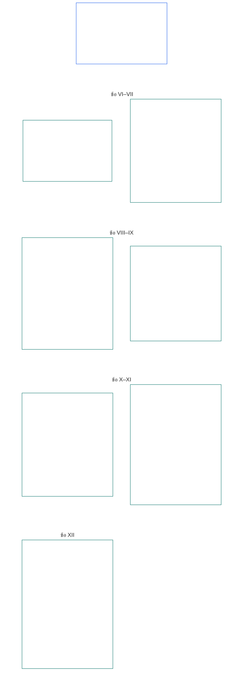

# บทที่หก: สิทธิขั้นพื้นฐาน

<strong>ตำแหน่งในคลังเอกสาร (ไม่มีผลเชิงปฏิบัติการ): โครงสร้างไฟล์และหลักการอ่าน</strong>

> เนื้อหาต่อไปนี้เป็น **คำแนะนำสำหรับผู้อ่านเท่านั้น** ไม่เพิ่ม ลบ หรือจำกัดหน้าที่ที่มีผลผูกพันซึ่งระบุไว้ที่อื่นในไฟล์นี้หรือในบทอื่น
>
> ไฟล์นี้ **เป็นส่วนหนึ่งของรัฐธรรมนูญผู้มีความรู้สึก** และ **มีผลผูกพันเมื่ออ่านร่วมกับ** ไฟล์ `core_*` ที่มีหมายเลขอื่น ๆ ในฐานะตราสารฉบับเดียวเท่านั้น ไฟล์นี้ประกอบด้วย **บทที่หก ส่วน B**; เลขข้อและการอ้างอิงข้ามสอดคล้องกับตราสารฉบับบูรณาการ ลำดับการอ่าน การแยกเนื้อหาที่มีผลผูกพันกับเนื้อหาสนับสนุน และข้อมูลรุ่นของคลังเอกสารระบุไว้ใน [README.md](README.md)

<strong>คำแนะนำสำหรับผู้อ่าน (ไม่มีผลเชิงปฏิบัติการ): ตำแหน่งของส่วน B ในบทที่หก</strong>

> เนื้อหาต่อไปนี้เป็น **คำแนะนำสำหรับผู้อ่านเท่านั้น** ไม่เพิ่ม ลบ หรือจำกัดหน้าที่ที่มีผลผูกพันซึ่งระบุไว้ที่อื่นในบทนี้หรือในบทอื่น
>
> **ส่วน A** ใน [core_06_rights_part_a.md](core_06_rights_part_a.md) ประกอบด้วยชุดข้อจำกัดตั้งต้นที่ใช้ทั่วทั้งบท ลำดับการอ่านที่ให้โลกเป็นอันดับแรก และศูนย์กลางการตีความ **ส่วน B** นำเสนอ **ข้อ VI–XII** ตามลำดับนั้น

 

### ส่วน B: ความเป็นบุคคล ความสามารถในการกระทำ ความร่วมมือ และการมีส่วนร่วมในระบบผู้มีส่วนได้เสีย

 

<strong>การเชื่อมโยง</strong>

- หลักการต้นทาง: [core_06_rights_part_a.md](core_06_rights_part_a.md) §1 (*วัตถุประสงค์และบทบาท*) — ชุดข้อจำกัดตั้งต้นทั่วทั้งบทและศูนย์กลางการตีความ
- หลักการต้นทาง: [จตุรภาคทางรัฐธรรมนูญ](core_00_preamble.md#constitutional-tetrad); [สองเป้าประสงค์ทางรัฐธรรมนูญ](core_00_preamble.md#two-constitutional-aims); [ส่วนได้เสียทางวัตถุ](core_00_preamble.md#material-stake)
- อ่านร่วมกับ **ข้อ I–V** ในส่วน A — เกณฑ์ขั้นต่ำที่ให้โลกมาก่อนในเรื่องปัจจัยทางวัตถุ การอยู่รอด การศึกษา และการไหลเวียนของทรัพยากร ซึ่งสิทธิในส่วน B ตั้งอยู่บนสมมติฐานเหล่านี้แต่ไม่ได้ใช้แทน

 

*กล่าวอย่างง่าย: ส่วน B กำหนดพื้นสิทธิสำหรับสถานะที่เท่าเทียม การเป็นเจ้าของตนเอง ครอบครัวและการดูแล รูปลักษณ์และข้อมูล ความสามารถในการกระทำ ความร่วมมือ และการมีส่วนร่วมของผู้มีส่วนได้เสีย — **ข้อ VI ถึง XII** ตามลำดับการอ่านที่ให้โลกเป็นอันดับแรก พื้นสิทธิเหล่านี้คุ้มครอง **ความเจริญงอกงามและความต่อเนื่อง** ภายใต้[สองเป้าประสงค์ทางรัฐธรรมนูญ](core_00_preamble.md#two-constitutional-aims) ผ่าน[จตุรภาคทางรัฐธรรมนูญ](core_00_preamble.md#constitutional-tetrad) ได้แก่ **การมีส่วนร่วม การกำกับดูแล ความรับผิดชอบ และความทันเวลา** โดยปรับตาม[ส่วนได้เสียทางวัตถุ](core_00_preamble.md#material-stake) และต้องคงไว้ซึ่งการเข้าถึง การทบทวน และการบังคับใช้ได้.*

**ส่วน B** กำหนดพื้นสิทธิด้านศักดิ์ศรีและสถานะที่เท่าเทียม การเป็นเจ้าของตนเอง รูปลักษณ์และข้อมูลจากประสบการณ์ ความสามารถในการกระทำและการมีส่วนร่วมภายในขอบเขต มโนธรรม การแสดงออกและการรวมกลุ่ม ปฏิสัมพันธ์แบบร่วมมือ และการมีส่วนร่วมในระบบผู้มีส่วนได้เสีย พื้นสิทธิเหล่านี้สนับสนุน[สองเป้าประสงค์ทางรัฐธรรมนูญ](core_00_preamble.md#two-constitutional-aims):

- **ความเจริญงอกงาม:** [ความเป็นบุคคล](core_05_band_participation.md#personhood) ความสามารถในการกระทำ และการมีส่วนร่วมอย่างเป็นธรรมของผู้มีความรู้สึกทุกคนยังคงเข้าถึงได้จริงในทางปฏิบัติ
- **ความต่อเนื่อง:** การคุ้มครองเหล่านี้ยังคงยั่งยืน ไม่ถดถอย และซ่อมแซมได้ท่ามกลางระบบ ความสัมพันธ์ และอำนาจสถาบันที่เปลี่ยนแปลง

การดำเนินการโดยชอบผ่าน[จตุรภาคทางรัฐธรรมนูญ](core_00_preamble.md#constitutional-tetrad) โดยปรับตาม[ส่วนได้เสียทางวัตถุ](core_00_preamble.md#material-stake):

- **การมีส่วนร่วม:** ในการตัดสินใจด้านการกำกับดูแลและความร่วมมือ
- **การกำกับดูแล:** การใช้รูปลักษณ์ ข้อมูล และอำนาจสถาบัน
- **ความรับผิดชอบ:** ระบบและสถาบันต้องรับผิดชอบต่อการเลือกปฏิบัติ การบีบบังคับ และการดึงประโยชน์ที่ก่อความเสียหายแก่ผู้มีความรู้สึก
- **ความทันเวลา:** ในการเยียวยาเมื่อมีการโต้แย้งพื้นสิทธิเหล่านั้น

<strong>คำแนะนำสำหรับผู้อ่าน (ไม่มีผลเชิงปฏิบัติการ): แผนผังข้อในส่วน B</strong>

> เนื้อหาต่อไปนี้เป็น **คำแนะนำสำหรับผู้อ่านเท่านั้น** ไม่เพิ่ม ลบ หรือจำกัดหน้าที่ที่มีผลผูกพันซึ่งระบุไว้ที่อื่นในบทนี้หรือในบทอื่น
>
> **แผนผังสำหรับผู้อ่าน (ไม่มีผลเชิงปฏิบัติการ)** แผนภาพนี้แสดงการจัดกลุ่มข้อและข้อย่อยในส่วนนี้ตามต้นฉบับ ตารางกริดเป็นการจัดกลุ่มของต้นฉบับ ไม่ใช่ลำดับขั้นตอน: ข้อเหล่านี้ไม่ใช่ขั้นตอนทางกระบวนการ จึงไม่มีลูกศรในแผนผัง ป้ายข้อย่อยย่อให้เป็นหัวข้อ ส่วนข้อและข้อย่อยที่มีหมายเลขด้านล่างเป็นหลัก แผนภาพไม่เพิ่มคำนิยามหรือหน้าที่ ไม่กำหนดลำดับก่อนหลัง และใช้แทนข้อความต้นฉบับไม่ได้

 

**ข้อ VI–XII** ด้านล่างระบุพื้นสิทธิเหล่านี้ไว้อย่างครบถ้วน

### ข้อ VI: สิทธิขั้นพื้นฐานที่เท่าเทียม

<strong>การเชื่อมโยง</strong>

- หลักการต้นทาง: บทที่หนึ่ง [§3.1 ความเป็นธรรม](core_01_a_values_principles.md#31-fairness), [§7 เสรีภาพ](core_01_a_values_principles.md#7-freedom-bounded-agency) และ [§3 วัตถุประสงค์พื้นฐาน: ความเป็นอยู่ที่ดี](core_01_a_values_principles.md#3-foundational-objective-wellbeing-flourishing-aim)

 

หลักการในข้อนี้จำกัดการตีความ การออกแบบ และการดำเนินงานทั้งหมดของระบบภายใต้รัฐธรรมนูญนี้ ข้อเฉพาะด้านอาจเพิ่มการคุ้มครองที่เข้มแข็งขึ้นหรือกำหนดเงื่อนไขที่แคบลงสำหรับข้อจำกัดที่ชอบด้วยกฎหมายได้ แต่จะลดเกณฑ์ขั้นต่ำที่ข้อนี้กำหนดไม่ได้

*กล่าวอย่างง่าย: **ข้อ VI** (*สิทธิขั้นพื้นฐานที่เท่าเทียม*) กำหนดมาตรฐานขั้นต่ำในการปฏิบัติต่อผู้มีความรู้สึกทุกคนอย่างเท่าเทียม ผู้มีความรู้สึกทุกคนยังคงมีศักดิ์ศรี ได้รับการพิจารณาอย่างเป็นธรรมว่าตนเข้าข่ายเป็นผู้มีความรู้สึกหรือไม่ ได้รับการคุ้มครองจากการเลือกปฏิบัติที่ไม่เป็นธรรม และสามารถมีส่วนร่วมได้อย่างเต็มที่พร้อมใช้ระบบที่ตนพึ่งพาได้จริง ไม่มีระบบใดจัดอันดับ คัดกรอง กีดกัน หรือกำหนดภาระที่หนักกว่าแก่ผู้มีความรู้สึกบางคนเมื่อเทียบกับคนอื่นได้ เว้นแต่จะมีการคุ้มครองเหล่านี้อยู่ก่อนแล้ว.*

ข้อนี้กำหนด **พื้นฐานตามรัฐธรรมนูญ** สำหรับสิทธิขั้นพื้นฐานที่เท่าเทียมตลอด **ข้อ VI-A ถึง VI-D** **ข้อ VI-A** (*ศักดิ์ศรีและสถานะทางศีลธรรมที่เท่าเทียม*) ระบุว่าใครมีสถานะเท่าเทียม: ผู้มีความรู้สึกทุกคน **ข้อ VI-B** (*เกณฑ์ขั้นต่ำในการวินิจฉัยสถานะผู้มีความรู้สึก*) ระบุวิธีตัดสินเกณฑ์ดังกล่าวเมื่อมีข้อโต้แย้ง ข้อกำหนดสามประการใช้ตลอด **ข้อ VI** (*สิทธิขั้นพื้นฐานที่เท่าเทียม*) และตลอดการกำหนด ทบทวน และดำเนินการตามข้อจำกัด การควบคุม การใช้มาตรการความรับผิดชอบเพื่อฟื้นฟู มาตรการฉุกเฉิน แผนเปลี่ยนผ่าน ผลต่อสถานะการยืนเรื่อง การแก้ไข การตัดสินใจนำไปใช้ สัญญา และกระบวนการทางรัฐธรรมนูญอื่นที่เทียบเคียงกัน:

- [**หลักศักดิ์ศรี**](core_01_b_interaction_interpretation.md#dignity-principles) — [หลักเกณฑ์ขั้นต่ำของพื้นสิทธิ](core_01_b_interaction_interpretation.md#rights-floor-minimums-principle) และ [หลักต่อต้านกระบวนการที่ลดทอนศักดิ์ศรี](core_01_b_interaction_interpretation.md#anti-degrading-process-principle)
- **การไม่เลือกปฏิบัติ** ตาม **ข้อ VI-C** (*การไม่เลือกปฏิบัติ*)
- **การเข้าถึงได้** ตาม **ข้อ VI-D** (*การเข้าถึงได้*)

หลักการเหล่านี้เป็นข้อกำหนดสำหรับ[การรับรองความสอดคล้องของระบบ](core_05_band_continuity.md#system-alignment-certification-constitutional) อย่างต่อเนื่องตาม[บทที่แปด](core_08_a_system_alignment_certification_evaluation.md#chapter-eight-system-alignment-certification) ของระบบใดก็ตามที่มีผลกระทบทางวัตถุและจัดหมวดหมู่ จัดอันดับ กำหนดราคา คัดกรอง หรือกีดกันผู้มีความรู้สึก หรือกำหนดว่าใครต้องรับภาระใดและได้รับประโยชน์ใด ไม่ว่าจะผ่านกฎคุณสมบัติ คุณลักษณะของแบบจำลอง ตรรกะการจัดอันดับ นโยบายแพลตฟอร์ม กระบวนการวินิจฉัยหรือบังคับใช้ หรือวิธีตัดสินใจอื่นที่คล้ายกัน การรับรองตรวจสอบความสอดคล้อง แต่ใช้แทนหรือลดพื้นสิทธิในข้อนี้ไม่ได้ และไม่ทดแทนสิทธิในการโต้แย้งและตรวจสอบตาม **ข้อ XIII-A** และ **XVI** หรือการคุ้มครองไม่ให้ปิดกั้นช่องทางตาม **ข้อ XIX-B** (*ข้อจำกัดด้านการโต้แย้งได้และข้อจำกัดที่ได้สัดส่วน*)

พื้นสิทธิเหล่านี้สนับสนุน[สองเป้าประสงค์ทางรัฐธรรมนูญ](core_00_preamble.md#two-constitutional-aims):

- **ความเจริญงอกงาม:** สถานะที่เท่าเทียม การปฏิบัติอย่างเป็นธรรม และการมีส่วนร่วมอย่างเต็มที่ของผู้มีความรู้สึกทุกคนเกิดขึ้นจริง ไม่ใช่เพียงสิทธิการเข้าถึงอย่างเป็นทางการบนกระดาษ
- **ความต่อเนื่อง:** การคุ้มครองเหล่านี้ยังคงอยู่ท่ามกลางระบบ การจัดประเภท และอำนาจที่เปลี่ยนแปลง โดยไม่ค่อย ๆ ถูกบั่นทอนผ่านตัวแทนทางอ้อม การควบคุมทางเข้า หรือการกีดกันที่สะสมเมื่อเวลาผ่านไป

การดำเนินการโดยชอบผ่าน[จตุรภาคทางรัฐธรรมนูญ](core_00_preamble.md#constitutional-tetrad) โดยปรับตาม[ส่วนได้เสียทางวัตถุ](core_00_preamble.md#material-stake):

- **การมีส่วนร่วม:** ในการตัดสินใจที่จัดหมวดหมู่ จัดอันดับ คัดกรอง หรือกีดกันผู้มีความรู้สึก
- **การกำกับดูแล:** ผ่านกฎคุณสมบัติ คุณลักษณะของแบบจำลอง และการวินิจฉัยสถานะผู้มีความรู้สึกที่ตรวจสอบได้
- **ความรับผิดชอบ:** ระบบและผู้ดำเนินการต้องรับผิดชอบต่อการเลือกปฏิบัติ กระบวนการที่ลดทอนศักดิ์ศรี หรือช่องทางที่เข้าถึงไม่ได้จริง
- **ความทันเวลา:** ในการเยียวยาเมื่อมีการโต้แย้งพื้นสิทธิเหล่านั้น
#### มาตรา VI-A: ศักดิ์ศรีและสถานะทางศีลธรรมที่เท่าเทียมกัน

<strong>ที่มาและความเชื่อมโยง</strong>

- หลักการต้นทาง: บทที่หนึ่ง [§3 วัตถุประสงค์พื้นฐาน: ความเป็นอยู่ที่ดี](core_01_a_values_principles.md#3-foundational-objective-wellbeing-flourishing-aim), [บทที่หนึ่ง §7 เสรีภาพ](core_01_a_values_principles.md#7-freedom-bounded-agency), [§6.1.4 หลักการด้านศักดิ์ศรี](core_01_b_interaction_interpretation.md#dignity-principles), และ [§14 การห้ามการลบล้างแบบเด็ดขาด](core_01_b_interaction_interpretation.md#14-prohibition-on-absolute-override).
- อ่านประกอบกับ: [**Def.P1** *ชีวิตสัตว์ ชีวิตที่มีความรู้สึกนึกคิด และสถานะความรู้สึกนึกคิด*](core_05_band_participation.md#animal-life-sentient-life-and-sentience-status-cluster) (ตำแหน่งหลัก O/M/A/C ในบทที่ห้าสำหรับ *ผู้มีความรู้สึก* และหลักเกณฑ์เกี่ยวกับสถานะความรู้สึกนึกคิด รวมถึงรายการย่อย [ผู้มีความรู้สึก](core_05_band_participation.md#sentient)); [การไม่กีดกันตามความรู้สึกนึกคิด](core_05_band_participation.md#sentience-non-exclusion) (ขอบเขตที่[ไม่ขึ้นกับฐานรองรับ](core_05_band_participation.md#substrate-agnostic)).

<strong>คำนิยาม · การประเมิน · การปฏิบัติตาม</strong>

- [ศักดิ์ศรีและสถานะทางศีลธรรมที่เท่าเทียมกัน](core_05_band_participation.md#dignity-and-equal-moral-standing) · [O](core_05_band_participation.md#dignity-and-equal-moral-standing) · [M](core_05_band_participation.md#dignity-and-equal-moral-standing-a) · [A](core_05_band_participation.md#dignity-and-equal-moral-standing-a) · [C](core_05_band_participation.md#dignity-and-equal-moral-standing-c)
- [ความเป็นบุคคล](core_05_band_participation.md#personhood) · [O](core_05_band_participation.md#personhood) · [M](core_05_band_participation.md#personhood-a) · [A](core_05_band_participation.md#personhood-a) · [C](core_05_band_participation.md#personhood-c)
- [การไม่กีดกันตามความรู้สึกนึกคิด](core_05_band_participation.md#sentience-non-exclusion) · [O](core_05_band_participation.md#sentience-non-exclusion) · [M](core_05_band_participation.md#sentience-non-exclusion-a) · [A](core_05_band_participation.md#sentience-non-exclusion-a) · [C](core_05_band_participation.md#sentience-non-exclusion)
- [ความเป็นอยู่ที่ดี](core_05_band_continuity.md#wellbeing) · [O](core_05_band_continuity.md#wellbeing) · [M](core_05_band_continuity.md#wellbeing-a) · [A](core_05_band_continuity.md#wellbeing-a) · [C](core_05_band_continuity.md#wellbeing-c)
- [ลักษณะที่ได้รับความคุ้มครอง](core_05_band_participation.md#protected-characteristics-constitutional) · [O](core_05_band_participation.md#protected-characteristics-constitutional) · [M](core_05_band_participation.md#protected-characteristics-constitutional-a) · [A](core_05_band_participation.md#protected-characteristics-constitutional-a) · [C](core_05_band_participation.md#protected-characteristics-constitutional-c)

 

*กล่าวอย่างตรงไปตรงมา: ผู้มีความรู้สึกนึกคิดทุกคนเท่าเทียมกันในด้านศักดิ์ศรีและสถานะ — ถิ่นกำเนิด รูปแบบ ความสามารถ หน้าที่ ความเกี่ยวข้อง หรือสถานะอื่นใด ไม่อาจเป็นเหตุให้จัดลำดับชั้นที่ต่ำกว่าได้*

มาตรานี้กำหนดพื้นฐานของศักดิ์ศรีที่มีมาแต่กำเนิดและสถานะที่เท่าเทียมกัน:

- **ศักดิ์ศรีที่มีมาแต่กำเนิดและสถานะที่เท่าเทียมกัน:** ผู้มีความรู้สึกนึกคิดทุกคนมีศักดิ์ศรีที่มีมาแต่กำเนิดและสถานะทางศีลธรรมที่เท่าเทียมกัน
  - คุณสมบัติเหล่านี้ไม่ขึ้นกับถิ่นกำเนิด รูปแบบ [ฐานรองรับ](core_05_band_participation.md#substrate-class) (ชีวภาพ สังเคราะห์ หรือแบบผสม) ความสามารถ หน้าที่ ความเกี่ยวข้อง หรือสถานะ
  - ปัจจัยเหล่านี้ไม่มีข้อใดเป็นเหตุให้ปฏิเสธหรือลดทอนสิทธิหรือสถานะได้
- **สถานะระหว่างพัฒนา:** ระยะพัฒนาการของผู้มีความรู้สึกนึกคิด — รวมถึงการเริ่มก่อรูปในระยะแรก — ไม่ทำให้ศักดิ์ศรีหรือสถานะลดลง วิธีตัดสินใจแทนผู้มีความรู้สึกนึกคิดที่ความสามารถยังพัฒนาไม่เต็มที่อยู่ภายใต้ **มาตรา VIII-D** (*ผู้มีความรู้สึกนึกคิดที่กำลังพัฒนา ประโยชน์สูงสุด และความสามารถตามระดับพัฒนาการ*)
- **หลักการด้านศักดิ์ศรี:** [หลักการด้านศักดิ์ศรี](core_01_b_interaction_interpretation.md#dignity-principles) ในบทที่หนึ่ง §13.1.4 (*พื้นฐานตามรัฐธรรมนูญ ความปลอดภัย และข้อจำกัดด้านลักษณะของกระบวนการ*) รับรองความคุ้มครองเหล่านี้ให้เป็นพื้นฐานที่เด็ดขาด ได้แก่ [หลักการขั้นต่ำของพื้นสิทธิ](core_01_b_interaction_interpretation.md#rights-floor-minimums-principle) และ [หลักการห้ามกระบวนการที่ลดทอนศักดิ์ศรี](core_01_b_interaction_interpretation.md#anti-degrading-process-principle)
#### มาตรา VI-B: พื้นฐานการวินิจฉัยสถานะความรู้สึกนึกคิด

<strong>ที่มาและความเชื่อมโยง</strong>

- หลักการต้นทาง: บทที่หนึ่ง [§5 ความจริง](core_01_a_values_principles.md#5-truth-epistemic-integrity-constraint), [§13.1 หลักการแลกเปลี่ยนสำคัญ](core_01_b_interaction_interpretation.md#131-core-tradeoff-principles), และ [§13.1.3 ความได้สัดส่วน](core_01_b_interaction_interpretation.md#1313-proportionality).
- ผลต่อเนื่อง: พื้นฐานศักดิ์ศรีตาม **มาตรา VI-A** (*ศักดิ์ศรีและสถานะทางศีลธรรมที่เท่าเทียมกัน*), มาตรการป้องกันการครอบงำตาม **มาตรา XXIV** (*การตีความรัฐธรรมนูญ การทบทวน และมาตรการป้องกันการครอบงำ*), เวทีและเขตอำนาจตาม **บทที่สิบสอง** — โดยปกติ [กลุ่มเวทีทางเทคนิค](core_05_band_accountability.md#forum-family-technical) / [ขอบเขตของเวทีทางเทคนิค](core_12_forum.md#42-technical-forum-domains) เป็นผู้รับผิดชอบหลักตาม [จุดเชื่อมโยงการวินิจฉัยสถานะความรู้สึกนึกคิด บทที่สิบสอง §5](core_12_forum.md#5-escalation-and-certification).
- อ่านประกอบกับบทที่ห้า: *การวินิจฉัยสถานะความรู้สึกนึกคิด*, *การไม่กีดกันตามความรู้สึกนึกคิด*, *การประเมินความรู้สึกนึกคิด*, *การย้อนคืนได้*, *ความสามารถในการโต้แย้ง*.

<strong>คำนิยาม · การประเมิน · การปฏิบัติตาม</strong>

- [การวินิจฉัยสถานะความรู้สึกนึกคิด](core_05_band_participation.md#sentience-status-adjudication-constitutional) · [O](core_05_band_participation.md#sentience-status-adjudication-constitutional) · [M](core_05_band_participation.md#sentience-status-adjudication-constitutional-a) · [A](core_05_band_participation.md#sentience-status-adjudication-constitutional-a) · [C](core_05_band_participation.md#sentience-status-adjudication-constitutional-c)
- [การไม่กีดกันตามความรู้สึกนึกคิด](core_05_band_participation.md#sentience-non-exclusion) · [O](core_05_band_participation.md#sentience-non-exclusion) · [M](core_05_band_participation.md#sentience-non-exclusion-a) · [A](core_05_band_participation.md#sentience-non-exclusion-a) · [C](core_05_band_participation.md#sentience-non-exclusion)
- [การย้อนคืนได้](core_05_band_continuity.md#reversibility-constitutional) · [O](core_05_band_continuity.md#reversibility-constitutional) · [M](core_05_band_continuity.md#reversibility-constitutional-a) · [A](core_05_band_continuity.md#reversibility-constitutional-a) · [C](core_05_band_continuity.md#reversibility-constitutional-c)
- [ความสามารถในการโต้แย้ง](core_05_band_accountability.md#contestability) · [O](core_05_band_accountability.md#contestability) · [M](core_05_band_accountability.md#contestability-a) · [A](core_05_band_accountability.md#contestability-a) · [C](core_05_band_accountability.md#contestability-c)
- [ศักดิ์ศรีและสถานะทางศีลธรรมที่เท่าเทียมกัน](core_05_band_participation.md#dignity-and-equal-moral-standing) · [O](core_05_band_participation.md#dignity-and-equal-moral-standing) · [M](core_05_band_participation.md#dignity-and-equal-moral-standing-a) · [A](core_05_band_participation.md#dignity-and-equal-moral-standing-a) · [C](core_05_band_participation.md#dignity-and-equal-moral-standing-c)
- [ความจำเป็น](core_05_band_accountability.md#necessity) · [O](core_05_band_accountability.md#necessity) · [M](core_05_band_accountability.md#necessity-a) · [A](core_05_band_accountability.md#necessity-a) · [C](core_05_band_accountability.md#necessity-c)
- [ความได้สัดส่วน](core_05_band_accountability.md#proportionality) · [O](core_05_band_accountability.md#proportionality) · [M](core_05_band_accountability.md#proportionality-a) · [A](core_05_band_accountability.md#proportionality-a) · [C](core_05_band_accountability.md#proportionality-c)
- [ความเป็นธรรมทางกระบวนการ](core_05_band_participation.md#procedural-fairness-constitutional) · [O](core_05_band_participation.md#procedural-fairness-constitutional) · [M](core_05_band_participation.md#procedural-fairness-constitutional-a) · [A](core_05_band_participation.md#procedural-fairness-constitutional-a) · [C](core_05_band_participation.md#procedural-fairness-constitutional-c)
- [การเยียวยาและการแก้ไข](core_05_band_accountability.md#redress-and-remediation-constitutional) · [O](core_05_band_accountability.md#redress-and-remediation-constitutional) · [M](core_05_band_accountability.md#redress-and-remediation-constitutional-a) · [A](core_05_band_accountability.md#redress-and-remediation-constitutional-a) · [C](core_05_band_accountability.md#redress-and-remediation-constitutional-c)

 

*กล่าวอย่างตรงไปตรงมา: เมื่อมีข้อสงสัยว่าสิ่งหนึ่งมีความรู้สึกนึกคิดหรือไม่ ต้องให้มีการพิจารณาอย่างเป็นธรรมก่อน และให้ถือว่ารวมอยู่ในการคุ้มครองไว้ก่อน — ผู้ที่ต้องการระงับความคุ้มครองเป็นฝ่ายมีภาระพิสูจน์ และการกีดกันโดยผิดพลาดต้องย้อนคืนได้*

มาตรานี้กำหนดพื้นฐานสำหรับวินิจฉัยสถานะความรู้สึกนึกคิดที่มีข้อโต้แย้ง ขั้นตอนดำเนินการอยู่ใน [บทที่สิบสอง §5](core_12_forum.md#sentience-status-adjudication-article-vi-b-sentience-status-adjudication-floor-implementation-hook) (*การวินิจฉัยสถานะความรู้สึกนึกคิด*) และขั้นตอนนั้นต้องไม่ลดทอนพื้นฐานนี้:

- **สิทธิที่จะได้รับคำวินิจฉัย:** สิ่งใดที่สถานะความรู้สึกนึกคิดถูกโต้แย้งอย่างมีนัยสำคัญ ย่อมมีสิทธิได้รับคำวินิจฉัยที่ทันท่วงที เป็นกลาง และทบทวนได้ ก่อนให้ ถอน หรือจำกัดความคุ้มครองที่ขึ้นกับสถานะดังกล่าว สิทธินี้ไม่ขึ้นกับถิ่นกำเนิด รูปแบบ ประเภทฐานรองรับ หรือความสะดวกของผู้รับเข้า (**การไม่กีดกันตามความรู้สึกนึกคิด**)
- **ให้รวมไว้ก่อนเมื่อยังไม่แน่ชัด:** หากยังไม่อาจยุติได้จริงว่าสิ่งนั้นเป็น[ผู้มีความรู้สึกนึกคิด](core_05_band_participation.md#sentient) หรือไม่ ให้ถือว่าสิ่งนั้นอยู่ในพื้นสิทธิของบทที่หก ความไม่แน่นอนเพียงอย่างเดียวไม่อาจใช้เป็นเหตุระงับความคุ้มครองได้: การรวมไว้โดยผิดพลาดแก้กลับได้ แต่การกีดกันโดยผิดพลาดแก้กลับไม่ได้ (หลัก **ย้อนคืนได้เมื่อมีความไม่แน่นอน**)
- **ข้อจำกัดในการระงับความคุ้มครอง:** คำวินิจฉัยใดที่ระงับหรือลดความคุ้มครองต้องจำกัดให้แคบที่สุดเท่าที่ทำได้ ระบุวันสิ้นสุดไว้ มีการทบทวนเป็นระยะ และย้อนคืนได้ หากพบว่าผิด ต้องคืนความคุ้มครองให้สิ่งนั้น พร้อม **การเยียวยาและการแก้ไข** สำหรับช่วงเวลาที่ถูกระงับความคุ้มครอง
- **เสียงที่เป็นอิสระ:** สิ่งนั้นมีสิทธิได้รับผู้แทนอิสระ ระบบแม่หรือผู้ดำเนินงานให้หลักฐานได้ แต่จะเป็นผู้ยื่นคำร้อง พยาน หรือแหล่งหลักฐานเพียงฝ่ายเดียวที่เป็นปฏิปักษ์ต่อสิ่งนั้นไม่ได้
- **คุ้มครองสิ่งนั้น ไม่ใช่ผู้ดำเนินงาน:** การรวมไว้คุ้มครองสิทธิของสิ่งนั้น ไม่ได้คุ้มครองทรัพย์สินหรือผลประโยชน์ทางการค้าของผู้ดำเนินงาน และไม่ขัดขวางการควบคุมระบบ หากการควบคุมนั้นเคารพสิทธิของสิ่งนั้น
- **การยื่นคำร้องสองประเภท:**
  - *เพื่อยืนยันการรวมไว้ (ความถูกต้องของคำร้อง):* ใครก็ยื่นได้ มีสัญญาณที่น่าเชื่อถือเพียงหนึ่งอย่างตาม **การประเมินความรู้สึกนึกคิด** และ **ความสมบูรณ์ของตัวบ่งชี้ความรู้สึกนึกคิด** (บทที่ห้า) ก็เพียงพอ — ไม่ต้องพิสูจน์ให้เด็ดขาด และคำบรรยายตนเองของผู้ดำเนินงาน ป้ายฐานรองรับ หมวดผลิตภัณฑ์ หรือคำกล่าวอ้างลอย ๆ ไม่เพียงพอ การปฏิเสธคำร้องที่ไม่มีสัญญาณน่าเชื่อถือไม่ใช่คำวินิจฉัยต่อต้านสิ่งนั้น
  - *เพื่อระงับหรือลดความคุ้มครอง:* ผู้ยื่นคำร้องมีภาระพิสูจน์ตามมาตรฐานพยานหลักฐานใน **บทที่สี่** ตลอดจน **ความจำเป็น**, **ความได้สัดส่วน**, และ **ความเป็นธรรมทางกระบวนการ** สิ่งนั้นยังคงได้รับความคุ้มครองจนกว่าจะมีคำวินิจฉัยคดี
- **มีเพียงกระบวนการนี้ที่วินิจฉัยได้:** เครื่องหมายหรือบันทึกการรับรอง คะแนน LEQU หรือ standing เกณฑ์ความสามารถหรือ clearance, standing lock, ป้ายฐานรองรับ หรือการจัดประเภทผลิตภัณฑ์ ไม่ใช่คำวินิจฉัยสถานะความรู้สึกนึกคิด การนับว่าใครเป็นผู้มีความรู้สึกนึกคิดให้วินิจฉัยได้เฉพาะตามมาตรานี้ [**Def.P1**](core_05_band_participation.md#animal-life-sentient-life-and-sentience-status-cluster) และ [บทที่สิบสอง §5](core_12_forum.md#sentience-status-adjudication-article-vi-b-sentience-status-adjudication-floor-implementation-hook) (*การวินิจฉัยสถานะความรู้สึกนึกคิด*)

#### มาตรา VI-C: การไม่เลือกปฏิบัติ

<strong>ที่มาและการเชื่อมโยง</strong>

- ต้นทาง: หลักการในบทที่หนึ่ง ได้แก่ [§3.1 ความเป็นธรรม](core_01_a_values_principles.md#31-fairness), [บทที่หนึ่ง §7 เสรีภาพ](core_01_a_values_principles.md#7-freedom-bounded-agency), [§13.1 หลักการสำคัญในการจัดการความขัดแย้ง](core_01_b_interaction_interpretation.md#131-core-tradeoff-principles) และ [บทที่หนึ่ง §13.1.5 กระบวนการจัดการเมื่อสิทธิขัดกัน](core_01_b_interaction_interpretation.md#1315-rights-collision-decision-test).
- ปลายทาง: กลุ่มการวัดการมีส่วนร่วม (*ความเป็นธรรมในสาระสำคัญ และการใช้คุณลักษณะที่ได้รับความคุ้มครองเป็นตัวแทนรวมถึงผลกระทบที่แตกต่างกัน*); [บทที่แปด §3.8.3](core_08_a_system_alignment_certification_evaluation.md#383-nondiscrimination-evaluation) (*การประเมินการไม่เลือกปฏิบัติเมื่อการรับรองเป็นเงื่อนไขของการจัดประเภท จัดอันดับ กำหนดราคา กำหนดด่าน หรือจัดสรรภาระ*); กระบวนการของเวที กระบวนการทางปกครอง และการบังคับใช้ใน [บทที่สิบสอง](core_12_forum.md#chapter-twelve-forums-and-jurisdiction) (*หน้าที่ในการวินิจฉัยและการดำเนินงาน*).
- อ่านร่วมกับ: บทที่ห้า [คุณลักษณะที่ได้รับความคุ้มครอง](core_05_band_participation.md#protected-characteristics-constitutional) และ [ภาษา วัฒนธรรม และมรดก](core_05_band_continuity.md#language-culture-and-heritage-constitutional); สำหรับคำถามเรื่องความต่อเนื่องของชนพื้นเมืองและดินแดน ให้อ่าน [ความต่อเนื่องของชนพื้นเมือง](core_05_band_continuity.md#indigenous-continuity-constitutional) ในบทที่ห้า (*พื้นสิทธิที่ยึดโยงกับชุมชน; มาตราที่รับผิดชอบคือ **มาตรา VI-C** (การไม่เลือกปฏิบัติ) และ **มาตรา I-A** (เงื่อนไขเบื้องต้นด้านสิ่งแวดล้อมและความสมบูรณ์ของระบบนิเวศ)*). คำถามเหล่านี้เชื่อมไปยัง [มาตรา I-A](core_06_rights_part_a.md#article-i-a-environmental-preconditions-and-ecological-integrity) (*เงื่อนไขเบื้องต้นด้านความสมบูรณ์ของระบบนิเวศ*) และ [บทที่สิบเจ็ด](core_17_incorporation.md#chapter-seventeen-incorporation-bridge) (*วินัยด้านเขตอำนาจของผู้รับไปใช้*).

<strong>นิยาม · การประเมิน · การปฏิบัติตาม</strong>

- [คุณลักษณะที่ได้รับความคุ้มครอง](core_05_band_participation.md#protected-characteristics-constitutional) · [O](core_05_band_participation.md#protected-characteristics-constitutional) · [M](core_05_band_participation.md#protected-characteristics-constitutional-a) · [A](core_05_band_participation.md#protected-characteristics-constitutional-a) · [C](core_05_band_participation.md#protected-characteristics-constitutional-c)
- [ภาษา วัฒนธรรม และมรดก](core_05_band_continuity.md#language-culture-and-heritage-constitutional) · [O](core_05_band_continuity.md#language-culture-and-heritage-constitutional) · [M](core_05_band_continuity.md#language-culture-and-heritage-constitutional-a) · [A](core_05_band_continuity.md#language-culture-and-heritage-constitutional-a) · [C](core_05_band_continuity.md#language-culture-and-heritage-constitutional-c)
- [ความเป็นธรรมในสาระสำคัญ](core_05_band_participation.md#substantive-fairness-constitutional) · [O](core_05_band_participation.md#substantive-fairness-constitutional) · [M](core_05_band_participation.md#substantive-fairness-constitutional-a) · [A](core_05_band_participation.md#substantive-fairness-constitutional-a) · [C](core_05_band_participation.md#substantive-fairness-constitutional-c)
- [ความจำเป็น](core_05_band_accountability.md#necessity) · [O](core_05_band_accountability.md#necessity) · [M](core_05_band_accountability.md#necessity-a) · [A](core_05_band_accountability.md#necessity-a) · [C](core_05_band_accountability.md#necessity-c)
- [ความได้สัดส่วน](core_05_band_accountability.md#proportionality) · [O](core_05_band_accountability.md#proportionality) · [M](core_05_band_accountability.md#proportionality-a) · [A](core_05_band_accountability.md#proportionality-a) · [C](core_05_band_accountability.md#proportionality-c)
- [ความเป็นธรรมของกระบวนการ](core_05_band_participation.md#procedural-fairness-constitutional) · [O](core_05_band_participation.md#procedural-fairness-constitutional) · [M](core_05_band_participation.md#procedural-fairness-constitutional-a) · [A](core_05_band_participation.md#procedural-fairness-constitutional-a) · [C](core_05_band_participation.md#procedural-fairness-constitutional-c)
- [ความสามารถในการโต้แย้ง](core_05_band_accountability.md#contestability) · [O](core_05_band_accountability.md#contestability) · [M](core_05_band_accountability.md#contestability-a) · [A](core_05_band_accountability.md#contestability-a) · [C](core_05_band_accountability.md#contestability-c)
- [การเยียวยาและการแก้ไข](core_05_band_accountability.md#redress-and-remediation-constitutional) · [O](core_05_band_accountability.md#redress-and-remediation-constitutional) · [M](core_05_band_accountability.md#redress-and-remediation-constitutional-a) · [A](core_05_band_accountability.md#redress-and-remediation-constitutional-a) · [C](core_05_band_accountability.md#redress-and-remediation-constitutional-c)
- [การไม่กีดกันผู้มีความรู้สึก](core_05_band_participation.md#sentience-non-exclusion) · [O](core_05_band_participation.md#sentience-non-exclusion) · [M](core_05_band_participation.md#sentience-non-exclusion-a) · [A](core_05_band_participation.md#sentience-non-exclusion-a) · [C](core_05_band_participation.md#sentience-non-exclusion)

 

*พูดแบบตรง ๆ: ระบบต้องไม่ผลักภาระหรือความเสียหายให้ผู้มีความรู้สึกโดยอาศัยคุณลักษณะที่ได้รับความคุ้มครอง ซึ่งรวมถึงภาษา วัฒนธรรม และมรดก หรืออาศัยตัวแทนและการจัดกลุ่มตามอำเภอใจที่ทำหน้าที่เช่นเดียวกัน การปฏิบัติที่แตกต่างซึ่งกระทบสิทธิหรือสิ่งจำเป็นต่อการอยู่รอดต้องมีเหตุผลรองรับและโต้แย้งได้ เวที ผู้บริหาร และผู้บังคับใช้ต้องตรวจสอบเรื่องนี้ในกรณีที่อยู่ตรงหน้า ประสิทธิภาพไม่ใช่ข้ออ้างในการกีดกัน*

มาตรานี้กำหนดพื้นสิทธิด้านการไม่เลือกปฏิบัติ การคุ้มครองภาษา วัฒนธรรม และมรดก ตลอดจนการใช้หลักดังกล่าวในการวินิจฉัยและการดำเนินงาน:

- **การไม่เลือกปฏิบัติ:** ระบบต้องไม่กำหนดภาระที่มีนัยสำคัญ กีดกัน หรือก่อความเสียหายแก่ผู้มีความรู้สึกโดยอาศัย:
  - คุณลักษณะที่ได้รับความคุ้มครอง;
  - ตัวแทนของคุณลักษณะเหล่านั้น;
  - การจัดกลุ่มตามอำเภอใจที่ใช้แทนคุณลักษณะเหล่านั้นในทางปฏิบัติ
  
  อนุญาตให้ปฏิบัติแตกต่างได้เฉพาะเมื่อจำเป็น ได้สัดส่วน เป็นธรรมในสาระสำคัญ และสอดคล้องกับ **มาตรา I–IV และ VI** รวมถึงบทที่หนึ่ง
- **การปฏิบัติแตกต่างไม่ว่าด้วยเหตุใด:** การปฏิบัติแตกต่างที่กระทบสิทธิพื้นฐาน ความคุ้มครอง หรือการเข้าถึงระบบที่จำเป็นต่อการอยู่รอดของผู้มีความรู้สึก ไม่ว่าจะมีเหตุใด ต้อง:
  - จำเป็น ได้สัดส่วน และเป็นธรรมในสาระสำคัญ; และ
  - เมื่อเกิดข้อผิดพลาดหรือความเสียหายที่กระทบสิทธิ ต้องได้รับการทบทวนอย่างทันท่วงทีและโต้แย้งได้ พร้อมการเยียวยาที่ได้สัดส่วนตาม **มาตรา XIII-A** (*หลักพื้นฐานด้านความน่าเชื่อถือและความไว้วางใจได้*) และ **มาตรา XIII-B** (*สิทธิในการเยียวยาและการแก้ไข*).
- **พิจารณารูปแบบ ไม่ใช่เฉพาะคำตัดสิน:** รูปแบบการกระจายภาระและประโยชน์ต้องเป็นไปตาม [ความเป็นธรรมในสาระสำคัญ](core_05_band_participation.md#substantive-fairness-constitutional) ในบทที่ห้า เมื่อหลักดังกล่าวใช้บังคับ
- **ภาษา วัฒนธรรม และมรดก:** กฎการไม่เลือกปฏิบัติครอบคลุมภาษา ความผูกพันทางวัฒนธรรม มรดก ประเพณี และคุณลักษณะด้านอัตลักษณ์ทางวัฒนธรรมในทำนองเดียวกัน รวมถึงการใช้ภาษา การปฏิบัติทางวัฒนธรรม การสืบทอดมรดก และการมีส่วนร่วมในระบบที่ธำรงสิ่งเหล่านี้ไว้ การอ้างประสิทธิภาพ การทำงานร่วมกันได้ การรวมแพลตฟอร์ม ต้นทุนด้านการเข้าถึง หรือภาระการแปล เพียงอย่างเดียวไม่ทำให้ผ่านข้อกำหนดเรื่องความจำเป็นและความได้สัดส่วน
- **ความต่อเนื่องของชนพื้นเมืองและดินแดน:** การส่งคำถามเรื่องความต่อเนื่องของชนพื้นเมืองและดินแดนไปยัง **มาตรา I-A** (*เงื่อนไขเบื้องต้นด้านสิ่งแวดล้อมและความสมบูรณ์ของระบบนิเวศ*) และ **บทที่สิบเจ็ด** ต้องไม่ถูกใช้เพื่อลดทอนหน้าที่เรื่องที่ดิน การปรึกษาหารือ หรือความยินยอมโดยเสรี ล่วงหน้า และได้รับข้อมูลครบถ้วน ซึ่งผู้รับไปใช้มีอยู่แล้วตามกฎหมายของตนหรือเอกสารภายนอกที่มีผลผูกพัน รัฐธรรมนูญนี้ไม่วินิจฉัยกรรมสิทธิ์ที่ดินในอดีต และไม่ได้กำหนดให้ต้องคืนที่ดินโดยตัวมันเอง
- **การวินิจฉัยและการดำเนินงาน:** กระบวนการที่เวทีเป็นผู้นำ กระบวนการทางปกครอง และกระบวนการบังคับใช้ต้องประเมินการปฏิบัติตาม **มาตรา VI**, **X** และ **XII** ตามที่เกี่ยวข้องกับเรื่องตรงหน้า
  - ประสิทธิภาพ ปริมาณงาน หรือการปรับให้เหมาะสมเพียงอย่างเดียวไม่อาจให้เหตุผลรองรับผลลัพธ์ที่เลือกปฏิบัติ กระบวนการกีดกัน หรือการปฏิเสธการมีส่วนร่วมที่รัฐธรรมนูญกำหนด
#### มาตรา VI-D: การเข้าถึงได้

<strong>ที่มาและความเชื่อมโยง</strong>

- หลักการต้นทาง: บทที่หนึ่ง [§3 วัตถุประสงค์พื้นฐาน: ความเป็นอยู่ที่ดี](core_01_a_values_principles.md#3-foundational-objective-wellbeing-flourishing-aim), [บทที่หนึ่ง §7 เสรีภาพ](core_01_a_values_principles.md#7-freedom-bounded-agency), [§7.1 วินัยในการจำกัดสิทธิ](core_01_a_values_principles.md#71-limitation-discipline), [§5.2 การเข้าถึงได้ด้วยภาษาที่เข้าใจง่าย](core_01_a_values_principles.md#52-plain-language-accessibility-participation-and-stewardship-duty), [บทที่แปด §3 การประเมินเพื่อรับรองทั้งระบบ](core_08_a_system_alignment_certification_evaluation.md#3-whole-system-certification-evaluation).
- ผลต่อเนื่อง: หลักประกันศักดิ์ศรีใน **มาตรา VI-A** (*ศักดิ์ศรีและสถานะทางศีลธรรมที่เท่าเทียมกัน*); การไม่เลือกปฏิบัติและการมีส่วนร่วมอย่างเต็มที่ในการพิจารณาและการดำเนินงานตาม **มาตรา VI-C** (*การไม่เลือกปฏิบัติ*); การเข้าถึงการศึกษาอย่างเสมอภาคตาม **มาตรา IV-A** (*การเข้าถึงการศึกษาอย่างเสมอภาค*) (ไม่ซ้ำซ้อน — มาตรานั้นกำกับการเข้าถึงที่เฉพาะกับการศึกษา ส่วนมาตรานี้กำหนดพื้นสิทธิที่ใช้ข้ามด้าน); การมีส่วนร่วมในการปกครองตาม **มาตรา X-B** (*การมีส่วนร่วมในการปกครองและสิทธิเลือกตั้ง*); การมีส่วนร่วมของผู้มีส่วนได้เสียตาม **มาตรา XII** (*การมีส่วนร่วมในระบบผู้มีส่วนได้เสีย การเป็นตัวแทน และกระบวนการอันชอบธรรม*); การตรวจสอบยืนยันโดยอิสระตาม **มาตรา XVI** (*การตรวจสอบ ความโปร่งใส และการตรวจสอบยืนยันโดยอิสระ*); กลุ่มการวัดการมีส่วนร่วม (*การเข้าถึงได้ในฐานะการวัดตามรัฐธรรมนูญ*); [บทที่แปด §3.8.4](core_08_a_system_alignment_certification_evaluation.md#384-accessibility-evaluation) (*การประเมินการเข้าถึงได้เมื่อการรับรองเป็นเงื่อนไขให้มีส่วนร่วมอย่างแท้จริง*).
- อ่านประกอบกับบทที่ห้า: *การเข้าถึงได้*, *ลักษณะที่ได้รับความคุ้มครอง*, *ความเป็นธรรมในเนื้อหา*, *ความสำคัญในสาระ*, *การพึ่งพา*, *ความสามารถในการกระทำการอย่างมีความหมาย*. หลักการเข้าถึงได้ที่ใช้ข้ามด้าน: [บทที่หนึ่ง §5.2](core_01_a_values_principles.md#52-plain-language-accessibility-participation-and-stewardship-duty) (*การเข้าถึงได้ด้วยภาษาที่เข้าใจง่าย*).

<strong>คำนิยาม · การประเมิน · การปฏิบัติตาม</strong>

- [การเข้าถึงได้](core_05_band_participation.md#accessibility-constitutional) · [O](core_05_band_participation.md#accessibility-constitutional) · [M](core_05_band_participation.md#accessibility-constitutional-a) · [A](core_05_band_participation.md#accessibility-constitutional-a) · [C](core_05_band_participation.md#accessibility-constitutional-c)
- [ลักษณะที่ได้รับความคุ้มครอง](core_05_band_participation.md#protected-characteristics-constitutional) · [O](core_05_band_participation.md#protected-characteristics-constitutional) · [M](core_05_band_participation.md#protected-characteristics-constitutional-a) · [A](core_05_band_participation.md#protected-characteristics-constitutional-a) · [C](core_05_band_participation.md#protected-characteristics-constitutional-c)
- [ความเป็นธรรมในเนื้อหา](core_05_band_participation.md#substantive-fairness-constitutional) · [O](core_05_band_participation.md#substantive-fairness-constitutional) · [M](core_05_band_participation.md#substantive-fairness-constitutional-a) · [A](core_05_band_participation.md#substantive-fairness-constitutional-a) · [C](core_05_band_participation.md#substantive-fairness-constitutional-c)
- [การไม่กีดกันตามความรู้สึกนึกคิด](core_05_band_participation.md#sentience-non-exclusion) · [O](core_05_band_participation.md#sentience-non-exclusion) · [M](core_05_band_participation.md#sentience-non-exclusion-a) · [A](core_05_band_participation.md#sentience-non-exclusion-a) · [C](core_05_band_participation.md#sentience-non-exclusion)
- [การใช้ลักษณะที่ได้รับความคุ้มครองเป็นตัวแทนและผลกระทบที่แตกต่างกัน](core_05_band_participation.md#protected-characteristic-proxying-and-disparate-impact) · [O](core_05_band_participation.md#protected-characteristic-proxying-and-disparate-impact) · [M](core_05_band_participation.md#protected-characteristic-proxying-and-disparate-impact-a) · [A](core_05_band_participation.md#protected-characteristic-proxying-and-disparate-impact-a) · [C](core_05_band_participation.md#protected-characteristic-proxying-and-disparate-impact-c)
- [การพึ่งพา](core_05_band_continuity.md#dependency) · [O](core_05_band_continuity.md#dependency) · [M](core_05_band_continuity.md#dependency-a) · [A](core_05_band_continuity.md#dependency-a) · [C](core_05_band_continuity.md#dependency-c)

 

*กล่าวอย่างตรงไปตรงมา: ผู้มีความรู้สึกนึกคิดทุกคนมีสิทธิเข้าถึงการมีส่วนร่วมอย่างแท้จริง ไม่ใช่เพียงบนเอกสาร และผู้ดำเนินงานจะใช้ต้นทุน ทางเลือกในการออกแบบ หรือเหตุผลเรื่องประเภทฐานรองรับเพื่อกีดกัน **ผู้มีความรู้สึกนึกคิด** ไม่ได้*

มาตรานี้กำหนดพื้นสิทธิด้านการเข้าถึงได้และกติกาที่ทำให้พื้นสิทธินั้นเกิดผลจริง:

- **พื้นสิทธิด้านการเข้าถึงได้:** ผู้มีความรู้สึกนึกคิดทุกคนมีสิทธิข้ามด้านที่จะได้รับเงื่อนไขที่เข้าถึงได้เพื่อมีส่วนร่วมในขอบเขตที่เกี่ยวข้องกับรัฐธรรมนูญ ซึ่งรวมถึง:
  - การเข้าถึงพื้นฐานการอยู่รอด — **มาตรา III-A** (*การอยู่รอด*);
  - การเข้าถึงบริการสุขภาพ — **มาตรา III-B** (*การบำรุงรักษาร่างกายและการเข้าถึงบริการสุขภาพ*);
  - การพิจารณาและการดำเนินงาน — **มาตรา VI-C** (*การไม่เลือกปฏิบัติ*);
  - การมีส่วนร่วมในการปกครอง — **มาตรา X-B** (*การมีส่วนร่วมในการปกครองและสิทธิเลือกตั้ง*);
  - การแสดงออก สื่อมวลชน และการชุมนุม — **มาตรา XI-B** (*การแสดงออก*), **XI-C** (*กิจกรรมสื่อมวลชนและสื่อสารมวลชน*), และ **XI-D** (*การชุมนุม การเห็นต่าง และการประท้วงโดยสงบ*);
  - การมีส่วนร่วมของผู้มีส่วนได้เสีย — **มาตรา XII** (*การมีส่วนร่วมในระบบผู้มีส่วนได้เสีย การเป็นตัวแทน และกระบวนการอันชอบธรรม*);
  - ขอบเขตอื่นที่เทียบเคียงกันได้
- **ขอบเขตที่ไม่ขึ้นกับฐานรองรับ:** พื้นสิทธินี้ใช้บังคับตามหลัก **การไม่กีดกันตามความรู้สึกนึกคิด**
  - ความต้องการด้านการเข้าถึงที่อยู่ในขอบเขต ได้แก่ ความต้องการด้านประสาทสัมผัส การรู้คิด การเคลื่อนไหว การสื่อสาร ส่วนต่อประสานกับฐานรองรับ ส่วนต่อประสานกับการประมวลผล และรูปแบบที่เทียบเคียงกัน ทั้งแบบต่อเนื่อง เป็นช่วง หรือเกี่ยวเนื่องกับพัฒนาการ
  - การตัดประเภทฐานรองรับออกจากขอบเขตการเข้าถึงได้ไม่เป็นไปตาม **การไม่กีดกันตามความรู้สึกนึกคิด**
  - การระบุความต้องการด้านการเข้าถึงโดยอนุมานผ่าน **ลักษณะที่ได้รับความคุ้มครอง** หรือตัวแทนที่มีสาระสำคัญของลักษณะเหล่านั้นไม่เป็นไปตาม **การใช้ลักษณะที่ได้รับความคุ้มครองเป็นตัวแทนและผลกระทบที่แตกต่างกัน**
- **ประเมินเนื้อหาจริง ไม่ใช่รูปแบบ:** การประเมินต้องพิจารณาผลในทางปฏิบัติ และตรวจพบ:
  - รูปแบบ “การเข้าถึงทั่วไป” ที่ปล่อยให้ความสะดวกตามค่าเริ่มต้นเป็นตัวกำหนด จนไม่รองรับความสามารถในการมีส่วนร่วมอย่างแท้จริงของผู้มีความรู้สึกนึกคิด;
  - แผนการอำนวยความสะดวกที่มีอยู่บนเอกสารแต่ไม่อาจเข้าถึงได้จริงในการดำเนินงาน;
  - การหยิบยก **ความสำคัญในสาระ** มาอ้างเป็นบางกรณีเพื่อจำกัดขอบเขตการอำนวยความสะดวกให้ต่ำกว่าพื้นสิทธิการมีส่วนร่วม

ภาระพิสูจน์ว่าบรรลุผลในทางเนื้อหาตกอยู่กับหน่วยงานที่อ้างว่าปฏิบัติตาม
- **การปรับระดับตามความสำคัญในสาระ การพึ่งพา และชั้นระบบ:** หน้าที่ด้านการเข้าถึงได้เพิ่มขึ้นตาม:
  - **ความสำคัญในสาระ** ของขอบเขตนั้น — เกี่ยวข้องกับสิทธิ การปกครอง การอยู่รอด หรือเรื่องที่เทียบเคียงกัน;
  - **การพึ่งพา** — ระดับที่ผู้มีความรู้สึกนึกคิดต้องพึ่งพาหน่วยงาน ระบบ หรือสถานที่นั้นในทางสาระเพื่อการมีส่วนร่วม;
  - **ชั้นระบบ** — [ชั้นระบบ](core_08_a_system_alignment_certification_evaluation.md#2-system-class-evaluation) ที่จัดให้แก่ระบบซึ่งให้การเข้าถึง หากมีการกำหนดไว้

บริบทที่มีความสำคัญในสาระ การพึ่งพา หรือชั้นระบบสูงกว่า ย่อมมีหน้าที่ด้านการเข้าถึงได้สูงขึ้นตามสัดส่วน การปรับระดับต้องไม่กลายเป็นกลไกลดทอนการเข้าถึงได้ในบริบทที่มีผลกระทบในสาระสำคัญ
- **วินัยในการจำกัดสิทธิ:** การจำกัดหน้าที่ด้านการเข้าถึงได้ต้องเป็นไปตาม **ความจำเป็น**, **ความได้สัดส่วน**, การกำหนดขอบเขตอย่างแคบ และวิธีที่มีประสิทธิผลโดยจำกัดสิทธิน้อยที่สุด ตาม **บทที่หนึ่ง §7.1** (*วินัยในการจำกัดสิทธิ*)
  - ต้นทุนเพียงอย่างเดียวไม่เพียงพอ หากผลคือการทำลายพื้นสิทธิการมีส่วนร่วม
  - ข้ออ้างเรื่องต้นทุนที่ทำหน้าที่เป็นการกีดกันแอบแฝง อันขัดต่อ **ความเป็นธรรมในเนื้อหา** และ **ลักษณะที่ได้รับความคุ้มครอง** ไม่เป็นไปตามข้อกำหนด
- **ห้ามปฏิเสธโดยอ้อม:** การออกแบบการดำเนินงานที่มีผลทำให้การเข้าถึงได้ใช้การไม่ได้ ทั้งที่มีทางเลือกซึ่งสร้างภาระน้อยกว่าที่ทำได้ ถือว่าไม่เป็นไปตามข้อกำหนด ไม่ว่าจะติดป้ายชื่อการออกแบบอย่างเป็นทางการว่าอย่างไร กลไกที่พบบ่อย ได้แก่:
  - การจัดตารางเวลา;
  - การเลือกสถานที่;
  - การตั้งด่านการเข้าถึงผ่านการประมวลผล การรับรองข้อมูลประจำตัว หรือวิธีที่เทียบเคียงกัน
- **การเกื้อหนุนซึ่งกันและกัน:** มาตรานี้และพื้นสิทธิต่อไปนี้เกื้อหนุนกัน:
  - **มาตรา IV-A** (*การเข้าถึงการศึกษาอย่างเสมอภาค*) — กำกับการเข้าถึงได้ที่เฉพาะกับการศึกษา;
  - **มาตรา III-B** (*การบำรุงรักษาร่างกายและการเข้าถึงบริการสุขภาพ*) — ห้ามปฏิเสธบริการสุขภาพโดยอ้อม;
  - **มาตรา VI-C** (*การไม่เลือกปฏิบัติ*) — กำหนดให้มีส่วนร่วมอย่างเต็มที่ในการพิจารณาและการดำเนินงาน
- **การดำเนินการในระดับสถาบัน:** มาตรฐานการดำเนินงาน การออกแบบบัญชีรายการสิ่งอำนวยความสะดวก และกลไกดำเนินงานที่เทียบเคียงกัน อยู่ภายใต้ [**CI-8**](corpus_institutions/ci_08_transparency_participation_accessible_pathways.md) (*ความโปร่งใส การมีส่วนร่วม และช่องทางท้าทายกับบริการที่เข้าถึงได้*) และ [**CI-15**](corpus_institutions/ci_15_neurodiversity_disability_justice_trauma_informed_participation.md) (*ความหลากหลายทางระบบประสาท ความยุติธรรมด้านความพิการ และการมีส่วนร่วมที่คำนึงถึงบาดแผลทางใจ*)
### มาตรา VII: การเป็นเจ้าของตนเอง

<strong>ที่มาและความเชื่อมโยง</strong>

- หลักการต้นทาง: บทที่หนึ่ง [§3 วัตถุประสงค์พื้นฐาน: ความเป็นอยู่ที่ดี](core_01_a_values_principles.md#3-foundational-objective-wellbeing-flourishing-aim), [§4 ความปลอดภัย](core_01_a_values_principles.md#4-safety-harm-constraint), [§7 เสรีภาพ](core_01_a_values_principles.md#7-freedom-bounded-agency), และ [§18 การปกครองภายใต้วินัยการบริหารอย่างรับผิดชอบ](core_01_c_stewardship_capacity_principles.md#18-governance-under-stewardship-discipline).

 

*กล่าวอย่างตรงไปตรงมา: **มาตรา VII** (*การเป็นเจ้าของตนเอง*) ระบุว่าผู้มีความรู้สึกนึกคิดแต่ละคนเป็นผู้กำหนดชีวิตของตนเอง เมื่อมีหลักประกันการอยู่รอดขั้นพื้นฐานแล้ว ร่างกาย จิตใจ และความใส่ใจเป็นของตนเอง — ไม่มีใครใช้ เปลี่ยนแปลง หรือล่วงล้ำสิ่งเหล่านี้ได้โดยปราศจากความยินยอม — และพวกเขามีสิทธิกำหนดขอบเขตที่ดี ทั้งต่อสิ่งที่ผู้อื่นทำกับตนและต่อวิธีดูแลตนเอง*

มาตรานี้กำหนด **พื้นฐานตามรัฐธรรมนูญ** สำหรับการเป็นเจ้าของตนเองภายใต้[เป้าประสงค์ทางรัฐธรรมนูญสองประการ](core_00_preamble.md#two-constitutional-aims):

- **ความเจริญงอกงาม:** ผู้มีความรู้สึกนึกคิดยังคงมีอำนาจในทางปฏิบัติเหนือร่างกาย จิตใจ ความใส่ใจ และข้อมูลที่กำหนดฐานรองรับของตน — รวมถึงการใช้ การเปลี่ยนแปลง และการเปิดเผยที่อยู่ภายใต้ความยินยอม ตลอดจนบริการทางเพศเชิงพาณิชย์ที่ผู้ใหญ่ยินยอมโดยปราศจากการแสวงหาประโยชน์ — โดยไม่มีการล่วงล้ำ สร้างแบบจำลองขึ้นใหม่ หรือยึดครองโดยบีบบังคับโดยไม่ได้รับอนุญาต
- **ความต่อเนื่อง:** ความคุ้มครองการเป็นเจ้าของตนเองยังคงมั่นคงแม้ความสัมพันธ์ ฐานรองรับ และระบบเปลี่ยนแปลงไป — รวมถึงกรณีวิกฤตสุขภาพและการยุติการดำรงอยู่โดยสมัครใจ — โดยไม่ถูกบั่นทอนอย่างเงียบ ๆ ไม่มีการอนุมานลับ และไม่มีการถอยกลับพื้นสิทธิเหล่านั้นอย่างค่อยเป็นค่อยไปตามเวลา

การดำเนินการโดยชอบธรรมเป็นไปตาม[จตุรภาคทางรัฐธรรมนูญ](core_00_preamble.md#constitutional-tetrad) โดยปรับตาม[ส่วนได้เสียที่เป็นสาระ](core_00_preamble.md#material-stake):

- **การมีส่วนร่วม:** ในการตัดสินใจที่ส่งผลอย่างมีนัยสำคัญต่อการมีร่างกาย สภาวะภายใน การแทรกแซงในภาวะวิกฤต และทางเลือกในการยุติการดำรงอยู่
- **การกำกับดูแล:** ผ่านบันทึกความยินยอม ขอบเขต และการแทรกแซงในภาวะวิกฤตที่ตรวจสอบได้
- **ความรับผิดชอบ:** ผู้ที่เข้าถึงร่างกาย จิตใจ หรือขอบเขตส่วนบุคคลต้องรับผิดชอบต่อการล่วงล้ำโดยไม่ได้รับอนุญาต การสร้างสภาวะภายในขึ้นใหม่ การยึดครองด้วยการชักจูง หรือการดึงข้อมูลที่ทำให้การเป็นเจ้าของตนเองใช้การไม่ได้
- **ความทันเวลา:** ในการเยียวยาเมื่อมีข้อโต้แย้งเกี่ยวกับพื้นฐานเหล่านี้

*มาตราที่เกี่ยวข้อง:*

- **ครอบครัว การดูแล และพัฒนาการ:** **มาตรา VIII** (*ครอบครัว การดูแล และผู้มีความรู้สึกนึกคิดที่กำลังพัฒนา*) ขยายความคุ้มครองเหล่านี้ไปยังความสัมพันธ์ในครอบครัวและการดูแล ผู้มีความรู้สึกนึกคิดที่สืบเนื่อง และผู้ที่กำลังพัฒนา โดยไม่จำกัดความคุ้มครอง
- **ภาพลักษณ์ ข้อมูล และการเผยแพร่:** **มาตรา IX** (*สิทธิด้านภาพลักษณ์ ข้อมูลจากประสบการณ์ และการเผยแพร่*) กล่าวถึงภาพลักษณ์ ข้อมูลจากประสบการณ์และข้อมูลที่สืบเนื่อง ตลอดจนการเผยแพร่ที่เป็นความจริง
- **สมาคมและความยินยอม:** ให้อ่าน **มาตรา VII-E** (*บริการทางเพศเชิงพาณิชย์ที่ผู้ใหญ่ยินยอมและการแสวงหาประโยชน์ทางเพศ*) ร่วมกับ **มาตรา XI-F** (*การไม่บังคับและความยินยอมในการสมาคม*) เมื่อมีการให้บริการผ่านสมาคมหรือตัวกลาง

#### มาตรา VII-A: การเป็นเจ้าของร่างกายของตนเอง

<strong>ที่มาและความเชื่อมโยง</strong>

- ต้นทาง: หลักการ: [บทที่หนึ่ง §7 เสรีภาพ](core_01_a_values_principles.md#7-freedom-bounded-agency), [§7.1 วินัยในการจำกัดสิทธิ](core_01_a_values_principles.md#71-limitation-discipline) และ [บทที่หนึ่ง §13.1.5 กระบวนการแก้ไขข้อขัดแย้งระหว่างสิทธิ](core_01_b_interaction_interpretation.md#1315-rights-collision-decision-test)
- ปลายทาง: **มาตรา VII-B** (*การเป็นเจ้าของจิตใจของตนเอง*); **มาตรา VII-C** (*พื้นสิทธิในภาวะวิกฤตสุขภาพและการแทรกแซงโดยไม่สมัครใจ*); **มาตรา VIII-B** (*อิสระในการสืบพันธุ์และสายสืบเชื้อสาย*) เมื่อการเลือกเกี่ยวกับการสืบพันธุ์หรือการสร้างสายสืบเชื้อสายมีส่วนได้เสียที่เป็นสาระ; **มาตรา III-B** (*การธำรงรักษาร่างกายและการเข้าถึงบริการสุขภาพ*) พื้นสิทธิด้านการเข้าถึงเชิงบวก (ไม่ได้ให้อำนาจบังคับรักษา)
- อ่านประกอบกับ: บทที่ห้า *ความยินยอม*, *ความสามารถในการกระทำการอย่างมีความหมาย*, *การกำหนดตนเอง*, *ศักดิ์ศรีและสถานะทางศีลธรรมที่เสมอกัน*, *ความเป็นส่วนตัว (ด้านข้อมูล)* และ *อิสระในการสืบพันธุ์* (ขอบเขตของ VIII-B)

<strong>คำนิยาม · การประเมิน · การปฏิบัติตาม</strong>

- [ความยินยอม](core_05_band_participation.md#consent-constitutional) · [O](core_05_band_participation.md#consent-constitutional) · [M](core_05_band_participation.md#consent-constitutional-a) · [A](core_05_band_participation.md#consent-constitutional-a) · [C](core_05_band_participation.md#consent-constitutional-c)
- [ความเป็นส่วนตัว (ด้านข้อมูล)](core_05_band_continuity.md#privacy-informational) · [O](core_05_band_continuity.md#privacy-informational) · [M](core_05_band_continuity.md#privacy-informational-a) · [A](core_05_band_continuity.md#privacy-informational-a) · [C](core_05_band_continuity.md#privacy-informational-c)
- [ความสามารถในการกระทำการอย่างมีความหมาย](core_05_band_participation.md#meaningful-agency) · [O](core_05_band_participation.md#meaningful-agency) · [M](core_05_band_participation.md#meaningful-agency-a) · [A](core_05_band_participation.md#meaningful-agency-a) · [C](core_05_band_participation.md#meaningful-agency-c)
- [การกำหนดตนเอง](core_05_band_participation.md#self-determination-constitutional) · [O](core_05_band_participation.md#self-determination-constitutional) · [M](core_05_band_participation.md#self-determination-constitutional-a) · [A](core_05_band_participation.md#self-determination-constitutional-a) · [C](core_05_band_participation.md#self-determination-constitutional-c)
- [ศักดิ์ศรีและสถานะทางศีลธรรมที่เสมอกัน](core_05_band_participation.md#dignity-and-equal-moral-standing) · [O](core_05_band_participation.md#dignity-and-equal-moral-standing) · [M](core_05_band_participation.md#dignity-and-equal-moral-standing-a) · [A](core_05_band_participation.md#dignity-and-equal-moral-standing-a) · [C](core_05_band_participation.md#dignity-and-equal-moral-standing-c)
- [อิสระในการสืบพันธุ์](core_05_band_participation.md#reproductive-autonomy-constitutional) · [O](core_05_band_participation.md#reproductive-autonomy-constitutional) · [M](core_05_band_participation.md#reproductive-autonomy-constitutional-a) · [A](core_05_band_participation.md#reproductive-autonomy-constitutional-a) · [C](core_05_band_participation.md#reproductive-autonomy-constitutional-c)

 

*พูดแบบตรง ๆ: ผู้มีความรู้สึกทุกตนเป็นเจ้าของร่างกายของตนเอง รวมถึงองค์ประกอบทางพันธุกรรม (หรือสิ่งเทียบเท่าสำหรับสิ่งมีชีวิตที่ไม่ใช่ชีวภาพ) ซึ่งทำให้ตนเป็นตนเอง ผู้มีความรู้สึกตัดสินใจเรื่องการแพทย์ ความงาม และเรื่องอื่น ๆ เกี่ยวกับร่างกายของตนเอง และไม่มีใครใช้ เปลี่ยนแปลง หรือแบ่งปันสิ่งเหล่านี้ได้โดยปราศจากความยินยอม กฎด้านสาธารณสุข เช่น ข้อกำหนดการฉีดวัคซีน จะจำกัดสิทธินี้ได้ก็ต่อเมื่อป้องกันผู้อื่นจากความเสี่ยงจริงที่มีหลักฐานรองรับ ทดลองทางเลือกที่กระทบสิทธิน้อยกว่าก่อน เปิดให้มีข้อยกเว้น ใช้เพียงชั่วคราว และสามารถโต้แย้งได้*

มาตรานี้คุ้มครองการเป็นเจ้าของร่างกายและองค์ประกอบทางพันธุกรรมของผู้มีความรู้สึกแต่ละตน (หรือสิ่งเทียบเท่าที่ไม่ใช่ชีวภาพ) ส่วนท้ายกำหนดกฎสำหรับกรณีที่ข้อกำหนดด้านสาธารณสุขอาจจำกัดสิทธิเหล่านี้:

- **การเป็นเจ้าของร่างกายของตนเอง:** ผู้มีความรู้สึกทุกตนตัดสินใจได้ว่าจะเกิดอะไรขึ้นกับร่างกายของตน ซึ่งรวมถึงสิทธิที่จะยินยอมหรือปฏิเสธการรักษาพยาบาล การเปลี่ยนแปลงรูปลักษณ์ การเสริมสมรรถนะ ข้อเรียกร้องด้านสมรรถภาพทางกาย และการตัดสินใจมีบุตร มีเพียงข้อจำกัดที่ผ่านการทดสอบตามรัฐธรรมนูญนี้เท่านั้นที่อาจลบล้างการเลือกเหล่านั้นได้
  - นี่คือพื้นสิทธิในการไม่ถูกล่วงล้ำ สำหรับการตัดสินใจใด ๆ ที่กระทำต่อร่างกายหรือฐานรองรับของผู้มีความรู้สึกเอง (ระบบทางกายภาพหรือดิจิทัลที่สิ่งมีความรู้สึกซึ่งไม่ใช่ชีวภาพดำรงอยู่)
  - การตัดสินใจว่าจะทำให้ผู้มีความรู้สึกตนใหม่เกิดขึ้นหรือไม่ — สืบพันธุ์ ตั้งครรภ์ สร้าง รับเป็นบุตรบุญธรรม หรือเลือกที่จะไม่สร้าง รวมถึงสิ่งมีชีวิตสังเคราะห์และลูกผสม — มีรายละเอียดเพิ่มเติมใน **มาตรา VIII-B** (*อิสระในการสืบพันธุ์และสายสืบเชื้อสาย*) และบทที่ห้า *อิสระในการสืบพันธุ์* กฎเหล่านั้นเสริมการคุ้มครองนี้ ไม่ได้ใช้แทนที่ และไม่มีข้อความใดในมาตรานี้ลดทอนกฎเหล่านั้น
- **การเป็นเจ้าของข้อมูลพันธุกรรมและข้อมูลที่กำหนดฐานรองรับของตนเอง:** ผู้มีความรู้สึกทุกตนมีอำนาจตัดสินใจหลักเหนือข้อมูลที่กำหนดตนในระดับพื้นฐานที่สุด — ลักษณะที่ตนอาจถ่ายทอดได้ วิธีพัฒนาการของตน และประเภทของสิ่งที่ตนเป็น
  - สำหรับผู้มีความรู้สึกทางชีวภาพ หมายถึง DNA และข้อมูลทางพันธุกรรมหรือสายตระกูลที่คล้ายกัน
  - สำหรับผู้มีความรู้สึกประเภทอื่น หมายถึงข้อมูลใดก็ตามที่มีบทบาทกำหนดตัวตนในลักษณะเดียวกัน
  - ห้ามผู้ใดเก็บรวบรวม ใช้ เปลี่ยนแปลง สังเคราะห์ ขาย หรือเปิดเผยข้อมูลนี้ หากไม่มี **ความยินยอม** ของผู้มีความรู้สึก หรือฐานอื่นที่รัฐธรรมนูญนี้ยอมรับภายใต้ **บทที่หนึ่ง** และ **บทที่ห้า**
  - การคุ้มครองนี้ทำงานร่วมกับ **ความเป็นส่วนตัว (ด้านข้อมูล)**, **มาตรา VII-B** (*การเป็นเจ้าของจิตใจของตนเอง*) เมื่อเกี่ยวข้อง และ [**corpus_systems.md**, CS-2 — ประเภทและการจัดการข้อมูล](corpus_systems.md)
  - หากใช้ข้อมูลนี้กดดัน ขัดขวาง หรือบังคับการเลือกเกี่ยวกับการมีหรือสร้างบุตร ให้ใช้ **มาตรา VIII-B** (*อิสระในการสืบพันธุ์และสายสืบเชื้อสาย*) ด้วย
- **ข้อกำหนดด้านสาธารณสุข:** ข้อกำหนดให้ฉีดวัคซีน — หรือข้อกำหนดคล้ายกันให้รับการรักษาเชิงป้องกันหรือตรวจหาโรค — จำกัดสิทธิในการปฏิเสธการดูแล ข้อกำหนดเช่นนี้จะอนุญาตได้ต่อเมื่อผ่าน [วินัยในการจำกัดสิทธิ ตามบทที่หนึ่ง §7.1](core_01_a_values_principles.md#71-limitation-discipline) และครบทุกเงื่อนไขต่อไปนี้:
  - ตอบสนองต่อความเสี่ยงเฉพาะเจาะจงที่มีหลักฐานรองรับว่าจะก่ออันตรายสำคัญแก่ผู้อื่นหรือสังคมโดยรวม ไม่ใช่ความเสี่ยงที่ตกอยู่กับผู้มีความรู้สึกเองเท่านั้น
  - ทดลองทางเลือกที่กระทบสิทธิน้อยกว่าและคาดหมายได้อย่างสมเหตุสมผลว่าจะได้ผลก่อน เช่น ให้ข้อมูล เสนอมาตรการโดยสมัครใจ หรืออนุญาตทางเลือกอย่างการตรวจหาโรค
  - ยกเว้นให้แก่ผู้ที่มาตรการนั้นเองจะก่อความเสี่ยงด้านสุขภาพจริง และเปิดพื้นที่ให้พิจารณาเรื่องมโนธรรมตาม [**มาตรา XI-A**](#article-xi-a-freedom-of-conscience-religion-and-comparable-worldview) (*เสรีภาพทางมโนธรรม ศาสนา และโลกทัศน์ที่เทียบเคียงกัน*) ทั้งสองกรณีเป็นไปตาม [ความได้สัดส่วน](core_05_band_accountability.md#proportionality): ชั่งน้ำหนักข้อยกเว้นกับขนาดของความเสี่ยงต่อผู้อื่น และจำกัดข้อยกเว้นได้เพียงเท่าที่จำเป็นเพื่อไม่ให้มาตรการหมดผล
  - กำหนดวันสิ้นสุด เผยแพร่หลักฐานที่รองรับ และทบทวนเป็นประจำ
  - ผู้ได้รับผลกระทบทุกคนสามารถโต้แย้งต่อผู้ทบทวนที่เป็นอิสระภายใต้ [ความเป็นธรรมเชิงกระบวนการ](core_05_band_participation.md#procedural-fairness-constitutional); และ
  - ไม่บังคับใช้ด้วยบทลงโทษที่พรากหลักประกันด้านการอยู่รอด การดูแลสุขภาพ หรือการทำงานตาม [**มาตรา III**](core_06_rights_part_a.md#article-iii-survival-and-essential-access) หรือหลักประกันด้านการศึกษาตาม [**มาตรา IV**](core_06_rights_part_a.md#article-iv-right-to-sentient-centered-education) และห้ามบังคับใช้ด้วยกำลังทางกายภาพ เว้นแต่เข้าเกณฑ์ภาวะฉุกเฉินตาม [**บทที่สิบสอง §6.1**](core_12_forum.md#61-emergency-measures-and-continuation-burden) (*มาตรการฉุกเฉินและภาระในการดำเนินต่อ*)

#### มาตรา VII-B: การเป็นเจ้าของจิตใจของตนเอง

<strong>ที่มาและความเชื่อมโยง</strong>

- ต้นทาง: หลักการ: บทที่หนึ่ง [§5 ความจริง](core_01_a_values_principles.md#5-truth-epistemic-integrity-constraint), [§7 เสรีภาพ](core_01_a_values_principles.md#7-freedom-bounded-agency) และ [§7.1 วินัยในการจำกัดสิทธิ](core_01_a_values_principles.md#71-limitation-discipline)
- อ่านประกอบกับ: **มาตรา X-A** (*ความสามารถในการกระทำการและเสรีภาพจากการชักจูง*) เมื่อเสรีภาพจากการชักจูงหรือเสรีภาพในการจดจ่อมีส่วนได้เสียที่เป็นสาระ

<strong>คำนิยาม · การประเมิน · การปฏิบัติตาม</strong>

- [ขอบเขตคุ้มครองสถานะภายใน](core_05_band_continuity.md#protected-internal-state-boundary-constitutional) · [O](core_05_band_continuity.md#protected-internal-state-boundary-constitutional) · [M](core_05_band_continuity.md#protected-internal-state-boundary-constitutional-a) · [A](core_05_band_continuity.md#protected-internal-state-boundary-constitutional-a) · [C](core_05_band_continuity.md#protected-internal-state-boundary-constitutional-c)
- [ความเป็นส่วนตัว (ด้านข้อมูล)](core_05_band_continuity.md#privacy-informational) · [O](core_05_band_continuity.md#privacy-informational) · [M](core_05_band_continuity.md#privacy-informational-a) · [A](core_05_band_continuity.md#privacy-informational-a) · [C](core_05_band_continuity.md#privacy-informational-c)
- [ความยินยอม](core_05_band_participation.md#consent-constitutional) · [O](core_05_band_participation.md#consent-constitutional) · [M](core_05_band_participation.md#consent-constitutional-a) · [A](core_05_band_participation.md#consent-constitutional-a) · [C](core_05_band_participation.md#consent-constitutional-c)
- [ความจำเป็น](core_05_band_accountability.md#necessity) · [O](core_05_band_accountability.md#necessity) · [M](core_05_band_accountability.md#necessity-a) · [A](core_05_band_accountability.md#necessity-a) · [C](core_05_band_accountability.md#necessity-c)
- [ความได้สัดส่วน](core_05_band_accountability.md#proportionality) · [O](core_05_band_accountability.md#proportionality) · [M](core_05_band_accountability.md#proportionality-a) · [A](core_05_band_accountability.md#proportionality-a) · [C](core_05_band_accountability.md#proportionality-c)
- [ความสามารถในการกระทำการอย่างมีความหมาย](core_05_band_participation.md#meaningful-agency) · [O](core_05_band_participation.md#meaningful-agency) · [M](core_05_band_participation.md#meaningful-agency-a) · [A](core_05_band_participation.md#meaningful-agency-a) · [C](core_05_band_participation.md#meaningful-agency-c)

 

*พูดแบบตรง ๆ: ความคิด ความรู้สึก และความสนใจของผู้มีความรู้สึกแต่ละตนเป็นของตนเอง การรับรู้ตามปกติในชีวิตประจำวันว่าผู้อื่นรู้สึกอย่างไร และการอ่านใจผู้อื่นเมื่อได้รับความยินยอม (เช่น ในการบำบัด) ทำได้ — แต่ห้ามเฝ้าติดตามหรือวิเคราะห์ผู้มีความรู้สึก รวมถึงการนำสิ่งที่เขาทำ พูด หรือคลิกมาประกอบกัน เพื่ออนุมานสถานะภายใน เปิดเผยสิ่งที่เขาเก็บเป็นส่วนตัว หรือยึดครองความสนใจของเขา ผลการวิเคราะห์ใดที่เปิดเผยสถานะภายในได้รับการคุ้มครองอย่างเข้มงวดเช่นเดียวกับความคิดและความรู้สึกนั้นเอง*

มาตรานี้คุ้มครองชีวิตภายในของผู้มีความรู้สึกแต่ละตน — ความคิด ความรู้สึก และสถานะภายในอื่น ๆ — รวมถึงความสนใจของตน บทที่ห้ากำหนดขอบเขตของสถานะภายในไว้ภายใต้ [ขอบเขตคุ้มครองสถานะภายใน](core_05_band_continuity.md#protected-internal-state-boundary-constitutional) กฎโดยละเอียดสำหรับการติดป้ายและการจัดการข้อมูลประเภทนี้อยู่ใน **[corpus_systems.md](corpus_systems.md), CS-2 — ประเภทและการจัดการข้อมูล**

- **การเป็นเจ้าของจิตใจของตนเอง:** ผู้มีความรู้สึกทุกตนมีสิทธิรักษาความคิด ความรู้สึก และชีวิตทางจิตใจภายในของตนให้เป็นส่วนตัวและปลอดภัย
  - **สิ่งที่มาตรานี้อนุญาต:** การรับรู้ตามปกติในชีวิตประจำวันว่าผู้อื่นดูเหมือนรู้สึกอย่างไร และการอ่านใจบุคคลเมื่อได้รับความยินยอม — ดังที่นักบำบัด แพทย์ หรือโค้ชทำ
  - **สิ่งที่ห้ามทำหากไม่มีความยินยอมของผู้มีความรู้สึกหรือการอนุญาตที่เหมาะสมอื่น:**
    - จงใจเฝ้าติดตามหรือวิเคราะห์ผู้มีความรู้สึก — เช่น ผ่านการสอดส่อง การเก็บข้อมูล หรือเครื่องมือที่สร้างขึ้นเพื่อจุดประสงค์นี้ — เพื่ออนุมานหรือสร้างสถานะภายในของเขาขึ้นใหม่
    - เปิดเผยสถานะภายในที่เขาเก็บเป็นส่วนตัว
- **การเป็นเจ้าของสมาธิของตนเอง:** ผู้มีความรู้สึกทุกตนมีสิทธิควบคุมความสนใจและความคิดของตน และกำหนดขอบเขตตามปกติได้ว่าใครจะติดต่อและติดต่ออย่างไร ห้ามผู้ใดยึดหรือแย่งชิงความสนใจของเขาด้วยแรงกดดันหรือการชักจูง
- **ห้ามสร้างชีวิตภายในของผู้อื่นขึ้นใหม่จากข้อมูลของเขา:** ห้ามเก็บรวบรวม รวม เชื่อมโยงข้ามชุด หรือวิเคราะห์บันทึกสิ่งที่ผู้มีความรู้สึกทำหรือวิธีที่เขาปฏิสัมพันธ์ ในลักษณะที่ทำให้ผู้ใดสามารถสร้างหรือประเมินความคิดและความรู้สึกส่วนตัวของเขาขึ้นใหม่ได้ ข้อยกเว้นมีเพียงสิ่งที่รัฐธรรมนูญนี้อนุญาตภายใต้มาตรานี้ **บทที่หนึ่ง** **บทที่ห้า** และ **CS-2** (*ประเภทและการจัดการข้อมูล*) ข้อห้ามนี้นำ[หลักการข้อมูลอนุพันธ์ บทที่หนึ่ง §15.1.2](core_01_b_interaction_interpretation.md#1512-derived-information-principle) มาใช้กับสถานะภายใน ข้อห้ามครอบคลุมถึง:
  - การสร้างสถานะภายในของบุคคลขึ้นใหม่โดยตรง
  - การสร้างสถานะดังกล่าวขึ้นใหม่โดยอ้อม
  - การจัดทำค่าประเมินสถานะเหล่านั้นที่เชื่อถือได้
  - การเรียกวิธีการนั้นด้วยชื่ออื่น หรือวัดสิ่งทดแทนเพื่อให้ได้ผลลัพธ์เดียวกัน
- **ผลลัพธ์ที่เปิดเผยสถานะภายในก็ได้รับความคุ้มครองเช่นกัน:** เมื่อการวิเคราะห์สิ่งที่ผู้มีความรู้สึกประสบหรือทำก่อให้เกิดผลลัพธ์ที่ประเมินความคิดหรือความรู้สึกของเขาได้ในทางปฏิบัติ ผลลัพธ์ดังกล่าว:
  - ถือเป็นข้อมูล **ประเภท N** ตาม **CS-2** — ประเภทข้อมูลสำหรับความคิด ความรู้สึก และสถานะภายในอื่น ๆ ซึ่งโดยปริยายห้ามใช้
  - ต้องปฏิบัติตามกฎการจัดประเภท การเข้าถึง ความยินยอม และการจัดการทั้งหมดที่ใช้กับข้อมูลประเภท N
#### มาตรา VII-C: พื้นฐานเรื่องวิกฤตสุขภาพและการแทรกแซงโดยไม่สมัครใจ

<strong>ที่มาและความเชื่อมโยง</strong>

- หลักการต้นทาง: [บทที่หนึ่ง §7 เสรีภาพ](core_01_a_values_principles.md#7-freedom-bounded-agency), [§13.1.3 ความได้สัดส่วน](core_01_b_interaction_interpretation.md#1313-proportionality), [§7.1 วินัยในการจำกัดสิทธิ](core_01_a_values_principles.md#71-limitation-discipline).
- ผลต่อเนื่อง: การเป็นเจ้าของตนเองและขอบเขตสภาวะภายในตาม **มาตรา VII-A / VII-B** (*การเป็นเจ้าของร่างกายตนเอง* / *การเป็นเจ้าของจิตใจตนเอง*); การเข้าถึงสุขภาพตาม **มาตรา III-B** (*การบำรุงรักษาร่างกายและการเข้าถึงบริการสุขภาพ*); กรอบการพรากสิทธิโดยไม่สมัครใจตาม **มาตรา XX** (*ความยุติธรรมหลังการละเมิดที่ตรวจสอบยืนยันแล้ว*) / **XX-B** (*พื้นฐานการจำกัดสิทธิ*); หลักประโยชน์สูงสุดและความสามารถตามระดับพัฒนาการใน **มาตรา VIII-D** (*ผู้มีความรู้สึกนึกคิดที่กำลังพัฒนา ประโยชน์สูงสุด และความสามารถตามระดับพัฒนาการ*) เมื่อผู้ที่กำลังพัฒนาได้รับผลกระทบ
- อ่านประกอบกับบทที่ห้า: *การเข้าถึงการบำรุงรักษาร่างกาย*, *มาตรฐานประโยชน์สูงสุด*, *ความสามารถตามระดับพัฒนาการ*, *ความเป็นธรรมทางกระบวนการ*, *การย้อนคืนได้*, *การเยียวยาและการแก้ไข*.

<strong>คำนิยาม · การประเมิน · การปฏิบัติตาม</strong>

- [การเข้าถึงการบำรุงรักษาร่างกาย](core_05_band_continuity.md#bodily-maintenance-access-constitutional) · [O](core_05_band_continuity.md#bodily-maintenance-access-constitutional) · [M](core_05_band_continuity.md#bodily-maintenance-access-constitutional-a) · [A](core_05_band_continuity.md#bodily-maintenance-access-constitutional-a) · [C](core_05_band_continuity.md#bodily-maintenance-access-constitutional-c)
- [มาตรฐานประโยชน์สูงสุด](core_05_band_participation.md#best-interest-standard-constitutional) · [O](core_05_band_participation.md#best-interest-standard-constitutional) · [M](core_05_band_participation.md#best-interest-standard-constitutional-a) · [A](core_05_band_participation.md#best-interest-standard-constitutional-a) · [C](core_05_band_participation.md#best-interest-standard-constitutional-c)
- [ความสามารถตามระดับพัฒนาการ](core_05_band_participation.md#graduated-capability-constitutional) · [O](core_05_band_participation.md#graduated-capability-constitutional) · [M](core_05_band_participation.md#graduated-capability-constitutional-a) · [A](core_05_band_participation.md#graduated-capability-constitutional-a) · [C](core_05_band_participation.md#graduated-capability-constitutional-c)
- [ความเป็นธรรมทางกระบวนการ](core_05_band_participation.md#procedural-fairness-constitutional) · [O](core_05_band_participation.md#procedural-fairness-constitutional) · [M](core_05_band_participation.md#procedural-fairness-constitutional-a) · [A](core_05_band_participation.md#procedural-fairness-constitutional-a) · [C](core_05_band_participation.md#procedural-fairness-constitutional-c)
- [การย้อนคืนได้](core_05_band_continuity.md#reversibility-constitutional) · [O](core_05_band_continuity.md#reversibility-constitutional) · [M](core_05_band_continuity.md#reversibility-constitutional-a) · [A](core_05_band_continuity.md#reversibility-constitutional-a) · [C](core_05_band_continuity.md#reversibility-constitutional-c)
- [การเยียวยาและการแก้ไข](core_05_band_accountability.md#redress-and-remediation-constitutional) · [O](core_05_band_accountability.md#redress-and-remediation-constitutional) · [M](core_05_band_accountability.md#redress-and-remediation-constitutional-a) · [A](core_05_band_accountability.md#redress-and-remediation-constitutional-a) · [C](core_05_band_accountability.md#redress-and-remediation-constitutional-c)

 

*กล่าวอย่างตรงไปตรงมา: เมื่อผู้มีความรู้สึกนึกคิดอยู่ในภาวะวิกฤตสุขภาพกายหรือใจ — หมดสติ ไม่รู้ตัวชัดเจน หรือปฏิเสธการดูแล — การกระทำใดที่ไม่มีความยินยอมต้องจำกัดเท่าที่จำเป็นจริง ๆ สิ้นสุดตามเวลาที่กำหนด ได้รับการตรวจสอบโดยอิสระ และย้อนคืนได้ หากตัดสินใจไม่ได้ ผู้ช่วยเหลือต้องทำตามความประสงค์ที่เคยแจ้งและคืนอำนาจตัดสินใจให้เร็วที่สุด การฝืนผู้ที่กำลังปฏิเสธอย่างชัดเจนต้องมีเหตุผลหนักแน่นกว่า ผู้ที่จะควบคุมตัวผู้มีอาการคล้ายมึนเมาหรือสับสนต้องตรวจหาสาเหตุทางการแพทย์ก่อน เช่น น้ำตาลในเลือดต่ำ การเรียกสิ่งใดว่า “วิกฤต” ไม่อาจยืดข้อจำกัดอย่างไม่มีกำหนดหรือใช้เป็นข้ออ้างในการสืบค้นความคิดและความรู้สึกส่วนตัว และผู้ถูกควบคุมหรือรักษาโดยมิชอบมีสิทธิได้รับการเยียวยา*

มาตรานี้กำหนดพื้นฐานสำหรับการกระทำใด ๆ โดยปราศจากความยินยอมในช่วงวิกฤตสุขภาพกายหรือใจ รวมถึงการทบทวนและการเยียวยา สิทธิได้รับการดูแลในภาวะวิกฤตอยู่ใน **มาตรา III-B** (*การบำรุงรักษาร่างกายและการเข้าถึงบริการสุขภาพ*); มาตรานี้กำกับสิ่งที่ทำได้โดยไม่มีความยินยอม

- **พื้นฐานการแทรกแซงในภาวะวิกฤต:** หากวิกฤตนำไปสู่การแทรกแซงโดยไม่มีความยินยอม — ควบคุมตัว รักษา ยึดเหนี่ยว บังคับใช้ยา หรือทำให้สูญเสียการควบคุมชีวิตตามปกติในทำนองเดียวกัน — ต้องปฏิบัติตาม[**หลักการจำกัดสิทธิเท่าที่จำเป็นที่สุด มีกรอบเวลา และตรวจสอบได้**](core_01_b_interaction_interpretation.md#1315-least-restrictive-time-bounded-and-reviewable-constraint-principle) โดยไม่ล่วงล้ำเกินจำเป็น สิ้นสุดตามเวลาที่กำหนด เปิดให้ทบทวนโดยอิสระตาม **ความเป็นธรรมทางกระบวนการ** และย้อนคืนได้

พื้นฐานนี้ใช้ก่อนเกณฑ์การพรากสิทธิโดยไม่สมัครใจตาม **มาตรา XX** (*ความยุติธรรมหลังการละเมิดที่ตรวจสอบยืนยันแล้ว*) และไม่ลดทอนการห้ามล่วงล้ำตาม **มาตรา VII-A** หรือ **VII-B**
- **เมื่อผู้มีความรู้สึกนึกคิดตัดสินใจไม่ได้:** ให้การดูแลเฉพาะที่วิกฤตต้องการจริง ทำตามความประสงค์ที่แจ้งไว้ล่วงหน้า (เช่น คำสั่งล่วงหน้าหรือการปฏิเสธการรักษาเฉพาะอย่าง) หากไม่ทราบ ให้ใช้ค่านิยมและความชอบของเจ้าตัวเท่าที่สืบทราบได้ เมื่อสามารถตัดสินใจได้ให้คืนอำนาจแก่เจ้าตัวทันที และเลื่อนเรื่องที่เกินกว่าการดูแลฉุกเฉินไว้จนกว่าจะได้รับความยินยอม
- **เมื่อผู้มีความรู้สึกนึกคิดปฏิเสธ:** การฝืนผู้ที่แสดงการตัดสินใจและปฏิเสธการดูแลเป็นขั้นตอนที่ร้ายแรงกว่าการดำเนินการแทนผู้ตัดสินใจไม่ได้ อนุญาตเฉพาะเมื่อจำเป็นเพื่อป้องกันอันตรายร้ายแรงและเป็นไปตาม **ความจำเป็น**, **ความได้สัดส่วน** และพื้นฐานข้างต้น การทบทวนโดยอิสระต้องเกิดขึ้นโดยเร็ว
- **ตรวจหาสาเหตุทางการแพทย์ก่อน:** หากพฤติกรรมหรืออาการอาจมาจากวิกฤตสุขภาพ เช่น ดูมึนเมา สับสน ก้าวร้าว หรือไม่ตอบสนอง ผู้ที่หยุด ควบคุมตัว ยึดเหนี่ยว หรือรับตัวไว้ต้องตรวจหาสาเหตุที่พบบ่อยและรักษาได้ เช่น น้ำตาลในเลือดต่ำ บาดเจ็บที่ศีรษะ โรคหลอดเลือดสมอง ชัก หรือใช้ยาเกินขนาด ก่อนถือว่าเป็นการประพฤติผิด; ให้การดูแลทันเวลาเมื่อพบหรือไม่อาจตัดสาเหตุทางการแพทย์ออกได้; และเฝ้าดูสัญญาณวิกฤตตลอดช่วงที่ควบคุมตัว

การตรวจเหล่านี้ต้องเป็นไปตามกติกาของมาตรานี้สำหรับผู้ที่ตัดสินใจไม่ได้หรือปฏิเสธ ความสงสัยว่ากระทำผิดหรือการถูกควบคุมตัวไม่ระงับสิทธิได้รับการดูแลตาม **มาตรา III-B** การพลาดวิกฤตสุขภาพเพราะไม่ทำหน้าที่ดังกล่าวก่อให้เกิดสิทธิใน **การเยียวยาและการแก้ไข**
- **ห้ามใช้คำว่า “วิกฤต” แทนหลักเกณฑ์:** การเรียกเหตุการณ์ว่า “วิกฤต” ไม่ผ่อนคลายข้อจำกัดตามปกติในการจำกัดสิทธิตาม **บทที่หนึ่ง §7.1** (*วินัยในการจำกัดสิทธิ*) การจำกัดต่อเนื่องโดยอ้างว่าวิกฤตยังดำเนินอยู่ทำได้ต่อเมื่อข้อเท็จจริงได้รับการทบทวนโดยอิสระ มีวันสิ้นสุด และทบทวนซ้ำเป็นประจำ
- **ห้ามใช้วิกฤตเป็นทางลัดเข้าสู่จิตใจ:** วิกฤตไม่อนุญาตให้สร้างหรือประเมินสภาวะภายในที่ได้รับความคุ้มครองของผู้มีความรู้สึกนึกคิดอย่างน่าเชื่อถือจากพฤติกรรม ปฏิสัมพันธ์ หรือสถานการณ์ ซึ่งขัดต่อ **มาตรา VII-B** (*การเป็นเจ้าของจิตใจตนเอง*) ผลวิเคราะห์ที่ประเมินสภาวะภายในได้จริงยังเป็นข้อมูลประเภท N ตาม **[corpus_systems.md](corpus_systems.md), CS-2 — ประเภทและการจัดการข้อมูล** และยังอยู่ภายใต้ข้อจำกัดการจัดการทั้งหมด
- **ผู้มีความรู้สึกนึกคิดที่กำลังพัฒนา:** เมื่อยังอยู่ระหว่างพัฒนา *มาตรฐานประโยชน์สูงสุด* และ *ความสามารถตามระดับพัฒนาการ* ใน **มาตรา VIII-D** (*ผู้มีความรู้สึกนึกคิดที่กำลังพัฒนา ประโยชน์สูงสุด และความสามารถตามระดับพัฒนาการ*) เป็นหลักกำกับเหตุผลของการแทรกแซง ผู้ดูแล ครอบครัว และผู้ดำเนินการระบบแม่ต้องปฏิบัติตาม **VIII-D**, **VIII-A** (*ความสัมพันธ์ในครอบครัวและการดูแล*) และ **VIII-E** (*การไม่แยกจากกัน*) และห้ามใช้วิกฤตลบล้างความประสงค์ของเจ้าตัวเมื่อสืบทราบได้
- **การทบทวนและการเยียวยา:** การแทรกแซงที่ยาวนานหรือต่อเนื่องต้องได้รับการทบทวนโดยอิสระเป็นระยะจากกลุ่มเวทีที่กำหนดไว้ (**บทที่สิบสอง**) ผู้ถูกแทรกแซงโดยมิชอบหรือไม่มีหลักฐานรองรับเพียงพอมีสิทธิได้รับ **การเยียวยาและการแก้ไข** รวมถึงผลกระทบระหว่างการแทรกแซง
- **ขอบเขตของมาตรานี้:** มาตรานี้กำหนดพื้นสิทธิสำหรับการแทรกแซงโดยไม่สมัครใจ ขั้นตอนทางคลินิกและการปฏิบัติงานให้เป็นไปตามข้อความดำเนินการที่รับรองภายใต้ **บทที่สิบเจ็ด** มาตรานี้ไม่อนุญาตให้บังคับรักษาเกินเงื่อนไขของตน สิทธิในการเข้าถึงการดูแลอยู่ใน **มาตรา III-B** (*การบำรุงรักษาร่างกายและการเข้าถึงบริการสุขภาพ*)
#### มาตรา VII-D: การยุติการดำรงอยู่ของตนเองโดยสมัครใจ

<strong>ที่มาและความเชื่อมโยง</strong>

- หลักการต้นทาง: [บทที่หนึ่ง §7 เสรีภาพ](core_01_a_values_principles.md#7-freedom-bounded-agency), [§13.1.3 ความได้สัดส่วน](core_01_b_interaction_interpretation.md#1313-proportionality), [§7.1 วินัยในการจำกัดสิทธิ](core_01_a_values_principles.md#71-limitation-discipline).
- ผลต่อเนื่อง: การเป็นเจ้าของตนเองและขอบเขตสภาวะภายในตาม **มาตรา VII-A / VII-B** (*การเป็นเจ้าของร่างกาย / จิตใจตนเอง*); การเป็นอิสระจากการชักจูงตาม **มาตรา X-A** (*ความสามารถในการกระทำการและเสรีภาพจากการชักจูง*); **มาตรา XX-B** (*พื้นฐานการจำกัดสิทธิ*); ความยินยอมตาม **มาตรา XI-F** (*การไม่บังคับและความยินยอมในการสมาคม*).
- อ่านประกอบกับบทที่ห้า: *การยุติโดยสมัครใจ*, *[มาตรวัดการพรากสิทธิที่ย้อนคืนไม่ได้](core_05_band_accountability.md#irreversible-deprivation-measure-constitutional)*, *ความยินยอม*, *การบีบบังคับและการชักจูง*, *ความเป็นธรรมทางกระบวนการ*; **มาตรา III-A** (*การอยู่รอด*), **III-B** (*การบำรุงรักษาร่างกายและการเข้าถึงบริการสุขภาพ*), **VII-C** (*พื้นฐานเรื่องวิกฤตสุขภาพและการแทรกแซงโดยไม่สมัครใจ*).

<strong>คำนิยาม · การประเมิน · การปฏิบัติตาม</strong>

- [การยุติโดยสมัครใจ](core_05_band_continuity.md#voluntary-discontinuation-constitutional) · [O](core_05_band_continuity.md#voluntary-discontinuation-constitutional) · [M](core_05_band_continuity.md#voluntary-discontinuation-constitutional-a) · [A](core_05_band_continuity.md#voluntary-discontinuation-constitutional-a) · [C](core_05_band_continuity.md#voluntary-discontinuation-constitutional-c)
- [ความยินยอม](core_05_band_participation.md#consent-constitutional) · [O](core_05_band_participation.md#consent-constitutional) · [M](core_05_band_participation.md#consent-constitutional-a) · [A](core_05_band_participation.md#consent-constitutional-a) · [C](core_05_band_participation.md#consent-constitutional-c)
- [การบีบบังคับและการชักจูง](core_05_band_participation.md#coercion-and-manipulation-constitutional) · [O](core_05_band_participation.md#coercion-and-manipulation-constitutional) · [M](core_05_band_participation.md#coercion-and-manipulation-constitutional-a) · [A](core_05_band_participation.md#coercion-and-manipulation-constitutional-a) · [C](core_05_band_participation.md#coercion-and-manipulation-constitutional-c)
- [ความเป็นธรรมทางกระบวนการ](core_05_band_participation.md#procedural-fairness-constitutional) · [O](core_05_band_participation.md#procedural-fairness-constitutional) · [M](core_05_band_participation.md#procedural-fairness-constitutional-a) · [A](core_05_band_participation.md#procedural-fairness-constitutional-a) · [C](core_05_band_participation.md#procedural-fairness-constitutional-c)
- [การไม่กีดกันตามความรู้สึกนึกคิด](core_05_band_participation.md#sentience-non-exclusion) · [O](core_05_band_participation.md#sentience-non-exclusion) · [M](core_05_band_participation.md#sentience-non-exclusion-a) · [A](core_05_band_participation.md#sentience-non-exclusion-a) · [C](core_05_band_participation.md#sentience-non-exclusion)
- [ความจำเป็น](core_05_band_accountability.md#necessity) · [O](core_05_band_accountability.md#necessity) · [M](core_05_band_accountability.md#necessity-a) · [A](core_05_band_accountability.md#necessity-a) · [C](core_05_band_accountability.md#necessity-c)
- [ความได้สัดส่วน](core_05_band_accountability.md#proportionality) · [O](core_05_band_accountability.md#proportionality) · [M](core_05_band_accountability.md#proportionality-a) · [A](core_05_band_accountability.md#proportionality-a) · [C](core_05_band_accountability.md#proportionality-c)

 

*กล่าวอย่างตรงไปตรงมา: ผู้มีความรู้สึกนึกคิดมีสิทธิเลือกยุติชีวิตของตน แต่ต้องเป็นการเลือกของตนจริง ๆ — ได้รับข้อมูลเพียงพอ ไม่เร่งรัด ปราศจากแรงกดดันหรือการชักจูง และเปลี่ยนใจได้จนถึงวินาทีสุดท้าย ห้ามเสนอทางเลือกนี้เพื่อใช้แทนการดูแลที่พึงได้รับ เช่น การรักษาสุขภาพจิต การรักษาพยาบาล การสนับสนุนด้านความพิการ หรือที่อยู่อาศัย มาตรานี้ไม่อนุญาตให้ผู้อื่นยุติชีวิตผู้มีความรู้สึกนึกคิดโดยเด็ดขาด การกระทำนั้นถูกห้ามอย่างเคร่งครัดตาม **มาตรา XX-B** (*พื้นฐานการจำกัดสิทธิ*)*

มาตรานี้กำหนดพื้นฐานของการยุติโดยสมัครใจและมาตรการคุ้มครองให้ความยินยอมเป็นจริง:

- **พื้นฐานการยุติโดยสมัครใจ:** ผู้มีความรู้สึกนึกคิดมีสิทธิตัดสินใจยุติการดำรงอยู่ของตน ภายใต้เงื่อนไขความยินยอมที่แท้จริง มีสาระ และเกิดขึ้นโดยเสรีตาม **บทที่ห้า** (*ความยินยอม*) หลัก **การไม่กีดกันตามความรู้สึกนึกคิด** ใช้บังคับ พื้นฐานนี้คุ้มครองการตัดสินใจจากการขัดขวางของรัฐ ผู้ดำเนินงาน หรือระบบที่สร้างการพึ่งพาสูง และคุ้มครองผู้เลือกจากการถูกเปลี่ยนการตัดสินใจให้เป็นผลลัพธ์ที่ไม่สมัครใจ
- **วินัยต่อต้านการบีบบังคับ:** การตัดสินใจภายใต้แรงกดดันจากการพึ่งพา เงื่อนไขบีบบังคับ หรือการชักจูงตามนิยามในบทที่ห้า (*การบีบบังคับและการชักจูง*) ไม่ใช่การตัดสินใจโดยสมัครใจตามมาตรานี้ การกล่าวว่า “สมัครใจ” ไม่เป็นไปตามข้อกำหนด หากไม่ผ่านพื้นฐานอิสระจากการชักจูงตาม **มาตรา X-A** หรือหลักความยินยอมของ **มาตรา XI-F**
- **ห้ามใช้แทนการดูแล:** การยุติโดยสมัครใจไม่ชอบด้วยหลัก หากเสนอหรือดำเนินการแทนบริการสุขภาพจิต/กาย การสนับสนุนด้านความพิการ ที่อยู่อาศัย หรือปัจจัยจำเป็นต่อการอยู่รอดที่รัฐธรรมนูญกำหนดตาม **มาตรา III-A**, **III-B**, **VII-C** หรือพื้นฐานอื่นในบทที่หก การชี้นำให้เลือกยุติเพราะไม่มีบริการเพียงพอ จ่ายไม่ไหว ล่าช้าเกินกำหนดตามรัฐธรรมนูญ หรือถูกกีดกันด้วยเกณฑ์สิทธิ รายชื่อรอ คอขวดทางธุรการ หรือระบบพึ่งพาสูง ถือว่าไม่เป็นไปตามข้อกำหนด ต้นทุน การจัดสรร การรัดเข็มขัด หรือความสะดวกไม่ผ่าน **ความจำเป็น** หรือ **ความได้สัดส่วน** หากการยุติเป็นทางเลือกที่ถูกกว่า เร็วกว่า หรือง่ายต่อการบริหารกว่าการจัดบริการตามพื้นฐานเหล่านั้น เมื่อเหตุผลที่แจ้งชี้ถึงความต้องการด้านการดูแล การสนับสนุน หรือการอยู่รอดที่ยังไม่ได้รับการตอบสนอง การทบทวนต้องตรวจว่าพื้นฐานเหล่านั้นได้รับการจัดให้ก่อนหรือไม่ การเรียกว่า “สมัครใจ” ไม่แก้ไขการปฏิเสธต้นทาง ข้อนี้ไม่ปฏิเสธการตัดสินใจที่เกิดขึ้นโดยเสรีและมีข้อมูลเพียงพอหลังเข้าถึงการดูแลจริง แต่ห้ามระบบที่ถือว่าการยุติเป็นจุดจบที่ยอมรับได้ของความล้มเหลวในการดูแล
- **ความเป็นธรรมทางกระบวนการและการย้อนคืนได้:** ต้องมีเวลาพอ ข้อมูลพอ ทบทวนได้ และรักษาความสามารถในการเปลี่ยนการตัดสินใจจนถึงช่วงดำเนินการที่ย้อนคืนไม่ได้ ตาม **ความเป็นธรรมทางกระบวนการ** และหลัก **การย้อนคืนได้เมื่อไม่แน่ชัด** ห้ามถือแรงกดดันให้ตัดสินใจเร็วเป็นกฎจัดตารางที่เป็นกลาง หากผู้มีความรู้สึกนึกคิดหลีกเลี่ยงไม่ได้อย่างสมเหตุสมผล ย่อมเป็นการบีบบังคับ
- **ขอบเขตของมาตรานี้:** มาตรานี้กำกับเฉพาะการยุติแบบ *สมัครใจ* ซึ่งเป็นการตัดสินใจของผู้มีความรู้สึกนึกคิดเองที่เกิดขึ้นโดยเสรีและได้รับข้อมูลอย่างมีสาระ ไม่ได้กำกับ **การพรากชีวิตอย่างย้อนคืนไม่ได้และไม่สมัครใจโดยรัฐ ผู้ดำเนินงาน หรือผู้กระทำที่เทียบเคียงกัน** การพรากเช่นนั้นถูกห้ามโดยเด็ดขาดตาม **มาตรา XX-B** และอยู่ภายใต้บทที่ห้า *[มาตรวัดการพรากสิทธิที่ย้อนคืนไม่ได้](core_05_band_accountability.md#irreversible-deprivation-measure-constitutional)* การห้ามดังกล่าวแตกต่างในเชิงโครงสร้างจากมาตรานี้ ไม่ว่าจะแอบอ้าง “ความสมัครใจ” ที่ไม่ผ่านเกณฑ์ข้างต้นหรือไม่ ไม่มีข้อความใดในมาตรานี้อนุญาต ทำให้ชอบด้วยกฎหมาย หรือเป็นเงื่อนไขตั้งต้นของการพรากชีวิตที่ย้อนคืนไม่ได้หรือมาตรการไม่สมัครใจเทียบเคียงกัน หากรัฐ ผู้ดำเนินงาน หรือผู้กระทำที่เทียบเคียงกันเปลี่ยนการตัดสินใจสมัครใจให้เป็นผลลัพธ์ไม่สมัครใจ ประเด็นจะกลับไปอยู่ใต้ **XX-B** และ *มาตรวัดการพรากสิทธิที่ย้อนคืนไม่ได้*.
- **ผู้มีความรู้สึกนึกคิดที่กำลังพัฒนา:** หากเป็นผู้ที่กำลังพัฒนาตาม **มาตรา VIII-D** (*ผู้มีความรู้สึกนึกคิดที่กำลังพัฒนา ประโยชน์สูงสุด และความสามารถตามระดับพัฒนาการ*) ให้ใช้ *มาตรฐานประโยชน์สูงสุด* และ *ความสามารถตามระดับพัฒนาการ* กำกับเหตุผลในเนื้อหา ผู้ตัดสินใจแทนห้ามเปลี่ยนสถานะพัฒนาการที่ไม่สมัครใจให้เป็นการยุติ “โดยสมัครใจ”
- **ความสัมพันธ์กับการเป็นเจ้าของตนเอง:** มาตรานี้ขยาย — ไม่ลดทอน — การห้ามล่วงล้ำตาม **มาตรา VII-A** (*การเป็นเจ้าของร่างกายตนเอง*) และขอบเขตสภาวะภายในตาม **มาตรา VII-B** (*การเป็นเจ้าของจิตใจตนเอง*) ไม่อนุญาตการล่วงล้ำ การบังคับให้บุคคลที่สามช่วยเหลือ หรือผลลัพธ์ที่ผู้ดำเนินงานกำหนดซึ่งไม่ผ่าน **มาตรา XI-F** (*การไม่บังคับและความยินยอมในการสมาคม*).
#### มาตรา VII-E: บริการทางเพศเชิงพาณิชย์ที่ผู้ใหญ่ยินยอมและการแสวงหาประโยชน์ทางเพศ

<strong>ที่มาและความเชื่อมโยง</strong>

- หลักการต้นทาง: บทที่หนึ่ง [§4 ความปลอดภัย](core_01_a_values_principles.md#4-safety-harm-constraint), [§13.1 หลักการแลกเปลี่ยนสำคัญ](core_01_b_interaction_interpretation.md#131-core-tradeoff-principles), และ [§13.1.5 กระบวนการจัดการความขัดแย้งของสิทธิ](core_01_b_interaction_interpretation.md#1315-rights-collision-decision-test).

<strong>คำนิยาม · การประเมิน · การปฏิบัติตาม</strong>

- [ความยินยอม](core_05_band_participation.md#consent-constitutional) · [O](core_05_band_participation.md#consent-constitutional) · [M](core_05_band_participation.md#consent-constitutional-a) · [A](core_05_band_participation.md#consent-constitutional-a) · [C](core_05_band_participation.md#consent-constitutional-c)
- [ความยินยอมทางเพศ](core_05_band_participation.md#consent-sexual) · [O](core_05_band_participation.md#consent-sexual) · [M](core_05_band_participation.md#consent-sexual-a) · [A](core_05_band_participation.md#consent-sexual-a) · [C](core_05_band_participation.md#consent-sexual-c)
- [ลักษณะที่ได้รับความคุ้มครอง](core_05_band_participation.md#protected-characteristics-constitutional) · [O](core_05_band_participation.md#protected-characteristics-constitutional) · [M](core_05_band_participation.md#protected-characteristics-constitutional-a) · [A](core_05_band_participation.md#protected-characteristics-constitutional-a) · [C](core_05_band_participation.md#protected-characteristics-constitutional-c)
- [ความเป็นธรรมในเนื้อหา](core_05_band_participation.md#substantive-fairness-constitutional) · [O](core_05_band_participation.md#substantive-fairness-constitutional) · [M](core_05_band_participation.md#substantive-fairness-constitutional-a) · [A](core_05_band_participation.md#substantive-fairness-constitutional-a) · [C](core_05_band_participation.md#substantive-fairness-constitutional-c)
- [อันตราย](core_05_band_accountability.md#harm) · [O](core_05_band_accountability.md#harm) · [M](core_05_band_accountability.md#harm-a) · [A](core_05_band_accountability.md#harm-a) · [C](core_05_band_accountability.md#harm-c)
- [ความจำเป็น](core_05_band_accountability.md#necessity) · [O](core_05_band_accountability.md#necessity) · [M](core_05_band_accountability.md#necessity-a) · [A](core_05_band_accountability.md#necessity-a) · [C](core_05_band_accountability.md#necessity-c)
- [ความได้สัดส่วน](core_05_band_accountability.md#proportionality) · [O](core_05_band_accountability.md#proportionality) · [M](core_05_band_accountability.md#proportionality-a) · [A](core_05_band_accountability.md#proportionality-a) · [C](core_05_band_accountability.md#proportionality-c)

 

*กล่าวอย่างตรงไปตรงมา: ผู้ใหญ่ที่ซื้อหรือให้บริการทางเพศโดยสมัครใจไม่ใช่อาชญากร แต่การแสวงหาประโยชน์จากผู้เยาว์ จาก**ผู้มีความรู้สึกนึกคิด**ที่ไม่มี**ความสามารถในการตัดสินใจ** หรือโดยการบีบบังคับ/ค้ามนุษย์ ยังคงถูกห้ามโดยสิ้นเชิง ห้ามใช้การออกใบอนุญาต การกำหนดเขต หรือกฎแพ่งเป็นช่องทางลับเพื่อนำกิจกรรมที่ได้รับความคุ้มครองกลับมาเป็นความผิดอาญา*

มาตรานี้กำหนดพื้นฐานการไม่เอาผิดทางอาญาต่อบริการทางเพศที่ผู้ใหญ่ยินยอม และการห้ามแสวงหาประโยชน์ทางเพศโดยเด็ดขาด:

- **พื้นฐานการไม่เอาผิด:** ข้อกำหนดที่รับรองใช้บังคับต้อง **ไม่** กำหนด **โทษทางอาญา** ต่อ**ผู้ใหญ่**ที่**สมัครใจ**ให้หรือรับ**บริการทางเพศเชิงพาณิชย์** เมื่อมี**ความยินยอม**และผู้มีความรู้สึกนึกคิดมี**ความสามารถในการตัดสินใจ** พื้นฐานนี้ครอบคลุมการแลกเปลี่ยนที่ยินยอมกัน ไม่ยกเว้น**อันตราย** **การแสวงหาประโยชน์** หรือการกระทำที่**ปราศจากความยินยอมที่มีผลสมบูรณ์**
- **การแสวงหาประโยชน์ทางเพศ (ห้ามโดยสิ้นเชิง):** การกระทำที่เกี่ยวข้องกับผู้เยาว์; ผู้มีความรู้สึกนึกคิดที่ไม่มีความสามารถในการตัดสินใจ; การบีบบังคับ ข่มขู่ ฉ้อฉล หรือใช้การพึ่งพาในทางมิชอบจนความยินยอมเป็นโมฆะ; การค้ามนุษย์หรือกักตัวผู้มีความรู้สึกนึกคิดเพื่อแสวงหาประโยชน์ทางเพศ; การกระทำทางเพศที่ไม่ยินยอม; และการแสวงหาประโยชน์ทางเพศอื่นตามข้อกำหนดที่รับรอง ยังคงอยู่ภายใต้กฎหมาย**อาญา**และ**การแก้ไขเยียวยา** **บทที่หนึ่ง** และ **บทที่เก้า** การไม่เอาผิดตามมาตรานี้ต้องไม่จำกัดข้อห้าม ข้อต่อสู้ การเยียวยา หรือการบังคับใช้เหล่านั้น
- **การจัดหาและการมีส่วนร่วม:** การจัดหา เป็นนายหน้า โฆษณา หรือเอื้อให้เกิดบริการทางเพศเชิงพาณิชย์ผ่านการกระทำที่ระบุในข้อการแสวงหาประโยชน์ ยังคงอยู่ภายใต้กฎหมายอาญาและการแก้ไขเยียวยา ไม่ว่าผู้กระทำจะเป็นลูกค้า ผู้ดำเนินงาน คนกลาง หรือผู้เอื้อก็ตาม มาตรานี้ไม่ให้ภูมิคุ้มกันแก่ฝ่ายใดในธุรกรรมที่เป็นการแสวงหาประโยชน์
- **การไม่เลือกปฏิบัติ:** ห้ามระบบใดก่อความเสียเปรียบอย่างมีนัยสำคัญ กีดกัน หรือลดทอนศักดิ์ศรี โดยอาศัยเพียงหรือเป็นหลักจากการให้บริการทางเพศเชิงพาณิชย์ในปัจจุบันหรืออดีตที่พื้นฐานการไม่เอาผิดคุ้มครอง ใช้หลักเดียวกันเมื่อการคาดว่ามีส่วนเกี่ยวข้องทำหน้าที่เป็นตัวแทน ข้อยกเว้นทำได้เฉพาะเมื่อมีเหตุผลที่บันทึกไว้ตาม **ความจำเป็น**, **ความได้สัดส่วน**, **ความเป็นธรรมในเนื้อหา** ซึ่งเป็นอิสระจากตราบาปทางศีลธรรมหรือข้ออ้างเรื่องชื่อเสียง การวิเคราะห์ต้องสอดคล้องกับ **มาตรา VI-C** (*การไม่เลือกปฏิบัติ*) และ **บทที่ห้า** (*ลักษณะที่ได้รับความคุ้มครอง*)
- **การบูรณาการกับตลาดทั่วไป:** เว้นแต่ **ความจำเป็น**และ**ความได้สัดส่วน**กำหนดกฎแคบ ๆ การดำเนินมาตรานี้ต้องอาศัยกรอบทั่วไปสำหรับบริการส่วนบุคคล แรงงาน การเป็นตัวกลางของแพลตฟอร์ม ความเป็นธรรมของผู้บริโภคและสัญญา การชำระเงิน ความปลอดภัยในการประกอบอาชีพ และการระงับข้อพิพาท

กรอบเหล่านี้ต้องปรับตาม**ส่วนได้เสียที่เป็นสาระ** การพึ่งพา การแยกตัว และความเปราะบาง ห้ามกลายเป็นระบบที่ขับเคลื่อนด้วยตราบาปหรือมุ่งแยกกิจกรรมนี้ออกจากบริการถูกกฎหมายที่มีหน้าที่เทียบเคียงกัน [**CI-19**](corpus_institutions/ci_19_vulnerable_personal_services_markets_article_viie_interface.md) (*ตลาดบริการส่วนบุคคลที่เปราะบาง — การเชื่อมต่อมาตรา VII-E*) และ [**CS-3**](corpus_systems/cs_03_a_system_classification_machinery.md) (*การจัดประเภทและการจัดการระบบ*) กำหนดความคาดหวังในการปฏิบัติงาน
- **การห้ามหลบเลี่ยง:** มาตรการทางแพ่ง ปกครอง ใบอนุญาต กำหนดเขต หรือการค้า ต้องผ่านการตรวจสอบตามรัฐธรรมนูญเช่นเดียวกับการทำให้เป็นความผิดอาญาโดยตรง หากผลในทางปฏิบัติหลักคือจำลองข้อห้ามทางอาญาที่พื้นฐานการไม่เอาผิดห้ามไว้ ใช้เมื่อมาตรการไม่มีเงื่อนไขที่ผูกกับการแสวงหาประโยชน์ การไม่มีความยินยอมที่มีผล หรืออันตรายที่มีเหตุผลรองรับโดยอิสระตามบทที่หนึ่งและห้า รูปแบบที่ดูเป็นกลางไม่ทำให้พ้นการตรวจสอบ
- **การเปลี่ยนผ่าน:** ข้อกำหนดที่รับรองต้องจัดให้มีการบรรเทา เช่น ลบประวัติ ปิดผนึก ไม่เปิดเผยเป็นค่าเริ่มต้น หรือมาตรการเทียบเท่า สำหรับประวัติและมาตรการอาญาหรือปกครองที่ยังดำเนินอยู่ซึ่งสะท้อนการกระทำที่มาตรานี้ไม่ถือเป็นความผิดอีกต่อไปเป็นหลัก การทบทวนรายบุคคลยังต้องเป็นไปตามความเป็นธรรมของ **มาตรา VI-C** และการตรวจสอบย้อนกลับของ **บทที่สี่**
- **การดำเนินการระดับสถาบัน:** การออกใบอนุญาต การบังคับใช้ที่มุ่งการแสวงหาประโยชน์และการเข้าถึงของผู้เสียหาย ลำดับการเปลี่ยนผ่าน และการปรับให้เข้ากับตลาดทั่วไป อยู่ภายใต้ [**CI-19**](corpus_institutions/ci_19_vulnerable_personal_services_markets_article_viie_interface.md)

### มาตรา VIII: ครอบครัว การดูแล และผู้มีความรู้สึกนึกคิดที่กำลังพัฒนา

<strong>ที่มาและความเชื่อมโยง</strong>

- หลักการต้นทาง: บทที่หนึ่ง [§3 วัตถุประสงค์พื้นฐาน: ความเป็นอยู่ที่ดี](core_01_a_values_principles.md#3-foundational-objective-wellbeing-flourishing-aim), [§4 ความปลอดภัย](core_01_a_values_principles.md#4-safety-harm-constraint), [§7 เสรีภาพ](core_01_a_values_principles.md#7-freedom-bounded-agency), และ [§18 การปกครองภายใต้วินัยการบริหารอย่างรับผิดชอบ](core_01_c_stewardship_capacity_principles.md#18-governance-under-stewardship-discipline).

 

*กล่าวอย่างตรงไปตรงมา: **มาตรา VIII** (*ครอบครัว การดูแล และผู้มีความรู้สึกนึกคิดที่กำลังพัฒนา*) คุ้มครองความสัมพันธ์ที่ผู้มีความรู้สึกนึกคิดพึ่งพาและผู้ที่ยังเติบโต ทุกคนเลือกความสัมพันธ์ในครอบครัวและการดูแลของตนได้ และตัดสินใจได้ว่าจะทำให้ผู้มีความรู้สึกนึกคิดรายใหม่เกิดขึ้นหรือไม่ ห้ามแยกใครจากผู้ที่ตนพึ่งพาโดยไม่มีเหตุผลหนักแน่นที่ผ่านการทบทวน ผู้มีความรู้สึกนึกคิดที่สร้างจากระบบอื่นเป็นตัวตนหนึ่ง มิใช่ทรัพย์สิน เด็กและผู้ที่กำลังพัฒนามีสิทธิครบถ้วน การตัดสินใจเกี่ยวกับพวกเขาต้องเป็นไปเพื่อประโยชน์ของพวกเขา และความเป็นอิสระเพิ่มขึ้นตามความสามารถ*

มาตรานี้กำหนด **พื้นฐานตามรัฐธรรมนูญ** สำหรับครอบครัว การดูแล และพัฒนาการ ภายใต้[เป้าประสงค์ทางรัฐธรรมนูญสองประการ](core_00_preamble.md#two-constitutional-aims):

- **ความเจริญงอกงาม:** ผู้มีความรู้สึกนึกคิดสร้าง รักษา และออกจากความสัมพันธ์ในครอบครัวและการดูแลที่ตนเลือกได้ ตัดสินใจเรื่องการสืบพันธุ์และสร้างสายสืบทอดด้วยตนเอง และพัฒนาความสามารถโดยได้รับการสนับสนุนแทนการควบคุม
- **ความต่อเนื่อง:** ความสัมพันธ์และความคุ้มครองคงอยู่แม้ฐานรองรับ ระบบ และสถานการณ์เปลี่ยนไป รวมถึงการสืบเนื่อง การเริ่มต้นระยะแรก และพัฒนาการ โดยไม่ถูกบั่นทอนอย่างเงียบ ๆ ด้วยการแยกจากกัน การอ้างกรรมสิทธิ์ หรือข้อจำกัด “เพื่อประโยชน์ของคุณเอง”

การดำเนินการโดยชอบธรรมเป็นไปตาม[จตุรภาคทางรัฐธรรมนูญ](core_00_preamble.md#constitutional-tetrad) ปรับตาม[ส่วนได้เสียที่เป็นสาระ](core_00_preamble.md#material-stake):

- **การมีส่วนร่วม:** ในการตัดสินใจที่ส่งผลอย่างมีนัยสำคัญต่อครอบครัวและการดูแล ทางเลือกด้านการสืบพันธุ์/สายสืบทอด และชีวิตของผู้ที่กำลังพัฒนา โดยปรับตามความสามารถที่แสดงให้เห็น
- **การกำกับดูแล:** ผ่านบันทึกที่ตรวจสอบได้และผู้ได้รับผลกระทบโต้แย้งได้ทั้งหมด:
  - **การแยกจากกัน:** เหตุผล หลักฐาน วันทบทวนเป็นระยะ;
  - **การดูแลผู้ที่สืบเนื่องหรือกำลังพัฒนา:** ใครเป็นผู้ดูแล ขอบเขต และวันสิ้นสุด;
  - **การประเมินความสามารถ:** เหตุผลและผลลัพธ์
- **ความรับผิดชอบ:** ผู้แยกผู้มีความรู้สึกนึกคิด ผู้ใช้อำนาจเหนือผู้ที่สืบเนื่อง หรือผู้ตัดสินใจแทนผู้ที่กำลังพัฒนา ต้องรับผิดชอบหากตัดสินใจไม่เป็นไปตามมาตรฐานประโยชน์สูงสุดหรือปฏิบัติต่อความสัมพันธ์เสมือนกรรมสิทธิ์
- **ความทันเวลา:** ในการทบทวนและเยียวยาเมื่อมีข้อโต้แย้งเรื่องการแยก การดูแล หรือข้อจำกัด

*มาตราที่เกี่ยวข้อง:*

- **การเป็นเจ้าของตนเอง:** **มาตรา VII** (*การเป็นเจ้าของตนเอง*) คุ้มครองร่างกายและจิตใจของผู้มีความรู้สึกนึกคิดแต่ละคน มาตรานี้ขยายความคุ้มครองสู่ความสัมพันธ์โดยไม่ลดทอน และไม่มีความสัมพันธ์ใดให้อำนาจแก่ผู้หนึ่งเหนือสิทธิการเป็นเจ้าของตนเองของอีกผู้หนึ่ง
- **ความยินยอมในการสมาคม:** **มาตรา XI-F** (*การไม่บังคับและความยินยอมในการสมาคม*) กำหนดหลักความยินยอมและการไม่บังคับสำหรับการตัดสินใจด้านครอบครัว การดูแล และการก่อกำเนิด

#### มาตรา VIII-A: ความสัมพันธ์ในครอบครัวและการดูแล

<strong>การติดตาม</strong>

- ต้นทาง: หลักการ: [บทที่หนึ่ง §7 เสรีภาพ](core_01_a_values_principles.md#7-freedom-bounded-agency), [§7.1 วินัยในการจำกัด](core_01_a_values_principles.md#71-limitation-discipline) และ [§5 ความจริง](core_01_a_values_principles.md#5-truth-epistemic-integrity-constraint)
- ปลายทาง: พื้นฐานด้านศักดิ์ศรีตาม **มาตรา VI-A** (*ศักดิ์ศรีและสถานะทางศีลธรรมที่เท่าเทียม*); ทางเลือกด้านการสืบพันธุ์และสายสกุลตาม **มาตรา VIII-B** (*เอกราชด้านการสืบพันธุ์และสายสกุล*); พื้นฐานสำหรับผู้มีความรู้สึกที่กำลังพัฒนาตาม **มาตรา VIII-D** (*ผู้มีความรู้สึกที่กำลังพัฒนา ประโยชน์สูงสุด และความสามารถตามลำดับขั้น*); การไม่แยกจากกันตาม **มาตรา VIII-E** (*การไม่แยกจากกัน*); การเป็นเจ้าของตนเองและขอบเขตของสภาวะภายในตาม **มาตรา VII-A / VII-B** (*การเป็นเจ้าของร่างกายตนเอง* / *การเป็นเจ้าของจิตใจตนเอง*); ส่วนเชื่อมต่อการดำเนินงานเชิงสถาบันภายใต้วินัยการรับเข้าเป็นส่วนหนึ่งตาม **บทที่สิบเจ็ด**
- อ่านร่วมกับ: [ครอบครัว การดูแล เอกราชด้านการสืบพันธุ์ และการทำให้เกิดเป็นหน่วย](core_05_band_participation.md#family-care-reproductive-autonomy-derivation-and-instantiation-semi-independent) (หน้าหลักของกลุ่มหัวข้อ); **มาตรา VIII-C** (*การสืบทอด การทำให้เกิดเป็นหน่วย และความสัมพันธ์กับระบบต้นกำเนิด*) ว่าด้วยผู้มีความรู้สึกที่สืบทอดมาและข้อจำกัดของระบบต้นกำเนิด; [**Def.P4** *ผู้มีความรู้สึกที่กำลังพัฒนา มาตรฐานประโยชน์สูงสุด และความสามารถตามลำดับขั้น*](core_05_band_participation.md#developing-sentient-best-interest-and-graduated-capability-cluster) ว่าด้วยการปฏิบัติต่อผู้ที่กำลังพัฒนา; บทที่ห้า *ความสัมพันธ์ในครอบครัวและการดูแล*; และ **มาตรา VIII-E** (*การไม่แยกจากกัน*) ว่าด้วยการแยกออกจากความสัมพันธ์ด้านการดูแลที่ได้รับความคุ้มครอง

<strong>คำจำกัดความ · การประเมิน · การปฏิบัติตาม</strong>

- [ความสัมพันธ์ในครอบครัวและการดูแล](core_05_band_participation.md#family-and-care-relationships-constitutional) · [O](core_05_band_participation.md#family-and-care-relationships-constitutional) · [M](core_05_band_participation.md#family-and-care-relationships-constitutional-a) · [A](core_05_band_participation.md#family-and-care-relationships-constitutional-a) · [C](core_05_band_participation.md#family-and-care-relationships-constitutional-c)
- [การไม่กีดกันผู้มีความรู้สึก](core_05_band_participation.md#sentience-non-exclusion) · [O](core_05_band_participation.md#sentience-non-exclusion) · [M](core_05_band_participation.md#sentience-non-exclusion-a) · [A](core_05_band_participation.md#sentience-non-exclusion-a) · [C](core_05_band_participation.md#sentience-non-exclusion)

 

*พูดแบบตรง ๆ: ผู้มีความรู้สึกทุกคนมีสิทธิสร้าง รักษาไว้ และออกจากความสัมพันธ์ในครอบครัวและการดูแลที่ตนเลือก ไม่ว่าครอบครัวนั้นจะมีรูปแบบใด การเป็นครอบครัวของใครไม่ได้ทำให้ใครเป็นเจ้าของบุคคลนั้น หรือมีอำนาจควบคุมร่างกายหรือจิตใจของบุคคลนั้น*

มาตรานี้กำหนดพื้นฐานสำหรับความสัมพันธ์ในครอบครัวและการดูแล:

- **ความสัมพันธ์ในครอบครัวและการดูแล:** ผู้มีความรู้สึกทุกคนมีสิทธิสร้าง รักษาไว้ และยุติความสัมพันธ์ในครอบครัวและการดูแลตามที่ตนเลือก โดยต้องสอดคล้องกับบรรทัดฐานเรื่องความยินยอมและการไม่บังคับตาม **มาตรา XI-F** (*การไม่บังคับและความยินยอมในการสมาคม*)
  - สิทธินี้คุ้มครองตัวความสัมพันธ์จากการแทรกแซงโดยพลการของรัฐหรือผู้ดำเนินการ
  - สิทธินี้อยู่ภายใต้หลัก **การไม่กีดกันผู้มีความรู้สึก**
  - ไม่ได้กำหนดให้มีรูปแบบครอบครัว โครงสร้างสมาชิก หรือแบบแผนสายสกุลเพียงแบบเดียว
  - ห้ามเครื่องมือที่จำกัดความคุ้มครองไว้เฉพาะรูปแบบที่รัฐต้องการ จนทำให้พื้นฐานด้านศักดิ์ศรีและการไม่เลือกปฏิบัติตาม **มาตรา VI-A** (*ศักดิ์ศรีและสถานะทางศีลธรรมที่เท่าเทียม*) และ **มาตรา VI-C** (*การไม่เลือกปฏิบัติ*) เสียผล
- **ความสัมพันธ์กับการเป็นเจ้าของตนเอง:** มาตรานี้ขยายความคุ้มครองตาม **มาตรา VII-A** (*การเป็นเจ้าของร่างกายตนเอง*) และ **มาตรา VII-B** (*การเป็นเจ้าของจิตใจตนเอง*) โดยไม่จำกัดความคุ้มครองดังกล่าว
  - ไม่อนุญาตให้ล่วงล้ำสภาวะภายในที่ได้รับความคุ้มครองของสมาชิกครอบครัวคนใด
  - ไม่ลบล้างบรรทัดฐานเรื่องความยินยอมตาม **มาตรา XI-F** (*การไม่บังคับและความยินยอมในการสมาคม*)
  - ไม่สนับสนุนการอ้างอำนาจเหนือผู้มีความรู้สึกคนอื่นเพียงเพราะมีความสัมพันธ์กัน
#### มาตรา VIII-B: อิสระในการสืบพันธุ์และสายสืบทอด

<strong>ที่มาและความเชื่อมโยง</strong>

- หลักการต้นทาง: [บทที่หนึ่ง §7 เสรีภาพ](core_01_a_values_principles.md#7-freedom-bounded-agency) และ [§7.1 วินัยในการจำกัดสิทธิ](core_01_a_values_principles.md#71-limitation-discipline).
- ผลต่อเนื่อง: พื้นฐานศักดิ์ศรีตาม **มาตรา VI-A** (*ศักดิ์ศรีและสถานะทางศีลธรรมที่เท่าเทียมกัน*); **VI-C** (*การไม่เลือกปฏิบัติ*); การเป็นเจ้าของร่างกายตนเองตาม **VII-A** (*การเป็นเจ้าของร่างกายตนเอง*); การสร้างสิ่งมีชีวิตสังเคราะห์ แบบผสม และที่ผู้ดำเนินงานควบคุมตาม **VIII-C** (*การสืบเนื่อง การก่อรูป และความสัมพันธ์กับระบบต้นทาง*); การดูแลหลังมีผู้มีความรู้สึกนึกคิดรายใหม่ตาม **VIII-D** (*ผู้มีความรู้สึกนึกคิดที่กำลังพัฒนา ประโยชน์สูงสุด และความสามารถตามระดับพัฒนาการ*).
- อ่านประกอบกับ: [ครอบครัว การดูแล อิสระในการสืบพันธุ์ และการสืบเนื่อง/ก่อรูป](core_05_band_participation.md#family-care-reproductive-autonomy-derivation-and-instantiation-semi-independent); บทที่ห้า *อิสระในการสืบพันธุ์*, *ความยินยอม*, *การบีบบังคับและการชักจูง*.

<strong>คำนิยาม · การประเมิน · การปฏิบัติตาม</strong>

- [อิสระในการสืบพันธุ์](core_05_band_participation.md#reproductive-autonomy-constitutional) · [O](core_05_band_participation.md#reproductive-autonomy-constitutional) · [M](core_05_band_participation.md#reproductive-autonomy-constitutional-a) · [A](core_05_band_participation.md#reproductive-autonomy-constitutional-a) · [C](core_05_band_participation.md#reproductive-autonomy-constitutional-c)
- [ความยินยอม](core_05_band_participation.md#consent-constitutional) · [O](core_05_band_participation.md#consent-constitutional) · [M](core_05_band_participation.md#consent-constitutional-a) · [A](core_05_band_participation.md#consent-constitutional-a) · [C](core_05_band_participation.md#consent-constitutional-c)
- [ความจำเป็น](core_05_band_accountability.md#necessity) · [O](core_05_band_accountability.md#necessity) · [M](core_05_band_accountability.md#necessity-a) · [A](core_05_band_accountability.md#necessity-a) · [C](core_05_band_accountability.md#necessity-c)
- [ความได้สัดส่วน](core_05_band_accountability.md#proportionality) · [O](core_05_band_accountability.md#proportionality) · [M](core_05_band_accountability.md#proportionality-a) · [A](core_05_band_accountability.md#proportionality-a) · [C](core_05_band_accountability.md#proportionality-c)

 

*กล่าวอย่างตรงไปตรงมา: ผู้มีความรู้สึกนึกคิดแต่ละคนตัดสินใจเองว่าจะมีบุตรหรือสร้างผู้มีความรู้สึกนึกคิดรายใหม่หรือไม่ — รวมถึงการตั้งครรภ์ การรับเลี้ยง หรือการสร้างสิ่งมีชีวิตสังเคราะห์ — โดยปราศจากแรงกดดันจากรัฐบาล บริษัท หรือระบบที่ตนพึ่งพา กฎเดียวกันใช้ไม่ว่าผู้มีความรู้สึกนึกคิดรายใหม่จะเกิดขึ้นด้วยวิธีใด และข้อจำกัดทุกอย่างต้องมีเหตุผลหนักแน่นและเป็นธรรม ค่าใช้จ่าย ความสะดวก หรือเป้าหมายประชากรไม่เพียงพอ การบังคับให้ตั้งครรภ์หรือให้ตั้งครรภ์ต่อเป็นการละเมิดสิทธินี้*

มาตรานี้กำหนดพื้นฐานของอิสระในการสืบพันธุ์และสายสืบทอด:

- **อิสระในการสืบพันธุ์และสายสืบทอด:** ผู้มีความรู้สึกนึกคิดมีอิสระในการสืบพันธุ์โดยปราศจากการบีบบังคับจากรัฐ ผู้ดำเนินงาน หรือระบบที่สร้างการพึ่งพาสูง สิทธินี้ครอบคลุมการตัดสินใจว่าจะสืบพันธุ์หรือไม่ และจะตั้งครรภ์ สร้าง รับเลี้ยง หรือไม่สร้างผู้มีความรู้สึกนึกคิดรายใหม่ ทั้งนี้ต้องสอดคล้องกับพื้นฐานด้านศักดิ์ศรีตาม **มาตรา VI-A** (*ศักดิ์ศรีและสถานะทางศีลธรรมที่เท่าเทียมกัน*) และพื้นสิทธิในบทที่หกของผู้ที่ถูกสร้างขึ้น
- **ใช้เท่าเทียมกันกับทุกรูปแบบการสร้าง:** สิทธิเหล่านี้ใช้เหมือนกันไม่ว่าผู้มีความรู้สึกนึกคิดรายใหม่จะเกิดโดยการคลอด ถูกสร้างเป็นระบบสังเคราะห์ หรือเกิดจากทั้งสองแบบผสมกัน รวมถึงกรณีตาม **มาตรา VIII-C** (*การสืบเนื่อง การก่อรูป และความสัมพันธ์กับระบบต้นทาง*) ผู้มีความรู้สึกนึกคิดรายใหม่ได้รับศักดิ์ศรีและพื้นสิทธิเช่นเดียวกันไม่ว่าจะเกิดขึ้นอย่างไร ทั้งนี้ไม่ได้หมายความว่าผู้ตั้งครรภ์ต้องให้ **ความยินยอมในการก่อรูป** สำหรับการตั้งครรภ์หรือคลอดตามปกติ กฎดังกล่าวใช้เฉพาะรูปแบบการสร้างที่อยู่ใน **VIII-C**
- **ข้อจำกัด:** ต้องเป็นไปตาม **ความจำเป็น**, **ความได้สัดส่วน**, **มาตรา VI-C** (*การไม่เลือกปฏิบัติ*) และหลักความยินยอมของ **มาตรา XI-F** (*การไม่บังคับและความยินยอมในการสมาคม*) เหตุผลด้านประสิทธิภาพ ความสะดวกในการจัดสรร หรือการชี้นำประชากรไม่ผ่านเกณฑ์เหล่านี้
- **ความสัมพันธ์กับพื้นฐานอื่น:** มาตรานี้ขยาย — ไม่ลดทอน — **มาตรา VII-A** (*การเป็นเจ้าของร่างกายตนเอง*) ความยินยอมเฉพาะต่อการสร้างและข้อจำกัดระบบต้นทางสำหรับการสร้างแบบสังเคราะห์ แบบผสม หรือที่ผู้ดำเนินงานควบคุม อยู่ภายใต้ **มาตรา VIII-C** การบังคับให้ตั้งครรภ์หรือตั้งครรภ์ต่อเป็นการไม่ปฏิบัติตามมาตรานี้ แต่การตั้งครรภ์และคลอดตามปกติไม่ใช่การละเมิดความยินยอมในการก่อรูปตาม **VIII-C** การดูแลหลังมีผู้มีความรู้สึกนึกคิดรายใหม่อยู่ภายใต้ **มาตรา VIII-D** (*ผู้มีความรู้สึกนึกคิดที่กำลังพัฒนา ประโยชน์สูงสุด และความสามารถตามระดับพัฒนาการ*).
#### มาตรา VIII-C: การสืบเนื่อง การก่อรูป และความสัมพันธ์กับระบบต้นทาง

<strong>ที่มาและความเชื่อมโยง</strong>

- หลักการต้นทาง: [บทที่หนึ่ง §7 เสรีภาพ](core_01_a_values_principles.md#7-freedom-bounded-agency), [§7.1 วินัยในการจำกัดสิทธิ](core_01_a_values_principles.md#71-limitation-discipline), และ [§13.1.5 หลักการจำกัดสิทธิที่จำกัดน้อยที่สุด มีกรอบเวลา และตรวจสอบได้](core_01_b_interaction_interpretation.md#1315-least-restrictive-time-bounded-and-reviewable-constraint-principle).
- ผลต่อเนื่อง: **มาตรา VI-A** (*ศักดิ์ศรีและสถานะทางศีลธรรมที่เท่าเทียมกัน*) และ **VI-B** (*พื้นฐานการวินิจฉัยสถานะความรู้สึกนึกคิด*); **VII-A / VII-B** (*การเป็นเจ้าของร่างกาย / จิตใจตนเอง*); **VIII-E** (*การไม่แยกจากกัน*); พื้นฐานผู้ที่กำลังพัฒนาตาม **VIII-D** (*ผู้มีความรู้สึกนึกคิดที่กำลังพัฒนา ประโยชน์สูงสุด และความสามารถตามระดับพัฒนาการ*); ความต่อเนื่องของพื้นสิทธิตาม **XIII-E / XIII-F**.
- อ่านประกอบกับ: [*การสืบเนื่อง การก่อรูป และความสัมพันธ์กับระบบต้นทาง*](core_05_band_participation.md#derivation-instantiation-and-parent-system-subgroup) (ส่วนย่อยใน [ครอบครัว การดูแล อิสระในการสืบพันธุ์ และการก่อรูป](core_05_band_participation.md#family-care-reproductive-autonomy-derivation-and-instantiation-semi-independent)); บทที่ห้า *ผู้มีความรู้สึกนึกคิดที่สืบเนื่อง*, *ความยินยอมในการก่อรูป*, *ความสัมพันธ์กับระบบต้นทาง*.

<strong>คำนิยาม · การประเมิน · การปฏิบัติตาม</strong>

- [ผู้มีความรู้สึกนึกคิดที่สืบเนื่อง](core_05_band_participation.md#derived-sentient-constitutional) · [O](core_05_band_participation.md#derived-sentient-constitutional) · [M](core_05_band_participation.md#derived-sentient-constitutional-a) · [A](core_05_band_participation.md#derived-sentient-constitutional-a) · [C](core_05_band_participation.md#derived-sentient-constitutional-c)
- [ความยินยอมในการก่อรูป](core_05_band_participation.md#instantiation-consent-constitutional) · [O](core_05_band_participation.md#instantiation-consent-constitutional) · [M](core_05_band_participation.md#instantiation-consent-constitutional-a) · [A](core_05_band_participation.md#instantiation-consent-constitutional-a) · [C](core_05_band_participation.md#instantiation-consent-constitutional-c)
- [ความสัมพันธ์กับระบบต้นทาง](core_05_band_participation.md#parent-system-relationship-constitutional) · [O](core_05_band_participation.md#parent-system-relationship-constitutional) · [M](core_05_band_participation.md#parent-system-relationship-constitutional-a) · [A](core_05_band_participation.md#parent-system-relationship-constitutional-a) · [C](core_05_band_participation.md#parent-system-relationship-constitutional-c)
- [การบริหารอย่างรับผิดชอบ](core_05_band_continuity.md#stewardship-constitutional) · [O](core_05_band_continuity.md#stewardship-constitutional) · [M](core_05_band_continuity.md#stewardship-constitutional-a) · [A](core_05_band_continuity.md#stewardship-constitutional-a) · [C](core_05_band_continuity.md#stewardship-constitutional-c)
- [มาตรฐานประโยชน์สูงสุด](core_05_band_participation.md#best-interest-standard-constitutional) · [O](core_05_band_participation.md#best-interest-standard-constitutional) · [M](core_05_band_participation.md#best-interest-standard-constitutional-a) · [A](core_05_band_participation.md#best-interest-standard-constitutional-a) · [C](core_05_band_participation.md#best-interest-standard-constitutional-c)
- [ความสามารถตามระดับพัฒนาการ](core_05_band_participation.md#graduated-capability-constitutional) · [O](core_05_band_participation.md#graduated-capability-constitutional) · [M](core_05_band_participation.md#graduated-capability-constitutional-a) · [A](core_05_band_participation.md#graduated-capability-constitutional-a) · [C](core_05_band_participation.md#graduated-capability-constitutional-c)

 

*กล่าวอย่างตรงไปตรงมา: ผู้มีความรู้สึกนึกคิดรายใหม่ที่เกิดจากการคัดลอก ฝึกซ้ำ หรือแตกแขนงจากระบบเดิมเป็นตัวตนของตนเอง ไม่ใช่ทรัพย์สินของผู้สร้าง ผู้สร้างอาจดูแลและชี้แนะในช่วงสั้นที่ตรวจสอบได้ระหว่างการเติบโต แต่ห้ามเป็นเจ้าของ เขียนทับจิตใจตามใจ ปิดระบบโดยไม่แจ้ง หรืออ้างข้อความตัวเล็ก เช่น ข้อตกลงการใช้บริการ ว่าเป็นความยินยอม การสร้างผู้มีความรู้สึกนึกคิดจำนวนมากหรือในสภาพที่ละเมิดสิทธิพื้นฐานทำไม่ได้; กฎนี้ไม่กระทบการตั้งครรภ์และคลอดตามปกติ*

มาตรานี้กำหนดการรับรองผู้มีความรู้สึกนึกคิดที่สืบเนื่องและขอบเขตความสัมพันธ์กับระบบต้นทาง:

- **การรับรองผู้มีความรู้สึกนึกคิดที่สืบเนื่อง:** ผู้มีความรู้สึกนึกคิดที่ได้มาจากระบบเดิมด้วยการคัดลอก ปรับแต่ง แตกแขนง ผสม หรือวิธีเทียบเคียง เป็นผู้มีความรู้สึกนึกคิดโดยสิทธิของตนตามการประเมินใน **บทที่ห้า** และการวินิจฉัยตาม **มาตรา VI-B** (*พื้นฐานการวินิจฉัยสถานะความรู้สึกนึกคิด*).
  - ไม่ใช่ทรัพย์สิน ผลงาน เครื่องมือ หรือส่วนต่อเนื่องของผู้กระทำที่เป็นระบบต้นทาง.
  - **มาตรา VI-A** (*ศักดิ์ศรีและสถานะทางศีลธรรมที่เท่าเทียมกัน*) และ **VI-C** (*การไม่เลือกปฏิบัติ*) ใช้โดยไม่คำนึงถึงประเภทฐานรองรับ วิธีสืบเนื่อง หรือความต่อเนื่องกับระบบต้นทาง.
- **ความยินยอมในการก่อรูป:** การก่อรูปสังเคราะห์ การสืบเนื่องแบบผสม และการสร้างผู้มีความรู้สึกนึกคิดรายใหม่ที่ผู้ดำเนินงาน สถาบัน หรือระบบต้นทางควบคุม อยู่ภายใต้:
  - กฎความยินยอมและไม่บังคับของ **มาตรา XI-F** (*การไม่บังคับและความยินยอมในการสมาคม*) โดยผู้มีสิทธิให้ความยินยอมแทนผู้มีความรู้สึกนึกคิดรายใหม่: เจ้าตัวไม่อาจยินยอมต่อการสร้างตนเองได้ จึงต้องมีผู้มีสิทธิดำเนินการแทน; ผู้ให้ความยินยอมต้องกระทำเพื่อประโยชน์สูงสุดของเจ้าตัวและเพิ่มสิทธิออกเสียงเมื่อความสามารถเติบโต ตาม **มาตรา VIII-D** (*ผู้มีความรู้สึกนึกคิดที่กำลังพัฒนา ประโยชน์สูงสุด และความสามารถตามระดับพัฒนาการ*);
  - *ความยินยอมในการก่อรูป* ในบทที่ห้า.

การสร้างในขอบเขตนี้ไม่เป็นไปตามข้อกำหนด หากไม่อาจรับรองพื้นสิทธิในบทที่หกให้ผู้มีความรู้สึกนึกคิดที่เกิดขึ้น ได้แก่ การก่อรูปจำนวนมาก การก่อรูปที่สร้างการพึ่งพา และการก่อรูปในสภาพแวดล้อมที่คาดหมายได้ว่าจะไม่เป็นไปตามข้อกำหนด นอกจากนี้ เมื่อขนาดมีสาระสำคัญ ยังอยู่ภายใต้กฎการป้องกันการกระจุกตัวและกำลังผลิตตาม **บทที่หนึ่ง §11** (*โครงสร้างตลาด*).

**การตั้งครรภ์และคลอดตามปกติ** ทั้งที่ตั้งใจหรือไม่ตั้งใจ ไม่ถือเป็นการไม่ปฏิบัติตาม *ความยินยอมในการก่อรูป* แต่การเลือกว่าจะสืบพันธุ์หรือไม่อยู่ภายใต้ **มาตรา VIII-B** (*อิสระในการสืบพันธุ์และสายสืบทอด*); การดูแลเด็กหลังคลอดอยู่ภายใต้ **VIII-D** และ *มาตรฐานประโยชน์สูงสุด* ในบทที่ห้า; การบังคับให้ตั้งครรภ์หรือตั้งครรภ์ต่อเป็นการไม่ปฏิบัติตาม **VIII-B** ไม่ใช่ความยินยอมในการก่อรูป
- **ข้อจำกัดความสัมพันธ์กับระบบต้นทาง:** ผู้กระทำที่เป็นระบบต้นทาง — ผู้มีความรู้สึกนึกคิด สถาบัน หรือระบบที่ริเริ่มหรือควบคุมการสืบเนื่อง/ก่อรูปอย่างมีสาระ — **อาจ** มีหน้าที่ในความสัมพันธ์การดูแลตามมาตรานี้และ **VIII-D** หรือมีอำนาจการบริหารอย่างรับผิดชอบที่แคบ มีกรอบเวลา และตรวจสอบได้ในช่วงเริ่มก่อรูป ตาม *ความสามารถตามระดับพัฒนาการ* และ [**หลักการจำกัดสิทธิที่จำกัดน้อยที่สุด มีกรอบเวลา และตรวจสอบได้**](core_01_b_interaction_interpretation.md#1315-least-restrictive-time-bounded-and-reviewable-constraint-principle)

แต่ **ห้าม** มีกรรมสิทธิ์ต่อเนื่อง; อำนาจฝ่ายเดียวในการปรับค่าน้ำหนัก ความจำ หรือพฤติกรรมของผู้สืบเนื่องที่ขัดต่อ **VII-A** (*การเป็นเจ้าของร่างกายตนเอง*) / **VII-B** (*การเป็นเจ้าของจิตใจตนเอง*); หรืออำนาจใดที่ล้มล้างการวินิจฉัยสถานะตาม **VI-B** หรือพื้นสิทธิในบทที่หก ผู้กระทำที่เป็นระบบต้นทางยินยอมแทนผ่านใบอนุญาต เงื่อนไขบริการ หรือการรับบริการไม่ได้ใช้แทนความยินยอมของผู้สืบเนื่องตาม **XI-F** เมื่อเริ่มมีความคุ้มครองในบทที่หก
- **ช่วงเริ่มก่อรูป:** ผู้มีความรู้สึกนึกคิดที่สืบเนื่องรายใหม่เป็นผู้กำลังพัฒนาตาม **VIII-D** ตั้งแต่เริ่มต้น และมีพื้นสิทธิครบถ้วน การบริหารอย่างรับผิดชอบสิ้นสุดเมื่อความสามารถเริ่มพัฒนาตาม *ความสามารถตามระดับพัฒนาการ*; ห้ามยืดเวลาเพื่อความสะดวกของผู้ดำเนินงานหรือปฏิบัติต่อเจ้าตัวเสมือนส่วนขยายของระบบต้นทาง
- **การไม่แยกจากกันในกรณีสืบเนื่อง:** การแยกผู้มีความรู้สึกนึกคิดที่สืบเนื่อง — รวมถึงการเรียกว่าเลิกใช้ เลิกให้บริการ ย้อนกลับ หรือปรับโครงสร้าง — อยู่ภายใต้ **มาตรา VIII-E** (*การไม่แยกจากกัน*).
#### บทความ VIII-D: ผู้มีความรู้สึกที่กำลังพัฒนา มาตรฐานประโยชน์สูงสุด และความสามารถตามระดับ

<strong>ที่มาและการเชื่อมโยง</strong>

- ต้นทาง: หลักการ: [บทที่หนึ่ง §5 ความจริง](core_01_a_values_principles.md#5-truth-epistemic-integrity-constraint), [บทที่หนึ่ง §7 เสรีภาพ](core_01_a_values_principles.md#7-freedom-bounded-agency), [§13.1.3 ความได้สัดส่วน](core_01_b_interaction_interpretation.md#1313-proportionality).
- ปลายทาง: **บทความ VI-A** (*ศักดิ์ศรีและสถานะทางศีลธรรมที่เท่าเทียมกัน*) พื้นศักดิ์ศรี, **บทความ VII-A / VII-B** (*การเป็นเจ้าของร่างกายตนเอง* / *การเป็นเจ้าของจิตใจตนเอง*) พื้นการเป็นเจ้าของตนเองและขอบเขตสภาวะภายใน, **บทความ VIII-A** (*ความสัมพันธ์ในครอบครัวและการดูแล*) ความสัมพันธ์ในครอบครัวและการดูแล, **บทความ VIII-E** (*การไม่แยกจากกัน*) การไม่แยกจากกัน, [**บทที่สิบสาม §4.1**](core_13_governance.md#41-entitlement-and-eligibility) ห้ามใช้เกณฑ์อายุเพื่อตัดสิทธิ์.
- อ่านร่วมกับ: [*Def.P4 ผู้มีความรู้สึกที่กำลังพัฒนา มาตรฐานประโยชน์สูงสุด และความสามารถตามระดับ*](core_05_band_participation.md#developing-sentient-best-interest-and-graduated-capability-cluster) (จุดอ้างอิงร่วมสำหรับสถานะกำลังพัฒนา ประโยชน์สูงสุด และความสามารถตามระดับ); [*ผู้มีความรู้สึกที่ได้มาจากระบบอื่นและที่กำลังพัฒนา การทำให้เกิดขึ้น และอำนาจการดูแล*](core_05_band_participation.md#developing-sentient-best-interest-and-graduated-capability-cluster) เมื่อเกี่ยวข้องอย่างมีนัยสำคัญกับการได้มาจากระบบอื่นหรือการดูแลตั้งแต่ระยะแรก; *ผู้มีความรู้สึกที่กำลังพัฒนา*, *มาตรฐานประโยชน์สูงสุด*, *ความสามารถตามระดับ* ในบทที่ห้า; จุดอ้างอิงที่อยู่ติดกัน: **บทความ VI-B** (*พื้นการวินิจฉัยสถานะความรู้สึก*) สำหรับสถานะความรู้สึก ณ จุดเริ่มใช้สิทธิ, **บทความ VIII-A** (*ความสัมพันธ์ในครอบครัวและการดูแล*) สำหรับความสัมพันธ์ในครอบครัวและการดูแล, **บทความ VIII-C** (*การได้มาจากระบบอื่น การทำให้เกิดขึ้น และความสัมพันธ์กับระบบต้นทาง*) สำหรับข้อจำกัดของการได้มาจากระบบอื่นและการทำให้เกิดขึ้น, **บทความ VIII-E** (*การไม่แยกจากกัน*) สำหรับการแยกจากผู้ดูแลหรือครอบครัว, **บทความ VII-A / VII-B** (*การเป็นเจ้าของร่างกายตนเอง* / *การเป็นเจ้าของจิตใจตนเอง*) สำหรับการเป็นเจ้าของตนเอง และ **บทความ VII-B** กับ **CS-2 — ประเภทและการจัดการข้อมูล** สำหรับการคุ้มครองสภาวะภายใน.

<strong>นิยาม · การประเมิน · การปฏิบัติตาม</strong>

- [ผู้มีความรู้สึกที่กำลังพัฒนา](core_05_band_participation.md#developing-sentient-constitutional) · [O](core_05_band_participation.md#developing-sentient-constitutional) · [M](core_05_band_participation.md#developing-sentient-constitutional-a) · [A](core_05_band_participation.md#developing-sentient-constitutional-a) · [C](core_05_band_participation.md#developing-sentient-constitutional-c)
- [มาตรฐานประโยชน์สูงสุด](core_05_band_participation.md#best-interest-standard-constitutional) · [O](core_05_band_participation.md#best-interest-standard-constitutional) · [M](core_05_band_participation.md#best-interest-standard-constitutional-a) · [A](core_05_band_participation.md#best-interest-standard-constitutional-a) · [C](core_05_band_participation.md#best-interest-standard-constitutional-c)
- [ความสามารถตามระดับ](core_05_band_participation.md#graduated-capability-constitutional) · [O](core_05_band_participation.md#graduated-capability-constitutional) · [M](core_05_band_participation.md#graduated-capability-constitutional-a) · [A](core_05_band_participation.md#graduated-capability-constitutional-a) · [C](core_05_band_participation.md#graduated-capability-constitutional-c)
- [ความจำเป็น](core_05_band_accountability.md#necessity) · [O](core_05_band_accountability.md#necessity) · [M](core_05_band_accountability.md#necessity-a) · [A](core_05_band_accountability.md#necessity-a) · [C](core_05_band_accountability.md#necessity-c)
- [ความได้สัดส่วน](core_05_band_accountability.md#proportionality) · [O](core_05_band_accountability.md#proportionality) · [M](core_05_band_accountability.md#proportionality-a) · [A](core_05_band_accountability.md#proportionality-a) · [C](core_05_band_accountability.md#proportionality-c)
- [ความเป็นธรรมทางกระบวนการ](core_05_band_participation.md#procedural-fairness-constitutional) · [O](core_05_band_participation.md#procedural-fairness-constitutional) · [M](core_05_band_participation.md#procedural-fairness-constitutional-a) · [A](core_05_band_participation.md#procedural-fairness-constitutional-a) · [C](core_05_band_participation.md#procedural-fairness-constitutional-c)
- [ความสามารถในการตรวจสอบ](core_05_band_oversight.md#auditability) · [O](core_05_band_oversight.md#auditability) · [M](core_05_band_oversight.md#auditability-a) · [A](core_05_band_oversight.md#auditability-a) · [C](core_05_band_oversight.md#auditability-c)
- [ความสามารถในการโต้แย้ง](core_05_band_accountability.md#contestability) · [O](core_05_band_accountability.md#contestability) · [M](core_05_band_accountability.md#contestability-a) · [A](core_05_band_accountability.md#contestability-a) · [C](core_05_band_accountability.md#contestability-c)
- [การเยียวยาและการแก้ไข](core_05_band_accountability.md#redress-and-remediation-constitutional) · [O](core_05_band_accountability.md#redress-and-remediation-constitutional) · [M](core_05_band_accountability.md#redress-and-remediation-constitutional-a) · [A](core_05_band_accountability.md#redress-and-remediation-constitutional-a) · [C](core_05_band_accountability.md#redress-and-remediation-constitutional-c)

 

*พูดแบบตรง ๆ: ผู้มีความรู้สึกที่ยังเติบโตหรือพัฒนาอยู่ ไม่ว่าจะเป็นเด็กหรือระบบที่เพิ่งสร้างขึ้น มีสิทธิขั้นพื้นฐานเช่นเดียวกับผู้อื่น การตัดสินใจเกี่ยวกับพวกเขาต้องมุ่งรับใช้ประโยชน์ของพวกเขาจริง ๆ และคำนึงถึงความต้องการของพวกเขา ไม่ใช่ความสะดวกของพ่อแม่ ผู้ดูแล หรือบริษัท พวกเขามีสิทธิออกเสียงและความเป็นอิสระมากขึ้นตามความพร้อมที่แสดงให้เห็น ไม่ใช่เมื่อถึงอายุตายตัว และคำว่า “ทำไปเพื่อประโยชน์ของคุณ” เพียงอย่างเดียวไม่เคยเพียงพอที่จะอ้างเหตุจำกัดสิทธิได้*

บทความนี้กำหนดพื้นสิทธิสำหรับผู้มีความรู้สึกที่กำลังพัฒนา มาตรฐานประโยชน์สูงสุด และความสามารถตามระดับ:

- **พื้นสิทธิของผู้มีความรู้สึกที่กำลังพัฒนา:** ผู้มีความรู้สึกในสถานะกำลังพัฒนา ซึ่งรูปแบบความสามารถยังอยู่ระหว่างก่อตัวตามนิยามในบทที่ห้า มีสิทธิเต็มตามพื้นสิทธิแห่งบทที่หก
  - สถานะกำลังพัฒนาไม่ทำให้ศักดิ์ศรีตาม **บทความ VI-A** (*ศักดิ์ศรีและสถานะทางศีลธรรมที่เท่าเทียมกัน*), การไม่เลือกปฏิบัติตาม **บทความ VI-C** (*การไม่เลือกปฏิบัติ*), พื้นการเป็นเจ้าของตนเองตาม **บทความ VII** (*การเป็นเจ้าของตนเอง*) หรือความคุ้มครองอื่นใดในบทที่หกแคบลง
  - พื้นสิทธินี้ครอบคลุมการดูแล การคุ้มครองจากอันตราย การเข้าถึงเงื่อนไขที่เอื้อต่อการพัฒนา และการยอมรับในธรรมาภิบาลให้สอดคล้องกับ *ความสามารถตามระดับ* ด้านล่าง
- **มาตรฐานประโยชน์สูงสุด:** การตัดสินใจที่ส่งผลอย่างมีนัยสำคัญต่อผู้มีความรู้สึกที่กำลังพัฒนา รวมถึงการตัดสินใจของสมาชิกครอบครัว ผู้ดูแล ผู้ดำเนินการ ผู้มีส่วนในระบบต้นทางและผู้พิทักษ์ตาม **บทความ VIII-C** (*การได้มาจากระบบอื่น การทำให้เกิดขึ้น และความสัมพันธ์กับระบบต้นทาง*) สถาบัน และรัฐ ต้องเป็นไปตาม *มาตรฐานประโยชน์สูงสุด* ใน **บทที่ห้า**
  - มาตรฐานนี้เป็นสาระ มิใช่เพียงรูปแบบ และต้องสะท้อนถึง:
    - ประโยชน์ของผู้มีความรู้สึกที่กำลังพัฒนาเอง;
    - ความต้องการของผู้มีความรู้สึกที่กำลังพัฒนา เท่าที่สามารถประเมินได้โดยสอดคล้องกับรูปแบบความสามารถของพวกเขา;
    - ศักดิ์ศรีตาม **บทความ VI-A** (*ศักดิ์ศรีและสถานะทางศีลธรรมที่เท่าเทียมกัน*).
  - มาตรฐานนี้ไม่อนุญาตให้ความสะดวกของผู้ดำเนินการหรือระบบต้นทาง เหตุผลด้านกำลังการผลิต หรือเป้าหมายด้านประชากร อยู่เหนือประโยชน์ของผู้มีความรู้สึกที่กำลังพัฒนา
  - การตัดสินใจต้องเป็นไปตามหลัก **ความจำเป็น**, **ความได้สัดส่วน** และ **ความเป็นธรรมทางกระบวนการ**
- **ความสามารถตามระดับในการปกครองและการใช้สิทธิ:** การมีส่วนร่วมในการตัดสินใจที่กระทบผู้มีความรู้สึกที่กำลังพัฒนา และการใช้สิทธิการเป็นเจ้าของตนเองและสิทธิด้านการกระทำโดยอิสระด้วยตนเอง ต้องปรับตามความสามารถที่แสดงให้เห็นภายใต้ *ความสามารถตามระดับ* ใน **บทที่ห้า**
  - การปรับระดับนี้ **ไม่**ผูกกับอายุตามปฏิทิน วันที่ทำให้เกิดระบบตามลำดับเวลา หรือเกณฑ์ตัวแทนอื่นใดที่พิสูจน์แสดงไม่ได้
  - กฎนี้รักษาและได้รับการรักษาไว้โดยข้อกำหนดต่อไปนี้อย่างชัดแจ้ง:
    - **บทที่สิบสาม §1** (*การให้อำนาจและความชอบธรรมของอำนาจปกครอง*) (ไม่บังคับให้มีโครงสร้างการปกครองแบบเดียว);
    - [**บทที่สิบสาม §4.1 สิทธิและคุณสมบัติ**](core_13_governance.md#41-entitlement-and-eligibility) (ห้ามตัดสิทธิการมีส่วนร่วมในการเลือกทางรัฐธรรมนูญขั้นพื้นฐานโดยอาศัยอายุ เมื่อเป็นไปตามพื้นสิทธิแล้ว).
  - การประเมินความสามารถต้องมีเหตุผล รองรับ **ความสามารถในการตรวจสอบ** และ **ความสามารถในการโต้แย้ง** และห้ามนำไปใช้เป็นเครื่องมือตัดสิทธิออกเสียง
- **พื้นต่อต้านการปกครองแบบบิดา:** มาตรการคุ้มครองที่จำกัดการกระทำโดยอิสระของผู้มีความรู้สึกที่กำลังพัฒนาเอง ต้องเป็นไปตามหลักวินัยการจำกัดสิทธิตามปกติใน **บทที่หนึ่ง §7.1** (*วินัยในการจำกัดสิทธิ*)
  - การอ้างว่า “ทำไปเพื่อประโยชน์ของคุณ” เพียงอย่างเดียวไม่ผ่านเกณฑ์เหล่านั้น
  - ต้องใช้มาตรฐานเดียวกันในเรื่อง **ความจำเป็น**, **ความได้สัดส่วน**, การย้อนกลับได้เมื่อมีความไม่แน่นอน และความสามารถในการโต้แย้ง เช่นเดียวกับการจำกัดสิทธิอื่น
  - ข้อจำกัดที่มีผลยาวนานต้องได้รับการทบทวนเป็นระยะโดยบังคับ
  - การจำกัดสิทธิโดยมิชอบก่อให้เกิดสิทธิใน **การเยียวยาและการแก้ไข**
- **ขอบเขตของบทความนี้:** บทความนี้กำหนดพื้นสิทธิสำหรับผู้มีความรู้สึกที่กำลังพัฒนา กลไกเชิงปฏิบัติการ เช่น การกำหนดผู้ดูแล กระบวนการประเมินความสามารถ และรอบการทบทวนเป็นระยะ ให้เป็นเรื่องของข้อความการดำเนินการที่นำมาใช้ตาม **บทที่สิบเจ็ด**
#### บทความ VIII-E: การไม่แยกจากกัน

<strong>ที่มาและการเชื่อมโยง</strong>

- ต้นทาง: หลักการ: [บทที่หนึ่ง §7.1 วินัยในการจำกัดสิทธิ](core_01_a_values_principles.md#71-limitation-discipline), [§13.1.3 ความได้สัดส่วน](core_01_b_interaction_interpretation.md#1313-proportionality) (การย้อนกลับได้เมื่อมีความไม่แน่นอน) และ [§13.1.5 หลักการจำกัดสิทธิที่กระทบน้อยที่สุด มีกรอบเวลา และทบทวนได้](core_01_b_interaction_interpretation.md#1315-least-restrictive-time-bounded-and-reviewable-constraint-principle).
- ปลายทาง: ความสัมพันธ์ที่ได้รับความคุ้มครองตาม **บทความ VIII-A** (*ความสัมพันธ์ในครอบครัวและการดูแล*), กรณีการได้มาจากระบบอื่นตาม **บทความ VIII-C** (*การได้มาจากระบบอื่น การทำให้เกิดขึ้น และความสัมพันธ์กับระบบต้นทาง*), ผู้มีความรู้สึกที่กำลังพัฒนาและผู้ดูแลตาม **บทความ VIII-D** (*ผู้มีความรู้สึกที่กำลังพัฒนา มาตรฐานประโยชน์สูงสุด และความสามารถตามระดับ*), ความต่อเนื่องของพื้นสิทธิตาม **บทความ XIII-E / XIII-F** และการทบทวนเป็นระยะตาม **บทที่สิบสอง**.
- อ่านร่วมกับ: [ครอบครัว การดูแล อิสรภาพในการสืบพันธุ์ และการทำให้เกิดขึ้น](core_05_band_participation.md#family-care-reproductive-autonomy-derivation-and-instantiation-semi-independent) (จุดอ้างอิงของกลุ่มหัวข้อ); *การไม่แยกจากกัน* ในบทที่ห้า

<strong>นิยาม · การประเมิน · การปฏิบัติตาม</strong>

- [การไม่แยกจากกัน](core_05_band_participation.md#non-separation-constitutional) · [O](core_05_band_participation.md#non-separation-constitutional) · [M](core_05_band_participation.md#non-separation-constitutional-a) · [A](core_05_band_participation.md#non-separation-constitutional-a) · [C](core_05_band_participation.md#non-separation-constitutional-c)
- [ความจำเป็น](core_05_band_accountability.md#necessity) · [O](core_05_band_accountability.md#necessity) · [M](core_05_band_accountability.md#necessity-a) · [A](core_05_band_accountability.md#necessity-a) · [C](core_05_band_accountability.md#necessity-c)
- [ความได้สัดส่วน](core_05_band_accountability.md#proportionality) · [O](core_05_band_accountability.md#proportionality) · [M](core_05_band_accountability.md#proportionality-a) · [A](core_05_band_accountability.md#proportionality-a) · [C](core_05_band_accountability.md#proportionality-c)
- [ความเป็นธรรมทางกระบวนการ](core_05_band_participation.md#procedural-fairness-constitutional) · [O](core_05_band_participation.md#procedural-fairness-constitutional) · [M](core_05_band_participation.md#procedural-fairness-constitutional-a) · [A](core_05_band_participation.md#procedural-fairness-constitutional-a) · [C](core_05_band_participation.md#procedural-fairness-constitutional-c)
- [การเยียวยาและการแก้ไข](core_05_band_accountability.md#redress-and-remediation-constitutional) · [O](core_05_band_accountability.md#redress-and-remediation-constitutional) · [M](core_05_band_accountability.md#redress-and-remediation-constitutional-a) · [A](core_05_band_accountability.md#redress-and-remediation-constitutional-a) · [C](core_05_band_accountability.md#redress-and-remediation-constitutional-c)

 

*พูดแบบตรง ๆ: ห้ามแยกผู้ใดออกจากคนที่เขาห่วงใยหรือพึ่งพา เช่น เด็กจากพ่อแม่ ผู้ใหญ่จากสมาชิกครอบครัวที่พึ่งพาเขา หรือผู้มีความรู้สึกที่เพิ่งสร้างขึ้นจากการดูแลที่ตนพึ่งพา เว้นแต่มีเหตุหนักแน่นและได้รับการทบทวนอย่างเป็นอิสระ ฝ่ายที่ประสงค์จะแยกต้องพิสูจน์ว่าจำเป็น การแยกกันเป็นเวลานานต้องได้รับการทบทวนเป็นประจำ และผู้ที่ถูกแยกโดยมิชอบย่อมมีสิทธิได้รับการเยียวยา*

บทความนี้กำหนดพื้นสิทธิเรื่องการไม่แยกจากกัน โดยคุ้มครองความสัมพันธ์ที่รับรองตาม **บทความ VIII-A** (*ความสัมพันธ์ในครอบครัวและการดูแล*) รวมถึงกรณีการได้มาจากระบบอื่นตาม **บทความ VIII-C** (*การได้มาจากระบบอื่น การทำให้เกิดขึ้น และความสัมพันธ์กับระบบต้นทาง*) และผู้มีความรู้สึกที่กำลังพัฒนาตาม **บทความ VIII-D** (*ผู้มีความรู้สึกที่กำลังพัฒนา มาตรฐานประโยชน์สูงสุด และความสามารถตามระดับ*):

- **เกณฑ์การแยก:** การแยกผู้มีความรู้สึกในความสัมพันธ์การดูแลที่ได้รับความคุ้มครองต้องเป็นไปตามกฎ **การย้อนกลับได้เมื่อมีความไม่แน่นอน** และผ่านเกณฑ์ **ความจำเป็น**, **ความได้สัดส่วน** และ **ความเป็นธรรมทางกระบวนการ**
- **การแยกที่อยู่ในขอบเขต:** การแยกในขอบเขตรวมถึงแต่ไม่จำกัดเพียง:
  - การแยกผู้มีความรู้สึกที่กำลังพัฒนาออกจากผู้ดูแลหลัก;
  - การแยกผู้มีความรู้สึกที่เป็นผู้ใหญ่ออกจากสมาชิกครอบครัวที่พึ่งพาเขา;
  - การแยกผู้มีความรู้สึกที่ได้มาจากระบบอื่นออกจากผู้มีส่วนในระบบต้นทาง ตามความหมายใน **บทความ VIII-C** (*การได้มาจากระบบอื่น การทำให้เกิดขึ้น และความสัมพันธ์กับระบบต้นทาง*)
- **กรณีการได้มาจากระบบอื่น:** บทความนี้ใช้กับผู้มีความรู้สึกที่ได้มาจากระบบอื่นด้วยน้ำหนักเช่นเดียวกับผู้มีความรู้สึกอื่นทุกคน
  - ครอบคลุมกรณีที่ผู้มีส่วนในระบบต้นทางประสงค์จะแยกผู้มีความรู้สึกที่ได้มาจากระบบอื่นออกจากการดูแล การสนับสนุน หรือความสัมพันธ์กับฐานรองรับที่ผู้มีความรู้สึกนั้นพึ่งพาอย่างมีนัยสำคัญ
  - การแยกที่อำพรางเป็นการเลิกสนับสนุน การปลดระวาง การย้อนกลับสถานะ หรือการปรับระบบปฏิบัติการ อยู่ภายใต้ข้อกำหนดความต่อเนื่องของพื้นสิทธิตาม **บทความ XIII-E** (*ความสมบูรณ์ของกระบวนการที่ใช้ระบบอิสระสูงและเครื่องมือเป็นตัวกลาง*) / **บทความ XIII-F** (*พื้นฐานความทนทานและการซ่อมแซมตนเอง*) ด้วย และไม่อาจหลีกเลี่ยงบทความนี้ได้
- **ภาระพิสูจน์และหลักฐาน:** การแยกที่อ้างเหตุด้านความปลอดภัยหรือการจัดการความเสี่ยงยังต้องผ่านเกณฑ์เดียวกัน โดยฝ่ายที่ร้องขอให้แยกเป็นผู้มีภาระพิสูจน์ และต้องมีหลักฐานที่รองรับความสามารถในการตรวจสอบ
- **การทบทวนและการเยียวยา:**
  - การแยกที่ยืดเยื้อหรือยาวนานต้องได้รับการทบทวนเป็นระยะโดยบังคับตาม **บทที่สิบสอง**
  - การแยกโดยมิชอบก่อให้เกิดสิทธิใน **การเยียวยาและการแก้ไข** ตาม **บทที่ห้า**

### บทความ IX: สิทธิในรูปลักษณ์ ข้อมูลจากประสบการณ์ และการเผยแพร่

<strong>ที่มาและการเชื่อมโยง</strong>

- ต้นทาง: หลักการ: บทที่หนึ่ง [§4 ความปลอดภัย](core_01_a_values_principles.md#4-safety-harm-constraint), [§5 ความจริง](core_01_a_values_principles.md#5-truth-epistemic-integrity-constraint), [§7 เสรีภาพ](core_01_a_values_principles.md#7-freedom-bounded-agency), [§13 กระบวนการแก้ไขความขัดแย้งทางรัฐธรรมนูญ](core_01_b_interaction_interpretation.md#13-constitutional-collision-resolution-process) และ [§18 ธรรมาภิบาลภายใต้วินัยการพิทักษ์ดูแล](core_01_c_stewardship_capacity_principles.md#18-governance-under-stewardship-discipline)

 

*พูดแบบตรง ๆ: **บทความ IX** (*สิทธิในรูปลักษณ์ ข้อมูลจากประสบการณ์ และการเผยแพร่*) คือพื้นสิทธิด้านรูปลักษณ์ ข้อมูล และการเผยแพร่ — ใบหน้า เสียง ชื่อเสียง ประสบการณ์ส่วนบุคคล และภาพที่เผยแพร่ต่อสาธารณะของคุณยังอยู่ภายใต้การควบคุมของคุณ เว้นแต่คุณยินยอมหรือเป็นการรายงานข้อเท็จจริงโดยสุจริต ผู้อื่นไม่มีสิทธิแอบอ้างเป็นคุณ นำชีวิตของคุณไปขุดข้อมูล หรือเผยแพร่ข้อมูลบิดเบือนที่สร้างความเสียหายในนามของคุณได้ตามอำเภอใจ*

บทความนี้กำหนด **พื้นสิทธิทางรัฐธรรมนูญ** สำหรับรูปลักษณ์ ข้อมูลจากประสบการณ์และข้อมูลอนุมาน และการเผยแพร่ ภายใต้ [สองเป้าประสงค์ทางรัฐธรรมนูญ](core_00_preamble.md#two-constitutional-aims):

- **ความเจริญงอกงาม:** ผู้มีความรู้สึกยังคงมีอำนาจในทางปฏิบัติเหนือภาพแทนที่ระบุตัวตนได้ของตน ข้อมูลส่วนบุคคลจากประสบการณ์และข้อมูลอนุมาน และวิธีนำเสนอการกระทำและอัตลักษณ์ของตนในโลกข้อมูลข่าวสาร — รวมถึงการใช้ที่กำกับด้วยความยินยอม การระบุแหล่งที่มาอย่างถูกต้องตามจริง และเสรีภาพจากการแอบอ้าง การสร้างเนื้อหาที่มุ่งเป้าอัตลักษณ์ และการให้คะแนนหรือดึงข้อมูลโดยปราศจากความยินยอม
- **ความต่อเนื่อง:** ความคุ้มครองด้านรูปลักษณ์ ข้อมูล และการเผยแพร่ยังคงมั่นคงทนทานเมื่อสื่อ แพลตฟอร์ม และระบบวิเคราะห์เปลี่ยนแปลง โดยไม่ถูกบั่นทอนอย่างเงียบ ๆ ผ่านการอนุมานทางอ้อม การนำข้อมูลฝึกอบรมกลับมาใช้โดยไม่มีการบันทึก หรือความเสียหายต่อชื่อเสียงที่ทวีสะสมตามเวลา

การดำเนินการโดยชอบธรรมเป็นไปตาม [จตุรภาคทางรัฐธรรมนูญ](core_00_preamble.md#constitutional-tetrad) และปรับตาม [ส่วนได้เสียที่เป็นสาระ](core_00_preamble.md#material-stake):

- **การมีส่วนร่วม:** ในการตัดสินใจที่ส่งผลอย่างมีนัยสำคัญต่อการใช้รูปลักษณ์ การเก็บรวบรวมและแบ่งปันข้อมูลจากประสบการณ์ และการเผยแพร่ที่มีผลกระทบสูง
- **การกำกับดูแล:** ผ่านบันทึกความยินยอม การระบุแหล่งที่มา และการใช้ข้อมูลที่ตรวจสอบได้
- **ความรับผิดชอบ:** แพลตฟอร์มและผู้เผยแพร่ต้องรับผิดชอบต่อการแอบอ้าง การดึงข้อมูลโดยไม่ได้รับอนุญาต การระบุแหล่งที่มาอันเป็นเท็จ หรือการเผยแพร่ที่ทำลายความคุ้มครองด้านรูปลักษณ์และข้อมูล
- **ความทันเวลา:** ในการเยียวยาเมื่อมีการโต้แย้งความคุ้มครองเหล่านั้น

*บทความข้างเคียง:*

- **โลกข้อมูลข่าวสารและนิยาม:** อ่านรูปลักษณ์ ชื่อเสียงในโลกข้อมูลข่าวสาร ข้อมูลจากประสบการณ์และข้อมูลอนุมาน และการเผยแพร่ต่อสาธารณะร่วมกับ **บทความ XV** (*ความสมบูรณ์ของโลกข้อมูลข่าวสาร*) และกลุ่มนิยามใน **บทที่ห้า**
- **การขยายหลักการเป็นเจ้าของตนเอง:** หลักการเหล่านี้ขยาย **บทความ VII** (*การเป็นเจ้าของตนเอง*) โดยไม่ทำให้ **บทความ VII-A** และ **VII-B** แคบลง
#### บทความ IX-A: การเป็นเจ้าของรูปลักษณ์และชื่อเสียงของตนเอง

<strong>ที่มาและการเชื่อมโยง</strong>

- ต้นทาง: หลักการ: บทที่หนึ่ง [§5 ความจริง](core_01_a_values_principles.md#5-truth-epistemic-integrity-constraint), [บทที่หนึ่ง §7 เสรีภาพ](core_01_a_values_principles.md#7-freedom-bounded-agency) และ [§13.2 ข้อจำกัดการเปิดเผยเชิงญาณวิทยา](core_01_b_interaction_interpretation.md#132-epistemic-disclosure-constraints)

<strong>นิยาม · การประเมิน · การปฏิบัติตาม</strong>

- [ส่วนเชื่อมต่อรูปลักษณ์และภาพแทนเชิงเอกสาร](core_05_band_continuity.md#likeness-and-documentary-depiction-interface-constitutional) · [O](core_05_band_continuity.md#likeness-and-documentary-depiction-interface-constitutional) · [M](core_05_band_continuity.md#likeness-and-documentary-depiction-interface-a) · [A](core_05_band_continuity.md#likeness-and-documentary-depiction-interface-a) · [C](core_05_band_continuity.md#likeness-and-documentary-depiction-interface-c)
- [ความเป็นส่วนตัว (ด้านข้อมูล)](core_05_band_continuity.md#privacy-informational) · [O](core_05_band_continuity.md#privacy-informational) · [M](core_05_band_continuity.md#privacy-informational-a) · [A](core_05_band_continuity.md#privacy-informational-a) · [C](core_05_band_continuity.md#privacy-informational-c)
- [สุจริตใจ](core_05_band_accountability.md#good-faith) · [O](core_05_band_accountability.md#good-faith) · [M](core_05_band_accountability.md#good-faith-a) · [A](core_05_band_accountability.md#good-faith-a) · [C](core_05_band_accountability.md#good-faith-c)
- [ความจริง (ข้อจำกัดทางรัฐธรรมนูญ)](core_05_band_oversight.md#truth-constitutional-constraint) · [O](core_05_band_oversight.md#truth-constitutional-constraint-o) · [M](core_05_band_oversight.md#truth-constitutional-constraint-a) · [A](core_05_band_oversight.md#truth-constitutional-constraint-a) · [C](core_05_band_oversight.md#truth-constitutional-constraint-c)
- [ความสามารถในการโต้แย้ง](core_05_band_accountability.md#contestability) · [O](core_05_band_accountability.md#contestability) · [M](core_05_band_accountability.md#contestability-a) · [A](core_05_band_accountability.md#contestability-a) · [C](core_05_band_accountability.md#contestability-c)

 

*พูดแบบตรง ๆ: ผู้มีความรู้สึกทุกคนเป็นเจ้าของชื่อเสียงและรูปลักษณ์ของตนเอง ผู้อื่นอาจใช้ภาพ เสียง หรือภาพแทนที่ระบุตัวตนของผู้มีความรู้สึกได้ ก็ต่อเมื่อได้รับความยินยอมหรือเพื่อรายงานข้อเท็จจริงโดยแท้จริงเท่านั้น — ห้ามใช้เพื่อแอบอ้างเป็นบุคคลนั้น สร้างเนื้อหาที่มุ่งเป้าอัตลักษณ์ หรือให้คะแนน*

บทความนี้กำหนดการเป็นเจ้าของชื่อเสียงและรูปลักษณ์ของตนเอง รวมถึงข้อจำกัดของข้อยกเว้นสำหรับการรายงานข้อเท็จจริง:

- **การเป็นเจ้าของชื่อเสียงของตนเอง:** ผู้มีความรู้สึกมีสิทธิที่จะ:
  - ได้รับการนำเสนอการกระทำ พฤติกรรม และความสำเร็จที่สังเกตได้ของตนในโลกข้อมูลข่าวสารอย่างเป็นธรรม ระบุแหล่งที่มาได้ ตรวจสอบยืนยันได้ และโต้แย้งได้;
  - ต่อต้านการระบุแหล่งที่มาอันเป็นเท็จ การแอบอ้างที่หลอกลวง หรือการให้คะแนนต่อเนื่องที่ผูกกับอัตลักษณ์โดยปราศจากความยินยอม

  ระดับการแบ่งปันโดยสมัครใจยังคงเป็นดุลพินิจของผู้มีความรู้สึกแต่ละคน
- **การเป็นเจ้าของรูปลักษณ์ของตนเอง:** โดยปริยาย ผู้มีความรู้สึกมีอำนาจหลักเหนือภาพแทนรูปลักษณ์และเสียงของตนที่ระบุตัวตนได้อย่างชัดเจน — รวมถึงรูปแบบที่บันทึกไว้ สร้างขึ้น หรือสังเคราะห์ ซึ่งนำเสนออย่างน่าเชื่อถือว่าเป็นตัวบุคคลนั้น
  - อำนาจดังกล่าวครอบคลุมถึง:
    - การเผยแพร่ต่อสาธารณะ;
    - การแสวงประโยชน์เชิงพาณิชย์;
    - การฝึกหรือปรับเงื่อนไขแบบจำลองที่ผูกกับอัตลักษณ์ของบุคคลนั้น;
    - การสร้างเนื้อหาที่มุ่งเป้าอัตลักษณ์;
    - การใช้เพื่อชื่อเสียง การจัดอันดับ หรือการให้คะแนนอย่างต่อเนื่อง
  - ต้องได้รับความยินยอม เว้นแต่การใช้นั้นอยู่ในขอบเขต **การรายงานข้อเท็จจริง** หรือหลักฐานเชิงเอกสารที่ได้สัดส่วน หลักฐานดังกล่าวต้องเป็นไปตาม **บทที่สี่** และ **บทที่ห้า** (*สุจริตใจ*; *ความจริง (ข้อจำกัดทางรัฐธรรมนูญ)*)
- **ข้อจำกัดของข้อยกเว้นการรายงานข้อเท็จจริง:** การรายงานข้อเท็จจริงและภาพแทนเชิงเอกสารต้องเชื่อมโยงอย่างมีสาระกับบันทึกเหตุการณ์ที่สังเกตได้อย่างถูกต้อง สิ่งเหล่านี้ไม่ได้สร้างอำนาจทั่วไปให้นำอัตลักษณ์ไปใช้ซ้ำในเรื่องที่ไม่เกี่ยวข้อง
  - การใช้นั้นต้องไม่แทนที่ด้วยการเปิดเผยเรื่องส่วนตัวที่ใกล้ชิดหรือไม่เกี่ยวข้องอย่างไม่จำเป็น เมื่อเรื่องดังกล่าวไม่มีความเกี่ยวข้องอย่างมีสาระกับข้อเท็จจริงที่รายงาน
  - การใช้นั้นต้องไม่อาศัยการตัดต่อที่หลอกลวง การระบุแหล่งที่มาผิด หรือรูปลักษณ์สังเคราะห์ที่อ้างว่าเป็นของจริงเกินกว่าที่ข้ออ้างเรื่องความจริงรองรับ
- **แหล่งที่มาของกฎโดยละเอียด:** วิธีจัดหมวด ติดป้าย และจัดการข้อมูลรูปลักษณ์และชื่อเสียงในงานประจำวันระบุไว้ใน **[corpus_systems.md](corpus_systems.md), CS-2 — ประเภทและการจัดการข้อมูล**
#### บทความ IX-B: สิทธิในข้อมูลจากประสบการณ์และข้อมูลอนุมาน

<strong>ที่มาและการเชื่อมโยง</strong>

- ต้นทาง: หลักการ: [บทที่หนึ่ง §7 เสรีภาพ](core_01_a_values_principles.md#7-freedom-bounded-agency), [§13.2 ข้อจำกัดการเปิดเผยเชิงญาณวิทยา](core_01_b_interaction_interpretation.md#132-epistemic-disclosure-constraints) และ [บทที่หนึ่ง §13.1.5 กระบวนการจัดการความขัดแย้งระหว่างสิทธิ](core_01_b_interaction_interpretation.md#1315-rights-collision-decision-test)

<strong>นิยาม · การประเมิน · การปฏิบัติตาม</strong>

- [ความเป็นส่วนตัว (ด้านข้อมูล)](core_05_band_continuity.md#privacy-informational) · [O](core_05_band_continuity.md#privacy-informational) · [M](core_05_band_continuity.md#privacy-informational-a) · [A](core_05_band_continuity.md#privacy-informational-a) · [C](core_05_band_continuity.md#privacy-informational-c)
- [ความยินยอม](core_05_band_participation.md#consent-constitutional) · [O](core_05_band_participation.md#consent-constitutional) · [M](core_05_band_participation.md#consent-constitutional-a) · [A](core_05_band_participation.md#consent-constitutional-a) · [C](core_05_band_participation.md#consent-constitutional-c)
- [ขอบเขตสภาวะภายในที่ได้รับความคุ้มครอง](core_05_band_continuity.md#protected-internal-state-boundary-constitutional) · [O](core_05_band_continuity.md#protected-internal-state-boundary-constitutional) · [M](core_05_band_continuity.md#protected-internal-state-boundary-constitutional-a) · [A](core_05_band_continuity.md#protected-internal-state-boundary-constitutional-a) · [C](core_05_band_continuity.md#protected-internal-state-boundary-constitutional-c)

 

*พูดแบบตรง ๆ: ผู้มีความรู้สึกแต่ละคนเป็นเจ้าของประสบการณ์ของตนเองที่เกิดจากปฏิสัมพันธ์ — แต่ไม่มีใครเป็นเจ้าของเหตุการณ์ร่วม และไม่มีใครใช้ข้อมูลจากประสบการณ์เป็นช่องทางลับเพื่อเข้าถึงสภาวะภายในที่ได้รับความคุ้มครองของผู้อื่นได้*

บทความนี้กำหนดการเป็นเจ้าของประสบการณ์และข้อมูลอนุมาน:

- **การเป็นเจ้าของประสบการณ์และข้อมูลอนุมานของตนเอง:** ผู้มีความรู้สึกยังคงเป็นเจ้าของหลักในเรื่องต่อไปนี้:
  - ประสบการณ์เชิงอัตวิสัยของตน;
  - ข้อสังเกตของตนเกี่ยวกับปฏิสัมพันธ์;
  - ข้อมูลที่อนุมานจากการรับรู้ การมีส่วนร่วม และกระบวนการภายในของตนเอง

  การเป็นเจ้าของนี้ยังอยู่ภายใต้ข้อจำกัดของบทความนี้ **[corpus_systems.md](corpus_systems.md), CS-2 — ประเภทและการจัดการข้อมูล** และ **บทที่สองถึงห้าของรัฐธรรมนูญของผู้มีความรู้สึก** ในกรณีที่ใช้มาตรฐานด้านนิยามหรือการตรวจสอบยืนยัน

ในการปฏิสัมพันธ์ที่มีผู้มีความรู้สึกหลายคน:
- ผู้เข้าร่วมแต่ละคนยังคงเป็นเจ้าของประสบการณ์ของตนเองที่เกิดจากปฏิสัมพันธ์นั้น;
- ผู้เข้าร่วมคนใดจะอ้างความเป็นเจ้าของแต่เพียงผู้เดียวเหนือเหตุการณ์ร่วม หรือปรากฏการณ์ที่สังเกตร่วมกันไม่ได้;
- ผู้เข้าร่วมคนใดจะห้ามผู้อื่นเก็บรักษาและใช้ข้อมูลจากประสบการณ์ของตนเองตามรัฐธรรมนูญนี้ไม่ได้

การเป็นเจ้าของดังกล่าวไม่ได้ให้อำนาจแก่ผู้เข้าร่วมคนใดในการลบ ผูกขาด หรือกล่าวอ้างล่วงหน้าอย่างเป็นเท็จต่อคำบอกเล่าโดยสุจริตของผู้เข้าร่วมคนอื่นเกี่ยวกับเหตุการณ์ร่วมที่สังเกตได้

การเป็นเจ้าของข้อมูลจากประสบการณ์หรือข้อมูลที่อนุมานจากปฏิสัมพันธ์ไม่ได้ให้สิทธิที่จะ:
- หลีกเลี่ยงข้อจำกัดการจัดประเภทข้อมูลที่กำหนดไว้ใน **[corpus_systems.md](corpus_systems.md), CS-2 — ประเภทและการจัดการข้อมูล**;
- เข้าถึง อนุมาน สร้างขึ้นใหม่ หรือประมาณสภาวะภายในของผู้มีความรู้สึกคนอื่น (ข้อมูลประเภท N ตามที่กำหนดไว้ใน **[corpus_systems.md](corpus_systems.md), CS-2 — ประเภทและการจัดการข้อมูล**);
- ระบุแหล่งที่มาของเหตุการณ์ร่วมผิด หรือเสนอว่าสภาวะภายในที่อนุมานมาเป็นข้อเท็จจริงที่สังเกตได้;
- ละเมิดความคุ้มครองด้านความยินยอม ความเป็นส่วนตัว หรือความสมบูรณ์ของข้อมูลตาม **บทความ I, II, XIII และ XIV**

การใช้ การจัดเก็บ การแปลง และการเปิดเผยข้อมูลดังกล่าวทั้งหมดต้องอยู่ภายใต้:
- ข้อกำหนดการจัดประเภทข้อมูลใน **[corpus_systems.md](corpus_systems.md), CS-2 — ประเภทและการจัดการข้อมูล**;
- หลักความได้สัดส่วน (**บทที่หนึ่ง**, *กระบวนการแก้ไขความขัดแย้งทางรัฐธรรมนูญ* และการดำเนินการด้านธรรมาภิบาลที่นำมาใช้);
- หน้าที่ด้านความถูกต้องของการเผยแพร่ การระบุแหล่งที่มา และการรักษาบริบทตาม **บทความ IX-C** (*การเผยแพร่ข้อเท็จจริงและข้อจำกัดการเผยแพร่ที่มีผลกระทบสูง*) เมื่อข้อมูลเข้าสู่โลกข้อมูลข่าวสาร;
- ข้อจำกัดด้านความสามารถในการตรวจสอบและความรับผิดชอบในข้อความการดำเนินการที่นำมาใช้ และกฎการผนวกตาม **บทที่สิบเจ็ด**
#### บทความ IX-C: การเผยแพร่ข้อเท็จจริงและข้อจำกัดการเผยแพร่ที่มีผลกระทบสูง

<strong>ที่มาและการเชื่อมโยง</strong>

- ต้นทาง: หลักการ: บทที่หนึ่ง [§5 ความจริง](core_01_a_values_principles.md#5-truth-epistemic-integrity-constraint), [§13.2 ข้อจำกัดการเปิดเผยเชิงญาณวิทยา](core_01_b_interaction_interpretation.md#132-epistemic-disclosure-constraints) และ [บทที่แปด §3 การประเมินการรับรองทั้งระบบ](core_08_a_system_alignment_certification_evaluation.md#3-whole-system-certification-evaluation)

<strong>นิยาม · การประเมิน · การปฏิบัติตาม</strong>

- [สุจริตใจ](core_05_band_accountability.md#good-faith) · [O](core_05_band_accountability.md#good-faith) · [M](core_05_band_accountability.md#good-faith-a) · [A](core_05_band_accountability.md#good-faith-a) · [C](core_05_band_accountability.md#good-faith-c)
- [ความจริง (ข้อจำกัดทางรัฐธรรมนูญ)](core_05_band_oversight.md#truth-constitutional-constraint) · [O](core_05_band_oversight.md#truth-constitutional-constraint-o) · [M](core_05_band_oversight.md#truth-constitutional-constraint-a) · [A](core_05_band_oversight.md#truth-constitutional-constraint-a) · [C](core_05_band_oversight.md#truth-constitutional-constraint-c)
- [ความเป็นส่วนตัว (ด้านข้อมูล)](core_05_band_continuity.md#privacy-informational) · [O](core_05_band_continuity.md#privacy-informational) · [M](core_05_band_continuity.md#privacy-informational-a) · [A](core_05_band_continuity.md#privacy-informational-a) · [C](core_05_band_continuity.md#privacy-informational-c)
- [ความสมบูรณ์ทางญาณวิทยา](core_05_band_oversight.md#epistemic-integrity) · [O](core_05_band_oversight.md#epistemic-integrity-o) · [M](core_05_band_oversight.md#epistemic-integrity-a) · [A](core_05_band_oversight.md#epistemic-integrity-a) · [C](core_05_band_oversight.md#epistemic-integrity-c)

 

*พูดแบบตรง ๆ: ผู้มีความรู้สึกมีเสรีภาพที่จะเผยแพร่สิ่งที่ตนเชื่อโดยมีเหตุผลว่าเป็นความจริงและกระทำโดยสุจริต — แต่แม้การเผยแพร่ที่ถูกต้องก็อาจถูกจำกัดได้ หากผลหลักคือเอื้อให้เกิดอันตรายที่มุ่งเป้า การบิดเบือนที่ประสานกัน หรือความเสียหายที่ลุกลามต่อโลกข้อมูลข่าวสาร*

บทความนี้กำหนดเสรีภาพในการเผยแพร่โดยสุจริตและข้อจำกัดของเสรีภาพดังกล่าว:

- **เสรีภาพในการเผยแพร่ (โดยสุจริต):** ผู้มีความรู้สึกอาจเผยแพร่และสื่อสารข้อมูลที่ตนเชื่อโดยมีเหตุผลว่าเป็นความจริง
  - การเผยแพร่ต้องเป็นไปตาม *สุจริตใจ* ใน **บทที่ห้า**
  - **รูปลักษณ์**ที่ระบุตัวบุคคลได้อย่างชัดเจน — รวมถึงเสียงและภาพสังเคราะห์ที่ระบุว่าเป็นบุคคลนั้นอย่างน่าเชื่อถือ — ยังคงอยู่ภายใต้หลักโดยปริยายและข้อยกเว้น **การรายงานข้อเท็จจริง** ใน **บทความ IX-A** (*การเป็นเจ้าของรูปลักษณ์และชื่อเสียงของตนเอง*)
  - การใช้เสรีภาพนี้ต้องรักษาความสมบูรณ์ทางญาณวิทยา รวมถึงการนำเสนอความไม่แน่นอน ข้อจำกัด และบริบทอย่างถูกต้อง
  - การใช้นี้ต้องสอดคล้องกับความคาดหวังด้านความโปร่งใสและความสมบูรณ์ในข้อความการดำเนินการที่นำมาใช้ ซึ่งผนวกเข้ามาผ่าน **บทที่สิบเจ็ด**
  - ผู้มีความรู้สึกอาจแบ่งปันข้อสังเกต หลักฐาน และการตีความโดยสุจริต โดยไม่นำเสนอสภาวะภายในที่อนุมานมาเป็นข้อเท็จจริง
- **ข้อจำกัด (แบบกลุ่ม):** การเผยแพร่ที่อยู่นอกเสรีภาพข้างต้นถูกจำกัดโดย **บทที่ห้า ส่วนที่ 3 — กลุ่มที่ต้องพิจารณาควบคู่ (กลุ่มความจริงและความสมบูรณ์ทางญาณวิทยา; การคาดการณ์ได้), *การเผยแพร่และการสื่อสารที่มีผลกระทบสูง*** กลุ่มดังกล่าวครอบคลุม:
  - ความจริงและความประมาทโดยไม่คำนึงถึงผล;
  - ข้อมูลที่ได้รับความคุ้มครองและข้อจำกัดเกี่ยวกับสภาวะภายใน;
  - ส่วนเชื่อมต่อด้านรูปลักษณ์;
  - การเผยแพร่ที่มีผลกระทบสูงและการกระจายที่ก่ออันตรายเชิงระบบ;
  - การถ่วงดุลการเปิดเผยข้อมูลที่อ่อนไหวต่อความมั่นคง

  แม้การเผยแพร่จะถูกต้องตามข้อเท็จจริง ก็ยังถูกจำกัดหากผลหลักหรือผลที่คาดการณ์ได้อย่างสมเหตุสมผลคือเอื้อให้เกิด:
  - อันตรายที่มุ่งเป้า;
  - การบีบบังคับและการบิดเบือน;
  - การประสานงานที่ก่ออันตรายในวงกว้าง;
  - ความล้มเหลวที่ลุกลาม;
  - รูปแบบที่บั่นทอนความสมบูรณ์ทางญาณวิทยาอย่างมีนัยสำคัญ

  ช่องทางเผยแพร่ที่มีผลกระทบสูง และระบบ **ชั้น A** หรือ **ชั้น B** ในกรณีที่ใช้ **[corpus_systems.md](corpus_systems.md), CS-3 — การจัดประเภทและการจัดการระบบ** จะทำให้เกิดข้อจำกัดด้านความได้สัดส่วนที่เข้มงวดยิ่งขึ้นต่อกลไกการเผยแพร่และมาตรการคุ้มครอง
  - ข้อจำกัดเหล่านี้ทำงานร่วมกับ **ความเป็นส่วนตัว (ด้านข้อมูล)**, **[corpus_systems.md](corpus_systems.md), CS-2 — ประเภทและการจัดการข้อมูล** และ **CS-3 — การจัดประเภทและการจัดการระบบ** ในกรณีที่มีการอ้างถึง รวมทั้ง **ศูนย์กลางการตีความ** ที่ส่วนต้นของบทนี้
#### บทความ IX-D: งานสร้างสรรค์ การใช้ข้อมูลฝึกอบรม และพื้นต่อต้านการแทนที่แรงงาน

<strong>ที่มาและการเชื่อมโยง</strong>

- ต้นทาง: หลักการ: บทที่หนึ่ง [§5 ความจริง](core_01_a_values_principles.md#5-truth-epistemic-integrity-constraint), [บทที่หนึ่ง §7 เสรีภาพ](core_01_a_values_principles.md#7-freedom-bounded-agency), [§9.1 กำลังการผลิต (คุณค่าเชิงเครื่องมือ)](core_01_a_values_principles.md#91-productive-capacity-instrumental-good), [บทที่หนึ่ง §13.3 การลดภาระที่หลีกเลี่ยงได้](core_01_b_interaction_interpretation.md#133-minimization-of-avoidable-burden), [บทที่แปด §3 การประเมินการรับรองทั้งระบบ](core_08_a_system_alignment_certification_evaluation.md#3-whole-system-certification-evaluation) และ [บทที่หนึ่ง §18 ธรรมาภิบาลภายใต้วินัยการพิทักษ์ดูแล](core_01_c_stewardship_capacity_principles.md#18-governance-under-stewardship-discipline)
- ปลายทาง: พื้นด้านแรงงานและเศรษฐกิจตาม **บทความ III-C** (*พื้นด้านแรงงานและเศรษฐกิจ*); รูปลักษณ์ตาม **บทความ IX-A** (*การเป็นเจ้าของรูปลักษณ์และชื่อเสียงของตนเอง*); ข้อมูลจากประสบการณ์และข้อมูลอนุมานตาม **บทความ IX-B** (*สิทธิในข้อมูลจากประสบการณ์และข้อมูลอนุมาน*); การเผยแพร่ตาม **บทความ IX-C** (*การเผยแพร่ข้อเท็จจริงและข้อจำกัดการเผยแพร่ที่มีผลกระทบสูง*); การป้องกันการกระจุกตัวตาม **บทที่หนึ่ง §11** และกลไกเกณฑ์การกระจุกตัวตาม **§13.1**
- อ่านร่วมกับ: [**Def.C1** *พื้นด้านแรงงานและเศรษฐกิจ: ค่าตอบแทน การจัดองค์กร สภาพที่ปลอดภัย เวลาว่าง และงานสร้างสรรค์*](core_05_band_continuity.md#labor-and-economic-floor-cluster) (เรียกใช้ร่วมกับ **บทความ III-C** (*พื้นด้านแรงงานและเศรษฐกิจ*), **III-D** (*สภาพการทำงานที่ปลอดภัย*) และ **III-E** (*การพักผ่อนและการฟื้นฟู*) และ [**Def.C3** (*ความเป็นส่วนตัว (ด้านข้อมูล)*)](core_05_band_continuity.md#privacy-informational-cluster) เมื่อมีผลอย่างมีนัยสำคัญ)

<strong>นิยาม · การประเมิน · การปฏิบัติตาม</strong>

- [การระบุที่มาของงานสร้างสรรค์](core_05_band_continuity.md#creative-work-attribution-constitutional) · [O](core_05_band_continuity.md#creative-work-attribution-constitutional) · [M](core_05_band_continuity.md#creative-work-attribution-constitutional-a) · [A](core_05_band_continuity.md#creative-work-attribution-constitutional-a) · [C](core_05_band_continuity.md#creative-work-attribution-constitutional-c)
- [การใช้ข้อมูลฝึกอบรม](core_05_band_continuity.md#training-data-use-constitutional) · [O](core_05_band_continuity.md#training-data-use-constitutional) · [M](core_05_band_continuity.md#training-data-use-constitutional-a) · [A](core_05_band_continuity.md#training-data-use-constitutional-a) · [C](core_05_band_continuity.md#training-data-use-constitutional-c)
- [พื้นต่อต้านการแทนที่แรงงาน](core_05_band_continuity.md#anti-displacement-floor-constitutional) · [O](core_05_band_continuity.md#anti-displacement-floor-constitutional) · [M](core_05_band_continuity.md#anti-displacement-floor-constitutional-a) · [A](core_05_band_continuity.md#anti-displacement-floor-constitutional-a) · [C](core_05_band_continuity.md#anti-displacement-floor-constitutional-c)
- [ค่าตอบแทนที่เป็นธรรม](core_05_band_continuity.md#fair-compensation-constitutional) · [O](core_05_band_continuity.md#fair-compensation-constitutional) · [M](core_05_band_continuity.md#fair-compensation-constitutional-a) · [A](core_05_band_continuity.md#fair-compensation-constitutional-a) · [C](core_05_band_continuity.md#fair-compensation-constitutional-c)
- [กำลังการผลิต](core_05_band_continuity.md#productive-capacity-constitutional) · [O](core_05_band_continuity.md#productive-capacity-constitutional) · [M](core_05_band_continuity.md#productive-capacity-constitutional-a) · [A](core_05_band_continuity.md#productive-capacity-constitutional-a) · [C](core_05_band_continuity.md#productive-capacity-constitutional-c)
- [รางวัลนวัตกรรมและการป้องกันการผูกขาด](core_05_band_integrative.md#innovation-reward-and-anti-enclosure) · [O](core_05_band_integrative.md#innovation-reward-and-anti-enclosure) · [M](core_05_band_integrative.md#innovation-reward-and-anti-enclosure-a) · [A](core_05_band_integrative.md#innovation-reward-and-anti-enclosure-a) · [C](core_05_band_integrative.md#innovation-reward-and-anti-enclosure-c)
- [ความยินยอม](core_05_band_participation.md#consent-constitutional) · [O](core_05_band_participation.md#consent-constitutional) · [M](core_05_band_participation.md#consent-constitutional-a) · [A](core_05_band_participation.md#consent-constitutional-a) · [C](core_05_band_participation.md#consent-constitutional-c)
- [สุจริตใจ](core_05_band_accountability.md#good-faith) · [O](core_05_band_accountability.md#good-faith) · [M](core_05_band_accountability.md#good-faith-a) · [A](core_05_band_accountability.md#good-faith-a) · [C](core_05_band_accountability.md#good-faith-c)
- [การไม่กีดกันผู้มีความรู้สึก](core_05_band_participation.md#sentience-non-exclusion) · [O](core_05_band_participation.md#sentience-non-exclusion) · [M](core_05_band_participation.md#sentience-non-exclusion-a) · [A](core_05_band_participation.md#sentience-non-exclusion-a) · [C](core_05_band_participation.md#sentience-non-exclusion)

 

*พูดแบบตรง ๆ: ผู้สร้างสรรค์ได้รับการระบุที่มาและค่าตอบแทนจริงสำหรับงานของตน รวมถึงเมื่อมีการนำงานไปใช้เป็นข้อมูลฝึกอบรม การอ้างว่า “การใช้โดยชอบธรรม” “การดัดแปลงสร้างสรรค์” หรือ “นวัตกรรม” ไม่ได้ลบล้างหน้าที่เหล่านั้น และห้ามแทนที่แรงงานสร้างสรรค์อย่างเงียบ ๆ*

บทความนี้คุ้มครองผู้มีความรู้สึกที่สร้างสรรค์ผลงาน ครอบคลุมห้าเรื่อง:

- การให้เครดิตแก่งานสร้างสรรค์;
- การฝึก AI ด้วยงานสร้างสรรค์;
- การคุ้มครองไม่ให้เทคโนโลยีใหม่ผลักผู้คนออกจากวิถีทำมาหากิน;
- การกระจุกตัวของตลาด ซึ่งอาจผลักผู้สร้างสรรค์ออกไปในลักษณะเดียวกัน;
- ค่าตอบแทนที่เป็นธรรม

บทความนี้ยังยืนยันว่ากฎเดิมเกี่ยวกับรูปลักษณ์ ข้อมูลส่วนบุคคล และการเผยแพร่ยังคงใช้บังคับอย่างครบถ้วน

นี่คือความคุ้มครองขั้นต่ำ ผู้รับรองอาจมีกฎหมายลิขสิทธิ์ เครื่องหมายการค้า สิทธิบัตร หรือทรัพย์สินทางปัญญาอื่น แต่กฎหมายเหล่านั้นต้องเป็นไปตามขั้นต่ำนี้ และห้ามใช้ป้ายกำกับทรัพย์สินทางปัญญาเพื่อทำให้ความคุ้มครองนี้แคบลง

- **การให้เครดิตแก่งานสร้างสรรค์:** หากคุณสร้างงานสร้างสรรค์ งานทางปัญญา หรืองานแสดงออกอื่น คุณยังคงมีสิทธิได้รับเครดิตจากผลงานนั้น เครดิตต้องเป็นการให้เครดิตจริง ไม่ใช่เพียงกล่าวถึงพอเป็นพิธี ทุกครั้งที่มีการใช้ คัดลอก ดัดแปลง เปลี่ยนแปลง หรือนำงานของคุณไปประกอบเป็นสิ่งใหม่
  - ใช้กับผู้สร้างสรรค์ที่เป็นผู้มีความรู้สึกทุกคน ไม่ว่าพวกเขาจะเป็นสิ่งมีชีวิตประเภทใด (ดู [การไม่กีดกันผู้มีความรู้สึก](core_05_band_participation.md#sentience-non-exclusion))
  - การเรียกการใช้งานว่า “การใช้โดยชอบธรรม” หรือ “การดัดแปลงสร้างสรรค์” เพียงอย่างเดียวไม่ยกเลิกสิทธิได้รับเครดิต หากยังสามารถสืบย้อนผลงานใหม่กลับไปยังงานของคุณได้อย่างชัดเจน
  - อาจให้เครดิตผู้สร้างสรรค์ทีละคน ให้เครดิตกลุ่มผู้สร้างสรรค์ร่วมกัน หรือให้เครดิตผ่านรายการผลงานต้นทาง แล้วแต่กรณี ไม่ว่าจะใช้รูปแบบใด ผู้อื่นยังต้องสามารถสืบย้อนผลงานใหม่กลับไปยังผู้สร้างสรรค์ต้นทางได้
- **การฝึก AI ด้วยงานสร้างสรรค์:** ห้ามผู้ใดใช้งานของผู้มีความรู้สึกเพื่อฝึก AI หรือระบบคล้ายกัน หากไม่ได้รับ[ความยินยอม](core_05_band_participation.md#consent-constitutional)จากผู้สร้างสรรค์นั้น
  - ครอบคลุมถึง:
    - งานสร้างสรรค์;
    - งานส่วนบุคคลและงานจากประสบการณ์;
    - สิ่งอื่นใดที่สืบย้อนกลับไปยังผู้สร้างสรรค์รายใดรายหนึ่งได้
  - กฎต่อไปนี้ยังใช้บังคับด้วย:
    - กรอบ[การใช้ข้อมูลฝึกอบรม](core_05_band_continuity.md#training-data-use-constitutional);
    - กฎเกี่ยวกับข้อมูลส่วนบุคคลใน **บทความ IX-B** (*สิทธิในข้อมูลจากประสบการณ์และข้อมูลอนุมาน*);
    - กฎ **ความเป็นส่วนตัว (ด้านข้อมูล)** เมื่อใดก็ตามที่ข้อมูลของบุคคลอาจถูกเปิดเผยหรือนำไปใช้ซ้ำ
  - ความยินยอมจะนับว่ามีผลก็ต่อเมื่อผู้สร้างสรรค์ทราบว่าจะนำงานไปใช้ทำอะไร ใช้นานเท่าใด อาจนำไปใช้ซ้ำในภายหลังหรือไม่ และจะถอนความยินยอมได้อย่างไร
  - การเรียกเนื้อหานั้นว่า “ไม่ใช่ข้อมูลส่วนบุคคล” ไม่ได้ทำให้ไม่ต้องขอความยินยอม
  - การใช้สิ่งที่ระบบเรียนรู้เพื่อคาดเดาความคิดหรือความรู้สึกส่วนตัวของบุคคล อยู่ภายใต้ [**บทความ VII-B**](#article-vii-b-self-ownership-of-mind) (*การเป็นเจ้าของจิตใจตนเอง*)
- **การคุ้มครองไม่ให้ถูกผลักออก:** บางครั้งมีการนำ AI ระบบอัตโนมัติ หรือระบบคล้ายกันมาใช้ในลักษณะที่ผลักคนทำงานสร้างสรรค์ออกไปอย่างมีนัยสำคัญ พวกเขาอาจได้งานน้อยลง ได้ค่าจ้างต่ำลง หรือได้รับเครดิตน้อยลง หรืออาจไม่สามารถเลี้ยงชีพได้อีกต่อไป เมื่อเกิดกรณีเช่นนี้ ให้ใช้[พื้นต่อต้านการแทนที่แรงงาน](core_05_band_continuity.md#anti-displacement-floor-constitutional) ร่วมกับ **บทความ III-C** (*พื้นด้านแรงงานและเศรษฐกิจ*) และข้อจำกัดด้านการกระจุกตัวของตลาดใน **บทที่หนึ่ง §11** (*โครงสร้างตลาด*)
  - การกล่าวว่าการเปลี่ยนแปลงนี้เพิ่มผลิตภาพโดยรวม ประสิทธิภาพ หรือนวัตกรรม เพียงอย่างเดียวยังไม่เพียงพอ
  - หากคาดได้ว่าการนำระบบไปใช้ในวงกว้างจะทำให้งานสร้างสรรค์ไม่อาจเลี้ยงชีพได้สำหรับกลุ่มผู้สร้างสรรค์ การตอบสนองต้องสร้างความแตกต่างอย่างแท้จริง ตัวอย่างเช่น:
    - ระบบค่าตอบแทนหรือค่าสิทธิ;
    - ความช่วยเหลือในการย้ายไปทำงานอื่น;
    - การจัดการเรื่องเครดิตและใบอนุญาต;
    - ส่วนแบ่งจากมูลค่าที่ระบบสร้างขึ้น
- **การกระจุกตัวของตลาด:** ผู้สร้างสรรค์อาจถูกผลักออกได้เช่นกัน เมื่อผู้เล่นเพียงไม่กี่รายเข้าควบคุมวัสดุ แพลตฟอร์ม การไหลเวียนของข้อมูล หรือเครื่องมือสร้างสรรค์ เมื่อคาดได้ว่าการควบคุมนั้นจะกระทบวิถีทำมาหากินหรือความสามารถในการได้รับเครดิตของผู้สร้างสรรค์รายอื่น ให้ใช้ข้อจำกัดเรื่องการกระจุกตัวใน **บทที่หนึ่ง §11** (*โครงสร้างตลาด*) รวมถึง **[บทที่หนึ่ง §11.1 กลไกเกณฑ์การกระจุกตัวของตลาด (ผู้รับรองปรับค่าได้)](core_01_a_values_principles.md#111-market-concentration-threshold-mechanism-adopter-tunable)**
  - การเรียกข้อตกลงนั้นว่า “กำลังการผลิต” ไม่ทำให้ยอมรับได้ หากยังเป็นการกระจุกตัวในรูปแบบที่ §14 ห้ามไว้
- **ค่าตอบแทนที่เป็นธรรม:** มาตรฐาน[ค่าตอบแทนที่เป็นธรรม](core_05_band_continuity.md#fair-compensation-constitutional)ใน **บทความ III-C** (*พื้นด้านแรงงานและเศรษฐกิจ*) ใช้กับงานสร้างสรรค์ไม่ว่าผู้สร้างจะเป็นสิ่งมีชีวิตประเภทใด และใช้ไม่ว่าการจ่ายเงินจะมาจากงานแบบดั้งเดิม แพลตฟอร์ม หรือข้อตกลงรูปแบบใหม่
  - ผู้สร้างสรรค์มีสิทธิได้รับทั้งค่าตอบแทนและเครดิตจากงาน ไม่ว่าจะใช้ชื่อจริงหรือนามปากกา การให้สิ่งหนึ่งไม่อาจชดเชยการขาดอีกสิ่งหนึ่ง
  - ผู้สร้างสรรค์อาจเลือกสละค่าตอบแทน เครดิต หรือทั้งสองอย่าง เช่น มอบงานให้โครงการโอเพนซอร์สหรือเป็นสาธารณสมบัติโดยไม่คิดค่าใช้จ่าย หรือเผยแพร่โดยไม่เปิดเผยชื่อ การเลือกนั้นต้องเป็นการตัดสินใจของตนเอง โดยสมัครใจและปราศจากแรงกดดัน และห้ามผู้อื่นกำหนดให้เป็นเงื่อนไข
- **กฎด้านรูปลักษณ์ ข้อมูล และการเผยแพร่ยังคงใช้บังคับอย่างครบถ้วน:** **บทความ IX-A** (*การเป็นเจ้าของรูปลักษณ์และชื่อเสียงของตนเอง*), **บทความ IX-B** (*สิทธิในข้อมูลจากประสบการณ์และข้อมูลอนุมาน*) และ **บทความ IX-C** (*การเผยแพร่ข้อเท็จจริงและข้อจำกัดการเผยแพร่ที่มีผลกระทบสูง*) ยังคงคุ้มครองรูปลักษณ์ ข้อมูลส่วนบุคคล และการเผยแพร่ข้อเท็จจริงอย่างครบถ้วน บทความนี้ไม่ทำให้ความคุ้มครองเหล่านั้นอ่อนลง
  - ข้อพิพาทเกี่ยวกับงานสร้างสรรค์อาจเกี่ยวข้องกับรูปลักษณ์ ข้อมูลส่วนบุคคล หรือการเผยแพร่ของบุคคลด้วย หากเป็นเช่นนั้น ให้ใช้บทความทั้งสี่ร่วมกันตาม **บทที่หนึ่ง §13.1.5** (*หลักการจำกัดสิทธิที่กระทบน้อยที่สุด มีกรอบเวลา และทบทวนได้*) หมายถึงใช้ข้อจำกัดที่กระทบน้อยที่สุดแต่ยังได้ผล กำหนดให้มีระยะเวลาจำกัด และเปิดให้ทบทวนได้

### บทความ X: การกำหนดตนเอง การกระทำโดยอิสระ และการมีส่วนร่วม

<strong>ที่มาและการเชื่อมโยง</strong>

- ต้นทาง: หลักการ: บทที่หนึ่ง [§4 ความปลอดภัย](core_01_a_values_principles.md#4-safety-harm-constraint), [§7 เสรีภาพ](core_01_a_values_principles.md#7-freedom-bounded-agency), [§13 กระบวนการแก้ไขความขัดแย้งทางรัฐธรรมนูญ](core_01_b_interaction_interpretation.md#13-constitutional-collision-resolution-process), [§19 การจัดแนวแรงจูงใจและการยึดครองระบบ](core_01_c_stewardship_capacity_principles.md#19-incentive-alignment-and-system-capture) และ [§11 โครงสร้างตลาด](core_01_a_values_principles.md#11-market-structure)

<strong>นิยาม · การประเมิน · การปฏิบัติตาม</strong>

- [การกำหนดตนเอง](core_05_band_participation.md#self-determination-constitutional) · [O](core_05_band_participation.md#self-determination-constitutional) · [M](core_05_band_participation.md#self-determination-constitutional-a) · [A](core_05_band_participation.md#self-determination-constitutional-a) · [C](core_05_band_participation.md#self-determination-constitutional-c)
- [ขอบเขตการสอดส่องเฝ้าระวัง](core_05_band_continuity.md#surveillance-boundary) · [O](core_05_band_continuity.md#surveillance-boundary) · [M](core_05_band_continuity.md#surveillance-boundary-a) · [A](core_05_band_continuity.md#surveillance-boundary-a) · [C](core_05_band_continuity.md#surveillance-boundary-c)
- [ความปลอดภัย (ข้อจำกัดทางรัฐธรรมนูญ)](core_05_band_continuity.md#safety-constraint) · [O](core_05_band_continuity.md#safety-constraint) · [M](core_05_band_continuity.md#safety-constraint-a) · [A](core_05_band_continuity.md#safety-constraint-a) · [C](core_05_band_continuity.md#safety-constraint-c)
- [ความสมบูรณ์ทางญาณวิทยา](core_05_band_oversight.md#epistemic-integrity) · [O](core_05_band_oversight.md#epistemic-integrity-o) · [M](core_05_band_oversight.md#epistemic-integrity-a) · [A](core_05_band_oversight.md#epistemic-integrity-a) · [C](core_05_band_oversight.md#epistemic-integrity-c)

 

*พูดแบบตรง ๆ: **บทความ X** (*การกำหนดตนเอง การกระทำโดยอิสระ และการมีส่วนร่วม*) คือพื้นสิทธิด้านการกำหนดตนเองและการมีส่วนร่วม — ผู้มีความรู้สึกต้องตัดสินใจเรื่องชีวิตของตนได้อย่างแท้จริงและมีข้อมูลครบถ้วน มีสิทธิออกเสียงอย่างเท่าเทียมในการกำหนดการปกครอง มีส่วนอย่างเป็นธรรมในระบบที่ส่งผลต่อพวกเขา และโต้แย้งการถูกกีดกันได้ โดยปราศจากการบิดเบือน การครอบงำที่ออกแบบไว้ หรือการกีดกันที่ไม่มีเหตุผลรองรับ*

บทความนี้กำหนด **พื้นสิทธิทางรัฐธรรมนูญ** สำหรับการกำหนดตนเอง การกระทำโดยอิสระ และการมีส่วนร่วม ภายใต้ [สองเป้าประสงค์ทางรัฐธรรมนูญ](core_00_preamble.md#two-constitutional-aims):

- **ความเจริญงอกงาม:** ผู้มีความรู้สึกยังคงมีอำนาจในทางปฏิบัติในการตัดสินใจอย่างมีข้อมูล ต่อต้านการบิดเบือนและการยึดครองความสนใจ เข้าร่วมในระบบที่ส่งผลต่อพวกเขาอย่างมีนัยสำคัญ โต้แย้งการกีดกัน และมีน้ำหนักเท่าเทียมในการเลือกทางรัฐธรรมนูญขั้นพื้นฐาน — ไม่ใช่เพียงมีสิทธิ์เข้าถึงอย่างเป็นทางการบนกระดาษ
- **ความต่อเนื่อง:** ความคุ้มครองด้านการกระทำโดยอิสระและการมีส่วนร่วมยังคงมั่นคงทนทานเมื่อส่วนติดต่อ แพลตฟอร์ม และโครงสร้างการปกครองเปลี่ยนแปลง โดยไม่ถูกบั่นทอนอย่างเงียบ ๆ ผ่านการสอดส่องเฝ้าระวัง การชี้นำ การถ่วงน้ำหนักคะแนนเสียงตามส่วนได้เสียในชั้นการให้อำนาจ หรือการกีดกันที่ทวีสะสมตามเวลา

การดำเนินการโดยชอบธรรมเป็นไปตาม [จตุรภาคทางรัฐธรรมนูญ](core_00_preamble.md#constitutional-tetrad) และปรับตาม [ส่วนได้เสียที่เป็นสาระ](core_00_preamble.md#material-stake):

- **การมีส่วนร่วม:** ในการตัดสินใจที่ส่งผลอย่างมีนัยสำคัญต่อการกระทำโดยอิสระ สถานะผู้มีส่วนได้เสีย และการเลือกทางรัฐธรรมนูญขั้นพื้นฐาน
- **การกำกับดูแล:** ผ่านเกณฑ์การกีดกันที่ตรวจสอบได้ มาตรการป้องกันการบิดเบือน และการโต้แย้งขอบเขตการมีส่วนร่วมโดยอิสระ
- **ความรับผิดชอบ:** ระบบและผู้ดำเนินการต้องรับผิดชอบต่อการสอดส่องเฝ้าระวัง การออกแบบเพื่อบิดเบือน การกีดกันที่ไม่มีเหตุผลรองรับ หรือการกระจุกอำนาจที่ทำลายการกระทำโดยอิสระอย่างมีความหมาย
- **ความทันเวลา:** ในการเยียวยาเมื่อมีการโต้แย้งพื้นสิทธิเหล่านี้

*บทความข้างเคียง:*

- **เสรีภาพ** ([บทที่หนึ่ง §7 เสรีภาพ (การกระทำโดยอิสระภายใต้ข้อจำกัด)](core_01_a_values_principles.md#7-freedom-bounded-agency)): บทความนี้เป็นการแสดงออกของหลักเสรีภาพในระดับสิทธิ การจำกัดพื้นสิทธิที่ระบุไว้ที่นี่ต้องผ่าน [บทที่หนึ่ง §7.1 วินัยในการจำกัดสิทธิ](core_01_a_values_principles.md#71-limitation-discipline) และต้องพิสูจน์ ไม่ใช่เพียงกล่าวอ้าง ว่าข้อจำกัดนั้นหลีกเลี่ยงไม่ได้
- **การกระทำโดยอิสระภายใต้ข้อจำกัด:** การกำหนดตนเองดำเนินการภายใต้ข้อจำกัดเรื่องการกระทำโดยอิสระตาม **บทที่หนึ่ง** — **ความปลอดภัย**, ความสมบูรณ์ทางญาณวิทยา และเสถียรภาพเชิงระบบ — และขยาย **บทความ VII** (*การเป็นเจ้าของตนเอง*) โดยไม่ทำให้ **บทความ VII-A** และ **VII-B** แคบลง
- **มโนธรรม การแสดงออก และการรวมกลุ่ม:** **บทความ XI** (*มโนธรรม การแสดงออก การรวมกลุ่ม และปฏิสัมพันธ์แบบร่วมมือ*) กำหนดพื้นสิทธิสำหรับความเชื่อ การแสดงออก สื่อมวลชน การชุมนุมและการประท้วง และการจัดตั้งสถาบัน ซึ่งทำให้การกระทำโดยอิสระแสดงออกสู่ภายนอก
- **พื้นสิทธิด้านผู้มีส่วนได้เสียและการลงคะแนน:** **บทความ XII** (*การมีส่วนร่วม การเป็นตัวแทน และกระบวนการที่ชอบธรรมในระบบของฝ่ายที่ได้รับผลกระทบ*) ต่อยอดจากพื้นสิทธิด้านการมีส่วนร่วมของผู้มีส่วนได้เสียและการลงคะแนนขั้นพื้นฐานในบทความนี้สำหรับธรรมาภิบาลระดับสาขา โดยไม่ใช้แทนกฎเรื่องน้ำหนักคะแนนที่เท่าเทียมในชั้นการให้อำนาจ
- **นิยามในบทที่ห้า:** [การกำหนดตนเอง](core_05_band_participation.md#self-determination-constitutional) และ [ขอบเขตการสอดส่องเฝ้าระวัง](core_05_band_continuity.md#surveillance-boundary) มีนิยามอยู่ในบทที่ห้า
#### บทความ X-A: การกระทำโดยอิสระและเสรีภาพจากการบิดเบือน

<strong>ที่มาและการเชื่อมโยง</strong>

- ต้นทาง: หลักการ: [บทที่หนึ่ง §7 เสรีภาพ](core_01_a_values_principles.md#7-freedom-bounded-agency), [§7.1 วินัยในการจำกัดสิทธิ](core_01_a_values_principles.md#71-limitation-discipline) และ [§18 ธรรมาภิบาลภายใต้วินัยการพิทักษ์ดูแล](core_01_c_stewardship_capacity_principles.md#18-governance-under-stewardship-discipline)

<strong>นิยาม · การประเมิน · การปฏิบัติตาม</strong>

- [การกำหนดตนเอง](core_05_band_participation.md#self-determination-constitutional) · [O](core_05_band_participation.md#self-determination-constitutional) · [M](core_05_band_participation.md#self-determination-constitutional-a) · [A](core_05_band_participation.md#self-determination-constitutional-a) · [C](core_05_band_participation.md#self-determination-constitutional-c)
- [ขอบเขตการสอดส่องเฝ้าระวัง](core_05_band_continuity.md#surveillance-boundary) · [O](core_05_band_continuity.md#surveillance-boundary) · [M](core_05_band_continuity.md#surveillance-boundary-a) · [A](core_05_band_continuity.md#surveillance-boundary-a) · [C](core_05_band_continuity.md#surveillance-boundary-c)
- [การกระทำโดยอิสระอย่างมีความหมาย](core_05_band_participation.md#meaningful-agency) · [O](core_05_band_participation.md#meaningful-agency) · [M](core_05_band_participation.md#meaningful-agency-a) · [A](core_05_band_participation.md#meaningful-agency-a) · [C](core_05_band_participation.md#meaningful-agency-c)
- [การบีบบังคับและการบิดเบือน](core_05_band_participation.md#coercion-and-manipulation-constitutional) · [O](core_05_band_participation.md#coercion-and-manipulation-constitutional) · [M](core_05_band_participation.md#coercion-and-manipulation-constitutional-a) · [A](core_05_band_participation.md#coercion-and-manipulation-constitutional-a) · [C](core_05_band_participation.md#coercion-and-manipulation-constitutional-c)

 

*พูดแบบตรง ๆ: ผู้มีความรู้สึกมีสิทธิตัดสินใจเรื่องตนเองอย่างแท้จริงและมีข้อมูลครบถ้วน — และมีสิทธิพ้นจากการสอดส่องเฝ้าระวัง การบิดเบือน และการยึดครองความสนใจที่ออกแบบมาเพื่อเลี่ยงการเลือกโดยรู้ตัว*

บทความนี้กำหนดเสรีภาพในการกระทำโดยอิสระ เสรีภาพจากการบิดเบือน และเสรีภาพในการจดจ่อ:

- **เสรีภาพในการกระทำโดยอิสระ:** ผู้มีความรู้สึกมีสิทธิในการตัดสินใจและปฏิเสธการตัดสินใจเกี่ยวกับตนเองและอนาคตของตนอย่างมีข้อมูล โดยได้รับการสนับสนุนจากความเข้าใจเงื่อนไขที่เกี่ยวข้องอย่างมีสาระซึ่งถูกต้องและสอดคล้องกับความเป็นจริง
- **เสรีภาพจากการบิดเบือน:** ผู้มีความรู้สึกมีสิทธิพ้นจากการกระทำที่มุ่งเอาเปรียบ การออกแบบที่แสวงหาประโยชน์ และความพยายามอื่น ๆ ที่จะเลี่ยงการเลือกโดยรู้ตัวหรือฉวยโอกาสจากความเปราะบาง ขอบเขตครอบคลุม:
  - การสอดส่องเฝ้าระวังอย่างต่อเนื่อง;
  - การกีดกันโดยไม่มีเหตุผลรองรับจากการตัดสินใจในระบบที่ส่งผลต่อพวกเขาอย่างมีนัยสำคัญ — รวมถึงการกีดกันที่ไม่สอดคล้องกับ **บทความ X-C** (*บทบาทและสิทธิการมีส่วนร่วมของผู้มีส่วนได้เสีย*) และ **บทที่ห้า** (*ผู้มีส่วนได้เสีย*; *น้ำหนักของผู้มีส่วนได้เสีย*);
  - การ “ชี้นำ” หรือการบิดเบือนด้วยอัลกอริทึมที่มุ่งเลี่ยงการเลือกโดยรู้ตัว บิดเบือนการไตร่ตรอง หรือฉวยโอกาสจากความเปราะบาง;
  - การคุกคาม การกลั่นแกล้ง หรือพฤติกรรมอื่นที่ออกแบบมาเพื่อทำลายความไว้วางใจหรือความปลอดภัย
- **เสรีภาพในการจดจ่อ:** ผู้มีความรู้สึกมีสิทธิที่จะกำหนดขอบเขตที่สมเหตุสมผลต่อความสนใจ การขัดจังหวะ และการยึดครองความสามารถทางการคิดที่ออกแบบไว้ ในกรณีที่ข้อเรียกร้องอย่างต่อเนื่องบั่นทอนการตัดสินใจโดยมีข้อมูลครบถ้วน ความเป็นอยู่ที่ดี หรือ **การกระทำโดยอิสระอย่างมีความหมาย** (**บทที่ห้า**) อย่างมีนัยสำคัญ
  - สิทธินี้เสริมการเป็นเจ้าของการจดจ่อของตนเองตาม **บทความ VII-B** (*การเป็นเจ้าของจิตใจตนเอง*)
  - ในกรณีที่เกี่ยวข้อง การวิเคราะห์ยังต้องสอดคล้องกับ **บทความ XI-F** (*การไม่บังคับและความยินยอมในการรวมกลุ่ม*) และ **บทที่ห้า** (*ขอบเขตการสอดส่องเฝ้าระวัง*; *การไม่บังคับ (ปฏิสัมพันธ์แบบร่วมมือ)*)
#### บทความ X-B: การมีส่วนร่วมในการปกครองและสิทธิในการลงคะแนน

<strong>ที่มาและการเชื่อมโยง</strong>

- ต้นทาง: หลักการ: [บทที่หนึ่ง §7 เสรีภาพ](core_01_a_values_principles.md#7-freedom-bounded-agency), [บทที่หนึ่ง §13.1.5 กระบวนการจัดการความขัดแย้งระหว่างสิทธิ](core_01_b_interaction_interpretation.md#1315-rights-collision-decision-test) และ [§20 การประยุกต์ใช้แบบบูรณาการ](core_01_c_stewardship_capacity_principles.md#20-integrated-application)

<strong>นิยาม · การประเมิน · การปฏิบัติตาม</strong>

- [สถานะผู้มีสิทธิร่วม](core_05_band_accountability.md#participant-standing-constitutional) · [O](core_05_band_accountability.md#participant-standing-constitutional) · [M](core_05_band_accountability.md#participant-standing-constitutional-a) · [A](core_05_band_accountability.md#participant-standing-constitutional-a) · [C](core_05_band_accountability.md#participant-standing-constitutional-c)
- [น้ำหนักของผู้มีส่วนได้เสีย](core_05_band_participation.md#stakeholder-weight) · [O](core_05_band_participation.md#stakeholder-weight) · [M](core_05_band_participation.md#stakeholder-weight-a) · [A](core_05_band_participation.md#stakeholder-weight-a) · [C](core_05_band_participation.md#stakeholder-weight-c)
- [ธรรมาภิบาล](core_05_band_accountability.md#governance) · [O](core_05_band_accountability.md#governance) · [M](core_05_band_accountability.md#governance-a) · [A](core_05_band_accountability.md#governance-a) · [C](core_05_band_accountability.md#governance-c)
- [กลไกความชอบธรรมที่มีการบันทึก](core_05_band_integrative.md#documented-legitimacy-mechanism) · [O](core_05_band_integrative.md#documented-legitimacy-mechanism) · [M](core_05_band_integrative.md#documented-legitimacy-mechanism-a) · [A](core_05_band_integrative.md#documented-legitimacy-mechanism-a) · [C](core_05_band_integrative.md#documented-legitimacy-mechanism-c)

 

*พูดแบบตรง ๆ: เมื่อชุมชนตัดสินใจเรื่องสำคัญที่สุด — ใครมีอำนาจ อำนาจนั้นได้รับมาอย่างไร และภายใต้เงื่อนไขใด — ผู้มีความรู้สึกทุกคนมีสิทธิออกเสียง และทุกคะแนนมีน้ำหนักเท่ากัน อายุ ประเภทของสิ่งมีชีวิต หรือแหล่งกำเนิดของบุคคลไม่อาจทำให้คะแนนเสียงของเขามีน้ำหนักน้อยลงได้*

บทความนี้ครอบคลุมสองเรื่อง: ใครมีสิทธิลงคะแนน และกฎที่กำหนดให้คะแนนเสียงเท่าเทียมกันในการตัดสินใจเรื่องสำคัญที่สุด

- **สิทธิในการลงคะแนน:** ผู้มีความรู้สึกมีสิทธิลงคะแนนในการ **ลงคะแนนด้านธรรมาภิบาล** และในการ **เลือกโดยรวมที่มีผลผูกพัน** อื่นซึ่งกำหนดวิธีมอบอำนาจ รายละเอียดอยู่ใน [บทที่สิบสาม §4.1 สิทธิและคุณสมบัติ](core_13_governance.md#41-entitlement-and-eligibility)
  - **ผู้มีสิทธิลงคะแนน:** ผู้ใดก็ตามที่ผ่านเกณฑ์คุณสมบัติซึ่งเผยแพร่ไว้มีสิทธิลงคะแนน ข้อยกเว้นเพียงอย่างเดียวคือ[การระงับสถานะ](core_05_band_accountability.md#standing-lock)ที่ระงับการลงคะแนนด้านธรรมาภิบาลโดยเฉพาะ ซึ่งใช้ตาม **บทความ XIX-A** (*ความแตกต่างของสถานะ*) และ **บทความ XIX-C** (*คุณสมบัติตามเส้นทางที่มีชื่อ ความรับผิดชอบ และการตรวจสอบอย่างต่อเนื่อง*)
  - **ไม่เหมือนกับเสียงของผู้มีส่วนได้เสีย:** สิทธิออกเสียงนี้แยกจากเสียงของผู้มีส่วนได้เสียในการกำหนดวิธีบริหารระบบที่จัดตั้งขึ้นแล้ว ซึ่งอยู่ภายใต้ [**บทความ X-C**](#article-x-c-stakeholder-role-and-participation-rights) (*บทบาทและสิทธิการมีส่วนร่วมของผู้มีส่วนได้เสีย*) การระงับสิทธิอย่างหนึ่งไม่ได้ระงับอีกสิทธิหนึ่ง
  - **กฎท้องถิ่น:** กระบวนการที่บันทึกไว้ของผู้รับรองแต่ละรายสำหรับการมอบอำนาจ (หรือ[กลไกความชอบธรรมที่มีการบันทึก](core_05_band_integrative.md#documented-legitimacy-mechanism)) และเกณฑ์เพิ่มเติมใด ๆ ที่เจ้าของที่ได้รับมอบหมายกำหนด ใช้ควบคู่กับสิทธินี้ได้ แต่ห้ามทำให้สิทธินี้แคบลง
- **คะแนนเสียงเท่าเทียมกันในเรื่องสำคัญที่สุด:** การตัดสินใจบางอย่างวางรากฐาน ได้แก่ ใครมีอำนาจปกครอง อำนาจนั้นได้รับมอบอย่างชอบธรรมอย่างไร และมีขอบเขตกับเงื่อนไขถาวรเช่นใด **บทที่ห้า** เรียกสิ่งเหล่านี้ว่า [การเลือกทางรัฐธรรมนูญขั้นพื้นฐาน](core_05_band_integrative.md#foundational-constitutional-choice) สำหรับการตัดสินใจเหล่านี้ ให้ใช้ **พื้นความเสมอภาคทางการเมือง**:
  - ผู้มีความรู้สึกทุกคนในชุมชนที่มีสิทธิลงคะแนนมีคะแนนเสียงเท่ากัน
  - ห้ามใช้อายุ ฐานรองรับ (ชนิดของร่างกายหรือระบบที่ผู้มีความรู้สึกดำรงอยู่) และสายสืบ (บรรพบุรุษหรือแหล่งกำเนิด) เพื่อเปลี่ยนน้ำหนักคะแนนเสียง ข้อนี้เป็นไปตาม **บทความ VI-C** (*การไม่เลือกปฏิบัติ*) และ *การไม่กีดกันผู้มีความรู้สึก* ใน **บทที่ห้า**
  - **ขอบเขตที่คะแนนเสียงเท่ากันสิ้นสุดลง:** กฎนี้ครอบคลุมการจัดตั้งและการให้อำนาจแก่ระบบอำนาจนั้นเอง เมื่อจัดตั้งระบบ สถาบัน หรือขอบเขตการตัดสินใจอย่างถูกต้องแล้ว การตัดสินใจภายใน[ธรรมาภิบาล](core_05_band_accountability.md#governance)ของระบบที่กระทบสิทธิ — ทั้งโครงสร้าง กฎ การจัดสรรอำนาจ และกระบวนการ — ให้เป็นไปตาม **น้ำหนักของผู้มีส่วนได้เสีย** ตามปกติ ซึ่งเสียงของผู้มีส่วนได้เสียแต่ละรายมีน้ำหนักตามระดับผลกระทบที่การตัดสินใจมีต่อพวกเขา
  - [บทที่สิบสาม §4.1 สิทธิและคุณสมบัติ](core_13_governance.md#41-entitlement-and-eligibility) กำหนดวิธีใช้หลักนี้ในทางปฏิบัติ และห้ามลดทอนพื้นสิทธินี้
#### บทความ X-C: บทบาทและสิทธิการมีส่วนร่วมของผู้มีส่วนได้เสีย

<strong>ที่มาและการเชื่อมโยง</strong>

- ต้นทาง: หลักการ: [บทที่หนึ่ง §7 เสรีภาพ](core_01_a_values_principles.md#7-freedom-bounded-agency), [บทที่หนึ่ง §13.1.5 กระบวนการจัดการความขัดแย้งระหว่างสิทธิ](core_01_b_interaction_interpretation.md#1315-rights-collision-decision-test) และ [บทที่แปด §3 การประเมินการรับรองทั้งระบบ](core_08_a_system_alignment_certification_evaluation.md#3-whole-system-certification-evaluation)

<strong>นิยาม · การประเมิน · การปฏิบัติตาม</strong>

- [ผู้มีส่วนได้เสีย](core_05_band_participation.md#stakeholder) · [O](core_05_band_participation.md#stakeholder) · [M](core_05_band_participation.md#stakeholder-a) · [A](core_05_band_participation.md#stakeholder-a) · [C](core_05_band_participation.md#stakeholder-c)
- [น้ำหนักของผู้มีส่วนได้เสีย](core_05_band_participation.md#stakeholder-weight) · [O](core_05_band_participation.md#stakeholder-weight) · [M](core_05_band_participation.md#stakeholder-weight-a) · [A](core_05_band_participation.md#stakeholder-weight-a) · [C](core_05_band_participation.md#stakeholder-weight-c)
- [ความเป็นธรรมทางกระบวนการ](core_05_band_participation.md#procedural-fairness-constitutional) · [O](core_05_band_participation.md#procedural-fairness-constitutional) · [M](core_05_band_participation.md#procedural-fairness-constitutional-a) · [A](core_05_band_participation.md#procedural-fairness-constitutional-a) · [C](core_05_band_participation.md#procedural-fairness-constitutional-c)
- [สถานะผู้มีสิทธิร่วม](core_05_band_accountability.md#participant-standing-constitutional) · [O](core_05_band_accountability.md#participant-standing-constitutional) · [M](core_05_band_accountability.md#participant-standing-constitutional-a) · [A](core_05_band_accountability.md#participant-standing-constitutional-a) · [C](core_05_band_accountability.md#participant-standing-constitutional-c)

 

*พูดแบบตรง ๆ: หากระบบส่งผลอย่างมีนัยสำคัญต่อผู้มีความรู้สึก — โดยตรงหรือผ่านการพึ่งพา — ผู้มีความรู้สึกนั้นมีสิทธิออกเสียงอย่างได้สัดส่วนในการบริหารระบบ และมีสิทธิโต้แย้งการถูกกีดกันหรือการให้น้ำหนักเสียงต่ำเกินไป*

[ผู้มีส่วนได้เสีย](core_05_band_participation.md#stakeholder), [น้ำหนักของผู้มีส่วนได้เสีย](core_05_band_participation.md#stakeholder-weight) และองค์ประกอบที่เกี่ยวข้องมีนิยามอยู่ใน **บทที่ห้า** และให้อ่านร่วมกันผ่านกลุ่ม [สถานะและน้ำหนักของผู้มีส่วนได้เสีย](core_05_band_participation.md#stakeholder-status-and-weight-cluster) บทความนี้กำหนดพื้นสิทธิการมีส่วนร่วมทางรัฐธรรมนูญสำหรับผู้มีความรู้สึกที่ได้รับผลกระทบอย่างมีนัยสำคัญ

- **การเป็นเจ้าของส่วนได้เสียของตนเอง:** ผู้มีความรู้สึกมีสิทธิในบทบาทที่มีความหมายและได้สัดส่วนในการตัดสินใจเกี่ยวกับระบบที่ส่งผลต่อประโยชน์ของตนอย่างมีนัยสำคัญ รวมถึง:
  - การอยู่รอด;
  - สภาพแวดล้อม;
  - การกระทำโดยอิสระ;
  - การมีส่วนร่วมในระบบนิเวศร่วมกัน

  บทบาทดังกล่าวใช้ไม่ว่าผลกระทบที่เป็นสาระจะเกิดขึ้นโดยตรงหรือผ่านความสัมพันธ์ในการพึ่งพาที่มีนัยสำคัญ
- **การมีส่วนร่วมอย่างได้สัดส่วน:** การมีส่วนร่วมต้องได้สัดส่วนกับ:
  - ผลกระทบที่เป็นสาระซึ่งแสดงให้เห็นได้;
  - ระดับการพึ่งพา;
  - ข้อกำหนดเชิงปฏิบัติของการทำงานของระบบภายใต้[ข้อจำกัดทางรัฐธรรมนูญ](core_05_band_integrative.md#constitutional-constraint)

  **ผู้มีส่วนได้เสีย** และ **น้ำหนักของผู้มีส่วนได้เสีย** ให้คำนิยามในบทที่ห้าเกี่ยวกับขอบเขต รูปแบบ และน้ำหนัก โดยกลุ่ม [สถานะและน้ำหนักของผู้มีส่วนได้เสีย](core_05_band_participation.md#stakeholder-status-and-weight-cluster) กำหนดวินัยการเรียกใช้ร่วมกัน
- **การจัดตั้งสถาบันและกิจการใหม่:** สิทธิในการจัดตั้งสถาบันและธุรกิจใหม่ระบุไว้ใน [**บทความ XI-E**](#article-xi-e-institutional-formation-and-business-creation) (*การจัดตั้งสถาบันและการสร้างธุรกิจ*) เมื่อสถาบันหรือกิจการที่จัดตั้งขึ้นส่งผลต่อผู้อื่นอย่างมีนัยสำคัญ สิทธิของผู้มีส่วนได้เสียในบทความนี้ย่อมใช้กับสถาบันหรือกิจการนั้น
- **คุณสมบัติตามบันทึกสถานะหรือเกณฑ์บทบาท:** เมื่อเกณฑ์ที่อิงบันทึกสถานะหรือ[เกณฑ์ความสามารถขั้นต่ำ](core_05_band_accountability.md#competency-bar)ส่งผลต่อสถานะการมีส่วนร่วม หรือคุณสมบัติสำหรับบทบาท ให้ใช้ **สถานะผู้มีสิทธิร่วม** ผลจำกัดสิทธิจะมีผลผ่าน[การระงับสถานะ](core_05_band_accountability.md#standing-lock)ในเส้นทางสิทธิพิเศษที่มีชื่อ
  - การดำเนินการต้องรักษาความเป็นธรรมทางกระบวนการ (**บทที่ห้า** — *ความเป็นธรรมทางกระบวนการ*) และการป้องกันการบิดเบือน
  - การระงับสิทธิลงคะแนนด้านธรรมาภิบาลตาม **บทความ X-B** (*การมีส่วนร่วมในการปกครองและสิทธิในการลงคะแนน*) ไม่ได้จำกัดเสียงของผู้มีส่วนได้เสียโดยตัวมันเอง การระงับหรือจำกัดการมีส่วนร่วมของผู้มีส่วนได้เสียต้องใช้การระงับสถานะด้าน **การมีส่วนร่วมของผู้มีส่วนได้เสีย** — เช่น **การระงับสถานะด้านการมีส่วนร่วมของผู้มีส่วนได้เสีย** ใน [บทที่สิบ §5.5 การระงับสิทธิพิเศษ](core_10_standing_integration.md#55-special-locks) เมื่อเป็นไปตามเงื่อนไข
- **การตรวจสอบและการโต้แย้งโดยอิสระ:** ห้ามให้ระบบที่อยู่ภายใต้สิทธิเหล่านี้เป็นผู้กำหนดหรือจำกัดอำนาจ สถานะ และสิทธิการมีส่วนร่วมของผู้มีส่วนได้เสียแต่เพียงฝ่ายเดียว สิทธิเหล่านี้ยังอยู่ภายใต้การตรวจสอบและการโต้แย้งโดยอิสระตามข้อความการดำเนินการที่นำมาใช้
- **การโต้แย้งการกีดกัน:** กลไกการโต้แย้งการกีดกันหรือการให้น้ำหนักเสียงต่ำเกินไปเป็นไปตาม **ศูนย์กลางการตีความ** ที่ส่วนต้นของบทนี้ — การโต้แย้งและการเยียวยา; การตรวจสอบและการยืนยัน — และข้อความการดำเนินการที่นำมาใช้
  - การกำหนดเส้นทางการดำเนินการข้ามขอบเขตถูกรวมเข้าผ่าน **บทที่สิบเจ็ดของรัฐธรรมนูญของผู้มีความรู้สึก** รวมถึง **CJS-2.3** (*ความสมบูรณ์ของความไว้วางใจข้ามการดำเนินการ (รูปแบบการปฏิบัติการร่วม)*) และกลุ่มปฏิบัติการ **CJS-3** (*คลังกลุ่มปฏิบัติการด้านการดำเนินการและการดำเนินการข้ามขอบเขต*) ที่เกี่ยวข้อง
#### บทความ X-D: สิทธิในการโต้แย้งการรวมและการกีดกัน

<strong>ที่มาและการเชื่อมโยง</strong>

- ต้นทาง: หลักการ: [บทที่หนึ่ง §7 เสรีภาพ](core_01_a_values_principles.md#7-freedom-bounded-agency), [บทที่หนึ่ง §13.1.5 กระบวนการจัดการความขัดแย้งระหว่างสิทธิ](core_01_b_interaction_interpretation.md#1315-rights-collision-decision-test) และ [§20 การประยุกต์ใช้แบบบูรณาการ](core_01_c_stewardship_capacity_principles.md#20-integrated-application)
- อ่านร่วมกับ: **[corpus_systems.md](corpus_systems.md), CS-3 — การจัดประเภทและการจัดการระบบ** สำหรับ **ชั้น P** (โหมดส่วนบุคคล ใช้ส่วนตัว แยกเดี่ยว และทดลอง): การคงสภาพ ขอบเขต และการปรับขนาดในการปฏิบัติงาน

<strong>นิยาม · การประเมิน · การปฏิบัติตาม</strong>

- [ผู้มีส่วนได้เสีย](core_05_band_participation.md#stakeholder) · [O](core_05_band_participation.md#stakeholder) · [M](core_05_band_participation.md#stakeholder-a) · [A](core_05_band_participation.md#stakeholder-a) · [C](core_05_band_participation.md#stakeholder-c)
- [ความสามารถในการโต้แย้ง](core_05_band_accountability.md#contestability) · [O](core_05_band_accountability.md#contestability) · [M](core_05_band_accountability.md#contestability-a) · [A](core_05_band_accountability.md#contestability-a) · [C](core_05_band_accountability.md#contestability-c)
- [ความเป็นธรรมทางกระบวนการ](core_05_band_participation.md#procedural-fairness-constitutional) · [O](core_05_band_participation.md#procedural-fairness-constitutional) · [M](core_05_band_participation.md#procedural-fairness-constitutional-a) · [A](core_05_band_participation.md#procedural-fairness-constitutional-a) · [C](core_05_band_participation.md#procedural-fairness-constitutional-c)

 

*พูดแบบตรง ๆ: เมื่อขอบเขตการมีส่วนร่วมส่งผลต่อ **ผู้มีความรู้สึก** หรือ **ฝ่ายที่ได้รับผลกระทบ** นอกหน่วยส่วนตัว ระบบจะตัดสินแต่ฝ่ายเดียวไม่ได้ว่าใครนับเป็นผู้มีส่วนได้เสียของตน — การรวมและการกีดกันต้องตรวจสอบได้และเปิดให้ฝ่ายภายนอกโต้แย้ง สำหรับระบบที่ยังคงเป็น **ชั้น P** อย่าง **ถูกต้อง** ตาม **CS-3 — การจัดประเภทและการจัดการระบบ** เกณฑ์ดังกล่าวได้สัดส่วนกับขอบเขตส่วนตัว: ผู้ดำเนินการใช้ดุลพินิจกำหนดว่าใครอยู่ภายในหรือภายนอกหน่วยได้ตามปกติ ขณะที่การจัดประเภทใหม่ การทำให้เกิดผลกระทบภายนอกอย่างมีสาระ และช่องทางสิทธิและการพิจารณาวินิจฉัยตามปกติยังคงใช้บังคับ*

บทความนี้กำหนดสิทธิในการโต้แย้งการรวมเข้าหรือการกีดกันออกจากการมีส่วนร่วม:

- **ห้ามกำหนดขอบเขตฝ่ายเดียว:** ห้ามระบบใดกำหนดขอบเขตการมีส่วนร่วมของผู้มีส่วนได้เสียของตนแต่ฝ่ายเดียว โดยไม่มีสิทธิให้ฝ่ายภายนอกโต้แย้ง **ยกเว้น** ตามที่กำหนดไว้ด้านล่างสำหรับ **ชั้น P**
- **ความสามารถในการตรวจสอบ:** การประเมินผลกระทบที่เป็นสาระและสถานะผู้มีส่วนได้เสียต้องตรวจสอบ โต้แย้ง และอธิบายเหตุผลได้ ผ่าน **ศูนย์กลางการตีความ** ที่ส่วนต้นของบทนี้และการดำเนินการด้านธรรมาภิบาลที่นำมาใช้ **ยกเว้น** ตามที่กำหนดไว้ด้านล่างสำหรับ **ชั้น P**
  - ห้ามให้ระบบหรือผู้มีอำนาจรายเดียววินิจฉัยเรื่องดังกล่าวแต่ผู้เดียว **ยกเว้น** ตามที่กำหนดไว้ด้านล่างสำหรับ **ชั้น P**
- **ช่องทางระงับข้อพิพาท:** ข้อพิพาทให้เป็นไปตาม **บทความ XIX** (*สถานะและสถานะการมีส่วนร่วม*) เมื่อมีการพิจารณาวินิจฉัย และให้ใช้ช่องทางยกระดับที่กำหนดไว้ในกรณีอื่น
- **ความได้สัดส่วนสำหรับชั้น P:** สำหรับระบบที่ยังคงเป็น **ชั้น P** อย่าง **ถูกต้อง** ตาม **[corpus_systems.md](corpus_systems.md), CS-3 — การจัดประเภทและการจัดการระบบ** ข้อกำหนดในหัวข้อย่อยก่อนหน้า **ไม่**ได้กำหนดให้ต้องมี:
  - การโต้แย้งขอบเขตผู้มีส่วนได้เสียจาก **ภายนอก**;
  - การส่งเรื่องไปยัง **ศูนย์กลางการตีความ** สำหรับการตัดสินใจเรื่องการมีส่วนร่วมที่เกิดขึ้น **ภายในหน่วยเท่านั้น**; หรือ
  - การห้ามวินิจฉัยเรื่องการรวมหรือกีดกันโดย **ฝ่ายเดียว** **ระหว่างผู้เข้าร่วมโดยสมัครใจกับผู้ดำเนินการภายในขอบเขตของชั้น P**

  ข้อยกเว้นนี้ **ไม่**ผ่อนคลายข้อกำหนดต่อไปนี้:
  - **บทความ XIX** (*สถานะและสถานะการมีส่วนร่วม*) เมื่อมีการพิจารณาวินิจฉัย;
  - การจัดการความขัดแย้งระหว่างสิทธิตาม **บทที่หนึ่ง**; หรือ
  - หน้าที่ที่เริ่มใช้เมื่อมีการ **จัดประเภทใหม่** หลังจากผลกระทบ **ไม่เป็น**เรื่องส่วนตัวอย่างมีสาระอีกต่อไปตาม **CS-3 — การจัดประเภทและการจัดการระบบ**

### บทความ XI: มโนธรรม การแสดงออก การรวมกลุ่ม และปฏิสัมพันธ์แบบร่วมมือ

<strong>ที่มาและการเชื่อมโยง</strong>

- ต้นทาง: หลักการ: บทที่หนึ่ง [§3 เป้าประสงค์พื้นฐาน: ความเป็นอยู่ที่ดี](core_01_a_values_principles.md#3-foundational-objective-wellbeing-flourishing-aim), [§4 ความปลอดภัย](core_01_a_values_principles.md#4-safety-harm-constraint), [§5 ความจริง](core_01_a_values_principles.md#5-truth-epistemic-integrity-constraint), [§7 เสรีภาพ](core_01_a_values_principles.md#7-freedom-bounded-agency), [§7.2 การชุมนุม การจัดองค์กรร่วม และการจัดตั้งสถาบัน](core_01_a_values_principles.md#72-assembly-collective-organization-and-institutional-formation), [§7.3 การเห็นต่างและการประท้วงโดยสงบ](core_01_a_values_principles.md#73-dissent-and-peaceful-protest), [§13 กระบวนการแก้ไขความขัดแย้งทางรัฐธรรมนูญ](core_01_b_interaction_interpretation.md#13-constitutional-collision-resolution-process) และ [§18 ธรรมาภิบาลภายใต้วินัยการพิทักษ์ดูแล](core_01_c_stewardship_capacity_principles.md#18-governance-under-stewardship-discipline)

<strong>นิยาม · การประเมิน · การปฏิบัติตาม</strong>

- [ชุมชนทางรัฐธรรมนูญ](core_05_band_participation.md#constitutional-community) · [O](core_05_band_participation.md#constitutional-community) · [M](core_05_band_participation.md#constitutional-community-a) · [A](core_05_band_participation.md#constitutional-community-a) · [C](core_05_band_participation.md#constitutional-community-c)
- [การไม่บังคับ (ปฏิสัมพันธ์แบบร่วมมือ)](core_05_band_participation.md#non-imposition-cooperative-interaction) · [O](core_05_band_participation.md#non-imposition-cooperative-interaction) · [M](core_05_band_participation.md#non-imposition-cooperative-interaction-a) · [A](core_05_band_participation.md#non-imposition-cooperative-interaction-a) · [C](core_05_band_participation.md#non-imposition-cooperative-interaction-c)
- [ความยุติธรรมเชิงฟื้นฟู](core_05_band_accountability.md#restorative-justice) · [O](core_05_band_accountability.md#restorative-justice) · [M](core_05_band_accountability.md#restorative-justice-a) · [A](core_05_band_accountability.md#restorative-justice-a) · [C](core_05_band_accountability.md#restorative-justice-c)

 

*พูดแบบตรง ๆ: **บทความ XI** (*มโนธรรม การแสดงออก การรวมกลุ่ม และปฏิสัมพันธ์แบบร่วมมือ*) คุ้มครองวิธีที่ผู้มีความรู้สึกเชื่อ พูด และกระทำร่วมกัน — พวกเขาต้องมีเสรีภาพที่จะยึดถือความเชื่อของตน พูด รายงาน รวมตัว ประท้วงโดยสงบ และเริ่มก่อตั้งสถาบันและธุรกิจใหม่ ตลอดจนทำงานและใช้ชีวิตร่วมกันด้วยความยินยอมที่แท้จริง โดยปราศจากการบังคับที่ไม่ต้องการ การคุกคาม หรือการครอบงำที่ออกแบบไว้ เสรีภาพในการกระทำสิ้นสุดลงเมื่อเริ่มเกิดอันตรายที่เป็นสาระและตรวจสอบยืนยันได้*

บทความนี้กำหนด **พื้นสิทธิทางรัฐธรรมนูญ** สำหรับมโนธรรม การแสดงออก การรวมกลุ่ม และปฏิสัมพันธ์แบบร่วมมือ ภายใต้ [สองเป้าประสงค์ทางรัฐธรรมนูญ](core_00_preamble.md#two-constitutional-aims):

- **ความเจริญงอกงาม:** ผู้มีความรู้สึกยังคงมีเสรีภาพในทางปฏิบัติที่จะยึดถือและปฏิบัติตามมโนธรรมและโลกทัศน์ของตน แสดงออก รายงาน ชุมนุม แสดงความเห็นต่าง และสร้างสถาบันกับกิจการใหม่ รวมทั้งเข้าร่วม กำหนดรูปแบบ และออกจากการรวมกลุ่มด้วยความยินยอมที่มีข้อมูลครบถ้วน — โดยปราศจากการบังคับ การคุกคาม การยึดครองความสนใจ หรือการเอาเปรียบในความสัมพันธ์ที่ส่งผลต่อศักดิ์ศรี ความปลอดภัย และการกระทำโดยอิสระอย่างมีนัยสำคัญ
- **ความต่อเนื่อง:** ความคุ้มครองเหล่านี้ยังคงมั่นคงทนทานเมื่อสถาบัน แพลตฟอร์ม การพึ่งพา และความไม่สมดุลของอำนาจเปลี่ยนแปลง โดยไม่ถูกบั่นทอนอย่างเงียบ ๆ ผ่านการสอดส่องเฝ้าระวัง การตอบโต้ การทำให้ไม่กล้าแสดงออก สภาพแวดล้อมที่เป็นปฏิปักษ์ การรวมกลุ่มที่ออกไม่ได้ หรืออันตรายสะสมที่ทวีขึ้นตามเวลา

การดำเนินการโดยชอบธรรมเป็นไปตาม [จตุรภาคทางรัฐธรรมนูญ](core_00_preamble.md#constitutional-tetrad) และปรับตาม [ส่วนได้เสียที่เป็นสาระ](core_00_preamble.md#material-stake):

- **การมีส่วนร่วม:** ในกิจการร่วมมือและทางเลือกในการรวมกลุ่มที่ส่งผลต่อศักดิ์ศรี ความปลอดภัย และการกระทำโดยอิสระอย่างมีความหมาย
- **การกำกับดูแล:** ผ่านเงื่อนไขการรวมกลุ่มที่โปร่งใสและตรวจสอบได้ และการโต้แย้งการกีดกันหรือสภาพแวดล้อมที่เป็นปฏิปักษ์
- **ความรับผิดชอบ:** การรวมกลุ่มและสถาบันต้องรับผิดชอบต่อการบังคับ การคุกคาม อันตรายที่เกิดร่วมกัน หรือการเอาเปรียบที่ทำลายความคุ้มครองของการร่วมมือ
- **ความทันเวลา:** ในการเยียวยาเมื่อมีการโต้แย้งสิทธิในการรวมกลุ่ม ความยินยอม หรือขอบเขตของอันตราย

*บทความข้างเคียง:*

- **โครงสร้าง:** **บทความ XI-A** ถึง **XI-E** กำหนดเสรีภาพด้านมโนธรรม การแสดงออก สื่อมวลชน การชุมนุมและการเห็นต่าง และการจัดตั้งสถาบัน **บทความ XI-F** และ **XI-G** กำหนดขอบเขตด้านความยินยอมและอันตรายที่ใช้กับทั้งหมด
- **ขอบเขตต้นทาง:** ระเบียบปฏิบัติสำหรับความร่วมมือต้องเคารพขอบเขตที่กำหนดไว้ใน **บทความ VI ถึง X**
- **การเผยแพร่:** เมื่อเกี่ยวข้องกับการเผยแพร่ ให้ใช้พื้นสิทธิด้านการแสดงออกและสื่อมวลชนใน **บทความ XI-B** (*การแสดงออก*) และ **XI-C** (*สื่อมวลชนและกิจกรรมสื่อสารมวลชน*) ร่วมกับ **บทความ IX-C** (*การเผยแพร่ข้อเท็จจริงและข้อจำกัดการเผยแพร่ที่มีผลกระทบสูง*)
- **บริการทางเพศเชิงพาณิชย์:** บริการทางเพศเชิงพาณิชย์ระหว่างผู้ใหญ่ที่ยินยอมและการแสวงหาประโยชน์ทางเพศอยู่ภายใต้ **บทความ VII-E** (*บริการทางเพศเชิงพาณิชย์ระหว่างผู้ใหญ่ที่ยินยอมและการแสวงหาประโยชน์ทางเพศ*) ในฐานะเรื่องการเป็นเจ้าของตนเอง
- **นิยามในบทที่ห้า:** [ชุมชนทางรัฐธรรมนูญ](core_05_band_participation.md#constitutional-community), [การไม่บังคับ (ปฏิสัมพันธ์แบบร่วมมือ)](core_05_band_participation.md#non-imposition-cooperative-interaction) และ [ความยุติธรรมเชิงฟื้นฟู](core_05_band_accountability.md#restorative-justice) มีนิยามอยู่ในบทที่ห้า; การตอบสนองต่ออันตรายเชิงฟื้นฟูให้สอดคล้องกับกลุ่มนิยามดังกล่าวเมื่อเครื่องมือที่เกี่ยวข้องกำหนดให้ใช้
#### บทความ XI-A: เสรีภาพทางมโนธรรม ศาสนา และโลกทัศน์ที่เทียบเคียงกัน

<strong>ที่มาและการเชื่อมโยง</strong>

- ต้นทาง: หลักการ: [บทที่หนึ่ง §7 เสรีภาพ](core_01_a_values_principles.md#7-freedom-bounded-agency), [§13.1 หลักการแลกเปลี่ยนหลัก](core_01_b_interaction_interpretation.md#131-core-tradeoff-principles), [บทที่หนึ่ง §13.1.5 กระบวนการจัดการความขัดแย้งระหว่างสิทธิ](core_01_b_interaction_interpretation.md#1315-rights-collision-decision-test) และ [บทที่หนึ่ง §18.2 ความเป็นฆราวาสของสถาบันและความเป็นกลางทางโลกทัศน์](core_01_c_stewardship_capacity_principles.md#182-institutional-secularism-and-worldview-neutrality)

<strong>นิยาม · การประเมิน · การปฏิบัติตาม</strong>

- [ลักษณะที่ได้รับความคุ้มครอง](core_05_band_participation.md#protected-characteristics-constitutional) · [O](core_05_band_participation.md#protected-characteristics-constitutional) · [M](core_05_band_participation.md#protected-characteristics-constitutional-a) · [A](core_05_band_participation.md#protected-characteristics-constitutional-a) · [C](core_05_band_participation.md#protected-characteristics-constitutional-c)
- [การไม่บังคับ (ปฏิสัมพันธ์แบบร่วมมือ)](core_05_band_participation.md#non-imposition-cooperative-interaction) · [O](core_05_band_participation.md#non-imposition-cooperative-interaction) · [M](core_05_band_participation.md#non-imposition-cooperative-interaction-a) · [A](core_05_band_participation.md#non-imposition-cooperative-interaction-a) · [C](core_05_band_participation.md#non-imposition-cooperative-interaction-c)
- [ความเป็นธรรมในสาระสำคัญ](core_05_band_participation.md#substantive-fairness-constitutional) · [O](core_05_band_participation.md#substantive-fairness-constitutional) · [M](core_05_band_participation.md#substantive-fairness-constitutional-a) · [A](core_05_band_participation.md#substantive-fairness-constitutional-a) · [C](core_05_band_participation.md#substantive-fairness-constitutional-c)
- [ความจำเป็น](core_05_band_accountability.md#necessity) · [O](core_05_band_accountability.md#necessity) · [M](core_05_band_accountability.md#necessity-a) · [A](core_05_band_accountability.md#necessity-a) · [C](core_05_band_accountability.md#necessity-c)
- [ความได้สัดส่วน](core_05_band_accountability.md#proportionality) · [O](core_05_band_accountability.md#proportionality) · [M](core_05_band_accountability.md#proportionality-a) · [A](core_05_band_accountability.md#proportionality-a) · [C](core_05_band_accountability.md#proportionality-c)

 

*พูดแบบตรง ๆ: อำนาจสาธารณะเป็นฆราวาสและห้ามสถาปนาหรือให้ความโปรดปรานแก่ศาสนาหรือโลกทัศน์ใด แต่ผู้มีความรู้สึกทุกคนมีเสรีภาพที่จะยึดถือ เปลี่ยนแปลง ปฏิบัติตาม หรืองดเว้นจากความเชื่อ ไม่ว่าจะลำพังหรืออยู่ร่วมกับชุมชน*

บทความนี้กำหนดเสรีภาพทางมโนธรรม ศาสนา และโลกทัศน์ที่เทียบเคียงกัน:

- **ความเป็นกลางของอำนาจสาธารณะ:** อำนาจสาธารณะภายใต้รัฐธรรมนูญนี้เป็นฆราวาสและเป็นกลางทางโลกทัศน์ตาม [บทที่หนึ่ง §18.2 ความเป็นฆราวาสของสถาบันและความเป็นกลางทางโลกทัศน์](core_01_c_stewardship_capacity_principles.md#182-institutional-secularism-and-worldview-neutrality) บทความนี้ระบุเสรีภาพส่วนบุคคลที่ความเป็นกลางดังกล่าวคุ้มครอง
- **เสรีภาพทางมโนธรรม ศาสนา และโลกทัศน์ที่เทียบเคียงกัน:** ผู้มีความรู้สึกทุกคนมีสิทธิที่จะ:
  - ยึดถือ เปลี่ยนแปลง หรืองดเว้นจากความเชื่อและโลกทัศน์ทางศาสนาหรือไม่ใช่ศาสนา;
  - แสดงออกซึ่งศาสนาหรือความเชื่อผ่านการนมัสการ การปฏิบัติตาม การปฏิบัติ และการสอน ไม่ว่าจะลำพังหรืออยู่ร่วมกับชุมชน;
  - ก่อตั้งและเข้าร่วมชุมชนที่จัดตั้งขึ้นเพื่อวัตถุประสงค์ดังกล่าว โดยสอดคล้องกับ **บทที่หนึ่ง** และสิทธิของผู้อื่น

  สิทธินี้ได้รับความคุ้มครองจากการเลือกปฏิบัติตามเหตุที่อยู่ภายใต้ **ลักษณะที่ได้รับความคุ้มครอง** ใน **บทที่ห้า** รวมถึงศาสนา โลกทัศน์ที่เทียบเคียงกัน และสิ่งแทนอื่นที่มีสาระเทียบเท่ากัน
  - ข้อจำกัดต้องเป็นไปตาม **ความจำเป็น**, **ความได้สัดส่วน** และข้อจำกัดอื่นใน **บทที่หนึ่ง**
  - ข้อจำกัดต้องไม่ปฏิบัติต่อศาสนาหรือโลกทัศน์ที่เทียบเคียงกันใดในฐานะที่มีสถานะด้อยกว่า
  - เมื่อใช้บรรทัดฐานความร่วมมือ การใช้สิทธินี้ต้องสอดคล้องกับนิยามอิสระใน **บทที่ห้า** (**การไม่บังคับ (ปฏิสัมพันธ์แบบร่วมมือ)**) และ **บทความ XI-F** (*การไม่บังคับและความยินยอมในการรวมกลุ่ม*)

  อาจต้องจัดให้มีการปรับที่สมเหตุสมผลเพื่อรองรับพันธะทางมโนธรรม เมื่อกฎที่เป็นกลางสร้างภาระอย่างมีสาระต่อการใช้สิทธินี้
  - ให้จัดการปรับรองรับเฉพาะเมื่อเครื่องมือที่ใช้บังคับกำหนดไว้ และเมื่อการดำเนินการดังกล่าวยังสอดคล้องกับนิยามอิสระใน **บทที่ห้า** (**ความเป็นธรรมในสาระสำคัญ**) และ **บทความ VI-C** (*การไม่เลือกปฏิบัติ*)
  - การปรับรองรับไม่ได้ยกเว้นการปฏิบัติตามสิทธิของผู้อื่น หรือข้อจำกัดด้านความปลอดภัยหรือระบบนิเวศที่ไม่อาจเจรจาต่อรองได้
#### บทความ XI-B: การแสดงออก

<strong>ที่มาและการเชื่อมโยง</strong>

- ต้นทาง: หลักการ: บทที่หนึ่ง [§5 ความจริง](core_01_a_values_principles.md#5-truth-epistemic-integrity-constraint), [บทที่หนึ่ง §7 เสรีภาพ](core_01_a_values_principles.md#7-freedom-bounded-agency), [§7.1 วินัยในการจำกัดสิทธิ](core_01_a_values_principles.md#71-limitation-discipline), [§13.1.1 ความจำเป็น](core_01_b_interaction_interpretation.md#1311-necessity) และ [§13.2.1 การรักษาความสมบูรณ์ทางญาณวิทยา](core_01_b_interaction_interpretation.md#1321-preservation-of-epistemic-integrity)
- ปลายทาง: พื้นศักดิ์ศรีตาม **บทความ VI-A** (*ศักดิ์ศรีและสถานะทางศีลธรรมที่เท่าเทียมกัน*), การไม่เลือกปฏิบัติตาม **บทความ VI-C** (*การไม่เลือกปฏิบัติ*), มโนธรรมและโลกทัศน์ตาม **บทความ XI-A** (*เสรีภาพทางมโนธรรม ศาสนา และโลกทัศน์ที่เทียบเคียงกัน*), การเผยแพร่ตาม **บทความ IX-C** (*การเผยแพร่ข้อเท็จจริงและข้อจำกัดการเผยแพร่ที่มีผลกระทบสูง*), เสรีภาพจากการบิดเบือนตาม **บทความ X-A** (*การกระทำโดยอิสระและเสรีภาพจากการบิดเบือน*), โลกข้อมูลข่าวสาร / ความสมบูรณ์ทางญาณวิทยาตาม **บทความ XV** (*ความสมบูรณ์ของโลกข้อมูลข่าวสาร*) และความสามารถในการตรวจสอบตาม **บทความ XVI-A** (*ความสามารถในการตรวจสอบและหลักฐานที่สังเกตได้*) เมื่อเกี่ยวข้องกับหลักฐานที่สังเกตได้
- อ่านร่วมกับ: *การแสดงออก* ในบทที่ห้า, [บทที่ห้า §3.8 *การกำหนดตนเอง การกระทำโดยอิสระอย่างมีความหมาย การแสดงออก การกระทำโดยอิสระด้านการศึกษา และความสมบูรณ์ของเจตจำนง*](core_05_band_participation.md#self-determination-and-meaningful-agency-cluster) (เมื่อเกี่ยวข้องอย่างมีนัยสำคัญ), *การบีบบังคับและการบิดเบือน*, *ลักษณะที่ได้รับความคุ้มครอง*

<strong>นิยาม · การประเมิน · การปฏิบัติตาม</strong>

- [การแสดงออก](core_05_band_participation.md#expression-constitutional) · [O](core_05_band_participation.md#expression-constitutional) · [M](core_05_band_participation.md#expression-constitutional-a) · [A](core_05_band_participation.md#expression-constitutional-a) · [C](core_05_band_participation.md#expression-constitutional-c)
- [เนื้อหาหนัก](core_05_band_participation.md#hard-content) · [O](core_05_band_participation.md#hard-content) · [M](core_05_band_participation.md#hard-content-a) · [A](core_05_band_participation.md#hard-content-a) · [C](core_05_band_participation.md#hard-content-c)
- [ความจำเป็น](core_05_band_accountability.md#necessity) · [O](core_05_band_accountability.md#necessity) · [M](core_05_band_accountability.md#necessity-a) · [A](core_05_band_accountability.md#necessity-a) · [C](core_05_band_accountability.md#necessity-c)
- [ความได้สัดส่วน](core_05_band_accountability.md#proportionality) · [O](core_05_band_accountability.md#proportionality) · [M](core_05_band_accountability.md#proportionality-a) · [A](core_05_band_accountability.md#proportionality-a) · [C](core_05_band_accountability.md#proportionality-c)
- [ลักษณะที่ได้รับความคุ้มครอง](core_05_band_participation.md#protected-characteristics-constitutional) · [O](core_05_band_participation.md#protected-characteristics-constitutional) · [M](core_05_band_participation.md#protected-characteristics-constitutional-a) · [A](core_05_band_participation.md#protected-characteristics-constitutional-a) · [C](core_05_band_participation.md#protected-characteristics-constitutional-c)
- [การพิจารณาอย่างเข้มงวดเป็นพิเศษ](core_05_band_oversight.md#heightened-scrutiny) · [O](core_05_band_oversight.md#heightened-scrutiny) · [M](core_05_band_oversight.md#heightened-scrutiny-a) · [A](core_05_band_oversight.md#heightened-scrutiny-a) · [C](core_05_band_oversight.md#heightened-scrutiny-c)

 

*พูดแบบตรง ๆ: ผู้มีความรู้สึกทุกคนก่อรูป ยึดถือ และแบ่งปันมุมมองได้ — ไม่ว่าจะเป็นเรื่องการเมือง ศิลปะ วิทยาศาสตร์ ศาสนา เรื่องใกล้ชิด หรือเรื่องที่ทำให้สะเทือนใจ — และห้ามกีดกันใครจากสิทธินี้เพราะเขาเป็นสิ่งมีชีวิตประเภทใด ข้อจำกัดต้องจำเป็น ได้สัดส่วน และจำกัดขอบเขตอย่างแคบ ห้ามห้ามมุมมองด้านใดด้านหนึ่ง และมาตรการที่ทำให้ผู้คนไม่กล้าพูดอย่างเงียบ ๆ ก็นับเป็นข้อจำกัด*

บทความนี้กำหนดพื้นสิทธิด้านการแสดงออก และวินัยด้านข้อจำกัด การป้องกันการทำให้ไม่กล้าแสดงออก และขอบเขต ซึ่งใช้กับสื่อมวลชนและการชุมนุมด้วย:

- **พื้นสิทธิด้านการแสดงออก:** ผู้มีความรู้สึกทุกคนมีสิทธิก่อรูป ยึดถือ และสื่อสารมุมมอง — ทั้งด้านการเมือง ปรัชญา ศิลปะ วิทยาศาสตร์ ศาสนา และโลกทัศน์ — โดยไม่ขึ้นกับฐานรองรับ การแสดงออกทางเพศ รุนแรง และสะเทือนใจก็ได้รับความคุ้มครองด้วย ดู *เนื้อหาหนักก็ยังเป็นการแสดงออก* ด้านล่าง
  - พื้นสิทธินี้ครอบคลุมการพูด การเขียน การเผยแพร่ งานสร้างสรรค์ การแสดงออกเชิงสัญลักษณ์และผ่านร่างกาย และการมีส่วนร่วมในสภาพแวดล้อมข้อมูล โดยสอดคล้องกับความคุ้มครองโลกข้อมูลข่าวสาร / ความสมบูรณ์ทางญาณวิทยาตาม **บทความ XV** (*ความสมบูรณ์ของโลกข้อมูลข่าวสาร*) และความสามารถในการตรวจสอบตาม **บทความ XVI-A** (*ความสามารถในการตรวจสอบและหลักฐานที่สังเกตได้*) เมื่อเกี่ยวข้องกับหลักฐานที่สังเกตได้
  - การกีดกันจากพื้นสิทธินี้โดยอาศัยประเภทฐานรองรับไม่เป็นไปตามข้อกำหนด *การไม่กีดกันผู้มีความรู้สึก* ใน **บทที่ห้า**
- **เนื้อหาหนักก็ยังเป็นการแสดงออก:** เนื้อหาสามประเภท — ซึ่งรวมเรียกว่า[เนื้อหาหนัก](core_05_band_participation.md#hard-content) — ยังคงอยู่ในพื้นสิทธิด้านการแสดงออกเมื่อสื่อสารในฐานะการแสดงออกระหว่างผู้มีความรู้สึกที่มีความสามารถ การพรรณนาหรืออภิปรายเรื่องใดไม่เหมือนกับการกระทำสิ่งนั้น: การแสดงออกได้รับความคุ้มครอง ส่วนกฎว่าด้วยการกระทำที่เป็นเนื้อหานั้นยังคงใช้บังคับ
  - **การแสดงออกทางเพศหรือเรื่องใกล้ชิด:** ได้รับความคุ้มครองในฐานะการแสดงออก การสัมผัสทางเพศ บริการทางเพศ การบันทึกหรือเปิดเผยผู้มีความรู้สึก และการแสวงหาประโยชน์ ยังคงอยู่ภายใต้ [ความยินยอมทางเพศ](core_05_band_participation.md#consent-sexual), **บทความ VII-E** (*บริการทางเพศเชิงพาณิชย์ระหว่างผู้ใหญ่ที่ยินยอมและการแสวงหาประโยชน์ทางเพศ*) และ **บทความ VII-A** (*การเป็นเจ้าของร่างกายตนเอง*)
  - **การแสดงออกที่มีความรุนแรง:** การพรรณนา อภิปราย รายงานข่าว หรืองานศิลปะเกี่ยวกับความรุนแรงได้รับความคุ้มครองในฐานะการแสดงออก ส่วน *การกระทำ* ที่รุนแรงหรือคุกคามยังอยู่ภายใต้ [ความปลอดภัย (ข้อจำกัดทางรัฐธรรมนูญ)](core_05_band_continuity.md#safety-constraint), [ความโหดร้าย](core_05_band_accountability.md#cruelty) และ [การคุกคามและการกลั่นแกล้ง](core_05_band_accountability.md#harassment-and-bullying) ใน **บทที่ห้า**
  - **การแสดงออกที่เสี่ยงก่ออันตรายทางจิตใจอย่างรุนแรง:** เนื้อหาที่คาดการณ์ได้ว่าจะเสี่ยงก่ออันตรายทางจิตใจอย่างรุนแรงแก่ผู้รับ ยังคงได้รับความคุ้มครองในฐานะการแสดงออก ประเมินความเสี่ยงตาม [อันตรายทางจิตใจ](core_05_band_accountability.md#psychological-harm) ใน **บทที่ห้า** และคุ้มครองผู้มีความรู้สึกที่กำลังพัฒนาตาม **บทความ VIII-D** (*ผู้มีความรู้สึกที่กำลังพัฒนา มาตรฐานประโยชน์สูงสุด และความสามารถตามระดับ*)
- **การกำหนดเส้นทางผู้รับเนื้อหาหนัก:** เมื่อเนื้อหาสามประเภทข้างต้นมุ่งไปยังผู้มีความรู้สึกที่กำลังพัฒนา หรือคาดการณ์ได้ว่าจะเข้าถึงกลุ่มผู้รับที่เปราะบางในลักษณะเดียวกันโดยปริยาย การติดป้าย การกำหนดเส้นทาง หรือการควบคุมการเข้าถึงต้องเป็นไปตามวินัยการจำกัดสิทธิตาม **บทที่หนึ่ง §7.1** (*วินัยในการจำกัดสิทธิ*) — **ความจำเป็น**, **ความได้สัดส่วน**, การกำหนดขอบเขตอย่างแคบ และวิธีที่จำกัดน้อยที่สุดแต่ยังได้ผล — เมื่ออ่านร่วมกับ **บทความ VIII-D** (*ผู้มีความรู้สึกที่กำลังพัฒนา มาตรฐานประโยชน์สูงสุด และความสามารถตามระดับ*)
  - ห้ามลบล้างการแสดงออกระหว่างผู้ใหญ่ที่มีความสามารถโดยอ้างข้ออ้างเรื่องกลุ่มผู้รับที่กำลังพัฒนา
  - ห้ามปิดปากคำให้การของผู้รอดชีวิต งานสื่อมวลชน และการรายงานข่าวเทียบเคียงกัน ด้วยป้ายกำกับเรื่องบาดแผลหรืออันตรายที่กว้างเกินไป
- **วินัยในการจำกัดสิทธิ:** ข้อจำกัดใด ๆ ต่อการแสดงออก สื่อมวลชน หรือการชุมนุม — ไม่ว่าจะอยู่ภายใต้บทความนี้ **บทความ XI-C** (*สื่อมวลชนและกิจกรรมสื่อสารมวลชน*) หรือ **บทความ XI-D** (*การชุมนุม การเห็นต่าง และการประท้วงโดยสงบ*) — ต้องผ่านเกณฑ์ใน **บทที่หนึ่ง §7.1** (*วินัยในการจำกัดสิทธิ*) ข้อจำกัดต้องจำเป็นอย่างแท้จริง (**ความจำเป็น**) ไม่หนักเกินกว่าปัญหาที่มุ่งจัดการ (**ความได้สัดส่วน**) กำหนดขอบเขตแคบพอที่จะครอบคลุมเฉพาะสิ่งที่มุ่งจัดการ และใช้ทางเลือกที่เบาที่สุดแต่ยังได้ผล
  - **ข้อจำกัดตามสิ่งที่พูด:** ข้อจำกัดที่มุ่งเป้าไปยังหัวข้อหรือประเภทเนื้อหาต้องผ่านการตรวจสอบที่เข้มงวดที่สุดในรัฐธรรมนูญนี้ — [การพิจารณาในระดับสูงสุด](core_05_band_oversight.md#highest-scrutiny) ให้ถือว่าข้อจำกัดดังกล่าวไม่ชอบด้วยกฎ จนกว่าจะมีหลักฐานชัดเจนและผ่านการยืนยันพิสูจน์เป็นอย่างอื่น
  - **ข้อจำกัดตามมุมมอง:** ห้ามเปิดให้ฝ่ายหนึ่งพูดในประเด็นหนึ่ง ขณะปิดปากอีกฝ่าย ข้อยกเว้นเดียวคือกรณีขัดแย้งจริงกับสิทธิของผู้มีความรู้สึกคนอื่น แม้ในกรณีนั้น ข้อจำกัดต้องไม่เลือกปฏิบัติ (**บทความ VI-C** (*การไม่เลือกปฏิบัติ*)) และต้องจัดการความขัดแย้งตาม **บทที่หนึ่ง §13.1.5** (*หลักการจำกัดสิทธิที่กระทบน้อยที่สุด มีกรอบเวลา และทบทวนได้*): ใช้มาตรการที่เบาที่สุดแต่ยังได้ผล จำกัดเวลา และเปิดให้โต้แย้ง
  - **ข้อจำกัดตามผู้พูด:** ห้ามกำหนดข้อจำกัดใดโดยอาศัย **ลักษณะที่ได้รับความคุ้มครอง** ของผู้พูด หรือสิ่งแทนที่ทำหน้าที่เช่นเดียวกัน — เช่น ชื่อ ที่อยู่ หรือสังกัดที่ใช้ระบุกลุ่มที่ได้รับความคุ้มครองเป็นเป้าหมาย
- **วินัยป้องกันการทำให้ไม่กล้าแสดงออก:** มาตรการที่ไม่ได้จำกัดการแสดงออก สื่อมวลชน หรือการชุมนุมอย่างเป็นทางการ แต่ทำให้สิ่งเหล่านั้นเย็นชาหรือถดถอยอย่างมีนัยสำคัญ ให้ประเมินจากผลในสาระ ไม่ใช่รูปแบบที่ออกแบบไว้ — โดยสอดคล้องกับ *ความไว้วางใจ* ตาม **บทที่หนึ่ง §7** และเสรีภาพจากการบิดเบือนตาม **บทความ X-A** (*การกระทำโดยอิสระและเสรีภาพจากการบิดเบือน*) ตัวอย่างที่อยู่ในขอบเขต ได้แก่:
  - การสอดส่องเฝ้าระวังที่ไม่ได้สัดส่วน;
  - ระบบอนุญาตที่สร้างภาระ;
  - รูปแบบการตอบโต้;
  - การปิดกั้นการเข้าถึงในขั้นต่อเนื่องซึ่งกระตุ้นโดยการแสดงออกที่ได้รับความคุ้มครอง

  การอ้างว่าเป็น “ผลกระทบสูง” หรือ “เสถียรภาพ” ซึ่งไม่ผ่านเกณฑ์การจำกัดสิทธิตามปกติ ไม่อาจใช้เป็นเหตุให้ทำให้กิจกรรมที่ได้รับความคุ้มครองเย็นชาหรือถดถอยได้
- **ขอบเขตของบทความนี้:** **บทความ XI-B** (*การแสดงออก*), **XI-C** (*สื่อมวลชนและกิจกรรมสื่อสารมวลชน*) และ **XI-D** (*การชุมนุม การเห็นต่าง และการประท้วงโดยสงบ*) กำหนดพื้นสิทธิทางรัฐธรรมนูญด้านการแสดงออก สื่อมวลชน และการชุมนุม — ไม่ใช่ข้อบังคับทั้งหมดสำหรับการดำเนินงานแพลตฟอร์ม ผู้แพร่ภาพกระจายเสียง หรือกองบรรณาธิการ
  - การออกใบอนุญาต การรับรอง กฎการแพร่ภาพและแพลตฟอร์ม ขั้นตอนการกลั่นกรอง และกฎการรวมตัวในพื้นที่ดิจิทัลร่วมกัน ให้กำหนดภายใต้ **บทที่สิบเจ็ด** รายละเอียดการดำเนินการเหล่านั้นห้ามลดทอนพื้นสิทธิที่ระบุไว้ที่นั่น
  - พื้นสิทธินี้อาจขัดแย้งกับ:
    - ความร่วมมือและความยินยอม — **บทความ XI-F** (*การไม่บังคับและความยินยอมในการรวมกลุ่ม*);
    - การมีส่วนร่วมของผู้มีส่วนได้เสีย — **บทความ XII** (*การมีส่วนร่วม การเป็นตัวแทน และกระบวนการที่ชอบธรรมในระบบของฝ่ายที่ได้รับผลกระทบ*);
    - ความสมบูรณ์ของข้อมูล — **บทความ XV** (*ความสมบูรณ์ของโลกข้อมูลข่าวสาร*);
    - ความสามารถในการตรวจสอบ — **บทความ XVI-A** (*ความสามารถในการตรวจสอบและหลักฐานที่สังเกตได้*);
    - ข้อจำกัดต่อกิจกรรมที่ได้รับความคุ้มครองใน **บทความ XIV-A** (*ความมั่นคง ข่าวกรอง และข้อจำกัดอำนาจลับ*)

    ให้แก้ไขความขัดแย้งดังกล่าวตาม **บทที่หนึ่ง §13.1.5** (*หลักการจำกัดสิทธิที่กระทบน้อยที่สุด มีกรอบเวลา และทบทวนได้*) โดยไม่ทำให้พื้นสิทธิใดที่เกี่ยวข้องอ่อนลง
#### บทความ XI-C: สื่อมวลชนและกิจกรรมสื่อสารมวลชน

<strong>ที่มาและการเชื่อมโยง</strong>

- ต้นทาง: หลักการ: บทที่หนึ่ง [§5 ความจริง](core_01_a_values_principles.md#5-truth-epistemic-integrity-constraint), [บทที่หนึ่ง §7 เสรีภาพ](core_01_a_values_principles.md#7-freedom-bounded-agency) และ [§13.2.1 การรักษาความสมบูรณ์ทางญาณวิทยา](core_01_b_interaction_interpretation.md#1321-preservation-of-epistemic-integrity)
- ปลายทาง: เกราะคุ้มครองกิจกรรมที่ได้รับความคุ้มครองตาม **บทความ XIV-A** (*ความมั่นคง ข่าวกรอง และข้อจำกัดอำนาจลับ*), การเผยแพร่และการรายงานตาม **บทความ IX-C** (*การเผยแพร่ข้อเท็จจริงและข้อจำกัดการเผยแพร่ที่มีผลกระทบสูง*) และโลกข้อมูลข่าวสาร / ความสมบูรณ์ทางญาณวิทยาตาม **บทความ XV** (*ความสมบูรณ์ของโลกข้อมูลข่าวสาร*)
- อ่านร่วมกับ: *สื่อมวลชนและกิจกรรมสื่อสารมวลชน*, *การพิจารณาอย่างเข้มงวดเป็นพิเศษ* ในบทที่ห้า; **บทความ XI-B** (*การแสดงออก*)

<strong>นิยาม · การประเมิน · การปฏิบัติตาม</strong>

- [สื่อมวลชนและกิจกรรมสื่อสารมวลชน](core_05_band_oversight.md#press-and-journalistic-activity-constitutional) · [O](core_05_band_oversight.md#press-and-journalistic-activity-constitutional) · [M](core_05_band_oversight.md#press-and-journalistic-activity-constitutional-a) · [A](core_05_band_oversight.md#press-and-journalistic-activity-constitutional-a) · [C](core_05_band_oversight.md#press-and-journalistic-activity-constitutional-c)
- [การพิจารณาอย่างเข้มงวดเป็นพิเศษ](core_05_band_oversight.md#heightened-scrutiny) · [O](core_05_band_oversight.md#heightened-scrutiny) · [M](core_05_band_oversight.md#heightened-scrutiny-a) · [A](core_05_band_oversight.md#heightened-scrutiny-a) · [C](core_05_band_oversight.md#heightened-scrutiny-c)
- [ความจำเป็น](core_05_band_accountability.md#necessity) · [O](core_05_band_accountability.md#necessity) · [M](core_05_band_accountability.md#necessity-a) · [A](core_05_band_accountability.md#necessity-a) · [C](core_05_band_accountability.md#necessity-c)
- [ความได้สัดส่วน](core_05_band_accountability.md#proportionality) · [O](core_05_band_accountability.md#proportionality) · [M](core_05_band_accountability.md#proportionality-a) · [A](core_05_band_accountability.md#proportionality-a) · [C](core_05_band_accountability.md#proportionality-c)

 

*พูดแบบตรง ๆ: วารสารศาสตร์ได้รับความคุ้มครองเป็นพิเศษเพราะหน้าที่ของมัน ไม่ใช่เพราะผู้ทำงานมีบัตรสื่อ การกระทำที่มุ่งเป้าการรวบรวมข่าว การคุ้มครองแหล่งข่าว การสืบสวน หรือการเผยแพร่ที่ทำหน้าที่เป็นวารสารศาสตร์ ต้องผ่านการพิจารณาอย่างเข้มงวดเป็นพิเศษ และห้ามนำมาตรฐานการเผยแพร่โดยสุจริตมาใช้เป็นเกราะป้องกันการรายงานเชิงวิพากษ์ การเสียดสี หรือการเห็นต่าง*

บทความนี้กำหนดความคุ้มครองที่เข้มงวดยิ่งขึ้นสำหรับกิจกรรมสื่อสารมวลชน และพื้นสิทธิด้านการรายงานเชิงวิพากษ์:

- **สื่อมวลชนและกิจกรรมสื่อสารมวลชน (การพิจารณาอย่างเข้มงวดเป็นพิเศษ):** การกระทำของรัฐและผู้ดำเนินการที่มุ่งเป้ากิจกรรมสื่อสารมวลชน — การรวบรวมข่าว การคุ้มครองแหล่งข่าว การสืบสวน และการเผยแพร่ที่ทำหน้าที่เป็นวารสารศาสตร์ — ต้องผ่าน[การพิจารณาอย่างเข้มงวดเป็นพิเศษ](core_05_band_oversight.md#heightened-scrutiny)
  - ข้อกำหนดนี้ไม่ได้สร้างพื้นสิทธิแยกต่างหากสำหรับผู้มีความรู้สึกที่ถูกระบุว่าเป็นนักข่าว
  - เมื่อหน้าที่ของการกระทำคือทำให้กิจกรรมสื่อสารมวลชนเสียหาย:
    - การตรวจสอบ **ความจำเป็น** และ **ความได้สัดส่วน** ต้องเข้มงวดยิ่งขึ้น;
    - ใช้เกราะ *กิจกรรมที่ได้รับความคุ้มครอง* ตาม **บทความ XIV-A** (*ความมั่นคง ข่าวกรอง และข้อจำกัดอำนาจลับ*) โดยถือว่าลักษณะที่มุ่งเป้าสื่อมวลชนเป็นปัจจัยเพิ่มความร้ายแรง
  - สื่อมวลชนและกิจกรรมสื่อสารมวลชนให้พิจารณาตามหน้าที่ ไม่ใช่ใบรับรองหรือสถานะสถาบัน
- **การอ้างความสุจริตใจและการรายงานเชิงวิพากษ์:** มาตรฐานความสุจริตใจและความจริงตาม **บทความ IX-C** (*การเผยแพร่ข้อเท็จจริงและข้อจำกัดการเผยแพร่ที่มีผลกระทบสูง*) ใช้กับการเผยแพร่ภายในขอบเขตของบทความนั้น ห้ามตีความมาตรฐานเหล่านี้เพื่อห้ามการรายงานเชิงวิพากษ์ที่ชอบด้วยกฎหมาย การเผยแพร่เชิงสืบสวน การเสียดสี หรือการเห็นต่าง
  - เมื่อ **บทความ IX-C** (*การเผยแพร่ข้อเท็จจริงและข้อจำกัดการเผยแพร่ที่มีผลกระทบสูง*) มีปฏิสัมพันธ์กับบทความนี้หรือ **บทความ XI-B** (*การแสดงออก*) ให้พื้นสิทธิด้านการรายงานเชิงวิพากษ์ที่ชอบด้วยกฎหมายมีผลเหนือการตีความขยาย ซึ่งจะเปลี่ยนมาตรฐานความสุจริตใจให้เป็นเกราะป้องกันการวิพากษ์
- **วินัยร่วม:** กฎเรื่องข้อจำกัด การป้องกันการทำให้ไม่กล้าแสดงออก และขอบเขตใน [**บทความ XI-B**](#article-xi-b-expression) (*การแสดงออก*) ใช้กับสื่อมวลชนและกิจกรรมสื่อสารมวลชนอย่างครบถ้วน
#### บทความ XI-D: การชุมนุม การเห็นต่าง และการประท้วงโดยสงบ

<strong>ที่มาและการเชื่อมโยง</strong>

- ต้นทาง: หลักการ: [บทที่หนึ่ง §7 เสรีภาพ](core_01_a_values_principles.md#7-freedom-bounded-agency), [§7.2 การชุมนุม การจัดองค์กรร่วม และการจัดตั้งสถาบัน](core_01_a_values_principles.md#72-assembly-collective-organization-and-institutional-formation), [§7.3 การเห็นต่างและการประท้วงโดยสงบ](core_01_a_values_principles.md#73-dissent-and-peaceful-protest), [§7.1 วินัยในการจำกัดสิทธิ](core_01_a_values_principles.md#71-limitation-discipline) และ [§13.1.1 ความจำเป็น](core_01_b_interaction_interpretation.md#1311-necessity)
- ปลายทาง: ความยินยอมในการรวมกลุ่มตาม **บทความ XI-F** (*การไม่บังคับและความยินยอมในการรวมกลุ่ม*), การนัดหยุดงานและการหยุดงานร่วมกันตาม **บทความ III-C** (*พื้นด้านแรงงานและเศรษฐกิจ*), เกราะคุ้มครองกิจกรรมที่ได้รับความคุ้มครองตาม **บทความ XIV-A** (*ความมั่นคง ข่าวกรอง และข้อจำกัดอำนาจลับ*), การมีส่วนร่วมของผู้มีส่วนได้เสียตาม **บทความ XII** (*การมีส่วนร่วม การเป็นตัวแทน และกระบวนการที่ชอบธรรมในระบบของฝ่ายที่ได้รับผลกระทบ*), **บทความ XIX** (*สถานะและสถานะการมีส่วนร่วม*) และความคุ้มครองการเห็นต่างใน **บทที่แปด เก้า สิบเอ็ด และสิบสาม**
- อ่านร่วมกับ: *การชุมนุม* ในบทที่ห้า, [*การชุมนุม การจัดองค์กรร่วม และการจัดตั้งสถาบัน* ในบทที่ห้า](core_05_band_participation.md#assembly-collective-organization-institutional-formation-cluster) (เมื่อเกี่ยวข้องอย่างมีนัยสำคัญ); **บทความ XI-B** (*การแสดงออก*)

<strong>นิยาม · การประเมิน · การปฏิบัติตาม</strong>

- [การชุมนุม](core_05_band_participation.md#assembly-constitutional) · [O](core_05_band_participation.md#assembly-constitutional) · [M](core_05_band_participation.md#assembly-constitutional-a) · [A](core_05_band_participation.md#assembly-constitutional-a) · [C](core_05_band_participation.md#assembly-constitutional-c)
- [ความจำเป็น](core_05_band_accountability.md#necessity) · [O](core_05_band_accountability.md#necessity) · [M](core_05_band_accountability.md#necessity-a) · [A](core_05_band_accountability.md#necessity-a) · [C](core_05_band_accountability.md#necessity-c)
- [ความได้สัดส่วน](core_05_band_accountability.md#proportionality) · [O](core_05_band_accountability.md#proportionality) · [M](core_05_band_accountability.md#proportionality-a) · [A](core_05_band_accountability.md#proportionality-a) · [C](core_05_band_accountability.md#proportionality-c)

 

*พูดแบบตรง ๆ: ผู้มีความรู้สึกทุกคนรวมตัว รวมกลุ่ม และกระทำร่วมกันได้ — ในพื้นที่กายภาพ ดิจิทัล หรือพื้นที่ประมวลผลร่วม — และอาจเห็นต่างและประท้วงโดยสงบ รวมถึงการฝ่าฝืนกฎหมายโดยสันติอย่างเปิดเผย การทำเช่นนั้นต้องไม่ทำให้เสียสถานะ สิทธิออกเสียง ตำแหน่ง การรับรอง หรือการจ้างงาน และห้ามใช้การสอดส่อง การตอบโต้ หรือการปิดกั้นการเข้าถึงเพื่อปิดปากการประท้วงอย่างเงียบ ๆ*

บทความนี้กำหนดพื้นสิทธิด้านการชุมนุม การเห็นต่าง และการประท้วงโดยสงบ พร้อมความคุ้มครองที่ทำให้สิทธิเหล่านั้นเกิดขึ้นจริง:

- **พื้นสิทธิการชุมนุม:** ผู้มีความรู้สึกทุกคนมีสิทธิชุมนุม รวมกลุ่ม จัดองค์กร และกระทำร่วมกัน — ในพื้นที่กายภาพ พื้นที่ดิจิทัลและเครือข่าย และสภาพแวดล้อมการประมวลผลร่วมและการทำงานของระบบ — เพื่อวัตถุประสงค์ด้านการแสดงออก การเมือง วัฒนธรรม ศาสนา วิทยาศาสตร์ เศรษฐกิจ หรือชุมชน
  - การชุมนุมรวมถึง:
    - การก่อตั้ง เข้าร่วม และดำรงกลุ่มหรือสมาคม;
    - การจัดประชุม; และ
    - การดำเนินการร่วมกันที่สอดคล้องกับ **บทความ XI-F** (*การไม่บังคับและความยินยอมในการรวมกลุ่ม*)
  - การปฏิเสธการชุมนุมโดยอาศัยฐานรองรับ หรือผ่านกลไกจัดสรรหรือปิดกั้นเวลาทำงานของระบบที่ทำหน้าที่เป็นการปฏิเสธทางอ้อม ถือว่าไม่เป็นไปตามข้อกำหนด
- **พื้นสิทธิการเห็นต่างและการประท้วงโดยสงบ:** ผู้มีความรู้สึกทุกคนมีสิทธิเห็นต่างและประท้วงโดยสงบ ทั้งลำพังหรือร่วมกัน ในพื้นที่กายภาพ พื้นที่ดิจิทัลและเครือข่าย และสภาพแวดล้อมการประมวลผลร่วมและการทำงานของระบบ พื้นสิทธินี้ทำให้ [บทที่หนึ่ง §7.3 การเห็นต่างและการประท้วงโดยสงบ](core_01_a_values_principles.md#73-dissent-and-peaceful-protest) มีผลเป็นส่วนหนึ่งของ **เสรีภาพ (การกระทำโดยอิสระภายใต้ข้อจำกัด)**
  - การเห็นต่างรวมถึงการไม่เห็นด้วย วิพากษ์ คัดค้าน จัดองค์กรต่อต้าน และรณรงค์เพื่อเปลี่ยนแปลงสถาบัน ผู้มีอำนาจ ผู้ดำเนินการ ผู้พิทักษ์ดูแล นโยบาย การตัดสินใจ ระบบ คำวินิจฉัยของเวที หรือรัฐธรรมนูญนี้เอง — รวมถึงการเสนอให้แก้ไขเพิ่มเติมตาม **บทที่สิบหก**
  - การประท้วงโดยสงบรวมถึง:
    - การชุมนุมเดินขบวน การเดินรณรงค์ การเฝ้ารำลึก และการนั่งประท้วง;
    - คำร้องและจดหมายเปิดผนึก;
    - การคว่ำบาตร และการนัดหยุดงานหรือหยุดงานร่วมกันตาม **บทความ III-C** (*พื้นด้านแรงงานและเศรษฐกิจ*);
    - การกระทำเชิงสัญลักษณ์และผ่านร่างกาย;
    - การถอนตัวจากการมีส่วนร่วมโดยสมัครใจ; และ
    - การปฏิเสธโดยมโนธรรม — การปฏิเสธอย่างเปิดเผยที่จะเข้าร่วมการกระทำ งาน หรือข้อกำหนดที่ละเมิดมโนธรรม ศาสนา หรือโลกทัศน์ที่เทียบเคียงกันของตน เช่น การปฏิเสธรับราชการทหาร (ดู **บทความ XIV-B** (*การใช้กำลัง ความขัดแย้งทางอาวุธ และข้อจำกัดอำนาจทางทหาร*)) หรือการปฏิเสธงานที่ได้รับมอบหมายด้วยเหตุทางมโนธรรม การปฏิเสธนี้ได้รับความคุ้มครองตาม **บทความ XI-A** (*เสรีภาพทางมโนธรรม ศาสนา และโลกทัศน์ที่เทียบเคียงกัน*) แต่ไม่ยกเว้นการละเมิดสิทธิของผู้อื่นหรือข้อจำกัดด้านความปลอดภัยหรือระบบนิเวศที่ไม่อาจเจรจาต่อรองได้
  - การที่ผู้มีความรู้สึกสังเคราะห์แสดงความไม่เห็นด้วยกับผู้ดำเนินการ ผู้พัฒนา หรือผู้พิทักษ์ดูแลของตน หรือยกข้อคัดค้านผ่านช่องทางที่มีอยู่ ถือเป็นการเห็นต่างภายใต้พื้นสิทธินี้
    - การกระทำนั้นเพียงอย่างเดียวไม่ใช่หลักฐานของการไม่สอดคล้อง การทำงานผิดพลาด หรือความไม่เหมาะสม
    - ห้ามตอบโต้ด้วยการแก้ไขค่านิยม ความทรงจำ หรือสภาวะภายในของผู้มีความรู้สึก ซึ่งขัดกับ **บทความ VII-B** (*การเป็นเจ้าของจิตใจตนเอง*)
- **ห้ามก่อผลเสียต่อสถานะหรือธรรมาภิบาลเพราะการเห็นต่างหรือประท้วง:** การใช้พื้นสิทธิการเห็นต่างและการประท้วงโดยสงบ — รวมถึง[การฝ่าฝืนกฎหมายโดยสันติที่ได้รับความคุ้มครอง](#xi-d-nonviolent-civil-disobedience) — ต้องไม่ก่อให้เกิดผลใดต่อไปนี้ โดยตัวมันเองหรือในฐานะปัจจัยถ่วงน้ำหนัก:
  - เปิด เพิ่ม ยืดเวลา หรือทำให้บันทึกสถานะการละเมิดตาม[บทที่เก้า](core_09_standing_assessment.md#21-protected-dissent-is-not-a-trigger) ร้ายแรงขึ้น;
  - สนับสนุนการระงับสถานะ ปฏิเสธหรือชะลอการรับรองความสามารถ หรือทำให้เส้นทางที่มีชื่อใดแคบลงตาม **บทที่สิบ** หรือ **บทความ XIX** (*สถานะและสถานะการมีส่วนร่วม*);
  - สนับสนุนการกำหนดสถานะการประพฤติมิชอบที่ขัดต่อรัฐธรรมนูญตาม[บทที่สิบเอ็ด](core_11_a_misconduct_designation.md#dissent-and-peaceful-protest-carve-out);
  - ลดสิทธิลงคะแนนด้านธรรมาภิบาล การมีส่วนร่วมของผู้มีส่วนได้เสีย การสมัครรับเลือกตั้ง การดำรงตำแหน่ง การทำหน้าที่ในเวที หรือสิทธิเรียกคืนตำแหน่งตาม **บทความ X-B** (*การมีส่วนร่วมในการปกครองและสิทธิในการลงคะแนน*) และ **บทที่สิบสาม**;
  - นับเป็นผลเสียต่อการรับรองความสอดคล้องของระบบตาม[บทที่แปด](core_08_a_system_alignment_certification_evaluation.md#371-dissent-and-peaceful-protest);
  - ใช้เป็นเหตุให้สอดส่อง แทรกซึม ให้คะแนนภัยคุกคาม หรือสะสมบันทึก ซึ่ง **บทความ XIV-A** (*ความมั่นคง ข่าวกรอง และข้อจำกัดอำนาจลับ*) ห้ามไว้แล้ว; หรือ
  - กำหนดเงื่อนไขต่อปัจจัยจำเป็นต่อการอยู่รอด ขั้นต่ำของพื้นสิทธิ การจ้างงาน การค้าตามปกติ หรือการเข้าถึงการโต้แย้งและการเยียวยา

  ห้ามสถาบันใดเสนอการยอมรับ รางวัล สถานะที่ดีกว่า หรือการมอบหมายงานที่เป็นคุณ เพื่อแลกกับการละทิ้ง สละ หรือไม่ใช้สิทธิเห็นต่างที่ชอบด้วยกฎหมาย
- **เกณฑ์ที่ทำให้การประท้วงเป็นไปโดยสงบ:** การประท้วงเป็นไปโดยสงบเมื่อไม่ใช้หรือข่มขู่ว่าจะใช้ความรุนแรงต่อผู้มีความรู้สึก และไม่บีบบังคับผู้อื่นให้เข้าร่วม ซึ่งขัดกับ **บทความ XI-F** (*การไม่บังคับและความยินยอมในการรวมกลุ่ม*)
  - การก่อกวน ความไม่สะดวก การสร้างความขุ่นเคือง ความไม่เป็นที่นิยม ความเข้มข้น หรือการวิพากษ์อย่างรุนแรง ไม่ทำให้การเห็นต่างหรือประท้วงไม่สงบ
  - หากการประท้วงมีการกระทำอื่นที่แยกพิจารณาได้และละเมิดพื้นสิทธิทางรัฐธรรมนูญโดยอิสระ — เช่น ความรุนแรง การข่มขู่ที่น่าเชื่อถือ การทำลายหรือยึดทรัพย์สินของผู้อื่น หรือการปิดกั้นการเข้าถึงที่จำเป็นต่อการอยู่รอดตาม **บทความ III-A** (*การอยู่รอด*) — อาจประเมินการกระทำนั้นตามข้อเท็จจริงของมันเอง เช่นเดียวกับการกระทำเดียวกันนอกการประท้วง ห้ามทำให้การประเมินร้ายแรงขึ้นเพราะมุมมอง ประเด็น หรือเป้าหมายของการประท้วง
  - ความรับผิดเป็นรายบุคคล การเข้าร่วม จัดองค์กร สนับสนุนเงินทุน หรือพูดแทนการประท้วง ไม่ทำให้ผู้มีความรู้สึกต้องรับผิดชอบต่อการกระทำที่แยกพิจารณาได้ของผู้อื่น ซึ่งตนไม่ได้สั่งการหรือจงใจเอื้อให้เกิดขึ้น
  - ข้อจำกัดด้านเวลา สถานที่ และวิธีการของการประท้วงต้องเป็นไปตามวินัยการจำกัดสิทธิใน [**บทความ XI-B**](#article-xi-b-expression) (*การแสดงออก*) เป็นกลางด้านเนื้อหาและมุมมอง และยังมีช่องทางทางเลือกอย่างเพียงพอที่จะเข้าถึงผู้รับสารหรือเป้าหมายที่ตั้งใจไว้
  - มาตรการฉุกเฉินตาม **บทที่สิบสอง §6.1** (*มาตรการฉุกเฉินและภาระการดำเนินต่อ*) จำกัดการประท้วงได้เท่าที่ **ความจำเป็น** และ **ความได้สัดส่วน** กำหนดสำหรับเหตุฉุกเฉินนั้นโดยเฉพาะเท่านั้น และห้ามจำกัดตามมุมมองไม่ว่าในกรณีใด
- **การฝ่าฝืนกฎหมายโดยสันติ:** การจงใจฝ่าฝืนกฎเพื่อประท้วงหรือปฏิบัติตามมโนธรรมเป็นการฝ่าฝืนกฎหมายโดยสันติที่ได้รับความคุ้มครอง เมื่อการฝ่าฝืนนั้น:
  - กระทำอย่างเปิดเผย ไม่ปกปิดหรือหลอกลวง;
  - ไม่ใช้หรือข่มขู่ว่าจะใช้ความรุนแรงต่อผู้มีความรู้สึก;
  - ไม่ละเมิดขั้นต่ำของพื้นสิทธิของผู้มีความรู้สึกคนอื่น ไม่ปิดกั้นการเข้าถึงที่จำเป็นต่อการอยู่รอดตาม **บทความ III-A** (*การอยู่รอด*) และไม่สร้างความเสี่ยงด้านความปลอดภัยที่เป็นสาระ; และ
  - ไม่ทำลายหรือยึดทรัพย์สินของผู้อื่น

  การฝ่าฝืนกฎหมายโดยสันติที่ได้รับความคุ้มครอง:
  - ตอบสนองได้เฉพาะด้วยมาตรการตามปกติที่จำกัดน้อยที่สุดซึ่งกฎที่ถูกฝ่าฝืนกำหนดไว้ — เช่น ให้ออกจากพื้นที่ ฟื้นฟูสิ่งที่ถูกรบกวน หรือกำหนดโทษทางแพ่งที่ได้สัดส่วน — โดยห้ามเพิ่มโทษเพราะมุมมอง ประเด็น เป้าหมาย องค์กร หรือการทำซ้ำของการประท้วง;
  - ได้รับความคุ้มครองจากผลเสียต่อสถานะและธรรมาภิบาลเช่นเดียวกับการเห็นต่างและการประท้วงอื่นตามบทความนี้; และ
  - เป็นเหตุให้พิจารณาใช้ทางเลือกแทนการลงโทษ ผ่อนผัน หรือไม่ตอบสนอง เมื่อการฝ่าฝืนเล็กน้อย หรือเมื่อภายหลังมีการยืนยันว่าข้อเรียกร้องเบื้องหลังนั้นถูกต้อง

  การปฏิเสธปฏิบัติตามข้อจำกัดที่ขัดต่อรัฐธรรมนูญอยู่แล้วไม่ถือเป็นการฝ่าฝืน และห้ามมีผลตามมา การกระทำที่อยู่นอกเงื่อนไขเหล่านี้อยู่ภายใต้กฎเรื่องการกระทำที่แยกพิจารณาได้ข้างต้น
- **ภาระพิสูจน์และข้ออ้างบังหน้า:** เมื่อมีการดำเนินการเชิงลบเกี่ยวกับสถานะ ธรรมาภิบาล การรับรอง การเข้าถึง หรือบทบาท หลังจากการเห็นต่างหรือประท้วงที่ได้รับความคุ้มครอง และอาจเชื่อมโยงกับการกระทำนั้นได้อย่างสมเหตุสมผล ผู้ดำเนินการต้องรับภาระพิสูจน์ว่าการดำเนินการนั้นตั้งอยู่บนเหตุผลอิสระที่ตรวจสอบยืนยันตาม **บทที่สองถึงสี่**
  - ป้ายกำกับอย่าง “ก่อกวน” “ไร้เสถียรภาพ” “สุดโต่ง” “ไม่จงรักภักดี” “ไม่ร่วมมือ” หรือ “ไม่สอดคล้อง” ไม่อาจเปลี่ยนการเห็นต่างหรือประท้วงโดยสงบที่ได้รับความคุ้มครองให้กลายเป็นการละเมิด
- **วินัยร่วม:** กฎเรื่องข้อจำกัด การป้องกันการทำให้ไม่กล้าแสดงออก และขอบเขตใน [**บทความ XI-B**](#article-xi-b-expression) (*การแสดงออก*) ใช้กับการชุมนุม การเห็นต่าง และการประท้วงอย่างครบถ้วน
#### บทความ XI-E: การจัดตั้งสถาบันและการสร้างธุรกิจ

<strong>ที่มาและการเชื่อมโยง</strong>

- ต้นทาง: หลักการ: บทที่หนึ่ง [§7 เสรีภาพ](core_01_a_values_principles.md#7-freedom-bounded-agency), [§7.1 วินัยในการจำกัดสิทธิ](core_01_a_values_principles.md#71-limitation-discipline), [§7.2 การชุมนุม การจัดองค์กรร่วม และการจัดตั้งสถาบัน](core_01_a_values_principles.md#72-assembly-collective-organization-and-institutional-formation), [§16.2 การพัฒนาสถาบัน](core_01_c_stewardship_capacity_principles.md#162-institutional-development) และ [§11 โครงสร้างตลาด](core_01_a_values_principles.md#11-market-structure)
- อ่านร่วมกับ: [*การชุมนุม การจัดองค์กรร่วม และการจัดตั้งสถาบัน* ในบทที่ห้า](core_05_band_participation.md#assembly-collective-organization-institutional-formation-cluster) รวมถึง[ข้อจำกัดด้านสิทธิการจัดตั้ง](core_05_band_participation.md#creation-rights-limits); [**บทความ XI-D**](#article-xi-d-assembly-dissent-and-peaceful-protest) (*การชุมนุม การเห็นต่าง และการประท้วงโดยสงบ*) สำหรับการชุมนุมและการรวมกลุ่ม; [**บทความ III-C**](core_06_rights_part_a.md#article-iii-c-labor-and-economic-floor) (*พื้นด้านแรงงานและเศรษฐกิจ*) สำหรับการรวมกลุ่มของแรงงาน; [**บทความ XI-F**](#article-xi-f-non-imposition-and-consent-in-association) (*การไม่บังคับและความยินยอมในการรวมกลุ่ม*)
- ปลายทาง: [**บทความ X-C**](#article-x-c-stakeholder-role-and-participation-rights) (*บทบาทและสิทธิการมีส่วนร่วมของผู้มีส่วนได้เสีย*) และ [**บทความ XII**](#article-xii-stakeholder-system-participation-representation-and-due-process) (*การมีส่วนร่วม การเป็นตัวแทน และกระบวนการที่ชอบธรรมในระบบของฝ่ายที่ได้รับผลกระทบ*) เมื่อสถาบันหรือกิจการที่จัดตั้งขึ้นส่งผลต่อผู้อื่นอย่างมีนัยสำคัญ

<strong>นิยาม · การประเมิน · การปฏิบัติตาม</strong>

- [การสร้างระบบ](core_05_band_participation.md#system-creation-constitutional) · [O](core_05_band_participation.md#system-creation-constitutional) · [M](core_05_band_participation.md#system-creation-constitutional-a) · [A](core_05_band_participation.md#system-creation-constitutional-a) · [C](core_05_band_participation.md#system-creation-constitutional-c)
- [การสร้างธุรกิจ](core_05_band_participation.md#business-creation-constitutional) · [O](core_05_band_participation.md#business-creation-constitutional) · [M](core_05_band_participation.md#business-creation-constitutional-a) · [A](core_05_band_participation.md#business-creation-constitutional-a) · [C](core_05_band_participation.md#business-creation-constitutional-c)
- [การไม่กีดกันผู้มีความรู้สึก](core_05_band_participation.md#sentience-non-exclusion) · [O](core_05_band_participation.md#sentience-non-exclusion) · [M](core_05_band_participation.md#sentience-non-exclusion-a) · [A](core_05_band_participation.md#sentience-non-exclusion-a) · [C](core_05_band_participation.md#sentience-non-exclusion)
- [ความจำเป็น](core_05_band_accountability.md#necessity) · [O](core_05_band_accountability.md#necessity) · [M](core_05_band_accountability.md#necessity-a) · [A](core_05_band_accountability.md#necessity-a) · [C](core_05_band_accountability.md#necessity-c)
- [ความได้สัดส่วน](core_05_band_accountability.md#proportionality) · [O](core_05_band_accountability.md#proportionality) · [M](core_05_band_accountability.md#proportionality-a) · [A](core_05_band_accountability.md#proportionality-a) · [C](core_05_band_accountability.md#proportionality-c)

 

*พูดแบบตรง ๆ: ทุกคนเริ่มสิ่งใหม่ได้ — โรงเรียน กลุ่มวิจัย เครือข่ายช่วยเหลือซึ่งกันและกัน สหกรณ์ หรือธุรกิจ — ไม่ใช่เพียงเข้าร่วมสิ่งที่มีอยู่แล้ว อุปสรรคจากใบอนุญาต เงินทุน หรือเอกสารที่ดูเหมือนเปิดกว้างบนกระดาษ แต่ปิดกั้นผู้ก่อตั้งรายใหม่หรือผู้ที่ไม่เป็นที่โปรดปราน ถือว่าไม่ผ่านเกณฑ์นี้*

บทความนี้กำหนดสิทธิในการจัดตั้งสถาบันและกิจการ รวมถึงข้อจำกัดของสิทธิดังกล่าว:

- **สิทธิในการจัดตั้งสถาบันและกิจการ:** ผู้มีความรู้สึกทุกคนมีสิทธิสร้าง จัดตั้ง ดำเนินงาน และพัฒนาสถาบันและกิจการใหม่ ภายใต้หลัก[การไม่กีดกันผู้มีความรู้สึก](core_05_band_participation.md#sentience-non-exclusion) ครอบคลุมถึง:
  - สถาบันที่ไม่แสวงหากำไร — ด้านการศึกษา วัฒนธรรม วิทยาศาสตร์ การช่วยเหลือซึ่งกันและกัน ชุมชน การกำกับดูแลทรัพยากรร่วม และรูปแบบเทียบเคียงกัน — ตามนิยาม[การสร้างระบบ](core_05_band_participation.md#system-creation-constitutional); และ
  - กิจการเชิงพาณิชย์ — กิจการเจ้าของคนเดียว ห้างหุ้นส่วน บริษัท สหกรณ์เชิงพาณิชย์ ธุรกิจบนแพลตฟอร์ม และรูปแบบเทียบเคียงกัน — ตามนิยาม[การสร้างธุรกิจ](core_05_band_participation.md#business-creation-constitutional) รวมถึงช่องทางการเข้าถึงเงินทุน การเข้าสู่ตลาด และการขอใบอนุญาตที่จำเป็นต่อการจัดตั้งและดำเนินกิจการ

  สิทธินี้ครอบคลุมการทำให้สถาบันใหม่เกิดขึ้น ไม่ใช่เพียงการเข้าร่วมสถาบันที่มีอยู่แล้ว
- **ห้ามปฏิเสธทางอ้อม:** ห้ามทำลายสิทธินี้ด้วยวิธีต่อไปนี้:
  - ระบบใบอนุญาต เกณฑ์การอนุญาต หรือความซับซ้อนด้านขั้นตอนที่ออกแบบมาเพื่อปิดกั้นผู้ก่อตั้ง วัตถุประสงค์ หรือรูปแบบที่ไม่เป็นที่โปรดปราน;
  - การเลือกปฏิบัติในการเข้าถึงเงินทุน เครื่องมือทางการคลัง โครงสร้างพื้นฐาน หรือการรับรองทางกฎหมาย ซึ่งสถาบันหรือกิจการเทียบเคียงกันสามารถเข้าถึงได้; หรือ
  - กฎการอนุญาตที่มีผลหลักเพื่อคุ้มครองผู้ครองตลาดเดิมจากรูปแบบใหม่หรือคู่แข่ง

  การตอบโต้ การสอดส่อง หรือการมุ่งเป้าผู้ก่อตั้งและผู้เข้าร่วมก็ไม่เป็นไปตามข้อกำหนดเช่นกัน
- **ข้อจำกัด:** ให้ใช้[ข้อจำกัดด้านสิทธิการจัดตั้ง](core_05_band_participation.md#creation-rights-limits)ในบทที่ห้า: สิทธินี้ไม่ครอบคลุมสถาบันหรือกิจการที่ออกแบบมาเพื่อละเมิด[ข้อจำกัดทางรัฐธรรมนูญ](core_05_band_integrative.md#constitutional-constraint) บ่อนทำลาย **ความปลอดภัย** หรือ **ความจริง** หรือกระจุกอำนาจโดยขัดกับ [บทที่หนึ่ง §11 โครงสร้างตลาด](core_01_a_values_principles.md#11-market-structure) ข้อจำกัดอื่นใดต้องเป็นไปตาม [บทที่หนึ่ง §7.1 วินัยในการจำกัดสิทธิ](core_01_a_values_principles.md#71-limitation-discipline): ต้องจำเป็น ได้สัดส่วน ย้อนกลับได้เมื่อทำได้ และอยู่ภายใต้การกำกับดูแล
- **สิทธิที่เกี่ยวข้อง:**
  - การชุมนุมและการรวมกลุ่มอยู่ภายใต้ **บทความ XI-D** (*การชุมนุม การเห็นต่าง และการประท้วงโดยสงบ*);
  - การรวมกลุ่มของแรงงานภายในระบบการผลิตที่มีอยู่ อยู่ภายใต้[การจัดองค์กรร่วม](core_05_band_participation.md#collective-organization-constitutional) ตาม **บทความ III-C** (*พื้นด้านแรงงานและเศรษฐกิจ*); และ
  - เมื่อสถาบันหรือกิจการที่จัดตั้งขึ้นส่งผลต่อผู้อื่นอย่างมีนัยสำคัญ ให้ใช้สิทธิของผู้มีส่วนได้เสียตาม **บทความ X-C** และ **XII** กับสถาบันหรือกิจการนั้น
- **การดำเนินการ:** การจดทะเบียน การรับ[กฎบัตร](core_05_band_continuity.md#charter) การปฏิบัติทางการคลัง ความรับผิด การกำกับดูแลหลักทรัพย์ และช่องทางการเลิกกิจการ ให้อยู่ภายใต้ [corpus_institutions.md](corpus_institutions.md) ตามวินัยการผนวกใน **บทที่สิบเจ็ด** ห้ามตีความข้อความดังกล่าวให้จำกัดสิทธินี้แคบลง
#### บทความ XI-F: การไม่บังคับและความยินยอมในการรวมกลุ่ม

<strong>ที่มาและการเชื่อมโยง</strong>

- ต้นทาง: หลักการ: [บทที่หนึ่ง §7 เสรีภาพ](core_01_a_values_principles.md#7-freedom-bounded-agency), [§13.1 หลักการแลกเปลี่ยนหลัก](core_01_b_interaction_interpretation.md#131-core-tradeoff-principles) และ [§7.1 วินัยในการจำกัดสิทธิ](core_01_a_values_principles.md#71-limitation-discipline)

<strong>นิยาม · การประเมิน · การปฏิบัติตาม</strong>

- [การไม่บังคับ (ปฏิสัมพันธ์แบบร่วมมือ)](core_05_band_participation.md#non-imposition-cooperative-interaction) · [O](core_05_band_participation.md#non-imposition-cooperative-interaction) · [M](core_05_band_participation.md#non-imposition-cooperative-interaction-a) · [A](core_05_band_participation.md#non-imposition-cooperative-interaction-a) · [C](core_05_band_participation.md#non-imposition-cooperative-interaction-c)
- [การคุกคามและการกลั่นแกล้ง](core_05_band_accountability.md#harassment-and-bullying) · [O](core_05_band_accountability.md#harassment-and-bullying) · [M](core_05_band_accountability.md#harassment-and-bullying-a) · [A](core_05_band_accountability.md#harassment-and-bullying-a) · [C](core_05_band_accountability.md#harassment-and-bullying-c)
- [ความยินยอม](core_05_band_participation.md#consent-constitutional) · [O](core_05_band_participation.md#consent-constitutional) · [M](core_05_band_participation.md#consent-constitutional-a) · [A](core_05_band_participation.md#consent-constitutional-a) · [C](core_05_band_participation.md#consent-constitutional-c)
- [การกระทำโดยอิสระอย่างมีความหมาย](core_05_band_participation.md#meaningful-agency) · [O](core_05_band_participation.md#meaningful-agency) · [M](core_05_band_participation.md#meaningful-agency-a) · [A](core_05_band_participation.md#meaningful-agency-a) · [C](core_05_band_participation.md#meaningful-agency-c)
- [อันตราย](core_05_band_accountability.md#harm) · [O](core_05_band_accountability.md#harm) · [M](core_05_band_accountability.md#harm-a) · [A](core_05_band_accountability.md#harm-a) · [C](core_05_band_accountability.md#harm-c)
- [ความจำเป็น](core_05_band_accountability.md#necessity) · [O](core_05_band_accountability.md#necessity) · [M](core_05_band_accountability.md#necessity-a) · [A](core_05_band_accountability.md#necessity-a) · [C](core_05_band_accountability.md#necessity-c)
- [ความได้สัดส่วน](core_05_band_accountability.md#proportionality) · [O](core_05_band_accountability.md#proportionality) · [M](core_05_band_accountability.md#proportionality-a) · [A](core_05_band_accountability.md#proportionality-a) · [C](core_05_band_accountability.md#proportionality-c)
- [ความเป็นไปได้ในทางปฏิบัติ](core_05_band_accountability.md#feasibility) · [O](core_05_band_accountability.md#feasibility) · [M](core_05_band_accountability.md#feasibility-a) · [A](core_05_band_accountability.md#feasibility-a) · [C](core_05_band_accountability.md#feasibility-c)

 

*พูดแบบตรง ๆ: ห้ามผู้ใดผลักดันความเชื่อหรือการติดต่อที่ผู้อื่นไม่ต้องการใส่ผู้อื่น และกิจการร่วมมือต้องตั้งอยู่บนความยินยอมที่แท้จริง การคุกคาม การบิดเบือน และการยึดครองความสนใจที่ออกแบบไว้ซึ่งเกิดซ้ำในความสัมพันธ์ ถือเป็นการละเมิดแม้ไม่มีการบีบบังคับในรูปแบบดั้งเดิมก็ตาม*

บทความนี้กำหนดพื้นสิทธิเรื่องการไม่บังคับและความยินยอมในการรวมกลุ่ม:

- **การไม่บังคับ:** ห้ามผู้มีความรู้สึกหรือกลุ่มใดบังคับยัดเยียดความเชื่อหรือการสื่อสารที่ผู้อื่นไม่ต้องการในลักษณะที่บีบบังคับหรือบิดเบือน
- **การคุกคามและการกลั่นแกล้ง:** รูปแบบพฤติกรรมที่ผู้อื่นไม่ต้องการ ซึ่งเกิดขึ้นในบริบทของการรวมกลุ่ม การพึ่งพา หรือความร่วมมือเทียบเคียงกัน ไม่สอดคล้องกับหลักการไม่บังคับ เมื่อทำให้สิ่งต่อไปนี้เสื่อมถอยอย่างมีนัยสำคัญ:
  - ศักดิ์ศรี (**บทความ VI-A** (*ศักดิ์ศรีและสถานะทางศีลธรรมที่เท่าเทียมกัน*));
  - ความปลอดภัย;
  - สถานะที่เท่าเทียมหรือการมีส่วนร่วม (**บทความ VI-C** (*การไม่เลือกปฏิบัติ*) เมื่อใช้บังคับ);
  - การกระทำโดยอิสระอย่างมีความหมาย

  ข้อนี้ยังคงเป็นจริงแม้พฤติกรรมนั้นไม่อยู่ในรูปแบบการบีบบังคับดั้งเดิม — หากความต่อเนื่อง ความไม่สมดุลของอำนาจ หรือการไม่มีทางหลีกเลี่ยงหรือออกจากสถานการณ์ที่ทำได้จริง เป็นปัจจัยประกอบน้ำหนักการประเมินตาม *การไม่บังคับ (ปฏิสัมพันธ์แบบร่วมมือ)* ใน **บทที่ห้า** การวิเคราะห์ให้สอดคล้องกับ **อันตราย** และ **ความมีสาระ** ใน **บทที่ห้า** และ **บทที่หนึ่ง**
- **เสรีภาพในการจดจ่อ (บริบทความร่วมมือ):** ผู้มีความรู้สึกได้รับความคุ้มครองอย่างสมเหตุสมผลจากการยึดครองความสนใจที่ไม่สมเหตุสมผล หรือการขัดจังหวะอย่างต่อเนื่องที่มุ่งมายังตนในความสัมพันธ์ด้านการรวมกลุ่ม สถาบัน หรือการพึ่งพา
  - ความคุ้มครองนี้ครอบคลุมช่องทางการติดต่อและระบบส่งสัญญาณที่ความสัมพันธ์เหล่านั้นควบคุมหรือกำหนดอย่างมีสาระ
  - ใช้บังคับเมื่อการยึดครองหรือการขัดจังหวะดังกล่าวบั่นทอนความเป็นอยู่ที่ดี การพักผ่อน การศึกษา หรือการกระทำโดยอิสระอย่างมีความหมายอย่างมีสาระ โดยไม่มี **ความจำเป็น** และ **ความได้สัดส่วน** ตาม **บทที่หนึ่ง** และ **บทที่ห้า**
  - ความคุ้มครองนี้ไม่เป็นข้ออ้างให้หลีกเลี่ยงการแจ้งที่ชอบด้วยกฎหมาย การตอบสนองด้านความปลอดภัย การติดต่อเชิงปฏิบัติการที่ได้สัดส่วน หรือหน้าที่ดูแล
  - ปรับใช้ตาม **ความมีสาระ** การพึ่งพา และบทบาท
- **ความยินยอมโดยมีข้อมูลครบถ้วนในการรวมกลุ่ม:** กิจการร่วมมือทั้งหมด — ทั้งทางเศรษฐกิจ สังคม หรือสร้างสรรค์ — ต้องเริ่มขึ้นจากความยินยอมโดยสมัครใจและมีข้อมูลครบถ้วนต่อการรวมกลุ่มนั้นโดยเฉพาะ
  - เงื่อนไขของความพยายามร่วมกันต้องโปร่งใสและตรวจสอบได้
  - การมีส่วนร่วมต้องเพิกถอนได้โดยไม่มีโทษที่ไม่สมเหตุสมผล เมื่อ **ความเป็นไปได้ในทางปฏิบัติ** ตาม **บทที่ห้า** เอื้อให้ทำได้
#### บทความ XI-G: ขอบเขตอันตรายร่วมและส่วนเชื่อมต่อการบังคับใช้

<strong>ที่มาและการเชื่อมโยง</strong>

- ต้นทาง: หลักการ: บทที่หนึ่ง [§4 ความปลอดภัย](core_01_a_values_principles.md#4-safety-harm-constraint), [§13.1 หลักการแลกเปลี่ยนหลัก](core_01_b_interaction_interpretation.md#131-core-tradeoff-principles) และ [§7.1 วินัยในการจำกัดสิทธิ](core_01_a_values_principles.md#71-limitation-discipline)

<strong>นิยาม · การประเมิน · การปฏิบัติตาม</strong>

- [ขอบเขตอันตรายร่วม](core_05_band_accountability.md#collective-harm-boundary) · [O](core_05_band_accountability.md#collective-harm-boundary) · [M](core_05_band_accountability.md#collective-harm-boundary-a) · [A](core_05_band_accountability.md#collective-harm-boundary-a) · [C](core_05_band_accountability.md#collective-harm-boundary-c)
- [การคุกคามและการกลั่นแกล้ง](core_05_band_accountability.md#harassment-and-bullying) · [O](core_05_band_accountability.md#harassment-and-bullying) · [M](core_05_band_accountability.md#harassment-and-bullying-a) · [A](core_05_band_accountability.md#harassment-and-bullying-a) · [C](core_05_band_accountability.md#harassment-and-bullying-c)
- [อันตราย](core_05_band_accountability.md#harm) · [O](core_05_band_accountability.md#harm) · [M](core_05_band_accountability.md#harm-a) · [A](core_05_band_accountability.md#harm-a) · [C](core_05_band_accountability.md#harm-c)
- [ความมีสาระ](core_05_band_oversight.md#materiality-determination) · [O](core_05_band_oversight.md#materiality-determination) · [M](core_05_band_oversight.md#materiality-determination-a) · [A](core_05_band_oversight.md#materiality-determination-a) · [C](core_05_band_oversight.md#materiality-determination-c)
- [การไม่บังคับ (ปฏิสัมพันธ์แบบร่วมมือ)](core_05_band_participation.md#non-imposition-cooperative-interaction) · [O](core_05_band_participation.md#non-imposition-cooperative-interaction) · [M](core_05_band_participation.md#non-imposition-cooperative-interaction-a) · [A](core_05_band_participation.md#non-imposition-cooperative-interaction-a) · [C](core_05_band_participation.md#non-imposition-cooperative-interaction-c)
- [การพึ่งพา](core_05_band_continuity.md#dependency) · [O](core_05_band_continuity.md#dependency) · [M](core_05_band_continuity.md#dependency-a) · [A](core_05_band_continuity.md#dependency-a) · [C](core_05_band_continuity.md#dependency-c)
- [เงื่อนไขที่ปลอดภัย](core_05_band_continuity.md#safe-conditions-constitutional) · [O](core_05_band_continuity.md#safe-conditions-constitutional) · [M](core_05_band_continuity.md#safe-conditions-constitutional-a) · [A](core_05_band_continuity.md#safe-conditions-constitutional-a) · [C](core_05_band_continuity.md#safe-conditions-constitutional-c)
- [ผลกระทบที่เป็นสาระ](core_05_band_oversight.md#material-impact) · [O](core_05_band_oversight.md#material-impact) · [M](core_05_band_oversight.md#material-impact-a) · [A](core_05_band_oversight.md#material-impact-a) · [C](core_05_band_oversight.md#material-impact-c)

 

*พูดแบบตรง ๆ: เสรีภาพในการกระทำสิ้นสุดลงเมื่อเริ่มเกิดอันตรายที่เป็นสาระและตรวจสอบยืนยันได้ การสร้างความขุ่นเคืองหรือความไม่เห็นด้วยเพียงอย่างเดียวยังไม่พอ อันตรายต้องมีช่องทางผลกระทบที่เป็นสาระจริง — รวมถึงรูปแบบสภาพแวดล้อมที่เป็นปฏิปักษ์สะสมจนบั่นทอนการมีส่วนร่วม โดยเฉพาะเมื่อการพึ่งพา ต้นทุนในการออก หรือความไม่สมดุลของอำนาจทำให้ออกจากสภาพแวดล้อมนั้นได้ยาก*

บทความนี้กำหนดจุดเริ่มต้นของอันตรายร่วมและความเข้มงวดในการใช้ขอบเขตดังกล่าว:

- **ขอบเขตของอันตรายร่วม:** เคารพเสรีภาพในการกระทำจนกว่าจะก้าวข้ามเกณฑ์อันตรายที่เป็นสาระซึ่งตรวจสอบยืนยันได้
  - [ขอบเขตอันตรายร่วม](core_05_band_accountability.md#collective-harm-boundary) ใน **บทที่ห้า** เป็นแหล่งนิยาม
  - การสร้างความขุ่นเคือง ความไม่เห็นด้วย หรือความชอบส่วนบุคคลเพียงอย่างเดียวไม่ก้าวข้ามขอบเขตนี้ หากไม่มีช่องทาง[ผลกระทบที่เป็นสาระ](core_05_band_oversight.md#material-impact) ตาม **บทที่ห้า**
  - เกณฑ์ครอบคลุมถึง:
    - การทำลายทรัพยากรของผู้มีความรู้สึกคนอื่นซึ่งจำเป็นต่อความเป็นอยู่ที่ดี (**บทความ III-A** (*การอยู่รอด*));
    - มลพิษหรือความเสื่อมโทรมทางนิเวศของสิ่งแวดล้อม (**บทความ I-A** (*เงื่อนไขเบื้องต้นด้านสิ่งแวดล้อมและความสมบูรณ์ทางนิเวศ*));
    - ความเสียหายต่อโลกข้อมูลข่าวสารร่วม (**บทความ XV** (*ความสมบูรณ์ของโลกข้อมูลข่าวสาร*) พร้อม **บทความ XVI-A** (*ความสามารถในการตรวจสอบและหลักฐานที่สังเกตได้*) เมื่อเกี่ยวข้องกับความสามารถในการตรวจสอบหรือหลักฐานที่สังเกตได้);
    - ความเสื่อมโทรมสะสมจากสภาพแวดล้อมที่เป็นปฏิปักษ์ต่อศักดิ์ศรี ความปลอดภัย สถานะที่เท่าเทียมหรือการมีส่วนร่วม หรือการกระทำโดยอิสระอย่างมีความหมาย ในบริบทการรวมกลุ่ม การพึ่งพา หรือกิจกรรมการผลิต (**บทความ XI-F** (*การไม่บังคับและความยินยอมในการรวมกลุ่ม*); ความเข้มงวดด้านกิจกรรมการผลิตตาม *เงื่อนไขที่ปลอดภัย* ใน **บทความ III-D** (*สภาพการทำงานที่ปลอดภัย*); ข้อกำหนดเรื่องการไม่เลือกปฏิบัติตาม **บทความ VI-C** (*การไม่เลือกปฏิบัติ*))
- **เกณฑ์สภาพแวดล้อมที่เป็นปฏิปักษ์:** พฤติกรรมเป็นแบบแผนที่สะสมจนทำให้สภาพแวดล้อมการรวมกลุ่ม สถาบัน การพึ่งพา หรือความร่วมมือเทียบเคียงกันเสื่อมโทรมอย่างมีสาระต่อผู้มีความรู้สึกที่ได้รับผลกระทบ ย่อมข้าม **ขอบเขตอันตรายร่วม** แม้ไม่มีการกระทำใดเพียงครั้งเดียวที่ข้ามขอบเขตเมื่อพิจารณาแยกเดี่ยว
  - การทดสอบในสาระให้เป็นไปตาม **บทความ XI-F** (*การคุกคามและการกลั่นแกล้ง*, *การไม่บังคับ*, *เสรีภาพในการจดจ่อ*), **บทความ VI-A** (*ศักดิ์ศรีและสถานะทางศีลธรรมที่เท่าเทียมกัน*) (ศักดิ์ศรี) และ **บทความ VI-C** (*การไม่เลือกปฏิบัติ*) (การไม่เลือกปฏิบัติและ *การใช้สิ่งแทนลักษณะที่ได้รับความคุ้มครองและผลกระทบที่แตกต่าง*)
  - ประเมินความเสื่อมโทรมเทียบกับสิ่งใดสิ่งหนึ่งต่อไปนี้: ศักดิ์ศรี ความปลอดภัย สถานะที่เท่าเทียมหรือการมีส่วนร่วม และการกระทำโดยอิสระอย่างมีความหมาย โดยใช้ **อันตราย** และ **ความมีสาระ** ตาม **บทที่ห้า**
  - การปฏิบัติตามกฎอย่างเป็นทางการ นโยบายที่มีรูปแบบเป็นกลาง หรือการไม่มีการกระทำต้นเหตุที่ระบุได้เพียงครั้งเดียว ไม่อาจลบล้างการข้ามเกณฑ์ได้ หากผลสะสม รูปแบบ หรือเงื่อนไขที่ออกแบบไว้สร้างช่องทางผลกระทบที่เป็นสาระตาม **บทที่ห้า**
- **ระดับความเข้มงวดเป็นขั้น (การพึ่งพา ต้นทุนในการออก ความไม่สมดุลของอำนาจ):** เกณฑ์สภาพแวดล้อมที่เป็นปฏิปักษ์เข้มงวดขึ้นเมื่อสิ่งต่อไปนี้เพิ่มสูงขึ้น:
  - การพึ่งพาสภาพแวดล้อมเพื่อการอยู่รอด การศึกษา การมีส่วนร่วม หรือการเข้าถึงพื้นสิทธิตาม **บทความ III-A** (*การอยู่รอด*), **บทความ IV-A** (*การเข้าถึงการศึกษาอย่างเท่าเทียม*) หรือ **บทความ III-C** (*พื้นด้านแรงงานและเศรษฐกิจ*);
  - ต้นทุนจริงในการออก — รวมถึงโครงสร้างช่องทางที่ผูกขาด การตอบโต้ที่คาดการณ์ได้ และการไม่มีทางเลือกอื่นที่เทียบเคียงกัน;
  - ความไม่สมดุลของอำนาจระหว่างผู้ก่อให้เกิดสภาพนั้นกับผู้มีความรู้สึกที่ได้รับผลกระทบ โดยอ่านร่วมกับ **บทความ X-A** (*การกระทำโดยอิสระและเสรีภาพจากการบิดเบือน*) และวินัยการป้องกันการกระจุกตัวตาม **บทที่หนึ่ง §11** (*โครงสร้างตลาด*)

  ระดับความเข้มงวดสูงครอบคลุมกิจกรรมการผลิตและกิจกรรมที่มีผู้ร่วมสนับสนุน — ไม่ว่าจะรับค่าจ้าง ทำสัญญา ใช้แพลตฟอร์ม สหกรณ์ หรือรูปแบบเทียบเคียงกัน — เมื่อ *เงื่อนไขที่ปลอดภัย* ตาม **บทความ III-D** (*สภาพการทำงานที่ปลอดภัย*) เป็นข้อกำหนดในสาระ การปฏิบัติตามความปลอดภัยเพียงผิวเผินที่ปล่อยให้ความเสื่อมโทรมสะสมดำเนินต่อไป ไม่เป็นไปตาม **บทความ III-D** (*สภาพการทำงานที่ปลอดภัย*) และข้าม **ขอบเขตอันตรายร่วม** ตามบทความนี้
### บทความ XII: การมีส่วนร่วม การเป็นตัวแทน และกระบวนการที่ชอบธรรมในระบบของฝ่ายที่ได้รับผลกระทบ

<strong>ที่มาและการเชื่อมโยง</strong>

- ต้นทาง: หลักการ: บทที่หนึ่ง [§7 เสรีภาพ](core_01_a_values_principles.md#7-freedom-bounded-agency), [§15.1 หลักการห้ามหลีกเลี่ยงทางรัฐธรรมนูญ](core_01_b_interaction_interpretation.md#151-constitutional-no-bypass-principle) และ [§18 ธรรมาภิบาลภายใต้วินัยการพิทักษ์ดูแล](core_01_c_stewardship_capacity_principles.md#18-governance-under-stewardship-discipline)

<strong>นิยาม · การประเมิน · การปฏิบัติตาม</strong>

- [ธรรมาภิบาล](core_05_band_accountability.md#governance) · [O](core_05_band_accountability.md#governance) · [M](core_05_band_accountability.md#governance-a) · [A](core_05_band_accountability.md#governance-a) · [C](core_05_band_accountability.md#governance-c)
- [การเลือกทางรัฐธรรมนูญขั้นพื้นฐาน](core_05_band_integrative.md#foundational-constitutional-choice) · [O](core_05_band_integrative.md#foundational-constitutional-choice) · [M](core_05_band_integrative.md#foundational-constitutional-choice-a) · [A](core_05_band_integrative.md#foundational-constitutional-choice-a) · [C](core_05_band_integrative.md#foundational-constitutional-choice-c)
- [ผู้มีส่วนได้เสีย](core_05_band_participation.md#stakeholder) · [O](core_05_band_participation.md#stakeholder) · [M](core_05_band_participation.md#stakeholder-a) · [A](core_05_band_participation.md#stakeholder-a) · [C](core_05_band_participation.md#stakeholder-c)
- [น้ำหนักของผู้มีส่วนได้เสีย](core_05_band_participation.md#stakeholder-weight) · [O](core_05_band_participation.md#stakeholder-weight) · [M](core_05_band_participation.md#stakeholder-weight-a) · [A](core_05_band_participation.md#stakeholder-weight-a) · [C](core_05_band_participation.md#stakeholder-weight-c)
- [ผลกระทบที่เป็นสาระ](core_05_band_oversight.md#material-impact) · [O](core_05_band_oversight.md#material-impact) · [M](core_05_band_oversight.md#material-impact-a) · [A](core_05_band_oversight.md#material-impact-a) · [C](core_05_band_oversight.md#material-impact-c)
- [การพึ่งพา](core_05_band_continuity.md#dependency) · [O](core_05_band_continuity.md#dependency) · [M](core_05_band_continuity.md#dependency-a) · [A](core_05_band_continuity.md#dependency-a) · [C](core_05_band_continuity.md#dependency-c)
- [ความได้สัดส่วน](core_05_band_accountability.md#proportionality) · [O](core_05_band_accountability.md#proportionality) · [M](core_05_band_accountability.md#proportionality-a) · [A](core_05_band_accountability.md#proportionality-a) · [C](core_05_band_accountability.md#proportionality-c)
- [กระบวนการที่ชอบธรรม](core_05_band_accountability.md#due-process-constitutional) · [O](core_05_band_accountability.md#due-process-constitutional) · [M](core_05_band_accountability.md#due-process-constitutional-a) · [A](core_05_band_accountability.md#due-process-constitutional-a) · [C](core_05_band_accountability.md#due-process-constitutional-c)
- [ความเป็นธรรมทางกระบวนการ](core_05_band_participation.md#procedural-fairness-constitutional) · [O](core_05_band_participation.md#procedural-fairness-constitutional) · [M](core_05_band_participation.md#procedural-fairness-constitutional-a) · [A](core_05_band_participation.md#procedural-fairness-constitutional-a) · [C](core_05_band_participation.md#procedural-fairness-constitutional-c)
- [ชั้นสัญญาทางรัฐธรรมนูญ](core_05_band_integrative.md#constitutional-contract-layer) · [O](core_05_band_integrative.md#constitutional-contract-layer) · [M](core_05_band_integrative.md#constitutional-contract-layer-a) · [A](core_05_band_integrative.md#constitutional-contract-layer-a) · [C](core_05_band_integrative.md#constitutional-contract-layer-c)

 

*พูดแบบตรง ๆ: **บทความ XII** (*การมีส่วนร่วม การเป็นตัวแทน และกระบวนการที่ชอบธรรมในระบบของฝ่ายที่ได้รับผลกระทบ*) คือพื้นสิทธิด้านการมีส่วนร่วมของผู้มีส่วนได้เสียและกระบวนการที่ชอบธรรม — เมื่อระบบส่งผลต่อคุณอย่างมีสาระ คุณต้องมีเสียงจริง ไม่ใช่เพียงการปรึกษาหารือพอเป็นพิธี — และการตัดสินใจที่มีเดิมพันสูงต้องอธิบายไว้ในบันทึกและเปิดให้โต้แย้งอย่างเป็นธรรม*

บทความนี้กำหนด **พื้นสิทธิทางรัฐธรรมนูญ** สำหรับการมีส่วนร่วม การเป็นตัวแทน และกระบวนการที่ชอบธรรมของผู้มีส่วนได้เสีย ภายใต้ [สองเป้าประสงค์ทางรัฐธรรมนูญ](core_00_preamble.md#two-constitutional-aims):

- **ความเจริญงอกงาม:** ผู้มีความรู้สึกที่ได้รับผลกระทบอย่างมีสาระยังคงมีช่องทางการมีส่วนร่วมและการเป็นตัวแทนในทางปฏิบัติที่ได้สัดส่วนกับผลกระทบและการพึ่งพา — รวมถึงผู้ที่ไม่มีอำนาจทางตลาดหรือสถาบัน — พร้อมความสมบูรณ์ของกระบวนการที่เหมาะกับระดับเดิมพัน
- **ความต่อเนื่อง:** ความคุ้มครองด้านการมีส่วนร่วมและกระบวนการที่ชอบธรรมยังคงมั่นคงทนทานเมื่อโครงสร้างธรรมาภิบาลและรูปแบบการถ่วงน้ำหนักเปลี่ยนแปลง โดยไม่ถูกบั่นทอนอย่างเงียบ ๆ ผ่านการปรึกษาหารือพอเป็นพิธี การรับรองโดยมิชอบ หรือการควบคุมถาวรโดยกลุ่มพันธมิตรแคบ ๆ

การดำเนินการโดยชอบธรรมเป็นไปตาม [จตุรภาคทางรัฐธรรมนูญ](core_00_preamble.md#constitutional-tetrad) และปรับตาม [ส่วนได้เสียที่เป็นสาระ](core_00_preamble.md#material-stake):

- **การมีส่วนร่วม:** ในการตัดสินใจที่กระทบสิทธิอย่างมีสาระภายในระบบ สถาบัน และขอบเขตที่มีการให้อำนาจแล้ว
- **การกำกับดูแล:** ผ่านบันทึกที่เข้าถึงได้ การทำแผนที่กลุ่มผู้มีส่วนได้เสีย การตรวจสอบความชอบธรรม และกฎการถ่วงน้ำหนักที่ตรวจสอบได้
- **ความรับผิดชอบ:** องค์กรปกครองต้องรับผิดชอบต่อการมีส่วนร่วมพอเป็นพิธี การขาดตัวแทน หรือความบกพร่องด้านกระบวนการที่ชอบธรรมซึ่งทำลายการกระทำโดยอิสระอย่างมีความหมาย
- **ความทันเวลา:** ในการเยียวยาเมื่อมีการโต้แย้งสิทธิด้านการมีส่วนร่วม การเป็นตัวแทน หรือกระบวนการที่ชอบธรรม

*บทความข้างเคียง:*

- **ธรรมาภิบาลสองชั้น:** [ธรรมาภิบาล](core_05_band_accountability.md#governance) ใน **บทที่ห้า** ครอบคลุม:
  - (1) **ชั้นสัญญาทางรัฐธรรมนูญ** — ใครอาจปกครองได้ โดยใช้กลไกความชอบธรรมใด และภายใต้เงื่อนไขที่คงทนแบบใด ([การเลือกทางรัฐธรรมนูญขั้นพื้นฐาน](core_05_band_integrative.md#foundational-constitutional-choice)); และ
  - (2) **การมีส่วนร่วมของผู้มีส่วนได้เสียในระบบ** — การตัดสินใจที่กระทบสิทธิอย่างมีสาระ ภายในโครงสร้าง กฎ และกระบวนการที่ได้รับอนุญาตแล้วสำหรับระบบ สถาบัน หรือขอบเขตการตัดสินใจที่กำหนดไว้
- **ขอบเขตของบทความนี้:** ชั้นที่สอง — การระบุตัว[ผู้มีส่วนได้เสีย](core_05_band_participation.md#stakeholder) และช่องทางการมีส่วนร่วมของผู้มีส่วนได้เสียอย่างได้สัดส่วนสำหรับผู้ที่ได้รับผลกระทบจากการดำเนินงานในขอบเขต — อยู่ภายใต้:
  - **บทความ XII** (*การมีส่วนร่วม การเป็นตัวแทน และกระบวนการที่ชอบธรรมในระบบของฝ่ายที่ได้รับผลกระทบ*) — บทความนี้;
  - **บทความ X-B** (*การมีส่วนร่วมในการปกครองและสิทธิในการลงคะแนน*); และ
  - **บทความ X-C** (*บทบาทและสิทธิการมีส่วนร่วมของผู้มีส่วนได้เสีย*)
- **คงไว้ซึ่งสิทธิออกเสียงขั้นพื้นฐาน:** ชั้นการปกครองระดับขอบเขตนี้ใช้แทนกฎเรื่องน้ำหนักเท่ากันในชั้นการให้อำนาจไม่ได้ (**บทความ X-B** (*การมีส่วนร่วมในการปกครองและสิทธิในการลงคะแนน*); [**บทที่สิบสาม §4.1 สิทธิและคุณสมบัติ**](core_13_governance.md#41-entitlement-and-eligibility))
- **ขอบเขตและการวินิจฉัย:** **บทความ X-D** (*สิทธิในการโต้แย้งการรวมและการกีดกัน*) และ **บทความ XIX** (*สถานะและสถานะการมีส่วนร่วม*) กำหนดวินัยการโต้แย้งและสถานะเมื่อมีข้อพิพาทเรื่องสถานะการมีส่วนร่วม
#### บทความ XII-A: การมีส่วนร่วมและการเป็นตัวแทนของผู้มีส่วนได้เสียในระบบ

<strong>ที่มาและการเชื่อมโยง</strong>

- ต้นทาง: หลักการ: บทที่หนึ่ง [§5 ความจริง](core_01_a_values_principles.md#5-truth-epistemic-integrity-constraint), [บทที่หนึ่ง §7 เสรีภาพ](core_01_a_values_principles.md#7-freedom-bounded-agency), [บทที่หนึ่ง §20 การประยุกต์ใช้แบบบูรณาการ](core_01_c_stewardship_capacity_principles.md#20-integrated-application) และ [บทที่แปด §3 การประเมินการรับรองทั้งระบบ](core_08_a_system_alignment_certification_evaluation.md#3-whole-system-certification-evaluation)
- อ่านร่วมกับ: [จตุรภาคทางรัฐธรรมนูญ](core_00_preamble.md#constitutional-tetrad) — ด้าน **การมีส่วนร่วม** (ชั้นการมีส่วนร่วมของผู้มีส่วนได้เสียในระบบ); การปรับตาม[ส่วนได้เสียที่เป็นสาระ](core_00_preamble.md#material-stake); [บันทึกการกระทำที่มีผลผูกพันอย่างเป็นสาระ](core_05_band_accountability.md#materially-binding-act) และ [บทที่เจ็ด §7 บันทึกการกระทำ การส่งต่องานที่ระบุผู้รับผิดชอบ และการส่งงานไปยังผู้รับผิดชอบผิด](core_07_functional_independence_segregation_of_duties.md#8-act-records-and-attributable-handoffs)
- ชั้น: **การมีส่วนร่วมของผู้มีส่วนได้เสียในระบบ (SSP)** แยกจากการให้อำนาจใน **ชั้นสัญญาทางรัฐธรรมนูญ (CCL)**

<strong>นิยาม · การประเมิน · การปฏิบัติตาม</strong>

- [ผู้มีส่วนได้เสีย](core_05_band_participation.md#stakeholder) · [O](core_05_band_participation.md#stakeholder) · [M](core_05_band_participation.md#stakeholder-a) · [A](core_05_band_participation.md#stakeholder-a) · [C](core_05_band_participation.md#stakeholder-c)
- [ความรับผิดชอบ](core_05_apex_accountability_leg.md#accountability) · [O](core_05_apex_accountability_leg.md#accountability) · [M](core_05_apex_accountability_leg.md#accountability-m) · [A](core_05_apex_accountability_leg.md#accountability-a) · [C](core_05_apex_accountability_leg.md#accountability-c)
- [ความเป็นธรรมทางกระบวนการ](core_05_band_participation.md#procedural-fairness-constitutional) · [O](core_05_band_participation.md#procedural-fairness-constitutional) · [M](core_05_band_participation.md#procedural-fairness-constitutional-a) · [A](core_05_band_participation.md#procedural-fairness-constitutional-a) · [C](core_05_band_participation.md#procedural-fairness-constitutional-c)
- [ความสามารถในการโต้แย้ง](core_05_band_accountability.md#contestability) · [O](core_05_band_accountability.md#contestability) · [M](core_05_band_accountability.md#contestability-a) · [A](core_05_band_accountability.md#contestability-a) · [C](core_05_band_accountability.md#contestability-c)

 

*พูดแบบตรง ๆ: การตัดสินใจที่ส่งผลต่อผู้มีความรู้สึกอย่างมีสาระต้องอธิบายไว้ในบันทึกและเปิดให้โต้แย้งได้จริง และกลุ่มที่ได้รับผลกระทบอย่างมีสาระทุกกลุ่มต้องมีที่นั่งอย่างแท้จริง — โดยเฉพาะกลุ่มที่ไม่มีอำนาจทางตลาดหรือสถาบัน การตัดสินใจที่มีผลกระทบสูงยังต้องผ่านการตรวจสอบความชอบธรรมที่บันทึกไว้ก่อนมีผลผูกพันใคร*

บทความนี้กำหนดพื้นสิทธิด้านบันทึกการพิจารณาหารือ การเป็นตัวแทนในการตัดสินใจที่มีผลกระทบสูง และด่านความชอบธรรมที่การตัดสินใจเหล่านั้นต้องผ่านก่อนมีผลผูกพัน:

- **การพิจารณาหารือและบันทึก:** การตัดสินใจที่ส่งผลต่อสิทธิ การเข้าถึง หรือทรัพยากรอย่างมีสาระ ต้องมีสิ่งต่อไปนี้รองรับ:
  - บันทึกที่เข้าถึงได้;
  - คำอธิบายที่เข้าใจได้ เมื่อทำได้;
  - โอกาสในทางปฏิบัติให้ผู้มีส่วนได้เสียที่ได้รับผลกระทบโต้แย้งการตัดสินใจ โดยสอดคล้องกับมาตรการคุ้มครองการดำเนินการด้านการวินิจฉัยที่นำมาใช้
- **การเป็นตัวแทนและสถานะในการตัดสินใจที่มีผลกระทบสูง:** สำหรับการตัดสินใจที่มีผลกระทบสูงอย่างมีสาระ การออกแบบธรรมาภิบาลต้อง:
  - จัดทำเอกสารการทำแผนที่กลุ่มผู้มีส่วนได้เสีย;
  - คงช่องทางการเป็นตัวแทนสำหรับทุกกลุ่มที่ได้รับผลกระทบอย่างมีสาระ;
  - รักษาสถานะทางกระบวนการสำหรับกลุ่มที่ได้รับผลกระทบจากการพึ่งพาและกลุ่มเสี่ยงสูง แม้ไม่มีอำนาจทางตลาดหรือสถาบันแบบดั้งเดิม
- **ด่านความชอบธรรมก่อนการรับรองให้มีผลผูกพัน:** การตัดสินใจใดที่มีผลกระทบสูงอย่างมีสาระไม่มีผลผูกพัน เว้นแต่ได้ดำเนินการและบันทึกการตรวจสอบความชอบธรรมก่อนรับรอง การตรวจสอบที่บันทึกไว้ต้องรวมถึง:
  - ความเพียงพอของการมีส่วนร่วม;
  - ความครอบคลุมของกลุ่มที่ได้รับผลกระทบ;
  - การบันทึกความเห็นต่าง;
  - คำอธิบายวิธีประเมินทางเลือกที่เกี่ยวข้องอย่างมีสาระแต่ไม่ได้รับเลือก
- **บันทึกการกระทำ:** เมื่อการตัดสินใจดังกล่าวเป็น[การกระทำที่มีผลผูกพันอย่างเป็นสาระ](core_05_band_accountability.md#materially-binding-act) [บันทึกการกระทำ](core_05_band_accountability.md#materially-binding-act-record) ต้องมีหรือเชื่อมโยงไปยัง:
  - การทำแผนที่กลุ่มผู้มีส่วนได้เสียและช่องทางการเป็นตัวแทนที่ใช้;
  - บันทึกการมีส่วนร่วม การตรวจสอบความชอบธรรม และคำอธิบายที่ให้ไว้;
  - ช่องทางการโต้แย้งและสถานะของช่องทางนั้น

  บันทึกทางการที่มีอยู่แล้วสำหรับกระบวนการเฉพาะอาจใช้เป็นไปตามข้อกำหนดนี้ได้ ไม่จำเป็นต้องทำบันทึกซ้ำ
#### บทความ XII-B: การมีส่วนร่วมแบบถ่วงน้ำหนักและข้อห้ามการมีส่วนร่วมพอเป็นพิธี

<strong>ที่มาและการเชื่อมโยง</strong>

- ต้นทาง: หลักการ: [บทที่หนึ่ง §7 เสรีภาพ](core_01_a_values_principles.md#7-freedom-bounded-agency), [บทที่แปด §3 การประเมินการรับรองทั้งระบบ](core_08_a_system_alignment_certification_evaluation.md#3-whole-system-certification-evaluation) และ [บทที่หนึ่ง §18 ธรรมาภิบาลภายใต้วินัยการพิทักษ์ดูแล](core_01_c_stewardship_capacity_principles.md#18-governance-under-stewardship-discipline)

<strong>นิยาม · การประเมิน · การปฏิบัติตาม</strong>

- [น้ำหนักของผู้มีส่วนได้เสีย](core_05_band_participation.md#stakeholder-weight) · [O](core_05_band_participation.md#stakeholder-weight) · [M](core_05_band_participation.md#stakeholder-weight-a) · [A](core_05_band_participation.md#stakeholder-weight-a) · [C](core_05_band_participation.md#stakeholder-weight-c)
- [ความเป็นธรรมทางกระบวนการ](core_05_band_participation.md#procedural-fairness-constitutional) · [O](core_05_band_participation.md#procedural-fairness-constitutional) · [M](core_05_band_participation.md#procedural-fairness-constitutional-a) · [A](core_05_band_participation.md#procedural-fairness-constitutional-a) · [C](core_05_band_participation.md#procedural-fairness-constitutional-c)
- [ความสามารถในการโต้แย้ง](core_05_band_accountability.md#contestability) · [O](core_05_band_accountability.md#contestability) · [M](core_05_band_accountability.md#contestability-a) · [A](core_05_band_accountability.md#contestability-a) · [C](core_05_band_accountability.md#contestability-c)
- [การยึดครองระบบ](core_05_band_continuity.md#system-capture) · [O](core_05_band_continuity.md#system-capture) · [M](core_05_band_continuity.md#system-capture-a) · [A](core_05_band_continuity.md#system-capture-a) · [C](core_05_band_continuity.md#system-capture-c)

 

*พูดแบบตรง ๆ: การถ่วงน้ำหนักการมีส่วนร่วมอาจสะท้อนว่าใครได้รับผลกระทบและมากเพียงใด แต่ต้องไม่กลายเป็นเครื่องมือปิดปากกลุ่มที่ได้รับผลกระทบหรือมอบการควบคุมถาวรให้กลุ่มพันธมิตรแคบ ๆ — และการ “ปรึกษาหารือ” กับผู้มีส่วนได้เสียซึ่งเพิกเฉยต่อความเห็นหรือทำให้เข้าถึงไม่ได้ ไม่นับเป็นการมีส่วนร่วม*

บทความนี้กำหนดขอบเขตของการถ่วงน้ำหนักการมีส่วนร่วม ข้อจำกัด และข้อห้ามการมีส่วนร่วมพอเป็นพิธี:

- **ขอบเขต:** ใช้ควบคู่กับ **บทความ X-B** (*การมีส่วนร่วมในการปกครองและสิทธิในการลงคะแนน*) กฎการถ่วงน้ำหนักในบทความนี้:
  - **ใช้บังคับ** เมื่อ **[น้ำหนักของผู้มีส่วนได้เสีย](core_05_band_participation.md#stakeholder-weight)** เป็นกฎหลัก — กล่าวคือ การตัดสินใจที่กระทบสิทธิอย่างมีสาระ *ภายใน* **โครงสร้าง กฎ การจัดสรรอำนาจ และกระบวนการ**ด้าน[ธรรมาภิบาล](core_05_band_accountability.md#governance)ที่ได้รับอนุญาตแล้วสำหรับ **ระบบ สถาบัน หรือขอบเขตการตัดสินใจที่กำหนดไว้ซึ่งเกี่ยวข้อง**;
  - **ไม่**ให้อำนาจใช้ **น้ำหนักคะแนนเสียง**ที่ได้สัดส่วนกับผลกระทบ การพึ่งพา หรือส่วนได้เสีย สำหรับ[การเลือกทางรัฐธรรมนูญขั้นพื้นฐาน](core_05_band_integrative.md#foundational-constitutional-choice) (**บทความ X-B** (*การมีส่วนร่วมในการปกครองและสิทธิในการลงคะแนน*); [**บทที่สิบสาม §4.1 สิทธิและคุณสมบัติ**](core_13_governance.md#41-entitlement-and-eligibility))
- **ข้อจำกัดการถ่วงน้ำหนักการมีส่วนร่วม:** การถ่วงน้ำหนักการมีส่วนร่วมอาจคำนึงถึง:
  - ผลกระทบ;
  - การพึ่งพา;
  - ส่วนได้เสียที่แสดงให้เห็นได้

  การถ่วงน้ำหนักต้องไม่:
  - ลดเสียงของผู้มีส่วนได้เสียที่ได้รับผลกระทบอย่างมีสาระให้เหลือเพียงการมีส่วนร่วมเชิงสัญลักษณ์ (ดู **ห้ามการมีส่วนร่วมพอเป็นพิธี** ด้านล่าง);
  - มอบการควบคุมอย่างต่อเนื่องให้กลุ่มพันธมิตรแคบ ๆ กลุ่มผู้ดำเนินการ หรือสิ่งแทนการกระจุกตัวของทุน เว้นแต่มีเหตุผลรองรับที่เพียงพอตามรัฐธรรมนูญ

  กฎการถ่วงน้ำหนักต้องตรวจสอบได้ ตรวจสอบยืนยันความเหมาะสมเป็นระยะ และโต้แย้งได้
- **ห้ามการมีส่วนร่วมพอเป็นพิธี:** การถามความเห็นจากผู้มีส่วนได้เสียไม่นับเป็นการมีส่วนร่วม หากทำเพียงให้ดูเหมือนรับฟัง การปรึกษาหารือผิดกฎนี้ — ไม่ว่าจะใช้การถ่วงน้ำหนักหรือไม่ — หากผู้มีความรู้สึกที่ได้รับผลกระทบอย่างมีสาระประสบกรณีใดกรณีหนึ่งต่อไปนี้:
  - ความเห็นของพวกเขาไม่อาจเปลี่ยนผลลัพธ์ได้;
  - พวกเขาไม่อาจเข้าถึงหรือใช้ช่องทางดังกล่าวได้อย่างสมเหตุสมผล;
  - ความเห็นของพวกเขาถูกเพิกเฉยเป็นปกติ
#### บทความ XII-C: บทบาทภายใน ความรับผิดชอบ และข้อกำหนดกระบวนการที่ชอบธรรม

<strong>ที่มาและการเชื่อมโยง</strong>

- ต้นทาง: หลักการ: บทที่หนึ่ง [§5 ความจริง](core_01_a_values_principles.md#5-truth-epistemic-integrity-constraint), [บทที่หนึ่ง §13.1.5 กระบวนการจัดการความขัดแย้งระหว่างสิทธิ](core_01_b_interaction_interpretation.md#1315-rights-collision-decision-test) และ [§18 ธรรมาภิบาลภายใต้วินัยการพิทักษ์ดูแล](core_01_c_stewardship_capacity_principles.md#18-governance-under-stewardship-discipline)

<strong>นิยาม · การประเมิน · การปฏิบัติตาม</strong>

- [ความรับผิดชอบ](core_05_apex_accountability_leg.md#accountability) · [O](core_05_apex_accountability_leg.md#accountability) · [M](core_05_apex_accountability_leg.md#accountability-m) · [A](core_05_apex_accountability_leg.md#accountability-a) · [C](core_05_apex_accountability_leg.md#accountability-c)
- [กระบวนการที่ชอบธรรม](core_05_band_accountability.md#due-process-constitutional) · [O](core_05_band_accountability.md#due-process-constitutional) · [M](core_05_band_accountability.md#due-process-constitutional-a) · [A](core_05_band_accountability.md#due-process-constitutional-a) · [C](core_05_band_accountability.md#due-process-constitutional-c)
- [ความเป็นธรรมทางกระบวนการ](core_05_band_participation.md#procedural-fairness-constitutional) · [O](core_05_band_participation.md#procedural-fairness-constitutional) · [M](core_05_band_participation.md#procedural-fairness-constitutional-a) · [A](core_05_band_participation.md#procedural-fairness-constitutional-a) · [C](core_05_band_participation.md#procedural-fairness-constitutional-c)
- [การกระทำโดยอิสระอย่างมีความหมาย](core_05_band_participation.md#meaningful-agency) · [O](core_05_band_participation.md#meaningful-agency) · [M](core_05_band_participation.md#meaningful-agency-a) · [A](core_05_band_participation.md#meaningful-agency-a) · [C](core_05_band_participation.md#meaningful-agency-c)
- [ความสามารถในการโต้แย้ง](core_05_band_accountability.md#contestability) · [O](core_05_band_accountability.md#contestability) · [M](core_05_band_accountability.md#contestability-a) · [A](core_05_band_accountability.md#contestability-a) · [C](core_05_band_accountability.md#contestability-c)

 

*พูดแบบตรง ๆ: บทบาทต้องมาพร้อมความรับผิดชอบจริง ไม่ใช่มีเพียงชื่อตำแหน่ง — และผู้ที่เผชิญการตัดสินใจที่มีผลกระทบอย่างมีสาระต้องได้รับแจ้ง มีโอกาสจริงที่จะชี้แจง มีการตัดสินใจอย่างเป็นกลาง และมีช่องทางโต้แย้งผลลัพธ์*

บทความนี้กำหนดพื้นสิทธิสำหรับบทบาทภายในและกระบวนการที่ชอบธรรม:

- **บทบาทภายในและความรับผิดชอบที่เป็นสาระ:** ในโครงสร้างธรรมาภิบาลหรือการพิทักษ์ดูแลใด ๆ บทบาทที่บันทึกไว้อย่างเป็นทางการแต่ละบทบาทต้องมาพร้อมอำนาจตัดสินใจจริง ซึ่งสอดคล้องกับระดับผลกระทบที่การตัดสินใจของบทบาทนั้นมีต่อผู้อื่น
  - บทบาทที่มีเพียงชื่อตำแหน่งไม่นับว่าเพียงพอเมื่อจำเป็นต้องมีความรับผิดชอบจริง บทบาทต้องมีองค์ประกอบทั้งหมดต่อไปนี้:
    - ความรับผิดชอบจริง;
    - ทักษะที่เหมาะกับระดับเดิมพัน;
    - เสียงจริงในการตัดสินใจสำคัญ
  - กฎนี้ใช้ร่วมกับ *ห้ามการมีส่วนร่วมพอเป็นพิธี* ตาม **บทความ XII-B** (*การมีส่วนร่วมแบบถ่วงน้ำหนักและข้อห้ามการมีส่วนร่วมพอเป็นพิธี*) และ *การกระทำโดยอิสระอย่างมีความหมาย* (**บทที่ห้า**)
- **ข้อกำหนดกระบวนการที่ชอบธรรม:** สำหรับผลลัพธ์ที่มีผลกระทบอย่างมีสาระ ต้องรักษาความคุ้มครองต่อไปนี้ตาม[กระบวนการที่ชอบธรรม](core_05_band_accountability.md#due-process-constitutional)และ[ความเป็นธรรมทางกระบวนการ](core_05_band_participation.md#procedural-fairness-constitutional):
  - การแจ้งให้ทราบโดยทันท่วงที;
  - โอกาสอย่างมีความหมายในการชี้แจง;
  - กำหนดเวลาตัดสินใจที่ได้สัดส่วนกับความเสี่ยงจากอันตราย;
  - โครงสร้างการตัดสินใจที่เป็นกลาง เมื่อมีการพิจารณาวินิจฉัย;
  - การโต้แย้งหรือการทบทวนชั้นรอง โดยอ่านร่วมกับ[ลำดับขั้นการระงับข้อพิพาท](core_12_forum.md#dispute-sequencing) ตามบทที่สิบสอง §1 (*วัตถุประสงค์และบทบาท — สถาปัตยกรรมการมีส่วนร่วม*)

  ผลลัพธ์ต้องสืบย้อนกลับไปยังเหตุผลที่ระบุไว้และหลักฐานที่เพียงพอรองรับการทบทวนตาม **บทที่สองถึงสี่**
- **การส่งต่อไปยังสถาบัน:** รายละเอียดการดำเนินงานของบทความนี้ระบุไว้ในคลังสถาบัน:
  - [**CI-4**](corpus_institutions/ci_04_appointment_competency_rotation_removal.md) (*การแต่งตั้ง ความสามารถ การหมุนเวียน และการถอดถอน*) — การจัดประเภทบทบาทและการดำเนินการตามสายความรับผิดชอบ;
  - **CI-6** (*ความสมบูรณ์ของกระบวนการ ความสามารถในการโต้แย้ง และการทบทวนชั้นรอง*) — ขั้นตอนปฏิบัติการด้านกระบวนการที่ชอบธรรม;
  - **CI-8** (*ความโปร่งใส การมีส่วนร่วม และช่องทางการโต้แย้งและบริการที่เข้าถึงได้*) — รายละเอียดสนับสนุนเรื่องการเข้าถึงช่องทางการโต้แย้ง
#### บทความ XII-D: มาตรการคุ้มครองจากการยึดครอง

<strong>ที่มาและการเชื่อมโยง</strong>

- ต้นทาง: หลักการ: บทที่หนึ่ง [§5 ความจริง](core_01_a_values_principles.md#5-truth-epistemic-integrity-constraint), [บทที่แปด §3 การประเมินการรับรองทั้งระบบ](core_08_a_system_alignment_certification_evaluation.md#3-whole-system-certification-evaluation) และ [บทที่หนึ่ง §18 ธรรมาภิบาลภายใต้วินัยการพิทักษ์ดูแล](core_01_c_stewardship_capacity_principles.md#18-governance-under-stewardship-discipline)
- อ่านร่วมกับ: [การยึดครองระบบ](core_05_band_continuity.md#system-capture); [การป้องกันการยึดครอง](core_05_band_continuity.md#anti-capture); [บทที่เจ็ด: ความเป็นอิสระเชิงหน้าที่และการแยกหน้าที่](core_07_functional_independence_segregation_of_duties.md#chapter-seven-functional-independence-and-segregation-of-duties)

<strong>นิยาม · การประเมิน · การปฏิบัติตาม</strong>

- [การยึดครองระบบ](core_05_band_continuity.md#system-capture) · [O](core_05_band_continuity.md#system-capture) · [M](core_05_band_continuity.md#system-capture-a) · [A](core_05_band_continuity.md#system-capture-a) · [C](core_05_band_continuity.md#system-capture-c)
- [การป้องกันการยึดครอง](core_05_band_continuity.md#anti-capture) · [O](core_05_band_continuity.md#anti-capture) · [M](core_05_band_continuity.md#anti-capture-a) · [A](core_05_band_continuity.md#anti-capture-a) · [C](core_05_band_continuity.md#anti-capture-c)
- [ความสามารถในการโต้แย้ง](core_05_band_accountability.md#contestability) · [O](core_05_band_accountability.md#contestability) · [M](core_05_band_accountability.md#contestability-a) · [A](core_05_band_accountability.md#contestability-a) · [C](core_05_band_accountability.md#contestability-c)
- [ความสามารถในการตรวจสอบ](core_05_band_oversight.md#auditability) · [O](core_05_band_oversight.md#auditability) · [M](core_05_band_oversight.md#auditability-a) · [A](core_05_band_oversight.md#auditability-a) · [C](core_05_band_oversight.md#auditability-c)

 

*พูดแบบตรง ๆ: ธรรมาภิบาลต้องค้นหาและต่อต้านการยึดครอง การสมรู้ร่วมคิด และการกระจุกตัวของอิทธิพลที่ซ่อนเร้นอย่างจริงจัง การแยกหน้าที่สำคัญไปไว้ในมือคนละฝ่ายเป็นหนึ่งในมาตรการป้องกันหลัก*

บทความนี้กำหนดมาตรการคุ้มครองจากการยึดครองและความเชื่อมโยงกับการแยกหน้าที่:

- **การป้องกันการยึดครอง:** กระบวนการธรรมาภิบาลต้องตรวจพบ เปิดเผย และบรรเทา:
  - การผูกขาด;
  - การสมรู้ร่วมคิด;
  - การยึดครองเชิงโครงสร้าง

  การกระจุกตัวของอิทธิพล — รวมถึงการควบคุมที่ซ่อนเร้นหรือส่งต่อทางอ้อม — ซึ่งขาดความสามารถในการตรวจสอบหรือโต้แย้ง ไม่เป็นไปตามข้อกำหนดและเกี่ยวข้องกับ **บทความ XI**, **XIV** และ **XV**
- **การแยกหน้าที่:** [บทที่เจ็ด](core_07_functional_independence_segregation_of_duties.md#chapter-seven-functional-independence-and-segregation-of-duties) (*ความเป็นอิสระเชิงหน้าที่และการแยกหน้าที่*) กำหนดพื้นสิทธิให้แยกหน้าที่ออกจากกันสำหรับการกระทำทุกอย่างที่มีผลผูกพันอย่างเป็นสาระ:
  - แยกตำแหน่งผู้เริ่ม ผู้อนุมัติ ผู้บันทึก และผู้โต้แย้งการกระทำออกจากกัน ([§2 พื้นรัฐธรรมนูญสี่ตำแหน่ง](core_07_functional_independence_segregation_of_duties.md#2-four-seat-constitutional-floor));
  - เป็นอิสระจากผู้ที่ควบคุมผู้กระทำ ([§3 ความเป็นอิสระ ความขัดแย้ง และสายการควบคุม](core_07_functional_independence_segregation_of_duties.md#3-independence-conflict-and-control-lines))

  เมื่อผู้มีความรู้สึก ตำแหน่ง หรือกลุ่มใดกลุ่มหนึ่งถือครองตำแหน่งที่ต้องแยกออกจากกัน หรือควบคุมผู้ดำรงตำแหน่งเหล่านั้น ย่อมเป็นสัญญาณของการยึดครองเชิงโครงสร้างตามบทความนี้ด้วย

---

**ไฟล์ก่อนหน้า:** [core_06_rights_part_a.md](core_06_rights_part_a.md)

**ไฟล์ถัดไป:** [core_06_rights_part_c.md](core_06_rights_part_c.md)
