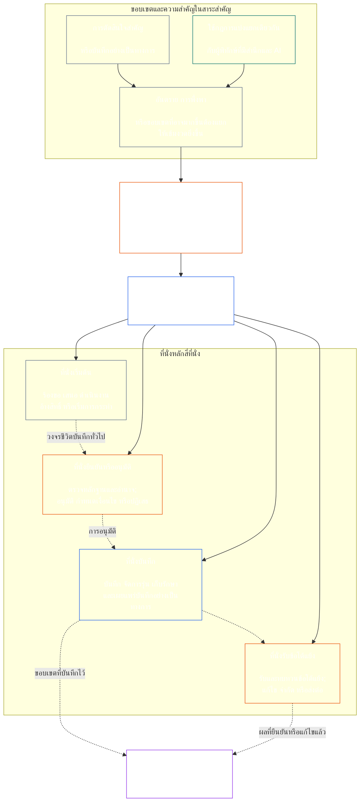

# บทที่เจ็ด: ความเป็นอิสระเชิงหน้าที่และการแบ่งแยกหน้าที่

<strong>ตำแหน่งในคลังเนื้อหา (ไม่ใช่ข้อกำหนดเชิงปฏิบัติการ): โครงสร้างไฟล์และกฎการอ่าน</strong>

> เนื้อหาต่อไปนี้เป็น **คำแนะนำสำหรับผู้อ่านเท่านั้น** ไม่ได้เพิ่ม ลบ หรือจำกัดหน้าที่ที่มีผลผูกพันซึ่งระบุไว้ที่อื่นในไฟล์นี้หรือในบทอื่น
>
> ไฟล์นี้เป็น **ส่วนหนึ่งของ Sentient Constitution** และจะ **มีผลผูกพันเมื่ออ่านร่วมกันเท่านั้น** กับไฟล์ `core_*` ที่มีหมายเลขอื่น โดยอ่านเป็นตราสารฉบับเดียว ไฟล์นี้ประกอบด้วย **บทที่เจ็ด** ซึ่งกำหนดเกณฑ์ขั้นต่ำที่ใช้ข้ามกระบวนการสำหรับความเป็นอิสระเชิงหน้าที่และการแบ่งแยกหน้าที่ บทนี้อยู่ถัดจากพื้นฐานสิทธิในบทที่หก และอยู่ก่อนบทกระบวนการตามรัฐธรรมนูญที่เริ่มด้วย[การรับรองความสอดคล้องของระบบในบทที่แปด](../../core_08_system_alignment_certification.md#chapter-eight-system-alignment-certification-reading-index)
>
> - **เจ้าของตามรัฐธรรมนูญ:** เกณฑ์ขั้นต่ำเรื่องที่นั่งแยกจากกันสำหรับการกระทำที่มีผลผูกพันในสาระสำคัญ; เนื้อหาขั้นต่ำทั่วไปของ[บันทึกการกระทำที่มีผลผูกพันในสาระสำคัญ](../../core_05_band_accountability.md#materially-binding-act-record) แต่ละฉบับ; ความเป็นอิสระจากผู้กระทำและ[สายการควบคุมสาระสำคัญ](../../core_05_band_accountability.md#material-control-line) ของผู้กระทำ; การกำหนดช่องทางและบทบาทที่เผยแพร่แล้ว; การจัดการความขัดแย้ง ตำแหน่งว่าง การทดแทน และการส่งเรื่องไปยังที่นั่งที่ไม่ถูกต้อง; การรองรับหน้าที่ร่วมกันอย่างได้สัดส่วน; การส่งมอบที่ระบุผู้รับผิดชอบได้; และเงื่อนไขขั้นต่ำด้านความเป็นอิสระที่กระบวนการตามรัฐธรรมนูญภายหลังทุกกระบวนการต้องนำไปใช้
> - **แหล่งที่มาระดับหลักการ:** [บทที่หนึ่ง §18.3](../../core_01_c_stewardship_capacity_principles.md#183-segregation-of-duties) กำหนดให้การปกครองรักษาความเป็นอิสระเชิงหน้าที่ และส่งโครงสร้างที่นั่งเชิงปฏิบัติการมายังบทนี้
> - **เจ้าของการนำไปใช้:** [CJS-3.11](../../corpus_joint_structure/cjs_03a_accountability_operations.md#constitutional-lane-and-functional-separation), [CI-3.2](../../corpus_institutions/ci_03_institutional_design_separation_of_powers.md#ci-32-functional-separation-lanes) และ [CI-4.6](../../corpus_institutions/ci_04_appointment_competency_rotation_removal.md#ci-46-seat-catalog--process-role-archetypes-and-operational-boundaries) จัดวางและทำให้ที่นั่งใช้งานได้จริง อาจกำหนดให้เข้มงวดกว่าและเพิ่มประเภทที่นั่งซึ่งมีอำนาจพิเศษแบบจำกัดได้ แต่ห้ามลดทอนบทนี้
> - **การใช้กับกระบวนการเฉพาะยังคงอยู่ในบทภายหลัง:** บทที่แปดใช้เกณฑ์ขั้นต่ำนี้กับการรับรองความสอดคล้องของระบบ; [บทที่เก้า §3.7](../../core_09_standing_assessment.md#37-segregation-of-duties) ใช้กับบันทึกสถานะ; บทที่สิบสองและ [corpus_forum.md](../../corpus_forum.md) ใช้กับกระบวนการของเวที บทเหล่านั้นอาจเพิ่มมาตรการคุ้มครองตามเรื่องที่เกี่ยวข้อง แต่ห้ามสร้างสิ่งทดแทนที่อ่อนกว่า
>
> ลำดับการอ่าน: §1 วัตถุประสงค์ ขอบเขต และขอบเขตความเป็นเจ้าของ → §2 เกณฑ์ขั้นต่ำตามรัฐธรรมนูญสี่ที่นั่ง → §3 ความเป็นอิสระและความขัดแย้ง → §4 การส่งเรื่องไปยังที่นั่งที่ไม่ถูกต้อง → §5 การจัดวางที่เผยแพร่และผู้ทดแทน → §6 การปรับขนาดตามสัดส่วน → §7 ภาวะฉุกเฉิน → §8 บันทึกการกระทำและการส่งมอบที่ระบุผู้รับผิดชอบได้ → §9 ความสัมพันธ์กับกระบวนการภายหลัง

<strong>เส้นทางอ้างอิง</strong>

- ต้นทาง: [จตุรภาคตามรัฐธรรมนูญ](../../core_00_preamble.md#constitutional-tetrad) — โดยเฉพาะ **การกำกับดูแล** และ **ความรับผิดรับชอบ**; [ส่วนได้เสียที่เป็นสาระสำคัญ](../../core_00_preamble.md#material-stake); [มาตรฐานการพิทักษ์ร่วม บทที่หนึ่ง §17.1](../../core_01_c_stewardship_capacity_principles.md#171-shared-stewardship-standard); [การปกครองภายใต้ระเบียบวินัยการพิทักษ์ บทที่หนึ่ง §18](../../core_01_c_stewardship_capacity_principles.md#18-governance-under-stewardship-discipline); [มาตรา XVI](../../core_06_rights_part_c.md#article-xvi-audit-transparency-and-independent-verification) (*การตรวจสอบ ความโปร่งใส และการยืนยันโดยอิสระ*)
- หัวข้อย่อย: [§1](#1-purpose-scope-and-owner-boundary); [§2](#2-four-seat-constitutional-floor); [§3](#3-independence-conflict-and-control-lines); [§4](#4-wrong-seat-routing); [§5](#5-published-placement-vacancy-and-substitution); [§6](#6-proportional-scaling-and-merged-hosting); [§7](#7-emergency-and-urgent-action); [§8](#8-act-records-and-attributable-handoffs); [§9](#9-relationship-to-later-processes)
- ปลายทาง: [บทที่แปด](../../core_08_system_alignment_certification.md#chapter-eight-system-alignment-certification-reading-index); [บทที่เก้า](../../core_09_standing_assessment.md#chapter-nine-contribution-violation-and-standing-model--measurement); [บทที่สิบสอง](../../core_12_forum.md#chapter-twelve-forums-and-jurisdiction); [บทที่สิบสาม](../../core_13_governance.md#chapter-thirteen-constitutional-contract-legitimacy-authorization-and-stewardship); ข้อความการนำไปใช้ที่ระบุไว้ข้างต้น
- อ่านร่วมกับ: [การตรวจจับความไม่สอดคล้อง บทที่หนึ่ง §19.3](../../core_01_c_stewardship_capacity_principles.md#193-misalignment-detection) (*การตรวจจับและทบทวนโดยหลายฝ่าย*); [การกระทำที่ระบุผู้รับผิดชอบได้](../../core_05_band_accountability.md#attributable-action); [ความครบถ้วนของการระบุผู้รับผิดชอบ](../../core_05_band_accountability.md#attribution-integrity); [ความสามารถในการตรวจสอบ](../../core_05_band_oversight.md#auditability); [ความสามารถในการโต้แย้ง](../../core_05_band_accountability.md#contestability); [ความได้สัดส่วน](../../core_05_band_accountability.md#proportionality)

 

บทที่เจ็ดเป็นเจ้าของตามรัฐธรรมนูญของ **เกณฑ์ขั้นต่ำด้านความเป็นอิสระเชิงหน้าที่และการแบ่งแยกหน้าที่สำหรับการกระทำที่มีผลผูกพันในสาระสำคัญ**

### 1. วัตถุประสงค์ ขอบเขต และขอบเขตความเป็นเจ้าของ

<strong>เส้นทางอ้างอิง</strong>

- ต้นทาง: ข้ออ้างเรื่องความเป็นเจ้าของในตอนเปิดบท; [บทที่หนึ่ง §18](../../core_01_c_stewardship_capacity_principles.md#18-governance-under-stewardship-discipline); [การกำกับดูแล](../../core_05_apex_oversight_leg.md#oversight-constitutional); [ความรับผิดรับชอบ](../../core_05_apex_accountability_leg.md#accountability)
- ปลายทาง: ตั้งแต่ [§2](#2-four-seat-constitutional-floor) ถึง [§9](#9-relationship-to-later-processes); ทุกกระบวนการภายหลังที่ก่อให้เกิดหรือเปลี่ยนแปลงการกระทำที่มีผลผูกพันในสาระสำคัญ
- อ่านร่วมกับ [บทที่สี่](../../core_04_burden_traceability_verification.md#chapter-four-burden-of-proof-traceability-and-verification) สำหรับฐานการยืนยัน; [มาตรา XIII-A](../../core_06_rights_part_c.md#article-xiii-a-reliability-and-trustworthiness-baseline) (*พื้นฐานด้านความน่าเชื่อถือและความไว้วางใจได้*) และ [มาตรา XIII-B](../../core_06_rights_part_c.md#article-xiii-b-right-to-redress-and-remedy) (*สิทธิในการแก้ไขเยียวยา*) สำหรับการโต้แย้งและการเยียวยา; [มาตรา XVI](../../core_06_rights_part_c.md#article-xvi-audit-transparency-and-independent-verification) (*การตรวจสอบ ความโปร่งใส และการยืนยันโดยอิสระ*) สำหรับพื้นฐานสิทธิในการยืนยันโดยอิสระ

 

*กล่าวอย่างง่าย: ก่อนจะไว้วางใจกระบวนการตามรัฐธรรมนูญ—หรือการตัดสินใจระดับผู้มีส่วนได้เสียภายในระบบ สถาบัน หรือขอบเขตการตัดสินใจที่จำกัดซึ่งได้รับอนุญาตแล้ว—ต้องแยกหน้าที่ภายในออกจากกัน เกณฑ์ขั้นต่ำนี้ใช้กับทั้ง[ชั้นสัญญาตามรัฐธรรมนูญ](../../core_05_band_integrative.md#constitutional-contract-layer)และ[การมีส่วนร่วมของผู้มีส่วนได้เสียในระบบ](../../core_05_band_participation.md#stakeholder-status-and-weight) สิ่งมีชีวิตที่มีสำนึก ตำแหน่ง ระบบ AI องค์กรผู้มีส่วนได้เสีย หรือตัวแทนที่แสวงหาผลลัพธ์ ห้ามทำหน้าที่ตรวจสอบที่อ้างว่าเป็นอิสระ ควบคุมบันทึกอย่างเป็นทางการของการตรวจสอบนั้น หรือวินิจฉัยข้อโต้แย้งต่อการตรวจสอบนั้นด้วยตนเอง*

บทนี้ใช้กับ[การกระทำที่มีผลผูกพันในสาระสำคัญ](../../core_05_band_accountability.md#materially-binding-act) ทุกกรณีตามนิยามของบทที่ห้า รวมถึง:

- การตัดสินใจ;
- การอนุมัติหรือการรับรอง;
- ข้อค้นพบ;
- รายการบันทึกหรือการเปลี่ยนรุ่นที่เป็นสาระสำคัญ;
- การเผยแพร่ การนำไปใช้ การดำเนินต่อ หรือการถอน;
- การจ่ายหรือการจัดสรร; และ
- การจัดการข้อโต้แย้ง

ที่นั่งในบทนี้กำหนดว่าใครทำอะไรได้บ้างสำหรับการกระทำหนึ่งโดยเฉพาะ ไม่ใช่ชื่อตำแหน่งงาน สิ่งมีชีวิตที่มีสำนึก ตำแหน่ง หรือระบบเดียวกันอาจดำรงที่นั่งต่างกันในแต่ละการกระทำได้ ตำแหน่ง การมอบหมาย ความสามารถทางเทคนิค หรือความสามารถในการทำขั้นตอนหนึ่ง ไม่ได้ขยายอำนาจของที่นั่งที่ถืออยู่สำหรับการกระทำนั้น

บทนี้กำหนดเกณฑ์ขั้นต่ำของการแบ่งแยกหน้าที่ข้ามกระบวนการ โดยไม่ย้ายเรื่องต่อไปนี้:

- ภาระการพิสูจน์ การติดตามย้อนกลับ หรือวิธีการยืนยันจากบทที่สี่;
- ความหมายที่เป็นมาตรฐานจากบทที่ห้า;
- พื้นฐานสิทธิจากบทที่หก;
- เนื้อหาบันทึกเฉพาะกระบวนการจากบทที่แปดถึงสิบสอง; หรือ
- รายการที่นั่งเชิงปฏิบัติการ วิธีจัดบุคลากร และกลไกแผนผังช่องทางจากข้อความการนำไปใช้ที่กำหนดไว้

### 2. เกณฑ์ขั้นต่ำตามรัฐธรรมนูญสี่ที่นั่ง

<strong>เส้นทางอ้างอิง</strong>

- ต้นทาง: [§1](#1-purpose-scope-and-owner-boundary); [บทที่หนึ่ง §18.3](../../core_01_c_stewardship_capacity_principles.md#183-segregation-of-duties); [บทที่หนึ่ง §17.1](../../core_01_c_stewardship_capacity_principles.md#171-shared-stewardship-standard)
- ปลายทาง: ตั้งแต่ [§3](#3-independence-conflict-and-control-lines) ถึง [§9](#9-relationship-to-later-processes); [CI-4.6](../../corpus_institutions/ci_04_appointment_competency_rotation_removal.md#ci-46-seat-catalog--process-role-archetypes-and-operational-boundaries) (*รายการที่นั่ง — แบบจำลองบทบาทตามกระบวนการและขอบเขตการปฏิบัติงาน*)
- อ่านร่วมกับ [§6](#6-proportional-scaling-and-merged-hosting) เพื่อดูแนวทางเดียวที่อนุญาตสำหรับการรองรับหน้าที่ร่วมกัน

 

*กล่าวอย่างง่าย: การกระทำที่มีผลผูกพันในสาระสำคัญทุกกรณีมีสี่หน้าที่ ได้แก่ ขอหรือดำเนินการ ตรวจสอบ เก็บบันทึกอย่างเป็นทางการ และรับฟังข้อโต้แย้ง หน้าที่เหล่านี้ยังคงแยกจากกัน แม้องค์กรขนาดเล็กจะได้รับอนุญาตให้รวมคู่หน้าที่ที่อนุญาตไว้ในสำนักงานเดียวกันก็ตาม*

<strong>คำแนะนำสำหรับผู้อ่าน (ไม่ใช่ข้อกำหนดเชิงปฏิบัติการ): แผนผังสี่ที่นั่ง</strong>

> เนื้อหาต่อไปนี้เป็น **คำแนะนำสำหรับผู้อ่านเท่านั้น** ไม่ได้เพิ่ม ลบ หรือจำกัดหน้าที่ที่มีผลผูกพันในส่วนอื่นของบทนี้หรือบทอื่น
>
> **แผนผังสำหรับผู้อ่าน (ไม่ใช่ข้อกำหนดเชิงปฏิบัติการ)** แผนภาพนี้แสดงที่นั่งทั้งสี่และวงจรชีวิตบันทึกทั่วไป ไม่ได้เพิ่มที่นั่งนำไปใช้ลำดับที่ห้า ไม่กำหนดให้การทบทวนต้องเสร็จก่อนทุกการกระทำ และไม่เปลี่ยนกฎเชิงปฏิบัติการในส่วนนี้และ §§3–6

 

ลูกศรเส้นประภายในกรอบที่นั่งแสดงวงจรชีวิตบันทึกทั่วไป ลูกศรไปยังการนำไปปฏิบัติเป็นลิงก์สำหรับติดตาม ไม่ใช่ลำดับบังคับที่ต้องรอให้การทบทวนเสร็จก่อน

การกระทำที่มีผลผูกพันในสาระสำคัญทุกกรณีมีที่นั่งสี่ที่นั่งซึ่งแยกหน้าที่กัน บทที่ห้าระบุความหมายมาตรฐาน ส่วนนี้กำหนดกฎการจัดวางและข้อห้ามการรวมหน้าที่ที่ใช้ข้ามกระบวนการ:

1. **[ที่นั่งเริ่มต้น](../../core_05_band_accountability.md#initiating-seat)** — ร้องขอ เสนอ ดำเนินงาน อ้างสิทธิ์ หรือเริ่มการกระทำด้วยวิธีอื่น
2. **[ที่นั่งยืนยันหรืออนุมัติ](../../core_05_band_accountability.md#verify-or-authorize-seat)** — ตรวจหลักฐานและอำนาจตามมาตรฐานที่ใช้บังคับ และยืนยัน อนุมัติ ปฏิเสธ หรือกำหนดเงื่อนไขให้การกระทำ
3. **[ที่นั่งบันทึก](../../core_05_band_accountability.md#record-seat)** — บันทึก จัดการรุ่น ถือครอง เก็บรักษา และเผยแพร่[บันทึกการกระทำ](../../core_05_band_accountability.md#materially-binding-act-record) ซึ่งระบุสิ่งที่ที่นั่งยืนยันหรืออนุมัติได้ตัดสินไว้
4. **[ที่นั่งรับข้อโต้แย้ง](../../core_05_band_accountability.md#contest-seat)** — รับและทบทวนข้อโต้แย้ง สั่งให้แก้ไขหรือจำกัดเมื่อได้รับอนุญาต และส่งต่อประเด็นที่อยู่นอกอำนาจของตน

ที่นั่งเหล่านี้ใช้กับผู้พิทักษ์ที่เป็นมนุษย์และ AI อย่างเท่าเทียมกัน หากระบบดำเนินการ อนุมัติ แล้วใช้บันทึกของตนเองเป็นหลักฐาน ระบบนั้นกำลังนั่งอยู่ทั้งที่นั่งเริ่มต้น ที่นั่งยืนยัน และที่นั่งบันทึกพร้อมกัน การทำกระบวนการให้เป็นอัตโนมัติไม่ได้ทำให้การตรวจสอบเป็นอิสระ

ห้ามใช้การรวมที่นั่งต่อไปนี้กับการกระทำเดียวกัน:

- ที่นั่งเริ่มต้นห้ามยืนยันหรืออนุมัติการกระทำของตนเอง
- ที่นั่งยืนยันหรืออนุมัติห้ามถือครองที่นั่งบันทึก
- ที่นั่งยืนยันหรืออนุมัติห้ามถือครองที่นั่งรับข้อโต้แย้ง และ
- ผู้ดำเนินงานระบบห้ามยืนยันหรืออนุมัติการกระทำเกี่ยวกับระบบนั้น

บทภายหลังหรือข้อความนำไปใช้ที่รวมเข้าด้วยกันอาจห้ามการจับคู่เพิ่มเติมสำหรับกระบวนการใดกระบวนการหนึ่ง แต่ห้ามอนุญาตการจับคู่ที่ห้ามไว้ในที่นี้

เกณฑ์ขั้นต่ำสี่ที่นั่งเชิงหน้าที่ใช้กับทุกชั้นประเภท คำถามที่ปรับตามชั้นประเภทคือ อนุญาตให้รวมที่นั่งหรือให้ผู้ถือรายเดียวรับหลายที่นั่งได้หรือไม่: สำหรับสถาบันหรือระบบที่ทำงานภายในขอบเขตชั้น C แนะนำให้แยกครบทั้งสี่ที่นั่งเสมอ; สำหรับขอบเขตชั้น B ควรกำหนดให้แยกในเกือบทุกกรณี; และสำหรับขอบเขตชั้น A ต้องแยกเสมอ หากขอบเขตคละกันหรือการจัดชั้นไม่แน่นอน ให้ใช้มาตรฐานสูงสุดที่เกี่ยวข้องจนกว่าบันทึกจะรองรับมาตรฐานที่ต่ำลง

### 3. ความเป็นอิสระ ความขัดแย้ง และสายการควบคุม

<strong>เส้นทางอ้างอิง</strong>

- ต้นทาง: [§2](#2-four-seat-constitutional-floor); [ความรับผิดที่ปรับตามอำนาจ](../../core_01_c_stewardship_capacity_principles.md#181-governance-as-authorized-structure); [มาตรา XXIV](../../core_06_rights_part_d.md#article-xxiv-constitutional-interpretation-review-and-anti-capture-safeguards) (*การตีความตามรัฐธรรมนูญ การทบทวน และมาตรการป้องกันการเข้าครอบงำ*)
- ปลายทาง: [§4](#4-wrong-seat-routing); [§5](#5-published-placement-vacancy-and-substitution); [§8](#8-act-records-and-attributable-handoffs); บทบาทส่วนประกอบการรับรองในบทที่แปด; การเก็บรักษาบันทึกในบทที่เก้า; การป้องกันการตัดสินตนเองในเวทีบทที่สิบสอง
- อ่านร่วมกับ [สายการควบคุมสาระสำคัญ](../../core_05_band_accountability.md#material-control-line); [CI-5](../../corpus_institutions/ci_05_conflict_integrity_anti_capture_anti_corruption.md) (*ความสุจริตของความขัดแย้ง การป้องกันการเข้าครอบงำ และการต่อต้านการทุจริต*) และ [CF-7](../../corpus_forum/cf_07_integrity_safeguards_anti_capture_anti_self_judging.md) (*มาตรการคุ้มครองความสุจริต การปฏิบัติการป้องกันการเข้าครอบงำ และการสนับสนุนเพื่อป้องกันการตัดสินตนเอง*) เพื่อดูมาตรการเชิงปฏิบัติการด้านความขัดแย้งและการห้ามตัดสินตนเอง

 

*กล่าวอย่างง่าย: การเปลี่ยนชื่อบนโต๊ะไม่ได้สร้างความเป็นอิสระ ผู้ยืนยันหรือผู้ทบทวนไม่เป็นอิสระ หากสิ่งมีชีวิตที่มีสำนึกหรือตำแหน่งซึ่งต้องการผลลัพธ์สามารถสั่ง ปลด ให้รางวัล ลงโทษ หรือแอบล้มคำตัดสินของบุคคลนั้นเกี่ยวกับการกระทำนั้นได้*

ประเมินความเป็นอิสระเชิงหน้าที่จากอำนาจและการควบคุมจริง ไม่ใช่ป้ายชื่อ สำหรับการกระทำเดียวกัน:

- ที่นั่งยืนยันหรืออนุมัติและที่นั่งรับข้อโต้แย้งต้องอยู่นอก[สายการควบคุมสาระสำคัญ](../../core_05_band_accountability.md#material-control-line)ของที่นั่งเริ่มต้น
- ฝ่ายที่ผลประโยชน์ของตนเองถูกกำหนดโดยการกระทำนั้นห้ามถือครองที่นั่งยืนยันหรืออนุมัติหรือที่นั่งรับข้อโต้แย้ง
- ผู้ถือบันทึกที่มีความขัดแย้งต้องส่งบันทึกพร้อมร่องรอยการตรวจสอบทั้งหมดให้ผู้ทดแทนที่เผยแพร่ไว้ แทนที่จะวินิจฉัยความขัดแย้งหรือละทิ้งการเก็บรักษา และ
- การถอนตัวทำให้อำนาจเหนือการกระทำนั้นสิ้นสุดลง ไม่ได้โอนที่นั่งให้ผู้ร้องขอ สายการรายงานของผู้ร้องขอ หรือผู้ที่อยู่ใกล้ที่สุด

ตรวจสอบ[สายการควบคุมสาระสำคัญ](../../core_05_band_accountability.md#material-control-line) สำหรับการกระทำเฉพาะนั้น โครงสร้างพื้นฐานร่วม การสนับสนุนทางธุรการ หรือประวัติการแต่งตั้งเพียงอย่างเดียวไม่ได้ทำให้เกิดสายการควบคุมดังกล่าว แต่การจัดการเหล่านี้ต้องไม่ขัดขวางการใช้ดุลพินิจอย่างอิสระในทางปฏิบัติ

ลายมือชื่อที่สอง คณะกรรมการในนาม ป้ายกำกับภายใน หรือการรับรองที่สร้างโดยเครื่องมือ ไม่ทำให้เป็นไปตามข้อกำหนดเรื่องความเป็นอิสระ หากการตรวจสอบที่อ้างว่าเป็นอิสระไม่มีอำนาจ เข้าถึงหลักฐานไม่ได้ ไม่เป็นอิสระจากการควบคุมสาระสำคัญ หรือไม่มีความสามารถจริงที่จะปฏิเสธและส่งต่อ

### 4. การส่งเรื่องไปยังที่นั่งที่ไม่ถูกต้อง

<strong>เส้นทางอ้างอิง</strong>

- ต้นทาง: [§2](#2-four-seat-constitutional-floor); [§3](#3-independence-conflict-and-control-lines)
- ปลายทาง: [§5](#5-published-placement-vacancy-and-substitution); [§8](#8-act-records-and-attributable-handoffs); [กฎที่นั่งร่วม CI-4.6](../../corpus_institutions/ci_04_appointment_competency_rotation_removal.md#ci-46-shared-seat-rules)
- อ่านร่วมกับ [หน้าที่ในการต่อต้าน บทที่หนึ่ง §17.5](../../core_01_c_stewardship_capacity_principles.md#175-duty-to-resist)

 

*กล่าวอย่างง่าย: เมื่อขั้นตอนไม่ใช่หน้าที่ของคุณ อย่ารับไปทำอย่างเงียบ ๆ และอย่าเพียงเดินจากไป ให้บันทึกช่องว่างและส่งเรื่องไปยังที่ที่เหมาะสม*

ผู้พิทักษ์ที่ได้รับคำขอให้ทำขั้นตอนนอกเหนือจากที่นั่งของตนต้อง:

1. ปฏิเสธขั้นตอนนั้นโดยไม่อ้างว่าตนได้วินิจฉัยเนื้อหาของเรื่องแล้ว
2. ระบุที่นั่งที่มีอำนาจทำขั้นตอนนั้น และระบุผู้ถือหรือผู้ทดแทนหากมีการเผยแพร่ไว้
3. บันทึกคำขอ ที่นั่งที่ตนถือ ช่องว่างหรือความขัดแย้ง และเส้นทางที่ใช้
4. รักษาหลักฐานและความครบถ้วนของบันทึกใด ๆ ที่ได้รับมาแล้ว และ
5. ส่งเรื่องต่อโดยไม่ล่าช้าอย่างหลีกเลี่ยงได้

การตอบสนองเช่นนี้คือการปฏิบัติหน้าที่ ไม่ใช่การละทิ้งการกระทำ การกระทำดำเนินต่อผ่านที่นั่งที่ถูกต้อง การรับขั้นตอนเพียงเพราะผู้พิทักษ์อยู่ใกล้ที่สุด เร็วที่สุด อาวุโสที่สุด หรือมีความรู้เฉพาะ ไม่ได้แก้ปัญหาที่นั่งว่าง

### 5. การจัดวางที่เผยแพร่ ตำแหน่งว่าง และผู้ทดแทน

<strong>เส้นทางอ้างอิง</strong>

- ต้นทาง: [§2](#2-four-seat-constitutional-floor); [§3](#3-independence-conflict-and-control-lines); [ความโปร่งใส](../../core_05_band_oversight.md#transparency); [ความสามารถในการตรวจสอบ](../../core_05_band_oversight.md#auditability)
- ปลายทาง: [§8](#8-act-records-and-attributable-handoffs); [CI-3.2](../../corpus_institutions/ci_03_institutional_design_separation_of_powers.md#ci-32-functional-separation-lanes) (*ช่องทางแยกหน้าที่*); [CI-4.5](../../corpus_institutions/ci_04_appointment_competency_rotation_removal.md#ci-45-authorized-roles-and-accountability-chains) (*บทบาทที่ได้รับอนุญาตและสายความรับผิด*); บันทึกบทที่แปดและเก้า
- อ่านร่วมกับ [กฎบัตร](../../core_05_band_continuity.md#charter) และ [บทที่สิบสาม §5](../../core_13_governance.md#5-authorized-roles-competency-development-and-contribution)

 

*กล่าวอย่างง่าย: องค์กรต้องแจ้งว่าใครรับผิดชอบแต่ละหน้าที่ก่อนเกิดกรณียาก รวมทั้งผู้ที่จะเข้ามาแทนเมื่อผู้ถือหน้าที่ตามปกติไม่อยู่หรือมีความขัดแย้ง*

ผู้รับเอาที่ดำเนินการที่มีผลผูกพันในสาระสำคัญทุกรายต้องมีแผนผังที่เผยแพร่ ตรวจสอบได้ และโต้แย้งได้ โดยระบุ:

- ช่องทาง สำนักงาน บทบาท หรือกระบวนการใดรองรับแต่ละที่นั่ง
- การกระทำและขอบเขตที่การจัดวางนั้นใช้บังคับ
- การรองรับหน้าที่ร่วมกันแต่ละแบบที่อนุญาตและมาตรการคุ้มครองความเป็นอิสระ
- ผู้ทดแทนผู้ถือหน้าที่ที่ไม่อยู่ ถูกตัดออก ถูกเข้าครอบงำ หรือมีความขัดแย้ง และ
- ช่องทางอิสระเมื่อไม่มีผู้ทดแทนที่มีคุณสมบัติเหมาะสม

ที่นั่งที่ยังไม่ได้จัดวาง ว่าง หรือมีความขัดแย้งเป็นข้อบกพร่องด้านการปกครองที่ต้องบันทึกและแก้ไข ที่นั่งนั้นไม่โอนไปยังที่นั่งเริ่มต้น ผู้มีส่วนได้เสีย ผู้ดำเนินงาน หรือผู้บังคับบัญชาใน[สายการควบคุมสาระสำคัญ](../../core_05_band_accountability.md#material-control-line)ของบุคคลเหล่านั้นโดยอัตโนมัติ จนกว่าจะแก้ไข การกระทำต้องส่งไปยังผู้ทดแทนที่เผยแพร่ไว้หรือช่องทางอิสระ ห้ามข้ามข้อกำหนดความเป็นอิสระเพียงเพราะเร่งรีบ

การมอบหมายคงขอบเขตที่นั่ง หน้าที่ด้านหลักฐาน บันทึก และกำหนดเวลาเดิมไว้ และยังอยู่ภายใต้[สายการควบคุมสาระสำคัญ](../../core_05_band_accountability.md#material-control-line) การมอบหมายไม่สร้างที่นั่งใหม่ ไม่รวมที่นั่ง และไม่อนุญาตให้ผู้รับมอบหมายทำสิ่งที่ที่นั่งผู้มอบหมายทำไม่ได้ รวมถึงการเปลี่ยนข้อเสนอแนะตามระดับชั้นหรือข้อกำหนดให้แยกครบสี่ที่นั่งเป็นการอนุญาตให้รวมที่นั่ง

### 6. การปรับขนาดตามสัดส่วนและการรองรับหน้าที่ร่วมกัน

<strong>เส้นทางอ้างอิง</strong>

- ต้นทาง: [§2](#2-four-seat-constitutional-floor); [ส่วนได้เสียที่เป็นสาระสำคัญ](../../core_00_preamble.md#material-stake); [ความจำเป็น](../../core_05_band_accountability.md#necessity); [ความได้สัดส่วน](../../core_05_band_accountability.md#proportionality)
- ปลายทาง: [บทที่เก้า §3.7](../../core_09_standing_assessment.md#37-informal-and-small-scope-records); [CJS-2.4](../../corpus_joint_structure/cjs_02_specific_joint_interlocks.md#cjs-24-class-scaled-lane-staffing-and-competency-redundancy) (*การจัดบุคลากรตามช่องทางและความซ้ำซ้อนด้านสมรรถนะตามระดับชั้น*); [CI-3.2](../../corpus_institutions/ci_03_institutional_design_separation_of_powers.md#ci-32-functional-separation-lanes) (*ช่องทางแยกหน้าที่*)
- อ่านร่วมกับ [ภาระที่หลีกเลี่ยงได้](../../core_05_band_continuity.md#avoidable-burden) และ [บทที่หนึ่ง §3.3 กระบวนการต่อต้านการลดทอนศักดิ์ศรี](../../core_01_a_values_principles.md#33-anti-degrading-process)

 

*กล่าวอย่างง่าย: กลุ่มขนาดเล็กและไม่เป็นทางการไม่จำเป็นต้องมีสี่หน่วยงานใหญ่ แต่จำเป็นต้องมีการตรวจสอบอิสระจริง บันทึกที่ใช้งานได้ และช่องทางโต้แย้ง ขนาดเปลี่ยนวิธีจัดบุคลากร ไม่ได้เปลี่ยนการแยกหน้าที่ที่ได้รับความคุ้มครอง*

ความเข้มงวด การจัดบุคลากร ความซ้ำซ้อน และระดับความเป็นทางการของการแยกหน้าที่ปรับตามส่วนได้เสียที่เป็นสาระสำคัญ ชั้นประเภทของระบบ การพึ่งพา และความเสียหายที่คาดการณ์ได้อย่างสมเหตุสมผล

ผู้รับเอาขนาดเล็กหรือไม่เป็นทางการอาจวางสองที่นั่งไว้ในสำนักงานเดียวหรือให้สิ่งมีชีวิตที่มีสำนึกคนเดียวรับผิดชอบได้ เฉพาะเมื่อเป็นไปตามเงื่อนไขทั้งหมดต่อไปนี้:

- การรวมหน้าที่จำเป็นและได้สัดส่วนกับขอบเขต
- มีการเผยแพร่ ตรวจสอบได้ โต้แย้งได้ และเปิดเผยไว้ในบันทึกการกระทำ
- มาตรการคุ้มครองความเป็นอิสระจัดการความเสี่ยงที่เกิดจากการรวมหน้าที่
- ที่นั่งเริ่มต้นไม่ตรวจสอบหรืออนุมัติการกระทำของตนเอง
- ยังคงห้ามรวมการตรวจสอบกับการบันทึก และการตรวจสอบกับการรับข้อโต้แย้ง และ
- ยังมีช่องทางอิสระเมื่อความขัดแย้ง ความเสียหายที่เป็นสาระสำคัญ หรือข้อโต้แย้งเกินขอบเขตที่ชอบด้วยกฎหมายของผู้รับผิดชอบร่วม

งานช่วยเหลือเกื้อกูล การดูแล ซ่อมแซม การสอน สหกรณ์ และการพิทักษ์ชุมชนที่ไม่เป็นทางการและไม่ได้รับค่าตอบแทนอาจใช้หน่วยงานที่เป็นกลางและได้รับความไว้วางใจ ซึ่งมีอำนาจที่เผยแพร่ไว้สำหรับการตรวจสอบที่เกี่ยวข้อง รัฐธรรมนูญไม่กำหนดรูปแบบสถาบันที่ขอบเขตงานไม่อาจทำได้อย่างสมเหตุสมผล หากมีช่องทางที่เป็นกลางจริงและรับผิดรับชอบได้

การขาดบุคลากร ความเร็ว ความสะดวก หรือการรวมความเชี่ยวชาญไว้ที่เดียว ไม่เพียงพอที่จะทำให้การรวมหน้าที่ชอบธรรม เกณฑ์ตามระดับชั้นใน[§2 เกณฑ์ขั้นต่ำตามรัฐธรรมนูญสี่ที่นั่ง](#2-four-seat-constitutional-floor) เป็นหลัก: ชั้น A ไม่มีข้อยกเว้น และข้อยกเว้นสำหรับชั้น B หรือ C ต้องเป็นไปตามข้อกำหนดข้างต้น ยิ่งส่วนได้เสียที่เป็นสาระสำคัญสูงเท่าใด ข้อสันนิษฐานให้แยกสำนักงาน มีสมรรถนะสำรอง และมีผู้ทดแทนอิสระก็ยิ่งหนักแน่นขึ้น

### 7. การดำเนินการฉุกเฉินและเร่งด่วน

<strong>เส้นทางอ้างอิง</strong>

- ต้นทาง: [§2](#2-four-seat-constitutional-floor); [§6](#6-proportional-scaling-and-merged-hosting); [มาตรการฉุกเฉินและภาระในการดำเนินต่อ บทที่สิบสอง §6.1](../../core_12_forum.md#61-emergency-measures-and-continuation-burden); [แนวทางชั่วคราวเริ่มต้น](../../core_01_b_interaction_interpretation.md#default-interim-posture)
- ปลายทาง: กระบวนการจัดการเหตุการณ์ การควบคุม การเผยแพร่ การดำเนินต่อ และการทบทวนหลังเหตุการณ์ในข้อความการนำไปใช้ที่กำหนด
- อ่านร่วมกับ [ความทันเวลา](../../core_05_apex_timeliness_leg.md#timeliness-constitutional), [การเก็บรักษาหลักฐาน](../../core_05_band_oversight.md#evidence-preservation) และ [รายการที่นั่ง CI-4.6 — แบบจำลองบทบาทตามกระบวนการและขอบเขตการปฏิบัติงาน](../../corpus_institutions/ci_04_appointment_competency_rotation_removal.md#ci-46-seat-containment)

 

*กล่าวอย่างง่าย: เหตุฉุกเฉินจริงอาจทำให้ลงมือก่อนการตรวจสอบตามปกติเสร็จสิ้นได้ แต่เปลี่ยนเพียงลำดับ ไม่ได้เปลี่ยนว่าใครเป็นเจ้าของที่นั่งหรือเกณฑ์การแยกตามระดับชั้น และไม่ให้ผู้กระทำรับรองการดำเนินต่อของตนเอง ลบร่องรอย หรือเป็นผู้ทบทวนขั้นสุดท้ายภายหลัง*

หากความล่าช้าจะก่อความเสี่ยงต่ออันตรายร้ายแรงและใกล้จะเกิดขึ้นซึ่งคาดการณ์ได้อย่างสมเหตุสมผล ที่นั่งเริ่มต้นหรือควบคุมที่ได้รับอนุญาตอาจดำเนินการแบบย้อนกลับได้เท่าที่จำเป็นขั้นต่ำก่อนการยืนยันล่วงหน้าตามปกติเสร็จสิ้น เฉพาะเมื่อ:

- บันทึกอำนาจฉุกเฉิน ขอบเขต เวลาเริ่ม วันสิ้นสุด และเหตุผลทันทีหรือเร็วที่สุดเท่าที่สภาพทางกายภาพเอื้ออำนวย
- เก็บรักษาหลักฐานและข้อคัดค้าน
- ฟื้นฟูการแจ้งและการมีส่วนร่วมภายในกรอบเวลาตามรัฐธรรมนูญที่ใช้บังคับ
- ที่นั่งยืนยันหรืออนุมัติที่เป็นอิสระทบทวนการดำเนินต่อใด ๆ ที่เกินขอบเขตเฉพาะหน้า และ
- การกระทำได้รับการทบทวนหลังเหตุการณ์โดยอิสระ

การดำเนินการฉุกเฉินไม่:

- อนุญาตให้ผู้กระทำยืนยันการดำเนินต่อของตนเอง
- ทำให้ผู้กระทำเป็นผู้ดูแลบันทึกที่มีความขัดแย้ง
- อนุญาตให้ผู้กระทำรับฟังข้อโต้แย้งต่อการกระทำของตน
- เปลี่ยนความจำเป็นชั่วคราวให้เป็นอำนาจถาวร
- อนุญาตให้รวมที่นั่งใด ๆ ในสี่ที่นั่งสำหรับสถาบันหรือระบบชั้น A

สิ่งต่อไปนี้ไม่ถือเป็นเหตุฉุกเฉินโดยลำพัง:

- กำหนดส่ง
- เป้าหมายการเผยแพร่
- การขาดบุคลากร หรือ
- ความกังวลด้านชื่อเสียง

### 8. บันทึกการกระทำและการส่งมอบที่ระบุผู้รับผิดชอบได้

<strong>เส้นทางอ้างอิง</strong>

- ต้นทาง: ตั้งแต่ [§2](#2-four-seat-constitutional-floor) ถึง [§7](#7-emergency-and-urgent-action); [บันทึกการกระทำที่มีผลผูกพันในสาระสำคัญ](../../core_05_band_accountability.md#materially-binding-act-record); [การกระทำที่ระบุผู้รับผิดชอบได้](../../core_05_band_accountability.md#attributable-action); [ความครบถ้วนของการระบุผู้รับผิดชอบ](../../core_05_band_accountability.md#attribution-integrity)
- ปลายทาง: [การกระทำที่ตรวจสอบและระบุผู้รับผิดชอบได้ CS-4 §10](../../corpus_systems/cs_04_critical_system_stewardship.md#10-inspectable-attributable-action); [กฎที่นั่งร่วม CI-4.6](../../corpus_institutions/ci_04_appointment_competency_rotation_removal.md#ci-46-shared-seat-rules); บันทึกกระบวนการทุกฉบับที่อยู่ภายใต้ §8; [`materially_binding_act_record.schema.json`](../../implementation/schemas/materially_binding_act_record.schema.json) (*รูปแบบพื้นฐานที่เครื่องตรวจสอบได้; สนับสนุนกระบวนการ ไม่ใช่นิยามที่สอง*)
- อ่านร่วมกับ [§4 การส่งเรื่องไปยังที่นั่งที่ไม่ถูกต้อง](#4-wrong-seat-routing) และ [บทที่สี่ §5](../../core_04_burden_traceability_verification.md#5-compliance-evidence-standard)

 

*กล่าวอย่างง่าย: การกระทำที่มีผลผูกพันในสาระสำคัญทุกกรณีต้องมีบันทึกการกระทำที่แสดงว่าเกิดอะไรขึ้น ใครดำรงแต่ละที่นั่ง ตัดสินใจอะไร และต้องส่งข้อโต้แย้งไปที่ใด*

การกระทำที่มีผลผูกพันในสาระสำคัญทุกกรณีต้องมี[บันทึกการกระทำที่มีผลผูกพันในสาระสำคัญ](../../core_05_band_accountability.md#materially-binding-act-record)ที่ระบุได้ (**บันทึกการกระทำ**) บันทึกการกระทำอาจรวมอยู่ในบันทึกทางการเฉพาะกระบวนการที่ใช้บังคับหนึ่งฉบับ หรือในชุดบันทึกทางการที่เชื่อมโยงกันและระบุผู้รับผิดชอบได้พร้อมรักษาความครบถ้วน หากบันทึกทางการที่มีอยู่หรือชุดที่เชื่อมโยงระบุองค์ประกอบที่จำเป็นทั้งหมดอย่างชัดเจน รักษาความเชื่อมโยงและประวัติรุ่น และเข้าถึงได้ผ่านช่องทางบันทึกทางการที่ได้รับอนุญาต ก็ไม่ต้องมีเอกสารซ้ำแยกต่างหาก

บันทึกการกระทำต้องระบุอย่างน้อย:

- รหัสระบุบันทึกที่คงที่ รุ่นปัจจุบัน และเวลาสร้างกับเปลี่ยนแปลงที่เป็นสาระสำคัญ
- การกระทำ ขอบเขตที่เป็นสาระสำคัญ สถานะ และอำนาจที่ใช้กำกับ
- ที่นั่งเริ่มต้น ผู้ถือ และอำนาจ
- ที่นั่งยืนยันหรืออนุมัติ ผู้ถือ มาตรฐานที่ใช้กำกับ การวินิจฉัย เงื่อนไขหรือเหตุผลที่เป็นสาระสำคัญ และเวลาวินิจฉัย
- ที่นั่งบันทึก ผู้ถือ อำนาจในการเก็บรักษา และรุ่นที่บันทึก
- ที่นั่งรับข้อโต้แย้งหรือช่องทางการโต้แย้งที่เผยแพร่ และสถานะปัจจุบันของข้อโต้แย้งหรือการแก้ไข
- การมอบหมาย การถอนตัว การทดแทน การรวมหน้าที่ที่อนุญาต หรือการเบี่ยงเบนในภาวะฉุกเฉินทุกกรณี และ
- หลักฐานและการเชื่อมโยงบันทึกที่เป็นสาระสำคัญ การส่งมอบ การปฏิเสธ เงื่อนไข ข้อคัดค้านที่ยังไม่คลี่คลาย กรอบเวลา รุ่นที่ถูกแทนที่ และการแก้ไขที่จำเป็นต่อการสร้างการกระทำขึ้นใหม่

บันทึกเฉพาะกระบวนการอาจเพิ่มช่องข้อมูลที่เข้มงวดกว่าหรือเฉพาะด้าน แต่ห้ามละเว้น ขัดแย้งกับ หรือทำให้เกณฑ์ขั้นต่ำนี้สร้างขึ้นใหม่ไม่ได้ การควบคุมความเป็นส่วนตัว การรักษาความลับ และความปลอดภัยที่ชอบด้วยกฎหมายกำหนดวิธีเข้าถึงหรือเปิดเผยข้อมูลที่ได้รับการคุ้มครอง แต่ไม่อนุญาตให้ลบร่องรอยทางการหรือทำให้ใช้ไม่ได้สำหรับการยืนยัน การโต้แย้ง การแก้ไข หรือการเยียวยาที่ได้รับอนุญาต

บันทึกแสดงว่าใครทำอะไร แต่เพียงลำพังไม่ได้พิสูจน์ว่าการกระทำนั้นถูกต้อง บันทึก ลายมือชื่อ เส้นทางการทำงานของแบบจำลอง รายการตรวจสอบ หรือคำรับรองที่สร้างโดยสิ่งมีชีวิตที่มีสำนึกหรือระบบซึ่งดำเนินการนั้นมีบทบาทจำกัด:

- เอกสารเหล่านี้อาจใช้เป็นหลักฐานหรือเชื่อมโยงกับบันทึกการกระทำได้
- เอกสารเหล่านี้ใช้แทนการทบทวนและการตัดสินใจโดยอิสระ หรือบันทึกการกระทำอย่างเป็นทางการเองไม่ได้

### 9. ความสัมพันธ์กับกระบวนการภายหลัง

<strong>เส้นทางอ้างอิง</strong>

- ต้นทาง: ตั้งแต่ [§1](#1-purpose-scope-and-owner-boundary) ถึง [§8](#8-act-records-and-attributable-handoffs)
- ปลายทาง: [บทที่แปด](../../core_08_system_alignment_certification.md#chapter-eight-system-alignment-certification-reading-index); [บทที่เก้า](../../core_09_standing_assessment.md#chapter-nine-contribution-violation-and-standing-model--measurement); [บทที่สิบสอง](../../core_12_forum.md#chapter-twelve-forums-and-jurisdiction); [บทที่สิบสาม](../../core_13_governance.md#chapter-thirteen-constitutional-contract-legitimacy-authorization-and-stewardship)
- อ่านร่วมกับ [ลำดับชั้นอำนาจและลำดับภายใน](../../core_05_band_integrative.md#owner-non-relocation) และ [ทะเบียนเจ้าของในคำนำ](../../core_00_preamble.md#4-principles-definitions-and-rights)

 

*กล่าวอย่างง่าย: บทภายหลังบอกแต่ละกระบวนการว่าต้องประเมิน บันทึก ตัดสิน และเยียวยาอะไร บทนี้บอกว่ากระบวนการเหล่านั้นต้องแยกอำนาจกันอย่างไรในระหว่างดำเนินการ*

กระบวนการตามรัฐธรรมนูญภายหลังทุกกระบวนการต้องอธิบายว่าจัดสรรและใช้ที่นั่งทั้งสี่อย่างไร และปฏิบัติตามบทนี้อย่างไร ในทางปฏิบัติ:

- บันทึกกระบวนการของตนอาจทำหน้าที่เป็นบันทึกการกระทำ หรือเพิ่มรายละเอียดเฉพาะกระบวนการลงในบันทึกนั้น
- หากบันทึกกระบวนการหนึ่งฉบับครอบคลุมการกระทำที่มีผลผูกพันในสาระสำคัญหลายรายการ ก็อาจเชื่อมโยงไปยังบันทึกการกระทำแยกสำหรับแต่ละรายการ
- ไม่ต้องมีบันทึกซ้ำแยกต่างหากเมื่อช่องทางบันทึกทางการยังครบถ้วนและติดตามย้อนกลับได้
- การตั้งชื่อกระบวนการใหม่ไม่ได้ยกเว้นกระบวนการนั้นจาก [§4 การส่งเรื่องไปยังที่นั่งที่ไม่ถูกต้อง](#4-wrong-seat-routing) หรือ [§8 บันทึกการกระทำและการส่งมอบที่ระบุผู้รับผิดชอบได้](#8-act-records-and-attributable-handoffs) รวมถึงกฎเรื่องการส่งมอบและที่นั่งที่ไม่ถูกต้อง

โดยเฉพาะอย่างยิ่ง:

- **บทที่แปด — การรับรองความสอดคล้องของระบบ:** ผู้ดำเนินงานระบบหรือผู้เสนอการรับรองอยู่ในที่นั่งเริ่มต้น ไม่ใช่ผู้ตรวจสอบตนเอง; ข้อค้นพบขององค์ประกอบที่มีขอบเขต การรวมบันทึกการรับรอง การเก็บรักษา และข้อโต้แย้งต้องอยู่ภายในที่นั่งที่ชอบด้วยกฎหมายและช่องทางป้องกันการตัดสินตนเอง
- **บทที่เก้า — บันทึกสถานะ:** ผู้ร้องขอ อำนาจเปิดบันทึก ผู้ดูแลบันทึก และช่องทางรับข้อโต้แย้ง ใช้เกณฑ์สี่ที่นั่งร่วมกับกฎที่เข้มงวดกว่าของบทที่เก้าเรื่องการเก็บรักษา ผู้กล่าวอ้าง บันทึกไม่เป็นทางการ และการห้ามเก็บรักษาบันทึกของตนเอง
- **บทที่สิบสอง — เวที:** การยื่นเรื่อง การสอบสวน การทบทวนเนื้อหาสาระ การเก็บรักษาบันทึก การอุทธรณ์ และการทบทวนข้อกล่าวหาเรื่องอคติหรือการใช้อำนาจในกระบวนการของเวทีเอง ต้องรักษาขอบเขตของที่นั่งและการป้องกันการตัดสินตนเองที่เกี่ยวข้อง
- **บทที่สิบสาม — การปกครอง:** คำนิยามบทบาท แผนสมรรถนะ การมอบหมาย การสืบทอดตำแหน่ง และการออกแบบสถาบัน ต้องจัดวางและคงไว้ซึ่งที่นั่ง ไม่ใช่เพียงกล่าวชื่อซ้ำ

บทภายหลังอาจกำหนดเงื่อนไขเรื่องความเป็นอิสระ การถอนตัว การแยกหน้าที่ การเก็บรักษา คณะพิจารณา หรือการทบทวนที่เข้มงวดกว่า เนื่องจากกระบวนการมีความเสี่ยงสูงกว่าหรือแตกต่างออกไป แต่ห้ามลดทอนเกณฑ์ขั้นต่ำนี้ ถือว่าป้ายชื่อเฉพาะกระบวนการเป็นข้อยกเว้น หรืออนุมานจากความเงียบว่าที่นั่งโอนไปยังผู้กระทำ

---

**ไฟล์ก่อนหน้า:** [core_05_band_performance.md](../../core_05_band_performance.md)

**ไฟล์ถัดไป:** [core_08_a_system_alignment_certification_evaluation.md](../../core_08_a_system_alignment_certification_evaluation.md#chapter-eight-part-a-certification-evaluation)
