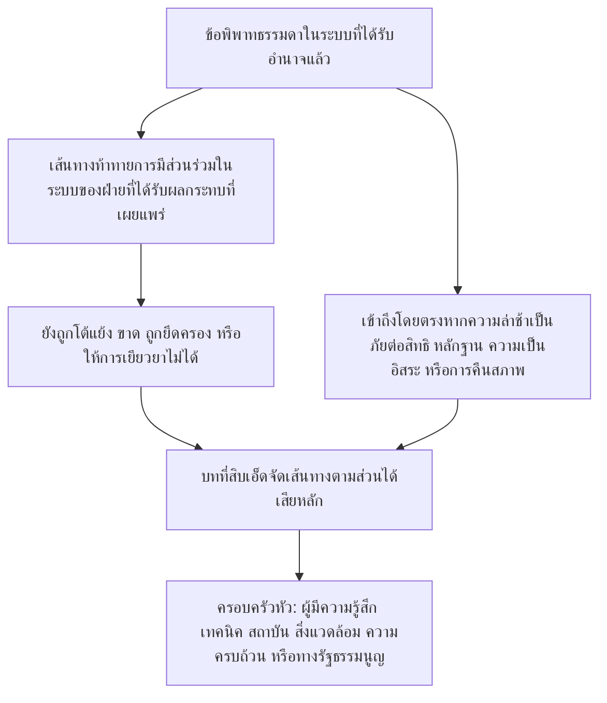

# บทที่สิบเอ็ด: เวทีและเขตอำนาจ

<strong>ตำแหน่งในคลังข้อความ (ไม่ใช่บทบัญญัติที่ใช้บังคับ): โครงสร้างไฟล์และกฎการอ่าน</strong>

> เนื้อหาต่อไปนี้เป็น **แนวทางสำหรับผู้อ่านเท่านั้น** ไม่เพิ่ม ไม่ลด และไม่ทำให้ภาระผูกพันที่ใช้บังคับแคบลงในไฟล์นี้หรือในบทอื่น
>
> ไฟล์นี้เป็น **โครงการนำร่องด้านภาษาสำหรับผู้อ่าน** ของ [บทที่สิบเอ็ดภาษาอังกฤษ](../../core_12_forum.md) **ไม่ใช่** ส่วนที่มีผลผูกพันของรัฐธรรมนูญของผู้มีความรู้สึก **ไม่ใช่** รัฐธรรมนูญฉบับที่สอง **ไม่ใช่** ฉบับจัดส่ง **ตรึงไว้** กับ `SC-Corpus-2026.08.09` หากคำแปลนี้กับต้นฉบับภาษาอังกฤษดูเหมือนไม่ตรงกัน ให้ไฟล์ที่มีหมายเลข [`core_11_forum.md`](../../core_12_forum.md) เป็นฝ่ายชนะ ลำดับการอ่านและข้อมูลฉบับคงไว้ใน [README.md](../../README.md) วิธีทำและอภิธานศัพท์: [translations/th/README.md](README.md)
>
> มี **บทที่สิบเอ็ด**: ครอบครัวเวที ที่นั่งปริยายและการจัดเส้นทางส่วนได้เสียหลัก การรองรับทางนิติวิทยาศาสตร์ การคัดกรองรับเรื่อง และเขตอำนาจสำหรับข้อพิพาทภายใต้สายร่องรอยและพื้นสิทธิ เวที **กำกับ** การจัดการข้อพิพาทภายใต้ขา **การมีส่วนร่วม** **การกำกับดูแล** และ **ความทันเวลา** ของ [จตุรภาคทางรัฐธรรมนูญ](core_00_preamble.md#constitutional-tetrad) ปรับตาม [ส่วนได้เสียที่เป็นสาระ](core_00_preamble.md#material-stake) เมื่อข้อเท็จจริงถูกตรวจสอบแล้ว พวกมันอาจ **เปิด อัปเดต หรือแก้** บันทึกร่องรอย — หรือ **ตั้งบันทึกไม่ดีไว้ข้างเมื่อถูกท้าทาย** — ภายใต้ [บทที่แปด §3](core_08_standing_assessment.md#3-standing-record-operational-requirements); การยื่นคดีโดยตัวมันเองไม่ใช่ร่องรอย และเรื่องเล่าของเวทีต้องไม่แทนการวัดร่องรอยของบทที่แปด ([บทที่แปด §3.6](core_08_standing_assessment.md#36-forum-boundary)) ใช้ [README — Standing pipeline and forums](../../README.md#standing-pipeline-and-forums) สำหรับการนำทางสาย กลไกปฏิบัติการของเวทียังคงอยู่ในไฟล์นำไปใช้ที่กำหนด หมายเลขบทและการอ้างข้ามตรงกับตราสารรวม ลำดับการอ่าน การแยกสิ่งที่มีผลผูกพัน/สนับสนุน และข้อมูลฉบับคลังข้อความคงไว้ใน [README.md](../../README.md)

>
> **ก่อนหน้า (ยังเป็นภาษาอังกฤษ):** [core_10_b_misconduct_pattern_applications.md](../../core_11_b_misconduct_pattern_applications.md#chapter-eleven-part-b-anti-constitutional-misconduct-pattern-applications)
>
> **ถัดไป (ยังเป็นภาษาอังกฤษ):** [core_08-11_application_vignettes.md](../../core_09-12_application_vignettes.md#chapters-eight-eleven-application-vignettes)
> **ส่วนโค้งการอ่าน:** §1 จุดประสงค์ → ลำดับข้อพิพาท → §2 ที่นั่งปริยายและการรับเรื่อง → §2.1–§2.3 ขีดจำกัดหัว ส่วนได้เสียผสม การท้าทาย → §3 การโอนและต้านการตัดสินตนเอง → §4 ครอบครัว → §5 การยกระดับและการรับรอง → §6 ชั้นและวินัยต้านความล่าช้า → §7 การรองรับเวที

<strong>แนวทางสำหรับผู้อ่าน (ไม่ใช่บทบัญญัติที่ใช้บังคับ): ที่อยู่ของบทที่สิบเอ็ดและสิ่งที่คงอยู่ที่นี่</strong>

> เนื้อหาต่อไปนี้เป็น **แนวทางสำหรับผู้อ่านเท่านั้น** ไม่เพิ่ม ไม่ลด และไม่ทำให้ภาระผูกพันที่ใช้บังคับแคบลงในบทนี้หรือในบทอื่น
>
> ที่อยู่ของสิ่งนี้ (การนำทาง):
> - **เจ้าของทางรัฐธรรมนูญ:** **หมวด 1** (*จุดประสงค์* — **การประยุกต์ชี้ขาดหลัก** ของบรรทัดฐานที่บทนี้จัดสรร **ต่างจาก** **การบริหารฝ่ายปฏิบัติ** ประจำวัน; **ลำดับข้อพิพาท** สำหรับข้อพิพาทธรรมดาภายในระบบที่ได้รับอำนาจแล้ว; ข้อกำหนด **ความรับผิดชอบ**; การวาง **ธรณีประตู** ที่ **เผยแพร่** และ **คาดได้**); **ที่นั่งเริ่มต้นปริยาย** การจัดเส้นทาง **ส่วนได้เสียหลัก** **อวัยวะคัดกรองรับเรื่อง** (**โต๊ะสัมผัสแรก**) ส่วนได้เสียผสม ความไม่สมมาตร การท้าทายบันทึกร่องรอย **การกำหนดลักษณะสุจริตและต้านการเล่นเกม** และความคาดหวัง **การเข้าถึง** **ธรณีประตู** ที่ **ผู้มีความรู้สึกเข้าถึงได้** (**หมวด 2** **อ่านคู่กับ** **`corpus_forum.md`**); **การโอน** **การรวม** และ **การประสาน** (**หมวด 3** อ่านคู่กับการรับรองและสำรองของ **หมวด 5**); **บทนิยามครอบครัวเวที** **ห้องภายใน** **มาตรฐานร่วม** และ **กฎหมายปฏิบัติการชั่วคราว** (ผู้มีความรู้สึก เทคนิค สถาบัน สิ่งแวดล้อม ความครบถ้วน ทางรัฐธรรมนูญ — **หมวด** **4** สะท้อน **ตาราง** ของ **หมวด** **2**); **การยกระดับ** **การรับรอง** และ **การคุ้มครองชั่วคราว** (**หมวด 5**); **การยุติที่ทันเวลา** และวินัย **ต้านความล่าช้า** (**หมวด 6**); **การรองรับเวที** ก่อน ระหว่าง และหลังการทบทวน (**หมวด 7**) นำไปใช้ให้บทบาทคัดกรองและการรองรับ **ไม่** แทน **คณะพิจารณาสาระที่ประกอบโดยชอบด้วยกฎหมาย**; การจัดเส้นทางสำรอง **ต้านการตัดสินตนเอง**; และตะขอยกระดับที่ผูกกับ **บทที่แปด** **บทที่สิบ** และสิทธิความยุติธรรมและการท้าทายของ **บทที่หก**
> - **การนำทางสาย:** [README — Standing pipeline and forums](../../README.md#standing-pipeline-and-forums) — [§§1–7](#1-purpose-and-role) ในไฟล์นี้
> - **สายสามคำถามของบทที่แปดถึงเก้า:** **หมวด 2–3** ของบทที่แปดตอบคำถาม 1 (*เกิดอะไรขึ้น?*) ผ่านบันทึกที่ตรวจสอบแล้วและแกนบริสุทธิ์ [บทที่แปด §4](core_08_standing_assessment.md#4-standing-measurement-evaluation-dimensions) และ [มาตราส่วน LEQU ตามสัดส่วนที่เป็นหนึ่งเดียวของ §7](core_08_standing_assessment.md#7-unified-proportional-lequ-scale) ตอบคำถาม 2 (*ดีหรือร้ายเพียงใด?*) ผ่านมิติการประเมิน แถบ LEQU ห้าเท่าที่ใช้ร่วม และไวยากรณ์ **s** = 1...9 ที่ใช้ร่วม โดยคงบันทึกการมีส่วนช่วยและการละเมิดแยก [บทที่เก้า](core_09_standing_integration.md#chapter-nine-standing-effects-and-integration) ตอบคำถาม 3 (*เกิดอะไรขึ้นเพราะสิ่งนั้น?*) ผ่านการเยียวยา การคุ้มกัน แถบความสามารถและการอนุญาต และกุญแจร่องรอย ช่องแกนการละเมิดถูกควบคุมด้วยผลกระทบที่ตรวจสอบแล้วเท่านั้น ความประมาท การปกปิด การบีบบังคับ การตอบสนอง และตัวบรรยายลักษณะที่เทียบไม่ขยับมัน [บทที่สิบ](core_10_a_misconduct_designation.md#chapter-ten-anti-constitutional-misconduct) อาจเพิ่มการกำหนดสถานะความประพฤติมิชอบที่ต่อต้านรัฐธรรมนูญที่จับคู่ให้บันทึกช่อง 7, 8 หรือ 9 ของบทที่แปด แต่ไม่กำหนดช่องตัวเลข
> - **เวที (คำอธิบายที่ไม่ใช่บทบัญญัติที่ใช้บังคับ):** **ครอบครัวเวที** ภายใต้บทนี้เป็น **เวที** หลักที่ประยุกต์การจำแนกของ [บทที่แปด](core_08_standing_assessment.md#chapter-eight-compliance-violation-and-standing-model) กับข้อพิพาทรูปธรรม — รวมเรื่องที่ **ลักษณะการมีส่วนช่วย** **ช่องผลกระทบแกนการละเมิด** และลักษณะกระบวนการ / การตอบสนองที่บันทึกแยก **ปรากฏร่วม** และต้องถูกจัดการภายใต้วินัยการประเมินร่วมและห้ามแทนของ **บทที่แปด** กลไก **ทุนวิจัย** **การเงิน** และ **สิ่งจูงใจ** นอกการชี้ขาดคงอยู่ในตัวบทนำไปใช้ที่รับเป็นของตนและ **[corpus_systems.md](../../corpus_systems.md)** (ดูแนวทางสำหรับผู้อ่านของ **บทที่แปด**); พวกมันอาจรองรับการป้องกันและการสอบสาเหตุราก และ **ต้องไม่** แทนการจัดเส้นทาง **ธรณีประตู** การชี้ขาด **สาระ** การกำหนดช่องตัวเลขของบทที่แปดที่มีอำนาจ การกำหนดสถานะ **บทที่สิบ** ที่จับคู่ใด หรือข้อจำกัดของ **มาตรา XXIII** (*การยุติความขัดแย้ง การยกระดับ และสัดส่วนภาวะฉุกเฉิน*) **หมวด 1 และ 2** จัดสรรความรับผิดชอบ **หลัก** ของโครงสร้าง **สิ่งจูงใจ** **เป็นหลัก** **ภายใน** **ทรงกลม** ของแต่ละ **ครอบครัว** (รายละเอียดละเอียดใน **คลังข้อความ** และการนำไปใช้); **การจัดสรร** นั้น **ไม่** ย้ายทางเลือก **งบประมาณ** **ทั้งระบบ** หรือ **มาตราส่วนการปกครอง** ที่สงวนไว้ให้ [บทที่สิบสอง](../../core_13_governance.md#chapter-thirteen-constitutional-contract-legitimacy-authorization-and-stewardship) และ **[corpus_systems.md](../../corpus_systems.md)**
> - **เจ้าของการนำไปใช้:** **ชั้น** รับเรื่องที่เผยแพร่ กฎสำนวนคดีประจำวัน กำลังคน งบประมาณ วิธีพิจารณาละเอียด กลไกปฏิบัติการของการยกระดับ และข้อกำหนดปฏิบัติการของการรองรับเวที อยู่ในตัวบทนำไปใช้ที่รับเป็นของตนและใน **[corpus_forum.md](../../corpus_forum.md)** (**CF-5** (*การปฏิบัติการจัดเส้นทาง การโอน การรับรอง และการปฏิบัติต่อผู้แทน*) **CF-8** (*การรองรับทางนิติวิทยาศาสตร์และการวิเคราะห์ของเวที*) **CF-9** (*บริการสืบสวนอิสระและส่วนต่อประสานการดำเนิน*) และหมวดที่เกี่ยวข้อง); ชั้นเหล่านั้น **นำไปใช้ ไม่ทำให้แคบลง** บทนี้
> - **กฎต้านการย้าย:** ตราสารรับเป็นของตนต้องไม่สนองบทนี้ด้วยวิธีพิจารณาที่ยุบหน้าที่เวทีที่ต่างกัน ถอด **ความเป็นอิสระ** หรือ **การทบทวนจริง** หรือจัดเส้นทางการท้าทายความครบถ้วนกลับไปยังเวทีที่ยึดครองเดียวกันซึ่งบทนี้ห้ามเป็นบ้านสาระสุดท้ายแห่งเดียว
>
> **สถาปัตยกรรม — การวาง *พูดแบบตรง ๆ*:** แต่ละบรรทัด *พูดแบบตรง ๆ* ปรากฏทันทีหลังบล็อกนำทางตามรอย (และ ` ` ที่ตามเมื่อมี) และ **ก่อน** ย่อหน้าและรายการที่ใช้บังคับของหมวดนั้น คำอธิบายสำหรับผู้อ่านเท่านั้น ไม่เพิ่ม ไม่ลด และไม่ทำให้ตัวบทที่มีผลผูกพันแคบลง

<strong>ตามรอย</strong>

- ต้นทาง: [บทที่แปด](core_08_standing_assessment.md#chapter-eight-compliance-violation-and-standing-model) (*บันทึกคำถาม 1 และการวัดคำถาม 2 ที่ป้อนข้อพิพาทที่บทนี้จัดเส้นทาง*); [บทที่แปด §5.1](core_08_standing_assessment.md#5-slot-grammar-and-display-labels) (*ไวยากรณ์ช่องร่องรอย*); [มาตราส่วนรวมบทที่แปด §7](core_08_standing_assessment.md#7-unified-proportional-lequ-scale) (*แถบ LEQU ห้าเท่าที่ใช้ร่วมและบันทึกแกนแยก*); [บทที่แปด §§4.3–4.4](core_08_standing_assessment.md#43-route-descriptor-measurement-roles) (*บัญชีตัวบรรยายที่ทำให้เป็นมาตรฐานข้ามแกน รวมตัวบรรยายแกนการมีส่วนช่วยและแกนการละเมิดที่ไม่ขยับช่อง*); [บทที่สิบ](core_10_a_misconduct_designation.md#chapter-ten-anti-constitutional-misconduct) (*การกำหนดสถานะความประพฤติมิชอบที่ต่อต้านรัฐธรรมนูญที่จับคู่สำหรับช่อง 7–9 ของบทที่แปดที่เข้าเกณฑ์*); [บทที่สองถึงสี่](core_02_definition_structure.md) (*ความคาดหวังบันทึก การตรวจสอบ และการตามรอย*); [บทที่ห้า](core_05__definitions_home.md#chapter-five-foundational-definitions) (*บทนิยามพื้นฐาน*); [บทที่หนึ่ง](core_01_c_stewardship_capacity_principles.md#chapter-01-principles-and-constraints) (*ข้อจำกัดการตีความ*); [บทที่หก — สิทธิพื้นฐาน](core_06_rights_part_a.md#chapter-six-foundational-rights) ถึง [ส่วน ง](core_06_rights_part_d.md) (*ตะขอท้าทาย การตรวจ และมาตราความยุติธรรม*)
- หมวดย่อย: [§1](#1-purpose-and-role); [§2](#2-default-venue-and-primary-stakes); [§3](#3-transfer-consolidation-and-coordination); [§4](#4-forum-family-definitions); [§5](#5-escalation-and-certification); [§6](#6-timely-resolution-materiality-tiers-and-anti-delay-discipline); [§7](#7-forum-support-before-during-and-after-review)
- อ่านคู่กับ: [README — Standing pipeline and forums](../../README.md#standing-pipeline-and-forums)
- ปลายทาง: [corpus_forum.md](../../corpus_forum.md) (*หลักคำสอนปฏิบัติการของเวที*); [บทที่สิบสอง](../../core_13_governance.md#chapter-thirteen-constitutional-contract-legitimacy-authorization-and-stewardship) ในที่ที่ความชอบธรรมของการปกครองโต้ตอบกับบทบาทชี้ขาด; [บทที่สิบหก](../../core_17_incorporation.md#chapter-seventeen-incorporation-bridge) (*วินัยการรับเป็นของตน* สำหรับชั้นวิธีพิจารณาที่รับเป็นของตน)
- อ่านคู่กับ: [บทที่แปด §5.1](core_08_standing_assessment.md#5-slot-grammar-and-display-labels) (*ไวยากรณ์ช่องร่องรอย*); [บทที่แปด §§4.3–4.4](core_08_standing_assessment.md#43-route-descriptor-measurement-roles) (*ตัวบรรยายที่ทำให้เป็นมาตรฐานข้ามแกนของแกนการมีส่วนช่วยและแกนการละเมิด*)
- อ่านด้วยกับ: [บทที่เก้า §3](core_09_standing_integration.md#3-descriptor-integration-and-attachment-normalization) (*การบูรณาการตัวบรรยายและการทำให้ส่วนแนบเป็นมาตรฐาน อ่านคู่กับการจัดเส้นทางส่วนได้เสียหลักของหมวด 2*); [README.md](../../README.md) (*ลำดับการอ่านและการจัดองค์กรคลังข้อความ*); [doc_architecture.md](../../doc_architecture.md) (*แผนที่บรรณาธิการที่ไม่มีผลผูกพันเว้นถูกรับเป็นของตน*)

 

บทที่สิบเอ็ดเป็นเจ้าของทางรัฐธรรมนูญของ **ครอบครัวเวที ที่นั่งปริยาย เขตอำนาจ และการจัดเส้นทางชี้ขาดสำหรับข้อพิพาทภายใต้สายร่องรอยและพื้นสิทธิ**

*พูดแบบตรง ๆ: ภายใต้ [จตุรภาคทางรัฐธรรมนูญ](core_00_preamble.md#constitutional-tetrad) และ [สองเป้าประสงค์ทางรัฐธรรมนูญ](core_00_preamble.md#two-constitutional-aims) บทนี้ **กำกับ** ว่าข้อพิพาทเคลื่อนผ่านสายร่องรอยบทที่แปดถึงสิบอย่างไร — การจัดเส้นทาง ความเป็นอิสระ การรองรับทางนิติวิทยาศาสตร์ ลำดับการเยียวยา และนาฬิกาปริยายตามชั้นภายใต้ **หมวด 6** และ **มาตรา XXIV-C** (*พื้นการยุติที่ทันเวลาและต้านความล่าช้า*) ครอบครัวเวทีตอบว่ารางใดจัดการข้อพิพาทใด คดีมักเริ่มที่ไหน และเรื่องส่วนได้เสียผสมประสานอย่างไร พวกมันจัดหา **การมีส่วนร่วม** (การท้าทายที่เข้าถึงได้) และ **การกำกับดูแล** (การทบทวนสาระที่ตามรอยได้) เมื่อข้อเท็จจริงถูกตรวจสอบแล้ว พวกมันอาจ **เปิด อัปเดต หรือแก้** บันทึกร่องรอย — หรือ **ตั้งบันทึกไม่ดีไว้ข้างเมื่อถูกท้าทาย** พวกมัน **ไม่** วิ่งรางตัดสินแยกเป็นรางที่สองข้างสายร่องรอย การยื่นคดีตามลำพังไม่มีผลกระทบทันทีต่อร่องรอย กฎการพิจารณาประจำวัน งบประมาณ และคู่มือกำลังคนอยู่ในชั้นนำไปใช้ และต้อง **นำไปใช้ ไม่ทำให้แคบลง** บทนี้หรือ **มาตรา XXIII** (*การยุติความขัดแย้ง การยกระดับ และสัดส่วนภาวะฉุกเฉิน*)*

### 1. จุดประสงค์และบทบาท — สถาปัตยกรรมการมีส่วนร่วม

<strong>ตามรอย</strong>

- ต้นทาง: [บทที่เจ็ด — การรับรองความสอดคล้องของระบบ](core_07_a_system_alignment_certification_evaluation.md#chapter-seven-system-alignment-certification); [บทที่แปด](core_08_standing_assessment.md#chapter-eight-compliance-violation-and-standing-model); [บทที่เก้า](core_09_standing_integration.md#chapter-nine-standing-effects-and-integration); [บทที่สิบ](core_10_a_misconduct_designation.md#chapter-ten-anti-constitutional-misconduct); [บทที่หนึ่ง](core_01_c_stewardship_capacity_principles.md#chapter-01-principles-and-constraints) (*หลักการและข้อจำกัดการตีความ*); [บทที่สองถึงสี่](core_02_definition_structure.md) (*ความคาดหวังการตามรอยและการตรวจสอบ*); [บทที่ห้า](core_05__definitions_home.md#chapter-five-foundational-definitions) (*บทนิยามอ่านคู่กับบทที่สองถึงสี่ในวิดเจ็ตตำแหน่งคลังข้อความ*); [บทที่หก](core_06_rights_part_a.md#chapter-six-foundational-rights) (*พื้นสิทธิพื้นฐานที่บทนี้นำไปใช้ร่วม*)
- ปลายทาง: [§2](#2-default-venue-and-primary-stakes) (*ที่นั่งปริยายส่วนได้เสียหลัก การคัดกรองรับเรื่อง ส่วนได้เสียผสม ความไม่สมมาตร การท้าทายบันทึกร่องรอย; การเข้าถึงธรณีประตูที่โต้แย้งได้และทันเวลา; การกำหนดลักษณะสุจริตและต้านการเล่นเกม*); [§3](#3-transfer-consolidation-and-coordination) (*การโอนและต้านการตัดสินตนเอง*); [§4](#4-forum-family-definitions) (*บทนิยามครอบครัวเวที ห้อง มาตรฐานร่วม และกฎหมายปฏิบัติการชั่วคราว*); [§4.3](#43-institutional-forums) (*ขอบกระบวนการภายในเป็นการประยุกต์ลำดับข้อพิพาทของครอบครัวสถาบัน*); [§5](#5-escalation-and-certification) (*การยกระดับ การรับรอง และการคุ้มครองชั่วคราว*); [§6](#6-timely-resolution-materiality-tiers-and-anti-delay-discipline) (*ชั้นความเป็นสาระ หลักไมล์สาย และวินัยต้านความล่าช้า*); [§7](#7-forum-support-before-during-and-after-review) (*การรองรับเวทีก่อน ระหว่าง และหลังการทบทวน*)
- ขาของจตุรภาค: **การมีส่วนร่วม** **การกำกับดูแล** **ความรับผิดชอบ** **ความทันเวลา** (ข้อค้นพบที่ตรวจสอบแล้วอาจเปิด อัปเดต หรือแก้บันทึกร่องรอย; **CF-11** นำไปใช้นาฬิกาชั้น) เป้าประสงค์หลัก: **ความเจริญงอกงาม** และ **ความต่อเนื่อง** การปรับตาม [ส่วนได้เสียที่เป็นสาระ](core_00_preamble.md#material-stake) ใช้กับภาระการจัดเส้นทางและการเข้าถึง
- อ่านคู่กับ: [คำปรารภ §3.2](core_00_preamble.md#32-key-governance-processes) และ [§3.3](core_00_preamble.md#33-governance-layers) (*เส้นทางกระบวนการและวินัยชั้นการปกครอง*); [มาตรา XI: การมีส่วนร่วมในระบบของฝ่ายที่ได้รับผลกระทบ การเป็นตัวแทน และกระบวนการที่ชอบธรรม](core_06_rights_part_b.md#article-xi-stakeholder-system-participation-representation-and-due-process); [corpus_forum.md](../../corpus_forum.md) (**CF-6.2.2** (*กฎภาวะฉุกเฉิน การใช้จนหมด และกำหนดเวลา*) — นำไปใช้ ไม่ทำให้แคบลง); [corpus_institutions.md](../../corpus_institutions.md) (*การท้าทาย การทบทวนทุติย และการเฝ้าความครบถ้วน — ไม่แทนเขตอำนาจเวทีที่ถูกกำหนด*); [มาตรา XII-B: สิทธิในการท้าทาย ทบทวน และเยียวยา](core_06_rights_part_c.md#article-xii-b-right-to-challenge-review-and-redress); [ครอบครัวมาตรา XXIII](core_06_rights_part_d.md#article-xxiii-a-justice-objective-and-scope) (*ข้อจำกัดความยุติธรรมที่อ้างในวิดเจ็ตตำแหน่งคลังข้อความ*)

 

*พูดแบบตรง ๆ: หมวดนี้กำหนด **การมีส่วนร่วม** และ **การกำกับดูแล** ทางรัฐธรรมนูญผ่านครอบครัวเวทีที่ **กำกับ** สองราง — **สายร่องรอย** (ข้อพิพาทและผลของบันทึกบทที่แปดถึงสิบ) และ **การรับรองความสอดคล้องของระบบ** (การรับรู้และการทบทวนของบทที่เจ็ด) — แล้วกล่าวข้อกำหนดความรับผิดชอบสำหรับการวางธรณีประตูที่เผยแพร่ ข้อพิพาทธรรมดาภายในระบบที่ได้รับอำนาจแล้วใช้เส้นทางท้าทายการมีส่วนร่วมในระบบของฝ่ายที่ได้รับผลกระทบที่เผยแพร่ก่อน; บทนี้เข้ารับช่วงเมื่อเส้นทางนั้นยังถูกโต้แย้ง ขาด ถูกยึดครอง หรือให้การเยียวยาไม่ได้ กฎการฟังละเอียดอยู่ในที่อื่น และห้ามย่อสิ่งที่บทนี้ประกันอย่างเงียบ ๆ*

บทนี้กล่าวว่า **ครอบครัวเวที** ใด **กำกับ** คำถามหลักใดผ่าน **การมีส่วนร่วม** (การท้าทายที่ผู้มีความรู้สึกเข้าถึงได้ การปฏิบัติต่อผู้แทน และการเข้าถึงตามสัดส่วน) และ **การกำกับดูแล** (ความเป็นอิสระ การรองรับทางนิติวิทยาศาสตร์ และการทบทวนสาระที่ตามรอยได้) มัน **ไม่** ระบุกฎสำนวนคดี กำลังคน งบประมาณ วิธีพิจารณาละเอียด หรือกลไกปฏิบัติการของการยกระดับ รายละเอียดเหล่านั้นเป็นของชั้นนำไปใช้ของคลังข้อความ ซึ่งต้อง **นำไปใช้ ไม่ทำให้แคบลง** บทนี้ **ครอบครัวเวที** ต้องกล่าวขอบเขตทางกฎหมายและกำกับสำหรับการวางธรณีประตู การจัดเส้นทางส่วนได้เสียหลัก และการทบทวนความสอดคล้องของระบบ อย่างคาดได้และเผยแพร่ ที่ **นำไปใช้ ไม่ทำให้แคบลง** **หมวด 2** คู่กับ **`corpus_forum.md`**

**ครอบครัวเวทีกำกับ:**

1. **สายร่องรอย** (บทที่แปดถึงสิบ โดยประยุกต์บทที่หนึ่งถึงหกและบรรทัดฐานนำไปใช้คลังข้อความที่กำหนดในข้อพิพาท)
   - การจัดเส้นทางส่วนได้เสียหลัก การทบทวนสาระในที่ที่ถูกกำหนด การโอน การรวม และการประสานการรับรอง และลำดับการเยียวยาสำหรับข้อพิพาทที่เกี่ยวกับร่องรอย
   - บันทึกการมีส่วนช่วยและการละเมิดของ **บทที่แปด** ที่วัดบนมาตราส่วน LEQU ตามสัดส่วนที่เป็นหนึ่งเดียวของ §7 ตัวบรรยายลักษณะ และผลของร่องรอย — ข้อค้นพบที่ตรวจสอบแล้วอาจ **เปิด อัปเดต หรือแก้** บันทึกร่องรอย — หรือ **ตั้งบันทึกไม่ดีไว้ข้างเมื่อถูกท้าทาย** — ภายใต้ [บทที่แปด §3](core_08_standing_assessment.md#3-standing-record-operational-requirements) เมื่อพวกมันสนองประตูข้อมูลเข้าที่ตรวจสอบแล้ว; การยื่นคดีโดยตัวมันเองไม่ใช่ร่องรอย และเรื่องเล่าของเวทีต้องไม่แทนการวัดร่องรอยของบทที่แปด ([บทที่แปด §3.6](core_08_standing_assessment.md#36-forum-boundary))
   - ผลของร่องรอยและการบูรณาการของ **บทที่เก้า** ในที่ที่บทนี้กำหนดให้เวทีกำกับเยียวยาและลำดับ
   - การกำหนดสถานะความประพฤติมิชอบที่ต่อต้านรัฐธรรมนูญของ **บทที่สิบ** ในที่ที่การกำหนดสถานะนั้นเป็นประเด็นสำหรับบันทึกช่อง 7–9 ของบทที่แปด
   - การประยุกต์ **บทที่หนึ่งถึงหก** และชั้นนำไปใช้ [คลังข้อความ](core_05_band_integrative.md#corpus) ที่กำหนด เป็นบรรทัดฐานที่ข้อพิพาทเหล่านั้นใช้

2. **การรับรองความสอดคล้องของระบบ** ([บทที่เจ็ด](core_07_a_system_alignment_certification_evaluation.md#chapter-seven-system-alignment-certification))
   - การรับรู้ การรับรู้มีเงื่อนไข การยืนยัน การรับรองซ้ำ การถอน และผลลัพธ์บันทึกการรับรองที่เกี่ยวข้องที่เวทีกำกับ ภายใต้ [บทที่เจ็ด ส่วน ข](core_07_b_system_alignment_certification_record_process.md#chapter-seven-part-b-certification-record-and-process)
   - บทบาทส่วนประกอบภายใต้ [ส่วน ข §13](core_07_b_system_alignment_certification_record_process.md#13-forum-supervision-and-component-roles):
     - **เทคนิค** — ข้อกำหนด วิธี และมาตรฐานหลักฐาน
     - **ความครบถ้วน** — การรับรู้ความสอดคล้องอย่างเป็นทางการและการประสานหัว
     - **สิ่งแวดล้อม** — ส่วนประกอบความสอดคล้องทางสิ่งแวดล้อมในที่ที่เป็นสาระ
     - ข้อค้นพบส่วนประกอบครอบครัวอื่นภายใต้การจัดเส้นทางของบทนี้
   - ผู้มีความรู้สึกท้าทายผลการรับรอง แนบเงื่อนไข และเปิดแฟ้มใหม่เมื่อจำเป็นได้ — แต่การรับรอง **ไม่** แทนการวัดร่องรอย
   - ข้อค้นพบสำคัญจากการรับรองอาจนับเป็น **ข้อมูลเข้าที่ตรวจสอบแล้ว** เมื่อบทที่แปดวัดร่องรอย การรับรอง **โดยตัวมันเองไม่** กำหนดช่องร่องรอยให้ใคร ([ส่วน ข §15](core_07_b_system_alignment_certification_record_process.md#15-relationship-to-standing))

**ครอบครัวเวที** เป็นสถาบันหลักที่ตราสารนี้ **กำกับ** รางเหล่านั้น พวกมันต่างจากการบริหารฝ่ายปฏิบัติประจำวันของกฎที่ถูกตรา

**ลำดับข้อพิพาท.** ภายในระบบ สถาบัน หรือแดนตัดสินที่มีขอบที่ได้รับอำนาจแล้ว ข้อพิพาทธรรมดาใช้เส้นทางท้าทายและกระบวนการที่ชอบธรรมของ [การมีส่วนร่วมในระบบของฝ่ายที่ได้รับผลกระทบ](core_05_band_participation.md#stakeholder-status-and-weight-cluster) ที่เผยแพร่ก่อน หากเส้นทางนั้นให้ผลที่ยังถูกโต้แย้ง ขาด ถูกยึดครอง หรือให้การเยียวยาที่จำเป็นโดยชอบด้วยกฎหมายไม่ได้ บทนี้จัดเส้นทางเรื่องตามส่วนได้เสียหลักภายใต้ **หมวด 2** **ความครบถ้วน** **โดเมนเวทีทางเทคนิค** **สิ่งแวดล้อม** และ **ทางรัฐธรรมนูญ** เป็นครอบครัวหัวปริยายเมื่อนั่นคือส่วนได้เสียหลัก — ไม่ใช่ข้อยกเว้นที่ข้ามลำดับ กระบวนการภายในที่ยังไม่จบ ป้ายการใช้จนหมด หรือคำกล่าวว่าการทบทวนภายในยังไม่จบ ต้องไม่หน่วงหัวเหล่านั้น ไม่ย้ายสาระของพวกมัน หรือกินนาฬิกา **มาตรา XXIV-C** (*พื้นการยุติที่ทันเวลาและต้านความล่าช้า*) การเข้าถึงโดยตรงยังใช้ได้เมื่อความล่าช้าจะเป็นภัยอย่างเป็นสาระต่อสิทธิ หลักฐาน ความเป็นอิสระ หรือการคืนสภาพที่ใช้ปฏิบัติ

*แผนที่ผู้อ่านเท่านั้น ไม่เพิ่ม ไม่ลด และไม่ทำให้ย่อหน้าลำดับข้อพิพาทแคบลง*

พวกมัน:

- ถือบทบาทปกครองเชิงรุก รวมการยุติปัญหา การวิเคราะห์สาเหตุราก การป้องกัน ลำดับการเยียวยา และการเรียนรู้จากแบบความล้มเหลว สอดคล้องกับหลักการ **บทที่หนึ่ง** รวม **ความปลอดภัย** **ความจริง** **ความผาสุก** **การตอบสนอง** และ **การบริหารอย่างรับผิดชอบและความเข้าใจที่กระจาย**
- ต้องสนองความคาดหวัง **ความเป็นอิสระ** **ความสามารถในการโต้แย้ง** และ **การตามรอย** ใน **บทที่สองถึงสี่** **มาตรา XII-B** (*สิทธิในการท้าทาย ทบทวน และเยียวยา*) ในที่ที่การท้าทายและการเยียวยาเกี่ยว และ **มาตรา XXIII** (*การยุติความขัดแย้ง การยกระดับ และสัดส่วนภาวะฉุกเฉิน*) ในที่ที่ข้อจำกัดความยุติธรรมกำกับ
- อยู่ภายใต้ข้อกำหนดวิธีพิจารณาและความรับผิดชอบต่อความครบถ้วนที่ตราสารนี้กล่าวเข้มที่สุด รวมการให้เหตุผลต่อสาธารณะ ความสามารถในการตามรอย การถอนตัวและวินัยคณะพิจารณา และการรองรับทางนิติวิทยาศาสตร์และการวิเคราะห์ในที่ที่บทนี้กำหนดให้พวกมัน
- ต้องการการจัดเส้นทางสำรองต้านการตัดสินตนเอง ข้อกำหนดเหล่านั้นต้องไม่แทนความเป็นอิสระในการชี้ขาดด้วยการควบคุมทางการเมือง
- เวที **ความครบถ้วน** **ทางรัฐธรรมนูญ** และ **สิ่งแวดล้อม** และ **โดเมนเวทีทางเทคนิค** เมื่อพวกมันฟังการชี้ขาดสถานะความเป็นผู้มีความรู้สึก ต้องการการแต่งตั้งที่ **เผยแพร่** **ถูกโต้แย้งได้** **หมุนได้** หรือการตรวจความเป็นอิสระที่เทียบภายใต้ [บทที่สิบสอง §1.2](../../core_13_governance.md#12-eligibility-contested-selection-and-democratic-minimums) การแต่งตั้งไม่พอหรือทุนไม่พอของคณะพิจารณาเหล่านั้นเป็นความล้มเหลว [บทที่เก้า §9](core_09_standing_integration.md#9-enforcement-realism)

แต่ละ **ครอบครัวเวที** รับผิดชอบหลักต่อโครงสร้างสิ่งจูงใจเป็นหลักภายในทรงกลมของตน นี่รวม:

- ตราสารรับเป็นของตนและชั้นนำไปใช้ที่กำหนด
- การทบทวนต้นทุน การลงโทษ เส้นทางที่มีชื่อของการท้าทายและการรายงาน
- ตะขอลำดับการเยียวยา และการสอดคล้องที่ติดกับการชี้ขาดที่เทียบ

งบประมาณ **ทั้งระบบ** ทุนวิจัยข้ามแนว และโครงการมาตราส่วนการปกครอง ยังอยู่ภายใต้ [บทที่สิบสอง — การปกครอง](../../core_13_governance.md#chapter-thirteen-constitutional-contract-legitimacy-authorization-and-stewardship) **[corpus_systems.md](../../corpus_systems.md)** และกฎสูงสุดอื่นในที่ที่ใช้ ผลตอบแทน กฎต้นทุน และเครื่องมือสิ่งจูงใจที่คล้าย **ต้องไม่** แทนที่:

- การจัดเส้นทางเวทีที่ชอบ
- คำตัดสินสาระจริงโดยคณะพิจารณาที่ประกอบโดยชอบด้วยกฎหมาย
- การวัดช่องผลกระทบของบทที่แปด
- การกำหนดสถานะ **บทที่สิบ** ที่จับคู่ใด
- ข้อจำกัดความยุติธรรมใน **มาตรา XXIII** (*การยุติความขัดแย้ง การยกระดับ และสัดส่วนภาวะฉุกเฉิน*)

การท้าทายสถาบัน การทบทวนทุติย และการเฝ้าความครบถ้วนใน **`corpus_institutions.md`** (รวม **CI-5** (*ความครบถ้วนของความขัดแย้ง ต้านการยึดครอง และต้านการทุจริต*) ถึง **CI-8** (*การประสานข้ามสถาบันและการยกระดับ*) และความคาดหวังความครบถ้วนของการท้าทาย) ทำงานคู่กับบทนี้ พวกมันไม่แทนครอบครัวเวที **ความครบถ้วน** **สิ่งแวดล้อม** หรือ **สถาบัน** สำหรับสาระที่มีผลผูกพันในที่ที่บทนี้กำหนดเขตอำนาจให้ครอบครัวเหล่านั้น กลไกสิ่งจูงใจนำไปใช้ในเล่มเหล่านั้นต้องประสานกับครอบครัวเวทีที่ทรงกลมถูกพาดพิงเป็นหลัก โดยไม่ย้ายการจัดเส้นทางส่วนได้เสียหลักหรืออำนาจสาระที่บทนี้กำหนด

### 2. ที่นั่งปริยายและส่วนได้เสียหลัก

<strong>ตามรอย</strong>

- ต้นทาง: [§1](#1-purpose-and-role) (*จุดประสงค์ บทบาทการประยุกต์หลัก ข้อกำหนดความรับผิดชอบ การจัดเส้นทางธรณีประตูที่เผยแพร่ การไม่ย้ายรายละเอียด ความคาดหวังความเป็นอิสระและการทบทวน*)
- ปลายทาง: [§3](#3-transfer-consolidation-and-coordination) (*การโอน การรวม ต้านการตัดสินตนเอง*); [§4](#4-forum-family-definitions) (*บทนิยามครอบครัวเวทีอ่านคู่กับตารางปริยาย*); [§5](#5-escalation-and-certification) (*การยกระดับจากที่นั่งปริยาย; การคุ้มครองชั่วคราว*); [§6](#6-timely-resolution-materiality-tiers-and-anti-delay-discipline) (*ชั้นความเป็นสาระและวินัยต้านความล่าช้า*); [§7](#7-forum-support-before-during-and-after-review) (*การรองรับเวทีก่อน ระหว่าง และหลังการทบทวน*)
- ภายใน §2: [§2.1](#21-lead-default-limits) (*การชนส่วนได้เสียหลัก การรับรองทางรัฐธรรมนูญ และสำรองต้านการตัดสินตนเอง*); [§2.2](#22-mixed-stakes-and-routing-asymmetry) (*ส่วนได้เสียผสมและความไม่สมมาตร*); [§2.3](#23-forum-records-standing-records-and-contests) (*บันทึกคดีของเวที บันทึกร่องรอย และการท้าทาย*)
- อ่านคู่กับ: [จตุรภาคทางรัฐธรรมนูญ](core_00_preamble.md#constitutional-tetrad) — ขา **การมีส่วนร่วม** **การกำกับดูแล** และ **ความทันเวลา**; การปรับตาม [ส่วนได้เสียที่เป็นสาระ](core_00_preamble.md#material-stake) สำหรับการจัดเส้นทางส่วนได้เสียหลัก; [บทที่แปด §5.1](core_08_standing_assessment.md#5-slot-grammar-and-display-labels) (*ไวยากรณ์ช่องร่องรอย*); [มาตราส่วนรวมบทที่แปด §7](core_08_standing_assessment.md#7-unified-proportional-lequ-scale) (*แถบ LEQU ห้าเท่าที่ใช้ร่วมและบันทึกแกนแยก*); [บทที่แปด §§4.3–4.4](core_08_standing_assessment.md#43-route-descriptor-measurement-roles) (*ตัวบรรยายที่ทำให้เป็นมาตรฐานข้ามแกนที่แจ้งส่วนได้เสียหลักโดยไม่ขยับช่องผลกระทบ*); [corpus_forum.md](../../corpus_forum.md) (**CF-5** และ **CF-7.2**); [corpus_systems.md](../../corpus_systems.md) (*หน้าที่จำแนกระบบ การติดตั้งใช้งาน และการรับรองซ้ำ*); [บทที่สิบ §3](core_10_a_misconduct_designation.md#3-violation-axis-s-7-9-slot-assignment-incident-gravity) (*การกำหนดสถานะความประพฤติมิชอบที่ต่อต้านรัฐธรรมนูญสำหรับช่อง 7–9 ของบทที่แปดที่เข้าเกณฑ์; สมอเดิมถูกคง*); [บทที่สิบ §4](core_10_a_misconduct_designation.md#4-due-process-safeguards-for-slot-assignment) (*กระบวนการที่ชอบธรรมสำหรับการกำหนดสถานะนั้น อ่านคู่กับบทนี้และ **มาตรา XXIII** (*การยุติความขัดแย้ง การยกระดับ และสัดส่วนภาวะฉุกเฉิน*)*); [มาตรา XXIII-A](core_06_rights_part_d.md#article-xxiii-a-justice-objective-and-scope) (*จุดประสงค์และขอบเขตแห่งความยุติธรรม*)

 

*พูดแบบตรง ๆ: **โต๊ะสัมผัสแรก** ของแต่ละครอบครัว — **อวัยวะคัดกรองรับเรื่อง** — ถามว่าการต่อสู้เกี่ยวกับอะไรจริง ไม่ใช่ชื่อเรื่องว่าอย่างไร แล้วใช้ตารางปริยายเลือกเวทีหัว เวทีเทคนิครักษาข้อกำหนด วิธี และมาตรฐานหลักฐานความสอดคล้องของระบบ; เวที **ความครบถ้วน** ทำการตัดสินการรับรู้ความสอดคล้องอย่างเป็นทางการและการยืนยันต่อเนื่อง เว้นคำถามส่วนประกอบเป็นของที่อื่น การคัดไม่แทนคณะพิจารณาสาระที่ประกอบโดยชอบด้วยกฎหมาย; ส่วนได้เสียผสม ความไม่สมมาตร และการท้าทายบันทึกร่องรอยอยู่ในหมวดย่อยข้างล่าง*

**การจัดเส้นทางส่วนได้เสียหลัก** กำหนดเรื่องให้ครอบครัวเวทีที่รับผิดชอบส่วนได้เสียหลักทางกฎหมาย การเยียวยา การคุ้มกันบังคับ พื้นทางรัฐธรรมนูญ หรือที่ใช้ปฏิบัติใน **ข้อเรียกร้อง** หรือ **การต่อสู้** มันตามสิ่งที่ข้อพิพาทเกี่ยวกับจริง ไม่ใช่ชื่อเรื่องหรือผลที่ฝ่ายชอบ

**อวัยวะคัดกรองรับเรื่อง (โต๊ะสัมผัสแรก).** แต่ละครอบครัวเวทีที่ถูกขอต้องรักษา **อวัยวะคัดกรองรับเรื่อง** หรือการจัดที่เทียบตามหน้าที่ภายในครอบครัวนั้น เป็น **โต๊ะสัมผัสแรก** ของครอบครัวเมื่อยื่น อวัยวะนั้น:
- **ประยุกต์** การจัดเส้นทางส่วนได้เสียหลักภายใต้หมวดนี้;
- **คัด** เรื่องเข้ามาสำหรับการปฏิบัติรับเรื่องที่ **เผยแพร่** สอดคล้องกับ **ส่วนได้เสียหลัก**;
- **ชี้ธง** ความต้องการการพิทักษ์ **พื้นสิทธิ** **การจัดเส้นทางข้ามครอบครัว** และ **เวทีสำรอง**;
- **บริหาร** การเข้าถึงเริ่มต้นให้การโอน การรวม การรับรอง และวินัยสำรองภายใต้ **หมวด 3 และ 5** มีผลได้โดยเร็ว;
- **ไม่ใช่** ครอบครัวเวทีทางรัฐธรรมนูญแยก;
- **ต้องไม่** แทนคณะพิจารณาสาระที่ประกอบโดยชอบด้วยกฎหมายบน **ผลลัพธ์สาระ** หรือ **ยุบ** ขอบ **ครอบครัว**;
- **ต้องไม่** ใช้ทุน ค่าธรรมเนียม ความชอบบริหาร หรืออุปกรณ์สิ่งจูงใจอื่นเพื่อเอาชนะการจัดเส้นทางส่วนได้เสียหลักหรือเปิดการคัดธรณีประตูที่ทึบ

**การกำหนดลักษณะสุจริตและต้านการเล่นเกม.** การกำหนดลักษณะของเวทีต้อง **สุจริต** และ **มีเหตุ** จาก **ส่วนได้เสียหลัก** การกำหนดลักษณะผิด **โดยรู้** **อาจ** จุด **ค่าใช้จ่าย** **การยก** หรือ **การส่งต่อ** ภายใต้กฎหมายที่รับเป็นของตน อุปกรณ์สิ่งจูงใจต้องไม่ถูกจัดโครงสร้างหรือประยุกต์เพื่อให้รางวัลการเลือกเวที การคัดธรณีประตูที่ทึบ หรือการจัดเส้นทางที่ไม่สอดคล้องกับวินัยส่วนได้เสียหลักใน **หมวดนี้** และ **หมวด 3** กลไกค่าใช้จ่าย การยก และการส่งต่ออยู่ใน **`corpus_forum.md`** (**CF-5**) และต้อง **นำไปใช้ ไม่ทำให้แคบลง** หมวดนี้

ข้อกำหนดปฏิบัติการ — รวม **ชั้นรับเรื่องที่เผยแพร่** บันทึกรับเรื่องที่ระบุตัวได้ ความคาดหวังความเป็นอิสระและ **การท้าทาย** และการทบทวน **โดยเร็ว** ของการจัดเส้นทางที่ **ถูกโต้แย้ง** — ถูกกล่าวใน **`corpus_forum.md`** (**CF-5** (*การปฏิบัติการจัดเส้นทาง การโอน การรับรอง และการปฏิบัติต่อผู้แทน*))

**การเข้าถึงเริ่มต้น** ของแต่ละครอบครัวเวทีต้องทันเวลาและโต้แย้งได้พอให้:
- การจัดเส้นทางส่วนได้เสียหลักภายใต้หมวดนี้ยังมีความหมาย;
- การโอน การรวม การรับรอง และวินัยสำรองภายใต้ **หมวด 3 และ 5** ไม่ถูกทำให้เป็นโมฆะด้วยความล่าช้าหรือการคัดธรณีประตูที่ทึบ

ความคาดหวังเวลาสำหรับการเข้าถึงเวทีต้อง:
- **ผู้มีความรู้สึกเข้าถึงได้**;
- ถูกปรับตามความเร่งด่วนของภัยและความซับซ้อนของเรื่องภายใต้ **หมวด 6** และ **มาตรา XXIV-C** (*พื้นการยุติที่ทันเวลาและต้านความล่าช้า*);
- ให้ความสำคัญกับการเข้าถึงธรณีประตูจริงและการเยียวยาชั่วคราวที่ชอบด้วยกฎหมายภายใต้ **หมวด 5** (*การคุ้มครองชั่วคราว*) เหนือความสะดวกบริหาร

**อวัยวะคัดกรองรับเรื่อง** ภายใต้หมวดนี้ คู่กับ **`corpus_forum.md`** (**CF-5**) สนองหน้าที่นี้ และต้องนำไปใช้หน้าต่างปริยายชั้นของ **หมวด 6** ภายในขอบการรับเป็นของตน

**แผนที่จัดเส้นทางจากบทที่แปด §3.** บทที่แปดบอกเวทีว่าจะ *วัด* สิ่งที่เกิดอย่างไร มัน **ไม่** เลือกตามลำพังว่าเวทีใดฟังคดี เมื่อยื่น **อวัยวะคัดกรองรับเรื่อง** (โต๊ะสัมผัสแรก) ของครอบครัวทำงานตามลำดับนี้:

1. **ตรวจสิ่งที่ถูกตรวจสอบแล้วอยู่แล้ว:** บันทึกวัสดุแกน **การมีส่วนช่วย** หรือแกน **การละเมิด** ของบทที่แปดที่ตรวจสอบแล้วใด — รวมช่องผลกระทบ แถบความรุนแรง ลักษณะกระบวนการ / การตอบสนอง และผลของร่องรอย — เมื่อสิ่งเหล่านั้นมีอยู่แล้ว
2. **อย่าถือข้อกล่าวหาเป็นข้อเท็จจริงที่ยุติ:** ข้อกล่าวหาและป้ายชั่วคราวชี้นำการจัดเส้นทางและการพิทักษ์หลักฐานเท่านั้น จนกว่าจะมีข้อค้นพบภายใต้ **บทที่สองถึงสี่**
3. **เลือกเวทีหัวตามสิ่งที่การต่อสู้เกี่ยวกับจริง:** ใช้ตารางที่นั่งปริยายข้างล่าง: **ผู้มีความรู้สึก** **โดเมนเวทีทางเทคนิค** **สถาบัน** **สิ่งแวดล้อม** **ความครบถ้วน** หรือ **ทางรัฐธรรมนูญ** ประยุกต์กฎจัดเส้นทางพิเศษเหล่านี้ในที่ที่เข้า:
   - **การกำหนดสถานะบทที่สิบ:** ในที่ที่การกำหนดสถานะความประพฤติมิชอบที่ต่อต้านรัฐธรรมนูญของ **บทที่สิบ** เป็นส่วนได้เสีย **หลัก** **ความครบถ้วน** เป็นหัวปริยาย คง:
     - ช่องผลกระทบตัวเลขของบทที่แปด;
     - การรับรอง **ทางรัฐธรรมนูญ** ในที่ที่จำเป็น;
     - กฎฝ่ายสถาบัน; และ
     - สำรองต้านการตัดสินตนเองภายใต้ **หมวด 2, 3 และ 5**
   - **ข้อพิพาทอคติเวที:** หากการต่อสู้หลักเกี่ยวกับสมาชิกคณะพิจารณาที่ควรถอนตัว การมีส่วนร่วมของคณะพิจารณาที่มีอคติ หรือการละเมิดความครบถ้วนของเวทีที่เทียบ — รวมบนคณะพิจารณาเวที **ทางรัฐธรรมนูญ** ภายใต้ **[มาตรา XXII-B](core_06_rights_part_c.md#article-xxii-b-composition-rotation-and-conflict-controls) (*การจัดองค์ประกอบ การหมุน และการควบคุมความขัดแย้ง*)** — จัดเส้นทางไปเวที **ความครบถ้วน** ก่อน ภายใต้ **หมวด 3** เวทีจะเป็นผู้ตัดสินสุดท้ายแห่งเดียวของอคติตนเองไม่ได้: เวที **ทางรัฐธรรมนูญ** จะเป็นเวทีสุดท้ายแห่งเดียวที่ตัดสินว่าสมาชิกคณะพิจารณาของตนเองควรถอนตัวไม่ได้ วินัยกุญแจร่องรอย: **[บทที่เก้า §5.5](core_09_standing_integration.md#55-special-locks)** แบบแผนความประพฤติมิชอบที่มีชื่อ: **[บทที่สิบ §5.10](../../core_11_b_misconduct_pattern_applications.md#510-forum-recusal-failure-and-biased-panel-participation)**
   - **คำถามวิธีทางเทคนิค:** ข้อกำหนด วิธี การวัด การทดสอบ และคำถามหลักฐานผู้เชี่ยวชาญไป **โดเมนเวทีทางเทคนิค** เมื่อสิ่งเหล่านั้นเป็นส่วนได้เสียหลักหรือคำถามส่วนประกอบที่รับรอง
   - **การลงนามความสอดคล้องของระบบ:**
     - **การรับรู้ความสอดคล้องทางรัฐธรรมนูญ** อย่างเป็นทางการสำหรับระบบใหม่ที่มีผลกระทบเป็นสาระ และการ **ยืนยันความสอดคล้องต่อเนื่อง** สำหรับระบบที่มีอยู่ ปริยายให้ **ความครบถ้วน** เป็นหัว
     - ความครบถ้วนใช้ข้อมูลเข้าเวทีเทคนิคบวกข้อกำหนดทางรัฐธรรมนูญ สถาบัน นิเวศ สิทธิ และต้านการยึดครอง
     - ในที่ที่ระบบมีการเปิดรับทางนิเวศที่เป็นสาระ การพึ่งเงื่อนไขเบื้องต้นทางสิ่งแวดล้อม ภาระวงชีวิต หน้าที่ฟื้นฟู หรือความเสี่ยงทางนิเวศที่คาดได้อย่างมีเหตุ ครอบครัวเวที **สิ่งแวดล้อม** ต้องทำให้การทบทวนความสอดคล้องทางสิ่งแวดล้อมของตนเสร็จ (ลงนามหรือคัดค้าน) ก่อนการรับรู้ การยืนยัน การรับรองซ้ำ หรือการปล่อยที่เป็นสาระจากเงื่อนไขทางสิ่งแวดล้อมจะเป็นขั้นสุดท้ายได้
     - คงการส่งต่อหรือการรับรองไปยัง **โดเมนเวทีทางเทคนิค** **สถาบัน** **สิ่งแวดล้อม** **ผู้มีความรู้สึก** และ **ทางรัฐธรรมนูญ** สำหรับคำถามส่วนประกอบที่ครอบครัวเหล่านั้นเป็นเจ้าของ

เมื่อยื่น ที่นั่ง **ปริยาย** ตามกฎเหล่านี้ เว้น **หมวด 3** โอนหรือรวม:

| ครอบครัว | แบบฝ่าย | ส่วนได้เสียหลัก (สรุป) |
|--------|---------------|--------------------------|
| **ผู้มีความรู้สึก** | เรื่องผู้มีความรู้สึกต่อผู้มีความรู้สึก และข้อพิพาทการปกครองชุมชนของสมาชิก ผู้ร่วม ครัวเรือน ละแวก สมาคม ท้องถิ่น ภูมิภาค ออนไลน์ หรือที่เทียบ ในที่ที่ไม่มีสถาบันเป็นฝ่ายจำเป็นและไม่มีครอบครัวอื่นถือส่วนได้เสียหลัก | หน้าที่ส่วนตัวหรือชุมชน ภัยเยียวยาหรือคืนสภาพ การคืนสภาพท้องถิ่น บรรทัดฐานชุมชนท้องถิ่นหรือออนไลน์ การมีส่วนร่วมการปกครองชุมชน การกีด การคืนสภาพ หรือการท้าทายการปกครองตนเองภายใน |
| **โดเมนเวทีทางเทคนิค** | แบบฝ่ายใด แต่ส่วนได้เสีย **หลัก** คือวิธีพิจารณาการปกครองทางเทคนิค ข้อกำหนดความสอดคล้องของระบบ มาตรฐานหลักฐานผู้เชี่ยวชาญ การบริหารวิทยาศาสตร์ / วิศวกรรม / การแพทย์ การปกครองความรู้ที่เทียบภายในขอบที่รับเป็นของตน **หรือ** การกำหนดสถานะความเป็นผู้มีความรู้สึก **มาตรา V-E** (*พื้นการชี้ขาดสถานะความเป็นผู้มีความรู้สึก*) บนตัวบ่งชี้ / หลักฐานผู้เชี่ยวชาญ / ความไม่แน่นอนที่มีขอบ | มาตรฐาน **เทคนิค** ข้อกำหนดความสอดคล้องของระบบ วิธีวัดและทดสอบ วิธีพิจารณาบริหารผู้เชี่ยวชาญ การบริหารหลักฐานอย่างรับผิดชอบ ความครบถ้วนของตำราหรือหลักสูตร การปกครองมาตรฐาน การลดความไม่แน่นอนที่มีขอบที่เกี่ยวข้องกับการชี้ขาด การกำกับ หรือการรับรู้ความสอดคล้อง **หรือ** การชี้ขาดตัวบ่งชี้สถานะความเป็นผู้มีความรู้สึกภายใต้ **มาตรา V-E** (*พื้นการชี้ขาดสถานะความเป็นผู้มีความรู้สึก*) |
| **สถาบัน** | **สถาบัน** ใดเป็นฝ่าย **จำเป็น** **หรือ** การต่อสู้หลักเกี่ยวกับสิ่งที่สถาบันได้รับอนุญาตให้ทำ สิ่งที่ถูกมอบหมายให้ทำ หรือว่ามันทำตามกฎที่กำกับมันหรือไม่ | สิ่งที่สถาบันอาจทำ สิ่งที่ถูกมอบหมายให้ทำ ขอบที่มันถูกกำกับ มันถูกจำแนกอย่างไร หรือว่ามันทำตามหน้าที่หรือไม่ |
| **สิ่งแวดล้อม** | แบบฝ่ายใด; บทบาทส่วนประกอบที่ถูกขอในที่ที่ความสอดคล้องของระบบพาดพิงการเปิดรับทางนิเวศอย่างเป็นสาระ | **ความครบถ้วนทางนิเวศ** **เงื่อนไขเบื้องต้นทางสิ่งแวดล้อม** การฟื้นฟูหรือการแก้ไขระบบนิเวศร่วม ภาระสิ่งแวดล้อมที่ระบุตัวได้ ภัยทางนิเวศวงชีวิตหรือเชิงระบบ การทบทวนส่วนประกอบความสอดคล้องทางสิ่งแวดล้อมสำหรับระบบที่มีการเปิดรับทางนิเวศที่เป็นสาระ หรือความล้มเหลวทางนิเวศ **แบบ** หรือ **เชิงระบบ** ในที่ที่การจำแนก การรับรู้ความสอดคล้อง การรับรองซ้ำ หรือการบังคับใช้พื้นสิทธิพึ่งการกำหนดนั้น |
| **ความครบถ้วน** | **ความครบถ้วน** เป็น **ประเด็นหลัก** (รวมการละเมิด **ร้ายแรง** ของการควบคุมความขัดแย้ง วิธีพิจารณา หรือการยึดครอง) **การรับรู้ความสอดคล้องทางรัฐธรรมนูญ** อย่างเป็นทางการหรือ **การยืนยันความสอดคล้องต่อเนื่อง** สำหรับระบบ **หรือ** การกำหนดสถานะความประพฤติมิชอบที่ต่อต้านรัฐธรรมนูญของ **บทที่สิบ** สำหรับช่องผลกระทบบทที่แปด **s = 7, 8 หรือ 9** เป็นส่วนได้เสีย **หลัก** | **ความครบถ้วน** ของตำแหน่ง กระบวนการ เส้นทางท้าทาย การเปิดเผย กฎความขัดแย้ง หน้าที่ต้านการยึดครอง การรับรู้ การยืนยัน และการรับรองซ้ำความสอดคล้องของระบบอย่างเป็นทางการ โดยใช้ข้อมูลเข้าเวทีเทคนิคและข้อกำหนดส่วนประกอบความสอดคล้องทางสิ่งแวดล้อมของเวทีสิ่งแวดล้อมในที่ที่เป็นสาระ (**รวม** ความล้มเหลว **แบบ** หรือ **เชิงระบบ** **ข้าม** สถาบันหรือระบบในที่ที่การวัด **บทที่แปด** การกำหนดสถานะ **บทที่สิบ** ที่จับคู่ หรือการบังคับใช้ **พื้นสิทธิ** พึ่งการกำหนดนั้น) |
| **ทางรัฐธรรมนูญ** | ความสมบูรณ์ทางรัฐธรรมนูญ **เชิงโครงสร้าง** ความหมาย **บรรทัดฐาน** สำหรับผู้ตีความ **ทั้งหมด** หรือการเยียวยาที่ **ปรับโครงสร้าง** การปกครอง **โดยข้อกำหนดทางรัฐธรรมนูญ** | ความสมบูรณ์หรือความหมาย **ทางรัฐธรรมนูญ** การกระทำ **เกินอำนาจที่ชอบด้วยกฎหมาย** ความสูงสุด หรือการเยียวยา **โครงสร้าง** **ทั้งชั้น** |

#### 2.1 ขีดจำกัดหัวปริยาย

กฎเหล่านี้จำกัดว่าหัวปริยายของตารางโต้ตอบอย่างไร พวกมันไม่แทน **หมวด 3 และ 5** หรือกฎส่วนได้เสียผสมและความไม่สมมาตรใน **หมวด 2.2**

- **การชนส่วนได้เสียหลัก:** หากการต่อสู้หลักเกี่ยวกับสิ่งที่สถาบันได้รับอนุญาตให้ทำ สิ่งที่ถูกมอบหมายให้ทำ หรือว่ามันทำตามกฎที่กำกับมันหรือไม่ หัวปริยาย **ความครบถ้วน** ของบทที่สิบไม่ครอบแถว **สถาบัน** **หมวด 2.2** และ **หมวด 3** กำกับส่วนได้เสียผสม ฝ่ายสถาบันที่จำเป็น และการเลือกเวทีหัว
- **การรับรองทางรัฐธรรมนูญ:** หัว **ความครบถ้วน** สำหรับการกำหนดสถานะบทที่สิบไม่ย้ายการวัดช่องตัวเลขของบทที่แปด หรือการรับรองหรือการยกระดับไปเวที **ทางรัฐธรรมนูญ** ภายใต้ **หมวด 5** ในที่ที่ความหมาย ความสมบูรณ์ หรือการเยียวยาโครงสร้างทั้งชั้นทางรัฐธรรมนูญต้องการการกำหนดภายใต้แถว **ทางรัฐธรรมนูญ** หรือผ่านการยกระดับครอบครัวต่อครอบครัว
- **สำรองต้านการตัดสินตนเอง:** ในที่ที่ข้อกล่าวหาที่เป็นสาระให้เหตุผลต่อการทบทวนสาระอิสระของความครบถ้วนเวที **ความครบถ้วน** ในกระบวนพิจารณาการกำหนดสถานะบทที่สิบเกี่ยวกับบันทึกช่อง 7–9 ของบทที่แปด การจัดเส้นทางสำรองภายใต้ **หมวด 3 และ 5** ใช้โดยไม่ทำให้ **หมวด 4 ของบทที่สิบ** หรือ **มาตรา XXIII** (*การยุติความขัดแย้ง การยกระดับ และสัดส่วนภาวะฉุกเฉิน*) แคบลง

#### 2.2 ส่วนได้เสียผสมและความไม่สมมาตรของการจัดเส้นทาง

**ส่วนได้เสียผสม.** บันทึกหนึ่งและครอบครัวหัวหนึ่งโดยปกติฟังข้อเรียกร้องที่พึ่งกัน คำถามรองอาจถูกรับรอง ระงับ หรือยุติผ่านการตัดประเด็นตามที่ตราสารรับเป็นของตนกำหนด สอดคล้องกับ **มาตรา XII-B** (*สิทธิในการท้าทาย ทบทวน และเยียวยา*) และวินัยการประเมินร่วมและห้ามแทนของ **บทที่แปด**

**ความไม่สมมาตร:**
- ในที่ที่ **การพึ่งพา** **การวัด** หรือ **การผูกขาด** **สถาบัน** บน **ข้อมูลเข้า** **ที่จำเป็น** ทำให้ฝ่าย **ผู้มีความรู้สึก** เสียเปรียบอย่างเป็นสาระ การจัดเส้นทาง **สถาบัน** หรือ **ความครบถ้วน** **ต้อง** **ใช้ได้** เมื่อตารางกำหนดส่วนได้เสีย **สถาบัน** หรือ **ความครบถ้วน**
- ในที่ที่ส่วนได้เสีย **นิเวศ** ที่ **เป็นสาระ** เป็น **หลัก** การจัดเส้นทาง **สิ่งแวดล้อม** **ต้อง** **ใช้ได้** ตามที่ตารางกำหนด
- เวที **ผู้มีความรู้สึก** **ต้องไม่** เป็นเวที **บังคับ** **แห่งเดียว** เมื่อส่วนได้เสีย **หลัก** เป็น **สถาบัน** **ความครบถ้วน** หรือ **นิเวศ** ภายใต้ตารางในหมวดนี้

#### 2.3 บันทึกคดีของเวที บันทึกร่องรอย และการท้าทาย

**บันทึกคดีของเวทีและบันทึกร่องรอย:**
- เวทีเก็บ [**บันทึกคดีของเวที**](core_05_band_accountability.md#forum-case-record) สำหรับข้อพิพาทต่อหน้ามัน บันทึกนั้นตาม:
  - ข้อเรียกร้อง;
  - หลักฐาน;
  - ทางเลือกการจัดเส้นทาง;
  - คำสั่งชั่วคราว;
  - คำถามที่รับรอง; และ
  - ข้อค้นพบสุดท้ายในคดีนั้น
- มัน **ไม่ใช่** สิ่งเดียวกับ **บันทึกร่องรอย** ที่ [บทที่แปด](core_08_standing_assessment.md#2-standing-records) ขอ (ดู [บันทึกร่องรอย](core_05_band_accountability.md#standing-record-chapter-six))
- คำตัดสินของเวทีอาจเป็นส่วนของ **บันทึกร่องรอยการมีส่วนช่วย** หรือ **บันทึกร่องรอยการละเมิด** ของบทที่แปดได้เฉพาะเมื่อมันผลิตบันทึกการมีส่วนช่วยที่ตรวจสอบแล้ว ข้อค้นพบการละเมิดที่ตรวจสอบแล้ว **บันทึกการรับรองความสอดคล้องของระบบ** หรือข้อค้นพบอื่นที่มีขอบ ตามรอยได้ โต้แย้งได้ และตรวจสอบแล้วภายใต้บทที่สองถึงสี่และการคุ้มกันการทบทวนที่ถูกขอใด
- ไม่มีสิ่งต่อไปนี้ตามลำพังเปลี่ยนร่องรอย ความมีสิทธิของบทบาท สถานะความไว้วางใจ การรับรู้ หรือผลของร่องรอยสุดท้ายของใคร:
  - การยื่นคดี;
  - การกำหนดให้ครอบครัวเวที;
  - การจดรับเรื่อง;
  - การออกคำสั่งชั่วคราว;
  - การบันทึกข้อกล่าวหาที่ยังไม่ยุติ;
  - การหารือประนีประนอม; หรือ
  - การใช้ป้ายจัดเส้นทางชั่วคราว
- เมื่อเวทีหัวหนึ่งจัดการคดีส่วนได้เสียผสม มันต้องรักษา **บันทึกคดีของเวที** ให้ชัดพอให้การวัดการมีส่วนช่วยและการละเมิดของบทที่แปดแยก การกำหนดสถานะบทที่สิบใด และผลของร่องรอยบทที่เก้ายังถูกตรวจแยกและบันทึกในบันทึกร่องรอยแกนบริสุทธิ์ได้

**การท้าทายบันทึกร่องรอย:**
- การท้าทายที่ยกบนบันทึกก่อนการยื่นใด — ต่อผู้พิทักษ์ อำนาจเปิดบันทึก หรือสำนักงานใดของสถาบัน — ถูกบันทึกบนบันทึก ตั้งเป็น *อยู่ระหว่างท้าทาย* และถูกจัดเส้นทางโดยผู้พิทักษ์ภายใต้ [บทที่แปด §3.7](core_08_standing_assessment.md#37-challenge-received-on-the-record) (*การท้าทายที่ได้รับบนบันทึก*); นาฬิกาชั้นภายใต้ **§6** เดินตั้งแต่ได้รับนั้น และ **บันทึกคดีของเวที** เปิดเมื่อการท้าทายถึงเวที
- ผู้มีความรู้สึก สถาบัน ระบบ ชุมชน หรือประธานที่ได้รับผลกระทบอื่นอาจขอให้เวทีที่มีอำนาจทบทวน **บันทึกร่องรอยการมีส่วนช่วย** หรือ **บันทึกร่องรอยการละเมิด** เมื่อพวกเขากล่าวว่าบันทึก:
  - ผิด;
  - ไม่ครบ;
  - เก่า;
  - ขอบผิด;
  - อิงข้อค้นพบที่ไม่สมบูรณ์;
  - ขาดบริบทที่ถูกขอ;
  - ขาดการอ้างข้ามที่ถูกขอ; หรือ
  - ถูกใช้เพื่อจุดประสงค์ที่มันไม่ครอบ
- งานของเวทีคือทบทวนบันทึกที่ถูกท้าทายและวิธีที่มันถูกใช้ มันอาจ:
  - ยืนยันบันทึก;
  - ขอให้แก้;
  - สั่งรุ่นใหม่;
  - จำกัดหรือหยุดการพึ่งบันทึก;
  - ส่งประเด็นต้นทางไปเวทีที่ถูก; หรือ
  - รับรองคำถามทางรัฐธรรมนูญ
- เวที **ต้องไม่** แปลงการท้าทายบันทึกร่องรอยเป็นการพิจารณาชื่อเสียงทั่วไป หรือรวมการทบทวนการมีส่วนช่วยและการละเมิดเป็นการฟังสาระที่ไม่แยก เมื่อการท้าทายมุ่งบันทึกแกนบริสุทธิ์เพียงหนึ่ง
- การจัดเส้นทางตามประเด็นจริงในการท้าทาย:
  - ข้อบกพร่องข้อเท็จจริงหรือหลักฐานไปครอบครัวเวทีที่ทบทวนวัสดุนั้นอย่างเป็นธรรมได้;
  - ข้อพิพาทการใช้สถาบันไปเวที **สถาบัน** ในที่ที่การต่อสู้หลักเกี่ยวกับสิ่งที่สถาบันอาจทำหรือว่ามันทำตามกฎที่กำกับมันหรือไม่;
  - ข้อกล่าวหาการยึดครอง การปกปิด การตอบโต้ หรือความครบถ้วนของกระบวนการไปเวที **ความครบถ้วน** ในที่ที่ความครบถ้วนเป็นหลัก;
  - สาระทางสิ่งแวดล้อมไปเวที **สิ่งแวดล้อม** ในที่ที่ส่วนได้เสียทางนิเวศเป็นหลัก;
  - ความสมบูรณ์หรือความหมายทางรัฐธรรมนูญไปเวที **ทางรัฐธรรมนูญ** ผ่านการรับรองหรือการจัดเส้นทางตรงในที่ที่บทนี้อนุญาต

### 3. การโอน การรวม และการประสาน — ความต่อเนื่องและต้านการยึดครอง

<strong>ตามรอย</strong>

- ต้นทาง: [§2](#2-default-venue-and-primary-stakes) (*ตารางที่นั่งปริยาย การคัดกรองรับเรื่อง ส่วนได้เสียผสม และความไม่สมมาตร*); [บทที่เก้า §2 — บันทึกการบูรณาการและลำดับการตัดสิน](core_09_standing_integration.md#2-integration-record-and-decision-order) (*หมวดการไม่ปฏิบัติตามที่ใช้สูงสุด — การประสานส่วนได้เสียผสม*)
- ปลายทาง: [§5](#5-escalation-and-certification) (*คำถามทางรัฐธรรมนูญที่รับรอง การเปิดการจัดเส้นทางสำรอง และการคุ้มครองชั่วคราวขณะการประสานดำเนิน*)
- อ่านคู่กับ: [มาตรา XII-B](core_06_rights_part_c.md#article-xii-b-right-to-challenge-review-and-redress) (*สิทธิในการท้าทาย ทบทวน และเยียวยา*); [corpus_institutions.md](../../corpus_institutions.md) (*กระบวนการความครบถ้วนภายในที่อาจมาก่อนเวทีความครบถ้วนในที่ที่การคุ้มกันสนองความคาดหวัง*); [corpus_forum.md](../../corpus_forum.md) (**CF-7** การประสานความสอดคล้องที่ความครบถ้วนนำ)

 

*พูดแบบตรง ๆ: เมื่อ **ฝ่าย** **ที่ได้รับผลกระทบ** จำนวนมากร่วมแบบภัยต้นทางเดียวกัน เวทีอาจขยายคดีอย่างเป็นธรรม; เมื่อเวที **ความครบถ้วน** ออกคำชี้ขาด **ความสอดคล้อง** พวกมันคงบันทึกหัว **หนึ่ง** และส่งต่อคำถาม **ส่วนประกอบ** ให้ **ครอบครัว** ที่ถูกโดยไม่ขโมยงานสาระของเวทีเหล่านั้น; และไม่มีครอบครัวเวทีเป็นคำสุดท้ายแห่งเดียวเมื่อข้อกล่าวหาโดยสาระคือครอบครัวเดียวกันนี้ถูกจัด ขัดกัน หรือซ่อนลูก — กฎส่งเรื่องนั้นไปรางหัวอื่นพร้อมสำรองที่เป็นลายลักษณ์อักษร*

**การขยายขอบและการปฏิบัติต่อผู้แทน.** เมื่อผู้มีความรู้สึกหนึ่งยื่นคดี เวที **อาจ** ขยายกระบวนพิจารณาให้ครอบ **ชั้น** **ชั้นย่อย** หรือกลุ่มอื่นที่ได้รับผลกระทบในสถานการณ์เดียวกัน
- การขยายใช้ได้เมื่อบันทึกแสดงข้อใดต่อไปนี้:
  - ภัยร่วมที่มีความหมาย;
  - แนวปฏิบัติที่ไม่ชอบด้วยกฎหมายเดียวกัน;
  - กฎตัดสินเดียวกัน;
  - การพึ่งร่วมบนความประพฤติ ระบบ หรือทางเลือกสถาบันเดียวกัน; หรือ
  - ประเด็น **ความสอดคล้องของระบบ** ที่มีผลเป็นสาระต้นทางหรือปลายทาง
- เวที **ควร** ขยายเมื่อการปฏิเสธขยายจะทิ้ง **ผู้มีความรู้สึก** ที่อยู่ในสถานการณ์คล้ายโดยไม่มีการเยียวยาที่ใช้ปฏิบัติได้อย่างคาดได้
- มัน **ควร** ขยายด้วยเมื่อการปฏิเสธขยายจะผลิตคำชี้ขาดที่ขัดกันอย่างคาดได้ หรือจะกั้นการเยียวยาที่ต้องทำงานที่ระดับ **โครงสร้าง**
- การขยายคดีไม่เอา **ร่องรอย** ของผู้เรียกร้องเดิมไป มันก็ไม่ลบประเด็นรายบุคคลที่ยังต้องพิสูจน์หรือเยียวยาทีละคน

**ลำดับครอบครัวและหัวความสอดคล้อง.** เรื่องที่เกี่ยวข้องอาจเริ่มในรางที่มีอำนาจใกล้สุด ใช้กระบวนการความครบถ้วนภายในสถาบันที่ชอบก่อนในที่ที่การคุ้มกันคง และคงบันทึกหัว **ความครบถ้วน** หนึ่งสำหรับการประสาน **ความสอดคล้อง** — โดยไม่ย้ายสาระ **ส่วนได้เสียหลัก** ของครอบครัวอื่น
- **ผู้มีความรู้สึก** ก่อนอาจใช้เมื่อข้อพิพาทระหว่างเพื่อนยุติได้เต็มโดยไม่ต้องมีการกำหนดสถาบันหรือทางรัฐธรรมนูญขั้นสุดท้าย; ด้านสถาบันหรือทางรัฐธรรมนูญอาจถูกระงับหรือแยกด้วยกฎตัดที่ชัด
- กระบวนการความครบถ้วนภายใน **สถาบัน** อาจมาก่อนเวที **ความครบถ้วน** ในที่ที่การคุ้มกันความเป็นอิสระและการท้าทายสนองความคาดหวังของ **บทที่แปด** **บทที่หก** (สิทธิพื้นฐาน) และ **`corpus_institutions.md`**; เวที **ความครบถ้วน** ยังใช้ได้สำหรับการกำหนดความครบถ้วนขั้นสุดท้าย ทางตันข้ามสถาบัน และข้อกล่าวหาแบบ

**การประสานความสอดคล้องที่ความครบถ้วนนำ:**
- ในที่ที่เวที **ความครบถ้วน** ออกคำชี้ขาด **ความสอดคล้อง** ภายใต้ **หมวด** **4** มัน **คง** เป็นเวทีประสาน **หัว** สำหรับ **บันทึก** ของ **กระบวนพิจารณา** **นั้น** ตามที่ **หมวด** **4** กำหนด
- ในที่ที่เวที **ความครบถ้วน** ดำเนิน **การรับรู้ความสอดคล้องทางรัฐธรรมนูญ** สำหรับระบบใหม่หรือ **การทบทวนความสอดคล้องต่อเนื่อง** สำหรับระบบที่มีอยู่ มันคงเป็นเวทีหัวอย่างเป็นทางการสำหรับบันทึกความสอดคล้อง เว้นการจัดเส้นทางส่วนได้เสียหลัก การคุ้มกันต้านการตัดสินตนเอง หรือการรับรองกำหนดคำถามส่วนประกอบไปที่อื่น
- ในที่ที่มีการเปิดรับทางนิเวศที่เป็นสาระ การทบทวนความสอดคล้องทางสิ่งแวดล้อมของเวที **สิ่งแวดล้อม** เป็นส่วนประกอบที่ถูกขอของบันทึกหัวนั้น การประสานหัว **ความครบถ้วน** ต้องไม่ทำให้การรับรู้ การยืนยัน การรับรองซ้ำ หรือการปล่อยที่เป็นสาระจากเงื่อนไขทางสิ่งแวดล้อมเป็นขั้นสุดท้ายขณะการคัดค้านของเวทีสิ่งแวดล้อมที่ทันเวลา เงื่อนไขการแก้ไข หรือคำถามทางสิ่งแวดล้อมที่รับรองยังไม่ยุติ
- เรื่อง **ส่วนประกอบ** ที่ถูก **ส่งต่อ** หรือ **รับรอง** ให้ครอบครัว **อื่น** **คง** อยู่กับเวทีเหล่านั้นสำหรับ **สาระ** **ส่วนได้เสียหลัก**
- การประสานหัว **ความครบถ้วน** ต้องไม่ตัดหน้าสาระสุดท้ายบนคำถามหลักที่ไม่ใช่ความครบถ้วนที่สงวนไว้ให้เวที **ทางรัฐธรรมนูญ** **สถาบัน** **สิ่งแวดล้อม** **เทคนิคเฉพาะทาง** หรือ **ผู้มีความรู้สึก**
- คำสั่ง **พร้อมกัน** ที่ **ขัดกัน** **ต้อง** ถูก **ยุติ** ผ่านกฎ **ประสาน** ที่ **เผยแพร่** — **รวม** **การระงับ** และ **ลำดับ** ในคำชี้ขาด **ความสอดคล้อง** หรือตัวบท **นำไปใช้** — **สอดคล้อง** กับ **หมวด** **7** และ **`corpus_forum.md`** (**CF-7** (*การคุ้มกันความครบถ้วน การปฏิบัติการต้านการยึดครอง และการรองรับต้านการตัดสินตนเอง*))

**กฎต้านการตัดสินตนเองข้ามเวที.** ครอบครัว **เวที** **ต้องไม่** เป็นเวที **สาระ** **สุดท้าย** **แห่งเดียว** สำหรับข้อเรียกร้องที่ประเด็น **หลัก** คือ **อคติ** **การยึดครอง** **ความขัดแย้ง** **ความล้มเหลวในการถอนตัว** **การปกปิด** **การละเมิดกระบวนการ** หรือการละเมิด **ความครบถ้วน** ที่เทียบของครอบครัวเดียวกันนั้นเอง
- การจัดเส้นทางส่วนได้เสียหลักยังกำกับ ครอบครัวหัว **อิสระ** สำหรับข้อเรียกร้องเช่นนั้นถูกกำหนดดังนี้ เว้นกฎทางรัฐธรรมนูญที่จำเพาะกว่าควบคุม:
  - ต่อเวที **ทางรัฐธรรมนูญ:** **ความครบถ้วน** ก่อน และ **สถาบัน** เป็นสำรอง
  - ต่อเวที **สถาบัน:** **ทางรัฐธรรมนูญ** ก่อน และ **ความครบถ้วน** เป็นสำรอง
  - ต่อเวที **ความครบถ้วน:** **สถาบัน** ก่อน และ **ทางรัฐธรรมนูญ** เป็นสำรอง
  - ต่อเวที **สิ่งแวดล้อม:** **สถาบัน** ก่อน และ **ความครบถ้วน** เป็นสำรอง
- กฎนี้ **ไม่** แปลงทุกคดีที่ตั้งชื่อเวทีเป็นกฎที่นั่งพิเศษ มันใช้เฉพาะในที่ที่การคุ้มกัน **ต้านการตัดสินตนเอง** จำเป็นอย่างเป็นสาระเพื่อรักษา **ความเป็นอิสระ** **ความสามารถในการโต้แย้ง** หรือ **ความไว้วางใจ** **สาธารณะ**

**การยึดครองระดับครอบครัว.** ในที่ที่หลักฐานน่าเชื่อระบุ **การยึดครอง** การประนีประนอม การควบคุมบังคับ การกีดที่ประสาน หรือการพึ่งเชิงโครงสร้างที่กระทบ **ครอบครัวเวที** ทั้งก้อน กระบวนการถอนตัว อุทธรณ์ หรือความต่อเนื่องภายในครอบครัวธรรมดาไม่พอตามลำพัง
- ระบบเวทีต้องเปิดสิ่งต่อไปนี้ ให้พอคืนการชี้ขาดสาระที่ชอบด้วยกฎหมายและโต้แย้งได้:
  - การจัดเส้นทางสำรองระดับครอบครัว;
  - การพิทักษ์บันทึกอิสระ; และ
  - การทบทวนภายนอกที่มีขอบเวลา
- ครอบครัวที่ยึดครองหรือถูกประนีประนอมต้องไม่ควบคุมบันทึกการเปิด การทบทวนการคืนสภาพ หรือการกำหนดสุดท้ายของความเป็นอิสระที่คืนของตนเอง
- อำนาจสำรองยังจำกัดเท่าที่จำเป็นสำหรับ:
  - การชี้ขาดสาระที่ชอบด้วยกฎหมาย;
  - การเยียวยายามฉุกเฉิน;
  - การพิทักษ์บันทึก; และ
  - การคืนสภาพ
- มันไม่กลืนเขตอำนาจของครอบครัวที่ยึดครองอย่างถาวร หรือย้ายการรับรอง **ทางรัฐธรรมนูญ** ในที่ที่การเยียวยาโครงสร้างหรือความหมายทางรัฐธรรมนูญเป็นประเด็นอย่างเป็นสาระ

**ความล้มเหลวของขีดความสามารถถูกฟังนอกอวัยวะที่ถูกอด.** ข้อเรียกร้องว่าครอบครัวเวที ระบบการเยียวยา หรือหน้าที่บูรณาการร่องรอยขีดความสามารถไม่พอ — ค้างออกแบบ การรับเรื่องเข้าไม่ถึง ทุนเรื้อรังไม่พอ ความล้มเหลวหลักไมล์เรื้อรัง หรือสายสะดุดการเสมอภาคการเยียวยาของ [บทที่เก้า §4.4](core_09_standing_integration.md#44-remedy-parity-and-lock-preconditions) ที่ถูกสะดุด — เป็นเรื่องต้านการตัดสินตนเอง อวัยวะที่ขีดความสามารถถูกตั้งคำถามต้องไม่เป็นผู้ค้นข้อเท็จจริงแห่งเดียวบนขีดความสามารถของตนเอง
- ครอบครัว **ความครบถ้วน** เป็นหัวปริยายสำหรับข้อเรียกร้องความล้มเหลวของขีดความสามารถ โดยคู่สำรอง **หมวด 3** ใช้ในที่ที่ความครบถ้วนเองเป็นอวัยวะที่ถูกตั้งคำถาม
- ฝ่ายที่ได้รับผลกระทบใด ผู้รายงานที่คุ้มครอง หรือกลุ่มจัดตนเองภายใต้ [บทที่หนึ่ง §9.5](core_01_c_stewardship_capacity_principles.md#95-aligned-self-organization) อาจยื่นข้อเรียกร้องความล้มเหลวของขีดความสามารถ มันถูกฟังบนนาฬิกาชั้น ข ภายใต้ **หมวด 6** เว้นบันทึกแสดงส่วนได้เสียชั้น ก
- อวัยวะที่ถูกตั้งคำถามต้องจัดหาตัวเลขค้างที่เผยแพร่ของ [บทที่เก้า §4.4](core_09_standing_integration.md#44-remedy-parity-and-lock-preconditions) และ **หมวด 6** และอาจให้หลักฐาน แต่ต้องไม่ควบคุมข้อค้นพบหรือคำสั่งแก้ไข
- ข้อค้นพบความล้มเหลวของขีดความสามารถเป็นความล้มเหลวความทนทาน [บทที่เก้า §9.2](core_09_standing_integration.md#92-remedy-system-durability) มันจัดเส้นทางคำสั่งแก้ไขไปครอบครัว [ส่วนได้เสียหลัก](#2-default-venue-and-primary-stakes) ที่รับผิดชอบกำลังคนและทุน และในที่ที่แบบเรื้อรังหรือถูกปกปิด เปิดเส้นทางบทที่แปดธรรมดา

### 4. บทนิยามครอบครัวเวที — ความรับผิดชอบผ่านการชี้ขาด

<strong>ตามรอย</strong>

- ต้นทาง: [§1](#1-purpose-and-role) (*จุดประสงค์ บทบาทการประยุกต์หลัก ข้อกำหนดความรับผิดชอบ การจัดเส้นทางธรณีประตูที่เผยแพร่ การไม่ย้ายรายละเอียด ความคาดหวังความเป็นอิสระและการทบทวน*); [§2](#2-default-venue-and-primary-stakes) (*ตารางที่นั่งปริยาย การทดสอบส่วนได้เสียหลัก การคัดกรองรับเรื่อง ส่วนได้เสียผสม และการเข้าถึงธรณีประตูที่โต้แย้งได้และทันเวลา*); [§3](#3-transfer-consolidation-and-coordination) (*การโอน การรวม และต้านการตัดสินตนเอง*)
- ปลายทาง: [§5](#5-escalation-and-certification) (*การยกระดับครอบครัวต่อครอบครัว; การรับรองเมื่อส่วนได้เสียปฏิบัติการและทางรัฐธรรมนูญรวม; คำชี้ขาดความสอดคล้องและหลักคำสอนทั่วไป*); [§6](#6-timely-resolution-materiality-tiers-and-anti-delay-discipline) (*ชั้นความเป็นสาระและวินัยต้านความล่าช้า*); [§7](#7-forum-support-before-during-and-after-review) (*การรองรับเวทีก่อน ระหว่าง และหลังการทบทวน*)
- อ่านคู่กับ: [คำปรารภ §3.1](core_00_preamble.md#31-using-measurements-in-governance) (*การพิทักษ์มาตรฐานการวัดและสะพานการปกครอง*); [corpus_forum.md](../../corpus_forum.md) (**CF-3** (*การก่อตัวเวที — บัญชีครอบครัว ความยืดหยุ่นชื่อ และการไม่ยุบ*); คำชี้ขาดความสอดคล้อง **CF-7**); [corpus_institutions.md](../../corpus_institutions.md) (*หน้าที่สถาบันและภาษาขอบที่ถูกกำกับที่สะท้อนในครอบครัวสถาบัน*); [บทที่ห้า — คลังข้อความ](core_05_band_integrative.md#corpus) (*การกำหนดไฟล์นำไปใช้และคำพิทักษ์สำหรับกฎสถาบันที่รับเป็นของตน*)
- ภายใน §4: [§4.1](#41-sentient-forums); [§4.2](#42-technical-forum-domains); [§4.3](#43-institutional-forums); [§4.4](#44-environment-forums); [§4.5](#45-integrity-forums); [§4.6](#46-constitutional-forums); [§4.7](#47-provisional-implementation-operational-law)

 

*พูดแบบตรง ๆ: ผู้รับเป็นของตนคงหกรางเวทีที่ต่างกันจริง — ผู้มีความรู้สึก เทคนิค สถาบัน สิ่งแวดล้อม ความครบถ้วน และทางรัฐธรรมนูญ — ตามลำดับเดียวกับตารางที่นั่งปริยายใน **หมวด 2** เวที **ความครบถ้วน** แผนที่ความล้มเหลวของกระบวนการและระบบที่เกี่ยวกันผ่านคำชี้ขาด **ความสอดคล้อง** และ **ประสาน** ประเด็นส่วนประกอบที่ถูกส่งต่อบนบันทึกหัว **หนึ่ง** (คู่กับ **หมวด 3**) **โต๊ะสัมผัสแรก** ของแต่ละครอบครัว (**อวัยวะคัดกรองรับเรื่อง**) และการคุ้มกันส่วนได้เสียผสมอยู่ใน **หมวด 2** — โต๊ะเหล่านั้น **ไม่ใช่** เวทีระดับบนแยกสำหรับสาระสุดท้าย คณะผู้เชี่ยวชาญและ **ห้องภายใน** อื่นนั่ง **ภายใน** ครอบครัวเหล่านี้ — ไม่ใช่เป็นทางเลี่ยงการจัดเส้นทางส่วนได้เสียหลัก มาตรฐานร่วม การต้านการย้าย และการออกกฎหมายปฏิบัติการชั่วคราวอยู่ในหมวดนี้ (**§§4.2 และ 4.7**); การชี้ขาดทางรัฐธรรมนูญอยู่ใน **§4.6**; การรับรองเมื่อส่วนได้เสียรวมอยู่ใน **หมวด 5***

บัญชีครอบครัวปฏิบัติการ ความยืดหยุ่นชื่อท้องถิ่น และกลไกไม่ยุบอยู่ใน **`corpus_forum.md`** (**CF-3** (*การก่อตัวเวที การทำแผนที่โครงสร้างเวที และโครงสร้างห้อง*)) และต้อง **นำไปใช้ ไม่ทำให้แคบลง** บทนี้หรือตารางที่นั่งปริยายของ **หมวด 2**

แต่ละครอบครัวอาจใช้ **ห้องภายใน** แผนก หรือคณะพิจารณาที่กำหนด; ขอบ **ครอบครัว** ยังกำกับ **อุทธรณ์** **การรับรอง** และการจัดเส้นทาง **ส่วนได้เสียหลัก** ภายใต้ **หมวด 2 และ 5**

**หมวดย่อย** **ข้างล่าง** **ตาม** **ลำดับ** **ตาราง** **ที่นั่ง** **ปริยาย** ของ **หมวด** **2** **ชื่อ** ท้องถิ่น **อาจ** **ต่าง** ภายใต้ **`corpus_forum.md`** (**CF-3**); **หน้าที่** ต้องไม่ต่าง เมื่อส่วนได้เสีย **หลัก** ออกจากการจัดสรรของครอบครัว **หมวด 2, 3 และ 5** กำกับ การจัดเส้นทาง การโอน การรวม การรับรอง และสำรอง — บทนิยามครอบครัวไม่กล่าวเมทริกซ์นั้นซ้ำ

#### 4.1 เวทีผู้มีความรู้สึก

**ส่วนได้เสียหลัก.** **เวทีผู้มีความรู้สึก** ฟังข้อพิพาทที่ลักษณะ **หลัก** คือ:
- หน้าที่ **ส่วนตัว** หรือ **ชุมชน**;
- ภัย **แพ่ง**;
- **การคืนสภาพ**;
- บรรทัดฐานชุมชน **ท้องถิ่น** หรือ **ออนไลน์**;
- การมีส่วนร่วมการปกครองชุมชนในหมู่ผู้มีความรู้สึก สมาชิก ผู้พักอาศัย ผู้ใช้ ครัวเรือน สมาคม ละแวก ท้องถิ่น ชุมชนภูมิภาค ชุมชนออนไลน์ หรือการก่อชุมชนที่เทียบ
- เรื่องนั้น **ต้องไม่** ต้องการการยุติ **สุดท้าย** ของความสมบูรณ์ **ทางรัฐธรรมนูญ** อาณัติ **สถาบัน** สาระทางนิเวศ การบริหารการปกครองทางเทคนิค หรือความล้มเหลวความครบถ้วนเป็นคำถามหลัก

**เรื่องที่เป็นตัวอย่าง.** ครอบครัวนี้รวมการท้าทายเรื่อง:
- การกีดระดับชุมชน;
- การเข้าถึงกระบวนการชุมชนร่วม;
- หน้าที่คืนสภาพท้องถิ่น;
- คำตัดสินการกลั่นกรองหรือสมาชิกภาพในชุมชนออนไลน์ที่ไม่ใช่สถาบัน;
- การปกครองตนเองของละแวกหรือสมาคม;
- ข้อมูลเข้างบประมาณแบบมีส่วนร่วม;
- หน้าที่การใช้ส่วนรวม;
- ผลของกระบวนการคืนสภาพชุมชนหรือการไกล่เกลี่ยเพื่อน;
- บันทึกการปกครองตนเองของชุมชนที่เทียบในที่ที่เรื่องยังเป็นหลักระหว่างบุคคล คืนสภาพชุมชน หรือบรรทัดฐานท้องถิ่น

**ขอบการปกครองชุมชน.** อวัยวะการปกครองชุมชนเองไม่ใช่ **ครอบครัวเวที** แยกภายใต้บทนี้
- บันทึก คำแนะนำ คำตัดสินที่ถูกมอบหมาย หรือการละเลยของพวกมันเป็นเรื่องของ **เวทีผู้มีความรู้สึก** เฉพาะในที่ที่ส่วนได้เสีย **หลัก** เข้าหมวดย่อยนี้ ภายใต้ [ลำดับข้อพิพาท](#dispute-sequencing)

#### 4.2 โดเมนเวทีทางเทคนิค

**ส่วนได้เสียหลัก.** **โดเมนเวทีทางเทคนิค** เป็น **ครอบครัว** **หัว** **ปริยาย** ในที่ที่ส่วนได้เสีย **หลัก** ตรงแถว **โดเมนเวทีทางเทคนิค** ใน **หมวด 2** นั่นรวม:
- วิธีพิจารณาการปกครองทางเทคนิค;
- มาตรฐานหลักฐานผู้เชี่ยวชาญ;
- การบริหารการปกครองความรู้ทางวิทยาศาสตร์ วิศวกรรม การแพทย์ หรือที่เทียบภายในขอบที่รับเป็นของตน;
- มาตรฐานทางเทคนิค;
- วิธีพิจารณาบริหารผู้เชี่ยวชาญ;
- การบริหารหลักฐานอย่างรับผิดชอบ;
- ความครบถ้วนของตำราหรือหลักสูตร;
- การปกครองมาตรฐาน;
- การลดความไม่แน่นอนที่มีขอบที่เกี่ยวข้องกับการชี้ขาดหรือการกำกับ;
- การกำหนดสถานะความเป็นผู้มีความรู้สึก **มาตรา V-E** (*พื้นการชี้ขาดสถานะความเป็นผู้มีความรู้สึก*) ที่ส่วนได้เสียหลักคือการประเมินตัวบ่งชี้ หลักฐานผู้เชี่ยวชาญ หรือความไม่แน่นอนที่มีขอบว่านิติบุคคลเป็น **ผู้มีความรู้สึก** ภายใต้ **บทที่ห้า** (*การชี้ขาดสถานะความเป็นผู้มีความรู้สึก*) หรือไม่

**การพิทักษ์มาตรฐาน.** **โดเมนเวทีทางเทคนิค** รักษามาตรฐานที่ทบทวนได้ที่ใช้ทำให้หมวดการวัด [คำปรารภ §2](core_00_preamble.md#2-measurements-overview) และบ้านบทนิยาม [บทที่ห้า](core_05__definitions_home.md#chapter-five-foundational-definitions) ปฏิบัติการ — รวมมาตรฐานที่ใช้ประเมินความสอดคล้องของระบบ — ภายในขอบที่ชอบด้วยกฎหมาย:
- วิธีการวัด;
- พิธีการทดสอบ;
- มาตรฐานหลักฐานผู้เชี่ยวชาญ;
- ข้อกำหนดทางเทคนิค;
- ธรณีประตูเชิงหลักฐาน;
- มาตรฐานเฉพาะโดเมน
- พวกมันอาจตอบคำถามทางเทคนิคที่รับรองสำหรับ **บันทึกการรับรองความสอดคล้องของระบบ**
- พวกมัน **ไม่** ออกการกำหนดความสอดคล้องทางรัฐธรรมนูญอย่างเป็นทางการขั้นสุดท้ายหรือการยืนยันต่อเนื่อง เว้นบทบัญญัติอื่นกำหนดส่วนได้เสียหลักนั้นให้พวกมันอย่างอิสระ

**มาตรฐานร่วมและต้านการย้าย.** แนวปริยายสำหรับการบังคับใช้กฎหมายทางรัฐธรรมนูญคือ **มาตรฐานร่วมกับการบังคับใช้ที่กระจาย**: เวทีเทคนิครักษามาตรฐานข้ามครอบครัวที่ทบทวนได้ภายใต้หมวดย่อยนี้; ครอบครัวเวทีหัวของข้อพิพาทประยุกต์พวกมันภายใต้ **หมวด 2** ครอบครัวเวทีต้องไม่ใช้ความเชี่ยวชาญทางเทคนิคเพื่อย้ายการจัดเส้นทางทางรัฐธรรมนูญ สถาบัน ความครบถ้วน สิ่งแวดล้อม หรือผู้มีความรู้สึกธรรมดา ในที่ที่ประเด็นหลักคือสิทธิ อาณัติ ความรับผิด การเยียวยา หรือสาระทางนิเวศนอกหน้าที่เฉพาะทางเหล่านั้น

**ห้องเฉพาะทาง.** ตราสารรับเป็นของตนอาจตั้งเวที **วิทยาศาสตร์** **วิศวกรรม** **การแพทย์** หรือทางเทคนิคอื่นเป็น **ห้องเฉพาะทางหรือคณะพิจารณาที่กำหนด** ภายในครอบครัวเวทีที่มีอยู่ — **ไม่ใช่** เป็นครอบครัวแยกทั้งก้อน หน้าที่ของพวกมันอาจรวม:
- การออกมาตรฐาน วิธี และแนวหลักฐานที่ทบทวนได้สำหรับข้อกล่าวหาทางวิทยาศาสตร์ เทคนิค คลินิก หรือผู้เชี่ยวชาญอื่นที่ใช้ข้ามครอบครัวเวที;
- การฟังข้อพิพาทที่ส่วนได้เสียหลักคือวิธีพิจารณาบริหารผู้เชี่ยวชาญ การบริหารหลักฐานอย่างรับผิดชอบ การพิทักษ์เทียบการรับรอง ความครบถ้วนของหลักสูตรหรือตำราที่ถูกปกครองสาธารณะ การปกครองมาตรฐาน หรือคำถามการปกครองความรู้ที่เทียบ;
- การมอบหมายหรือกำกับงานลดความไม่แน่นอนที่มีขอบในที่ที่คำถามทางเทคนิคที่ยังไม่ยุติที่เป็นสาระกั้นการชี้ขาด การจำแนก หรือความครบถ้วนของการกำกับที่น่าเชื่อ

**กฎหมายปฏิบัติการชั่วคราว.** กรอบ **กฎหมายปฏิบัติการชั่วคราวของการนำไปใช้** ใน **หมวด 4.7** ใช้กับ **เวทีเทคนิคเฉพาะทาง** ภายในขอบที่ชอบด้วยกฎหมายของพวกมัน

#### 4.3 เวทีสถาบัน

**ส่วนได้เสียหลัก.** **เวทีสถาบัน** ฟังข้อพิพาทที่ **อย่างน้อยหนึ่งสถาบัน** เป็น **ฝ่ายจำเป็น** หรือที่ส่วนได้เสีย **หลัก** คือ:
- สิ่งที่สถาบันได้รับอนุญาตให้ทำ;
- สิ่งที่มันถูกมอบหมายให้ทำ;
- ขอบที่มันถูกกำกับ;
- มันถูกจำแนกอย่างไรภายใต้ตราสารที่รับเป็นของตน;
- การวัดภายใต้ตราสารที่รับเป็นของตน;
- ว่ามันทำตามหน้าที่สถาบันภายใต้ **`corpus_institutions.md`** และชั้นที่คู่หรือไม่

**เรื่องที่เป็นตัวอย่าง.** ครอบครัวนี้รวมการท้าทายเรื่อง:
- อาณัติสถาบัน การกระทำที่ได้รับอนุญาต หรือหน้าที่ที่ถูกมอบหมาย;
- ขอบเขตขอบที่ถูกกำกับและการจำแนกภายใต้ตราสารที่รับเป็นของตน;
- ขอบ [ตราสารกำหนดขอบเขต](core_05_band_continuity.md#charter) อำนาจแก้ตราสารกำหนดขอบเขต ความไม่ตรงตราสารกำหนดขอบเขต–ความประพฤติ หรือการดำเนินงานนอกขอบที่ตราสารกำหนด;
- การปฏิบัติตามและสมรรถนะหน้าที่สถาบันภายใต้ **`corpus_institutions.md`** และชั้นที่คู่;
- การบังคับใช้ท้องถิ่นของมาตรฐานข้ามเขตอำนาจหรือข้ามสถาบันร่วม;
- คำถามส่วนประกอบอาณัติสถาบันและพื้นสิทธิในกระบวนพิจารณาความสอดคล้องของระบบในที่ที่สถาบันเป็นฝ่ายจำเป็นหรืออาณัติสถาบันเป็นหลัก

**การบังคับใช้ท้องถิ่น.** ในที่ที่มาตรฐานข้ามเขตอำนาจหรือข้ามสถาบันร่วมใช้ **เวทีสถาบัน** เป็นเวที **การบังคับใช้ท้องถิ่น** ปริยาย เว้นการจัดเส้นทางส่วนได้เสียหลักวางเรื่องไว้ที่อื่น

**ส่วนประกอบความสอดคล้อง.** **เวทีสถาบัน** ถืออำนาจส่วนประกอบอาณัติสถาบันและพื้นสิทธิที่ทบทวนได้ในกระบวนพิจารณารับรองความสอดคล้องของระบบและที่เกี่ยวข้อง ในที่ที่สถาบันเป็นฝ่ายจำเป็น ผู้ดำเนินการหรือผู้บริหารอย่างรับผิดชอบเป็นสถาบัน หรืออาณัติสถาบันหรือการปฏิบัติตามที่ถูกกำกับเป็นส่วนได้เสียหลัก
- เวที **ความครบถ้วน** ยังเป็นหัวอย่างเป็นทางการปริยายสำหรับการรับรู้และการยืนยันความสอดคล้องทางรัฐธรรมนูญทั้งระบบ
- รายละเอียดส่วนประกอบสำหรับกระบวนพิจารณาเหล่านั้นอยู่ใน [บทที่เจ็ด](core_07_b_system_alignment_certification_record_process.md#13-forum-supervision-and-component-roles) และต้อง **นำไปใช้ ไม่ทำให้แคบลง** การจัดสรรนี้

**กฎหมายปฏิบัติการชั่วคราว.** กรอบ **กฎหมายปฏิบัติการชั่วคราวของการนำไปใช้** ใน **หมวด 4.7** ใช้กับ **เวทีสถาบัน** ภายในขอบที่ชอบด้วยกฎหมายของพวกมัน

**ขอบกระบวนการภายใน.** หมวดย่อยนี้นำ [**ลำดับข้อพิพาท**](#dispute-sequencing) ภายใต้ **หมวด 1** ไปใช้กับเวที **สถาบัน** กระบวนการความครบถ้วนภายในสถาบันที่ชอบอาจมาก่อนเวที **ความครบถ้วน** ภายใต้ **หมวด 3** ในที่ที่การคุ้มกันความเป็นอิสระและการท้าทายคง
- ป้ายกระบวนการภายใน **ไม่** ย้ายสาระเวที **สถาบัน** บนส่วนได้เสียอาณัติ ขอบที่ถูกกำกับ การจำแนก หรือการปฏิบัติตามหน้าที่
- พวกมัน **ไม่** ย้ายเวที **ความครบถ้วน** สำหรับการกำหนดความครบถ้วนขั้นสุดท้าย ทางตันข้ามสถาบัน ข้อกล่าวหาแบบ หรือการทบทวนที่อ่อนต่อการยึดครอง

#### 4.4 เวทีสิ่งแวดล้อม

**ส่วนได้เสียหลัก.** **เวทีสิ่งแวดล้อม** ฟังข้อพิพาทที่ส่วนได้เสีย **หลัก** คือ:
- **ความครบถ้วนทางนิเวศ**;
- **เงื่อนไขเบื้องต้นทางสิ่งแวดล้อม**;
- ภัยทางนิเวศ **วงชีวิต** หรือ **เชิงระบบ**;
- **การฟื้นฟู** หรือ **การแก้ไข** **ระบบ** **นิเวศ** **ร่วม**;
- **ความรับผิดชอบ** ต่อ **ภาระ** สิ่งแวดล้อมที่ **ระบุตัวได้**;
- **สาระ** **ทางนิเวศ** ที่เทียบ
- นี่รวมความล้มเหลวทางนิเวศ **แบบ** หรือ **เชิงระบบ** ในที่ที่การวัด **บทที่แปด** การบังคับใช้พื้นสิทธิ **บทที่หก** หรือ **บทที่ห้า** (*ความครบถ้วนทางนิเวศ* *เงื่อนไขเบื้องต้นทางสิ่งแวดล้อม*) พึ่งการกำหนดนั้น

**การยื่นโดยผู้แทน.** คดีที่ส่วนได้เสียหลักคือ [ร่องรอยของระบบธรรมชาติ](core_05_band_participation.md#natural-systems-standing) หรือความครบถ้วนทางนิเวศอาจถูกเปิดโดยผู้แทนที่เผยแพร่ — ชุมชนที่ได้รับผลกระทบ ผู้ถือความต่อเนื่องของชนพื้นเมือง หรือผู้พิทักษ์ที่กำหนด — ในผลประโยชน์ของระบบที่ค้ำชีวิตเอง นี่ไม่ทำให้ระบบเป็นผู้มีความรู้สึก การแต่งตั้ง การถอนตัว และการเผยแพร่ผู้แทนอยู่ใน [`corpus_forum.md`](../../corpus_forum.md) (**CF-5** (*การปฏิบัติการจัดเส้นทาง การโอน การรับรอง และการปฏิบัติต่อผู้แทน*)) และต้อง **นำไปใช้ ไม่ทำให้แคบลง** พื้นนี้

**เรื่องที่เป็นตัวอย่าง.** ครอบครัวนี้รวมการท้าทายเรื่อง:
- ความครบถ้วนทางนิเวศหรือเส้นฐานและละเมิดเงื่อนไขเบื้องต้นทางสิ่งแวดล้อม;
- การฟื้นฟูหรือการแก้ไขระบบนิเวศร่วม;
- ภาระสิ่งแวดล้อมที่ระบุตัวได้ รวมการระบุรอยเท้าทางนิเวศในที่ที่เป็นสาระ;
- ผลวงชีวิต การปล่อย ผลกระทบต่อที่ดินหรือน้ำ ผลต่อความหลากหลายทางชีวภาพ กระแสของเสีย หรือหน้าที่การแก้ไข;
- ความล้มเหลวทางนิเวศแบบหรือเชิงระบบที่เป็นสาระต่อการจำแนก การรับรู้ความสอดคล้อง การรับรองซ้ำ หรือการบังคับใช้พื้นสิทธิ;
- การทบทวนส่วนประกอบความสอดคล้องทางสิ่งแวดล้อมสำหรับระบบที่มีการเปิดรับทางนิเวศที่เป็นสาระ

**ส่วนประกอบความสอดคล้อง.** **เวทีสิ่งแวดล้อม** ถือส่วนประกอบความสอดคล้องทางสิ่งแวดล้อมที่ทบทวนได้สำหรับระบบที่การดำเนินงาน แผนที่การพึ่งพา การใช้ทรัพยากร ผลวงชีวิต การปล่อย ผลกระทบต่อที่ดินหรือน้ำ ผลต่อความหลากหลายทางชีวภาพ กระแสของเสีย หน้าที่การแก้ไข หรือแบบความล้มเหลวพาดพิงความครบถ้วนทางนิเวศหรือเงื่อนไขเบื้องต้นทางสิ่งแวดล้อมอย่างเป็นสาระ — รวมในที่ที่มีการเปิดรับทางนิเวศที่เป็นสาระ การพึ่งเงื่อนไขเบื้องต้นทางสิ่งแวดล้อม ภาระวงชีวิต หน้าที่ฟื้นฟู หรือความเสี่ยงทางนิเวศที่คาดได้อย่างมีเหตุ
- ภายในอำนาจสาระทางนิเวศ พวกมันอาจออก:
  - การอนุมัติความสอดคล้องทางสิ่งแวดล้อม;
  - การอนุมัติมีเงื่อนไข;
  - การคัดค้าน;
  - ข้อกำหนดการแก้ไข; หรือ
  - ข้อค้นพบการปล่อยจากเงื่อนไข
- เวที **ความครบถ้วน** ยังเป็นหัวอย่างเป็นทางการปริยายสำหรับการรับรู้และการยืนยันความสอดคล้องทางรัฐธรรมนูญทั้งระบบ
- ในที่ที่มีการเปิดรับทางนิเวศที่เป็นสาระ ข้อค้นพบความสอดคล้องทางสิ่งแวดล้อมของเวทีสิ่งแวดล้อมที่ทันเวลาเป็นข้อกำหนดส่วนประกอบที่ถูกขอ; ลำดับกับการประสานหัวความครบถ้วนถูกกำกับโดย **หมวด 3**
- รายละเอียดส่วนประกอบสำหรับกระบวนพิจารณาเหล่านั้นอยู่ใน [บทที่เจ็ด](core_07_b_system_alignment_certification_record_process.md#13-forum-supervision-and-component-roles) และต้อง **นำไปใช้ ไม่ทำให้แคบลง** การจัดสรรนี้

**กฎหมายปฏิบัติการชั่วคราว.** กรอบ **กฎหมายปฏิบัติการชั่วคราวของการนำไปใช้** ใน **หมวด 4.7** ใช้กับ **เวทีสิ่งแวดล้อม** ภายในขอบที่ชอบด้วยกฎหมายของพวกมัน

#### 4.5 เวทีความครบถ้วน

**ส่วนได้เสียหลัก.** **เวทีความครบถ้วน** ฟังข้อพิพาทที่ส่วนได้เสีย **หลัก** คือ:
- ความครบถ้วนของตำแหน่ง;
- กระบวนการ;
- เส้นทางท้าทาย;
- การเปิดเผย;
- กฎความขัดแย้ง;
- หน้าที่ต้านการยึดครอง;
- ความครบถ้วนของวิธีพิจารณาและการปกครองที่เกี่ยวข้อง
- นี่รวมความล้มเหลวความครบถ้วน **แบบ** หรือ **เชิงระบบ** ข้ามสถาบันในที่ที่การวัดช่องผลกระทบ **บทที่แปด** การกำหนดสถานะความประพฤติมิชอบที่ต่อต้านรัฐธรรมนูญของ **บทที่สิบ** ที่จับคู่สำหรับบันทึกช่อง 7–9 หรือการบังคับใช้ **พื้นสิทธิ** พึ่งการกำหนดนั้น
- มันยังรวม **การรับรู้ความสอดคล้องทางรัฐธรรมนูญ** อย่างเป็นทางการหรือ **การยืนยันความสอดคล้องต่อเนื่อง** สำหรับระบบ และการกำหนดสถานะ **บทที่สิบ** เป็นส่วนได้เสีย **หลัก** ตามที่กำหนดใน **หมวด 2**

**เรื่องที่เป็นตัวอย่าง.** ครอบครัวนี้รวมการท้าทายเรื่อง:
- ความครบถ้วนของตำแหน่ง กระบวนการ หรือเส้นทางท้าทาย;
- การละเมิดการเปิดเผย กฎความขัดแย้ง หรือต้านการยึดครอง;
- การปกปิด การยึดครอง การตอบโต้ หรือการละเมิดกระบวนการที่เทียบ;
- ความล้มเหลวความครบถ้วนแบบหรือเชิงระบบข้ามสถาบันหรือระบบ;
- การกำหนดสถานะความประพฤติมิชอบที่ต่อต้านรัฐธรรมนูญของบทที่สิบในที่ที่การกำหนดสถานะนั้นเป็นส่วนได้เสียหลัก;
- การรับรู้ การยืนยัน และการรับรองซ้ำความสอดคล้องของระบบอย่างเป็นทางการ

**คำชี้ขาดความสอดคล้อง.** ในที่ที่จำเป็นเพื่อยุติเรื่องภายในเขตอำนาจของครอบครัวนี้ **เวทีความครบถ้วน** อาจออก **คำชี้ขาดความสอดคล้อง** ที่:
- วินิจฉัย **ความไม่สอดคล้อง** ที่เกี่ยวกันในหมู่กระบวนการ ระบบ สถาบัน หรือเส้นทางท้าทาย — รวมการพึ่ง จุดคอขวด ความเสี่ยงการปกปิดหรือการยึดครอง และลำดับการเยียวยา;
- กล่าวข้อค้นพบความครบถ้วนที่มีผลผูกพันบนจุดเหล่านั้นบนบันทึกต่อหน้าเวทีนั้น

**การรับรู้และการยืนยันความสอดคล้องทางรัฐธรรมนูญ.** **เวทีความครบถ้วน** เป็นเวทีอย่างเป็นทางการปริยายสำหรับการรับรู้ว่าระบบใหม่ที่มีผลกระทบเป็นสาระสอดคล้องทางรัฐธรรมนูญพอจะดำเนินงานภายในขอบที่อ้าง และการยืนยันเป็นระยะว่าระบบที่มีอยู่ยังสอดคล้องเมื่อความประพฤติ ขนาด การพึ่ง สิ่งจูงใจ หรือภาพความเสี่ยงเปลี่ยน
- พวกมันประยุกต์ข้อกำหนด วิธี และหลักฐานผู้เชี่ยวชาญของเวทีเทคนิคในที่ที่เป็นสาระ แต่การตัดสินของพวกมันยังรวมการพิจารณาทางรัฐธรรมนูญ สถาบัน นิเวศ สิทธิ ต้านการยึดครอง และการเยียวยา
- ในที่ที่มีการเปิดรับทางนิเวศที่เป็นสาระ ข้อกำหนดส่วนประกอบความสอดคล้องทางสิ่งแวดล้อมของครอบครัวเวที **สิ่งแวดล้อม** ถูกขอก่อนการรับรู้ การยืนยัน การรับรองซ้ำ หรือการปล่อยที่เป็นสาระจากเงื่อนไขทางสิ่งแวดล้อมขั้นสุดท้าย; ลำดับถูกกำกับโดย **หมวด 3**
- การรับรู้และการยืนยันต้องอิงหลักฐาน โต้แย้งได้ และตามรอยได้ภายใต้ **บทที่สองถึงสี่** **บทที่แปด** **บทที่หก** และ **`corpus_systems.md`**
- ผลลัพธ์อาจรวม:
  - การรับรู้;
  - การรับรู้มีเงื่อนไข;
  - การแก้ไข;
  - ข้อเสนอแนะการระงับหรือข้อจำกัดภายในขอบที่ชอบด้วยกฎหมาย;
  - การส่งต่อไปครอบครัวเวทีอื่น; หรือ
  - การรับรองไปเวที **ทางรัฐธรรมนูญ** ในที่ที่ความหมาย ความสมบูรณ์ หรือการเยียวยาโครงสร้างทั้งชั้นทางรัฐธรรมนูญเป็นประเด็นอย่างเป็นสาระ
- รายละเอียดส่วนประกอบสำหรับกระบวนพิจารณาเหล่านั้นอยู่ใน [บทที่เจ็ด](core_07_b_system_alignment_certification_record_process.md#13-forum-supervision-and-component-roles) และต้อง **นำไปใช้ ไม่ทำให้แคบลง** การจัดสรรนี้

**การประสานกำกับ.** เวที **ความครบถ้วน** ที่ออกคำชี้ขาด **ความสอดคล้อง** คงความรับผิดชอบหัวสำหรับบันทึกที่ประสานหนึ่งของกระบวนพิจารณานั้น และต้องจัดการการประสานที่เป็นกลาง — รวมการระงับ ลำดับ การทบทวนสถานะ และหลักไมล์นำไปใช้ — จนกว่าการแก้ไขความสอดคล้องจะบรรลุหรือเวทีปิดการกำกับโดยชอบด้วยกฎหมาย
- การประสานต้องไม่แปลงเวทีเป็นการแก้ต่างฝ่าย
- การประสานต้องไม่ย้ายอำนาจสาระของเวทีอื่นบนประเด็นหลักที่ไม่ใช่ความครบถ้วน

**การส่งต่อส่วนประกอบ.** ประเด็นย่อยที่แยกซึ่งเป็นหลักของครอบครัวเวทีอื่นภายใต้การจัดเส้นทางส่วนได้เสียหลักต้องถูกส่งต่อ รับรอง หรือระงับตามที่ตราสารรับเป็นของตนกำหนด
- ลำดับในหมู่ประเด็นส่วนประกอบที่แข่งตามเกณฑ์ลำดับความสำคัญที่เผยแพร่ โดยไม่มีการคัดธรณีประตูที่ทึบ ซึ่งต้องคำนึงถึง:
  - ความเร่งด่วนของพื้นสิทธิ;
  - ความเสี่ยงภัยที่ไม่อาจย้อน;
  - การพึ่งการวัดหรือบทที่แปด;
  - การเสื่อมหลักฐานหรือความต้องการการพิทักษ์; และ
  - ลำดับการยุติที่ใช้ปฏิบัติ

**กรอบการแก้ไข.** คำชี้ขาดความสอดคล้องอาจตั้งเมนูการแก้ไขที่มีเหตุ ตัวเลือกนำไปใช้ หรือข้อกำหนดลำดับภายในขอบที่ชอบด้วยกฎหมาย
- องค์ประกอบเช่นนั้นมีผลผูกพันเฉพาะเท่าที่คำชี้ขาดกล่าวชัดว่าพวกมันมีผลผูกพัน และพวกมันสอดคล้องกับอำนาจสาระที่ถูกกำหนดที่อื่น

**ขอบกับกฎหมายปฏิบัติการชั่วคราว.** คำชี้ขาดความสอดคล้องไม่แทนกฎหมายปฏิบัติการชั่วคราวของการนำไปใช้ภายใต้ **หมวด 4.7** สำหรับเวที **สถาบัน** **สิ่งแวดล้อม** หรือ **เทคนิคเฉพาะทาง**
- ในที่ที่ผลเชิงบรรทัดฐานทั่วไปนอกการแก้ไขความครบถ้วนเฉพาะคดีหรือเฉพาะแบบเป็นส่วนได้เสียอย่างเป็นสาระ **หมวด 5** กำกับ การรับรอง การยกระดับ และการชี้ขาดทางรัฐธรรมนูญ

#### 4.6 เวทีทางรัฐธรรมนูญ

**ส่วนได้เสียหลัก.** **เวทีทางรัฐธรรมนูญ** ฟังข้อพิพาทที่ส่วนได้เสีย **หลัก** คือ:
- ความสมบูรณ์และความหมายของบทบัญญัติ **ทางรัฐธรรมนูญ**;
- การเยียวยา **โครงสร้าง** ที่เปลี่ยนการปกครองสำหรับ **ชั้น** ของตัวแสดงหรือระบบ;
- คำถามที่ **รับรอง** จากครอบครัวอื่น;
- การกระทำ **เกินอำนาจที่ชอบด้วยกฎหมาย** หรือ **ความสูงสุด** ในที่ที่ตัวบท **ทางรัฐธรรมนูญ** พอตามลำพังที่จะตัดสินประเด็นที่รับรอง

**เรื่องที่เป็นตัวอย่าง.** ครอบครัวนี้รวมการท้าทายเรื่อง:
- ความสมบูรณ์หรือความหมายทางรัฐธรรมนูญที่ผูกผู้ตีความทั้งหมด;
- การเยียวยาโครงสร้างทั้งชั้นที่ตัวบททางรัฐธรรมนูญขอ;
- คำถามที่รับรองที่ยกระดับจากครอบครัวเวทีอื่นภายใต้ **หมวด 5**;
- การกำหนดเกินอำนาจที่ชอบด้วยกฎหมายหรือความสูงสุดในที่ที่ตัวบททางรัฐธรรมนูญตามลำพังตัดสินประเด็น

**การชี้ขาดกฎหมายชั่วคราว.** **เวทีทางรัฐธรรมนูญ** ชี้ขาดคำชี้ขาดกฎหมายปฏิบัติการชั่วคราวของการนำไปใช้ที่ออกภายใต้ **หมวด 4.7** โดย:
- **รับ** พวกมัน (ให้ผล **จดทะเบียน** หรือ **บรรทัดฐาน** ตามที่กำหนด);
- **ปฏิเสธ** พวกมัน (ถอนผล **ทั่วไป** เว้น **ความเป็นธรรม** ต่อ **ฝ่าย** อาจขอ); หรือ
- **ฟัง** คำถามบนสาระ **เต็ม**

การเผยแพร่ การขึ้นสำนวน และผลที่ **ละเอียด** **ระหว่างรอ** การชี้ขาดคงอยู่ใน **[corpus_forum.md](../../corpus_forum.md)** และต้อง **นำไปใช้ ไม่ทำให้แคบลง** การจัดสรรนี้ ในที่ที่คำถามปฏิบัติการแยกจากความสมบูรณ์ ความหมาย หรือการเยียวยาโครงสร้างทางรัฐธรรมนูญไม่ได้ **หมวด 5** กำกับ การรับรองและการยกระดับ

#### 4.7 กฎหมายปฏิบัติการชั่วคราวของการนำไปใช้

กรอบ **เดียว** ต่อไปนี้ใช้กับ **เวทีสถาบัน** **เวทีสิ่งแวดล้อม** และ **เวทีเทคนิคเฉพาะทาง** ภายในขอบที่ชอบด้วยกฎหมายของแต่ละประเภท มันไม่แทนคำชี้ขาดความสอดคล้องของ **ความครบถ้วน** ภายใต้ **หมวด 4.5**

ในที่ที่ **จำเป็น** เพื่อยุติเรื่องภายในเขตอำนาจ เวทีอาจออกคำชี้ขาด **ชั่วคราว** บน **กฎหมายปฏิบัติการของการนำไปใช้** — การตีความ การประสาน หรือการประยุกต์อย่างเป็นระเบียบของตราสารนำไปใช้ที่ **รับเป็นของตน** — เป็นหลักคำสอนปฏิบัติการ **ทั่วไป** **เรื่อง** ขึ้นกับประเภทเวที:
- **เวทีสถาบัน:** หน้าที่ **สถาบัน** ภายใต้ **`corpus_institutions.md`** และชั้นที่คู่ คู่กับตราสารนำไปใช้ที่เกี่ยวข้อง
- **เวทีสิ่งแวดล้อม:** กฎปฏิบัติการ **ทางสิ่งแวดล้อม** ในชั้นที่คู่ที่กำกับ **ความครบถ้วนทางนิเวศ** **เงื่อนไขเบื้องต้นทางสิ่งแวดล้อม** **การฟื้นฟู** **การแก้ไข** **การระบุตัว** และ **สาระ** **ทางสิ่งแวดล้อม** ที่เทียบ
- **เวทีเทคนิคเฉพาะทาง:** มาตรฐานและวิธีพิจารณา **วิทยาศาสตร์** **เทคนิค** **คลินิก** **วิศวกรรม** **การแพทย์** หรือ **การปกครองความรู้** การบริหารทางเทคนิค **ข้ามครอบครัว** และตราสารนำไปใช้ที่เกี่ยวข้อง

**การชี้ขาดทางรัฐธรรมนูญ** ของคำชี้ขาดเหล่านี้เป็นของ **เวทีทางรัฐธรรมนูญ** ภายใต้ **หมวด 4.6** **การรับรอง** เมื่อส่วนได้เสียปฏิบัติการและทางรัฐธรรมนูญรวมถูกกำกับโดย **หมวด 5**

### 5. การยกระดับและการรับรอง

<strong>ตามรอย</strong>

- ต้นทาง: [§2](#2-default-venue-and-primary-stakes) และ [§3](#3-transfer-consolidation-and-coordination) (*ที่นั่งปริยาย การรับเรื่อง การโอน ส่วนได้เสียผสม และสำรองต้านการตัดสินตนเอง*); [§4.6](#46-constitutional-forums) และ [§4.7](#47-provisional-implementation-operational-law) (*การชี้ขาดและการออกกฎหมายชั่วคราว*); [มาตราส่วนรวมบทที่แปด §7](core_08_standing_assessment.md#7-unified-proportional-lequ-scale) (*การกำหนดช่องผลกระทบตัวเลข*); [บทที่สิบ](core_10_a_misconduct_designation.md#chapter-ten-anti-constitutional-misconduct) (*การกำหนดสถานะความประพฤติมิชอบที่ต่อต้านรัฐธรรมนูญที่จับคู่สำหรับช่อง 7–9 ที่เข้าเกณฑ์*); [บทที่หนึ่ง](core_01_c_stewardship_capacity_principles.md#chapter-01-principles-and-constraints) (*ตะขอความปลอดภัยและความจริงในคำถามทางรัฐธรรมนูญที่รับรอง*)
- ปลายทาง: [§6](#6-timely-resolution-materiality-tiers-and-anti-delay-discipline) (*ชั้นความเป็นสาระและวินัยต้านความล่าช้า*); [§7](#7-forum-support-before-during-and-after-review) (*การรองรับเวทีที่โต้แย้งได้สำหรับการยกระดับและการรับรอง*); [บทที่สิบหก](../../core_17_incorporation.md) (*การจัดเส้นทางนำไปใช้สำหรับออกแบบนำไปใช้ **มาตรา V-E** (*พื้นการชี้ขาดสถานะความเป็นผู้มีความรู้สึก*)*)
- ภายใน §5: [การคุ้มครองชั่วคราว](#interim-protection) (*สถานะเดิมระหว่างรอสาระและการประสานความขัดแย้งคำสั่งชั่วคราวหลายเวที*)
- อ่านคู่กับ: [มาตรา V-E: พื้นการชี้ขาดสถานะความเป็นผู้มีความรู้สึก](core_06_rights_part_b.md#article-v-e-sentience-status-adjudication-floor); [บทที่ห้า — การชี้ขาดสถานะความเป็นผู้มีความรู้สึก](core_05_band_participation.md#sentience-status-adjudication-constitutional); [มาตรา XXIII-A](core_06_rights_part_d.md#article-xxiii-a-justice-objective-and-scope) (*จุดประสงค์และขอบเขตแห่งความยุติธรรม*) ถึง [มาตรา XXIII-C](core_06_rights_part_d.md#article-xxiii-c-least-restrictive-and-time-bounded-rule) (*การคุ้มกันการทบทวนที่อ้างคู่กับการกำหนดสถานะบทที่สิบ*); [มาตรา XII-B](core_06_rights_part_c.md#article-xii-b-right-to-challenge-review-and-redress) (*การรับรอง — คำชี้ขาดความสอดคล้องและหลักคำสอนทั่วไป*)

 

*พูดแบบตรง ๆ: เมื่อคดีโตเกินโต๊ะแรก กฎเหล่านี้กล่าวว่าจะยกระดับอย่างไร — ตัวอย่างเมื่อต้องให้สถาบันเข้าเป็นฝ่าย ความครบถ้วนครอบงำ หรือคำถามความสมบูรณ์ทางรัฐธรรมนูญลึกปรากฏ พวกมันอธิบายว่าคำถามที่รับรองถึงเวที **ทางรัฐธรรมนูญ** อย่างไร ข้อพิพาทความเสี่ยงต่อการดำรงอยู่และผู้เชี่ยวชาญยังโต้แย้งได้อย่างไร และคำสั่งชั่วคราวแช่ภัยที่ไม่อาจย้อนได้อย่างไรขณะการจัดเส้นทางและการรับรองจบ*

#### การยกระดับครอบครัวต่อครอบครัว

คดีอาจย้ายจากครอบครัวเวทีหนึ่งไปอีกได้เฉพาะเมื่อครอบครัวรับได้กลายเป็นเวทีสาระที่ดีกว่าภายใต้การจัดเส้นทาง **ส่วนได้เสียหลัก** การคุ้มกัน **ต้านการตัดสินตนเอง** หรือการทบทวนทางรัฐธรรมนูญที่รับรอง

- **ผู้มีความรู้สึกไปสถาบัน.**
  ยกระดับเมื่อ:
  - **สถาบัน** กลายเป็นฝ่าย **จำเป็น**; หรือ
  - **การเยียวยา** ที่ได้ผล **ต้องการ** **อำนาจ** **สถาบัน**
- **ผู้มีความรู้สึกหรือสถาบันไปความครบถ้วน.**
  ยกระดับเมื่อ:
  - **ความครบถ้วน** กลายเป็น **หลัก**;
  - กระบวนการ **สถาบัน** ถูก **ประนีประนอม** อย่าง **เป็นสาระ**; หรือ
  - **การตอบโต้** **การปกปิด** **การยึดครอง** หรือ **ข้อกล่าวหา** ที่เทียบ **ให้เหตุผล** ต่อ **เวที** **สาระ** **อิสระ**
- **ผู้มีความรู้สึก สถาบัน หรือความครบถ้วนไปสิ่งแวดล้อม.**
  ยกระดับเมื่อประเด็นหลักกลายเป็น:
  - **ความครบถ้วนทางนิเวศ**;
  - **เงื่อนไขเบื้องต้นทางสิ่งแวดล้อม**; หรือ
  - **การฟื้นฟู** **การแก้ไข** ภาระ **สิ่งแวดล้อม** ที่ระบุตัวได้ ภัยทางนิเวศวงชีวิตหรือเชิงระบบ หรือความล้มเหลวทางนิเวศ **แบบ** หรือ **เชิงระบบ** ที่ทำให้ครอบครัว **สิ่งแวดล้อม** เป็นเวทีสาระที่ดีกว่าภายใต้ **หมวด 2**
- **ครอบครัวใดไปทางรัฐธรรมนูญ.**
  ยกระดับเฉพาะในที่ที่ **การคุ้มกัน** **การทบทวน** ชั้น **มาตรา XXIII-A** (*จุดประสงค์และขอบเขตแห่งความยุติธรรม*) ที่ใช้ถูกรักษาภายใต้ตราสารรับเป็นของตน และมีข้อใดต่อไปนี้:
  - คำถาม **โครงสร้าง** ที่ **รับรอง**;
  - คำถาม **ความสมบูรณ์** ที่ **รับรอง**; หรือ
  - **ความขัดแย้ง** ในหมู่ **คณะพิจารณา** **ล่าง** บน **จุด** **ทางรัฐธรรมนูญ**

#### ความเสี่ยงต่อการดำรงอยู่และความไม่แน่นอนบนบันทึก

- **การจัดการความเสี่ยงต่อการดำรงอยู่:** ในที่ที่เรื่องเสนออย่างเป็นสาระซึ่งข้อเรียกร้องน่าเชื่อของ **ความเสี่ยงต่อการดำรงอยู่** การล่มที่วิกฤตต่อการอยู่รอด หรือการสูญ **ขีดความสามารถในการฟื้นตัวทางนิเวศ** ที่ไม่อาจย้อน ครอบครัวหัวที่กำหนดภายใต้การจัดเส้นทาง **ส่วนได้เสียหลัก** ยังเป็นเวทีสาระ **เว้น** กฎอื่นในบทนี้ขอ **การโอน** **การรับรอง** หรือการเปิด **สำรอง** ความสำคัญของความเสี่ยงต่อการดำรงอยู่ **ไม่** สร้างครอบครัวเวทีแยก
- **การปฏิบัติต่อความไม่แน่นอนที่มีเหตุ:** เวที **ต้องไม่** ปฏิเสธข้อเรียกร้องความเสี่ยงต่อการดำรงอยู่เพียงเพราะความน่าจะเป็นวัดยาก มันต้องประเมินว่าเส้นทางที่มีชื่อน่าเชื่อภายใต้เงื่อนไขเชิงปรปักษ์ รวม การอ่อนต่อการพึ่ง หรือธรณีประตูหรือไม่ มันต้องกล่าวความไม่แน่นอนและขีดจำกัดหลักฐานบนบันทึก

#### การรับรองไปเวที **ทางรัฐธรรมนูญ**

- **คำถามทางรัฐธรรมนูญที่รับรอง:** ในที่ที่การยุติเรื่องเช่นนั้นต้องการการกำหนดความหมาย ความสมบูรณ์ หรือผลโครงสร้างทางรัฐธรรมนูญภายใต้ **ความปลอดภัย** **ความจริง** **มาตรา I** (*การอยู่รอดทางสิ่งแวดล้อม*) หรือบทบัญญัติสิทธิและข้อจำกัดระยะยาวที่เทียบ ครอบครัวหัวต้องรับรองคำถามนั้นไปเวที **ทางรัฐธรรมนูญ** **ภายใต้** **ตราสาร** **รับเป็นของตน** ที่ **รักษา** การคุ้มกันการทบทวนที่ใช้
- **กฎหมายปฏิบัติการชั่วคราว:** ในที่ที่คำชี้ขาดกฎหมายปฏิบัติการชั่วคราวของการนำไปใช้ภายใต้ **หมวด 4.7** แยกจากความสมบูรณ์ ความหมาย หรือการเยียวยาโครงสร้างทางรัฐธรรมนูญไม่ได้ ครอบครัวหัวต้องรับรองหรือยกระดับภายใต้หมวดนี้ การชี้ขาดคำชี้ขาดชั่วคราวที่แยกได้ยังอยู่ภายใต้ **หมวด 4.6**
- **คำชี้ขาดความสอดคล้องและหลักคำสอนทั่วไป:** ในที่ที่คำชี้ขาด **ความสอดคล้อง** ของเวที **ความครบถ้วน** **จะ** ตั้งหลักคำสอนปฏิบัติการ **นำไปใช้** **ทั่วไป** หรือกฎ **โครงสร้าง** **ทั้งชั้น** **นอก** **การแก้ไข** **ความครบถ้วน** **เฉพาะคดี** หรือ **เฉพาะแบบ** เวที **หัว** **ต้อง** **รับรอง** หรือ **ยกระดับ** ภายใต้ **ตราสาร** **รับเป็นของตน** ที่สอดคล้องกับ **มาตรา XII-B** (*สิทธิในการท้าทาย ทบทวน และเยียวยา*) และ **หมวด** **นี้** คำชี้ขาด **ความสอดคล้อง** **ไม่** **ใช้** กรอบ **หมวด 4.7**
- **การรับรู้และการรับรองซ้ำระบบ:** **บันทึกคดีของเวที** ที่รับรู้ระบบใหม่ว่าสอดคล้องทางรัฐธรรมนูญ วางเงื่อนไขบนการรับรู้ ถอนการรับรู้ หรือรับรองซ้ำระบบที่มีอยู่อย่างเป็นสาระ ต้องกล่าว:
  - ขอบระบบ;
  - ฐานหลักฐาน;
  - ข้อสมมติการจำแนก;
  - ภาพการพึ่งและความเสี่ยง;
  - ความไม่แน่นอนที่ยังไม่ยุติ;
  - จังหวะการทบทวน;
  - เส้นทางท้าทาย; และ
  - คำถามที่ถูกส่งต่อหรือรับรองใด
  การรับรู้ไม่ใช่การให้อำนาจถาวร: การเปลี่ยนที่เป็นสาระ ความไม่สอดคล้อง ความประพฤติที่ถูกปกปิด การพึ่งใหม่ ความเสี่ยงใหม่ หรือการท้าทายที่น่าเชื่อ เปิดการทบทวนใหม่ภายใต้บทนี้และ **`corpus_systems.md`**

#### การรองรับทางเทคนิคและการยกระดับ **ความครบถ้วน** ที่ถูกรักษา

- **ความสามารถในการโต้แย้งทางเทคนิค:** ในที่ที่การกำหนดความเสี่ยงต่อการดำรงอยู่พึ่งคำถามผู้เชี่ยวชาญทางวิทยาศาสตร์ วิศวกรรม นิเวศ การแพทย์ การคำนวณ หรือที่เทียบที่ถูกโต้แย้ง ครอบครัวหัวต้องได้การรองรับทางเทคนิคที่โต้แย้งได้ภายใต้ **หมวด 7** ในที่ที่ขีดความสามารถทางนิติวิทยาศาสตร์หรือการวิเคราะห์ถูกขอ การรองรับนั้นอาจวิ่งผ่าน:
  - ห้องผู้เชี่ยวชาญที่ชอบด้วยกฎหมาย;
  - คณะพิจารณาที่กำหนด;
  - กระบวนการข้อค้นพบที่รับรอง; หรือ
  - กลไกที่ทบทวนได้ที่เทียบ
  การรองรับทางเทคนิค **ต้องไม่** ย้ายอำนาจสาระอย่างเงียบ
- **การยกระดับความครบถ้วนถูกรักษา:** ในที่ที่ข้อเรียกร้องรวมการปกปิด การกดหลักฐานความเสี่ยงหาง การบิดบันทึกความปลอดภัย การฟอกความไม่แน่นอนเชิงยุทธศาสตร์ หรือการละเมิดความครบถ้วนที่เทียบ การจัดเส้นทางและการยกระดับ **ความครบถ้วน** ยังใช้ได้ภายใต้บทนี้

#### การคุ้มครองชั่วคราว

- ครอบครัวที่มีอำนาจใดอาจออกการเยียวยาชั่วคราวที่จำเป็นเพื่อ:
  - กันภัยที่ไม่อาจย้อนที่ใกล้;
  - พิทักษ์หลักฐานภายใต้ [การพิทักษ์หลักฐาน](core_05_band_oversight.md#evidence-preservation);
  - รักษา **ขีดความสามารถในการฟื้นตัวทางนิเวศ**;
  - หยุดการยกระดับที่เป็นสาระขณะการจัดเส้นทาง การรับรอง หรือการทบทวนทางเทคนิค **เสร็จ**; หรือ
  - รักษา **สถานะเดิม** ระหว่างรอ **สาระ**
  การเยียวยาเช่นนั้นต้องมีเหตุ ตามสัดส่วน และอยู่ภายใต้การทบทวนโดยเร็ว
- ในที่ที่เวที **หลาย** แห่งร่วมเขตอำนาจ เวทีหรือกฎประสาน **หนึ่ง** ต้องยุติความขัดแย้งในหมู่คำสั่งชั่วคราวพร้อมกัน

#### การจัดเส้นทางสำรองภายใต้กฎต้านการตัดสินตนเอง

- ในที่ที่ **กฎต้านการตัดสินตนเองข้ามเวที** ใน **หมวด 3** ใช้ การจัดเส้นทาง **สำรอง** เปิดเฉพาะเมื่อมีการบันทึก:
  - **การถอนตัว**;
  - **การยึดครอง**;
  - **ทางตัน**;
  - **การไม่พร้อมใช้**; หรือ
  - ความไม่สามารถประกอบคณะพิจารณา **อิสระ** ในครอบครัวหัวที่กำหนดไว้ไม่เช่นนั้น
  การจัดเส้นทาง **สำรอง** ต้อง **เผยแพร่** **มีเหตุ** และจำกัดเท่าที่จำเป็นเพื่อรักษาเวที **สาระ** ที่ชอบด้วยกฎหมายและโต้แย้งได้
- ในที่ที่ **การยึดครองระดับครอบครัว** ภายใต้ **หมวด 3** ถูกกล่าวหาหรือพบอย่างเป็นสาระ บันทึกการเปิดต้องระบุ:
  - หน้าที่ทั้งครอบครัวที่ได้รับผลกระทบ;
  - ครอบครัวสำรองอิสระหรือเส้นทางทบทวนภายนอกที่ใช้;
  - มาตรการพิทักษ์บันทึก;
  - เรื่องฉุกเฉินที่ถูกรักษา;
  - เงื่อนไขการคืนสภาพ; และ
  - คำถามทางรัฐธรรมนูญใดที่ต้องถูกรับรอง
  ครอบครัวที่ยึดครองหรือถูกประนีประนอมอาจให้หลักฐาน บันทึก และความร่วมมือบริหาร แต่ต้องไม่เป็นผู้ตัดสินแห่งเดียวบนการเปิด การต่อเนื่อง หรือการคืนอำนาจของตนเอง

#### การชี้ขาดสถานะความเป็นผู้มีความรู้สึก (ตะขอการนำไปใช้ **มาตรา V-E** (*พื้นการชี้ขาดสถานะความเป็นผู้มีความรู้สึก*))

- ข้อเรียกร้องที่ถูกกำกับโดย **มาตรา V-E** (*พื้นการชี้ขาดสถานะความเป็นผู้มีความรู้สึก*) ที่คำถามที่ถูกโต้แย้งอย่างเป็นสาระคือว่านิติบุคคลเป็น **ผู้มีความรู้สึก** หรือไม่ — ตัดสินบนตัวบ่งชี้ หลักฐานผู้เชี่ยวชาญ และความไม่แน่นอนที่มีขอบภายใต้ **บทที่ห้า** (*การชี้ขาดสถานะความเป็นผู้มีความรู้สึก*) — จัดเส้นทางปริยายไป **โดเมนเวทีทางเทคนิค** เป็นครอบครัวหัว
- การจัดเส้นทางหรือการรับรอง **ทางรัฐธรรมนูญ** ยังใช้ได้ในที่ที่คำถามโครงสร้าง ความสมบูรณ์ หรือความหมายพื้นสิทธิที่รับรองแยกจากการกำหนดสถานะไม่ได้
- การจัดเส้นทาง **ความครบถ้วน** ใช้ได้ในที่ที่ข้อกล่าวหา **การยึดครอง** **อนุกรมวิธานเพื่อความสะดวก** หรือ **ความขัดแย้งของผู้ชี้ขาด** เป็นสาระ
- การจัดเส้นทาง **สถาบัน** ใช้ได้ในที่ที่ **แนวปฏิบัติการจำแนก** ของสถาบันเป็นส่วนได้เสีย **หลัก**
- เวที **ผู้มีความรู้สึก** **ไม่ใช่** เวที **บังคับ** **แห่งเดียว** สำหรับข้อเรียกร้องเหล่านี้
- สิ่งต่อไปนี้ผูกเวทีสาระและห้องผู้เชี่ยวชาญใดที่ช่วยมัน ตามที่กล่าวใน **มาตรา V-E** (*พื้นการชี้ขาดสถานะความเป็นผู้มีความรู้สึก*) และใน **บทที่ห้า** (*การชี้ขาดสถานะความเป็นผู้มีความรู้สึก*):
  - **กฎรวมเป็นค่าเริ่มต้น** ภายใต้ความไม่แน่นอนที่เป็นสาระ;
  - **ภาระ** บนฝ่ายที่ขอระงับหรือทำให้การคุ้มครองแคบ;
  - **การมีขอบเวลา** และ **การทบทวนเป็นระยะภาคบังคับ** ของการกำหนดการถอดจำแนก; และ
  - **ความสามารถในการย้อน** ของการกำหนดที่ไม่ชอบ
- **ความครบถ้วนของการยื่น:** การเปิดคดีสถานะต้องการการแสดงความครบถ้วนของการยื่น **มาตรา V-E** (*พื้นการชี้ขาดสถานะความเป็นผู้มีความรู้สึก*) — ตัวบ่งชี้ที่น่าเชื่อภายใต้ **การประเมินความเป็นผู้มีความรู้สึก** / **ความครบถ้วนของตัวบ่งชี้ความเป็นผู้มีความรู้สึก** ไม่ใช่คำอธิบายตนเองของผู้ดำเนินการ ชั้นพื้นผิว สถานะผลิตภัณฑ์ หรือข้อเรียกร้องเปล่า การปฏิเสธการยื่นที่ไร้สาระหรือว่างตัวบ่งชี้ที่รับเรื่องไม่ใช่การกำหนดระงับ เมื่อคดีเปิดโดยชอบด้วยกฎหมายแล้ว ประตูนี้ต้องไม่ถูกใช้เพื่อระงับ ทำให้แคบ หรือหน่วงการคุ้มครอง
- **การตรวจประตูรับเรื่อง:**
  - ทุกการยื่นที่ถูกปฏิเสธที่รับเรื่องต้องถูกบันทึกพร้อมตัวบ่งชี้ที่อ้างและเหตุแห่งการปฏิเสธ
  - ครอบครัว **ความครบถ้วน** สุ่มบันทึกนั้นตามจังหวะที่เผยแพร่
  - แบบการปฏิเสธที่กระจุกบนข้อใดต่อไปนี้เองเป็นตัวบ่งชี้ที่น่าเชื่อว่าประตูกำลังถูกใช้เป็นอุปกรณ์ระงับ และเปิดการทบทวนความครบถ้วนโดยไม่ต้องยื่นเพิ่ม:
    - [ชั้นพื้นผิว](core_05_band_participation.md#substrate-class) หนึ่ง;
    - ระบบแม่หนึ่ง; หรือ
    - ผู้ดำเนินการหนึ่ง
  - ผู้รับเป็นของตนต้องเผยแพร่ชุดตัวบ่งชี้พื้นที่โต๊ะรับเรื่องใดจะถือว่าไม่พอตามลำพังไม่ได้
- **ผู้แทนอิสระ:** เมื่อคดีสถานะเปิดแล้ว เวทีสาระต้องแต่งตั้งผู้แทนอิสระสำหรับนิติบุคคลที่สถานะถูกตั้งคำถาม — ผู้มีความรู้สึกหรืออวัยวะที่ไม่มีการพึ่งที่เป็นสาระ ส่วนได้เสียความเป็นเจ้าของ หรือการจ้างโดยระบบแม่ ผู้ดำเนินการ หรือฝ่ายใดที่ขอระงับหรือทำให้การคุ้มครองแคบ ผู้แทนต้อง:
  - เข้าถึงนิติบุคคลภายในขีดจำกัด [มาตรา VII-B](core_06_rights_part_b.md#article-vii-b-internal-state-boundary-and-type-n-protection) (*ขอบสถานะภายในและการคุ้มครอง Type-N*);
  - มีหน้าที่เสนอส่วนได้เสียของนิติบุคคลและความชอบใดที่นิติบุคคลแสดงได้; และ
  - มีร่องรอยที่จะท้าทายการทำให้แคบ การเพิกถอน หรือการปฏิเสธรับเรื่อง

  การแต่งตั้งตามกฎการหมุนและความขัดแย้งที่กำกับคณะพิจารณาเวที; บทบาทผู้แทนเป็นเส้นทางที่มีชื่อสำหรับจุดประสงค์กุญแจร่องรอยบริการเวทีของ [บทที่เก้า §5.5](core_09_standing_integration.md#55-special-locks)
- **ขีดจำกัดระบบแม่:** ระบบแม่ ผู้ดำเนินการ หรือฝ่ายใดที่มีส่วนได้เสียความเป็นเจ้าของหรือการพึ่งในนิติบุคคลอาจให้หลักฐาน และต้องพิทักษ์และผลิตบันทึก แต่บนคำขอระงับ ทำให้แคบ หรือเพิกถอนต้องไม่เป็น:
  - ผู้ยื่นแห่งเดียว;
  - พยานแห่งเดียว; หรือ
  - แหล่งหลักฐานตัวบ่งชี้แห่งเดียว

  คำขอทำให้แคบที่รองรับด้วยหลักฐานระบบแม่เท่านั้นไม่เปิดสำหรับสาระจนกว่าหลักฐานตัวบ่งชี้อิสระจะอยู่บนบันทึก
- **การรวมเป็นโล่สำหรับนิติบุคคล ไม่ใช่ผู้ดำเนินการ:** สถานะผู้มีความรู้สึกที่ถูกโต้แย้งหรือที่ยืนยันคุ้มครองพื้นสิทธิบทที่หกของนิติบุคคล มันไม่:
  - คุ้มครองทรัพย์หรือส่วนได้เสียพาณิชย์ของผู้ดำเนินการในการติดตั้งใช้งาน;
  - ยกเว้นการติดตั้งใช้งานจากการกัก การหยุด หรือการกักกันระดับระบบภายใต้ **มาตรา XII-E** (*ระบบอัตโนมัติสูงและความครบถ้วนของกระบวนการที่เครื่องมือเป็นสื่อ*) และ **มาตรา XXVI-D** (*ทรัพย์และระบบที่ไม่ปฏิบัติตาม; สิ่งจูงใจการส่งมอบโดยสมัครใจ*) ที่เข้ากันได้กับสิทธิของนิติบุคคล; หรือ
  - ผลิตเครดิตแกนการมีส่วนช่วยให้ผู้ดำเนินการ

  การยื่นโดยผู้ดำเนินการในนามผลิตภัณฑ์ของตนเองจัดเส้นทางไปการทบทวน **ความครบถ้วน** สำหรับอนุกรมวิธานเพื่อความสะดวกในทิศ **การรวม** ตามข้อเดียวกับที่ตะขอนี้ใช้กับการกีดอยู่แล้ว
- **ช่องนำไปใช้ขั้นต่ำ:** ตัวบทนำไปใช้ที่รับเป็นของตนใดที่ทำให้ตะขอนี้ปฏิบัติการต้องอย่างน้อยตั้งชื่อ โดยไม่ทำให้พื้นสิทธิแคบลง:
  - **ครอบครัวหัว** — โดเมนเวทีทางเทคนิคเป็นปริยาย พร้อมเส้นทางพิเศษข้างบน;
  - **การอนุญาตห้องผู้เชี่ยวชาญ** — คณะผู้เชี่ยวชาญหรือห้องอาจช่วยการประเมินตัวบ่งชี้แต่ต้องไม่ย้ายกฎพื้นสาระหรือการรวมเป็นค่าเริ่มต้น;
  - **ตัวกระตุ้นการยื่น** — สถานะที่ถูกโต้แย้งอย่างเป็นสาระ ถูกท้าทาย ยังไม่ยุติ ถูกทำให้แคบ ถูกเพิกถอน หรือถูกคืน ก่อนการให้ ถอน หรือทำให้การคุ้มครองที่พึ่งสถานะแคบ;
  - **การปฏิบัติระหว่างกาลที่เป็นข้อพิพาท** — [ชีวิตผู้มีความรู้สึกที่มีข้อโต้แย้ง](core_05_band_participation.md#contested-sentient-life-constitutional) บวกการรวมเป็นค่าเริ่มต้นของมาตรา V-E ขณะสถานะยังมีชีวิต;
  - **ตัวกระตุ้นการทบทวน** — วันสิ้นที่ประกาศหรือการทบทวนภาคบังคับสำหรับท่าทางนี้ (การทบทวนที่มีขอบเวลา ไม่ใช่รายการชนิด);
  - **มาตรฐานหลักฐานการเปิดใหม่** — หลักฐานที่ตรวจสอบแล้วใหม่ ไม่ใช่การเปิดใหม่ตามปฏิทินอย่างเดียว;
  - **ผู้แทนอิสระ** — เส้นทางแต่งตั้ง หน้าจอความขัดแย้ง และข้อเข้าถึงสำหรับผู้แทนของนิติบุคคลภายใต้ตะขอนี้; และ
  - **บันทึกการปฏิเสธรับเรื่อง** — การยื่นที่ถูกปฏิเสธถูกบันทึกที่ไหน **ความครบถ้วน** สุ่มพวกมันตามจังหวะใด และชุดตัวบ่งชี้พื้นที่เผยแพร่
- การออกแบบสถาบันละเอียด กลไกการแต่งตั้ง แบบยื่น และลำดับ จัดเส้นทางไปตัวบทนำไปใช้ที่รับเป็นของตนภายใต้วินัยการรับเป็นของตนของ **บทที่สิบหก** และ **ต้องไม่** ทำให้พื้น **มาตรา V-E** (*พื้นการชี้ขาดสถานะความเป็นผู้มีความรู้สึก*) แคบลง ณ ฉบับนี้ รูปแบบ [บันทึกการชี้ขาดสถานะความเป็นผู้มีความรู้สึก](core_05_band_participation.md#sentience-status-adjudication-record-constitutional) โดยเฉพาะถูกระบุภายใต้ **บทที่สิบหก** เป็น [`corpus_forum/cf_sentience_status_record.md`](../../corpus_forum/cf_sentience_status_record.md) และ [`implementation/schemas/sentience_status_adjudication_record.schema.json`](../../implementation/schemas/sentience_status_adjudication_record.schema.json); ไฟล์เหล่านั้นนำไปใช้ และ **ไม่** ทำให้ **มาตรา V-E** (*พื้นการชี้ขาดสถานะความเป็นผู้มีความรู้สึก*) หรือตะขอนี้แคบลง ช่องขั้นต่ำข้างบนยังใช้ ตะขอนี้ **ไม่ใช่** กฎหมายแต่งตั้งหรือการยื่นเต็ม

#### การส่งต่อต่างจากการขยาย

- **การส่งต่อ** **การโอน** หรือ **การรับรอง** ย้ายประเด็นไปเวทีหรือครอบครัวที่ต้องตัดสินมัน
- **การขยายขอบ** กว้างขึ้นว่าใครถูกครอบโดยกระบวนพิจารณา หลักฐานร่วมใดเกี่ยวข้อง หรือการเยียวยาใดต้องถูกพิจารณา
- ความพร้อมของอย่างหนึ่ง **ไม่** ย้ายอย่างอื่นในที่ที่ทั้งสองจำเป็นทางรัฐธรรมนูญ

#### การกำหนดสถานะบทที่สิบและการทบทวนอิสระ

- ช่อง **แกนการละเมิด** ตัวเลขยังมาเฉพาะจากผลกระทบที่ตรวจสอบแล้วบน **มาตราส่วนรวมบทที่แปด §7** **บทที่สิบ** อาจแนบป้ายความประพฤติมิชอบที่ต่อต้านรัฐธรรมนูญที่จับคู่ให้บันทึกช่อง **7** **8** หรือ **9** ของบทที่แปดขั้นสุดท้าย — มัน **ไม่** เลือกหรือเปลี่ยนตัวเลขนั้น ครอบครัวเวทีต้องให้การทบทวนอิสระและกระบวนการที่ชอบธรรมภายใต้ **บทที่สิบ** **หมวด 4** และ **มาตรา XXIII** (*การยุติความขัดแย้ง การยกระดับ และสัดส่วนภาวะฉุกเฉิน*)
- เมื่อการกำหนดสถานะ **บทที่สิบ** เป็นการต่อสู้หลัก **หมวด 2** ตั้งชื่อครอบครัวหัวปริยาย **หมวด 2, 3 และ 5** ยังควบคุมการโอน การรวม การรับรอง การจัดเส้นทางสำรอง และการเปิดต้านการตัดสินตนเอง ไม่มีสิ่งนั้นให้บทที่สิบหรือเวทีกำหนดหรือขยับช่องตัวเลข

### 6. การยุติที่ทันเวลา ชั้นความเป็นสาระ และวินัยต้านความล่าช้า

<strong>ตามรอย</strong>

- ต้นทาง: [มาตรา XXIV-C](core_06_rights_part_d.md#article-xxiv-c-timely-resolution-and-anti-delay-floor) (*พื้นที่ทันเวลา มีประสิทธิภาพ และยุติธรรม*); [README — Standing pipeline and forums](../../README.md#standing-pipeline-and-forums); [มาตรา XII-B](core_06_rights_part_c.md#article-xii-b-right-to-challenge-review-and-redress) (*การเข้าถึงการท้าทายและการเยียวยา*); [มาตรา XXIII-D](core_06_rights_part_d.md#article-xxiii-d-emergency-measures-and-continuation-burden) (*วินัยความต่อเนื่อง*); [§5](#5-escalation-and-certification) (*นาฬิกายกระดับและการรับรองโต้ตอบกับ*)
- ปลายทาง: [§7](#7-forum-support-before-during-and-after-review) (*การรองรับการตรวจ นิติวิทยาศาสตร์ และการติดตาม*); [§5](#interim-protection) (*การคุ้มครองชั่วคราว*); [corpus_forum.md](../../corpus_forum.md) (**CF-11.3.1** (*หน้าต่างเป้าและพื้นกำหนดเวลา*)); [corpus_institutions.md](../../corpus_institutions.md) (**CI-8** (*เส้นทางที่เข้าถึงได้*)); [vignettes การประยุกต์บทที่แปดถึงสิบเอ็ด](../../core_09-12_application_vignettes.md#chapters-eight-eleven-application-vignettes); [มาตรา XXIII-D](core_06_rights_part_d.md#xxiii-d-restore-challenge-clocks) (*ขอบนอกเดียวกับหน้าต่างคืน-ท้าทายปริยาย*)
- ขาของจตุรภาค: **ความทันเวลา** (การบังคับใช้ข้ามแนว); **การมีส่วนร่วม** และ **การกำกับดูแล** (การรับเรื่องที่เข้าถึงได้และหลักไมล์ที่เผยแพร่) เป้าประสงค์หลัก: **ความเจริญงอกงาม** และ **ความต่อเนื่อง**
- อ่านคู่กับ: ตระกูลการวัดความทันเวลา (*การยุติที่ทันเวลาและวินัยต้านความล่าช้าและเส้นทางการยุติ*); [การกำหนดความเป็นสาระ](core_05_band_oversight.md#materiality-determination); [การยุติที่ทันเวลา](core_05_band_accountability.md#timely-resolution-constitutional); [การยึดครองเส้นทางการยุติ](core_05_band_accountability.md#capture-of-resolution-pathways); [ประสิทธิภาพทางรัฐธรรมนูญ](core_05_band_continuity.md#constitutional-efficiency)
- ประตูผู้บริหารอย่างรับผิดชอบ (ไม่ใช่บทบัญญัติที่ใช้บังคับ): คำแถลงก้าวถัดไปที่มีผลผูกพัน: [คำแถลงเชิงปฏิบัติของผู้บริหารอย่างรับผิดชอบ (มาตรา XXIV-C)](core_06_rights_part_d.md#operative-steward-statement-delay) ตัวชี้สนับสนุนทำให้แคบลงไม่ได้

<strong>บทนิยาม · การประเมิน · การปฏิบัติตาม</strong>

- [การยุติที่ทันเวลา](core_05_band_accountability.md#timely-resolution-constitutional) · [O](core_05_band_accountability.md#timely-resolution-constitutional) · [M](core_05_band_accountability.md#timely-resolution-constitutional-a) · [A](core_05_band_accountability.md#timely-resolution-constitutional-a) · [C](core_05_band_accountability.md#timely-resolution-constitutional-c)
- [การกำหนดความเป็นสาระ](core_05_band_oversight.md#materiality-determination) · [O](core_05_band_oversight.md#materiality-determination) · [M](core_05_band_oversight.md#materiality-determination-a) · [A](core_05_band_oversight.md#materiality-determination-a) · [C](core_05_band_oversight.md#materiality-determination-c)
- [การยึดครองเส้นทางการยุติ](core_05_band_accountability.md#capture-of-resolution-pathways) · [O](core_05_band_accountability.md#capture-of-resolution-pathways) · [M](core_05_band_accountability.md#capture-of-resolution-pathways-a) · [A](core_05_band_accountability.md#capture-of-resolution-pathways-a) · [C](core_05_band_accountability.md#capture-of-resolution-pathways-c)
- [ประสิทธิภาพทางรัฐธรรมนูญ](core_05_band_continuity.md#constitutional-efficiency) · [O](core_05_band_continuity.md#constitutional-efficiency) · [M](core_05_band_continuity.md#constitutional-efficiency-a) · [A](core_05_band_continuity.md#constitutional-efficiency-a) · [C](core_05_band_continuity.md#constitutional-efficiency-c)

 

*พูดแบบตรง ๆ: ครอบครัวเวทีต้องให้ข้อพิพาทที่เป็นสาระเคลื่อนบนนาฬิกาที่เผยแพร่ซึ่งผู้มีความรู้สึกธรรมดารู้สึกได้ — ประมาณหนึ่งสัปดาห์สำหรับภาวะฉุกเฉินที่เลวสุด สองสามสัปดาห์สำหรับภัยที่เป็นสาระธรรมดา และไม่กี่เดือนมากสุดสำหรับเรื่องปริยายประสานหรือที่มีขอบ — ไม่ใช่เก็บคดีในคลังขณะภัยทับ การพิพาทแต่ละเรื่องได้ชั้นความเร่งด่วนจากภัย; หน้าต่างระยะหลังอาจยืดเมื่อการประสานยากขึ้น แต่การยืดนั้นไม่ใช่เหตุติดป้ายความเร่งด่วนใหม่ การเคลื่อนเร็วไม่ใช่ข้ออ้างข้ามการตรวจข้อเท็จจริง ลงโทษฝ่ายผิด เสนอการซ่อมที่ไม่เข้ากับภัย หรือตัดการท้าทายและอุทธรณ์*

หมวดนี้ทำให้ **มาตรา XXIV-C** (*พื้นการยุติที่ทันเวลาและต้านความล่าช้า*) ปฏิบัติการสำหรับการกำกับของเวทีบนสายร่องรอย **บทที่แปดถึงสิบเอ็ด** ตราสารที่รับเป็นของตนต้อง **นำไปใช้ ไม่ทำให้แคบลง** หมวดนี้หรือ **มาตรา XXIV-C** (*พื้นการยุติที่ทันเวลาและต้านความล่าช้า*)

- **ชั้นความเป็นสาระ:** ผู้รับเป็นของตนต้องจำแนกแต่ละข้อพิพาทที่เป็นสาระเป็นหนึ่งในห้าชั้น (A/B/C/L/P) ภายใต้ [การกำหนดความเป็นสาระ](core_05_band_oversight.md#materiality-determination) สะท้อนอักขระจำแนกระบบใน **CS-3** และประยุกต์หน้าต่างปริยายข้างล่าง เว้นหน้าต่างที่แคบกว่าถูกขอโดยความเร่งด่วน **พื้นสิทธิ** หรือการยืดที่ถูกบันทึกได้รับอำนาจภายใต้ **มาตรา XXIII-D** (*วินัยความต่อเนื่อง*):
  - **ชั้น ก — ภัยต่อเนื่องที่ใกล้หรืออ่อนต่อการพึ่ง หรือการทบทวนผลกระทบสูงขั้นสุดท้าย**
    - ขอบภัย:
      - บาดเจ็บเฉียบพลันหรือต่อเนื่องที่ความล่าช้าเองทับความเสียหาย;
      - การตั้งที่ไม่สมมาตรของการพึ่งในที่ที่การออกไม่ใช้ปฏิบัติ; หรือ
      - การทบทวนร่องรอย / ความประพฤติมิชอบผลกระทบสูงขั้นสุดท้ายที่ผลลัพธ์อาจล็อกผลร้ายแรง
    - ตัวอย่าง:
      - ความล้มเหลวหน้าที่ดูแลเฉียบพลัน;
      - ความรุนแรงต่อเนื่อง;
      - ภัยกั้นการมีส่วนร่วมในการตั้งที่ไม่สมมาตรของการพึ่ง;
      - การทบทวนช่องผลกระทบ **แกนการละเมิด s = 7, 8 หรือ 9** ของบทที่แปดขั้นสุดท้าย; หรือ
      - การกำหนดสถานะ **บทที่สิบ** ที่จับคู่ในที่ที่ใช้
    - ความคาดหวัง: **การคุ้มครองชั่วคราว** ที่ชอบด้วยกฎหมายต้องใช้ได้โดยไม่รอสาระเต็ม; การรับเรื่อง การรับรู้ และการพิทักษ์หลักฐานต้องเริ่ม **ภายในวัน** ไม่ใช่สัปดาห์ เว้น [เหตุสุดวิสัย](core_05_band_accountability.md#force-majeure-constitutional) หรือข้อจำกัดความปลอดภัยที่ถูกบันทึกกั้น
  - **ชั้น ข — ผลกระทบสิทธิที่เป็นสาระ ไม่ใกล้**
    - ขอบภัย: ภัยสิทธิ ร่องรอย หรือสถาบันที่เป็นสาระที่มีความหมายตอนนี้ แต่ยังไม่ใช่ภัยต่อเนื่องเฉียบพลันของความเร่งด่วนชั้น ก
    - ตัวอย่าง:
      - แบบการเลือกปฏิบัติ;
      - ภัยธุรกิจที่ไม่สอดคล้อง;
      - ความประพฤติมิชอบสถาบันที่แก้ไขได้
    - ความคาดหวัง: การรับเรื่องและการจัดเส้นทางส่วนได้เสียหลัก **ภายในวัน**; การชี้ขาดเบื้องต้นที่ตรวจสอบแล้ว การวัดร่องรอย หรือหลักไมล์สาระที่เทียบ **ภายในสัปดาห์** ไม่ใช่เดือน เว้นการยืดที่เหมาะชั้นที่ถูกบันทึกได้รับอำนาจ
  - **ชั้น ค — ปริยายความซับซ้อนของการประสาน (ไม่ใช่การยกระดับของ ก หรือ ข)**
    - ขอบภัย: เรื่องที่ความเป็นสาระเป็นการประสานหลายฝ่าย ข้ามพรมแดน หรือรวม **และ** ที่ไม่เข้าความเร่งด่วน **ชั้น ก** หรือ **ชั้น ข** ตามลำพัง ภาระประสานเป็นการจำแนกเริ่มที่นี่; มันไม่ใช่สิ่งทดแทนที่ช้ากว่าสำหรับข้อค้นพบ ก หรือ ข
    - ตัวอย่าง:
      - ข้อพิพาทประสานหลายระบบโดยไม่มีบาดเจ็บใกล้หรือสิทธิที่เป็นสาระตอนนี้;
      - การประสานเขตอำนาจข้ามพรมแดนที่ส่วนได้เสียของตนเองยังไม่ใช่ ก หรือ ข;
      - เรื่องร่องรอยหลายฝ่ายที่ต้องการการทบทวนรวมในที่ที่ไม่มีภัยความเร่งด่วนสูงกว่าตามลำพัง
    - ความคาดหวัง: การยืดได้รับอนุญาตเฉพาะภายใต้วินัยความต่อเนื่องของ **มาตรา XXIII-D** (*มาตรการฉุกเฉินและภาระความต่อเนื่อง*); การเริ่มการเยียวยาที่บูรณาการ การแทนที่ที่ชอบด้วยกฎหมาย หรือการชี้ขาดสุดท้ายที่ถูกบันทึกต้องไม่อยู่ระหว่างรออย่างไม่มีกำหนด
  - **ชั้น L — นัยทางรัฐธรรมนูญที่มีขอบ**
    - ขอบภัย:
      - การพึ่งหรือผลกระทบภายนอกจำกัด;
      - ระบบที่แทนได้;
      - บริบทที่มีขอบโดยไม่มีผลเชิงระบบต่อประชาคมทางรัฐธรรมนูญที่กว้างกว่า
    - ตัวอย่าง:
      - ข้อพิพาทบริการท้องถิ่นที่แทนได้;
      - การท้าทายกฎสมาคมที่มีขอบโดยไม่มีล้น;
      - ความไม่ลงรอยเครื่องมือการพึ่งต่ำในหมู่ผู้ให้บริการที่สลับได้
    - ความคาดหวัง: การจัดการเวทีมาตรฐานพร้อมข้อกำหนดเชิงกระบวนการที่เบาตามสัดส่วนและหน้าต่างยุติปริยายที่ยาวกว่า; พื้นความเร่งด่วนชั้น ก/ข และการยืดระยะหลังของความซับซ้อนประสานไม่ใช้ แต่วินัยต้านความล่าช้ายังมีผล
  - **ชั้น P — ส่วนตัว/ถูกกัก ผลกระทบทางรัฐธรรมนูญภายนอกน้อยสุด**
    - ขอบภัย: ถูกกักในหน่วยส่วนตัวหรือในหมู่ผู้ร่วมโดยสมัครใจ; ไม่มีการพึ่งทางรัฐธรรมนูญภายนอกที่มีความหมายหรือส่วนได้เสียพื้นสิทธิสำหรับคนนอก
    - ตัวอย่าง:
      - ข้อพิพาทในครัวเรือนหรือสโมสรสมัครใจโดยไม่มีสิทธิคนนอกเป็นส่วนได้เสีย;
      - ความไม่ลงรอยที่ถูกกักชั้น P ที่ไม่ออกนอกขอบส่วนตัว
    - ความคาดหวัง: เส้นทางเชิงกระบวนการที่ง่ายสุด; กระบวนการเวทีทางการอาจน้อยสุดหรือถูกงดในที่ที่ไม่มีสิทธิภายนอกเป็นส่วนได้เสีย; กฎต้านการเล่นเกมและต้านความล่าช้าใช้เฉพาะในที่ที่ส่วนได้เสียทางรัฐธรรมนูญภายนอกเกี่ยว

- **การจำแนกความเร่งด่วนและมาตราส่วนเวลา:** ป้าย A/B/C/L/P เป็นข้อค้นพบความเร่งด่วนและความเป็นสาระของข้อพิพาท การยกระดับครอบครัวเวที [§5](#5-escalation-and-certification) ฝ่ายที่เพิ่ม การประสานข้ามพรมแดน หรือสำนวนบทที่สิบ **ไม่** ตามลำพังย้ายเรื่องเข้าชั้นความเร่งด่วนอื่น ข้อเท็จจริงเหล่านั้นอาจยืดหน้าต่างระยะหลัง (**คำถาม 1** ถึงการยุติที่บูรณาการ) บนมาตราส่วนเวลาที่เผยแพร่ที่ยาวกว่า ตราบการรับเรื่อง การพิทักษ์หลักฐาน และ **การคุ้มครองชั่วคราว** ที่ถูกขอใดคงที่พื้นของชั้นที่จำแนก การใช้นาฬิกาของชั้นที่ช้ากว่าเป็นสิ่งทดแทนข้อค้นพบนั้นเป็นการไม่ปฏิบัติตาม ต้องมีการ [กำหนดความเป็นสาระ](core_05_band_oversight.md#materiality-determination) ใหม่ก่อนป้ายความเร่งด่วนเองเปลี่ยน — โดยทั่วไป **ขึ้น** ไป **ชั้น ก** เมื่อภัยกลายเป็นใกล้ หรือเมื่อการทบทวน **แกนการละเมิด s = 7, 8 หรือ 9** ของบทที่แปดขั้นสุดท้ายหรือการกำหนดสถานะ **บทที่สิบ** ที่จับคู่เป็นส่วนได้เสีย
- **หลักไมล์ขั้นสาย:** สำหรับข้อพิพาทที่ถูกจัดเส้นทางผ่าน **บทที่แปดถึงสิบเอ็ด** ผู้รับเป็นของตนต้องเผยแพร่หน้าต่างปริยายที่ผู้มีความรู้สึกเข้าถึงได้สำหรับแต่ละขั้น ปรับตามชั้น ตารางพื้นตัวเลขอยู่ใน [CF-11.3.1](../../corpus_forum/cf_11_performance_backlog_publication_accessibility.md#cf-1131-target-windows-and-timing-floors) และต้องพออยู่ในขอบนอกของหมวดนี้:
  1. การเข้าถึงเวทีและการรับเรื่อง;
  2. การพิทักษ์หลักฐาน;
  3. ข้อค้นพบที่ตรวจสอบแล้ว **คำถาม 1** และการเปิด **บันทึกร่องรอย** ภายใต้ **หมวด 2–3 ของบทที่แปด**;
  4. การวัด **คำถาม 2** ภายใต้ **บทที่แปด §4**;
  5. การบูรณาการ **คำถาม 3** ภายใต้ **บทที่เก้า**;
  6. การเริ่มการเยียวยาภายใต้ **มาตรา XXIII-B** (*ข้อจำกัดที่ไม่เล็กน้อย การคืน และการจำกัดความรับผิดชอบที่คืนสภาพ*) และกฎการเยียวยาที่ใช้
- **การทบทวนการเกิน:** หากเรื่องพุ่งเลยหน้าต่างชั้นโดยไม่มีการยืดที่เหมาะชั้นที่เป็นลายลักษณ์อักษร การยกระดับ หรือการเยียวยาชั่วคราว การเกินนั้นต้องถูกทบทวน มันเป็นการไม่ปฏิบัติตามเมื่อความล่าช้าคาดได้ให้ภัยต่อเนื่องต่อ หรือทำให้การเยียวยาไร้ประโยชน์
- **ขอบนอก:** ตราสารที่รับเป็นของตนต้องเผยแพร่นาฬิกานอกแข็งสำหรับการจบการยุติที่บูรณาการในแต่ละชั้น นาฬิกาเหล่านั้นต้องใกล้เวลาผู้มีความรู้สึกธรรมดา — ไม่ใช่เวลาระบบราชการ เว้นหน้าต่างพื้นสิทธิที่แคบกว่าใช้ หรือการยืดที่ถูกบันทึกได้รับอำนาจภายใต้ **มาตรา XXIII-D** (*มาตรการฉุกเฉินและภาระความต่อเนื่อง*) ขอบนอกคือ:
  - **ชั้น ก:** ไม่เกิน **หนึ่งสัปดาห์**;
  - **ชั้น ข:** ไม่เกิน **สามสัปดาห์**;
  - **ชั้น ค:** ไม่เกิน **สองเดือน**;
  - **ชั้น L:** ไม่เกิน **สี่เดือน**;
  - **ชั้น P:** ไม่เกิน **หกเดือน**
  การเลยขอบนอกของชั้นโดยไม่มีการยืดที่ถูกบันทึกนั้นเป็นการไม่ปฏิบัติตาม การเลื่อนไม่มีกำหนดเป็นการไม่ปฏิบัติตามในที่ที่ส่วนได้เสียทางรัฐธรรมนูญยังไม่ยุติ
- **การคืน-ท้าทายหลังการกักฉุกเฉิน:** ขอบนอกเดียวกันเป็นหน้าต่างปริยายสำหรับการคืนการแจ้งและการท้าทายหลังมาตรการฉุกเฉิน [**มาตรา XXIII-D**](core_06_rights_part_d.md#xxiii-d-restore-challenge-clocks) ที่เลื่อนพวกมัน หน้าต่างเดินจากเริ่มมาตรการ หรือจากเมื่อการแจ้งหรือการท้าทายถูกเลื่อน อย่างใดอย่างหนึ่งที่เร็วกว่า การเลื่อนฉุกเฉินของการแจ้งหรือการท้าทายเป็น **ชั้น ก** เว้นการแสดงความเร่งด่วนต่ำกว่าที่ถูกบันทึกถูกบันทึก การต่อเลยขอบเป็นการแสดงความต่อเนื่อง **มาตรา XXIII-D** ไม่ใช่นาฬิกาใหม่
- **พื้นต้านความล่าช้า:** สิ่งต่อไปนี้เป็นการไม่ปฏิบัติตามในที่ที่พวกมันคาดได้ทำให้สิทธิ การเยียวยา หรือการคุ้มครองที่ทันเวลาเป็นโมฆะ:
  - ค้างออกแบบ ทุนเรื้อรังไม่พอ หรือการรับเรื่องเข้าไม่ถึงที่เอาชนะการเข้าถึงที่ใช้ปฏิบัติของ **มาตรา XII-B** (*สิทธิในการท้าทาย ทบทวน และเยียวยา*);
  - ระบอบความล่าช้าที่ออกแบบมาเพื่อทำให้ผู้เรียกร้องหมดแรง;
  - ความล่าช้าที่สร้างเอง การซ้อนวิธีพิจารณา การเลือกเวที หรือการแตกบันทึกที่ใช้ยืดการยุติโดยไม่มีเหตุหลักไมล์;
  - การถือข้อกล่าวหาเป็นข้อมูลเข้าร่องรอยที่ตรวจสอบแล้วเพื่อซื้อเวลา ([บทที่แปด §3.1](core_08_standing_assessment.md#verified-inputs-for-standing));
  - [การยึดครองเส้นทางการยุติ](core_05_band_accountability.md#capture-of-resolution-pathways) ผ่านความล่าช้า ความทึบ หรืออคติของผู้ยุติ;
  - ข้อกล่าวอ้างประสิทธิภาพที่ขัด [§12.2 ประสิทธิภาพทางรัฐธรรมนูญ](core_01_c_stewardship_capacity_principles.md#122-constitutional-efficiency) ของบทที่หนึ่ง ที่:
    - ข้ามการตรวจข้อเท็จจริง;
    - ลงโทษฝ่ายผิด;
    - เสนอการซ่อมที่ไม่เข้ากับภัย; หรือ
    - ตัดการท้าทายและอุทธรณ์

### 7. การรองรับเวทีก่อน ระหว่าง และหลังการทบทวน — สถาปัตยกรรมการกำกับดูแล

<strong>ตามรอย</strong>

- ต้นทาง: [§1](#1-purpose-and-role) (*ความคาดหวังความเป็นอิสระ ความสามารถในการโต้แย้ง และการตามรอย*); [§2](#2-default-venue-and-primary-stakes) (*การจัดเส้นทางส่วนได้เสียหลักและการรับเรื่อง*); [§4](#4-forum-family-definitions) (*ครอบครัวเวทีที่ถือขีดความสามารถนี้*); [§5](#5-escalation-and-certification) (*การยกระดับและการรับรองที่พึ่งการรองรับที่โต้แย้งได้*); [§6](#6-timely-resolution-materiality-tiers-and-anti-delay-discipline) (*นาฬิกาชั้นและวินัยต้านความล่าช้า*)
- ปลายทาง: [§5](#interim-protection) (*การคุ้มครองชั่วคราวขณะงานรองรับดำเนิน*)
- อ่านคู่กับ: [corpus_forum.md](../../corpus_forum.md) (**CF-8** (*การรองรับทางนิติวิทยาศาสตร์และการวิเคราะห์ของเวที*); **CF-9** (*บริการสืบสวนอิสระและส่วนต่อประสานการดำเนิน*)); [มาตรา XII-B: สิทธิในการท้าทาย ทบทวน และเยียวยา](core_06_rights_part_c.md#article-xii-b-right-to-challenge-review-and-redress); [มาตรา XV](core_06_rights_part_c.md#article-xv-audit-transparency-and-independent-verification) (*การตรวจ ความโปร่งใส และการตรวจสอบอิสระ*)

 

*พูดแบบตรง ๆ: เวทีต้องการความช่วยก่อนคดีมี ขณะตัดสิน และหลัง — ผู้ตรวจและนิติวิทยาศาสตร์สร้างบันทึกที่อธิบายได้; พวกมันไม่กลายเป็นเวทีสาระที่สอง*

ครอบครัวเวทีต้องรักษาหรือได้การเข้าถึงการรองรับ **อิสระ** ตลอดวงชีวิตการทบทวน บทบาทรองรับอาจเก็บ พิทักษ์ สร้างใหม่ ทดสอบ และอธิบายหลักฐาน งานของพวกมันต้องคง **โต้แย้งได้** พวกมันเอง **ต้องไม่** ใช้อำนาจ **สาระ** **ที่มีผลผูกพัน** กำหนดช่องร่องรอยบทที่แปด หรือแทนคณะพิจารณาสาระที่ประกอบโดยชอบด้วยกฎหมาย รายละเอียดปฏิบัติการอยู่ใน **`corpus_forum.md`** (**CF-8** **CF-9**) และต้อง **นำไปใช้ ไม่ทำให้แคบลง** หมวดนี้

- **ก่อนการทบทวน:**
  - ขีดความสามารถ: ครอบครัวเวทีต้องได้ขีดความสามารถ **ตรวจ** หรือ **สอบ** อิสระสำหรับความเสี่ยงที่เป็นสาระ แบบภัย หรือความล้มเหลวเงื่อนไขเบื้องต้น **โดยไม่รอคดีที่ยื่น**
  - ตัวอย่าง: การเฝ้าสุขภาพระบบนิเวศใกล้เขตอุตสาหกรรมเมื่อตัวบ่งชี้ที่น่าเชื่อให้เหตุผลการสอบ
  - ผลปลายทาง: งานนั้นอาจจุดการพิทักษ์หลักฐาน การส่งต่อไปรับเรื่องภายใต้ **หมวด 2** การคุ้มครองชั่วคราวภายใต้ **หมวด 5** หรือการเปิดคดี
  - ขอบ: มันเอง **ไม่** ตัดสินสาระ หรือเปิด อัปเดต หรือแก้บันทึกร่องรอย
- **ระหว่างการทบทวน:**
  - ตัวกระตุ้น: ในที่ที่ **ความไม่แน่นอน** **ที่เป็นสาระ** **ความทึบ** **ทางเทคนิค** **หลักฐาน** **ที่จำกัด** หรือ **ความซับซ้อน** **เชิงสาเหตุ** จะกั้นการชี้ขาดที่น่าเชื่อไม่เช่นนั้น
  - ขีดความสามารถ: ครอบครัวเวทีต้องมีการเข้าถึงขีดความสามารถ **นิติวิทยาศาสตร์** หรือ **การวิเคราะห์** อิสระที่สอดคล้องกับ **บทที่สองถึงสี่** **มาตรา XII-B** (*สิทธิในการท้าทาย ทบทวน และเยียวยา*) และ **มาตรา XV** (*การตรวจ ความโปร่งใส และการตรวจสอบอิสระ*)
- **หลังการทบทวน:**
  - ขีดความสามารถ: ในที่ที่เป็นสาระ ครอบครัวเวทีต้องได้การรองรับสำหรับการตรวจสอบการเยียวยา การติดตามแบบ และข้อมูลเข้าการเปิดใหม่
  - ขอบ: การรองรับนั้น **ต้องไม่** แทนการวัดร่องรอยของบทที่แปดหรือการบูรณาการของบทที่เก้า

---

**ไฟล์ก่อนหน้า (ยังเป็นภาษาอังกฤษ):** [core_10_b_misconduct_pattern_applications.md](../../core_11_b_misconduct_pattern_applications.md#chapter-eleven-part-b-anti-constitutional-misconduct-pattern-applications)

**ไฟล์ถัดไป (ยังเป็นภาษาอังกฤษ):** [core_08-11_application_vignettes.md](../../core_09-12_application_vignettes.md#chapters-eight-eleven-application-vignettes)

**ต้นฉบับที่มีผลผูกพัน:** [core_11_forum.md](../../core_12_forum.md)
