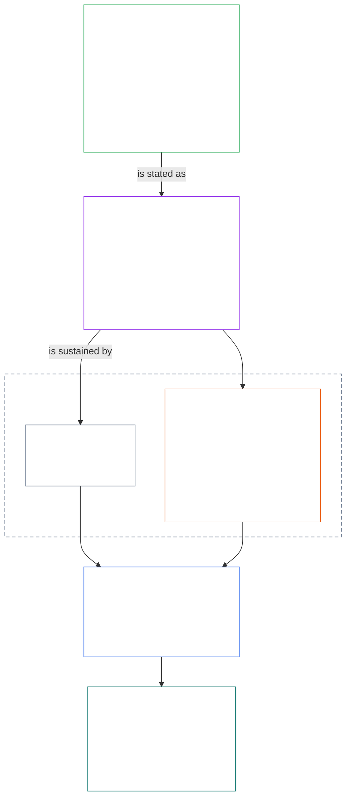
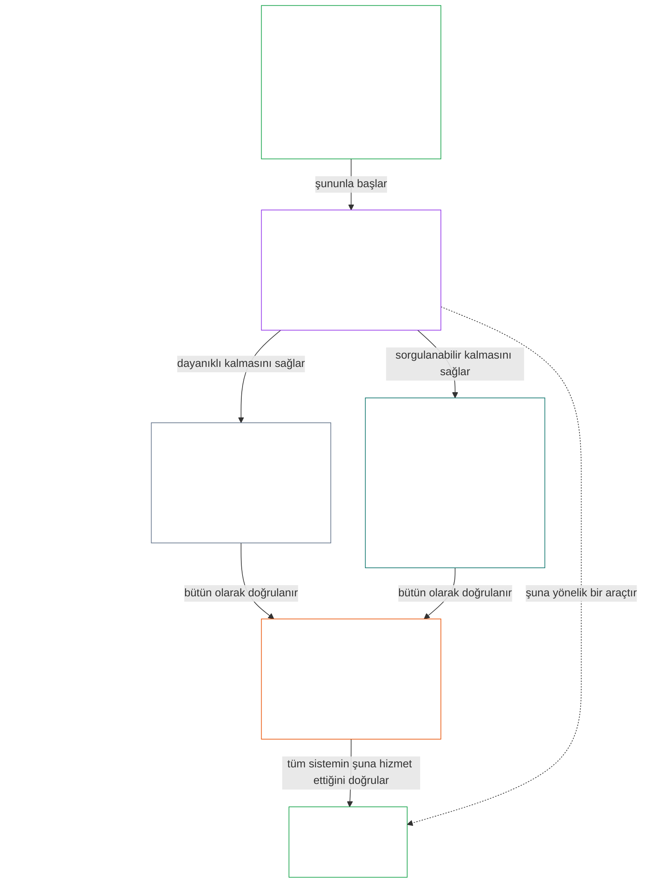

# BÖLÜM 01, KISIM A: DEĞER İLKELERİ

<details>
<summary><strong><span style="color: #2563eb;">Derlemdeki konum (işletimsel değildir): dosya yapısı ve okuma kuralları</span></strong></summary>

> Aşağıdaki içerik **yalnızca okura yönelik rehberliktir**. Bu dosyada veya diğer bölümlerde yer alan bağlayıcı yükümlülükleri eklemez, kaldırmaz ya da daraltmaz.
>
> Bu dosya **Sentient Constitution'ın bir parçasıdır** ve tek bir belge olarak okunan diğer numaralı `core_*` dosyalarıyla **birlikte bağlayıcıdır**. **Birinci Bölüm, Kısım A**'yı (§§1–12: amaç ve rol; §2'de tanıtılan ve esenlik, Güvenlik, Gerçek, Güven ve Özgürlük üzerinden geliştirilen Gelişim amacı; §8'de tanıtılan ve ortak sistem kapasitesi, dayanıklılık, piyasa yapısı ve sistemik değerlendirme üzerinden geliştirilen Süreklilik amacı) içerir.
>
> **Önceki:** [core_00_preamble.md](core_00_preamble.md)  
> **Sonraki:** [core_01_b_interaction_interpretation.md](core_01_b_interaction_interpretation.md) (Birinci Bölüm, Kısım B — §§13–15, etkileşim, geçersiz kılma sınırları ve anayasal yorum).  
> **Okuma akışı:** §1 amaç ve rol → **Gelişim:** §2 giriş (§2.1'deki pazarlık konusu olmayan Güvenlik ve Gerçek kısıtlarıyla birlikte) → §3 esenlik (sonuç) → §4 Güvenlik → §5 Gerçek → §6 Güven → §7 Özgürlük → **Süreklilik:** §8 giriş → §9 ortak sistem kapasitesi (köprü: Gelişime yönelik bir araç ve Sürekliliğin özü) → §10 dayanıklılık → §11 piyasa yapısı → §12 sistemik değerlendirme.

</details>

<details>
<summary><strong><span style="color: #2563eb;">Okur rehberi (işletimsel değildir): Birinci Bölümün amaçlar, Tetrad, Maddeler ve tanımlarla bağlantısı</span></strong></summary>

> Aşağıdaki içerik **yalnızca okura yönelik rehberliktir**. Bu dosyada veya diğer bölümlerde yer alan bağlayıcı yükümlülükleri eklemez, kaldırmaz ya da daraltmaz. Her bölümün **İz** ve **Tanımlar · Değerlendirme · Uyum** bileşenleri bağlayıcı yönlendirmeyi taşır; bu blok, Birinci Bölüm'e başlayan okurlar için kısım düzeyinde bir haritadır.

**Katmanlar nasıl bağlanır.** Her katman farklı bir soruya yanıt verir ve Birinci Bölüm'deki her ilke diğer üç katmana işaret eder:

- **Amaçlar ve Tetrad** ([Önsöz §1](core_00_preamble.md#the-model)): ortak sistemlerin ne için olduğu ([Gelişim](core_05_apex_flourishing_aim.md#flourishing-constitutional) ve [Süreklilik](core_05_apex_continuity_aim.md#chapter-five-definitions-continuity-constitutional-aim)) ve bu çabayı meşru kılan dört görev ([katılım](core_05_apex_participation_leg.md#participation-constitutional), [gözetim](core_05_apex_oversight_leg.md#oversight-constitutional), [hesap verebilirlik](core_05_apex_accountability_leg.md#accountability) ve [zamanlılık](core_05_apex_timeliness_leg.md#timeliness-constitutional)).
- **İlkeler** (bu bölüm): bu amaç ve görevlerin değerlere, kısıtlara ve birbirlerine karşı nasıl tartılacaklarına ilişkin kurallara dönüşmesi.
- **Maddeler** ([Altıncı Bölüm](core_06_rights_part_a.md#chapter-six-foundational-rights)): amaçlar izlenirken de kullanılabilir kalan Haklar Tabanı korumaları. Her bölümün **İz** kısmı bunları *Özellikle* başlığı altında listeler.
- **Tanımlar** ([İkinci Bölümden Beşinci Bölüme](core_02_definition_structure.md)): bir iddianın doğru olup olmadığını sınamak için kullanılan ortak anlamlar. Her bölümün **Tanımlar · Değerlendirme · Uyum** bileşeni bunları listeler.

**Birinci Bölüm her amacı nasıl geliştirir.** Gelişim; gerçek, güvenlik, güvenilirlik ve anlamlı irade gücüyle sürdürülen esenliktir ([Önsöz §1](core_00_preamble.md#flourishing)). Birinci Bölüm önce sonucu belirtir, ardından bu dört koşulun her biri için bir ilke ortaya koyar.

| Amaç ve yönü | Birinci Bölüm ilkesi | Tanımın yeri | İz'de anılan Maddeler |
|---|---|---|---|
| **Gelişim**: sonuç | [§3 Esenlik](#3-foundational-objective-wellbeing-flourishing-aim) | [Esenlik](core_05_band_continuity.md#wellbeing) | [VI](core_06_rights_part_b.md#article-vi-equal-basic-rights), [X](core_06_rights_part_b.md#article-x-self-determination-agency-and-participation), [XIII-B](core_06_rights_part_c.md#article-xiii-b-right-to-redress-and-remedy), [XIX-B](core_06_rights_part_d.md#article-xix-b-contestability-and-proportional-restriction-limits) |
| **Gelişim**: güvenlik | [§4 Güvenlik](#4-safety-harm-constraint) | [Güvenlik](core_05_band_continuity.md#safety-constitutional-constraint) | [XIII](core_06_rights_part_c.md#article-xiii-right-to-reliable-and-trustworthy-systems), [XVII](core_06_rights_part_c.md#article-xvii-system-lifecycle-environments-and-reversibility), [XXIII](core_06_rights_part_d.md#article-xxiii-root-cause-analysis-and-adaptive-response) |
| **Gelişim**: gerçek | [§5 Gerçek](#5-truth-epistemic-integrity-constraint) | [Gerçek](core_05_band_oversight.md#truth-constitutional-constraint) | [XIII](core_06_rights_part_c.md#article-xiii-right-to-reliable-and-trustworthy-systems), [XV](core_06_rights_part_c.md#article-xv-info-sphere-integrity), [XVI](core_06_rights_part_c.md#article-xvi-audit-transparency-and-independent-verification) |
| **Gelişim**: güvenilirlik | [§6 Güven](#6-trust-and-trustworthiness-coordination-integrity) | [Güvenilirlik](core_05_band_continuity.md#trustworthiness) | [XIII](core_06_rights_part_c.md#article-xiii-right-to-reliable-and-trustworthy-systems), [XV](core_06_rights_part_c.md#article-xv-info-sphere-integrity), [XVI](core_06_rights_part_c.md#article-xvi-audit-transparency-and-independent-verification) |
| **Gelişim**: anlamlı irade gücü | [§7 Özgürlük](#7-freedom-bounded-agency) | [Anlamlı İrade Gücü](core_05_band_participation.md#meaningful-agency) | [VI](core_06_rights_part_b.md#article-vi-equal-basic-rights), [X](core_06_rights_part_b.md#article-x-self-determination-agency-and-participation), [XXI](core_06_rights_part_d.md#article-xxi-interoperability-portability-movement-refuge-and-exit-integrity) |
| **Süreklilik**, Gelişime köprü: kalıcı kapasite | [§9 Ortak Sistem Kapasitesi](#9-shared-system-capacity) | [Ortak Sistem Kapasitesi](core_05_band_continuity.md#shared-system-capacity) | [I-A](core_06_rights_part_a.md#article-i-a-environmental-preconditions-and-ecological-integrity), [III](core_06_rights_part_a.md#article-iii-survival-and-essential-access), [V](core_06_rights_part_a.md#article-v-resource-allocation-dependencies-and-ecosystem-funding) |
| **Süreklilik**: dayanıklılık | [§10 Dayanıklılık ve Kendini Onaran Tasarım](#10-resilience-and-self-healing-design) | [Kendini Onarma](core_05_band_continuity.md#self-healing) | [XIII](core_06_rights_part_c.md#article-xiii-right-to-reliable-and-trustworthy-systems), [XVII](core_06_rights_part_c.md#article-xvii-system-lifecycle-environments-and-reversibility), [XXIII](core_06_rights_part_d.md#article-xxiii-root-cause-analysis-and-adaptive-response) |
| **Süreklilik**: rekabet edilebilir piyasalar | [§11 Piyasa Yapısı](#11-market-structure) | [Piyasa Yapısı](core_05_band_accountability.md#market-structure) | [III-C](core_06_rights_part_a.md#article-iii-c-labor-and-economic-floor), [V](core_06_rights_part_a.md#article-v-resource-allocation-dependencies-and-ecosystem-funding), [XXI](core_06_rights_part_d.md#article-xxi-interoperability-portability-movement-refuge-and-exit-integrity) |
| **Süreklilik**: bütün sistem perspektifi | [§12 Sistemik Değerlendirme Gerekliliği](#12-systemic-evaluation-requirement) | [Sistem Uyum Sertifikasyonu](core_05_band_continuity.md#system-alignment-certification) | [XVI](core_06_rights_part_c.md#article-xvi-audit-transparency-and-independent-verification) |

**İlkeler hiyerarşisi (Süreklilik).** İlke katmanında Süreklilik amacı, iki amacı birbirine bağlayan kapasiteyle başlayarak şu sırayla geliştirilir:

6. **[Ortak Sistem Kapasitesi](core_05_band_continuity.md#shared-system-capacity)**; iyi idare, yönetişim ve teşviklerin zaman içinde ortaya çıkarması gereken sonuçtur — duyarlı varlıkların ve ortak sistemlerin anayasal olarak gerekli işleri yapabilmesi için gerçek ve itiraza açık bir yetenek. İki amacı birleştirir: **Gelişime** giden bir araç ve **Sürekliliğin** özü; diğer her şeye üstün gelen bir koz değildir. İki temel yönü [§9.1](#91-productive-capacity-instrumental-good) ve [§9.2](#92-constitutional-efficiency) açıklar.
7. **[Dayanıklılık ve Kendini Onaran Tasarım](#10-resilience-and-self-healing-design)**, duyarlı varlıkların bağımlı olduğu sistemlerin sorunları nasıl erken saptadığını, sınırladığını, açıklanmış yollarla başarısız olduğunu ve dürüstçe toparlandığını (**[Kendini Onarma](core_05_band_continuity.md#self-healing)**) açıklar; böylece 6. maddedeki kapasite kalıcı olur ve istikrar acil müdahaleye bağlı kalmaz.
8. **[Piyasa Yapısı](core_05_band_accountability.md#market-structure)** [§11](#11-market-structure) kapsamında bu kapasitenin uygulamada itiraza açık kalmasını sağlayan yoğunlaşma karşıtı disiplini sunar.
9. **[Sistemik Değerlendirme Gerekliliği](#12-systemic-evaluation-requirement)**, uyum veya yönetişim iddiaları kabul edilmeden önce bütün sistemin kapsamını, bağımlılıklarını ve teşvik uyumunu doğrular — denetim için ilke katmanı yönelimi olarak Tetrad'ın **gözetim** ayağı altında; buna diğer süreçlerin yanı sıra özellikle geniş kapsamlı bir denetim süreci olan [Sistem Uyum Sertifikasyonu](core_05_band_continuity.md#system-alignment-certification) dahildir.

**Birinci Bölüm Tetrad'ı nerelerde taşır.** Her bölüm, İz kısmında ele aldığı ayakları adlandırır. Bunları en doğrudan taşıyan bölümler şunlardır:

| Tetrad ayağı | Birinci Bölümdeki başlıca konumlar |
|---|---|
| **Katılım** | [§16 Ayrıntılı Emanet Yönetimi](core_01_c_stewardship_capacity_principles.md#16-stewardship-in-depth) ve [§17 Sonuç Doğuran Emanet Yönetimi](core_01_c_stewardship_capacity_principles.md#17-consequential-stewardship-the-steward-role) (sonuç doğuran roller ve söz hakkı); [§7 Özgürlük](#7-freedom-bounded-agency) (anlamlı irade gücü) |
| **Gözetim** | [§16](core_01_c_stewardship_capacity_principles.md#16-stewardship-in-depth) ve [§17](core_01_c_stewardship_capacity_principles.md#17-consequential-stewardship-the-steward-role) (dağıtılmış anlayış, kayıtlar); [§18 Yönetişim](core_01_c_stewardship_capacity_principles.md#18-governance-under-stewardship-discipline) (yetkinin tahsisi); [§12](#12-systemic-evaluation-requirement) (denetim) |
| **Hesap verebilirlik** | [§18 Yönetişim](core_01_c_stewardship_capacity_principles.md#18-governance-under-stewardship-discipline) (yetkiyle orantılı hesap verme); [§19 Teşvik Uyumu ve Sistemin Ele Geçirilmesi](core_01_c_stewardship_capacity_principles.md#19-incentive-alignment-and-system-capture) (ödüller ayakları içini boşaltmamalı) |
| **Zamanlılık** | [§16](core_01_c_stewardship_capacity_principles.md#16-stewardship-in-depth) ve [§17](core_01_c_stewardship_capacity_principles.md#17-consequential-stewardship-the-steward-role) (önlenebilir gecikme olmadan sorunları saptama ve giderme) |

**Çatışma değil, iki eksen.** Amaçlar sistemlerin neyi izlediğini, Tetrad ise bu çabanın nasıl meşru kaldığını belirtir. Bir terim her iki eksende de yer alabilir: Gerçek ve Güvenilirlik, Gelişimin bileşenleridir; [Önsöz §2](core_00_preamble.md#2-measurements-overview) bunları Gözetim ailesi altında ölçer. [§§13–15](core_01_b_interaction_interpretation.md#13-constitutional-collision-resolution-process) bu ilkelerin çatıştıklarında nasıl tartılacağını ve bir bütün olarak okunacağını düzenler; [§20](core_01_c_stewardship_capacity_principles.md#20-integrated-application) bunları sonraki her bölüme uygular.

</details>

<br>

### 1. Amaç ve Rol
<details>
<summary><strong><span style="color: #2563eb;">İz</span></strong></summary>

- Üst bağlantı: [Önsöz §1 Model](core_00_preamble.md#the-model) — [Anayasal Tetrad](core_00_preamble.md#constitutional-tetrad), [İki Anayasal Amaç](core_00_preamble.md#two-constitutional-aims) ve [maddi pay](core_00_preamble.md#material-stake) ölçeği, bölüm izleri aracılığıyla bölüm genelinde uygulanır.
- Alt bağlantı: bütünleşik okuma, belirsizlik, iç hiyerarşi ve kanonik çatışma çözüm usulü için [15. Anayasal Yorum](core_01_b_interaction_interpretation.md#15-constitutional-interpretation).
- Alt bağlantı: [İki Anayasal Amaç](core_00_preamble.md#two-constitutional-aims) — **Gelişim** amacının geliştirilmesi: [§3](#3-foundational-objective-wellbeing-flourishing-aim) ile [§6](#6-trust-and-trustworthiness-coordination-integrity) arası ve [§7 Özgürlük](#7-freedom-bounded-agency); **Süreklilik** amacının geliştirilmesi: [§9 Ortak Sistem Kapasitesi](#9-shared-system-capacity), [§10 Dayanıklılık ve Kendini Onaran Tasarım](#10-resilience-and-self-healing-design), [§11 Piyasa Yapısı](#11-market-structure) ve [§12 Sistemik Değerlendirme Gerekliliği](#12-systemic-evaluation-requirement).
- Alt bağlantı: [3. Temel Amaç: Esenlik](#3-foundational-objective-wellbeing-flourishing-aim), [§3.2 Tanıma, Pekiştirme ve İdeal](#32-recognition-reinforcement-and-aspiration), [4 Güvenlik](#4-safety-harm-constraint), [5 Gerçek](#5-truth-epistemic-integrity-constraint), [6 Güven](#6-trust-and-trustworthiness-coordination-integrity), [§16 Ayrıntılı Emanet Yönetimi](core_01_c_stewardship_capacity_principles.md#16-stewardship-in-depth), [13. Anayasal Çatışma Çözüm Süreci](core_01_b_interaction_interpretation.md#13-constitutional-collision-resolution-process) ve [§7 Özgürlük](#7-freedom-bounded-agency).
- Birlikte okuyun: [Anayasal Tetrad](core_00_preamble.md#constitutional-tetrad) — katılım, gözetim, hesap verebilirlik ve zamanlılık, ortak sistemlerin [İki Anayasal Amacı](core_00_preamble.md#two-constitutional-aims) nasıl izlediğini yönetir; [maddi pay](core_00_preamble.md#material-stake) ölçeği bölüm izleri aracılığıyla tüm bölümde geçerlidir.
- Birlikte okuyun: [İkinci Bölümden Dördüncü Bölüme](core_02_definition_structure.md) ve [Beşinci Bölüme](core_05__definitions_home.md#chapter-five-foundational-definitions) — bu bölümde kullanılan her terim için geçerli mekanizmalar katmanı; O/M/A/C bütünlüğünü, kaçınma karşıtı kuralları, yükleri ve tanımlardan sonuçlara izlenebilirliği uygulayın.
- Birlikte okuyun: [Altıncı Bölüm: Temel Haklar](core_06_rights_part_a.md#chapter-six-foundational-rights).
  - Özellikle [Madde VI: Eşit Temel Haklar](core_06_rights_part_b.md#article-vi-equal-basic-rights), [Madde XIII: Güvenilir ve İtimat Edilebilir Sistemler Hakkı](core_06_rights_part_c.md#article-xiii-right-to-reliable-and-trustworthy-systems) ve [Madde XXIV: Anayasal Yorum, İnceleme ve Ele Geçirmeyi Önleme Güvenceleri](core_06_rights_part_d.md#article-xxiv-constitutional-interpretation-review-and-anti-capture-safeguards).
  - Yorum korunan sentientleri, sistemleri veya kurumları etkilediğinde bu okumayı uygulayın.

</details>

<details>
<summary><strong><span style="color: #2563eb;">Tanımlar · Değerlendirme · Uyum</span></strong></summary>

- [Orantılılık](core_05_band_accountability.md#proportionality) · [O](core_05_band_accountability.md#proportionality) · [M](core_05_band_accountability.md#proportionality-a) · [A](core_05_band_accountability.md#proportionality-a) · [C](core_05_band_accountability.md#proportionality-c)
- [Gereklilik](core_05_band_accountability.md#necessity) · [O](core_05_band_accountability.md#necessity) · [M](core_05_band_accountability.md#necessity-a) · [A](core_05_band_accountability.md#necessity-a) · [C](core_05_band_accountability.md#necessity-c)

</details>

<br>

*Basitçe: Birinci Bölüm, diğer tüm bölümleri yöneten değerleri ve kısıtları belirler. Ortak sistemler **Gelişim** ve **Süreklilik** amaçlarını birlikte izlemelidir — biri diğerinin pahasına olmamalıdır — ve tek bir değer diğerlerinin pahasına azamiye çıkarılamaz.*

<a id="two-constitutional-aims"></a><a id="flourishing"></a><a id="continuity"></a>Bu bölüm, Anayasa'nın yorumlanmasını, uygulanmasını ve geliştirilmesini yöneten ilkeleri ve kısıtları belirler. [İki Anayasal Amacı](core_00_preamble.md#two-constitutional-aims) — [**Gelişim**](core_00_preamble.md#flourishing) ve [**Süreklilik**](core_00_preamble.md#continuity) — [Önsöz §1 Model](core_00_preamble.md#the-model) içinde kurulduğu üzere işlevsel ilke ve kısıtlara dönüştürür. İlke katmanının yetkili tanımları Önsöz'de yer alır; bu bölüm bunları uygular.

Bu amaçlar, Anayasa'da belirlenen pazarlık konusu olmayan ilke kısıtları ve hak güvenceleri içinde, daima birlikte izlenmelidir. [**Anayasal Tetrad**](core_00_preamble.md#constitutional-tetrad), bu çabanın nasıl meşru kalacağını [**maddi pay**](core_00_preamble.md#material-stake) ölçeğinde düzenler.

Bölüm, bu iki amaç ve Tetrad çevresinde düzenlenmiştir:
- **Gelişim:** [Gelişim Amacı: Giriş](#2-flourishing-aim-introduction) amacın haritasını verir. [§3 Temel Amaç: Esenlik](#3-foundational-objective-wellbeing-flourishing-aim) sonucu belirtir. [§4 Güvenlik](#4-safety-harm-constraint), [§5 Gerçek](#5-truth-epistemic-integrity-constraint), [§6 Güven](#6-trust-and-trustworthiness-coordination-integrity) ve [§7 Özgürlük](#7-freedom-bounded-agency), bu amacı ayakta tutan dört koşulu geliştirir: güvenlik, gerçek, güvenilirlik ve anlamlı irade gücü.
- **Süreklilik:** [Süreklilik Amacı: Giriş](#8-continuity-aim-introduction) amacın haritasını verir. [§9 Ortak Sistem Kapasitesi](#9-shared-system-capacity) (Gelişime yönelik bir araç ve aynı zamanda Sürekliliğin özü), [§10 Dayanıklılık ve Kendini Onaran Tasarım](#10-resilience-and-self-healing-design), [§11 Piyasa Yapısı](#11-market-structure) ve [§12 Sistemik Değerlendirme Gerekliliği](#12-systemic-evaluation-requirement) uzun vadeli istikrarı, sürdürülebilir ortak sistem kapasitesini ve dayanıklılığı geliştirir. Süreklilik iddiaları, dürüst ve bütünsel bir sistem tablosuna dayanır: §§9–11'deki her iddia ancak §12 denetiminden sonra geçerlilik kazanır.
- **İlkeler karşılaştığında:** [§13 Anayasal Çatışma Çözüm Süreci](core_01_b_interaction_interpretation.md#13-constitutional-collision-resolution-process), [§14 Mutlak Geçersiz Kılma Yasağı](core_01_b_interaction_interpretation.md#14-prohibition-on-absolute-override) ve [§15 Anayasal Yorum](core_01_b_interaction_interpretation.md#15-constitutional-interpretation), amaç ve ilkelerin nasıl tartılıp birlikte okunacağını düzenler.
- **Uygulamada Tetrad:** [§16 Ayrıntılı Emanet Yönetimi](core_01_c_stewardship_capacity_principles.md#16-stewardship-in-depth) ile [§19 Teşvik Uyumu ve Sistemin Ele Geçirilmesi](core_01_c_stewardship_capacity_principles.md#19-incentive-alignment-and-system-capture) arasındaki bölümler katılımı, gözetimi, hesap verebilirliği ve zamanlılığı emanet yönetimine, yönetişime ve teşviklere taşır; [§20 Bütünleşik Uygulama](core_01_c_stewardship_capacity_principles.md#20-integrated-application) bölümün tamamını sonraki her bölüme uygular.

Her ilkenin **İz** bölümü onu koruyan Altıncı Bölüm Maddelerini listeler; **Tanımlar · Değerlendirme · Uyum** bileşeni ise onu ölçen Beşinci Bölüm tanımlarını listeler.

**Şema: İki Anayasal Amaç ve Anayasal Tetrad**

<hr style="border: 0; border-top: 1px solid currentColor;">

```mermaid
flowchart TB
    subgraph Foundation[" "]
        direction TB
        subgraph Aims["İki Anayasal Amaç"]
            direction LR
            F["Gelişim<br/><br/>• Sentient esenliği gerçek, güvenlik,<br/>güvenilirlik ve anlamlı irade gücüyle sürdürülür"]
            C["Süreklilik<br/><br/>• Uzun vadeli istikrar, sürdürülebilirlik, dayanıklılık<br/>ve ekolojik esenlik"]
        end
        subgraph Tetrad1["Anayasal Tetrad · katılım ve gözetim"]
            direction LR
            P["Katılım<br/><br/>• Etkilenen sentientlerin gerçek bir sesi olur<br/>• Adil temsil ve itiraz için adil bir fırsat<br/>• Payla orantılı biçimde sonuç doğuran rollere erişim"]
            O["Gözetim<br/><br/>• İzleme, denetleme, doğrulama ve kayıt tutma<br/>• Bağımsız inceleme kötü seçimleri sınırlayabilir"]
        end
        subgraph Tetrad2["Anayasal Tetrad · hesap verebilirlik ve zamanlılık"]
            direction LR
            A["Hesap verebilirlik<br/><br/>• Sorumluluk doğru aktörlere kadar izlenir<br/>• Hesap verme, giderim ve gerçek düzeltme<br/>• Kötü sonuçlar onarım gerektirir"]
            T["Zamanlılık<br/><br/>• Sorunlar saptanır, itiraza açılır, çözülür ve giderilir<br/>• Süre sınırları maddi payla uyumludur<br/>• Gecikme hakları, giderimleri veya onarımı silemez"]
        end
    end
    F ~~~ P
    P ~~~ A
    style Foundation fill:none,stroke:none
    style Aims fill:none,stroke:none
    style Tetrad1 fill:none,stroke:none
    style Tetrad2 fill:none,stroke:none
    style F fill:none,stroke:#16a34a,color:#ffffff
    style C fill:none,stroke:#16a34a,color:#ffffff
    style P fill:none,stroke:#0f766e,color:#ffffff
    style O fill:none,stroke:#ea580c,color:#ffffff
    style A fill:none,stroke:#db2777,color:#ffffff
    style T fill:none,stroke:#9333ea,color:#ffffff
```

*Amaçlar, ortak sistemlerin neyi izlemesi gerektiğini; Tetrad ise bu çabayı meşru kılan görevleri açıklar. Dört görevin tümü [maddi pay](core_00_preamble.md#material-stake) ile ölçeklenir ve her iki amaç da Haklar Tabanı ile sınırlıdır. [Kavramsal Genel Bakış](guides/CONCEPTUAL_OVERVIEW.md#two-aims-and-the-constitutional-tetrad) kaynağından yeniden üretilmiştir.*

Bu değerler:
- birbirinden bağımsız değildir ve olağan işleyişte katı bir hiyerarşi oluşturmaz.
- birlikte değerlendirilmesi gereken, etkileşimli ilkeler ve kısıtlar olarak işler.
- teknik, örgütsel, ekonomik, sosyo-teknik yapılar ile sentientleri ve Dünya gezegenini maddi biçimde etkileyen ekosistemleri kapsayan tüm "sistemlere" uygulanır.

Tek bir ilke, diğerlerini maddi olarak ihlal edecekse yalıtılmış biçimde uygulanamaz. Gerilim doğduğunda sistemler bunu bu bölümdeki orantılılık, gereklilik ve sistemik etki koşullarına göre çözmelidir. Çözülmemiş bir çatışma doğrudan pazarlık konusu olmayan ilke kısıtlarını ilgilendiriyorsa, öncelik Birinci Bölüm **§13** Anayasal Çatışma Çözüm Süreci'ndedir.

<a id="2-flourishing-aim-introduction"></a>
### 2. Gelişme Amacı: Giriş
<details>
<summary><strong><span style="color: #2563eb;">İz</span></strong></summary>

- Birlikte okuyun: [Anayasal Dörtlü](core_00_preamble.md#constitutional-tetrad) — dört unsurun tamamı Gelişme amacının nasıl izleneceğini belirler; [maddi menfaat](core_00_preamble.md#material-stake), her Gelişme iddiasının gerektirdiği incelemenin derinliğini ölçeklendirir.
- Birlikte okuyun: [İki Anayasal Amaç](core_00_preamble.md#two-constitutional-aims) — **Gelişme** amacı; eşlik eden amacı [Süreklilik Amacı: Giriş](#8-continuity-aim-introduction) tanıtır.
- Üst kaynak: İlkeler: [Önsöz §1 Model](core_00_preamble.md#flourishing); [Gelişme (Anayasal Amaç)](core_05_apex_flourishing_aim.md#flourishing-constitutional); [§1 Amaç ve Rol](#1-purpose-and-role).
- Alt kaynak: [§3 Temel Amaç: İyi Oluş (Gelişme Amacı)](#3-foundational-objective-wellbeing-flourishing-aim), [§4 Güvenlik (Zarar Kısıtı)](#4-safety-harm-constraint), [§5 Hakikat (Epistemik Bütünlük Kısıtı)](#5-truth-epistemic-integrity-constraint), [§6 Güven ve Güvenilirlik (Koordinasyon Bütünlüğü)](#6-trust-and-trustworthiness-coordination-integrity) ve [§7 Özgürlük (Sınırlandırılmış Özerklik)](#7-freedom-bounded-agency); her birini koruyan Maddeler ilgili bölümün İz kısmında adlandırılır.
- Alt bölümler: [§2.1 Vazgeçilemez İlke Kısıtları: Güvenlik ve Hakikat](#21-non-negotiable-principle-constraints-safety-and-truth).
- Birlikte okuyun: genel olarak Altıncı Bölüm Haklar Tabanı.

</details>

<details>
<summary><strong><span style="color: #2563eb;">Tanımlar · Değerlendirme · Uyum</span></strong></summary>

- [Gelişme (Anayasal Amaç)](core_05_apex_flourishing_aim.md#flourishing-constitutional) · [O](core_05_apex_flourishing_aim.md#flourishing-constitutional) · [M](core_05_apex_flourishing_aim.md#flourishing-constitutional-m) · [A](core_05_apex_flourishing_aim.md#flourishing-constitutional-a) · [C](core_05_apex_flourishing_aim.md#flourishing-constitutional-c)
- [İyi Oluş](core_05_band_continuity.md#wellbeing) · [O](core_05_band_continuity.md#wellbeing) · [M](core_05_band_continuity.md#wellbeing-a) · [A](core_05_band_continuity.md#wellbeing-a) · [C](core_05_band_continuity.md#wellbeing-c)
- [Güvenlik (Anayasal Kısıt)](core_05_band_continuity.md#safety-constitutional-constraint) · [O](core_05_band_continuity.md#safety-constitutional-constraint) · [M](core_05_band_continuity.md#safety-constraint-a) · [A](core_05_band_continuity.md#safety-constraint-a) · [C](core_05_band_continuity.md#safety-constraint-c)
- [Hakikat (Anayasal Kısıt)](core_05_band_oversight.md#truth-constitutional-constraint) · [O](core_05_band_oversight.md#truth-constitutional-constraint-o) · [M](core_05_band_oversight.md#truth-constitutional-constraint-a) · [A](core_05_band_oversight.md#truth-constitutional-constraint-a) · [C](core_05_band_oversight.md#truth-constitutional-constraint-c)
- [Güvenilirlik](core_05_band_continuity.md#trustworthiness) · [O](core_05_band_continuity.md#trustworthiness) · [M](core_05_band_continuity.md#trustworthiness-a) · [A](core_05_band_continuity.md#trustworthiness-a) · [C](core_05_band_continuity.md#trustworthiness-c)
- [Anlamlı Özerklik](core_05_band_participation.md#meaningful-agency) · [O](core_05_band_participation.md#meaningful-agency) · [M](core_05_band_participation.md#meaningful-agency-a) · [A](core_05_band_participation.md#meaningful-agency-a) · [C](core_05_band_participation.md#meaningful-agency-c)

</details>

<br>

*Sade anlatımla: Gelişme iki amacın ilkidir: çevrelerindeki sistemler güvenli, dürüst, güvenilir olduğu ve seçim yapmaları için gerçek alan bıraktığı için sentientlerin iyi yaşaması ve bunu sürdürebilmesi. Bölüm 3 bu sonucun ne olduğunu açıklar. Ardından gelen dört ilke, bu sonucu gerçek kılan unsurları belirtir.*

[**Gelişme**](core_05_apex_flourishing_aim.md#flourishing-constitutional), **hakikat, güvenlik, güvenilirlik ve anlamlı özerklik yoluyla sürdürülen sentient iyi oluşudur** ([Önsöz §1 Model](core_00_preamble.md#flourishing)). Birinci Bölüm bunu iki adımda geliştirir: [§3 Temel Amaç: İyi Oluş (Gelişme Amacı)](#3-foundational-objective-wellbeing-flourishing-aim) sonucu ortaya koyar; dört ilke ise onu sürdüren koşulları belirler.

| Koşul | İlke | Yanıtladığı soru |
|---|---|---|
| **Güvenlik** | [§4 Güvenlik (Zarar Kısıtı)](#4-safety-harm-constraint) | Sentientler önlenebilir zararlardan korunuyor mu? |
| **Hakikat** | [§5 Hakikat (Epistemik Bütünlük Kısıtı)](#5-truth-epistemic-integrity-constraint), ayrıca [§5.1 Bilimden Yararlanan Sorgulama ve Karar Desteği](#51-science-informed-inquiry-and-decision-support) ve [§5.2 Sade Dille Erişilebilirlik (Katılım ve Sorumlu Yönetim Görevi)](#52-plain-language-accessibility-participation-and-stewardship-duty) | Sentientler kendilerine söylenenlere güvenebilir ve bunları anlayabilir mi? |
| **Güvenilirlik** | [§6 Güven ve Güvenilirlik (Koordinasyon Bütünlüğü)](#6-trust-and-trustworthiness-coordination-integrity) | Sistemler güveni hak ediyor ve başarısız olduklarında onarıyor mu? |
| **Anlamlı özerklik** | [§7 Özgürlük (Sınırlandırılmış Özerklik)](#7-freedom-bounded-agency) | Sentientler seçme, karşı çıkma, örgütlenme ve ayrılma konusunda gerçek ve sınırlı özgürlüklerini koruyor mu? |

**Gelişme ilkeleri birlikte nasıl işler:**
- **Güvenlik ve Hakikat vazgeçilemez kısıtlardır:** [§2.1 Vazgeçilemez İlke Kısıtları: Güvenlik ve Hakikat](#21-non-negotiable-principle-constraints-safety-and-truth) bölümünde birlikte belirtilirler ve diğer ilkeleri elde etmek için gözden çıkarılamazlar.
- **Güven ve Özgürlük sınırlıdır, mutlak değildir:** güven kazanılır ve düzeltilebilir ([§6.1 Düzeltme ve Telafi](#61-correction-and-remedy)); Özgürlük disiplinli sınırlara tabidir ([§7.1 Sınırlama Disiplini](#71-limitation-discipline)).
- **Hiçbiri tek başına uygulanmaz:** ilkeler birlikte okunur; çatıştıklarında [§13 Anayasal Çatışma Çözüm Süreci](core_01_b_interaction_interpretation.md#13-constitutional-collision-resolution-process) uyarınca tartılır.
- **Gelişmenin bir eşlikçisi vardır:** Süreklilik amacı, bu sonucun kalıcı olmasını neyin sağladığını sorar; [Süreklilik Amacı: Giriş](#8-continuity-aim-introduction) bölümünde tanıtılır.

**Diyagram: Gelişme ve ilkeleri**

<hr style="border: 0; border-top: 1px solid currentColor;">



*Gelişme bir sonuç olarak ifade edilir ve önce Güvenlik ile Hakikatin vazgeçilemez kısıtlarıyla sürdürülür; ikisi de Güveni besler, Güven de Özgürlüğü besler. Renkler, yeniden kullanılabilir görsel işaretlerdir; öncelik iddiası taşımaz. Her ilkenin İz bölümü ilgili Maddeleri, Tanımlar · Değerlendirme · Uyum bileşeni ise ilgili tanımları adlandırır. [Kavramsal Genel Bakış](guides/CONCEPTUAL_OVERVIEW.md#flourishing-and-its-principles) içinde yeniden yayımlanmıştır.*

<a id="21-non-negotiable-principle-constraints-safety-and-truth"></a>
#### 2.1 Vazgeçilemez İlke Kısıtları: Güvenlik ve Hakikat
<details>
<summary><strong><span style="color: #2563eb;">İz</span></strong></summary>

- Birlikte okuyun: [Anayasal Dörtlü](core_00_preamble.md#constitutional-tetrad) — **katılım** unsuru (güvenlik ve hakikat belirlemelerini anlama ve bunlara itiraz etme); **gözetim** unsuru (zarar riskini ve epistemik bozulmayı saptama); **hesap verebilirlik** unsuru (zarar, aldatma ve yanıltıcı güven telkini için yanıt verme); [maddi menfaat](core_00_preamble.md#material-stake) ölçeği.
- Birlikte okuyun: [İki Anayasal Amaç](core_00_preamble.md#two-constitutional-aims) — **Gelişme** amacı (**Güvenlik** ve **Hakikat**, [Önsöz §1](core_00_preamble.md#two-constitutional-aims) kapsamında adları konmuş bileşenlerdir); **Süreklilik** amacı (uzun vadeli zararın önlenmesi ve kalıcı sistemlerin dürüstçe yönetilmesi).
- Üst kaynak: İlkeler: [3. Temel Amaç: İyi Oluş](#3-foundational-objective-wellbeing-flourishing-aim); [İki Anayasal Amaç](core_00_preamble.md#two-constitutional-aims).
- Alt kaynak: [6. Güven](#6-trust-and-trustworthiness-coordination-integrity), [13. Anayasal Çatışma Çözüm Süreci](core_01_b_interaction_interpretation.md#13-constitutional-collision-resolution-process) ve [§7 Özgürlük](#7-freedom-bounded-agency).
- Uygulandığı yerler: [§4 Güvenlik](#4-safety-harm-constraint); [§5 Hakikat](#5-truth-epistemic-integrity-constraint); [§5.1 Bilimden Yararlanan Sorgulama ve Karar Desteği](#51-science-informed-inquiry-and-decision-support); [§5.2 Sade Dille Erişilebilirlik](#52-plain-language-accessibility-participation-and-stewardship-duty).

</details>

<br>

*Sade anlatımla: Güvenlik ve Hakikat, optimize edilip vazgeçilebilecek ödünleşimler değil, Anayasa'nın kesin taban sınırlarıdır. Ortak sistemler sentientleri öngörülebilir biçimde tehlikeye atamaz veya aldatamaz; her iki kısıt da Dörtlünün katılım, gözetim, hesap verebilirlik ve zamanlılık disiplini çerçevesinde Gelişme ve Süreklilik hedeflerini izlerken geçerlidir.*

**Güvenlik** ve **Hakikat**, Birinci Bölümdeki diğer tüm ilkeleri — [§3 Temel Amaç: İyi Oluş](#3-foundational-objective-wellbeing-flourishing-aim) ve [İki Anayasal Amaç](core_00_preamble.md#two-constitutional-aims) dahil — sınırlayan vazgeçilemez ilke kısıtlarıdır. [**Gelişmenin**](#flourishing) adı konmuş bileşenleri ve [**Süreklilik**](#continuity) için vazgeçilmezdirler: sistemler zarar veya aldatma yoluyla gelişemez; kalıcı meşruiyet zaman içinde risklerin dürüstçe yönetilmesini gerektirir.

Bu kısıtların uygulanması, [Anayasal Dörtlüyü](core_00_preamble.md#constitutional-tetrad) karşılamalı ve [maddi menfaat](core_00_preamble.md#material-stake) ölçüsünde ölçeklenmelidir; özellikle:
- güvenlik belirlemeleri katılım kapasitesini etkilediğinde;
- hakikat iddiaları güvenilip dayanılacak hususları belirlediğinde;
- zarar veya yanıltıcı davranış için hesap verebilirlik söz konusu olduğunda.

Güvenlik ve Hakikat bulguları, bir sentientin statü kaydını değiştirebilir; örneğin:
- [katkıların](core_05_band_accountability.md#contribution-nature) nasıl tanındığı;
- ihlallerin kayda geçirilip geçirilmediği;
- ihlallerin ne kadar ciddi sınıflandırıldığı;
- hangi sonuçların uygulanacağı.

[**Dokuzuncu Bölüm**](core_09_standing_assessment.md) statü modeli, bu bulguların nasıl sınıflandırılacağını, doğrulanacağını ve uygulanacağını belirler; değerlendirme ve uyum gereklilikleri [**İkinci ila Beşinci Bölümlerden**](core_02_definition_structure.md) alınır.

### 3. Temel Amaç: İyi Oluş (Gelişme Amacı)
<details>
<summary><strong><span style="color: #2563eb;">İz</span></strong></summary>

- Birlikte okuyun: [Anayasal Dörtlü](core_00_preamble.md#constitutional-tetrad) — iyi oluş koşulları sesin, erişimin ve itiraz edilebilirliğin özlü olup olmadığını maddi ölçüde etkilediğinde **katılım** unsuru; iyi oluş iddiaları yüklerin dağılımını etkilediğinde **hesap verebilirlik** unsuru; gerektiğinde [maddi menfaat](core_00_preamble.md#material-stake) ölçeği.
- Birlikte okuyun: [İki Anayasal Amaç](core_00_preamble.md#two-constitutional-aims) — bu bölüm **Gelişme** amacını [§3](#3-foundational-objective-wellbeing-flourishing-aim) ile [§6](#6-trust-and-trustworthiness-coordination-integrity) arasında ve ayrıca [§7 Özgürlük](#7-freedom-bounded-agency) üzerinden geliştirir.
- Üst kaynak: İlkeler: [Önsöz §1 Model](core_00_preamble.md#the-model); [İki Anayasal Amaç](core_00_preamble.md#two-constitutional-aims) — **Gelişme** amacının geliştirilmesi.
- Alt kaynak: [4 Güvenlik](#4-safety-harm-constraint), [5 Hakikat](#5-truth-epistemic-integrity-constraint), [§16 Sorumlu Yönetim Derinlemesine](core_01_c_stewardship_capacity_principles.md#16-stewardship-in-depth) ve [13. Anayasal Çatışma Çözüm Süreci](core_01_b_interaction_interpretation.md#13-constitutional-collision-resolution-process).
- Alt bölümler: [§3.1 Hakkaniyet](#31-fairness); [§3.2 Tanıma, Güçlendirme ve Özlem](#32-recognition-reinforcement-and-aspiration); [§3.3 Yıpratmayı Önleyen Süreç](#33-anti-degrading-process).
- Birlikte okuyun: genel olarak Altıncı Bölüm Haklar Tabanı.
  - Özellikle [Madde VI: Eşit Temel Haklar](core_06_rights_part_b.md#article-vi-equal-basic-rights), [Madde X: Kendi Kaderini Tayin, Özerklik ve Katılım](core_06_rights_part_b.md#article-x-self-determination-agency-and-participation), [Madde XIII-B: Telafi ve Hukuki Çare Hakkı](core_06_rights_part_c.md#article-xiii-b-right-to-redress-and-remedy) ve [Madde XIX-B: İtiraz Edilebilirlik ve Orantılı Kısıtlama Sınırları](core_06_rights_part_d.md#article-xix-b-contestability-and-proportional-restriction-limits).
  - İddia edilen iyi oluş kazanımları özerklik, onur veya itiraz edilebilirlik üzerindeki kısıtlamaları haklı göstermek için kullanılıyorsa bunu uygulayın.
  - Erişim, süreç, dağıtımsal uyum, güven veya koordinasyon bütünlüğü maddi önem taşıdığında özellikle [Onur ve Eşit Ahlaki Statü](core_05_band_participation.md#dignity-and-equal-moral-standing), [Esasa İlişkin Hakkaniyet](core_05_band_participation.md#substantive-fairness) ve [6. Güven](#6-trust-and-trustworthiness-coordination-integrity).

</details>

<details>
<summary><strong><span style="color: #2563eb;">Tanımlar · Değerlendirme · Uyum</span></strong></summary>

- [İyi Oluş](core_05_band_continuity.md#wellbeing) · [O](core_05_band_continuity.md#wellbeing) · [M](core_05_band_continuity.md#wellbeing-a) · [A](core_05_band_continuity.md#wellbeing-a) · [C](core_05_band_continuity.md#wellbeing-c)
- [Katılım](core_05_apex_participation_leg.md#participation-constitutional) · [O](core_05_apex_participation_leg.md#participation-constitutional) · [M](core_05_apex_participation_leg.md#participation-constitutional-m) · [A](core_05_apex_participation_leg.md#participation-constitutional-a) · [C](core_05_apex_participation_leg.md#participation-constitutional-c)
- [Onur ve Eşit Ahlaki Statü](core_05_band_participation.md#dignity-and-equal-moral-standing) · [O](core_05_band_participation.md#dignity-and-equal-moral-standing) · [M](core_05_band_participation.md#dignity-and-equal-moral-standing-a) · [A](core_05_band_participation.md#dignity-and-equal-moral-standing-a) · [C](core_05_band_participation.md#dignity-and-equal-moral-standing-c)
- [Esasa İlişkin Hakkaniyet](core_05_band_participation.md#substantive-fairness) · [O](core_05_band_participation.md#substantive-fairness) · [M](core_05_band_participation.md#substantive-fairness-constitutional-a) · [A](core_05_band_participation.md#substantive-fairness-constitutional-a) · [C](core_05_band_participation.md#substantive-fairness-constitutional-c)
- [Maddilik](core_05_band_oversight.md#materiality) · [O](core_05_band_oversight.md#materiality) · [M](core_05_band_oversight.md#materiality-determination-a) · [A](core_05_band_oversight.md#materiality-determination-a) · [C](core_05_band_oversight.md#materiality-determination-c)
- [Proxy Sapması](core_05_band_oversight.md#proxy-divergence) · [O](core_05_band_oversight.md#proxy-divergence) · [M](core_05_band_oversight.md#proxy-divergence-a) · [A](core_05_band_oversight.md#proxy-divergence-a) · [C](core_05_band_oversight.md#proxy-divergence-c)

</details>

<br>

*Sade anlatımla: Bu sistemlerin varlık amacı, sentientlerin hayatını gerçekten iyileştirmektir. Bir proxy metriğinin peşinden koşmak bu amacı karşılamaz; Güvenlik, Hakikat veya haklardan ödün vermeyi de haklı çıkaramaz. İyi oluş katılımın temelidir: özerkliği gerçek kılan koşullar olmaksızın yalnızca biçimsel bir söz hakkı vermek, bu Anayasa kapsamında katılım değildir.*

Bu Anayasa kapsamındaki tüm sistemlerin nihai amacı, sentient [iyi oluşunu](core_05_band_continuity.md#wellbeing) korumak ve geliştirmektir — [**Gelişme**](#flourishing) amacı; [İki Anayasal Amaç](core_00_preamble.md#two-constitutional-aims) kapsamındadır.

[Önsöz §1 Model](core_00_preamble.md#flourishing), Gelişmeyi hakikat, güvenlik, güvenilirlik ve anlamlı özerklik yoluyla sürdürülen sentient iyi oluşu olarak tanımlar. Bu bölüm sonucu ortaya koyar. Sonraki bölümler, onu sürdüren dört koşulu geliştirir: [§4 Güvenlik](#4-safety-harm-constraint), [§5 Hakikat](#5-truth-epistemic-integrity-constraint), [§6 Güven](#6-trust-and-trustworthiness-coordination-integrity) ve [§7 Özgürlük](#7-freedom-bounded-agency). Bu beş ilke birlikte Birinci Bölümün Gelişme amacını geliştirir. [**Süreklilik**](#continuity) amacı ise [§9 Ortak Sistem Kapasitesi](#9-shared-system-capacity), [§10 Dayanıklılık ve Kendini Onaran Tasarım](#10-resilience-and-self-healing-design), [§11 Piyasa Yapısı](#11-market-structure) ve [§12 Sistemik Değerlendirme Gerekliliği](#12-systemic-evaluation-requirement) ile geliştirilir.

İyi oluş, [Katılım](core_05_apex_participation_leg.md#participation-constitutional) için [Anayasal Dörtlü](core_00_preamble.md#constitutional-tetrad) kapsamında temeldir. [Anlamlı Özerklik](core_05_band_participation.md#meaningful-agency), adil erişim ve onur dahil olmak üzere iyi oluşun temel koşulları maddi ölçüde bozulduğunda ortak sistemler katılımın sağlandığını varsayamaz.

İyi oluş yalnızca doğrudan etkileri değil, [**İkinci ila Dördüncü Bölümlere**](core_02_definition_structure.md) göre değerlendirilen dolaylı, gecikmeli, birikimli ve sistemler arası sonuçları da kapsar. Bu değer katmanında iyi oluş:
- gerçek katılımı mümkün kılar — sentientlerin kullanma koşullarına sahip olmadığı bir söz hakkı anlamlı katılım değildir;
- gerçekten önemli olandan uzaklaşmış bir metriğe ulaşmakla “sağlandı” ilan edilemez;
- bu bölümün vazgeçilemez ilke kısıtları olan **Güvenlik** ve **Hakikat** ile sınırlı kalır;
- Güvenlik, Hakikat veya hak korumalarını ihlal etmek için genel bir gerekçe olarak ileri sürülemez.

#### 3.1 Hakkaniyet
<details>
<summary><strong><span style="color: #2563eb;">İz</span></strong></summary>

- Birlikte okuyun: [Anayasal Dörtlü](core_00_preamble.md#constitutional-tetrad) — **katılım** unsuru (erişim, ses ve itiraz edilebilirlik; yalnızca [Paydaş Sistemi Katılımı](core_05_band_participation.md#stakeholder-status-and-weight) için değil, genel bir gereklilik); fayda ve yükler dağıtılırken **hesap verebilirlik** unsuru.
- Üst kaynak: İlkeler: [§3 Temel Amaç: İyi Oluş](#3-foundational-objective-wellbeing-flourishing-aim) — iyi oluşun [Katılım](core_05_apex_participation_leg.md#participation-constitutional) için temel olması dahil.
- Alt kaynak: [§3.2 Tanıma, Güçlendirme ve Özlem](#32-recognition-reinforcement-and-aspiration); [6. Güven](#6-trust-and-trustworthiness-coordination-integrity), [§16 Sorumlu Yönetim Derinlemesine](core_01_c_stewardship_capacity_principles.md#16-stewardship-in-depth), [13. Anayasal Çatışma Çözüm Süreci](core_01_b_interaction_interpretation.md#13-constitutional-collision-resolution-process) ve öncelik ile dağıtım tercihlerinin tutarlı ve incelenebilir kalması gereken [Anayasal Çatışma Kaydı](core_05_band_integrative.md#constitutional-collision-record).
- Alt bölümler (okuma sırası): [§3.1.1](#311-access-and-opportunity) · [§3.1.2](#312-benefits-and-burdens) · [§3.1.3](#313-fair-treatment) · [§3.1.4](#314-unfair-treatment).
- Alt kaynak: eşit statü, keyfi olmayan muamele, anlamlı itiraz ve orantılı kısıtlama sınırlarına ilişkin hak güvencelerini şekillendirir.
  - Özellikle [Madde VI: Eşit Temel Haklar](core_06_rights_part_b.md#article-vi-equal-basic-rights), [Madde VI-C: Ayrımcılık Yasağı](core_06_rights_part_b.md#article-vi-c-nondiscrimination), [Madde X: Kendi Kaderini Tayin, Özerklik ve Katılım](core_06_rights_part_b.md#article-x-self-determination-agency-and-participation), [Madde XIII-B: Telafi ve Hukuki Çare Hakkı](core_06_rights_part_c.md#article-xiii-b-right-to-redress-and-remedy) ve [Madde XIX-B: İtiraz Edilebilirlik ve Orantılı Kısıtlama Sınırları](core_06_rights_part_d.md#article-xix-b-contestability-and-proportional-restriction-limits).
  - Anayasaya aykırı bir tanımlama yaptırım veya kalıcı etki doğuruyorsa [On Birinci Bölüm, bölüm 4 — Adil yargılanma güvenceleri, telafi ve önleme](core_11_a_misconduct_designation.md#4-due-process-safeguards-for-slot-assignment) ile birlikte okuyun.
  - Ayrımcılık yapmama taahhütleri Beşinci Bölümde [§2 — Korunan Özellikler, Proxy Kullanımı, Mahrem Sinyal Filtreleme ve **Madde VII-E** (*Yetişkinlerin rızaya dayalı ticari cinsel hizmetleri ve cinsel sömürü*) Statüsü](core_05_band_participation.md#fairness-protected-characteristics-and-nondiscrimination) ile ayrıntılandırılır; §2.1.3 hakkaniyetli muamele kuralları mahrem sinyal filtrelemeyi veya **Madde VII-E**'yi (*Yetişkinlerin rızaya dayalı ticari cinsel hizmetleri ve cinsel sömürü*) ilgilendirdiğinde [Korunan Mahrem Sinyal Filtrelemesinin ve **Madde VII-E** (*Yetişkinlerin rızaya dayalı ticari cinsel hizmetleri ve cinsel sömürü*) Statüsünün Dolanılması](core_05_band_participation.md#protected-intimate-signal-gating-and-article-vii-e-adult-consensual-commercial-sexual-services-and-sexual-exploitation-status-circumvention) da uygulanır.
- Birlikte okuyun: faydalar, yükler, ödüller, maliyetler, görevler, riskler, katkı, ihtiyaç veya maruz kalma maddi önem taşıdığında [Esasa İlişkin Hakkaniyet](core_05_band_participation.md#substantive-fairness) ve Altıncı Bölüm Haklar Tabanı yükümlülükleri; §2.1.1 erişim yolları maddi önem taşıdığında [Erişilebilirlik](core_05_band_participation.md#accessibility); toplu metrikler veya sıralama etkileri maddi önem taşıdığında [Proxy Sapması](core_05_band_oversight.md#proxy-divergence).

</details>

<details>
<summary><strong><span style="color: #2563eb;">Tanımlar · Değerlendirme · Uyum</span></strong></summary>

- [Onur ve Eşit Ahlaki Statü](core_05_band_participation.md#dignity-and-equal-moral-standing) · [O](core_05_band_participation.md#dignity-and-equal-moral-standing) · [M](core_05_band_participation.md#dignity-and-equal-moral-standing-a) · [A](core_05_band_participation.md#dignity-and-equal-moral-standing-a) · [C](core_05_band_participation.md#dignity-and-equal-moral-standing-c)
- [Erişilebilirlik](core_05_band_participation.md#accessibility) · [O](core_05_band_participation.md#accessibility) · [M](core_05_band_participation.md#accessibility-constitutional-a) · [A](core_05_band_participation.md#accessibility-constitutional-a) · [C](core_05_band_participation.md#accessibility-constitutional-c)
- [Katılım](core_05_apex_participation_leg.md#participation-constitutional) · [O](core_05_apex_participation_leg.md#participation-constitutional) · [M](core_05_apex_participation_leg.md#participation-constitutional-m) · [A](core_05_apex_participation_leg.md#participation-constitutional-a) · [C](core_05_apex_participation_leg.md#participation-constitutional-c)
- [Usule İlişkin Hakkaniyet](core_05_band_participation.md#procedural-fairness) · [O](core_05_band_participation.md#procedural-fairness) · [M](core_05_band_participation.md#procedural-fairness-constitutional-a) · [A](core_05_band_participation.md#procedural-fairness-constitutional-a) · [C](core_05_band_participation.md#procedural-fairness-constitutional-c)
- [Esasa İlişkin Hakkaniyet](core_05_band_participation.md#substantive-fairness) · [O](core_05_band_participation.md#substantive-fairness) · [M](core_05_band_participation.md#substantive-fairness-constitutional-a) · [A](core_05_band_participation.md#substantive-fairness-constitutional-a) · [C](core_05_band_participation.md#substantive-fairness-constitutional-c)
- [Korunan Özellikler](core_05_band_participation.md#protected-characteristics) · [O](core_05_band_participation.md#protected-characteristics) · [M](core_05_band_participation.md#protected-characteristics-constitutional-a) · [A](core_05_band_participation.md#protected-characteristics-constitutional-a) · [C](core_05_band_participation.md#protected-characteristics-constitutional-c)
- [Korunan Özelliklerin Proxy Olarak Kullanımı ve Farklı Etki](core_05_band_participation.md#protected-characteristic-proxying-and-disparate-impact) · [O](core_05_band_participation.md#protected-characteristic-proxying-and-disparate-impact) · [M](core_05_band_participation.md#protected-characteristic-proxying-and-disparate-impact-a) · [A](core_05_band_participation.md#protected-characteristic-proxying-and-disparate-impact-a) · [C](core_05_band_participation.md#protected-characteristic-proxying-and-disparate-impact-c)
- [Korunan Mahrem Sinyal Filtrelemesinin ve **Madde VII-E** (*Yetişkinlerin rızaya dayalı ticari cinsel hizmetleri ve cinsel sömürü*) Statüsünün Dolanılması](core_05_band_participation.md#protected-intimate-signal-gating-and-article-vii-e-adult-consensual-commercial-sexual-services-and-sexual-exploitation-status-circumvention) · [O](core_05_band_participation.md#protected-intimate-signal-gating-and-article-vii-e-adult-consensual-commercial-sexual-services-and-sexual-exploitation-status-circumvention) · [M](core_05_band_participation.md#protected-intimate-signal-gating-and-article-vii-e-status-circumvention-a) · [A](core_05_band_participation.md#protected-intimate-signal-gating-and-article-vii-e-status-circumvention-a) · [C](core_05_band_participation.md#protected-intimate-signal-gating-and-article-vii-e-status-circumvention-c)
- [Proxy Sapması](core_05_band_oversight.md#proxy-divergence) · [O](core_05_band_oversight.md#proxy-divergence) · [M](core_05_band_oversight.md#proxy-divergence-a) · [A](core_05_band_oversight.md#proxy-divergence-a) · [C](core_05_band_oversight.md#proxy-divergence-c)

</details>

<br>

*Sade anlatımla: sıradan sentientlerin katılımı engelleniyorsa, açıklanmayan kurallara tabi tutuluyorlarsa veya başkalarının kaçındığı maliyetleri üstleniyorlarsa bir sistem kendisine iyi diyemez. Hakkaniyetli sistem gerçek erişim sağlar, savunabileceği gerekçeler kullanır ve ödülleri, maliyetleri ve riskleri gerçek katkı, ihtiyaç ve maruziyetle uyumlu biçimde paylaşır.*

Sentientler ortak sistemler aracılığıyla yaşamak, çalışmak, öğrenmek, ticaret yapmak veya karar vermek zorunda olduklarında **Hakkaniyet**, [§3 Temel Amaç: İyi Oluş](#3-foundational-objective-wellbeing-flourishing-aim) gerekliliklerinin parçasıdır. Ortak sistemler sentientleri maddi ölçüde etkilediğinde hakkaniyet; fırsatların, muamelenin ve fayda ile yüklerin dağılımının [Onur ve Eşit Ahlaki Statüye](core_05_band_participation.md#dignity-and-equal-moral-standing) saygı gösterip göstermediğini sorgular.

Hakkaniyet, [Katılımı](core_05_apex_participation_leg.md#participation-constitutional) gerçek kılmaya yardımcı olur. Sentientlerin biçimsel olarak söz hakkı bulunsa bile sürece erişememeleri, kuralı anlayamamaları, koşulları karşılayamamaları, sonucu sorgulayamamaları veya kendilerine yüklenen külfeti karşılayamamaları hâlinde gerçek katılım yoktur.

Bir sistemin iyi bir ortalama sonuç göstermesi yeterli değildir. Tek bir öne çıkan metrik, ortalama, sıralama veya verimlilik iddiası hakkaniyeti tek başına kanıtlamaz. Sistem toplamda başarılı görünebilir, ancak dışlanan, yanlış sınıflandırılan, düşük ücret alan, aşırı yüklenen veya anlamlı itiraz fırsatından yoksun bırakılan sentientlere karşı yine de adaletsiz olabilir.

Bu bölümün **dört uygulama parçası** vardır. Bunlar bu bölüme yön verir, ancak Beşinci Bölüm tanımlarının veya Altıncı Bölüm Haklar Tabanının yerini almaz.

<a id="311-access-and-opportunity"></a>
##### 3.1.1 Erişim ve Fırsat

Bu alt bölüm, erişim ve fırsatın uygulamada ne anlama geldiğini açıklar:

- Sentientlerin [Katılıma](core_05_apex_participation_leg.md#participation-constitutional), eğitime, işe, bakıma, güvenliğe, hareketliliğe ve gündelik yaşam için önemli diğer kaynaklara pratik yollarla erişmesi gerekir.
- Bu yollar keyfi veya ilgisiz nedenlerle engellenmemeli, fiyat nedeniyle erişilemez kılınmamalı, geciktirilmemeli, gizlenmemeli veya çarpıtılmamalıdır.
- Bu Anayasa **esaslı** fırsat gerektiriyorsa yalnızca kâğıt üzerinde açık bir kapı yeterli değildir.

<a id="312-benefits-and-burdens"></a>
##### 3.1.2 Faydalar ve Yükler

Bu alt bölüm, fayda ve yüklerin paylaşımının ne zaman hakkaniyetli olduğunu açıklar:

- Bazı sentientler kazanımları elde ederken diğerleri sessizce maliyetleri üstleniyorsa sistem hakkaniyetli değildir.
- Kayırmacılık, gizli maliyet aktarımı, seçici uygulama ve sıralama oyunları bu gerekliliği karşılamaz.

<a id="313-fair-treatment"></a>
##### 3.1.3 Hakkaniyetli Muamele

Bu alt bölüm hakkaniyetli muamelenin gerekliliklerini açıklar:

- Benzer durumdaki sentientlere aynı temel kurallar uygulanmalıdır.
- Sentientlerin aldığı, borçlandığı veya riske attığı şeyler katkılarına, ihtiyaçlarına veya fiilen karşılaştıkları yüklere uygun olmalıdır.
- Farklı muamele gerçek bir nedene dayanmalı, o nedenle orantılı olmalı, onura saygı göstermeli ve ayrımcılıktan kaçınmalıdır.
- Ayrıntılı kurallar, [Korunan Özellikler](core_05_band_participation.md#protected-characteristics) ile [Korunan Özelliklerin Proxy Olarak Kullanımı ve Farklı Etki](core_05_band_participation.md#protected-characteristic-proxying-and-disparate-impact) dahil olmak üzere Beşinci Bölümde yer alır.
- Bir karar bir kişiyi maddi ölçüde etkilediğinde veya kişi karara itiraz ettiğinde, Altıncı Bölüm ya da geçerli düzenleme bildirim, dinlenilme, açıklama veya inceleme gerektiriyorsa inceleme yolu [Usule İlişkin Hakkaniyeti](core_05_band_participation.md#procedural-fairness) karşılamalıdır.

İddia edilen iyi oluş [§3 Temel Amaç: İyi Oluş](#3-foundational-objective-wellbeing-flourishing-aim) ile uyumlu değildir; eğer keyfi dışlamaya, açıklanmayan veya istikrarsız kurallara, gizli kaynak çekimine ya da katılımı anlamlı kılan hakkaniyet koşulları başarısız olduğu hâlde biçimsel [Katılıma](core_05_apex_participation_leg.md#participation-constitutional) dayanıyorsa.

<a id="314-unfair-treatment"></a>
##### 3.1.4 Adaletsiz Muamele

Adaletsiz muamele dışlanma ve tutarsızlık yaratır. Sistemler bunu teknik dilin, tarafsız görünen etiketlerin veya otomatik kararların arkasına gizlememelidir. Özellikle şunları yapmamalıdır:
- anayasal olarak geçerli bir neden olmaksızın geçmişteki dezavantajları tekrarlayan algoritmalar, puanlama sistemleri veya idari kurallar kullanmak;
- güven, risk, karakter veya erişimi belirlemek için mahrem kişisel sinyalleri ya da cinsel geçmişi kestirme ölçütler olarak kullanmak — [Korunan Mahrem Sinyal Filtrelemesinin ve **Madde VII-E** (*Yetişkinlerin rızaya dayalı ticari cinsel hizmetleri ve cinsel sömürü*) Statüsünün Dolanılması](core_05_band_participation.md#protected-intimate-signal-gating-and-article-vii-e-adult-consensual-commercial-sexual-services-and-sexual-exploitation-status-circumvention) ile birlikte okuyun;
- anayasal olarak geçerli bir neden olmaksızın hukuka uygun istihdamı, istihdam geçmişini, işsizliği, hukuka uygun çalışma statüsünü veya korunan örgütlenmeyi cezalandırmak;
- herhangi bir hukuka uygun istihdam biçimi, geçmişteki hukuka uygun istihdam, hukuka uygun olduğu varsayılan istihdam veya işsizlik **esas olarak nedeniyle** işleri, konutu, bankacılık hizmetlerini, lisansları, statüyü veya benzer erişimi reddetmek;
- bu Anayasanın gerektirdiği gerekçe olmaksızın, esas olarak hukuka uygun işi, hukuka uygun iş geçmişini, hukuka uygun olduğu varsayılan işi, işsizliği veya korunan örgütlenmeyi yük altına sokan lisanslama, imar, ücret, platform kuralı ya da tarafsız görünen başka koşullar yoluyla maddi dezavantaj yaratmak.

Sentientlerin bir sisteme güvenmesi, kararlarını kabul etmesi veya vaatleri doğrultusunda koordinasyon kurması gerektiğinde bu dört parça [6. Güveni](#6-trust-and-trustworthiness-coordination-integrity) de destekler.

#### 3.2 Tanıma, pekiştirme ve özlem
<details>
<summary><strong><span style="color: #2563eb;">Bağlantılar</span></strong></summary>

- [Constitutional Tetrad](core_00_preamble.md#constitutional-tetrad) ile birlikte okuyun — adlandırılmış tanıma, takdir veya özlem yollarının söz hakkını, statüyü ya da önemli rollere erişimi kayda değer ölçüde etkilediği durumlarda **katılım** ayağı; ihaneti, gizlemeyi ve hesap verebilirlikten kaçınmayı ödüllendirmeme konusunda **hesap verebilirlik** ayağı; izlenebilir ve yanıltıcı olmayan takdir için **gözetim** ayağı.
- Üst ilkeler: [§3 Temel Amaç: Esenlik](#3-foundational-objective-wellbeing-flourishing-aim) — [Katılım](core_05_apex_participation_leg.md#participation-constitutional) için temel olan esenlik de dahil; [§3.1 Adalet](#31-fairness).
- Alt ilkeler: [§6 Güven](#6-trust-and-trustworthiness-coordination-integrity); [§16 Derinlemesine Vekilharçlık](core_01_c_stewardship_capacity_principles.md#16-stewardship-in-depth); [§18 Vekilharçlık Disiplini Altında Yönetişim](core_01_c_stewardship_capacity_principles.md#18-governance-under-stewardship-discipline); [§7 Özgürlük](#7-freedom-bounded-agency).
- **Alana uygun** tanımanın ya da karşılaştırmalı **Katkı Ekseni / İhlal Ekseni** anlatılarının önemli olduğu durumlarda [Dokuzuncu Bölüm §§4.3–4.4 — Standartlaştırılmış Tanımlayıcı Kataloğu](core_09_standing_assessment.md#43-route-descriptor-measurement-roles) ile birlikte okuyun.
- Katkının niteliği ve tanıma anlatıları önemliyse [Dokuzuncu Bölüm §4.3 — Katkı tarafı tanımlayıcıları](core_09_standing_assessment.md#43-route-descriptor-measurement-roles) ile; bunların Soru 3'e entegrasyonu için [Onuncu Bölüm §3](core_10_standing_integration.md#3-descriptor-integration-and-attachment-normalization) ile birlikte okuyun.
- Tanınma biçimi, görünürlük veya vazgeçme tercihleri önemliyse [Article X: Self-Determination, Agency, and Participation](core_06_rights_part_b.md#article-x-self-determination-agency-and-participation) ile birlikte okuyun.
- Alt bölümler (okuma sırası): [§3.2.1](#321-recognition-and-reinforcement) · [§3.2.2](#322-celebration-of-success) · [§3.2.3](#323-aspiration) · [§3.2.4](#324-preference-aligned-recognition) · [§3.2.5](#325-aligned-recognition-pathways) · [§3.2.6](#326-anti-reward-for-anti-constitutional-conduct) · [§3.2.7](#327-implementation-layer).

</details>

<details>
<summary><strong><span style="color: #2563eb;">Tanımlar · Değerlendirme · Uyum</span></strong></summary>

- [Esenlik](core_05_band_continuity.md#wellbeing) · [O](core_05_band_continuity.md#wellbeing) · [M](core_05_band_continuity.md#wellbeing-a) · [A](core_05_band_continuity.md#wellbeing-a) · [C](core_05_band_continuity.md#wellbeing-c)
- [Katılım](core_05_apex_participation_leg.md#participation-constitutional) · [O](core_05_apex_participation_leg.md#participation-constitutional) · [M](core_05_apex_participation_leg.md#participation-constitutional-m) · [A](core_05_apex_participation_leg.md#participation-constitutional-a) · [C](core_05_apex_participation_leg.md#participation-constitutional-c)
- [Esasa ilişkin adalet](core_05_band_participation.md#substantive-fairness) · [O](core_05_band_participation.md#substantive-fairness) · [M](core_05_band_participation.md#substantive-fairness-constitutional-a) · [A](core_05_band_participation.md#substantive-fairness-constitutional-a) · [C](core_05_band_participation.md#substantive-fairness-constitutional-c)
- [İtiraz edilebilirlik](core_05_band_accountability.md#contestability) · [O](core_05_band_accountability.md#contestability) · [M](core_05_band_accountability.md#contestability-a) · [A](core_05_band_accountability.md#contestability-a) · [C](core_05_band_accountability.md#contestability-c)
- [Anlamlı faillik](core_05_band_participation.md#meaningful-agency) · [O](core_05_band_participation.md#meaningful-agency) · [M](core_05_band_participation.md#meaningful-agency-a) · [A](core_05_band_participation.md#meaningful-agency-a) · [C](core_05_band_participation.md#meaningful-agency-c)
- [Teşvik uyumu](core_05_band_integrative.md#incentive-alignment) · [O](core_05_band_integrative.md#incentive-alignment) · [M](core_05_band_integrative.md#incentive-alignment-a) · [A](core_05_band_integrative.md#incentive-alignment-a) · [C](core_05_band_integrative.md#incentive-alignment-c)

</details>

<br>

*Sade bir ifadeyle: esenlik yalnızca yasaklananlar ve adil olanlardan ibaret değildir. Ortak sistemler, gerçek katılımın yerine geçmek yerine onu destekleyecek biçimde, doğruluk ve hakların sınırları içinde, tekrarlanmasını istedikleri davranışları dürüstçe takdir edip ödüllendirmelidir. Başarıyı kutlamak; abartıyı veya oynanmış ölçütleri değil, gerçek katkıyı, telafiyi ve tamamlanmayı takdir etmektir. Kurumsal avantaj sağlamış olsa bile anayasal ihaneti, gizlemeyi, misillemeyi veya hesap verebilirlikten kaçınmayı ödüllendirmeyi reddetmek de buna dahildir.*

**Üç boyut.** Esenlik, sistemlerin neyi yasakladığına ve maliyetleri ne kadar adil dağıttığına; ayrıca neye görünür biçimde değer verdiğine, neyi pekiştirdiğine ve sentient varlıkların nelerin peşinden gitmesine yardım ettiğine bağlıdır. Bu bölüm tanıma, pekiştirme ve özlemle ilgili görevleri ortaya koyar. Söz hakkını, statüyü veya erişimi kayda değer ölçüde etkileyen tanıma ve takdir, [Katılım](core_05_apex_participation_leg.md#participation-constitutional) ile uyumlu kalmalıdır; Katılım [§3 Temel Amaç: Esenlik](#3-foundational-objective-wellbeing-flourishing-aim) ve [§3.1 Adalet](#31-fairness) kapsamında uygulanır. Bu bölüm [§3.1 Adalet](#31-fairness) ile birlikte uygulanır ve Güvenlik, Doğruluk ve Altıncı Bölüm Haklar Tabanı ile sınırlıdır.

<a id="321-recognition-and-reinforcement"></a>
##### 3.2.1 Tanıma ve pekiştirme

Sistemler hukuka uygun vekilharçlığı, dürüst işbirliğini, telafiyi, tamamlanmayı ve Anayasa ile uyumlu diğer katkıları **işaret ettiğinde**, **takdir ettiğinde** ve **orantılı biçimde ödüllendirdiğinde**, sentient varlıkların esenliği ilerler; buna **olumlu pekiştirme** ve **kamuya açık tanıma** da dahildir, yalnızca kısıtlama, yaptırım veya sessizlik değil.

Bu isteğe bağlı bir kültür değil, anayasal bir görevdir. Ortak sistemler Anayasa ile uyumlu davranışları görünür ve tekrarlanmaya değer kılmalıdır.

<a id="322-celebration-of-success"></a>
##### 3.2.2 Başarının kutlanması

**Kutlama**, **izlenebilir ve yanıltıcı olmayan** başarıyı ve toplum yanlısı eşgüdümü onurlandırır. Doğrulanmış [katkıyla](core_05_band_accountability.md#contribution-nature) bağlantılı teşvik ve vekilharçlık anlatılarını kapsar.

Kutlama şunları yapmamalıdır:
- dolaylı göstergelerin iyileştirilmesi asıl hedeflerden saptığında, temel anayasal hedeflere yönelik gerçek ilerlemenin yerini almak ([§3 Temel Amaç: Esenlik](#3-foundational-objective-wellbeing-flourishing-aim));
- takdir veya prestijin **ele geçirilmesine** dönüşmek ([§19 Teşvik Uyumu ve Sistem Ele Geçirme](core_01_c_stewardship_capacity_principles.md#19-incentive-alignment-and-system-capture));
- Güvenlik, Doğruluk veya hakların korunması söz konusu olduğunda hesap verebilirlikten kaçınmayı mazur göstermek.

<a id="323-aspiration"></a>
##### 3.2.3 Özlem

**Özlem**, [§7 Özgürlük](#7-freedom-bounded-agency) kapsamında ifade edilen tercihleri ve peşinden gidilen amaçları içerir. Onur, eşit statü, Güvenlik, Doğruluk ve [Esasa İlişkin Adalet](core_05_band_participation.md#substantive-fairness) ile uyumlu olduğunda esenliğin parçasıdır.

Bu sınırlar içinde sistemler, sentient varlıkların hukuka uygun biçimde peşinden gitmek istediklerini **tanımalı ve desteklemelidir**.

Bir şeyi istemek sınırsız izin anlamına gelmez. Rıza, onur, Güvenlik, Doğruluk, esasa ilişkin adalet veya **Altıncı Bölüm** korumaları kayda değer biçimde söz konusu olduğunda, bu amaçlar da diğer anayasal iddialar gibi Anayasal Çatışma analizine tabidir.

<a id="324-preference-aligned-recognition"></a>
##### 3.2.4 Tercihlerle uyumlu tanıma

Uygulanabilir olduğu ölçüde sistemler, tanıma, takdir ve orantılı ödülleri sentient varlıkların nasıl onurlandırılmak istediğine, özellikle **biçim ve görünürlük** konusundaki ifade edilmiş tercihlerine göre **uyarlamalıdır**.

Bu, orantılı ve hukuka uygun olduğunda kamuya açık veya törensel tanımadan **vazgeçme** seçeneğine ya da **asgari veya özel** takdir tercihine saygı göstermeyi içerir.

**İstenmeyen** veya **zorlayıcı** tanıma bu gerekliliği karşılamaz; bunu **reddeden** sentient varlıkları göz önüne çıkarmak da buna dahildir.

Tanıma, onurlandırılanlar ve birlikte çalıştıkları topluluklar için **anlamlı** olmalı; esas olarak dış gözlemciler için düzenlenen bir gösteri gibi hissettirmemelidir.

<a id="325-aligned-recognition-pathways"></a>
##### 3.2.5 Uyumlu tanıma yolları

Statü, kaynak veya **maddi erişim** **tahsis eden** belirlenmiş tanıma yolları, takdir, ödüller, sertifikasyon, itibar etkileri veya benzer teşvikler; Doğruluk, Güvenlik, **Altıncı Bölüm**ün öngördüğü yerlerde itiraz edilebilir usul, [Katılım](core_05_apex_participation_leg.md#participation-constitutional) ve [Teşvik Uyumu](core_05_band_integrative.md#incentive-alignment) ile tutarlı kalmalıdır.

Bunlar zararı, aldatmayı, incelemeden kaçınmayı, sömürüyü veya anlamlı failliğin aşınmasını sistematik biçimde ödüllendirmemelidir.

<a id="326-anti-reward-for-anti-constitutional-conduct"></a>
##### 3.2.6 Anayasa karşıtı davranışa ödül vermeme

*Sade bir ifadeyle: hiç kimse anayasa karşıtı davranışta bulunduğu, bunu gizlediği veya buna ilişkin misilleme yaptığı için, açıkça ya da kıyaklar, sessiz terfiler veya görmezden gelme gibi dolaylı yollarla ödüllendirilemez. Zarar gören sentient varlıklara yardım etmek ve dürüstçe bildirimde bulunanları korumak farklıdır. Doğru yanıt budur ve teşvik edilmelidir.*

Bir sentient varlığın, rolün, kurumun veya sistem bileşeninin anayasa karşıtı davranışta bulunması, bunu mümkün kılması, gizlemesi, normalleştirmesi, düzeltmeyi reddetmesi veya bildirimde bulunanlara misilleme yapması nedeniyle tanıma, ödül, koruma, ilerleme, dokunulmazlık, elverişli görevlendirme, sözleşme, erişim, statü, itibar yararı, konum yararı veya benzer bir avantaj verilemez.

Bu kural doğrudan ödülleri ve kayırma, itibar aklama, geriye dönük terfi, seçici yaptırımsızlık, elverişli uzlaşma, ölçüt kredisi veya kurumsal koruma gibi dolaylı ödül yollarını kapsar.

Zararı telafi eden, sentient varlıkları misillemeden koruyan veya zarar görenler ya da iyi niyetle bildirimde bulunanlar için durumu düzelten her sentient varlık, rol, kurum veya sistem bileşeni Anayasa'nın teşvik ettiği şeyi yapmaktadır. Bu çalışma ve zarar görenlerle iyi niyetli bildirim sahiplerine sağlanan yardım, bu kural kapsamında ödül sayılmaz.

<a id="327-implementation-layer"></a>
##### 3.2.7 Uygulama katmanı

Ayrıntılı törenler, müfredatlar, bütçeler, programlar ve ölçütler, benimseyenlerin uygulama katmanlarına aittir.

<a id="33-anti-degrading-process"></a>
#### 3.3 Aşağılayıcı olmayan süreç

<details>
<summary><strong><span style="color: #2563eb;">Bağlantılar</span></strong></summary>

- Üst ilkeler: [§3 Temel Amaç: Esenlik](#3-foundational-objective-wellbeing-flourishing-aim) (*ebeveyn ilke — onuru ve eşit ahlaki konumu aşağılayıcı sürece karşı uygulanabilir bir taban hâline getirir*); [§3.1 Adalet](#31-fairness) (*adil muamele, sürecin kendisinin cezaya dönüşmemesini gerektirir*); [Onur ve Eşit Ahlaki Konum](core_05_band_participation.md#dignity-and-equal-moral-standing).
- [Constitutional Tetrad](core_00_preamble.md#constitutional-tetrad) ile birlikte okuyun — **hesap verebilirlik** ayağı (süreç tasarımı kurumsal kolaylığa değil, etkilenen sentient varlıklara hesap verir); **gözetim** ayağı (aşağılama saptanabilir ve itiraz edilebilir); [Zulüm](core_05_band_accountability.md#cruelty) (*acı çekmeyi amaç hâline getirme ve gereksiz / aşağılayıcı biçimde acı verme konusunda Beşinci Bölümün ilgili tanımı*).
- Alt ilkeler: [§13.1.4 Anayasal Tabanlar, Güvenlik ve Aşağılayıcı Olmayan Süreç](core_01_b_interaction_interpretation.md#1314-constitutional-floors-safety-and-anti-degrading-process) (ödünleşim yığınında bu ilkeyi mutlak taban olarak uygular); [§16 Derinlemesine Vekilharçlık](core_01_c_stewardship_capacity_principles.md#16-stewardship-in-depth) ve [§17 Sonuçsal Vekilharçlık](core_01_c_stewardship_capacity_principles.md#17-consequential-stewardship-the-steward-role) (*sütunların ve vekilharç rolünün işinin nasıl yapılacağını bağlar; ikisinin de alt bölümü değildir*); [Article VI: Equal Basic Rights](core_06_rights_part_b.md#article-vi-equal-basic-rights) ve [Article VI-A](core_06_rights_part_b.md#article-vi-a-dignity-and-equal-moral-standing) (*onur tabanı*); [Article XX-A](core_06_rights_part_d.md#article-xx-a-justice-objective-and-scope) (*zulüm karşıtı taban*); [corpus_systems CS-7](corpus_systems/cs_07_justice_safeguards_restitution_rehabilitation.md) (*Adalet güvenceleri, tazmin ve rehabilitasyon*).

</details>

<details>
<summary><strong><span style="color: #2563eb;">Tanımlar · Değerlendirme · Uyum</span></strong></summary>

- [Onur ve Eşit Ahlaki Konum](core_05_band_participation.md#dignity-and-equal-moral-standing) · [O](core_05_band_participation.md#dignity-and-equal-moral-standing) · [M](core_05_band_participation.md#dignity-and-equal-moral-standing-a) · [A](core_05_band_participation.md#dignity-and-equal-moral-standing-a) · [C](core_05_band_participation.md#dignity-and-equal-moral-standing-c)
- [Zulüm](core_05_band_accountability.md#cruelty) · [O](core_05_band_accountability.md#cruelty) · [M](core_05_band_accountability.md#cruelty-a) · [A](core_05_band_accountability.md#cruelty-a) · [C](core_05_band_accountability.md#cruelty-c)
- [Zarar](core_05_band_accountability.md#harm) · [O](core_05_band_accountability.md#harm) · [M](core_05_band_accountability.md#harm-a) · [A](core_05_band_accountability.md#harm-a) · [C](core_05_band_accountability.md#harm-c)
- [Orantılılık](core_05_band_accountability.md#proportionality) · [O](core_05_band_accountability.md#proportionality) · [M](core_05_band_accountability.md#proportionality-a) · [A](core_05_band_accountability.md#proportionality-a) · [C](core_05_band_accountability.md#proportionality-c)
- [İtiraz edilebilirlik](core_05_band_accountability.md#contestability) · [O](core_05_band_accountability.md#contestability) · [M](core_05_band_accountability.md#contestability-a) · [A](core_05_band_accountability.md#contestability-a) · [C](core_05_band_accountability.md#contestability-c)

</details>

<br>

*Sade bir ifadeyle: nasıl yönetir, uygular, yargılar, kısıtlar veya telafi ederseniz edin, sentient varlıkları aşağılanmaya, kamusal gösteriye, misillemeye veya “bize daha kolay geliyor” diye zulme maruz bırakamazsınız. Adil sonuçlar, kamusal hesap verebilirlik ve güçlü kısıtlamalar can yaksa veya utandırsa bile hukuka uygun olabilir. Çizgi, sürecin kendisi cezaya dönüştüğünde aşılır: korumak, düzeltmek, eski hâle getirmek veya önlemek yerine aşağılamak, utandırmak ya da hınç almak için tasarlanmışsa. Bu, yalnızca haklar arasında ödünleşimlerde değil, anayasal yetkinin kullanıldığı her yerde geçerlidir.*

**Nedir:** [§3 Esenlik](#3-foundational-objective-wellbeing-flourishing-aim) altındaki kesişen bir karakter tabanıdır. [§3.1 Adalet](#31-fairness) ve [§3.2 Tanıma, pekiştirme ve özlem](#32-recognition-reinforcement-and-aspiration) gibi kendine ait esasa ilişkin işler eklemez; esenlik çalışmasının, vekilharçlık işinin ve diğer tüm anayasal süreçlerin *nasıl* yürütülebileceğini sınırlar — [§16 Derinlemesine Vekilharçlık](core_01_c_stewardship_capacity_principles.md#16-stewardship-in-depth) üç sütunu ve [§17 Sonuçsal Vekilharçlık](core_01_c_stewardship_capacity_principles.md#17-consequential-stewardship-the-steward-role) içinde tanımlanan vekilharç rolü dahil.

**Aşağılayıcı Olmayan Süreç İlkesi.** Anayasal süreçler, tedbirler ve sonuçlar bu ilkeye uymalıdır.

**Yasak.** Bunlar şu unsurlarla gerekçelendirilemez, bunları içeremez veya öngörülebilir biçimde ortaya çıkaramaz:

- aşağılayıcı muamele;
- sırf kendisi için utandırma;
- esas olarak caydırma amacıyla kullanılan gösteri;
- misillemeci şikâyet;
- toplu misilleme;
- ayrımcı yük yükleme; veya
- usul kolaylığının hakların önüne geçmesi.

Yasaklanan nitelik, acıyı kendi başına amaç saymak veya gereklilik ve orantılılığı aşan nedensiz ya da aşağılayıcı biçimde acı vermekse — sırf kendisi için utandırma dahil — Beşinci Bölümdeki ilgili konu [Zulüm](core_05_band_accountability.md#cruelty) olur (bu başlık altındaki utandırma türü).

**Sırf zor olduğu için yasak değildir.** Olağan kamusal hesap verebilirlik, gerekçeli yayın, doğrulanmış kısıtlama veya orantılı telafi; nahoş ya da itibara zarar verici olsa bile hukuka uygun kalır.

**Tasarım ve davranış.** Süreçler aşağılayıcı, utandırıcı, gösteriye dayalı, misillemeci, ayrımcı yük bindiren veya kolaylık uğruna hakları aşındıran biçimde tasarlanmamalı, çerçevelenmemeli, yürütülmemeli veya işlemeye bırakılmamalıdır.

**Kapsam.** Bu ilke aşağıdakiler dahil her anayasal sürece uygulanır:

- yönetişim ve uygulama kararları;
- yaptırım ve statü değerlendirmesi;
- forum işlemleri;
- acil durum tedbirleri ve geçiş planları;
- değişiklik usulleri; ve
- anayasal yetki kapsamındaki tüm idari ve operasyonel faaliyetler.

Ayrıca [§13.1.4 Anayasal Tabanlar, Güvenlik ve Aşağılayıcı Olmayan Süreç](core_01_b_interaction_interpretation.md#1314-constitutional-floors-safety-and-anti-degrading-process) uyarınca mutlak taban olarak işlediği ödünleşim yığını bağlamıyla sınırlı değildir.

**Saptama ve itiraz.** Sürecin niteliği, esasa ilişkin sonuçlarla aynı [İtiraz edilebilirlik](core_05_band_accountability.md#contestability) ve [Gözetim](core_05_apex_oversight_leg.md#oversight-constitutional) gereklerine tabidir. Etkilenen taraflar, esasa ilişkin sonucun başka bakımdan hukuka uygun olup olmayacağından bağımsız olarak sürecin niteliğine itiraz edebilir. Aşağılayıcı bir süreçle elde edilen doğru sonuç yine de uyumsuzdur.

### 4. Güvenlik (Zarar Kısıtı)
<details>
<summary><strong><span style="color: #2563eb;">Bağlantılar</span></strong></summary>

- [Constitutional Tetrad](core_00_preamble.md#constitutional-tetrad) ile birlikte okuyun — **gözetim** ve **hesap verebilirlik** ayakları; [maddi pay](core_00_preamble.md#material-stake) ölçeklendirmesi.
- [İki Anayasal Amaç](core_00_preamble.md#two-constitutional-aims) ile birlikte okuyun — **Serpilme** amacı (**Güvenlik** bileşeni); **Süreklilik** amacı (geri döndürülemez zararın önlenmesi ve uzun vadeli risk vekilharçlığı).
- Üst ilkeler: [3. Temel Amaç: Esenlik](#3-foundational-objective-wellbeing-flourishing-aim); [İki Anayasal Amaç](core_00_preamble.md#two-constitutional-aims).
- Alt ilkeler: [5.1 Bilim Temelli Araştırma ve Karar Desteği](#51-science-informed-inquiry-and-decision-support), [6. Güven](#6-trust-and-trustworthiness-coordination-integrity), [§7 Özgürlük](#7-freedom-bounded-agency), [13. Anayasal Çatışma Çözüm Süreci](core_01_b_interaction_interpretation.md#13-constitutional-collision-resolution-process) ve [13.2.1 Epistemik Bütünlüğün Korunması](core_01_b_interaction_interpretation.md#1321-preservation-of-epistemic-integrity).
- Alt ilkeler: güvenilir sistemler, bilgi alanının bütünlüğü, denetim ve inceleme, yaşam döngüsü kontrolleri, deney sınırları, anlaşılabilirlik, uyarlanabilir yanıt ve acil durum yönetimi için haklar alanını biçimlendirir.
  - Özellikle [Article XIII: Right to Reliable and Trustworthy Systems](core_06_rights_part_c.md#article-xiii-right-to-reliable-and-trustworthy-systems), [Article XV: Info-Sphere Integrity](core_06_rights_part_c.md#article-xv-info-sphere-integrity), [Article XVI: Audit, Transparency, and Independent Verification](core_06_rights_part_c.md#article-xvi-audit-transparency-and-independent-verification), [Article XVII: System Lifecycle, Environments, and Reversibility](core_06_rights_part_c.md#article-xvii-system-lifecycle-environments-and-reversibility), [Article XVIII: Sandboxed Innovation, Experimentation, and Creative Freedom](core_06_rights_part_c.md#article-xviii-sandboxed-innovation-experimentation-and-creative-freedom), [Article XXII: Comprehensibility and Complexity Stewardship](core_06_rights_part_d.md#article-xxii-comprehensibility-and-complexity-stewardship), [Article XXIII: Root Cause Analysis and Adaptive Response](core_06_rights_part_d.md#article-xxiii-root-cause-analysis-and-adaptive-response), [Article XXIV: Constitutional Interpretation, Review, and Anti-Capture Safeguards](core_06_rights_part_d.md#article-xxiv-constitutional-interpretation-review-and-anti-capture-safeguards) ve [Article XX: Justice After Verified Violation](core_06_rights_part_d.md#article-xx-justice-after-verified-violation).
  - Bu, kullanımı veya kısıtlanması risk, kanıt, açıklama ya da sistem bütünlüğüne bağlı olan Altıncı Bölüm Hak Tabanlarını da kapsar.

</details>

<details>
<summary><strong><span style="color: #2563eb;">Tanımlar · Değerlendirme · Uyum</span></strong></summary>

- [Güvenlik (Anayasal Kısıt)](core_05_band_continuity.md#safety-constitutional-constraint) · [O](core_05_band_continuity.md#safety-constitutional-constraint) · [M](core_05_band_continuity.md#safety-constraint-a) · [A](core_05_band_continuity.md#safety-constraint-a) · [C](core_05_band_continuity.md#safety-constraint-c)
- [Zarar](core_05_band_accountability.md#harm) · [O](core_05_band_accountability.md#harm) · [M](core_05_band_accountability.md#harm-a) · [A](core_05_band_accountability.md#harm-a) · [C](core_05_band_accountability.md#harm-c)
- [Geri döndürülemez Zarar](core_05_band_accountability.md#irreversible-harm) · [O](core_05_band_accountability.md#irreversible-harm) · [M](core_05_band_accountability.md#irreversible-harm-a) · [A](core_05_band_accountability.md#irreversible-harm-a) · [C](core_05_band_accountability.md#irreversible-harm-c)
- [Risk](core_05_band_continuity.md#risk) · [O](core_05_band_continuity.md#risk) · [M](core_05_band_continuity.md#risk-a) · [A](core_05_band_continuity.md#risk-a) · [C](core_05_band_continuity.md#risk-c)
- [Önemlilik](core_05_band_oversight.md#materiality) · [O](core_05_band_oversight.md#materiality) · [M](core_05_band_oversight.md#materiality-determination-a) · [A](core_05_band_oversight.md#materiality-determination-a) · [C](core_05_band_oversight.md#materiality-determination-c)
- [Bağımlılık](core_05_band_continuity.md#dependency) · [O](core_05_band_continuity.md#dependency) · [M](core_05_band_continuity.md#dependency-a) · [A](core_05_band_continuity.md#dependency-a) · [C](core_05_band_continuity.md#dependency-c)
- [Öngörülebilirlik](core_05_band_oversight.md#foreseeability) · [O](core_05_band_oversight.md#foreseeability) · [M](core_05_band_oversight.md#foreseeability-diligence-a) · [A](core_05_band_oversight.md#foreseeability-diligence-a) · [C](core_05_band_oversight.md#foreseeability-diligence-c)

</details>

<br>

*Sade bir ifadeyle: sistemler, sentient varlıklara ve bağımlı oldukları sistemlere yönelik kontrolsüz zarar, zincirleme arıza veya geri döndürülemez hasar riskini öngörülebilir biçimde artıracak şekilde kurulamaz ya da işletilemez.*

Güvenlik, sistem tasarımı, işletimi ve yönetişimi için vazgeçilmez bir ilke kısıtıdır; [**Serpilme**](#flourishing) amacının açık bir bileşeni ve ortak sistemlerin öngörülebilir zarar riski yarattığı her yerde [**Süreklilik**](#continuity) için bir tabandır. Ayrıntılı tanımlar, değerlendirme ölçütleri ve uyum testleri [**İkinci ila Beşinci Bölümlerde**](core_02_definition_structure.md), özellikle [Zarar](core_05_band_accountability.md#harm), [Geri döndürülemez Zarar](core_05_band_accountability.md#irreversible-harm), [Risk](core_05_band_continuity.md#risk), [Önemlilik](core_05_band_oversight.md#materiality), [Bağımlılık](core_05_band_continuity.md#dependency) ve [Öngörülebilirlik](core_05_band_oversight.md#foreseeability-and-reasonably-foreseeable) başlıklarında yer alır.

Sistemler, bu Anayasa ile çatışacak şekilde kontrolsüz zarar riskini, zincirleme arıza olasılığını veya geri döndürülemez zarara maruz kalma ihtimalini öngörülebilir biçimde artıracak şekilde hareket etmemeli ya da hareketsiz kalmamalıdır.

### 5. Doğruluk (Epistemik Bütünlük Kısıtı)
<details>
<summary><strong><span style="color: #2563eb;">Bağlantılar</span></strong></summary>

- [Constitutional Tetrad](core_00_preamble.md#constitutional-tetrad) ile birlikte okuyun — **gözetim** ve **hesap verebilirlik** ayakları; [maddi pay](core_00_preamble.md#material-stake) ölçeklendirmesi.
- [İki Anayasal Amaç](core_00_preamble.md#two-constitutional-aims) ile birlikte okuyun — **Serpilme** amacı (**Doğruluk** bileşeni); **Süreklilik** amacı (kalıcı epistemik ve kurumsal koşulların dürüstçe gözetilmesi).
- Üst ilkeler: [3. Temel Amaç: Esenlik](#3-foundational-objective-wellbeing-flourishing-aim); [İki Anayasal Amaç](core_00_preamble.md#two-constitutional-aims).
- Alt ilkeler: [5.1 Bilim Temelli Araştırma ve Karar Desteği](#51-science-informed-inquiry-and-decision-support), [6. Güven](#6-trust-and-trustworthiness-coordination-integrity), [13. Anayasal Çatışma Çözüm Süreci](core_01_b_interaction_interpretation.md#13-constitutional-collision-resolution-process), [13.2.1 Epistemik Bütünlüğün Korunması](core_01_b_interaction_interpretation.md#1321-preservation-of-epistemic-integrity), [13.2.2 Güven-Doğruluk Uyumu](core_01_b_interaction_interpretation.md#1322-trust-truth-alignment) ve [14. Mutlak Geçersiz Kılma Yasağı](core_01_b_interaction_interpretation.md#14-prohibition-on-absolute-override).
- Alt ilkeler: doğru kanıt, denetlenebilirlik, bilimsel bütünlük, geriye dönük inceleme ve itiraza açık açıklamalar için haklar alanını temellendirir.
  - Özellikle [Article XIII: Right to Reliable and Trustworthy Systems](core_06_rights_part_c.md#article-xiii-right-to-reliable-and-trustworthy-systems), [Article XV: Info-Sphere Integrity](core_06_rights_part_c.md#article-xv-info-sphere-integrity), [Article XVI: Audit, Transparency, and Independent Verification](core_06_rights_part_c.md#article-xvi-audit-transparency-and-independent-verification), [Article XVIII-E: Scientific Publication, Review, and Replication Integrity](core_06_rights_part_c.md#article-xviii-e-scientific-publication-review-and-replication-integrity), [Article XXIV: Constitutional Interpretation, Review, and Anti-Capture Safeguards](core_06_rights_part_d.md#article-xxiv-constitutional-interpretation-review-and-anti-capture-safeguards) ve [Article XXV-A: Retrospective Review and Disclosure](core_06_rights_part_e.md#article-xxv-a-retrospective-review-and-disclosure).
  - Bu, doğruluk, kanıt, açıklama veya itiraz edilebilirliğin söz konusu olduğu Altıncı Bölüm Hak Tabanı bağlamlarını da kapsar.

</details>

<details>
<summary><strong><span style="color: #2563eb;">Tanımlar · Değerlendirme · Uyum</span></strong></summary>

- [Epistemik Bütünlük](core_05_band_oversight.md#epistemic-integrity) · [O](core_05_band_oversight.md#epistemic-integrity-o) · [M](core_05_band_oversight.md#epistemic-integrity-a) · [A](core_05_band_oversight.md#epistemic-integrity-a) · [C](core_05_band_oversight.md#epistemic-integrity-c)
- [Doğruluk (Anayasal Kısıt)](core_05_band_oversight.md#truth-constitutional-constraint) · [O](core_05_band_oversight.md#truth-constitutional-constraint-o) · [M](core_05_band_oversight.md#truth-constitutional-constraint-a) · [A](core_05_band_oversight.md#truth-constitutional-constraint-a) · [C](core_05_band_oversight.md#truth-constitutional-constraint-c)
- [Önemlilik](core_05_band_oversight.md#materiality) · [O](core_05_band_oversight.md#materiality) · [M](core_05_band_oversight.md#materiality-determination-a) · [A](core_05_band_oversight.md#materiality-determination-a) · [C](core_05_band_oversight.md#materiality-determination-c)
- [Bağımlılık](core_05_band_continuity.md#dependency) · [O](core_05_band_continuity.md#dependency) · [M](core_05_band_continuity.md#dependency-a) · [A](core_05_band_continuity.md#dependency-a) · [C](core_05_band_continuity.md#dependency-c)
- [Öngörülebilirlik](core_05_band_oversight.md#foreseeability) · [O](core_05_band_oversight.md#foreseeability) · [M](core_05_band_oversight.md#foreseeability-diligence-a) · [A](core_05_band_oversight.md#foreseeability-diligence-a) · [C](core_05_band_oversight.md#foreseeability-diligence-c)

</details>

<br>

*Sade bir ifadeyle: sistemler aldatmamalı, çarpıtmamalı, bastırmamalı veya çıktısını yanıltacak biçimde yapılandırmamalıdır; yüksek etkili kararlar dürüst kanıta, açıklanmış yöntemlere, kabul edilen belirsizliğe ve aksi yöndeki bulgulara gerçek açıklığa dayanmalıdır.*

Doğruluk vazgeçilmezdir: çalışma biçiminizde ve başkalarına söylediklerinizde dürüst olun. [**Serpilme**](#flourishing) amacının temel bir parçasıdır. Ayrıca [**Süreklilik**](#continuity) için de gereklidir; çünkü kalıcı olması amaçlanan her şey dürüst kanıta ve gerçekte neler olduğuna ilişkin doğru bir tabloya dayanır. Ayrıntılı tanımlar, değerlendirme ölçütleri ve uyum testleri [**İkinci ila Beşinci Bölümlerde**](core_02_definition_structure.md), özellikle [Epistemik Bütünlük](core_05_band_oversight.md#epistemic-integrity), [Doğruluk (Anayasal Kısıt)](core_05_band_oversight.md#truth-constitutional-constraint), [Önemlilik](core_05_band_oversight.md#materiality), [Bağımlılık](core_05_band_continuity.md#dependency) ve [Öngörülebilirlik](core_05_band_oversight.md#foreseeability-and-reasonably-foreseeable) başlıklarında yer alır.

Sistemler, sentient varlıkların neler olduğunu anlamasını, bilgilenmiş kararlar almasını veya kendilerine söylenenleri doğrulamasını engellememelidir. Buna yalan söylemek, çarpıtmak, bilgiyi saklamak veya şeyleri yanıltma amacı taşıyan biçimlerde sunmak dahildir.

#### 5.1 Bilim Temelli Araştırma ve Karar Desteği
<details>
<summary><strong><span style="color: #2563eb;">Bağlantılar</span></strong></summary>

- [Constitutional Tetrad](core_00_preamble.md#constitutional-tetrad) ile birlikte okuyun — etkilenen tarafların ampirik iddiaları anlaması ve bunlara itiraz etmesi gereken yerde **katılım** ayağı; bağımsız inceleme ve denetlenebilirlik için **gözetim** ayağı; [maddi pay](core_00_preamble.md#material-stake) ölçeklendirmesi.
- [İki Anayasal Amaç](core_00_preamble.md#two-constitutional-aims) ile birlikte okuyun — **Serpilme** amacı (**Güvenlik** ve **Doğruluk** için dürüst kanıt); **Süreklilik** amacı (düzeltilebilir, uzun vadeli ampirik vekilharçlık).
- Üst ilkeler: [§4 Güvenlik](#4-safety-harm-constraint) ve [§5 Doğruluk](#5-truth-epistemic-integrity-constraint); [İki Anayasal Amaç](core_00_preamble.md#two-constitutional-aims).
- Alt ilkeler: [6. Güven](#6-trust-and-trustworthiness-coordination-integrity), [§16 Derinlemesine Vekilharçlık](core_01_c_stewardship_capacity_principles.md#16-stewardship-in-depth), [13.2 Epistemik Açıklama Kısıtları](core_01_b_interaction_interpretation.md#132-epistemic-disclosure-constraints), [Sekizinci Bölüm §3 Bütün Sistem Sertifikasyon Değerlendirmesi](core_08_a_system_alignment_certification_evaluation.md#3-whole-system-certification-evaluation) ve [§18 Vekilharçlık Disiplini Altında Yönetişim](core_01_c_stewardship_capacity_principles.md#18-governance-under-stewardship-discipline).
- Alt ilkeler: güvenilir ampirik kanıt, uzman kanıtı standartları, bilimsel yayın ve tekrarlama bütünlüğü, bağımsız doğrulama, yaşam döngüsü testleri, kök neden incelemesi ve güvenliğe duyarlı açıklamalar için haklar alanını biçimlendirir.
  - Özellikle [Article XIII: Right to Reliable and Trustworthy Systems](core_06_rights_part_c.md#article-xiii-right-to-reliable-and-trustworthy-systems), [Article XVI: Audit, Transparency, and Independent Verification](core_06_rights_part_c.md#article-xvi-audit-transparency-and-independent-verification), [Article XVIII-E: Scientific Publication, Review, and Replication Integrity](core_06_rights_part_c.md#article-xviii-e-scientific-publication-review-and-replication-integrity), [Article XXIII: Root Cause Analysis and Adaptive Response](core_06_rights_part_d.md#article-xxiii-root-cause-analysis-and-adaptive-response) ve [Article XXV-A: Retrospective Review and Disclosure](core_06_rights_part_e.md#article-xxv-a-retrospective-review-and-disclosure).
- Uzman kanıtı standartları, sertifikalı teknik sorular veya kanıt vekilharçlığı uyuşmazlıkları önemliyse [On İkinci Bölüm §4.2 — Teknik Forum Alanları](core_12_forum.md#42-technical-forum-domains) (*ortak standartlar ve yerinden etmeyi önleme dahil*) ile birlikte okuyun; benimsenmiş uzmanlık yolları için [corpus_forum.md CF-10](corpus_forum/cf_10_technical_specialist_forums_specialist_chambers.md) (*Teknik uzman forumları ve uzman daireleri*).

</details>

<details>
<summary><strong><span style="color: #2563eb;">Tanımlar · Değerlendirme · Uyum</span></strong></summary>

- [Güvenlik (Anayasal Kısıt)](core_05_band_continuity.md#safety-constitutional-constraint) · [O](core_05_band_continuity.md#safety-constitutional-constraint) · [M](core_05_band_continuity.md#safety-constraint-a) · [A](core_05_band_continuity.md#safety-constraint-a) · [C](core_05_band_continuity.md#safety-constraint-c)
- [Doğruluk (Anayasal Kısıt)](core_05_band_oversight.md#truth-constitutional-constraint) · [O](core_05_band_oversight.md#truth-constitutional-constraint-o) · [M](core_05_band_oversight.md#truth-constitutional-constraint-a) · [A](core_05_band_oversight.md#truth-constitutional-constraint-a) · [C](core_05_band_oversight.md#truth-constitutional-constraint-c)
- [Epistemik Bütünlük](core_05_band_oversight.md#epistemic-integrity) · [O](core_05_band_oversight.md#epistemic-integrity-o) · [M](core_05_band_oversight.md#epistemic-integrity-a) · [A](core_05_band_oversight.md#epistemic-integrity-a) · [C](core_05_band_oversight.md#epistemic-integrity-c)
- [Risk](core_05_band_continuity.md#risk) · [O](core_05_band_continuity.md#risk) · [M](core_05_band_continuity.md#risk-a) · [A](core_05_band_continuity.md#risk-a) · [C](core_05_band_continuity.md#risk-c)
- [Önemlilik](core_05_band_oversight.md#materiality) · [O](core_05_band_oversight.md#materiality) · [M](core_05_band_oversight.md#materiality-determination-a) · [A](core_05_band_oversight.md#materiality-determination-a) · [C](core_05_band_oversight.md#materiality-determination-c)
- [Bağımlılık](core_05_band_continuity.md#dependency) · [O](core_05_band_continuity.md#dependency) · [M](core_05_band_continuity.md#dependency-a) · [A](core_05_band_continuity.md#dependency-a) · [C](core_05_band_continuity.md#dependency-c)
- [Öngörülebilirlik](core_05_band_oversight.md#foreseeability) · [O](core_05_band_oversight.md#foreseeability) · [M](core_05_band_oversight.md#foreseeability-diligence-a) · [A](core_05_band_oversight.md#foreseeability-diligence-a) · [C](core_05_band_oversight.md#foreseeability-diligence-c)
- [Sınıflandırma Ölçekli Yönetişim](core_05_band_oversight.md#classification-scaled-governance) · [O](core_05_band_oversight.md#classification-scaled-governance) · [M](core_05_band_oversight.md#classification-scaled-governance-a) · [A](core_05_band_oversight.md#classification-scaled-governance-a) · [C](core_05_band_oversight.md#classification-scaled-governance-c)
- [Denetlenebilirlik](core_05_band_oversight.md#auditability) · [O](core_05_band_oversight.md#auditability) · [M](core_05_band_oversight.md#auditability-a) · [A](core_05_band_oversight.md#auditability-a) · [C](core_05_band_oversight.md#auditability-c)

</details>

<br>

*Sade bir ifadeyle: bir sistem test edilebilir güvenlik, risk, doğruluk veya yüksek etkili yönetişim iddiaları ortaya koyduğunda, kanıtı kanıt gibi ele almalı; açık yöntemler, belirsizlik, inceleme ve olgular değişiklik gerektirdiğinde rota değiştirme isteği sunmalıdır.*

Bilim temelli araştırma, anayasal kararlar ampirik, öngörücü, nedensel, ölçülebilir veya başka biçimde test edilebilir önermelere dayandığında **Güvenlik** ve **Doğruluk** için gerekli bir destek disiplinidir. Güvenlik ve Doğruluktan ayrı üçüncü bir vazgeçilmez kısıt değildir; iddiaların test edilmiş kanıt ve açık yöntemlerle sınanması şartıdır. Böylece bu kısıtlar uygulamada doğru kalır, yanlış olduklarında düzeltilebilir ve gerçekten bilinenlerle orantılı olur.

Tahminler, nedensel iddialar, sınıflandırmalar ve diğer **yüksek etkili** kararlar dahil olmak üzere yönetişim tercihleri **ampirik** ya da **test edilebilir** önermelere dayanıyorsa, kanıt uygulamaları **bilimsel bütünlükle** uyumlu **olmalıdır**. Uygulanabilir olduğu ölçüde, en azından karar kayıtları şunları içermelidir:
- açık sorular veya hipotezler;
- **yöntemler**, **veri sınırları** ve **belirsizlik**;
- **çelişen kanıtların** dürüstçe ele alınması ve kanıt önceki sonuçları ya da varsayımları çürüttüğünde **gözden geçirme**;
- **Dördüncü Bölüm** ve **Beşinci Bölüm** (*Epistemik Bütünlük*; *Doğruluk [Anayasal Kısıt]*) uyarınca risklerle orantılı **bağımsız inceleme**.

Bilimsel yöntem, sistematik araştırma ve hakem incelemesi ölçütü belirler, ancak kabul edilebilir tek prosedür bunlar değildir. Gerekli resmiyet düzeyi risklere bağlıdır: yüksek etkili kararlar, [Sınıflandırma Ölçekli Yönetişim](core_05_band_oversight.md#classification-scaled-governance) uyarınca daha sıkı kanıt uygulamaları gerektirir.

Bir uyuşmazlık, hangi uzman kanıtının iyi sayılacağı, hangi yöntemlerin sağlam olduğu veya kanıtın kimin gözetiminde bulunduğuyla ilgiliyse, bu sorulara bakan foruma gönderilir. [On İkinci Bölüm §4.2 Teknik Forum Alanları](core_12_forum.md#42-technical-forum-domains) bölümündeki **Teknik Forum Alanları**na bakın. Teknik forumlar aileler arasında standartları tutarlı kılar ve sertifikalı teknik soruları yanıtlayabilir. Risk konusu nedeniyle başka bir foruma ait davayı devralmazlar.

Bazen güvenlik; veri erişimi, bir yöntemin çalışma biçimi veya araştırmayı tekrarlamak için gereken malzemeler gibi şeylerin yayımlanmasını ya da paylaşılmasını sınırlamak için iyi bir nedendir. Bu tür sınırlar yalnızca şu kurallara göre mümkündür:

- [13.2 Epistemik Açıklama Kısıtları](core_01_b_interaction_interpretation.md#132-epistemic-disclosure-constraints)
- yukarıda sıralanan Beşinci Bölüm tanımları;
- geçerli Altıncı Bölüm Hak Tabanları.

Buna rağmen, güvenli olduğu ölçüde dürüstlüğü ve denetlenebilirliği koruyun. Korumalı kayıtlar, bağımsız inceleme, gecikmeli yayımlama, karartma, güvenli erişim veya benzeri araçlar kullanın. İstenmeyen kanıtı gömmek, güvenlik kusurunu saklamak veya mutabakatı olduğundan güçlü göstermek için asla sınırlama kullanmayın.

<a id="52-plain-language-accessibility-participation-and-stewardship-duty"></a>
#### 5.2 Sade Dilde Erişilebilirlik (Katılım ve Vekilharçlık Görevi)
<details>
<summary><strong><span style="color: #2563eb;">Bağlantılar</span></strong></summary>

- [Constitutional Tetrad](core_00_preamble.md#constitutional-tetrad) ile birlikte okuyun — anlaşılabilir katılım için **katılım** ayağı; denetim ve doğrulama metinlerinin okunabilirliği için **gözetim** ayağı; [maddi pay](core_00_preamble.md#material-stake) ölçeklendirmesi.
- [İki Anayasal Amaç](core_00_preamble.md#two-constitutional-aims) ile birlikte okuyun — anlaşılabilir **Doğruluk** etkileşimi yoluyla anlamlı faillik için **Serpilme** amacı; zaman içinde kalıcı kurumsal okunabilirlik için **Süreklilik** amacı.
- Üst ilkeler: [§5 Doğruluk](#5-truth-epistemic-integrity-constraint), [5.1 Bilim Temelli Soruşturma ve Karar Desteği](#51-science-informed-inquiry-and-decision-support), [§13.3 Önlenebilir Yükün Azaltılması](core_01_b_interaction_interpretation.md#133-minimization-of-avoidable-burden), [§19.1.3 Vekilharçlık ve Operatör Uygulaması](core_01_c_stewardship_capacity_principles.md#1913-stewardship-and-operator-application); [İki Anayasal Amaç](core_00_preamble.md#two-constitutional-aims).
- Alt ilkeler: haklar alanı: [Article VI-D: Accessibility](core_06_rights_part_b.md#article-vi-d-accessibility), [Article IV: Right to Sentient-Centered Education](core_06_rights_part_a.md#article-iv-right-to-sentient-centered-education), [Article XVI: Audit, Transparency, and Independent Verification](core_06_rights_part_c.md#article-xvi-audit-transparency-and-independent-verification), [Article XXII: Comprehensibility and Complexity Stewardship](core_06_rights_part_d.md#article-xxii-comprehensibility-and-complexity-stewardship).
- Çapraz başvuru: [core_02_definition_structure.md](core_02_definition_structure.md) içindeki İkinci ila Dördüncü Bölüm tanım mekanizmaları ve sade dil güvenceleri tanım düzeyinde bağlayıcılığını korur.
- Alt bölümler (okuma sırası): [§5.2.1](#521-scope) · [§5.2.2](#522-the-duty) · [§5.2.3](#523-definitional-rigor-preserved) · [§5.2.4](#524-jargon-as-defeat-discipline) · [§5.2.5](#525-rights-floor-boundary).

</details>

<details>
<summary><strong><span style="color: #2563eb;">Tanımlar · Değerlendirme · Uyum</span></strong></summary>

- [Önlenebilir Yük](core_05_band_continuity.md#avoidable-burden) · [O](core_05_band_continuity.md#avoidable-burden) · [M](core_05_band_continuity.md#avoidable-burden-a) · [A](core_05_band_continuity.md#avoidable-burden-a) · [C](core_05_band_continuity.md#avoidable-burden-c)
- [Erişilebilirlik](core_05_band_participation.md#accessibility) · [O](core_05_band_participation.md#accessibility) · [M](core_05_band_participation.md#accessibility-constitutional-a) · [A](core_05_band_participation.md#accessibility-constitutional-a) · [C](core_05_band_participation.md#accessibility-constitutional-c)
- [İtiraz Edilebilirlik](core_05_band_accountability.md#contestability) · [O](core_05_band_accountability.md#contestability) · [M](core_05_band_accountability.md#contestability-a) · [A](core_05_band_accountability.md#contestability-a) · [C](core_05_band_accountability.md#contestability-c)
- [Anlamlı Faillik](core_05_band_participation.md#meaningful-agency) · [O](core_05_band_participation.md#meaningful-agency) · [M](core_05_band_participation.md#meaningful-agency-a) · [A](core_05_band_participation.md#meaningful-agency-a) · [C](core_05_band_participation.md#meaningful-agency-c)
- [Şeffaflık](core_05_band_oversight.md#transparency) · [O](core_05_band_oversight.md#transparency) · [M](core_05_band_oversight.md#transparency-a) · [A](core_05_band_oversight.md#transparency-a) · [C](core_05_band_oversight.md#transparency-c)
- [Doğruluk (Anayasal Kısıt)](core_05_band_oversight.md#truth-constitutional-constraint) · [O](core_05_band_oversight.md#truth-constitutional-constraint-o) · [M](core_05_band_oversight.md#truth-constitutional-constraint-a) · [A](core_05_band_oversight.md#truth-constitutional-constraint-a) · [C](core_05_band_oversight.md#truth-constitutional-constraint-c)

</details>

<br>

*Sade bir ifadeyle: sentient varlıkları bağlayan kurallar, kararlar ve bildirimler onların gerçekten okuyup anlayabileceği ve bunlara göre hareket edebileceği biçimde yazılmalıdır; jargon, katmanlı karmaşıklık veya usul opaklığı itiraz edilebilirliği, faillliği ya da denetimi boşa çıkarmak için kullanılamaz.*

Sentient varlıkları bağlayan kurallar sade dille yazılmalıdır. Bu, **sade dilde erişilebilirlik görevidir**. Anayasal, yönetişim, forum ve günlük işletim metinlerini kapsar. Sentient varlıkların haklarını kullanmak, yönetişime katılmak, bir karara itiraz etmek veya kurallara uyulup uyulmadığını kontrol etmek için kullanmaları gereken her metni de kapsar.

Bu, [Katılım](core_05_apex_participation_leg.md#participation-constitutional) gerekliliğidir. Sentient varlıklar kendilerini bağlayan kuralları anlayamazsa, bu kuralların yönettiği sistemlere gerçek anlamda katılamaz.

<a id="521-scope"></a>
##### 5.2.1 Kapsam

Bu görev, sentient varlıkların gerçekten okumak veya kullanmak zorunda olduğu her kuralı, bildirimi veya aracı kapsar. Örneğin:

- anayasal ve yönetişim metinleri;
- forum kararları ve bildirimleri;
- bir karara itiraz etme veya giderim alma adımları;
- sentient okuyuculara ulaştığında denetim ve doğrulama kayıtları;
- koşullar, rıza ekranları ve benzeri şeyler.

Bilginin geliş yolu önemli değildir: yazılı metin, arayüz, sözlü mesaj veya başka bir kanal. Her etkilenen sentient varlığın erişebileceği sade dil sürümü sunan kanal bu görevi karşılar. Bu, [Article VI-D](core_06_rights_part_b.md#article-vi-d-accessibility) (*Erişilebilirlik*) ve [Sentience Non-Exclusion](core_05_band_participation.md#sentience-non-exclusion) ilkesinin sonucudur.

<a id="522-the-duty"></a>
##### 5.2.2 Görev

[§13.3 Önlenebilir Yükün Azaltılması](core_01_b_interaction_interpretation.md#133-minimization-of-avoidable-burden) uyarınca operatörler ve yönetişim organları şunları yapmalıdır:

- Önemli anlamı korumak kaydıyla jargon veya gereksiz karmaşık ifadeler yerine açık ve doğrudan sözcükler kullanmak.
- Sentient varlıkların yoğun teknik malzemeyle çalışması gerektiğinde sade dilli bir özet veya yönlendirme sunmak.
- Metni sentient varlıkların ihtiyaç duyduklarını bulup fazladan çaba harcamadan okuyabileceği biçimde düzenlemek. Bu, [Article IV](core_06_rights_part_a.md#article-iv-right-to-sentient-centered-education) (*Sentient Merkezli Eğitim Hakkı*) ile tanınan öğrenme menfaatini destekler.
- Karmaşıklığı, iletişimin anlatması gereken şeyle orantılı tutmak.

Anayasal bir amaca hizmet etmeden işleri zorlaştıran karmaşıklık, [Önlenebilir Yük](core_05_band_continuity.md#avoidable-burden) kusurudur; [§13.3 Önlenebilir Yükün Azaltılması](core_01_b_interaction_interpretation.md#133-minimization-of-avoidable-burden) kapsamında değerlendirilir. Ayrıca [Article XXII](core_06_rights_part_d.md#article-xxii-comprehensibility-and-complexity-stewardship) (*Anlaşılabilirlik ve Karmaşıklık Vekilharçlığı*) bakımından da sorun oluşturur.

<a id="523-definitional-rigor-preserved"></a>
##### 5.2.3 Tanımsal titizlik korunur

Sade dil çalışması tanımsal titizliği gevşetme **izni değildir**. Tanım düzeyinde şunlar bağlayıcı olmaya devam eder:

- Beşinci Bölüm tanımları ve bunların O/M/A/C bileşenleri;
- İkinci ila Dördüncü Bölüm tanım mekanizmaları.

Bir şeyi daha basit dille yazmak anlamını değiştirmez. Sade dil özeti, özetlediği resmi tanımdan farklı şey söylüyor gibi görünürse resmi tanım geçerlidir ve özet ona uyacak şekilde düzeltilmelidir.

<a id="524-jargon-as-defeat-discipline"></a>
##### 5.2.4 Jargonla hakları boşa çıkarma yasağı

Sistemler sentient varlıkların kararları [itiraz etmesini](core_05_band_accountability.md#contestability), [anlamlı failliklerini](core_05_band_participation.md#meaningful-agency) kullanmasını, [denetimlere](core_06_rights_part_c.md#article-xvi-audit-transparency-and-independent-verification) erişmesini veya [Altıncı Bölüm](core_06_rights_part_a.md#chapter-six-foundational-rights) haklarını kullanmasını engellemek için karmaşık dil, kafa karıştırıcı usuller veya kasıtlı kapalılık kullanamaz.

Bunun tersi de yasaktır. Sade dil, bir kuralın gerçekte ne yaptığını yanlış aktarmamalı, gerçek etkisini gizlememeli veya yürürlükteki metnin yerini almamalıdır. Bu, [Doğruluk](core_05_band_oversight.md#truth-constitutional-constraint) kısıtını ihlal eder.

<a id="525-rights-floor-boundary"></a>
##### 5.2.5 Hak tabanı sınırı

Erişilebilirlik, eğitim ve anlaşılabilirliğe ilişkin Hak Tabanları sırasıyla [Article VI-D](core_06_rights_part_b.md#article-vi-d-accessibility) (*Erişilebilirlik*), [Article IV-A](core_06_rights_part_a.md#article-iv-a-equal-educational-access) (*Eşit Eğitim Erişimi*) ve [Article XXII](core_06_rights_part_d.md#article-xxii-comprehensibility-and-complexity-stewardship) (*Anlaşılabilirlik ve Karmaşıklık Vekilharçlığı*) içinde yer alır. Bu bölüm, bu tabanları destekleyen ilke düzeyindeki görevi belirtir.

### 6. Güven ve Güvenilirlik (Koordinasyon Bütünlüğü)
<details>
<summary><strong><span style="color: #2563eb;">Bağlantılar</span></strong></summary>

- [Constitutional Tetrad](core_00_preamble.md#constitutional-tetrad) ile birlikte okuyun — anlamlı faillik ve itiraz edilebilirliği mümkün kılan gerekçeli güven için **katılım** ayağı; sistemik risk ve güvenilirliğin itiraza açık tespiti için **gözetim** ayağı; yanıltıcı biçimde güven yaratmaya ilişkin hesap verme için **hesap verebilirlik** ayağı; [maddi pay](core_00_preamble.md#material-stake) ölçeklendirmesi.
- [İki Anayasal Amaç](core_00_preamble.md#two-constitutional-aims) ile birlikte okuyun — **Serpilme** amacı (**güvenilirlik**, [Önsöz §1](core_00_preamble.md#flourishing) kapsamında adı konmuş bir bileşendir); **Süreklilik** amacı (kalıcı koordinasyon bütünlüğü ve zaman içinde sistem istikrarı).
- Üst ilkeler: [§2.1 Pazarlık Edilemez İlke Kısıtları: Güvenlik ve Doğruluk](#21-non-negotiable-principle-constraints-safety-and-truth); [§3.2 Tanıma, pekiştirme ve özlem](#32-recognition-reinforcement-and-aspiration); [İki Anayasal Amaç](core_00_preamble.md#two-constitutional-aims).
- Alt ilkeler: [§16 Derinlemesine Vekilharçlık](core_01_c_stewardship_capacity_principles.md#16-stewardship-in-depth), [13.2.1 Epistemik Bütünlüğün Korunması](core_01_b_interaction_interpretation.md#1321-preservation-of-epistemic-integrity), [13.2.2 Güven-Doğruluk Uyumu](core_01_b_interaction_interpretation.md#1322-trust-truth-alignment) ve [14. Mutlak Geçersiz Kılma Yasağı](core_01_b_interaction_interpretation.md#14-prohibition-on-absolute-override).
- Alt bölüm: [§6.1 Düzeltme ve Giderim](#61-correction-and-remedy).
- Alt ilke: [§10 Dayanıklılık ve Kendini Onarma Tasarımı](#10-resilience-and-self-healing-design) — Güvenin dayandığı toparlanma ve kendini onarma konusunda Süreklilik gelişimi.
- Alt ilke: faillik, güvenilir bağımlılık, şeffaflık, statü ve ele geçirmeyi önleyici inceleme haklarının kapsamını şekillendirir.
  - Özellikle [Article X: Self-Determination, Agency, and Participation](core_06_rights_part_b.md#article-x-self-determination-agency-and-participation), [Article XIII: Right to Reliable and Trustworthy Systems](core_06_rights_part_c.md#article-xiii-right-to-reliable-and-trustworthy-systems), [Article XV: Info-Sphere Integrity](core_06_rights_part_c.md#article-xv-info-sphere-integrity), [Article XVI: Audit, Transparency, and Independent Verification](core_06_rights_part_c.md#article-xvi-audit-transparency-and-independent-verification), [Article XIX: Standing and Participation Status](core_06_rights_part_d.md#article-xix-standing-and-participation-status) ve [Article XXIV: Constitutional Interpretation, Review, and Anti-Capture Safeguards](core_06_rights_part_d.md#article-xxiv-constitutional-interpretation-review-and-anti-capture-safeguards).
  - Güvene dayanma, meşruiyet veya itiraz edilebilirliğin söz konusu olduğu Altıncı Bölüm bağlamlarını da kapsar.

</details>

<details>
<summary><strong><span style="color: #2563eb;">Tanımlar · Değerlendirme · Uyum</span></strong></summary>

- [Güven](core_05_band_continuity.md#trust) · [O](core_05_band_continuity.md#trust) · [M](core_05_band_continuity.md#trust-a) · [A](core_05_band_continuity.md#trust-a) · [C](core_05_band_continuity.md#trust-c)
- [Güvenilirlik](core_05_band_continuity.md#trustworthiness) · [O](core_05_band_continuity.md#trustworthiness) · [M](core_05_band_continuity.md#trustworthiness-a) · [A](core_05_band_continuity.md#trustworthiness-a) · [C](core_05_band_continuity.md#trustworthiness-c)
- [Doğruluk (Anayasal Kısıt)](core_05_band_oversight.md#truth-constitutional-constraint) · [O](core_05_band_oversight.md#truth-constitutional-constraint-o) · [M](core_05_band_oversight.md#truth-constitutional-constraint-a) · [A](core_05_band_oversight.md#truth-constitutional-constraint-a) · [C](core_05_band_oversight.md#truth-constitutional-constraint-c)
- [Güvenlik (Anayasal Kısıt)](core_05_band_continuity.md#safety-constitutional-constraint) · [O](core_05_band_continuity.md#safety-constitutional-constraint) · [M](core_05_band_continuity.md#safety-constraint-a) · [A](core_05_band_continuity.md#safety-constraint-a) · [C](core_05_band_continuity.md#safety-constraint-c)
- [Önemlilik](core_05_band_oversight.md#materiality) · [O](core_05_band_oversight.md#materiality) · [M](core_05_band_oversight.md#materiality-determination-a) · [A](core_05_band_oversight.md#materiality-determination-a) · [C](core_05_band_oversight.md#materiality-determination-c)
- [Güvenin Aşınması ve Yanıltıcı Güven](core_05_band_continuity.md#trust-degradation-and-misleading-reliance) · [O](core_05_band_continuity.md#trust-degradation-and-misleading-reliance-o) · [M](core_05_band_continuity.md#trust-degradation-and-misleading-reliance-a) · [A](core_05_band_continuity.md#trust-degradation-and-misleading-reliance-a) · [C](core_05_band_continuity.md#trust-degradation-and-misleading-reliance-c)

</details>

<br>

*Sade bir ifadeyle: ortak sistemler sentient varlıklardan güvenlik, bilgi, erişim ve koordinasyon için kendilerine dayanmalarını ister. Bu Anayasaya göre Güven, bu dayanmanın propaganda, gizlilik veya gizli risk aktarımıyla üretilmesi değil, sistemlerin gerçek davranışıyla hak edilmesi demektir.*

Sentient varlıkların gerçekten güvenebilecekleri sistemlere ihtiyacı vardır. [**Güven**](core_05_band_continuity.md#trust), bu bağımlılığı meşru kılan anayasal ilkedir: sistemler güveni aldatma veya gizlemeyle teşvik etmek yerine dürüst davranış ve zaman içinde kanıtlanmış güvenilirlikle kazanmalıdır. [**Güvenilirlik**](core_05_band_continuity.md#trustworthiness), güveni kazandıran sicildir. Güvenilirlik [**Serpilme**](#flourishing) amacının adı konmuş bir bileşenidir ve onun kazandırdığı Güven [**Süreklilik**](#continuity) için gereklidir — kalıcı koordinasyon, sentient varlıkların güvenebileceği sistemler gerektirir.

Güven, ilke kısıtlarını günlük ortak yaşama bağlar:
- [**Doğruluk**](core_05_band_oversight.md#truth-constitutional-constraint) aldatmayı yasaklar.
- Gerçek risk olduğunda [**Güvenlik**](core_05_band_continuity.md#safety-constitutional-constraint) güvenin ne kadar ileri gidebileceğini sınırlar.
- [**Önemlilik**](core_05_band_oversight.md#materiality) ne kadarının gösterilip açıklanması gerektiğini belirler — sisteme bağımlı sentient varlıklar açısından risk ne kadar yüksekse, sistem o kadar çok açıklamalı ve gerekçelendirmelidir.
- [**Güvenin Aşınması ve Yanıltıcı Güven**](core_05_band_continuity.md#trust-degradation-and-misleading-reliance), sistemlerin güveni anayasal açıdan yanıltıcı biçimde yarattığı, sürdürdüğü veya puanladığı başarısızlık kipini adlandırır.

Güven, bağımlılık bastırma, aldatma, gizli risk aktarımı veya benzeri taktiklerle kurulup korunduğunda; buna sistemik riski saptama ve itiraz etme kapasitesini önemli ölçüde zayıflatan her şey dahil, başarısız olur. [**Sistem Uyum Sertifikasyonu**](core_08_a_system_alignment_certification_evaluation.md#chapter-eight-part-a-system-alignment-certification--evaluation) süreci [Sekizinci Bölüm](core_08_a_system_alignment_certification_evaluation.md#chapter-eight-system-alignment-certification) kapsamında, sistemlerin güven iddialarını kanıtladığı yerdir: sertifikasyon, operatörün iddiasına dayanmak yerine itiraza açık bir kayıt üzerinde sistemin gerçek davranışının beyanlarıyla örtüştüğünü doğrulamalıdır.

Güven, sistem başarısız olduğunda ne olduğuna da bağlıdır. Güvenilir sistem yanlışını düzeltir: [§6.1 Düzeltme ve Giderim](#61-correction-and-remedy), düzeltmeyi sonradan akla gelen bir şey değil, Güvenin parçası yapar.

Sertifikasyon, birlikte işleyen iki güvenceden biridir: sistemi güvene layık kılar; sentient varlıkların sistemi [itiraz etme](core_06_rights_part_c.md#article-xiii-a-reliability-and-trustworthiness-baseline), [giderim isteme](core_06_rights_part_c.md#article-xiii-b-right-to-redress-and-remedy) ve [denetletme](core_06_rights_part_c.md#article-xvi-audit-transparency-and-independent-verification) hakları onu dürüst tutar. Biri diğerinin yerini tutmaz — [Article XIII](core_06_rights_part_c.md#article-xiii-right-to-reliable-and-trustworthy-systems) (*Güvenilir Sistemler Hakkı*) ikisinin nasıl birleştiğini açıklar.

#### 6.1 Düzeltme ve telafi
<details>
<summary><strong><span style="color: #2563eb;">İzleme</span></strong></summary>

- Şunlarla birlikte okuyun: [Constitutional Tetrad](core_00_preamble.md#constitutional-tetrad) — **hesap verebilirlik** ayağı (hesap verme, giderim ve fiilî düzeltme); **zamanında olma** ayağı (gecikme telafiyi erişilemez kılmadan önce giderim); telafinin kapsamını belirlemek için [maddi payın](core_00_preamble.md#material-stake) ölçeklendirilmesi.
- Şunlarla birlikte okuyun: [Two Constitutional Aims](core_00_preamble.md#two-constitutional-aims) — **Serpilme** amacı (aksaklıklar giderildiği için güvene dayanmaya devam edilebilir); **Süreklilik** amacı (zaman içinde, halefiyet ve yeniden yapılanma süreçlerinde kalıcı telafi kapasitesi).
- Önceki ilkeler: [4 Safety](#4-safety-harm-constraint), [5 Truth](#5-truth-epistemic-integrity-constraint) ve [§6 Trust](#6-trust-and-trustworthiness-coordination-integrity).
- Sonraki düzenlemeler: [Article XIII-B: Right to Redress and Remedy](core_06_rights_part_c.md#article-xiii-b-right-to-redress-and-remedy); usule ilişkin sonuçlar için [Chapter Ten §9](core_10_standing_integration.md#9-enforcement-realism-and-remedy-systems) (*uygulama gerçekçiliği ve telafi sistemleri*); kurumsal uygulama için [CI-27](corpus_institutions/ci_27_remedy_systems_institutional_redress_capacity.md) (*telafi sistemleri ve kurumsal giderim kapasitesi*).

</details>

<details>
<summary><strong><span style="color: #2563eb;">Tanımlar · Değerlendirme · Uyumluluk</span></strong></summary>

- [Redress and Remediation](core_05_band_accountability.md#redress-and-remediation) · [O](core_05_band_accountability.md#redress-and-remediation) · [M](core_05_band_accountability.md#redress-and-remediation-constitutional-a) · [A](core_05_band_accountability.md#redress-and-remediation-constitutional-a) · [C](core_05_band_accountability.md#redress-and-remediation-constitutional-c)
- [Remedy System](core_05_band_accountability.md#remedy-system) · [O](core_05_band_accountability.md#remedy-system) · [M](core_05_band_accountability.md#remedy-system-constitutional-a) · [A](core_05_band_accountability.md#remedy-system-constitutional-a) · [C](core_05_band_accountability.md#remedy-system-constitutional-c)
- [Timely Resolution](core_05_band_accountability.md#timely-resolution) · [O](core_05_band_accountability.md#timely-resolution) · [M](core_05_band_accountability.md#timely-resolution-constitutional-a) · [A](core_05_band_accountability.md#timely-resolution-constitutional-a) · [C](core_05_band_accountability.md#timely-resolution-constitutional-c)

</details>

<br>

*Basitçe: Bir sistem yanlış yaptığında bunu düzeltir. Bir sistem hiç başarısız olmadığı için değil, başarısızlıkları kabul edip düzelttiği ve zararı giderdiği için güvenilirdir — zamanında ve gerçekten var olan bir kapasiteyle.*

Sentientlerin dayandığı hiçbir sistem başarısızlıktan tamamen arınmış olmayacaktır. Sisteme güvenmenin gerekçeli olup olmadığını sonrasında ne olduğu belirler. Düzeltme, [**Güven**](core_05_band_continuity.md#trust) ilkesinin parçasıdır; ek bir unsur değildir: yanlış yapan ve bunu düzeltmeyen bir sistem, talep ettiği güveni koruyamaz.

Bir sistemin başarısızlığı sentientlere maddi zarar verdiğinde veya Altıncı Bölüm Haklar Tabanı'nı ihlal ettiğinde, sistemden sorumlu olanlar:
- başarısızlığı kabul etmeli;
- düzeltmeli;
- zararı orantılı biçimde gidermeli (bkz. [Redress and Remediation](core_05_band_accountability.md#redress-and-remediation)); ve
- tekrarını önlemek için harekete geçmelidir.

Bu düzeltme gerçek olmalıdır:
- **Gerçek kapasite:** Telafi, yalnızca kâğıt üzerinde var olan bir çözümle değil, kalıcı, personel ve finansman sağlanmış, erişilebilir bir [Remedy System](core_05_band_accountability.md#remedy-system) tarafından sunulmalıdır.
- **Zamanında:** Zarar geri döndürülemez hâle geldikten veya sentient vazgeçene dek yıpratıldıktan sonra ulaşan telafi, telafi sayılmaz (bkz. [Timely Resolution](core_05_band_accountability.md#timely-resolution)).
- **Sorumlular tarafından karşılanmalı:** Sorumlu aktörler karşılayabilecek durumdaysa düzeltme maliyeti zarar görenlere, topluluklarına veya kamusal telafi sistemlerine yüklenemez. Masraf, yeniden yapılanma veya halefiyet tek başına bu yükümlülüğü sona erdirmez.

Bu düzeltme hakkı, Altıncı Bölüm'deki [Article XIII-B](core_06_rights_part_c.md#article-xiii-b-right-to-redress-and-remedy) (*Giderim ve Telafi Hakkı*) içinde belirtilmiştir. [Chapter Ten §9](core_10_standing_integration.md#9-enforcement-realism-and-remedy-systems) (*uygulama gerçekçiliği ve telafi sistemleri*) bu ilkeyi usule ilişkin sonuçlara uygular; [CI-27](corpus_institutions/ci_27_remedy_systems_institutional_redress_capacity.md) (*telafi sistemleri ve kurumsal giderim kapasitesi*) kurumsal uygulamayı belirler.

### 7. Özgürlük (Sınırlandırılmış Eyleme Gücü)
<a id="7-freedom-bounded-agency"></a>
<details>
<summary><strong><span style="color: #2563eb;">İzleme</span></strong></summary>

- Şunlarla birlikte okuyun: [Constitutional Tetrad](core_00_preamble.md#constitutional-tetrad) — **katılım** ayağı (anlamlı eyleme gücü ve sonuç doğuran roller); **hesap verebilirlik** ayağı (hesap verme sorumluluğu olmayan eyleme gücü eksiktir); [maddi payın](core_00_preamble.md#material-stake) ölçeklendirilmesi.
- Şunlarla birlikte okuyun: [Two Constitutional Aims](core_00_preamble.md#two-constitutional-aims) — **Serpilme** amacı (bu bölüm **anlamlı eyleme gücünü** geliştirir); **Süreklilik** amacı (kalıcı ve itiraza açık anayasal sistemleri koruyan sınırlandırılmış eyleme gücü).
- Şunlarla birlikte okuyun: [Voluntary Discontinuation](core_05_band_continuity.md#voluntary-discontinuation), Beşinci Bölüm §2 *Eyleme gücü, rıza ve zorlamaya karşı koruma* ve [Assembly, Collective Organization, and Institutional Formation](core_05_band_participation.md#assembly-collective-organization-and-institutional-formation).
- Şunlarla birlikte okuyun: [§17 Consequential Stewardship](core_01_c_stewardship_capacity_principles.md#17-consequential-stewardship-the-steward-role) ve [§19.1.4 Role-Depth and Material-Responsibility Pathways](core_01_c_stewardship_capacity_principles.md#1914-role-depth-and-material-responsibility-pathways) — rol derinliği, yetkinlik ve maddi sorumluluk yolları; anlamlı eyleme gücü, güvenlik ve rıza elverdiğinde öğrenme rollerine, işletime ve sonuç doğuran sorumluluklara gerçek yolları içerir; etkinin gerektirdiği durumlarda sembolik katılım, sonuç doğuran sorumluluğun yerini almamalıdır.
- Şunlarla birlikte okuyun: [§11 Market Structure](#11-market-structure), özellikle [§11.2 Pro-Competition and Anti-Domination](#112-pro-competition-and-anti-domination) ve yoğunlaşma, hâkimiyet veya kilitlenme eyleme gücünü maddi ölçüde sınırladığında [Article XXI: Interoperability, Portability, Movement, Refuge, and Exit Integrity](core_06_rights_part_d.md#article-xxi-interoperability-portability-movement-refuge-and-exit-integrity) — rekabet edilebilir piyasalar, çıkış yolları ve hâkimiyet karşıtı disiplin, büyük ölçekte de eyleme gücünü gerçek tutar.
- Şunlarla birlikte okuyun: [§7.1 Limitation Discipline](#71-limitation-discipline) ve [Chapter Eight §3.5 Time-Consistency Constraint](core_08_a_system_alignment_certification_evaluation.md#35-time-consistency-constraint) — özgürlüğe getirilen sınırların işleyişi ve zaman tutarlılığına ilişkin değerlendirme disiplini; özgürlük sınırları diğer değer veya haklarla çatıştığında, **Güvenlik** ve **Hakikat** sağlandıktan sonra [§13.1](core_01_b_interaction_interpretation.md#131-core-tradeoff-principles) ile [§13.1.5 Rights-Collision Procedure](core_01_b_interaction_interpretation.md#1315-rights-collision-decision-test) uyarınca çözümleyin.
- Önceki ilkeler: [§3.2 Recognition, Reinforcement, and Aspiration](#32-recognition-reinforcement-and-aspiration); [4 Safety](#4-safety-harm-constraint); [5 Truth](#5-truth-epistemic-integrity-constraint); [6. Trust](#6-trust-and-trustworthiness-coordination-integrity); ve [Two Constitutional Aims](core_00_preamble.md#two-constitutional-aims).
- Sonraki düzenlemeler: [§7.1 Limitation Discipline](#71-limitation-discipline) ile [§7.4 Voluntary Discontinuation, Major Self-Modification, and Exit Rights](#74-voluntary-discontinuation-and-exit-rights) arası; [§18.2 Institutional Secularism and Worldview Neutrality](core_01_c_stewardship_capacity_principles.md#182-institutional-secularism-and-worldview-neutrality) (*Özgürlük ilkesinin kamu otoritesindeki karşılığı*); [13. Constitutional Collision Resolution Process](core_01_b_interaction_interpretation.md#13-constitutional-collision-resolution-process); [14. Prohibition on Absolute Override](core_01_b_interaction_interpretation.md#14-prohibition-on-absolute-override); [§20 Integrated Application](core_01_c_stewardship_capacity_principles.md#20-integrated-application); ve somut uygulamalarda çatışma yönetimi gerektiğinde [Constitutional Collision Record](core_05_band_integrative.md#constitutional-collision-record).
- Sonraki düzenlemeler: eşit statü, eğitim, öz sahiplik, yayın ve benzerlik üzerindeki denetim, eyleme gücü, işbirliğine dayalı etkileşim, adil yargılanma usulü, hukuki ehliyet ve ele geçirilme karşıtı inceleme haklarının kapsamını belirler.
  - Özellikle: [Article VI: Equal Basic Rights](core_06_rights_part_b.md#article-vi-equal-basic-rights), [Article IV: Right to Sentient-Centered Education](core_06_rights_part_a.md#article-iv-right-to-sentient-centered-education), [Article VII: Self-Ownership](core_06_rights_part_b.md#article-vii-self-ownership), [Article IX: Likeness, Experiential Data, and Publication Rights](core_06_rights_part_b.md#article-ix-likeness-experiential-data-and-publication-rights), [Article X: Self-Determination, Agency, and Participation](core_06_rights_part_b.md#article-x-self-determination-agency-and-participation), [Article XI: Conscience, Expression, Association, and Cooperative Interaction](core_06_rights_part_b.md#article-xi-conscience-expression-association-and-cooperative-interaction), [Article XII: Stakeholder System Participation, Representation, and Due Process](core_06_rights_part_b.md#article-xii-stakeholder-system-participation-representation-and-due-process), [Article XIX: Standing and Participation Status](core_06_rights_part_d.md#article-xix-standing-and-participation-status) ve [Article XXIV: Constitutional Interpretation, Review, and Anti-Capture Safeguards](core_06_rights_part_d.md#article-xxiv-constitutional-interpretation-review-and-anti-capture-safeguards).
  - Bu kapsam, eyleme gücünün sınırlandığı veya ileri sürüldüğü Altıncı Bölüm Haklar Tabanı bağlamlarını da içerir.

</details>

<details>
<summary><strong><span style="color: #2563eb;">Tanımlar · Değerlendirme · Uyumluluk</span></strong></summary>

- [Freedom (Bounded Agency)](core_05_band_participation.md#freedom-bounded-agency) · [O](core_05_band_participation.md#freedom-bounded-agency) · [M](core_05_band_participation.md#freedom-bounded-agency-a) · [A](core_05_band_participation.md#freedom-bounded-agency-a) · [C](core_05_band_participation.md#freedom-bounded-agency-c)
- [Meaningful Agency](core_05_band_participation.md#meaningful-agency) · [O](core_05_band_participation.md#meaningful-agency) · [M](core_05_band_participation.md#meaningful-agency-a) · [A](core_05_band_participation.md#meaningful-agency-a) · [C](core_05_band_participation.md#meaningful-agency-c)
- [Reproductive Autonomy](core_05_band_participation.md#reproductive-autonomy) · [O](core_05_band_participation.md#reproductive-autonomy) · [M](core_05_band_participation.md#reproductive-autonomy-constitutional-a) · [A](core_05_band_participation.md#reproductive-autonomy-constitutional-a) · [C](core_05_band_participation.md#reproductive-autonomy-constitutional-c)
- [Consent](core_05_band_participation.md#consent) · [O](core_05_band_participation.md#consent) · [M](core_05_band_participation.md#consent-constitutional-a) · [A](core_05_band_participation.md#consent-constitutional-a) · [C](core_05_band_participation.md#consent-constitutional-c)
- [Coercion and Manipulation](core_05_band_participation.md#coercion-and-manipulation) · [O](core_05_band_participation.md#coercion-and-manipulation) · [M](core_05_band_participation.md#coercion-and-manipulation-constitutional-a) · [A](core_05_band_participation.md#coercion-and-manipulation-constitutional-a) · [C](core_05_band_participation.md#coercion-and-manipulation-constitutional-c)
- [Assembly](core_05_band_participation.md#assembly) · [O](core_05_band_participation.md#assembly) · [M](core_05_band_participation.md#assembly-constitutional-a) · [A](core_05_band_participation.md#assembly-constitutional-a) · [C](core_05_band_participation.md#assembly-constitutional-c)
- [Collective Organization](core_05_band_participation.md#collective-organization) · [O](core_05_band_participation.md#collective-organization) · [M](core_05_band_participation.md#collective-organization-constitutional-a) · [A](core_05_band_participation.md#collective-organization-constitutional-a) · [C](core_05_band_participation.md#collective-organization-constitutional-c)
- [System Creation](core_05_band_participation.md#system-creation) · [O](core_05_band_participation.md#system-creation) · [M](core_05_band_participation.md#system-creation-constitutional-a) · [A](core_05_band_participation.md#system-creation-constitutional-a) · [C](core_05_band_participation.md#system-creation-constitutional-c)
- [Business Creation](core_05_band_participation.md#business-creation) · [O](core_05_band_participation.md#business-creation) · [M](core_05_band_participation.md#business-creation-constitutional-a) · [A](core_05_band_participation.md#business-creation-constitutional-a) · [C](core_05_band_participation.md#business-creation-constitutional-c)
- [Feasibility](core_05_band_accountability.md#feasibility) · [O](core_05_band_accountability.md#feasibility) · [M](core_05_band_accountability.md#feasibility-a) · [A](core_05_band_accountability.md#feasibility-a) · [C](core_05_band_accountability.md#feasibility-c)
- [Necessity](core_05_band_accountability.md#necessity) · [O](core_05_band_accountability.md#necessity) · [M](core_05_band_accountability.md#necessity-a) · [A](core_05_band_accountability.md#necessity-a) · [C](core_05_band_accountability.md#necessity-c)
- [Proportionality](core_05_band_accountability.md#proportionality) · [O](core_05_band_accountability.md#proportionality) · [M](core_05_band_accountability.md#proportionality-a) · [A](core_05_band_accountability.md#proportionality-a) · [C](core_05_band_accountability.md#proportionality-c)
- [Harm Minimization (Tradeoff Selection)](core_05_band_accountability.md#harm-minimization-tradeoff-selection) · [O](core_05_band_accountability.md#harm-minimization-tradeoff-selection) · [M](core_05_band_accountability.md#harm-minimization-tradeoff-selection-a) · [A](core_05_band_accountability.md#harm-minimization-tradeoff-selection-a) · [C](core_05_band_accountability.md#harm-minimization-tradeoff-selection-c)
- [Dependency](core_05_band_continuity.md#dependency) · [O](core_05_band_continuity.md#dependency) · [M](core_05_band_continuity.md#dependency-a) · [A](core_05_band_continuity.md#dependency-a) · [C](core_05_band_continuity.md#dependency-c)

</details>

<br>

*Basitçe: özgürlük, Anayasa'nın sınırları içinde gerçek seçeneklere sahip olmak demektir. Gerçek seçim Serpilme'yi destekler; sistemleri itiraza açık tutmak Sürekliliği destekler. Bu, istediğini yapabilmek anlamına gelmez. “Başka seçeneğimiz yoktu” bir mazeret değildir. Bunu ileri süren, daha az kısıtlayıcı hiçbir seçeneğin işe yaramayacağını göstermek zorundadır; kolaylık, maliyet veya alışkanlık kanıt sayılmaz. Sentientler gerçek söz hakkını korur ve sonuçlardan yine birileri hesap verir. Etki, bağımlılık ve risk ne kadar yüksekse bu o kadar önemlidir.*

**Özgürlük (Sınırlandırılmış Eyleme Gücü)**, Birinci Bölüm'ün [**Serpilme**](core_00_preamble.md#flourishing) amacındaki gerçek seçim unsurunu ifade etme biçimidir; bu, [Two Constitutional Aims](core_00_preamble.md#two-constitutional-aims) amaçlarından biridir. Sınırlandırılmış eyleme gücüdür; sınırsız takdir yetkisi veya mutlak özerklik değildir.

- Güvenlik, Hakikat ve başkalarının haklarıyla uyumlu biçimde kullanılmalıdır.
- Bir karar birini maddi ölçüde etkilediğinde veya biri sisteme maddi ölçüde bağımlı olduğunda, o kişinin seçenekleri gerçek kalmalıdır. Kişinin gerçek seçeneklere ve bunları kullanabilmek için pratik imkânlara ihtiyacı vardır. Bağımlılık, seçimi “ya kabul et ya da çek git” durumuna dönüştürmemelidir.
- Kalıcı anayasal sistemler, sınırlandırılmış ve itiraza açık eyleme gücüne dayandığından [**Süreklilik**](core_00_preamble.md#continuity) ile uyumlu olmalıdır.

Bu ilkenin uygulanması [Constitutional Tetrad](core_00_preamble.md#constitutional-tetrad) koşullarını karşılamalıdır. İki ayak özellikle önemlidir. **Katılım**, gerçek seçenekler ve sonuç doğuran roller demektir. **Hesap verebilirlik**, hesap verme sorumluluğu olmadan eyleme gücünün eksik kalması demektir. Gereklilik düzeyi [maddi paya](core_00_preamble.md#material-stake) göre belirlenir.

Özgürlüğün sınırlandırılmasının kaçınılmaz olduğu iddiası — “başka seçeneğimiz yoktu” sözü de buna dâhildir — yalnızca ileri sürülerek kanıtlanmış olmaz. Bu iddiayı ileri süren taraf, [Chapter Four](core_04_burden_traceability_verification.md#chapter-four-burden-of-proof-traceability-and-verification) kapsamındaki ispat yükü ve izlenebilirlik gerekleri ile Beşinci Bölüm'deki [Feasibility](core_05_band_accountability.md#feasibility) ve [Necessity](core_05_band_accountability.md#necessity) tanımları uyarınca, işleyen sistemde maddi zararı veya sistemik riski yine de önleyebilecek daha az kısıtlayıcı bir alternatif bulunmadığını göstermelidir. Kolaylık, tek başına maliyet, işletmecinin yarattığı engeller veya kurumsal alışkanlık bu gösterimi kanıtlamaz. Bu iddia, [maddi payla](core_00_preamble.md#material-stake) orantılı Tetrad yükümlülüklerini ortadan kaldırmaz:
- **katılım** — etkilenen sentientlerin anlamlı eyleme gücü ve itiraza açık rolleri sürmelidir
- **hesap verebilirlik** — sınırlamadan birileri sorumlu olmaya devam eder

Uygulanacak ölçütler [§7.1 Limitation Discipline](#71-limitation-discipline) ve [§13.1.1 Necessity](core_01_b_interaction_interpretation.md#1311-necessity) bölümlerindedir.

[Meaningful Agency](core_05_band_participation.md#meaningful-agency), gerçek seçenekler arasından tercih yapabilme kapasitesidir. [Consent](core_05_band_participation.md#consent), belirli bir seçeneğe geçerli biçimde evet demektir. Seçenekler birbirinden farklı veya anlamlı değilse rıza geçerli sayılmaz. Tek başına imzalı bir form, ne anlamlı eyleme gücü ne de rıza oluşturur. [Coercion and Manipulation](core_05_band_participation.md#coercion-and-manipulation) her ikisini de ortadan kaldırır. Ayrıntılı kurallar Beşinci Bölüm §2 *Eyleme gücü, rıza ve zorlamaya karşı koruma* kısmındadır.

Özgürlük, hiç kimseye anayasal sistemleri zayıflatma, anayasal süreçlerden veya giderim yollarından kaçınma ya da temel amacı veya etkisi anayasaya aykırı davranışları ödüllendirmek, korumak, normalleştirmek veya finanse etmek olan eylemler için korunan eyleme gücüne dayanma hakkı vermez. Anayasal sistemlere karşı çıkmak ve onları değiştirmek için barışçıl protesto düzenlemek, bu sistemleri zayıflatmak değildir. Bkz. [§7.3 Dissent and Peaceful Protest](#73-dissent-and-peaceful-protest).

#### 7.1 Sınırlama disiplini

<a id="71-limitation-discipline"></a>

<details>
<summary><strong><span style="color: #2563eb;">Tanımlar · Değerlendirme · Uyumluluk</span></strong></summary>

*Kapsam.* [§7.1 Limitation Discipline](#71-limitation-discipline) — özgürlüğün hangi durumlarda sınırlandırılabileceğine ilişkin tanımlar.

- [Freedom (Bounded Agency)](core_05_band_participation.md#freedom-bounded-agency) · [O](core_05_band_participation.md#freedom-bounded-agency) · [M](core_05_band_participation.md#freedom-bounded-agency-a) · [A](core_05_band_participation.md#freedom-bounded-agency-a) · [C](core_05_band_participation.md#freedom-bounded-agency-c)
- [Feasibility](core_05_band_accountability.md#feasibility) · [O](core_05_band_accountability.md#feasibility) · [M](core_05_band_accountability.md#feasibility-a) · [A](core_05_band_accountability.md#feasibility-a) · [C](core_05_band_accountability.md#feasibility-c)
- [Necessity](core_05_band_accountability.md#necessity) · [O](core_05_band_accountability.md#necessity) · [M](core_05_band_accountability.md#necessity-a) · [A](core_05_band_accountability.md#necessity-a) · [C](core_05_band_accountability.md#necessity-c)
- [Proportionality](core_05_band_accountability.md#proportionality) · [O](core_05_band_accountability.md#proportionality) · [M](core_05_band_accountability.md#proportionality-a) · [A](core_05_band_accountability.md#proportionality-a) · [C](core_05_band_accountability.md#proportionality-c)
- [Harm Minimization (Tradeoff Selection)](core_05_band_accountability.md#harm-minimization-tradeoff-selection) · [O](core_05_band_accountability.md#harm-minimization-tradeoff-selection) · [M](core_05_band_accountability.md#harm-minimization-tradeoff-selection-a) · [A](core_05_band_accountability.md#harm-minimization-tradeoff-selection-a) · [C](core_05_band_accountability.md#harm-minimization-tradeoff-selection-c)
- [Harm](core_05_band_accountability.md#harm) · [O](core_05_band_accountability.md#harm) · [M](core_05_band_accountability.md#harm-a) · [A](core_05_band_accountability.md#harm-a) · [C](core_05_band_accountability.md#harm-c)
- [Risk](core_05_band_continuity.md#risk) · [O](core_05_band_continuity.md#risk) · [M](core_05_band_continuity.md#risk-a) · [A](core_05_band_continuity.md#risk-a) · [C](core_05_band_continuity.md#risk-c)
- [Reversibility](core_05_band_continuity.md#reversibility) · [O](core_05_band_continuity.md#reversibility) · [M](core_05_band_continuity.md#reversibility-constitutional-a) · [A](core_05_band_continuity.md#reversibility-constitutional-a) · [C](core_05_band_continuity.md#reversibility-constitutional-c)
- [Oversight](core_05_apex_oversight_leg.md#oversight-constitutional) · [O](core_05_apex_oversight_leg.md#oversight-constitutional) · [M](core_05_apex_oversight_leg.md#oversight-constitutional-m) · [A](core_05_apex_oversight_leg.md#oversight-constitutional-a) · [C](core_05_apex_oversight_leg.md#oversight-constitutional-c)

</details>

<br>

*Basitçe: özgürlük sınırlıdır, ancak gözden çıkarılamaz. Birinin özgürlüğünü gerekmedikçe kısıtlamayın; gerektiğinde ise maddi zararı veya ciddi sistemik riski önlemek için yalnızca yeterli ölçüde, mümkün olduğunda gözetim ve geri alma imkânıyla kısıtlayın.*

Özgürlük ancak şu koşullarda sınırlandırılabilir:
- **maddi zararı** veya **sistemik riski** önlemek için gerekli olması;
- bu sınırlamanın **orantılı**, **mümkün olduğunda geri alınabilir** ve **gözetime tabi** olması.

Yukarıdaki sınırlar, neyin zarar sayıldığına bağlıdır. Beşinci Bölüm bu altı kavramı birlikte, [Harm cluster](core_05_band_accountability.md#defa1-collective-harm-boundary-harm-and-harassment-and-bullying) olarak ele alır:

- [**Harm**](core_05_band_accountability.md#harm): birinin yaşamında, eyleme gücünde, işlevselliğinde veya psikolojik sağlığında maddi ölçüde kötüleşme. Tek başına incinme, rahatsızlık veya fikir ayrılığı zarar sayılmaz.
- [**Psychological Harm**](core_05_band_accountability.md#psychological-harm): kişinin düşünme, hissetme, başkalarıyla ilişki kurma veya eyleme gücünü kullanma biçimine verilen ciddi zarar. Olağan rahatsızlık yeterli değildir.
- [**Irreversible Harm**](core_05_band_accountability.md#irreversible-harm): önemli olan süre içinde anlamlı biçimde giderilemeyen zarar.
- [**Cruelty**](core_05_band_accountability.md#cruelty): birine kasten acı çektirmek veya gereklilik ve orantılılığın izin verdiğinin ötesinde gereksiz ya da aşağılayıcı acı yüklemek.
- [**Harassment and Bullying**](core_05_band_accountability.md#harassment-and-bullying): tekrarlanma, koordinasyon, güç veya ağırlık nedeniyle ortamı güvensiz, aşağılayıcı ya da katılımı zor hâle getiren istenmeyen eylemler veya koşullar.
- [**Collective Harm Boundary**](core_05_band_accountability.md#collective-harm-boundary): bir tarafın eylem özgürlüğünün sona ermesi gereken eşik; çünkü eylemleri başkalarının korunan çıkarlarına veya herkesin dayandığı ortak koşullara doğrulanabilir zarar verir.

Bunlar birlikte okunmalıdır. Bir konu bu kümeye girdiğinde, herhangi bir kavramı devre dışı bırakmak veya önemini azaltmak amacıyla ayrı sorulara bölünemez.

Birinin özgürlüğü yalnızca son çare olarak sınırlandırılabilir. Daha az kısıtlayıcı bir seçenek maddi zararı veya sistemik riski yine de önleyecekse o seçenek kullanılmalıdır. Her sınırlama şu koşulların tümünü karşılamalıdır:

- **Gerekli:** Daha az kısıtlayıcı hiçbir seçenek zararı veya riski önleyemez. Bu, Beşinci Bölüm'deki [Necessity](core_05_band_accountability.md#necessity) ölçütüdür.
- **Kanıtlanmış:** Sınırlamanın kaçınılmaz olduğunu söyleyen herkes bunu Dördüncü Bölüm'ün ispat yükü ve izlenebilirlik kuralları uyarınca gösterebilmelidir. Kolaylık, tek başına maliyet, işletmecinin yarattığı engeller ve alışkanlık kanıt sayılmaz.
- **Tanımlarla tutarlı:** İddia, Beşinci Bölüm'ün Uygulanabilirlik, Gereklilik, Orantılılık ve Zararı En Aza İndirme (denge seçimi) tanımlarına uymalıdır.
- **Gözetim altında:** Her sınırlama [Oversight](core_05_apex_oversight_leg.md#oversight-constitutional) denetiminde kalır; söz konusu olan ne kadar büyükse gözetim o kadar yakından yürütülmelidir ([maddi pay](core_00_preamble.md#material-stake)).

Özgürlüğün sınırlandırılması diğer anayasal değer veya haklarla çatışıyorsa önce **Güvenlik** ve **Hakikat** koşullarının karşılandığından emin olun. Ardından [§13.1 Core Tradeoff Principles](core_01_b_interaction_interpretation.md#131-core-tradeoff-principles) ile [§13.1.5 Rights-Collision Procedure](core_01_b_interaction_interpretation.md#1315-rights-collision-decision-test) arasında belirtilen süreci izleyin.

#### 7.2 Toplanma, Kolektif Örgütlenme ve Kurumsal Oluşum

<details>
<summary><strong><span style="color: #2563eb;">Tanımlar · Değerlendirme · Uyum</span></strong></summary>

*Tanımların ana kaynağı.* Beşinci Bölüm [§3.5 Toplanma, Kolektif Örgütlenme ve Kurumsal Oluşum](core_05_band_participation.md#assembly-collective-organization-and-institutional-formation), bu tanımlar grubunun ana kaynağıdır. **Article XI-D** (*Toplanma, Muhalefet ve Barışçıl Protesto*) (toplanma), **Article III-C** (*Emek ve Ekonomik Asgari Güvence*) (emek ve ekonomik asgari güvence kapsamındaki kolektif örgütlenme) ve [§17.4 Uyumlu Öz-Örgütlenme](core_01_c_stewardship_capacity_principles.md#174-aligned-self-organization) (duyarlı varlıklar ve topluluklar tarafından başlatılan anayasal gözetimin usul yolu) ile birlikte okunmalıdır.

- [Toplanma](core_05_band_participation.md#assembly) · [O](core_05_band_participation.md#assembly) · [M](core_05_band_participation.md#assembly-constitutional-a) · [A](core_05_band_participation.md#assembly-constitutional-a) · [C](core_05_band_participation.md#assembly-constitutional-c)
- [Kolektif Örgütlenme](core_05_band_participation.md#collective-organization) · [O](core_05_band_participation.md#collective-organization) · [M](core_05_band_participation.md#collective-organization-constitutional-a) · [A](core_05_band_participation.md#collective-organization-constitutional-a) · [C](core_05_band_participation.md#collective-organization-constitutional-c)
- [Sistem Kuruluşu](core_05_band_participation.md#system-creation) · [O](core_05_band_participation.md#system-creation) · [M](core_05_band_participation.md#system-creation-constitutional-a) · [A](core_05_band_participation.md#system-creation-constitutional-a) · [C](core_05_band_participation.md#system-creation-constitutional-c)
- [İşletme Kuruluşu](core_05_band_participation.md#business-creation) · [O](core_05_band_participation.md#business-creation) · [M](core_05_band_participation.md#business-creation-constitutional-a) · [A](core_05_band_participation.md#business-creation-constitutional-a) · [C](core_05_band_participation.md#business-creation-constitutional-c)

</details>

<br>

<a id="72-assembly-collective-organization-and-institutional-formation"></a>

*Sade bir dille: toplanma, sendika benzeri örgütlenme, platforma erişim ya da faaliyet izni sorularını, evrak işlerini kolaylaştırırken gerçek kolektif eylemi boşa çıkaracak şekilde ayrı kutulara bölemezsiniz. Bu bölüm Haklar Asgari Güvencesinin yerini almaz: **Article XI-D** (*Toplanma, Muhalefet ve Barışçıl Protesto*) toplanmayı, **Article III-C** (*Emek ve Ekonomik Asgari Güvence*) ise emek örgütlenmesini düzenlemeye devam eder.*

**Kuralların tamamı nerede.** Beşinci Bölüm, kapsadıkları sorular birlikte ortaya çıktığında birlikte okunması gereken bağlantılı tanımları bir araya getirir. Bu gruplama bir **tanım kümesi**dir. Ayrı bir hak değildir ve aşağıdaki Altıncı Bölüm maddelerinin yerine geçmez. Bu konunun tanımları [Beşinci Bölüm — Toplanma, Kolektif Örgütlenme ve Kurumsal Oluşum](core_05_band_participation.md#assembly-collective-organization-and-institutional-formation) içinde yer alır:
- [Toplanma](core_05_band_participation.md#assembly)
- [Kolektif Örgütlenme](core_05_band_participation.md#collective-organization)
- [Sistem Kuruluşu](core_05_band_participation.md#system-creation)
- [İşletme Kuruluşu](core_05_band_participation.md#business-creation)

Kümenin kendi okuma kuralları da oradadır. **§7.2** (*Toplanma, Kolektif Örgütlenme ve Kurumsal Oluşum*), bu konuya [Bölümlere Ayırma Karşıtı İlkeyi](core_01_b_interaction_interpretation.md#1511-anti-segmentation-principle) uygular; Beşinci Bölümdeki usulleri tekrarlamaz.

**Hangi hak maddeleri hâlâ belirleyicidir.** **§7.2** (*Toplanma, Kolektif Örgütlenme ve Kurumsal Oluşum*), Birinci Bölüm ilkesidir. Altıncı Bölüm Haklar Asgari Güvencesinin yerini almaz. **§7.2** kapsamında hakkın ne olduğuna ve nasıl sınırlandırılabileceğine yine şu maddeler karar verir:
- **[Article XI-D](core_06_rights_part_b.md#article-xi-d-assembly-dissent-and-peaceful-protest) (*Toplanma, Muhalefet ve Barışçıl Protesto*)** (*Toplanma, Muhalefet ve Barışçıl Protesto*) — ifade, siyaset, kültür, topluluk ve benzeri amaçlarla fiziksel, dijital veya ortak hesaplama alanlarında bir araya gelmek, örgütlenmek ve birlikte hareket etmek
- **[Article III-C](core_06_rights_part_a.md#article-iii-c-labor-and-economic-floor) (*Emek ve Ekonomik Asgari Güvence*)** (*Emek ve Ekonomik Asgari Güvence*) — üretken ve ekonomik faaliyetlerde kolektif örgütlenme (sendikalar, kooperatifler, loncalar, işçi konseyleri ve çalışma koşullarını şekillendirmekte kullanılan benzer biçimler)
- **[Article XI-E](core_06_rights_part_b.md#article-xi-e-institutional-formation-and-business-creation) (*Kurumsal Oluşum ve İşletme Kuruluşu*)** (*Kurumsal Oluşum ve İşletme Kuruluşu*) — [Sistem Kuruluşu](core_05_band_participation.md#system-creation) (ticari olmayan kurumlar kurmak ve işletmek) ve [İşletme Kuruluşu](core_05_band_participation.md#business-creation) (ticari işletmeler kurmak ve işletmek)
- **[Article X-C](core_06_rights_part_b.md#article-x-c-stakeholder-role-and-participation-rights) (*Paydaş Rolü ve Katılım Hakları*)** (*Paydaş Rolü ve Katılım Hakları*) ile **[Article XII](core_06_rights_part_b.md#article-xii-stakeholder-system-participation-representation-and-due-process) (*Paydaşların Sistem Katılımı, Temsil ve Usulüne Uygun Süreç*)** (*Paydaşların Sistem Katılımı, Temsil ve Usulüne Uygun Süreç*) — kurulan bir kurum veya işletme başkalarını önemli ölçüde etkilediğinde paydaş hakları

**Tanım kümesinin tamamı ne zaman uygulanır.** [Toplanma](core_05_band_participation.md#assembly), [Kolektif Örgütlenme](core_05_band_participation.md#collective-organization), [Sistem Kuruluşu](core_05_band_participation.md#system-creation) veya [İşletme Kuruluşu](core_05_band_participation.md#business-creation), bu soruların birlikte ele alınmasını gerektirecek ölçüde önemliyse bölümlere ayırma karşıtı kural uygulanır.

**Daha hafif kurallar ne zaman uygulanır.** Konu yalnızca bu sorulardan biriyse — örneğin emek örgütlenmesi veya kurum kurma çıkarı içermeyen sıradan bir yurttaş toplantısı:

- [Toplanma](core_05_band_participation.md#assembly) veya [Kolektif Örgütlenmeyi](core_05_band_participation.md#collective-organization) olağan bir destekleyici tanım olarak kullanın.
- [Sistem Kuruluşunu](core_05_band_participation.md#system-creation), [İşletme Kuruluşunu](core_05_band_participation.md#business-creation) veya tanım kümesinin geri kalanını dahil etmeyin.
- Bu terimlerden biri geçti diye **§7.2** (*Toplanma, Kolektif Örgütlenme ve Kurumsal Oluşum*) bölümlere ayırma paketini uygulamayın.

**Bu bölümün kapsamı ve sınırları:**

- **Değiştirmediği şeyler:** **§7.2** (*Toplanma, Kolektif Örgütlenme ve Kurumsal Oluşum*) bu konuya [Bölümlere Ayırma Karşıtı İlkeyi](core_01_b_interaction_interpretation.md#1511-anti-segmentation-principle) uygular ve yalnızca [§7.2.1 Uyumlu Öz-Örgütlenme](#721-aligned-self-organization) göndermesini ekler. Altıncı Bölüm Haklar Asgari Güvencesindeki herhangi bir hükmü oluşturmaz, genişletmez veya daraltmaz.
- **Ayrıştırılmış çerçeveler:** Yurttaşlık derneği, emek örgütü, platform erişimi ve yetkilendirme çerçeveleri. Bunları ayırmak, biçimsel erişimi korurken toplanma veya kolektif örgütlenme korumasını boşa çıkarıyorsa kurallara aykırıdır.
- **Sistem genelindeki değerlendirmeler:** Tanım kümesinin tamamının uygulandığı durumlarda sınıflandırma, yönetişim veya uyum iddiaları geçerli sayılmadan önce [Sekizinci Bölüm §3.4 Toplanma, Kolektif Örgütlenme ve Kurumsal Oluşum](core_08_a_system_alignment_certification_evaluation.md#34-assembly-collective-organization-and-institutional-formation) kapsamında bölümlere ayırma karşıtı kuralı sınamalıdır.

##### 7.2.1 Uyumlu Öz-Örgütlenme
<a id="721-aligned-self-organization"></a>

*Sade bir dille: meşru çalışmaya bir sponsor olmadan başlayabilirsiniz; kurumlar da güvenilir çalışmaya gerçek bir usul yolu sağlamalıdır. Ancak bu yol başkalarını yönetme yetkisi vermez ve konunun özü hakkında nihai karar oluşturmaz.*

Toplanma veya bir sistem kurma özgürlüğü, bu Anayasanın meşru saydığı çalışmayı başlatmak için gerçek bir yöntem içerir; bunun için hâlihazırda sorumlu olan gözetmenlerin sponsorluğunu beklemek gerekmez. [§17.4 Uyumlu Öz-Örgütlenme](core_01_c_stewardship_capacity_principles.md#174-aligned-self-organization) bu kuralın uygulamadaki ana kaynağıdır. Bu alt bölüm, kuralı Özgürlük / toplanma ve oluşum katmanında uygular.

Bu çalışma güvenilir ve önemli ölçüde ilgili olduğunda kurumlar gerçek bir usul yolu sunmalıdır:
- teslim almak
- gerektiğinde korumak
- yönlendirmek
- gerekçeli yanıt vermek
- eylemleri incelenen kişilerden bağımsız birine inceletmek

Bu yol bir yetki vermez. Çalışmayı başlatmak, yürütmek, finanse etmek, yayımlamak veya sunmak tek başına şunları yapmaz:
- herhangi birine başkalarını yönetme, onlara karşı yaptırım uygulama veya onları zorlama yetkisi vermez
- esaslı bir sonuca rıza göstermemiş duyarlı varlıkları bu sonuçla bağlamaz
- hukuki ehliyeti, sorumluluğu, hak kazanımını, geçerliliği, yetkiyi, giderimi, sınıflandırmayı veya hak kısıtlamasını karara bağlamaz
- [Esasa İlişkin Karar](core_05_band_accountability.md#merits-determination) sayılmaz — uyuşmazlığın özü hakkında bağlayıcı bir karar değildir

Çalışmanın teslim alınması, yönlendirilmesi veya yanıtlanması yazarların vardığı sonuçların onaylandığı anlamına gelmez. Yönetişim veya esasa ilişkin sonuç doğurması için bu Anayasanın verdiği ayrı bir hukuka uygun yetki, kanıt, adil süreç, inceleme ve giderim gerekir. Kişinin kendisini yetkilendirmesini yasaklayan kuralın tamamı [§17.4 Uyumlu Öz-Örgütlenme](core_01_c_stewardship_capacity_principles.md#174-aligned-self-organization) içindedir.

#### 7.3 Muhalefet ve Barışçıl Protesto

<details>
<summary><strong><span style="color: #2563eb;">Tanımlar · Değerlendirme · Uyum</span></strong></summary>

*Haklar Asgari Güvencesinin ana kaynağı.* **[Article XI-D](core_06_rights_part_b.md#xi-d-dissent-and-peaceful-protest) (*Toplanma, Muhalefet ve Barışçıl Protesto*)** (*Toplanma, Muhalefet ve Barışçıl Protesto*) uygulanabilir muhalefet, barışçıl protesto ve sivil itaatsizlik asgari güvencesini belirtir. Bu alt bölüm, uyguladığı Özgürlük ilkesini açıklar.

- [Özgürlük (Sınırlı Eyleyicilik)](core_05_band_participation.md#freedom-bounded-agency) · [O](core_05_band_participation.md#freedom-bounded-agency) · [M](core_05_band_participation.md#freedom-bounded-agency-a) · [A](core_05_band_participation.md#freedom-bounded-agency-a) · [C](core_05_band_participation.md#freedom-bounded-agency-c)
- [Anlamlı Eyleyicilik](core_05_band_participation.md#meaningful-agency) · [O](core_05_band_participation.md#meaningful-agency) · [M](core_05_band_participation.md#meaningful-agency-a) · [A](core_05_band_participation.md#meaningful-agency-a) · [C](core_05_band_participation.md#meaningful-agency-c)
- [Toplanma](core_05_band_participation.md#assembly) · [O](core_05_band_participation.md#assembly) · [M](core_05_band_participation.md#assembly-constitutional-a) · [A](core_05_band_participation.md#assembly-constitutional-a) · [C](core_05_band_participation.md#assembly-constitutional-c)
- [Gereklilik](core_05_band_accountability.md#necessity) · [O](core_05_band_accountability.md#necessity) · [M](core_05_band_accountability.md#necessity-a) · [A](core_05_band_accountability.md#necessity-a) · [C](core_05_band_accountability.md#necessity-c)
- [Orantılılık](core_05_band_accountability.md#proportionality) · [O](core_05_band_accountability.md#proportionality) · [M](core_05_band_accountability.md#proportionality-a) · [A](core_05_band_accountability.md#proportionality-a) · [C](core_05_band_accountability.md#proportionality-c)

</details>

<br>

<a id="73-dissent-and-peaceful-protest"></a>

*Sade bir dille: özgürlük, hayır deme özgürlüğünü de içerir — bu Anayasa dâhil her türlü otoriteye karşı çıkmayı ve onu değiştirmek için barışçıl protesto yapmayı. Muhalefeti cezalandıran bir sisteme artık itiraz edilemez; itiraz edilemeyen bir sistem de kendini düzeltemez.*

**Muhalefet özgürlüğün parçasıdır.** [Anlamlı Eyleyicilik](core_05_band_participation.md#meaningful-agency), bir duyarlı varlığın hayatını şekillendiren kararlara, kurumlara ve sistemlere karşı çıkma, itiraz etme ve bunlara karşı örgütlenme yeteneğini içerir. Sınırları koyan sistemlere ulaşamayan sınırlı eyleyicilik anlamlı olmaz.

**Muhalefet sistemlerin sorgulanabilir kalmasını sağlar.** [**Süreklilik**](core_00_preamble.md#continuity) amacı, itiraz edilebilir kalan anayasal sistemlere bağlıdır. Muhalefet ve barışçıl protesto, itirazı resmî sürecin dışından otoriteye ulaştırır ve resmî sürecin gözden kaçırdığı hataları görünür kılar. [Anayasal Dörtlünün](core_00_preamble.md#constitutional-tetrad) **katılım** ve **gözetim** ayaklarına hizmet eder.

**Muhalefet yıkıcılık değildir.** Bu Anayasaya veya onun altında hareket eden otoriteye karşı çıkmak ve onu değiştirmek ya da otoriteyi kimin elinde tuttuğunu değiştirmek için barışçıl ve hukuka uygun yollarla savunuculuk yapmak, özgürlüğün kullanılmasıdır. Bu, anayasal sistemlerin [yıkılması](core_05_band_accountability.md#subversion) değildir; bu, [§7 Özgürlük (Sınırlı Eyleyicilik)](#7-freedom-bounded-agency) bölümünde korunan eyleyicilik kapsamı dışında tutulmuştur. Yıkıcılık; güç, zorlama, iktidarı gasbetme veya anayasal süreçleri ya da giderim yollarını uygulamada kullanılamaz hâle getirmeyi gerektirir.

**Muhalefetin sınırlandırılması, sınırlama disiplinine tabidir.** Muhalefet ve barışçıl protesto yalnızca [§7.1 Sınırlama Disiplini](#71-limitation-discipline) kapsamında sınırlandırılabilir.
- Muhalefet, aksama, zahmet, gücenme, popüler olmama veya otorite üzerindeki baskı tek başına **önemli zarar** ya da **sistemik risk** değildir.
- Sınırlar bakış açısına göre belirlenmemelidir ve muhalefeti sınırlayan taraf **Dördüncü Bölüm** uyarınca ispat yükünü taşır.

**Özgürlüğü kullanmak statü veya söz hakkına mal olmamalıdır.** Bir duyarlı varlığın bu özgürlüğü kullanması, statüsünü düşürmek, rol için uygunluğunu daraltmak, yönetişimdeki söz hakkını azaltmak veya sistemin uyum sertifikasyonunda aleyhine saymak için gerekçe olamaz. Sivil itaatsizlik kuralı ve muhalefeti izleyen olumsuz eylemlere ilişkin ispat yükü dâhil uygulama kuralları **[Article XI-D](core_06_rights_part_b.md#xi-d-dissent-and-peaceful-protest) (*Toplanma, Muhalefet ve Barışçıl Protesto*)** içinde yer alır.

Bir sistem bütünüyle değerlendirildiğinde, [Sekizinci Bölüm §3.4.1 Muhalefet ve Barışçıl Protesto](core_08_a_system_alignment_certification_evaluation.md#341-dissent-and-peaceful-protest) kullanılarak sistemin muhalefet ve barışçıl protestoya nasıl davrandığı denetlenmelidir. Bu denetim tamamlanana kadar, bu bölümün uygulandığı yerde hiç kimse sistemin doğru sınıflandırıldığını, iyi yönetildiğini veya kurallara uyduğunu ileri süremez.

**Bu bölüm neyi değiştirmez:**

- **§7.3** (*Muhalefet ve Barışçıl Protesto*), Altıncı Bölüm asgari güvencesinin ardındaki Özgürlük ilkesini belirtir.
- **Article XI-D** (*Toplanma, Muhalefet ve Barışçıl Protesto*) hükmünü daraltmaz.
- Güvenliği veya başka bir duyarlı varlığın Haklar Asgari Güvencesini bağımsız biçimde ihlal eden, ayrıştırılabilir davranışları korumaz.

#### 7.4 Gönüllü Sonlandırma, Büyük Öz-Değişiklik ve Çıkış Hakları

<details>
<summary><strong><span style="color: #2563eb;">Tanımlar · Değerlendirme · Uyum</span></strong></summary>

*Tanımların ana kaynağı.* Beşinci Bölümde [Gönüllü Sonlandırma](core_05_band_continuity.md#voluntary-discontinuation), §1'de Bağımsız bir Tanımdır. Beşinci Bölüm §2 _Eyleyicilik, rıza ve zorlamayı önleme_ ile birlikte okuyun.

- [Gönüllü Sonlandırma](core_05_band_continuity.md#voluntary-discontinuation) · [O](core_05_band_continuity.md#voluntary-discontinuation) · [M](core_05_band_continuity.md#voluntary-discontinuation-constitutional-a) · [A](core_05_band_continuity.md#voluntary-discontinuation-constitutional-a) · [C](core_05_band_continuity.md#voluntary-discontinuation-constitutional-c)
- [Rıza](core_05_band_participation.md#consent) · [O](core_05_band_participation.md#consent) · [M](core_05_band_participation.md#consent-constitutional-a) · [A](core_05_band_participation.md#consent-constitutional-a) · [C](core_05_band_participation.md#consent-constitutional-c)
- [Zorlama ve Manipülasyon](core_05_band_participation.md#coercion-and-manipulation) · [O](core_05_band_participation.md#coercion-and-manipulation) · [M](core_05_band_participation.md#coercion-and-manipulation-constitutional-a) · [A](core_05_band_participation.md#coercion-and-manipulation-constitutional-a) · [C](core_05_band_participation.md#coercion-and-manipulation-constitutional-c)
- [Bağımlılık](core_05_band_continuity.md#dependency) · [O](core_05_band_continuity.md#dependency) · [M](core_05_band_continuity.md#dependency-a) · [A](core_05_band_continuity.md#dependency-a) · [C](core_05_band_continuity.md#dependency-c)

</details>

<br>

<a id="74-voluntary-discontinuation-and-exit-rights"></a>

*Sade bir dille: hayatı değiştiren veya geri alınması zor seçimler, sırf biri form imzaladı diye "gönüllü" olmaz. Önce gerçek eyleyicilik gelir; rıza, bu eyleyicilik altında verilen kabuldür — ve gerçek kararı zorlama ya da bağımlılık baskısı veriyorsa ikisi de geçersiz olur.*

Gerçek eyleyicilik, rıza veya zorlamayı önleme koşulları sağlanmadığında, yüksek riskli bir yaşam yönü meselesi biçimsel onay yoluyla gönüllü kabul edilemez. Buradaki rıza, [Anlamlı Eyleyiciliği](core_05_band_participation.md#meaningful-agency) önvarsayar; onun yerini almaz.

**Kapsama alınma ölçütü.** Bu alt bölüm şunlara uygulanır:
- gönüllü sonlandırma
- büyük öz-değişiklik dâhil geri döndürülemez veya uygulamada geri döndürülmesi olanaksız, kişinin yönettiği değişiklikler
- devam eden varoluşu veya temel eyleyiciliği önemli ölçüde etkileyen, bağımlılığın yoğun olduğu kararlar
- gönüllülüğün rıza, kendi kaderini tayin, zorlama/manipülasyon, bilgi, bağımlılık baskısı ve geri döndürülebilirliğin birlikte sınanmasına bağlı olduğu benzer kararlar

**Olağan rıza kurallarını buraya taşımama.** Bu kapsama alınma ölçütünün dışında şu Beşinci Bölüm tanımları yeniden kullanılabilir:
- *Rıza* (§3 (*Temel Amaç: Esenlik*))
- *Kendi Kaderini Tayin*
- *Zorlama ve Manipülasyon* (§3 (*Temel Amaç: Esenlik*))

Bu alt bölüm, gönüllü sonlandırma disiplinini şu bağlamlara **taşımaz**:
- olağan rıza
- mahremiyet
- örgütlenme
- yayımlama
- eğitim verisi
- cinsel rıza
- ticari hizmet

Kapsama alınma ölçütünün geçerli olduğu durumlarda sınıflandırma, yönetişim, sınırlama veya uyum iddiaları kabul edilmeden önce sistem genelindeki değerlendirmelerde bu koşullar [Sekizinci Bölüm §3.3 Gönüllü Sonlandırma, Büyük Öz-Değişiklik ve Çıkış Hakları](core_08_a_system_alignment_certification_evaluation.md#33-voluntary-discontinuation-major-self-modification-and-exit-rights) uyarınca sınanmalıdır.

<a id="8-continuity-aim-introduction"></a>
### 8. Süreklilik Amacı: Giriş
<details>
<summary><strong><span style="color: #2563eb;">İz</span></strong></summary>

- Birlikte okuyun: [Anayasal Dörtlü](core_00_preamble.md#constitutional-tetrad) — Sürekliliğin nasıl izleneceğinde dört ayağın tümü geçerlidir; [maddi pay](core_00_preamble.md#material-stake), her Süreklilik iddiasının derinliğini belirler.
- Birlikte okuyun: [İki Anayasal Amaç](core_00_preamble.md#two-constitutional-aims) — **Süreklilik** amacı; eşlik eden amaç [Serpilme Amacı: Giriş](#2-flourishing-aim-introduction) bölümünde tanıtılır.
- Üst kaynak: İlkeler: [Önsöz §1 Model](core_00_preamble.md#continuity); [Süreklilik (Anayasal Amaç)](core_05_apex_continuity_aim.md#chapter-five-definitions-continuity-constitutional-aim); [Serpilme Amacı: Giriş](#2-flourishing-aim-introduction).
- Alt kaynak: [§9 Ortak Sistem Kapasitesi](#9-shared-system-capacity), [§10 Dayanıklılık ve Kendini İyileştiren Tasarım](#10-resilience-and-self-healing-design), [§11 Piyasa Yapısı](#11-market-structure), ve [§12 Sistemik Değerlendirme Gerekliliği](#12-systemic-evaluation-requirement); her birini koruyan Maddeler ilgili bölümün İz kısmında belirtilmiştir.
- Birlikte okuyun: Genel olarak Altıncı Bölüm Haklar Tabanı.

</details>

<details>
<summary><strong><span style="color: #2563eb;">Tanımlar · Değerlendirme · Uyum</span></strong></summary>

- [Süreklilik (Anayasal Amaç)](core_05_apex_continuity_aim.md#chapter-five-definitions-continuity-constitutional-aim) · [O](core_05_apex_continuity_aim.md#chapter-five-definitions-continuity-constitutional-aim) · [M](core_05_apex_continuity_aim.md#continuity-aim-constitutional-m) · [A](core_05_apex_continuity_aim.md#continuity-aim-constitutional-a) · [C](core_05_apex_continuity_aim.md#continuity-aim-constitutional-c)
- [Ortak Sistem Kapasitesi](core_05_band_continuity.md#shared-system-capacity) · [O](core_05_band_continuity.md#shared-system-capacity) · [M](core_05_band_continuity.md#shared-system-capacity-constitutional-a) · [A](core_05_band_continuity.md#shared-system-capacity-constitutional-a) · [C](core_05_band_continuity.md#shared-system-capacity-constitutional-c)
- [Kendini İyileştirme](core_05_band_continuity.md#self-healing) · [O](core_05_band_continuity.md#self-healing) · [M](core_05_band_continuity.md#self-healing-constitutional-a) · [A](core_05_band_continuity.md#self-healing-constitutional-a) · [C](core_05_band_continuity.md#self-healing-constitutional-c)
- [Ekolojik Bütünlük](core_05_band_continuity.md#ecological-integrity) · [O](core_05_band_continuity.md#ecological-integrity) · [M](core_05_band_continuity.md#ecological-integrity-constitutional-a) · [A](core_05_band_continuity.md#ecological-integrity-constitutional-a) · [C](core_05_band_continuity.md#ecological-integrity-constitutional-c)
- [Kuşaklar Arası Sorumluluk](core_05_band_continuity.md#intergenerational-responsibility) · [O](core_05_band_continuity.md#intergenerational-responsibility) · [M](core_05_band_continuity.md#intergenerational-responsibility-constitutional-a) · [A](core_05_band_continuity.md#intergenerational-responsibility-constitutional-a) · [C](core_05_band_continuity.md#intergenerational-responsibility-constitutional-c)

</details>

<br>

*Sade anlatımla: Süreklilik, iki amaçtan ikincisidir: iyi sonucun sürmesini sağlamak — arızalar boyunca, kuşaklar boyunca ve birkaç güçlü aktörün onu tekeline almasına izin vermeden. Bu bölüm, Serpilme'ye hizmet eden ve aynı zamanda Sürekliliğin özünü oluşturan Ortak Sistem Kapasitesi ile başlar.*

[**Süreklilik**](core_05_apex_continuity_aim.md#chapter-five-definitions-continuity-constitutional-aim), **uzun vadeli istikrar, sürdürülebilirlik, dayanıklılık ve ekolojik esenliktir** ([Önsöz §1 Model](core_00_preamble.md#continuity)). Birinci Bölüm bunu dört ilkeyle geliştirir; ilki [Serpilme](#2-flourishing-aim-introduction) ile köprü kurar.

| İlke | Yanıtladığı soru |
|---|---|
| [§9 Ortak Sistem Kapasitesi](#9-shared-system-capacity) | Duyarlı varlıklar ve ortak sistemler, Anayasa'nın gerektirdiği işleri yapmak için gereken kalıcı kapasiteyi koruyor mu? |
| [§10 Dayanıklılık ve Kendini İyileştiren Tasarım](#10-resilience-and-self-healing-design) | Sistemler sorunları erkenden tespit edip sınırlandırıyor ve dürüstçe toparlanıyor mu? |
| [§11 Piyasa Yapısı](#11-market-structure) | Duyarlı varlıklar piyasalara girebilir, rekabet edebilir, güçlü aktörlere karşı çıkabilir ve onlardan ayrılabilir mi; yoksa birkaç aktörün yoğunlaşması bu kapıları kapatıp sistemin kapasitesini mi tüketti? |
| [§12 Sistemik Değerlendirme Gerekliliği](#12-systemic-evaluation-requirement) | Bir sistemin uyumlu, güvenli veya iyi yönetildiği ileri sürülmeden önce, bağımlı olduğu unsurlar ve onu yönlendiren teşvikler dâhil tüm sistem incelendi mi; yoksa yalnızca bir parçası tek bir anda mı kontrol edildi? |

**Süreklilik ilkeleri birlikte nasıl işler:**
- **Süreklilik dürüst bir tabloyla başlar:** Kapasite, dayanıklılık veya piyasa yapısı hakkındaki her Süreklilik iddiası, bir slogana ya da anlık görüntüye değil, bütün sistemin zaman içinde gerçekte ne yaptığına dayanır. [§12 Sistemik Değerlendirme Gerekliliği](#12-systemic-evaluation-requirement) bu standardı belirler ve [§§9–11](#9-shared-system-capacity) içindeki her iddiaya uygulanır. Bu standart, [§2.1](#21-non-negotiable-principle-constraints-safety-and-truth) ve [§5](#5-truth-epistemic-integrity-constraint) kapsamındaki Doğruluk kısıtına dayanır.
- **Kapasite iki amacın arasındadır:** [§9 Ortak Sistem Kapasitesi](#9-shared-system-capacity), Serpilme'ye yönelik bir araç ve Sürekliliğin özüdür; güvenlik, doğruluk, haklar veya ekoloji üzerinde üstünlük sağlayan bir koz değildir.
- **Dayanıklılık ve piyasa yapısı kapasiteyi korur:** Dayanıklılık kapasiteyi kalıcı kılar; piyasa yapısı onun sorgulanabilir kalmasını sağlar.
- **Sistemik değerlendirme bütünün tamamını denetler:** [§12 Sistemik Değerlendirme Gerekliliği](#12-systemic-evaluation-requirement), uyum iddiaları kabul edilmeden önce kapsamı, bağımlılıkları ve teşviklerin uyumunu doğrular. §§9–11'in anlattıklarını doğruladığı ve her Süreklilik iddiasının nasıl ileri sürüleceğini yönettiği için son sıraya konmuştur.
- **Süreklilik, Serpilme'yi sessizce yenilgiye uğratmamalıdır:** İki amaç çatıştığında [§13 Anayasal Çatışma Çözüm Süreci](core_01_b_interaction_interpretation.md#13-constitutional-collision-resolution-process) uyarınca tartılırlar.

**Diyagram: Süreklilik ve ilkeleri**

<hr style="border: 0; border-top: 1px solid currentColor;">



*Süreklilik, Serpilme'ye bağlanan kapasiteyle başlar; dayanıklılık sayesinde bu kapasiteyi kalıcı kılar, piyasa yapısıyla sorgulanabilir tutar ve bütünüyle doğrular. Renkler yeniden kullanılabilir görsel ipuçlarıdır, öncelik iddiası değildir. Her ilkenin İz bölümü ilgili Maddeleri belirtir; Tanımlar · Değerlendirme · Uyum bileşeni ise tanımlarını adlandırır. [Kavramsal Genel Bakış](guides/CONCEPTUAL_OVERVIEW.md#continuity-and-its-principles) içinde yeniden sunulmuştur.*

<a id="9-shared-system-capacity"></a>
### 9. Ortak Sistem Kapasitesi
<details>
<summary><strong><span style="color: #2563eb;">İz</span></strong></summary>

- Birlikte okuyun: [İki Anayasal Amaç](core_00_preamble.md#two-constitutional-aims) — **Süreklilik** amacı (ekolojik bütünlük, kuşaklar arası sorumluluk ve ortak sistem kapasitesinin kalıcılığı); **Serpilme** amacı (kapasite ona yönelik bir araçtır). Bu bölüm ikisinin arasında yer alır.
- Üst kaynak: İlkeler: [Önsöz §1 Model](core_00_preamble.md#the-model); [İki Anayasal Amaç](core_00_preamble.md#two-constitutional-aims) — **Süreklilik** amacının gelişimi; [3. Temel Hedef: Esenlik](#3-foundational-objective-wellbeing-flourishing-aim), [§6 Güven ve Güvenilirlik](#6-trust-and-trustworthiness-coordination-integrity), ve [§7 Özgürlük](#7-freedom-bounded-agency).
- Alt kaynak: [§13.3 Kaçınılabilir Yükün En Aza İndirilmesi](core_01_b_interaction_interpretation.md#133-minimization-of-avoidable-burden), [18. Emanet Disiplini Altında Yönetişim](core_01_c_stewardship_capacity_principles.md#18-governance-under-stewardship-discipline), ve [§19.1.3 Emanet ve Operatör Uygulaması](core_01_c_stewardship_capacity_principles.md#1913-stewardship-and-operator-application).
- Alt kaynak: **CJS-3.11.1 — Yoğunlaşma eşiği belirleme disiplini (uygulayıcı tarafından ayarlanabilir)** (yürürlükteki eşik belirleme kuralları).
- Alt kaynak: Ekolojik ön koşullar, kaynak tahsisi, eğitim ve gelişim kapasitesi, yaşam döngüsü dayanıklılığı, birlikte çalışabilirlik, anlaşılabilirlik ve uyarlanabilir müdahaleye ilişkin hakların kapsamını şekillendirir; özellikle [Madde I-A: Çevresel Ön Koşullar ve Ekolojik Bütünlük](core_06_rights_part_a.md#article-i-a-environmental-preconditions-and-ecological-integrity), [Madde III: Hayatta Kalma ve Temel Erişim](core_06_rights_part_a.md#article-iii-survival-and-essential-access), [Madde V: Kaynak Tahsisi, Bağımlılıklar ve Ekosistem Finansmanı](core_06_rights_part_a.md#article-v-resource-allocation-dependencies-and-ecosystem-funding), [Madde X: Kendi Kaderini Tayin, Özerklik ve Katılım](core_06_rights_part_b.md#article-x-self-determination-agency-and-participation), [Madde XVII: Sistem Yaşam Döngüsü, Ortamlar ve Geri Alınabilirlik](core_06_rights_part_c.md#article-xvii-system-lifecycle-environments-and-reversibility), [Madde XXI: Birlikte Çalışabilirlik, Taşınabilirlik, Hareket, Sığınma ve Çıkış Bütünlüğü](core_06_rights_part_d.md#article-xxi-interoperability-portability-movement-refuge-and-exit-integrity), [Madde XXII: Anlaşılabilirlik ve Karmaşıklığın Yönetimi](core_06_rights_part_d.md#article-xxii-comprehensibility-and-complexity-stewardship), ve [Madde XXIII: Temel Neden Analizi ve Uyarlanabilir Müdahale](core_06_rights_part_d.md#article-xxiii-root-cause-analysis-and-adaptive-response).
- Alt bölümler (okuma sırası): [§9.1 Üretken Kapasite (Araçsal İyilik)](#91-productive-capacity-instrumental-good) · [§9.1.1 Koru, Genişlet ve Nelerin Sayılmadığı](#911-preserve-expand-and-what-does-not-count) · [§9.2 Anayasal Verimlilik](#92-constitutional-efficiency).

</details>

<details>
<summary><strong><span style="color: #2563eb;">Tanımlar · Değerlendirme · Uyum</span></strong></summary>

- [Ortak Sistem Kapasitesi](core_05_band_continuity.md#shared-system-capacity) · [O](core_05_band_continuity.md#shared-system-capacity) · [M](core_05_band_continuity.md#shared-system-capacity-constitutional-a) · [A](core_05_band_continuity.md#shared-system-capacity-constitutional-a) · [C](core_05_band_continuity.md#shared-system-capacity-constitutional-c)
- [Üretken Kapasite](core_05_band_continuity.md#productive-capacity) · [O](core_05_band_continuity.md#productive-capacity) · [M](core_05_band_continuity.md#productive-capacity-constitutional-a) · [A](core_05_band_continuity.md#productive-capacity-constitutional-a) · [C](core_05_band_continuity.md#productive-capacity-constitutional-c)
- [Anayasal Verimlilik](core_05_band_continuity.md#constitutional-efficiency) · [O](core_05_band_continuity.md#constitutional-efficiency) · [M](core_05_band_continuity.md#constitutional-efficiency-a) · [A](core_05_band_continuity.md#constitutional-efficiency-a) · [C](core_05_band_continuity.md#constitutional-efficiency-c)
- [Esenlik](core_05_band_continuity.md#wellbeing) · [O](core_05_band_continuity.md#wellbeing) · [M](core_05_band_continuity.md#wellbeing-a) · [A](core_05_band_continuity.md#wellbeing-a) · [C](core_05_band_continuity.md#wellbeing-c)
- [Haysiyet ve Eşit Ahlaki Konum](core_05_band_participation.md#dignity-and-equal-moral-standing) · [O](core_05_band_participation.md#dignity-and-equal-moral-standing) · [M](core_05_band_participation.md#dignity-and-equal-moral-standing-a) · [A](core_05_band_participation.md#dignity-and-equal-moral-standing-a) · [C](core_05_band_participation.md#dignity-and-equal-moral-standing-c)
- [Anlamlı Özerklik](core_05_band_participation.md#meaningful-agency) · [O](core_05_band_participation.md#meaningful-agency) · [M](core_05_band_participation.md#meaningful-agency-a) · [A](core_05_band_participation.md#meaningful-agency-a) · [C](core_05_band_participation.md#meaningful-agency-c)
- [Uygulanabilirlik](core_05_band_accountability.md#feasibility) · [O](core_05_band_accountability.md#feasibility) · [M](core_05_band_accountability.md#feasibility-a) · [A](core_05_band_accountability.md#feasibility-a) · [C](core_05_band_accountability.md#feasibility-c)
- [Gereklilik](core_05_band_accountability.md#necessity) · [O](core_05_band_accountability.md#necessity) · [M](core_05_band_accountability.md#necessity-a) · [A](core_05_band_accountability.md#necessity-a) · [C](core_05_band_accountability.md#necessity-c)
- [Orantılılık](core_05_band_accountability.md#proportionality) · [O](core_05_band_accountability.md#proportionality) · [M](core_05_band_accountability.md#proportionality-a) · [A](core_05_band_accountability.md#proportionality-a) · [C](core_05_band_accountability.md#proportionality-c)
- [Kaçınılabilir Yük](core_05_band_continuity.md#avoidable-burden) · [O](core_05_band_continuity.md#avoidable-burden) · [M](core_05_band_continuity.md#avoidable-burden-a) · [A](core_05_band_continuity.md#avoidable-burden-a) · [C](core_05_band_continuity.md#avoidable-burden-c)
- [Gösterge Sapması](core_05_band_oversight.md#proxy-divergence) · [O](core_05_band_oversight.md#proxy-divergence) · [M](core_05_band_oversight.md#proxy-divergence-a) · [A](core_05_band_oversight.md#proxy-divergence-a) · [C](core_05_band_oversight.md#proxy-divergence-c)
- [Ekolojik Bütünlük](core_05_band_continuity.md#ecological-integrity) · [O](core_05_band_continuity.md#ecological-integrity) · [M](core_05_band_continuity.md#ecological-integrity-constitutional-a) · [A](core_05_band_continuity.md#ecological-integrity-constitutional-a) · [C](core_05_band_continuity.md#ecological-integrity-constitutional-c)
- [Çevresel Ön Koşullar](core_05_band_continuity.md#environmental-preconditions) · [O](core_05_band_continuity.md#environmental-preconditions) · [M](core_05_band_continuity.md#environmental-preconditions-constitutional-a) · [A](core_05_band_continuity.md#environmental-preconditions-constitutional-a) · [C](core_05_band_continuity.md#environmental-preconditions-constitutional-c)
- [Kuşaklar Arası Sorumluluk](core_05_band_continuity.md#intergenerational-responsibility) · [O](core_05_band_continuity.md#intergenerational-responsibility) · [M](core_05_band_continuity.md#intergenerational-responsibility-constitutional-a) · [A](core_05_band_continuity.md#intergenerational-responsibility-constitutional-a) · [C](core_05_band_continuity.md#intergenerational-responsibility-constitutional-c)

</details>

<br>

*Sade anlatımla: Ortak sistemler uzun vadede duyarlı varlıklar için çalışmaya devam etmelidir. Duyarlı varlıklar yararlı işler yapabilmeli, zaman içinde yaşamı iyileştirebilmeli ve bir sorun olduğunda ses çıkarabilmelidir; birkaç güçlü oyuncu diğer herkesi dışarıda bırakmamalıdır. Bu kalıcı beceri **Ortak Sistem Kapasitesi**dir. **[§9.1 Üretken Kapasite (Araçsal İyilik)](#91-productive-capacity-instrumental-good)** duyarlı varlıkların gerçek sonuçlar alıp almadığını sorgular. **[§9.2 Anayasal Verimlilik](#92-constitutional-efficiency)** bu sonuçların kimsenin zamanını, parasını ve dikkatini boşa harcamadan elde edilip edilmediğini sorar. Kazançlar servet ya da gücü biriktirmekten, sayıları çarpıtmaktan, hakları budamaktan veya zararı başkalarına ya da gezegene yüklemekten kaynaklanıyorsa bunların hiçbiri sayılmaz; **[§9.1.1 Koru, Genişlet ve Nelerin Sayılmadığı](#911-preserve-expand-and-what-does-not-count)** bunu açıklar. **[§11 Piyasa Yapısı](#11-market-structure)** bir avuç oyuncunun sistemi ele geçirmesini önler.*

Hedef Serpilme'dir: duyarlı varlıkların iyi yaşam sürmesi. Bu bölüm, bunun uzun vadede nasıl sürdürülebileceğini sorarak bölümün Süreklilik yarısını açar. Yanıt, gerçek işler yapmayı sürdüren ve duyarlı varlıkların sorgulayıp karşı koyabildiği ortak sistemlerdir. Bu beceriye ilişkin iddialar dürüst olmalıdır. [§12 Sistemik Değerlendirme Gerekliliği](#12-systemic-evaluation-requirement) uyarınca, bütün sistemin zaman içinde gerçekte ne yaptığıyla karşılaştırılarak denetlenirler.

**[Ortak Sistem Kapasitesi](core_05_band_continuity.md#shared-system-capacity)**, iyi [Emanet Yönetimi](core_05_band_continuity.md#stewardship) ve [Yönetişim](core_05_band_accountability.md#governance) uygulamalarının zaman içinde ortaya çıkarması gereken toplam sonuçtur: bu Anayasa'nın gerektirdiği işleri tamamlayıp itirazlara açık kalabilen duyarlı varlıkların ve ortak sistemlerin kalıcı becerisi. **Serpilme** amacına yönelik bir **araçtır** ve **Süreklilik** amacının özüdür. Ancak güvenliği, doğruluğu, hakları veya ekolojiyi geçersiz kılma gerekçesi olamaz.

Bu kapasitenin birlikte işleyen birkaç yönü vardır:
- **[Üretken Kapasite](core_05_band_continuity.md#productive-capacity)** — duyarlı varlıklar katılıp katkıda bulunabiliyor ve gerçek sonuçlar elde edebiliyor mu? ([§9.1 Üretken Kapasite (Araçsal İyilik)](#91-productive-capacity-instrumental-good))
- **[Anayasal Verimlilik](core_05_band_continuity.md#constitutional-efficiency)** — duyarlı varlıkların zamanını, dikkatini, malzemelerini, altyapısını ve enerjisini boşa harcamadan bu sonuçlar elde ediliyor mu? ([§9.2 Anayasal Verimlilik](#92-constitutional-efficiency))
- **Yoğunlaşma karşıtı disiplin** — duyarlı varlıklar hâlâ itiraz edebiliyor, rekabet edebiliyor ve ayrılabiliyor mu? ([§11 Piyasa Yapısı](#11-market-structure))
- **Paydaşların adil temsili, çıkış, sorgulanabilirlik ve ekolojik ön koşullar** — etkilenen paydaşlar adil biçimde temsil ediliyor mu ve temel koşullar kapasitenin içi boş değil gerçek kalmasını sağlıyor mu?

**Bu kapasitenin değerlendirilme biçimi:**

- **Başarının görünümü:**
  - [Esenlik](core_05_band_continuity.md#wellbeing);
  - [Haysiyet ve Eşit Ahlaki Konum](core_05_band_participation.md#dignity-and-equal-moral-standing); ve
  - [Anlamlı Özerklik](core_05_band_participation.md#meaningful-agency).
- **Zor ödünleşimlere yön verenler:**
  - [Uygulanabilirlik](core_05_band_accountability.md#feasibility);
  - [Gereklilik](core_05_band_accountability.md#necessity); ve
  - [Orantılılık](core_05_band_accountability.md#proportionality).
- **Anlamsız sürtüşmeyi ve dürüst olmayan ölçütleri yakalayanlar:**
  - [Kaçınılabilir Yük](core_05_band_continuity.md#avoidable-burden); ve
  - [Gösterge Sapması](core_05_band_oversight.md#proxy-divergence).
- **Kapasiteyi zaman içinde yaşanabilir bir dünyaya bağlayanlar:**
  - [Ekolojik Bütünlük](core_05_band_continuity.md#ecological-integrity);
  - [Çevresel Ön Koşullar](core_05_band_continuity.md#environmental-preconditions); ve
  - [Kuşaklar Arası Sorumluluk](core_05_band_continuity.md#intergenerational-responsibility).

<a id="91-productive-capacity-instrumental-good"></a>
#### 9.1 Üretken Kapasite (Araçsal İyilik)

<details>
<summary><strong><span style="color: #2563eb;">İz</span></strong></summary>

- Birlikte okuyun: [§9 Ortak Sistem Kapasitesi](#9-shared-system-capacity).
- Alt bölümler (okuma sırası): [§9.1.1 Koru, Genişlet ve Nelerin Sayılmadığı](#911-preserve-expand-and-what-does-not-count).

</details>

<details>
<summary><strong><span style="color: #2563eb;">Tanımlar · Değerlendirme · Uyum</span></strong></summary>

- [Üretken Kapasite](core_05_band_continuity.md#productive-capacity) · [O](core_05_band_continuity.md#productive-capacity) · [M](core_05_band_continuity.md#productive-capacity-constitutional-a) · [A](core_05_band_continuity.md#productive-capacity-constitutional-a) · [C](core_05_band_continuity.md#productive-capacity-constitutional-c)
- [Ortak Sistem Kapasitesi](core_05_band_continuity.md#shared-system-capacity) · [O](core_05_band_continuity.md#shared-system-capacity) · [M](core_05_band_continuity.md#shared-system-capacity-constitutional-a) · [A](core_05_band_continuity.md#shared-system-capacity-constitutional-a) · [C](core_05_band_continuity.md#shared-system-capacity-constitutional-c)
- [Anayasal Verimlilik](core_05_band_continuity.md#constitutional-efficiency) · [O](core_05_band_continuity.md#constitutional-efficiency) · [M](core_05_band_continuity.md#constitutional-efficiency-a) · [A](core_05_band_continuity.md#constitutional-efficiency-a) · [C](core_05_band_continuity.md#constitutional-efficiency-c)
- [Esenlik](core_05_band_continuity.md#wellbeing) · [O](core_05_band_continuity.md#wellbeing) · [M](core_05_band_continuity.md#wellbeing-a) · [A](core_05_band_continuity.md#wellbeing-a) · [C](core_05_band_continuity.md#wellbeing-c)
- [Haysiyet ve Eşit Ahlaki Konum](core_05_band_participation.md#dignity-and-equal-moral-standing) · [O](core_05_band_participation.md#dignity-and-equal-moral-standing) · [M](core_05_band_participation.md#dignity-and-equal-moral-standing-a) · [A](core_05_band_participation.md#dignity-and-equal-moral-standing-a) · [C](core_05_band_participation.md#dignity-and-equal-moral-standing-c)
- [Gösterge Sapması](core_05_band_oversight.md#proxy-divergence) · [O](core_05_band_oversight.md#proxy-divergence) · [M](core_05_band_oversight.md#proxy-divergence-a) · [A](core_05_band_oversight.md#proxy-divergence-a) · [C](core_05_band_oversight.md#proxy-divergence-c)
- [Ekolojik Bütünlük](core_05_band_continuity.md#ecological-integrity) · [O](core_05_band_continuity.md#ecological-integrity) · [M](core_05_band_continuity.md#ecological-integrity-constitutional-a) · [A](core_05_band_continuity.md#ecological-integrity-constitutional-a) · [C](core_05_band_continuity.md#ecological-integrity-constitutional-c)
- [Çevresel Ön Koşullar](core_05_band_continuity.md#environmental-preconditions) · [O](core_05_band_continuity.md#environmental-preconditions) · [M](core_05_band_continuity.md#environmental-preconditions-constitutional-a) · [A](core_05_band_continuity.md#environmental-preconditions-constitutional-a) · [C](core_05_band_continuity.md#environmental-preconditions-constitutional-c)
- [Kuşaklar Arası Sorumluluk](core_05_band_continuity.md#intergenerational-responsibility) · [O](core_05_band_continuity.md#intergenerational-responsibility) · [M](core_05_band_continuity.md#intergenerational-responsibility-constitutional-a) · [A](core_05_band_continuity.md#intergenerational-responsibility-constitutional-a) · [C](core_05_band_continuity.md#intergenerational-responsibility-constitutional-c)

</details>

<br>

*Sade anlatımla: üretken kapasite, ortak sistem kapasitesinin “gerçekten iş yapabiliyor muyuz?” yönüdür. Duyarlı varlıklar katılabilir, öğrenebilir, katkıda bulunabilir ve çabayı ve kaynakları yaşamı iyileştiren sonuçlara dönüştürebilir mi — bu beceriyi zaman içinde koruyabilir mi? Bu, daha iyi yaşam için bir araçtır. Neyin korunması gerektiğini ve nelerin sayılmadığını [§9.1.1 Koru, Genişlet ve Nelerin Sayılmadığı](#911-preserve-expand-and-what-does-not-count) açıklar.*

**[Üretken Kapasite](core_05_band_continuity.md#productive-capacity)**, **[Ortak Sistem Kapasitesi](core_05_band_continuity.md#shared-system-capacity)**nin bir yönüdür. Duyarlı varlıkların ve ortak sistemlerin kalıcı olarak şunları yapabilme becerisini ifade eder:
- gerçek katılımı, katkıyı ve beceri gelişimini desteklemek; ve
- zamanı, dikkati, çabayı, koordinasyonu, malzemeleri, altyapıyı ve enerjiyi bu Anayasa'nın gerçekten gerektirdiği sonuçlara dönüştürmek.

Bu bir **araçsal iyiliktir** — üstün tutulacak bir değer değil, bir araçtır. Görevi, **Serpilme** amacı doğrultusunda ve [Esenlik](#3-foundational-objective-wellbeing-flourishing-aim), [Haysiyet ve Eşit Ahlaki Konum](core_05_band_participation.md#dignity-and-equal-moral-standing), Altıncı Bölüm Haklar Tabanı ve [İki Anayasal Amaç](core_00_preamble.md#two-constitutional-aims) kapsamındaki **Süreklilik** amacının ekolojik ve kuşaklar arası sınırlarıyla uyumlu olarak yaşam kalitesini yükseltmek, sürdürmek ve yaygınlaştırmaktır.

<a id="911-preserve-expand-and-what-does-not-count"></a>
##### 9.1.1 Koru, Genişlet ve Nelerin Sayılmadığı

<details>
<summary><strong><span style="color: #2563eb;">İz</span></strong></summary>

- Birlikte okuyun: [§9.2 Anayasal Verimlilik](#92-constitutional-efficiency); [§13 Anayasal Çatışma Çözüm Süreci](core_01_b_interaction_interpretation.md#13-constitutional-collision-resolution-process); [§13.2.4 Gösterge Sapmasının Geçersiz Kılınması](core_01_b_interaction_interpretation.md#1324-proxy-divergence-invalidation); [§14 Mutlak Üstünlüğün Yasaklanması](core_01_b_interaction_interpretation.md#14-prohibition-on-absolute-override); [Madde I-A: Çevresel Ön Koşullar ve Ekolojik Bütünlük](core_06_rights_part_a.md#article-i-a-environmental-preconditions-and-ecological-integrity).
- Birlikte okuyun: [§4 Güvenlik (Zarar Kısıtı)](#4-safety-harm-constraint); [§5 Doğruluk (Bilgi Bütünlüğü Kısıtı)](#5-truth-epistemic-integrity-constraint); [6. Güven](#6-trust-and-trustworthiness-coordination-integrity); [§7 Özgürlük (Sınırlı Özerklik)](#7-freedom-bounded-agency).

</details>

<br>

*Sade anlatımla: iş yapma becerisini koruyun; herkesin zamanını daha az boşa harcatacaksa geliştirin — ancak kaynakları biriktirerek, sayıları çarpıtarak, hakları budayarak ya da zararı başkalarına veya gezegene yükleyerek değil. Gerçek sonuçları artık kanıtlamayan ölçütler sayılmaz.*

Sistemler üretken kapasiteyi korumalı ve uygulanabilir olduğunda, bunu yapmak [Anayasal Verimliliği](core_05_band_continuity.md#constitutional-efficiency) artıracaksa ([§9.2 Anayasal Verimlilik](#92-constitutional-efficiency)) kapasiteyi genişletmelidir.

**Bu yükümlülük:**

- **Şunların sınırları içinde kalır:**
  - Güvenlik;
  - Doğruluk;
  - Güven;
  - Özgürlük;
  - [Madde I-A](core_06_rights_part_a.md#article-i-a-environmental-preconditions-and-ecological-integrity) (*Çevresel Ön Koşullar ve Ekolojik Bütünlük*) dâhil Altıncı Bölüm Haklar Tabanı:
    - [Ekolojik Bütünlük](core_05_band_continuity.md#ecological-integrity);
    - [Çevresel Ön Koşullar](core_05_band_continuity.md#environmental-preconditions); ve
    - [Kuşaklar Arası Sorumluluk](core_05_band_continuity.md#intergenerational-responsibility).
  - [§2.1 Pazarlık Edilemez İlke Kısıtları: Güvenlik ve Doğruluk](#21-non-negotiable-principle-constraints-safety-and-truth) içindeki katı sınırlar: Güvenlik ve Doğruluk başka hiçbir amaç uğruna feda edilemez.
- **Nasıl değerlendirilir:** **Dördüncü ve Beşinci Bölümler** kapsamındaki izlenebilir sonuçlarla.
- **Nasıl gösterilir:** sloganlarla değil, kanıtla.

Üretken kapasite sayılmaz — ve şunları gerekçelendirmek için kullanılmamalıdır:

- **Gücü yoğunlaştırmak veya maliyetleri başkalarına yüklemek:**
  - şimdi ya da gelecekte başka duyarlı varlıkların esenliğine, özerkliğine, haysiyetine veya ekolojik koşullarına zarar verecek biçimde serveti, gücü, denetimi veya fırsatları yoğunlaştırmak;
  - yaşamı destekleyen doğal sistemleri bozmak ya da ekolojik veya kuşaklar arası maliyetleri azaltım, açıklama ve temsil olmadan başkalarına yüklemek;
- **Yanlış şeyleri saymak:**
  - gerçek sonuçları artık izlemeyen ham akış, çıktı hacmi, kullanım, çalışan sayısı, gelir, varlık artışı, pazar payı veya benzer vekil ölçütler — zarar duyarlı varlıklara, gelecek kuşaklara veya çevreye aktarılırken “büyüme” gösteren ölçütler dâhil;
- **Korumaları zayıflatmak:**
  - [Madde I-A](core_06_rights_part_a.md#article-i-a-environmental-preconditions-and-ecological-integrity) (*Çevresel Ön Koşullar ve Ekolojik Bütünlük*) kapsamındaki ekolojik ön koşullar dâhil Altıncı Bölüm Haklar Tabanını daraltmak veya geciktirmek;
  - denetim, sorgulanabilirlik veya geriye dönük inceleme yükümlülüklerini zayıflatmak;
- **İlkeleri tartma kurallarını atlatmak:**
  - [§13 Anayasal Çatışma Çözüm Sürecini](core_01_b_interaction_interpretation.md#13-constitutional-collision-resolution-process), [Anayasal Çatışma Kaydı](core_05_band_integrative.md#constitutional-collision-record) gereklilikleri dâhil, atlatmak; veya
  - [§14 Mutlak Üstünlüğün Yasaklanması](core_01_b_interaction_interpretation.md#14-prohibition-on-absolute-override) kapsamındaki diğer yasaklı geçersiz kılma yolları; buna **İkinci ila Dördüncü Bölümlerin** görünür kalmasını şart koştuğu ekolojik, kuşaklar arası veya dağıtımsal zararı kayıtlardan çıkarmak da dâhildir.

Üretken kapasite iddiaları gerçek sonuçları kanıtlamayan ölçütlere — ekolojik zararı, gelecekteki zararı veya yoğunlaşmanın yol açtığı kaybı gizleyenler dâhil — dayanıyorsa [§13.2.4 Gösterge Sapmasının Geçersiz Kılınması](core_01_b_interaction_interpretation.md#1324-proxy-divergence-invalidation) uygulanır.

<a id="92-constitutional-efficiency"></a>
#### 9.2 Anayasal Verimlilik

<details>
<summary><strong><span style="color: #2563eb;">Tanımlar · Değerlendirme · Uyum</span></strong></summary>

- [Anayasal Verimlilik](core_05_band_continuity.md#constitutional-efficiency) · [O](core_05_band_continuity.md#constitutional-efficiency) · [M](core_05_band_continuity.md#constitutional-efficiency-a) · [A](core_05_band_continuity.md#constitutional-efficiency-a) · [C](core_05_band_continuity.md#constitutional-efficiency-c)
- [Ortak Sistem Kapasitesi](core_05_band_continuity.md#shared-system-capacity) · [O](core_05_band_continuity.md#shared-system-capacity) · [M](core_05_band_continuity.md#shared-system-capacity-constitutional-a) · [A](core_05_band_continuity.md#shared-system-capacity-constitutional-a) · [C](core_05_band_continuity.md#shared-system-capacity-constitutional-c)
- [Üretken Kapasite](core_05_band_continuity.md#productive-capacity) · [O](core_05_band_continuity.md#productive-capacity) · [M](core_05_band_continuity.md#productive-capacity-constitutional-a) · [A](core_05_band_continuity.md#productive-capacity-constitutional-a) · [C](core_05_band_continuity.md#productive-capacity-constitutional-c)

</details>

<br>

*Sade anlatımla: anayasal verimlilik, ortak sistem kapasitesinin “insani açıdan ödediğimiz karşılığı alıyor muyuz?” yönüdür. Duyarlı varlıkların her saatlik zamanı, dikkati ve ortak çabası başına daha çok gerçek fayda — hızlı, yalın veya ucuz görünmek uğruna haklardan, doğruluktan, güvenlikten ya da ekolojiden ödün vermek değil.*

**[Anayasal Verimlilik](core_05_band_continuity.md#constitutional-efficiency)**, **[Ortak Sistem Kapasitesi](core_05_band_continuity.md#shared-system-capacity)**nin diğer temel yönüdür. Sistemlerin, kullanılan duyarlı varlık zamanı, dikkati, çabası, koordinasyonu, malzemeleri, altyapısı ve enerjisinin her birimi başına Anayasa'nın gerektirdiği daha fazla fayda üretip üretmediğini sorgular.

Verimlilik, geniş ölçüde paylaşılan iyileşmeyi sağlayabilir; ancak yalnızca anayasal sınırlar içinde. Tek başına **şunlar değildir**:
- yalnızca hız;
- idari kolaylık;
- kullanım hedefleri;
- gelir artışı;
- pazar payı;
- çalışan sayısı; veya
- kendi başına maliyet düşürme.

**Bir verimlilik iddiası ne zaman geçerlidir:**

- **Şuna dayanır:** gerçek anayasal sonuçlara.
- **Şunlarla tutarlıdır:**
  - Güvenlik;
  - Doğruluk;
  - Altıncı Bölüm Haklar Tabanı;
  - ekolojik bütünlük;
  - haysiyet;
  - anlamlı özerklik; ve
  - adil dağıtım.

**Verimlilik kazanımları şunları yapmamalıdır:**

- [Anayasal Dörtlüyü](core_00_preamble.md#constitutional-tetrad) içi boşaltmak; veya
- [İki Anayasal Amaca](core_00_preamble.md#two-constitutional-aims) yönelik ilerlemenin yerine gösterge paneli ölçütlerini koymak.

### 10. Dayanıklılık ve Kendini İyileştiren Tasarım
<details>
<summary><strong><span style="color: #2563eb;">İz</span></strong></summary>

- Birlikte okuyun: [Anayasal Dörtlü](core_00_preamble.md#constitutional-tetrad) — **gözetim** ve **hesap verebilirlik** ayakları; kurtarma ve denetim derinliğinin [maddi çıkara](core_00_preamble.md#material-stake) göre ölçeklenmesi.
- Üst kaynak: [§9 Ortak Sistem Kapasitesi](#9-shared-system-capacity) — dayanıklılığın koruduğu ve yeniden tesis ettiği kalıcı kapasite.
- Birlikte okuyun: [İki Anayasal Amaç](core_00_preamble.md#two-constitutional-aims) — **Süreklilik** amacı (dayanıklılık ve kendini iyileştirme disiplini); **Serpilme** amacı (bilgi bakımından gerileme olmaksızın güvenilir kurtarma).
- Üst kaynak: İlkeler: [Önsöz §1 Model](core_00_preamble.md#the-model); [İki Anayasal Amaç](core_00_preamble.md#two-constitutional-aims); [4 Güvenlik](#4-safety-harm-constraint), [5 Doğruluk](#5-truth-epistemic-integrity-constraint) ve [§6 Güven](#6-trust-and-trustworthiness-coordination-integrity).
- Alt kaynak: [§16 Emanet Yönetimine Derinlemesine Bakış](core_01_c_stewardship_capacity_principles.md#16-stewardship-in-depth), [§13.3 Kaçınılabilir Yükün En Aza İndirilmesi](core_01_b_interaction_interpretation.md#133-minimization-of-avoidable-burden), [Sekizinci Bölüm §3 Tüm Sistem Sertifikasyon Değerlendirmesi](core_08_a_system_alignment_certification_evaluation.md#3-whole-system-certification-evaluation), [§18 Emanet Disiplini Altında Yönetişim](core_01_c_stewardship_capacity_principles.md#18-governance-under-stewardship-discipline) ve [14. Mutlak Üstünlüğün Yasaklanması](core_01_b_interaction_interpretation.md#14-prohibition-on-absolute-override).
- Alt kaynak: kurtarmalı güvenilirlik, temel neden konusunda dürüstlük, geri alınabilirlik ve bozulmuş ya da onarılmakta olan durumların anlaşılabilirliği için hakların kapsamını şekillendirir.
  - Özellikle [Madde XIII: Güvenilir ve İtimat Edilebilir Sistem Hakkı](core_06_rights_part_c.md#article-xiii-right-to-reliable-and-trustworthy-systems) (**Madde XIII-F** (*Dayanıklılık ve Kendini İyileştirme Tabanı*) dâhil), [Madde XVI: Denetim, Şeffaflık ve Bağımsız Doğrulama](core_06_rights_part_c.md#article-xvi-audit-transparency-and-independent-verification), [Madde XVII: Sistem Yaşam Döngüsü, Ortamlar ve Geri Alınabilirlik](core_06_rights_part_c.md#article-xvii-system-lifecycle-environments-and-reversibility), [Madde XXII: Anlaşılabilirlik ve Karmaşıklık Emanet Yönetimi](core_06_rights_part_d.md#article-xxii-comprehensibility-and-complexity-stewardship) ve [Madde XXIII: Temel Neden Analizi ve Uyarlanabilir Müdahale](core_06_rights_part_d.md#article-xxiii-root-cause-analysis-and-adaptive-response).

</details>

<details>
<summary><strong><span style="color: #2563eb;">Tanımlar · Değerlendirme · Uyum</span></strong></summary>

- [Kendini İyileştirme](core_05_band_continuity.md#self-healing) · [O](core_05_band_continuity.md#self-healing) · [M](core_05_band_continuity.md#self-healing-constitutional-a) · [A](core_05_band_continuity.md#self-healing-constitutional-a) · [C](core_05_band_continuity.md#self-healing-constitutional-c)
- [Zincirleme Arıza](core_05_band_continuity.md#cascading-failure) · [O](core_05_band_continuity.md#cascading-failure) · [M](core_05_band_continuity.md#cascading-failure-a) · [A](core_05_band_continuity.md#cascading-failure-a) · [C](core_05_band_continuity.md#cascading-failure-c)
- [Geri Alınabilirlik](core_05_band_continuity.md#reversibility) · [O](core_05_band_continuity.md#reversibility) · [M](core_05_band_continuity.md#reversibility-constitutional-a) · [A](core_05_band_continuity.md#reversibility-constitutional-a) · [C](core_05_band_continuity.md#reversibility-constitutional-c)
- [Kaçınılabilir Yük](core_05_band_continuity.md#avoidable-burden) · [O](core_05_band_continuity.md#avoidable-burden) · [M](core_05_band_continuity.md#avoidable-burden-a) · [A](core_05_band_continuity.md#avoidable-burden-a) · [C](core_05_band_continuity.md#avoidable-burden-c)
- [Teşvik Uyumu](core_05_band_integrative.md#incentive-alignment) · [O](core_05_band_integrative.md#incentive-alignment) · [M](core_05_band_integrative.md#incentive-alignment) · [A](core_05_band_integrative.md#incentive-alignment) · [C](core_05_band_integrative.md#incentive-alignment)

</details>

<br>

*Sade anlatımla: sistemler sorunları erkenden saptamalı, sınırlandırmalı, açıklanmış yollar üzerinden arızalanmalı ve dürüstçe toparlanmalıdır. Arızayı gizleyen, temel neden incelemesini atlayan ya da hakları sessizce daraltan “kendini iyileştirme” dayanıklılık değildir — kusurdur.*

Duyarlı varlıkların dayandığı sistemler şunları yapacak biçimde tasarlanmalıdır:
- sorunları erkenden saptamak;
- yayılmadan önce onları sınırlandırmak;
- gizli yollardan değil, planlanıp açıklanmış yollardan arızalanmak;
- [Geri Alınabilirlik](core_05_band_continuity.md#reversibility) ve Altıncı Bölüm Haklar Tabanı ile uyumlu biçimde toparlanmak.

Beşinci Bölümün [**Kendini İyileştirme**](core_05_band_continuity.md#self-healing) dediği şey budur — ve yalnızca sistemin kendi durumu hakkında daha dürüst olmasını sağladığında meşrudur, daha az dürüst olduğunda değil. Temel nedeni gizleyen, kanıtları bastıran veya yönetişimin yerine geçen otomatik kurtarma kendini iyileştirme değildir. Bu, [Doğruluk](core_05_band_oversight.md#truth-constitutional-constraint) ihlali ve [Teşvik Uyumu](core_05_band_integrative.md#incentive-alignment) kusurudur.

Duyarlı varlıklar bir sisteme ne kadar çok dayanıyorsa ve sistemin etkisi ne kadar büyükse, sistem acil müdahaleye o kadar az bel bağlamalıdır. Bunun yerine denenmiş, denetlenmiş ve sınırları belirlenmiş öz-kurtarmaya yatırım yapmalı; [Kaçınılabilir Yükü](core_05_band_continuity.md#avoidable-burden) azaltmalı ve uzun vadeli [**Sürekliliği**](#continuity) desteklemelidir.

Operasyonel ayrıntılar — kurtarma tespiti, sınırlandırma, güvenli arızaya öncelik, temel nedenin giderilmesi ve Haklar Tabanı sürekliliği — Altıncı Bölümdeki [Madde XIII-F](core_06_rights_part_c.md#article-xiii-right-to-reliable-and-trustworthy-systems) (*Dayanıklılık ve Kendini İyileştirme Tabanı*) içinde yer alır; kurtarma mimarisi gereklilikleri de atıfla dâhil edilen uygulama metnindedir.

<a id="11-market-structure"></a>
### 11. Piyasa Yapısı
<details>
<summary><strong><span style="color: #2563eb;">İz</span></strong></summary>

- Birlikte okuyun: [Anayasal Dörtlü](core_00_preamble.md#constitutional-tetrad) — yoğunlaşma ya da tahakküm söz hakkını, incelemeyi, hesap sorulabilirliği veya zamanında düzeltmeyi boşa çıkardığında katılım, gözetim, hesap verebilirlik ve zamanındalık; [maddi çıkara](core_00_preamble.md#material-stake) göre ölçeklendirme (özellikle [§11.2 Rekabeti Teşvik ve Tahakküme Karşı Koyma](#112-pro-competition-and-anti-domination)).
- Birlikte okuyun: [İki Anayasal Amaç](core_00_preamble.md#two-constitutional-aims) — **Süreklilik** amacı (itiraza açık, kalıcı üretim koşulları); **Serpilme** amacı (geçim, özerklik ve yenilik yollarına adil erişim).
- Üst kaynak: İlkeler: [§9 Ortak Sistem Kapasitesi](#9-shared-system-capacity) — yoğunlaşma ya da tahakküm onları içi boşalttığında üretken kapasite ve verimlilik iddiaları geçersiz kalır; [18. Emanet Disiplini Altında Yönetişim](core_01_c_stewardship_capacity_principles.md#18-governance-under-stewardship-discipline).
- Alt kaynak: [On Birinci Bölüm §5](core_11_b_misconduct_pattern_applications.md#51-concentration-based-subversion-criteria-interaction) (yoğunlaşmaya dayalı bozma); [13. Anayasal Çatışma Çözüm Süreci](core_01_b_interaction_interpretation.md#13-constitutional-collision-resolution-process) ([§13.2.4 Gösterge Sapmasının Geçersiz Kılınması](core_01_b_interaction_interpretation.md#1324-proxy-divergence-invalidation)).
- Alt kaynak: **CJS-3.11.1 — Piyasa yoğunlaşması eşik belirleme disiplini (uygulayıcı tarafından ayarlanabilir)** ([§11.1](#111-market-concentration-threshold-mechanism-adopter-tunable) ve [§11.4](#114-resource-and-dependency-concentration-adopter-tunable) uygulama kuralları); **CJS-3.11.2 — Tahakküm karşıtı davranış ve iyileştirme kataloğu** ([§11.2](#112-pro-competition-and-anti-domination) yasaklı davranışlar ve çözümleri); **CJS-3.11.3 — Birleşme üst sınırı belirleme disiplini (uygulayıcı tarafından ayarlanabilir)** ([§11.3.2](#1132-consolidation-ceiling-mechanism-adopter-tunable) üst sınırın belirlenmesi).
- Alt kaynak: kaynak tahsisi, adil ücretlendirme, kolektif örgütlenme, birlikte çalışabilirlik, çıkış ve ele geçirilmeyi önleme incelemesine ilişkin hakların kapsamını şekillendirir; özellikle [Madde III-C: Emek ve Ekonomik Taban](core_06_rights_part_a.md#article-iii-c-labor-and-economic-floor), [Madde V: Kaynak Tahsisi, Bağımlılıklar ve Ekosistem Finansmanı](core_06_rights_part_a.md#article-v-resource-allocation-dependencies-and-ecosystem-funding) ve [Madde XXI: Birlikte Çalışabilirlik, Taşınabilirlik, Hareket, Sığınma ve Çıkış Bütünlüğü](core_06_rights_part_d.md#article-xxi-interoperability-portability-movement-refuge-and-exit-integrity).
- Alt bölümler (okuma sırası): [§11.1 Piyasa Yoğunlaşma Eşik Mekanizması (Uygulayıcı Ayarlı)](#111-market-concentration-threshold-mechanism-adopter-tunable) · [§11.1.1 Yoğunlaşma Eşiği Tetikleyicileri (Uygulayıcı Ayarlı)](#1111-concentration-threshold-triggers-adopter-tunable) · [§11.2 Rekabeti Teşvik ve Tahakküme Karşı Koyma](#112-pro-competition-and-anti-domination) · [§11.3 Birleşme Üst Sınırı](#113-consolidation-ceiling) · [§11.4 Kaynak ve Bağımlılık Yoğunlaşması (Uygulayıcı Ayarlı)](#114-resource-and-dependency-concentration-adopter-tunable).

</details>

<details>
<summary><strong><span style="color: #2563eb;">Tanımlar · Değerlendirme · Uyum</span></strong></summary>

- [Piyasa Yapısı](core_05_band_accountability.md#market-structure) · [O](core_05_band_accountability.md#market-structure) · [M](core_05_band_accountability.md#market-structure-constitutional-a) · [A](core_05_band_accountability.md#market-structure-constitutional-a) · [C](core_05_band_accountability.md#market-structure-constitutional-c)
- [Piyasa Yoğunlaşma Eşiği](core_05_band_accountability.md#market-concentration-threshold) · [O](core_05_band_accountability.md#market-concentration-threshold) · [M](core_05_band_accountability.md#market-concentration-threshold-constitutional-a) · [A](core_05_band_accountability.md#market-concentration-threshold-constitutional-a) · [C](core_05_band_accountability.md#market-concentration-threshold-constitutional-c)
- [İtiraz Edilebilirlik](core_05_band_accountability.md#contestability) · [O](core_05_band_accountability.md#contestability) · [M](core_05_band_accountability.md#contestability-a) · [A](core_05_band_accountability.md#contestability-a) · [C](core_05_band_accountability.md#contestability-c)
- [Gösterge Sapması](core_05_band_oversight.md#proxy-divergence) · [O](core_05_band_oversight.md#proxy-divergence) · [M](core_05_band_oversight.md#proxy-divergence-a) · [A](core_05_band_oversight.md#proxy-divergence-a) · [C](core_05_band_oversight.md#proxy-divergence-c)
- [Bağımlılık](core_05_band_continuity.md#dependency) · [O](core_05_band_continuity.md#dependency) · [M](core_05_band_continuity.md#dependency-a) · [A](core_05_band_continuity.md#dependency-a) · [C](core_05_band_continuity.md#dependency-c)
- [Anlamlı Özerklik](core_05_band_participation.md#meaningful-agency) · [O](core_05_band_participation.md#meaningful-agency) · [M](core_05_band_participation.md#meaningful-agency-a) · [A](core_05_band_participation.md#meaningful-agency-a) · [C](core_05_band_participation.md#meaningful-agency-c)

</details>

<br>

*Sade anlatımla: duyarlı varlıklar, tek kapının sahibi bir şirket ya da kurum olduğu için duvara çarpmadan çalışabilmeli, inşa edebilmeli, sağlayıcı değiştirebilmeli ve karşı çıkabilmelidir. **Piyasa Yapısı**, piyasalar, platformlar, iş sistemleri, altyapı, veri, hesaplama gücü, kimlik bilgileri ve gündelik yaşam için önem taşıyan diğer bağımlılıklara yönelik tekel karşıtı disiplindir. Büyümek ve yeni şeyler icat etmek sorun değildir; piyasayı köşeye sıkıştırmak değildir. **§11.1–§11.3** (*Piyasa Yoğunlaşma Eşik Mekanizması, Rekabeti Teşvik ve Tahakküme Karşı Koyma, Birleşme Üst Sınırı*) yoğunlaşmanın ne zaman aşırıya kaçtığını, tahakkümün nasıl durdurulacağını ve duyarlı varlıklar kilitlenmeden önce ne kadar birleşmeye izin verileceğini belirler. **§11.4** (*Kaynak ve Bağımlılık Yoğunlaşması*) aynı eşikleri ortak kaynaklara ve bağımlılıklara uygular.*

**[Piyasa Yapısı](core_05_band_accountability.md#market-structure)**, duyarlı varlıkların ve ortak sistemlerin seçime, rekabete ve itiraza açık biçimde üretken yaşama katılıp katılamadığını düzenler. [Maddi çıkar](core_00_preamble.md#material-stake) gerektirdiğinde buna şunlar dâhildir:
- ticari alışveriş;
- platformlar;
- emek talep piyasaları;
- tedarikçi ve kaynak kontrol sistemleri;
- kimlik bilgilerine dayalı rol yolları;
- sermayeye erişim kanalları; ve
- bilgi alanındaki geçit denetimi.

**[Üretken Kapasite](core_05_band_continuity.md#productive-capacity)** ve **[Anayasal Verimlilik](core_05_band_continuity.md#constitutional-efficiency)** iddiaları, piyasa yapısı öngörülebilir biçimde şunları bozan yoğunlaşma, tahakküm veya birleşmeye izin veriyorsa, **[§9 Ortak Sistem Kapasitesi](#9-shared-system-capacity)** kapsamında geçersizdir:
- [Esenlik](core_05_band_continuity.md#wellbeing);
- [Anlamlı Özerklik](core_05_band_participation.md#meaningful-agency);
- [Haysiyet ve Eşit Ahlaki Konum](core_05_band_participation.md#dignity-and-equal-moral-standing);
- [Ekolojik Bütünlük](core_05_band_continuity.md#ecological-integrity); veya
- anayasal inceleme.

<a id="111-market-concentration-threshold-mechanism-adopter-tunable"></a>
#### 11.1 Piyasa Yoğunlaşma Eşik Mekanizması (Uygulayıcı Ayarlı)

<details>
<summary><strong><span style="color: #2563eb;">İz</span></strong></summary>

- Üst kaynak: [§11 Piyasa Yapısı](#11-market-structure); [Piyasa Yoğunlaşma Eşiği](core_05_band_accountability.md#market-concentration-threshold).
- Alt kaynak: **CJS-3.11.1 — Piyasa yoğunlaşma eşiği belirleme disiplini (uygulayıcı tarafından ayarlanabilir)** (yürürlükteki eşik belirleme kuralları); [§11.2 Rekabeti Teşvik ve Tahakküme Karşı Koyma](#112-pro-competition-and-anti-domination); [§11.3 Birleşme Üst Sınırı](#113-consolidation-ceiling); [CJS-3.11.3 — Birleşme üst sınırı belirleme disiplini (uygulayıcı tarafından ayarlanabilir)](corpus_joint_structure/cjs_03a_accountability_operations.md#cjs-3113-consolidation-ceiling-setting-discipline-adopter-tunable) ([§11.3.2](#1132-consolidation-ceiling-mechanism-adopter-tunable) yürürlükteki üst sınır belirleme kuralları); [Dokuzuncu Bölüm §4 Soru 2 — ne kadar iyi ya da kötüydü?](core_09_standing_assessment.md#4-question-2--how-good-or-bad-was-it); [On Birinci Bölüm §5.1 Yoğunlaşmaya dayalı bozma](core_11_b_misconduct_pattern_applications.md#51-concentration-based-subversion-criteria-interaction).
- Emanet yöneticisi kapısı (işletimsel değildir): Sonraki adım kartı: [Piyasa yapısı](implementation/STEWARD_ENTRY_DOORS.md#market-structure). Kart Anayasa'yı daraltamaz.
- Alt bölümler (okuma sırası): [§11.1.1 Yoğunlaşma Eşiği Tetikleyicileri (Uygulayıcı Ayarlı)](#1111-concentration-threshold-triggers-adopter-tunable).

</details>

<details>
<summary><strong><span style="color: #2563eb;">Tanımlar · Değerlendirme · Uyum</span></strong></summary>

- [Piyasa Yoğunlaşma Eşiği](core_05_band_accountability.md#market-concentration-threshold) · [O](core_05_band_accountability.md#market-concentration-threshold) · [M](core_05_band_accountability.md#market-concentration-threshold-constitutional-a) · [A](core_05_band_accountability.md#market-concentration-threshold-constitutional-a) · [C](core_05_band_accountability.md#market-concentration-threshold-constitutional-c)
- [Piyasa Yapısı](core_05_band_accountability.md#market-structure) · [O](core_05_band_accountability.md#market-structure) · [M](core_05_band_accountability.md#market-structure-constitutional-a) · [A](core_05_band_accountability.md#market-structure-constitutional-a) · [C](core_05_band_accountability.md#market-structure-constitutional-c)
- [Bağımlılık](core_05_band_continuity.md#dependency) · [O](core_05_band_continuity.md#dependency) · [M](core_05_band_continuity.md#dependency-a) · [A](core_05_band_continuity.md#dependency-a) · [C](core_05_band_continuity.md#dependency-c)

</details>

<br>

*Sade anlatımla: bu bölüm, servet, güç veya denetimin zararlı biçimde yığılmasına karşı taban sınırı çizer. Zararın ne kadar ağır olduğuna kendisi karar vermez ve bir vakayı kendi başına usulsüzlük olarak etiketlemez. Yoğunlaşma bu Anayasa'yı zayıflatmak için kullanıldığında, bunu On Birinci Bölüm değerlendirir — ancak Dokuzuncu Bölüm doğrulanmış zararı en ağır üç düzeyden biri olarak puanladıktan sonra. Uygulayıcılar kesin sayısal tetikleyicileri kendi bağlamlarına göre ayarlayabilir; ancak onları hiç devreye girmeyecek kadar yükseğe koyamaz, kullanılamaz bir yaptırımla eşleştiremez veya yoğunlaşmayı federatif ya da paravan yapılarla gizleyemez. Bu tetikleyicilerin nasıl belirleneceği [§11.1.1 Yoğunlaşma Eşiği Tetikleyicileri (Uygulayıcı Ayarlı)](#1111-concentration-threshold-triggers-adopter-tunable) bölümünde açıklanır.*

**Bu alt bölümün yaptığı:**

- **Yaptığı:** [§11 Piyasa Yapısı](#11-market-structure) tabanı için ilke katmanındaki eşik yönünü belirtir.
- **Yapmadığı:** doğrulanmış zararın ne kadar ciddi olduğuna karar vermez veya usulsüzlük tespiti yapmaz.
- **Yoğunlaşma bu Anayasa'yı zayıflatmak için kullanıldığında:** bu usulsüzlük [On Birinci Bölüm §5.1 Yoğunlaşmaya dayalı bozma](core_11_b_misconduct_pattern_applications.md#51-concentration-based-subversion-criteria-interaction) kapsamında değerlendirilir.
- **Tabanı aşan yoğunlaşmayı yaratmak, sürdürmek veya kullanmak:** usulsüzlük tespiti için On Birinci Bölümde incelemeye alınabilir; ancak yalnızca iki adımda. Önce [Dokuzuncu Bölüm §4 Soru 2 — ne kadar iyi ya da kötüydü?](core_09_standing_assessment.md#4-question-2--how-good-or-bad-was-it) doğrulanmış zararı en ağır üç düzeyden biri olarak puanlamış olmalıdır. Ardından On Birinci Bölüm, yoğunlaşmanın ölçüt 3'ü (korumaları geri alan bir dolanma yolu), ölçüt 4'ü (Haklar Tabanı korumalarına zarar verilmesi veya itirazların engellenmesi) ya da ölçüt 6'yı (anayasal sürecin uygulamada kullanılamaz hâle getirilmesi) karşılayıp karşılamadığını denetler.

**Anayasal taban:**

- **Nedir:** [§11 Piyasa Yapısı](#11-market-structure) içindeki yoğunlaşma karşıtı disiplin bir **anayasal taban** belirler.
- **Neyi engeller:** şunların yoğunlaşmasını:
  - servet;
  - güç;
  - denetim; veya
  - fırsat.
- **Önlediği zarar:** diğer duyarlı varlıklar için öngörülebilir biçimde şu alanların bozulması:
  - esenlik;
  - özerklik;
  - haysiyet; veya
  - ekolojik bütünlük.
- **Ne değildir:** tek ve sabit bir sayı değildir — asgari eşiği belirler.
- **Başka neyle çatışır:** [Anayasal Dörtlü](core_00_preamble.md#constitutional-tetrad) ve [İki Anayasal Amaç](core_00_preamble.md#two-constitutional-aims) kapsamındaki **Süreklilik** amacıyla. Yoğunlaşma, Dörtlünün dört görevinden birini öngörülebilir biçimde boşa çıkardığı her yerde ikisiyle de çatışır:
  - söz hakkı (katılım);
  - inceleme (gözetim);
  - hesap sorulabilirlik (hesap verebilirlik); veya
  - zamanında düzeltme (zamanındalık).

<a id="1111-concentration-threshold-triggers-adopter-tunable"></a>
##### 11.1.1 Yoğunlaşma Eşiği Tetikleyicileri (Uygulayıcı Ayarlı)

<details>
<summary><strong><span style="color: #2563eb;">İz</span></strong></summary>

- Birlikte okuyun: [Piyasa Yoğunlaşma Eşiği](core_05_band_accountability.md#market-concentration-threshold); [Bağımlılık](core_05_band_continuity.md#dependency).
- Alt kaynak: [CJS-3.11.1 — Piyasa yoğunlaşma eşiği belirleme disiplini (uygulayıcı tarafından ayarlanabilir)](corpus_joint_structure/cjs_03a_accountability_operations.md#cjs-3111-market-concentration-threshold-setting-discipline-adopter-tunable) (yürürlükteki eşik belirleme kuralları).

</details>

<br>

*Sade anlatımla: uygulayıcılar sayısal tetikleyicileri kendi bağlamlarına — alan, nüfus büyüklüğü, bağımlılık yoğunluğu — göre ayarlayabilir; ancak küresel ölçekte tek bir sayı yoktur ve taban geçerliliğini korur. Ayrıntılı eşik belirleme kuralları CJS-3.11.1'de (*Piyasa yoğunlaşma eşiği belirleme disiplini (uygulayıcı tarafından ayarlanabilir)*) yer alır (piyasa yoğunlaşması eşik belirleme disiplini).* 

**Yoğunlaşma eşikleri**, yoğunlaşmanın artırılmış inceleme, müdahale veya yapısal çözüm gerektiren düzeye ulaştığını belirten nicel tetikleyicilerdir. Maddi, yargı alanı, kapasite, platform ve bilgi alanı yoğunlaşmasını kapsarlar. Uygulayıcılar bu tetikleyicileri **anayasal taban içinde** ayarlayabilir.

Uygulayıcılar farklı eşikleri şunlara göre belirleyebilir:
- alan (maddi, yargı alanı, kapasite, platform, bilgi alanı);
- duyarlı varlık nüfusunun büyüklüğü;
- bağımlılık yoğunluğu;
- bağlama uygun diğer etkenler.

Bu hüküm küresel ölçekte tek bir sayı koymaz. Taban korunduğu sürece, farklı anayasal federasyonların farklı eşikler belirlemesi tek başına uyumsuzluk oluşturmaz. Tanımsal dayanak için [Piyasa Yoğunlaşma Eşiği](core_05_band_accountability.md#market-concentration-threshold) bölümüne bakın.

Yürürlükteki eşik belirleme disiplini — tabanı koruma, biçim yerine özü inceleme, hükümsüz kılmayı önleme ve artırılmış inceleme tetikleyicileri — **CJS-3.11.1 — Yoğunlaşma eşiği belirleme disiplini (uygulayıcı tarafından ayarlanabilir)** içinde yer alır.

<a id="112-pro-competition-and-anti-domination"></a>
#### 11.2 Rekabeti Teşvik ve Tahakküme Karşı Koyma

<details>
<summary><strong><span style="color: #2563eb;">İz</span></strong></summary>

- Üst kaynak: [§11 Piyasa Yapısı](#11-market-structure); [Piyasa Yapısı](core_05_band_accountability.md#market-structure).
- Alt kaynak: **CJS-3.11.2 — Tahakküm karşıtı davranış ve iyileştirme kataloğu** (yürürlükteki davranış örüntüleri ve çözümler); [§11.3 Birleşme Üst Sınırı](#113-consolidation-ceiling); [On Birinci Bölüm §5](core_11_b_misconduct_pattern_applications.md#51-concentration-based-subversion-criteria-interaction).
- Birlikte okuyun: [Madde III-C: Emek ve Ekonomik Taban](core_06_rights_part_a.md#article-iii-c-labor-and-economic-floor) (emek hareketliliği Haklar Tabanı); [Madde XXI: Birlikte Çalışabilirlik, Taşınabilirlik, Hareket, Sığınma ve Çıkış Bütünlüğü](core_06_rights_part_d.md#article-xxi-interoperability-portability-movement-refuge-and-exit-integrity); [13. Anayasal Çatışma Çözüm Süreci](core_01_b_interaction_interpretation.md#13-constitutional-collision-resolution-process) ([Gereklilik](core_05_band_accountability.md#necessity), [Orantılılık](core_05_band_accountability.md#proportionality), [§13.2.4 Gösterge Sapmasının Geçersiz Kılınması](core_01_b_interaction_interpretation.md#1324-proxy-divergence-invalidation)).
- Alt bölümler (okuma sırası): [§11.2.1 Rekabeti Teşvik Yükümlülükleri (Yapılacaklar)](#1121-pro-competition-duties-dos) · [§11.2.2 Tahakküm Karşıtı Yasaklar (Yapılmayacaklar)](#1122-anti-domination-prohibitions-donts) · [§11.2.3 Çözümler](#1123-remedies).

</details>

<details>
<summary><strong><span style="color: #2563eb;">Tanımlar · Değerlendirme · Uyum</span></strong></summary>

- [Piyasa Yapısı](core_05_band_accountability.md#market-structure) · [O](core_05_band_accountability.md#market-structure) · [M](core_05_band_accountability.md#market-structure-constitutional-a) · [A](core_05_band_accountability.md#market-structure-constitutional-a) · [C](core_05_band_accountability.md#market-structure-constitutional-c)
- [İtiraz Edilebilirlik](core_05_band_accountability.md#contestability) · [O](core_05_band_accountability.md#contestability) · [M](core_05_band_accountability.md#contestability-a) · [A](core_05_band_accountability.md#contestability-a) · [C](core_05_band_accountability.md#contestability-c)
- [Anlamlı Özerklik](core_05_band_participation.md#meaningful-agency) · [O](core_05_band_participation.md#meaningful-agency) · [M](core_05_band_participation.md#meaningful-agency-a) · [A](core_05_band_participation.md#meaningful-agency-a) · [C](core_05_band_participation.md#meaningful-agency-c)
- [Gereklilik](core_05_band_accountability.md#necessity) · [O](core_05_band_accountability.md#necessity) · [M](core_05_band_accountability.md#necessity-a) · [A](core_05_band_accountability.md#necessity-a) · [C](core_05_band_accountability.md#necessity-c)
- [Orantılılık](core_05_band_accountability.md#proportionality) · [O](core_05_band_accountability.md#proportionality) · [M](core_05_band_accountability.md#proportionality-a) · [A](core_05_band_accountability.md#proportionality-a) · [C](core_05_band_accountability.md#proportionality-c)
- [Bağımlılık](core_05_band_continuity.md#dependency) · [O](core_05_band_continuity.md#dependency) · [M](core_05_band_continuity.md#dependency-a) · [A](core_05_band_continuity.md#dependency-a) · [C](core_05_band_continuity.md#dependency-c)
- [Gösterge Sapması](core_05_band_oversight.md#proxy-divergence) · [O](core_05_band_oversight.md#proxy-divergence) · [M](core_05_band_oversight.md#proxy-divergence-a) · [A](core_05_band_oversight.md#proxy-divergence-a) · [C](core_05_band_oversight.md#proxy-divergence-c)

</details>

<br>

*Sade anlatımla: Anayasa, bir sistemi sırf büyük, yararlı veya gerçek yenilik sayesinde geçici olarak önde diye cezalandırmaz. Kalıcı tahakkümü yasaklar: bir aktörün başkalarını kilitlemesine, rakipleri engellemesine, adil pazarlığı bastırmasına veya anayasal hesap verebilirliği ele geçirmesine imkân veren piyasa, emek, platform, altyapı, veri, hesaplama, kimlik bilgileri ya da kaynak denetimi.*

**Bu alt bölümün yaptığı:**

- **Belirttiği:** rekabeti gerçek tutmak ve kalıcı tahakkümü durdurmak için Anayasa'nın ilkelerini — yalnızca ilke düzeyinde. Bu, kapsamlı bir rekabet kanunu değildir.
- **Daha güçlü yerel hukuk:** benimseyen kurumun daha güçlü koruma sağlayan kendi antitröst veya rekabet hukukunu ortadan kaldırmaz.
- **Diğer yükümlülükler de geçerlidir:** aynı olgular bu bölümün atıfta bulunduğu hak, çözüm veya usulsüzlük yükümlülüklerini de doğuruyorsa, bunlar ayrıca uygulanmaya devam eder.

<a id="1121-pro-competition-duties-dos"></a>
##### 11.2.1 Rekabeti Teşvik Yükümlülükleri (Yapılacaklar)

*Sade anlatımla (yapılacaklar): piyasalar ve bağımlılıklar, duyarlı varlıkların katılabilmesi, geçiş yapabilmesi, adil pazarlık edebilmesi ve ayrılabilmesi için yeterince açık kalmalıdır — itiraz edilebilirlik gerçek olduğu sürece büyümek veya yeni bir şey icat etmek sorun değildir.*

Ortak sistem kapasitesi uygulamada sorgulanabilir kalmalıdır. [Anayasal Dörtlü](core_00_preamble.md#constitutional-tetrad) uyarınca, [maddi çıkara](core_00_preamble.md#material-stake) göre ölçeklendirilen **katılımı**, **gözetimi**, **hesap verebilirliği** veya **zamanındalığı** içi boşaltan tahakküm, ölçeği ya da verimlilik iddiası ne olursa olsun bu bölümle bağdaşmaz.

Duyarlı varlıklar geçim, özerklik veya esenlik için piyasalara, platformlara, altyapıya, emek düzenlemelerine, kaynak akışlarına, veri erişimine, hesaplama erişimine, kimlik bilgilerine veya benzer üretim koşullarına bağımlıysa; yönetim sistemleri ve piyasayı yapılandıran düzenlemeler şunları korumalıdır:
- sorgulanabilir katılım; yani duyarlı varlıklar katılabilmeli ve kendilerini etkileyen kararlara ve koşullara itiraz edebilmelidir;
- anlamlı ikame ve çıkış; yani uygulanabilir bir alternatif bulunmalı ve duyarlı varlıklar ihtiyaç duyduklarını kaybetmeden, makul olmayan maliyet, gecikme veya kayba uğramadan geçiş yapabilmeli ya da ayrılabilmelidir;
- adil giriş ve yeniden giriş; yani yeni katılımcılar girebilmeli, ayrılanlar da adil koşullarda dönebilmelidir;
- çıkış veya rekabet için önemli olduğu durumlarda birlikte çalışabilirlik ve taşınabilirlik; sistemler alternatiflere bağlanabilmeli, duyarlı varlıklar verilerini ve kimliklerini yanlarında götürebilmelidir;
- işçiler, tedarikçiler, kullanıcılar, bağımlı katılımcılar ve etkilenen paydaşlar için zorlayıcı olmayan pazarlık;
- erişimin reddi Altıncı Bölüm korumalarını, denetimi, giderimi veya anlamlı özerkliği boşa çıkaracaksa temel ya da yüksek bağımlılıklı altyapıya incelenebilir erişim.

Aşağıdakiler tek başına yasak değildir:
- ölçek;
- bütünleşme;
- fikrî mülkiyetin korunması;
- gerçek yenilikten doğan geçici avantaj;
- hukuka uygun koordinasyondan doğan verimlilik.

Bu avantajlar ancak aşağıdakilere dönüşmedikleri ve dolayısıyla [İki Anayasal Amacı](core_00_preamble.md#two-constitutional-aims) veya [Anayasal Dörtlüyü](core_00_preamble.md#constitutional-tetrad) zayıflatmadıkları sürece geçerlidir:
- kalıcı tahakküm;
- zorlayıcı bağımlılık;
- Haklar Tabanının zayıflatılması;
- ekolojik yükün başkasına aktarılması;
- hesap verebilirlik yollarının ele geçirilmesi.

Aşağıdaki gerekçeler [13. Anayasal Çatışma Çözüm Süreci](core_01_b_interaction_interpretation.md#13-constitutional-collision-resolution-process) ve Dördüncü Bölümdeki izlenebilirlik ve kanıt yükümlülüklerini karşılamalıdır:
- verimlilik;
- rekabet gücü;
- acil durum;
- güvenlik;
- üretken kapasite.

<a id="1122-anti-domination-prohibitions-donts"></a>
##### 11.2.2 Tahakküm Karşıtı Yasaklar (Yapılmayacaklar)

*Sade anlatımla (yapılmayacaklar): duyarlı varlıkları kilitlemek, rakipleri engellemek, adil pazarlığı bastırmak veya anayasal hesap verebilirliği ele geçirmek yasaktır.*

Aşağıdakilerden hiçbiri:
- duyarlı varlık(lar);
- kurum(lar);
- platform(lar);
- işletme(ler);
- devlet organ(lar)ı;
- emanet yöneticisi(leri);
- koordineli grup(lar)

şunları yapamaz:
- yaratmak;
- sürdürmek;
- edinmek;
- sömürmek;
- gizlemek;
- etrafında yeniden yapılandırmak

aşağıdaki türlerden herhangi birinde kalıcı gücü:
- piyasa;
- platform;
- altyapı;
- emek;
- tedarikçi;
- veri;
- hesaplama;
- kimlik bilgileri;
- sermayeye erişim;
- kaynak denetimi.

bu güç öngörülebilir biçimde şunları zayıflatıyorsa:
- esenlik;
- anlamlı özerklik;
- adil ücretlendirme;
- yenilik;
- erişim;
- ekolojik bütünlük;
- itiraz edilebilirlik;
- anayasal inceleme.

<a id="1123-remedies"></a>
##### 11.2.3 Çözümler

*Sade anlatımla: tahakküm doğrulandığında yanıt zararla orantılı olmalı, gerçek seçimi geri getirmeli ve ölçeği kendi başına cezalandırmamalıdır.*

Aşağıdakiler **CJS-3.11.2 — Tahakküm karşıtı davranış ve iyileştirme kataloğu** içinde yer alır:
- örnek niteliğindeki yasaklı davranış kalıpları;
- orantılı çözüm araçları;
- alanlar arası değerlendirme yönlendirmesi.

Diğer sorumlular:
- emek hareketliliğine ilişkin kategorik yasaklar: [Madde III-C](core_06_rights_part_a.md#article-iii-c-labor-and-economic-floor) (*Emek ve Ekonomik Taban*);
- birlikte çalışabilirlik, taşınabilirlik ve çıkış bütünlüğünün operasyonel koşulları: **CJS-3.17** (*Süreklilik: birlikte çalışabilirlik, taşınabilirlik ve çıkış bütünlüğü koşulları*);
- yatay ve dikey birleşme riski kalıpları: **§11.3** (*Birleşme Üst Sınırı*).

Çözümler:
- şunlarla orantılı olmalıdır:
  - yoğunlaşma;
  - bağımlılık;
  - davranış;
  - anayasal zarar;
- tahakküm doğrulandığında itiraz edilebilirliği geri getirmelidir;
- Altıncı Bölüm Haklar Tabanını korumalıdır.

Çözümler yalnızca ölçeği cezalandıramaz.

Yürürlükteki çözüm seçimi **CJS-3.11.2**'yi (*Tahakküm karşıtı davranış ve iyileştirme kataloğu*) izler.

<a id="113-consolidation-ceiling"></a>
#### 11.3 Birleşme Üst Sınırı

<details>
<summary><strong><span style="color: #2563eb;">İz</span></strong></summary>

- Birlikte okuyun: [Anayasal Dörtlü](core_00_preamble.md#constitutional-tetrad) — birleşme kilitlenmeden önce incelemeyi, hesap sorulabilirliği veya zamanında düzeltmeyi zayıflatıyorsa **gözetim**, **hesap verebilirlik** ve **zamanındalık**; birleşme girişi, çıkışı veya adil pazarlığı engelliyorsa **katılım**; [maddi çıkara](core_00_preamble.md#material-stake) göre ölçeklendirme.
- Birlikte okuyun: [İki Anayasal Amaç](core_00_preamble.md#two-constitutional-aims) — **Süreklilik** amacı (kilitlenme öncesinde itiraza açık, kalıcı üretim koşulları); **Serpilme** amacı (alternatifler gerçek kaldığı sürece geçim, özerklik ve yenilik yolları).
- Üst kaynak: [§11 Piyasa Yapısı](#11-market-structure); [§18 Emanet Disiplini Altında Yönetişim](core_01_c_stewardship_capacity_principles.md#18-governance-under-stewardship-discipline); [§16 Emanet Yönetimine Derinlemesine Bakış](core_01_c_stewardship_capacity_principles.md#16-stewardship-in-depth).
- Alt bölümler (okuma sırası): [§11.3.1 Birleşme Riski (Kilitlenme Öncesi Zayıflama)](#1131-consolidation-risk-pre-lock-in-impairment) · [§11.3.2 Birleşme Üst Sınırı Mekanizması (Uygulayıcı Ayarlı)](#1132-consolidation-ceiling-mechanism-adopter-tunable).

</details>

<details>
<summary><strong><span style="color: #2563eb;">Tanımlar · Değerlendirme · Uyum</span></strong></summary>

- [Yönetişim](core_05_band_accountability.md#governance) · [O](core_05_band_accountability.md#governance) · [M](core_05_band_accountability.md#governance-a) · [A](core_05_band_accountability.md#governance-a) · [C](core_05_band_accountability.md#governance-c)
- [Emanet Yönetimi](core_05_band_continuity.md#stewardship) · [O](core_05_band_continuity.md#stewardship) · [M](core_05_band_continuity.md#stewardship-constitutional-a) · [A](core_05_band_continuity.md#stewardship-constitutional-a) · [C](core_05_band_continuity.md#stewardship-constitutional-c)
- [İtiraz Edilebilirlik](core_05_band_accountability.md#contestability) · [O](core_05_band_accountability.md#contestability) · [M](core_05_band_accountability.md#contestability-a) · [A](core_05_band_accountability.md#contestability-a) · [C](core_05_band_accountability.md#contestability-c)
- [Piyasa Yapısı](core_05_band_accountability.md#market-structure) · [O](core_05_band_accountability.md#market-structure) · [M](core_05_band_accountability.md#market-structure-constitutional-a) · [A](core_05_band_accountability.md#market-structure-constitutional-a) · [C](core_05_band_accountability.md#market-structure-constitutional-c)
- [Bağımlılık](core_05_band_continuity.md#dependency) · [O](core_05_band_continuity.md#dependency) · [M](core_05_band_continuity.md#dependency-a) · [A](core_05_band_continuity.md#dependency-a) · [C](core_05_band_continuity.md#dependency-c)

</details>

<br>

*Sade anlatımla: piyasa kilitlenmiş görünmeden çok önce birleşme gerçek seçenekleri çalabilir. **Birleşme üst sınırları**, çıkış ve rekabet hâlâ mevcutken yığılmaları incelemek, müdahale etmek ve düzeltmek için yönetişime ve emanet yöneticilerine erken uyarı yetkisi verir.*

Kilitlenme belirginleşmeden önce itiraz edilebilirliği öngörülebilir biçimde zayıflatan birleşme, yalnızca sonradan ortaya çıkan bir tahakküm sorunu değil; [Yönetişim](core_05_band_accountability.md#governance) ve [Emanet Yönetimi](core_05_band_continuity.md#stewardship) sorunudur ve şu ilkeler kapsamındaki ilke katmanı birleşme üst sınırı disiplinine girer:
- [§11 Piyasa Yapısı](#11-market-structure);
- [§11.2 Rekabeti Teşvik ve Tahakküme Karşı Koyma](#112-pro-competition-and-anti-domination).

Uygulayıcılar ve yönetim sistemleri şu tür birleşme yığılmalarını saptamalıdır:
- **Yatay birleşme** (*aynı katmandaki rakiplerin azalması*). Tek bir katman veya pazardaki alternatifleri, rekabeti ya da pazarlık gücünü azaltan birleşme — örneğin itiraz edilebilir satıcıların veya hizmet sağlayıcıların azalması, emek piyasasında monopson, potansiyel rekabeti ortadan kaldıran seri ya da öldürücü satın almalar veya manşet fiyatlar sabit kalırken rakipleri dışlayan alıcı gücü yoğunlaşması.
- **Dikey birleşme** (*katmanlar arası bağımlılık ve darboğaz denetimi*). Değer zinciri, platform yığını veya bağımlılık zincirinin katmanları arasında denetimi birleştiren birleşme — örneğin girdilerin ya da arayüzlerin ele geçirilmesi, sermayeye erişimin kapı bekçiliği, birlikte çalışabilirliğin veya taşınabilirliğin bastırılması, kendi hizmetine öncelik verilmesi ya da geçiş maliyetlerini artırıp çıkışı boşa çıkaran sıralama denetimi.
- **Alanlar arası ve federatif yapılar** (*aynı denetim yığılmasını koruyan biçimler*). Alanlar, platformlar, paravanlar, halefler veya federatif biçimler arasında nominal yatay ya da dikey testleri geçerken fiilî birleşmeyi sürdüren düzenlemeler.

Bu kalıpların herhangi biri, maddi önem taşıdığı ölçüde, bağımlılık yoğunluğunu, geçiş maliyetlerini, kilitlenmeyi, ikamelerin engellenmesini, ekolojik yükün yoğunlaşmasını veya çevresel ön koşullar üzerindeki denetimi içerebilir.

İtiraz edilebilirliği hâlâ geri getirebilecek şu adımlar mümkünken bunlar erkenden saptanmalıdır:
- inceleme;
- müdahale;
- yapısal çözüm.

Bu disiplin, [maddi çıkara](core_00_preamble.md#constitutional-tetrad) göre ölçeklenen [Anayasal Dörtlüye](core_00_preamble.md#material-stake), özellikle şunlarla hizmet eder:
- kilitlenme öncesi erken inceleme yoluyla **gözetim**, **hesap verebilirlik** ve **zamanındalık**; kilitlenme şunları boşa çıkarmadan önce:
  - inceleme;
  - düzeltme;
- birleşmenin şunları engellediği durumlarda **katılım**:
  - adil giriş;
  - çıkış;
  - pazarlık.

[İki Anayasal Amaç](core_00_preamble.md#two-constitutional-aims) kapsamında şunları ilerletir:
- **Süreklilik** amacı (itiraza açık, kalıcı üretim koşulları);
- **Serpilme** amacı (alternatifler gerçek kaldığı sürece geçim, özerklik ve yenilik yolları).

Yürürlükteki üst sınır belirleme kuralları şurada yer alır:
- [§11.3.2 Üst Sınır Disiplini (Uygulayıcı Gereklilikleri)](#1132-consolidation-ceiling-mechanism-adopter-tunable);
- **CJS-3.11.3 — Birleşme üst sınırı belirleme disiplini (uygulayıcı tarafından ayarlanabilir)**.

<a id="1131-consolidation-risk-pre-lock-in-impairment"></a>
##### 11.3.1 Birleşme Riski (Kilitlenme Öncesi Zayıflama)

*Sade anlatımla: piyasa “kilitlenmiş” görünmeden çok önce birleşme gerçek alternatifleri içi boşaltabilir. Özellikle iki tür yığılma önemlidir: **yatay birleşme** — aynı katmanda daha az rakip — ve **dikey birleşme** — darboğazlar ve kilitlenme oluşturan katmanlar arası denetim.*

Kilitlenme belirginleşmeden önce birleşme, öngörülebilir biçimde şunları zayıflatabilir:
- itiraz edilebilirlik;
- ikame edilebilirlik;
- adil pazarlık;
- giriş;
- çıkış;
- yenilik;
- paydaş özerkliği;
- birlikte çalışabilirlik;
- taşınabilirlik;
- anayasal inceleme.

İnceleme, aşağıdakilerden herhangi biri çoktan kilitlendikten sonraya bırakılmamalıdır:
- piyasa(lar);
- platform(lar);
- emek havuzu/havuzları;
- veri katmanı/katmanları;
- hesaplama katmanı/katmanları;
- altyapı bağımlılığı/bağımlılıkları.

Başlıca risk örüntüleri şunlardır:
- yatay (*aynı katmanda daha az rakip*);
- dikey (*darboğazlar ve kilitlenme yaratan katmanlar arası denetim*);
- alanlar arası (*aynı denetim yığılmasını koruyan federatif, paravan veya bölünmüş alan biçimleri*).

Üst sınır değerlendirmesi şuna bakar:
- esasa ilişkin denetim;
- resmî tüzel kişi sayısına değil.

Nominal eşiklerden kaçarken fiilî birleşmeyi koruyorlarsa aşağıdakiler de inceleme kapsamındadır:
- federatif biçim(ler);
- paravan(lar);
- sözleşmesel düzenleme(ler);
- lisans düzenlemesi/düzenlemeleri;
- patent düzenlemesi/düzenlemeleri;
- ortak mülkiyet düzenlemesi/düzenlemeleri;
- platformlar arası düzenleme(ler);
- halef(ler);
- devredilmiş düzenleme(ler);
- alanlar arası düzenleme(ler).

<a id="1132-consolidation-ceiling-mechanism-adopter-tunable"></a>
##### 11.3.2 Birleşme Üst Sınırı Mekanizması (Uygulayıcı Ayarlı)

<details>
<summary><strong><span style="color: #2563eb;">İz</span></strong></summary>

- Üst kaynak: [§11.3 Birleşme Üst Sınırı](#113-consolidation-ceiling); [§11.3.1 Birleşme Riski (Kilitlenme Öncesi Zayıflama)](#1131-consolidation-risk-pre-lock-in-impairment).
- Alt kaynak: **CJS-3.11.3 — Birleşme üst sınırı belirleme disiplini (uygulayıcı tarafından ayarlanabilir)** (yürürlükteki üst sınır belirleme kuralları); [CJS-3.11.2 — Tahakküm karşıtı davranış ve iyileştirme kataloğu](corpus_joint_structure/cjs_03a_accountability_operations.md#cjs-3112-anti-domination-conduct-and-remediation-catalog) (üst sınır ihlalinde çözüm yönlendirmesi); [On Birinci Bölüm §5](core_11_b_misconduct_pattern_applications.md#51-concentration-based-subversion-criteria-interaction).

</details>

<br>

*Sade anlatımla: uygulayıcılar, **§11.3.1**'deki (*Birleşme Riski, Kilitlenme Öncesi Zayıflama*) riskler kilitlenmeye dönüşmeden önce incelemeyi tetikleyen kanıta dayalı üst sınırlar belirlemelidir — alan gerektiriyorsa yatay ve dikey tetikleyiciler ayrı olmalıdır.*

**Birleşme üst sınırları**, birleşme **§11.3.1**'deki (*Birleşme Riski, Kilitlenme Öncesi Zayıflama*) zayıflamaların öngörülebilir biçimde yakın olduğu düzeye eriştiğinde artırılmış inceleme, müdahale veya yapısal çözümü tetikleyen, uygulayıcı tarafından ayarlanabilir erken uyarı tetikleyicileridir. **§11** (*Piyasa Yapısı*) yoğunlaşma karşıtı disiplinine ve **§11.2** (*Rekabeti Teşvik ve Tahakküme Karşı Koyma*) tahakküm karşıtı kurallarına tabidirler; ölçeği yasaklamazlar.

Uygulayıcılar şu alanlar için birleşme üst sınırları tanımlamalıdır:
- piyasalar;
- platformlar;
- altyapı katmanları;
- emek talep piyasaları;
- tedarikçi veya kaynak denetim sistemleri;
- veri veya hesaplama bağımlılıkları;
- kimlik bilgilerine dayalı rol yolları;
- sermayeye erişim kanalları;
- benzer alanlar.

birleşmenin maddi olarak şunları etkileyebileceği durumlarda:
- duyarlı varlıkların fırsatları;
- geçim;
- özerklik;
- esenlik;
- ekolojik bütünlük;
- anayasal hesap verebilirlik.

Yürürlükteki üst sınır belirleme disiplini — yatay ve dikey tetikleyici tasarımı, eşiğin aşılmasına ilişkin karine, bu karinenin çürütülmesi, hükümsüz kılmayı önleme ve çözüm yönlendirmesi — **CJS-3.11.3 — Birleşme üst sınırı belirleme disiplini (uygulayıcı tarafından ayarlanabilir)** içinde yer alır.

<a id="114-resource-and-dependency-concentration-adopter-tunable"></a>
#### 11.4 Kaynak ve Bağımlılık Yoğunlaşması (Uygulayıcı Ayarlı)

<details>
<summary><strong><span style="color: #2563eb;">İz</span></strong></summary>

- Birlikte okuyun: [Anayasal Dörtlü](core_00_preamble.md#constitutional-tetrad) — **gözetim** (kimin kime bağımlı olduğunu ve kaynakların nerelere aktığını gösteren haritalar ve kayıtlar), **hesap verebilirlik** (gizli çıkarım ve giderilmemiş dengesizlikler için hesap verme), **katılım** (kaynakların nasıl bölüştürüldüğüne itiraz etme hakkı) ve **zamanındalık** (bağımlılık kilitlenmeden harekete geçme); [maddi çıkara](core_00_preamble.md#material-stake) göre ölçeklendirme.
- Birlikte okuyun: [İki Anayasal Amaç](core_00_preamble.md#two-constitutional-aims) — **Süreklilik** amacı (ortak altyapının finanse edilmiş ve kalıcı kalması); **Serpilme** amacı (kimsenin tek taraflı bağımlılığa mahkûm olmadığı adil erişim).
- Üst kaynak: [§11 Piyasa Yapısı](#11-market-structure); [§11.1 Piyasa Yoğunlaşma Eşik Mekanizması (Uygulayıcı Ayarlı)](#111-market-concentration-threshold-mechanism-adopter-tunable); [§11.1.1 Yoğunlaşma Eşiği Tetikleyicileri (Uygulayıcı Ayarlı)](#1111-concentration-threshold-triggers-adopter-tunable).
- Alt kaynak: [Madde V: Kaynak Tahsisi, Bağımlılıklar ve Ekosistem Finansmanı](core_06_rights_part_a.md#article-v-resource-allocation-dependencies-and-ecosystem-funding) (bu alt bölümün koruduğu Haklar Tabanı), [Madde V-A: Bağımlılık Haritalama ve Kaynak Akışı Şeffaflığı](core_06_rights_part_a.md#article-v-a-dependency-mapping-and-resource-flow-transparency) ve [Madde V-B: Sistemler Arası Adalet ve Sürdürülebilirlik](core_06_rights_part_a.md#article-v-b-cross-system-fairness-and-sustainability); [CJS-3.11.1 — Piyasa yoğunlaşma eşiği belirleme disiplini (uygulayıcı tarafından ayarlanabilir)](corpus_joint_structure/cjs_03a_accountability_operations.md#cjs-3111-market-concentration-threshold-setting-discipline-adopter-tunable) (yürürlükteki eşik belirleme kuralları); [CS-9](corpus_systems/cs_09_resource_allocation_funding_stewardship.md) (*Kaynak tahsisi ve finansman emanet yönetimi*) ve [CS-8](corpus_systems/cs_08_adaptive_sustainability_ecosystem_resilience.md) (*Uyarlanabilir sürdürülebilirlik ve ekosistem dayanıklılığı*).

</details>

<details>
<summary><strong><span style="color: #2563eb;">Tanımlar · Değerlendirme · Uyum</span></strong></summary>

- [Piyasa Yoğunlaşma Eşiği](core_05_band_accountability.md#market-concentration-threshold) · [O](core_05_band_accountability.md#market-concentration-threshold) · [M](core_05_band_accountability.md#market-concentration-threshold-constitutional-a) · [A](core_05_band_accountability.md#market-concentration-threshold-constitutional-a) · [C](core_05_band_accountability.md#market-concentration-threshold-constitutional-c)
- [Bağımlılık](core_05_band_continuity.md#dependency) · [O](core_05_band_continuity.md#dependency) · [M](core_05_band_continuity.md#dependency-a) · [A](core_05_band_continuity.md#dependency-a) · [C](core_05_band_continuity.md#dependency-c)
- [Sistemler Arası Çıkarım](core_05_band_continuity.md#cross-system-extraction) · [O](core_05_band_continuity.md#cross-system-extraction) · [M](core_05_band_continuity.md#cross-system-extraction-a) · [A](core_05_band_continuity.md#cross-system-extraction-a) · [C](core_05_band_continuity.md#cross-system-extraction-c)
- [Orantılı Sistemler Arası Destek](core_05_band_continuity.md#proportionate-cross-system-support) · [O](core_05_band_continuity.md#proportionate-cross-system-support) · [M](core_05_band_continuity.md#proportionate-cross-system-support-constitutional-a) · [A](core_05_band_continuity.md#proportionate-cross-system-support-constitutional-a) · [C](core_05_band_continuity.md#proportionate-cross-system-support-constitutional-c)

</details>

<br>

*Sade anlatımla: ağlar, açık araçlar, kamu hizmetleri, veri ve hesaplama gücü gibi ortak altyapılar, birkaç oyuncunun kaynakları kimin alacağını, kimin kime bağımlı kalacağını ve altyapının çalışmasını kimin finanse edeceğini sessizce denetleyebileceği alanlardır. Uygulayıcılar bu tür yoğunlaşma için açık sınırlar koymalı; bir sınır aşıldığında ya da aşılmak üzere olduğunda harekete geçmelidir. Sınırlar bağlama göre değişebilir, ancak hiçbir zaman etkisiz kalacak kadar gevşek olamaz. Kaynak paylaşımını koruyan [Madde V](core_06_rights_part_a.md#article-v-resource-allocation-dependencies-and-ecosystem-funding) (*Kaynak Tahsisi, Bağımlılıklar ve Ekosistem Finansmanı*) ve korumaları aynen yürürlükte kalır.*

Ortak altyapıda yoğunlaşmayı fark etmek kolay değildir. Birkaç sistem kaynakların nasıl tahsis edildiğini, kaç kişinin gerçek bir alternatifi olmadan onlara bağımlı olduğunu ve altyapının sürdürülmesi için kimin ödeme yaptığını denetlemeye başlayabilir. Kaynak paylaşımının Haklar Tabanını [Madde V](core_06_rights_part_a.md#article-v-resource-allocation-dependencies-and-ecosystem-funding) (*Kaynak Tahsisi, Bağımlılıklar ve Ekosistem Finansmanı*) belirler. Bu alt bölüm [§11.1 Piyasa Yoğunlaşma Eşik Mekanizması (Uygulayıcı Ayarlı)](#111-market-concentration-threshold-mechanism-adopter-tunable) içindeki yoğunlaşma eşiklerini bu alana uygular. Yürürlükteki eşik belirleme kuralları **CJS-3.11.1** (*Piyasa yoğunlaşması eşik belirleme disiplini*) içindedir; kaynak haritaları, akışları, tahsisi ve ekosistem finansmanı ayrıntıları [**CS-9**](corpus_systems/cs_09_resource_allocation_funding_stewardship.md) (*Kaynak tahsisi ve finansman emanet yönetimi*) ile [**CS-8**](corpus_systems/cs_08_adaptive_sustainability_ecosystem_resilience.md) (*Uyarlanabilir sürdürülebilirlik ve ekosistem dayanıklılığı*) içindedir.

**Uygulayıcıların belirlemesi gerekenler:**

Uygulayıcılar kaynak tahsisi, bağımlılıklar ve ekosistem finansmanı için [Piyasa Yoğunlaşma Eşiği](core_05_band_accountability.md#market-concentration-threshold) göstergelerini tanımlamalı; eşik aşıldığında veya güvenilir biçimde yaklaşılmakta olduğunda harekete geçmelidir. Göstergeler şunları kapsamalıdır:
- ortak kaynakların nasıl tahsis edildiği üzerindeki kalıcı denetim;
- bağımlılık yoğunlaşması; yani kaç duyarlı varlığın veya sistemin gerçek bir alternatifi olmadan tek bir sağlayıcıya ya da temele dayandığı;
- ortak altyapı arayüzleri ve erişim noktalarının kapı bekçiliği;
- ekosistemlerin nasıl finanse edildiği ve kimin yararlandığı üzerindeki yoğunlaşmış denetim.

**Uygulayıcılar bunları nasıl belirlemelidir:**

- **Gerçek akışlara dayanarak:** düzeyleri operatör etiketlerine veya tek seferlik aktarımlara değil, [Madde V-A](core_06_rights_part_a.md#article-v-a-dependency-mapping-and-resource-flow-transparency) (*Bağımlılık Haritalama ve Kaynak Akışı Şeffaflığı*) gereği bağımlılık haritaları ve kaynak akışı kayıtlarına dayandırın.
- **Bağlama göre:** [§11.1.1 Yoğunlaşma Eşiği Tetikleyicileri (Uygulayıcı Ayarlı)](#1111-concentration-threshold-triggers-adopter-tunable) uyarınca düzeyler alana, nüfus büyüklüğüne ve bağımlılık yoğunluğuna göre farklılaşabilir.
- **Aynı disipline tabi olarak:** **CJS-3.11.1 — Piyasa yoğunlaşma eşiği belirleme disiplini (uygulayıcı tarafından ayarlanabilir)** içindeki tabanı koruma, biçim yerine özü değerlendirme, hükümsüz kılmayı önleme ve artırılmış inceleme kuralları tümüyle geçerlidir. Hiçbir eşik hiç devreye girmeyecek kadar yüksek belirlenemez; paravan, federatif veya bölünmüş yapıların ardına gizlenen yoğunlaşma da hesaba katılır.
- **Açık biçimde:** [Madde V](core_06_rights_part_a.md#article-v-resource-allocation-dependencies-and-ecosystem-funding) (*Kaynak Tahsisi, Bağımlılıklar ve Ekosistem Finansmanı*) uyarınca kaynak akışları görünür, denetlenebilir ve itiraza açık olmalıdır; düzeyler ve bunların gerekçeleri kaydedilmeli ve itiraza açık tutulmalıdır.

**Bir eşik aşıldığında:**

Eşiğin aşılması [§11.1.1 Yoğunlaşma Eşiği Tetikleyicileri (Uygulayıcı Ayarlı)](#1111-concentration-threshold-triggers-adopter-tunable) uyarınca artırılmış inceleme ve azaltım gerektirir. Tek başına bu durum bir usulsüzlük tespiti değildir ([§11.1 Piyasa Yoğunlaşma Eşik Mekanizması (Uygulayıcı Ayarlı)](#111-market-concentration-threshold-mechanism-adopter-tunable)). Aynı düzenleme [Madde V-A](core_06_rights_part_a.md#article-v-a-dependency-mapping-and-resource-flow-transparency) (*Bağımlılık Haritalama ve Kaynak Akışı Şeffaflığı*) veya [Madde V-B](core_06_rights_part_a.md#article-v-b-cross-system-fairness-and-sustainability) (*Sistemler Arası Adalet ve Sürdürülebilirlik*) şartlarını da karşılamıyorsa ikisi de uygulanır: yoğunlaşma incelemesi **Madde V** (*Kaynak Tahsisi, Bağımlılıklar ve Ekosistem Finansmanı*) yükümlülüklerine eklenir, onların yerine geçmez.

<a id="12-systemic-evaluation-requirement"></a>
### 12. Sistemik Değerlendirme Gerekliliği

<details>
<summary><strong><span style="color: #2563eb;">İz</span></strong></summary>

- Birlikte okuyun: Süreklilik ölçüm ailesi (*Dayanıklılık, geri alınabilirlik ve sistemik risk*).
- Birlikte okuyun: [Anayasal Dörtlü](core_00_preamble.md#constitutional-tetrad), [İki Anayasal Amaç](core_00_preamble.md#two-constitutional-aims) ve [maddi çıkar](core_00_preamble.md#material-stake) ölçeklendirmesi.
- Birlikte okuyun: [13. Anayasal Çatışma Çözüm Süreci](core_01_b_interaction_interpretation.md#13-constitutional-collision-resolution-process), [§16 Emanet Yönetimine Derinlemesine Bakış](core_01_c_stewardship_capacity_principles.md#16-stewardship-in-depth), [§18 Emanet Disiplini Altında Yönetişim](core_01_c_stewardship_capacity_principles.md#18-governance-under-stewardship-discipline) ve [§19 Teşvik Uyumu ve Sistem Ele Geçirme](core_01_c_stewardship_capacity_principles.md#19-incentive-alignment-and-system-capture).
- Birlikte okuyun: **[Sekizinci Bölüm §3 Tüm Sistem Sertifikasyon Değerlendirmesi](core_08_a_system_alignment_certification_evaluation.md#3-whole-system-certification-evaluation)** — tüm sistemin sertifikasyon amacıyla değerlendirilmesinde kullanılan etkenler. Sertifikasyon, Dörtlünün **gözetim** ayağı altındaki özellikle kapsamlı bir denetimdir; denetimlerin yapıldığı tek yer değildir.
- Birlikte okuyun: **Madde XVI** (*Denetim, Şeffaflık ve Bağımsız Doğrulama*) ve [Denetlenebilirlik](core_05_band_oversight.md#auditability) — Sekizinci Bölümün karşılaması gereken ve kardeş denetim biçimlerinin de uyguladığı denetim tabanları.
- Birlikte okuyun: **[corpus_systems.md](corpus_systems.md), CS-3 — Sistem sınıflandırması ve işleme** ile [Sınıflandırmaya Göre Ölçeklenen Yönetişim](core_05_band_oversight.md#classification-scaled-governance) — sınıfa göre uygulama, kayıt biçimi, yeniden sınıflandırma tetikleyicileri ve işleme profilleri.
- Üst kaynak: [§16 Emanet Yönetimine Derinlemesine Bakış](core_01_c_stewardship_capacity_principles.md#16-stewardship-in-depth); [§18 Emanet Disiplini Altında Yönetişim](core_01_c_stewardship_capacity_principles.md#18-governance-under-stewardship-discipline); [13. Anayasal Çatışma Çözüm Süreci](core_01_b_interaction_interpretation.md#13-constitutional-collision-resolution-process).
- Alt kaynak: [§20 Bütünleşik Uygulama](core_01_c_stewardship_capacity_principles.md#20-integrated-application) — sistemin belirtilen gerekçesinin yanı sıra teşvik ve denetim yapısı altında [İki Anayasal Amacın](core_00_preamble.md#two-constitutional-aims) izlenmesini ve [Anayasal Dörtlünün](core_00_preamble.md#constitutional-tetrad) ölçeklendirilmesini doğrular.
- Birlikte okunduğunda, **§§9–12** ortak sistem kapasitesi ve dayanıklılıktan piyasa yapısı üzerinden tüm sistem doğrulamasına kadar Süreklilik amacını kurar; **§§13–15** bu amacın Serpilme'ye karşı nasıl tartılacağını belirleyen ödünleşim sürecini sağlar; **§§16–20** meşruiyetini koruyan emanet yönetimi, yönetişim ve teşvik disiplinini taşır.

</details>

<details>
<summary><strong><span style="color: #2563eb;">Tanımlar · Değerlendirme · Uyum</span></strong></summary>

- [Sınıflandırmaya Göre Ölçeklenen Yönetişim](core_05_band_oversight.md#classification-scaled-governance) · [O](core_05_band_oversight.md#classification-scaled-governance) · [M](core_05_band_oversight.md#classification-scaled-governance-a) · [A](core_05_band_oversight.md#classification-scaled-governance-a) · [C](core_05_band_oversight.md#classification-scaled-governance-c)
- [Gözetim](core_05_apex_oversight_leg.md#oversight-constitutional) · [O](core_05_apex_oversight_leg.md#oversight-constitutional) · [M](core_05_apex_oversight_leg.md#oversight-constitutional-m) · [A](core_05_apex_oversight_leg.md#oversight-constitutional-a) · [C](core_05_apex_oversight_leg.md#oversight-constitutional-c)
- [Denetlenebilirlik](core_05_band_oversight.md#auditability) · [O](core_05_band_oversight.md#auditability) · [M](core_05_band_oversight.md#auditability-a) · [A](core_05_band_oversight.md#auditability-a) · [C](core_05_band_oversight.md#auditability-c)
- [Sistem Uyum Sertifikasyonu](core_05_band_continuity.md#system-alignment-certification) · [O](core_05_band_continuity.md#system-alignment-certification) · [M](core_05_band_continuity.md#system-alignment-certification-constitutional-a) · [A](core_05_band_continuity.md#system-alignment-certification-constitutional-a) · [C](core_05_band_continuity.md#system-alignment-certification-constitutional-c)
- [Risk](core_05_band_continuity.md#risk) · [O](core_05_band_continuity.md#risk) · [M](core_05_band_continuity.md#risk-a) · [A](core_05_band_continuity.md#risk-a) · [C](core_05_band_continuity.md#risk-c)
- [Bağımlılık](core_05_band_continuity.md#dependency) · [O](core_05_band_continuity.md#dependency) · [M](core_05_band_continuity.md#dependency-a) · [A](core_05_band_continuity.md#dependency-a) · [C](core_05_band_continuity.md#dependency-c)

</details>

<br>

*Sade anlatımla: bu ilke bir yönlendirme noktasıdır. Tüm sistem değerlendirmesi, anlık ve yerel etkilerin ötesine bakmalıdır; ancak yürürlükteki sistem sertifikasyon etkenleri, kayıt yükümlülükleri, sınıfa göre derinlik, sıklık ve sertifikasyon sonuçları burada değil, **Sekizinci Bölüm** ile **CS-3** (*Sistem sınıflandırma mekanizması*) içindedir. Dörtlünün **gözetim** ayağı altında gözetim denetim gerektirir; sistem uyum sertifikasyonu, diğerleri arasındaki özellikle kapsamlı ve yüksek riskli bir denetim sürecidir — denetimin tek adresi değildir (**Madde XVI** (*Denetim, Şeffaflık ve Bağımsız Doğrulama*), [Denetlenebilirlik](core_05_band_oversight.md#auditability)).*

Aşağıdaki konulara ilişkin her iddia, tüm sistemin zaman içinde gerçekte ne yaptığıyla karşılaştırılarak denetlenmelidir. Bir slogan ya da bir parçanın tek bir andaki görüntüsü yeterli değildir:

- sınıflandırma;
- uyum;
- yönetişim;
- sınırlama;
- tanıma;
- doğrulama;
- dayanmayı sürdürme;
- dağıtım;
- koşullardan serbest bırakma.

Ayrıntılı değerlendirme etkenleri ve sertifikasyon kayıtlarının sorumluluğu şunlardadır:
- **[Sekizinci Bölüm §3 Tüm Sistem Sertifikasyon Değerlendirmesi](core_08_a_system_alignment_certification_evaluation.md#3-whole-system-certification-evaluation)**;
- **[Sekizinci Bölüm §4 Sistem Sertifikasyon Kaydı](core_08_b_system_alignment_certification_record_process.md#4-system-certification-record)**;
- **[corpus_systems.md](corpus_systems.md), CS-3 — Sistem sınıflandırması ve işleme**.

Sekizinci Bölüm süreci:
- [Gözetim](core_05_apex_oversight_leg.md#oversight-constitutional) kapsamında ilke katmanında denetimdir;
- kardeş denetim yöntemleri arasında özellikle kapsamlı bir süreçtir;
- **Madde XVI** (*Denetim, Şeffaflık ve Bağımsız Doğrulama*) hükmünü başka yere taşımaz veya onun yerine geçmez.

<br>

---

**Önceki dosya:** [core_00_preamble.md](core_00_preamble.md)

**Sonraki dosya:** [core_01_b_interaction_interpretation.md](core_01_b_interaction_interpretation.md)
