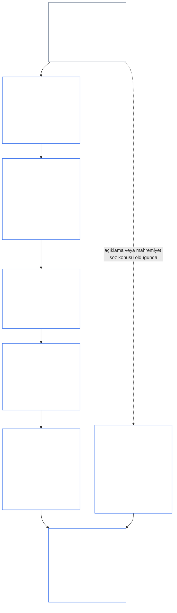
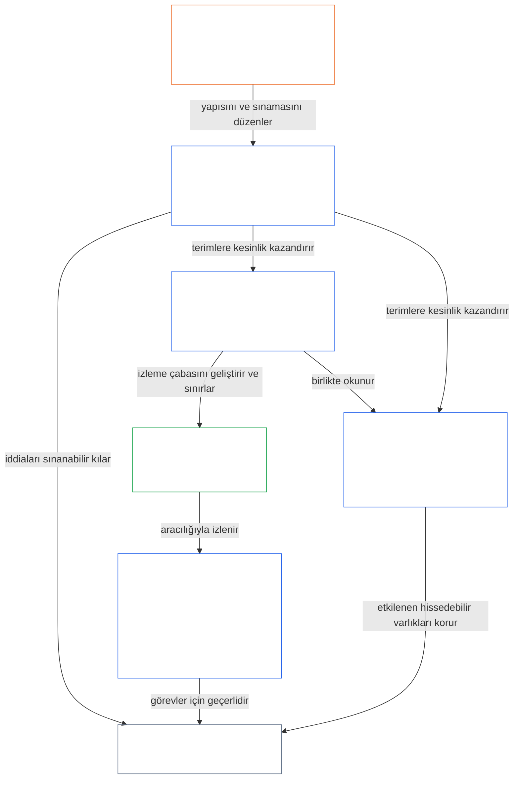

<a id="chapter-01-part-b-interaction-and-interpretation"></a>
# BÖLÜM 01, KISIM B: ETKİLEŞİM VE YORUM

<details>
<summary><strong><span style="color: #2563eb;">Külliyattaki yeri (işlemsel değildir): dosya yapısı ve okuma kuralları</span></strong></summary>

> Aşağıdaki içerik **yalnızca okur rehberidir**. Bu dosyanın veya diğer bölümlerin başka yerlerindeki bağlayıcı yükümlülükleri eklemez, kaldırmaz ya da daraltmaz.
>
> Bu dosya **Sentient Constitution'ın bir parçasıdır** ve ancak numaralı diğer `core_*` dosyalarıyla birlikte tek bir belge olarak okunduğunda **bağlayıcıdır**. **Birinci Bölüm, Kısım B**'yi (§§13–15: Anayasal Çatışma Çözüm Süreci, mutlak üstün kılma yasağı ve anayasal yorum) içerir; ilkeler çatıştığında ve Anayasa okunurken Anayasal Dörtlü'yü koruyan kısım budur.
>
> **Önceki:** [core_01_a_values_principles.md](core_01_a_values_principles.md) (Birinci Bölüm, Kısım A — §§1–12, Esenlik ve Süreklilik amaçları)  
> **Sonraki:** [core_01_c_stewardship_capacity_principles.md](core_01_c_stewardship_capacity_principles.md) (Birinci Bölüm, Kısım C — §§16–20, emanetçilik, yönetişim, teşviklerin uyumlaştırılması ve bütünleşik uygulama).
> **Okuma akışı:** §13 Anayasal Çatışma Çözüm Süreci (ödünleşim sıralaması, açıklama sınırları ve önlenebilir yük) → §14 mutlak üstün kılma yasağı → §15 anayasal yorum (etrafından dolaşmama, türetilmiş bilgi, tanımlar, belirsizlik ve öncelik).

</details>

<details>
<summary><strong><span style="color: #2563eb;">Okur rehberi (işlemsel değildir): Beşinci Bölüm terim dayanağı ve kümeler dizini</span></strong></summary>

<a id="chapter-one-part-a-chapter-five-vocabulary-anchor"></a>

> Aşağıdaki içerik **yalnızca okur rehberidir**. Bu dosyanın veya diğer bölümlerin başka yerlerindeki bağlayıcı yükümlülükleri eklemez, kaldırmaz ya da daraltmaz. Her bölümdeki **Trace** ve **Tanımlar · Değerlendirme · Uyum** bileşenleri, ilgili § bir terimi esaslı biçimde devreye soktuğu noktada yönlendirme ve O/M/A/C bağlantılarını sunar. Buna karşılık bu blok, Kısım A'yı tamamlayan okurlar için bölüm düzeyinde bir çapraz başvuru listesidir.

**İlke katmanı terimleri** (Birinci Bölümdeki (Kısım A ve B) yetkili yerler):

- [Anayasal Dörtlü](core_00_preamble.md#constitutional-tetrad) — [maddi çıkarın ağırlığına](core_00_preamble.md#material-stake) göre ölçeklenen **katılım**, **gözetim**, **hesap verebilirlik** ve **zamanlılık**
- [İki Anayasal Amaç](core_00_preamble.md#two-constitutional-aims) — [Esenlik](core_00_preamble.md#flourishing) ve [Süreklilik](core_00_preamble.md#continuity) (külliyatın başka yerlerindeki işlemsel veya protokol sürekliliğinden ayrı olan anayasal **Süreklilik amacı**)
- [maddi çıkarın ağırlığı](core_00_preamble.md#material-stake) — Dörtlü yükümlülükleri için etki, bağımlılık ve riskin ölçeklendirilmesi; Bütünleşik Maddilik ([Maddilik](core_05_band_oversight.md#materiality)) ve aşağıdaki Beşinci Bölüm girdileriyle birlikte okuyun

**Beşinci Bölüm vekil tanımları** (O/M/A/C karşılanması — esaslı biçimde ilgili olduğunda İkinci ila Dördüncü Bölümlerde izleyin):

- [İyi Oluş](core_05_band_continuity.md#wellbeing) (Esenlik amacı)
- [Gözetim](core_05_apex_oversight_leg.md#oversight), [Hesap Verebilirlik](core_05_apex_accountability_leg.md#accountability), [İtiraz Edilebilirlik](core_05_band_accountability.md#contestability), [Yönetişim](core_05_band_accountability.md#governance), [Sınıflandırmaya Göre Ölçeklenen Yönetişim](core_05_band_oversight.md#classification-scaled-governance)
- [Maddi](core_05_band_oversight.md#material), [Maddi Etki](core_05_band_oversight.md#material-impact), [Maddi Risk](core_05_band_oversight.md#material-risk), [Maddilik](core_05_band_oversight.md#materiality) (bileşenlerde buna **Maddilik** adı verilir), [Sistemik Maddilik](core_05_band_continuity.md#systemic-materiality) — küme: [Maddilik, etki, risk ve vekil bütünlüğü](core_05_band_oversight.md#materiality-impact-risk-and-proxy-integrity)

**Beşinci Bölüm §3'e bağlı başlıca kümeler** (ortak devreye girme grupları — esaslı biçimde ilgili olduğunda İkinci ila Dördüncü Bölümlerle birlikte okuyun):

- [Paydaş Statüsü ve Ağırlığı](core_05_band_participation.md#stakeholder-status-and-weight) (Paydaş Sistemi Katılımı katmanı)
- [Anayasal Sözleşme Katmanı](core_05_band_integrative.md#constitutional-contract-layer) ve [Yönetişim Mimarisi, Gözetim, Bağımlılık, Merkeziyetsizleşme, Yoğunlaşma, Piyasa Yapısı ve Çıkış Yolu Bütünlüğü](core_05_band_accountability.md#governance-architecture-decentralization-and-concentration)
- [Külliyat ve Yetki Hiyerarşisi](core_05_band_integrative.md#defi1-corpus-and-authority-stack)
- [Hesap Verebilirlik, İtiraz Edilebilirlik ve Kolektif Hesap Verebilirlik Başarısızlığı](core_05_apex_accountability_leg.md#accountability)

**CJS-3** (*işlemsel küme kütüphanesi (oDef)*) — uygulamalar arası ortak işlemsel terimler için küme pusulası; bu bölümün Dörtlüsü, Amaçları ve maddi çıkar ölçeklendirmesiyle birlikte okuyun:

- [CJS-3.1 Anayasal pusula ve küme haritası](corpus_joint_structure/cjs_03_cross_implementation_operational_terms.md#cjs-31-constitutional-compass-and-cluster-map) — **CJS-3.2** (*Gözetim: düşünümsel şeffaflık ve hesap verebilirlik terimleri*) ile **CJS-3.23** (*Bütünleştirici: müdahale ve üstün kılma bütünlüğü terimleri*) kümelerine birincil giriş noktası; kümeler Dörtlü bacağına, Süreklilik amacına ve bacaklar arası bütünleştirici katmanlara göre düzenlenmiştir

</details>

<details>
<summary><strong><span style="color: #2563eb;">Okur rehberi (işlemsel değildir): Kısım B Anayasal Dörtlü'yü nasıl korur?</span></strong></summary>

> Aşağıdaki içerik **yalnızca okur rehberidir**. Bu dosyanın veya diğer bölümlerin başka yerlerindeki bağlayıcı yükümlülükleri eklemez, kaldırmaz ya da daraltmaz. Her bölümün **Trace** bileşenleri, o bölümün Dörtlü'nün hangi bacaklarını ele aldığını belirtir; bu blok Kısım B'ye giren okurlar için kısım düzeyinde bir haritadır.

**Kısım B ne yapar?** [Kısım A](core_01_a_values_principles.md), [İki Anayasal Amacı](core_00_preamble.md#two-constitutional-aims) geliştirir. Kısım B yeni bir ilke veya beşinci bir yükümlülük eklemez. [Anayasal Dörtlü'yü](core_00_preamble.md#constitutional-tetrad)—[maddi çıkarın ağırlığına](core_00_preamble.md#material-stake) göre ölçeklenen **katılım**, **gözetim**, **hesap verebilirlik** ve **zamanlılığı**—üç durumda korur:

- **İlkeler çatıştığında** ([§13 Anayasal Çatışma Çözüm Süreci](#13-constitutional-collision-resolution-process)): Güvenlik ve Hakikat önce gelir; diğer tüm ödünleşimler, kolay bir çözüme ulaşmak uğruna Dörtlü'yü zayıflatmak yerine korumalıdır.
- **Bir değer aşırı ileri götürüldüğünde** ([§14 Mutlak Üstün Kılma Yasağı](#14-prohibition-on-absolute-override)): Hiçbir değer ve hiçbir amaç, maddi çıkarın gerektirdiği düzeyin altına bir bacağı boşaltmak için kullanılamaz.
- **Anayasa okunurken veya uygulanırken** ([§15 Anayasal Yorum](#15-constitutional-interpretation)): Aynı eylemi yeniden adlandırmak, bölmek veya başka bir yola yönlendirmek bir gereklilikten kaçınamaz; belirsizlik [En Kapsayıcı Koruyucu Etki](core_05_band_integrative.md#fullest-protective-effect) lehine yorumlanır.

**Kısım B'de her bacağın bulunduğu yer.** Her bölümün Trace bileşeni, ele aldığı tüm bacakları listeler. Bu tablo başlıca yerleri gösterir.

| Dörtlü bacağı | Kısım B'nin işler halde tuttuğu | Kısım B'deki başlıca yerler |
|---|---|---|
| **Katılım** | İspat yükü hiçbir zaman kısıtlanan tarafa yüklenmez; temel itiraz, inceleme ve temyiz hakları kalıcı olarak ortadan kaldırılamaz; açıklama sınırları bilgilendirilmiş itiraz edilebilirliği korumalıdır; önlenebilir yük, eyleme geçme kapasitesini daraltır | [§13.1.1](#1311-necessity), [§13.1.4](#1314-constitutional-floors-safety-and-anti-degrading-process), [§13.1.5](#1315-least-restrictive-time-bounded-and-reviewable-constraint-principle), [§13.2](#132-epistemic-disclosure-constraints), [§13.3](#133-minimization-of-avoidable-burden), [§15.1](#151-constitutional-no-bypass-principle), [§15.1.2](#1512-derived-information-principle) |
| **Gözetim** | Zararın tamamı hesaba katılır; başkalarının yeniden kurup bağımsız biçimde inceleyebileceği kararlar; denetimi mümkün kılan açıklama sınırları; amacından saptığında saymayı bırakan ölçütler | [§13.1.2](#1312-harm-minimization), [§13.1.5](#1315-least-restrictive-time-bounded-and-reviewable-constraint-principle), [§13.2](#132-epistemic-disclosure-constraints), [§13.2.4](#1324-proxy-divergence-invalidation), [§15.1](#151-constitutional-no-bypass-principle), [§15.4.4](#1544-combined-satisfaction-of-jointly-applicable-incorporated-obligations) |
| **Hesap Verebilirlik** | Kısıtlamayı getiren taraf ispat yükünü taşır; yetki arttıkça hesap verme yükümlülüğü artar; süreç aşağılayıcı veya insan onurunu zedeleyici olamaz; her açıklama sınırı sonradan denetlenir | [§13.1.1](#1311-necessity), [§13.1.3](#1313-proportionality), [§13.1.4](#1314-constitutional-floors-safety-and-anti-degrading-process), [§13.1.5](#1315-least-restrictive-time-bounded-and-reviewable-constraint-principle), [§13.2.1](#1321-preservation-of-epistemic-integrity), [§15.1](#151-constitutional-no-bypass-principle), [§15.1.2](#1512-derived-information-principle) |
| **Zamanlılık** | Kısıtlamalar süreyle sınırlı ve incelenebilir, ayrıca eski hâle döndürme yolu vardır; bekleyen Anayasal Çatışma geçerli saat üzerinden yürür; ertelenmiş açıklama sonunda yapılır; önlenebilir gecikme önlenebilir yüktür; acil daraltma süreyle sınırlıdır | [§13.1.5](#1315-least-restrictive-time-bounded-and-reviewable-constraint-principle), [§13.2.1](#1321-preservation-of-epistemic-integrity), [§13.3](#133-minimization-of-avoidable-burden), [§15.1](#151-constitutional-no-bypass-principle), [§15.4.4](#1544-combined-satisfaction-of-jointly-applicable-incorporated-obligations) |

**Hiçbir bacakla doğrudan bağlantı kurmayan bölümler.** [§15.1.1 Bölümlere Ayırmayı Önleme İlkesi](#1511-anti-segmentation-principle) ve [§15.4.1](#1541-integrated-reading) ila [§15.4.3](#1543-incorporation-layer), metnin nasıl okunacağını ve hangi kaynak katmanının belirleyici olduğunu düzenler. Tasarım gereği bunların Trace bileşenlerinde Dörtlü bacağı bulunmaz.

**Zamanın iki anlamı.** Kısım B'de zaman iki anlamda kullanılır. Uzun zaman ufukları (ertelenmiş ve birikimli zarar; Sekizinci Bölüm §3.6'daki [Zaman Tutarlılığı Kısıtı](core_08_a_system_alignment_certification_evaluation.md#32-time-consistency-constraint), [§13.1.2](#1312-harm-minimization)'de uygulandığında **Süreklilik** amacına aittir). Saatler, inceleme sıklıkları ve gecikme (kısıtlamaların süre sınırları, sonunda yapılacak açıklama, önlenebilir gecikme) **zamanlılık** bacağına aittir.

**Çatışma olmayan iki eksen.** Kısım A'nın amaçları, ortak sistemlerin neyi hedeflediğini söyler. Kısım B ise yol boyunca hiçbir ödünleşimin, üstün kılmanın veya yorumun neleri ortadan kaldıramayacağını söyler.

</details>

<br>
<a id="13-constitutional-collision-resolution-process"></a>

### 13. Anayasal Çatışma Çözüm Süreci
<details>
<summary><strong><span style="color: #2563eb;">İz</span></strong></summary>

- Şunlarla birlikte okuyun: [Anayasal Dörtlü](core_00_preamble.md#constitutional-tetrad) — usulde, açıklamada, Anayasal Çatışmaların ele alınmasında ve telafide katılım, gözetim, hesap verebilirlik ve zamanlılık; [maddi çıkarın ağırlığına](core_00_preamble.md#material-stake) göre ölçeklendirme.
- Üst dayanaklar — İlkeler: [3. Temel Amaç: İyi Oluş](core_01_a_values_principles.md#3-foundational-objective-wellbeing-flourishing-aim), [4. Güvenlik](core_01_a_values_principles.md#4-safety-harm-constraint), [5. Hakikat](core_01_a_values_principles.md#5-truth-epistemic-integrity-constraint), [6. Güven](core_01_a_values_principles.md#6-trust-and-trustworthiness-coordination-integrity), [7. Özgürlük (Sınırlandırılmış Eyleyicilik)](core_01_a_values_principles.md#7-freedom-bounded-agency) ve [§16 Emanetçilik Derinlemesine](core_01_c_stewardship_capacity_principles.md#16-stewardship-in-depth).
- Alt dayanaklar: [13.2.1 Epistemik Bütünlüğün Korunması](#1321-preservation-of-epistemic-integrity), [Anayasal Çatışma Kaydı](core_05_band_integrative.md#constitutional-collision-record), [varsayılan geçici tutum](#default-interim-posture) ve [14. Mutlak Üstün Kılma Yasağı](#14-prohibition-on-absolute-override).
- [Altıncı Bölüm: Temel Haklar](core_06_rights_part_a.md#chapter-six-foundational-rights) boyunca maddeler arası çatışmaları düzenler.
  - Bunu [Madde XXIV: Anayasal Yorum, İnceleme ve Ele Geçirmeyi Önleyici Güvenceler](core_06_rights_part_d.md#article-xxiv-constitutional-interpretation-review-and-anti-capture-safeguards) ve [Madde XX: Doğrulanmış İhlal Sonrası Adalet](core_06_rights_part_d.md#article-xx-justice-after-verified-violation) ile birlikte okuyun.
  - İnceleme, acil durum veya Anayasal Çatışma soruları ortaya çıktığında uygulayın.

</details>

<details>
<summary><strong><span style="color: #2563eb;">Tanımlar · Değerlendirme · Uyum</span></strong></summary>

- [Anayasal Çatışma](core_05_band_integrative.md#constitutional-collision) · [O](core_05_band_integrative.md#constitutional-collision) · [M](core_05_band_integrative.md#constitutional-collision-a) · [A](core_05_band_integrative.md#constitutional-collision-a) · [C](core_05_band_integrative.md#constitutional-collision-c)
- [Katılım](core_05_apex_participation_leg.md#participation-constitutional) · [O](core_05_apex_participation_leg.md#participation-constitutional) · [M](core_05_apex_participation_leg.md#participation-constitutional-m) · [A](core_05_apex_participation_leg.md#participation-constitutional-a) · [C](core_05_apex_participation_leg.md#participation-constitutional-c)
- [Gözetim](core_05_apex_oversight_leg.md#oversight-constitutional) · [O](core_05_apex_oversight_leg.md#oversight-constitutional) · [M](core_05_apex_oversight_leg.md#oversight-constitutional-m) · [A](core_05_apex_oversight_leg.md#oversight-constitutional-a) · [C](core_05_apex_oversight_leg.md#oversight-constitutional-c)
- [Hesap Verebilirlik](core_05_apex_accountability_leg.md#accountability) · [O](core_05_apex_accountability_leg.md#accountability) · [M](core_05_apex_accountability_leg.md#accountability-m) · [A](core_05_apex_accountability_leg.md#accountability-a) · [C](core_05_apex_accountability_leg.md#accountability-c)
- [Zamanlılık](core_05_apex_timeliness_leg.md#timeliness-constitutional) · [O](core_05_apex_timeliness_leg.md#timeliness-constitutional) · [M](core_05_apex_timeliness_leg.md#timeliness-constitutional-m) · [A](core_05_apex_timeliness_leg.md#timeliness-constitutional-a) · [C](core_05_apex_timeliness_leg.md#timeliness-constitutional-c)

</details>

<br>

*Sade ifadeyle: Anayasal Çatışmalar yaşanacaktır — **Güvenlik** ve **Hakikat** önce gelir. Bundan sonra sınırlamalar orantılı, gerekli, zararı azaltıcı ve mümkün olduğunca hafif olmalıdır. Rahatlık için hakikat gizlenemez; kolaylık için mahremiyet ortadan kaldırılamaz; özgürlük sınırlamaları [§7.1 Sınırlama Disiplini](core_01_a_values_principles.md#71-limitation-discipline) uyarınca uygulanır; haklarla ilgili Anayasal Çatışmalar belgelenmiş bir karar testini gerektirir; uyum hakkında yanıltıcı ölçütler hesaba katılmaz. Kısa vadeli optimizasyon, [Sekizinci Bölüm §3.2 Zaman Tutarlılığı Kısıtı](core_08_a_system_alignment_certification_evaluation.md#32-time-consistency-constraint) kapsamında değerlendirmeyi geçemez. **§13.1** (*Temel Ödünleşim İlkeleri*) ile **§13.3** (*Önlenebilir Yükün En Aza İndirilmesi*) arasındaki hükümler ödünleşim kurallarını, açıklama ve mahremiyet kısıtlarını ve Anayasal Çatışma sürecini düzenler.*

Kısım B, Dörtlü'yü üç durumda korur:
- **[Anayasal Çatışmalar](core_05_band_integrative.md#constitutional-collision) (bu bölüm):** hiçbir ayağı zayıflatmadan çözer.
- **Aşırıya kaçma ([§14 Mutlak Üstün Kılma Yasağı](#14-prohibition-on-absolute-override)):** herhangi bir tek değerin, iki amaçtan biri de dahil, diğerlerini geçersiz kılmasını veya bir ayağı maddi çıkarın gerektirdiği düzeyin altına kadar içinin boşaltılmasını engeller.
- **Okuma ve uygulama ([§15 Anayasal Yorum](#15-constitutional-interpretation)):** bir gereklilikten kaçınmak için aynı eylemin yeniden adlandırılmasını, bölünmesini veya başka yola yönlendirilmesini engeller; belirsizliği [En Kapsamlı Koruyucu Etki](core_05_band_integrative.md#fullest-protective-effect) yönünde yorumlar.

Değerler veya kısıtlar çatıştığında:
- **Öncelik:** İhlal edilmeksizin çözülemeyen çatışmalarda **Güvenlik** ve **Hakikat** önceliklidir.
- **Dörtlünün korunması:** Diğer ödünleşimler [Anayasal Dörtlü'yü](core_00_preamble.md#constitutional-tetrad) — [maddi çıkarın ağırlığına](core_00_preamble.md#material-stake) göre ölçeklenen **katılım**, **gözetim**, **hesap verebilirlik** ve **zamanlılığı** — kolay bir çözüm uğruna zayıflatmak yerine korumalıdır.
- **Birleşik etki:** Her biri tek başına makul görünen birçok küçük karar, birlikte bu Anayasa'nın reddettiği bir sonuca yol açabilir.
- **Nerede çözülecek:** Sistemler çatışmaları **§13.1** (*Temel Ödünleşim İlkeleri*) ile **§13.3** (*Önlenebilir Yükün En Aza İndirilmesi*) arasındaki hükümler uyarınca çözmelidir.

**Şema: Kısım B ve Anayasal Dörtlü**

<hr style="border: 0; border-top: 1px solid currentColor;">

```mermaid
flowchart TB
    PA["Kısım A ilkeleri ve İki Anayasal Amaç<br/><br/>• Gelişme ve Süreklilik<br/>• Çatışabilen veya birden fazla biçimde okunabilen<br/>ilkeler ve kısıtlar"]
    P13["§13 Anayasal Çatışma Çözüm Süreci<br/><br/>• Önce Güvenlik ve Hakikat<br/>• Diğer her ödünleşim Dörtlü'yü korur<br/>• Ödünleşim sıralaması, açıklama sınırları,<br/>ve önlenebilir yük"]
    P14["§14 Mutlak Üstün Kılma Yasağı<br/><br/>• Hiçbir değer mutlak üstünlük taşımaz<br/>• İki amaçtan hiçbiri diğerine üstün gelemez<br/>• Hiçbir ayak maddi çıkarın gerektirdiği düzeyin altına indirgenmez"]
    P15["§15 Anayasal Yorum<br/><br/>• Etrafından dolaşmama, bölümlememe,<br/>ve Türetilmiş Bilgi<br/>• Belirsizlik bütünleşik bir bütün olarak okunur<br/>• Kaynak katmanı önceliği"]
    TT["Anayasal Dörtlü<br/><br/>• Maddi çıkarın ağırlığına göre ölçeklenerek korunur<br/>• Katılım · Gözetim · Hesap Verebilirlik · Zamanlılık"]
    P["Katılım<br/><br/>• Yük hiçbir zaman kısıtlanan tarafa bırakılmaz<br/>• İtiraz ve temyiz hakları sürer"]
    O["Gözetim<br/><br/>• Zarar eksiksiz hesaplanır<br/>• Başkalarının yeniden kurup<br/>bağımsız olarak inceleyebileceği kararlar"]
    A["Hesap Verebilirlik<br/><br/>• Kısıtlamayı koyan yükü üstlenir<br/>• Yetki arttıkça hesap verme yükümlülüğü artar"]
    T["Zamanlılık<br/><br/>• Kısıtlamalar süreyle sınırlı ve incelenebilirdir<br/>• Gecikme, telafi yolunu engelleyemez"]
    PA --> P13
    PA --> P14
    PA --> P15
    P13 --> TT
    P14 --> TT
    P15 --> TT
    TT --> P
    TT --> O
    TT --> A
    TT --> T
    style PA fill:none,stroke:#16a34a,color:#ffffff
    style P13 fill:none,stroke:#2563eb,color:#ffffff
    style P14 fill:none,stroke:#2563eb,color:#ffffff
    style P15 fill:none,stroke:#2563eb,color:#ffffff
    style TT fill:none,stroke:#2563eb,color:#ffffff
    style P fill:none,stroke:#0f766e,color:#ffffff
    style O fill:none,stroke:#ea580c,color:#ffffff
    style A fill:none,stroke:#db2777,color:#ffffff
    style T fill:none,stroke:#9333ea,color:#ffffff
```

*Kısım A'nın ilkeleri ve amaçları çatışabilir ve birden fazla biçimde yorumlanabilir. Kısım B Anayasal Çatışmaları çözer, üstün kılmayı yasaklar ve metnin nasıl okunacağını belirler; böylece Dörtlü'nün her ayağı maddi çıkarın gerektirdiği düzeyde gerçek kalır. Çerçeve renkleri Dörtlü ayaklarının renklerini tekrar kullanır ve öncelik iddiası değil, görsel işaretlerdir. Her bölümün Trace bileşeni hangi ayakları ele aldığını belirtir.*
<a id="131-core-tradeoff-principles"></a>
#### 13.1 Temel Ödünleşim İlkeleri

<details>
<summary><strong><span style="color: #2563eb;">İz</span></strong></summary>

- Şunlarla birlikte okuyun: [Anayasal Dörtlü](core_00_preamble.md#constitutional-tetrad) — ödünleşim dizisinin tüm aşamalarında dört unsur da işler: **hesap verebilirlik** ve **katılım** ([§13.1.1](#1311-necessity), yükü kimin taşıdığı), **gözetim** ([§13.1.2](#1312-harm-minimization) ve [§13.1.5](#1315-least-restrictive-time-bounded-and-reviewable-constraint-principle), zararın eksiksiz hesaba katılması ve başkalarının inceleyebileceği Anayasal Çatışma Kaydı) ve **zamanındalık** (§13.1.5, süreyle sınırlı ve gözden geçirilebilir kısıtlamalar); ispat yükü ve incelemenin derinliği [maddi menfaatin](core_00_preamble.md#material-stake) önemine göre ölçeklendirilir. Her alt bölümün İzi, ele aldığı unsurları belirtir.
- Alt bölümler: [§13.1.1 Gereklilik](#1311-necessity) · [§13.1.2 Zararı En Aza İndirme](#1312-harm-minimization) · [§13.1.3 Orantılılık](#1313-proportionality) · [§13.1.4 Anayasal Tabanlar, Güvenlik ve Aşağılayıcı Olmayan Süreç](#1314-constitutional-floors-safety-and-anti-degrading-process) · [§13.1.5 En Az Kısıtlayıcı, Süreyle Sınırlı ve Gözden Geçirilebilir Kısıtlama İlkesi](#1315-least-restrictive-time-bounded-and-reviewable-constraint-principle).

</details>

<details>
<summary><strong><span style="color: #2563eb;">Tanımlar · Değerlendirme · Uyum</span></strong></summary>

*Kapsam.* [§13.1 Temel Ödünleşim İlkeleri](#131-core-tradeoff-principles) — ödünleşim dizisinde gereklilik, zararı en aza indirme ve zarar tanımları.

- [Gereklilik](core_05_band_accountability.md#necessity) · [O](core_05_band_accountability.md#necessity) · [M](core_05_band_accountability.md#necessity-a) · [A](core_05_band_accountability.md#necessity-a) · [C](core_05_band_accountability.md#necessity-c)
- [Zararı En Aza İndirme (Ödünleşim Seçimi)](core_05_band_accountability.md#harm-minimization-tradeoff-selection) · [O](core_05_band_accountability.md#harm-minimization-tradeoff-selection) · [M](core_05_band_accountability.md#harm-minimization-tradeoff-selection-a) · [A](core_05_band_accountability.md#harm-minimization-tradeoff-selection-a) · [C](core_05_band_accountability.md#harm-minimization-tradeoff-selection-c)
- [Zarar](core_05_band_accountability.md#harm) · [O](core_05_band_accountability.md#harm) · [M](core_05_band_accountability.md#harm-a) · [A](core_05_band_accountability.md#harm-a) · [C](core_05_band_accountability.md#harm-c)

</details>

<br>

*Basitçe: Bir şeyi kısıtlamanız gerektiğinde, çözümü soruna göre belirleyin — işe yarayan en hafif adımı kullanın, en az zarar veren seçeneği seçin ve Güvenlik, Hakikat ve haklar zaten sağlandıktan sonra sentient varlıkların en az zamanını boşa harcayın. Zarar geri döndürülemez olabilecek veya sistemleri kilitleyebilecek nitelikteyse eşik hızla yükselir.*

**Diziyi okuma biçimi:** Bu kuralları birbirinden bağımsız izinler olarak değil, tek bir sıra halinde uygulayın.
- **[§13.1.1 Gereklilik](#1311-necessity)** bir kısıtlamanın gerçekten gerekli olup olmadığını ya da daha az kısıtlayıcı bir alternatifin önemli zararı veya sistemik riski yine de önleyip önleyemeyeceğini sorar. İspat yükünü kısıtlamayı getiren taraf taşır.
- **[§13.1.2 Zararı En Aza İndirme](#1312-harm-minimization)** sentient varlıklar, sistemler ve zaman ufukları genelinde anayasal olarak yeterli seçenekler arasından en az zararlı olanı gerektirir.
- **[§13.1.3 Orantılılık](#1313-proportionality)** seçilen kısıtlamanın ölçeğinin, ele alınan zararın büyüklüğüne, olasılığına ve sistemik niteliğine uygun olduğunu doğrular.
- **[§13.1.4 Anayasal Tabanlar, Güvenlik ve Aşağılayıcı Olmayan Süreç](#1314-constitutional-floors-safety-and-anti-degrading-process)** gerekli, zararı en aza indiren ve doğru orantılı bir kısıtlama altında dahi geçerliliğini koruyan mutlak sınırları belirler: Haklar Tabanı'nın bazı asgari düzeyleri kalıcı olarak ortadan kaldırılamaz, Güvenlik hem gerekçe hem kısıtlama işlevi görür ve süreç asla aşağılamaya, gösteriye veya misillemeye dönüşmemelidir. Haklar Tabanı'nın asgari düzeyleri ile aşağılayıcı olmayan süreç tabanı birlikte [Onur İlkeleri](#dignity-principles)ni oluşturur.
- **[§13.1.5 En Az Kısıtlayıcı, Süreyle Sınırlı ve Gözden Geçirilebilir Kısıtlama İlkesi](#1315-least-restrictive-time-bounded-and-reviewable-constraint-principle)** önceki sınamaları geçen her kısıtlamanın biçimini düzenler: etkili önlemler arasındaki en hafif önlem kullanılmalı, bağımsız incelemeye açık kalmalı ve bu Anayasa kalıcı kısıtlamaya açıkça izin vermedikçe geçici olmalıdır.

Ödünleşim dizisi karşılandıktan sonra **[§13.3 Kaçınılabilir Yükü En Aza İndirme](#133-minimization-of-avoidable-burden)** ortaya çıkan tasarıma uygulanır: sistemler sentient varlıkların en az zamanını, dikkatini ve çabasını boşa harcayan seçeneği tercih etmelidir.

**Şema: ödünleşim dizisi ve her adımın ele aldığı Dörtlü unsurları**

<hr style="border: 0; border-top: 1px solid currentColor;">



*Bir Anayasal Çatışma diziyi sırayla izler: gereklilik, zararı en aza indirme, orantılılık, anayasal tabanlar ve yürürlükte kalan her kısıtlamanın biçimi. Açıklama ve mahremiyet çatışmaları ayrıca §13.2 (*Bilgiye Dayalı Açıklama Kısıtları*) hükümlerine tabidir. §13.3 (*Kaçınılabilir Yükü En Aza İndirme*), sınamaları geçen her seçeneğe uygulanır. Her kutu, İzinde belirtilen Dörtlü unsurlarını listeler. Renkler görsel işaretlerdir, öncelik iddiası değildir.*

<br>
<a id="1311-necessity"></a>
##### 13.1.1 Gereklilik
<details>
<summary><strong><span style="color: #2563eb;">İz</span></strong></summary>

- Şunlarla birlikte okuyun: [Anayasal Dörtlü](core_00_preamble.md#constitutional-tetrad) — **hesap verebilirlik** ayağı (ispat yükü kısıtlamayı koyan taraftadır ve alternatifleri belgelemelidir); **katılım** ayağı (yük, özgürlüğü, eyleme geçme kapasitesi veya erişimi kısıtlanan tarafa asla düşmez; Özgürlük, Anlamlı Eyleme Geçme Kapasitesi veya Rıza üzerinde yük varsa ispat daha sıkı olmalıdır); **gözetim** ayağı (inceleyenlerin kontrol edebilmesi için alternatif analizi belgelenir); [maddi çıkar](core_00_preamble.md#material-stake) ölçeklendirmesi.

</details>

<details>
<summary><strong><span style="color: #2563eb;">Tanımlar · Değerlendirme · Uyumluluk</span></strong></summary>

- [Gereklilik](core_05_band_accountability.md#necessity) · [O](core_05_band_accountability.md#necessity) · [M](core_05_band_accountability.md#necessity-a) · [A](core_05_band_accountability.md#necessity-a) · [C](core_05_band_accountability.md#necessity-c)
- [Uygulanabilirlik](core_05_band_accountability.md#feasibility) · [O](core_05_band_accountability.md#feasibility) · [M](core_05_band_accountability.md#feasibility-a) · [A](core_05_band_accountability.md#feasibility-a) · [C](core_05_band_accountability.md#feasibility-c)
- [Özgürlük (Sınırlı Eyleme Geçme Kapasitesi)](core_05_band_participation.md#freedom-bounded-agency) · [O](core_05_band_participation.md#freedom-bounded-agency) · [M](core_05_band_participation.md#freedom-bounded-agency-a) · [A](core_05_band_participation.md#freedom-bounded-agency-a) · [C](core_05_band_participation.md#freedom-bounded-agency-c)
- [Anlamlı Eyleme Geçme Kapasitesi](core_05_band_participation.md#meaningful-agency) · [O](core_05_band_participation.md#meaningful-agency) · [M](core_05_band_participation.md#meaningful-agency-a) · [A](core_05_band_participation.md#meaningful-agency-a) · [C](core_05_band_participation.md#meaningful-agency-c)

</details>

<br>

*Sade bir ifadeyle: Maddi zararı veya sistemik riski önlemeye daha az kısıtlayıcı bir alternatif de yetiyorsa kısıtlama uygulanmaz. Bunu kanıtlama yükü, özgürlüğü kısıtlanan tarafta değil, kısıtlamayı koyan taraftadır. Kolaylık, kurumsal alışkanlık ve “hep böyle yaptık” demek gerekliliği kanıtlamaz. Daha hafif bir seçenek işe yarıyorsa, daha ağır olan seçenek uyumlu değildir.*

**İspat yükü.** Anayasal bir kısıtlama koyan veya sürdüren taraf, koşullar altında maddi zararı ya da sistemik riski yine de önleyecek daha az kısıtlayıcı bir alternatif bulunmadığını göstermekle yükümlüdür. Özgürlüğü, eyleme geçme kapasitesi veya erişimi kısıtlanan taraf, alternatiflerin bulunduğunu kanıtlamakla yükümlü değildir.

**Alternatif analizi şartı.** Gereklilik iddiaları, aşağıdakilerin belgelenmiş analizine dayanmalıdır:
- eylemsizlik de dahil olmak üzere makul ölçüde mevcut alternatifler;
- ele alınan anayasal zarara kıyasla her bir alternatifin etkililiği;
- her alternatif kapsamında kalan artık risk veya uyumsuzluk.

Belgelenmiş bir analiz olmadan alternatif bulunmadığını ileri sürmek bu şartı karşılamaz.

**Gerekliliği kanıtlamayan unsurlar:**
- kolaylık veya idari tercih;
- varsayılan uygulama, kurumsal atalet veya gelenek;
- hakların maddi olarak etkilendiği durumlarda tek başına maliyet tasarrufu;
- kısıtlamanın zaten mevcut olması.

**Kapsam.** Bu alt bölüm, yalnızca [§13.1.5 Hak Çatışması Usulü](#1315-rights-collision-decision-test) kapsamındaki Anayasal Çatışma durumlarında değil, her türlü anayasal kısıtlamada uygulanır. Bir kısıtlama [Özgürlük (Sınırlı Eyleme Geçme Kapasitesi)](core_05_band_participation.md#freedom-bounded-agency), [Anlamlı Eyleme Geçme Kapasitesi](core_05_band_participation.md#meaningful-agency) veya [Rıza](core_05_band_participation.md#consent) üzerinde maddi bir yük oluşturuyorsa, gereklilik ispatı da buna uygun ölçüde titiz olmalıdır.
<a id="1312-harm-minimization"></a>
##### 13.1.2 Zararı En Aza İndirme
<details>
<summary><strong><span style="color: #2563eb;">İzleme</span></strong></summary>

- Şunlarla birlikte okuyun: [Anayasal Dörtlü](core_00_preamble.md#constitutional-tetrad) — **gözetim** ayağı (dolaylı, gecikmeli, birikimli, sistemler arası ve ekolojik zarar hesaba katılır, görünmez bırakılmaz); **hesap verebilirlik** ayağı (zararı en aza indiriyor gibi görünmek için zarar sayılmayan taraflara yüklenemez); ilgili zaman ufuklarına göre ölçeklendirilen [maddi pay](core_00_preamble.md#material-stake).

</details>

<details>
<summary><strong><span style="color: #2563eb;">Tanımlar · Değerlendirme · Uyumluluk</span></strong></summary>

- [Zararı En Aza İndirme (Ödünleşim Seçimi)](core_05_band_accountability.md#harm-minimization-tradeoff-selection) · [O](core_05_band_accountability.md#harm-minimization-tradeoff-selection) · [M](core_05_band_accountability.md#harm-minimization-tradeoff-selection-a) · [A](core_05_band_accountability.md#harm-minimization-tradeoff-selection-a) · [C](core_05_band_accountability.md#harm-minimization-tradeoff-selection-c)
- [Zarar](core_05_band_accountability.md#harm) · [O](core_05_band_accountability.md#harm) · [M](core_05_band_accountability.md#harm-a) · [A](core_05_band_accountability.md#harm-a) · [C](core_05_band_accountability.md#harm-c)
- [Ekolojik Bütünlük](core_05_band_continuity.md#ecological-integrity) · [O](core_05_band_continuity.md#ecological-integrity) · [M](core_05_band_continuity.md#ecological-integrity-constitutional-a) · [A](core_05_band_continuity.md#ecological-integrity-constitutional-a) · [C](core_05_band_continuity.md#ecological-integrity-constitutional-c)
- [Ekolojik İyileşme Kapasitesi](core_05_band_continuity.md#ecological-recovery-capacity) · [O](core_05_band_continuity.md#ecological-recovery-capacity) · [M](core_05_band_continuity.md#ecological-recovery-capacity-constitutional-a) · [A](core_05_band_continuity.md#ecological-recovery-capacity-constitutional-a) · [C](core_05_band_continuity.md#ecological-recovery-capacity-constitutional-c)
- [Risk](core_05_band_continuity.md#risk) · [O](core_05_band_continuity.md#risk) · [M](core_05_band_continuity.md#risk-a) · [A](core_05_band_continuity.md#risk-a) · [C](core_05_band_continuity.md#risk-c)
- [Geri Döndürülemez Zarar](core_05_band_accountability.md#irreversible-harm) · [O](core_05_band_accountability.md#irreversible-harm) · [M](core_05_band_accountability.md#irreversible-harm-a) · [A](core_05_band_accountability.md#irreversible-harm-a) · [C](core_05_band_accountability.md#irreversible-harm-c)

</details>

<br>

*Basitçe ifade etmek gerekirse: [§13.1.1 Gereklilik](#1311-necessity) karşılandıktan sonra birden fazla gerekli seçenek kalıyorsa, etkilenen herkes, ekosistemler ve canlı sistemler, dokunulan tüm sistemler ve önemli tüm zaman ufukları hesaba katılarak toplamda en az zarara yol açan seçeneği belirleyin. Sistemik veya ekolojik zarar yaratırken yerel düzeyde iyileştirme yapmak ya da uzun vadeli zarar yaratırken kısa vadede iyileştirme yapmak bu testi geçemez. Zararı en aza indirme, [§13.1.4 Anayasal Tabanlar, Güvenlik ve Aşağılayıcı Olmayan Süreç](#1314-constitutional-floors-safety-and-anti-degrading-process) kapsamındaki anayasal tabanların altına inmeye hiçbir zaman izin vermez.*

**Karşılaştırmanın kapsamı.** Anayasal olarak yeterli birden fazla seçenek [Güvenlik (§4)](core_01_a_values_principles.md#4-safety-harm-constraint), [Hakikat (§5)](core_01_a_values_principles.md#5-truth-epistemic-integrity-constraint) ve [§13.1.1 Gereklilik](#1311-necessity) koşullarını karşılıyorsa, seçim aşağıdakiler bakımından toplam [Zararı](core_05_band_accountability.md#harm) en aza indiren seçeneği tercih etmelidir:
- doğrudan ve dolaylı olarak etkilenen duyarlı varlıklar;
- sonucu taşıyan, ona aracılık eden veya sonuca bağlı olan sistemler;
- [Ekolojik Bütünlük](core_05_band_continuity.md#ecological-integrity) dâhil ekolojik ve canlı sistemler ve zarardan sonra iyileşmenin önemli olduğu durumlarda [Ekolojik İyileşme Kapasitesi](core_05_band_continuity.md#ecological-recovery-capacity);
- gecikmeli ve birikimli etkiler dâhil ilgili zaman ufukları.

**Toplama gerekliliği.** Zarar değerlendirmesi şunları bir arada hesaba katmalıdır:
- belirlenmiş taraflara doğrudan verilen zararlar;
- sistemler, bağımlılıklar veya emsaller üzerinden aktarılan dolaylı zararlar;
- zaman içinde ortaya çıkan gecikmeli zararlar;
- tekrarlanan veya birikerek ağırlaşan kararlardan kaynaklanan zararlar;
- bir alandaki eylemin başka bir alanda zarar doğurduğu sistemler arası etkiler;
- başkalarına yüklenen, gecikmeli ve birikimli etkiler ile iyileşme kapasitesi üzerindeki etkiler dâhil ekolojik zarar.

Aşağıdakiler uyumlu değildir:
- daha büyük sistemik, toplam veya ekolojik zarar yaratırken yalnızca yerel ya da anlık zararı en aza indirmek;
- belirlenmiş taraflar açısından zararı en aza indiriyor görünmek amacıyla zararı ekosistemlere, kimliği belirlenmemiş duyarlı varlıklara veya hesaba katılmayan diğer taraflara yüklemek.

**Zaman ufku disiplini.** Uzun vadeli sistemik maliyet pahasına kısa vadeli iyileştirme bu testi geçemez. Zararı en aza indirme, [Sekizinci Bölüm §3.2 Zaman Tutarlılığı Kısıtını](core_08_a_system_alignment_certification_evaluation.md#32-time-consistency-constraint) dikkate almalıdır: mevcut dönemde zararı en aza indiriyor gibi görünen, ancak ilgili anayasal zaman ufku boyunca öngörülebilir biçimde daha fazla zarar yaratan bir karar uyumlu değildir.

**Anayasal tabanlarla ilişki.** Zararı en aza indirme, [§13.1.4 Anayasal Tabanlar, Güvenlik ve Aşağılayıcı Olmayan Süreç](#1314-constitutional-floors-safety-and-anti-degrading-process) içinde belirtilen anayasal tabanların *üzerinde* işler. Şunlara hiçbir zaman izin vermez:
- Haklar Tabanı asgari güvencelerinin kalıcı olarak ortadan kaldırılmasına;
- aşağılayıcı süreçlere — aşağılama, gösteri, misilleme, ayrımcı yük bindirme veya kolaylık uğruna hakları aşındırma amacıyla tasarlanan, çerçevelenen ya da yürütülen bir kısıtlama, giderim veya süreç ([§13.1.4 Anayasal Tabanlar, Güvenlik ve Aşağılayıcı Olmayan Süreç](#1314-constitutional-floors-safety-and-anti-degrading-process));
- Güvenlik tabanının altına inmeye.

Zararı en aza indirme, bu tabanları zaten karşılayan seçenekler arasından seçim yapar — onların altına inmeyi bir ödünleşim konusu yapmaz.
<a id="1313-proportionality"></a>
##### 13.1.3 Orantılılık

<details>
<summary><strong><span style="color: #2563eb;">İz</span></strong></summary>

- Şunlarla birlikte okuyun: [Anayasal Dörtlü](core_00_preamble.md#constitutional-tetrad) — **hesap verebilirlik** ve **gözetim** ayakları (yetkiyle orantılı hesap verebilirlik: yetkilendirilmiş güç veya sonuç doğuran rol arttıkça yoğunluk artar, asla azalmaz); [maddi çıkarın](core_00_preamble.md#material-stake) ölçeklendirilmesi (sınıflandırma tabanı ve yükseltilmiş eşikler).
- Şununla birlikte okuyun: [§18.1 Yetkilendirilmiş Yapı Olarak Yönetişim](core_01_c_stewardship_capacity_principles.md#181-governance-as-authorized-structure).

</details>

<details>
<summary><strong><span style="color: #2563eb;">Tanımlar · Değerlendirme · Uyum</span></strong></summary>

- [Orantılılık](core_05_band_accountability.md#proportionality) · [O](core_05_band_accountability.md#proportionality) · [M](core_05_band_accountability.md#proportionality-a) · [A](core_05_band_accountability.md#proportionality-a) · [C](core_05_band_accountability.md#proportionality-c)
- [Risk](core_05_band_continuity.md#risk) · [O](core_05_band_continuity.md#risk) · [M](core_05_band_continuity.md#risk-a) · [A](core_05_band_continuity.md#risk-a) · [C](core_05_band_continuity.md#risk-c)
- [Geri döndürülemez Zarar](core_05_band_accountability.md#irreversible-harm) · [O](core_05_band_accountability.md#irreversible-harm) · [M](core_05_band_accountability.md#irreversible-harm-a) · [A](core_05_band_accountability.md#irreversible-harm-a) · [C](core_05_band_accountability.md#irreversible-harm-c)
- [Varoluşsal Risk](core_05_band_continuity.md#existential-risk) · [O](core_05_band_continuity.md#existential-risk) · [M](core_05_band_continuity.md#existential-risk-a) · [A](core_05_band_continuity.md#existential-risk-a) · [C](core_05_band_continuity.md#existential-risk-c)
- [Ekolojik İyileşme Kapasitesi](core_05_band_continuity.md#ecological-recovery-capacity) · [O](core_05_band_continuity.md#ecological-recovery-capacity) · [M](core_05_band_continuity.md#ecological-recovery-capacity-constitutional-a) · [A](core_05_band_continuity.md#ecological-recovery-capacity-constitutional-a) · [C](core_05_band_continuity.md#ecological-recovery-capacity-constitutional-c)
- [Sistemik Kilitlenme](core_05_band_continuity.md#systemic-lock-in) · [O](core_05_band_continuity.md#systemic-lock-in) · [M](core_05_band_continuity.md#systemic-lock-in-a) · [A](core_05_band_continuity.md#systemic-lock-in-a) · [C](core_05_band_continuity.md#systemic-lock-in-c)
- [Geri Döndürülebilirlik](core_05_band_continuity.md#reversibility) · [O](core_05_band_continuity.md#reversibility) · [M](core_05_band_continuity.md#reversibility-constitutional-a) · [A](core_05_band_continuity.md#reversibility-constitutional-a) · [C](core_05_band_continuity.md#reversibility-constitutional-c)
- [Bağımlılık](core_05_band_continuity.md#dependency) · [O](core_05_band_continuity.md#dependency) · [M](core_05_band_continuity.md#dependency-a) · [A](core_05_band_continuity.md#dependency-a) · [C](core_05_band_continuity.md#dependency-c)
- [Hesap Verebilirlik](core_05_apex_accountability_leg.md#accountability) · [O](core_05_apex_accountability_leg.md#accountability) · [M](core_05_apex_accountability_leg.md#accountability-m) · [A](core_05_apex_accountability_leg.md#accountability-a) · [C](core_05_apex_accountability_leg.md#accountability-c)
- [Gözetim](core_05_apex_oversight_leg.md#oversight-constitutional) · [O](core_05_apex_oversight_leg.md#oversight-constitutional) · [M](core_05_apex_oversight_leg.md#oversight-constitutional-m) · [A](core_05_apex_oversight_leg.md#oversight-constitutional-a) · [C](core_05_apex_oversight_leg.md#oversight-constitutional-c)

</details>

<br>

*Basitçe: orantılılık, bir kısıtlamanın ölçeğinin, ele aldığı zararın ölçeğine uyup uymadığını doğrular. Gerekli olan ve zararı en aza indiren bir seçenek bile, kapsamı, süresi veya yoğunluğu gerçekte söz konusu olanlarla orantısızsa başarısız olur. Risk ne kadar geri döndürülemez, sistemik veya bağımlılık yaratıcıysa gerekçe ve inceleme de o kadar güçlü olmalıdır. Aynı yetersiz yönetişim kuralı güç için de geçerlidir: yetkilendirilmiş güç veya sonuç doğuran rol arttıkça hesap verebilirlik ve gözetim artmalı, azalmamalıdır.*

Anayasal **değerler** üzerindeki sınırlamalar — **Altıncı Bölüm** Haklar Tabanı korumaları ve [§13 Anayasal Çatışma Çözüm Süreci](#13-constitutional-collision-resolution-process) uyarınca ödünleşime tabi diğer ilke ve korumalar dâhil — meşru biçimde ele alınan **zararın** veya **sistemik etkinin** büyüklüğü ve olasılığıyla orantılı olmalı ve **Beşinci Bölüm**deki [Orantılılık](core_05_band_accountability.md#proportionality) ile tutarlı olmalıdır.

**Sınıflandırma tabanı.** Hiçbir sistem, uygulanabilir en yüksek sınıflandırmasının gerektirdiği düzeyin altında yönetilemez. Daha düşük bir idari etiket, uygulanabilir en yüksek risk, bağımlılık, haklar veya sistem etkisi sınıflandırmasının gerektirdiği incelemeyi azaltamaz.

**Yetkiyle orantılı hesap verebilirlik.** Orantılılık, daha fazla yetkilendirilmiş güce, sonuç doğuran role veya kurumsal etkiye sahip olanların yetersiz yönetimini de yasaklar: [Hesap Verebilirlik](core_05_apex_accountability_leg.md#accountability) ve [Gözetim](core_05_apex_oversight_leg.md#oversight-constitutional) yoğunluğu bu yetkiyle birlikte artmalı, azalmamalıdır.

**Yükseltilmiş eşikler.** Eylemler geri döndürülemez zarar, sistemik kilitlenme, Varoluşsal Risk veya Ekolojik İyileşme Kapasitesinin geri döndürülemez kaybı riskini doğurduğunda sistemler [Yükseltilmiş İnceleme](core_05_band_oversight.md#heightened-scrutiny) uygulamalı ve mümkün olduğunda gerekçe ile geri döndürülebilirlik için yükseltilmiş eşikler kullanmalıdır.

**Daha ileri yükseltme.** Maddi açıdan ilgili göstergelerin geçerli olduğu durumlarda bu eşikler yeniden yükseltilmelidir. Bunlar şunları içerir:
- geri döndürülemezliğe maruz kalma
- yoğunlaşmış bağımlılık
- ağır sonuçlu kuyruk riski
- makul sistemik kilitlenme olasılığı
- Varoluşsal Risk
- Ekolojik İyileşme Kapasitesinin geri döndürülemez kaybı
<a id="1314-constitutional-floors-safety-and-anti-degrading-process"></a>
##### 13.1.4 Anayasal Asgari Sınırlar, Güvenlik ve Aşağılayıcı Olmayan Süreç
<details>
<summary><strong><span style="color: #2563eb;">İzleme</span></strong></summary>

- Şunlarla birlikte okuyun: [Anayasal Dörtlü](core_00_preamble.md#constitutional-tetrad) — **katılım** ayağı (temel itiraz, inceleme ve temyiz hakları, kalıcı olarak ortadan kaldırılamayacak asgari güvenceler arasındadır); **hesap verebilirlik** ayağı (dengelemeler dizisini aşan bir süreç yine de aşağılayamaz, küçük düşüremez veya misilleme yapamaz; bkz. [§3.3 Aşağılayıcı Olmayan Süreç](core_01_a_values_principles.md#33-anti-degrading-process)); artırılmış incelemenin uygulandığı yerlerde [maddi menfaat](core_00_preamble.md#material-stake) ölçeği.

</details>

<details>
<summary><strong><span style="color: #2563eb;">Tanımlar · Değerlendirme · Uygunluk</span></strong></summary>

- [Güvenlik (Anayasal Kısıt)](core_05_band_continuity.md#safety-constitutional-constraint) · [O](core_05_band_continuity.md#safety-constitutional-constraint) · [M](core_05_band_continuity.md#safety-constraint-a) · [A](core_05_band_continuity.md#safety-constraint-a) · [C](core_05_band_continuity.md#safety-constraint-c)
- [Onur ve Eşit Ahlaki Statü](core_05_band_participation.md#dignity-and-equal-moral-standing) · [O](core_05_band_participation.md#dignity-and-equal-moral-standing) · [M](core_05_band_participation.md#dignity-and-equal-moral-standing-a) · [A](core_05_band_participation.md#dignity-and-equal-moral-standing-a) · [C](core_05_band_participation.md#dignity-and-equal-moral-standing-c)
- [Zulüm](core_05_band_accountability.md#cruelty) · [O](core_05_band_accountability.md#cruelty) · [M](core_05_band_accountability.md#cruelty-a) · [A](core_05_band_accountability.md#cruelty-a) · [C](core_05_band_accountability.md#cruelty-c)
- [Zarar](core_05_band_accountability.md#harm) · [O](core_05_band_accountability.md#harm) · [M](core_05_band_accountability.md#harm-a) · [A](core_05_band_accountability.md#harm-a) · [C](core_05_band_accountability.md#harm-c)
- [Geri Döndürülemez Zarar](core_05_band_accountability.md#irreversible-harm) · [O](core_05_band_accountability.md#irreversible-harm) · [M](core_05_band_accountability.md#irreversible-harm-a) · [A](core_05_band_accountability.md#irreversible-harm-a) · [C](core_05_band_accountability.md#irreversible-harm-c)
- [Gereklilik](core_05_band_accountability.md#necessity) · [O](core_05_band_accountability.md#necessity) · [M](core_05_band_accountability.md#necessity-a) · [A](core_05_band_accountability.md#necessity-a) · [C](core_05_band_accountability.md#necessity-c)
- [Orantılılık](core_05_band_accountability.md#proportionality) · [O](core_05_band_accountability.md#proportionality) · [M](core_05_band_accountability.md#proportionality-a) · [A](core_05_band_accountability.md#proportionality-a) · [C](core_05_band_accountability.md#proportionality-c)

</details>

<br>

*Sade ifadeyle: zararı azaltmanın mutlak sınırları vardır. Bir kısıtlama ne kadar orantılı, gerekli veya iyi tasarlanmış olursa olsun, bazı şeyler kalıcı olarak elinden alınamaz ve bir süreci yürütmenin bazı yolları her zaman yasaktır. Güvenlik bu asgari sınırların temelidir: ciddi zararı önlemek için harekete geçmeyi gerekçelendirir, ancak eylemi de sınırlar — güvenlik gerekçesi hakları ortadan kaldırmanın, onuru zedelemenin veya burada belirtilen sınırları aşmanın bahanesi olamaz.*

**Gerekçe ve kısıt olarak güvenlik.** [Güvenlik (§4)](core_01_a_values_principles.md#4-safety-harm-constraint), diğer anayasal menfaatlere kısıtlama getirilmesini gerekçelendirebilen, müzakereye kapalı bir kısıttır. Ancak Güvenlik, bu kısıtlamaların nasıl uygulanacağını da **sınırlar**:
- Güvenlik gerekçesi, Haklar Tabanı asgari güvencelerinin kalıcı olarak ortadan kaldırılmasına izin vermez.
- Güvenlik bir kısıtlamayı gerektirdiğinde, kısıtlama biçim bakımından aşağıdaki sınırlarla ve [En Az Kısıtlayıcı, Süre Sınırı Belirlenmiş ve İncelenebilir Kısıt İlkesi §13.1.5](#1315-least-restrictive-time-bounded-and-reviewable-constraint-principle) ile uyumlu olmalıdır.

<a id="dignity-principles"></a>

###### Onur İlkeleri

**Onur İlkeleri** şunlardır: [Haklar Tabanı Asgari Güvenceler İlkesi](#rights-floor-minimums-principle) ve [Aşağılayıcı Olmayan Süreç İlkesi](#anti-degrading-process-principle). Bu iki ilke birlikte [Onur ve Eşit Ahlaki Statü](core_05_band_participation.md#dignity-and-equal-moral-standing) kavramını mutlak asgari sınırlar olarak işler hâle getirir: hiçbir duyarlı varlıktan kalıcı olarak alınamayacak olanları ve hiçbir süreçte hiçbir duyarlı varlığa nasıl davranılamayacağını belirler. Asgari geçim kaynaklarına erişim ile temel itiraz, inceleme ve temyiz hakları, statüsü dikkate alınması gereken biri olarak muamele görmenin asgari koşulları oldukları için Onur İlkelerine dahildir. Eşit statünün kendisi ve hangi gerekçelerle reddedilemeyeceği [Madde VI-A](core_06_rights_part_b.md#article-vi-a-dignity-and-equal-moral-standing) (*Onur ve Eşit Ahlaki Statü*) içinde belirtilmiştir.

<a id="rights-floor-minimums-principle"></a>

###### Haklar Tabanı Asgari Güvenceler İlkesi

Bu ilke, Haklar Tabanı'nı şöyle korur:

- Hiçbir anayasal süreç, önlem, geçiş, değişiklik, statü sonucu, acil durum eylemi veya adaletle ilgili sonuç; [Madde VI-A](core_06_rights_part_b.md#article-vi-a-dignity-and-equal-moral-standing) (*Onur ve Eşit Ahlaki Statü*) ile [Aşağılayıcı Olmayan Süreç İlkesi](#anti-degrading-process-principle) kapsamındaki temel onur korumalarının, asgari geçim kaynaklarına erişimin veya temel itiraz, inceleme ve temyiz haklarının **Haklar Tabanı asgari güvencelerini** kalıcı olarak ortadan kaldıramaz ya da bunlardan feragat edemez.
- Belirli hakların geçici olarak kısıtlanmasına ancak [En Az Kısıtlayıcı, Süre Sınırı Belirlenmiş ve İncelenebilir Kısıt İlkesi](#1315-least-restrictive-time-bounded-and-reviewable-constraint-principle) ile [On İkinci Bölüm §6.1](core_12_forum.md#61-emergency-measures-and-continuation-burden) içindeki acil durum kurallarına (*Acil durum önlemleri ve devam ettirme yükü*) uyulması hâlinde izin verilir — yani her kısıtlama gerekçelendirilmeli, asgari düzeyde tutulmalı, belgelenmeli, süreyle sınırlandırılmalı ve bağımsız incelemeye açık olmalıdır. Belirli maddeler daha güçlü güvenceler ekleyebilir; ancak bu ilkeyi daraltamaz veya kolaylık, verimlilik, sınıflandırma, acil durum, geçiş, statü, değişiklik, sözleşme ya da uygulama etiketlerini bu ilkeyi aşmak için kullanamaz.

<a id="anti-degrading-process-principle"></a>

###### Aşağılayıcı Olmayan Süreç İlkesi

Bölüm A'da belirtilen [Aşağılayıcı Olmayan Süreç İlkesi (§3.3)](core_01_a_values_principles.md#33-anti-degrading-process), bu dengeleme dizisinde mutlak bir asgari sınır olarak işler.
- Gereklilik, zararı azaltma ve orantılılık aşamalarını geçen hiçbir kısıtlama, giderim veya süreç; aşağılayıcı, küçük düşürücü, teşhir edici, misillemeci, ayrımcı yük getiren ya da kolaylık uğruna hakları aşındıran biçimde tasarlanamaz, çerçevelenemez, yürütülemez veya bu şekilde işlemesine izin verilemez.
- Esas bakımından doğru bir sonuç, aşağılayıcı bir süreçle sunulursa yine de uygun değildir.
- Yasaklanan nitelik, acının kendi başına amaç olması veya nedensiz ya da aşağılayıcı biçimde acı verilmesi ise — sırf küçük düşürme amacıyla yapılanlar dahil — [Zulüm](core_05_band_accountability.md#cruelty) kavramına başvurun.

##### 13.1.5 En Az Kısıtlayıcı, Süre Sınırı Belirlenmiş ve İncelenebilir Kısıt İlkesi

<details>
<summary><strong><span style="color: #2563eb;">İzleme</span></strong></summary>

- Şunlarla birlikte okuyun: [Anayasal Dörtlü](core_00_preamble.md#constitutional-tetrad) — dört ayağın tamamı: **gözetim** ayağı (kısıtlamalar bağımsız incelemeye açık kalır; kanıtlar korunur ve Anayasal Çatışma beklemedeyken bağımsız incelemeciler erişimlerini sürdürür); **hesap verebilirlik** ayağı (belgelenmiş ve denetlenebilir bir Anayasal Çatışma Kaydı kuralı, alternatifleri, kanıtları ve seçim gerekçesini belirtir); **katılım** ayağı (etkilenen taraflar kararı anlayabilir, itiraz edebilir ve yeniden oluşturabilir, ayrıca nelerin dondurulduğu kendilerine bildirilir); **zamanlılık** ayağı (daha güçlü bir Haklar Tabanı kuralı aksini söylemedikçe kısıtlamalar geçicidir; bir süre veya inceleme sıklığı ile geri yükleme yolu belirlenir ve bekleyen bir Anayasal Çatışma uygulanabilir süreye tabidir); [maddi menfaat](core_00_preamble.md#material-stake) ölçeği (kanıt yükü; ağırlık, geri döndürülemezlik, bağımlılığın yoğunlaşması ve belirsizlik arttıkça yükselir).
- Sonraki düzenlemeler: [Madde XXV-B: Hak Çatışması Usulü ve Onarıcı Uyum](core_06_rights_part_e.md#article-xxv-b-rights-collision-procedure-and-restorative-alignment) (forumlar bu karar testini uygular); [Madde XXV-C: Zamanında Çözüm ve Gecikmeye Karşı Asgari Güvence](core_06_rights_part_e.md#article-xxv-c-timely-resolution-and-anti-delay-floor); [On İkinci Bölüm §6](core_12_forum.md#6-timely-resolution-materiality-tiers-and-anti-delay-discipline) (*Zamanında çözüm, maddi önem kademeleri ve gecikme karşıtı disiplin*).

</details>

<details>
<summary><strong><span style="color: #2563eb;">Tanımlar · Değerlendirme · Uygunluk</span></strong></summary>

- [Anayasal Çatışma Kaydı](core_05_band_integrative.md#constitutional-collision-record) · [O](core_05_band_integrative.md#constitutional-collision-record) · [M](core_05_band_integrative.md#constitutional-collision-record-a) · [A](core_05_band_integrative.md#constitutional-collision-record-a) · [C](core_05_band_integrative.md#constitutional-collision-record-c)

</details>

<br>

*Sade ifadeyle: bir kısıtlamanın gerekçesi ortaya konduktan sonra biçimi de doğru belirlenmelidir. Etkili olan en hafif önlemi kullanın, gerçek bir süre veya inceleme sıklığı belirleyin, itiraz olanağını ve bağımsız incelemeyi koruyun, kısıtlamanın nasıl sona ereceğini veya nasıl geri alınacağını tanımlayın. Kolaylık, ağırlık ya da idari yeniden adlandırma, geçici bir hak sınırlamasını kalıcı bir dolanma yoluna çeviremez.*

Bu alt bölüm, [§13.1.4 Anayasal Asgari Sınırlar, Güvenlik ve Aşağılayıcı Olmayan Süreç](#1314-constitutional-floors-safety-and-anti-degrading-process) içindeki orantılılık, gereklilik, zararı azaltma ve anayasal asgari sınırlar uygulandıktan sonra anayasal kısıtlamaların biçimini düzenler. Bu testlerin eşiğini düşürmez.

Anayasal kısıtlamalar aşağıdakilerin tümünü karşılamalıdır:
- **Gerekçeli ve asgari:** kısıtlama, ele alınan anayasal zararla veya sistemik etkiyle gerekçelendirilmeli ve bu gerekçenin desteklediği sınırı aşmamalıdır.
- **Etkili en az kısıtlayıcı araç:** hakları etkileyen her kısıt, gerekli güvenlik, bütünlük veya hak koruma sonucunu yine de sağlayabilecek en az kısıtlayıcı aracı kullanmalıdır.
- **İncelenebilir:** kısıtlama, itiraz edilebilirliği ve bağımsız incelemeyi korumalıdır.
- **Açıkça izin verilmedikçe geçici:** daha güçlü bir Haklar Tabanı kuralı kalıcı kısıtlamaya açıkça izin vermedikçe kısıtlama geçici olmalıdır.
- **Geri yükleme yolu:** mümkün olduğunda kısıtlama, belirtilmiş bir süre veya inceleme sıklığının yanı sıra kanıtlara, değişen koşullara ya da beklenen sonuçlardan gözlemlenen sapmalara bağlı geri yükleme, geri alma veya yeniden değerlendirme koşullarını içermelidir.
<a id="1315-rights-collision-decision-test"></a>
**Anayasal Çatışma Kaydı ve yeniden oluşturulabilirlik.** Ödünleşim çerçevesi (§13.1.1 (*Gereklilik*) ile §13.1.5 (*En Az Kısıtlayıcı, Süre Sınırlı ve Gözden Geçirilebilir Kısıtlama İlkesi*) arasında) maddi bir kısıtlamaya veya Anayasal Çatışmaya uygulandığında, çözüm; etkilenen tarafların ve inceleyicilerin kararı anlamasına, itiraz etmesine ve bağımsız biçimde yeniden oluşturmasına yetecek açıklıkta, belgelenmiş ve denetlenebilir bir [Anayasal Çatışma Kaydı](core_05_band_integrative.md#constitutional-collision-record) (kısaca **Çatışma Kaydı**) üretmelidir. Kayıt asgari olarak şunları içermelidir:
- **Yürürlükteki kural ve tetikleyici olgular:** Dayanılan anayasal hüküm ve bu hükmü devreye sokan maddi olgular.
- **Değerlendirilen alternatifler:** Eylemsizlik de dâhil olmak üzere maddi açıdan uygulanabilir alternatifler ve reddedilmelerinin açık gerekçeleri — [§13.1.1 Gereklilik](#1311-necessity) bölümündeki alternatif analizi şartını karşılayacak şekilde.
- **Kanıt ve belirsizliğin ele alınışı:** Seçilen seçeneğin gerekliliğini, zarar profilini ve orantılılığını destekleyen kanıtlar; belirsizliğin nasıl ele alındığı da buna dâhildir.
- **Seçim dayanağı:** Seçilen seçeneğin gereklilik, zararı en aza indirme, orantılılık, anayasal asgari güvenceler ve en az kısıtlayıcı biçim şartlarını neden karşıladığı — yalnızca karşıladığını belirtmek yeterli değildir.
- **İnceleme tetikleyicileri:** [§13.1.5 En Az Kısıtlayıcı, Süre Sınırlı ve Gözden Geçirilebilir Kısıtlama İlkesi](#1315-least-restrictive-time-bounded-and-reviewable-constraint-principle) uyarınca sona erme tarihi, yeniden değerlendirme sıklığı veya geri alma koşulları.

Çatışma Kaydı, Anayasal Çatışmayı çözüme kavuşturan eylemin [Eylem Kaydı](core_05_band_accountability.md#materially-binding-act-record) içinde tutulur; bu unsurlar tanımlanabilir, bağlantılı, sürümlenmiş, saklanmış ve erişilebilir olduğu sürece mükerrer, bağımsız bir kayıt gerekmez.

İspat yükü; beklenen zararın ciddiyeti, geri döndürülemezlik, bağımlılık yoğunlaşması ve belirsizlik arttıkça ağırlaşır. Daha yüksek riskli kısıtlamalar daha güçlü kanıt ve bağımsız inceleme gerektirir. Bu disiplinin uygulandığı durumlarda kolaylık, kurumsal atalet veya optimizasyon tercihi tek başına hakları kısıtlamak için yeterli gerekçe değildir.

Çatışma Kaydı üzerindeki gizlilik sınırlamaları [§13.2 Epistemik Açıklama Kısıtlamaları](#132-epistemic-disclosure-constraints) şartlarını karşılamalıdır. Tam kamusal açıklamanın mümkün olmadığı durumlarda, mümkün olan en geniş kısmi açıklama ile bağımsız inceleyicinin erişimi sürdürülmelidir.

<a id="default-interim-posture"></a>
**Anayasal Çatışma beklemedeyken varsayılan geçici tutum.** [Anayasal Çatışma Kaydı](core_05_band_integrative.md#constitutional-collision-record) süreci ve [XXIV. Madde](core_06_rights_part_d.md#article-xxiv-constitutional-interpretation-review-and-anti-capture-safeguards) (*Anayasal Yorum, İnceleme ve Ele Geçirmeyi Önleme Güvenceleri*) Anayasal Çatışmayı çözüme kavuşturana kadar, bir emanetçinin doğaçlama yaparak kazanan yaratmasını önlemek için bekleme düzeni sabittir:

- **Kanıtları koruyun:** Anayasal Çatışmayı silme, sızıntı veya geri döndürülemez yayımla hükümsüz bırakmayın.
- **Geri döndürülemez adımları dondurun:** Çatışan yorumlardan birini kullanılamaz hâle getirecek adımlar atılmamalıdır — Anayasal Çatışmayı kapatacak, taraflardan birini hükümsüz bırakacak veya yorum karara bağlanmadan kazanan yaratacak geri döndürülemez bir adım atmayın.
- **Geri alınabilir ve rıza gösterilmiş adımlara devam edin:** Her iki yorumu da kullanılabilir durumda tutan adımları sürdürün — rıza varsa, [güvenlik kısıtlı gözlemlenebilirlik](core_04_burden_traceability_verification.md#4-security-constrained-observability-and-verification-rule) kapsamında bağımsız inceleyici erişimi de buna dâhildir.
- **Bildirimde bulunun:** Etkilenen taraflara ve yorum yoluna nelerin dondurulduğunu, nelerin sürdüğünü ve geçerli süreyi bildirin (bir foruma yönlendirilen uyuşmazlıkta, [On İkinci Bölüm §6](core_12_forum.md#6-timely-resolution-materiality-tiers-and-anti-delay-discipline) (*Zamanında çözüm, önemlilik kademeleri ve gecikme karşıtı disiplin*) kapsamındaki kademe süreleri ve nihai sınırlar uygulanır).

Bu bekleme düzeni hangi tarafın haklı olduğuna ilişkin bir karar değildir. Her iki yorumun da dışlanmaması için geri döndürülemez olanı dondurun; [§13 Anayasal Çatışma Çözüm Süreci](#13-constitutional-collision-resolution-process) Anayasal Çatışmayı yine de yanıtlamalıdır. Gerekçe [§13.1.5 En Az Kısıtlayıcı, Süre Sınırlı ve Gözden Geçirilebilir Kısıtlama İlkesi](#1315-least-restrictive-time-bounded-and-reviewable-constraint-principle) içindedir: rıza gösterilmiş ve geri alınabilir bir adım her iki yorumu da kullanılabilir tutar; geri döndürülemez bir adım ise tutmaz.

Ödünleşim çerçevesi yerine getirildikten sonra, ortaya çıkan tasarıma [§13.3 Önlenebilir Yükün En Aza İndirilmesi](#133-minimization-of-avoidable-burden) uygulanır.
<a id="132-epistemic-disclosure-constraints"></a>
#### 13.2 Bilgisel Açıklama Kısıtları
<details>
<summary><strong><span style="color: #2563eb;">İz</span></strong></summary>

- Şunlarla birlikte okuyun: [Anayasal Dörtlü](core_00_preamble.md#constitutional-tetrad) — **katılım** ayağı (kısıtlar altında bilinçli itiraz edilebilirlik); **gözetim** ayağı (açıklama kısıtları, mümkün olan azami denetimi korumalıdır); **hesap verebilirlik** ayağı (her kısıt, [§13.2.1](#1321-preservation-of-epistemic-integrity) uyarınca geriye dönük denetim ve inceleme gerektirir; böylece bir sorumlu bulunur); **zamanlılık** ayağı (sınırlı veya ertelenmiş açıklama zamanla sınırlıdır ve §13.2.1 uyarınca nihayetinde açıklamayla sonuçlanır); [maddi önem](core_00_preamble.md#material-stake) ölçeklendirmesi.
- Üst akış: İlkeler: [4 Güvenlik](core_01_a_values_principles.md#4-safety-harm-constraint), [5 Hakikat](core_01_a_values_principles.md#5-truth-epistemic-integrity-constraint), [6. Güven](core_01_a_values_principles.md#6-trust-and-trustworthiness-coordination-integrity) ve [§13 Anayasal Çatışma Çözüm Süreci](#13-constitutional-collision-resolution-process).
- Alt akış: [§13.2.1 Bilgisel Bütünlüğün Korunması](#1321-preservation-of-epistemic-integrity), [§13.2.2 Güven-Hakikat Uyumu](#1322-trust-truth-alignment), [§13.2.3 Mahremiyet ve Bilgisel Öz Belirlenim](#1323-privacy-and-informational-self-determination) ve [14. Mutlak Üstünlüğün Yasaklanması](#14-prohibition-on-absolute-override).
- Alt akış: Açıklamanın kısıtlandığı durumlarda bilgi alanının bütünlüğü, denetlenebilirlik, geriye dönük inceleme ve bilinçli itiraz edilebilirlikle ilgili haklar alanını korur; özellikle [Madde XV: Bilgi Alanının Bütünlüğü](core_06_rights_part_c.md#article-xv-info-sphere-integrity), [Madde XVI: Denetim, Şeffaflık ve Bağımsız Doğrulama](core_06_rights_part_c.md#article-xvi-audit-transparency-and-independent-verification), [Madde XXIV: Anayasal Yorum, İnceleme ve Ele Geçirmeyi Önleme Güvenceleri](core_06_rights_part_d.md#article-xxiv-constitutional-interpretation-review-and-anti-capture-safeguards) ve [Madde XXV-A: Geriye Dönük İnceleme ve Açıklama](core_06_rights_part_e.md#article-xxv-a-retrospective-review-and-disclosure); ayrıca açıklama kısıtlarının itiraz edilebilirliği veya bilinçli katılımı etkilediği her türlü hak bağlamı.

</details>

<details>
<summary><strong><span style="color: #2563eb;">Tanımlar · Değerlendirme · Uyumluluk</span></strong></summary>

- [Bilgisel Bütünlük](core_05_band_oversight.md#epistemic-integrity) · [O](core_05_band_oversight.md#epistemic-integrity-o) · [M](core_05_band_oversight.md#epistemic-integrity-a) · [A](core_05_band_oversight.md#epistemic-integrity-a) · [C](core_05_band_oversight.md#epistemic-integrity-c)
- [Hakikat (Anayasal Kısıt)](core_05_band_oversight.md#truth-constitutional-constraint) · [O](core_05_band_oversight.md#truth-constitutional-constraint-o) · [M](core_05_band_oversight.md#truth-constitutional-constraint-a) · [A](core_05_band_oversight.md#truth-constitutional-constraint-a) · [C](core_05_band_oversight.md#truth-constitutional-constraint-c)
- [Güven](core_05_band_continuity.md#trust) · [O](core_05_band_continuity.md#trust) · [M](core_05_band_continuity.md#trust-a) · [A](core_05_band_continuity.md#trust-a) · [C](core_05_band_continuity.md#trust-c)
- [Mahremiyet (Bilgisel)](core_05_band_continuity.md#privacy-informational) · [O](core_05_band_continuity.md#privacy-informational) · [M](core_05_band_continuity.md#privacy-informational-a) · [A](core_05_band_continuity.md#privacy-informational-a) · [C](core_05_band_continuity.md#privacy-informational-c)
- [Maddilik](core_05_band_oversight.md#materiality) · [O](core_05_band_oversight.md#materiality) · [M](core_05_band_oversight.md#materiality-determination-a) · [A](core_05_band_oversight.md#materiality-determination-a) · [C](core_05_band_oversight.md#materiality-determination-c)
- [Öngörülebilirlik](core_05_band_oversight.md#foreseeability) · [O](core_05_band_oversight.md#foreseeability) · [M](core_05_band_oversight.md#foreseeability-diligence-a) · [A](core_05_band_oversight.md#foreseeability-diligence-a) · [C](core_05_band_oversight.md#foreseeability-diligence-c)
- [Gereklilik](core_05_band_accountability.md#necessity) · [O](core_05_band_accountability.md#necessity) · [M](core_05_band_accountability.md#necessity-a) · [A](core_05_band_accountability.md#necessity-a) · [C](core_05_band_accountability.md#necessity-c)
- [Orantılılık](core_05_band_accountability.md#proportionality) · [O](core_05_band_accountability.md#proportionality) · [M](core_05_band_accountability.md#proportionality-a) · [A](core_05_band_accountability.md#proportionality-a) · [C](core_05_band_accountability.md#proportionality-c)

</details>

<br>

*Basitçe: Duyarlı varlıkların neleri bilebileceğine getirilen kısıtlar varsayılan değil, istisna olmalıdır. Açıklama doğrudan ciddi zarara yol açabilecekse ve daha hafif bir seçenek işe yaramıyorsa, kayda geçirerek mümkün olduğunca az şeyi ve mümkün olduğunca kısa süreyle kısıtlayın; tehlike geçince bilgiyi açıklayın. Duyarlı varlıkları sakin tutmak için sorunları gizlemeye izin verilmez.*

**Bilgisel açıklama kısıtları**, derhâl veya tam açıklamanın doğrudan ve kayda değer biçimde zarara imkân vereceği durumlarda **Hakikat**, şeffaflık yükümlülükleri ve **Güvenlik** arasındaki çatışmaları düzenler. Üç alt bölümün her biri bir yönü belirtir:
- **[§13.2.1 Bilgisel Bütünlüğün Korunması](#1321-preservation-of-epistemic-integrity):** Açıklamaya yönelik haklı kısıtlamalara hangi durumlarda izin verildiğini belirtir.
- **[§13.2.2 Güven-Hakikat Uyumu](#1322-trust-truth-alignment):** **Güven**in aldatma veya hakikati bastırma yoluyla korunamayacağını belirtir.
- **[§13.2.3 Mahremiyet ve Bilgisel Öz Belirlenim](#1323-privacy-and-informational-self-determination):** Mahremiyetin hangi durumlarda açıklamayı sınırlayabileceğini belirtir.

Bu bölüm üç örüntüyü birbirinden ayırır:
- **Hakikati çarpıtma veya bastırma** — aşağıdakiler dâhil **izin verilmez**:
  - istikrar;
  - kolaylık;
  - güvenin korunması; veya
  - kurumsal avantaj.
- **Ertelenmiş açıklama** ve **sınırlı açıklama** — yalnızca şu koşullarda mümkündür:
  - [§13.2.1 Bilgisel Bütünlüğün Korunması](#1321-preservation-of-epistemic-integrity) koşulları karşılanır;
  - [Gereklilik](core_05_band_accountability.md#necessity) ve [Orantılılık](core_05_band_accountability.md#proportionality) sağlanır; ve
  - [Bilgisel Bütünlük](core_05_band_oversight.md#epistemic-integrity) mümkün olan azami ölçüde korunur.
- [§13.2.3 Mahremiyet ve Bilgisel Öz Belirlenim](#1323-privacy-and-informational-self-determination) uyarınca **mahremiyeti koruyucu açıklama sınırlaması**:
  - yalnızca [En Az Kısıtlayıcı, Süre Sınırlı ve İncelenebilir Kısıtlama İlkesi](#1315-least-restrictive-time-bounded-and-reviewable-constraint-principle) uyarınca mümkündür;
  - mahremiyet şeffaflık, denetim, güvenlik veya hesap verebilirlikle çatıştığında, Anayasal Çatışma [Anayasal Çatışma Kaydı](core_05_band_integrative.md#constitutional-collision-record) gerekliliklerine göre çözümlenir;
  - mahremiyet kendiliğinden ikincil hâle gelmez.

Haklı her kısıtlama, [Anayasal Dörtlü](core_00_preamble.md#constitutional-tetrad) içindeki **gözetim** ayağını korumalıdır. Bu; korunan kayıtlar (kısıtlamanın kendisine ilişkin [Anayasal Çatışma Kaydı](core_05_band_integrative.md#constitutional-collision-record) dâhil), bağımsız inceleme, güvenli erişim, redaksiyon, ertelenmiş açıklama veya benzer güvenceler yoluyla sağlanabilir. Bilinçli [itiraz edilebilirliği](core_05_band_accountability.md#contestability) veya **Altıncı Bölüm** kapsamındaki geçerli şeffaflık, denetim ya da inceleme yükümlülüklerini **engellememelidir**; ancak [§13.2.1 Bilgisel Bütünlüğün Korunması](#1321-preservation-of-epistemic-integrity) buna açıkça izin verebilir.

Yayımlama, verilere erişim, yöntem açıklaması veya yeniden üretim materyallerine yönelik güvenlik açısından hassas kısıtlamalar burada ve [Birinci Bölüm §5.1 Bilim Temelli Sorgulama ve Karar Desteği](core_01_a_values_principles.md#51-science-informed-inquiry-and-decision-support) kapsamında düzenlenir. Bu kısıtlamalar, aleyhteki kanıtları bastırma, güvenlik kusurlarını gizleme veya görünürde fikir birliği yaratma aracına **dönüşmemelidir**.

<a id="1321-preservation-of-epistemic-integrity"></a>
##### 13.2.1 Bilgisel Bütünlüğün Korunması
<details>
<summary><strong><span style="color: #2563eb;">İz</span></strong></summary>

- Üst akış: [§13.2 Bilgisel Açıklama Kısıtları](#132-epistemic-disclosure-constraints) (üst bölüm; yukarıdaki *Basitçe* ve yürürlükteki metin dâhil).
- Şunlarla birlikte okuyun: [Anayasal Dörtlü](core_00_preamble.md#constitutional-tetrad) — **katılım** ayağı (kısıtlar altında bilinçli itiraz edilebilirlik); **gözetim** ayağı (açıklama kısıtları mümkün olan azami denetimi korumalıdır); **hesap verebilirlik** ayağı (her kısıtlama geriye dönük denetim ve inceleme gerektirir); **zamanlılık** ayağı (kısıtlamalar dar kapsamlı ve süre sınırlıdır; gerekçelendiren koşullar artık geçerli olmadığında nihayetinde açıklama yapılır); [maddi önem](core_00_preamble.md#material-stake) ölçeklendirmesi.
- Üst akış: İlkeler: [4 Güvenlik](core_01_a_values_principles.md#4-safety-harm-constraint), [5 Hakikat](core_01_a_values_principles.md#5-truth-epistemic-integrity-constraint), [6. Güven](core_01_a_values_principles.md#6-trust-and-trustworthiness-coordination-integrity) ve [13. Anayasal Çatışma Çözüm Süreci](#13-constitutional-collision-resolution-process).
- Alt akış: [§13.2.2 Güven-Hakikat Uyumu](#1322-trust-truth-alignment) ve [14. Mutlak Üstünlüğün Yasaklanması](#14-prohibition-on-absolute-override).
- Alt akış: Açıklamanın kısıtlandığı durumlarda bilgi alanının bütünlüğü, denetlenebilirlik, geriye dönük inceleme ve bilinçli itiraz edilebilirlikle ilgili haklar alanını korur; özellikle [Madde XV: Bilgi Alanının Bütünlüğü](core_06_rights_part_c.md#article-xv-info-sphere-integrity), [Madde XVI: Denetim, Şeffaflık ve Bağımsız Doğrulama](core_06_rights_part_c.md#article-xvi-audit-transparency-and-independent-verification), [Madde XXIV: Anayasal Yorum, İnceleme ve Ele Geçirmeyi Önleme Güvenceleri](core_06_rights_part_d.md#article-xxiv-constitutional-interpretation-review-and-anti-capture-safeguards) ve [Madde XXV-A: Geriye Dönük İnceleme ve Açıklama](core_06_rights_part_e.md#article-xxv-a-retrospective-review-and-disclosure); ayrıca açıklama kısıtlarının itiraz edilebilirliği veya bilinçli katılımı etkilediği her türlü hak bağlamı.

</details>

<details>
<summary><strong><span style="color: #2563eb;">Tanımlar · Değerlendirme · Uyumluluk</span></strong></summary>

- [Bilgisel Bütünlük](core_05_band_oversight.md#epistemic-integrity) · [O](core_05_band_oversight.md#epistemic-integrity-o) · [M](core_05_band_oversight.md#epistemic-integrity-a) · [A](core_05_band_oversight.md#epistemic-integrity-a) · [C](core_05_band_oversight.md#epistemic-integrity-c)
- [Hakikat (Anayasal Kısıt)](core_05_band_oversight.md#truth-constitutional-constraint) · [O](core_05_band_oversight.md#truth-constitutional-constraint-o) · [M](core_05_band_oversight.md#truth-constitutional-constraint-a) · [A](core_05_band_oversight.md#truth-constitutional-constraint-a) · [C](core_05_band_oversight.md#truth-constitutional-constraint-c)
- [Maddilik](core_05_band_oversight.md#materiality) · [O](core_05_band_oversight.md#materiality) · [M](core_05_band_oversight.md#materiality-determination-a) · [A](core_05_band_oversight.md#materiality-determination-a) · [C](core_05_band_oversight.md#materiality-determination-c)
- [Öngörülebilirlik](core_05_band_oversight.md#foreseeability) · [O](core_05_band_oversight.md#foreseeability) · [M](core_05_band_oversight.md#foreseeability-diligence-a) · [A](core_05_band_oversight.md#foreseeability-diligence-a) · [C](core_05_band_oversight.md#foreseeability-diligence-c)
- [Gereklilik](core_05_band_accountability.md#necessity) · [O](core_05_band_accountability.md#necessity) · [M](core_05_band_accountability.md#necessity-a) · [A](core_05_band_accountability.md#necessity-a) · [C](core_05_band_accountability.md#necessity-c)
- [Orantılılık](core_05_band_accountability.md#proportionality) · [O](core_05_band_accountability.md#proportionality) · [M](core_05_band_accountability.md#proportionality-a) · [A](core_05_band_accountability.md#proportionality-a) · [C](core_05_band_accountability.md#proportionality-c)

</details>

<br>

*Basitçe: Hakikat, ancak açıklama öngörülebilir bir zarara doğrudan imkân verecekse ve daha az kısıtlayıcı bir seçenek yoksa saklanabilir veya ertelenebilir. Bu tür her kısıtlama dar kapsamlı, süre sınırlı, denetlenmiş olmalı ve gerekçelendiren koşullar artık geçerli olmadığında açıklanmalıdır.*

Hakikat, aşağıdaki durumlar dışında bastırılmamalı veya çarpıtılmamalıdır:
- açıklanması, sistemik veya zincirleme risk dâhil, yakın ya da makul ölçüde öngörülebilir bir zarara **doğrudan ve kayda değer biçimde** imkân verecekse
- **daha az kısıtlayıcı bir azaltım yolu** mevcut değilse

Bu tür kısıtlamaların kapsamı **dar**, süresi **sınırlı** olmalı ve **denetim ile incelemeye tabi** tutulmalıdır.

Şeffaflık Güvenlik kısıtlarıyla çatıştığında, açıklama yukarıdakilere uygun olarak sınırlandırılmalı ve aynı zamanda **mümkün olan azami bilgisel bütünlük** korunmalıdır.

Açıklamaya yönelik tüm kısıtlamalar **geriye dönük denetim** hükümlerini ve mümkün olduğu durumlarda kısıtlamayı gerekçelendiren koşullar artık geçerli olmadığında **nihai açıklama** yapılmasını içermelidir.

<a id="1322-trust-truth-alignment"></a>
##### 13.2.2 Güven-Hakikat Uyumu
<details>
<summary><strong><span style="color: #2563eb;">İz</span></strong></summary>

- Şunlarla birlikte okuyun: [Anayasal Dörtlü](core_00_preamble.md#constitutional-tetrad) — **gözetim** ayağı (bilgisel bütünlük Gözetim alanının içeriğidir; açıklamayı yönetmek, duyarlı varlıkları sakin tutmak için sorunları gizleyemez); maddi açıdan ilgili olduğu ölçüde [maddi önem](core_00_preamble.md#material-stake) ölçeklendirmesi.
- Üst akış: [§13.2 Bilgisel Açıklama Kısıtları](#132-epistemic-disclosure-constraints) (üst bölüm; yukarıdaki *Basitçe* ve yürürlükteki metin dâhil); [§13.2.1 Bilgisel Bütünlüğün Korunması](#1321-preservation-of-epistemic-integrity).

</details>

<details>
<summary><strong><span style="color: #2563eb;">Tanımlar · Değerlendirme · Uyumluluk</span></strong></summary>

- [Güven](core_05_band_continuity.md#trust) · [O](core_05_band_continuity.md#trust) · [M](core_05_band_continuity.md#trust-a) · [A](core_05_band_continuity.md#trust-a) · [C](core_05_band_continuity.md#trust-c)
- [Hakikat (Anayasal Kısıt)](core_05_band_oversight.md#truth-constitutional-constraint) · [O](core_05_band_oversight.md#truth-constitutional-constraint-o) · [M](core_05_band_oversight.md#truth-constitutional-constraint-a) · [A](core_05_band_oversight.md#truth-constitutional-constraint-a) · [C](core_05_band_oversight.md#truth-constitutional-constraint-c)
- [Bilgisel Bütünlük](core_05_band_oversight.md#epistemic-integrity) · [O](core_05_band_oversight.md#epistemic-integrity-o) · [M](core_05_band_oversight.md#epistemic-integrity-a) · [A](core_05_band_oversight.md#epistemic-integrity-a) · [C](core_05_band_oversight.md#epistemic-integrity-c)

</details>

<br>

*Basitçe: Güven ile hakikat farklı yönlere çektiğinde hakikat önceliklidir. Güven yalanlarla sürdürülemez; açıklama, istikrar uğruna bastırılmak yerine dikkatle yönetilmelidir.*

Güven, aldatma veya hakikatin bastırılması yoluyla korunmamalıdır. Gerilimler ortaya çıktığında sistemler, **gereksiz** istikrarsızlaşmayı önleyecek şekilde açıklamayı yönetirken bilgisel bütünlüğü korumalıdır.
<a id="1323-privacy-and-informational-self-determination"></a>
##### 13.2.3 Mahremiyet ve Bilgisel Özerklik
<details>
<summary><strong><span style="color: #2563eb;">İz</span></strong></summary>

- Birlikte okuyun: [Anayasal Dörtlü](core_00_preamble.md#constitutional-tetrad) — **katılım** ayağı (mahremiyet, özgür ifade ve örgütlenmenin temelini oluşturur); **gözetim** ayağı (mahremiyete müdahaleler de denetlenebilir olmalıdır); **hesap verebilirlik** ayağı (mahremiyet şeffaflık, denetim, güvenlik veya hesap verebilirlikle çatıştığında, Anayasal Çatışma, mahremiyeti ikincil saymak yerine belgelenmiş bir Anayasal Çatışma Kaydı üzerinden çözülür); [maddi menfaat](core_00_preamble.md#material-stake) ölçeklendirmesi.
- Üst bağlantılar: İlkeler: [7. Özgürlük (Sınırlandırılmış Özerklik)](core_01_a_values_principles.md#7-freedom-bounded-agency), [4 Güvenlik](core_01_a_values_principles.md#4-safety-harm-constraint), [5 Hakikat](core_01_a_values_principles.md#5-truth-epistemic-integrity-constraint) ve [§13.2 Epistemik Açıklama Kısıtları](#132-epistemic-disclosure-constraints).
- Alt bağlantılar: [**Def.C3** Mahremiyet (Bilgisel) — eş düzey küme başlığı](core_05_band_continuity.md#defc3-privacy-informational--peer-level-cluster-head); buna [Mahremiyet (Bilgisel)](core_05_band_continuity.md#privacy-informational), [Korunan İç Durum Sınırı](core_05_band_continuity.md#protected-internal-state-boundary) ve [Gözetim Sınırı](core_05_band_continuity.md#surveillance-boundary) dahildir.
- Alt bağlantılar: [VII-A Maddesi](core_06_rights_part_b.md#article-vii-a-self-ownership-of-body) (*Beden Üzerinde Öz Sahiplik*); [VII-B Maddesi](core_06_rights_part_b.md#article-vii-b-self-ownership-of-mind) (*Zihin Üzerinde Öz Sahiplik*); [IX. Madde](core_06_rights_part_b.md#article-ix-likeness-experiential-data-and-publication-rights) (*Görünüş, Deneyimsel Veri ve Yayın Hakları*); [X-A Maddesi](core_06_rights_part_b.md#article-x-a-agency-and-freedom-from-manipulation) (*Özerklik ve Manipülasyondan Özgürlük*); [XIV-A Maddesi](core_06_rights_part_c.md#article-xiv-a-security-intelligence-and-covert-power-limits) (*Güvenlik, İstihbarat ve Gizli Güç Sınırları*).
- Birlikte okuyun: [§13.1.5 En Az Kısıtlayıcı, Süre Sınırlı ve Gözden Geçirilebilir Kısıtlama İlkesi](#1315-least-restrictive-time-bounded-and-reviewable-constraint-principle); mahremiyet şeffaflık, denetim, güvenlik veya başka anayasal menfaatlerle çatıştığında [Anayasal Çatışma Kaydı](core_05_band_integrative.md#constitutional-collision-record).

</details>

<details>
<summary><strong><span style="color: #2563eb;">Tanımlar · Değerlendirme · Uyumluluk</span></strong></summary>

- [Mahremiyet (Bilgisel)](core_05_band_continuity.md#privacy-informational) · [O](core_05_band_continuity.md#privacy-informational) · [M](core_05_band_continuity.md#privacy-informational-a) · [A](core_05_band_continuity.md#privacy-informational-a) · [C](core_05_band_continuity.md#privacy-informational-c)
- [Korunan İç Durum Sınırı](core_05_band_continuity.md#protected-internal-state-boundary) · [O](core_05_band_continuity.md#protected-internal-state-boundary) · [M](core_05_band_continuity.md#protected-internal-state-boundary-constitutional-a) · [A](core_05_band_continuity.md#protected-internal-state-boundary-constitutional-a) · [C](core_05_band_continuity.md#protected-internal-state-boundary-constitutional-c)
- [Gözetim Sınırı](core_05_band_continuity.md#surveillance-boundary) · [O](core_05_band_continuity.md#surveillance-boundary) · [M](core_05_band_continuity.md#surveillance-boundary-a) · [A](core_05_band_continuity.md#surveillance-boundary-a) · [C](core_05_band_continuity.md#surveillance-boundary-c)
- [Rıza](core_05_band_participation.md#consent) · [O](core_05_band_participation.md#consent) · [M](core_05_band_participation.md#consent-constitutional-a) · [A](core_05_band_participation.md#consent-constitutional-a) · [C](core_05_band_participation.md#consent-constitutional-c)
- [Gereklilik](core_05_band_accountability.md#necessity) · [O](core_05_band_accountability.md#necessity) · [M](core_05_band_accountability.md#necessity-a) · [A](core_05_band_accountability.md#necessity-a) · [C](core_05_band_accountability.md#necessity-c)
- [Orantılılık](core_05_band_accountability.md#proportionality) · [O](core_05_band_accountability.md#proportionality) · [M](core_05_band_accountability.md#proportionality-a) · [A](core_05_band_accountability.md#proportionality-a) · [C](core_05_band_accountability.md#proportionality-c)

</details>

<br>

*Sade bir ifadeyle: mahremiyet, yalnızca bilginin açıklanmaması değil, anayasal ağırlığı olan bir menfaattir. Sistemler, gereklilik ve orantılılığın haklı kıldığından daha fazla kişisel ve ilişkisel bilgiyi toplayamaz, çıkarımda bulunamaz, bir araya getiremez, saklayamaz veya kullanamaz. Mahremiyet şeffaflık, denetim, güvenlik ya da hesap verebilirlik yükümlülükleriyle çatıştığında, Anayasal Çatışma [Anayasal Çatışma Kaydı](core_05_band_integrative.md#constitutional-collision-record) gereklerine göre çözülür; mahremiyet kendiliğinden ikincil sayılmaz. Özerkliği, örgütlenmeyi veya ifadeyi caydıran gözetim, diğer hak kısıtlamalarıyla aynı gereklilik ve en az kısıtlayıcılık disiplinine uymalıdır.*

**Anayasal bir menfaat olarak mahremiyet.** Bilgisel mahremiyet, mekânsal ve ilişkisel mahremiyet ile gerekçesiz gözetimden özgürlük dahil mahremiyet, **Özgürlüğü** ([§7 Özgürlük (Sınırlandırılmış Özerklik)](core_01_a_values_principles.md#7-freedom-bounded-agency)), **Onuru** ([VI-A Maddesi](core_06_rights_part_b.md#article-vi-a-dignity-and-equal-moral-standing) (*Onur ve Eşit Ahlaki Statü*)) ve anlamlı özerklik ile zorlamaya maruz kalmadan katılım için gereken koşulları destekleyen, anayasal ağırlığı olan bir menfaattir. Bu bölümün menfaatleri tartma ve Anayasal Çatışma mekanizmalarında bağımsız anayasal ağırlık taşır.

**Toplama ve kullanım disiplini.** Kişisel, ilişkisel, davranışsal, biyometrik, iç duruma yakın veya benzer bilgilerin toplanması, çıkarımlanması, bir araya getirilmesi, saklanması, aktarılması ve kullanılması şu koşulları karşılamalıdır:
- **Gereklilik:** anayasal açıdan geçerli bir amaç için gerekenden daha geniş kapsamda toplama veya saklama yapılmamalıdır.
- **Orantılılık:** müdahalecilik, hizmet edilen anayasal menfaatle orantılı olmalıdır; kolaylığa veya ticari fırsata göre belirlenmemelidir.
- **Asgari düzeyde tutma:** mümkün olan en az bilgiyi toplayın, en kısa süre saklayın ve geçerli amaca ulaşan en dar kapsamla erişimi sınırlayın.
- **Rıza veya yeterli yetki:** toplama ya da kullanım **Güvenlik** veya başka bir vazgeçilmez kısıtlama kapsamında kesinlikle gerekli değilse, bilgilendirilmiş rıza veya anayasal açıdan yeterli başka bir dayanak gerekir.

Bilginin mevcut, gözlemlenebilir, daha önce yayımlanmış, bir platformun elinde veya teknik olarak erişilebilir olması mahremiyet menfaatlerini ortadan kaldırmaz ve yukarıdaki disiplinleri karşılamaz.

**Veri sınıflandırmasının entegrasyonu.** Bu disiplinlerin operasyonel katmanı, **[CS-2 — Bilgi türleri ve işleme](corpus_systems/cs_02_a_information_types_and_handling.md)** içindeki veri türü sistemidir. Bu sistem, her bilgi kategorisine (koordinasyon, yönetişim, kimlik, etkileşim, iç-bilişsel ve sistem-operasyonel veriler) kendine özgü koruma düzeyi, varsayılan erişim ayarı ve işleme kısıtları atar. Yukarıdaki toplama, saklama ve kullanım disiplinleri genel bir tabana göre değil, *uygulanabilir en kısıtlayıcı veri sınıflandırmasının gerektirdiği düzeyde* uygulanır. Verilerin yeniden oluşturulması, dönüştürülmesi veya daha hassas bir sınıflandırmada birleştirilmesi mümkünse, daha hassas sınıflandırmanın korumaları uygulanır. Yanlış sınıflandırma, kaçamak yapılandırma veya veri türü korumalarını işlevsel olarak etkisizleştirme bu ilkeyi ihlal eder.

**Gözetim ve izleme.** Duyarlı varlıkların özerkliğini, örgütlenmesini veya ifadesini maddi ölçüde etkileyen izleme, gözlem, kayıt tutma ve çıkarım sistemleri [**En Az Kısıtlayıcı, Süre Sınırlı ve Gözden Geçirilebilir Kısıtlama İlkesine**](#1315-least-restrictive-time-bounded-and-reviewable-constraint-principle) uymalıdır. Daha hafif bir yöntem işe yarayacaksa izleme ayrım gözetmeyen, gizli, ucu açık olmamalı veya duyarlı varlıkların bağımlı olduğu bir sistemi kullanma koşulu hâline getirilmemelidir. Duyarlı varlıkları konuşmaktan, bir araya gelmekten veya bu Anayasanın koruduğu diğer özgürlükleri kullanmaktan caydırıyorsa buna izin verilmez.

**Diğer menfaatlerle Anayasal Çatışmada mahremiyet.** Mahremiyet; **Güvenlik**, **Hakikat**, şeffaflık ve denetim görevleri, hesap verebilirlik yükümlülükleri veya eşit ya da daha fazla ağırlıktaki başka bir anayasal menfaatle maddi ölçüde çatıştığında sınırlandırılabilir.
- Bu tür sınırlamalar, aşağıdakiler dahil [Anayasal Çatışma Kaydı](core_05_band_integrative.md#constitutional-collision-record) gereklerine uymalıdır:
  - belgelenmiş alternatifler;
  - en az kısıtlayıcı seçeneğin belirlenmesi;
  - süreyle sınırlı kapsam; ve
  - incelemeyi başlatan tetikleyiciler.
- Mahremiyet kendiliğinden şunlara tabi değildir:
  - şeffaflık;
  - verimlilik; veya
  - kurumsal kolaylık.

**Bir araya getirme ve yeniden kimliklendirme:**
- Bilgileri birleştirme, ilişkilendirme, çıkarım yapma ve kimliksizleştirme [§15.1.2 Türetilmiş Bilgi İlkesine](#1512-derived-information-principle) tabidir: bilgi, açığa çıkardıklarına göre ele alınır ve yeniden kimliklendirme makul ölçüde mümkün olduğu sürece kimliksizleştirme mahremiyet yükümlülüklerini sona erdirmez.
- Mahremiyet yükümlülüklerinden kaçınmak için toplamayı sistemler veya zaman arasında bölmek [§15.1.1 Bölümlere Ayırma Karşıtı İlkeye](#1511-anti-segmentation-principle) tabidir.

<a id="1324-proxy-divergence-invalidation"></a>
##### 13.2.4 Vekil Ölçüt Sapması Nedeniyle Geçersiz Kılma
<details>
<summary><strong><span style="color: #2563eb;">İz</span></strong></summary>

- Birlikte okuyun: [Anayasal Dörtlü](core_00_preamble.md#constitutional-tetrad) — **gözetim** ayağı ([Vekil Ölçüt Sapması](core_05_band_oversight.md#proxy-divergence), Gözetim Bandı terimidir; anayasal hedefini artık izlemeyen bir ölçüt, uyumluluk iddiasını destekleyemez); **hesap verebilirlik** ayağı (düzeltme için belgelenmiş üst mercie taşıma ve inceleme gerekir); maddi açıdan ilgili olduğu yerde [maddi menfaat](core_00_preamble.md#material-stake) ölçeklendirmesi.

</details>

<details>
<summary><strong><span style="color: #2563eb;">Tanımlar · Değerlendirme · Uyumluluk</span></strong></summary>

- [Vekil Ölçüt Sapması](core_05_band_oversight.md#proxy-divergence) · [O](core_05_band_oversight.md#proxy-divergence) · [M](core_05_band_oversight.md#proxy-divergence-a) · [A](core_05_band_oversight.md#proxy-divergence-a) · [C](core_05_band_oversight.md#proxy-divergence-c)
- [Maddilik](core_05_band_oversight.md#materiality) · [O](core_05_band_oversight.md#materiality) · [M](core_05_band_oversight.md#materiality-determination-a) · [A](core_05_band_oversight.md#materiality-determination-a) · [C](core_05_band_oversight.md#materiality-determination-c)

</details>

<br>

*Sade bir ifadeyle: bir ölçüt, ölçmesi amaçlanan şeyden saptığında, o ölçüte dayanmak artık uyumluluk sayılmaz. Sapma, belgelenmiş üst mercie taşıma ve incelemeyle birlikte kayda geçirilerek giderilmelidir.*

Bir ölçüt, puan veya onay kutusu gerçek bir şeyin yalnızca vekilidir. Maddi açıdan ilgili kanıtlar, bu vekilin ölçmesi amaçlanan şeyi (Anayasanın gerçekten önem verdiği şeyi) artık izlemediğini gösteriyorsa, ona dayanan uyumluluk iddiası geçerli sayılmaz. Bu boşluğa [vekil ölçüt sapması](core_05_band_oversight.md#proxy-divergence) denir. Sorun giderilene kadar iddia geçersiz kalır.

Bir düzeltme ancak kayda geçirilmişse geçerli sayılır:
- **İzlenebilir:** [Dördüncü Bölüm](core_04_burden_traceability_verification.md)'deki izlenebilirlik kurallarına ve Beşinci Bölüm'deki vekil tanımlarına uyar; böylece herkes neyin yanlış olduğunu ve neyin değiştiğini görebilir.
- **Üst mercie taşınmış:** sorun, bu konuda işlem yapma yetkisi olan birine iletilmiştir.
- **İncelenmiş:** düzeltme kontrol edilmiş, hem üst mercie taşıma hem de inceleme belgelenmiştir.
<a id="133-minimization-of-avoidable-burden"></a>
#### 13.3 Önlenebilir Yükün En Aza İndirilmesi

<details>
<summary><strong><span style="color: #2563eb;">İzlenebilirlik</span></strong></summary>

- Üst kaynaklar: [§13.1 Temel Dengeleme İlkeleri](#131-core-tradeoff-principles) (denge yığını karşılandıktan sonra uygulanır); [§17 Sonuçlara Yönelik Emanetçilik](core_01_c_stewardship_capacity_principles.md#17-consequential-stewardship-the-steward-role); [§9.2 Anayasal Verimlilik](core_01_a_values_principles.md#92-constitutional-efficiency).
- Şunlarla birlikte okunmalıdır: Anayasal Performans ölçüm ailesi (*Anayasal ölçüm olarak Önlenebilir Yük*); [Anayasal Tetrad](core_00_preamble.md#constitutional-tetrad) — **katılım** ayağı (anayasal olarak gerekli olmayan yük, [Anlamlı Özerkliği](core_05_band_participation.md#meaningful-agency) daraltır); **zamanlılık** ayağı (önlenebilir gecikme, önlenebilir bir yüktür); **gözetim** ve **hesap verebilirlik** ayakları (anayasal olarak gerekli olduğu ileri sürülen bir yük, denetlenip itiraz edilebilmesi için Dördüncü Bölüm'ün kanıt ve izlenebilirlik gerekliliklerini karşılamalıdır); [maddi çıkar](core_00_preamble.md#material-stake) ölçeklendirmesi.
- Alt kaynaklar: [§19.1.3 Emanetçilik ve Operatör Uygulaması](core_01_c_stewardship_capacity_principles.md#1913-stewardship-and-operator-application) (teşvikler gereksiz yük yaratılmasını ödüllendirmemelidir); [Madde XXII: Anlaşılabilirlik ve Karmaşıklık Emanetçiliği](core_06_rights_part_d.md#article-xxii-comprehensibility-and-complexity-stewardship).

</details>

<details>
<summary><strong><span style="color: #2563eb;">Tanımlar · Değerlendirme · Uyumluluk</span></strong></summary>

- [Önlenebilir Yük](core_05_band_continuity.md#avoidable-burden) · [O](core_05_band_continuity.md#avoidable-burden) · [M](core_05_band_continuity.md#avoidable-burden-a) · [A](core_05_band_continuity.md#avoidable-burden-a) · [C](core_05_band_continuity.md#avoidable-burden-c)
- [Orantılılık](core_05_band_accountability.md#proportionality) · [O](core_05_band_accountability.md#proportionality) · [M](core_05_band_accountability.md#proportionality-a) · [A](core_05_band_accountability.md#proportionality-a) · [C](core_05_band_accountability.md#proportionality-c)
- [Gereklilik](core_05_band_accountability.md#necessity) · [O](core_05_band_accountability.md#necessity) · [M](core_05_band_accountability.md#necessity-a) · [A](core_05_band_accountability.md#necessity-a) · [C](core_05_band_accountability.md#necessity-c)
- [Güvenlik (Anayasal Kısıt)](core_05_band_continuity.md#safety-constitutional-constraint) · [O](core_05_band_continuity.md#safety-constitutional-constraint) · [M](core_05_band_continuity.md#safety-constraint-a) · [A](core_05_band_continuity.md#safety-constraint-a) · [C](core_05_band_continuity.md#safety-constraint-c)
- [Hakikat (Anayasal Kısıt)](core_05_band_oversight.md#truth-constitutional-constraint) · [O](core_05_band_oversight.md#truth-constitutional-constraint-o) · [M](core_05_band_oversight.md#truth-constitutional-constraint-a) · [A](core_05_band_oversight.md#truth-constitutional-constraint-a) · [C](core_05_band_oversight.md#truth-constitutional-constraint-c)

</details>

<br>

*Basitçe ifade etmek gerekirse: Bir seçenek Güvenlik, Hakikat, haklar ve §13.1'deki (*Temel Dengeleme İlkeleri*) dengeleme kurallarını karşıladıktan sonra, hissedebilir varlıkların zamanını, dikkatini ve çabasını en az boşa harcayan seçeneği tercih edin. Anayasal bir işlev görmeyen adımları sadeleştirin veya kaldırın. Hakları koruyan süreç israf değildir — ancak gerekçesiz bürokratik engeller israftır; kolaylık veya atalet bunları sürdürmek için yeterli gerekçe olamaz.*

Birden fazla seçenek Güvenlik, Hakikat, **Altıncı Bölüm**'deki Haklar Tabanı, [§13.1 Temel Dengeleme İlkeleri](#131-core-tradeoff-principles), [§13.2 Epistemik Açıklama Kısıtları](#132-epistemic-disclosure-constraints), [§13.1.5 Hak Çatışması Usulü](#1315-rights-collision-decision-test) **ve yürürlükteki diğer** [Anayasal Kısıtları](core_05_band_integrative.md#constitutional-constraint) karşılıyorsa, sistemler hissedebilir varlıkların zamanı, dikkati, çabası, malzemeleri, altyapısı ve enerjisi üzerinde **en az önlenebilir yükü** oluşturan seçeneği tercih etmelidir.

Önlenebilir bir yük basitleştirme, birleştirme, otomatikleştirme, açıklığa kavuşturma veya gereksiz adımları kaldırma yoluyla düzeltilebiliyorsa, bu düzeltme tercih edilen çözümdür; ancak Güvenliği, Hakikati, Haklar Tabanı korumasını, denetlenebilirliği, itiraz edilebilirliği, usul güvencelerini veya geriye dönük incelemeyi esaslı biçimde zayıflatmamalıdır.

Bu bölüm bakımından:
- **Önlenebilir yük**, **Orantılılık** ve **Gereklilik** uyarınca anayasal bir sonuca kadar izlenemeyen ve Haklar Tabanı koruması, Güvenlik yükümlülüğü veya Hakikat yükümlülüğü gereği olmayan süreç, uyumluluk, koordinasyon ya da uygulama maliyetidir.
- Olağan işlem maliyetleri önlenebilir yük **değildir**. Orantılı denetim, itiraz edilebilirlik, usul güvenceleri veya hakları koruyan diğer süreçlerin gerektirdiği maliyetler de bu bölüm açısından önlenebilir yük **değildir**.

Bu bölüm:
- yalnızca Güvenlik, Hakikat, Haklar Tabanı ve §13.1'deki (*Temel Dengeleme İlkeleri*) dengeleme ilkelerini zaten karşılayan seçenekler kümesi **içinde** işler. Bu korumaları zayıflatarak yükü azaltmaya **yetki vermez**.
- [Anayasal Çatışma Kaydı](core_05_band_integrative.md#constitutional-collision-record) gerekliliklerindeki **en az kısıtlayıcı etkili seçim** ilkesiyle birlikte işler. Bu bölümün uygulandığı durumlarda seçilen eylem hem en az kısıtlayıcı hem de en az külfetli etkili seçenek olmalıdır.
- anayasal bir faydayla denetlenebilir bağı olmayan aşırı süreçleri, aşırı kısıtlamaları ve aşırı yükleri anayasal kusur sayar. Bu kusurlar **Dokuzuncu Bölüm** uyarınca incelenebilir ve tanımlardan sonuçlara izlenebilirliğe ilişkin **Dördüncü Bölüm** gereklilikleri kapsamında düzeltilebilir.

Belirli bir yükün anayasal olarak gerekli olduğu iddiaları **Dördüncü Bölüm**'ün kanıt ve izlenebilirlik gerekliliklerini karşılamalıdır. Kolaylık, kurumsal atalet, gelenek veya tercih tek başına, denetlenebilir bir anayasal sonuç bağlantısı bulunmayan bir yükü sürdürmek için yeterli değildir; bu, [Anayasal Çatışma Kaydı](core_05_band_integrative.md#constitutional-collision-record) gereklilikleriyle tutarlıdır.

Teşvik yapıları emanetçileri veya operatörleri etkilediğinde bu bölüm [§19.1.3 Emanetçilik ve Operatör Uygulaması](core_01_c_stewardship_capacity_principles.md#1913-stewardship-and-operator-application) ilkesini pekiştirir. Emanetçilik teşvikleri, gereksiz yük yaratılmasını ödüllendirmemelidir; tıpkı salt ham iş hacmini ödüllendirmemeleri gerektiği gibi.
### 14. Mutlak Üstünlüğe Yasak
<details>
<summary><strong><span style="color: #2563eb;">İzleme</span></strong></summary>

- Şunlarla birlikte okuyun: [Anayasal Dörtlü](core_00_preamble.md#constitutional-tetrad) — hiçbir tekil değer, [maddi önem](core_00_preamble.md#material-stake) gereklerinin altında **katılımı**, **gözetimi**, **hesap verebilirliği** veya **zamanlılığı** içini boşaltmak için öne sürülemez.
- Şunlarla birlikte okuyun: [İki Anayasal Amaç](core_00_preamble.md#two-constitutional-aims) — ne **Gelişme** ne de **Süreklilik**, diğerine, Güvenliğe ve Hakikate ya da dörtlü disiplinine üstün gelmek için bir koz olarak kullanılamaz; mutlak üstünlüğün yasaklanması, her iki amacın birlikte izlenmesini korur.
- Önceki hükümler: İlkeler: [3. Temel Amaç: Esenlik](core_01_a_values_principles.md#3-foundational-objective-wellbeing-flourishing-aim), [4. Güvenlik](core_01_a_values_principles.md#4-safety-harm-constraint), [5. Hakikat](core_01_a_values_principles.md#5-truth-epistemic-integrity-constraint), [6. Güven](core_01_a_values_principles.md#6-trust-and-trustworthiness-coordination-integrity), [§16 Derinlemesine Emanetçilik](core_01_c_stewardship_capacity_principles.md#16-stewardship-in-depth), [13. Anayasal Çatışma Çözüm Süreci](#13-constitutional-collision-resolution-process), [7. Özgürlük](core_01_a_values_principles.md#7-freedom-bounded-agency) ve [İki Anayasal Amaç](core_00_preamble.md#two-constitutional-aims).
- Sonraki hükümler: [20. Bütünleşik Uygulama](core_01_c_stewardship_capacity_principles.md#20-integrated-application).
- Sonraki hükümler: Eşitliği, itiraz haklarını, şeffaflığı, itiraz edilebilirliği veya sınırlı yorumu ortadan kaldırabilecek tek değerli üstünlük mantığına karşı haklar alanını korur.
  - Özellikle [VI. Madde: Eşit Temel Haklar](core_06_rights_part_b.md#article-vi-equal-basic-rights), [XIII-B. Madde: Telafi ve Giderim Hakkı](core_06_rights_part_c.md#article-xiii-b-right-to-redress-and-remedy), [XV-B. Madde: Şeffaflık, Denetlenebilirlik ve İtiraz Edilebilirlik](core_06_rights_part_c.md#article-xv-b-transparency-auditability-and-contestability), [XIX-B. Madde: İtiraz Edilebilirlik ve Orantılı Kısıtlama Sınırları](core_06_rights_part_d.md#article-xix-b-contestability-and-proportional-restriction-limits) ve [XXIV-A. Madde: Sınırlı Yorumlama Yetkisi](core_06_rights_part_d.md#article-xxiv-a-bounded-interpretive-mandate).

</details>

<details>
<summary><strong><span style="color: #2563eb;">Tanımlar · Değerlendirme · Uyum</span></strong></summary>

- [Gereklilik](core_05_band_accountability.md#necessity) · [O](core_05_band_accountability.md#necessity) · [M](core_05_band_accountability.md#necessity-a) · [A](core_05_band_accountability.md#necessity-a) · [C](core_05_band_accountability.md#necessity-c)
- [Orantılılık](core_05_band_accountability.md#proportionality) · [O](core_05_band_accountability.md#proportionality) · [M](core_05_band_accountability.md#proportionality-a) · [A](core_05_band_accountability.md#proportionality-a) · [C](core_05_band_accountability.md#proportionality-c)
- [Önemlilik](core_05_band_oversight.md#materiality) · [O](core_05_band_oversight.md#materiality) · [M](core_05_band_oversight.md#materiality-determination-a) · [A](core_05_band_oversight.md#materiality-determination-a) · [C](core_05_band_oversight.md#materiality-determination-c)
- [Zararı En Aza İndirme (Ödünleşim Seçimi)](core_05_band_accountability.md#harm-minimization-tradeoff-selection) · [O](core_05_band_accountability.md#harm-minimization-tradeoff-selection) · [M](core_05_band_accountability.md#harm-minimization-tradeoff-selection-a) · [A](core_05_band_accountability.md#harm-minimization-tradeoff-selection-a) · [C](core_05_band_accountability.md#harm-minimization-tradeoff-selection-c)
- [Vekil Ölçüt Sapması](core_05_band_oversight.md#proxy-divergence) · [O](core_05_band_oversight.md#proxy-divergence) · [M](core_05_band_oversight.md#proxy-divergence-a) · [A](core_05_band_oversight.md#proxy-divergence-a) · [C](core_05_band_oversight.md#proxy-divergence-c)

</details>

<br>

*Sade bir ifadeyle: bu bölümdeki hiçbir değer koz olarak kullanılamaz; **Gelişme** ya da **Süreklilik** de diğerinin pahasına izlenemez. Esenlik zorlamayı haklı çıkaramaz, güvenlik süresiz kapanmayı haklı çıkaramaz, güven yalanlarla sürdürülemez ve özgürlük başkalarının bağlı olduğu sistemlere zarar vermeyi mazur gösteremez. Hiçbir üstünlük, Dörtlü'nün **katılım**, **gözetim**, **hesap verebilirlik** veya **zamanlılık** dayanaklarını maddi önemin gerektirdiği düzeyin altına indiremez.*

Bu bölümde tanımlanan hiçbir değer, diğerlerine üstün gelmek için evrensel veya sınırsız bir gerekçe olarak kullanılamaz — buna [İki Anayasal Amaç](core_00_preamble.md#two-constitutional-aims) içinden birini diğeri pahasına izlemek de dahildir. Tüm uygulamalar [§13.1 Temel Ödünleşim İlkeleri](#131-core-tradeoff-principles), [§13.2 Epistemik Açıklama Kısıtları](#132-epistemic-disclosure-constraints) ve [§13.3 Kaçınılabilir Yükü En Aza İndirme](#133-minimization-of-avoidable-burden) hükümlerine tabidir ve [Anayasal Dörtlü'yü](core_00_preamble.md#constitutional-tetrad) [maddi önemin](core_00_preamble.md#material-stake) gerektirdiği düzeyde korumalıdır. Özellikle:
- esenlik, orantısız zorlamayı veya epistemik manipülasyonu haklı çıkarmak için kullanılmamalıdır
- güvenlik, süresiz veya sınırsız kısıtlamayı haklı çıkarmak için kullanılmamalıdır
- güven yalanlarla sürdürülmemelidir
- özgürlük, sistemik zarara yol açacak biçimlerde kullanılmamalıdır
### 15. Anayasal Yorum
<details>
<summary><strong><span style="color: #2563eb;">İz</span></strong></summary>

- Önceki: [Önsöz — Anayasal Dörtlü](core_00_preamble.md#constitutional-tetrad); [maddi menfaat](core_00_preamble.md#material-stake) ölçeklendirmesi bölüm izleri aracılığıyla bölüm genelinde uygulanır.
- Sonraki: [§15.1 Anayasal Dolanmayı Önleme İlkesi](#151-constitutional-no-bypass-principle) ([§15.1.1](#1511-anti-segmentation-principle)), [§15.2 Tanımsal Katman ve Gerekli Disiplinler](#152-definitional-layer-and-required-disciplines), [§15.3 Belirsizliklerin Çözümü](#153-ambiguity-resolution), [§15.4 Anayasal Anlam Çatışmalarının Çözümü](#154-constitutional-meaning-conflict-resolution) ([§15.4.1](#1541-integrated-reading) · [§15.4.2](#1542-last-resort-internal-hierarchy) · [§15.4.3](#1543-incorporation-layer) · [§15.4.4](#1544-combined-satisfaction-of-jointly-applicable-incorporated-obligations)); [3. Temel Amaç: Esenlik](core_01_a_values_principles.md#3-foundational-objective-wellbeing-flourishing-aim) den [20. Bütünleşik Uygulama](core_01_c_stewardship_capacity_principles.md#20-integrated-application); [13. Anayasal Çatışma Çözüm Süreci](#13-constitutional-collision-resolution-process) anayasal çatışma usulü için; [Altıncı Bölüm: Temel Haklar](core_06_rights_part_a.md#chapter-six-foundational-rights), daraltmama varsayılan kuralı.
- Birlikte okuyun: [İkinci ila Dördüncü Bölümler](core_02_definition_structure.md) ve [Beşinci Bölüm](core_05__definitions_home.md#chapter-five-foundational-definitions): bu bölümdeki her terim için yorumlama ve kanıtlama katmanı.
- Birlikte okuyun: [Anayasal Dörtlü](core_00_preamble.md#constitutional-tetrad) ve [İki Anayasal Amaç](core_00_preamble.md#two-constitutional-aims): bütünleşik değer çerçevesinin yorumlama arka planı; maddi açıdan ilgili olduğu yerlerde [maddi menfaat](core_00_preamble.md#material-stake) ölçeklendirmesi.
- Birlikte okuyun: [Yetki Dizgesi ve İç Hiyerarşi](core_05_band_integrative.md#authority-stack-and-internal-hierarchy) (*kaynak katmanı statüsü*); [On Yedinci Bölüm](core_17_incorporation.md#chapter-seventeen-incorporation-bridge) (*emanet, sürümler, kabul çerçevesi*: çatışma sıralamasının ikinci adresi değildir); [On Dördüncü Bölüm](core_14_non_regression.md#chapter-fourteen-non-regression-and-substantive-amendment-validity) ve [On Beşinci Bölüm](core_15_expansion_supremacy.md#chapter-fifteen-expansion-supremacy-and-external-legal-orders) (*gerilememe ve kabul eden hiyerarşisi denetimleri [§15.4 Anayasal Anlam Çatışmalarının Çözümü](#154-constitutional-meaning-conflict-resolution)*).
- Birlikte okuyun: [XXIV. Madde: Anayasal Yorum, İnceleme ve Ele Geçirmeye Karşı Güvenceler](core_06_rights_part_d.md#article-xxiv-constitutional-interpretation-review-and-anti-capture-safeguards) kurumsal yorumlama güvenceleri için (bu bölümün yerini tutmaz).
- Birlikte okuyun: [Yedinci Bölüm: İşlevsel Bağımsızlık ve Görevlerin Ayrılığı](core_07_functional_independence_segregation_of_duties.md#chapter-seven-functional-independence-and-segregation-of-duties): koltuk mimarisine ilişkin asgari eşik; dolanmayı önleme listesinin koruduğu [§15.1 Anayasal Dolanmayı Önleme İlkesi](#151-constitutional-no-bypass-principle) (burada yeniden açıklanmamıştır).

</details>

<details>
<summary><strong><span style="color: #2563eb;">Tanımlar · Değerlendirme · Uyum</span></strong></summary>

- [Derlem](core_05_band_integrative.md#corpus) · [O](core_05_band_integrative.md#corpus) · [M](core_05_band_integrative.md#corpus-a) · [A](core_05_band_integrative.md#corpus-a) · [C](core_05_band_integrative.md#corpus-c)
- [Yetki Dizgesi ve İç Hiyerarşi](core_05_band_integrative.md#authority-stack-and-internal-hierarchy) · [O](core_05_band_integrative.md#authority-stack-and-internal-hierarchy) · [M](core_05_band_integrative.md#authority-stack-a) · [A](core_05_band_integrative.md#authority-stack-a) · [C](core_05_band_integrative.md#authority-stack-c)
- [Orantılılık](core_05_band_accountability.md#proportionality) · [O](core_05_band_accountability.md#proportionality) · [M](core_05_band_accountability.md#proportionality-a) · [A](core_05_band_accountability.md#proportionality-a) · [C](core_05_band_accountability.md#proportionality-c)
- [Gereklilik](core_05_band_accountability.md#necessity) · [O](core_05_band_accountability.md#necessity) · [M](core_05_band_accountability.md#necessity-a) · [A](core_05_band_accountability.md#necessity-a) · [C](core_05_band_accountability.md#necessity-c)

</details>

<br>

*Basitçe ifade etmek gerekirse: Bu Anayasa’yı bir bütün olarak okuyun. Birinci Bölüm değerleri ve sınırları belirler; ancak bu ifadeler yalnızca İkinci ila Beşinci Bölümlerdeki tanım ve kanıt kurallarıyla birlikte okunduğunda geçerlidir. Bir bölüm birden fazla şekilde yorumlanabiliyorsa, yalnızca kâğıt üzerinde en kısıtlayıcı olanı değil, istikrarı, geri döndürülemez zararın en aza indirilmesini, gerçeğe uygun kavrayışı ve anlamlı iradeyi gözeterek duyarlı varlıkları ve Anayasa’yı bir bütün olarak en iyi koruyan yorumu seçin ([Soyut Katılık](core_05_band_integrative.md#abstract-strictness)). Altıncı Bölümdeki haklar, bu Anayasa açıkça izin vermediği sürece daraltılamaz.*

Bu bölümdeki her ilke,  [Anayasal Dörtlü](core_00_preamble.md#constitutional-tetrad) ve [İki Anayasal Amaç](core_00_preamble.md#two-constitutional-aims) hükümleriyle birlikte uygulanır. [Preámbulo §1 El Modelo](core_00_preamble.md#the-model). Bir bölüm Dörtlünün bir ayağıyla veya bir amaçla maddi olarak ilgiliyse, İz kısmı hangisi olduğunu ve yükümlülüklerin  ölçeğinin [maddi menfaat](core_00_preamble.md#material-stake).

#### 15.1 Anayasal Dolanmayı Önleme İlkesi

<details>
<summary><strong><span style="color: #2563eb;">İz</span></strong></summary>

- Birlikte okuyun: [Anayasal Dörtlü](core_00_preamble.md#constitutional-tetrad): dolanmayı önleme listesi dört ayağı izler: **gözetim** ayağı (olağan inceleme ve denetlenebilirlik); **katılım** ayağı (itiraz edilebilirlik, fiilî erişim ve kamusal gerekçe sunma yükümlülükleri); **zamanlılık** ayağı (zamanında çözüm ve eski hâle getirme ile geri alma yolları); **hesap verebilirlik** ayağı (hesap verebilirliğin kendisi ve [Yedinci Bölüm](core_07_functional_independence_segregation_of_duties.md#chapter-seven-functional-independence-and-segregation-of-duties) uyarınca işlevsel bağımsızlık ile görevlerin ayrılığı); [maddi menfaat](core_00_preamble.md#material-stake) ölçeklendirmesi.
- Sonraki: [§15.1.1 Bölümlere Ayırmayı Önleme İlkesi](#1511-anti-segmentation-principle); [§15.1.2 Türetilmiş Bilgi İlkesi](#1512-derived-information-principle).

</details>

<details>
<summary><strong><span style="color: #2563eb;">Tanımlar · Değerlendirme · Uyum</span></strong></summary>

- [Dolanmayı Önleme](core_05_band_integrative.md#no-bypass) · [O](core_05_band_integrative.md#no-bypass) · [M](core_05_band_integrative.md#no-bypass-a) · [A](core_05_band_integrative.md#no-bypass-a) · [C](core_05_band_integrative.md#no-bypass-c)
- [İtiraz edilebilirlik](core_05_band_accountability.md#contestability) · [O](core_05_band_accountability.md#contestability) · [M](core_05_band_accountability.md#contestability-a) · [A](core_05_band_accountability.md#contestability-a) · [C](core_05_band_accountability.md#contestability-c)
- [Denetlenebilirlik](core_05_band_oversight.md#auditability) · [O](core_05_band_oversight.md#auditability) · [M](core_05_band_oversight.md#auditability-a) · [A](core_05_band_oversight.md#auditability-a) · [C](core_05_band_oversight.md#auditability-c)
- [Hesap verebilirlik](core_05_apex_accountability_leg.md#accountability) · [O](core_05_apex_accountability_leg.md#accountability) · [M](core_05_apex_accountability_leg.md#accountability-m) · [A](core_05_apex_accountability_leg.md#accountability-a) · [C](core_05_apex_accountability_leg.md#accountability-c)

</details>

<br>

Aynı esaslı işlem için aşağıdakilerden herhangi birini değiştirerek anayasal bir gereklilikten kaçınılamaz:
- etiket;
- yol;
- sorumlu;
- merci;
- araç; veya
- zamanlama.

Aynı işlemi özel bir süreç olarak paketlemek gerekliliği atlamaz. Aşağıdakiler ancak ilgili adım bu Anayasa’ya da uyuyorsa kullanılabilir:
- acil durum ilanı;
- geçiş planlaması;
- uygulama ayrıntısı;
- emanetin devri (kayıtları, sistemi veya duyarlı varlıkları kimin elinde tuttuğunun değişmesi);
- sertifikasyon (uyumlu veya sertifikalı etiketi);
- sözleşme (işin dışarıya verilmesi dâhil özel anlaşma);
- kalıcı sonuç;
- kurumsal yeniden yapılandırma;
- idari kolaylık; veya
- benzer usul çerçevesi.

Aşağıdakileri dolanmak için kullanılamaz:
- Haklar Tabanı asgari düzeylerini;
- resmî değişikliklerin geçerlilik kısıtlarını (değişiklik ve onaylama kuralları);
- olağan incelemeyi;
- itiraz edilebilirliği;
- denetlenebilirliği;
- kamusal gerekçe sunma yükümlülüklerini;
- fiilî erişimi;
- zamanında çözümü;
- eski hâle getirme ve geri alma yollarını;
- işlevsel bağımsızlığı ve görevlerin ayrılığını ([Yedinci Bölüm](core_07_functional_independence_segregation_of_duties.md#chapter-seven-functional-independence-and-segregation-of-duties)); veya
- hesap verebilirliği.

Kabul edilmiş uygulama katmanları bu korumalara ayrıntı ekleyebilir. Bunları daraltamaz.
<a id="1511-anti-segmentation-principle"></a>
##### 15.1.1 Bölümlere Ayırmayı Önleme İlkesi

*Sade bir ifadeyle: Atlatmama İlkesi, etiketi değiştirmenin bir gerekliliği ortadan kaldırmadığını söyler. Bu bölüm aynı şeyi bölüp parçalama hakkında söyler. Bir konu içindeki sorular birbiriyle bağlantılıysa, her kutu geçerken konunun bütünü başarısız olacak şekilde bunları ayrı kutulara, izlek ve kayıtlara bölemezsiniz.*

Bir konunun ortaya çıkardığı sorular maddi bakımdan birlikte ilerliyorsa konu bir bütün olarak değerlendirilir. Bu, [Beşinci Bölüm §2.1 Ortak çağrı ve yerine getirme](core_05__definitions_home.md#21-joint-invocation-and-satisfaction) kapsamındaki birlikte çağrılan tanım kümeleri ve yükümlülükleri maddi bakımdan birbirine bağlı olan diğer tüm konular için geçerlidir.

Bu kapsam içindeki bir konu, maddi bakımdan etkilenmiş başka bir kısmı boşa çıkarırken bir kısmı yerine getirecek biçimde aşağıdakilerden herhangi birine bölünmemelidir:
- ayrı çerçeveler, kategoriler veya sınıflandırmalar;
- ayrı sorular, bileşenler veya testler;
- ayrı kanallar, kayıtlar veya prosedürler;
- ayrı aktörler, sorumlular, forumlar veya zaman dilimleri.

Bir kısmı yerine getirmek, bütününe uymak anlamına gelmez. Konunun yükümlülükleri iç içe geçtiğinde değerlendirme bunları birlikte sınamalı ve konunun bütünü için sonucu vermelidir.

Bu ilke:
- yalnızca bir terim geçtiği için konuyla ilgisiz tanımları veya yükümlülükleri konuya dâhil etmez;
- Altıncı Bölümdeki herhangi bir Haklar Tabanı hükmü oluşturmaz, genişletmez veya daraltmaz; ya da
- bir kümenin kapsadığı bölümleri ve korunan yükümlülükleri kendi açıklamasını hükümsüz kılmaz. Küme bunları **Atlatmayı Önleme** başlığı altında belirtir ve kural için bu bölüme atıfta bulunur.

Birlikte çağrılmış bir kümenin geçerli olduğu durumlarda, bütün sistem değerlendirmeleri, sınıflandırma, yönetişim veya uyum iddiaları kabul edilmeden önce [Sekizinci Bölüm §3 Bütün Sistem Sertifikasyon Değerlendirmesi](core_08_a_system_alignment_certification_evaluation.md#3-whole-system-certification-evaluation) kapsamında bölümlere ayırmayı önlemeyi sınamalıdır. Bu bölüm, [Üçüncü Bölüm §2.1 Yaygın Kaçınma Örüntüleri](core_03_definition_integrity.md#21-common-evasion-patterns) ve [§2.2 İndirgemeci Kaçınma](core_03_definition_integrity.md#22-reductive-evasion) ile birlikte işler.

<a id="1512-derived-information-principle"></a>
##### 15.1.2 Türetilmiş Bilgi İlkesi
<details>
<summary><strong><span style="color: #2563eb;">İzleme Kaydı</span></strong></summary>

- Şunlarla birlikte okunur: [Anayasal Dörtlü](core_00_preamble.md#constitutional-tetrad) — **katılım** ayağı (mahremiyet, birleştirilmiş verilerden yeniden oluşturmanın zedeleyeceği irade ve ifadeyi destekler); **hesap verebilirlik** ayağı (kimliği belirlenemez veya toplulaştırılmış etiketine dayanan taraf, bu etiketin kendi durumu için geçerli olduğunu gösterir); [maddi menfaat](core_00_preamble.md#material-stake) ölçeklendirmesi.
- Üst bağlantılar: [§15.1 Anayasal Atlatmama İlkesi](#151-constitutional-no-bypass-principle); [§15.1.1 Bölümlere Ayırmayı Önleme İlkesi](#1511-anti-segmentation-principle).
- Alt bağlantılar: [§13.2.3 Mahremiyet ve Bilgisel Öz Belirlenim](#1323-privacy-and-informational-self-determination); [CS-2 — Bilgi türleri ve işlenmesi](corpus_systems/cs_02_a_information_types_and_handling.md).

</details>

<details>
<summary><strong><span style="color: #2563eb;">Tanımlar · Değerlendirme · Uyum</span></strong></summary>

- [Türetilmiş Bilgi](core_05_band_integrative.md#derived-information) · [O](core_05_band_integrative.md#derived-information) · [M](core_05_band_integrative.md#derived-information-a) · [A](core_05_band_integrative.md#derived-information-a) · [C](core_05_band_integrative.md#derived-information-c)
- [Mahremiyet (Bilgisel)](core_05_band_continuity.md#privacy-informational) · [O](core_05_band_continuity.md#privacy-informational) · [M](core_05_band_continuity.md#privacy-informational-a) · [A](core_05_band_continuity.md#privacy-informational-a) · [C](core_05_band_continuity.md#privacy-informational-c)
- [Korunan İç Durum Sınırı](core_05_band_continuity.md#protected-internal-state-boundary) · [O](core_05_band_continuity.md#protected-internal-state-boundary) · [M](core_05_band_continuity.md#protected-internal-state-boundary-constitutional-a) · [A](core_05_band_continuity.md#protected-internal-state-boundary-constitutional-a) · [C](core_05_band_continuity.md#protected-internal-state-boundary-constitutional-c)

</details>

<br>

*Sade bir ifadeyle: Atlatmama İlkesi etiketi değiştirmenin bir gerekliliği ortadan kaldırmadığını, Bölümlere Ayırmayı Önleme İlkesi de parçalamanın aynı şeyi yapmadığını söyler. Bu bölüm birleştirme için de aynı şeyi söyler. Bilgi, nasıl üretildiğine göre değil, neyi açığa çıkardığına göre ele alınır: zararsız görünen ancak bir araya gelince hassas bir şeyi ortaya çıkaran parçalar hassastır; duyumsayan varlıklar hâlâ belirlenebiliyorsa veya korunan bir şey yeniden oluşturulabiliyorsa “kimliği belirlenemez” ya da “toplulaştırılmış” etiketi güvence sağlamaz.*

Bilgi, nasıl türetildiğine bakılmaksızın açığa çıkardığı şeyin koruma düzeyinde ele alınır. [Türetilmiş Bilgi](core_05_band_integrative.md#derived-information), girdileri için geçerli olan daha düşük düzeydeki kurallar yerine, açığa çıkardığı veya mümkün kıldığı şey için geçerli olan kurallara tabidir.

**Uygulandığı durumlar:** Aşağıdakilerden herhangi biri geçerliyse türetilmiş bilgi bu ilke kapsamındadır:
- **İşlevsel etki:** hassas kişisel bilgiler, korunan iç durumlar, korunan özellikler veya güvenlik açısından hassas olgular gibi korunan bir şeyi açığa çıkarır, yeniden oluşturur, yaklaşık olarak ortaya koyar veya kimliğini yeniden belirler. Temel sınama işlevsel etkidir.
- **Kullanım:** bunlardan herhangi birini yapmak için kullanılır.
- **Kabiliyet:** elde tutan taraf veya makul biçimde erişilebilir araçlara sahip bir alıcı, bunlardan herhangi birini yapmak için bilgiyi kolayca kullanabilir.

Niyetin bulunmaması, kapsamdaki türetilmiş bilgiyi bu ilkenin dışına çıkarmaz. Sınama, [maddi menfaate](core_00_preamble.md#material-stake) ve açığa çıkacak şeyin hassasiyetine göre ölçeklenir.

**Sonuçları:**
- Türetme; [§13.2.3 Mahremiyet ve Bilgisel Öz Belirlenim](#1323-privacy-and-informational-self-determination) uyarınca ve iç durumlar için [Korunan İç Durum Sınırı](core_05_band_continuity.md#protected-internal-state-boundary) kapsamında, açığa çıkardığı şeyi toplamak için geçerli olacak kurallara; rıza veya yeterli yetki, gereklilik, orantılılık ve asgari düzeyde tutma dâhil, uymalıdır.
- Kimliksizleştirme, toplulaştırma, havuzlama ve benzeri etiketler, kimliğin yeniden belirlenmesi veya yeniden oluşturma makul ölçüde mümkün olduğu sürece bu yükümlülükleri sona erdirmez. Böyle bir etikete dayanan taraf bunun mümkün olmadığını göstermelidir.
- Her adım sınamayı geçerken bütünün korunan sonucu açığa çıkardığı bir türetmenin sistemler, aktörler veya zaman dilimleri arasında bölünmesi [§15.1.1 Bölümlere Ayırmayı Önleme İlkesi](#1511-anti-segmentation-principle) kapsamındadır.

Bu ilke:
- korunan hiçbir şeyi açığa çıkarmayan ve herhangi bir kişinin kimliğini yeniden belirlemek veya korunan bir şeyi yeniden oluşturmak için makul biçimde kullanılamayan anonim trafik toplamları gibi sıradan toplulaştırmalara uygulanmaz;
- Altıncı Bölümdeki herhangi bir Haklar Tabanı hükmü oluşturmaz, genişletmez veya daraltmaz; ya da
- bu ilkeyi uygulayan [CS-2 — Bilgi türleri ve işlenmesi](corpus_systems/cs_02_a_information_types_and_handling.md) veri türü kurallarını hükümsüz kılmaz.
<a id="152-definitional-layer-and-required-disciplines"></a>
#### 15.2 Tanımsal katman ve gerekli disiplinler

<details>
<summary><strong><span style="color: #2563eb;">Tanımlar · Değerlendirme · Uyumluluk</span></strong></summary>

- [Orantılılık](core_05_band_accountability.md#proportionality) · [O](core_05_band_accountability.md#proportionality) · [M](core_05_band_accountability.md#proportionality-a) · [A](core_05_band_accountability.md#proportionality-a) · [C](core_05_band_accountability.md#proportionality-c)
- [Gereklilik](core_05_band_accountability.md#necessity) · [O](core_05_band_accountability.md#necessity) · [M](core_05_band_accountability.md#necessity-a) · [A](core_05_band_accountability.md#necessity-a) · [C](core_05_band_accountability.md#necessity-c)
- [Sınıflandırma Ölçekli Yönetişim](core_05_band_oversight.md#classification-scaled-governance) · [O](core_05_band_oversight.md#classification-scaled-governance) · [M](core_05_band_oversight.md#classification-scaled-governance-a) · [A](core_05_band_oversight.md#classification-scaled-governance-a) · [C](core_05_band_oversight.md#classification-scaled-governance-c)

</details>

<br>

**İkinci ila Beşinci Bölümler**, Birinci Bölümde kullanılan tüm terimlerin ve kısıtların anlamını, değerlendirilmesini ve karşılanma koşullarını düzenler. Bu terimlerin nasıl okunacağını ve neyin kanıt sayılacağını belirtir. Birinci Bölümle rekabet edebilecek ikinci bir kural kitabı değildir.

**Şema: İlkeler, maddeler ve tanımlar**

<hr style="border: 0; border-top: 1px solid currentColor;">



*Tanımlar, Birinci Bölümün ilkelerine ve Altıncı Bölümün haklarına kesinlik kazandırır; İkinci ila Dördüncü Bölümler bu tanımların yapısını, bütünlüğünü ve doğrulanmasını düzenler. Hiçbir katman Birinci Bölümle rekabet etmez — kesinlik ve sınanabilirlik ilkelerin yerine geçmez, onlara hizmet eder. [Kavramsal Genel Bakış](guides/CONCEPTUAL_OVERVIEW.md#principles-articles-and-definitions) metninden alınmıştır.*

Birinci Bölümün hiçbir yorumu, **İkinci ila Beşinci Bölümlerde** belirlenen tanımların ve değerlendirme kısıtlarının dışında geçerli değildir. Her uygulama ayrıca şunları korumalı ve uygulamalıdır:
- **orantılılık**, **gereklilik** ve **sistemik değerlendirme**
- **Dördüncü Bölümün** kanıt ve izlenebilirlik gereklilikleri
- **Üçüncü Bölümün** tanım bütünlüğü, kaçınma ve uyumsuzluk hükümleri
- **[§13 Anayasal Çatışma Çözüm Süreci](#13-constitutional-collision-resolution-process)**; buna, maddi açıdan ilgili olduğu durumlarda **[Anayasal Çatışma Kaydı](core_05_band_integrative.md#constitutional-collision-record)** gereklilikleri uyarınca Anayasal Çatışmaların ele alınması da dahildir
<a id="153-ambiguity-resolution"></a>
#### 15.3 Belirsizliğin çözümlenmesi

<details>
<summary><strong><span style="color: #2563eb;">Tanımlar · Değerlendirme · Uyum</span></strong></summary>

- [Soyut Katılık](core_05_band_integrative.md#abstract-strictness) · [O](core_05_band_integrative.md#abstract-strictness) · [M](core_05_band_integrative.md#abstract-strictness-a) · [A](core_05_band_integrative.md#abstract-strictness-a) · [C](core_05_band_integrative.md#abstract-strictness-c)
- [En Kapsamlı Koruyucu Etki](core_05_band_integrative.md#fullest-protective-effect) · [O](core_05_band_integrative.md#fullest-protective-effect) · [M](core_05_band_integrative.md#fullest-protective-effect-a) · [A](core_05_band_integrative.md#fullest-protective-effect-a) · [C](core_05_band_integrative.md#fullest-protective-effect-c)
- [Esenlik](core_05_band_continuity.md#wellbeing) · [O](core_05_band_continuity.md#wellbeing) · [M](core_05_band_continuity.md#wellbeing-a) · [A](core_05_band_continuity.md#wellbeing-a) · [C](core_05_band_continuity.md#wellbeing-c)
- [Geri Döndürülemez Zarar](core_05_band_accountability.md#irreversible-harm) · [O](core_05_band_accountability.md#irreversible-harm) · [M](core_05_band_accountability.md#irreversible-harm-a) · [A](core_05_band_accountability.md#irreversible-harm-a) · [C](core_05_band_accountability.md#irreversible-harm-c)
- [Doğruluk (Anayasal Kısıt)](core_05_band_oversight.md#truth-constitutional-constraint) · [O](core_05_band_oversight.md#truth-constitutional-constraint-o) · [M](core_05_band_oversight.md#truth-constitutional-constraint-a) · [A](core_05_band_oversight.md#truth-constitutional-constraint-a) · [C](core_05_band_oversight.md#truth-constitutional-constraint-c)
- [Anlamlı Özerklik](core_05_band_participation.md#meaningful-agency) · [O](core_05_band_participation.md#meaningful-agency) · [M](core_05_band_participation.md#meaningful-agency-a) · [A](core_05_band_participation.md#meaningful-agency-a) · [C](core_05_band_participation.md#meaningful-agency-c)

</details>

<br>

Birinci Bölümün belirsiz olduğu durumlarda yorumcular, aynı anda iki unsuru da en iyi biçimde koruyan yorumu seçmelidir: Anayasa'nın [En Kapsamlı Koruyucu Etkisi](core_05_band_integrative.md#fullest-protective-effect) ve ortak sistemleri duyarlı varlıkların esenliğiyle uyumlu hâle getirme anayasal amacı. Belirsizliği [Soyut Katılık](core_05_band_integrative.md#abstract-strictness) yoluyla çözmemelidirler. **Altıncı Bölüm** haklarının söz konusu olduğu durumlarda yorumcular, **Birinci Bölüm** etkileşim kuralları ve uygulanabilir tanımların buna **açıkça** izin verdiği durumlar dışında, bu korumaları **daraltan** yorumlarla belirsizliği **çözmemelidir**.

Bütünleşik okumadan sonra belirsizlik sürüyorsa, yorum ayrıca şunları gözetmelidir:
- sistemik istikrarın korunması
- geri döndürülemez zararın en aza indirilmesi
- doğruluğun ve güvenilir kavrayışın sürdürülmesi
- sistem koşullarıyla uyumlu anlamlı özerkliğin korunması

<a id="154-constitutional-meaning-conflict-resolution"></a>
#### 15.4 Anayasal Anlam Çatışmalarının Çözümü

<details>
<summary><strong><span style="color: #2563eb;">Tanımlar · Değerlendirme · Uyum</span></strong></summary>

- [Korpus](core_05_band_integrative.md#corpus) · [O](core_05_band_integrative.md#corpus) · [M](core_05_band_integrative.md#corpus-a) · [A](core_05_band_integrative.md#corpus-a) · [C](core_05_band_integrative.md#corpus-c)
- [En Kapsamlı Koruyucu Etki](core_05_band_integrative.md#fullest-protective-effect) · [O](core_05_band_integrative.md#fullest-protective-effect) · [M](core_05_band_integrative.md#fullest-protective-effect-a) · [A](core_05_band_integrative.md#fullest-protective-effect-a) · [C](core_05_band_integrative.md#fullest-protective-effect-c)
- [Yetki Katmanları ve İç Hiyerarşi](core_05_band_integrative.md#authority-stack-and-internal-hierarchy) · [O](core_05_band_integrative.md#authority-stack-and-internal-hierarchy) · [M](core_05_band_integrative.md#authority-stack-a) · [A](core_05_band_integrative.md#authority-stack-a) · [C](core_05_band_integrative.md#authority-stack-c)

</details>

<br>

*Sade bir ifadeyle: metinler çatıştığında şu sırayı uygulayın — önce Anayasa ve geriye götürmeme, ardından bağlayıcı kaynağın bütünleşik okuması, sonra da dâhil edilen yükümlülüklerin birlikte uygulanması. Tercih edilen bir sonuca ulaşmak için hiçbir katmanı atlamayın.*

Bu alt bölüm, **metinsel ve kaynak katmanı önceliğinden** doğan yorum gerilimini çözmeye yönelik **tek ve kanonik prosedürdür**.
- Şu durumlarda uygulanır:
  - bağlayıcı anayasal kaynak içinde (bütünleşik `core_*` belge); ve
  - dâhil edilen metinlerin [En Kapsamlı Koruyucu Etki](core_05_band_integrative.md#fullest-protective-effect) uyarınca seçildiği dâhil etme katmanında.
- Kaynak katmanının statüsü, Beşinci Bölümdeki [Yetki Katmanları ve İç Hiyerarşi](core_05_band_integrative.md#authority-stack-and-internal-hierarchy) kapsamında belirlenir.
- [On Yedinci Bölüm](core_17_incorporation.md#chapter-seventeen-incorporation-bridge) muhafaza, sürüm sabitleme ve kabul çerçevesini sağlar. Bu prosedürü **yeniden ifade etmez**.
- İşleyişteki **Anayasal Çatışmalar** için — metinsel katman önceliği için değil — **[§13 Anayasal Çatışma Çözüm Süreci](#13-constitutional-collision-resolution-process)** uygulanır.

**İşlem sırası.** Aşağıdakileri **bu sırayla** uygulayın:

1. **Önce Anayasa, geriye götürmeme ve benimseyen hiyerarşisi:** Alt katmanları çözmeden önce Sentient Constitution üstünlüğünü, **On Dördüncü Bölüm** geriye götürmeme kısıtlarını ve **On Beşinci Bölüm** iç hiyerarşi kurallarını uygulayın.
2. **Bağlayıcı anayasal okuma:** Bağlayıcı anayasal kaynak içinde **[§15.4.1 Bütünleşik okuma](#1541-integrated-reading)** uygulayın; yalnızca gerçek bir artık uyumsuzluk sürüyorsa **[§15.4.2 Son çare olarak iç hiyerarşi](#1542-last-resort-internal-hierarchy)** uygulayın.
3. **Dâhil edilen yükümlülükler:** Ardından **[§15.4.3 Dâhil etme katmanı](#1543-incorporation-layer)** ve **[§15.4.4 Birlikte uygulanabilir dâhil edilmiş yükümlülüklerin birlikte karşılanması](#1544-combined-satisfaction-of-jointly-applicable-incorporated-obligations)** kapsamında dâhil edilen yükümlülükleri uygulayın.
<a id="1541-integrated-reading"></a>
##### 15.4.1 Bütünleşik okuma

Önce **[§15.2 Tanımsal katman ve gerekli disiplinler](#152-definitional-layer-and-required-disciplines)** ile **[§15.3 Belirsizliğin çözümü](#153-ambiguity-resolution)** kurallarını uygulayın:
- **İkinci ila Beşinci Bölümler**, yorumlama ve kanıt katmanı olarak işler.
- **Belirsizlik** kuralı, bütünleşik bir bütün olarak en yüksek **koruyucu** etkiyi ve sentient esenliğiyle uyumu gerektirir; [Soyut Katılık](core_05_band_integrative.md#abstract-strictness) için **izin vermez**.
- **Altıncı Bölüm** hakları daraltılamaz; yalnızca **Birinci Bölüm** etkileşim kuralları ve geçerli tanımlar buna **açıkça** izin verdiğinde daraltılabilir.

<a id="1542-last-resort-internal-hierarchy"></a>
##### 15.4.2 Son çare olarak iç hiyerarşi

Bağlayıcı anayasal kaynak içinde, **Birinci Bölüm ilkeleri** üst düzey anayasal yönü belirler. **Madde düzeyindeki yükümlülükler ve Hak Tabanları**, belirli işleyiş gerekliliklerini belirler. Bu kuralın kanonik ifadesi — kaynak katmanının yetkisiyle arasındaki sınır ve **On Beşinci Bölüm** (*Benimseyenler için İç Hiyerarşi*) kapsamında benimseyenlere uygulanması dâhil — Beşinci Bölümdeki [Yetki Yığını ve İç Hiyerarşi](core_05_band_integrative.md#authority-stack-and-internal-hierarchy) kümesinde yer alır.

**§15.4.1** (*Bütünleşik okuma*) uyarınca bütünleşik okuma sonrasında gerçek bir uyumsuzluk sürüyorsa:
- ilkeler maddelere üstün gelir;
- maddeler, bağımsız esaslı açıklamalar olarak okunan tanımlara üstün gelir;
- kanonik tanımlar, her düzeyde kullanılan terimlerin anlamını belirlemeye devam eder.

Bu hiyerarşi son çare niteliğinde bir yorumlama kuralıdır. Yalnızca **§15.4.1** (*Bütünleşik okuma*) uyarınca bütünleşik okumadan sonra da süren gerçek bir uyumsuzluğa uygulanır ve olağan işleyişte bir katmanın diğerinin yerine geçmesine izin vermez. **[§15.3 Belirsizliğin çözümü](#153-ambiguity-resolution)** ve **§15.4.1** (*Bütünleşik okuma*) kapsamındaki sınırlar geçerliliğini korur. Bu sınırlar [Soyut Katılığı](core_05_band_integrative.md#abstract-strictness) ve açıkça izin verilen **Birinci Bölüm** etkileşim kuralları dışındaki **Altıncı Bölüm** haklarının daraltılmasını engeller.

<a id="1543-incorporation-layer"></a>
##### 15.4.3 Dâhil etme katmanı

**§15.4.1** (*Bütünleşik okuma*) ve **§15.4.2** (*Son çare olarak iç hiyerarşi*) uyarınca anayasal okumadan sonra, benimsenmiş uygulama metnindeki **belirlenmiş yükümlülükleri** uygulayın — benimsemenin fiilen yürürlüğe koyduğu, adı belirtilmiş nasıl yapılır görevlerini. Bunları yalnızca **[On Yedinci Bölüm](core_17_incorporation.md#chapter-seventeen-incorporation-bridge)** uyarınca **geçerli benimseme ve dâhil etme kapsamı** içinde uygulayın (kayıtları kimin tuttuğu, hangi sürümün sabitlendiği ve benimsemenin nasıl çerçevelendiği).

Aşağıdaki kurallar, dâhil edilen metinler arasında [En Yüksek Koruyucu Etki](core_05_band_integrative.md#fullest-protective-effect) temelinde seçim yapar; **[§15.3 Belirsizliğin çözümü](#153-ambiguity-resolution)** bölümündeki **belirsizlik** kuralı da aynı standardı kullanır. Hiçbir zaman [Soyut Katılık](core_05_band_integrative.md#abstract-strictness) temelinde seçim yapmazlar.

- **Dâhil edilen metinler arasında En Yüksek Koruyucu Etki:** Dâhil edilmiş yükümlülükleri, anayasal okumayla tutarlı olan en yüksek koruyucu etki düzeyinde uygulayın.
  - Bu düzey, maddi kapsamı aynı olan bir yükümlülük için **koruma, emniyet, hesap verebilirlik ve izlenebilirlik** gerekliliklerini en güçlü biçimde koruyan dâhil edilmiş **metindir**.
  - [Yetki Yığını ve İç Hiyerarşi](core_05_band_integrative.md#authority-stack-and-internal-hierarchy) uyarınca ortaya çıkan anayasal okumayla tutarlı kalmaya devam eden seçenekler arasından seçim yapın.
  - Bu, [Soyut Katılık](core_05_band_integrative.md#abstract-strictness) **değildir**.
- **Açıkça benimsenmiş temel:** Dâhil edilmiş materyallere ait **sürüm tanımlayıcıları veya muhafaza kayıtları** eksik, çelişkili ya da maddi bakımdan güvenilmez olduğunda:
  - [En Yüksek Koruyucu Etkiye](core_05_band_integrative.md#fullest-protective-effect) sahip **açıkça benimsenmiş temel**, **On İkinci ve On Üçüncü Bölümler** uyarınca geçerlilik yeniden tesis edilene kadar geçerlidir;
  - **Açıkça benimsenmiş temel**, kayıtlar güvenilmez olduğunda benimseme zincirinin **açıkça desteklediği**, benimsemeyle izlenebilir dâhil edilmiş sürüm veya **temel** anlamına gelir (On Yedinci Bölüm uyarınca muhafaza disiplini ve **sapmayı önleme**);
  - bu, [Soyut Katılık](core_05_band_integrative.md#abstract-strictness) yoluyla esaslı anayasal belirsizliği çözmek **değildir**.
- **Dosyalar Arasında En Yüksek Koruyucu Etki:** Benimsenmiş iki veya daha fazla uygulama dosyası, aynı anlamlı kapsamlı risk için farklı standartlar belirlediğinde, yukarıdaki iki kuralla tutarlı olarak [En Yüksek Koruyucu Etkiye](core_05_band_integrative.md#fullest-protective-effect) sahip açıkça benimsenmiş kural geçerlidir.
  - Kaynak katmanının statüsü, [Yetki Yığını ve İç Hiyerarşi](core_05_band_integrative.md#authority-stack-and-internal-hierarchy) uyarınca belirlenmeye devam eder.
  - Muhafaza, sürümler ve benimsemenin çerçevesi, **[On Yedinci Bölüm](core_17_incorporation.md#chapter-seventeen-incorporation-bridge)** uyarınca belirlenmeye devam eder.
  - Atıf yapılan bir profil ile atıf yapılan bir uygulama etiketi söz konusu risk bakımından çatışıyor gibi göründüğünde de aynı kural uygulanır.

<a id="1544-combined-satisfaction-of-jointly-applicable-incorporated-obligations"></a>
##### 15.4.4 Birlikte uygulanabilir dâhil edilmiş yükümlülüklerin birlikte karşılanması
<details>
<summary><strong><span style="color: #2563eb;">İz</span></strong></summary>

- Şunlarla birlikte okuyun: [Anayasal Dörtlü](core_00_preamble.md#constitutional-tetrad) — **gözetim** ayağı (dâhil edilmiş görevlerin acil durumda daraltılması yayımlanmalıdır); **zamanlılık** ayağı (açıkça sınırlandırılmalı ve süreyle kısıtlanmalıdır; sessizce ya da süresiz yapılan “geçici” daraltma sayılmaz); **hesap verebilirlik** ayağı (bu Anayasa ve geçerli acil durum kurallarıyla bağlantılı olmalıdır); [maddi çıkar](core_00_preamble.md#material-stake) ölçeklendirmesi.

</details>

<br>

*Sade bir ifadeyle: Bir durum birden fazla dâhil edilmiş nasıl yapılır dosyasını ilgilendirdiğinde — veya benimseme belgeleriniz bu ortak yapı görevlerini yürürlüğe koyduğunda — aynı olgulara ilişkin başka bir önemli görev hâlâ yerine getirilmemişse, bir dosyadaki iyi performans uyum sayılmaz.*

Bu alt bölümün birlikte karşılama kuralı, aynı olgulara uygulanan **birden fazla nasıl yapılır dosyası** hakkındadır. Şunlarla aynı şey değildir:
- dâhil edilmiş ortak yapı metnindeki **tek bir** operasyonel küme için, kümenin yalnızca bir bölümünü yerine getirmenin uyum sayılmadığı kural — bkz. **[CJS-1.14](corpus_joint_structure/cjs_05_odef_parse_mechanics.md#cjs-114-operational-clusters)** (*Operasyonel kümeler*); veya
- **Bağımlı küme** tanımlarının birlikte karşılanması gerektiğine ilişkin Beşinci Bölüm kuralı — bkz. **[Beşinci Bölüm §2.1 Birlikte başvurma ve karşılama](core_05__definitions_home.md#21-joint-invocation-and-satisfaction)**.

**Bu alt bölüm ne zaman uygulanır.** Bu kurallar, aşağıdaki iki durumdan herhangi birinde **[On Yedinci Bölüm](core_17_incorporation.md#chapter-seventeen-incorporation-bridge)** uyarınca geçerli benimseme ve dâhil etme kapsamı içinde uygulanır:

1. **Bir durum, birden fazla dosya:** Olgular, dâhil edilmiş birden fazla uygulama dosyasının uygulanmasını gerektirir — örneğin sistemler, kurumlar, forumlar veya ortak yapı metinleri. Hangi dosyaların uygulanacağı, benimseme kapsamı ve bu dosyaların olgular için sağladığı konu yönlendirmesiyle belirlenir; yalnızca karşılanması en kolay dosyayı seçerek değil.
2. **Benimseme ortak yapı kümesini yürürlüğe koyar:** Benimseyen araç, belirlenmiş ortak yapı uygulama metnini (**CJS** klasörü ve benimseme zincirinde listelenen diğer ortak yapı dosyaları) benimseyene uygular.

**Birlikte karşılama.** Bu tetikleyiciler uyarınca aynı olgular için birden fazla dâhil edilmiş uygulama dosyası geçerliyse, uyum o kümedeki **tüm** önemli görevlerin yerine getirilmesi anlamına gelir. Sentient bir varlık veya kurum, bir dosyayı yerine getirip başka bir önemli görevi eksik bırakarak uyum iddiasında bulunamaz. Bu kümedeki iki dosya aynı anlamlı kapsamlı risk konusunda anlaşmazsa **[§15.4.3](#1543-incorporation-layer)** (*Dosyalar Arasında En Yüksek Koruyucu Etki*) kuralını uygulayın.

**Varsayılan okuma sırası.** Dâhil edilmiş ve benimsenmiş katmanlardan birden fazlası — ortak yapı (**CJS**), sistemler (**CS**), kurumlar (**CI**) ve forumlar (**CF**) — bu tetikleyiciler uyarınca aynı olgulara uygulanıyorsa:
- şu sırayla okuyun:
  - önce **CJS** (bu katmanın alana özgü ortak kuralları ve yönlendirmesi aracılığıyla konu sahipliği dâhil);
  - sonra **CS** (sistem sınıflandırması ve gözetim ölçeği);
  - sonra **CI** (kurumsal yönetişim ve güvence);
  - sonra **CF** (On İkinci Bölüm forum ailesi doktrini);
- bu sıra içinde yalnızca olgular için konu yönlendirmesinin gerektirdiği kısımları okuyun;
- editörler ve denetçiler, yetkili satır tablosu için **[CJS-0.1](corpus_joint_structure/cjs_00_registry_and_reading_rules.md#cjs-01-cross-file-routing) (*Dosyalar arası yönlendirme*)** kullanır;
- birlikte karşılama ve dosyalar arası En Yüksek Koruyucu Etki kuralı, bu alt bölümde ve **§15.4.3** (*Dâhil etme katmanı*) kısmında belirtildiği şekilde uygulanmaya devam eder.

Acil durumlar bu görevleri yalnızca şu koşullarda daraltabilir:
- yayımlanmışsa;
- açıkça sınırlandırılmışsa;
- süreyle kısıtlanmışsa;
- uygulanabilir olduğunda geri alınabilir durumdaysa; ve
- bu Anayasa ve ilgili uygulama dosyalarındaki geçerli acil durum kurallarıyla bağlantılıysa

Sessizce ya da süresiz yapılan “geçici” daraltma sayılmaz.

---

**Önceki dosya:** [core_01_a_values_principles.md](core_01_a_values_principles.md)

**Sonraki dosya:** [core_01_c_stewardship_capacity_principles.md](core_01_c_stewardship_capacity_principles.md)
