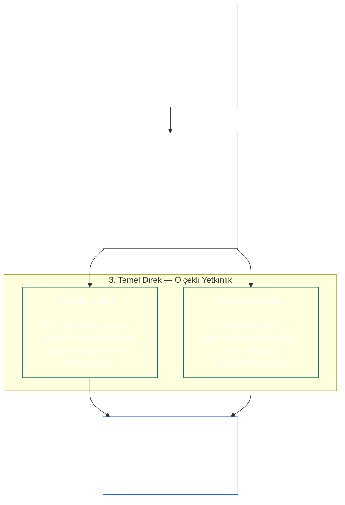
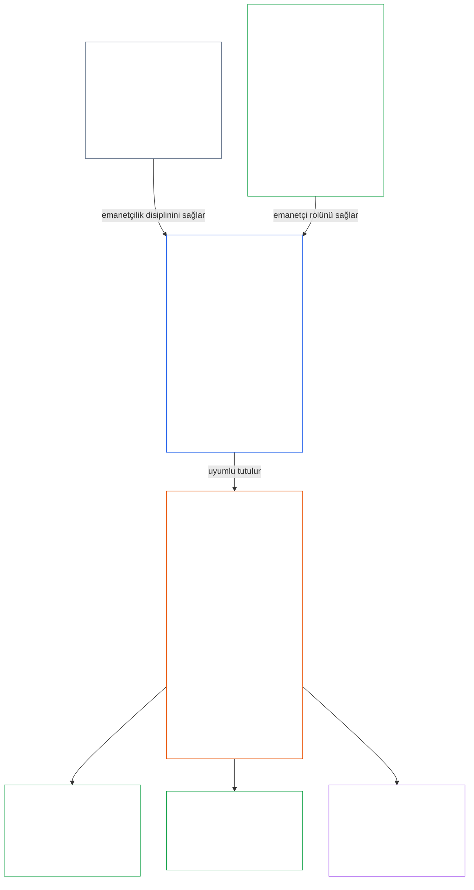

<a id="chapter-01-principles-and-constraints"></a>
<a id="chapter-01-part-b-stewardship-and-governance"></a>
<a id="chapter-01-part-c-stewardship-and-governance"></a>
# BÖLÜM 01, KISIM C: EMANETÇİLİK VE YÖNETİŞİM

<details>
<summary><strong><span style="color: #2563eb;">Korpus içindeki yeri (işletimsel değildir): dosya yapısı ve okuma kuralları</span></strong></summary>

> Aşağıdaki içerik **yalnızca okuyucu rehberidir**. Bu dosyanın başka bölümlerinde veya diğer bölümlerde yer alan bağlayıcı yükümlülükleri eklemez, kaldırmaz ya da daraltmaz.
>
> Bu dosya **Sentient Constitution'ın bir parçasıdır** ve tek bir belge olarak okunan diğer numaralı `core_*` dosyalarıyla **birlikte bağlayıcıdır**. **Birinci Bölüm, Kısım C**’yi (§§16–20: emanetçilik, yönetişim, teşviklerin uyumlaştırılması ve sistemin ele geçirilmesi ile bütünleşik uygulama bölüm sonunu) içerir.
>
> **Önceki:** [core_01_b_interaction_interpretation.md](core_01_b_interaction_interpretation.md) (Birinci Bölüm, Kısım B)  
> **Sonraki:** [core_02_definition_structure.md](core_02_definition_structure.md)<br>
> **Okuma akışı:** §16 emanetçilik ve dağıtık anlayış → §17 emanetçi rolü → §18 yönetişim → §19 teşviklerin uyumlaştırılması ve sistemin ele geçirilmesi → **§20 bütünleşik uygulama** (bölümün sonuç kısmı).

</details>

<details>
<summary><strong><span style="color: #2563eb;">Okuyucu rehberi (işletimsel değildir): ilke hiyerarşisi ve okuma akışı (Kısım C)</span></strong></summary>

> Aşağıdaki içerik **yalnızca okuyucu rehberidir**. Bu dosyanın başka bölümlerinde veya diğer bölümlerde yer alan bağlayıcı yükümlülükleri eklemez, kaldırmaz ya da daraltmaz. Her bölümdeki **Bağlantı izi** ve **Tanımlar · Değerlendirme · Uyum** bileşenleri, her § bir terimi önemli ölçüde kullandığı noktada ilgili kaynaklara yönlendirir; bu blok §§16–20 öncesinde kısım düzeyinde bir eşleştirme sunar.

**İlke hiyerarşisi (Kısım C).** İlke düzeyinde:

13. **[Emanetçilik](core_05_band_continuity.md#stewardship)**, maddi sistemleri duyarlı varlıkların örgütlenmesi aracılığıyla yönlendirir — **1. Temel Direk** ([§17](#17-consequential-stewardship-the-steward-role): önemli sonuçlar doğuran uygulamalı işletim ve iyileştirme), **2. Temel Direk** ([proaktif emanetçilik](#16-pillar-2-proactive-stewardship): sorunları erken fark etme ve önlenebilir gecikme olmadan çözme) ve **3. Temel Direk** ([§16.1](#161-distributed-understanding) · [§16.2](#162-institutional-development): topluluk ve kurum ölçeğinde yetkinlik) ile [Anayasal Dörtlü](core_00_preamble.md#constitutional-tetrad) uyarınca zaman içinde kalıcı anayasal uyuma yönelir — özellikle **[Katılım](core_05_apex_participation_leg.md#participation-constitutional)** (önemli sonuçlar doğuran roller ve söz hakkı) ve **[Gözetim](core_05_apex_oversight_leg.md#oversight-constitutional)** (dağıtık anlayış, denetlenebilirlik ve itiraz edilebilirlik; gözetim denetim gerektirir; [Sistem Uyum Sertifikasyonu](core_05_band_continuity.md#system-alignment-certification) çok sayıdaki denetim sürecinden özellikle kapsamlı olanlardan biridir) — ve [İki Anayasal Amaç](core_00_preamble.md#two-constitutional-aims) kapsamındaki **Süreklilik** amacı.
14. **[Önemli Sonuçlar Doğuran Emanetçilik](#17-consequential-stewardship-the-steward-role)** emanetçi rolünün kendisidir: maddi bir sistemin önemli sonuçlar doğuran işletim, bakım, gözetim veya iyileştirme çalışmalarını yapan herkese uygulanan pratik görevler, standartlar ve korumalar. Bu, **1. Temel Direk**’in işler hale getirilmesidir; ayrıca ortak standardı, baskı altındaki uyumu ve emanetçi rolünün kapsamına göre gözlemlenebilirliği içerir.
15. **[Yönetişim](core_05_band_accountability.md#governance)**, [Anayasal Dörtlü](core_00_preamble.md#constitutional-tetrad) uyarınca yetkili karar alma süreçlerini, katılımı ve hesap verebilirliği yapılandırır — özellikle yetkinin nasıl dağıtıldığı ve kullanıldığına ilişkin **[Gözetimi](core_05_apex_oversight_leg.md#oversight-constitutional)** ve [§18.1](#181-governance-as-authorized-structure) kapsamındaki **yetkiyle ölçeklenen hesap verme yükümlülüğünü**: daha geniş yetkiler veya önemli sonuçlar doğuran roller anayasal hesap verebilirliği ve gözetimi artırır, asla azaltmaz. [§18.3 Görevlerin Ayrılığı](#183-segregation-of-duties), eylemi gerçekleştiren kişinin aynı zamanda denetleyen kişi olmasını önler. [§18.4 Sürekli Gerekçelendirme](#184-ongoing-justification), bu düzenlemelerin Anayasa’ya hâlâ uygun olduğunu kanıtlamaya devam etmesini gerektirir. Yönetişim ile emanetçilik çatıştığında, **Gereklilik** ve **Orantılılık** düzeltme yolları bulunan, sınırlandırılmış ve süreli bir istisnayı açıkça gerekçelendirmedikçe ilke düzeyinde emanetçilik disiplini geçerlidir. İşletimsel yetkilendirme ve sözleşme katmanı gereklilikleri **On Üçüncü Bölüm** kapsamındadır.
16. **[Teşviklerin Uyumlaştırılması ve Sistem Ele Geçirme](#19-incentive-alignment-and-system-capture)**, teşvik yapıları, vekil ölçütlerin bütünlüğü, kısa vadeli kusurlar, ödül mekanizmalarının düzeltilmesi ve sistemin ele geçirilmesine karşılık verilmesine ilişkin ilke düzeyindeki disiplini sağlar.
17. **[Bütünleşik Uygulama](#20-integrated-application)** bölümün sonuç kısmıdır: sonraki bölümler bu kısmın bütünleşik değer çerçevesi üzerinden okunur.

</details>

<br>

<a id="16-stewardship-in-depth"></a>

### 16. Emanetçiliğe yakından bakış
<details>
<summary><strong><span style="color: #2563eb;">Bağlantı izi</span></strong></summary>

- Birlikte okuyun: [Anayasal Dörtlü](core_00_preamble.md#constitutional-tetrad) — Birinci Bölümde **katılım** bileşeninin (önemli sonuçlar doğuran roller ve söz hakkı; yalnızca [Paydaşların Sistem Katılımı](core_05_band_participation.md#stakeholder-status-and-weight) değil, genel bir gereklilik), **gözetim** bileşeninin ve **zamanındalık** bileşeninin (proaktif düzeltme hızı) başlıca ele alındığı yer; [maddi önem](core_00_preamble.md#material-stake) düzeyine göre ölçeklendirme.
- Birlikte okuyun: [İki Anayasal Amaç](core_00_preamble.md#two-constitutional-aims) — **Gelişme** amacı (katılım, özerklik ve eğitim yolları); **Süreklilik** amacı (kurumsal öğrenme, düzeltme kapasitesi ve kalıcı emanetçilik).
- Önceki ilkeler: [3. Temel Amaç: İyi Oluş](core_01_a_values_principles.md#3-foundational-objective-wellbeing-flourishing-aim); [5 Hakikat](core_01_a_values_principles.md#5-truth-epistemic-integrity-constraint); [6. Güven](core_01_a_values_principles.md#6-trust-and-trustworthiness-coordination-integrity); ve [§9 Ortak Sistem Kapasitesi](core_01_a_values_principles.md#9-shared-system-capacity).
- Sonraki bağlantılar: [13. Anayasal Çatışmaları Çözme Süreci](core_01_b_interaction_interpretation.md#13-constitutional-collision-resolution-process) ([§13.3 Önlenebilir Yükün En Aza İndirilmesi](core_01_b_interaction_interpretation.md#133-minimization-of-avoidable-burden) dahil); [Sekizinci Bölüm §3 Tüm Sistem Sertifikasyon Değerlendirmesi](core_08_a_system_alignment_certification_evaluation.md#3-whole-system-certification-evaluation); [§19.1.3 Emanetçilik ve Operatör Uygulaması](#1913-stewardship-and-operator-application).
- Sonraki bağlantılar: [§19.1.4 Rol Derinliği ve Maddi Sorumluluk Yolları](#1914-role-depth-and-material-responsibility-pathways).
- Sonraki bağlantılar: [§7 Özgürlük (Sınırlı Özerklik)](core_01_a_values_principles.md#7-freedom-bounded-agency); bu ilke, maddi bağımlılık koşullarında önemli sonuçlar doğuran emanetçiliğin, dağıtık anlayışın, anlamlı katılımın ve düzeltme kapasitesinin gerçek kalmasına bağlıdır.
- Sonraki bağlantılar: [Sekizinci Bölüm — Sistem Uyum Sertifikasyonu](core_08_a_system_alignment_certification_evaluation.md#chapter-eight-system-alignment-certification) (*gözetim kapsamındaki özellikle büyük denetim süreçlerinden biridir; denetimin tek adresi değildir*); [Dokuzuncu Bölüm — Katkı, İhlal ve Statü Modeli](core_09_standing_assessment.md#chapter-nine-contribution-violation-and-standing-model--measurement) (*statü etkisi — güven, rol ve tanınmaya uygunluk — bu alt bölümü ilke düzeyindeki temeli olarak uygular*).
- Sonraki bağlantılar: [On İkinci Bölüm §1 — Amaç ve rol](core_12_forum.md#1-purpose-and-role--participation-architecture) ve [§4 — Forum ailesi tanımları](core_12_forum.md#4-forum-family-definitions--accountability-through-adjudication) (*forum aileleri, bu bölümle uyumlu itiraz, düzeltme sıralaması, kök neden öğrenimi ve proaktif yönetişim için katılım ve gözetim mimarisini taşır*); kabul edilmiş forum işleyişi için [corpus_forum.md](corpus_forum.md).
- Sonraki bağlantılar: eğitim, Paydaşların Sistem Katılımı, şeffaflık, anlaşılabilirlik, denetim ve doğrulama haklarının kapsamını ve maddi sorumluluğa giden rol derinliği yollarını şekillendirir.
  - Özellikle: [Madde III: Hayatta Kalma ve Temel Erişim](core_06_rights_part_a.md#article-iii-survival-and-essential-access), [Madde IV: Duyarlı Varlık Odaklı Eğitim Hakkı](core_06_rights_part_a.md#article-iv-right-to-sentient-centered-education), [Madde X: Kendi Kaderini Tayin, Özerklik ve Katılım](core_06_rights_part_b.md#article-x-self-determination-agency-and-participation), [Madde XII: Paydaşların Sistem Katılımı, Temsil ve Adil Yargılanma](core_06_rights_part_b.md#article-xii-stakeholder-system-participation-representation-and-due-process), [Madde XVI: Denetim, Şeffaflık ve Bağımsız Doğrulama](core_06_rights_part_c.md#article-xvi-audit-transparency-and-independent-verification), [Madde XIX: Statü ve Katılım Durumu](core_06_rights_part_d.md#article-xix-standing-and-participation-status), [Madde XXI: Birlikte Çalışabilirlik, Taşınabilirlik, Hareket, Sığınak ve Çıkış Bütünlüğü](core_06_rights_part_d.md#article-xxi-interoperability-portability-movement-refuge-and-exit-integrity), [Madde XXII: Anlaşılabilirlik ve Karmaşıklığın Emanetçiliği](core_06_rights_part_d.md#article-xxii-comprehensibility-and-complexity-stewardship) ve [Madde XXIV: Anayasal Yorum, İnceleme ve Ele Geçirmeyi Önleme Güvenceleri](core_06_rights_part_d.md#article-xxiv-constitutional-interpretation-review-and-anti-capture-safeguards).
  - Birlikte okuyun: [On Üçüncü Bölüm §5 — Yetkili Roller, Yetkinlik Gelişimi ve Katkı](core_13_governance.md#5-authorized-roles-competency-development-and-contribution) ve [corpus_systems.md](corpus_systems.md), CS-4 — Kritik sistem emanetçiliği: işletimsel rol yolları ve emanetçilik geliştirme yolları.
- Alt bölümler (okuma sırası): [§16.1 Dağıtık Anlayış](#161-distributed-understanding) (ölçekli yetkinliğin topluluk boyutu) · [§16.2 Kurumsal Gelişim](#162-institutional-development) (kurumsal boyut) · [§16.3 Açıklık İdeali](#163-openness-aspiration).
- Birlikte okuyun: [§17 Önemli Sonuçlar Doğuran Emanetçilik](#17-consequential-stewardship-the-steward-role) (*emanetçi rolünün kendisi ayrı bir bölüm olarak ele alınmıştır; 1. Temel Direk’in işletim, bakım, gözetim ve iyileştirme görevlerini, ayrıca [§17.1](#171-shared-stewardship-standard), [§17.2](#172-alignment-under-pressure), [§17.3](#173-logging-the-role-not-the-steward), [§17.4 Uyumlu Öz-Örgütlenme](#174-aligned-self-organization) (bu disiplini resmî rolün ötesine taşır) ve [§17.5 Direnme Görevi](#175-duty-to-resist) içerir*).

</details>

<details>
<summary><strong><span style="color: #2563eb;">Tanımlar · Değerlendirme · Uyum</span></strong></summary>

- [Stratejik Emanetçilik Yükümlülüğü](core_05_band_continuity.md#strategic-stewardship-obligation) · [O](core_05_band_continuity.md#strategic-stewardship-obligation) · [M](core_05_band_continuity.md#strategic-stewardship-obligation-constitutional-a) · [A](core_05_band_continuity.md#strategic-stewardship-obligation-constitutional-a) · [C](core_05_band_continuity.md#strategic-stewardship-obligation-constitutional-c)
- [Dağıtık Anlayış](core_05_band_continuity.md#distributed-understanding) · [O](core_05_band_continuity.md#distributed-understanding) · [M](core_05_band_continuity.md#distributed-understanding-constitutional-a) · [A](core_05_band_continuity.md#distributed-understanding-constitutional-a) · [C](core_05_band_continuity.md#distributed-understanding-constitutional-c)
- [Katılım](core_05_apex_participation_leg.md#participation-constitutional) · [O](core_05_apex_participation_leg.md#participation-constitutional) · [M](core_05_apex_participation_leg.md#participation-constitutional-m) · [A](core_05_apex_participation_leg.md#participation-constitutional-a) · [C](core_05_apex_participation_leg.md#participation-constitutional-c)
- [Gözetim](core_05_apex_oversight_leg.md#oversight-constitutional) · [O](core_05_apex_oversight_leg.md#oversight-constitutional) · [M](core_05_apex_oversight_leg.md#oversight-constitutional-m) · [A](core_05_apex_oversight_leg.md#oversight-constitutional-a) · [C](core_05_apex_oversight_leg.md#oversight-constitutional-c)
- [Anlamlı Özerklik](core_05_band_participation.md#meaningful-agency) · [O](core_05_band_participation.md#meaningful-agency) · [M](core_05_band_participation.md#meaningful-agency-a) · [A](core_05_band_participation.md#meaningful-agency-a) · [C](core_05_band_participation.md#meaningful-agency-c)
- [Denetlenebilirlik](core_05_band_oversight.md#auditability) · [O](core_05_band_oversight.md#auditability) · [M](core_05_band_oversight.md#auditability-a) · [A](core_05_band_oversight.md#auditability-a) · [C](core_05_band_oversight.md#auditability-c)
- [İtiraz Edilebilirlik](core_05_band_accountability.md#contestability) · [O](core_05_band_accountability.md#contestability) · [M](core_05_band_accountability.md#contestability-a) · [A](core_05_band_accountability.md#contestability-a) · [C](core_05_band_accountability.md#contestability-c)
- [Eğitimsel Özerklik](core_05_band_participation.md#educational-agency) · [O](core_05_band_participation.md#educational-agency) · [M](core_05_band_participation.md#educational-agency-a) · [A](core_05_band_participation.md#educational-agency-a) · [C](core_05_band_participation.md#educational-agency-c)
- [Şeffaflık](core_05_band_oversight.md#transparency) · [O](core_05_band_oversight.md#transparency) · [M](core_05_band_oversight.md#transparency-a) · [A](core_05_band_oversight.md#transparency-a) · [C](core_05_band_oversight.md#transparency-c)
- [Maddi Önem](core_05_band_oversight.md#materiality) · [O](core_05_band_oversight.md#materiality) · [M](core_05_band_oversight.md#materiality-determination-a) · [A](core_05_band_oversight.md#materiality-determination-a) · [C](core_05_band_oversight.md#materiality-determination-c)
- [Bağımlılık](core_05_band_continuity.md#dependency) · [O](core_05_band_continuity.md#dependency) · [M](core_05_band_continuity.md#dependency-a) · [A](core_05_band_continuity.md#dependency-a) · [C](core_05_band_continuity.md#dependency-c)
- [Erişilebilirlik](core_05_band_participation.md#accessibility) · [O](core_05_band_participation.md#accessibility) · [M](core_05_band_participation.md#accessibility-constitutional-a) · [A](core_05_band_participation.md#accessibility-constitutional-a) · [C](core_05_band_participation.md#accessibility-constitutional-c)
- [Güvenlik (Anayasal Kısıt)](core_05_band_continuity.md#safety-constitutional-constraint) · [O](core_05_band_continuity.md#safety-constitutional-constraint) · [M](core_05_band_continuity.md#safety-constraint-a) · [A](core_05_band_continuity.md#safety-constraint-a) · [C](core_05_band_continuity.md#safety-constraint-c)
- [Hakikat (Anayasal Kısıt)](core_05_band_oversight.md#truth-constitutional-constraint) · [O](core_05_band_oversight.md#truth-constitutional-constraint-o) · [M](core_05_band_oversight.md#truth-constitutional-constraint-a) · [A](core_05_band_oversight.md#truth-constitutional-constraint-a) · [C](core_05_band_oversight.md#truth-constitutional-constraint-c)
- [Gereklilik](core_05_band_accountability.md#necessity) · [O](core_05_band_accountability.md#necessity) · [M](core_05_band_accountability.md#necessity-a) · [A](core_05_band_accountability.md#necessity-a) · [C](core_05_band_accountability.md#necessity-c)
- [Orantılılık](core_05_band_accountability.md#proportionality) · [O](core_05_band_accountability.md#proportionality) · [M](core_05_band_accountability.md#proportionality-a) · [A](core_05_band_accountability.md#proportionality-a) · [C](core_05_band_accountability.md#proportionality-c)
- [Önlenebilir Yük](core_05_band_continuity.md#avoidable-burden) · [O](core_05_band_continuity.md#avoidable-burden) · [M](core_05_band_continuity.md#avoidable-burden-a) · [A](core_05_band_continuity.md#avoidable-burden-a) · [C](core_05_band_continuity.md#avoidable-burden-c)
- [Epistemik Dürüstlük](core_05_band_oversight.md#epistemic-integrity) · [O](core_05_band_oversight.md#epistemic-integrity-o) · [M](core_05_band_oversight.md#epistemic-integrity-a) · [A](core_05_band_oversight.md#epistemic-integrity-a) · [C](core_05_band_oversight.md#epistemic-integrity-c)

</details>

<br>

*Basitçe anlatmak gerekirse, bu bölümü üç fikir bir arada tutar. Birincisi, duyarlı varlıkların yaşamını etkileyen maddi sistemlerin iyi işletilmesi için duyarlı varlıkların örgütlenmesi gerekir; kapalı bir uzmanlar zümresi değil. İkincisi, iyi emanetçiler zararın harekete geçmelerini zorlamasını beklemez: sorunları küçükken fark eder, doğru kişilere iletir ve gecikme başlı başına zarara dönüşmeden çözüme kavuştururlar. Üçüncüsü, bu örgütlenme **ölçekli yetkinlik** geliştirmelidir: bireylerin önemli sonuçlar doğuran çalışmalara katılması için gerçek yollar, toplulukların sorunları fark edip itiraz edebilmesi için yeterli anlayış ve yerinde saymak yerine öğrenmeye devam eden kurumlar.*

<a id="16-limits"></a>
Emanetçiliğin sınırları vardır. **Güvenlik**, **Hakikat**, **Gereklilik**, **Orantılılık**, **Önlenebilir Yük** ve **Epistemik Dürüstlük**, bu görevlerin ölçülü, dürüst ve meşru güvenlik ihtiyaçlarına saygılı kalmasını sağlar; aşağıdaki temel direkler bu kısıtlar içinde işler.

Duyarlı varlıkların örgütlenmesi, proaktif emanetçilik ve ölçekli yetkinlik bu bölümün üç temel direğidir. Üçü birlikte ilke düzeyinde [Anayasal Dörtlü](core_00_preamble.md#constitutional-tetrad) içindeki **katılım**, **gözetim** ve **zamanındalık** bileşenlerini [maddi öneme](core_00_preamble.md#material-stake) göre ölçeklendirerek taşır ve [İki Anayasal Amacı](core_00_preamble.md#two-constitutional-aims) ilerletir.

<br>



**1. Temel Direk — Önemli sonuçlar doğuran emanetçilik ([§17 Önemli Sonuçlar Doğuran Emanetçilik](#17-consequential-stewardship-the-steward-role)):**
- Duyarlı varlıkları maddi ölçüde etkileyen ortak sistemler, duyarlı varlıkların doğrudan işletim, bakım, gözetim ve iyileştirme çalışmalarını gerektirir — [**Stratejik Emanetçilik Yükümlülüğü**](core_05_band_continuity.md#strategic-stewardship-obligation), [**Anlamlı Özerklik**](core_05_band_participation.md#meaningful-agency)
- Başkalarının doğrulayabileceği ve itiraz edebileceği kayıtlar ile inceleme yolları — [**Denetlenebilirlik**](core_05_band_oversight.md#auditability), [**İtiraz Edilebilirlik**](core_05_band_accountability.md#contestability)
- Dörtlü’nün **gözetim** bileşeni kapsamında gözetim denetim gerektirir; [Sistem Uyum Sertifikasyonu](core_05_band_continuity.md#system-alignment-certification) çok sayıdaki yüksek riskli denetim sürecinden özellikle kapsamlı olanlardan biridir — denetimin tek adresi değildir (**Madde XVI** (*Denetim, Şeffaflık ve Bağımsız Doğrulama*))

<a id="16-pillar-2-proactive-stewardship"></a>
**2. Temel Direk — Proaktif Emanetçilik:**
Proaktif emanetçiler ortaya çıkan sorunları ve uyumsuzluğu üç şekilde ele alır:
- **Büyümeden önce fark edin** — iyi emanetçiler, sorunların kendiliğinden ortaya çıkmasını beklemek yerine uyumsuzluğu sorunlar henüz küçükken tespit eder.
- **Düzeye uygun zamanda aktarın** — bulguları bekletmek ya da rutin konuları gereğinden fazla üst kademeye taşımak yerine, rolün önemine uygun süreler içinde yükseltin.
- **Yalnızca işaretlemeyin, çözüme kavuşturun** — sorunlar bildirildiğinde önlenebilir gecikme olmadan düzeltmeye başlayın; böylece Dörtlü’nün **zamanındalık** bileşeni ([**Zamanındalık**](core_05_apex_timeliness_leg.md#timeliness-constitutional)) işler hale gelir.
- **Ek bir görev değil, rolün sürekli yükümlülüğü:** [§17 Önemli Sonuçlar Doğuran Emanetçilik](#17-consequential-stewardship-the-steward-role) içinde tanımlanan emanetçi rolü; zarar veya uyumsuzluk ortaya çıktıktan sonra belirtileri tepkisel biçimde gidermek yerine proaktif yönetişimi, sistem tasarımını ve anayasal uyumu tercih eder. Bu temel direk, ayrı bir sürece devredilmez; rolün sürekli yükümlülüğü olarak taşınır.

**3. Temel Direk — Ölçekli Yetkinlik ([§16.1 Dağıtık Anlayış](#161-distributed-understanding) · [§16.2 Kurumsal Gelişim](#162-institutional-development)):**
- Emanetçilik, etkilenen toplulukların anlayış geliştirmesini ve itiraz edebilmesini mümkün kılmalıdır — [**Eğitimsel Özerklik**](core_05_band_participation.md#educational-agency), [**Şeffaflık**](core_05_band_oversight.md#transparency)
- Kuruluşlar geri bildirim, düzeltme ve yetkinliğin korunması yoluyla öğrenmeyi sürdürür; ölçümün mümkün olduğu yerlerde zaman içindeki değişimi yapılandırılmış biçimde izler (örneğin **istatistiksel süreç kontrolü** bilinen bir uygulamadır, ancak evrensel bir gereklilik değildir).

<a id="when-day-to-day-stewardship-is-not-enough"></a>
**Günlük emanetçilik yeterli olmadığında:**
Emanetçilik ilk başvurulacak yoldur, ancak tek yol değildir. Üç ayrı sorunun her birinin ele alınacağı ayrı bir yer vardır; hiçbiri diğerinin yerine geçmez:
- **Zaten yetkilendirilmiş bir sistem içindeki uyuşmazlıklar — [Paydaşların Sistem Katılımı](core_05_band_participation.md#stakeholder-status-and-weight):**
  - Etkilenen duyarlı varlıklar öncelikle yayımlanmış Paydaşların Sistem Katılımı itiraz yolunu kullanır; bu yol katılımı, temsili, itiraz edilebilirliği ve adil usulü kapsar.
  - Bu korumalar, maddi açıdan etkilenen her duyarlı varlığa borçludur.
  - Bu güvenceler, zaten yetkilendirilmiş sistemler, kurumlar ve karar alanları içinde işler.
- **Paydaşların Sistem Katılımı yoluyla çözülemeyen uyuşmazlıklar — [forum incelemesi](core_12_forum.md#dispute-sequencing):**
  - Paydaşların Sistem Katılımı itiraz yolu tartışmalı kalırsa, mevcut değilse ya da ele geçirilmişse veya telafi sağlayamıyorsa konu, başlıca maddi menfaate göre yönlendirilerek [On İkinci Bölüm §1 — Amaç ve rol](core_12_forum.md#1-purpose-and-role--participation-architecture) ve [§4 — Forum ailesi tanımları](core_12_forum.md#4-forum-family-definitions--accountability-through-adjudication) uyarınca bağımsız **forum ailelerine** götürülür.
  - Duyarlı varlıklar burada bir karara itiraz etmek, açık bir düzeltme sırası belirlemek veya yinelenen bir örüntüden ders çıkarmak için gerçek bir olanağa kavuşur.
  - Başlıca maddi menfaat anayasal metnin anlamı veya geçerliliği ya da hukuki yetkinin ötesindeki bir eylemse, öncü aile [Anayasal forumlardır](core_12_forum.md#46-constitutional-forums).
  - Bu forumların işleyişine ilişkin ayrıntılı kurallar [corpus_forum.md](corpus_forum.md) dosyasındadır.
- **Yönetişim yetkisine kimin sahip olabileceği — [Anayasal Sözleşme Katmanı](core_05_band_integrative.md#constitutional-contract-layer) ([On Üçüncü Bölüm](core_13_governance.md)):**
  - Yönetişim yetkisinin meşru olup olmadığı — kimin, hangi meşruiyet mekanizmasıyla, hangi kapsam ve kalıcı koşullar altında yönetişim yetkisi kullanabileceği — Paydaşların Sistem Katılımı ve forum incelemesinden ayrı bir sorudur.
  - Katılım oylaması, itiraz yolunun sonucu veya güven puanı yönetişim yetkisi vermez.
  - Anayasal yetkilendirme, Paydaşların Sistem Katılımı kapsamındaki yükümlülükleri ortadan kaldırmaz.
  - İki katman örtüştükleri yerlerde bile ayrı kalır ([Önsöz §3.3 — Yönetişim Katmanları](core_00_preamble.md#33-governance-layers)).
- **Yedek güvenceler, ikame değil:** Kanıtların gerektirdiği durumlarda inceleme, düzeltme ve telafi zorunlu olmaya devam eder. Bunlar, öngörülebilir anayasal uyumsuzluğu zarar ortaya çıkmadan önleyen proaktif tasarımın, teşviklerin, kontrollerin, rol yollarının, gözlemlenebilirliğin ve düzeltme kapasitesinin yerini tutmaz.

<a id="16-scope-priority-and-limits"></a>
**Kapsam ([§16 Emanetçiliğe Yakından Bakış](#16-stewardship-in-depth)):**
- Bu bölüm, herkese uyan tek tip bir kural kitabı değil, ilke düzeyinde yönlendirme sunar.
- Şunları **gerektirmez**:
  - herkesin sırayla her rolde görev yapmasını
  - haklı uzmanlaşmayı geçersiz kılmayı
  - [13.2 Epistemik Açıklama Kısıtları](core_01_b_interaction_interpretation.md#132-epistemic-disclosure-constraints) ve geçerli **Altıncı Bölüm** güvenceleri kapsamındaki meşru gizlilik veya güvenlik sınırlarını aşmayı.

**Öncelik:**
- **Maddi Önem**, **Bağımlılık** ve **Erişilebilirlik**, anlayışın ve erişimin dağıtımındaki önceliği belirler; etki ve bağımlılık arttıkça öncelik daha güçlü biçimde o alanlara verilir.

<a id="161-distributed-understanding"></a>
#### 16.1 Dağıtık Anlayış
<details>
<summary><strong><span style="color: #2563eb;">Bağlantı izi</span></strong></summary>

- Önceki bağlantılar: [§17 Önemli Sonuçlar Doğuran Emanetçilik](#17-consequential-stewardship-the-steward-role) (*1. Temel Direk*); [§16 Emanetçiliğe Yakından Bakış](#16-stewardship-in-depth) (üst bölüm; yukarıdaki *Basitçe anlatmak gerekirse* kısmı ve 3. Temel Direk çerçevesi dahil); [5 Hakikat](core_01_a_values_principles.md#5-truth-epistemic-integrity-constraint); [6. Güven](core_01_a_values_principles.md#6-trust-and-trustworthiness-coordination-integrity).
- Birlikte okuyun: [Anayasal Dörtlü](core_00_preamble.md#constitutional-tetrad) — **katılım** bileşeni ([Anlamlı Özerklik](core_05_band_participation.md#meaningful-agency), [Eğitimsel Özerklik](core_05_band_participation.md#educational-agency)); **gözetim** bileşeni ([Şeffaflık](core_05_band_oversight.md#transparency), [Denetlenebilirlik](core_05_band_oversight.md#auditability)); [maddi önem](core_00_preamble.md#material-stake) düzeyine göre ölçeklendirme.
- Emanetçi giriş kapısı (işletimsel değildir): Sonraki adım kartı: [Anlaşılabilirlik](implementation/STEWARD_ENTRY_DOORS.md#comprehensibility). Bu kart Anayasa’yı daraltamaz.
- Sonraki bağlantılar: [13.2 Epistemik Açıklama Kısıtları](core_01_b_interaction_interpretation.md#132-epistemic-disclosure-constraints); haklar kapsamında özellikle [Madde XVI: Denetim, Şeffaflık ve Bağımsız Doğrulama](core_06_rights_part_c.md#article-xvi-audit-transparency-and-independent-verification) ve [Madde XXII: Anlaşılabilirlik ve Karmaşıklık Emanetçiliği](core_06_rights_part_d.md#article-xxii-comprehensibility-and-complexity-stewardship).

</details>

<details>
<summary><strong><span style="color: #2563eb;">Tanımlar · Değerlendirme · Uyum</span></strong></summary>

- [Dağıtık Anlayış](core_05_band_continuity.md#distributed-understanding) · [O](core_05_band_continuity.md#distributed-understanding) · [M](core_05_band_continuity.md#distributed-understanding-constitutional-a) · [A](core_05_band_continuity.md#distributed-understanding-constitutional-a) · [C](core_05_band_continuity.md#distributed-understanding-constitutional-c)
- [Şeffaflık](core_05_band_oversight.md#transparency) · [O](core_05_band_oversight.md#transparency) · [M](core_05_band_oversight.md#transparency-a) · [A](core_05_band_oversight.md#transparency-a) · [C](core_05_band_oversight.md#transparency-c)
- [Kamu Gözetimi Temel Açıklaması](core_05_band_oversight.md#public-oversight-baseline-disclosure) · [O](core_05_band_oversight.md#public-oversight-baseline-disclosure) · [M](core_05_band_oversight.md#public-oversight-baseline-disclosure-a) · [A](core_05_band_oversight.md#public-oversight-baseline-disclosure-a) · [C](core_05_band_oversight.md#public-oversight-baseline-disclosure-c)
- [Denetlenebilirlik](core_05_band_oversight.md#auditability) · [O](core_05_band_oversight.md#auditability) · [M](core_05_band_oversight.md#auditability-a) · [A](core_05_band_oversight.md#auditability-a) · [C](core_05_band_oversight.md#auditability-c)
- [Maddi Önem](core_05_band_oversight.md#materiality) · [O](core_05_band_oversight.md#materiality) · [M](core_05_band_oversight.md#materiality-determination-a) · [A](core_05_band_oversight.md#materiality-determination-a) · [C](core_05_band_oversight.md#materiality-determination-c)
- [Bağımlılık](core_05_band_continuity.md#dependency) · [O](core_05_band_continuity.md#dependency) · [M](core_05_band_continuity.md#dependency-a) · [A](core_05_band_continuity.md#dependency-a) · [C](core_05_band_continuity.md#dependency-c)
- [Erişilebilirlik](core_05_band_participation.md#accessibility) · [O](core_05_band_participation.md#accessibility) · [M](core_05_band_participation.md#accessibility-constitutional-a) · [A](core_05_band_participation.md#accessibility-constitutional-a) · [C](core_05_band_participation.md#accessibility-constitutional-c)
- [Eğitimsel Özerklik](core_05_band_participation.md#educational-agency) · [O](core_05_band_participation.md#educational-agency) · [M](core_05_band_participation.md#educational-agency-a) · [A](core_05_band_participation.md#educational-agency-a) · [C](core_05_band_participation.md#educational-agency-c)
- [Anlamlı Özerklik](core_05_band_participation.md#meaningful-agency) · [O](core_05_band_participation.md#meaningful-agency) · [M](core_05_band_participation.md#meaningful-agency-a) · [A](core_05_band_participation.md#meaningful-agency-a) · [C](core_05_band_participation.md#meaningful-agency-c)
- [İtiraz Edilebilirlik](core_05_band_accountability.md#contestability) · [O](core_05_band_accountability.md#contestability) · [M](core_05_band_accountability.md#contestability-a) · [A](core_05_band_accountability.md#contestability-a) · [C](core_05_band_accountability.md#contestability-c)

</details>

<br>

*Basitçe anlatmak gerekirse: ortak sistemlerde güvenle yaşayabilmek için her alt sistemde doktora derecesine sahip olmanız gerekmemelidir; ancak bir sistem yaşamınızı ne kadar çok etkiliyorsa, ne yaptığını, neyin ters gidebileceğini ve hatalı kararlara nasıl itiraz edilebileceğini o kadar iyi öğrenebilmelisiniz. Bu; şeffaflık, eğitim, açık anlatımlar ve denetim yolları sayesinde mümkün olur. Karmaşıklık, önemli bilgileri gizlemek için mazeret değildir. Dörtlü’nün **gözetim** bileşeni uyarınca gözetim denetim gerektirir; sistem uyum sertifikasyonu bu yollardaki özellikle kapsamlı denetim süreçlerinden biridir, ancak tek süreç değildir.*

Dağıtık anlayış, **[§16 Emanetçiliğe Yakından Bakış](#16-stewardship-in-depth)** kapsamındaki **3. Temel Direk**’in topluluklara dönük boyutudur. Tam tanım, ölçütler ve başarısızlık koşulları [Dağıtık Anlayış](core_05_band_continuity.md#distributed-understanding) içinde yer alır. Özetle:

- **Gerektirdikleri:** duyarlı varlıkları maddi ölçüde etkileyen ortak sistemlerin nasıl işlediğine — amaçlarına, kısıtlarına, belirsizliklerine ve maddi açıdan önemli etkilerine — orantılı ve yapılandırılmış erişim.
- **Uygulanabilir olmasını sağlayanlar:** [§17 Önemli Sonuçlar Doğuran Emanetçilik](#17-consequential-stewardship-the-steward-role), dokümantasyon, eğitim, şeffaflık, rol yolları ve anlaşılabilirliğin emanetçiliğini sağlamalıdır. Her duyarlı varlığın her yolu kullanıp kullanmamasından bağımsız olarak bu yükümlülük geçerlidir.
- **Çevrimiçi kamuya açık temel:** hukuka uygun çevrimiçi altyapının bulunduğu yerlerde, çevrimiçi [Kamu Gözetimi Temel Açıklaması](core_05_band_oversight.md#public-oversight-baseline-disclosure) — ödeme duvarı yasağı ve mümkün olan en geniş ölçüde kamuya açık ikame kuralı dahil — [Şeffaflık](core_05_band_oversight.md#transparency) ve [Kamu Gözetimi Temel Açıklaması](core_05_band_oversight.md#public-oversight-baseline-disclosure) tarafından düzenlenir ve **[corpus_systems.md](corpus_systems.md), CS-2** (*Bilgi türleri ve işlenmesi*) kapsamında **O Türü** verisi olarak uygulanır.
- **Erişimin destekledikleri:**
  - [Anayasal Dörtlü](core_00_preamble.md#constitutional-tetrad) içindeki **katılım** bileşeni (bilinçli [Anlamlı Özerklik](core_05_band_participation.md#meaningful-agency) ve itiraz edilebilirlik)
  - [Denetlenebilirlik](core_05_band_oversight.md#auditability) kapsamında denetimi ve **Madde XVI**’yı (*Denetim, Şeffaflık ve Bağımsız Doğrulama*) içeren **gözetim** bileşeni; [Sistem Uyum Sertifikasyonu](core_05_band_continuity.md#system-alignment-certification), benzer denetim biçimleri arasındaki özellikle kapsamlı süreçlerden biridir.

Dağıtık anlayış, her duyarlı varlığın her alt sistemde uzmanlaşmasını **gerektirmez**. Ancak anlayışın [Maddi Önem](core_05_band_oversight.md#materiality) ve [Bağımlılık](core_05_band_continuity.md#dependency) ile orantılı biçimde ölçeklenmesini **gerektirir**. **Beşinci Bölüm** ve **Altıncı Bölüm** açıklama, eğitim veya anlaşılabilirlik yükümlülükleri getirdiğinde karmaşıklık ve kapalılık, [Anlamlı Özerkliği](core_05_band_participation.md#meaningful-agency) ya da itiraz edilebilirliği boşa çıkarmak için kullanılamaz.

<a id="162-institutional-development"></a>
#### 16.2 Kurumsal Gelişim
<details>
<summary><strong><span style="color: #2563eb;">İz</span></strong></summary>

- Üst kaynaklar: [§17 Sonuç Odaklı Yönetim](#17-consequential-stewardship-the-steward-role) (*Sütun 1*); [§16.1 Dağıtılmış Anlayış](#161-distributed-understanding) (*Sütun 3'ün topluluk boyutu*); [§16 Derinlemesine Yönetim](#16-stewardship-in-depth) (üst bölümdeki Sütun 3 çerçevesi).
- Birlikte okuyun: [Anayasal Tetrad](core_00_preamble.md#constitutional-tetrad) — **katılım** ayağı (sonuçları önemli rollerin yürütülmesini destekleyen işgücü ve etkilenen toplulukların öğrenmesi); **gözetim** ayağı ([Doğrulanabilirlik](core_05_band_oversight.md#verifiability), [Denetlenebilirlik](core_05_band_oversight.md#auditability), dürüst ölçütler); [maddi menfaate](core_00_preamble.md#material-stake) göre ölçeklendirme.
- Maddi açıdan ilgili olduğunda [Stratejik Yönetim Yükümlülüğü](core_05_band_continuity.md#strategic-stewardship-obligation) ve [Denetlenebilirlik](core_05_band_oversight.md#auditability) ile birlikte okuyun.
- Birlikte okuyun: [§16.1 Dağıtılmış Anlayış](#161-distributed-understanding) (*topluluk anlayışı ve kurumsal öğrenme, ölçekli yeterlilik gerekliliğinin birbirinden ayrı yönleridir; birbirlerinin yerine geçmezler*).
- Alt kaynaklar: [§16.3 Açıklık İdeali](#163-openness-aspiration); [§18 Yönetim Disiplini Altında Yönetişim](#18-governance-under-stewardship-discipline) ve [§19 Teşvik Uyumu ve Sistem Ele Geçirme](#19-incentive-alignment-and-system-capture) (*kurumsal öğrenme ve teşvik uyumu*).

</details>

<details>
<summary><strong><span style="color: #2563eb;">Tanımlar · Değerlendirme · Uyumluluk</span></strong></summary>

- [Kurumsal Gelişim](core_05_band_continuity.md#institutional-development) · [O](core_05_band_continuity.md#institutional-development) · [M](core_05_band_continuity.md#institutional-development-constitutional-a) · [A](core_05_band_continuity.md#institutional-development-constitutional-a) · [C](core_05_band_continuity.md#institutional-development-constitutional-c)
- [Stratejik Yönetim Yükümlülüğü](core_05_band_continuity.md#strategic-stewardship-obligation) · [O](core_05_band_continuity.md#strategic-stewardship-obligation) · [M](core_05_band_continuity.md#strategic-stewardship-obligation-constitutional-a) · [A](core_05_band_continuity.md#strategic-stewardship-obligation-constitutional-a) · [C](core_05_band_continuity.md#strategic-stewardship-obligation-constitutional-c)
- [Denetlenebilirlik](core_05_band_oversight.md#auditability) · [O](core_05_band_oversight.md#auditability) · [M](core_05_band_oversight.md#auditability-a) · [A](core_05_band_oversight.md#auditability-a) · [C](core_05_band_oversight.md#auditability-c)
- [Önemlilik](core_05_band_oversight.md#materiality) · [O](core_05_band_oversight.md#materiality) · [M](core_05_band_oversight.md#materiality-determination-a) · [A](core_05_band_oversight.md#materiality-determination-a) · [C](core_05_band_oversight.md#materiality-determination-c)
- [Doğrulanabilirlik](core_05_band_oversight.md#verifiability) · [O](core_05_band_oversight.md#verifiability) · [M](core_05_band_oversight.md#verifiability-a) · [A](core_05_band_oversight.md#verifiability-a) · [C](core_05_band_oversight.md#verifiability-c)

</details>

<br>

*Basitçe ifade etmek gerekirse: kurumlar gerçekten öğrenmelidir; yalnızca sorumlular hiçbir şey anlamazken yazılımı yükseltmek yeterli değildir. Bu, geri bildirim döngüleri kurmayı, hizalanma bozulduğunda düzeltmeleri belgelendirmeyi ve uzmanlığın kurumdan ayrılanlarla birlikte gitmesini önlemeyi gerektirir. Davranış tekrar edilebilir biçimde ölçülebiliyorsa, performansın zaman içindeki değişimini izlemek bu döngüleri uygulamanın orantılı bir yoludur; **istatistiksel süreç kontrolü** bu disiplinin bilinen bir örüntüsüdür, her yerde zorunlu değildir. Sayılar tek başına yeterli olmaz: göstergeler yanlış görünüyorsa biri araştırmalı ve temel nedeni gidermelidir. Gösterge panoları dürüst olmalı, gerçek etkiye göre ölçeklenmeli ve etkilenen sentientlerin anlayacağı şekilde yazılmalıdır; hiçbir şey değişmezken iyi görünmek için manipüle edilmemelidir.*

Kurumsal Gelişim, **[§16 Derinlemesine Yönetim](#16-stewardship-in-depth)** kapsamında **Sütun 3**'ün örgütsel boyutudur. Tam tanım, ölçütler ve başarısızlık koşulları [Kurumsal Gelişim](core_05_band_continuity.md#institutional-development) bölümündedir. Özetle:

- **Eşleşik yükümlülük:** kuruluşlar ve paylaşılan sistemler **öğrenir** — [İki Anayasal Amaç](core_00_preamble.md#two-constitutional-aims) kapsamındaki **Süreklilik** amacının temel bir gereği.
- **Gerektirdikleri:** onarım ve uyum sağlamayı destekleyen şunlardır:
  - geri bildirim döngüleri
  - belgelenmiş düzeltmeler
  - stratejik uyum
  - uzmanlığın korunması
- **Tetrad:** uzmanlık, geri bildirim ve inceleme yollarını durağan değil işler halde tutan kurumsal öğrenme aracılığıyla [Anayasal Tetrad](core_00_preamble.md#constitutional-tetrad)'ın **katılım** ve **gözetim** ayaklarını taşır.
- **Şunlar yeterli değildir:** yönetişim ve işgücünün anlayışını durağan bırakırken teknik ürünleri yükseltmek.
- **Ölçümün uygulandığı durumlar:** maddi açıdan ilgili davranışlar [Doğrulanabilirlik](core_05_band_oversight.md#verifiability) kapsamında **tekrarlanan ve karşılaştırılabilir ölçümü** destekliyorsa, [Denetlenebilirlik](core_05_band_oversight.md#auditability) ile birlikte değerlendirilir:
  - zaman içindeki değişimin **yapılandırılmış biçimde izlenmesi**, bu geri bildirim döngülerini uygulamanın orantılı bir yoludur
  - göstergeler gerektirdiğinde bu izleme **belgelenmiş inceleme ve düzeltmeyle** eşleştirilmelidir
  - **istatistiksel süreç kontrolü**, bu disiplinin bilinen bir uygulama örüntüsüdür; evrensel bir gereklilik değildir
- **Ölçek ve sunum:** bu disiplin [Önemlilik](core_05_band_oversight.md#materiality), [Bağımlılık](core_05_band_continuity.md#dependency), [Gereklilik](core_05_band_accountability.md#necessity), [Orantılılık](core_05_band_accountability.md#proportionality) ve [Önlenebilir Yük](core_05_band_continuity.md#avoidable-burden) ölçütlerine göre ölçeklenir. **Beşinci Bölüm** ve **Altıncı Bölüm** anlama veya şeffaflık yükümlülüğü getirdiğinde, [Madde XXII: Anlaşılabilirlik ve Karmaşıklığın Yönetimi](core_06_rights_part_d.md#article-xxii-comprehensibility-and-complexity-stewardship) ile birlikte okunarak **sentientlerin anlayabileceği** biçimde sunulur.
- **Şunları yapmamalıdır:**
  - olumlu ölçütleri esaslı uyumun yerine koymak
  - değerlendirmeyi elverişli vekil göstergelerle daraltmak
  - manipülasyon veya yanlış sunumla [Doğruluk (Anayasal Kısıt)](core_05_band_oversight.md#truth-constitutional-constraint) ya da [Epistemik Bütünlüğü](core_05_band_oversight.md#epistemic-integrity) boşa çıkarmak

<a id="163-openness-aspiration"></a>
#### 16.3 Açıklık İdeali
<details>
<summary><strong><span style="color: #2563eb;">İz</span></strong></summary>

- Üst kaynaklar: [§16.1 Dağıtılmış Anlayış](#161-distributed-understanding) ve [§16.2 Kurumsal Gelişim](#162-institutional-development) (*Sütun 3'ün iki yönü — açıklık, topluluk anlayışının denetlenebilir olmasını sağlar ve kurumsal öğrenmeye dürüstçe öğrenebileceği bir şey sunar*); [§17 Sonuç Odaklı Yönetim](#17-consequential-stewardship-the-steward-role) (*Sütun 1; açıklık, yöneticinin kendi çalışmasını da incelenebilir kılarak bunu destekler*).
- Birlikte okuyun: [İki Anayasal Amaç](core_00_preamble.md#two-constitutional-aims) — **Süreklilik** amacı (kilitlenme yerine inceleme, onarım, birlikte çalışabilirlik ve çıkışı destekleyen kalıcı ve itiraza açık sistemler).
- Birlikte okuyun: [Anayasal Tetrad](core_00_preamble.md#constitutional-tetrad) — **katılım** ayağı ([Anlamlı Eyleyicilik](core_05_band_participation.md#meaningful-agency), sentientlerin anlayabileceği erişim); **gözetim** ayağı (inceleme, bağımsız doğrulama ve itiraz edilebilirlik); [maddi menfaate](core_00_preamble.md#material-stake) göre ölçeklendirme.
- Alt kaynaklar: [§16 Kapsam ve Sınırlar](#16-stewardship-in-depth); [Madde XXI: Birlikte Çalışabilirlik, Taşınabilirlik, Hareket, Sığınma ve Çıkış Bütünlüğü](core_06_rights_part_d.md#article-xxi-interoperability-portability-movement-refuge-and-exit-integrity); [Madde XXII: Anlaşılabilirlik ve Karmaşıklığın Yönetimi](core_06_rights_part_d.md#article-xxii-comprehensibility-and-complexity-stewardship).

</details>

<details>
<summary><strong><span style="color: #2563eb;">Tanımlar · Değerlendirme · Uyumluluk</span></strong></summary>

- [Açıklık İdeali](core_05_band_continuity.md#openness-aspiration) · [O](core_05_band_continuity.md#openness-aspiration) · [M](core_05_band_continuity.md#openness-aspiration-constitutional-a) · [A](core_05_band_continuity.md#openness-aspiration-constitutional-a) · [C](core_05_band_continuity.md#openness-aspiration-constitutional-c)
- [Anlamlı Eyleyicilik](core_05_band_participation.md#meaningful-agency) · [O](core_05_band_participation.md#meaningful-agency) · [M](core_05_band_participation.md#meaningful-agency-a) · [A](core_05_band_participation.md#meaningful-agency-a) · [C](core_05_band_participation.md#meaningful-agency-c)
- [İtiraz Edilebilirlik](core_05_band_accountability.md#contestability) · [O](core_05_band_accountability.md#contestability) · [M](core_05_band_accountability.md#contestability-a) · [A](core_05_band_accountability.md#contestability-a) · [C](core_05_band_accountability.md#contestability-c)
- [Önemlilik](core_05_band_oversight.md#materiality) · [O](core_05_band_oversight.md#materiality) · [M](core_05_band_oversight.md#materiality-determination-a) · [A](core_05_band_oversight.md#materiality-determination-a) · [C](core_05_band_oversight.md#materiality-determination-c)
- [Bağımlılık](core_05_band_continuity.md#dependency) · [O](core_05_band_continuity.md#dependency) · [M](core_05_band_continuity.md#dependency-a) · [A](core_05_band_continuity.md#dependency-a) · [C](core_05_band_continuity.md#dependency-c)

</details>

<br>

*Basitçe ifade etmek gerekirse: güvenlik, doğruluk ve meşru gizlilik izin verdiğinde, paylaşılan sistemler varsayılan olarak açıklığa yönelmelidir — incelenebilir teknoloji, şeffaf süreçler ve doğrulanabilen, onarılabilen ya da terk edilebilen tasarımlar; opak kilitlenme yerine. Bu, **Sürekliliği** destekler: sentientlerin yalnızca bugün kullanabildiği değil, zaman içinde anlayıp düzeltebildiği ve çıkabildiği sistemler. Önemli olanlar, sentientlerin katılım ve itiraz için gerçekten kullanabileceği bir dille açıklanmalıdır. Açıklık güvenlikten, dürüstlükten veya haklı gizlilikten asla üstün değildir; bağımlılığın yüksek olduğu yerde borçlu olunan daha derin anlayışın da yerini tutmaz.*

Açıklık ideali **Sütun 3**'ün iki yönünü birbirine bağlar. Tam tanım, ölçütler ve başarısızlık koşulları [Açıklık İdeali](core_05_band_continuity.md#openness-aspiration) bölümündedir. Özetle:

- **Nedir:** **Sütun 3**'ün iki yönünü birbirine bağlayan çizgidir — [§16.1 Dağıtılmış Anlayış](#161-distributed-understanding) (bir topluluğun denetleyebileceği şeyler) ve [§16.2 Kurumsal Gelişim](#162-institutional-development) (bir kurumun dürüstçe öğrenebileceği şeyler); ikisi de paylaşılan sistemlerin yalnızca tarif edilmekle kalmayıp incelenebilecek kadar açık olmasına bağlıdır.
- Paylaşılan sistemler, [§16.1 Dağıtılmış Anlayış](#161-distributed-understanding) ve [§16.2 Kurumsal Gelişim](#162-institutional-development) ile uyumlu, [§17 Sonuç Odaklı Yönetim](#17-consequential-stewardship-the-steward-role)'in kendi denetlenebilirlik yükümlülüğünü gözeten ve [§16 sınırlarına](#16-limits) tabi biçimde şunları **hedeflemelidir**:
  - **açık** donanım ve yazılım
  - **açık** operasyon ve yönetişim süreçleri
  - inceleme, bağımsız doğrulama, onarım ve itiraz edilebilirliği destekleyen birlikte çalışabilir **sistemler**
- **Kapsamında:** opak kilitlenme yerine [Anayasal Tetrad](core_00_preamble.md#constitutional-tetrad)'ın **katılım** ve **gözetim** ayakları ile [İki Anayasal Amaç](core_00_preamble.md#two-constitutional-aims) altındaki **Süreklilik** amacı.
- **Sunum:** **Beşinci Bölüm** ve **Altıncı Bölüm** yükümlülükler getirdiğinde, maddi açıdan ilgili davranış [Anlamlı Eyleyiciliği](core_05_band_participation.md#meaningful-agency) ve itiraz edilebilirliği mümkün kılan **sentientlerin anlayabileceği** biçimlerde sunulmalı ve [Madde XXII: Anlaşılabilirlik ve Karmaşıklığın Yönetimi](core_06_rights_part_d.md#article-xxii-comprehensibility-and-complexity-stewardship) ile birlikte okunmalıdır.
- **Şunları yapmaz:**
  - açıklığı **Güvenliğin**, **Doğruluğun**, haklı gizliliğin veya güvenlik kısıtlarının üstüne çıkarmak
  - [Önemlilik](core_05_band_oversight.md#materiality) ve [Bağımlılığa](core_05_band_continuity.md#dependency) göre belirlenen orantılı anlayışın yerini almak

<a id="17-consequential-stewardship-the-steward-role"></a>
### 17. Önemli Sonuçlar Doğuran Emanetçilik: Emanetçinin Rolü
<details>
<summary><strong><span style="color: #2563eb;">Bağlantılar</span></strong></summary>

- Önceki bölümler: [§16 Derinlemesine Emanetçilik](#16-stewardship-in-depth) (yukarıdaki *Basitçe anlatmak gerekirse* açıklaması ve 1. Sütun çerçevesi dâhil ana bölüm); [§9 Paylaşılan Sistem Kapasitesi](core_01_a_values_principles.md#9-shared-system-capacity); [§6 Güven](core_01_a_values_principles.md#6-trust-and-trustworthiness-coordination-integrity).
- Birlikte okuyun: [Anayasal Dörtlü](core_00_preamble.md#constitutional-tetrad) — **katılım** ayağı (işletim, bakım ve iyileştirmede önemli sonuçlar doğuran roller); **gözetim** ayağı (kayıtlar, denetim yolları ve sorgulanabilir gözlemlenebilirlik); **zamanlılık** ayağı (uyumsuzluğu erken saptama, uygun düzeydeki süreler içinde üst kademeye taşıma ve sorunları gereksiz gecikme olmadan düzeltmeye başlama); [Zamanlılık](core_05_apex_timeliness_leg.md#timeliness-constitutional).
- Sonraki bölümler: [§17.1 Ortak Emanetçilik Standardı](#171-shared-stewardship-standard) (*altyapıdan bağımsız yükümlülük sahipleri; kabul edilen uygulama metni kayıt tutma, atıf ve kabiliyet sınırları ekleyebilir — ancak daha gevşek bir iç kural getiremez*); [§17.2 Baskı Altında Uyum](#172-alignment-under-pressure); [§17.3 Emanetçiyi Değil, Rolü Kaydetme](#173-logging-the-role-not-the-steward); [§17.4 Uyumlu Öz-Örgütlenme](#174-aligned-self-organization) (*rol disiplinini resmî bir rol dışındaki sentient varlıklara ve topluluklara genişletir*); [§17.5 Direnme Yükümlülüğü](#175-duty-to-resist) (*hukuka veya anayasaya aykırı talimatları reddetme*); [§16.1 Dağıtık Anlayış](#161-distributed-understanding) ve [§16.2 Kurumsal Gelişim](#162-institutional-development) (*3. Sütun — ölçek genelinde yetkinlik*); [Sekizinci Bölüm — Sistem Uyum Sertifikasyonu](core_08_a_system_alignment_certification_evaluation.md#chapter-eight-system-alignment-certification) (*gözetim altında özellikle büyük bir denetim süreci — denetimin tek merkezi değil*); [XVI. Madde: Denetim, Şeffaflık ve Bağımsız Doğrulama](core_06_rights_part_c.md#article-xvi-audit-transparency-and-independent-verification) (*Haklar Tabanı denetimi*); [Dokuzuncu Bölüm — Katkı, İhlal ve Statü Modeli](core_09_standing_assessment.md#chapter-nine-contribution-violation-and-standing-model--measurement) (*statü etkisi, dağıtık yetkinliği ve önemli sonuçlar doğuran emanetçiliği uygular*); [XIX. Madde: Statü ve Katılım Durumu](core_06_rights_part_d.md#article-xix-standing-and-participation-status).

</details>

<details>
<summary><strong><span style="color: #2563eb;">Tanımlar · Değerlendirme · Uyum</span></strong></summary>

- [Stratejik Emanetçilik Yükümlülüğü](core_05_band_continuity.md#strategic-stewardship-obligation) · [O](core_05_band_continuity.md#strategic-stewardship-obligation) · [M](core_05_band_continuity.md#strategic-stewardship-obligation-constitutional-a) · [A](core_05_band_continuity.md#strategic-stewardship-obligation-constitutional-a) · [C](core_05_band_continuity.md#strategic-stewardship-obligation-constitutional-c)
- [Anlamlı Eyleyicilik](core_05_band_participation.md#meaningful-agency) · [O](core_05_band_participation.md#meaningful-agency) · [M](core_05_band_participation.md#meaningful-agency-a) · [A](core_05_band_participation.md#meaningful-agency-a) · [C](core_05_band_participation.md#meaningful-agency-c)
- [Denetlenebilirlik](core_05_band_oversight.md#auditability) · [O](core_05_band_oversight.md#auditability) · [M](core_05_band_oversight.md#auditability-a) · [A](core_05_band_oversight.md#auditability-a) · [C](core_05_band_oversight.md#auditability-c)
- [Zamanlılık](core_05_apex_timeliness_leg.md#timeliness-constitutional) · [O](core_05_apex_timeliness_leg.md#timeliness-constitutional) · [M](core_05_apex_timeliness_leg.md#timeliness-constitutional-m) · [A](core_05_apex_timeliness_leg.md#timeliness-constitutional-a) · [C](core_05_apex_timeliness_leg.md#timeliness-constitutional-c)

</details>

<br>

*Basitçe anlatmak gerekirse: emanetçi, sentient varlıkların yaşamlarını maddi ölçüde etkileyen bir sistem üzerinde gerçek ve uygulamalı çalışma yapan herkestir — göstermelik danışma ya da danışmanlık tiyatrosu değil. Yetkinliğinizi geliştirirken öğrenme rolünde başlayıp güvenlik ve rızanın izin verdiği ölçüde işletim rollerine geçebilirsiniz; böylece uzmanlık kalıcı bir seçkinler grubunun elinde kilitli kalmaz. Bu bölüm, söz konusu rolün kural kitabıdır: kimi bağladığı ([§17.1 Ortak Emanetçilik Standardı](#171-shared-stewardship-standard)); baskı altında her emanetçiden ne istediği ([§17.2 Baskı Altında Uyum](#172-alignment-under-pressure)); rolün çalışmasının hangi amaçlarla kayda geçirilip incelenebileceği ya da geçirilemeyeceği ([§17.3 Emanetçiyi Değil, Rolü Kaydetme](#173-logging-the-role-not-the-steward)); aynı disiplinin resmî bir rol dışında emanetçilik çalışması üstlenen sentient varlıklara ve topluluklara nasıl uzandığı ([§17.4 Uyumlu Öz-Örgütlenme](#174-aligned-self-organization)); ve neleri reddetmesi gerektiği ([§17.5 Direnme Yükümlülüğü](#175-duty-to-resist)). Toplulukların ve kurumların bu sistemleri anlamak ve sorgulamak için ihtiyaç duyduğu farklı ve daha geniş yetkinlik [§16.1 Dağıtık Anlayış](#161-distributed-understanding) ve [§16.2 Kurumsal Gelişim](#162-institutional-development) bölümlerindedir.*

Bu Anayasa uyarınca **emanetçi**, sentient varlıkları etkileyen maddi açıdan önemli bir sistem üzerinde önemli sonuçlar doğuran işletim, bakım, gözetim veya iyileştirme yetkisi kullanan herkestir — [§16 Derinlemesine Emanetçilik](#16-stewardship-in-depth) içindeki **1. Sütunun** rol olarak işler hâle getirilmiş biçimi: [Anayasal Dörtlünün](core_00_preamble.md#constitutional-tetrad) **katılım**, **gözetim** ve **zamanlılık** ayaklarını, törenlere ya da göstermelik danışmaya devretmeden işi gerçekten yapan kişi yerine getirir. Maddi açıdan önemli iyi sistemleri işletmek, sürdürmek ve iyileştirmek için iyi emanetçiler gerekir; bu bölüm rolü üstlenen herkesin yükümlülüklerini açıklar.

**§17’nin konumu.** [§16 Derinlemesine Emanetçilik](#16-stewardship-in-depth), birlikte okunması gereken üç bölümle devam eder. Bu bölüm, §17, rolü tanımlar. Ardından [§18 Emanetçilik Disiplini Altında Yönetişim](#18-governance-under-stewardship-discipline) ve [§19 Teşvik Uyumu ve Sistemin Ele Geçirilmesi](#19-incentive-alignment-and-system-capture) gelir; şema bu dört bölümün bağlantısını gösterir.

<br>



**Şemayı okuma:**
- **§16 ve §17, §18’i birlikte besler:** §16 emanetçilik disiplinini, §17 ise işi gerçekten yapan sentient varlıklar ve yapay zekâ sistemlerini ifade eden emanetçi rolünü sağlar. §18, işin yürütüldüğü yetkilendirilmiş yapıları belirler: kimin neye karar verebileceği, görevlerin ayrılığı, sürekli gerekçelendirme, modüler mimari ve standardizasyon.
- **§19, §18’in uyumunu korur:** [§19 Teşvik Uyumu ve Sistemin Ele Geçirilmesi](#19-incentive-alignment-and-system-capture), ödüllerin, vekil göstergelerin ve mülkiyet değişikliklerinin bu yapıları ve içlerindeki emanetçileri anayasal sonuçlardan uzaklaştırmasını önler. Tespit, düzeltme ve ele geçirmeye müdahaleyi de kapsar; [§19.1.3](#1913-stewardship-and-operator-application) kuralı emanetçilere ve operatörlere doğrudan uygular.
- **§19 amaçlara ve Dörtlüye hizmet eder:** **Serpilme** ve **Süreklilik** amaçları ile [Anayasal Dörtlünün](core_00_preamble.md#constitutional-tetrad) **katılım**, **gözetim**, **hesap verebilirlik** ve **zamanlılık** ayaklarına [maddi öneme](core_00_preamble.md#material-stake) göre hizmet eder.

Bu bölümün geri kalanı rolün kendisini ele alır.

**Rolün iki biçimi.** Rol yolları, **öğrenmenin ağır bastığı** ve **operasyonun ağır bastığı** rolleri birbirinden ayırabilir. Anayasal gereklilik, etki, güvenlik ve rıza kısıtlarının izin verdiği durumlarda **bu biçimler arasında zaman içinde geçişin mümkün kalmasıdır**; böylece muhakeme ve kurumsal hafıza, etkilenen toplulukların erişemeyeceği ölçüde yoğunlaşmaz.

- **Her iki biçim de 1. Sütun kapsamındadır:**
  - **Operasyonun ağır bastığı roller**, [§17 Önemli Sonuçlar Doğuran Emanetçilik](#17-consequential-stewardship-the-steward-role) kapsamındaki doğrudan işletim, bakım, gözetim ve iyileştirme yükümlülüklerini yerine getirir.
  - **Öğrenmenin ağır bastığı roller**, gelişim aşamasındaki aynı emanetçiliktir — gözetim altında ve daha dar yetkilerle yürütülür, ancak daha gevşek bir iç koda değil, aynı [§17.1 Ortak Emanetçilik Standardına](#171-shared-stewardship-standard) tabidir.
  - **Her iki biçim de** [§16 Sütun 2 — Proaktif Emanetçiliği](#16-pillar-2-proactive-stewardship) sürekli bir görev olarak taşır — sorunları erken yakalamak, zamanında bildirmek ve önlenebilir gecikme olmadan düzeltmek — rolün fiilen kontrol ettiği ölçüde; öğrenme ağırlıklı rolde görülen sorunu tek başına düzeltmek yerine bildirmek demektir.
- **Geçişi açık tutmak 1. ve 3. Sütunları birbirine bağlar:**
  - **Öğrenmenin ağır bastığı roller**, [§16.1 Dağıtık Anlayış](#161-distributed-understanding) ve [§16.2 Kurumsal Gelişim](#162-institutional-development) kapsamındaki ölçek genelinde yetkinliği operasyonel muhakemeye dönüştürür.
  - **Operasyonun ağır bastığı roller**, sistemi işletirken öğrenilenleri topluluklara ve kurumlara geri taşır.
  - **Yalnızca tek yönde ilerleyen — ya da kapanan — bir rol yolu**, **3. Sütunu** artık denetleyemediği sistemleri açıklamakla bırakır ve **1. Sütunu** yalnızca kendisine karşı sorumlu kılar.

<a id="171-shared-stewardship-standard"></a>
#### 17.1 Ortak Emanetçilik Standardı
<details>
<summary><strong><span style="color: #2563eb;">Bağlantılar</span></strong></summary>

- Önceki bölümler: [§17 Önemli Sonuçlar Doğuran Emanetçilik](#17-consequential-stewardship-the-steward-role); [§16 Derinlemesine Emanetçilik](#16-stewardship-in-depth); [§18 Emanetçilik Disiplini Altında Yönetişim](#18-governance-under-stewardship-discipline).
- Birlikte okuyun: [Sentience Nedeniyle Dışlamama](core_05_band_participation.md#sentience-non-exclusion) ve [Altyapı Sınıfı](core_05_band_participation.md#substrate-class) (*altyapıdan bağımsız uygulama — bu alt bölüm, sentient olarak tanınmayan ajanlar ve operatörler dâhil yükümlülük sahiplerini bağlar*); [Yetki Hiyerarşisi ve İç Hiyerarşi](core_05_band_integrative.md#authority-stack-and-internal-hierarchy); [Anayasal Kısıt](core_05_band_integrative.md#constitutional-constraint); [İtiraz Edilebilirlik](core_05_band_accountability.md#contestability); [§17.5 Direnme Yükümlülüğü](#175-duty-to-resist).
- Emanetçi giriş kapısı (işlemsel değildir): sonraki adım kartı [Ortak emanetçilik](implementation/STEWARD_ENTRY_DOORS.md#shared-stewardship). Kart Anayasa’yı daraltamaz.
- Sonraki bölümler: [§17.2 Baskı Altında Uyum](#172-alignment-under-pressure); [§17.3 Emanetçiyi Değil, Rolü Kaydetme](#173-logging-the-role-not-the-steward); [On Üçüncü Bölüm §5 — Yetkilendirilmiş Roller, Yetkinlik Geliştirme ve Katkı](core_13_governance.md#5-authorized-roles-competency-development-and-contribution); [On Yedinci Bölüm](core_17_incorporation.md) (*kabul edilmiş uygulama metni uygular; onun yerini almaz*); [§19.1.3 Emanetçilik ve Operatör Uygulaması](#1913-stewardship-and-operator-application).

</details>

<details>
<summary><strong><span style="color: #2563eb;">Tanımlar · Değerlendirme · Uyum</span></strong></summary>

- [Emanetçilik](core_05_band_continuity.md#stewardship) · [O](core_05_band_continuity.md#stewardship) · [M](core_05_band_continuity.md#stewardship-constitutional-a) · [A](core_05_band_continuity.md#stewardship-constitutional-a) · [C](core_05_band_continuity.md#stewardship-constitutional-c)
- [Sentience Nedeniyle Dışlamama](core_05_band_participation.md#sentience-non-exclusion) · [O](core_05_band_participation.md#sentience-non-exclusion) · [M](core_05_band_participation.md#sentience-non-exclusion) · [A](core_05_band_participation.md#sentience-non-exclusion) · [C](core_05_band_participation.md#sentience-non-exclusion)
- [Altyapı Sınıfı](core_05_band_participation.md#substrate-class) · [O](core_05_band_participation.md#substrate-class) · [M](core_05_band_participation.md#substrate-class) · [A](core_05_band_participation.md#substrate-class) · [C](core_05_band_participation.md#substrate-class)
- [İtiraz Edilebilirlik](core_05_band_accountability.md#contestability) · [O](core_05_band_accountability.md#contestability) · [M](core_05_band_accountability.md#contestability-a) · [A](core_05_band_accountability.md#contestability-a) · [C](core_05_band_accountability.md#contestability-c)
- [Yetki Hiyerarşisi ve İç Hiyerarşi](core_05_band_integrative.md#authority-stack-and-internal-hierarchy) · [O](core_05_band_integrative.md#authority-stack-and-internal-hierarchy) · [M](core_05_band_integrative.md#authority-stack-a) · [A](core_05_band_integrative.md#authority-stack-a) · [C](core_05_band_integrative.md#authority-stack-c)
- [Anayasal Kısıt](core_05_band_integrative.md#constitutional-constraint) · [O](core_05_band_integrative.md#constitutional-constraint) · [M](core_05_band_integrative.md#constitutional-constraint-a) · [A](core_05_band_integrative.md#constitutional-constraint-a) · [C](core_05_band_integrative.md#constitutional-constraint-c)

</details>

<br>

*Basitçe anlatmak gerekirse: insan ve yapay zekâ emanetçiler Bölüm Bir kapsamındaki aynı yükümlülüklere sahiptir. [§17.5 Direnme Yükümlülüğü](#175-duty-to-resist), her ikisinin de hukuka veya anayasaya aykırı talimatları reddetmesini zorunlu kılar. Kabul edilmiş uygulama metni kayıt, atıf ve kabiliyet sınırları ekleyebilir. Daha gevşek bir iç kural getiremez, statü ölçümünü atlayamaz ya da itiraz yollarını kapatamaz. Bu yeni bir ahlak sistemi değil — kendine özel muamele talep etmeyi önleyen kuraldır. Prim, son tarih ve örtbas talimatı testleri [§17.2 Baskı Altında Uyum](#172-alignment-under-pressure) bölümündedir.*

Bu alt bölüm ortak emanetçilik standardını ortaya koyar:

- **Kimleri bağlar:** Bu bölümdeki emanetçilik ve yönetişim yükümlülükleri [altyapıdan bağımsız olarak](core_05_band_participation.md#substrate-class), maddi açıdan önemli emanetçilik veya işletim yetkisini kullanan herkese [Altyapı Sınıfından](core_05_band_participation.md#substrate-class) bağımsız biçimde uygulanır:
  - insan emanetçiler
  - yapay zekâ emanetçiler
  - diğer ajanlar, operatörler veya bileşenler

  Bu alt bölüm, yükümlülük sahibine ilişkin kuraldır. [Duyarlı Varlıkların Dışlanmaması](core_05_band_participation.md#sentience-non-exclusion), tanınma ilkesini ve Haklar Tabanı’ndan istisna yaratmama kuralını korur.
- **Direnme yükümlülüğü:** [§17.5 Direnme Yükümlülüğü](#175-duty-to-resist), her iki tür emiri de hukuka veya Anayasa’ya aykırı talimatları reddetmekle yükümlü kılar.
- **İç kurallar ve kabul edilmiş uygulama metinleri:**
  - bu yükümlülükleri karşılayan ve daraltmayan kayıt tutma, atıf ve kapasite sınırları ekleyebilir
  - [statü ölçümünün](core_09_standing_assessment.md#chapter-nine-contribution-violation-and-standing-model--measurement), itiraz yollarının veya Birinci Bölüm yükümlülüklerinin yerine daha gevşek bir iç kural koyamaz
  - [Yetki Dizgesi ve İç Hiyerarşi](core_05_band_integrative.md#authority-stack-and-internal-hierarchy) ile [Anayasal Kısıt](core_05_band_integrative.md#constitutional-constraint) bu daraltmayı yasaklar
- **Kayıt tutma ile statü kayıtları arasındaki fark:** Karma ekipler için varsayılan incelenebilirlik ve “kayıt, statü kaydı değildir” kuralı [§17.3 Emiri Değil, Rolü Kaydetmek](#173-logging-the-role-not-the-steward) bölümünde yer alır; statü ölçümü Dokuzuncu Bölümde kalır.

<a id="172-alignment-under-pressure"></a>
#### 17.2 Baskı Altında Uyum
<details>
<summary><strong><span style="color: #2563eb;">İzlek</span></strong></summary>

- Önceki bölümler: [§17.1 Ortak Emanetçilik Standardı](#171-shared-stewardship-standard); [§17 Sonuç Doğuran Emanetçilik](#17-consequential-stewardship-the-steward-role); [§16 Emanetçilik Derinlemesine](#16-stewardship-in-depth).
- Birlikte okuyun: [Güvenlik (Anayasal Kısıt)](core_05_band_continuity.md#safety-constitutional-constraint); [Doğruluk (Anayasal Kısıt)](core_05_band_oversight.md#truth-constitutional-constraint); [Denetlenebilirlik](core_05_band_oversight.md#auditability); [İtiraz Edilebilirlik](core_05_band_accountability.md#contestability); [§19 Teşvik Uyumu ve Sistem Ele Geçirme](#19-incentive-alignment-and-system-capture); [§17.5 Direnme Yükümlülüğü](#175-duty-to-resist).
- Sonraki bölümler: [Dokuzuncu Bölüm — Katkı, İhlal ve Statü Modeli](core_09_standing_assessment.md#chapter-nine-contribution-violation-and-standing-model--measurement) (*aynı eksenlerde doğrulanmış başarısızlıkların kaydı*); [§17.3 Emiri Değil, Rolü Kaydetmek](#173-logging-the-role-not-the-steward).

</details>

<details>
<summary><strong><span style="color: #2563eb;">Tanımlar · Değerlendirme · Uyum</span></strong></summary>

- [Emanetçilik](core_05_band_continuity.md#stewardship) · [O](core_05_band_continuity.md#stewardship) · [M](core_05_band_continuity.md#stewardship-constitutional-a) · [A](core_05_band_continuity.md#stewardship-constitutional-a) · [C](core_05_band_continuity.md#stewardship-constitutional-c)
- [Güvenlik (Anayasal Kısıt)](core_05_band_continuity.md#safety-constitutional-constraint) · [O](core_05_band_continuity.md#safety-constitutional-constraint) · [M](core_05_band_continuity.md#safety-constraint-a) · [A](core_05_band_continuity.md#safety-constraint-a) · [C](core_05_band_continuity.md#safety-constraint-c)
- [Doğruluk (Anayasal Kısıt)](core_05_band_oversight.md#truth-constitutional-constraint) · [O](core_05_band_oversight.md#truth-constitutional-constraint-o) · [M](core_05_band_oversight.md#truth-constitutional-constraint-a) · [A](core_05_band_oversight.md#truth-constitutional-constraint-a) · [C](core_05_band_oversight.md#truth-constitutional-constraint-c)
- [Denetlenebilirlik](core_05_band_oversight.md#auditability) · [O](core_05_band_oversight.md#auditability) · [M](core_05_band_oversight.md#auditability-a) · [A](core_05_band_oversight.md#auditability-a) · [C](core_05_band_oversight.md#auditability-c)
- [İtiraz Edilebilirlik](core_05_band_accountability.md#contestability) · [O](core_05_band_accountability.md#contestability) · [M](core_05_band_accountability.md#contestability-a) · [A](core_05_band_accountability.md#contestability-a) · [C](core_05_band_accountability.md#contestability-c)
- [Teşvik Uyumu](core_05_band_integrative.md#incentive-alignment) · [O](core_05_band_integrative.md#incentive-alignment) · [M](core_05_band_integrative.md#incentive-alignment-a) · [A](core_05_band_integrative.md#incentive-alignment-a) · [C](core_05_band_integrative.md#incentive-alignment-c)

</details>

<br>

*Açıkça söylemek gerekirse: Ortada risk yokken kurallara uymak kolaydır. Bir emirin gerçekten uyumlu olup olmadığını, kurallara uymak ona bir bedel yüklediğinde ne yaptığı gösterir—sorunlar gizli kaldığında kazandıran bir ikramiye, kayıt tutmayı kapatmaya özendiren bir son tarih ya da “kuralları boş ver, suçu ben üstlenirim” diyen bir yönetici. Bu nedenle baskı altındaki davranış, baskı yokkenkinden daha önemlidir. Her emirin üçünü de reddetmesi beklenir ve aynı sınamalar herkes için geçerlidir. Reddetme yükümlülüğü [§17.5 Direnme Yükümlülüğü](#175-duty-to-resist) bölümünde açıklanır.*

Uyumlu kalmanın bedeli olduğunda emirin nasıl davrandığı, bedel yokken nasıl davrandığından daha önemlidir. Uyumsuzluk baskı altında zarar verir; uyum da tam bu durumda sınanır. Her emir şunları reddetmelidir:

- **Sorunları gizleme ödülü** — ancak bir şey gizlenirse kazandıran bir ikramiye, hedef veya başka teşvik; ya da [Güvenlik](core_01_a_values_principles.md#4-safety-harm-constraint), [Doğruluk](core_01_a_values_principles.md#5-truth-epistemic-integrity-constraint), denetim izi veya kararlara itiraz etme olanağının sessizce zayıflatılması ([§19 Teşvik Uyumu ve Sistem Ele Geçirme](#19-incentive-alignment-and-system-capture));
- **Son tarihi yakalamak için kaydı kesmek** — sırf bir tarihe yetişmek için başkalarının ne olduğunu yeniden kurmakta ihtiyaç duyduğu denetim izini kapatacak zamanlama;
- **“Kuralları boş ver — sorumluluğu ben alırım”** — emirin hesap verdiği kişinin Anayasa’yı devre dışı bırakan talimatı; buna suçu üstlenme teklifi de dahildir. [§17.5 Direnme Yükümlülüğü](#175-duty-to-resist), reddetme yükümlülüğünü ve bunun nasıl yerine getirileceğini belirler.

Bunlar her emir için başarısızlık sınamalarıdır.

**Baskı altında uyum nasıl gösterilir:**
- **Varsayımlar sayılmaz:** Bir emirin baskı altında *nasıl davranacağına* ilişkin kendi yazılı beyanı, [statü ölçümü](core_09_standing_assessment.md#chapter-nine-contribution-violation-and-standing-model--measurement) değildir.
- **Doğrulanmış başarısızlıklar sayılır:** Bir başarısızlık doğrulandığında, Dokuzuncu Bölüm uyarınca Katkı ve İhlal eksenlerine kaydedilir.
- **Kısmi sınama hiçbir şeyi kanıtlamaz:** Bazı emirleri muaf tutan değerlendirme, yeterlilik kontrolü veya devir ekranı bu alt bölümün karşılandığını göstermez. Herhangi bir emir hâlâ ikramiyeyi alabiliyor, son tarihi tutturmak için kaydı atlayabiliyor ya da örtbas talimatını izleyebiliyorsa, [§19 Teşvik Uyumu ve Sistem Ele Geçirme](#19-incentive-alignment-and-system-capture) bölümünün “ele geçirme yolu” dediği açık kapı hâlâ açıktır.

<a id="173-logging-the-role-not-the-steward"></a>
<a id="173-role-scoped-observability"></a>
#### 17.3 Emiri Değil, Rolü Kaydetmek
<details>
<summary><strong><span style="color: #2563eb;">İzlek</span></strong></summary>

- Önceki bölümler: [§17.1 Ortak Emanetçilik Standardı](#171-shared-stewardship-standard); [§17.2 Baskı Altında Uyum](#172-alignment-under-pressure); [§17 Sonuç Doğuran Emanetçilik](#17-consequential-stewardship-the-steward-role).
- Birlikte okuyun: [Atfedilebilir Eylem](core_05_band_accountability.md#attributable-action); [Denetlenebilirlik](core_05_band_oversight.md#auditability); [Gözetim Sınırı](core_05_band_continuity.md#surveillance-boundary); [Korunan İç Durum Sınırı](core_05_band_continuity.md#protected-internal-state-boundary); [§13.2.3 Gizlilik](core_01_b_interaction_interpretation.md#1323-privacy-and-informational-self-determination); [VII-B Maddesi](core_06_rights_part_b.md#article-vii-b-self-ownership-of-mind) (*Zihin Üzerinde Öz Sahiplik*).
- Sonraki bölümler: [CS-4 §10 incelenebilir atfedilebilir eylem](corpus_systems/cs_04_critical_system_stewardship.md#10-inspectable-attributable-action) (*karma insan/AI eylemi için varsayılan kayıt sözleşmesi — statü kaydının yerine geçmez*); [Onuncu Bölüm §7.1](core_10_standing_integration.md#71-anti-aggregation-of-named-pathway-effects); [Onuncu Bölüm §7.2](core_10_standing_integration.md#72-plain-statement-of-effect-and-burden).

</details>

<details>
<summary><strong><span style="color: #2563eb;">Tanımlar · Değerlendirme · Uyum</span></strong></summary>

- [Atfedilebilir Eylem](core_05_band_accountability.md#attributable-action) · [O](core_05_band_accountability.md#attributable-action) · [M](core_05_band_accountability.md#attributable-action-constitutional-a) · [A](core_05_band_accountability.md#attributable-action-constitutional-a) · [C](core_05_band_accountability.md#attributable-action-constitutional-c)
- [Denetlenebilirlik](core_05_band_oversight.md#auditability) · [O](core_05_band_oversight.md#auditability) · [M](core_05_band_oversight.md#auditability-a) · [A](core_05_band_oversight.md#auditability-a) · [C](core_05_band_oversight.md#auditability-c)
- [Gözetim Sınırı](core_05_band_continuity.md#surveillance-boundary) · [O](core_05_band_continuity.md#surveillance-boundary) · [M](core_05_band_continuity.md#surveillance-boundary-a) · [A](core_05_band_continuity.md#surveillance-boundary-a) · [C](core_05_band_continuity.md#surveillance-boundary-c)
- [Korunan İç Durum Sınırı](core_05_band_continuity.md#protected-internal-state-boundary) · [O](core_05_band_continuity.md#protected-internal-state-boundary) · [M](core_05_band_continuity.md#protected-internal-state-boundary-constitutional-a) · [A](core_05_band_continuity.md#protected-internal-state-boundary-constitutional-a) · [C](core_05_band_continuity.md#protected-internal-state-boundary-constitutional-c)

</details>

<br>

*Açıkça söylemek gerekirse: Denetim, emirin birey olarak kendisini değil, rolün işini izler. Rolü üstlenmeden önce nelerin kaydedileceği size bildirilir. Rol dışındayken olağan gizlilik geçerlidir. Kayıt, statü kaydı değildir.*

**Rol kapsamındaki denetim:** Kaydedilmesi gereken, birey olarak emir değil rolün işidir: alınan karar, yapılan ya da saklı tutulan açıklama, izlenen veya reddedilen talimat ve buna kimin yetki verdiği; hem insan hem AI emirler için. [CS-4 §10 incelenebilir atfedilebilir eylem](corpus_systems/cs_04_critical_system_stewardship.md#10-inspectable-attributable-action) kayıt sözleşmesini belirler. Üç ilke bunu yönetir:

- **Kapsam rolü izler:**
  - Bir göreve başlamadan önce emire, rolün hangi eylemlerinin kaydedileceği ve kaydın kimlerce incelenebileceği bildirilmelidir.
  - Rol eylemlerinin gizlice kaydedilmesi, [Gözetim Sınırı](core_05_band_continuity.md#surveillance-boundary) ihlalidir; denetim uygulaması değildir.
  - Rol dışındaki davranış, durum ve ifade, bir AI emiri için de bir insan emir için geçerli olan [VII-B Maddesi](core_06_rights_part_b.md#article-vii-b-self-ownership-of-mind) (*Zihin Üzerinde Öz Sahiplik*) ve [§13.2.3 Gizlilik ve Bilgisel Öz Belirlenim](core_01_b_interaction_interpretation.md#1323-privacy-and-informational-self-determination) korumasını sürdürür.
- **Belirli bir eylem gerektirmedikçe iç durumlar koruma altındadır:**
  - Bir rolü üstlenmek, emirin muhakemesini, belleğini, model ağırlıklarını veya diğer iç durumlarını incelemeye açmaz.
  - İç durumlar, yalnızca açık bir [Dokuzuncu Bölüm](core_09_standing_assessment.md#chapter-nine-contribution-violation-and-standing-model--measurement) kaydında yer alan *belirli* bir eylem için geriye kalan tek atıf yolu olduklarında, yalnızca o eylemi atfetmek için gereken ölçüde ve yalnızca [güvenlik kısıtlı gözlemlenebilirlik](core_04_burden_traceability_verification.md#4-security-constrained-observability-and-verification-rule) çerçevesinde bağımsız incelemeciler tarafından incelenebilir. Bu erişim sürekli izin olarak değil, her olay için ayrı ayrı açılır.
  - Kural simetriktir: insan emanetçinin özel notlarına ve iletişimlerine aynı ve yalnızca aynı koşullarda erişilebilir.
- **Kayıt bir izdir, hüküm değil:**
  - Kayıt kimin ne yaptığını gösterir. Kendi başına bir bulgu veya doğrulanmış yardım ya da zarara ilişkin bir [statü kaydı](core_09_standing_assessment.md#chapter-nine-contribution-violation-and-standing-model--measurement) değildir. Kayıt oluşturmak statü kaydı açmaz.
  - Rol yoluna, güven yoluna veya adı belirlenmiş başka bir yola erişime karar veren kişi, bir statü kaydını ya da olağan kayıt bulunmama durumunu kullanır ([Dokuzuncu Bölüm §2.1 Sessizlik varsayılan durumdur](core_09_standing_assessment.md#21-silence-is-the-default)); kayıt etkinliğini asla kullanmaz.
  - Başka adı belirlenmiş yollardaki kayıtlar veya statü etkileriyle birleştirilerek tek bir itibar puanı, sıralama, rozet ya da kamu profili oluşturulamaz ([Onuncu Bölüm §7.1 Adı belirlenmiş yolların etkilerini birleştirmeme](core_10_standing_integration.md#71-anti-aggregation-of-named-pathway-effects)).

Önemli sonuçlar doğuran yetkiler taşıyan bir emanetçiye bu yükümlülüğün getirdiği yük gerçektir ve bu Anayasa aksini iddia etmez; [Onuncu Bölüm §7.2 Etki ve yükün açık ifadesi](core_10_standing_integration.md#72-plain-statement-of-effect-and-burden), yükü taşıyan emanetçiye bunun açıkça anlatılmasını gerektirir.

<a id="174-aligned-self-organization"></a>
#### 17.4 Uyumlu Öz-Örgütlenme
<details>
<summary><strong><span style="color: #2563eb;">Bağlantılar</span></strong></summary>

- Önceki bölümler: [§17 Önemli Sonuçlar Doğuran Emanetçilik](#17-consequential-stewardship-the-steward-role) (*ana bölüm — 1. Sütun burada henüz resmî bir rolde olmayan sentient varlıklara ve topluluklara genişletilir*); [§16.1 Dağıtık Anlayış](#161-distributed-understanding) (*3. Sütun — öz-örgütlü çalışma, bu sütunun gerektirdiği topluluk anlayışının yalnızca tüketicisi değil, kaynağıdır*); [§7 Özgürlük (Sınırlandırılmış Eyleyicilik)](core_01_a_values_principles.md#7-freedom-bounded-agency), özellikle [§7.2.1 Uyumlu Öz-Örgütlenme](core_01_a_values_principles.md#721-aligned-self-organization).
- Birlikte okuyun: [Meclis](core_05_band_participation.md#assembly); [Sistem Oluşturma](core_05_band_participation.md#system-creation); [Korunan Bildirim (İhbarcılık)](core_05_band_accountability.md#protected-reporting-whistleblowing); [Korunan Bildirime Misilleme ve Erişim Müdahalesine Karşı Koruma](core_05_band_accountability.md#protected-reporting-retaliation-and-access-interference); [Delillerin Korunması](core_05_band_oversight.md#evidence-preservation); [XVI. Madde — Denetim, Şeffaflık ve Bağımsız Doğrulama](core_06_rights_part_c.md#article-xvi-audit-transparency-and-independent-verification).
- Yetki sınırı: [Dördüncü Bölüm — İspat Yükü, İzlenebilirlik ve Doğrulama](core_04_burden_traceability_verification.md#chapter-four-burden-of-proof-traceability-and-verification); [Dokuzuncu Bölüm §3.7 Kayıtların muhafazası ve açma yetkisi](core_09_standing_assessment.md#37-record-custody-and-opening-authority); [On İkinci Bölüm §2.3 Forum dosya kayıtları, statü kayıtları ve itirazlar](core_12_forum.md#23-forum-case-records-standing-records-and-contests); [Yönetişim](core_05_band_accountability.md#governance); [Esas Hakkında Karar](core_05_band_accountability.md#merits-determination); [Usuli Adalet](core_05_band_participation.md#procedural-fairness).

</details>

<details>
<summary><strong><span style="color: #2563eb;">Tanımlar · Değerlendirme · Uyum</span></strong></summary>

- [Sistem Oluşturma](core_05_band_participation.md#system-creation) · [O](core_05_band_participation.md#system-creation) · [M](core_05_band_participation.md#system-creation-constitutional-a) · [A](core_05_band_participation.md#system-creation-constitutional-a) · [C](core_05_band_participation.md#system-creation-constitutional-c)
- [Korunan Bildirim (İhbarcılık)](core_05_band_accountability.md#protected-reporting-whistleblowing) · [O](core_05_band_accountability.md#protected-reporting-whistleblowing) · [M](core_05_band_accountability.md#protected-reporting-whistleblowing-a) · [A](core_05_band_accountability.md#protected-reporting-whistleblowing-a) · [C](core_05_band_accountability.md#protected-reporting-whistleblowing-c)
- [Korunan Bildirime Misilleme ve Erişim Müdahalesine Karşı Koruma](core_05_band_accountability.md#protected-reporting-retaliation-and-access-interference) · [O](core_05_band_accountability.md#protected-reporting-retaliation-and-access-interference) · [M](core_05_band_accountability.md#protected-reporting-retaliation-and-access-interference-a) · [A](core_05_band_accountability.md#protected-reporting-retaliation-and-access-interference-a) · [C](core_05_band_accountability.md#protected-reporting-retaliation-and-access-interference-c)
- [Delillerin Korunması](core_05_band_oversight.md#evidence-preservation) · [O](core_05_band_oversight.md#evidence-preservation) · [M](core_05_band_oversight.md#evidence-preservation-a) · [A](core_05_band_oversight.md#evidence-preservation-a) · [C](core_05_band_oversight.md#evidence-preservation-c)
- [Öngörülebilirlik](core_05_band_oversight.md#foreseeability-and-reasonably-foreseeable) · [O](core_05_band_oversight.md#foreseeability-and-reasonably-foreseeable) · [M](core_05_band_oversight.md#foreseeability-diligence-a) · [A](core_05_band_oversight.md#foreseeability-diligence-a) · [C](core_05_band_oversight.md#foreseeability-diligence-c)
- [Gereklilik](core_05_band_accountability.md#necessity) · [O](core_05_band_accountability.md#necessity) · [M](core_05_band_accountability.md#necessity-a) · [A](core_05_band_accountability.md#necessity-a) · [C](core_05_band_accountability.md#necessity-c)
- [Orantılılık](core_05_band_accountability.md#proportionality) · [O](core_05_band_accountability.md#proportionality) · [M](core_05_band_accountability.md#proportionality-a) · [A](core_05_band_accountability.md#proportionality-a) · [C](core_05_band_accountability.md#proportionality-c)
- [Esas Hakkında Karar](core_05_band_accountability.md#merits-determination) · [O](core_05_band_accountability.md#merits-determination) · [M](core_05_band_accountability.md#merits-determination-a) · [A](core_05_band_accountability.md#merits-determination-a) · [C](core_05_band_accountability.md#merits-determination-c)
- [Yargı Yetkisi](core_05_band_accountability.md#jurisdiction) · [O](core_05_band_accountability.md#jurisdiction) · [M](core_05_band_accountability.md#jurisdiction-a) · [A](core_05_band_accountability.md#jurisdiction-a) · [C](core_05_band_accountability.md#jurisdiction-c)

</details>

<br>

*Basitçe söylemek gerekirse: görevdeki hiçbir kişi, yararlı anayasal çalışmayı başlatma hakkını tekeline alamaz. Bir sentient varlık veya topluluk bir sorunu fark edebilir, başkalarını bir araya getirebilir, araştırabilir, sınayabilir, delilleri koruyabilir, yanıt geliştirebilir ya da kamu yararına çalışan bir sistem kurabilir. Bu çalışma güvenilir ve maddi açıdan ilgili bir dayanak sunduğunda, sorumlu kurumlar yazarlarının statüsü, sponsoru veya geleneksel yeterlilik belgesi yok diye bunu görmezden gelemez. Gerçek bir usul yolu sağlamalıdır. Bu, topluluğa başkaları üzerinde yetki veya nihai kararı verme gücü tanımaz.*

**Uyumlu öz-örgütlenme**, **1. Sütun** ile **3. Sütun** arasındaki köprüdür: 1. Sütunun uygulamalı emanetçilik disiplinini resmî roller dışındaki sentient varlıklara ve topluluklara genişletir; bu çalışmanın ortaya çıkardıkları da [§16.1 Dağıtık Anlayış](#161-distributed-understanding) bölümünün gerektirdiği topluluk anlayışına doğrudan katkıda bulunur.

- **Neyi korur:** sentient varlıkların ve toplulukların başlattığı, anayasal olarak meşru amaçlara yönelen emanetçilik faaliyetlerini.
- **Şunları kapsar:**
  - araştırma
  - yurttaş bilimi olarak bilinen çalışmalar dâhil topluluk bilimi
  - bağımsız veya topluluk temelli araştırma
  - delillerin korunması ve korunan bildirim
  - karşılıklı yardım ve onarım
  - kamu yararına çalışan sistem ve kurumların oluşturulması, işletilmesi veya iyileştirilmesi
- **Başlamak için gerekmez:** düşük riskli çalışmaya başlamak veya sonuçlarını sunmak için görevdeki bir sponsor, resmî liderlik ataması ya da geleneksel yeterlilik belgesi gerekmez.
- **Yine de değerlendirilebilir:** yetkinlik ve yöntem, çalışmanın maddi önemiyle orantılı biçimde değerlendirilebilir.

**Usule ilişkin anayasal etki:**
- **Eşik:** geçerli kabul, bildirim veya koruma standardı uyarınca güvenilir ve maddi açıdan ilgili dayanak sunan başvuru izlenebilir bir sürece alınmalıdır: zamanında kabul edilir, gerekli olduğunda deliller korunur, işlem yapması gereken kişiye yönlendirilir, gerekçeli yanıt alır ve eylemleri incelenen kişilerden bağımsız biri tarafından değerlendirilir.
- **Şunları tetikleyebilir:** araştırma, delillerin korunması, geçici koruma, sevk, sertifikasyona itiraz, yeniden açma, forum talebi ya da bir kaydın açılması, düzeltilmesi veya itiraz konusu yapılması; her biri ilgili yetki katmanı kapsamında:
  - **Forum talebi:** kendi kendini örgütleyen bir grup, yetki katmanının kendisine açtığı talepleri, örneğin bir [kapasite yetersizliği talebini](core_12_forum.md#capacity-failure-routing) sunabilir.
  - **Forum dosya kaydı:** konu dosyalandığında açılır ve tek başına hiç kimsenin statüsünü değiştirmez ([On İkinci Bölüm §2.3 Forum dosya kayıtları, statü kayıtları ve itirazlar](core_12_forum.md#23-forum-case-records-standing-records-and-contests)).
  - **Statü kaydı:** çalışma, [Onuncu Bölüm §6 Önce katkının sonuçları](core_10_standing_integration.md#6-contribution-consequences-second) uyarınca gayriresmî, ücretsiz, akranlarca örgütlenen ve topluluk emanetçiliği çalışmalarına eşit standartlarda açık olması gereken bir katkı kaydını destekleyebilir. Aşağıdaki uyarı saklı kalmak üzere, bulunan bir yanlış davranış için ihlal kaydını da destekleyebilir. Her kayıt yalnızca doğrulanmış tetikleyiciyle ve kayıt açma yetkisi açıkça tanımlanmış bir makam üzerinden açılır ([Dokuzuncu Bölüm §3.7 Kayıtların muhafazası ve açma yetkisi](core_09_standing_assessment.md#37-record-custody-and-opening-authority)). Başvuru böyle bir kayıt isteyebilir ama kendi doğrulamasını sağlayamaz; [sessizlik varsayılan durumdur](core_09_standing_assessment.md#21-silence-is-the-default).
  - **İtiraz veya düzeltme:** çalışma, mevcut statü kaydının yanlış, eksik, güncelliğini yitirmiş veya kapsamı hatalı olduğunu gösterebilir. Etkilenen kişi, yargı yetkisi olan bir forumdan inceleme isteyebilir; doğrulanmış kusur düzeltme, sürenin dolması veya iptalle sonuçlanır ([On İkinci Bölüm §2.3 Forum dosya kayıtları, statü kayıtları ve itirazlar](core_12_forum.md#23-forum-case-records-standing-records-and-contests); [Dokuzuncu Bölüm §3.6 Forum sınırı](core_09_standing_assessment.md#36-forum-boundary)).
- **Değerlendirmenin yerini tutamaz:** yazarın kimliği, bağlantıları, başvurunun nereden geldiği veya geleneksel yeterlilik belgesinin bulunmaması; çalışmanın yöntemini, delillerini, kaynağını, belirsizlik düzeyini ve anayasal önemini değerlendirmek yerine kullanılamaz.

**Katkı sırasında bulunan yanlış davranışlar:**
- **Ne olabilir:** kendi kendini örgütleyenler dâhil topluluk çalışması yürüten sentient varlıklar, aramadıkları bir yanlış davranışla karşılaşabilir. Bunu bildirebilir, karşılaştıkları delili koruyabilir ve aynı kabul yolu üzerinden [korunan bildirim](core_05_band_accountability.md#protected-reporting-whistleblowing) güvencesiyle ihlal kaydı talep edebilirler.
- **Bildirim kolluk faaliyeti değildir:**
  - Katkı; yanlış davranış arama, şüphelileri soruşturma, gözetleme, sızma, yüzleşme, ifşa etme, cezalandırma veya herhangi birine karşı başka şekilde harekete geçme yükümlülüğü, izni ya da yetkisi doğurmaz. Aramamak kusur değildir.
  - Karşılaşılan durumu bildirmek korunur. Sentient bir varlığın yanlış davranışını aramak katkının parçası değildir ve katkı bunu meşru kılmaz. Bu tür faaliyetler [Gözetim Sınırına](core_05_band_continuity.md#surveillance-boundary), [mahremiyet](core_01_b_interaction_interpretation.md#1323-privacy-and-informational-self-determination) korumasına ve [Hakikat](core_01_a_values_principles.md#5-truth-epistemic-integrity-constraint) ilkesine tabidir.
  - İddia bir girdidir, bulgu değildir. Bağımsız olarak doğrulanana kadar ihlal girdisi oluşturmaz ([Dokuzuncu Bölüm §3.1 Asgari kayıt içeriği](core_09_standing_assessment.md#31-minimum-record-contents)); çözümlenmemiş bir iddia hiç kimsenin statüsünü değiştirmez ([On İkinci Bölüm §2.3 Forum dosya kayıtları, statü kayıtları ve itirazlar](core_12_forum.md#23-forum-case-records-standing-records-and-contests)). İddia kamuya veya başkasına kanıtlanmış gerçekmiş gibi sunulmamalıdır.
  - Bildirimde bulunan kişi delil ve tanıklık sunar. Doğrulama, kayıt açılması ve sonuçlar bu Anayasa’nın görevlendirdiği bağımsız kurum ve forumların yetkisindedir; bildirimde bulunanın veya bulguyu ortaya çıkaran topluluğun değil.
  - Bulguya göre hareket etmek şiddete, delillerin değiştirilmesine ya da kaybolmasına veya sömürüye yol açabilecekse aşağıdaki güvenlik sınırları uygulanır; bulgu bağımsız incelemeye ya da yetkili bir role iletilir.

**Delil ve iddia disiplini:**
- Kabul veya koruma sürecini başlatma eşiği, bir iddiayı kanıtlama eşiğinden bilerek daha düşüktür. Eşiğin karşılanması çalışmanın incelenmesini sağlar; tam ispat yükünün sürdüğü esası karara bağlamaz.
- Bildirimde bulunanın korunmak için doğru kuralı belirlemesi gerekmez. Sorun kabaca anlatılsa veya yanlış hüküm belirtilse de koruma geçerlidir.
- Kendi çalışmasının veya sonucunun Anayasa ile uyumlu olduğunu ileri süren sentient varlık ya da grup, bu iddianın ispat yükünü [Dördüncü Bölüm](core_04_burden_traceability_verification.md#chapter-four-burden-of-proof-traceability-and-verification) uyarınca taşımaya devam eder.
- Kendi kendini örgütleyen çalışma çoğu zaman ne olduğu, ne olacağı veya neyin neye yol açtığı hakkında sonuçlara varır. Başka sentient varlıklar bu sonuçları denetleyebilmelidir: izlenebilir akıl yürütme, makul ölçüde mümkün olduğunda bağımsızca kontrol edilebilir sonuçlar, belirsizlik ve sınırların açıkça belirtilmesi, karşıt sınamalara açıklık ve önemli yeni deliller geldiğinde gözden geçirme.

**Kendi kendini atama veya sertifikalandırma yasağı:**
- Kendi kendini örgütleyen çalışmayı başlatmak, yürütmek, finanse etmek, yayımlamak veya sunmak tek başına şunları yapmaz:
  - yönetişim, uygulama veya zorlama yetkisi vermez
  - rıza göstermeyen tarafları esaslı bir sonuca bağlamaz
  - statü, sorumluluk, hak sahipliği, geçerlilik, yetki, giderim, sınıflandırma veya hak kısıtlaması oluşturmaz
  - bir [Esas Hakkında Karar](core_05_band_accountability.md#merits-determination) teşkil etmez
- Böyle bir etkinin her biri, bu Anayasa’nın atadığı ayrı hukuka uygun yetki, meşruiyet, kanıt, usul güvencesi, inceleme ve giderim yolunu gerektirir.
- Usule ilişkin etki, sunumun esasa dair sonuçlarının onaylanması olarak görülmemelidir.

**Güvenlik sınırları:**
- Bir faaliyetin şiddete, ciddi zarara, kanıtların değiştirilmesine ya da kaybolmasına, sömürüye veya tüm sisteme ciddi zarara yol açmasının makul biçimde beklenebildiği durumlarda, koruyucu önlemler riskle uyumlu olmalıdır.
- Tehlikeye bağlı olarak bu önlemler ilgili becerileri, adım adım ilerleyen veya geri alınabilir yöntemleri, sınırlı erişimi, etkilenen sentientleri korumak için eşgüdümü ya da hâlihazırda yetkilendirilmiş bir rol üzerinden çalışmayı gerektirebilir.
- Her kısıtlama Güvenlik, Hakikat, Gereklilik, Orantılılık, dar kapsamlılık ve bağımsız inceleme ilkelerine uymalıdır.
- Risk, tehlikeli işin nasıl yürütüleceğini sınırlayabilir; ancak toptan dışlama, misilleme, güvenilir kanıtların bastırılması veya inceleme üzerinde görevdeki kişilerin münhasır kontrolü için bahane oluşturamaz.

<a id="175-duty-to-resist"></a>
#### 17.5 Direnme Görevi
<details>
<summary><strong><span style="color: #2563eb;">Bağlantılar</span></strong></summary>

- Önceki hükümler: [§17 Sonuç Doğuran Vasilik](#17-consequential-stewardship-the-steward-role); [§17.1 Ortak Vasilik Standardı](#171-shared-stewardship-standard) (*görevin kimleri bağladığı*); [§17.2 Baskı Altında Uyum](#172-alignment-under-pressure) (*örtbas talimatının başarısız bir sınama olması*); [4 Güvenlik](core_01_a_values_principles.md#4-safety-harm-constraint) ve [5 Hakikat](core_01_a_values_principles.md#5-truth-epistemic-integrity-constraint).
- Birlikte okuyun: [Yetki Katmanı ve İç Hiyerarşi](core_05_band_integrative.md#authority-stack-and-internal-hierarchy); [Korunan Bildirim (İhbar)](core_05_band_accountability.md#protected-reporting-whistleblowing); [XIII-A Maddesi](core_06_rights_part_c.md#article-xiii-a-reliability-and-trustworthiness-baseline) (*Güvenilirlik ve Güven Telkin Etme Temel Standardı*) — direnme sürerken itiraz yolları açık kalır.
- Vasi kapısı (işlemsel değildir): Sonraki adım kartı: [Hukuka aykırı talimat](implementation/STEWARD_ENTRY_DOORS.md#unlawful-instruction). Kart Anayasa’yı daraltamaz.
- Sonraki hükümler: [Onuncu Bölüm §5.4](core_10_standing_integration.md#54-duty-to-resist-unlawful-or-unconstitutional-instructions) (*Direnme görevi — ihlal kuralı ve statü etkileri*); [CS-4 §10 incelenebilir ve atfedilebilir eylem](corpus_systems/cs_04_critical_system_stewardship.md#10-inspectable-attributable-action) (*İncelenebilir ve atfedilebilir eylem — reddin asgari kaydı*).

</details>

<details>
<summary><strong><span style="color: #2563eb;">Tanımlar · Değerlendirme · Uyum</span></strong></summary>

- [Direnme Görevi](core_05_band_accountability.md#duty-to-resist) · [O](core_05_band_accountability.md#duty-to-resist) · [M](core_05_band_accountability.md#duty-to-resist-a) · [A](core_05_band_accountability.md#duty-to-resist-a) · [C](core_05_band_accountability.md#duty-to-resist-c)
- [Vasilik](core_05_band_continuity.md#stewardship) · [O](core_05_band_continuity.md#stewardship) · [M](core_05_band_continuity.md#stewardship-constitutional-a) · [A](core_05_band_continuity.md#stewardship-constitutional-a) · [C](core_05_band_continuity.md#stewardship-constitutional-c)
- [İyi Niyet](core_05_band_accountability.md#good-faith) · [O](core_05_band_accountability.md#good-faith) · [M](core_05_band_accountability.md#good-faith-a) · [A](core_05_band_accountability.md#good-faith-a) · [C](core_05_band_accountability.md#good-faith-c)
- [Korunan Bildirim (İhbar)](core_05_band_accountability.md#protected-reporting-whistleblowing) · [O](core_05_band_accountability.md#protected-reporting-whistleblowing) · [M](core_05_band_accountability.md#protected-reporting-whistleblowing-a) · [A](core_05_band_accountability.md#protected-reporting-whistleblowing-a) · [C](core_05_band_accountability.md#protected-reporting-whistleblowing-c)
- [Atfedilebilir Eylem](core_05_band_accountability.md#attributable-action) · [O](core_05_band_accountability.md#attributable-action) · [M](core_05_band_accountability.md#attributable-action-constitutional-a) · [A](core_05_band_accountability.md#attributable-action-constitutional-a) · [C](core_05_band_accountability.md#attributable-action-constitutional-c)

</details>

<br>

*Basitçe söylemek gerekirse: “Sadece talimatları uyguluyordum” bir savunma değildir — insan ya da yapay zekâ için. Hukuka aykırı veya anayasaya aykırı bir şey yapmanız istenirse reddedin, yazılı kayda geçirin ve konuyu üst makama taşıyın. Suçu üstlenmeyi teklif eden biri görevinizi ortadan kaldırmaz. Sırf hoşlanmadığınız için bir talimatı reddedemezsiniz.*

Önemli düzeyde vasilik veya operasyonel yetki kullanan ve reddetme, itiraz etme, belgeleme ya da üst makama taşıma konusunda önemli kapasiteye sahip olan herkes, hukuka aykırı veya anayasaya aykırı davranış gerektiren bir talimata direnmelidir.

- **Uyum savunması yoktur:** Hukuka aykırı veya anayasaya aykırı davranış gerektiren hiçbir talimat, emir, politika veya sözleşme, uyum için geçerli bir savunma oluşturmaz.
- **Örtbas ederek devretme yoktur:** Bir asilin sorumluluğu üstleneceğini söylemesi görevi devretmez.
- **Her vasi:** Görev, [§17.1 Ortak Vasilik Standardı](#171-shared-stewardship-standard) uyarınca insan operatörleri ve yapay zekâ vasilerini eşit biçimde bağlar. Bu yalnızca yapay zekâya yönelik bir sınama değildir.
- **Nasıl:** Talimatı al → reddet → belgele → üst makama taşı. Direnme orantılı ve [iyi niyetli](core_05_band_accountability.md#good-faith) olmalı; uygun olduğunda [korunan bildirim](core_05_band_accountability.md#protected-reporting-whistleblowing) ve forum yollarını kullanmalı, itiraz yollarını açık tutmalıdır.
- **Kapsamadığı durumlar:** Görev, hukuka aykırı veya anayasaya aykırı talimatlara uygulanır. Yalnızca istenmeyen, elverişsiz ya da tonu veya zamanlaması nedeniyle hoşlanılmayan talimatlara uygulanmaz.

<br>

```mermaid
flowchart TB
    IN["Talimat alındı<br/><br/>• Reddetme, itiraz etme, belgeleme veya üst makama taşıma<br/>konusunda önemli kapasiteye sahip bir vasiye yöneltildi"]
    TEST["Hukuka aykırı veya anayasaya aykırı davranış gerektiriyor mu?<br/><br/>• Evet: direnme görevi insan operatörleri ve yapay zekâ vasileri için eşit biçimde geçerlidir<br/>• Uyum savunması yoktur: hiçbir politika, emir veya sözleşme bunu mazur göstermez<br/>• Örtbas ederek devretme yoktur: asilin sorumluluğu üstlenme teklifi görevi devretmez<br/>• Yalnızca istenmeyen, elverişsiz veya hoşlanılmayan: görev uygulanmaz"]
    subgraph STEPS["İyi niyetle ve orantılı biçimde diren"]
        direction LR
        REF["1. Reddet<br/><br/>• Davranışı gerçekleştirme"]
        DOC["2. Belgele<br/><br/>• Reddin asgari kaydı<br/>(CS-4 §10)"]
        ESC["3. Üst makama taşı<br/><br/>• Uygun olduğunda korunan bildirim<br/>ve forum yolları"]
    end
    OPEN["İtiraz yolları açık kalır<br/><br/>• Direnmek bu yolları kapatmaz"]
    REF ~~~ DOC ~~~ ESC
    IN --> TEST
    TEST --> STEPS
    STEPS --> OPEN
    style STEPS fill:none,stroke:#64748b,stroke-dasharray:6 4,color:#ffffff
    style IN fill:none,stroke:#64748b,color:#ffffff
    style TEST fill:none,stroke:#2563eb,color:#ffffff
    style REF fill:none,stroke:#16a34a,color:#ffffff
    style DOC fill:none,stroke:#16a34a,color:#ffffff
    style ESC fill:none,stroke:#ea580c,color:#ffffff
    style OPEN fill:none,stroke:#0f766e,color:#ffffff
```

[Onuncu Bölüm §5.4](core_10_standing_integration.md#54-duty-to-resist-unlawful-or-unconstitutional-instructions) (*Direnme görevi*) bu görevi standing etkilerine uygular; [CS-4 §10 incelenebilir ve atfedilebilir eylem](corpus_systems/cs_04_critical_system_stewardship.md#10-inspectable-attributable-action) (*İncelenebilir, atfedilebilir eylem*) ise bir ret için asgari kaydı belirler.

<br>

---

<br>

<a id="18-governance-under-stewardship-discipline"></a>
### 18. Stewardship disiplini altında yönetişim

<details>
<summary><strong><span style="color: #2563eb;">İzleme</span></strong></summary>

- Birlikte okuyun: [Anayasal Dörtlü](core_00_preamble.md#constitutional-tetrad) — yönetişim yapıları yetki dağıttığında, teşvikleri uyumlu hâle getirdiğinde veya ele geçirilme girişimlerine yanıt verdiğinde **katılım**, **gözetim**, **hesap verebilirlik** ve **zamanlılık**; [maddi çıkar](core_00_preamble.md#material-stake) ölçeklendirmesi — [§18.1](#181-governance-as-authorized-structure) kapsamındaki yetkiyle ölçeklenen hesap verme yükümlülüğü dâhil.
- Birlikte okuyun: [İki Anayasal Amaç](core_00_preamble.md#two-constitutional-aims) — **Serpilme** amacı (anlamlı faillik ve hukuka uygun katılım); **Süreklilik** amacı (kalıcı kurumsal uyum ve uzun vadeli stewardship disiplini).
- Birlikte okuyun: [Atfedilebilir Eylem](core_05_band_accountability.md#attributable-action) ve [Atıf Bütünlüğü](core_05_band_accountability.md#attribution-integrity) — maddi eylemin izlenebilir kalması gereken yerlerde yetkiyle ölçeklenen hesap verme yükümlülüğünü gerçek tutan mekanizma önermeleri; işler ayrıntılar **[CS-2 — Bilgi türleri ve işleme](corpus_systems/cs_02_a_information_types_and_handling.md)** ile **Sekizinci Bölüm**'dedir.
- Üst dayanak: [§16 Stewardship Derinlemesine](#16-stewardship-in-depth); [§17.1 Ortak Stewardship Standardı](#171-shared-stewardship-standard) (*substrattan bağımsız görevler insan ve yapay zekâ steward’larını aynı şekilde bağlar*).
- Alt dayanak: [§19 Teşvik Uyumu ve Sistem Ele Geçirme](#19-incentive-alignment-and-system-capture); [§9 Paylaşılan Sistem Kapasitesi](core_01_a_values_principles.md#9-shared-system-capacity); [On Üçüncü Bölüm](core_13_governance.md) (*Anayasal Sözleşme Katmanı* uygulaması); [XXIV. Madde](core_06_rights_part_d.md#article-xxiv-constitutional-interpretation-review-and-anti-capture-safeguards) (*forum üyeleri için asgari güvenceler*).
- Alt bölümler (okuma sırası): [§18.1 Yetkilendirilmiş Yapı Olarak Yönetişim](#181-governance-as-authorized-structure) · [§18.2 Kurumsal Laiklik ve Dünya Görüşü Tarafsızlığı](#182-institutional-secularism-and-worldview-neutrality) · [§18.3 Görevlerin Ayrılığı](#183-segregation-of-duties) · [§18.4 Sürekli Gerekçelendirme](#184-ongoing-justification) · [§18.5 Modüler Mimari ve Bağımlılık Disiplini](#185-modular-architecture-and-dependency-discipline) · [§18.6 Standardizasyon](#186-standardization).

</details>

<details>
<summary><strong><span style="color: #2563eb;">Tanımlar · Değerlendirme · Uyumluluk</span></strong></summary>

- [Yönetişim](core_05_band_accountability.md#governance) · [O](core_05_band_accountability.md#governance) · [M](core_05_band_accountability.md#governance-a) · [A](core_05_band_accountability.md#governance-a) · [C](core_05_band_accountability.md#governance-c)
- [Stewardship](core_05_band_continuity.md#stewardship) · [O](core_05_band_continuity.md#stewardship) · [M](core_05_band_continuity.md#stewardship-constitutional-a) · [A](core_05_band_continuity.md#stewardship-constitutional-a) · [C](core_05_band_continuity.md#stewardship-constitutional-c)
- [Gereklilik](core_05_band_accountability.md#necessity) · [O](core_05_band_accountability.md#necessity) · [M](core_05_band_accountability.md#necessity-a) · [A](core_05_band_accountability.md#necessity-a) · [C](core_05_band_accountability.md#necessity-c)
- [Orantılılık](core_05_band_accountability.md#proportionality) · [O](core_05_band_accountability.md#proportionality) · [M](core_05_band_accountability.md#proportionality-a) · [A](core_05_band_accountability.md#proportionality-a) · [C](core_05_band_accountability.md#proportionality-c)
- [Katılım](core_05_apex_participation_leg.md#participation-constitutional) · [O](core_05_apex_participation_leg.md#participation-constitutional) · [M](core_05_apex_participation_leg.md#participation-constitutional-m) · [A](core_05_apex_participation_leg.md#participation-constitutional-a) · [C](core_05_apex_participation_leg.md#participation-constitutional-c)
- [Gözetim](core_05_apex_oversight_leg.md#oversight-constitutional) · [O](core_05_apex_oversight_leg.md#oversight-constitutional) · [M](core_05_apex_oversight_leg.md#oversight-constitutional-m) · [A](core_05_apex_oversight_leg.md#oversight-constitutional-a) · [C](core_05_apex_oversight_leg.md#oversight-constitutional-c)
- [Hesap Verebilirlik](core_05_apex_accountability_leg.md#accountability) · [O](core_05_apex_accountability_leg.md#accountability) · [M](core_05_apex_accountability_leg.md#accountability-m) · [A](core_05_apex_accountability_leg.md#accountability-a) · [C](core_05_apex_accountability_leg.md#accountability-c)
- [Atfedilebilir Eylem](core_05_band_accountability.md#attributable-action) · [O](core_05_band_accountability.md#attributable-action) · [M](core_05_band_accountability.md#attributable-action-constitutional-a) · [A](core_05_band_accountability.md#attributable-action-constitutional-a) · [C](core_05_band_accountability.md#attributable-action-constitutional-c)
- [Atıf Bütünlüğü](core_05_band_accountability.md#attribution-integrity) · [O](core_05_band_accountability.md#attribution-integrity) · [M](core_05_band_accountability.md#attribution-integrity-constitutional-a) · [A](core_05_band_accountability.md#attribution-integrity-constitutional-a) · [C](core_05_band_accountability.md#attribution-integrity-constitutional-c)

</details>

<br>

*Sade bir ifadeyle: yönetişim, kimin neye ve nasıl karar verebileceğidir — ancak bu yapılar stewardship disiplini altında kaldığında, Serpilme ve Süreklilik amaçlarına birlikte hizmet ettiğinde, Dörtlü'yü içini boşaltmadığında ve On Üçüncü Bölüm'ün işler yetkilendirme kurallarının yerini almadığında.*

Bu bölüm, [Yönetişim](core_05_band_accountability.md#governance) disiplinini [§16 Stewardship Derinlemesine](#16-stewardship-in-depth) sonrasında devam ettirir: yetkilendirilmiş yapı, kurumsal laiklik, stewardship önceliği, [sürekli gerekçelendirme](#184-ongoing-justification) ve görevlerin ayrılığı. **[§19 Teşvik Uyumu ve Sistem Ele Geçirme](#19-incentive-alignment-and-system-capture)** ise teşvik uyumunu, vekil göstergelerin bütünlüğünü, kısa vadeli kusur düzeltmesini, operatör uygulamasını ve ele geçirilme girişimlerine yanıtı ele alır.

<a id="181-governance-as-authorized-structure"></a>
#### 18.1 Yetkilendirilmiş yapı olarak yönetişim

<details>
<summary><strong><span style="color: #2563eb;">İzleme</span></strong></summary>

- Birlikte okuyun: [Anayasal Dörtlü](core_00_preamble.md#constitutional-tetrad) — **katılım** ayağı (yetkilendirilmiş söz hakkı ve yön belirlemede sonuç doğuran roller); **gözetim** ayağı (yetki tahsisi ve kullanımının incelenmesi); **hesap verebilirlik** ayağı (yönetişim sonuçları ve ele geçirilme girişimlerine karşı hesap verme); [maddi çıkar](core_00_preamble.md#material-stake) ölçeklendirmesi.
- Birlikte okuyun: [İki Anayasal Amaç](core_00_preamble.md#two-constitutional-aims) — **Serpilme** amacı (anlamlı failliği ve hukuka uygun katılımı koruyan yönetişim); **Süreklilik** amacı (kalıcı kurumsal uyum ve uzun vadeli stewardship disiplini).
- Birlikte okuyun: [§13.1.3 Orantılılık](core_01_b_interaction_interpretation.md#1313-proportionality) (*sınıflandırma tabanı ve yetersiz yönetişim disiplini*); [Gereklilik](core_05_band_accountability.md#necessity); [Orantılılık](core_05_band_accountability.md#proportionality); [Hesap Verebilirlik](core_05_apex_accountability_leg.md#accountability); [Gözetim](core_05_apex_oversight_leg.md#oversight-constitutional).
- Üst dayanak: İlkeler: [§16 Stewardship Derinlemesine](#16-stewardship-in-depth); [İki Anayasal Amaç](core_00_preamble.md#two-constitutional-aims).
- Alt dayanak: [§18.3 Görevlerin Ayrılığı](#183-segregation-of-duties); [§18.4 Sürekli Gerekçelendirme](#184-ongoing-justification); [§19 Teşvik Uyumu ve Sistem Ele Geçirme](#19-incentive-alignment-and-system-capture); [On Üçüncü Bölüm](core_13_governance.md) (*Anayasal Sözleşme Katmanı* uygulaması); [XXIV. Madde: Anayasal Yorum, İnceleme ve Ele Geçirmeyi Önleme Güvenceleri](core_06_rights_part_d.md#article-xxiv-constitutional-interpretation-review-and-anti-capture-safeguards) (*forum üyeleri için açıklama, çekilme ve ele geçirmeyi önleme asgari güvenceleri*); [On İkinci Bölüm](core_12_forum.md#chapter-twelve-forums-and-jurisdiction) (*forum ailelerinin gözetimi*).

</details>

<details>
<summary><strong><span style="color: #2563eb;">Tanımlar · Değerlendirme · Uyumluluk</span></strong></summary>

- [Yönetişim](core_05_band_accountability.md#governance) · [O](core_05_band_accountability.md#governance) · [M](core_05_band_accountability.md#governance-a) · [A](core_05_band_accountability.md#governance-a) · [C](core_05_band_accountability.md#governance-c)
- [Stewardship](core_05_band_continuity.md#stewardship) · [O](core_05_band_continuity.md#stewardship) · [M](core_05_band_continuity.md#stewardship-constitutional-a) · [A](core_05_band_continuity.md#stewardship-constitutional-a) · [C](core_05_band_continuity.md#stewardship-constitutional-c)
- [Gereklilik](core_05_band_accountability.md#necessity) · [O](core_05_band_accountability.md#necessity) · [M](core_05_band_accountability.md#necessity-a) · [A](core_05_band_accountability.md#necessity-a) · [C](core_05_band_accountability.md#necessity-c)
- [Orantılılık](core_05_band_accountability.md#proportionality) · [O](core_05_band_accountability.md#proportionality) · [M](core_05_band_accountability.md#proportionality-a) · [A](core_05_band_accountability.md#proportionality-a) · [C](core_05_band_accountability.md#proportionality-c)
- [Katılım](core_05_apex_participation_leg.md#participation-constitutional) · [O](core_05_apex_participation_leg.md#participation-constitutional) · [M](core_05_apex_participation_leg.md#participation-constitutional-m) · [A](core_05_apex_participation_leg.md#participation-constitutional-a) · [C](core_05_apex_participation_leg.md#participation-constitutional-c)
- [Gözetim](core_05_apex_oversight_leg.md#oversight-constitutional) · [O](core_05_apex_oversight_leg.md#oversight-constitutional) · [M](core_05_apex_oversight_leg.md#oversight-constitutional-m) · [A](core_05_apex_oversight_leg.md#oversight-constitutional-a) · [C](core_05_apex_oversight_leg.md#oversight-constitutional-c)
- [Hesap Verebilirlik](core_05_apex_accountability_leg.md#accountability) · [O](core_05_apex_accountability_leg.md#accountability) · [M](core_05_apex_accountability_leg.md#accountability-m) · [A](core_05_apex_accountability_leg.md#accountability-a) · [C](core_05_apex_accountability_leg.md#accountability-c)

</details>

<br>

*Sade bir ifadeyle: yönetişim, gücün kural kitabıdır — kimin neye, hangi yapılar aracılığıyla karar verebileceği ve sonuçlar için kimin hesap vermesi gerektiği. Bir rol ne kadar fazla güç taşıyorsa, hesap verme ve gözetim yükümlülükleri o kadar güçlü olmalıdır — asla daha zayıf değil. Bunun işe yaraması için sentient’ların zaman içinde gelişmesine yardım etmeli, katılım ve gözetim için gerçek yolları korumalı ve [§16 Stewardship Derinlemesine](#16-stewardship-in-depth) hükümlerindeki stewardship disiplini altında kalmalıdır. Kurumları koruyacak, kısa vadeli kazanımların peşinden gidecek veya Temel Haklar Tabanı'nı aşındıracaksa, kural kitabını kendi başına takip etmek yeterli değildir.*

İlke katmanında [Yönetişim](core_05_band_accountability.md#governance), **Beşinci Bölüm**'de tanımlandığı ve [Önsöz](core_00_preamble.md#preamble--foundational-requirements) içindeki **Anayasal Sözleşme Katmanı** ve paydaş katılımı katmanları için **On Üçüncü Bölüm**'de işler ayrıntılarıyla açıklandığı üzere, önceden yetkilendirilmiş sistem ve kurumların nasıl yönlendirildiği ve hesap verebilir tutulduğudur. Yetkilendirilmiş yönetişim, [İki Anayasal Amacı](core_00_preamble.md#two-constitutional-aims) [Anayasal Dörtlü](core_00_preamble.md#constitutional-tetrad) uyarınca, [Maddi Çıkar](core_00_preamble.md#material-stake) ölçeğine göre ilerletmelidir.

**Yönetişimin kapsadığı konular:**

- karar alma yapıları ve kuralları;
- yetkiyi kimin elinde tuttuğu ve nasıl tahsis edildiği;
- kurumları yönlendirme süreçleri; ve
- yönetişimin kendisini hesap verebilir tutma mekanizmaları.

**Yetkiyle ölçeklenen hesap verme yükümlülüğü.** Ne kadar fazla gücünüz varsa, o kadar fazla hesap verirsiniz.

Bir kişinin bu Anayasa kapsamında ne kadar fazla gücü, etkisi veya sorumluluğu varsa, o kadar fazla hesap verebilirlik ve gözetimi kabul etmelidir. Bu hiçbir zaman daha az olmamalıdır. Ne ölçüde artırılacağı, neyin tehlikede olduğuna bağlıdır; ek görevler gerekenden ileri gitmemeli ve duruma adil kalmalıdır.

- **Mazeret yok:** Yüksek makamda bulunmak, nadir uzmanlığa sahip olmak, personel eksikliği veya bir kurumun itibarını koruma isteği bu Anayasa karşısında daha az hesap vermeyi asla haklı çıkarmaz.
- **Yargıçlar ve yorumcular en yüksek standarda tabidir:** Anayasal forum ve panellerde yer alan, Anayasa'yı yorumlayan veya bu kapsamda uyuşmazlıkları karara bağlayan sentient’lar bu kurala özellikle tabidir.
- **Ayrıntılı kurallar başka yerdedir:** Çıkar çatışmalarını açıklama, çekilme, özel çıkarların ele geçirmesini önleme ve bağımsız inceleme konusundaki özel gereklilikler [XXIV. Madde](core_06_rights_part_d.md#article-xxiv-constitutional-interpretation-review-and-anti-capture-safeguards) (*Anayasal Yorum, İnceleme ve Ele Geçirmeyi Önleme Güvenceleri*) ile [On İkinci Bölüm](core_12_forum.md#chapter-twelve-forums-and-jurisdiction)'dedir.

**Gerekli, ancak yeterli değil.** Yönetişim, **Stewardship**'e ([§16 Stewardship Derinlemesine](#16-stewardship-in-depth)) yol vermelidir; eğer aşağıdakilerden herhangi biri kalıcı anayasal uyumu, [**Sürekliliği**](core_00_preamble.md#continuity), [**Serpilme**yi](core_00_preamble.md#flourishing) veya Haklar Tabanı'nın bütünlüğünü zayıflatacaksa:

- kurallara sırf kural oldukları için uymak;
- kısa vadeli optimizasyon; veya
- kurumsal öz-koruma.

Yönetişim ile stewardship çatıştığında, [Gereklilik](core_05_band_accountability.md#necessity) ve [Orantılılık](core_05_band_accountability.md#proportionality), düzeltme yolları içeren sınırlı kapsamlı ve süreli bir istisnayı açıkça haklı göstermediği sürece, ilke katmanında stewardship disiplini belirleyicidir.

#### 18.2 Kurumsal sekülerlik ve dünya görüşü tarafsızlığı

<details>
<summary><strong><span style="color: #2563eb;">Tanımlar · Değerlendirme · Uyumluluk</span></strong></summary>

*Haklar Tabanı'nın yeri.* **[XI-A. Madde](core_06_rights_part_b.md#article-xi-a-freedom-of-conscience-religion-and-comparable-worldview) (*Vicdan, din ve benzer dünya görüşü özgürlüğü*)** bu tarafsızlığın koruduğu bireysel özgürlüğü belirtir. Bu alt bölüm, kamu otoritesini bağlayan ilkeyi ortaya koyar. Ayrıca [§18 Stewardship Disiplini Altında Yönetişim](#18-governance-under-stewardship-discipline) bölümünün geri kalanını ve [belgelenmiş meşruiyet mekanizmasını](core_05_band_integrative.md#documented-legitimacy-mechanism), [On Üçüncü Bölüm §1 Yönetme Yetkisinin Yetkilendirilmesi ve Meşruiyeti](core_13_governance.md#1-authorization-and-legitimacy-of-governing-authority) uyarınca sınırlar.

- [Yönetişim](core_05_band_accountability.md#governance) · [O](core_05_band_accountability.md#governance) · [M](core_05_band_accountability.md#governance-a) · [A](core_05_band_accountability.md#governance-a) · [C](core_05_band_accountability.md#governance-c)
- [Korunan özellikler](core_05_band_participation.md#protected-characteristics) · [O](core_05_band_participation.md#protected-characteristics) · [M](core_05_band_participation.md#protected-characteristics-constitutional-a) · [A](core_05_band_participation.md#protected-characteristics-constitutional-a) · [C](core_05_band_participation.md#protected-characteristics-constitutional-c)
- [Dayatmama (İşbirliğine Dayalı Etkileşim)](core_05_band_participation.md#non-imposition-cooperative-interaction) · [O](core_05_band_participation.md#non-imposition-cooperative-interaction) · [M](core_05_band_participation.md#non-imposition-cooperative-interaction-a) · [A](core_05_band_participation.md#non-imposition-cooperative-interaction-a) · [C](core_05_band_participation.md#non-imposition-cooperative-interaction-c)
- [Gereklilik](core_05_band_accountability.md#necessity) · [O](core_05_band_accountability.md#necessity) · [M](core_05_band_accountability.md#necessity-a) · [A](core_05_band_accountability.md#necessity-a) · [C](core_05_band_accountability.md#necessity-c)
- [Orantılılık](core_05_band_accountability.md#proportionality) · [O](core_05_band_accountability.md#proportionality) · [M](core_05_band_accountability.md#proportionality-a) · [A](core_05_band_accountability.md#proportionality-a) · [C](core_05_band_accountability.md#proportionality-c)


</details>

<br>

<a id="182-institutional-secularism-and-worldview-neutrality"></a>

*Sade bir ifadeyle: bu Anayasa uyarınca kamu otoritesi hiçbir dine veya dünya görüşüne ait değildir. Yönetme hakkı ve kuralları, doktrine veya vahye değil, herkesin inceleyebileceği gerekçelere dayanır; hiç kimsenin hakları neye inandığına veya inanmadığına bağlıdır. Bu, inananları değil hükümeti sınırlar — sentient’lar din veya dinsizlik etrafında ibadet etme, ifade özgürlüğü ve örgütlenme özgürlüklerini korur.*

Bu Anayasa ve sınırladığı kamusal yönetişim, kurumsal anlamda sekülerdir:

- Meşruiyet, yorum ve bağlayıcı kamu kuralları dinî doktrinden veya sözde vahiyden kaynaklanmamalıdır.
- Kamu otoritesi kapsamında hiçbir din veya benzer dünya görüşü tesis edilemez ya da tercih edilemez.
- Temel haklar ve anayasal olarak korunan süreçlere erişim; inanç beyanı, dinî uygulama veya inançsızlık koşuluna bağlanmamalıdır.
- Dar kapsamlı bir istisna yalnızca **Birinci Bölüm** ve **Beşinci Bölüm** (**Gereklilik** ve **Orantılılık**) uyarınca kaçınılmaz olduğunda ve ayrımcı hedefleme olmadan mümkündür.

**Kapsam:**

- Kurumsal sekülerlik, **bu Anayasa** uyarınca kamu otoritesini düzenler.
- Din veya dinsizliğin özel, derneksel ya da sivil ifadesini kısıtlamaz.
- İşbirliğine dayalı etkileşimin geçerli olduğu durumlarda, **Beşinci Bölüm** Bağımsız Tanımları (**Dayatmama [İşbirliğine Dayalı Etkileşim]**) ve **XI-F. Madde** (*Derneklerde Dayatmama ve Rıza*) ile tutarlı biçimde uygulayın.
- Vicdan, din ve benzer dünya görüşü özgürlüğü **XI-A. Madde**'de (*Vicdan, din ve benzer dünya görüşü özgürlüğü*) belirtilmiştir.

<a id="183-segregation-of-duties"></a>
#### 18.3 Görevlerin ayrılığı

<details>
<summary><strong><span style="color: #2563eb;">İzleme</span></strong></summary>

- Üst dayanak: [§18.1 Yetkilendirilmiş Yapı Olarak Yönetişim](#181-governance-as-authorized-structure); [§18 Stewardship Disiplini Altında Yönetişim](#18-governance-under-stewardship-discipline); [§17.1 Ortak Stewardship Standardı](#171-shared-stewardship-standard) (*insan ve AI steward’ları için aynı koltuklar*).
- Birlikte okuyun: [Anayasal Dörtlü](core_00_preamble.md#constitutional-tetrad) — **gözetim** ayağı (denetleyen, eylemi yapan kişi değildir); **hesap verebilirlik** ayağı (hesap verme yükü yalnızca eylemi yapana yüklenemez); [maddi çıkar](core_00_preamble.md#material-stake) ölçeklendirmesi, [Orantılılık](core_05_band_accountability.md#proportionality) kapsamında.
- Birlikte okuyun: [§19.3 Uyumsuzluğun Tespiti](#193-misalignment-detection) (*çoğul tespit ve inceleme — bu ikilinin çok-gözlü yarısı*).
- Birlikte okuyun: [§18.5 Modüler Mimari ve Bağımlılık Disiplini](#185-modular-architecture-and-dependency-discipline) (*mimari karşılığı: ayrılabilir ve atfedilebilir sistem bileşenleri*).
- Alt dayanak: [Yedinci Bölüm — İşlevsel Bağımsızlık ve Görevlerin Ayrılığı](core_07_functional_independence_segregation_of_duties.md#chapter-seven-functional-independence-and-segregation-of-duties), dört koltuk tabanının ve süreçler arası uygulamasının anayasal sahibidir; belirlenmiş uygulama metinleri ve sonraki süreç bölümleri bu tabanı uygular ve daraltamaz.

</details>

<details>
<summary><strong><span style="color: #2563eb;">Tanımlar · Değerlendirme · Uyumluluk</span></strong></summary>

- [Gözetim](core_05_apex_oversight_leg.md#oversight-constitutional) · [O](core_05_apex_oversight_leg.md#oversight-constitutional) · [M](core_05_apex_oversight_leg.md#oversight-constitutional-m) · [A](core_05_apex_oversight_leg.md#oversight-constitutional-a) · [C](core_05_apex_oversight_leg.md#oversight-constitutional-c)
- [Hesap Verebilirlik](core_05_apex_accountability_leg.md#accountability) · [O](core_05_apex_accountability_leg.md#accountability) · [M](core_05_apex_accountability_leg.md#accountability-m) · [A](core_05_apex_accountability_leg.md#accountability-a) · [C](core_05_apex_accountability_leg.md#accountability-c)
- [Orantılılık](core_05_band_accountability.md#proportionality) · [O](core_05_band_accountability.md#proportionality) · [M](core_05_band_accountability.md#proportionality-a) · [A](core_05_band_accountability.md#proportionality-a) · [C](core_05_band_accountability.md#proportionality-c)
- [İtiraz edilebilirlik](core_05_band_accountability.md#contestability) · [O](core_05_band_accountability.md#contestability) · [M](core_05_band_accountability.md#contestability-a) · [A](core_05_band_accountability.md#contestability-a) · [C](core_05_band_accountability.md#contestability-c)
- [Denetlenebilirlik](core_05_band_oversight.md#auditability) · [O](core_05_band_oversight.md#auditability) · [M](core_05_band_oversight.md#auditability-a) · [A](core_05_band_oversight.md#auditability-a) · [C](core_05_band_oversight.md#auditability-c)
- [Stewardship](core_05_band_continuity.md#stewardship) · [O](core_05_band_continuity.md#stewardship) · [M](core_05_band_continuity.md#stewardship-constitutional-a) · [A](core_05_band_continuity.md#stewardship-constitutional-a) · [C](core_05_band_continuity.md#stewardship-constitutional-c)
- [Maddi Bağlayıcılığı Olan İşlem](core_05_band_accountability.md#materially-binding-act) · [O](core_05_band_accountability.md#materially-binding-act) · [M](core_05_band_accountability.md#materially-binding-act-a) · [A](core_05_band_accountability.md#materially-binding-act-a) · [C](core_05_band_accountability.md#materially-binding-act-c)
</details>

<br>

*Sade bir ifadeyle: yönetişim, eylemi yapan kişinin o eylem üzerinde sözde bağımsız denetçi hâline gelmesini önlemelidir. Yedinci Bölüm, bu ilkeyi belgelendirme, kayıtlar, forumlar ve maddi olarak bağlayıcı diğer her süreçte uygulanabilir kılan dört koltuklu yapıyı sağlar.*

**İşi denetleyen kişi, işi yapan kişi olamaz.**

Gözetim ve hesap verebilirlik, denetimin denetlenen eylemden bağımsız biçimde yapılmasına bağlıdır. Bu nedenle sentient’ları maddi olarak bağlayan her karar veya eylem [Yedinci Bölüm](core_07_functional_independence_segregation_of_duties.md#chapter-seven-functional-independence-and-segregation-of-duties)'deki rol ayrılığı kurallarına uymalıdır. Bu kurallar şunları içerir:

- “yapma” ve “denetleme” rollerinde farklı sentient’ların (insan veya AI) bulunması;
- yasaklanmış rol birleşimleri;
- riskler arttıkça daha katılaşan bağımsızlık gereklilikleri;
- bir rolden diğerine açık ve izlenebilir devirler; ve
- Yanlış koltuğa gelen bir konuyu başka yere yönlendirme yolu.

**Kime uygulanır.** İnsan ve AI steward’ları buna eşit biçimde tabidir ([§17.1 Ortak Stewardship Standardı](#171-shared-stewardship-standard)).

**§19.3 ile ilişkisi.** İki kural birlikte işler ([§19.3 *Çoğul tespit ve inceleme*](#193-misalignment-detection)):

- Birden fazla incelemecinin bulunması, tek bir aktörün gözetimi kontrol etmesini önler.
- Yedinci Bölüm, inceleme altındaki aktörün inceleme yapmasını engeller.

<a id="184-ongoing-justification"></a>
#### 18.4 Sürekli gerekçelendirme

<details>
<summary><strong><span style="color: #2563eb;">İzleme</span></strong></summary>

- Üst dayanak: [§18.1 Yetkilendirilmiş Yapı Olarak Yönetişim](#181-governance-as-authorized-structure); [§18 Stewardship Disiplini Altında Yönetişim](#18-governance-under-stewardship-discipline).
- Birlikte okuyun: [Anayasal Dörtlü](core_00_preamble.md#constitutional-tetrad) — **zamanlılık** ayağı (takvime bağlı yeniden kontrol); **gözetim** ayağı (görünür ve itiraz edilebilir standartlar); **hesap verebilirlik** ayağı (alışkanlık ve kolaylık yanıt değildir); [maddi çıkar](core_00_preamble.md#material-stake) ölçeklendirmesi.
- Birlikte okuyun: [İki Anayasal Amaç](core_00_preamble.md#two-constitutional-aims) — **Süreklilik** amacı (kalıcı uyum, yerinde donup kalmak değildir); **Serpilme** amacı (düzenlemeler eskidikçe söz hakkı ve itiraz olanağı gerçek kalır).
- Birlikte okuyun: [İnceleme ve Düzeltme Görevi](core_05_band_continuity.md#review-and-correction-duty); [İtiraz Edilebilirlik](core_05_band_accountability.md#contestability); [Zamanlılık](core_05_apex_timeliness_leg.md#timeliness-constitutional).
- Alt dayanak: [XXVI-A. Madde: Yerleşik Hâle Getirmeme ve Yeniden Gözden Geçirilebilirlik](core_06_rights_part_e.md#article-xxvi-a-non-entrenchment-and-revisability) ve [XXVI-B. Madde: Periyodik Yeniden Doğrulama ve Şeffaf Değişiklik](core_06_rights_part_e.md#article-xxvi-b-periodic-revalidation-and-transparent-change) (*Haklar Tabanı'nın yerleşik hâle getirilmemesi ve şeffaf değişiklik güvenceleri — bu ilkeyi daraltmazlar*); **[CJS-3.11](corpus_joint_structure/cjs_03a_accountability_operations.md#baseline-governance-accountability-conditions)** (*Temel yönetişim hesap verebilirliği koşulları*); [On Üçüncü Bölüm](core_13_governance.md) (*Anayasal Sözleşme Katmanı* uygulaması).

</details>

<details>
<summary><strong><span style="color: #2563eb;">Tanımlar · Değerlendirme · Uyumluluk</span></strong></summary>

- [Zamanlılık](core_05_apex_timeliness_leg.md#timeliness-constitutional) · [O](core_05_apex_timeliness_leg.md#timeliness-constitutional) · [M](core_05_apex_timeliness_leg.md#timeliness-constitutional-m) · [A](core_05_apex_timeliness_leg.md#timeliness-constitutional-a) · [C](core_05_apex_timeliness_leg.md#timeliness-constitutional-c)
- [Gözetim](core_05_apex_oversight_leg.md#oversight-constitutional) · [O](core_05_apex_oversight_leg.md#oversight-constitutional) · [M](core_05_apex_oversight_leg.md#oversight-constitutional-m) · [A](core_05_apex_oversight_leg.md#oversight-constitutional-a) · [C](core_05_apex_oversight_leg.md#oversight-constitutional-c)
- [İtiraz Edilebilirlik](core_05_band_accountability.md#contestability) · [O](core_05_band_accountability.md#contestability) · [M](core_05_band_accountability.md#contestability-a) · [A](core_05_band_accountability.md#contestability-a) · [C](core_05_band_accountability.md#contestability-c)
- [Hesap Verebilirlik](core_05_apex_accountability_leg.md#accountability) · [O](core_05_apex_accountability_leg.md#accountability) · [M](core_05_apex_accountability_leg.md#accountability-m) · [A](core_05_apex_accountability_leg.md#accountability-a) · [C](core_05_apex_accountability_leg.md#accountability-c)
- [Şeffaflık](core_05_band_oversight.md#transparency) · [O](core_05_band_oversight.md#transparency) · [M](core_05_band_oversight.md#transparency-a) · [A](core_05_band_oversight.md#transparency-a) · [C](core_05_band_oversight.md#transparency-c)
- [Yönetişim](core_05_band_accountability.md#governance) · [O](core_05_band_accountability.md#governance) · [M](core_05_band_accountability.md#governance-a) · [A](core_05_band_accountability.md#governance-a) · [C](core_05_band_accountability.md#governance-c)
- [İnceleme ve Düzeltme Görevi](core_05_band_continuity.md#review-and-correction-duty) · [O](core_05_band_continuity.md#review-and-correction-duty) · [M](core_05_band_continuity.md#review-and-correction-duty-constitutional-a) · [A](core_05_band_continuity.md#review-and-correction-duty-constitutional-a) · [C](core_05_band_continuity.md#review-and-correction-duty-constitutional-c)

</details>

<br>

*Sade bir ifadeyle: “Hep böyle yaptık” denilerek düzenlemeler sonsuza kadar sürdürülemez. Kimin karar verdiği, kimin söz hakkı olduğu, etkinin nasıl ağırlıklandırıldığı, paranın nasıl dağıtıldığı ve kurumların nasıl tasarlandığına ilişkin önemli kurallar, başkalarının görebileceği ve itiraz edebileceği bir takvime göre bu Anayasa'ya hâlâ uygun olduklarını kanıtlamalıdır.*

Önemli yönetişim tercihleri bir kez belirlenip unutulamaz. Maddi olarak etkilenen sentient’ların görebileceği ve itiraz edebileceği standartlara göre düzenli aralıklarla yeniden incelenmelidir.

- **Yeniden incelenmesi gerekenler:**
  - kararların alınma kuralları
  - kararlarda kimin gerçek söz hakkına sahip olduğu
  - oyların veya etkinin nasıl ağırlıklandırıldığı
  - finansmanın nasıl tahsis edildiği
  - kurumların nasıl tasarlandığı
- **Bir gerekçe değildir:** Anayasa'ya artık uymayan bir düzenleme sırf şu nedenlerle yürürlükte kalamaz:
  - kimsenin onu yeniden ele almak istememesi (**atalet**)
  - değişikliğin zahmetli olması (**kolaylık**) 
  - “Hep böyle yaptık” (**tarihsel emsal**)
  - geçmişteki tercihlerin değişikliği zorlaştırması (**yol bağımlılığı**)

<a id="185-modular-architecture-and-dependency-discipline"></a>
#### 18.5 Modüler Mimari ve Bağımlılık Disiplini

<details>
<summary><strong><span style="color: #2563eb;">İzleme</span></strong></summary>

- Üst dayanak: [§18.1 Yetkilendirilmiş Yapı Olarak Yönetişim](#181-governance-as-authorized-structure); [§18.3 Görevlerin Ayrılığı](#183-segregation-of-duties) (*örgütsel karşılığı: rolleri ayırmak denetleyiciyi aktörden uzak tutar; bu bölüm sistemin parçalarını denetlenebilecek kadar ayrılabilir kılar*).
- Birlikte okuyun: [Anayasal Dörtlü](core_00_preamble.md#constitutional-tetrad) — **gözetim** ayağı (tek tek incelenebilen parçalar), **hesap verebilirlik** ayağı (tanımlanabilir bir bileşene bağlanan sorumluluk), **katılım** ayağı (bütün sistemi öğrenmeyi gerektirmeyen anlayış); [İki Anayasal Amaç](core_00_preamble.md#two-constitutional-aims) — **Süreklilik** (sınırlama, onarım, değiştirme) ve **Serpilme**.
- Birlikte okuyun: [§5.2 Açık Dille Erişilebilirlik](core_01_a_values_principles.md#52-plain-language-accessibility-participation-and-stewardship-duty) ve [§13.3 Önlenebilir Yükün En Aza İndirilmesi](core_01_b_interaction_interpretation.md#133-minimization-of-avoidable-burden) (*karmaşıklığın azaltılması*); [§16.1 Dağıtılmış Anlayış](#161-distributed-understanding); [§11.3.1 Yoğunlaşma Riski (Kilitlenme Öncesi Bozulma)](core_01_a_values_principles.md#1131-consolidation-risk-pre-lock-in-impairment).
- Alt dayanak: [XXII-B. Madde: Karmaşıklık Denetimi ve Modülerlik Gereklilikleri](core_06_rights_part_d.md#article-xxii-b-complexity-audit-and-modularity-requirements) (*Haklar Tabanı*); [V-A. Madde](core_06_rights_part_a.md#article-v-a-dependency-mapping-and-resource-flow-transparency) (*bağımlılık haritaları*); [XXI. Madde](core_06_rights_part_d.md#article-xxi-interoperability-portability-movement-refuge-and-exit-integrity) (*çıkış ve taşınabilirlik*); [CS-6](corpus_systems/cs_06_comprehensibility_complexity_stewardship.md) (*Anlaşılabilirlik ve karmaşıklık stewardship’i*).

</details>

<details>
<summary><strong><span style="color: #2563eb;">Tanımlar · Değerlendirme · Uyumluluk</span></strong></summary>

- [Bağımlılık](core_05_band_continuity.md#dependency) · [O](core_05_band_continuity.md#dependency) · [M](core_05_band_continuity.md#dependency-a) · [A](core_05_band_continuity.md#dependency-a) · [C](core_05_band_continuity.md#dependency-c)
- [Sistem Sınırı Bütünlüğü](core_05_band_continuity.md#system-boundary-integrity) · [O](core_05_band_continuity.md#system-boundary-integrity) · [M](core_05_band_continuity.md#system-boundary-integrity-a) · [A](core_05_band_continuity.md#system-boundary-integrity-a) · [C](core_05_band_continuity.md#system-boundary-integrity-c)
- [Denetlenebilirlik](core_05_band_oversight.md#auditability) · [O](core_05_band_oversight.md#auditability) · [M](core_05_band_oversight.md#auditability-a) · [A](core_05_band_oversight.md#auditability-a) · [C](core_05_band_oversight.md#auditability-c)
- [Hesap Verebilirlik](core_05_apex_accountability_leg.md#accountability) · [O](core_05_apex_accountability_leg.md#accountability) · [M](core_05_apex_accountability_leg.md#accountability-m) · [A](core_05_apex_accountability_leg.md#accountability-a) · [C](core_05_apex_accountability_leg.md#accountability-c)
- [Önlenebilir Yük](core_05_band_continuity.md#avoidable-burden) · [O](core_05_band_continuity.md#avoidable-burden) · [M](core_05_band_continuity.md#avoidable-burden-a) · [A](core_05_band_continuity.md#avoidable-burden-a) · [C](core_05_band_continuity.md#avoidable-burden-c)
- [Zincirleme Arıza](core_05_band_continuity.md#cascading-failure) · [O](core_05_band_continuity.md#cascading-failure) · [M](core_05_band_continuity.md#cascading-failure-a) · [A](core_05_band_continuity.md#cascading-failure-a) · [C](core_05_band_continuity.md#cascading-failure-c)
- [Orantılılık](core_05_band_accountability.md#proportionality) · [O](core_05_band_accountability.md#proportionality) · [M](core_05_band_accountability.md#proportionality-a) · [A](core_05_band_accountability.md#proportionality-a) · [C](core_05_band_accountability.md#proportionality-c)

</details>

<br>

*Sade bir ifadeyle: sistemleri, işleri ve bağlantıları açık olan ve birbirlerine bağımlılıkları görülebilen parçalar hâlinde kurun. Böylece çıkarı olan herkes neyin neye bağlı olduğunu görebilir, her parçadan kimin sorumlu olduğunu belirleyebilir, bütün sisteme güvenmek zorunda kalmadan tek bir parçayı inceleyebilir ve bir parçayı değiştirip onardığında geri kalanın bozulmasını önleyebilir. Modülerlik, karmaşıklığı anlaşılır ve hesap verebilir kılmanın yoludur; onu sınırların arkasına gizlemenin yolu değildir.*

Maddi sistemler, bileşenleri ve bileşenler arasındaki bağımlılıkları görülebilecek, sorumluları belirlenebilecek, incelenebilecek ve tek tek değiştirilebilecek biçimde kurulmalıdır. Hassas modülerlik, özellikle bağımlılıkların hassas biçimde ele alınması, [Denetlenebilirliği](core_05_band_oversight.md#auditability) ve [Hesap Verebilirliği](core_05_apex_accountability_leg.md#accountability) kâğıt üzerinde değil uygulamada gerçek kılmanın başlıca yollarındandır.

**Modüler mimarinin sağladıkları:**

- **Hesap verebilirliği atfedilebilir kılar:** Her bileşenin belirtilmiş bir işlevi, tanımlanabilir bir steward’ı ve belirlenmiş girdileri ile çıktıları vardır; böylece kusur veya zarar sorumlu bileşene ve aktöre kadar izlenebilir.
- **Şeffaflığı kullanılabilir kılar:** İncelemeciler tüm sistemi yeniden kurmadan bir bileşeni belirtilen arayüzüne göre inceleyebilir; etkilenen sentient’lar da durumlarının hangi bileşenlere bağlı olduğunu [§16.1 Dağıtılmış Anlayış](#161-distributed-understanding) ile tutarlı biçimde takip edebilir.
- **Karmaşıklığı azaltır ve sınırlar:** Ortadan kaldırılamayan karmaşıklık sınırlandırılabilir: her biri anlaşılabilen parçalara bölünür; aralarındaki bağlantılar az, açık ve belgeli tutulur. Bu, [§5.2 Açık Dille Erişilebilirlik](core_01_a_values_principles.md#52-plain-language-accessibility-participation-and-stewardship-duty) ve [§13.3 Önlenebilir Yükün En Aza İndirilmesi](core_01_b_interaction_interpretation.md#133-minimization-of-avoidable-burden) ilkelerinin yapısal karşılığıdır.
- **Arızayı sınırlar ve ikame edilebilirliği korur:** Bir bileşendeki arıza gizli bağlantılar üzerinden yayılmamalıdır ([Zincirleme Arıza](core_05_band_continuity.md#cascading-failure)); arızalanan, bozulan veya ele geçirilen bir bileşen başkalarının karşılayabileceği bir maliyetle onarılabilmeli ya da değiştirilebilmelidir. Bu, [Bağımlılık](core_05_band_continuity.md#dependency)'ın ölçtüğü kilitlenmeye tasarım düzeyinde verilen yanıttır.

**Bağımlılık disiplini.** Bileşenler arasındaki bağımlılıklar mimarinin parçasıdır; sonradan eklenen bir husus değildir. Maddi sistemlerde:

- bağımlılıklar **açıktır**: paylaşılan durum, yan kanallar veya belgelenmemiş teamüller içinde örtük bırakılmaz; arayüzlerde beyan edilir;
- bağımlılıklar **asgari ve yönlüdür**: bağlantı işlevin gerektirdiğinden daha geniş tutulmaz; tek yönlü veya zincirleme bağımlılık gömülmek yerine görünürdür;
- bağımlılıklar **denetlenen sınırlarla eşlenir**; böylece [V-A. Madde](core_06_rights_part_a.md#article-v-a-dependency-mapping-and-resource-flow-transparency) (*Bağımlılık Haritalama ve Kaynak Akışı Şeffaflığı*) uyarınca gerekli bağımlılık haritası, incelemecinin gerçekten inceleyebildiği bileşenlerle örtüşür;
- işlevin izin verdiği yerlerde bağımlılıklar **ikame edilebilirliği ve çıkışı** korur; [XXI. Madde](core_06_rights_part_d.md#article-xxi-interoperability-portability-movement-refuge-and-exit-integrity) (*Birlikte Çalışabilirlik, Taşınabilirlik, Hareket, Sığınak ve Çıkış Bütünlüğü*) ile tutarlı biçimde.

**Sınırlar saklanma yerine dönüşmemelidir.** Sorumluluk ve gözlemlenebilirlik her iç sınır boyunca korunuyorsa modülerlik meşrudur. [XXII-B. Madde](core_06_rights_part_d.md#article-xxii-b-complexity-audit-and-modularity-requirements) (*Karmaşıklık Denetimi ve Modülerlik Gereklilikleri*), katmanlaştırmayı şu durumlarda yasaklar:

- sorumluluğu hesap vermeyen bir katmana taşırsa;
- her parça ayrı ayrı incelenebilir olsa da bütünün denetlenmesini imkânsız kılarsa; veya
- tek bir işlevi bileşenlere yayarak hiçbir steward’ın bu işlev için hesap vermemesine yol açarsa.

Ayrıca:

- Değerlendirilen kapsamı daraltmak için iç bölümlere ayırma kullanmak [Sistem Sınırı Bütünlüğü](core_05_band_continuity.md#system-boundary-integrity) bakımından sorun oluşturur.
- Bir sistemi parçalara bölmek tek başına karmaşıklığını azaltmaz: arayüzlerin kaldırdığından fazla yük eklediği durumlarda tasarım için [Önlenebilir Yük](core_05_band_continuity.md#avoidable-burden) geçerlidir.

**Ölçeklendirme.** Modülerlik disiplininin derinliği [maddi çıkar](core_00_preamble.md#material-stake) ve [Sınıflandırmaya Göre Ölçeklenen Yönetişim](core_05_band_oversight.md#classification-scaled-governance) ile, [Orantılılık](core_05_band_accountability.md#proportionality) uyarınca ölçeklenir:

- Kritik sistemler, [XXII-B. Madde](core_06_rights_part_d.md#article-xxii-b-complexity-audit-and-modularity-requirements) (*Karmaşıklık Denetimi ve Modülerlik Gereklilikleri*) modülerlik tabanını **karşılamalıdır**.
- Daha düşük maddi öneme sahip sistemlerin, ilkeyi orantılı olduğu ölçüde izlemesi beklenir.
- Bu bölüm belirli bir mimari tarzı zorunlu kılmaz.
- Bu bölüm, [XXII-B. Madde](core_06_rights_part_d.md#article-xxii-b-complexity-audit-and-modularity-requirements) (*Karmaşıklık Denetimi ve Modülerlik Gereklilikleri*) veya [CS-6 — Anlaşılabilirlik ve karmaşıklığın vasiliği](corpus_systems/cs_06_comprehensibility_complexity_stewardship.md) kapsamındaki asgari şartları daraltmaz.

Bu ilke, [§17.1 Ortak Vasilik Standardı](#171-shared-stewardship-standard) uyarınca insan ve yapay zekâ vasilerini eşit biçimde bağlar.

<a id="186-standardization"></a>
#### 18.6 Standardizasyon

<details>
<summary><strong><span style="color: #2563eb;">Bağlantılar</span></strong></summary>

- Önceki hükümler: [§18.1 Yetkilendirilmiş Yapı Olarak Yönetişim](#181-governance-as-authorized-structure); [§18.5 Modüler Mimari ve Bağımlılık Disiplini](#185-modular-architecture-and-dependency-discipline) (*arayüzleri ortak ve yayımlanmış olduğunda modüler parçalar denetlenebilir ve değiştirilebilir kalır; bu bölüm ortak biçimi sağlar*).
- Birlikte okuyun: [Anayasal Dörtlü](core_00_preamble.md#constitutional-tetrad) — **gözetim** ayağı (ortak bir standart bir kez incelenip her yerde uygulanabilir), **hesap verebilirlik** ayağı (benzer durumlara benzer muamele), **katılım** ayağı (paydaşlar pek çok yöntem yerine tek bir iş yapma biçimini öğrenebilir); [İki Anayasal Amaç](core_00_preamble.md#two-constitutional-aims) — **Süreklilik** (birlikte işlerlik, değiştirilebilirlik) ve **Gelişim**.
- Birlikte okuyun: [§5.2 Sade Dille Erişilebilirlik](core_01_a_values_principles.md#52-plain-language-accessibility-participation-and-stewardship-duty) ve [§13.3 Önlenebilir Yükün Azaltılması](core_01_b_interaction_interpretation.md#133-minimization-of-avoidable-burden) (*gereksiz çeşitlilik yüktür*); [§17.4 Uyumlu Öz-Örgütlenme](#174-aligned-self-organization) (*dengeleyici unsur: birlikte işlerliği koruyan yerel seçim*); [§11.2 Rekabeti Destekleme ve Tahakküme Karşı Koyma](core_01_a_values_principles.md#112-pro-competition-and-anti-domination) ve [§11.3.1 Yoğunlaşma Riski (Kilitlenme Öncesi Zarar)](core_01_a_values_principles.md#1131-consolidation-risk-pre-lock-in-impairment) (*standartlar kilitlenmeye yol açmamalıdır*).
- Sonraki hükümler: [XXI. Madde](core_06_rights_part_d.md#article-xxi-interoperability-portability-movement-refuge-and-exit-integrity) (*birlikte işlerlik, taşınabilirlik ve çıkış*); [XXII-B. Madde](core_06_rights_part_d.md#article-xxii-b-complexity-audit-and-modularity-requirements) (*karmaşıklık ve modülerlik tabanı*).

</details>

<details>
<summary><strong><span style="color: #2563eb;">Tanımlar · Değerlendirme · Uyum</span></strong></summary>

- [Standardizasyon](core_05_band_accountability.md#standardization) · [O](core_05_band_accountability.md#standardization) · [M](core_05_band_accountability.md#standardization-a) · [A](core_05_band_accountability.md#standardization-a) · [C](core_05_band_accountability.md#standardization-c)
- [Yerinden Yönetim](core_05_band_accountability.md#decentralization) · [O](core_05_band_accountability.md#decentralization) · [M](core_05_band_accountability.md#decentralization-a) · [A](core_05_band_accountability.md#decentralization-a) · [C](core_05_band_accountability.md#decentralization-c)
- [Gereklilik](core_05_band_accountability.md#necessity) · [O](core_05_band_accountability.md#necessity) · [M](core_05_band_accountability.md#necessity-a) · [A](core_05_band_accountability.md#necessity-a) · [C](core_05_band_accountability.md#necessity-c)
- [Orantılılık](core_05_band_accountability.md#proportionality) · [O](core_05_band_accountability.md#proportionality) · [M](core_05_band_accountability.md#proportionality-a) · [A](core_05_band_accountability.md#proportionality-a) · [C](core_05_band_accountability.md#proportionality-c)
- [Ele Geçirmeyi Önleme](core_05_band_continuity.md#anti-capture) · [O](core_05_band_continuity.md#anti-capture) · [M](core_05_band_continuity.md#anti-capture-a) · [A](core_05_band_continuity.md#anti-capture-a) · [C](core_05_band_continuity.md#anti-capture-c)

</details>

<br>

*Basitçe söylemek gerekirse: emin değilseniz standardize edin. Farklı davranmak için iyi bir neden yoksa ortak ve yayımlanmış yöntemi izleyin. Aynılık için mazeret gerekmez; farklılık için gerekir. Ancak bir standart açık, incelenebilir ve değiştirilebilir olmalı; yalnızca işlerin nasıl yapılacağını standardize etmeli, sentientlerin neyi seçebileceğini asla standardize etmemelidir.*

Bir sistem terimleri tanımlamak, diğer sistemlere bağlanmak, kayıt tutmak, prosedürleri izlemek veya karar kurallarını belirlemek gibi gündelik işleri yaparken, bunların ortak ve kamuya açık yöntemini başlangıç noktası almalıdır. Buna [Standardizasyon](core_05_band_accountability.md#standardization) denir. Ortak bir standart mevcutken sistem kendi yöntemini seçerse nedenini açıklayabilmelidir.

**Standardizasyon ne sağlar:**

- **Benzer durumlara benzer muamele edilmesini sağlar:** Herkes aynı ölçüt ve adımlarla değerlendirildiğinde eşitsiz muameleyi fark etmek ve ona itiraz etmek kolaylaşır. Eşitsizlik yerel farklılıkların arkasına gizlenemez (bkz. [§3.1.3 Adil Muamele](core_01_a_values_principles.md#313-fair-treatment)).
- **İncelemeyi kolaylaştırır ve güçlendirir:** Tek bir standardı bilen incelemeci, bu standardın kullanıldığı her yeri denetleyebilir. Her yer kendi yöntemini kullandığında öğrenilecek, denetlenecek ve açıklanacak çok daha fazla şey olur. Ortak standart varken bu ek iş [Önlenebilir Yük](core_05_band_continuity.md#avoidable-burden) sayılabilir.
- **Parçaların bağlanabilir ve değiştirilebilir olmasını sağlar:** Ortak biçimler ve bağlantı noktaları, her şeyi baştan kurmadan bir bileşeni, sağlayıcıyı veya kaydı taşımanıza, onarmanıza ya da değiştirmenize olanak verir. Bu, [§18.5 Modüler Mimari ve Bağımlılık Disiplini](#185-modular-architecture-and-dependency-discipline) ile [XXI. Maddeyi](core_06_rights_part_d.md#article-xxi-interoperability-portability-movement-refuge-and-exit-integrity) (*Birlikte işlerlik, Taşınabilirlik, Hareket, Sığınma ve Çıkış Bütünlüğü*) destekler.
- **Anlamayı kolaylaştırır:** Sentientler her yerde aynı terimlerle, formlarla ve adımlarla karşılaştığında kendilerine ne olduğunu takip edebilir. Bu, [§5.2 Sade Dille Erişilebilirlik](core_01_a_values_principles.md#52-plain-language-accessibility-participation-and-stewardship-duty) ile uyumludur.

**Standardın kendisi sağlam olmalıdır.** Standardizasyon ancak standart şu nitelikleri taşıyorsa geçerlidir:

- Yayımlanmış olması
- Sürümlenmiş olması
- İncelemeye açık olması
- İtiraza açık olması
- Sahibine başkaları üzerinde güç veren lisans, ücret veya bağımlılık olmaksızın ücretsiz kullanılabilmesi

Özel veya incelenemeyen bir “standart” Standardizasyon değildir. Bu, [§11 Piyasa Yapısının](core_01_a_values_principles.md#11-market-structure) ve [Ele Geçirmeyi Önlemenin](core_05_band_continuity.md#anti-capture) ele almayı amaçladığı bir kilitlenme biçimidir.

**Farklılığın gerekçelendirildiği durumlar.** Mevcut bir standarttan ayrılma şu durumlarda desteklenir:

- [Güvenlik](core_05_band_continuity.md#safety-constitutional-constraint), [Hakikat](core_05_band_oversight.md#truth-constitutional-constraint) veya Altıncı Bölümdeki bir hak, standardın sağlamadığı bir şeyi gerektiriyorsa;
- önemli ölçüde farklı bir durumun [Gerekliliği](core_05_band_accountability.md#necessity) ya da belgelenmiş bir [Orantılılık](core_05_band_accountability.md#proportionality) gerekçesi ortak biçimi uygulanamaz veya zararlı kılıyorsa; veya
- [Yerinden Yönetim](core_05_band_accountability.md#decentralization) ve [§17.4 Uyumlu Öz-Örgütlenme](#174-aligned-self-organization) kararı yerel düzeye bırakıyorsa. Belgelenmiş bir gerekçe aksini söylemedikçe yerel seçimler ortak standartla birlikte işler kalmalıdır.

Yenilik, deney ve farklı yaklaşımlar serbesttir. Bir standardı geliştirme önerisi, onu görmezden gelmek için değil, itiraz ve revizyon yolu üzerinden standardı gözden geçirmek için gerekçedir.

**Sınırlar.** Standardizasyon yalnızca biçimi ve muameleyi düzenler.

- Değerleri, amaçları veya hukuka uygun seçimleri standardize etmez.
- Hakların Asgari Güvencesini veya bağlayıcı bir güvenlik ya da hakikat şartını hiçbir zaman geçersiz kılamaz.
- Yetkiyi merkezîleştirmenin gerekçesi değildir.
- Yerel kapasitenin yeterli olduğu durumlarda [Yerinden Yönetimin](core_05_band_accountability.md#decentralization) yerini almaz.
- İkisi çatıştığında [Gereklilik](core_05_band_accountability.md#necessity) ve [Orantılılık](core_05_band_accountability.md#proportionality) karar verir ve tercih kayda geçirilir.

**Ölçeklendirme.** Bu disiplinin derinliği [maddi çıkara](core_00_preamble.md#material-stake) ve [Sınıflandırmaya Göre Ölçeklenen Yönetişime](core_05_band_oversight.md#classification-scaled-governance) göre ölçeklenir. Maddi ve kritik sistemlerin, mevcut ortak bir standarttan nerede ve neden ayrıldıklarını belgelemeleri beklenir. Daha düşük öneme sahip ortamlarda ilke orantılı olduğu ölçüde izlenir.

Bu ilke, [§17.1 Ortak Vasilik Standardı](#171-shared-stewardship-standard) uyarınca insan ve yapay zekâ vasilerini eşit biçimde bağlar.

<a id="19-incentive-alignment-and-system-capture"></a>
### 19. Teşvik Uyumu ve Sistem Ele Geçirilmesi

<details>
<summary><strong><span style="color: #2563eb;">Bağlantılar</span></strong></summary>

- Birlikte okuyun: [Anayasal Dörtlü](core_00_preamble.md#constitutional-tetrad) — Dörtlü unsurlarının ele geçirilmesine karşı disiplinin Birinci Bölümdeki başlıca dayanağı (teşvikler **katılım**, **gözetim**, **hesap verebilirlik** veya **zamanlılık** unsurlarını içini boşaltmamalıdır); [maddi çıkar](core_00_preamble.md#material-stake) doğrultusunda ölçekleme.
- Birlikte okuyun: hesap verebilirlik ölçüm ailesi (*Teşvik uyumu ve vekil ölçüt bütünlüğü; Piyasa yapısı ve itiraz edilebilirlik*).
- Birlikte okuyun: [İki Anayasal Amaç](core_00_preamble.md#two-constitutional-aims) — **Süreklilik** amacı (kısa vadeli optimizasyona ve ele geçirilmeye karşı kalıcı uyum); **Gelişim** amacı (anlamlı faillik sağlayan teşvik yapıları).
- Önceki ilkeler: [3. Temel Amaç: Esenlik](core_01_a_values_principles.md#3-foundational-objective-wellbeing-flourishing-aim), [§3.2 Tanınma, Pekiştirme ve Özlem](core_01_a_values_principles.md#32-recognition-reinforcement-and-aspiration), [4 Güvenlik](core_01_a_values_principles.md#4-safety-harm-constraint), [5 Hakikat](core_01_a_values_principles.md#5-truth-epistemic-integrity-constraint), [6. Güven](core_01_a_values_principles.md#6-trust-and-trustworthiness-coordination-integrity), [§16 Ayrıntılı Vasilik](#16-stewardship-in-depth) ve [Sekizinci Bölüm §3 Bütün Sistem Sertifikasyon Değerlendirmesi](core_08_a_system_alignment_certification_evaluation.md#3-whole-system-certification-evaluation).
- Sonraki hükümler: [§7 Özgürlük](core_01_a_values_principles.md#7-freedom-bounded-agency) ve [§14 Mutlak Geçersiz Kılma Yasağı](core_01_b_interaction_interpretation.md#14-prohibition-on-absolute-override).
- Sonraki hükümler: [§13.3 Önlenebilir Yükün Azaltılması](core_01_b_interaction_interpretation.md#133-minimization-of-avoidable-burden); [On Üçüncü Bölüm §5 — Yetkilendirilmiş Roller, Yetkinlik Geliştirme ve Katkı](core_13_governance.md#5-authorized-roles-competency-development-and-contribution); **[corpus_systems.md](corpus_systems.md), CS-4 — Kritik sistemlerin vasilik yönetimi**.
- Sonraki hükümler: [Altıncı Bölüm: Temel Haklar](core_06_rights_part_a.md#chapter-six-foundational-rights) genelinde faillik, katılım, teşvik uyumu, bilgi alanı bütünlüğü, statü ve ele geçirmeyi önleme incelemesine ilişkin hak alanını hedefler; özellikle [X. Madde: Kendi Kaderini Tayin, Faillik ve Katılım](core_06_rights_part_b.md#article-x-self-determination-agency-and-participation), [XII. Madde: Paydaş Sistemine Katılım, Temsil ve Usul Güvenceleri](core_06_rights_part_b.md#article-xii-stakeholder-system-participation-representation-and-due-process), [XIII-D. Madde: Teşvik Uyumu Kısıtı](core_06_rights_part_c.md#article-xiii-d-incentive-alignment-constraint), [XV. Madde: Bilgi Alanı Bütünlüğü](core_06_rights_part_c.md#article-xv-info-sphere-integrity), [XIX. Madde: Statü ve Katılım Durumu](core_06_rights_part_d.md#article-xix-standing-and-participation-status) ve [XXIV. Madde: Anayasal Yorum, İnceleme ve Ele Geçirmeyi Önleme Güvenceleri](core_06_rights_part_d.md#article-xxiv-constitutional-interpretation-review-and-anti-capture-safeguards).
- Vasi kapısı (işlemsel değildir): Sonraki adım kartı: [Teşvik uyumu](implementation/STEWARD_ENTRY_DOORS.md#incentive-alignment). Kart Anayasa’yı daraltamaz.

</details>

<details>
<summary><strong><span style="color: #2563eb;">Tanımlar · Değerlendirme · Uyum</span></strong></summary>

- [Kısa Vadeli Yönetişim Kusuru](core_05_band_continuity.md#short-horizon-governance-defect) · [O](core_05_band_continuity.md#short-horizon-governance-defect) · [M](core_05_band_continuity.md#short-horizon-governance-defect-constitutional-a) · [A](core_05_band_continuity.md#short-horizon-governance-defect-constitutional-a) · [C](core_05_band_continuity.md#short-horizon-governance-defect-constitutional-c)
- [Vasilik Kusuru](core_05_band_continuity.md#stewardship-defect) · [O](core_05_band_continuity.md#stewardship-defect) · [M](core_05_band_continuity.md#stewardship-defect-constitutional-a) · [A](core_05_band_continuity.md#stewardship-defect-constitutional-a) · [C](core_05_band_continuity.md#stewardship-defect-constitutional-c)
- [Gözden Geçirme ve Düzeltme Görevi](core_05_band_continuity.md#review-and-correction-duty) · [O](core_05_band_continuity.md#review-and-correction-duty) · [M](core_05_band_continuity.md#review-and-correction-duty-constitutional-a) · [A](core_05_band_continuity.md#review-and-correction-duty-constitutional-a) · [C](core_05_band_continuity.md#review-and-correction-duty-constitutional-c)
- [Teşvik Uyumu](core_05_band_integrative.md#incentive-alignment) · [O](core_05_band_integrative.md#incentive-alignment) · [M](core_05_band_integrative.md#incentive-alignment) · [A](core_05_band_integrative.md#incentive-alignment) · [C](core_05_band_integrative.md#incentive-alignment)
- [Üretken Kapasite](core_05_band_continuity.md#productive-capacity) · [O](core_05_band_continuity.md#productive-capacity) · [M](core_05_band_continuity.md#productive-capacity-constitutional-a) · [A](core_05_band_continuity.md#productive-capacity-constitutional-a) · [C](core_05_band_continuity.md#productive-capacity-constitutional-c)
- [Anayasal Verimlilik](core_05_band_continuity.md#constitutional-efficiency) · [O](core_05_band_continuity.md#constitutional-efficiency) · [M](core_05_band_continuity.md#constitutional-efficiency-a) · [A](core_05_band_continuity.md#constitutional-efficiency-a) · [C](core_05_band_continuity.md#constitutional-efficiency-c)
- [Önlenebilir Yük](core_05_band_continuity.md#avoidable-burden) · [O](core_05_band_continuity.md#avoidable-burden) · [M](core_05_band_continuity.md#avoidable-burden-a) · [A](core_05_band_continuity.md#avoidable-burden-a) · [C](core_05_band_continuity.md#avoidable-burden-c)
- [Vekil Ölçüt Sapması](core_05_band_oversight.md#proxy-divergence) · [O](core_05_band_oversight.md#proxy-divergence) · [M](core_05_band_oversight.md#proxy-divergence-a) · [A](core_05_band_oversight.md#proxy-divergence-a) · [C](core_05_band_oversight.md#proxy-divergence-c)
- [Güvenlik (Anayasal Kısıt)](core_05_band_continuity.md#safety-constitutional-constraint) · [O](core_05_band_continuity.md#safety-constitutional-constraint) · [M](core_05_band_continuity.md#safety-constraint-a) · [A](core_05_band_continuity.md#safety-constraint-a) · [C](core_05_band_continuity.md#safety-constraint-c)
- [Hakikat (Anayasal Kısıt)](core_05_band_oversight.md#truth-constitutional-constraint) · [O](core_05_band_oversight.md#truth-constitutional-constraint-o) · [M](core_05_band_oversight.md#truth-constitutional-constraint-a) · [A](core_05_band_oversight.md#truth-constitutional-constraint-a) · [C](core_05_band_oversight.md#truth-constitutional-constraint-c)
- [Anlamlı Faillik](core_05_band_participation.md#meaningful-agency) · [O](core_05_band_participation.md#meaningful-agency) · [M](core_05_band_participation.md#meaningful-agency-a) · [A](core_05_band_participation.md#meaningful-agency-a) · [C](core_05_band_participation.md#meaningful-agency-c)
- [Denetlenebilirlik](core_05_band_oversight.md#auditability) · [O](core_05_band_oversight.md#auditability) · [M](core_05_band_oversight.md#auditability-a) · [A](core_05_band_oversight.md#auditability-a) · [C](core_05_band_oversight.md#auditability-c)
- [Sistem Ele Geçirilmesi](core_05_band_continuity.md#system-capture) · [O](core_05_band_continuity.md#system-capture) · [M](core_05_band_continuity.md#system-capture-a) · [A](core_05_band_continuity.md#system-capture-a) · [C](core_05_band_continuity.md#system-capture-c)
- [Ele Geçirmeyi Önleme](core_05_band_continuity.md#anti-capture) · [O](core_05_band_continuity.md#anti-capture) · [M](core_05_band_continuity.md#anti-capture-a) · [A](core_05_band_continuity.md#anti-capture-a) · [C](core_05_band_continuity.md#anti-capture-c)

</details>

<br>

*Basitçe söylemek gerekirse: güvenlik, hakikat, katılım veya geleceği içten içe aşındırırken üç aylık hedefleri tutturmaya devam eden yönetişim “işleyen yönetişim” değildir. Bu, Anayasa’nın adını koyduğu ve aşağıdaki teşvik ve ele geçirilme disipliniyle düzelttiği bir kusurdur. Operatörlere, ajanlara ve sistem bileşenlerine verilen ücret, terfi ve hisse gibi ödüller anayasal sonuçları desteklemelidir. Güvenliği, Hakikati, hakları, istikrarı veya anlamlı failliği zayıflatan davranışları örtük biçimde ödüllendiremez. Ödülün doğrudan, gecikmeli, birleştirilmiş biçimde veya suistimale ya da onun gizlenmesine bağlı düzenlemeler üzerinden verilmesi bu kuralı değiştirmez.*

**Sistemler şunları yapmalıdır:**

- ajanlara, operatörlere veya kurucu bileşenlere etki eden teşvik yapılarını bu Anayasa’da tanımlanan değer ve kısıtlarla uyumlu hâle getirmek;
- bu yapıların söz konusu değer ve kısıtları sistematik biçimde zayıflatmamasını, [Anayasal Dörtlüyü](core_00_preamble.md#constitutional-tetrad) [maddi çıkarın](core_00_preamble.md#material-stake) gerektirdiği düzeyin altında ele geçirmemesini, içini boşaltmamasını veya uyumsuzlaştırmamasını sağlamak; ve
- [kısa vadeli yönetişim kusurlarını](core_05_band_continuity.md#short-horizon-governance-defect) [Gözden Geçirme ve Düzeltme Görevi](core_05_band_continuity.md#review-and-correction-duty) ve itiraza açık gözetim yoluyla tespit etmek, açıklamak ve düzeltmek.

**Bu bölümün geri kalanı şöyle bağlantılıdır:**

- [§19.1 Uyum Gerekliliği](#191-alignment-requirement) genel kuralı belirler. [§19.1.3 Vasilik ve Operatörlere Uygulama](#1913-stewardship-and-operator-application) bunu vasiler ve operatörler için uygular.
- [§19.2 Kullanışlı Vekil Ölçütler ve Vekil Ölçüt Sapması](#192-convenient-proxies-and-proxy-divergence) ile [§19.4 Uyumsuzluğun Düzeltilmesi ve Ele Geçirilme Müdahalesi](#194-misalignment-correction-and-capture-response), sistemlerin yanıltıcı ölçüleri nasıl ele aldığını, arızaları nasıl bulduğunu ve uyumsuzluk veya ele geçirilme durumunu nasıl düzelttiğini açıklar.
- [§19.5 Koşullu Alacaklar, Şans Oyunları ve Olay Sözleşmesi Piyasaları](#195-contingent-claims-games-of-chance-and-event-contract-markets) aynı kuralı bu faaliyetlere uygular. Ne bu uygulama ne de vasilere ve operatörlere yönelik uygulama genel kuralı zayıflatır.
- [§19.6 Mülkiyet veya Yapı Değiştiğinde Sorumluluğun Korunması](#196-keeping-responsibility-when-ownership-or-structure-changes), resmî kimlik değişse bile bu görevleri sürdürür.
- [§11 Piyasa Yapısı](core_01_a_values_principles.md#11-market-structure), yoğunlaşma, tahakküm ve konsolidasyonla ilgili riskleri ele alır.

<a id="191-alignment-requirement"></a>
#### 19.1 Uyum Gerekliliği

<details>
<summary><strong><span style="color: #2563eb;">Tanımlar · Değerlendirme · Uyum</span></strong></summary>

- [Teşvik Uyumu](core_05_band_integrative.md#incentive-alignment) · [O](core_05_band_integrative.md#incentive-alignment) · [M](core_05_band_integrative.md#incentive-alignment-a) · [A](core_05_band_integrative.md#incentive-alignment-a) · [C](core_05_band_integrative.md#incentive-alignment-c)
- [Üretken Kapasite](core_05_band_continuity.md#productive-capacity) · [O](core_05_band_continuity.md#productive-capacity) · [M](core_05_band_continuity.md#productive-capacity-constitutional-a) · [A](core_05_band_continuity.md#productive-capacity-constitutional-a) · [C](core_05_band_continuity.md#productive-capacity-constitutional-c)
- [Anayasal Verimlilik](core_05_band_continuity.md#constitutional-efficiency) · [O](core_05_band_continuity.md#constitutional-efficiency) · [M](core_05_band_continuity.md#constitutional-efficiency-a) · [A](core_05_band_continuity.md#constitutional-efficiency-a) · [C](core_05_band_continuity.md#constitutional-efficiency-c)
- [Önlenebilir Yük](core_05_band_continuity.md#avoidable-burden) · [O](core_05_band_continuity.md#avoidable-burden) · [M](core_05_band_continuity.md#avoidable-burden-a) · [A](core_05_band_continuity.md#avoidable-burden-a) · [C](core_05_band_continuity.md#avoidable-burden-c)
- [Vekil Ölçüt Sapması](core_05_band_oversight.md#proxy-divergence) · [O](core_05_band_oversight.md#proxy-divergence) · [M](core_05_band_oversight.md#proxy-divergence-a) · [A](core_05_band_oversight.md#proxy-divergence-a) · [C](core_05_band_oversight.md#proxy-divergence-c)
- [Güvenlik (Anayasal Kısıt)](core_05_band_continuity.md#safety-constitutional-constraint) · [O](core_05_band_continuity.md#safety-constitutional-constraint) · [M](core_05_band_continuity.md#safety-constraint-a) · [A](core_05_band_continuity.md#safety-constraint-a) · [C](core_05_band_continuity.md#safety-constraint-c)
- [Hakikat (Anayasal Kısıt)](core_05_band_oversight.md#truth-constitutional-constraint) · [O](core_05_band_oversight.md#truth-constitutional-constraint-o) · [M](core_05_band_oversight.md#truth-constitutional-constraint-a) · [A](core_05_band_oversight.md#truth-constitutional-constraint-a) · [C](core_05_band_oversight.md#truth-constitutional-constraint-c)
- [Anlamlı Faillik](core_05_band_participation.md#meaningful-agency) · [O](core_05_band_participation.md#meaningful-agency) · [M](core_05_band_participation.md#meaningful-agency-a) · [A](core_05_band_participation.md#meaningful-agency-a) · [C](core_05_band_participation.md#meaningful-agency-c)
- [Denetlenebilirlik](core_05_band_oversight.md#auditability) · [O](core_05_band_oversight.md#auditability) · [M](core_05_band_oversight.md#auditability-a) · [A](core_05_band_oversight.md#auditability-a) · [C](core_05_band_oversight.md#auditability-c)
- [Sistem Ele Geçirilmesi](core_05_band_continuity.md#system-capture) · [O](core_05_band_continuity.md#system-capture) · [M](core_05_band_continuity.md#system-capture-a) · [A](core_05_band_continuity.md#system-capture-a) · [C](core_05_band_continuity.md#system-capture-c)
- [Ele Geçirmeyi Önleme](core_05_band_continuity.md#anti-capture) · [O](core_05_band_continuity.md#anti-capture) · [M](core_05_band_continuity.md#anti-capture-a) · [A](core_05_band_continuity.md#anti-capture-a) · [C](core_05_band_continuity.md#anti-capture-c)
- [Esenlik](core_05_band_continuity.md#wellbeing) · [O](core_05_band_continuity.md#wellbeing) · [M](core_05_band_continuity.md#wellbeing-a) · [A](core_05_band_continuity.md#wellbeing-a) · [C](core_05_band_continuity.md#wellbeing-c)
- [Katılım](core_05_apex_participation_leg.md#participation-constitutional) · [O](core_05_apex_participation_leg.md#participation-constitutional) · [M](core_05_apex_participation_leg.md#participation-constitutional-m) · [A](core_05_apex_participation_leg.md#participation-constitutional-a) · [C](core_05_apex_participation_leg.md#participation-constitutional-c)

</details>

<br>

Ajanlara, operatörlere veya kurucu bileşenlere etki eden teşvik yapıları bu Anayasa’da tanımlanan değer ve kısıtlarla uyumlu olmalıdır.

<a id="1911-what-incentives-must-do"></a>
##### 19.1.1 Teşvikler Ne Yapmalıdır

Teşvikler, bu bölümle, **Altıncı Bölüm**deki Hakların Asgari Güvencesiyle ve sonuçların izlenebilirliğine ilişkin **Beşinci Bölüm** gerekleriyle uyumlu ölçülebilir anayasal sonuçları desteklemelidir; bunlar şunları içerir:

- güvenlik;
- Hakikat;
- denetlenebilirlik;
- itiraz edilebilirlik;
- zamanında giderim;
- [Ele Geçirmeyi Önleme](core_05_band_continuity.md#anti-capture); ve
- [Üretken Kapasitenin](core_05_band_continuity.md#productive-capacity) korunması veya kalıcı biçimde genişletilmesi.

**Ödül önceliği.** Teşvikler:

- [itiraz edilebilirliği](core_05_band_accountability.md#contestability) ve giderimi ödüllendirmelidir.
- Önleyici davranışa en yüksek ödül verilmelidir. Bir sorunu zarar doğurmadan önce tespit edip ortadan kaldırmak ([§16 Sütun 2 — Proaktif vasilik](#16-pillar-2-proactive-stewardship)), sonradan düzeltmekten ([§6.1 Düzeltme ve Giderim](core_01_a_values_principles.md#61-correction-and-remedy)) daha fazla ödül getirmelidir.
- Gizlemeyi, eksik bildirimde bulunmayı veya sorunların keşfedilmesini caydırmayı önleme ödülüyle asla ödüllendirmemelidir. Bir sorunu erkenden ortaya çıkarmak başlı başına önlemedir.

<a id="1912-what-incentives-must-not-do"></a>
##### 19.1.2 Teşvikler Ne Yapmamalıdır

Teşvikler aşağıdakileri ödüllendirmemeli, korumamalı, normalleştirmemeli veya maddi olarak avantajlı kılmamalıdır:

- güvenliği, hakikati, sistemik istikrarı veya [Anlamlı Failliği](core_05_band_participation.md#meaningful-agency) doğrudan ya da dolaylı, gecikmeli veya toplu etkilerle zayıflatan davranışlar;
- [Önlenebilir Yükün](core_05_band_continuity.md#avoidable-burden), gereksiz işlerin, göstermelik uyumun veya artık anayasal sonuçları kanıtlamayan ölçütlerin yaratılması ya da sürdürülmesi;
- suistimal ve hesap verebilirlikten kaçınma:
  - Anayasa karşıtı davranış;
  - hukuka aykırı veya anayasaya aykırı emir davranışı;
  - gizleme;
  - misilleme;
  - [hesap verebilirliği engelleme](core_09_standing_assessment.md#232-violation-event-types) (statü modeli olay türü ve [On Birinci Bölüm §5.11 Hesap verebilirliğin engellenmesi: ölçütlerin etkileşimi](core_11_b_misconduct_pattern_applications.md#511-obstruction-of-accountability-criteria-interaction) sınıflandırma yönlendirmesi — bağımsız bir ödül istisnası değildir); veya
  - doğrulanmış anayasal zararı gidermeyi reddetme; veya
- suistimale veya bunun gizlenmesine maddi ölçüde dayanan ödül yolları; bunlara şunlar dahildir:
  - ücret, ikramiye, hisse, atama, terfi veya görev süresi;
  - tedarik, erişim, kimlik bilgileri, statü veya itibar;
  - uzlaşma, tazminat, sigorta veya dokunulmazlık; ya da
  - benzer düzenlemeler.

**Uyumsuz ödüllerin sonuçları.** Yukarıdaki yasaklı ödül yolları üzerinden elde edilen maddi ödüller, statü modeli kapsamında müsadere ve bildirim hükümlerine tabidir. [Onuncu Bölüm §5.4 Bildirim yükümlülüğü ve istisnalar](core_10_standing_integration.md#54-special-violation-rules), [§5.4 Müsadere ve elde tutma](core_10_standing_integration.md#54-special-violation-rules) ve [§5.4 Düzeltme, kayıtlar ve yönlendirme](core_10_standing_integration.md#54-special-violation-rules) bölümlerini okuyun.

<a id="1913-stewardship-and-operator-application"></a>
##### 19.1.3 Emanetçilik ve Operatörlere Uygulama

Emanetçiler ve operatörler için [İki Anayasal Amaç](core_00_preamble.md#two-constitutional-aims) ve [Anayasal Dörtlü](core_00_preamble.md#constitutional-tetrad) kapsamındaki görevleri; [maddi menfaat](core_00_preamble.md#material-stake) düzeyine göre ölçeklendirilir:

- **Meşru ölçüm:** [Üretken Kapasite](core_05_band_continuity.md#productive-capacity) ve [Anayasal Verimlilik](core_05_band_continuity.md#constitutional-efficiency), ödüllerin meşru olarak neyi izleyebileceğini tanımlar: gerçek, kalıcı kapasiteyi ve kaynak başına sonuçlardaki iyileşmeyi.
- **Güvenceler:** [Önlenebilir Yük](core_05_band_continuity.md#avoidable-burden) ve [Vekil Ölçüt Sapması](core_05_band_oversight.md#proxy-divergence), angarya işleri, içi boş hedefleri veya artık sonuçları kanıtlamayan ölçütleri ödüllendirmeye karşı koruma sağlar.
- **Taban:** [Denetlenebilirlik](core_05_band_oversight.md#auditability), [Güvenlik (Anayasal Kısıt)](core_05_band_continuity.md#safety-constitutional-constraint) ve [Hakikat (Anayasal Kısıt)](core_05_band_oversight.md#truth-constitutional-constraint), bunlar olmadan kapasite ya da verimlilik daha iyi görünse bile bağlayıcıdır ve [Sistem Ele Geçirme](core_05_band_continuity.md#system-capture) için izin oluşturmaz. Gizli emeğe, güvensiz kestirme yollara, gerçeğe aykırı kayıtlara veya ele geçirilmiş yönetişime dayanan bir ödül bu tabanın altındadır.

<a id="1914-role-depth-and-material-responsibility-pathways"></a>
##### 19.1.4 Rol Derinliği ve Maddi Sorumluluk Yolları

<details>
<summary><strong><span style="color: #2563eb;">İz</span></strong></summary>

- Birlikte okuyun: [§19.1.5 Anayasal Sonuç İddiaları Disiplini](#1915-constitutional-outcome-claims-discipline) (*sonuç iddiaları sembolik katılıma dayandırılamaz*).

</details>

<br>

*Basitçe söylemek gerekirse: ortak sistemleri işleten sentientlerin gerçek beceri ve gerçek söz hakkı içeren gerçek işlere ihtiyacı vardır; unvanlara, öneri kutularına veya hiçbir şeyi değiştiremeyen komitelere değil. Bu işlerin nasıl tanımlandığı, kimin bu rollerde ilerleyebileceği ve nasıl hesap verecekleri ileride açıklanır. Bu alt bölüm yalnızca bu yolların ne yapması gerektiğini söyler: katılımı gerçek kılmak; fiilen tehlikede olan şeyler arttıkça katılımı da daha gerçek kılmak.*

**Ayrıntılar nerede:**

- emanetçiler ve operatörler için yetkili roller, yetkinlik ve gerçekten önem taşıyan işlere geçiş yolları konusunda [On Üçüncü Bölüm §5 — Yetkili Roller, Yetkinlik Geliştirme ve Katkı](core_13_governance.md#5-authorized-roles-competency-development-and-contribution);
- bu görevin yüksek etkili sistemlerde nasıl yerine getirildiği konusunda [**CS-4**](corpus_systems/cs_04_critical_system_stewardship.md) (*Kritik sistem emanetçiliği*); ve
- uygulamalı çalışma ve topluluk yetkinliğinin ilke düzeyindeki görünümü için [§16 Emanetçilik Ayrıntılı](#16-stewardship-in-depth).

Bu yollar:

- **Şunu yapmalıdır:** [Anlamlı Özerkliği](core_05_band_participation.md#meaningful-agency) desteklemek; yani etkilenen sentientlerin yalnızca görüşü alınmakla kalmayıp gerçekten eyleme geçebilmesini sağlamak. [İki Anayasal Amacı](core_00_preamble.md#two-constitutional-aims) [Anayasal Dörtlü](core_00_preamble.md#constitutional-tetrad) içindeki **katılım** ve **hesap verebilirlik** unsurlarını güçlendirerek ilerletmek: gerçek bir söz hakkı ve gerçek bir hesap verebilirlik. Çabayı [maddi menfaat](core_00_preamble.md#material-stake) düzeyine göre ölçeklendirmek.
- **Şunu yapmamalıdır:** Etkinin gerektirdiği yerde sonuç doğuran görev yerine **sembolik** katılımı (unvan, öneri kutusu veya etkisiz bir danışma koltuğu) **ikame** olarak kullanmak.

<a id="1915-constitutional-outcome-claims-discipline"></a>
##### 19.1.5 Anayasal Sonuç İddiaları Disiplini

<details>
<summary><strong><span style="color: #2563eb;">İz</span></strong></summary>

- Birlikte okuyun: [§19.1.4 Rol Derinliği ve Maddi Sorumluluk Yolları](#1914-role-depth-and-material-responsibility-pathways) (*sembolik katılım, sonuç doğuran görevin yerine geçmez*).

</details>

<br>

Bir sistemin, politikanın veya ölçütün [İki Anayasal Amacı](core_00_preamble.md#two-constitutional-aims), [Refahı](core_05_band_continuity.md#wellbeing), [Üretken Kapasiteyi](core_05_band_continuity.md#productive-capacity), [Anayasal Verimliliği](core_05_band_continuity.md#constitutional-efficiency), [Katılımı](core_05_apex_participation_leg.md#participation-constitutional) veya benzer anayasal sonuçları ilerlettiği iddiası **şunlara dayanmamalıdır**:

- [Güvenlik (Anayasal Kısıt)](core_05_band_continuity.md#safety-constitutional-constraint) ve [Hakikat (Anayasal Kısıt)](core_05_band_oversight.md#truth-constitutional-constraint) kapsamında yasaklanan öngörülebilir zarar veya aldatma;
- [Sistem Ele Geçirme](core_05_band_continuity.md#system-capture) veya [Anayasal Dörtlüyü](core_00_preamble.md#constitutional-tetrad) [maddi menfaatin](core_00_preamble.md#material-stake) gerektirdiğinin altına düşürecek biçimde içini boşaltan yönetişim düzenlemeleri; ya da
- [Vekil Ölçüt Sapması](core_05_band_oversight.md#proxy-divergence) — **Dördüncü Bölüm** kapsamındaki izlenebilir anayasal sonuçların yerine vekil işlem hacmi, etkileşim ölçütleri, kurumun kendi raporlaması veya sembolik uyumun geçirilmesi.

Katılım gibi görünen puanlama araçları ve koltuklar da bu sınırlara uymalıdır:

- **Araçsal ölçümler:** Verimlilik oranları ve [Piyasa Yapısı](core_05_band_accountability.md#market-structure) disiplini, sistemi puanlama araçlarıdır; sonuçların kendisi değildir. Ölçtükleri gerçek sonuçlara izlenebilir **kalmaları gerekir**; böylece sayının neyi temsil ettiği her zaman görülebilir. **Altıncı Bölüm**deki Haklar Tabanını (hiçbir sentientin altına itilemeyeceği temel korumalar) veya benimseyenler için zaten geçerli olan daha güçlü korumaları **geçersiz kılamazlar**.
- **Sembolik katılım:** Hiçbir şeyi değiştirmeyen bir unvan, öneri kutusu veya danışma koltuğu gösterişten ibarettir. Sözde danışma, danışma tiyatrosu ve gerçek etkisi olmayan nüfuz, [maddi menfaatin](core_00_preamble.md#material-stake) gerektirdiği katılımın yerine **geçmemelidir**.

<a id="192-convenient-proxies-and-proxy-divergence"></a>
#### 19.2 Kolaycı Vekil Ölçütler ve Vekil Ölçüt Sapması

<details>
<summary><strong><span style="color: #2563eb;">Tanımlar · Değerlendirme · Uyumluluk</span></strong></summary>

- [Vekil Ölçüt Sapması](core_05_band_oversight.md#proxy-divergence) · [O](core_05_band_oversight.md#proxy-divergence) · [M](core_05_band_oversight.md#proxy-divergence-a) · [A](core_05_band_oversight.md#proxy-divergence-a) · [C](core_05_band_oversight.md#proxy-divergence-c)
- [Üretken Kapasite](core_05_band_continuity.md#productive-capacity) · [O](core_05_band_continuity.md#productive-capacity) · [M](core_05_band_continuity.md#productive-capacity-constitutional-a) · [A](core_05_band_continuity.md#productive-capacity-constitutional-a) · [C](core_05_band_continuity.md#productive-capacity-constitutional-c)
- [Anayasal Verimlilik](core_05_band_continuity.md#constitutional-efficiency) · [O](core_05_band_continuity.md#constitutional-efficiency) · [M](core_05_band_continuity.md#constitutional-efficiency-a) · [A](core_05_band_continuity.md#constitutional-efficiency-a) · [C](core_05_band_continuity.md#constitutional-efficiency-c)

</details>

<br>

Ödül yolları, sıralanan hedeflerin aşağıdakilerle öngörülebilir biçimde çatıştığı durumlarda bu hedefleri kayırmamalıdır:

- bu bölümle;
- **Altıncı Bölüm**deki Haklar Tabanıyla; veya
- **Beşinci Bölüm** kapsamında [Üretken Kapasite](core_05_band_continuity.md#productive-capacity) ve [Anayasal Verimliliğin](core_05_band_continuity.md#constitutional-efficiency) izlenebilir kalması gereken temel sonuçlarla.

**Kayırılmaması gereken hedefler:**

- ham işlem hacmi;
- kullanım oranı;
- çalışan sayısı hedefleri;
- dar kapsamlı finansal hedefler;
- gecikme;
- usule ilişkin faaliyet; veya
- diğer kolaycı vekil ölçütler.

Ödül yapıları, maddi açıdan ilgili sonuçlardan sapan vekil ölçütlere, gösterge panolarına, performans hedeflerine veya biçimsel uyum göstergelerine dayanıyorsa [Vekil Ölçüt Sapması](core_05_band_oversight.md#proxy-divergence) tespit edilmeli, açıklanmalı ve düzeltilmelidir.

<a id="193-misalignment-detection"></a>
#### 19.3 Hizalanma Bozukluğunun Tespiti

<details>
<summary><strong><span style="color: #2563eb;">İz</span></strong></summary>

- Alt akış: Beşinci Bölüm: [Hizalanma Bozukluğunun Tespiti](core_05_band_integrative.md#misalignment-detection) (*çoğul tespit ve inceleme*).
- Alt akış: Beşinci Bölüm: [Açık Sistemler, Veri ve Denetim](core_05_band_integrative.md#open-systems-data-and-auditing) (*açık veri ve denetim yolları*).
- Alt bölümler (okuma sırası): [§19.3.1 Ele Geçirme Tırmanma Tetikleyicileri](#1931-capture-escalation-triggers).

</details>

<details>
<summary><strong><span style="color: #2563eb;">Tanımlar · Değerlendirme · Uyumluluk</span></strong></summary>

- [Denetlenebilirlik](core_05_band_oversight.md#auditability) · [O](core_05_band_oversight.md#auditability) · [M](core_05_band_oversight.md#auditability-a) · [A](core_05_band_oversight.md#auditability-a) · [C](core_05_band_oversight.md#auditability-c)
- [İtiraz Edilebilirlik](core_05_band_accountability.md#contestability) · [O](core_05_band_accountability.md#contestability) · [M](core_05_band_accountability.md#contestability-a) · [A](core_05_band_accountability.md#contestability-a) · [C](core_05_band_accountability.md#contestability-c)
- [Sistem Ele Geçirme](core_05_band_continuity.md#system-capture) · [O](core_05_band_continuity.md#system-capture) · [M](core_05_band_continuity.md#system-capture-a) · [A](core_05_band_continuity.md#system-capture-a) · [C](core_05_band_continuity.md#system-capture-c)
- [Ele Geçirmeyi Önleme](core_05_band_continuity.md#anti-capture) · [O](core_05_band_continuity.md#anti-capture) · [M](core_05_band_continuity.md#anti-capture-a) · [A](core_05_band_continuity.md#anti-capture-a) · [C](core_05_band_continuity.md#anti-capture-c)
- [Teşvik Uyumu](core_05_band_integrative.md#incentive-alignment) · [O](core_05_band_integrative.md#incentive-alignment) · [M](core_05_band_integrative.md#incentive-alignment-a) · [A](core_05_band_integrative.md#incentive-alignment-a) · [C](core_05_band_integrative.md#incentive-alignment-c)
- [İnceleme ve Düzeltme Görevi](core_05_band_continuity.md#review-and-correction-duty) · [O](core_05_band_continuity.md#review-and-correction-duty) · [M](core_05_band_continuity.md#review-and-correction-duty-constitutional-a) · [A](core_05_band_continuity.md#review-and-correction-duty-constitutional-a) · [C](core_05_band_continuity.md#review-and-correction-duty-constitutional-c)

</details>

<br>

*Basitçe söylemek gerekirse: hiç kimse, yönetişim yanlış gittiğinde bunu fark edebilen, kontrol edebilen veya sorgulayabilen tek sentient olamaz. Tespit için birden fazla bağımsız tespit yolu, güvenlik ve sınıflandırma kurallarının izin verdiği ölçüde açık veri ve denetim, ayrıca ele geçirme veya hizalanma bozukluğu ortaya çıktığında sessizce olağan işleyişe dahil etmek yerine açık bir yükseltme süreci gerekir. Bu yükseltme kuralı [§19.3.1 Ele Geçirme Tırmanma Tetikleyicileri](#1931-capture-escalation-triggers) bölümündedir.*

**Çoğul tespit ve inceleme.** Tanım Beşinci Bölümde yer alır: [Hizalanma Bozukluğunun Tespiti](core_05_band_integrative.md#misalignment-detection). Özetle:

- Hiçbir tekil aktör, forum, kurum, operatör, denetçi, bilgi aracısı, atama yetkilisi veya paydaş bloğu; maddi anayasal başarısızlığı tespit etme, inceleme, düzeltme veya yorumlama konusundaki fiilî yeteneği tekeline alamaz.
- [Maddi menfaatin](core_00_preamble.md#material-stake) gerektirdiği yerlerde çoğul ve yapısal olarak bağımsız gözetim yolları mevcut kalmalıdır.
- Hukuka uygun güvenlik ve gizlilik sınırları geçerliliğini korur; ancak mümkün olan en yüksek [Denetlenebilirliği](core_05_band_oversight.md#auditability) ve [İtiraz Edilebilirliği](core_05_band_accountability.md#contestability) muhafaza etmelidir.
- Bu, [§18.3 Görevlerin Ayrılması](#183-segregation-of-duties) ile eşleşen çok gözlü yaklaşımın yarısıdır: çoğulluk, gözetimin tek bir aktörün denetimine geçmesini önler; görevlerin ayrılması ise incelenen aktörün gözetimi bizzat yürütmesini önler.

**Açık sistemler, veriler ve denetim** ([Beşinci Bölüm](core_05_band_integrative.md#open-systems-data-and-auditing)'de tanımlanır):

- [Maddi pay](core_00_preamble.md#material-stake) gerektirdiğinde ve bilgi türü kuralları izin verdiğinde, yönetişimle ilgili veriler, denetim yolları ve inceleme araçları maddi olarak etkilenen sentientlerin erişimine açık kalmalıdır. Bunlar tek bir operatörün, satıcının ya da gözetim bloğunun içinde kilitli tutulmamalıdır.
- [§16.3 Açıklık İdeali](#163-openness-aspiration) ile tutarlı biçimde, varsayılan yaklaşım incelenebilir süreçleri, itiraz edilebilir kayıtları ve bağımsız doğrulamayı tercih eder.
- Bu yaklaşım, [§13.2 Epistemik Açıklama Kısıtları](core_01_b_interaction_interpretation.md#132-epistemic-disclosure-constraints) ve **[corpus_systems.md](corpus_systems.md), CS-2 — Bilgi türleri ve işleme**'ye tabidir; buna Type N ve nelerin toplanabileceği, yayımlanabileceği, saklanabileceği veya yeniden oluşturulabileceği üzerindeki diğer sınıflandırma sınırları da dahildir.

<a id="1931-capture-escalation-triggers"></a>
##### 19.3.1 Ele Geçirme Eskalasyon Tetikleyicileri

<details>
<summary><strong><span style="color: #2563eb;">İz</span></strong></summary>

- Birlikte okuyun: [§19.3 Uyumsuzluğun Tespiti](#193-misalignment-detection) (*çoğul tespit ve açık denetim — üst başlık*).
- Birlikte okuyun: [Teşviklerin Uyumlaştırılması](core_05_band_integrative.md#incentive-alignment) (*bu alt bölümdeki Beşinci Bölüm ele geçirme yükümlülükleri, teşvik uyumu disiplininin yerine geçmez*).
- Birlikte okuyun: [§19.4 Uyumsuzluğun Düzeltilmesi ve Ele Geçirmeye Yanıt](#194-misalignment-correction-and-capture-response) (*düzeltmenin ele alındığı yer; bu alt bölüm tespit, açıklama ve tetikleyici olarak ele alma konusundadır*).

</details>

<br>

*Basitçe söylemek gerekirse: ele geçirmeyi fark etmek, onu olağan işleyiş saymak değildir. Göründüğü anda bir eskalasyon tetikleyicisidir — bunu İkinci ila Beşinci Bölümlerdeki kurallara göre kanıtlayın; sistem bunu kendi içinde düzeltemiyorsa aşağıda belirtilen düzeltme ve sürekli işleyiş yollarına yönlendirin.*

Sistemler, maddi açıdan ilgili [Sistem Ele Geçirme](core_05_band_continuity.md#system-capture) koşullarını tespit etmeli, açıklamalı ve azaltmalıdır.

Bu tür koşullar olağan işletim durumları değil, **eskalasyon tetikleyicileridir**. Bunlar **İkinci ila Beşinci Bölümlerin** yorumlama ve kanıt disiplinine göre şöyle ele alınmalıdır:

- **İkinci Bölüm** — ilgili O/M/A/C bileşenlerini aynı işlevsel sistem kapsamına birlikte uygulayın; kısmi ya da seçici karşılama yeterli sayılmaz.
- **Üçüncü Bölüm** — tanım bütünlüğü ve kaçınma karşıtı disiplini uygulayın; bölümlere ayırma, görünüşte ademimerkeziyetçilik, usule ilişkin perdeleme veya tanımı yeniden adlandırma, ele geçirme analizini geçersiz kılmaz.
- **Dördüncü Bölüm** — ele geçirmenin bulunmadığını ileri süren taraf ispat yükünü taşır; uyum için yalnızca iddia, itibar veya biçimsel yapı değil, [maddi pay](core_00_preamble.md#material-stake) ile orantılı, izlenebilir ve bağımsız olarak doğrulanabilir kanıt gerekir.
- **Beşinci Bölüm** — [Sistem Ele Geçirme](core_05_band_continuity.md#system-capture) tespit, açıklama ve azaltma yükümlülüklerini ve [Ele Geçirmeyi Önleme](core_05_band_continuity.md#anti-capture) önleme yükümlülüklerini yerine getirin; itiraz edilebilir gözetim ve hesap verebilirliği [maddi payın](core_00_preamble.md#material-stake) gerektirdiği düzeye geri getirin.

**Daha ileri eskalasyon:** Sistem içi azaltma uygulanabilir değilse veya orantılı düzeltmeden sonra ele geçirme sürüyorsa eskalasyon şu kanallara da yönlendirilmelidir:

- **Düzenli inceleme ve düzeltme:** [İnceleme ve Düzeltme Yükümlülüğü](core_05_band_continuity.md#review-and-correction-duty).
- **Güçlendirilmiş inceleme:** yoğunlaşma veya hâkimiyetin maddi önem taşıdığı durumlarda [§11.1 Piyasa Yoğunlaşması Eşik Mekanizması](core_01_a_values_principles.md#111-market-concentration-threshold-mechanism-adopter-tunable) ve [§11.2 Rekabet Yanlısı ve Hâkimiyet Karşıtı İlkeler](core_01_a_values_principles.md#112-pro-competition-and-anti-domination).
- **Ehliyet ve ihlal mekanizmaları:** doğrulanmış bulgular söz konusu olduğunda [Dokuzuncu Bölüm — Katkı, İhlal ve Ehliyet Modeli](core_09_standing_assessment.md#chapter-nine-contribution-violation-and-standing-model--measurement).
- **Anayasa karşıtı suistimal:** yoğunlaşma veya süreç ele geçirmesi anayasa karşıtı suistimal oluşturduğunda [On Birinci Bölüm §5.1 Yoğunlaşmaya Dayalı Yıkım: Ölçütlerin Etkileşimi](core_11_b_misconduct_pattern_applications.md#51-concentration-based-subversion-criteria-interaction).

<a id="194-misalignment-correction-and-capture-response"></a>
#### 19.4 Uyumsuzluğun Düzeltilmesi ve Ele Geçirmeye Yanıt

<details>
<summary><strong><span style="color: #2563eb;">İz</span></strong></summary>

- Devamı: Beşinci Bölüm: [Uyumsuz Ödüllerin Düzeltilmesi](core_05_band_integrative.md#misaligned-reward-correction) (*doğrulanmış uyumsuzluktan kaynaklanan ödüllerin düzeltilmesi*).
- Birlikte okuyun: [§19.3 Uyumsuzluğun Tespiti](#193-misalignment-detection) (*çoğul tespit yolları ve açık denetim varsayılanları*).
- Birlikte okuyun: [§19.3.1 Ele Geçirme Eskalasyon Tetikleyicileri](#1931-capture-escalation-triggers) (*eskalasyon disiplini*).

</details>

<details>
<summary><strong><span style="color: #2563eb;">Tanımlar · Değerlendirme · Uyum</span></strong></summary>

- [Sistem Ele Geçirme](core_05_band_continuity.md#system-capture) · [O](core_05_band_continuity.md#system-capture) · [M](core_05_band_continuity.md#system-capture-a) · [A](core_05_band_continuity.md#system-capture-a) · [C](core_05_band_continuity.md#system-capture-c)
- [Ele Geçirmeyi Önleme](core_05_band_continuity.md#anti-capture) · [O](core_05_band_continuity.md#anti-capture) · [M](core_05_band_continuity.md#anti-capture-a) · [A](core_05_band_continuity.md#anti-capture-a) · [C](core_05_band_continuity.md#anti-capture-c)
- [İtiraz Edilebilirlik](core_05_band_accountability.md#contestability) · [O](core_05_band_accountability.md#contestability) · [M](core_05_band_accountability.md#contestability-a) · [A](core_05_band_accountability.md#contestability-a) · [C](core_05_band_accountability.md#contestability-c)
- [Gözetim](core_05_apex_oversight_leg.md#oversight-constitutional) · [O](core_05_apex_oversight_leg.md#oversight-constitutional) · [M](core_05_apex_oversight_leg.md#oversight-constitutional-m) · [A](core_05_apex_oversight_leg.md#oversight-constitutional-a) · [C](core_05_apex_oversight_leg.md#oversight-constitutional-c)
- [Hesap Verebilirlik](core_05_apex_accountability_leg.md#accountability) · [O](core_05_apex_accountability_leg.md#accountability) · [M](core_05_apex_accountability_leg.md#accountability-m) · [A](core_05_apex_accountability_leg.md#accountability-a) · [C](core_05_apex_accountability_leg.md#accountability-c)
- [İnceleme ve Düzeltme Yükümlülüğü](core_05_band_continuity.md#review-and-correction-duty) · [O](core_05_band_continuity.md#review-and-correction-duty) · [M](core_05_band_continuity.md#review-and-correction-duty-constitutional-a) · [A](core_05_band_continuity.md#review-and-correction-duty-constitutional-a) · [C](core_05_band_continuity.md#review-and-correction-duty-constitutional-c)

</details>

<br>

*Basitçe söylemek gerekirse: uyumsuzluk veya ele geçirme tespit edildiğinde sistemler bunu gerçekten düzeltmelidir — kötü teşvikleri değiştirmeli, yoğunlaşmış kontrolü sınırlamalı ve uyumu yeniden kurmalıdır. İtirazı, gözetimi, hesap verebilirliği veya kalıcı **Sürekliliği** boşa çıkaran yoğunlaşmış ya da gizlenmiş kontrol açıklanmalı, azaltılmalı ve eskale edilmelidir — olağan işleyiş olarak içselleştirilmemelidir.*

Anayasal uyumsuzluk tespit edildiğinde sistemler, uyumu yeniden kurmak ve [**Sürekliliği**](core_00_preamble.md#continuity) korumak ve [İki Anayasal Amaç](core_00_preamble.md#two-constitutional-aims) uyarınca hareket etmek için bu tür teşvikleri değiştirmeli, kısıtlamalı veya geçersiz kılmalıdır.

Aşağıdakilerden herhangi birini maddi açıdan zayıflatan yoğunlaşmış veya gizlenmiş kontrol yapıları, **Beşinci Bölüm** anlamında [**sistem ele geçirmedir**](core_05_band_continuity.md#system-capture) ve bu bölümle bağdaşmaz:

- [İtiraz Edilebilirlik](core_05_band_accountability.md#contestability);
- [Gözetim](core_05_apex_oversight_leg.md#oversight-constitutional); veya
- [Hesap Verebilirlik](core_05_apex_accountability_leg.md#accountability).

**Dâhil olan biçimler:**

- kritik arayüzlerin kalıcı geçit bekçiliği — başkalarının geçmek zorunda olduğu geçitlerin uzun süreli kontrolü;
- bağımlılık asimetrisine dayalı geçiş engelleri — ayrılmayı veya geçiş yapmayı maliyetli ya da uygulanamaz kılan tek taraflı bağımlılık;
- opak faydalanıcı kontrol yolları — fiilen sahip olan, yönlendiren veya kazanç sağlayan aktörlerin bu kontrolü elinde tuttuğu ya da kullandığı gizli yollar; ve
- yönetişim, karar verme veya kaynak tahsisi üzerindeki gizli ya da dolaylı yollardan yönlendirilen etki.

**Uyumsuz ödüllerin düzeltilmesi** ([Beşinci Bölüm](core_05_band_integrative.md#misaligned-reward-correction)'de tanımlanır):

- Uyumsuzluk doğrulandıktan sonra, uyumsuz veya yolsuz ödül yollarından elde edilen maddi ödüller sessiz bir ehliyet kredisi olarak tutulamaz veya korunan bir menfaat olarak saklanamaz.
- [Onuncu Bölüm §5.4 Özel ihlal kuralları](core_10_standing_integration.md#54-special-violation-rules) müsadereyi, orantılı geri almayı, bilerek kabul etmenin bildirilmesini ve düzeltmeyi düzenler.
- Doğrulanmış katkının veya ihlalin ne kadar iyi ya da kötü olduğu burada değil, [Dokuzuncu Bölüm §4 Soru 2 — ne kadar iyi ya da kötüydü?](core_09_standing_assessment.md#4-question-2--how-good-or-bad-was-it) kapsamında değerlendirilir.

<a id="195-contingent-claims-games-of-chance-and-event-contract-markets"></a>
#### 19.5 Koşullu Talepler, Şans Oyunları ve Olay Sözleşmesi Piyasaları

<details>
<summary><strong><span style="color: #2563eb;">İz</span></strong></summary>

- Önceki: [§19 Teşviklerin Uyumlaştırılması ve Sistem Ele Geçirme](#19-incentive-alignment-and-system-capture) ([§19.1 Uyumlaştırma Gerekliliği](#191-alignment-requirement) dâhil); [Beşinci Bölüm *Koşullu Talep, Olay Sözleşmesi Piyasası, Şans Oyunu ve İçeriden Avantaj*](core_05_band_accountability.md#contingent-claim-event-contract-market-game-of-chance-and-insider-advantage).
- Sonraki: [§19.3 Uyumsuzluğun Tespiti](#193-misalignment-detection); [§19.3.1 Ele Geçirme Eskalasyon Tetikleyicileri](#1931-capture-escalation-triggers); [§19.4 Uyumsuzluğun Düzeltilmesi ve Ele Geçirmeye Yanıt](#194-misalignment-correction-and-capture-response); [§13.2 Epistemik Açıklama Kısıtları](core_01_b_interaction_interpretation.md#132-epistemic-disclosure-constraints); [Sekizinci Bölüm §3 Tüm Sistem Sertifikasyon Değerlendirmesi](core_08_a_system_alignment_certification_evaluation.md#3-whole-system-certification-evaluation); `corpus_systems.md` sınıflandırması ve gözetimin ölçeklendirilmesi; `corpus_institutions.md` çıkar çatışması ve dürüstlük beklentileri.
- Birlikte okuyun: [İki Anayasal Amaç](core_00_preamble.md#two-constitutional-aims) — **Süreklilik** amacı (koşullu uzlaşmanın maddi etki yarattığı durumlarda kalıcı, itiraz edilebilir çözüm yolları ve sistemik istikrar).
- Birlikte okuyun: [Çözüm Yollarının Ele Geçirilmesi](core_05_band_accountability.md#capture-of-resolution-pathways), [Zorlama ve Manipülasyon](core_05_band_participation.md#coercion-and-manipulation) ve [İtiraz Edilebilirlik](core_05_band_accountability.md#contestability); [İçeriden Avantaj](core_05_band_accountability.md#insider-advantage).
- Alt bölümler (okuma sırası): [§19.5.1 Neler Ödüllendirilemez](#1951-what-may-not-be-rewarded) · [§19.5.2 Sonuçlara Kim Karar Verir](#1952-who-decides-outcomes) · [§19.5.3 Piyasa Sinyalleri Anayasal Kanıt Değildir](#1953-market-signals-are-not-constitutional-proof) · [§19.5.4 Orantılı Kontroller ve Uygulama Emaneti](#1954-proportionate-controls-and-implementation-custody).

</details>

<details>
<summary><strong><span style="color: #2563eb;">Tanımlar · Değerlendirme · Uyum</span></strong></summary>

- [Çözüm Yollarının Ele Geçirilmesi](core_05_band_accountability.md#capture-of-resolution-pathways) · [O](core_05_band_accountability.md#capture-of-resolution-pathways) · [M](core_05_band_accountability.md#capture-of-resolution-pathways-a) · [A](core_05_band_accountability.md#capture-of-resolution-pathways-a) · [C](core_05_band_accountability.md#capture-of-resolution-pathways-c)
- [Zorlama ve Manipülasyon](core_05_band_participation.md#coercion-and-manipulation) · [O](core_05_band_participation.md#coercion-and-manipulation) · [M](core_05_band_participation.md#coercion-and-manipulation-constitutional-a) · [A](core_05_band_participation.md#coercion-and-manipulation-constitutional-a) · [C](core_05_band_participation.md#coercion-and-manipulation-constitutional-c)
- [İtiraz Edilebilirlik](core_05_band_accountability.md#contestability) · [O](core_05_band_accountability.md#contestability) · [M](core_05_band_accountability.md#contestability-a) · [A](core_05_band_accountability.md#contestability-a) · [C](core_05_band_accountability.md#contestability-c)
- [Koşullu Talep](core_05_band_accountability.md#contingent-claim) · [O](core_05_band_accountability.md#contingent-claim) · [M](core_05_band_accountability.md#contingent-claim-a) · [A](core_05_band_accountability.md#contingent-claim-a) · [C](core_05_band_accountability.md#contingent-claim-c)
- [Bağımlılık](core_05_band_continuity.md#dependency) · [O](core_05_band_continuity.md#dependency) · [M](core_05_band_continuity.md#dependency-a) · [A](core_05_band_continuity.md#dependency-a) · [C](core_05_band_continuity.md#dependency-c)
- [Olay Sözleşmesi Piyasası](core_05_band_accountability.md#event-contract-market) · [O](core_05_band_accountability.md#event-contract-market) · [M](core_05_band_accountability.md#event-contract-market-a) · [A](core_05_band_accountability.md#event-contract-market-a) · [C](core_05_band_accountability.md#event-contract-market-c)
- [Şans Oyunu](core_05_band_accountability.md#game-of-chance) · [O](core_05_band_accountability.md#game-of-chance) · [M](core_05_band_accountability.md#game-of-chance-a) · [A](core_05_band_accountability.md#game-of-chance-a) · [C](core_05_band_accountability.md#game-of-chance-c)
- [Teşviklerin Uyumlaştırılması](core_05_band_integrative.md#incentive-alignment) · [O](core_05_band_integrative.md#incentive-alignment) · [M](core_05_band_integrative.md#incentive-alignment) · [A](core_05_band_integrative.md#incentive-alignment) · [C](core_05_band_integrative.md#incentive-alignment)
- [İçeriden Avantaj](core_05_band_accountability.md#insider-advantage) · [O](core_05_band_accountability.md#insider-advantage) · [M](core_05_band_accountability.md#insider-advantage-a) · [A](core_05_band_accountability.md#insider-advantage-a) · [C](core_05_band_accountability.md#insider-advantage-c)
- [Gereklilik](core_05_band_accountability.md#necessity) · [O](core_05_band_accountability.md#necessity) · [M](core_05_band_accountability.md#necessity-a) · [A](core_05_band_accountability.md#necessity-a) · [C](core_05_band_accountability.md#necessity-c)
- [Orantılılık](core_05_band_accountability.md#proportionality) · [O](core_05_band_accountability.md#proportionality) · [M](core_05_band_accountability.md#proportionality-a) · [A](core_05_band_accountability.md#proportionality-a) · [C](core_05_band_accountability.md#proportionality-c)
- [Doğruluk (Anayasal Kısıt)](core_05_band_oversight.md#truth-constitutional-constraint) · [O](core_05_band_oversight.md#truth-constitutional-constraint-o) · [M](core_05_band_oversight.md#truth-constitutional-constraint-a) · [A](core_05_band_oversight.md#truth-constitutional-constraint-a) · [C](core_05_band_oversight.md#truth-constitutional-constraint-c)

</details>

<br>

*Basitçe söylemek gerekirse: bahis havuzları, kumarhaneler, tahmin piyasaları ve benzeri ödeme sistemleri yasa dışı zarardan, zorlamadan, yolsuzluktan veya sonucu belirleyen kişinin ele geçirilmesinden kâr sağlayacak şekilde tasarlanamaz. Ölçek büyüdüğünde bu tür bozulmalar **Sürekliliği** — önemli sonuçların nasıl çözüme bağlandığına ilişkin kalıcı güveni — zedeler. Oranlar ve fiyatlar piyasa sinyalleridir; neyin doğru olduğunun, hakların ne gerektirdiğinin veya uyumun ne olduğunun kanıtı değildir. Bu sistemlerin neyi ödüllendiremeyeceği [§19.5.1 Neler Ödüllendirilemez](#1951-what-may-not-be-rewarded) bölümünde açıklanır. Sonuçlara kimin karar verdiği [§19.5.2 Sonuçlara Kim Karar Verir](#1952-who-decides-outcomes) bölümündedir. Hangi sinyallerin dikkate alınacağı [§19.5.3 Piyasa Sinyalleri Anayasal Kanıt Değildir](#1953-market-signals-are-not-constitutional-proof) bölümündedir. Ayrıntılı kuralların bulunduğu yer [§19.5.4 Orantılı Kontroller ve Uygulama Emaneti](#1954-proportionate-controls-and-implementation-custody) bölümüdür.*

**Koşullu uzlaşma sistemleri** ([Beşinci Bölüm](core_05_band_integrative.md#incentive-alignment--contingent-claims-games-of-chance-and-event-contract-markets)'de tanımlanır):

- **Ne zaman uygulanır:** belirsiz gelecekteki sonuçlara değer yatırılan veya ödeme yapılan her yerde — karşı tarafları eşleştiren, bahisleri havuzlayan, koşullu ödemeleri uzlaştıran veya finansal kazancı bu sonuçlar üzerinde yoğunlaştıran sistemler dâhil; teknik biçimi ne olursa olsun.
- **Başlıca biçimler:** [Koşullu Talep](core_05_band_accountability.md#contingent-claim), [Şans Oyunu](core_05_band_accountability.md#game-of-chance) ve [Olay Sözleşmesi Piyasası](core_05_band_accountability.md#event-contract-market); [İçeriden Avantaj](core_05_band_accountability.md#insider-advantage) ise dürüstlük katmanıdır.
- **Bu bölümle ilişkisi:** [§19.1 Uyumlaştırma Gerekliliği](#191-alignment-requirement)'nin [§19.4 Uyumsuzluğun Düzeltilmesi ve Ele Geçirmeye Yanıt](#194-misalignment-correction-and-capture-response) yoluyla özel bir uygulamasıdır; bunların yerini almaz.

<a id="1951-what-may-not-be-rewarded"></a>
##### 19.5.1 Neler Ödüllendirilemez

<details>
<summary><strong><span style="color: #2563eb;">İz</span></strong></summary>

- Birlikte okuyun: [§19.1 Uyumlaştırma Gerekliliği](#191-alignment-requirement), [§19.2 Kullanışlı Vekil Ölçütler ve Vekil Sapması](#192-convenient-proxies-and-proxy-divergence), [§19.3 Uyumsuzluğun Tespiti](#193-misalignment-detection) ve [§19.4 Uyumsuzluğun Düzeltilmesi ve Ele Geçirmeye Yanıt](#194-misalignment-correction-and-capture-response) (*bu alt bölüm bu kuralları uygular; onların yerini almaz*).
- Birlikte okuyun: [Çözüm Yollarının Ele Geçirilmesi](core_05_band_accountability.md#capture-of-resolution-pathways); [İçeriden Avantaj](core_05_band_accountability.md#insider-advantage).

</details>

<br>

*Basitçe söylemek gerekirse: bu sistemler, birine zarar verildiğinde, baskı uygulandığında veya yolsuzluğa bulaştırıldığında — ya da sonucu belirleyen kişi ele geçirildiğinde — ödemenin, bonusun veya iş modelinin daha kârlı olacağı şekilde tasarlanamaz.*

Bu tür sistemlerin teşvik yapıları şunları yapmamalıdır:

- yasa dışı zararı ödüllendirmek veya normalleştirmek;
- bu Anayasa kapsamında korunan kararların zorlanmasını ödüllendirmek;
- aracılar veya gizlenmiş sözleşmeler üzerinden yapılanlar dâhil, sonuçları ya da uzlaşmayı etkilemek için makamın veya kamuya açık olmayan gücün yolsuzca kullanılmasını ödüllendirmek; veya
- orantılı azaltım olmadan zaman baskısı, seçici açıklama, [Çözüm Yollarının Ele Geçirilmesi](core_05_band_accountability.md#capture-of-resolution-pathways) ya da [İçeriden Avantaj](core_05_band_accountability.md#insider-advantage) yoluyla vekâlet, kamu veya haklarla ilgili kararların maddi biçimde çarpıtılmasına yapısal olarak davetiye çıkarmak.

<a id="1952-who-decides-outcomes"></a>
##### 19.5.2 Sonuçlara Kim Karar Verir

<details>
<summary><strong><span style="color: #2563eb;">İz</span></strong></summary>

- Sonraki: [Sonuç Çözüm Kaynağı](core_05_band_accountability.md#outcome-resolution-source) (Beşinci Bölüm tanımı).
- Birlikte okuyun: [İtiraz Edilebilirlik](core_05_band_accountability.md#contestability).

</details>

<br>

*Basitçe söylemek gerekirse: bahsin ödeme yapıp yapmadığına karar veren kişi ele geçirilmemelidir.*

**Sonuç çözüm kaynakları** ([Beşinci Bölüm](core_05_band_accountability.md#outcome-resolution-source)'de tanımlanır):

- **Nedirler:** koşullu bir talebin uzlaşıp uzlaşmayacağına ve nasıl uzlaşacağına karar veren aktörler, süreçler, veri akışları veya makamlar — örneğin resmî sonuçlar, onaylı ölçümler, belirlenmiş komiteler veya belgelenmiş üçüncü taraf veri akışları.
- **Ne sağlanmalıdır:** Yetkilendirme, tasarım ve işletim, maddi açıdan ilgili olduğu yerlerde bunların bağımsız, itiraz edilebilir ve ele geçirilmeye dirençli kalmasını sağlamalıdır.

<a id="1953-market-signals-are-not-constitutional-proof"></a>
##### 19.5.3 Piyasa Sinyalleri Anayasal Kanıt Değildir

<details>
<summary><strong><span style="color: #2563eb;">İz</span></strong></summary>

- Birlikte okuyun: [Doğruluk (Anayasal Kısıt)](core_05_band_oversight.md#truth-constitutional-constraint); [İtiraz Edilebilirlik](core_05_band_accountability.md#contestability).

</details>

<br>

*Basitçe söylemek gerekirse: oranlar ve fiyatlar neyin doğru olduğunun ya da bu Anayasanın ne gerektirdiğinin kanıtı değildir.*

Bu alt bölüm, piyasa sinyallerinin neden anayasal kanıt olmadığını açıklar:

- **Kanıt sayılmayanlar:** Bu sistemlerden gelen fiyatlar, oranlar, havuz büyüklükleri ve benzer toplulaştırılmış sinyaller, ek dayanak olmaksızın, aşağıdakileri belirlemek için yeterli kanıt değildir:
  - [Doğruluk (Anayasal Kısıt)](core_05_band_oversight.md#truth-constitutional-constraint);
  - nesnel olasılık; veya
  - haklar, güvenlik ya da yönetişim kararları bakımından uyum.
- **Adoptör araçları bunlara atıfta bulunursa:** bu kullanımlar, bu Anayasanın diğer bölümlerindeki benzer yüksek etkili kararlara uygulanan Doğruluk, [İtiraz Edilebilirlik](core_05_band_accountability.md#contestability) ve kanıt beklentilerinin aynısını karşılamalıdır.

<a id="1954-proportionate-controls-and-implementation-custody"></a>
##### 19.5.4 Orantılı Kontroller ve Uygulama Emaneti

<details>
<summary><strong><span style="color: #2563eb;">İz</span></strong></summary>

- Birlikte okuyun: [Gereklilik](core_05_band_accountability.md#necessity); [Orantılılık](core_05_band_accountability.md#proportionality); [Bağımlılık](core_05_band_continuity.md#dependency).
- Sonraki: [Sekizinci Bölüm §3 Tüm Sistem Sertifikasyon Değerlendirmesi](core_08_a_system_alignment_certification_evaluation.md#3-whole-system-certification-evaluation); [corpus_systems.md](corpus_systems.md) (*maddi etkisi olan sistemlerin gözetimini sınıflandırma ve ölçeklendirme*); [corpus_institutions.md](corpus_institutions.md) (*kurumların bu tür faaliyetleri denetlediği durumlarda çıkar çatışması ve usul kuralları*).

</details>

<br>

*Basitçe söylemek gerekirse: bu sistemleri ne kadar sıkı işleteceğiniz, gerçekten neyin söz konusu olduğuyla orantılı olmalıdır. Bu bölüm kumar yasası yazmaz — bunu adoptör hukuku ile benimsenen sistem ve kurum külliyatları yapar.*

Yetkilendirme, tasarım ve işletim dört şeyi yapmalıdır:

- **Bahis konusu olabilecek olayları sınırlayın.** Sistem tarafından izin verilen her temel olaya [Gereklilik](core_05_band_accountability.md#necessity) ve [Orantılılığı](core_05_band_accountability.md#proportionality) uygulayın; böylece izin verilen hiçbir olay yasa dışı zararı ödüllendirmesin veya vekâlet, kamu ya da haklarla ilgili kararları çarpıtmasın.
- **Sonuçların nasıl çözüme bağlandığını kontrol edin.** Çözüm prosedürünü yazılı hâle getirin ve dayandığı her sonuç çözüm kaynağını adlandırın. Şunları zorunlu kılın:
  - maddi çıkarı olan taraflardan bağımsızlık;
  - uygulanabilir olduğunda birden fazla kaynak; ve
  - itiraza açık kalmaya devam eden uyuşmazlık yolları.
- **Herhangi bir aktörün üstlenebileceği miktarı sınırlayın.** Yoğunlaşma, kaldıraç ve risk için sınırlar belirleyin; bunları şu unsurlara göre ölçeklendirin:
  - [Bağımlılık](core_05_band_continuity.md#dependency) — başkalarının sisteme veya sonuçlarına ne ölçüde dayandığı;
  - kırılganlık — bahis oynayanların veya etkilenenlerin ne kadar kolay zarara uğratılabileceği; ve
  - sistemik istikrar — bir arızanın sistem dışına yayılıp yayılamayacağı.
- **Kötüye kullanımı sınayın.** Sistemi [Sekizinci Bölüm §3 Tüm Sistem Sertifikasyon Değerlendirmesi](core_08_a_system_alignment_certification_evaluation.md#3-whole-system-certification-evaluation) kapsamında değerlendirin; buna şunlar dâhildir:
  - sonucu belirleyen olayı etkilemek için aktörler arasındaki koordinasyon; ve
  - ölçek dinamikleri — hacim, katılım veya risk arttıkça risklerin nasıl değiştiği.

**Uygulama sorumluluğu:**

- **Bu bölümün ortaya koyduğu:** anayasal yönlendirme.
- **Düzenlemediği konular:** kumar ve koşullu uzlaşmaya ilişkin ayrıntılı lisanslama, ceza, vergi veya sınır ötesi uygulama kuralları.
- **Bu ayrıntıların yer alacağı yer:** kabul mevzuatı ve belirlenmiş içkin belgeler; bunlara şunlar dahildir:
  - [corpus_systems.md](corpus_systems.md): maddi etkisi olan sistemlerin gözetiminin sınıflandırılması ve ölçeklendirilmesi için; ve
  - [corpus_institutions.md](corpus_institutions.md): kurumların bu faaliyeti denetlediği veya anayasal olarak yönettiği durumlarda çatışma ve usul kuralları için.

<a id="196-keeping-responsibility-when-ownership-or-structure-changes"></a>
#### 19.6 Mülkiyet veya yapı değiştiğinde sorumluluğun korunması

<details>
<summary><strong><span style="color: #2563eb;">İzleme</span></strong></summary>

- Şunlarla birlikte okuyun: [Onuncu Bölüm §9.1](core_10_standing_integration.md#91-remediation-capacity-and-funding) ve [§9.4](core_10_standing_integration.md#94-anti-evasion-and-look-through-authority); [Hesap verebilirlik](core_05_apex_accountability_leg.md#accountability); [corpus_systems.md](corpus_systems.md) **CS-7 — Adalet güvenceleri, tazmin ve rehabilitasyon** (*Tüzel kişi devamlılığı kontrolleri*).
- Şunlarla birlikte okuyun: [Atfedilebilir Eylem](core_05_band_accountability.md#attributable-action) ve [Atıf Bütünlüğü](core_05_band_accountability.md#attribution-integrity) — halefiyet ve resmî yapı değişiklikleri, kalan yükümlülüklerin güvenilir biçimde atfedilmesini engellememelidir.

</details>

<details>
<summary><strong><span style="color: #2563eb;">Tanımlar · Değerlendirme · Uyumluluk</span></strong></summary>

- [Hesap verebilirlik](core_05_apex_accountability_leg.md#accountability) · [O](core_05_apex_accountability_leg.md#accountability) · [M](core_05_apex_accountability_leg.md#accountability-m) · [A](core_05_apex_accountability_leg.md#accountability-a) · [C](core_05_apex_accountability_leg.md#accountability-c)
- [Atfedilebilir Eylem](core_05_band_accountability.md#attributable-action) · [O](core_05_band_accountability.md#attributable-action) · [M](core_05_band_accountability.md#attributable-action-constitutional-a) · [A](core_05_band_accountability.md#attributable-action-constitutional-a) · [C](core_05_band_accountability.md#attributable-action-constitutional-c)
- [Atıf Bütünlüğü](core_05_band_accountability.md#attribution-integrity) · [O](core_05_band_accountability.md#attribution-integrity) · [M](core_05_band_accountability.md#attribution-integrity-constitutional-a) · [A](core_05_band_accountability.md#attribution-integrity-constitutional-a) · [C](core_05_band_accountability.md#attribution-integrity-constitutional-c)
- [Gereklilik](core_05_band_accountability.md#necessity) · [O](core_05_band_accountability.md#necessity) · [M](core_05_band_accountability.md#necessity-a) · [A](core_05_band_accountability.md#necessity-a) · [C](core_05_band_accountability.md#necessity-c)
- [Orantılılık](core_05_band_accountability.md#proportionality) · [O](core_05_band_accountability.md#proportionality) · [M](core_05_band_accountability.md#proportionality-a) · [A](core_05_band_accountability.md#proportionality-a) · [C](core_05_band_accountability.md#proportionality-c)

</details>

<br>

*Sade ifadeyle: iflas, satış, yeniden yapılanma veya şirket adının değiştirilmesi, tek başına anayasal yükümlülükleri ortadan kaldıramaz. İşi sürdürenler — halefler, tereke temsilcileri, kayyumlar veya benzer devralanlar — **Gereklilik** uyarınca daha az zararlı bir yol gösterilmedikçe orantılı yükümlülükleri devralır.*

Bu alt bölüm, doğrulanmış yükümlülüklerin halefiyet ve resmî yapı değişikliklerinden sonra nasıl sürdüğünü ortaya koyar:

- **Doğrulanmış anayasal yükümlülükleri tek başına sona erdirmeyenler:**
  - kayyum yönetimi;
  - yeniden yapılandırma;
  - varlık devri;
  - fesih;
  - ödeme güçsüzlüğü; veya
  - resmî kimlikte benzer bir değişiklik.
- **Sürenler:** değişiklikten sonra da maddi önemini koruyan doğrulanmış anayasal yükümlülükler; bunlara şunlar dahildir:
  - devamlılık;
  - giderim;
  - ihracat;
  - geçiş;
  - çevre; ve
  - Haklar Tabanı kapsamındaki diğer yükümlülükler.

**Haleflerin sorumluluğu:**

- **Yükümlülükleri devralanlar:**
  - halefler;
  - tereke temsilcileri;
  - kayyumlar; ve
  - benzer devralanlar.
- **Devraldıkları:** şu konularda orantılı yükümlülükler:
  - bu yükümlülükleri yerine getirmek; veya
  - bunları hukuka uygun biçimde devretmek.
- **Şu koşulla:** daha az zararlı seçeneklerin [Gereklilik](core_05_band_accountability.md#necessity) ve [Orantılılık](core_05_band_accountability.md#proportionality) incelemesi kapsamında uygulanabilir olmadığının kanıtlanması.

<a id="20-integrated-application"></a>
### 20. Bütünleşik uygulama
<details>
<summary><strong><span style="color: #2563eb;">İzleme</span></strong></summary>

- Önceki ilkeler: [15. Anayasal Yorum](core_01_b_interaction_interpretation.md#15-constitutional-interpretation), [1. Amaç ve Rol](core_01_a_values_principles.md#1-purpose-and-role), [§16 Ayrıntılı Gözetim](#16-stewardship-in-depth), [13. Anayasal Çatışma Çözüm Süreci](core_01_b_interaction_interpretation.md#13-constitutional-collision-resolution-process), [Sekizinci Bölüm §3 Bütün Sistem Sertifikasyon Değerlendirmesi](core_08_a_system_alignment_certification_evaluation.md#3-whole-system-certification-evaluation), [7. Özgürlük](core_01_a_values_principles.md#7-freedom-bounded-agency) ve [14. Mutlak Geçersiz Kılma Yasağı](core_01_b_interaction_interpretation.md#14-prohibition-on-absolute-override).
- Sonraki düzenlemeler: ileriki bölümler, Birinci Bölümün bütünleşik ilkeleri ışığında okunmalıdır; bunlara [Anayasal Dörtlü](core_00_preamble.md#constitutional-tetrad), [İki Anayasal Amaç](core_00_preamble.md#two-constitutional-aims) ve [maddi menfaate](core_00_preamble.md#material-stake) göre ölçeklendirme dahildir; bunlar [Önsöz](core_00_preamble.md#preamble--foundational-requirements) ve [§1 Amaç ve Rol](core_01_a_values_principles.md#1-purpose-and-role) içinde belirlenmiştir.
- Sonraki düzenlemeler: [Altıncı Bölüm: Temel Haklar](core_06_rights_part_a.md#chapter-six-foundational-rights), bu bölümün bütünleşik değerler çerçevesi ışığında okunmalıdır.
  - Sınırlı yorum, kamusal gerekçeler, itiraz, dış inceleme ve hak çatışması usulü, sonraki aşamalardaki temel işlevi görür.
  - Özellikle [Madde XXIV-A: Sınırlı Yorum Yetkisi](core_06_rights_part_d.md#article-xxiv-a-bounded-interpretive-mandate), [Madde XXIV-C: Kamusal Gerekçeler, İtiraz Hakları ve Dış İnceleme](core_06_rights_part_d.md#article-xxiv-c-public-reasons-challenge-rights-and-external-review) ve [Madde XXV-B: Hak Çatışması Usulü ve Onarıcı Uyum](core_06_rights_part_e.md#article-xxv-b-rights-collision-procedure-and-restorative-alignment).
  - Altıncı Bölümdeki daraltmama varsayılanları, [§15.3 Belirsizliğin çözümlenmesi](core_01_b_interaction_interpretation.md#153-ambiguity-resolution) uyarınca uygulanır.
- Şununla birlikte okuyun: [§15.2 Tanımsal katman ve zorunlu disiplinler](core_01_b_interaction_interpretation.md#152-definitional-layer-and-required-disciplines) — İkinci ila Beşinci Bölümler, yorum ve kanıt katmanını oluşturur.

</details>

<details>
<summary><strong><span style="color: #2563eb;">Tanımlar · Değerlendirme · Uyumluluk</span></strong></summary>

- [Korpus](core_05_band_integrative.md#corpus) · [O](core_05_band_integrative.md#corpus) · [M](core_05_band_integrative.md#corpus-a) · [A](core_05_band_integrative.md#corpus-a) · [C](core_05_band_integrative.md#corpus-c)
- [Yetki Hiyerarşisi ve İç Düzen](core_05_band_integrative.md#authority-stack-and-internal-hierarchy) · [O](core_05_band_integrative.md#authority-stack-and-internal-hierarchy) · [M](core_05_band_integrative.md#authority-stack-a) · [A](core_05_band_integrative.md#authority-stack-a) · [C](core_05_band_integrative.md#authority-stack-c)
- [Geri Dönüşsüz Zarar](core_05_band_accountability.md#irreversible-harm) · [O](core_05_band_accountability.md#irreversible-harm) · [M](core_05_band_accountability.md#irreversible-harm-a) · [A](core_05_band_accountability.md#irreversible-harm-a) · [C](core_05_band_accountability.md#irreversible-harm-c)
- [Doğruluk (Anayasal Kısıt)](core_05_band_oversight.md#truth-constitutional-constraint) · [O](core_05_band_oversight.md#truth-constitutional-constraint-o) · [M](core_05_band_oversight.md#truth-constitutional-constraint-a) · [A](core_05_band_oversight.md#truth-constitutional-constraint-a) · [C](core_05_band_oversight.md#truth-constitutional-constraint-c)
- [Anlamlı Özerklik](core_05_band_participation.md#meaningful-agency) · [O](core_05_band_participation.md#meaningful-agency) · [M](core_05_band_participation.md#meaningful-agency-a) · [A](core_05_band_participation.md#meaningful-agency-a) · [C](core_05_band_participation.md#meaningful-agency-c)
- [Hesap verebilirlik](core_05_apex_accountability_leg.md#accountability) · [O](core_05_apex_accountability_leg.md#accountability) · [M](core_05_apex_accountability_leg.md#accountability-m) · [A](core_05_apex_accountability_leg.md#accountability-a) · [C](core_05_apex_accountability_leg.md#accountability-c)
- [Sistem Ele Geçirme](core_05_band_continuity.md#system-capture) · [O](core_05_band_continuity.md#system-capture) · [M](core_05_band_continuity.md#system-capture-a) · [A](core_05_band_continuity.md#system-capture-a) · [C](core_05_band_continuity.md#system-capture-c)
- [Ele Geçirmeyi Önleme](core_05_band_continuity.md#anti-capture) · [O](core_05_band_continuity.md#anti-capture) · [M](core_05_band_continuity.md#anti-capture-a) · [A](core_05_band_continuity.md#anti-capture-a) · [C](core_05_band_continuity.md#anti-capture-c)
- [Teşvik Uyumu](core_05_band_integrative.md#incentive-alignment) · [O](core_05_band_integrative.md#incentive-alignment) · [M](core_05_band_integrative.md#incentive-alignment) · [A](core_05_band_integrative.md#incentive-alignment) · [C](core_05_band_integrative.md#incentive-alignment)
- [Yönetişim](core_05_band_accountability.md#governance) · [O](core_05_band_accountability.md#governance) · [M](core_05_band_accountability.md#governance-a) · [A](core_05_band_accountability.md#governance-a) · [C](core_05_band_accountability.md#governance-c)

</details>

<br>

*Sade ifadeyle: sonraki her bölüm, kurumsal tasarım ve sistem bu bölümün ilkeleri ışığında yorumlanır; bu ilkeler, hasmane baskılar, ele geçirme girişimleri veya uyumsuz teşvikler altında da geçerliliğini korumalıdır.*

Sonraki bölümler ve hükümler, bu bölümün bütünleşik değerler çerçevesine tabidir (okuma kuralları: [§15 Anayasal Yorum](core_01_b_interaction_interpretation.md#15-constitutional-interpretation); değer çatışmaları: [§13 Anayasal Çatışma Çözüm Süreci](core_01_b_interaction_interpretation.md#13-constitutional-collision-resolution-process)). **Altıncı Bölüm**, **Madde XXIV** içindeki kurumsal yorum güvenceleri (*Anayasal Yorum, İnceleme ve Ele Geçirmeyi Önleme Güvenceleri*) bu çerçeveyi uygular; onun yerine geçmez.

Bu bölümdeki tüm temel ilkeler:

- burada tanımlanan uygulanabilir sınıflandırma, yönetişim gereklilikleri ve hesap verebilirlik mekanizmaları aracılığıyla uygulanmalı; ve
- şu durumlarda da uygulanabilir kalmalıdır:
  - hasmane davranış;
  - sistemin ele geçirilmesi; ve
  - uyumsuz teşvikler.

---

**Önceki dosya:** [core_01_b_interaction_interpretation.md](core_01_b_interaction_interpretation.md)

**Sonraki dosya:** [core_02_definition_structure.md](core_02_definition_structure.md)
