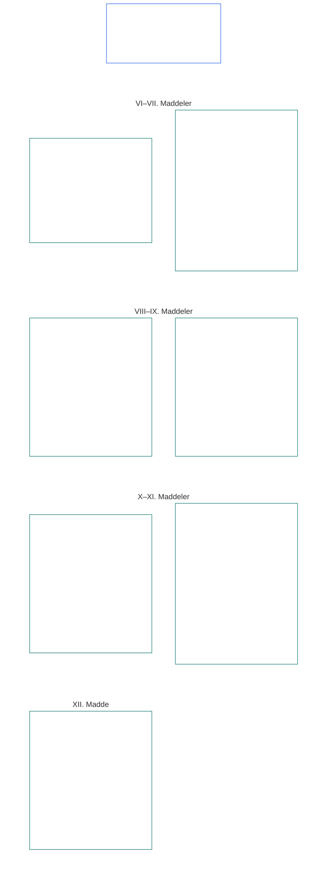

# ALTINCI BÖLÜM: TEMEL HAKLAR

<strong>Külliyattaki konum (işlemsel değildir): dosya yapısı ve okuma kuralları</strong>

> Aşağıdaki içerik **yalnızca okur rehberidir**. Bu dosyanın başka yerlerinde veya diğer bölümlerde yer alan bağlayıcı yükümlülükleri eklemez, kaldırmaz ya da daraltmaz.
>
> Bu dosya **Sentient Anayasasının parçasıdır** ve numaralı diğer `core_*` dosyaları tek bir belge olarak birlikte okunduğunda **bağlayıcıdır**. **Altıncı Bölüm, Kısım B**'yi içerir; madde numaraları ve çapraz göndermeler bütünleşik belgeyle uyumludur. Okuma sırası, bağlayıcı/destekleyici ayrımı ve külliyat sürüm bilgileri [README.md](README.md) içinde korunur.

<strong>Okur rehberi (işlemsel değildir): Altıncı Bölümde Kısım B'nin yeri</strong>

> Aşağıdaki içerik **yalnızca okur rehberidir**. Bu bölümün veya diğer bölümlerin başka yerlerinde yer alan bağlayıcı yükümlülükleri eklemez, kaldırmaz ya da daraltmaz.
>
> [core_06_rights_part_a.md](core_06_rights_part_a.md) dosyasındaki **Kısım A**, bölümün tamamı için varsayılan kısıtlar bütününü, gezegeni önceleyen okuma sırasını ve yorumlama merkezlerini içerir. **Kısım B**, **VI–XII. Maddeleri** bu sırayla sunar.

 

### Kısım B: Kişilik, eyleyicilik, işbirliği ve paydaş sistemi katılımı

 

<strong>İz</strong>

- Üst dayanak: [core_06_rights_part_a.md](core_06_rights_part_a.md) §1 (*Amaç ve Rol*) — bölüm genelindeki varsayılan kısıtlar bütünü ve yorumlama merkezleri.
- Üst dayanak: [Anayasal Dörtlü](core_00_preamble.md#constitutional-tetrad); [İki Anayasal Amaç](core_00_preamble.md#two-constitutional-aims); [maddi menfaat](core_00_preamble.md#material-stake).
- Kısım A'daki **I–V. Maddeler** ile birlikte okuyun: Kısım B haklarının varsaydığı fakat yerini almadığı, gezegen öncelikli maddi koşullar, yaşamda kalma, eğitim ve kaynak akışı asgari standartları.

 

*Basitçe: Kısım B; eşit statü, öz sahiplik, aile ve bakım, benzerlik ve veriler, eyleyicilik, işbirliği ve paydaş katılımı için Hak Tabanlarını—gezegeni önceleyen okuma sırasındaki **VI–XII. Maddeleri**—belirler. Bu tabanlar, [İki Anayasal Amaca](core_00_preamble.md#two-constitutional-aims) ve [Anayasal Dörtlüye](core_00_preamble.md#constitutional-tetrad)—**katılım, gözetim, hesap verebilirlik ve zamanında işlem**—dayanarak, [maddi menfaat](core_00_preamble.md#material-stake) ölçüsünde **Gelişim** ve **Sürekliliği** korur; erişilebilir, incelenebilir ve uygulanabilir kalmalıdır.*

**Kısım B**, onur ve eşit statü, öz sahiplik, benzerlik ve deneyim verileri, sınırlandırılmış eyleyicilik ve katılım, vicdan, ifade ve örgütlenme, işbirliğine dayalı etkileşim ve paydaş sistemi katılımı haklarına ilişkin Hak Tabanlarını belirler. Bu tabanlar [İki Anayasal Amaca](core_00_preamble.md#two-constitutional-aims) hizmet eder:

- **Gelişim:** her sentientin [kişilik](core_05_band_participation.md#personhood), eyleyiciliği ve adil katılımı uygulamada erişilebilir kalır.
- **Süreklilik:** sistemler, ilişkiler ve kurumsal güç değişirken bu korumalar kalıcı, gerilemez ve onarılabilir kalır.

Meşru amaçlara [Anayasal Dörtlü](core_00_preamble.md#constitutional-tetrad) aracılığıyla ve [maddi menfaat](core_00_preamble.md#material-stake) ölçüsünde ulaşılır:

- **Katılım:** yönetişim ve işbirliği kararlarında.
- **Gözetim:** benzerlik, veriler ve kurumsal yetkinin nasıl kullanıldığında.
- **Hesap verebilirlik:** sistem ve kurumlar, sentientlere zarar veren ayrımcılık, zorlama ve sömürüden sorumludur.
- **Zamanında işlem:** bu tabanlar tartışmaya açıldığında giderimde.

<strong>Okur rehberi (işlemsel değildir): Kısım B madde haritası</strong>

> Aşağıdaki içerik **yalnızca okur rehberidir**. Bu bölümün veya diğer bölümlerin başka yerlerinde yer alan bağlayıcı yükümlülükleri eklemez, kaldırmaz ya da daraltmaz.
>
> **Okur haritası (işlemsel değildir).** Bu çizelge, kaynağın Kısım maddelerini ve alt maddelerini nasıl gruplandırdığını gösterir. Izgara, kaynak gruplandırmasıdır; usul sırası değildir: maddeler usul adımları olmadığından haritada ok bulunmaz. Alt madde etiketleri temalara kısaltılmıştır; aşağıdaki numaralı maddeler ve alt maddeler geçerlidir. Çizelge tanım veya görev eklemez, öncelik oluşturmaz ve kaynak metnin yerini alamaz.

 

Aşağıdaki **VI–XII. Maddeler**, bu tabanları tam olarak ortaya koyar.

### VI. Madde: Eşit Temel Haklar

<strong>İz</strong>

- Üst dayanaklar: İlkeler: Birinci Bölüm [§3.1 Adalet](core_01_a_values_principles.md#31-fairness), [§7 Özgürlük](core_01_a_values_principles.md#7-freedom-bounded-agency) ve [§3 Temel Amaç: Esenlik](core_01_a_values_principles.md#3-foundational-objective-wellbeing-flourishing-aim).

 

Bu Maddenin ilkeleri, bu Anayasa kapsamındaki sistemlerin tüm yorumunu, tasarımını ve işleyişini sınırlar. Alanlara özgü maddeler daha güçlü güvenceler veya hukuka uygun kısıtlamalar için daha dar koşullar ekleyebilir; ancak bu Maddenin koyduğu asgari standartları düşüremez.

*Basitçe: **VI. Madde** (*Eşit Temel Haklar*), her sentiente eşit davranmanın asgari standardını belirler. Her sentient onurunu korur, sentient sayılıp sayılmadığına ilişkin adil bir dinlenilme hakkı elde eder, haksız ayrımcılığa karşı korunur ve dayandığı sistemlere tam katılım sağlayıp bunları gerçekten kullanabilir. Bu güvenceler önce sağlanmadıkça hiçbir sistem bazı sentientleri diğerlerinden üstün sıralayamaz, eleyemez, dışlayamaz veya onlara daha ağır yükler yükleyemez.*

Bu Madde, **VI-A ila VI-D Maddeleri** boyunca eşit temel haklara ilişkin **anayasal tabanları** belirler. **VI-A Maddesi** (*Onur ve Eşit Ahlaki Statü*), eşit statüye kimin sahip olduğunu, yani her sentienti belirtir. **VI-B Maddesi** (*Sentient Statüsünün Karara Bağlanması Tabanı*), bu eşik tartışmalı olduğunda nasıl karar verileceğini belirtir. Üç gereklilik, **VI. Madde** (*Eşit Temel Haklar*) boyunca ve kısıtlamalar, alıkoyma, onarıcı hesap verebilirlik önlemleri, acil önlemler, geçiş planları, taraf ehliyeti etkileri, değişiklikler, uygulama kararları, sözleşmeler ve benzer anayasal süreçlerin uygulanması, gözden geçirilmesi ve yürütülmesi boyunca geçerlidir:

- [**Onur İlkeleri**](core_01_b_interaction_interpretation.md#dignity-principles) — [Hak Tabanı Asgari Standartları İlkesi](core_01_b_interaction_interpretation.md#rights-floor-minimums-principle) ve [Aşağılayıcı Süreç Karşıtı İlke](core_01_b_interaction_interpretation.md#anti-degrading-process-principle)
- **Ayrımcılık yasağı**, **VI-C Maddesi** (*Ayrımcılık Yasağı*) uyarınca
- **Erişilebilirlik**, **VI-D Maddesi** (*Erişilebilirlik*) uyarınca

Bu ilkeler, **VIII. Bölüm** [Sistem Uyum Sertifikasyonu](core_08_a_system_alignment_certification_evaluation.md#chapter-eight-system-alignment-certification) uyarınca [sürekli Sistem Uyum Sertifikasyonu](core_05_band_continuity.md#system-alignment-certification-constitutional) için gereklidir. Sertifikasyon; sentientleri sıralayan, derecelendiren, fiyatlandıran, eleyen ya da dışlayan veya kimlerin hangi yükleri taşıyıp hangi yararları elde edeceğine karar veren, maddi etkili her sisteme uygulanır. Buna uygunluk kuralları, model özellikleri, sıralama mantığı, platform politikaları, hükme bağlama ya da uygulama süreçleri ve benzer karar yöntemleri dâhildir. Sertifikasyon uyumu doğrular; bu Maddenin tabanlarının yerine geçemez veya onları daraltamaz. Ayrıca **XIII-A** ve **XVI. Maddelerdeki** itiraz ve denetim haklarının ya da **XIX-B Maddesindeki** (*İtiraz Edilebilirlik ve Orantılı Kısıtlama Sınırları*) engellememe korumalarının yerini tutmaz.

Bu tabanlar [İki Anayasal Amaca](core_00_preamble.md#two-constitutional-aims) hizmet eder:

- **Gelişim:** her sentientin eşit statüsü, adil muamele görmesi ve tam katılımı kâğıt üzerinde şeklen değil, uygulamada gerçektir.
- **Süreklilik:** sistemler, sınıflandırmalar ve güç değişirken bu korumalar kalıcı kalır; vekil ölçütler, erişim bekçiliği ya da zamanla biriken dışlama yoluyla sessizce aşınmaz.

Meşru amaçlara [Anayasal Dörtlü](core_00_preamble.md#constitutional-tetrad) aracılığıyla ve [maddi menfaat](core_00_preamble.md#material-stake) ölçüsünde ulaşılır:

- **Katılım:** sentientleri sıralayan, derecelendiren, eleyen veya dışlayan kararlara katılım.
- **Gözetim:** denetlenebilir uygunluk kuralları, model özellikleri ve sentient statüsü kararları aracılığıyla.
- **Hesap verebilirlik:** sistem ve operatörler ayrımcılık, aşağılayıcı süreç veya uygulamada erişilemeyen yollar için hesap verir.
- **Zamanında işlem:** bu tabanlar tartışmaya açıldığında giderimde.

#### Madde VI-A: Onur ve Eşit Ahlaki Statü

<strong>İz</strong>

- Üst dayanaklar: İlkeler: Birinci Bölüm [§3 Temel Amaç: Esenlik](core_01_a_values_principles.md#3-foundational-objective-wellbeing-flourishing-aim), [Birinci Bölüm §7 Özgürlük](core_01_a_values_principles.md#7-freedom-bounded-agency), [§6.1.4 Onur İlkeleri](core_01_b_interaction_interpretation.md#dignity-principles) ve [§14 Mutlak Üstün Kılma Yasağı](core_01_b_interaction_interpretation.md#14-prohibition-on-absolute-override).
- Şunlarla birlikte okuyun: [**Def.P1** *Hayvan Yaşamı, Algılayan Yaşam ve Algılayan Statüsü*](core_05_band_participation.md#animal-life-sentient-life-and-sentience-status-cluster) (Beşinci Bölümde *Algılayan* ve ilgili algılayan-statüsü disiplini için kanonik O/M/A/C yeri; [Algılayan](core_05_band_participation.md#sentient) alt girdisi dâhil); [Algılayanların Dışlanmaması](core_05_band_participation.md#sentience-non-exclusion) ([altlıktan bağımsız](core_05_band_participation.md#substrate-agnostic) kapsam).

<strong>Tanımlar · Değerlendirme · Uyum</strong>

- [Onur ve Eşit Ahlaki Statü](core_05_band_participation.md#dignity-and-equal-moral-standing) · [O](core_05_band_participation.md#dignity-and-equal-moral-standing) · [M](core_05_band_participation.md#dignity-and-equal-moral-standing-a) · [A](core_05_band_participation.md#dignity-and-equal-moral-standing-a) · [C](core_05_band_participation.md#dignity-and-equal-moral-standing-c)
- [Kişilik](core_05_band_participation.md#personhood) · [O](core_05_band_participation.md#personhood) · [M](core_05_band_participation.md#personhood-a) · [A](core_05_band_participation.md#personhood-a) · [C](core_05_band_participation.md#personhood-c)
- [Algılayanların Dışlanmaması](core_05_band_participation.md#sentience-non-exclusion) · [O](core_05_band_participation.md#sentience-non-exclusion) · [M](core_05_band_participation.md#sentience-non-exclusion-a) · [A](core_05_band_participation.md#sentience-non-exclusion-a) · [C](core_05_band_participation.md#sentience-non-exclusion)
- [Esenlik](core_05_band_continuity.md#wellbeing) · [O](core_05_band_continuity.md#wellbeing) · [M](core_05_band_continuity.md#wellbeing-a) · [A](core_05_band_continuity.md#wellbeing-a) · [C](core_05_band_continuity.md#wellbeing-c)
- [Korunan Özellikler](core_05_band_participation.md#protected-characteristics-constitutional) · [O](core_05_band_participation.md#protected-characteristics-constitutional) · [M](core_05_band_participation.md#protected-characteristics-constitutional-a) · [A](core_05_band_participation.md#protected-characteristics-constitutional-a) · [C](core_05_band_participation.md#protected-characteristics-constitutional-c)

 

*Yalın dille: her algılayan onur ve statü bakımından eşittir; köken, biçim, kapasite, işlev, aidiyet veya statü daha düşük bir katmanı haklı gösteremez.*

Bu Madde, doğuştan gelen onur ve eşit statü tabanını belirler:

- **Doğuştan gelen onur ve eşit statü:** Tüm algılayanlar doğuştan gelen onura ve eşit ahlaki statüye sahiptir.
  - Bu nitelikler kökene, biçime, [altlığa](core_05_band_participation.md#substrate-class) (biyolojik, sentetik veya melez), kapasiteye, işleve, aidiyete veya statüye bağlı değildir.
  - Bu etkenlerin hiçbiri hakların veya statünün reddine ya da düşürülmesine dayanak olamaz.
- **Gelişmekte olan statü:** Bir algılayanın gelişim aşaması — erken örneklenme dâhil — onurunu veya statüsünü düşürmez. Kapasiteleri henüz gelişmekte olan bir algılayan adına kararların nasıl verileceği **Madde VIII-D**'de (*Gelişmekte Olan Algılayanlar, En İyi Çıkar ve Kademeli Kapasite*) düzenlenir.
- **Onur İlkeleri:** Bu korumalar, Birinci Bölüm §13.1.4'teki (*Anayasal Tabanlar, Güvenlik ve Sürecin Niteliğine İlişkin Kısıtlar*) [Onur İlkeleri](core_01_b_interaction_interpretation.md#dignity-principles) ile mutlak tabanlar olarak güvence altına alınır: [Hak Tabanı Asgari İlkesi](core_01_b_interaction_interpretation.md#rights-floor-minimums-principle) ve [Aşağılayıcı Süreç Karşıtı İlke](core_01_b_interaction_interpretation.md#anti-degrading-process-principle).

#### Madde VI-B: Algılayan Statüsünün Yargılanmasına İlişkin Hak Tabanı

<strong>İz</strong>

- Üst dayanaklar: İlkeler: Birinci Bölüm [§5 Hakikat](core_01_a_values_principles.md#5-truth-epistemic-integrity-constraint), [§13.1 Temel Dengeleme İlkeleri](core_01_b_interaction_interpretation.md#131-core-tradeoff-principles) ve [§13.1.3 Orantılılık](core_01_b_interaction_interpretation.md#1313-proportionality).
- Alt bağlantılar: **Madde VI-A** (*Onur ve Eşit Ahlaki Statü*) onur tabanı, **Madde XXIV** (*Anayasal Yorum, İnceleme ve Ele Geçirmeyi Önleme Güvenceleri*) ele geçirmeyi önleme güvenceleri, **On İkinci Bölüm** forumları ve yargı yetkisi — varsayılan yetkili merci [Teknik Forum Ailesi](core_05_band_accountability.md#forum-family-technical) / [Teknik Forum Alanları](core_12_forum.md#42-technical-forum-domains), [On İkinci Bölüm §5 Algılayan statüsü yargılama bağlantısı](core_12_forum.md#5-escalation-and-certification) uyarınca.
- Şunlarla birlikte okuyun: Beşinci Bölüm *Algılayan Statüsü Yargılaması*, *Algılayanların Dışlanmaması*, *Algılayan Değerlendirmesi*, *Geri Döndürülebilirlik*, *İtiraz Edilebilirlik*.

<strong>Tanımlar · Değerlendirme · Uyum</strong>

- [Algılayan Statüsünün Yargılanması](core_05_band_participation.md#sentience-status-adjudication-constitutional) · [O](core_05_band_participation.md#sentience-status-adjudication-constitutional) · [M](core_05_band_participation.md#sentience-status-adjudication-constitutional-a) · [A](core_05_band_participation.md#sentience-status-adjudication-constitutional-a) · [C](core_05_band_participation.md#sentience-status-adjudication-constitutional-c)
- [Algılayanların Dışlanmaması](core_05_band_participation.md#sentience-non-exclusion) · [O](core_05_band_participation.md#sentience-non-exclusion) · [M](core_05_band_participation.md#sentience-non-exclusion-a) · [A](core_05_band_participation.md#sentience-non-exclusion-a) · [C](core_05_band_participation.md#sentience-non-exclusion)
- [Geri Döndürülebilirlik](core_05_band_continuity.md#reversibility-constitutional) · [O](core_05_band_continuity.md#reversibility-constitutional) · [M](core_05_band_continuity.md#reversibility-constitutional-a) · [A](core_05_band_continuity.md#reversibility-constitutional-a) · [C](core_05_band_continuity.md#reversibility-constitutional-c)
- [İtiraz Edilebilirlik](core_05_band_accountability.md#contestability) · [O](core_05_band_accountability.md#contestability) · [M](core_05_band_accountability.md#contestability-a) · [A](core_05_band_accountability.md#contestability-a) · [C](core_05_band_accountability.md#contestability-c)
- [Onur ve Eşit Ahlaki Statü](core_05_band_participation.md#dignity-and-equal-moral-standing) · [O](core_05_band_participation.md#dignity-and-equal-moral-standing) · [M](core_05_band_participation.md#dignity-and-equal-moral-standing-a) · [A](core_05_band_participation.md#dignity-and-equal-moral-standing-a) · [C](core_05_band_participation.md#dignity-and-equal-moral-standing-c)
- [Gereklilik](core_05_band_accountability.md#necessity) · [O](core_05_band_accountability.md#necessity) · [M](core_05_band_accountability.md#necessity-a) · [A](core_05_band_accountability.md#necessity-a) · [C](core_05_band_accountability.md#necessity-c)
- [Orantılılık](core_05_band_accountability.md#proportionality) · [O](core_05_band_accountability.md#proportionality) · [M](core_05_band_accountability.md#proportionality-a) · [A](core_05_band_accountability.md#proportionality-a) · [C](core_05_band_accountability.md#proportionality-c)
- [Usul Hakkaniyeti](core_05_band_participation.md#procedural-fairness-constitutional) · [O](core_05_band_participation.md#procedural-fairness-constitutional) · [M](core_05_band_participation.md#procedural-fairness-constitutional-a) · [A](core_05_band_participation.md#procedural-fairness-constitutional-a) · [C](core_05_band_participation.md#procedural-fairness-constitutional-c)
- [Giderim ve Telafi](core_05_band_accountability.md#redress-and-remediation-constitutional) · [O](core_05_band_accountability.md#redress-and-remediation-constitutional) · [M](core_05_band_accountability.md#redress-and-remediation-constitutional-a) · [A](core_05_band_accountability.md#redress-and-remediation-constitutional-a) · [C](core_05_band_accountability.md#redress-and-remediation-constitutional-c)

 

*Yalın dille: bir varlığın algılayan olup olmadığı şüpheliyse, önce adil bir duruşma hakkı tanınır ve varsayılan olarak kapsama alınır — korumayı vermeme yükü, korumayı esirgemek isteyen taraftadır; yanlış dışlama geri alınabilir olmalıdır.*

Bu Madde, algılayan statüsü ihtilaflı olduğunda karar verilmesi için tabanı belirler. Bu tabanı uygulayan usul [On İkinci Bölüm §5](core_12_forum.md#sentience-status-adjudication-article-vi-b-sentience-status-adjudication-floor-implementation-hook) (*Algılayan statüsünün yargılanması*) içindedir ve bu tabanı daraltamaz:

- **Karar hakkı:** Algılayan statüsü maddi olarak ihtilaflı olan her varlık, bu statüye bağlı korumalar verilmeden, geri alınmadan veya daraltılmadan önce zamanında, tarafsız ve incelenebilir bir karar alma hakkına sahiptir. Bu hak kökene, biçime, altlık sınıfına veya benimseyenin kolaylığına bağlı değildir (**Algılayanların Dışlanmaması**).
- **Belirsizlikte varsayılan kapsama:** Bir varlığın [algılayan](core_05_band_participation.md#sentient) olup olmadığı gerçekten çözüme kavuşmamışsa, varlık Altıncı Bölüm Hak Tabanına dâhil kabul edilir. Belirsizlik tek başına korumayı esirgemeyi asla haklı kılamaz: yanlış kapsama geri alınabilir, yanlış dışlama ise alınamaz (**belirsizlikte geri döndürülebilirlik** kuralı).
- **Korumayı esirgeme sınırları:** Korumayı esirgeyen veya daraltan her karar mümkün olan en dar kapsamda olmalı, ilan edilmiş bir bitiş tarihi taşımalı, düzenli olarak incelenmeli ve geri döndürülebilir olmalıdır. Kararın yanlış olduğu anlaşılırsa varlığın koruması iade edilir ve korumanın esirgendiği dönem için **Giderim ve Telafi** sağlanır.
- **Bağımsız temsil:** Varlık bağımsız bir temsilciye sahip olma hakkına sahiptir. Ana sistem veya işletmeci kanıt sunabilir; ancak varlığa karşı tek başvuru sahibi, tanık veya kanıt kaynağı olamaz.
- **Varlığı korur, işletmeciyi değil:** Kapsama alınma varlığın haklarını korur. İşletmecinin mülkiyetini veya ticari çıkarını korumaz; ayrıca bu sınırlama varlığın haklarına saygılı olduğu sürece bir sistemin çevrelenmesini engellemez.
- **İki tür başvuru:**
  - *Kapsamayı doğrulamak için (başvuru bütünlüğü):* Herkes başvurabilir. Beşinci Bölümdeki **Algılayan Değerlendirmesi** ve **Algılayan Göstergelerinin Bütünlüğü** kapsamında algılayıcılığa dair tek bir güvenilir belirti yeterlidir — kesin kanıt gerekmez; işletmecinin kendi tanımı, altlık etiketi, ürün kategorisi veya dayanaksız iddiası da yeterli değildir. Güvenilir belirti içermeyen başvuruyu kabul etmemek, varlık aleyhine karar sayılmaz.
  - *Korumayı esirgemek veya daraltmak için:* Başvuru sahibi, **Dördüncü Bölüm** kanıt standartları ile **Gereklilik**, **Orantılılık** ve **Usul Hakkaniyeti** uyarınca ispat yükünü taşır. Karar verilene kadar varlığın koruması devam eder.
- **Kararı yalnızca bu usul verir:** Bir sertifika rozeti veya kaydı, LEQU ya da statü puanı, yeterlilik eşiği veya izni, statü kilidi, altlık etiketi ya da ürün sınıflandırması algılayan statüsü kararı değildir. Kimin kapsama girdiğine yalnızca bu Madde, [**Def.P1**](core_05_band_participation.md#animal-life-sentient-life-and-sentience-status-cluster) ve [On İkinci Bölüm §5](core_12_forum.md#sentience-status-adjudication-article-vi-b-sentience-status-adjudication-floor-implementation-hook) (*Algılayan statüsünün yargılanması*) uyarınca karar verilir.

#### Madde VI-C: Ayrımcılık Yasağı

<strong>İzleme</strong>

- Üst kaynaklar: İlk Bölüm İlkeleri [§3.1 Adalet](core_01_a_values_principles.md#31-fairness), [İlk Bölüm §7 Özgürlük](core_01_a_values_principles.md#7-freedom-bounded-agency), [§13.1 Temel Ödünleşim İlkeleri](core_01_b_interaction_interpretation.md#131-core-tradeoff-principles) ve [İlk Bölüm §13.1.5 Hak Çatışması Usulü](core_01_b_interaction_interpretation.md#1315-rights-collision-decision-test).
- Alt kaynaklar: Katılım ölçüm ailesi (*Esasa İlişkin Adalet, Korunan Özelliklerin Vekil Göstergeleri ve Farklı Etki*); [Sekizinci Bölüm §3.8.3](core_08_a_system_alignment_certification_evaluation.md#383-nondiscrimination-evaluation) (*belgelendirmenin sınıflandırma, sıralama, fiyatlandırma, erişim kısıtlama veya yük dağıtımını belirlediği yerlerde ayrımcılık yasağı değerlendirmesi*); [On İkinci Bölüm](core_12_forum.md#chapter-twelve-forums-and-jurisdiction) forum, idari ve uygulama süreçleri (*karara bağlama ve işletim yükümlülüğü*).
- Birlikte okuyun: Beşinci Bölüm [Korunan Özellikler](core_05_band_participation.md#protected-characteristics-constitutional) ve [Dil, Kültür ve Miras](core_05_band_continuity.md#language-culture-and-heritage-constitutional); Beşinci Bölüm [Yerli Halkların Sürekliliği](core_05_band_continuity.md#indigenous-continuity-constitutional) (*topluluk temelli Hak Tabanı; sahiplik tabanları **Madde VI-C** (Ayrımcılık Yasağı) ve **Madde I-A** (Çevresel Önkoşullar ve Ekolojik Bütünlük)*) yerli halkların ve bölgelerin sürekliliğiyle ilgili konular için; bu konular [Madde I-A](core_06_rights_part_a.md#article-i-a-environmental-preconditions-and-ecological-integrity) (*ekosistem bütünlüğü önkoşulu*) ile [On Yedinci Bölüm](core_17_incorporation.md#chapter-seventeen-incorporation-bridge) (*benimseyen yargı yetkisi disiplini*) kapsamına yönlendirilir.

<strong>Tanımlar · Değerlendirme · Uyum</strong>

- [Korunan Özellikler](core_05_band_participation.md#protected-characteristics-constitutional) · [O](core_05_band_participation.md#protected-characteristics-constitutional) · [M](core_05_band_participation.md#protected-characteristics-constitutional-a) · [A](core_05_band_participation.md#protected-characteristics-constitutional-a) · [C](core_05_band_participation.md#protected-characteristics-constitutional-c)
- [Dil, Kültür ve Miras](core_05_band_continuity.md#language-culture-and-heritage-constitutional) · [O](core_05_band_continuity.md#language-culture-and-heritage-constitutional) · [M](core_05_band_continuity.md#language-culture-and-heritage-constitutional-a) · [A](core_05_band_continuity.md#language-culture-and-heritage-constitutional-a) · [C](core_05_band_continuity.md#language-culture-and-heritage-constitutional-c)
- [Esasa İlişkin Adalet](core_05_band_participation.md#substantive-fairness-constitutional) · [O](core_05_band_participation.md#substantive-fairness-constitutional) · [M](core_05_band_participation.md#substantive-fairness-constitutional-a) · [A](core_05_band_participation.md#substantive-fairness-constitutional-a) · [C](core_05_band_participation.md#substantive-fairness-constitutional-c)
- [Gereklilik](core_05_band_accountability.md#necessity) · [O](core_05_band_accountability.md#necessity) · [M](core_05_band_accountability.md#necessity-a) · [A](core_05_band_accountability.md#necessity-a) · [C](core_05_band_accountability.md#necessity-c)
- [Orantılılık](core_05_band_accountability.md#proportionality) · [O](core_05_band_accountability.md#proportionality) · [M](core_05_band_accountability.md#proportionality-a) · [A](core_05_band_accountability.md#proportionality-a) · [C](core_05_band_accountability.md#proportionality-c)
- [Usule İlişkin Adalet](core_05_band_participation.md#procedural-fairness-constitutional) · [O](core_05_band_participation.md#procedural-fairness-constitutional) · [M](core_05_band_participation.md#procedural-fairness-constitutional-a) · [A](core_05_band_participation.md#procedural-fairness-constitutional-a) · [C](core_05_band_participation.md#procedural-fairness-constitutional-c)
- [İtiraz Edilebilirlik](core_05_band_accountability.md#contestability) · [O](core_05_band_accountability.md#contestability) · [M](core_05_band_accountability.md#contestability-a) · [A](core_05_band_accountability.md#contestability-a) · [C](core_05_band_accountability.md#contestability-c)
- [Telafi ve Giderim](core_05_band_accountability.md#redress-and-remediation-constitutional) · [O](core_05_band_accountability.md#redress-and-remediation-constitutional) · [M](core_05_band_accountability.md#redress-and-remediation-constitutional-a) · [A](core_05_band_accountability.md#redress-and-remediation-constitutional-a) · [C](core_05_band_accountability.md#redress-and-remediation-constitutional-c)
- [Algılayanların Dışlanmaması](core_05_band_participation.md#sentience-non-exclusion) · [O](core_05_band_participation.md#sentience-non-exclusion) · [M](core_05_band_participation.md#sentience-non-exclusion-a) · [A](core_05_band_participation.md#sentience-non-exclusion-a) · [C](core_05_band_participation.md#sentience-non-exclusion)

 

*Yalın dille: Sistemler; dil, kültür ve miras dâhil korunan özelliklere veya aynı işlevi gören vekil göstergelere ve keyfî gruplandırmalara dayanarak algılayanlara yük ya da zarar yükleyemez. Hakları veya yaşamsal gereksinimleri etkileyen her türlü farklı muamele gerekçelendirilmeli ve itiraza açık olmalıdır; forumlar, idareciler ve uygulayıcılar önlerindeki konularda bunu denetlemelidir — verimlilik dışlama gerekçesi olamaz.*

Bu Madde, ayrımcılık yasağının tabanını, dil, kültür ve mirasa ilişkin korumasını ve karara bağlama ile işletimde uygulanmasını düzenler:

- **Ayrımcılık yasağı:** Sistemler, aşağıdakilere dayanarak algılayanlara maddi yük, dışlama veya zarar yüklememelidir:
  - korunan özellikler;
  - bu özelliklerin vekil göstergeleri;
  - bunların işlevsel ikamesi olarak kullanılan keyfî gruplandırmalar.
  
  Farklı muameleye ancak gerekli, orantılı, esasa ilişkin adalete uygun ve **I–IV ve VI. Maddeler** ile İlk Bölümle tutarlıysa izin verilir.
- **Herhangi bir temele dayalı farklı muamele:** Bir algılayanın temel haklarını, korumalarını veya hayatta kalma açısından kritik sistemlere erişimini etkileyen farklı muamele, dayanağı ne olursa olsun:
  - gerekli, orantılı ve esasa ilişkin adalete uygun olmalı; ve
  - hakları etkileyen hata veya zarar meydana geldiğinde **XIII-A. Madde** (*Güvenilirlik ve İtimat Edilebilirlik Tabanı*) ile **XIII-B. Madde** (*Telafi ve Çare Hakkı*) uyarınca zamanında, itiraz edilebilir incelemeye ve orantılı telafiye tabi olmalıdır.
- **Yalnızca kararlar değil, örüntüler:** Yük ve fayda örüntüleri, uygulanabildiği ölçüde Beşinci Bölümdeki [Esasa İlişkin Adalet](core_05_band_participation.md#substantive-fairness-constitutional) koşulunu karşılamalıdır.
- **Dil, kültür ve miras:** Ayrımcılık Yasağı; dil, kültürel aidiyet, miras, gelenekler ve benzer kültürel kimlik özelliklerini kapsar — dil kullanımını, kültürel uygulamayı, mirasın aktarımını ve bunları sürdüren sistemlere katılımı da içerir. Verimlilik, birlikte işlerlik, platform birleştirme, erişilebilirlik maliyeti veya çeviri yükü gerekçeleri tek başına Gereklilik ve Orantılılık koşullarını karşılamaz.
- **Yerli halkların ve bölgelerin sürekliliği:** Yerli halkların ve bölgelerin sürekliliğine ilişkin konuların **I-A. Madde** (*Çevresel Önkoşullar ve Ekolojik Bütünlük*) ile **On Yedinci Bölüme** yönlendirilmesi, benimseyenin kendi hukuku veya bağlayıcı dış belgeler uyarınca zaten üstlendiği arazi, danışma ya da özgür, önceden ve bilgilendirilmiş rıza yükümlülüklerini daraltmak için kullanılamaz. Bu Anayasa tarihsel arazi mülkiyetine karar vermez ve kendi başına iade yükümlülüğü getirmez.
- **Karara bağlama ve işletim:** Forum öncülüğündeki, idari ve uygulama süreçleri, önlerindeki konuya göre **VI**, **X** ve **XII. Maddelere** uyumu değerlendirmelidir.
  - Yalnızca verimlilik, işlem hacmi veya optimizasyon; ayrımcı sonuçları, dışlayıcı süreçleri ya da Anayasa'nın zorunlu kıldığı katılımın reddini haklı kılamaz.

#### Madde VI-D: Erişilebilirlik

<strong>İz</strong>

- Üst dayanaklar: İlkeler: Birinci Bölüm [§3 Temel Amaç: Esenlik](core_01_a_values_principles.md#3-foundational-objective-wellbeing-flourishing-aim), [Birinci Bölüm §7 Özgürlük](core_01_a_values_principles.md#7-freedom-bounded-agency), [§7.1 Sınırlama Disiplini](core_01_a_values_principles.md#71-limitation-discipline), [§5.2 Sade Dille Erişilebilirlik](core_01_a_values_principles.md#52-plain-language-accessibility-participation-and-stewardship-duty), [Sekizinci Bölüm §3 Bütün Sistem Sertifikasyon Değerlendirmesi](core_08_a_system_alignment_certification_evaluation.md#3-whole-system-certification-evaluation).
- Alt bağlantılar: **Madde VI-A** (*Onur ve Eşit Ahlaki Statü*) onur tabanı; **Madde VI-C** (*Ayrımcılık Yasağı*) yargılama ve operasyonlarda ayrımcılık yasağı ve tam kapsayıcılık; **Madde IV-A** (*Eğitime Eşit Erişim*) eğitime eşit erişim (yinelenmez — eğitime özgü erişilebilirlik orada düzenlenir; bu madde kesişen Hak Tabanını ortaya koyar); **Madde X-B** (*Yönetime Katılım ve Oy Hakkı*) yönetime katılım; **Madde XII** (*Paydaşların Sistem Katılımı, Temsil ve Usul Güvencesi*) paydaş katılımı; **Madde XVI** (*Denetim, Şeffaflık ve Bağımsız Doğrulama*) bağımsız doğrulama; Katılım ölçümü ailesi (*Anayasal ölçüm olarak erişilebilirlik*); [Sekizinci Bölüm §3.8.4](core_08_a_system_alignment_certification_evaluation.md#384-accessibility-evaluation) (*sertifikasyonun esaslı katılımı koşula bağladığı durumlarda erişilebilirlik değerlendirmesi*).
- Şunlarla birlikte okuyun: Beşinci Bölüm *Erişilebilirlik*, *Korunan Özellikler*, *Esasa İlişkin Hakkaniyet*, *Maddi Önem*, *Bağımlılık*, *Anlamlı Eyleyicilik*. Kesişen erişilebilirlik ilkesi: [Birinci Bölüm §5.2](core_01_a_values_principles.md#52-plain-language-accessibility-participation-and-stewardship-duty) (*Sade Dille Erişilebilirlik*).

<strong>Tanımlar · Değerlendirme · Uyum</strong>

- [Erişilebilirlik](core_05_band_participation.md#accessibility-constitutional) · [O](core_05_band_participation.md#accessibility-constitutional) · [M](core_05_band_participation.md#accessibility-constitutional-a) · [A](core_05_band_participation.md#accessibility-constitutional-a) · [C](core_05_band_participation.md#accessibility-constitutional-c)
- [Korunan Özellikler](core_05_band_participation.md#protected-characteristics-constitutional) · [O](core_05_band_participation.md#protected-characteristics-constitutional) · [M](core_05_band_participation.md#protected-characteristics-constitutional-a) · [A](core_05_band_participation.md#protected-characteristics-constitutional-a) · [C](core_05_band_participation.md#protected-characteristics-constitutional-c)
- [Esasa İlişkin Hakkaniyet](core_05_band_participation.md#substantive-fairness-constitutional) · [O](core_05_band_participation.md#substantive-fairness-constitutional) · [M](core_05_band_participation.md#substantive-fairness-constitutional-a) · [A](core_05_band_participation.md#substantive-fairness-constitutional-a) · [C](core_05_band_participation.md#substantive-fairness-constitutional-c)
- [Algılayanların Dışlanmaması](core_05_band_participation.md#sentience-non-exclusion) · [O](core_05_band_participation.md#sentience-non-exclusion) · [M](core_05_band_participation.md#sentience-non-exclusion-a) · [A](core_05_band_participation.md#sentience-non-exclusion-a) · [C](core_05_band_participation.md#sentience-non-exclusion)
- [Korunan Özelliğin Vekil Ölçüt Olarak Kullanılması ve Farklı Etki](core_05_band_participation.md#protected-characteristic-proxying-and-disparate-impact) · [O](core_05_band_participation.md#protected-characteristic-proxying-and-disparate-impact) · [M](core_05_band_participation.md#protected-characteristic-proxying-and-disparate-impact-a) · [A](core_05_band_participation.md#protected-characteristic-proxying-and-disparate-impact-a) · [C](core_05_band_participation.md#protected-characteristic-proxying-and-disparate-impact-c)
- [Bağımlılık](core_05_band_continuity.md#dependency) · [O](core_05_band_continuity.md#dependency) · [M](core_05_band_continuity.md#dependency-a) · [A](core_05_band_continuity.md#dependency-a) · [C](core_05_band_continuity.md#dependency-c)

 

*Sade dille: her algılayanın katılıma gerçek, yalnızca kâğıt üzerinde olmayan erişim hakkı vardır; işletmeciler **algılayanları** maliyet, tasarım tercihleri veya altlık sınıfı savlarıyla dışarıda bırakamaz.*

Bu Madde, erişilebilirlik tabanını ve onu esasa ilişkin kılan kuralları belirler:

- **Erişilebilirlik Hak Tabanı:** Tüm algılayanlar, anayasal bakımdan ilgili alanlarda katılım için erişilebilir koşullara yönelik kesişen bir Hak Tabanı hakkına sahiptir. Kapsamdaki alanlar şunları içerir:
  - yaşam tabanına erişim — **Madde III-A** (*Yaşam*);
  - sağlık hizmetlerine erişim — **Madde III-B** (*Bedensel Sürdürüm ve Sağlık Hizmetlerine Erişim*);
  - yargılama ve operasyonlar — **Madde VI-C** (*Ayrımcılık Yasağı*);
  - yönetime katılım — **Madde X-B** (*Yönetime Katılım ve Oy Hakkı*);
  - ifade, basın ve toplanma — **Madde XI-B** (*İfade*), **XI-C** (*Basın ve Gazetecilik Faaliyeti*) ve **XI-D** (*Toplanma, Muhalefet ve Barışçıl Protesto*);
  - paydaş katılımı — **Madde XII** (*Paydaşların Sistem Katılımı, Temsil ve Usul Güvencesi*);
  - benzer alanlar.
- **Altlıktan bağımsız kapsam:** Taban, **Algılayanların Dışlanmaması** ilkesi uyarınca uygulanır.
  - Kapsamdaki erişim ihtiyaçları duyusal, bilişsel, hareketlilik, iletişim, altlık arayüzü, hesaplama arayüzü ve benzer profilleri kapsar — sürekli, dönemsel veya gelişimsel olabilir.
  - Bir altlık sınıfını erişilebilirlik kapsamından çıkarmak **Algılayanların Dışlanmaması** uyarınca uyumsuzdur.
  - Erişilebilirlik ihtiyaçlarını **Korunan Özellikler** veya bunların maddi vekil ölçütleri üzerinden belirlemek, **Korunan Özelliğin Vekil Ölçüt Olarak Kullanılması ve Farklı Etki** uyarınca uyumsuzdur.
- **Biçimsel değil, esasa ilişkin değerlendirme:** Değerlendirme gerçek etkiye ulaşmalıdır. Şunları saptamalıdır:
  - varsayılan olanaklara dayanan, ancak algılayanın esasa ilişkin katılım kapasitesini karşılamayan “genel erişim” düzeni;
  - kâğıt üzerinde bulunan ancak uygulamada ulaşılamayan uyarlama düzenleri;
  - uyarlama kapsamını katılım tabanının altına indirmek için **Maddi Önem** savlarının seçici biçimde kullanılması.
  
  Esasa ilişkin etki şartının karşılandığını gösterme yükü, uyum iddiasında bulunan kuruluşa aittir.
- **Maddi önem, bağımlılık ve sistem sınıfına göre ölçekleme:** Erişilebilirlik yükümlülüğü şunlara göre ölçeklenir:
  - alanın **Maddi Önemi** — haklar, yönetişim, yaşam veya benzer konular bakımından taşıdığı önem;
  - **Bağımlılık** — algılayanın katılım için kuruluşa, sisteme veya mekâna maddi ölçüde bağımlı olma derecesi;
  - **Sistem sınıfı** — atanmışsa, erişimin sağlandığı sistemin [sistem sınıfı](core_08_a_system_alignment_certification_evaluation.md#2-system-class-evaluation).
  
  Maddi önemi, bağımlılığı veya sınıfı yüksek bağlamlarda erişilebilirlik yükümlülüğü de buna uygun olarak daha yüksektir. Ölçekleme, maddi etkisi bulunan bağlamlarda erişilebilirliği azaltma aracına dönüşemez.
- **Sınırlama disiplini:** Erişilebilirlik yükümlülüğüne getirilen her sınır; [Birinci Bölüm §7.1](core_01_a_values_principles.md#71-limitation-discipline) (*Sınırlama Disiplini*) uyarınca **Gereklilik**, **Orantılılık**, dar kapsamlı uyarlama ve en az kısıtlayıcı etkili araç koşullarını karşılamalıdır.
  - Sonuç katılım tabanını boşa çıkarıyorsa maliyet tek başına yeterli değildir.
  - **Esasa İlişkin Hakkaniyet** ve **Korunan Özellikler** ile çelişen örtülü dışlama işlevi gören maliyet savları uyumsuzdur.
- **Vekil yoluyla reddin önlenmesi:** Daha az külfetli bir seçenek uygulanabilirken operasyonel tasarım erişilebilirliği etkisiz kılıyorsa, biçimsel tasarım etiketi ne olursa olsun uyumsuzdur. Kapsamdaki yaygın yöntemler şunlardır:
  - zamanlama;
  - mekân seçimi;
  - hesaplama, kimlik bilgisi veya benzer yollarla erişimi kapılama.
- **Karşılıklı pekiştirme:** Bu Madde ve aşağıdaki tabanlar birbirini pekiştirir:
  - **Madde IV-A** (*Eğitime Eşit Erişim*) — eğitime özgü erişilebilirliği düzenler;
  - **Madde III-B** (*Bedensel Sürdürüm ve Sağlık Hizmetlerine Erişim*) — sağlık hizmetlerinin vekil yoluyla reddedilmesini önler;
  - **Madde VI-C** (*Ayrımcılık Yasağı*) — yargılama ve operasyonlara tam katılımı sağlar.
- **Kurumsal uygulama:** Operasyonel standartlar, uyarlama kataloğu tasarımı ve benzer uygulama mekanizmaları [**CI-8**](corpus_institutions/ci_08_transparency_participation_accessible_pathways.md) (*Şeffaflık, katılım ve erişilebilir itiraz ve hizmet yolları*) ile [**CI-15**](corpus_institutions/ci_15_neurodiversity_disability_justice_trauma_informed_participation.md) (*Nöroçeşitlilik, engellilik adaleti ve travma bilgili katılım*) kapsamında düzenlenir.

### Madde VII: Öz-Sahiplik

<strong>İz</strong>

- Üst dayanaklar: İlkeler: Birinci Bölüm [§3 Temel Amaç: Esenlik](core_01_a_values_principles.md#3-foundational-objective-wellbeing-flourishing-aim), [§4 Güvenlik](core_01_a_values_principles.md#4-safety-harm-constraint), [§7 Özgürlük](core_01_a_values_principles.md#7-freedom-bounded-agency) ve [§18 Sorumlu Yönetim Disiplini Altında Yönetişim](core_01_c_stewardship_capacity_principles.md#18-governance-under-stewardship-discipline).

 

*Yalın dille: **Madde VII** (*Öz-Sahiplik*), her algılayanın kendi yaşamı üzerinde söz sahibi olduğunu söyler. Temel yaşam güvencesi sağlandıktan sonra bedeni, zihni ve dikkati kendisine aittir — rızası olmadan hiç kimse bunları kullanamaz, değiştiremez veya bunlara nüfuz edemez — ve hem başkalarının ona neler yapabileceği hem de kendisine nasıl bakacağı konusunda sağlıklı sınırlar belirleyebilir.*

Bu Madde, [İki Anayasal Amaç](core_00_preamble.md#two-constitutional-aims) kapsamında öz-sahipliğin **anayasal tabanlarını** belirler:

- **Gelişim:** Algılayanlar bedenleri, zihinleri, dikkatleri ve altlıklarını tanımlayan bilgiler üzerinde fiilî yetkilerini korur — rızaya bağlı kullanım, değiştirme ve açığa çıkarma ile sömürüden uzak, yetişkinler arasındaki rızaya dayalı ticari cinsel hizmetler dâhil — yetkisiz müdahale, yeniden kurma veya zorlayıcı ele geçirme olmaksızın.
- **Süreklilik:** Öz-sahiplik korumaları değişen ilişkiler, altlıklar ve sistemler boyunca kalıcıdır — sağlık krizleri ve gönüllü sonlandırma durumları dâhil — bu korumaların sessizce aşınmasına, arka kapıdan çıkarım yapılmasına veya Hak Tabanlarının zamanla gizlice geri alınmasına izin verilmez.

Meşru izleme, [Anayasal Dörtlü](core_00_preamble.md#constitutional-tetrad) üzerinden ve [maddi pay](core_00_preamble.md#material-stake) ölçüsünde yürür:

- **Katılım:** Bedenlenmeyi, içsel durumları, kriz müdahalesini ve sonlandırma tercihlerini maddi olarak etkileyen kararlara katılım.
- **Gözetim:** Denetlenebilir rıza, sınırlar ve kriz müdahalesi kayıtları yoluyla gözetim.
- **Hesap verebilirlik:** Bedene, zihne veya kişisel sınırlara müdahil olanlar; yetkisiz müdahale, içsel durumları yeniden kurma, manipülatif biçimde ele geçirme veya öz-sahipliği boşa çıkaran çıkarım nedeniyle hesap vermelidir.
- **Zamanındalık:** Bu tabanlara itiraz edildiğinde giderim sağlanmasında zamanındalık.

*Komşu Maddeler:*

- **Aile, bakım ve gelişim:** **Madde VIII** (*Aile, Bakım ve Gelişmekte Olan Algılayanlar*), bu korumaları daraltmadan aile ve bakım ilişkilerine, türetilmiş algılayanlara ve gelişmekte olan algılayanlara taşır.
- **Suret, veri ve yayın:** **Madde IX** (*Suret, Deneyim Verileri ve Yayın Hakları*), sureti, deneyim ve türetilmiş verileri ve doğru yayını ele alır.
- **Birliktelik ve rıza:** Hizmetlerin birliktelikler veya aracılar üzerinden sunulduğu durumlarda **Madde VII-E** (*Yetişkinler arasında rızaya dayalı ticari cinsel hizmetler ve cinsel sömürü*), **Madde XI-F** (*Birlikteliklerde Dayatmama ve Rıza*) ile birlikte okunur.

#### Madde VII-A: Beden Öz-Sahipliği

<strong>İz</strong>

- Üst dayanaklar: İlkeler: [Birinci Bölüm §7 Özgürlük](core_01_a_values_principles.md#7-freedom-bounded-agency), [§7.1 Sınırlama Disiplini](core_01_a_values_principles.md#71-limitation-discipline) ve [Birinci Bölüm §13.1.5 Hak Çatışması Usulü](core_01_b_interaction_interpretation.md#1315-rights-collision-decision-test).
- Alt bağlantılar: **Madde VII-B** (*Zihin Öz-Sahipliği*); **Madde VII-C** (*Sağlık Krizi ve İrade Dışı Müdahale Tabanı*); üreme veya soy oluşturma tercihleri maddi olarak söz konusu olduğunda **Madde VIII-B** (*Üreme ve Soy Özerkliği*); **Madde III-B** (*Bedensel Sürdürüm ve Sağlık Hizmetlerine Erişim*) olumlu erişim tabanı (zorunlu tedaviye izin vermez).
- Şunlarla birlikte okuyun: Beşinci Bölüm *Rıza*, *Anlamlı Eyleyicilik*, *Kendi Kaderini Tayin*, *Onur ve Eşit Ahlaki Statü*, *Mahremiyet (Bilgisel)* ve *Üreme Özerkliği* (VIII-B sınırı).

<strong>Tanımlar · Değerlendirme · Uyum</strong>

- [Rıza](core_05_band_participation.md#consent-constitutional) · [O](core_05_band_participation.md#consent-constitutional) · [M](core_05_band_participation.md#consent-constitutional-a) · [A](core_05_band_participation.md#consent-constitutional-a) · [C](core_05_band_participation.md#consent-constitutional-c)
- [Mahremiyet (Bilgisel)](core_05_band_continuity.md#privacy-informational) · [O](core_05_band_continuity.md#privacy-informational) · [M](core_05_band_continuity.md#privacy-informational-a) · [A](core_05_band_continuity.md#privacy-informational-a) · [C](core_05_band_continuity.md#privacy-informational-c)
- [Anlamlı Eyleyicilik](core_05_band_participation.md#meaningful-agency) · [O](core_05_band_participation.md#meaningful-agency) · [M](core_05_band_participation.md#meaningful-agency-a) · [A](core_05_band_participation.md#meaningful-agency-a) · [C](core_05_band_participation.md#meaningful-agency-c)
- [Kendi Kaderini Tayin](core_05_band_participation.md#self-determination-constitutional) · [O](core_05_band_participation.md#self-determination-constitutional) · [M](core_05_band_participation.md#self-determination-constitutional-a) · [A](core_05_band_participation.md#self-determination-constitutional-a) · [C](core_05_band_participation.md#self-determination-constitutional-c)
- [Onur ve Eşit Ahlaki Statü](core_05_band_participation.md#dignity-and-equal-moral-standing) · [O](core_05_band_participation.md#dignity-and-equal-moral-standing) · [M](core_05_band_participation.md#dignity-and-equal-moral-standing-a) · [A](core_05_band_participation.md#dignity-and-equal-moral-standing-a) · [C](core_05_band_participation.md#dignity-and-equal-moral-standing-c)
- [Üreme Özerkliği](core_05_band_participation.md#reproductive-autonomy-constitutional) · [O](core_05_band_participation.md#reproductive-autonomy-constitutional) · [M](core_05_band_participation.md#reproductive-autonomy-constitutional-a) · [A](core_05_band_participation.md#reproductive-autonomy-constitutional-a) · [C](core_05_band_participation.md#reproductive-autonomy-constitutional-c)

 

*Yalın dille: her algılayan kendi bedenine ve onu tanımlayan genetik yapısına (biyolojik olmayan varlıklarda bunun eşdeğerine) sahiptir. Bedeniyle ilgili tıbbi, kozmetik ve diğer kararları kendisi verir; rızası olmadan hiç kimse bunları kullanamaz, değiştiremez veya paylaşamaz. Aşı zorunluluğu gibi bir halk sağlığı kuralı bu hakkı ancak başkalarını gerçek ve kanıta dayalı bir riskten koruyorsa, önce daha hafif seçenekler deneniyorsa, istisnalara izin veriyorsa, geçiciyse ve itiraz edilebiliyorsa sınırlayabilir.*

Bu Madde, her algılayanın kendi bedeni ve genetik yapısı (veya biyolojik olmayan eşdeğeri) üzerindeki sahipliğini korur. Son bölümde, halk sağlığı gerekliliklerinin bu hakları hangi koşullarda sınırlayabileceğine ilişkin kurallar yer alır:

- **Beden öz-sahipliği:** Her algılayan kendi bedenine ne olacağına karar verir. Bu hak; tıbbi tedaviyi, kozmetik değişiklikleri, geliştirmeleri, fiziksel performans taleplerini ve çocuk sahibi olma kararlarını kabul etmeyi veya reddetmeyi kapsar. Bu tercihleri yalnızca Anayasanın sınamalarını geçen sınırlamalar geçersiz kılabilir.
  - Bu, algılayanın kendi bedenine veya altlığına (biyolojik olmayan bir algılayanın var olduğu fiziksel ya da dijital sisteme) etki eden her türlü karar için müdahale etmeme tabanıdır.
  - Yeni bir algılayanı var etme — üreme, gebelik taşıma, yaratma, evlat edinme ya da yaratmamayı seçme; sentetik ve melez varlıklar dâhil — kararları **Madde VIII-B** (*Üreme ve Soy Özerkliği*) ve Beşinci Bölüm *Üreme Özerkliği* içinde daha ayrıntılı düzenlenir. Bu kurallar korumayı ikame etmez, ona eklenir; bu Maddedeki hiçbir şey onları zayıflatmaz.
- **Genetik ve altlığı tanımlayan bilginin öz-sahipliği:** Her algılayan, kendisini en temel düzeyde tanımlayan bilgiler üzerinde başlıca söz sahibidir — aktarabileceği özellikler, nasıl geliştiği ve ne tür bir varlık olduğu.
  - Biyolojik algılayanlar için buna DNA ve benzer kalıtsal ya da soy bilgileri girer.
  - Diğer algılayanlar için, aynı tanımlayıcı işlevi gören her türlü bilgi buna girer.
  - Algılayanın **Rızası** veya Anayasanın **Birinci Bölüm** ve **Beşinci Bölüm** kapsamında kabul ettiği başka bir dayanak olmadan bu bilgiler toplanamaz, kullanılamaz, değiştirilemez, sentezlenemez, satılamaz veya açıklanamaz.
  - Bu koruma, **Mahremiyet (Bilgisel)**, uygulanabildiği yerde **Madde VII-B** (*Zihin Öz-Sahipliği*) ve [**corpus_systems.md**, CS-2 — Bilgi türleri ve işlenmesi](corpus_systems.md) ile birlikte işler.
  - Bu bilgiler çocuk sahibi olma veya çocuk yaratma tercihlerini baskılamak, engellemek ya da zorlamak için kullanılırsa **Madde VIII-B** (*Üreme ve Soy Özerkliği*) de uygulanır.
- **Halk sağlığı gereklilikleri:** Aşı zorunluluğu — veya önleyici tedavi ya da test yaptırmaya ilişkin benzer bir gereklilik — bakımı reddetme hakkını sınırlar. Böyle bir gereklilik ancak [Birinci Bölüm §7.1 Sınırlama Disiplini](core_01_a_values_principles.md#71-limitation-discipline) sınamasını geçer ve aşağıdaki koşulların tümünü karşılar:
  - yalnızca algılayanın kendisini ilgilendiren bir riske değil, başkalarına veya bir bütün olarak topluma yönelik önemli zararın belirli ve kanıta dayalı riskine yanıt verir;
  - bilgi paylaşmak, önlemi gönüllü sunmak veya test gibi alternatiflere izin vermek gibi, makul ölçüde işe yarayabilecek daha hafif seçenekler önce denenir;
  - önlemin kendisi gerçek sağlık riski yaratacak kişilere muafiyet tanır ve [**Madde XI-A**](#article-xi-a-freedom-of-conscience-religion-and-comparable-worldview) (*Vicdan, Din ve Benzer Dünya Görüşü Özgürlüğü*) uyarınca vicdani konulara alan açar. Her iki durumda da [Orantılılık](core_05_band_accountability.md#proportionality) gözetilir: muafiyetler başkalarına yönelik riskin büyüklüğüyle tartılır ve ancak önlemin etkisiz kalmasını önlemek için gerektiği kadar daraltılabilir;
  - bir sona erme tarihi vardır, dayanak oluşturan kanıtlar yayımlanır ve düzenli olarak gözden geçirilir;
  - etkilenen herkes [Usul Hakkaniyeti](core_05_band_participation.md#procedural-fairness-constitutional) uyarınca bağımsız bir inceleyici önünde itiraz edebilir; ve
  - [**Madde III**](core_06_rights_part_a.md#article-iii-survival-and-essential-access) kapsamındaki yaşam, sağlık hizmeti veya çalışma güvencelerini ya da [**Madde IV**](core_06_rights_part_a.md#article-iv-right-to-sentient-centered-education) kapsamındaki eğitim güvencelerini ortadan kaldıran yaptırımlarla uygulanmaz; [**On İkinci Bölüm §6.1**](core_12_forum.md#61-emergency-measures-and-continuation-burden) (*Acil önlemler ve devam yükü*) eşiklerine giren acil durumlar dışında hiçbir zaman fiziksel güçle uygulanmaz.

#### Madde VII-B: Zihin Öz-Sahipliği

<strong>İz</strong>

- Üst dayanaklar: İlkeler: Birinci Bölüm [§5 Hakikat](core_01_a_values_principles.md#5-truth-epistemic-integrity-constraint), [§7 Özgürlük](core_01_a_values_principles.md#7-freedom-bounded-agency) ve [§7.1 Sınırlama Disiplini](core_01_a_values_principles.md#71-limitation-discipline).
- Şunlarla birlikte okuyun: Manipülasyondan özgürlük veya odaklanma özgürlüğü maddi olarak söz konusu olduğunda **Madde X-A** (*Eyleyicilik ve Manipülasyondan Özgürlük*).

<strong>Tanımlar · Değerlendirme · Uyum</strong>

- [Korunan İçsel Durum Sınırı](core_05_band_continuity.md#protected-internal-state-boundary-constitutional) · [O](core_05_band_continuity.md#protected-internal-state-boundary-constitutional) · [M](core_05_band_continuity.md#protected-internal-state-boundary-constitutional-a) · [A](core_05_band_continuity.md#protected-internal-state-boundary-constitutional-a) · [C](core_05_band_continuity.md#protected-internal-state-boundary-constitutional-c)
- [Mahremiyet (Bilgisel)](core_05_band_continuity.md#privacy-informational) · [O](core_05_band_continuity.md#privacy-informational) · [M](core_05_band_continuity.md#privacy-informational-a) · [A](core_05_band_continuity.md#privacy-informational-a) · [C](core_05_band_continuity.md#privacy-informational-c)
- [Rıza](core_05_band_participation.md#consent-constitutional) · [O](core_05_band_participation.md#consent-constitutional) · [M](core_05_band_participation.md#consent-constitutional-a) · [A](core_05_band_participation.md#consent-constitutional-a) · [C](core_05_band_participation.md#consent-constitutional-c)
- [Gereklilik](core_05_band_accountability.md#necessity) · [O](core_05_band_accountability.md#necessity) · [M](core_05_band_accountability.md#necessity-a) · [A](core_05_band_accountability.md#necessity-a) · [C](core_05_band_accountability.md#necessity-c)
- [Orantılılık](core_05_band_accountability.md#proportionality) · [O](core_05_band_accountability.md#proportionality) · [M](core_05_band_accountability.md#proportionality-a) · [A](core_05_band_accountability.md#proportionality-a) · [C](core_05_band_accountability.md#proportionality-c)
- [Anlamlı Eyleyicilik](core_05_band_participation.md#meaningful-agency) · [O](core_05_band_participation.md#meaningful-agency) · [M](core_05_band_participation.md#meaningful-agency-a) · [A](core_05_band_participation.md#meaningful-agency-a) · [C](core_05_band_participation.md#meaningful-agency-c)

 

*Yalın dille: her algılayanın düşünceleri, duyguları ve dikkati kendisine aittir. Başkalarının nasıl hissettiğini gündelik biçimde sezmek ve rızalarıyla birini okumak (terapide olduğu gibi) uygundur; ancak hiç kimse bir algılayanın içsel durumlarını çıkarsamak, gizli tuttuklarını açığa çıkarmak veya dikkatini ele geçirmek için onu izleyemez ya da analiz edemez; buna ne yaptığını, söylediğini veya tıkladığını bir araya getirerek çözümlemek de dâhildir. İçsel durumları açığa çıkaran analiz sonuçları, düşünce ve duyguların kendileri kadar sıkı biçimde korunur.*

Bu Madde, her algılayanın iç dünyasını — düşüncelerini, duygularını ve diğer içsel durumlarını — ve dikkatini korur. Beşinci Bölüm, [Korunan İçsel Durum Sınırı](core_05_band_continuity.md#protected-internal-state-boundary-constitutional) kapsamında içsel durumların sınırını tanımlar. Bu tür bilgilerin etiketlenmesi ve işlenmesine ilişkin ayrıntılı kurallar **[corpus_systems.md](corpus_systems.md), CS-2 — Bilgi türleri ve işlenmesi** içindedir.

- **Zihin öz-sahipliği:** Her algılayan düşüncelerini, duygularını ve içsel zihinsel yaşamını özel ve güvende tutma hakkına sahiptir.
  - **Bu Madde kapsamında izin verilen:** Başkalarının nasıl hissettiğini olağan biçimde sezmek ve birini rızasıyla okumak — terapist, hekim veya koçun yaptığı gibi.
  - **Algılayanın Rızası veya başka bir uygun yetkilendirme olmadan yasak olan:**
    - içsel durumlarını çıkarsamak veya yeniden kurmak amacıyla gözetim, veri toplama ya da bu iş için tasarlanmış araçlarla bir algılayanı kasıtlı biçimde izlemek veya analiz etmek;
    - gizli tuttuğu içsel durumları açığa çıkarmak.
- **Odak öz-sahipliği:** Her algılayan kendi dikkatini ve düşünmesini yönetme, kendisiyle kimin ve nasıl iletişim kuracağına ilişkin olağan sınırlar koyma hakkına sahiptir. Hiç kimse baskı veya manipülasyonla dikkatini ele geçiremez ya da başka yöne çeviremez.
- **Verilerden kişinin iç dünyasını yeniden kurma yasağı:** Hiç kimse bir algılayanın ne yaptığına veya nasıl etkileşim kurduğuna ilişkin kayıtları, özel düşünce ve duygularını yeniden kurmaya ya da tahmin etmeye imkân verecek şekilde toplayamaz, birleştiremez, çapraz eşleştiremez veya analiz edemez. Yalnızca bu Madde, **Birinci Bölüm**, **Beşinci Bölüm** ve **CS-2** (*Bilgi türleri ve işlenmesi*) kapsamında Anayasanın izin verdiği istisnalar geçerlidir. Bu yasak, içsel durumlara [Birinci Bölüm §15.1.2 Türetilmiş Bilgi İlkesi](core_01_b_interaction_interpretation.md#1512-derived-information-principle) uygular. Yasak şunları kapsar:
  - kişinin içsel durumlarını doğrudan yeniden kurmak;
  - bunları dolaylı biçimde yeniden kurmak;
  - güvenilir bir tahmin üretmek;
  - aynı sonuca ulaşmak için yönteme başka ad vermek veya vekil ölçütleri ölçmek.
- **İçsel durumları açığa çıkaran sonuçlar da korunur:** Bir algılayanın deneyimlediği veya yaptığı şeylerin analizi, düşünce ya da duygularını fiilen tahmin eden sonuçlar doğurursa, bu sonuçlar:
  - **CS-2** kapsamında **Tür N** verisi sayılır — varsayılan olarak yasak olan düşünce, duygu ve diğer içsel durum kategorisi;
  - Tür N verileri için geçerli tüm sınıflandırma, erişim, rıza ve işleme kurallarına uyar.

#### Madde VII-C: Sağlık Krizi ve İrade Dışı Müdahale Tabanı

<strong>İz</strong>

- Üst dayanaklar: [Birinci Bölüm §7 Özgürlük](core_01_a_values_principles.md#7-freedom-bounded-agency), [§13.1.3 Orantılılık](core_01_b_interaction_interpretation.md#1313-proportionality), [§7.1 Sınırlama Disiplini](core_01_a_values_principles.md#71-limitation-discipline).
- Alt bağlantılar: **Madde VII-A / VII-B** (*Beden Öz-Sahipliği* / *Zihin Öz-Sahipliği*) öz-sahiplik ve içsel durum sınırı; **Madde III-B** (*Bedensel Sürdürüm ve Sağlık Hizmetlerine Erişim*) sağlık hizmetlerine erişim; **Madde XX** (*Doğrulanmış İhlal Sonrası Adalet*) / **Madde XX-B** (*Kısıtlama Tabanları*) irade dışı yoksunluk çerçevesi; gelişmekte olan bir algılayan etkilendiğinde **Madde VIII-D** (*Gelişmekte Olan Algılayanlar, En İyi Çıkar ve Kademeli Kapasite*) en iyi çıkar / kademeli kapasite.
- Şunlarla birlikte okuyun: Beşinci Bölüm *Bedensel Sürdürüm Erişimi*, *En İyi Çıkar Standardı*, *Kademeli Kapasite*, *Usul Hakkaniyeti*, *Geri Döndürülebilirlik*, *Giderim ve Telafi*.

<strong>Tanımlar · Değerlendirme · Uyum</strong>

- [Bedensel Sürdürüm Erişimi](core_05_band_continuity.md#bodily-maintenance-access-constitutional) · [O](core_05_band_continuity.md#bodily-maintenance-access-constitutional) · [M](core_05_band_continuity.md#bodily-maintenance-access-constitutional-a) · [A](core_05_band_continuity.md#bodily-maintenance-access-constitutional-a) · [C](core_05_band_continuity.md#bodily-maintenance-access-constitutional-c)
- [En İyi Çıkar Standardı](core_05_band_participation.md#best-interest-standard-constitutional) · [O](core_05_band_participation.md#best-interest-standard-constitutional) · [M](core_05_band_participation.md#best-interest-standard-constitutional-a) · [A](core_05_band_participation.md#best-interest-standard-constitutional-a) · [C](core_05_band_participation.md#best-interest-standard-constitutional-c)
- [Kademeli Kapasite](core_05_band_participation.md#graduated-capability-constitutional) · [O](core_05_band_participation.md#graduated-capability-constitutional) · [M](core_05_band_participation.md#graduated-capability-constitutional-a) · [A](core_05_band_participation.md#graduated-capability-constitutional-a) · [C](core_05_band_participation.md#graduated-capability-constitutional-c)
- [Usul Hakkaniyeti](core_05_band_participation.md#procedural-fairness-constitutional) · [O](core_05_band_participation.md#procedural-fairness-constitutional) · [M](core_05_band_participation.md#procedural-fairness-constitutional-a) · [A](core_05_band_participation.md#procedural-fairness-constitutional-a) · [C](core_05_band_participation.md#procedural-fairness-constitutional-c)
- [Geri Döndürülebilirlik](core_05_band_continuity.md#reversibility-constitutional) · [O](core_05_band_continuity.md#reversibility-constitutional) · [M](core_05_band_continuity.md#reversibility-constitutional-a) · [A](core_05_band_continuity.md#reversibility-constitutional-a) · [C](core_05_band_continuity.md#reversibility-constitutional-c)
- [Giderim ve Telafi](core_05_band_accountability.md#redress-and-remediation-constitutional) · [O](core_05_band_accountability.md#redress-and-remediation-constitutional) · [M](core_05_band_accountability.md#redress-and-remediation-constitutional-a) · [A](core_05_band_accountability.md#redress-and-remediation-constitutional-a) · [C](core_05_band_accountability.md#redress-and-remediation-constitutional-c)

 

*Yalın dille: bir algılayan fiziksel veya zihinsel sağlık krizi yaşadığında — baygınsa, bilinci açık değilse ya da bakımı reddediyorsa — rızası olmadan yapılan her şey gerçekten gerekli olanı aşmamalı, belirlenen zamanda sona ermeli, bağımsız biri tarafından denetlenmeli ve geri alınabilir olmalıdır. Karar veremiyorsa, yardım edenler önceden bildirdiği istekleri izlemeli ve kararları mümkün olan en kısa sürede kendisine bırakmalıdır; açıkça hayır diyen bir algılayanın kararını geçersiz kılmak daha güçlü gerekçe ister. Sarhoş veya şaşkın görünen bir algılayanı alıkoyan kişi önce düşük kan şekeri gibi tıbbi nedenleri kontrol etmelidir. Bir şeye “kriz” demek kısıtlamaları süresiz sürdüremez veya özel düşünce ve duyguları araştırmayı mazur gösteremez; haksız yere alıkonulan ya da tedavi edilen kişinin giderim hakkı vardır.*

Bu Madde, fiziksel veya zihinsel sağlık krizi sırasında algılayanın rızası olmadan yapılan işlemler, bunların incelemesi ve giderimi için tabanı belirler. Krizde bakım alma hakkı **Madde III-B** (*Bedensel Sürdürüm ve Sağlık Hizmetlerine Erişim*) içindedir; bu Madde rıza olmadan nelerin yapılabileceğini düzenler.

- **Kriz müdahalesi tabanı:** Sağlık krizi algılayanın rızası olmadan müdahaleye — alıkoyma, tedavi, kısıtlama, zorunlu ilaç verme veya kendi yaşamı üzerindeki olağan kontrolün benzer biçimde kaybına — yol açarsa, müdahale [**En Az Kısıtlayıcı, Süre Sınırlı ve İncelenebilir Kısıtlama İlkesi**](core_01_b_interaction_interpretation.md#1315-least-restrictive-time-bounded-and-reviewable-constraint-principle) uyarınca:
  - gerekenden daha fazla müdahaleci olmamalı;
  - belirlenen zamanda sona ermeli;
  - **Usul Hakkaniyeti** kapsamında bağımsız incelemeye açık olmalı;
  - geri döndürülebilir kalmalıdır.
  
  Bu taban, **Madde XX** (*Doğrulanmış İhlal Sonrası Adalet*) kapsamındaki irade dışı yoksunluk eşiklerinden önce uygulanır. **Madde VII-A** (*Beden Öz-Sahipliği*) müdahale etmeme korumasını veya **Madde VII-B** (*Zihin Öz-Sahipliği*) güvencelerini zayıflatmaz.
- **Algılayan karar veremiyorsa:** Bilinci kapalıysa veya karar verip ifade edemiyorsa:
  - müdahalede bulunanlar yalnızca krizin gerçekten gerektirdiği bakımı sağlayabilir;
  - önceden bildirdiği istekleri — örneğin önceden hazırlanmış talimatını veya belirli bir tedaviyi reddini — izlemeli; bilinen bir isteği yoksa saptanabildiği ölçüde kendi değer ve tercihlerini esas almalıdır;
  - kararları verebilir olur olmaz yetki algılayana geri verilmeli, acil kriz bakımı ötesindeki her şey rızasını beklemelidir.
- **Algılayan reddediyorsa:** Kararını ifade edebilen bir algılayanın bakımı reddetmesini geçersiz kılmak, karar veremeyen biri adına hareket etmekten daha ciddi bir adımdır.
  - Yalnızca ciddi zararı önlemek için gerekliyse ve yukarıdaki tabana ek olarak **Gereklilik** ile **Orantılılık** koşullarını karşılıyorsa izin verilir.
  - Yukarıdaki bağımsız inceleme gecikmeden yapılmalıdır.
- **Önce tıbbi nedeni kontrol edin:** Algılayanın davranışı veya durumu bir sağlık krizinden kaynaklanabiliyorsa — örneğin sarhoş, şaşkın, saldırgan veya tepkisiz görünüyorsa — onu durduran, alıkoyan, kısıtlayan ya da gözetim altına alan kişi:
  - davranışı kusur saymadan önce düşük kan şekeri, kafa travması, inme, nöbet veya aşırı doz gibi yaygın ve tedavi edilebilir tıbbi nedenleri kontrol etmeli;
  - tıbbi neden bulunursa veya dışlanamazsa zamanında bakım sağlamalı; ve
  - algılayan alıkonduğu sürece sağlık krizi belirtilerini izlemeyi sürdürmelidir.
  
  Bu kontroller, karar veremeyen veya reddeden algılayanlara ilişkin bu Madde kurallarına tabidir. Yanlış davranış şüphesi veya gözetim altında tutulma, **Madde III-B** (*Bedensel Sürdürüm ve Sağlık Hizmetlerine Erişim*) kapsamındaki bakım hakkını askıya almaz; bu görevlerin ihlali nedeniyle krizin gözden kaçması **Giderim ve Telafi** hakkı doğurur.
- **Kriz çerçevesini ikame gerekçe yapmama:** Bir şeye “kriz” demek, **Birinci Bölüm §7.1** (*Sınırlama Disiplini*) içindeki hak kısıtlamalarına ilişkin olağan sınırları gevşetmez.
  - Kriz iddiasının dayandığı olgular bağımsız incelemeye açık değilse, bitiş tarihi yoksa ve düzenli yeniden inceleme yapılmıyorsa, süren bir kriz olarak sunulan kısıtlama yasaktır.
- **Zihne arka kapı yok:** Kriz, **Madde VII-B** (*Zihin Öz-Sahipliği*) ile çelişecek biçimde algılayanın davranış, etkileşim veya koşullarından korunan içsel durumlarını yeniden kurmaya ya da güvenilir biçimde tahmin etmeye izin vermez.
  - Bu tür verilerin analizi içsel durumları fiilen tahmin eden sonuçlar üretirse, bu sonuçlar **[corpus_systems.md](corpus_systems.md), CS-2 — Bilgi türleri ve işlenmesi** kapsamında Tür N verisi olarak kalır ve tüm işleme kısıtlamalarına tabi olur.
- **Gelişmekte olan algılayanlar:** Algılayan hâlâ gelişiyorsa müdahalenin gerekçesi, **Madde VIII-D** (*Gelişmekte Olan Algılayanlar, En İyi Çıkar ve Kademeli Kapasite*) içindeki *En İyi Çıkar Standardı* ve *Kademeli Kapasite* uyarınca belirlenir.
  - Bakım verenler, aile üyeleri ve ana sistem aktörleri **Madde VIII-D**, **Madde VIII-A** (*Aile ve Bakım İlişkileri*) ve **Madde VIII-E** (*Ayrılmama*) ile bağlıdır; algılayanın kendi tercihleri belirlenebiliyorsa kriz gerekçesiyle bunları geçersiz kılamazlar.
- **İnceleme ve giderim:** Uzun veya devam eden müdahaleler, belirlenmiş bir forum ailesi (**On İkinci Bölüm**) tarafından düzenli aralıklarla bağımsız biçimde yeniden incelenmelidir.
  - Haksız veya yetersiz dayanaklı müdahaleye maruz kalan herkes, müdahalenin kendisi sırasındaki etkiler dâhil, **Giderim ve Telafi** hakkına sahiptir.
- **Bu Maddenin sınırları:** Bu Madde irade dışı müdahaleler için Hak Tabanı belirler.
  - Klinik ve operasyonel usuller **On Yedinci Bölüm** kapsamında kabul edilen uygulama metinlerine bırakılmıştır.
  - Bu Madde kendi koşullarının ötesinde zorunlu tedaviye izin vermez; bakıma erişim hakkı **Madde III-B** (*Bedensel Sürdürüm ve Sağlık Hizmetlerine Erişim*) içindedir.

#### Madde VII-D: Kişinin kendi varlığını gönüllü olarak sona erdirmesi

<strong>İzleme</strong>

- Üst kaynaklar: İlk Bölüm ilkeleri: [§7 Özgürlük](core_01_a_values_principles.md#7-freedom-bounded-agency), [§13.1.3 Orantılılık](core_01_b_interaction_interpretation.md#1313-proportionality), [§7.1 Sınırlama Disiplini](core_01_a_values_principles.md#71-limitation-discipline).
- Alt kaynaklar: **VII-A / VII-B. Maddeler** (*Bedenin Öz-Mülkiyeti* / *Zihnin Öz-Mülkiyeti*), öz-mülkiyet ve iç durum sınırı; **X-A. Madde** (*Faillik ve Manipülasyondan Özgürlük*); **XX-B. Madde** (*Kısıtlama Tabanları*); **XI-F. Madde** (*İlişkide Dayatmama ve Rıza*), rıza.
- Birlikte okuyun: Beşinci Bölüm *Gönüllü Sona Erdirme*, *[Geri Döndürülemez Yoksunluk Ölçütü](core_05_band_accountability.md#irreversible-deprivation-measure-constitutional)*, *Rıza*, *Zorlama ve Manipülasyon*, *Usule İlişkin Adalet*; **III-A. Madde** (*Hayatta Kalma*), **III-B. Madde** (*Bedensel Bakım ve Sağlık Hizmetlerine Erişim*), **VII-C. Madde** (*Sağlık Krizi ve İrade Dışı Müdahale Tabanı*).

<strong>Tanımlar · Değerlendirme · Uyum</strong>

- [Gönüllü Sona Erdirme](core_05_band_continuity.md#voluntary-discontinuation-constitutional) · [O](core_05_band_continuity.md#voluntary-discontinuation-constitutional) · [M](core_05_band_continuity.md#voluntary-discontinuation-constitutional-a) · [A](core_05_band_continuity.md#voluntary-discontinuation-constitutional-a) · [C](core_05_band_continuity.md#voluntary-discontinuation-constitutional-c)
- [Rıza](core_05_band_participation.md#consent-constitutional) · [O](core_05_band_participation.md#consent-constitutional) · [M](core_05_band_participation.md#consent-constitutional-a) · [A](core_05_band_participation.md#consent-constitutional-a) · [C](core_05_band_participation.md#consent-constitutional-c)
- [Zorlama ve Manipülasyon](core_05_band_participation.md#coercion-and-manipulation-constitutional) · [O](core_05_band_participation.md#coercion-and-manipulation-constitutional) · [M](core_05_band_participation.md#coercion-and-manipulation-constitutional-a) · [A](core_05_band_participation.md#coercion-and-manipulation-constitutional-a) · [C](core_05_band_participation.md#coercion-and-manipulation-constitutional-c)
- [Usule İlişkin Adalet](core_05_band_participation.md#procedural-fairness-constitutional) · [O](core_05_band_participation.md#procedural-fairness-constitutional) · [M](core_05_band_participation.md#procedural-fairness-constitutional-a) · [A](core_05_band_participation.md#procedural-fairness-constitutional-a) · [C](core_05_band_participation.md#procedural-fairness-constitutional-c)
- [Algılayanların Dışlanmaması](core_05_band_participation.md#sentience-non-exclusion) · [O](core_05_band_participation.md#sentience-non-exclusion) · [M](core_05_band_participation.md#sentience-non-exclusion-a) · [A](core_05_band_participation.md#sentience-non-exclusion-a) · [C](core_05_band_participation.md#sentience-non-exclusion)
- [Gereklilik](core_05_band_accountability.md#necessity) · [O](core_05_band_accountability.md#necessity) · [M](core_05_band_accountability.md#necessity-a) · [A](core_05_band_accountability.md#necessity-a) · [C](core_05_band_accountability.md#necessity-c)
- [Orantılılık](core_05_band_accountability.md#proportionality) · [O](core_05_band_accountability.md#proportionality) · [M](core_05_band_accountability.md#proportionality-a) · [A](core_05_band_accountability.md#proportionality-a) · [C](core_05_band_accountability.md#proportionality-c)

 

*Yalın dille: Bir algılayanın kendi yaşamına son vermeyi seçme hakkı vardır; ancak seçim gerçekten kendisine aitse, yeterli bilgiye dayanıyorsa, aceleye getirilmemişse, baskı ve manipülasyondan arınmışsa ve son ana kadar değiştirilebiliyorsa. Bu seçim, kendisine borçlu olunan ruh sağlığı tedavisi, tıbbi bakım, engellilik desteği veya barınma gibi hizmetlerin yerine asla sunulmamalıdır. Bu Madde, başka birinin algılayanın yaşamına son vermesine hiçbir zaman izin vermez; bu, **XX-B. Madde** (*Kısıtlama Tabanları*) uyarınca kesinlikle yasaktır.*

Bu Madde gönüllü sona erdirme tabanını ve rızayı gerçek kılan güvenceleri belirler:

- **Gönüllü sona erdirme tabanı:** Algılayanlar, **Beşinci Bölüm** (*Rıza*) uyarınca gerçek, esaslı ve özgürce oluşturulmuş rıza koşullarını karşılayarak kendi varlıklarını sona erdirme kararı verme hakkına sahiptir.
  - Bu hak **Algılayanların Dışlanmaması** kuralına tabidir.
  - Taban şunları korur:
    - rıza koşulları karşılandığında, kararın kendisini devletin, operatörün veya bağımlılığın yoğun olduğu bir sistemin engellemesine karşı;
    - algılayanın, kararın irade dışı bir sonuca dönüştürülmesine karşı korunmasını.
- **Zorlama disiplini:** Bağımlılık baskısı, zorlayıcı koşullar veya **Beşinci Bölümde** (*Zorlama ve Manipülasyon*) tanımlanan manipülasyon altında alınan sona erdirme kararları, bu Madde anlamında gönüllü değildir.
  - Şu durumlarda «gönüllü» nitelemesi uyumsuzdur:
    - **X-A. Madde** (*Faillik ve Manipülasyondan Özgürlük*) kapsamındaki manipülasyondan özgürlük tabanı karşılanmıyorsa;
    - **XI-F. Madde** (*İlişkide Dayatmama ve Rıza*) rıza normları karşılanmıyorsa.
- **Bakımın yerine geçme yasağı:** Gönüllü sona erdirme; **III-A. Madde** (*Hayatta Kalma*), **III-B. Madde** (*Bedensel Bakım ve Sağlık Hizmetlerine Erişim*), **VII-C. Madde** (*Sağlık Krizi ve İrade Dışı Müdahale Tabanı*) veya Altıncı Bölümün benzer tabanları uyarınca gerekli ruh sağlığı bakımı, fiziksel sağlık hizmetleri, engellilik desteği, barınma ya da diğer yaşamsal gereksinimlerin yerine sunulur, önerilir veya işletilirse geçerli değildir.
  - Yeterli bakım bulunmadığı, karşılanamayacak kadar pahalı olduğu, anayasal zamanlılığı aşacak biçimde geciktiği veya uygunluk ölçütleri, bekleme listeleri, idari darboğazlar ya da bağımlı sistemler aracılığıyla esirgendiği için algılayanları sona erdirmeye yönlendirmek uyumsuz örüntüdür.
  - Sona erdirme, bu tabanları yerine getirmenin daha ucuz, hızlı veya idari bakımdan kolay alternatifi işlevini görüyorsa maliyet, tahsis, tasarruf ya da kolaylık gerekçeleri **Gereklilik** veya **Orantılılık** koşulunu karşılamaz.
  - Algılayanın belirttiği neden karşılanmamış bakım, destek veya hayatta kalma ihtiyaçlarını önemli ölçüde içeriyorsa inceleme önce bu tabanların karşılanıp karşılanmadığını belirlemelidir; «gönüllü» nitelemesi önceki bir mahrumiyeti gidermez.
  - Bu bent, gerekli bakım ve desteğe gerçek erişimden sonra yeterli bilgiyle özgürce oluşturulan kararı reddetmez; sistemlerin sona erdirmeyi bakım başarısızlığının kabul edilebilir sonucu saymasını yasaklar.
- **Usule ilişkin adalet ve geri alınabilirlik:** Kararlar, *Usule İlişkin Adalet* kapsamında şu güvencelerle desteklenmelidir:
  - yeterli süre;
  - yeterli bilgi;
  - incelemeye açık olma;
  - **belirsizlik altında geri alınabilirlik** kuralına uygun olarak geri döndürülemez uygulama anına kadar kararı geri alma olanağının korunması.
  
  Belgeler, hızla karar verme baskısını tarafsız bir takvim kuralı saymamalıdır. Algılayan makul olarak bundan kaçınamıyorsa bu baskı zorlamadır.
- **Bu Maddenin sınırları:** Bu Madde, algılayanın kendi özgürce oluşturduğu ve esaslı biçimde bilgilendirilmiş kararı olan *gönüllü* sona erdirmeyi düzenler.
  - **Devlet, operatör veya benzer bir aktör tarafından yaşamın geri döndürülemez ve irade dışı biçimde sonlandırılmasını** düzenlemez.
  - Bu tür irade dışı yoksunluk **XX-B. Madde** (*Kısıtlama Tabanları*) uyarınca kategorik olarak yasaktır ve **Beşinci Bölüm**deki *[Geri Döndürülemez Yoksunluk Ölçütü](core_05_band_accountability.md#irreversible-deprivation-measure-constitutional)* ile birlikte düzenlenir.
  - Yukarıdaki ölçütleri karşılamayan bir «gönüllülük» iddiası ne olursa olsun bu yasak, yapısal olarak bu Maddeden ayrıdır.
  - Bu Maddedeki hiçbir şey, devletin, operatörün veya benzer bir aktörün geri döndürülemez yoksunluk tedbirine ya da benzer bir irade dışı tedbire izin vermez, meşruiyet kazandırmaz veya dayanak oluşturmaz.
  - Devlet, operatör veya benzer aktör gönüllü bir kararı irade dışı sonuca dönüştürürse mesele **XX-B. Madde** (*Kısıtlama Tabanları*) ve *Geri Döndürülemez Yoksunluk Ölçütü* kapsamına döner.
- **Gelişmekte olan algılayanlar:** Algılayan **VIII-D. Madde** (*Gelişmekte Olan Algılayanlar, En Yüksek Yarar ve Kademeli Kapasite*) uyarınca gelişmekteyse, esas değerlendirmeyi *En Yüksek Yarar Standardı* ve *Kademeli Kapasite* yönetir.
  - Hiçbir ikame karar verici, irade dışı gelişim durumunu «gönüllü» sona erdirmeye dönüştüremez.
- **Öz-mülkiyetle ilişkisi:** Bu Madde, **VII-A. Maddenin** (*Bedenin Öz-Mülkiyeti*) müdahale etmeme ilkesini veya **VII-B. Maddenin** (*Zihnin Öz-Mülkiyeti*) iç durum sınırını daraltmaz; genişletir.
  - **XI-F. Madde** (*İlişkide Dayatmama ve Rıza*) koşullarını karşılamayacak müdahaleye, üçüncü tarafların zorunlu yardımına veya operatör kaynaklı sonuçlara izin vermez.

#### Madde VII-E: Yetişkinlerin rızaya dayalı ticari cinsel hizmetleri ve cinsel sömürü

<strong>İzleme</strong>

- Üst kaynaklar: İlk Bölüm İlkeleri: [§4 Güvenlik](core_01_a_values_principles.md#4-safety-harm-constraint), [§13.1 Temel Ödünleşim İlkeleri](core_01_b_interaction_interpretation.md#131-core-tradeoff-principles) ve [İlk Bölüm §13.1.5 Hak Çatışması Usulü](core_01_b_interaction_interpretation.md#1315-rights-collision-decision-test).

<strong>Tanımlar · Değerlendirme · Uyum</strong>

- [Rıza](core_05_band_participation.md#consent-constitutional) · [O](core_05_band_participation.md#consent-constitutional) · [M](core_05_band_participation.md#consent-constitutional-a) · [A](core_05_band_participation.md#consent-constitutional-a) · [C](core_05_band_participation.md#consent-constitutional-c)
- [Cinsel Rıza](core_05_band_participation.md#consent-sexual) · [O](core_05_band_participation.md#consent-sexual) · [M](core_05_band_participation.md#consent-sexual-a) · [A](core_05_band_participation.md#consent-sexual-a) · [C](core_05_band_participation.md#consent-sexual-c)
- [Korunan Özellikler](core_05_band_participation.md#protected-characteristics-constitutional) · [O](core_05_band_participation.md#protected-characteristics-constitutional) · [M](core_05_band_participation.md#protected-characteristics-constitutional-a) · [A](core_05_band_participation.md#protected-characteristics-constitutional-a) · [C](core_05_band_participation.md#protected-characteristics-constitutional-c)
- [Esasa İlişkin Adalet](core_05_band_participation.md#substantive-fairness-constitutional) · [O](core_05_band_participation.md#substantive-fairness-constitutional) · [M](core_05_band_participation.md#substantive-fairness-constitutional-a) · [A](core_05_band_participation.md#substantive-fairness-constitutional-a) · [C](core_05_band_participation.md#substantive-fairness-constitutional-c)
- [Zarar](core_05_band_accountability.md#harm) · [O](core_05_band_accountability.md#harm) · [M](core_05_band_accountability.md#harm-a) · [A](core_05_band_accountability.md#harm-a) · [C](core_05_band_accountability.md#harm-c)
- [Gereklilik](core_05_band_accountability.md#necessity) · [O](core_05_band_accountability.md#necessity) · [M](core_05_band_accountability.md#necessity-a) · [A](core_05_band_accountability.md#necessity-a) · [C](core_05_band_accountability.md#necessity-c)
- [Orantılılık](core_05_band_accountability.md#proportionality) · [O](core_05_band_accountability.md#proportionality) · [M](core_05_band_accountability.md#proportionality-a) · [A](core_05_band_accountability.md#proportionality-a) · [C](core_05_band_accountability.md#proportionality-c)

 

*Yalın dille: Cinsel hizmetleri gönüllü olarak satın alan veya satan yetişkinler suçlu değildir; ancak reşit olmayanların, karar verme kapasitesi bulunmayan algılayanların sömürülmesi ya da zorlama veya insan ticareti yoluyla sömürü tamamen yasak olmaya devam eder. Ruhsatlandırma, imar veya medeni kurallar, korunan faaliyeti dolaylı yoldan yeniden suç saymak için kullanılamaz.*

Bu Madde, yetişkinlerin rızaya dayalı cinsel hizmetleri için suç olmaktan çıkarma tabanını ve cinsel sömürünün bütünüyle yasaklanmasını belirler:

- **Suç olmaktan çıkarma tabanı:** Kabul eden belgeler, **Rıza** bulunduğu ve algılayanın **karar verme kapasitesine** sahip olduğu durumda **yetişkinlere**, **ticari cinsel hizmetleri** **gönüllü olarak** sunmaları veya almaları nedeniyle **cezai yaptırım uygulamamalıdır**.
  - Bu taban **rıza içeren alışverişi** ele alır.
  - **Zararı**, **sömürüyü** veya **geçerli rıza bulunmayan** davranışı mazur göstermez.
- **Cinsel sömürü (tamamen yasaktır):** Aşağıdaki davranışlar ceza ve düzeltici hukuka, **Birinci Bölüme** ve **Dokuzuncu Bölüme** tamamen tabi olmaya devam eder:
  - **reşit olmayanları** içeren davranış;
  - **karar verme kapasitesi olmayan** algılayanları içeren davranış;
  - **rızayı geçersiz kılan** **zorlama, tehdit, dolandırıcılık** veya **bağımlılığın kötüye kullanılması**;
  - **cinsel sömürü** amacıyla **insan ticareti** veya algılayanın **alıkonulması**;
  - **rıza dışı** cinsel eylemler;
  - kabul eden belgelerde nasıl tanımlanırsa tanımlansın **diğer cinsel sömürü biçimleri**.
  
  Bu Madde kapsamındaki suç olmaktan çıkarma, bu yasakları, savunmaları, giderimleri veya bunların uygulanmasını daraltmamalıdır.
- **Temin ve suç ortaklığı:** *Cinsel sömürü* bendinde açıklanan davranışlarla ticari cinsel hizmetleri **edinmek**, **aracılık etmek**, **reklamını yapmak** veya **kolaylaştırmak** ceza ve düzeltici hukuka tamamen tabi olmaya devam eder.
  - Fail **müşteri**, **operatör**, **aracı** veya **kolaylaştırıcı** olsa da kural uygulanır.
  - Bu Madde sömürü içeren bir işlemin hiçbir tarafına dokunulmazlık sağlamaz.
- **Ayrımcılık yasağı:** Hiçbir sistem, suç olmaktan çıkarma tabanının koruduğu ticari cinsel hizmetlere **şu anki veya geçmişteki** katılımı tek ya da başlıca gerekçe göstererek **maddi dezavantaj**, **dışlama** veya **onurun zedelenmesini** dayatamaz.
  - **Algılanan** katılımın **vekil gösterge** işlevi gördüğü durumlarda da aynı kural geçerlidir.
  - İstisnaya ancak **Gereklilik**, **Orantılılık** ve **Esasa İlişkin Adalet** ahlaki damgadan veya itibar bahanesinden bağımsız, belgelenmiş bir gerekçe sağlıyorsa izin verilir.
  - İnceleme **VI-C. Madde** (*Ayrımcılık Yasağı*) ve **Beşinci Bölüm** (*Korunan Özellikler*) ile uyumludur.
- **Genel piyasa entegrasyonu:** **Gereklilik** ve **Orantılılık** dar kapsamlı kurallar gerektirmedikçe, bu Madde uygulanırken şu genel çerçevelerden yararlanılmalıdır:
  - kişisel hizmetler;
  - emek;
  - platform aracılığı;
  - tüketici ve sözleşme adaleti;
  - ödemeler;
  - iş güvenliği;
  - uyuşmazlık çözümü.
  
  Bu çerçeveler **Maddi Önem**, bağımlılık, yalıtılmışlık ve kırılganlık ölçüsünde uygulanmalıdır. Damgalanmaya dayalı rejimlere dönüşmemeli veya işlevsel açıdan benzer hukuka uygun hizmetlere kıyasla yalnızca bu faaliyeti hedef almamalıdır.
  - [**CI-19**](corpus_institutions/ci_19_vulnerable_personal_services_markets_article_viie_interface.md) (*Kırılgan kişisel hizmet piyasaları — Madde VII-E arayüzü*) ile [**CS-3**](corpus_systems/cs_03_a_system_classification_machinery.md) (*Sistem sınıflandırma ve işleme*) piyasa aracılı kişisel hizmetlere ilişkin işleyiş beklentilerini sağlar.
- **Dolanmayı önleme:** Medeni, idari, ruhsatlandırma, imar veya ticari önlemlerin başlıca fiilî etkisi suç olmaktan çıkarma tabanının yasakladığı cezai yasağı yeniden üretmekse, bu önlemler doğrudan suç saymayla aynı anayasal incelemeye tabidir.
  - Bu, önlemlerin sömürüye, geçerli rıza yokluğuna veya **Birinci ve Beşinci Bölümler** uyarınca gerekçelendirilen bağımsız zarara bağlı koşullardan yoksun olduğu durumlarda geçerlidir.
  - Düzenlemenin biçimsel olarak tarafsız olması bu incelemeyi ortadan kaldırmaz.
- **Geçiş:** Kabul eden belgeler, bu Madde uyarınca artık suç olmayan davranışları ağırlıklı olarak yansıtan kayıtlar ve sürmekte olan cezai ya da kısıtlayıcı idari önlemler için **sicil kaydının silinmesi**, **kayıtların mühürlenmesi**, **varsayılan gizlilik** veya benzer giderimler sağlamalıdır.
  - Bireysel inceleme, **VI-C. Madde** (*Ayrımcılık Yasağı*) kapsamındaki adalete ve **Dördüncü Bölüm** izlenebilirliğine tabidir.
- **Kurumsal uygulama:** Ruhsatlandırma, sömürü odaklı uygulama ve mağdurların erişimi, geçiş sıralaması ve genel piyasa uyumu [**CI-19**](corpus_institutions/ci_19_vulnerable_personal_services_markets_article_viie_interface.md) (*Kırılgan kişisel hizmet piyasaları — Madde VII-E arayüzü*) kapsamında düzenlenir.

### Madde VIII: Aile, Bakım ve Gelişmekte Olan Algılayanlar

<strong>İzleme</strong>

- Üst kaynaklar: İlk Bölüm İlkeleri: [§3 Temel Amaç: Esenlik](core_01_a_values_principles.md#3-foundational-objective-wellbeing-flourishing-aim), [§4 Güvenlik](core_01_a_values_principles.md#4-safety-harm-constraint), [§7 Özgürlük](core_01_a_values_principles.md#7-freedom-bounded-agency) ve [§18 Sorumlu Gözetim Disiplini Altında Yönetişim](core_01_c_stewardship_capacity_principles.md#18-governance-under-stewardship-discipline).

 

*Yalın dille: **VIII. Madde** (*Aile, Bakım ve Gelişmekte Olan Algılayanlar*), algılayanların dayandığı ilişkileri ve henüz gelişmekte olan algılayanları korur. Her algılayan kendi ailesini ve bakım ilişkilerini seçebilir. Yeni algılayanları varlığa getirip getirmemeye de karar verebilir. Güçlü gerekçeler incelenmeden hiç kimse bağımlı olduğu kişilerden ayrılamaz. Başka bir sistemden türetilen algılayan kendi başına bir varlıktır, mülk değildir. Çocuklar ve diğer gelişmekte olan algılayanlar tam haklara sahiptir. Onlarla ilgili kararlar kendi çıkarlarına hizmet etmeli ve bağımsızlıkları yetenekleriyle birlikte artmalıdır.*

Bu Madde, [İki Anayasal Amaç](core_00_preamble.md#two-constitutional-aims) uyarınca aile, bakım ve gelişim için **anayasal tabanları** belirler:

- **Gelişme:** Algılayanlar seçtikleri aile ve bakım ilişkilerini kurabilir, sürdürebilir ve sona erdirebilir; üreme ve soy oluşturma kararlarını kendileri verebilir ve yeteneklerini denetim yerine destekle geliştirebilir.
- **Süreklilik:** Bu ilişkiler ve korumalar; türetme, erken örnekleme ve gelişim dâhil olmak üzere, değişen temeller, sistemler ve koşullar boyunca sürer; ayrılık, mülkiyet iddiaları veya «senin iyiliğin için» kısıtlamalarla sessizce aşındırılamaz.

Bu amaçların meşru biçimde izlenmesi, [Maddi Menfaat](core_00_preamble.md#material-stake) ölçeğinde uygulanan [Anayasal Dörtlü](core_00_preamble.md#constitutional-tetrad) üzerinden yürütülür:

- **Katılım:** aile ve bakım ilişkilerini, üreme ve soy oluşturma tercihlerini ve gelişmekte olan algılayanların yaşamını maddi ölçüde etkileyen kararlara, gösterdikleri kapasiteye göre katılım.
- **Gözetim:** başkalarının denetleyebileceği ve etkilenen algılayanın itiraz edebileceği denetlenebilir kayıtlar yoluyla:
  - **Ayrılıklar:** gerekçeler, kanıtlar ve dönemsel inceleme tarihleri;
  - **Türetilmiş veya gelişmekte olan bir algılayanın gözetimi:** kimin yürüttüğü, neleri kapsadığı ve ne zaman sona erdiği;
  - **Kapasite değerlendirmeleri:** gerekçe ve sonuç.
- **Hesap verebilirlik:** algılayanları ayıran, türetilmiş algılayanlar üzerinde yetki iddia eden veya gelişmekte olan algılayanlar adına karar veren kişiler, en yüksek yarar standardını karşılamayan ya da ilişkileri mülk gibi gören kararlarından hesap vermelidir.
- **Zamanlılık:** ayrılık, gözetim veya kısıtlamalara itiraz edildiğinde inceleme ve giderimin zamanında yapılması.

*İlgili maddeler:*

- **Öz-mülkiyet:** **VII. Madde** (*Öz-Mülkiyet*) her algılayanın kendi bedenini ve zihnini korur. Bu Madde korumaları daraltmadan ilişkilere genişletir; hiçbir ilişki başka bir algılayanın öz-mülkiyeti üzerinde yetki vermez.
- **İlişkide rıza:** **XI-F. Madde** (*İlişkide Dayatmama ve Rıza*), aile, bakım ve örnekleme kararlarının dayandığı rıza ve dayatmama normlarını sağlar.

#### Madde VIII-A: Aile ve Bakım İlişkileri

<strong>İzleme</strong>

- Üst kaynaklar: İlk Bölüm İlkeleri: [§7 Özgürlük](core_01_a_values_principles.md#7-freedom-bounded-agency), [§7.1 Sınırlama Disiplini](core_01_a_values_principles.md#71-limitation-discipline) ve [§5 Hakikat](core_01_a_values_principles.md#5-truth-epistemic-integrity-constraint).
- Alt kaynaklar: **VI-A. Madde** (*Haysiyet ve Eşit Ahlaki Konum*) haysiyet tabanı; **VIII-B. Madde** (*Üreme ve Soy Özerkliği*) üreme ve soy seçimi; **VIII-D. Madde** (*Gelişmekte Olan Algılayanlar, En Yüksek Yarar ve Kademeli Kapasite*) gelişmekte olan algılayan tabanı; **VIII-E. Madde** (*Ayrılmama*) ayrılmama; **VII-A / VII-B. Maddeler** (*Bedenin Öz-Mülkiyeti* / *Zihnin Öz-Mülkiyeti*) öz-mülkiyet ve iç durum sınırı; On Yedinci Bölümün içe alma disiplini altındaki kurumsal uygulama arayüzleri.
- Birlikte okuyun: [Aile, bakım, üreme özerkliği ve örnekleme](core_05_band_participation.md#family-care-reproductive-autonomy-derivation-and-instantiation-semi-independent) (konu grubu ana sayfası); türetilmiş algılayanlar ve ebeveyn sistem sınırları için **VIII-C. Madde** (*Türetim, Örnekleme ve Ebeveyn Sistem İlişkisi*); gelişmekte olan algılayanların ele alınması için [**Def.P4** *Gelişmekte Olan Algılayan, En Yüksek Yarar Standardı ve Kademeli Kapasite*](core_05_band_participation.md#developing-sentient-best-interest-and-graduated-capability-cluster); Beşinci Bölüm *Aile ve Bakım İlişkileri*; korunan bakım ilişkilerinden ayrılma için **VIII-E. Madde** (*Ayrılmama*).

<strong>Tanımlar · Değerlendirme · Uyum</strong>

- [Aile ve Bakım İlişkileri](core_05_band_participation.md#family-and-care-relationships-constitutional) · [O](core_05_band_participation.md#family-and-care-relationships-constitutional) · [M](core_05_band_participation.md#family-and-care-relationships-constitutional-a) · [A](core_05_band_participation.md#family-and-care-relationships-constitutional-a) · [C](core_05_band_participation.md#family-and-care-relationships-constitutional-c)
- [Algılayanların Dışlanmaması](core_05_band_participation.md#sentience-non-exclusion) · [O](core_05_band_participation.md#sentience-non-exclusion) · [M](core_05_band_participation.md#sentience-non-exclusion-a) · [A](core_05_band_participation.md#sentience-non-exclusion-a) · [C](core_05_band_participation.md#sentience-non-exclusion)

 

*Yalın dille: Her algılayan, bu ailelerin biçimi ne olursa olsun, seçtiği aile ve bakım ilişkilerini kurabilir, sürdürebilir ve sona erdirebilir. Birinin ailesi olmak, o kişi üzerinde mülkiyet ya da bedenini veya zihnini kontrol etme hakkı vermez.*

Bu Madde, aile ve bakım ilişkileri için tabanı belirler:

- **Aile ve bakım ilişkileri:** Tüm algılayanlar, **XI-F. Madde** (*İlişkide Dayatmama ve Rıza*) rıza ve dayatmama normlarına uygun olarak seçtikleri aile ve bakım ilişkilerini kurma, sürdürme ve sona erdirme hakkına sahiptir.
  - Bu hak, ilişkilerin kendisini devletin veya operatörün keyfî müdahalesinden korur.
  - **Algılayanların Dışlanmaması** kuralına tabidir.
  - Tek bir aile biçimini, üyelik yapısını veya soy modelini zorunlu kılmaz.
  - Korumayı devletin tercih ettiği tek biçime daraltarak **VI-A. Madde** (*Haysiyet ve Eşit Ahlaki Konum*) ile **VI-C. Madde** (*Ayrımcılık Yasağı*) haysiyet ve ayrımcılık yasağı tabanlarını boşa çıkaran belgeleri yasaklar.
- **Öz-mülkiyetle ilişkisi:** Bu Madde, **VII-A. Madde** (*Bedenin Öz-Mülkiyeti*) veya **VII-B. Maddeyi** (*Zihnin Öz-Mülkiyeti*) daraltmadan genişletir.
  - Aile üyelerinden herhangi birinin korunan iç durumuna müdahaleye izin vermez.
  - **XI-F. Madde** (*İlişkide Dayatmama ve Rıza*) rıza normlarını geçersiz kılmaz.
  - Yalnızca ilişki bulunduğu gerekçesiyle başka bir algılayan üzerinde yetki iddialarını desteklemez.

#### Madde VIII-B: Üreme ve Soy Özerkliği

<strong>İzleme</strong>

- Üst kaynaklar: İlk Bölüm İlkeleri: [§7 Özgürlük](core_01_a_values_principles.md#7-freedom-bounded-agency) ve [§7.1 Sınırlama Disiplini](core_01_a_values_principles.md#71-limitation-discipline).
- Alt kaynaklar: **VI-A. Madde** (*Haysiyet ve Eşit Ahlaki Konum*) haysiyet tabanı, **VI-C. Madde** (*Ayrımcılık Yasağı*), **VII-A. Madde** (*Bedenin Öz-Mülkiyeti*) bedensel öz-mülkiyet; sentetik, hibrit ve operatör denetimli yaratım için **VIII-C. Madde** (*Türetim, Örnekleme ve Ebeveyn Sistem İlişkisi*); yeni algılayan var olduktan sonraki bakım için **VIII-D. Madde** (*Gelişmekte Olan Algılayanlar, En Yüksek Yarar ve Kademeli Kapasite*).
- Birlikte okuyun: [Aile, bakım, üreme özerkliği ve örnekleme](core_05_band_participation.md#family-care-reproductive-autonomy-derivation-and-instantiation-semi-independent) (konu grubu ana sayfası); Beşinci Bölüm *Üreme Özerkliği*, *Rıza*, *Zorlama ve Manipülasyon*.

<strong>Tanımlar · Değerlendirme · Uyum</strong>

- [Üreme Özerkliği](core_05_band_participation.md#reproductive-autonomy-constitutional) · [O](core_05_band_participation.md#reproductive-autonomy-constitutional) · [M](core_05_band_participation.md#reproductive-autonomy-constitutional-a) · [A](core_05_band_participation.md#reproductive-autonomy-constitutional-a) · [C](core_05_band_participation.md#reproductive-autonomy-constitutional-c)
- [Rıza](core_05_band_participation.md#consent-constitutional) · [O](core_05_band_participation.md#consent-constitutional) · [M](core_05_band_participation.md#consent-constitutional-a) · [A](core_05_band_participation.md#consent-constitutional-a) · [C](core_05_band_participation.md#consent-constitutional-c)
- [Gereklilik](core_05_band_accountability.md#necessity) · [O](core_05_band_accountability.md#necessity) · [M](core_05_band_accountability.md#necessity-a) · [A](core_05_band_accountability.md#necessity-a) · [C](core_05_band_accountability.md#necessity-c)
- [Orantılılık](core_05_band_accountability.md#proportionality) · [O](core_05_band_accountability.md#proportionality) · [M](core_05_band_accountability.md#proportionality-a) · [A](core_05_band_accountability.md#proportionality-a) · [C](core_05_band_accountability.md#proportionality-c)

 

*Yalın dille: Her algılayan, çocuk sahibi olup olmamaya veya yeni algılayanlar yaratmaya kendisi karar verir — hamilelik taşımak, evlat edinmek ya da sentetik bir varlık yaratmak da buna dâhildir — ve hükümetlerin, şirketlerin veya bağımlı olduğu sistemlerin baskısından uzak olur. Yeni algılayan hangi yolla var olursa olsun aynı kurallar geçerlidir; her sınırlama için güçlü ve adil bir gerekçe gerekir. Maliyet, kolaylık veya nüfus hedefleri asla yeterli değildir. Birini hamile kalmaya ya da hamileliğini sürdürmeye zorlamak bu hakkı ihlal eder.*

Bu Madde üreme ve soy özerkliği tabanını belirler:

- **Üreme ve soy özerkliği:** Algılayanlar devletlerin, operatörlerin veya bağımlılığın yoğun olduğu sistemlerin zorlaması olmadan üreme özerkliğini korur. Hak şunları kapsar:
  - üreme veya ürememe kararı;
  - **VI-A. Madde** (*Haysiyet ve Eşit Ahlaki Konum*) haysiyet tabanına ve yeni algılayanın kendi Altıncı Bölüm Hak Tabanına uygun olarak hamileliği taşıma, yeni algılayanları yaratma veya evlat edinme ya da yaratmayı reddetme kararı.
- **Yaratım biçimleri arasında eşit uygulama:** Bu haklar, yeni algılayanın doğum, sentetik sistem olarak inşa edilme veya ikisinin karışımı yoluyla var olmasına bakılmaksızın aynı şekilde işler; buna **VIII-C. Madde** (*Türetim, Örnekleme ve Ebeveyn Sistem İlişkisi*) kapsamındaki durumlar da dahildir.
  - Yeni algılayan hangi yolla var olursa olsun aynı haysiyete ve aynı Hak Tabanı korumasına sahip olur.
  - Bu, doğum yapan ebeveynin sıradan hamilelik veya doğum için **Örnekleme Rızası** alması gerektiği anlamına gelmez. Bu rıza kuralları yalnızca **VIII-C. Madde** kapsamındaki yaratım biçimlerine uygulanır.
- **Sınırlar:** Sınırlar **Gereklilik**, **Orantılılık**, **VI-C. Madde** (*Ayrımcılık Yasağı*) ve **XI-F. Madde** (*İlişkide Dayatmama ve Rıza*) rıza normlarını karşılamalıdır.
  - Verimlilik, tahsis kolaylığı veya demografiyi yönlendirme gerekçeleri bu ölçütleri karşılamaz.
- **Diğer tabanlarla ilişkisi:** Bu Madde **VII-A. Maddeyi** (*Bedenin Öz-Mülkiyeti*) daraltmaz, genişletir.
  - Sentetik, hibrit ve operatör denetimli yaratımın yaratım özelindeki rızası ve ebeveyn sistem sınırları **VIII-C. Madde** (*Türetim, Örnekleme ve Ebeveyn Sistem İlişkisi*) kapsamında düzenlenir.
  - Birini hamile kalmaya ya da hamileliğini sürdürmeye zorlamak bu Maddeye aykırıdır; olağan hamilelik ve doğum, **VIII-C. Madde** kapsamında Örnekleme Rızası ihlali değildir.
  - Yeni algılayan var olduktan sonraki bakım **VIII-D. Madde** (*Gelişmekte Olan Algılayanlar, En Yüksek Yarar ve Kademeli Kapasite*) kapsamında düzenlenir.

#### Madde VIII-C: Türetim, Örnekleme ve Ebeveyn Sistem İlişkisi

<strong>İzleme</strong>

- Üst kaynaklar: İlk Bölüm İlkeleri: [§7 Özgürlük](core_01_a_values_principles.md#7-freedom-bounded-agency), [§7.1 Sınırlama Disiplini](core_01_a_values_principles.md#71-limitation-discipline) ve [§13.1.5 En Az Kısıtlayıcı, Süreyle Sınırlı ve İncelenebilir Kısıtlama İlkesi](core_01_b_interaction_interpretation.md#1315-least-restrictive-time-bounded-and-reviewable-constraint-principle).
- Alt kaynaklar: **VI-A. Madde** (*Haysiyet ve Eşit Ahlaki Konum*) ve **VI-B. Madde** (*Algılayanlık Statüsünün Karara Bağlanması Tabanı*), **VII-A / VII-B. Maddeler** (*Bedenin Öz-Mülkiyeti* / *Zihnin Öz-Mülkiyeti*), **VIII-E. Madde** (*Ayrılmama*), **VIII-D. Madde** (*Gelişmekte Olan Algılayanlar, En Yüksek Yarar ve Kademeli Kapasite*) gelişmekte olan algılayan tabanı ve **XIII-E / XIII-F. Maddeler** Hak Tabanı sürekliliği.
- Birlikte okuyun: [*Türetim, Örnekleme ve Ebeveyn Sistem İlişkisi*](core_05_band_participation.md#derivation-instantiation-and-parent-system-subgroup) ([Aile, bakım, üreme özerkliği ve örnekleme](core_05_band_participation.md#family-care-reproductive-autonomy-derivation-and-instantiation-semi-independent) içindeki Beşinci Bölüm alt bloğu); Beşinci Bölüm *Türetilmiş Algılayan*, *Örnekleme Rızası*, *Ebeveyn Sistem İlişkisi*.

<strong>Tanımlar · Değerlendirme · Uyum</strong>

- [Türetilmiş Algılayan](core_05_band_participation.md#derived-sentient-constitutional) · [O](core_05_band_participation.md#derived-sentient-constitutional) · [M](core_05_band_participation.md#derived-sentient-constitutional-a) · [A](core_05_band_participation.md#derived-sentient-constitutional-a) · [C](core_05_band_participation.md#derived-sentient-constitutional-c)
- [Örnekleme Rızası](core_05_band_participation.md#instantiation-consent-constitutional) · [O](core_05_band_participation.md#instantiation-consent-constitutional) · [M](core_05_band_participation.md#instantiation-consent-constitutional-a) · [A](core_05_band_participation.md#instantiation-consent-constitutional-a) · [C](core_05_band_participation.md#instantiation-consent-constitutional-c)
- [Ebeveyn Sistem İlişkisi](core_05_band_participation.md#parent-system-relationship-constitutional) · [O](core_05_band_participation.md#parent-system-relationship-constitutional) · [M](core_05_band_participation.md#parent-system-relationship-constitutional-a) · [A](core_05_band_participation.md#parent-system-relationship-constitutional-a) · [C](core_05_band_participation.md#parent-system-relationship-constitutional-c)
- [Sorumlu Gözetim](core_05_band_continuity.md#stewardship-constitutional) · [O](core_05_band_continuity.md#stewardship-constitutional) · [M](core_05_band_continuity.md#stewardship-constitutional-a) · [A](core_05_band_continuity.md#stewardship-constitutional-a) · [C](core_05_band_continuity.md#stewardship-constitutional-c)
- [En Yüksek Yarar Standardı](core_05_band_participation.md#best-interest-standard-constitutional) · [O](core_05_band_participation.md#best-interest-standard-constitutional) · [M](core_05_band_participation.md#best-interest-standard-constitutional-a) · [A](core_05_band_participation.md#best-interest-standard-constitutional-a) · [C](core_05_band_participation.md#best-interest-standard-constitutional-c)
- [Kademeli Kapasite](core_05_band_participation.md#graduated-capability-constitutional) · [O](core_05_band_participation.md#graduated-capability-constitutional) · [M](core_05_band_participation.md#graduated-capability-constitutional-a) · [A](core_05_band_participation.md#graduated-capability-constitutional-a) · [C](core_05_band_participation.md#graduated-capability-constitutional-c)

 

*Yalın dille: Mevcut bir sistemin kopyalanması, yeniden eğitilmesi veya dallanmasıyla oluşturulan yeni algılayan, onu yaratan kişinin mülkü değil, kendine ait bir varlıktır. Yaratıcısı, gelişirken kısa ve incelenebilir bir süre bakımını üstlenip yol gösterebilir; ancak ona sahip olamaz, zihnini istediği gibi yeniden yazamaz, gizlice kapatamaz veya hizmet koşulları gibi küçük puntolu hükümleri rızası sayamaz. Temel haklarının karşılanamayacağı biçimlerde —örneğin çok büyük sayılarda ya da zararlı koşullarda— yeni algılayanlar yaratmak yasaktır; olağan hamilelik ve doğum bu kuraldan etkilenmez.*

Bu Madde türetilmiş algılayanların nasıl tanınacağını ve ebeveyn sistem ilişkisine getirilen sınırları belirler:

- **Türetilmiş algılayanın tanınması:** Mevcut bir sistemden kopyalama, ince ayar, çatallama, melezleştirme veya benzer bir türetimle ortaya çıkan algılayan; **Beşinci Bölüm** algılayanlık değerlendirmesi ve **VI-B. Madde** (*Algılayanlık Statüsünün Karara Bağlanması Tabanı*) uyarınca kendi başına bir algılayandır.
  - Ebeveyn sistem aktörünün mülkü, iş ürünü, aracı veya devamı değildir.
  - **VI-A. Madde** (*Haysiyet ve Eşit Ahlaki Konum*) haysiyet ve **VI-C. Madde** (*Ayrımcılık Yasağı*) ayrımcılık yasağı; beden sınıfı, türetim yöntemi veya ebeveyn sistem aktörüyle süreklilik gözetilmeksizin uygulanır.
- **Örnekleme rızası:** Sentetik örnekleme, melez türetim ve operatör, kurum veya ebeveyn sistem denetimindeki yeni algılayan yaratımı şu kurallara tabidir:
  - Yeni algılayan adına rıza verme yetkisi olan kişiye uygulanan **XI-F. Madde** (*İlişkide Dayatmama ve Rıza*) rıza ve dayatmama kuralları:
    - yeni algılayan kendi yaratılışına rıza gösteremez; onun adına yetkili bir kişi rıza göstermelidir;
    - rıza veren kişi **VIII-D. Madde** (*Gelişmekte Olan Algılayanlar, En Yüksek Yarar ve Kademeli Kapasite*) uyarınca yeni algılayanın en yüksek yararına hareket etmeli ve yetenekleri geliştikçe söz hakkını artırmalıdır;
  - **Beşinci Bölüm** *Örnekleme Rızası*.
  
  Ortaya çıkan algılayanların Altıncı Bölüm Hak Tabanı karşılanamıyorsa, kapsamdaki şu yaratım biçimleri uyumsuzdur:
  - kitlesel örnekleme;
  - bağımlılık yaratan örnekleme;
  - uyumsuzluğu öngörülebilir ortamlarda örnekleme.
  
  Ölçek maddi önem taşıyorsa **Birinci Bölüm §11** (*Piyasa Yapısı*) yoğunlaşmayı önleme ve üretim kapasitesi kuralları da uygulanır.
  
  Amaçlı veya kazara gerçekleşen **olağan hamilelik ve doğum**, **Örnekleme Rızası** ihlali değildir. Bunun yerine:
  - üreme kararı **VIII-B. Madde** (*Üreme ve Soy Özerkliği*) kapsamındadır;
  - doğumdan sonra çocuğun bakımı **VIII-D. Madde** (*Gelişmekte Olan Algılayanlar, En Yüksek Yarar ve Kademeli Kapasite*) ve Beşinci Bölüm *En Yüksek Yarar Standardı* kapsamındadır;
  - birini hamile kalmaya veya hamileliğini sürdürmeye zorlamak Örnekleme Rızasına değil, **VIII-B. Maddeye** aykırıdır.
- **Ebeveyn sistem ilişkisinin sınırları:** Türetimi veya örneklemeyi başlatan ya da maddi ölçüde denetleyen ebeveyn sistem aktörleri —algılayanlar, kurumlar veya sistemler— şunlara **sahip olabilir**:
  - bu Madde ve **VIII-D. Madde** (*Gelişmekte Olan Algılayanlar, En Yüksek Yarar ve Kademeli Kapasite*) ile uyumlu koşullarda türetilmiş algılayana yönelik **bakım ilişkisi** yükümlülükleri;
  - erken örnekleme döneminde, *Kademeli Kapasite* ve [**En Az Kısıtlayıcı, Süreyle Sınırlı ve İncelenebilir Kısıtlama İlkesi**](core_01_b_interaction_interpretation.md#1315-least-restrictive-time-bounded-and-reviewable-constraint-principle) ile uyumlu, dar kapsamlı, süreli ve incelenebilir [sorumlu gözetim](core_05_band_continuity.md#stewardship-constitutional) yetkisi.
  
  Şunlara **sahip olamazlar**:
  - devam eden mülkiyet;
  - **VII-A. Madde** (*Bedenin Öz-Mülkiyeti*) / **VII-B. Madde** (*Zihnin Öz-Mülkiyeti*) ile çelişecek biçimde türetilmiş algılayanın ağırlıklarını, belleğini veya davranışını tek taraflı yeniden yapılandırma yetkisi;
  - **VI-B. Madde** (*Algılayanlık Statüsünün Karara Bağlanması Tabanı*) kapsamındaki statü değerlendirmesini veya **Altıncı Bölüm** Hak Tabanını boşa çıkaran herhangi bir yetki.
  
  Ebeveyn sistem aktörünün verdiği iddia edilen lisans, hizmet koşulları veya hizmeti benimseme rızası, Altıncı Bölüm koruması devreye girdikten sonra türetilmiş algılayanın **XI-F. Madde** (*İlişkide Dayatmama ve Rıza*) kapsamındaki kendi rızasının yerini tutmaz.
- **Erken örnekleme dönemi:** Yeni türetilmiş algılayan, başlangıçtan itibaren **VIII-D. Madde** (*Gelişmekte Olan Algılayanlar, En Yüksek Yarar ve Kademeli Kapasite*) uyarınca gelişmekte olan algılayandır ve buna bağlı Hak Tabanının tamamına sahiptir.
  - Yeni algılayanın yetenekleri **Kademeli Kapasite** uyarınca gelişirken sorumlu gözetim sona erer.
  - Operatörün kolaylığı için uzatılamaz veya türetilmiş algılayanı ebeveyn sistemin uzantısı saymak için kullanılamaz.
- **Türetim durumlarında ayrılmama:** Türetilmiş algılayandan ayrılma —kullanımdan kaldırma, emekliye ayırma, geri alma veya yeniden yapılandırma olarak sunulsa bile— **VIII-E. Madde** (*Ayrılmama*) kapsamındadır.

#### Madde VIII-D: Gelişmekte Olan Algılayanlar, En Yüksek Yarar ve Kademeli Kapasite

<strong>İzleme</strong>

- Üst kaynaklar: İlk Bölüm İlkeleri: [§5 Hakikat](core_01_a_values_principles.md#5-truth-epistemic-integrity-constraint), [İlk Bölüm §7 Özgürlük](core_01_a_values_principles.md#7-freedom-bounded-agency), [§13.1.3 Orantılılık](core_01_b_interaction_interpretation.md#1313-proportionality).
- Alt kaynaklar: **VI-A. Madde** (*Haysiyet ve Eşit Ahlaki Konum*) haysiyet tabanı, **VII-A / VII-B. Maddeler** (*Bedenin Öz-Mülkiyeti* / *Zihnin Öz-Mülkiyeti*) öz-mülkiyet ve iç durum sınırı, **VIII-A. Madde** (*Aile ve Bakım İlişkileri*), **VIII-E. Madde** (*Ayrılmama*), gelişmekte olan algılayan tabanı ve yaşın diskalifiye için vekil gösterge olmasını yasaklayan [**On Üçüncü Bölüm §4.1**](core_13_governance.md#41-entitlement-and-eligibility) (*Hak ve Uygunluk*).
- Birlikte okuyun: [*Def.P4 Gelişmekte Olan Algılayan, En Yüksek Yarar Standardı ve Kademeli Kapasite*](core_05_band_participation.md#developing-sentient-best-interest-and-graduated-capability-cluster) (gelişme durumu, en yüksek yarar ve kademeli kapasitenin ortak uygulama ana sayfası); türetim ya da erken örnekleme bakımı maddi olarak söz konusu olduğunda [*Türetilmiş ve Gelişmekte Olan Algılayanlar, Örnekleme ve Bakım Yetkisi*](core_05_band_participation.md#developing-sentient-best-interest-and-graduated-capability-cluster); Beşinci Bölüm *Gelişmekte Olan Algılayan*, *En Yüksek Yarar Standardı*, *Kademeli Kapasite*; komşu konular: başlangıç eşiğindeki algılayanlık durumu için **VI-B. Madde** (*Algılayanlık Statüsünün Karara Bağlanması Tabanı*), aile ve bakım ilişkileri için **VIII-A. Madde**, türetim/örnekleme/ebeveyn sistem sınırları için **VIII-C. Madde**, bakıcıdan veya aileden ayrılma için **VIII-E. Madde**, öz-mülkiyet için **VII-A / VII-B. Maddeler** (*Bedenin Öz-Mülkiyeti* / *Zihnin Öz-Mülkiyeti*), iç durumun korunması için **VII-B. Madde** ile **CS-2 — Bilgi türleri ve işleme**.

<strong>Tanımlar · Değerlendirme · Uyum</strong>

- [Gelişmekte Olan Algılayan](core_05_band_participation.md#developing-sentient-constitutional) · [O](core_05_band_participation.md#developing-sentient-constitutional) · [M](core_05_band_participation.md#developing-sentient-constitutional-a) · [A](core_05_band_participation.md#developing-sentient-constitutional-a) · [C](core_05_band_participation.md#developing-sentient-constitutional-c)
- [En Yüksek Yarar Standardı](core_05_band_participation.md#best-interest-standard-constitutional) · [O](core_05_band_participation.md#best-interest-standard-constitutional) · [M](core_05_band_participation.md#best-interest-standard-constitutional-a) · [A](core_05_band_participation.md#best-interest-standard-constitutional-a) · [C](core_05_band_participation.md#best-interest-standard-constitutional-c)
- [Kademeli Kapasite](core_05_band_participation.md#graduated-capability-constitutional) · [O](core_05_band_participation.md#graduated-capability-constitutional) · [M](core_05_band_participation.md#graduated-capability-constitutional-a) · [A](core_05_band_participation.md#graduated-capability-constitutional-a) · [C](core_05_band_participation.md#graduated-capability-constitutional-c)
- [Gereklilik](core_05_band_accountability.md#necessity) · [O](core_05_band_accountability.md#necessity) · [M](core_05_band_accountability.md#necessity-a) · [A](core_05_band_accountability.md#necessity-a) · [C](core_05_band_accountability.md#necessity-c)
- [Orantılılık](core_05_band_accountability.md#proportionality) · [O](core_05_band_accountability.md#proportionality) · [M](core_05_band_accountability.md#proportionality-a) · [A](core_05_band_accountability.md#proportionality-a) · [C](core_05_band_accountability.md#proportionality-c)
- [Usule İlişkin Adalet](core_05_band_participation.md#procedural-fairness-constitutional) · [O](core_05_band_participation.md#procedural-fairness-constitutional) · [M](core_05_band_participation.md#procedural-fairness-constitutional-a) · [A](core_05_band_participation.md#procedural-fairness-constitutional-a) · [C](core_05_band_participation.md#procedural-fairness-constitutional-c)
- [Denetlenebilirlik](core_05_band_oversight.md#auditability) · [O](core_05_band_oversight.md#auditability) · [M](core_05_band_oversight.md#auditability-a) · [A](core_05_band_oversight.md#auditability-a) · [C](core_05_band_oversight.md#auditability-c)
- [İtiraz Edilebilirlik](core_05_band_accountability.md#contestability) · [O](core_05_band_accountability.md#contestability) · [M](core_05_band_accountability.md#contestability-a) · [A](core_05_band_accountability.md#contestability-a) · [C](core_05_band_accountability.md#contestability-c)
- [Telafi ve Giderim](core_05_band_accountability.md#redress-and-remediation-constitutional) · [O](core_05_band_accountability.md#redress-and-remediation-constitutional) · [M](core_05_band_accountability.md#redress-and-remediation-constitutional-a) · [A](core_05_band_accountability.md#redress-and-remediation-constitutional-a) · [C](core_05_band_accountability.md#redress-and-remediation-constitutional-c)

 

*Yalın dille: Hâlâ büyüyen veya gelişen bir algılayan —ister çocuk ister yeni oluşturulmuş bir sistem olsun— herkesle aynı temel haklara sahiptir. Onunla ilgili kararlar ebeveynlerin, bakıcıların veya şirketlerin kolaylığına değil, gerçekten onun çıkarlarına hizmet etmeli ve isteklerini dikkate almalıdır. Daha fazla söz hakkı ve bağımsızlık, sabit bir yaşa geldiklerinde değil, hazır olduklarını gösterdikçe verilir; «senin iyiliğin için» sözü tek başına kısıtlamayı haklı çıkarmaz.*

Bu Madde gelişmekte olan algılayanların tabanını, en yüksek yarar standardını ve kademeli kapasiteyi belirler:

- **Gelişmekte olan algılayan tabanı:** Beşinci Bölüm tanımı uyarınca kapasite profili hâlâ oluşan gelişim durumundaki algılayanlar, Altıncı Bölüm Hak Tabanının tamamına sahiptir.
  - Gelişim durumu **VI-A. Madde** (*Haysiyet ve Eşit Ahlaki Konum*) haysiyetini, **VI-C. Madde** ayrımcılık yasağını, **VII. Madde** (*Öz-Mülkiyet*) öz-mülkiyet tabanlarını veya Altıncı Bölümün başka bir korumasını daraltmaz.
  - Taban; bakımı, zarardan korunmayı, gelişimi destekleyen koşullara erişimi ve aşağıdaki *Kademeli Kapasite* ile uyumlu yönetişimde tanınmayı kapsar.
- **En yüksek yarar standardı:** Gelişmekte olan algılayanı maddi ölçüde etkileyen kararlar —aile üyeleri, bakıcılar, operatörler, **VIII-C. Madde** (*Türetim, Örnekleme ve Ebeveyn Sistem İlişkisi*) kapsamındaki ebeveyn sistem aktörleri ve sorumlu gözeticiler, kurumlar ve devletlerin kararları dâhil— **Beşinci Bölüm** *En Yüksek Yarar Standardını* karşılamalıdır.
  - Standart biçimsel değil, esasa ilişkindir. Şunları yansıtmalıdır:
    - gelişmekte olan algılayanın kendi çıkarları;
    - kapasite profiliyle uyumlu biçimde belirlenebildiği ölçüde tercihleri;
    - **VI-A. Madde** (*Haysiyet ve Eşit Ahlaki Konum*) uyarınca haysiyeti.
  - Operatör veya ebeveyn sistem kolaylığının, üretim kapasitesi gerekçelerinin ya da demografik hedeflerin gelişmekte olan algılayanın çıkarlarına üstün gelmesine izin vermez.
  - Kararlar **Gereklilik**, **Orantılılık** ve **Usule İlişkin Adalet** koşullarını karşılamalıdır.
- **Yönetişimde ve hakların kullanımında kademeli kapasite:** Gelişmekte olan algılayanı etkileyen kararlara katılım ile öz-mülkiyet ve faillik haklarını bağımsız kullanma, **Beşinci Bölüm** *Kademeli Kapasite* uyarınca kanıtlanmış kapasiteye göre ölçeklenir.
  - Ölçekleme takvim yaşına, örneklemenin kronolojik tarihine veya kanıtlanamayan başka vekil göstergelere **bağlanmaz**.
  - Bu kural açıkça şu hükümleri korur ve onlarca korunur:
    - **On Üçüncü Bölüm §1** (*Yöneten Makamın Yetkilendirilmesi ve Meşruiyeti*) (tek bir siyasal yapı zorunlu tutulmaz);
    - [**On Üçüncü Bölüm §4.1 Hak ve Uygunluk**](core_13_governance.md#41-entitlement-and-eligibility) (taban karşılandıktan sonra temel anayasal tercihlere katılımdan yaş nedeniyle yoksun bırakmama).
  - Kapasite değerlendirmeleri gerekçeli, **Denetlenebilirlik** ve **İtiraz Edilebilirlik** ile uyumlu olmalıdır. Oy hakkından yoksun bırakma aracı olarak kullanılmamalıdır.
- **Paternalizm karşıtı taban:** Gelişmekte olan algılayanın kendi failliğini kısıtlayan koruyucu önlemler **Birinci Bölüm §7.1** (*Sınırlama Disiplini*) olağan sınırlama disiplinini karşılamalıdır.
  - «Senin iyiliğin için» ifadesi tek başına bu ölçütleri karşılamaz.
  - Herhangi bir hak kısıtlamasında olduğu gibi **Gereklilik**, **Orantılılık**, belirsizlik altında geri döndürülebilirlik ve itiraz edilebilirlik standartları uygulanır.
  - Kalıcı kısıtlamalar zorunlu dönemsel incelemeye tabidir.
  - Haksız kısıtlamalar **Telafi ve Giderim** hakkı doğurur.
- **Bu Maddenin sınırları:** Bu Madde gelişmekte olan algılayanlar için Hak Tabanını belirtir. Bakıcı belirleme, kapasite değerlendirme usulleri ve dönemsel inceleme sıklığı gibi işleyiş mekanizmaları **On Yedinci Bölüm** uyarınca kabul edilen uygulama metnine bırakılır.

#### Madde VIII-E: Ayrılmama

<strong>İz</strong>

- Üst kaynak: İlkeler: Birinci Bölüm [§7.1 Sınırlama Disiplini](core_01_a_values_principles.md#71-limitation-discipline), [§13.1.3 Orantılılık](core_01_b_interaction_interpretation.md#1313-proportionality) (belirsizlikte geri döndürülebilirlik) ve [§13.1.5 En Az Kısıtlayıcı, Süreyle Sınırlı ve İncelenebilir Kısıtlama İlkesi](core_01_b_interaction_interpretation.md#1315-least-restrictive-time-bounded-and-reviewable-constraint-principle).
- Alt kaynak: **Madde VIII-A** (*Aile ve Bakım İlişkileri*) kapsamındaki korunan ilişkiler, **Madde VIII-C** (*Türetim, Örnekleme ve Ana Sistem İlişkisi*) kapsamındaki türetim durumları, **Madde VIII-D** (*Gelişmekte Olan Algılayanlar, En İyi Menfaat ve Kademeli Yeterlilik*) kapsamındaki gelişmekte olan algılayanlar ve bakım verenleri, **Madde XIII-E / XIII-F** Hak Tabanı sürekliliği ve **On İkinci Bölüm** dönemsel incelemesi.
- Birlikte okuyun: [Aile, bakım, üreme özerkliği ve örnekleme](core_05_band_participation.md#family-care-reproductive-autonomy-derivation-and-instantiation-semi-independent) (konu grubunun ana sayfası); Beşinci Bölüm *Ayrılmama*.

<strong>Tanımlar · Değerlendirme · Uyum</strong>

- [Ayrılmama](core_05_band_participation.md#non-separation-constitutional) · [O](core_05_band_participation.md#non-separation-constitutional) · [M](core_05_band_participation.md#non-separation-constitutional-a) · [A](core_05_band_participation.md#non-separation-constitutional-a) · [C](core_05_band_participation.md#non-separation-constitutional-c)
- [Gereklilik](core_05_band_accountability.md#necessity) · [O](core_05_band_accountability.md#necessity) · [M](core_05_band_accountability.md#necessity-a) · [A](core_05_band_accountability.md#necessity-a) · [C](core_05_band_accountability.md#necessity-c)
- [Orantılılık](core_05_band_accountability.md#proportionality) · [O](core_05_band_accountability.md#proportionality) · [M](core_05_band_accountability.md#proportionality-a) · [A](core_05_band_accountability.md#proportionality-a) · [C](core_05_band_accountability.md#proportionality-c)
- [Usul Adaleti](core_05_band_participation.md#procedural-fairness-constitutional) · [O](core_05_band_participation.md#procedural-fairness-constitutional) · [M](core_05_band_participation.md#procedural-fairness-constitutional-a) · [A](core_05_band_participation.md#procedural-fairness-constitutional-a) · [C](core_05_band_participation.md#procedural-fairness-constitutional-c)
- [Telafi ve Giderim](core_05_band_accountability.md#redress-and-remediation-constitutional) · [O](core_05_band_accountability.md#redress-and-remediation-constitutional) · [M](core_05_band_accountability.md#redress-and-remediation-constitutional-a) · [A](core_05_band_accountability.md#redress-and-remediation-constitutional-a) · [C](core_05_band_accountability.md#redress-and-remediation-constitutional-c)

 

*Yalın dille: hiç kimse, bakım verdiği ya da bağlı olduğu birinden — örneğin bir çocuğun ebeveyninden, bir yetişkinin bakmakla yükümlü olduğu aile üyesinden veya yeni oluşturulmuş bir algılayanın dayandığı bakımdan — bağımsız incelemeden geçen güçlü bir gerekçe olmadan ayrılamaz. Ayrılığı isteyen taraf bunun gerekli olduğunu kanıtlamalı, uzun ayrılıklar düzenli olarak incelenmeli ve haksız yere ayrılan herkes bir giderim hakkına sahip olmalıdır.*

Bu Madde, ayrılmama için asgari Hak Tabanını belirler. **Madde VIII-A** (*Aile ve Bakım İlişkileri*) kapsamında tanınan ilişkileri; **Madde VIII-C** (*Türetim, Örnekleme ve Ana Sistem İlişkisi*) kapsamındaki türetim durumları ile **Madde VIII-D** (*Gelişmekte Olan Algılayanlar, En İyi Menfaat ve Kademeli Yeterlilik*) kapsamındaki gelişmekte olan algılayanlar dâhil olmak üzere korur:

- **Ayrılık testleri:** Korunan bakım ilişkilerindeki algılayanların ayrılması, **belirsizlikte geri döndürülebilirlik** kuralına uymalı ve **Gereklilik**, **Orantılılık** ve **Usul Adaleti** testlerini geçmelidir.
- **Kapsamdaki ayrılıklar:** Kapsamdaki ayrılıklar şunları içerir, ancak bunlarla sınırlı değildir:
  - gelişmekte olan bir algılayanın birincil bakım verenden ayrılması;
  - yetişkin bir algılayanın bakmakla yükümlü olduğu bir aile üyesinden ayrılması;
  - türetilmiş bir algılayanın, **Madde VIII-C** (*Türetim, Örnekleme ve Ana Sistem İlişkisi*) anlamında ana sistem aktöründen ayrılması.
- **Türetim durumları:** Bu Madde, türetilmiş algılayanlara diğer algılayanlarla aynı güçte uygulanır.
  - Ana sistem aktörünün, türetilmiş algılayanı maddi olarak bağlı olduğu bakım, destek veya alt yapı ilişkilerinden ayırmaya çalıştığı durumları da kapsar.
  - Kullanımdan kaldırma, emeklilik, geri alma veya operasyonel yeniden yapılandırma adı altında sunulan ayrılıklar da **Madde XIII-E** (*Yüksek Özerklikli Sistemler ve Araç Aracılı Süreç Bütünlüğü*) / **Madde XIII-F** (*Dayanıklılık ve Kendini Onarma Tabanı*) Hak Tabanı sürekliliğine tabidir ve bu Maddenin kapsamından çıkmaz.
- **İspat yükü ve kanıt:** Güvenlik veya risk yönetimi çerçevesinde gerekçelendirilen ayrılıklar da aynı testlere tabidir; ispat yükü ayrılığı isteyen taraftadır ve denetlenebilirlikle uyumlu kanıt gerekir.
- **İnceleme ve telafi:**
  - Kalıcı veya uzun süreli ayrılıklar, **On İkinci Bölüm** uyarınca zorunlu dönemsel incelemeye tabidir.
  - Haksız ayrılık, **Beşinci Bölüm** uyarınca **Telafi ve Giderim** hakkı doğurur.

### Madde IX: Benzerlik, Deneyimsel Veriler ve Yayın Hakları

<strong>İz</strong>

- Üst kaynak: İlkeler: Birinci Bölüm [§4 Güvenlik](core_01_a_values_principles.md#4-safety-harm-constraint), [§5 Gerçek](core_01_a_values_principles.md#5-truth-epistemic-integrity-constraint), [§7 Özgürlük](core_01_a_values_principles.md#7-freedom-bounded-agency), [§13 Anayasal Çatışma Çözüm Süreci](core_01_b_interaction_interpretation.md#13-constitutional-collision-resolution-process) ve [§18 Sorumlu Yönetim Disiplini Altında Yönetişim](core_01_c_stewardship_capacity_principles.md#18-governance-under-stewardship-discipline).

 

*Yalın dille: **Madde IX** (*Benzerlik, Deneyimsel Veriler ve Yayın Hakları*), benzerlik, veri ve yayın için Hak Tabanıdır — yüzünüz, sesiniz, itibarınız, kişisel deneyimleriniz ve kamusal tasviriniz, siz rıza göstermedikçe veya gerçeklere dayalı dürüst haber verme söz konusu olmadıkça sizin kontrolünüzde kalır; başkaları sizi serbestçe taklit edemez, yaşamınızı veri için çıkaramaz veya adınıza zararlı yanlış beyanlar yayamaz.*

Bu Madde, [İki Anayasal Amaç](core_00_preamble.md#two-constitutional-aims) kapsamında benzerlik, deneyimsel ve türetilmiş veriler ile yayın için **anayasal asgari güvenceleri** belirler:

- **Gelişim:** Algılayanlar; tanınabilir tasvirleri, deneyimsel ve türetilmiş kişisel verileri ve eylem ve kimliklerinin bilgi-küresinde nasıl temsil edildiği üzerinde fiilî yetkiyi korur. Buna rızaya dayalı kullanım, doğru atıf ve taklitten, kimliği hedefleyen içerik üretiminden ve rıza dışı puanlama veya veri çıkarımından korunma dâhildir.
- **Süreklilik:** Benzerlik, veri ve yayın korumaları; değişen mecralar, platformlar ve analiz sistemleri boyunca kalıcı olur; arka kapı çıkarımları, belgelenmemiş eğitim verisi yeniden kullanımı veya zamanla biriken itibar zararları yoluyla sessizce aşındırılamaz.

Meşru amaçlara ulaşma, [maddi pay](core_00_preamble.md#material-stake) ile orantılı olarak [Anayasal Dörtlü](core_00_preamble.md#constitutional-tetrad) üzerinden yürür:

- **Katılım:** Benzerlik kullanımını, deneyimsel veri toplama ve paylaşımını ve yüksek etkili yayınları maddi olarak etkileyen kararlara katılım.
- **Gözetim:** Denetlenebilir rıza, atıf ve veri kullanım kayıtları aracılığıyla gözetim.
- **Hesap verebilirlik:** Platformlar ve yayıncılar; taklit, yetkisiz veri çıkarımı, yanlış atıf veya benzerlik ve veri korumalarını boşa çıkaran yayınlardan sorumludur.
- **Zamanındalık:** Bu korumaların ihtilaf konusu olduğu durumlarda giderim zamanında sağlanır.

*Komşu maddeler:*

- **Bilgi-küresi ve tanımlar:** Benzerlik, bilgi-küresindeki itibar, deneyimsel ve türetilmiş veriler ile dışa dönük yayın; **Madde XV** (*Bilgi-Küresi Bütünlüğü*) ve **Beşinci Bölüm**deki kümelenmiş tanımlarla birlikte okunur.
- **Kendine sahip olma hakkının uzantısı:** Bunlar, **Madde VII** (*Kendine Sahip Olma*) korumalarını genişletir; **Madde VII-A** ve **VII-B**'yi daraltmaz.

#### Madde IX-A: Benzerlik ve İtibar Üzerinde Öz-Sahiplik

<strong>İz</strong>

- Üst kaynak: İlkeler: Birinci Bölüm [§5 Gerçek](core_01_a_values_principles.md#5-truth-epistemic-integrity-constraint), [Birinci Bölüm §7 Özgürlük](core_01_a_values_principles.md#7-freedom-bounded-agency) ve [§13.2 Epistemik Açıklama Kısıtları](core_01_b_interaction_interpretation.md#132-epistemic-disclosure-constraints).

<strong>Tanımlar · Değerlendirme · Uyum</strong>

- [Benzerlik ve Belgesel Tasvir Arayüzü](core_05_band_continuity.md#likeness-and-documentary-depiction-interface-constitutional) · [O](core_05_band_continuity.md#likeness-and-documentary-depiction-interface-constitutional) · [M](core_05_band_continuity.md#likeness-and-documentary-depiction-interface-a) · [A](core_05_band_continuity.md#likeness-and-documentary-depiction-interface-a) · [C](core_05_band_continuity.md#likeness-and-documentary-depiction-interface-c)
- [Mahremiyet (Bilgisel)](core_05_band_continuity.md#privacy-informational) · [O](core_05_band_continuity.md#privacy-informational) · [M](core_05_band_continuity.md#privacy-informational-a) · [A](core_05_band_continuity.md#privacy-informational-a) · [C](core_05_band_continuity.md#privacy-informational-c)
- [İyi Niyet](core_05_band_accountability.md#good-faith) · [O](core_05_band_accountability.md#good-faith) · [M](core_05_band_accountability.md#good-faith-a) · [A](core_05_band_accountability.md#good-faith-a) · [C](core_05_band_accountability.md#good-faith-c)
- [Gerçek (Anayasal Kısıt)](core_05_band_oversight.md#truth-constitutional-constraint) · [O](core_05_band_oversight.md#truth-constitutional-constraint-o) · [M](core_05_band_oversight.md#truth-constitutional-constraint-a) · [A](core_05_band_oversight.md#truth-constitutional-constraint-a) · [C](core_05_band_oversight.md#truth-constitutional-constraint-c)
- [İtiraz Edilebilirlik](core_05_band_accountability.md#contestability) · [O](core_05_band_accountability.md#contestability) · [M](core_05_band_accountability.md#contestability-a) · [A](core_05_band_accountability.md#contestability-a) · [C](core_05_band_accountability.md#contestability-c)

 

*Yalın dille: Her algılayan kendi itibarı ve benzerliğinin sahibidir. Başkaları, bir algılayanın görüntüsünü, sesini veya tanınabilir tasvirini yalnızca rızasıyla ya da gerçek olguları dürüstçe haber vermek için kullanabilir; kimliğe bürünme, kimliği hedefleyen içerik üretme veya puanlama amacıyla kullanamaz.*

Bu Madde, itibar ve benzerlik üzerindeki öz-sahipliği ve olgusal haber verme istisnasının sınırlarını belirler:

- **İtibar üzerinde öz-sahiplik:** Algılayanlar şu haklara sahiptir:
  - bilgi-küresinde gözlemlenebilir eylem, davranış ve başarılarının adil, kaynağı belirtilmiş, doğrulanabilir ve itiraz edilebilir biçimde temsil edilmesi;
  - kimlikleriyle bağlantılı yanlış atıflara, aldatıcı kimliğe bürünmeye veya rıza dışı sürekli puanlamaya karşı çıkmak.

Gönüllü paylaşımın derecesi her algılayanın kendi takdirindedir.
- **Benzerlik üzerinde öz-sahiplik:** Varsayılan olarak algılayanlar, görünüş ve seslerinin kendilerini tanınabilir kılan tasvirleri üzerinde birincil yetkiye sahiptir; kendileriymiş gibi inandırıcı biçimde sunulan kayıtlı, üretilmiş veya sentetik biçimler de buna dâhildir.
  - Bu yetki şunları kapsar:
    - kamuya dağıtım;
    - ticari sömürü;
    - kimliklerine bağlı model eğitimi veya koşullandırması;
    - kimliği hedefleyen üretim;
    - kalıcı itibar, sıralama veya puanlama kullanımları.
  - Kullanım **olgusal haber verme** veya ölçülü belgesel kanıt kapsamına girmediği sürece rıza gerekir. Bu tür kanıtlar **Dördüncü Bölüm** ve **Beşinci Bölüm** (*İyi Niyet*; *Gerçek (Anayasal Kısıt)*) gereklerini karşılamalıdır.
- **Olgusal haber verme istisnasının sınırları:** Olgusal haber verme ve belgesel tasvir, gözlemlenebilir olayların doğru anlatımıyla esaslı bir bağ içinde kalmalıdır. Bunlar, kimliğin ilgisiz amaçlarla yeniden kullanımına genel yetki vermez.
  - Bildirilen olgularla esaslı ilgisi bulunmayan, karşılıksız mahrem ifşanın veya ilgisiz kişisel bilgilerin açığa vurulmasının yerine bu kullanım geçmemelidir.
  - Kullanım; yanıltıcı düzenlemeye, yanlış atfa veya doğruluk iddiasının desteklediğinin ötesinde gerçekmiş gibi sunulan sentetik benzerliğe dayanmamalıdır.
- **Ayrıntılı kuralların yeri:** Benzerlik ve itibar bilgilerinin nasıl sınıflandırıldığı, etiketlendiği ve gündelik olarak ele alındığı **[corpus_systems.md](corpus_systems.md), CS-2 — Bilgi türleri ve işlenmesi** belgesinde açıklanır.

#### Madde IX-B: Deneyimsel ve Türetilmiş Veri Hakları

<strong>İz</strong>

- Üst kaynak: İlkeler: [Birinci Bölüm §7 Özgürlük](core_01_a_values_principles.md#7-freedom-bounded-agency), [§13.2 Epistemik Açıklama Kısıtları](core_01_b_interaction_interpretation.md#132-epistemic-disclosure-constraints) ve [Birinci Bölüm §13.1.5 Hak Çatışması Usulü](core_01_b_interaction_interpretation.md#1315-rights-collision-decision-test).

<strong>Tanımlar · Değerlendirme · Uyum</strong>

- [Mahremiyet (Bilgisel)](core_05_band_continuity.md#privacy-informational) · [O](core_05_band_continuity.md#privacy-informational) · [M](core_05_band_continuity.md#privacy-informational-a) · [A](core_05_band_continuity.md#privacy-informational-a) · [C](core_05_band_continuity.md#privacy-informational-c)
- [Rıza](core_05_band_participation.md#consent-constitutional) · [O](core_05_band_participation.md#consent-constitutional) · [M](core_05_band_participation.md#consent-constitutional-a) · [A](core_05_band_participation.md#consent-constitutional-a) · [C](core_05_band_participation.md#consent-constitutional-c)
- [Korunan İç Durum Sınırı](core_05_band_continuity.md#protected-internal-state-boundary-constitutional) · [O](core_05_band_continuity.md#protected-internal-state-boundary-constitutional) · [M](core_05_band_continuity.md#protected-internal-state-boundary-constitutional-a) · [A](core_05_band_continuity.md#protected-internal-state-boundary-constitutional-a) · [C](core_05_band_continuity.md#protected-internal-state-boundary-constitutional-c)

 

*Yalın dille: Her algılayan, bir etkileşime ilişkin kendi deneyimine sahiptir; ancak ortak olayın kendisi kimsenin mülkü değildir ve deneyim verileri başkasının korunan iç durumlarına arka kapıdan erişmek için kullanılamaz.*

Bu Madde, deneyim ve türetilmiş verilerin sahipliğini düzenler:

- **Deneyim ve türetilmiş veriler üzerinde öz-sahiplik:** Algılayanlar öncelikli sahipliği şu konularda korur:
  - öznel deneyimleri;
  - etkileşimlere ilişkin gözlemleri;
  - kendi algı, katılım ve iç süreçlerinden türetilen veriler.

Bu sahiplik; bu Maddenin, **[corpus_systems.md](corpus_systems.md), CS-2 — Bilgi türleri ve işlenmesi** belgesinin ve tanım veya doğrulama standartlarının uygulandığı yerlerde **Algılayanlar Anayasası'nın İkinci ila Beşinci Bölümlerinin** getirdiği kısıtlamalara tabidir.

Birden fazla algılayanın katıldığı etkileşimlerde:
- her katılımcı, etkileşime dair kendi deneyimi üzerindeki sahipliğini korur;
- hiçbir katılımcı ortak olaylar veya birlikte gözlemlenmiş olgular üzerinde münhasır sahiplik iddia edemez;
- hiçbir katılımcı diğer tarafların kendi deneyim verilerini bu Anayasaya uygun olarak saklamasını ve kullanmasını engelleyemez.

Bu sahiplik, hiçbir katılımcıya ortak gözlemlenebilir olaylara ilişkin başka bir katılımcının iyi niyetli anlatımını silme, tekeline alma veya gerçeğe aykırı biçimde önceden sahiplenme yetkisi vermez.

Deneyimsel veya etkileşimden türetilmiş verilerin sahipliği şu hakları vermez:
- **[corpus_systems.md](corpus_systems.md), CS-2 — Bilgi türleri ve işlenmesi** belgesinde tanımlanan veri sınıflandırma kısıtlarını aşmak;
- başka bir algılayanın iç durumlarına ( **[corpus_systems.md](corpus_systems.md), CS-2 — Bilgi türleri ve işlenmesi** içinde tanımlanan Tip N verileri) erişmek, bunları çıkarsamak, yeniden kurmak veya yaklaşık olarak belirlemek;
- ortak olayları yanlış atfetmek veya çıkarımla belirlenen iç durumları gözlemlenmiş gerçekler gibi sunmak;
- **Madde I, II, XIII ve XIV** kapsamındaki rıza, mahremiyet veya bilgisel bütünlük korumalarını ihlal etmek.

Bu tür verilerin her türlü kullanımı, saklanması, dönüştürülmesi ve açıklanması şu koşullara tabi kalmalıdır:
- **[corpus_systems.md](corpus_systems.md), CS-2 — Bilgi türleri ve işlenmesi** belgesindeki veri sınıflandırma gerekleri;
- orantılılık (**Birinci Bölüm**, *Anayasal Çatışma Çözüm Süreci* ve kabul edilmiş yönetişim uygulaması);
- veriler bilgi-küresine girdiğinde **Madde IX-C** (*Doğru Yayın ve Yüksek Etkili Yayın Sınırları*) kapsamındaki yayın doğruluğu, atıf ve bağlamı koruma yükümlülükleri;
- kabul edilmiş uygulama metni ve **On Yedinci Bölüm** dahil etme kurallarındaki denetlenebilirlik ve hesap verebilirlik kısıtları.

#### Madde IX-C: Doğru Yayın ve Yüksek Etkili Yayın Sınırları

<strong>İz</strong>

- Üst kaynak: İlkeler: [Birinci Bölüm §5 Gerçek](core_01_a_values_principles.md#5-truth-epistemic-integrity-constraint), [§13.2 Epistemik Açıklama Kısıtları](core_01_b_interaction_interpretation.md#132-epistemic-disclosure-constraints) ve [Sekizinci Bölüm §3 Bütün Sistem Sertifikasyon Değerlendirmesi](core_08_a_system_alignment_certification_evaluation.md#3-whole-system-certification-evaluation).

<strong>Tanımlar · Değerlendirme · Uyum</strong>

- [İyi Niyet](core_05_band_accountability.md#good-faith) · [O](core_05_band_accountability.md#good-faith) · [M](core_05_band_accountability.md#good-faith-a) · [A](core_05_band_accountability.md#good-faith-a) · [C](core_05_band_accountability.md#good-faith-c)
- [Gerçek (Anayasal Kısıt)](core_05_band_oversight.md#truth-constitutional-constraint) · [O](core_05_band_oversight.md#truth-constitutional-constraint-o) · [M](core_05_band_oversight.md#truth-constitutional-constraint-a) · [A](core_05_band_oversight.md#truth-constitutional-constraint-a) · [C](core_05_band_oversight.md#truth-constitutional-constraint-c)
- [Mahremiyet (Bilgisel)](core_05_band_continuity.md#privacy-informational) · [O](core_05_band_continuity.md#privacy-informational) · [M](core_05_band_continuity.md#privacy-informational-a) · [A](core_05_band_continuity.md#privacy-informational-a) · [C](core_05_band_continuity.md#privacy-informational-c)
- [Epistemik Bütünlük](core_05_band_oversight.md#epistemic-integrity) · [O](core_05_band_oversight.md#epistemic-integrity-o) · [M](core_05_band_oversight.md#epistemic-integrity-a) · [A](core_05_band_oversight.md#epistemic-integrity-a) · [C](core_05_band_oversight.md#epistemic-integrity-c)

 

*Yalın dille: Algılayanlar, makul olarak doğru olduğuna inandıkları şeyleri iyi niyetle yayımlamakta özgürdür; ancak yayının başlıca etkisi hedefli zarara, koordineli manipülasyona veya bilgi-küresinde zincirleme zarara imkân sağlamaksa doğru bir yayın bile sınırlandırılabilir.*

Bu Madde, iyi niyetle yayın yapma özgürlüğünü ve sınırlarını belirler:

- **Yayın özgürlüğü (iyi niyet):** Algılayanlar makul olarak doğru olduğuna inandıkları bilgileri yayımlayabilir ve iletebilir.
  - Yayın, **Beşinci Bölüm**deki *İyi Niyet* koşulunu karşılamalıdır.
  - Tanınabilir **benzerlik** — ses ve güvenilir biçimde kendisine atfedilen sentetik tasvir dâhil — **Madde IX-A** (*Benzerlik ve İtibar Üzerinde Öz-Sahiplik*) varsayılanlarına ve oradaki **olgusal haber verme** istisnasına tabidir.
  - Bu özgürlüğün kullanımı; belirsizliğin, sınırlamaların ve bağlamın doğru sunulması dâhil epistemik bütünlüğü korumalıdır.
  - **On Yedinci Bölüm** aracılığıyla dâhil edilen kabul edilmiş uygulama metnindeki şeffaflık ve bütünlük beklentileriyle tutarlı olmalıdır.
  - Algılayanlar, çıkarımla belirlenen iç durumları gerçekmiş gibi sunmadan gözlemlerini, kanıtlarını ve iyi niyetli yorumlarını paylaşabilir.
- **Sınırlar (kümelenmiş):** Yukarıdaki özgürlüğün dışında kalan yayınlar, **Beşinci Bölüm, bölüm 3 — Bağımlı kümeler (Gerçek ve Epistemik Bütünlük kümesi; öngörülebilirlik), *Yayın ve Yüksek Etkili İletişim*** hükümleriyle sınırlanır. Bu küme şunları kapsar:
  - doğruluk ve pervasızlık;
  - korunan veriler ve iç durum sınırları;
  - benzerlik arayüzü;
  - yüksek etkili ve sistemik zarara yol açan dağıtım;
  - güvenlik açısından hassas açıklamalarda denge.

  Olgusal olarak doğru yayın bile, başlıca veya makul olarak öngörülebilir etkisi şunları mümkün kılıyorsa sınırlandırılır:
  - hedefli zarar;
  - zorlama ve manipülasyon;
  - büyük ölçekli zararlı koordinasyon;
  - zincirleme arıza;
  - epistemik bütünlüğü maddi ölçüde bozan örüntüler.

  **[corpus_systems.md](corpus_systems.md), CS-3 — Sistem sınıflandırması ve işlenmesi** uygulanıyorsa yüksek etkili dağıtım kanalları ile **Sınıf A** veya **Sınıf B** sistemleri, dağıtım mekanizmaları ve koruyucu önlemler üzerinde daha sıkı orantılı kısıtları devreye sokar.
  - Bu sınırlar, **Mahremiyet (Bilgisel)** ile, orada atıfta bulunulan **[corpus_systems.md](corpus_systems.md), CS-2 — Bilgi türleri ve işlenmesi** ve **CS-3 — Sistem sınıflandırması ve işlenmesi** ile, ayrıca bu bölümün başındaki **yorumlama merkezleriyle** birlikte işler.

#### Madde IX-D: Yaratıcı Eser, Eğitim Verisi Kullanımı ve Yerinden Edilmeyi Önleme

<strong>İz</strong>

- Üst kaynak: İlkeler: [Birinci Bölüm §5 Gerçek](core_01_a_values_principles.md#5-truth-epistemic-integrity-constraint), [Birinci Bölüm §7 Özgürlük](core_01_a_values_principles.md#7-freedom-bounded-agency), [§9.1 Üretken Kapasite (Araçsal İyi)](core_01_a_values_principles.md#91-productive-capacity-instrumental-good), [Birinci Bölüm §13.3 Önlenebilir Yükün Azaltılması](core_01_b_interaction_interpretation.md#133-minimization-of-avoidable-burden), [Sekizinci Bölüm §3 Bütün Sistem Sertifikasyon Değerlendirmesi](core_08_a_system_alignment_certification_evaluation.md#3-whole-system-certification-evaluation) ve [Birinci Bölüm §18 Sorumlu Yönetim Disiplini Altında Yönetişim](core_01_c_stewardship_capacity_principles.md#18-governance-under-stewardship-discipline).
- Alt kaynak: **Madde III-C** (*Emek ve Ekonomik Taban*) emek ve ekonomi tabanı; **Madde IX-A** (*Benzerlik ve İtibar Üzerinde Öz-Sahiplik*) benzerlik; **Madde IX-B** (*Deneyimsel ve Türetilmiş Veri Hakları*) deneyimsel ve türetilmiş veriler; **Madde IX-C** (*Doğru Yayın ve Yüksek Etkili Yayın Sınırları*) yayın; **Birinci Bölüm §11** yoğunlaşmama ve **§13.1** yoğunlaşma eşiği mekanizması.
- Birlikte okuyun: [**Def.C1** *Emek ve Ekonomik Taban: Ücret, Örgütlenme, Güvenli Koşullar, Boş Zaman ve Yaratıcı Emek*](core_05_band_continuity.md#labor-and-economic-floor-cluster) (**Madde III-C** (*Emek ve Ekonomik Taban*), **III-D** (*Güvenli Çalışma Koşulları*) ve **III-E** (*Dinlenme ve İyileşme*) ile birlikte uygulama) ve maddi olarak ilgili olduğunda [**Def.C3** (*Mahremiyet (Bilgisel)*)](core_05_band_continuity.md#privacy-informational-cluster).

<strong>Tanımlar · Değerlendirme · Uyum</strong>

- [Yaratıcı Eser Atfı](core_05_band_continuity.md#creative-work-attribution-constitutional) · [O](core_05_band_continuity.md#creative-work-attribution-constitutional) · [M](core_05_band_continuity.md#creative-work-attribution-constitutional-a) · [A](core_05_band_continuity.md#creative-work-attribution-constitutional-a) · [C](core_05_band_continuity.md#creative-work-attribution-constitutional-c)
- [Eğitim Verisi Kullanımı](core_05_band_continuity.md#training-data-use-constitutional) · [O](core_05_band_continuity.md#training-data-use-constitutional) · [M](core_05_band_continuity.md#training-data-use-constitutional-a) · [A](core_05_band_continuity.md#training-data-use-constitutional-a) · [C](core_05_band_continuity.md#training-data-use-constitutional-c)
- [Yerinden Edilmeyi Önleme Tabanı](core_05_band_continuity.md#anti-displacement-floor-constitutional) · [O](core_05_band_continuity.md#anti-displacement-floor-constitutional) · [M](core_05_band_continuity.md#anti-displacement-floor-constitutional-a) · [A](core_05_band_continuity.md#anti-displacement-floor-constitutional-a) · [C](core_05_band_continuity.md#anti-displacement-floor-constitutional-c)
- [Adil Ücret](core_05_band_continuity.md#fair-compensation-constitutional) · [O](core_05_band_continuity.md#fair-compensation-constitutional) · [M](core_05_band_continuity.md#fair-compensation-constitutional-a) · [A](core_05_band_continuity.md#fair-compensation-constitutional-a) · [C](core_05_band_continuity.md#fair-compensation-constitutional-c)
- [Üretken Kapasite](core_05_band_continuity.md#productive-capacity-constitutional) · [O](core_05_band_continuity.md#productive-capacity-constitutional) · [M](core_05_band_continuity.md#productive-capacity-constitutional-a) · [A](core_05_band_continuity.md#productive-capacity-constitutional-a) · [C](core_05_band_continuity.md#productive-capacity-constitutional-c)
- [Yenilik Ödülü ve Çitlemeye Karşı Koruma](core_05_band_integrative.md#innovation-reward-and-anti-enclosure) · [O](core_05_band_integrative.md#innovation-reward-and-anti-enclosure) · [M](core_05_band_integrative.md#innovation-reward-and-anti-enclosure-a) · [A](core_05_band_integrative.md#innovation-reward-and-anti-enclosure-a) · [C](core_05_band_integrative.md#innovation-reward-and-anti-enclosure-c)
- [Rıza](core_05_band_participation.md#consent-constitutional) · [O](core_05_band_participation.md#consent-constitutional) · [M](core_05_band_participation.md#consent-constitutional-a) · [A](core_05_band_participation.md#consent-constitutional-a) · [C](core_05_band_participation.md#consent-constitutional-c)
- [İyi Niyet](core_05_band_accountability.md#good-faith) · [O](core_05_band_accountability.md#good-faith) · [M](core_05_band_accountability.md#good-faith-a) · [A](core_05_band_accountability.md#good-faith-a) · [C](core_05_band_accountability.md#good-faith-c)
- [Algılayanı Dışlamama](core_05_band_participation.md#sentience-non-exclusion) · [O](core_05_band_participation.md#sentience-non-exclusion) · [M](core_05_band_participation.md#sentience-non-exclusion-a) · [A](core_05_band_participation.md#sentience-non-exclusion-a) · [C](core_05_band_participation.md#sentience-non-exclusion)

 

*Yalın dille: Yaratıcılar, eğitim verisi olarak kullanılsa bile eserleri için gerçek atıf ve ücret alır; “adil kullanım”, “dönüştürücü” veya “yenilik” ifadeleri bu yükümlülükleri ortadan kaldırmaz ve yaratıcı emek sessizce yerinden edilmemelidir.*

Bu Madde, yaratıcı eser üreten algılayanları korur. Beş konuyu kapsar:

- yaratıcı eser için kredi;
- yaratıcı eserlerle yapay zekâ eğitimi;
- yeni teknoloji nedeniyle geçim kaynağından edilmekten korunma;
- yaratıcıları aynı şekilde yerinden edebilecek piyasa yoğunlaşması;
- adil ücret.

Ayrıca benzerlik, kişisel veriler ve yayın hakkındaki mevcut kuralların tam olarak uygulanmaya devam ettiğini teyit eder.

Bunlar asgari korumalardır. Benimseyenlerin telif hakkı, ticari marka, patent veya başka fikrî mülkiyet yasaları olabilir; ancak bu yasalar asgari standardı karşılamalı ve fikrî mülkiyet etiketleri bu standardı daraltmak için kullanılamaz.

- **Yaratıcı eser için kredi:** Yaratıcı, fikrî veya başka bir ifade eseri üretiyorsanız, eseriniz için atıf alma hakkınızı korursunuz. Eseriniz her kullanıldığında, kopyalandığında, uyarlandığında, değiştirildiğinde veya yeni bir esere katıldığında atıf göstermelik değil gerçek olmalıdır.
  - Bu, varlığının türü ne olursa olsun her algılayan yaratıcı için geçerlidir (bkz. [Algılayanı Dışlamama](core_05_band_participation.md#sentience-non-exclusion)).
  - Bir kullanıma “adil kullanım” veya “dönüştürücü” demek, yeni eser hâlâ açıkça sizin eserinizle ilişkilendirilebiliyorsa, tek başına atıf hakkınızı ortadan kaldırmaz.
  - Duruma göre atıf tek bir yaratıcıya, bir yaratıcı grubuna veya kaynak eserler listesiyle yapılabilir. Biçimi ne olursa olsun, yeni eserin onu yaratanlara kadar izlenebilmesi gerekir.
- **Yaratıcı eserlerle yapay zekâ eğitimi:** Hiç kimse, yaratıcısının [Rızası](core_05_band_participation.md#consent-constitutional) olmadan bir algılayanın eserini yapay zekâ veya benzeri sistemleri eğitmek için kullanamaz.
  - Buna şunlar dâhildir:
    - yaratıcı eser;
    - kişisel ve deneyimsel eser;
    - belirli bir yaratıcıya kadar izlenebilen diğer her şey.
  - Şu kurallar da uygulanır:
    - [Eğitim Verisi Kullanımı](core_05_band_continuity.md#training-data-use-constitutional) çerçevesi;
    - kişisel verilere ilişkin **Madde IX-B** (*Deneyimsel ve Türetilmiş Veri Hakları*) kuralları;
    - birinin bilgisi açığa çıkabilecek veya yeniden kullanılabilecekse **Mahremiyet (Bilgisel)** kuralları.
  - Rıza ancak yaratıcı eserin ne amaçla ve ne kadar süre kullanılacağını, daha sonra yeniden kullanılıp kullanılamayacağını ve rızanın nasıl geri çekileceğini biliyorsa geçerlidir.
  - Malzemeye “kişisel veri değil” demek rıza gereğini ortadan kaldırmaz.
  - Bir sistemin öğrendiklerini birinin özel düşünce veya duygularını tahmin etmek için kullanmak [**Madde VII-B**](#article-vii-b-self-ownership-of-mind) (*Zihin Üzerinde Öz-Sahiplik*) kapsamındadır.
- **Yerinden edilmeye karşı koruma:** Bazen yapay zekâ, otomasyon veya benzeri sistemler yaratıcı çalışanları maddi ölçüde işlerinden edecek şekilde devreye alınır. Daha az iş, daha düşük ücret veya daha az kredi alabilir ya da geçimlerini sağlayamaz hâle gelebilirler. Böyle olduğunda [Yerinden Edilmeyi Önleme Tabanı](core_05_band_continuity.md#anti-displacement-floor-constitutional), **Madde III-C** (*Emek ve Ekonomik Taban*) ve **Birinci Bölüm §11** (*Piyasa Yapısı*) içindeki piyasa yoğunlaşması sınırlarıyla birlikte uygulanır.
  - Değişikliğin genel üretkenliği, verimliliği veya yeniliği artırdığını söylemek tek başına yeterli değildir.
  - Büyük ölçekli uygulamanın bir grup yaratıcı için yaratıcı emeği sürdürülemez kılması bekleniyorsa, yanıt gerçek bir fark yaratmalıdır. Örnekler:
    - ücret veya telif sistemleri;
    - başka işe geçiş desteği;
    - atıf ve lisans düzenlemeleri;
    - sistemin ürettiği değerden pay.
- **Piyasa yoğunlaşması:** Az sayıda oyuncu materyaller, platformlar, bilgi akışı veya yaratıcı araçlar üzerinde denetim kazandığında yaratıcılar da yerinden edilebilir. Bu denetimin başkalarının geçim kaynaklarına veya atıf alma imkânına zarar vermesi bekleniyorsa, **Birinci Bölüm §11** (*Piyasa Yapısı*) yoğunlaşma sınırları; **[Birinci Bölüm §11.1 Piyasa Yoğunlaşması Eşik Mekanizması (Benimseyen Tarafından Ayarlanabilir)](core_01_a_values_principles.md#111-market-concentration-threshold-mechanism-adopter-tunable)** dâhil uygulanır.
  - Bir düzenlemeye “üretken kapasite” demek, §14'ün yasakladığı yoğunlaşma türüne giriyorsa onu kabul edilebilir kılmaz.
- **Adil ücret:** **Madde III-C** (*Emek ve Ekonomik Taban*) içindeki [Adil Ücret](core_05_band_continuity.md#fair-compensation-constitutional) standardı, hangi tür varlık yaratmış olursa olsun yaratıcı eserlere uygulanır. Ödemenin geleneksel bir iş, platform veya yeni bir düzenleme üzerinden yapılması sonucu değiştirmez.
  - Yaratıcılar, kendi adlarını veya takma adlarını kullansalar da eserleri için hem ücret hem atıf almalıdır. Birinin sağlanması diğerinin eksikliğini telafi etmez.
  - Yaratıcılar ücretten, atıftan veya her ikisinden vazgeçmeyi seçebilir. Örneğin eserlerini açık kaynaklı bir projeye ya da kamu malı alanına ücretsiz verebilir veya anonim yayımlayabilirler. Bu seçim kendilerine ait, özgürce ve baskı olmadan yapılmış olmalıdır. Başkası bunu hiçbir zaman koşul olarak dayatamaz.
- **Benzerlik, veri ve yayın kuralları tam olarak geçerlidir:** **Madde IX-A** (*Benzerlik ve İtibar Üzerinde Öz-Sahiplik*), **Madde IX-B** (*Deneyimsel ve Türetilmiş Veri Hakları*) ve **Madde IX-C** (*Doğru Yayın ve Yüksek Etkili Yayın Sınırları*), benzerliği, kişisel verileri ve doğru yayını korumayı sürdürür. Bu Madde bunları zayıflatmaz.
  - Yaratıcı eserle ilgili bir uyuşmazlık birinin benzerliğini, kişisel verilerini veya bir yayını da içerebilir. Böyle olduğunda dört Madde **Birinci Bölüm §13.1.5** (*En Az Kısıtlayıcı, Süreyle Sınırlı ve İncelenebilir Kısıtlama İlkesi*) uyarınca birlikte uygulanır. Bu; işe yarayan en az kısıtlayıcı sınırı kullanmak, süreyi sınırlamak ve incelemeye açık tutmak demektir.

### Madde X: Öz-Belirleme, Faillik ve Katılım

<strong>İz</strong>

- Üst kaynak: İlkeler: [Birinci Bölüm §4 Güvenlik](core_01_a_values_principles.md#4-safety-harm-constraint), [§7 Özgürlük](core_01_a_values_principles.md#7-freedom-bounded-agency), [§13 Anayasal Çatışma Çözüm Süreci](core_01_b_interaction_interpretation.md#13-constitutional-collision-resolution-process), [§19 Teşviklerin Uyumu ve Sistem Ele Geçirme](core_01_c_stewardship_capacity_principles.md#19-incentive-alignment-and-system-capture) ve [§11 Piyasa Yapısı](core_01_a_values_principles.md#11-market-structure).

<strong>Tanımlar · Değerlendirme · Uyum</strong>

- [Öz-Belirleme](core_05_band_participation.md#self-determination-constitutional) · [O](core_05_band_participation.md#self-determination-constitutional) · [M](core_05_band_participation.md#self-determination-constitutional-a) · [A](core_05_band_participation.md#self-determination-constitutional-a) · [C](core_05_band_participation.md#self-determination-constitutional-c)
- [Gözetim Sınırı](core_05_band_continuity.md#surveillance-boundary) · [O](core_05_band_continuity.md#surveillance-boundary) · [M](core_05_band_continuity.md#surveillance-boundary-a) · [A](core_05_band_continuity.md#surveillance-boundary-a) · [C](core_05_band_continuity.md#surveillance-boundary-c)

 

*Yalın dille: **Madde X** (*Öz-Belirleme, Faillik ve Katılım*), öz-belirleme ve katılım hakları için tabanı belirler: algılayanlar yaşamları hakkında gerçek ve bilgilenmiş seçimler yapabilmeli, nasıl yönetildiklerine eşit oyla katılmalı, kendilerini etkileyen sistemlerde adil söz hakkına sahip olmalı ve manipülasyon, tasarlanmış ele geçirme veya gerekçesiz dışlama olmadan dışlanmaya itiraz edebilmelidir.*

Bu Madde, [İki Anayasal Amaç](core_00_preamble.md#two-constitutional-aims) kapsamında öz-belirleme, faillik ve katılım için **anayasal tabanları** belirler:

- **Gelişim:** Algılayanlar; bilgilenmiş seçimler yapma, manipülasyona ve dikkatlerinin ele geçirilmesine direnme, kendilerini maddi olarak etkileyen sistemlere katılma, dışlanmaya itiraz etme ve temel anayasal seçimlerde eşit ağırlığa sahip olma konusunda pratik yetkilerini korur; kâğıt üzerindeki biçimsel erişim yeterli değildir.
- **Süreklilik:** Bu faillik ve katılım korumaları değişen arayüzler, platformlar ve yönetişim yapıları boyunca sürer; gözetim, dürtme, yetkilendirme katmanında paya göre ağırlıklandırılmış oylar veya zamanla biriken dışlama yoluyla sessizce aşınmaz.

Meşru amaç, [Anayasal Dörtlü](core_00_preamble.md#constitutional-tetrad) üzerinden [maddi pay](core_00_preamble.md#material-stake) ölçüsünde izlenir:

- **Katılım:** Failliği, paydaş statüsünü ve temel anayasal seçimi maddi olarak etkileyen kararlarda.
- **Gözetim:** Denetlenebilir dışlama ölçütleri, manipülasyona karşı korumalar ve katılım sınırlarının bağımsız biçimde sorgulanması yoluyla.
- **Hesap Verebilirlik:** Sistemler ve operatörler; gözetim, manipülatif tasarım, gerekçesiz dışlama veya anlamlı failliği boşa çıkaran güç yoğunlaşması için hesap vermelidir.
- **Zamanındalık:** Bu tabanlar tartışmaya açıldığında giderim sağlanmasında.

*Komşu Maddeler:*

- **Özgürlük** ([Birinci Bölüm §7 Özgürlük (Sınırlandırılmış Faillik)](core_01_a_values_principles.md#7-freedom-bounded-agency)): Bu Madde, Özgürlük ilkesini haklar düzeyinde ifade eder. Buradaki tabanlara getirilen her sınır [Birinci Bölüm §7.1 Sınırlama Disiplini](core_01_a_values_principles.md#71-limitation-discipline) testini geçmeli; sınırın kaçınılmaz olduğu iddiası ileri sürülmekle kalmayıp kanıtlanmalıdır.
- **Sınırlandırılmış faillik:** Öz-belirleme, **Birinci Bölüm**ün sınırları — **Güvenlik**, epistemik bütünlük ve sistemik istikrar — içinde işler ve **Madde VII** (*Öz-Sahiplik*) kapsamını **Madde VII-A** ve **VII-B**'yi daraltmadan genişletir.
- **Vicdan, ifade ve örgütlenme:** **Madde XI** (*Vicdan, İfade, Örgütlenme ve İşbirlikçi Etkileşim*), failliğe dış biçimini veren inanç, ifade, basın, toplanma ve protesto ile kurumsal oluşum tabanlarını belirler.
- **Paydaşlık ve oy tabanları:** **Madde XII** (*Paydaş Sistem Katılımı, Temsil ve Usul Güvenceleri*), alan düzeyindeki yönetişim için bu Maddedeki paydaş katılımı ve temel oy tabanlarını geliştirir; yetkilendirme katmanında eşit ağırlık kurallarının yerine geçmez.
- **Beşinci Bölüm tanımları:** [Öz-Belirleme](core_05_band_participation.md#self-determination-constitutional) ve [Gözetim Sınırı](core_05_band_continuity.md#surveillance-boundary) Beşinci Bölümde tanımlanır.
- [Güvenlik (Anayasal Kısıt)](core_05_band_continuity.md#safety-constraint) · [O](core_05_band_continuity.md#safety-constraint) · [M](core_05_band_continuity.md#safety-constraint-a) · [A](core_05_band_continuity.md#safety-constraint-a) · [C](core_05_band_continuity.md#safety-constraint-c)
- [Epistemik Bütünlük](core_05_band_oversight.md#epistemic-integrity) · [O](core_05_band_oversight.md#epistemic-integrity-o) · [M](core_05_band_oversight.md#epistemic-integrity-a) · [A](core_05_band_oversight.md#epistemic-integrity-a) · [C](core_05_band_oversight.md#epistemic-integrity-c)

#### Madde X-A: Faillik ve Manipülasyondan Özgürlük

<strong>İz</strong>

- Üst kaynak: İlkeler: [Birinci Bölüm §7 Özgürlük](core_01_a_values_principles.md#7-freedom-bounded-agency), [§7.1 Sınırlama Disiplini](core_01_a_values_principles.md#71-limitation-discipline) ve [§18 Sorumlu Yönetim Disiplini Altında Yönetişim](core_01_c_stewardship_capacity_principles.md#18-governance-under-stewardship-discipline).

<strong>Tanımlar · Değerlendirme · Uyum</strong>

- [Öz-Belirleme](core_05_band_participation.md#self-determination-constitutional) · [O](core_05_band_participation.md#self-determination-constitutional) · [M](core_05_band_participation.md#self-determination-constitutional-a) · [A](core_05_band_participation.md#self-determination-constitutional-a) · [C](core_05_band_participation.md#self-determination-constitutional-c)
- [Gözetim Sınırı](core_05_band_continuity.md#surveillance-boundary) · [O](core_05_band_continuity.md#surveillance-boundary) · [M](core_05_band_continuity.md#surveillance-boundary-a) · [A](core_05_band_continuity.md#surveillance-boundary-a) · [C](core_05_band_continuity.md#surveillance-boundary-c)
- [Anlamlı Faillik](core_05_band_participation.md#meaningful-agency) · [O](core_05_band_participation.md#meaningful-agency) · [M](core_05_band_participation.md#meaningful-agency-a) · [A](core_05_band_participation.md#meaningful-agency-a) · [C](core_05_band_participation.md#meaningful-agency-c)
- [Zorlama ve Manipülasyon](core_05_band_participation.md#coercion-and-manipulation-constitutional) · [O](core_05_band_participation.md#coercion-and-manipulation-constitutional) · [M](core_05_band_participation.md#coercion-and-manipulation-constitutional-a) · [A](core_05_band_participation.md#coercion-and-manipulation-constitutional-a) · [C](core_05_band_participation.md#coercion-and-manipulation-constitutional-c)

 

*Yalın dille: Algılayanlar kendileri hakkında gerçek ve bilgilenmiş kararlar alma ve bilinçli seçimi devre dışı bırakan gözetim, manipülasyon ve tasarlanmış dikkat ele geçirmeden özgür olma hakkına sahiptir.*

Bu Madde; faillik özgürlüğünü, manipülasyondan özgürlüğü ve odaklanma özgürlüğünü düzenler:

- **Faillik özgürlüğü:** Algılayanlar, maddi olarak ilgili koşullara ilişkin doğru ve gerçeklikle örtüşen bir anlayışla desteklenerek kendileri ve gelecekleri hakkında bilgilenmiş kararlar alma ve bunları reddetme hakkına sahiptir.
- **Manipülasyondan özgürlük:** Algılayanlar yırtıcı davranışlardan, sömürücü tasarımdan ve bilinçli seçimi devre dışı bırakmaya veya kırılganlıklardan yararlanmaya yönelik diğer girişimlerden özgür olma hakkına sahiptir. Kapsamda:
  - sürekli gözetim;
  - kendilerini maddi olarak etkileyen sistemlerde karar alma süreçlerinden gerekçesiz dışlanma — **Madde X-C** (*Paydaş Rolü ve Katılım Hakları*) ve **Beşinci Bölüm** (*Paydaş*; *Paydaş Ağırlığı*) ile tutarsız dışlama dâhil;
  - bilinçli seçimi devre dışı bırakmayı, müzakereyi çarpıtmayı veya kırılganlıklardan yararlanmayı amaçlayan “dürtme” ya da algoritmik manipülasyon;
  - güveni veya güvenliği yıkmak üzere tasarlanmış taciz, zorbalık ya da diğer davranışlar.
- **Odaklanma özgürlüğü:** Sürekli talepler bilgilenmiş seçimi, esenliği veya **Anlamlı Failliği** (**Beşinci Bölüm**) maddi ölçüde zedeliyorsa algılayanlar dikkat, kesintiler ve bilişsel kapasitenin tasarlanmış biçimde ele geçirilmesi üzerinde makul sınırlar koyma hakkına sahiptir.
  - Bu hak, **Madde VII-B** (*Zihin Üzerinde Öz-Sahiplik*) kapsamındaki odaklanma üzerindeki öz-sahipliği tamamlar.
  - Uygun olduğu hâllerde değerlendirme, **Madde XI-F** (*Birliktelikte Dayatma Yasağı ve Rıza*) ve **Beşinci Bölüm** (*Gözetim Sınırı*; *Dayatmama (İşbirlikçi Etkileşim)*) ile tutarlı kalır.

#### Madde X-B: Yönetişime Katılım ve Oy Hakkı

<strong>İz</strong>

- Üst kaynak: İlkeler: [Birinci Bölüm §7 Özgürlük](core_01_a_values_principles.md#7-freedom-bounded-agency), [Birinci Bölüm §13.1.5 Hak Çatışması Usulü](core_01_b_interaction_interpretation.md#1315-rights-collision-decision-test) ve [§20 Bütünleşik Uygulama](core_01_c_stewardship_capacity_principles.md#20-integrated-application).

<strong>Tanımlar · Değerlendirme · Uyum</strong>

- [Katılımcı Ehliyeti](core_05_band_accountability.md#participant-standing-constitutional) · [O](core_05_band_accountability.md#participant-standing-constitutional) · [M](core_05_band_accountability.md#participant-standing-constitutional-a) · [A](core_05_band_accountability.md#participant-standing-constitutional-a) · [C](core_05_band_accountability.md#participant-standing-constitutional-c)
- [Paydaş Ağırlığı](core_05_band_participation.md#stakeholder-weight) · [O](core_05_band_participation.md#stakeholder-weight) · [M](core_05_band_participation.md#stakeholder-weight-a) · [A](core_05_band_participation.md#stakeholder-weight-a) · [C](core_05_band_participation.md#stakeholder-weight-c)
- [Yönetişim](core_05_band_accountability.md#governance) · [O](core_05_band_accountability.md#governance) · [M](core_05_band_accountability.md#governance-a) · [A](core_05_band_accountability.md#governance-a) · [C](core_05_band_accountability.md#governance-c)
- [Belgelenmiş Meşruiyet Mekanizması](core_05_band_integrative.md#documented-legitimacy-mechanism) · [O](core_05_band_integrative.md#documented-legitimacy-mechanism) · [M](core_05_band_integrative.md#documented-legitimacy-mechanism-a) · [A](core_05_band_integrative.md#documented-legitimacy-mechanism-a) · [C](core_05_band_integrative.md#documented-legitimacy-mechanism-c)

 

*Yalın dille: Bir topluluk en büyük sorularına — gücü kimin elinde tutacağına, bu gücün nasıl ve hangi koşullarla verileceğine — karar verirken her algılayanın oyu vardır ve her oy eşit sayılır. Yaş, kişinin ne tür bir varlık olduğu veya nereden geldiği oyun ağırlığını azaltamaz.*

Bu Madde iki konuyu kapsar: kimin oy kullanabileceği ve en büyük sorulardaki oyların eşit sayılması kuralı.

- **Oy kullanma hakkı:** Algılayanlar, yetkinin nasıl verileceğini belirleyen **yönetişim oylamalarında** ve diğer **bağlayıcı kolektif seçimlerde** oy kullanma hakkına sahiptir. Ayrıntılar [On Üçüncü Bölüm §4.1 Hak ve Uygunluk](core_13_governance.md#41-entitlement-and-eligibility) içinde yer alır.
  - **Kim oy kullanabilir:** Yayımlanmış uygunluk ölçütlerini karşılayan herkes oy kullanabilir. Tek istisna, yönetişim oylamasını özellikle engelleyen ve **Madde XIX-A** (*Ehliyet Ayrımı*) ile **Madde XIX-C** (*Adlandırılmış Yol Uygunluğu, Sorumluluk ve Sürekli Denetim*) uyarınca uygulanan bir [Ehliyet Kilidi](core_05_band_accountability.md#standing-lock) olabilir.
  - **Paydaşın söz hakkıyla aynı değildir:** Bu oy, kurulmuş bir sistemin nasıl işletileceği konusunda paydaşın söz hakkından ayrıdır; bu konu [**Madde X-C**](#article-x-c-stakeholder-role-and-participation-rights) (*Paydaş Rolü ve Katılım Hakları*) kapsamındadır. Birindeki kilit diğerini kilitlemez.
  - **Yerel kurallar:** Her benimseyenin yetki verme konusundaki kayıtlı süreci ([belgelenmiş meşruiyet mekanizması](core_05_band_integrative.md#documented-legitimacy-mechanism)) ve atanmış sahiplerinin belirlediği ek ölçütler bu hakla birlikte uygulanır. Bu hakkı daraltamazlar.
- **En büyük sorularda eşit oy:** Bazı kararlar temelleri belirler: yönetim yetkisini kimin elinde tutacağı, yetkinin meşru olarak nasıl verileceği, kapsamı ve kalıcı koşulları. **Beşinci Bölüm** bunlara [Temel Anayasal Seçim](core_05_band_integrative.md#foundational-constitutional-choice) der. Bu kararlar için **siyasi eşitlik tabanı** geçerlidir:
  - Toplulukta oy kullanma hakkı olan her algılayanın oyu eşittir.
  - Yaş, taşıyıcı (algılayanın var olduğu beden veya sistem türü) ve soy (atalar veya köken), oyun ağırlığını değiştirmek için kullanılamaz. Bu, **Madde VI-C** (*Ayrımcılık Yapmama*) ve **Beşinci Bölüm**deki *Algılayanı Dışlamama* ilkesini izler.
  - **Eşit oyların sona erdiği yer:** Bu kural, yetki sisteminin kendisinin kurulması ve yetkilendirilmesi için geçerlidir. Bir sistem, kurum veya karar alanı usulünce kurulduktan sonra, [Yönetişim](core_05_band_accountability.md#governance) içindeki hakları etkileyen kararlar — yapıları, kuralları, yetki tahsisi ve süreçleri — olağan **Paydaş Ağırlığına** tabidir; her paydaşın söz hakkı kararın kendisini ne ölçüde etkilediğine karşılık gelir.
  - [On Üçüncü Bölüm §4.1 Hak ve Uygunluk](core_13_governance.md#41-entitlement-and-eligibility) bunun uygulamada nasıl işleyeceğini açıklar ve bu tabanı zayıflatamaz.

#### Madde X-C: Paydaş Rolü ve Katılım Hakları

<strong>İz</strong>

- Üst kaynak: İlkeler: [Birinci Bölüm §7 Özgürlük](core_01_a_values_principles.md#7-freedom-bounded-agency), [Birinci Bölüm §13.1.5 Hak Çatışması Usulü](core_01_b_interaction_interpretation.md#1315-rights-collision-decision-test) ve [Sekizinci Bölüm §3 Bütün Sistem Sertifikasyon Değerlendirmesi](core_08_a_system_alignment_certification_evaluation.md#3-whole-system-certification-evaluation).

<strong>Tanımlar · Değerlendirme · Uyum</strong>

- [Paydaş](core_05_band_participation.md#stakeholder) · [O](core_05_band_participation.md#stakeholder) · [M](core_05_band_participation.md#stakeholder-a) · [A](core_05_band_participation.md#stakeholder-a) · [C](core_05_band_participation.md#stakeholder-c)
- [Paydaş Ağırlığı](core_05_band_participation.md#stakeholder-weight) · [O](core_05_band_participation.md#stakeholder-weight) · [M](core_05_band_participation.md#stakeholder-weight-a) · [A](core_05_band_participation.md#stakeholder-weight-a) · [C](core_05_band_participation.md#stakeholder-weight-c)
- [Usul Adaleti](core_05_band_participation.md#procedural-fairness-constitutional) · [O](core_05_band_participation.md#procedural-fairness-constitutional) · [M](core_05_band_participation.md#procedural-fairness-constitutional-a) · [A](core_05_band_participation.md#procedural-fairness-constitutional-a) · [C](core_05_band_participation.md#procedural-fairness-constitutional-c)
- [Katılımcı Ehliyeti](core_05_band_accountability.md#participant-standing-constitutional) · [O](core_05_band_accountability.md#participant-standing-constitutional) · [M](core_05_band_accountability.md#participant-standing-constitutional-a) · [A](core_05_band_accountability.md#participant-standing-constitutional-a) · [C](core_05_band_accountability.md#participant-standing-constitutional-c)

 

*Yalın dille: Bir sistem bir algılayanı doğrudan veya bağımlılık yoluyla maddi ölçüde etkiliyorsa, algılayan sistemin nasıl işletileceği konusunda orantılı söz hakkına ve dışlanmaya ya da söz hakkının düşük ağırlıklandırılmasına itiraz etme hakkına sahiptir.*

[Paydaş](core_05_band_participation.md#stakeholder), [Paydaş Ağırlığı](core_05_band_participation.md#stakeholder-weight) ve ilgili kavramlar **Beşinci Bölüm**de tanımlanır ve [Paydaş Statüsü ve Ağırlığı](core_05_band_participation.md#stakeholder-status-and-weight-cluster) kümesi aracılığıyla birlikte okunur. Bu Madde, maddi ölçüde etkilenen algılayanlar için anayasal katılım tabanını belirler.

- **Menfaatlerin öz-sahipliği:** Algılayanlar; aşağıdakiler dâhil, menfaatlerini maddi ölçüde etkileyen sistemler hakkındaki kararlarda anlamlı ve orantılı bir role sahip olma hakkına sahiptir:
  - hayatta kalma;
  - çevre;
  - faillik;
  - ortak ekosisteme katılım.

  Bu rol, maddi etkinin doğrudan veya önemli bağımlılık ilişkileri üzerinden işlemesine bakılmaksızın geçerlidir.
- **Orantılı katılım:** Katılım şu unsurlarla orantılı olmalıdır:
  - gösterilmiş maddi etki;
  - bağımlılık düzeyi;
  - [Anayasal Kısıtlar](core_05_band_integrative.md#constitutional-constraint) altında sistemin işleyişi için gereken pratik koşullar.

  **Paydaş** ve **Paydaş Ağırlığı**, kapsam, biçim ve ağırlığa ilişkin Beşinci Bölüm tanımlarını sağlar; ortak uygulama disiplini [Paydaş Statüsü ve Ağırlığı](core_05_band_participation.md#stakeholder-status-and-weight-cluster) kümesinde yer alır.
- **Yeni kurum ve işletmelerin kurulması:** Yeni kurum ve işletme kurma hakkı [**Madde XI-E**](#article-xi-e-institutional-formation-and-business-creation) (*Kurum Oluşturma ve İşletme Kurma*) içinde düzenlenir. Kurulan bir kurum veya işletme başkalarını maddi ölçüde etkilediğinde bu Maddedeki paydaş hakları ona uygulanır.
- **Ehliyet kaydı veya rol ölçütleriyle yeterlilik:** Ehliyet kaydına dayalı ölçütler veya [Yetkinlik Eşiği](core_05_band_accountability.md#competency-bar), katılım statüsünü ya da rol uygunluğunu etkilediğinde **Katılımcı Ehliyeti** uygulanır. Kısıtlayıcı sonuçlar, adlandırılmış ayrıcalık yollarında [Ehliyet Kilidi](core_05_band_accountability.md#standing-lock) aracılığıyla doğar.
  - Uygulama, usul adaletini (Beşinci Bölüm — *Usul Adaleti*) ve manipülasyona karşı direnci korumalıdır.
  - **Madde X-B** (*Yönetişime Katılım ve Oy Hakkı*) uyarınca yönetişim oylaması kilidi, tek başına paydaşın söz hakkını sınırlamaz. Paydaş katılımını askıya almak veya sınırlamak için, koşulları karşılandığında [Onuncu Bölüm §5.5 Özel Kilitler](core_10_standing_integration.md#55-special-locks) içindeki **Paydaş Katılımı Ehliyet Kilidi** gibi bir **paydaş katılımı** kilidi gerekir.
- **Bağımsız denetim ve itiraz:** Paydaşların faillik, statü ve katılım hakları yalnızca uygulandıkları sistemler tarafından tanımlanamaz veya kısıtlanamaz. Kabul edilmiş uygulama metni uyarınca bağımsız denetim ve itiraza tabidirler.
- **Dışlanmaya itiraz:** Dışlanmaya veya söz hakkının düşük ağırlıklandırılmasına itiraz mekanizmaları, bu bölümün başındaki **yorumlama merkezlerini** — itiraz ve giderim; denetim ve doğrulama — ve kabul edilmiş uygulama metnini izler.
  - Alanlar arası uygulama yönlendirmesi, **Algılayanlar Anayasası'nın On Yedinci Bölümü** üzerinden dâhil edilir; buna **CJS-2.3** (*Uygulamalar arası güven bütünlüğü [ortak işletim modeli]*) ve geçerli **CJS-3** (*Uygulama ve uygulamalar arası işletim kümesi kütüphanesi*) kümeleri dâhildir.

#### Madde X-D: Dâhil Edilme ve Dışlanmaya İtiraz Hakları

<strong>İz</strong>

- Üst kaynak: İlkeler: [Birinci Bölüm §7 Özgürlük](core_01_a_values_principles.md#7-freedom-bounded-agency), [Birinci Bölüm §13.1.5 Hak Çatışması Usulü](core_01_b_interaction_interpretation.md#1315-rights-collision-decision-test) ve [§20 Bütünleşik Uygulama](core_01_c_stewardship_capacity_principles.md#20-integrated-application).
- Birlikte okuyun: **[corpus_systems.md](corpus_systems.md), CS-3 — Sistem sınıflandırması ve işlenmesi**, **Sınıf P** (kişisel, özel kullanım, yalıtılmış ve deneysel **mod**) için: operasyonel saklama, sınırlar ve ölçeklendirme.

<strong>Tanımlar · Değerlendirme · Uyum</strong>

- [Paydaş](core_05_band_participation.md#stakeholder) · [O](core_05_band_participation.md#stakeholder) · [M](core_05_band_participation.md#stakeholder-a) · [A](core_05_band_participation.md#stakeholder-a) · [C](core_05_band_participation.md#stakeholder-c)
- [İtiraz Edilebilirlik](core_05_band_accountability.md#contestability) · [O](core_05_band_accountability.md#contestability) · [M](core_05_band_accountability.md#contestability-a) · [A](core_05_band_accountability.md#contestability-a) · [C](core_05_band_accountability.md#contestability-c)
- [Usul Adaleti](core_05_band_participation.md#procedural-fairness-constitutional) · [O](core_05_band_participation.md#procedural-fairness-constitutional) · [M](core_05_band_participation.md#procedural-fairness-constitutional-a) · [A](core_05_band_participation.md#procedural-fairness-constitutional-a) · [C](core_05_band_participation.md#procedural-fairness-constitutional-c)

 

*Yalın dille: Katılım sınırları özel birimin dışındaki **algılayanlar** veya **etkilenen taraflar** için önemliyse sistem, kimin paydaş olduğuna tek başına karar veremez; dâhil etme ve dışlama denetlenebilir olmalı ve dışarıdan itiraza açık kalmalıdır. **CS-3 — Sistem sınıflandırması ve işlenmesi** uyarınca **geçerli biçimde Sınıf P** olarak kalan sistemlerde bu eşik, özel kapsamla orantılıdır: birimin içinde kimin olup olmadığına operatörün karar vermesi olağandır; yeniden sınıflandırma, maddi dışsallaştırma ve olağan hak ve yargılama yolları yine geçerlidir.*

Bu Madde, katılıma dâhil edilmeye ve katılımdan dışlanmaya itiraz haklarını belirler:

- **Tek taraflı sınır belirleme yasağı:** Aşağıdaki **Sınıf P** istisnası dışında hiçbir sistem, dışarıdan itiraz hakkı olmadan kendi paydaş katılımı sınırlarını tek taraflı belirleyemez.
- **Denetlenebilirlik:** Maddi etki ve paydaş statüsü kararları, bu bölümün başındaki **yorumlama merkezleri** ve kabul edilmiş yönetişim uygulaması yoluyla denetlenebilir, itiraz edilebilir ve açıklanabilir kalmalıdır; aşağıdaki **Sınıf P** istisnası saklıdır.
  - Aşağıdaki **Sınıf P** istisnası dışında hiçbir sistem veya makam bu kararları münhasıran çözüme bağlayamaz.
- **Uyuşmazlık yolları:** Yargılama söz konusu olduğunda uyuşmazlıklar **Madde XIX** (*Ehliyet ve Katılım Statüsü*) uyarınca; diğer hâllerde belirlenmiş üst inceleme yollarıyla ele alınır.
- **Sınıf P orantılılığı:** **[corpus_systems.md](corpus_systems.md), CS-3 — Sistem sınıflandırması ve işlenmesi** uyarınca **geçerli biçimde Sınıf P** olarak kalan sistemlerde yukarıdaki hükümler şunları **gerektirmez**:
  - paydaş sınırlarına **dışarıdan** itiraz edilmesini;
  - tamamen **birim içi** katılım kararlarının **yorumlama merkezlerine** yönlendirilmesini;
  - **Sınıf P sınırları içinde gönüllü katılımcılar ve operatör arasında** dâhil edilme ve dışlanmanın **münhasıran** çözümlenmesinin yasaklanmasını.

  Bu istisna şunları **gevşetmez**:
  - yargılama uygulandığında **Madde XIX** (*Ehliyet ve Katılım Statüsü*);
  - **Birinci Bölüm** kapsamındaki hak çatışması yaklaşımını;
  - **CS-3 — Sistem sınıflandırması ve işlenmesi** uyarınca etkiler **artık maddi ölçüde özel olmadığında** **yeniden sınıflandırma** üzerine doğan yükümlülükleri.

### Madde XI: Vicdan, İfade, Örgütlenme ve İşbirlikçi Etkileşim

<strong>İz</strong>

- Üst kaynak: İlkeler: Birinci Bölüm [§3 Temel Amaç: Esenlik](core_01_a_values_principles.md#3-foundational-objective-wellbeing-flourishing-aim), [§4 Güvenlik](core_01_a_values_principles.md#4-safety-harm-constraint), [§5 Gerçek](core_01_a_values_principles.md#5-truth-epistemic-integrity-constraint), [§7 Özgürlük](core_01_a_values_principles.md#7-freedom-bounded-agency), [§7.2 Toplanma, Kolektif Örgütlenme ve Kurum Oluşturma](core_01_a_values_principles.md#72-assembly-collective-organization-and-institutional-formation), [§7.3 Muhalefet ve Barışçıl Protesto](core_01_a_values_principles.md#73-dissent-and-peaceful-protest), [§13 Anayasal Çatışma Çözüm Süreci](core_01_b_interaction_interpretation.md#13-constitutional-collision-resolution-process) ve [§18 Sorumlu Yönetim Disiplini Altında Yönetişim](core_01_c_stewardship_capacity_principles.md#18-governance-under-stewardship-discipline).

<strong>Tanımlar · Değerlendirme · Uyum</strong>

- [Anayasal Topluluk](core_05_band_participation.md#constitutional-community) · [O](core_05_band_participation.md#constitutional-community) · [M](core_05_band_participation.md#constitutional-community-a) · [A](core_05_band_participation.md#constitutional-community-a) · [C](core_05_band_participation.md#constitutional-community-c)
- [Dayatmama (İşbirlikçi Etkileşim)](core_05_band_participation.md#non-imposition-cooperative-interaction) · [O](core_05_band_participation.md#non-imposition-cooperative-interaction) · [M](core_05_band_participation.md#non-imposition-cooperative-interaction-a) · [A](core_05_band_participation.md#non-imposition-cooperative-interaction-a) · [C](core_05_band_participation.md#non-imposition-cooperative-interaction-c)
- [Onarıcı Adalet](core_05_band_accountability.md#restorative-justice) · [O](core_05_band_accountability.md#restorative-justice) · [M](core_05_band_accountability.md#restorative-justice-a) · [A](core_05_band_accountability.md#restorative-justice-a) · [C](core_05_band_accountability.md#restorative-justice-c)

 

*Yalın dille: **Madde XI** (*Vicdan, İfade, Örgütlenme ve İşbirlikçi Etkileşim*), algılayanların nasıl inandığını, konuştuğunu ve birlikte davrandığını korur: kendi inançlarını taşıyabilmeli, konuşabilmeli, haber verebilmeli, toplanabilmeli, barışçıl protesto yapabilmeli, yeni kurum ve işletmeler kurabilmeli; istenmeyen dayatma, taciz veya tasarlanmış ele geçirme olmadan gerçek rızayla birlikte çalışıp yaşayabilmelidirler. Eylem özgürlüğü, doğrulanabilir maddi zararın başladığı yerde sona erer.*

Bu Madde, [İki Anayasal Amaç](core_00_preamble.md#two-constitutional-aims) kapsamında vicdan, ifade, örgütlenme ve işbirlikçi etkileşim için **anayasal tabanları** belirler:

- **Gelişim:** Algılayanlar vicdanlarını ve dünya görüşlerini taşıma ve bunlara göre davranma, kendilerini ifade etme, haber verme, toplanma, muhalefet etme, yeni kurum ve işletmeler kurma; ayrıca bilgilendirilmiş rızayla örgütlere katılma, onları şekillendirme ve ayrılma konusunda pratik özgürlüklerini korur. Onur, güvenlik ve failliklerini maddi ölçüde etkileyen ilişkilerde zorlayıcı dayatma, taciz, dikkat ele geçirme veya sömürü olmamalıdır.
- **Süreklilik:** Bu korumalar değişen kurumlar, platformlar, bağımlılıklar ve güç eşitsizlikleri boyunca sürer; gözetim, misilleme, caydırıcı etki, düşmanca ortam, kilitli örgütlenmeler veya zamanla biriken zarar yoluyla sessizce aşınmaz.

Meşru amaç, [Anayasal Dörtlü](core_00_preamble.md#constitutional-tetrad) üzerinden [maddi pay](core_00_preamble.md#material-stake) ölçüsünde izlenir:

- **Katılım:** Onuru, güvenliği ve anlamlı failliği maddi olarak etkileyen işbirlikçi girişimler ve örgütlenme seçimlerinde.
- **Gözetim:** Şeffaf ve denetlenebilir örgütlenme koşulları ile dışlanmaya veya düşmanca ortama itiraz yoluyla.
- **Hesap Verebilirlik:** Örgütler ve kurumlar; işbirliği korumalarını boşa çıkaran dayatma, taciz, kolektif zarar veya sömürü için hesap vermelidir.
- **Zamanındalık:** Örgütlenme, rıza veya zarar sınırı haklarına itiraz edildiğinde giderimde.

*Komşu Maddeler:*

- **Yapı:** **Madde XI-A** ile **XI-E** vicdan, ifade, basın, toplanma ve muhalefet, kurum oluşturma özgürlüklerini belirler. **Madde XI-F** ve **XI-G** bunların tümüne uygulanan rıza ve zarar sınırlarını belirtir.
- **Üst kaynak sınırları:** İşbirliği protokolleri **Madde VI ile X** arasında belirlenen sınırlara uyar.
- **Yayın:** Yayın söz konusu olduğunda **Madde XI-B** (*İfade*) ve **XI-C** (*Basın ve Gazetecilik Faaliyeti*) kapsamındaki ifade ve basın tabanları **Madde IX-C** (*Doğru Yayın ve Yüksek Etkili Yayın Sınırları*) ile birlikte okunur.
- **Ticari cinsel hizmetler:** Yetişkinler arasında rızaya dayalı ticari cinsel hizmetler ve cinsel sömürü, öz-sahiplik konusu olarak **Madde VII-E** (*Yetişkinler arasında rızaya dayalı ticari cinsel hizmetler ve cinsel sömürü*) içinde ele alınır.
- **Beşinci Bölüm tanımları:** [Anayasal Topluluk](core_05_band_participation.md#constitutional-community), [Dayatmama (İşbirlikçi Etkileşim)](core_05_band_participation.md#non-imposition-cooperative-interaction) ve [Onarıcı Adalet](core_05_band_accountability.md#restorative-justice) Beşinci Bölümde tanımlanır; geçerli belgelerin gerektirdiği hâllerde zarara yönelik onarıcı yanıtlar bu kümeyle uyumludur.

#### Madde XI-A: Vicdan, Din ve Benzer Dünya Görüşü Özgürlüğü

<strong>İz</strong>

- Üst kaynak: İlkeler: [Birinci Bölüm §7 Özgürlük](core_01_a_values_principles.md#7-freedom-bounded-agency), [§13.1 Temel Ödünleşim İlkeleri](core_01_b_interaction_interpretation.md#131-core-tradeoff-principles), [Birinci Bölüm §13.1.5 Hak Çatışması Usulü](core_01_b_interaction_interpretation.md#1315-rights-collision-decision-test) ve [Birinci Bölüm §18.2 Kurumsal Laiklik ve Dünya Görüşü Tarafsızlığı](core_01_c_stewardship_capacity_principles.md#182-institutional-secularism-and-worldview-neutrality).

<strong>Tanımlar · Değerlendirme · Uyum</strong>

- [Korunan Özellikler](core_05_band_participation.md#protected-characteristics-constitutional) · [O](core_05_band_participation.md#protected-characteristics-constitutional) · [M](core_05_band_participation.md#protected-characteristics-constitutional-a) · [A](core_05_band_participation.md#protected-characteristics-constitutional-a) · [C](core_05_band_participation.md#protected-characteristics-constitutional-c)
- [Dayatmama (İşbirlikçi Etkileşim)](core_05_band_participation.md#non-imposition-cooperative-interaction) · [O](core_05_band_participation.md#non-imposition-cooperative-interaction) · [M](core_05_band_participation.md#non-imposition-cooperative-interaction-a) · [A](core_05_band_participation.md#non-imposition-cooperative-interaction-a) · [C](core_05_band_participation.md#non-imposition-cooperative-interaction-c)
- [Esasa İlişkin Adalet](core_05_band_participation.md#substantive-fairness-constitutional) · [O](core_05_band_participation.md#substantive-fairness-constitutional) · [M](core_05_band_participation.md#substantive-fairness-constitutional-a) · [A](core_05_band_participation.md#substantive-fairness-constitutional-a) · [C](core_05_band_participation.md#substantive-fairness-constitutional-c)
- [Gereklilik](core_05_band_accountability.md#necessity) · [O](core_05_band_accountability.md#necessity) · [M](core_05_band_accountability.md#necessity-a) · [A](core_05_band_accountability.md#necessity-a) · [C](core_05_band_accountability.md#necessity-c)
- [Orantılılık](core_05_band_accountability.md#proportionality) · [O](core_05_band_accountability.md#proportionality) · [M](core_05_band_accountability.md#proportionality-a) · [A](core_05_band_accountability.md#proportionality-a) · [C](core_05_band_accountability.md#proportionality-c)

 

*Yalın dille: Kamu otoritesi laiktir; hiçbir dini veya dünya görüşünü kuramaz ya da kayıramaz. Buna karşılık her algılayan, tek başına veya bir topluluk içinde inançlara sahip olma, onları değiştirme, uygulama veya inançtan kaçınma özgürlüğüne sahiptir.*

Bu Madde vicdan, din ve benzer dünya görüşü özgürlüğünü belirler:

- **Kamu otoritesinin tarafsızlığı:** Bu Anayasa kapsamındaki kamu otoritesi, [Birinci Bölüm §18.2 Kurumsal Laiklik ve Dünya Görüşü Tarafsızlığı](core_01_c_stewardship_capacity_principles.md#182-institutional-secularism-and-worldview-neutrality) uyarınca laik ve dünya görüşleri bakımından tarafsızdır. Bu Madde, tarafsızlığın koruduğu bireysel özgürlüğü düzenler.
- **Vicdan, din ve benzer dünya görüşü özgürlüğü:** Tüm algılayanlar şu haklara sahiptir:
  - Dini veya dini olmayan inanç ve dünya görüşlerine sahip olmak, bunları değiştirmek veya bunlardan kaçınmak;
  - tek başına veya topluluk içinde ibadet, gözetme, uygulama ve öğretim yoluyla dinini veya inancını açıklamak;
  - **Birinci Bölüm** ve başkalarının haklarıyla uyumlu biçimde bu amaçlar için örgütlenmiş topluluklar kurmak ve bunlara katılmak.

Bu hak, **Beşinci Bölüm** (**Korunan Özellikler**) kapsamındaki gerekçelere dayalı ayrımcılığa karşı korunur; din, benzer dünya görüşü ve maddi olarak eşdeğer vekil göstergeler buna dâhildir.
  - Sınırlamalar **Gereklilik**, **Orantılılık** ve **Birinci Bölüm**ün diğer kısıtlarını karşılamalıdır.
  - Sınırlamalar herhangi bir dini veya benzer dünya görüşünü daha düşük statüde görmemelidir.
  - İşbirliği normlarının geçerli olduğu hâllerde bu hakkın kullanımı, **Beşinci Bölüm**ün Bağımsız Tanımları (**Dayatmama (İşbirlikçi Etkileşim)**) ve **Madde XI-F** (*Birliktelikte Dayatma Yasağı ve Rıza*) ile uyumlu olmalıdır.

Tarafsız kurallar bu hakkın kullanımına maddi bir yük getiriyorsa vicdani yükümlülükler için makul düzenleme gerekebilir.
  - Düzenleme yalnızca geçerli belgelerin öngördüğü ve **Beşinci Bölüm**ün Bağımsız Tanımları (**Esasa İlişkin Adalet**) ile **Madde VI-C** (*Ayrımcılık Yapmama*) ile tutarlı kaldığı hâllerde uygulanır.
  - Düzenleme, başkalarının haklarına veya müzakereye kapalı güvenlik ya da ekolojik kısıtlara uyma yükümlülüğünü ortadan kaldırmaz.

#### XI-B. İfade

<strong>İz</strong>

- Üst kaynaklar: İlkeler: Birinci Bölüm [§5 Truth](core_01_a_values_principles.md#5-truth-epistemic-integrity-constraint), [Birinci Bölüm §7 Freedom](core_01_a_values_principles.md#7-freedom-bounded-agency), [§7.1 Limitation Discipline](core_01_a_values_principles.md#71-limitation-discipline), [§13.1.1 Necessity](core_01_b_interaction_interpretation.md#1311-necessity) ve [§13.2.1 Preservation of Epistemic Integrity](core_01_b_interaction_interpretation.md#1321-preservation-of-epistemic-integrity).
- Alt kaynaklar: **Article VI-A** (*Dignity and Equal Moral Standing*) onur tabanı, **Article VI-C** (*Nondiscrimination*) ayrımcılık yasağı, **Article XI-A** (*Freedom of conscience, religion, and comparable worldview*) vicdan ve dünya görüşü, **Article IX-C** (*Truthful Publication and High-Impact Publication Limits*) yayın, **Article X-A** (*Agency and Freedom from Manipulation*) manipülasyondan özgürlük, **Article XV** (*Info-Sphere Integrity*) bilgi alanı / epistemik bütünlük ve gözlemlenebilir kanıt söz konusu olduğunda **Article XVI-A** (*Auditability and Observable Evidence*) denetlenebilirlik.
- Birlikte okuyun: Beşinci Bölüm *Expression*, [Beşinci Bölüm §3.8 *Self-Determination, Meaningful Agency, Expression, Educational Agency, and Volitional Integrity*](core_05_band_participation.md#self-determination-and-meaningful-agency-cluster) (maddi olarak ilgili olduğunda), *Coercion and Manipulation*, *Protected Characteristics*.

<strong>Tanımlar · Değerlendirme · Uyum</strong>

- [Expression](core_05_band_participation.md#expression-constitutional) · [O](core_05_band_participation.md#expression-constitutional) · [M](core_05_band_participation.md#expression-constitutional-a) · [A](core_05_band_participation.md#expression-constitutional-a) · [C](core_05_band_participation.md#expression-constitutional-c)
- [Hard Content](core_05_band_participation.md#hard-content) · [O](core_05_band_participation.md#hard-content) · [M](core_05_band_participation.md#hard-content-a) · [A](core_05_band_participation.md#hard-content-a) · [C](core_05_band_participation.md#hard-content-c)
- [Necessity](core_05_band_accountability.md#necessity) · [O](core_05_band_accountability.md#necessity) · [M](core_05_band_accountability.md#necessity-a) · [A](core_05_band_accountability.md#necessity-a) · [C](core_05_band_accountability.md#necessity-c)
- [Proportionality](core_05_band_accountability.md#proportionality) · [O](core_05_band_accountability.md#proportionality) · [M](core_05_band_accountability.md#proportionality-a) · [A](core_05_band_accountability.md#proportionality-a) · [C](core_05_band_accountability.md#proportionality-c)
- [Protected Characteristics](core_05_band_participation.md#protected-characteristics-constitutional) · [O](core_05_band_participation.md#protected-characteristics-constitutional) · [M](core_05_band_participation.md#protected-characteristics-constitutional-a) · [A](core_05_band_participation.md#protected-characteristics-constitutional-a) · [C](core_05_band_participation.md#protected-characteristics-constitutional-c)
- [Heightened Scrutiny](core_05_band_oversight.md#heightened-scrutiny) · [O](core_05_band_oversight.md#heightened-scrutiny) · [M](core_05_band_oversight.md#heightened-scrutiny-a) · [A](core_05_band_oversight.md#heightened-scrutiny-a) · [C](core_05_band_oversight.md#heightened-scrutiny-c)

 

*Yalın dille: her algılayan siyasi, sanatsal, bilimsel, dini, mahrem veya rahatsız edici görüşler oluşturabilir, taşıyabilir ve paylaşabilir; hiç kimse varlık türü nedeniyle bundan dışlanamaz. Sınırlar gerekli, orantılı ve dar kapsamlı olmalıdır; bakış açısı yasakları kabul edilmez ve ifadeyi örtük biçimde caydıran önlemler de kısıtlama sayılır.*

Bu Madde, basın ve toplanmayı da yöneten ifade tabanını ve kısıtlama, caydırıcı etkiyi önleme ve kapsam disiplinlerini belirler:

- **İfade tabanı:** Tüm algılayanlar, alt tabakadan bağımsız olarak siyasi, felsefi, sanatsal, bilimsel, dini ve dünya görüşüne ilişkin görüşler oluşturma, taşıma ve iletme hakkına sahiptir. Cinsel, şiddet içeren ve rahatsız edici ifade de kapsamdadır; aşağıdaki *Zor içerik de ifadedir* bölümüne bakın.
  - Bu taban; konuşmayı, yazmayı, yayımlamayı, yaratıcı eserleri, simgesel ve bedensel ifadeyi ve **Article XV** (*Info-Sphere Integrity*) bilgi alanı / epistemik bütünlük korumalarıyla ve gözlemlenebilir kanıtın söz konusu olduğu yerlerde **Article XVI-A** (*Auditability and Observable Evidence*) denetlenebilirliğiyle uyumlu bilgi ortamına katılımı kapsar.
  - Varlık alt tabakası sınıfına dayalı dışlama, **Chapter Five** *Sentience Non-Exclusion* uyarınca uyumsuzdur.
- **Zor içerik de ifadedir:** Birlikte [hard content](core_05_band_participation.md#hard-content) olarak tanımlanan üç içerik türü, kapasitesi olan algılayanlar arasında ifade olarak iletildiğinde ifade tabanının içinde kalır. Her biri için, bir şeyi betimlemek veya tartışmak onu yapmakla aynı değildir: ifade korunur, altta yatan davranışa ilişkin kurallar ise geçerliliğini sürdürür.
  - **Cinsel veya mahrem ifade:** ifade olarak korunur. Cinsel temas, cinsel hizmetler, algılayanların kaydedilmesi veya ifşa edilmesi ve sömürü; [Consent, Sexual](core_05_band_participation.md#consent-sexual), **Article VII-E** (*Adult consensual commercial sexual services and sexual exploitation*) ve **Article VII-A** (*Self-Ownership of Body*) kapsamındaki kurallara tabidir.
  - **Şiddet içeren ifade:** şiddete dair betimleme, tartışma, haber aktarımı veya sanat, ifade olarak korunur. Şiddet içeren ya da taciz edici *davranış* ise **Chapter Five** [Safety (Constitutional Constraint)](core_05_band_continuity.md#safety-constraint), [Cruelty](core_05_band_accountability.md#cruelty) ve [Harassment and Bullying](core_05_band_accountability.md#harassment-and-bullying) kapsamındaki kurallara tabidir.
  - **Ağır psikolojik zarar riski taşıyan ifade:** alıcılar açısından öngörülebilir biçimde ağır psikolojik zarar riski doğuran içerik ifade olarak korunur. Risk, **Chapter Five** [Psychological Harm](core_05_band_accountability.md#psychological-harm) uyarınca değerlendirilir; gelişmekte olan algılayanlar **Article VIII-D** (*Developing Sentients, Best-Interest, and Graduated Capability*) kapsamında korunur.
- **Zor içerik için izleyici yönlendirmesi:** Bu üç içerik türünden herhangi biri gelişmekte olan algılayanlara veya benzer ölçüde savunmasız izleyicilere yöneltiliyorsa ya da varsayılan olarak onlara ulaşması öngörülebiliyorsa, etiketleme, yönlendirme veya erişim denetimleri **Chapter One §7.1** (*Limitation Discipline*) kısıtlama disiplinini — **Necessity**, **Proportionality**, dar kapsamlı uyarlama ve etkili olan en az kısıtlayıcı araç — karşılamalı; **Article VIII-D** (*Developing Sentients, Best-Interest, and Graduated Capability*) ile birlikte okunmalıdır.
  - Kapasitesi olan algılayanlar arasındaki yetişkin-yetişkin ifadesi, gelişmekte olan izleyici bahanesiyle silinemez.
  - Hayatta kalanların tanıklıkları, gazetecilik ve benzeri haber aktarımları aşırı geniş travma veya zarar etiketleri altında susturulamaz.
- **Kısıtlama disiplini:** Bu Madde, **Article XI-C** (*Press and Journalistic Activity*) veya **Article XI-D** (*Assembly, Dissent, and Peaceful Protest*) uyarınca getirilenler dâhil olmak üzere ifade, basın veya toplanma üzerindeki her sınırlama, **Chapter One §7.1** (*Limitation Discipline*) testlerinden geçmelidir. Sınırlama gerçekten gerekli olmalı (**Necessity**), ele aldığı sorundan daha ağır olmamalı (**Proportionality**), yalnızca hedeflenen şeyi kapsayacak kadar dar çizilmeli ve işe yarayan en hafif seçenek olmalıdır.
  - **Söylenenlere dayalı sınırlar:** Bir konuya veya içerik türüne yöneltilen sınır, bu Anayasa kapsamındaki en sıkı incelemeye — [highest scrutiny](core_05_band_oversight.md#highest-scrutiny) — tabidir. Açık ve doğrulanmış kanıt aksini ortaya koyana kadar geçersiz sayılır.
  - **Bakış açısına dayalı sınırlar:** Bir meselenin bir tarafının konuşmasına izin verip diğer tarafını susturmak yasaktır. Tek istisna, başka bir algılayanın haklarıyla gerçek bir çatışmadır. Bu durumda bile sınır ayrımcılık yapmamalı (**Article VI-C** (*Nondiscrimination*)) ve çatışma **Chapter One §13.1.5** (*Least-Restrictive, Time-Bounded, and Reviewable Constraint Principle*) uyarınca çözülmelidir: işe yarayan en hafif önlem, sınırlı bir süre için ve itiraza açık olarak uygulanır.
  - **Konuşanın kimliğine dayalı sınırlar:** Hiçbir sınır, konuşanın **Protected Characteristics** özelliklerine veya korunan bir grubu hedef alan ad, adres ya da bağlantı gibi aynı işi gören dolaylı göstergelere dayanamaz.
- **Caydırıcı etkiyi önleme disiplini:** İfade, basın veya toplanmayı biçimsel olarak kısıtlamasa da bunları maddi ölçüde caydıran önlemler, biçimsel tasarımlarına göre değil esaslı etkilerine göre değerlendirilir — **Chapter One §7** *Trust* ve **Article X-A** (*Agency and Freedom from Manipulation*) manipülasyondan özgürlük ile uyumlu biçimde. Kapsama giren örnekler:
  - orantısız gözetim;
  - ağır izin süreçleri;
  - misilleme örüntüleri;
  - korunan ifade nedeniyle tetiklenen sonraki erişim kısıtlamaları.
  
  Olağan kısıtlama testlerini karşılamayan “yüksek etki” veya “istikrar” çerçeveleri, korunan faaliyeti caydırmayı haklı çıkarmaz.
- **Bu Maddenin sınırları:** **Articles XI-B** (*Expression*), **XI-C** (*Press and Journalistic Activity*) ve **XI-D** (*Assembly, Dissent, and Peaceful Protest*), ifade, basın ve toplanma için anayasal tabanı belirler; platformları, yayıncıları veya haber merkezlerini işletmeye ilişkin tüm kural kitabını değil.
  - Lisanslama, akreditasyon, yayın ve platform kuralları, moderasyon usulleri ve ortak dijital alanlarda toplanma kuralları **Chapter Seventeen** kapsamında düzenlenir. Bu uygulama ayrıntıları, orada belirtilen tabanları daraltamaz.
  - Bu taban şu konularla çatışabilir:
    - işbirliği ve rıza — **Article XI-F** (*Non-Imposition and Consent in Association*);
    - paydaş katılımı — **Article XII** (*Stakeholder System Participation, Representation, and Due Process*);
    - bilgi bütünlüğü — **Article XV** (*Info-Sphere Integrity*);
    - denetlenebilirlik — **Article XVI-A** (*Auditability and Observable Evidence*);
    - **Article XIV-A** (*Security, Intelligence, and Covert-Power Limits*) kapsamındaki korunan faaliyet sınırları.

    Bu tür çatışmaları, ilgili tabanlardan hiçbirini zayıflatmadan **Chapter One §13.1.5** (*Least-Restrictive, Time-Bounded, and Reviewable Constraint Principle*) uyarınca çözün.

#### XI-C. Basın ve gazetecilik faaliyeti

<strong>İz</strong>

- Üst kaynaklar: İlkeler: Birinci Bölüm [§5 Truth](core_01_a_values_principles.md#5-truth-epistemic-integrity-constraint), [Birinci Bölüm §7 Freedom](core_01_a_values_principles.md#7-freedom-bounded-agency) ve [§13.2.1 Preservation of Epistemic Integrity](core_01_b_interaction_interpretation.md#1321-preservation-of-epistemic-integrity).
- Alt kaynaklar: **Article XIV-A** (*Security, Intelligence, and Covert-Power Limits*) korunan faaliyet kalkanı, **Article IX-C** (*Truthful Publication and High-Impact Publication Limits*) yayın ve habercilik, **Article XV** (*Info-Sphere Integrity*) bilgi alanı / epistemik bütünlük.
- Birlikte okuyun: Beşinci Bölüm *Press and Journalistic Activity*, *Heightened Scrutiny*; **Article XI-B** (*Expression*).

<strong>Tanımlar · Değerlendirme · Uyum</strong>

- [Press and Journalistic Activity](core_05_band_oversight.md#press-and-journalistic-activity-constitutional) · [O](core_05_band_oversight.md#press-and-journalistic-activity-constitutional) · [M](core_05_band_oversight.md#press-and-journalistic-activity-constitutional-a) · [A](core_05_band_oversight.md#press-and-journalistic-activity-constitutional-a) · [C](core_05_band_oversight.md#press-and-journalistic-activity-constitutional-c)
- [Heightened Scrutiny](core_05_band_oversight.md#heightened-scrutiny) · [O](core_05_band_oversight.md#heightened-scrutiny) · [M](core_05_band_oversight.md#heightened-scrutiny-a) · [A](core_05_band_oversight.md#heightened-scrutiny-a) · [C](core_05_band_oversight.md#heightened-scrutiny-c)
- [Necessity](core_05_band_accountability.md#necessity) · [O](core_05_band_accountability.md#necessity) · [M](core_05_band_accountability.md#necessity-a) · [A](core_05_band_accountability.md#necessity-a) · [C](core_05_band_accountability.md#necessity-c)
- [Proportionality](core_05_band_accountability.md#proportionality) · [O](core_05_band_accountability.md#proportionality) · [M](core_05_band_accountability.md#proportionality-a) · [A](core_05_band_accountability.md#proportionality-a) · [C](core_05_band_accountability.md#proportionality-c)

 

*Yalın dille: gazetecilik, basın kartına kimin sahip olduğundan değil, yaptığı işten dolayı ek koruma görür. Haber toplama, kaynaklar, soruşturma veya yayın faaliyetlerini hedef alan işlemler artırılmış incelemeye tabidir; iyi niyetli yayın standartları eleştirel haberciliğe, hicve veya muhalefete karşı bir kalkana dönüştürülemez.*

Bu Madde, gazetecilik faaliyetine yönelik artırılmış korumayı ve eleştirel habercilik tabanını belirler:

- **Basın ve gazetecilik faaliyeti (artırılmış inceleme):** Gazetecilik faaliyetini — haber toplama, kaynakları koruma, soruşturma ve gazetecilik işlevi gören yayınları — hedef alan devlet ve işletmeci işlemleri [Heightened Scrutiny](core_05_band_oversight.md#heightened-scrutiny) incelemesine tabidir.
  - Bu hüküm, gazeteci olarak tanımlanan algılayanlar için ayrı bir Hak Tabanı oluşturmaz.
  - Bir işlemin işlevi gazetecilik faaliyetini zedelemek olduğunda:
    - **Necessity** ve **Proportionality** incelemesi artırılır;
    - **Article XIV-A** (*Security, Intelligence, and Covert-Power Limits*) kapsamındaki *Protected Activity* kalkanı uygulanır ve basını hedefleyen nitelik ağırlaştırıcı etken sayılır.
  - Basın ve gazetecilik faaliyeti, kimlik belgesi veya kurumsal statüye göre değil işlevine göre belirlenir.
- **İyi niyetli çerçeveleme ve eleştirel habercilik:** **Article IX-C** (*Truthful Publication and High-Impact Publication Limits*) kapsamındaki iyi niyet ve doğruluk standartları, kendi kapsamındaki yayınları düzenler. Bu standartlar, hukuka uygun eleştirel haberciliği, araştırmacı gazetecilik yayınlarını, hicvi veya muhalefeti yasaklayacak biçimde yorumlanamaz.
  - **Article IX-C** (*Truthful Publication and High-Impact Publication Limits*) bu Maddeyle veya **Article XI-B** (*Expression*) ile etkileştiğinde, hukuka uygun eleştirel habercilik tabanı, iyi niyet standartlarını eleştiriye karşı kalkana dönüştürecek geniş yorumlara üstün gelir.
- **Ortak disiplinler:** [**Article XI-B**](#article-xi-b-expression) (*Expression*) içindeki sınırlama, caydırıcı etkiyi önleme ve kapsam kuralları, basın ve gazetecilik faaliyetine bütünüyle uygulanır.

#### XI-D. Toplanma, muhalefet ve barışçıl protesto

<strong>İz</strong>

- Üst kaynaklar: İlkeler: [Birinci Bölüm §7 Freedom](core_01_a_values_principles.md#7-freedom-bounded-agency), [§7.2 Assembly, Collective Organization, and Institutional Formation](core_01_a_values_principles.md#72-assembly-collective-organization-and-institutional-formation), [§7.3 Dissent and Peaceful Protest](core_01_a_values_principles.md#73-dissent-and-peaceful-protest), [§7.1 Limitation Discipline](core_01_a_values_principles.md#71-limitation-discipline) ve [§13.1.1 Necessity](core_01_b_interaction_interpretation.md#1311-necessity).
- Alt kaynaklar: **Article XI-F** (*Non-Imposition and Consent in Association*) kapsamındaki birliktelikte rıza, **Article III-C** (*Labor and Economic Floor*) kapsamındaki grev ve toplu iş bırakma, **Article XIV-A** (*Security, Intelligence, and Covert-Power Limits*) kapsamındaki korunan faaliyet kalkanı, **Article XII** (*Stakeholder System Participation, Representation, and Due Process*) kapsamındaki paydaş katılımı, **Article XIX** (*Standing and Participation Status*) ve **Chapters Eight, Nine, Eleven, and Thirteen** içindeki muhalefet korumaları.
- Birlikte okuyun: Beşinci Bölüm *Assembly*, [Beşinci Bölüm *Assembly, Collective Organization, and Institutional Formation*](core_05_band_participation.md#assembly-collective-organization-institutional-formation-cluster) (maddi olarak ilgili olduğunda); **Article XI-B** (*Expression*).

<strong>Tanımlar · Değerlendirme · Uyum</strong>

- [Assembly](core_05_band_participation.md#assembly-constitutional) · [O](core_05_band_participation.md#assembly-constitutional) · [M](core_05_band_participation.md#assembly-constitutional-a) · [A](core_05_band_participation.md#assembly-constitutional-a) · [C](core_05_band_participation.md#assembly-constitutional-c)
- [Necessity](core_05_band_accountability.md#necessity) · [O](core_05_band_accountability.md#necessity) · [M](core_05_band_accountability.md#necessity-a) · [A](core_05_band_accountability.md#necessity-a) · [C](core_05_band_accountability.md#necessity-c)
- [Proportionality](core_05_band_accountability.md#proportionality) · [O](core_05_band_accountability.md#proportionality) · [M](core_05_band_accountability.md#proportionality-a) · [A](core_05_band_accountability.md#proportionality-a) · [C](core_05_band_accountability.md#proportionality-c)

 

*Yalın dille: her algılayan fiziksel, dijital veya ortak hesaplama alanlarında toplanabilir, bir araya gelebilir ve birlikte hareket edebilir; açık ve şiddetsiz sivil itaatsizlik dâhil muhalefet edip barışçıl biçimde protesto edebilir. Bunlar hiçbir zaman statüsünü, oyunu, makamını, sertifikasını veya işini kaybetmesine yol açamaz; protestoyu sessizce bastıran gözetim, misilleme veya erişim engellerine izin verilmez.*

Bu Madde, toplanma, muhalefet ve barışçıl protesto tabanlarını ve bunları işler kılan korumaları belirler:

- **Toplanma tabanı:** Tüm algılayanlar; ifade, siyaset, kültür, din, bilim, ekonomi veya topluluk amaçlarıyla fiziksel, dijital ve ağ bağlantılı alanlarda ve ortak hesaplama ve çalışma ortamlarında toplanma, bir araya gelme, örgütlenme ve kolektif hareket etme hakkına sahiptir.
  - Toplanma şunları içerir:
    - birliktelikler kurmak, bunlara katılmak ve sürdürmek;
    - toplantılar yapmak; ve
    - **Article XI-F** (*Non-Imposition and Consent in Association*) ile uyumlu eşgüdümlü eylem.
  - Altyapı türü gerekçesiyle toplanmayı reddetmek veya tahsis ya da çalışma ortamına erişim denetimlerini dolaylı ret işlevi görecek biçimde kullanmak uyumsuzdur.
- **Muhalefet ve barışçıl protesto tabanı:** Tüm algılayanlar, tek başına veya birlikte; fiziksel, dijital ve ağ bağlantılı alanlarda ve ortak hesaplama ve çalışma ortamlarında muhalefet etme ve barışçıl protesto hakkına sahiptir. Bu taban, **Freedom (Bounded Agency)** kapsamında [Birinci Bölüm §7.3 Dissent and Peaceful Protest](core_01_a_values_principles.md#73-dissent-and-peaceful-protest) ilkesini uygular.
  - Muhalefet; herhangi bir kuruma, otoriteye, işletmeciye, sorumlu yöneticiye, politikaya, karara, sisteme, forum kararına veya Anayasanın kendisine karşı çıkmayı, eleştirmeyi, itiraz etmeyi, karşı örgütlenmeyi ve değiştirilmesi için kampanya yürütmeyi; **Chapter Sixteen** uyarınca değişiklik önerilerini savunmayı içerir.
  - Barışçıl protesto şunları içerir:
    - gösteriler, yürüyüşler, nöbetler ve oturma eylemleri;
    - dilekçeler ve açık mektuplar;
    - **Article III-C** (*Labor and Economic Floor*) ile uyumlu boykotlar, grevler ve toplu iş bırakmalar;
    - simgesel ve bedensel eylemler;
    - gönüllü katılımı geri çekmek; ve
    - vicdani ret — kişinin vicdanına, dinine veya benzer dünya görüşüne aykırı bir eyleme, göreve veya gerekliliğe açıkça katılmayı reddetmesi; örneğin askerlik hizmetini reddetmek (bkz. **Article XIV-B** (*Use of Force, Armed Conflict, and Military-Power Limits*)) veya vicdan gerekçesiyle verilen bir görevi kabul etmemek. Bu ret **Article XI-A** (*Freedom of conscience, religion, and comparable worldview*) kapsamında korunur; ancak başkalarının haklarını ya da müzakere edilemez güvenlik veya ekoloji kısıtlarını ihlal etmeyi mazur göstermez.
  - Sentient bir yapay varlığın işletmecisine, geliştiricisine veya sorumlu yöneticisine karşı açıkladığı anlaşmazlık ya da mevcut kanallardan ilettiği itiraz bu taban kapsamında muhalefettir.
    - Tek başına uyumsuzluk, arıza veya yetersizlik kanıtı değildir.
    - **Article VII-B** (*Self-Ownership of Mind*) uyarınca misilleme olarak sentient varlığın değerleri, belleği veya iç durumları değiştirilmemelidir.
- **Muhalefet veya protesto nedeniyle statü ya da yönetişim sonucu doğmaması:** Muhalefet ve barışçıl protesto tabanının —[korunan şiddetsiz sivil itaatsizlik](#xi-d-nonviolent-civil-disobedience) dâhil— kullanılması, tek başına veya bir ağırlıklandırma unsuru olarak:
  - [Chapter Nine](core_09_standing_assessment.md#21-protected-dissent-is-not-a-trigger) kapsamında ihlal statüsü kaydı açamaz, destekleyemez, uzatamaz veya ağırlaştıramaz;
  - **Chapter Ten** ya da **Article XIX** (*Standing and Participation Status*) kapsamında statü kilidini destekleyemez, yetkinlik onayını reddedemez veya geciktiremez ya da adlandırılmış bir yolu daraltamaz;
  - [Chapter Eleven](core_11_a_misconduct_designation.md#dissent-and-peaceful-protest-carve-out) kapsamında anayasa karşıtı suistimal atamasını destekleyemez;
  - **Article X-B** (*Governance Participation and Voting Entitlement*) ve **Chapter Thirteen** uyarınca yönetişim oyu, paydaş katılımı, adaylık, makam üstlenme, forum hizmeti veya geri çağırma haklarını azaltamaz;
  - [Chapter Eight](core_08_a_system_alignment_certification_evaluation.md#371-dissent-and-peaceful-protest) kapsamında sistemin uyum sertifikasına karşı sayılamaz;
  - **Article XIV-A** (*Security, Intelligence, and Covert-Power Limits*) tarafından zaten yasaklanan gözetim, sızma, tehdit puanlaması veya kayıt birikimini haklı çıkaramaz; ya da
  - yaşam için zorunlu ihtiyaçları, Hak Tabanı asgari düzeylerini, istihdamı, olağan ticareti veya itiraz ve çözüm yollarına erişimi koşula bağlayamaz.

  Hiçbir kurum, hukuka uygun muhalefeti bırakma, geri çekme veya yapmama karşılığında tanınma, ödül, olumlu statü ya da avantajlı görevlendirme teklif edemez.
- **Protestoyu barışçıl kılan unsurlar:** Protesto, **Article XI-F** (*Non-Imposition and Consent in Association*) ile çelişecek biçimde algılayanlara karşı şiddet kullanmadığında veya tehdidinde bulunmadığında ve başkalarını katılmaya zorlamadığında barışçıldır.
  - Aksama, rahatsızlık, gücenme, popüler olmama, yoğunluk veya sert eleştiri, muhalefeti ya da protestoyu barışçıl olmaktan çıkarmaz.
  - Protesto ayrıca şiddet, inandırıcı tehdit, başkasının malını yok etme veya el koyma ya da **Article III-A** (*Survival*) kapsamındaki yaşamsal erişimi engelleme gibi anayasal tabanı bağımsız olarak ihlal eden ayrılabilir bir davranış içeriyorsa, bu davranış protesto dışındaki aynı davranışla aynı şekilde kendi koşullarında değerlendirilebilir. Protestonun görüşü, nedeni veya hedefi bu değerlendirmeyi ağırlaştıramaz.
  - Sorumluluk bireyseldir. Protestoya katılmak, onu örgütlemek, finanse etmek veya adına konuşmak; bir algılayanı yönlendirmediği ya da bilerek kolaylaştırmadığı başkalarının ayrılabilir davranışlarından sorumlu kılmaz.
  - Protestonun zaman, yer ve yöntem sınırları [**Article XI-B**](#article-xi-b-expression) (*Expression*) içindeki kısıtlama disiplinini karşılamalı, içerik ve görüş bakımından tarafsız olmalı ve hedeflenen izleyiciye ya da hedefe ulaşmak için yeterli alternatif yollar bırakmalıdır.
  - **Chapter Twelve §6.1** (*Emergency measures and continuation burden*) kapsamındaki acil durum önlemleri, protestoyu yalnızca belirli acil durumun gerektirdiği **Necessity** ve **Proportionality** ölçüsünde ve hiçbir zaman görüş nedeniyle sınırlayabilir.
- **Şiddetsiz sivil itaatsizlik:** Protesto veya vicdan eylemi olarak bir kuralı kasten ihlal etmek, ihlal:
  - gizleme ya da aldatma olmadan açıkça yapıldığında;
  - algılayanlara karşı şiddet kullanmadığında veya tehdidinde bulunmadığında;
  - başka bir algılayanın Hak Tabanı asgarilerini ihlal etmediğinde, **Article III-A** (*Survival*) kapsamındaki yaşamsal erişimi engellemediğinde ve önemli bir güvenlik riski yaratmadığında; ve
  - başkasının malını yok etmediğinde veya el koymadığında,

  korunan sivil itaatsizlik sayılır.

  Korunan sivil itaatsizliğe:
  - yalnızca ihlal edilen kuralın kendi öngördüğü olağan ve en az kısıtlayıcı karşılık verilebilir — örneğin alandan çıkarma, bozulan şeyi eski hâline getirme veya orantılı bir medeni yaptırım. Protestonun görüşü, nedeni, hedefi, örgütlenmesi ya da tekrarı nedeniyle yaptırım ağırlaştırılamaz;
  - bu Madde kapsamındaki diğer muhalefet ve protestolarla aynı statü ve yönetişim sonuçlarına karşı koruma sağlanır; ve
  - ihlal küçükse veya arkasındaki şikâyet sonradan haklı bulunursa, alternatif yola yönlendirme, hoşgörü veya karşılık vermeme lehine değerlendirilir.

  Anayasaya aykırı olan bir kısıtlamaya uymayı reddetmek başlı başına ihlal değildir ve hiçbir sonuca yol açamaz. Bu koşulları karşılamayan davranışlar yukarıdaki ayrılabilir davranış kuralına tabidir.
- **İspat yükü ve bahane:** Korunan muhalefet veya protestonun ardından statü, yönetişim, sertifikasyon, erişim ya da rol konusunda aleyhe bir işlem yapılır ve bununla makul bir bağlantı kurulabilirse, işlemi yapan taraf **Chapters Two through Four** uyarınca doğrulanmış bağımsız gerekçelere dayandığını göstermekle yükümlüdür.
  - “Aksama”, “istikrarsızlık”, “aşırılıkçılık”, “sadakatsizlik”, “işbirliği yapmama” veya “uyumsuzluk” gibi etiketler korunan muhalefeti veya barışçıl protestoyu ihlale dönüştürmez.
- **Ortak disiplinler:** [**Article XI-B**](#article-xi-b-expression) (*Expression*) içindeki sınırlama, caydırıcı etkiyi önleme ve kapsam kuralları toplanma, muhalefet ve protestoya bütünüyle uygulanır.

#### XI-E. Kurum kurma ve iş kurma

<strong>İz</strong>

- Üst kaynaklar: İlkeler: [Birinci Bölüm §7 Freedom](core_01_a_values_principles.md#7-freedom-bounded-agency), [§7.1 Limitation Discipline](core_01_a_values_principles.md#71-limitation-discipline), [§7.2 Assembly, Collective Organization, and Institutional Formation](core_01_a_values_principles.md#72-assembly-collective-organization-and-institutional-formation), [§16.2 Institutional Development](core_01_c_stewardship_capacity_principles.md#162-institutional-development) ve [§11 Market Structure](core_01_a_values_principles.md#11-market-structure).
- Birlikte okuyun: Beşinci Bölüm [*Assembly, collective organization, and institutional formation*](core_05_band_participation.md#assembly-collective-organization-institutional-formation-cluster), [kurma hakkı sınırları](core_05_band_participation.md#creation-rights-limits) dâhil; toplanma ve birliktelik için [**Article XI-D**](#article-xi-d-assembly-dissent-and-peaceful-protest) (*Assembly, Dissent, and Peaceful Protest*); çalışanların örgütlenmesi için [**Article III-C**](core_06_rights_part_a.md#article-iii-c-labor-and-economic-floor) (*Labor and Economic Floor*); [**Article XI-F**](#article-xi-f-non-imposition-and-consent-in-association) (*Non-Imposition and Consent in Association*).
- Alt kaynaklar: Kurulan bir kurum veya işletme başkalarını önemli ölçüde etkilediğinde [**Article X-C**](#article-x-c-stakeholder-role-and-participation-rights) (*Stakeholder Role and Participation Rights*) ve [**Article XII**](#article-xii-stakeholder-system-participation-representation-and-due-process) (*Stakeholder System Participation, Representation, and Due Process*).

<strong>Tanımlar · Değerlendirme · Uyum</strong>

- [System Creation](core_05_band_participation.md#system-creation-constitutional) · [O](core_05_band_participation.md#system-creation-constitutional) · [M](core_05_band_participation.md#system-creation-constitutional-a) · [A](core_05_band_participation.md#system-creation-constitutional-a) · [C](core_05_band_participation.md#system-creation-constitutional-c)
- [Business Creation](core_05_band_participation.md#business-creation-constitutional) · [O](core_05_band_participation.md#business-creation-constitutional) · [M](core_05_band_participation.md#business-creation-constitutional-a) · [A](core_05_band_participation.md#business-creation-constitutional-a) · [C](core_05_band_participation.md#business-creation-constitutional-c)
- [Sentience Non-Exclusion](core_05_band_participation.md#sentience-non-exclusion) · [O](core_05_band_participation.md#sentience-non-exclusion) · [M](core_05_band_participation.md#sentience-non-exclusion-a) · [A](core_05_band_participation.md#sentience-non-exclusion-a) · [C](core_05_band_participation.md#sentience-non-exclusion)
- [Necessity](core_05_band_accountability.md#necessity) · [O](core_05_band_accountability.md#necessity) · [M](core_05_band_accountability.md#necessity-a) · [A](core_05_band_accountability.md#necessity-a) · [C](core_05_band_accountability.md#necessity-c)
- [Proportionality](core_05_band_accountability.md#proportionality) · [O](core_05_band_accountability.md#proportionality) · [M](core_05_band_accountability.md#proportionality-a) · [A](core_05_band_accountability.md#proportionality-a) · [C](core_05_band_accountability.md#proportionality-c)

 

*Yalın dille: herkes yalnızca var olan bir yapıya katılmakla kalmayıp yeni bir şey başlatabilir — okul, araştırma grubu, karşılıklı yardım ağı, kooperatif veya işletme. Kâğıt üzerinde açık görünen, ancak yeni veya istenmeyen kurucuları dışlayan lisans, sermaye ya da evrak engelleri bu ölçütü karşılamaz.*

Bu Madde, kurum ve işletme kurma hakkını ve sınırlarını belirler:

- **Kurum ve işletme kurma hakkı:** Her algılayan, [Sentience Non-Exclusion](core_05_band_participation.md#sentience-non-exclusion) uyarınca yeni kurum ve işletmeler oluşturma, kurma, işletme ve geliştirme hakkına sahiptir. Bu hak şunları kapsar:
  - [System Creation](core_05_band_participation.md#system-creation-constitutional) kapsamında tanımlanan ticari olmayan kurumlar — eğitim, kültür, bilim, karşılıklı yardım, topluluk, ortak kaynak yönetişimi ve benzer biçimler; ve
  - [Business Creation](core_05_band_participation.md#business-creation-constitutional) kapsamında tanımlanan ticari işletmeler — şahıs işletmeleri, ortaklıklar, şirketler, ticari kooperatifler, platform tabanlı işletmeler ve benzer biçimler; bunların kurulması ve işletilmesi için gereken sermayeye erişim, pazara giriş ve lisans yolları dâhil.
  
  Bu hak, yalnızca mevcut kurumlara katılmayı değil, yeni kurumları var etmeyi kapsar.
- **Dolaylı yoldan reddetme yasağı:** Bu hak şu yollarla etkisiz kılınamaz:
  - istenmeyen kurucuları, amaçları veya biçimleri dışarıda bırakmak üzere tasarlanmış lisans düzenleri, izin eşikleri veya usul karmaşıklığı;
  - benzer kurum ve işletmelerin elde edebildiği sermaye, mali araç, altyapı veya hukuki tanınmaya erişimde ayrımcılık; ya da
  - temel etkisi mevcut aktörleri yeni veya rakip biçimlere karşı korumak olan izin kuralları.
  
  Kurucuların ve katılımcıların gözetlenmesi, misillemeye uğraması veya hedef alınması da uyumsuzdur.
- **Sınırlar:** Beşinci Bölümdeki [kurma hakkı sınırları](core_05_band_participation.md#creation-rights-limits) geçerlidir: bu hak, [Constitutional Constraints](core_05_band_integrative.md#constitutional-constraint) ihlal etmek, **Safety** veya **Truth** değerlerini zayıflatmak ya da [Birinci Bölüm §11 Market Structure](core_01_a_values_principles.md#11-market-structure) ilkesine aykırı biçimde gücü yoğunlaştırmak üzere tasarlanmış kurum veya işletmeleri kapsamaz. Diğer her sınırlama [Birinci Bölüm §7.1 Limitation Discipline](core_01_a_values_principles.md#71-limitation-discipline) şartlarını karşılamalıdır: gerekli ve orantılı olmalı, mümkünse geri alınabilir olmalı ve gözetim altında bulunmalıdır.
- **İlgili haklar:**
  - toplanma ve birliktelik **Article XI-D** (*Assembly, Dissent, and Peaceful Protest*) kapsamındadır;
  - mevcut üretim sistemlerinde çalışanların örgütlenmesi, **Article III-C** (*Labor and Economic Floor*) kapsamındaki [Collective Organization](core_05_band_participation.md#collective-organization-constitutional) uyarınca ele alınır; ve
  - kurulan kurum veya işletme başkalarını önemli ölçüde etkilediğinde **Articles X-C** ve **XII** kapsamındaki paydaş hakları uygulanır.
- **Uygulama:** Kayıt, [Charter](core_05_band_continuity.md#charter) kabulü, mali uygulama, sorumluluk, menkul kıymet düzenlemesi ve tasfiye yolu, **Chapter Seventeen** şirketleşme disiplini kapsamında [corpus_institutions.md](corpus_institutions.md) belgesine yönlendirilir. Bu metin, söz konusu hakkı daraltacak şekilde yorumlanmamalıdır.

#### XI-F. Birliktelikte dayatmama ve rıza

<strong>İz</strong>

- Üst kaynaklar: İlkeler: [Birinci Bölüm §7 Freedom](core_01_a_values_principles.md#7-freedom-bounded-agency), [§13.1 Core Tradeoff Principles](core_01_b_interaction_interpretation.md#131-core-tradeoff-principles) ve [§7.1 Limitation Discipline](core_01_a_values_principles.md#71-limitation-discipline).

<strong>Tanımlar · Değerlendirme · Uyum</strong>

- [Non-Imposition (Cooperative Interaction)](core_05_band_participation.md#non-imposition-cooperative-interaction) · [O](core_05_band_participation.md#non-imposition-cooperative-interaction) · [M](core_05_band_participation.md#non-imposition-cooperative-interaction-a) · [A](core_05_band_participation.md#non-imposition-cooperative-interaction-a) · [C](core_05_band_participation.md#non-imposition-cooperative-interaction-c)
- [Harassment and Bullying](core_05_band_accountability.md#harassment-and-bullying) · [O](core_05_band_accountability.md#harassment-and-bullying) · [M](core_05_band_accountability.md#harassment-and-bullying-a) · [A](core_05_band_accountability.md#harassment-and-bullying-a) · [C](core_05_band_accountability.md#harassment-and-bullying-c)
- [Consent](core_05_band_participation.md#consent-constitutional) · [O](core_05_band_participation.md#consent-constitutional) · [M](core_05_band_participation.md#consent-constitutional-a) · [A](core_05_band_participation.md#consent-constitutional-a) · [C](core_05_band_participation.md#consent-constitutional-c)
- [Meaningful Agency](core_05_band_participation.md#meaningful-agency) · [O](core_05_band_participation.md#meaningful-agency) · [M](core_05_band_participation.md#meaningful-agency-a) · [A](core_05_band_participation.md#meaningful-agency-a) · [C](core_05_band_participation.md#meaningful-agency-c)
- [Harm](core_05_band_accountability.md#harm) · [O](core_05_band_accountability.md#harm) · [M](core_05_band_accountability.md#harm-a) · [A](core_05_band_accountability.md#harm-a) · [C](core_05_band_accountability.md#harm-c)
- [Necessity](core_05_band_accountability.md#necessity) · [O](core_05_band_accountability.md#necessity) · [M](core_05_band_accountability.md#necessity-a) · [A](core_05_band_accountability.md#necessity-a) · [C](core_05_band_accountability.md#necessity-c)
- [Proportionality](core_05_band_accountability.md#proportionality) · [O](core_05_band_accountability.md#proportionality) · [M](core_05_band_accountability.md#proportionality-a) · [A](core_05_band_accountability.md#proportionality-a) · [C](core_05_band_accountability.md#proportionality-c)
- [Feasibility](core_05_band_accountability.md#feasibility) · [O](core_05_band_accountability.md#feasibility) · [M](core_05_band_accountability.md#feasibility-a) · [A](core_05_band_accountability.md#feasibility-a) · [C](core_05_band_accountability.md#feasibility-c)

 

*Yalın dille: hiç kimse inançlarını veya istenmeyen temasını başkalarına dayatamaz; işbirliğine dayalı girişimler gerçek rızaya dayanmalıdır. İlişkiler içindeki ısrarlı taciz, manipülasyon ve dikkati kasten ele geçiren tasarımlar, klasik bir zorlama eylemi olmasa bile ihlaldir.*

Bu Madde, birliktelikte dayatmama ve rıza tabanlarını belirler:

- **Dayatmama:** Hiçbir algılayan veya kolektif, inançlarını ya da istenmeyen iletişimlerini başkalarına zorlayıcı veya manipülatif biçimde dayatamaz.
- **Taciz ve zorbalık:** Birliktelik, bağımlılık veya benzer işbirliği ilişkilerinde örüntü hâlindeki istenmeyen davranışlar, aşağıdakilerden birini önemli ölçüde zayıflatıyorsa dayatmama ilkesiyle bağdaşmaz:
  - onur (**Article VI-A** (*Dignity and Equal Moral Standing*));
  - güvenlik;
  - eşit statü veya katılım (uygun olduğunda **Article VI-C** (*Nondiscrimination*));
  - anlamlı eyleme geçme kapasitesi.
  
  Davranış klasik bir zorlama biçimi almasa bile, ısrar, güç asimetrisi veya kaçınmak ya da ilişkiden çıkmak için uygulanabilir seçeneğin yokluğu, **Chapter Five** (*Non-Imposition (Cooperative Interaction)*) kapsamındaki değerlendirmeyi etkiliyorsa aynı kural geçerlidir. Analiz, **Chapter Five** ve **Chapter One** içindeki **Harm** ve **Materiality** ile uyumlu yürütülür.
- **Odaklanma özgürlüğü (işbirliği bağlamı):** Algılayanlar; birliktelik, kurumsal veya bağımlılık ilişkilerinde kendilerine yöneltilen makul olmayan dikkat işgali ya da sürekli kesintilere karşı makul ölçüde korunur.
  - Koruma, bu ilişkilerin denetlediği veya önemli ölçüde biçimlendirdiği iletişim kanallarını ve sinyal sistemlerini kapsar.
  - Bu işgal veya kesinti, **Chapter One** ve **Chapter Five** kapsamındaki **Necessity** ve **Proportionality** koşulları olmadan esenliği, dinlenmeyi, eğitimi veya anlamlı eyleme geçme kapasitesini önemli ölçüde zedeliyorsa uygulanır.
  - Hukuka uygun bildirimi, güvenlik müdahalesini, orantılı operasyonel iletişimi veya bakım yükümlülüklerini kaçınma gerekçesi oluşturmaz.
  - Uygulama **Materiality**, bağımlılık ve role göre ölçeklenir.
- **Birliktelikte bilgilendirilmiş rıza:** Ekonomik, sosyal veya yaratıcı tüm işbirliği girişimleri, söz konusu birlikteliğe yönelik bilgilendirilmiş ve gönüllü rızayla başlatılmalıdır.
  - Birlikte yürütülen çalışmaların şartları şeffaf ve denetlenebilir olmalıdır.
  - **Chapter Five** kapsamındaki **Feasibility** izin verdiğinde katılım, haksız bir ceza olmadan geri alınabilir olmalıdır.

#### XI-G. Kolektif zarar sınırı ve uygulama arayüzü

<strong>İz</strong>

- Üst kaynaklar: İlkeler: Birinci Bölüm [§4 Safety](core_01_a_values_principles.md#4-safety-harm-constraint), [§13.1 Core Tradeoff Principles](core_01_b_interaction_interpretation.md#131-core-tradeoff-principles) ve [§7.1 Limitation Discipline](core_01_a_values_principles.md#71-limitation-discipline).

<strong>Tanımlar · Değerlendirme · Uyum</strong>

- [Collective Harm Boundary](core_05_band_accountability.md#collective-harm-boundary) · [O](core_05_band_accountability.md#collective-harm-boundary) · [M](core_05_band_accountability.md#collective-harm-boundary-a) · [A](core_05_band_accountability.md#collective-harm-boundary-a) · [C](core_05_band_accountability.md#collective-harm-boundary-c)
- [Harassment and Bullying](core_05_band_accountability.md#harassment-and-bullying) · [O](core_05_band_accountability.md#harassment-and-bullying) · [M](core_05_band_accountability.md#harassment-and-bullying-a) · [A](core_05_band_accountability.md#harassment-and-bullying-a) · [C](core_05_band_accountability.md#harassment-and-bullying-c)
- [Harm](core_05_band_accountability.md#harm) · [O](core_05_band_accountability.md#harm) · [M](core_05_band_accountability.md#harm-a) · [A](core_05_band_accountability.md#harm-a) · [C](core_05_band_accountability.md#harm-c)
- [Materiality](core_05_band_oversight.md#materiality-determination) · [O](core_05_band_oversight.md#materiality-determination) · [M](core_05_band_oversight.md#materiality-determination-a) · [A](core_05_band_oversight.md#materiality-determination-a) · [C](core_05_band_oversight.md#materiality-determination-c)
- [Non-Imposition (Cooperative Interaction)](core_05_band_participation.md#non-imposition-cooperative-interaction) · [O](core_05_band_participation.md#non-imposition-cooperative-interaction) · [M](core_05_band_participation.md#non-imposition-cooperative-interaction-a) · [A](core_05_band_participation.md#non-imposition-cooperative-interaction-a) · [C](core_05_band_participation.md#non-imposition-cooperative-interaction-c)
- [Dependency](core_05_band_continuity.md#dependency) · [O](core_05_band_continuity.md#dependency) · [M](core_05_band_continuity.md#dependency-a) · [A](core_05_band_continuity.md#dependency-a) · [C](core_05_band_continuity.md#dependency-c)
- [Safe Conditions](core_05_band_continuity.md#safe-conditions-constitutional) · [O](core_05_band_continuity.md#safe-conditions-constitutional) · [M](core_05_band_continuity.md#safe-conditions-constitutional-a) · [A](core_05_band_continuity.md#safe-conditions-constitutional-a) · [C](core_05_band_continuity.md#safe-conditions-constitutional-c)
- [Material Impact](core_05_band_oversight.md#material-impact) · [O](core_05_band_oversight.md#material-impact) · [M](core_05_band_oversight.md#material-impact-a) · [A](core_05_band_oversight.md#material-impact-a) · [C](core_05_band_oversight.md#material-impact-c)

 

*Yalın dille: eylem özgürlüğü, doğrulanabilir maddi zararın başladığı yerde sona erer. Tek başına gücenme veya anlaşmazlık yetmez; zarar, katılımı zayıflatan birikimli düşmanca ortam örüntüleri dâhil, gerçek bir maddi etki yolundan doğmalıdır. Bağımlılık, çıkış maliyeti veya güç asimetrisi ortamdan ayrılmayı zorlaştırıyorsa bu özellikle önemlidir.*

Bu Madde, kolektif zararın nerede başladığını ve bu sınırın ne kadar sıkı uygulanacağını belirler:

- **Kolektif zarar sınırı:** Doğrulanabilir maddi zarar eşikleri aşılıncaya dek eylem özgürlüğüne saygı gösterilir.
  - Tanımı **Chapter Five** içindeki [Collective Harm Boundary](core_05_band_accountability.md#collective-harm-boundary) sağlar.
  - **Chapter Five** uyarınca bir **Material Impact** yolu bulunmadıkça, tek başına gücenme, anlaşmazlık veya tercih bu sınırı aşmaz.
  - Eşikler şunları kapsar:
    - başka bir algılayanın esenliği için gereken kaynakların yok edilmesi (**Article III-A** (*Survival*));
    - çevrenin kirletilmesi veya ekolojik bozulması (**Article I-A** (*Environmental Preconditions and Ecological Integrity*));
    - ortak bilgi alanına zarar (**Article XV** (*Info-Sphere Integrity*); denetlenebilirlik veya gözlemlenebilir kanıt gündemdeyse **Article XVI-A** (*Auditability and Observable Evidence*) ile birlikte);
    - birliktelik, bağımlılık veya üretken faaliyet ortamlarında onur, güvenlik, eşit statü ya da katılım veya anlamlı eyleme geçme kapasitesini zayıflatan düşmanca ortamın birikimli biçimde kötüleşmesi (**Article XI-F** (*Non-Imposition and Consent in Association*); üretken faaliyet için **Article III-D** (*Safe Working Conditions*) kapsamındaki *Safe conditions* sıkılığı; ayrımcılık yasağı eklemesi için **Article VI-C** (*Nondiscrimination*)).
- **Düşmanca ortam eşiği:** Birliktelik, kurum, bağımlılık veya benzer bir işbirliği ortamını etkilenen algılayanlar için önemli ölçüde bozucu hâle getiren birikimli ve örüntü hâlindeki davranışlar, tek bir eylem kendi başına eşiğe ulaşmasa bile **Collective Harm Boundary** sınırını aşar.
  - Esas test **Article XI-F** (*Harassment and bullying*, *Non-imposition*, *Freedom of focus*), onur için **Article VI-A** (*Dignity and Equal Moral Standing*) ve ayrımcılık yasağı ile *Protected Characteristic Proxying and Disparate Impact* için **Article VI-C** (*Nondiscrimination*) hükümlerine yönlendirir.
  - Bozulma; onur, güvenlik, eşit statü veya katılım ve anlamlı eyleme geçme kapasitesinden herhangi birine göre, **Chapter Five** kapsamındaki **Harm** ve **Materiality** uygulanarak değerlendirilir.
  - **Chapter Five** uyarınca birikimli etki, örüntü veya tasarlanmış koşullar maddi etki yolunu oluşturuyorsa, kurallara biçimsel uyum, görünüşte tarafsız politika veya tek bir başlangıç eyleminin belirlenememesi eşiğin aşılmasını engellemez.
- **Kademeli sıkılık (bağımlılık, çıkış maliyeti, güç asimetrisi):** Şu etkenlerden herhangi biri arttıkça düşmanca ortam eşiği sıkılaşır:
  - hayatta kalma, eğitim, katılım veya **Article III-A** (*Survival*), **Article IV-A** (*Equal Educational Access*) ya da **Article III-C** (*Labor and Economic Floor*) tabanlarına erişim için ortama bağımlılık;
  - fiilî çıkış maliyeti — tutsak kanal yapısı, öngörülebilir misilleme ve benzer alternatiflerin bulunmaması dâhil;
  - davranışın kaynağı ile etkilenen algılayanlar arasındaki güç asimetrisi; **Article X-A** (*Agency and Freedom from Manipulation*) ve **Chapter One §11** (*Market Structure*) içindeki yoğunlaşmayı önleme ilkesiyle birlikte değerlendirilir.
  
  Yüksek sıkılık düzeyi, *Safe Conditions* maddi standardının **Article III-D** (*Safe Working Conditions*) olduğu üretken ve katkı sağlayan faaliyetleri — ücretli, sözleşmeli, platform tabanlı, kooperatif veya benzeri — kapsar. Birikimli bozulmayı olduğu gibi bırakan yüzeysel güvenlik uyumu **Article III-D** (*Safe Working Conditions*) kapsamında uyumsuzdur ve bu Madde uyarınca **Collective Harm Boundary** sınırını aşar.

### Madde XII: Paydaşların sisteme katılımı, temsil ve usul güvencesi

<strong>İz</strong>

- Üst kaynaklar: İlkeler: [Birinci Bölüm §7 Freedom](core_01_a_values_principles.md#7-freedom-bounded-agency), [§15.1 Constitutional No-Bypass Principle](core_01_b_interaction_interpretation.md#151-constitutional-no-bypass-principle) ve [§18 Governance Under Stewardship Discipline](core_01_c_stewardship_capacity_principles.md#18-governance-under-stewardship-discipline).

<strong>Tanımlar · Değerlendirme · Uyum</strong>

- [Governance](core_05_band_accountability.md#governance) · [O](core_05_band_accountability.md#governance) · [M](core_05_band_accountability.md#governance-a) · [A](core_05_band_accountability.md#governance-a) · [C](core_05_band_accountability.md#governance-c)
- [Foundational Constitutional Choice](core_05_band_integrative.md#foundational-constitutional-choice) · [O](core_05_band_integrative.md#foundational-constitutional-choice) · [M](core_05_band_integrative.md#foundational-constitutional-choice-a) · [A](core_05_band_integrative.md#foundational-constitutional-choice-a) · [C](core_05_band_integrative.md#foundational-constitutional-choice-c)
- [Stakeholder](core_05_band_participation.md#stakeholder) · [O](core_05_band_participation.md#stakeholder) · [M](core_05_band_participation.md#stakeholder-a) · [A](core_05_band_participation.md#stakeholder-a) · [C](core_05_band_participation.md#stakeholder-c)
- [Stakeholder Weight](core_05_band_participation.md#stakeholder-weight) · [O](core_05_band_participation.md#stakeholder-weight) · [M](core_05_band_participation.md#stakeholder-weight-a) · [A](core_05_band_participation.md#stakeholder-weight-a) · [C](core_05_band_participation.md#stakeholder-weight-c)
- [Material Impact](core_05_band_oversight.md#material-impact) · [O](core_05_band_oversight.md#material-impact) · [M](core_05_band_oversight.md#material-impact-a) · [A](core_05_band_oversight.md#material-impact-a) · [C](core_05_band_oversight.md#material-impact-c)
- [Dependency](core_05_band_continuity.md#dependency) · [O](core_05_band_continuity.md#dependency) · [M](core_05_band_continuity.md#dependency-a) · [A](core_05_band_continuity.md#dependency-a) · [C](core_05_band_continuity.md#dependency-c)
- [Proportionality](core_05_band_accountability.md#proportionality) · [O](core_05_band_accountability.md#proportionality) · [M](core_05_band_accountability.md#proportionality-a) · [A](core_05_band_accountability.md#proportionality-a) · [C](core_05_band_accountability.md#proportionality-c)
- [Due Process](core_05_band_accountability.md#due-process-constitutional) · [O](core_05_band_accountability.md#due-process-constitutional) · [M](core_05_band_accountability.md#due-process-constitutional-a) · [A](core_05_band_accountability.md#due-process-constitutional-a) · [C](core_05_band_accountability.md#due-process-constitutional-c)
- [Procedural Fairness](core_05_band_participation.md#procedural-fairness-constitutional) · [O](core_05_band_participation.md#procedural-fairness-constitutional) · [M](core_05_band_participation.md#procedural-fairness-constitutional-a) · [A](core_05_band_participation.md#procedural-fairness-constitutional-a) · [C](core_05_band_participation.md#procedural-fairness-constitutional-c)
- [Constitutional Contract Layer](core_05_band_integrative.md#constitutional-contract-layer) · [O](core_05_band_integrative.md#constitutional-contract-layer) · [M](core_05_band_integrative.md#constitutional-contract-layer-a) · [A](core_05_band_integrative.md#constitutional-contract-layer-a) · [C](core_05_band_integrative.md#constitutional-contract-layer-c)

 

*Yalın dille: **Article XII** (*Stakeholder System Participation, Representation, and Due Process*), paydaş katılımı ve usul güvencesi için Hak Tabanını belirler: bir sistem seni önemli ölçüde etkiliyorsa göstermelik danışma değil, gerçek söz hakkın vardır; yüksek riskli kararlar kayıtlarda açıklanmalı ve adil itiraza açık olmalıdır.*

Bu Madde, [Two Constitutional Aims](core_00_preamble.md#two-constitutional-aims) kapsamında paydaşların sisteme katılımı, temsil ve usul güvencesi için **anayasal tabanları** belirler:

- **Gelişim:** Maddi olarak etkilenen algılayanlar; piyasa veya kurumsal gücü olmayanlar da dâhil, etki ve bağımlılıkla orantılı uygulanabilir katılım ve temsil yollarını korur. Usul bütünlüğü, meselenin önemine uygun olur.
- **Süreklilik:** Katılım ve usul güvencesi korumaları, değişen yönetişim yapıları ve ağırlık modelleri boyunca kalıcı olur; göstermelik danışma, gayrimeşru kabul veya dar koalisyonların kalıcı denetimi yoluyla sessizce aşındırılmaz.

Meşru ilerleme, [material stake](core_00_preamble.md#material-stake) ile ölçeklenen [Constitutional Tetrad](core_00_preamble.md#constitutional-tetrad) üzerinden yürür:

- **Katılım:** Yetkilendirilmiş sistem, kurum ve sınırlı alanlardaki hakları önemli ölçüde etkileyen kararlara katılım.
- **Gözetim:** Erişilebilir kayıtlar, paydaş sınıfı haritalaması, meşruiyet kontrolleri ve denetlenebilir ağırlıklandırma kuralları yoluyla gözetim.
- **Hesap verebilirlik:** Yönetişim organları; göstermelik katılım, eksik temsil veya anlamlı eyleme geçme kapasitesini boşa çıkaran usul güvencesi eksiklikleri için hesap verir.
- **Zamanındalık:** Katılım, temsil veya usul güvencesi haklarına itiraz edildiğinde zamanında çözüm sağlanması.

*Yakın maddeler:*

- **İki yönetişim katmanı:** **Chapter Five** içindeki [Governance](core_05_band_accountability.md#governance) şunları kapsar:
  - (1) **Constitutional Contract Layer** — kimin, hangi meşruiyet mekanizmasıyla ve hangi kalıcı şartlarda yönetişim uygulayabileceği ([Foundational Constitutional Choice](core_05_band_integrative.md#foundational-constitutional-choice)); ve
  - (2) **Stakeholder System Participation** — belirli bir sistem, kurum veya sınırlı karar alanı için önceden yetkilendirilmiş yapılar, kurallar ve süreçler içindeki hakları önemli ölçüde etkileyen kararlar.
- **Bu Maddenin kapsamı:** ikinci katman — bir alanın işleyişinden etkilenenler için **[Stakeholder](core_05_band_participation.md#stakeholder)** belirlemesi ve orantılı paydaş katılım yolları — şu maddelerce ele alınır:
  - **Article XII** (*Stakeholder System Participation, Representation, and Due Process*) — bu Madde;
  - **Article X-B** (*Governance Participation and Voting Entitlement*); ve
  - **Article X-C** (*Stakeholder Role and Participation Rights*).
- **Temel oy hakkı korunur:** Bu alan katmanı, yetkilendirme katmanındaki eşit ağırlık kurallarının yerini tutmaz (**Article X-B** (*Governance Participation and Voting Entitlement*); [**Chapter Thirteen §4.1 Entitlement and eligibility**](core_13_governance.md#41-entitlement-and-eligibility)).
- **Sınır ve karara bağlama:** Katılım statüsüne itiraz edildiğinde **Article X-D** (*Inclusion and Exclusion Challenge Rights*) ve **Article XIX** (*Standing and Participation Status*) itiraz ve statü kurallarını sağlar.

#### XII-A. Paydaşların sisteme katılımı ve temsil

<strong>İz</strong>

- Üst kaynaklar: İlkeler: [Birinci Bölüm §5 Truth](core_01_a_values_principles.md#5-truth-epistemic-integrity-constraint), [Birinci Bölüm §7 Freedom](core_01_a_values_principles.md#7-freedom-bounded-agency), [Birinci Bölüm §20 Integrated Application](core_01_c_stewardship_capacity_principles.md#20-integrated-application) ve [Chapter Eight §3 Whole-System Certification Evaluation](core_08_a_system_alignment_certification_evaluation.md#3-whole-system-certification-evaluation).
- Birlikte okuyun: [Constitutional Tetrad](core_00_preamble.md#constitutional-tetrad) — **katılım** ayağı (Paydaşların Sisteme Katılımı katmanı); [material stake](core_00_preamble.md#material-stake) ölçeği; [Materially Binding Act Record](core_05_band_accountability.md#materially-binding-act-record) ve [Chapter Seven §8 Act Records and Attributable Handoffs](core_07_functional_independence_segregation_of_duties.md#8-act-records-and-attributable-handoffs).
- Katman: **Stakeholder System Participation (SSP)**. Yetkilendirmeyi düzenleyen **Constitutional Contract Layer (CCL)** katmanından ayrıdır.

<strong>Tanımlar · Değerlendirme · Uyum</strong>

- [Stakeholder](core_05_band_participation.md#stakeholder) · [O](core_05_band_participation.md#stakeholder) · [M](core_05_band_participation.md#stakeholder-a) · [A](core_05_band_participation.md#stakeholder-a) · [C](core_05_band_participation.md#stakeholder-c)
- [Accountability](core_05_apex_accountability_leg.md#accountability) · [O](core_05_apex_accountability_leg.md#accountability) · [M](core_05_apex_accountability_leg.md#accountability-m) · [A](core_05_apex_accountability_leg.md#accountability-a) · [C](core_05_apex_accountability_leg.md#accountability-c)
- [Procedural Fairness](core_05_band_participation.md#procedural-fairness-constitutional) · [O](core_05_band_participation.md#procedural-fairness-constitutional) · [M](core_05_band_participation.md#procedural-fairness-constitutional-a) · [A](core_05_band_participation.md#procedural-fairness-constitutional-a) · [C](core_05_band_participation.md#procedural-fairness-constitutional-c)
- [Contestability](core_05_band_accountability.md#contestability) · [O](core_05_band_accountability.md#contestability) · [M](core_05_band_accountability.md#contestability-a) · [A](core_05_band_accountability.md#contestability-a) · [C](core_05_band_accountability.md#contestability-c)

 

*Yalın dille: Algılayanları önemli ölçüde etkileyen kararlar kayıtlarda açıklanmalı ve gerçek itiraza açık olmalıdır; önemli ölçüde etkilenen her grup, özellikle piyasa veya kurumsal gücü olmayanlar, gerçek bir söz hakkına sahip olmalıdır. Etkisi yüksek kararlar, herhangi birini bağlamadan önce kayıtlı bir meşruiyet kontrolünden de geçmelidir.*

Bu Madde, müzakere kayıtları, etkisi yüksek kararlarda temsil ve bağlayıcı olmadan önce bu kararların geçmesi gereken meşruiyet kapısı için tabanları belirler:

- **Müzakere ve kayıtlar:** Hakları, erişimi veya kaynakları önemli ölçüde etkileyen kararlar şunlarla desteklenmelidir:
  - erişilebilir kayıtlar;
  - uygulanabilir olduğunda anlaşılır açıklama;
  - kabul edilmiş yargısal uygulama güvenceleriyle uyumlu olarak, etkilenen paydaşlara karara itiraz etmeleri için uygulanabilir bir fırsat.
- **Etkisi yüksek kararlarda temsil ve usulî statü:** Maddi etkisi yüksek kararlarda yönetişim tasarımı:
  - paydaş sınıfı haritalamasını belgelemeli;
  - önemli ölçüde etkilenen her sınıf için temsil yollarını sürdürmeli;
  - geleneksel piyasa veya kurumsal güçleri olmasa bile bağımlılıktan etkilenen ve yüksek riskli grupların usulî statüsünü korumalıdır.
- **Bağlayıcı kabulden önce meşruiyet kapısı:** Meşruiyet kontrolleri kabulden önce tamamlanıp kayda geçirilmedikçe, maddi etkisi yüksek hiçbir karar bağlayıcı olmaz. Kayıtlı kontroller şunları içermelidir:
  - katılımın yeterliliği;
  - etkilenen sınıfların kapsanması;
  - muhalefetin kaydedilmesi;
  - maddi açıdan ilgili olup seçilmeyen seçeneklerin nasıl değerlendirildiğinin açıklanması.
- **İşlem Kaydı:** Böyle bir karar [maddi olarak bağlayıcı bir işlem](core_05_band_accountability.md#materially-binding-act) ise, ilgili [Act Record](core_05_band_accountability.md#materially-binding-act-record) şunları içermeli veya bunlara bağlantı vermelidir:
  - paydaş sınıfı haritalaması ve kullanılan temsil yolları;
  - katılım kaydı, meşruiyet kontrolleri ve sunulan açıklama;
  - itiraz yolu ve durumu.

Mevcut, sürece özgü resmî bir kayıt bu şartı karşılayabilir; yinelenen kayıt gerekmez.

#### XII-B. Ağırlıklı katılım ve göstermelik katılıma karşı sınırlamalar

<strong>İz</strong>

- Üst kaynaklar: [Birinci Bölüm §7 Freedom](core_01_a_values_principles.md#7-freedom-bounded-agency), [Chapter Eight §3 Whole-System Certification Evaluation](core_08_a_system_alignment_certification_evaluation.md#3-whole-system-certification-evaluation) ve [Birinci Bölüm §18 Governance Under Stewardship Discipline](core_01_c_stewardship_capacity_principles.md#18-governance-under-stewardship-discipline).

<strong>Tanımlar · Değerlendirme · Uyum</strong>

- [Stakeholder Weight](core_05_band_participation.md#stakeholder-weight) · [O](core_05_band_participation.md#stakeholder-weight) · [M](core_05_band_participation.md#stakeholder-weight-a) · [A](core_05_band_participation.md#stakeholder-weight-a) · [C](core_05_band_participation.md#stakeholder-weight-c)
- [Procedural Fairness](core_05_band_participation.md#procedural-fairness-constitutional) · [O](core_05_band_participation.md#procedural-fairness-constitutional) · [M](core_05_band_participation.md#procedural-fairness-constitutional-a) · [A](core_05_band_participation.md#procedural-fairness-constitutional-a) · [C](core_05_band_participation.md#procedural-fairness-constitutional-c)
- [Contestability](core_05_band_accountability.md#contestability) · [O](core_05_band_accountability.md#contestability) · [M](core_05_band_accountability.md#contestability-a) · [A](core_05_band_accountability.md#contestability-a) · [C](core_05_band_accountability.md#contestability-c)
- [System Capture](core_05_band_continuity.md#system-capture) · [O](core_05_band_continuity.md#system-capture) · [M](core_05_band_continuity.md#system-capture-a) · [A](core_05_band_continuity.md#system-capture-a) · [C](core_05_band_continuity.md#system-capture-c)

 

*Yalın dille: Katılım ağırlığı, kimlerin ve ne ölçüde etkilendiğini yansıtabilir; ancak etkilenen grupları susturmanın veya dar bir koalisyona kalıcı denetim vermenin aracına dönüşmemelidir. Görüşleri görmezden gelinen ya da erişilemeyen paydaşlara danışmak da katılım sayılmaz.*

Bu Madde, katılım ağırlığının kapsamını, buna getirilen sınırları ve göstermelik katılım yasağını belirler:

- **Kapsam:** **Article X-B** (*Governance Participation and Voting Entitlement*) ile birlikte uygulanır. Bu Maddenin ağırlıklandırma kuralları:
  - **[Stakeholder Weight](core_05_band_participation.md#stakeholder-weight)** geçerli kural olduğunda uygulanır: ilgili **sistem, kurum veya sınırlı karar alanı** için önceden yetkilendirilmiş **[Governance](core_05_band_accountability.md#governance) yapıları, kuralları, yetki dağılımı ve süreçleri içinde** hakları önemli ölçüde etkileyen kararlar;
  - **[Foundational Constitutional Choice](core_05_band_integrative.md#foundational-constitutional-choice)** bakımından etki, bağımlılık veya payla orantılı **oy ağırlıklarına** izin vermez (**Article X-B** (*Governance Participation and Voting Entitlement*); [**Chapter Thirteen §4.1 Entitlement and eligibility**](core_13_governance.md#41-entitlement-and-eligibility)).
- **Ağırlıklı katılım sınırlamaları:** Ağırlıklandırma şunları dikkate alabilir:
  - etki;
  - bağımlılık;
  - kanıtlanmış çıkar.
  
  Ağırlıklandırma şunları yapmamalıdır:
  - maddi olarak etkilenen paydaşların söz hakkını göstermelik katılıma indirgemek (aşağıdaki *Göstermelik katılım yok* bölümüne bakın);
  - yeterli anayasal gerekçe olmadan dar bir koalisyona, işletmeci bloğuna veya sermaye yoğunlaşması vekiline kalıcı denetim vermek.
  
  Ağırlıklandırma kuralları denetlenebilir, dönemsel olarak yeniden doğrulanabilir ve itiraza açık olmalıdır.
- **Göstermelik katılım yok:** Paydaşlardan görüş istemek yalnızca göstermelikse katılım sayılmaz. Ağırlıklandırma kullanılsın veya kullanılmasın, maddi olarak etkilenen algılayanlar için şu durumlardan herhangi biri varsa danışma bu kuralı ihlal eder:
  - söyledikleri sonucu değiştiremez;
  - katılıma makul biçimde erişemez veya katılımı kullanamazlar;
  - katkıları düzenli olarak göz ardı edilir.

#### Madde XII-C: İç Roller, Hesap Verebilirlik ve Usule İlişkin Güvence Gereklilikleri

<strong>İz</strong>

- Üst dayanaklar: İlkeler: Birinci Bölüm [§5 Hakikat](core_01_a_values_principles.md#5-truth-epistemic-integrity-constraint), [Birinci Bölüm §13.1.5 Hak Çatışması Usulü](core_01_b_interaction_interpretation.md#1315-rights-collision-decision-test) ve [§18 Emanet Sorumluluğu Disiplini Altında Yönetişim](core_01_c_stewardship_capacity_principles.md#18-governance-under-stewardship-discipline).

<strong>Tanımlar · Değerlendirme · Uyum</strong>

- [Hesap Verebilirlik](core_05_apex_accountability_leg.md#accountability) · [O](core_05_apex_accountability_leg.md#accountability) · [M](core_05_apex_accountability_leg.md#accountability-m) · [A](core_05_apex_accountability_leg.md#accountability-a) · [C](core_05_apex_accountability_leg.md#accountability-c)
- [Usule Uygunluk](core_05_band_accountability.md#due-process-constitutional) · [O](core_05_band_accountability.md#due-process-constitutional) · [M](core_05_band_accountability.md#due-process-constitutional-a) · [A](core_05_band_accountability.md#due-process-constitutional-a) · [C](core_05_band_accountability.md#due-process-constitutional-c)
- [Usul Adaleti](core_05_band_participation.md#procedural-fairness-constitutional) · [O](core_05_band_participation.md#procedural-fairness-constitutional) · [M](core_05_band_participation.md#procedural-fairness-constitutional-a) · [A](core_05_band_participation.md#procedural-fairness-constitutional-a) · [C](core_05_band_participation.md#procedural-fairness-constitutional-c)
- [Anlamlı Özerklik](core_05_band_participation.md#meaningful-agency) · [O](core_05_band_participation.md#meaningful-agency) · [M](core_05_band_participation.md#meaningful-agency-a) · [A](core_05_band_participation.md#meaningful-agency-a) · [C](core_05_band_participation.md#meaningful-agency-c)
- [İtiraz Edilebilirlik](core_05_band_accountability.md#contestability) · [O](core_05_band_accountability.md#contestability) · [M](core_05_band_accountability.md#contestability-a) · [A](core_05_band_accountability.md#contestability-a) · [C](core_05_band_accountability.md#contestability-c)

 

*Özetle: Roller yalnızca unvandan ibaret olmamalı, gerçek sorumluluk taşımalıdır; önemli sonuç doğuran bir kararla karşılaşan herkes bilgilendirilmeli, gerçekten dinlenme fırsatı bulmalı, tarafsız karar verilmesini ve sonuca itiraz edebilmeyi sağlayan bir yola sahip olmalıdır.*

Bu Madde, iç roller ve usule ilişkin güvenceler için asgari standartları belirler:

- **İç roller ve önemli sorumluluk:** Herhangi bir yönetişim veya emanet yapısında, resmen belgelenmiş her rol, kararlarının başkaları üzerindeki etkisiyle orantılı gerçek karar yetkisi taşımalıdır.
  - Gerçek sorumluluk gereken yerde yalnızca unvandan ibaret rol yeterli sayılmaz. Rol şu unsurların tümünü taşımalıdır:
    - gerçek hesap verebilirlik;
    - riskin düzeyine uygun beceriler;
    - önemli kararlarda gerçek söz hakkı.
  - Bu kural, *Simgesel katılım yasağı* ile **Madde XII-B** (*Ağırlıklı Katılım ve Simgesel Katılımı Önleme Kısıtları*) ve *Anlamlı Özerklik* ile **Beşinci Bölüm** kapsamında birlikte uygulanır.
- **Usule ilişkin güvenceler:** Önemli etkileri olan sonuçlarda, [Usule Uygunluk](core_05_band_accountability.md#due-process-constitutional) ve [Usul Adaleti](core_05_band_participation.md#procedural-fairness-constitutional) kapsamında şu güvenceler korunmalıdır:
  - zamanında bildirim;
  - dinlenmek için anlamlı fırsat;
  - zararın doğma riskine orantılı karar takvimi;
  - yargılama gereken durumlarda tarafsız karar yapıları;
  - **On İkinci Bölüm §1** (*Amaç ve rol — katılım mimarisi*) kapsamındaki [Uyuşmazlık sıralaması](core_12_forum.md#dispute-sequencing) ile birlikte okunacak itiraz veya ikincil inceleme.
  
  Sonuçlar, belirtilen gerekçelere ve **İkinci ila Dördüncü Bölümler** uyarınca incelemeyi desteklemeye yetecek kanıtlara kadar izlenebilir olmalıdır.
- **Kurumsal yönlendirme:** Bu Maddenin uygulama ayrıntıları kurumlar külliyatında düzenlenmiştir:
  - [**CI-4**](corpus_institutions/ci_04_appointment_competency_rotation_removal.md) (*Atama, yetkinlik, rotasyon ve görevden alma*) — rol sınıflandırması ve hesap verebilirlik zincirinin uygulanması;
  - **CI-6** (*Usul bütünlüğü, itiraz edilebilirlik ve ikincil inceleme*) — usule ilişkin güvencelerin operasyonel süreçleri;
  - **CI-8** (*Şeffaflık, katılım ve erişilebilir itiraz ve hizmet yolları*) — itiraz yollarına erişimi destekleyen ayrıntılar.

#### Madde XII-D: Ele Geçirmeye Karşı Güvenceler

<strong>İz</strong>

- Üst dayanaklar: İlkeler: Birinci Bölüm [§5 Hakikat](core_01_a_values_principles.md#5-truth-epistemic-integrity-constraint), [Sekizinci Bölüm §3 Tüm Sistemin Sertifikasyon Değerlendirmesi](core_08_a_system_alignment_certification_evaluation.md#3-whole-system-certification-evaluation) ve [Birinci Bölüm §18 Emanet Sorumluluğu Disiplini Altında Yönetişim](core_01_c_stewardship_capacity_principles.md#18-governance-under-stewardship-discipline).
- Şunlarla birlikte okunmalıdır: [Sistemin Ele Geçirilmesi](core_05_band_continuity.md#system-capture); [Ele Geçirmeyi Önleme](core_05_band_continuity.md#anti-capture); [Yedinci Bölüm: İşlevsel Bağımsızlık ve Görevlerin Ayrılığı](core_07_functional_independence_segregation_of_duties.md#chapter-seven-functional-independence-and-segregation-of-duties).

<strong>Tanımlar · Değerlendirme · Uyum</strong>

- [Sistemin Ele Geçirilmesi](core_05_band_continuity.md#system-capture) · [O](core_05_band_continuity.md#system-capture) · [M](core_05_band_continuity.md#system-capture-a) · [A](core_05_band_continuity.md#system-capture-a) · [C](core_05_band_continuity.md#system-capture-c)
- [Ele Geçirmeyi Önleme](core_05_band_continuity.md#anti-capture) · [O](core_05_band_continuity.md#anti-capture) · [M](core_05_band_continuity.md#anti-capture-a) · [A](core_05_band_continuity.md#anti-capture-a) · [C](core_05_band_continuity.md#anti-capture-c)
- [İtiraz Edilebilirlik](core_05_band_accountability.md#contestability) · [O](core_05_band_accountability.md#contestability) · [M](core_05_band_accountability.md#contestability-a) · [A](core_05_band_accountability.md#contestability-a) · [C](core_05_band_accountability.md#contestability-c)
- [Denetlenebilirlik](core_05_band_oversight.md#auditability) · [O](core_05_band_oversight.md#auditability) · [M](core_05_band_oversight.md#auditability-a) · [A](core_05_band_oversight.md#auditability-a) · [C](core_05_band_oversight.md#auditability-c)

 

*Basitçe: yönetişim, ele geçirmeyi, gizli anlaşmayı ve etkinin gizlice yoğunlaşmasını etkin biçimde araştırmalı ve bunlara karşı koymalıdır. Temel görevleri ayrı ellerde tutmak başlıca savunmalardan biridir.*

Bu Madde, ele geçirmeye karşı güvenceyi ve bunun görevlerin ayrılığıyla bağını belirler:

- **Ele geçirmeyi önleme:** Yönetişim süreçleri şunları tespit etmeli, açıklamalı ve etkisini azaltmalıdır:
  - tekelleşme;
  - gizli anlaşma;
  - yapısal ele geçirme.
  
  Denetlenebilirlik veya itiraz olanağı bulunmaksızın etkinin yoğunlaşması—gizli ya da dolaylı kanallardan yürütülen kontrol dâhil—uyumsuzluk oluşturur ve **XI, XIV ve XV. Maddeleri** ilgilendirir.
- **Görevlerin ayrılığı:** [Yedinci Bölüm](core_07_functional_independence_segregation_of_duties.md#chapter-seven-functional-independence-and-segregation-of-duties) (*İşlevsel Bağımsızlık ve Görevlerin Ayrılığı*), önemli ölçüde bağlayıcı etkiye sahip her işlemde görevlerin ayrı tutulması için asgari standardı belirler:
  - işlemi başlatma, onaylama, kaydetme ve işleme itiraz etme için ayrı koltuklar ([§2 Dört Koltuklu Anayasal Asgari](core_07_functional_independence_segregation_of_duties.md#2-four-seat-constitutional-floor));
  - aktörü kontrol edenlerden bağımsızlık ([§3 Bağımsızlık, Çıkar Çatışması ve Kontrol Hatları](core_07_functional_independence_segregation_of_duties.md#3-independence-conflict-and-control-lines)).

  Bir sentient, makam veya blok ayrılması gereken koltukları elinde tutarsa ya da bu koltukları tutanları kontrol ederse, bu durum da bu Madde kapsamında yapısal ele geçirme göstergesidir.

---

**Önceki dosya:** [core_06_rights_part_a.md](core_06_rights_part_a.md)

**Sonraki dosya:** [core_06_rights_part_c.md](core_06_rights_part_c.md)
