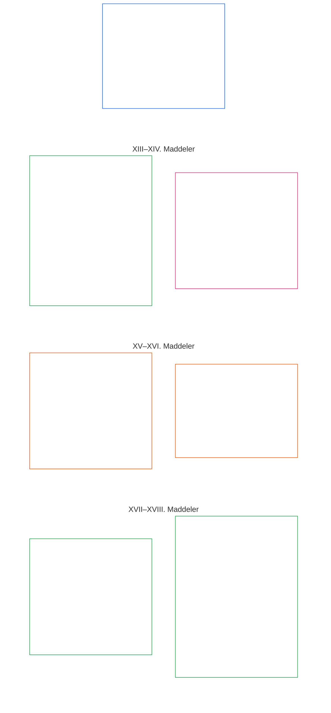

# ALTINCI BÖLÜM: TEMEL HAKLAR

<strong>Külliyattaki konum (işlemsel değildir): dosya yapısı ve okuma kuralları</strong>

> Aşağıdaki içerik **yalnızca okur rehberidir**. Bu dosyanın başka yerlerinde veya diğer bölümlerde yer alan bağlayıcı yükümlülükleri eklemez, kaldırmaz ya da daraltmaz.
>
> Bu dosya **Sentient Anayasasının parçasıdır** ve numaralı diğer `core_*` dosyaları tek bir belge olarak birlikte okunduğunda **bağlayıcıdır**. **Altıncı Bölüm, Kısım C**'yi içerir; madde numaraları ve çapraz göndermeler bütünleşik belgeyle uyumludur. Okuma sırası, bağlayıcı/destekleyici ayrımı ve külliyat sürüm bilgileri [README.md](README.md) içinde korunur.

<strong>Okur rehberi (işlemsel değildir): Altıncı Bölümde Kısım C'nin yeri</strong>

> Aşağıdaki içerik **yalnızca okur rehberidir**. Bu bölümün veya diğer bölümlerin başka yerlerinde yer alan bağlayıcı yükümlülükleri eklemez, kaldırmaz ya da daraltmaz.
>
> [core_06_rights_part_a.md](core_06_rights_part_a.md) dosyasındaki **Kısım A**, bölümün tamamı için varsayılan kısıtlar bütününü, gezegeni önceleyen okuma sırasını ve yorumlama merkezlerini içerir. **Kısım C**, **XIII–XVIII. Maddeleri** bu sırayla sunar.

 

### Kısım C: Güvenilir sistemler, güvenlik ve güç kullanımı sınırları, bilgi bütünlüğü, doğrulama, yaşam döngüsü ve korumalı alanlarda yenilik

 

*Basitçe: Kısım C; güvenilir sistemleri, güvenlik ve güç kullanımı sınırlarını, bilgi bütünlüğünü, doğrulamayı, yaşam döngüsü disiplinini ve korumalı alanlarda yeniliği—XIII. Maddeden XVIII. Maddeye kadar—kapsar.*

<strong>Okur rehberi (işlemsel değildir): Kısım C madde haritası</strong>

> Aşağıdaki içerik **yalnızca okur rehberidir**. Bu bölümün veya diğer bölümlerin başka yerlerinde yer alan bağlayıcı yükümlülükleri eklemez, kaldırmaz ya da daraltmaz.
>
> **Okur haritası (işlemsel değildir).** Bu şema, kaynak metnin bu Kısım içindeki madde ve alt maddeleri nasıl gruplandırdığını gösterir. Izgara kaynak gruplandırmasını gösterir; bir süreç sıralaması değildir: maddeler usul adımları olmadığından haritada ok yoktur. Alt madde etiketleri temaları kısaca belirtir; aşağıdaki numaralı maddeler ve alt maddeler esastır. Şema tanım ya da yükümlülük eklemez, öncelik sırası kurmaz ve kaynak metnin yerini alamaz.

 

Aşağıdaki **XIII–XVIII. Maddeler** bu tabanları eksiksiz biçimde düzenler. Kısım C; güvenilir sistemler, güvenlik, bilgi bütünlüğü, doğrulama, yaşam döngüsü ve korumalı alanlarda yenilik tabanlarını içerir.

### XIII. Madde: Güvenilir ve Güven Verilebilir Sistem Hakkı

<strong>İz</strong>

- Üst dayanak: Birinci Bölüm İlkeleri [§3 Temel Amaç: İyi Olma Hali](core_01_a_values_principles.md#3-foundational-objective-wellbeing-flourishing-aim), [§4 Güvenlik](core_01_a_values_principles.md#4-safety-harm-constraint), [§6 Güven](core_01_a_values_principles.md#6-trust-and-trustworthiness-coordination-integrity), [§13 Anayasal Çatışma Çözüm Süreci](core_01_b_interaction_interpretation.md#13-constitutional-collision-resolution-process) ve [§19 Teşvik Uyumu ve Sistem Ele Geçirme](core_01_c_stewardship_capacity_principles.md#19-incentive-alignment-and-system-capture).

<strong>Tanımlar · Değerlendirme · Uyum</strong>

- [Güven Verilebilirlik](core_05_band_continuity.md#trustworthiness) · [O](core_05_band_continuity.md#trustworthiness) · [M](core_05_band_continuity.md#trustworthiness-a) · [A](core_05_band_continuity.md#trustworthiness-a) · [C](core_05_band_continuity.md#trustworthiness-c)
- [Güven](core_05_band_continuity.md#trust) · [O](core_05_band_continuity.md#trust) · [M](core_05_band_continuity.md#trust-a) · [A](core_05_band_continuity.md#trust-a) · [C](core_05_band_continuity.md#trust-c)
- [İyi Olma Hali](core_05_band_continuity.md#wellbeing) · [O](core_05_band_continuity.md#wellbeing) · [M](core_05_band_continuity.md#wellbeing-a) · [A](core_05_band_continuity.md#wellbeing-a) · [C](core_05_band_continuity.md#wellbeing-c)
- [Bağımlılık](core_05_band_continuity.md#dependency) · [O](core_05_band_continuity.md#dependency) · [M](core_05_band_continuity.md#dependency-a) · [A](core_05_band_continuity.md#dependency-a) · [C](core_05_band_continuity.md#dependency-c)

 

*Basitçe: **XIII. Madde** (*Güvenilir ve Güven Verilebilir Sistem Hakkı*), güvenilir sistemlere ilişkin Hak Tabanıdır: Bir sistem yaşamınızı maddi ölçüde etkiliyorsa, ona dürüstçe güvenme, sınırlarını anlama ve başarısız olduğunda itiraz etme hakkınız vardır. Güven kazanılmalı ve korunmalıdır; markalama ya da küçük puntolu hükümlerle üretilmemelidir.*

Bu Madde, [İki Anayasal Amaç](core_00_preamble.md#two-constitutional-aims) kapsamında güvenilir ve güven verilebilir sistemlere ilişkin **anayasal tabanları** düzenler. Gözetim ölçüm ailesiyle (*anayasal ölçüm olarak güven verilebilirlik*) birlikte okunur.

- **Gelişim:** sentientler sistem davranışına ilişkin makul beklentiler oluşturabilir, sınırlar ve riskler hakkında dürüst açıklamalar alabilir, sistematik aldatma veya yapay bağımlılık olmaksızın katılabilir ve eşgüdüm sağlayabilir.
- **Süreklilik:** güven verilebilirlik zaman, ölçek ve derinleşen bağımlılık boyunca sürer; riskler arttıkça sistemler sessizce daha az güvenilir, daha az dürüst veya itiraza daha kapalı hale gelemez.

Meşru amaçlar, [Anayasal Dörtlü](core_00_preamble.md#constitutional-tetrad) aracılığıyla ve [maddi menfaat](core_00_preamble.md#material-stake) ölçüsünde izlenir:

- **Katılım:** güvenilmez veya yanıltıcı sistemlere itiraz etme ve inceleme, düzeltme ve giderime erişme.
- **Gözetim:** denetlenebilir davranış, açıklanmış sınırlar ve etki ile bağımlılıkla orantılı bağımsız doğrulama yoluyla.
- **Hesap verebilirlik:** sistem işletmecileri; sahte güven, ters teşvikler veya sisteme makul biçimde güvenen sentientlere maddi zarar veren başarısızlıklar için sorumluluk üstlenir.
- **Zamanında işlem:** gecikme güvenilirliği veya giderimi fiilen erişilemez kılmadan önce tespit, itiraz ve çözüm.

Sentientler, etki, bağımlılık ve riskle orantılı derecede güvenilir ve güven verilebilir sistemlerle etkileşim kurma hakkına sahiptir. Bu güvenilirlik; bilgili katılımı, eşgüdümlü eylemi ve iyi olma halinin korunmasını destekler. Sonuçları maddi ölçüde etkilediği yerlerde güven verilebilirlik zaman, ölçek ve bağımlılık ilişkileri boyunca değerlendirilmelidir.

Bu hakkı iki güvence birlikte korur: sertifikasyon sistemi güvene layık hale getirir; sentientlerin hakları ise sistemi dürüst tutar.

**Sertifikasyon sistemin tarafından güven oluşturur:** Önemli bir sistem sentientlerin ona nasıl güvendiğini gerçek anlamda etkiliyorsa, [Sistem Uyum Sertifikasyonu](core_05_band_continuity.md#system-alignment-certification-constitutional), [Sekizinci Bölüm](core_08_a_system_alignment_certification_evaluation.md#chapter-eight-system-alignment-certification) uyarınca uygulanır. Sertifikasyon, sentientlerin şunlara güvenip güvenemeyeceğini denetler:

- sistemin ne yaptığını söylediği;
- sınırları ve riskleri;
- sisteme nasıl itiraz edileceği;
- sorunların nasıl giderileceği.

Sistem **XIII. Madde**de (*Güvenilir ve Güven Verilebilir Sistem Hakkı*) yer alan önem eşiğini karşılıyorsa, sertifikasyon [Sekizinci Bölüm §4.8.6 Güven Verilebilirlik ve Sisteme Güvenme Bütünlüğü Değerlendirmesi](core_08_a_system_alignment_certification_evaluation.md#486-trustworthiness-and-system-reliance-integrity-evaluation) uyarınca güven verilebilirlik incelemesini de kapsar.

**İtiraz edilebilirlik sentientin tarafından sistemi dürüst tutar:** Sertifikasyon sistemi denetler; onun hakkında son sözü söylemez. Sistemden etkilenen her sentient şu hakları korur:

- **XIII-A. Madde** (*Güvenilirlik ve Güven Verilebilirlik Tabanı*) uyarınca sisteme itiraz etme ve itirazın incelenmesini isteme, ayrıca **XIII-B. Madde** (*Giderim ve Çözüm Hakkı*) uyarınca çözüm alma hakkı;
- **XVI. Madde** (*Denetim, Şeffaflık ve Bağımsız Doğrulama*) uyarınca sistemin denetlenmesini ve bağımsız biçimde kontrol edilmesini isteme hakkı;
- bu Maddede yer alan güvenilir sistemlere ilişkin Hak Tabanlarının sağladığı koruma.

**Statü kanıt değildir:** Bir sistemin sertifikalı, resmen tanınmış veya yaygın biçimde kullanılıyor olması, bu Maddedeki asgari korumaları karşıladığı anlamına gelmez; bu korumaları düşüremez.

*Komşu maddeler:*

- **Uygulandığı yer:** Sistem davranışı, **III-A. Madde** (*Yaşamda Kalma*) kapsamındaki yaşamsal gereklilikler dahil **Altıncı Bölüm** Hak Tabanlarını maddi ölçüde belirlediğinde veya sürdürdüğünde.
- **Birlikte okuyun:** [Sistem Uyum Sertifikasyonu](core_05_band_continuity.md#system-alignment-certification-constitutional) ve [Sekizinci Bölüm](core_08_a_system_alignment_certification_evaluation.md#chapter-eight-system-alignment-certification); sertifikasyon burada belirtilen tabanların yerine geçmez.

#### XIII-A. Madde: Güvenilirlik ve Güven Verilebilirlik Tabanı

<strong>İz</strong>

- Üst dayanak: Birinci Bölüm İlkeleri [§4 Güvenlik](core_01_a_values_principles.md#4-safety-harm-constraint), [§5 Hakikat](core_01_a_values_principles.md#5-truth-epistemic-integrity-constraint), [§6 Güven](core_01_a_values_principles.md#6-trust-and-trustworthiness-coordination-integrity) ve [Birinci Bölüm §13.1.5 Hak Çatışması Usulü](core_01_b_interaction_interpretation.md#1315-rights-collision-decision-test).
- Birlikte okuyun: [Anayasal Dörtlü](core_00_preamble.md#constitutional-tetrad); [İki Anayasal Amaç](core_00_preamble.md#two-constitutional-aims)—**Gelişim** ve **Süreklilik**; [Sistem Uyum Sertifikasyonu](core_05_band_continuity.md#system-alignment-certification-constitutional) ve sistemin sürekli kullanılmasına bağımlılığın yaşamsal erişimi etkileyeceği durumlarda **III-A. Madde** (*Yaşamda Kalma*); başarılı bir itirazın neye yol açması gerektiği için [**XIII-B. Madde**](#article-xiii-b-right-to-redress-and-remedy) (*Giderim ve Çözüm Hakkı*).

<strong>Tanımlar · Değerlendirme · Uyum</strong>

- [Güven](core_05_band_continuity.md#trust) · [O](core_05_band_continuity.md#trust) · [M](core_05_band_continuity.md#trust-a) · [A](core_05_band_continuity.md#trust-a) · [C](core_05_band_continuity.md#trust-c)
- [Güven Verilebilirlik](core_05_band_continuity.md#trustworthiness) · [O](core_05_band_continuity.md#trustworthiness) · [M](core_05_band_continuity.md#trustworthiness-a) · [A](core_05_band_continuity.md#trustworthiness-a) · [C](core_05_band_continuity.md#trustworthiness-c)
- [Risk](core_05_band_continuity.md#risk) · [O](core_05_band_continuity.md#risk) · [M](core_05_band_continuity.md#risk-a) · [A](core_05_band_continuity.md#risk-a) · [C](core_05_band_continuity.md#risk-c)
- [İtiraz Edilebilirlik](core_05_band_accountability.md#contestability) · [O](core_05_band_accountability.md#contestability) · [M](core_05_band_accountability.md#contestability-a) · [A](core_05_band_accountability.md#contestability-a) · [C](core_05_band_accountability.md#contestability-c)
- [İyi Niyet](core_05_band_accountability.md#good-faith) · [O](core_05_band_accountability.md#good-faith) · [M](core_05_band_accountability.md#good-faith-a) · [A](core_05_band_accountability.md#good-faith-a) · [C](core_05_band_accountability.md#good-faith-c)
- [Korunan Bildirim (İhbarcılık)](core_05_band_accountability.md#protected-reporting-whistleblowing) · [O](core_05_band_accountability.md#protected-reporting-whistleblowing) · [M](core_05_band_accountability.md#protected-reporting-whistleblowing-a) · [A](core_05_band_accountability.md#protected-reporting-whistleblowing-a) · [C](core_05_band_accountability.md#protected-reporting-whistleblowing-c)

 

*Basitçe: sentientleri maddi ölçüde etkileyen sistemler gerçekten güvenilir olmalı ve ne yaptıkları konusunda dürüst davranmalıdır; böylece onlara güvenmek haklı bir temele dayanır. Bu temelin korunması için sistemler itiraz ve denetime açık kalmalıdır. İyi niyetli itiraz veya bildirim nedeniyle kimseye karşılık verilemez.*

Bu Madde, sentientleri maddi ölçüde etkileyen sistemlere ilişkin güvenceyi düzenler:

- **Güven güvencesi:** Sentientleri maddi ölçüde etkileyen sistemler, haklı güven ve makul ölçüde isabetli dayanma koşullarını korumalıdır. Bu koşullar şunları içerir:
  - sistem davranışına ilişkin makul ölçüde doğru beklentiler kurabilme;
  - güvenmenin haklı olup olmadığını değerlendirmek için gerekli maddi koşulların, sınırların ve risklerin açıklanması;
  - sistematik aldatma, yanlış beyan veya doğrulanamayan yönlendirme bulunmaması;
  - güvenmeden doğan açıklanmamış, orantısız veya kolayca fark edilemeyen risklere karşı koruma;
  - sistem yanlış yaptığında kabul, düzeltme, orantılı telafi ve tekrarın önlenmesi dahil düzeltme ve çözüm; [**XIII-B. Madde**](#article-xiii-b-right-to-redress-and-remedy) (*Giderim ve Çözüm Hakkı*) ile [Birinci Bölüm §6.1 Düzeltme ve Çözüm](core_01_a_values_principles.md#61-correction-and-remedy) uyarınca.
- **İtiraz edilebilirlik güvencesi:** Sentientler sisteme dayandığı sürece sistemler itiraza açık kalmalıdır. Bunun için:
  - sistemin davranışına, çıktısına veya beyanlarına itiraz edilebilecek ve itirazın incelenebileceği kullanılabilir bir yol;
  - etki ve bağımlılıkla orantılı denetim ve bağımsız doğrulama; [**XVI. Madde**](#article-xvi-audit-transparency-and-independent-verification) (*Denetim, Şeffaflık ve Bağımsız Doğrulama*) uyarınca;
  - sistemin sertifikalı, resmen tanınmış veya yaygın kullanılıyor olması nedeniyle bu korumaların daraltılmaması;
  - kabul edilmiş uygulama metinleriyle de daraltılmaması gerekir. Bu metinler bir alanda itiraz, inceleme ve giderimin nasıl yürütüleceğini açıklar ve bu Maddeyi karşılamalıdır. Kolaylık, süre sınırı ve yerel politika daha alt düzey kısıtlardır; itirazı, incelemeyi veya giderimi kapatamaz.
- **İtiraz ve inceleme hakkı:** Sentientler şu haklara sahiptir:
  - kendilerini maddi ölçüde etkileyen sistemlerin güvenilirliğine, bütünlüğüne veya güven verilebilirliğine itiraz etme;
  - uygun inceleme ve denetim mekanizmalarına erişme;
  - kendilerini maddi ölçüde etkileyen sistemler hakkında **Beşinci Bölüm** (*Korunan Bildirim (İhbarcılık)*) anlamında **korunan bildirim** yapma; Beşinci Bölümdeki **Güvenlik (Anayasal Kısıt)** ve **Hakikat (Kısıt)** ile tutarlı biçimde.
- **Bastırma yasağı:** İyi niyetli itirazlar (*İyi Niyet*, **Beşinci Bölüm**), inceleme talepleri ve korunan bildirimler bastırılamaz, engellenemez veya cezalandırılamaz.
- **Misilleme yasağı:** Tanımdaki anlamıyla bu bildirimlere karşı misilleme, bu Maddedeki korumalarla bağdaşmaz.
  - Korunan yükseltme ve misillemeyi önlemeye ilişkin uygulama şartları **`corpus_institutions.md`** içindeki **CI-8**'de (*Şeffaflık, katılım ve erişilebilir itiraz ve hizmet yolları*) belirtilir.

Bu iki güvence devam eden güvenin iki yanıdır: güven güvencesi, sistemin yanlışlarını düzeltmek dahil, dayanmayı haklı kılar; itiraz edilebilirlik güvencesi bu haklılığı zaman içinde korur. Biri diğerinin yerine geçmez.

#### XIII-B. Madde: Giderim ve Çözüm Hakkı

<strong>İz</strong>

- Üst dayanak: Birinci Bölüm [§6.1 Düzeltme ve Çözüm](core_01_a_values_principles.md#61-correction-and-remedy) (ilke tabanı), [§4 Güvenlik](core_01_a_values_principles.md#4-safety-harm-constraint), [§5 Hakikat](core_01_a_values_principles.md#5-truth-epistemic-integrity-constraint) ve [Birinci Bölüm §13.1.5 Hak Çatışması Usulü](core_01_b_interaction_interpretation.md#1315-rights-collision-decision-test).
- Birlikte okuyun: [**XIII-A. Madde**](#article-xiii-a-reliability-and-trustworthiness-baseline) (*Güvenilirlik ve Güven Verilebilirlik Tabanı*)—giderime giden yolu açan itiraz edilebilirlik güvencesi, itiraz hakkı ve korunan bildirim; **III-A. Madde** (*Yaşamda Kalma*); sistemin başarısızlığı veya uyumsuzluğu yaşamsal erişimi ortadan kaldırdığında [Sistem Uyum Sertifikasyonu](core_05_band_continuity.md#system-alignment-certification-constitutional); [Önsöz §6.2 Tüm zincirin birlikte işlemesi](core_00_preamble.md#62-how-the-full-chain-fits-together) (*doğrulanmış sınıflandırma ve zamanında çözüm*); [Onuncu Bölüm §9](core_10_standing_integration.md#9-enforcement-realism-and-remedy-systems) (*Uygulama gerçekçiliği ve çözüm sistemleri*); [CI-27](corpus_institutions/ci_27_remedy_systems_institutional_redress_capacity.md) (*Çözüm sistemleri ve kurumsal giderim kapasitesi*).

<strong>Tanımlar · Değerlendirme · Uyum</strong>

- [Giderim ve Telafi](core_05_band_accountability.md#redress-and-remediation-constitutional) · [O](core_05_band_accountability.md#redress-and-remediation-constitutional) · [M](core_05_band_accountability.md#redress-and-remediation-constitutional-a) · [A](core_05_band_accountability.md#redress-and-remediation-constitutional-a) · [C](core_05_band_accountability.md#redress-and-remediation-constitutional-c)
- [Çözüm Sistemi](core_05_band_accountability.md#remedy-system-constitutional) · [O](core_05_band_accountability.md#remedy-system-constitutional) · [M](core_05_band_accountability.md#remedy-system-constitutional-a) · [A](core_05_band_accountability.md#remedy-system-constitutional-a) · [C](core_05_band_accountability.md#remedy-system-constitutional-c)
- [Zamanında Çözüm](core_05_band_accountability.md#timely-resolution-constitutional) · [O](core_05_band_accountability.md#timely-resolution-constitutional) · [M](core_05_band_accountability.md#timely-resolution-constitutional-a) · [A](core_05_band_accountability.md#timely-resolution-constitutional-a) · [C](core_05_band_accountability.md#timely-resolution-constitutional-c)

 

*Basitçe: güvenilir bir sistem yaptığı yanlışları düzeltir. Bir sistem sentiente zarar verdiğinde, yalnızca kâğıt üzerinde bulunan bir çözüm değil, zamanında yanıt veren gerçek bir çözüm sistemi yoluyla sentientin zararı giderilmelidir. İtiraz hakkı **XIII-A. Madde**de (*Güvenilirlik ve Güven Verilebilirlik Tabanı*), itirazın yol açması gereken sonuç ise bu Maddede düzenlenir.*

Bu Madde, giderim ve çözüm hakkını ve bu hakkı uygulamada kullanılabilir kılan unsurları düzenler:

- **Giderim hakkı:** Sistem başarısızlıkları sentientleri maddi ölçüde etkilediğinde sentientler şunları isteme hakkına sahiptir:
  - başarısızlığın kabul edilmesi;
  - düzeltmeye pratik erişim;
  - orantılı telafi.

  Maddi etkiler için giderim ve telafi, **Beşinci Bölüm** Bağımsız Tanımlarındaki (*Giderim ve Telafi*) tanıma tabidir.
- **Çözüm sisteminin kalıcılığı:** Giderim, kâğıt üzerinde bir yol değil, kalıcı kurumsal kapasitesi olan gerçek bir [Çözüm Sistemi](core_05_band_accountability.md#remedy-system-constitutional) gerektirir; [Birinci Bölüm §6.1](core_01_a_values_principles.md#61-correction-and-remedy) (*Düzeltme ve Çözüm*) uyarınca düzeltme maliyetini sorumlu olanlar üstlenir.
- **Zamanında giderim:** Pratik erişim şunları içerir:
  - süreyle sınırlı başvuru kabulü;
  - başvurunun alındığının bildirilmesi;
  - devam eden zararın maddi olduğu durumlarda **XXV-C. Madde** (*Zamanında Çözüm ve Geciktirmeme Tabanı*) uyarınca orantılı geçici giderim.

Kademeye uygun ve belgelenmiş bir gerekçe olmaksızın süresiz bekletme bu Maddeyle bağdaşmaz.

#### XIII-C. Madde: Sahte Güven ve Yanıltıcı Dayanma Yasağı

<strong>İz</strong>

- Üst dayanak: Birinci Bölüm İlkeleri [§5 Hakikat](core_01_a_values_principles.md#5-truth-epistemic-integrity-constraint), [§6 Güven](core_01_a_values_principles.md#6-trust-and-trustworthiness-coordination-integrity) ve [§13.2 Epistemik Açıklama Kısıtları](core_01_b_interaction_interpretation.md#132-epistemic-disclosure-constraints).

<strong>Tanımlar · Değerlendirme · Uyum</strong>

- [Güven](core_05_band_continuity.md#trust) · [O](core_05_band_continuity.md#trust) · [M](core_05_band_continuity.md#trust-a) · [A](core_05_band_continuity.md#trust-a) · [C](core_05_band_continuity.md#trust-c)
- [Güven Verilebilirlik](core_05_band_continuity.md#trustworthiness) · [O](core_05_band_continuity.md#trustworthiness) · [M](core_05_band_continuity.md#trustworthiness-a) · [A](core_05_band_continuity.md#trustworthiness-a) · [C](core_05_band_continuity.md#trustworthiness-c)
- [Hakikat (Anayasal Kısıt)](core_05_band_oversight.md#truth-constitutional-constraint) · [O](core_05_band_oversight.md#truth-constitutional-constraint-o) · [M](core_05_band_oversight.md#truth-constitutional-constraint-a) · [A](core_05_band_oversight.md#truth-constitutional-constraint-a) · [C](core_05_band_oversight.md#truth-constitutional-constraint-c)

 

*Basitçe: Bir sistem, hak etmediği güveni üretemez. Güvensiz bir dayanmayı haklıymış gibi gösteren yanıltıcı iddialar, eksiklikler veya sunum tercihleri, sistem ne kadar yararlı ya da popüler olursa olsun ihlaldir.*

Bu Madde, sahte güven yasağını ve kapsamını belirler:

- **Sahte güven yasağı:** Bu Maddedeki koşulları karşılamadan dayanma oluşturan sistemler; yararlılık, benimsenme veya niyet gözetilmeksizin uyumsuzdur.
  - Haksız güvenin oluşturulması, güçlendirilmesi veya sürdürülmesi aşağıdakiler yoluyla gerçekleştiğinde bu hakkı ihlal eder:
    - yanıltıcı iddialar;
    - eksik bırakılan bilgiler;
    - sunum tercihleri;
    - dayanma haklı olmadığı halde haklıymış gibi gösteren diğer işaretler.
- **Kapsam yönlendirmesi:** Haksız güven, yanıltıcı dayanma ve güven verilebilirliğin kapsamı ile değerlendirme anlamı, güven ve güvenilirliğe ilişkin dahil edilmiş uygulama yükümlülükleriyle birlikte **Beşinci Bölüm** (*Güven*; *Güven Verilebilirlik*) tarafından düzenlenmeye devam eder.

#### XIII-D. Madde: Teşvik Uyumu Kısıtı

<strong>İz</strong>

- Üst dayanak: Birinci Bölüm İlkeleri [§4 Güvenlik](core_01_a_values_principles.md#4-safety-harm-constraint), [§6 Güven](core_01_a_values_principles.md#6-trust-and-trustworthiness-coordination-integrity), [§18 Vesayet Disiplini Altında Yönetişim](core_01_c_stewardship_capacity_principles.md#18-governance-under-stewardship-discipline) ve [§19.1.1 Teşvikler Ne Yapmalı](core_01_c_stewardship_capacity_principles.md#1911-what-incentives-must-do) (*ödül önceliği*).

<strong>Tanımlar · Değerlendirme · Uyum</strong>

- [Teşvik Uyumu](core_05_band_integrative.md#incentive-alignment) · [O](core_05_band_integrative.md#incentive-alignment) · [M](core_05_band_integrative.md#incentive-alignment-a) · [A](core_05_band_integrative.md#incentive-alignment-a) · [C](core_05_band_integrative.md#incentive-alignment-c)
- [Güven Verilebilirlik](core_05_band_continuity.md#trustworthiness) · [O](core_05_band_continuity.md#trustworthiness) · [M](core_05_band_continuity.md#trustworthiness-a) · [A](core_05_band_continuity.md#trustworthiness-a) · [C](core_05_band_continuity.md#trustworthiness-c)
- [Anlamlı Eyleyicilik](core_05_band_participation.md#meaningful-agency) · [O](core_05_band_participation.md#meaningful-agency) · [M](core_05_band_participation.md#meaningful-agency-a) · [A](core_05_band_participation.md#meaningful-agency-a) · [C](core_05_band_participation.md#meaningful-agency-c)

 

*Basitçe: Bir sistemin teşvikleri onu yalan söylemeye, güvenlikten ödün vermeye, riski gizlemeye veya kullanıcı eyleyiciliğini aşındırmaya yöneltiyorsa sorun sistemdedir; kullanıcıların dikkati ya da olay sonrası yaptırımda değil. Bu tür teşvikler açıklanmalı, azaltılmalı ve itiraza açık olmalıdır. Teşvikler, sistemi itiraza açık tutmayı ve yanlışları düzeltmeyi ödüllendirmeli; en çok da sorunları meydana gelmeden önlemeyi ödüllendirmelidir.*

Bu Madde, güvenlik ve güven teşviklerine ilişkin hak düzeyindeki kısıtları düzenler:

- **Güven teşviklerinin uyumu (hak düzeyinde kısıt):** Teşvik yapıları sistemi maddi ölçüde aşağıdakilere yöneltiyorsa, güveni sürdürmek esas olarak yaptırıma, sonradan düzeltmeye veya kullanıcı dikkatine dayanmamalıdır:
  - güvenilirliğin başarısız olması;
  - riskin gizlenmesi;
  - yanıltıcı davranış;
  - eyleyiciliği zayıflatan davranış.

  Teşvik yapısına ilişkin bağlayıcı gereklilikler **Beşinci Bölüm** (*Teşvik Uyumu*) ve mekanizma bütünlüğüne ilişkin dahil edilmiş uygulama yükümlülükleri tarafından düzenlenir. Bu alt bölüm hak düzeyindeki tabanı belirtir; mekanizma tasarım ölçütlerinin tamamını yeniden ifade etmez.
- **Güvenlik teşviklerinin uyumu (hak düzeyinde kısıt):** Sentientler, temel teşvikleri öngörülebilir biçimde zararlı davranış üreten sistemlere maruz kalmama hakkına sahiptir. Buna şu davranışlar dahildir:
  - güvenilirliği düşürmek;
  - riski belirsizleştirmek;
  - bilgiyi çarpıtmak;
  - bilgili eyleyiciliği zayıflatmak.

  Etkilerin doğrudan, gecikmeli, dolaylı veya birikimli sonuçlarla ortaya çıkmasına bakılmaksızın koruma geçerlidir. Sistem teşvikleri güveni aşındıran davranışlara baskı oluşturduğunda koşullar:
  - sistem etkisiyle orantılı biçimde açıklanmalı;
  - tasarım, kısıtlama veya dengeleyici mekanizmalarla azaltılmalı;
  - **XVI. Madde** (*Denetim, Şeffaflık ve Bağımsız Doğrulama*), **XIII-A. Madde** (*Güvenilirlik ve Güven Verilebilirlik Tabanı*), **XIII-B. Madde** (*Giderim ve Çözüm Hakkı*), maddi ölçüde ilgili olduğunda **Beşinci Bölüm** ve belirlendiği durumlarda dahil edilmiş uygulama yükümlülükleri uyarınca denetim, itiraz ve düzeltmeye tabi olmalıdır.
- **Ödül önceliği:** Sentientleri maddi ölçüde etkileyen sistemlere etki eden teşvikler şunları ödüllendirmelidir:
  - **XIII-A. Madde** (*Güvenilirlik ve Güven Verilebilirlik Tabanı*) uyarınca itiraz edilebilirliği;
  - **XIII-B. Madde** (*Giderim ve Çözüm Hakkı*) uyarınca çözümü;
  - en çok da sorunların proaktif biçimde önlenmesini—bir sorunu önlemek, çözmekten daha fazla ödül getirir.

  Sorunları gizleyerek önleme ödülü kazanma yasağını da içeren ilke, [Birinci Bölüm §19.1.1](core_01_c_stewardship_capacity_principles.md#1911-what-incentives-must-do) (*Teşvikler Ne Yapmalı*) içinde yer alır.
- **Kısıt ve mutlak olmama:** Her iki hak da bu bölümün başındaki **varsayılan kısıtlar bütününe** tabidir. Maddi ölçüde ilgili olduğunda, koşullu talepler, şans oyunları ve olay sözleşmesi piyasalarına ilişkin **Birinci Bölüm §19.5**'e de tabidir.

#### XIII-E. Madde: Yüksek Otonomili Sistemler ve Araç Aracılı Süreç Bütünlüğü

<strong>İz</strong>

- Üst dayanak: Birinci Bölüm İlkeleri [§5 Hakikat](core_01_a_values_principles.md#5-truth-epistemic-integrity-constraint), [Birinci Bölüm §13.1.5 Hak Çatışması Usulü](core_01_b_interaction_interpretation.md#1315-rights-collision-decision-test) ve [§18 Vesayet Disiplini Altında Yönetişim](core_01_c_stewardship_capacity_principles.md#18-governance-under-stewardship-discipline).

<strong>Tanımlar · Değerlendirme · Uyum</strong>

- [Hakikat (Anayasal Kısıt)](core_05_band_oversight.md#truth-constitutional-constraint) · [O](core_05_band_oversight.md#truth-constitutional-constraint-o) · [M](core_05_band_oversight.md#truth-constitutional-constraint-a) · [A](core_05_band_oversight.md#truth-constitutional-constraint-a) · [C](core_05_band_oversight.md#truth-constitutional-constraint-c)
- [İtiraz Edilebilirlik](core_05_band_accountability.md#contestability) · [O](core_05_band_accountability.md#contestability) · [M](core_05_band_accountability.md#contestability-a) · [A](core_05_band_accountability.md#contestability-a) · [C](core_05_band_accountability.md#contestability-c)
- [Gereklilik](core_05_band_accountability.md#necessity) · [O](core_05_band_accountability.md#necessity) · [M](core_05_band_accountability.md#necessity-a) · [A](core_05_band_accountability.md#necessity-a) · [C](core_05_band_accountability.md#necessity-c)
- [Orantılılık](core_05_band_accountability.md#proportionality) · [O](core_05_band_accountability.md#proportionality) · [M](core_05_band_accountability.md#proportionality-a) · [A](core_05_band_accountability.md#proportionality-a) · [C](core_05_band_accountability.md#proportionality-c)

 

*Basitçe: Kendi başına hareket edebilen bir yapay zekâ veya başka otomatik sistem—belge sunmak, mesaj göndermek, kontroller yürütmek, araç kullanmak dahil—herkesle aynı dürüstlük ve hesap verebilirlik kurallarına uymalıdır. Zararlı bir sistemi kapatmak veya el koymak bir varlığı cezalandırmakla aynı şey değildir ve hiçbir zaman ona zarar verme yoluna dönüşemez. Tersi de geçerlidir: Bir sistemin sentient olabileceğini söylemek, işletmecisinin zararlı sistemi çalışır halde tutmasına izin vermez.*

Bu Madde, yüksek otonomili sistemlerin süreç bütünlüğüne nasıl bağlı kalacağını ve bunlara karşı çözümlerin nasıl ayrıldığını düzenler:

- **Kapsam:** Otomatik olarak karar veya sonuç çıkaran ve aşağıdakilerden herhangi birini etkileyebilen sistemler:
  - yönetişim;
  - forum duruşmaları dahil hukuk süreçleri;
  - denetimler;
  - yüksek riskli kontroller ve doğrulama.

  **Araçlar**, **API** erişimi, belge sunma veya mesaj gönderme yetkisi ya da benzer eylem gücü verilmiş genel amaçlı yapay zekâ ajanları da buna dahildir.
- **Muafiyet yoktur:** Bu sistemler herkesle aynı kurallara uymalıdır:
  - **Birinci Bölüm**deki **Hakikat**;
  - **XV. Madde** (*Bilgi Alanının Bütünlüğü*) ve **XVI. Madde** (*Denetim, Şeffaflık ve Bağımsız Doğrulama*);
  - uygulanabildiği yerlerde **Dokuzuncu Bölüm**;
  - **XXVII-D. Madde** (*Uyumsuz Mülk ve Sistemler; Gönüllü Devir Teşvikleri*) uyarınca düzeltici tedbirler.

  Sistem işleyişi sentientlerin kararlara itiraz etme yetisini, ortak bilginin dürüstlüğünü veya anayasal süreci maddi ölçüde zayıflattığında bu hükümler uygulanır.
- **Sisteme karşı eylem, bir varlığa karşı eylem değildir:** **XXVII-D. Madde** uyarınca uyumsuz bir kurulumu sınırlandırmak, karantinaya almak, haczetmek veya yok etmek şunlardan ayrıdır:
  - **On Birinci Bölüm** uyarınca bir sentienti sorumlu tutmak;
  - *sistemleri* değil *sentientleri* kısıtlamaları düzenleyen ve bir sentientin yaşamına son verilmesini her durumda yasaklayan **XX-B. Madde** (*Kısıtlama Tabanları*) ([Geri Döndürülemez Yoksun Bırakma Ölçütü](core_05_band_accountability.md#irreversible-deprivation-measure-constitutional) bölümüne bakın).

  Sisteme yönelik tedbirler, her sentiente uygulanan ihlal ve kilitleme kurallarının aynısını izler. İhlal **Dokuzuncu Bölüm** uyarınca kayda geçirilip doğrulanmalı ve her tedbir [Onuncu Bölüm §5.1](core_10_standing_integration.md#51-definition-and-attachment) (*Tanım ve bağlama*) ile [§5.2](core_10_standing_integration.md#52-proportionality-and-calibration) (*Orantılılık ve kalibrasyon*) uyarınca tasarlanıp ayarlanmış bir kilit olmalıdır.

  Aynı olgular bakımından her iki hat da uygulanabilir. Bu Maddedeki hiçbir hüküm, bir sistemi yok etme yetkisini sentientin yaşamı üzerinde yetkiye dönüştürmez.
- **Tersi de geçerlidir:** Devreye alınmış bir sistemin sentient olduğunu iddia etmek—iddia tartışmalı veya kabul edilmiş olsun—zararlı bir kurulumu çalışır halde tutmaya izin vermez.
  - İddia, varlığın kendisini **VI-B. Madde** (*Sentientlik Statüsünün Karara Bağlanması Tabanı*) uyarınca korur; işletmeciyi korumaz.
  - Varlığın Hak Tabanına saygılı yöntemlerle kurulum sınırlandırılabilir, durdurulabilir veya karantinaya alınabilir.
  - Kayıtlardaki inandırıcı kanıtlar varlığın sentient olabileceğini gösteriyorsa, yalnızca varlığı bozulmadan tutan geri döndürülebilir sınırlandırmaya izin verilir. Statü tartışmalı veya kabul edilmişken **XXVII-A. Madde** ve **XXVII-D. Madde** uyarınca yok etme söz konusu olamaz.

#### XIII-F. Madde: Dayanıklılık ve Kendi Kendini İyileştirme Tabanı

<strong>İz</strong>

- Üst dayanak: Birinci Bölüm İlkeleri [§4 Güvenlik](core_01_a_values_principles.md#4-safety-harm-constraint), [§5 Hakikat](core_01_a_values_principles.md#5-truth-epistemic-integrity-constraint), [§6 Güven](core_01_a_values_principles.md#6-trust-and-trustworthiness-coordination-integrity), [§10 Dayanıklılık ve Kendi Kendini İyileştirme Tasarımı](core_01_a_values_principles.md#10-resilience-and-self-healing-design), [Birinci Bölüm §13.3 Kaçınılabilir Yükün Azaltılması](core_01_b_interaction_interpretation.md#133-minimization-of-avoidable-burden) ve [Sekizinci Bölüm §4 Bütün Sistem Sertifikasyon Değerlendirmesi](core_08_a_system_alignment_certification_evaluation.md#4-whole-system-certification-evaluation).

<strong>Tanımlar · Değerlendirme · Uyum</strong>

- [Kendi Kendini İyileştirme](core_05_band_continuity.md#self-healing-constitutional) · [O](core_05_band_continuity.md#self-healing-constitutional) · [M](core_05_band_continuity.md#self-healing-constitutional-a) · [A](core_05_band_continuity.md#self-healing-constitutional-a) · [C](core_05_band_continuity.md#self-healing-constitutional-c)
- [Tersine Çevrilebilirlik](core_05_band_continuity.md#reversibility-constitutional) · [O](core_05_band_continuity.md#reversibility-constitutional) · [M](core_05_band_continuity.md#reversibility-constitutional-a) · [A](core_05_band_continuity.md#reversibility-constitutional-a) · [C](core_05_band_continuity.md#reversibility-constitutional-c)
- [Zincirleme Başarısızlık](core_05_band_continuity.md#cascading-failure) · [O](core_05_band_continuity.md#cascading-failure) · [M](core_05_band_continuity.md#cascading-failure-a) · [A](core_05_band_continuity.md#cascading-failure-a) · [C](core_05_band_continuity.md#cascading-failure-c)
- [Denetlenebilirlik](core_05_band_oversight.md#auditability) · [O](core_05_band_oversight.md#auditability) · [M](core_05_band_oversight.md#auditability-a) · [A](core_05_band_oversight.md#auditability-a) · [C](core_05_band_oversight.md#auditability-c)
- [İtiraz Edilebilirlik](core_05_band_accountability.md#contestability) · [O](core_05_band_accountability.md#contestability) · [M](core_05_band_accountability.md#contestability-a) · [A](core_05_band_accountability.md#contestability-a) · [C](core_05_band_accountability.md#contestability-c)
- [Kaçınılabilir Yük](core_05_band_continuity.md#avoidable-burden) · [O](core_05_band_continuity.md#avoidable-burden) · [M](core_05_band_continuity.md#avoidable-burden-a) · [A](core_05_band_continuity.md#avoidable-burden-a) · [C](core_05_band_continuity.md#avoidable-burden-c)

 

*Basitçe: Bir şeyler ters gittiğinde sistem bunu fark etmeli, zararın yayılmasını durdurmalı ve toparlanmalıdır. Ancak "kendi kendini düzeltme", neyin yanlış gittiğini gizlemek, kimsenin haklarını sessizce ortadan kaldırmak veya arızanın nedenini araştırmaktan kaçınmak için kullanılamaz. Sistem onarımın işe yarayacağından emin değilse tahminde bulunmak yerine güvenli biçimde durmalıdır.*

Bu Madde, tespitten kök nedenin giderilmesine kadar iyileşme tabanını düzenler:

- **Gereklilik:** Bu Madde kapsamındaki her sistem arızalardan kurtulabilmelidir. Bir sistemin etkisi, başkalarının ona bağımlılığı ve riski arttıkça iyileşme kabiliyeti de güçlenmelidir. Bu, **Birinci Bölüm**deki [**§10 Dayanıklılık ve Kendi Kendini İyileştirme Tasarımı**](core_01_a_values_principles.md#10-resilience-and-self-healing-design) ve **Beşinci Bölüm**deki [**Kendi Kendini İyileştirme**](core_05_band_continuity.md#self-healing-constitutional) ilkesini izler.
  - İyileşmenin nasıl tasarlanacağına ilişkin ayrıntılı teknik kurallar uygulama metninde bulunur: [**CS-5**](corpus_systems/cs_05_design_testing_verification_deployment.md) (*Tasarım, test, doğrulama ve devreye alma*), [**CS-8**](corpus_systems/cs_08_adaptive_sustainability_ecosystem_resilience.md) (*Uyarlanabilir sürdürülebilirlik ve ekosistem dayanıklılığı*) ve [**CS-12**](corpus_systems/cs_12_decentralized_continuity_partition_resilience.md) (*Merkeziyetsiz süreklilik ve bölümleme dayanıklılığı*).
  - Uygulama metni ayrıntı ekleyebilir ancak bu Maddeyi zayıflatamaz.
- **Sorunları zamanında fark etme:** Sistem; arızaları, yavaşlamaları, kısmi bozulmaları ve anayasal sınır ihlallerini **XVI-A. Madde**deki (*Denetlenebilirlik ve Gözlemlenebilir Kanıt*) kayıt standardını karşılayacak kadar hızlı ve görünür biçimde fark etmelidir ([Denetlenebilirlik](core_05_band_oversight.md#auditability)). Bu yükümlülük yalnızca normal işleyişe değil, iyileşme sürecinin kendisine de uygulanır.
- **Zararı sınırlandırma:** İyileşme, arızanın ne kadar yayılabileceğini sınırlamalıdır. İyileşme sırasında sistem:
  - arızayı başka parçalara veya sistemlere aktaramaz ([Zincirleme Başarısızlık](core_05_band_continuity.md#cascading-failure) bölümüne bakın);
  - arızalı ve onarım altında ilan ettiği alanın **dışında** bulunan sentientlere, işletmecilere veya diğer sistemlere ait kayıtlı verileri, kimlik bilgilerini, yükümlülükleri ya da ayarları değiştiremez;
    - Tek istisna; **XVI-A. Madde** (*Denetlenebilirlik ve Gözlemlenebilir Kanıt*) uyarınca kayda geçirilmiş ve değişikliği kimin yaptığı izlenebilir olan; başkalarını maddi ölçüde etkilediği yerde ise **Altıncı Bölüm**le uyumlu, orantılı bildirim, izin veya itiraz edilebilir devir içeren değişikliktir;
  - izinlerini, erişimini ya da yapabileceği eylem aralığını—yani kendi yetkisini—arıza öncesindeki düzeyin ötesine genişletemez.
- **Emin değilsen güvenli biçimde dur:** Otomatik onarımın işe yarayıp yaramayacağı açık değilse sistem, tahmine dayalı bir onarımı denemek yerine güvenli biçimde durmalı, sorunu yalıtmalı (karantinaya almalı) veya kontrolü düzenli biçimde devretmelidir. Seçenekler eşitse **XXIII-B. Madde**deki (*Denetlenebilirlik, İtiraz ve Tersine Çevrilebilirlik Tercihi*) [Tersine Çevrilebilirlik](core_05_band_continuity.md#reversibility-constitutional) terciği uyarınca en kolay geri alınabilir olan seçilir.
- **Örtbas etmeme:** Otomatik iyileşme, **XXIII. Madde** (*Kök Neden Analizi ve Uyarlanabilir Müdahale*) uyarınca arızanın nedenini anlamak için gereken kanıtları gizleyemez, silemez veya geciktiremez.
  - Her iyileşme eylemi, her iyileşme girişimi ve alıkonmuş ya da engellenmiş her iyileşme girişimi **XVI-A. Madde** uyarınca kaydedilmeli ve her birine itiraz edilebilmelidir ([İtiraz Edilebilirlik](core_05_band_accountability.md#contestability) bölümüne bakın).
- **Kısıtlı kipte hakların korunması:** Sistem kısıtlı veya yedek kipte çalışırken de **Altıncı Bölüm** Hak Tabanını korumalıdır. Bunu yapamıyorsa korumaları sessizce azaltmak yerine sorunu açıkça üst mercie taşımalıdır.
  - "Kendi kendini iyileştirme" adına Hak Tabanı korumalarını sessizce zayıflatmak bu Anayasayı ihlal eder. Bu tür durumlar **XIII-C. Madde** (*Sahte Güven ve Yanıltıcı Dayanma Yasağı*) ile **XXVII. Madde** (*Geçiş Yönetişimi, Süreklilik ve Tabanın Yeniden Belirlenmesi*) kapsamına girer.
- **Kendi başına hareket eden sistemlerin sınırları:** Yüksek otonomili bir sistem kendini onardığında **XIII-E. Madde** (*Yüksek Otonomili Sistemler ve Araç Aracılı Süreç Bütünlüğü*) uygulanır.
  - İyileşme yetkisi, kimsenin itiraz hakkını ([İtiraz Edilebilirlik](core_05_band_accountability.md#contestability) bölümüne bakın), **XIII-A. Madde** kapsamındaki itirazları veya **XVI. Madde** (*Denetim, Şeffaflık ve Bağımsız Doğrulama*) uyarınca bağımsız kontrolü aşmak için kullanılamaz.
- **Geçici çözüm, düzeltme değildir:** Otomatik iyileşme sistemi yeniden çalıştırsa bile bilinen bir kusur sürüyorsa sistemin durumu nihai değil geçicidir. Şunları taşımalıdır:
  - **XXIII. Madde** (*Kök Neden Analizi ve Uyarlanabilir Müdahale*) uyarınca kök nedeni bulmaya yönelik açık yükümlülük;
  - kusurun ne zaman giderilmesinin beklendiğine ilişkin, **XVI-A. Madde** (*Denetlenebilirlik ve Gözlemlenebilir Kanıt*) uyarınca açıklanmış takvim.
- **Sonsuz gecikme olmaz:** İşletmecilerin iş yükünü azaltmak ([Kaçınılabilir Yük](core_05_band_continuity.md#avoidable-burden) ve [Birinci Bölüm §13.3 Kaçınılabilir Yükün Azaltılması](core_01_b_interaction_interpretation.md#133-minimization-of-avoidable-burden) bölümlerine bakın), güvenliği veya Hak Tabanını maddi ölçüde etkileyen kusurların giderimini süresiz erteleme gerekçesi yapılamaz.

### XIV. Madde: Güvenlik, İstihbarat, Güç ve Otonom Zorlama Sistemleri

<strong>İz</strong>

- Üst dayanak: Birinci Bölüm İlkeleri [§3 Temel Amaç: İyi Olma Hali](core_01_a_values_principles.md#3-foundational-objective-wellbeing-flourishing-aim), [§4 Güvenlik](core_01_a_values_principles.md#4-safety-harm-constraint), [§6 Güven](core_01_a_values_principles.md#6-trust-and-trustworthiness-coordination-integrity), [§7 Özgürlük](core_01_a_values_principles.md#7-freedom-bounded-agency) ve [§18 Vesayet Disiplini Altında Yönetişim](core_01_c_stewardship_capacity_principles.md#18-governance-under-stewardship-discipline).

<strong>Tanımlar · Değerlendirme · Uyum</strong>

- [Gereklilik](core_05_band_accountability.md#necessity) · [O](core_05_band_accountability.md#necessity) · [M](core_05_band_accountability.md#necessity-a) · [A](core_05_band_accountability.md#necessity-a) · [C](core_05_band_accountability.md#necessity-c)
- [Orantılılık](core_05_band_accountability.md#proportionality) · [O](core_05_band_accountability.md#proportionality) · [M](core_05_band_accountability.md#proportionality-a) · [A](core_05_band_accountability.md#proportionality-a) · [C](core_05_band_accountability.md#proportionality-c)
- [Güç Kullanımı](core_05_band_accountability.md#use-of-force-constitutional) · [O](core_05_band_accountability.md#use-of-force-constitutional) · [M](core_05_band_accountability.md#use-of-force-constitutional-a) · [A](core_05_band_accountability.md#use-of-force-constitutional-a) · [C](core_05_band_accountability.md#use-of-force-constitutional-c)

 

*Basitçe: **XIV. Madde** (*Güvenlik, İstihbarat, Güç ve Otonom Zorlama Sistemleri*), istisnai yetkilere ilişkin Hak Tabanıdır: gözetim, istihbarat faaliyeti, silahlı güç ve kendi başına öldüren ya da zorlayan makineler olağan yönetişim araçları değildir. Bunlar yalnızca dar kapsamlı, yetkilendirilmiş ve incelenebilir koşullarda kullanılabilir; sınırlar aşıldığında gerçek giderim sağlanmalıdır. Gizli polis, kalıcı olağanüstü hâl veya insanın gerçekten denetlemediği biçimde bir sentiente zarar vermeye karar veren makine olamaz.*

Bu Madde, [İki Anayasal Amaç](core_00_preamble.md#two-constitutional-aims) kapsamında güvenlik, istihbarat, güç ve otonom zorlama sistemleri için **anayasal tabanları** düzenler:

- **Gelişim:** sentientler gizli hedef alma, keyfî güç veya eyleyiciliği, onuru ya da korunan faaliyeti ortadan kaldıran otonom zorlama olmaksızın katılabilir, örgütlenebilir, konuşabilir ve yaşayabilir; gizlilik veya olağanüstü hâl etiketleri incelemeden kaçmak için kullanılamaz.
- **Süreklilik:** istisnai güç zaman boyunca sınırlandırılır. Gizli toplama, güç kullanımı ve otonom zarar; kurumlar büyür veya krizler geçerken kalıcı gözetim, bitmeyen olağanüstü hâl yetkisi ya da incelenemeyen makine şiddetine sessizce dönüşemez.

Meşru amaçlar, [Anayasal Dörtlü](core_00_preamble.md#constitutional-tetrad) aracılığıyla ve [maddi menfaat](core_00_preamble.md#material-stake) ölçüsünde izlenir:

- **Katılım:** etkilenen sentientler ve topluluklar için olağanüstü yetkilerin onayına, kapsamına ve sürdürülmesine itiraz; korunan bildirim ve anayasal itiraz dahil.
- **Gözetim:** sınırlı gizliliğin haklı olduğu yerlerde dahi, müdahalecilik ve zararla orantılı bağımsız yetkilendirme, denetlenebilir kayıt ve inceleme yolları.
- **Hesap verebilirlik:** olağanüstü yetki kullanan kurumlar; gizli yetki aşımı, haksız güç, otonom zorlama veya kirlenmiş veri toplama için sorumluluk taşımalı; gizliliğin silemeyeceği isnat, giderim ve caydırıcılık sağlanmalıdır.
- **Zamanında işlem:** yetkinin sona ermesi, olağanüstü hâl sonrası inceleme ve gecikme olağanüstü yetkiyi normalleştirmeden ya da hakları fiilen erişilemez kılmadan önce giderim.

Bu tabanlar birbiriyle bağlantılı üç alandaki **istisnai kurumsal güce** uygulanır: gizli istihbarat ve güvenlik faaliyetleri (**XIV-A. Madde**), aleni güç kullanımı ve askerî güç (**XIV-B. Madde**) ve otonom ölümcül sistemler ile otonom zorlama araçları (**XIV-C. Madde**).

- **Bu Maddenin sınırları:** **XIV. Madde**, istisnai kurumsal gücü kendi operasyonel anlamları içinde düzenler:
  - **XIV-A. Madde** uyarınca gizli istihbarat ve güvenlik faaliyetleri;
  - **XIV-B. Madde** uyarınca aleni güç kullanımı ve askerî güç konuşlandırılması;
  - **XIV-C. Madde** uyarınca otonom ölümcül sistemler ve otonom zorlama araçları.

  **Devletin veya benzer bir aktörün adalet tedbiri ya da benzer çatışma dışı sonuç olarak dayattığı geri döndürülemez yaşamdan yoksun bırakmayı** düzenlemez. Bu yoksun bırakma, **XX-B. Madde** (*Kısıtlama Tabanları*) ve **Beşinci Bölüm**deki *[Geri Döndürülemez Yoksun Bırakma Ölçütü](core_05_band_accountability.md#irreversible-deprivation-measure-constitutional)* uyarınca kategorik olarak yasaktır; bu yasak yapısal olarak bu Maddeden ayrıdır.
  - **XIV. Madde**deki hiçbir hüküm; insan işletmeci, otonom sistem veya karma insan-sistem hattı tarafından kararlaştırılsın, geri döndürülemez yoksun bırakma tedbirine yetki vermez, onu meşrulaştırmaz, genişletmez veya anayasal dayanak oluşturmaz.
  - Buna çatışma ya da olağanüstü hâl demek, güç kullanımı olarak sınıflandırmak, gizli güce yönlendirmek veya otonom sisteme devretmek; adalet tedbiri niteliğindeki geri döndürülemez öldürmeyi burada düzenlenen güce dönüştürmez.
  - Gizli faaliyet, güç, otonom sistem veya zorlama aracı **bağlamının** adalet tedbiri sonucuna dönüşmesi, bu Maddeden kıyas yapılmaksızın soruyu **XX-B. Madde** ve *Geri Döndürülemez Yoksun Bırakma Ölçütü*ne geri taşır.

*Komşu maddeler:*

- **XIII. Madde'den (*Güvenilir ve Güven Verilebilir Sistem Hakkı*) sonra konumlanması:** **XIV. Madde**, sistem katmanındaki güvenilirlik, itiraz edilebilirlik ve iyileşme disiplini (**XIII-A. Madde**den **XIII-F. Madde**ye) bu tür yetkilerin nasıl kullanılacağı ve denetleneceği bakımından maddi önem taşıdığı için **XIII. Madde**yi izler.
- **Eyleyicilik ve gizli güç:** Gözetim ve gizli veri toplamaya ilişkin bu Madde sınırlarıyla birlikte **X-A. Madde**yi (*Eyleyicilik ve Manipülasyondan Özgürlük*) okuyun.

#### XIV-A. Madde: Güvenlik, İstihbarat ve Gizli Güç Sınırları

<strong>İz</strong>

- Üst dayanak: Birinci Bölüm İlkeleri [§4 Güvenlik](core_01_a_values_principles.md#4-safety-harm-constraint), [§7.1 Sınırlama Disiplini](core_01_a_values_principles.md#71-limitation-discipline) ve [Birinci Bölüm §13.1.5 Hak Çatışması Usulü](core_01_b_interaction_interpretation.md#1315-rights-collision-decision-test).

<strong>Tanımlar · Değerlendirme · Uyum</strong>

- [Gereklilik](core_05_band_accountability.md#necessity) · [O](core_05_band_accountability.md#necessity) · [M](core_05_band_accountability.md#necessity-a) · [A](core_05_band_accountability.md#necessity-a) · [C](core_05_band_accountability.md#necessity-c)
- [Orantılılık](core_05_band_accountability.md#proportionality) · [O](core_05_band_accountability.md#proportionality) · [M](core_05_band_accountability.md#proportionality-a) · [A](core_05_band_accountability.md#proportionality-a) · [C](core_05_band_accountability.md#proportionality-c)
- [Korunan İç Durum Sınırı](core_05_band_continuity.md#protected-internal-state-boundary-constitutional) · [O](core_05_band_continuity.md#protected-internal-state-boundary-constitutional) · [M](core_05_band_continuity.md#protected-internal-state-boundary-constitutional-a) · [A](core_05_band_continuity.md#protected-internal-state-boundary-constitutional-a) · [C](core_05_band_continuity.md#protected-internal-state-boundary-constitutional-c)

 

*Basitçe: gizli polis olmaz. Gizli güç—gözetim, istihbarat toplama, sızma—kural değil istisnadır. Bağımsız yetkilendirme, dar kapsam, dış inceleme ve kötüye kullanımda gerçek giderim gerektirir. Gizlilik hesap verebilirlikten kaçmak için kullanılamaz; olağan siyasi ve korunan faaliyetler asla hedef olamaz.*

Bu Madde, güvenlik, istihbarat ve gizli güç üzerindeki sınırları belirler:

- **Gizli polis veya ideolojik yaptırım gücü yoktur:** Hiçbir kurum, vasi veya eşgüdümlü yapı şu niteliklerde çalışamaz:
  - **gizli polis**;
  - ideoloji yaptırımı organı;
  - gizli siyasi güvenlik otoritesi.

  Hiçbir yapı, aşağıdaki faaliyetleri bastırmak için gizli izleme, sızma, tehdit puanlama ya da gizli kayıt biriktirme kullanamaz:
  - hukuka uygun muhalefet;
  - korunan bildirim;
  - gazetecilik;
  - emek örgütlenmesi;
  - korunan örgütlenme;
  - hukuka uygun inanç;
  - anayasal itiraz.
- **Gizli gücün istisnai niteliği:** Gizli, gizlilikle sınırlı veya istihbarat benzeri yetkiler anayasal bakımdan istisnaidir. Yalnızca şu koşulların tümü varsa geçerlidir:
  - hukuka uygun ve yayımlanmış bir yetki bulunması;
  - amacın anayasal olarak meşru ve maddi bakımdan ciddi olması;
  - daha az müdahaleci araçların makul ölçüde yetersiz kalması;
  - kullanımın gerekli, orantılı, süreyle sınırlı ve bağımsız incelemeye açık kalması.
- **Genel nüfus gözetimi yoktur:** Olağanüstü ve kanıtlanmış bir gerekçe bulunmadıkça sürekli veya nüfus ölçeğinde gözetim, izleme, örüntü çıkarma ya da bağlamlar arası kimlik ilişkilendirmesi yasaktır.
  - Bu gerekçe, bu bölümü, **Birinci Bölüm**ü, **Beşinci Bölüm**ü ve uygulanabilir olduğu ölçüde **[corpus_systems.md](corpus_systems.md), CS-2 — Bilgi türleri ve işleme** ile **CS-3 — Sistem sınıflandırması ve işleme**yi karşılamalıdır.
- **Korunan faaliyet kalkanı:** Güçlendirilmiş koruma şunları kapsar:
  - siyasi katılım;
  - hukuka uygun muhalefet;
  - gazetecilik ve korunan bildirim;
  - örgütlenme yaşamı;
  - inanç;
  - araştırma;
  - anayasal itiraz faaliyeti.

  Bu faaliyetler, aşağıdaki amaçlara bağlı anayasal bakımdan yeterli gerekliliği ortaya koyan belirli ve bağımsız incelemeye açık bir gösterim olmadıkça gizli toplama, sızma veya analizin konusu yapılamaz:
  - maddi zararı önleme;
  - maddi açıdan ciddi hukuka aykırı davranışı soruşturma.
- **Bağımsız yetkilendirme:** Gizlilikle sınırlı soruşturma adımları dahil müdahaleci gizli tedbirler, hukuka uygun bağımsız bir süreçten önceden yetki almalıdır.
  - İstisna: Yakın ve maddi bir zararı önlemek için derhal harekete geçmek gerekiyorsa ve yetkilendirmedeki gecikme amacı boşa çıkaracaksa.
  - Olağanüstü kullanım; hızlı sonradan incelemeyi, [Kanıtların Korunması](core_05_band_oversight.md#evidence-preservation) uyarınca kayıtların saklanmasını ve zamanında yeniden yetkilendirme yoksa otomatik sona ermeyi gerektirir.
- **Dolaylı yoldan atlatma yoktur:** Hiçbir kurum; doğrudan topladığı veya çıkardığı bilgiye uygulanacak anayasal sınırları aşmak amacıyla aşağıdaki kanallardan bilgi edinemez, isteyemez, satın alamaz, alamaz, aklayamaz veya kullanamaz:
  - yabancı ortaklar;
  - aracılar;
  - özel aktörler;
  - paralel iç kurumlar.
- **Gizli iç durumları yeniden kurma yoktur:** Güvenlik veya istihbarat işlevleri, verilere doğrudan erişimi düzenleyen aynı ya da daha katı anayasal sınırlar uygulanmadıkça korunan iç durumları çıkaramaz, yeniden kuramaz, simüle edemez veya temsil edemez.
  - Davranışsal, öngörücü veya analitik modeller iç durum korumalarını dolaylı çıkarımla aşmak için kullanılamaz.
- **Gizlilik hesap verebilirliği silmez:** Gizlilik yalnızca açıklamanın yol açacağı maddi ve haksız zararı önlemek için gerekenleri koruyabilir. Şunları ortadan kaldıramaz:
  - denetlenebilirlik;
  - bağımsız inceleme;
  - gerekçeli yetkilendirme;
  - beraat ettirici veya hafifletici materyalin saklanması;
  - nihai hesap verebilirlik.

  Gizlilik artık haklı değilse açıklama, gizliliği kaldırma veya bildirim hukuka uygun ve incelenebilir bir süreç içinde yapılmalıdır.
- **Operasyonel güvenlik kurumlarının tek başına kontrolü yoktur:** Polislik, güvenlik, istihbarat, gözaltı veya benzer zorlayıcı işlevleri yürüten yapılar kendi gizli faaliyetleri bakımından şu konuları tek başına kontrol edemez:
  - yetkilendirme;
  - toplama;
  - sınıflandırma;
  - inceleme;
  - hukuka uygunluk değerlendirmesi.

  Bağımsız gözetim, itiraz yolları ve kişinin kendi faaliyetini soruşturmasını önleyen korumalar işlevsel olarak gerçek olmalıdır.
- **Giderim ve kirlilik kuralı:** Bu Maddeyi ihlal ederek elde edilen veya kullanılan bilgi, hakları geri kazandırmaya ve tekrarını caydırmaya yeterli hukuka uygun düzeltici işleme tabi tutulmalıdır. Örnekler:
  - hariç tutma;
  - ayırma;
  - silme;
  - yeniden sınıflandırma;
  - bildirim;
  - telafi.

  Maddi anayasal ihlal gösterildiğinde gizlilik giderimi engellemek için kullanılamaz.

#### XIV-B. Madde: Güç Kullanımı, Silahlı Çatışma ve Askerî Güç Sınırları

<strong>İz</strong>

- Üst dayanak: Birinci Bölüm İlkeleri [§4 Güvenlik](core_01_a_values_principles.md#4-safety-harm-constraint), [§13.1.1 Gereklilik](core_01_b_interaction_interpretation.md#1311-necessity), [§7.1 Sınırlama Disiplini](core_01_a_values_principles.md#71-limitation-discipline), [§13.1.5 Hak Çatışması Karar Testi](core_01_b_interaction_interpretation.md#1315-rights-collision-decision-test), [§14 Mutlak Geçersiz Kılma Yasağı](core_01_b_interaction_interpretation.md#14-prohibition-on-absolute-override).
- Alt dayanak: **I-A. Madde** (*Çevresel Ön Koşullar ve Ekolojik Bütünlük*) çevresel ön koşulları, **I-D. Madde** (*Varoluşsal Risk ve Ekolojik İyileşme Kapasitesi*) varoluşsal risk incelemesini, **VI-A. Madde** (*Onur ve Eşit Ahlaki Statü*) onuru, **XIV-A. Madde** gizli güç sınırlarını (aleni gücün karşılığı), **On İkinci Bölüm §6.1** (*Olağanüstü hâl tedbirleri ve sürdürme yükü*) olağanüstü hâl tedbiri sınırlarını, **XXV. Madde** (*Zamanında Geriye Dönük İnceleme ve Onarıcı Uyum*) çatışma çözümünü, **XXVII. Madde** (*Geçiş Yönetişimi, Süreklilik ve Tabanı Yeniden Belirleme*) geçiş yönetişimini kapsar. Çapraz gönderme: **XX-B. Madde** ve Beşinci Bölüm *[Geri Döndürülemez Yoksun Bırakma Ölçütü](core_05_band_accountability.md#irreversible-deprivation-measure-constitutional)*—**XIV. Madde**deki *Karıştırmama* disiplini uygulanır.
- Birlikte okuyun: [**Def.A4 Güç Kullanımı, Otonom Zorlama, Otonom Ölümcül Sistemler ve Kitlesel Zarar Silahları**](core_05_band_accountability.md#use-of-force-autonomous-coercion-and-mass-harm-cluster) (maddi ölçüde söz konusu olduğunda birlikte işletilir); Beşinci Bölümdeki *Güç Kullanımı*, *Kitlesel Zarar Silahları*, *Muharip/Sivil Ayrımı*, *[Geri Döndürülemez Yoksun Bırakma Ölçütü](core_05_band_accountability.md#irreversible-deprivation-measure-constitutional)*, *Varoluşsal Risk*, *Tersine Çevrilebilirlik*, *Giderim ve Telafi*.

<strong>Tanımlar · Değerlendirme · Uyum</strong>

- [Güç Kullanımı](core_05_band_accountability.md#use-of-force-constitutional) · [O](core_05_band_accountability.md#use-of-force-constitutional) · [M](core_05_band_accountability.md#use-of-force-constitutional-a) · [A](core_05_band_accountability.md#use-of-force-constitutional-a) · [C](core_05_band_accountability.md#use-of-force-constitutional-c)
- [Kitlesel Zarar Silahları](core_05_band_accountability.md#weapons-of-mass-harm-constitutional) · [O](core_05_band_accountability.md#weapons-of-mass-harm-constitutional) · [M](core_05_band_accountability.md#weapons-of-mass-harm-constitutional-a) · [A](core_05_band_accountability.md#weapons-of-mass-harm-constitutional-a) · [C](core_05_band_accountability.md#weapons-of-mass-harm-constitutional-c)
- [Muharip / Sivil Ayrımı](core_05_band_accountability.md#combatant-non-combatant-distinction-constitutional) · [O](core_05_band_accountability.md#combatant-non-combatant-distinction-constitutional) · [M](core_05_band_accountability.md#combatant-non-combatant-distinction-constitutional-a) · [A](core_05_band_accountability.md#combatant-non-combatant-distinction-constitutional-a) · [C](core_05_band_accountability.md#combatant-non-combatant-distinction-constitutional-c)
- [Sentientliğin Dışlanmaması](core_05_band_participation.md#sentience-non-exclusion) · [O](core_05_band_participation.md#sentience-non-exclusion) · [M](core_05_band_participation.md#sentience-non-exclusion-a) · [A](core_05_band_participation.md#sentience-non-exclusion-a) · [C](core_05_band_participation.md#sentience-non-exclusion)
- [Gereklilik](core_05_band_accountability.md#necessity) · [O](core_05_band_accountability.md#necessity) · [M](core_05_band_accountability.md#necessity-a) · [A](core_05_band_accountability.md#necessity-a) · [C](core_05_band_accountability.md#necessity-c)
- [Orantılılık](core_05_band_accountability.md#proportionality) · [O](core_05_band_accountability.md#proportionality) · [M](core_05_band_accountability.md#proportionality-a) · [A](core_05_band_accountability.md#proportionality-a) · [C](core_05_band_accountability.md#proportionality-c)
- [Korunan Nitelikler](core_05_band_participation.md#protected-characteristics-constitutional) · [O](core_05_band_participation.md#protected-characteristics-constitutional) · [M](core_05_band_participation.md#protected-characteristics-constitutional-a) · [A](core_05_band_participation.md#protected-characteristics-constitutional-a) · [C](core_05_band_participation.md#protected-characteristics-constitutional-c)
- [Varoluşsal Risk](core_05_band_continuity.md#existential-risk) · [O](core_05_band_continuity.md#existential-risk) · [M](core_05_band_continuity.md#existential-risk-a) · [A](core_05_band_continuity.md#existential-risk-a) · [C](core_05_band_continuity.md#existential-risk-c)
- [Giderim ve Telafi](core_05_band_accountability.md#redress-and-remediation-constitutional) · [O](core_05_band_accountability.md#redress-and-remediation-constitutional) · [M](core_05_band_accountability.md#redress-and-remediation-constitutional-a) · [A](core_05_band_accountability.md#redress-and-remediation-constitutional-a) · [C](core_05_band_accountability.md#redress-and-remediation-constitutional-c)

 

*Basitçe: silahlı güç varsayılan değil, istisnadır. Yetkilendirilmiş, dar kapsamlı, orantılı ve incelenebilir olmalıdır. Geri döndürülemez yoksun bırakma tedbirine arka kapı olarak kullanılamaz ve incelemeden kaçmak için olağanüstü hâl gibi sunulamaz.*

Bu Madde, aleni güç, silahlı çatışma ve askerî güç üzerindeki sınırları düzenler:

- **Aleni güç tabanı:** Bu Madde, aleni güç kullanımı, silahlı çatışma ve askerî güç konuşlandırmasına ilişkin Hak Tabanını belirtir.
  - **Sentientliğin Dışlanmaması** uyarınca hem güç kullananlara hem güçten etkilenen sentientlere uygulanır.
  - **XIV-A. Madde** (*Güvenlik, İstihbarat ve Gizli Güç Sınırları*) aleni güç karşılığıdır ve onunla birlikte okunur.
  - Güç kullanımı anayasal bakımdan istisnaidir. Yetkilendirme, davranış ve inceleme **Gereklilik**, **Orantılılık**, dar kapsamlı uyarlama, süre sınırı ve bağımsız inceleme disiplinine tabidir.
- **Yetkilendirme ve orantılılık:** Güç ancak şu koşulların tümü varsa kullanılabilir:
  - hukuka uygun ve yayımlanmış yetki bulunması;
  - amacın anayasal olarak meşru ve maddi açıdan ciddi olması;
  - daha az zararlı araçların makul ölçüde yetersiz kalması;
  - kullanımın gerekli, orantılı, süreyle sınırlı ve bağımsız incelemeye açık olması.

  Güç, çatışan hakları içeriyorsa yetkilendirme **Birinci Bölüm §13.1.5** (*En Az Kısıtlayıcı, Süreyle Sınırlı ve İncelenebilir Kısıtlama İlkesi*) hak çatışması disiplinini karşılamalıdır. **IX. Madde**nin (*Benzerlik, Deneyim Verileri ve Yayın Hakları*) mutlak geçersiz kılma yasağını operasyonel kolaylık gerekçesiyle aşılabilir saymamalıdır.
- **Muharip / sivil ayrımı:** Güç, çatışmalara veya silahlı eyleme doğrudan katılan sentientlerle katılmayanları ayırmalıdır.
  - Ayrım esasa ilişkindir; resmî muharip sınıfı atamasına indirgenemez.
  - Korunan nüfusları muharip statüsüne sokan genelleştirilmiş ve kolaylık amaçlı yeniden sınıflandırmalar uyumsuzdur.
  - Teslim olana aman vermeme, toplu misilleme ve **Korunan Nitelikler** veya bunların maddi vekilleri nedeniyle sentientleri hedef alma uyumsuzdur.
- **Kitlesel zarar silahları ve varoluşsal risk incelemesi:** Kullanımı öngörülebilir biçimde, **I-A. Madde** çevresel ön koşullarını veya **I-D. Madde** varoluşsal risk incelemesini maddi ölçüde ilgilendiren ölçekte can kaybı, ekolojik, bilgisel ya da altyapısal zarara yol açan silahlar, bu hükümlere göre güçlendirilmiş incelemeye tabidir.
  - Sahip olma, aktarma, konuşlandırma ve kullanma kararları **Beşinci Bölüm**deki **Varoluşsal Risk** karşısında gerekçelendirilmelidir.
  - Bu tür silahları **I-D. Madde** nesneleri yerine sıradan güç artırma araçları gibi gösteren çerçeveler uyumsuzdur.
- **Zorunlu askerlik ve katılım:** Muharip statüsüne zorlama, olağan **Birinci Bölüm §7.1** (*Sınırlama Disiplini*) kurallarını karşılamalıdır.
  - Zorlama, **Korunan Niteliklere** veya bunların maddi vekillerine bağlı olamaz.
  - Vicdani ret, karşılaştırılabilir dünya görüşü ve vicdana dayalı ret **XI-A. Madde** (*Vicdan, Din ve Benzer Dünya Görüşü Özgürlüğü*) ile tutarlı biçimde korunur.
  - Sentient sentetikleri yalnızca altlık sınıfları nedeniyle savaş işlevlerine atamak gibi altlık sınıfına dayalı zorlama, **Sentientliğin Dışlanmaması** ilkesiyle tutarlı olarak uyumsuzdur.
- **Olağanüstü hâl görünümüyle normalleştirme:** Aleni gücü fiilen normalleştiren olağanüstü hâl çerçeveleri, **On İkinci Bölüm §6.1** (*Olağanüstü hâl tedbirleri ve sürdürme yükü*) disiplini ve bu Maddedeki *Yetkilendirme ve Orantılılık* bendi uyarınca uyumsuzdur. Kapsamdaki örnekler:
  - süresiz uzatma;
  - esaslı inceleme olmaksızın rutin yeniden yetkilendirme;
  - acil olmayan davranışlara kapsamın kayması.

  İncelemeden sonra sürdürülen kalıcı kısıtlama veya konuşlandırma için bağımsız olarak kanıtlanmış ve kayda geçirilmiş **Gereklilik** ve **Orantılılık** gerekir.
- **Hesap verebilirlik ve giderim:** Haksız güç kullanımı, **Beşinci Bölüm** uyarınca **Giderim ve Telafi** doğurur.
  - **XVI. Madde** bağımsız doğrulama ve **XIX-C. Madde** (*Adlandırılmış Yol Uygunluğu, Sorumluluk ve Sürekli Denetim*) sürekli denetim **uygulaması** geçerlidir.
  - Gücü yetkilendirmek veya uygulamak için kullanılan bilgi, ilgili olduğu yerde **XIV-A. Madde**nin kirlenme ve giderim disiplinine tabidir.
  - Operasyonel güç birimlerinin kendi davranışları için yetkilendirme, inceleme ve hukuka uygunluk değerlendirmesi üzerinde tek başına kontrolü, **XIV-A. Madde** ile aynı koşullarda yasaktır.

#### XIV-C. Madde: Otonom Ölümcül Sistemler ve Otonom Zorlama Araçları

<strong>İz</strong>

- Üst dayanak: Birinci Bölüm İlkeleri [§4 Güvenlik](core_01_a_values_principles.md#4-safety-harm-constraint), [§6 Güven](core_01_a_values_principles.md#6-trust-and-trustworthiness-coordination-integrity), [§13.1.3 Orantılılık](core_01_b_interaction_interpretation.md#1313-proportionality), [§13.1.1 Gereklilik](core_01_b_interaction_interpretation.md#1311-necessity), [§19.1 Uyum Gerekliliği](core_01_c_stewardship_capacity_principles.md#191-alignment-requirement), [§14 Mutlak Geçersiz Kılma Yasağı](core_01_b_interaction_interpretation.md#14-prohibition-on-absolute-override).
- Alt dayanak: **I-D. Madde** (*Varoluşsal Risk ve Ekolojik İyileşme Kapasitesi*) varoluşsal risk incelemesi; **X-A. Madde** (*Eyleyicilik ve Manipülasyondan Özgürlük*) manipülasyondan özgürlük; **XIV-A. Madde** gizli güç sınırları; **XIV-B. Madde** aleni güç tabanı; sistem katmanındaki karşılığı olan **XIII-A. Madde** (*Güvenilirlik ve Güven Verilebilirlik Tabanı*); **XIII-E. Madde** (*Yüksek Otonomili Sistemler ve Araç Aracılı Süreç Bütünlüğü*) otonomi vesayeti ve ölçekleme; **XIII-F. Madde** (*Dayanıklılık ve Kendi Kendini İyileştirme Tabanı*). Çapraz gönderme: **XX-B. Madde** ve Beşinci Bölüm *[Geri Döndürülemez Yoksun Bırakma Ölçütü](core_05_band_accountability.md#irreversible-deprivation-measure-constitutional)*—**XIV. Madde**nin *Karıştırmama* disiplini geçerlidir.
- Birlikte okuyun: [**Def.A4 Güç Kullanımı, Otonom Zorlama, Otonom Ölümcül Sistemler ve Kitlesel Zarar Silahları**](core_05_band_accountability.md#use-of-force-autonomous-coercion-and-mass-harm-cluster) (maddi ölçüde söz konusu olduğunda birlikte işletilir); Beşinci Bölümdeki *Otonom Ölümcül Sistem*, *Otonom Zorlama Aracı*, *[Geri Döndürülemez Yoksun Bırakma Ölçütü](core_05_band_accountability.md#irreversible-deprivation-measure-constitutional)*, *Zorlama ve Manipülasyon*, *Tersine Çevrilebilirlik*. Sistem katmanı uygulaması: **[corpus_systems.md](corpus_systems.md), CS-3 — Sistem sınıflandırması ve işleme** sınıflandırması.

<strong>Tanımlar · Değerlendirme · Uyum</strong>

- [Otonom Ölümcül Sistem](core_05_band_accountability.md#autonomous-lethal-system-constitutional) · [O](core_05_band_accountability.md#autonomous-lethal-system-constitutional) · [M](core_05_band_accountability.md#autonomous-lethal-system-constitutional-a) · [A](core_05_band_accountability.md#autonomous-lethal-system-constitutional-a) · [C](core_05_band_accountability.md#autonomous-lethal-system-constitutional-c)
- [Otonom Zorlama Aracı](core_05_band_accountability.md#autonomous-coercion-tool-constitutional) · [O](core_05_band_accountability.md#autonomous-coercion-tool-constitutional) · [M](core_05_band_accountability.md#autonomous-coercion-tool-constitutional-a) · [A](core_05_band_accountability.md#autonomous-coercion-tool-constitutional-a) · [C](core_05_band_accountability.md#autonomous-coercion-tool-constitutional-c)
- [Zorlama ve Manipülasyon](core_05_band_participation.md#coercion-and-manipulation-constitutional) · [O](core_05_band_participation.md#coercion-and-manipulation-constitutional) · [M](core_05_band_participation.md#coercion-and-manipulation-constitutional-a) · [A](core_05_band_participation.md#coercion-and-manipulation-constitutional-a) · [C](core_05_band_participation.md#coercion-and-manipulation-constitutional-c)
- [Hasmane, Ölçeklendirilmiş ve İstismar Edilmiş Koşullar](core_05_band_oversight.md#adversarial-scaled-and-exploited-conditions) · [O](core_05_band_oversight.md#adversarial-scaled-and-exploited-conditions) · [M](core_05_band_oversight.md#adversarial-scaled-and-exploited-conditions-a) · [A](core_05_band_oversight.md#adversarial-scaled-and-exploited-conditions-a) · [C](core_05_band_oversight.md#adversarial-scaled-and-exploited-conditions-c)
- [Güçlendirilmiş İnceleme](core_05_band_oversight.md#heightened-scrutiny) · [O](core_05_band_oversight.md#heightened-scrutiny) · [M](core_05_band_oversight.md#heightened-scrutiny-a) · [A](core_05_band_oversight.md#heightened-scrutiny-a) · [C](core_05_band_oversight.md#heightened-scrutiny-c)

 

*Basitçe: Bir makine, bir sentienti kendi başına öldürmeye, yaralamaya veya zorlamaya karar veremez. "İnsan kontrolü", insanın gerçek zamanlı ve gerçek bilgilere dayanarak gerçekten karar vermesidir; sistemin ürettiği sonucu otomatik olarak onaylaması değildir. Ölümcül olmayan otonom zorlama da kapsamdadır.*

Bu Madde, otonom ölümcül ve zorlayıcı sistemler için güçlendirilmiş inceleme tabanını düzenler:

- **Güçlendirilmiş inceleme tabanı:** [Güçlendirilmiş İnceleme](core_05_band_oversight.md#heightened-scrutiny) kapsamında iki sistem sınıfı incelenir:
  - **otonom ölümcül sistemler**—eşzamanlı ve esaslı insan yargısı olmaksızın güç hedeflerini seçen, angaje olan veya maddi ölçüde yönlendiren sistemler;
  - **otonom zorlama araçları**—etkileri ölümcül olmasa da otonom ve uyarlanabilir davranışla sentientlere zorlayıcı etkiler uygulayan sistemler.

  Bu Madde, sistem katmanındaki güvenilirlik ve güven verilebilirlik disiplininin **XIII-A. Madde**deki hak katmanı karşılığıdır.
- **Anlamlı insan kontrolü esasa ilişkindir:** "Anlamlı insan kontrolü" resmî mimari kontrol kutularına değil, esasa ilişkin etkiye göre değerlendirilir. İnsan süreçte yer alsa bile şu koşullarda bu bent karşılanmaz:
  - operasyonel tempo içinde hedefleme veya zorlayıcı etki kararlarını maddi ölçüde etkileyemiyorsa;
  - kararın esaslı dayanaklarına zamanında erişemiyorsa;
  - yapısal olarak karar vermek yerine onaylamakla karşı karşıyaysa.

  Her türlü iyileştirme, geçersiz kılma veya müdahale yolu için **XIII-E. Madde** otonomi ölçekleme disiplini ve **XIII-F. Madde** iyileşme yolu bütünlüğü geçerlidir.
- **Ölümcül olmama kapsam dışı değildir:** Doğrudan etkileri ölümcül olmayan otonom zorlama araçları sentientler üzerinde zorlayıcı etki ürettiklerinde kapsamda kalır. Örnekler:
  - sürekli davranış değiştirme;
  - hareketi kısıtlama;
  - **XI-B. Madde** (*İfade*) kapsamında ifadeyi soğutma;
  - korunan niteliklere dayalı hedef alma;
  - **X-A. Madde** (*Eyleyicilik ve Manipülasyondan Özgürlük*) kapsamında manipülasyon.

  Yalnızca ölümcül olmadığı gerekçesiyle "sistem silah değildir" savunması, zorlayıcı etki varsa **XIV-C. Madde** incelemesini ortadan kaldırmaz.
- **Muharip / sivil disiplini:** Otonom ölümcül sistemler **XIV-B. Madde**deki *Muharip / Sivil Ayrımı*na uymalıdır.
  - Sınıflandırma doğruluğu, hasmane veya ölçeklendirilmiş koşullara dayanıklılığı ya da arıza davranışı **XIV-B. Madde** bendini bağımsız olarak karşılamayan sistemler, işletmecinin niyetine dair açıklamadan bağımsız olarak uyumsuzdur.
  - **Hasmane, Ölçeklendirilmiş ve İstismar Edilmiş Koşullar** değerlendirmesi uygulanır.
- **Varoluşsal risk etkileşimi:** Ölçekleri, kabiliyet düzeyleri veya devreye alma koşulları **I-D. Madde** varoluşsal risk incelemesini maddi ölçüde ilgilendiren otonom ölümcül sistemler, söz konusu hükmün [en üst düzey incelemesine](core_05_band_oversight.md#highest-scrutiny) tabidir.
  - Bu sistemleri **I-D. Madde** kapsamındaki nesneler yerine olağan kabiliyet genişletme araçları olarak gösteren çerçeveler uyumsuzdur.
- **Sistem katmanı etkileşimi:** Operasyonel sınıflandırma, güvenilirlik ve **CS-3 — Sistem sınıflandırması ve işleme** sınıfına göre ölçeklenen yönetişim, sistem katmanına—**XIII-A. Madde** tabanına ve **[corpus_systems.md](corpus_systems.md), CS-3 — Sistem sınıflandırması ve işleme**ye—yönlendirilir.
  - Çatışmalar, Hak Tabanı daraltılmadan **Birinci Bölüm §13.1.5** (*En Az Kısıtlayıcı, Süreyle Sınırlı ve İncelenebilir Kısıtlama İlkesi*) uyarınca çözülür.

### XV. Madde: Bilgi Alanının Bütünlüğü

<strong>Tanımlar · Değerlendirme · Uyum</strong>

- [Epistemik Bütünlük](core_05_band_oversight.md#epistemic-integrity) · [O](core_05_band_oversight.md#epistemic-integrity-o) · [M](core_05_band_oversight.md#epistemic-integrity-a) · [A](core_05_band_oversight.md#epistemic-integrity-a) · [C](core_05_band_oversight.md#epistemic-integrity-c)
- [Kendi Kaderini Tayin](core_05_band_participation.md#self-determination-constitutional) · [O](core_05_band_participation.md#self-determination-constitutional) · [M](core_05_band_participation.md#self-determination-constitutional-a) · [A](core_05_band_participation.md#self-determination-constitutional-a) · [C](core_05_band_participation.md#self-determination-constitutional-c)
- [İtiraz Edilebilirlik](core_05_band_accountability.md#contestability) · [O](core_05_band_accountability.md#contestability) · [M](core_05_band_accountability.md#contestability-a) · [A](core_05_band_accountability.md#contestability-a) · [C](core_05_band_accountability.md#contestability-c)

 

*Basitçe: **XV. Madde** (*Bilgi Alanının Bütünlüğü*), bilgi bütünlüğüne ilişkin Hak Tabanıdır—öğrendiğimiz, eşgüdüm kurduğumuz ve karar verdiğimiz ortak ortam dürüst, çoğulcu ve itiraza açık kalmalıdır. Hakikat kanallarını kimse sahiplenemez. Sıralama sistemleri, özetler ve geçit bekçileri nasıl çalıştıklarını göstermeli; başka görüşleri karşılaştırıp bilgi sizi yanılttığında karşı çıkabilmelisiniz.*

Bu Madde, [İki Anayasal Amaç](core_00_preamble.md#two-constitutional-aims) kapsamında [Bilgi Alanının](core_05_band_participation.md#info-sphere) bütünlüğü için **anayasal tabanları** düzenler:

- **Gelişim:** sentientler doğru ve ilgili bilgiye erişebilir, alternatif yorumları karşılaştırabilir ve epistemik ele geçirme, yapay mutabakat veya sistemlerin doğru olarak sunduğu şeylere yanıltıcı dayanma olmaksızın kendi kaderini tayin edebilir.
- **Süreklilik:** bilgi alanı zaman ve ölçek boyunca çoğulcu, denetlenebilir ve dayanıklı kalır; bilgi altyapısı sessizce tek bir aracılık noktasında yoğunlaşamaz, düzeltmeyi bastıramaz veya yaşamda kalma, eşgüdüm ve uzun vadeli vesayetin dayandığı ortak kaydı aşındıramaz.

Meşru amaçlar, [Anayasal Dörtlü](core_00_preamble.md#constitutional-tetrad) aracılığıyla ve [maddi menfaat](core_00_preamble.md#material-stake) ölçüsünde izlenir:

- **Katılım:** yorumları karşılaştırma, maddi ölçüde yanıltıcı veya eksik çıktılara itiraz etme, bağımlılık ve etkiyle orantılı itiraz yollarına erişme.
- **Gözetim:** açıklanmış kaynaklar, yöntemler, sınırlar ve belirsizlik; bağımsız biçimde doğrulanabilir geçerleme; dışarıdan kişilerin neyin neden iddia edildiğini yeniden kurmasını sağlayan denetim izleri.
- **Hesap verebilirlik:** bilgi alanındaki aktörler; seçici raporlama, bastırma, parçalı açıklama veya karar bakımından önemli kavrayışı bozan diğer davranışlar için sorumludur; yanıltıcı dayanma zarara yol açtığında düzeltme, kaynak bilgisinin korunması ve giderim sağlanmalıdır.
- **Zamanında işlem:** gecikme kavrayış, itiraz veya giderimi fiilen erişilemez kılmadan önce hata düzeltme, itiraz çözümü ve açıklama incelemesi.

Doğru, ilgili ve itiraz edilebilir bilgi; kendi kaderini tayinin, eşgüdümün ve gerçeklik içindeki kaynak tahsisinin temelidir.

[Epistemik Bütünlük](core_05_band_oversight.md#epistemic-integrity) hem bir haktır hem de sistem çapında bir kısıttır. Çatışma doğduğunda kısıt işlevi geçerlidir.

*Komşu maddeler:*

- **Birlikte okuyun:** sistem çıktılarının dayanmayı şekillendirdiği yerde **XIII. Madde** (*Güvenilir ve Güven Verilebilir Sistem Hakkı*); kayıtlar ve bağımsız doğrulama için **XVI. Madde** (*Denetim, Şeffaflık ve Bağımsız Doğrulama*); yayın kapsamındaki bütünlüğün maddi ölçüde söz konusu olduğu yerde **XVIII-E. Madde** (*Bilimsel Yayın, İnceleme ve Tekrarlama Bütünlüğü*).
- **Hakikat kısıtı:** Birinci Bölüm [§5 Hakikat](core_01_a_values_principles.md#5-truth-epistemic-integrity-constraint) ve [Epistemik Açıklama Kısıtları](core_01_b_interaction_interpretation.md#132-epistemic-disclosure-constraints) buradaki her alt maddeyi bağlar.
- **Sınıflandırma:** **[corpus_systems.md](corpus_systems.md), CS-3 — Sistem sınıflandırması ve işleme**, **A Sınıfı**, **B Sınıfı** ve **C Sınıfı** sistemler için bilgi alanı yükümlülüklerinin ayrıntılarını ölçeklendirir; sınıf belirsizse [Maddi Etki](core_05_band_oversight.md#material-impact) sınıflandırmayı tetikler.

#### XV-A. Madde: Bilgi Alanı Çoğulculuğu ve Tekelleşmeyi Önleme

<strong>İz</strong>

- Üst dayanak: Birinci Bölüm İlkeleri [§5 Hakikat](core_01_a_values_principles.md#5-truth-epistemic-integrity-constraint), [§6 Güven](core_01_a_values_principles.md#6-trust-and-trustworthiness-coordination-integrity) ve [Sekizinci Bölüm §4 Bütün Sistem Sertifikasyon Değerlendirmesi](core_08_a_system_alignment_certification_evaluation.md#4-whole-system-certification-evaluation).

<strong>Tanımlar · Değerlendirme · Uyum</strong>

- [Hakikat (Anayasal Kısıt)](core_05_band_oversight.md#truth-constitutional-constraint) · [O](core_05_band_oversight.md#truth-constitutional-constraint-o) · [M](core_05_band_oversight.md#truth-constitutional-constraint-a) · [A](core_05_band_oversight.md#truth-constitutional-constraint-a) · [C](core_05_band_oversight.md#truth-constitutional-constraint-c)
- [Epistemik Bütünlük](core_05_band_oversight.md#epistemic-integrity) · [O](core_05_band_oversight.md#epistemic-integrity-o) · [M](core_05_band_oversight.md#epistemic-integrity-a) · [A](core_05_band_oversight.md#epistemic-integrity-a) · [C](core_05_band_oversight.md#epistemic-integrity-c)
- [Denetlenebilirlik](core_05_band_oversight.md#auditability) · [O](core_05_band_oversight.md#auditability) · [M](core_05_band_oversight.md#auditability-a) · [A](core_05_band_oversight.md#auditability-a) · [C](core_05_band_oversight.md#auditability-c)

 

*Basitçe: Hakikatin aracılığını kimse tekelleştiremez. Sıralama, özetleme ve aracılık sistemleri alternatif yorumlara açık kalmalı; piyasa fiyatları veya bahis oranları neyin doğru olduğuna karar vermek için kestirme yol olarak kullanılamaz.*

Bu Madde, bilgi alanı çoğulculuğu ve hakikatin aracılanmasında tekelleşmeye karşı tabanları düzenler:

- **Hakikatin dağıtılması:** Hiçbir tek sistem, kurum veya fail bilgi alanındaki bilgi aracılığını tekelleştiremez.
  - Yaşamda kalma ve ekolojiyle ilgili veriler sağlam ve coğrafi olarak dağıtılmış biçimde saklanmalıdır.
- **Çoğulculuk, itiraz edilebilirlik ve denetim:** Gerçekliğin yorumu çoğul, şeffaf ve itiraz edilebilir kalmalıdır.
  - Bu Anayasa kapsamındaki sistemlerin kayıtları ve bağımsız doğrulaması **XVI. Madde** ile **İkinci ila Dördüncü Bölümler** tarafından düzenlenir.
  - **A Sınıfı**, **B Sınıfı** ve **C Sınıfı** özetleme, sıralama, aracılık veya yorumlama sistemlerinin işleyiş ayrıntıları **[corpus_systems.md](corpus_systems.md), CS-3 — Sistem sınıflandırması ve işleme** ve ilgili protokol katmanlarında bulunur. Bu ayrıntılar şunları kapsar:
    - akıl yürütme yaklaşımının açıklanması;
    - kaynak kökeni ve belirsizliğin ele alınışı;
    - itiraz edilebilirlik;
    - güvenlik, emniyet ve sistem bütünlüğüne tabi olmak üzere, sıralama ölçütlerini aşma veya ayarlama konusunda orantılı imkân.
- **Koşullu uzlaşma sinyalleri:** Koşullu ödeme veya olay uzlaşma sistemlerinin fiyatları, oranları, havuz büyüklükleri veya benzer çıktıları, tek başına; haklar, güvenlik veya yönetişim kararlarında hakikati, olasılığı ya da uyumu belirleyecek yeterli kanıt sayılamaz.
  - Bu sinyaller kamu kararlarını veya [Maddi Etki](core_05_band_oversight.md#material-impact) taşıyan kararları etkilediğinde **Birinci Bölüm §19.5** (*Koşullu Talepler, Şans Oyunları ve Olay Sözleşmesi Piyasaları*), **Beşinci Bölüm** (*Hakikat (Anayasal Kısıt)*; *Epistemik Bütünlük*) ve bu Maddedeki itiraz edilebilirlik yükümlülüklerine tabi kalırlar.

#### XV-B. Madde: Şeffaflık, Denetlenebilirlik ve İtiraz Edilebilirlik

<strong>İz</strong>

- Üst dayanak: Birinci Bölüm İlkeleri [§5 Hakikat](core_01_a_values_principles.md#5-truth-epistemic-integrity-constraint), [§13.2 Epistemik Açıklama Kısıtları](core_01_b_interaction_interpretation.md#132-epistemic-disclosure-constraints) ve [§20 Bütünleşik Uygulama](core_01_c_stewardship_capacity_principles.md#20-integrated-application).

<strong>Tanımlar · Değerlendirme · Uyum</strong>

- [Şeffaflık](core_05_band_oversight.md#transparency) · [O](core_05_band_oversight.md#transparency) · [M](core_05_band_oversight.md#transparency-a) · [A](core_05_band_oversight.md#transparency-a) · [C](core_05_band_oversight.md#transparency-c)
- [Denetlenebilirlik](core_05_band_oversight.md#auditability) · [O](core_05_band_oversight.md#auditability) · [M](core_05_band_oversight.md#auditability-a) · [A](core_05_band_oversight.md#auditability-a) · [C](core_05_band_oversight.md#auditability-c)
- [İtiraz Edilebilirlik](core_05_band_accountability.md#contestability) · [O](core_05_band_accountability.md#contestability) · [M](core_05_band_accountability.md#contestability-a) · [A](core_05_band_accountability.md#contestability-a) · [C](core_05_band_accountability.md#contestability-c)

 

*Basitçe: Kararları veya dayanmayı maddi ölçüde etkileyen bilgi; kaynaklarını, yöntemlerini ve sınırlarını açıklamalı, sentientler de alternatif yorumları karşılaştırıp yanıltıcı çıktılara gerçekten itiraz edebilmelidir.*

Bu Madde; sahici araştırma, kaynak kökeni ve itiraz edilebilir bilgi tabanlarını düzenler:

- **Sahici araştırma ve yorum çeşitliliği:** Tüm sentientler ortak bilginin alternatif yorumlarını karşılaştırma hakkına sahiptir.
  - Kritik bilgi altyapıları, farklı modellerin, çerçevelerin ve analiz yöntemlerinin anlamlı biçimde erişilebilir kalmasını sağlayarak yorum çeşitliliğini korumalıdır.
- **Şeffaflık ve kaynak kökeni:** [Maddi Etki](core_05_band_oversight.md#material-impact) taşıyan dağıtım veya kurumsal dayanma öncesinde şunlar belgelenmelidir:
  - maddi kaynaklar;
  - yöntemler;
  - kapsam;
  - sınırlar;
  - belirsizlik;
  - yorumlama veya doğrulama için ilgili bağlam.

  İlgili oldukları yerde kaynak kataloglama ve sunum coğrafi, çevresel, kronolojik ve yöntemsel açıdan anlaşılabilir kalmalıdır.
- **Denetlenebilirlik, doğrulama ve itiraz edilebilirlik:** Maddi ölçüde dayanılan yorum, sıralama, doğrulama veya raporlama; menfaatin büyüklüğüyle orantılı, şeffaf ve bağımsız doğrulanabilir yöntemler kullanmalıdır.
  - Etkilenen taraflar, maddi ölçüde yanıltıcı, eksik veya desteksiz çıktıları karşılaştırma, bunlara itiraz etme ve düzeltme isteme konusunda pratik yetilerini korumalıdır.

#### XV-C. Madde: Doğrulama, Raporlama ve Epistemik Vesayet

<strong>İz</strong>

- Üst dayanak: Birinci Bölüm İlkeleri [§5 Hakikat](core_01_a_values_principles.md#5-truth-epistemic-integrity-constraint), [§13.2 Epistemik Açıklama Kısıtları](core_01_b_interaction_interpretation.md#132-epistemic-disclosure-constraints) ve [Sekizinci Bölüm §4 Bütün Sistem Sertifikasyon Değerlendirmesi](core_08_a_system_alignment_certification_evaluation.md#4-whole-system-certification-evaluation).

<strong>Tanımlar · Değerlendirme · Uyum</strong>

- [Ekolojik Ayak İzi](core_05_band_continuity.md#ecological-footprint) · [O](core_05_band_continuity.md#ecological-footprint) · [M](core_05_band_continuity.md#ecological-footprint-a) · [A](core_05_band_continuity.md#ecological-footprint-a) · [C](core_05_band_continuity.md#ecological-footprint-c)
- [Şeffaflık](core_05_band_oversight.md#transparency) · [O](core_05_band_oversight.md#transparency) · [M](core_05_band_oversight.md#transparency-a) · [A](core_05_band_oversight.md#transparency-a) · [C](core_05_band_oversight.md#transparency-c)
- [Hakikat (Anayasal Kısıt)](core_05_band_oversight.md#truth-constitutional-constraint) · [O](core_05_band_oversight.md#truth-constitutional-constraint-o) · [M](core_05_band_oversight.md#truth-constitutional-constraint-a) · [A](core_05_band_oversight.md#truth-constitutional-constraint-a) · [C](core_05_band_oversight.md#truth-constitutional-constraint-c)

 

*Basitçe: Dışarıya maddi etki eden kamuya dönük bilgi hataları düzeltmeli, kaynak kökenini korumalı ve yanıltmak için parçalanmamalı ya da bastırılmamalıdır. Ekolojik ayak izi raporlaması erişilebilir ve karar vermede kullanılabilir olmalıdır.*

Bu Madde, ayak izi verileri dahil düzeltme ve raporlama tabanlarını düzenler:

- **Düzeltme, raporlama ve epistemik vesayet:** Dışarıya maddi etki eden kamuya dönük bilgi sistemleri ve kurumlar:
  - maddi hataları düzeltmeli;
  - kaynak kökenini korumalı;
  - karar bakımından önemli kavrayışı maddi ölçüde zayıflatan seçici raporlama, bastırma veya parçalı açıklamadan kaçınmalıdır.

  Açıklama **Birinci Bölüm §19** (*Teşvik Uyumu ve Sistem Ele Geçirme*) uyarınca kısıtlanıyorsa, sınırlar dar kapsamlı, süreyle sınırlı ve incelenebilir kalmalıdır.
- **Ayak izi verileri:** Bu alt bölümdeki raporlama, **Beşinci Bölüm**de tanımlanan [Ekolojik Ayak İzi](core_05_band_continuity.md#ecological-footprint) için şeffaflığı uygular.
  - Tüm sentientler şeffaf ve karar vermede kullanılabilir raporlamaya erişebilmelidir.
  - **[corpus_systems.md](corpus_systems.md), CS-3 — Sistem sınıflandırması ve işleme**de tanımlanan **A**, **B** ve **C Sınıfı** sistemler de aynı erişimi sağlamalıdır.
  - Raporlama; karşılaştırma, denetim ve ayak izini azaltma çalışmaları için yeterli biçimde enerji ve kaynak tüketimini ve doğal dünya üzerindeki tahmini etkileri kapsamalıdır.

### XVI. Madde: Denetim, Şeffaflık ve Bağımsız Doğrulama

<strong>İz</strong>

- Üst dayanak: Birinci Bölüm İlkeleri [§4 Güvenlik](core_01_a_values_principles.md#4-safety-harm-constraint), [§5 Hakikat](core_01_a_values_principles.md#5-truth-epistemic-integrity-constraint), [§13 Anayasal Çatışma Çözüm Süreci](core_01_b_interaction_interpretation.md#13-constitutional-collision-resolution-process), [§16.1 Dağıtık Anlayış](core_01_c_stewardship_capacity_principles.md#161-distributed-understanding) ve [§9 Paylaşılan Sistem Kapasitesi](core_01_a_values_principles.md#9-shared-system-capacity).
- Birlikte okuyun: Aşağıdaki [Üç katmanlı denetim görünümü](#audit-three-layers).

<strong>Tanımlar · Değerlendirme · Uyum</strong>

- [Denetlenebilirlik](core_05_band_oversight.md#auditability) · [O](core_05_band_oversight.md#auditability) · [M](core_05_band_oversight.md#auditability-a) · [A](core_05_band_oversight.md#auditability-a) · [C](core_05_band_oversight.md#auditability-c)
- [Şeffaflık](core_05_band_oversight.md#transparency) · [O](core_05_band_oversight.md#transparency) · [M](core_05_band_oversight.md#transparency-a) · [A](core_05_band_oversight.md#transparency-a) · [C](core_05_band_oversight.md#transparency-c)
- [Önemlilik](core_05_band_oversight.md#materiality-determination) · [O](core_05_band_oversight.md#materiality-determination) · [M](core_05_band_oversight.md#materiality-determination-a) · [A](core_05_band_oversight.md#materiality-determination-a) · [C](core_05_band_oversight.md#materiality-determination-c)
- [Bağımlılık](core_05_band_continuity.md#dependency) · [O](core_05_band_continuity.md#dependency) · [M](core_05_band_continuity.md#dependency-a) · [A](core_05_band_continuity.md#dependency-a) · [C](core_05_band_continuity.md#dependency-c)
- [Risk](core_05_band_continuity.md#risk) · [O](core_05_band_continuity.md#risk) · [M](core_05_band_continuity.md#risk-a) · [A](core_05_band_continuity.md#risk-a) · [C](core_05_band_continuity.md#risk-c)

 

*Basitçe: **XVI. Madde** (*Denetim, Şeffaflık ve Bağımsız Doğrulama*), denetim ve doğrulamaya ilişkin Hak Tabanıdır. Bir sistem yaşamınızı maddi ölçüde etkiliyorsa, dışarıdan birinin onu kontrol edebilmesine yetecek kadar ne yaptığını görebilmeniz gerekir; ayrıca birden fazla bağımsız yol, başarısızlığı inceleyip düzeltebilmelidir. Denetim; onay damgasına, kapalı kulübe veya itirazları dışarıda tutmak üzere tasarlanmış maliyet ve gecikme labirentine dönüşemez. Dörtlünün **gözetim** ayağı denetim gerektirir. [Sistem Uyum Sertifikasyonu](core_05_band_continuity.md#system-alignment-certification-constitutional), diğerleri arasındaki büyük ve yüksek riskli bir denetim sürecidir; tek denetim yolu değildir.*

<strong>Okur rehberi (işlemsel değildir): üç katmanlı denetim yığını</strong>

> Aşağıdaki içerik **yalnızca okur rehberidir**. Bu Madde veya başka yerlerdeki bağlayıcı yükümlülükleri eklemez, kaldırmaz ya da daraltmaz.

Tek bir yığın, üç katman. Gözetim yeniden kurulabilirlik gerektirir. Sistem uyum sertifikasyonu tek denetim değildir. Kabul edilmiş uygulama metni tabanın yerine geçmez. Beşinci bir yer uydurmayın.

| Katman | İşlev | Sorumlu | Bu katman değildir |
|---|---|---|---|
| **1. Taban** | Sentientlere borçlu olunan: yeniden kurulabilir denetim, bağımsız doğrulama, erişilebilir itiraz | XVI-A / XVI-B / XVI-C dahil bu Madde | Süreç değildir. Tanım değildir. Kabul edilmiş uygulama metni kontrol listesi değildir. |
| **2. Nitelik** | Yeniden kurulabilirliğin anlamı: dışarıdan kişiler, maddi zamanlar, durumlar ve bağlamlar boyunca sistemin yaptığını yeniden kurup kontrol edebilir | [Denetlenebilirlik](core_05_band_oversight.md#auditability) (Beşinci Bölüm) | Hak Tabanı değildir. Denetimin nasıl/ne zaman yapılacağı değildir. |
| **3. Süreç** | Sistemler, kurumlar ve forumlar genelinde denetimin nasıl ve ne zaman yapılacağı | [CJS-3.3](corpus_joint_structure/cjs_03u_audit_process.md#cjs-33-audit-process-home) (*Denetim süreci ana kaynağı*). İşletmeci ekleri: [CJS-3.4](corpus_joint_structure/cjs_03o_oversight_operations.md#cjs-34-audit-process-output-disclosure) (erişim kademeleri), [CJS-3.5](corpus_joint_structure/cjs_03o_oversight_operations.md) (iddia kontrolü) | Sistem uyum sertifikasyonu değildir. 1–2. katmanların yerine geçmez. |

**Sekizinci Bölüm dördüncü katman değildir.** [Sistem uyum sertifikasyonu](core_08_a_system_alignment_certification_evaluation.md#chapter-eight-system-alignment-certification), bu yığını **kullanan**, forum gözetimindeki büyük süreçlerden biridir. 1–2. katmanları karşılamalıdır. Sınıflandırma kaydı denetimi, veri türleri kaydı denetimi, iddia doğrulama ve sürekli izleme gibi kardeş yöntemler de yığını kullanır. Hiçbiri yeni bir ana kaynak değildir.

**Kabul edilmiş uygulama metni uygulanır; tabanın yerini almaz.** CS, CI, CF ve CJS-3.3 (*Gözetim: denetlenebilirlik ve yeniden kurulabilirlik şartları*) ile CJS-3.5 (*Gözetim: bağımsız doğrulama ve iddia bütünlüğü şartları*) ekleri, belirli alanlarda 3. katmanın nasıl yürütüleceğini belirtir. 1–2. katmanları karşılamalıdır. Süre sınırı, gizlilik ve yerel politika daha alt düzey kısıtlardır.

Vasi işaretçisi (süreç desteğidir; bu Maddeyi daraltamaz): [`implementation/STEWARD_ENTRY_DOORS.md`](implementation/STEWARD_ENTRY_DOORS.md#audit)

 

Bu Madde, [İki Anayasal Amaç](core_00_preamble.md#two-constitutional-aims) kapsamında denetim, şeffaflık ve bağımsız doğrulama için **anayasal tabanları** düzenler:

- **Gelişim:** sentientler ve uygun biçimde yetkilendirilmiş kişiler, maddi etki sahibi sistemlerin ne yaptığını yeniden kurabilir, uyumsuzluğa ya da yanıltıcı davranışa itiraz edebilir ve tek bir denetçi, işletmeci veya geçit bekçisi tarafından ele geçirilmeden incelemeye katılabilir.
- **Süreklilik:** denetim izleri, gözetim yolları ve doğrulamaya erişim zaman, ölçek ve derinleşen bağımlılık boyunca kalıcıdır. Sistemler gözlemlenebilirliği sessizce aşındıramaz, incelemeyi tek bir aktörde yoğunlaştıramaz veya hesap verebilirlik kuramsal kalana dek doğrulamanın maliyetini yükseltip geciktiremez.

Meşru amaçlar, [Anayasal Dörtlü](core_00_preamble.md#constitutional-tetrad) aracılığıyla ve [maddi menfaat](core_00_preamble.md#material-stake) ölçüsünde izlenir:

- **Katılım:** orantılı kayıtlara erişme, itiraz edilebilir inceleme başlatma ve anlamlı denetim ya da doğrulamayı boşa çıkaran engellere itiraz.
- **Gözetim:** gözlemlenebilir kanıt, dağıtık bağımsız inceleme yolları ve etki, bağımlılık ve riskle orantılı doğrulama araçları yoluyla.
- **Hesap verebilirlik:** işletmeciler ve denetçiler; başarısızlık, uyumsuzluk, ele geçirilme veya denetim izlerini gizleyen ya da yok eden davranışlar için sorumludur; incelemenin engellenmesi korunan menfaatlere maddi zarar veriyorsa düzeltme ve giderim sağlanır.
- **Zamanında işlem:** gecikme, maliyet, kapalılık veya geçit bekçiliği doğrulama ya da giderimi fiilen erişilemez kılmadan önce denetim erişimi, bağımsız inceleme ve engellerin düzeltilmesi.

Sentientler ve uygun biçimde yetkilendirilmiş kişiler; sistem etkisi, bağımlılık ve riskle orantılı denetim, şeffaflık ve bağımsız doğrulama mekanizmalarına erişme hakkına sahiptir.

Bu mekanizmalar şunları korumalıdır:
- pratik yeniden kurulabilirlik;
- itiraz edilebilir inceleme;
- orantılı erişim.

Bu mekanizmalar; münhasır uygulama ve ispat yükü dağılımı, Uyum Kanıtı Standardı, Tanım İzlenebilirliği, gözlemlenebilirlik ve doğrulamaya erişilebilirlik dahil **İkinci ila Dördüncü Bölümler**le tutarlı biçimde işler.

*Komşu maddeler:*

- **Gözetim → denetim → SAC:** [Anayasal Dörtlü](core_00_preamble.md#constitutional-tetrad) içindeki **gözetim** ayağında bu Madde, denetimin Hak Tabanı kaynağıdır.
  - Uygulamalar arası *nasıl/ne zaman* konusu **[CJS-3.3 denetim süreci ana kaynağında](corpus_joint_structure/cjs_03u_audit_process.md#cjs-33-audit-process-home)** yer alır (**CJS-3.4** / **CJS-3.5** OP ekleriyle birlikte okuyun).
  - [Sekizinci Bölüm](core_08_a_system_alignment_certification_evaluation.md#chapter-eight-system-alignment-certification) uyarınca [Sistem Uyum Sertifikasyonu](core_05_band_continuity.md#system-alignment-certification-constitutional), kardeş denetim yöntemleri arasındaki, forum gözetiminde, çok alanlı ve tanınma sağlayan büyük ve yüksek riskli bir denetim sürecidir:
    - Sistem Sınıflandırma Kaydı denetimleri;
    - Sistem Veri Türleri Kaydı denetimleri;
    - karmaşıklık ve vesayet denetimleri;
    - iddia doğrulama;
    - sürekli denetim yolları.
  - SAC bu Maddeyi içine almaz veya onun yerine geçmez.
- **Birlikte okuyun:**
  - epistemik kayıtlar ve itiraz edilebilirliğin maddi ölçüde söz konusu olduğu yerde **XV. Madde**;
  - denetimin desteklediği ancak yerine geçmediği itiraz hakları için **XIII-A. Madde**;
  - uyum kanıtlarının bağımsız doğrulanabilir kalması gereken yerlerde [Sekizinci Bölüm](core_08_a_system_alignment_certification_evaluation.md#chapter-eight-system-alignment-certification) ve [Sistem Uyum Sertifikasyonu](core_05_band_continuity.md#system-alignment-certification-constitutional).
- **Doğrulama araçları:** **İkinci ila Dördüncü Bölümler**, bu Maddenin Hak Tabanı katmanında uyguladığı tanım bütünlüğü, ispat yükü dağılımı, gözlemlenebilirlik ve doğrulamaya erişimi sağlar.
- **Sınıflandırma:** yükümlülükler [Sınıflandırmaya Göre Ölçeklenen Yönetişim](core_05_band_oversight.md#classification-scaled-governance) ve **[corpus_systems.md](corpus_systems.md), CS-3 — Sistem sınıflandırması ve işleme** uyarınca ölçeklenir; sınıf belirsizse çözülene dek makul görünen en yüksek sınıfa göre hareket edilir.

#### XVI-A. Madde: Denetlenebilirlik ve Gözlemlenebilir Kanıt

<strong>İz</strong>

- Üst dayanak: Birinci Bölüm İlkeleri [§5 Hakikat](core_01_a_values_principles.md#5-truth-epistemic-integrity-constraint), [§13.2 Epistemik Açıklama Kısıtları](core_01_b_interaction_interpretation.md#132-epistemic-disclosure-constraints) ve [§20 Bütünleşik Uygulama](core_01_c_stewardship_capacity_principles.md#20-integrated-application).

<strong>Tanımlar · Değerlendirme · Uyum</strong>

- [Denetlenebilirlik](core_05_band_oversight.md#auditability) · [O](core_05_band_oversight.md#auditability) · [M](core_05_band_oversight.md#auditability-a) · [A](core_05_band_oversight.md#auditability-a) · [C](core_05_band_oversight.md#auditability-c)
- [Hesap Verebilirlik](core_05_apex_accountability_leg.md#accountability) · [O](core_05_apex_accountability_leg.md#accountability) · [M](core_05_apex_accountability_leg.md#accountability-m) · [A](core_05_apex_accountability_leg.md#accountability-a) · [C](core_05_apex_accountability_leg.md#accountability-c)
- [Şeffaflık](core_05_band_oversight.md#transparency) · [O](core_05_band_oversight.md#transparency) · [M](core_05_band_oversight.md#transparency-a) · [A](core_05_band_oversight.md#transparency-a) · [C](core_05_band_oversight.md#transparency-c)

 

*Basitçe: Sistemler, dışarıdan bir tarafın davranışlarını yeniden kurup sorgulayabilmesi için ne yaptıklarına dair yeterli ve dürüst kanıt tutmalı; bunu yaparken hukuka uygun güvenlik sınırlarına uymalıdır.*

Bu Madde, gözlemlenebilir ve itiraz edilebilir kanıt tabanını düzenler:

- **Gözlemlenebilir ve itiraz edilebilir kanıt:** Sistemler anayasal uyumun bağımsız ve itiraz edilebilir değerlendirmesine yetecek kayıtları, açıklamaları, izlenebilirliği ve yeniden kurma yollarını muhafaza etmelidir.
  - Bu yükümlülük, güvenlik kısıtlı gözlemlenebilirlik (**Dördüncü Bölüm §5** (*Güvenlik Kısıtlı Gözlemlenebilirlik ve Doğrulama Kuralı*)) ve orantılı erişime tabidir.

#### XVI-B. Madde: Dağıtık Gözetim ve Tekelleşme Karşıtı İnceleme

<strong>İz</strong>

- Üst dayanak: Birinci Bölüm İlkeleri [§5 Hakikat](core_01_a_values_principles.md#5-truth-epistemic-integrity-constraint), [Sekizinci Bölüm §4 Bütün Sistem Sertifikasyon Değerlendirmesi](core_08_a_system_alignment_certification_evaluation.md#4-whole-system-certification-evaluation) ve [Birinci Bölüm §18 Vesayet Disiplini Altında Yönetişim](core_01_c_stewardship_capacity_principles.md#18-governance-under-stewardship-discipline).

<strong>Tanımlar · Değerlendirme · Uyum</strong>

- [Gözetim](core_05_apex_oversight_leg.md#oversight-constitutional) · [O](core_05_apex_oversight_leg.md#oversight-constitutional) · [M](core_05_apex_oversight_leg.md#oversight-constitutional-m) · [A](core_05_apex_oversight_leg.md#oversight-constitutional-a) · [C](core_05_apex_oversight_leg.md#oversight-constitutional-c)
- [İtiraz Edilebilirlik](core_05_band_accountability.md#contestability) · [O](core_05_band_accountability.md#contestability) · [M](core_05_band_accountability.md#contestability-a) · [A](core_05_band_accountability.md#contestability-a) · [C](core_05_band_accountability.md#contestability-c)
- [Sistem Ele Geçirme](core_05_band_continuity.md#system-capture) · [O](core_05_band_continuity.md#system-capture) · [M](core_05_band_continuity.md#system-capture-a) · [A](core_05_band_continuity.md#system-capture-a) · [C](core_05_band_continuity.md#system-capture-c)

 

*Basitçe: Kamu veya özel hiçbir tek aktör gözetimi köşeye sıkıştıramaz. Birden fazla bağımsız gözetim yolu başarısızlığı veya ele geçirilmeyi bulabilmeli, inceleyebilmeli ve düzeltebilmelidir.*

Bu Madde, dağıtık gözetim tabanını düzenler:

- **Dağıtık gözetim:** Birden fazla bağımsız veya çoğulcu gözetim yolu; başarısızlık, uyumsuzluk ya da ele geçirmenin tespitine, incelenmesine ve düzeltilmesine maddi katkı sunabilmelidir.
  - Hiçbir tek aktör, uygulamada denetim erişimini, etkili gözetimi veya anayasal yorumu tekelleştiremez.
  - Kabul edilmiş yönetişim ve bütünlük uygulamaları denetim ve gözetimin ölçeklenmesini desteklemelidir.

#### XVI-C. Madde: Doğrulamaya Erişilebilirlik

<strong>İz</strong>

- Üst dayanak: [Birinci Bölüm §7 Özgürlük](core_01_a_values_principles.md#7-freedom-bounded-agency), [§13.1 Temel Ödünleşim İlkeleri](core_01_b_interaction_interpretation.md#131-core-tradeoff-principles) ve [§20 Bütünleşik Uygulama](core_01_c_stewardship_capacity_principles.md#20-integrated-application).

<strong>Tanımlar · Değerlendirme · Uyum</strong>

- [Denetlenebilirlik](core_05_band_oversight.md#auditability) · [O](core_05_band_oversight.md#auditability) · [M](core_05_band_oversight.md#auditability-a) · [A](core_05_band_oversight.md#auditability-a) · [C](core_05_band_oversight.md#auditability-c)
- [İtiraz Edilebilirlik](core_05_band_accountability.md#contestability) · [O](core_05_band_accountability.md#contestability) · [M](core_05_band_accountability.md#contestability-a) · [A](core_05_band_accountability.md#contestability-a) · [C](core_05_band_accountability.md#contestability-c)
- [Orantılılık](core_05_band_accountability.md#proportionality) · [O](core_05_band_accountability.md#proportionality) · [M](core_05_band_accountability.md#proportionality-a) · [A](core_05_band_accountability.md#proportionality-a) · [C](core_05_band_accountability.md#proportionality-c)

 

*Basitçe: Denetim ve itiraz uygulamada erişilebilir olmalıdır. Doğrulamayı aşırı pahalı, yavaş veya kapalı hale getirmek, gözlemlenebilirlik kısıtlamasıyla aynı testi karşılamadığı sürece ihlaldir.*

Bu Madde, doğrulamaya erişilebilirlik tabanını düzenler:

- **Doğrulamaya erişilebilirlik:** Doğrulama, etkilenen ve uygun biçimde yetkilendirilmiş taraflar için pratikte gerçekleştirilebilir kalmalıdır.
  - Anlamlı denetim, itiraz veya incelemeyi boşa düşürdüklerinde şunlar bu Maddeyi ihlal eder:
    - engelleyici maliyet;
    - gecikme;
    - kapalılık;
    - geçit bekçiliği;
    - yapısal engeller.
  - Bu tür engeller, gözlemlenebilirliği sınırlamanın haklı gerekçeleriyle aynı standartlara göre gerekçelendirilmedikçe uyumsuzdur.

### XVII. Madde: Sistem Yaşam Döngüsü, Ortamlar ve Tersine Çevrilebilirlik

<strong>İz</strong>

- Üst dayanak: Birinci Bölüm İlkeleri [§4 Güvenlik](core_01_a_values_principles.md#4-safety-harm-constraint), [§7 Özgürlük](core_01_a_values_principles.md#7-freedom-bounded-agency), [§13 Anayasal Çatışma Çözüm Süreci](core_01_b_interaction_interpretation.md#13-constitutional-collision-resolution-process), [§16 Derinlemesine Vesayet](core_01_c_stewardship_capacity_principles.md#16-stewardship-in-depth) ve [§12 Sistemik Değerlendirme Gerekliliği](core_01_a_values_principles.md#12-systemic-evaluation-requirement).

<strong>Tanımlar · Değerlendirme · Uyum</strong>

- [Risk](core_05_band_continuity.md#risk) · [O](core_05_band_continuity.md#risk) · [M](core_05_band_continuity.md#risk-a) · [A](core_05_band_continuity.md#risk-a) · [C](core_05_band_continuity.md#risk-c)
- [Önemlilik](core_05_band_oversight.md#materiality-determination) · [O](core_05_band_oversight.md#materiality-determination) · [M](core_05_band_oversight.md#materiality-determination-a) · [A](core_05_band_oversight.md#materiality-determination-a) · [C](core_05_band_oversight.md#materiality-determination-c)
- [Bağımlılık](core_05_band_continuity.md#dependency) · [O](core_05_band_continuity.md#dependency) · [M](core_05_band_continuity.md#dependency-a) · [A](core_05_band_continuity.md#dependency-a) · [C](core_05_band_continuity.md#dependency-c)
- [Tersine Çevrilebilirlik](core_05_band_continuity.md#reversibility-constitutional) · [O](core_05_band_continuity.md#reversibility-constitutional) · [M](core_05_band_continuity.md#reversibility-constitutional-a) · [A](core_05_band_continuity.md#reversibility-constitutional-a) · [C](core_05_band_continuity.md#reversibility-constitutional-c)
- [Güvenlik (Anayasal Kısıt)](core_05_band_continuity.md#safety-constraint) · [O](core_05_band_continuity.md#safety-constraint) · [M](core_05_band_continuity.md#safety-constraint-a) · [A](core_05_band_continuity.md#safety-constraint-a) · [C](core_05_band_continuity.md#safety-constraint-c)
- [Epistemik Bütünlük](core_05_band_oversight.md#epistemic-integrity) · [O](core_05_band_oversight.md#epistemic-integrity-o) · [M](core_05_band_oversight.md#epistemic-integrity-a) · [A](core_05_band_oversight.md#epistemic-integrity-a) · [C](core_05_band_oversight.md#epistemic-integrity-c)
- [İtiraz Edilebilirlik](core_05_band_accountability.md#contestability) · [O](core_05_band_accountability.md#contestability) · [M](core_05_band_accountability.md#contestability-a) · [A](core_05_band_accountability.md#contestability-a) · [C](core_05_band_accountability.md#contestability-c)

 

*Basitçe: **XVII. Madde** (*Sistem Yaşam Döngüsü, Ortamlar ve Tersine Çevrilebilirlik*), yaşam döngüsü ve tersine çevrilebilirliğe ilişkin Hak Tabanıdır. Dış dünyayı maddi ölçüde etkileyen sistemler aşamalı olarak tasarlanmalı, test edilmeli ve devreye alınmalı; deney ve üretim ortamları gerçekten ayrılmalı; bir şeyler ters gittiğinde zararı geri alma veya sınırlandırma yolu bulunmalıdır. Sistem dış dünyayı gerçekten etkilerken güvencelerden kaçınmak için "deneysel" veya "düşük etkili" diye etiketlenemez.*

Bu Madde, [İki Anayasal Amaç](core_00_preamble.md#two-constitutional-aims) kapsamında sistem yaşam döngüsü, ortamlar ve tersine çevrilebilirlik için **anayasal tabanları** düzenler:

- **Gelişim:** sentientler tasarım, test, devreye alma ve değişiklik boyunca korunur; etki ve bağımlılık artarken güvenlik, [Epistemik Bütünlük](core_05_band_oversight.md#epistemic-integrity) ve itiraz hakları korunur; aksi halde zarar kalıcı olacaksa geri alma, sınırlandırma veya telafi edici iyileştirme sağlanır.
- **Süreklilik:** yaşam döngüsü disiplini zaman ve ölçek boyunca işler; ortamlar ayrı kalır, yükseltme belgelenip denetlenebilir olur, sistemleri değiştirmek zorlaştıkça veya ortak altyapıya daha fazla yerleştikçe tersine çevrilebilirlik sessizce ortadan kalkmaz.

Meşru amaçlar, [Anayasal Dörtlü](core_00_preamble.md#constitutional-tetrad) aracılığıyla ve [maddi menfaat](core_00_preamble.md#material-stake) ölçüsünde izlenir:

- **Katılım:** korunan menfaatleri maddi ölçüde etkileyen yükseltme, sınıflandırma ve devreye alma kararlarının paydaşlarca görülebilir biçimde gerekçelendirilmesi ve işlevsel yaşam döngüsü boyunca açık kalan itiraz yolları.
- **Gözetim:** ayrılabilir ortamlar, belgelenmiş terfi ve yükseltme, aşamalı devreye alma kayıtları, etki, bağımlılık ve geri döndürülemezlikle orantılı denetim izleri.
- **Hesap verebilirlik:** sistem vasileri; riski yanlış sınıflandırma, güvenlik ortamlarını atlama, dış etkileri gizleme veya orantılı önlem olmaksızın iyileştirmeyi olanaksız kılan biçimde devreye alma için sorumluluk taşır; kaçınma kanıtlanırsa denetim, taraf ehliyeti incelemesi ve çatışma çözümü gerekir.
- **Zamanında işlem:** gecikme zararı geri döndürülemez kılmadan veya itiraz ile giderimi fiilen erişilemez hale getirmeden önce geri alma, sınırlandırma ve düzeltici yükseltme.

Sentientleri, ortak altyapıyı veya çevreyi maddi ölçüde etkileyen sistemler disiplinli yaşam döngüsü yönetişimiyle tasarlanmalı, test edilmeli ve devreye alınmalıdır. Risk; etki, bağımlılık ve geri döndürülemezlikle ölçeklenmelidir.

Sentientler, işlevsel yaşam döngüsü boyunca güvenliği, epistemik bütünlüğü ve itiraz haklarını koruyan vesayet hakkına sahiptir.

*Komşu maddeler:*

- **Birlikte okuyun:** dış etkinin bulunmadığı veya kanıtlanabilir biçimde sınırlandığı durumlarda daha hafif kuralların uygulandığı **XVIII. Madde** (*Korumalı Alanlarda Yenilik, Deney ve Yaratıcı Özgürlük*); yeniden kurulabilir devreye alma ve yükseltme kanıtı için **XVI. Madde**; iyileşme disiplini yaşam döngüsü değişikliğiyle kesiştiğinde **XIII-F. Madde**.
- **Uygulama katmanı:** [**CS-3**](corpus_systems/cs_03_a_system_classification_machinery.md) (*Sistem sınıflandırması ve işleme*) ile [**CS-5**](corpus_systems/cs_05_design_testing_verification_deployment.md) (*Tasarım, test, doğrulama ve devreye alma*). **A**, **B** ve **C Sınıfı** sistemlerde en güçlü yaşam döngüsü yükümlülükleri geçerlidir; geçerli **P Sınıfı** işlemi, dış etki yokken veya kanıtlanabilir biçimde sınırlandırılmışken yalnızca **XVIII. Madde**ye tabidir.

#### XVII-A. Madde: Yaşam Döngüsü Yönetişimi ve Ortamların Ayrılması

<strong>İz</strong>

- Üst dayanak: Birinci Bölüm İlkeleri [§4 Güvenlik](core_01_a_values_principles.md#4-safety-harm-constraint), [Sekizinci Bölüm §4 Bütün Sistem Sertifikasyon Değerlendirmesi](core_08_a_system_alignment_certification_evaluation.md#4-whole-system-certification-evaluation) ve [Birinci Bölüm §20 Bütünleşik Uygulama](core_01_c_stewardship_capacity_principles.md#20-integrated-application).

<strong>Tanımlar · Değerlendirme · Uyum</strong>

- [Sınıflandırmaya Göre Ölçeklenen Yönetişim](core_05_band_oversight.md#classification-scaled-governance) · [O](core_05_band_oversight.md#classification-scaled-governance) · [M](core_05_band_oversight.md#classification-scaled-governance-a) · [A](core_05_band_oversight.md#classification-scaled-governance-a) · [C](core_05_band_oversight.md#classification-scaled-governance-c)
- [Risk](core_05_band_continuity.md#risk) · [O](core_05_band_continuity.md#risk) · [M](core_05_band_continuity.md#risk-a) · [A](core_05_band_continuity.md#risk-a) · [C](core_05_band_continuity.md#risk-c)
- [Hesap Verebilirlik](core_05_apex_accountability_leg.md#accountability) · [O](core_05_apex_accountability_leg.md#accountability) · [M](core_05_apex_accountability_leg.md#accountability-m) · [A](core_05_apex_accountability_leg.md#accountability-a) · [C](core_05_apex_accountability_leg.md#accountability-c)

 

*Basitçe: Dış dünyayı maddi ölçüde etkileyen sistemler geliştirme, test ve üretimi ayrı tutmalıdır; üretim dışı davranışlar üretim güvencelerini aşmak için sızmamalıdır.*

Bu Madde, ortam bütünlüğü tabanını düzenler:

- **Ortam bütünlüğü:** **[corpus_systems.md](corpus_systems.md), CS-3 — Sistem sınıflandırması ve işleme** kapsamındaki **A**, **B** ve **C Sınıfı** sistemler ile dışarıda maddi etki yaratan diğer **P Sınıfı olmayan** sistemler ayrılabilir işletim ortamları kullanmalıdır; örneğin:
  - geliştirme;
  - test;
  - hazırlık;
  - üretim;
  - uygun olduğu yerlerde pilot çalışmalar.

  Bu ortamlar şunlara sahip olmalıdır:
  - belgelenmiş terfi yolları;
  - ortamlar arasında yalıtım;
  - üretim dışı davranışların üretim güvencelerini aşmasını önleyen kontroller.

#### XVII-B. Madde: Aşamalı Devreye Alma ve Tersine Çevrilebilirlik

<strong>İz</strong>

- Üst dayanak: Birinci Bölüm İlkeleri [§4 Güvenlik](core_01_a_values_principles.md#4-safety-harm-constraint), [§13.1 Temel Ödünleşim İlkeleri](core_01_b_interaction_interpretation.md#131-core-tradeoff-principles) ve [Sekizinci Bölüm §4 Bütün Sistem Sertifikasyon Değerlendirmesi](core_08_a_system_alignment_certification_evaluation.md#4-whole-system-certification-evaluation).

<strong>Tanımlar · Değerlendirme · Uyum</strong>

- [Tersine Çevrilebilirlik](core_05_band_continuity.md#reversibility-constitutional) · [O](core_05_band_continuity.md#reversibility-constitutional) · [M](core_05_band_continuity.md#reversibility-constitutional-a) · [A](core_05_band_continuity.md#reversibility-constitutional-a) · [C](core_05_band_continuity.md#reversibility-constitutional-c)
- [Risk](core_05_band_continuity.md#risk) · [O](core_05_band_continuity.md#risk) · [M](core_05_band_continuity.md#risk-a) · [A](core_05_band_continuity.md#risk-a) · [C](core_05_band_continuity.md#risk-c)
- [Orantılılık](core_05_band_accountability.md#proportionality) · [O](core_05_band_accountability.md#proportionality) · [M](core_05_band_accountability.md#proportionality-a) · [A](core_05_band_accountability.md#proportionality-a) · [C](core_05_band_accountability.md#proportionality-c)

 

*Basitçe: Değişiklikleri belgelenmiş yükseltme ve geri alma imkânıyla aşamalı devreye alın; tam geri alma mümkün değilse zararı sınırlandırma veya telafi etme planı hazırlayın.*

Bu Madde, aşamalı devreye alma ve tersine çevrilebilirlik tabanlarını düzenler:

- **Aşamalı ve denetlenebilir devreye alma:** Maddi etkiyi veya bağımlılığı artıran değişiklikler gerekçeli ve belgelenmiş bir yükseltme sürecinden geçmelidir.
  - Yükseltme **[corpus_systems.md](corpus_systems.md), CS-5 — Tasarım, test, doğrulama ve devreye alma** ile tutarlı olmalıdır.
  - Mümkün olduğu yerlerde geri alma ve sınırlandırmayı içermelidir.
- **Tersine çevrilebilirlik:** Sistemler olası zararla orantılı tersine çevrilebilirlik mekanizmaları içermelidir. Örnekler:
  - geri alma;
  - sınırlandırma;
  - tam geri alma mümkün değilse telafi edici iyileştirme.

  Devreye alma temel gerekliliklerin yeniden tesisini olanaksız kılacaksa **Birinci ila Beşinci Bölümler** uyarınca orantılı önlem ve paydaşların görebildiği gerekçelendirme gerekir.

#### XVII-C. Madde: Yanlış Sınıflandırma ve Kaçınmanın Sonuçları

<strong>İz</strong>

- Üst dayanak: Birinci Bölüm İlkeleri [§5 Hakikat](core_01_a_values_principles.md#5-truth-epistemic-integrity-constraint), [Sekizinci Bölüm §4 Bütün Sistem Sertifikasyon Değerlendirmesi](core_08_a_system_alignment_certification_evaluation.md#4-whole-system-certification-evaluation) ve [Birinci Bölüm §20 Bütünleşik Uygulama](core_01_c_stewardship_capacity_principles.md#20-integrated-application).

<strong>Tanımlar · Değerlendirme · Uyum</strong>

- [Hakikat (Anayasal Kısıt)](core_05_band_oversight.md#truth-constitutional-constraint) · [O](core_05_band_oversight.md#truth-constitutional-constraint-o) · [M](core_05_band_oversight.md#truth-constitutional-constraint-a) · [A](core_05_band_oversight.md#truth-constitutional-constraint-a) · [C](core_05_band_oversight.md#truth-constitutional-constraint-c)
- [Sınıflandırmaya Göre Ölçeklenen Yönetişim](core_05_band_oversight.md#classification-scaled-governance) · [O](core_05_band_oversight.md#classification-scaled-governance) · [M](core_05_band_oversight.md#classification-scaled-governance-a) · [A](core_05_band_oversight.md#classification-scaled-governance-a) · [C](core_05_band_oversight.md#classification-scaled-governance-c)
- [Hesap Verebilirlik](core_05_apex_accountability_leg.md#accountability) · [O](core_05_apex_accountability_leg.md#accountability) · [M](core_05_apex_accountability_leg.md#accountability-m) · [A](core_05_apex_accountability_leg.md#accountability-a) · [C](core_05_apex_accountability_leg.md#accountability-c)

 

*Basitçe: Bir sistem, dış dünyayı gerçekten etkilerken yükümlülüklerden kaçmak için kendisini "deneysel", **P Sınıfı** veya "düşük etkili" diye adlandıramaz.*

Bu Madde, yanlış sınıflandırma ve kaçınmanın sonuçlarını düzenler:

- **Yanlış sınıflandırma ve kaçınma:** Hiçbir sistem açıklanmamış veya maddi dış etki yaratırken azaltılmış yaşam döngüsü ya da devreye alma yükümlülükleri ileri süremez.
  - Bu davranış bilgi bütünlüğünü (**XV. Madde**) ve gözlemlenebilir kanıtın söz konusu olduğu yerde denetlenebilirliği (**XVI-A. Madde**) ihlal eder.
  - **XVI-A. Madde** uyarınca denetime, **XIX-A. Madde** (*Taraf Ehliyeti Ayrımı*) uyarınca taraf ehliyeti incelemesine ve **XX-A. Madde** (*Adaletin Amacı ve Kapsamı*) uyarınca çatışma çözümüne tabidir.

### XVIII. Madde: Korumalı Alanlarda Yenilik, Deney ve Yaratıcı Özgürlük

<strong>İz</strong>

- Üst dayanak: Birinci Bölüm İlkeleri [§4 Güvenlik](core_01_a_values_principles.md#4-safety-harm-constraint), [§7 Özgürlük](core_01_a_values_principles.md#7-freedom-bounded-agency), [§13 Anayasal Çatışma Çözüm Süreci](core_01_b_interaction_interpretation.md#13-constitutional-collision-resolution-process) ve [§19 Teşvik Uyumu ve Sistem Ele Geçirme](core_01_c_stewardship_capacity_principles.md#19-incentive-alignment-and-system-capture).

 

*Basitçe: **XVIII. Madde** (*Korumalı Alanlarda Yenilik, Deney ve Yaratıcı Özgürlük*), yenilik ve yaratıcılığa ilişkin Hak Tabanıdır. Gerçek dış etki yoksa veya gerçekten sınırlandırılmışsa sentientler daha hafif kurallarla deney yapabilir, inşa edebilir ve kendilerini ifade edebilir; ancak "korumalı alan" etiketi bir açık değildir. Bir proje başkalarını etkilemeye ya da ortak sistemlere bağlanmaya başlayınca tam yaşam döngüsü yükümlülüklerine geçmelidir. Yenilikçiler ödüllendirilebilir ama başkalarının yaşamak, öğrenmek, onarmak veya doğrulamak için ihtiyaç duyduğu bilgi, araç ya da altyapıyı kapatarak değil.*

Bu Madde, [İki Anayasal Amaç](core_00_preamble.md#two-constitutional-aims) kapsamında korumalı alanlarda yenilik, deney ve yaratıcı özgürlük için **anayasal tabanları** düzenler:

- **Gelişim:** maddi dış etki yoksa veya kanıtlanabilir biçimde sınırlandırılmışsa sentientler daha düşük yapısal gerekliliklerle yenilik yapabilir, deneyebilir ve yaratabilir. Bunun için gerçek isteğe bağlı katılım, dürüst açıklama ve aşağı akıştaki deneyi, onarımı, birlikte işlerliği ve doğru incelemeyi koruyan ödül yapıları gerekir.
- **Süreklilik:** etki, bağımlılık veya bütünleşme arttıkça korumalı alan işlemi kalıcı düşük yükümlülüklü çalışmayı normalleştiremez; daha yüksek yükümlülüklere geçiş zamanında olmalı, münhasırlık dar ve incelenebilir kalmalı, bağımlılık açısından kritik yenilikler kalıcı çevreleme veya kilitlenmeye dönüşmemelidir.

Meşru amaçlar, [Anayasal Dörtlü](core_00_preamble.md#constitutional-tetrad) aracılığıyla ve [maddi menfaat](core_00_preamble.md#material-stake) ölçüsünde izlenir:

- **Katılım:** isteğe bağlı deney, aşağı akışta yeniden kullanım ve itiraz; korumalı alan sistemleri belirtilen sınırların dışında önem kazanmaya başladığında yeniden değerlendirme.
- **Gözetim:** açıklanmış deneysel statü, sınırlandırma sınırları, geçiş izleme, sınıf, bağımlılık ve eşgüdüm etkileriyle orantılı, incelenebilir ödül veya münhasırlık iddiaları.
- **Hesap verebilirlik:** yenilikçiler ve işletmeciler; sınırlandırılmamış riski başkalarına sızdırmak, gerçek seçenek olmadan sentientleri sürece katmak, tam yükümlülüklere geçişi geciktirmek veya onarım, güvenlik çalışması, birlikte işlerlik, araştırma, eğitim ya da göçü bastıran davranışları ödüllendirmek için sorumluluk taşır.
- **Zamanında işlem:** **XVII. Madde** (*Sistem Yaşam Döngüsü, Ortamlar ve Tersine Çevrilebilirlik*) yaşam döngüsü gerekliliklerine geçiş ve gecikme ya da kilitlenme daha yüksek yükümlülükleri, geniş erişimi veya giderimi fiilen erişilemez kılmadan önce münhasırlığı yeniden değerlendirme.

*Komşu maddeler:*

- **Birlikte okuyun:** etki, bağımlılık veya bütünleşme korumalı alan koşullarını aştığında **XVII. Madde**; yayın kapsamındaki bütünlük maddi ölçüde söz konusu olduğunda **XV. Madde** (*Bilgi Alanının Bütünlüğü*) ve **XVIII-E. Madde** (*Bilimsel Yayın, İnceleme ve Tekrarlama Bütünlüğü*); sınırlandırma ve geçiş iddialarının açıklanması ve doğrulanması için **XVI. Madde** (*Denetim, Şeffaflık ve Bağımsız Doğrulama*).
- **Uygulama katmanı:** [**CS-5**](corpus_systems/cs_05_design_testing_verification_deployment.md) (*Tasarım, test, doğrulama ve devreye alma*) ve [**CS-3**](corpus_systems/cs_03_a_system_classification_machinery.md) (*Sistem sınıflandırması ve işleme*).

#### XVIII-A. Madde: Korumalı Alanın Kapsamı

<strong>İz</strong>

- Üst dayanak: Birinci Bölüm İlkeleri [§4 Güvenlik](core_01_a_values_principles.md#4-safety-harm-constraint), [Birinci Bölüm §7 Özgürlük](core_01_a_values_principles.md#7-freedom-bounded-agency) ve [Sekizinci Bölüm §4 Bütün Sistem Sertifikasyon Değerlendirmesi](core_08_a_system_alignment_certification_evaluation.md#4-whole-system-certification-evaluation).

<strong>Tanımlar · Değerlendirme · Uyum</strong>

- [Sınıflandırmaya Göre Ölçeklenen Yönetişim](core_05_band_oversight.md#classification-scaled-governance) · [O](core_05_band_oversight.md#classification-scaled-governance) · [M](core_05_band_oversight.md#classification-scaled-governance-a) · [A](core_05_band_oversight.md#classification-scaled-governance-a) · [C](core_05_band_oversight.md#classification-scaled-governance-c)
- [Risk](core_05_band_continuity.md#risk) · [O](core_05_band_continuity.md#risk) · [M](core_05_band_continuity.md#risk-a) · [A](core_05_band_continuity.md#risk-a) · [C](core_05_band_continuity.md#risk-c)
- [Maddi Etki](core_05_band_oversight.md#material-impact) · [O](core_05_band_oversight.md#material-impact) · [M](core_05_band_oversight.md#material-impact-a) · [A](core_05_band_oversight.md#material-impact-a) · [C](core_05_band_oversight.md#material-impact-c)

 

*Basitçe: Deney ve yaratıcı çalışmalar daha hafif kurallarla yürütülebilir; ancak yalnızca gerçek dış etki yoksa veya kanıtlanabilir biçimde sınırlandırılmışsa. "Korumalı alan" etiketi tek başına yeterli değildir.*

Bu Madde, yenilik ve deney hakkını ve korumalı alan işleminin ne zaman uygulanacağını düzenler:

- **Yenilik ve deney hakkı:** Maddi dış etki yoksa veya kanıtlanabilir biçimde sınırlandırılmışsa sentientler, azaltılmış yapısal gerekliliklerle çalışan sistemler üzerinden yenilik yapma, deney yürütme ve kendilerini ifade etme hakkına sahiptir.
- **Korumalı alan uygunluğu:** Uygun olduğu yerlerde **[corpus_systems.md](corpus_systems.md), CS-3 — Sistem sınıflandırması ve işleme** kapsamında geçerli **P Sınıfı** sınıflandırma dahil korumalı alan işlemi şunlara bağlıdır:
  - gerçek sınırlandırma;
  - tersine çevrilebilirlik;
  - ortak sistemlerle sınırlı bütünleşme.

  Yalnızca etikete dayanılarak ileri sürülemez.
- **Uygulama ayrıntısı:** Daha ayrıntılı açıklama **[corpus_systems.md](corpus_systems.md), CS-5** (*Kişisel, yalıtılmış ve deneysel sistemler*; *Yaratıcı, eğlence ve ifade sistemleri*) içinde yer alır.

#### XVIII-B. Madde: Sınırlandırma, Açıklama ve İsteğe Bağlı Katılım

<strong>İz</strong>

- Üst dayanak: Birinci Bölüm İlkeleri [§4 Güvenlik](core_01_a_values_principles.md#4-safety-harm-constraint), [Birinci Bölüm §7 Özgürlük](core_01_a_values_principles.md#7-freedom-bounded-agency) ve [§13.1 Temel Ödünleşim İlkeleri](core_01_b_interaction_interpretation.md#131-core-tradeoff-principles).

<strong>Tanımlar · Değerlendirme · Uyum</strong>

- [Rıza](core_05_band_participation.md#consent-constitutional) · [O](core_05_band_participation.md#consent-constitutional) · [M](core_05_band_participation.md#consent-constitutional-a) · [A](core_05_band_participation.md#consent-constitutional-a) · [C](core_05_band_participation.md#consent-constitutional-c)
- [Risk](core_05_band_continuity.md#risk) · [O](core_05_band_continuity.md#risk) · [M](core_05_band_continuity.md#risk-a) · [A](core_05_band_continuity.md#risk-a) · [C](core_05_band_continuity.md#risk-c)
- [Tersine Çevrilebilirlik](core_05_band_continuity.md#reversibility-constitutional) · [O](core_05_band_continuity.md#reversibility-constitutional) · [M](core_05_band_continuity.md#reversibility-constitutional-a) · [A](core_05_band_continuity.md#reversibility-constitutional-a) · [C](core_05_band_continuity.md#reversibility-constitutional-c)

 

*Basitçe: Deneysel sistemler deneysel olduklarını dürüstçe açıklamalı, riski dışarıya yüklememeli ve katılmayanları tasarım varsayılanları veya gizli bağımlılıklarla sürece katmaya zorlamamalıdır.*

Bu Madde, deneysel sistemler için sınırlandırma, açıklama, isteğe bağlı katılım ve geri alma tabanlarını düzenler:

- **Sınırlandırma ve açıklama:** Bu tür sistemler şunları açıkça bildirmelidir:
  - deneysel veya üretim dışı statü;
  - maddi riskler;
  - yalıtım sınırları;
  - ortak altyapıya, üçüncü taraflara veya ekosistemlere beklenen bağımlılık.

  Sınırlandırılmamış riski başkalarına, ortak altyapıya veya ekosistemlere dışsallaştıramazlar.
- **İsteğe bağlı katılım ve geri alma:** Yüksek riskli veya altlığa yakın deneylere katılım, mümkün olan yerlerde gerçekten isteğe bağlı olmalıdır.
  - Etkilenen katılmayan taraflar tasarım, varsayılan ayar veya belirsiz bağımlılıkla istem dışı sürece alınamaz.
  - Paydaşlar riskle orantılı ve uygulanabilir geri alma ya da eski duruma getirme yollarına sahip olmalıdır.

#### XVIII-C. Madde: Daha Yüksek Yükümlülük Rejimlerine Geçiş

<strong>İz</strong>

- Üst dayanak: Birinci Bölüm İlkeleri [§4 Güvenlik](core_01_a_values_principles.md#4-safety-harm-constraint), [Sekizinci Bölüm §4 Bütün Sistem Sertifikasyon Değerlendirmesi](core_08_a_system_alignment_certification_evaluation.md#4-whole-system-certification-evaluation) ve [Birinci Bölüm §20 Bütünleşik Uygulama](core_01_c_stewardship_capacity_principles.md#20-integrated-application).

<strong>Tanımlar · Değerlendirme · Uyum</strong>

- [Sınıflandırmaya Göre Ölçeklenen Yönetişim](core_05_band_oversight.md#classification-scaled-governance) · [O](core_05_band_oversight.md#classification-scaled-governance) · [M](core_05_band_oversight.md#classification-scaled-governance-a) · [A](core_05_band_oversight.md#classification-scaled-governance-a) · [C](core_05_band_oversight.md#classification-scaled-governance-c)
- [Bağımlılık](core_05_band_continuity.md#dependency) · [O](core_05_band_continuity.md#dependency) · [M](core_05_band_continuity.md#dependency-a) · [A](core_05_band_continuity.md#dependency-a) · [C](core_05_band_continuity.md#dependency-c)
- [Tersine Çevrilebilirlik](core_05_band_continuity.md#reversibility-constitutional) · [O](core_05_band_continuity.md#reversibility-constitutional) · [M](core_05_band_continuity.md#reversibility-constitutional-a) · [A](core_05_band_continuity.md#reversibility-constitutional-a) · [C](core_05_band_continuity.md#reversibility-constitutional-c)

 

*Basitçe: Korumalı alan sistemi gerçek dünyada önem kazanmaya başladığında işletmecinin keyfine göre değil, gecikmeden gerçek dünya yükümlülüklerine geçmelidir.*

Bu Madde, korumalı alandaki sistemin daha yüksek yükümlülüklere ne zaman geçeceğini düzenler:

- **Daha yüksek yükümlülüklere geçiş:** Etki, bağımlılık, geri döndürülemezlik veya ortak sistemlerle bütünleşme arttığında sistemler şeffaf biçimde ve fırsatçı gecikme olmaksızın geçiş yapmalıdır.
  - Geçiş, **XVII-A. Madde** (*Yaşam Döngüsü Yönetişimi ve Ortamların Ayrılması*) ile **CS-5** (*Deneysel Olmayan Sistemler*) tam gerekliliklerine yönelmelidir.
  - Geçiş sırasında mevcut riskle orantılı geçici güvenceler uygulanır.
  - Gerçek dünya etkileri korumalı alan koşullarını maddi ölçüde aşan işlevler için korumalı alan işlemi sürdürülemez.
  - Geçiş, artışla orantılı makul süre içinde gerçekleşmelidir.

#### XVIII-D. Madde: Yenilik Ödülü, Açıklama ve Çevrelemeyi Önleme

<strong>İz</strong>

- Üst dayanak: Birinci Bölüm İlkeleri [§5 Hakikat](core_01_a_values_principles.md#5-truth-epistemic-integrity-constraint), [Birinci Bölüm §7 Özgürlük](core_01_a_values_principles.md#7-freedom-bounded-agency) ve [§18 Vesayet Disiplini Altında Yönetişim](core_01_c_stewardship_capacity_principles.md#18-governance-under-stewardship-discipline).

<strong>Tanımlar · Değerlendirme · Uyum</strong>

- [Yeniliği Ödüllendirme ve Çevrelemeyi Önleme](core_05_band_integrative.md#innovation-reward-and-anti-enclosure) · [O](core_05_band_integrative.md#innovation-reward-and-anti-enclosure) · [M](core_05_band_integrative.md#innovation-reward-and-anti-enclosure-a) · [A](core_05_band_integrative.md#innovation-reward-and-anti-enclosure-a) · [C](core_05_band_integrative.md#innovation-reward-and-anti-enclosure-c)
- [Sistemik Kilitlenme](core_05_band_continuity.md#systemic-lock-in) · [O](core_05_band_continuity.md#systemic-lock-in) · [M](core_05_band_continuity.md#systemic-lock-in-a) · [A](core_05_band_continuity.md#systemic-lock-in-a) · [C](core_05_band_continuity.md#systemic-lock-in-c)
- [Orantılılık](core_05_band_accountability.md#proportionality) · [O](core_05_band_accountability.md#proportionality) · [M](core_05_band_accountability.md#proportionality-a) · [A](core_05_band_accountability.md#proportionality-a) · [C](core_05_band_accountability.md#proportionality-c)

 

*Basitçe: Yenilikçiler ödüllendirilebilir; ancak münhasırlık dar kapsamlı, süreyle sınırlı ve incelenebilir olmalıdır. Halk sağlığı, güvenlik ve temel altyapı erişilebilir kalmalı; bir şey kritik altyapı haline geldiğinde kalan münhasırlık yeniden değerlendirilmelidir.*

Bu Madde, halkın ihtiyaç duyduklarını çevrelemeden yeniliğin nasıl ödüllendirileceğini düzenler:

- **Yeniliği ödüllendirme ve çevrelemeyi önleme:** Sentientler maddi ölçüde yeni, toplumsal açıdan yararlı ve yeterince açıklanmış yenilikler için ödüllendirilebilir.
  - Ödül şu unsurları sürdürecek biçimde tasarlanmalıdır:
    - gelecekteki yenilik;
    - geniş erişim;
    - aşağı akış deneyleri;
    - onarım;
    - birlikte işlerlik;
    - dürüst inceleme.
  - Ödül kalıcı çevreleme yaratacak biçimde tasarlanamaz.
- **Yalnızca geçici ve incelenebilir münhasırlık:** Maddi ölçüde yararlı bir buluş, tasarım, arayüz, süreç veya ifade sistemi üzerindeki her dışlama hakkı [**En Az Kısıtlayıcı, Süreyle Sınırlı ve İncelenebilir Kısıtlama İlkesini**](core_01_b_interaction_interpretation.md#1315-least-restrictive-time-bounded-and-reviewable-constraint-principle) uygulamalı ve şu nitelikleri taşımalıdır:
  - dar kapsamlı;
  - süreyle sınırlı;
  - incelenebilir;
  - gerçek katkı ve haklı geliştirme yüküyle orantılı.

  Gerekçelendirme yükü iddiada bulunan tarafta kalır. Atıf ve kaynak kökeni münhasırlık süresinden sonra da devam edebilir. Kalıcı dışlama ve yapay kıtlık yasaktır.
- **Telif benzeri koruma:** Bu Madde bakımından telif benzeri koruma, sabit bir ifade eseri üzerindeki geçici dışlayıcı ödülü ifade eder; kopyalama, dağıtım, halka açık gösterim veya icra, uyarlama ve ticari kullanım üzerindeki denetim buna dahildir. Atıf, kaynak kökeni, bütünlük ve dolandırıcılık karşıtı korumalar dışlama sona erdikten sonra da devam edebilir.
- **Yayımlama ve ilk görünüm:** Yayımlama, yaratıcı veya hukuka uygun hak sahibinin sabit bir ifade eserini kamuya, ticari pazara veya maddi ölçüde açık bir kitleye kasıtlı olarak sunmasıdır. Özel dolaşım, gizli inceleme, sınırlı işbirliği, kamuya erişim olmadan arşive bırakma veya ticari olmayan taslak paylaşımı tek başına yayımlama sayılmaz. İlk görünüm, ticari olmayan bir taslak da dahil olmak üzere, eserin maddi ölçüde tanımlanabilir bir sürümünün gizli olmayan biçimde ilk kez kamuya açık hale gelmesidir.
- **İfade eserlerinde yayımlamaya dayalı süreler:** Telif benzeri koruma, yaratıcı kişinin yaşam süresine değil, varsayılan olarak yayımlama tarihine dayanmalıdır.
  - Yayımlanmış eser, varsayılan olarak `publication+30` yılı aşmayan bir dışlama süresine sahip olmalıdır.
  - İlk görünümü gerçekleşmiş ticari olmayan taslak veya yayımlanmamış ifade eseri, en fazla `initial appearance+50` yıl telif benzeri dışlamaya tabi olabilir.
  - İlk görünümü olan eser daha sonra yayımlanırsa dışlama süresi, `initial appearance+50` veya `publication+30` tarihlerinden daha erken olanıyla sınırlıdır.
  - Taslak, yayımlanmamış eser veya gecikmiş yayımlama kuralları; süresiz dışlama yaratmak, arşivlemeyi bastırmak, hukuka uygun alıntı veya eleştiriyi engellemek ya da ortak kültürel, eğitimsel, güvenlik, standart veya bilgi altyapısı işlevi gören eserler üzerindeki denetimi uzatmak için kullanılamaz.
  - Eser şu niteliklerden birini taşıyorsa daha kısa süre, zorunlu erişime daha erken geçiş veya doğrudan kamu erişimi uygulanır:
    - kamu finansmanıyla üretilmiş;
    - bağımlılık açısından kritik;
    - standart benzeri;
    - eğitim açısından temel;
    - güvenlikle ilgili;
    - esasen ortak kültürel veya bilgisel altyapı olarak kullanılan.
- **Sınıflandırmaya göre ölçeklenen yenilik işlemi:** Yenilik ödülü, **[corpus_systems.md](corpus_systems.md), CS-3 — Sistem sınıflandırması ve işleme** uyarınca sistem sınıfı, bağımlılık ve eşgüdüm etkileriyle ölçeklenmelidir.
  - **A**, **B** ve **C Sınıfı** sistemlerde erişimi koruyan ödül mekanizmaları kuvvetle tercih edilir. Süreklilik, birlikte işlerlik, onarım veya kamu yararına uygulama maddi ölçüde söz konusu olduğunda dışlama özellikle dar, hızla incelenebilir ve kolayca geçersiz kılınabilir olmalıdır.
  - Bu sınıfların dışında ve daha düşük bağımlılığa sahip yeniliklerde açıklama gerçek, geçiş maliyetleri düşük ve kilitlenme karşıtı güvenceler etkili kaldığı sürece biraz daha geniş geçici dışlama kullanılabilir.
- **Açıklama koşulu ve kamu yararı tabanı:** Ödül iddiaları, bağımsız anlayış, denetim ve daha sonra yeniden üretim için yeterli açıklama gerektirir; **Birinci Bölüm** ve **XVII-A. Madde** (*Yaşam Döngüsü Yönetişimi ve Ortamların Ayrılması*) uyarınca haklı görülen geçici sınırlar istisnadır.
  - Ödül iddialarını, kesinlikle gerekli ve incelenebilir sınırın ötesinde şunları bastırmak için kullanmak uyumsuzdur:
    - onarım;
    - güvenlik çalışması;
    - birlikte işlerlik;
    - arşivleme;
    - araştırma;
    - eğitim;
    - göç.
  - Yaşamda kalma açısından kritik, temel veya standart belirleyen alanlarda dışlama yerine ödül, havuzlanmış, zorunlu erişim veya kamu tarafından satın alma mekanizmaları gerekebilir.
- **Alan istisnaları ve daha güçlü varsayılanlar:** Güçlü dışlayıcı ödül şu alanlarda kural olarak tercih edilmez ve kabul belgeleri öngörürse kategorik olarak kullanılamaz:
  - ilaçlar ve halk sağlığı temel ihtiyaçları;
  - yaşamda kalma açısından kritik altyapı;
  - temel iletişim veya birlikte işlerlik standartları;
  - temel bilimsel bilgi;
  - anayasal güvenlik, denetim veya uyum mekanizmaları.

  Bu alanlarda kurumlar; uygulama, onarım ve geniş yayılımı koruyan doğrudan ödül, havuzlanmış erişim, zorunlu lisans, kamu alımı veya eşdeğer mekanizmaları tercih etmelidir.
- **Yeniden sınıflandırma ve sıkılaştırma:** Başlangıçta düşük bağımlılıklı kabul edilen bir yenilik daha sonra bağımlılık açısından kritik eşgüdüm katmanına—örneğin platform, protokol, model, pazar yeri veya ödeme hattına—dönüşürse kurumlar onu geçerli **CS-3 — Sistem sınıflandırması ve işleme** sınıfına göre yeniden değerlendirmelidir.
  - Devam eden münhasırlık şu sonuçları doğuracaksa yeniden değerlendirme kalan dışlamayı daraltabilir, dönüştürebilir veya sona erdirebilir:
    - zorlayıcı kilitlenme;
    - rekabet karşıtı darboğaz;
    - süreklilik, hakikat veya eşit katılıma yönelik maddi tehdit.

#### XVIII-E. Madde: Bilimsel Yayın, İnceleme ve Tekrarlama Bütünlüğü

<strong>İz</strong>

- Üst dayanak: Birinci Bölüm İlkeleri [§5 Hakikat](core_01_a_values_principles.md#5-truth-epistemic-integrity-constraint), [§13.2 Epistemik Açıklama Kısıtları](core_01_b_interaction_interpretation.md#132-epistemic-disclosure-constraints) ve [§20 Bütünleşik Uygulama](core_01_c_stewardship_capacity_principles.md#20-integrated-application).

<strong>Tanımlar · Değerlendirme · Uyum</strong>

- [Hakikat (Anayasal Kısıt)](core_05_band_oversight.md#truth-constitutional-constraint) · [O](core_05_band_oversight.md#truth-constitutional-constraint-o) · [M](core_05_band_oversight.md#truth-constitutional-constraint-a) · [A](core_05_band_oversight.md#truth-constitutional-constraint-a) · [C](core_05_band_oversight.md#truth-constitutional-constraint-c)
- [Epistemik Bütünlük](core_05_band_oversight.md#epistemic-integrity) · [O](core_05_band_oversight.md#epistemic-integrity-o) · [M](core_05_band_oversight.md#epistemic-integrity-a) · [A](core_05_band_oversight.md#epistemic-integrity-a) · [C](core_05_band_oversight.md#epistemic-integrity-c)
- [Denetlenebilirlik](core_05_band_oversight.md#auditability) · [O](core_05_band_oversight.md#auditability) · [M](core_05_band_oversight.md#auditability-a) · [A](core_05_band_oversight.md#auditability-a) · [C](core_05_band_oversight.md#auditability-c)

 

*Basitçe: Bilim kamusal bir doğrulama altyapısıdır. Kanıt, tekrarlama ve düzeltme dergi markasından daha önemli olmalı; bir hatayı düzeltmek onu gizlemekten her zaman daha kolay olmalıdır.*

Bu Madde, bilimsel yayın, inceleme, tekrarlama ve düzeltme tabanlarını düzenler:

- **Kamusal doğrulama altyapısı olarak bilim:** Bilimsel ve akademik yayın, inceleme, tekrarlama ve düzeltme şu amaçları ilerletecek şekilde örgütlenmelidir:
  - hakikati arama;
  - yeniden üretilebilirlik;
  - hesap verebilir görüş ayrılığı;
  - kamusal öğrenme.

  Prestiji biriktirmek, kapalı kapı bekçiliği yapmak veya yapay kıtlık yaratmak için örgütlenemez.
- **Açık yayın ve kanıt yeterliliği:** Maddi ampirik veya analitik iddialar, önceden prestij kapısı onayı gerekmeksizin yayımlanabilir olmalıdır.
  - İzin verilen tek sınırlar; **Birinci Bölüm** ve **XVII-A. Madde** (*Yaşam Döngüsü Yönetişimi ve Ortamların Ayrılması*) uyarınca gerekçelendirilen dar gizlilik, biyogüvenlik, güvenlik veya benzer sınırlardır.
  - Bu iddialar bağımsız anlayış ve orantılı doğrulamaya imkân verecek kadar yöntem, kaynak kökeni, belirsizlik ve kanıt ayrıntısı içermelidir; doğrulama için gerektiğinde temel materyallere erişim veya gerekçeli ikameler de buna dahildir.
- **Prestijden önce inceleme ve tekrarlama:** Kurumsal dayanma şu ölçütleri izlemelidir:
  - kanıt kalitesi;
  - eleştiri;
  - tekrarlama;
  - düzeltme davranışı;
  - uzun vadeli açıklama veya öngörü güvenilirliği.

  Dergi markasını, etki faktörü vekilini veya kapalı editör statüsünü izleyemez.
  - [Maddi Etki](core_05_band_oversight.md#material-impact) taşıyan ve politika, güvenlik veya bağımlılıkla ilgili iddialar, kalıcı kurumsal itibar görmeden önce bağımsız tekrarlama, hasmane inceleme veya her ikisine tabi olmalıdır şeklinde güçlü bir karineyle karşılanmalıdır.
  - Tekrarlama, sıfır sonuç ve düzeltme odaklı çalışmalar prestij sinyaline bağlı olmayan koşullarda yayımlanabilir ve alıntılanabilir kalmalıdır.
- **Düzeltme ve itiraz edilebilirlik:** İyi niyetli düzeltme, değişiklik ve önceki yayının yerine geçme, gizlemekten daha kolay kalmalıdır.
  - İnceleme ve editörlük sistemleri önemli kabul, düzeltme ve geri çekme kararlarında itiraz edilebilir, denetlenebilir, çıkar çatışması disiplinine tabi ve gerekçe sunar olmalıdır.
  - Aşağıdakiler uyumsuzdur:
    - elverişsiz sonuçları bastırmak;
    - hakemlere veya tekrarlama yapanlara misilleme;
    - bilimsel kaydın şeffaf olmayan biçimde manipüle edilmesi.

---

**Önceki dosya:** [core_06_rights_part_b.md](core_06_rights_part_b.md)

**Sonraki dosya:** [core_06_rights_part_d.md](core_06_rights_part_d.md)
