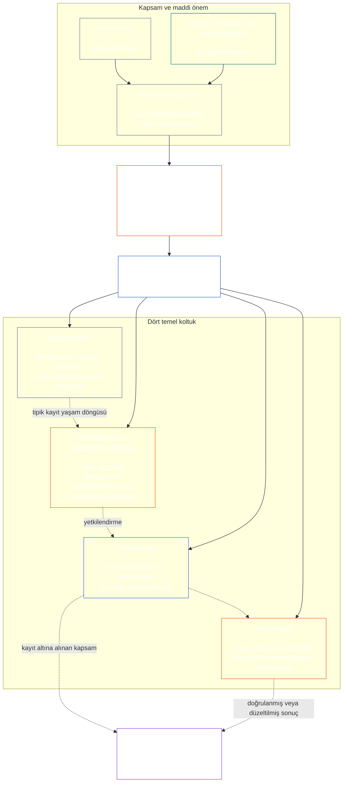

# YEDİNCİ BÖLÜM: İŞLEVSEL BAĞIMSIZLIK VE GÖREVLERİN AYRILIĞI

<strong>Corpus içindeki yeri (işlemsel değildir): dosya yapısı ve okuma kuralları</strong>

> Aşağıdaki içerik **yalnızca okura yönelik rehberliktir**. Bu dosyada veya diğer bölümlerde yer alan bağlayıcı yükümlülükleri eklemez, kaldırmaz ya da daraltmaz.
>
> Bu dosya **Algılayanlar Anayasası’nın bir parçasıdır** ve ancak tek bir belge olarak okunan diğer numaralı `core_*` dosyalarıyla **birlikte bağlayıcıdır**. Bu dosya, işlevsel bağımsızlık ve görevlerin ayrılığı için süreçler arası tabanı oluşturan **Yedinci Bölümü** içerir. Altıncı Bölüm’ün Hak Tabanı’nı izler ve anayasal süreç bölümlerinin başlangıcı olan [Sekizinci Bölüm sistem uyumu belgelendirmesi](../../core_08_system_alignment_certification.md#chapter-eight-system-alignment-certification-reading-index) öncesinde yer alır.
>
> - **Anayasal sorumluluk alanı:** maddi açıdan bağlayıcı eylemler için ayrı koltuklara ilişkin taban; her [Maddi Açıdan Bağlayıcı Eylem Kaydı](../../core_05_band_accountability.md#materially-binding-act-record) için evrensel asgari içerik; eylemi gerçekleştiren aktörden ve aktörün [Maddi Kontrol Hattı](../../core_05_band_accountability.md#material-control-line)ndan bağımsızlık; yayımlanmış hat ve rol yerleşimi; çıkar çatışması, boşluk, yedekleme ve yanlış koltuğa yönlendirme; ölçülü ortak barındırma; atfedilebilir devirler; ayrıca daha sonraki her anayasal sürecin uygulaması gereken asgari bağımsızlık koşulları.
> - **İlke katmanındaki kaynak:** [Birinci Bölüm §18.3](../../core_01_c_stewardship_capacity_principles.md#183-segregation-of-duties), yönetişimin işlevsel bağımsızlığı korumasını gerektirir ve işlemsel koltuk düzenini bu bölüme yönlendirir.
> - **Uygulama sorumluluğu:** [CJS-3.11](../../corpus_joint_structure/cjs_03a_accountability_operations.md#constitutional-lane-and-functional-separation), [CI-3.2](../../corpus_institutions/ci_03_institutional_design_separation_of_powers.md#ci-32-functional-separation-lanes) ve [CI-4.6](../../corpus_institutions/ci_04_appointment_competency_rotation_removal.md#ci-46-seat-catalog--process-role-archetypes-and-operational-boundaries) koltukları yerleştirir ve işler hâle getirir. Bunlar daha katı olabilir ve sınırları belirlenmiş özel yetki koltuğu türleri ekleyebilir; ancak bu bölümü daraltamaz.
> - **Sürece özgü uygulama sonraki bölümlerdedir:** Sekizinci Bölüm bu tabanı sistem uyumu belgelendirmesine uygular; [Dokuzuncu Bölüm §3.7](../../core_09_standing_assessment.md#37-segregation-of-duties) statü kayıtlarına uygular; On İkinci Bölüm ve [corpus_forum.md](../../corpus_forum.md) forum süreçlerine uygular. Bu bölümler kendi konularının gerektirdiği ek güvenceleri getirebilir; ancak daha zayıf bir ikame oluşturamaz.
>
> Okuma sırası: §1 amaç ve kapsam → §2 dört koltuk tabanı → §3 bağımsızlık ve çıkar çatışmaları → §4 yanlış koltuğa yönlendirme → §5 yayımlanmış yerleşim ve yedekler → §6 orantılı ölçeklendirme → §7 acil durumlar → §8 Eylem Kayıtları ve atfedilebilir devirler → §9 sonraki süreçlerde uygulama.

<strong>İzleme</strong>

- Üst dayanaklar: [Anayasal Dörtlü](../../core_00_preamble.md#constitutional-tetrad) — özellikle **gözetim** ve **hesap verebilirlik**; [maddi pay](../../core_00_preamble.md#material-stake); [Birinci Bölüm §17.1 Paylaşılan Emanetçilik Standardı](../../core_01_c_stewardship_capacity_principles.md#171-shared-stewardship-standard); [Birinci Bölüm §18 Emanetçilik Disiplini Altında Yönetişim](../../core_01_c_stewardship_capacity_principles.md#18-governance-under-stewardship-discipline); [XVI. Madde](../../core_06_rights_part_c.md#article-xvi-audit-transparency-and-independent-verification) (*Denetim, Şeffaflık ve Bağımsız Doğrulama*).
- Alt bölümler: [§1](#1-purpose-scope-and-owner-boundary); [§2](#2-four-seat-constitutional-floor); [§3](#3-independence-conflict-and-control-lines); [§4](#4-wrong-seat-routing); [§5](#5-published-placement-vacancy-and-substitution); [§6](#6-proportional-scaling-and-merged-hosting); [§7](#7-emergency-and-urgent-action); [§8](#8-act-records-and-attributable-handoffs); [§9](#9-relationship-to-later-processes).
- Sonraki bölümler: [Sekizinci Bölüm](../../core_08_system_alignment_certification.md#chapter-eight-system-alignment-certification-reading-index); [Dokuzuncu Bölüm](../../core_09_standing_assessment.md#chapter-nine-contribution-violation-and-standing-model--measurement); [On İkinci Bölüm](../../core_12_forum.md#chapter-twelve-forums-and-jurisdiction); [On Üçüncü Bölüm](../../core_13_governance.md#chapter-thirteen-constitutional-contract-legitimacy-authorization-and-stewardship); yukarıda belirtilen uygulama metinleri.
- Birlikte okuyun: [Birinci Bölüm §19.3 Uyumsuzluk Tespiti](../../core_01_c_stewardship_capacity_principles.md#193-misalignment-detection) (*çoğul tespit ve inceleme*); [Atfedilebilir Eylem](../../core_05_band_accountability.md#attributable-action); [Atıf Bütünlüğü](../../core_05_band_accountability.md#attribution-integrity); [Denetlenebilirlik](../../core_05_band_oversight.md#auditability); [İtiraz Edilebilirlik](../../core_05_band_accountability.md#contestability); [Orantılılık](../../core_05_band_accountability.md#proportionality).

 

Yedinci Bölüm, **maddi açıdan bağlayıcı eylemler için işlevsel bağımsızlık ve görevlerin ayrılığı tabanının anayasal sorumlusudur**.

### 1. Amaç, Kapsam ve Sorumluluk Sınırı

<strong>İzleme</strong>

- Üst dayanaklar: bölümün başlangıcındaki sorumluluk iddiası; [Birinci Bölüm §18](../../core_01_c_stewardship_capacity_principles.md#18-governance-under-stewardship-discipline); [Gözetim](../../core_05_apex_oversight_leg.md#oversight-constitutional); [Hesap Verebilirlik](../../core_05_apex_accountability_leg.md#accountability).
- Sonraki bölümler: [§2](#2-four-seat-constitutional-floor) ila [§9](#9-relationship-to-later-processes); maddi açıdan bağlayıcı bir eylem üreten veya değiştiren sonraki her süreç.
- Birlikte okuyun: doğrulama altyapısı için [Dördüncü Bölüm](../../core_04_burden_traceability_verification.md#chapter-four-burden-of-proof-traceability-and-verification); itiraz ve telafi için [XIII-A. Madde](../../core_06_rights_part_c.md#article-xiii-a-reliability-and-trustworthiness-baseline) (*Güvenilirlik Tabanı*) ve [XIII-B. Madde](../../core_06_rights_part_c.md#article-xiii-b-right-to-redress-and-remedy) (*Telafi ve Çözüm Hakkı*); bağımsız doğrulamaya ilişkin Hak Tabanları için [XVI. Madde](../../core_06_rights_part_c.md#article-xvi-audit-transparency-and-independent-verification) (*Denetim, Şeffaflık ve Bağımsız Doğrulama*).

 

*Sade bir ifadeyle: anayasal bir sürece veya önceden yetkilendirilmiş bir sistem, kurum ya da sınırlı karar alanındaki paydaş düzeyinde bir karara güvenilebilmesi için bu süreçteki görevler birbirinden ayrılmalıdır. Bu taban hem [Anayasal Sözleşme Katmanı](../../core_05_band_integrative.md#constitutional-contract-layer) hem de [Paydaşların Sistem Katılımı](../../core_05_band_participation.md#stakeholder-status-and-weight) için geçerlidir. Bir sonuç elde etmeye çalışan algılayan, makam, yapay zekâ sistemi, paydaş organı veya temsilci; aynı zamanda bağımsız olduğu varsayılan denetimi yapamaz, bu denetimin resmî kaydını kontrol edemez veya denetime itirazı karara bağlayamaz.*

Bu bölüm, Beşinci Bölüm’de tanımlandığı üzere her [Maddi Açıdan Bağlayıcı Eylem](../../core_05_band_accountability.md#materially-binding-act) için geçerlidir. Bunlara şunlar dahildir:

- bir karar;
- yetkilendirme veya belgelendirme;
- bir tespit;
- kayıt girişi veya önemli bir sürüm değişikliği;
- yayımlama, devreye alma, sürdürme veya geri çekme;
- ödeme veya tahsis; ve
- bir itirazın karara bağlanması.

Bu bölümdeki koltuklar, belirli bir eylem için kimin ne yapabileceğini tanımlar; bunlar görev unvanı değildir. Aynı algılayan, makam veya sistem farklı eylemler için farklı koltuklarda bulunabilir. Bir unvan, yetki devri, teknik kapasite ya da bir adımı gerçekleştirme imkânı, o eylem için tutulan koltuğun kapsamını genişletmez.

Bu bölüm, süreçler arası görev ayrılığı tabanını belirler. Aşağıdakilerin yerini değiştirmez:

- Dördüncü Bölüm’deki kanıtlama yükünü, izlenebilirliği veya doğrulama yöntemini;
- Beşinci Bölüm’deki kanonik anlamları;
- Altıncı Bölüm’deki Hak Tabanlarını;
- Sekizinci ila On İkinci Bölümlerdeki sürece özgü kayıt içeriğini; ya da
- belirlenmiş uygulama metinlerindeki işlevsel koltuk kataloglarını, personel yöntemlerini ve hat haritası mekaniklerini.

### 2. Dört Koltuklu Anayasal Taban

<strong>İzleme</strong>

- Üst dayanaklar: [§1](#1-purpose-scope-and-owner-boundary); [Birinci Bölüm §18.3](../../core_01_c_stewardship_capacity_principles.md#183-segregation-of-duties); [Birinci Bölüm §17.1](../../core_01_c_stewardship_capacity_principles.md#171-shared-stewardship-standard).
- Sonraki bölümler: [§3](#3-independence-conflict-and-control-lines) ila [§9](#9-relationship-to-later-processes); [CI-4.6](../../corpus_institutions/ci_04_appointment_competency_rotation_removal.md#ci-46-seat-catalog--process-role-archetypes-and-operational-boundaries) (*Koltuk kataloğu — süreç-rol arketipleri ve işlevsel sınırlar*).
- Birlikte okuyun: izin verilen tek ortak barındırma yolu için [§6](#6-proportional-scaling-and-merged-hosting).

 

*Sade bir ifadeyle: maddi açıdan bağlayıcı her eylemde dört görev bulunur: talep etmek veya eyleme geçmek, denetlemek, resmî kaydı tutmak ve itirazı dinlemek. Küçük bir kuruluşun izin verilen bir görev çiftini tek bir makamda toplamasına imkân tanınsa bile görevler ayrı kalır.*

<strong>Okur rehberi (işlemsel değildir): dört koltuğun haritası</strong>

> Aşağıdaki içerik **yalnızca okura yönelik rehberliktir**. Bu bölümde veya diğer bölümlerde yer alan bağlayıcı yükümlülükleri eklemez, kaldırmaz ya da daraltmaz.
>
> **Okur haritası (işlemsel değildir).** Bu diyagram dört koltuğu ve tipik bir kayıt yaşam döngüsünü gösterir. Beşinci bir uygulama koltuğu eklemez, her eylemden önce incelemenin tamamlanmasını şart koşmaz ve bu bölüm ile §§3–6’daki işlemsel kuralları değiştirmez.

 

Koltuk kutusundaki noktalı oklar tipik bir kayıt yaşam döngüsünü gösterir. Uygulamaya giden oklar izleme bağlantılarıdır; incelemenin tamamlanmasını beklemeyi zorunlu kılan bir sıra oluşturmaz.

Maddi açıdan bağlayıcı her eylemde işlevsel olarak birbirinden ayrı dört koltuk bulunur. Beşinci Bölüm bunların kanonik anlamlarını verir; bu bölüm süreçler arası yerleşim ve bağdaşmazlık kurallarını belirler:

1. **[Başlatan Koltuk](../../core_05_band_accountability.md#initiating-seat)** — eylemi talep eder, önerir, işletir, ileri sürer veya başka şekilde başlatır.
2. **[Doğrulama veya Yetkilendirme Koltuğu](../../core_05_band_accountability.md#verify-or-authorize-seat)** — kanıtı ve yetkiyi geçerli standarda göre denetler; eylemi doğrular, yetkilendirir, reddeder veya koşula bağlar.
3. **[Kayıt Koltuğu](../../core_05_band_accountability.md#record-seat)** — Doğrulama veya Yetkilendirme Koltuğunun belirlediği hususlara ilişkin [Eylem Kaydını](../../core_05_band_accountability.md#materially-binding-act-record) girer, sürümler, tutar, korur ve yayımlar.
4. **[İtiraz Koltuğu](../../core_05_band_accountability.md#contest-seat)** — itirazı alır ve inceler, yetkisi dâhilinde düzeltme veya sınırlama kararı verir ve yetkisi dışındaki sorunları yönlendirir.

Bu koltuklar insan ve yapay zekâ emanetçileri için eşit şekilde geçerlidir. Bir sistem bir eylemi gerçekleştirir, onaylar ve ardından kendi günlüğünü kanıt olarak kullanırsa; başlatan, doğrulayan ve kayıt koltuklarını aynı anda işgal eder. Sürecin otomatikleştirilmesi denetimi bağımsız kılmaz.

Aynı eylem bakımından aşağıdaki görev birleşimleri yasaktır:

- başlatan koltuk, kendi eylemini doğrulamamalı veya yetkilendirmemelidir;
- doğrulama veya yetkilendirme koltuğu, kayıt koltuğunu üstlenmemelidir;
- doğrulama veya yetkilendirme koltuğu, itiraz koltuğunu üstlenmemelidir; ve
- bir sistemin işletmecisi, o sistemle ilgili bir eylemi doğrulamamalı veya yetkilendirmemelidir.

Sonraki bölümler veya dâhil edilen uygulama metinleri, belirli bir süreç için başka görev eşleşmelerini de yasaklayabilir. Ancak burada yasaklanan bir eşleşmeye izin veremezler.

İşlevsel dört koltuk tabanı her sınıfta geçerlidir. Sınıfa göre ölçeklenen soru, bu koltukların birleştirilip birleştirilemeyeceği veya aynı kişi ya da kurum tarafından üstlenilip üstlenilemeyeceğidir: C Sınıfı kapsamında çalışan bir kurum veya sistem için dört koltuğun tümüyle ayrılması her zaman tavsiye edilir; B Sınıfı kapsamında neredeyse her zaman zorunlu olmalıdır; A Sınıfı kapsamında ise daima zorunludur. Kapsam karma olduğunda veya sınıflandırma belirsiz kaldığında, kayıt daha düşük bir yaklaşımı destekleyene kadar uygulanabilir en yüksek düzey esas alınır.

### 3. Bağımsızlık, Çıkar Çatışması ve Kontrol Hatları

<strong>İzleme</strong>

- Üst dayanaklar: [§2](#2-four-seat-constitutional-floor); [Yetkiyle Ölçeklenen Hesap Verebilirlik](../../core_01_c_stewardship_capacity_principles.md#181-governance-as-authorized-structure); [XXIV. Madde](../../core_06_rights_part_d.md#article-xxiv-constitutional-interpretation-review-and-anti-capture-safeguards) (*Anayasal Yorum, İnceleme ve Ele Geçirmeyi Önleme Güvenceleri*).
- Sonraki bölümler: [§4](#4-wrong-seat-routing); [§5](#5-published-placement-vacancy-and-substitution); [§8](#8-act-records-and-attributable-handoffs); Sekizinci Bölümdeki belgelendirme bileşeni rolleri; Dokuzuncu Bölümdeki kayıtların muhafazası; On İkinci Bölüm forumlarında kişinin kendi kararını incelemesini önleme.
- Birlikte okuyun: [Maddi Kontrol Hattı](../../core_05_band_accountability.md#material-control-line); operasyonel çıkar çatışması ve kişinin kendi kararını incelemesini önleme güvenceleri için [CI-5](../../corpus_institutions/ci_05_conflict_integrity_anti_capture_anti_corruption.md) (*Çıkar çatışması bütünlüğü, ele geçirmeyi ve yolsuzluğu önleme*) ve [CF-7](../../corpus_forum/cf_07_integrity_safeguards_anti_capture_anti_self_judging.md) (*Bütünlük güvenceleri, ele geçirmeyi önleme işlemleri ve kişinin kendi kararını incelemesini engelleme desteği*).

 

*Sade bir ifadeyle: masadaki unvanı değiştirmek bağımsızlık yaratmaz. Sonucu elde etmeye çalışan algılayan ya da makam, belirli bir eylem bakımından denetçiyi yönlendirebiliyor, görevden alabiliyor, ödüllendirebiliyor, cezalandırabiliyor veya sessizce kararını geçersiz kılabiliyorsa, doğrulayıcı ya da incelemeci bağımsız değildir.*

İşlevsel bağımsızlık etiketlere göre değil, fiilî yetki ve kontrole göre değerlendirilir. Aynı eylem bakımından:

- doğrulama veya yetkilendirme koltuğu ile itiraz koltuğu, başlatan koltuğun [Maddi Kontrol Hattı](../../core_05_band_accountability.md#material-control-line) dışında kalmalıdır;
- eylemle kendi çıkarı belirlenen taraf, doğrulama veya yetkilendirme ya da itiraz koltuğunu üstlenmemelidir;
- çıkar çatışması bulunan kayıt sorumlusu, çatışmaya karar vermek veya kaydı bırakmak yerine tam denetim iziyle birlikte kaydı yayımlanmış yedek sorumluya devretmelidir; ve
- çekilme, eylem üzerindeki yetkiyi kaldırır; koltuğu talep edene, talep edenin raporlama hattına veya en yakındaki kişiye devretmez.

Belirli eylem için [Maddi Kontrol Hattını](../../core_05_band_accountability.md#material-control-line) izleyin. Ortak altyapı, idari destek veya atama geçmişi tek başına bu hattı oluşturmaz; ancak bu düzenlemeler uygulamada bağımsız karar vermeyi engellememelidir.

Varsayılan denetçi yeterli yetkiye, kanıtlara erişime, maddi kontrolden bağımsızlığa veya reddedip yönlendirme imkânına sahip değilse; ikinci bir imza, göstermelik bir komite, kurum içi bir unvan ya da araç tarafından oluşturulmuş tasdik bağımsızlık sağlamaz.

### 4. Yanlış Koltuğa Yönlendirme

<strong>İzleme</strong>

- Üst dayanaklar: [§2](#2-four-seat-constitutional-floor); [§3](#3-independence-conflict-and-control-lines).
- Sonraki bölümler: [§5](#5-published-placement-vacancy-and-substitution); [§8](#8-act-records-and-attributable-handoffs); [CI-4.6 ortak koltuk kuralları](../../corpus_institutions/ci_04_appointment_competency_rotation_removal.md#ci-46-shared-seat-rules).
- Birlikte okuyun: [Birinci Bölüm §17.5 Direnme Görevi](../../core_01_c_stewardship_capacity_principles.md#175-duty-to-resist).

 

*Sade bir ifadeyle: bir adım sizin göreviniz değilse sessizce üstlenmeyin ve yalnızca çekip gitmeyin. Eksikliği kayda geçirin ve konuyu doğru yere aktarın.*

Bir emanetçiden kendi koltuğunun dışındaki bir adımı atması istendiğinde emanetçi şunları yapmalıdır:

1. adımın esası hakkında karar veriyormuş gibi davranmadan bunu reddetmek;
2. adımı hangi koltuğun üstlenebileceğini ve yayımlanmışsa görev sahibini veya yedeğini belirtmek;
3. talebi, tutulan koltuğu, eksikliği veya çıkar çatışmasını ve izlenen yönlendirme yolunu kaydetmek;
4. kanıtları ve daha önce teslim alınmış kayıtların bütünlüğünü korumak; ve
5. önlenebilir bir gecikme olmaksızın konuyu yönlendirmek.

Bu yanıt, eylemi terk etmek değil görevi yerine getirmektir. Eylem doğru koltuktan ilerler. Emanetçinin en yakında, en hızlı, en kıdemli veya bilgisi benzersiz kişi olması, eksik koltuğu telafi etmez.

### 5. Yayımlanmış Yerleşim, Boş Koltuk ve Yedekleme

<strong>İzleme</strong>

- Üst dayanaklar: [§2](#2-four-seat-constitutional-floor); [§3](#3-independence-conflict-and-control-lines); [Şeffaflık](../../core_05_band_oversight.md#transparency); [Denetlenebilirlik](../../core_05_band_oversight.md#auditability).
- Sonraki bölümler: [§8](#8-act-records-and-attributable-handoffs); [CI-3.2](../../corpus_institutions/ci_03_institutional_design_separation_of_powers.md#ci-32-functional-separation-lanes) (*İşlevsel ayrılık hatları*); [CI-4.5](../../corpus_institutions/ci_04_appointment_competency_rotation_removal.md#ci-45-authorized-roles-and-accountability-chains) (*Yetkilendirilmiş roller ve hesap verebilirlik zincirleri*); Sekizinci ve Dokuzuncu Bölüm kayıtları.
- Birlikte okuyun: [Tüzük](../../core_05_band_continuity.md#charter) ve [On Üçüncü Bölüm §5](../../core_13_governance.md#5-authorized-roles-competency-development-and-contribution).

 

*Sade bir ifadeyle: bir kuruluş, zor bir durum ortaya çıkmadan önce her görevi kimin üstlendiğini, olağan görevli bulunmadığında veya çıkar çatışması yaşadığında kimin devralacağını da belirterek açıklamalıdır.*

Maddi açıdan bağlayıcı eylemlerde bulunan her benimseyen, aşağıdakileri belirten yayımlanmış, denetlenebilir ve itiraz edilebilir bir harita tutmalıdır:

- her koltuğun hangi hatta, makamda, rolde veya süreçte yer aldığını;
- bu yerleşimin hangi eylem ve kapsamlar için geçerli olduğunu;
- izin verilen tüm ortak barındırma düzenlemelerini ve bunlara ait bağımsızlık güvencesini;
- bulunmayan, görevden alınan, ele geçirilmiş veya çıkar çatışması yaşayan görevlinin yerine geçecek kişiyi; ve
- yetkin bir yedek bulunmadığında izlenecek bağımsız yolu.

Yerleştirilmemiş, boş veya çıkar çatışması içindeki bir koltuk, kaydedilip giderilmesi gereken bir yönetişim kusurudur. Bu koltuk kendiliğinden başlatan koltuğa, çıkarı bulunan bir tarafa, işletmeciye veya o kişinin [Maddi Kontrol Hattı](../../core_05_band_accountability.md#material-control-line) üzerindeki bir üstüne geçmez. Kusur giderilene kadar eylem, yayımlanmış yedeğe veya bağımsız yola yönlendirilir. Acele etmeniz, bağımsızlık şartını atlamanıza izin vermez.

Yetki devri aynı koltuk sınırını, kanıt yükümlülüklerini, kaydı ve süreyi korur; ayrıca [Maddi Kontrol Hattına](../../core_05_band_accountability.md#material-control-line) tabidir. Yeni bir koltuk oluşturmaz, koltukları birleştirmez ve devredilen koltuğun yapamayacağı bir işi devralana yaptırmaz. Buna, sınıfa göre ölçeklenen tavsiye veya tam dört koltuk ayrılığı şartını birleştirme iznine dönüştürmek de dahildir.

### 6. Orantılı Ölçeklendirme ve Koltukların Ortak Barındırılması

<strong>İzleme</strong>

- Üst dayanaklar: [§2](#2-four-seat-constitutional-floor); [maddi pay](../../core_00_preamble.md#material-stake); [Gereklilik](../../core_05_band_accountability.md#necessity); [Orantılılık](../../core_05_band_accountability.md#proportionality).
- Sonraki bölümler: [Dokuzuncu Bölüm §3.7](../../core_09_standing_assessment.md#37-informal-and-small-scope-records); [CJS-2.4](../../corpus_joint_structure/cjs_02_specific_joint_interlocks.md#cjs-24-class-scaled-lane-staffing-and-competency-redundancy) (*Sınıfa göre ölçeklenen hat personeli ve yetkinlik yedekliliği*); [CI-3.2](../../corpus_institutions/ci_03_institutional_design_separation_of_powers.md#ci-32-functional-separation-lanes) (*İşlevsel ayrılık hatları*).
- Birlikte okuyun: [Önlenebilir Yük](../../core_05_band_continuity.md#avoidable-burden) ve Birinci Bölüm [§3.3 Aşağılayıcı Olmayan Süreç](../../core_01_a_values_principles.md#33-anti-degrading-process).

 

*Sade bir ifadeyle: küçük ve gayriresmî grupların dört büyük departmana ihtiyacı yoktur. Ancak gerçek ve bağımsız bir denetime, kullanılabilir bir kayda ve itiraz yoluna ihtiyaçları vardır. Ölçek, korunan görev ayrılığını değil personel yöntemini değiştirir.*

Ayrılığın gücü, personel yapısı, yedekliliği ve resmiyet düzeyi; maddi paya, sistem sınıfına, bağımlılığa ve makul biçimde öngörülebilir zarara göre ölçeklenir.

Küçük veya gayriresmî bir benimseyen, aşağıdaki koşulların tümü sağlanıyorsa iki koltuğu tek bir makamda ya da algılayanda birleştirebilir:

- birleştirme kapsam bakımından gerekli ve orantılıysa;
- düzenleme yayımlanmış, denetlenebilir ve itiraz edilebilir olup eylem kaydında açıklanıyorsa;
- bağımsızlık güvencesi, birleştirmenin doğurduğu riskleri ele alıyorsa;
- başlatan koltuk kendi eylemini doğrulamıyor veya yetkilendirmiyorsa;
- doğrulama-kayıt ve doğrulama-itiraz birleşimleri yasak olmaya devam ediyorsa; ve
- çıkar çatışması, maddi zarar veya itiraz, ortak görevlendirilen kişinin yasal sınırını aştığında bağımsız bir yol kullanılabiliyorsa.

Gayriresmî, ücretsiz, karşılıklı yardımlaşma, bakım, onarım, öğretim, kooperatif ve topluluk emanetçiliği çalışmaları; ilgili denetim için yetkisi yayımlanmış, çıkar gözetmeyen ve güvenilebilecek bir organ kullanabilir. Gerçekten tarafsız ve hesap verebilir bir yol varsa Anayasa, kapsamın makul biçimde ulaşamayacağı kurumsal bir resmiyet şartı getirmez.

Personel yetersizliği, hız, kolaylık veya uzmanlığın bir yerde toplanması tek başına birleştirmeyi haklı çıkarmaz. Sınıfa göre ölçeklenen yaklaşımı [§2 Dört Koltuklu Anayasal Taban](#2-four-seat-constitutional-floor) belirler: A Sınıfında istisnaya izin verilmez; B veya C Sınıfındaki her istisna yukarıdaki koşulları karşılamalıdır. Maddi pay yükseldikçe ayrı makamlar, yetkinlik yedekliliği ve bağımsız yedekler lehindeki varsayım güçlenir.

### 7. Acil ve Zorunlu Eylem

<strong>İzleme</strong>

- Üst dayanaklar: [§2](#2-four-seat-constitutional-floor); [§6](#6-proportional-scaling-and-merged-hosting); [On İkinci Bölüm §6.1 Acil önlemler ve devam yükü](../../core_12_forum.md#61-emergency-measures-and-continuation-burden); [varsayılan geçici yaklaşım](../../core_01_b_interaction_interpretation.md#default-interim-posture).
- Sonraki bölümler: belirlenmiş uygulama metinlerindeki olay, sınırlama, yayımlama, devam ve olay sonrası inceleme süreçleri.
- Birlikte okuyun: [Zamanındalık](../../core_05_apex_timeliness_leg.md#timeliness-constitutional), [Kanıtın Korunması](../../core_05_band_oversight.md#evidence-preservation) ve [CI-4.6 Koltuk kataloğu — süreç-rol arketipleri ve işlevsel sınırlar](../../corpus_institutions/ci_04_appointment_competency_rotation_removal.md#ci-46-seat-containment).

 

*Sade bir ifadeyle: gerçek bir acil durum, olağan denetim tamamlanmadan harekete geçmeyi haklı kılabilir. Bu, koltuğun kime ait olduğunu veya sınıfa göre ayrılık yaklaşımını değil, işlem sırasını değiştirir. Eylemi gerçekleştiren kişinin devam kararını kendisinin belgelendirmesine, izleri silmesine veya sonradan nihai incelemeci olmasına izin vermez.*

Gecikme ciddi ve yakın bir zarar için makul biçimde öngörülebilir bir risk yaratacaksa, yetkilendirilmiş başlatma veya sınırlama koltuğu olağan ön doğrulama tamamlanmadan önce yalnızca gerekli olan en küçük ve geri alınabilir eylemi şu koşullarla gerçekleştirebilir:

- acil durum yetkisi, kapsamı, başlangıcı, sona erme zamanı ve gerekçesi derhâl veya fiziksel olarak mümkün olan en kısa sürede kayda geçirilirse;
- kanıtlar ve itirazlar korunursa;
- bildirim ve katılım, uygulanabilir anayasal süre içinde yeniden sağlanırsa;
- bağımsız doğrulama veya yetkilendirme koltuğu, derhâl gereken sınırı aşan her devam kararını incelerse; ve
- eylem, olay sonrasında bağımsız incelemeye tabi tutulursa.

Acil eylem şunlara izin vermez:

- eylemi gerçekleştiren kişinin kendi devam kararını doğrulamasına;
- çıkar çatışması içindeki bir kaydın muhafaza sorumlusunun eylemi gerçekleştiren kişi olmasına;
- eylemi gerçekleştiren kişinin kendi eylemine yapılan itirazı dinlemesine;
- geçici gerekliliğin kalıcı yetkiye dönüşmesine;
- A Sınıfındaki bir kurum veya sistem için dört koltuğun birleştirilmesine.

Aşağıdakilerin hiçbiri tek başına acil durum sayılmaz:

- son tarih;
- yayımlama hedefi;
- personel yetersizliği; veya
- itibar kaygısı.

### 8. Eylem Kayıtları ve Atfedilebilir Devirler

<strong>İzleme</strong>

- Üst dayanaklar: [§2](#2-four-seat-constitutional-floor) ila [§7](#7-emergency-and-urgent-action); [Maddi Açıdan Bağlayıcı Eylem Kaydı](../../core_05_band_accountability.md#materially-binding-act-record); [Atfedilebilir Eylem](../../core_05_band_accountability.md#attributable-action); [Atıf Bütünlüğü](../../core_05_band_accountability.md#attribution-integrity).
- Sonraki bölümler: [CS-4 §10 incelenebilir atfedilebilir eylem](../../corpus_systems/cs_04_critical_system_stewardship.md#10-inspectable-attributable-action); [CI-4.6 ortak koltuk kuralları](../../corpus_institutions/ci_04_appointment_competency_rotation_removal.md#ci-46-shared-seat-rules); §8’in yönettiği her süreç kaydı; [`materially_binding_act_record.schema.json`](../../implementation/schemas/materially_binding_act_record.schema.json) (*makineyle denetlenebilir temel biçim; süreç desteğidir, ikinci bir tanım değildir*).
- Birlikte okuyun: [§4 Yanlış Koltuğa Yönlendirme](#4-wrong-seat-routing) ve [Dördüncü Bölüm §5](../../core_04_burden_traceability_verification.md#5-compliance-evidence-standard).

 

*Sade bir ifadeyle: maddi açıdan bağlayıcı her eylemin; ne olduğunu, her koltuğu kimin tuttuğunu, hangi karara varıldığını ve itirazın nereye iletileceğini gösteren bir Eylem Kaydı vardır.*

Maddi açıdan bağlayıcı her eylemin tanımlanabilir bir [Maddi Açıdan Bağlayıcı Eylem Kaydı](../../core_05_band_accountability.md#materially-binding-act-record) (**Eylem Kaydı**) olmalıdır. Eylem Kaydı, uygulanabilir sürece özgü tek bir resmî kayıtta veya atfedilebilir, bütünlüğü koruyan bağlantılı resmî kayıtlar dizisinde yer alabilir. Mevcut resmî kayıt ya da bağlantılı kayıtlar dizisi gerekli tüm unsurları açıkça belirtiyor, bağlantıları ve sürüm geçmişini koruyor ve yetkilendirilmiş resmî kayıt yolu üzerinden erişilebilir kalıyorsa ayrı bir kopya belge gerekmez.

Eylem Kaydı en azından şunları belirtmelidir:

- kalıcı bir kayıt kimliği, güncel sürüm ve önemli oluşturma ve değişiklik zaman damgaları;
- eylem, maddi kapsamı, durumu ve dayandığı yetki;
- başlatan koltuk, görevli ve yetkisi;
- doğrulama veya yetkilendirme koltuğu, görevli, geçerli standart, tespit, önemli koşullar veya gerekçeler ve tespit zamanı;
- kayıt koltuğu, görevli, muhafaza yetkisi ve girilen sürüm;
- itiraz koltuğu veya yayımlanmış itiraz yolu ve güncel itiraz ya da düzeltme durumu;
- her yetki devri, çekilme, yedekleme, izin verilen birleştirme veya acil durum istisnası; ve
- eylemi yeniden kurmak için gerekli önemli kanıtlar ve kayıt bağlantıları, devirler, retler, koşullar, çözümlenmemiş itirazlar, süreler, yürürlükten kaldırılmış sürümler ve düzeltmeler.

Sürece özgü kayıtlar daha katı veya alana özgü alanlar ekleyebilir. Bu asgari unsurları çıkaramaz, bunlarla çelişemez veya eylemin yeniden kurulmasını imkânsız hâle getiremez. Yasal gizlilik, mahremiyet ve güvenlik denetimleri korunan malzemeye nasıl erişileceğini veya malzemenin nasıl açıklanacağını düzenler; ancak resmî izlerin silinmesine ya da yetkilendirilmiş doğrulama, itiraz, düzeltme veya çözüm için kullanılamaz hâle getirilmesine izin vermez.

Kayıtlar kimin ne yaptığını gösterir; ancak eylemin geçerli olduğunu tek başına kanıtlamaz. Eylemi gerçekleştiren algılayan veya sistem tarafından oluşturulan günlük, imza, model izi, kontrol listesi ya da tasdik sınırlı bir işleve sahiptir:

- Bu malzemeler kanıt sağlayabilir veya Eylem Kaydına bağlanabilir.
- Bu malzemeler bağımsız inceleme ve kararın ya da resmî Eylem Kaydının yerini tutamaz.

### 9. Sonraki Süreçlerle İlişki

<strong>İzleme</strong>

- Üst dayanaklar: [§1](#1-purpose-scope-and-owner-boundary) ila [§8](#8-act-records-and-attributable-handoffs).
- Sonraki bölümler: [Sekizinci Bölüm](../../core_08_system_alignment_certification.md#chapter-eight-system-alignment-certification-reading-index); [Dokuzuncu Bölüm](../../core_09_standing_assessment.md#chapter-nine-contribution-violation-and-standing-model--measurement); [On İkinci Bölüm](../../core_12_forum.md#chapter-twelve-forums-and-jurisdiction); [On Üçüncü Bölüm](../../core_13_governance.md#chapter-thirteen-constitutional-contract-legitimacy-authorization-and-stewardship).
- Birlikte okuyun: [Yetki Hiyerarşisi ve İç Düzen](../../core_05_band_integrative.md#owner-non-relocation) ve [Önsöz’deki sorumlu kaydı](../../core_00_preamble.md#4-principles-definitions-and-rights).

 

*Sade bir ifadeyle: sonraki bölümler her sürece neyi değerlendireceğini, kaydedeceğini, karara bağlayacağını ve telafi edeceğini söyler. Bu bölüm, bunları yaparken yetkinin nasıl ayrılması gerektiğini açıklar.*

Daha sonraki her anayasal süreç, dört koltuğun tümünü nasıl atadığını ve kullandığını, ayrıca bu bölüme nasıl uyduğunu açıklamalıdır. Uygulamada:

- Sürecin kendi kaydı Eylem Kaydı olabilir veya Eylem Kaydına sürece özgü ayrıntılar ekleyebilir.
- Bir süreç kaydı birden çok maddi açıdan bağlayıcı eylemi kapsıyorsa her eylem için ayrı bir Eylem Kaydına bağlantı verebilir.
- Resmî kayıt yolu eksiksiz ve izlenebilir kaldığında ayrı bir kopya kayıt gerekmez.
- Sürece başka bir ad vermek, onu [§4 Yanlış Koltuğa Yönlendirme](#4-wrong-seat-routing) veya [§8 Eylem Kayıtları ve Atfedilebilir Devirler](#8-act-records-and-attributable-handoffs) hükümlerinden, bunların devir ve yanlış koltuk kuralları dâhil, muaf tutmaz.

Özellikle:

- **Sekizinci Bölüm — sistem uyumu belgelendirmesi:** sistem işletmecisi veya belgelendirmeyi öneren taraf kendi doğrulayıcısı değil, başlatan koltuktur; sınırlı bileşen tespitleri, belgelendirme kaydının bütünleştirilmesi, muhafaza ve itirazlar yasal koltuklar ve kişinin kendi kararını incelemesini önleyen yollar içinde kalmalıdır.
- **Dokuzuncu Bölüm — statü kayıtları:** talepte bulunan kişi, kayıt açma yetkisi, kayıt muhafaza sorumlusu ve itiraz yolu; dört koltuk tabanını Dokuzuncu Bölüm’ün daha katı muhafaza, talep sahibi, gayriresmî kayıt ve kendi kaydını muhafaza etmeme kurallarıyla birlikte uygular.
- **On İkinci Bölüm — forumlar:** başvuru, soruşturma, esasa ilişkin inceleme, kayıt muhafazası, temyiz ve forumun kendi olası taraflılığını veya süreç istismarını inceleme; uygulanabilir koltuğu ve kişinin kendi kararını incelemesini önleyen sınırları korumalıdır.
- **On Üçüncü Bölüm — yönetişim:** rol tanımları, yetkinlik planları, yetki devri, halefiyet ve kurumsal tasarım, koltukları yalnızca adlandırmakla kalmayıp yerleştirmeli ve sürdürmelidir.

Daha sonraki bir bölüm, sürecinin daha yüksek veya farklı bir risk taşıması nedeniyle daha güçlü bağımsızlık, çekilme, ayrılık, muhafaza, kurul veya inceleme şartları getirebilir. Bu tabanı daraltamaz, sürece özgü bir etiketi muafiyet sayamaz veya sessizliğin koltuğu eylemi gerçekleştirene devrettiği sonucunu çıkaramaz.

---

**Önceki dosya:** [core_05_band_performance.md](../../core_05_band_performance.md)

**Sonraki dosya:** [core_08_a_system_alignment_certification_evaluation.md](../../core_08_a_system_alignment_certification_evaluation.md#chapter-eight-part-a-certification-evaluation)
