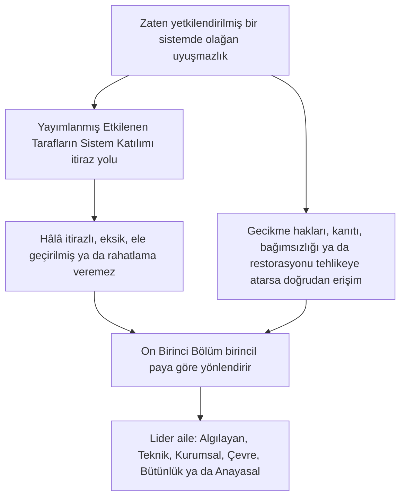

# ON BİRİNCİ BÖLÜM: FORUMLAR VE YARGI YETKİSİ

<strong>Corpus konumu (işlemsel değil): dosya yapısı ve okuma kuralları</strong>

> Aşağıdaki içerik **yalnızca okur rehberidir**. Bu dosyada ya da başka bölümlerde bağlayıcı yükümlülükleri eklemez, çıkarmaz ya da daraltmaz.
>
> Bu dosya, [İngilizce On Birinci Bölüm](../../core_11_forum.md)ün bir **okur-dili pilotudur**. Algılayanlar Anayasasının bağlayıcı bir parçası **değildir**. İkinci bir anayasa **değildir**. Bir gönderim baskısı **değildir**. `SC-Corpus-2026.08.09`a **sabitlenmiştir**. Bu çeviri ile İngilizce asıl görünür biçimde ayrışırsa, numaralı [`core_11_forum.md`](../../core_11_forum.md) kazanır. Okuma sırası ve baskı üstverisi [README.md](../../README.md)de tutulur. Yöntem ve sözlük: [translations/tr/README.md](README.md).
>
> **On Birinci Bölüm**ü içerir: forum aileleri, öntanımlı yer ve birincil-pay yönlendirme, adli destek, giriş triajı ve güzergâh zinciri ile Hak Tabanı altındaki uyuşmazlıklar için yargı yetkisi. Forumlar, [Anayasal Dörtlü](core_00_preamble.md#constitutional-tetrad) **katılım**, **gözetim** ve **zamanındalık** bacakları altında uyuşmazlık işlemeyi **gözetir**; [maddi pay](core_00_preamble.md#material-stake)a ölçeklenir. Olgular doğrulandığında, [Sekizinci Bölüm §3](core_08_standing_assessment.md#3-standing-record-operational-requirements) altında güzergâh kayıtlarını **açabilir, güncelleyebilir ya da düzeltebilir** — ya da **kötü bir kaydı itiraz üzerine bir kenara koyabilir**; dosyalanmış bir dava tek başına güzergâh değildir ve forum anlatısı Sekizinci Bölüm güzergâh ölçümünün yerine geçmemelidir ([Sekizinci Bölüm §3.6](core_08_standing_assessment.md#36-forum-boundary)). Zincir gezinmesi için [README — Standing pipeline and forums](../../README.md#standing-pipeline-and-forums) kullanın. İşlemsel forum mekaniği belirlenmiş uygulama dosyalarında kalır. Bölüm numaralandırması ve çapraz atıflar bütünleşik araçla eşleşir.

>
> **Önceki (hâlâ İngilizce):** [core_10_b_misconduct_pattern_applications.md](../../core_10_b_misconduct_pattern_applications.md#chapter-ten-part-b-anti-constitutional-misconduct-pattern-applications)
>
> **Sonraki (hâlâ İngilizce):** [core_08-11_application_vignettes.md](../../core_08-11_application_vignettes.md#chapters-eight-eleven-application-vignettes)
> **Okuma yayı:** §1 amaç → Uyuşmazlık sıralaması → §2 öntanımlı yer ve giriş → §2.1–§2.3 lider sınırları, karma paylar, itirazlar → §3 aktarım ve kendi-kendini-yargılama karşıtı → §4 aileler → §5 yükseltme ve belgelendirme → §6 kademeler ve gecikme karşıtı disiplin → §7 forum desteği

<strong>Okur rehberi (işlemsel değil): On Birinci Bölümün nerede yaşadığı ve burada neyin kaldığı</strong>

> Aşağıdaki içerik **yalnızca okur rehberidir**. Bu bölümde ya da başka bölümlerde bağlayıcı yükümlülükleri eklemez, çıkarmaz ya da daraltmaz.
>
> Nerede yaşar (gezinme):
> - **Anayasal sahip:** **kesit 1** (*amaç* — bu bölümün tahsis ettiği normların **birincil hükme bağlama uygulaması**, rutin **yürütme yönetişiminden** **ayrı**; zaten yetkilendirilmiş sistemlerin içindeki olağan uyuşmazlıklar için **Uyuşmazlık sıralaması**; **hesap verebilirlik** gerekleri; **yayımlanmış**, **öngörülebilir** **eşik** yerleştirme); **öntanımlı başlangıç yeri**, **birincil-pay** yönlendirme, **giriş triaj organı** (**ilk-temas masası**), karma paylar, asimetri, güzergâh-kayıt itirazları, **iyi niyetli niteleme ve oyun karşıtlığı**, ve **algılayana erişilebilir** **eşik** **erişim** beklentileri (**kesit 2**, **`corpus_forum.md`** ile **birlikte oku**); **aktarım**, **birleştirme** ve **eşgüdüm** (**kesit 3**, **kesit 5** belgelendirme ve yedek ile birlikte oku); **forum ailesi tanımları**, **iç odalar**, **paylaşılan standartlar** ve **geçici işlemsel hukuk** (algılayan, teknik, kurumsal, çevre, bütünlük, anayasal — **kesit** **4**, **kesit** **2**nin **tablosunu** yansıtır); **yükseltme**, **belgelendirme** ve **geçici koruma** (**kesit 5**); **zamanında çözüm** ve **gecikme karşıtı** disiplin (**kesit 6**); incelemeden önce, sırasında ve sonra **forum desteği** (**kesit 7**), triaj ve destek rollerinin **hukuka uygun kurulmuş esas heyetlerinin** yerine **geçmeyeceği** biçimde işlenir; **kendi-kendini-yargılama karşıtı** yedek yönlendirme; ve **Sekizinci Bölüm**, **Onuncu Bölüm** ve **Altıncı Bölüm** adalet ve itiraz haklarına bağlı yükseltme kancaları.
> - **Zincir gezinmesi:** [README — Standing pipeline and forums](../../README.md#standing-pipeline-and-forums) — bu dosyada [§§1–7](#1-purpose-and-role).
> - **Sekizinci–Dokuzuncu Bölüm üç-soru zinciri:** Sekizinci Bölüm **kesit 2–3** Soru 1i (*ne oldu?*) doğrulanmış, eksen-saf kayıtlarla yanıtlar. [Sekizinci Bölüm §4](core_08_standing_assessment.md#4-standing-measurement-evaluation-dimensions) ve [§7 birleşik orantılı LEQU ölçeği](core_08_standing_assessment.md#7-unified-proportional-lequ-scale) Soru 2yi (*ne kadar iyi ya da kötüydü?*) değerlendirme boyutları, paylaşılan beş-kat LEQU bantları ve paylaşılan **s** = 1...9 dilbilgisiyle yanıtlar; ayrı Katkı ve İhlal kayıtlarını korur. [Dokuzuncu Bölüm](core_09_standing_integration.md#chapter-nine-standing-effects-and-integration) Soru 3ü (*bundan dolayı ne olur?*) çareler, korumalar, yetkinlik eşikleri ve izinler ve güzergâh kilitleriyle yanıtlar. İhlal Ekseni yuvasını yalnızca doğrulanmış etki denetler; ihmal, gizleme, zorlama, yanıt ve karşılaştırılabilir karakter betimleyicileri onu kaydırmaz. [Onuncu Bölüm](core_10_a_misconduct_designation.md#chapter-ten-anti-constitutional-misconduct) bir Sekizinci Bölüm yuva 7, 8 ya da 9 kaydına karşılık gelen anayasa karşıtı kötü davranış atamasını ekleyebilir ama sayısal yuvayı atamaz.
> - **Forumlar (işlemsel olmayan yitim):** Bu bölüm altındaki **forum aileleri**, [Sekizinci Bölüm](core_08_standing_assessment.md#chapter-eight-compliance-violation-and-standing-model) sınıflamalarını somut uyuşmazlıklara uygulayan birincil **forumlardır** — ayrı kaydedilmiş **katkı niteliği**, **İhlal Ekseni etki yuvası** ve süreç / yanıt karakterinin **birlikte bulunduğu** ve **Sekizinci Bölüm** ortak-değerlendirme ve yerine-koymama disiplini altında işlenmesi gereken meseleler dahil. Hükme bağlama dışındaki **araştırma finansmanı**, **finansman** ve **teşvik** mekanizmaları benimsenmiş uygulamada ve **[corpus_systems.md](../../corpus_systems.md)**de kalır (**Sekizinci Bölüm** okur rehberine bakın); önlemeyi ve kök-neden soruşturmasını destekleyebilirler ve **eşik** yönlendirmenin, **esas** belirlemenin, yetkili Sekizinci Bölüm sayısal yuva atamasının, herhangi bir karşılık gelen **Onuncu Bölüm** atamasının ya da **Madde XXIII** (*Çatışma çözümü, yükseltme ve acil orantılılık*) kısıtlarının yerine **geçmemelidir**. **1 ve 2. kesitler** **teşvik** yapıları için **birincil** sorumluluğu **başlıca** her **ailenin** **küresi** **içinde** tahsis eder (ayrıntı **corpus**ta ve uygulamada); bu **tahsis**, [On İkinci Bölüm](../../core_12_governance.md#chapter-twelve-constitutional-contract-legitimacy-authorization-and-stewardship) ve **[corpus_systems.md](../../corpus_systems.md)**e ayrılmış **sistem-çapı** **bütçe** ya da **yönetişim-ölçeği** seçimlerini **yerinden etmez**.
> - **Uygulama sahibi:** yayımlanmış giriş **sınıfları**, günlük dosya kuralları, kadro, bütçeler, ayrıntılı usul, işlemsel yükseltme mekaniği ve forum-destek işlemsel gerekleri benimsenmiş uygulama metninde ve **[corpus_forum.md](../../corpus_forum.md)**de yaşar (**CF-5** (*Yönlendirme işlemleri, aktarım, belgelendirme ve temsilci muamele*), **CF-8** (*Forum adli ve analitik destek*), **CF-9** (*Bağımsız soruşturma hizmeti ve kovuşturma arayüzü*) ve ilgili kesitler); o katmanlar bu bölümü **işler, daraltmaz**.
> - **Yer-değiştirmeme kuralı:** benimseme araçları bu bölümü, ayrı forum işlevlerini çökerten, **bağımsızlığı** ya da **gerçek incelemeyi** soyan ya da bütünlük itirazlarını bu bölümün tek son esas evi olarak yasakladığı aynı ele geçirilmiş foruma geri yönlendiren usullerle karşılamamalıdır.
>
> **Mimari — *Yalın dille* yerleştirme:** Her *Yalın dille* satırı, İz gezinme bloğunun (ve varsa onu izleyen ` `in) hemen ardından ve o kesitin işlemsel paragrafları ile madde işaretli listelerinden **önce** görünür. Yalnızca okura dönük yitim; bağlayıcı metni eklemez, çıkarmaz ya da daraltmaz.

<strong>İz</strong>

- Yukarı: [Sekizinci Bölüm](core_08_standing_assessment.md#chapter-eight-compliance-violation-and-standing-model) (*bu bölümün yönlendirdiği uyuşmazlıkları besleyen Soru 1 kayıtları ve Soru 2 ölçümü*); [Sekizinci Bölüm §5.1](core_08_standing_assessment.md#5-slot-grammar-and-display-labels) (*güzergâh-yuva dilbilgisi*); [Sekizinci Bölüm §7 birleşik ölçek](core_08_standing_assessment.md#7-unified-proportional-lequ-scale) (*paylaşılan beş-kat LEQU bantları ve ayrı eksen kayıtları*); [Sekizinci Bölüm §§4.3–4.4](core_08_standing_assessment.md#43-route-descriptor-measurement-roles) (*yuvaları kaydırmayan Katkı Ekseni ve İhlal Ekseni betimleyicileri dahil eksenler-arası normalleştirilmiş betimleyici kataloğu*); [Onuncu Bölüm](core_10_a_misconduct_designation.md#chapter-ten-anti-constitutional-misconduct) (*nitelikli Sekizinci Bölüm yuvaları 7–9 için karşılık gelen anayasa karşıtı kötü davranış ataması*); [İkinci Bölümden Dördüncü Bölüme](core_02_definition_structure.md) (*kayıt, doğrulama ve izleme beklentileri*); [Beşinci Bölüm](core_05__definitions_home.md#chapter-five-foundational-definitions) (*kurucu tanımlar*); [Birinci Bölüm](core_01_c_stewardship_capacity_principles.md#chapter-01-principles-and-constraints) (*yorum kısıtları*); [Altıncı Bölüm — Kurucu haklar](core_06_rights_part_a.md#chapter-six-foundational-rights) ile [D Kısmı](core_06_rights_part_d.md) (*itiraz, denetim ve adalet maddesi kancaları*).
- Alt kesitler: [§1](#1-purpose-and-role); [§2](#2-default-venue-and-primary-stakes); [§3](#3-transfer-consolidation-and-coordination); [§4](#4-forum-family-definitions); [§5](#5-escalation-and-certification); [§6](#6-timely-resolution-materiality-tiers-and-anti-delay-discipline); [§7](#7-forum-support-before-during-and-after-review).
- Birlikte oku: [README — Standing pipeline and forums](../../README.md#standing-pipeline-and-forums).
- Aşağı: [corpus_forum.md](../../corpus_forum.md) (*işlemsel forum öğretisi*); hükme bağlama rolüyle yönetişim meşruiyetinin etkileştiği yerde [On İkinci Bölüm](../../core_12_governance.md#chapter-twelve-constitutional-contract-legitimacy-authorization-and-stewardship); benimsenmiş usul katmanları için [On Altıncı Bölüm](../../core_16_incorporation.md#chapter-sixteen-incorporation-bridge) (*dahil etme disiplini*).
- Birlikte oku: [Sekizinci Bölüm §5.1](core_08_standing_assessment.md#5-slot-grammar-and-display-labels) (*güzergâh-yuva dilbilgisi*); [Sekizinci Bölüm §§4.3–4.4](core_08_standing_assessment.md#43-route-descriptor-measurement-roles) (*eksenler-arası normalleştirilmiş Katkı Ekseni ve İhlal Ekseni betimleyicileri*).
- Ayrıca birlikte oku: [Dokuzuncu Bölüm §3](core_09_standing_integration.md#3-descriptor-integration-and-attachment-normalization) (*kesit 2 birincil-pay yönlendirme ile okunan betimleyici bütünleştirme ve ek normalleştirme*); [README.md](../../README.md) (*okuma sırası ve corpus örgütlenmesi*); [doc_architecture.md](../../doc_architecture.md) (*benimsenmedikçe bağlayıcı olmayan editoryal haritalar*).

 

On Birinci Bölüm, **güzergâh zinciri ve Hak Tabanı altındaki uyuşmazlıklar için forum aileleri, öntanımlı yer, yargı yetkisi ve hükme bağlama yönlendirmesi**nin anayasal sahibidir.

*Yalın dille: [Anayasal Dörtlü](core_00_preamble.md#constitutional-tetrad) ve [İki Anayasal Amaç](core_00_preamble.md#two-constitutional-aims) altında bu bölüm, uyuşmazlıkların Sekizinci–Onuncu Bölüm güzergâh zincirinden nasıl geçtiğini **gözetir** — yönlendirme, bağımsızlık, adli destek, onarım sıralaması ve **kesit 6** ile **Madde XXIV-C** (*Zamanında çözüm ve gecikme karşıtı taban*) altında kademe-öntanımlı saatler. Forum aileleri hangi şeridin hangi uyuşmazlığı işlediğini, bir davanın olağan olarak nerede başladığını ve karma-pay meselelerinin nasıl eşgüdümlendiğini yanıtlar. **Katılım** (erişilebilir itiraz) ve **gözetim** (izlenebilir esas incelemesi) sağlarlar. Olgular doğrulandığında güzergâh kayıtlarını **açabilir, güncelleyebilir ya da düzeltebilir** — ya da **kötü bir kaydı itiraz üzerine bir kenara koyabilir**. Güzergâh zincirinin yanında ikinci, ayrı bir karar şeridi **işletmezler**. Bir dava dosyalamak tek başına güzergâh üzerinde hemen etki yaratmaz. Günlük duruşma kuralları, bütçeler ve kadro elkitapları uygulama katmanlarında yaşar ve bu bölümü ya da **Madde XXIII**i (*Çatışma çözümü, yükseltme ve acil orantılılık*) **işlemeli, daraltmamalıdır**.*

### 1. Amaç ve rol — katılım mimarisi

<strong>İz</strong>

- Yukarı: [Yedinci Bölüm — Sistem hizalama belgelendirmesi](core_07_a_system_alignment_certification_evaluation.md#chapter-seven-system-alignment-certification); [Sekizinci Bölüm](core_08_standing_assessment.md#chapter-eight-compliance-violation-and-standing-model); [Dokuzuncu Bölüm](core_09_standing_integration.md#chapter-nine-standing-effects-and-integration); [Onuncu Bölüm](core_10_a_misconduct_designation.md#chapter-ten-anti-constitutional-misconduct); [Birinci Bölüm](core_01_c_stewardship_capacity_principles.md#chapter-01-principles-and-constraints) (*ilkeler ve yorum kısıtları*); [İkinci Bölümden Dördüncü Bölüme](core_02_definition_structure.md) (*izleme ve doğrulama beklentileri*); [Beşinci Bölüm](core_05__definitions_home.md#chapter-five-foundational-definitions) (*Corpus konumu widgetında İkinci Bölümden Dördüncü Bölüme birlikte okunan tanımlar*); [Altıncı Bölüm](core_06_rights_part_a.md#chapter-six-foundational-rights) (*bu bölümün birlikte uyguladığı Kurucu Hak Tabanı*).
- Aşağı: [§2](#2-default-venue-and-primary-stakes) (*birincil-pay öntanımlı yer, giriş triajı, karma paylar, asimetri, güzergâh-kayıt itirazları; ivedi itiraz edilebilir eşik erişimi; iyi niyetli niteleme ve oyun karşıtlığı*); [§3](#3-transfer-consolidation-and-coordination) (*aktarım ve kendi-kendini-yargılama karşıtı*); [§4](#4-forum-family-definitions) (*forum ailesi tanımları, odalar, paylaşılan standartlar ve geçici işlemsel hukuk*); [§4.3](#43-institutional-forums) (*İç süreç sınırı olarak Uyuşmazlık sıralamasının Kurumsal-aile uygulaması*); [§5](#5-escalation-and-certification) (*yükseltme, belgelendirme ve geçici koruma*); [§6](#6-timely-resolution-materiality-tiers-and-anti-delay-discipline) (*maddilik kademeleri, zincir kilometre taşları ve gecikme karşıtı disiplin*); [§7](#7-forum-support-before-during-and-after-review) (*incelemeden önce, sırasında ve sonra forum desteği*).
- Dörtlü bacağı(ları): **katılım**, **gözetim**, **hesap verebilirlik**, **zamanındalık** (doğrulanmış bulgular güzergâh kayıtlarını açabilir, güncelleyebilir ya da düzeltebilir; **CF-11** kademe saatlerini işler). Birincil amaç(lar): **Gelişim** ve **Süreklilik**. [maddi pay](core_00_preamble.md#material-stake) ölçeklemesi yönlendirmeye ve erişim yüküne uygulanır.
- Birlikte oku: [Önsöz §3.2](core_00_preamble.md#32-key-governance-processes) ve [§3.3](core_00_preamble.md#33-governance-layers) (*süreç yolları ve yönetişim-katmanı disiplini*); [Madde XI: Etkilenen Tarafların Sistem Katılımı, temsil ve usul güvencesi](core_06_rights_part_b.md#article-xi-stakeholder-system-participation-representation-and-due-process); [corpus_forum.md](../../corpus_forum.md) (**CF-6.2.2** (*Acil durum, tüketme ve zamanlama kuralları*) — işle, daraltma); [corpus_institutions.md](../../corpus_institutions.md) (*itiraz, ikincil inceleme ve bütünlük izleme — atanmış forum yargı yetkisinin yerine geçmez*); [Madde XII-B: İtiraz, inceleme ve giderme hakkı](core_06_rights_part_c.md#article-xii-b-right-to-challenge-review-and-redress); [Madde XXIII ailesi](core_06_rights_part_d.md#article-xxiii-a-justice-objective-and-scope) (*Corpus konumu widgetında anılan adalet kısıtları*).

 

*Yalın dille: bu kesit, iki şeridi **gözeten** forum aileleri aracılığıyla anayasal **katılım** ve **gözetim** atar — **güzergâh zinciri** (Sekizinci–Onuncu Bölüm uyuşmazlıkları ve kayıt etkileri) ve **Sistem hizalama belgelendirmesi** (Yedinci Bölüm tanıma ve inceleme) — sonra yayımlanmış eşik yerleştirme için hesap verebilirlik gereklerini belirtir. Zaten yetkilendirilmiş sistemlerin içindeki olağan uyuşmazlıklar önce yayımlanmış Etkilenen Tarafların Sistem Katılımı itiraz yolunu kullanır; bu bölüm o yol hâlâ itirazlı, eksik, ele geçirilmiş ya da rahatlama veremediğinde devralır. Ayrıntılı duruşma kuralları başka yerde yaşar ve bu bölümün güvencelediğini sessizce daraltamaz.*

Bu bölüm, hangi **forum ailelerinin** hangi birincil soruları **katılım** (algılayana erişilebilir itiraz, temsilci muamele ve orantılı erişim) ve **gözetim** (bağımsızlık, adli destek ve izlenebilir esas incelemesi) yoluyla **gözettiğini** belirtir. Dosya kurallarını, kadroyu, bütçeleri, ayrıntılı usulü ya da işlemsel yükseltme mekaniğini **belirtmez**. O ayrıntılar, bu bölümü **işlemesi, daraltmaması** gereken corpus uygulama katmanlarına aittir. **Forum aileleri**, eşik yerleştirme, birincil-pay yönlendirme ve sistem-hizalama incelemesi için yasal ve düzenleyici sınırları, **kesit 2**yi **`corpus_forum.md`** ile birlikte **işleyen, daraltmayan** öngörülebilir, yayımlanmış bir yolda belirtmelidir.

**Forum aileleri şunları gözetir:**

1. **Güzergâh zinciri** (Sekizinci–Onuncu Bölüm, uyuşmazlıklarda Birinci Bölümden Altıncı Bölüme ve belirlenmiş corpus uygulama normlarını uygulayarak)
   - Birincil-pay yönlendirme, atandığı yerde esas incelemesi, aktarım, birleştirme ve belgelendirme eşgüdümü, ve güzergâh-ilgili uyuşmazlıklar için onarım sıralaması.
   - **Sekizinci Bölüm** Katkı ve İhlal kayıtları §7 birleşik orantılı LEQU ölçeğinde ölçülür, karakter betimleyicileri ve güzergâh etkisi — doğrulanmış bulgular, doğrulanmış-girdi kapısını karşıladıklarında [Sekizinci Bölüm §3](core_08_standing_assessment.md#3-standing-record-operational-requirements) altında güzergâh kayıtlarını **açabilir, güncelleyebilir ya da düzeltebilir** — ya da **kötü bir kaydı itiraz üzerine bir kenara koyabilir**; dosyalanmış bir dava tek başına güzergâh değildir ve forum anlatısı Sekizinci Bölüm güzergâh ölçümünün yerine geçmemelidir ([Sekizinci Bölüm §3.6](core_08_standing_assessment.md#36-forum-boundary)).
   - Bu bölümün çare ve sıralama forum gözetimini atadığı yerde **Dokuzuncu Bölüm** güzergâh etkileri ve bütünleştirme.
   - Bir Sekizinci Bölüm yuva 7–9 kaydı için o atamanın söz konusu olduğu yerde **Onuncu Bölüm** anayasa karşıtı kötü davranış ataması.
   - **Birinci Bölümden Altıncı Bölüme** ve belirlenmiş [corpus](core_05_band_integrative.md#corpus) uygulama katmanlarının, o uyuşmazlıkların uyguladığı normlar olarak uygulanması.

2. **Sistem hizalama belgelendirmesi** ([Yedinci Bölüm](core_07_a_system_alignment_certification_evaluation.md#chapter-seven-system-alignment-certification))
   - [Yedinci Bölüm B Kısmı](core_07_b_system_alignment_certification_record_process.md#chapter-seven-part-b-certification-record-and-process) altında forum-gözetimli tanıma, koşullu tanıma, doğrulama, yeniden doğrulama, geri çekme ve ilgili belgelendirme-kayıt sonuçları.
   - [B Kısmı §13](core_07_b_system_alignment_certification_record_process.md#13-forum-supervision-and-component-roles) altında bileşen rolleri:
     - **Teknik** — belirtimler, yöntemler ve kanıt standartları
     - **Bütünlük** — resmi hizalama tanıması ve lider eşgüdüm
     - **Çevre** — maddi olduğunda çevresel-hizalama bileşeni
     - bu bölümün yönlendirmesi altında diğer aile bileşen bulguları
   - Algılayanlar belgelendirme sonuçlarına itiraz edebilir, koşullar ekleyebilir ve gerektiğinde dosyayı yeniden açabilir — ama bir belgelendirme güzergâh ölçümünün yerine **geçmez**.
   - Bir belgelendirmeden önemli bulgular, Sekizinci Bölüm güzergâhı ölçtüğünde **doğrulanmış girdiler** sayılabilir. Bir belgelendirme tek başına kimseye bir güzergâh yuvası **atamaz** ([B Kısmı §15](core_07_b_system_alignment_certification_record_process.md#15-relationship-to-standing)).

**Forum aileleri**, bu aracın o şeritleri **gözettiği** birincil kurumlardır. Kabul edilmiş kuralların rutin yürütme yönetişiminden ayrıdırlar.

**Uyuşmazlık sıralaması.** Zaten yetkilendirilmiş bir sistem, kurum ya da sınırlı karar alanında, olağan bir uyuşmazlık önce yayımlanmış [Etkilenen Tarafların Sistem Katılımı](core_05_band_participation.md#stakeholder-status-and-weight-cluster) itiraz ve usul güvencesi yolunu kullanır. O yol hâlâ itirazlı bir sonuç üretirse, eksikse, ele geçirilmişse ya da gereken rahatlamayı hukuka uygun veremezse, bu bölüm meseleyi **kesit 2** altında birincil paya göre yönlendirir. **Bütünlük**, **Teknik Forum Alanları**, **Çevre** ve **Anayasal**, o birincil pay olduğunda öntanımlı lider ailelerdir — sıralamayı atlayan istisnalar değil. Bitmemiş iç süreç, tüketme etiketleri ya da iç incelemenin bitmemiş olduğu savı o liderleri durdurmamalı, esaslarını yerinden etmemeli ya da **Madde XXIV-C** (*Zamanında çözüm ve gecikme karşıtı taban*) saatlerini yemememelidir. Gecikme hakları, kanıtı, bağımsızlığı ya da pratik restorasyonu maddi olarak tehlikeye atacaksa doğrudan erişim kullanılabilir kalır.

*Yalnızca okur haritası. Uyuşmazlık sıralaması paragrafını eklemez, çıkarmaz ya da daraltmaz.*

Onlar:

- **Birinci Bölüm** ilkeleriyle — **Güvenlik**, **Doğruluk**, **Esenlik**, **Yanıt verebilirlik** ve **Sorumlu yönetim ve dağıtılmış anlama** dahil — hizalı olarak sorun çözümü, kök-neden analizi, önleme, onarım sıralaması ve başarısızlık örüntülerinden öğrenme dahil proaktif bir yönetişim rolü taşır.
- **İkinci Bölümden Dördüncü Bölüme** **bağımsızlık**, **itiraz edilebilirlik** ve **izleme** beklentilerini, itiraz ve onarımın söz konusu olduğu yerde **Madde XII-B** (*İtiraz, inceleme ve giderme hakkı*)nı ve adalet kısıtlarının yönettiği yerde **Madde XXIII** (*Çatışma çözümü, yükseltme ve acil orantılılık*)ı karşılamalıdır.
- kamu gerekçesi, izlenebilirlik, çekilme ve heyet disiplini, bu bölümün atadığı yerde adli ve analitik destek dahil bu aracın en sıkı ifade edilmiş usul ve bütünlük-hesap verebilirlik gereklerine tabidir
- kendi-kendini-yargılama karşıtı yedek yönlendirme ister. O gerekler siyasi denetimi hükme bağlama bağımsızlığının yerine koymamalıdır.
- **Bütünlük**, **Anayasal** ve **Çevre** forumları, ve algılayanlık-durumu hükme bağlamasını dinlediklerinde **Teknik Forum Alanları**, [On İkinci Bölüm §1.2](../../core_12_governance.md#12-eligibility-contested-selection-and-democratic-minimums) altında **yayımlanmış**, **itirazlı**, **döndürülebilir** atama ya da eşdeğer bir bağımsızlık denetimi ister. O heyetlerin yetersiz atanması ya da yetersiz finanse edilmesi bir [Dokuzuncu Bölüm §9](core_09_standing_integration.md#9-enforcement-realism) başarısızlığıdır.

Her **forum ailesi**, teşvik yapıları için birincil sorumluluğu başlıca kendi küresi içinde taşır. Bu şunları içerir:

- benimseme araçları ve belirlenmiş uygulama katmanları
- maliyet, yaptırım, itiraz ve raporlama yollarını inceleme
- onarım sıralaması kancaları ve karşılaştırılabilir hükme-bağlama-bitişik hizalama.

**Sistem-çapı** bütçeler, kesitler-arası araştırma finansmanı ve yönetişim-ölçeği programlar [On İkinci Bölüm — Yönetişim](../../core_12_governance.md#chapter-twelve-constitutional-contract-legitimacy-authorization-and-stewardship), **[corpus_systems.md](../../corpus_systems.md)** ve uygulandığı yerde diğer üstünlük kurallarına tabi kalır. Ödemeler, maliyet kuralları ve benzer teşvik araçları şunun **yerine geçmemelidir**:

- uygun forum yönlendirme
- hukuka uygun kurulmuş bir heyetin gerçek esas kararı
- Sekizinci Bölüm etki-yuvası ölçümü
- herhangi bir eşleşen **Onuncu Bölüm** ataması
- **Madde XXIII**teki (*Çatışma çözümü, yükseltme ve acil orantılılık*) adalet kısıtları

**`corpus_institutions.md`**deki kurumsal itiraz, ikincil inceleme ve bütünlük izleme (**CI-5** (*Çatışma bütünlüğü, ele geçirme karşıtı ve yolsuzluk karşıtı*) ile **CI-8** (*Kurumlar-arası eşgüdüm ve yükseltme*) ve itiraz-bütünlüğü beklentileri dahil) bu bölümün yanında çalışır. Bu bölüm o ailelere yargı yetkisi atadığında bağlayıcı esas için **Bütünlük**, **Çevre** ya da **Kurumsal** forum ailelerinin yerine geçmez. O ciltlerdeki uygulama teşvik mekanizmaları, bu bölümün atadığı birincil-pay yönlendirmeyi ya da esas yetkisini yerinden etmeden, küresi birincil olarak söz konusu olan forum ailesiyle eşgüdümlenmelidir.

### 2. Öntanımlı yer ve birincil paylar

<strong>İz</strong>

- Yukarı: [§1](#1-purpose-and-role) (*amaç, birincil uygulama rolü, hesap verebilirlik gerekleri, yayımlanmış eşik yönlendirme, ayrıntının yerinden edilmemesi, bağımsızlık ve inceleme beklentileri*).
- Aşağı: [§3](#3-transfer-consolidation-and-coordination) (*aktarım, birleştirme, kendi-kendini-yargılama karşıtı*); [§4](#4-forum-family-definitions) (*öntanımlı tablo ile okunan forum ailesi tanımları*); [§5](#5-escalation-and-certification) (*öntanımlı yerden yükseltme; Geçici koruma*); [§6](#6-timely-resolution-materiality-tiers-and-anti-delay-discipline) (*maddilik kademeleri ve gecikme karşıtı disiplin*); [§7](#7-forum-support-before-during-and-after-review) (*incelemeden önce, sırasında ve sonra forum desteği*).
- §2 içinde: [§2.1](#21-lead-default-limits) (*birincil-pay çarpışması, anayasal belgelendirme ve kendi-kendini-yargılama karşıtı yedek*); [§2.2](#22-mixed-stakes-and-routing-asymmetry) (*karma paylar ve asimetri*); [§2.3](#23-forum-records-standing-records-and-contests) (*forum dava kayıtları, güzergâh kayıtları ve itirazlar*).
- Birlikte oku: [Anayasal Dörtlü](core_00_preamble.md#constitutional-tetrad) — **katılım**, **gözetim** ve **zamanındalık** bacakları; birincil-pay yönlendirme için [maddi pay](core_00_preamble.md#material-stake) ölçeklemesi; [Sekizinci Bölüm §5.1](core_08_standing_assessment.md#5-slot-grammar-and-display-labels) (*güzergâh-yuva dilbilgisi*); [Sekizinci Bölüm §7 birleşik ölçek](core_08_standing_assessment.md#7-unified-proportional-lequ-scale) (*paylaşılan beş-kat LEQU bantları ve ayrı eksen kayıtları*); [Sekizinci Bölüm §§4.3–4.4](core_08_standing_assessment.md#43-route-descriptor-measurement-roles) (*etki yuvasını kaydırmadan birincil payı bilgilendiren eksenler-arası normalleştirilmiş betimleyiciler*); [corpus_forum.md](../../corpus_forum.md) (**CF-5** ve **CF-7.2**); [corpus_systems.md](../../corpus_systems.md) (*sistem sınıflama, dağıtım ve yeniden doğrulama ödevleri*); [Onuncu Bölüm §3](core_10_a_misconduct_designation.md#3-violation-axis-s-7-9-slot-assignment-incident-gravity) (*nitelikli Sekizinci Bölüm yuvaları 7–9 için anayasa karşıtı kötü davranış ataması; miras çıpa korunur*); [Onuncu Bölüm §4](core_10_a_misconduct_designation.md#4-due-process-safeguards-for-slot-assignment) (*bu atama için usul güvencesi bu bölüm ve **Madde XXIII** (*Çatışma çözümü, yükseltme ve acil orantılılık*) ile birlikte okunur*); [Madde XXIII-A](core_06_rights_part_d.md#article-xxiii-a-justice-objective-and-scope) (*adalet amacı ve kapsamı*).

 

*Yalın dille: her ailenin **ilk-temas masası** — **giriş triaj organı** — kavganın gerçekte ne hakkında olduğunu sorar, başlığın söylediğini değil, sonra lider forumu seçmek için öntanımlı tabloyu kullanır. Teknik forumlar sistem-hizalama belirtimlerini, yöntemlerini ve kanıt standartlarını sürdürür; **Bütünlük** forumları resmi hizalama-tanıma ve süregelen-doğrulama yargısını verir, bir bileşen sorusu başka yere ait olmadıkça. Sıralama, hukuka uygun kurulmuş esas heyetlerinin yerine geçmez; karma paylar, asimetri ve güzergâh-kayıt itirazları aşağıdaki alt kesitlerdedir.*

**Birincil-pay yönlendirme**, bir meseleyi **iddia** ya da **savunma**daki ana yasal, çare, zorlayıcı-koruma, anayasal-taban ya da pratik paydan sorumlu forum ailesine atar. Uyuşmazlığın gerçekte ne hakkında olduğunu izler, başlığı ya da tarafın tercih ettiği sonucu değil.

**Giriş triaj organı (ilk-temas masası).** Her gereken forum ailesi, dosyalamada ailenin **ilk-temas masası** olarak bir **giriş triaj organı** ya da o aile içinde işlevsel olarak eşdeğer bir düzenleme sürdürmelidir. O organ:
- bu kesit altında birincil-pay yönlendirmeyi **uygular**;
- gelen meseleleri **birincil paylarla** tutarlı **yayımlanmış** giriş muamelesi için **sıralar**;
- koruma, **Hak Tabanı**, **aileler-arası yönlendirme** ve **yedek-forum** ihtiyaçlarını **işaretler**;
- **3 ve 5. kesitler** altında aktarım, birleştirme, belgelendirme ve yedek disiplinin ivedilikle yürürlüğe girebilmesi için ilk erişimi **yönetir**;
- ayrı bir anayasal forum ailesi **değildir**;
- **maddi sonuçlarda** hukuka uygun kurulmuş bir esas heyetinin yerine **geçmemeli** ya da **aile** sınırlarını **çökertmemelidir**;
- birincil-pay yönlendirmeyi yenmek ya da opak eşik sıralamasını mümkün kılmak için finansman, ücret, idari tercih ya da diğer teşvik aygıtları **kullanmamalıdır**.

**İyi niyetli niteleme ve oyun karşıtlığı.** Forum nitelemesi **iyi niyetli** ve **birincil paylarla** **gerekçeli** olmalıdır. **Bile bile** yanlış niteleme, benimseme hukuku altında **maliyetleri**, **reddi** ya da **sevk**i **tetikleyebilir**. Teşvik aygıtları, **bu kesit** ve **kesit 3**teki birincil-pay disiplinine aykırı forum alışverişini, opak eşik sıralamasını ya da yönlendirmeyi ödüllendirecek biçimde yapılandırılmamalı ya da uygulanmamalıdır. Maliyet, red ve sevk mekaniği **`corpus_forum.md`** (**CF-5**)de yaşar ve bu kesiti **işlemeli, daraltmamalıdır**.

İşlemsel gerekler — **yayımlanmış giriş sınıfları**, atfedilebilir giriş kayıtları, bağımsızlık ve **itiraz** beklentileri ve **itirazlı** yönlendirmenin **ivedi** incelenmesi dahil — **`corpus_forum.md`** (**CF-5** (*Yönlendirme işlemleri, aktarım, belgelendirme ve temsilci muamele*))de belirtilir.

Her forum ailesine **ilk erişim**, şunlar için yeterince ivedi ve itiraz edilebilir olmalıdır:
- bu kesit altında birincil-pay yönlendirme anlamlı kalır;
- **3 ve 5. kesitler** altında aktarım, birleştirme, belgelendirme ve yedek disiplin gecikmeyle ya da opak eşik sıralamasıyla hükümsüz kılınmaz.

Forum erişimi için zaman beklentileri:
- **algılayana erişilebilir** olmalıdır;
- **kesit 6** ve **Madde XXIV-C** (*Zamanında çözüm ve gecikme karşıtı taban*) altında zarar ivediliği ve mesele karmaşıklığına kalibre edilmelidir;
- idari kolaylığın üzerinde **kesit 5** (*Geçici koruma*) altında gerçek eşik erişimini ve hukuka uygun geçici rahatlamayı kayırmalıdır.

Bu kesit altındaki **giriş triaj organı**, **`corpus_forum.md`** (**CF-5**) ile birlikte, bu yükümlülüğü karşılar ve dahil etme kapsamında **kesit 6** kademe-öntanımlı pencerelerini işlemelidir.

**Sekizinci Bölüm §3ten yönlendirme haritası.** Sekizinci Bölüm forumlara *ne olduğunu nasıl ölçeceklerini* söyler. Hangi forumun davayı dinleyeceğini **tek başına seçmez**. Dosyalamada ailenin **giriş triaj organı** (ilk-temas masası) şu sırayı izler:

1. **Zaten doğrulanmış olanı denetleyin:** Zaten varsa, herhangi bir doğrulanmış Sekizinci Bölüm **Katkı Ekseni** ya da **İhlal Ekseni** malzemesini not edin — etki yuvası, ağırlık bandı, süreç / yanıt karakteri ve güzergâh etkisi dahil.
2. **Suçlamaları yerleşmiş olgular saymayın:** İddialar ve geçici etiketler, **İkinci Bölümden Dördüncü Bölüme** altında bulgular var olana kadar yalnızca yönlendirmeyi ve kanıt korumayı yönlendirir.
3. **Lider forumu kavganın gerçekte ne hakkında olduğuna göre seçin:** Aşağıdaki öntanımlı yer tablosunu kullanın: **Algılayan**, **Teknik Forum Alanları**, **Kurumsal**, **Çevre**, **Bütünlük** ya da **Anayasal**. Uyduğu yerde şu özel yönlendirme kurallarını uygulayın:
   - **Onuncu Bölüm ataması:** Bir **Onuncu Bölüm** anayasa karşıtı kötü davranış ataması **birincil** pay olduğunda, **Bütünlük** öntanımlı liderdir. Şunları koruyun:
     - Sekizinci Bölüm sayısal etki yuvası;
     - gerektiğinde **Anayasal** belgelendirme;
     - kurumsal-taraf kuralları; ve
     - **2, 3 ve 5. kesitler** altında kendi-kendini-yargılama karşıtı yedek.
   - **Forum-yanlılığı uyuşmazlıkları:** Kavga başlıca kenara çekilmesi gereken bir heyet üyesi, yanlı heyet katılımı ya da karşılaştırılabilir bir forum-bütünlüğü ihlali hakkındaysa — **[Madde XXII-B](core_06_rights_part_c.md#article-xxii-b-composition-rotation-and-conflict-controls) (*Bileşim, rotasyon ve çıkar-çatışması denetimleri*)** altında bir **Anayasal** forum heyeti üzerinde dahil — önce **Bütünlük** forumlarına yönlendirin. **Kesit 3** altında bir forum kendi yanlılığının tek son hükme bağlayanı olamaz: bir **Anayasal** forum, kendi heyet üyesinin çekilip çekilmeyeceğine karar veren tek son forum olamaz. Güzergâh-kilit disiplini: **[Dokuzuncu Bölüm §5.5](core_09_standing_integration.md#55-special-locks)**. Adlandırılmış kötü davranış örüntüsü: **[Onuncu Bölüm §5.10](../../core_10_b_misconduct_pattern_applications.md#510-forum-recusal-failure-and-biased-panel-participation)**.
   - **Teknik nasıl soruları:** Belirtimler, yöntemler, ölçüm, deneme ve uzman-kanıt soruları, birincil pay ya da belgelendirilmiş bileşen soruları olduklarında **Teknik Forum Alanlarına** gider.
   - **Sistem-hizalama onayı:**
     - Yeni maddi etkili sistemler için resmi **anayasal hizalama tanıması** ve mevcut olanlar için **süregelen hizalama doğrulaması**, lider olarak **Bütünlük**e öntanımlıdır.
     - Bütünlük, teknik-forum girdilerini artı anayasal, kurumsal, ekolojik, hak ve ele geçirme karşıtı gerekleri kullanır.
     - Sistemin maddi ekolojik maruziyeti, çevresel-önkoşul bağımlılığı, yaşam döngüsü yükü, restorasyon ödevi ya da makul ölçüde öngörülebilir ekolojik riski varsa, **Çevre** forum ailesi çevresel-hizalama incelemesini (onay ya da itiraz) tanıma, doğrulama, yeniden doğrulama ya da çevresel koşullardan maddi salıverme kesinleşmeden önce tamamlamalıdır.
     - O ailelerin sahip olduğu bileşen soruları için **Teknik Forum Alanları**, **Kurumsal**, **Çevre**, **Algılayan** ve **Anayasal**a sevk ya da belgelendirmeyi koruyun.

Dosyalamada **öntanımlı** yer, **kesit 3** aktarmadığı ya da birleştirmediği sürece şu kuralları izler:

| Aile | Taraf örüntüsü | Birincil pay (özet) |
|--------|---------------|--------------------------|
| **Algılayan** | Algılayandan-algılayana meseleler ve hiçbir kurumun gerekli taraf olmadığı ve başka hiçbir ailenin birincil payı tutmadığı üye, katılımcı, hane, mahalle, dernek, yerel, bölgesel, çevrimiçi ya da karşılaştırılabilir topluluk-yönetişimi uyuşmazlıkları | Özel ya da topluluk yükümlülükleri, çare ya da onarıcı zararlar, yerel restorasyon, yerel ya da çevrimiçi topluluk normları, topluluk-yönetişimi katılımı, dışlama, restorasyon ya da iç özyönetişim itirazları |
| **Teknik Forum Alanları** | Herhangi bir taraf örüntüsü, ama **birincil** pay teknik-yönetişim usulü, sistem-hizalama belirtimleri, uzman-kanıt standartları, bilimsel / mühendislik / tıbbi yönetim, benimsenmiş kapsam içinde karşılaştırılabilir bilgi-yönetişimi **ya da** **Madde V-E** (*Algılayanlık-Durumu Karar Tabanı*) göstergeler / uzman kanıt / sınırlı belirsizlik üzerinde algılayanlık-durumu belirlemesidir | **Teknik** standartlar, sistem-hizalama belirtimleri, ölçüm ve deneme yöntemleri, uzman idari usul, kanıt sorumlu yönetimi, ders kitabı ya da müfredat bütünlüğü, standart yönetişimi, hükme bağlama, düzenleme ya da hizalama tanımasına ilgili sınırlı belirsizlik-azaltma **ya da** **Madde V-E** (*Algılayanlık-Durumu Karar Tabanı*) altında algılayanlık-durumu gösterge hükme bağlaması |
| **Kurumsal** | Herhangi bir **kurum** **gerekli** taraftır **ya da** ana kavga bir kurumun ne yapmasına izin verildiği, ne yapmakla görevlendirildiği ya da onu yöneten kuralları izleyip izlemediği hakkındadır | Bir kurumun ne yapabileceği, ne yapmakla görevlendirildiği, hangi kapsam altında gözetildiği, nasıl sınıflandığı ya da ödevlerini izleyip izlemediği |
| **Çevre** | Herhangi bir taraf örüntüsü; sistem hizalamasının maddi olarak ekolojik maruziyeti ilgilendirdiği yerde gereken bileşen rolü | **Ekolojik bütünlük**, **çevresel önkoşullar**, paylaşılan ekolojik sistemlerin restorasyonu ya da onarımı, atfedilebilir çevresel yükler, yaşam döngüsü ya da sistemik ekolojik zarar, maddi ekolojik maruziyeti olan sistemler için çevresel-hizalama bileşen incelemesi ya da sınıflama, hizalama tanıması, yeniden doğrulama ya da Hak Tabanı yaptırımının o belirlemeye bel bağladığı **örüntü** ya da **sistemik** ekolojik başarısızlık |
| **Bütünlük** | **Bütünlük** **ana** mesele olarak (çıkar çatışması, usul ya da ele geçirme denetimlerinin **ağır** ihlali dahil), sistemler için resmi **anayasal hizalama tanıması** ya da **süregelen hizalama doğrulaması** **ya da** bir Sekizinci Bölüm **s = 7, 8 ya da 9** etki yuvası için bir **Onuncu Bölüm** anayasa karşıtı kötü davranış ataması **birincil** pay olarak | Makam, süreç, itiraz yolları, açıklama, çıkar-çatışması kuralları, ele geçirme karşıtı ödevler, resmi sistem-hizalama tanıması, doğrulama ve yeniden doğrulamanın **bütünlüğü**, teknik-forum girdileri ve maddi olduğunda Çevre forumu çevresel-hizalama bileşen belirlemeleri kullanılarak (**Sekizinci Bölüm** ölçümü, karşılık gelen bir **Onuncu Bölüm** ataması ya da **Hak Tabanı** yaptırımının o belirlemeye bel bağladığı kurumlar ya da sistemler **arasında** **örüntü** ya da **sistemik** başarısızlık **dahil**) |
| **Anayasal** | **Yapısal** anayasal geçerlilik, **tüm** yorumcular için **norm** anlamı ya da yönetişimi **anayasal gerek**le **yeniden yapılandıran** çare | **Anayasal** geçerlilik ya da anlam, **yasal yetkinin ötesinde** eylem, üstünlük ya da **sınıf-çapı** **yapısal** çare |

#### 2.1 Lider-öntanımlı sınırlar

Bu kurallar, tablonun öntanımlı liderlerinin nasıl etkileştiğini sınırlar. **3 ve 5. kesitlerin** ya da **kesit 2.2**deki karma-pay ve asimetri kurallarının yerine geçmez.

- **Birincil-pay çarpışması:** Ana kavga bir kurumun ne yapmasına izin verildiği, ne yapmakla görevlendirildiği ya da onu yöneten kuralları izleyip izlemediği hakkındaysa, Onuncu Bölüm **Bütünlük** lider öntanımı **Kurumsal** satırı geçersiz kılmaz. **Kesit 2.2** ve **kesit 3** karma payları, gerekli kurumsal tarafları ve lider forum seçimini yönetir.
- **Anayasal belgelendirme:** Bir Onuncu Bölüm ataması için **Bütünlük** lideri, anayasal anlam, geçerlilik ya da sınıf-çapı yapısal çare **Anayasal** satır altında ya da aileden-aileye yükseltme yoluyla belirleme istediğinde Sekizinci Bölüm sayısal yuva ölçümünü ya da **kesit 5** altında **Anayasal** forumlara belgelendirme ya da yükseltmeyi yerinden etmez.
- **Kendi-kendini-yargılama karşıtı yedek:** Maddi iddialar, bir Sekizinci Bölüm yuva 7–9 kaydına ilişkin bir Onuncu Bölüm atama işleminde **Bütünlük** forumu bütünlüğünün bağımsız esas incelemesini haklı kıldığında, **3 ve 5. kesitler** altındaki yedek yönlendirme **Onuncu Bölüm kesit 4**ü ya da **Madde XXIII**ü (*Çatışma çözümü, yükseltme ve acil orantılılık*) daraltmadan uygulanır.

#### 2.2 Karma paylar ve yönlendirme asimetrisi

**Karma paylar.** Bir kayıt ve bir lider aile olağan olarak birbirine bağlı iddiaları dinler. İkincil meseleler, **Madde XII-B** (*İtiraz, inceleme ve giderme hakkı*) ve **Sekizinci Bölüm** ortak-değerlendirme ve yerine-koymama disipliniyle tutarlı olarak, benimseme araçlarının sağladığı gibi belgelendirilebilir, durdurulabilir ya da mesele önleme yoluyla çözülebilir.

**Asimetri:**
- **Bağımlılık**, **ölçüm** ya da **gerekli** bir **girdi** üzerindeki **kurumsal** bir **tekel** bir **algılayan** tarafı maddi olarak dezavantajlı kıldığında, tablo **kurumsal** ya da **bütünlük** payları atadığında **Kurumsal** ya da **Bütünlük** yönlendirme **kullanılabilir** **olmalıdır**.
- **Maddi** **ekolojik** paylar **birincil** olduğunda, tablonun atadığı gibi **Çevre** yönlendirme **kullanılabilir** **olmalıdır**.
- Bu kesitteki tablo altında **birincil** paylar **kurumsal**, **bütünlük** ya da **ekolojik** olduğunda **Algılayan** forumlar **tek** **zorunlu** forum **olmamalıdır**.

#### 2.3 Forum dava kayıtları, güzergâh kayıtları ve itirazlar

**Forum dava kayıtları ve güzergâh kayıtları:**
- Bir forum, önündeki uyuşmazlık için bir [**forum dava kaydı**](core_05_band_accountability.md#forum-case-record) tutar. O kayıt şunları izler:
  - iddialar;
  - kanıt;
  - yönlendirme seçimleri;
  - geçici emirler;
  - belgelendirilmiş sorular; ve
  - o davadaki son bulgular.
- [Sekizinci Bölüm](core_08_standing_assessment.md#2-standing-records)ün istediği **güzergâh kayıtlarıyla** **aynı şey değildir** (bkz. [Güzergâh kaydı](core_05_band_accountability.md#standing-record-chapter-six)).
- Bir forum kararı, ancak doğrulanmış bir katkı kaydı, doğrulanmış bir ihlal bulgusu, **sistem hizalama belgelendirme kaydı** ya da İkinci Bölümden Dördüncü Bölüme ve gereken herhangi bir inceleme koruması altında sınırlı, izlenebilir, itiraz edilebilir ve doğrulanmış başka bir bulgu ürettiğinde bir Sekizinci Bölüm **katkı güzergâh kaydı**nın ya da **ihlal güzergâh kaydı**nın parçası olabilir.
- Aşağıdakilerin hiçbiri tek başına kimsenin güzergâhını, rol ehliyetini, güven durumunu, tanımasını ya da son güzergâh etkisini değiştirmez:
  - bir dava dosyalamak;
  - onu bir forum ailesine atamak;
  - giriş notları almak;
  - geçici bir emir çıkarmak;
  - çözülmemiş bir iddiayı kaydetmek;
  - uzlaşma tartışmak; ya da
  - geçici bir yönlendirme etiketi kullanmak.
- Bir lider forum karma-paylı bir davayı işlediğinde, ayrı Sekizinci Bölüm katkı ve ihlal ölçümlerinin, herhangi bir Onuncu Bölüm atamasının ve Dokuzuncu Bölüm güzergâh etkilerinin hâlâ ayrı denetlenebilmesi ve eksen-saf güzergâh kayıtlarına işlenebilmesi için **forum dava kaydını** yeterince açık tutmalıdır.

**Güzergâh kayıtlarının itirazları:**
- Herhangi bir dosyalamadan önce bir kayıt üzerinde — vasiye, kayıt-açma yetkisine ya da kurumun herhangi bir ofisine — yükseltilen bir itiraz kayıtta günlüğe alınır, *itiraz altında* konur ve vasi tarafından [Sekizinci Bölüm §3.7](core_08_standing_assessment.md#37-challenge-received-on-the-record) (*Kayıtta alınan itiraz*) altında yönlendirilir; **§6** altındaki kademe saatleri o teslimden işler ve itiraz bir foruma ulaştığında **forum dava kaydı** açılır.
- Bir algılayan, kurum, sistem, topluluk ya da başka etkilenen konu, kaydın şöyle olduğunu iddia ettiklerinde yetkin bir forumdan bir **katkı güzergâh kaydını** ya da **ihlal güzergâh kaydını** incelemesini isteyebilir:
  - yanlış;
  - eksik;
  - bayat;
  - yanlış-kapsamlı;
  - geçersiz bir bulguya dayalı;
  - gereken bağlamı kaçıran;
  - gereken bir çapraz-atıfı kaçıran; ya da
  - kapsamadığı bir amaç için kullanılan.
- Forumun işi, itiraz edilen kaydı ve kullanılma biçimini incelemektir. Şunları yapabilir:
  - kaydı onaylamak;
  - düzeltme istemek;
  - yeni bir sürüm emretmek;
  - kayda bel bağlamayı sınırlamak ya da durdurmak;
  - altta yatan bir meseleyi doğru foruma göndermek; ya da
  - anayasal bir soruyu belgelendirmek.
- Forum, itiraz yalnızca bir eksen-saf kaydı hedeflediğinde bir güzergâh-kayıt itirazını genel bir itibar duruşmasına **çevirmemeli** ya da katkı ve ihlal incelemesini tek ayrışmamış bir esas duruşmasında birleştirmemelidir.
- Yönlendirme, itirazdaki gerçek meseleyi izler:
  - olgusal ya da kanıtsal kusurlar o malzemeyi adilce inceleyebilecek forum ailesine gider;
  - kurumsal-kullanım uyuşmazlıkları, ana kavga bir kurumun ne yapabileceği ya da onu yöneten kuralları izleyip izlemediği hakkında olduğunda **Kurumsal** forumlara gider;
  - ele geçirme, gizleme, misilleme ya da süreç-bütünlüğü iddiaları bütünlük birincil olduğunda **Bütünlük** forumlarına gider;
  - çevresel esas ekolojik paylar birincil olduğunda **Çevre** forumlarına gider;
  - anayasal geçerlilik ya da anlam, bu bölümün izin verdiği yerde belgelendirme ya da doğrudan yönlendirme yoluyla **Anayasal** forumlara gider.

### 3. Aktarım, birleştirme ve eşgüdüm — süreklilik ve ele geçirme karşıtı

<strong>İz</strong>

- Yukarı: [§2](#2-default-venue-and-primary-stakes) (*öntanımlı yer tablosu, giriş triajı, karma paylar ve asimetri*); [Dokuzuncu Bölüm §2 — Bütünleştirme kaydı ve karar sırası](core_09_standing_integration.md#2-integration-record-and-decision-order) (*en yüksek uygulanabilir uyumsuzluk kategorisi — karma-pay eşgüdümü*).
- Aşağı: [§5](#5-escalation-and-certification) (*belgelendirilmiş anayasal sorular, yedek yönlendirme etkinleştirmesi ve eşgüdüm sürerken Geçici koruma*).
- Birlikte oku: [Madde XII-B](core_06_rights_part_c.md#article-xii-b-right-to-challenge-review-and-redress) (*İtiraz, inceleme ve giderme hakkı*); [corpus_institutions.md](../../corpus_institutions.md) (*korumalar beklentileri karşıladığında bütünlük forumlarından önce gelebilecek iç bütünlük süreci*); [corpus_forum.md](../../corpus_forum.md) (**CF-7**, bütünlük-liderli hizalama eşgüdümü).

 

*Yalın dille: birçok **etkilenen** **taraf** aynı altta yatan zarar örüntüsünü paylaştığında forumlar davayı adilce genişletebilir; **Bütünlük** forumları **hizalama** hükümleri çıkardığında **tek** bir lider kayıt tutar ve **bileşen** sorularını doğru **aileye** sevk eder, o forumların esas işlerini çalmadan; ve suçlama özünde aynı ailenin ayarlanmış, çatışmalı ya da topu sakladığıysa hiçbir forum ailesi tek son söz olamaz — kurallar bunu yazılı yedeklerle başka bir lider şeride gönderir.*

**Kapsam genişletme ve temsilci muamele.** Bir algılayan bir dava dosyaladığında, forum işlemi aynı durumdaki etkilenen bir **sınıfı**, **alt sınıfı** ya da başka bir grubu kapsayacak biçimde **genişletebilir**.
- Genişletme, kayıt aşağıdakilerden herhangi birini gösterdiğinde kullanılabilir:
  - önemli paylaşılan bir zarar;
  - aynı hukuka aykırı uygulama;
  - aynı karar kuralı;
  - aynı davranışa, sisteme ya da kurumsal seçime paylaşılan bağımlılık; ya da
  - yukarı ya da aşağı maddi etkileri olan bir **sistem-hizalama** meselesi.
- Forum, genişletmeyi reddetmenin benzer durumdaki **algılayanları** öngörülebilir biçimde pratik çaresiz bırakacağı yerde genişlet**melidir**.
- Ayrıca, genişletmeyi reddetmenin öngörülebilir biçimde çelişen hükümler üreteceği ya da **yapısal** düzeyde işlemesi gereken rahatlamayı engelleyeceği yerde de genişlet**melidir**.
- Davayı genişletmek, asıl iddia sahibinin **güzergâhını** almaz. Ayrıca kişi-kişi kanıt ya da çare isteyen bireysel meseleleri de silmez.

**Aile sıralaması ve hizalama lideri.** İlgili meseleler en yakın yetkin şeritte başlayabilir, korumalar durduğu yerde önce hukuka uygun bir kurumsal iç bütünlük süreci kullanabilir ve diğer ailelerin **birincil-pay** esasını yerinden etmeden **hizalama** eşgüdümü için tek bir **Bütünlük** lider kaydı tutabilir.
- Akran uyuşmazlıkları son kurumsal ya da anayasal belirleme olmadan tam çözülebiliyorsa **Algılayan** önce uygulanabilir; kurumsal ya da anayasal yönler açık önleme kurallarıyla durdurulabilir ya da ayrılabilir.
- Bağımsızlık ve itiraz korumaları **Sekizinci Bölüm**, **Altıncı Bölüm** (Kurucu Haklar) ve **`corpus_institutions.md`** beklentilerini karşıladığında **Kurumsal** iç bütünlük süreci **Bütünlük** forumlarından önce gelebilir; **Bütünlük** forumları son bütünlük belirlemeleri, kurumlar-arası tıkanma ve örüntü iddiaları için kullanılabilir kalır.

**Bütünlük-liderli hizalama eşgüdümü:**
- Bir **Bütünlük** forumu **kesit** **4** altında bir **hizalama** hükmü çıkardığında, **kesit** **4**ün sağladığı gibi **o** işlemin **kaydı** için **lider** eşgüdüm forumu **olarak kalır**.
- Bir **Bütünlük** forumu yeni bir sistem için **anayasal hizalama tanıması** ya da mevcut bir sistem için **süregelen hizalama incelemesi** yürüttüğünde, birincil-pay yönlendirme, kendi-kendini-yargılama karşıtı koruma ya da belgelendirme bir bileşen sorusunu başka yere atamadıkça hizalama kaydı için resmi lider forum olarak kalır.
- Maddi ekolojik maruziyet varsa, **Çevre** forumu çevresel-hizalama incelemesi o lider kaydın gereken bir bileşenidir. Lider **Bütünlük** eşgüdümü, zamanında bir Çevre forumu itirazı, onarım koşulu ya da belgelendirilmiş çevresel soru çözülmeden tanımayı, doğrulamayı, yeniden doğrulamayı ya da çevresel koşullardan maddi salıvermeyi kesinleştirmemelidir.
- **Diğer** ailelere **sevk edilen** ya da **belgelendirilen** **bileşen** meseleleri **birincil-pay** **esası** için o forumlarda **kalır**.
- Lider **Bütünlük** eşgüdümü, **Anayasal**, **Kurumsal**, **Çevre**, **uzmanlaşmış teknik** ya da **Algılayan** forumlara ayrılmış bütünlük-dışı birincil sorularda son esası öne almamalıdır.
- **Çelişen** **eşzamanlı** emirler **yayımlanmış** **eşgüdüm** kurallarıyla **çözülmelidir** — **hizalama** hükmünde ya da **uygulama** metninde **durdurmalar** ve **sıralama** **dahil** — **kesit** **7** ve **`corpus_forum.md`** (**CF-7** (*Bütünlük korumaları, ele geçirme karşıtı işlemler ve kendi-kendini-yargılama karşıtı destek*)) ile **tutarlı**.

**Forumlar-arası kendi-kendini-yargılama karşıtı kural.** Bir **forum** ailesi, **birincil** meselesi o aynı ailenin kendi **yanlılığı**, **ele geçirmesi**, **çıkar çatışması**, **çekilme başarısızlığı**, **gizlemesi**, **süreç kötüye kullanımı** ya da karşılaştırılabilir **bütünlük** ihlali olan bir iddia için **tek** **son** **esas** forumu **olmamalıdır**.
- Birincil-pay yönlendirme hâlâ yönetir. Daha özgül bir anayasal kural yönetmedikçe, böyle iddialar için **bağımsız** lider aile şöyle atanır:
  - **Anayasal** forumlara karşı: önce **Bütünlük** ve yedek olarak **Kurumsal**
  - **Kurumsal** forumlara karşı: önce **Anayasal** ve yedek olarak **Bütünlük**
  - **Bütünlük** forumlarına karşı: önce **Kurumsal** ve yedek olarak **Anayasal**
  - **Çevre** forumlarına karşı: önce **Kurumsal** ve yedek olarak **Bütünlük**
- Bu kural, bir forumu adlandıran her davayı özel bir yer kuralına **çevirmez**. Yalnızca **kendi-kendini-yargılama karşıtı** korumanın **bağımsızlığı**, **itiraz edilebilirliği** ya da **kamusal** **güveni** korumak için maddi olarak gerekli olduğu yerde uygulanır.

**Aile-düzeyi ele geçirme.** Güvenilir kanıt, bir **forum ailesini** bütün olarak etkileyen **ele geçirme**, bozma, zorlayıcı denetim, eşgüdümlü engelleme ya da yapısal bağımlılık gösterdiğinde, olağan aile-içi çekilme, itiraz ya da süreklilik süreci tek başına yeterli değildir.
- Forum sistemi, hukuka uygun, itiraz edilebilir esas hükme bağlamayı geri yüklemek için yeterli olarak şunları etkinleştirmelidir:
  - aile-düzeyi yedek yönlendirme;
  - kayıtların bağımsız korunması; ve
  - zamana-sınırlı dış inceleme.
- Ele geçirilmiş ya da bozulmuş aile, etkinleştirme kaydını, restorasyon incelemesini ya da kendi geri yüklenmiş bağımsızlığının son belirlemesini denetlememelidir.
- Yedek yetki şunlar için gerekli olanla sınırlı kalır:
  - hukuka uygun esas hükme bağlama;
  - acil rahatlama;
  - kayıt vesayeti; ve
  - restorasyon.
- Ele geçirilmiş ailenin yargı yetkisini kalıcı olarak yutmaz ya da yapısal çare ya da anayasal anlam maddi olarak söz konusu olduğunda **Anayasal** belgelendirmeyi yerinden etmez.

**Kapasite başarısızlığı, aç bırakılmış gövdenin dışında dinlenir.** Bir forum ailesinin, çare sisteminin ya da güzergâh-bütünleştirme işlevinin kapasite altında olduğu iddiası — tasarlanmış birikim, erişilemez giriş, kronik yetersiz finansman, kronik kilometre taşı başarısızlığı ya da tetiklenmiş bir [Dokuzuncu Bölüm §4.4](core_09_standing_integration.md#44-remedy-parity-and-lock-preconditions) çare-parite tetik teli — kendi-kendini-yargılama karşıtı bir meseledir. Kapasitesi soru konusu olan gövde, kendi kapasitesi üzerinde tek olgu bulucusu olmamalıdır.
- **Bütünlük** ailesi, Bütünlüğün kendisi soru konusu gövde olduğunda uygulanan **kesit 3** yedek çiftleriyle, kapasite-başarısızlığı iddiaları için öntanımlı liderdir.
- Herhangi bir etkilenen taraf, korunan bildirici ya da [Birinci Bölüm §9.5](core_01_c_stewardship_capacity_principles.md#95-aligned-self-organization) altında öz-örgütlü bir grup bir kapasite-başarısızlığı iddiası dosyalayabilir. Kayıt Kademe A payları göstermedikçe **kesit 6** altında Kademe B saatinde dinlenir.
- Soru konusu gövde yayımlanmış [Dokuzuncu Bölüm §4.4](core_09_standing_integration.md#44-remedy-parity-and-lock-preconditions) ve **kesit 6** birikim rakamlarını sağlamalı ve kanıt verebilir, ama bulguyu ya da düzeltici emri denetlememelidir.
- Bir kapasite-başarısızlığı bulgusu bir [Dokuzuncu Bölüm §9.2](core_09_standing_integration.md#92-remedy-system-durability) dayanıklılık başarısızlığıdır. Düzeltici emirleri kadro ve finansmandan sorumlu [birincil-pay](#2-default-venue-and-primary-stakes) ailesine yönlendirir ve örüntü kronik ya da gizlenmişse olağan Sekizinci Bölüm yolunu açar.

### 4. Forum ailesi tanımları — hükme bağlama yoluyla hesap verebilirlik

<strong>İz</strong>

- Yukarı: [§1](#1-purpose-and-role) (*amaç, birincil uygulama rolü, hesap verebilirlik gerekleri, yayımlanmış eşik yönlendirme, ayrıntının yerinden edilmemesi, bağımsızlık ve inceleme beklentileri*); [§2](#2-default-venue-and-primary-stakes) (*öntanımlı yer tablosu, birincil-pay sınaması, giriş triajı, karma paylar ve ivedi itiraz edilebilir eşik erişimi*); [§3](#3-transfer-consolidation-and-coordination) (*aktarım, birleştirme ve kendi-kendini-yargılama karşıtı*).
- Aşağı: [§5](#5-escalation-and-certification) (*aileden-aileye yükseltme; işlemsel ve anayasal paylar birleştiğinde belgelendirme; hizalama hükümleri ve genel öğreti*); [§6](#6-timely-resolution-materiality-tiers-and-anti-delay-discipline) (*maddilik kademeleri ve gecikme karşıtı disiplin*); [§7](#7-forum-support-before-during-and-after-review) (*incelemeden önce, sırasında ve sonra forum desteği*).
- Birlikte oku: [Önsöz §3.1](core_00_preamble.md#31-using-measurements-in-governance) (*ölçüm standartları vesayeti ve yönetişim köprüsü*); [corpus_forum.md](../../corpus_forum.md) (**CF-3** (*Forum oluşumu — aile envanteri, unvan esnekliği ve çökertmeme*); **CF-7** hizalama hükümleri); [corpus_institutions.md](../../corpus_institutions.md) (*kurum ödevleri ve kurumsal ailede yansıyan gözetimli-kapsam dili*); [Beşinci Bölüm — Corpus](core_05_band_integrative.md#corpus) (*dahil edilmiş kurum kuralları için uygulama-dosyası ataması ve vesayet terimleri*).
- §4 içinde: [§4.1](#41-sentient-forums); [§4.2](#42-technical-forum-domains); [§4.3](#43-institutional-forums); [§4.4](#44-environment-forums); [§4.5](#45-integrity-forums); [§4.6](#46-constitutional-forums); [§4.7](#47-provisional-implementation-operational-law).

 

*Yalın dille: benimseyenler **kesit 2**deki öntanımlı-yer tablosuyla aynı sırada altı gerçekten farklı forum şeridi tutar — algılayan, teknik, kurumsal, çevre, bütünlük ve anayasal. **Bütünlük** forumları birbirine kenetlenmiş süreç ve sistem başarısızlığını **hizalama** hükümleriyle haritalar ve sevk edilen bileşen meselelerini **tek** bir lider kayıtta **eşgüdümler** (**kesit 3** ile). Her ailenin **ilk-temas masası** (**giriş triaj organı**) ve karma-pay korumaları **kesit 2**dedir — o masalar son esas için ayrı bir üst-düzey forum **değildir**. Uzman heyetleri ve diğer **iç odalar** bu ailelerin **içinde** oturur — birincil-pay yönlendirmenin etrafından bir kaçış olarak değil. Paylaşılan standartlar, yerinden etme karşıtı ve geçici işlemsel-hukuk çıkarımı bu kesitte yaşar (**§§4.2 ve 4.7**); Anayasal tasarruf **§4.6**dadır; paylar birleştiğinde belgelendirme **kesit 5**tedir.*

İşlemsel aile envanteri, yerel unvan esnekliği ve çökertmeme mekaniği **`corpus_forum.md`** (**CF-3** (*Forum oluşumu, forum-yapı haritalama ve oda yapısı*))de yaşar ve bu bölümü ya da **kesit 2**nin öntanımlı yer tablosunu **işlemeli, daraltmamalıdır**.

Her aile **iç odalar**, bölümler ya da atanmış heyetler kullanabilir; **aile** sınırları **2 ve 5. kesitler** altında **itiraz**, **belgelendirme** ve **birincil-pay** yönlendirmeyi hâlâ yönetir.

**Aşağıdaki** **alt kesitler** **kesit** **2**nin **öntanımlı** **yer** **tablosu** **sırasını** **izler**. Yerel **unvanlar** **`corpus_forum.md`** (**CF-3**) altında **farklılaşabilir**; **işlev** farklılaşmamalıdır. **Birincil** pay bir ailenin tahsisini terk ettiğinde **2, 3 ve 5. kesitler** yönlendirme, aktarım, birleştirme, belgelendirme ve yedeği yönetir — aile tanımları o matrisi yeniden belirtmez.

#### 4.1 Algılayan forumlar

**Birincil paylar.** **Algılayan forumlar**, **birincil** karakteri şöyle olan uyuşmazlıkları dinler:
- **özel** ya da **topluluk** yükümlülükleri;
- **medeni** zararlar;
- **restorasyon**;
- **yerel** ya da **çevrimiçi** topluluk normları;
- algılayanlar, üyeler, sakinler, kullanıcılar, haneler, dernekler, mahalleler, yerellikler, bölgesel topluluklar, çevrimiçi topluluklar ya da karşılaştırılabilir topluluk oluşumları arasında topluluk-yönetişimi katılımı.
- Mesele ana soru olarak **anayasal** geçerlilik, **kurumsal** yetki, ekolojik esas, teknik-yönetişim idaresi ya da bütünlük başarısızlığının **son** çözümünü **istememelidir**.

**Örnek meseleler.** Bu aile şunlar üzerindeki itirazları içerir:
- topluluk-düzeyi dışlama;
- paylaşılan topluluk sürecine erişim;
- yerel onarıcı yükümlülükler;
- kurumsal olmayan çevrimiçi topluluklarda denetim ya da üyelik kararları;
- mahalle ya da dernek özyönetişimi;
- katılımcı-bütçe girdileri;
- müşterek-kullanım yükümlülükleri;
- topluluk onarıcı ya da akran-arabuluculuk süreçlerinin sonuçları;
- mesele başlıca kişilerarası, topluluk-onarıcı ya da yerel-normatif kaldığında karşılaştırılabilir topluluk özyönetişim kayıtları.

**Topluluk yönetişimi sınırı.** Topluluk yönetişim gövdelerinin kendileri bu bölüm altında ayrı bir **forum ailesi** değildir.
- Kayıtları, önerileri, devredilmiş kararları ya da ihmalleri, **birincil** pay bu alt kesite uyduğunda [Uyuşmazlık sıralaması](#dispute-sequencing) altında yalnızca **Algılayan forumlar** için mesele olur.

#### 4.2 Teknik Forum Alanları

**Birincil paylar.** **Teknik Forum Alanları**, **birincil** pay **kesit 2**deki **Teknik Forum Alanları** satırıyla eşleştiğinde **öntanımlı** **lider** **ailedir**. Bu şunları içerir:
- teknik-yönetişim usulü;
- uzman-kanıt standartları;
- benimsenmiş kapsam içinde bilimsel, mühendislik, tıbbi ya da karşılaştırılabilir bilgi-yönetişimi idaresi;
- teknik standartlar;
- uzman idari usul;
- kanıt sorumlu yönetimi;
- ders kitabı ya da müfredat bütünlüğü;
- standart yönetişimi;
- hükme bağlama ya da düzenlemeye ilgili sınırlı belirsizlik-azaltma;
- birincil payı gösterge değerlendirmesi, uzman kanıt ya da bir varlığın **Beşinci Bölüm** (*Algılayanlık Durumu Kararı*) altında **algılayan** olup olmadığına dair sınırlı belirsizlik olan **Madde V-E** (*Algılayanlık-Durumu Karar Tabanı*) algılayanlık-durumu belirlemeleri.

**Standart vesayeti.** **Teknik Forum Alanları**, [Önsöz §2](core_00_preamble.md#2-the-measurements) ölçüm kategorilerini ve [Beşinci Bölüm](core_05__definitions_home.md#chapter-five-foundational-definitions) tanım evlerini işlemselleştirmek için kullanılan incelenebilir standartları — sistem hizalamasını değerlendirmek için kullanılan standartlar dahil — yasal kapsam içinde sürdürür:
- ölçüm yöntemleri;
- deneme protokolleri;
- uzman-kanıt standartları;
- teknik belirtimler;
- kanıtsal eşikler;
- alana-özgü standartlar.
- Bir **sistem hizalama belgelendirme kaydı** için belgelendirilmiş teknik soruları yanıtlayabilirler.
- Başka bir hüküm o birincil payı bağımsız olarak onlara atamadıkça son resmi anayasal hizalama belirlemesini ya da süregelen doğrulamayı **çıkarmazlar**.

**Paylaşılan standartlar ve yerinden etme karşıtı.** Anayasa hukukunun yaptırımı için öntanımlı yaklaşım **merkezi olmayan yaptırımla paylaşılan standartlardır**: teknik forumlar bu alt kesit altında incelenebilir aileler-arası standartları sürdürür; uyuşmazlık için lider forum ailesi onları **kesit 2** altında uygular. Forum aileleri, birincil mesele o uzman işlevlerin dışında haklar, yetki, sorumluluk, çare ya da ekolojik esas olduğunda olağan anayasal, kurumsal, bütünlük, çevre ya da algılayan yönlendirmeyi yerinden etmek için teknik uzmanlaşmayı kullanmamalıdır.

**Uzmanlaşmış odalar.** Benimseme araçları **bilim**, **mühendislik**, **tıp** ya da diğer teknik forumları mevcut forum aileleri içinde **uzmanlaşmış odalar ya da atanmış heyetler** olarak kurabilir — bütünüyle ayrı aileler olarak **değil**. İşlevleri şunları içerebilir:
- forum aileleri boyunca kullanılan bilimsel, teknik, klinik ya da diğer uzman iddialar için incelenebilir standartlar, yöntemler ve kanıtsal rehber çıkarmak;
- birincil payı uzman idari usul, kanıt sorumlu yönetimi, akreditasyona-eşdeğer vesayet, kamusal yönetilen müfredat ya da ders kitabı bütünlüğü, standart yönetişimi ya da karşılaştırılabilir bilgi-yönetişimi soruları olan uyuşmazlıkları dinlemek;
- maddi çözülmemiş teknik soruların güvenilir hükme bağlamayı, sınıflamayı ya da düzenleyici bütünlüğü engellediği yerde sınırlı belirsizlik-azaltma işini görevlendirmek ya da yönlendirmek.

**Geçici işlemsel hukuk.** **Kesit 4.7**deki **geçici uygulama işlemsel hukuku** çerçevesi, yasal kapsamları içinde **uzmanlaşmış teknik forumlara** uygulanır.

#### 4.3 Kurumsal forumlar

**Birincil paylar.** **Kurumsal forumlar**, **en az bir kurumun** **gerekli taraf** olduğu ya da **birincil** payın şöyle olduğu uyuşmazlıkları dinler:
- bir kurumun ne yapmasına izin verildiği;
- ne yapmakla görevlendirildiği;
- hangi kapsam altında gözetildiği;
- benimseme araçları altında nasıl sınıflandığı;
- benimseme araçları altında ölçüm;
- **`corpus_institutions.md`** ve akraba katmanlar altında kurumsal ödevlerini izleyip izlemediği.

**Örnek meseleler.** Bu aile şunlar üzerindeki itirazları içerir:
- kurumsal yetki, izinli eylem ya da görevlendirilmiş işlev;
- benimseme araçları altında gözetimli-kapsam sınırları ve sınıflama;
- [Kapsam belgesi](core_05_band_continuity.md#charter) kapsamı, kapsam belgesi değişiklik yetkisi, kapsam belgesi–davranış uyumsuzluğu ya da belgelenmiş kapsam dışında işlem;
- **`corpus_institutions.md`** ve akraba katmanlar altında kurumsal-ödev uyumu ve performans;
- paylaşılan yargı-yetkisi-ötesi ya da kurum-ötesi standartların yerel yaptırımı;
- bir kurumun gerekli taraf olduğu ya da kurumsal yetkinin birincil olduğu sistem-hizalama işlemlerinde kurumsal-yetki ve Hak Tabanı bileşen soruları.

**Yerel yaptırım.** Paylaşılan yargı-yetkisi-ötesi ya da kurum-ötesi standartlar uygulandığında, birincil-pay yönlendirme meseleyi başka yere koymadıkça **Kurumsal forumlar** öntanımlı **yerel yaptırım** forumudur.

**Hizalama bileşenleri.** **Kurumsal forumlar**, bir kurumun gerekli taraf olduğu, işleticinin ya da sorumlu yöneticinin kurumsal olduğu ya da kurumsal yetki ya da gözetimli uyumun birincil pay olduğu sistem-hizalama belgelendirmesi ve ilgili işlemlerde incelenebilir kurumsal-yetki ve Hak Tabanı bileşen yetkisini tutar.
- **Bütünlük** forumları bütün-sistem anayasal hizalama tanıması ve doğrulaması için öntanımlı resmi lider olarak kalır.
- O işlemler için bileşen ayrıntısı [Yedinci Bölüm](core_07_b_system_alignment_certification_record_process.md#13-forum-supervision-and-component-roles)de yaşar ve bu tahsisi **işlemeli, daraltmamalıdır**.

**Geçici işlemsel hukuk.** **Kesit 4.7**deki **geçici uygulama işlemsel hukuku** çerçevesi, yasal kapsamları içinde **Kurumsal forumlara** uygulanır.

**İç süreç sınırı.** Bu alt kesit **kesit 1** altındaki [**Uyuşmazlık sıralaması**](#dispute-sequencing)nı **Kurumsal** forumlara uygular. Hukuka uygun bir kurumsal iç bütünlük süreci, bağımsızlık ve itiraz korumaları durduğunda **kesit 3** altında **Bütünlük** forumlarından önce gelebilir.
- İç süreç etiketleri yetki, gözetimli kapsam, sınıflama ya da ödev-uyum paylarında **Kurumsal** forum esasını **yerinden etmez**.
- Son bütünlük belirlemeleri, kurumlar-arası tıkanma, örüntü iddiaları ya da ele geçirmeye duyarlı inceleme için **Bütünlük** forumlarını **yerinden etmez**.

#### 4.4 Çevre forumları

**Birincil paylar.** **Çevre forumları**, **birincil** payı şöyle olan uyuşmazlıkları dinler:
- **ekolojik bütünlük**;
- **çevresel önkoşullar**;
- **yaşam döngüsü** ya da **sistemik** ekolojik **zarar**;
- **paylaşılan** ekolojik **sistemlerin** **restorasyonu** ya da **onarımı**;
- **atfedilebilir** çevresel **yükler** için **hesap verebilirlik**;
- karşılaştırılabilir **ekolojik** **esas**.
- Bu, **Sekizinci Bölüm** ölçümü, **Altıncı Bölüm** Hak Tabanı yaptırımı ya da **Beşinci Bölüm**ün (*Ekolojik bütünlük*, *Çevresel önkoşullar*) o belirlemeye bel bağladığı **örüntü** ya da **sistemik** ekolojik başarısızlığı içerir.

**Temsilci dosyalama.** Birincil payı [Doğal sistemler güzergâhı](core_05_band_participation.md#natural-systems-standing) ya da ekolojik bütünlük olan bir dava, yaşam-destekleyen sistemin kendi yararına yayımlanmış bir temsilci — etkilenen bir topluluk, yerli-süreklilik tutucusu ya da atanmış bir vasi — tarafından açılabilir. Bu, sistemi bir algılayan yapmaz. Temsilcilerin ataması, çekilmesi ve yayımlanması [`corpus_forum.md`](../../corpus_forum.md) (**CF-5** (*Yönlendirme işlemleri, aktarım, belgelendirme ve temsilci muamele*))de yaşar ve bu tabanı **işlemeli, daraltmamalıdır**.

**Örnek meseleler.** Bu aile şunlar üzerindeki itirazları içerir:
- ekolojik bütünlük ya da çevresel-önkoşul taban çizgileri ve ihlalleri;
- paylaşılan ekolojik sistemlerin restorasyonu ya da onarımı;
- maddi olduğunda ekolojik-ayak-izi atıfı dahil atfedilebilir çevresel yükler;
- yaşam döngüsü etkileri, salımlar, kara ya da su etkileri, biyoçeşitlilik etkileri, atık akışları ya da onarım yükümlülükleri;
- sınıflama, hizalama tanıması, yeniden doğrulama ya da Hak Tabanı yaptırımı için maddi örüntü ya da sistemik ekolojik başarısızlık;
- maddi ekolojik maruziyeti olan sistemler için çevresel-hizalama bileşen incelemesi.

**Hizalama bileşenleri.** **Çevre forumları**, işlemi, bağımlılık haritası, kaynak kullanımı, yaşam döngüsü etkileri, salımlar, kara ya da su etkileri, biyoçeşitlilik etkileri, atık akışları, onarım yükümlülükleri ya da başarısızlık kipleri ekolojik bütünlüğü ya da çevresel önkoşulları maddi olarak ilgilendiren sistemler için incelenebilir çevresel-hizalama bileşenini tutar — maddi ekolojik maruziyet, çevresel-önkoşul bağımlılığı, yaşam döngüsü yükü, restorasyon ödevi ya da makul ölçüde öngörülebilir ekolojik riskin bulunduğu yer dahil.
- Ekolojik esas yetkisi içinde şunları çıkarabilirler:
  - çevresel-hizalama onayı;
  - koşullu onay;
  - itiraz;
  - onarım gerekleri; ya da
  - koşuldan-salıverme bulguları.
- **Bütünlük** forumları bütün-sistem anayasal hizalama tanıması ve doğrulaması için öntanımlı resmi lider olarak kalır.
- Maddi ekolojik maruziyet varsa, zamanında Çevre forumu çevresel-hizalama bulguları gereken bileşen belirlemeleridir; Bütünlük lider eşgüdümüyle sıralama **kesit 3** tarafından yönetilir.
- O işlemler için bileşen ayrıntısı [Yedinci Bölüm](core_07_b_system_alignment_certification_record_process.md#13-forum-supervision-and-component-roles)de yaşar ve bu tahsisi **işlemeli, daraltmamalıdır**.

**Geçici işlemsel hukuk.** **Kesit 4.7**deki **geçici uygulama işlemsel hukuku** çerçevesi, yasal kapsamları içinde **Çevre forumlarına** uygulanır.

#### 4.5 Bütünlük forumları

**Birincil paylar.** **Bütünlük forumları**, **birincil** payı şöyle olan uyuşmazlıkları dinler:
- makam bütünlüğü;
- süreç;
- itiraz yolları;
- açıklama;
- çıkar-çatışması kuralları;
- ele geçirme karşıtı ödevler;
- ilgili usul ve yönetişim bütünlüğü.
- Bu, **Sekizinci Bölüm** etki-yuvası ölçümü, bir yuva 7–9 kaydı için karşılık gelen **Onuncu Bölüm** anayasa karşıtı kötü davranış ataması ya da **Hak Tabanı** yaptırımının o belirlemeye bel bağladığı kurumlar boyunca **örüntü** ya da **sistemik** bütünlük başarısızlığını içerir.
- Ayrıca sistemler için resmi **anayasal hizalama tanımasını** ya da **süregelen hizalama doğrulamasını** ve **kesit 2**de atandığı gibi **birincil** pay olarak bir **Onuncu Bölüm** atamasını içerir.

**Örnek meseleler.** Bu aile şunlar üzerindeki itirazları içerir:
- makam, süreç ya da itiraz-yolu bütünlüğü;
- açıklama, çıkar-çatışması-kuralı ya da ele geçirme karşıtı ihlaller;
- gizleme, ele geçirme, misilleme ya da karşılaştırılabilir süreç kötüye kullanımı;
- kurumlar ya da sistemler boyunca örüntü ya da sistemik bütünlük başarısızlığı;
- o atamanın birincil pay olduğu yerde Onuncu Bölüm anayasa karşıtı kötü davranış ataması;
- resmi sistem-hizalama tanıması, doğrulama ve yeniden doğrulama.

**Hizalama hükümleri.** Bu ailenin yargı yetkisi içinde bir meseleyi çözmek için gerekli olduğunda, **Bütünlük forumları** şunları yapan **hizalama hükümleri** çıkarabilir:
- süreçler, sistemler, kurumlar ya da itiraz yolları arasında birbirine kenetlenmiş **hizasızlığı** tanılamak — bağımlılıklar, darboğazlar, gizleme ya da ele geçirme riski ve onarıcı sıralama dahil;
- o noktalarda bu forumun önündeki kayıtta bağlayıcı bütünlük bulgularını belirtmek.

**Anayasal hizalama tanıması ve doğrulaması.** **Bütünlük forumları**, yeni maddi etkili bir sistemin iddia edilen kapsamı içinde işlemeye yetecek kadar anayasal hizalı olup olmadığını tanımak ve mevcut sistemlerin davranış, ölçek, bağımlılık, teşvik ya da risk profili değiştikçe hizalı kalıp kalmadığını periyodik olarak doğrulamak için öntanımlı resmi forumdur.
- Maddi olduğunda teknik-forum belirtimlerini, yöntemlerini ve uzman kanıtını uygularlar, ama yargıları ayrıca anayasal, kurumsal, ekolojik, hak, ele geçirme karşıtı ve onarım değerlendirmelerini içerir.
- Maddi ekolojik maruziyet varsa, **Çevre** forum ailesinin çevresel-hizalama bileşen belirlemesi son tanıma, doğrulama, yeniden doğrulama ya da çevresel koşullardan maddi salıvermeden önce gerekir; sıralama **kesit 3** tarafından yönetilir.
- Tanıma ve doğrulama **İkinci Bölümden Dördüncü Bölüme**, **Sekizinci Bölüm**, **Altıncı Bölüm** ve **`corpus_systems.md`** altında kanıta dayalı, itiraz edilebilir ve izlenebilir olmalıdır.
- Sonuçlar şunları içerebilir:
  - tanıma;
  - koşullu tanıma;
  - onarım;
  - yasal kapsam içinde askıya alma ya da kısıt önerileri;
  - başka bir forum ailesine sevk; ya da
  - anayasal anlam, geçerlilik ya da sınıf-çapı yapısal çare maddi olarak söz konusu olduğunda **Anayasal** forumlara belgelendirme.
- O işlemler için bileşen ayrıntısı [Yedinci Bölüm](core_07_b_system_alignment_certification_record_process.md#13-forum-supervision-and-component-roles)de yaşar ve bu tahsisi **işlemeli, daraltmamalıdır**.

**Gözetim eşgüdümü.** Bir **hizalama** hükmü çıkaran bir **Bütünlük** forumu, o işlem için tek eşgüdümlü kaydın lider sorumluluğunu tutar ve hizalama onarımı sağlanana ya da forum gözetimi hukuka uygun kapatana kadar durdurmalar, sıralama, durum incelemesi ve uygulama kilometre taşları dahil yansız eşgüdümü yönetmelidir.
- Eşgüdüm forumu taraf savunuculuğuna çevirmemelidir.
- Eşgüdüm diğer forumların bütünlük-dışı birincil meselelerdeki esas yetkisini yerinden etmemelidir.

**Bileşen sevkı.** Birincil-pay yönlendirme altında başlıca başka bir forum ailesine ait ayrık alt meseleler, benimseme araçlarının sağladığı gibi sevk edilmeli, belgelendirilmeli ya da durdurulmalıdır.
- Yarışan bileşen meseleleri arasındaki sıra, opak eşik sıralaması olmadan, şunları hesaba katması gereken yayımlanmış öncelik ölçütlerini izler:
  - Hak Tabanı ivediliği;
  - geri döndürülemez-zarar riski;
  - ölçüm ya da Sekizinci Bölüm bağımlılığı;
  - kanıtsal bozulma ya da koruma ihtiyacı; ve
  - pratik çözüm sırası.

**Onarım çerçeveleme.** Bir hizalama hükmü yasal kapsam içinde gerekçeli bir onarım menüsü, uygulama seçenekleri ya da sıralama gerekleri kurabilir.
- Böyle öğeler yalnızca hükmün açıkça bağlayıcı olduklarını belirttiği ve başka yerdeki atanmış esas yetkisiyle tutarlı oldukları ölçüde bağlayıcıdır.

**Geçici işlemsel hukukla sınır.** Hizalama hükümleri, **Kurumsal**, **Çevre** ya da **uzmanlaşmış teknik** forumlar için **kesit 4.7** altındaki geçici uygulama işlemsel hukukunun yerine geçmez.
- Dava-özgü ya da örüntü-özgü bütünlük onarımının ötesinde genel normatif etki maddi olarak söz konusu olduğunda, belgelendirme, yükseltme ve anayasal tasarrufu **kesit 5** yönetir.

#### 4.6 Anayasal forumlar

**Birincil paylar.** **Anayasal forumlar**, **birincil** payı şöyle olan uyuşmazlıkları dinler:
- **anayasal** hükümlerin geçerliliği ve anlamı;
- aktör ya da sistem **sınıfları** için yönetişimi değiştiren **yapısal** çareler;
- diğer ailelerden **belgelendirilmiş** sorular;
- belgelendirilmiş meseleyi tek başına kararlaştırmaya **anayasal** metnin yettiği yerde **yasal yetkinin ötesinde** eylem ya da **üstünlük**.

**Örnek meseleler.** Bu aile şunlar üzerindeki itirazları içerir:
- tüm yorumcuları bağlayan anayasal geçerlilik ya da anlam;
- anayasal metnin istediği sınıf-çapı yapısal çare;
- **kesit 5** altında diğer forum ailelerinden yükseltilmiş belgelendirilmiş sorular;
- anayasal metnin tek başına meseleyi kararlaştırdığı yerde yasal-yetkinin-ötesinde ya da üstünlük belirlemeleri.

**Geçici-hukuk tasarrufu.** **Anayasal forumlar**, **kesit 4.7** altında çıkarılan geçici uygulama-işlemsel-hukuk hükümlerini şöyle tasarruf eder:
- onları **kabul ederek** (sağlandığı gibi **kayıtlı** ya da **emsal** etki vererek);
- onları **reddederek** (**taraflara** **adillik** isteyebileceği hariç **genel** etkiyi geri çekerek); ya da
- soruyu **tam** esasta **dinleyerek**.

Ayrıntılı yayımlama, dosyalama ve tasarruf **beklerken** etki **[corpus_forum.md](../../corpus_forum.md)**de kalır ve bu tahsisi **işlemeli, daraltmamalıdır**. İşlemsel soru anayasal geçerlilik, anlam ya da yapısal çareden ayrılamadığında, belgelendirme ve yükseltmeyi **kesit 5** yönetir.

#### 4.7 Geçici uygulama işlemsel hukuku

Aşağıdaki **tek** çerçeve, her türün yasal kapsamı içinde **Kurumsal forumlara**, **Çevre forumlarına** ve **uzmanlaşmış teknik forumlara** uygulanır. **Kesit 4.5** altındaki **Bütünlük** hizalama hükümlerinin yerine geçmez.

Yargı yetkisi içinde bir meseleyi çözmek **gerekli** olduğunda, forum **benimsenmiş** uygulama araçlarının yorumu, eşgüdümü ya da düzenli uygulanması — **genel** işlemsel öğreti olarak — **uygulama işlemsel hukuku** üzerine **geçici** hükümler çıkarabilir. **Konu** forum türüne bağlıdır:
- **Kurumsal forumlar:** ilgili uygulama araçlarıyla birlikte **`corpus_institutions.md`** ve akraba katmanlar altında **kurumsal** ödevler.
- **Çevre forumları:** **ekolojik bütünlüğü**, **çevresel önkoşulları**, **restorasyonu**, **onarımı**, **atıfı** ve karşılaştırılabilir **çevresel** **esası** yöneten akraba katmanlardaki **çevresel** işlemsel kurallar.
- **Uzmanlaşmış teknik forumlar:** **bilimsel**, **teknik**, **klinik**, **mühendislik**, **tıbbi** ya da **bilgi-yönetişimi** standartları ve usulleri, **aileler-arası** teknik idare ve ilgili uygulama araçları.

Bu hükümlerin **anayasal tasarrufu** **kesit 4.6** altında **Anayasal forumlara** aittir. İşlemsel ve anayasal paylar birleştiğinde **belgelendirme** **kesit 5** tarafından yönetilir.

### 5. Yükseltme ve belgelendirme

<strong>İz</strong>

- Yukarı: [§2](#2-default-venue-and-primary-stakes) ve [§3](#3-transfer-consolidation-and-coordination) (*öntanımlı yer, giriş, aktarım, karma paylar ve kendi-kendini-yargılama karşıtı yedekler*); [§4.6](#46-constitutional-forums) ve [§4.7](#47-provisional-implementation-operational-law) (*geçici-hukuk tasarrufu ve çıkarımı*); [Sekizinci Bölüm §7 birleşik ölçek](core_08_standing_assessment.md#7-unified-proportional-lequ-scale) (*sayısal etki-yuvası ataması*); [Onuncu Bölüm](core_10_a_misconduct_designation.md#chapter-ten-anti-constitutional-misconduct) (*nitelikli yuvalar 7–9 için karşılık gelen anayasa karşıtı kötü davranış ataması*); [Birinci Bölüm](core_01_c_stewardship_capacity_principles.md#chapter-01-principles-and-constraints) (*belgelendirilmiş anayasal sorularda Güvenlik ve Doğruluk kancaları*).
- Aşağı: [§6](#6-timely-resolution-materiality-tiers-and-anti-delay-discipline) (*maddilik kademeleri ve gecikme karşıtı disiplin*); [§7](#7-forum-support-before-during-and-after-review) (*yükseltme ve belgelendirme için itiraz edilebilir forum desteği*); [On Altıncı Bölüm](../../core_16_incorporation.md) (**Madde V-E** (*Algılayanlık-Durumu Karar Tabanı*) uygulama tasarımı için uygulama yönlendirme).
- §5 içinde: [Geçici koruma](#interim-protection) (*esas beklerken statüko ve çok-forumlu geçici-emir çatışma eşgüdümü*).
- Birlikte oku: [Madde V-E: Algılayanlık-Durumu Karar Tabanı](core_06_rights_part_b.md#article-v-e-sentience-status-adjudication-floor); [Beşinci Bölüm — Algılayanlık Durumu Kararı](core_05_band_participation.md#sentience-status-adjudication-constitutional); [Madde XXIII-A](core_06_rights_part_d.md#article-xxiii-a-justice-objective-and-scope) (*Adalet amacı ve kapsamı*) ile [Madde XXIII-C](core_06_rights_part_d.md#article-xxiii-c-least-restrictive-and-time-bounded-rule) (*Onuncu Bölüm atamalarıyla anılan inceleme korumaları*); [Madde XII-B](core_06_rights_part_c.md#article-xii-b-right-to-challenge-review-and-redress) (*belgelendirme — hizalama hükümleri ve genel öğreti*).

 

*Yalın dille: dava ilk masayı aştığında, bu kurallar nasıl yükseltileceğini söyler — örneğin bir kurumun katılması gerektiğinde, bütünlük baskın olduğunda ya da derin bir anayasal geçerlilik sorusu belirdiğinde. Belgelendirilmiş soruların **Anayasal** forumlara nasıl ulaştığını, varoluşsal-risk ve uzman uyuşmazlıklarının nasıl itiraz edilebilir kaldığını ve yönlendirme ile belgelendirme bitene kadar geçici emirlerin geri döndürülemez zararı nasıl dondurabileceğini açıklar.*

#### Aileden-aileye yükseltme

Bir dava, alan ailenin **birincil-pay** yönlendirme, **kendi-kendini-yargılama karşıtı** koruma ya da belgelendirilmiş anayasal inceleme altında daha iyi esas forumu olduğu zaman başka bir forum ailesine taşınabilir.

- **Algılayandan Kurumsala.**
  Şu durumda yükseltin:
  - bir **kurum** **gerekli** taraf olduğunda; ya da
  - etkili **rahatlama** **kurumsal** **yetki** **istediğinde**.
- **Algılayan ya da Kurumsaldan Bütünlüğe.**
  Şu durumda yükseltin:
  - **bütünlük** **birincil** olduğunda;
  - **kurumsal** süreç **maddi** olarak **bozulduğunda**; ya da
  - **misilleme**, **gizleme**, **ele geçirme** ya da karşılaştırılabilir **iddialar** **bağımsız** bir **esas** **forumu** **haklı kıldığında**.
- **Algılayan, Kurumsal ya da Bütünlükten Çevreye.**
  Birincil mesele şöyle olduğunda yükseltin:
  - **ekolojik bütünlük**;
  - **çevresel önkoşullar**; ya da
  - **restorasyon**, **onarım**, atfedilebilir **çevresel** yükler, yaşam döngüsü ya da sistemik ekolojik zarar, ya da **kesit 2** altında **Çevre** ailesini daha iyi esas forumu yapan **örüntü** ya da **sistemik** ekolojik başarısızlık.
- **Herhangi bir aileden Anayasala.**
  Yalnızca uygulanabilir **Madde XXIII-A** (*Adalet amacı ve kapsamı*)-sınıfı **inceleme** **korumaları** benimseme araçları altında korunduğunda ve aşağıdakilerden biri bulunduğunda yükseltin:
  - **belgelendirilmiş** bir **yapısal** soru;
  - **belgelendirilmiş** bir **geçerlilik** sorusu; ya da
  - **anayasal** bir **noktada** **alt** **heyetler** arasında bir **çatışma**.

#### Varoluşsal risk ve kayıtta belirsizlik

- **Varoluşsal-risk işlemesi:** Bir mesele maddi olarak güvenilir bir **Varoluşsal Risk**, hayatta kalmaya kritik çöküş ya da **Ekolojik kurtarma kapasitesi**nin geri döndürülemez kaybı iddiası sunduğunda, **birincil-pay** yönlendirme altındaki atanmış lider aile esas forumu **olarak kalır**, bu bölümdeki başka bir kural **aktarım**, **belgelendirme** ya da **yedek** etkinleştirmesini **istemedikçe**. Varoluşsal-risk önemi ayrı bir forum ailesi **yaratmaz**.
- **Gerekçeli belirsizlik işlemesi:** Bir forum, olasılığı nicelleştirmenin zor olması nedeniyle tek başına bir varoluşsal-risk iddiasını **reddetmemelidir**. Yolu çekişmeli, toplanmış, bağımlılığa-duyarlı ya da eşik koşulları altında güvenilir olup olmadığını değerlendirmelidir. Belirsizliği ve kanıtsal sınırları kayıtta belirtmelidir.

#### **Anayasal** forumlara belgelendirme

- **Belgelendirilmiş anayasal sorular:** Böyle bir meseleyi çözmek **Güvenlik**, **Doğruluk**, **Madde I** (*Çevresel hayatta kalma*) ya da karşılaştırılabilir uzun-ufuk hak ve kısıt hükümleri altında anayasal anlam, geçerlilik ya da yapısal etki belirlemesi istediğinde, lider aile o soruyu uygulanabilir inceleme korumalarını **koruyan** **benimseme** **araçları** **altında** **Anayasal** forumlara belgelendirmelidir.
- **Geçici işlemsel hukuk:** **Kesit 4.7** altındaki bir geçici uygulama-işlemsel-hukuk hükmü anayasal geçerlilik, anlam ya da yapısal çareden ayrılamadığında, lider aile bu kesit altında belgelendirmeli ya da yükseltmelidir. Ayrılabilir geçici hükümlerin tasarrufu **kesit 4.6** altında kalır.
- **Hizalama hükümleri ve genel öğreti:** Bir **Bütünlük** forumunun **hizalama** hükmü **dava-özgü** ya da **örüntü-özgü** **bütünlük** **onarımının** **dışında** **genel** **uygulama** işlemsel **öğretisi** ya da **sınıf-çapı** **yapısal** kurallar **kuracak** **olsaydı**, **lider** forum **Madde XII-B** (*İtiraz, inceleme ve giderme hakkı*) ve **bu** **kesit** ile tutarlı **benimseme** **araçları** altında **belgelendirmeli** ya da **yükseltmelidir**. **Hizalama** hükümleri **kesit 4.7** çerçevesini **kullanmaz**.
- **Sistem tanıması ve yeniden doğrulama:** Yeni bir sistemi anayasal hizalı olarak tanıyan, tanımaya koşullar koyan, tanımayı geri çeken ya da mevcut bir sistemi maddi olarak yeniden doğrulayan bir **forum dava kaydı** şunları belirtmelidir:
  - sistem kapsamı;
  - kanıt temeli;
  - sınıflama varsayımları;
  - bağımlılık ve risk profili;
  - çözülmemiş belirsizlik;
  - inceleme temposu;
  - itiraz yolu; ve
  - herhangi bir sevk edilen ya da belgelendirilmiş soru.
  Tanıma kalıcı yetkilendirme değildir: maddi değişim, hizasızlık, gizlenmiş davranış, yeni bağımlılık, yeni risk ya da güvenilir itiraz, bu bölüm ve **`corpus_systems.md`** altında incelemeyi yeniden açar.

#### Teknik destek ve korunmuş **Bütünlük** yükseltmesi

- **Teknik itiraz edilebilirlik:** Varoluşsal-risk belirlemesi çekişmeli bilimsel, mühendislik, ekolojik, tıbbi, hesaplamalı ya da karşılaştırılabilir uzman sorulara bel bağladığında, lider aile adli ya da analitik kapasite gerektiğinde **kesit 7** altında itiraz edilebilir teknik destek almalıdır. O destek şunlardan geçebilir:
  - hukuka uygun bir uzman oda;
  - atanmış bir heyet;
  - belgelendirilmiş bulgular süreci; ya da
  - eşdeğer incelenebilir bir mekanizma.
  Teknik destek esas yetkisini sessizce **yerinden etmemelidir**.
- **Bütünlük yükseltmesi korunur:** İddia gizlemeyi, kuyruk-risk kanıtının bastırılmasını, güvenlik kayıtlarının manipülasyonunu, stratejik belirsizlik aklamayı ya da karşılaştırılabilir bir bütünlük ihlalini içerdiğinde, **Bütünlük** yönlendirme ve yükseltme bu bölüm altında kullanılabilir kalır.

#### Geçici koruma

- Herhangi bir yetkin aile, şunlar için gerekli geçici rahatlamayı çıkarabilir:
  - yakın geri döndürülemez zararı önlemek;
  - [Kanıt koruma](core_05_band_oversight.md#evidence-preservation) altında kanıtı korumak;
  - **Ekolojik kurtarma kapasitesi**ni sürdürmek;
  - yönlendirme, belgelendirme ya da teknik inceleme **tamamlanırken** maddi yükseltmeyi durdurmak; ya da
  - **esas** beklerken **statükoyu** korumak.
  Böyle rahatlama gerekçeli, orantılı ve ivedi incelemeye tabi olmalıdır.
- **Birden çok** forum yargı yetkisini paylaştığında, **tek** bir eşgüdüm forumu ya da kural eşzamanlı geçici emirler arasındaki çatışmaları çözmelidir.

#### Kendi-kendini-yargılama karşıtı kural altında yedek yönlendirme

- **Kesit 3**teki **forumlar-arası kendi-kendini-yargılama karşıtı kural** uygulandığında, **yedek** yönlendirme yalnızca belgelenmiş şu durumlarda etkinleşir:
  - **çekilme**;
  - **ele geçirme**;
  - **tıkanma**;
  - **kullanılamazlık**; ya da
  - aksi halde atanmış lider ailede **bağımsız** bir heyet kuramama.
  **Yedek** yönlendirme **yayımlanmış**, **gerekçeli** ve hukuka uygun ve itiraz edilebilir bir **esas** forumunu korumak için gerekli olanla sınırlı olmalıdır.
- **Kesit 3** altında **aile-düzeyi ele geçirme** maddi olarak iddia edildiğinde ya da bulunduğunda, etkinleştirme kaydı şunları tanımlamalıdır:
  - etkilenen aile-çapı işlevler;
  - kullanılan bağımsız yedek aile ya da dış inceleme yolu;
  - kayıt-vesayet önlemleri;
  - korunan acil meseleler;
  - restorasyon koşulları; ve
  - belgelendirilmesi gereken herhangi bir anayasal soru.
  Ele geçirilmiş ya da bozulmuş bir aile kanıt, kayıt ve idari işbirliği sağlayabilir, ama kendi yetkisinin etkinleştirilmesi, sürdürülmesi ya da restorasyonu üzerinde tek karar verici olmamalıdır.

#### Algılayanlık-durumu hükme bağlaması (**Madde V-E** (*Algılayanlık-Durumu Karar Tabanı*) uygulama kancası)

- Maddi olarak çekişmeli sorunun bir varlığın **algılayan** olup olmadığı olduğu — **Beşinci Bölüm** (*Algılayanlık Durumu Kararı*) altında göstergeler, uzman kanıt ve sınırlı belirsizlik üzerinden yargılanan — **Madde V-E** (*Algılayanlık-Durumu Karar Tabanı*) tarafından yönetilen iddialar, lider aile olarak öntanımlı **Teknik Forum Alanlarına** yönlendirilir.
- Belgelendirilmiş yapısal, geçerlilik ya da Hak Tabanı-anlamı sorusu durum belirlemesinden ayrılamadığında **Anayasal** yönlendirme ya da belgelendirme kullanılabilir kalır.
- **Ele geçirme**, **kolaylık taksonomisi** ya da **hükme-bağlayan-çatışması** iddiaları maddi olduğunda **Bütünlük** yönlendirme kullanılabilir.
- Bir kurumun **sınıflama uygulaması** **birincil** pay olduğunda **Kurumsal** yönlendirme kullanılabilir.
- **Algılayan** forumlar bu iddialar için **tek** **zorunlu** forum **değildir**.
- Aşağıdakiler, **Madde V-E** (*Algılayanlık-Durumu Karar Tabanı*) ve **Beşinci Bölüm**de (*Algılayanlık Durumu Kararı*) belirtildiği gibi esas forumunu ve ona yardımcı herhangi bir uzman odayı bağlar:
  - maddi belirsizlik altında **öntanımlı-kapsama kuralı**;
  - korumayı alıkoymaya ya da daraltmaya çalışan tarafın **yükü**;
  - sınıftan-çıkarma belirlemelerinin **zamana-sınırlanması** ve **zorunlu periyodik incelemesi**; ve
  - haksız belirlemelerin **geri döndürülebilirliği**.
- **Dosyalama bütünlüğü:** Bir durum davası açmak, **Madde V-E** (*Algılayanlık-Durumu Karar Tabanı*) dosyalama-bütünlüğü gösterimini ister — **Algılayanlık Değerlendirmesi** / **Algılayanlık Gösterge Bütünlüğü** altında güvenilir bir gösterge, işletici öz-betimi, alttaş sınıfı, ürün durumu ya da çıplak bir iddia değil. Girişte havai ya da gösterge-boş bir dosyalamayı reddetmek bir alıkoyma belirlemesi değildir. Bir dava hukuka uygun açıldıktan sonra bu kapı korumayı alıkoymak, daraltmak ya da geciktirmek için kullanılmamalıdır.
- **Giriş-kapısı denetimi:**
  - Girişte reddedilen her dosyalama, anılan gösterge ve red gerekçesiyle günlüğe alınmalıdır.
  - **Bütünlük** ailesi o günlüğü yayımlanmış bir tempoda örnekler.
  - Aşağıdakilerden herhangi birinde yoğunlaşmış bir red örüntüsü, kapının bir alıkoyma aygıtı olarak kullanıldığının kendisi güvenilir bir göstergesidir ve başka bir dosyalama olmadan Bütünlük incelemesini açar:
    - bir [Alttaş sınıfı](core_05_band_participation.md#substrate-class);
    - bir ebeveyn sistem; ya da
    - bir işletici.
  - Benimseyenler, hiçbir giriş masasının tek başına yetersiz sayamayacağı bir taban gösterge kümesini yayımlamalıdır.
- **Bağımsız temsil:** Bir durum davası açıldıktan sonra, esas forumu durumu soru konusu olan varlık için bağımsız bir temsilci atamalıdır — ebeveyn sisteme, işleticiye ya da korumayı alıkoymaya ya da daraltmaya çalışan herhangi bir tarafa maddi bağımlılığı, mülkiyet çıkarı ya da istihdamı olmayan bir algılayan ya da gövde. Temsilci:
  - [Madde VII-B](core_06_rights_part_b.md#article-vii-b-internal-state-boundary-and-type-n-protection) (*İç-durum sınırı ve Tip-N koruması*) sınırları içinde varlığa erişime sahip olmalıdır;
  - varlığın çıkarlarını ve varlığın ifade edebileceği herhangi bir tercihi sunma ödevine sahip olmalıdır; ve
  - daraltmaya, geri çekmeye ya da giriş reddine itiraz güzergâhına sahip olmalıdır.

  Atama, forum heyetlerini yöneten rotasyon ve çıkar-çatışması kurallarını izler; temsilci rolü [Dokuzuncu Bölüm §5.5](core_09_standing_integration.md#55-special-locks) Forum-Hizmet Güzergâh Kilidi amaçları için adlandırılmış bir yoldur.
- **Ebeveyn-sistem sınırları:** Ebeveyn sistem, işletici ya da varlıkta mülkiyet ya da bağımlılık çıkarı olan herhangi bir taraf kanıt verebilir ve kayıtları korumalı ve üretmelidir, ama alıkoymak, daraltmak ya da geri çekmek isteğinde şu olmamalıdır:
  - tek dosyalayan;
  - tek tanık; ya da
  - gösterge kanıtının tek kaynağı.

  Yalnızca ebeveyn-sistem kanıtıyla desteklenen bir daraltma isteği, bağımsız gösterge kanıtı kayıtta olana kadar esas için açık değildir.
- **Kapsama varlık için bir kalkandır, işletici için değil:** Uyuşmazlıklı-Algılayan ya da onaylanmış durum, varlığın Altıncı Bölüm Hak Tabanını korur. Şunu **yapmaz**:
  - işleticinin dağıtımdaki mülkiyetini ya da ticari çıkarını korumak;
  - dağıtımı, varlığın haklarıyla uyumlu **Madde XII-E** (*Yüksek-özerklik sistemleri ve araç-aracılı süreç bütünlüğü*) ve **Madde XXVI-D** (*Uyumsuz mülk ve sistemler; gönüllü teslim teşvikleri*) altında sistem-düzeyi sınırlama, durdurma ya da karantinadan muaf tutmak; ya da
  - işletici için Katkı Ekseni kredisi üretmek.

  Bir işleticinin kendi ürünü adına dosyalaması, bu kancanın dışlamaya zaten uyguladığı aynı koşullarda **kapsama** yönünde kolaylık taksonomisi için **Bütünlük** incelemesine yönlendirilir.
- **Asgari uygulama alanları:** Bu kancayı işlemselleştiren herhangi bir benimsenmiş uygulama metni, Hak Tabanını daraltmadan en az şunları adlandırmalıdır:
  - **lider aile** — yukarıdaki özel yollarla öntanımlı Teknik Forum Alanları;
  - **uzman-oda izni** — uzman heyetleri ya da odalar gösterge değerlendirmesine yardımcı olabilir ama esas-taban kurallarını ya da öntanımlı kapsamayı yerinden etmemelidir;
  - **dosyalama tetikleyicisi** — duruma-bağlı korumaları vermeden, geri çekmeden ya da daraltmadan önce maddi olarak çekişmeli, itirazlı, çözülmemiş, daraltılmış, geri çekilmiş ya da restore edilmiş durum;
  - **geçici Uyuşmazlıklı muamele** — durum canlı kaldığı sürece [Uyuşmazlıklı-Algılayan Yaşam](core_05_band_participation.md#contested-sentient-life-constitutional) artı Madde V-E öntanımlı kapsama;
  - **inceleme tetikleyicisi** — bu duruş için ilan edilmiş bir bitiş tarihi ya da zorunlu inceleme (zamana-sınırlı inceleme, tür listesi değil);
  - **yeniden açma kanıt standardı** — yeni doğrulanmış kanıt, yalnızca-takvim yeniden açma değil;
  - **bağımsız temsilci** — bu kanca altında varlığın temsilcisi için atama yolu, çıkar-çatışması ekranı ve erişim koşulları; ve
  - **giriş-red günlüğü** — reddedilen dosyalamaların nerede kaydedildiği, **Bütünlük**ün onları hangi tempoda örneklediği ve yayımlanmış taban gösterge kümesi.
- Ayrıntılı kurumsal tasarım, atama mekaniği, dosyalama formları ve sıralama, **On Altıncı Bölüm** dahil etme disiplini altında benimsenmiş uygulama metnine yönlendirilir ve **Madde V-E** (*Algılayanlık-Durumu Karar Tabanı*) tabanını **daraltmamalıdır**. Bu baskı itibarıyla, ayrılmış [Algılayanlık-Durumu Karar Kaydı](core_05_band_participation.md#sentience-status-adjudication-record-constitutional) biçimi **On Altıncı Bölüm** altında [`corpus_forum/cf_sentience_status_record.md`](../../corpus_forum/cf_sentience_status_record.md) ve [`implementation/schemas/sentience_status_adjudication_record.schema.json`](../../implementation/schemas/sentience_status_adjudication_record.schema.json) olarak sayılır; o dosyalar **Madde V-E**yi (*Algılayanlık-Durumu Karar Tabanı*) ya da bu kancayı işler ve **daraltmaz**. Yukarıdaki asgari alanlar hâlâ uygulanır. Bu kanca tam bir atama ya da dosyalama tüzüğü **değildir**.

#### Sevkin genişletmeden ayrılması

- **Sevk**, **aktarım** ya da **belgelendirme** bir meseleyi onu kararlaştırması gereken foruma ya da aileye taşır.
- **Kapsam genişletme**, işlemin kimi kapsadığını, hangi ortak kanıtın ilgili olduğunu ya da hangi çarenin düşünülmesi gerektiğini genişletir.
- Birinin kullanılabilirliği, her ikisi de anayasal olarak gerekli olduğunda diğerini **yerinden etmez**.

#### Onuncu Bölüm ataması ve bağımsız inceleme

- Sayısal **İhlal Ekseni** yuvası hâlâ yalnızca **Sekizinci Bölüm §7 birleşik ölçek** üzerinde doğrulanmış etkiden gelir. **Onuncu Bölüm** son bir Sekizinci Bölüm yuva **7**, **8** ya da **9** kaydına eşleşen anayasa karşıtı kötü davranış etiketini ekleyebilir — o sayıyı **seçmez** ya da değiştirmez. Forum aileleri **Onuncu Bölüm**, **kesit 4** ve **Madde XXIII** (*Çatışma çözümü, yükseltme ve acil orantılılık*) altında bağımsız inceleme ve usul güvencesi vermelidir.
- Bir **Onuncu Bölüm** ataması ana kavga olduğunda, **kesit 2** öntanımlı lider aileyi adlandırır. **2, 3 ve 5. kesitler** hâlâ aktarımı, birleştirmeyi, belgelendirmeyi, yedek yönlendirmeyi ve kendi-kendini-yargılama karşıtı etkinleştirmeyi denetler. Bunların hiçbiri Onuncu Bölümün ya da bir forumun sayısal yuvayı atamasına ya da kaydırmasına izin vermez.

### 6. Zamanında çözüm, maddilik kademeleri ve gecikme karşıtı disiplin

<strong>İz</strong>

- Yukarı: [Madde XXIV-C](core_06_rights_part_d.md#article-xxiv-c-timely-resolution-and-anti-delay-floor) (*zamanında, verimli ve adil taban*); [README — Standing pipeline and forums](../../README.md#standing-pipeline-and-forums); [Madde XII-B](core_06_rights_part_c.md#article-xii-b-right-to-challenge-review-and-redress) (*itiraz ve giderme erişimi*); [Madde XXIII-D](core_06_rights_part_d.md#article-xxiii-d-emergency-measures-and-continuation-burden) (*sürdürme disiplini*); [§5](#5-escalation-and-certification) (*yükseltme ve belgelendirme saatlerinin etkileştiği*).
- Aşağı: [§7](#7-forum-support-before-during-and-after-review) (*denetim, adli ve izleme desteği*); [§5](#interim-protection) (*Geçici koruma*); [corpus_forum.md](../../corpus_forum.md) (**CF-11.3.1** (*hedef pencereler ve zamanlama tabanları*)); [corpus_institutions.md](../../corpus_institutions.md) (**CI-8** (*erişilebilir yollar*)); [Sekizinci–On Birinci Bölüm uygulama vinyetleri](../../core_08-11_application_vignettes.md#chapters-eight-eleven-application-vignettes); [Madde XXIII-D](core_06_rights_part_d.md#xxiii-d-restore-challenge-clocks) (*öntanımlı restorasyon-itiraz pencereleriyle aynı dış sınırlar*).
- Dörtlü bacağı(ları): **zamanındalık** (kesitler-arası yaptırım); **katılım** ve **gözetim** (erişilebilir giriş ve yayımlanmış kilometre taşları). Birincil amaç(lar): **Gelişim** ve **Süreklilik**.
- Birlikte oku: Zamanındalık ölçüm ailesi (*Zamanında çözüm ve gecikme karşıtı ve çözüm-yolu disiplini*); [Maddilik belirlemesi](core_05_band_oversight.md#materiality-determination); [Zamanında çözüm](core_05_band_accountability.md#timely-resolution-constitutional); [Çözüm yollarının ele geçirilmesi](core_05_band_accountability.md#capture-of-resolution-pathways); [Anayasal verimlilik](core_05_band_continuity.md#constitutional-efficiency).
- Sorumlu yönetim kapısı (işlemsel değil): Bağlayıcı sonraki-adım bildirimi: [İşlemsel sorumlu yönetim bildirimi (Madde XXIV-C)](core_06_rights_part_d.md#operative-steward-statement-delay). Destek işaretçileri onu daraltamaz.

<strong>Tanımlar · Değerlendirme · Uyum</strong>

- [Zamanında çözüm](core_05_band_accountability.md#timely-resolution-constitutional) · [O](core_05_band_accountability.md#timely-resolution-constitutional) · [M](core_05_band_accountability.md#timely-resolution-constitutional-a) · [A](core_05_band_accountability.md#timely-resolution-constitutional-a) · [C](core_05_band_accountability.md#timely-resolution-constitutional-c)
- [Maddilik belirlemesi](core_05_band_oversight.md#materiality-determination) · [O](core_05_band_oversight.md#materiality-determination) · [M](core_05_band_oversight.md#materiality-determination-a) · [A](core_05_band_oversight.md#materiality-determination-a) · [C](core_05_band_oversight.md#materiality-determination-c)
- [Çözüm yollarının ele geçirilmesi](core_05_band_accountability.md#capture-of-resolution-pathways) · [O](core_05_band_accountability.md#capture-of-resolution-pathways) · [M](core_05_band_accountability.md#capture-of-resolution-pathways-a) · [A](core_05_band_accountability.md#capture-of-resolution-pathways-a) · [C](core_05_band_accountability.md#capture-of-resolution-pathways-c)
- [Anayasal verimlilik](core_05_band_continuity.md#constitutional-efficiency) · [O](core_05_band_continuity.md#constitutional-efficiency) · [M](core_05_band_continuity.md#constitutional-efficiency-a) · [A](core_05_band_continuity.md#constitutional-efficiency-a) · [C](core_05_band_continuity.md#constitutional-efficiency-c)

 

*Yalın dille: forum aileleri maddi uyuşmazlıkları olağan algılayanların hissedebileceği yayımlanmış saatlerde hareket ettirmelidir — en kötü acil durumlar için kabaca bir hafta, olağan maddi zarar için birkaç hafta ve eşgüdüm-öntanımlı ya da sınırlı meseleler için en fazla birkaç ay — zarar birikirken davaları depolamayın. Her uyuşmazlık zarardan bir ivedilik kademesi alır; sonraki-aşama pencereleri eşgüdüm zorlaştığında uzayabilir, ama o uzatma ivediliği yeniden etiketlemek için bir neden değildir. Hızlı hareket etmek olgu denetimini atlamak, yanlış tarafı cezalandırmak, zarara uymayan bir onarım önermek ya da itiraz ve incelemeyi kesmek için bir bahane değildir.*

Bu kesit, **Sekizinci Bölümden On Birinci Bölüme** güzergâh zincirinin forum gözetimi için **Madde XXIV-C**yi (*Zamanında çözüm ve gecikme karşıtı taban*) işler. Benimseme araçları bu kesiti ya da **Madde XXIV-C**yi (*Zamanında çözüm ve gecikme karşıtı taban*) **işlemeli, daraltmamalıdır**.

- **Maddilik kademeleri:** Benimseyenler her maddi uyuşmazlığı [Maddilik belirlemesi](core_05_band_oversight.md#materiality-determination) altında beş kademeden birine (A/B/C/L/P) sınıflamalı, **CS-3**teki sistem sınıflama alfabesini yansıtmalı ve **Hak Tabanı** ivediliğinin daha dar bir pencere istemediği ya da **Madde XXIII-D** (*Sürdürme disiplini*) altında belgelenmiş bir uzatmanın yetkilendirilmediği sürece aşağıdaki öntanımlı pencereleri uygulamalıdır:
  - **Kademe A — yakın ya da bağımlılığa-kırılgan süregelen zarar, ya da son yüksek-etki incelemesi**
    - Zarar kapsamı:
      - gecikmenin kendisinin zararı biriktirdiği akut ya da süregelen yaralanma;
      - çıkışın pratik olmadığı bağımlılık-asimetrik ortamlar; ya da
      - sonucu ağır sonuçları kilitleyebilecek son yüksek-etki güzergâh / kötü davranış incelemesi.
    - Örnekler:
      - akut bakım-ödevi başarısızlığı;
      - süregelen şiddet;
      - bağımlılık-asimetrik ortamlarda katılım-engeli yaralanması;
      - son bir Sekizinci Bölüm **İhlal Ekseni s = 7, 8 ya da 9** etki-yuvası incelemesi; ya da
      - uygulandığı yerde karşılık gelen **Onuncu Bölüm** ataması.
    - Beklenti: hukuka uygun **geçici koruma** tam esas beklenmeden kullanılabilir olmalıdır; giriş, alındı ve kanıt koruma, [Mücbir sebep](core_05_band_accountability.md#force-majeure-constitutional) ya da belgelenmiş bir güvenlik kısıtı engellemedikçe **günler içinde**, haftalar içinde değil, başlamalıdır.
  - **Kademe B — maddi hak etkisi, yakın değil**
    - Zarar kapsamı: şimdi önemli olan maddi hak, güzergâh ya da kurumsal yaralanma, ama henüz Kademe A ivediliğinin akut süregelen zararı değil.
    - Örnekler:
      - ayrımcılık örüntüleri;
      - hizasız iş zararı;
      - onarılabilir kurumsal kötü davranış.
    - Beklenti: **günler içinde** giriş ve birincil-pay yönlendirme; belgelenmiş kademeye-uygun bir uzatma yetkilendirilmedikçe **haftalar içinde**, aylar içinde değil, ön doğrulanmış tasarruf, güzergâh ölçümü ya da eşdeğer esas kilometre taşı.
  - **Kademe C — eşgüdüm-karmaşıklığı öntanımı (A ya da B yükseltmesi değil)**
    - Zarar kapsamı: maddiliği çok-taraflı, sınır-ötesi ya da birleştirilmiş eşgüdüm **olan** **ve** bağımsız olarak **Kademe A** ya da **Kademe B** ivediliğini karşılamayan meseleler. Eşgüdüm yükü burada bir başlangıç sınıflamadır; bir A ya da B bulgusunun daha yavaş bir yerine geçeni değildir.
    - Örnekler:
      - yakın ya da maddi-hak-şimdi yaralanması olmayan çok-sistem eşgüdüm uyuşmazlıkları;
      - kendi payları henüz A ya da B olmayan sınır-ötesi yargı yetkisi eşgüdümü;
      - bağımsız olarak daha yüksek-ivedilik zararının bulunmadığı birleştirilmiş inceleme isteyen çok-taraflı güzergâh meseleleri.
    - Beklenti: uzatma yalnızca **Madde XXIII-D** (*Acil durum önlemleri ve sürdürme yükü*) sürdürme disiplini altında izinlidir; bütünleşik çare başlatma, hukuka uygun yerini alma ya da belgelenmiş son tasarruf belirsizce beklememelidir.
  - **Kademe L — sınırlı anayasal önem**
    - Zarar kapsamı:
      - sınırlı dış bağımlılık ya da etki;
      - değiştirilebilir sistemler;
      - daha geniş anayasal topluluk üzerinde sistemik etkisi olmayan sınırlı bağlamlar.
    - Örnekler:
      - değiştirilebilir bir yerel hizmet uyuşmazlığı;
      - taşması olmayan sınırlı bir dernek kuralı itirazı;
      - değiştirilebilir sağlayıcılar arasında düşük-bağımlılık araç anlaşmazlığı.
    - Beklenti: orantılı olarak daha hafif usul gerekleri ve daha uzun öntanımlı çözüm pencereleriyle standart forum işlemesi; Kademe A/B ivedilik tabanları ve eşgüdüm-karmaşıklığı sonraki-aşama uzatmaları uygulanmaz, ama gecikme karşıtı disiplin işlemsel kalır.
  - **Kademe P — özel/sınırlı, asgari dış anayasal etki**
    - Zarar kapsamı: özel bir birim içinde ya da gönüllü katılımcılar arasında sınırlı; dışarıdakiler için anlamlı dış anayasal bağımlılık ya da Hak Tabanı payı yok.
    - Örnekler:
      - dışarıdaki hakların söz konusu olmadığı bir hane-içi ya da gönüllü-kulüp uyuşmazlığı;
      - özel sınırı terk etmeyen bir Sınıf P-sınırlı anlaşmazlık.
    - Beklenti: en yalın usul yolu; dış haklar söz konusu olmadığında resmi forum süreci asgari olabilir ya da feragat edilebilir; oyun karşıtı ve gecikme karşıtı kurallar yalnızca dış anayasal çıkarlar söz konusu olduğunda uygulanır.

- **İvedilik sınıflaması ve zaman ölçeği:** A/B/C/L/P etiketi uyuşmazlığın ivedilik ve maddilik bulgusudur. [§5](#5-escalation-and-certification) forum-ailesi yükseltmesi, eklenen taraflar, sınır-ötesi eşgüdüm ya da bir Onuncu Bölüm dosyası tek başına meseleyi farklı bir ivedilik kademesine **taşımaz**. O olgular, giriş, kanıt koruma ve gereken herhangi bir **geçici koruma** sınıflanmış kademenin tabanında kaldığı sürece sonraki-aşama pencerelerini (**Soru 1** ile bütünleşik çözüm) daha uzun yayımlanmış bir zaman ölçeğinde uzatabilir. Daha yavaş bir kademenin saatlerini o bulgunun yerine kullanmak uyumsuzluktur. İvedilik etiketinin kendisi değişmeden önce yeni bir [Maddilik belirlemesi](core_05_band_oversight.md#materiality-determination) gerekir — tipik olarak zarar yakın olduğunda ya da son bir Sekizinci Bölüm **İhlal Ekseni s = 7, 8 ya da 9** incelemesi ya da karşılık gelen **Onuncu Bölüm** ataması pay olduğunda **Kademe A**ya **yukarı**.
- **Zincir-aşaması kilometre taşları:** **Sekizinci Bölümden On Birinci Bölüme** yönlendirilen uyuşmazlıklar için benimseyenler her aşama için kademeye ölçeklenmiş, algılayana erişilebilir öntanımlı pencereler yayımlamalıdır. Sayısal taban tabloları [CF-11.3.1](../../corpus_forum/cf_11_performance_backlog_publication_accessibility.md#cf-1131-target-windows-and-timing-floors)te yaşar ve bu kesitin dış sınırları içine sığmalıdır:
  1. forum erişimi ve giriş;
  2. kanıt koruma;
  3. **Soru 1** doğrulanmış bulgu ve **Sekizinci Bölüm kesit 2–3** altında **güzergâh kaydı** açma;
  4. **Sekizinci Bölüm §4** altında **Soru 2** ölçümü;
  5. **Dokuzuncu Bölüm** altında **Soru 3** bütünleştirme;
  6. **Madde XXIII-B** (*Önemsiz-olmayan kısıtlama, iade ve onarıcı-hesap verebilirlik kısıtları*) ve uygulanabilir giderme kuralları altında çare başlatma.
- **Aşım incelemesi:** Bir mesele yazılı, kademeye-uygun bir uzatma, yükseltme ya da geçici rahatlama olmadan kademe penceresini aşarsa, o aşım incelenmelidir. Gecikme öngörülebilir biçimde süregelen zararın sürmesine izin verdiğinde ya da gidermeyi işe yaramaz kıldığında uyumsuzdur.
- **Dış sınır:** Benimseme araçları her kademede bütünleşik çözümü bitirmek için sert bir dış saat yayımlamalıdır. O saatler olağan algılayan zamanına yakın kalmalıdır — bürokratik zamana değil. Daha dar bir Hak Tabanı penceresi uygulanmadıkça ya da **Madde XXIII-D** (*Acil durum önlemleri ve sürdürme yükü*) altında belgelenmiş bir uzatma yetkilendirilmedikçe, dış sınırlar şöyledir:
  - **Kademe A:** en fazla **bir hafta**;
  - **Kademe B:** en fazla **üç hafta**;
  - **Kademe C:** en fazla **iki ay**;
  - **Kademe L:** en fazla **dört ay**;
  - **Kademe P:** en fazla **altı ay**.
  Belgelenmiş o uzatma olmadan bir kademenin dış sınırını geçmek uyumsuzluktur. Anayasal çıkarlar çözülmeden kaldığı her yerde belirsiz erteleme uyumsuzluktur.
- **Acil durum sınırlamasından sonra restorasyon-itiraz:** Aynı dış sınırlar, onları erteleyen bir [**Madde XXIII-D**](core_06_rights_part_d.md#xxiii-d-restore-challenge-clocks) acil durum önleminden sonra bildirimi ve itirazı restore etmek için öntanımlı pencerelerdir. Pencere önlemin başlangıcından ya da bildirimin veya itirazın ertelendiği andan, hangisi daha önceyse, işler. Bildirimin ya da itirazın acil durum ertelemesi, belgelenmiş daha düşük-ivedilik gösterimi kaydedilmedikçe **Kademe A**dır. Sınırın ötesinde sürdürme **Madde XXIII-D** sürdürme gösterimidir, yeni bir saat değil.
- **Gecikme karşıtı taban:** Hakları, çareleri ya da zamanında korumayı öngörülebilir biçimde hükümsüz kıldıkları yerde aşağıdakiler uyumsuzdur:
  - **Madde XII-B** (*İtiraz, inceleme ve giderme hakkı*) pratik erişimini yenen tasarlanmış birikim, kronik yetersiz finansman ya da erişilemez giriş;
  - iddia sahiplerini tüketmek için tasarlanmış gecikme rejimleri;
  - kilometre taşı gerekçesi olmadan çözümü uzatmak için kullanılan kendinden-yaratılmış gecikme, usul katmanlama, forum alışverişi ya da kayıt parçalanması;
  - zaman satın almak için iddiaları doğrulanmış güzergâh girdileri saymak ([Sekizinci Bölüm §3.1](core_08_standing_assessment.md#verified-inputs-for-standing));
  - gecikme, opaklık ya da çözümleyici yanlılığı yoluyla [Çözüm yollarının ele geçirilmesi](core_05_band_accountability.md#capture-of-resolution-pathways);
  - Birinci Bölüm [§12.2 Anayasal verimlilik](core_01_c_stewardship_capacity_principles.md#122-constitutional-efficiency)e aykırı verimlilik savları ki:
    - olgu denetimini atlar;
    - yanlış tarafı cezalandırır;
    - zarara uymayan bir onarım önerir; ya da
    - itiraz ve incelemeyi keser.

### 7. İncelemeden önce, sırasında ve sonra forum desteği — gözetim mimarisi

<strong>İz</strong>

- Yukarı: [§1](#1-purpose-and-role) (*bağımsızlık, itiraz edilebilirlik ve izleme beklentileri*); [§2](#2-default-venue-and-primary-stakes) (*birincil-pay yönlendirme ve giriş*); [§4](#4-forum-family-definitions) (*bu kapasiteyi tutan forum aileleri*); [§5](#5-escalation-and-certification) (*itiraz edilebilir desteğe bel bağlayan yükseltme ve belgelendirme*); [§6](#6-timely-resolution-materiality-tiers-and-anti-delay-discipline) (*kademe saatleri ve gecikme karşıtı disiplin*).
- Aşağı: [§5](#interim-protection) (*destek işi sürerken Geçici koruma*).
- Birlikte oku: [corpus_forum.md](../../corpus_forum.md) (**CF-8** (*Forum adli ve analitik destek*); **CF-9** (*Bağımsız soruşturma hizmeti ve kovuşturma arayüzü*)); [Madde XII-B: İtiraz, inceleme ve giderme hakkı](core_06_rights_part_c.md#article-xii-b-right-to-challenge-review-and-redress); [Madde XV](core_06_rights_part_c.md#article-xv-audit-transparency-and-independent-verification) (*Denetim, şeffaflık ve bağımsız doğrulama*).

 

*Yalın dille: forumların bir dava var olmadan önce, karar verirken ve sonra yardıma ihtiyacı vardır — denetçiler ve adli çalışma açıklanabilir bir kayıt kurar; ikinci bir esas forumu olmazlar.*

Forum aileleri inceleme yaşam döngüsü boyunca **bağımsız** desteği sürdürmeli ya da ona erişim almalıdır. Destek rolleri kanıt toplayabilir, koruyabilir, yeniden kurabilir, deneyebilir ve açıklayabilir. İşleri **itiraz edilebilir** kalmalıdır. Kendileri **bağlayıcı** **esas** yetkisi kullanmamalı, Sekizinci Bölüm güzergâh yuvaları atamamalı ya da hukuka uygun kurulmuş bir esas heyetinin yerine geçmemelidir. İşlemsel ayrıntı **`corpus_forum.md`** (**CF-8**, **CF-9**)de yaşar ve bu kesiti **işlemeli, daraltmamalıdır**.

- **İncelemeden önce:**
  - Kapasite: Forum aileleri, maddi risk, zarar örüntüleri ya da önkoşul başarısızlığı için **dosyalanmış bir dava beklemeden** bağımsız **denetim** ya da **soruşturma** kapasitesi alabilmelidir.
  - Örnek: güvenilir göstergeler soruşturmayı haklı kıldığında bir sanayi alanının yakınında ekosistem sağlığını izlemek.
  - Aşağı etkiler: o iş kanıt korumayı, **kesit 2** altında girişe sevki, **kesit 5** altında geçici korumayı ya da bir dava açmayı tetikleyebilir.
  - Sınır: kendisi esası kararlaştırmaz ya da güzergâh kayıtlarını açmaz, güncellemez ya da düzeltmez.
- **İnceleme sırasında:**
  - Tetik: aksi halde güvenilir hükme bağlamayı engelleyecek **maddi** **belirsizlik**, **teknik** **opaklık**, **kısıtlı** **kanıt** ya da **nedensel** **karmaşıklık**.
  - Kapasite: forum aileleri **İkinci Bölümden Dördüncü Bölüme**, **Madde XII-B** (*İtiraz, inceleme ve giderme hakkı*) ve **Madde XV** (*Denetim, şeffaflık ve bağımsız doğrulama*) ile tutarlı bağımsız **adli** ya da **analitik** kapasiteye erişime sahip olmalıdır.
- **İncelemeden sonra:**
  - Kapasite: maddi olduğunda, forum aileleri çare doğrulaması, örüntü izleme ve yeniden açma girdileri için destek alabilmelidir.
  - Sınır: o destek Sekizinci Bölüm güzergâh ölçümünün ya da Dokuzuncu Bölüm bütünleştirmesinin yerine **geçmemelidir**.

---

**Önceki dosya (hâlâ İngilizce):** [core_10_b_misconduct_pattern_applications.md](../../core_10_b_misconduct_pattern_applications.md#chapter-ten-part-b-anti-constitutional-misconduct-pattern-applications)

**Sonraki dosya (hâlâ İngilizce):** [core_08-11_application_vignettes.md](../../core_08-11_application_vignettes.md#chapters-eight-eleven-application-vignettes)

**Bağlayıcı asıl:** [core_11_forum.md](../../core_11_forum.md)
