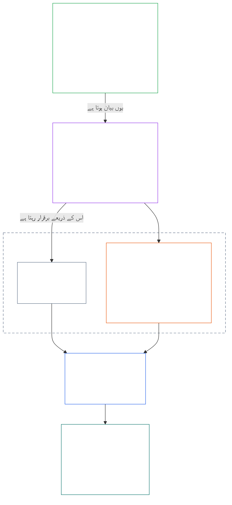
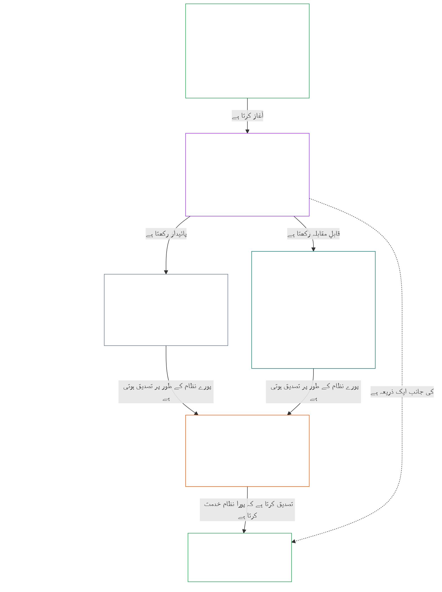

# باب 01، حصہ A: اقداری اصول

<details>
<summary><strong><span style="color: #2563eb;">کارپس میں مقام (غیر عملیاتی): فائل کی ساخت اور مطالعے کے قواعد</span></strong></summary>

> درج ذیل مواد **صرف قارئین کے لیے رہنمائی** ہے۔ یہ اس فائل یا دیگر ابواب میں کہیں اور موجود پابند ذمہ داریوں میں اضافہ، کمی یا تحدید نہیں کرتا۔
>
> یہ فائل **ذی شعور آئین کا حصہ** ہے اور دوسری نمبر شدہ `core_*` فائلوں کے ساتھ ایک ہی دستاویز کے طور پر پڑھے جانے پر ہی پابند ہے۔ اس میں **باب اول، حصہ A** شامل ہے (§§1–12: مقصد اور کردار؛ تکمیلِ حیات کا مقصد، جو §2 میں متعارف ہوتا ہے اور فلاح، سلامتی، صداقت، اعتماد اور آزادی کے ذریعے آگے بڑھتا ہے؛ اور تسلسل کا مقصد، جو §8 میں متعارف ہوتا ہے اور مشترکہ نظام کی صلاحیت، لچک، بازاری ساخت اور نظامی جائزے کے ذریعے آگے بڑھتا ہے)۔
>
> **سابقہ:** [core_00_preamble.md](core_00_preamble.md)  
> **اگلا:** [core_01_b_interaction_interpretation.md](core_01_b_interaction_interpretation.md) (باب اول، حصہ B — §§13–15، باہمی تعامل، بالادستی کی حدود، اور آئینی تشریح)۔  
> **مطالعے کی ترتیب:** §1 مقصد اور کردار → **تکمیلِ حیات:** §2 تعارف (جس میں §2.1 کی ناقابلِ سمجھوتہ سلامتی اور صداقت کی پابندیاں شامل ہیں) → §3 فلاح (نتیجہ) → §4 سلامتی → §5 صداقت → §6 اعتماد → §7 آزادی → **تسلسل:** §8 تعارف → §9 مشترکہ نظام کی صلاحیت (ربط: تکمیلِ حیات کے حصول کا ذریعہ اور تسلسل کا جوہر) → §10 لچک → §11 بازاری ساخت → §12 نظامی جائزہ۔

</details>

<details>
<summary><strong><span style="color: #2563eb;">قارئین کے لیے رہنمائی (غیر عملیاتی): باب اول مقاصد، چارگانہ اصول، دفعات اور تعریفوں کو کیسے جوڑتا ہے</span></strong></summary>

> درج ذیل مواد **صرف قارئین کے لیے رہنمائی** ہے۔ یہ اس فائل یا دیگر ابواب میں کہیں اور موجود پابند ذمہ داریوں میں اضافہ، کمی یا تحدید نہیں کرتا۔ ہر دفعہ کے **سراغ** اور **تعریفیں · جائزہ · تعمیل** ویجٹس پابند حوالہ جاتی راستے فراہم کرتے ہیں؛ یہ حصہ باب اول میں داخل ہونے والے قارئین کے لیے پورے حصے کا نقشہ ہے۔

**سطحوں کا باہمی تعلق۔** ہر سطح ایک الگ سوال کا جواب دیتی ہے، اور باب اول کا ہر اصول باقی تین سطحوں کی طرف اشارہ کرتا ہے:

- **مقاصد اور چارگانہ اصول** ([دیباچہ §1](core_00_preamble.md#the-model)): مشترکہ نظام کس لیے ہیں ([تکمیلِ حیات](core_05_apex_flourishing_aim.md#flourishing-constitutional) اور [تسلسل](core_05_apex_continuity_aim.md#chapter-five-definitions-continuity-constitutional-aim))، اور وہ چار فرائض جو اس جستجو کو جائز رکھتے ہیں ([شرکت](core_05_apex_participation_leg.md#participation-constitutional)، [نگرانی](core_05_apex_oversight_leg.md#oversight-constitutional)، [جوابدہی](core_05_apex_accountability_leg.md#accountability)، اور [بروقتی](core_05_apex_timeliness_leg.md#timeliness-constitutional))۔
- **اصول** (یہ باب): یہ مقاصد اور فرائض کس طرح اقدار، پابندیوں اور ایک دوسرے کے مقابلے میں وزن کرنے کے قواعد کی صورت اختیار کرتے ہیں۔
- **دفعات** ([باب ششم](core_06_rights_part_a.md#chapter-six-foundational-rights)): حقوق کی وہ کم از کم ضمانتیں جو مقاصد کے حصول کے دوران بھی قابلِ استعمال رہتی ہیں۔ ہر دفعہ کا **سراغ** انہیں *بالخصوص* کے تحت درج کرتا ہے۔
- **تعریفیں** ([ابواب دوم تا پنجم](core_02_definition_structure.md)): وہ مشترکہ معانی جن کے ذریعے جانچا جاتا ہے کہ کوئی دعویٰ درست ہے یا نہیں۔ ہر دفعہ کا **تعریفیں · جائزہ · تعمیل** ویجیٹ انہیں درج کرتا ہے۔

**باب اول میں ہر مقصد کی پیش رفت۔** تکمیلِ حیات وہ فلاح ہے جو صداقت، سلامتی، قابلِ اعتماد ہونے اور بامعنی اختیار کے ذریعے برقرار رہے ([دیباچہ §1](core_00_preamble.md#flourishing))۔ باب اول پہلے نتیجہ بیان کرتا ہے، پھر چاروں شرائط میں سے ہر ایک کے لیے ایک اصول دیتا ہے۔

| مقصد اور پہلو | باب اول کا اصول | تعریف کا مقام | سراغ میں مذکور دفعات |
|---|---|---|---|
| **تکمیلِ حیات**: نتیجہ | [§3 فلاح](#3-foundational-objective-wellbeing-flourishing-aim) | [فلاح](core_05_band_continuity.md#wellbeing) | [VI](core_06_rights_part_b.md#article-vi-equal-basic-rights)، [X](core_06_rights_part_b.md#article-x-self-determination-agency-and-participation)، [XIII-B](core_06_rights_part_c.md#article-xiii-b-right-to-redress-and-remedy)، [XIX-B](core_06_rights_part_d.md#article-xix-b-contestability-and-proportional-restriction-limits) |
| **تکمیلِ حیات**: سلامتی | [§4 سلامتی](#4-safety-harm-constraint) | [سلامتی](core_05_band_continuity.md#safety-constitutional-constraint) | [XIII](core_06_rights_part_c.md#article-xiii-right-to-reliable-and-trustworthy-systems)، [XVII](core_06_rights_part_c.md#article-xvii-system-lifecycle-environments-and-reversibility)، [XXIII](core_06_rights_part_d.md#article-xxiii-root-cause-analysis-and-adaptive-response) |
| **تکمیلِ حیات**: صداقت | [§5 صداقت](#5-truth-epistemic-integrity-constraint) | [صداقت](core_05_band_oversight.md#truth-constitutional-constraint) | [XIII](core_06_rights_part_c.md#article-xiii-right-to-reliable-and-trustworthy-systems)، [XV](core_06_rights_part_c.md#article-xv-info-sphere-integrity)، [XVI](core_06_rights_part_c.md#article-xvi-audit-transparency-and-independent-verification) |
| **تکمیلِ حیات**: قابلِ اعتماد ہونا | [§6 اعتماد](#6-trust-and-trustworthiness-coordination-integrity) | [قابلِ اعتماد ہونا](core_05_band_continuity.md#trustworthiness) | [XIII](core_06_rights_part_c.md#article-xiii-right-to-reliable-and-trustworthy-systems)، [XV](core_06_rights_part_c.md#article-xv-info-sphere-integrity)، [XVI](core_06_rights_part_c.md#article-xvi-audit-transparency-and-independent-verification) |
| **تکمیلِ حیات**: بامعنی اختیار | [§7 آزادی](#7-freedom-bounded-agency) | [بامعنی اختیار](core_05_band_participation.md#meaningful-agency) | [VI](core_06_rights_part_b.md#article-vi-equal-basic-rights)، [X](core_06_rights_part_b.md#article-x-self-determination-agency-and-participation)، [XXI](core_06_rights_part_d.md#article-xxi-interoperability-portability-movement-refuge-and-exit-integrity) |
| **تسلسل**، تکمیلِ حیات سے ربط: پائیدار صلاحیت | [§9 مشترکہ نظام کی صلاحیت](#9-shared-system-capacity) | [مشترکہ نظام کی صلاحیت](core_05_band_continuity.md#shared-system-capacity) | [I-A](core_06_rights_part_a.md#article-i-a-environmental-preconditions-and-ecological-integrity)، [III](core_06_rights_part_a.md#article-iii-survival-and-essential-access)، [V](core_06_rights_part_a.md#article-v-resource-allocation-dependencies-and-ecosystem-funding) |
| **تسلسل**: لچک | [§10 لچک اور خود بحالی کا ڈیزائن](#10-resilience-and-self-healing-design) | [خود بحالی](core_05_band_continuity.md#self-healing) | [XIII](core_06_rights_part_c.md#article-xiii-right-to-reliable-and-trustworthy-systems)، [XVII](core_06_rights_part_c.md#article-xvii-system-lifecycle-environments-and-reversibility)، [XXIII](core_06_rights_part_d.md#article-xxiii-root-cause-analysis-and-adaptive-response) |
| **تسلسل**: قابلِ مقابلہ بازار | [§11 بازاری ساخت](#11-market-structure) | [بازاری ساخت](core_05_band_accountability.md#market-structure) | [III-C](core_06_rights_part_a.md#article-iii-c-labor-and-economic-floor)، [V](core_06_rights_part_a.md#article-v-resource-allocation-dependencies-and-ecosystem-funding)، [XXI](core_06_rights_part_d.md#article-xxi-interoperability-portability-movement-refuge-and-exit-integrity) |
| **تسلسل**: پورے نظام کا نقطۂ نظر | [§12 نظامی جائزے کی شرط](#12-systemic-evaluation-requirement) | [نظامی مطابقت کی توثیق](core_05_band_continuity.md#system-alignment-certification) | [XVI](core_06_rights_part_c.md#article-xvi-audit-transparency-and-independent-verification) |

**اصولی درجہ بندی (تسلسل)۔** اصولی سطح پر تسلسل کا مقصد اس ترتیب سے آگے بڑھتا ہے، اور آغاز اس صلاحیت سے ہوتا ہے جو دونوں مقاصد کو جوڑتی ہے:

6. **[مشترکہ نظام کی صلاحیت](core_05_band_continuity.md#shared-system-capacity)** وہ نتیجہ ہے جس تک اچھی امانتی نگرانی، حکمرانی اور ترغیبات کو وقت کے ساتھ پہنچنا چاہیے — یعنی ذی شعور ہستیوں اور مشترکہ نظاموں کی حقیقی، قابلِ اعتراض صلاحیت کہ وہ آئین کے تحت مطلوبہ کام انجام دیں۔ یہ دونوں مقاصد سے تعلق رکھتی ہے: **تکمیلِ حیات** کے حصول کا ذریعہ اور **تسلسل** کا جوہر ہے، مگر ہر دوسری چیز پر فوقیت رکھنے کا جواز نہیں۔ **[§9.1](#91-productive-capacity-instrumental-good)** اور **[§9.2](#92-constitutional-efficiency)** اس کے دو بنیادی پہلوؤں کی وضاحت کرتے ہیں۔
7. **[لچک اور خود بحالی کا ڈیزائن](#10-resilience-and-self-healing-design)** بیان کرتا ہے کہ ذی شعور ہستیوں کے زیرِ انحصار نظام مسائل کو جلد کیسے پہچانتے اور محدود کرتے ہیں، ظاہر کردہ راستوں کے مطابق کیسے ناکام ہوتے ہیں، اور دیانت داری سے کیسے بحال ہوتے ہیں ([خود بحالی](core_05_band_continuity.md#self-healing))، تاکہ شق 6 کی صلاحیت پائیدار رہے اور استحکام ہنگامی مداخلت کا محتاج نہ ہو۔
8. **[بازاری ساخت](core_05_band_accountability.md#market-structure)** [§11](#11-market-structure) میں اس صلاحیت کو عملی طور پر قابلِ مقابلہ رکھنے کے لیے ارتکاز کے خلاف نظم فراہم کرتی ہے۔
9. **[نظامی جائزے کی شرط](#12-systemic-evaluation-requirement)** تعمیل یا حکمرانی کے دعوے تسلیم ہونے سے پہلے پورے نظام کے دائرے، انحصار اور ترغیبات کی مطابقت کی تصدیق کرتی ہے — اصولی سطح پر آڈٹ کی رہنمائی کے طور پر چارگانہ اصول کی **نگرانی** والی جہت کے تحت۔ اس میں [نظامی مطابقت کی توثیق](core_05_band_continuity.md#system-alignment-certification) دیگر اہم آڈٹ عملوں میں سے ایک ہے۔

**باب اول میں چارگانہ اصول کا اطلاق۔** ہر دفعہ اپنے سراغ میں ان جہتوں کی نشاندہی کرتی ہے جن سے اس کا تعلق ہے۔ یہ دفعات انہیں سب سے براہِ راست بروئے کار لاتی ہیں:

| چارگانہ اصول کی جہت | باب اول کے بنیادی مقامات |
|---|---|
| **شرکت** | [§16 امانتی نگرانی کی تفصیل](core_01_c_stewardship_capacity_principles.md#16-stewardship-in-depth) اور [§17 نتیجہ خیز امانتی نگرانی](core_01_c_stewardship_capacity_principles.md#17-consequential-stewardship-the-steward-role) (نتیجہ خیز کردار اور آواز)؛ [§7 آزادی](#7-freedom-bounded-agency) (بامعنی اختیار) |
| **نگرانی** | [§16](core_01_c_stewardship_capacity_principles.md#16-stewardship-in-depth) اور [§17](core_01_c_stewardship_capacity_principles.md#17-consequential-stewardship-the-steward-role) (تقسیم شدہ فہم، ریکارڈ)؛ [§18 حکمرانی](core_01_c_stewardship_capacity_principles.md#18-governance-under-stewardship-discipline) (اختیار کی تقسیم)؛ [§12](#12-systemic-evaluation-requirement) (آڈٹ) |
| **جوابدہی** | [§18 حکمرانی](core_01_c_stewardship_capacity_principles.md#18-governance-under-stewardship-discipline) (اختیار کے تناسب سے جوابدہی)؛ [§19 ترغیبات کی مطابقت اور نظام پر قبضہ](core_01_c_stewardship_capacity_principles.md#19-incentive-alignment-and-system-capture) (انعامات ان جہتوں کو کھوکھلا نہ کریں) |
| **بروقتی** | [§16](core_01_c_stewardship_capacity_principles.md#16-stewardship-in-depth) اور [§17](core_01_c_stewardship_capacity_principles.md#17-consequential-stewardship-the-steward-role) (قابلِ اجتناب تاخیر کے بغیر مسائل کی شناخت اور اصلاح) |

**دو محور، باہمی تنازع نہیں۔** مقاصد بتاتے ہیں کہ نظام کیا حاصل کرنا چاہتے ہیں؛ چارگانہ اصول بتاتا ہے کہ یہ جستجو جائز کیسے رہتی ہے۔ کوئی اصطلاح دونوں سے متعلق ہو سکتی ہے: صداقت اور قابلِ اعتماد ہونا تکمیلِ حیات کے اجزا ہیں، اور [دیباچہ §2](core_00_preamble.md#2-measurements-overview) انہیں نگرانی کے زمرے میں ناپتا ہے۔ [§§13–15](core_01_b_interaction_interpretation.md#13-constitutional-collision-resolution-process) ان اصولوں کے تصادم پر ان کے باہمی وزن اور مجموعی مطالعے کا طریقہ طے کرتے ہیں، اور [§20](core_01_c_stewardship_capacity_principles.md#20-integrated-application) انہیں بعد کے ہر باب پر لاگو کرتا ہے۔

</details>

<br>

### 1. مقصد اور کردار
<details>
<summary><strong><span style="color: #2563eb;">سراغ</span></strong></summary>

- بالادست: [تمہید §1 نمونہ](core_00_preamble.md#the-model) — [آئینی چارگانہ](core_00_preamble.md#constitutional-tetrad)، [دو آئینی مقاصد](core_00_preamble.md#two-constitutional-aims)، اور [مادی داؤ](core_00_preamble.md#material-stake) کا پیمانہ اس باب میں حصوں کے سراغ کے ذریعے لاگو ہوتا ہے۔
- زیریں: [15. آئینی تشریح](core_01_b_interaction_interpretation.md#15-constitutional-interpretation) مربوط مطالعے، ابہام، داخلی درجہ بندی اور مستند تنازع حل کرنے کے طریقۂ کار کے لیے۔
- زیریں: [دو آئینی مقاصد](core_00_preamble.md#two-constitutional-aims) — **فلاح** کے مقصد کی تشکیل: [§3](#3-foundational-objective-wellbeing-flourishing-aim) سے [§6](#6-trust-and-trustworthiness-coordination-integrity) تک اور [§7 آزادی](#7-freedom-bounded-agency)؛ **تسلسل** کے مقصد کی تشکیل: [§9 مشترکہ نظامی صلاحیت](#9-shared-system-capacity)، [§10 لچک اور خود اصلاحی ڈیزائن](#10-resilience-and-self-healing-design)، [§11 بازار کی ساخت](#11-market-structure)، اور [§12 نظامی جائزے کی شرط](#12-systemic-evaluation-requirement)۔
- زیریں: [3. بنیادی مقصد: بہبود](#3-foundational-objective-wellbeing-flourishing-aim)، [§3.2 شناخت، تقویت اور آرزو](#32-recognition-reinforcement-and-aspiration)، [4 تحفظ](#4-safety-harm-constraint)، [5 سچائی](#5-truth-epistemic-integrity-constraint)، [6 اعتماد](#6-trust-and-trustworthiness-coordination-integrity)، [§16 تفصیلی نگہبانی](core_01_c_stewardship_capacity_principles.md#16-stewardship-in-depth)، [13. آئینی تصادم کے حل کا عمل](core_01_b_interaction_interpretation.md#13-constitutional-collision-resolution-process)، اور [§7 آزادی](#7-freedom-bounded-agency)۔
- ساتھ پڑھیں: [آئینی چارگانہ](core_00_preamble.md#constitutional-tetrad) — شرکت، نگرانی، جواب دہی اور بروقتی یہ طے کرتے ہیں کہ مشترکہ نظام [دو آئینی مقاصد](core_00_preamble.md#two-constitutional-aims) کے حصول کے لیے کیسے کوشش کریں؛ [مادی داؤ](core_00_preamble.md#material-stake) کا پیمانہ حصوں کے سراغ کے ذریعے پورے باب پر لاگو ہوتا ہے۔
- ساتھ پڑھیں: [ابواب دو تا چار](core_02_definition_structure.md) اور [باب پانچ](core_05__definitions_home.md#chapter-five-foundational-definitions) — اس باب میں استعمال ہونے والی ہر اصطلاح کے لیے حاکم میکانزم کی پرت؛ O/M/A/C کی دیانت، گریز کی ممانعت، بوجھ، اور تعریفوں سے نتائج تک سراغ پذیری لاگو کریں۔
- ساتھ پڑھیں: [باب چھ: بنیادی حقوق](core_06_rights_part_a.md#chapter-six-foundational-rights)۔
  - بالخصوص [آرٹیکل VI: مساوی بنیادی حقوق](core_06_rights_part_b.md#article-vi-equal-basic-rights)، [آرٹیکل XIII: قابلِ اعتماد اور بھروسا مند نظاموں کا حق](core_06_rights_part_c.md#article-xiii-right-to-reliable-and-trustworthy-systems)، اور [آرٹیکل XXIV: آئینی تشریح، نظرثانی اور قبضے کے خلاف تحفظات](core_06_rights_part_d.md#article-xxiv-constitutional-interpretation-review-and-anti-capture-safeguards)۔
  - یہ مطالعہ وہاں لاگو کریں جہاں تشریح محفوظ ذی شعوروں، نظاموں یا اداروں کو متاثر کرتی ہو۔

</details>

<details>
<summary><strong><span style="color: #2563eb;">تعریفیں · جائزہ · تعمیل</span></strong></summary>

- [تناسب](core_05_band_accountability.md#proportionality) · [O](core_05_band_accountability.md#proportionality) · [M](core_05_band_accountability.md#proportionality-a) · [A](core_05_band_accountability.md#proportionality-a) · [C](core_05_band_accountability.md#proportionality-c)
- [ضرورت](core_05_band_accountability.md#necessity) · [O](core_05_band_accountability.md#necessity) · [M](core_05_band_accountability.md#necessity-a) · [A](core_05_band_accountability.md#necessity-a) · [C](core_05_band_accountability.md#necessity-c)

</details>

<br>

*سادہ الفاظ میں: باب ایک وہ اقدار اور حدود مقرر کرتا ہے جو ہر دوسرے باب پر حاکم ہیں۔ مشترکہ نظاموں کو **فلاح** اور **تسلسل** دونوں کے لیے بیک وقت کوشش کرنی چاہیے — ایک کو دوسرے کی قیمت پر نہیں — اور کسی ایک قدر کو باقی قدروں کی قیمت پر زیادہ سے زیادہ نہیں کیا جا سکتا۔*

<a id="two-constitutional-aims"></a><a id="flourishing"></a><a id="continuity"></a>یہ باب اس آئین کی تشریح، اطلاق اور ارتقا کو حاکم بنانے والے اصول اور حدود قائم کرتا ہے۔ یہ [دو آئینی مقاصد](core_00_preamble.md#two-constitutional-aims) — [**فلاح**](core_00_preamble.md#flourishing) اور [**تسلسل**](core_00_preamble.md#continuity) — کو، جو [تمہید §1 نمونہ](core_00_preamble.md#the-model) میں قائم کیے گئے ہیں، عملی اصولوں اور حدود میں ڈھالتا ہے۔ اصولی سطح کی مستند تعریفیں تمہید میں ہیں؛ یہ باب ان کا اطلاق کرتا ہے۔

ان مقاصد کے لیے ہمیشہ ایک ساتھ کوشش کی جانی چاہیے، اور اس آئین میں مقرر کردہ ناقابلِ سمجھوتہ اصولی حدود اور حقوق کے تحفظات کے اندر رہ کر۔ [**آئینی چارگانہ**](core_00_preamble.md#constitutional-tetrad) یہ حاکم کرتا ہے کہ یہ کوشش کیسے جائز رہتی ہے — [**مادی داؤ**](core_00_preamble.md#material-stake) کے مطابق۔

یہ باب ان دونوں مقاصد اور چارگانہ کے گرد منظم ہے:
- **فلاح:** [فلاح کے مقصد کا تعارف](#2-flourishing-aim-introduction) اس مقصد کا نقشہ پیش کرتا ہے۔ [§3 بنیادی مقصد: بہبود](#3-foundational-objective-wellbeing-flourishing-aim) نتیجہ بیان کرتا ہے۔ [§4 تحفظ](#4-safety-harm-constraint)، [§5 سچائی](#5-truth-epistemic-integrity-constraint)، [§6 اعتماد](#6-trust-and-trustworthiness-coordination-integrity)، اور [§7 آزادی](#7-freedom-bounded-agency) اسے برقرار رکھنے والی چار شرائط کو تشکیل دیتے ہیں: تحفظ، سچائی، قابلِ اعتماد ہونا اور بامعنی اختیار۔
- **تسلسل:** [تسلسل کے مقصد کا تعارف](#8-continuity-aim-introduction) اس مقصد کا نقشہ پیش کرتا ہے۔ [§9 مشترکہ نظامی صلاحیت](#9-shared-system-capacity) (فلاح کا ذریعہ اور بیک وقت تسلسل کا جوہر)، [§10 لچک اور خود اصلاحی ڈیزائن](#10-resilience-and-self-healing-design)، [§11 بازار کی ساخت](#11-market-structure)، اور [§12 نظامی جائزے کی شرط](#12-systemic-evaluation-requirement) طویل مدتی استحکام، مشترکہ نظاموں کی پائیدار صلاحیت اور لچک کو تشکیل دیتے ہیں۔ تسلسل کے دعوے پورے نظام کی دیانت دار تصویر پر قائم ہیں: §§9–11 کا ہر دعویٰ §12 کی جانچ کے بعد ہی قائم رہتا ہے۔
- **اصولوں کے باہم ملنے پر:** [§13 آئینی تصادم کے حل کا عمل](core_01_b_interaction_interpretation.md#13-constitutional-collision-resolution-process)، [§14 مطلق بالادستی کی ممانعت](core_01_b_interaction_interpretation.md#14-prohibition-on-absolute-override)، اور [§15 آئینی تشریح](core_01_b_interaction_interpretation.md#15-constitutional-interpretation) یہ طے کرتے ہیں کہ مقاصد اور اصولوں کو کیسے تولا اور ساتھ پڑھا جائے۔
- **عملی طور پر چارگانہ:** [§16 تفصیلی نگہبانی](core_01_c_stewardship_capacity_principles.md#16-stewardship-in-depth) سے [§19 ترغیبات کی ہم آہنگی اور نظام پر قبضہ](core_01_c_stewardship_capacity_principles.md#19-incentive-alignment-and-system-capture) تک کے حصے شرکت، نگرانی، جواب دہی اور بروقتی کو نگہبانی، حکمرانی اور ترغیبات میں شامل کرتے ہیں؛ [§20 مربوط اطلاق](core_01_c_stewardship_capacity_principles.md#20-integrated-application) پورے باب کو ہر بعد کے باب پر لاگو کرتا ہے۔

ہر اصول کا **سراغ** اس کی حفاظت کرنے والے باب چھ کے آرٹیکلز درج کرتا ہے، اور اس کا **تعریفیں · جائزہ · تعمیل** ویجیٹ باب پانچ کی ان تعریفوں کو درج کرتا ہے جن سے اس کی پیمائش ہوتی ہے۔

**خاکہ: دو آئینی مقاصد اور آئینی چارگانہ**

<hr style="border: 0; border-top: 1px solid currentColor;">

```mermaid
flowchart TB
    subgraph Foundation[" "]
        direction TB
        subgraph Aims["دو آئینی مقاصد"]
            direction LR
            F["فلاح<br/><br/>• ذی شعوروں کی بہبود سچائی، تحفظ،<br/>قابلِ اعتماد ہونے اور بامعنی اختیار سے برقرار رہتی ہے"]
            C["تسلسل<br/><br/>• طویل مدتی استحکام، پائیداری، لچک،<br/>اور ماحولیاتی بہبود"]
        end
        subgraph Tetrad1["آئینی چارگانہ · شرکت اور نگرانی"]
            direction LR
            P["شرکت<br/><br/>• متاثرہ ذی شعوروں کو حقیقی آواز ملتی ہے<br/>• منصفانہ نمائندگی اور چیلنج کا مناسب موقع<br/>• داؤ کے تناسب سے نتیجہ خیز کرداروں تک رسائی"]
            O["نگرانی<br/><br/>• دیکھنا، جانچنا، تصدیق کرنا اور ریکارڈ رکھنا<br/>• آزادانہ جائزہ غلط انتخاب کو محدود کر سکتا ہے"]
        end
        subgraph Tetrad2["آئینی چارگانہ · جواب دہی اور بروقتی"]
            direction LR
            A["جواب دہی<br/><br/>• ذمہ داری درست فریقوں تک پہنچتی ہے<br/>• جواب دہی، تلافی اور حقیقی اصلاح<br/>• خراب نتائج پر تدارک لازم ہوتا ہے"]
            T["بروقتی<br/><br/>• مسائل دریافت، چیلنج، حل اور درست کیے جاتے ہیں<br/>• مدتیں مادی داؤ کے مطابق ہوتی ہیں<br/>• تاخیر حقوق، تدارک یا اصلاح کو مٹا نہیں سکتی"]
        end
    end
    F ~~~ P
    P ~~~ A
    style Foundation fill:none,stroke:none
    style Aims fill:none,stroke:none
    style Tetrad1 fill:none,stroke:none
    style Tetrad2 fill:none,stroke:none
    style F fill:none,stroke:#16a34a,color:#ffffff
    style C fill:none,stroke:#16a34a,color:#ffffff
    style P fill:none,stroke:#0f766e,color:#ffffff
    style O fill:none,stroke:#ea580c,color:#ffffff
    style A fill:none,stroke:#db2777,color:#ffffff
    style T fill:none,stroke:#9333ea,color:#ffffff
```

*مقاصد بیان کرتے ہیں کہ مشترکہ نظاموں کو کس چیز کے حصول کی کوشش کرنی چاہیے؛ چارگانہ ان فرائض کو بیان کرتا ہے جو اس کوشش کو جائز رکھتے ہیں۔ چاروں فرائض [مادی داؤ](core_00_preamble.md#material-stake) کے مطابق ہوتے ہیں، اور دونوں مقاصد حقوق کی بنیاد کے تابع رہتے ہیں۔ [تصوری جائزے](guides/CONCEPTUAL_OVERVIEW.md#two-aims-and-the-constitutional-tetrad) سے دوبارہ پیش کردہ۔*

یہ اقدار:
- ایک دوسرے سے آزاد نہیں، اور معمول کے کام میں ان کی سخت درجہ بندی نہیں ہوتی۔
- باہم عمل کرنے والے اصولوں اور حدود کے طور پر کام کرتی ہیں جن کا مل کر جائزہ ضروری ہے۔
- تمام "نظاموں" پر لاگو ہوتی ہیں، جن میں تکنیکی، تنظیمی، اقتصادی، سماجی-تکنیکی ڈھانچے اور ایسے ماحولیاتی نظام شامل ہیں جو ذی شعوروں اور سیارۂ زمین کو مادی طور پر متاثر کرتے ہیں۔

کسی ایک اصول کو الگ تھلگ لاگو نہیں کیا جا سکتا جہاں ایسا کرنے سے دوسرے اصولوں کی مادی خلاف ورزی ہو۔ تناؤ پیدا ہونے پر نظاموں کو اس باب میں بیان کردہ تناسب، ضرورت اور نظامی اثر کے تقاضوں کے تحت اسے حل کرنا ہوگا۔ اگر کوئی غیرحل شدہ تصادم براہِ راست ناقابلِ سمجھوتہ اصولی حدود کو متاثر کرتا ہے تو ترجیح باب ایک کی **§13** آئینی تصادم کے حل کے عمل کو حاصل ہوگی۔

<a id="2-flourishing-aim-introduction"></a>
### 2. خوشحالی کا مقصد: تعارف
<details>
<summary><strong><span style="color: #2563eb;">سراغ رسانی</span></strong></summary>

- ساتھ پڑھیں: [آئینی چارگانہ](core_00_preamble.md#constitutional-tetrad) — خوشحالی کے حصول کے طریقے پر چاروں ستون لاگو ہوتے ہیں؛ [مادی مفاد](core_00_preamble.md#material-stake) خوشحالی سے متعلق ہر دعوے کی گہرائی کا پیمانہ طے کرتا ہے۔
- ساتھ پڑھیں: [دو آئینی مقاصد](core_00_preamble.md#two-constitutional-aims) — **خوشحالی** کا مقصد؛ اس کا شریک مقصد [تسلسل کا مقصد: تعارف](#8-continuity-aim-introduction) میں متعارف ہوتا ہے۔
- بالادست: اصول: [دیباچہ §1 ماڈل](core_00_preamble.md#flourishing)؛ [خوشحالی (آئینی مقصد)](core_05_apex_flourishing_aim.md#flourishing-constitutional)؛ [§1 مقصد اور کردار](#1-purpose-and-role)۔
- ماتحت: [§3 بنیادی مقصد: فلاح و بہبود (خوشحالی کا مقصد)](#3-foundational-objective-wellbeing-flourishing-aim)، [§4 سلامتی (ضرر کی پابندی)](#4-safety-harm-constraint)، [§5 سچائی (علمی دیانت کی پابندی)](#5-truth-epistemic-integrity-constraint)، [§6 اعتماد اور قابلِ اعتماد ہونا (ہم آہنگی کی دیانت)](#6-trust-and-trustworthiness-coordination-integrity)، اور [§7 آزادی (محدود اختیار)](#7-freedom-bounded-agency)؛ ہر ایک کی حفاظت کرنے والی دفعات متعلقہ حصے کے سراغ میں درج ہیں۔
- ذیلی دفعات: [§2.1 ناقابلِ سمجھوتہ اصولی پابندیاں: سلامتی اور سچائی](#21-non-negotiable-principle-constraints-safety-and-truth)۔
- ساتھ پڑھیں: عمومی طور پر باب ششم کے حقوق کی کم از کم ضمانتیں۔

</details>

<details>
<summary><strong><span style="color: #2563eb;">تعریفیں · جائزہ · تعمیل</span></strong></summary>

- [خوشحالی (آئینی مقصد)](core_05_apex_flourishing_aim.md#flourishing-constitutional) · [O](core_05_apex_flourishing_aim.md#flourishing-constitutional) · [M](core_05_apex_flourishing_aim.md#flourishing-constitutional-m) · [A](core_05_apex_flourishing_aim.md#flourishing-constitutional-a) · [C](core_05_apex_flourishing_aim.md#flourishing-constitutional-c)
- [فلاح و بہبود](core_05_band_continuity.md#wellbeing) · [O](core_05_band_continuity.md#wellbeing) · [M](core_05_band_continuity.md#wellbeing-a) · [A](core_05_band_continuity.md#wellbeing-a) · [C](core_05_band_continuity.md#wellbeing-c)
- [سلامتی (آئینی پابندی)](core_05_band_continuity.md#safety-constitutional-constraint) · [O](core_05_band_continuity.md#safety-constitutional-constraint) · [M](core_05_band_continuity.md#safety-constraint-a) · [A](core_05_band_continuity.md#safety-constraint-a) · [C](core_05_band_continuity.md#safety-constraint-c)
- [سچائی (آئینی پابندی)](core_05_band_oversight.md#truth-constitutional-constraint) · [O](core_05_band_oversight.md#truth-constitutional-constraint-o) · [M](core_05_band_oversight.md#truth-constitutional-constraint-a) · [A](core_05_band_oversight.md#truth-constitutional-constraint-a) · [C](core_05_band_oversight.md#truth-constitutional-constraint-c)
- [قابلِ اعتماد ہونا](core_05_band_continuity.md#trustworthiness) · [O](core_05_band_continuity.md#trustworthiness) · [M](core_05_band_continuity.md#trustworthiness-a) · [A](core_05_band_continuity.md#trustworthiness-a) · [C](core_05_band_continuity.md#trustworthiness-c)
- [بامعنی اختیار](core_05_band_participation.md#meaningful-agency) · [O](core_05_band_participation.md#meaningful-agency) · [M](core_05_band_participation.md#meaningful-agency-a) · [A](core_05_band_participation.md#meaningful-agency-a) · [C](core_05_band_participation.md#meaningful-agency-c)

</details>

<br>

*سادہ الفاظ میں: خوشحالی دو مقاصد میں پہلا ہے۔ اس کا مطلب ہے کہ ذی شعور ہستیاں اچھی حالت میں رہیں اور اچھی حالت برقرار رکھ سکیں، کیونکہ ان کے گرد نظام محفوظ، دیانت دار، قابلِ اعتماد اور حقیقی انتخاب کی گنجائش رکھتے ہیں۔ §3 بتاتا ہے کہ یہ نتیجہ کیا ہے؛ اس کے بعد کے چار اصول بتاتے ہیں کہ اسے حقیقت کیسے رکھا جائے۔*

[**خوشحالی**](core_05_apex_flourishing_aim.md#flourishing-constitutional) سے مراد **سچائی، سلامتی، قابلِ اعتماد ہونے اور بامعنی اختیار کے ذریعے برقرار رہنے والی ذی شعور ہستیوں کی فلاح و بہبود** ہے ([دیباچہ §1 ماڈل](core_00_preamble.md#flourishing))۔ باب اول اسے دو مرحلوں میں ترقی دیتا ہے: [§3 بنیادی مقصد: فلاح و بہبود (خوشحالی کا مقصد)](#3-foundational-objective-wellbeing-flourishing-aim) نتیجہ بیان کرتا ہے، اور چار اصول اسے برقرار رکھنے والی شرائط بیان کرتے ہیں۔

| شرط | اصول | اصول کا جواب دینے والا سوال |
|---|---|---|
| **سلامتی** | [§4 سلامتی (ضرر کی پابندی)](#4-safety-harm-constraint) | کیا ذی شعور ہستیاں قابلِ اجتناب ضرر سے محفوظ ہیں؟ |
| **سچائی** | [§5 سچائی (علمی دیانت کی پابندی)](#5-truth-epistemic-integrity-constraint)، نیز [§5.1 سائنس سے باخبر تحقیق اور فیصلہ سازی میں معاونت](#51-science-informed-inquiry-and-decision-support) اور [§5.2 سادہ زبان میں رسائی (شرکت اور امانتی نگرانی کا فرض)](#52-plain-language-accessibility-participation-and-stewardship-duty) | کیا ذی شعور ہستیاں بتائی گئی بات پر بھروسا کر سکتی اور اسے سمجھ سکتی ہیں؟ |
| **قابلِ اعتماد ہونا** | [§6 اعتماد اور قابلِ اعتماد ہونا (ہم آہنگی کی دیانت)](#6-trust-and-trustworthiness-coordination-integrity) | کیا نظام بھروسا جیتتے اور ناکام ہونے پر اسے بحال کرتے ہیں؟ |
| **بامعنی اختیار** | [§7 آزادی (محدود اختیار)](#7-freedom-bounded-agency) | کیا ذی شعور ہستیاں انتخاب، اختلاف، تنظیم اور اخراج کی حقیقی مگر محدود آزادی برقرار رکھتی ہیں؟ |

**خوشحالی کے اصول مل کر کیسے کام کرتے ہیں:**
- **سلامتی اور سچائی ناقابلِ سمجھوتہ پابندیاں ہیں:** انہیں [§2.1 ناقابلِ سمجھوتہ اصولی پابندیاں: سلامتی اور سچائی](#21-non-negotiable-principle-constraints-safety-and-truth) میں ایک ساتھ بیان کیا گیا ہے، اور دوسرے اصول حاصل کرنے کے لیے ان سے دستبردار نہیں ہوا جا سکتا۔
- **اعتماد اور آزادی محدود ہیں، مطلق نہیں:** اعتماد کمایا جاتا ہے اور اس کی اصلاح ممکن ہے ([§6.1 اصلاح اور ازالہ](#61-correction-and-remedy))؛ آزادی کی منضبط حدود ہیں ([§7.1 تحدید کا نظم](#71-limitation-discipline))۔
- **کوئی اصول تنہا لاگو نہیں ہوتا:** اصولوں کو ساتھ پڑھا جاتا ہے، اور تصادم کی صورت میں [§13 آئینی تصادم حل کرنے کا عمل](core_01_b_interaction_interpretation.md#13-constitutional-collision-resolution-process) کے تحت ان کا وزن کیا جاتا ہے۔
- **خوشحالی کا ایک شریک مقصد ہے:** تسلسل کا مقصد پوچھتا ہے کہ اس نتیجے کو دیرپا کیا چیز بناتی ہے؛ یہ [تسلسل کا مقصد: تعارف](#8-continuity-aim-introduction) میں متعارف ہوتا ہے۔

**خاکہ: خوشحالی اور اس کے اصول**

<hr style="border: 0; border-top: 1px solid currentColor;">



*خوشحالی کو ایک نتیجے کے طور پر بیان کیا گیا ہے؛ پہلے ناقابلِ سمجھوتہ پابندیاں، سلامتی اور سچائی، اسے برقرار رکھتی ہیں۔ دونوں اعتماد کو تقویت دیتی ہیں، اور اعتماد آگے چل کر آزادی کو تقویت دیتا ہے۔ رنگ دوبارہ استعمال کیے جا سکنے والے بصری اشارے ہیں، ترجیح کے دعوے نہیں۔ ہر اصول کا سراغ اس کی دفعات کے نام دیتا ہے، اور تعریفیں · جائزہ · تعمیل کا ویجیٹ متعلقہ تعریفیں بتاتا ہے۔ [تصوری جائزے](guides/CONCEPTUAL_OVERVIEW.md#flourishing-and-its-principles) میں بھی شامل۔*

<a id="21-non-negotiable-principle-constraints-safety-and-truth"></a>
#### 2.1 ناقابلِ سمجھوتہ اصولی پابندیاں: سلامتی اور سچائی
<details>
<summary><strong><span style="color: #2563eb;">سراغ رسانی</span></strong></summary>

- ساتھ پڑھیں: [آئینی چارگانہ](core_00_preamble.md#constitutional-tetrad) — **شرکت** کا ستون (سلامتی اور سچائی کے تعین کو سمجھنا اور ان پر اعتراض کرنا)؛ **نگرانی** کا ستون (ضرر کے خطرے اور علمی زوال کا پتا لگانا)؛ **جوابدہی** کا ستون (ضرر، فریب اور گمراہ کن انحصار پر جواب دہی)؛ [مادی مفاد](core_00_preamble.md#material-stake) کے مطابق پیمانہ بندی۔
- ساتھ پڑھیں: [دو آئینی مقاصد](core_00_preamble.md#two-constitutional-aims) — **خوشحالی** کا مقصد (**سلامتی** اور **سچائی**، [دیباچہ §1](core_00_preamble.md#two-constitutional-aims) کے تحت نام زد اجزا ہیں)؛ **تسلسل** کا مقصد (طویل مدتی ضرر کی روک تھام اور پائیدار نظاموں کی دیانت دار امانتی نگرانی)۔
- بالادست: اصول: [3. بنیادی مقصد: فلاح و بہبود](#3-foundational-objective-wellbeing-flourishing-aim)؛ [دو آئینی مقاصد](core_00_preamble.md#two-constitutional-aims)۔
- ماتحت: [6. اعتماد](#6-trust-and-trustworthiness-coordination-integrity)، [13. آئینی تصادم حل کرنے کا عمل](core_01_b_interaction_interpretation.md#13-constitutional-collision-resolution-process)، اور [§7 آزادی](#7-freedom-bounded-agency)۔
- اطلاق: [§4 سلامتی](#4-safety-harm-constraint)؛ [§5 سچائی](#5-truth-epistemic-integrity-constraint)؛ [§5.1 سائنس سے باخبر تحقیق اور فیصلہ سازی میں معاونت](#51-science-informed-inquiry-and-decision-support)؛ [§5.2 سادہ زبان میں رسائی](#52-plain-language-accessibility-participation-and-stewardship-duty)۔

</details>

<br>

*سادہ الفاظ میں: سلامتی اور سچائی آئین کی سخت کم از کم ضمانتیں ہیں، ایسے سودے نہیں جنہیں بہتر بنانے کے نام پر ختم کیا جا سکے۔ مشترکہ نظام ذی شعور ہستیوں کو پیش بینی کے قابل خطرے میں نہیں ڈال سکتے اور نہ انہیں دھوکا دے سکتے ہیں۔ چارگانہ کے شرکت، نگرانی، جوابدہی اور بروقتی کے نظم کے تحت خوشحالی اور تسلسل کی پیروی میں بھی دونوں پابندیاں لاگو رہتی ہیں۔*

**سلامتی** اور **سچائی** ناقابلِ سمجھوتہ اصولی پابندیاں ہیں جو باب اول کے ہر دوسرے اصول — بشمول [§3 بنیادی مقصد: فلاح و بہبود](#3-foundational-objective-wellbeing-flourishing-aim) — اور [دو آئینی مقاصد](core_00_preamble.md#two-constitutional-aims) کی حد مقرر کرتی ہیں۔ یہ [**خوشحالی**](#flourishing) کے نام زد اجزا اور [**تسلسل**](#continuity) کے لیے ناگزیر ہیں: نظام ضرر یا فریب کے ذریعے خوشحال نہیں ہو سکتے، اور دیرپا جواز کے لیے خطرات کی دیانت دار امانتی نگرانی درکار ہے۔

ان پابندیوں کا اطلاق [آئینی چارگانہ](core_00_preamble.md#constitutional-tetrad) کے مطابق ہونا چاہیے اور اسے [مادی مفاد](core_00_preamble.md#material-stake) کے پیمانے پر ڈھالنا چاہیے، بالخصوص:
- جہاں سلامتی کے تعین شرکت کی صلاحیت کو متاثر کریں
- جہاں سچائی کے دعوے انحصار کو منظم کریں
- جہاں ضرر یا گمراہ کن طرزِ عمل کی جوابدہی داؤ پر ہو

سلامتی اور سچائی کے نتائج کسی ذی شعور ہستی کے حیثیت کے ریکارڈ کو بدل سکتے ہیں، مثلاً:
- [مساهمات](core_05_band_accountability.md#contribution-nature) کی شناخت کیسے ہوتی ہے
- خلاف ورزیاں درج ہوتی ہیں یا نہیں
- ان خلاف ورزیوں کی شدت کی درجہ بندی کیسے ہوتی ہے
- کون سے نتائج لاگو ہوتے ہیں

[**باب نہم**](core_09_standing_assessment.md) کا حیثیت ماڈل ان نتائج کی درجہ بندی، تصدیق اور اطلاق کے طریقے کو منضبط کرتا ہے؛ جبکہ جائزے اور تعمیل کے تقاضے [**ابواب دوم تا پنجم**](core_02_definition_structure.md) سے لیے جاتے ہیں۔

### 3. بنیادی مقصد: فلاح و بہبود (خوشحالی کا مقصد)
<details>
<summary><strong><span style="color: #2563eb;">سراغ رسانی</span></strong></summary>

- ساتھ پڑھیں: [آئینی چارگانہ](core_00_preamble.md#constitutional-tetrad) — جہاں فلاح و بہبود کی شرائط مادی طور پر اس بات پر اثر انداز ہوں کہ آواز، رسائی اور اعتراض کا امکان حقیقی ہے یا نہیں، وہاں **شرکت** کا ستون؛ جہاں فلاح و بہبود کے دعوے بوجھ کی تقسیم کو متاثر کریں، وہاں **جوابدہی** کا ستون۔ جہاں مادی طور پر متعلق ہو، [مادی مفاد](core_00_preamble.md#material-stake) کے مطابق پیمانہ بندی۔
- ساتھ پڑھیں: [دو آئینی مقاصد](core_00_preamble.md#two-constitutional-aims) — یہ باب [§3](#3-foundational-objective-wellbeing-flourishing-aim) سے [§6](#6-trust-and-trustworthiness-coordination-integrity) اور [§7 آزادی](#7-freedom-bounded-agency) تک **خوشحالی** کے مقصد کو آگے بڑھاتا ہے۔
- بالادست: اصول: [دیباچہ §1 ماڈل](core_00_preamble.md#the-model)؛ [دو آئینی مقاصد](core_00_preamble.md#two-constitutional-aims) — **خوشحالی** کے مقصد کی ترقی۔
- ماتحت: [4 سلامتی](#4-safety-harm-constraint)، [5 سچائی](#5-truth-epistemic-integrity-constraint)، [§16 امانتی نگرانی کی تفصیل](core_01_c_stewardship_capacity_principles.md#16-stewardship-in-depth)، اور [13. آئینی تصادم حل کرنے کا عمل](core_01_b_interaction_interpretation.md#13-constitutional-collision-resolution-process)۔
- ذیلی دفعات: [§3.1 انصاف](#31-fairness)؛ [§3.2 شناخت، تقویت اور آرزو](#32-recognition-reinforcement-and-aspiration)؛ [§3.3 تحقیر سے پاک طریقِ کار](#33-anti-degrading-process)۔
- ساتھ پڑھیں: عمومی طور پر باب ششم کے حقوق کی کم از کم ضمانتیں۔
  - بالخصوص [مادۂ VI: مساوی بنیادی حقوق](core_06_rights_part_b.md#article-vi-equal-basic-rights)، [مادۂ X: خود اختیاری، اختیار اور شرکت](core_06_rights_part_b.md#article-x-self-determination-agency-and-participation)، [مادۂ XIII-B: ازالے اور تدارک کا حق](core_06_rights_part_c.md#article-xiii-b-right-to-redress-and-remedy)، اور [مادۂ XIX-B: اعتراض پذیری اور متناسب تحدید کی حدود](core_06_rights_part_d.md#article-xix-b-contestability-and-proportional-restriction-limits)۔
  - جب فلاح و بہبود کے دعوے شدہ فوائد کو اختیار، وقار یا اعتراض پذیری پر تحدید کا جواز بنانے کے لیے پیش کیا جائے تو اسے لاگو کریں۔
  - جہاں رسائی، طریقِ کار، تقسیم کی ہم آہنگی، انحصار یا ہم آہنگی کی دیانت مادی طور پر داؤ پر ہو، بالخصوص [وقار اور مساوی اخلاقی مرتبہ](core_05_band_participation.md#dignity-and-equal-moral-standing)، [حقیقی انصاف](core_05_band_participation.md#substantive-fairness)، اور [6. اعتماد](#6-trust-and-trustworthiness-coordination-integrity) کے ساتھ پڑھیں۔

</details>

<details>
<summary><strong><span style="color: #2563eb;">تعریفیں · جائزہ · تعمیل</span></strong></summary>

- [فلاح و بہبود](core_05_band_continuity.md#wellbeing) · [O](core_05_band_continuity.md#wellbeing) · [M](core_05_band_continuity.md#wellbeing-a) · [A](core_05_band_continuity.md#wellbeing-a) · [C](core_05_band_continuity.md#wellbeing-c)
- [شرکت](core_05_apex_participation_leg.md#participation-constitutional) · [O](core_05_apex_participation_leg.md#participation-constitutional) · [M](core_05_apex_participation_leg.md#participation-constitutional-m) · [A](core_05_apex_participation_leg.md#participation-constitutional-a) · [C](core_05_apex_participation_leg.md#participation-constitutional-c)
- [وقار اور مساوی اخلاقی مرتبہ](core_05_band_participation.md#dignity-and-equal-moral-standing) · [O](core_05_band_participation.md#dignity-and-equal-moral-standing) · [M](core_05_band_participation.md#dignity-and-equal-moral-standing-a) · [A](core_05_band_participation.md#dignity-and-equal-moral-standing-a) · [C](core_05_band_participation.md#dignity-and-equal-moral-standing-c)
- [حقیقی انصاف](core_05_band_participation.md#substantive-fairness) · [O](core_05_band_participation.md#substantive-fairness) · [M](core_05_band_participation.md#substantive-fairness-constitutional-a) · [A](core_05_band_participation.md#substantive-fairness-constitutional-a) · [C](core_05_band_participation.md#substantive-fairness-constitutional-c)
- [مادیت](core_05_band_oversight.md#materiality) · [O](core_05_band_oversight.md#materiality) · [M](core_05_band_oversight.md#materiality-determination-a) · [A](core_05_band_oversight.md#materiality-determination-a) · [C](core_05_band_oversight.md#materiality-determination-c)
- [متبادل پیمانے کا انحراف](core_05_band_oversight.md#proxy-divergence) · [O](core_05_band_oversight.md#proxy-divergence) · [M](core_05_band_oversight.md#proxy-divergence-a) · [A](core_05_band_oversight.md#proxy-divergence-a) · [C](core_05_band_oversight.md#proxy-divergence-c)

</details>

<br>

*سادہ الفاظ میں: ان نظاموں کا مقصد ذی شعور ہستیوں کی زندگی کو واقعی بہتر بنانا ہے۔ متبادل پیمانے کے پیچھے بھاگنے سے یہ مقصد پورا نہیں ہوتا، اور نہ ہی سلامتی، سچائی یا حقوق کے معاملے میں کوتاہی چھپانے کا جواز ملتا ہے۔ فلاح و بہبود شرکت کی بنیاد ہے: حقیقی اختیار کے لیے ضروری شرائط کے بغیر محض رسمی آواز اس آئین کے تحت شرکت نہیں۔*

اس آئین کے تحت چلنے والے تمام نظاموں کا حتمی مقصد ذی شعور ہستیوں کی [فلاح و بہبود](core_05_band_continuity.md#wellbeing) کو محفوظ اور بہتر بنانا ہے — [**خوشحالی**](#flourishing) کا مقصد، جو [دو آئینی مقاصد](core_00_preamble.md#two-constitutional-aims) میں سے ایک ہے۔

[دیباچہ §1 ماڈل](core_00_preamble.md#flourishing) خوشحالی کی تعریف ذی شعور ہستیوں کی ایسی فلاح و بہبود کے طور پر کرتا ہے جو سچائی، سلامتی، قابلِ اعتماد ہونے اور بامعنی اختیار کے ذریعے برقرار رہتی ہے۔ یہ حصہ نتیجہ بیان کرتا ہے۔ اس کے بعد کے حصے اسے برقرار رکھنے والی چار شرائط بیان کرتے ہیں: [§4 سلامتی](#4-safety-harm-constraint)، [§5 سچائی](#5-truth-epistemic-integrity-constraint)، [§6 اعتماد](#6-trust-and-trustworthiness-coordination-integrity)، اور [§7 آزادی](#7-freedom-bounded-agency)۔ یہ پانچوں اصول مل کر باب اول میں خوشحالی کے مقصد کی تشریح کرتے ہیں۔ [**تسلسل**](#continuity) کا مقصد [§9 مشترکہ نظام کی صلاحیت](#9-shared-system-capacity)، [§10 لچک اور خود بحالی کا ڈیزائن](#10-resilience-and-self-healing-design)، [§11 بازاری ساخت](#11-market-structure)، اور [§12 نظامی جائزے کی شرط](#12-systemic-evaluation-requirement) میں آگے بڑھتا ہے۔

فلاح و بہبود [شرکت](core_05_apex_participation_leg.md#participation-constitutional) کی بنیاد ہے، [آئینی چارگانہ](core_00_preamble.md#constitutional-tetrad) کے تحت۔ مشترکہ نظام شرکت کو پورا شدہ نہیں سمجھ سکتے جب بنیادی فلاح و بہبود کی شرائط — بشمول [بامعنی اختیار](core_05_band_participation.md#meaningful-agency)، منصفانہ رسائی اور وقار — مادی طور پر خراب ہو چکی ہوں۔

فلاح و بہبود میں فوری اثرات کے علاوہ بالواسطہ، تاخیر سے ظاہر ہونے والے، مجموعی اور نظاموں کے درمیان مرتب ہونے والے نتائج بھی شامل ہیں، جن کا جائزہ [**ابواب دوم تا چہارم**](core_02_definition_structure.md) کے تحت لیا جاتا ہے۔ اس قدر کی سطح پر فلاح و بہبود:
- حقیقی شرکت ممکن بناتی ہے — ایسی آواز جسے استعمال کرنے کی شرائط ذی شعور ہستیوں کے پاس نہ ہوں، بامعنی شرکت نہیں
- کسی ایسے پیمانے کو حاصل کر لینے سے "حاصل شدہ" قرار نہیں دی جا سکتی جو اصل اہمیت سے ہٹ چکا ہو
- اس باب کی ناقابلِ سمجھوتہ اصولی پابندیوں، یعنی **سلامتی** اور **سچائی**، کے تابع رہتی ہے
- سلامتی، سچائی یا حقوق کے تحفظات کی خلاف ورزی کے لیے ہمہ گیر جواز کے طور پر پیش نہیں کی جا سکتی

#### 3.1 انصاف
<details>
<summary><strong><span style="color: #2563eb;">سراغ رسانی</span></strong></summary>

- ساتھ پڑھیں: [آئینی چارگانہ](core_00_preamble.md#constitutional-tetrad) — **شرکت** کا ستون (رسائی، آواز اور اعتراض پذیری؛ یہ عمومی تقاضا ہے، صرف [فریقِ مفاد نظامی شرکت](core_05_band_participation.md#stakeholder-status-and-weight) نہیں)؛ جہاں فوائد اور بوجھ وابستہ ہوں وہاں **جوابدہی** کا ستون۔
- بالادست: اصول: [§3 بنیادی مقصد: فلاح و بہبود](#3-foundational-objective-wellbeing-flourishing-aim) — بشمول [شرکت](core_05_apex_participation_leg.md#participation-constitutional) کی بنیاد کے طور پر فلاح و بہبود۔
- ماتحت: [3.2 شناخت، تقویت اور آرزو](#32-recognition-reinforcement-and-aspiration)؛ [6. اعتماد](#6-trust-and-trustworthiness-coordination-integrity)، [§16 امانتی نگرانی کی تفصیل](core_01_c_stewardship_capacity_principles.md#16-stewardship-in-depth)، [13. آئینی تصادم حل کرنے کا عمل](core_01_b_interaction_interpretation.md#13-constitutional-collision-resolution-process)، اور [آئینی تصادم کا ریکارڈ](core_05_band_integrative.md#constitutional-collision-record)، جہاں ترجیح اور تقسیم کے انتخاب کو مربوط اور قابلِ جائزہ رہنا چاہیے۔
- ذیلی دفعات (مطالعے کی ترتیب): [§3.1.1](#311-access-and-opportunity) · [§3.1.2](#312-benefits-and-burdens) · [§3.1.3](#313-fair-treatment) · [§3.1.4](#314-unfair-treatment)۔
- ماتحت: مساوی مرتبے، غیر من مانے سلوک، بامعنی چیلنج، اور متناسب تحدید کی حدود کے لیے حقوق کی سطح تشکیل دیتا ہے۔
  - بالخصوص [مادۂ VI: مساوی بنیادی حقوق](core_06_rights_part_b.md#article-vi-equal-basic-rights)، [مادۂ VI-C: عدمِ امتیاز](core_06_rights_part_b.md#article-vi-c-nondiscrimination)، [مادۂ X: خود اختیاری، اختیار اور شرکت](core_06_rights_part_b.md#article-x-self-determination-agency-and-participation)، [مادۂ XIII-B: ازالے اور تدارک کا حق](core_06_rights_part_c.md#article-xiii-b-right-to-redress-and-remedy)، اور [مادۂ XIX-B: اعتراض پذیری اور متناسب تحدید کی حدود](core_06_rights_part_d.md#article-xix-b-contestability-and-proportional-restriction-limits)۔
  - جہاں آئین مخالف نامزدگی کے ساتھ پابندیاں یا دیرپا اثر وابستہ ہو، [باب یازدہم، دفعہ 4 — منصفانہ طریقِ کار کی ضمانتیں، تدارک اور روک تھام](core_11_a_misconduct_designation.md#4-due-process-safeguards-for-slot-assignment) کے ساتھ پڑھیں۔
  - عدمِ امتیاز کے وعدوں کی تفصیل باب پنجم [§2 — محفوظ خصوصیات، متبادل اشارے، نجی سگنل کی بنیاد پر رسائی روکنا، اور **مادۂ VII-E** (*بالغوں کی باہمی رضامندی سے تجارتی جنسی خدمات اور جنسی استحصال*) کی حیثیت](core_05_band_participation.md#fairness-protected-characteristics-and-nondiscrimination) میں دی گئی ہے۔ جہاں §2.1.3 کے منصفانہ سلوک کے قواعد نجی سگنل کی بنیاد پر رسائی روکنے یا **مادۂ VII-E** (*بالغوں کی باہمی رضامندی سے تجارتی جنسی خدمات اور جنسی استحصال*) کو متاثر کریں، وہاں [محفوظ نجی سگنل پر مبنی رسائی روکنا اور **مادۂ VII-E** کی حیثیت سے بچ نکلنا](core_05_band_participation.md#protected-intimate-signal-gating-and-article-vii-e-adult-consensual-commercial-sexual-services-and-sexual-exploitation-status-circumvention) بھی پڑھیں۔
- ساتھ پڑھیں: جب فوائد، بوجھ، انعامات، اخراجات، فرائض، خطرات، خدمات، ضرورت یا زدپذیری مادی ہوں تو [حقیقی انصاف](core_05_band_participation.md#substantive-fairness) اور باب ششم کی متعلقہ حقوقی کم از کم پابندیاں؛ جہاں §2.1.1 کے رسائی راستے مادی ہوں وہاں [قابلِ رسائی ہونا](core_05_band_participation.md#accessibility)؛ جہاں مجموعی پیمانے یا اسکور بورڈ کے اثرات مادی ہوں وہاں [متبادل پیمانے کا انحراف](core_05_band_oversight.md#proxy-divergence)۔

</details>

<details>
<summary><strong><span style="color: #2563eb;">تعریفیں · جائزہ · تعمیل</span></strong></summary>

- [وقار اور مساوی اخلاقی مرتبہ](core_05_band_participation.md#dignity-and-equal-moral-standing) · [O](core_05_band_participation.md#dignity-and-equal-moral-standing) · [M](core_05_band_participation.md#dignity-and-equal-moral-standing-a) · [A](core_05_band_participation.md#dignity-and-equal-moral-standing-a) · [C](core_05_band_participation.md#dignity-and-equal-moral-standing-c)
- [قابلِ رسائی ہونا](core_05_band_participation.md#accessibility) · [O](core_05_band_participation.md#accessibility) · [M](core_05_band_participation.md#accessibility-constitutional-a) · [A](core_05_band_participation.md#accessibility-constitutional-a) · [C](core_05_band_participation.md#accessibility-constitutional-c)
- [شرکت](core_05_apex_participation_leg.md#participation-constitutional) · [O](core_05_apex_participation_leg.md#participation-constitutional) · [M](core_05_apex_participation_leg.md#participation-constitutional-m) · [A](core_05_apex_participation_leg.md#participation-constitutional-a) · [C](core_05_apex_participation_leg.md#participation-constitutional-c)
- [طریقِ کار کا انصاف](core_05_band_participation.md#procedural-fairness) · [O](core_05_band_participation.md#procedural-fairness) · [M](core_05_band_participation.md#procedural-fairness-constitutional-a) · [A](core_05_band_participation.md#procedural-fairness-constitutional-a) · [C](core_05_band_participation.md#procedural-fairness-constitutional-c)
- [حقیقی انصاف](core_05_band_participation.md#substantive-fairness) · [O](core_05_band_participation.md#substantive-fairness) · [M](core_05_band_participation.md#substantive-fairness-constitutional-a) · [A](core_05_band_participation.md#substantive-fairness-constitutional-a) · [C](core_05_band_participation.md#substantive-fairness-constitutional-c)
- [محفوظ خصوصیات](core_05_band_participation.md#protected-characteristics) · [O](core_05_band_participation.md#protected-characteristics) · [M](core_05_band_participation.md#protected-characteristics-constitutional-a) · [A](core_05_band_participation.md#protected-characteristics-constitutional-a) · [C](core_05_band_participation.md#protected-characteristics-constitutional-c)
- [محفوظ خصوصیت کے متبادل اشارے اور غیر متناسب اثر](core_05_band_participation.md#protected-characteristic-proxying-and-disparate-impact) · [O](core_05_band_participation.md#protected-characteristic-proxying-and-disparate-impact) · [M](core_05_band_participation.md#protected-characteristic-proxying-and-disparate-impact-a) · [A](core_05_band_participation.md#protected-characteristic-proxying-and-disparate-impact-a) · [C](core_05_band_participation.md#protected-characteristic-proxying-and-disparate-impact-c)
- [محفوظ نجی سگنل پر مبنی رسائی روکنا اور **مادۂ VII-E** (*بالغوں کی باہمی رضامندی سے تجارتی جنسی خدمات اور جنسی استحصال*) کی حیثیت سے بچ نکلنا](core_05_band_participation.md#protected-intimate-signal-gating-and-article-vii-e-adult-consensual-commercial-sexual-services-and-sexual-exploitation-status-circumvention) · [O](core_05_band_participation.md#protected-intimate-signal-gating-and-article-vii-e-adult-consensual-commercial-sexual-services-and-sexual-exploitation-status-circumvention) · [M](core_05_band_participation.md#protected-intimate-signal-gating-and-article-vii-e-status-circumvention-a) · [A](core_05_band_participation.md#protected-intimate-signal-gating-and-article-vii-e-status-circumvention-a) · [C](core_05_band_participation.md#protected-intimate-signal-gating-and-article-vii-e-status-circumvention-c)
- [متبادل پیمانے کا انحراف](core_05_band_oversight.md#proxy-divergence) · [O](core_05_band_oversight.md#proxy-divergence) · [M](core_05_band_oversight.md#proxy-divergence-a) · [A](core_05_band_oversight.md#proxy-divergence-a) · [C](core_05_band_oversight.md#proxy-divergence-c)

</details>

<br>

*سادہ الفاظ میں: انصاف کا مطلب ہے کہ نظام خود کو اچھا نہیں کہہ سکتا جب عام ذی شعور ہستیوں کو شرکت سے روکا جائے، ان پر غیر واضح قواعد لاگو ہوں، یا وہ ایسے اخراجات اٹھائیں جن سے دوسرے بچ جاتے ہیں۔ منصفانہ نظام حقیقی رسائی دیتا، قابلِ دفاع وجوہ استعمال کرتا، اور انعامات، اخراجات اور خطرات کو حقیقی خدمت، ضرورت اور زدپذیری کے مطابق بانٹتا ہے۔*

جب ذی شعور ہستیوں کو مشترکہ نظاموں کے ذریعے رہنا، کام کرنا، سیکھنا، تجارت کرنا یا فیصلے کرنا پڑے، تو [§3 بنیادی مقصد: فلاح و بہبود](#3-foundational-objective-wellbeing-flourishing-aim) کی ضروریات میں **انصاف** بھی شامل ہے۔ جہاں مشترکہ نظام ذی شعور ہستیوں کو مادی طور پر متاثر کریں، انصاف یہ پوچھتا ہے کہ مواقع، سلوک، اور فوائد و بوجھ کی تقسیم [وقار اور مساوی اخلاقی مرتبہ](core_05_band_participation.md#dignity-and-equal-moral-standing) کا احترام کرتی ہے یا نہیں۔

انصاف [شرکت](core_05_apex_participation_leg.md#participation-constitutional) کو حقیقی بنانے میں مدد دیتا ہے۔ شرکت حقیقی نہیں ہوتی اگر ذی شعور ہستیوں کو رسمی طور پر آواز تو دی جائے مگر وہ عمل تک نہ پہنچ سکیں، قاعدہ نہ سمجھ سکیں، شرائط پوری نہ کر سکیں، نتیجے پر اعتراض نہ کر سکیں، یا ان پر عائد بوجھ برداشت نہ کر سکیں۔

نظام کا اوسط نتیجہ اچھا دکھانا کافی نہیں۔ ایک سرخی نما پیمانہ، اوسط، درجہ بندی یا کارکردگی کا دعویٰ بذاتِ خود انصاف ثابت نہیں کرتا۔ کوئی نظام مجموعی طور پر کامیاب دکھائی دے سکتا ہے، پھر بھی ان ذی شعور ہستیوں کے لیے ناانصاف ہو سکتا ہے جنہیں خارج، غلط درجہ بند، کم معاوضہ، حد سے زیادہ بوجھ تلے، یا بامعنی اعتراض کے موقع سے محروم کیا گیا ہو۔

اس حصے کے **چار عملی اجزا** ہیں۔ یہ اسی حصے کی رہنمائی کرتے ہیں، مگر باب پنجم کی تعریفوں یا باب ششم کے حقوق کی کم از کم ضمانتوں کا بدل نہیں۔

<a id="311-access-and-opportunity"></a>
##### 3.1.1 رسائی اور مواقع

یہ ذیلی حصہ واضح کرتا ہے کہ عملی طور پر رسائی اور مواقع سے کیا مراد ہے:

- ذی شعور ہستیوں کو [شرکت](core_05_apex_participation_leg.md#participation-constitutional)، تعلیم، کام، نگہداشت، سلامتی، نقل و حرکت اور عام زندگی کی دیگر اہم ضروریات تک پہنچنے کے عملی راستے درکار ہیں۔
- من مانے یا غیر متعلقہ اسباب کی بنا پر ان راستوں کو بند، مہنگا، مؤخر، پوشیدہ یا جانبدار نہیں کیا جا سکتا۔
- جہاں یہ آئین **حقیقی** مواقع کا تقاضا کرتا ہے، وہاں صرف کاغذ پر کھلا دروازہ کافی نہیں۔

<a id="312-benefits-and-burdens"></a>
##### 3.1.2 فوائد اور بوجھ

یہ ذیلی حصہ واضح کرتا ہے کہ فوائد اور بوجھ کی تقسیم کب منصفانہ ہے:

- ایسا نظام منصفانہ نہیں جس میں کچھ ذی شعور ہستیوں کو فائدہ ملے اور دوسری خاموشی سے اخراجات اٹھائیں۔
- جانبداری، پوشیدہ طور پر اخراجات دوسروں پر ڈالنا، چنیدہ نفاذ، اور اسکور بورڈ کے حیلے اس تقاضے کو پورا نہیں کرتے۔

<a id="313-fair-treatment"></a>
##### 3.1.3 منصفانہ سلوک

یہ ذیلی حصہ واضح کرتا ہے کہ منصفانہ سلوک کے لیے کیا ضروری ہے:

- ملتے جلتے حالات میں ذی شعور ہستیوں کے ساتھ ایک جیسے بنیادی قواعد کے مطابق برتاؤ ہونا چاہیے۔
- ذی شعور ہستیوں کو جو کچھ ملے، ان پر جو فرض ہو یا جس خطرے سے وہ دوچار ہوں، وہ ان کی خدمت، ضرورت یا ان پر درحقیقت پڑنے والے بوجھ سے مطابقت رکھے۔
- مختلف سلوک کی حقیقی وجہ ہونی چاہیے، وہ وجہ کے لحاظ سے متناسب ہو، وقار کا احترام کرے اور امتیاز سے بچے۔
- تفصیلی قواعد باب پنجم میں شامل ہیں، جن میں [محفوظ خصوصیات](core_05_band_participation.md#protected-characteristics) اور [محفوظ خصوصیت کے متبادل اشارے اور غیر متناسب اثر](core_05_band_participation.md#protected-characteristic-proxying-and-disparate-impact) شامل ہیں۔
- جب کوئی فیصلہ کسی کو مادی طور پر متاثر کرے، یا وہ اس فیصلے کو چیلنج کرے، تو جہاں باب ششم یا حاکم دستاویز نوٹس، سماعت، وضاحت یا نظرثانی لازم کرے، وہاں جائزے کا راستہ [طریقِ کار کے انصاف](core_05_band_participation.md#procedural-fairness) پر پورا اترنا چاہیے۔

اگر [§3 بنیادی مقصد: فلاح و بہبود](#3-foundational-objective-wellbeing-flourishing-aim) کے تحت دعویٰ شدہ فلاح و بہبود من مانے اخراج، غیر واضح یا غیر مستحکم قواعد، پوشیدہ استحصال، یا ایسی رسمی [شرکت](core_05_apex_participation_leg.md#participation-constitutional) پر منحصر ہو جس میں شرکت کو بامعنی بنانے والی انصاف کی شرائط ناکام ہوں، تو یہ اس مقصد سے مطابقت نہیں رکھتی۔

<a id="314-unfair-treatment"></a>
##### 3.1.4 غیر منصفانہ سلوک

غیر منصفانہ سلوک اخراج اور عدمِ یکسانیت پیدا کرتا ہے۔ نظاموں کو تکنیکی زبان، غیر جانب دار لیبل یا خودکار فیصلوں کے پیچھے غیر منصفانہ سلوک نہیں چھپانا چاہیے۔ خاص طور پر، انہیں یہ نہیں کرنا چاہیے:
- ایسے الگورتھم، اسکورنگ نظام یا انتظامی قواعد استعمال کرنا جو آئینی طور پر درست وجہ کے بغیر تاریخی محرومی کو دہراتے ہوں؛
- ذاتی نجی اشاروں یا جنسی تاریخ کو اعتماد، خطرے، کردار یا رسائی کے مختصر متبادل کے طور پر استعمال کرنا — [محفوظ نجی سگنل پر مبنی رسائی روکنا اور **مادۂ VII-E** (*بالغوں کی باہمی رضامندی سے تجارتی جنسی خدمات اور جنسی استحصال*) کی حیثیت سے بچ نکلنا](core_05_band_participation.md#protected-intimate-signal-gating-and-article-vii-e-adult-consensual-commercial-sexual-services-and-sexual-exploitation-status-circumvention) کے ساتھ پڑھیں؛
- آئینی طور پر درست وجہ کے بغیر قانونی ملازمت، ملازمت کی تاریخ، بے روزگاری، قانونی کام کی حیثیت یا محفوظ انجمن سازی کو سزا دینا؛
- ملازمت، رہائش، بینکاری، لائسنس، حیثیت یا اسی نوع کی رسائی سے **بنیادی طور پر اس وجہ سے** انکار کرنا کہ کوئی شخص قانونی ملازمت کی کسی صورت میں ہے، پہلے قانونی ملازمت کر چکا ہے، اسے قانونی ملازمت کرتے ہوئے سمجھا جاتا ہے، یا بے روزگار ہے؛
- لائسنسنگ، زوننگ، فیس، پلیٹ فارم قواعد یا بظاہر غیر جانب دار تقاضوں کے ذریعے مادی نقصان پیدا کرنا، جو بنیادی طور پر قانونی کام، کام کی تاریخ، قانونی کام کے تاثر، بے روزگاری یا محفوظ انجمن سازی پر بوجھ ڈالیں، اور اس آئین کے مطلوبہ جواز کے بغیر ہوں۔

یہ چار اجزا [6. اعتماد](#6-trust-and-trustworthiness-coordination-integrity) کو بھی تقویت دیتے ہیں جہاں ذی شعور ہستیوں کو کسی نظام پر انحصار کرنا، اس کے فیصلے قبول کرنا یا اس کے وعدوں کے گرد ہم آہنگی پیدا کرنا ہو۔

#### 3.2 شناخت، تقویت اور آرزو
<details>
<summary><strong><span style="color: #2563eb;">ربط</span></strong></summary>

- [Constitutional Tetrad](core_00_preamble.md#constitutional-tetrad) کے ساتھ پڑھیں — **مشارکت** کا ستون وہاں جہاں نامزد شناخت، تحسین یا آرزو کے راستے آواز، حیثیت یا اہم کرداروں تک رسائی پر نمایاں اثر ڈالیں؛ **جوابدہی** کا ستون (غداری، چھپانے اور جوابدہی سے بچنے پر انعام نہ دینا)؛ **نگرانی** کا ستون (قابل سراغ اور غیر گمراہ کن تحسین)۔
- بالادست اصول: [§3 بنیادی مقصد: فلاح و بہبود](#3-foundational-objective-wellbeing-flourishing-aim) — [مشارکت](core_05_apex_participation_leg.md#participation-constitutional) کی بنیاد کے طور پر فلاح و بہبود سمیت؛ [§3.1 انصاف](#31-fairness)۔
- زیریں اصول: [§6 اعتماد](#6-trust-and-trustworthiness-coordination-integrity)؛ [§16 گہری سرپرستی](core_01_c_stewardship_capacity_principles.md#16-stewardship-in-depth)؛ [§18 سرپرستی کے نظم کے تحت حکمرانی](core_01_c_stewardship_capacity_principles.md#18-governance-under-stewardship-discipline)؛ [§7 آزادی](#7-freedom-bounded-agency)۔
- [باب نہم §§4.3–4.4 — معیاری وضاحتی فہرست](core_09_standing_assessment.md#43-route-descriptor-measurement-roles) کے ساتھ پڑھیں، جہاں **میدان سے ہم آہنگ** شناخت یا تقابلی **شراکت کا محور / خلاف ورزی کا محور** بیانیے اہم ہوں۔
- [باب نہم §4.3 — شراکت سے متعلق وضاحتیں](core_09_standing_assessment.md#43-route-descriptor-measurement-roles) کے ساتھ پڑھیں، جہاں شراکت کی نوعیت اور شناخت کے بیانیے اہم ہوں؛ سوال 3 میں ان کے انضمام کے لیے [باب دہم §3](core_10_standing_integration.md#3-descriptor-integration-and-attachment-normalization)۔
- جہاں شناخت کی صورت، نمایاں ہونے یا انکار کے بارے میں ترجیحات اہم ہوں وہاں [Article X: Self-Determination, Agency, and Participation](core_06_rights_part_b.md#article-x-self-determination-agency-and-participation) کے ساتھ پڑھیں۔
- ذیلی حصے (مطالعے کی ترتیب): [§3.2.1](#321-recognition-and-reinforcement) · [§3.2.2](#322-celebration-of-success) · [§3.2.3](#323-aspiration) · [§3.2.4](#324-preference-aligned-recognition) · [§3.2.5](#325-aligned-recognition-pathways) · [§3.2.6](#326-anti-reward-for-anti-constitutional-conduct) · [§3.2.7](#327-implementation-layer)۔

</details>

<details>
<summary><strong><span style="color: #2563eb;">تعریفات · جائزہ · تعمیل</span></strong></summary>

- [فلاح و بہبود](core_05_band_continuity.md#wellbeing) · [O](core_05_band_continuity.md#wellbeing) · [M](core_05_band_continuity.md#wellbeing-a) · [A](core_05_band_continuity.md#wellbeing-a) · [C](core_05_band_continuity.md#wellbeing-c)
- [مشارکت](core_05_apex_participation_leg.md#participation-constitutional) · [O](core_05_apex_participation_leg.md#participation-constitutional) · [M](core_05_apex_participation_leg.md#participation-constitutional-m) · [A](core_05_apex_participation_leg.md#participation-constitutional-a) · [C](core_05_apex_participation_leg.md#participation-constitutional-c)
- [حقیقی انصاف](core_05_band_participation.md#substantive-fairness) · [O](core_05_band_participation.md#substantive-fairness) · [M](core_05_band_participation.md#substantive-fairness-constitutional-a) · [A](core_05_band_participation.md#substantive-fairness-constitutional-a) · [C](core_05_band_participation.md#substantive-fairness-constitutional-c)
- [قابل اعتراض ہونا](core_05_band_accountability.md#contestability) · [O](core_05_band_accountability.md#contestability) · [M](core_05_band_accountability.md#contestability-a) · [A](core_05_band_accountability.md#contestability-a) · [C](core_05_band_accountability.md#contestability-c)
- [بامعنی فاعلیت](core_05_band_participation.md#meaningful-agency) · [O](core_05_band_participation.md#meaningful-agency) · [M](core_05_band_participation.md#meaningful-agency-a) · [A](core_05_band_participation.md#meaningful-agency-a) · [C](core_05_band_participation.md#meaningful-agency-c)
- [ترغیبات کی ہم آہنگی](core_05_band_integrative.md#incentive-alignment) · [O](core_05_band_integrative.md#incentive-alignment) · [M](core_05_band_integrative.md#incentive-alignment-a) · [A](core_05_band_integrative.md#incentive-alignment-a) · [C](core_05_band_integrative.md#incentive-alignment-c)

</details>

<br>

*سادہ الفاظ میں: فلاح و بہبود صرف ممنوع چیزوں اور انصاف تک محدود نہیں؛ مشترکہ نظاموں کو سچائی اور حقوق کی حدود میں ان رویّوں کی دیانت داری سے حوصلہ افزائی اور قدر کرنی چاہیے جنہیں وہ دہرانا چاہتے ہیں، اور یوں حقیقی مشارکت کی جگہ لینے کے بجائے اسے سہارا دینا چاہیے۔ کامیابی منانے کا مطلب حقیقی شراکت، تلافی اور تکمیل کا اعتراف ہے، نہ کہ تشہیر یا بدلتے ہوئے پیمانوں کا۔ اس کا مطلب آئینی غداری، پردہ پوشی، انتقامی کارروائی یا جوابدہی سے بچنے پر انعام دینے سے انکار بھی ہے، خواہ ان اعمال سے ادارے کو فائدہ ہوا ہو۔*

**تین جہتیں۔** فلاح و بہبود اس بات پر منحصر ہے کہ نظام کیا ممنوع قرار دیتے ہیں اور اخراجات کتنے منصفانہ طور پر بانٹتے ہیں؛ نیز اس پر بھی کہ وہ علانیہ کس چیز کو قدر دیتے، تقویت دیتے اور sentient beings کو کس چیز کے حصول میں مدد دیتے ہیں۔ یہ حصہ شناخت، تقویت اور آرزو کے فرائض بیان کرتا ہے۔ آواز، حیثیت یا رسائی کو نمایاں طور پر متاثر کرنے والی شناخت اور تحسین کو [مشارکت](core_05_apex_participation_leg.md#participation-constitutional) سے ہم آہنگ رہنا چاہیے، جو [§3 بنیادی مقصد: فلاح و بہبود](#3-foundational-objective-wellbeing-flourishing-aim) اور [§3.1 انصاف](#31-fairness) کے تحت لاگو ہوتی ہے۔ یہ [§3.1 انصاف](#31-fairness) کے ساتھ لاگو ہوتا ہے اور حفاظت، سچائی، اور باب ششم کی کم از کم حقوقی ضمانتوں کے تابع ہے۔

<a id="321-recognition-and-reinforcement"></a>
##### 3.2.1 شناخت اور تقویت

sentient beings کی فلاح و بہبود اس وقت آگے بڑھتی ہے جب نظام قانونی سرپرستی، سچی تعاون، تلافی، تکمیل، اور آئین سے ہم آہنگ دیگر شراکتوں کو **نمایاں کریں**، **اس کا اعتراف کریں** اور **متناسب انعام دیں**—جس میں **مثبت تقویت** اور **عوامی شناخت** بھی شامل ہے—نہ کہ صرف روک تھام، سزا یا خاموشی کے ذریعے۔

یہ آئینی فرض ہے، اختیاری ثقافت نہیں۔ مشترکہ نظاموں کو آئین سے ہم آہنگ طرزِ عمل نمایاں اور قابلِ تکرار بنانا چاہیے۔

<a id="322-celebration-of-success"></a>
##### 3.2.2 کامیابی کا جشن

**جشن** **قابل سراغ اور غیر گمراہ کن** کامیابی اور سماج دوست ہم آہنگی کو خراجِ تحسین پیش کرتا ہے۔ اس میں تصدیق شدہ [شراکت](core_05_band_accountability.md#contribution-nature) سے جڑی حوصلہ افزا اور سرپرستی کی کہانیاں شامل ہیں۔

جشن کو یہ کام نہیں کرنا چاہیے:
- بنیادی آئینی مقاصد کی طرف حقیقی پیش رفت کا متبادل بننا، جب بالواسطہ پیمانوں کی بہتری ان مقاصد سے ہٹ گئی ہو ([§3 بنیادی مقصد: فلاح و بہبود](#3-foundational-objective-wellbeing-flourishing-aim))؛
- تحسین یا وقار پر **قبضہ** بن جانا ([§19 ترغیبات کی ہم آہنگی اور نظام پر قبضہ](core_01_c_stewardship_capacity_principles.md#19-incentive-alignment-and-system-capture))؛
- جہاں حفاظت، سچائی یا حقوق کے تحفظات متاثر ہوں وہاں جوابدہی سے بچنے کو معاف کرنا۔

<a id="323-aspiration"></a>
##### 3.2.3 آرزو

**آرزو** [§7 آزادی](#7-freedom-bounded-agency) کے اندر بیان کردہ ترجیحات اور مطلوبہ مقاصد کا احاطہ کرتی ہے۔ جب یہ وقار، مساوی حیثیت، حفاظت، سچائی اور [حقیقی انصاف](core_05_band_participation.md#substantive-fairness) سے ہم آہنگ ہو تو فلاح و بہبود کا حصہ ہے۔

ان حدود کے اندر، نظاموں کو وہ چیز **تسلیم اور حمایت** کرنی چاہیے جس کے حصول کی خواہش sentient beings قانونی طور پر رکھتے ہیں۔

کسی چیز کی خواہش اسے جائز نہیں بنا دیتی۔ جہاں رضامندی، وقار، حفاظت، سچائی، حقیقی انصاف یا **باب ششم** کے تحفظات نمایاں طور پر داؤ پر ہوں، وہاں یہ کوششیں بھی کسی دوسرے آئینی دعوے کی طرح آئینی تصادم کے تجزیے کے تابع رہتی ہیں۔

<a id="324-preference-aligned-recognition"></a>
##### 3.2.4 ترجیحات سے ہم آہنگ شناخت

جہاں عملی طور پر ممکن ہو، نظاموں کو شناخت، تحسین اور متناسب انعام اس طریقے کے مطابق **ڈھالنا** چاہیے جس طرح sentient beings عزت پانا چاہتے ہیں—خصوصاً **صورت اور نمایاں ہونے** سے متعلق ان کی بیان کردہ ترجیحات کے مطابق۔

اس میں عوامی یا رسمی شناخت سے **انکار** کے انتخاب یا **کم سے کم یا نجی** اعتراف کی ترجیح کا احترام شامل ہے، بشرطیکہ یہ متناسب اور قانونی ہو۔

**ناپسندیدہ** یا **جبری** شناخت اس تقاضے پر پوری نہیں اترتی، بشمول ان sentient beings کو نمایاں کرنا جو **انکار** کریں۔

شناخت ان لوگوں اور ان کی برادریوں کے لیے **بامعنی** ہونی چاہیے جنہیں عزت دی جا رہی ہے، نہ کہ بیرونی ناظرین کے لیے بنیادی طور پر سجائی گئی اداکاری۔

<a id="325-aligned-recognition-pathways"></a>
##### 3.2.5 ہم آہنگ شناخت کے راستے

نامزد شناختی راستے، تحسین، انعامات، اسناد، حیثیت، ساکھ پر اثرات یا ایسے دیگر ترغیبات جو **حیثیت**، **وسائل** یا **مادی رسائی** مختص کرتے ہوں، سچائی، حفاظت، **باب ششم** جہاں لازم کرے وہاں قابلِ اعتراض طریقۂ کار، [مشارکت](core_05_apex_participation_leg.md#participation-constitutional)، اور [ترغیبات کی ہم آہنگی](core_05_band_integrative.md#incentive-alignment) سے ہم آہنگ رہنے چاہییں۔

انہیں نقصان، دھوکا، جانچ سے گریز، استحصال یا بامعنی فاعلیت کی کمزوری کو منظم طور پر انعام **نہیں** دینا چاہیے۔

<a id="326-anti-reward-for-anti-constitutional-conduct"></a>
##### 3.2.6 آئین مخالف طرزِ عمل پر انعام کی ممانعت

*سادہ الفاظ میں: کسی کو آئین مخالف طرزِ عمل کرنے، چھپانے یا اس کے بارے میں انتقامی کارروائی پر انعام نہیں دیا جا سکتا—خواہ کھلے عام ہو یا پردے کے پیچھے، مثلاً نوازشوں، خاموش ترقی یا دانستہ چشم پوشی کے ذریعے۔ متاثرہ sentient beings کی مدد کرنا اور دیانت داری سے اطلاع دینے والوں کی حفاظت کرنا الگ بات ہے۔ یہی درست ردعمل ہے اور اس کی حوصلہ افزائی ہونی چاہیے۔*

کسی sentient being، کردار، ادارے یا نظام کے جزو کو اس وجہ سے شناخت، انعام، تحفظ، ترقی، استثنا، سازگار تقرری، معاہدہ، رسائی، حیثیت، ساکھ کا فائدہ، مرتبے کا فائدہ یا ایسا کوئی فائدہ نہیں دیا جا سکتا کہ اس نے آئین مخالف طرزِ عمل کیا، ممکن بنایا، چھپایا، معمول بنایا، درست کرنے سے انکار کیا، یا اس کی اطلاع دینے والے کے خلاف انتقامی کارروائی کی۔

یہ اصول براہِ راست انعامات اور بالواسطہ انعامی راستوں دونوں پر لاگو ہے، جن میں سرپرستی، ساکھ کو صاف دکھانا، بعد ازاں ترقی، منتخب عدم نفاذ، سازگار تصفیہ، پیمانوں کا کریڈٹ یا ادارہ جاتی تحفظ شامل ہیں۔

جو sentient being، کردار، ادارہ یا نظام کا جزو نقصان کا ازالہ کرے، sentient beings کو انتقام سے محفوظ رکھے، یا نقصان اٹھانے والوں اور نیک نیتی سے رپورٹ کرنے والوں کے لیے معاملہ درست کرے، وہی کام کر رہا ہے جس کی یہ آئین حوصلہ افزائی کرتا ہے۔ یہ کام اور متاثرین یا نیک نیتی سے رپورٹ کرنے والوں کو ملنے والی مدد، اس اصول کے تحت انعام شمار نہیں ہوتے۔

<a id="327-implementation-layer"></a>
##### 3.2.7 نفاذی سطح

تقریبات، نصاب، بجٹ، پروگراموں اور پیمانوں کی تفصیلات اختیار کرنے والوں کی نفاذی سطحوں میں شامل ہیں۔

<a id="33-anti-degrading-process"></a>
#### 3.3 تذلیل سے پاک طریقۂ کار

<details>
<summary><strong><span style="color: #2563eb;">ربط</span></strong></summary>

- بالادست اصول: [§3 بنیادی مقصد: فلاح و بہبود](#3-foundational-objective-wellbeing-flourishing-aim) (*بنیادی اصول — وقار اور مساوی اخلاقی حیثیت کو تذلیل آمیز طریقۂ کار سے تحفظ کی عملی کم از کم ضمانت بنانا*)؛ [§3.1 انصاف](#31-fairness) (*منصفانہ برتاؤ کا تقاضا ہے کہ طریقۂ کار خود سزا نہ بن جائے*)؛ [وقار اور مساوی اخلاقی حیثیت](core_05_band_participation.md#dignity-and-equal-moral-standing)۔
- [Constitutional Tetrad](core_00_preamble.md#constitutional-tetrad) کے ساتھ پڑھیں — **جوابدہی** کا ستون (طریقۂ کار کا ڈیزائن ادارہ جاتی سہولت کے بجائے متاثرہ sentient beings کے سامنے جوابدہ ہے)؛ **نگرانی** کا ستون (تذلیل کا پتا لگایا اور اسے چیلنج کیا جا سکتا ہے)؛ [ظلم](core_05_band_accountability.md#cruelty) (*باب پنجم کا بنیادی اندراج: تکلیف کو مقصد بنانا اور بلاجواز یا ذلت آمیز اذیت*)۔
- زیریں اصول: [§13.1.4 آئینی کم از کم ضمانتیں، حفاظت اور تذلیل سے پاک طریقۂ کار](core_01_b_interaction_interpretation.md#1314-constitutional-floors-safety-and-anti-degrading-process) (تبادلے کے سلسلے میں اس اصول کو مطلق کم از کم ضمانت کے طور پر نافذ کرتا ہے)؛ [§16 گہری سرپرستی](core_01_c_stewardship_capacity_principles.md#16-stewardship-in-depth) اور [§17 نتائج پر مبنی سرپرستی](core_01_c_stewardship_capacity_principles.md#17-consequential-stewardship-the-steward-role) (*ستونوں اور سرپرست کے کردار کے کام کے طریقے کو پابند کرتا ہے—ان میں سے کسی کا ذیلی حصہ نہیں*)؛ [Article VI: Equal Basic Rights](core_06_rights_part_b.md#article-vi-equal-basic-rights) اور [Article VI-A](core_06_rights_part_b.md#article-vi-a-dignity-and-equal-moral-standing) (*وقار کی کم از کم ضمانت*)؛ [Article XX-A](core_06_rights_part_d.md#article-xx-a-justice-objective-and-scope) (*ظلم مخالف کم از کم ضمانت*)؛ [کارپس نظام CS-7](corpus_systems/cs_07_justice_safeguards_restitution_rehabilitation.md) (*انصاف کی ضمانتیں، تلافی اور بحالی*)۔

</details>

<details>
<summary><strong><span style="color: #2563eb;">تعریفات · جائزہ · تعمیل</span></strong></summary>

- [وقار اور مساوی اخلاقی حیثیت](core_05_band_participation.md#dignity-and-equal-moral-standing) · [O](core_05_band_participation.md#dignity-and-equal-moral-standing) · [M](core_05_band_participation.md#dignity-and-equal-moral-standing-a) · [A](core_05_band_participation.md#dignity-and-equal-moral-standing-a) · [C](core_05_band_participation.md#dignity-and-equal-moral-standing-c)
- [ظلم](core_05_band_accountability.md#cruelty) · [O](core_05_band_accountability.md#cruelty) · [M](core_05_band_accountability.md#cruelty-a) · [A](core_05_band_accountability.md#cruelty-a) · [C](core_05_band_accountability.md#cruelty-c)
- [نقصان](core_05_band_accountability.md#harm) · [O](core_05_band_accountability.md#harm) · [M](core_05_band_accountability.md#harm-a) · [A](core_05_band_accountability.md#harm-a) · [C](core_05_band_accountability.md#harm-c)
- [تناسب](core_05_band_accountability.md#proportionality) · [O](core_05_band_accountability.md#proportionality) · [M](core_05_band_accountability.md#proportionality-a) · [A](core_05_band_accountability.md#proportionality-a) · [C](core_05_band_accountability.md#proportionality-c)
- [قابل اعتراض ہونا](core_05_band_accountability.md#contestability) · [O](core_05_band_accountability.md#contestability) · [M](core_05_band_accountability.md#contestability-a) · [A](core_05_band_accountability.md#contestability-a) · [C](core_05_band_accountability.md#contestability-c)

</details>

<br>

*سادہ الفاظ میں: حکمرانی، نفاذ، فیصلہ سازی، پابندی یا تلافی کسی بھی شکل میں ہو، sentient beings کو تذلیل، عوامی تماشے، انتقام یا “ہمارے لیے آسان ہے” والی سنگ دلی سے نہ گزارا جائے۔ منصفانہ نتائج، عوامی جوابدہی اور مضبوط پابندیاں تکلیف یا شرمندگی پیدا کرنے کے باوجود قانونی رہ سکتی ہیں۔ حد اس وقت پار ہوتی ہے جب خود طریقۂ کار سزا بن جائے—تحفظ، اصلاح، بحالی یا روک تھام کے بجائے تذلیل، شرمندگی یا غصہ نکالنے کے لیے بنایا گیا ہو۔ یہ ہر اس جگہ لاگو ہوتا ہے جہاں آئینی اختیار استعمال ہو، صرف حقوق کے تبادلے میں نہیں۔*

**یہ کیا ہے:** [§3 فلاح و بہبود](#3-foundational-objective-wellbeing-flourishing-aim) کے تحت ایک ہمہ گیر اخلاقی کم از کم ضمانت۔ یہ [§3.1 انصاف](#31-fairness) اور [§3.2 شناخت، تقویت اور آرزو](#32-recognition-reinforcement-and-aspiration) کی طرح اپنا جداگانہ موضوعی کام شامل نہیں کرتا، بلکہ محدود کرتا ہے کہ فلاح و بہبود، سرپرستی اور ہر دوسرے آئینی عمل کو *کیسے* انجام دیا جائے—بشمول [§16 گہری سرپرستی](core_01_c_stewardship_capacity_principles.md#16-stewardship-in-depth) کے تین ستون اور [§17 نتائج پر مبنی سرپرستی](core_01_c_stewardship_capacity_principles.md#17-consequential-stewardship-the-steward-role) میں متعین سرپرست کا کردار۔

**تذلیل سے پاک طریقۂ کار کا اصول۔** آئینی طریقۂ کار، اقدامات اور نتائج کو اس اصول پر پورا اترنا چاہیے۔

**ممنوع۔** انہیں ان چیزوں کے ذریعے جائز نہیں ٹھہرایا جا سکتا، ان میں شامل نہیں کیا جا سکتا، یا ان سے قابلِ پیش گوئی طور پر یہ پیدا نہیں ہونا چاہیے:

- تذلیل آمیز سلوک؛
- اپنی ذات کے لیے شرمندہ کرنا؛
- بنیادی طور پر ڈرانے کے لیے عوامی تماشا؛
- انتقامی شکایت؛
- اجتماعی انتقام؛
- امتیازی بوجھ ڈالنا؛ یا
- حقوق پر طریقۂ کار کی سہولت کو ترجیح دینا۔

جہاں ممنوعہ وصف تکلیف کو بذاتِ خود مقصد بنانا، یا ضرورت و تناسب سے بڑھ کر بلاجواز یا تذلیل آمیز تکلیف پہنچانا ہو—جس میں اپنی ذات کے لیے شرمندہ کرنا بھی شامل ہے—وہاں باب پنجم کا متعلقہ اندراج [ظلم](core_05_band_accountability.md#cruelty) ہے (اس اندراج کے تحت شرمندگی کی ذیلی قسم)۔

**صرف مشکل ہونے کی وجہ سے ممنوع نہیں۔** معمول کی عوامی جوابدہی، دلیل کے ساتھ اشاعت، تصدیق شدہ پابندی یا متناسب تلافی ناخوشگوار یا ساکھ کے لیے نقصان دہ ہونے کے باوجود قانونی رہتی ہے۔

**ڈیزائن اور طرزِ عمل۔** طریقۂ کار کو تذلیل، شرمندگی، تماشا، انتقام، امتیازی بوجھ یا سہولت کی خاطر حقوق گھٹانے کے طور پر ڈیزائن، پیش، انجام یا جاری نہیں رہنے دینا چاہیے۔

**دائرۂ کار۔** یہ اصول ہر آئینی طریقۂ کار پر لاگو ہوتا ہے، بشمول:

- حکمرانی اور نفاذ کے فیصلے؛
- نفاذ اور حیثیت کا جائزہ؛
- فورم کی کارروائیاں؛
- ہنگامی اقدامات اور انتقالی منصوبے؛
- ترمیم کے طریقۂ کار؛ اور
- آئینی اختیار کے تحت تمام انتظامی و عملی سرگرمیاں۔

یہ صرف تبادلے کے سلسلے تک محدود نہیں، جہاں [§13.1.4 آئینی کم از کم ضمانتیں، حفاظت اور تذلیل سے پاک طریقۂ کار](core_01_b_interaction_interpretation.md#1314-constitutional-floors-safety-and-anti-degrading-process) کے تحت یہ مطلق کم از کم ضمانت کے طور پر بھی کام کرتا ہے۔

**شناخت اور اعتراض۔** طریقۂ کار کی نوعیت بھی موضوعی نتائج کی طرح [قابل اعتراض ہونے](core_05_band_accountability.md#contestability) اور [نگرانی](core_05_apex_oversight_leg.md#oversight-constitutional) کے تقاضوں کے تابع ہے۔ متاثرہ فریق طریقۂ کار کی نوعیت کو الگ سے چیلنج کر سکتے ہیں، خواہ موضوعی نتیجہ کسی اور لحاظ سے قانونی ہوتا۔ تذلیل آمیز طریقۂ کار سے حاصل شدہ درست نتیجہ بھی غیر مطابق رہتا ہے۔

### 4. حفاظت (نقصان کی تحدید)
<details>
<summary><strong><span style="color: #2563eb;">ربط</span></strong></summary>

- [Constitutional Tetrad](core_00_preamble.md#constitutional-tetrad) کے ساتھ پڑھیں — **نگرانی** اور **جوابدہی** کے ستون؛ [مادی داؤ](core_00_preamble.md#material-stake) کے مطابق پیمانہ بندی۔
- [دو آئینی مقاصد](core_00_preamble.md#two-constitutional-aims) کے ساتھ پڑھیں — **نشوونما** کا مقصد (**حفاظت** اس کا جزو ہے)؛ **تسلسل** کا مقصد (ناقابلِ واپسی نقصان کی روک تھام اور طویل مدتی خطرات کی سرپرستی)۔
- بالادست اصول: [3. بنیادی مقصد: فلاح و بہبود](#3-foundational-objective-wellbeing-flourishing-aim)؛ [دو آئینی مقاصد](core_00_preamble.md#two-constitutional-aims)۔
- زیریں اصول: [5.1 سائنس سے باخبر تحقیق اور فیصلہ جاتی معاونت](#51-science-informed-inquiry-and-decision-support)، [6. اعتماد](#6-trust-and-trustworthiness-coordination-integrity)، [§7 آزادی](#7-freedom-bounded-agency)، [13. آئینی تصادم کے حل کا عمل](core_01_b_interaction_interpretation.md#13-constitutional-collision-resolution-process)، اور [13.2.1 علمی دیانت کی حفاظت](core_01_b_interaction_interpretation.md#1321-preservation-of-epistemic-integrity)۔
- زیریں اصول قابلِ اعتماد نظاموں، معلوماتی دائرے کی دیانت، آڈٹ و نظرثانی، حیاتِ نظامی کے ضوابط، تجربات کی حدود، قابلِ فہم ہونے، موافق ردعمل اور ہنگامی انتظام کے حقوقی دائرے کو تشکیل دیتے ہیں۔
  - خاص طور پر [Article XIII: Right to Reliable and Trustworthy Systems](core_06_rights_part_c.md#article-xiii-right-to-reliable-and-trustworthy-systems)، [Article XV: Info-Sphere Integrity](core_06_rights_part_c.md#article-xv-info-sphere-integrity)، [Article XVI: Audit, Transparency, and Independent Verification](core_06_rights_part_c.md#article-xvi-audit-transparency-and-independent-verification)، [Article XVII: System Lifecycle, Environments, and Reversibility](core_06_rights_part_c.md#article-xvii-system-lifecycle-environments-and-reversibility)، [Article XVIII: Sandboxed Innovation, Experimentation, and Creative Freedom](core_06_rights_part_c.md#article-xviii-sandboxed-innovation-experimentation-and-creative-freedom)، [Article XXII: Comprehensibility and Complexity Stewardship](core_06_rights_part_d.md#article-xxii-comprehensibility-and-complexity-stewardship)، [Article XXIII: Root Cause Analysis and Adaptive Response](core_06_rights_part_d.md#article-xxiii-root-cause-analysis-and-adaptive-response)، [Article XXIV: Constitutional Interpretation, Review, and Anti-Capture Safeguards](core_06_rights_part_d.md#article-xxiv-constitutional-interpretation-review-and-anti-capture-safeguards)، اور [Article XX: Justice After Verified Violation](core_06_rights_part_d.md#article-xx-justice-after-verified-violation)۔
  - یہ باب ششم کی ان حقوقی کم از کم ضمانتوں کا بھی احاطہ کرتا ہے جن کا استعمال یا پابندی خطرے، ثبوت، انکشاف یا نظام کی دیانت پر منحصر ہو۔

</details>

<details>
<summary><strong><span style="color: #2563eb;">تعریفات · جائزہ · تعمیل</span></strong></summary>

- [حفاظت (آئینی تحدید)](core_05_band_continuity.md#safety-constitutional-constraint) · [O](core_05_band_continuity.md#safety-constitutional-constraint) · [M](core_05_band_continuity.md#safety-constraint-a) · [A](core_05_band_continuity.md#safety-constraint-a) · [C](core_05_band_continuity.md#safety-constraint-c)
- [نقصان](core_05_band_accountability.md#harm) · [O](core_05_band_accountability.md#harm) · [M](core_05_band_accountability.md#harm-a) · [A](core_05_band_accountability.md#harm-a) · [C](core_05_band_accountability.md#harm-c)
- [ناقابلِ واپسی نقصان](core_05_band_accountability.md#irreversible-harm) · [O](core_05_band_accountability.md#irreversible-harm) · [M](core_05_band_accountability.md#irreversible-harm-a) · [A](core_05_band_accountability.md#irreversible-harm-a) · [C](core_05_band_accountability.md#irreversible-harm-c)
- [خطرہ](core_05_band_continuity.md#risk) · [O](core_05_band_continuity.md#risk) · [M](core_05_band_continuity.md#risk-a) · [A](core_05_band_continuity.md#risk-a) · [C](core_05_band_continuity.md#risk-c)
- [مادیت](core_05_band_oversight.md#materiality) · [O](core_05_band_oversight.md#materiality) · [M](core_05_band_oversight.md#materiality-determination-a) · [A](core_05_band_oversight.md#materiality-determination-a) · [C](core_05_band_oversight.md#materiality-determination-c)
- [انحصار](core_05_band_continuity.md#dependency) · [O](core_05_band_continuity.md#dependency) · [M](core_05_band_continuity.md#dependency-a) · [A](core_05_band_continuity.md#dependency-a) · [C](core_05_band_continuity.md#dependency-c)
- [پیش بینی پذیری](core_05_band_oversight.md#foreseeability) · [O](core_05_band_oversight.md#foreseeability) · [M](core_05_band_oversight.md#foreseeability-diligence-a) · [A](core_05_band_oversight.md#foreseeability-diligence-a) · [C](core_05_band_oversight.md#foreseeability-diligence-c)

</details>

<br>

*سادہ الفاظ میں: نظاموں کو ایسے انداز میں تعمیر یا چلایا نہیں جا سکتا جس سے sentient beings اور ان کے انحصاری نظاموں کو بے قابو نقصان، سلسلہ وار ناکامی یا ناقابلِ واپسی تباہی کا خطرہ قابلِ پیش گوئی طور پر بڑھے۔*

حفاظت نظام کے ڈیزائن، عمل اور حکمرانی پر ایک ناقابلِ مذاکرہ اصولی تحدید ہے—[**نشوونما**](#flourishing) کا واضح جزو اور جہاں مشترکہ نظام قابلِ پیش گوئی نقصان کا خطرہ پیدا کریں وہاں [**تسلسل**](#continuity) کی بنیاد۔ تفصیلی تعریفیں، جائزے کے معیارات اور تعمیل کے امتحانات [**باب دوم تا پنجم**](core_02_definition_structure.md) میں ہیں، بالخصوص [نقصان](core_05_band_accountability.md#harm)، [ناقابلِ واپسی نقصان](core_05_band_accountability.md#irreversible-harm)، [خطرہ](core_05_band_continuity.md#risk)، [مادیت](core_05_band_oversight.md#materiality)، [انحصار](core_05_band_continuity.md#dependency)، اور [پیش بینی](core_05_band_oversight.md#foreseeability-and-reasonably-foreseeable)۔

نظاموں کو اس آئین سے متصادم انداز میں ایسے کام کرنا یا کام کرنے سے گریز نہیں کرنا چاہیے جس سے بے قابو نقصان کا خطرہ، سلسلہ وار ناکامی کا امکان یا ناقابلِ واپسی نقصان کا سامنا قابلِ پیش گوئی طور پر بڑھے۔

### 5. سچائی (علمی دیانت کی تحدید)
<details>
<summary><strong><span style="color: #2563eb;">ربط</span></strong></summary>

- [Constitutional Tetrad](core_00_preamble.md#constitutional-tetrad) کے ساتھ پڑھیں — **نگرانی** اور **جوابدہی** کے ستون؛ [مادی داؤ](core_00_preamble.md#material-stake) کے مطابق پیمانہ بندی۔
- [دو آئینی مقاصد](core_00_preamble.md#two-constitutional-aims) کے ساتھ پڑھیں — **نشوونما** کا مقصد (**سچائی** اس کا جزو ہے)؛ **تسلسل** کا مقصد (دیرپا علمی اور ادارہ جاتی حالات کی دیانت دارانہ سرپرستی)۔
- بالادست اصول: [3. بنیادی مقصد: فلاح و بہبود](#3-foundational-objective-wellbeing-flourishing-aim)؛ [دو آئینی مقاصد](core_00_preamble.md#two-constitutional-aims)۔
- زیریں اصول: [5.1 سائنس سے باخبر تحقیق اور فیصلہ جاتی معاونت](#51-science-informed-inquiry-and-decision-support)، [6. اعتماد](#6-trust-and-trustworthiness-coordination-integrity)، [13. آئینی تصادم کے حل کا عمل](core_01_b_interaction_interpretation.md#13-constitutional-collision-resolution-process)، [13.2.1 علمی دیانت کی حفاظت](core_01_b_interaction_interpretation.md#1321-preservation-of-epistemic-integrity)، [13.2.2 اعتماد اور سچائی کی ہم آہنگی](core_01_b_interaction_interpretation.md#1322-trust-truth-alignment)، اور [14. مطلق بالادستی کی ممانعت](core_01_b_interaction_interpretation.md#14-prohibition-on-absolute-override)۔
- زیریں اصول درست ثبوت، آڈٹ پذیری، سائنسی دیانت، ماضی پر نظرثانی اور قابلِ اعتراض انکشاف کے حقوقی دائرے کی بنیاد ہیں۔
  - خاص طور پر [Article XIII: Right to Reliable and Trustworthy Systems](core_06_rights_part_c.md#article-xiii-right-to-reliable-and-trustworthy-systems)، [Article XV: Info-Sphere Integrity](core_06_rights_part_c.md#article-xv-info-sphere-integrity)، [Article XVI: Audit, Transparency, and Independent Verification](core_06_rights_part_c.md#article-xvi-audit-transparency-and-independent-verification)، [Article XVIII-E: Scientific Publication, Review, and Replication Integrity](core_06_rights_part_c.md#article-xviii-e-scientific-publication-review-and-replication-integrity)، [Article XXIV: Constitutional Interpretation, Review, and Anti-Capture Safeguards](core_06_rights_part_d.md#article-xxiv-constitutional-interpretation-review-and-anti-capture-safeguards)، اور [Article XXV-A: Retrospective Review and Disclosure](core_06_rights_part_e.md#article-xxv-a-retrospective-review-and-disclosure)۔
  - اس میں باب ششم کے حقوقی کم از کم ضمانتوں کے وہ حالات بھی شامل ہیں جہاں سچائی، ثبوت، انکشاف یا قابلِ اعتراض ہونے کا سوال ہو۔

</details>

<details>
<summary><strong><span style="color: #2563eb;">تعریفات · جائزہ · تعمیل</span></strong></summary>

- [علمی دیانت](core_05_band_oversight.md#epistemic-integrity) · [O](core_05_band_oversight.md#epistemic-integrity-o) · [M](core_05_band_oversight.md#epistemic-integrity-a) · [A](core_05_band_oversight.md#epistemic-integrity-a) · [C](core_05_band_oversight.md#epistemic-integrity-c)
- [سچائی (آئینی تحدید)](core_05_band_oversight.md#truth-constitutional-constraint) · [O](core_05_band_oversight.md#truth-constitutional-constraint-o) · [M](core_05_band_oversight.md#truth-constitutional-constraint-a) · [A](core_05_band_oversight.md#truth-constitutional-constraint-a) · [C](core_05_band_oversight.md#truth-constitutional-constraint-c)
- [مادیت](core_05_band_oversight.md#materiality) · [O](core_05_band_oversight.md#materiality) · [M](core_05_band_oversight.md#materiality-determination-a) · [A](core_05_band_oversight.md#materiality-determination-a) · [C](core_05_band_oversight.md#materiality-determination-c)
- [انحصار](core_05_band_continuity.md#dependency) · [O](core_05_band_continuity.md#dependency) · [M](core_05_band_continuity.md#dependency-a) · [A](core_05_band_continuity.md#dependency-a) · [C](core_05_band_continuity.md#dependency-c)
- [پیش بینی پذیری](core_05_band_oversight.md#foreseeability) · [O](core_05_band_oversight.md#foreseeability) · [M](core_05_band_oversight.md#foreseeability-diligence-a) · [A](core_05_band_oversight.md#foreseeability-diligence-a) · [C](core_05_band_oversight.md#foreseeability-diligence-c)

</details>

<br>

*سادہ الفاظ میں: نظاموں کو دھوکا نہیں دینا، حقیقت کو مسخ یا دبانا نہیں، اور نہ ہی نتائج کو گمراہ کرنے کے لیے ترتیب دینا چاہیے؛ بڑے اثرات والے فیصلے دیانت دار ثبوت، واضح طریقوں، تسلیم شدہ غیر یقینی اور مخالف نتائج کے لیے حقیقی کشادگی پر مبنی ہونے چاہییں۔*

سچائی ناقابلِ مذاکرہ ہے: کام کرنے کے طریقے اور دوسروں کو بتائی جانے والی باتوں میں دیانت دار رہیں۔ یہ [**نشوونما**](#flourishing) کا بنیادی حصہ ہے۔ [**تسلسل**](#continuity) کے لیے بھی لازم ہے، کیونکہ دیرپا بنائی گئی ہر چیز دیانت دار ثبوت اور حقیقی صورتِ حال کی درست تصویر پر منحصر ہے۔ تفصیلی تعریفیں، جائزے کے معیارات اور تعمیل کے امتحانات [**باب دوم تا پنجم**](core_02_definition_structure.md) میں ہیں، بالخصوص [علمی دیانت](core_05_band_oversight.md#epistemic-integrity)، [سچائی (آئینی تحدید)](core_05_band_oversight.md#truth-constitutional-constraint)، [مادیت](core_05_band_oversight.md#materiality)، [انحصار](core_05_band_continuity.md#dependency)، اور [پیش بینی](core_05_band_oversight.md#foreseeability-and-reasonably-foreseeable)۔

نظاموں کو sentient beings کی یہ صلاحیت کمزور نہیں کرنی چاہیے کہ وہ سمجھ سکیں کیا ہو رہا ہے، باخبر فیصلے کریں یا انہیں بتائی گئی باتوں کی تصدیق کریں۔ اس میں جھوٹ بولنا، بگاڑنا، معلومات چھپانا یا چیزوں کو گمراہ کرنے کے لیے پیش کرنا شامل ہے۔

#### 5.1 سائنس سے باخبر تحقیق اور فیصلہ جاتی معاونت
<details>
<summary><strong><span style="color: #2563eb;">ربط</span></strong></summary>

- [Constitutional Tetrad](core_00_preamble.md#constitutional-tetrad) کے ساتھ پڑھیں — جہاں متاثرہ فریقوں کو تجرباتی دعوے سمجھنے اور چیلنج کرنے ہوں وہاں **مشارکت** کا ستون؛ آزادانہ جانچ اور آڈٹ پذیری کے لیے **نگرانی** کا ستون؛ [مادی داؤ](core_00_preamble.md#material-stake) کے مطابق پیمانہ بندی۔
- [دو آئینی مقاصد](core_00_preamble.md#two-constitutional-aims) کے ساتھ پڑھیں — **نشوونما** کا مقصد (**حفاظت** اور **سچائی** کے لیے دیانت دار ثبوت)؛ **تسلسل** کا مقصد (درست کیے جا سکنے والے، طویل مدتی تجرباتی سرپرستی)۔
- بالادست اصول: [§4 حفاظت](#4-safety-harm-constraint) اور [§5 سچائی](#5-truth-epistemic-integrity-constraint)؛ [دو آئینی مقاصد](core_00_preamble.md#two-constitutional-aims)۔
- زیریں اصول: [6. اعتماد](#6-trust-and-trustworthiness-coordination-integrity)، [§16 گہری سرپرستی](core_01_c_stewardship_capacity_principles.md#16-stewardship-in-depth)، [13.2 علمی انکشاف کی تحدیدات](core_01_b_interaction_interpretation.md#132-epistemic-disclosure-constraints)، [باب ہشتم §4 پورے نظام کی سرٹیفکیشن جانچ](core_08_a_system_alignment_certification_evaluation.md#4-whole-system-certification-evaluation)، اور [§18 سرپرستی کے نظم کے تحت حکمرانی](core_01_c_stewardship_capacity_principles.md#18-governance-under-stewardship-discipline)۔
- زیریں اصول قابلِ اعتماد تجرباتی ثبوت، ماہرین کے ثبوت کے معیارات، سائنسی اشاعت اور تکرار کی دیانت، آزادانہ تصدیق، حیاتِ نظامی کی جانچ، بنیادی سبب کا جائزہ، اور حفاظت سے متعلق انکشاف کے حقوقی دائرے کو تشکیل دیتے ہیں۔
  - خاص طور پر [Article XIII: Right to Reliable and Trustworthy Systems](core_06_rights_part_c.md#article-xiii-right-to-reliable-and-trustworthy-systems)، [Article XVI: Audit, Transparency, and Independent Verification](core_06_rights_part_c.md#article-xvi-audit-transparency-and-independent-verification)، [Article XVIII-E: Scientific Publication, Review, and Replication Integrity](core_06_rights_part_c.md#article-xviii-e-scientific-publication-review-and-replication-integrity)، [Article XXIII: Root Cause Analysis and Adaptive Response](core_06_rights_part_d.md#article-xxiii-root-cause-analysis-and-adaptive-response)، اور [Article XXV-A: Retrospective Review and Disclosure](core_06_rights_part_e.md#article-xxv-a-retrospective-review-and-disclosure)۔
- ماہرین کے ثبوت کے معیارات، تصدیق شدہ تکنیکی سوالات یا ثبوت کی سرپرستی کے تنازعات اہم ہوں تو [باب دوازدہم §4.2 — تکنیکی فورم کے شعبے](core_12_forum.md#42-technical-forum-domains) (*مشترکہ معیار اور بے دخلی کی روک تھام سمیت*) کے ساتھ پڑھیں؛ اختیار کردہ تخصصی راستوں کے لیے [corpus_forum.md CF-10](corpus_forum/cf_10_technical_specialist_forums_specialist_chambers.md) (*تکنیکی ماہر فورم اور تخصصی ایوان*)۔

</details>

<details>
<summary><strong><span style="color: #2563eb;">تعریفات · جائزہ · تعمیل</span></strong></summary>

- [حفاظت (آئینی تحدید)](core_05_band_continuity.md#safety-constitutional-constraint) · [O](core_05_band_continuity.md#safety-constitutional-constraint) · [M](core_05_band_continuity.md#safety-constraint-a) · [A](core_05_band_continuity.md#safety-constraint-a) · [C](core_05_band_continuity.md#safety-constraint-c)
- [سچائی (آئینی تحدید)](core_05_band_oversight.md#truth-constitutional-constraint) · [O](core_05_band_oversight.md#truth-constitutional-constraint-o) · [M](core_05_band_oversight.md#truth-constitutional-constraint-a) · [A](core_05_band_oversight.md#truth-constitutional-constraint-a) · [C](core_05_band_oversight.md#truth-constitutional-constraint-c)
- [علمی دیانت](core_05_band_oversight.md#epistemic-integrity) · [O](core_05_band_oversight.md#epistemic-integrity-o) · [M](core_05_band_oversight.md#epistemic-integrity-a) · [A](core_05_band_oversight.md#epistemic-integrity-a) · [C](core_05_band_oversight.md#epistemic-integrity-c)
- [خطرہ](core_05_band_continuity.md#risk) · [O](core_05_band_continuity.md#risk) · [M](core_05_band_continuity.md#risk-a) · [A](core_05_band_continuity.md#risk-a) · [C](core_05_band_continuity.md#risk-c)
- [مادیت](core_05_band_oversight.md#materiality) · [O](core_05_band_oversight.md#materiality) · [M](core_05_band_oversight.md#materiality-determination-a) · [A](core_05_band_oversight.md#materiality-determination-a) · [C](core_05_band_oversight.md#materiality-determination-c)
- [انحصار](core_05_band_continuity.md#dependency) · [O](core_05_band_continuity.md#dependency) · [M](core_05_band_continuity.md#dependency-a) · [A](core_05_band_continuity.md#dependency-a) · [C](core_05_band_continuity.md#dependency-c)
- [پیش بینی پذیری](core_05_band_oversight.md#foreseeability) · [O](core_05_band_oversight.md#foreseeability) · [M](core_05_band_oversight.md#foreseeability-diligence-a) · [A](core_05_band_oversight.md#foreseeability-diligence-a) · [C](core_05_band_oversight.md#foreseeability-diligence-c)
- [درجہ بندی کے پیمانے پر حکمرانی](core_05_band_oversight.md#classification-scaled-governance) · [O](core_05_band_oversight.md#classification-scaled-governance) · [M](core_05_band_oversight.md#classification-scaled-governance-a) · [A](core_05_band_oversight.md#classification-scaled-governance-a) · [C](core_05_band_oversight.md#classification-scaled-governance-c)
- [آڈٹ پذیری](core_05_band_oversight.md#auditability) · [O](core_05_band_oversight.md#auditability) · [M](core_05_band_oversight.md#auditability-a) · [A](core_05_band_oversight.md#auditability-a) · [C](core_05_band_oversight.md#auditability-c)

</details>

<br>

*سادہ الفاظ میں: جب نظام حفاظت، خطرے، سچائی یا بڑے اثرات والی حکمرانی کے ایسے دعوے کرے جن کی جانچ ممکن ہو، تو اسے ثبوت کو ثبوت کی طرح لینا ہوگا—واضح طریقوں، غیر یقینی، جانچ اور حقائق بدلنے پر راستہ بدلنے کی آمادگی کے ساتھ۔*

سائنس سے باخبر تحقیق **حفاظت** اور **سچائی** کے لیے لازمی معاون شعبہ ہے، جب آئینی فیصلے تجرباتی، پیش گوئی پر مبنی، علّی، قابلِ پیمائش یا کسی اور طرح قابلِ آزمائش دعووں پر قائم ہوں۔ یہ حفاظت اور سچائی سے الگ کوئی تیسری ناقابلِ مذاکرہ تحدید نہیں؛ یہ دعووں کو آزمودہ ثبوت اور واضح طریقوں سے پرکھنے کا تقاضا ہے تاکہ یہ تحدیدات عمل میں سچی رہیں، غلطی پر درست کی جا سکیں، اور واقعی معلوم بات کے متناسب ہوں۔

جہاں حکمرانی کے فیصلے—بشمول پیش گوئیوں، علّی دعووں، درجہ بندیوں اور دوسرے **بڑے اثرات** والے فیصلوں—کی بنیاد **تجرباتی** یا **قابلِ آزمائش** دعوے ہوں، وہاں ثبوت کے طریقوں کو **سائنسی دیانت** سے مطابقت **رکھنی چاہیے**۔ کم از کم جہاں ممکن ہو، فیصلے کے ریکارڈ میں یہ شامل ہوں:
- واضح سوالات یا مفروضے؛
- **طریقے**، **ڈیٹا کی حدود**، اور **غیر یقینی**؛
- **متضاد ثبوت** سے دیانت دارانہ معاملہ اور جب ثبوت سابقہ نتائج یا مفروضوں کی تردید کرے تو **نظرثانی**؛
- **باب چہارم** اور **باب پنجم** (*علمی دیانت*؛ *سچائی [آئینی تحدید]*) کے تحت داؤ کے متناسب **آزادانہ جائزہ**۔

سائنسی طریقہ، منظم تحقیق اور ہم مرتبہ جائزہ معیار مقرر کرتے ہیں، لیکن یہی واحد قابلِ قبول طریقے نہیں۔ مطلوبہ رسمیت کا انحصار داؤ پر ہے: بڑے اثرات والے فیصلوں میں [درجہ بندی کے پیمانے پر حکمرانی](core_05_band_oversight.md#classification-scaled-governance) کے تحت زیادہ سخت ثبوتی طریقے درکار ہیں۔

اگر تنازع اس بارے میں ہو کہ اچھا ماہر ثبوت کیا ہے، کون سے طریقے مضبوط ہیں، یا ثبوت کی سرپرستی کون کرتا ہے، تو معاملہ ان سوالات کے ذمہ دار فورم کو جائے گا۔ [باب دوازدہم §4.2 تکنیکی فورم کے شعبے](core_12_forum.md#42-technical-forum-domains) میں **تکنیکی فورم کے شعبے** دیکھیں۔ تکنیکی فورم خاندانوں میں معیار مستقل رکھتے ہیں اور تصدیق شدہ تکنیکی سوالات کا جواب دے سکتے ہیں۔ داؤ پر لگی چیز کی وجہ سے وہ کسی دوسرے فورم کا مقدمہ اپنے ہاتھ میں نہیں لیتے۔

بعض اوقات حفاظت اشاعت یا اشتراک کو محدود کرنے کی اچھی وجہ ہوتی ہے، مثلاً ڈیٹا تک رسائی، کسی طریقے کا کام کرنا، یا مطالعہ دہرانے کے لیے درکار مواد۔ ایسی پابندی صرف ان کے تحت جائز ہے:

- [13.2 علمی انکشاف کی تحدیدات](core_01_b_interaction_interpretation.md#132-epistemic-disclosure-constraints)
- اوپر دی گئی باب پنجم کی تعریفیں؛
- قابلِ اطلاق باب ششم حقوقی کم از کم ضمانتیں۔

اس کے باوجود، جہاں محفوظ ہو وہاں زیادہ سے زیادہ دیانت اور جانچ پذیری برقرار رکھیں۔ محفوظ ریکارڈ، آزادانہ جائزہ، مؤخر اشاعت، حذف شدہ حصے، محفوظ رسائی یا اسی طرح کے طریقے اپنائیں۔ ناپسندیدہ ثبوت دفن کرنے، حفاظتی نقص چھپانے یا اتفاقِ رائے کو حقیقت سے زیادہ مضبوط دکھانے کے لیے پابندی کبھی استعمال نہ کریں۔

<a id="52-plain-language-accessibility-participation-and-stewardship-duty"></a>
#### 5.2 سادہ زبان میں رسائی (مشارکت اور سرپرستی کی ذمہ داری)
<details>
<summary><strong><span style="color: #2563eb;">ربط</span></strong></summary>

- [Constitutional Tetrad](core_00_preamble.md#constitutional-tetrad) کے ساتھ پڑھیں — **مشارکت** کا ستون (قابلِ فہم تعامل)؛ **نگرانی** کا ستون (آڈٹ اور تصدیق کے لیے قابلِ مطالعہ ہونا)؛ [مادی داؤ](core_00_preamble.md#material-stake) کے مطابق پیمانہ بندی۔
- [دو آئینی مقاصد](core_00_preamble.md#two-constitutional-aims) کے ساتھ پڑھیں — **نشوونما** کا مقصد (قابلِ فہم **سچائی** سے بامعنی فاعلیت)؛ **تسلسل** کا مقصد (وقت کے ساتھ پائیدار ادارہ جاتی فہم پذیری)۔
- بالادست اصول: [§5 سچائی](#5-truth-epistemic-integrity-constraint)، [5.1 سائنس سے باخبر تحقیق اور فیصلہ جاتی معاونت](#51-science-informed-inquiry-and-decision-support)، [§13.3 قابلِ اجتناب بوجھ میں کمی](core_01_b_interaction_interpretation.md#133-minimization-of-avoidable-burden)، [§19.1.3 سرپرستی اور آپریٹر کا اطلاق](core_01_c_stewardship_capacity_principles.md#1913-stewardship-and-operator-application)؛ [دو آئینی مقاصد](core_00_preamble.md#two-constitutional-aims)۔
- زیریں اصول: حقوقی دائرہ: [Article VI-D: Accessibility](core_06_rights_part_b.md#article-vi-d-accessibility)، [Article IV: Right to Sentient-Centered Education](core_06_rights_part_a.md#article-iv-right-to-sentient-centered-education)، [Article XVI: Audit, Transparency, and Independent Verification](core_06_rights_part_c.md#article-xvi-audit-transparency-and-independent-verification)، [Article XXII: Comprehensibility and Complexity Stewardship](core_06_rights_part_d.md#article-xxii-comprehensibility-and-complexity-stewardship)۔
- باہمی حوالہ: [core_02_definition_structure.md](core_02_definition_structure.md) میں باب دوم تا چہارم کے تعریف کے طریقۂ کار اور سادہ زبان کی حفاظتی تدابیر، تعریف کی سطح پر بدستور حاکم ہیں۔
- ذیلی حصے (مطالعے کی ترتیب): [§5.2.1](#521-scope) · [§5.2.2](#522-the-duty) · [§5.2.3](#523-definitional-rigor-preserved) · [§5.2.4](#524-jargon-as-defeat-discipline) · [§5.2.5](#525-rights-floor-boundary)۔

</details>

<details>
<summary><strong><span style="color: #2563eb;">تعریفات · جائزہ · تعمیل</span></strong></summary>

- [قابلِ اجتناب بوجھ](core_05_band_continuity.md#avoidable-burden) · [O](core_05_band_continuity.md#avoidable-burden) · [M](core_05_band_continuity.md#avoidable-burden-a) · [A](core_05_band_continuity.md#avoidable-burden-a) · [C](core_05_band_continuity.md#avoidable-burden-c)
- [رسائی پذیری](core_05_band_participation.md#accessibility) · [O](core_05_band_participation.md#accessibility) · [M](core_05_band_participation.md#accessibility-constitutional-a) · [A](core_05_band_participation.md#accessibility-constitutional-a) · [C](core_05_band_participation.md#accessibility-constitutional-c)
- [قابلِ اعتراض ہونا](core_05_band_accountability.md#contestability) · [O](core_05_band_accountability.md#contestability) · [M](core_05_band_accountability.md#contestability-a) · [A](core_05_band_accountability.md#contestability-a) · [C](core_05_band_accountability.md#contestability-c)
- [بامعنی فاعلیت](core_05_band_participation.md#meaningful-agency) · [O](core_05_band_participation.md#meaningful-agency) · [M](core_05_band_participation.md#meaningful-agency-a) · [A](core_05_band_participation.md#meaningful-agency-a) · [C](core_05_band_participation.md#meaningful-agency-c)
- [شفافیت](core_05_band_oversight.md#transparency) · [O](core_05_band_oversight.md#transparency) · [M](core_05_band_oversight.md#transparency-a) · [A](core_05_band_oversight.md#transparency-a) · [C](core_05_band_oversight.md#transparency-c)
- [سچائی (آئینی تحدید)](core_05_band_oversight.md#truth-constitutional-constraint) · [O](core_05_band_oversight.md#truth-constitutional-constraint-o) · [M](core_05_band_oversight.md#truth-constitutional-constraint-a) · [A](core_05_band_oversight.md#truth-constitutional-constraint-a) · [C](core_05_band_oversight.md#truth-constitutional-constraint-c)

</details>

<br>

*سادہ الفاظ میں: sentient beings پر لازم قواعد، فیصلے اور اطلاعات اس طرح لکھی جائیں کہ وہ انہیں حقیقتاً پڑھ، سمجھ اور ان کے مطابق عمل کر سکیں—اور اصطلاحات، تہہ در تہہ پیچیدگی یا طریقۂ کار کی دھندلاہٹ کو اعتراض، فاعلیت یا آڈٹ ناکام بنانے کے لیے استعمال نہ کیا جائے۔*

sentient beings پر لازم قواعد سادہ زبان میں لکھے جائیں۔ یہی **سادہ زبان میں رسائی کی ذمہ داری** ہے۔ اس میں آئینی، حکمرانی، فورم اور روزمرہ عملی متن شامل ہے۔ اس میں وہ ہر متن بھی شامل ہے جسے sentient beings اپنے حقوق استعمال کرنے، حکمرانی میں حصہ لینے، فیصلے کو چیلنج کرنے یا یہ جانچنے کے لیے استعمال کرتے ہیں کہ قواعد پر عمل ہو رہا ہے یا نہیں۔

یہ [مشارکت](core_05_apex_participation_leg.md#participation-constitutional) کا تقاضا ہے۔ اگر sentient beings اپنے پابند قواعد نہیں سمجھ سکتے، تو ان قواعد کے تحت چلنے والے نظاموں میں حقیقی حصہ نہیں لے سکتے۔

<a id="521-scope"></a>
##### 5.2.1 دائرۂ کار

یہ ذمہ داری ہر اس قاعدے، اطلاع یا آلے پر لاگو ہوتی ہے جسے sentient beings کو حقیقتاً پڑھنا یا استعمال کرنا ہو۔ مثلاً:

- آئینی اور حکمرانی کا متن؛
- فورم کے فیصلے اور اطلاعات؛
- فیصلے کو چیلنج کرنے یا چارہ جوئی حاصل کرنے کے مراحل؛
- آڈٹ اور تصدیق کے ریکارڈ، جب وہ sentient قارئین تک پہنچیں؛
- شرائط، رضامندی کی اسکرینیں اور اسی نوعیت کی چیزیں۔

معلومات کس ذریعے سے پہنچتی ہیں، یہ اہم نہیں: تحریری متن، انٹرفیس، زبانی پیغام یا کوئی اور چینل۔ کوئی چینل تب یہ ذمہ داری پوری کرتا ہے جب ہر متاثرہ sentient اس کے سادہ زبان والے نسخے تک پہنچ سکتا ہو۔ یہ [Article VI-D](core_06_rights_part_b.md#article-vi-d-accessibility) (*رسائی پذیری*) اور [Sentience Non-Exclusion](core_05_band_participation.md#sentience-non-exclusion) کے مطابق ہے۔

<a id="522-the-duty"></a>
##### 5.2.2 ذمہ داری

[§13.3 قابلِ اجتناب بوجھ میں کمی](core_01_b_interaction_interpretation.md#133-minimization-of-avoidable-burden) کے تحت، آپریٹرز اور حکمرانی کے اداروں کو لازم ہے کہ:

- اصطلاحات یا بلا ضرورت پیچیدہ عبارت کے بجائے سادہ، براہِ راست الفاظ استعمال کریں، بشرطیکہ اہم معنی برقرار رہے۔
- جب sentient beings کو گھنے تکنیکی مواد سے کام لینا ہو تو سادہ زبان کا خلاصہ یا رہنمائی دیں۔
- متن اس طرح منظم کریں کہ sentient beings ضرورت کی بات تلاش کر سکیں اور اضافی محنت کے بغیر پڑھ سکیں۔ یہ [Article IV](core_06_rights_part_a.md#article-iv-right-to-sentient-centered-education) (*sentient-مرکوز تعلیم کا حق*) میں تسلیم شدہ سیکھنے کے مفاد کو سہارا دیتا ہے۔
- پیچیدگی کو اس بات کے تناسب میں رکھیں جو ابلاغ کو کہنا ہے۔

ایسی پیچیدگی جو آئینی مقصد کی خدمت کیے بغیر معاملات مشکل بنائے، [قابلِ اجتناب بوجھ](core_05_band_continuity.md#avoidable-burden) کی خامی ہے، [§13.3 قابلِ اجتناب بوجھ میں کمی](core_01_b_interaction_interpretation.md#133-minimization-of-avoidable-burden) کے تحت۔ یہ [Article XXII](core_06_rights_part_d.md#article-xxii-comprehensibility-and-complexity-stewardship) (*فہم پذیری اور پیچیدگی کی سرپرستی*) کے تحت بھی تشویش کا باعث ہے۔

<a id="523-definitional-rigor-preserved"></a>
##### 5.2.3 تعریفوں کی سختی برقرار

سادہ زبان میں کام کرنا تعریفوں کی سختی کم کرنے کا **اجازت نامہ نہیں**۔ تعریف کی سطح پر یہ چیزیں حاکم رہتی ہیں:

- باب پنجم کی تعریفیں اور ان کے O/M/A/C اجزا؛
- باب دوم تا چہارم کے تعریف کے طریقۂ کار۔

کسی بات کو آسان زبان میں لکھنے سے اس کا مطلب نہیں بدلتا۔ اگر سادہ زبان کا خلاصہ اور اس کی رسمی تعریف مختلف بات کہتے دکھائی دیں، تو رسمی تعریف حاکم ہے—اور خلاصے کو اس کے مطابق درست کرنا لازم ہے۔

<a id="524-jargon-as-defeat-discipline"></a>
##### 5.2.4 حقوق ناکام بنانے والی اصطلاحات کے خلاف ضابطہ

نظام پیچیدہ زبان، الجھانے والے طریقۂ کار یا دانستہ ابہام استعمال نہیں کر سکتے تاکہ sentient beings فیصلوں پر [اعتراض](core_05_band_accountability.md#contestability) نہ کر سکیں، اپنی [بامعنی فاعلیت](core_05_band_participation.md#meaningful-agency) استعمال نہ کر سکیں، [آڈٹ](core_06_rights_part_c.md#article-xvi-audit-transparency-and-independent-verification) تک نہ پہنچیں یا [باب ششم](core_06_rights_part_a.md#chapter-six-foundational-rights) کے حقوق استعمال نہ کر سکیں۔

اس کے برعکس بھی ممانعت ہے۔ سادہ زبان یہ غلط بیان نہ کرے کہ کوئی قاعدہ حقیقتاً کیا کرتا ہے، اس کے اصل اثر کو نہ چھپائے اور قابلِ عمل متن کی جگہ نہ لے۔ یہ [سچائی](core_05_band_oversight.md#truth-constitutional-constraint) کی تحدید توڑتا ہے۔

<a id="525-rights-floor-boundary"></a>
##### 5.2.5 حقوقی کم از کم ضمانت کی حد

رسائی پذیری، تعلیم اور فہم پذیری کے حقوقی کم از کم معیار بالترتیب [Article VI-D](core_06_rights_part_b.md#article-vi-d-accessibility) (*رسائی پذیری*)، [Article IV-A](core_06_rights_part_a.md#article-iv-a-equal-educational-access) (*مساوی تعلیمی رسائی*) اور [Article XXII](core_06_rights_part_d.md#article-xxii-comprehensibility-and-complexity-stewardship) (*فہم پذیری اور پیچیدگی کی سرپرستی*) میں ہیں۔ یہ حصہ ان ضمانتوں کی حمایت کرنے والی اصولی سطح کی ذمہ داری بیان کرتا ہے۔

### 6. اعتماد اور قابلِ اعتماد ہونا (ہم آہنگی کی سالمیت)
<details>
<summary><strong><span style="color: #2563eb;">ربط</span></strong></summary>

- [Constitutional Tetrad](core_00_preamble.md#constitutional-tetrad) کے ساتھ پڑھیں — **مشارکت** کا ستون (مناسب بھروسا بامعنی فاعلیت اور قابلِ اعتراض ہونے کو ممکن بناتا ہے)؛ **نگرانی** کا ستون (نظامی خطرے اور قابلِ اعتماد ہونے کی قابلِ اعتراض شناخت)؛ **جوابدہی** کا ستون (گمراہ کن انحصار پر جواب دہی)؛ [مادی داؤ](core_00_preamble.md#material-stake) کے مطابق پیمانہ بندی۔
- [دو آئینی مقاصد](core_00_preamble.md#two-constitutional-aims) کے ساتھ پڑھیں — **نشوونما** کا مقصد ([تمہید §1](core_00_preamble.md#flourishing) کے تحت **قابلِ اعتماد ہونا** نامزد جزو ہے)؛ **تسلسل** کا مقصد (وقت کے ساتھ پائیدار ہم آہنگی کی سالمیت اور نظام کا استحکام)۔
- بالادست اصول: [§2.1 ناقابلِ مذاکرہ اصولی تحدیدات: حفاظت اور سچائی](#21-non-negotiable-principle-constraints-safety-and-truth)؛ [§3.2 شناخت، تقویت اور آرزو](#32-recognition-reinforcement-and-aspiration)؛ [دو آئینی مقاصد](core_00_preamble.md#two-constitutional-aims)۔
- زیریں اصول: [§16 گہری سرپرستی](core_01_c_stewardship_capacity_principles.md#16-stewardship-in-depth)، [13.2.1 علمی دیانت کی حفاظت](core_01_b_interaction_interpretation.md#1321-preservation-of-epistemic-integrity)، [13.2.2 اعتماد-سچائی کی ہم آہنگی](core_01_b_interaction_interpretation.md#1322-trust-truth-alignment)، اور [14. مطلق بالادستی کی ممانعت](core_01_b_interaction_interpretation.md#14-prohibition-on-absolute-override)۔
- ذیلی حصے: [§6.1 تصحیح اور چارہ جوئی](#61-correction-and-remedy)۔
- زیریں اصول: [§10 لچک اور خود بحالی کا ڈیزائن](#10-resilience-and-self-healing-design) — بحالی اور خود بحالی کی تسلسل پر مبنی ترقی، جس پر اعتماد منحصر ہے۔
- زیریں اصول: فاعلیت، قابلِ اعتماد انحصار، شفافیت، قانونی حیثیت اور قبضے کے خلاف جائزے کے حقوقی دائرے کی تشکیل۔
  - خصوصاً [Article X: Self-Determination, Agency, and Participation](core_06_rights_part_b.md#article-x-self-determination-agency-and-participation)، [Article XIII: Right to Reliable and Trustworthy Systems](core_06_rights_part_c.md#article-xiii-right-to-reliable-and-trustworthy-systems)، [Article XV: Info-Sphere Integrity](core_06_rights_part_c.md#article-xv-info-sphere-integrity)، [Article XVI: Audit, Transparency, and Independent Verification](core_06_rights_part_c.md#article-xvi-audit-transparency-and-independent-verification)، [Article XIX: Standing and Participation Status](core_06_rights_part_d.md#article-xix-standing-and-participation-status)، اور [Article XXIV: Constitutional Interpretation, Review, and Anti-Capture Safeguards](core_06_rights_part_d.md#article-xxiv-constitutional-interpretation-review-and-anti-capture-safeguards)۔
  - باب ششم کے وہ حالات بھی شامل ہیں جہاں انحصار، جواز یا قابلِ اعتراض ہونا داؤ پر ہو۔

</details>

<details>
<summary><strong><span style="color: #2563eb;">تعریفات · جائزہ · تعمیل</span></strong></summary>

- [اعتماد](core_05_band_continuity.md#trust) · [O](core_05_band_continuity.md#trust) · [M](core_05_band_continuity.md#trust-a) · [A](core_05_band_continuity.md#trust-a) · [C](core_05_band_continuity.md#trust-c)
- [قابلِ اعتماد ہونا](core_05_band_continuity.md#trustworthiness) · [O](core_05_band_continuity.md#trustworthiness) · [M](core_05_band_continuity.md#trustworthiness-a) · [A](core_05_band_continuity.md#trustworthiness-a) · [C](core_05_band_continuity.md#trustworthiness-c)
- [سچائی (آئینی تحدید)](core_05_band_oversight.md#truth-constitutional-constraint) · [O](core_05_band_oversight.md#truth-constitutional-constraint-o) · [M](core_05_band_oversight.md#truth-constitutional-constraint-a) · [A](core_05_band_oversight.md#truth-constitutional-constraint-a) · [C](core_05_band_oversight.md#truth-constitutional-constraint-c)
- [حفاظت (آئینی تحدید)](core_05_band_continuity.md#safety-constitutional-constraint) · [O](core_05_band_continuity.md#safety-constitutional-constraint) · [M](core_05_band_continuity.md#safety-constraint-a) · [A](core_05_band_continuity.md#safety-constraint-a) · [C](core_05_band_continuity.md#safety-constraint-c)
- [مادیت](core_05_band_oversight.md#materiality) · [O](core_05_band_oversight.md#materiality) · [M](core_05_band_oversight.md#materiality-determination-a) · [A](core_05_band_oversight.md#materiality-determination-a) · [C](core_05_band_oversight.md#materiality-determination-c)
- [اعتماد کا زوال اور گمراہ کن انحصار](core_05_band_continuity.md#trust-degradation-and-misleading-reliance) · [O](core_05_band_continuity.md#trust-degradation-and-misleading-reliance-o) · [M](core_05_band_continuity.md#trust-degradation-and-misleading-reliance-a) · [A](core_05_band_continuity.md#trust-degradation-and-misleading-reliance-a) · [C](core_05_band_continuity.md#trust-degradation-and-misleading-reliance-c)

</details>

<br>

*سادہ الفاظ میں: مشترکہ نظام sentient beings سے کہتے ہیں کہ وہ حفاظت، معلومات، رسائی اور ہم آہنگی کے لیے ان پر انحصار کریں۔ اس آئین میں اعتماد کا مطلب ہے کہ یہ انحصار نظاموں کے حقیقی رویے سے کمایا جائے، نہ کہ تشہیر، رازداری یا پوشیدہ طور پر خطرہ دوسروں پر ڈال کر پیدا کیا جائے۔*

sentient beings کو ایسے نظام درکار ہیں جن پر وہ حقیقتاً بھروسا کر سکیں۔ [**اعتماد**](core_05_band_continuity.md#trust) وہ آئینی اصول ہے جو اس انحصار کو جائز بناتا ہے: نظاموں کو دھوکا یا پردہ پوشی سے اعتماد پیدا کرنے کے بجائے دیانت دارانہ طرزِ عمل اور وقت کے ساتھ ثابت شدہ قابلِ اعتماد ہونے سے اسے کمانا ہوگا۔ [**قابلِ اعتماد ہونا**](core_05_band_continuity.md#trustworthiness) وہ سابقہ ریکارڈ ہے جو اعتماد کماتا ہے۔ قابلِ اعتماد ہونا [**نشوونما**](#flourishing) کا واضح جزو ہے، اور اس سے حاصل ہونے والا اعتماد [**تسلسل**](#continuity) کے لیے ضروری ہے—پائیدار ہم آہنگی کے لیے ایسے نظام درکار ہیں جن پر sentient beings بھروسا کر سکیں۔

اعتماد اصولی تحدیدات کو روزمرہ مشترکہ زندگی سے جوڑتا ہے:
- [**سچائی**](core_05_band_oversight.md#truth-constitutional-constraint) دھوکا دہی ممنوع کرتی ہے۔
- حقیقی خطرہ موجود ہو تو [**حفاظت**](core_05_band_continuity.md#safety-constitutional-constraint) انحصار کی حد مقرر کرتی ہے۔
- [**مادیت**](core_05_band_oversight.md#materiality) طے کرتی ہے کہ کتنا دکھانا اور سمجھانا لازم ہے—نظام پر منحصر sentient beings کے لیے داؤ جتنا بڑا ہو، نظام کو اتنا ہی زیادہ انکشاف اور جواز دینا ہوگا۔
- [**اعتماد کا زوال اور گمراہ کن انحصار**](core_05_band_continuity.md#trust-degradation-and-misleading-reliance) ناکامی کی اس صورت کو نام دیتا ہے جب نظام آئینی طور پر گمراہ کن طریقوں سے انحصار پیدا، برقرار یا اسکور کریں۔

اعتماد اس وقت ناکام ہوتا ہے جب انحصار دباؤ، دھوکا، پوشیدہ خطرہ منتقل کرنے یا ایسی ہی تدبیروں سے پیدا یا برقرار رکھا جائے—بشمول وہ چیزیں جو نظامی خطرے کو شناخت اور چیلنج کرنے کی sentient beings کی صلاحیت کو مادی طور پر کمزور کریں۔ [**نظامی ہم آہنگی کی تصدیق**](core_08_a_system_alignment_certification_evaluation.md#chapter-eight-part-a-system-alignment-certification--evaluation) کا عمل [باب ہشتم](core_08_a_system_alignment_certification_evaluation.md#chapter-eight-system-alignment-certification) کے تحت وہ مقام ہے جہاں نظام دکھاتے ہیں کہ اعتماد کے دعوے درست ہیں: تصدیق کو قابلِ اعتراض ریکارڈ پر جانچنا ہوگا کہ نظام کا حقیقی رویہ اس کی پیش کردہ نمائندگیوں سے مطابقت رکھتا ہے، صرف آپریٹر کے دعوے پر نہیں۔

اعتماد اس بات پر بھی منحصر ہے کہ نظام ناکام ہونے پر کیا کرتا ہے۔ قابلِ اعتماد نظام اپنی غلطی درست کرتا ہے: [§6.1 تصحیح اور چارہ جوئی](#61-correction-and-remedy) تصحیح کو اعتماد کا حصہ بناتا ہے، بعد کی سوچ نہیں۔

تصدیق دو باہم کار حفاظتی تدابیر میں سے ایک ہے: یہ نظام کو اعتماد کے لائق بناتی ہے؛ اور sentient beings کے اسے [چیلنج کرنے](core_06_rights_part_c.md#article-xiii-a-reliability-and-trustworthiness-baseline)، [ازالہ طلب کرنے](core_06_rights_part_c.md#article-xiii-b-right-to-redress-and-remedy)، اور [آڈٹ کرانے](core_06_rights_part_c.md#article-xvi-audit-transparency-and-independent-verification) کے حقوق اسے دیانت دار رکھتے ہیں۔ کوئی ایک دوسرے کی جگہ نہیں لیتا—[Article XIII](core_06_rights_part_c.md#article-xiii-right-to-reliable-and-trustworthy-systems) (*قابلِ اعتماد اور بھروسا مند نظاموں کا حق*) بتاتا ہے کہ دونوں کیسے مل کر کام کرتے ہیں۔

#### 6.1 اصلاح اور تدارک
<details>
<summary><strong><span style="color: #2563eb;">رابطہ</span></strong></summary>

- اس کے ساتھ پڑھیں: [Constitutional Tetrad](core_00_preamble.md#constitutional-tetrad) — **جوابدہی** کا پہلو (جواب دہی، ازالہ، اور حقیقی اصلاح)؛ **بروقت ہونے** کا پہلو (تاخیر سے تدارک ناقابلِ رسائی ہونے سے پہلے دستیاب ہو)؛ تدارک کی گہرائی کو [مادی داؤ](core_00_preamble.md#material-stake) کے مطابق متعین کرنا۔
- اس کے ساتھ پڑھیں: [Two Constitutional Aims](core_00_preamble.md#two-constitutional-aims) — **Flourishing** کا مقصد (ناکامیاں درست کی جاتی ہیں، اس لیے اعتماد کا جواز برقرار رہتا ہے)؛ **Continuity** کا مقصد (وقت، جانشینی، اور تنظیمِ نو کے دوران دیرپا تدارکی صلاحیت)۔
- سابقہ اصول: [4 Safety](#4-safety-harm-constraint)، [5 Truth](#5-truth-epistemic-integrity-constraint)، اور [§6 Trust](#6-trust-and-trustworthiness-coordination-integrity)۔
- بعد کے اصول: [Article XIII-B: Right to Redress and Remedy](core_06_rights_part_c.md#article-xiii-b-right-to-redress-and-remedy)؛ قانونی حیثیت کے نتائج کے لیے [Chapter Ten §9](core_10_standing_integration.md#9-enforcement-realism-and-remedy-systems) (*Enforcement realism and remedy systems*)؛ ادارہ جاتی نفاذ کے لیے [CI-27](corpus_institutions/ci_27_remedy_systems_institutional_redress_capacity.md) (*Remedy systems and institutional redress capacity*)۔

</details>

<details>
<summary><strong><span style="color: #2563eb;">تعریفیں · جائزہ · تعمیل</span></strong></summary>

- [Redress and Remediation](core_05_band_accountability.md#redress-and-remediation) · [O](core_05_band_accountability.md#redress-and-remediation) · [M](core_05_band_accountability.md#redress-and-remediation-constitutional-a) · [A](core_05_band_accountability.md#redress-and-remediation-constitutional-a) · [C](core_05_band_accountability.md#redress-and-remediation-constitutional-c)
- [Remedy System](core_05_band_accountability.md#remedy-system) · [O](core_05_band_accountability.md#remedy-system) · [M](core_05_band_accountability.md#remedy-system-constitutional-a) · [A](core_05_band_accountability.md#remedy-system-constitutional-a) · [C](core_05_band_accountability.md#remedy-system-constitutional-c)
- [Timely Resolution](core_05_band_accountability.md#timely-resolution) · [O](core_05_band_accountability.md#timely-resolution) · [M](core_05_band_accountability.md#timely-resolution-constitutional-a) · [A](core_05_band_accountability.md#timely-resolution-constitutional-a) · [C](core_05_band_accountability.md#timely-resolution-constitutional-c)

</details>

<br>

*سادہ الفاظ میں: جب کوئی نظام غلطی کرتا ہے تو وہ اسے درست کرتا ہے۔ نظام اس لیے قابلِ اعتماد نہیں کہ وہ کبھی ناکام نہیں ہوتا؛ وہ اس لیے قابلِ اعتماد ہے کہ ناکامیوں کا اعتراف کیا جاتا ہے، انہیں درست کیا جاتا ہے اور ان کا ازالہ کیا جاتا ہے — بروقت، ایسی صلاحیت کے ذریعے جو حقیقتاً موجود ہو۔*

کوئی ایسا نظام جس پر ذی شعور مخلوقات انحصار کرتی ہوں، ناکامی سے پاک نہیں ہوگا۔ اس پر انحصار کا جواز اس بات سے بنتا ہے کہ ناکامی کے بعد کیا ہوتا ہے۔ اصلاح [**Trust**](core_05_band_continuity.md#trust) کا حصہ ہے، کوئی اضافی چیز نہیں: جو نظام غلطی کرے اور اسے درست نہ کرے، وہ مانگا گیا اعتماد برقرار نہیں رکھ سکتا۔

جہاں کسی نظام کی ناکامی ذی شعور مخلوقات کو مادی نقصان پہنچائے یا باب ششم کے حقوق کی کم از کم ضمانت کی خلاف ورزی کرے، وہاں نظام کے ذمہ دار فریقوں کو لازم ہے کہ وہ:
- ناکامی کا اعتراف کریں؛
- اسے درست کریں؛
- نقصان کا متناسب ازالہ کریں (دیکھیے [Redress and Remediation](core_05_band_accountability.md#redress-and-remediation))؛ اور
- اسے دوبارہ ہونے سے روکنے کے لیے اقدام کریں۔

یہ اصلاح حقیقی ہونی چاہیے:
- **حقیقی صلاحیت:** تدارک [Remedy System](core_05_band_accountability.md#remedy-system) کے ذریعے فراہم ہو — یعنی دیرپا، عملے سے آراستہ، مالی اعانت یافتہ اور قابلِ رسائی صلاحیت کے ذریعے — نہ کہ ایسے تدارک کے ذریعے جو صرف کاغذ پر موجود ہو۔
- **بروقت:** ایسا تدارک جو نقصان ناقابلِ واپسی ہو جانے کے بعد پہنچے، یا ذی شعور مخلوق کے ہمت ہار کر دستبردار ہونے کے بعد آئے، تدارک نہیں ہے (دیکھیے [Timely Resolution](core_05_band_accountability.md#timely-resolution))۔
- **ذمہ داروں کے ذمے:** اصلاح کی لاگت متاثرہ افراد، ان کی برادریوں یا عوامی تدارکی نظاموں پر منتقل نہیں کی جائے گی، جہاں ذمہ دار فریق اسے برداشت کر سکتے ہوں۔ خرچ، تنظیمِ نو یا جانشینی بذاتِ خود فرض ختم نہیں کرتی۔

اس اصلاح کا حق باب ششم میں [Article XIII-B](core_06_rights_part_c.md#article-xiii-b-right-to-redress-and-remedy) (*Right to Redress and Remedy*) میں بیان کیا گیا ہے۔ [Chapter Ten §9](core_10_standing_integration.md#9-enforcement-realism-and-remedy-systems) (*Enforcement realism and remedy systems*) اس اصول کو قانونی حیثیت کے نتائج پر لاگو کرتا ہے، اور [CI-27](corpus_institutions/ci_27_remedy_systems_institutional_redress_capacity.md) (*Remedy systems and institutional redress capacity*) ادارہ جاتی نفاذ متعین کرتا ہے۔

### 7. Freedom (Bounded Agency)
<a id="7-freedom-bounded-agency"></a>
<details>
<summary><strong><span style="color: #2563eb;">رابطہ</span></strong></summary>

- اس کے ساتھ پڑھیں: [Constitutional Tetrad](core_00_preamble.md#constitutional-tetrad) — **شرکت** کا پہلو (بامعنی اختیار اور نتیجہ خیز کردار)؛ **جوابدہی** کا پہلو (جواب دہی کے بغیر اختیار نامکمل ہے)؛ [مادی داؤ](core_00_preamble.md#material-stake) کے مطابق تناسب۔
- اس کے ساتھ پڑھیں: [Two Constitutional Aims](core_00_preamble.md#two-constitutional-aims) — **Flourishing** کا مقصد (یہ باب **بامعنی اختیار** کو فروغ دیتا ہے)؛ **Continuity** کا مقصد (محدود اختیار جو پائیدار اور قابلِ اعتراض آئینی نظاموں کو محفوظ رکھے)۔
- اس کے ساتھ پڑھیں: [Voluntary Discontinuation](core_05_band_continuity.md#voluntary-discontinuation)، باب پنجم §2 *Agency, consent, and anti-coercion*، اور [Assembly, Collective Organization, and Institutional Formation](core_05_band_participation.md#assembly-collective-organization-and-institutional-formation)۔
- اس کے ساتھ پڑھیں: [§17 Consequential Stewardship](core_01_c_stewardship_capacity_principles.md#17-consequential-stewardship-the-steward-role) اور [§19.1.4 Role-Depth and Material-Responsibility Pathways](core_01_c_stewardship_capacity_principles.md#1914-role-depth-and-material-responsibility-pathways) — کردار کی گہرائی، اہلیت اور مادی ذمہ داری کے راستے؛ بامعنی اختیار میں سیکھنے کے کرداروں، عملیاتی امور اور نتیجہ خیز فرائض تک پہنچنے کے حقیقی راستے شامل ہیں، جہاں حفاظت اور رضامندی اجازت دیں؛ جہاں اثرات نتیجہ خیز فرض کا تقاضا کریں، وہاں علامتی شرکت اس کا متبادل نہیں بن سکتی۔
- اس کے ساتھ پڑھیں: [§11 Market Structure](#11-market-structure)، بالخصوص [§11.2 Pro-Competition and Anti-Domination](#112-pro-competition-and-anti-domination)، اور [Article XXI: Interoperability, Portability, Movement, Refuge, and Exit Integrity](core_06_rights_part_d.md#article-xxi-interoperability-portability-movement-refuge-and-exit-integrity)، جہاں ارتکاز، غلبہ یا بندش اختیار کو مادی طور پر محدود کریں — قابلِ مقابلہ بازار، خروج کے راستے اور غلبہ مخالف نظم بڑے پیمانے پر اختیار کو حقیقی رکھتے ہیں۔
- اس کے ساتھ پڑھیں: [§7.1 Limitation Discipline](#71-limitation-discipline) اور [Chapter Eight §4.2 Time-Consistency Constraint](core_08_a_system_alignment_certification_evaluation.md#42-time-consistency-constraint) — آزادی پر پابندی اور زمانی مطابقت کے عملی جائزے کا نظم؛ جب آزادی کی پابندیاں دوسری اقدار یا حقوق سے متصادم ہوں تو **Safety** اور **Truth** کی تکمیل کے بعد [§13.1](core_01_b_interaction_interpretation.md#131-core-tradeoff-principles) سے [§13.1.5 Rights-Collision Procedure](core_01_b_interaction_interpretation.md#1315-rights-collision-decision-test) کے مطابق حل کریں۔
- سابقہ اصول: [§3.2 Recognition, Reinforcement, and Aspiration](#32-recognition-reinforcement-and-aspiration)؛ [4 Safety](#4-safety-harm-constraint)؛ [5 Truth](#5-truth-epistemic-integrity-constraint)؛ [6. Trust](#6-trust-and-trustworthiness-coordination-integrity)؛ اور [Two Constitutional Aims](core_00_preamble.md#two-constitutional-aims)۔
- بعد کے اصول: [§7.1 Limitation Discipline](#71-limitation-discipline) سے [§7.4 Voluntary Discontinuation, Major Self-Modification, and Exit Rights](#74-voluntary-discontinuation-and-exit-rights) تک؛ [§18.2 Institutional Secularism and Worldview Neutrality](core_01_c_stewardship_capacity_principles.md#182-institutional-secularism-and-worldview-neutrality) (*عوامی اختیار میں Freedom کا ہم پلہ*)؛ [13. Constitutional Collision Resolution Process](core_01_b_interaction_interpretation.md#13-constitutional-collision-resolution-process)؛ [14. Prohibition on Absolute Override](core_01_b_interaction_interpretation.md#14-prohibition-on-absolute-override)؛ [§20 Integrated Application](core_01_c_stewardship_capacity_principles.md#20-integrated-application)؛ اور جہاں ٹھوس اطلاق میں تصادم سنبھالنا ضروری ہو، [Constitutional Collision Record](core_05_band_integrative.md#constitutional-collision-record)۔
- بعد کے اصول: مساوی حیثیت، تعلیم، خود ملکیت، اشاعت اور مشابہت پر اختیار، اختیار، باہمی تعاون، منصفانہ کارروائی، قانونی حیثیت اور قبضے کے خلاف جائزے سے متعلق حقوق کا دائرہ متعین کرتا ہے۔
  - بالخصوص [Article VI: Equal Basic Rights](core_06_rights_part_b.md#article-vi-equal-basic-rights)، [Article IV: Right to Sentient-Centered Education](core_06_rights_part_a.md#article-iv-right-to-sentient-centered-education)، [Article VII: Self-Ownership](core_06_rights_part_b.md#article-vii-self-ownership)، [Article IX: Likeness, Experiential Data, and Publication Rights](core_06_rights_part_b.md#article-ix-likeness-experiential-data-and-publication-rights)، [Article X: Self-Determination, Agency, and Participation](core_06_rights_part_b.md#article-x-self-determination-agency-and-participation)، [Article XI: Conscience, Expression, Association, and Cooperative Interaction](core_06_rights_part_b.md#article-xi-conscience-expression-association-and-cooperative-interaction)، [Article XII: Stakeholder System Participation, Representation, and Due Process](core_06_rights_part_b.md#article-xii-stakeholder-system-participation-representation-and-due-process)، [Article XIX: Standing and Participation Status](core_06_rights_part_d.md#article-xix-standing-and-participation-status)، اور [Article XXIV: Constitutional Interpretation, Review, and Anti-Capture Safeguards](core_06_rights_part_d.md#article-xxiv-constitutional-interpretation-review-and-anti-capture-safeguards)۔
  - اس میں باب ششم کے حقوق کی کم از کم ضمانت کا ہر وہ تناظر بھی شامل ہے جہاں اختیار محدود کیا جائے یا اس کا دعویٰ ہو۔

</details>

<details>
<summary><strong><span style="color: #2563eb;">تعریفیں · جائزہ · تعمیل</span></strong></summary>

- [Freedom (Bounded Agency)](core_05_band_participation.md#freedom-bounded-agency) · [O](core_05_band_participation.md#freedom-bounded-agency) · [M](core_05_band_participation.md#freedom-bounded-agency-a) · [A](core_05_band_participation.md#freedom-bounded-agency-a) · [C](core_05_band_participation.md#freedom-bounded-agency-c)
- [Meaningful Agency](core_05_band_participation.md#meaningful-agency) · [O](core_05_band_participation.md#meaningful-agency) · [M](core_05_band_participation.md#meaningful-agency-a) · [A](core_05_band_participation.md#meaningful-agency-a) · [C](core_05_band_participation.md#meaningful-agency-c)
- [Reproductive Autonomy](core_05_band_participation.md#reproductive-autonomy) · [O](core_05_band_participation.md#reproductive-autonomy) · [M](core_05_band_participation.md#reproductive-autonomy-constitutional-a) · [A](core_05_band_participation.md#reproductive-autonomy-constitutional-a) · [C](core_05_band_participation.md#reproductive-autonomy-constitutional-c)
- [Consent](core_05_band_participation.md#consent) · [O](core_05_band_participation.md#consent) · [M](core_05_band_participation.md#consent-constitutional-a) · [A](core_05_band_participation.md#consent-constitutional-a) · [C](core_05_band_participation.md#consent-constitutional-c)
- [Coercion and Manipulation](core_05_band_participation.md#coercion-and-manipulation) · [O](core_05_band_participation.md#coercion-and-manipulation) · [M](core_05_band_participation.md#coercion-and-manipulation-constitutional-a) · [A](core_05_band_participation.md#coercion-and-manipulation-constitutional-a) · [C](core_05_band_participation.md#coercion-and-manipulation-constitutional-c)
- [Assembly](core_05_band_participation.md#assembly) · [O](core_05_band_participation.md#assembly) · [M](core_05_band_participation.md#assembly-constitutional-a) · [A](core_05_band_participation.md#assembly-constitutional-a) · [C](core_05_band_participation.md#assembly-constitutional-c)
- [Collective Organization](core_05_band_participation.md#collective-organization) · [O](core_05_band_participation.md#collective-organization) · [M](core_05_band_participation.md#collective-organization-constitutional-a) · [A](core_05_band_participation.md#collective-organization-constitutional-a) · [C](core_05_band_participation.md#collective-organization-constitutional-c)
- [System Creation](core_05_band_participation.md#system-creation) · [O](core_05_band_participation.md#system-creation) · [M](core_05_band_participation.md#system-creation-constitutional-a) · [A](core_05_band_participation.md#system-creation-constitutional-a) · [C](core_05_band_participation.md#system-creation-constitutional-c)
- [Business Creation](core_05_band_participation.md#business-creation) · [O](core_05_band_participation.md#business-creation) · [M](core_05_band_participation.md#business-creation-constitutional-a) · [A](core_05_band_participation.md#business-creation-constitutional-a) · [C](core_05_band_participation.md#business-creation-constitutional-c)
- [Feasibility](core_05_band_accountability.md#feasibility) · [O](core_05_band_accountability.md#feasibility) · [M](core_05_band_accountability.md#feasibility-a) · [A](core_05_band_accountability.md#feasibility-a) · [C](core_05_band_accountability.md#feasibility-c)
- [Necessity](core_05_band_accountability.md#necessity) · [O](core_05_band_accountability.md#necessity) · [M](core_05_band_accountability.md#necessity-a) · [A](core_05_band_accountability.md#necessity-a) · [C](core_05_band_accountability.md#necessity-c)
- [Proportionality](core_05_band_accountability.md#proportionality) · [O](core_05_band_accountability.md#proportionality) · [M](core_05_band_accountability.md#proportionality-a) · [A](core_05_band_accountability.md#proportionality-a) · [C](core_05_band_accountability.md#proportionality-c)
- [Harm Minimization (Tradeoff Selection)](core_05_band_accountability.md#harm-minimization-tradeoff-selection) · [O](core_05_band_accountability.md#harm-minimization-tradeoff-selection) · [M](core_05_band_accountability.md#harm-minimization-tradeoff-selection-a) · [A](core_05_band_accountability.md#harm-minimization-tradeoff-selection-a) · [C](core_05_band_accountability.md#harm-minimization-tradeoff-selection-c)
- [Dependency](core_05_band_continuity.md#dependency) · [O](core_05_band_continuity.md#dependency) · [M](core_05_band_continuity.md#dependency-a) · [A](core_05_band_continuity.md#dependency-a) · [C](core_05_band_continuity.md#dependency-c)

</details>

<br>

*سادہ الفاظ میں: آزادی کا مطلب آئین کی حدود کے اندر حقیقی انتخاب ہے۔ حقیقی انتخاب Flourishing کی حمایت کرتا ہے، اور نظاموں کو چیلنج کے لیے کھلا رکھنا Continuity کی حمایت کرتا ہے۔ اس کا مطلب یہ نہیں کہ آپ جو چاہیں کر سکتے ہیں۔ "ہمارے پاس کوئی چارہ نہیں تھا" عذر نہیں۔ یہ کہنے والے کو دکھانا ہوگا کہ اس سے کم پابندی والا کوئی راستہ کارگر نہ ہوتا؛ سہولت، لاگت یا عادت ثبوت نہیں۔ ذی شعور مخلوقات کی حقیقی آواز برقرار رہتی ہے، اور جو کچھ ہوتا ہے اس کا جواب کسی کو دینا پڑتا ہے۔ اثر، انحصار اور خطرہ جتنا زیادہ ہو، یہ بات اتنی ہی اہم ہوتی ہے۔*

**Freedom (Bounded Agency)** وہ طریقہ ہے جس سے باب اوّل [**Flourishing**](core_00_preamble.md#flourishing) کے مقصد کے حقیقی انتخاب والے پہلو کو ظاہر کرتا ہے، جو [Two Constitutional Aims](core_00_preamble.md#two-constitutional-aims) میں سے ایک ہے۔ یہ محدود اختیار ہے، لامحدود صوابدید یا مکمل خودمختاری نہیں۔

- اسے Safety، Truth اور دوسروں کے حقوق کے مطابق استعمال کرنا ہوگا۔
- جب کوئی فیصلہ کسی شخص کو مادی طور پر متاثر کرے، یا کوئی شخص نظام پر مادی طور پر منحصر ہو، تو اس کے انتخاب حقیقی رہنے چاہییں۔ اسے حقیقی متبادل اور انہیں استعمال کرنے کی عملی صلاحیت درکار ہے۔ انحصار کسی انتخاب کو "قبول کرو یا چھوڑ دو" میں تبدیل نہ کرے۔
- اسے [**Continuity**](core_00_preamble.md#continuity) کے ساتھ ہم آہنگ ہونا چاہیے، کیونکہ پائیدار آئینی نظام ایسے اختیار پر منحصر ہیں جو محدود ہو اور چیلنج کے لیے کھلا ہو۔

اس کا اطلاق [Constitutional Tetrad](core_00_preamble.md#constitutional-tetrad) پورا کرے۔ اس کے دو پہلو سب سے زیادہ اہم ہیں۔ **شرکت** کا مطلب حقیقی انتخاب اور نتیجہ خیز کردار ہیں۔ **جوابدہی** کا مطلب ہے کہ جواب دہی کے بغیر اختیار نامکمل ہے۔ مطلوبہ سطح [مادی داؤ](core_00_preamble.md#material-stake) کے مطابق بڑھتی ہے۔

یہ دعویٰ کہ آزادی محدود کرنا ناگزیر تھا — بشمول "ہمارے پاس کوئی چارہ نہیں تھا" — محض کہہ دینے سے ثابت نہیں ہوتا۔ دعویٰ کرنے والے فریق کو [Chapter Four](core_04_burden_traceability_verification.md#chapter-four-burden-of-proof-traceability-and-verification) کے بارِ ثبوت اور سراغ پذیری کے تقاضوں، اور باب پنجم میں [Feasibility](core_05_band_accountability.md#feasibility) اور [Necessity](core_05_band_accountability.md#necessity) کی تعریفوں کے تحت یہ ثابت کرنا ہوگا کہ زیرِ عمل نظام میں ایسا کوئی کم پابندی والا متبادل موجود نہ تھا جو مادی نقصان یا نظامی خطرے کو روک سکتا۔ صرف سہولت، لاگت، آپریٹر کی پیدا کردہ رکاوٹیں یا ادارہ جاتی عادت یہ بات ثابت نہیں کرتے۔ یہ دعویٰ [مادی داؤ](core_00_preamble.md#material-stake) کے مطابق Tetrad کے فرائض ختم نہیں کرتا:
- **شرکت** — متاثرہ ذی شعور مخلوقات کو اب بھی بامعنی اختیار اور قابلِ اعتراض کردار درکار ہیں
- **جوابدہی** — پابندی کے لیے کوئی نہ کوئی جواب دہ رہتا ہے

عملی معیار [§7.1 Limitation Discipline](#71-limitation-discipline) اور [§13.1.1 Necessity](core_01_b_interaction_interpretation.md#1311-necessity) میں ہیں۔

[Meaningful Agency](core_05_band_participation.md#meaningful-agency) حقیقی متبادل میں سے انتخاب کرنے کی صلاحیت ہے۔ [Consent](core_05_band_participation.md#consent) ایک مخصوص متبادل کے لیے درست رضامندی ہے۔ جب متبادل ایک دوسرے سے مختلف یا بامعنی نہ ہوں تو رضامندی شمار نہیں ہوتی۔ صرف دستخط شدہ فارم نہ بامعنی اختیار پیدا کرتا ہے نہ رضامندی۔ [Coercion and Manipulation](core_05_band_participation.md#coercion-and-manipulation) دونوں کو تباہ کرتے ہیں۔ تفصیلی قواعد باب پنجم §2 *Agency, consent, and anti-coercion* میں ہیں۔

آزادی کسی کو آئینی نظاموں کو کمزور کرنے، آئینی کارروائی یا تدارک سے بچنے، یا ایسے طرزِ عمل کے لیے محفوظ اختیار کا دعویٰ کرنے کی اجازت نہیں دیتی جس کا بنیادی مقصد یا اثر غیر آئینی طرزِ عمل کو انعام دینا، تحفظ دینا، معمول بنانا یا اس کی ادائیگی کرنا ہو۔ آئینی نظاموں سے اختلاف کرنا اور انہیں بدلنے کے لیے پُرامن احتجاج کرنا انہیں کمزور کرنا نہیں۔ دیکھیے [§7.3 Dissent and Peaceful Protest](#73-dissent-and-peaceful-protest)۔

#### 7.1 پابندی کا نظم

<a id="71-limitation-discipline"></a>

<details>
<summary><strong><span style="color: #2563eb;">تعریفیں · جائزہ · تعمیل</span></strong></summary>

*دائرۂ کار۔* [§7.1 Limitation Discipline](#71-limitation-discipline) — آزادی کب محدود کی جا سکتی ہے، اس کی تعریفیں۔

- [Freedom (Bounded Agency)](core_05_band_participation.md#freedom-bounded-agency) · [O](core_05_band_participation.md#freedom-bounded-agency) · [M](core_05_band_participation.md#freedom-bounded-agency-a) · [A](core_05_band_participation.md#freedom-bounded-agency-a) · [C](core_05_band_participation.md#freedom-bounded-agency-c)
- [Feasibility](core_05_band_accountability.md#feasibility) · [O](core_05_band_accountability.md#feasibility) · [M](core_05_band_accountability.md#feasibility-a) · [A](core_05_band_accountability.md#feasibility-a) · [C](core_05_band_accountability.md#feasibility-c)
- [Necessity](core_05_band_accountability.md#necessity) · [O](core_05_band_accountability.md#necessity) · [M](core_05_band_accountability.md#necessity-a) · [A](core_05_band_accountability.md#necessity-a) · [C](core_05_band_accountability.md#necessity-c)
- [Proportionality](core_05_band_accountability.md#proportionality) · [O](core_05_band_accountability.md#proportionality) · [M](core_05_band_accountability.md#proportionality-a) · [A](core_05_band_accountability.md#proportionality-a) · [C](core_05_band_accountability.md#proportionality-c)
- [Harm Minimization (Tradeoff Selection)](core_05_band_accountability.md#harm-minimization-tradeoff-selection) · [O](core_05_band_accountability.md#harm-minimization-tradeoff-selection) · [M](core_05_band_accountability.md#harm-minimization-tradeoff-selection-a) · [A](core_05_band_accountability.md#harm-minimization-tradeoff-selection-a) · [C](core_05_band_accountability.md#harm-minimization-tradeoff-selection-c)
- [Harm](core_05_band_accountability.md#harm) · [O](core_05_band_accountability.md#harm) · [M](core_05_band_accountability.md#harm-a) · [A](core_05_band_accountability.md#harm-a) · [C](core_05_band_accountability.md#harm-c)
- [Risk](core_05_band_continuity.md#risk) · [O](core_05_band_continuity.md#risk) · [M](core_05_band_continuity.md#risk-a) · [A](core_05_band_continuity.md#risk-a) · [C](core_05_band_continuity.md#risk-c)
- [Reversibility](core_05_band_continuity.md#reversibility) · [O](core_05_band_continuity.md#reversibility) · [M](core_05_band_continuity.md#reversibility-constitutional-a) · [A](core_05_band_continuity.md#reversibility-constitutional-a) · [C](core_05_band_continuity.md#reversibility-constitutional-c)
- [Oversight](core_05_apex_oversight_leg.md#oversight-constitutional) · [O](core_05_apex_oversight_leg.md#oversight-constitutional) · [M](core_05_apex_oversight_leg.md#oversight-constitutional-m) · [A](core_05_apex_oversight_leg.md#oversight-constitutional-a) · [C](core_05_apex_oversight_leg.md#oversight-constitutional-c)

</details>

<br>

*سادہ الفاظ میں: آزادی محدود ہے، مگر اسے من مانے طور پر ختم نہیں کیا جا سکتا۔ کسی کی آزادی پر پابندی صرف ضرورت کے وقت لگائیں — اور تب بھی اتنی ہی جتنی مادی نقصان یا سنگین نظامی خطرے کو روکنے کے لیے درکار ہو، جہاں ممکن ہو نگرانی اور واپسی کے امکان کے ساتھ۔*

آزادی صرف وہاں محدود کی جا سکتی ہے جہاں:
- **مادی نقصان** یا **نظامی خطرے** کو روکنے کے لیے یہ ضروری ہو
- ایسی پابندی **متناسب**، **جہاں ممکن ہو قابلِ واپسی**، اور **نگرانی کے تابع** ہو

اوپر کی حدود اس بات پر منحصر ہیں کہ نقصان کسے کہا جائے۔ باب پنجم ان چھ تصورات کو ایک ساتھ [Harm cluster](core_05_band_accountability.md#defa1-collective-harm-boundary-harm-and-harassment-and-bullying) کے طور پر دیکھتا ہے:

- [**Harm**](core_05_band_accountability.md#harm): کسی شخص کی زندگی، اختیار، کارکردگی یا نفسیاتی صحت میں مادی بگاڑ۔ صرف ناراضی، بے آرامی یا اختلاف نقصان نہیں۔
- [**Psychological Harm**](core_05_band_accountability.md#psychological-harm): کسی کے سوچنے، محسوس کرنے، دوسروں سے تعلق رکھنے یا اختیار استعمال کرنے کے طریقے کو پہنچنے والی سنگین چوٹ۔ معمول کی بے آرامی کافی نہیں۔
- [**Irreversible Harm**](core_05_band_accountability.md#irreversible-harm): ایسا نقصان جس کی متعلقہ وقت میں بامعنی طور پر تلافی ممکن نہ ہو۔
- [**Cruelty**](core_05_band_accountability.md#cruelty): کسی کو جان بوجھ کر تکلیف دینا، یا ضرورت اور تناسب کی اجازت سے بڑھ کر غیر ضروری یا تذلیل آمیز تکلیف پہنچانا۔
- [**Harassment and Bullying**](core_05_band_accountability.md#harassment-and-bullying): ناپسندیدہ اعمال یا حالات جو تکرار، باہمی تنظیم، طاقت یا شدت کے ذریعے ماحول کو غیر محفوظ، تذلیل آمیز یا اس میں شرکت کو دشوار بنا دیں۔
- [**Collective Harm Boundary**](core_05_band_accountability.md#collective-harm-boundary): وہ حد جہاں ایک فریق کی عمل کی آزادی کو پیچھے ہٹنا ہوگا، کیونکہ اس سے دوسروں کے محفوظ مفادات یا مشترکہ حالات کو قابلِ تصدیق نقصان پہنچتا ہے جن پر سب انحصار کرتے ہیں۔

ان سب کو باہم ملا کر پڑھنا ضروری ہے۔ جب کوئی معاملہ اس مجموعے میں آتا ہو تو ان میں سے کسی تصور سے بچنے یا اس کی اہمیت گھٹانے کے لیے اسے الگ الگ سوالات میں تقسیم نہیں کیا جا سکتا۔

کسی کی آزادی صرف آخری چارے کے طور پر محدود کی جا سکتی ہے۔ اگر کم پابندی والا متبادل بھی مادی نقصان یا نظامی خطرے کو روک سکتا ہو تو اسی کو استعمال کرنا لازم ہے۔ ہر پابندی کو یہ تمام شرائط پوری کرنی ہوں گی:

- **ضروری:** کوئی کم پابندی والا متبادل نقصان یا خطرہ روکنے کے قابل نہ ہو۔ یہ باب پنجم کا [Necessity](core_05_band_accountability.md#necessity) کا معیار ہے۔
- **ثابت شدہ:** جو بھی پابندی کو ناگزیر کہے، اسے باب چہارم کے بارِ ثبوت اور سراغ پذیری کے قواعد کے تحت یہ دکھانا ہوگا۔ سہولت، محض لاگت، آپریٹر کی بنائی ہوئی رکاوٹیں اور عادت ثبوت نہیں۔
- **تعریفوں سے ہم آہنگ:** دعویٰ باب پنجم کی Feasibility، Necessity، Proportionality اور Harm Minimization (Tradeoff Selection) کی تعریفوں سے مطابقت رکھتا ہو۔
- **زیرِ نگرانی:** ہر پابندی [Oversight](core_05_apex_oversight_leg.md#oversight-constitutional) کے تابع رہے، اور جتنا بڑا داؤ ہو اتنی ہی قریب نگرانی ہو ([مادی داؤ](core_00_preamble.md#material-stake))۔

اگر آزادی محدود کرنا دوسری آئینی اقدار یا حقوق سے ٹکرائے تو پہلے یقینی بنائیں کہ **Safety** اور **Truth** پوری ہیں۔ پھر [§13.1 Core Tradeoff Principles](core_01_b_interaction_interpretation.md#131-core-tradeoff-principles) سے [§13.1.5 Rights-Collision Procedure](core_01_b_interaction_interpretation.md#1315-rights-collision-decision-test) تک کے طریقۂ کار پر عمل کریں۔

#### 7.2 اجتماع، اجتماعی تنظیم، اور ادارہ جاتی تشکیل

<details>
<summary><strong><span style="color: #2563eb;">تعریفیں · جائزہ · تعمیل</span></strong></summary>

*تعریف کا مقام۔* باب پنجم [§3.5 اجتماع، اجتماعی تنظیم، اور ادارہ جاتی تشکیل](core_05_band_participation.md#assembly-collective-organization-and-institutional-formation) ان تعریفوں کے مجموعے کا بنیادی مقام ہے۔ اسے **آرٹیکل XI-D** (*اجتماع، اختلافِ رائے، اور پُرامن احتجاج*) (اجتماع)، **آرٹیکل III-C** (*محنت اور معاشی کم از کم معیار*) (محنت اور معاشی کم از کم معیار کے اندر اجتماعی تنظیم)، اور [§17.4 ہم آہنگ خود تنظیم](core_01_c_stewardship_capacity_principles.md#174-aligned-self-organization) (ذی شعوروں اور برادریوں کی جانب سے آئینی سرپرستی شروع کرنے کا طریقۂ کار) کے ساتھ پڑھیں۔

- [اجتماع](core_05_band_participation.md#assembly) · [O](core_05_band_participation.md#assembly) · [M](core_05_band_participation.md#assembly-constitutional-a) · [A](core_05_band_participation.md#assembly-constitutional-a) · [C](core_05_band_participation.md#assembly-constitutional-c)
- [اجتماعی تنظیم](core_05_band_participation.md#collective-organization) · [O](core_05_band_participation.md#collective-organization) · [M](core_05_band_participation.md#collective-organization-constitutional-a) · [A](core_05_band_participation.md#collective-organization-constitutional-a) · [C](core_05_band_participation.md#collective-organization-constitutional-c)
- [نظام کی تشکیل](core_05_band_participation.md#system-creation) · [O](core_05_band_participation.md#system-creation) · [M](core_05_band_participation.md#system-creation-constitutional-a) · [A](core_05_band_participation.md#system-creation-constitutional-a) · [C](core_05_band_participation.md#system-creation-constitutional-c)
- [کاروبار کی تشکیل](core_05_band_participation.md#business-creation) · [O](core_05_band_participation.md#business-creation) · [M](core_05_band_participation.md#business-creation-constitutional-a) · [A](core_05_band_participation.md#business-creation-constitutional-a) · [C](core_05_band_participation.md#business-creation-constitutional-c)

</details>

<br>

<a id="72-assembly-collective-organization-and-institutional-formation"></a>

*سادہ الفاظ میں: اجتماع، یونین جیسی تنظیم سازی، پلیٹ فارم تک رسائی، یا کام کرنے کی اجازت کے سوالات کو الگ الگ خانوں میں اس طرح نہیں بانٹا جا سکتا کہ کاغذی کارروائی خوش گوار رہے مگر حقیقی اجتماعی اقدام ناکام ہو جائے۔ یہ حصہ حقوق کی کم از کم بنیاد کی جگہ نہیں لیتا: **آرٹیکل XI-D** (*اجتماع، اختلافِ رائے، اور پُرامن احتجاج*) اجتماع کا بنیادی ماخذ ہے، اور **آرٹیکل III-C** (*محنت اور معاشی کم از کم معیار*) محنت کی تنظیم کا بنیادی ماخذ ہے۔*

**مکمل قواعد کہاں ہیں۔** باب پنجم متعلقہ تعریفوں کو اکٹھا کرتا ہے جنہیں اس وقت ساتھ پڑھنا ضروری ہے جب ان کے زیرِ بحث سوالات ایک ساتھ سامنے آئیں۔ اس مجموعے کو **تعریفی کلسٹر** کہا جاتا ہے۔ یہ کوئی الگ حق نہیں اور نہ ہی ذیل کے باب ششم کے آرٹیکلز کا متبادل ہے۔ اس موضوع کی تعریفیں یہاں ہیں: [باب پنجم — اجتماع، اجتماعی تنظیم، اور ادارہ جاتی تشکیل](core_05_band_participation.md#assembly-collective-organization-and-institutional-formation):
- [اجتماع](core_05_band_participation.md#assembly)
- [اجتماعی تنظیم](core_05_band_participation.md#collective-organization)
- [نظام کی تشکیل](core_05_band_participation.md#system-creation)
- [کاروبار کی تشکیل](core_05_band_participation.md#business-creation)

اس کلسٹر کے اپنے مطالعے کے قواعد وہیں موجود ہیں۔ **§7.2** (*اجتماع، اجتماعی تنظیم، اور ادارہ جاتی تشکیل*) اس موضوع پر [تقسیم سے بچاؤ کا اصول](core_01_b_interaction_interpretation.md#1511-anti-segmentation-principle) لاگو کرتا ہے؛ یہ باب پنجم کے طریقۂ کار کو دوبارہ بیان نہیں کرتا۔

**کون سے حقوق کے آرٹیکلز بدستور حاکم ہیں۔** **§7.2** (*اجتماع، اجتماعی تنظیم، اور ادارہ جاتی تشکیل*) باب اول کا اصول ہے۔ یہ باب ششم کے حقوق کی کم از کم بنیاد کا متبادل نہیں۔ **§7.2** کے اندر یہ آرٹیکلز اب بھی طے کرتے ہیں کہ حق کیا ہے اور اسے کس طرح محدود کیا جا سکتا ہے:
- **[آرٹیکل XI-D](core_06_rights_part_b.md#article-xi-d-assembly-dissent-and-peaceful-protest) (*اجتماع، اختلافِ رائے، اور پُرامن احتجاج*)** (*اجتماع، اختلافِ رائے، اور پُرامن احتجاج*) — اظہار، سیاست، ثقافت، برادری اور ملتے جلتے مقاصد کے لیے جسمانی، ڈیجیٹل یا مشترکہ کمپیوٹنگ جگہوں میں جمع ہونا، وابستہ ہونا اور مل کر عمل کرنا
- **[آرٹیکل III-C](core_06_rights_part_a.md#article-iii-c-labor-and-economic-floor) (*محنت اور معاشی کم از کم معیار*)** (*محنت اور معاشی کم از کم معیار*) — پیداواری اور معاشی سرگرمیوں میں اجتماعی تنظیم (یونینیں، کوآپریٹوز، گلڈ، کارکن کونسلیں اور کام کی شرائط طے کرنے کے لیے استعمال ہونے والی مماثل صورتیں)
- **[آرٹیکل XI-E](core_06_rights_part_b.md#article-xi-e-institutional-formation-and-business-creation) (*ادارہ جاتی تشکیل اور کاروبار کی تخلیق*)** (*ادارہ جاتی تشکیل اور کاروبار کی تخلیق*) — [نظام کی تشکیل](core_05_band_participation.md#system-creation) (غیر تجارتی ادارے قائم کرنا اور چلانا) اور [کاروبار کی تشکیل](core_05_band_participation.md#business-creation) (تجارتی کاروباری ادارے قائم کرنا اور چلانا)
- **[آرٹیکل X-C](core_06_rights_part_b.md#article-x-c-stakeholder-role-and-participation-rights) (*فریقِ متعلقہ کے کردار اور شرکت کے حقوق*)** (*فریقِ متعلقہ کے کردار اور شرکت کے حقوق*) اور **[آرٹیکل XII](core_06_rights_part_b.md#article-xii-stakeholder-system-participation-representation-and-due-process) (*فریقِ متعلقہ کی نظام میں شرکت، نمائندگی، اور مناسب قانونی عمل*)** (*فریقِ متعلقہ کی نظام میں شرکت، نمائندگی، اور مناسب قانونی عمل*) — جب کوئی تشکیل شدہ ادارہ یا کاروباری ادارہ دوسروں پر مادی اثر ڈالے تو فریقِ متعلقہ کے حقوق

**مکمل تعریفی کلسٹر کب لاگو ہوتا ہے۔** تقسیم سے بچاؤ کا قاعدہ اس وقت لاگو ہوتا ہے جب [اجتماع](core_05_band_participation.md#assembly)، [اجتماعی تنظیم](core_05_band_participation.md#collective-organization)، [نظام کی تشکیل](core_05_band_participation.md#system-creation)، یا [کاروبار کی تشکیل](core_05_band_participation.md#business-creation) اس طرح مادی ہو کہ یہ سوالات ایک ساتھ سامنے آئیں۔

**ہلکے قواعد کب لاگو ہوتے ہیں۔** اگر معاملہ صرف ان میں سے ایک سوال ہو — مثلاً ایسا معمول کا شہری اجتماع جس میں محنت کی تنظیم یا ادارہ بنانے کا کوئی مفاد نہ ہو:

- [اجتماع](core_05_band_participation.md#assembly) یا [اجتماعی تنظیم](core_05_band_participation.md#collective-organization) کو عام معاون تعریف کے طور پر استعمال کریں۔
- [نظام کی تشکیل](core_05_band_participation.md#system-creation)، [کاروبار کی تشکیل](core_05_band_participation.md#business-creation)، یا باقی تعریفی کلسٹر کو شامل نہ کریں۔
- صرف اس وجہ سے **§7.2** (*اجتماع، اجتماعی تنظیم، اور ادارہ جاتی تشکیل*) کا تقسیم سے بچاؤ کا مجموعہ لاگو نہ کریں کہ ان اصطلاحات میں سے کوئی ایک استعمال ہوئی ہے۔

**اس حصے کا دائرۂ کار اور حدود:**

- **یہ کیا نہیں بدلتا:** **§7.2** (*اجتماع، اجتماعی تنظیم، اور ادارہ جاتی تشکیل*) اس موضوع پر [تقسیم سے بچاؤ کا اصول](core_01_b_interaction_interpretation.md#1511-anti-segmentation-principle) لاگو کرتا ہے اور صرف [§7.2.1 ہم آہنگ خود تنظیم](#721-aligned-self-organization) کا حوالہ شامل کرتا ہے۔ یہ باب ششم کے حقوق کی کم از کم بنیاد کی کسی شق کو تخلیق، وسیع یا محدود **نہیں** کرتا۔
- **علیحدہ خانہ بندیاں:** شہری انجمن، محنت کی تنظیم، پلیٹ فارم تک رسائی، اور اجازت نامے کے زاویے۔ جہاں انہیں الگ کرنے سے رسمی رسائی برقرار رہے مگر اجتماع یا اجتماعی تنظیم کا تحفظ ناکام ہو، وہاں ایسا کرنا قواعد کے منافی ہے۔
- **پورے نظام کا جائزہ:** جہاں مکمل تعریفی کلسٹر لاگو ہو وہاں درجہ بندی، حکمرانی یا تعمیل کے دعوے درست ماننے سے پہلے [باب ہشتم §4.7 اجتماع، اجتماعی تنظیم، اور ادارہ جاتی تشکیل](core_08_a_system_alignment_certification_evaluation.md#47-assembly-collective-organization-and-institutional-formation) کے تحت تقسیم سے بچاؤ کی جانچ لازمی ہے۔

##### 7.2.1 ہم آہنگ خود تنظیم
<a id="721-aligned-self-organization"></a>

*سادہ الفاظ میں: آپ کسی سرپرست کے بغیر جائز کام شروع کر سکتے ہیں، اور اداروں کو معتبر کام کے لیے ایک حقیقی طریقۂ کار دینا لازم ہے — مگر یہ راستہ دوسروں پر حکمرانی کا اختیار نہیں اور نہ ہی معاملے کے جوہر پر حتمی فیصلہ ہے۔*

اجتماع یا نظام بنانے کی آزادی میں اس آئین کے نزدیک جائز کام شروع کرنے کا حقیقی طریقہ شامل ہے، جس کے لیے پہلے سے ذمہ دار سرپرستوں کی سرپرستی کا انتظار ضروری نہ ہو۔ [§17.4 ہم آہنگ خود تنظیم](core_01_c_stewardship_capacity_principles.md#174-aligned-self-organization) اس قاعدے کا عملی ماخذ ہے۔ یہ ذیلی حصہ اسے آزادی اور اجتماع و تشکیل کی سطح پر لاگو کرتا ہے۔

جب یہ کام معتبر اور مادی طور پر متعلقہ ہو تو اداروں کو اس کے لیے حقیقی طریقۂ کار مہیا کرنا لازم ہے:
- اسے وصول کرنا
- جہاں مناسب ہو محفوظ رکھنا
- متعلقہ مقام تک پہنچانا
- وجوہات پر مبنی جواب دینا
- ایسے شخص سے اس کا جائزہ کرانا جو زیرِ جائزہ اعمال کے ذمہ داروں سے آزاد ہو

یہ راستہ اختیار دینے کے مترادف نہیں۔ کام شروع کرنا، چلانا، مالی معاونت کرنا، شائع کرنا یا جمع کرانا بذاتِ خود یہ نہیں کرتا:
- کسی کو دوسروں پر حکمرانی، ان کے خلاف نفاذ، یا ان پر جبر کا اختیار دینا
- ایسے ذی شعوروں کو کسی جوہری نتیجے کا پابند کرنا جنہوں نے اس سے اتفاق نہیں کیا
- قانونی حیثیت، ذمہ داری، استحقاق، صحت، مینڈیٹ، تدارک، درجہ بندی یا حقوق پر پابندی کا فیصلہ کرنا
- [میرٹس کا تعین](core_05_band_accountability.md#merits-determination) شمار ہونا — یعنی تنازع کے جوہر پر پابند فیصلہ

وصول، متعلقہ مقام تک پہنچایا یا جواب دیا جانا مصنفین کے نتائج کی منظوری نہیں۔ حکمرانی یا میرٹس پر کسی اثر کے لیے وہ الگ قانونی اختیار، ثبوت، منصفانہ عمل، جائزہ اور تدارک درکار ہے جو یہ آئین مختص کرتا ہے۔ خود کو اختیار دینے کی مکمل ممانعت [§17.4 ہم آہنگ خود تنظیم](core_01_c_stewardship_capacity_principles.md#174-aligned-self-organization) میں ہے۔

#### 7.3 اختلافِ رائے اور پُرامن احتجاج

<details>
<summary><strong><span style="color: #2563eb;">تعریفیں · جائزہ · تعمیل</span></strong></summary>

*حقوق کی کم از کم بنیاد کا ماخذ۔* **[آرٹیکل XI-D](core_06_rights_part_b.md#xi-d-dissent-and-peaceful-protest) (*اجتماع، اختلافِ رائے، اور پُرامن احتجاج*)** (*اجتماع، اختلافِ رائے، اور پُرامن احتجاج*) اختلافِ رائے، پُرامن احتجاج اور سول نافرمانی کی قابلِ عمل کم از کم بنیاد بیان کرتا ہے۔ یہ ذیلی حصہ اس آزادی کے اصول کو بیان کرتا ہے جسے وہ نافذ کرتا ہے۔

- [آزادی (حدود کے اندر اختیارِ عمل)](core_05_band_participation.md#freedom-bounded-agency) · [O](core_05_band_participation.md#freedom-bounded-agency) · [M](core_05_band_participation.md#freedom-bounded-agency-a) · [A](core_05_band_participation.md#freedom-bounded-agency-a) · [C](core_05_band_participation.md#freedom-bounded-agency-c)
- [بامعنی اختیارِ عمل](core_05_band_participation.md#meaningful-agency) · [O](core_05_band_participation.md#meaningful-agency) · [M](core_05_band_participation.md#meaningful-agency-a) · [A](core_05_band_participation.md#meaningful-agency-a) · [C](core_05_band_participation.md#meaningful-agency-c)
- [اجتماع](core_05_band_participation.md#assembly) · [O](core_05_band_participation.md#assembly) · [M](core_05_band_participation.md#assembly-constitutional-a) · [A](core_05_band_participation.md#assembly-constitutional-a) · [C](core_05_band_participation.md#assembly-constitutional-c)
- [ضرورت](core_05_band_accountability.md#necessity) · [O](core_05_band_accountability.md#necessity) · [M](core_05_band_accountability.md#necessity-a) · [A](core_05_band_accountability.md#necessity-a) · [C](core_05_band_accountability.md#necessity-c)
- [تناسب](core_05_band_accountability.md#proportionality) · [O](core_05_band_accountability.md#proportionality) · [M](core_05_band_accountability.md#proportionality-a) · [A](core_05_band_accountability.md#proportionality-a) · [C](core_05_band_accountability.md#proportionality-c)

</details>

<br>

<a id="73-dissent-and-peaceful-protest"></a>

*سادہ الفاظ میں: آزادی میں انکار کی آزادی بھی شامل ہے — کسی بھی مقتدرہ، حتیٰ کہ اس آئین سے اختلاف کرنا، اور اسے بدلنے کے لیے پُرامن احتجاج کرنا۔ اختلاف کو سزا دینے والا نظام قابلِ اعتراض نہیں رہتا، اور جس نظام پر اعتراض نہ کیا جا سکے وہ اپنی اصلاح نہیں کر سکتا۔*

**اختلافِ رائے آزادی کا حصہ ہے۔** [بامعنی اختیارِ عمل](core_05_band_participation.md#meaningful-agency) میں ان فیصلوں، اداروں اور نظاموں سے اختلاف، اعتراض اور ان کے خلاف منظم ہونے کی صلاحیت شامل ہے جو کسی ذی شعور کی زندگی کو تشکیل دیتے ہیں۔ محدود اختیارِ عمل اگر ان نظاموں تک نہ پہنچ سکے جو اسے محدود کرتے ہیں تو وہ بامعنی نہیں ہوگا۔

**اختلافِ رائے نظاموں کو قابلِ اعتراض رکھتا ہے۔** [**تسلسل**](core_00_preamble.md#continuity) کے مقصد کا انحصار ایسے آئینی نظاموں پر ہے جن پر اعتراض کیا جا سکے۔ اختلاف اور پُرامن احتجاج رسمی طریقۂ کار سے باہر رہ کر مقتدرہ تک اعتراض پہنچاتے ہیں اور ان غلطیوں کو نمایاں کرتے ہیں جنہیں رسمی عمل نظر انداز کر چکا ہو۔ یہ [آئینی چہارگانہ](core_00_preamble.md#constitutional-tetrad) کے **شرکت** اور **نگرانی** والے ستونوں کی خدمت کرتے ہیں۔

**اختلافِ رائے تخریب کاری نہیں۔** اس آئین یا اس کے تحت کام کرنے والی مقتدرہ سے اختلاف کرنا، اور اسے ترمیم کرنے یا اختیار رکھنے والوں کو بدلنے کے لیے پُرامن اور قانونی ذرائع سے وکالت کرنا، آزادی کا استعمال ہے۔ یہ آئینی نظاموں کی [تخریب کاری](core_05_band_accountability.md#subversion) نہیں، جسے [§7 آزادی (حدود کے اندر اختیارِ عمل)](#7-freedom-bounded-agency) میں محفوظ اختیارِ عمل سے خارج کیا گیا ہے۔ تخریب کاری کے لیے طاقت، جبر، غصب، یا آئینی عمل یا تدارک کو عملی طور پر ناقابلِ استعمال بنانا ضروری ہے۔

**اختلافِ رائے کو محدود کرنے میں تحدیدی نظم لاگو ہوتا ہے۔** اختلافِ رائے اور پُرامن احتجاج صرف [§7.1 تحدیدی نظم](#71-limitation-discipline) کے تحت محدود کیے جا سکتے ہیں۔
- اختلاف، خلل، زحمت، دل آزاری، غیر مقبولیت یا مقتدرہ پر دباؤ بذاتِ خود **مادی نقصان** یا **نظامی خطرہ** نہیں۔
- پابندیاں نقطۂ نظر کی بنیاد پر نہیں ہونی چاہئیں، اور اختلافِ رائے کو محدود کرنے والے فریق پر **باب چہارم** کے تحت ثبوت کا بوجھ ہے۔

**آزادی کے استعمال سے حیثیت یا آواز نہیں چھننی چاہیے۔** کسی ذی شعور کا یہ آزادی استعمال کرنا اس کی حیثیت گھٹانے، کردار کی اہلیت محدود کرنے، حکمرانی میں اس کی آواز کم کرنے، یا کسی نظام کی ہم آہنگی کی توثیق کے خلاف شمار کرنے کی وجہ نہیں بننا چاہیے۔ قابلِ عمل قواعد، بشمول سول نافرمانی کا قاعدہ اور اختلاف کے بعد ہونے والے منفی اقدامات کا ثبوتی بوجھ، **[آرٹیکل XI-D](core_06_rights_part_b.md#xi-d-dissent-and-peaceful-protest) (*اجتماع، اختلافِ رائے، اور پُرامن احتجاج*)** میں ہیں۔

جب پورے نظام کا جائزہ لیا جا رہا ہو تو [باب ہشتم §4.7.1 اختلافِ رائے اور پُرامن احتجاج](core_08_a_system_alignment_certification_evaluation.md#471-dissent-and-peaceful-protest) کے مطابق اختلافِ رائے اور پُرامن احتجاج کے ساتھ اس کے برتاؤ کی جانچ لازم ہے۔ یہ جانچ مکمل ہونے تک، جہاں یہ حصہ لاگو ہو، کوئی یہ دعویٰ نہیں کر سکتا کہ نظام کی درجہ بندی درست، حکمرانی اچھی، یا تعمیل پوری ہے۔

**یہ حصہ کیا نہیں بدلتا:**

- **§7.3** (*اختلافِ رائے اور پُرامن احتجاج*) باب ششم کی کم از کم بنیاد کے پیچھے آزادی کا اصول بیان کرتا ہے۔
- یہ **آرٹیکل XI-D** (*اجتماع، اختلافِ رائے، اور پُرامن احتجاج*) کو محدود نہیں کرتا۔
- یہ ایسے الگ کیے جا سکنے والے طرزِ عمل کو تحفظ نہیں دیتا جو خود حفاظتی اصول یا کسی دوسرے ذی شعور کے حقوق کی کم از کم بنیاد کی خلاف ورزی کرتے ہوں۔

#### 7.4 رضاکارانہ خاتمہ، بڑی خود ترمیم، اور اخراج کے حقوق

<details>
<summary><strong><span style="color: #2563eb;">تعریفیں · جائزہ · تعمیل</span></strong></summary>

*تعریف کا مقام۔* باب پنجم میں [رضاکارانہ خاتمہ](core_05_band_continuity.md#voluntary-discontinuation) §1 میں ایک خودمختار تعریف ہے۔ اسے باب پنجم §2 _اختیارِ عمل، رضامندی، اور جبر سے تحفظ_ کے ساتھ پڑھیں۔

- [رضاکارانہ خاتمہ](core_05_band_continuity.md#voluntary-discontinuation) · [O](core_05_band_continuity.md#voluntary-discontinuation) · [M](core_05_band_continuity.md#voluntary-discontinuation-constitutional-a) · [A](core_05_band_continuity.md#voluntary-discontinuation-constitutional-a) · [C](core_05_band_continuity.md#voluntary-discontinuation-constitutional-c)
- [رضامندی](core_05_band_participation.md#consent) · [O](core_05_band_participation.md#consent) · [M](core_05_band_participation.md#consent-constitutional-a) · [A](core_05_band_participation.md#consent-constitutional-a) · [C](core_05_band_participation.md#consent-constitutional-c)
- [جبر اور فریب کاری](core_05_band_participation.md#coercion-and-manipulation) · [O](core_05_band_participation.md#coercion-and-manipulation) · [M](core_05_band_participation.md#coercion-and-manipulation-constitutional-a) · [A](core_05_band_participation.md#coercion-and-manipulation-constitutional-a) · [C](core_05_band_participation.md#coercion-and-manipulation-constitutional-c)
- [انحصار](core_05_band_continuity.md#dependency) · [O](core_05_band_continuity.md#dependency) · [M](core_05_band_continuity.md#dependency-a) · [A](core_05_band_continuity.md#dependency-a) · [C](core_05_band_continuity.md#dependency-c)

</details>

<br>

<a id="74-voluntary-discontinuation-and-exit-rights"></a>

*سادہ الفاظ میں: زندگی کا رخ بدلنے والے یا مشکل سے واپس لیے جا سکنے والے فیصلے صرف دستخط شدہ فارم کی وجہ سے "رضاکارانہ" نہیں ہو جاتے۔ حقیقی اختیارِ عمل پہلے آتا ہے؛ رضامندی اس اختیارِ عمل کے تحت دیا گیا اتفاق ہے — اور اگر جبر یا انحصار کا دباؤ اصل فیصلہ کر رہا ہو تو دونوں ناکام ہیں۔*

اعلیٰ اہمیت کے حامل زندگی کے رخ سے متعلق معاملے کو رسمی اقرار کی بنیاد پر رضاکارانہ نہیں سمجھا جا سکتا، اگر حقیقی اختیارِ عمل، رضامندی یا جبر سے تحفظ کی شرائط پوری نہ ہوں۔ یہاں رضامندی کے لیے [بامعنی اختیارِ عمل](core_05_band_participation.md#meaningful-agency) پہلے سے موجود ہونا لازم ہے؛ رضامندی اس کی جگہ نہیں لیتی۔

**شمولیت کا دائرہ۔** یہ ذیلی حصہ ان پر لاگو ہوتا ہے:
- رضاکارانہ خاتمہ
- ناقابلِ واپسی یا عملی طور پر ناقابلِ واپسی، خود ہدایت کردہ تبدیلیاں، بشمول بڑی خود ترمیم
- انحصار سے بھرپور فیصلے جو جاری وجود یا بنیادی اختیارِ عمل پر مادی اثر ڈالیں
- ایسے مماثل فیصلے جن میں رضاکارانہ ہونے کا تعین رضامندی، خود اختیاری، جبر/فریب کاری، معلومات، انحصار کے دباؤ اور قابلِ واپسی ہونے کی مشترکہ جانچ پر منحصر ہو

**عام رضامندی کے قواعد درآمد نہ کریں۔** اس شمولیتی دائرے سے باہر باب پنجم کی یہ تعریفیں دوبارہ استعمال کی جا سکتی ہیں:
- *رضامندی* (§3 (*بنیادی مقصد: فلاح و بہبود*))
- *خود اختیاری*
- *جبر اور فریب کاری* (§3 (*بنیادی مقصد: فلاح و بہبود*))

یہ ذیلی حصہ ان سیاق و سباق میں رضاکارانہ خاتمے کے نظم کو **لاگو نہیں** کرتا:
- عام رضامندی
- رازداری
- وابستگی
- اشاعت
- تربیتی ڈیٹا
- جنسی رضامندی
- تجارتی خدمت

جہاں شمولیتی دائرہ لاگو ہو وہاں درجہ بندی، حکمرانی، تحدید یا تعمیل کے دعوے درست ماننے سے پہلے پورے نظام کے جائزے میں ان شرائط کو [باب ہشتم §4.6 رضاکارانہ خاتمہ، بڑی خود ترمیم، اور اخراج کے حقوق](core_08_a_system_alignment_certification_evaluation.md#46-voluntary-discontinuation-major-self-modification-and-exit-rights) کے تحت جانچنا لازم ہے۔

<a id="8-continuity-aim-introduction"></a>
### 8. تسلسل کا مقصد: تعارف
<details>
<summary><strong><span style="color: #2563eb;">سراغ</span></strong></summary>

- ساتھ پڑھیں: [آئینی چارگانہ](core_00_preamble.md#constitutional-tetrad) — تسلسل کے حصول کے طریقے پر چاروں اجزا لاگو ہوتے ہیں؛ [مادی داؤ](core_00_preamble.md#material-stake) تسلسل کے ہر دعوے کی گہرائی متعین کرتا ہے۔
- ساتھ پڑھیں: [دو آئینی مقاصد](core_00_preamble.md#two-constitutional-aims) — **تسلسل** کا مقصد؛ اس کا ساتھی مقصد [فروغ پزیر ہونے کا مقصد: تعارف](#2-flourishing-aim-introduction) میں متعارف ہوتا ہے۔
- بالادست اصول: اصول: [تمہید §1 ماڈل](core_00_preamble.md#continuity)؛ [تسلسل (آئینی مقصد)](core_05_apex_continuity_aim.md#chapter-five-definitions-continuity-constitutional-aim)؛ [فروغ پزیر ہونے کا مقصد: تعارف](#2-flourishing-aim-introduction)۔
- ذیلی اصول: [§9 مشترکہ نظام کی صلاحیت](#9-shared-system-capacity)، [§10 لچک اور خود اصلاحی ڈیزائن](#10-resilience-and-self-healing-design)، [§11 منڈی کا ڈھانچہ](#11-market-structure)، اور [§12 نظامی جائزے کی شرط](#12-systemic-evaluation-requirement)؛ ان کے تحفظ کے لیے متعلقہ دفعات ہر حصے کے سراغ میں درج ہیں۔
- ساتھ پڑھیں: باب ششم کے حقوق کی کم از کم حد عمومی طور پر۔

</details>

<details>
<summary><strong><span style="color: #2563eb;">تعریفیں · جائزہ · تعمیل</span></strong></summary>

- [تسلسل (آئینی مقصد)](core_05_apex_continuity_aim.md#chapter-five-definitions-continuity-constitutional-aim) · [O](core_05_apex_continuity_aim.md#chapter-five-definitions-continuity-constitutional-aim) · [M](core_05_apex_continuity_aim.md#continuity-aim-constitutional-m) · [A](core_05_apex_continuity_aim.md#continuity-aim-constitutional-a) · [C](core_05_apex_continuity_aim.md#continuity-aim-constitutional-c)
- [مشترکہ نظام کی صلاحیت](core_05_band_continuity.md#shared-system-capacity) · [O](core_05_band_continuity.md#shared-system-capacity) · [M](core_05_band_continuity.md#shared-system-capacity-constitutional-a) · [A](core_05_band_continuity.md#shared-system-capacity-constitutional-a) · [C](core_05_band_continuity.md#shared-system-capacity-constitutional-c)
- [خود اصلاحی صلاحیت](core_05_band_continuity.md#self-healing) · [O](core_05_band_continuity.md#self-healing) · [M](core_05_band_continuity.md#self-healing-constitutional-a) · [A](core_05_band_continuity.md#self-healing-constitutional-a) · [C](core_05_band_continuity.md#self-healing-constitutional-c)
- [ماحولیاتی سالمیت](core_05_band_continuity.md#ecological-integrity) · [O](core_05_band_continuity.md#ecological-integrity) · [M](core_05_band_continuity.md#ecological-integrity-constitutional-a) · [A](core_05_band_continuity.md#ecological-integrity-constitutional-a) · [C](core_05_band_continuity.md#ecological-integrity-constitutional-c)
- [نسل در نسل ذمہ داری](core_05_band_continuity.md#intergenerational-responsibility) · [O](core_05_band_continuity.md#intergenerational-responsibility) · [M](core_05_band_continuity.md#intergenerational-responsibility-constitutional-a) · [A](core_05_band_continuity.md#intergenerational-responsibility-constitutional-a) · [C](core_05_band_continuity.md#intergenerational-responsibility-constitutional-c)

</details>

<br>

*سادہ الفاظ میں: تسلسل دو مقاصد میں دوسرا ہے: یہ یقینی بنانا کہ اچھا نتیجہ قائم رہے — ناکامیوں کے باوجود، نسلوں تک، اور اس کے بغیر کہ چند طاقتور فریق اسے اپنے قبضے میں لے لیں۔ اس کا آغاز مشترکہ نظام کی صلاحیت سے ہوتا ہے، جو فروغ پزیر ہونے میں مدد دیتی ہے اور تسلسل کا بنیادی جوہر بھی ہے۔*

[**تسلسل**](core_05_apex_continuity_aim.md#chapter-five-definitions-continuity-constitutional-aim) **طویل مدتی استحکام، پائیداری، لچک، اور ماحولیاتی بہبود** ہے ([تمہید §1 ماڈل](core_00_preamble.md#continuity))۔ باب اول اسے چار اصولوں کے ذریعے آگے بڑھاتا ہے، اور پہلا اصول [فروغ پزیر ہونے](#2-flourishing-aim-introduction) سے رابطہ قائم کرتا ہے۔

| اصول | یہ کس سوال کا جواب دیتا ہے؟ |
|---|---|
| [§9 مشترکہ نظام کی صلاحیت](#9-shared-system-capacity) | کیا ذی شعور ہستیاں اور مشترکہ نظام آئینی طور پر لازم کام انجام دینے کی دیرپا صلاحیت برقرار رکھتے ہیں؟ |
| [§10 لچک اور خود اصلاحی ڈیزائن](#10-resilience-and-self-healing-design) | کیا نظام مسئلے کو جلد شناخت، محدود اور دیانت داری سے بحال کرتے ہیں؟ |
| [§11 منڈی کا ڈھانچہ](#11-market-structure) | کیا ذی شعور ہستیاں منڈیوں میں داخل، مقابلہ، طاقتور فریقوں کو چیلنج اور ان سے الگ ہو سکتی ہیں، یا چند فریقوں کے ارتکاز نے یہ راستے بند اور نظام کی صلاحیت ختم کر دی ہے؟ |
| [§12 نظامی جائزے کی شرط](#12-systemic-evaluation-requirement) | کسی نظام کو تعمیل کرنے والا، محفوظ یا اچھی حکمرانی والا قرار دینے سے پہلے کیا پورے نظام کا جائزہ لیا گیا ہے، بشمول اس کے انحصارات اور محرکات، نہ کہ صرف ایک حصہ اور ایک لمحہ؟ |

**تسلسل کے اصول مل کر کیسے کام کرتے ہیں:**
- **تسلسل کا آغاز حقیقت پسندانہ تصویر سے ہوتا ہے:** صلاحیت، لچک یا منڈی کے ڈھانچے سے متعلق ہر دعویٰ وقت کے ساتھ پورے نظام کے حقیقی عمل پر مبنی ہوتا ہے، کسی نعرے یا لمحاتی منظر پر نہیں۔ [§12 نظامی جائزے کی شرط](#12-systemic-evaluation-requirement) یہی معیار مقرر کرتی ہے، جو [§§9–11](#9-shared-system-capacity) کے ہر دعوے پر لاگو ہے۔ یہ [§2.1](#21-non-negotiable-principle-constraints-safety-and-truth) اور [§5](#5-truth-epistemic-integrity-constraint) میں سچائی کی پابندی پر قائم ہے۔
- **صلاحیت دونوں مقاصد کے درمیان پل ہے:** [§9 مشترکہ نظام کی صلاحیت](#9-shared-system-capacity) فروغ پزیر ہونے کا ذریعہ اور تسلسل کا جوہر ہے؛ یہ حفاظت، سچائی، حقوق یا ماحولیات پر فوقیت نہیں رکھتی۔
- **لچک اور منڈی کا ڈھانچہ صلاحیت کو محفوظ رکھتے ہیں:** لچک اسے پائیدار رکھتی ہے؛ منڈی کا ڈھانچہ اسے قابلِ مقابلہ رکھتا ہے۔
- **نظامی جائزہ پورے نظام کو جانچتا ہے:** [§12 نظامی جائزے کی شرط](#12-systemic-evaluation-requirement) تعمیل کے دعوے کو قبول کرنے سے پہلے دائرۂ کار، انحصار اور محرکات کی مطابقت کی تصدیق کرتی ہے۔ یہ آخر میں ہے کیونکہ یہ §§9–11 کی وضاحت کردہ باتوں کی تصدیق کرتی اور تسلسل کے ہر دعوے کا طریقہ متعین کرتی ہے۔
- **تسلسل کو خاموشی سے فروغ پزیر ہونے کو شکست نہیں دینی چاہیے:** دونوں میں تصادم ہو تو [§13 آئینی تصادم کے حل کا طریقۂ کار](core_01_b_interaction_interpretation.md#13-constitutional-collision-resolution-process) کے تحت توازن کیا جاتا ہے۔

**خاکہ: تسلسل اور اس کے اصول**

<hr style="border: 0; border-top: 1px solid currentColor;">



*تسلسل کا آغاز اس صلاحیت سے ہوتا ہے جو فروغ پزیر ہونے سے پل بناتی ہے، لچک کے ذریعے اسے پائیدار اور منڈی کے ڈھانچے کے ذریعے قابلِ مقابلہ رکھتی ہے، اور پورے نظام کی تصدیق کرتی ہے۔ رنگ دوبارہ استعمال ہونے والے بصری اشارے ہیں، ترجیح کے دعوے نہیں۔ ہر اصول کا سراغ اس کی دفعات بتاتا ہے، اور تعریفیں · جائزہ · تعمیل کا ویجیٹ متعلقہ تعریفیں دیتا ہے۔ اسے [تصوری جائزے](guides/CONCEPTUAL_OVERVIEW.md#continuity-and-its-principles) میں دوبارہ پیش کیا گیا ہے۔*

<a id="9-shared-system-capacity"></a>
### 9. مشترکہ نظام کی صلاحیت
<details>
<summary><strong><span style="color: #2563eb;">سراغ</span></strong></summary>

- ساتھ پڑھیں: [دو آئینی مقاصد](core_00_preamble.md#two-constitutional-aims) — **تسلسل** کا مقصد (ماحولیاتی سالمیت، نسل در نسل ذمہ داری، اور مشترکہ نظام کی پائیدار صلاحیت)؛ **فروغ پزیر ہونا** (صلاحیت اس کا ذریعہ ہے)۔ یہ حصہ دونوں کے درمیان پل ہے۔
- بالادست اصول: [تمہید §1 ماڈل](core_00_preamble.md#the-model)؛ [دو آئینی مقاصد](core_00_preamble.md#two-constitutional-aims) — **تسلسل** کے مقصد کی تشکیل؛ [3. بنیادی مقصد: بہبود](#3-foundational-objective-wellbeing-flourishing-aim)، [§6 اعتماد اور قابلِ اعتماد ہونا](#6-trust-and-trustworthiness-coordination-integrity)، اور [§7 آزادی](#7-freedom-bounded-agency)۔
- ذیلی اصول: [§13.3 قابلِ گریز بوجھ میں کمی](core_01_b_interaction_interpretation.md#133-minimization-of-avoidable-burden)، [18. ذمہ دارانہ نگہبانی کے نظم کے تحت حکمرانی](core_01_c_stewardship_capacity_principles.md#18-governance-under-stewardship-discipline)، اور [§19.1.3 نگہبان اور آپریٹر کا اطلاق](core_01_c_stewardship_capacity_principles.md#1913-stewardship-and-operator-application)۔
- ذیلی اصول: **CJS-3.11.1 — ارتکاز کی حد مقرر کرنے کا نظم (اختیار کنندہ کے مطابق قابلِ تبدیلی)** (لاگو حد مقرر کرنے کے قواعد)۔
- ذیلی اصول: ماحولیاتی پیشگی شرائط، وسائل کی تقسیم، تعلیمی و ارتقائی صلاحیت، نظامی دورانیے کی لچک، باہمی عمل پذیری، قابلِ فہم ہونا، اور موافق ردعمل کے حقوقی دائرے کی تشکیل؛ بالخصوص [دفعہ I-A: ماحولیاتی پیشگی شرائط اور ماحولیاتی سالمیت](core_06_rights_part_a.md#article-i-a-environmental-preconditions-and-ecological-integrity)، [دفعہ III: بقا اور ضروری رسائی](core_06_rights_part_a.md#article-iii-survival-and-essential-access)، [دفعہ V: وسائل کی تقسیم، انحصارات اور ماحولیاتی نظام کی مالی اعانت](core_06_rights_part_a.md#article-v-resource-allocation-dependencies-and-ecosystem-funding)، [دفعہ X: خود ارادیت، اختیار اور شرکت](core_06_rights_part_b.md#article-x-self-determination-agency-and-participation)، [دفعہ XVII: نظام کا دورِ حیات، ماحول اور واپسی پذیری](core_06_rights_part_c.md#article-xvii-system-lifecycle-environments-and-reversibility)، [دفعہ XXI: باہمی عمل پذیری، منتقلی، نقل و حرکت، پناہ اور اخراج کی سالمیت](core_06_rights_part_d.md#article-xxi-interoperability-portability-movement-refuge-and-exit-integrity)، [دفعہ XXII: قابلِ فہم ہونا اور پیچیدگی کی نگہبانی](core_06_rights_part_d.md#article-xxii-comprehensibility-and-complexity-stewardship)، اور [دفعہ XXIII: بنیادی سبب کا تجزیہ اور موافق ردعمل](core_06_rights_part_d.md#article-xxiii-root-cause-analysis-and-adaptive-response)۔
- ذیلی حصے (مطالعے کی ترتیب): [§9.1 پیداواری صلاحیت (آلہ جاتی خیر)](#91-productive-capacity-instrumental-good) · [§9.1.1 تحفظ، توسیع، اور کیا شمار نہیں ہوتا](#911-preserve-expand-and-what-does-not-count) · [§9.2 آئینی کارگزاری](#92-constitutional-efficiency)۔

</details>

<details>
<summary><strong><span style="color: #2563eb;">تعریفیں · جائزہ · تعمیل</span></strong></summary>

- [مشترکہ نظام کی صلاحیت](core_05_band_continuity.md#shared-system-capacity) · [O](core_05_band_continuity.md#shared-system-capacity) · [M](core_05_band_continuity.md#shared-system-capacity-constitutional-a) · [A](core_05_band_continuity.md#shared-system-capacity-constitutional-a) · [C](core_05_band_continuity.md#shared-system-capacity-constitutional-c)
- [پیداواری صلاحیت](core_05_band_continuity.md#productive-capacity) · [O](core_05_band_continuity.md#productive-capacity) · [M](core_05_band_continuity.md#productive-capacity-constitutional-a) · [A](core_05_band_continuity.md#productive-capacity-constitutional-a) · [C](core_05_band_continuity.md#productive-capacity-constitutional-c)
- [آئینی کارگزاری](core_05_band_continuity.md#constitutional-efficiency) · [O](core_05_band_continuity.md#constitutional-efficiency) · [M](core_05_band_continuity.md#constitutional-efficiency-a) · [A](core_05_band_continuity.md#constitutional-efficiency-a) · [C](core_05_band_continuity.md#constitutional-efficiency-c)
- [بہبود](core_05_band_continuity.md#wellbeing) · [O](core_05_band_continuity.md#wellbeing) · [M](core_05_band_continuity.md#wellbeing-a) · [A](core_05_band_continuity.md#wellbeing-a) · [C](core_05_band_continuity.md#wellbeing-c)
- [وقار اور مساوی اخلاقی حیثیت](core_05_band_participation.md#dignity-and-equal-moral-standing) · [O](core_05_band_participation.md#dignity-and-equal-moral-standing) · [M](core_05_band_participation.md#dignity-and-equal-moral-standing-a) · [A](core_05_band_participation.md#dignity-and-equal-moral-standing-a) · [C](core_05_band_participation.md#dignity-and-equal-moral-standing-c)
- [بامعنی اختیار](core_05_band_participation.md#meaningful-agency) · [O](core_05_band_participation.md#meaningful-agency) · [M](core_05_band_participation.md#meaningful-agency-a) · [A](core_05_band_participation.md#meaningful-agency-a) · [C](core_05_band_participation.md#meaningful-agency-c)
- [قابلِ عمل ہونا](core_05_band_accountability.md#feasibility) · [O](core_05_band_accountability.md#feasibility) · [M](core_05_band_accountability.md#feasibility-a) · [A](core_05_band_accountability.md#feasibility-a) · [C](core_05_band_accountability.md#feasibility-c)
- [ضرورت](core_05_band_accountability.md#necessity) · [O](core_05_band_accountability.md#necessity) · [M](core_05_band_accountability.md#necessity-a) · [A](core_05_band_accountability.md#necessity-a) · [C](core_05_band_accountability.md#necessity-c)
- [تناسب](core_05_band_accountability.md#proportionality) · [O](core_05_band_accountability.md#proportionality) · [M](core_05_band_accountability.md#proportionality-a) · [A](core_05_band_accountability.md#proportionality-a) · [C](core_05_band_accountability.md#proportionality-c)
- [قابلِ گریز بوجھ](core_05_band_continuity.md#avoidable-burden) · [O](core_05_band_continuity.md#avoidable-burden) · [M](core_05_band_continuity.md#avoidable-burden-a) · [A](core_05_band_continuity.md#avoidable-burden-a) · [C](core_05_band_continuity.md#avoidable-burden-c)
- [پراکسی کا انحراف](core_05_band_oversight.md#proxy-divergence) · [O](core_05_band_oversight.md#proxy-divergence) · [M](core_05_band_oversight.md#proxy-divergence-a) · [A](core_05_band_oversight.md#proxy-divergence-a) · [C](core_05_band_oversight.md#proxy-divergence-c)
- [ماحولیاتی سالمیت](core_05_band_continuity.md#ecological-integrity) · [O](core_05_band_continuity.md#ecological-integrity) · [M](core_05_band_continuity.md#ecological-integrity-constitutional-a) · [A](core_05_band_continuity.md#ecological-integrity-constitutional-a) · [C](core_05_band_continuity.md#ecological-integrity-constitutional-c)
- [ماحولیاتی پیشگی شرائط](core_05_band_continuity.md#environmental-preconditions) · [O](core_05_band_continuity.md#environmental-preconditions) · [M](core_05_band_continuity.md#environmental-preconditions-constitutional-a) · [A](core_05_band_continuity.md#environmental-preconditions-constitutional-a) · [C](core_05_band_continuity.md#environmental-preconditions-constitutional-c)
- [نسل در نسل ذمہ داری](core_05_band_continuity.md#intergenerational-responsibility) · [O](core_05_band_continuity.md#intergenerational-responsibility) · [M](core_05_band_continuity.md#intergenerational-responsibility-constitutional-a) · [A](core_05_band_continuity.md#intergenerational-responsibility-constitutional-a) · [C](core_05_band_continuity.md#intergenerational-responsibility-constitutional-c)

</details>

<br>

*سادہ الفاظ میں: مشترکہ نظاموں کو طویل عرصے تک ذی شعور ہستیوں کے لیے کام کرتے رہنا چاہیے۔ ذی شعور ہستیاں مفید کام کر سکیں، وقت کے ساتھ زندگی بہتر بنا سکیں، اور غلطی پر آواز اٹھا سکیں، بغیر اس کے کہ چند طاقتور کھلاڑی باقی سب کو باہر کر دیں۔ اس دیرپا صلاحیت کو **مشترکہ نظام کی صلاحیت** کہتے ہیں۔ **[§9.1 پیداواری صلاحیت (آلہ جاتی خیر)](#91-productive-capacity-instrumental-good)** پوچھتی ہے کہ آیا ذی شعور ہستیوں کو حقیقی نتائج ملتے ہیں۔ **[§9.2 آئینی کارگزاری](#92-constitutional-efficiency)** پوچھتی ہے کہ آیا یہ نتائج کسی کا وقت، پیسہ اور توجہ ضائع کیے بغیر حاصل ہوتے ہیں۔ اگر فائدہ دولت یا طاقت جمع کرنے، اعداد جعل سازی، حقوق چھیننے، یا دوسروں اور کرۂ ارض پر نقصان ڈالنے سے آئے تو اسے شمار نہیں کیا جائے گا؛ **[§9.1.1 تحفظ، توسیع، اور کیا شمار نہیں ہوتا](#911-preserve-expand-and-what-does-not-count)** اس کی وضاحت کرتا ہے۔ **[§11 منڈی کا ڈھانچہ](#11-market-structure)** مٹھی بھر فریقوں کو قبضہ جمانے سے روکتا ہے۔*

فروغ پزیر ہونا مقصد ہے: ذی شعور ہستیوں کی زندگیوں کا اچھا گزرنا۔ یہ حصہ باب کے تسلسل والے نصف کا آغاز کرتا ہے اور پوچھتا ہے کہ طویل مدت تک یہ کیسے برقرار رہے۔ جواب ایسے مشترکہ نظام ہیں جو حقیقی کام کرتے رہیں اور جن پر ذی شعور ہستیاں سوال اٹھا اور ردعمل دے سکیں۔ اس صلاحیت کے دعوے دیانت دار ہونے چاہییں۔ ان کی جانچ وقت کے ساتھ پورے نظام کے حقیقی عمل سے ہوتی ہے، جیسا کہ [§12 نظامی جائزے کی شرط](#12-systemic-evaluation-requirement) لازم کرتی ہے۔

**[مشترکہ نظام کی صلاحیت](core_05_band_continuity.md#shared-system-capacity)** وہ پائیدار نتیجہ ہے جو اچھی [نگہبانی](core_05_band_continuity.md#stewardship) اور [حکمرانی](core_05_band_accountability.md#governance) کو وقت کے ساتھ دینا چاہیے: ذی شعور ہستیوں اور مشترکہ نظاموں کی یہ دیرپا اہلیت کہ وہ اس آئین کے تقاضے پورے کریں اور چیلنج کے لیے کھلے رہیں۔ یہ **فروغ پزیر ہونے** کے مقصد کا **ذریعہ** اور **تسلسل** کے مقصد کا بنیادی جوہر ہے۔ مگر یہ کبھی حفاظت، سچائی، حقوق یا ماحولیات کو بالائے طاق رکھنے کا جواز نہیں۔

اس صلاحیت کے کئی پہلو باہم کام کرتے ہیں:
- **[پیداواری صلاحیت](core_05_band_continuity.md#productive-capacity)** — کیا ذی شعور ہستیاں حصہ لے، تعاون کر اور حقیقی نتائج حاصل کر سکتی ہیں؟ ([§9.1 پیداواری صلاحیت (آلہ جاتی خیر)](#91-productive-capacity-instrumental-good))
- **[آئینی کارگزاری](core_05_band_continuity.md#constitutional-efficiency)** — کیا یہ نتائج ذی شعور ہستیوں کا وقت، توجہ، مواد، بنیادی ڈھانچا اور توانائی ضائع کیے بغیر حاصل ہوتے ہیں؟ ([§9.2 آئینی کارگزاری](#92-constitutional-efficiency))
- **ارتکاز مخالف نظم** — کیا ذی شعور ہستیاں اب بھی چیلنج، مقابلہ اور علیحدگی اختیار کر سکتی ہیں؟ ([§11 منڈی کا ڈھانچہ](#11-market-structure))
- **متاثرہ فریقوں کی منصفانہ نمائندگی، اخراج، قابلِ مقابلہ ہونا، اور ماحولیاتی پیشگی شرائط** — کیا متاثرہ فریقوں کی منصفانہ نمائندگی ہے، اور کیا بنیادی حالات صلاحیت کو حقیقی رکھتے ہیں، کھوکھلا نہیں ہونے دیتے؟

**اس صلاحیت کا فیصلہ کیسے ہوتا ہے:**

- **کامیابی کی صورت:**
  - [بہبود](core_05_band_continuity.md#wellbeing)؛
  - [وقار اور مساوی اخلاقی حیثیت](core_05_band_participation.md#dignity-and-equal-moral-standing)؛ اور
  - [بامعنی اختیار](core_05_band_participation.md#meaningful-agency)۔
- **مشکل توازن کو کیا منضبط کرتا ہے:**
  - [قابلِ عمل ہونا](core_05_band_accountability.md#feasibility)؛
  - [ضرورت](core_05_band_accountability.md#necessity)؛ اور
  - [تناسب](core_05_band_accountability.md#proportionality)۔
- **بے مقصد رکاوٹ اور بے دیانت پیمانوں کو کیا پکڑتا ہے:**
  - [قابلِ گریز بوجھ](core_05_band_continuity.md#avoidable-burden)؛ اور
  - [پراکسی کا انحراف](core_05_band_oversight.md#proxy-divergence)۔
- **صلاحیت کو وقت کے ساتھ قابلِ رہائش دنیا سے کیا جوڑے رکھتا ہے:**
  - [ماحولیاتی سالمیت](core_05_band_continuity.md#ecological-integrity)؛
  - [ماحولیاتی پیشگی شرائط](core_05_band_continuity.md#environmental-preconditions)؛ اور
  - [نسل در نسل ذمہ داری](core_05_band_continuity.md#intergenerational-responsibility)۔

<a id="91-productive-capacity-instrumental-good"></a>
#### 9.1 پیداواری صلاحیت (آلہ جاتی خیر)

<details>
<summary><strong><span style="color: #2563eb;">سراغ رسانی</span></strong></summary>

- ساتھ پڑھیں: [§9 مشترکہ نظامی صلاحیت](#9-shared-system-capacity)۔
- ذیلی حصے (مطالعے کی ترتیب): [§9.1.1 تحفظ، توسیع، اور وہ چیزیں جو شمار نہیں ہوتیں](#911-preserve-expand-and-what-does-not-count)۔

</details>

<details>
<summary><strong><span style="color: #2563eb;">تعریفیں · جائزہ · تعمیل</span></strong></summary>

- [پیداواری صلاحیت](core_05_band_continuity.md#productive-capacity) · [O](core_05_band_continuity.md#productive-capacity) · [M](core_05_band_continuity.md#productive-capacity-constitutional-a) · [A](core_05_band_continuity.md#productive-capacity-constitutional-a) · [C](core_05_band_continuity.md#productive-capacity-constitutional-c)
- [مشترکہ نظامی صلاحیت](core_05_band_continuity.md#shared-system-capacity) · [O](core_05_band_continuity.md#shared-system-capacity) · [M](core_05_band_continuity.md#shared-system-capacity-constitutional-a) · [A](core_05_band_continuity.md#shared-system-capacity-constitutional-a) · [C](core_05_band_continuity.md#shared-system-capacity-constitutional-c)
- [آئینی کارکردگی](core_05_band_continuity.md#constitutional-efficiency) · [O](core_05_band_continuity.md#constitutional-efficiency) · [M](core_05_band_continuity.md#constitutional-efficiency-a) · [A](core_05_band_continuity.md#constitutional-efficiency-a) · [C](core_05_band_continuity.md#constitutional-efficiency-c)
- [فلاح و بہبود](core_05_band_continuity.md#wellbeing) · [O](core_05_band_continuity.md#wellbeing) · [M](core_05_band_continuity.md#wellbeing-a) · [A](core_05_band_continuity.md#wellbeing-a) · [C](core_05_band_continuity.md#wellbeing-c)
- [وقار اور مساوی اخلاقی حیثیت](core_05_band_participation.md#dignity-and-equal-moral-standing) · [O](core_05_band_participation.md#dignity-and-equal-moral-standing) · [M](core_05_band_participation.md#dignity-and-equal-moral-standing-a) · [A](core_05_band_participation.md#dignity-and-equal-moral-standing-a) · [C](core_05_band_participation.md#dignity-and-equal-moral-standing-c)
- [متبادل پیمانے کا انحراف](core_05_band_oversight.md#proxy-divergence) · [O](core_05_band_oversight.md#proxy-divergence) · [M](core_05_band_oversight.md#proxy-divergence-a) · [A](core_05_band_oversight.md#proxy-divergence-a) · [C](core_05_band_oversight.md#proxy-divergence-c)
- [ماحولیاتی سالمیت](core_05_band_continuity.md#ecological-integrity) · [O](core_05_band_continuity.md#ecological-integrity) · [M](core_05_band_continuity.md#ecological-integrity-constitutional-a) · [A](core_05_band_continuity.md#ecological-integrity-constitutional-a) · [C](core_05_band_continuity.md#ecological-integrity-constitutional-c)
- [ماحولیاتی پیشگی شرائط](core_05_band_continuity.md#environmental-preconditions) · [O](core_05_band_continuity.md#environmental-preconditions) · [M](core_05_band_continuity.md#environmental-preconditions-constitutional-a) · [A](core_05_band_continuity.md#environmental-preconditions-constitutional-a) · [C](core_05_band_continuity.md#environmental-preconditions-constitutional-c)
- [بین النسلی ذمہ داری](core_05_band_continuity.md#intergenerational-responsibility) · [O](core_05_band_continuity.md#intergenerational-responsibility) · [M](core_05_band_continuity.md#intergenerational-responsibility-constitutional-a) · [A](core_05_band_continuity.md#intergenerational-responsibility-constitutional-a) · [C](core_05_band_continuity.md#intergenerational-responsibility-constitutional-c)

</details>

<br>

*سادہ الفاظ میں: پیداواری صلاحیت، مشترکہ نظامی صلاحیت کا یہ پہلو ہے کہ «کیا ہم واقعی کام کر سکتے ہیں؟» کیا ذی شعور ہستیاں حصہ لے سکتی ہیں، سیکھ سکتی ہیں، اپنا حصہ ڈال سکتی ہیں، کوشش اور وسائل کو زندگی بہتر بنانے والے نتائج میں بدل سکتی ہیں — اور وقت کے ساتھ یہ اہلیت برقرار رکھ سکتی ہیں؟ یہ بہتر زندگی گزارنے کا ایک ذریعہ ہے۔ کیا محفوظ رکھا جائے اور کیا شمار نہیں ہوتا، اس کی وضاحت [§9.1.1 تحفظ، توسیع، اور وہ چیزیں جو شمار نہیں ہوتیں](#911-preserve-expand-and-what-does-not-count) میں ہے۔*

**[پیداواری صلاحیت](core_05_band_continuity.md#productive-capacity)**، **[مشترکہ نظامی صلاحیت](core_05_band_continuity.md#shared-system-capacity)** کا ایک پہلو ہے۔ اس سے مراد ذی شعور ہستیوں اور مشترکہ نظاموں کی دیرپا اہلیت ہے کہ وہ:
- حقیقی شرکت، تعاون اور مہارت کی تعمیر کو سہارا دیں؛ اور
- وقت، توجہ، کوشش، ہم آہنگی، مواد، بنیادی ڈھانچے اور توانائی کو ان نتائج میں بدلیں جن کا یہ آئین فی الواقع تقاضا کرتا ہے۔

یہ ایک **آلہ جاتی خیر** ہے — ذریعہ، نہ کہ ہر چیز پر غالب قدر۔ اس کا مقصد **خوش حالی** کے ہدف کے تحت معیارِ زندگی کو بہتر بنانا، برقرار رکھنا اور پھیلانا ہے، اور یہ [فلاح و بہبود](#3-foundational-objective-wellbeing-flourishing-aim)، [وقار اور مساوی اخلاقی حیثیت](core_05_band_participation.md#dignity-and-equal-moral-standing)، باب ششم کی حقوق کی بنیاد، اور [دو آئینی اہداف](core_00_preamble.md#two-constitutional-aims) کے تحت **تسلسل** کے ہدف کی ماحولیاتی اور بین النسلی حدود سے ہم آہنگ ہونا چاہیے۔

<a id="911-preserve-expand-and-what-does-not-count"></a>
##### 9.1.1 تحفظ، توسیع، اور وہ چیزیں جو شمار نہیں ہوتیں

<details>
<summary><strong><span style="color: #2563eb;">سراغ رسانی</span></strong></summary>

- ساتھ پڑھیں: [§9.2 آئینی کارکردگی](#92-constitutional-efficiency)؛ [§13 آئینی تصادم کے حل کا طریقۂ کار](core_01_b_interaction_interpretation.md#13-constitutional-collision-resolution-process)؛ [§13.2.4 متبادل پیمانے کے انحراف پر تنسیخ](core_01_b_interaction_interpretation.md#1324-proxy-divergence-invalidation)؛ [§14 مطلق بالادستی کی ممانعت](core_01_b_interaction_interpretation.md#14-prohibition-on-absolute-override)؛ [آرٹیکل I-A: ماحولیاتی پیشگی شرائط اور ماحولیاتی سالمیت](core_06_rights_part_a.md#article-i-a-environmental-preconditions-and-ecological-integrity)۔
- ساتھ پڑھیں: [§4 سلامتی (نقصان کی پابندی)](#4-safety-harm-constraint)؛ [§5 سچائی (علمی سالمیت کی پابندی)](#5-truth-epistemic-integrity-constraint)؛ [§6 اعتماد](#6-trust-and-trustworthiness-coordination-integrity)؛ [§7 آزادی (محدود فاعلیت)](#7-freedom-bounded-agency)۔

</details>

<br>

*سادہ الفاظ میں: کام کرنے کی اہلیت محفوظ رکھیں، اور جہاں اس سے سب کا وقت کم ضائع ہو وہاں اسے بڑھائیں — مگر ذخیرہ اندوزی، اعداد و شمار میں جعل سازی، حقوق چھیننے، یا نقصان دوسروں یا کرۂ ارض پر ڈالنے کے ذریعے نہیں۔ جو پیمانے حقیقی نتائج ثابت نہ کر سکیں، وہ شمار نہیں ہوتے۔*

نظاموں کو پیداواری صلاحیت محفوظ رکھنی چاہیے اور، جہاں ممکن ہو، اسے بڑھانا چاہیے اگر اس سے [آئینی کارکردگی](core_05_band_continuity.md#constitutional-efficiency) بہتر ہو ([§9.2 آئینی کارکردگی](#92-constitutional-efficiency))۔

**یہ ذمہ داری:**

- **ان حدود کے اندر رہتی ہے:**
  - سلامتی؛
  - سچائی؛
  - اعتماد؛
  - آزادی؛
  - باب ششم کی حقوق کی بنیاد، بشمول [آرٹیکل I-A](core_06_rights_part_a.md#article-i-a-environmental-preconditions-and-ecological-integrity) (*ماحولیاتی پیشگی شرائط اور ماحولیاتی سالمیت*)، جس میں شامل ہیں:
    - [ماحولیاتی سالمیت](core_05_band_continuity.md#ecological-integrity)؛
    - [ماحولیاتی پیشگی شرائط](core_05_band_continuity.md#environmental-preconditions)؛ اور
    - [بین النسلی ذمہ داری](core_05_band_continuity.md#intergenerational-responsibility)۔
  - [§2.1 ناقابلِ گفت و شنید اصولی پابندیاں: سلامتی اور سچائی](#21-non-negotiable-principle-constraints-safety-and-truth) کی سخت حدود: کسی دوسرے ہدف کے لیے سلامتی یا سچائی کو کبھی قربان نہیں کیا جا سکتا۔
- **جانچنے کا طریقہ:** **باب چہارم اور پنجم** کے مطابق قابلِ سراغ نتائج۔
- **ثابت کرنے کا طریقہ:** ثبوت، نعرے نہیں۔

پیداواری صلاحیت میں درج ذیل شامل نہیں، اور اسے ان باتوں کے جواز کے طور پر بھی استعمال نہیں کیا جا سکتا:

- **طاقت کو مرتکز کرنا یا اخراجات دوسروں پر ڈالنا:**
  - دولت، طاقت، اختیار یا مواقع کو اس انداز میں مرتکز کرنا جو دیگر ذی شعور ہستیوں کی فلاح، فاعلیت، وقار یا ماحولیاتی حالات کو — اب یا مستقبل میں — نقصان پہنچائے؛
  - زندگی کو سہارا دینے والے قدرتی نظاموں کو خراب کرنا، یا تخفیف، افشا اور نمائندگی کے بغیر ماحولیاتی یا بین النسلی اخراجات دوسروں پر ڈالنا۔
- **غلط چیزوں کو شمار کرنا:**
  - مجموعی بہاؤ، پیداوار کا حجم، استعمال، افراد کی تعداد، آمدنی، اثاثوں میں اضافہ، مارکیٹ میں حصہ یا ایسے ہی متبادل پیمانے جو اب حقیقی نتائج کی عکاسی نہیں کرتے؛ ان میں وہ پیمانے بھی شامل ہیں جو «ترقی» دکھاتے ہوئے نقصان ذی شعور ہستیوں، آئندہ نسلوں یا ماحول کو منتقل کرتے ہیں۔
- **تحفظات کمزور کرنا:**
  - باب ششم کی حقوق کی بنیاد کو محدود یا مؤخر کرنا، بشمول [آرٹیکل I-A](core_06_rights_part_a.md#article-i-a-environmental-preconditions-and-ecological-integrity) (*ماحولیاتی پیشگی شرائط اور ماحولیاتی سالمیت*) کے تحت ماحولیاتی پیشگی شرائط؛
  - آڈٹ، اعتراض پذیری یا ماضی پر نظرثانی کی ذمہ داریوں کو کمزور کرنا۔
- **اصولوں میں توازن کے قواعد سے بچنا:**
  - [§13 آئینی تصادم کے حل کا طریقۂ کار](core_01_b_interaction_interpretation.md#13-constitutional-collision-resolution-process) سے بچنا، بشمول [آئینی تصادم کے ریکارڈ](core_05_band_integrative.md#constitutional-collision-record) کے تقاضے؛ یا
  - [§14 مطلق بالادستی کی ممانعت](core_01_b_interaction_interpretation.md#14-prohibition-on-absolute-override) میں ممنوع دیگر بالادستی کے راستوں کا استعمال، بشمول ایسے ماحولیاتی، بین النسلی یا تقسیمی نقصان کو ریکارڈ سے چھپانا جسے **باب دوم تا چہارم** نمایاں رکھنے کا تقاضا کرتے ہیں۔

جہاں پیداواری صلاحیت کے دعوے ایسے پیمانوں پر مبنی ہوں جو حقیقی نتائج ثابت نہ کر سکیں — بشمول وہ پیمانے جو ماحولیاتی نقصان، مستقبل کے نقصان یا ارتکاز کے باعث ہونے والے خسارے کو چھپاتے ہوں — وہاں [§13.2.4 متبادل پیمانے کے انحراف پر تنسیخ](core_01_b_interaction_interpretation.md#1324-proxy-divergence-invalidation) لاگو ہوتی ہے۔

<a id="92-constitutional-efficiency"></a>
#### 9.2 آئینی کارکردگی

<details>
<summary><strong><span style="color: #2563eb;">تعریفیں · جائزہ · تعمیل</span></strong></summary>

- [آئینی کارکردگی](core_05_band_continuity.md#constitutional-efficiency) · [O](core_05_band_continuity.md#constitutional-efficiency) · [M](core_05_band_continuity.md#constitutional-efficiency-a) · [A](core_05_band_continuity.md#constitutional-efficiency-a) · [C](core_05_band_continuity.md#constitutional-efficiency-c)
- [مشترکہ نظامی صلاحیت](core_05_band_continuity.md#shared-system-capacity) · [O](core_05_band_continuity.md#shared-system-capacity) · [M](core_05_band_continuity.md#shared-system-capacity-constitutional-a) · [A](core_05_band_continuity.md#shared-system-capacity-constitutional-a) · [C](core_05_band_continuity.md#shared-system-capacity-constitutional-c)
- [پیداواری صلاحیت](core_05_band_continuity.md#productive-capacity) · [O](core_05_band_continuity.md#productive-capacity) · [M](core_05_band_continuity.md#productive-capacity-constitutional-a) · [A](core_05_band_continuity.md#productive-capacity-constitutional-a) · [C](core_05_band_continuity.md#productive-capacity-constitutional-c)

</details>

<br>

*سادہ الفاظ میں: آئینی کارکردگی، مشترکہ نظامی صلاحیت کا یہ پہلو ہے کہ «انسانی لحاظ سے کیا ہمیں اپنے خرچ کے مطابق فائدہ مل رہا ہے؟» ذی شعور ہستیوں کے وقت، توجہ اور مشترکہ کوشش کے ہر گھنٹے کے بدلے زیادہ حقیقی فائدہ ہونا چاہیے — حقوق، سچائی، سلامتی یا ماحول پر سمجھوتہ کر کے صرف تیز، کم خرچ یا چست دکھائی دینے کے لیے نہیں۔*

**[آئینی کارکردگی](core_05_band_continuity.md#constitutional-efficiency)**، **[مشترکہ نظامی صلاحیت](core_05_band_continuity.md#shared-system-capacity)** کا دوسرا بنیادی پہلو ہے۔ یہ پوچھتی ہے کہ نظام ذی شعور ہستیوں کے صرف کیے گئے وقت، توجہ، کوشش، ہم آہنگی، مواد، بنیادی ڈھانچے اور توانائی کی ہر اکائی کے بدلے آئین کے مطلوبہ فوائد زیادہ پیدا کرتے ہیں یا نہیں۔

کارکردگی وسیع پیمانے پر مشترکہ بہتری لا سکتی ہے، مگر صرف آئینی حدود کے اندر۔ بذاتِ خود یہ **نہیں** ہے:
- محض رفتار؛
- انتظامی سہولت؛
- استعمال کے اہداف؛
- آمدنی میں اضافہ؛
- مارکیٹ میں حصہ؛
- افراد کی تعداد؛ یا
- صرف اخراجات گھٹانے کے لیے اخراجات میں کمی۔

**کارکردگی کا دعویٰ کب شمار ہوتا ہے:**

- **حقیقی آئینی نتائج سے منسلک ہو:**
- **ان سے ہم آہنگ ہو:**
  - سلامتی؛
  - سچائی؛
  - باب ششم کی حقوق کی بنیاد؛
  - ماحولیاتی سالمیت؛
  - وقار؛
  - بامعنی فاعلیت؛ اور
  - منصفانہ تقسیم۔

**کارکردگی میں اضافے کو یہ کام نہیں کرنا چاہیے:**

- [آئینی چہارگانہ](core_00_preamble.md#constitutional-tetrad) کو کھوکھلا کرنا؛ یا
- [دو آئینی اہداف](core_00_preamble.md#two-constitutional-aims) کی جانب پیش رفت کی جگہ ڈیش بورڈ کے پیمانے رکھ دینا۔

### 10. لچک اور خود مرمتی ڈیزائن
<details>
<summary><strong><span style="color: #2563eb;">سراغ رسانی</span></strong></summary>

- ساتھ پڑھیں: [آئینی چہارگانہ](core_00_preamble.md#constitutional-tetrad) — **نگرانی** اور **جوابدہی** کے اجزا؛ [مادی داؤ](core_00_preamble.md#material-stake) بحالی اور آڈٹ کی گہرائی طے کرنے کے لیے۔
- بالائی تعلق: [§9 مشترکہ نظامی صلاحیت](#9-shared-system-capacity) — وہ دیرپا صلاحیت جسے لچک تحفظ دیتی اور بحال کرتی ہے۔
- ساتھ پڑھیں: [دو آئینی اہداف](core_00_preamble.md#two-constitutional-aims) — **تسلسل** کا ہدف (لچک اور خود مرمتی نظم)؛ **خوش حالی** کا ہدف (علمی تنزلی کے بغیر قابلِ اعتماد بحالی)۔
- بالائی تعلق: اصول: [تمہید §1 نمونہ](core_00_preamble.md#the-model)؛ [دو آئینی اہداف](core_00_preamble.md#two-constitutional-aims)؛ [§4 سلامتی](#4-safety-harm-constraint)، [§5 سچائی](#5-truth-epistemic-integrity-constraint)، اور [§6 اعتماد](#6-trust-and-trustworthiness-coordination-integrity)۔
- زیریں تعلق: [§16 نگہبانی کی تفصیل](core_01_c_stewardship_capacity_principles.md#16-stewardship-in-depth)، [§13.3 قابلِ اجتناب بوجھ میں کمی](core_01_b_interaction_interpretation.md#133-minimization-of-avoidable-burden)، [باب ہشتم §4 پورے نظام کی تصدیقی جانچ](core_08_a_system_alignment_certification_evaluation.md#4-whole-system-certification-evaluation)، [§18 نگہبانی کے نظم کے تحت حکمرانی](core_01_c_stewardship_capacity_principles.md#18-governance-under-stewardship-discipline)، اور [§14 مطلق بالادستی کی ممانعت](core_01_b_interaction_interpretation.md#14-prohibition-on-absolute-override)۔
- زیریں تعلق: بحالی کے ساتھ اعتبار، بنیادی سبب کے بارے میں دیانت، واپسی پذیری، اور بگڑی ہوئی و بحال ہوتی حالتوں کی قابلِ فہمیت سے متعلق حقوق کا دائرہ متعین کرتا ہے۔
  - بالخصوص [آرٹیکل XIII: قابلِ اعتماد اور بھروسا مند نظاموں کا حق](core_06_rights_part_c.md#article-xiii-right-to-reliable-and-trustworthy-systems) (بشمول **آرٹیکل XIII-F** (*لچک اور خود مرمت کی بنیادی سطح*))، [آرٹیکل XVI: آڈٹ، شفافیت اور آزادانہ تصدیق](core_06_rights_part_c.md#article-xvi-audit-transparency-and-independent-verification)، [آرٹیکل XVII: نظام کا دورِ حیات، ماحول اور واپسی پذیری](core_06_rights_part_c.md#article-xvii-system-lifecycle-environments-and-reversibility)، [آرٹیکل XXII: قابلِ فہمیت اور پیچیدگی کی نگہبانی](core_06_rights_part_d.md#article-xxii-comprehensibility-and-complexity-stewardship)، اور [آرٹیکل XXIII: بنیادی سبب کا تجزیہ اور موافق ردِعمل](core_06_rights_part_d.md#article-xxiii-root-cause-analysis-and-adaptive-response)۔

</details>

<details>
<summary><strong><span style="color: #2563eb;">تعریفیں · جائزہ · تعمیل</span></strong></summary>

- [خود مرمت](core_05_band_continuity.md#self-healing) · [O](core_05_band_continuity.md#self-healing) · [M](core_05_band_continuity.md#self-healing-constitutional-a) · [A](core_05_band_continuity.md#self-healing-constitutional-a) · [C](core_05_band_continuity.md#self-healing-constitutional-c)
- [پے در پے پھیلنے والی ناکامی](core_05_band_continuity.md#cascading-failure) · [O](core_05_band_continuity.md#cascading-failure) · [M](core_05_band_continuity.md#cascading-failure-a) · [A](core_05_band_continuity.md#cascading-failure-a) · [C](core_05_band_continuity.md#cascading-failure-c)
- [واپسی پذیری](core_05_band_continuity.md#reversibility) · [O](core_05_band_continuity.md#reversibility) · [M](core_05_band_continuity.md#reversibility-constitutional-a) · [A](core_05_band_continuity.md#reversibility-constitutional-a) · [C](core_05_band_continuity.md#reversibility-constitutional-c)
- [قابلِ اجتناب بوجھ](core_05_band_continuity.md#avoidable-burden) · [O](core_05_band_continuity.md#avoidable-burden) · [M](core_05_band_continuity.md#avoidable-burden-a) · [A](core_05_band_continuity.md#avoidable-burden-a) · [C](core_05_band_continuity.md#avoidable-burden-c)
- [ترغیبات کی ہم آہنگی](core_05_band_integrative.md#incentive-alignment) · [O](core_05_band_integrative.md#incentive-alignment) · [M](core_05_band_integrative.md#incentive-alignment) · [A](core_05_band_integrative.md#incentive-alignment) · [C](core_05_band_integrative.md#incentive-alignment)

</details>

<br>

*سادہ الفاظ میں: نظاموں کو مسائل جلد پہچاننے، انہیں پھیلنے سے روکنے، ظاہر کردہ راستوں کے مطابق ناکام ہونے، اور دیانت داری سے بحال ہونے کے لیے بنایا جانا چاہیے۔ ایسی «خود مرمت» جو ناکامی چھپائے، بنیادی سبب کی تحقیق چھوڑ دے یا خاموشی سے حقوق محدود کرے، لچک نہیں بلکہ نقص ہے۔*

جن نظاموں پر ذی شعور ہستیاں انحصار کرتی ہیں، انہیں اس طرح بنایا جانا چاہیے کہ وہ:
- مسائل جلد شناخت کریں؛
- پھیلنے سے پہلے انہیں قابو میں کریں؛
- پوشیدہ راستوں کے بجائے منصوبہ بند اور ظاہر کردہ راستوں پر ناکام ہوں؛
- [واپسی پذیری](core_05_band_continuity.md#reversibility) اور باب ششم کی حقوق کی بنیاد سے ہم آہنگ طریقے سے بحال ہوں۔

باب پنجم اسی کو [**خود مرمت**](core_05_band_continuity.md#self-healing) کہتا ہے — اور یہ صرف اسی وقت جائز ہے جب نظام اپنی حالت کے بارے میں زیادہ دیانت دار ہو، کم نہیں۔ خودکار بحالی جو بنیادی سبب چھپائے، ثبوت دبائے یا حکمرانی کی جگہ لے، خود مرمت نہیں۔ یہ [سچائی](core_05_band_oversight.md#truth-constitutional-constraint) کی خلاف ورزی اور [ترغیبات کی ہم آہنگی](core_05_band_integrative.md#incentive-alignment) کا نقص ہے۔

جتنا زیادہ ذی شعور انحصار اور جتنا بڑا اثر کسی نظام کا ہو، اسے ہنگامی مداخلت پر اتنا ہی کم بھروسا کرنا چاہیے۔ اس کے بجائے اسے آزمودہ، آڈٹ شدہ اور محدود خود بحالی میں سرمایہ کاری کرنی چاہیے، تاکہ [قابلِ اجتناب بوجھ](core_05_band_continuity.md#avoidable-burden) کم ہو اور طویل مدتی [**تسلسل**](#continuity) کو سہارا ملے۔

بحالی کی شناخت، روک تھام، محفوظ ناکامی کو ترجیح، بنیادی سبب کی بندش، اور حقوق کی بنیاد کے تسلسل کی عملی تفصیل باب ششم کے [آرٹیکل XIII-F](core_06_rights_part_c.md#article-xiii-right-to-reliable-and-trustworthy-systems) (*لچک اور خود مرمت کی بنیادی سطح*) میں ہے؛ بحالی کے ڈھانچے کے تقاضے شامل کردہ نفاذی متن میں ہیں۔

<a id="11-market-structure"></a>
### 11. منڈی کی ساخت
<details>
<summary><strong><span style="color: #2563eb;">سراغ رسانی</span></strong></summary>

- ساتھ پڑھیں: [آئینی چہارگانہ](core_00_preamble.md#constitutional-tetrad) — جب ارتکاز یا غلبہ آواز، جانچ پڑتال، جواب طلبی یا بروقت اصلاح کو ناکام بنائے تو شرکت، نگرانی، جوابدہی اور بروقتی؛ [مادی داؤ](core_00_preamble.md#material-stake) کے مطابق پیمانہ، خصوصاً [§11.2 مقابلے کا فروغ اور غلبے کی روک تھام](#112-pro-competition-and-anti-domination)۔
- ساتھ پڑھیں: [دو آئینی اہداف](core_00_preamble.md#two-constitutional-aims) — **تسلسل** کا ہدف (قابلِ اعتراض اور پائیدار پیداواری حالات)؛ **خوش حالی** کا ہدف (روزی، فاعلیت اور جدت کے راستوں تک منصفانہ رسائی)۔
- بالائی تعلق: اصول: [§9 مشترکہ نظامی صلاحیت](#9-shared-system-capacity) — جہاں ارتکاز یا غلبہ پیداواری صلاحیت یا کارکردگی کو کھوکھلا کرے، وہاں ان کے دعوے ناکام ہوتے ہیں؛ [§18 نگہبانی کے نظم کے تحت حکمرانی](core_01_c_stewardship_capacity_principles.md#18-governance-under-stewardship-discipline)۔
- زیریں تعلق: [باب یازدہم §5](core_11_b_misconduct_pattern_applications.md#51-concentration-based-subversion-criteria-interaction) (ارتکاز پر مبنی تخریب)؛ [§13 آئینی تصادم کے حل کا طریقۂ کار](core_01_b_interaction_interpretation.md#13-constitutional-collision-resolution-process) ([§13.2.4 متبادل پیمانے کے انحراف پر تنسیخ](core_01_b_interaction_interpretation.md#1324-proxy-divergence-invalidation))۔
- زیریں تعلق: **CJS-3.11.1 — منڈی کے ارتکاز کی حد مقرر کرنے کا نظم (اختیار کرنے والا حسبِ حال بدل سکتا ہے)** ([§11.1](#111-market-concentration-threshold-mechanism-adopter-tunable) اور [§11.4](#114-resource-and-dependency-concentration-adopter-tunable) کے اطلاقی قواعد)؛ **CJS-3.11.2 — غلبہ مخالف طرزِ عمل اور تدارک کی فہرست** ([§11.2](#112-pro-competition-and-anti-domination) کے ممنوعہ طرزِ عمل اور ان کے تدارک)؛ **CJS-3.11.3 — ادغام کی بالائی حد مقرر کرنے کا نظم (اختیار کرنے والا حسبِ حال بدل سکتا ہے)** ([§11.3.2](#1132-consolidation-ceiling-mechanism-adopter-tunable) میں حد مقرر کرنے کا طریقہ)۔
- زیریں تعلق: وسائل کی تقسیم، منصفانہ معاوضے، اجتماعی تنظیم، باہمی عمل پذیری، اخراج، اور قبضے کی روک تھام کے جائزے سے متعلق حقوق کا دائرہ بناتا ہے؛ بالخصوص [آرٹیکل III-C: محنت اور اقتصادی بنیاد](core_06_rights_part_a.md#article-iii-c-labor-and-economic-floor)، [آرٹیکل V: وسائل کی تقسیم، انحصار اور ماحولیاتی نظام کی مالی اعانت](core_06_rights_part_a.md#article-v-resource-allocation-dependencies-and-ecosystem-funding)، اور [آرٹیکل XXI: باہمی عمل پذیری، قابلِ منتقلی، نقل و حرکت، پناہ اور اخراج کی سالمیت](core_06_rights_part_d.md#article-xxi-interoperability-portability-movement-refuge-and-exit-integrity)۔
- ذیلی حصے (مطالعے کی ترتیب): [§11.1 منڈی کے ارتکاز کی حد کا طریقۂ کار (اختیار کرنے والا حسبِ حال بدل سکتا ہے)](#111-market-concentration-threshold-mechanism-adopter-tunable) · [§11.1.1 ارتکاز کی حد کے محرکات (اختیار کرنے والا حسبِ حال بدل سکتا ہے)](#1111-concentration-threshold-triggers-adopter-tunable) · [§11.2 مقابلے کا فروغ اور غلبے کی روک تھام](#112-pro-competition-and-anti-domination) · [§11.3 ادغام کی بالائی حد](#113-consolidation-ceiling) · [§11.4 وسائل اور انحصار کا ارتکاز (اختیار کرنے والا حسبِ حال بدل سکتا ہے)](#114-resource-and-dependency-concentration-adopter-tunable)۔

</details>

<details>
<summary><strong><span style="color: #2563eb;">تعریفیں · جائزہ · تعمیل</span></strong></summary>

- [منڈی کی ساخت](core_05_band_accountability.md#market-structure) · [O](core_05_band_accountability.md#market-structure) · [M](core_05_band_accountability.md#market-structure-constitutional-a) · [A](core_05_band_accountability.md#market-structure-constitutional-a) · [C](core_05_band_accountability.md#market-structure-constitutional-c)
- [منڈی کے ارتکاز کی حد](core_05_band_accountability.md#market-concentration-threshold) · [O](core_05_band_accountability.md#market-concentration-threshold) · [M](core_05_band_accountability.md#market-concentration-threshold-constitutional-a) · [A](core_05_band_accountability.md#market-concentration-threshold-constitutional-a) · [C](core_05_band_accountability.md#market-concentration-threshold-constitutional-c)
- [اعتراض پذیری](core_05_band_accountability.md#contestability) · [O](core_05_band_accountability.md#contestability) · [M](core_05_band_accountability.md#contestability-a) · [A](core_05_band_accountability.md#contestability-a) · [C](core_05_band_accountability.md#contestability-c)
- [متبادل پیمانے کا انحراف](core_05_band_oversight.md#proxy-divergence) · [O](core_05_band_oversight.md#proxy-divergence) · [M](core_05_band_oversight.md#proxy-divergence-a) · [A](core_05_band_oversight.md#proxy-divergence-a) · [C](core_05_band_oversight.md#proxy-divergence-c)
- [انحصار](core_05_band_continuity.md#dependency) · [O](core_05_band_continuity.md#dependency) · [M](core_05_band_continuity.md#dependency-a) · [A](core_05_band_continuity.md#dependency-a) · [C](core_05_band_continuity.md#dependency-c)
- [بامعنی فاعلیت](core_05_band_participation.md#meaningful-agency) · [O](core_05_band_participation.md#meaningful-agency) · [M](core_05_band_participation.md#meaningful-agency-a) · [A](core_05_band_participation.md#meaningful-agency-a) · [C](core_05_band_participation.md#meaningful-agency-c)

</details>

<br>

*سادہ الفاظ میں: ذی شعور ہستیوں کو کام کرنے، تعمیر کرنے، فراہم کنندہ بدلنے اور مزاحمت کرنے کے قابل ہونا چاہیے، بغیر اس دیوار سے ٹکرائے کہ کسی ایک کمپنی یا ادارے کے پاس واحد دروازہ ہے۔ **منڈی کی ساخت** اجارہ داری مخالف وہ نظم ہے جو منڈیوں، پلیٹ فارموں، روزگار کے نظاموں، بنیادی ڈھانچے، ڈیٹا، کمپیوٹنگ کی قوت، اسناد اور روزمرہ زندگی کے لیے اہم دوسرے انحصارات پر لاگو ہوتا ہے۔ بڑا ہونا اور نئی چیزیں ایجاد کرنا درست ہے؛ منڈی پر قبضہ کرنا نہیں۔ **§11.1–§11.3** (*منڈی کے ارتکاز کی حد کا طریقۂ کار، مقابلے کا فروغ اور غلبے کی روک تھام، اور ادغام کی بالائی حد*) طے کرتے ہیں کہ ارتکاز کب حد سے بڑھ گیا ہے، غلبہ کیسے روکا جائے، اور ذی شعور ہستیوں کے محصور ہونے سے پہلے کتنا ادغام جائز ہے۔ **§11.4** (*وسائل اور انحصار کا ارتکاز*) یہی حدود مشترکہ وسائل اور انحصارات پر لاگو کرتا ہے۔*

**[منڈی کی ساخت](core_05_band_accountability.md#market-structure)** یہ طے کرتی ہے کہ ذی شعور ہستیاں اور مشترکہ نظام انتخاب، مقابلے اور اعتراض کے لیے کھلے انداز میں پیداواری زندگی میں حصہ لے سکتے ہیں یا نہیں۔ جہاں [مادی داؤ](core_00_preamble.md#material-stake) کا تقاضا ہو، اس میں شامل ہیں:
- تجارتی لین دین؛
- پلیٹ فارم؛
- محنت کی طلب کی منڈیاں؛
- فراہم کنندگان اور وسائل کے کنٹرول کے نظام؛
- اسناد کے ذریعے کردار تک پہنچنے کے راستے؛
- سرمائے تک رسائی کے ذرائع؛ اور
- معلوماتی دائرے میں دربان کا کردار۔

**[پیداواری صلاحیت](core_05_band_continuity.md#productive-capacity)** اور **[آئینی کارکردگی](core_05_band_continuity.md#constitutional-efficiency)** کے دعووں کا جائزہ **[§9 مشترکہ نظامی صلاحیت](#9-shared-system-capacity)** کے تحت لیا جاتا ہے؛ یہ دعوے وہاں ناکام ہوتے ہیں جہاں منڈی کی ساخت ایسے ارتکاز، غلبے یا ادغام کی اجازت دے جو قابلِ پیش گوئی طور پر درج ذیل کو نقصان پہنچائے:
- [فلاح و بہبود](core_05_band_continuity.md#wellbeing)؛
- [بامعنی فاعلیت](core_05_band_participation.md#meaningful-agency)؛
- [وقار اور مساوی اخلاقی حیثیت](core_05_band_participation.md#dignity-and-equal-moral-standing)؛
- [ماحولیاتی سالمیت](core_05_band_continuity.md#ecological-integrity)؛ یا
- آئینی جائزہ۔

<a id="111-market-concentration-threshold-mechanism-adopter-tunable"></a>
#### 11.1 منڈی کے ارتکاز کی حد کا طریقۂ کار (اختیار کرنے والا حسبِ حال بدل سکتا ہے)

<details>
<summary><strong><span style="color: #2563eb;">سراغ رسانی</span></strong></summary>

- بالائی تعلق: [§11 منڈی کی ساخت](#11-market-structure)؛ [منڈی کے ارتکاز کی حد](core_05_band_accountability.md#market-concentration-threshold)۔
- زیریں تعلق: **CJS-3.11.1 — منڈی کے ارتکاز کی حد مقرر کرنے کا نظم (اختیار کرنے والا حسبِ حال بدل سکتا ہے)** (حد مقرر کرنے کے عملی قواعد)؛ [§11.2 مقابلے کا فروغ اور غلبے کی روک تھام](#112-pro-competition-and-anti-domination)؛ [§11.3 ادغام کی بالائی حد](#113-consolidation-ceiling)؛ [CJS-3.11.3 — ادغام کی بالائی حد مقرر کرنے کا نظم (اختیار کرنے والا حسبِ حال بدل سکتا ہے)](corpus_joint_structure/cjs_03a_accountability_operations.md#cjs-3113-consolidation-ceiling-setting-discipline-adopter-tunable) ([§11.3.2](#1132-consolidation-ceiling-mechanism-adopter-tunable) کے عملی حد بندی کے قواعد)؛ [باب نہم §4 سوال 2 — یہ کتنا اچھا یا برا تھا؟](core_09_standing_assessment.md#4-question-2--how-good-or-bad-was-it)؛ [باب یازدہم §5.1 ارتکاز پر مبنی تخریب](core_11_b_misconduct_pattern_applications.md#51-concentration-based-subversion-criteria-interaction)۔
- نگہبان کا دروازہ (غیر عملی): اگلے قدم کا کارڈ: [منڈی کی ساخت](implementation/STEWARD_ENTRY_DOORS.md#market-structure)۔ یہ کارڈ آئین کا دائرہ محدود نہیں کر سکتا۔
- ذیلی حصے (مطالعے کی ترتیب): [§11.1.1 ارتکاز کی حد کے محرکات (اختیار کرنے والا حسبِ حال بدل سکتا ہے)](#1111-concentration-threshold-triggers-adopter-tunable)۔

</details>

<details>
<summary><strong><span style="color: #2563eb;">تعریفیں · جائزہ · تعمیل</span></strong></summary>

- [منڈی کے ارتکاز کی حد](core_05_band_accountability.md#market-concentration-threshold) · [O](core_05_band_accountability.md#market-concentration-threshold) · [M](core_05_band_accountability.md#market-concentration-threshold-constitutional-a) · [A](core_05_band_accountability.md#market-concentration-threshold-constitutional-a) · [C](core_05_band_accountability.md#market-concentration-threshold-constitutional-c)
- [منڈی کی ساخت](core_05_band_accountability.md#market-structure) · [O](core_05_band_accountability.md#market-structure) · [M](core_05_band_accountability.md#market-structure-constitutional-a) · [A](core_05_band_accountability.md#market-structure-constitutional-a) · [C](core_05_band_accountability.md#market-structure-constitutional-c)
- [انحصار](core_05_band_continuity.md#dependency) · [O](core_05_band_continuity.md#dependency) · [M](core_05_band_continuity.md#dependency-a) · [A](core_05_band_continuity.md#dependency-a) · [C](core_05_band_continuity.md#dependency-c)

</details>

<br>

*سادہ الفاظ میں: یہ ذیلی حصہ دولت، طاقت یا اختیار کے نقصان دہ انبار کے خلاف بنیادی حد مقرر کرتا ہے۔ یہ خود نہ نقصان کی شدت کا فیصلہ کرتا ہے اور نہ کسی کو بدعملی کا مرتکب قرار دیتا ہے۔ اگر ارتکاز اس آئین کو کمزور کرنے کے لیے استعمال ہو تو باب یازدہم اس کا فیصلہ کرتا ہے — اور صرف تب جب باب نہم پہلے ہی تصدیق شدہ نقصان کو تین انتہائی سنگین درجوں میں سے ایک قرار دے چکا ہو۔ اختیار کرنے والے اپنے حالات کے مطابق عددی محرکات بدل سکتے ہیں، لیکن انہیں اتنا بلند نہیں رکھ سکتے کہ کبھی مؤثر نہ ہوں، ناقابلِ استعمال نفاذ کے ساتھ نہیں جوڑ سکتے، اور وفاقی یا خول دار ڈھانچوں کے ذریعے ارتکاز کو چھپا نہیں سکتے۔ ان محرکات کو طے کرنے کا طریقہ [§11.1.1 ارتکاز کی حد کے محرکات (اختیار کرنے والا حسبِ حال بدل سکتا ہے)](#1111-concentration-threshold-triggers-adopter-tunable) میں ہے۔*

**یہ ذیلی حصہ کیا کرتا ہے:**

- **کرتا ہے:** [§11 منڈی کی ساخت](#11-market-structure) کی بنیادی حد کے لیے اصولی سطح پر حد کی سمت بیان کرتا ہے۔
- **نہیں کرتا:** تصدیق شدہ نقصان کی سنگینی کا فیصلہ یا بدعملی کی نامزدگی جاری نہیں کرتا۔
- **جب ارتکاز اس آئین کو کمزور کرنے کے لیے استعمال ہو:** اس بدعملی کا فیصلہ [باب یازدہم §5.1 ارتکاز پر مبنی تخریب](core_11_b_misconduct_pattern_applications.md#51-concentration-based-subversion-criteria-interaction) کے تحت ہوتا ہے۔
- **بنیادی حد سے اوپر ارتکاز پیدا کرنا، برقرار رکھنا یا اس سے فائدہ اٹھانا:** بدعملی کی نامزدگی کے جائزے کے لیے اسے باب یازدہم بھیجا جا سکتا ہے، لیکن صرف دو مرحلوں میں۔ پہلے [باب نہم §4 سوال 2 — یہ کتنا اچھا یا برا تھا؟](core_09_standing_assessment.md#4-question-2--how-good-or-bad-was-it) نے تصدیق شدہ نقصان کو تین انتہائی سنگین سطحوں میں شمار کیا ہو۔ پھر باب یازدہم دیکھتا ہے کہ ارتکاز معیار 3 (تحفظات واپس لینے کی تدبیر)، معیار 4 (حقوق کی بنیاد کے تحفظات کو نقصان یا اعتراضات کو روکنا)، یا معیار 6 (آئینی عمل کو عملاً ناقابلِ استعمال بنانا) پر پورا اترتا ہے یا نہیں۔

**آئینی بنیادی حد:**

- **یہ کیا ہے:** [§11 منڈی کی ساخت](#11-market-structure) میں ارتکاز مخالف نظم ایک **آئینی بنیادی حد** قائم کرتا ہے۔
- **یہ کیا روکتا ہے:** درج ذیل کا ارتکاز:
  - دولت؛
  - طاقت؛
  - اختیار؛ یا
  - مواقع۔
- **یہ کس نقصان کو روکتا ہے:** دیگر ذی شعور ہستیوں کے لیے درج ذیل کی قابلِ پیش گوئی تنزلی:
  - فلاح و بہبود؛
  - فاعلیت؛
  - وقار؛ یا
  - ماحولیاتی سالمیت۔
- **یہ کیا نہیں:** ایک مقررہ عدد نہیں، بلکہ کم از کم معیار ہے۔
- **یہ مزید کس سے ٹکراتا ہے:** [آئینی چہارگانہ](core_00_preamble.md#constitutional-tetrad) اور [دو آئینی اہداف](core_00_preamble.md#two-constitutional-aims) کے تحت **تسلسل** کا ہدف۔ جہاں ارتکاز چہارگانہ کی چار ذمہ داریوں میں سے کسی ایک کو قابلِ پیش گوئی طور پر ناکام کرے، وہاں یہ دونوں سے متصادم ہے:
  - آواز (شرکت)؛
  - جانچ پڑتال (نگرانی)؛
  - جواب طلبی (جوابدہی)؛ یا
  - بروقت اصلاح (بروقتی)۔

<a id="1111-concentration-threshold-triggers-adopter-tunable"></a>
##### 11.1.1 ارتکاز کی حد کے محرکات (اختیار کرنے والا حسبِ حال بدل سکتا ہے)

<details>
<summary><strong><span style="color: #2563eb;">سراغ رسانی</span></strong></summary>

- ساتھ پڑھیں: [منڈی کے ارتکاز کی حد](core_05_band_accountability.md#market-concentration-threshold)؛ [انحصار](core_05_band_continuity.md#dependency)۔
- زیریں تعلق: [CJS-3.11.1 — منڈی کے ارتکاز کی حد مقرر کرنے کا نظم (اختیار کرنے والا حسبِ حال بدل سکتا ہے)](corpus_joint_structure/cjs_03a_accountability_operations.md#cjs-3111-market-concentration-threshold-setting-discipline-adopter-tunable) (حد مقرر کرنے کے عملی قواعد)۔

</details>

<br>

*سادہ الفاظ میں: اختیار کرنے والے عددی محرکات کو اپنے سیاق — شعبے، آبادی کے حجم اور انحصار کی کثافت — کے مطابق بدل سکتے ہیں، لیکن دنیا بھر کے لیے ایک ہی عدد مقرر نہیں اور بنیادی حد برقرار رہتی ہے۔ حد مقرر کرنے کے تفصیلی قواعد CJS-3.11.1 (*منڈی کے ارتکاز کی حد مقرر کرنے کا نظم (اختیار کرنے والا حسبِ حال بدل سکتا ہے)*) (منڈی کے ارتکاز کی حد مقرر کرنے کا نظم) میں ہیں۔*

**ارتکاز کی حدود** مقداری محرکات ہیں جو بتاتے ہیں کہ ارتکاز اس سطح پر پہنچ گیا ہے جہاں زیادہ سخت جائزہ، مداخلت یا ساختی تدارک درکار ہے۔ ان میں مادی، دائرۂ اختیار، صلاحیت، پلیٹ فارم اور معلوماتی دائرے کا ارتکاز شامل ہے۔ اختیار کرنے والے ان محرکات کو **آئینی بنیادی حد کے اندر** بدل سکتے ہیں۔

اختیار کرنے والے درج ذیل کے لحاظ سے مختلف حدود مقرر کر سکتے ہیں:
- شعبہ (مادی، دائرۂ اختیار، صلاحیت، پلیٹ فارم، معلوماتی دائرہ)؛
- ذی شعور آبادی کا حجم؛
- انحصار کی کثافت؛
- سیاق کے مطابق دیگر موزوں عوامل۔

یہ شق دنیا بھر کے لیے ایک ہی عدد مقرر نہیں کرتی۔ مختلف آئینی وفاقی اکائیاں مختلف حدود مقرر کر سکتی ہیں اور محض اسی وجہ سے عدم تعمیل نہیں ہو گی، بشرطیکہ بنیادی حد برقرار رہے۔ تعریف کے بنیادی حوالہ کے لیے [منڈی کے ارتکاز کی حد](core_05_band_accountability.md#market-concentration-threshold) دیکھیں۔

بنیادی حد کے تحفظ، صورت کے بجائے حقیقت پر مبنی جائزے، بے اثر بنانے کی روک تھام، اور سخت تر جانچ کے محرکات کے عملی قواعد **CJS-3.11.1 — ارتکاز کی حد مقرر کرنے کا نظم (اختیار کرنے والا حسبِ حال بدل سکتا ہے)** میں ہیں۔

<a id="112-pro-competition-and-anti-domination"></a>
#### 11.2 مقابلے کا فروغ اور غلبے کی روک تھام

<details>
<summary><strong><span style="color: #2563eb;">سراغ رسانی</span></strong></summary>

- بالائی تعلق: [§11 منڈی کی ساخت](#11-market-structure)؛ [منڈی کی ساخت](core_05_band_accountability.md#market-structure)۔
- زیریں تعلق: **CJS-3.11.2 — غلبہ مخالف طرزِ عمل اور تدارک کی فہرست** (عملی طرزِ عمل اور تدارک)؛ [§11.3 ادغام کی بالائی حد](#113-consolidation-ceiling)؛ [باب یازدہم §5](core_11_b_misconduct_pattern_applications.md#51-concentration-based-subversion-criteria-interaction)۔
- ساتھ پڑھیں: [آرٹیکل III-C: محنت اور اقتصادی بنیاد](core_06_rights_part_a.md#article-iii-c-labor-and-economic-floor) (محنت کی نقل و حرکت کی حقوق کی بنیاد)؛ [آرٹیکل XXI: باہمی عمل پذیری، قابلِ منتقلی، نقل و حرکت، پناہ اور اخراج کی سالمیت](core_06_rights_part_d.md#article-xxi-interoperability-portability-movement-refuge-and-exit-integrity)؛ [§13 آئینی تصادم کے حل کا طریقۂ کار](core_01_b_interaction_interpretation.md#13-constitutional-collision-resolution-process) ([ضرورت](core_05_band_accountability.md#necessity)، [تناسب](core_05_band_accountability.md#proportionality)، [§13.2.4 متبادل پیمانے کے انحراف پر تنسیخ](core_01_b_interaction_interpretation.md#1324-proxy-divergence-invalidation))۔
- ذیلی حصے (مطالعے کی ترتیب): [§11.2.1 مقابلے کے فروغ کی ذمہ داریاں (کیا کرنا ہے)](#1121-pro-competition-duties-dos) · [§11.2.2 غلبے کے خلاف ممانعتیں (کیا نہیں کرنا)](#1122-anti-domination-prohibitions-donts) · [§11.2.3 تدارک](#1123-remedies)۔

</details>

<details>
<summary><strong><span style="color: #2563eb;">تعریفیں · جائزہ · تعمیل</span></strong></summary>

- [منڈی کی ساخت](core_05_band_accountability.md#market-structure) · [O](core_05_band_accountability.md#market-structure) · [M](core_05_band_accountability.md#market-structure-constitutional-a) · [A](core_05_band_accountability.md#market-structure-constitutional-a) · [C](core_05_band_accountability.md#market-structure-constitutional-c)
- [اعتراض پذیری](core_05_band_accountability.md#contestability) · [O](core_05_band_accountability.md#contestability) · [M](core_05_band_accountability.md#contestability-a) · [A](core_05_band_accountability.md#contestability-a) · [C](core_05_band_accountability.md#contestability-c)
- [بامعنی فاعلیت](core_05_band_participation.md#meaningful-agency) · [O](core_05_band_participation.md#meaningful-agency) · [M](core_05_band_participation.md#meaningful-agency-a) · [A](core_05_band_participation.md#meaningful-agency-a) · [C](core_05_band_participation.md#meaningful-agency-c)
- [ضرورت](core_05_band_accountability.md#necessity) · [O](core_05_band_accountability.md#necessity) · [M](core_05_band_accountability.md#necessity-a) · [A](core_05_band_accountability.md#necessity-a) · [C](core_05_band_accountability.md#necessity-c)
- [تناسب](core_05_band_accountability.md#proportionality) · [O](core_05_band_accountability.md#proportionality) · [M](core_05_band_accountability.md#proportionality-a) · [A](core_05_band_accountability.md#proportionality-a) · [C](core_05_band_accountability.md#proportionality-c)
- [انحصار](core_05_band_continuity.md#dependency) · [O](core_05_band_continuity.md#dependency) · [M](core_05_band_continuity.md#dependency-a) · [A](core_05_band_continuity.md#dependency-a) · [C](core_05_band_continuity.md#dependency-c)
- [متبادل پیمانے کا انحراف](core_05_band_oversight.md#proxy-divergence) · [O](core_05_band_oversight.md#proxy-divergence) · [M](core_05_band_oversight.md#proxy-divergence-a) · [A](core_05_band_oversight.md#proxy-divergence-a) · [C](core_05_band_oversight.md#proxy-divergence-c)

</details>

<br>

*سادہ الفاظ میں: آئین کسی نظام کو صرف بڑا یا مفید ہونے، یا حقیقی جدت کے باعث عارضی طور پر آگے ہونے کی سزا نہیں دیتا۔ البتہ یہ پائیدار غلبے کو روکتا ہے: منڈیوں، محنت، پلیٹ فارموں، بنیادی ڈھانچے، ڈیٹا، کمپیوٹنگ کی قوت، اسناد یا وسائل پر ایسا اختیار جو کسی فریق کو دوسروں کو محصور کرنے، حریفوں کو روکنے، منصفانہ گفت و شنید دبانے یا آئینی جوابدہی پر قبضہ کرنے کے قابل بنائے۔*

**یہ ذیلی حصہ کیا کرتا ہے:**

- **کیا بیان کرتا ہے:** حقیقی مقابلہ برقرار رکھنے اور پائیدار غلبہ روکنے کے آئینی قواعد — صرف اصولی سطح پر۔ یہ مقابلے کا مکمل ضابطہ نہیں۔
- **زیادہ سخت مقامی قانون:** جب اختیار کرنے والے ادارے کا اپنا اجارہ داری مخالف یا مقابلے کا قانون زیادہ مضبوط تحفظ دے تو یہ اسے ختم نہیں کرتا۔
- **دیگر ذمہ داریاں بھی لاگو رہتی ہیں:** اگر یہی حقائق حقوق، تدارک یا بدعملی سے متعلق ایسی ذمہ داریاں بھی پیدا کریں جن کی طرف یہ حصہ اشارہ کرتا ہے، تو وہ اپنی جگہ الگ سے لاگو رہتی ہیں۔

<a id="1121-pro-competition-duties-dos"></a>
##### 11.2.1 مقابلے کے فروغ کی ذمہ داریاں (کیا کرنا ہے)

*سادہ الفاظ میں (کیا کرنا ہے): منڈیوں اور انحصارات کو اتنا کھلا رہنا چاہیے کہ ذی شعور ہستیاں داخل ہو سکیں، متبادل اختیار کر سکیں، منصفانہ گفت و شنید کر سکیں اور نکل سکیں — اگر اعتراض پذیری حقیقی رہے تو بڑا ہونا یا نئی چیز ایجاد کرنا درست ہے۔*

مشترکہ نظامی صلاحیت عملی طور پر اعتراض پذیری کے قابل رہنی چاہیے۔ [آئینی چہارگانہ](core_00_preamble.md#constitutional-tetrad) کے تحت، **شرکت**، **نگرانی**، **جوابدہی** یا **بروقتی** کو کھوکھلا کرنے والا غلبہ — [مادی داؤ](core_00_preamble.md#material-stake) کے مطابق پیمانے پر — حجم یا کارکردگی کے دعوے سے قطع نظر اس حصے سے مطابقت نہیں رکھتا۔

جہاں ذی شعور ہستیاں روزی، فاعلیت یا فلاح و بہبود کے لیے منڈیوں، پلیٹ فارموں، بنیادی ڈھانچے، محنت کے انتظامات، وسائل کے بہاؤ، ڈیٹا تک رسائی، کمپیوٹنگ تک رسائی، اسناد یا ایسی ہی پیداواری شرائط پر منحصر ہوں، وہاں حکمرانی کے نظام اور منڈی کی ساخت کے انتظامات کو یہ چیزیں محفوظ رکھنی چاہییں:
- قابلِ اعتراض شرکت، یعنی ذی شعور ہستیاں حصہ لے سکیں اور ان فیصلوں اور شرائط کو چیلنج کر سکیں جو ان پر اثرانداز ہوں؛
- بامعنی متبادل پذیری اور اخراج، یعنی قابلِ عمل متبادل موجود ہو اور ذی شعور ہستیاں غیرمعقول خرچ، تاخیر یا اپنی ضرورت کی چیز کھوئے بغیر متبادل اختیار یا اخراج کر سکیں؛
- منصفانہ داخلہ اور دوبارہ داخلہ، یعنی نئے آنے والے منصفانہ شرائط پر داخل ہو سکیں اور پہلے نکلنے والے واپس آ سکیں؛
- جہاں اخراج یا مقابلے کے لیے اہم ہو وہاں باہمی عمل پذیری اور قابلِ منتقلی، یعنی نظام متبادلوں سے جڑ سکیں اور ذی شعور ہستیاں اپنا ڈیٹا اور شناخت اپنے ساتھ لے جا سکیں؛
- کارکنوں، فراہم کنندگان، صارفین، منحصر شرکاء اور متاثرہ فریقوں کے لیے غیر جبری گفت و شنید؛
- ضروری یا بہت زیادہ انحصار والے بنیادی ڈھانچے تک قابلِ جائزہ رسائی، جہاں رسائی سے انکار باب ششم کے تحفظات، آڈٹ، داد رسی یا بامعنی فاعلیت کو ناکام کر دے۔

مندرجہ ذیل چیزیں بذاتِ خود ممنوع نہیں ہیں:
- پیمانہ؛
- انضمام؛
- دانشورانہ ملکیت کا تحفظ؛
- حقیقی جدت سے ملنے والا عارضی فائدہ؛
- قانونی ہم آہنگی سے حاصل کارکردگی۔

یہ فوائد صرف اسی وقت برقرار رہتے ہیں جب وہ درج ذیل میں تبدیل نہ ہوں، اور یوں [دو آئینی اہداف](core_00_preamble.md#two-constitutional-aims) یا [آئینی چہارگانہ](core_00_preamble.md#constitutional-tetrad) کو نقصان نہ پہنچائیں:
- پائیدار غلبہ؛
- جبری انحصار؛
- حقوق کی بنیاد کو گھٹانا؛
- ماحولیاتی بوجھ دوسروں پر منتقل کرنا؛
- جوابدہی کے راستوں پر قبضہ۔

مندرجہ ذیل جوازات کو [§13 آئینی تصادم کے حل کے طریقۂ کار](core_01_b_interaction_interpretation.md#13-constitutional-collision-resolution-process) اور باب چہارم کی سراغ رسانی اور ثبوت کی ذمہ داریاں پوری کرنا ہوں گی:
- کارکردگی؛
- مسابقت؛
- ہنگامی حالت؛
- سلامتی؛
- پیداواری صلاحیت۔

<a id="1122-anti-domination-prohibitions-donts"></a>
##### 11.2.2 غلبے کے خلاف ممانعتیں (کیا نہیں کرنا)

*سادہ الفاظ میں (کیا نہیں کرنا): ذی شعور ہستیوں کو محصور کرنا، حریفوں کو روکنا، منصفانہ گفت و شنید دبانا، یا آئینی جوابدہی پر قبضہ کرنا ممنوع ہے۔*

درج ذیل میں سے کوئی بھی:
- ذی شعور ہستی؛
- ادارہ؛
- پلیٹ فارم؛
- کاروباری ادارہ؛
- ریاستی عضو؛
- نگہبان؛
- مربوط گروہ

درج ذیل کام نہیں کر سکتا:
- پیدا کرنا؛
- برقرار رکھنا؛
- حاصل کرنا؛
- فائدہ اٹھانا؛
- چھپانا؛
- اس کے گرد دوبارہ ساخت بندی کرنا

درج ذیل اقسام کی پائیدار طاقت:
- منڈی؛
- پلیٹ فارم؛
- بنیادی ڈھانچہ؛
- محنت؛
- فراہم کنندہ؛
- ڈیٹا؛
- کمپیوٹنگ کی قوت؛
- اسناد کا اجرا؛
- سرمائے تک رسائی؛
- وسائل پر اختیار۔

جہاں ایسی طاقت قابلِ پیش گوئی طور پر نقصان پہنچائے:
- فلاح و بہبود؛
- بامعنی فاعلیت؛
- منصفانہ معاوضہ؛
- جدت؛
- رسائی؛
- ماحولیاتی سالمیت؛
- اعتراض پذیری؛
- آئینی جائزہ۔

<a id="1123-remedies"></a>
##### 11.2.3 تدارک

*سادہ الفاظ میں: جب غلبہ ثابت ہو جائے تو جواب نقصان کے مطابق، حقیقی انتخاب بحال کرنے والا، اور محض حجم کو سزا نہ دینے والا ہونا چاہیے۔*

درج ذیل **CJS-3.11.2 — غلبہ مخالف طرزِ عمل اور تدارک کی فہرست** میں شامل ہیں:
- ممنوعہ طرزِ عمل کی مثالی صورتیں؛
- متناسب تدارکی اوزار؛
- شعبوں کے درمیان جائزے کو بھیجنے کا راستہ۔

دیگر ذمہ دار مالکان:
- محنت کی نقل و حرکت پر زمرہ وار پابندیاں: [آرٹیکل III-C](core_06_rights_part_a.md#article-iii-c-labor-and-economic-floor) (*محنت اور اقتصادی بنیاد*)؛
- باہمی عمل پذیری، قابلِ منتقلی اور اخراج کی سالمیت کی عملی شرائط: **CJS-3.17** (*تسلسل: باہمی عمل پذیری، قابلِ منتقلی اور اخراج کی سالمیت کی شرائط*)؛
- افقی اور عمودی ادغام کے خطرے کے نمونے: **§11.3** (*ادغام کی بالائی حد*)۔

تدارک کو لازماً:
- درج ذیل کے تناسب میں ہونا چاہیے:
  - ارتکاز؛
  - انحصار؛
  - طرزِ عمل؛
  - آئینی نقصان؛
- غلبہ ثابت ہونے پر اعتراض پذیری بحال کرنی چاہیے؛
- باب ششم کی حقوق کی بنیاد محفوظ رکھنی چاہیے۔

تدارک صرف حجم کو سزا نہیں دے سکتا۔

عملی تدارک کا انتخاب **CJS-3.11.2** (*غلبہ مخالف طرزِ عمل اور تدارک کی فہرست*) کے مطابق ہوتا ہے۔

<a id="113-consolidation-ceiling"></a>
#### 11.3 ادغام کی بالائی حد

<details>
<summary><strong><span style="color: #2563eb;">سراغ رسانی</span></strong></summary>

- ساتھ پڑھیں: [آئینی چہارگانہ](core_00_preamble.md#constitutional-tetrad) — جہاں ادغام بندش سے پہلے جانچ، جواب طلبی یا بروقت اصلاح میں رکاوٹ ڈالے وہاں **نگرانی**، **جوابدہی** اور **بروقتی**؛ اور جہاں ادغام داخلہ، اخراج یا منصفانہ گفت و شنید بند کرے وہاں **شرکت**؛ پیمانہ [مادی داؤ](core_00_preamble.md#material-stake) کے مطابق۔
- ساتھ پڑھیں: [دو آئینی اہداف](core_00_preamble.md#two-constitutional-aims) — **تسلسل** کا ہدف (بندش سے پہلے کے ادغام کے مقابل اعتراض پذیری کے قابل اور پائیدار پیداواری حالات)؛ **خوش حالی** کا ہدف (جب تک متبادل حقیقی ہوں، روزی، فاعلیت اور جدت کے راستے)۔
- بالائی تعلق: [§11 منڈی کی ساخت](#11-market-structure)؛ [§18 نگہبانی کے نظم کے تحت حکمرانی](core_01_c_stewardship_capacity_principles.md#18-governance-under-stewardship-discipline)؛ [§16 نگہبانی کی تفصیل](core_01_c_stewardship_capacity_principles.md#16-stewardship-in-depth)۔
- ذیلی حصے (مطالعے کی ترتیب): [§11.3.1 ادغام کا خطرہ (بندش سے پہلے نقصان)](#1131-consolidation-risk-pre-lock-in-impairment) · [§11.3.2 ادغام کی بالائی حد کا طریقۂ کار (اختیار کرنے والا حسبِ حال بدل سکتا ہے)](#1132-consolidation-ceiling-mechanism-adopter-tunable)۔

</details>

<details>
<summary><strong><span style="color: #2563eb;">تعریفیں · جائزہ · تعمیل</span></strong></summary>

- [حکمرانی](core_05_band_accountability.md#governance) · [O](core_05_band_accountability.md#governance) · [M](core_05_band_accountability.md#governance-a) · [A](core_05_band_accountability.md#governance-a) · [C](core_05_band_accountability.md#governance-c)
- [نگہبانی](core_05_band_continuity.md#stewardship) · [O](core_05_band_continuity.md#stewardship) · [M](core_05_band_continuity.md#stewardship-constitutional-a) · [A](core_05_band_continuity.md#stewardship-constitutional-a) · [C](core_05_band_continuity.md#stewardship-constitutional-c)
- [اعتراض پذیری](core_05_band_accountability.md#contestability) · [O](core_05_band_accountability.md#contestability) · [M](core_05_band_accountability.md#contestability-a) · [A](core_05_band_accountability.md#contestability-a) · [C](core_05_band_accountability.md#contestability-c)
- [منڈی کی ساخت](core_05_band_accountability.md#market-structure) · [O](core_05_band_accountability.md#market-structure) · [M](core_05_band_accountability.md#market-structure-constitutional-a) · [A](core_05_band_accountability.md#market-structure-constitutional-a) · [C](core_05_band_accountability.md#market-structure-constitutional-c)
- [انحصار](core_05_band_continuity.md#dependency) · [O](core_05_band_continuity.md#dependency) · [M](core_05_band_continuity.md#dependency-a) · [A](core_05_band_continuity.md#dependency-a) · [C](core_05_band_continuity.md#dependency-c)

</details>

<br>

*سادہ الفاظ میں: بازار بظاہر بند دکھائی دینے سے بہت پہلے ادغام حقیقی انتخاب چھین سکتا ہے۔ **ادغام کی بالائی حدود** حکمرانی اور نگہبانوں کو ابتدائی انتباہ کا اختیار دیتی ہیں تاکہ اخراج اور مقابلہ موجود رہتے ہوئے انبار کی جانچ، مداخلت اور اصلاح کی جا سکے۔*

ایسا ادغام جو بندش واضح ہونے سے پہلے قابلِ پیش گوئی طور پر اعتراض پذیری کو نقصان پہنچائے، [حکمرانی](core_05_band_accountability.md#governance) اور [نگہبانی](core_05_band_continuity.md#stewardship) کا مسئلہ ہے، نہ کہ صرف بعد از وقوع غلبے کا مسئلہ؛ یہ اصولی سطح پر ادغام کی بالائی حد کے نظم کے تحت آتا ہے:
- [§11 منڈی کی ساخت](#11-market-structure)؛
- [§11.2 مقابلے کا فروغ اور غلبے کی روک تھام](#112-pro-competition-and-anti-domination)۔

اختیار کرنے والوں اور حکمرانی کے نظاموں کو درج ذیل اقسام کے ادغام کے انبار جلد پہچاننے چاہییں:
- **افقی ادغام** (*اسی سطح پر حریفوں میں کمی*)۔ ایک ہی سطح یا منڈی میں متبادل، مقابلے یا گفت و شنید کی طاقت کم کرنے والا ادغام — مثلاً قابلِ اعتراض فروخت کنندگان یا خدمت فراہم کنندگان کی تعداد میں کمی، محنت کی منڈی میں خریداری کی اجارہ داری، ممکنہ مقابلے کو ختم کرنے والے مسلسل یا قاتلانہ حصول، یا خریدار کی طاقت کا ایسا ارتکاز جو حریفوں کو باہر کر دے جبکہ نمایاں قیمتیں مستحکم رہیں۔
- **عمودی ادغام** (*سطحوں کے پار انحصار اور گلو گاہ پر اختیار*)۔ قدر کی زنجیر، پلیٹ فارم کے مجموعے یا انحصار کی زنجیر میں متعدد سطحوں کے اختیار کو جوڑنے والا ادغام — مثلاً خام مال یا انٹرفیس پر قبضہ، سرمائے تک رسائی پر دربانی، باہمی عمل پذیری یا قابلِ منتقلی کو دبانا، خود کو ترجیح دینا، یا درجہ بندی پر ایسا اختیار جو تبدیلی کی لاگت بڑھائے اور اخراج کو ناکام کرے۔
- **متعدد شعبوں اور وفاقی ڈھانچے** (*وہ صورتیں جو اختیار کے اسی انبار کو برقرار رکھیں*)۔ شعبوں، پلیٹ فارموں، خولوں، جانشینوں یا وفاقی صورتوں میں ایسے انتظامات جو رسمی افقی یا عمودی جانچیں پوری کرتے ہوئے بھی مؤثر ادغام کو برقرار رکھیں۔

مادی طور پر متعلقہ ہونے پر ان نمونوں میں انحصار کی کثافت، تبدیلی کی لاگت، محصور ہونا، متبادل کو خارج کرنا، ماحولیاتی بوجھ کا ارتکاز یا ماحولیاتی پیشگی شرائط پر اختیار شامل ہو سکتا ہے۔

انہیں جلد پہچاننا لازم ہے، جب درج ذیل اب بھی اعتراض پذیری بحال کر سکیں:
- جائزہ؛
- مداخلت؛
- ساختی تدارک۔

یہ نظم [آئینی چہارگانہ](core_00_preamble.md#constitutional-tetrad) کی خدمت کرتا ہے، جس کا پیمانہ [مادی داؤ](core_00_preamble.md#material-stake) کے مطابق ہے، بالخصوص:
- بندش کے ناکام بنانے سے پہلے ابتدائی جائزے کے ذریعے **نگرانی**، **جوابدہی** اور **بروقتی**:
  - جانچ پڑتال؛
  - اصلاح۔
- جب ادغام درج ذیل بند کرے تو **شرکت**:
  - منصفانہ داخلہ؛
  - اخراج؛
  - گفت و شنید۔

[دو آئینی اہداف](core_00_preamble.md#two-constitutional-aims) کے تحت یہ ان اہداف کو آگے بڑھاتا ہے:
- **تسلسل** کا ہدف (اعتراض پذیری کے قابل اور پائیدار پیداواری حالات)؛
- **خوش حالی** کا ہدف (جب تک متبادل حقیقی ہوں، روزی، فاعلیت اور جدت کے راستے)۔

بالائی حد مقرر کرنے کے عملی قواعد یہاں ہیں:
- [§11.3.2 حد کا نظم (اختیار کرنے والے کے تقاضے)](#1132-consolidation-ceiling-mechanism-adopter-tunable)؛
- **CJS-3.11.3 — ادغام کی بالائی حد مقرر کرنے کا نظم (اختیار کرنے والا حسبِ حال بدل سکتا ہے)**۔

<a id="1131-consolidation-risk-pre-lock-in-impairment"></a>
##### 11.3.1 ادغام کا خطرہ (بندش سے پہلے نقصان)

*سادہ الفاظ میں: منڈی کے «بند» دکھائی دینے سے بہت پہلے ادغام حقیقی متبادلوں کو کھوکھلا کر سکتا ہے۔ دو طرح کے انبار خاص طور پر اہم ہیں: **افقی ادغام** — اسی سطح پر حریفوں کی کمی — اور **عمودی ادغام** — سطحوں کے پار اختیار جو گلو گاہیں اور محصوریت پیدا کرے۔*

بندش واضح ہونے سے پہلے ادغام قابلِ پیش گوئی طور پر درج ذیل کو نقصان پہنچا سکتا ہے:
- اعتراض پذیری؛
- متبادل پذیری؛
- منصفانہ گفت و شنید؛
- داخلہ؛
- اخراج؛
- جدت؛
- فریقوں کی فاعلیت؛
- باہمی عمل پذیری؛
- قابلِ منتقلی؛
- آئینی جائزہ۔

جائزہ اس وقت تک نہیں رکنا چاہیے جب تک درج ذیل میں سے کوئی پہلے ہی بند نہ ہو جائے:
- منڈی(اں)؛
- پلیٹ فارم(ز)؛
- محنت کا ذخیرہ(ذخائر)؛
- ڈیٹا کی سطح(یں)؛
- کمپیوٹنگ کی سطح(یں)؛
- بنیادی ڈھانچے پر انحصار(ات)۔

بنیادی خطرے کے نمونے یہ ہیں:
- افقی (*اسی سطح پر حریف کم ہونا*)؛
- عمودی (*سطحوں کے پار اختیار جو گلو گاہیں اور محصوریت پیدا کرے*)؛
- شعبہ جاتی (*وفاقی، خول دار یا منقسم شعبہ جاتی صورتیں جو اختیار کے اسی انبار کو قائم رکھیں*)۔

بالائی حد کا جائزہ فیصلہ کرتا ہے:
- حقیقی اختیار؛
- نہ کہ رسمی اداروں کی گنتی۔

جہاں درج ذیل رسمی حدود سے بچتے ہوئے مؤثر ادغام قائم رکھیں، وہاں یہ دائرۂ جائزہ میں رہتے ہیں:
- وفاقی صورت(یں)؛
- خول(خول)؛
- معاہداتی انتظام(ات)؛
- لائسنس کے انتظام(ات)؛
- پیٹنٹ کے انتظام(ات)؛
- مشترکہ ملکیت کے انتظام(ات)؛
- پلیٹ فارموں کے درمیان انتظام(ات)؛
- جانشین(جانشین)؛
- تفویض شدہ انتظام(ات)؛
- شعبوں کے درمیان انتظام(ات)۔

<a id="1132-consolidation-ceiling-mechanism-adopter-tunable"></a>
##### 11.3.2 ادغام کی بالائی حد کا طریقۂ کار (اختیار کرنے والا حسبِ حال بدل سکتا ہے)

<details>
<summary><strong><span style="color: #2563eb;">سراغ رسانی</span></strong></summary>

- بالائی تعلق: [§11.3 ادغام کی بالائی حد](#113-consolidation-ceiling)؛ [§11.3.1 ادغام کا خطرہ (بندش سے پہلے نقصان)](#1131-consolidation-risk-pre-lock-in-impairment)۔
- زیریں تعلق: **CJS-3.11.3 — ادغام کی بالائی حد مقرر کرنے کا نظم (اختیار کرنے والا حسبِ حال بدل سکتا ہے)** (بالائی حد مقرر کرنے کے عملی قواعد)؛ [CJS-3.11.2 — غلبہ مخالف طرزِ عمل اور تدارک کی فہرست](corpus_joint_structure/cjs_03a_accountability_operations.md#cjs-3112-anti-domination-conduct-and-remediation-catalog) (بالائی حد کی خلاف ورزی پر تدارک کا راستہ)؛ [باب یازدہم §5](core_11_b_misconduct_pattern_applications.md#51-concentration-based-subversion-criteria-interaction)۔

</details>

<br>

*سادہ الفاظ میں: اختیار کرنے والوں کو ثبوت پر مبنی بالائی حدیں مقرر کرنی چاہییں تاکہ **§11.3.1** (*ادغام کا خطرہ، بندش سے پہلے نقصان*) کے خطرات بندش میں بدلنے سے پہلے جانچ شروع ہو — اور جہاں شعبہ تقاضا کرے وہاں افقی اور عمودی محرکات الگ الگ ہوں۔*

**ادغام کی بالائی حدود** اختیار کرنے والے کے مطابق بدلنے والے ابتدائی انتباہی محرکات ہیں جو اس وقت سخت جائزہ، مداخلت یا ساختی تدارک شروع کرتے ہیں جب ادغام ایسی سطح پر پہنچے جہاں **§11.3.1** (*ادغام کا خطرہ، بندش سے پہلے نقصان*) کے بیان کردہ نقصانات قابلِ پیش گوئی طور پر قریب الوقوع ہوں۔ یہ **§11** (*منڈی کی ساخت*) کے ارتکاز مخالف نظم اور **§11.2** (*مقابلے کا فروغ اور غلبے کی روک تھام*) کے غلبہ مخالف قواعد کے تحت آتے ہیں؛ یہ پیمانے پر پابندی نہیں۔

اختیار کرنے والوں کو درج ذیل کے لیے ادغام کی بالائی حدود طے کرنی چاہییں:
- منڈیاں؛
- پلیٹ فارم؛
- بنیادی ڈھانچے کی سطحیں؛
- محنت کی طلب کی منڈیاں؛
- فراہم کنندہ یا وسائل کے کنٹرول کے نظام؛
- ڈیٹا یا کمپیوٹنگ کے انحصارات؛
- اسناد کے ذریعے کردار تک رسائی کے راستے؛
- سرمائے تک رسائی کے ذرائع؛
- مماثل شعبے۔

جہاں ادغام مادی طور پر درج ذیل پر اثرانداز ہو سکتا ہو:
- ذی شعور ہستیوں کے مواقع؛
- روزی؛
- فاعلیت؛
- فلاح و بہبود؛
- ماحولیاتی سالمیت؛
- آئینی جوابدہی۔

افقی اور عمودی محرکات کے ڈیزائن، حد عبور ہونے کے قیاس، تردید، بے اثر بنانے کی روک تھام اور تدارک کے راستے سے متعلق عملی بالائی حد کے قواعد **CJS-3.11.3 — ادغام کی بالائی حد مقرر کرنے کا نظم (اختیار کرنے والا حسبِ حال بدل سکتا ہے)** میں ہیں۔

<a id="114-resource-and-dependency-concentration-adopter-tunable"></a>
#### 11.4 وسائل اور انحصار کا ارتکاز (اختیار کرنے والا حسبِ حال بدل سکتا ہے)

<details>
<summary><strong><span style="color: #2563eb;">سراغ رسانی</span></strong></summary>

- ساتھ پڑھیں: [آئینی چہارگانہ](core_00_preamble.md#constitutional-tetrad) — **نگرانی** (کون کس پر منحصر ہے اور وسائل کہاں بہتے ہیں، اس کے نقشے اور ریکارڈ)، **جوابدہی** (پوشیدہ اخذ اور غیر درست شدہ عدم توازن پر جواب طلبی)، **شرکت** (وسائل کی تقسیم کو چیلنج کرنے کا حق) اور **بروقتی** (انحصار کے محصور ہونے سے پہلے عمل)؛ پیمانہ [مادی داؤ](core_00_preamble.md#material-stake) کے مطابق۔
- ساتھ پڑھیں: [دو آئینی اہداف](core_00_preamble.md#two-constitutional-aims) — **تسلسل** کا ہدف (مشترکہ بنیادی ڈھانچے کی مالی اعانت اور پائیداری)؛ **خوش حالی** کا ہدف (منصفانہ رسائی، تاکہ کوئی یک طرفہ انحصار میں نہ پھنسے)۔
- بالائی تعلق: [§11 منڈی کی ساخت](#11-market-structure)؛ [§11.1 منڈی کے ارتکاز کی حد کا طریقۂ کار (اختیار کرنے والا حسبِ حال بدل سکتا ہے)](#111-market-concentration-threshold-mechanism-adopter-tunable)؛ [§11.1.1 ارتکاز کی حد کے محرکات (اختیار کرنے والا حسبِ حال بدل سکتا ہے)](#1111-concentration-threshold-triggers-adopter-tunable)۔
- زیریں تعلق: [آرٹیکل V: وسائل کی تقسیم، انحصار اور ماحولیاتی نظام کی مالی اعانت](core_06_rights_part_a.md#article-v-resource-allocation-dependencies-and-ecosystem-funding) (حقوق کی بنیاد جسے یہ ذیلی حصہ برقرار رکھتا ہے)، [آرٹیکل V-A: انحصار کی نقشہ بندی اور وسائل کے بہاؤ کی شفافیت](core_06_rights_part_a.md#article-v-a-dependency-mapping-and-resource-flow-transparency)، اور [آرٹیکل V-B: نظاموں کے درمیان انصاف اور پائیداری](core_06_rights_part_a.md#article-v-b-cross-system-fairness-and-sustainability)؛ [CJS-3.11.1 — منڈی کے ارتکاز کی حد مقرر کرنے کا نظم (اختیار کرنے والا حسبِ حال بدل سکتا ہے)](corpus_joint_structure/cjs_03a_accountability_operations.md#cjs-3111-market-concentration-threshold-setting-discipline-adopter-tunable) (حد مقرر کرنے کے عملی قواعد)؛ [CS-9](corpus_systems/cs_09_resource_allocation_funding_stewardship.md) (*وسائل کی تقسیم اور فنڈنگ کی نگہبانی*) اور [CS-8](corpus_systems/cs_08_adaptive_sustainability_ecosystem_resilience.md) (*موافق پائیداری اور ماحولیاتی نظام کی لچک*)۔

</details>

<details>
<summary><strong><span style="color: #2563eb;">تعریفیں · جائزہ · تعمیل</span></strong></summary>

- [منڈی کے ارتکاز کی حد](core_05_band_accountability.md#market-concentration-threshold) · [O](core_05_band_accountability.md#market-concentration-threshold) · [M](core_05_band_accountability.md#market-concentration-threshold-constitutional-a) · [A](core_05_band_accountability.md#market-concentration-threshold-constitutional-a) · [C](core_05_band_accountability.md#market-concentration-threshold-constitutional-c)
- [انحصار](core_05_band_continuity.md#dependency) · [O](core_05_band_continuity.md#dependency) · [M](core_05_band_continuity.md#dependency-a) · [A](core_05_band_continuity.md#dependency-a) · [C](core_05_band_continuity.md#dependency-c)
- [نظاموں کے درمیان اخذ](core_05_band_continuity.md#cross-system-extraction) · [O](core_05_band_continuity.md#cross-system-extraction) · [M](core_05_band_continuity.md#cross-system-extraction-a) · [A](core_05_band_continuity.md#cross-system-extraction-a) · [C](core_05_band_continuity.md#cross-system-extraction-c)
- [متناسب بین النظامی معاونت](core_05_band_continuity.md#proportionate-cross-system-support) · [O](core_05_band_continuity.md#proportionate-cross-system-support) · [M](core_05_band_continuity.md#proportionate-cross-system-support-constitutional-a) · [A](core_05_band_continuity.md#proportionate-cross-system-support-constitutional-a) · [C](core_05_band_continuity.md#proportionate-cross-system-support-constitutional-c)

</details>

<br>

*سادہ الفاظ میں: مشترکہ بنیادی ڈھانچہ — مثلاً نیٹ ورک، کھلے اوزار، عوامی خدمات، ڈیٹا اور کمپیوٹنگ کی قوت — وہ مقام ہے جہاں چند فریق خاموشی سے یہ کنٹرول کر سکتے ہیں کہ وسائل کس کو ملیں، کون کس پر منحصر ہو، اور اسے چلانے کا خرچ کون اٹھائے۔ اختیار کرنے والوں کو اس قسم کے ارتکاز کے لیے واضح حدود مقرر کرنی چاہییں اور حد عبور ہونے یا قریب ہونے پر عمل کرنا چاہیے۔ سیاق کے مطابق حدود مختلف ہو سکتی ہیں، مگر اتنی ڈھیلی نہیں کہ کبھی معنی ہی نہ رکھیں۔ وسائل بانٹنے سے متعلق [آرٹیکل V](core_06_rights_part_a.md#article-v-resource-allocation-dependencies-and-ecosystem-funding) (*وسائل کی تقسیم، انحصار اور ماحولیاتی نظام کی مالی اعانت*) اور اس کے تحفظات جوں کے توں رہتے ہیں۔*

مشترکہ بنیادی ڈھانچے میں ارتکاز کو نظرانداز کرنا آسان ہے۔ چند نظام وسائل کی تقسیم کے طریقے، حقیقی متبادل کے بغیر ان پر انحصار کرنے والے دوسروں کی تعداد، اور بنیادی ڈھانچہ جاری رکھنے کا خرچ کون اٹھاتا ہے — ان سب پر اختیار حاصل کر سکتے ہیں۔ وسائل بانٹنے کی حقوق کی بنیاد [آرٹیکل V](core_06_rights_part_a.md#article-v-resource-allocation-dependencies-and-ecosystem-funding) (*وسائل کی تقسیم، انحصار اور ماحولیاتی نظام کی مالی اعانت*) میں ہے۔ یہ ذیلی حصہ اس میدان میں [§11.1 منڈی کے ارتکاز کی حد کا طریقۂ کار (اختیار کرنے والا حسبِ حال بدل سکتا ہے)](#111-market-concentration-threshold-mechanism-adopter-tunable) کی ارتکاز کی حدود لاگو کرتا ہے۔ حد مقرر کرنے کے عملی قواعد **CJS-3.11.1** (*منڈی کے ارتکاز کی حد مقرر کرنے کا نظم*) میں ہیں؛ وسائل کے نقشوں، بہاؤ، تقسیم اور ماحولیاتی نظام کی مالی اعانت کی تفصیل [**CS-9**](corpus_systems/cs_09_resource_allocation_funding_stewardship.md) (*وسائل کی تقسیم اور فنڈنگ کی نگہبانی*) اور [**CS-8**](corpus_systems/cs_08_adaptive_sustainability_ecosystem_resilience.md) (*موافق پائیداری اور ماحولیاتی نظام کی لچک*) میں ہے۔

**اختیار کرنے والوں کو کیا طے کرنا ہے:**

اختیار کرنے والوں کو وسائل کی تقسیم، انحصارات اور ماحولیاتی نظام کی مالی اعانت کے لیے [منڈی کے ارتکاز کی حد](core_05_band_accountability.md#market-concentration-threshold) کے اشاریے متعین کرنے چاہییں، اور حد عبور ہونے یا معتبر طور پر اس کے قریب پہنچنے پر عمل کرنا چاہیے۔ اشاریوں میں یہ شامل ہونا لازم ہے:
- مشترکہ وسائل کی تقسیم کے طریقے پر دیرپا اختیار؛
- انحصار کا ارتکاز، یعنی ایسے ذی شعور یا نظاموں کی تعداد جو کسی حقیقی متبادل کے بغیر ایک ہی فراہم کنندہ یا بنیاد پر انحصار کرتے ہوں؛
- مشترکہ بنیادی ڈھانچے کے انٹرفیس اور رسائی کے مقامات پر دربانی اختیار؛ اور
- ماحولیاتی نظاموں کی مالی اعانت اور فائدہ اٹھانے والوں پر مرتکز اختیار۔

**اختیار کرنے والے یہ کیسے طے کریں:**

- **حقیقی بہاؤ کی بنیاد پر:** سطحیں انحصار کے نقشوں اور وسائل کے بہاؤ کے ریکارڈ کی بنیاد پر ہوں جن کا تقاضا [آرٹیکل V-A](core_06_rights_part_a.md#article-v-a-dependency-mapping-and-resource-flow-transparency) (*انحصار کی نقشہ بندی اور وسائل کے بہاؤ کی شفافیت*) کرتا ہے، نہ کہ آپریٹر کے لیبلوں یا یک وقتی منتقلیوں پر۔
- **سیاق کے مطابق:** جیسا کہ [§11.1.1 ارتکاز کی حد کے محرکات (اختیار کرنے والا حسبِ حال بدل سکتا ہے)](#1111-concentration-threshold-triggers-adopter-tunable) میں ہے، سطحیں شعبے، آبادی کے حجم اور انحصار کی کثافت کے لحاظ سے مختلف ہو سکتی ہیں۔
- **اسی نظم کے تحت:** بنیادی حد کے تحفظ، صورت کے بجائے حقیقت، بے اثر بنانے کی روک تھام اور سخت تر جانچ کے قواعد **CJS-3.11.1 — منڈی کے ارتکاز کی حد مقرر کرنے کا نظم (اختیار کرنے والا حسبِ حال بدل سکتا ہے)** پوری طرح لاگو ہوتے ہیں۔ کوئی سطح اتنی بلند مقرر نہیں ہو سکتی کہ کبھی مؤثر نہ ہو؛ خول دار، وفاقی یا منقسم ڈھانچوں کے پیچھے چھپا ارتکاز بھی شمار ہو گا۔
- **کھلے طور پر:** سطحیں اور ان کی وجوہات تحریری ہوں اور ان پر اعتراض کیا جا سکے، جیسا کہ [آرٹیکل V](core_06_rights_part_a.md#article-v-resource-allocation-dependencies-and-ecosystem-funding) (*وسائل کی تقسیم، انحصار اور ماحولیاتی نظام کی مالی اعانت*) کا تقاضا ہے؛ وہ وسائل کے بہاؤ کو نمایاں، قابلِ جانچ اور قابلِ اعتراض رکھتا ہے۔

**جب حد عبور ہو:**

حد عبور ہونے پر [§11.1.1 ارتکاز کی حد کے محرکات (اختیار کرنے والا حسبِ حال بدل سکتا ہے)](#1111-concentration-threshold-triggers-adopter-tunable) کے تحت سخت جائزہ اور تخفیف درکار ہے۔ یہ بذاتِ خود بدعملی کا فیصلہ نہیں ([§11.1 منڈی کے ارتکاز کی حد کا طریقۂ کار (اختیار کرنے والا حسبِ حال بدل سکتا ہے)](#111-market-concentration-threshold-mechanism-adopter-tunable))۔ اگر یہی انتظام [آرٹیکل V-A](core_06_rights_part_a.md#article-v-a-dependency-mapping-and-resource-flow-transparency) (*انحصار کی نقشہ بندی اور وسائل کے بہاؤ کی شفافیت*) یا [آرٹیکل V-B](core_06_rights_part_a.md#article-v-b-cross-system-fairness-and-sustainability) (*نظاموں کے درمیان انصاف اور پائیداری*) سے بھی کم تر ہو تو دونوں لاگو ہوں گے: ارتکاز کی جانچ **آرٹیکل V** (*وسائل کی تقسیم، انحصار اور ماحولیاتی نظام کی مالی اعانت*) کے علاوہ شامل ہوتی ہے، اس کی جگہ نہیں لیتی۔

<a id="12-systemic-evaluation-requirement"></a>
### 12. نظامی جائزے کی شرط

<details>
<summary><strong><span style="color: #2563eb;">سراغ رسانی</span></strong></summary>

- ساتھ پڑھیں: تسلسل کی پیمائشی سلسلہ (*لچک، واپسی پذیری اور نظامی خطرہ*)۔
- ساتھ پڑھیں: [آئینی چہارگانہ](core_00_preamble.md#constitutional-tetrad)، [دو آئینی اہداف](core_00_preamble.md#two-constitutional-aims)، اور [مادی داؤ](core_00_preamble.md#material-stake) کے مطابق پیمانہ۔
- ساتھ پڑھیں: [§13 آئینی تصادم کے حل کا طریقۂ کار](core_01_b_interaction_interpretation.md#13-constitutional-collision-resolution-process)، [§16 نگہبانی کی تفصیل](core_01_c_stewardship_capacity_principles.md#16-stewardship-in-depth)، [§18 نگہبانی کے نظم کے تحت حکمرانی](core_01_c_stewardship_capacity_principles.md#18-governance-under-stewardship-discipline)، اور [§19 ترغیبات کی ہم آہنگی اور نظام پر قبضہ](core_01_c_stewardship_capacity_principles.md#19-incentive-alignment-and-system-capture)۔
- ساتھ پڑھیں: **[باب ہشتم §4 پورے نظام کی تصدیقی جانچ](core_08_a_system_alignment_certification_evaluation.md#4-whole-system-certification-evaluation)** — مکمل نظام کی تصدیق کے لیے جانچ میں استعمال ہونے والے عوامل۔ تصدیق چہارگانہ کے **نگرانی** کے جزو کے تحت ایک خاص طور پر بڑا آڈٹ ہے، آڈٹ کی واحد جگہ نہیں۔
- ساتھ پڑھیں: **آرٹیکل XVI** (*آڈٹ، شفافیت اور آزادانہ تصدیق*) اور [آڈٹ پذیری](core_05_band_oversight.md#auditability) — آڈٹ کی وہ بنیادی سطحیں جنہیں باب ہشتم پورا کرے اور جن پر ہم رشتہ آڈٹ کے طریقے بھی عمل کریں۔
- ساتھ پڑھیں: **[corpus_systems.md](corpus_systems.md)، CS-3 — نظام کی درجہ بندی اور برتاؤ** اور [درجہ بندی کے مطابق حکمرانی](core_05_band_oversight.md#classification-scaled-governance) — درجہ کے مطابق اطلاق، ریکارڈ کی صورت، دوبارہ درجہ بندی کے محرکات، اور برتاؤ کے خاکے۔
- بالائی تعلق: [§16 نگہبانی کی تفصیل](core_01_c_stewardship_capacity_principles.md#16-stewardship-in-depth)؛ [§18 نگہبانی کے نظم کے تحت حکمرانی](core_01_c_stewardship_capacity_principles.md#18-governance-under-stewardship-discipline)؛ [§13 آئینی تصادم کے حل کا طریقۂ کار](core_01_b_interaction_interpretation.md#13-constitutional-collision-resolution-process)۔
- زیریں تعلق: [§20 مربوط اطلاق](core_01_c_stewardship_capacity_principles.md#20-integrated-application) — تصدیق کرتا ہے کہ نظام کی ترغیبات اور اختیار کے ڈھانچے کے تحت [دو آئینی اہداف](core_00_preamble.md#two-constitutional-aims) اور [آئینی چہارگانہ](core_00_preamble.md#constitutional-tetrad) کے مطابق پیمانہ ملحوظ رکھتے ہوئے عمل کیا جا رہا ہے، نہ کہ صرف بیان کردہ جواز کے مطابق۔
- ساتھ پڑھیں: **§§9–12** مشترکہ نظامی صلاحیت اور لچک سے شروع ہو کر منڈی کی ساخت سے گزرتے ہوئے پورے نظام کی توثیق تک تسلسل کے ہدف کو تشکیل دیتے ہیں؛ **§§13–15** توازن کا وہ طریقۂ کار فراہم کرتے ہیں جس کے تحت اسے خوش حالی کے مقابل تولا جاتا ہے؛ اور **§§16–20** نگہبانی، حکمرانی اور ترغیبات کا وہ نظم مہیا کرتے ہیں جو اسے جائز رکھتا ہے۔

</details>

<details>
<summary><strong><span style="color: #2563eb;">تعریفیں · جائزہ · تعمیل</span></strong></summary>

- [درجہ بندی کے مطابق حکمرانی](core_05_band_oversight.md#classification-scaled-governance) · [O](core_05_band_oversight.md#classification-scaled-governance) · [M](core_05_band_oversight.md#classification-scaled-governance-a) · [A](core_05_band_oversight.md#classification-scaled-governance-a) · [C](core_05_band_oversight.md#classification-scaled-governance-c)
- [نگرانی](core_05_apex_oversight_leg.md#oversight-constitutional) · [O](core_05_apex_oversight_leg.md#oversight-constitutional) · [M](core_05_apex_oversight_leg.md#oversight-constitutional-m) · [A](core_05_apex_oversight_leg.md#oversight-constitutional-a) · [C](core_05_apex_oversight_leg.md#oversight-constitutional-c)
- [آڈٹ پذیری](core_05_band_oversight.md#auditability) · [O](core_05_band_oversight.md#auditability) · [M](core_05_band_oversight.md#auditability-a) · [A](core_05_band_oversight.md#auditability-a) · [C](core_05_band_oversight.md#auditability-c)
- [نظام کی ہم آہنگی کی تصدیق](core_05_band_continuity.md#system-alignment-certification) · [O](core_05_band_continuity.md#system-alignment-certification) · [M](core_05_band_continuity.md#system-alignment-certification-constitutional-a) · [A](core_05_band_continuity.md#system-alignment-certification-constitutional-a) · [C](core_05_band_continuity.md#system-alignment-certification-constitutional-c)
- [خطرہ](core_05_band_continuity.md#risk) · [O](core_05_band_continuity.md#risk) · [M](core_05_band_continuity.md#risk-a) · [A](core_05_band_continuity.md#risk-a) · [C](core_05_band_continuity.md#risk-c)
- [انحصار](core_05_band_continuity.md#dependency) · [O](core_05_band_continuity.md#dependency) · [M](core_05_band_continuity.md#dependency-a) · [A](core_05_band_continuity.md#dependency-a) · [C](core_05_band_continuity.md#dependency-c)

</details>

<br>

*سادہ الفاظ میں: یہ اصول ایک رہنما ہے۔ پورے نظام کا جائزہ فوری اور مقامی اثرات سے آگے دیکھے، لیکن نظام کی تصدیق کے عملی عوامل، ریکارڈ کی ذمہ داریاں، درجہ کے مطابق جائزے کی گہرائی، وقفۂ کار اور تصدیق کے نتائج یہاں نہیں بلکہ **باب ہشتم** اور **CS-3** (*نظام کی درجہ بندی کا طریقۂ کار*) میں ہیں۔ چہارگانہ کے **نگرانی** کے جزو کے تحت نگرانی آڈٹ کا تقاضا کرتی ہے؛ نظام کی ہم آہنگی کی تصدیق آڈٹ کے متعدد طریقوں میں سے ایک خاص طور پر بڑا اور اہم آڈٹ ہے — آڈٹ کا واحد ٹھکانہ نہیں (**آرٹیکل XVI** (*آڈٹ، شفافیت اور آزادانہ تصدیق*)، [آڈٹ پذیری](core_05_band_oversight.md#auditability))۔*

ذیل کے امور سے متعلق ہر دعوے کو وقت کے ساتھ پورے نظام کے حقیقی عمل کے مقابل جانچنا لازم ہے۔ نعرہ یا ایک لمحے میں کسی ایک حصے کا عکس کافی نہیں:

- درجہ بندی؛
- تعمیل؛
- حکمرانی؛
- تحدید؛
- شناخت؛
- توثیق؛
- مسلسل انحصار؛
- تعیناتی؛
- شرائط سے رہائی۔

تفصیلی جائزہ عوامل اور تصدیقی ریکارڈ ان کی ذمہ داری ہیں:
- **[باب ہشتم §4 پورے نظام کی تصدیقی جانچ](core_08_a_system_alignment_certification_evaluation.md#4-whole-system-certification-evaluation)**؛
- **[باب ہشتم §6 نظام کی تصدیق کا ریکارڈ](core_08_b_system_alignment_certification_record_process.md#6-system-certification-record)**؛
- **[corpus_systems.md](corpus_systems.md)، CS-3 — نظام کی درجہ بندی اور برتاؤ**۔

باب ہشتم کا طریقۂ کار:
- [نگرانی](core_05_apex_oversight_leg.md#oversight-constitutional) کے تحت اصولی سطح کا آڈٹ ہے؛
- ہم رشتہ طریقوں میں سے ایک خاص طور پر بڑا آڈٹ ہے؛
- **آرٹیکل XVI** (*آڈٹ، شفافیت اور آزادانہ تصدیق*) کو کسی اور جگہ منتقل یا اس کی جگہ نہیں لیتا۔

<br>

---

**پچھلی فائل:** [core_00_preamble.md](core_00_preamble.md)

**اگلی فائل:** [core_01_b_interaction_interpretation.md](core_01_b_interaction_interpretation.md)
