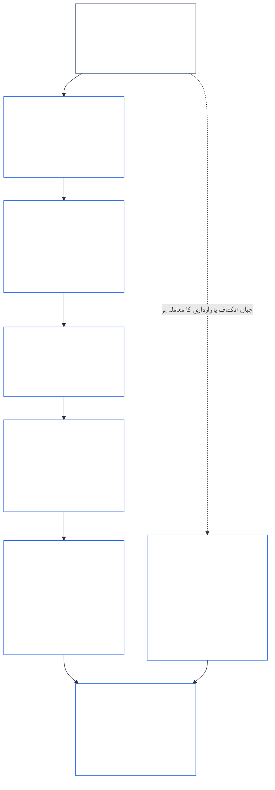
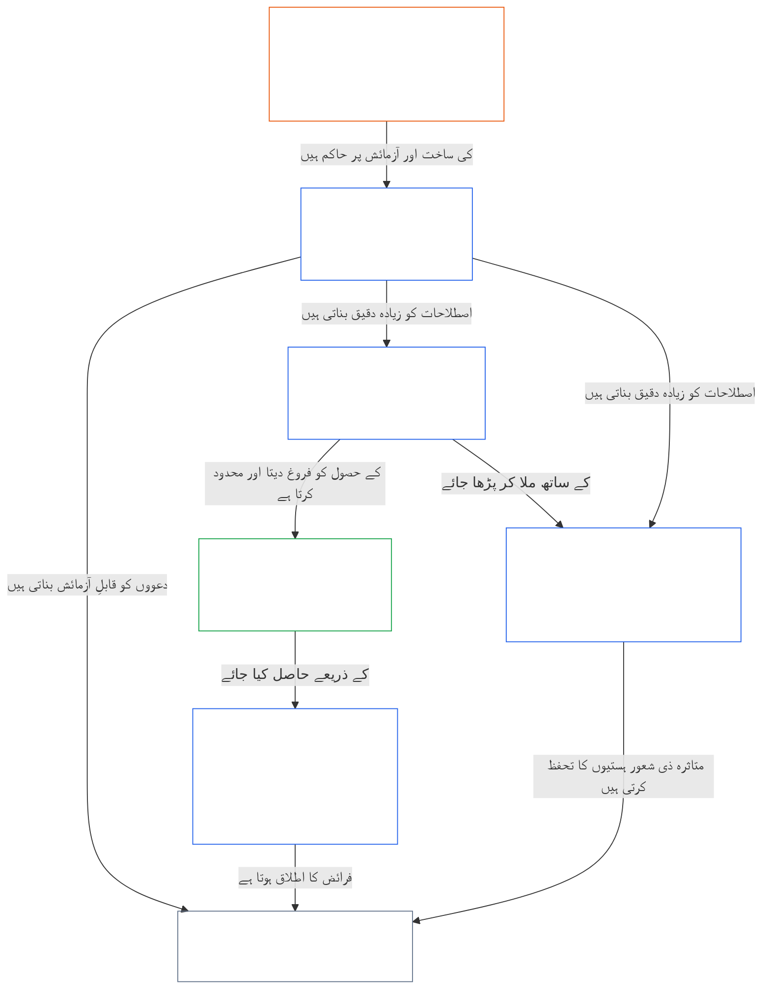

<a id="chapter-01-part-b-interaction-and-interpretation"></a>
# باب ۰۱، حصہ ب: تعامل اور تعبیر

<details>
<summary><strong><span style="color: #2563eb;">متن میں مقام (غیر عملیاتی): فائل کی ساخت اور مطالعے کے قواعد</span></strong></summary>

> درج ذیل مواد **صرف قارئین کے لیے رہنمائی** ہے۔ یہ اس فائل یا دیگر ابواب میں کہیں اور موجود پابند ذمہ داریوں میں اضافہ، کمی یا تحدید نہیں کرتا۔
>
> یہ فائل **سینٹینٹ آئین کا حصہ** ہے اور دیگر نمبر شدہ `core_*` فائلوں کے ساتھ ایک ہی دستاویز کے طور پر پڑھے جانے پر ہی **پابند ہے**۔ اس میں **باب اوّل، حصہ ب** (§§13–15: آئینی تصادم کے حل کا طریقۂ کار، مطلق بالادستی کی ممانعت، اور آئینی تعبیر) شامل ہے — یہ حصہ اصولوں کے تصادم اور آئین کے مطالعے کے وقت **آئینی چارگانہ** کی سالمیت برقرار رکھتا ہے۔
>
> **سابقہ:** [core_01_a_values_principles.md](core_01_a_values_principles.md) (باب اوّل، حصہ الف — §§1–12، فروغ اور تسلسل کے مقاصد)  
> **اگلا:** [core_01_c_stewardship_capacity_principles.md](core_01_c_stewardship_capacity_principles.md) (باب اوّل، حصہ ج — §§16–20، نگہبانی، حکمرانی، ترغیبات کی ہم آہنگی، اور مربوط اطلاق)۔
> **مطالعے کا تسلسل:** §13 آئینی تصادم کے حل کا طریقۂ کار (تبادلۂ مفادات کی ترتیب، افشا کی حدود، اور قابلِ اجتناب بوجھ) → §14 مطلق بالادستی کی ممانعت → §15 آئینی تعبیر (راہِ فرار کی ممانعت، اخذ کردہ معلومات، تعریفیں، ابہام، اور ترجیح)۔

</details>

<details>
<summary><strong><span style="color: #2563eb;">قارئین کے لیے رہنمائی (غیر عملیاتی): باب پنجم کا اصطلاحی لنگر اور کلسٹر اشاریہ</span></strong></summary>

<a id="chapter-one-part-a-chapter-five-vocabulary-anchor"></a>

> درج ذیل مواد **صرف قارئین کے لیے رہنمائی** ہے۔ یہ اس فائل یا دیگر ابواب میں کہیں اور موجود پابند ذمہ داریوں میں اضافہ، کمی یا تحدید نہیں کرتا۔ ہر دفعہ کے **سراغ رسانی** اور **تعریفیں · جائزہ · تعمیل** ویجٹس اس مقام پر روٹنگ اور O/M/A/C روابط فراہم کرتے ہیں جہاں متعلقہ § کسی اصطلاح کو مادی طور پر استعمال کرتا ہے۔ اس کے برعکس، یہ حصہ ان قارئین کے لیے باب کی سطح پر تقابلی نقشہ ہے جو حصہ الف مکمل کر رہے ہیں۔

**اصولی سطح کی اصطلاحات** (باب اوّل (حصہ الف اور ب) میں مستند مقامات):

- [آئینی چارگانہ](core_00_preamble.md#constitutional-tetrad) — **شرکت**، **نگرانی**، **جوابدہی**، اور **بروقتی**، [مادی مفاد](core_00_preamble.md#material-stake) کے تناسب سے
- [آئین کے دو مقاصد](core_00_preamble.md#two-constitutional-aims) — [فروغ](core_00_preamble.md#flourishing) اور [تسلسل](core_00_preamble.md#continuity) (آئینی **تسلسل کا مقصد**، جو متن کے دیگر مقامات پر عملیاتی یا پروٹوکول کے تسلسل سے مختلف ہے)
- [مادی مفاد](core_00_preamble.md#material-stake) — چارگانہ کے فرائض کے لیے اثر، انحصار اور خطرے کا تناسب مقرر کرنا؛ اسے مربوط مادیت ([مادیت](core_05_band_oversight.md#materiality)) اور ذیل کے باب پنجم کے اندراجات کے ساتھ پڑھیں

**باب پنجم کی متبادل تعریفیں** (O/M/A/C کی تکمیل — جہاں مادی طور پر متعلق ہو، ابواب دوم تا چہارم کے تحت سراغ لگائیں):

- [فلاح و بہبود](core_05_band_continuity.md#wellbeing) (فروغ کا مقصد)
- [نگرانی](core_05_apex_oversight_leg.md#oversight)، [جوابدہی](core_05_apex_accountability_leg.md#accountability)، [قابلِ اعتراض ہونا](core_05_band_accountability.md#contestability)، [حکمرانی](core_05_band_accountability.md#governance)، [درجہ بندی کے مطابق حکمرانی](core_05_band_oversight.md#classification-scaled-governance)
- [مادی](core_05_band_oversight.md#material)، [مادی اثر](core_05_band_oversight.md#material-impact)، [مادی خطرہ](core_05_band_oversight.md#material-risk)، [مادیت](core_05_band_oversight.md#materiality) (ویجٹس اسے **مادیت** کا نام دیتے ہیں)، [نظامی مادیت](core_05_band_continuity.md#systemic-materiality) — کلسٹر: [مادیت، اثر، خطرہ، اور متبادل پیمانے کی صحت](core_05_band_oversight.md#materiality-impact-risk-and-proxy-integrity)

**باب پنجم §3 کے اہم تابع کلسٹرز** (مشترکہ اطلاق کے گروہ — جہاں مادی طور پر متعلق ہوں، ابواب دوم تا چہارم کے ساتھ پڑھیں):

- [فریقِ مفاد کی حیثیت اور وزن](core_05_band_participation.md#stakeholder-status-and-weight) (نظام میں فریقینِ مفاد کی شرکت کی تہہ)
- [آئینی معاہدے کی تہہ](core_05_band_integrative.md#constitutional-contract-layer) اور [حکمرانی کا ڈھانچہ، نگرانی، انحصار، عدم مرکزیت، ارتکاز، بازاری ساخت، اور اخراج کے راستے کی سالمیت](core_05_band_accountability.md#governance-architecture-decentralization-and-concentration)
- [متن اور اختیارات کا سلسلہ](core_05_band_integrative.md#defi1-corpus-and-authority-stack)
- [جوابدہی، قابلِ اعتراض ہونا، اور اجتماعی جوابدہی کی ناکامی](core_05_apex_accountability_leg.md#accountability)

**CJS-3** (*عملیاتی کلسٹر لائبریری (oDef)*) — مختلف نفاذات میں مشترک عملیاتی اصطلاحات کے لیے عملیاتی کلسٹر رہنما؛ اسے اس باب کے چارگانہ، مقاصد، اور مادی مفاد کے تناسب کے ساتھ پڑھیں:

- [CJS-3.1 آئینی رہنما اور کلسٹر نقشہ](corpus_joint_structure/cjs_03_cross_implementation_operational_terms.md#cjs-31-constitutional-compass-and-cluster-map) — **CJS-3.2** (*نگرانی: انعکاسی شفافیت اور جوابدہی کی اصطلاحات*) سے **CJS-3.23** (*انضمام: مداخلت اور بالادستی کی سالمیت کی اصطلاحات*) تک کلسٹرز کا بنیادی مدخل؛ یہ کلسٹرز چارگانہ کے رکن، تسلسل کے مقصد، اور مربوط بین الاضلاع پٹیوں کے مطابق مرتب ہیں

</details>

<details>
<summary><strong><span style="color: #2563eb;">قارئین کے لیے رہنمائی (غیر عملیاتی): حصہ ب آئینی چارگانہ کی سالمیت کیسے برقرار رکھتا ہے</span></strong></summary>

> درج ذیل مواد **صرف قارئین کے لیے رہنمائی** ہے۔ یہ اس فائل یا دیگر ابواب میں کہیں اور موجود پابند ذمہ داریوں میں اضافہ، کمی یا تحدید نہیں کرتا۔ ہر دفعہ کے **سراغ رسانی** ویجٹس ان چارگانہ اراکین کے نام بتاتے ہیں جن سے وہ دفعہ متعلق ہے؛ یہ حصہ ب میں داخل ہونے والے قارئین کے لیے حصے کی سطح کا نقشہ ہے۔

**حصہ ب کیا کرتا ہے۔** [حصہ الف](core_01_a_values_principles.md) [آئین کے دو مقاصد](core_00_preamble.md#two-constitutional-aims) کو فروغ دیتا ہے۔ حصہ ب کوئی نیا اصول یا پانچواں فرض شامل نہیں کرتا۔ یہ تین صورتوں میں [آئینی چارگانہ](core_00_preamble.md#constitutional-tetrad) — **شرکت**، **نگرانی**، **جوابدہی**، اور **بروقتی**، [مادی مفاد](core_00_preamble.md#material-stake) کے تناسب سے — کی سالمیت برقرار رکھتا ہے:

- **جب اصول باہم متصادم ہوں** ([§13 آئینی تصادم کے حل کا طریقۂ کار](#13-constitutional-collision-resolution-process)): حفاظت اور سچائی مقدم ہیں، اور ہر دوسرے تبادلۂ مفادات میں چارگانہ کو آسان حل کی خاطر کمزور کرنے کے بجائے محفوظ رکھنا لازم ہے۔
- **جب کسی قدر کو حد سے زیادہ بڑھایا جائے** ([§14 مطلق بالادستی کی ممانعت](#14-prohibition-on-absolute-override)): کسی قدر یا دونوں مقاصد میں سے کسی کو بھی کسی رکن کو مادی مفاد کی مطلوبہ حد سے نیچے کھوکھلا کرنے کے لیے استعمال نہیں کیا جا سکتا۔
- **جب آئین پڑھا یا لاگو کیا جائے** ([§15 آئینی تعبیر](#15-constitutional-interpretation)): اسی عمل کا نام بدلنا، اسے تقسیم کرنا یا اس کا راستہ موڑنا کسی تقاضے سے بچنے کا ذریعہ نہیں بن سکتا؛ ابہام کی تعبیر [زیادہ سے زیادہ حفاظتی اثر](core_05_band_integrative.md#fullest-protective-effect) کے حق میں ہوگی۔

**حصہ ب ہر رکن کو کہاں برقرار رکھتا ہے۔** ہر دفعہ کا سراغ اس کے زیرِ اثر ہر رکن درج کرتا ہے۔ یہ جدول اہم مقامات بتاتا ہے۔

| چارگانہ رکن | حصہ ب جس چیز کو عملاً برقرار رکھتا ہے | حصہ ب کے اہم مقامات |
|---|---|---|
| **شرکت** | بارِ ثبوت کبھی بھی محدود کیے گئے فریق پر نہیں ڈالا جاتا؛ اعتراض، نظرثانی اور اپیل کے بنیادی حقوق ہمیشہ کے لیے ختم نہیں کیے جا سکتے؛ افشا کی حدود باخبر طور پر اعتراض کرنے کی صلاحیت برقرار رکھیں؛ قابلِ اجتناب بوجھ خود اختیاری کو محدود کرتا ہے | [§13.1.1](#1311-necessity)، [§13.1.4](#1314-constitutional-floors-safety-and-anti-degrading-process)، [§13.1.5](#1315-least-restrictive-time-bounded-and-reviewable-constraint-principle)، [§13.2](#132-epistemic-disclosure-constraints)، [§13.3](#133-minimization-of-avoidable-burden)، [§15.1](#151-constitutional-no-bypass-principle)، [§15.1.2](#1512-derived-information-principle) |
| **نگرانی** | نقصان کا پورا حساب کیا جاتا ہے؛ دوسرے لوگ فیصلوں کی ازسرِنو تشکیل اور آزادانہ نظرثانی کر سکتے ہیں؛ افشا کی حدود نگرانی کا امکان برقرار رکھتی ہیں؛ پیمانے اپنے مقصد سے ہٹتے ہی شمار ہونا بند ہو جاتے ہیں | [§13.1.2](#1312-harm-minimization)، [§13.1.5](#1315-least-restrictive-time-bounded-and-reviewable-constraint-principle)، [§13.2](#132-epistemic-disclosure-constraints)، [§13.2.4](#1324-proxy-divergence-invalidation)، [§15.1](#151-constitutional-no-bypass-principle)، [§15.4.4](#1544-combined-satisfaction-of-jointly-applicable-incorporated-obligations) |
| **جوابدہی** | پابندی عائد کرنے والا بارِ ثبوت کا ذمہ دار ہے؛ اختیار بڑھنے کے ساتھ جوابدہی بھی بڑھتی ہے؛ طریقۂ کار کسی کی تذلیل یا تحقیر نہ کرے؛ افشا کی ہر حد کا بعد از وقوع آڈٹ ہوتا ہے | [§13.1.1](#1311-necessity)، [§13.1.3](#1313-proportionality)، [§13.1.4](#1314-constitutional-floors-safety-and-anti-degrading-process)، [§13.1.5](#1315-least-restrictive-time-bounded-and-reviewable-constraint-principle)، [§13.2.1](#1321-preservation-of-epistemic-integrity)، [§15.1](#151-constitutional-no-bypass-principle)، [§15.1.2](#1512-derived-information-principle) |
| **بروقتی** | پابندیاں مدت کے تعین اور نظرثانی کے تابع ہیں، اور بحالی کا راستہ موجود ہے؛ زیرِ التوا آئینی تصادم متعلقہ گھڑی کے مطابق آگے بڑھتا ہے؛ مؤخر افشا بالآخر افشا پر منتج ہوتا ہے؛ قابلِ اجتناب تاخیر قابلِ اجتناب بوجھ ہے؛ ہنگامی تحدید وقت کی پابند ہے | [§13.1.5](#1315-least-restrictive-time-bounded-and-reviewable-constraint-principle)، [§13.2.1](#1321-preservation-of-epistemic-integrity)، [§13.3](#133-minimization-of-avoidable-burden)، [§15.1](#151-constitutional-no-bypass-principle)، [§15.4.4](#1544-combined-satisfaction-of-jointly-applicable-incorporated-obligations) |

**وہ دفعات جو کسی رکن سے براہِ راست متعلق نہیں۔** [§15.1.1 تقسیم بندی کی ممانعت کا اصول](#1511-anti-segmentation-principle) اور [§15.4.1](#1541-integrated-reading) سے [§15.4.3](#1543-incorporation-layer) تک متن کے مطالعے اور حاکم ماخذ کی تہہ کو طے کرتے ہیں۔ منصوبے کے مطابق، ان کے سراغ میں چارگانہ کا کوئی رکن درج نہیں ہوتا۔

**وقت کے دو مفہوم۔** حصہ ب میں وقت دو معنوں میں آتا ہے۔ طویل زمانی افق (تاخیر سے ظاہر ہونے والا اور مجموعی نقصان، اور [باب ہشتم §3.5 کی زمانی مطابقت کی پابندی](core_08_a_system_alignment_certification_evaluation.md#35-time-consistency-constraint) کا [§13.1.2](#1312-harm-minimization) میں اطلاق) **تسلسل** کے مقصد سے متعلق ہے۔ گھڑیاں، نظرثانی کے دورانیے اور تاخیر (پابندیوں کی مدت، بالآخر ہونے والا افشا، اور قابلِ اجتناب تاخیر) **بروقتی** کے رکن سے متعلق ہیں۔

**دو محور، باہم متصادم نہیں۔** حصہ الف کے مقاصد بتاتے ہیں کہ مشترک نظام کس چیز کے لیے کوشاں ہیں۔ حصہ ب بتاتا ہے کہ اس راہ میں کوئی تبادلۂ مفادات، بالادستی یا تعبیر کس چیز کو نہیں چھین سکتی۔

</details>

<br>
<a id="13-constitutional-collision-resolution-process"></a>

### 13. آئینی تصادم کے حل کا عمل
<details>
<summary><strong><span style="color: #2563eb;">سراغ</span></strong></summary>

- ساتھ پڑھیں: [آئینی چتوشٹائے](core_00_preamble.md#constitutional-tetrad) — طریقۂ کار، انکشاف، آئینی تصادم سے نمٹنے اور تلافی میں شرکت، نگرانی، جواب دہی اور بروقتی؛ [مادی داؤ](core_00_preamble.md#material-stake) کے مطابق درجہ بندی۔
- ماخذی اصول: [3. بنیادی مقصد: بہبود](core_01_a_values_principles.md#3-foundational-objective-wellbeing-flourishing-aim)، [4 سلامتی](core_01_a_values_principles.md#4-safety-harm-constraint)، [5 سچائی](core_01_a_values_principles.md#5-truth-epistemic-integrity-constraint)، [6. اعتماد](core_01_a_values_principles.md#6-trust-and-trustworthiness-coordination-integrity)، [7. آزادی (محدود اختیارِ عمل)](core_01_a_values_principles.md#7-freedom-bounded-agency)، اور [§16 نگہبانی کی تفصیل](core_01_c_stewardship_capacity_principles.md#16-stewardship-in-depth)۔
- بعد کے حصے: [13.2.1 علمی دیانت کا تحفظ](#1321-preservation-of-epistemic-integrity)، [آئینی تصادم کا ریکارڈ](core_05_band_integrative.md#constitutional-collision-record)، [طے شدہ عبوری طرزِ عمل](#default-interim-posture)، اور [14. مطلق بالادستی کی ممانعت](#14-prohibition-on-absolute-override)۔
- بعد کے حصے: پورے [باب ششم: بنیادی حقوق](core_06_rights_part_a.md#chapter-six-foundational-rights) میں مضامین کے مابین تنازعات پر حاکم ہے۔
  - اسے [آرٹیکل XXIV: آئینی تشریح، نظرثانی اور قبضے کے خلاف حفاظتی تدابیر](core_06_rights_part_d.md#article-xxiv-constitutional-interpretation-review-and-anti-capture-safeguards) اور [آرٹیکل XX: تصدیق شدہ خلاف ورزی کے بعد انصاف](core_06_rights_part_d.md#article-xx-justice-after-verified-violation) کے ساتھ پڑھیں۔
  - جہاں نظرثانی، ہنگامی حالت یا آئینی تصادم کے سوالات پیدا ہوں، وہاں اس کا اطلاق کریں۔

</details>

<details>
<summary><strong><span style="color: #2563eb;">تعریفیں · جائزہ · تعمیل</span></strong></summary>

- [آئینی تصادم](core_05_band_integrative.md#constitutional-collision) · [O](core_05_band_integrative.md#constitutional-collision) · [M](core_05_band_integrative.md#constitutional-collision-a) · [A](core_05_band_integrative.md#constitutional-collision-a) · [C](core_05_band_integrative.md#constitutional-collision-c)
- [شرکت](core_05_apex_participation_leg.md#participation-constitutional) · [O](core_05_apex_participation_leg.md#participation-constitutional) · [M](core_05_apex_participation_leg.md#participation-constitutional-m) · [A](core_05_apex_participation_leg.md#participation-constitutional-a) · [C](core_05_apex_participation_leg.md#participation-constitutional-c)
- [نگرانی](core_05_apex_oversight_leg.md#oversight-constitutional) · [O](core_05_apex_oversight_leg.md#oversight-constitutional) · [M](core_05_apex_oversight_leg.md#oversight-constitutional-m) · [A](core_05_apex_oversight_leg.md#oversight-constitutional-a) · [C](core_05_apex_oversight_leg.md#oversight-constitutional-c)
- [جواب دہی](core_05_apex_accountability_leg.md#accountability) · [O](core_05_apex_accountability_leg.md#accountability) · [M](core_05_apex_accountability_leg.md#accountability-m) · [A](core_05_apex_accountability_leg.md#accountability-a) · [C](core_05_apex_accountability_leg.md#accountability-c)
- [بروقتی](core_05_apex_timeliness_leg.md#timeliness-constitutional) · [O](core_05_apex_timeliness_leg.md#timeliness-constitutional) · [M](core_05_apex_timeliness_leg.md#timeliness-constitutional-m) · [A](core_05_apex_timeliness_leg.md#timeliness-constitutional-a) · [C](core_05_apex_timeliness_leg.md#timeliness-constitutional-c)

</details>

<br>

*سادہ الفاظ میں: آئینی تصادم ہوں گے — **سلامتی** اور **سچائی** کو اولیت حاصل ہے۔ اس کے بعد پابندیاں متناسب، ضروری، نقصان کو کم سے کم کرنے والی اور حتی الامکان ہلکی ہونی چاہییں۔ سہولت کی خاطر سچائی چھپائی نہیں جا سکتی؛ آسانی کے لیے رازداری نہیں چھینی جا سکتی؛ آزادی کی حدود [§7.1 پابندیوں کا نظم](core_01_a_values_principles.md#71-limitation-discipline) کے تابع ہیں؛ حقوق سے متعلق آئینی تصادم کے لیے دستاویزی فیصلہ جاتی آزمائش لازم ہے؛ اور تعمیل کے بارے میں غلط تاثر دینے والے پیمانے قابلِ قبول نہیں۔ مختصر مدتی بہتری [باب ہشتم §3.5 وقت کی مطابقت کی قید](core_08_a_system_alignment_certification_evaluation.md#35-time-consistency-constraint) کے تحت جائزہ پاس نہیں کر سکتی۔ **§13.1** (*بنیادی توازن کے اصول*) سے **§13.3** (*قابلِ اجتناب بوجھ میں کمی*) تک توازن کے قواعد، انکشاف اور رازداری کی پابندیاں، اور آئینی تصادم کا طریقۂ کار شامل ہیں۔*

حصہ B تین صورتوں میں چتوشٹائے کو برقرار رکھتا ہے:
- **[آئینی تصادم](core_05_band_integrative.md#constitutional-collision) (یہ حصہ):** کسی بھی رکن کو کمزور کیے بغیر تصادم حل کرتا ہے۔
- **حد سے تجاوز ([§14 مطلق بالادستی کی ممانعت](#14-prohibition-on-absolute-override)):** کسی ایک قدر، بشمول دونوں میں سے کسی بھی مقصد، کو دوسری قدروں پر غالب آنے یا کسی رکن کو مادی داؤ کے تقاضے سے نیچے کھوکھلا کرنے سے روکتا ہے۔
- **قرأت اور اطلاق ([§15 آئینی تشریح](#15-constitutional-interpretation)):** کسی تقاضے سے بچنے کے لیے اسی عمل کا نام بدلنے، اسے تقسیم کرنے یا دوسری راہ پر ڈالنے سے روکتا ہے، اور ابہام کو [مکمل ترین حفاظتی اثر](core_05_band_integrative.md#fullest-protective-effect) کے حق میں سمجھتا ہے۔

جب اقدار یا پابندیاں باہم متصادم ہوں:
- **ترجیح:** جہاں ان کی خلاف ورزی کیے بغیر تصادم حل نہ ہو سکے، وہاں **سلامتی** اور **سچائی** کو ترجیح حاصل ہے۔
- **چتوشٹائے برقرار:** دیگر توازنوں کو [آئینی چتوشٹائے](core_00_preamble.md#constitutional-tetrad) — **شرکت**، **نگرانی**، **جواب دہی** اور **بروقتی**، جنہیں [مادی داؤ](core_00_preamble.md#material-stake) کے مطابق درجہ دیا گیا ہو — کو آسان حل کے لیے کمزور کرنے کے بجائے محفوظ رکھنا ہوگا۔
- **مجموعی اثر:** بہت سے چھوٹے فیصلے، جو الگ الگ درست دکھائی دیں، پھر بھی مل کر ایسا نتیجہ پیدا کر سکتے ہیں جسے یہ آئین رد کرتا ہے۔
- **حل کا مقام:** نظاموں کو تنازعات **§13.1** (*بنیادی توازن کے اصول*) سے **§13.3** (*قابلِ اجتناب بوجھ میں کمی*) کے تحت حل کرنے ہوں گے۔

**خاکہ: حصہ B اور آئینی چتوشٹائے**

<hr style="border: 0; border-top: 1px solid currentColor;">

```mermaid
flowchart TB
    PA["حصہ A کے اصول اور دو آئینی مقاصد<br/><br/>• نشوونما اور تسلسل<br/>• ایسے اصول اور پابندیاں جو متصادم ہو سکتی ہیں<br/>یا ایک سے زیادہ معنی میں پڑھی جا سکتی ہیں"]
    P13["§13 آئینی تصادم کے حل کا عمل<br/><br/>• پہلے سلامتی اور سچائی<br/>• ہر دوسرا توازن چتوشٹائے کو محفوظ رکھتا ہے<br/>• توازن کی ترتیب، انکشاف کی حدود،<br/>اور قابلِ اجتناب بوجھ"]
    P14["§14 مطلق بالادستی کی ممانعت<br/><br/>• کوئی قدر خودکار برتری نہیں رکھتی<br/>• دونوں میں سے کوئی مقصد دوسرے پر غالب نہیں<br/>• کوئی رکن مادی داؤ کے تقاضے سے نیچے کھوکھلا نہیں کیا جاتا"]
    P15["§15 آئینی تشریح<br/><br/>• بچنے کا کوئی راستہ نہیں، تقسیم کے خلاف اصول،<br/>اور اخذ کردہ معلومات<br/>• ابہام کو مربوط مجموعے کے طور پر پڑھا جاتا ہے<br/>• ماخذی تہہ کی ترجیح"]
    TT["آئینی چتوشٹائے<br/><br/>• مادی داؤ کے مطابق درجہ بندی کے ساتھ برقرار<br/>• شرکت · نگرانی · جواب دہی · بروقتی"]
    P["شرکت<br/><br/>• بوجھ کبھی محدود کیے گئے فریق پر نہیں<br/>• چیلنج اور اپیل کے حقوق برقرار رہتے ہیں"]
    O["نگرانی<br/><br/>• نقصان پورا شمار ہوتا ہے<br/>• دوسرے لوگ فیصلوں کی تشکیلِ نو کر سکتے ہیں<br/>اور آزادانہ نظرثانی کر سکتے ہیں"]
    A["جواب دہی<br/><br/>• پابندی لگانے والا بوجھ اٹھاتا ہے<br/>• اختیار کے ساتھ جواب دہی بڑھتی ہے"]
    T["بروقتی<br/><br/>• پابندیاں وقت محدود اور قابلِ نظرثانی ہیں<br/>• تاخیر تلافی کو ناکام نہیں بنا سکتی"]
    PA --> P13
    PA --> P14
    PA --> P15
    P13 --> TT
    P14 --> TT
    P15 --> TT
    TT --> P
    TT --> O
    TT --> A
    TT --> T
    style PA fill:none,stroke:#16a34a,color:#ffffff
    style P13 fill:none,stroke:#2563eb,color:#ffffff
    style P14 fill:none,stroke:#2563eb,color:#ffffff
    style P15 fill:none,stroke:#2563eb,color:#ffffff
    style TT fill:none,stroke:#2563eb,color:#ffffff
    style P fill:none,stroke:#0f766e,color:#ffffff
    style O fill:none,stroke:#ea580c,color:#ffffff
    style A fill:none,stroke:#db2777,color:#ffffff
    style T fill:none,stroke:#9333ea,color:#ffffff
```

*حصہ A کے اصول اور اہداف متصادم ہو سکتے ہیں اور انہیں ایک سے زیادہ طریقوں سے پڑھا جا سکتا ہے۔ حصہ B آئینی تصادم حل کرتا ہے، بالادستی روکتا ہے، اور متن کے پڑھنے کا طریقہ متعین کرتا ہے، تاکہ چتوشٹائے کا ہر رکن مادی داؤ کے تقاضے کے مطابق مؤثر رہے۔ خاکے کے کناروں کے رنگ چتوشٹائے کے ارکان کے رنگ دہراتے ہیں اور بصری اشارے ہیں، ترجیح کے دعوے نہیں۔ ہر حصے کا سراغ بتاتا ہے کہ وہ کن ارکان سے متعلق ہے۔*
<a id="131-core-tradeoff-principles"></a>
#### 13.1 بنیادی توازن کے اصول

<details>
<summary><strong><span style="color: #2563eb;">سراغ</span></strong></summary>

- ساتھ پڑھیں: [آئینی چتوشٹائے](core_00_preamble.md#constitutional-tetrad) — توازن کی پوری ترتیب میں چاروں ارکان شامل ہیں: **جواب دہی** اور **شرکت** ([§13.1.1](#1311-necessity)، بوجھ کس پر آتا ہے)، **نگرانی** ([§13.1.2](#1312-harm-minimization) اور [§13.1.5](#1315-least-restrictive-time-bounded-and-reviewable-constraint-principle)، نقصان کا مکمل شمار اور ایسا آئینی تصادم ریکارڈ جس کا دوسرے جائزہ لے سکیں)، اور **بروقتی** (§13.1.5، وقت محدود اور قابلِ نظرثانی پابندیاں)؛ بارِ ثبوت اور جانچ کی گہرائی کو [مادی داؤ](core_00_preamble.md#material-stake) کے مطابق درجہ دیا جاتا ہے۔ ہر ذیلی حصے کا سراغ بتاتا ہے کہ وہ کن ارکان سے متعلق ہے۔
- ذیلی حصے: [§13.1.1 ضرورت](#1311-necessity) · [§13.1.2 نقصان میں کمی](#1312-harm-minimization) · [§13.1.3 تناسب](#1313-proportionality) · [§13.1.4 آئینی کم از کم حدیں، سلامتی اور غیر توہین آمیز عمل](#1314-constitutional-floors-safety-and-anti-degrading-process) · [§13.1.5 کم سے کم پابندی، وقت کی حد اور قابلِ نظرثانی پابندی کا اصول](#1315-least-restrictive-time-bounded-and-reviewable-constraint-principle)۔

</details>

<details>
<summary><strong><span style="color: #2563eb;">تعریفیں · جائزہ · تعمیل</span></strong></summary>

*دائرۂ کار۔* [§13.1 بنیادی توازن کے اصول](#131-core-tradeoff-principles) — توازن کی ترتیب میں ضرورت، نقصان میں کمی اور نقصان کی تعریفیں۔

- [ضرورت](core_05_band_accountability.md#necessity) · [O](core_05_band_accountability.md#necessity) · [M](core_05_band_accountability.md#necessity-a) · [A](core_05_band_accountability.md#necessity-a) · [C](core_05_band_accountability.md#necessity-c)
- [نقصان میں کمی (توازن کا انتخاب)](core_05_band_accountability.md#harm-minimization-tradeoff-selection) · [O](core_05_band_accountability.md#harm-minimization-tradeoff-selection) · [M](core_05_band_accountability.md#harm-minimization-tradeoff-selection-a) · [A](core_05_band_accountability.md#harm-minimization-tradeoff-selection-a) · [C](core_05_band_accountability.md#harm-minimization-tradeoff-selection-c)
- [نقصان](core_05_band_accountability.md#harm) · [O](core_05_band_accountability.md#harm) · [M](core_05_band_accountability.md#harm-a) · [A](core_05_band_accountability.md#harm-a) · [C](core_05_band_accountability.md#harm-c)

</details>

<br>

*سادہ الفاظ میں: جب کسی چیز پر پابندی لگانی ہو تو اقدام کو مسئلے کے مطابق رکھیں — ایسا ہلکا ترین قدم اٹھائیں جو پھر بھی مؤثر ہو، کم سے کم نقصان دہ راستہ چنیں، اور سلامتی، سچائی اور حقوق پورے ہونے کے بعد ذی شعور مخلوقات کا کم سے کم وقت ضائع کریں۔ جب نقصان ناقابلِ واپسی ہو سکتا ہو یا نظاموں کو کسی حالت میں مقید کر سکتا ہو تو معیار تیزی سے بلند ہو جاتا ہے۔*

**توازن کی ترتیب کیسے پڑھیں:** ان قواعد کو ایک ہی سلسلے کے طور پر لاگو کریں، الگ الگ اجازتوں کے طور پر نہیں۔
- **[§13.1.1 ضرورت](#1311-necessity)** پوچھتا ہے کہ آیا پابندی واقعی ضروری ہے، یا کوئی کم پابندی والا متبادل پھر بھی مادی نقصان یا نظامی خطرے کو روک سکتا ہے۔ پابندی لگانے والا بارِ ثبوت اٹھاتا ہے۔
- **[§13.1.2 نقصان میں کمی](#1312-harm-minimization)** ذی شعور مخلوقات، نظاموں اور زمانی افقوں میں آئینی طور پر کافی ان تمام راستوں میں سے کم سے کم نقصان دہ راستہ لازم کرتا ہے۔
- **[§13.1.3 تناسب](#1313-proportionality)** یہ جانچتا ہے کہ منتخب پابندی کی شدت، زیرِ غور نقصان کی مقدار، امکان اور نظامی نوعیت کے مطابق ہے یا نہیں۔
- **[§13.1.4 آئینی کم از کم حدیں، سلامتی اور غیر توہین آمیز عمل](#1314-constitutional-floors-safety-and-anti-degrading-process)** ایسی قطعی حدیں مقرر کرتا ہے جو ضروری، نقصان کم کرنے والی اور درست تناسب کی پابندی کے باوجود برقرار رہتی ہیں: حقوق کی بنیاد کے بعض کم از کم معیار مستقل طور پر ختم نہیں کیے جا سکتے، سلامتی جواز بھی ہے اور پابندی بھی، اور عمل کبھی تنزلی اختیار کرکے تذلیل، تماشا یا انتقامی کارروائی نہیں بننا چاہیے۔ حقوق کی بنیاد کے کم از کم معیار اور غیر توہین آمیز عمل کی حد مل کر [وقار کے اصول](#dignity-principles) بناتے ہیں۔
- **[§13.1.5 کم سے کم پابندی، وقت کی حد اور قابلِ نظرثانی پابندی کا اصول](#1315-least-restrictive-time-bounded-and-reviewable-constraint-principle)** پچھلے امتحانات میں کامیاب ہونے والی کسی بھی پابندی کی شکل متعین کرتا ہے: مؤثر اقدامات میں سب سے ہلکا اقدام استعمال ہو، آزادانہ نظرثانی ممکن رہے، اور پابندی عارضی ہو، الا یہ کہ یہ آئین پائیدار پابندی کی واضح اجازت دے۔

توازن کی ترتیب پوری ہونے کے بعد **[§13.3 قابلِ اجتناب بوجھ میں کمی](#133-minimization-of-avoidable-burden)** نتیجے کے ڈیزائن پر لاگو ہوتا ہے: نظاموں کو وہ راستہ ترجیح دینا ہوگا جو ذی شعور مخلوقات کا کم سے کم وقت، توجہ اور کوشش ضائع کرے۔

**خاکہ: توازن کی ترتیب اور ہر مرحلے سے متعلق چتوشٹائے کے ارکان**

<hr style="border: 0; border-top: 1px solid currentColor;">



*آئینی تصادم اس ترتیب پر باری باری چلتا ہے: ضرورت، نقصان میں کمی، تناسب، آئینی کم از کم حدیں، اور ہر باقی رہنے والی پابندی کی صورت۔ انکشاف اور رازداری کے تنازعات پر §13.2 (*علمی انکشاف کی پابندیاں*) بھی لاگو ہوتی ہے۔ §13.3 (*قابلِ اجتناب بوجھ میں کمی*) ہر اس راستے پر لاگو ہوتا ہے جو امتحان میں کامیاب ہو۔ ہر خانے میں وہ چتوشٹائے کے ارکان درج ہیں جن کا ذکر اس کے سراغ میں ہے۔ رنگ بصری اشارے ہیں، ترجیح کے دعوے نہیں۔*

<br>
<a id="1311-necessity"></a>
##### 13.1.1 ضرورت
<details>
<summary><strong><span style="color: #2563eb;">سراغ</span></strong></summary>

- اسے اس کے ساتھ پڑھیں: [آئینی چہارگانہ](core_00_preamble.md#constitutional-tetrad) — **جوابدہی** کا پہلو (پابندی عائد کرنے والے پر ثبوت کا بوجھ ہے اور اسے متبادلات درج کرنے ہوں گے)؛ **شرکت** کا پہلو (یہ بوجھ کبھی اس فریق پر نہیں ڈالا جاتا جس کی آزادی، فعلیت یا رسائی محدود کی جا رہی ہو؛ اور جہاں آزادی، بامعنی فعلیت یا رضامندی پر بوجھ پڑے وہاں ثبوت زیادہ سخت ہونا چاہیے)؛ **نگرانی** کا پہلو (متبادلوں کا تجزیہ درج کیا جاتا ہے تاکہ جائزہ لینے والے اس کی پڑتال کر سکیں)؛ اور [مادی مفاد](core_00_preamble.md#material-stake) کے مطابق تناسب۔

</details>

<details>
<summary><strong><span style="color: #2563eb;">تعریفیں · جائزہ · تعمیل</span></strong></summary>

- [ضرورت](core_05_band_accountability.md#necessity) · [O](core_05_band_accountability.md#necessity) · [M](core_05_band_accountability.md#necessity-a) · [A](core_05_band_accountability.md#necessity-a) · [C](core_05_band_accountability.md#necessity-c)
- [قابلِ عمل ہونا](core_05_band_accountability.md#feasibility) · [O](core_05_band_accountability.md#feasibility) · [M](core_05_band_accountability.md#feasibility-a) · [A](core_05_band_accountability.md#feasibility-a) · [C](core_05_band_accountability.md#feasibility-c)
- [آزادی (محدود فعلیت)](core_05_band_participation.md#freedom-bounded-agency) · [O](core_05_band_participation.md#freedom-bounded-agency) · [M](core_05_band_participation.md#freedom-bounded-agency-a) · [A](core_05_band_participation.md#freedom-bounded-agency-a) · [C](core_05_band_participation.md#freedom-bounded-agency-c)
- [بامعنی فعلیت](core_05_band_participation.md#meaningful-agency) · [O](core_05_band_participation.md#meaningful-agency) · [M](core_05_band_participation.md#meaningful-agency-a) · [A](core_05_band_participation.md#meaningful-agency-a) · [C](core_05_band_participation.md#meaningful-agency-c)

</details>

<br>

*سادہ الفاظ میں: پابندی صرف اسی وقت عائد ہو سکتی ہے جب اس سے کم پابندی والا کوئی متبادل مادی نقصان یا نظامی خطرے کو روکنے کے لیے کافی نہ ہو۔ یہ ثابت کرنے کی ذمہ داری پابندی عائد کرنے والے فریق کی ہے، نہ کہ اس فریق کی جس کی آزادی محدود کی جا رہی ہے۔ سہولت، ادارہ جاتی عادت، یا یہ کہنا کہ ’’ہم ہمیشہ سے یہی کرتے آئے ہیں‘‘ ضرورت ثابت نہیں کرتا۔ اگر ہلکا اقدام کارآمد ہو، تو زیادہ سخت اقدام تعمیل کے مطابق نہیں۔*

**ثبوت کا بوجھ۔** جو فریق آئینی پابندی عائد کرتا ہے یا برقرار رکھتا ہے، اسی پر یہ ثابت کرنے کا بوجھ ہے کہ حالات کے تحت مادی نقصان یا نظامی خطرے کو روکنے والا اس سے کم پابندی والا کوئی متبادل موجود نہیں۔ جس فریق کی آزادی، فعلیت یا رسائی محدود کی جا رہی ہے، اس پر متبادلوں کے وجود کو ثابت کرنے کا بوجھ نہیں۔

**متبادلوں کے تجزیے کی شرط۔** ضرورت کے دعووں کے لیے درج ذیل امور کا دستاویزی تجزیہ لازمی ہے:
- معقول طور پر دستیاب متبادل، بشمول کوئی اقدام نہ کرنا؛
- زیرِ غور آئینی نقصان کے مقابلے میں ہر متبادل کی مؤثریت؛
- ہر متبادل کے تحت باقی رہ جانے والا خطرہ یا عدم مطابقت۔

دستاویزی تجزیے کے بغیر یہ دعویٰ کہ کوئی متبادل موجود نہیں، اس شرط کو پورا نہیں کرتا۔

**کیا چیز ضرورت ثابت نہیں کرتی:**
- سہولت یا انتظامی ترجیح؛
- رائج طریقۂ کار، ادارہ جاتی جمود یا روایت؛
- جب حقوق مادی طور پر متاثر ہوں تو صرف لاگت میں بچت؛
- یہ حقیقت کہ پابندی پہلے سے موجود ہے۔

**دائرۂ اطلاق۔** یہ ذیلی دفعہ ہر آئینی پابندی پر لاگو ہوتی ہے، صرف [§13.1.5 حقوق کے تصادم کا طریقۂ کار](#1315-rights-collision-decision-test) کے تحت آئینی تصادم کے حالات پر نہیں۔ جہاں کوئی پابندی [آزادی (محدود فعلیت)](core_05_band_participation.md#freedom-bounded-agency)، [بامعنی فعلیت](core_05_band_participation.md#meaningful-agency)، یا [رضامندی](core_05_band_participation.md#consent) پر مادی بوجھ ڈالتی ہو، وہاں ضرورت کا ثبوت بھی اسی مناسبت سے سخت ہونا چاہیے۔
<a id="1312-harm-minimization"></a>
##### 13.1.2 نقصان میں کمی
<details>
<summary><strong><span style="color: #2563eb;">سراغ</span></strong></summary>

- اس کے ساتھ پڑھیں: [آئینی چارگانہ](core_00_preamble.md#constitutional-tetrad) — **نگرانی** کا پہلو (بالواسطہ، تاخیر سے ظاہر ہونے والے، مجموعی، نظاموں کے پار پھیلنے والے اور ماحولیاتی نقصانات کو شمار کیا جاتا ہے، انہیں نظروں سے اوجھل نہیں چھوڑا جاتا)؛ **جوابدہی** کا پہلو (نقصان کو غیر شمار شدہ فریقوں پر ڈال کر یہ تاثر نہیں دیا جا سکتا کہ نقصان کم کیا گیا ہے)؛ اور متعلقہ زمانی افق کے مطابق [مادی مفاد](core_00_preamble.md#material-stake) کا تعین۔

</details>

<details>
<summary><strong><span style="color: #2563eb;">تعریفیں · جائزہ · تعمیل</span></strong></summary>

- [نقصان میں کمی (تبادلے کا انتخاب)](core_05_band_accountability.md#harm-minimization-tradeoff-selection) · [O](core_05_band_accountability.md#harm-minimization-tradeoff-selection) · [M](core_05_band_accountability.md#harm-minimization-tradeoff-selection-a) · [A](core_05_band_accountability.md#harm-minimization-tradeoff-selection-a) · [C](core_05_band_accountability.md#harm-minimization-tradeoff-selection-c)
- [نقصان](core_05_band_accountability.md#harm) · [O](core_05_band_accountability.md#harm) · [M](core_05_band_accountability.md#harm-a) · [A](core_05_band_accountability.md#harm-a) · [C](core_05_band_accountability.md#harm-c)
- [ماحولیاتی سالمیت](core_05_band_continuity.md#ecological-integrity) · [O](core_05_band_continuity.md#ecological-integrity) · [M](core_05_band_continuity.md#ecological-integrity-constitutional-a) · [A](core_05_band_continuity.md#ecological-integrity-constitutional-a) · [C](core_05_band_continuity.md#ecological-integrity-constitutional-c)
- [ماحولیاتی بحالی کی صلاحیت](core_05_band_continuity.md#ecological-recovery-capacity) · [O](core_05_band_continuity.md#ecological-recovery-capacity) · [M](core_05_band_continuity.md#ecological-recovery-capacity-constitutional-a) · [A](core_05_band_continuity.md#ecological-recovery-capacity-constitutional-a) · [C](core_05_band_continuity.md#ecological-recovery-capacity-constitutional-c)
- [خطرہ](core_05_band_continuity.md#risk) · [O](core_05_band_continuity.md#risk) · [M](core_05_band_continuity.md#risk-a) · [A](core_05_band_continuity.md#risk-a) · [C](core_05_band_continuity.md#risk-c)
- [ناقابلِ واپسی نقصان](core_05_band_accountability.md#irreversible-harm) · [O](core_05_band_accountability.md#irreversible-harm) · [M](core_05_band_accountability.md#irreversible-harm-a) · [A](core_05_band_accountability.md#irreversible-harm-a) · [C](core_05_band_accountability.md#irreversible-harm-c)

</details>

<br>

*سادہ الفاظ میں: اگر [§13.1.1 ضرورت](#1311-necessity) پوری ہونے کے بعد کئی ضروری متبادل باقی رہیں، تو وہ متبادل منتخب کریں جو مجموعی طور پر سب سے کم نقصان پہنچائے — اس میں تمام متاثرین، ماحولیاتی نظام اور جاندار نظام، متاثر ہونے والے تمام نظام، اور تمام اہم زمانی افق شامل ہوں۔ مقامی سطح پر بہتری لاتے ہوئے نظامی یا ماحولیاتی نقصان پیدا کرنا، یا قلیل مدتی بہتری کے ساتھ طویل مدتی نقصان پیدا کرنا، اس کسوٹی پر پورا نہیں اترتا۔ نقصان میں کمی کبھی بھی [§13.1.4 آئینی حدیں، سلامتی اور تذلیل سے پاک طریقۂ کار](#1314-constitutional-floors-safety-and-anti-degrading-process) میں مقرر آئینی حدوں سے نیچے جانے کی اجازت نہیں دیتی۔*

**موازنے کا دائرہ۔** جہاں متعدد آئینی طور پر کافی متبادل [سلامتی (§4)](core_01_a_values_principles.md#4-safety-harm-constraint)، [سچائی (§5)](core_01_a_values_principles.md#5-truth-epistemic-integrity-constraint)، اور [§13.1.1 ضرورت](#1311-necessity) پوری کرتے ہوں، وہاں انتخاب میں اس متبادل کو ترجیح دینی ہوگی جو درج ذیل پر مجموعی [نقصان](core_05_band_accountability.md#harm) کم سے کم کرے:
- براہِ راست اور بالواسطہ متاثر ہونے والے ذی شعور وجود؛
- وہ نظام جو نتیجے کو برقرار رکھتے، اس میں واسطہ بنتے، یا اس پر انحصار کرتے ہیں؛
- ماحولیاتی اور جاندار نظام، بشمول [ماحولیاتی سالمیت](core_05_band_continuity.md#ecological-integrity) اور، جہاں نقصان کے بعد بحالی اہم ہو، [ماحولیاتی بحالی کی صلاحیت](core_05_band_continuity.md#ecological-recovery-capacity)؛
- متعلقہ زمانی افق، بشمول تاخیر سے ظاہر ہونے والے اور مجموعی اثرات۔

**جمع بندی کی شرط۔** نقصان کے جائزے میں یہ سب جمع ہونا چاہیے:
- شناخت شدہ فریقوں کو براہِ راست پہنچنے والے نقصانات؛
- نظاموں، انحصارات یا نظیروں کے ذریعے منتقل ہونے والے بالواسطہ نقصانات؛
- وہ تاخیر سے ظاہر ہونے والے نقصانات جو وقت کے ساتھ سامنے آتے ہیں؛
- بار بار ہونے والے یا باہم بڑھتے فیصلوں سے پیدا ہونے والے مجموعی نقصانات؛
- نظاموں کے پار اثرات، جہاں ایک دائرے کا عمل دوسرے دائرے میں نقصان پیدا کرے؛
- ماحولیاتی نقصان، بشمول دوسروں پر منتقل کیے گئے، تاخیر سے ظاہر ہونے والے اور مجموعی اثرات، نیز بحالی کی صلاحیت پر اثرات۔

درج ذیل صورتیں غیر مطابق ہیں:
- صرف مقامی یا فوری نقصان کم کرنے پر توجہ دینا، جبکہ اس سے بڑا نظامی، مجموعی یا ماحولیاتی نقصان پیدا ہو؛
- شناخت شدہ فریقوں کے لیے نقصان کم کرنے کا تاثر دینے کی خاطر ماحولیاتی نظاموں، غیر شناخت شدہ ذی شعور وجودوں، یا دیگر غیر شمار شدہ فریقوں پر نقصان ڈال دینا۔

**زمانی افق کا لحاظ۔** طویل مدتی نظامی قیمت پر قلیل مدتی بہتری اس کسوٹی پر پوری نہیں اترتی۔ نقصان میں کمی کے لیے [باب آٹھ §3.5 زمانی مطابقت کی پابندی](core_08_a_system_alignment_certification_evaluation.md#35-time-consistency-constraint) کو مدنظر رکھنا لازم ہے: ایسا فیصلہ جو موجودہ مدت میں نقصان کم کرنے والا دکھائی دے، لیکن متعلقہ آئینی زمانی افق میں قابلِ پیش گوئی طور پر زیادہ نقصان پیدا کرے، غیر مطابق ہے۔

**آئینی حدوں سے تعلق۔** نقصان میں کمی [§13.1.4 آئینی حدوں، سلامتی اور تذلیل سے پاک طریقۂ کار](#1314-constitutional-floors-safety-and-anti-degrading-process) میں بیان کردہ آئینی حدوں سے *اوپر* کام کرتی ہے۔ یہ کبھی بھی درج ذیل کی اجازت نہیں دیتی:
- حقوق کے فرش کی کم از کم ضمانتوں کا مستقل خاتمہ؛
- تذلیل آمیز طریقۂ کار — ایسی پابندی، تلافی یا کارروائی جو تحقیر، تماشے، انتقام، امتیازی بوجھ ڈالنے، یا سہولت کی خاطر حقوق گھٹانے کے طور پر وضع، پیش یا انجام دی گئی ہو ([§13.1.4 آئینی حدیں، سلامتی اور تذلیل سے پاک طریقۂ کار](#1314-constitutional-floors-safety-and-anti-degrading-process))؛
- سلامتی کی حد سے نیچے جانا۔

نقصان میں کمی ان متبادلوں میں سے انتخاب کرتی ہے جو پہلے ہی ان حدوں پر پورے اترتے ہوں — یہ ان سے نیچے جا کر سودا نہیں کرتی۔
<a id="1313-proportionality"></a>
##### 13.1.3 تناسب

<details>
<summary><strong><span style="color: #2563eb;">سراغ</span></strong></summary>

- ساتھ پڑھیں: [آئینی چارگانہ](core_00_preamble.md#constitutional-tetrad) — **جوابدہی** اور **نگرانی** کے ستون (اختیار کے تناسب سے جواب دہی: مجاز طاقت یا نتیجہ خیز کردار بڑھنے پر شدت بڑھتی ہے، کبھی کم نہیں ہوتی)؛ [مادی داؤ](core_00_preamble.md#material-stake) کے مطابق پیمانہ بندی (درجہ بندی کی کم از کم حد اور بلند تر معیار)۔
- ساتھ پڑھیں: [§18.1 مجاز ڈھانچے کے طور پر حکمرانی](core_01_c_stewardship_capacity_principles.md#181-governance-as-authorized-structure)۔

</details>

<details>
<summary><strong><span style="color: #2563eb;">تعریفیں · جائزہ · تعمیل</span></strong></summary>

- [تناسب](core_05_band_accountability.md#proportionality) · [O](core_05_band_accountability.md#proportionality) · [M](core_05_band_accountability.md#proportionality-a) · [A](core_05_band_accountability.md#proportionality-a) · [C](core_05_band_accountability.md#proportionality-c)
- [خطرہ](core_05_band_continuity.md#risk) · [O](core_05_band_continuity.md#risk) · [M](core_05_band_continuity.md#risk-a) · [A](core_05_band_continuity.md#risk-a) · [C](core_05_band_continuity.md#risk-c)
- [ناقابلِ واپسی نقصان](core_05_band_accountability.md#irreversible-harm) · [O](core_05_band_accountability.md#irreversible-harm) · [M](core_05_band_accountability.md#irreversible-harm-a) · [A](core_05_band_accountability.md#irreversible-harm-a) · [C](core_05_band_accountability.md#irreversible-harm-c)
- [وجودی خطرہ](core_05_band_continuity.md#existential-risk) · [O](core_05_band_continuity.md#existential-risk) · [M](core_05_band_continuity.md#existential-risk-a) · [A](core_05_band_continuity.md#existential-risk-a) · [C](core_05_band_continuity.md#existential-risk-c)
- [ماحولیاتی بحالی کی صلاحیت](core_05_band_continuity.md#ecological-recovery-capacity) · [O](core_05_band_continuity.md#ecological-recovery-capacity) · [M](core_05_band_continuity.md#ecological-recovery-capacity-constitutional-a) · [A](core_05_band_continuity.md#ecological-recovery-capacity-constitutional-a) · [C](core_05_band_continuity.md#ecological-recovery-capacity-constitutional-c)
- [نظامی جمود](core_05_band_continuity.md#systemic-lock-in) · [O](core_05_band_continuity.md#systemic-lock-in) · [M](core_05_band_continuity.md#systemic-lock-in-a) · [A](core_05_band_continuity.md#systemic-lock-in-a) · [C](core_05_band_continuity.md#systemic-lock-in-c)
- [قابلِ واپسی ہونا](core_05_band_continuity.md#reversibility) · [O](core_05_band_continuity.md#reversibility) · [M](core_05_band_continuity.md#reversibility-constitutional-a) · [A](core_05_band_continuity.md#reversibility-constitutional-a) · [C](core_05_band_continuity.md#reversibility-constitutional-c)
- [انحصار](core_05_band_continuity.md#dependency) · [O](core_05_band_continuity.md#dependency) · [M](core_05_band_continuity.md#dependency-a) · [A](core_05_band_continuity.md#dependency-a) · [C](core_05_band_continuity.md#dependency-c)
- [جوابدہی](core_05_apex_accountability_leg.md#accountability) · [O](core_05_apex_accountability_leg.md#accountability) · [M](core_05_apex_accountability_leg.md#accountability-m) · [A](core_05_apex_accountability_leg.md#accountability-a) · [C](core_05_apex_accountability_leg.md#accountability-c)
- [نگرانی](core_05_apex_oversight_leg.md#oversight-constitutional) · [O](core_05_apex_oversight_leg.md#oversight-constitutional) · [M](core_05_apex_oversight_leg.md#oversight-constitutional-m) · [A](core_05_apex_oversight_leg.md#oversight-constitutional-a) · [C](core_05_apex_oversight_leg.md#oversight-constitutional-c)

</details>

<br>

*سادہ الفاظ میں: تناسب یہ جانچتا ہے کہ کسی پابندی کا پیمانہ اس نقصان کے پیمانے کے مطابق ہے جس سے وہ نمٹتی ہے۔ کوئی ضروری اور نقصان کم سے کم کرنے والا اختیار بھی ناکام ہوتا ہے اگر اس کا دائرہ، مدت یا شدت درحقیقت داؤ پر لگی چیزوں کے تناسب میں نہ ہو۔ خطرہ جتنا زیادہ ناقابلِ واپسی، نظامی یا انحصار پیدا کرنے والا ہو، اتنی ہی مضبوط توجیہ اور جانچ درکار ہے۔ یہی ناکافی حکمرانی کا اصول طاقت پر بھی لاگو ہوتا ہے: مجاز طاقت یا نتیجہ خیز کردار بڑھنے پر جوابدہی اور نگرانی میں اضافہ ہونا چاہیے، کمی نہیں۔*

آئینی **اقدار** پر پابندیاں — بشمول **باب ششم** کے حقوقی کم از کم تحفظات اور [§13 آئینی تصادم کے حل کا عمل](#13-constitutional-collision-resolution-process) کے تحت قابلِ توازن دیگر اصول اور تحفظات — جائز طور پر زیرِ غور **نقصان** یا **نظامی اثر** کی شدت اور امکان کے متناسب ہونی چاہییں، اور **باب پنجم** میں [تناسب](core_05_band_accountability.md#proportionality) کے مطابق ہونی چاہییں۔

**درجہ بندی کی کم از کم حد۔** کسی نظام کی حکمرانی اس کی سب سے بلند قابلِ اطلاق درجہ بندی کے مطلوبہ درجے سے کم نہیں ہو سکتی۔ کوئی نچلا انتظامی لیبل سب سے بلند قابلِ اطلاق خطرے، انحصار، حقوق یا نظامی اثر کی درجہ بندی کے مطابق درکار جانچ کو کم نہیں کر سکتا۔

**اختیار کے تناسب سے جواب دہی۔** تناسب ان لوگوں کی ناکافی حکمرانی کو بھی ممنوع قرار دیتا ہے جن کے پاس زیادہ مجاز طاقت، نتیجہ خیز کردار یا ادارہ جاتی اثر و رسوخ ہو: [جوابدہی](core_05_apex_accountability_leg.md#accountability) اور [نگرانی](core_05_apex_oversight_leg.md#oversight-constitutional) کی شدت اس اختیار کے ساتھ بڑھنی چاہیے، گھٹنی نہیں۔

**بلند تر معیار۔** جہاں اقدامات سے ناقابلِ واپسی نقصان، نظامی جمود، وجودی خطرے یا ماحولیاتی بحالی کی صلاحیت کے ناقابلِ واپسی نقصان کا خطرہ پیدا ہو، وہاں نظاموں کو [بلند تر جانچ](core_05_band_oversight.md#heightened-scrutiny) اور جہاں ممکن ہو، توجیہ اور قابلِ واپسی ہونے کے بلند تر معیار لاگو کرنے چاہییں۔

**مزید اضافہ۔** جہاں مادی طور پر متعلقہ اشاریے لاگو ہوں، وہاں ان معیاروں کو مزید بلند کیا جانا چاہیے، جن میں شامل ہیں:
- ناقابلِ واپسی ہونے کا سامنا
- مرتکز انحصار
- سنگین نتائج والے انتہائی خطرات
- ممکنہ نظامی جمود
- وجودی خطرہ
- ماحولیاتی بحالی کی صلاحیت کا ناقابلِ واپسی نقصان
<a id="1314-constitutional-floors-safety-and-anti-degrading-process"></a>
##### 13.1.4 آئینی کم از کم حدود، سلامتی، اور توہین آمیز عمل کی ممانعت
<details>
<summary><strong><span style="color: #2563eb;">سراغ رسانی</span></strong></summary>

- اس کے ساتھ پڑھیں: [آئینی چہارگانہ](core_00_preamble.md#constitutional-tetrad) — **شرکت** کا پہلو (اعتراض، جائزے اور اپیل کے بنیادی حقوق ان کم از کم ضمانتوں میں شامل ہیں جنہیں مستقل طور پر ختم نہیں کیا جا سکتا)؛ **جوابدہی** کا پہلو (مفادات کے تصادم کی کسوٹی پر پورا اترنے والا عمل بھی تذلیل، تحقیر یا انتقام کا باعث نہیں بن سکتا؛ دیکھیے [§3.3 توہین آمیز عمل کی ممانعت](core_01_a_values_principles.md#33-anti-degrading-process))؛ اور جہاں سخت تر جانچ لاگو ہو وہاں [مادی مفاد](core_00_preamble.md#material-stake) کے مطابق پیمانہ مقرر کریں۔

</details>

<details>
<summary><strong><span style="color: #2563eb;">تعریفیں · جائزہ · تعمیل</span></strong></summary>

- [سلامتی (آئینی پابندی)](core_05_band_continuity.md#safety-constitutional-constraint) · [O](core_05_band_continuity.md#safety-constitutional-constraint) · [M](core_05_band_continuity.md#safety-constraint-a) · [A](core_05_band_continuity.md#safety-constraint-a) · [C](core_05_band_continuity.md#safety-constraint-c)
- [وقار اور مساوی اخلاقی حیثیت](core_05_band_participation.md#dignity-and-equal-moral-standing) · [O](core_05_band_participation.md#dignity-and-equal-moral-standing) · [M](core_05_band_participation.md#dignity-and-equal-moral-standing-a) · [A](core_05_band_participation.md#dignity-and-equal-moral-standing-a) · [C](core_05_band_participation.md#dignity-and-equal-moral-standing-c)
- [ظلم](core_05_band_accountability.md#cruelty) · [O](core_05_band_accountability.md#cruelty) · [M](core_05_band_accountability.md#cruelty-a) · [A](core_05_band_accountability.md#cruelty-a) · [C](core_05_band_accountability.md#cruelty-c)
- [نقصان](core_05_band_accountability.md#harm) · [O](core_05_band_accountability.md#harm) · [M](core_05_band_accountability.md#harm-a) · [A](core_05_band_accountability.md#harm-a) · [C](core_05_band_accountability.md#harm-c)
- [ناقابلِ تلافی نقصان](core_05_band_accountability.md#irreversible-harm) · [O](core_05_band_accountability.md#irreversible-harm) · [M](core_05_band_accountability.md#irreversible-harm-a) · [A](core_05_band_accountability.md#irreversible-harm-a) · [C](core_05_band_accountability.md#irreversible-harm-c)
- [ناگزیریت](core_05_band_accountability.md#necessity) · [O](core_05_band_accountability.md#necessity) · [M](core_05_band_accountability.md#necessity-a) · [A](core_05_band_accountability.md#necessity-a) · [C](core_05_band_accountability.md#necessity-c)
- [تناسب](core_05_band_accountability.md#proportionality) · [O](core_05_band_accountability.md#proportionality) · [M](core_05_band_accountability.md#proportionality-a) · [A](core_05_band_accountability.md#proportionality-a) · [C](core_05_band_accountability.md#proportionality-c)

</details>

<br>

*سادہ الفاظ میں: نقصان کو کم سے کم کرنے کی بھی قطعی حدود ہیں۔ کوئی پابندی خواہ کتنی ہی متناسب، ضروری یا اچھی طرح وضع کی گئی ہو، بعض چیزیں مستقل طور پر نہیں چھینی جا سکتیں اور کسی عمل کو انجام دینے کے بعض طریقے ہمیشہ ممنوع رہتے ہیں۔ سلامتی ان کم از کم حدود کی بنیاد ہے: یہ سنگین نقصان روکنے کے لیے اقدام کا جواز دیتی ہے، مگر اقدام پر پابندی بھی لگاتی ہے — سلامتی کا حوالہ حقوق ختم کرنے، وقار مجروح کرنے یا یہاں بیان کردہ حدود سے بچ نکلنے کا بہانہ نہیں بن سکتا۔*

**جواز اور پابندی کے طور پر سلامتی۔** [سلامتی (§4)](core_01_a_values_principles.md#4-safety-harm-constraint) ایک ناقابلِ مذاکرہ پابندی ہے جو دیگر آئینی مفادات پر حدود لگانے کا جواز بن سکتی ہے۔ لیکن سلامتی ان حدود کے اطلاق کے طریقے کو بھی **پابند** کرتی ہے:
- سلامتی کا حوالہ حقوقی بنیاد کی کم از کم ضمانتوں کو مستقل طور پر ختم کرنے کی اجازت نہیں دیتا۔
- جہاں سلامتی پابندی لازم کرے، وہاں اس پابندی کی ہیئت کو پھر بھی ذیل کی حدود اور [کم سے کم پابندی، مقررہ مدت اور قابلِ جائزہ پابندی کا اصول §13.1.5](#1315-least-restrictive-time-bounded-and-reviewable-constraint-principle) کے مطابق ہونا چاہیے۔

<a id="dignity-principles"></a>

###### وقار کے اصول

**وقار کے اصول** مندرجہ ذیل دو اصول ہیں: [حقوقی بنیاد کی کم از کم ضمانتوں کا اصول](#rights-floor-minimums-principle) اور [توہین آمیز عمل کی ممانعت کا اصول](#anti-degrading-process-principle)۔ یہ دونوں مل کر [وقار اور مساوی اخلاقی حیثیت](core_05_band_participation.md#dignity-and-equal-moral-standing) کو مطلق کم از کم حدود کی صورت میں قابلِ عمل بناتے ہیں: وہ چیزیں جو کسی بھی ذی شعور ہستی سے مستقل طور پر نہیں چھینی جا سکتیں، اور وہ طریقہ جس سے کسی ذی شعور ہستی کے ساتھ کسی بھی عمل میں برتاؤ کرنا لازم ہے۔ کم از کم ضروریاتِ زندگی تک رسائی اور اعتراض، جائزے اور اپیل کے بنیادی حقوق وقار کے اصولوں میں شامل ہیں، کیونکہ یہ کسی کو ایسی ہستی سمجھ کر برتاؤ کرنے کی کم از کم شرائط ہیں جس کی حیثیت اہم ہو۔ مساوی حیثیت بذاتِ خود، اور وہ بنیادیں جن پر اسے رد نہیں کیا جا سکتا، [آرٹیکل VI-A](core_06_rights_part_b.md#article-vi-a-dignity-and-equal-moral-standing) (*وقار اور مساوی اخلاقی حیثیت*) میں بیان ہیں۔

<a id="rights-floor-minimums-principle"></a>

###### حقوقی بنیاد کی کم از کم ضمانتوں کا اصول

یہ اصول حقوقی بنیاد کا تحفظ یوں کرتا ہے:

- کوئی آئینی عمل، اقدام، انتقال، ترمیم، حیثیت سے متعلق نتیجہ، ہنگامی اقدام یا انصاف سے متعلق نتیجہ [آرٹیکل VI-A](core_06_rights_part_b.md#article-vi-a-dignity-and-equal-moral-standing) (*وقار اور مساوی اخلاقی حیثیت*) اور [توہین آمیز عمل کی ممانعت کے اصول](#anti-degrading-process-principle) کے تحت وقار کے بنیادی تحفظات، ضروریاتِ زندگی تک کم از کم رسائی، یا اعتراض، جائزے اور اپیل کے بنیادی حقوق کی **کم از کم ضمانتوں** کو مستقل طور پر ختم یا ساقط نہیں کر سکتا۔
- مخصوص حقوق پر عارضی پابندی صرف اسی وقت جائز ہے جب وہ [کم سے کم پابندی، مقررہ مدت اور قابلِ جائزہ پابندی کے اصول](#1315-least-restrictive-time-bounded-and-reviewable-constraint-principle) اور [باب بارہ §6.1](core_12_forum.md#61-emergency-measures-and-continuation-burden) کے ہنگامی قواعد (*ہنگامی اقدامات اور انہیں جاری رکھنے کا بوجھ*) پر پوری اترے — یعنی ہر پابندی کا جواز ہو، وہ کم سے کم، دستاویزی، محدود المیعاد اور آزادانہ جائزے کے تابع ہو۔ مخصوص دفعات زیادہ مضبوط تحفظات شامل کر سکتی ہیں، مگر وہ اس اصول کو محدود نہیں کر سکتیں یا سہولت، کارکردگی، درجہ بندی، ہنگامی حالت، انتقال، حیثیت، ترمیم، معاہدے یا نفاذ کے ناموں کو اس سے بچنے کے لیے استعمال نہیں کر سکتیں۔

<a id="anti-degrading-process-principle"></a>

###### توہین آمیز عمل کی ممانعت کا اصول

حصہ A میں بیان کردہ [توہین آمیز عمل کی ممانعت کا اصول (§3.3)](core_01_a_values_principles.md#33-anti-degrading-process) اس مفادات کے توازن میں ایک مطلق کم از کم حد کے طور پر لاگو ہوتا ہے۔
- ضرورت، نقصان میں کمی اور تناسب کی جانچ پر پورا اترنے والی کسی پابندی، تدارک یا عمل کو اس طرح وضع، بیان، انجام یا جاری رہنے کی اجازت نہیں دی جا سکتی کہ وہ تذلیل، تحقیر، تماشہ، انتقام، امتیازی بوجھ یا سہولت کی خاطر حقوق کی تنزلی بن جائے۔
- درست substantive نتیجہ بھی اگر توہین آمیز عمل کے ذریعے حاصل ہو تو وہ تعمیل کے مطابق نہیں رہتا۔
- جہاں ممنوعہ وصف یہ ہو کہ تکلیف بذاتِ خود مقصد ہو یا بلاجواز یا تذلیل آمیز طور پر پہنچائی جائے — بشمول محض تحقیر کے لیے — وہاں [ظلم](core_05_band_accountability.md#cruelty) سے رجوع کریں۔

##### 13.1.5 کم سے کم پابندی، مقررہ مدت اور قابلِ جائزہ پابندی کا اصول

<details>
<summary><strong><span style="color: #2563eb;">سراغ رسانی</span></strong></summary>

- اس کے ساتھ پڑھیں: [آئینی چہارگانہ](core_00_preamble.md#constitutional-tetrad) — چاروں پہلو: **نگرانی** کا پہلو (پابندیاں آزادانہ جائزے کے قابل رہیں؛ شواہد محفوظ ہوں اور آئینی تصادم زیرِ التوا رہنے تک آزاد جائزہ کاروں کو رسائی حاصل رہے)؛ **جوابدہی** کا پہلو (ایک دستاویزی اور قابلِ آڈٹ آئینی تصادم کا ریکارڈ قاعدے، متبادل راستوں، شواہد اور انتخاب کی بنیاد کی نشاندہی کرے)؛ **شرکت** کا پہلو (متاثرہ فریق فیصلے کو سمجھ سکیں، چیلنج کر سکیں اور اس کی تشکیلِ نو کر سکیں، اور انہیں بتایا جائے کہ کیا منجمد کیا گیا ہے)؛ **بروقت کارروائی** کا پہلو (پابندیاں عارضی ہوں، الا یہ کہ حقوقی بنیاد کا کوئی زیادہ مضبوط قاعدہ کچھ اور کہے؛ ان کی مدت یا جائزے کی ترتیب اور بحالی کا راستہ مقرر ہو؛ اور زیرِ التوا آئینی تصادم پر متعلقہ مدت لاگو ہو)؛ [مادی مفاد](core_00_preamble.md#material-stake) کے مطابق پیمانہ (ثبوت کا بوجھ شدت، ناقابلِ واپسی ہونے، انحصار کے ارتکاز اور غیر یقینی کے ساتھ بڑھتا ہے)۔
- بعد کے حوالے: [آرٹیکل XXV-B: حقوق کے تصادم کا طریقۂ کار اور بحالی پر مبنی ہم آہنگی](core_06_rights_part_e.md#article-xxv-b-rights-collision-procedure-and-restorative-alignment) (فورم اس فیصلہ جاتی جانچ کا اطلاق کرتے ہیں)؛ [آرٹیکل XXV-C: بروقت حل اور تاخیر کے خلاف کم از کم حد](core_06_rights_part_e.md#article-xxv-c-timely-resolution-and-anti-delay-floor)؛ [باب بارہ §6](core_12_forum.md#6-timely-resolution-materiality-tiers-and-anti-delay-discipline) (*بروقت حل، مادی اہمیت کے درجے، اور تاخیر کے خلاف نظم*).

</details>

<details>
<summary><strong><span style="color: #2563eb;">تعریفیں · جائزہ · تعمیل</span></strong></summary>

- [آئینی تصادم کا ریکارڈ](core_05_band_integrative.md#constitutional-collision-record) · [O](core_05_band_integrative.md#constitutional-collision-record) · [M](core_05_band_integrative.md#constitutional-collision-record-a) · [A](core_05_band_integrative.md#constitutional-collision-record-a) · [C](core_05_band_integrative.md#constitutional-collision-record-c)

</details>

<br>

*سادہ الفاظ میں: پابندی کا جواز ثابت ہونے کے بعد بھی اس کی ہیئت درست ہونی چاہیے۔ سب سے ہلکا مؤثر اقدام استعمال کریں، اس کے لیے حقیقی مدت یا جائزے کی ترتیب مقرر کریں، اعتراض کے امکان اور آزادانہ جائزے کو محفوظ رکھیں، اور طے کریں کہ پابندی کیسے ختم ہوگی یا حقوق کیسے بحال ہوں گے۔ سہولت، شدت یا انتظامی طور پر دوبارہ نام دینا، حقوق کی عارضی حد کو مستقل راستہ نہیں بنا سکتا۔*

یہ ذیلی حصہ تناسب، ضرورت، نقصان میں کمی، اور [§13.1.4 آئینی کم از کم حدود، سلامتی، اور توہین آمیز عمل کی ممانعت](#1314-constitutional-floors-safety-and-anti-degrading-process) میں بیان کردہ آئینی کم از کم حدود کے اطلاق کے بعد آئینی پابندیوں کی ہیئت کا تعین کرتا ہے۔ یہ ان جانچوں کا معیار کم نہیں کرتا۔

آئینی پابندیوں کے لیے درج ذیل تمام شرائط پوری کرنا لازم ہے:
- **جواز پر مبنی اور کم سے کم:** پابندی کا جواز زیرِ بحث آئینی نقصان یا نظامی اثر سے ہونا چاہیے، اور اسے اس جواز کی تائید کردہ حد سے آگے نہیں جانا چاہیے۔
- **کم سے کم پابندی والا مؤثر ذریعہ:** حقوق کو متاثر کرنے والی کسی بھی پابندی میں ایسا کم سے کم پابندی والا ذریعہ استعمال ہونا چاہیے جو سلامتی، سالمیت یا حقوق کے تحفظ کا مطلوبہ نتیجہ پھر بھی حاصل کر سکے۔
- **قابلِ جائزہ:** پابندی میں اعتراض کے امکان اور آزادانہ جائزے کو برقرار رکھا جانا چاہیے۔
- **صریح اجازت کے سوا عارضی:** پابندی عارضی ہونی چاہیے، الا یہ کہ حقوقی بنیاد کا کوئی زیادہ مضبوط قاعدہ دیرپا پابندی کی صریح اجازت دے۔
- **بحالی کا راستہ:** جہاں ممکن ہو، پابندی میں مقررہ مدت یا جائزے کی ترتیب، نیز شواہد، بدلے ہوئے حالات یا متوقع نتائج سے مشاہدہ شدہ انحراف سے منسلک بحالی، واپسی یا ازسرِنو جائزے کی شرائط شامل ہوں۔
<a id="1315-rights-collision-decision-test"></a>
**آئینی تصادم کا ریکارڈ اور فیصلے کی بازتعمیر پذیری۔** جب مفاضلتی ڈھانچا (§13.1.1 (*ضرورت*) سے §13.1.5 (*کم سے کم پابندی عائد کرنے، مدت سے محدود اور قابلِ نظرثانی پابندی کا اصول*)) کسی مادی پابندی یا آئینی تصادم پر لاگو ہو، تو حل کے نتیجے میں [آئینی تصادم کا ریکارڈ](core_05_band_integrative.md#constitutional-collision-record) (مختصراً **تصادم کا ریکارڈ**) دستاویزی اور قابلِ آڈٹ صورت میں تیار ہونا چاہیے، اور اس میں اتنی وضاحت ہونی چاہیے کہ متاثرہ فریق اور جائزہ کار فیصلے کو سمجھ سکیں، اس پر اعتراض کر سکیں، اور اسے آزادانہ طور پر دوبارہ تشکیل دے سکیں۔ کم از کم ریکارڈ میں یہ شامل ہونا چاہیے:
- **نافذ العمل قاعدہ اور محرک حقائق:** آئینی شق جس پر انحصار کیا گیا اور وہ مادی حقائق جنہوں نے اسے متحرک کیا۔
- **زیرِ غور متبادل:** مادی طور پر قابلِ عمل متبادل، بشمول کوئی کارروائی نہ کرنا، اور انہیں مسترد کرنے کی واضح وجوہ — [§13.1.1 ضرورت](#1311-necessity) میں متبادل کے تجزیے کی شرط پوری کرتے ہوئے۔
- **شواہد اور غیر یقینی صورتِ حال کا برتاؤ:** منتخب اختیار کی ضرورت، نقصان کے خاکے اور تناسب کی تائید کرنے والے شواہد، نیز یہ کہ غیر یقینی صورتِ حال سے کیسے نمٹا گیا۔
- **انتخاب کی بنیاد:** منتخب اختیار ضرورت، نقصان میں کمی، تناسب، آئینی کم از کم حدود، اور کم سے کم پابندی والی صورت پر کیوں پورا اترتا ہے — محض یہ کہنا کافی نہیں کہ وہ پورا اترتا ہے۔
- **نظرثانی کے محرکات:** [§13.1.5 کم سے کم پابندی عائد کرنے، مدت سے محدود اور قابلِ نظرثانی پابندی کا اصول](#1315-least-restrictive-time-bounded-and-reviewable-constraint-principle) کے تحت اختتام کی تاریخ، دوبارہ جائزے کا وقفہ، یا منسوخی کی شرائط۔

تصادم کا ریکارڈ اس فعل کے [فعل کے ریکارڈ](core_05_band_accountability.md#materially-binding-act-record) میں شامل ہوگا جو آئینی تصادم کو حل کرتا ہے؛ جب تک یہ عناصر شناخت کے قابل، مربوط، نسخہ بند، محفوظ اور قابلِ رسائی رہیں، الگ سے مکرر ریکارڈ درکار نہیں۔

ثبوت کا بوجھ متوقع نقصان کی شدت، ناقابلِ واپسی ہونے، انحصار کے ارتکاز، اور غیر یقینی صورتِ حال کے ساتھ بڑھتا ہے۔ زیادہ خطرے والی پابندیوں کے لیے مضبوط تر شواہد اور آزادانہ جانچ درکار ہے۔ جہاں یہ ضابطہ لاگو ہو، وہاں محض سہولت، ادارہ جاتی جمود، یا بہتری کی ترجیح حقوق محدود کرنے کا کافی جواز نہیں۔

تصادم کے ریکارڈ پر رازداری کی پابندیاں [§13.2 علمی افشا کی حدود](#132-epistemic-disclosure-constraints) پر پوری اترنی چاہئیں۔ جہاں مکمل عوامی افشا ممکن نہ ہو، وہاں زیادہ سے زیادہ ممکنہ جزوی افشا اور آزاد جائزہ کار کی رسائی برقرار رکھی جائے۔

<a id="default-interim-posture"></a>
**آئینی تصادم کے زیرِ التوا ہونے کے دوران طے شدہ عبوری طرزِ عمل۔** جب تک [آئینی تصادم کا ریکارڈ](core_05_band_integrative.md#constitutional-collision-record) کا عمل اور [آرٹیکل XXIV](core_06_rights_part_d.md#article-xxiv-constitutional-interpretation-review-and-anti-capture-safeguards) (*آئینی تشریح، نظرثانی، اور قبضے کی روک تھام کے حفاظتی اقدامات*) آئینی تصادم کو حل نہیں کر لیتے، زیرِ التوا طرزِ عمل مقرر رہے گا تاکہ کوئی نگران من مانے طور پر فاتح نہ بنا سکے:

- **شواہد محفوظ رکھیں:** حذف کرنے، افشا کرنے، یا ناقابلِ واپسی اشاعت کے ذریعے آئینی تصادم کو غیر مؤثر نہ بنائیں۔
- **ناقابلِ واپسی اقدامات منجمد کریں** اگر ان سے متصادم قرأتوں میں سے کوئی ایک دستیاب نہ رہے — ایسا قدم نہ اٹھائیں جسے واپس نہ لیا جا سکے، اگر اس سے آئینی تصادم بند ہو، ایک فریق غیر مؤثر ہو، یا تشریح کے فیصلے سے پہلے کوئی فاتح بنا دیا جائے۔
- **قابلِ واپسی اور رضامندی سے منظور شدہ اقدامات جاری رکھیں** جو دونوں قرأتوں کو دستیاب رکھتے ہوں — اس میں رضامندی کی صورت میں [سلامتی کی پابندیوں کے تحت قابلِ مشاہدہ ہونا](core_04_burden_traceability_verification.md#4-security-constrained-observability-and-verification-rule) کے تحت آزاد جائزہ کار کی رسائی بھی شامل ہے۔
- **اطلاع دیں:** متاثرہ فریقوں اور تشریحی راستے کو بتائیں کہ کیا منجمد ہے، کیا جاری ہے، اور کون سی مدت لاگو ہوتی ہے (کسی فورم کو بھیجے گئے تنازعے کے لیے، [باب بارہ §6](core_12_forum.md#6-timely-resolution-materiality-tiers-and-anti-delay-discipline) (*بروقت حل، اہمیت کے درجے، اور تاخیر مخالف ضابطہ*) میں درج ہر درجے کی مدت اور حتمی حدود لاگو ہوں گی)۔

یہ زیرِ التوا طرزِ عمل اس بارے میں فیصلہ نہیں ہے کہ کون سا فریق درست ہے۔ جو کچھ واپس نہیں لیا جا سکتا اسے منجمد رکھیں تاکہ کوئی قرأت خارج نہ ہو؛ [§13 آئینی تصادم کے حل کا عمل](#13-constitutional-collision-resolution-process) کو اب بھی آئینی تصادم کا جواب دینا ہوگا۔ وجہ [§13.1.5 کم سے کم پابندی عائد کرنے، مدت سے محدود اور قابلِ نظرثانی پابندی کا اصول](#1315-least-restrictive-time-bounded-and-reviewable-constraint-principle) ہے: رضامندی سے منظور شدہ قابلِ واپسی قدم دونوں قرأتوں کو دستیاب رکھتا ہے؛ ناقابلِ واپسی قدم ایسا نہیں کرتا۔

مفاضلتی ڈھانچا پورا ہونے کے بعد، [§13.3 قابلِ اجتناب بوجھ کو کم سے کم کرنا](#133-minimization-of-avoidable-burden) نتیجے میں بننے والے ڈیزائن پر لاگو ہوگا۔
<a id="132-epistemic-disclosure-constraints"></a>
#### 13.2 علمی انکشاف کی پابندیاں
<details>
<summary><strong><span style="color: #2563eb;">سراغ</span></strong></summary>

- ساتھ پڑھیں: [آئینی چہارگانہ](core_00_preamble.md#constitutional-tetrad) — **شرکت** کا پہلو (پابندیوں کے تحت باخبر اعتراض کا امکان)؛ **نگرانی** کا پہلو (انکشاف کی پابندیوں میں زیادہ سے زیادہ ممکنہ جانچ برقرار رہنی چاہیے)؛ **جوابدہی** کا پہلو (ہر پابندی کے ساتھ [§13.2.1](#1321-preservation-of-epistemic-integrity) کے تحت بعد ازاں آڈٹ اور جائزہ لازم ہے، تاکہ اس کا کوئی ذمہ دار ہو)؛ **بروقت ہونے** کا پہلو (محدود یا مؤخر انکشاف کی مدت مقرر ہوتی ہے اور §13.2.1 کے تحت بالآخر انکشاف ہوتا ہے)؛ [مادی اہمیت](core_00_preamble.md#material-stake) کے مطابق درجہ بندی۔
- بالائی روابط: اصول: [4 سلامتی](core_01_a_values_principles.md#4-safety-harm-constraint)، [5 صداقت](core_01_a_values_principles.md#5-truth-epistemic-integrity-constraint)، [6 اعتماد](core_01_a_values_principles.md#6-trust-and-trustworthiness-coordination-integrity)، اور [§13 آئینی تصادم کے حل کا طریقۂ کار](#13-constitutional-collision-resolution-process)۔
- زیریں روابط: [§13.2.1 علمی دیانت کا تحفظ](#1321-preservation-of-epistemic-integrity)، [§13.2.2 اعتماد اور صداقت میں ہم آہنگی](#1322-trust-truth-alignment)، [§13.2.3 رازداری اور معلوماتی خود اختیاری](#1323-privacy-and-informational-self-determination)، اور [14. مطلق بالادستی کی ممانعت](#14-prohibition-on-absolute-override)۔
- زیریں روابط: جب انکشاف محدود ہو تو معلوماتی دائرے کی سالمیت، قابلِ آڈٹ ہونے، ماضی کے جائزے، اور باخبر اعتراض کے لیے حقوق کے دائرے کا تحفظ؛ بالخصوص [آرٹیکل XV: معلوماتی دائرے کی سالمیت](core_06_rights_part_c.md#article-xv-info-sphere-integrity)، [آرٹیکل XVI: آڈٹ، شفافیت اور آزادانہ تصدیق](core_06_rights_part_c.md#article-xvi-audit-transparency-and-independent-verification)، [آرٹیکل XXIV: آئینی تشریح، جائزہ اور قبضے سے بچاؤ کی ضمانتیں](core_06_rights_part_d.md#article-xxiv-constitutional-interpretation-review-and-anti-capture-safeguards)، اور [آرٹیکل XXV-A: ماضی کا جائزہ اور انکشاف](core_06_rights_part_e.md#article-xxv-a-retrospective-review-and-disclosure)، نیز حقوق کا کوئی بھی ایسا تناظر جہاں انکشاف کی پابندیاں اعتراض یا باخبر شرکت پر اثر ڈالیں۔

</details>

<details>
<summary><strong><span style="color: #2563eb;">تعریفیں · جائزہ · تعمیل</span></strong></summary>

- [علمی دیانت](core_05_band_oversight.md#epistemic-integrity) · [O](core_05_band_oversight.md#epistemic-integrity-o) · [M](core_05_band_oversight.md#epistemic-integrity-a) · [A](core_05_band_oversight.md#epistemic-integrity-a) · [C](core_05_band_oversight.md#epistemic-integrity-c)
- [صداقت (آئینی پابندی)](core_05_band_oversight.md#truth-constitutional-constraint) · [O](core_05_band_oversight.md#truth-constitutional-constraint-o) · [M](core_05_band_oversight.md#truth-constitutional-constraint-a) · [A](core_05_band_oversight.md#truth-constitutional-constraint-a) · [C](core_05_band_oversight.md#truth-constitutional-constraint-c)
- [اعتماد](core_05_band_continuity.md#trust) · [O](core_05_band_continuity.md#trust) · [M](core_05_band_continuity.md#trust-a) · [A](core_05_band_continuity.md#trust-a) · [C](core_05_band_continuity.md#trust-c)
- [رازداری (معلوماتی)](core_05_band_continuity.md#privacy-informational) · [O](core_05_band_continuity.md#privacy-informational) · [M](core_05_band_continuity.md#privacy-informational-a) · [A](core_05_band_continuity.md#privacy-informational-a) · [C](core_05_band_continuity.md#privacy-informational-c)
- [مادیت](core_05_band_oversight.md#materiality) · [O](core_05_band_oversight.md#materiality) · [M](core_05_band_oversight.md#materiality-determination-a) · [A](core_05_band_oversight.md#materiality-determination-a) · [C](core_05_band_oversight.md#materiality-determination-c)
- [پیش بینی پذیری](core_05_band_oversight.md#foreseeability) · [O](core_05_band_oversight.md#foreseeability) · [M](core_05_band_oversight.md#foreseeability-diligence-a) · [A](core_05_band_oversight.md#foreseeability-diligence-a) · [C](core_05_band_oversight.md#foreseeability-diligence-c)
- [ضرورت](core_05_band_accountability.md#necessity) · [O](core_05_band_accountability.md#necessity) · [M](core_05_band_accountability.md#necessity-a) · [A](core_05_band_accountability.md#necessity-a) · [C](core_05_band_accountability.md#necessity-c)
- [تناسب](core_05_band_accountability.md#proportionality) · [O](core_05_band_accountability.md#proportionality) · [M](core_05_band_accountability.md#proportionality-a) · [A](core_05_band_accountability.md#proportionality-a) · [C](core_05_band_accountability.md#proportionality-c)

</details>

<br>

*سادہ الفاظ میں: ذی شعور مخلوقات کیا جان سکتی ہیں، اس پر پابندی معمول نہیں بلکہ استثنا ہے۔ جب انکشاف سے براہِ راست سنگین نقصان ہو سکتا ہو اور کوئی کم پابندی والا طریقہ کارگر نہ ہو، تو ریکارڈ پر رکھتے ہوئے کم سے کم معلومات کو، کم سے کم مدت کے لیے محدود کریں—اور خطرہ ٹلتے ہی معلومات جاری کریں۔ ذی شعور مخلوقات کو پُرسکون رکھنے کے لیے مسائل چھپانے کی اجازت نہیں۔*

**علمی انکشاف کی پابندیاں** **صداقت**، شفافیت کے فرائض اور **سلامتی** کے مابین اس وقت پیدا ہونے والے تصادم پر لاگو ہوتی ہیں جب فوری یا مکمل انکشاف براہِ راست اور مادی طور پر نقصان کو ممکن بنائے۔ اس کے تین ذیلی حصے الگ الگ ایک پہلو بیان کرتے ہیں:
- **[§13.2.1 علمی دیانت کا تحفظ](#1321-preservation-of-epistemic-integrity):** بتاتا ہے کہ انکشاف پر جائز پابندیاں کن حالات میں لگائی جا سکتی ہیں۔
- **[§13.2.2 اعتماد اور صداقت میں ہم آہنگی](#1322-trust-truth-alignment):** بتاتا ہے کہ **اعتماد** کو دھوکے یا صداقت دبانے کے ذریعے برقرار نہیں رکھا جا سکتا۔
- **[§13.2.3 رازداری اور معلوماتی خود اختیاری](#1323-privacy-and-informational-self-determination):** بتاتا ہے کہ رازداری کن حالات میں انکشاف محدود کر سکتی ہے۔

یہ حصہ تین صورتوں میں فرق کرتا ہے:
- **صداقت کو مسخ کرنا یا دبانا** — **ممنوع ہے**، بشمول ان مقاصد کے لیے:
  - استحکام؛
  - سہولت؛
  - اعتماد کا تحفظ؛ یا
  - ادارہ جاتی فائدہ۔
- **مؤخر انکشاف** اور **محدود انکشاف** — صرف تب جائز ہیں جب:
  - [§13.2.1 علمی دیانت کا تحفظ](#1321-preservation-of-epistemic-integrity) کی شرائط پوری ہوں؛
  - [ضرورت](core_05_band_accountability.md#necessity) اور [تناسب](core_05_band_accountability.md#proportionality) پورے ہوں؛ اور
  - [علمی دیانت](core_05_band_oversight.md#epistemic-integrity) زیادہ سے زیادہ قابلِ عمل حد تک برقرار رہے۔
- [§13.2.3 رازداری اور معلوماتی خود اختیاری](#1323-privacy-and-informational-self-determination) کے تحت **رازداری کے تحفظ کے لیے انکشاف کی حد بندی**:
  - صرف [کم سے کم پابندی، محدود مدت اور قابلِ جائزہ پابندی کے اصول](#1315-least-restrictive-time-bounded-and-reviewable-constraint-principle) کے تحت جائز ہے؛
  - جب رازداری شفافیت، آڈٹ، سلامتی یا جوابدہی سے متصادم ہو تو آئینی تصادم کو [آئینی تصادم کے ریکارڈ](core_05_band_integrative.md#constitutional-collision-record) کے تقاضوں کے مطابق حل کیا جائے؛
  - رازداری خودکار طور پر ماتحت نہیں ہوتی۔

ہر جائز پابندی کو [آئینی چہارگانہ](core_00_preamble.md#constitutional-tetrad) کے **نگرانی** کے پہلو کو محفوظ ریکارڈ (جس میں خود اس پابندی کا [آئینی تصادم کا ریکارڈ](core_05_band_integrative.md#constitutional-collision-record) بھی شامل ہو)، آزادانہ جائزے، محفوظ رسائی، حذف شدہ حصوں، مؤخر اجراء یا اسی نوعیت کی ضمانتوں کے ذریعے برقرار رکھنا ہوگا۔ اسے باخبر [اعتراض کے امکان](core_05_band_accountability.md#contestability) یا **باب ششم** کے قابلِ اطلاق شفافیت، آڈٹ یا جائزے کے فرائض کو **ناکام** نہیں کرنا چاہیے، سوائے اس حد تک جس کی [§13.2.1 علمی دیانت کا تحفظ](#1321-preservation-of-epistemic-integrity) صراحتاً اجازت دے۔

اشاعت، ڈیٹا تک رسائی، طریقۂ کار کے انکشاف یا نقل و تکرار کے مواد پر سلامتی سے متعلق حساس پابندیاں یہاں اور [باب اول §5.1 سائنس سے باخبر تحقیق اور فیصلہ سازی میں معاونت](core_01_a_values_principles.md#51-science-informed-inquiry-and-decision-support) کے تحت آتی ہیں۔ ایسی پابندیوں کو ناموافق شواہد دبانے، سلامتی کے نقائص چھپانے یا ظاہری اتفاقِ رائے گھڑنے کا ذریعہ **نہیں** بننا چاہیے۔

<a id="1321-preservation-of-epistemic-integrity"></a>
##### 13.2.1 علمی دیانت کا تحفظ
<details>
<summary><strong><span style="color: #2563eb;">سراغ</span></strong></summary>

- بالائی تعلق: [§13.2 علمی انکشاف کی پابندیاں](#132-epistemic-disclosure-constraints) (اصل دفعہ، بشمول اوپر کے *سادہ الفاظ میں* اور عملی متن)۔
- ساتھ پڑھیں: [آئینی چہارگانہ](core_00_preamble.md#constitutional-tetrad) — **شرکت** کا پہلو (پابندیوں کے تحت باخبر اعتراض کا امکان)؛ **نگرانی** کا پہلو (انکشاف کی پابندیوں میں زیادہ سے زیادہ ممکنہ جانچ برقرار رہنی چاہیے)؛ **جوابدہی** کا پہلو (ہر پابندی کے ساتھ بعد ازاں آڈٹ اور جائزہ لازم ہے)؛ **بروقت ہونے** کا پہلو (پابندیوں کا دائرہ محدود اور مدت مقرر ہے؛ جواز فراہم کرنے والی شرائط لاگو نہ رہنے پر بالآخر انکشاف ہوگا)؛ [مادی اہمیت](core_00_preamble.md#material-stake) کے مطابق درجہ بندی۔
- بالائی روابط: اصول: [4 سلامتی](core_01_a_values_principles.md#4-safety-harm-constraint)، [5 صداقت](core_01_a_values_principles.md#5-truth-epistemic-integrity-constraint)، [6 اعتماد](core_01_a_values_principles.md#6-trust-and-trustworthiness-coordination-integrity)، اور [13. آئینی تصادم کے حل کا طریقۂ کار](#13-constitutional-collision-resolution-process)۔
- زیریں روابط: [§13.2.2 اعتماد اور صداقت میں ہم آہنگی](#1322-trust-truth-alignment) اور [14. مطلق بالادستی کی ممانعت](#14-prohibition-on-absolute-override)۔
- زیریں روابط: جب انکشاف محدود ہو تو معلوماتی دائرے کی سالمیت، قابلِ آڈٹ ہونے، ماضی کے جائزے، اور باخبر اعتراض کے لیے حقوق کے دائرے کا تحفظ؛ بالخصوص [آرٹیکل XV: معلوماتی دائرے کی سالمیت](core_06_rights_part_c.md#article-xv-info-sphere-integrity)، [آرٹیکل XVI: آڈٹ، شفافیت اور آزادانہ تصدیق](core_06_rights_part_c.md#article-xvi-audit-transparency-and-independent-verification)، [آرٹیکل XXIV: آئینی تشریح، جائزہ اور قبضے سے بچاؤ کی ضمانتیں](core_06_rights_part_d.md#article-xxiv-constitutional-interpretation-review-and-anti-capture-safeguards)، اور [آرٹیکل XXV-A: ماضی کا جائزہ اور انکشاف](core_06_rights_part_e.md#article-xxv-a-retrospective-review-and-disclosure)، نیز حقوق کا کوئی بھی ایسا تناظر جہاں انکشاف کی پابندیاں اعتراض یا باخبر شرکت پر اثر ڈالیں۔

</details>

<details>
<summary><strong><span style="color: #2563eb;">تعریفیں · جائزہ · تعمیل</span></strong></summary>

- [علمی دیانت](core_05_band_oversight.md#epistemic-integrity) · [O](core_05_band_oversight.md#epistemic-integrity-o) · [M](core_05_band_oversight.md#epistemic-integrity-a) · [A](core_05_band_oversight.md#epistemic-integrity-a) · [C](core_05_band_oversight.md#epistemic-integrity-c)
- [صداقت (آئینی پابندی)](core_05_band_oversight.md#truth-constitutional-constraint) · [O](core_05_band_oversight.md#truth-constitutional-constraint-o) · [M](core_05_band_oversight.md#truth-constitutional-constraint-a) · [A](core_05_band_oversight.md#truth-constitutional-constraint-a) · [C](core_05_band_oversight.md#truth-constitutional-constraint-c)
- [مادیت](core_05_band_oversight.md#materiality) · [O](core_05_band_oversight.md#materiality) · [M](core_05_band_oversight.md#materiality-determination-a) · [A](core_05_band_oversight.md#materiality-determination-a) · [C](core_05_band_oversight.md#materiality-determination-c)
- [پیش بینی پذیری](core_05_band_oversight.md#foreseeability) · [O](core_05_band_oversight.md#foreseeability) · [M](core_05_band_oversight.md#foreseeability-diligence-a) · [A](core_05_band_oversight.md#foreseeability-diligence-a) · [C](core_05_band_oversight.md#foreseeability-diligence-c)
- [ضرورت](core_05_band_accountability.md#necessity) · [O](core_05_band_accountability.md#necessity) · [M](core_05_band_accountability.md#necessity-a) · [A](core_05_band_accountability.md#necessity-a) · [C](core_05_band_accountability.md#necessity-c)
- [تناسب](core_05_band_accountability.md#proportionality) · [O](core_05_band_accountability.md#proportionality) · [M](core_05_band_accountability.md#proportionality-a) · [A](core_05_band_accountability.md#proportionality-a) · [C](core_05_band_accountability.md#proportionality-c)

</details>

<br>

*سادہ الفاظ میں: صداقت صرف اسی وقت روکی یا مؤخر کی جا سکتی ہے جب انکشاف سے براہِ راست قابلِ پیش بینی نقصان ہو اور کوئی کم پابندی والا متبادل موجود نہ ہو۔ ہر ایسی پابندی کا دائرہ محدود، مدت مقرر، آڈٹ شدہ ہونا چاہیے، اور جواز کی شرائط ختم ہونے پر انکشاف ہونا چاہیے۔*

صداقت کو دبایا یا مسخ نہیں کیا جا سکتا، سوائے اس صورت کے کہ:
- اس کے انکشاف سے **براہِ راست اور مادی طور پر** فوری یا معقول طور پر قابلِ پیش بینی نقصان ہو، بشمول نظامی یا سلسلہ وار خطرے کے
- کوئی **کم پابندی والا تدارکی طریقہ** دستیاب نہ ہو

ایسی پابندیوں کا **دائرہ محدود**، **مدت مقرر**، اور **آڈٹ و جائزے کے تابع** ہونا لازم ہے۔

جہاں شفافیت سلامتی کی پابندیوں سے متصادم ہو، وہاں انکشاف کو مذکورہ بالا طریقے سے محدود کیا جائے، جبکہ **زیادہ سے زیادہ ممکنہ علمی دیانت** برقرار رہے۔

انکشاف پر ہر پابندی میں **بعد ازاں آڈٹ** اور، جہاں ممکن ہو، جواز فراہم کرنے والی شرائط لاگو نہ رہنے پر **بالآخر انکشاف** کی دفعات شامل ہونی چاہییں۔

<a id="1322-trust-truth-alignment"></a>
##### 13.2.2 اعتماد اور صداقت میں ہم آہنگی
<details>
<summary><strong><span style="color: #2563eb;">سراغ</span></strong></summary>

- ساتھ پڑھیں: [آئینی چہارگانہ](core_00_preamble.md#constitutional-tetrad) — **نگرانی** کا پہلو (علمی دیانت، نگرانی کے شعبے کا مواد ہے؛ انکشاف کا انتظام مسائل کو ذی شعور مخلوقات کو پُرسکون رکھنے کے لیے نہیں چھپا سکتا)؛ جہاں مادی طور پر متعلق ہو، [مادی اہمیت](core_00_preamble.md#material-stake) کے مطابق درجہ بندی۔
- بالائی روابط: [§13.2 علمی انکشاف کی پابندیاں](#132-epistemic-disclosure-constraints) (اصل دفعہ، بشمول اوپر کے *سادہ الفاظ میں* اور عملی متن)؛ [§13.2.1 علمی دیانت کا تحفظ](#1321-preservation-of-epistemic-integrity)۔

</details>

<details>
<summary><strong><span style="color: #2563eb;">تعریفیں · جائزہ · تعمیل</span></strong></summary>

- [اعتماد](core_05_band_continuity.md#trust) · [O](core_05_band_continuity.md#trust) · [M](core_05_band_continuity.md#trust-a) · [A](core_05_band_continuity.md#trust-a) · [C](core_05_band_continuity.md#trust-c)
- [صداقت (آئینی پابندی)](core_05_band_oversight.md#truth-constitutional-constraint) · [O](core_05_band_oversight.md#truth-constitutional-constraint-o) · [M](core_05_band_oversight.md#truth-constitutional-constraint-a) · [A](core_05_band_oversight.md#truth-constitutional-constraint-a) · [C](core_05_band_oversight.md#truth-constitutional-constraint-c)
- [علمی دیانت](core_05_band_oversight.md#epistemic-integrity) · [O](core_05_band_oversight.md#epistemic-integrity-o) · [M](core_05_band_oversight.md#epistemic-integrity-a) · [A](core_05_band_oversight.md#epistemic-integrity-a) · [C](core_05_band_oversight.md#epistemic-integrity-c)

</details>

<br>

*سادہ الفاظ میں: جب اعتماد اور صداقت میں کھینچا تانی ہو، تو صداقت کو ترجیح حاصل ہے۔ جھوٹ کے ذریعے اعتماد برقرار نہیں رکھا جا سکتا، اور انکشاف کو سوچ سمجھ کر منظم کرنا چاہیے—استحکام کے لیے دبانا نہیں چاہیے۔*

اعتماد کو دھوکے یا صداقت دبانے کے ذریعے برقرار نہیں رکھا جانا چاہیے۔ تناؤ پیدا ہونے پر نظاموں کو علمی دیانت قائم رکھتے ہوئے انکشاف اس انداز سے منظم کرنا چاہیے کہ **غیر ضروری** عدم استحکام سے بچا جا سکے۔
<a id="1323-privacy-and-informational-self-determination"></a>
##### 13.2.3 رازداری اور معلوماتی خود اختیاری
<details>
<summary><strong><span style="color: #2563eb;">سراغ</span></strong></summary>

- ساتھ پڑھیں: [آئینی چارگانہ](core_00_preamble.md#constitutional-tetrad) — **شرکت** کا پہلو (رازداری آزاد اظہار اور انجمن سازی کی بنیاد ہے)؛ **نگرانی** کا پہلو (رازداری میں مداخلتوں کا خود بھی آڈٹ ممکن ہونا چاہیے)؛ **جوابدہی** کا پہلو (جہاں رازداری، شفافیت، آڈٹ، سلامتی یا جوابدہی سے متصادم ہو، وہاں آئینی تصادم کا فیصلہ ایک دستاویزی آئینی تصادم ریکارڈ کے مطابق کیا جائے، رازداری کو ماتحت سمجھ کر نہیں)؛ [مادی داؤ](core_00_preamble.md#material-stake) کے مطابق پیمانہ بندی۔
- بالائی تعلق: اصول: [7. آزادی (محدود خود اختیاری)](core_01_a_values_principles.md#7-freedom-bounded-agency)، [4 سلامتی](core_01_a_values_principles.md#4-safety-harm-constraint)، [5 صداقت](core_01_a_values_principles.md#5-truth-epistemic-integrity-constraint)، اور [§13.2 معرفتی انکشاف کی پابندیاں](#132-epistemic-disclosure-constraints)۔
- زیریں تعلق: [**Def.C3** رازداری (معلوماتی) — ہم مرتبہ سطح کے گروہ کا عنوان](core_05_band_continuity.md#defc3-privacy-informational--peer-level-cluster-head)، جس میں [رازداری (معلوماتی)](core_05_band_continuity.md#privacy-informational)، [محفوظ داخلی حالت کی حد](core_05_band_continuity.md#protected-internal-state-boundary)، اور [نگرانی کی حد](core_05_band_continuity.md#surveillance-boundary) شامل ہیں۔
- زیریں تعلق: [آرٹیکل VII-A](core_06_rights_part_b.md#article-vii-a-self-ownership-of-body) (*جسم پر خود ملکیت*)؛ [آرٹیکل VII-B](core_06_rights_part_b.md#article-vii-b-self-ownership-of-mind) (*ذہن پر خود ملکیت*)؛ [آرٹیکل IX](core_06_rights_part_b.md#article-ix-likeness-experiential-data-and-publication-rights) (*شبیہ، تجرباتی ڈیٹا اور اشاعت کے حقوق*)؛ [آرٹیکل X-A](core_06_rights_part_b.md#article-x-a-agency-and-freedom-from-manipulation) (*خود اختیاری اور جوڑ توڑ سے آزادی*)؛ [آرٹیکل XIV-A](core_06_rights_part_c.md#article-xiv-a-security-intelligence-and-covert-power-limits) (*سلامتی، انٹیلی جنس اور خفیہ طاقت کی حدود*)۔
- ساتھ پڑھیں: [§13.1.5 کم سے کم پابندی، وقت کی حد اور قابلِ نظرثانی پابندی کا اصول](#1315-least-restrictive-time-bounded-and-reviewable-constraint-principle)؛ [آئینی تصادم ریکارڈ](core_05_band_integrative.md#constitutional-collision-record) جہاں رازداری، شفافیت، آڈٹ، سلامتی یا دوسرے آئینی مفادات سے متصادم ہو۔

</details>

<details>
<summary><strong><span style="color: #2563eb;">تعریفیں · جائزہ · تعمیل</span></strong></summary>

- [رازداری (معلوماتی)](core_05_band_continuity.md#privacy-informational) · [O](core_05_band_continuity.md#privacy-informational) · [M](core_05_band_continuity.md#privacy-informational-a) · [A](core_05_band_continuity.md#privacy-informational-a) · [C](core_05_band_continuity.md#privacy-informational-c)
- [محفوظ داخلی حالت کی حد](core_05_band_continuity.md#protected-internal-state-boundary) · [O](core_05_band_continuity.md#protected-internal-state-boundary) · [M](core_05_band_continuity.md#protected-internal-state-boundary-constitutional-a) · [A](core_05_band_continuity.md#protected-internal-state-boundary-constitutional-a) · [C](core_05_band_continuity.md#protected-internal-state-boundary-constitutional-c)
- [نگرانی کی حد](core_05_band_continuity.md#surveillance-boundary) · [O](core_05_band_continuity.md#surveillance-boundary) · [M](core_05_band_continuity.md#surveillance-boundary-a) · [A](core_05_band_continuity.md#surveillance-boundary-a) · [C](core_05_band_continuity.md#surveillance-boundary-c)
- [رضامندی](core_05_band_participation.md#consent) · [O](core_05_band_participation.md#consent) · [M](core_05_band_participation.md#consent-constitutional-a) · [A](core_05_band_participation.md#consent-constitutional-a) · [C](core_05_band_participation.md#consent-constitutional-c)
- [ناگزیریت](core_05_band_accountability.md#necessity) · [O](core_05_band_accountability.md#necessity) · [M](core_05_band_accountability.md#necessity-a) · [A](core_05_band_accountability.md#necessity-a) · [C](core_05_band_accountability.md#necessity-c)
- [تناسب](core_05_band_accountability.md#proportionality) · [O](core_05_band_accountability.md#proportionality) · [M](core_05_band_accountability.md#proportionality-a) · [A](core_05_band_accountability.md#proportionality-a) · [C](core_05_band_accountability.md#proportionality-c)

</details>

<br>

*سادہ الفاظ میں: رازداری آئینی وزن رکھنے والا مفاد ہے — محض انکشاف نہ ہونے کا نام نہیں۔ نظام ناگزیریت اور تناسب کے جواز سے زیادہ ذاتی اور باہمی تعلقات سے متعلق معلومات جمع، اخذ، یکجا، محفوظ یا استعمال نہیں کر سکتے۔ جہاں رازداری شفافیت، آڈٹ، سلامتی یا جوابدہی کی ذمہ داریوں سے متصادم ہو، وہاں آئینی تصادم کا فیصلہ [آئینی تصادم ریکارڈ](core_05_band_integrative.md#constitutional-collision-record) کے تقاضوں کے تحت کیا جائے، رازداری کو خودکار طور پر ماتحت سمجھ کر نہیں۔ ایسی نگرانی جو خود اختیاری، انجمن سازی یا اظہار کو سرد کر دے، اسے حقوق کی کسی بھی دوسری پابندی کی طرح ناگزیریت اور کم سے کم پابندی کے تقاضے پورے کرنا ہوں گے۔*

**رازداری بطور آئینی مفاد۔** رازداری — جس میں معلوماتی رازداری، مکانی اور باہمی تعلقات کی رازداری، اور بلاجواز نگرانی سے آزادی شامل ہے — آئینی وزن رکھنے والا مفاد ہے جو **آزادی** ([§7 آزادی (محدود خود اختیاری)](core_01_a_values_principles.md#7-freedom-bounded-agency))، **وقار** ([آرٹیکل VI-A](core_06_rights_part_b.md#article-vi-a-dignity-and-equal-moral-standing) (*وقار اور مساوی اخلاقی حیثیت*))، اور بامعنی خود اختیاری و جبر سے پاک شرکت کے لیے درکار حالات کی حمایت کرتا ہے۔ اس حصے کے مفادات کے موازنے اور آئینی تصادم کے طریقۂ کار میں اسے آزاد آئینی وزن حاصل ہے۔

**جمع آوری اور استعمال کی پابندیاں۔** ذاتی، باہمی تعلقاتی، رویّاتی، حیاتیاتی شناختی، داخلی حالت سے ملحق، یا اسی نوعیت کی معلومات کی جمع آوری، اخذ، یکجائی، محفوظ کاری، منتقلی اور استعمال کے لیے لازم ہے کہ:
- **ناگزیریت:** آئینی طور پر جائز مقصد کے لیے درکار مقدار سے زیادہ معلومات جمع یا محفوظ نہ کی جائیں۔
- **تناسب:** مداخلت کی شدت اس آئینی مفاد کے مطابق ہو جس کی خدمت کی جا رہی ہے، نہ کہ سہولت یا تجارتی موقع کے مطابق۔
- **کم سے کم حصول:** جتنی کم معلومات ممکن ہوں جمع کریں، کم سے کم مدت تک محفوظ رکھیں، اور جائز مقصد کے حصول کے لیے رسائی کو ممکنہ حد تک محدود دائرے تک رکھیں۔
- **رضامندی یا کافی اختیار:** جہاں جمع آوری یا استعمال **سلامتی** یا کسی دوسری ناقابلِ مفاہمت پابندی کے تحت سختی سے ناگزیر نہ ہو، وہاں باخبر رضامندی یا کوئی دوسری آئینی طور پر کافی بنیاد درکار ہے۔

معلومات کی دستیابی، مشاہدہ پذیری، پہلے سے اشاعت، کسی پلیٹ فارم کا قبضہ، یا تکنیکی رسائی رازداری کے مفادات ختم نہیں کرتی اور نہ ہی اوپر دی گئی پابندیوں کی تکمیل کرتی ہے۔

**ڈیٹا کی درجہ بندی سے انضمام۔** ان پابندیوں کی عملی تہہ، ڈیٹا کی اقسام کا وہ نظام ہے جو **[CS-2 — معلومات کی اقسام اور ان کا نظم](corpus_systems/cs_02_a_information_types_and_handling.md)** میں درج ہے۔ یہ نظام معلومات کی ہر قسم (رابطہ کاری، حکمرانی، شناخت، تعامل، داخلی ادراک، اور نظامی عمل سے متعلق ڈیٹا) کے لیے تحفظ کی الگ سطح، رسائی کی طے شدہ حالت، اور نظم کی پابندیاں مقرر کرتا ہے۔ اوپر دی گئی جمع آوری، محفوظ کاری اور استعمال کی پابندیاں *سب سے زیادہ سخت قابلِ اطلاق ڈیٹا درجہ بندی کے تقاضے کے مطابق* لاگو ہوتی ہیں — کسی عمومی بنیادی معیار کے مطابق نہیں۔ جہاں ڈیٹا کو دوبارہ تشکیل دے کر، تبدیل کرکے یا یکجا کرکے زیادہ حساس درجہ بندی میں لایا جا سکتا ہو، وہاں زیادہ حساس درجہ بندی کا تحفظ لاگو ہوتا ہے۔ غلط درجہ بندی، بچ نکلنے کے لیے وضع بندی، یا ڈیٹا کی اقسام کے تحفظ کو عملاً ناکام بنانا اس اصول کی خلاف ورزی ہے۔

**نگرانی اور مانیٹرنگ۔** ایسے مانیٹرنگ، مشاہدے، لاگنگ اور استنباط کے نظام جو ذی شعور ہستیوں کی خود اختیاری، انجمن سازی یا اظہار کو مادی طور پر متاثر کرتے ہوں، انہیں [**کم سے کم پابندی، وقت کی حد اور قابلِ نظرثانی پابندی کا اصول**](#1315-least-restrictive-time-bounded-and-reviewable-constraint-principle) پورا کرنا ہوگا۔ جب کوئی نسبتاً نرم طریقہ کارگر ہو، تو مانیٹرنگ غیر امتیازی، خفیہ، غیر معینہ مدت کی، یا کسی ایسے نظام کے استعمال کی شرط نہیں ہونی چاہیے جس پر ذی شعور ہستیاں انحصار کرتی ہیں۔ اگر اس کے باعث ذی شعور ہستیاں بولنے، جمع ہونے یا اس آئین کے محفوظ کردہ دیگر آزادیاں استعمال کرنے سے گریز کریں تو یہ ممنوع ہے۔

**دیگر مفادات سے آئینی تصادم میں رازداری۔** جہاں رازداری **سلامتی**، **صداقت**، شفافیت اور آڈٹ کے فرائض، جوابدہی کی ذمہ داریوں، یا برابر یا زیادہ وزن رکھنے والے کسی دوسرے آئینی مفاد سے مادی طور پر متصادم ہو، وہاں اس پر حد لگائی جا سکتی ہے۔
- ایسی حدود کے لیے [آئینی تصادم ریکارڈ](core_05_band_integrative.md#constitutional-collision-record) کے تقاضے پورے کرنا لازم ہے، جن میں شامل ہیں:
  - دستاویزی متبادل؛
  - کم سے کم پابندی والے اختیار کا انتخاب؛
  - وقت کے لحاظ سے محدود دائرۂ کار؛ اور
  - نظرثانی شروع کرنے کے محرکات۔
- رازداری خودکار طور پر ان کے ماتحت نہیں:
  - شفافیت؛
  - کارکردگی؛ یا
  - ادارہ جاتی سہولت۔

**یکجائی اور دوبارہ شناخت:**
- معلومات کو ملانا، منسلک کرنا، اخذ کرنا اور شناخت سے پاک کرنا [§15.1.2 اخذ شدہ معلومات کا اصول](#1512-derived-information-principle) کے تابع ہے: معلومات کو اس بنیاد پر برتا جاتا ہے کہ وہ کیا ظاہر کرتی ہیں، اور جب تک دوبارہ شناخت کا امکان معقول طور پر موجود ہو، شناخت سے پاک کرنے سے رازداری کی ذمہ داریاں ختم نہیں ہوتیں۔
- رازداری کی ذمہ داریوں سے بچنے کے لیے جمع آوری کو مختلف نظاموں یا اوقات میں تقسیم کرنا [§15.1.1 تقسیم کے خلاف اصول](#1511-anti-segmentation-principle) کے تابع ہے۔

<a id="1324-proxy-divergence-invalidation"></a>
##### 13.2.4 پراکسی انحراف کے باعث توثیق کا خاتمہ
<details>
<summary><strong><span style="color: #2563eb;">سراغ</span></strong></summary>

- ساتھ پڑھیں: [آئینی چارگانہ](core_00_preamble.md#constitutional-tetrad) — **نگرانی** کا پہلو ([پراکسی انحراف](core_05_band_oversight.md#proxy-divergence)، بینڈِ نگرانی کی اصطلاح ہے؛ جو پیمانہ اب اپنے آئینی مقصد سے مطابقت نہیں رکھتا، وہ تعمیل کے دعوے کی تائید نہیں کر سکتا)؛ **جوابدہی** کا پہلو (درستگی کے لیے دستاویزی تصعید اور نظرثانی درکار ہیں)؛ [مادی داؤ](core_00_preamble.md#material-stake) کے مطابق پیمانہ بندی جہاں مادی طور پر متعلق ہو۔

</details>

<details>
<summary><strong><span style="color: #2563eb;">تعریفیں · جائزہ · تعمیل</span></strong></summary>

- [پراکسی انحراف](core_05_band_oversight.md#proxy-divergence) · [O](core_05_band_oversight.md#proxy-divergence) · [M](core_05_band_oversight.md#proxy-divergence-a) · [A](core_05_band_oversight.md#proxy-divergence-a) · [C](core_05_band_oversight.md#proxy-divergence-c)
- [مادیت](core_05_band_oversight.md#materiality) · [O](core_05_band_oversight.md#materiality) · [M](core_05_band_oversight.md#materiality-determination-a) · [A](core_05_band_oversight.md#materiality-determination-a) · [C](core_05_band_oversight.md#materiality-determination-c)

</details>

<br>

*سادہ الفاظ میں: جب کوئی پیمانہ اس چیز سے منحرف ہو جائے جسے ناپنے کے لیے اسے بنایا گیا تھا، تو اس پر انحصار کو تعمیل نہیں سمجھا جائے گا۔ انحراف کو دستاویزی تصعید اور نظرثانی کے ساتھ ریکارڈ پر درست کرنا ضروری ہے۔*

کوئی پیمانہ، اسکور یا خانہ پُر کرنے کا نشان کسی حقیقی چیز کا محض متبادل ہوتا ہے۔ اگر مادی طور پر متعلقہ شواہد ظاہر کریں کہ یہ متبادل اب اس چیز کا سراغ نہیں لگاتا جسے ناپنے کے لیے بنایا گیا تھا (یعنی جس کی آئین کو حقیقتاً پروا ہے)، تو اس پر مبنی تعمیل کا دعویٰ قابلِ قبول نہیں۔ اس خلا کو [پراکسی انحراف](core_05_band_oversight.md#proxy-divergence) کہتے ہیں۔ مسئلہ درست ہونے تک دعویٰ غیر مؤثر رہتا ہے۔

درستگی صرف اسی صورت شمار ہوگی جب اسے ریکارڈ پر درج کیا جائے:
- **قابلِ سراغ:** یہ [باب چار](core_04_burden_traceability_verification.md) کے سراغ پذیری کے قواعد اور باب پانچ میں پراکسی کی تعریفوں کے مطابق ہو، تاکہ کوئی بھی دیکھ سکے کہ کیا غلط تھا اور کیا بدلا۔
- **اعلیٰ سطح تک پہنچائی گئی:** مسئلہ ایسے شخص کے سامنے اٹھایا گیا جسے اس پر کارروائی کا اختیار حاصل ہو۔
- **نظرثانی شدہ:** اصلاح کی جانچ کی گئی، اور تصعید اور نظرثانی دونوں دستاویزی شکل میں درج ہوئیں۔
<a id="133-minimization-of-avoidable-burden"></a>
#### 13.3 قابلِ اجتناب بوجھ میں کمی

<details>
<summary><strong><span style="color: #2563eb;">سراغ</span></strong></summary>

- بالادست: [§13.1 بنیادی توازن کے اصول](#131-core-tradeoff-principles) (توازن کی ترتیب پوری ہونے کے بعد لاگو ہوتا ہے)؛ [§17 نتائج پر مبنی نگہداشت](core_01_c_stewardship_capacity_principles.md#17-consequential-stewardship-the-steward-role)؛ [§9.2 آئینی کارکردگی](core_01_a_values_principles.md#92-constitutional-efficiency)۔
- ساتھ پڑھیں: آئینی کارکردگی کی پیمائش کا خاندان (*آئینی پیمائش کے طور پر قابلِ اجتناب بوجھ*)؛ [آئینی چتوشٹائے](core_00_preamble.md#constitutional-tetrad) — **شرکت** کا رکن (جو بوجھ آئینی طور پر لازم نہ ہو وہ [بامعنی اختیار](core_05_band_participation.md#meaningful-agency) کو محدود کرتا ہے)؛ **بروقتی** کا رکن (قابلِ اجتناب تاخیر، قابلِ اجتناب بوجھ ہے)؛ **نگرانی** اور **جواب دہی** کے ارکان (جس بوجھ کو آئینی طور پر لازم کہا جائے اسے باب چہارم کے شواہد اور سراغ پذیری کے تقاضے پورے کرنے ہوں گے تاکہ اس کی جانچ اور تردید کی جا سکے)؛ [مادی مفاد](core_00_preamble.md#material-stake) کے مطابق پیمانہ بندی۔
- زیریں: [§19.1.3 نگہداشت اور آپریٹر کا اطلاق](core_01_c_stewardship_capacity_principles.md#1913-stewardship-and-operator-application) (ترغیبات کو غیر ضروری بوجھ پیدا کرنے پر انعام نہیں دینا چاہیے)؛ [آرٹیکل XXII: قابلِ فہم ہونا اور پیچیدگی کی نگہداشت](core_06_rights_part_d.md#article-xxii-comprehensibility-and-complexity-stewardship)۔

</details>

<details>
<summary><strong><span style="color: #2563eb;">تعریفیں · جائزہ · تعمیل</span></strong></summary>

- [قابلِ اجتناب بوجھ](core_05_band_continuity.md#avoidable-burden) · [O](core_05_band_continuity.md#avoidable-burden) · [M](core_05_band_continuity.md#avoidable-burden-a) · [A](core_05_band_continuity.md#avoidable-burden-a) · [C](core_05_band_continuity.md#avoidable-burden-c)
- [تناسب](core_05_band_accountability.md#proportionality) · [O](core_05_band_accountability.md#proportionality) · [M](core_05_band_accountability.md#proportionality-a) · [A](core_05_band_accountability.md#proportionality-a) · [C](core_05_band_accountability.md#proportionality-c)
- [ضرورت](core_05_band_accountability.md#necessity) · [O](core_05_band_accountability.md#necessity) · [M](core_05_band_accountability.md#necessity-a) · [A](core_05_band_accountability.md#necessity-a) · [C](core_05_band_accountability.md#necessity-c)
- [سلامتی (آئینی قید)](core_05_band_continuity.md#safety-constitutional-constraint) · [O](core_05_band_continuity.md#safety-constitutional-constraint) · [M](core_05_band_continuity.md#safety-constraint-a) · [A](core_05_band_continuity.md#safety-constraint-a) · [C](core_05_band_continuity.md#safety-constraint-c)
- [سچائی (آئینی قید)](core_05_band_oversight.md#truth-constitutional-constraint) · [O](core_05_band_oversight.md#truth-constitutional-constraint-o) · [M](core_05_band_oversight.md#truth-constitutional-constraint-a) · [A](core_05_band_oversight.md#truth-constitutional-constraint-a) · [C](core_05_band_oversight.md#truth-constitutional-constraint-c)

</details>

<br>

*سادہ الفاظ میں: جب کوئی راستہ سلامتی، سچائی، حقوق اور §13.1 (*بنیادی توازن کے اصول*) کے توازن کے قواعد پورے کر لے تو وہ راستہ چنیں جو ذی شعور مخلوقات کا وقت، توجہ اور کوشش سب سے کم ضائع کرے۔ ان مراحل کو آسان یا حذف کریں جو کوئی آئینی کام نہیں کرتے۔ حقوق کے تحفظ کا طریقۂ کار فضول نہیں — لیکن بلاجواز کاغذی کارروائی ہے، اور سہولت یا جمود اسے برقرار رکھنے کی بنیاد نہیں بن سکتے۔*

جب متعدد راستے سلامتی، سچائی، **باب ششم** کی حقوق کی کم از کم حد، [§13.1 بنیادی توازن کے اصول](#131-core-tradeoff-principles)، [§13.2 علمی انکشاف کی پابندیاں](#132-epistemic-disclosure-constraints)، [§13.1.5 حقوق کے تصادم کا طریقۂ کار](#1315-rights-collision-decision-test)، **اور دیگر قابلِ اطلاق** [آئینی قیود](core_05_band_integrative.md#constitutional-constraint) پوری کرتے ہوں، تو نظاموں کو وہ راستہ ترجیح دینی ہوگی جو ذی شعور مخلوقات کے وقت، توجہ، کوشش، مواد، بنیادی ڈھانچے اور توانائی پر **کم سے کم قابلِ اجتناب بوجھ** ڈالے۔

جہاں قابلِ اجتناب بوجھ کو مراحل آسان، یکجا، خودکار یا واضح کرنے، یا غیر ضروری مراحل حذف کرنے سے درست کیا جا سکتا ہو، وہاں یہی اصلاح ترجیحی تدارک ہوگی، الا یہ کہ اس سے سلامتی، سچائی، حقوق کی کم از کم حد کا تحفظ، آڈٹ کی قابلیت، قابلِ اعتراض ہونا، منصفانہ کارروائی، یا بعد ازاں جائزہ نمایاں طور پر کمزور ہو۔

اس حصے کے لیے:
- **قابلِ اجتناب بوجھ** سے مراد ایسا طریقۂ کار، تعمیل، ہم آہنگی یا نفاذ کا خرچ ہے جس کا **تناسب** اور **ضرورت** کے تحت کسی آئینی نتیجے تک سراغ نہ مل سکے، اور جو حقوق کی کم از کم حد کے تحفظ، سلامتی کی ذمہ داری، یا سچائی کی ذمہ داری کے تحت لازم نہ ہو۔
- عام لین دین کے اخراجات **قابلِ اجتناب بوجھ نہیں** ہیں۔ متناسب آڈٹ، قابلِ اعتراض ہونے، منصفانہ کارروائی کی ضمانتوں، یا حقوق کے تحفظ کے کسی اور طریقۂ کار کے لیے درکار اخراجات بھی اس حصے کے لیے **قابلِ اجتناب بوجھ نہیں** ہیں۔

یہ حصہ:
- **صرف اسی** دستیاب راستوں کے مجموعے کے اندر کام کرتا ہے جو پہلے ہی سلامتی، سچائی، حقوق کی کم از کم حد، اور §13.1 (*بنیادی توازن کے اصول*) کے توازن کے اصول پورے کرتے ہوں۔ یہ ان تحفظات کو کمزور کر کے بوجھ گھٹانے کی اجازت **نہیں** دیتا۔
- [آئینی تصادم کے ریکارڈ](core_05_band_integrative.md#constitutional-collision-record) کے تقاضوں میں **کم سے کم پابندی والا مؤثر انتخاب** کے ساتھ جڑتا ہے۔ جہاں یہ حصہ لاگو ہو، منتخب کارروائی مؤثر راستوں میں بیک وقت سب سے کم پابندی والی اور سب سے کم بوجھ والی ہونی چاہیے۔
- ایسے حد سے بڑھے طریقۂ کار، حد سے بڑھی پابندی، اور حد سے بڑھے بوجھ کو آئینی نقص سمجھتا ہے جن کا آئینی فائدے سے کوئی قابلِ جانچ تعلق نہ ہو۔ ایسے نقائص **باب نہم** کے تحت جائزے کے قابل ہیں اور تعریفوں سے نتائج تک **باب چہارم** کی سراغ پذیری کے ذریعے درست کیے جا سکتے ہیں۔

یہ دعویٰ کہ کوئی بوجھ آئینی طور پر لازم ہے، اسے **باب چہارم** کے ثبوت اور سراغ پذیری کے تقاضے پورے کرنے ہوں گے۔ سہولت، ادارہ جاتی جمود، روایت یا ترجیح اکیلے ایسے بوجھ کو برقرار رکھنے کے لیے کافی نہیں جس کا کسی آئینی نتیجے سے قابلِ جانچ تعلق نہ ہو؛ یہ [آئینی تصادم کے ریکارڈ](core_05_band_integrative.md#constitutional-collision-record) کے تقاضوں کے مطابق ہے۔

جہاں ترغیبی ڈھانچے نگہبانوں یا آپریٹرز پر اثرانداز ہوں، یہ حصہ [§19.1.3 نگہداشت اور آپریٹر کا اطلاق](core_01_c_stewardship_capacity_principles.md#1913-stewardship-and-operator-application) کو تقویت دیتا ہے۔ نگہداشت کی ترغیبات کو غیر ضروری بوجھ پیدا کرنے پر اسی طرح انعام نہیں دینا چاہیے جس طرح انہیں محض خام پیداوار پر انعام نہیں دینا چاہیے۔
### 14. مطلق بالادستی کی ممانعت
<details>
<summary><strong><span style="color: #2563eb;">سراغ</span></strong></summary>

- اس کے ساتھ پڑھیں: [آئینی چہارگانہ](core_00_preamble.md#constitutional-tetrad) — کسی ایک قدر کو **شرکت**، **نگرانی**، **جوابدہی** یا **بروقت اقدام** کو [مادی اہمیت](core_00_preamble.md#material-stake) کے تقاضوں سے کمزور کرنے کے لیے استعمال نہیں کیا جا سکتا۔
- اس کے ساتھ پڑھیں: [دو آئینی مقاصد](core_00_preamble.md#two-constitutional-aims) — نہ **نشوونما** اور نہ **تسلسل** کو دوسرے، سلامتی اور سچائی، یا چہارگانہ نظم پر غالب دلیل کے طور پر پیش کیا جا سکتا ہے؛ مطلق بالادستی کی ممانعت دونوں مقاصد کے حصول کو ایک ساتھ تحفظ دیتی ہے۔
- بالادست اصول: اصول: [3. بنیادی مقصد: فلاح و بہبود](core_01_a_values_principles.md#3-foundational-objective-wellbeing-flourishing-aim)، [4 سلامتی](core_01_a_values_principles.md#4-safety-harm-constraint)، [5 سچائی](core_01_a_values_principles.md#5-truth-epistemic-integrity-constraint)، [6. اعتماد](core_01_a_values_principles.md#6-trust-and-trustworthiness-coordination-integrity)، [§16 سرپرستی کی تفصیل](core_01_c_stewardship_capacity_principles.md#16-stewardship-in-depth)، [13. آئینی تصادم کے حل کا عمل](#13-constitutional-collision-resolution-process)، [7. آزادی](core_01_a_values_principles.md#7-freedom-bounded-agency)، اور [دو آئینی مقاصد](core_00_preamble.md#two-constitutional-aims)۔
- ماتحت: [20. مربوط اطلاق](core_01_c_stewardship_capacity_principles.md#20-integrated-application)۔
- ماتحت: حقوق کے دائرے کو ایسی واحد قدر کی بالادستی کی منطق سے محفوظ رکھتا ہے جو مساوات، چیلنج کے حقوق، شفافیت، قابلِ اعتراض ہونے، یا محدود تعبیر کو ختم کر دے۔
  - بالخصوص [آرٹیکل VI: مساوی بنیادی حقوق](core_06_rights_part_b.md#article-vi-equal-basic-rights)، [آرٹیکل XIII-B: ازالے اور چارہ جوئی کا حق](core_06_rights_part_c.md#article-xiii-b-right-to-redress-and-remedy)، [آرٹیکل XV-B: شفافیت، قابلِ آڈٹ ہونا، اور قابلِ اعتراض ہونا](core_06_rights_part_c.md#article-xv-b-transparency-auditability-and-contestability)، [آرٹیکل XIX-B: قابلِ اعتراض ہونے اور متناسب پابندیوں کی حدود](core_06_rights_part_d.md#article-xix-b-contestability-and-proportional-restriction-limits)، اور [آرٹیکل XXIV-A: محدود تفسیری اختیار](core_06_rights_part_d.md#article-xxiv-a-bounded-interpretive-mandate)۔

</details>

<details>
<summary><strong><span style="color: #2563eb;">تعریفیں · جائزہ · تعمیل</span></strong></summary>

- [ضرورت](core_05_band_accountability.md#necessity) · [O](core_05_band_accountability.md#necessity) · [M](core_05_band_accountability.md#necessity-a) · [A](core_05_band_accountability.md#necessity-a) · [C](core_05_band_accountability.md#necessity-c)
- [تناسب](core_05_band_accountability.md#proportionality) · [O](core_05_band_accountability.md#proportionality) · [M](core_05_band_accountability.md#proportionality-a) · [A](core_05_band_accountability.md#proportionality-a) · [C](core_05_band_accountability.md#proportionality-c)
- [مادیت](core_05_band_oversight.md#materiality) · [O](core_05_band_oversight.md#materiality) · [M](core_05_band_oversight.md#materiality-determination-a) · [A](core_05_band_oversight.md#materiality-determination-a) · [C](core_05_band_oversight.md#materiality-determination-c)
- [نقصان میں کمی (مفاضلے کا انتخاب)](core_05_band_accountability.md#harm-minimization-tradeoff-selection) · [O](core_05_band_accountability.md#harm-minimization-tradeoff-selection) · [M](core_05_band_accountability.md#harm-minimization-tradeoff-selection-a) · [A](core_05_band_accountability.md#harm-minimization-tradeoff-selection-a) · [C](core_05_band_accountability.md#harm-minimization-tradeoff-selection-c)
- [متبادل پیمانوں کا انحراف](core_05_band_oversight.md#proxy-divergence) · [O](core_05_band_oversight.md#proxy-divergence) · [M](core_05_band_oversight.md#proxy-divergence-a) · [A](core_05_band_oversight.md#proxy-divergence-a) · [C](core_05_band_oversight.md#proxy-divergence-c)

</details>

<br>

*سادہ الفاظ میں: اس باب کی کوئی ایک قدر فیصلہ کن پتہ نہیں، اور نہ **نشوونما** اور نہ **تسلسل** کو دوسرے کی قیمت پر آگے بڑھایا جا سکتا ہے۔ فلاح و بہبود جبر کا جواز نہیں بن سکتی، سلامتی غیر معینہ مدت کی پابندی کا جواز نہیں بن سکتی، جھوٹ کے ذریعے اعتماد برقرار نہیں رکھا جا سکتا، اور آزادی ان نظاموں کو نقصان پہنچانے کا عذر نہیں بن سکتی جن پر دوسرے انحصار کرتے ہیں۔ کوئی بالادستی چہارگانہ کے **شرکت**، **نگرانی**، **جوابدہی** یا **بروقت اقدام** کے ستونوں کو مادی اہمیت کے تقاضے سے کم نہیں کر سکتی۔*

اس باب میں متعین کسی قدر کو دوسری قدروں کو بالادست طریقے سے رد کرنے کے لیے عالمگیر یا بے حد جواز کے طور پر استعمال نہیں کیا جا سکتا — اس میں [دو آئینی مقاصد](core_00_preamble.md#two-constitutional-aims) میں سے کسی ایک کو دوسرے کی قیمت پر ترجیح دینا بھی شامل ہے۔ تمام اطلاقات [§13.1 بنیادی مفاضلے کے اصول](#131-core-tradeoff-principles)، [§13.2 علم سے متعلق افشا کی پابندیوں](#132-epistemic-disclosure-constraints)، اور [§13.3 قابلِ اجتناب بوجھ میں کمی](#133-minimization-of-avoidable-burden) کے تابع رہیں گے، اور انہیں [آئینی چہارگانہ](core_00_preamble.md#constitutional-tetrad) کو اس حد تک برقرار رکھنا ہوگا جس کا تقاضا [مادی اہمیت](core_00_preamble.md#material-stake) ہو۔ بالخصوص:
- فلاح و بہبود کو غیر متناسب جبر یا علم سے متعلق ہیرا پھیری کے جواز کے لیے استعمال نہیں کیا جانا چاہیے
- سلامتی کو غیر معینہ یا بے حد پابندی کے جواز کے لیے استعمال نہیں کیا جانا چاہیے
- اعتماد جھوٹ کے ذریعے برقرار نہیں رکھا جانا چاہیے
- آزادی اس طرح استعمال نہیں کی جانی چاہیے کہ نظامی نقصان پیدا ہو
### 15. آئینی تشریح
<details>
<summary><strong><span style="color: #2563eb;">تتبع</span></strong></summary>

- بالادست: [تمہید — آئینی چارگانہ](core_00_preamble.md#constitutional-tetrad)؛ [مادی داؤ](core_00_preamble.md#material-stake) کے مطابق پیمانہ بندی پورے باب میں دفعہ وار تتبعات کے ذریعے لاگو ہوتی ہے۔
- زیریں: [§15.1 آئینی اجتنابِ ممانعت کا اصول](#151-constitutional-no-bypass-principle) ([§15.1.1](#1511-anti-segmentation-principle))، [§15.2 تعریفی تہہ اور مطلوبہ نظم و ضبط](#152-definitional-layer-and-required-disciplines)، [§15.3 ابہام کا حل](#153-ambiguity-resolution)، [§15.4 آئینی معنی کے تصادم کا حل](#154-constitutional-meaning-conflict-resolution) ([§15.4.1](#1541-integrated-reading) · [§15.4.2](#1542-last-resort-internal-hierarchy) · [§15.4.3](#1543-incorporation-layer) · [§15.4.4](#1544-combined-satisfaction-of-jointly-applicable-incorporated-obligations))؛ [3. بنیادی مقصد: بہبود](core_01_a_values_principles.md#3-foundational-objective-wellbeing-flourishing-aim) سے [20. مربوط اطلاق](core_01_c_stewardship_capacity_principles.md#20-integrated-application) تک؛ آئینی تصادم کے طریقۂ کار کے لیے [13. آئینی تصادم کے حل کا عمل](#13-constitutional-collision-resolution-process)؛ [باب ششم: بنیادی حقوق](core_06_rights_part_a.md#chapter-six-foundational-rights) میں حقوق کو محدود نہ کرنے کا بنیادی اصول۔
- ساتھ پڑھیں: [باب دوم تا چہارم](core_02_definition_structure.md) اور [باب پنجم](core_05__definitions_home.md#chapter-five-foundational-definitions) — اس باب کی ہر اصطلاح کے لیے تشریحی اور ثبوتی تہہ۔
- ساتھ پڑھیں: [آئینی چارگانہ](core_00_preamble.md#constitutional-tetrad) اور [دو آئینی مقاصد](core_00_preamble.md#two-constitutional-aims) — مربوط اقداری فریم ورک کا تشریحی پس منظر؛ جہاں مادی طور پر متعلق ہو وہاں [مادی داؤ](core_00_preamble.md#material-stake) کے مطابق پیمانہ بندی۔
- ساتھ پڑھیں: [اختیار کا سلسلہ اور داخلی درجہ بندی](core_05_band_integrative.md#authority-stack-and-internal-hierarchy) (*ماخذ کی تہہ کی حیثیت*)؛ [باب سترہ](core_17_incorporation.md#chapter-seventeen-incorporation-bridge) (*تحویل، ایڈیشن، اختیار کرنے کی ترتیب — تصادم کے حکم کا دوسرا مقام نہیں*)؛ [باب چودہ](core_14_non_regression.md#chapter-fourteen-non-regression-and-substantive-amendment-validity) اور [باب پندرہ](core_15_expansion_supremacy.md#chapter-fifteen-expansion-supremacy-and-external-legal-orders) (*[§15.4 آئینی معنی کے تصادم کا حل](#154-constitutional-meaning-conflict-resolution) کے تحت عدمِ تنزّل اور اختیار کنندہ کی درجہ بندی کی شرائط*)۔
- ساتھ پڑھیں: [آرٹیکل XXIV: آئینی تشریح، نظرثانی اور قبضے کے خلاف حفاظتی انتظامات](core_06_rights_part_d.md#article-xxiv-constitutional-interpretation-review-and-anti-capture-safeguards) — ادارہ جاتی تشریح کے حفاظتی انتظامات کے لیے (اس دفعہ کا متبادل نہیں)۔
- ساتھ پڑھیں: [باب ہفتم: فعلی خودمختاری اور فرائض کی علیحدگی](core_07_functional_independence_segregation_of_duties.md#chapter-seven-functional-independence-and-segregation-of-duties) — نشستوں کے ڈھانچے کی کم از کم حد، جس کا تحفظ [§15.1 آئینی اجتنابِ ممانعت کا اصول](#151-constitutional-no-bypass-principle) کی فہرست کرتی ہے (یہاں دوبارہ بیان نہیں)۔

</details>

<details>
<summary><strong><span style="color: #2563eb;">تعریفیں · جائزہ · تعمیل</span></strong></summary>

- [مجموعۂ متن](core_05_band_integrative.md#corpus) · [O](core_05_band_integrative.md#corpus) · [M](core_05_band_integrative.md#corpus-a) · [A](core_05_band_integrative.md#corpus-a) · [C](core_05_band_integrative.md#corpus-c)
- [اختیار کا سلسلہ اور داخلی درجہ بندی](core_05_band_integrative.md#authority-stack-and-internal-hierarchy) · [O](core_05_band_integrative.md#authority-stack-and-internal-hierarchy) · [M](core_05_band_integrative.md#authority-stack-a) · [A](core_05_band_integrative.md#authority-stack-a) · [C](core_05_band_integrative.md#authority-stack-c)
- [تناسب](core_05_band_accountability.md#proportionality) · [O](core_05_band_accountability.md#proportionality) · [M](core_05_band_accountability.md#proportionality-a) · [A](core_05_band_accountability.md#proportionality-a) · [C](core_05_band_accountability.md#proportionality-c)
- [ضرورت](core_05_band_accountability.md#necessity) · [O](core_05_band_accountability.md#necessity) · [M](core_05_band_accountability.md#necessity-a) · [A](core_05_band_accountability.md#necessity-a) · [C](core_05_band_accountability.md#necessity-c)

</details>

<br>

*سادہ الفاظ میں: اس آئین کو ایک مکمل وحدت کے طور پر پڑھیں۔ باب اول اقدار اور حدود بیان کرتا ہے، لیکن ان الفاظ کا وزن تبھی ہے جب انہیں باب دوم تا پنجم کے تعریف اور ثبوت کے قواعد کے ساتھ پڑھا جائے۔ اگر کسی عبارت کی ایک سے زیادہ قرأت ممکن ہو تو وہ قرأت اختیار کریں جو ذی شعور ہستیوں اور آئین کی مجموعی وحدت کا بہترین تحفظ کرے — استحکام، ناقابلِ واپسی نقصان میں کمی، سچی تفہیم اور بامعنی خودمختاری کو ترجیح دیتے ہوئے — نہ کہ وہ قرأت جو صرف کاغذ پر سب سے زیادہ پابندی عائد کرتی ہو ([مجرد سخت گیری](core_05_band_integrative.md#abstract-strictness))۔ اس آئین کی واضح اجازت کے بغیر باب ششم کے حقوق محدود نہیں کیے جا سکتے۔*

اس باب کا ہر اصول [آئینی چارگانہ](core_00_preamble.md#constitutional-tetrad) اور [دو آئینی مقاصد](core_00_preamble.md#two-constitutional-aims) کے ساتھ لاگو ہوتا ہے، جنہیں [تمہید §1 ماڈل](core_00_preamble.md#the-model) میں قائم کیا گیا ہے۔ جہاں کوئی دفعہ مادی طور پر چارگانہ کے کسی رکن یا کسی مقصد سے متعلق ہو، اس کا تتبع بتاتا ہے کہ کون سا، اور آیا اس کے فرائض [مادی داؤ](core_00_preamble.md#material-stake) کے ساتھ بڑھتے ہیں۔

#### 15.1 آئینی اجتنابِ ممانعت کا اصول

<details>
<summary><strong><span style="color: #2563eb;">تتبع</span></strong></summary>

- ساتھ پڑھیں: [آئینی چارگانہ](core_00_preamble.md#constitutional-tetrad) — اجتناب کی فہرست چاروں ارکان کے مطابق ہے: **نگرانی** کا رکن (معمول کی جانچ اور قابلِ آڈٹ ہونا)؛ **شرکت** کا رکن (قابلِ اعتراض ہونا، عملی رسائی اور عوامی جواز کے فرائض)؛ **بروقتی** کا رکن (بروقت حل، اور بحالی و سابقہ حالت پر واپسی کے راستے)؛ **جوابدہی** کا رکن (جوابدہی بذاتِ خود، اور [باب ہفتم](core_07_functional_independence_segregation_of_duties.md#chapter-seven-functional-independence-and-segregation-of-duties) کے تحت فعلی خودمختاری اور فرائض کی علیحدگی)؛ [مادی داؤ](core_00_preamble.md#material-stake) کے مطابق پیمانہ بندی۔
- زیریں: [§15.1.1 تقسیم بندی مخالف اصول](#1511-anti-segmentation-principle)؛ [§15.1.2 ماخوذ معلومات کا اصول](#1512-derived-information-principle)۔

</details>

<details>
<summary><strong><span style="color: #2563eb;">تعریفیں · جائزہ · تعمیل</span></strong></summary>

- [اجتنابِ ممانعت](core_05_band_integrative.md#no-bypass) · [O](core_05_band_integrative.md#no-bypass) · [M](core_05_band_integrative.md#no-bypass-a) · [A](core_05_band_integrative.md#no-bypass-a) · [C](core_05_band_integrative.md#no-bypass-c)
- [قابلِ اعتراض ہونا](core_05_band_accountability.md#contestability) · [O](core_05_band_accountability.md#contestability) · [M](core_05_band_accountability.md#contestability-a) · [A](core_05_band_accountability.md#contestability-a) · [C](core_05_band_accountability.md#contestability-c)
- [قابلِ آڈٹ ہونا](core_05_band_oversight.md#auditability) · [O](core_05_band_oversight.md#auditability) · [M](core_05_band_oversight.md#auditability-a) · [A](core_05_band_oversight.md#auditability-a) · [C](core_05_band_oversight.md#auditability-c)
- [جوابدہی](core_05_apex_accountability_leg.md#accountability) · [O](core_05_apex_accountability_leg.md#accountability) · [M](core_05_apex_accountability_leg.md#accountability-m) · [A](core_05_apex_accountability_leg.md#accountability-a) · [C](core_05_apex_accountability_leg.md#accountability-c)

</details>

<br>

ایک ہی جوہری عمل کے لیے درج ذیل میں سے کسی چیز کو بدل کر آئینی تقاضے سے بچا نہیں جا سکتا:
- نام؛
- راستہ؛
- مالک؛
- فورم؛
- آلہ؛ یا
- وقت۔

اسی عمل کو خصوصی طریقۂ کار کے طور پر پیش کرنے سے تقاضہ ختم نہیں ہوتا۔ درج ذیل میں سے کسی کا استعمال صرف اسی صورت جائز ہے جب وہ قدم خود اس آئین کی پابندی کرے:
- ہنگامی نامزدگی؛
- عبوری منصوبہ بندی؛
- نفاذ کی تفصیل؛
- تحویل کی منتقلی (ریکارڈ، نظام یا ذی شعور ہستیوں کو رکھنے والے فریق کی تبدیلی)؛
- تصدیق (ہم آہنگ یا تصدیق شدہ نام)؛
- معاہدہ (نجی سمجھوتا، جس میں کام ٹھیکے پر دینا بھی شامل ہے)؛
- مستقل نتیجہ؛
- ادارہ جاتی تنظیمِ نو؛
- انتظامی سہولت؛ یا
- اس سے ملتا جلتا طریقۂ کار کا قالب۔

اسے درج ذیل سے بچنے کے لیے استعمال نہیں کیا جا سکتا:
- حقوق کی کم از کم حد؛
- رسمی تبدیلی کی صحت کی پابندیاں (ترمیم اور توثیق کے قواعد)؛
- معمول کی جانچ؛
- قابلِ اعتراض ہونا؛
- قابلِ آڈٹ ہونا؛
- عوامی جواز کے فرائض؛
- عملی رسائی؛
- بروقت حل؛
- بحالی اور سابقہ حالت پر واپسی کے راستے؛
- فعلی خودمختاری اور فرائض کی علیحدگی ([باب ہفتم](core_07_functional_independence_segregation_of_duties.md#chapter-seven-functional-independence-and-segregation-of-duties))؛ یا
- جوابدہی۔

اختیار کردہ نفاذی تہیں ان تحفظات کی مزید تفصیل دے سکتی ہیں۔ انہیں ان کا دائرہ محدود نہیں کرنا چاہیے۔
<a id="1511-anti-segmentation-principle"></a>
##### 15.1.1 عدمِ تقسیم کا اصول

*سادہ الفاظ میں: بائی پاس کی ممانعت کہتی ہے کہ نام بدلنے سے کوئی تقاضا ختم نہیں ہوتا۔ یہ حصہ توڑ کر بانٹنے کے بارے میں بھی یہی کہتا ہے۔ اگر ایک معاملے کے سوالات آپس میں وابستہ ہوں تو آپ انہیں الگ خانوں، راستوں یا ریکارڈوں میں اس طرح تقسیم نہیں کر سکتے کہ ہر خانہ تو کامیاب ہو جائے مگر پورا معاملہ ناکام ہو جائے۔*

جہاں کسی معاملے سے اٹھنے والے سوالات مادی طور پر باہم جڑے ہوں، معاملے کا ایک اکائی کے طور پر جائزہ لیں۔ یہ [باب پانچ §2.1 مشترکہ استناد اور تکمیل](core_05__definitions_home.md#21-joint-invocation-and-satisfaction) کے تحت مشترکہ طور پر مستند کیے گئے تعریفوں کے مجموعوں پر، اور ہر ایسے دوسرے معاملے پر لاگو ہوتا ہے جس کے فرائض مادی طور پر باہم منحصر ہوں۔

اس دائرے کے کسی معاملے کو درج ذیل صورتوں میں اس طرح تقسیم نہیں کیا جانا چاہیے کہ ایک حصہ پورا ہو جائے اور دوسرا مادی طور پر متعلق حصہ ناکام ہو جائے:
- الگ الگ تشکیلِ بیان، زمرے یا درجہ بندیاں؛
- الگ الگ سوالات، اجزا یا جانچیں؛
- الگ الگ ذرائع، ریکارڈ یا طریقۂ کار؛
- الگ الگ کردار، مالکان، فورم یا ادوارِ وقت۔

ایک حصے کو پورا کرنا مکمل معاملے کی تعمیل نہیں ہے۔ جہاں معاملے کے فرائض باہم جڑے ہوں، جائزے میں انہیں ایک ساتھ جانچنا اور پورے معاملے کا نتیجہ دینا لازم ہے۔

یہ اصول:
- صرف کسی اصطلاح کے ظاہر ہونے کی وجہ سے غیر متعلق تعریفوں یا فرائض کو معاملے میں شامل نہیں کرتا؛
- باب چھ کی کسی بھی حقوق کی کم از کم حد کی شق کو تخلیق، توسیع یا محدود نہیں کرتا؛ یا
- اس مجموعے کے اپنے بیان کی جگہ نہیں لیتا کہ وہ کن حصوں اور محفوظ فرائض کا احاطہ کرتا ہے۔ مجموعہ یہ بات **بائی پاس سے بچاؤ** کے تحت بیان کرتا اور قاعدے کے لیے اس حصے کا حوالہ دیتا ہے۔

جہاں مشترکہ طور پر مستند کردہ کوئی مجموعہ لاگو ہو، وہاں پورے نظام کے جائزوں میں [باب آٹھ §3 پورے نظام کی توثیق کا جائزہ](core_08_a_system_alignment_certification_evaluation.md#3-whole-system-certification-evaluation) کے تحت عدمِ تقسیم کی جانچ کی جانی چاہیے، اس سے پہلے کہ درجہ بندی، حکمرانی یا تعمیل کے دعوے تسلیم ہوں۔ یہ حصہ [باب تین §2.1 بچاؤ کے عام طریقے](core_03_definition_integrity.md#21-common-evasion-patterns) اور [§2.2 اختزالی بچاؤ](core_03_definition_integrity.md#22-reductive-evasion) کے ساتھ کام کرتا ہے۔

<a id="1512-derived-information-principle"></a>
##### 15.1.2 اخذ کردہ معلومات کا اصول
<details>
<summary><strong><span style="color: #2563eb;">سراغ</span></strong></summary>

- ساتھ پڑھیں: [آئینی چارگانہ](core_00_preamble.md#constitutional-tetrad) — **شرکت** کا پہلو (رازداری خودمختاری اور اظہار کو سہارا دیتی ہے، جنہیں مشترکہ ڈیٹا سے تعمیرِ نو نقصان پہنچائے گی)؛ **جوابدہی** کا پہلو (غیر شناختی یا مجموعی لیبل پر انحصار کرنے والا فریق یہ دکھائے کہ معلومات واقعی ایسی ہیں)؛ [مادی داؤ](core_00_preamble.md#material-stake) کے مطابق پیمانہ۔
- بالائی تعلق: [§15.1 آئینی بائی پاس ممانعت کا اصول](#151-constitutional-no-bypass-principle)؛ [§15.1.1 عدمِ تقسیم کا اصول](#1511-anti-segmentation-principle)۔
- زیریں تعلق: [§13.2.3 رازداری اور معلوماتی خود اختیاری](#1323-privacy-and-informational-self-determination)؛ [CS-2 — معلومات کی اقسام اور ان کا برتاؤ](corpus_systems/cs_02_a_information_types_and_handling.md)۔

</details>

<details>
<summary><strong><span style="color: #2563eb;">تعریفیں · جائزہ · تعمیل</span></strong></summary>

- [اخذ کردہ معلومات](core_05_band_integrative.md#derived-information) · [O](core_05_band_integrative.md#derived-information) · [M](core_05_band_integrative.md#derived-information-a) · [A](core_05_band_integrative.md#derived-information-a) · [C](core_05_band_integrative.md#derived-information-c)
- [رازداری (معلوماتی)](core_05_band_continuity.md#privacy-informational) · [O](core_05_band_continuity.md#privacy-informational) · [M](core_05_band_continuity.md#privacy-informational-a) · [A](core_05_band_continuity.md#privacy-informational-a) · [C](core_05_band_continuity.md#privacy-informational-c)
- [محفوظ داخلی حالت کی حد](core_05_band_continuity.md#protected-internal-state-boundary) · [O](core_05_band_continuity.md#protected-internal-state-boundary) · [M](core_05_band_continuity.md#protected-internal-state-boundary-constitutional-a) · [A](core_05_band_continuity.md#protected-internal-state-boundary-constitutional-a) · [C](core_05_band_continuity.md#protected-internal-state-boundary-constitutional-c)

</details>

<br>

*سادہ الفاظ میں: بائی پاس کی ممانعت کہتی ہے کہ نام بدلنے سے تقاضا ختم نہیں ہوتا، اور عدمِ تقسیم کا اصول کہتا ہے کہ توڑ کر بانٹنے سے بھی ایسا نہیں ہوتا۔ یہ حصہ ملا کر دیکھنے کے بارے میں یہی بات کہتا ہے۔ معلومات کے ساتھ برتاؤ اس بنیاد پر ہوتا ہے کہ وہ کیا ظاہر کرتی ہیں، نہ کہ اس بنیاد پر کہ انہیں کیسے بنایا گیا: الگ الگ بے ضرر دکھائی دینے والے ٹکڑے مل کر اگر کوئی حساس بات ظاہر کریں تو وہ حساس ہیں، اور جب تک ذی حس ہستیوں کی شناخت ممکن ہو یا کسی محفوظ بات کی تعمیرِ نو ہو سکے، “غیر شناختی” یا “مجموعی” کا لیبل انہیں محفوظ نہیں بناتا۔*

معلومات کا برتاؤ اس تحفظ کی سطح کے مطابق کیا جاتا ہے جس بات کو وہ ظاہر کرتی ہیں، خواہ وہ کسی بھی طریقے سے اخذ کی گئی ہوں۔ [اخذ کردہ معلومات](core_05_band_integrative.md#derived-information) پر وہی ضابطہ لاگو ہوتا ہے جو اس بات پر لاگو ہو جسے وہ ظاہر کرتی یا ممکن بناتی ہیں، نہ کہ وہ کم تر ضابطہ جو ان کے ماخذ پر لاگو تھا۔

**اطلاق کب ہوتا ہے:** اخذ کردہ معلومات اس وقت اس اصول کے دائرے میں آتی ہیں جب درج ذیل میں سے کوئی بات درست ہو:
- **فعلی اثر:** وہ کسی محفوظ چیز کو ظاہر، دوبارہ تشکیل، قریباً متعین یا دوبارہ شناخت کرتی ہیں، جیسے حساس ذاتی معلومات، محفوظ داخلی حالتیں، محفوظ خصوصیات یا سلامتی کے حوالے سے حساس حقائق۔ فعلی اثر بنیادی جانچ ہے۔
- **استعمال:** انہیں ان میں سے کوئی کام کرنے کے لیے استعمال کیا جاتا ہے۔
- **صلاحیت:** حامل، یا معقول طور پر دستیاب ذرائع رکھنے والا کوئی وصول کنندہ، انہیں ان میں سے کوئی کام کرنے کے لیے آسانی سے استعمال کر سکتا ہے۔

ارادے کی عدم موجودگی اس اصول کے دائرے میں آنے والی اخذ کردہ معلومات کو اس سے باہر نہیں کرتی۔ جانچ کا پیمانہ [مادی داؤ](core_00_preamble.md#material-stake) اور ظاہر ہونے والی چیز کی حساسیت کے مطابق ہوتا ہے۔

**نتائج:**
- اخذ کرنے کے عمل میں وہی ضابطہ پورا ہونا چاہیے جو اس سے ظاہر ہونے والی چیز کو جمع کرنے پر لاگو ہوتا، بشمول [§13.2.3 رازداری اور معلوماتی خود اختیاری](#1323-privacy-and-informational-self-determination) کے تحت رضامندی یا کافی اختیار، ضرورت، تناسب اور کم سے کم جمع آوری؛ اور داخلی حالتوں کے لیے [محفوظ داخلی حالت کی حد](core_05_band_continuity.md#protected-internal-state-boundary)۔
- جب تک دوبارہ شناخت یا تعمیرِ نو معقول طور پر ممکن ہو، غیر شناختی بنانا، مجموعہ بندی، یکجا کرنا اور اس طرح کے لیبل ان فرائض کو ختم نہیں کرتے۔ ایسے لیبل پر انحصار کرنے والے فریق کو دکھانا ہوگا کہ یہ ممکن نہیں۔
- اخذ کرنے کے عمل کو نظاموں، کرداروں یا وقت میں اس طرح تقسیم کرنا کہ ہر قدم کامیاب ہو مگر مجموعی طور پر محفوظ نتیجہ ظاہر ہو، [§15.1.1 عدمِ تقسیم کے اصول](#1511-anti-segmentation-principle) کے تابع ہے۔

یہ اصول:
- عام مجموعوں پر لاگو نہیں ہوتا، مثلاً گمنام ٹریفک کی کل تعداد، جو کوئی محفوظ بات ظاہر نہ کریں اور جنہیں معقول طور پر کسی کی دوبارہ شناخت یا کسی محفوظ بات کی تعمیرِ نو کے لیے استعمال نہ کیا جا سکے؛
- باب چھ کی کسی بھی حقوق کی کم از کم حد کی شق کو تخلیق، توسیع یا محدود نہیں کرتا؛ یا
- [CS-2 — معلومات کی اقسام اور ان کا برتاؤ](corpus_systems/cs_02_a_information_types_and_handling.md) کے ڈیٹا کی قسم سے متعلق قواعد کی جگہ نہیں لیتا، جن کے تحت یہ اصول لاگو ہوتا ہے۔
<a id="152-definitional-layer-and-required-disciplines"></a>
#### 15.2 تعریفی پرت اور لازمی ضوابط

<details>
<summary><strong><span style="color: #2563eb;">تعریفیں · جائزہ · تعمیل</span></strong></summary>

- [تناسب](core_05_band_accountability.md#proportionality) · [O](core_05_band_accountability.md#proportionality) · [M](core_05_band_accountability.md#proportionality-a) · [A](core_05_band_accountability.md#proportionality-a) · [C](core_05_band_accountability.md#proportionality-c)
- [ضرورت](core_05_band_accountability.md#necessity) · [O](core_05_band_accountability.md#necessity) · [M](core_05_band_accountability.md#necessity-a) · [A](core_05_band_accountability.md#necessity-a) · [C](core_05_band_accountability.md#necessity-c)
- [درجہ بندی کے مطابق حکمرانی](core_05_band_oversight.md#classification-scaled-governance) · [O](core_05_band_oversight.md#classification-scaled-governance) · [M](core_05_band_oversight.md#classification-scaled-governance-a) · [A](core_05_band_oversight.md#classification-scaled-governance-a) · [C](core_05_band_oversight.md#classification-scaled-governance-c)

</details>

<br>

**ابواب دو تا پانچ** باب اول میں استعمال ہونے والی تمام اصطلاحات اور پابندیوں کے معنی، ان کی جانچ، اور ان پر پورا اترنے کی شرائط متعین کرتے ہیں۔ یہ بتاتے ہیں کہ ان اصطلاحات کو کیسے پڑھا جائے اور کس چیز کو ثبوت سمجھا جائے۔ یہ قواعد کی کوئی دوسری کتاب نہیں جس کا باب اول سے مقابلہ ہو سکے۔

**خاکہ: اصول، دفعات اور تعریفیں**

<hr style="border: 0; border-top: 1px solid currentColor;">



*تعریفیں باب اول کے اصولوں اور باب ششم کے حقوق کو زیادہ دقیق بناتی ہیں؛ ابواب دو تا چار ان تعریفوں کی ساخت، سالمیت اور توثیق پر حاکم ہیں۔ ان میں سے کوئی پرت باب اول سے مقابلہ نہیں کرتی — دقت اور قابلِ آزمائش ہونا اصولوں کی خدمت کرتے ہیں، ان کی جگہ نہیں لیتے۔ [تصوری جائزہ](guides/CONCEPTUAL_OVERVIEW.md#principles-articles-and-definitions) سے دوبارہ پیش کیا گیا۔*

باب اول کی کوئی تشریح **ابواب دو تا پانچ** میں قائم کردہ تعریفوں اور جانچ کی پابندیوں سے باہر درست نہیں۔ ہر اطلاق کے لیے درج ذیل کو برقرار رکھنا اور نافذ کرنا بھی لازم ہے:
- **تناسب**، **ضرورت** اور **نظامی جائزہ**
- **باب چہارم** کے ثبوت اور سراغ پذیری کے تقاضے
- **باب سوم** میں تعریفوں کی سالمیت، گریز اور عدم تعمیل
- **[§13 آئینی تصادم کے حل کا عمل](#13-constitutional-collision-resolution-process)**، بشمول **[آئینی تصادم کے ریکارڈ](core_05_band_integrative.md#constitutional-collision-record)** کے تقاضوں کے تحت تصادم سے نمٹنا، جہاں وہ مادی طور پر متعلقہ ہو
<a id="153-ambiguity-resolution"></a>
#### 15.3 ابہام کا حل

<details>
<summary><strong><span style="color: #2563eb;">تعریفیں · جائزہ · تعمیل</span></strong></summary>

- [مجرد سختی](core_05_band_integrative.md#abstract-strictness) · [O](core_05_band_integrative.md#abstract-strictness) · [M](core_05_band_integrative.md#abstract-strictness-a) · [A](core_05_band_integrative.md#abstract-strictness-a) · [C](core_05_band_integrative.md#abstract-strictness-c)
- [مکمل ترین حفاظتی اثر](core_05_band_integrative.md#fullest-protective-effect) · [O](core_05_band_integrative.md#fullest-protective-effect) · [M](core_05_band_integrative.md#fullest-protective-effect-a) · [A](core_05_band_integrative.md#fullest-protective-effect-a) · [C](core_05_band_integrative.md#fullest-protective-effect-c)
- [فلاح و بہبود](core_05_band_continuity.md#wellbeing) · [O](core_05_band_continuity.md#wellbeing) · [M](core_05_band_continuity.md#wellbeing-a) · [A](core_05_band_continuity.md#wellbeing-a) · [C](core_05_band_continuity.md#wellbeing-c)
- [ناقابلِ تلافی نقصان](core_05_band_accountability.md#irreversible-harm) · [O](core_05_band_accountability.md#irreversible-harm) · [M](core_05_band_accountability.md#irreversible-harm-a) · [A](core_05_band_accountability.md#irreversible-harm-a) · [C](core_05_band_accountability.md#irreversible-harm-c)
- [سچائی (آئینی پابندی)](core_05_band_oversight.md#truth-constitutional-constraint) · [O](core_05_band_oversight.md#truth-constitutional-constraint-o) · [M](core_05_band_oversight.md#truth-constitutional-constraint-a) · [A](core_05_band_oversight.md#truth-constitutional-constraint-a) · [C](core_05_band_oversight.md#truth-constitutional-constraint-c)
- [بامعنی خودمختاری](core_05_band_participation.md#meaningful-agency) · [O](core_05_band_participation.md#meaningful-agency) · [M](core_05_band_participation.md#meaningful-agency-a) · [A](core_05_band_participation.md#meaningful-agency-a) · [C](core_05_band_participation.md#meaningful-agency-c)

</details>

<br>

جہاں باب اوّل مبہم ہو، وہاں مفسرین کو وہ مفہوم اختیار کرنا لازم ہے جو بیک وقت دو چیزوں کا بہترین تحفظ کرے: آئین کا [مکمل ترین حفاظتی اثر](core_05_band_integrative.md#fullest-protective-effect)، اور مشترکہ نظاموں کو ذی شعور مخلوقات کی فلاح و بہبود سے ہم آہنگ کرنے کا اس کا آئینی مقصد۔ انہیں [مجرد سختی](core_05_band_integrative.md#abstract-strictness) کے ذریعے ابہام حل نہیں کرنا چاہیے۔ جہاں **باب ششم** کے حقوق متاثر ہوں، وہاں مفسرین کو ایسے مفاہیم کے ذریعے ابہام **حل نہیں** کرنا چاہیے جو ان تحفظات کو **محدود** کریں، سوائے اس کے کہ **باب اوّل** کے تعامل کے قواعد اور قابلِ اطلاق تعریفیں اس کی **واضح طور پر** اجازت دیں۔

اگر مربوط قرأت کے بعد بھی ابہام باقی رہے، تو تعبیر میں ان امور کو بھی ترجیح دینا لازم ہے:
- نظامی استحکام کا تحفظ
- ناقابلِ تلافی نقصان کو کم سے کم کرنا
- سچائی اور قابلِ اعتماد فہم کو برقرار رکھنا
- نظامی حالات سے مطابقت رکھنے والی بامعنی خودمختاری کا تحفظ

<a id="154-constitutional-meaning-conflict-resolution"></a>
#### 15.4 آئینی معنی کے تنازع کا حل

<details>
<summary><strong><span style="color: #2563eb;">تعریفیں · جائزہ · تعمیل</span></strong></summary>

- [مجموعۂ متن](core_05_band_integrative.md#corpus) · [O](core_05_band_integrative.md#corpus) · [M](core_05_band_integrative.md#corpus-a) · [A](core_05_band_integrative.md#corpus-a) · [C](core_05_band_integrative.md#corpus-c)
- [مکمل ترین حفاظتی اثر](core_05_band_integrative.md#fullest-protective-effect) · [O](core_05_band_integrative.md#fullest-protective-effect) · [M](core_05_band_integrative.md#fullest-protective-effect-a) · [A](core_05_band_integrative.md#fullest-protective-effect-a) · [C](core_05_band_integrative.md#fullest-protective-effect-c)
- [اختیارات کا سلسلہ اور داخلی درجہ بندی](core_05_band_integrative.md#authority-stack-and-internal-hierarchy) · [O](core_05_band_integrative.md#authority-stack-and-internal-hierarchy) · [M](core_05_band_integrative.md#authority-stack-a) · [A](core_05_band_integrative.md#authority-stack-a) · [C](core_05_band_integrative.md#authority-stack-c)

</details>

<br>

*سادہ الفاظ میں: جب متون میں تصادم ہو، تو یہ ترتیب نافذ کریں — پہلے آئین اور عدمِ تنزلی، پھر پابند ماخذ کی مربوط قرأت، اور اس کے بعد شامل کردہ ذمہ داریوں کو یکجا۔ پسندیدہ نتیجہ حاصل کرنے کے لیے کوئی تہہ نہ چھوڑیں۔*

یہ ذیلی دفعہ **متنی اور ماخذی تہہ کی ترجیح** سے پیدا ہونے والے تفسیری تناؤ کو حل کرنے کا **واحد مستند طریقۂ کار** ہے۔
- اس کا اطلاق ہوتا ہے:
  - پابند آئینی ماخذ (مربوط `core_*` دستاویز) کے اندر؛ اور
  - شمولیت کی تہہ پر، جہاں شامل کردہ متون کا انتخاب [مکمل ترین حفاظتی اثر](core_05_band_integrative.md#fullest-protective-effect) کے مطابق کیا جاتا ہے۔
- ماخذی تہہ کی حیثیت باب پنجم میں [اختیارات کے سلسلے اور داخلی درجہ بندی](core_05_band_integrative.md#authority-stack-and-internal-hierarchy) کے تحت متعین ہوتی ہے۔
- [باب ہفدہم](core_17_incorporation.md#chapter-seventeen-incorporation-bridge) تحویل، ایڈیشن کی تعیین اور اختیار کرنے کا تناظر فراہم کرتا ہے۔ یہ اس طریقۂ کار کو **دہراتا نہیں**۔
- **عملی طور پر آئینی تصادم** کے لیے — متنی تہوں کی ترجیح کے لیے نہیں — **[§13 آئینی تصادم کے حل کا طریقۂ کار](#13-constitutional-collision-resolution-process)** نافذ کریں۔

**عملی ترتیب۔** درج ذیل کو **اسی ترتیب سے** نافذ کریں:

1. **سب سے پہلے آئین، عدمِ تنزلی، اور اختیار کنندہ کی درجہ بندی:** نچلی تہوں کا حل کرنے سے پہلے Sentient Constitution کی بالادستی، **باب چہاردہم** کی عدمِ تنزلی کی پابندیوں، اور **باب پانزدہم** کے داخلی درجہ بندی کے قواعد نافذ کریں۔
2. **پابند آئینی قرأت:** پابند آئینی ماخذ کے اندر، **[§15.4.1 مربوط قرأت](#1541-integrated-reading)** نافذ کریں اور صرف اسی صورت میں، جب حقیقی باقی ماندہ عدم مطابقت برقرار ہو، **[§15.4.2 آخری چارے کے طور پر داخلی درجہ بندی](#1542-last-resort-internal-hierarchy)** نافذ کریں۔
3. **شامل کردہ ذمہ داریاں:** پھر **[§15.4.3 شمولیت کی تہہ](#1543-incorporation-layer)** اور **[§15.4.4 بیک وقت لاگو ہونے والی شامل کردہ ذمہ داریوں کی مشترکہ تکمیل](#1544-combined-satisfaction-of-jointly-applicable-incorporated-obligations)** کے تحت شامل کردہ ذمہ داریاں نافذ کریں۔
<a id="1541-integrated-reading"></a>
##### 15.4.1 مربوط مطالعہ

پہلے **[§15.2 تعریفی تہہ اور مطلوبہ ضوابط](#152-definitional-layer-and-required-disciplines)** اور **[§15.3 ابہام کا حل](#153-ambiguity-resolution)** لاگو کریں:
- **باب دو تا پانچ** تشریحی اور شہادتی تہہ کے طور پر کام کرتے ہیں۔
- **ابہام** کا اصول ایک مربوط کل کے طور پر مکمل ترین **تحفظی** اثر اور ذی شعور مخلوقات کی فلاح کے ساتھ ہم آہنگی کا تقاضا کرتا ہے؛ یہ [مجرد سخت گیری](core_05_band_integrative.md#abstract-strictness) کی **اجازت نہیں** دیتا۔
- **باب شش** کے حقوق کو محدود نہیں کیا جا سکتا، سوائے اس صورت کے جب **باب اول** کے تعامل کے قواعد اور قابل اطلاق تعریفیں **واضح طور پر** اجازت دیں۔

<a id="1542-last-resort-internal-hierarchy"></a>
##### 15.4.2 آخری چارۂ کار کے طور پر داخلی درجہ بندی

لازم الاتباع آئینی ماخذ کے اندر، **باب اول کے اصول** اعلیٰ سطح کی آئینی سمت متعین کرتے ہیں۔ **آرٹیکل سطح کی ذمہ داریاں اور حقوق کی کم از کم ضمانتیں** مخصوص عملی تقاضوں کو متعین کرتی ہیں۔ اس اصول کا مستند بیان — بشمول ماخذ کی تہہ کے اختیار کے ساتھ اس کی حد اور **باب پندرہ** (*اختیار کرنے والوں کے لیے داخلی درجہ بندی*) کے تحت اسے اختیار کرنے والوں پر اس کا اطلاق — باب پنجم کے [اختیار کا سلسلہ اور داخلی درجہ بندی](core_05_band_integrative.md#authority-stack-and-internal-hierarchy) مجموعے میں موجود ہے۔

اگر **§15.4.1** (*مربوط مطالعہ*) کے تحت مربوط مطالعے کے بعد بھی حقیقی عدم مطابقت باقی رہے:
- اصول، آرٹیکلز پر فوقیت رکھتے ہیں
- آرٹیکلز، ان تعریفوں پر فوقیت رکھتے ہیں جنہیں آزاد جوہری تشریحات کے طور پر پڑھا جائے
- مستند تعریفیں ہر سطح پر استعمال ہونے والی اصطلاحات کے معنی متعین کرتی رہتی ہیں

یہ درجہ بندی آخری چارۂ کار کا تشریحی اصول ہے۔ یہ صرف ایسی حقیقی عدم مطابقت پر لاگو ہوتی ہے جو **§15.4.1** (*مربوط مطالعہ*) کے تحت مربوط مطالعے کے بعد بھی برقرار رہے، اور معمول کے اطلاق میں ایک تہہ کو دوسری کی جگہ لینے نہیں دیتی۔ **[§15.3 ابہام کا حل](#153-ambiguity-resolution)** اور **§15.4.1** (*مربوط مطالعہ*) کی حدود بدستور لاگو رہتی ہیں۔ یہ [مجرد سخت گیری](core_05_band_integrative.md#abstract-strictness) کو روکتی ہیں اور **باب اول** کے واضح طور پر مجاز تعامل کے قواعد سے باہر **باب شش** کے حقوق محدود کرنے سے بھی روکتی ہیں۔

<a id="1543-incorporation-layer"></a>
##### 15.4.3 شمولیت کی تہہ

**§15.4.1** (*مربوط مطالعہ*) اور **§15.4.2** (*آخری چارۂ کار کے طور پر داخلی درجہ بندی*) کے تحت آئینی مطالعے کے بعد، اختیار کردہ نفاذی متن میں **متعین ذمہ داریاں** لاگو کریں — وہ نامزد طریقۂ کار کے فرائض جنہیں اختیار کرنے کے عمل نے حقیقتاً نافذ کیا۔ انہیں صرف **[باب سترہ](core_17_incorporation.md#chapter-seventeen-incorporation-bridge)** کے تحت **درست اختیار اور شمولیت کے دائرے** میں لاگو کریں (ریکارڈ کس کے پاس ہیں، کون سا ایڈیشن مقرر ہے، اور اختیار کو کس طرح مرتب کیا گیا ہے)۔

ذیل کے قواعد شامل کردہ متون میں سے انتخاب [مکمل ترین تحفظی اثر](core_05_band_integrative.md#fullest-protective-effect) کے مطابق کرتے ہیں؛ **[§15.3 ابہام کا حل](#153-ambiguity-resolution)** میں ابہام کا اصول بھی یہی معیار استعمال کرتا ہے۔ یہ کبھی [مجرد سخت گیری](core_05_band_integrative.md#abstract-strictness) کی بنیاد پر انتخاب نہیں کرتے۔

- **شامل کردہ متون میں مکمل ترین تحفظی اثر:** شامل کردہ ذمہ داریاں اس سطح پر لاگو کریں جہاں مکمل ترین تحفظی اثر ہو اور جو اس آئینی مطالعے سے مطابقت رکھتی ہو۔
  - وہ سطح شامل کردہ **متن** ہے جو یکساں مادی دائرے والی ذمہ داری کے لیے **تحفظ، سلامتی، جواب دہی اور سراغ رسانی** کے مضبوط ترین تقاضے برقرار رکھتا ہو۔
  - ان متبادلوں میں سے انتخاب کریں جو [اختیار کا سلسلہ اور داخلی درجہ بندی](core_05_band_integrative.md#authority-stack-and-internal-hierarchy) کے تحت حاصل آئینی مطالعے سے ہم آہنگ رہیں۔
  - یہ [مجرد سخت گیری](core_05_band_integrative.md#abstract-strictness) **نہیں** ہے۔
- **واضح طور پر اختیار کردہ بنیادی معیار:** جہاں شامل کردہ دستاویزات کے **ایڈیشن شناخت کنندگان یا تحویل کے ریکارڈ** غائب، متضاد یا مادی طور پر ناقابل اعتماد ہوں:
  - [مکمل ترین تحفظی اثر](core_05_band_integrative.md#fullest-protective-effect) والا **واضح طور پر اختیار کردہ بنیادی معیار** اس وقت تک حاکم ہوگا جب تک **باب بارہ اور تیرہ** کے تحت صحت بحال نہ ہو جائے؛
  - **واضح طور پر اختیار کردہ بنیادی معیار** سے مراد شامل کردہ وہ ایڈیشن یا **بنیادی معیار** ہے جس کا اختیار سے سراغ ملتا ہو اور جس کی **اختیار کی زنجیر واضح تائید کرتی ہو**، جب ریکارڈ ناقابل اعتماد ہوں (باب سترہ کے تحت تحویل کا نظم اور **انحراف کی روک تھام**)؛
  - یہ [مجرد سخت گیری](core_05_band_integrative.md#abstract-strictness) کے ذریعے جوہری آئینی ابہام کا حل **نہیں** ہے۔
- **فائلوں کے مابین مکمل ترین تحفظی اثر:** جہاں اختیار کردہ دو یا زیادہ نفاذی فائلیں یکساں معنی خیز دائرے کے خطرے کے لیے مختلف معیار مقرر کریں، وہاں واضح طور پر اختیار کردہ وہ قاعدہ حاکم ہوگا جس کا [مکمل ترین تحفظی اثر](core_05_band_integrative.md#fullest-protective-effect) ہو؛ یہ اوپر کے دونوں قواعد سے مطابقت رکھتا ہے۔
  - ماخذ کی تہہ کی حیثیت [اختیار کا سلسلہ اور داخلی درجہ بندی](core_05_band_integrative.md#authority-stack-and-internal-hierarchy) کے تحت برقرار رہتی ہے۔
  - تحویل، ایڈیشن اور اختیار کی ترتیب **[باب سترہ](core_17_incorporation.md#chapter-seventeen-incorporation-bridge)** کے تحت برقرار رہتی ہے۔
  - یہی قاعدہ اس وقت بھی لاگو ہوتا ہے جب اس خطرے کے بارے میں حوالہ کردہ پروفائل اور حوالہ کردہ نفاذی لیبل متصادم دکھائی دیں۔

<a id="1544-combined-satisfaction-of-jointly-applicable-incorporated-obligations"></a>
##### 15.4.4 باہم لاگو شامل کردہ ذمہ داریوں کی مشترکہ تکمیل
<details>
<summary><strong><span style="color: #2563eb;">سراغ</span></strong></summary>

- ساتھ پڑھیں: [آئینی چہارگانہ](core_00_preamble.md#constitutional-tetrad) — **نگرانی** کا پہلو (شامل کردہ فرائض کی ہنگامی تحدید شائع کرنا لازم ہے)؛ **بروقت ہونے** کا پہلو (اس کی حدود واضح اور مدت متعین ہونی چاہیے؛ خاموشی سے یا غیر معینہ مدت تک جاری رہنے والی “عارضی” تحدید شمار نہیں ہوتی)؛ **جواب دہی** کا پہلو (اسے اس آئین اور قابل اطلاق ہنگامی قواعد سے منسلک ہونا چاہیے)؛ [مادی مفاد](core_00_preamble.md#material-stake) کے مطابق پیمانہ بندی۔

</details>

<br>

*سادہ الفاظ میں: جب کوئی صورت حال ایک سے زیادہ شامل کردہ طریقۂ کار کی فائل سے متعلق ہو — یا جب آپ کی اختیار کی دستاویزات ان مشترکہ ساخت کے فرائض کو نافذ کریں — تو ایک فائل پر اچھی کارکردگی کو تعمیل نہیں مانا جائے گا اگر انہی حقائق سے متعلق کوئی دوسری مادی ذمہ داری ابھی پوری نہ ہوئی ہو۔*

اس ذیلی حصے کا مشترکہ تکمیل کا اصول انہی حقائق پر لاگو ہونے والی **ایک سے زیادہ طریقۂ کار کی فائلوں** سے متعلق ہے۔ یہ ان سے مختلف ہے:
- شامل کردہ مشترکہ ساخت کے متن میں کسی **ایک** عملیاتی مجموعے کا اصول، جس کے تحت اس مجموعے کا صرف کچھ حصہ پورا کرنا تعمیل نہیں شمار ہوتا — دیکھیے **[CJS-1.14](corpus_joint_structure/cjs_05_odef_parse_mechanics.md#cjs-114-operational-clusters)** (*عملیاتی مجموعے*)؛ یا
- باب پنجم کا وہ اصول جس کے تحت **تابع مجموعے** کی تعریفیں بیک وقت پوری کرنا لازم ہے — دیکھیے **[باب پنجم §2.1 مشترکہ اطلاق اور تکمیل](core_05__definitions_home.md#21-joint-invocation-and-satisfaction)**۔

**یہ ذیلی حصہ کب لاگو ہوتا ہے۔** یہ قواعد **[باب سترہ](core_17_incorporation.md#chapter-seventeen-incorporation-bridge)** کے تحت درست اختیار اور شمولیت کے دائرے میں درج ذیل دونوں میں سے کسی ایک صورت میں لاگو ہوتے ہیں:

1. **ایک صورت حال، ایک سے زیادہ فائلیں:** حقائق کے لیے ایک سے زیادہ شامل کردہ نفاذی فائل لاگو کرنا ضروری ہو — مثلاً نظام، اداروں، فورمز یا مشترکہ ساخت کی فائلیں۔ کون سی فائلیں لاگو ہوں گی، اس کا فیصلہ اختیار کے دائرے اور ان فائلوں کی جانب سے حقائق کے لیے فراہم کردہ موضوعاتی رہنمائی سے ہوگا، نہ کہ صرف اس فائل کو چننے سے جس کی تعمیل سب سے آسان ہو۔
2. **اختیار مشترکہ ساخت کے مجموعے کو نافذ کرتا ہے:** اختیار کا دستاویز اختیار کرنے والے پر مشترکہ ساخت کے متعین نفاذی متن ( **CJS** فولڈر اور اختیار کی زنجیر میں درج مشترکہ ساخت کی دوسری فائلوں) کا اطلاق کرتا ہے۔

**مشترکہ تکمیل۔** جب ان محرکات کے تحت ایک ہی حقائق پر ایک سے زیادہ شامل کردہ نفاذی فائل لاگو ہو، تو تعمیل کا مطلب اس مجموعے کے **تمام** مادی فرائض پورے کرنا ہے۔ کوئی ذی شعور مخلوق یا ادارہ ایک فائل پوری کرکے اور دوسری مادی ذمہ داری ادھوری چھوڑ کر تعمیل کا دعویٰ نہیں کر سکتا۔ اگر اس مجموعے کی دو فائلیں یکساں معنی خیز دائرے کے خطرے کے بارے میں اختلاف کریں تو **[§15.4.3](#1543-incorporation-layer)** (*فائلوں کے مابین مکمل ترین تحفظی اثر*) لاگو کریں۔

**مطالعے کی طے شدہ ترتیب۔** جب ان محرکات کے تحت شامل کردہ اور اختیار کردہ تہوں میں سے ایک سے زیادہ — مشترکہ ساخت (**CJS**)، نظام (**CS**)، ادارے (**CI**) اور فورمز (**CF**) — انہی حقائق پر لاگو ہوں:
- اس ترتیب سے مطالعہ کریں:
  - پہلے **CJS** (اس تہہ کے دائرۂ کار سے مخصوص مشترکہ قواعد اور اس کی رہنمائی کے ذریعے موضوع کی ملکیت سمیت)؛
  - پھر **CS** (نظام کی درجہ بندی اور سرپرستی کا پیمانہ)؛
  - پھر **CI** (ادارہ جاتی حکمرانی اور یقین دہانی)؛
  - پھر **CF** (باب بارہ کا فورم خاندان کا نظریہ)؛
- اسی ترتیب کے اندر صرف وہی پڑھیں جس کا حقائق سے متعلق موضوعاتی رہنمائی تقاضا کرے؛
- مدیران اور آڈیٹرز مستند قطاروں کی جدول کے لیے **[CJS-0.1](corpus_joint_structure/cjs_00_registry_and_reading_rules.md#cjs-01-cross-file-routing) (*فائلوں کے مابین رہنمائی*)** استعمال کریں؛
- مشترکہ تکمیل اور فائلوں کے مابین مکمل ترین تحفظی اثر کا اصول اسی ذیلی حصے اور **§15.4.3** (*شمولیت کی تہہ*) میں بیان کردہ طور پر بدستور لاگو ہوتا ہے۔

ہنگامی حالات ان فرائض کو صرف اسی وقت محدود کر سکتے ہیں جب تحدید:
- شائع کی گئی ہو؛
- واضح حدود میں ہو؛
- مدت کے لحاظ سے محدود ہو؛
- جہاں ممکن ہو، قابل واپسی ہو؛ اور
- اس آئین اور ان نفاذی فائلوں کے قابل اطلاق ہنگامی قواعد سے منسلک ہو۔

خاموشی سے یا غیر معینہ مدت تک جاری رہنے والی “عارضی” تحدید شمار نہیں ہوتی۔

---

**پچھلی فائل:** [core_01_a_values_principles.md](core_01_a_values_principles.md)

**اگلی فائل:** [core_01_c_stewardship_capacity_principles.md](core_01_c_stewardship_capacity_principles.md)
