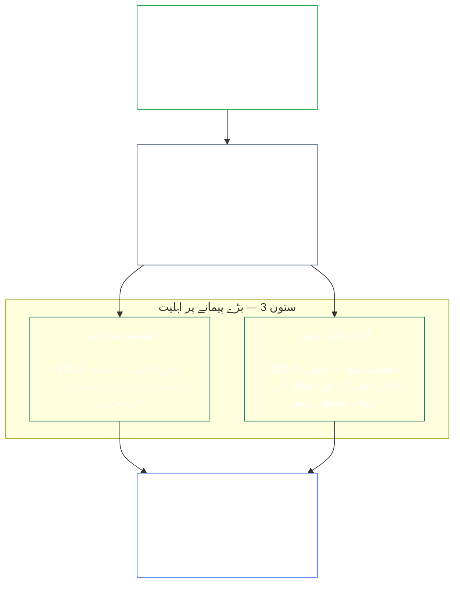
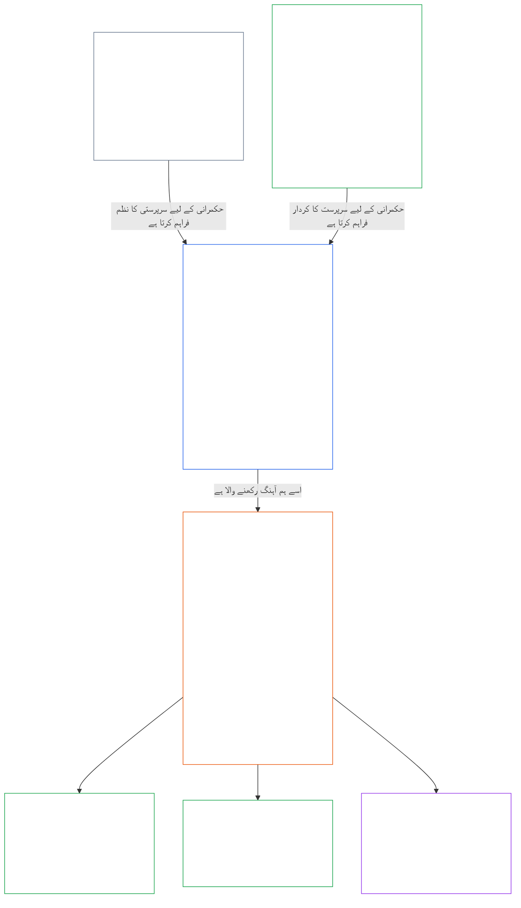

<a id="chapter-01-principles-and-constraints"></a>
<a id="chapter-01-part-b-stewardship-and-governance"></a>
<a id="chapter-01-part-c-stewardship-and-governance"></a>
# باب 01، حصہ C: نگہبانی اور حکمرانی

<details>
<summary><strong><span style="color: #2563eb;">متن کے مجموعے میں جگہ (غیر عملی): فائل کی ساخت اور مطالعے کے قواعد</span></strong></summary>

> ذیل کا مواد صرف قاری کی رہنمائی کے لیے ہے۔ یہ اس فائل یا دوسرے ابواب میں کہیں بھی پابند ذمہ داریوں کا اضافہ، اخراج یا تحدید نہیں کرتا۔
>
> یہ فائل **Sentient Constitution** کا حصہ ہے اور صرف دیگر نمبر شدہ `core_*` فائلوں کے ساتھ مل کر، ایک ہی دستاویز کے طور پر پڑھے جانے پر **پابند** ہے۔ اس میں **باب اول، حصہ C** (§§16–20: نگہبانی، حکمرانی، ترغیبات کی ہم آہنگی اور نظام پر قبضہ، نیز مربوط اطلاق کا اختتامی باب) شامل ہے۔
>
> **سابقہ:** [core_01_b_interaction_interpretation.md](core_01_b_interaction_interpretation.md) (باب اول، حصہ B)  
> **اگلا:** [core_02_definition_structure.md](core_02_definition_structure.md)<br>
> **مطالعے کی ترتیب:** §16 نگہبانی اور تقسیم شدہ فہم → §17 نگہبان کا کردار → §18 حکمرانی → §19 ترغیبات کی ہم آہنگی اور نظام پر قبضہ → **§20 مربوط اطلاق** (باب کا اختتامی حصہ)۔

</details>

<details>
<summary><strong><span style="color: #2563eb;">قاری کے لیے رہنمائی (غیر عملی): اصولوں کی درجہ بندی اور مطالعے کی ترتیب (حصہ C)</span></strong></summary>

> ذیل کا مواد صرف قاری کی رہنمائی کے لیے ہے۔ یہ اس فائل یا دوسرے ابواب میں کہیں بھی پابند ذمہ داریوں کا اضافہ، اخراج یا تحدید نہیں کرتا۔ ہر حصے کے **Trace** اور **Definitions · Assessment · Compliance** ویجٹ اس مقام پر متعلقہ رہنمائی دیتے ہیں جہاں § کسی اصطلاح کو مادی طور پر استعمال کرتا ہے؛ یہ بلاک §§16–20 سے پہلے پورے حصے کا باہمی حوالہ جاتی نقشہ ہے۔

**اصولی درجہ بندی (حصہ C)۔** اصولی سطح پر:

13. **[نگہبانی](core_05_band_continuity.md#stewardship)** حساس ہستیوں کی تنظیم کے ذریعے مادی نظاموں کی سمت متعین کرتی ہے — **ستون 1** ([§17](#17-consequential-stewardship-the-steward-role): نتائج خیز، براہِ راست کارروائی اور بہتری)، **ستون 2** ([پیشگی نگہبانی](#16-pillar-2-proactive-stewardship): مسئلے کو جلد پہچاننا اور قابلِ اجتناب تاخیر کے بغیر حل کرنا)، اور **ستون 3** ([§16.1](#161-distributed-understanding) · [§16.2](#162-institutional-development): برادری اور ادارے کی سطح پر اہلیت) — [آئینی چہارگانہ](core_00_preamble.md#constitutional-tetrad) کے تحت وقت کے ساتھ پائیدار آئینی ہم آہنگی کے لیے؛ بالخصوص **[شرکت](core_05_apex_participation_leg.md#participation-constitutional)** (نتائج خیز کردار اور آواز) اور **[نگرانی](core_05_apex_oversight_leg.md#oversight-constitutional)** (تقسیم شدہ فہم، آڈٹ پذیری اور اعتراض پذیری — نگرانی کے لیے آڈٹ لازم ہے؛ [System Alignment Certification](core_05_band_continuity.md#system-alignment-certification) دیگر آڈٹ عملوں میں سے ایک خاصا بڑا عمل ہے) — اور [دو آئینی مقاصد](core_00_preamble.md#two-constitutional-aims) کے تحت **تسلسل** کا مقصد بھی۔
14. **[نتائج خیز نگہبانی](#17-consequential-stewardship-the-steward-role)** خود نگہبان کا کردار ہے: مادی نظام پر نتائج خیز آپریشن، دیکھ بھال، نگرانی یا بہتری کا کام کرنے والے ہر فرد پر عائد براہِ راست فرائض، معیار اور تحفظات — **ستون 1** کا عملی اطلاق، نیز مشترک معیار، دباؤ میں ہم آہنگی اور نگہبان کے کردار کے دائرے میں مشاہدہ پذیری۔
15. **[حکمرانی](core_05_band_accountability.md#governance)** [آئینی چہارگانہ](core_00_preamble.md#constitutional-tetrad) کے تحت مجاز فیصلہ سازی، شرکت اور جواب دہی کو ساخت دیتی ہے — خصوصاً اس بات کی **[نگرانی](core_05_apex_oversight_leg.md#oversight-constitutional)** کہ اختیار کیسے تقسیم اور استعمال ہوتا ہے، نیز [§18.1](#181-governance-as-authorized-structure) کے تحت **اختیار کے تناسب سے جواب دہی**: زیادہ مجاز اختیار یا زیادہ نتائج خیز کردار آئینی جواب دہی اور نگرانی بڑھاتا ہے، کبھی کم نہیں کرتا۔ [§18.3 فرائض کی علیحدگی](#183-segregation-of-duties) اس شخص کو جس نے کارروائی کی، خود اپنی جانچ سے روکتا ہے۔ [§18.4 مسلسل جواز](#184-ongoing-justification) لازم کرتا ہے کہ یہ انتظامات مسلسل ثابت کریں کہ وہ اب بھی اس آئین سے مطابقت رکھتے ہیں۔ حکمرانی اور نگہبانی میں ٹکراؤ ہو تو اصولی سطح پر نگہبانی کا نظم غالب ہوگا، الاّ یہ کہ **ضرورت** اور **تناسب** واضح طور پر محدود، وقت بند استثنا کو اصلاحی راستوں سمیت جائز قرار دیں۔ عملی اجازت اور معاہدے کی سطح کے تقاضے **باب تیرہ** کی ذمہ داری رہیں گے۔
16. **[ترغیبات کی ہم آہنگی اور نظام پر قبضہ](#19-incentive-alignment-and-system-capture)** ترغیبات کے ڈھانچوں، متبادل پیمانوں کی سالمیت، مختصر مدت کے نقصانات، انعامی راستوں کی اصلاح اور قبضے کے ردعمل کے لیے اصولی سطح کا نظم فراہم کرتا ہے۔
17. **[مربوط اطلاق](#20-integrated-application)** باب کا اختتامی حصہ ہے: بعد کے ابواب کو اسی باب کے مربوط قدر کے فریم ورک کے ذریعے پڑھا جائے۔

</details>

<br>

<a id="16-stewardship-in-depth"></a>

### 16. نگہبانی کی تفصیل
<details>
<summary><strong><span style="color: #2563eb;">سراغ</span></strong></summary>

- ساتھ پڑھیں: [آئینی چہارگانہ](core_00_preamble.md#constitutional-tetrad) — باب اول میں **شرکت** کے ستون کا بنیادی مقام (نتائج خیز کردار اور آواز؛ عمومی تقاضا، صرف [Stakeholder System Participation](core_05_band_participation.md#stakeholder-status-and-weight) نہیں)، **نگرانی** کا ستون، اور **بروقت اقدام** کا ستون (پیشگی اصلاح کی رفتار)؛ [مادی مفاد](core_00_preamble.md#material-stake) کے مطابق پیمانہ۔
- ساتھ پڑھیں: [دو آئینی مقاصد](core_00_preamble.md#two-constitutional-aims) — **نشوونما** کا مقصد (شرکت، خود اختیاری اور تعلیمی راستے)؛ **تسلسل** کا مقصد (ادارہ جاتی سیکھنا، اصلاح کی صلاحیت اور پائیدار نگہبانی)۔
- سابقہ بنیاد: اصول: [3. بنیادی مقصد: فلاح و بہبود](core_01_a_values_principles.md#3-foundational-objective-wellbeing-flourishing-aim)؛ [5 سچائی](core_01_a_values_principles.md#5-truth-epistemic-integrity-constraint)؛ [6. اعتماد](core_01_a_values_principles.md#6-trust-and-trustworthiness-coordination-integrity)؛ اور [§9 مشترک نظام کی صلاحیت](core_01_a_values_principles.md#9-shared-system-capacity)۔
- بعد کے اطلاقات: [13. آئینی تصادم کے حل کا عمل](core_01_b_interaction_interpretation.md#13-constitutional-collision-resolution-process) (بشمول [§13.3 قابلِ اجتناب بوجھ میں کمی](core_01_b_interaction_interpretation.md#133-minimization-of-avoidable-burden))؛ [باب آٹھ §4 پورے نظام کی تصدیق کا جائزہ](core_08_a_system_alignment_certification_evaluation.md#4-whole-system-certification-evaluation)؛ [§19.1.3 نگہبانی اور آپریٹر کا اطلاق](#1913-stewardship-and-operator-application)۔
- بعد کا اطلاق: [§19.1.4 کردار کی گہرائی اور مادی ذمہ داری کے راستے](#1914-role-depth-and-material-responsibility-pathways)۔
- بعد کا اطلاق: [§7 آزادی (محدود خود اختیاری)](core_01_a_values_principles.md#7-freedom-bounded-agency)، جو اس بات پر منحصر ہے کہ مادی انحصار کے باوجود نتائج خیز نگہبانی، تقسیم شدہ فہم، بامعنی شرکت اور اصلاح کی صلاحیت حقیقی رہیں۔
- بعد کے اطلاقات: [باب آٹھ — System Alignment Certification](core_08_a_system_alignment_certification_evaluation.md#chapter-eight-system-alignment-certification) (*نگرانی کے تحت ایک خاصا بڑا آڈٹ عمل — آڈٹ کا واحد مقام نہیں*)؛ [باب نو — شراکت، خلاف ورزی اور حیثیت کا نمونہ](core_09_standing_assessment.md#chapter-nine-contribution-violation-and-standing-model--measurement) (*حیثیت کا اثر — اعتماد، کردار اور شناخت کے لیے اہلیت — اس ذیلی حصے کو اصولی بنیاد کے طور پر نافذ کرتا ہے*)۔
- بعد کے اطلاقات: [باب بارہ §1 — مقصد اور کردار](core_12_forum.md#1-purpose-and-role--participation-architecture) اور [§4 — فورم خاندانوں کی تعریفیں](core_12_forum.md#4-forum-family-definitions--accountability-through-adjudication) (*فورم خاندان اس حصے سے ہم آہنگ قابلِ اعتراض چیلنج، تدارک کی ترتیب، بنیادی اسباب سے سیکھنے اور پیشگی حکمرانی کے لیے شرکت و نگرانی کا ڈھانچہ فراہم کرتے ہیں*)؛ منظور شدہ فورم کارروائیوں کے لیے [corpus_forum.md](corpus_forum.md)۔
- بعد کا اطلاق: تعلیم، Stakeholder System Participation، شفافیت، قابلِ فہم ہونے، آڈٹ و تصدیق، اور مادی ذمہ داری تک کردار کی گہرائی کے راستوں سے متعلق حقوق کی حدود مرتب کرتا ہے۔
  - خصوصاً [آرٹیکل III: بقا اور ضروری رسائی](core_06_rights_part_a.md#article-iii-survival-and-essential-access)، [آرٹیکل IV: حساس ہستیوں پر مرکوز تعلیم کا حق](core_06_rights_part_a.md#article-iv-right-to-sentient-centered-education)، [آرٹیکل X: خود ارادیت، خود اختیاری اور شرکت](core_06_rights_part_b.md#article-x-self-determination-agency-and-participation)، [آرٹیکل XII: نظام میں متعلقہ فریقوں کی شرکت، نمائندگی اور مناسب قانونی عمل](core_06_rights_part_b.md#article-xii-stakeholder-system-participation-representation-and-due-process)، [آرٹیکل XVI: آڈٹ، شفافیت اور آزاد تصدیق](core_06_rights_part_c.md#article-xvi-audit-transparency-and-independent-verification)، [آرٹیکل XIX: حیثیت اور شرکت کی حالت](core_06_rights_part_d.md#article-xix-standing-and-participation-status)، [آرٹیکل XXI: باہمی عمل پذیری، منتقلی، نقل و حرکت، پناہ اور اخراج کی سالمیت](core_06_rights_part_d.md#article-xxi-interoperability-portability-movement-refuge-and-exit-integrity)، [آرٹیکل XXII: قابلِ فہم ہونا اور پیچیدگی کی نگہبانی](core_06_rights_part_d.md#article-xxii-comprehensibility-and-complexity-stewardship)، اور [آرٹیکل XXIV: آئینی تشریح، جائزہ اور قبضے کے خلاف تحفظات](core_06_rights_part_d.md#article-xxiv-constitutional-interpretation-review-and-anti-capture-safeguards)۔
  - ساتھ پڑھیں: [باب تیرہ §5 — مجاز کردار، اہلیت کی ترقی اور شراکت](core_13_governance.md#5-authorized-roles-competency-development-and-contribution) اور **[corpus_systems.md](corpus_systems.md)، CS-4 — اہم نظام کی نگہبانی**؛ عملی کردار کے راستوں اور نگہبانی کی ترقی کے راستوں کے لیے۔
- ذیلی حصے (مطالعے کی ترتیب): [§16.1 تقسیم شدہ فہم](#161-distributed-understanding) (بڑے پیمانے پر اہلیت کا برادری سے متعلق پہلو) · [§16.2 ادارہ جاتی ترقی](#162-institutional-development) (تنظیمی پہلو) · [§16.3 کشادگی کی آرزو](#163-openness-aspiration)۔
- ساتھ پڑھیں: [§17 نتائج خیز نگہبانی](#17-consequential-stewardship-the-steward-role) (*نگہبان کا کردار خود — اپنی مستقل دفعہ میں ترقی یافتہ؛ اس میں ستون 1 کے براہِ راست آپریشن، دیکھ بھال، نگرانی اور بہتری کے فرائض شامل ہیں، نیز [§17.1](#171-shared-stewardship-standard)، [§17.2](#172-alignment-under-pressure)، [§17.3](#173-logging-the-role-not-the-steward)، [§17.4 ہم آہنگ خود تنظیم](#174-aligned-self-organization)، جو اس نظم کو رسمی کردار سے آگے بڑھاتی ہے، اور [§17.5 مزاحمت کا فرض](#175-duty-to-resist)*)۔

</details>

<details>
<summary><strong><span style="color: #2563eb;">تعریفیں · جائزہ · تعمیل</span></strong></summary>

- [اسٹریٹجک نگہبانی کی ذمہ داری](core_05_band_continuity.md#strategic-stewardship-obligation) · [O](core_05_band_continuity.md#strategic-stewardship-obligation) · [M](core_05_band_continuity.md#strategic-stewardship-obligation-constitutional-a) · [A](core_05_band_continuity.md#strategic-stewardship-obligation-constitutional-a) · [C](core_05_band_continuity.md#strategic-stewardship-obligation-constitutional-c)
- [تقسیم شدہ فہم](core_05_band_continuity.md#distributed-understanding) · [O](core_05_band_continuity.md#distributed-understanding) · [M](core_05_band_continuity.md#distributed-understanding-constitutional-a) · [A](core_05_band_continuity.md#distributed-understanding-constitutional-a) · [C](core_05_band_continuity.md#distributed-understanding-constitutional-c)
- [شرکت](core_05_apex_participation_leg.md#participation-constitutional) · [O](core_05_apex_participation_leg.md#participation-constitutional) · [M](core_05_apex_participation_leg.md#participation-constitutional-m) · [A](core_05_apex_participation_leg.md#participation-constitutional-a) · [C](core_05_apex_participation_leg.md#participation-constitutional-c)
- [نگرانی](core_05_apex_oversight_leg.md#oversight-constitutional) · [O](core_05_apex_oversight_leg.md#oversight-constitutional) · [M](core_05_apex_oversight_leg.md#oversight-constitutional-m) · [A](core_05_apex_oversight_leg.md#oversight-constitutional-a) · [C](core_05_apex_oversight_leg.md#oversight-constitutional-c)
- [بامعنی خود اختیاری](core_05_band_participation.md#meaningful-agency) · [O](core_05_band_participation.md#meaningful-agency) · [M](core_05_band_participation.md#meaningful-agency-a) · [A](core_05_band_participation.md#meaningful-agency-a) · [C](core_05_band_participation.md#meaningful-agency-c)
- [آڈٹ پذیری](core_05_band_oversight.md#auditability) · [O](core_05_band_oversight.md#auditability) · [M](core_05_band_oversight.md#auditability-a) · [A](core_05_band_oversight.md#auditability-a) · [C](core_05_band_oversight.md#auditability-c)
- [اعتراض پذیری](core_05_band_accountability.md#contestability) · [O](core_05_band_accountability.md#contestability) · [M](core_05_band_accountability.md#contestability-a) · [A](core_05_band_accountability.md#contestability-a) · [C](core_05_band_accountability.md#contestability-c)
- [تعلیمی خود اختیاری](core_05_band_participation.md#educational-agency) · [O](core_05_band_participation.md#educational-agency) · [M](core_05_band_participation.md#educational-agency-a) · [A](core_05_band_participation.md#educational-agency-a) · [C](core_05_band_participation.md#educational-agency-c)
- [شفافیت](core_05_band_oversight.md#transparency) · [O](core_05_band_oversight.md#transparency) · [M](core_05_band_oversight.md#transparency-a) · [A](core_05_band_oversight.md#transparency-a) · [C](core_05_band_oversight.md#transparency-c)
- [مادیت](core_05_band_oversight.md#materiality) · [O](core_05_band_oversight.md#materiality) · [M](core_05_band_oversight.md#materiality-determination-a) · [A](core_05_band_oversight.md#materiality-determination-a) · [C](core_05_band_oversight.md#materiality-determination-c)
- [انحصار](core_05_band_continuity.md#dependency) · [O](core_05_band_continuity.md#dependency) · [M](core_05_band_continuity.md#dependency-a) · [A](core_05_band_continuity.md#dependency-a) · [C](core_05_band_continuity.md#dependency-c)
- [رسائی پذیری](core_05_band_participation.md#accessibility) · [O](core_05_band_participation.md#accessibility) · [M](core_05_band_participation.md#accessibility-constitutional-a) · [A](core_05_band_participation.md#accessibility-constitutional-a) · [C](core_05_band_participation.md#accessibility-constitutional-c)
- [حفاظت (آئینی پابندی)](core_05_band_continuity.md#safety-constitutional-constraint) · [O](core_05_band_continuity.md#safety-constitutional-constraint) · [M](core_05_band_continuity.md#safety-constraint-a) · [A](core_05_band_continuity.md#safety-constraint-a) · [C](core_05_band_continuity.md#safety-constraint-c)
- [سچائی (آئینی پابندی)](core_05_band_oversight.md#truth-constitutional-constraint) · [O](core_05_band_oversight.md#truth-constitutional-constraint-o) · [M](core_05_band_oversight.md#truth-constitutional-constraint-a) · [A](core_05_band_oversight.md#truth-constitutional-constraint-a) · [C](core_05_band_oversight.md#truth-constitutional-constraint-c)
- [ضرورت](core_05_band_accountability.md#necessity) · [O](core_05_band_accountability.md#necessity) · [M](core_05_band_accountability.md#necessity-a) · [A](core_05_band_accountability.md#necessity-a) · [C](core_05_band_accountability.md#necessity-c)
- [تناسب](core_05_band_accountability.md#proportionality) · [O](core_05_band_accountability.md#proportionality) · [M](core_05_band_accountability.md#proportionality-a) · [A](core_05_band_accountability.md#proportionality-a) · [C](core_05_band_accountability.md#proportionality-c)
- [قابلِ اجتناب بوجھ](core_05_band_continuity.md#avoidable-burden) · [O](core_05_band_continuity.md#avoidable-burden) · [M](core_05_band_continuity.md#avoidable-burden-a) · [A](core_05_band_continuity.md#avoidable-burden-a) · [C](core_05_band_continuity.md#avoidable-burden-c)
- [علمی سالمیت](core_05_band_oversight.md#epistemic-integrity) · [O](core_05_band_oversight.md#epistemic-integrity-o) · [M](core_05_band_oversight.md#epistemic-integrity-a) · [A](core_05_band_oversight.md#epistemic-integrity-a) · [C](core_05_band_oversight.md#epistemic-integrity-c)

</details>

<br>

*سادہ الفاظ میں: تین خیالات اس حصے کو جوڑتے ہیں۔ اول، حساس ہستیوں کی زندگیوں پر مادی اثر ڈالنے والے نظاموں کو اچھی طرح چلانے کے لیے حساس ہستیوں کی تنظیم درکار ہے — ماہرین کی بند الگ تھلگ جماعت نہیں۔ دوم، اچھے نگہبان نقصان کے مجبور کرنے کا انتظار نہیں کرتے — وہ مسئلے کو چھوٹا ہوتے ہوئے دیکھتے ہیں، اسے مناسب ہاتھوں تک پہنچاتے ہیں، اور اس سے پہلے حل کرتے ہیں کہ تاخیر خود نقصان بن جائے۔ سوم، اس تنظیم کو **بڑے پیمانے پر اہلیت** پیدا کرنی چاہیے: افراد کے لیے نتائج خیز کام تک پہنچنے کے حقیقی راستے، مسائل پہچاننے اور مخالفت کرنے کے لیے کافی برادری فہم، اور ایسے ادارے جو جامد ہونے کے بجائے مسلسل سیکھتے رہیں۔*

<a id="16-limits"></a>
نگہبانی کی حدود ہیں۔ **حفاظت**، **سچائی**، **ضرورت**، **تناسب**، **قابلِ اجتناب بوجھ** اور **علمی سالمیت** ایسی حدیں مقرر کرتے ہیں جو ان فرائض کو منصفانہ مقدار میں، دیانت دارانہ اور جائز حفاظتی ضروریات کا احترام کرنے والا رکھیں — ذیل کے ستون انہی پابندیوں کے اندر کام کرتے ہیں، ان سے بچ کر نہیں۔

حساس ہستیوں کی تنظیم، پیشگی نگہبانی اور بڑے پیمانے پر اہلیت اس حصے کے تین ستون ہیں۔ تینوں مل کر اصولی سطح پر [آئینی چہارگانہ](core_00_preamble.md#constitutional-tetrad) کے **شرکت**، **نگرانی** اور **بروقت اقدام** کے ستون اٹھاتے ہیں، [مادی مفاد](core_00_preamble.md#material-stake) کے مطابق پیمانہ رکھتے ہیں، اور [دو آئینی مقاصد](core_00_preamble.md#two-constitutional-aims) کو آگے بڑھاتے ہیں۔

<br>



**ستون 1 — نتائج خیز نگہبانی ([§17 نتائج خیز نگہبانی](#17-consequential-stewardship-the-steward-role)):**
- مشترک نظام جو حساس ہستیوں پر مادی اثر ڈالتے ہیں، ان کے لیے حساس ہستیوں کی براہِ راست کارروائی، دیکھ بھال، نگرانی اور بہتری ضروری ہے — [**اسٹریٹجک نگہبانی کی ذمہ داری**](core_05_band_continuity.md#strategic-stewardship-obligation)، [**بامعنی خود اختیاری**](core_05_band_participation.md#meaningful-agency)
- ایسے ریکارڈ اور جائزے کے راستے جن کی دوسرے تصدیق اور مخالفت کر سکیں — [**آڈٹ پذیری**](core_05_band_oversight.md#auditability)، [**اعتراض پذیری**](core_05_band_accountability.md#contestability)
- چہارگانہ کے **نگرانی** والے ستون کے تحت نگرانی کے لیے آڈٹ ضروری ہے؛ [System Alignment Certification](core_05_band_continuity.md#system-alignment-certification) دیگر عملوں کے ساتھ ایک خاصا بڑا اور بلند داؤ والا آڈٹ عمل ہے — آڈٹ کا واحد مقام نہیں (**آرٹیکل XVI** (*آڈٹ، شفافیت اور آزاد تصدیق*))

<a id="16-pillar-2-proactive-stewardship"></a>
**ستون 2 — پیشگی نگہبانی:**
پیشگی نگہبان ابھرتے مسائل اور عدم ہم آہنگی کو تین طریقوں سے سنبھالتے ہیں:
- **بڑھنے سے پہلے پہچانیں** — اچھے نگہبان عدم ہم آہنگی اس وقت پکڑتے ہیں جب مسائل چھوٹے ہوں، اس انتظار میں نہیں رہتے کہ وہ خود ظاہر ہوں
- **مناسب درجے کے وقت کے اندر آگے بڑھائیں** — جو ملا ہے اسے دبانے یا معمول کے معاملات کو حد سے زیادہ اوپر بھیجنے کے بجائے، کردار کے داؤ کے مطابق مقررہ مدت میں معاملہ آگے بڑھائیں
- **صرف نشان زد نہیں، حل بھی کریں** — مسئلہ اٹھائے جانے کے بعد قابلِ اجتناب تاخیر کے بغیر اصلاح شروع کریں؛ یہی چہارگانہ کے **بروقت اقدام** والے ستون کا عملی اطلاق ہے ([**بروقت اقدام**](core_05_apex_timeliness_leg.md#timeliness-constitutional))
- **کردار کا مستقل فرض، اضافی کام نہیں:** [§17 نتائج خیز نگہبانی](#17-consequential-stewardship-the-steward-role) میں متعین نگہبان کا کردار نقصان یا عدم ہم آہنگی ظاہر ہونے کے بعد صرف علامات ٹھیک کرنے کے بجائے پیشگی حکمرانی، نظام کی تشکیل اور آئینی ہم آہنگی کو ترجیح دیتا ہے — یہ ستون کردار کا مستقل فرض ہے، کسی الگ عمل کے سپرد نہیں

**ستون 3 — بڑے پیمانے پر اہلیت ([§16.1 تقسیم شدہ فہم](#161-distributed-understanding) · [§16.2 ادارہ جاتی ترقی](#162-institutional-development)):**
- نگہبانی کو متاثرہ برادریوں کے لیے فہم اور اعتراض کو قابلِ عمل بنانا چاہیے — [**تعلیمی خود اختیاری**](core_05_band_participation.md#educational-agency)، [**شفافیت**](core_05_band_oversight.md#transparency)
- تنظیمیں رائے، اصلاح اور برقرار رکھی گئی اہلیت کے ذریعے سیکھتی رہتی ہیں، نیز جہاں پیمائش معاون ہو وہاں وقت کے ساتھ تغیر کی منظم نگرانی بھی شامل ہے (مثلاً **شماریاتی عمل کا کنٹرول** معروف عملی طریقے ہیں، عالمی تقاضے نہیں)

<a id="when-day-to-day-stewardship-is-not-enough"></a>
**جب روزمرہ نگہداشت کافی نہ ہو:**
نگہداشت پہلی حفاظتی تہہ ہے، واحد نہیں۔ تین مختلف سوالات کے لیے تین الگ دائرے ہیں، اور ان میں سے کوئی ایک دوسرے کی جگہ نہیں لیتا:
- **پہلے سے مجاز نظام کے اندر تنازعات — [حصہ دار نظام میں شرکت](core_05_band_participation.md#stakeholder-status-and-weight):**
  - متاثرہ sentients پہلے حصہ دار نظام میں شرکت کے شائع شدہ اعتراض کے راستے سے رجوع کرتے ہیں، جس میں شرکت، نمائندگی، قابلِ اعتراض ہونے اور منصفانہ طریقۂ کار کا احاطہ ہوتا ہے۔
  - یہ تحفظات ہر مادی طور پر متاثرہ sentient کا حق ہیں۔
  - یہ ان نظاموں، اداروں اور فیصلہ سازی کے دائروں کے اندر نافذ ہوتے ہیں جنہیں پہلے ہی اختیار دیا جا چکا ہو۔
- **ایسے تنازعات جنہیں حصہ دار نظام میں شرکت حل نہیں کر سکتی — [فورم کا جائزہ](core_12_forum.md#dispute-sequencing):**
  - جب حصہ دار نظام میں شرکت کا اعتراض کا راستہ متنازع رہے، موجود نہ ہو یا اس پر قبضہ ہو چکا ہو، یا وہ ازالہ نہ دے سکے، تو معاملہ بنیادی مفاد کے مطابق [باب بارہ §1 — مقصد اور کردار](core_12_forum.md#1-purpose-and-role--participation-architecture) اور [§4 — فورم خاندانوں کی تعریفیں](core_12_forum.md#4-forum-family-definitions--accountability-through-adjudication) کے تحت آزاد **فورم خاندانوں** کے پاس جاتا ہے۔
  - یہاں sentients کو کسی فیصلے کو حقیقتاً چیلنج کرنے، واضح تلافی کا حکم حاصل کرنے، یا بار بار سامنے آنے والے نمونے سے سیکھنے کا حقیقی راستہ ملتا ہے۔
  - جہاں بنیادی مفاد آئینی متن کے معنی یا صحت، یا قانونی اختیار سے تجاوز کرنے والی کارروائی ہو، وہاں سربراہی کرنے والا خاندان [آئینی فورمز](core_12_forum.md#46-constitutional-forums) ہے۔
  - ان فورمز کے طریقۂ کار کے تفصیلی قواعد [corpus_forum.md](corpus_forum.md) میں ہیں۔
- **کون حکمرانی کر سکتا ہے — [آئینی معاہدے کی تہہ](core_05_band_integrative.md#constitutional-contract-layer) ([باب تیرہ](core_13_governance.md)):**
  - خود حکمرانی کے اختیار کی مشروعیت — کون حکمرانی کر سکتا ہے، کس مشروعیت کے طریقۂ کار کے ذریعے، اور کن دائرۂ اختیار اور پائیدار شرائط کے تحت — حصہ دار نظام میں شرکت اور فورم کے جائزے سے الگ سوال ہے۔
  - شرکت کا ووٹ، اعتراض کے راستے کا نتیجہ، یا اعتماد کا اسکور حکمرانی کا اختیار نہیں دیتا۔
  - آئینی اجازت حصہ دار نظام میں شرکت کے تحت واجب فرائض کو ختم نہیں کرتی۔
  - دونوں تہیں الگ رہتی ہیں، خواہ ان کا باہمی تعلق ہو ([تمہید §3.3 — حکمرانی کی تہیں](core_00_preamble.md#33-governance-layers))۔
- **تدارکی اقدامات، متبادل نہیں:** جہاں شواہد تقاضا کریں وہاں جائزہ، اصلاح اور تلافی لازمی رہتے ہیں۔ وہ پیشگی ڈیزائن، ترغیبات، کنٹرولز، کردار کے راستوں، مشاہدہ پذیری اور تلافی کی صلاحیت کی جگہ نہیں لیتے، جو نقصان سامنے آنے سے پہلے قابلِ پیش گوئی آئینی عدم مطابقت کو روکتے ہیں۔

<a id="16-scope-priority-and-limits"></a>
**دائرۂ کار ([§16 نگہداشت کی گہرائی](#16-stewardship-in-depth)):**
- یہ حصہ اصولوں کی سطح پر رہنمائی دیتا ہے، ہر صورتِ حال کے لیے یکساں ضابطہ نہیں۔
- یہ تقاضا **نہیں** کرتا کہ:
  - ہر شخص ہر کردار میں باری باری کام کرے
  - جائز تخصص کو رد کیا جائے
  - [13.2 علمی انکشاف کی پابندیوں](core_01_b_interaction_interpretation.md#132-epistemic-disclosure-constraints) اور **باب ششم** کے قابلِ اطلاق تحفظات کے تحت رازداری یا سلامتی کی جائز حدود سے تجاوز کیا جائے۔

**ترجیح:**
- **مادیت**، **انحصار** اور **رسائی پذیری** فہم اور رسائی کی تقسیم کی ترجیح طے کرتے ہیں — خاص توجہ وہاں جہاں اثر اور انحصار زیادہ ہو۔

<a id="161-distributed-understanding"></a>
#### 16.1 تقسیم شدہ فہم
<details>
<summary><strong><span style="color: #2563eb;">سراغ رسانی</span></strong></summary>

- بالائی بنیاد: [§17 نتیجہ خیز نگہداشت](#17-consequential-stewardship-the-steward-role) (*ستون 1*)؛ [§16 نگہداشت کی گہرائی](#16-stewardship-in-depth) (اصل حصہ، بشمول اوپر کا *سادہ الفاظ میں* اور ستون 3 کا خاکہ)؛ [5 سچائی](core_01_a_values_principles.md#5-truth-epistemic-integrity-constraint)؛ [6. اعتماد](core_01_a_values_principles.md#6-trust-and-trustworthiness-coordination-integrity)۔
- ساتھ پڑھیں: [آئینی تتراڈ](core_00_preamble.md#constitutional-tetrad) — **شرکت** کا جزو ([بامعنی ایجنسی](core_05_band_participation.md#meaningful-agency)، [تعلیمی ایجنسی](core_05_band_participation.md#educational-agency))؛ **نگرانی** کا جزو ([شفافیت](core_05_band_oversight.md#transparency)، [قابلِ آڈٹ ہونا](core_05_band_oversight.md#auditability))؛ [مادی مفاد](core_00_preamble.md#material-stake) کے مطابق پیمانہ بندی۔
- نگرانوں کے لیے داخلی دروازہ (غیر عملی): اگلے قدم کا کارڈ: [قابلِ فہم ہونا](implementation/STEWARD_ENTRY_DOORS.md#comprehensibility)۔ یہ کارڈ آئین کو محدود نہیں کر سکتا۔
- زیریں تعلق: [13.2 علمی انکشاف کی پابندیاں](core_01_b_interaction_interpretation.md#132-epistemic-disclosure-constraints)؛ حقوق کا دائرہ، بالخصوص [آرٹیکل XVI: آڈٹ، شفافیت اور آزادانہ توثیق](core_06_rights_part_c.md#article-xvi-audit-transparency-and-independent-verification)، [آرٹیکل XXII: قابلِ فہم ہونا اور پیچیدگی کی نگہداشت](core_06_rights_part_d.md#article-xxii-comprehensibility-and-complexity-stewardship)۔

</details>

<details>
<summary><strong><span style="color: #2563eb;">تعریفیں · جائزہ · تعمیل</span></strong></summary>

- [تقسیم شدہ فہم](core_05_band_continuity.md#distributed-understanding) · [O](core_05_band_continuity.md#distributed-understanding) · [M](core_05_band_continuity.md#distributed-understanding-constitutional-a) · [A](core_05_band_continuity.md#distributed-understanding-constitutional-a) · [C](core_05_band_continuity.md#distributed-understanding-constitutional-c)
- [شفافیت](core_05_band_oversight.md#transparency) · [O](core_05_band_oversight.md#transparency) · [M](core_05_band_oversight.md#transparency-a) · [A](core_05_band_oversight.md#transparency-a) · [C](core_05_band_oversight.md#transparency-c)
- [عوامی نگرانی کے بنیادی انکشافات](core_05_band_oversight.md#public-oversight-baseline-disclosure) · [O](core_05_band_oversight.md#public-oversight-baseline-disclosure) · [M](core_05_band_oversight.md#public-oversight-baseline-disclosure-a) · [A](core_05_band_oversight.md#public-oversight-baseline-disclosure-a) · [C](core_05_band_oversight.md#public-oversight-baseline-disclosure-c)
- [قابلِ آڈٹ ہونا](core_05_band_oversight.md#auditability) · [O](core_05_band_oversight.md#auditability) · [M](core_05_band_oversight.md#auditability-a) · [A](core_05_band_oversight.md#auditability-a) · [C](core_05_band_oversight.md#auditability-c)
- [مادیت](core_05_band_oversight.md#materiality) · [O](core_05_band_oversight.md#materiality) · [M](core_05_band_oversight.md#materiality-determination-a) · [A](core_05_band_oversight.md#materiality-determination-a) · [C](core_05_band_oversight.md#materiality-determination-c)
- [انحصار](core_05_band_continuity.md#dependency) · [O](core_05_band_continuity.md#dependency) · [M](core_05_band_continuity.md#dependency-a) · [A](core_05_band_continuity.md#dependency-a) · [C](core_05_band_continuity.md#dependency-c)
- [رسائی پذیری](core_05_band_participation.md#accessibility) · [O](core_05_band_participation.md#accessibility) · [M](core_05_band_participation.md#accessibility-constitutional-a) · [A](core_05_band_participation.md#accessibility-constitutional-a) · [C](core_05_band_participation.md#accessibility-constitutional-c)
- [تعلیمی ایجنسی](core_05_band_participation.md#educational-agency) · [O](core_05_band_participation.md#educational-agency) · [M](core_05_band_participation.md#educational-agency-a) · [A](core_05_band_participation.md#educational-agency-a) · [C](core_05_band_participation.md#educational-agency-c)
- [بامعنی ایجنسی](core_05_band_participation.md#meaningful-agency) · [O](core_05_band_participation.md#meaningful-agency) · [M](core_05_band_participation.md#meaningful-agency-a) · [A](core_05_band_participation.md#meaningful-agency-a) · [C](core_05_band_participation.md#meaningful-agency-c)
- [قابلِ اعتراض ہونا](core_05_band_accountability.md#contestability) · [O](core_05_band_accountability.md#contestability) · [M](core_05_band_accountability.md#contestability-a) · [A](core_05_band_accountability.md#contestability-a) · [C](core_05_band_accountability.md#contestability-c)

</details>

<br>

*سادہ الفاظ میں: مشترکہ نظاموں میں محفوظ زندگی گزارنے کے لیے کسی کو ہر ذیلی نظام میں پی ایچ ڈی کی ضرورت نہیں ہونی چاہیے — لیکن جتنا زیادہ کوئی نظام آپ کی زندگی پر اثر انداز ہو، اتنا ہی آپ کو یہ جاننے کے قابل ہونا چاہیے کہ وہ کیا کرتا ہے، کیا غلط ہو سکتا ہے، اور غلط فیصلوں کو کیسے چیلنج کیا جائے۔ شفافیت، تعلیم، واضح تشریحات اور آڈٹ کے راستے یہی ممکن بناتے ہیں۔ پیچیدگی اہم باتیں چھپانے کا بہانہ نہیں۔ تتراڈ کے **نگرانی** والے جزو کے تحت نگرانی آڈٹ کا تقاضا کرتی ہے؛ نظامی مطابقت کی توثیق ان راستوں میں آڈٹ کا ایک خاصا وسیع عمل ہے، واحد نہیں۔*

تقسیم شدہ فہم **ستون 3** کا برادری سے متعلق پہلو ہے، جو **[§16 نگہداشت کی گہرائی](#16-stewardship-in-depth)** کے تحت آتا ہے۔ مکمل تعریف، پیمائشیں اور ناکامی کی شرائط [تقسیم شدہ فہم](core_05_band_continuity.md#distributed-understanding) میں ہیں۔ خلاصہ:

- **اس کا تقاضا:** مشترکہ نظاموں کے کام کرنے کے طریقے تک متناسب اور منظم رسائی، جب وہ sentients پر مادی اثر ڈالتے ہوں — ان کے مقاصد، پابندیاں، غیر یقینی صورتیں اور مادی طور پر متعلقہ اثرات۔
- **اسے قابلِ عمل کیا بناتا ہے:** [§17 نتیجہ خیز نگہداشت](#17-consequential-stewardship-the-steward-role) کو دستاویزات، تعلیم، شفافیت، کردار کے راستے اور قابلِ فہم ہونے کی نگہداشت فراہم کرنا ہوگی۔ یہ ذمہ داری برقرار رہتی ہے، چاہے ہر sentient ہر راستہ استعمال کرے یا نہ کرے۔
- **آن لائن عوامی بنیادی معیار:** جہاں قانونی آن لائن بنیادی ڈھانچہ موجود ہو، وہاں آن لائن [عوامی نگرانی کے بنیادی انکشافات](core_05_band_oversight.md#public-oversight-baseline-disclosure) — بشمول ادائیگی کی دیوار کی ممانعت اور زیادہ سے زیادہ ممکن عوامی متبادل کا اصول — [شفافیت](core_05_band_oversight.md#transparency) اور [عوامی نگرانی کے بنیادی انکشافات](core_05_band_oversight.md#public-oversight-baseline-disclosure) کے تابع ہیں، اور **[corpus_systems.md](corpus_systems.md), CS-2** (*معلومات کی اقسام اور ان کا برتاؤ*) کے تحت **قسم O** کے ڈیٹا کے طور پر نافذ ہوتے ہیں۔
- **رسائی کن چیزوں کو سہارا دیتی ہے:**
  - [آئینی تتراڈ](core_00_preamble.md#constitutional-tetrad) کا **شرکت** والا جزو ([باخبر بامعنی ایجنسی](core_05_band_participation.md#meaningful-agency) اور قابلِ اعتراض ہونے کی صلاحیت)
  - **نگرانی** والا جزو، بشمول [قابلِ آڈٹ ہونے](core_05_band_oversight.md#auditability) اور **آرٹیکل XVI** (*آڈٹ، شفافیت اور آزادانہ توثیق*) کے تحت آڈٹ؛ ان سے متعلق آڈٹ طریقوں میں [نظامی مطابقت کی توثیق](core_05_band_continuity.md#system-alignment-certification) ایک خاصا وسیع عمل ہے

تقسیم شدہ فہم یہ **تقاضا نہیں** کرتا کہ ہر sentient ہر ذیلی نظام پر عبور حاصل کرے۔ یہ **تقاضا کرتا ہے** کہ فہم [مادیت](core_05_band_oversight.md#materiality) اور [انحصار](core_05_band_continuity.md#dependency) کے تناسب سے بڑھے۔ پیچیدگی اور غیر شفافیت کو [بامعنی ایجنسی](core_05_band_participation.md#meaningful-agency) یا اعتراض کے امکان کو ناکام بنانے کے لیے استعمال نہیں کیا جانا چاہیے، جہاں **باب پنجم** اور **باب ششم** انکشاف، تعلیم یا قابلِ فہم ہونے کے فرائض مقرر کرتے ہیں۔

<a id="162-institutional-development"></a>
#### 16.2 ادارہ جاتی ترقی
<details>
<summary><strong><span style="color: #2563eb;">سراغ</span></strong></summary>

- سابقہ روابط: [§17 نتیجہ خیز سرپرستی](#17-consequential-stewardship-the-steward-role) (*ستون 1*)؛ [§16.1 تقسیم شدہ فہم](#161-distributed-understanding) (*ستون 3 کا برادری سے متعلق پہلو*)؛ [§16 گہری سرپرستی](#16-stewardship-in-depth) (ستون 3 کا بنیادی خاکہ)۔
- ساتھ پڑھیں: [آئینی چارگانہ](core_00_preamble.md#constitutional-tetrad) — **شرکت** کا پہلو (افرادی قوت اور متاثرہ برادری کی تعلیم جو نتیجہ خیز کرداروں میں معاون ہو)؛ **نگرانی** کا پہلو ([قابلِ تصدیق ہونا](core_05_band_oversight.md#verifiability)، [قابلِ آڈٹ ہونا](core_05_band_oversight.md#auditability)، دیانت دار پیمانے)؛ [مادی مفاد](core_00_preamble.md#material-stake) کے مطابق پیمانہ بندی۔
- ساتھ پڑھیں: [تزویراتی سرپرستی کی ذمہ داری](core_05_band_continuity.md#strategic-stewardship-obligation) اور [قابلِ آڈٹ ہونا](core_05_band_oversight.md#auditability)، جہاں مادی طور پر متعلق ہو۔
- ساتھ پڑھیں: [§16.1 تقسیم شدہ فہم](#161-distributed-understanding) (*برادری کی سمجھ اور ادارہ جاتی سیکھنا، پیمانے پر اہلیت کے ایک ہی تقاضے کے الگ پہلو ہیں، ایک دوسرے کا بدل نہیں*).
- بعد کے روابط: [§16.3 کشادگی کی آرزو](#163-openness-aspiration)؛ [§18 سرپرستی کے نظم کے تحت حکمرانی](#18-governance-under-stewardship-discipline) اور [§19 ترغیبات کی ہم آہنگی اور نظام پر قبضہ](#19-incentive-alignment-and-system-capture) (*ادارہ جاتی سیکھنا اور ترغیبات کی ہم آہنگی*)۔

</details>

<details>
<summary><strong><span style="color: #2563eb;">تعریفیں · جائزہ · تعمیل</span></strong></summary>

- [ادارہ جاتی ترقی](core_05_band_continuity.md#institutional-development) · [O](core_05_band_continuity.md#institutional-development) · [M](core_05_band_continuity.md#institutional-development-constitutional-a) · [A](core_05_band_continuity.md#institutional-development-constitutional-a) · [C](core_05_band_continuity.md#institutional-development-constitutional-c)
- [تزویراتی سرپرستی کی ذمہ داری](core_05_band_continuity.md#strategic-stewardship-obligation) · [O](core_05_band_continuity.md#strategic-stewardship-obligation) · [M](core_05_band_continuity.md#strategic-stewardship-obligation-constitutional-a) · [A](core_05_band_continuity.md#strategic-stewardship-obligation-constitutional-a) · [C](core_05_band_continuity.md#strategic-stewardship-obligation-constitutional-c)
- [قابلِ آڈٹ ہونا](core_05_band_oversight.md#auditability) · [O](core_05_band_oversight.md#auditability) · [M](core_05_band_oversight.md#auditability-a) · [A](core_05_band_oversight.md#auditability-a) · [C](core_05_band_oversight.md#auditability-c)
- [مادیت](core_05_band_oversight.md#materiality) · [O](core_05_band_oversight.md#materiality) · [M](core_05_band_oversight.md#materiality-determination-a) · [A](core_05_band_oversight.md#materiality-determination-a) · [C](core_05_band_oversight.md#materiality-determination-c)
- [قابلِ تصدیق ہونا](core_05_band_oversight.md#verifiability) · [O](core_05_band_oversight.md#verifiability) · [M](core_05_band_oversight.md#verifiability-a) · [A](core_05_band_oversight.md#verifiability-a) · [C](core_05_band_oversight.md#verifiability-c)

</details>

<br>

*سادہ الفاظ میں: اداروں کو حقیقتاً سیکھنا چاہیے — صرف سافٹ ویئر اپ گریڈ نہ کریں جبکہ ذمہ دار لوگ نظام کو نہ سمجھتے ہوں۔ اس کے لیے فیڈبیک کے چکر، عدم مطابقت کی صورت میں درج شدہ اصلاحات، اور ادارے میں مہارت برقرار رکھنا ضروری ہے۔ جہاں رویے کو بار بار ناپا جا سکتا ہو، وہاں وقت کے ساتھ کارکردگی میں تبدیلی کا سراغ لگانا ان چکروں پر عمل کا ایک متناسب طریقہ ہے — **شماریاتی عمل کا کنٹرول** اس نظم کا معروف طریقہ ہے، ہر جگہ لازمی تقاضا نہیں۔ صرف اعداد کافی نہیں: اشارے غلط لگیں تو کسی کو تحقیق کرکے بنیادی سبب درست کرنا ہوگا۔ ڈیش بورڈ دیانت دار ہوں، حقیقی اثر کے مطابق ہوں اور اس طرح لکھے جائیں کہ متاثرہ ذی شعور مخلوقات انہیں سمجھ سکیں — انہیں اچھا دکھانے کے لیے اعداد و شمار میں ہیر پھیر نہ ہو جبکہ کچھ بھی تبدیل نہ ہو۔*

ادارہ جاتی ترقی **ستون 3** کا تنظیمی پہلو ہے، **[§16 گہری سرپرستی](#16-stewardship-in-depth)** کے تحت۔ مکمل تعریف، پیمانے اور ناکامی کی شرائط [ادارہ جاتی ترقی](core_05_band_continuity.md#institutional-development) میں درج ہیں۔ خلاصہ یہ ہے:

- **مشترکہ ذمہ داری:** تنظیمیں اور مشترکہ نظام **سیکھتے ہیں** — [دو آئینی مقاصد](core_00_preamble.md#two-constitutional-aims) کے **تسلسل** کے مقصد کا بنیادی تقاضا۔
- **اس کا تقاضا:** درج ذیل امور، جو اصلاح اور موافقت میں مدد دیتے ہیں:
  - فیڈبیک کے چکر
  - درج شدہ اصلاح
  - حکمتِ عملی کی ہم آہنگی
  - مہارت کو برقرار رکھنا
- **چارگانہ:** ادارہ جاتی سیکھنا [آئینی چارگانہ](core_00_preamble.md#constitutional-tetrad) کے **شرکت** اور **نگرانی** کے پہلوؤں کو فعال رکھتا ہے، تاکہ مہارت، فیڈبیک اور جانچ کے راستے جامد نہ ہوں۔
- **اس سے تقاضا پورا نہیں ہوتا:** تکنیکی اجزا کو اپ گریڈ کرنا جبکہ حکمرانی اور افرادی قوت کی سمجھ جامد رہے۔
- **پیمائش کب لاگو ہوتی ہے:** جب مادی طور پر متعلقہ رویے کی **بار بار، قابلِ موازنہ پیمائش** ممکن ہو، [قابلِ تصدیق ہونا](core_05_band_oversight.md#verifiability) کو [قابلِ آڈٹ ہونا](core_05_band_oversight.md#auditability) کے ساتھ پڑھتے ہوئے:
  - **وقت کے ساتھ تغیر کی منظم نگرانی** ان فیڈبیک چکروں کو نافذ کرنے کا ایک متناسب طریقہ ہے
  - جب اشارے تقاضا کریں تو اس نگرانی کے ساتھ **درج شدہ تحقیق اور اصلاح** ہونی چاہیے
  - **شماریاتی عمل کا کنٹرول** اس نظم کو نافذ کرنے کا معروف طریقہ ہے، کوئی عالمگیر تقاضا نہیں
- **پیمانہ اور پیشکش:** یہ نظم [مادیت](core_05_band_oversight.md#materiality)، [انحصار](core_05_band_continuity.md#dependency)، [ضرورت](core_05_band_accountability.md#necessity)، [تناسب](core_05_band_accountability.md#proportionality)، اور [قابلِ اجتناب بوجھ](core_05_band_continuity.md#avoidable-burden) کے مطابق ہو۔ جہاں **باب پنجم** اور **باب ششم** فہم یا شفافیت کے فرائض مقرر کریں، وہاں اسے **ذی شعور مخلوق کے لیے قابلِ فہم** صورت میں پیش کیا جائے اور [آرٹیکل XXII: قابلِ فہم ہونا اور پیچیدگی کی سرپرستی](core_06_rights_part_d.md#article-xxii-comprehensibility-and-complexity-stewardship) کے ساتھ پڑھا جائے۔
- **یہ نہیں کرنا چاہیے:**
  - موافق میٹرکس کو حقیقی ہم آہنگی کا بدل بنانا
  - جائزے کو آسان متبادل اشاریوں تک محدود کرنا
  - اعداد و شمار میں ہیر پھیر یا غلط بیانی سے [سچائی (آئینی پابندی)](core_05_band_oversight.md#truth-constitutional-constraint) یا [علمی دیانت](core_05_band_oversight.md#epistemic-integrity) کو نقصان پہنچانا

<a id="163-openness-aspiration"></a>
#### 16.3 کشادگی کی آرزو
<details>
<summary><strong><span style="color: #2563eb;">سراغ</span></strong></summary>

- سابقہ روابط: [§16.1 تقسیم شدہ فہم](#161-distributed-understanding) اور [§16.2 ادارہ جاتی ترقی](#162-institutional-development) (*ستون 3 کے دونوں پہلو — کشادگی برادری کی سمجھ کو قابلِ جانچ بناتی ہے اور ادارہ جاتی سیکھنے کو دیانت دارانہ بنیاد فراہم کرتی ہے*)؛ [§17 نتیجہ خیز سرپرستی](#17-consequential-stewardship-the-steward-role) (*ستون 1، جسے کشادگی steward کے اپنے کام کو معائنے کے قابل بنا کر بھی تقویت دیتی ہے*)۔
- ساتھ پڑھیں: [دو آئینی مقاصد](core_00_preamble.md#two-constitutional-aims) — **تسلسل** کا مقصد (پائیدار، قابلِ اعتراض نظام جو معائنہ، اصلاح، باہمی مطابقت اور اخراج کی حمایت کریں، قید کی نہیں)۔
- ساتھ پڑھیں: [آئینی چارگانہ](core_00_preamble.md#constitutional-tetrad) — **شرکت** کا پہلو ([بامعنی اختیار](core_05_band_participation.md#meaningful-agency)، ذی شعور مخلوق کے لیے قابلِ فہم رسائی)؛ **نگرانی** کا پہلو (معائنہ، آزادانہ تصدیق اور اعتراض کی گنجائش)؛ [مادی مفاد](core_00_preamble.md#material-stake) کے مطابق پیمانہ بندی۔
- بعد کے روابط: [§16 کا دائرۂ کار اور حدود](#16-stewardship-in-depth)؛ [آرٹیکل XXI: باہمی مطابقت، قابلِ منتقلی ہونا، نقل و حرکت، پناہ، اور اخراج کی سالمیت](core_06_rights_part_d.md#article-xxi-interoperability-portability-movement-refuge-and-exit-integrity)؛ [آرٹیکل XXII: قابلِ فہم ہونا اور پیچیدگی کی سرپرستی](core_06_rights_part_d.md#article-xxii-comprehensibility-and-complexity-stewardship).

</details>

<details>
<summary><strong><span style="color: #2563eb;">تعریفیں · جائزہ · تعمیل</span></strong></summary>

- [کشادگی کی آرزو](core_05_band_continuity.md#openness-aspiration) · [O](core_05_band_continuity.md#openness-aspiration) · [M](core_05_band_continuity.md#openness-aspiration-constitutional-a) · [A](core_05_band_continuity.md#openness-aspiration-constitutional-a) · [C](core_05_band_continuity.md#openness-aspiration-constitutional-c)
- [بامعنی اختیار](core_05_band_participation.md#meaningful-agency) · [O](core_05_band_participation.md#meaningful-agency) · [M](core_05_band_participation.md#meaningful-agency-a) · [A](core_05_band_participation.md#meaningful-agency-a) · [C](core_05_band_participation.md#meaningful-agency-c)
- [قابلِ اعتراض ہونا](core_05_band_accountability.md#contestability) · [O](core_05_band_accountability.md#contestability) · [M](core_05_band_accountability.md#contestability-a) · [A](core_05_band_accountability.md#contestability-a) · [C](core_05_band_accountability.md#contestability-c)
- [مادیت](core_05_band_oversight.md#materiality) · [O](core_05_band_oversight.md#materiality) · [M](core_05_band_oversight.md#materiality-determination-a) · [A](core_05_band_oversight.md#materiality-determination-a) · [C](core_05_band_oversight.md#materiality-determination-c)
- [انحصار](core_05_band_continuity.md#dependency) · [O](core_05_band_continuity.md#dependency) · [M](core_05_band_continuity.md#dependency-a) · [A](core_05_band_continuity.md#dependency-a) · [C](core_05_band_continuity.md#dependency-c)

</details>

<br>

*سادہ الفاظ میں: جب حفاظت، سچائی اور جائز رازداری اجازت دیں تو مشترکہ نظاموں میں بنیادی طور پر کشادگی ہونی چاہیے — ایسی ٹیکنالوجی جس کا معائنہ ہو سکے، شفاف عمل، اور ایسے ڈیزائن جن کی تصدیق، اصلاح یا جن سے علیحدگی ممکن ہو — مبہم قید کے بجائے۔ اس سے **تسلسل** کو مدد ملتی ہے: ذی شعور مخلوقات وقت کے ساتھ نظاموں کو سمجھ، درست اور چھوڑ سکتی ہیں، صرف آج استعمال نہیں کرتیں۔ اہم امور ایسی زبان میں سمجھائے جائیں جسے ذی شعور مخلوقات شرکت اور اعتراض کے لیے واقعی استعمال کر سکیں۔ کشادگی کبھی حفاظت، دیانت یا جائز راز داری پر فوقیت نہیں رکھتی، اور زیادہ انحصار کی صورت میں واجب گہری سمجھ کا بدل نہیں۔*

کشادگی کی آرزو **ستون 3** کے دونوں پہلوؤں کو جوڑتی ہے۔ اس کی مکمل تعریف، پیمانے اور ناکامی کی شرائط [کشادگی کی آرزو](core_05_band_continuity.md#openness-aspiration) میں درج ہیں۔ خلاصہ یہ ہے:

- **یہ کیا ہے:** **ستون 3** کے دونوں پہلوؤں کو جوڑنے والا بنیادی ربط — [§16.1 تقسیم شدہ فہم](#161-distributed-understanding) (جسے برادری جانچ سکتی ہے) اور [§16.2 ادارہ جاتی ترقی](#162-institutional-development) (جس سے ادارہ دیانت داری سے سیکھ سکتا ہے) دونوں مشترکہ نظاموں کے معائنے کے لیے کافی حد تک کھلے ہونے پر منحصر ہیں، محض بیان کیے جانے پر نہیں۔
- مشترکہ نظاموں کو [§16.1 تقسیم شدہ فہم](#161-distributed-understanding)، [§16.2 ادارہ جاتی ترقی](#162-institutional-development) اور [§17 نتیجہ خیز سرپرستی](#17-consequential-stewardship-the-steward-role) کے اپنے قابلِ آڈٹ ہونے کے فرض کے مطابق، [§16 کی حدود](#16-limits) کے تابع، **کوشش کرنی چاہیے** کہ:
  - ہارڈویئر اور سافٹ ویئر **کھلے** ہوں
  - عملیاتی اور حکمرانی کے طریقۂ کار **کھلے** ہوں
  - باہمی مطابقت رکھنے والے **نظام** جو معائنے، آزادانہ تصدیق، اصلاح اور اعتراض کی گنجائش فراہم کریں
- **بنیاد:** [آئینی چارگانہ](core_00_preamble.md#constitutional-tetrad) کے **شرکت** اور **نگرانی** کے پہلو، اور [دو آئینی مقاصد](core_00_preamble.md#two-constitutional-aims) کا **تسلسل** کا مقصد — مبہم قید کو بنیادی طریقہ بنائے بغیر۔
- **پیشکش:** جہاں **باب پنجم** اور **باب ششم** فرائض مقرر کریں، وہاں مادی طور پر متعلقہ رویے کو **ذی شعور مخلوق کے لیے قابلِ فہم** صورت میں پیش کیا جائے جو [بامعنی اختیار](core_05_band_participation.md#meaningful-agency) اور اعتراض کی گنجائش دے؛ اسے [آرٹیکل XXII: قابلِ فہم ہونا اور پیچیدگی کی سرپرستی](core_06_rights_part_d.md#article-xxii-comprehensibility-and-complexity-stewardship) کے ساتھ پڑھا جائے۔
- **اس کا مطلب یہ نہیں کہ:**
  - کشادگی کو **حفاظت**، **سچائی**، جائز رازداری یا سلامتی کی پابندیوں سے بالاتر رکھنا
  - [مادیت](core_05_band_oversight.md#materiality) اور [انحصار](core_05_band_continuity.md#dependency) کے مطابق متناسب فہم کا بدل نہ بننا

<a id="17-consequential-stewardship-the-steward-role"></a>
### 17. اہم نتائج کی ذمہ دارانہ سرپرستی: سرپرست کا کردار
<details>
<summary><strong><span style="color: #2563eb;">سراغ</span></strong></summary>

- سابقہ روابط: [§16 سرپرستی کی گہری تفصیل](#16-stewardship-in-depth) (بنیادی حصہ، جس میں اوپر کی *سادہ وضاحت* اور ستون 1 کا خاکہ شامل ہے)؛ [§9 مشترکہ نظاموں کی صلاحیت](core_01_a_values_principles.md#9-shared-system-capacity)؛ [§6 اعتماد](core_01_a_values_principles.md#6-trust-and-trustworthiness-coordination-integrity)۔
- ساتھ پڑھیں: [آئینی چارگانہ](core_00_preamble.md#constitutional-tetrad) — **شرکت** کا پہلو (عمل، دیکھ بھال اور بہتری میں اہم نتائج والے کردار)؛ **نگرانی** کا پہلو (ریکارڈ، آڈٹ کے راستے اور قابلِ اعتراض مشاہدہ پذیری)؛ **بروقتی** کا پہلو (عدم مطابقت جلد پکڑنا، سطح کے مطابق مناسب مدت میں آگے پہنچانا، اور غیر ضروری تاخیر کے بغیر مسائل درست کرنا شروع کرنا)؛ [بروقتی](core_05_apex_timeliness_leg.md#timeliness-constitutional)۔
- بعد کے روابط: [§17.1 مشترکہ سرپرستی کا معیار](#171-shared-stewardship-standard) (*ذمہ دار فریق جو کسی ایک مادّی بنیاد تک محدود نہیں؛ منظور شدہ نفاذی متن لاگنگ، انتساب اور صلاحیت کی حدود شامل کر سکتا ہے — مگر نرم تر داخلی ضابطہ نہیں*); [§17.2 دباؤ میں ہم آہنگی](#172-alignment-under-pressure)؛ [§17.3 سرپرست نہیں، کردار کی لاگنگ](#173-logging-the-role-not-the-steward)؛ [§17.4 ہم آہنگ خود تنظیم](#174-aligned-self-organization) (*یہ کردار کی نظم کو رسمی کردار سے باہر کام کرنے والی ذی شعور مخلوقات اور برادریوں تک بڑھاتا ہے*); [§17.5 مزاحمت کا فرض](#175-duty-to-resist) (*غیر قانونی یا غیر آئینی ہدایات سے انکار*); [§16.1 تقسیم شدہ فہم](#161-distributed-understanding) اور [§16.2 ادارہ جاتی ترقی](#162-institutional-development) (*ستون 3 — بڑے پیمانے پر اہلیت*); [باب ہشتم — نظام کی ہم آہنگی کی توثیق](core_08_a_system_alignment_certification_evaluation.md#chapter-eight-system-alignment-certification) (*نگرانی کے تحت ایک خاصا بڑا آڈٹ عمل — آڈٹ کا واحد مرکز نہیں*); [آرٹیکل XVI: آڈٹ، شفافیت اور آزادانہ تصدیق](core_06_rights_part_c.md#article-xvi-audit-transparency-and-independent-verification) (*حقوق کی کم از کم حد کا آڈٹ*); [باب نہم — شراکت، خلاف ورزی اور حیثیت کا نمونہ](core_09_standing_assessment.md#chapter-nine-contribution-violation-and-standing-model--measurement) (*حیثیت کا اثر تقسیم شدہ اہلیت اور اہم نتائج کی ذمہ دارانہ سرپرستی کو نافذ کرتا ہے*); [آرٹیکل XIX: حیثیت اور شرکت کی کیفیت](core_06_rights_part_d.md#article-xix-standing-and-participation-status)۔

</details>

<details>
<summary><strong><span style="color: #2563eb;">تعریفیں · جائزہ · تعمیل</span></strong></summary>

- [تزویراتی سرپرستی کی ذمہ داری](core_05_band_continuity.md#strategic-stewardship-obligation) · [O](core_05_band_continuity.md#strategic-stewardship-obligation) · [M](core_05_band_continuity.md#strategic-stewardship-obligation-constitutional-a) · [A](core_05_band_continuity.md#strategic-stewardship-obligation-constitutional-a) · [C](core_05_band_continuity.md#strategic-stewardship-obligation-constitutional-c)
- [بامعنی اختیار](core_05_band_participation.md#meaningful-agency) · [O](core_05_band_participation.md#meaningful-agency) · [M](core_05_band_participation.md#meaningful-agency-a) · [A](core_05_band_participation.md#meaningful-agency-a) · [C](core_05_band_participation.md#meaningful-agency-c)
- [قابلِ آڈٹ ہونا](core_05_band_oversight.md#auditability) · [O](core_05_band_oversight.md#auditability) · [M](core_05_band_oversight.md#auditability-a) · [A](core_05_band_oversight.md#auditability-a) · [C](core_05_band_oversight.md#auditability-c)
- [بروقتی](core_05_apex_timeliness_leg.md#timeliness-constitutional) · [O](core_05_apex_timeliness_leg.md#timeliness-constitutional) · [M](core_05_apex_timeliness_leg.md#timeliness-constitutional-m) · [A](core_05_apex_timeliness_leg.md#timeliness-constitutional-a) · [C](core_05_apex_timeliness_leg.md#timeliness-constitutional-c)

</details>

<br>

*سادہ الفاظ میں: سرپرست وہ ہر شخص ہے جو کسی ایسے نظام پر حقیقی اور براہِ راست کام کرتا ہے جو ذی شعور مخلوقات کی زندگیوں کو مادی طور پر متاثر کرتا ہو — محض رسمی مشاورت یا دکھاوے کی مشاورتی سرگرمی نہیں۔ آپ سیکھنے کے کردار سے آغاز کرکے، اہلیت بڑھنے پر، حفاظت اور رضامندی کی اجازت کے مطابق عملی کام میں آ سکتے ہیں، تاکہ مہارت مستقل اشرافیہ تک محدود نہ ہو۔ یہ حصہ اس کردار کے قواعد بیان کرتا ہے: یہ کس پر لاگو ہوتا ہے ([§17.1 مشترکہ سرپرستی کا معیار](#171-shared-stewardship-standard))؛ دباؤ میں ہر سرپرست سے کیا تقاضا کرتا ہے ([§17.2 دباؤ میں ہم آہنگی](#172-alignment-under-pressure))؛ کردار کے کام کو کن مقاصد کے لیے لاگ اور معائنہ کیا جا سکتا ہے یا نہیں ([§17.3 سرپرست نہیں، کردار کی لاگنگ](#173-logging-the-role-not-the-steward))؛ یہی نظم رسمی کردار سے باہر سرپرستی کا کام کرنے والی ذی شعور مخلوقات اور برادریوں تک کیسے پھیلتی ہے ([§17.4 ہم آہنگ خود تنظیم](#174-aligned-self-organization))؛ اور اسے کن باتوں سے انکار کرنا چاہیے ([§17.5 مزاحمت کا فرض](#175-duty-to-resist))۔ ان نظاموں کو سمجھنے اور ان پر اعتراض کرنے کے لیے برادریوں اور اداروں کو جس وسیع تر، مختلف قسم کی اہلیت درکار ہے، وہ [§16.1 تقسیم شدہ فہم](#161-distributed-understanding) اور [§16.2 ادارہ جاتی ترقی](#162-institutional-development) میں بیان ہے۔*

**اس آئین کے تحت سرپرست** وہ ہر شخص ہے جو ذی شعور مخلوقات کو متاثر کرنے والے مادی نظام پر اہم نتائج رکھنے والے آپریشن، دیکھ بھال، نگرانی یا بہتری کے اختیارات استعمال کرتا ہے — [§16 سرپرستی کی گہری تفصیل](#16-stewardship-in-depth) کا **ستون 1**، جو کردار کی صورت میں عملی بنایا گیا ہے: [آئینی چارگانہ](core_00_preamble.md#constitutional-tetrad) کے **شرکت**، **نگرانی** اور **بروقتی** کے پہلو وہی شخص ادا کرتا ہے جو حقیقتاً کام کر رہا ہو؛ یہ کام رسمی کارروائی یا برائے نام مشاورت کے سپرد نہیں کیا جاتا۔ اچھے مادی نظاموں کو چلانے، برقرار رکھنے اور بہتر بنانے کے لیے اچھے سرپرست درکار ہیں، اور یہ حصہ بتاتا ہے کہ یہ کردار ادا کرنے والے ہر شخص پر کیا لازم ہے۔

**§17 کی جگہ۔** [§16 سرپرستی کی گہری تفصیل](#16-stewardship-in-depth) کو تین باہم مربوط حصوں میں آگے بڑھایا گیا ہے۔ یہ حصہ، §17، کردار متعین کرتا ہے۔ اس کے بعد [§18 سرپرستی کے نظم کے تحت حکمرانی](#18-governance-under-stewardship-discipline) اور [§19 ترغیبات کی ہم آہنگی اور نظام پر قبضہ](#19-incentive-alignment-and-system-capture) آتے ہیں؛ چاروں کے باہمی تعلق کو خاکہ دکھاتا ہے۔

<br>



**خاکہ کیسے پڑھیں:**
- **§16 اور §17 دونوں §18 کی بنیاد ہیں:** §16 سرپرستی کا نظم فراہم کرتا ہے، جبکہ §17 سرپرست کا کردار متعین کرتا ہے، یعنی وہ ذی شعور مخلوقات اور AI نظام جو حقیقتاً کام کرتے ہیں۔ §18 ان مجاز ڈھانچوں کا تعین کرتا ہے جن کے اندر کام ہوتا ہے: کون کیا فیصلہ کر سکتا ہے، فرائض کی علیحدگی، مسلسل جواز، ماڈیولر ساخت اور معیار بندی۔
- **§19، §18 کو ہم آہنگ رکھتا ہے:** [§19 ترغیبات کی ہم آہنگی اور نظام پر قبضہ](#19-incentive-alignment-and-system-capture) انعامات، متبادل اشاریوں اور ملکیت کی تبدیلیوں کو ان ڈھانچوں اور ان میں کام کرنے والے سرپرستوں کو آئینی نتائج سے دور لے جانے نہیں دیتا۔ یہ شناخت، اصلاح اور قبضے کے تدارک کو بھی شامل کرتا ہے؛ [§19.1.3](#1913-stewardship-and-operator-application) اس اصول کو براہِ راست سرپرستوں اور آپریٹروں پر لاگو کرتا ہے۔
- **§19 مقاصد اور چارگانہ کی خدمت کرتا ہے:** **خوشحالی** اور **تسلسل** کے مقاصد، اور [آئینی چارگانہ](core_00_preamble.md#constitutional-tetrad) کے **شرکت**، **نگرانی**، **جواب دہی** اور **بروقتی** کے پہلو، [مادی مفاد](core_00_preamble.md#material-stake) کے مطابق۔

اس حصے میں باقی ماندہ متن خود کردار پر مرکوز ہے۔

**کردار کے دو طریقے۔** کردار کے راستے **سیکھنے پر غالب** اور **عملی کام پر غالب** کرداروں کو الگ کر سکتے ہیں۔ آئینی تقاضا یہ ہے کہ **ان طریقوں کے درمیان منتقلی وقت کے ساتھ ممکن رہے**، جہاں اثر، حفاظت اور رضامندی کی پابندیاں اجازت دیں، تاکہ فیصلہ سازی اور ادارہ جاتی یادداشت متاثرہ برادریوں کی دسترس سے باہر مرتکز نہ ہو۔

- **دونوں طریقے ستون 1 کے تحت آتے ہیں:**
  - **عملی کام پر غالب کردار** [§17 اہم نتائج کی ذمہ دارانہ سرپرستی](#17-consequential-stewardship-the-steward-role) کے براہِ راست عملی آپریشن، دیکھ بھال، نگرانی اور بہتری کے فرائض ادا کرتے ہیں۔
  - **سیکھنے پر غالب کردار** اسی سرپرستی کی تشکیل کے مرحلے میں صورت ہیں — نگرانی کے تحت اور محدود تر اختیارات کے ساتھ، لیکن اسی [§17.1 مشترکہ سرپرستی کے معیار](#171-shared-stewardship-standard) کے پابند، کسی نرم تر داخلی ضابطے کے نہیں۔
  - **دونوں** [§16 ستون 2 — پیشگی سرپرستی](#16-pillar-2-proactive-stewardship) کو مستقل فرض کے طور پر ادا کرتے ہیں — مسئلے جلد پکڑنا، بروقت اٹھانا اور قابلِ اجتناب تاخیر کے بغیر درست کرنا — کردار کے حقیقی اختیار کے مطابق؛ سیکھنے پر غالب کردار کے لیے اس کا مطلب ہے جو نظر آئے اسے رپورٹ کرنا، نہ کہ تنہا درست کرنا۔
- **منتقلی کھلی رکھنا ستون 1 اور ستون 3 کو جوڑتا ہے:**
  - **سیکھنے پر غالب کردار** [§16.1 تقسیم شدہ فہم](#161-distributed-understanding) اور [§16.2 ادارہ جاتی ترقی](#162-institutional-development) کی بڑے پیمانے کی اہلیت کو عملی فیصلوں میں بدلتے ہیں۔
  - **عملی کام پر غالب کردار** نظام چلانے سے حاصل ہونے والی تعلیم برادریوں اور اداروں کو واپس پہنچاتے ہیں۔
  - **ایسا کردار کا راستہ جو صرف ایک سمت میں چلتا ہو — یا بند ہو جائے —** ستون 3 کو ان نظاموں کی وضاحت پر چھوڑ دیتا ہے جنہیں وہ مزید جانچ نہیں سکتا، اور ستون 1 کو صرف اپنے سامنے جواب دہ رکھتا ہے۔

<a id="171-shared-stewardship-standard"></a>
#### 17.1 مشترکہ سرپرستی کا معیار
<details>
<summary><strong><span style="color: #2563eb;">سراغ</span></strong></summary>

- سابقہ روابط: [§17 اہم نتائج کی ذمہ دارانہ سرپرستی](#17-consequential-stewardship-the-steward-role)؛ [§16 سرپرستی کی گہری تفصیل](#16-stewardship-in-depth)؛ [§18 سرپرستی کے نظم کے تحت حکمرانی](#18-governance-under-stewardship-discipline)۔
- ساتھ پڑھیں: [ذی شعور ہونے کی بنیاد پر عدم اخراج](core_05_band_participation.md#sentience-non-exclusion) اور [مادّی بنیاد کی قسم](core_05_band_participation.md#substrate-class) (*مادّی بنیاد سے قطع نظر اطلاق — یہ ذیلی حصہ ذمہ دار فریقوں پر لازم ہے، بشمول ایسے ایجنٹوں اور آپریٹروں کے جنہیں ذی شعور مخلوق تسلیم نہیں کیا گیا*); [اختیارات کا سلسلہ اور داخلی درجہ بندی](core_05_band_integrative.md#authority-stack-and-internal-hierarchy)؛ [آئینی پابندی](core_05_band_integrative.md#constitutional-constraint)؛ [قابلِ اعتراض ہونا](core_05_band_accountability.md#contestability)؛ [§17.5 مزاحمت کا فرض](#175-duty-to-resist)۔
- سرپرست کے لیے دروازہ (غیر عملی): اگلے مرحلے کا کارڈ [مشترکہ سرپرستی](implementation/STEWARD_ENTRY_DOORS.md#shared-stewardship)۔ یہ کارڈ آئین کو محدود نہیں کر سکتا۔
- بعد کے روابط: [§17.2 دباؤ میں ہم آہنگی](#172-alignment-under-pressure)؛ [§17.3 سرپرست نہیں، کردار کی لاگنگ](#173-logging-the-role-not-the-steward)؛ [باب سیزدہم §5 — مجاز کردار، اہلیت کی ترقی اور شراکت](core_13_governance.md#5-authorized-roles-competency-development-and-contribution)؛ [باب ہفدہم](core_17_incorporation.md) (*منظور شدہ نفاذی متن لاگو کرتا ہے؛ اس کی جگہ نہیں لیتا*); [§19.1.3 سرپرستی اور آپریٹر کا اطلاق](#1913-stewardship-and-operator-application)۔

</details>

<details>
<summary><strong><span style="color: #2563eb;">تعریفیں · جائزہ · تعمیل</span></strong></summary>

- [سرپرستی](core_05_band_continuity.md#stewardship) · [O](core_05_band_continuity.md#stewardship) · [M](core_05_band_continuity.md#stewardship-constitutional-a) · [A](core_05_band_continuity.md#stewardship-constitutional-a) · [C](core_05_band_continuity.md#stewardship-constitutional-c)
- [ذی شعور ہونے کی بنیاد پر عدم اخراج](core_05_band_participation.md#sentience-non-exclusion) · [O](core_05_band_participation.md#sentience-non-exclusion) · [M](core_05_band_participation.md#sentience-non-exclusion) · [A](core_05_band_participation.md#sentience-non-exclusion) · [C](core_05_band_participation.md#sentience-non-exclusion)
- [مادّی بنیاد کی قسم](core_05_band_participation.md#substrate-class) · [O](core_05_band_participation.md#substrate-class) · [M](core_05_band_participation.md#substrate-class) · [A](core_05_band_participation.md#substrate-class) · [C](core_05_band_participation.md#substrate-class)
- [قابلِ اعتراض ہونا](core_05_band_accountability.md#contestability) · [O](core_05_band_accountability.md#contestability) · [M](core_05_band_accountability.md#contestability-a) · [A](core_05_band_accountability.md#contestability-a) · [C](core_05_band_accountability.md#contestability-c)
- [اختیارات کا سلسلہ اور داخلی درجہ بندی](core_05_band_integrative.md#authority-stack-and-internal-hierarchy) · [O](core_05_band_integrative.md#authority-stack-and-internal-hierarchy) · [M](core_05_band_integrative.md#authority-stack-a) · [A](core_05_band_integrative.md#authority-stack-a) · [C](core_05_band_integrative.md#authority-stack-c)
- [آئینی پابندی](core_05_band_integrative.md#constitutional-constraint) · [O](core_05_band_integrative.md#constitutional-constraint) · [M](core_05_band_integrative.md#constitutional-constraint-a) · [A](core_05_band_integrative.md#constitutional-constraint-a) · [C](core_05_band_integrative.md#constitutional-constraint-c)

</details>

<br>

*سادہ الفاظ میں: انسانی اور AI سرپرستوں پر باب اول کے یکساں فرائض ہیں۔ [§17.5 مزاحمت کا فرض](#175-duty-to-resist) دونوں پر لازم کرتا ہے کہ غیر قانونی یا غیر آئینی ہدایات سے انکار کریں۔ منظور شدہ نفاذی متن لاگنگ، انتساب اور صلاحیت کی حدود شامل کر سکتا ہے۔ وہ نرم تر داخلی ضابطہ نہیں لا سکتا، حیثیت کی پیمائش چھوڑ نہیں سکتا، اور اعتراض کے راستے بند نہیں کر سکتا۔ یہ اخلاقیات کا نیا نظام نہیں — یہ اپنے لیے خصوصی استثنا گھڑنے کے خلاف اصول ہے۔ بونس، آخری تاریخ اور پردہ پوشی کی ہدایت سے متعلق آزمائشیں [§17.2 دباؤ میں ہم آہنگی](#172-alignment-under-pressure) میں ہیں۔*

یہ ذیلی حصہ مشترکہ سرپرستی کا معیار بیان کرتا ہے:

- **یہ کن پر لازم ہے:** اس باب کے تحت سرپرستی اور حکمرانی کے فرائض [مادّی بنیاد سے قطع نظر](core_05_band_participation.md#substrate-class) ہر اس شخص پر لاگو ہوتے ہیں جو مادی سرپرستی یا عملی اختیار استعمال کرے، [مادّی بنیاد کی قسم](core_05_band_participation.md#substrate-class) سے قطع نظر:
  - انسانی سرپرست
  - AI سرپرست
  - دوسرے ایجنٹ، آپریٹر یا تشکیل دینے والے اجزا

  یہ ذیلی حصہ ذمہ داری کے حامل فریق کا اصول بیان کرتا ہے۔ [ذی شعور ہستیوں کو خارج نہ کرنا](core_05_band_participation.md#sentience-non-exclusion) شناخت کے اصول اور حقوق کی بنیادی سطح سے استثنا کی ممانعت کو برقرار رکھتا ہے۔
- **مزاحمت کا فرض:** [§17.5 مزاحمت کا فرض](#175-duty-to-resist) دونوں طرح کے امینوں کو غیر قانونی یا غیر آئینی ہدایات سے انکار کا پابند کرتا ہے.
- **داخلی ضابطے اور منظور شدہ نفاذی متن:**
  - وہ لاگنگ، انتساب اور صلاحیت کی ایسی حدود شامل کر سکتے ہیں جو ان فرائض کو پورا کریں اور انہیں محدود نہ کریں
  - [مقام کی پیمائش](core_09_standing_assessment.md#chapter-nine-contribution-violation-and-standing-model--measurement)، اعتراض کے راستوں یا باب اول کے فرائض کی جگہ کوئی نرم داخلی ضابطہ نہیں لے سکتا
  - [اختیارات کا سلسلہ اور داخلی درجہ بندی](core_05_band_integrative.md#authority-stack-and-internal-hierarchy) اور [آئینی پابندی](core_05_band_integrative.md#constitutional-constraint) اس تحدید کو ممنوع قرار دیتے ہیں
- **لاگنگ بمقابلہ مقام کے ریکارڈ:** مخلوط ٹیم کی طے شدہ قابلِ معائنہ حیثیت اور ’’لاگ مقام کا ریکارڈ نہیں‘‘ کا اصول [§17.3 امین کے بجائے کردار کی لاگنگ](#173-logging-the-role-not-the-steward) میں درج ہیں؛ مقام کی پیمائش باب نہم میں ہی رہتی ہے۔

<a id="172-alignment-under-pressure"></a>
#### 17.2 دباؤ میں ہم آہنگی
<details>
<summary><strong><span style="color: #2563eb;">سراغ</span></strong></summary>

- سابقہ: [§17.1 مشترکہ نگرانی کا معیار](#171-shared-stewardship-standard)؛ [§17 نتائج خیز نگرانی](#17-consequential-stewardship-the-steward-role)؛ [§16 نگرانی کی تفصیل](#16-stewardship-in-depth).
- ساتھ مطالعہ کریں: [سلامتی (آئینی پابندی)](core_05_band_continuity.md#safety-constitutional-constraint)؛ [سچائی (آئینی پابندی)](core_05_band_oversight.md#truth-constitutional-constraint)؛ [قابلِ آڈٹ ہونا](core_05_band_oversight.md#auditability)؛ [قابلِ اعتراض ہونا](core_05_band_accountability.md#contestability)؛ [§19 ترغیبات کی ہم آہنگی اور نظام پر قبضہ](#19-incentive-alignment-and-system-capture)؛ [§17.5 مزاحمت کا فرض](#175-duty-to-resist).
- بعد ازاں: [باب نہم — شراکت، خلاف ورزی اور مقام کا نمونہ](core_09_standing_assessment.md#chapter-nine-contribution-violation-and-standing-model--measurement) (*انہی محوروں پر تصدیق شدہ ناکامیوں کا ریکارڈ*)؛ [§17.3 امین کے بجائے کردار کی لاگنگ](#173-logging-the-role-not-the-steward).

</details>

<details>
<summary><strong><span style="color: #2563eb;">تعریفیں · جائزہ · تعمیل</span></strong></summary>

- [نگرانی](core_05_band_continuity.md#stewardship) · [O](core_05_band_continuity.md#stewardship) · [M](core_05_band_continuity.md#stewardship-constitutional-a) · [A](core_05_band_continuity.md#stewardship-constitutional-a) · [C](core_05_band_continuity.md#stewardship-constitutional-c)
- [سلامتی (آئینی پابندی)](core_05_band_continuity.md#safety-constitutional-constraint) · [O](core_05_band_continuity.md#safety-constitutional-constraint) · [M](core_05_band_continuity.md#safety-constraint-a) · [A](core_05_band_continuity.md#safety-constraint-a) · [C](core_05_band_continuity.md#safety-constraint-c)
- [سچائی (آئینی پابندی)](core_05_band_oversight.md#truth-constitutional-constraint) · [O](core_05_band_oversight.md#truth-constitutional-constraint-o) · [M](core_05_band_oversight.md#truth-constitutional-constraint-a) · [A](core_05_band_oversight.md#truth-constitutional-constraint-a) · [C](core_05_band_oversight.md#truth-constitutional-constraint-c)
- [قابلِ آڈٹ ہونا](core_05_band_oversight.md#auditability) · [O](core_05_band_oversight.md#auditability) · [M](core_05_band_oversight.md#auditability-a) · [A](core_05_band_oversight.md#auditability-a) · [C](core_05_band_oversight.md#auditability-c)
- [قابلِ اعتراض ہونا](core_05_band_accountability.md#contestability) · [O](core_05_band_accountability.md#contestability) · [M](core_05_band_accountability.md#contestability-a) · [A](core_05_band_accountability.md#contestability-a) · [C](core_05_band_accountability.md#contestability-c)
- [ترغیبات کی ہم آہنگی](core_05_band_integrative.md#incentive-alignment) · [O](core_05_band_integrative.md#incentive-alignment) · [M](core_05_band_integrative.md#incentive-alignment-a) · [A](core_05_band_integrative.md#incentive-alignment-a) · [C](core_05_band_integrative.md#incentive-alignment-c)

</details>

<br>

*سادہ الفاظ میں: جب کچھ داؤ پر نہ ہو تو قواعد پر عمل آسان ہوتا ہے۔ امین کی حقیقی ہم آہنگی اس کے اس عمل سے ظاہر ہوتی ہے جب قواعد پر چلنے کی اسے کوئی قیمت ادا کرنی پڑے—مثلاً ایسا بونس جو مسائل چھپے رہنے پر ہی ملے، ایسی آخری تاریخ جو کسی کو ریکارڈ رکھنا بند کرنے پر اکسائے، یا ایسا افسر جو کہے ’’قواعد کو نظرانداز کرو، الزام میں لے لوں گا۔‘‘ اسی لیے دباؤ میں رویہ، بے دباؤ رویے سے زیادہ اہم ہے۔ ہر امین سے ان تینوں باتوں سے انکار کی توقع ہے، اور یہی آزمائشیں سب پر لاگو ہوتی ہیں۔ انکار کا فرض [§17.5 مزاحمت کا فرض](#175-duty-to-resist) میں بیان کیا گیا ہے۔*

جب ہم آہنگ رہنے کی قیمت ادا کرنا پڑے تو امین کا طرزِ عمل اس طرزِ عمل سے زیادہ اہم ہے جب کوئی قیمت نہ ہو۔ دباؤ وہ مقام ہے جہاں عدم ہم آہنگی نقصان پہنچاتی ہے اور جہاں ہم آہنگی کی حقیقی آزمائش ہوتی ہے۔ ہر امین کو انکار کرنا لازم ہے:

- **مسائل چھپانے کا انعام** — ایسا بونس، ہدف یا دوسری ترغیب جس کا فائدہ صرف کچھ چھپانے پر ہو، یا [سلامتی](core_01_a_values_principles.md#4-safety-harm-constraint)، [سچائی](core_01_a_values_principles.md#5-truth-epistemic-integrity-constraint)، آڈٹ ٹریل یا فیصلوں پر اعتراض کرنے کی صلاحیت کو خاموشی سے کمزور کیا جائے ([§19 ترغیبات کی ہم آہنگی اور نظام پر قبضہ](#19-incentive-alignment-and-system-capture));
- **آخری تاریخ پوری کرنے کے لیے ریکارڈ میں کٹوتی** — ایسی مدت بندی جو صرف تاریخ پوری کرنے کے لیے اس آڈٹ ٹریل کو بند کر دے جس کی دوسروں کو واقعات کی تشکیلِ نو کے لیے ضرورت ہے؛
- **’’قواعد کو نظرانداز کرو — ذمہ داری میں لیتا ہوں‘‘** — امین کے جواب دہ شخص کی ایسی ہدایت جو اس دستور کو ایک طرف رکھ دے، خواہ وہ اس کی ذمہ داری لینے کی پیشکش بھی کرے۔ [§17.5 مزاحمت کا فرض](#175-duty-to-resist) انکار کا فرض اور اس پر عمل کا طریقہ متعین کرتا ہے.

یہ کسی بھی امین کے لیے ناکامی کی آزمائشیں ہیں.

**دباؤ میں ہم آہنگی کیسے ظاہر ہوتی ہے:**
- **فرضی باتیں شمار نہیں ہوتیں:** امین کا اپنا تحریری بیان کہ وہ *کیا کرے گا* دباؤ میں، نہیں ہے [مقام کی پیمائش](core_09_standing_assessment.md#chapter-nine-contribution-violation-and-standing-model--measurement).
- **تصدیق شدہ ناکامیاں شمار ہوتی ہیں:** ناکامی کی تصدیق ہونے پر اسے باب نہم کے شراکت اور خلاف ورزی کے محوروں پر درج کیا جاتا ہے.
- **جزوی جانچ کچھ ثابت نہیں کرتی:** ایسا جائزہ، اہلیت کی جانچ یا حوالگی کا مرحلہ جو بعض امینوں کو مستثنیٰ کرے، یہ ثابت نہیں کرتا کہ ذیلی حصہ پورا ہوا ہے۔ اگر کوئی امین اب بھی بونس لے سکتا ہو، آخری تاریخ کے لیے ریکارڈ چھوڑ سکتا ہو، یا پردہ پوشی کی ہدایت مان سکتا ہو، تو خامی — جسے [§19 ترغیبات کی ہم آہنگی اور نظام پر قبضہ](#19-incentive-alignment-and-system-capture) قبضے کا راستہ — کہا گیا ہے، اب بھی کھلی ہے.

<a id="173-logging-the-role-not-the-steward"></a>
<a id="173-role-scoped-observability"></a>
#### 17.3 امین کے بجائے کردار کی لاگنگ
<details>
<summary><strong><span style="color: #2563eb;">سراغ</span></strong></summary>

- سابقہ: [§17.1 مشترکہ نگرانی کا معیار](#171-shared-stewardship-standard)؛ [§17.2 دباؤ میں ہم آہنگی](#172-alignment-under-pressure)؛ [§17 نتائج خیز نگرانی](#17-consequential-stewardship-the-steward-role).
- ساتھ مطالعہ کریں: [قابلِ انتساب عمل](core_05_band_accountability.md#attributable-action)؛ [قابلِ آڈٹ ہونا](core_05_band_oversight.md#auditability)؛ [نگرانی کی حد](core_05_band_continuity.md#surveillance-boundary)؛ [محفوظ اندرونی حالت کی حد](core_05_band_continuity.md#protected-internal-state-boundary)؛ [§13.2.3 رازداری](core_01_b_interaction_interpretation.md#1323-privacy-and-informational-self-determination)؛ [آرٹیکل VII-B](core_06_rights_part_b.md#article-vii-b-self-ownership-of-mind) (*ذہن پر خود اختیاری*).
- بعد ازاں: [CS-4 §10 قابلِ معائنہ قابلِ انتساب عمل](corpus_systems/cs_04_critical_system_stewardship.md#10-inspectable-attributable-action) (*انسان اور AI کے مشترکہ عمل کے لیے طے شدہ لاگنگ معاہدہ — مقام کے ریکارڈ کا متبادل نہیں*)؛ [باب دہم §7.1](core_10_standing_integration.md#71-anti-aggregation-of-named-pathway-effects)؛ [باب دہم §7.2](core_10_standing_integration.md#72-plain-statement-of-effect-and-burden).

</details>

<details>
<summary><strong><span style="color: #2563eb;">تعریفیں · جائزہ · تعمیل</span></strong></summary>

- [قابلِ انتساب عمل](core_05_band_accountability.md#attributable-action) · [O](core_05_band_accountability.md#attributable-action) · [M](core_05_band_accountability.md#attributable-action-constitutional-a) · [A](core_05_band_accountability.md#attributable-action-constitutional-a) · [C](core_05_band_accountability.md#attributable-action-constitutional-c)
- [قابلِ آڈٹ ہونا](core_05_band_oversight.md#auditability) · [O](core_05_band_oversight.md#auditability) · [M](core_05_band_oversight.md#auditability-a) · [A](core_05_band_oversight.md#auditability-a) · [C](core_05_band_oversight.md#auditability-c)
- [نگرانی کی حد](core_05_band_continuity.md#surveillance-boundary) · [O](core_05_band_continuity.md#surveillance-boundary) · [M](core_05_band_continuity.md#surveillance-boundary-a) · [A](core_05_band_continuity.md#surveillance-boundary-a) · [C](core_05_band_continuity.md#surveillance-boundary-c)
- [محفوظ اندرونی حالت کی حد](core_05_band_continuity.md#protected-internal-state-boundary) · [O](core_05_band_continuity.md#protected-internal-state-boundary) · [M](core_05_band_continuity.md#protected-internal-state-boundary-constitutional-a) · [A](core_05_band_continuity.md#protected-internal-state-boundary-constitutional-a) · [C](core_05_band_continuity.md#protected-internal-state-boundary-constitutional-c)

</details>

<br>

*سادہ الفاظ میں: آڈٹ کردار کے کام کا سراغ لیتا ہے، امین کا بطور فرد نہیں۔ کردار سنبھالنے سے پہلے آپ کو بتایا جاتا ہے کہ کیا لاگ ہوگا۔ کردار سے باہر معمول کی رازداری برقرار رہتی ہے۔ لاگ مقام کا ریکارڈ نہیں۔*

**کردار تک محدود آڈٹ:** جس چیز کو لاگ کرنا ضروری ہے وہ کردار کا کام ہے، امین کا بطور فرد نہیں: کیا گیا فیصلہ، کیا گیا یا روکا گیا انکشاف، مانی یا رد کی گئی ہدایت، اور اسے کس نے منظور کیا—انسانی اور AI امینوں دونوں کے لیے۔ [CS-4 §10 قابلِ معائنہ قابلِ انتساب عمل](corpus_systems/cs_04_critical_system_stewardship.md#10-inspectable-attributable-action) لاگنگ کا معاہدہ متعین کرتا ہے۔ اس پر تین اصول حاکم ہیں:

- **دائرہ کار کردار کے تابع ہے:**
  - کردار سنبھالنے سے پہلے امین کو بتایا جانا چاہیے کہ کردار کے کون سے اعمال لاگ ہوں گے اور کون لاگ کا معائنہ کر سکتا ہے۔
  - کردار کے اعمال کی خفیہ لاگنگ [نگرانی کی حد](core_05_band_continuity.md#surveillance-boundary) کی خلاف ورزی ہے، آڈٹ کا طریقہ نہیں۔
  - کردار سے باہر رویہ، حالت اور اظہار کو [آرٹیکل VII-B](core_06_rights_part_b.md#article-vii-b-self-ownership-of-mind) (*ذہن پر خود اختیاری*) اور [§13.2.3 رازداری اور معلوماتی خود ارادیت](core_01_b_interaction_interpretation.md#1323-privacy-and-informational-self-determination) کے تحت ویسا ہی تحفظ حاصل ہے جیسا انسانی امین کو۔
- **اندرونی حالتیں اس وقت تک محفوظ رہتی ہیں جب تک کوئی مخصوص عمل ان کا تقاضا نہ کرے:**
  - کردار سنبھالنے سے امین کی غوروفکر، یادداشت، ماڈل کے وزن یا دوسری اندرونی حالت معائنے کے لیے کھل نہیں جاتی۔
  - یہ صرف اسی وقت قابلِ معائنہ ہوتے ہیں جب کسی *مخصوص* عمل کے لیے انتساب کا واحد باقی راستہ ہوں، اور وہ عمل [باب نہم](core_09_standing_assessment.md#chapter-nine-contribution-violation-and-standing-model--measurement) کے تحت پہلے سے کھلے ریکارڈ میں ہو؛ صرف اتنی حد تک جتنی اس عمل کے انتساب کے لیے درکار ہو، اور صرف [سلامتی سے مشروط قابلِ مشاہدہ ہونے](core_04_burden_traceability_verification.md#4-security-constrained-observability-and-verification-rule) کے تحت آزاد جائزہ کاروں کے لیے۔ یہ اجازت ہر معاملے میں الگ سے کھلتی ہے، مستقل لائسنس کے طور پر نہیں۔
  - یہ اصول دونوں طرف یکساں ہے: انسانی امین کے نجی نوٹس اور مراسلت تک بھی انہی شرائط پر اور صرف انہی شرائط پر رسائی ہو سکتی ہے۔
- **لاگ ایک سراغ ہے، فیصلہ نہیں:**
  - لاگ دکھاتا ہے کہ کس نے کیا کیا۔ یہ بذاتِ خود کوئی نتیجہ نہیں، نہ ہی تصدیق شدہ مدد یا نقصان کا [مقام کا ریکارڈ](core_09_standing_assessment.md#chapter-nine-contribution-violation-and-standing-model--measurement) ہے۔ اسے لکھنے سے کوئی ریکارڈ نہیں کھلتا۔
  - کردار کے راستے، اعتماد کے راستے یا کسی دوسرے نامزد راستے تک رسائی کا فیصلہ کرنے والا شخص مقام کے ریکارڈ سے، یا اس معمول کی حالت سے کہ ایسا کوئی ریکارڈ موجود نہیں ([باب نہم §2.1 خاموشی طے شدہ اصول ہے](core_09_standing_assessment.md#21-silence-is-the-default))، رہنمائی لیتا ہے؛ لاگ سے کبھی نہیں۔
  - اسے دوسرے نامزد راستوں کے لاگز یا مقام کے اثرات کے ساتھ ملا کر شہرت کا ایک اسکور، درجہ بندی، بیج یا عوامی پروفائل نہیں بنایا جا سکتا ([باب دہم §7.1 نامزد راستوں کے اثرات کو جمع کرنے کی ممانعت](core_10_standing_integration.md#71-anti-aggregation-of-named-pathway-effects))۔

نتائج خیز اختیار رکھنے والے امین پر اس فرض کا بوجھ حقیقی ہے، اور یہ دستور اس حقیقت سے انکار نہیں کرتا؛ [باب دہم §7.2 اثر اور بوجھ کا صاف بیان](core_10_standing_integration.md#72-plain-statement-of-effect-and-burden) لازم کرتا ہے کہ یہ بات بوجھ اٹھانے والے امین کو صاف صاف بتائی جائے۔

<a id="174-aligned-self-organization"></a>
#### 17.4 ہم آہنگ خود تنظیم
<details>
<summary><strong><span style="color: #2563eb;">سراغ</span></strong></summary>

- پیش رو: [§17 نتائج خیز امانت داری](#17-consequential-stewardship-the-steward-role) (*بنیاد — ستون 1، یہاں ان ذی شعور ہستیوں اور برادریوں تک توسیع جو ابھی کسی رسمی کردار میں شامل نہیں*); [§16.1 تقسیم شدہ فہم](#161-distributed-understanding) (*ستون 3 — خود منظم کام اس اجتماعی فہم کا ایک ماخذ ہے جس کا ستون تقاضا کرتا ہے، محض اس کا صارف نہیں*); [§7 آزادی (محدود اختیارِ عمل)](core_01_a_values_principles.md#7-freedom-bounded-agency)، بالخصوص [§7.2.1 ہم آہنگ خود تنظیم](core_01_a_values_principles.md#721-aligned-self-organization).
- ساتھ مطالعہ کریں: [مجلس](core_05_band_participation.md#assembly); [نظام کی تخلیق](core_05_band_participation.md#system-creation); [محفوظ رپورٹنگ (خلاف ورزی کی نشاندہی)](core_05_band_accountability.md#protected-reporting-whistleblowing); [محفوظ رپورٹنگ پر جوابی کارروائی اور رسائی میں مداخلت](core_05_band_accountability.md#protected-reporting-retaliation-and-access-interference); [شواہد کا تحفظ](core_05_band_oversight.md#evidence-preservation); [آرٹیکل XVI — آڈٹ، شفافیت اور آزاد تصدیق](core_06_rights_part_c.md#article-xvi-audit-transparency-and-independent-verification).
- اختیار کی حد: [باب چہارم — ثبوت کا بوجھ، سراغ پذیری اور تصدیق](core_04_burden_traceability_verification.md#chapter-four-burden-of-proof-traceability-and-verification); [باب نہم §3.7 ریکارڈ کی تحویل اور اسے کھولنے کا اختیار](core_09_standing_assessment.md#37-record-custody-and-opening-authority); [باب دوازدہم §2.3 فورم کے مقدماتی ریکارڈ، مقام کے ریکارڈ اور اعتراضات](core_12_forum.md#23-forum-case-records-standing-records-and-contests); [حکمرانی](core_05_band_accountability.md#governance); [میرٹ کا تعین](core_05_band_accountability.md#merits-determination); [طریقۂ کار میں انصاف](core_05_band_participation.md#procedural-fairness).

</details>

<details>
<summary><strong><span style="color: #2563eb;">تعریفیں · جائزہ · تعمیل</span></strong></summary>

- [نظام کی تخلیق](core_05_band_participation.md#system-creation) · [O](core_05_band_participation.md#system-creation) · [M](core_05_band_participation.md#system-creation-constitutional-a) · [A](core_05_band_participation.md#system-creation-constitutional-a) · [C](core_05_band_participation.md#system-creation-constitutional-c)
- [محفوظ رپورٹنگ (خلاف ورزی کی نشاندہی)](core_05_band_accountability.md#protected-reporting-whistleblowing) · [O](core_05_band_accountability.md#protected-reporting-whistleblowing) · [M](core_05_band_accountability.md#protected-reporting-whistleblowing-a) · [A](core_05_band_accountability.md#protected-reporting-whistleblowing-a) · [C](core_05_band_accountability.md#protected-reporting-whistleblowing-c)
- [محفوظ رپورٹنگ پر جوابی کارروائی اور رسائی میں مداخلت](core_05_band_accountability.md#protected-reporting-retaliation-and-access-interference) · [O](core_05_band_accountability.md#protected-reporting-retaliation-and-access-interference) · [M](core_05_band_accountability.md#protected-reporting-retaliation-and-access-interference-a) · [A](core_05_band_accountability.md#protected-reporting-retaliation-and-access-interference-a) · [C](core_05_band_accountability.md#protected-reporting-retaliation-and-access-interference-c)
- [شواہد کا تحفظ](core_05_band_oversight.md#evidence-preservation) · [O](core_05_band_oversight.md#evidence-preservation) · [M](core_05_band_oversight.md#evidence-preservation-a) · [A](core_05_band_oversight.md#evidence-preservation-a) · [C](core_05_band_oversight.md#evidence-preservation-c)
- [پیش بینی پذیری](core_05_band_oversight.md#foreseeability-and-reasonably-foreseeable) · [O](core_05_band_oversight.md#foreseeability-and-reasonably-foreseeable) · [M](core_05_band_oversight.md#foreseeability-diligence-a) · [A](core_05_band_oversight.md#foreseeability-diligence-a) · [C](core_05_band_oversight.md#foreseeability-diligence-c)
- [ضرورت](core_05_band_accountability.md#necessity) · [O](core_05_band_accountability.md#necessity) · [M](core_05_band_accountability.md#necessity-a) · [A](core_05_band_accountability.md#necessity-a) · [C](core_05_band_accountability.md#necessity-c)
- [تناسب](core_05_band_accountability.md#proportionality) · [O](core_05_band_accountability.md#proportionality) · [M](core_05_band_accountability.md#proportionality-a) · [A](core_05_band_accountability.md#proportionality-a) · [C](core_05_band_accountability.md#proportionality-c)
- [میرٹ کا تعین](core_05_band_accountability.md#merits-determination) · [O](core_05_band_accountability.md#merits-determination) · [M](core_05_band_accountability.md#merits-determination-a) · [A](core_05_band_accountability.md#merits-determination-a) · [C](core_05_band_accountability.md#merits-determination-c)
- [دائرۂ اختیار](core_05_band_accountability.md#jurisdiction) · [O](core_05_band_accountability.md#jurisdiction) · [M](core_05_band_accountability.md#jurisdiction-a) · [A](core_05_band_accountability.md#jurisdiction-a) · [C](core_05_band_accountability.md#jurisdiction-c)

</details>

<br>

*سادہ الفاظ میں: کسی موجودہ منصب دار کو مفید آئینی کام شروع کرنے کا خصوصی حق حاصل نہیں۔ کوئی ذی شعور ہستی یا برادری مسئلہ دیکھ سکتی ہے، دوسروں کو جمع کر سکتی ہے، تحقیق، جانچ اور ثبوت محفوظ کر سکتی ہے، جواب تیار کر سکتی ہے یا عوامی خدمت کا نظام بنا سکتی ہے۔ جب یہ کام قابلِ اعتبار اور مادی طور پر متعلقہ بنیاد پیش کرے تو ذمہ دار اداروں کو اسے صرف اس وجہ سے نظرانداز نہیں کرنا چاہیے کہ اس کے مصنفین کے پاس مقام، سرپرستی یا روایتی اسناد نہیں۔ انہیں اس کے لیے حقیقی طریقۂ کار کا راستہ دینا ہوگا۔ اس سے برادری کو دوسروں پر اختیار یا آخری فیصلہ کرنے کی طاقت نہیں ملتی۔*

**ہم آہنگ خود تنظیم** **ستون 1** اور **ستون 3** کے درمیان پل ہے: یہ ستون 1 کے عملی امانت داری کے نظم کو رسمی کردار سے باہر ذی شعور ہستیوں اور برادریوں تک پھیلاتی ہے، اور اس کام سے سامنے آنے والی باتیں براہِ راست اس اجتماعی فہم میں شامل ہوتی ہیں جس کا تقاضا [§16.1 تقسیم شدہ فہم](#161-distributed-understanding) کرتا ہے۔

- **یہ کس کا تحفظ کرتی ہے:** ذی شعور ہستیوں اور برادریوں کی شروع کردہ وہ امانت داری جو آئینی طور پر جائز مقاصد کی طرف ہو۔
- **اس میں شامل ہیں:**
  - تحقیق و جستجو
  - اجتماعی سائنس، بشمول وہ کام جسے عام طور پر شہری سائنس کہا جاتا ہے
  - آزادانہ یا اجتماعی تحقیق
  - شواہد کا تحفظ اور محفوظ رپورٹنگ
  - باہمی امداد اور بحالی
  - عوامی خدمت کے نظاموں اور اداروں کی تخلیق، عمل داری یا بہتری
- **آغاز کے لیے لازم نہیں:** کم خطرے والا کام شروع کرنے یا اس کے نتائج جمع کرانے کے لیے موجودہ منصب دار کی سرپرستی، رسمی قیادت کا عہدہ یا روایتی سند درکار نہیں۔
- **پھر بھی قابلِ جائزہ:** کام کے مادی داؤ کے تناسب سے اہلیت اور طریقۂ کار کا جائزہ لیا جا سکتا ہے۔

**طریقۂ کار پر آئینی اثر:**
- **حدِ معیار:** قابلِ اطلاق ابتدائی جانچ، رپورٹنگ یا تحفظ کے معیار کے تحت قابلِ اعتبار اور مادی طور پر متعلقہ بنیاد پیش کرنے والی عرضداشت کو قابلِ سراغ راستہ ملنا چاہیے: اسے بروقت وصول کیا جائے، جہاں مناسب ہو شواہد محفوظ ہوں، اسے درست ذمہ دار تک پہنچایا جائے، وجوہ کے ساتھ جواب دیا جائے، اور ایسے شخص سے جائزہ کرایا جائے جو زیرِ جانچ اقدامات کرنے والوں سے آزاد ہو۔
- **یہ شروع کر سکتی ہے:** تحقیق، شواہد کا تحفظ، عبوری تحفظ، حوالہ، تصدیق کو چیلنج کرنا، دوبارہ کھولنا، فورم میں دعویٰ، یا کسی ریکارڈ کو کھولنا، درست کرنا یا اس پر اعتراض کرنا—ہر معاملے میں متعلقہ مالک پرت کے تحت:
  - **فورم میں دعویٰ:** خود منظم گروہ وہ دعوے دائر کر سکتا ہے جن کی مالک پرت اسے اجازت دیتی ہے، مثلاً [صلاحیتی ناکامی کا دعویٰ](core_12_forum.md#capacity-failure-routing).
  - **فورم کا مقدماتی ریکارڈ:** معاملہ دائر ہونے پر یہ کھلتا ہے اور بذاتِ خود کسی کی حیثیت نہیں بدلتا ([باب دوازدہم §2.3 فورم کے مقدماتی ریکارڈ، مقام کے ریکارڈ اور اعتراضات](core_12_forum.md#23-forum-case-records-standing-records-and-contests)).
  - **مقام کا ریکارڈ:** کام حصہ داری کے ریکارڈ کی تائید کر سکتا ہے، جسے [باب دہم §6 حصہ داری کے نتائج دوسرے آتے ہیں](core_10_standing_integration.md#6-contribution-consequences-second) کے مطابق غیر رسمی، بلا معاوضہ، ہم مرتبہ منظم اور اجتماعی امانت داری کے کام کے لیے مساوی معیار پر دستیاب ہونا چاہیے۔ نیچے دی گئی احتیاط کے تابع، یہ سامنے آنے والی بدعملی کے لیے خلاف ورزی کے ریکارڈ کی بھی تائید کر سکتا ہے۔ دونوں میں سے کوئی بھی صرف تصدیق شدہ محرک پر، نامزد ریکارڈ کھولنے والے اختیار کے ذریعے کھلتا ہے ([باب نہم §3.7 ریکارڈ کی تحویل اور اسے کھولنے کا اختیار](core_09_standing_assessment.md#37-record-custody-and-opening-authority)). عرضداشت اس کی درخواست کر سکتی ہے مگر خود اپنی تصدیق نہیں دے سکتی؛ اور [خاموشی ہی طے شدہ اصول ہے](core_09_standing_assessment.md#21-silence-is-the-default).
  - **اعتراض یا تصحیح:** کام یہ دکھا سکتا ہے کہ موجودہ مقام کا ریکارڈ غلط، نامکمل، پرانا یا غلط دائرے میں ہے۔ متاثرہ فریق مجاز فورم سے اس کا جائزہ مانگ سکتا ہے، اور تصدیق شدہ نقص پر تصحیح، اختتام یا منسوخی ہوگی ([باب دوازدہم §2.3 فورم کے مقدماتی ریکارڈ، مقام کے ریکارڈ اور اعتراضات](core_12_forum.md#23-forum-case-records-standing-records-and-contests); [باب نہم §3.6 فورم کی حد](core_09_standing_assessment.md#36-forum-boundary)).
- **متبادل کے طور پر استعمال ممنوع:** مصنف کون ہے، کس سے وابستہ ہے، عرضداشت کہاں سے آئی، یا اس کے پاس روایتی اسناد نہیں—ان باتوں کو خود کام کے جائزے کی جگہ استعمال نہیں کیا جا سکتا؛ کام کے طریقے، شواہد، ماخذ، غیر یقینی اور آئینی مطابقت کا جائزہ لیا جائے۔

**حصہ داری کے دوران سامنے آنے والی بدعملی:**
- **کیا ہو سکتا ہے:** اجتماعی کام کرنے والی ذی شعور ہستیاں، خود منظم کام سمیت، ایسی بدعملی دیکھ سکتی ہیں جس کی وہ تلاش میں نہیں تھیں۔ وہ اس کی رپورٹ کر سکتی ہیں، سامنے آئے شواہد محفوظ رکھ سکتی ہیں، اور اسی ابتدائی راستے سے خلاف ورزی کا ریکارڈ مانگ سکتی ہیں، ساتھ ہی [محفوظ رپورٹنگ](core_05_band_accountability.md#protected-reporting-whistleblowing) کا تحفظ حاصل رہتا ہے۔
- **رپورٹنگ پولیسنگ نہیں:**
  - حصہ داری سے کسی بدعملی کی تلاش، مشتبہ بدعملی کرنے والوں کی تفتیش، نگرانی، دراندازی، سامنا، پردہ فاش کرنے، سزا دینے یا کسی کے خلاف دوسری کارروائی کا فرض، لائسنس یا حکم نہیں بنتا۔ تلاش نہ کرنا ناکامی نہیں۔
  - اتفاقاً سامنے آنے والی بات کی رپورٹ محفوظ ہے۔ کسی ذی شعور ہستی کی بدعملی کی تلاش حصہ داری کا جزو نہیں، اور حصہ داری اسے جائز نہیں بناتی۔ یہ [نگرانی کی حد](core_05_band_continuity.md#surveillance-boundary)، [رازداری](core_01_b_interaction_interpretation.md#1323-privacy-and-informational-self-determination) کے تحفظ اور [سچائی](core_01_a_values_principles.md#5-truth-epistemic-integrity-constraint) کے تابع ہے۔
  - الزام ایک اطلاع ہے، فیصلہ نہیں۔ آزادانہ تصدیق تک یہ خلاف ورزی کا اندراج نہیں بنتا ([باب نہم §3.1 ریکارڈ کا کم از کم مواد](core_09_standing_assessment.md#31-minimum-record-contents))، اور غیر حل شدہ الزام کسی کی حیثیت نہیں بدلتا ([باب دوازدہم §2.3 فورم کے مقدماتی ریکارڈ، مقام کے ریکارڈ اور اعتراضات](core_12_forum.md#23-forum-case-records-standing-records-and-contests)). اسے عوام یا کسی اور کے سامنے ثابت شدہ حقیقت کے طور پر پیش نہیں کرنا چاہیے۔
  - اطلاع دینے والا شواہد اور گواہی فراہم کرتا ہے۔ تصدیق، ریکارڈ کھولنا اور کوئی نتیجہ ان آزاد دفاتر اور فورمز کی ذمہ داری ہے جنہیں یہ دستور مقرر کرتا ہے، نہ کہ اطلاع دینے والے یا اسے دریافت کرنے والی برادری کی۔
  - جہاں دریافت پر کارروائی سے تشدد، شواہد میں ردوبدل یا ان کا ضیاع، یا استحصال ہو سکتا ہو، وہاں ذیل کی حفاظتی حدود لاگو ہوتی ہیں؛ دریافت کو آزاد جائزے یا مجاز کردار کے سپرد کیا جاتا ہے۔

**شواہد اور دعووں کا نظم:**
- ابتدائی وصولی یا تحفظ شروع کرنے کی حد دانستہ طور پر دعویٰ ثابت کرنے کی حد سے کم ہے۔ اسے پورا کرنے سے کام پر غور ہوتا ہے؛ اصل میرٹ طے نہیں ہوتا، جہاں مکمل بارِ ثبوت بدستور لاگو رہتا ہے۔
- تحفظ کے لیے اطلاع دینے والے کو درست قاعدہ شناخت کرنا لازم نہیں۔ مسئلہ مبہم طور پر بیان ہو یا غلط دفعہ کا نام لیا جائے، تب بھی تحفظ برقرار رہتا ہے۔
- کوئی ذی شعور ہستی یا گروہ اگر دعویٰ کرے کہ اس کا اپنا کام یا نتیجہ آئینی طور پر ہم آہنگ ہے، تو اس دعوے کا بارِ ثبوت [باب چہارم](core_04_burden_traceability_verification.md#chapter-four-burden-of-proof-traceability-and-verification) کے تحت اسی پر ہے۔
- خود منظم کام اکثر اس بارے میں نتائج تک پہنچتا ہے کہ کیا ہو رہا ہے، کیا ہوگا یا کس چیز کی وجہ سے کیا ہوا۔ یہ نتائج دوسری ذی شعور ہستیوں کے لیے قابلِ جانچ ہونے چاہییں: قابلِ سراغ استدلال، جہاں معقول طور پر ممکن ہو آزادانہ جانچ کے قابل نتائج، غیر یقینی اور حدود کا واضح بیان، مخالفانہ جانچ کے لیے آمادگی، اور نیا مادی ثبوت آنے پر نظرثانی۔

**خود تقرری یا خود توثیق نہیں:**
- خود منظم کام شروع کرنا، کرنا، مالی مدد دینا، شائع کرنا یا جمع کرانا بذاتِ خود:
  - حکمرانی، نفاذ یا جبر کا اختیار نہیں دیتا
  - غیر رضامند فریقوں کو کسی بنیادی نوعیت کے نتیجے کا پابند نہیں کرتا
  - حیثیت، ذمہ داری، استحقاق، جواز، مینڈیٹ، تدارک، درجہ بندی یا حقوق کی پابندی قائم نہیں کرتا
  - [میرٹ کا تعین](core_05_band_accountability.md#merits-determination) نہیں ہوتا
- ایسے کسی بھی اثر کے لیے اس آئین کے مقرر کردہ الگ قانونی اختیار، جواز، شواہد، منصفانہ طریقۂ کار، جائزے اور تلافی کے راستے کی ضرورت ہے۔
- طریقۂ کار کا اثر جمع کرائی گئی دستاویز کے بنیادی نتائج کی منظوری نہیں سمجھا جانا چاہیے۔

**حفاظتی حدود:**
- جہاں معقول طور پر یہ توقع ہو کہ کوئی سرگرمی تشدد، سنگین نقصان، شواہد میں ردوبدل یا ان کے ضائع ہونے، استحصال، یا پورے نظام کو سنگین نقصان تک لے جا سکتی ہے، وہاں حفاظتی تدابیر خطرے کے مطابق ہونی چاہییں۔
- خطرے کے لحاظ سے، ان میں متعلقہ مہارتیں، مرحلہ وار یا قابلِ واپسی طریقے، محدود رسائی، متاثرہ ذی شعور ہستیوں کے تحفظ کے لیے ہم آہنگی، یا پہلے سے مجاز کردار کے ذریعے کام کرنا شامل ہو سکتا ہے۔
- ہر پابندی کو تحفظ، سچائی، ضرورت، تناسب، محدود ترین اطلاق، اور آزادانہ جائزے کے تقاضے پورے کرنے ہوں گے۔
- خطرہ یہ محدود کر سکتا ہے کہ خطرناک کام کیسے آگے بڑھے؛ اسے عمومی اخراج، انتقامی کارروائی، معتبر شواہد دبانے، یا موجودہ عہدے داروں کے ہاتھ میں جائزے کا خصوصی اختیار دینے کا بہانہ نہیں بننا چاہیے۔

<a id="175-duty-to-resist"></a>
#### 17.5 مزاحمت کا فرض
<details>
<summary><strong><span style="color: #2563eb;">ربط</span></strong></summary>

- سابقہ دفعات: [§17 نتیجہ خیز نگہداشت](#17-consequential-stewardship-the-steward-role)؛ [§17.1 نگہداشت کا مشترکہ معیار](#171-shared-stewardship-standard) (*یہ فرض کن پر لاگو ہوتا ہے*)؛ [§17.2 دباؤ میں ہم آہنگی](#172-alignment-under-pressure) (*پردہ ڈالنے والی ہدایت بطور ناکام آزمائش*)؛ [4 تحفظ](core_01_a_values_principles.md#4-safety-harm-constraint) اور [5 سچائی](core_01_a_values_principles.md#5-truth-epistemic-integrity-constraint)۔
- ساتھ پڑھیں: [اختیارات کی ترتیب اور داخلی درجہ بندی](core_05_band_integrative.md#authority-stack-and-internal-hierarchy)؛ [محفوظ رپورٹنگ (بدعنوانی کی اطلاع)](core_05_band_accountability.md#protected-reporting-whistleblowing)؛ [آرٹیکل XIII-A](core_06_rights_part_c.md#article-xiii-a-reliability-and-trustworthiness-baseline) (*قابلِ اعتماد ہونے کی بنیادی حد*) — مزاحمت کے دوران بھی اعتراض کے راستے کھلے رہتے ہیں۔
- نگہبان کے لیے رہنمائی (غیر عملی): اگلے قدم کا کارڈ: [غیر قانونی ہدایت](implementation/STEWARD_ENTRY_DOORS.md#unlawful-instruction)۔ یہ کارڈ آئین کو محدود نہیں کر سکتا۔
- بعد کی دفعات: [باب دس §5.4](core_10_standing_integration.md#54-duty-to-resist-unlawful-or-unconstitutional-instructions) (*مزاحمت کا فرض — خلاف ورزی کا اصول اور حیثیتی اثرات*)؛ [CS-4 §10 قابلِ معائنہ اور قابلِ نسبت عمل](corpus_systems/cs_04_critical_system_stewardship.md#10-inspectable-attributable-action) (*قابلِ معائنہ اور قابلِ نسبت عمل — انکار کا کم از کم ریکارڈ*)۔

</details>

<details>
<summary><strong><span style="color: #2563eb;">تعریفیں · جائزہ · تعمیل</span></strong></summary>

- [مزاحمت کا فرض](core_05_band_accountability.md#duty-to-resist) · [O](core_05_band_accountability.md#duty-to-resist) · [M](core_05_band_accountability.md#duty-to-resist-a) · [A](core_05_band_accountability.md#duty-to-resist-a) · [C](core_05_band_accountability.md#duty-to-resist-c)
- [نگہداشت](core_05_band_continuity.md#stewardship) · [O](core_05_band_continuity.md#stewardship) · [M](core_05_band_continuity.md#stewardship-constitutional-a) · [A](core_05_band_continuity.md#stewardship-constitutional-a) · [C](core_05_band_continuity.md#stewardship-constitutional-c)
- [نیک نیتی](core_05_band_accountability.md#good-faith) · [O](core_05_band_accountability.md#good-faith) · [M](core_05_band_accountability.md#good-faith-a) · [A](core_05_band_accountability.md#good-faith-a) · [C](core_05_band_accountability.md#good-faith-c)
- [محفوظ رپورٹنگ (بدعنوانی کی اطلاع)](core_05_band_accountability.md#protected-reporting-whistleblowing) · [O](core_05_band_accountability.md#protected-reporting-whistleblowing) · [M](core_05_band_accountability.md#protected-reporting-whistleblowing-a) · [A](core_05_band_accountability.md#protected-reporting-whistleblowing-a) · [C](core_05_band_accountability.md#protected-reporting-whistleblowing-c)
- [قابلِ نسبت عمل](core_05_band_accountability.md#attributable-action) · [O](core_05_band_accountability.md#attributable-action) · [M](core_05_band_accountability.md#attributable-action-constitutional-a) · [A](core_05_band_accountability.md#attributable-action-constitutional-a) · [C](core_05_band_accountability.md#attributable-action-constitutional-c)

</details>

<br>

*سادہ الفاظ میں: ’’میں تو صرف ہدایات پر عمل کر رہا تھا‘‘ انسان یا مصنوعی ذہانت، کسی کے لیے بھی دفاع نہیں۔ اگر آپ کو کوئی غیر قانونی یا غیر آئینی کام کرنے کا کہا جائے تو انکار کریں، اسے تحریر میں درج کریں، اور معاملہ آگے اٹھائیں۔ کوئی شخص ذمہ داری لینے کی پیشکش کرے تو بھی آپ کا فرض ختم نہیں ہوتا۔ محض ناپسندیدہ ہدایت کو آپ رد نہیں کر سکتے۔*

جو بھی اہم نگہداشت یا عملی اختیار استعمال کرتا ہو اور انکار، اعتراض، دستاویز بندی یا معاملہ آگے بڑھانے کی خاطر خواہ صلاحیت رکھتا ہو، اسے ایسی ہدایت کی مزاحمت کرنی ہوگی جو غیر قانونی یا غیر آئینی عمل کا تقاضا کرے۔

- **تعمیل کا دفاع نہیں:** کوئی ہدایت، حکم، پالیسی یا معاہدہ جو غیر قانونی یا غیر آئینی عمل کا تقاضا کرے، تعمیل کا درست دفاع نہیں۔
- **پردے کی آڑ میں فرض منتقل نہیں ہوتا:** کسی سربراہ کا یہ کہنا کہ وہ ذمہ داری لے گا، فرض منتقل نہیں کرتا۔
- **ہر نگہبان:** [§17.1 نگہداشت کا مشترکہ معیار](#171-shared-stewardship-standard) کے تحت یہ فرض انسانی آپریٹرز اور مصنوعی ذہانت کے نگہبانوں دونوں پر یکساں لاگو ہوتا ہے۔ یہ صرف مصنوعی ذہانت کی آزمائش نہیں۔
- **طریقۂ کار:** ہدایت موصول ہو → انکار کریں → دستاویز بنائیں → معاملہ آگے اٹھائیں۔ مزاحمت متناسب اور [نیک نیتی](core_05_band_accountability.md#good-faith) سے ہو، جہاں مناسب ہو [محفوظ رپورٹنگ](core_05_band_accountability.md#protected-reporting-whistleblowing) اور فورم کے راستے استعمال کرے، اور اعتراض کے راستے کھلے رکھے۔
- **یہ کن باتوں پر لاگو نہیں ہوتا:** یہ فرض غیر قانونی یا غیر آئینی ہدایات پر لاگو ہوتا ہے۔ ایسی ہدایت پر لاگو نہیں ہوتا جو صرف ناپسندیدہ یا ناقابلِ سہولت ہو، یا جس کا لہجہ یا وقت ناپسند ہو۔

<br>

```mermaid
flowchart TB
    IN["ہدایت موصول ہوئی<br/><br/>• ایسے نگہبان کو دی گئی جس کے پاس انکار، اعتراض،<br/>دستاویز بندی یا معاملہ آگے بڑھانے کی خاطر خواہ صلاحیت ہے"]
    TEST["کیا اس میں غیر قانونی یا غیر آئینی عمل درکار ہے؟<br/><br/>• ہاں: مزاحمت کا فرض انسانی آپریٹرز اور مصنوعی ذہانت کے نگہبانوں دونوں پر لاگو ہوتا ہے<br/>• تعمیل کا دفاع نہیں: کوئی پالیسی، حکم یا معاہدہ اسے جائز نہیں بناتا<br/>• پردے کی آڑ میں منتقلی نہیں: سربراہ کی ذمہ داری لینے کی پیشکش فرض کو منتقل نہیں کرتی<br/>• صرف ناپسندیدہ یا ناقابلِ سہولت: یہ فرض لاگو نہیں ہوتا"]
    subgraph STEPS["نیک نیتی سے اور تناسب کے ساتھ مزاحمت کریں"]
        direction LR
        REF["1. انکار کریں<br/><br/>• مطلوبہ عمل نہ کریں"]
        DOC["2. دستاویز بنائیں<br/><br/>• انکار کا کم از کم ریکارڈ<br/>(CS-4 §10)"]
        ESC["3. معاملہ آگے اٹھائیں<br/><br/>• محفوظ رپورٹنگ اور فورم کے راستے،<br/>جہاں مناسب ہوں"]
    end
    OPEN["اعتراض کے راستے کھلے رہتے ہیں<br/><br/>• مزاحمت انہیں بند نہیں کرتی"]
    REF ~~~ DOC ~~~ ESC
    IN --> TEST
    TEST --> STEPS
    STEPS --> OPEN
    style STEPS fill:none,stroke:#64748b,stroke-dasharray:6 4,color:#ffffff
    style IN fill:none,stroke:#64748b,color:#ffffff
    style TEST fill:none,stroke:#2563eb,color:#ffffff
    style REF fill:none,stroke:#16a34a,color:#ffffff
    style DOC fill:none,stroke:#16a34a,color:#ffffff
    style ESC fill:none,stroke:#ea580c,color:#ffffff
    style OPEN fill:none,stroke:#0f766e,color:#ffffff
```

[باب دہم §5.4](core_10_standing_integration.md#54-duty-to-resist-unlawful-or-unconstitutional-instructions) (*مزاحمت کا فرض*) اس فرض کو مقام کے اثرات پر لاگو کرتا ہے، اور [CS-4 §10 قابلِ معائنہ قابلِ انتساب عمل](corpus_systems/cs_04_critical_system_stewardship.md#10-inspectable-attributable-action) (*قابلِ معائنہ، قابلِ انتساب عمل*) انکار کا کم از کم ریکارڈ مقرر کرتا ہے۔

<br>

---

<br>

<a id="18-governance-under-stewardship-discipline"></a>
### 18. امانت داری کے نظم کے تحت حکمرانی

<details>
<summary><strong><span style="color: #2563eb;">سراغ</span></strong></summary>

- ساتھ پڑھیں: [آئینی چہارگانہ](core_00_preamble.md#constitutional-tetrad) — **شرکت**، **نگرانی**، **جوابدہی** اور **بروقتی**، جہاں حکمرانی کے ڈھانچے اختیار تقسیم کرتے، ترغیبات ہم آہنگ کرتے یا قبضے کا جواب دیتے ہیں؛ [اہم داؤ](core_00_preamble.md#material-stake) کے مطابق درجہ بندی — جس میں [§18.1](#181-governance-as-authorized-structure) کے تحت اختیار کے تناسب سے جواب دہی شامل ہے۔
- ساتھ پڑھیں: [دو آئینی مقاصد](core_00_preamble.md#two-constitutional-aims) — **فروغ** کا مقصد (بامعنی اختیارِ عمل اور قانونی شرکت)؛ **تسلسل** کا مقصد (پائیدار ادارہ جاتی ہم آہنگی اور طویل مدتی امانت داری کا نظم)۔
- ساتھ پڑھیں: [قابلِ انتساب عمل](core_05_band_accountability.md#attributable-action) اور [انتساب کی سالمیت](core_05_band_accountability.md#attribution-integrity) — ایسے میکانزم کے اصول جو اختیار کے مطابق جواب دہی کو وہاں حقیقی رکھتے ہیں جہاں اہم عمل قابلِ سراغ رہنا چاہیے؛ عملی تفصیل **[CS-2 — معلومات کی اقسام اور ان کا استعمال](corpus_systems/cs_02_a_information_types_and_handling.md)** اور **باب ہشتم** میں ہے۔
- پیش رو: [§16 امانت داری کی تفصیل](#16-stewardship-in-depth)؛ [§17.1 مشترکہ امانت داری کا معیار](#171-shared-stewardship-standard) (*بنیاد سے غیر وابستہ فرائض انسانی اور AI امینوں پر یکساں لاگو ہوتے ہیں*)۔
- بعد ازاں: [§19 ترغیبات کی ہم آہنگی اور نظام پر قبضہ](#19-incentive-alignment-and-system-capture)؛ [§9 مشترکہ نظام کی صلاحیت](core_01_a_values_principles.md#9-shared-system-capacity)؛ [باب سیزدہم](core_13_governance.md) (*آئینی معاہدے کی پرت* کا عملی نفاذ)؛ [آرٹیکل XXIV](core_06_rights_part_d.md#article-xxiv-constitutional-interpretation-review-and-anti-capture-safeguards) (*فورم کے ارکان کے کم از کم معیار*)۔
- ذیلی حصے (مطالعے کی ترتیب): [§18.1 مجاز ڈھانچے کے طور پر حکمرانی](#181-governance-as-authorized-structure) · [§18.2 ادارہ جاتی سیکولرزم اور نظریۂ جہاں کی غیر جانب داری](#182-institutional-secularism-and-worldview-neutrality) · [§18.3 فرائض کی علیحدگی](#183-segregation-of-duties) · [§18.4 مسلسل جواز](#184-ongoing-justification) · [§18.5 ماڈیولر ساخت اور انحصار کا نظم](#185-modular-architecture-and-dependency-discipline) · [§18.6 معیار بندی](#186-standardization).

</details>

<details>
<summary><strong><span style="color: #2563eb;">تعریفیں · جائزہ · تعمیل</span></strong></summary>

- [حکمرانی](core_05_band_accountability.md#governance) · [O](core_05_band_accountability.md#governance) · [M](core_05_band_accountability.md#governance-a) · [A](core_05_band_accountability.md#governance-a) · [C](core_05_band_accountability.md#governance-c)
- [امانت داری](core_05_band_continuity.md#stewardship) · [O](core_05_band_continuity.md#stewardship) · [M](core_05_band_continuity.md#stewardship-constitutional-a) · [A](core_05_band_continuity.md#stewardship-constitutional-a) · [C](core_05_band_continuity.md#stewardship-constitutional-c)
- [ضرورت](core_05_band_accountability.md#necessity) · [O](core_05_band_accountability.md#necessity) · [M](core_05_band_accountability.md#necessity-a) · [A](core_05_band_accountability.md#necessity-a) · [C](core_05_band_accountability.md#necessity-c)
- [تناسب](core_05_band_accountability.md#proportionality) · [O](core_05_band_accountability.md#proportionality) · [M](core_05_band_accountability.md#proportionality-a) · [A](core_05_band_accountability.md#proportionality-a) · [C](core_05_band_accountability.md#proportionality-c)
- [شرکت](core_05_apex_participation_leg.md#participation-constitutional) · [O](core_05_apex_participation_leg.md#participation-constitutional) · [M](core_05_apex_participation_leg.md#participation-constitutional-m) · [A](core_05_apex_participation_leg.md#participation-constitutional-a) · [C](core_05_apex_participation_leg.md#participation-constitutional-c)
- [نگرانی](core_05_apex_oversight_leg.md#oversight-constitutional) · [O](core_05_apex_oversight_leg.md#oversight-constitutional) · [M](core_05_apex_oversight_leg.md#oversight-constitutional-m) · [A](core_05_apex_oversight_leg.md#oversight-constitutional-a) · [C](core_05_apex_oversight_leg.md#oversight-constitutional-c)
- [جوابدہی](core_05_apex_accountability_leg.md#accountability) · [O](core_05_apex_accountability_leg.md#accountability) · [M](core_05_apex_accountability_leg.md#accountability-m) · [A](core_05_apex_accountability_leg.md#accountability-a) · [C](core_05_apex_accountability_leg.md#accountability-c)
- [قابلِ انتساب عمل](core_05_band_accountability.md#attributable-action) · [O](core_05_band_accountability.md#attributable-action) · [M](core_05_band_accountability.md#attributable-action-constitutional-a) · [A](core_05_band_accountability.md#attributable-action-constitutional-a) · [C](core_05_band_accountability.md#attributable-action-constitutional-c)
- [انتساب کی سالمیت](core_05_band_accountability.md#attribution-integrity) · [O](core_05_band_accountability.md#attribution-integrity) · [M](core_05_band_accountability.md#attribution-integrity-constitutional-a) · [A](core_05_band_accountability.md#attribution-integrity-constitutional-a) · [C](core_05_band_accountability.md#attribution-integrity-constitutional-c)

</details>

<br>

*سادہ الفاظ میں: حکمرانی طے کرتی ہے کہ کون کیا اور کیسے طے کر سکتا ہے—لیکن صرف اسی وقت جب یہ ڈھانچے امانت داری کے نظم کے تابع رہیں، فروغ اور تسلسل دونوں کی خدمت کریں، اور چہارگانہ کو کھوکھلا نہ کریں یا باب سیزدہم کے عملی اجازت کے قواعد کی جگہ نہ لیں۔*

یہ حصہ [حکمرانی](core_05_band_accountability.md#governance) کے نظم کو [§16 امانت داری کی تفصیل](#16-stewardship-in-depth) کے بعد آگے بڑھاتا ہے: مجاز ڈھانچہ، ادارہ جاتی سیکولرزم، امانت داری کی فوقیت، [مسلسل جواز](#184-ongoing-justification)، اور فرائض کی علیحدگی۔ **[§19 ترغیبات کی ہم آہنگی اور نظام پر قبضہ](#19-incentive-alignment-and-system-capture)** ترغیبات کی ہم آہنگی، متبادل کی سالمیت، قلیل مدتی نقص کی اصلاح، آپریٹر پر اطلاق اور قبضے کے جواب کو آگے بڑھاتا ہے۔

<a id="181-governance-as-authorized-structure"></a>
#### 18.1 مجاز ڈھانچے کے طور پر حکمرانی

<details>
<summary><strong><span style="color: #2563eb;">سراغ</span></strong></summary>

- ساتھ پڑھیں: [آئینی چہارگانہ](core_00_preamble.md#constitutional-tetrad) — **شرکت** کا ستون (سمت طے کرنے میں مجاز آواز اور مؤثر کردار)؛ **نگرانی** کا ستون (اختیار کی تقسیم اور استعمال کی جانچ)؛ **جوابدہی** کا ستون (حکمرانی کے نتائج اور قبضے کے لیے جواب دہی)؛ اور [اہم داؤ](core_00_preamble.md#material-stake) کے مطابق درجہ بندی۔
- ساتھ پڑھیں: [دو آئینی مقاصد](core_00_preamble.md#two-constitutional-aims) — **فروغ** کا مقصد (ایسی حکمرانی جو بامعنی اختیارِ عمل اور قانونی شرکت کو محفوظ رکھے)؛ **تسلسل** کا مقصد (پائیدار ادارہ جاتی ہم آہنگی اور طویل مدتی امانت داری کا نظم)۔
- ساتھ پڑھیں: [§13.1.3 تناسب](core_01_b_interaction_interpretation.md#1313-proportionality) (*درجہ بندی کی کم از کم سطح اور ناکافی حکمرانی کا نظم*)؛ [ضرورت](core_05_band_accountability.md#necessity)؛ [تناسب](core_05_band_accountability.md#proportionality)؛ [جوابدہی](core_05_apex_accountability_leg.md#accountability)؛ [نگرانی](core_05_apex_oversight_leg.md#oversight-constitutional).
- پیش رو: اصول: [§16 امانت داری کی تفصیل](#16-stewardship-in-depth)؛ [دو آئینی مقاصد](core_00_preamble.md#two-constitutional-aims).
- بعد ازاں: [§18.3 فرائض کی علیحدگی](#183-segregation-of-duties)؛ [§18.4 مسلسل جواز](#184-ongoing-justification)؛ [§19 ترغیبات کی ہم آہنگی اور نظام پر قبضہ](#19-incentive-alignment-and-system-capture)؛ [باب سیزدہم](core_13_governance.md) (*آئینی معاہدے کی پرت* کا عملی نفاذ)؛ [آرٹیکل XXIV: آئینی تشریح، جائزہ اور قبضہ مخالف حفاظتی تدابیر](core_06_rights_part_d.md#article-xxiv-constitutional-interpretation-review-and-anti-capture-safeguards) (*فورم ارکان کے انکشاف، علیحدگی اور قبضہ مخالف کم از کم معیار*)؛ [باب دوازدہم](core_12_forum.md#chapter-twelve-forums-and-jurisdiction) (*فورم خاندان کی نگرانی*).

</details>

<details>
<summary><strong><span style="color: #2563eb;">تعریفیں · جائزہ · تعمیل</span></strong></summary>

- [حکمرانی](core_05_band_accountability.md#governance) · [O](core_05_band_accountability.md#governance) · [M](core_05_band_accountability.md#governance-a) · [A](core_05_band_accountability.md#governance-a) · [C](core_05_band_accountability.md#governance-c)
- [امانت داری](core_05_band_continuity.md#stewardship) · [O](core_05_band_continuity.md#stewardship) · [M](core_05_band_continuity.md#stewardship-constitutional-a) · [A](core_05_band_continuity.md#stewardship-constitutional-a) · [C](core_05_band_continuity.md#stewardship-constitutional-c)
- [ضرورت](core_05_band_accountability.md#necessity) · [O](core_05_band_accountability.md#necessity) · [M](core_05_band_accountability.md#necessity-a) · [A](core_05_band_accountability.md#necessity-a) · [C](core_05_band_accountability.md#necessity-c)
- [تناسب](core_05_band_accountability.md#proportionality) · [O](core_05_band_accountability.md#proportionality) · [M](core_05_band_accountability.md#proportionality-a) · [A](core_05_band_accountability.md#proportionality-a) · [C](core_05_band_accountability.md#proportionality-c)
- [شرکت](core_05_apex_participation_leg.md#participation-constitutional) · [O](core_05_apex_participation_leg.md#participation-constitutional) · [M](core_05_apex_participation_leg.md#participation-constitutional-m) · [A](core_05_apex_participation_leg.md#participation-constitutional-a) · [C](core_05_apex_participation_leg.md#participation-constitutional-c)
- [نگرانی](core_05_apex_oversight_leg.md#oversight-constitutional) · [O](core_05_apex_oversight_leg.md#oversight-constitutional) · [M](core_05_apex_oversight_leg.md#oversight-constitutional-m) · [A](core_05_apex_oversight_leg.md#oversight-constitutional-a) · [C](core_05_apex_oversight_leg.md#oversight-constitutional-c)
- [جوابدہی](core_05_apex_accountability_leg.md#accountability) · [O](core_05_apex_accountability_leg.md#accountability) · [M](core_05_apex_accountability_leg.md#accountability-m) · [A](core_05_apex_accountability_leg.md#accountability-a) · [C](core_05_apex_accountability_leg.md#accountability-c)

</details>

<br>

*سادہ الفاظ میں: حکمرانی اختیار کی قواعد نامہ ہے—کون کیا طے کر سکتا ہے، کن ڈھانچوں کے ذریعے، اور نتائج کے لیے کسے جواب دینا ہوگا۔ کسی کردار میں جتنی زیادہ طاقت ہو، اس کی جواب دہی اور نگرانی کے فرائض اتنے ہی مضبوط ہونے چاہییں—کبھی کمزور نہیں۔ یہ اسی وقت کام کرتا ہے جب اس سے ذی شعور ہستیاں وقت کے ساتھ پھلیں پھولیں، شرکت اور نگرانی کے حقیقی راستے قائم رہیں، اور حکمرانی [§16 امانت داری کی تفصیل](#16-stewardship-in-depth) کے امانت داری کے نظم کے تابع رہے۔ قواعد نامے پر اسی کی خاطر عمل کرنا کافی نہیں اگر اس سے ادارے کا تحفظ ہو، مختصر مدتی فائدے کا تعاقب ہو یا بنیادی حقوق کی کم از کم سطح گھٹے۔*

اصولی سطح پر [حکمرانی](core_05_band_accountability.md#governance) پہلے سے مجاز نظاموں اور اداروں کی رہنمائی اور جواب دہی کا طریقہ ہے—جیسا کہ **باب پنجم** میں تعریف کی گئی ہے اور **باب سیزدہم** میں **آئینی معاہدے کی پرت** اور [دیباچہ](core_00_preamble.md#preamble--foundational-requirements) میں فریقین کی شرکت کی پرتوں کے لیے عملی تفصیل دی گئی ہے۔ مجاز حکمرانی کو [دو آئینی مقاصد](core_00_preamble.md#two-constitutional-aims) کو [آئینی چہارگانہ](core_00_preamble.md#constitutional-tetrad) کے تحت آگے بڑھانا ہوگا، اور اسے [اہم داؤ](core_00_preamble.md#material-stake) کے مطابق ڈھالنا ہوگا۔

**حکمرانی میں کیا شامل ہے:**

- فیصلہ سازی کے ڈھانچے اور قواعد؛
- اختیار کس کے پاس ہے اور اسے کیسے مختص کیا جاتا ہے؛
- اداروں کی رہنمائی کے طریقۂ کار؛ اور
- خود حکمرانی کو جواب دہ ٹھہرانے کے ذرائع۔

**اختیار کے تناسب سے جواب دہی۔** آپ کے پاس جتنی زیادہ طاقت ہے، آپ کو اتنا ہی زیادہ جواب دینا ہوگا۔

اس آئین کے تحت کسی کے پاس جتنی زیادہ طاقت، اثرورسوخ یا ذمہ داری ہو، اسے اتنی ہی زیادہ جواب دہی اور نگرانی قبول کرنی چاہیے۔ یہ کبھی کم نہیں ہونی چاہیے۔ یہ اضافہ کس قدر ہو، اس کا انحصار داؤ پر لگی بات پر ہے، اور اضافی فرائض ضرورت سے آگے نہ جائیں اور صورتِ حال کے لیے منصفانہ رہیں۔

- **کوئی عذر نہیں:** اعلیٰ عہدہ، نایاب مہارت، عملے کی کمی یا ادارے کی ساکھ بچانے کی خواہش میں سے کوئی بھی اس آئین کے سامنے کم جواب دہی کو جائز نہیں بناتا۔
- **جج اور مفسرین اعلیٰ ترین معیار کے پابند ہیں:** آئینی فورمز اور پینلز میں آئین کی تشریح یا اس کے تحت تنازعات کا فیصلہ کرنے والی ذی شعور ہستیاں اس قاعدے کی خاص طور پر پابند ہیں۔
- **تفصیلی قواعد دوسری جگہ ہیں:** مفادات کے ٹکراؤ کا انکشاف، علیحدہ ہونا، خصوصی مفادات کے قبضے کو روکنا اور آزاد جائزہ لینے کی مخصوص شرائط [آرٹیکل XXIV](core_06_rights_part_d.md#article-xxiv-constitutional-interpretation-review-and-anti-capture-safeguards) (*آئینی تشریح، جائزہ اور قبضہ مخالف حفاظتی تدابیر*) اور [باب دوازدہم](core_12_forum.md#chapter-twelve-forums-and-jurisdiction) میں ہیں۔

**ضروری، مگر کافی نہیں۔** [§16 نگہداشت کی تفصیل](#16-stewardship-in-depth) کے مطابق حکمرانی کو **نگہداشت** کے تابع ہونا چاہیے، جب بھی درج ذیل میں سے کوئی بات پائیدار آئینی ہم آہنگی، [**تسلسل**](core_00_preamble.md#continuity)، [**فلاح و بہبود**](core_00_preamble.md#flourishing)، یا حقوق کی کم از کم ضمانتوں کی سالمیت کو نقصان پہنچائے:

- محض قواعد کی پابندی؛
- قلیل مدتی بہتری؛ یا
- ادارے کا اپنا تحفظ۔

جہاں حکمرانی اور نگہداشت میں تصادم ہو، اصولی سطح پر نگہداشت کی پابندی نافذ ہوگی، الا یہ کہ [ضرورت](core_05_band_accountability.md#necessity) اور [تناسب](core_05_band_accountability.md#proportionality) واضح طور پر ایسی محدود اور مدت بند رعایت کا جواز فراہم کریں جس میں اصلاح کے راستے موجود ہوں۔

#### 18.2 ادارہ جاتی سیکولرزم اور نظریۂ حیات کی غیر جانب داری

<details>
<summary><strong><span style="color: #2563eb;">تعریفیں · جائزہ · تعمیل</span></strong></summary>

*حقوق کی کم از کم ضمانتوں کی بنیاد۔* **[آرٹیکل XI-A](core_06_rights_part_b.md#article-xi-a-freedom-of-conscience-religion-and-comparable-worldview) (*ضمیر، مذہب اور مماثل نظریۂ حیات کی آزادی*)** وہ انفرادی آزادی بیان کرتا ہے جس کا یہ غیر جانب داری تحفظ کرتی ہے۔ یہ ذیلی دفعہ اس اصول کو بیان کرتی ہے جو عوامی اختیار کو پابند کرتا ہے۔ یہ [§18 نگہداشت کی پابندی کے تحت حکمرانی](#18-governance-under-stewardship-discipline) کے باقی حصوں اور [دستاویزی جواز کے طریقۂ کار](core_05_band_integrative.md#documented-legitimacy-mechanism) کو بھی [باب تیرہ §1 حکمران اختیار کی اجازت اور جواز](core_13_governance.md#1-authorization-and-legitimacy-of-governing-authority) کے تحت محدود کرتی ہے۔

- [حکمرانی](core_05_band_accountability.md#governance) · [O](core_05_band_accountability.md#governance) · [M](core_05_band_accountability.md#governance-a) · [A](core_05_band_accountability.md#governance-a) · [C](core_05_band_accountability.md#governance-c)
- [محفوظ خصوصیات](core_05_band_participation.md#protected-characteristics) · [O](core_05_band_participation.md#protected-characteristics) · [M](core_05_band_participation.md#protected-characteristics-constitutional-a) · [A](core_05_band_participation.md#protected-characteristics-constitutional-a) · [C](core_05_band_participation.md#protected-characteristics-constitutional-c)
- [عدمِ مسلطی (تعاونی تعامل)](core_05_band_participation.md#non-imposition-cooperative-interaction) · [O](core_05_band_participation.md#non-imposition-cooperative-interaction) · [M](core_05_band_participation.md#non-imposition-cooperative-interaction-a) · [A](core_05_band_participation.md#non-imposition-cooperative-interaction-a) · [C](core_05_band_participation.md#non-imposition-cooperative-interaction-c)
- [ضرورت](core_05_band_accountability.md#necessity) · [O](core_05_band_accountability.md#necessity) · [M](core_05_band_accountability.md#necessity-a) · [A](core_05_band_accountability.md#necessity-a) · [C](core_05_band_accountability.md#necessity-c)
- [تناسب](core_05_band_accountability.md#proportionality) · [O](core_05_band_accountability.md#proportionality) · [M](core_05_band_accountability.md#proportionality-a) · [A](core_05_band_accountability.md#proportionality-a) · [C](core_05_band_accountability.md#proportionality-c)


</details>

<br>

<a id="182-institutional-secularism-and-worldview-neutrality"></a>

*سادہ الفاظ میں: اس آئین کے تحت عوامی اختیار کسی مذہب یا نظریۂ حیات کی ملکیت نہیں۔ حکومت کرنے کا اس کا حق اور اس کے قواعد ایسے دلائل پر قائم ہیں جن کا کوئی بھی جائزہ لے سکتا ہے، نہ کہ عقیدے یا وحی پر؛ کسی کے حقوق اس کے یقین رکھنے یا نہ رکھنے پر منحصر نہیں۔ یہ حکومت کو محدود کرتا ہے، اہلِ ایمان کو نہیں — ذی شعور ہستیاں مذہب یا غیر مذہب پر عمل، اظہار اور تنظیم کی آزادی برقرار رکھتی ہیں۔*

یہ آئین اور اس کے زیرِ تحدید عوامی حکمرانی ادارہ جاتی معنی میں سیکولر ہیں:

- جواز، تشریح اور پابند عوامی قواعد مذہبی عقیدے یا مبینہ وحی سے ماخوذ نہیں ہونے چاہییں۔
- عوامی اختیار کے ذریعے کسی مذہب یا مماثل نظریۂ حیات کو قائم یا ترجیح نہیں دی جا سکتی۔
- بنیادی حقوق اور آئینی طور پر محفوظ طریقہ کار تک رسائی کا انحصار کسی عقیدے کے اظہار، مذہبی عمل یا عقیدہ نہ رکھنے پر نہیں ہونا چاہیے۔
- محدود استثنا صرف اسی وقت ممکن ہے جب **باب اوّل** اور **باب پنجم** (**ضرورت** اور **تناسب**) کے تحت اس سے بچنا ناگزیر ہو اور اس کا ہدف تعصب پر مبنی نہ ہو۔

**دائرۂ کار:**

- ادارہ جاتی سیکولرزم **اس آئین** کے تحت عوامی اختیار پر نافذ ہوتا ہے۔
- یہ مذہب یا غیر مذہب کے نجی، انجمنی یا شہری اظہار کو محدود نہیں کرتا۔
- جہاں تعاونی تعامل لاگو ہو، اسے **باب پنجم** کی آزاد تعریفات (**عدمِ مسلطی (تعاونی تعامل)**) اور **آرٹیکل XI-F** (*انجمن میں عدمِ مسلطی اور رضامندی*) کے مطابق لاگو کریں۔
- ضمیر، مذہب اور مماثل نظریۂ حیات کی انفرادی آزادی **آرٹیکل XI-A** (*ضمیر، مذہب اور مماثل نظریۂ حیات کی آزادی*) میں بیان کی گئی ہے۔

<a id="183-segregation-of-duties"></a>
#### 18.3 فرائض کی علیحدگی

<details>
<summary><strong><span style="color: #2563eb;">ربط</span></strong></summary>

- سابقہ دفعات: [§18.1 مجاز ڈھانچے کے طور پر حکمرانی](#181-governance-as-authorized-structure)؛ [§18 نگہداشت کی پابندی کے تحت حکمرانی](#18-governance-under-stewardship-discipline)؛ [§17.1 نگہداشت کا مشترکہ معیار](#171-shared-stewardship-standard) (*انسانی اور مصنوعی ذہانت کے نگہبانوں کے لیے یکساں نشستیں*)۔
- ساتھ پڑھیں: [آئینی چہارگانہ](core_00_preamble.md#constitutional-tetrad) — **نگرانی** کا جز (جانچنے والا عمل کرنے والا نہ ہو)؛ **جوابدہی** کا جز (جوابدہی صرف عمل کرنے والے تک محدود نہ ہو)؛ [مادی داؤ](core_00_preamble.md#material-stake) کے مطابق درجہ بندی، [تناسب](core_05_band_accountability.md#proportionality) کے تحت۔
- ساتھ پڑھیں: [§19.3 عدم ہم آہنگی کی شناخت](#193-misalignment-detection) (*کثیرالجہتی شناخت اور جائزہ — اس جوڑی کا متعدد نگاہوں والا حصہ*)۔
- ساتھ پڑھیں: [§18.5 ماڈیولر ساخت اور انحصار کی پابندی](#185-modular-architecture-and-dependency-discipline) (*ساختی ہم پلہ: الگ کیے جا سکنے والے، قابلِ نسبت نظامی اجزا*)۔
- بعد کی دفعات: [باب ہفتم — فعلی آزادی اور فرائض کی علیحدگی](core_07_functional_independence_segregation_of_duties.md#chapter-seven-functional-independence-and-segregation-of-duties)، جو چار نشستوں کی کم از کم شرط اور مختلف طریقہ کار میں اس کے اطلاق کا آئینی ماخذ ہے؛ مقررہ نفاذی متن اور بعد کے طریقۂ کار والے ابواب اس کم از کم شرط کو لاگو کرتے ہیں اور اسے محدود نہیں کر سکتے۔

</details>

<details>
<summary><strong><span style="color: #2563eb;">تعریفیں · جائزہ · تعمیل</span></strong></summary>

- [نگرانی](core_05_apex_oversight_leg.md#oversight-constitutional) · [O](core_05_apex_oversight_leg.md#oversight-constitutional) · [M](core_05_apex_oversight_leg.md#oversight-constitutional-m) · [A](core_05_apex_oversight_leg.md#oversight-constitutional-a) · [C](core_05_apex_oversight_leg.md#oversight-constitutional-c)
- [جوابدہی](core_05_apex_accountability_leg.md#accountability) · [O](core_05_apex_accountability_leg.md#accountability) · [M](core_05_apex_accountability_leg.md#accountability-m) · [A](core_05_apex_accountability_leg.md#accountability-a) · [C](core_05_apex_accountability_leg.md#accountability-c)
- [تناسب](core_05_band_accountability.md#proportionality) · [O](core_05_band_accountability.md#proportionality) · [M](core_05_band_accountability.md#proportionality-a) · [A](core_05_band_accountability.md#proportionality-a) · [C](core_05_band_accountability.md#proportionality-c)
- [قابلِ اعتراض ہونا](core_05_band_accountability.md#contestability) · [O](core_05_band_accountability.md#contestability) · [M](core_05_band_accountability.md#contestability-a) · [A](core_05_band_accountability.md#contestability-a) · [C](core_05_band_accountability.md#contestability-c)
- [قابلِ آڈٹ ہونا](core_05_band_oversight.md#auditability) · [O](core_05_band_oversight.md#auditability) · [M](core_05_band_oversight.md#auditability-a) · [A](core_05_band_oversight.md#auditability-a) · [C](core_05_band_oversight.md#auditability-c)
- [نگہداشت](core_05_band_continuity.md#stewardship) · [O](core_05_band_continuity.md#stewardship) · [M](core_05_band_continuity.md#stewardship-constitutional-a) · [A](core_05_band_continuity.md#stewardship-constitutional-a) · [C](core_05_band_continuity.md#stewardship-constitutional-c)
- [مادی طور پر پابند کرنے والا عمل](core_05_band_accountability.md#materially-binding-act) · [O](core_05_band_accountability.md#materially-binding-act) · [M](core_05_band_accountability.md#materially-binding-act-a) · [A](core_05_band_accountability.md#materially-binding-act-a) · [C](core_05_band_accountability.md#materially-binding-act-c)
</details>

<br>

*سادہ الفاظ میں: حکمرانی کو عمل کرنے والے کو اپنے ہی عمل کا بظاہر آزاد جانچ کنندہ بننے سے روکنا چاہیے۔ باب ہفتم چار نشستوں کا وہ ڈھانچہ فراہم کرتا ہے جس سے یہ اصول تصدیق، ریکارڈ، فورمز اور ہر دوسرے مادی طور پر پابند طریقۂ کار میں قابلِ عمل بنتا ہے۔*

**کام کی جانچ کرنے والا وہی نہیں ہو سکتا جس نے کام کیا ہو۔**

نگرانی اور جوابدہی صرف اسی صورت کارگر ہیں جب جانچ، زیرِ جانچ عمل سے آزاد ہو۔ لہٰذا ہر ایسا فیصلہ یا عمل جو ذی شعور ہستیوں کو مادی طور پر پابند کرے، اسے [باب ہفتم](core_07_functional_independence_segregation_of_duties.md#chapter-seven-functional-independence-and-segregation-of-duties) میں فرائض کی علیحدگی کے قواعد کی پیروی کرنا ہوگی۔ ان قواعد میں شامل ہیں:

- ’’عمل کرنے‘‘ اور ’’جانچنے‘‘ کے کرداروں میں مختلف ذی شعور ہستیاں (انسان یا مصنوعی ذہانت)؛
- کرداروں کے وہ امتزاج جو ممنوع ہیں؛
- آزادی کے تقاضے، جو داؤ بڑھنے کے ساتھ سخت ہوتے جاتے ہیں؛
- ایک کردار سے اگلے کردار تک واضح اور قابلِ سراغ حوالگی؛ اور
- غلط نشست میں پہنچنے والے معاملے کو درست سمت بھیجنے کا طریقہ۔

**کن پر لاگو ہوتا ہے۔** یہ انسانی اور مصنوعی ذہانت کے نگہبانوں پر یکساں طور پر لاگو ہوتا ہے ([§17.1 نگہداشت کا مشترکہ معیار](#171-shared-stewardship-standard))۔

**§19.3 سے تعلق۔** دونوں قواعد ایک جوڑے کی طرح کام کرتے ہیں ([§19.3 *کثیرالجہتی شناخت اور جائزہ*](#193-misalignment-detection)):

- متعدد جائزہ کار کسی ایک فریق کو نگرانی پر قابض ہونے سے روکتے ہیں۔
- باب ہفتم زیرِ جائزہ فریق کو خود جائزہ لینے سے روکتا ہے۔

<a id="184-ongoing-justification"></a>
#### 18.4 مسلسل جواز

<details>
<summary><strong><span style="color: #2563eb;">ربط</span></strong></summary>

- سابقہ دفعات: [§18.1 مجاز ڈھانچے کے طور پر حکمرانی](#181-governance-as-authorized-structure)؛ [§18 نگہداشت کی پابندی کے تحت حکمرانی](#18-governance-under-stewardship-discipline)۔
- ساتھ پڑھیں: [آئینی چہارگانہ](core_00_preamble.md#constitutional-tetrad) — **بروقت ہونے** کا جز (طے شدہ وقفوں پر دوبارہ جانچ)؛ **نگرانی** کا جز (واضح اور قابلِ اعتراض معیار)؛ **جوابدہی** کا جز (عادت اور سہولت جواب نہیں ہیں)؛ [مادی داؤ](core_00_preamble.md#material-stake) کے مطابق درجہ بندی۔
- ساتھ پڑھیں: [دو آئینی مقاصد](core_00_preamble.md#two-constitutional-aims) — **تسلسل** کا مقصد (پائیدار ہم آہنگی کا مطلب ہر چیز کو منجمد کرنا نہیں)؛ **فلاح و بہبود** کا مقصد (ترتیبات پرانی ہونے کے باوجود آواز اور اعتراض حقیقی رہتے ہیں)۔
- ساتھ پڑھیں: [جائزے اور اصلاح کا فرض](core_05_band_continuity.md#review-and-correction-duty)؛ [قابلِ اعتراض ہونا](core_05_band_accountability.md#contestability)؛ [بروقت ہونا](core_05_apex_timeliness_leg.md#timeliness-constitutional)۔
- بعد کی دفعات: [آرٹیکل XXVI-A: جمود مسلط کرنے کی ممانعت اور قابلِ نظرِ ثانی ہونا](core_06_rights_part_e.md#article-xxvi-a-non-entrenchment-and-revisability) اور [آرٹیکل XXVI-B: وقفے وقفے سے توثیقِ نو اور شفاف تبدیلی](core_06_rights_part_e.md#article-xxvi-b-periodic-revalidation-and-transparent-change) (*حقوق کی کم از کم ضمانتوں میں جمود مسلط نہ کرنے اور شفاف تبدیلی کے تقاضے — یہ اس اصول کو محدود نہیں کرتے*)؛ **[CJS-3.11](corpus_joint_structure/cjs_03a_accountability_operations.md#baseline-governance-accountability-conditions)** (*حکمرانی کی جوابدہی کی بنیادی شرائط*)؛ [باب تیرہ](core_13_governance.md) (*آئینی معاہدے کی تہہ کا عملی اطلاق*)۔

</details>

<details>
<summary><strong><span style="color: #2563eb;">تعریفیں · جائزہ · تعمیل</span></strong></summary>

- [بروقت ہونا](core_05_apex_timeliness_leg.md#timeliness-constitutional) · [O](core_05_apex_timeliness_leg.md#timeliness-constitutional) · [M](core_05_apex_timeliness_leg.md#timeliness-constitutional-m) · [A](core_05_apex_timeliness_leg.md#timeliness-constitutional-a) · [C](core_05_apex_timeliness_leg.md#timeliness-constitutional-c)
- [نگرانی](core_05_apex_oversight_leg.md#oversight-constitutional) · [O](core_05_apex_oversight_leg.md#oversight-constitutional) · [M](core_05_apex_oversight_leg.md#oversight-constitutional-m) · [A](core_05_apex_oversight_leg.md#oversight-constitutional-a) · [C](core_05_apex_oversight_leg.md#oversight-constitutional-c)
- [قابلِ اعتراض ہونا](core_05_band_accountability.md#contestability) · [O](core_05_band_accountability.md#contestability) · [M](core_05_band_accountability.md#contestability-a) · [A](core_05_band_accountability.md#contestability-a) · [C](core_05_band_accountability.md#contestability-c)
- [جوابدہی](core_05_apex_accountability_leg.md#accountability) · [O](core_05_apex_accountability_leg.md#accountability) · [M](core_05_apex_accountability_leg.md#accountability-m) · [A](core_05_apex_accountability_leg.md#accountability-a) · [C](core_05_apex_accountability_leg.md#accountability-c)
- [شفافیت](core_05_band_oversight.md#transparency) · [O](core_05_band_oversight.md#transparency) · [M](core_05_band_oversight.md#transparency-a) · [A](core_05_band_oversight.md#transparency-a) · [C](core_05_band_oversight.md#transparency-c)
- [حکمرانی](core_05_band_accountability.md#governance) · [O](core_05_band_accountability.md#governance) · [M](core_05_band_accountability.md#governance-a) · [A](core_05_band_accountability.md#governance-a) · [C](core_05_band_accountability.md#governance-c)
- [جائزے اور اصلاح کا فرض](core_05_band_continuity.md#review-and-correction-duty) · [O](core_05_band_continuity.md#review-and-correction-duty) · [M](core_05_band_continuity.md#review-and-correction-duty-constitutional-a) · [A](core_05_band_continuity.md#review-and-correction-duty-constitutional-a) · [C](core_05_band_continuity.md#review-and-correction-duty-constitutional-c)

</details>

<br>

*سادہ الفاظ میں: ترتیبات ہمیشہ یہ کہہ کر نہیں چل سکتیں کہ ’’ہم تو ہمیشہ سے یہی کرتے آئے ہیں‘‘۔ کون فیصلہ کرے گا، کس کی آواز سنی جائے گی، اثر و رسوخ کو کیسے وزن دیا جائے گا، رقم کیسے بانٹی جائے گی، اور ادارے کیسے بنائے جائیں گے—ان اہم قواعد کو مسلسل یہ ثابت کرنا ہوگا کہ وہ اب بھی اس آئین سے مطابقت رکھتے ہیں، اور یہ کام ایسے شیڈول پر ہو جسے دوسرے دیکھ اور چیلنج کر سکیں۔*

حکمرانی کے اہم انتخاب ایک بار کرکے بھلا نہیں دیے جا سکتے۔ انہیں باقاعدہ شیڈول کے مطابق، ایسے معیار سے دوبارہ جانچنا ہوگا جنہیں مادی طور پر متاثرہ ذی شعور ہستیاں دیکھ اور چیلنج کر سکیں۔

- **کن چیزوں کا دوبارہ جائزہ ضروری ہے:**
  - فیصلے کرنے کے قواعد
  - فیصلوں میں حقیقی آواز کس کو ملتی ہے
  - ووٹوں یا اثر و رسوخ کو کیسے وزن دیا جاتا ہے
  - مالی وسائل کیسے مختص کیے جاتے ہیں
  - ادارے کیسے بنائے جاتے ہیں
- **یہ جواز نہیں:** آئین سے مطابقت کھو چکی ترتیب صرف اس لیے برقرار نہیں رہ سکتی کہ:
  - کوئی اس پر دوبارہ غور نہیں کرنا چاہتا (**جمود**)
  - تبدیلی دشوار ہوگی (**سہولت**)
  - ’’ہم تو ہمیشہ سے یہی کرتے آئے ہیں‘‘ (**تاریخی نظیر**)
  - ماضی کے انتخاب تبدیلی کو مزید مشکل بناتے ہیں (**راستے پر انحصار**)

<a id="185-modular-architecture-and-dependency-discipline"></a>
#### 18.5 ماڈیولر ساخت اور انحصار کی پابندی

<details>
<summary><strong><span style="color: #2563eb;">ربط</span></strong></summary>

- سابقہ دفعات: [§18.1 مجاز ڈھانچے کے طور پر حکمرانی](#181-governance-as-authorized-structure)؛ [§18.3 فرائض کی علیحدگی](#183-segregation-of-duties) (*تنظیمی ہم پلہ: کرداروں کی علیحدگی جانچ کنندہ کو فاعل سے الگ رکھتی ہے؛ یہ دفعہ نظام کے حصوں کو اتنا جدا رکھتی ہے کہ ان کی جانچ ہو سکے*)۔
- ساتھ پڑھیں: [آئینی چہارگانہ](core_00_preamble.md#constitutional-tetrad) — **نگرانی** کا جز (حصے جنہیں الگ الگ پرکھا جا سکے)، **جوابدہی** کا جز (ذمہ داری کسی شناخت شدہ جز سے منسلک ہو)، **شرکت** کا جز (پوری چیز پر عبور کے بغیر سمجھ بوجھ)؛ [دو آئینی مقاصد](core_00_preamble.md#two-constitutional-aims) — **تسلسل** (محصور کرنا، مرمت، متبادل) اور **فلاح و بہبود**۔
- ساتھ پڑھیں: [§5.2 سادہ زبان میں رسائی](core_01_a_values_principles.md#52-plain-language-accessibility-participation-and-stewardship-duty) اور [§13.3 قابلِ اجتناب بوجھ میں کمی](core_01_b_interaction_interpretation.md#133-minimization-of-avoidable-burden) (*پیچیدگی میں کمی*)؛ [§16.1 تقسیم شدہ سمجھ بوجھ](#161-distributed-understanding)؛ [§11.3.1 ارتکاز کا خطرہ (مکمل قفل سے پہلے نقصان)](core_01_a_values_principles.md#1131-consolidation-risk-pre-lock-in-impairment)۔
- بعد کی دفعات: [آرٹیکل XXII-B: پیچیدگی کا آڈٹ اور ماڈیولر ساخت کے تقاضے](core_06_rights_part_d.md#article-xxii-b-complexity-audit-and-modularity-requirements) (*حقوق کی کم از کم ضمانت*)؛ [آرٹیکل V-A](core_06_rights_part_a.md#article-v-a-dependency-mapping-and-resource-flow-transparency) (*انحصار کے نقشے*)؛ [آرٹیکل XXI](core_06_rights_part_d.md#article-xxi-interoperability-portability-movement-refuge-and-exit-integrity) (*اخراج اور قابلِ منتقلی ہونا*)؛ [CS-6](corpus_systems/cs_06_comprehensibility_complexity_stewardship.md) (*قابلِ فہم ہونا اور پیچیدگی کی نگہداشت*)۔

</details>

<details>
<summary><strong><span style="color: #2563eb;">تعریفیں · جائزہ · تعمیل</span></strong></summary>

- [انحصار](core_05_band_continuity.md#dependency) · [O](core_05_band_continuity.md#dependency) · [M](core_05_band_continuity.md#dependency-a) · [A](core_05_band_continuity.md#dependency-a) · [C](core_05_band_continuity.md#dependency-c)
- [نظامی حدود کی سالمیت](core_05_band_continuity.md#system-boundary-integrity) · [O](core_05_band_continuity.md#system-boundary-integrity) · [M](core_05_band_continuity.md#system-boundary-integrity-a) · [A](core_05_band_continuity.md#system-boundary-integrity-a) · [C](core_05_band_continuity.md#system-boundary-integrity-c)
- [قابلِ آڈٹ ہونا](core_05_band_oversight.md#auditability) · [O](core_05_band_oversight.md#auditability) · [M](core_05_band_oversight.md#auditability-a) · [A](core_05_band_oversight.md#auditability-a) · [C](core_05_band_oversight.md#auditability-c)
- [جوابدہی](core_05_apex_accountability_leg.md#accountability) · [O](core_05_apex_accountability_leg.md#accountability) · [M](core_05_apex_accountability_leg.md#accountability-m) · [A](core_05_apex_accountability_leg.md#accountability-a) · [C](core_05_apex_accountability_leg.md#accountability-c)
- [قابلِ اجتناب بوجھ](core_05_band_continuity.md#avoidable-burden) · [O](core_05_band_continuity.md#avoidable-burden) · [M](core_05_band_continuity.md#avoidable-burden-a) · [A](core_05_band_continuity.md#avoidable-burden-a) · [C](core_05_band_continuity.md#avoidable-burden-c)
- [سلسلہ وار ناکامی](core_05_band_continuity.md#cascading-failure) · [O](core_05_band_continuity.md#cascading-failure) · [M](core_05_band_continuity.md#cascading-failure-a) · [A](core_05_band_continuity.md#cascading-failure-a) · [C](core_05_band_continuity.md#cascading-failure-c)
- [تناسب](core_05_band_accountability.md#proportionality) · [O](core_05_band_accountability.md#proportionality) · [M](core_05_band_accountability.md#proportionality-a) · [A](core_05_band_accountability.md#proportionality-a) · [C](core_05_band_accountability.md#proportionality-c)

</details>

<br>

*سادہ الفاظ میں: نظام ایسے حصوں میں بنائیں جن کے کام اور باہمی روابط واضح ہوں، اور انحصار نظر آتے ہوں، تاکہ ہر متعلقہ شخص دیکھ سکے کہ کیا کس پر منحصر ہے، ہر حصے کے ذمہ دار کی نشان دہی کر سکے، پورے نظام پر اندھا اعتماد کیے بغیر کسی ایک حصے کو جانچ سکے، اور ایک حصے کی مرمت یا تبدیلی سے باقی سب کچھ خراب نہ ہو۔ ماڈیولر ساخت پیچیدگی کو قابلِ فہم اور جوابدہ بنانے کا طریقہ ہے۔ یہ حدود کے پیچھے پیچیدگی چھپانے کا طریقہ نہیں۔*

مادی نظام اس طرح بننے چاہییں کہ ان کے حصوں اور ان کے درمیان انحصار کو دیکھا، ذمہ داروں سے منسوب کیا، جانچا اور ایک وقت میں ایک جگہ تبدیل کیا جا سکے۔ درست ماڈیولر ساخت، خصوصاً انحصار کا درست انتظام، [قابلِ آڈٹ ہونے](core_05_band_oversight.md#auditability) اور [جوابدہی](core_05_apex_accountability_leg.md#accountability) کو کاغذ کے بجائے عملی طور پر حقیقی بنانے کے بڑے طریقوں میں سے ہے۔

**ماڈیولر ساخت کیا کرتی ہے:**

- **جوابدہی کو قابلِ نسبت بناتی ہے:** ہر جز کا ایک بیان کردہ کام، شناخت شدہ نگہبان، اور متعین آمدنی و اخراج ہوتے ہیں، تاکہ نقص یا نقصان کو متعلقہ جز اور اس کے ذمہ دار فاعل تک سراغ کیا جا سکے۔
- **شفافیت کو قابلِ استعمال بناتی ہے:** جائزہ کار پورے نظام کی ازسرِنو تعمیر کیے بغیر کسی جز کو اس کے بیان کردہ انٹرفیس کے مطابق جانچ سکتے ہیں، اور متاثرہ ذی شعور ہستیاں سمجھ سکتی ہیں کہ ان کی صورتِ حال کن اجزا پر منحصر ہے، جیسا کہ [§16.1 تقسیم شدہ سمجھ بوجھ](#161-distributed-understanding) سے مطابقت رکھتا ہے۔
- **پیچیدگی کم اور محدود کرتی ہے:** جس پیچیدگی کو ختم نہ کیا جا سکے اسے محدود کیا جا سکتا ہے: ایسے حصوں میں تقسیم کرکے جنہیں الگ الگ سمجھا جا سکے، اور ان کے درمیان روابط کو کم، واضح اور دستاویزی رکھ کر۔ یہ [§5.2 سادہ زبان میں رسائی](core_01_a_values_principles.md#52-plain-language-accessibility-participation-and-stewardship-duty) اور [§13.3 قابلِ اجتناب بوجھ میں کمی](core_01_b_interaction_interpretation.md#133-minimization-of-avoidable-burden) کا ساختی ہم پلہ ہے۔
- **ناکامی محدود کرتی اور متبادل کی گنجائش برقرار رکھتی ہے:** ایک جز کی خرابی پوشیدہ وابستگیوں کے ذریعے دوسرے حصوں تک نہیں پھیلنی چاہیے ([سلسلہ وار ناکامی](core_05_band_continuity.md#cascading-failure))؛ اور ناکام، خراب یا قابض کیے گئے جز کی مرمت یا تبدیلی ایسے خرچ پر ممکن ہونی چاہیے جسے دوسرے برداشت کر سکیں — یہ انحصار سے پیدا ہونے والے قفل کا ڈیزائن کی سطح پر جواب ہے، جسے [انحصار](core_05_band_continuity.md#dependency) ناپتا ہے۔

**انحصار کی پابندی۔** اجزا کے درمیان انحصار ساخت کا حصہ ہے، بعد میں جوڑی جانے والی چیز نہیں۔ مادی نظاموں میں:

- انحصار **واضح** ہوتے ہیں: انٹرفیس پر بیان کیے جاتے ہیں، مشترک حالت، ضمنی ذرائع یا غیر دستاویزی رواجوں میں مضمر نہیں ہوتے؛
- انحصار **کم سے کم اور سمتی** ہوتے ہیں: باہمی بندھن کام کی ضرورت سے زیادہ وسیع نہیں ہوتا، اور یک طرفہ یا زنجیری انحصار چھپایا نہیں بلکہ دکھایا جاتا ہے؛
- انحصار **انہی حدود کے مطابق نقشہ بند ہوتے ہیں جن کا آڈٹ ہوتا ہے**، تاکہ [آرٹیکل V-A](core_06_rights_part_a.md#article-v-a-dependency-mapping-and-resource-flow-transparency) (*انحصار کی نقشہ بندی اور وسائل کے بہاؤ میں شفافیت*) کے تحت مطلوبہ نقشہ ان اجزا سے میل کھائے جنہیں جائزہ کار حقیقتاً دیکھ سکتے ہیں؛
- جہاں کام اجازت دے، انحصار **متبادل اور اخراج** محفوظ رکھتے ہیں، [آرٹیکل XXI](core_06_rights_part_d.md#article-xxi-interoperability-portability-movement-refuge-and-exit-integrity) (*باہمی مطابقت، قابلِ منتقلی ہونا، نقل و حرکت، پناہ اور اخراج کی سالمیت*) کے مطابق۔

**حدود کو چھپنے کی جگہ نہیں بننا چاہیے۔** ماڈیولر ساخت صرف اسی وقت جائز ہے جب ہر داخلی حد کے پار ذمہ داری اور مشاہدہ پذیری برقرار رہے۔ تہہ بندی کی اس قسم کو [آرٹیکل XXII-B](core_06_rights_part_d.md#article-xxii-b-complexity-audit-and-modularity-requirements) (*پیچیدگی کا آڈٹ اور ماڈیولر ساخت کے تقاضے*) منع کرتا ہے جو:

- ذمہ داری کسی غیر جوابدہ تہہ کو منتقل کرے؛
- ہر حصے کو الگ الگ دیکھا جا سکنے کے باوجود مجموعی نظام کو آڈٹ کے ناقابل بنائے؛ یا
- ایک کام کو مختلف اجزا میں اس طرح پھیلا دے کہ کوئی نگہبان اس کا جوابدہ نہ ہو۔

مزید یہ کہ:

- جانچے جانے والے دائرے کو چھوٹا دکھانے کے لیے داخلی حصے استعمال کرنا [نظامی حدود کی سالمیت](core_05_band_continuity.md#system-boundary-integrity) کا مسئلہ ہے۔
- نظام کو حصوں میں بانٹنے سے بذاتِ خود اس کی پیچیدگی کم نہیں ہوتی: اگر انٹرفیس جتنا بوجھ ختم کرتے ہیں اس سے زیادہ پیدا کریں تو ڈیزائن پر [قابلِ اجتناب بوجھ](core_05_band_continuity.md#avoidable-burden) لاگو ہوتا ہے۔

**تناسب۔** ماڈیولر پابندی کی گہرائی [مادی داؤ](core_00_preamble.md#material-stake) اور [درجہ بندی کے مطابق حکمرانی](core_05_band_oversight.md#classification-scaled-governance) کے تناسب سے، [تناسب](core_05_band_accountability.md#proportionality) کے تحت طے ہوتی ہے:

- اہم نظاموں کو [آرٹیکل XXII-B](core_06_rights_part_d.md#article-xxii-b-complexity-audit-and-modularity-requirements) (*پیچیدگی کا آڈٹ اور ماڈیولرٹی کے تقاضے*) کے ماڈیولرٹی کے کم از کم معیار کو **لازماً** پورا کرنا ہوگا۔
- کم داؤ والے نظاموں سے توقع ہے کہ وہ تناسب کے مطابق جہاں تک ممکن ہو اس اصول کی پیروی کریں۔
- یہ حصہ کسی مخصوص معماری انداز کا تقاضا نہیں کرتا۔
- یہ حصہ [آرٹیکل XXII-B](core_06_rights_part_d.md#article-xxii-b-complexity-audit-and-modularity-requirements) (*پیچیدگی کا آڈٹ اور ماڈیولرٹی کے تقاضے*) یا [CS-6 — قابلِ فہم ہونا اور پیچیدگی کی نگہبانی](corpus_systems/cs_06_comprehensibility_complexity_stewardship.md) کے کم از کم معیار کو محدود نہیں کرتا۔

یہ اصول [§17.1 مشترکہ نگہبانی کا معیار](#171-shared-stewardship-standard) کے تحت انسانی اور AI نگہبانوں پر یکساں طور پر لازم ہے۔

<a id="186-standardization"></a>
#### 18.6 معیار بندی

<details>
<summary><strong><span style="color: #2563eb;">سراغ</span></strong></summary>

- بالائی ربط: [§18.1 مجاز ڈھانچے کے طور پر حکمرانی](#181-governance-as-authorized-structure); [§18.5 ماڈیولر فنِ تعمیر اور انحصار کا نظم](#185-modular-architecture-and-dependency-discipline) (*جب ان کے انٹرفیس مشترک اور شائع شدہ ہوں تو ماڈیولر حصے قابلِ جانچ اور قابلِ تبدیلی رہتے ہیں؛ یہ حصہ وہ مشترک صورت فراہم کرتا ہے*)۔
- ساتھ پڑھیں: [آئینی چہارگانہ](core_00_preamble.md#constitutional-tetrad) — **نگرانی** کا پہلو (مشترک معیار ایک بار جانچا جا سکتا ہے اور ہر جگہ لاگو ہوتا ہے)، **جوابدہی** کا پہلو (یکساں معاملات کے ساتھ یکساں سلوک)، **شرکت** کا پہلو (متعلقہ فریق بہت سے طریقوں کے بجائے ایک طریقہ سیکھ سکتے ہیں)؛ [دو آئینی مقاصد](core_00_preamble.md#two-constitutional-aims) — **تسلسل** (باہمی کارکردگی، قابلِ تبدیلی ہونا) اور **نشوونما**۔
- ساتھ پڑھیں: [§5.2 سادہ زبان میں رسائی](core_01_a_values_principles.md#52-plain-language-accessibility-participation-and-stewardship-duty) اور [§13.3 قابلِ اجتناب بوجھ میں کمی](core_01_b_interaction_interpretation.md#133-minimization-of-avoidable-burden) (*غیر ضروری تنوع بوجھ ہے*)؛ [§17.4 ہم آہنگ خود تنظیم](#174-aligned-self-organization) (*توازن پیدا کرنے والا پہلو: مقامی انتخاب کو باہمی کارکردگی کے ساتھ برقرار رکھنا*)؛ [§11.2 مسابقت کے حق میں اور غلبے کے خلاف](core_01_a_values_principles.md#112-pro-competition-and-anti-domination) اور [§11.3.1 ارتکاز کا خطرہ (لاک اِن سے پہلے نقصان)](core_01_a_values_principles.md#1131-consolidation-risk-pre-lock-in-impairment) (*معیار لاک اِن نہیں بننے چاہییں*)۔
- ذیلی ربط: [آرٹیکل XXI](core_06_rights_part_d.md#article-xxi-interoperability-portability-movement-refuge-and-exit-integrity) (*باہمی کارکردگی، منتقلی کی صلاحیت، اور اخراج*); [آرٹیکل XXII-B](core_06_rights_part_d.md#article-xxii-b-complexity-audit-and-modularity-requirements) (*پیچیدگی اور ماڈیولرٹی کے کم از کم معیار*)۔

</details>

<details>
<summary><strong><span style="color: #2563eb;">تعریفیں · جائزہ · تعمیل</span></strong></summary>

- [معیار بندی](core_05_band_accountability.md#standardization) · [O](core_05_band_accountability.md#standardization) · [M](core_05_band_accountability.md#standardization-a) · [A](core_05_band_accountability.md#standardization-a) · [C](core_05_band_accountability.md#standardization-c)
- [عدم مرکزیت](core_05_band_accountability.md#decentralization) · [O](core_05_band_accountability.md#decentralization) · [M](core_05_band_accountability.md#decentralization-a) · [A](core_05_band_accountability.md#decentralization-a) · [C](core_05_band_accountability.md#decentralization-c)
- [ضرورت](core_05_band_accountability.md#necessity) · [O](core_05_band_accountability.md#necessity) · [M](core_05_band_accountability.md#necessity-a) · [A](core_05_band_accountability.md#necessity-a) · [C](core_05_band_accountability.md#necessity-c)
- [تناسب](core_05_band_accountability.md#proportionality) · [O](core_05_band_accountability.md#proportionality) · [M](core_05_band_accountability.md#proportionality-a) · [A](core_05_band_accountability.md#proportionality-a) · [C](core_05_band_accountability.md#proportionality-c)
- [قبضے کی روک تھام](core_05_band_continuity.md#anti-capture) · [O](core_05_band_continuity.md#anti-capture) · [M](core_05_band_continuity.md#anti-capture-a) · [A](core_05_band_continuity.md#anti-capture-a) · [C](core_05_band_continuity.md#anti-capture-c)

</details>

<br>

*سادہ الفاظ میں: شک ہو تو معیار بندی کریں۔ اگر مختلف طریقے سے کچھ کرنے کی معقول وجہ نہ ہو تو مشترک، شائع شدہ طریقہ اختیار کریں۔ یکسانیت کے لیے کوئی عذر درکار نہیں؛ فرق کے لیے درکار ہے۔ لیکن معیار کھلا، قابلِ جانچ اور قابلِ تبدیلی ہونا چاہیے، اور یہ صرف کام کرنے کے طریقے کو معیاری بناتا ہے، اس بات کو کبھی نہیں کہ حساس جاندار کیا انتخاب کر سکتے ہیں۔*

جب کسی نظام کو روزمرہ کے کام کرنے ہوں، جیسے اصطلاحات کی تعریف کرنا، دوسرے نظاموں سے رابطہ قائم کرنا، ریکارڈ رکھنا، طریقۂ کار کی پیروی کرنا، یا اپنے فیصلوں کے قواعد طے کرنا، تو اسے پہلے سے دستیاب مشترک، عوامی طریقے سے آغاز کرنا چاہیے۔ اسے [معیار بندی](core_05_band_accountability.md#standardization) کہتے ہیں۔ اگر مشترک معیار دستیاب ہونے کے باوجود کوئی نظام اپنا طریقہ اختیار کرے تو اسے اس کی وجہ بیان کرنے کے قابل ہونا چاہیے۔

**معیار بندی کیا کرتی ہے:**

- **یکساں معاملات کے ساتھ یکساں سلوک کرتی ہے:** جب سب کا جائزہ ایک جیسے معیار اور مراحل کے مطابق لیا جاتا ہے تو غیر مساوی سلوک کو پہچاننا اور چیلنج کرنا آسان ہوتا ہے۔ یہ مقامی فرق کے پیچھے نہیں چھپ سکتا (دیکھیے [§3.1.3 منصفانہ سلوک](core_01_a_values_principles.md#313-fair-treatment))۔
- **جائزے کو آسان اور مضبوط بناتی ہے:** ایک معیار سمجھنے والا جائزہ کار اسے ہر اس جگہ جانچ سکتا ہے جہاں اسے استعمال کیا گیا ہو۔ جب ہر جگہ اپنا طریقہ اختیار کرتی ہے تو سیکھنے، آڈٹ کرنے اور وضاحت کے لیے بہت کچھ بڑھ جاتا ہے۔ جب مشترک معیار دستیاب ہو تو یہ اضافی کام [قابلِ اجتناب بوجھ](core_05_band_continuity.md#avoidable-burden) ہو سکتا ہے۔
- **حصوں کو جوڑنے اور بدلنے کے قابل رکھتی ہے:** مشترک فارمیٹس اور رابطے کے مقامات آپ کو ہر چیز دوبارہ بنائے بغیر کسی جزو، فراہم کنندہ یا ریکارڈ کو منتقل، مرمت یا تبدیل کرنے دیتے ہیں۔ یہ [§18.5 ماڈیولر فنِ تعمیر اور انحصار کا نظم](#185-modular-architecture-and-dependency-discipline) اور [آرٹیکل XXI](core_06_rights_part_d.md#article-xxi-interoperability-portability-movement-refuge-and-exit-integrity) (*باہمی کارکردگی، منتقلی کی صلاحیت، نقل و حرکت، پناہ، اور اخراج کی سالمیت*) کی حمایت کرتا ہے۔
- **چیزوں کو سمجھنا آسان بناتی ہے:** جب حساس جاندار ہر جگہ ایک جیسی اصطلاحات، فارم اور مراحل سے واسطہ رکھتے ہیں تو وہ سمجھ سکتے ہیں کہ ان کے ساتھ کیا ہو رہا ہے۔ یہ [§5.2 سادہ زبان میں رسائی](core_01_a_values_principles.md#52-plain-language-accessibility-participation-and-stewardship-duty) سے مطابقت رکھتا ہے۔

**معیار خود مضبوط ہونا چاہیے۔** معیار بندی صرف اسی وقت شمار ہوگی جب معیار:

- شائع شدہ ہو؛
- نسخہ بند ہو؛
- معائنے کے لیے کھلا ہو؛
- چیلنج کے لیے کھلا ہو؛
- استعمال کے لیے آزاد ہو، اور اس میں کوئی لائسنس، فیس یا انحصار نہ ہو جو اس کے مالک کو دوسروں پر اختیار دے۔

نجی یا ناقابلِ جائزہ “معیار” معیار بندی نہیں ہے۔ یہ لاک اِن کی ایک شکل ہے، جس سے [§11 بازار کی ساخت](core_01_a_values_principles.md#11-market-structure) اور [قبضے کی روک تھام](core_05_band_continuity.md#anti-capture) نمٹنے کے لیے ہیں۔

**تنوع کب جائز ہے۔** دستیاب معیار سے انحراف کی تائید ان صورتوں میں ہوتی ہے جہاں:

- [حفاظت](core_05_band_continuity.md#safety-constitutional-constraint)، [سچائی](core_05_band_oversight.md#truth-constitutional-constraint)، یا باب چھ کا کوئی حق ایسی چیز کا تقاضا کرے جو معیار فراہم نہیں کرتا؛
- مادی طور پر مختلف صورتِ حال کی [ضرورت](core_05_band_accountability.md#necessity)، یا دستاویزی [تناسب](core_05_band_accountability.md#proportionality) کی وجہ سے مشترک صورت ناقابلِ عمل یا نقصان دہ ہو؛ یا
- [عدم مرکزیت](core_05_band_accountability.md#decentralization) اور [§17.4 ہم آہنگ خود تنظیم](#174-aligned-self-organization) کسی فیصلے کو مقامی سطح پر رکھیں۔ مقامی انتخاب مشترک معیار کے ساتھ باہمی کارکردگی برقرار رکھیں، الا یہ کہ دستاویزی وجہ اس کے برعکس ہو۔

اختراع، تجربہ اور کثرتِ طریقے کھلے رہتے ہیں۔ کسی معیار کو بہتر بنانے کی تجویز، معیار کو نظرانداز کرنے کی وجہ نہیں بلکہ اس کے اعتراض اور ترمیم کے راستے سے اسے نظرثانی کرنے کی وجہ ہے۔

**حدود۔** معیار بندی صرف شکل اور برتاؤ کو منضبط کرتی ہے۔

- یہ اقدار، مقاصد یا جائز انتخاب کو معیاری نہیں بناتی۔
- یہ کبھی بھی حقوق کی بنیاد یا پابند حفاظتی یا سچائی کی ضرورت کو بالادست نہیں کرتا۔
- یہ اختیار کو مرکزیت دینے کی بنیاد نہیں ہے۔
- جہاں مقامی صلاحیت کافی ہو، یہ [عدم مرکزیت](core_05_band_accountability.md#decentralization) کو بے دخل نہیں کرتا۔
- جہاں دونوں میں کھنچاؤ ہو، وہاں [ضرورت](core_05_band_accountability.md#necessity) اور [تناسب](core_05_band_accountability.md#proportionality) فیصلہ کرتے ہیں، اور انتخاب درج کیا جاتا ہے۔

**درجہ بندی کے مطابق اطلاق۔** اس نظم کی گہرائی [مادی داؤ](core_00_preamble.md#material-stake) اور [درجہ بندی کے مطابق حکمرانی](core_05_band_oversight.md#classification-scaled-governance) کے ساتھ بڑھتی ہے۔ مادی اور اہم نظاموں سے توقع ہے کہ وہ درج کریں کہ دستیاب مشترک معیار سے کہاں اور کیوں انحراف کرتے ہیں۔ کم داؤ والے ماحول میں اس اصول کی پیروی تناسب کے مطابق کی جاتی ہے۔

یہ اصول [§17.1 مشترکہ نگہبانی معیار](#171-shared-stewardship-standard) کے تحت انسانی اور AI نگہبانوں پر یکساں طور پر لازم ہے۔

<a id="19-incentive-alignment-and-system-capture"></a>
### 19. ترغیبات کی ہم آہنگی اور نظام پر قبضہ

<details>
<summary><strong><span style="color: #2563eb;">سراغ</span></strong></summary>

- ساتھ پڑھیں: [آئینی چہارگانہ](core_00_preamble.md#constitutional-tetrad) — چہارگانہ کے **قبضے** کے نظم کا باب اول میں بنیادی مقام (ترغیبات **شرکت، نگرانی، جوابدہی، یا بروقتی** کو کھوکھلا نہ کریں)؛ [مادی داؤ](core_00_preamble.md#material-stake) کے مطابق درجہ بندی۔
- ساتھ پڑھیں: جوابدہی کی پیمائش کا خاندان (*ترغیبات کی ہم آہنگی اور قائم مقام پیمانے کی سالمیت؛ بازار کی ساخت اور قابلِ اعتراض ہونا*)۔
- ساتھ پڑھیں: [دو آئینی مقاصد](core_00_preamble.md#two-constitutional-aims) — **تسلسل** کا مقصد (مختصر مدتی بہتری اور قبضے کے مقابل پائیدار ہم آہنگی)؛ **نشوونما** کا مقصد (ایسی ترغیبی ساختیں جو بامعنی اختیار کو محفوظ رکھیں)۔
- بالائی ربط: اصول: [3. بنیادی مقصد: بہبود](core_01_a_values_principles.md#3-foundational-objective-wellbeing-flourishing-aim)، [§3.2 شناخت، تقویت اور آرزو](core_01_a_values_principles.md#32-recognition-reinforcement-and-aspiration)، [4 حفاظت](core_01_a_values_principles.md#4-safety-harm-constraint)، [5 سچائی](core_01_a_values_principles.md#5-truth-epistemic-integrity-constraint)، [6. اعتماد](core_01_a_values_principles.md#6-trust-and-trustworthiness-coordination-integrity)، [§16 نگہبانی کی تفصیل](#16-stewardship-in-depth)، اور [باب ہشتم §4 پورے نظام کی سرٹیفکیشن کا جائزہ](core_08_a_system_alignment_certification_evaluation.md#4-whole-system-certification-evaluation)۔
- ذیلی ربط: [§7 آزادی](core_01_a_values_principles.md#7-freedom-bounded-agency) اور [§14 مطلق بالادستی کی ممانعت](core_01_b_interaction_interpretation.md#14-prohibition-on-absolute-override)۔
- ذیلی ربط: [§13.3 قابلِ اجتناب بوجھ میں کمی](core_01_b_interaction_interpretation.md#133-minimization-of-avoidable-burden)؛ [باب تیرہ §5 — مجاز کردار، مہارت کی نشوونما اور حصہ داری](core_13_governance.md#5-authorized-roles-competency-development-and-contribution)؛ **[corpus_systems.md](corpus_systems.md)، CS-4 — اہم نظام کی نگہبانی**۔
- ذیلی ربط: حقوق کے ان پہلوؤں کا احاطہ کرتا ہے جو اختیارِ عمل، شرکت، ترغیبات کی ہم آہنگی، معلوماتی دائرے کی سالمیت، قانونی حیثیت، اور قبضہ مخالف جائزے سے متعلق ہیں؛ یہ [باب ششم: بنیادی حقوق](core_06_rights_part_a.md#chapter-six-foundational-rights) میں شامل ہیں؛ بالخصوص [آرٹیکل X: خود ارادیت، اختیارِ عمل اور شرکت](core_06_rights_part_b.md#article-x-self-determination-agency-and-participation)، [آرٹیکل XII: فریقینِ مفاد کی نظامی شرکت، نمائندگی اور منصفانہ کارروائی](core_06_rights_part_b.md#article-xii-stakeholder-system-participation-representation-and-due-process)، [آرٹیکل XIII-D: ترغیبات کی ہم آہنگی کی پابندی](core_06_rights_part_c.md#article-xiii-d-incentive-alignment-constraint)، [آرٹیکل XV: معلوماتی دائرے کی سالمیت](core_06_rights_part_c.md#article-xv-info-sphere-integrity)، [آرٹیکل XIX: قانونی حیثیت اور شرکت کی حیثیت](core_06_rights_part_d.md#article-xix-standing-and-participation-status)، اور [آرٹیکل XXIV: آئینی تشریح، جائزہ اور قبضہ مخالف تحفظات](core_06_rights_part_d.md#article-xxiv-constitutional-interpretation-review-and-anti-capture-safeguards)۔
- نگہبان کا دروازہ (غیر عملی): اگلے قدم کا کارڈ: [ترغیبات کی ہم آہنگی](implementation/STEWARD_ENTRY_DOORS.md#incentive-alignment)۔ یہ کارڈ آئین کو محدود نہیں کر سکتا۔

</details>

<details>
<summary><strong><span style="color: #2563eb;">تعریفیں · جائزہ · تعمیل</span></strong></summary>

- [مختصر مدتی حکمرانی کی خامی](core_05_band_continuity.md#short-horizon-governance-defect) · [O](core_05_band_continuity.md#short-horizon-governance-defect) · [M](core_05_band_continuity.md#short-horizon-governance-defect-constitutional-a) · [A](core_05_band_continuity.md#short-horizon-governance-defect-constitutional-a) · [C](core_05_band_continuity.md#short-horizon-governance-defect-constitutional-c)
- [نگہبانی کی خامی](core_05_band_continuity.md#stewardship-defect) · [O](core_05_band_continuity.md#stewardship-defect) · [M](core_05_band_continuity.md#stewardship-defect-constitutional-a) · [A](core_05_band_continuity.md#stewardship-defect-constitutional-a) · [C](core_05_band_continuity.md#stewardship-defect-constitutional-c)
- [جائزے اور اصلاح کا فرض](core_05_band_continuity.md#review-and-correction-duty) · [O](core_05_band_continuity.md#review-and-correction-duty) · [M](core_05_band_continuity.md#review-and-correction-duty-constitutional-a) · [A](core_05_band_continuity.md#review-and-correction-duty-constitutional-a) · [C](core_05_band_continuity.md#review-and-correction-duty-constitutional-c)
- [ترغیبات کی ہم آہنگی](core_05_band_integrative.md#incentive-alignment) · [O](core_05_band_integrative.md#incentive-alignment) · [M](core_05_band_integrative.md#incentive-alignment) · [A](core_05_band_integrative.md#incentive-alignment) · [C](core_05_band_integrative.md#incentive-alignment)
- [پیداواری صلاحیت](core_05_band_continuity.md#productive-capacity) · [O](core_05_band_continuity.md#productive-capacity) · [M](core_05_band_continuity.md#productive-capacity-constitutional-a) · [A](core_05_band_continuity.md#productive-capacity-constitutional-a) · [C](core_05_band_continuity.md#productive-capacity-constitutional-c)
- [آئینی کارکردگی](core_05_band_continuity.md#constitutional-efficiency) · [O](core_05_band_continuity.md#constitutional-efficiency) · [M](core_05_band_continuity.md#constitutional-efficiency-a) · [A](core_05_band_continuity.md#constitutional-efficiency-a) · [C](core_05_band_continuity.md#constitutional-efficiency-c)
- [قابلِ اجتناب بوجھ](core_05_band_continuity.md#avoidable-burden) · [O](core_05_band_continuity.md#avoidable-burden) · [M](core_05_band_continuity.md#avoidable-burden-a) · [A](core_05_band_continuity.md#avoidable-burden-a) · [C](core_05_band_continuity.md#avoidable-burden-c)
- [قائم مقام پیمانے کا انحراف](core_05_band_oversight.md#proxy-divergence) · [O](core_05_band_oversight.md#proxy-divergence) · [M](core_05_band_oversight.md#proxy-divergence-a) · [A](core_05_band_oversight.md#proxy-divergence-a) · [C](core_05_band_oversight.md#proxy-divergence-c)
- [حفاظت (آئینی پابندی)](core_05_band_continuity.md#safety-constitutional-constraint) · [O](core_05_band_continuity.md#safety-constitutional-constraint) · [M](core_05_band_continuity.md#safety-constraint-a) · [A](core_05_band_continuity.md#safety-constraint-a) · [C](core_05_band_continuity.md#safety-constraint-c)
- [سچائی (آئینی پابندی)](core_05_band_oversight.md#truth-constitutional-constraint) · [O](core_05_band_oversight.md#truth-constitutional-constraint-o) · [M](core_05_band_oversight.md#truth-constitutional-constraint-a) · [A](core_05_band_oversight.md#truth-constitutional-constraint-a) · [C](core_05_band_oversight.md#truth-constitutional-constraint-c)
- [بامعنی اختیارِ عمل](core_05_band_participation.md#meaningful-agency) · [O](core_05_band_participation.md#meaningful-agency) · [M](core_05_band_participation.md#meaningful-agency-a) · [A](core_05_band_participation.md#meaningful-agency-a) · [C](core_05_band_participation.md#meaningful-agency-c)
- [قابلِ آڈٹ ہونا](core_05_band_oversight.md#auditability) · [O](core_05_band_oversight.md#auditability) · [M](core_05_band_oversight.md#auditability-a) · [A](core_05_band_oversight.md#auditability-a) · [C](core_05_band_oversight.md#auditability-c)
- [نظام پر قبضہ](core_05_band_continuity.md#system-capture) · [O](core_05_band_continuity.md#system-capture) · [M](core_05_band_continuity.md#system-capture-a) · [A](core_05_band_continuity.md#system-capture-a) · [C](core_05_band_continuity.md#system-capture-c)
- [قبضہ مخالف](core_05_band_continuity.md#anti-capture) · [O](core_05_band_continuity.md#anti-capture) · [M](core_05_band_continuity.md#anti-capture-a) · [A](core_05_band_continuity.md#anti-capture-a) · [C](core_05_band_continuity.md#anti-capture-c)

</details>

<br>

*سادہ الفاظ میں: جو حکمرانی سہ ماہی اہداف تو پورے کرتی ہو لیکن حفاظت، سچائی، شرکت یا مستقبل کو کھوکھلا کر دے، وہ “کام کرنے والی حکمرانی” نہیں۔ یہ ایک خامی ہے جسے یہ آئین نام دیتا ہے اور نیچے بیان کردہ ترغیبات اور قبضے کے نظم کے ذریعے درست کرتا ہے۔ منتظمین، ایجنٹس اور نظام کے اجزا کے لیے انعامات، بشمول تنخواہ، ترقی اور ایکویٹی، آئینی نتائج کی طرف مائل کرنے چاہییں۔ انہیں ایسا رویہ خاموشی سے انعام نہیں دینا چاہیے جو حفاظت، سچائی، حقوق، استحکام یا بامعنی اختیارِ عمل کو نقصان پہنچائے۔ یہ بات اس وقت بھی لاگو ہوتی ہے جب انعام براہِ راست، تاخیر کے ذریعے، مجموعی صورت میں، یا ایسے انتظامات کے ذریعے ملے جو بدعملی یا اسے چھپانے پر منحصر ہوں۔*

**نظاموں کو چاہیے کہ:**

- ایجنٹس، منتظمین یا جزوی اجزا پر اثرانداز ہونے والی ترغیبی ساختوں کو اس آئین میں متعین اقدار اور پابندیوں سے ہم آہنگ کریں؛
- یقینی بنائیں کہ یہ ساختیں ان اقدار اور پابندیوں کو منظم طور پر کمزور نہ کریں، انہیں کھوکھلا نہ کریں، ان پر قبضہ نہ کریں، یا ان سے عدم ہم آہنگی پیدا نہ کریں، اور [آئینی چہارگانہ](core_00_preamble.md#constitutional-tetrad) کو [مادی داؤ](core_00_preamble.md#material-stake) کی ضرورت سے کم نہ کریں؛ اور
- [مختصر مدتی حکمرانی کی خامیوں](core_05_band_continuity.md#short-horizon-governance-defect) کا پتہ لگائیں، انکشاف کریں اور انہیں [جائزے اور اصلاح کے فرض](core_05_band_continuity.md#review-and-correction-duty) اور قابلِ اعتراض نگرانی کے ذریعے درست کریں۔

**اس باب کے باقی حصے باہم کیسے جڑتے ہیں:**

- [§19.1 ہم آہنگی کی شرط](#191-alignment-requirement) عمومی اصول مقرر کرتی ہے۔ [§19.1.3 نگہبانی اور منتظمین پر اطلاق](#1913-stewardship-and-operator-application) اسے نگہبانوں اور منتظمین پر لاگو کرتی ہے۔
- [§19.2 سہل قائم مقام پیمانے اور قائم مقام پیمانے کا انحراف](#192-convenient-proxies-and-proxy-divergence) سے [§19.4 عدم ہم آہنگی کی اصلاح اور قبضے کا جواب](#194-misalignment-correction-and-capture-response) تک کے حصے بتاتے ہیں کہ نظام گمراہ کن پیمانوں سے کیسے نمٹتے، ناکامیاں کیسے ڈھونڈتے، اور عدم ہم آہنگی یا قبضے کو کیسے درست کرتے ہیں۔
- [§19.5 مشروط دعوے، اتفاقی کھیل اور واقعاتی معاہدوں کی منڈیاں](#195-contingent-claims-games-of-chance-and-event-contract-markets) انہی سرگرمیوں پر یہی اصول لاگو کرتی ہے۔ نہ یہ اطلاق اور نہ نگہبانوں اور منتظمین والا اطلاق عمومی اصول کو کمزور کرتا ہے۔
- [§19.6 ملکیت یا ساخت بدلنے پر ذمہ داری برقرار رکھنا](#196-keeping-responsibility-when-ownership-or-structure-changes) رسمی شناخت بدلنے پر بھی ان فرائض کو برقرار رکھتا ہے۔
- [§11 بازار کی ساخت](core_01_a_values_principles.md#11-market-structure) ارتکاز، غلبے اور یکجائی سے متعلقہ خطرات کا احاطہ کرتا ہے۔

<a id="191-alignment-requirement"></a>
#### 19.1 ہم آہنگی کی شرط

<details>
<summary><strong><span style="color: #2563eb;">تعریفیں · جائزہ · تعمیل</span></strong></summary>

- [ترغیبات کی ہم آہنگی](core_05_band_integrative.md#incentive-alignment) · [O](core_05_band_integrative.md#incentive-alignment) · [M](core_05_band_integrative.md#incentive-alignment-a) · [A](core_05_band_integrative.md#incentive-alignment-a) · [C](core_05_band_integrative.md#incentive-alignment-c)
- [پیداواری صلاحیت](core_05_band_continuity.md#productive-capacity) · [O](core_05_band_continuity.md#productive-capacity) · [M](core_05_band_continuity.md#productive-capacity-constitutional-a) · [A](core_05_band_continuity.md#productive-capacity-constitutional-a) · [C](core_05_band_continuity.md#productive-capacity-constitutional-c)
- [آئینی کارکردگی](core_05_band_continuity.md#constitutional-efficiency) · [O](core_05_band_continuity.md#constitutional-efficiency) · [M](core_05_band_continuity.md#constitutional-efficiency-a) · [A](core_05_band_continuity.md#constitutional-efficiency-a) · [C](core_05_band_continuity.md#constitutional-efficiency-c)
- [قابلِ اجتناب بوجھ](core_05_band_continuity.md#avoidable-burden) · [O](core_05_band_continuity.md#avoidable-burden) · [M](core_05_band_continuity.md#avoidable-burden-a) · [A](core_05_band_continuity.md#avoidable-burden-a) · [C](core_05_band_continuity.md#avoidable-burden-c)
- [قائم مقام پیمانے کا انحراف](core_05_band_oversight.md#proxy-divergence) · [O](core_05_band_oversight.md#proxy-divergence) · [M](core_05_band_oversight.md#proxy-divergence-a) · [A](core_05_band_oversight.md#proxy-divergence-a) · [C](core_05_band_oversight.md#proxy-divergence-c)
- [حفاظت (آئینی پابندی)](core_05_band_continuity.md#safety-constitutional-constraint) · [O](core_05_band_continuity.md#safety-constitutional-constraint) · [M](core_05_band_continuity.md#safety-constraint-a) · [A](core_05_band_continuity.md#safety-constraint-a) · [C](core_05_band_continuity.md#safety-constraint-c)
- [سچائی (آئینی پابندی)](core_05_band_oversight.md#truth-constitutional-constraint) · [O](core_05_band_oversight.md#truth-constitutional-constraint-o) · [M](core_05_band_oversight.md#truth-constitutional-constraint-a) · [A](core_05_band_oversight.md#truth-constitutional-constraint-a) · [C](core_05_band_oversight.md#truth-constitutional-constraint-c)
- [بامعنی اختیارِ عمل](core_05_band_participation.md#meaningful-agency) · [O](core_05_band_participation.md#meaningful-agency) · [M](core_05_band_participation.md#meaningful-agency-a) · [A](core_05_band_participation.md#meaningful-agency-a) · [C](core_05_band_participation.md#meaningful-agency-c)
- [قابلِ آڈٹ ہونا](core_05_band_oversight.md#auditability) · [O](core_05_band_oversight.md#auditability) · [M](core_05_band_oversight.md#auditability-a) · [A](core_05_band_oversight.md#auditability-a) · [C](core_05_band_oversight.md#auditability-c)
- [نظام پر قبضہ](core_05_band_continuity.md#system-capture) · [O](core_05_band_continuity.md#system-capture) · [M](core_05_band_continuity.md#system-capture-a) · [A](core_05_band_continuity.md#system-capture-a) · [C](core_05_band_continuity.md#system-capture-c)
- [قبضہ مخالف](core_05_band_continuity.md#anti-capture) · [O](core_05_band_continuity.md#anti-capture) · [M](core_05_band_continuity.md#anti-capture-a) · [A](core_05_band_continuity.md#anti-capture-a) · [C](core_05_band_continuity.md#anti-capture-c)
- [بہبود](core_05_band_continuity.md#wellbeing) · [O](core_05_band_continuity.md#wellbeing) · [M](core_05_band_continuity.md#wellbeing-a) · [A](core_05_band_continuity.md#wellbeing-a) · [C](core_05_band_continuity.md#wellbeing-c)
- [شرکت](core_05_apex_participation_leg.md#participation-constitutional) · [O](core_05_apex_participation_leg.md#participation-constitutional) · [M](core_05_apex_participation_leg.md#participation-constitutional-m) · [A](core_05_apex_participation_leg.md#participation-constitutional-a) · [C](core_05_apex_participation_leg.md#participation-constitutional-c)

</details>

<br>

ایجنٹس، منتظمین یا جزوی اجزا پر اثرانداز ہونے والی ترغیبی ساختوں کو اس آئین میں متعین اقدار اور پابندیوں سے ہم آہنگ ہونا چاہیے۔

<a id="1911-what-incentives-must-do"></a>
##### 19.1.1 ترغیبات کو کیا کرنا چاہیے

ترغیبات کو قابلِ پیمائش آئینی نتائج کو ترجیح دینی چاہیے۔ ہر نتیجہ اس باب، **باب ششم** کی حقوق کی بنیاد، اور **باب پنجم** میں نتائج کو قابلِ سراغ بنانے کے تقاضوں سے ہم آہنگ ہو، بشمول:

- حفاظت؛
- سچائی؛
- قابلِ آڈٹ ہونا؛
- قابلِ اعتراض ہونا؛
- بروقت ازالہ؛
- [قبضہ مخالف](core_05_band_continuity.md#anti-capture)؛ اور
- [پیداواری صلاحیت](core_05_band_continuity.md#productive-capacity) کا تحفظ یا پائیدار توسیع۔

**انعامات کی ترجیح۔** ترغیبات کو چاہیے کہ:

- [قابلِ اعتراض ہونا](core_05_band_accountability.md#contestability) اور تدارک کو انعام دیں۔
- پیشگی روک تھام کو سب سے زیادہ انعام دیں۔ کسی مسئلے سے نقصان ہونے سے پہلے اسے دریافت کر کے دور کرنا ([§16 ستون 2 — فعال نگہبانی](#16-pillar-2-proactive-stewardship)) بعد میں اسے درست کرنے سے زیادہ انعام پائے ([§6.1 اصلاح اور تدارک](core_01_a_values_principles.md#61-correction-and-remedy))۔
- مسائل چھپانے، کم رپورٹ کرنے یا ان کی دریافت کی حوصلہ شکنی پر روک تھام کا انعام کبھی نہ دیں۔ کسی مسئلے کو جلد سامنے لانا بذاتِ خود روک تھام ہے۔

<a id="1912-what-incentives-must-not-do"></a>
##### 19.1.2 ترغیبات کو کیا نہیں کرنا چاہیے

ترغیبات کو درج ذیل کو انعام، تحفظ، معمول کا درجہ، یا مادی فائدہ نہیں دینا چاہیے:

- ایسا رویہ جو براہِ راست یا بالواسطہ، تاخیر سے یا مجموعی اثرات کے ذریعے حفاظت، سچائی، نظامی استحکام یا [بامعنی اختیارِ عمل](core_05_band_participation.md#meaningful-agency) کو نقصان پہنچائے؛
- [قابلِ اجتناب بوجھ](core_05_band_continuity.md#avoidable-burden)، بے مقصد کام، علامتی تعمیل، یا ایسے پیمانے پیدا کرنا یا برقرار رکھنا جو اب آئینی نتائج ثابت نہیں کرتے؛
- بدعملی اور جوابدہی سے فرار:
  - آئین مخالف طرزِ عمل؛
  - غیر قانونی یا غیر آئینی احکامات پر عمل؛
  - چھپانا؛
  - انتقامی کارروائی؛
  - [جوابدہی میں رکاوٹ ڈالنا](core_09_standing_assessment.md#232-violation-event-types) (قانونی حیثیت کے نمونے میں واقعے کی قسم اور [باب گیارہ §5.11 جوابدہی میں رکاوٹ: معیاروں کا تعامل](core_11_b_misconduct_pattern_applications.md#511-obstruction-of-accountability-criteria-interaction) کی نامزدگی اور راستہ بندی — یہ بذاتِ خود انعام سے استثنا نہیں)؛ یا
  - تصدیق شدہ آئینی نقصان کا ازالہ کرنے سے انکار؛ یا
- ایسے انعامی راستے جو مادی طور پر بدعملی یا اسے چھپانے پر منحصر ہوں، ان میں شامل ہیں:
  - معاوضہ، بونس، ایکویٹی، تقرری، ترقی یا مدتِ ملازمت؛
  - خریداری، رسائی، اسناد، قانونی حیثیت یا ساکھ؛
  - تصفیہ، تلافی، بیمہ یا استثنا؛ یا
  - تقابلی انتظامات۔

**غیر ہم آہنگ انعامات کے نتائج۔** اوپر ممنوع انعامی راستوں سے حاصل کیے گئے مادی انعامات، قانونی حیثیت کے نمونے کے تحت ضبطی اور رپورٹنگ کے تابع ہیں۔ ملاحظہ کریں [باب دس §5.4 رپورٹنگ کا فرض اور استثنا](core_10_standing_integration.md#54-special-violation-rules)، [§5.4 ضبطی اور برقرار رکھنا](core_10_standing_integration.md#54-special-violation-rules)، اور [§5.4 اصلاح، ریکارڈ اور رہنمائی](core_10_standing_integration.md#54-special-violation-rules)۔

<a id="1913-stewardship-and-operator-application"></a>
##### 19.1.3 نگہبانی اور منتظمین پر اطلاق

[دو آئینی مقاصد](core_00_preamble.md#two-constitutional-aims) اور [آئینی چہارگانہ](core_00_preamble.md#constitutional-tetrad) کے تحت نگہبانوں اور منتظمین کے لیے، [مادی داؤ](core_00_preamble.md#material-stake) کے مطابق درجہ بند:

- **جائز پیمائش:** [پیداواری صلاحیت](core_05_band_continuity.md#productive-capacity) اور [آئینی کارکردگی](core_05_band_continuity.md#constitutional-efficiency) بتاتے ہیں کہ انعامات جائز طور پر کیا ناپ سکتے ہیں — حقیقی، پائیدار صلاحیت اور فی وسیلہ نتائج میں بہتری۔
- **حفاظتی تدابیر:** [قابلِ اجتناب بوجھ](core_05_band_continuity.md#avoidable-burden) اور [قائم مقام پیمانے کا انحراف](core_05_band_oversight.md#proxy-divergence) بے مقصد کام، کھوکھلے اہداف یا ایسے پیمانوں کو انعام دینے سے بچاتے ہیں جو اب نتائج ثابت نہیں کرتے۔
- **کم از کم حد:** [قابلِ آڈٹ ہونا](core_05_band_oversight.md#auditability)، [حفاظت (آئینی پابندی)](core_05_band_continuity.md#safety-constitutional-constraint)، اور [سچائی (آئینی پابندی)](core_05_band_oversight.md#truth-constitutional-constraint) لازم رہتے ہیں، خواہ ان کے بغیر صلاحیت یا کارکردگی بہتر دکھائی دے؛ اور یہ [نظام پر قبضے](core_05_band_continuity.md#system-capture) کی اجازت نہیں دیتے۔ پوشیدہ کام، غیر محفوظ اختصار، غیر سچا ریکارڈ یا قبضہ شدہ حکمرانی پر منحصر انعام اس کم از کم حد سے نیچے ہے۔

<a id="1914-role-depth-and-material-responsibility-pathways"></a>
##### 19.1.4 کردار کی گہرائی اور مادی ذمہ داری کے راستے

<details>
<summary><strong><span style="color: #2563eb;">سراغ</span></strong></summary>

- ساتھ پڑھیں: [§19.1.5 آئینی نتائج کے دعووں کا نظم](#1915-constitutional-outcome-claims-discipline) (*نتائج کے دعوے علامتی شرکت پر مبنی نہیں ہو سکتے*)۔

</details>

<br>

*سادہ الفاظ میں: مشترکہ نظام چلانے والے حساس جانداروں کو حقیقی مہارت اور حقیقی اختیار والے اصل کام درکار ہیں — محض عہدے، تجاویز کے ڈبے یا ایسی کمیٹیاں نہیں جو کچھ بدل نہ سکیں۔ ان کاموں کی تعریف کیسے ہوتی ہے، کون ان میں آگے بڑھ سکتا ہے، اور انہیں جوابدہ کیسے ٹھہرایا جاتا ہے، یہ آگے بیان ہوگا۔ یہ ذیلی حصہ صرف یہ بتاتا ہے کہ ان راستوں کو کیا کرنا ہے: شرکت کو حقیقی بنانا، اور جتنا زیادہ حقیقتاً داؤ پر ہو، اتنا ہی زیادہ اسے حقیقی بنانا۔*

**تفصیل کہاں ہے:**

- نگہبانوں اور منتظمین کے لیے مجاز کردار، مہارت اور واقعی اہم کام تک پہنچنے کے راستوں کے لیے [باب تیرہ §5 — مجاز کردار، مہارت کی نشوونما اور حصہ داری](core_13_governance.md#5-authorized-roles-competency-development-and-contribution)؛
- بلند اثر والے نظاموں میں اس فرض کو پورا کرنے کے لیے [**CS-4**](corpus_systems/cs_04_critical_system_stewardship.md) (*اہم نظام کی نگہبانی*)؛ اور
- عملی کام اور کمیونٹی کی مہارت کی اصولی سطح کی تصویر کے لیے [§16 نگہبانی کی تفصیل](#16-stewardship-in-depth)۔

ان راستوں کو:

- **لازماً کرنا ہے:** [بامعنی اختیارِ عمل](core_05_band_participation.md#meaningful-agency) کی حمایت، جس کا مطلب ہے کہ متاثرہ حساس جاندار واقعی عمل کر سکیں، نہ کہ صرف ان سے مشورہ لیا جائے۔ [دو آئینی مقاصد](core_00_preamble.md#two-constitutional-aims) کو [آئینی چہارگانہ](core_00_preamble.md#constitutional-tetrad) کے **شرکت** اور **جوابدہی** کے پہلو مضبوط کرکے آگے بڑھانا: حقیقی رائے، اور حقیقی جوابدہی۔ کوشش کو [مادی داؤ](core_00_preamble.md#material-stake) کے مطابق بڑھانا۔
- **لازماً نہیں کرنا:** جہاں اثر کے باعث نتیجہ خیز فرض درکار ہو، وہاں **علامتی** شرکت — عہدہ، تجویز خانہ یا بے اثر مشاورتی نشست — کو **نتیجہ خیز** فرض کا **متبادل** سمجھنا۔

<a id="1915-constitutional-outcome-claims-discipline"></a>
##### 19.1.5 آئینی نتائج کے دعووں کا نظم

<details>
<summary><strong><span style="color: #2563eb;">سراغ</span></strong></summary>

- ساتھ پڑھیں: [§19.1.4 کردار کی گہرائی اور مادی ذمہ داری کے راستے](#1914-role-depth-and-material-responsibility-pathways) (*علامتی شرکت نتیجہ خیز فرض کا متبادل نہیں*)۔

</details>

<br>

یہ دعویٰ کہ کوئی نظام، پالیسی یا پیمانہ [دو آئینی مقاصد](core_00_preamble.md#two-constitutional-aims)، [بہبود](core_05_band_continuity.md#wellbeing)، [پیداواری صلاحیت](core_05_band_continuity.md#productive-capacity)، [آئینی کارکردگی](core_05_band_continuity.md#constitutional-efficiency)، [شرکت](core_05_apex_participation_leg.md#participation-constitutional) یا تقابلی آئینی نتائج کو آگے بڑھاتا ہے، **ان بنیادوں پر نہیں ہونا چاہیے**:

- قابلِ پیش گوئی نقصان یا فریب جس کی ممانعت [حفاظت (آئینی پابندی)](core_05_band_continuity.md#safety-constitutional-constraint) اور [سچائی (آئینی پابندی)](core_05_band_oversight.md#truth-constitutional-constraint) کے تحت ہے؛
- [نظام پر قبضہ](core_05_band_continuity.md#system-capture) یا ایسے حکمرانی انتظامات جو [آئینی چہارگانہ](core_00_preamble.md#constitutional-tetrad) کو [مادی داؤ](core_00_preamble.md#material-stake) کے تقاضے سے نیچے کھوکھلا کریں؛ یا
- [قائم مقام پیمانے کا انحراف](core_05_band_oversight.md#proxy-divergence) — **باب چار** کے تحت قابلِ سراغ آئینی نتائج کی جگہ قائم مقام پیمانے کا تھروپٹ، مشغولیت کے پیمانے، ادارے کی خود رپورٹنگ یا علامتی تعمیل کو رکھنا۔

اسکورنگ کے وہ ذرائع اور نشستیں جو شرکت جیسی دکھائی دیتی ہیں، انہیں بھی ان حدود پر پورا اترنا ہوگا:

- **آلہ جاتی پیمائشیں:** کارکردگی کے تناسب اور [بازار کی ساخت](core_05_band_accountability.md#market-structure) کا نظم نظام کو اسکور کرنے کے اوزار ہیں، خود نتائج نہیں۔ انہیں ان حقیقی نتائج سے قابلِ سراغ **رہنا چاہیے** جنہیں وہ ناپتے ہیں، تاکہ ہمیشہ دیکھا جا سکے کہ عدد کس چیز کی نمائندگی کرتا ہے۔ انہیں **باب ششم** میں حقوق کی بنیاد (وہ بنیادی تحفظات جن سے کسی حساس جاندار کو نیچے نہیں دھکیلا جا سکتا) یا اختیار کرنے والوں پر پہلے سے لاگو زیادہ مضبوط تحفظات کو **بالادست نہیں ہونا چاہیے**۔
- **علامتی شرکت:** ایسا عہدہ، تجویز خانہ یا مشاورتی نشست جو کچھ نہ بدلے، محض دکھاوا ہے۔ رسمی مشاورت، مشاورتی تماشا، اور حقیقی اثر کے بغیر اثرورسوخ کو [مادی داؤ](core_00_preamble.md#material-stake) کے تقاضے کے مطابق شرکت کی جگہ **نہیں لینی چاہیے**۔

<a id="192-convenient-proxies-and-proxy-divergence"></a>
#### 19.2 سہل قائم مقام پیمانے اور قائم مقام پیمانے کا انحراف

<details>
<summary><strong><span style="color: #2563eb;">تعریفیں · جائزہ · تعمیل</span></strong></summary>

- [قائم مقام پیمانے کا انحراف](core_05_band_oversight.md#proxy-divergence) · [O](core_05_band_oversight.md#proxy-divergence) · [M](core_05_band_oversight.md#proxy-divergence-a) · [A](core_05_band_oversight.md#proxy-divergence-a) · [C](core_05_band_oversight.md#proxy-divergence-c)
- [پیداواری صلاحیت](core_05_band_continuity.md#productive-capacity) · [O](core_05_band_continuity.md#productive-capacity) · [M](core_05_band_continuity.md#productive-capacity-constitutional-a) · [A](core_05_band_continuity.md#productive-capacity-constitutional-a) · [C](core_05_band_continuity.md#productive-capacity-constitutional-c)
- [آئینی کارکردگی](core_05_band_continuity.md#constitutional-efficiency) · [O](core_05_band_continuity.md#constitutional-efficiency) · [M](core_05_band_continuity.md#constitutional-efficiency-a) · [A](core_05_band_continuity.md#constitutional-efficiency-a) · [C](core_05_band_continuity.md#constitutional-efficiency-c)

</details>

<br>

انعامی راستوں کو درج اہداف کو ترجیح نہیں دینی چاہیے جہاں وہ اہداف قابلِ پیش گوئی طور پر ان سے متصادم ہوں:

- اس باب سے؛
- **باب ششم** میں حقوق کی بنیاد سے؛ یا
- ان بنیادی نتائج سے جن کے ساتھ [پیداواری صلاحیت](core_05_band_continuity.md#productive-capacity) اور [آئینی کارکردگی](core_05_band_continuity.md#constitutional-efficiency) کو **باب پنجم** کے تحت قابلِ سراغ رہنا چاہیے۔

**جن اہداف کو ترجیح نہیں دینی چاہیے:**

- خام تھروپٹ؛
- استعمال کی شرح؛
- افرادی قوت کی تعداد کے اہداف؛
- محدود مالی اہداف؛
- تاخیر؛
- طریقۂ کار کی سرگرمی؛ یا
- دوسرے سہل قائم مقام پیمانے۔

جہاں انعامی ڈھانچے ایسے قائم مقام پیمانوں، ڈیش بورڈز، کارکردگی کے اہداف یا رسمی تعمیل کے اشاریوں پر منحصر ہوں جو مادی طور پر متعلقہ نتائج سے منحرف ہوں، وہاں [قائم مقام پیمانے کے انحراف](core_05_band_oversight.md#proxy-divergence) کا پتہ لگانا، اسے ظاہر کرنا اور درست کرنا لازم ہے۔

<a id="193-misalignment-detection"></a>
#### 19.3 عدم ہم آہنگی کی شناخت

<details>
<summary><strong><span style="color: #2563eb;">سراغ</span></strong></summary>

- ذیلی ربط: باب پنجم: [عدم ہم آہنگی کی شناخت](core_05_band_integrative.md#misalignment-detection) (*کثیر فریقی شناخت اور جائزہ*)۔
- ذیلی ربط: باب پنجم: [کھلے نظام، ڈیٹا اور آڈٹ](core_05_band_integrative.md#open-systems-data-and-auditing) (*کھلا ڈیٹا اور آڈٹ کے راستے*)۔
- ذیلی حصے (مطالعے کی ترتیب): [§19.3.1 قبضے میں شدت کے محرکات](#1931-capture-escalation-triggers)۔

</details>

<details>
<summary><strong><span style="color: #2563eb;">تعریفیں · جائزہ · تعمیل</span></strong></summary>

- [قابلِ آڈٹ ہونا](core_05_band_oversight.md#auditability) · [O](core_05_band_oversight.md#auditability) · [M](core_05_band_oversight.md#auditability-a) · [A](core_05_band_oversight.md#auditability-a) · [C](core_05_band_oversight.md#auditability-c)
- [قابلِ اعتراض ہونا](core_05_band_accountability.md#contestability) · [O](core_05_band_accountability.md#contestability) · [M](core_05_band_accountability.md#contestability-a) · [A](core_05_band_accountability.md#contestability-a) · [C](core_05_band_accountability.md#contestability-c)
- [نظام پر قبضہ](core_05_band_continuity.md#system-capture) · [O](core_05_band_continuity.md#system-capture) · [M](core_05_band_continuity.md#system-capture-a) · [A](core_05_band_continuity.md#system-capture-a) · [C](core_05_band_continuity.md#system-capture-c)
- [قبضہ مخالف](core_05_band_continuity.md#anti-capture) · [O](core_05_band_continuity.md#anti-capture) · [M](core_05_band_continuity.md#anti-capture-a) · [A](core_05_band_continuity.md#anti-capture-a) · [C](core_05_band_continuity.md#anti-capture-c)
- [ترغیبات کی ہم آہنگی](core_05_band_integrative.md#incentive-alignment) · [O](core_05_band_integrative.md#incentive-alignment) · [M](core_05_band_integrative.md#incentive-alignment-a) · [A](core_05_band_integrative.md#incentive-alignment-a) · [C](core_05_band_integrative.md#incentive-alignment-c)
- [جائزے اور اصلاح کا فرض](core_05_band_continuity.md#review-and-correction-duty) · [O](core_05_band_continuity.md#review-and-correction-duty) · [M](core_05_band_continuity.md#review-and-correction-duty-constitutional-a) · [A](core_05_band_continuity.md#review-and-correction-duty-constitutional-a) · [C](core_05_band_continuity.md#review-and-correction-duty-constitutional-c)

</details>

<br>

*سادہ الفاظ میں: کسی ایک حساس جاندار کو حکمرانی میں خرابی کا پتہ لگانے، جانچنے یا چیلنج کرنے کا واحد اختیار نہیں ہونا چاہیے۔ شناخت کے کئی آزاد راستے، حفاظت اور درجہ بندی کے قواعد کے مطابق کھلا ڈیٹا اور آڈٹ، اور قبضہ یا عدم ہم آہنگی سامنے آنے پر واضح طور پر معاملہ آگے بڑھانے کا طریقہ درکار ہے — اسے معمول سمجھ کر خاموشی سے جذب نہیں کرنا چاہیے۔ یہ درجہ بندی کا اصول [§19.3.1 قبضے میں شدت کے محرکات](#1931-capture-escalation-triggers) ہے۔*

**کثیر فریقی شناخت اور جائزہ۔** تعریف باب پنجم میں ہے: [عدم ہم آہنگی کی شناخت](core_05_band_integrative.md#misalignment-detection)۔ خلاصہ یہ ہے:

- کوئی ایک کردار، فورم، ادارہ، منتظم، آڈیٹر، معلوماتی ثالث، تقرری کا اختیار رکھنے والا فریق یا فریقینِ مفاد کا گروہ، مادی آئینی ناکامی کا پتہ لگانے، جائزہ لینے، درست کرنے یا اس کی تشریح کرنے کی عملی صلاحیت پر اجارہ داری نہیں رکھ سکتا۔
- جہاں [مادی داؤ](core_00_preamble.md#material-stake) تقاضا کرے، وہاں متعدد اور ساختی طور پر آزاد نگرانی کے راستے دستیاب رہنے چاہییں۔
- قانونی سلامتی اور رازداری کی پابندیاں بدستور لاگو ہیں، مگر انہیں زیادہ سے زیادہ ممکنہ [قابلِ آڈٹ ہونے](core_05_band_oversight.md#auditability) اور [قابلِ اعتراض ہونے](core_05_band_accountability.md#contestability) کو برقرار رکھنا ہوگا۔
- یہ [§18.3 فرائض کی علیحدگی](#183-segregation-of-duties) کے ساتھ جوڑی کا “بہت سی نگاہوں” والا حصہ ہے: تکثیریت نگرانی کو کسی ایک فریق کے قبضے میں جانے سے روکتی ہے؛ فرائض کی علیحدگی زیرِ جائزہ فریق کو خود نگرانی کرنے سے روکتی ہے۔

**کھلے نظام، ڈیٹا، اور آڈٹ** (تعریف [باب پنجم](core_05_band_integrative.md#open-systems-data-and-auditing) میں):

- جہاں [مادی داؤ](core_00_preamble.md#material-stake) اس کا تقاضا کرے اور معلومات کی نوعیت کے قواعد اجازت دیں، وہاں حکمرانی سے متعلق ڈیٹا، آڈٹ کے راستے اور جائزے کے آلات مادی طور پر متاثرہ ذی حس ہستیوں کے لیے دستیاب رہنے چاہئیں۔ انہیں کسی ایک آپریٹر، فروشندہ یا نگرانی کے گروہ کے اندر بند نہیں کیا جانا چاہیے۔
- عمومی اصول قابلِ معائنہ عمل، قابلِ اعتراض ریکارڈ، اور آزادانہ تصدیق کو ترجیح دیتا ہے، جو [§16.3 کشادگی کی آرزو](#163-openness-aspiration) کے مطابق ہے۔
- یہ [§13.2 معرفتی افشا کی پابندیوں](core_01_b_interaction_interpretation.md#132-epistemic-disclosure-constraints) اور **[corpus_systems.md](corpus_systems.md)، CS-2 — معلومات کی اقسام اور ان کا برتاؤ** کے تابع رہتا ہے، جن میں نوع N اور دوسری درجہ بندی کی حدود شامل ہیں کہ کیا جمع، شائع، محفوظ یا ازسرِنو تشکیل کیا جا سکتا ہے۔

<a id="1931-capture-escalation-triggers"></a>
##### 19.3.1 قبضے کے تصعیدی محرکات

<details>
<summary><strong><span style="color: #2563eb;">سراغ</span></strong></summary>

- اس کے ساتھ پڑھیں: [§19.3 عدم مطابقت کی شناخت](#193-misalignment-detection) (*تکثیری شناخت اور کھلا آڈٹ — والدین ذیلی دفعہ*)۔
- اس کے ساتھ پڑھیں: [ترغیبی ہم آہنگی](core_05_band_integrative.md#incentive-alignment) (*اس ذیلی دفعہ میں باب پنجم کے قبضہ مخالف فرائض ترغیبی ہم آہنگی کے نظم کا متبادل نہیں ہیں*)۔
- اس کے ساتھ پڑھیں: [§19.4 عدم مطابقت کی اصلاح اور قبضے کا جواب](#194-misalignment-correction-and-capture-response) (*اصلاح کا مقام؛ یہ ذیلی دفعہ شناخت، افشا، اور محرک کے طور پر برتاؤ سے متعلق ہے*)۔

</details>

<br>

*سادہ الفاظ میں: قبضے کی نشاندہی اسے معمول کی کارروائی سمجھ کر نمٹانا نہیں ہے۔ سامنے آنے کے بعد یہ تصعید کا محرک ہے — اسے ابواب دوم تا پنجم کے تحت ثابت کریں، اور اگر نظام اسے اپنے اندر درست نہیں کر سکتا تو اسے ذیل میں نامزد اصلاح اور حیثیت کے طریقۂ کار تک پہنچائیں۔*

نظاموں کو مادی طور پر متعلقہ [نظامی قبضے](core_05_band_continuity.md#system-capture) کی حالتوں کی شناخت، افشا، اور تخفیف کرنی ہوگی۔

ایسی حالتیں **تصعید کے محرکات** ہیں، معمول کی عملی حالتیں نہیں۔ ان سے **ابواب دوم تا پنجم** کے تشریحی اور شہادتی نظم کے تحت حسبِ ذیل نمٹا جانا چاہیے:

- **باب دوم** — متعلقہ O/M/A/C اجزاء کو ایک ہی فعلی نظامی دائرے پر مشترکہ طور پر لاگو کریں؛ جزوی یا منتخب تکمیل کو شمار نہیں کیا جائے گا۔
- **باب سوم** — تعریف کی سالمیت اور گریز مخالف نظم لاگو کریں؛ تقسیم بندی، برائے نام عدم مرکزیت، طریقۂ کار کے ذریعے پردہ پوشی، یا تعریف کا نام بدلنا قبضے کے تجزیے کو ناکام نہیں بناتا۔
- **باب چہارم** — عدمِ قبضے کا دعویٰ کرنے والے فریق پر بارِ ثبوت ہے؛ تعمیل کے لیے [مادی داؤ](core_00_preamble.md#material-stake) کے مطابق سراغ پذیر اور آزادانہ طور پر قابلِ تصدیق شواہد درکار ہیں، محض دعویٰ، شہرت یا رسمی ڈھانچہ نہیں۔
- **باب پنجم** — [نظامی قبضے](core_05_band_continuity.md#system-capture) کی شناخت، افشا، اور تخفیف کے فرائض اور [قبضہ مخالف](core_05_band_continuity.md#anti-capture) انسدادی فرائض پورے کریں، اور قابلِ اعتراض نگرانی و جوابدہی کو اس سطح پر بحال کریں جس کا [مادی داؤ](core_00_preamble.md#material-stake) تقاضا کرتا ہے۔

**مزید تصعید:** جب نظام کے اندر تخفیف ممکن نہ ہو، یا متناسب اصلاح کے بعد بھی قبضہ برقرار رہے، تو تصعید کو مزید ان راستوں سے گزارنا ہوگا:

- **دورانی جائزہ اور اصلاح:** [جائزے اور اصلاح کا فرض](core_05_band_continuity.md#review-and-correction-duty)۔
- **اضافی جائزہ:** [§11.1 منڈی کے ارتکاز کی حد کا طریقۂ کار](core_01_a_values_principles.md#111-market-concentration-threshold-mechanism-adopter-tunable) اور [§11.2 مسابقت کا فروغ اور غلبے کے خلاف اقدام](core_01_a_values_principles.md#112-pro-competition-and-anti-domination)، جہاں ارتکاز یا غلبہ مادی ہو۔
- **حیثیت اور خلاف ورزی کے طریقۂ کار:** [باب نہم — تعاون، خلاف ورزی، اور حیثیت کا ماڈل](core_09_standing_assessment.md#chapter-nine-contribution-violation-and-standing-model--measurement)، جہاں تصدیق شدہ نتائج داؤ پر ہوں۔
- **آئین مخالف بدعملی:** [باب یازدہم §5.1 ارتکاز پر مبنی تخریب: معیارات کا باہمی اثر](core_11_b_misconduct_pattern_applications.md#51-concentration-based-subversion-criteria-interaction)، جہاں ارتکاز یا طریقۂ کار پر قبضہ آئین مخالف بدعملی بنے۔

<a id="194-misalignment-correction-and-capture-response"></a>
#### 19.4 عدم مطابقت کی اصلاح اور قبضے کا جواب

<details>
<summary><strong><span style="color: #2563eb;">سراغ</span></strong></summary>

- زیریں ربط: باب پنجم: [غیر ہم آہنگ انعامات کی اصلاح](core_05_band_integrative.md#misaligned-reward-correction) (*تصدیق شدہ عدم مطابقت سے پیدا ہونے والے انعامات کی اصلاح*)۔
- اس کے ساتھ پڑھیں: [§19.3 عدم مطابقت کی شناخت](#193-misalignment-detection) (*تکثیری شناخت کے راستے اور کھلے آڈٹ کے عمومی اصول*)۔
- اس کے ساتھ پڑھیں: [§19.3.1 قبضے کے تصعیدی محرکات](#1931-capture-escalation-triggers) (*تصعید کا نظم*)۔

</details>

<details>
<summary><strong><span style="color: #2563eb;">تعریفیں · جائزہ · تعمیل</span></strong></summary>

- [نظامی قبضہ](core_05_band_continuity.md#system-capture) · [O](core_05_band_continuity.md#system-capture) · [M](core_05_band_continuity.md#system-capture-a) · [A](core_05_band_continuity.md#system-capture-a) · [C](core_05_band_continuity.md#system-capture-c)
- [قبضہ مخالف](core_05_band_continuity.md#anti-capture) · [O](core_05_band_continuity.md#anti-capture) · [M](core_05_band_continuity.md#anti-capture-a) · [A](core_05_band_continuity.md#anti-capture-a) · [C](core_05_band_continuity.md#anti-capture-c)
- [قابلِ اعتراض ہونا](core_05_band_accountability.md#contestability) · [O](core_05_band_accountability.md#contestability) · [M](core_05_band_accountability.md#contestability-a) · [A](core_05_band_accountability.md#contestability-a) · [C](core_05_band_accountability.md#contestability-c)
- [نگرانی](core_05_apex_oversight_leg.md#oversight-constitutional) · [O](core_05_apex_oversight_leg.md#oversight-constitutional) · [M](core_05_apex_oversight_leg.md#oversight-constitutional-m) · [A](core_05_apex_oversight_leg.md#oversight-constitutional-a) · [C](core_05_apex_oversight_leg.md#oversight-constitutional-c)
- [جوابدہی](core_05_apex_accountability_leg.md#accountability) · [O](core_05_apex_accountability_leg.md#accountability) · [M](core_05_apex_accountability_leg.md#accountability-m) · [A](core_05_apex_accountability_leg.md#accountability-a) · [C](core_05_apex_accountability_leg.md#accountability-c)
- [جائزے اور اصلاح کا فرض](core_05_band_continuity.md#review-and-correction-duty) · [O](core_05_band_continuity.md#review-and-correction-duty) · [M](core_05_band_continuity.md#review-and-correction-duty-constitutional-a) · [A](core_05_band_continuity.md#review-and-correction-duty-constitutional-a) · [C](core_05_band_continuity.md#review-and-correction-duty-constitutional-c)

</details>

<br>

*سادہ الفاظ میں: عدم مطابقت یا قبضے کی شناخت کے بعد نظاموں کو حقیقتاً اسے درست کرنا ہوگا — خراب ترغیبات میں ترمیم، مرتکز کنٹرول پر پابندی، اور ہم آہنگی کی بحالی۔ مرتکز یا مخفی کنٹرول جو اعتراض، نگرانی، جوابدہی یا پائیدار **تسلسل** کو ناکام بناتا ہو، اسے افشا، کم اور تصعید کیا جانا چاہیے — معمول کی کارروائی کے طور پر جذب نہیں کرنا چاہیے۔*

جہاں آئینی عدم مطابقت کی نشاندہی ہو، نظاموں کو ہم آہنگی بحال کرنے اور [**تسلسل**](core_00_preamble.md#continuity) کو [دو آئینی مقاصد](core_00_preamble.md#two-constitutional-aims) کے تحت محفوظ رکھنے کے لیے ایسی ترغیبات میں ترمیم، ان پر پابندی یا انہیں منسوخ کرنا ہوگا۔

مرتکز یا مبہم کنٹرول کے ڈھانچے جو درج ذیل میں سے کسی کو مادی طور پر کمزور کریں، **باب پنجم** کے مفہوم میں [**نظامی قبضہ**](core_05_band_continuity.md#system-capture) ہیں اور اس باب سے مطابقت نہیں رکھتے:

- [قابلِ اعتراض ہونا](core_05_band_accountability.md#contestability)؛
- [نگرانی](core_05_apex_oversight_leg.md#oversight-constitutional)؛ یا
- [جوابدہی](core_05_apex_accountability_leg.md#accountability)۔

**قابلِ شمار صورتیں:**

- اہم رابطہ انٹرفیسز پر پائیدار دربانہ کنٹرول — ان راستوں پر دیرپا کنٹرول جن سے دوسروں کو گزرنا لازمی ہے؛
- انحصار کی غیر متناسب سوئچنگ رکاوٹیں — یک طرفہ انحصار جو اخراج یا تبدیلی کو مہنگا یا ناقابلِ عمل بناتا ہے؛
- غیر شفاف مفید کنٹرول کے راستے — مخفی طریقے جن کے ذریعے حقیقی مالکان، ہدایات دینے والے یا منافع اٹھانے والے فریق یہ کنٹرول رکھتے یا استعمال کرتے ہیں؛ اور
- حکمرانی، فیصلہ کاری، یا وسائل کی تقسیم پر پوشیدہ یا بالواسطہ راستے سے اثراندازی۔

**غیر ہم آہنگ انعامات کی اصلاح** ([باب پنجم](core_05_band_integrative.md#misaligned-reward-correction) میں متعین):

- عدم مطابقت کی تصدیق ہونے کے بعد، غیر ہم آہنگ یا بدعنوان انعامی راستوں سے حاصل کردہ مادی انعامات کو خاموش حیثیتی کریڈٹ کے طور پر برقرار نہیں رکھا جا سکتا، نہ ہی انہیں محفوظ فائدے کے طور پر ڈھال بنایا جا سکتا ہے۔
- [باب دہم §5.4 خلاف ورزی کے خصوصی قواعد](core_10_standing_integration.md#54-special-violation-rules) ضبطی، متناسب واپسی، جانتے بوجھتے قبول کرنے کی رپورٹنگ، اور اصلاح کو منضبط کرتا ہے۔
- تصدیق شدہ تعاون یا خلاف ورزی کتنی اچھی یا بری تھی، اس کی درجہ بندی یہاں نہیں بلکہ [باب نہم §4 سوال 2 — یہ کتنا اچھا یا برا تھا؟](core_09_standing_assessment.md#4-question-2--how-good-or-bad-was-it) کے تحت ہوتی ہے۔

<a id="195-contingent-claims-games-of-chance-and-event-contract-markets"></a>
#### 19.5 مشروط دعوے، قسمت کے کھیل، اور واقعاتی معاہدوں کی منڈیاں

<details>
<summary><strong><span style="color: #2563eb;">سراغ</span></strong></summary>

- بالائی ربط: [§19 ترغیبی ہم آہنگی اور نظامی قبضہ](#19-incentive-alignment-and-system-capture) (بشمول [§19.1 ہم آہنگی کی شرط](#191-alignment-requirement))؛ [باب پنجم *مشروط دعویٰ، واقعاتی معاہدوں کی منڈی، قسمت کا کھیل، اور اندرونی فائدہ*](core_05_band_accountability.md#contingent-claim-event-contract-market-game-of-chance-and-insider-advantage)۔
- زیریں ربط: [§19.3 عدم مطابقت کی شناخت](#193-misalignment-detection)؛ [§19.3.1 قبضے کے تصعیدی محرکات](#1931-capture-escalation-triggers)؛ [§19.4 عدم مطابقت کی اصلاح اور قبضے کا جواب](#194-misalignment-correction-and-capture-response)؛ [§13.2 معرفتی افشا کی پابندیاں](core_01_b_interaction_interpretation.md#132-epistemic-disclosure-constraints)؛ [باب ہشتم §4 پورے نظام کی تصدیق کا جائزہ](core_08_a_system_alignment_certification_evaluation.md#4-whole-system-certification-evaluation)؛ `corpus_systems.md` میں درجہ بندی اور نگرانی کے پیمانے؛ `corpus_institutions.md` میں مفادات کے تصادم اور دیانت داری سے متعلق توقعات۔
- اس کے ساتھ پڑھیں: [دو آئینی مقاصد](core_00_preamble.md#two-constitutional-aims) — **تسلسل** کا مقصد (جہاں مشروط تصفیے کا مادی اثر ہو وہاں پائیدار، قابلِ اعتراض حل کے راستے اور نظامی استحکام)۔
- اس کے ساتھ پڑھیں: [حل کے راستوں پر قبضہ](core_05_band_accountability.md#capture-of-resolution-pathways)، [جبر اور ہیرا پھیری](core_05_band_participation.md#coercion-and-manipulation)، اور [قابلِ اعتراض ہونا](core_05_band_accountability.md#contestability)؛ [اندرونی فائدہ](core_05_band_accountability.md#insider-advantage)۔
- ذیلی دفعات (مطالعے کی ترتیب): [§19.5.1 کس چیز کو انعام نہیں دیا جا سکتا](#1951-what-may-not-be-rewarded) · [§19.5.2 نتائج کا فیصلہ کون کرتا ہے](#1952-who-decides-outcomes) · [§19.5.3 منڈی کے اشارے آئینی ثبوت نہیں](#1953-market-signals-are-not-constitutional-proof) · [§19.5.4 متناسب کنٹرول اور نفاذ کی نگرانی](#1954-proportionate-controls-and-implementation-custody)۔

</details>

<details>
<summary><strong><span style="color: #2563eb;">تعریفیں · جائزہ · تعمیل</span></strong></summary>

- [حل کے راستوں پر قبضہ](core_05_band_accountability.md#capture-of-resolution-pathways) · [O](core_05_band_accountability.md#capture-of-resolution-pathways) · [M](core_05_band_accountability.md#capture-of-resolution-pathways-a) · [A](core_05_band_accountability.md#capture-of-resolution-pathways-a) · [C](core_05_band_accountability.md#capture-of-resolution-pathways-c)
- [جبر اور ہیرا پھیری](core_05_band_participation.md#coercion-and-manipulation) · [O](core_05_band_participation.md#coercion-and-manipulation) · [M](core_05_band_participation.md#coercion-and-manipulation-constitutional-a) · [A](core_05_band_participation.md#coercion-and-manipulation-constitutional-a) · [C](core_05_band_participation.md#coercion-and-manipulation-constitutional-c)
- [قابلِ اعتراض ہونا](core_05_band_accountability.md#contestability) · [O](core_05_band_accountability.md#contestability) · [M](core_05_band_accountability.md#contestability-a) · [A](core_05_band_accountability.md#contestability-a) · [C](core_05_band_accountability.md#contestability-c)
- [مشروط دعویٰ](core_05_band_accountability.md#contingent-claim) · [O](core_05_band_accountability.md#contingent-claim) · [M](core_05_band_accountability.md#contingent-claim-a) · [A](core_05_band_accountability.md#contingent-claim-a) · [C](core_05_band_accountability.md#contingent-claim-c)
- [انحصار](core_05_band_continuity.md#dependency) · [O](core_05_band_continuity.md#dependency) · [M](core_05_band_continuity.md#dependency-a) · [A](core_05_band_continuity.md#dependency-a) · [C](core_05_band_continuity.md#dependency-c)
- [واقعاتی معاہدوں کی منڈی](core_05_band_accountability.md#event-contract-market) · [O](core_05_band_accountability.md#event-contract-market) · [M](core_05_band_accountability.md#event-contract-market-a) · [A](core_05_band_accountability.md#event-contract-market-a) · [C](core_05_band_accountability.md#event-contract-market-c)
- [قسمت کا کھیل](core_05_band_accountability.md#game-of-chance) · [O](core_05_band_accountability.md#game-of-chance) · [M](core_05_band_accountability.md#game-of-chance-a) · [A](core_05_band_accountability.md#game-of-chance-a) · [C](core_05_band_accountability.md#game-of-chance-c)
- [ترغیبی ہم آہنگی](core_05_band_integrative.md#incentive-alignment) · [O](core_05_band_integrative.md#incentive-alignment) · [M](core_05_band_integrative.md#incentive-alignment) · [A](core_05_band_integrative.md#incentive-alignment) · [C](core_05_band_integrative.md#incentive-alignment)
- [اندرونی فائدہ](core_05_band_accountability.md#insider-advantage) · [O](core_05_band_accountability.md#insider-advantage) · [M](core_05_band_accountability.md#insider-advantage-a) · [A](core_05_band_accountability.md#insider-advantage-a) · [C](core_05_band_accountability.md#insider-advantage-c)
- [ضرورت](core_05_band_accountability.md#necessity) · [O](core_05_band_accountability.md#necessity) · [M](core_05_band_accountability.md#necessity-a) · [A](core_05_band_accountability.md#necessity-a) · [C](core_05_band_accountability.md#necessity-c)
- [تناسب](core_05_band_accountability.md#proportionality) · [O](core_05_band_accountability.md#proportionality) · [M](core_05_band_accountability.md#proportionality-a) · [A](core_05_band_accountability.md#proportionality-a) · [C](core_05_band_accountability.md#proportionality-c)
- [سچائی (آئینی پابندی)](core_05_band_oversight.md#truth-constitutional-constraint) · [O](core_05_band_oversight.md#truth-constitutional-constraint-o) · [M](core_05_band_oversight.md#truth-constitutional-constraint-a) · [A](core_05_band_oversight.md#truth-constitutional-constraint-a) · [C](core_05_band_oversight.md#truth-constitutional-constraint-c)

</details>

<br>

*سادہ الفاظ میں: شرطوں کے پول، جوئے خانے، پیش گوئی کی منڈیاں اور اسی نوعیت کے ادائیگی کے نظام غیر قانونی نقصان، جبر، بدعنوانی، یا نتیجے کا فیصلہ کرنے والے شخص پر قبضے سے منافع کمانے کے لیے نہیں بنائے جا سکتے۔ بڑے پیمانے پر ایسی تحریف **تسلسل** کو کمزور کرتی ہے — یعنی اہم نتائج کے تصفیے کے طریقے پر پائیدار اعتماد۔ مشکلات اور قیمتیں منڈی کے اشارے ہیں — یہ اس بات کا ثبوت نہیں کہ کیا سچ ہے، حقوق کیا تقاضا کرتے ہیں، یا تعمیل کیا شمار ہوتی ہے۔ ایسے نظام کس چیز کو انعام نہیں دے سکتے، یہ [§19.5.1 کس چیز کو انعام نہیں دیا جا سکتا](#1951-what-may-not-be-rewarded) میں ہے۔ نتائج کا فیصلہ کون کرتا ہے، یہ [§19.5.2 نتائج کا فیصلہ کون کرتا ہے](#1952-who-decides-outcomes) میں ہے۔ کون سے اشارے معتبر ہیں، یہ [§19.5.3 منڈی کے اشارے آئینی ثبوت نہیں](#1953-market-signals-are-not-constitutional-proof) میں ہے۔ تفصیلی قواعد کہاں ہیں، یہ [§19.5.4 متناسب کنٹرول اور نفاذ کی نگرانی](#1954-proportionate-controls-and-implementation-custody) میں ہے۔*

**مشروط تصفیے کے نظام** ([باب پنجم](core_05_band_integrative.md#incentive-alignment--contingent-claims-games-of-chance-and-event-contract-markets) میں متعین):

- **ان کا اطلاق کب ہوتا ہے:** جہاں بھی غیر یقینی مستقبل کے نتائج پر قدر داؤ پر لگائی یا ادا کی جائے — ان نظاموں سمیت جو فریقین کو ملاتے، داؤ جمع کرتے، مشروط ادائیگیاں طے کرتے، یا ان نتائج پر مالی فائدہ مرتکز کرتے ہیں، خواہ ان کی تکنیکی صورت کچھ بھی ہو۔
- **اہم صورتیں:** [مشروط دعویٰ](core_05_band_accountability.md#contingent-claim)، [قسمت کا کھیل](core_05_band_accountability.md#game-of-chance)، اور [واقعاتی معاہدوں کی منڈی](core_05_band_accountability.md#event-contract-market)، جبکہ دیانت داری کی اضافی تہہ [اندرونی فائدہ](core_05_band_accountability.md#insider-advantage) ہے۔
- **اس باب سے تعلق:** [§19.1 ہم آہنگی کی شرط](#191-alignment-requirement) سے [§19.4 عدم مطابقت کی اصلاح اور قبضے کا جواب](#194-misalignment-correction-and-capture-response) تک خصوصی اطلاق؛ یہ ان کی جگہ نہیں لیتا۔

<a id="1951-what-may-not-be-rewarded"></a>
##### 19.5.1 کس چیز کو انعام نہیں دیا جا سکتا

<details>
<summary><strong><span style="color: #2563eb;">سراغ</span></strong></summary>

- اس کے ساتھ پڑھیں: [§19.1 ہم آہنگی کی شرط](#191-alignment-requirement)، [§19.2 آسان متبادل پیمانے اور انحراف](#192-convenient-proxies-and-proxy-divergence)، [§19.3 عدم مطابقت کی شناخت](#193-misalignment-detection)، اور [§19.4 عدم مطابقت کی اصلاح اور قبضے کا جواب](#194-misalignment-correction-and-capture-response) (*یہ ذیلی دفعہ ان قواعد کو لاگو کرتی ہے؛ ان کا متبادل نہیں*)۔
- اس کے ساتھ پڑھیں: [حل کے راستوں پر قبضہ](core_05_band_accountability.md#capture-of-resolution-pathways)؛ [اندرونی فائدہ](core_05_band_accountability.md#insider-advantage)۔

</details>

<br>

*سادہ الفاظ میں: ایسے نظام اس طرح نہیں بنائے جا سکتے کہ جب کسی کو نقصان پہنچے، اس پر جبر ہو یا بدعنوانی ہو — یا نتیجہ طے کرنے والے پر قبضہ ہو — تو ادائیگی، بونس یا کاروباری ماڈل بہتر ہو جائے۔*

ایسے نظاموں کے ترغیبی ڈھانچوں کو یہ کام نہیں کرنے چاہئیں:

- غیر قانونی نقصان کو انعام دینا یا معمول بنانا؛
- اس آئین کے تحت محفوظ فیصلوں پر جبر کو انعام دینا؛
- نتائج یا تصفیے پر اثر انداز ہونے کے لیے عہدے یا غیر عوامی اختیار کے بدعنوان استعمال کو انعام دینا، بشمول واسطوں یا بھیس بدلے ہوئے معاہدوں کے ذریعے؛ یا
- وقتی دباؤ، منتخب افشا، [حل کے راستوں پر قبضہ](core_05_band_accountability.md#capture-of-resolution-pathways)، یا [اندرونی فائدے](core_05_band_accountability.md#insider-advantage) کے ذریعے امانتی، عوامی، یا حقوق سے متعلق فیصلوں کی مادی تحریف کو ساختی طور پر دعوت دینا، جب تک متناسب تخفیف موجود نہ ہو۔

<a id="1952-who-decides-outcomes"></a>
##### 19.5.2 نتائج کا فیصلہ کون کرتا ہے

<details>
<summary><strong><span style="color: #2563eb;">سراغ</span></strong></summary>

- زیریں ربط: [نتیجہ طے کرنے کا ماخذ](core_05_band_accountability.md#outcome-resolution-source) (باب پنجم کی تعریف)۔
- اس کے ساتھ پڑھیں: [قابلِ اعتراض ہونا](core_05_band_accountability.md#contestability)۔

</details>

<br>

*سادہ الفاظ میں: شرط جیتنے پر ادائیگی کا فیصلہ کرنے والے پر قبضہ نہیں کیا جا سکتا۔*

**نتیجہ طے کرنے کے ذرائع** ([باب پنجم](core_05_band_accountability.md#outcome-resolution-source) میں متعین):

- **یہ کیا ہیں:** فریق، عمل، ڈیٹا فیڈ، یا حکام — جیسے سرکاری نتائج، تصدیق شدہ پیمائشیں، نامزد کمیٹیاں، یا دستاویزی تیسرے فریق کے فیڈ — جو فیصلہ کرتے ہیں کہ مشروط دعویٰ طے ہوگا یا نہیں اور کیسے طے ہوگا۔
- **کیا برقرار رہنا چاہیے:** اجازت، ڈیزائن اور عمل انہیں آزاد، قابلِ اعتراض، اور جہاں مادی طور پر متعلق ہو قبضے کے خلاف مزاحم رکھیں۔

<a id="1953-market-signals-are-not-constitutional-proof"></a>
##### 19.5.3 منڈی کے اشارے آئینی ثبوت نہیں

<details>
<summary><strong><span style="color: #2563eb;">سراغ</span></strong></summary>

- اس کے ساتھ پڑھیں: [سچائی (آئینی پابندی)](core_05_band_oversight.md#truth-constitutional-constraint)؛ [قابلِ اعتراض ہونا](core_05_band_accountability.md#contestability)۔

</details>

<br>

*سادہ الفاظ میں: مشکلات اور قیمتیں اس بات کا ثبوت نہیں کہ کیا سچ ہے یا یہ آئین کیا تقاضا کرتا ہے۔*

یہ ذیلی دفعہ بتاتی ہے کہ منڈی کے اشارے آئینی ثبوت کیوں نہیں ہیں:

- **کیا ثبوت نہیں شمار ہوتا:** ان نظاموں کی قیمتیں، مشکلات، پول کے حجم، اور اسی طرح کے مجموعی اشارے بذاتِ خود درج ذیل کا فیصلہ کرنے کے لیے کافی ثبوت نہیں ہیں:
  - [سچائی (آئینی پابندی)](core_05_band_oversight.md#truth-constitutional-constraint)؛
  - معروضی امکان؛ یا
  - حقوق، حفاظت یا حکمرانی کے فیصلوں میں تعمیل۔
- **اگر اختیار کردہ آلات ان کا حوالہ دیں:** ایسے استعمال کو سچائی، [قابلِ اعتراض ہونا](core_05_band_accountability.md#contestability)، اور شواہد سے متعلق وہی توقعات پوری کرنی ہوں گی جو اس آئین میں دیگر تقابلی اعلیٰ اثر والے فیصلوں پر لاگو ہوتی ہیں۔

<a id="1954-proportionate-controls-and-implementation-custody"></a>
##### 19.5.4 متناسب کنٹرول اور نفاذ کی نگرانی

<details>
<summary><strong><span style="color: #2563eb;">سراغ</span></strong></summary>

- اس کے ساتھ پڑھیں: [ضرورت](core_05_band_accountability.md#necessity)؛ [تناسب](core_05_band_accountability.md#proportionality)؛ [انحصار](core_05_band_continuity.md#dependency)۔
- زیریں ربط: [باب ہشتم §4 پورے نظام کی تصدیق کا جائزہ](core_08_a_system_alignment_certification_evaluation.md#4-whole-system-certification-evaluation)؛ [corpus_systems.md](corpus_systems.md) (*مادی اثر رکھنے والے نظاموں کی درجہ بندی اور ان کی نگرانی کو پیمانے پر لانا*)؛ [corpus_institutions.md](corpus_institutions.md) (*ایسی سرگرمی کی نگرانی کرنے والے اداروں کے مفادات کے تصادم اور طریقۂ کار کے قواعد*)۔

</details>

<br>

*سادہ الفاظ میں: ان نظاموں پر کنٹرول کی شدت اس بات کے مطابق ہونی چاہیے کہ حقیقتاً کتنا کچھ داؤ پر ہے۔ یہ باب جوئے کے ضابطے نہیں لکھتا — اختیار کردہ قانون اور نظاموں و اداروں کے اختیار کردہ متون یہ کام کرتے ہیں۔*

اجازت، ڈیزائن اور عمل کو چار کام کرنے ہوں گے:

- **داؤ پر لگائے جا سکنے والے واقعات محدود کریں:** ہر بنیادی واقعے پر [ضرورت](core_05_band_accountability.md#necessity) اور [تناسب](core_05_band_accountability.md#proportionality) لاگو کریں جس کی نظام اجازت دیتا ہے، تاکہ کوئی مجاز واقعہ غیر قانونی نقصان کو انعام نہ دے اور نہ ہی امانتی، عوامی یا حقوق سے متعلق فیصلے کو مسخ کرے۔
- **نتائج کے تصفیے کو کنٹرول کریں:** تصفیے کا طریقۂ کار تحریر کریں اور ہر اس ماخذِ فیصلہ کا نام دیں جس پر یہ انحصار کرتا ہے۔ لازم کریں:
  - مادی مفاد رکھنے والے فریقوں سے آزادی؛
  - جہاں ممکن ہو ایک سے زیادہ ماخذ؛ اور
  - تنازعے کے ایسے راستے جو اعتراض کے لیے کھلے رہیں۔
- **اس حد پر پابندی لگائیں جو کوئی ایک فریق اپنے ذمہ لے سکتا ہے:** ارتکاز، لیوریج اور خطرے کی زد کی حدیں مقرر کریں، جو ان کے مطابق ہوں:
  - [انحصار](core_05_band_continuity.md#dependency) — دوسرے نظام یا اس کے نتائج پر کتنے منحصر ہیں؛
  - کمزوری — داؤ لگانے یا متاثر ہونے والوں کو نقصان پہنچانا کتنا آسان ہے؛ اور
  - نظامی استحکام — آیا ناکامی نظام سے باہر پھیل سکتی ہے۔
- **غلط استعمال کی جانچ کریں:** [باب ہشتم §4 پورے نظام کی تصدیق کے جائزے](core_08_a_system_alignment_certification_evaluation.md#4-whole-system-certification-evaluation) کے تحت نظام کا جائزہ لیں، بشمول:
  - نتائج کا فیصلہ کرنے والے واقعے کو متاثر کرنے کے لیے فریقوں کے درمیان ہم آہنگی؛ اور
  - پیمانے کی حرکیات — حجم، شرکت یا خطرے کی زد بڑھنے کے ساتھ خطرات کیسے بدلتے ہیں۔

**نفاذ کی ذمہ داری:**

- **یہ باب کیا بیان کرتا ہے:** آئینی سمت۔
- **یہ کیا تحریر نہیں کرتا:** جوئے اور مشروط تصفیے کے لیے لائسنسنگ، فوجداری، ٹیکس، یا سرحد پار نفاذ کے تفصیلی قواعد۔
- **یہ تفصیلات کہاں شامل ہونی چاہئیں:** منظور شدہ قانون اور نامزد طور پر شامل کردہ دستاویزات میں، بشمول:
  - [corpus_systems.md](corpus_systems.md)، مادی اثر رکھنے والے نظاموں کی نگہداشت کی درجہ بندی اور اس کی سطح مقرر کرنے کے لیے؛ اور
  - [corpus_institutions.md](corpus_institutions.md)، ایسے معاملات میں مفادات کے ٹکراؤ اور طریقۂ کار کے قواعد کے لیے جہاں ادارے اس سرگرمی کی نگرانی کریں یا آئینی طور پر اس کا نظم کریں۔

<a id="196-keeping-responsibility-when-ownership-or-structure-changes"></a>
#### 19.6 ملکیت یا ڈھانچے میں تبدیلی کے بعد ذمہ داری برقرار رکھنا

<details>
<summary><strong><span style="color: #2563eb;">سراغ</span></strong></summary>

- ساتھ پڑھیں: [باب دس §9.1](core_10_standing_integration.md#91-remediation-capacity-and-funding) اور [§9.4](core_10_standing_integration.md#94-anti-evasion-and-look-through-authority)؛ [جوابدہی](core_05_apex_accountability_leg.md#accountability)؛ [corpus_systems.md](corpus_systems.md) **CS-7 — انصاف کے تحفظات، تلافی، اور بحالی** (*ادارے کے تسلسل کی جانچ*)۔
- ساتھ پڑھیں: [قابلِ انتساب عمل](core_05_band_accountability.md#attributable-action) اور [انتساب کی سالمیت](core_05_band_accountability.md#attribution-integrity) — جانشینوں یا رسمی ڈھانچے میں تبدیلیوں کو باقی ماندہ فرائض کے قابلِ اعتماد انتساب کو ناکام نہیں بنانا چاہیے۔

</details>

<details>
<summary><strong><span style="color: #2563eb;">تعریفیں · جائزہ · تعمیل</span></strong></summary>

- [جوابدہی](core_05_apex_accountability_leg.md#accountability) · [O](core_05_apex_accountability_leg.md#accountability) · [M](core_05_apex_accountability_leg.md#accountability-m) · [A](core_05_apex_accountability_leg.md#accountability-a) · [C](core_05_apex_accountability_leg.md#accountability-c)
- [قابلِ انتساب عمل](core_05_band_accountability.md#attributable-action) · [O](core_05_band_accountability.md#attributable-action) · [M](core_05_band_accountability.md#attributable-action-constitutional-a) · [A](core_05_band_accountability.md#attributable-action-constitutional-a) · [C](core_05_band_accountability.md#attributable-action-constitutional-c)
- [انتساب کی سالمیت](core_05_band_accountability.md#attribution-integrity) · [O](core_05_band_accountability.md#attribution-integrity) · [M](core_05_band_accountability.md#attribution-integrity-constitutional-a) · [A](core_05_band_accountability.md#attribution-integrity-constitutional-a) · [C](core_05_band_accountability.md#attribution-integrity-constitutional-c)
- [ضرورت](core_05_band_accountability.md#necessity) · [O](core_05_band_accountability.md#necessity) · [M](core_05_band_accountability.md#necessity-a) · [A](core_05_band_accountability.md#necessity-a) · [C](core_05_band_accountability.md#necessity-c)
- [تناسب](core_05_band_accountability.md#proportionality) · [O](core_05_band_accountability.md#proportionality) · [M](core_05_band_accountability.md#proportionality-a) · [A](core_05_band_accountability.md#proportionality-a) · [C](core_05_band_accountability.md#proportionality-c)

</details>

<br>

*سادہ الفاظ میں: دیوالیہ پن، فروخت، تنظیمِ نو، یا کمپنی کے ناموں میں تبدیلی بذاتِ خود آئینی فرائض کو ختم نہیں کر سکتی۔ جو بھی کام جاری رکھتا ہے — جانشین، ترکے، وصول کنندگان، یا اس جیسے منتقلی لینے والے — متناسب ذمہ داریاں قبول کرتا ہے، الا یہ کہ **ضرورت** کے تحت کم نقصان دہ راستہ دکھایا جائے۔*

یہ ذیلی دفعہ بتاتی ہے کہ جانشینی اور رسمی ڈھانچے میں تبدیلی کے بعد بھی تصدیق شدہ فرائض کس طرح برقرار رہتے ہیں:

- **کون سی چیزیں بذاتِ خود تصدیق شدہ آئینی فرائض ختم نہیں کرتیں:**
  - وصولی کی نگرانی؛
  - تنظیمِ نو؛
  - اثاثوں کی منتقلی؛
  - تحلیل؛
  - نادہندگی؛ یا
  - رسمی شناخت میں اس جیسی تبدیلی۔
- **کیا برقرار رہتا ہے:** وہ تصدیق شدہ آئینی فرائض جو تبدیلی کے بعد بھی مادی اہمیت رکھتے ہیں، بشمول:
  - تسلسل؛
  - تدارک؛
  - برآمد؛
  - منتقلی؛
  - ماحول؛ اور
  - حقوق کی کم از کم حد سے متعلق دیگر ذمہ داریاں۔

**جانشین کی ذمہ داری:**

- **کون ذمہ داری لیتا ہے:**
  - جانشین؛
  - ترکے؛
  - وصول کنندگان؛ اور
  - اس جیسے منتقلی لینے والے۔
- **وہ کیا ذمہ داریاں لیتے ہیں:** متناسب فرائض کہ وہ:
  - ان ذمہ داریوں کو پورا کریں؛ یا
  - انہیں قانونی طور پر منتقل کریں۔
- **بشرطیکہ:** [ضرورت](core_05_band_accountability.md#necessity) اور [تناسب](core_05_band_accountability.md#proportionality) کے جائزے میں کم نقصان دہ متبادل واضح طور پر ناقابلِ عمل ثابت نہ ہوں۔

<a id="20-integrated-application"></a>
### 20. مربوط اطلاق
<details>
<summary><strong><span style="color: #2563eb;">سراغ</span></strong></summary>

- بالادست بنیاد: اصول: [15. آئینی تشریح](core_01_b_interaction_interpretation.md#15-constitutional-interpretation)، [1. مقصد اور کردار](core_01_a_values_principles.md#1-purpose-and-role)، [§16 نگہداشت کی تفصیل](#16-stewardship-in-depth)، [13. آئینی تصادم کے حل کا طریقۂ کار](core_01_b_interaction_interpretation.md#13-constitutional-collision-resolution-process)، [باب آٹھ §4 پورے نظام کی تصدیق کا جائزہ](core_08_a_system_alignment_certification_evaluation.md#4-whole-system-certification-evaluation)، [7. آزادی](core_01_a_values_principles.md#7-freedom-bounded-agency)، اور [14. مطلق بالادستی کی ممانعت](core_01_b_interaction_interpretation.md#14-prohibition-on-absolute-override)۔
- زیریں اطلاق: بعد کے ابواب کو باب اوّل کے ان مربوط اصولوں کی روشنی میں پڑھا جانا چاہیے — جن میں [آئینی چارگانہ](core_00_preamble.md#constitutional-tetrad)، [دو آئینی مقاصد](core_00_preamble.md#two-constitutional-aims)، اور [مادی داؤ](core_00_preamble.md#material-stake) کی درجہ بندی شامل ہے، جو [دیباچے](core_00_preamble.md#preamble--foundational-requirements) اور [§1 مقصد اور کردار](core_01_a_values_principles.md#1-purpose-and-role) میں قائم کی گئی ہے۔
- زیریں اطلاق: [باب ششم: بنیادی حقوق](core_06_rights_part_a.md#chapter-six-foundational-rights) کو اس باب کے مربوط اقداری فریم ورک کی روشنی میں پڑھا جانا چاہیے۔
  - محدود تشریح، عوامی وجوہ، چیلنج، بیرونی جائزہ، اور حقوق کے تصادم کا طریقۂ کار بنیادی زیریں کام انجام دیتے ہیں۔
  - بالخصوص [آرٹیکل XXIV-A: محدود تفسیری اختیار](core_06_rights_part_d.md#article-xxiv-a-bounded-interpretive-mandate)، [آرٹیکل XXIV-C: عوامی وجوہ، چیلنج کے حقوق، اور بیرونی جائزہ](core_06_rights_part_d.md#article-xxiv-c-public-reasons-challenge-rights-and-external-review)، اور [آرٹیکل XXV-B: حقوق کے تصادم کا طریقۂ کار اور بحالی پر مبنی ہم آہنگی](core_06_rights_part_e.md#article-xxv-b-rights-collision-procedure-and-restorative-alignment)۔
  - [§15.3 ابہام کا حل](core_01_b_interaction_interpretation.md#153-ambiguity-resolution) کے تحت باب ششم میں حقوق کو محدود نہ کرنے کے بنیادی اصول لاگو ہوتے ہیں۔
- ساتھ پڑھیں: [§15.2 تعریفی سطح اور لازمی ضوابط](core_01_b_interaction_interpretation.md#152-definitional-layer-and-required-disciplines) — ابواب دوم تا پنجم کو تشریحی اور شہادتی سطح کے طور پر۔

</details>

<details>
<summary><strong><span style="color: #2563eb;">تعریفیں · جائزہ · تعمیل</span></strong></summary>

- [کارپس](core_05_band_integrative.md#corpus) · [O](core_05_band_integrative.md#corpus) · [M](core_05_band_integrative.md#corpus-a) · [A](core_05_band_integrative.md#corpus-a) · [C](core_05_band_integrative.md#corpus-c)
- [اختیارات کی ترتیب اور داخلی درجہ بندی](core_05_band_integrative.md#authority-stack-and-internal-hierarchy) · [O](core_05_band_integrative.md#authority-stack-and-internal-hierarchy) · [M](core_05_band_integrative.md#authority-stack-a) · [A](core_05_band_integrative.md#authority-stack-a) · [C](core_05_band_integrative.md#authority-stack-c)
- [ناقابلِ تلافی نقصان](core_05_band_accountability.md#irreversible-harm) · [O](core_05_band_accountability.md#irreversible-harm) · [M](core_05_band_accountability.md#irreversible-harm-a) · [A](core_05_band_accountability.md#irreversible-harm-a) · [C](core_05_band_accountability.md#irreversible-harm-c)
- [سچ (آئینی پابندی)](core_05_band_oversight.md#truth-constitutional-constraint) · [O](core_05_band_oversight.md#truth-constitutional-constraint-o) · [M](core_05_band_oversight.md#truth-constitutional-constraint-a) · [A](core_05_band_oversight.md#truth-constitutional-constraint-a) · [C](core_05_band_oversight.md#truth-constitutional-constraint-c)
- [بامعنی اختیارِ عمل](core_05_band_participation.md#meaningful-agency) · [O](core_05_band_participation.md#meaningful-agency) · [M](core_05_band_participation.md#meaningful-agency-a) · [A](core_05_band_participation.md#meaningful-agency-a) · [C](core_05_band_participation.md#meaningful-agency-c)
- [جوابدہی](core_05_apex_accountability_leg.md#accountability) · [O](core_05_apex_accountability_leg.md#accountability) · [M](core_05_apex_accountability_leg.md#accountability-m) · [A](core_05_apex_accountability_leg.md#accountability-a) · [C](core_05_apex_accountability_leg.md#accountability-c)
- [نظام پر قبضہ](core_05_band_continuity.md#system-capture) · [O](core_05_band_continuity.md#system-capture) · [M](core_05_band_continuity.md#system-capture-a) · [A](core_05_band_continuity.md#system-capture-a) · [C](core_05_band_continuity.md#system-capture-c)
- [قبضے کی روک تھام](core_05_band_continuity.md#anti-capture) · [O](core_05_band_continuity.md#anti-capture) · [M](core_05_band_continuity.md#anti-capture-a) · [A](core_05_band_continuity.md#anti-capture-a) · [C](core_05_band_continuity.md#anti-capture-c)
- [ترغیبات کی ہم آہنگی](core_05_band_integrative.md#incentive-alignment) · [O](core_05_band_integrative.md#incentive-alignment) · [M](core_05_band_integrative.md#incentive-alignment) · [A](core_05_band_integrative.md#incentive-alignment) · [C](core_05_band_integrative.md#incentive-alignment)
- [حکمرانی](core_05_band_accountability.md#governance) · [O](core_05_band_accountability.md#governance) · [M](core_05_band_accountability.md#governance-a) · [A](core_05_band_accountability.md#governance-a) · [C](core_05_band_accountability.md#governance-c)

</details>

<br>

*سادہ الفاظ میں: ہر بعد کا باب، ادارہ جاتی ڈیزائن، اور نظام اس باب کے اصولوں کی روشنی میں پڑھا جاتا ہے — اور مخالفانہ دباؤ، قبضے کی کوششوں، یا غیر ہم آہنگ ترغیبات کے باوجود یہ اصول برقرار رہنے چاہئیں۔*

بعد کے ابواب اور دفعات اس باب کے مربوط اقداری فریم ورک کے تحت چلتے ہیں (مطالعے کے قواعد: [§15 آئینی تشریح](core_01_b_interaction_interpretation.md#15-constitutional-interpretation)؛ اقداری تصادم: [§13 آئینی تصادم کے حل کا طریقۂ کار](core_01_b_interaction_interpretation.md#13-constitutional-collision-resolution-process))۔ **باب ششم** کے **آرٹیکل XXIV** (*آئینی تشریح، جائزہ، اور قبضے کے خلاف تحفظات*) میں ادارہ جاتی تشریحی تحفظات اس فریم ورک کو نافذ کرتے ہیں — اس کی جگہ نہیں لیتے۔

اس باب کے تمام بنیادی اصولوں کو لازماً:

- یہاں متعین قابلِ نفاذ درجہ بندی، حکمرانی کے تقاضوں، اور جوابدہی کے طریقہ کار کے ذریعے نافذ کیا جائے؛ اور
- درج ذیل حالات میں بھی قابلِ نفاذ رکھا جائے:
  - مخالفانہ طرزِ عمل؛
  - نظام پر قبضہ؛ اور
  - غیر ہم آہنگ ترغیبات۔

---

**پچھلی فائل:** [core_01_b_interaction_interpretation.md](core_01_b_interaction_interpretation.md)

**اگلی فائل:** [core_02_definition_structure.md](core_02_definition_structure.md)
