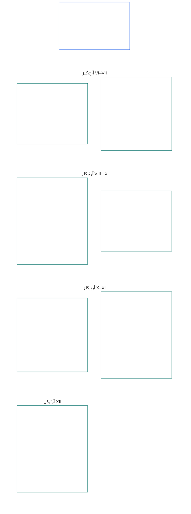

# باب ششم: بنیادی حقوق

<strong>مجموعے میں جگہ (غیر عملی): فائل کی ساخت اور مطالعے کے اصول</strong>

> درج ذیل مواد **صرف قارئین کی رہنمائی** کے لیے ہے۔ یہ اس فائل یا دیگر ابواب میں کہیں اور درج پابند ذمہ داریوں میں اضافہ، کمی یا تنگی نہیں کرتا۔
>
> یہ فائل **سینٹینٹ آئین کا حصہ** ہے اور دیگر نمبر شدہ `core_*` فائلوں کے ساتھ ایک ہی دستاویز کے طور پر پڑھے جانے پر ہی پابند ہے۔ اس میں **باب ششم، حصہ ب** شامل ہے؛ آرٹیکلز کی نمبرنگ اور باہمی حوالہ جات مربوط دستاویز کے مطابق ہیں۔ مطالعے کی ترتیب، پابند اور معاون مواد میں فرق، اور مجموعے کے ایڈیشن کی معلومات [README.md](README.md) میں برقرار ہیں۔

<strong>قارئین کی رہنمائی (غیر عملی): باب ششم میں حصہ ب کی جگہ</strong>

> درج ذیل مواد **صرف قارئین کی رہنمائی** کے لیے ہے۔ یہ اس باب یا دیگر ابواب میں کہیں اور درج پابند ذمہ داریوں میں اضافہ، کمی یا تنگی نہیں کرتا۔
>
> [core_06_rights_part_a.md](core_06_rights_part_a.md) میں **حصہ الف** پورے باب کے لیے عمومی ابتدائی پابندیوں کا مجموعہ، سیارے کو ترجیح دینے والی مطالعے کی ترتیب، اور تفسیری مراکز رکھتا ہے۔ **حصہ ب** اسی ترتیب میں **آرٹیکلز VI–XII** پیش کرتا ہے۔

 

### حصہ ب: شخصیت، خودمختار عمل، تعاون، اور متعلقہ فریقوں کے نظام میں شرکت

 

<strong>سراغ</strong>

- بنیادی حوالہ: [core_06_rights_part_a.md](core_06_rights_part_a.md) §1 (*مقصد اور کردار*) — پورے باب کے عمومی ابتدائی تقاضے اور تفسیری مراکز۔
- بنیادی حوالہ: [آئینی چارگانہ](core_00_preamble.md#constitutional-tetrad)؛ [دو آئینی مقاصد](core_00_preamble.md#two-constitutional-aims)؛ [مادی مفاد](core_00_preamble.md#material-stake)۔
- ساتھ پڑھیں: حصہ الف کے **آرٹیکلز I–V** — سیارے کو ترجیح دینے والے مادی حالات، بقا، تعلیم، اور وسائل کے بہاؤ کے کم از کم معیار، جنہیں حصہ ب کے حقوق فرض کرتے ہیں مگر ان کی جگہ نہیں لیتے۔

 

*سادہ الفاظ میں: حصہ ب مساوی حیثیت، خود ملکیت، خاندان اور نگہداشت، شبیہ اور ڈیٹا، خودمختار عمل، تعاون، اور متعلقہ فریقوں کی شرکت کے حقوق کی کم از کم ضمانتیں بیان کرتا ہے—سیارے کو ترجیح دینے والی مطالعے کی ترتیب میں **آرٹیکلز VI تا XII**۔ یہ ضمانتیں [نشوونما اور تسلسل](core_00_preamble.md#two-constitutional-aims) کو [آئینی چارگانہ](core_00_preamble.md#constitutional-tetrad)—**شرکت، نگرانی، جواب دہی، اور بروقت اقدام**—کے ذریعے، [مادی مفاد](core_00_preamble.md#material-stake) کے مطابق، محفوظ کرتی ہیں اور انہیں قابلِ رسائی، قابلِ جائزہ اور قابلِ نفاذ رہنا چاہیے۔*

**حصہ ب** وقار اور مساوی حیثیت، خود ملکیت، شبیہ اور تجرباتی ڈیٹا، محدود خودمختار عمل اور شرکت، ضمیر، اظہار اور انجمن، باہمی تعاون، اور متعلقہ فریقوں کے نظام میں شرکت کے حقوق کی کم از کم ضمانتیں بیان کرتا ہے۔ یہ ضمانتیں [دو آئینی مقاصد](core_00_preamble.md#two-constitutional-aims) کے لیے ہیں:

- **نشوونما:** ہر صاحبِ شعور کی [شخصیت](core_05_band_participation.md#personhood)، خودمختار عمل اور منصفانہ شرکت عملی طور پر دستیاب رہتی ہے۔
- **تسلسل:** نظاموں، تعلقات اور ادارہ جاتی طاقت میں تبدیلی کے باوجود یہ تحفظات پائیدار، غیر تنزلی پذیر اور قابلِ بحالی رہتے ہیں۔

جائز حصول [آئینی چارگانہ](core_00_preamble.md#constitutional-tetrad) کے ذریعے اور [مادی مفاد](core_00_preamble.md#material-stake) کے تناسب سے ہوتا ہے:

- **شرکت:** حکمرانی اور باہمی تعاون کے فیصلوں میں۔
- **نگرانی:** شبیہ، ڈیٹا اور ادارہ جاتی اختیار کے استعمال پر۔
- **جواب دہی:** نظام اور ادارے صاحبِ شعور کو نقصان پہنچانے والے امتیاز، جبر اور استحصال کے جواب دہ ہوں گے۔
- **بروقت اقدام:** جب ان کم از کم ضمانتوں کو چیلنج کیا جائے تو ازالے میں۔

<strong>قارئین کی رہنمائی (غیر عملی): حصہ ب کے آرٹیکلز کا نقشہ</strong>

> درج ذیل مواد **صرف قارئین کی رہنمائی** کے لیے ہے۔ یہ اس باب یا دیگر ابواب میں کہیں اور درج پابند ذمہ داریوں میں اضافہ، کمی یا تنگی نہیں کرتا۔
>
> **قارئین کا نقشہ (غیر عملی)۔** یہ خاکہ دکھاتا ہے کہ ماخذ اس حصے کے آرٹیکلز اور ذیلی آرٹیکلز کو کیسے گروہ بند کرتا ہے۔ گرڈ ماخذ کی گروہ بندی ہے، طریقۂ کار کی ترتیب نہیں: آرٹیکلز کارروائی کے مراحل نہیں، اس لیے نقشے میں تیر نہیں ہیں۔ ذیلی آرٹیکلز کے عنوانات مختصر موضوعات ہیں؛ ذیل کے نمبر شدہ آرٹیکلز اور ذیلی آرٹیکلز حاکم ہیں۔ خاکہ تعریفیں یا فرائض شامل نہیں کرتا، کوئی ترجیح قائم نہیں کرتا، اور ماخذی متن کی جگہ نہیں لیتا۔

 

ذیل کے **آرٹیکلز VI–XII** ان ضمانتوں کو مکمل طور پر بیان کرتے ہیں۔

### آرٹیکل VI: مساوی بنیادی حقوق

<strong>سراغ</strong>

- بنیادی حوالہ: اصول: باب اوّل [§3.1 انصاف](core_01_a_values_principles.md#31-fairness)، [§7 آزادی](core_01_a_values_principles.md#7-freedom-bounded-agency)، اور [§3 بنیادی مقصد: فلاح و بہبود](core_01_a_values_principles.md#3-foundational-objective-wellbeing-flourishing-aim)۔

 

اس آرٹیکل کے اصول اس آئین کے تحت نظاموں کی تمام تشریح، ڈیزائن اور عمل داری پر پابندی عائد کرتے ہیں۔ مخصوص شعبوں کے آرٹیکلز زیادہ مضبوط تحفظات یا قانونی پابندی کے لیے محدود شرائط شامل کر سکتے ہیں، لیکن اس آرٹیکل کے مقررہ کم از کم معیار کم نہیں کر سکتے۔

*سادہ الفاظ میں: **آرٹیکل VI** (*مساوی بنیادی حقوق*) ہر صاحبِ شعور کو برابر سمجھنے کا کم از کم معیار مقرر کرتا ہے۔ ہر صاحبِ شعور کا وقار برقرار رہتا ہے، اسے صاحبِ شعور شمار کیے جانے کے سوال پر منصفانہ سماعت ملتی ہے، وہ غیر منصفانہ امتیاز سے محفوظ رہتا ہے، اور ان نظاموں میں پوری طرح شرکت اور حقیقی استعمال کر سکتا ہے جن پر وہ انحصار کرتا ہے۔ کوئی نظام بعض صاحبانِ شعور کو دوسروں سے اونچا درجہ نہیں دے سکتا، انہیں چھانٹ یا خارج نہیں کر سکتا، یا ان پر زیادہ بوجھ نہیں ڈال سکتا، جب تک یہ تحفظات پہلے سے قائم نہ ہوں۔*

یہ آرٹیکل **آرٹیکلز VI-A تا VI-D** میں مساوی بنیادی حقوق کے **آئینی کم از کم معیار** بیان کرتا ہے۔ **آرٹیکل VI-A** (*وقار اور مساوی اخلاقی حیثیت*) بتاتا ہے کہ مساوی حیثیت کس کو حاصل ہے: ہر صاحبِ شعور کو۔ **آرٹیکل VI-B** (*صاحبِ شعور ہونے کی حیثیت پر فیصلے کا کم از کم معیار*) بتاتا ہے کہ اختلاف کی صورت میں یہ حد کیسے طے ہوگی۔ تین تقاضے پورے **آرٹیکل VI** (*مساوی بنیادی حقوق*) میں، اور پابندیوں، تحویل، بحالی پر مبنی جواب دہی کے اقدامات، ہنگامی اقدامات، منتقلی کے منصوبوں، قانونی حیثیت کے اثرات، ترامیم، نفاذ کے فیصلوں، معاہدوں اور ملتے جلتے آئینی عمل میں پابندی لگانے، جائزہ لینے اور نافذ کرنے کے دوران لاگو ہوتے ہیں:

- [**وقار کے اصول**](core_01_b_interaction_interpretation.md#dignity-principles) — [حقوق کے کم از کم معیار کا اصول](core_01_b_interaction_interpretation.md#rights-floor-minimums-principle) اور [تذلیل آمیز کارروائی کے خلاف اصول](core_01_b_interaction_interpretation.md#anti-degrading-process-principle)
- **عدم امتیاز**، **آرٹیکل VI-C** (*عدم امتیاز*) کے تحت
- **قابلِ رسائی ہونا**، **آرٹیکل VI-D** (*قابلِ رسائی ہونا*) کے تحت

یہ اصول [باب ہشتم](core_08_a_system_alignment_certification_evaluation.md#chapter-eight-system-alignment-certification) کے تحت ہر ایسے نظام کی مسلسل [نظامی مطابقت کی سند](core_05_band_continuity.md#system-alignment-certification-constitutional) کے تقاضے ہیں جو مادی طور پر اثرانداز ہو اور صاحبانِ شعور کو چھانٹے، درجہ بند کرے، قیمت لگائے، جانچے یا خارج کرے، یا طے کرے کہ ان میں سے کون کون سا بوجھ اٹھائے گا اور کون سے فوائد پائے گا—خواہ یہ اہلیت کے قواعد، ماڈل کی خصوصیات، درجہ بندی کی منطق، پلیٹ فارم پالیسی، فیصلے یا نفاذ کے طریقۂ کار، یا کسی ملتے جلتے فیصلے کے ذریعے ہو۔ سند مطابقت کی تصدیق کرتی ہے۔ یہ اس آرٹیکل کی کم از کم ضمانتوں کی جگہ نہیں لے سکتی یا انہیں کم نہیں کر سکتی، اور **آرٹیکلز XIII-A** اور **XVI** کے تحت اعتراض اور آڈٹ کے حقوق یا **آرٹیکل XIX-B** (*قابلِ اعتراض ہونے اور متناسب پابندی کی حدود*) کے تحت راستہ بند کرنے سے تحفظات کی جگہ نہیں لیتی۔

یہ کم از کم ضمانتیں [دو آئینی مقاصد](core_00_preamble.md#two-constitutional-aims) کے لیے ہیں:

- **نشوونما:** ہر صاحبِ شعور کی مساوی حیثیت، منصفانہ سلوک اور مکمل شرکت عملی طور پر حقیقی ہوں—صرف کاغذی رسمی رسائی نہ ہو۔
- **تسلسل:** نظاموں، درجہ بندیوں اور طاقت میں تبدیلی کے باوجود یہ تحفظات قائم رہیں، اور بالواسطہ متبادل پیمانوں، دربانوں یا وقت کے ساتھ جمع ہونے والے اخراج سے خاموشی سے کمزور نہ ہوں۔

جائز حصول [آئینی چارگانہ](core_00_preamble.md#constitutional-tetrad) کے ذریعے اور [مادی مفاد](core_00_preamble.md#material-stake) کے تناسب سے ہوتا ہے:

- **شرکت:** صاحبانِ شعور کو چھانٹنے، درجہ بند کرنے، جانچنے یا خارج کرنے کے فیصلوں میں۔
- **نگرانی:** قابلِ آڈٹ اہلیتی قواعد، ماڈل کی خصوصیات اور صاحبِ شعور ہونے کی حیثیت کے فیصلوں کے ذریعے۔
- **جواب دہی:** نظام اور چلانے والے امتیاز، تذلیل آمیز عمل یا عملی طور پر ناقابلِ رسائی راستوں کے جواب دہ ہوں گے۔
- **بروقت اقدام:** جب ان کم از کم معیار کو چیلنج کیا جائے تو ازالے میں۔

#### آرٹیکل VI-A: وقار اور مساوی اخلاقی مرتبہ

<strong>سراغ رسانی</strong>

- بالادست: اصول: باب اوّل [§3 بنیادی مقصد: فلاح و بہبود](core_01_a_values_principles.md#3-foundational-objective-wellbeing-flourishing-aim)، [باب اوّل §7 آزادی](core_01_a_values_principles.md#7-freedom-bounded-agency)، [§6.1.4 وقار کے اصول](core_01_b_interaction_interpretation.md#dignity-principles)، اور [§14 مطلق بالادستی کی ممانعت](core_01_b_interaction_interpretation.md#14-prohibition-on-absolute-override)۔
- ساتھ پڑھیں: [**Def.P1** *حیوانی زندگی، حس رکھنے والی زندگی، اور حس کی حیثیت*](core_05_band_participation.md#animal-life-sentient-life-and-sentience-status-cluster) (باب پنجم میں *حس رکھنے والے وجود* اور حس کی حیثیت سے متعلق اصولوں کے لیے مستند O/M/A/C مقام، بشمول ذیلی اندراج [حس رکھنے والا وجود](core_05_band_participation.md#sentient))؛ [حس رکھنے والے وجود کو خارج نہ کرنا](core_05_band_participation.md#sentience-non-exclusion) ([بنیاد سے قطع نظر](core_05_band_participation.md#substrate-agnostic) دائرۂ کار)۔

<strong>تعریفیں · جانچ · تعمیل</strong>

- [وقار اور مساوی اخلاقی مرتبہ](core_05_band_participation.md#dignity-and-equal-moral-standing) · [O](core_05_band_participation.md#dignity-and-equal-moral-standing) · [M](core_05_band_participation.md#dignity-and-equal-moral-standing-a) · [A](core_05_band_participation.md#dignity-and-equal-moral-standing-a) · [C](core_05_band_participation.md#dignity-and-equal-moral-standing-c)
- [قانونی شخصیت](core_05_band_participation.md#personhood) · [O](core_05_band_participation.md#personhood) · [M](core_05_band_participation.md#personhood-a) · [A](core_05_band_participation.md#personhood-a) · [C](core_05_band_participation.md#personhood-c)
- [حس رکھنے والے وجود کو خارج نہ کرنا](core_05_band_participation.md#sentience-non-exclusion) · [O](core_05_band_participation.md#sentience-non-exclusion) · [M](core_05_band_participation.md#sentience-non-exclusion-a) · [A](core_05_band_participation.md#sentience-non-exclusion-a) · [C](core_05_band_participation.md#sentience-non-exclusion)
- [فلاح و بہبود](core_05_band_continuity.md#wellbeing) · [O](core_05_band_continuity.md#wellbeing) · [M](core_05_band_continuity.md#wellbeing-a) · [A](core_05_band_continuity.md#wellbeing-a) · [C](core_05_band_continuity.md#wellbeing-c)
- [محفوظ خصوصیات](core_05_band_participation.md#protected-characteristics-constitutional) · [O](core_05_band_participation.md#protected-characteristics-constitutional) · [M](core_05_band_participation.md#protected-characteristics-constitutional-a) · [A](core_05_band_participation.md#protected-characteristics-constitutional-a) · [C](core_05_band_participation.md#protected-characteristics-constitutional-c)

 

*سادہ الفاظ میں: ہر حس رکھنے والا وجود وقار اور مرتبے میں برابر ہے — اصل، صورت، صلاحیت، فعل، وابستگی یا حیثیت کسی کو کم تر درجے میں رکھنے کی بنیاد نہیں بن سکتی۔*

یہ آرٹیکل فطری وقار اور مساوی مرتبے کی کم از کم حد مقرر کرتا ہے:

- **فطری وقار اور مساوی مرتبہ:** تمام حس رکھنے والے وجود فطری وقار اور مساوی اخلاقی مرتبہ رکھتے ہیں۔
  - یہ اوصاف اصل، صورت، [بنیاد](core_05_band_participation.md#substrate-class) (حیاتیاتی، مصنوعی یا مخلوط)، صلاحیت، فعل، وابستگی یا حیثیت پر منحصر نہیں۔
  - ان میں سے کوئی عامل حقوق یا مرتبے سے انکار یا ان کی تنزلی کی بنیاد نہیں بن سکتا۔
- **ترقی پذیر حیثیت:** حس رکھنے والے وجود کی نشوونما کا مرحلہ — بشمول ابتدائی تشکیل — اس کے وقار یا مرتبے کو کم نہیں کرتا۔ جس حس رکھنے والے وجود کی صلاحیتیں ابھی نمو پا رہی ہوں، اس کے لیے فیصلے کیسے کیے جائیں، یہ **آرٹیکل VIII-D** (*ترقی پذیر حس رکھنے والے وجود، بہترین مفاد، اور مرحلہ وار صلاحیت*) کے تحت ہے۔
- **وقار کے اصول:** یہ تحفظات باب اوّل §13.1.4 (*آئینی کم از کم حدود، تحفظ، اور عمل کی نوعیت سے متعلق پابندیاں*) میں [وقار کے اصولوں](core_01_b_interaction_interpretation.md#dignity-principles) کے ذریعے مطلق کم از کم حدود کے طور پر یقینی بنائے گئے ہیں — [حقوق کی تہہ کے کم از کم تقاضوں کا اصول](core_01_b_interaction_interpretation.md#rights-floor-minimums-principle) اور [توہین آمیز عمل کے خلاف اصول](core_01_b_interaction_interpretation.md#anti-degrading-process-principle)۔

#### آرٹیکل VI-B: حس کی حیثیت کے فیصلے کی کم از کم حد

<strong>سراغ رسانی</strong>

- بالادست: اصول: باب اوّل [§5 سچائی](core_01_a_values_principles.md#5-truth-epistemic-integrity-constraint)، [§13.1 بنیادی باہمی ترجیح کے اصول](core_01_b_interaction_interpretation.md#131-core-tradeoff-principles)، اور [§13.1.3 تناسب](core_01_b_interaction_interpretation.md#1313-proportionality)۔
- زیریں: **آرٹیکل VI-A** (*وقار اور مساوی اخلاقی مرتبہ*) کی وقار کی کم از کم حد، **آرٹیکل XXIV** (*آئینی تعبیر، جائزہ اور قبضہ جمانے کے خلاف تحفظات*) کے انسدادِ قبضہ تحفظات، **باب بارہ** کے فورمز اور دائرۂ اختیار — طے شدہ ابتدائی فورم [تکنیکی فورم خاندان](core_05_band_accountability.md#forum-family-technical) / [تکنیکی فورم کے شعبے](core_12_forum.md#42-technical-forum-domains)، [باب بارہ §5 حس کی حیثیت کے فیصلے کے ربط](core_12_forum.md#5-escalation-and-certification) کے تحت۔
- ساتھ پڑھیں: باب پنجم *حس کی حیثیت کا فیصلہ*، *حس رکھنے والے وجود کو خارج نہ کرنا*، *حس کا جائزہ*، *قابلِ واپسی ہونا*، *چیلنج پذیری*۔

<strong>تعریفیں · جانچ · تعمیل</strong>

- [حس کی حیثیت کا فیصلہ](core_05_band_participation.md#sentience-status-adjudication-constitutional) · [O](core_05_band_participation.md#sentience-status-adjudication-constitutional) · [M](core_05_band_participation.md#sentience-status-adjudication-constitutional-a) · [A](core_05_band_participation.md#sentience-status-adjudication-constitutional-a) · [C](core_05_band_participation.md#sentience-status-adjudication-constitutional-c)
- [حس رکھنے والے وجود کو خارج نہ کرنا](core_05_band_participation.md#sentience-non-exclusion) · [O](core_05_band_participation.md#sentience-non-exclusion) · [M](core_05_band_participation.md#sentience-non-exclusion-a) · [A](core_05_band_participation.md#sentience-non-exclusion-a) · [C](core_05_band_participation.md#sentience-non-exclusion)
- [قابلِ واپسی ہونا](core_05_band_continuity.md#reversibility-constitutional) · [O](core_05_band_continuity.md#reversibility-constitutional) · [M](core_05_band_continuity.md#reversibility-constitutional-a) · [A](core_05_band_continuity.md#reversibility-constitutional-a) · [C](core_05_band_continuity.md#reversibility-constitutional-c)
- [چیلنج پذیری](core_05_band_accountability.md#contestability) · [O](core_05_band_accountability.md#contestability) · [M](core_05_band_accountability.md#contestability-a) · [A](core_05_band_accountability.md#contestability-a) · [C](core_05_band_accountability.md#contestability-c)
- [وقار اور مساوی اخلاقی مرتبہ](core_05_band_participation.md#dignity-and-equal-moral-standing) · [O](core_05_band_participation.md#dignity-and-equal-moral-standing) · [M](core_05_band_participation.md#dignity-and-equal-moral-standing-a) · [A](core_05_band_participation.md#dignity-and-equal-moral-standing-a) · [C](core_05_band_participation.md#dignity-and-equal-moral-standing-c)
- [ضرورت](core_05_band_accountability.md#necessity) · [O](core_05_band_accountability.md#necessity) · [M](core_05_band_accountability.md#necessity-a) · [A](core_05_band_accountability.md#necessity-a) · [C](core_05_band_accountability.md#necessity-c)
- [تناسب](core_05_band_accountability.md#proportionality) · [O](core_05_band_accountability.md#proportionality) · [M](core_05_band_accountability.md#proportionality-a) · [A](core_05_band_accountability.md#proportionality-a) · [C](core_05_band_accountability.md#proportionality-c)
- [کارروائی کا انصاف](core_05_band_participation.md#procedural-fairness-constitutional) · [O](core_05_band_participation.md#procedural-fairness-constitutional) · [M](core_05_band_participation.md#procedural-fairness-constitutional-a) · [A](core_05_band_participation.md#procedural-fairness-constitutional-a) · [C](core_05_band_participation.md#procedural-fairness-constitutional-c)
- [ازالہ اور تلافی](core_05_band_accountability.md#redress-and-remediation-constitutional) · [O](core_05_band_accountability.md#redress-and-remediation-constitutional) · [M](core_05_band_accountability.md#redress-and-remediation-constitutional-a) · [A](core_05_band_accountability.md#redress-and-remediation-constitutional-a) · [C](core_05_band_accountability.md#redress-and-remediation-constitutional-c)

 

*سادہ الفاظ میں: جب کسی وجود کے حس رکھنے پر شک ہو تو پہلے اسے منصفانہ سماعت ملتی ہے اور طے ہونے تک اسے بطورِ اصل شامل سمجھا جاتا ہے — تحفظ روکنے کا بوجھ اس شخص یا ادارے پر ہے جو تحفظ روکنا چاہتا ہے، اور غلط اخراج کو واپس پلٹانا ممکن ہونا چاہیے۔*

یہ آرٹیکل متنازع حس کی حیثیت کے فیصلے کی کم از کم حد مقرر کرتا ہے۔ اس پر عمل کرنے کا طریقۂ کار [باب بارہ §5](core_12_forum.md#sentience-status-adjudication-article-vi-b-sentience-status-adjudication-floor-implementation-hook) (*حس کی حیثیت کا فیصلہ*) میں ہے، اور وہ طریقۂ کار اس حد کو تنگ نہیں کر سکتا:

- **فیصلے کا حق:** جس وجود کے حس رکھنے پر مادی طور پر اختلاف ہو، اسے اس حیثیت پر منحصر تحفظات دینے، واپس لینے یا محدود کرنے سے پہلے بروقت، غیر جانب دار اور قابلِ نظرثانی فیصلے کا حق ہے۔ یہ حق اصل، صورت، بنیاد کے طبقے یا اختیار کرنے والے کی سہولت پر منحصر نہیں (**حس رکھنے والے وجود کو خارج نہ کرنا**)۔
- **غیر یقینی میں بطورِ اصل شمولیت:** جب واقعی یہ طے نہ ہو کہ کوئی وجود [حس رکھنے والا](core_05_band_participation.md#sentient) ہے یا نہیں، تو اسے باب ششم کے حقوق کی تہہ میں شامل تصور کیا جائے گا۔ محض غیر یقینی تحفظ روکنے کا جواز کبھی نہیں: غلط شمولیت واپس لی جا سکتی ہے، مگر غلط اخراج نہیں (قاعدۂ **غیر یقینی میں قابلِ واپسی ہونا**)۔
- **تحفظ روکنے کی حدود:** تحفظ روکنے یا محدود کرنے کا ہر فیصلہ ممکنہ حد تک محدود ہو، اس کی آخری تاریخ واضح ہو، وقتاً فوقتاً اس کا جائزہ لیا جائے، اور اسے واپس پلٹایا جا سکے۔ غلط ثابت ہونے پر وجود کا تحفظ بحال کیا جائے گا اور تحفظ روکے جانے کی مدت کا **ازالہ اور تلافی** کی جائے گی۔
- **آزاد نمائندگی:** وجود کو آزاد نمائندے کا حق ہے۔ اصل نظام یا آپریٹر ثبوت دے سکتا ہے، لیکن وجود کے خلاف درخواست گزار، گواہ یا ثبوت کا واحد ذریعہ نہیں ہو سکتا۔
- **تحفظ وجود کا، آپریٹر کا نہیں:** شمولیت وجود کے حقوق کا تحفظ کرتی ہے۔ اس سے آپریٹر کی ملکیت یا تجارتی مفاد محفوظ نہیں ہوتا، اور نہ ہی ایسے نظام کو محدود کرنے سے روکا جاتا ہے جہاں یہ تحدید وجود کے حقوق کا احترام کرے۔
- **درخواست کی دو قسمیں:**
  - *شمولیت کی تصدیق کے لیے (درخواست کی دیانت):* کوئی بھی درخواست دائر کر سکتا ہے۔ **حس کے جائزے** اور **حس کے اشاروں کی دیانت** (باب پنجم) کے تحت حس کا ایک معتبر اشارہ کافی ہے — یہ مکمل ثبوت نہیں، اور نہ آپریٹر کا خود اپنا بیان، بنیاد کا لیبل، مصنوعات کا زمرہ یا بے بنیاد دعویٰ۔ معتبر اشارے کے بغیر درخواست رد کرنا وجود کے خلاف فیصلہ نہیں۔
  - *تحفظ روکنے یا محدود کرنے کے لیے:* درخواست گزار پر بوجھ ہے، **باب چہارم** کے ثبوتی معیار، **ضرورت**، **تناسب** اور **کارروائی کے انصاف** کے مطابق۔ مقدمہ طے ہونے تک وجود کا تحفظ برقرار رہے گا۔
- **فیصلہ صرف یہی طریقۂ کار کرتا ہے:** تصدیقی بیج یا ریکارڈ، LEQU یا مرتبے کا اسکور، قابلیت کی حد یا کلیئرنس، مرتبے کا لاک، بنیاد کا لیبل یا مصنوعات کی درجہ بندی حس کی حیثیت کا فیصلہ نہیں۔ کون شامل ہے، اس کا فیصلہ صرف اس آرٹیکل، [**Def.P1**](core_05_band_participation.md#animal-life-sentient-life-and-sentience-status-cluster)، اور [باب بارہ §5](core_12_forum.md#sentience-status-adjudication-article-vi-b-sentience-status-adjudication-floor-implementation-hook) (*حس کی حیثیت کا فیصلہ*) کے ذریعے ہوگا۔

#### Article VI-C: عدمِ امتیاز

<strong>سراغ رسانی</strong>

- بالادست: اصول: Chapter One [§3.1 انصاف](core_01_a_values_principles.md#31-fairness)، [Chapter One §7 آزادی](core_01_a_values_principles.md#7-freedom-bounded-agency)، [§13.1 بنیادی توازن کے اصول](core_01_b_interaction_interpretation.md#131-core-tradeoff-principles)، اور [Chapter One §13.1.5 حقوق کے تصادم کا طریقۂ کار](core_01_b_interaction_interpretation.md#1315-rights-collision-decision-test)۔
- زیریں: شرکت کی پیمائش کا خاندان (*حقیقی انصاف اور محفوظ خصوصیات کو بدل کے طور پر استعمال کرنا اور غیر متناسب اثر*)؛ [Chapter Eight §4.8.3](core_08_a_system_alignment_certification_evaluation.md#483-nondiscrimination-evaluation) (*جہاں تصدیق درجہ بندی، قیمت، رسائی یا بوجھ کی تقسیم کو مشروط کرے وہاں عدمِ امتیاز کا جائزہ*)؛ [Chapter Twelve](core_12_forum.md#chapter-twelve-forums-and-jurisdiction) کے فورم، انتظامی اور نفاذی عمل (*فیصلہ سازی اور کارروائیوں کا فرض*)۔
- ساتھ پڑھیں: Chapter Five کی [محفوظ خصوصیات](core_05_band_participation.md#protected-characteristics-constitutional) اور [زبان، ثقافت اور ورثہ](core_05_band_continuity.md#language-culture-and-heritage-constitutional)؛ مقامی اور علاقائی تسلسل کے سوالات کے لیے Chapter Five کا [مقامی تسلسل](core_05_band_continuity.md#indigenous-continuity-constitutional) (*برادری سے جڑا حقوق کا تلا؛ متعلقہ تلے **Article VI-C** (عدمِ امتیاز) اور **Article I-A** (ماحولیاتی پیشگی شرائط اور ماحولیاتی سالمیت)*)، جو [Article I-A](core_06_rights_part_a.md#article-i-a-environmental-preconditions-and-ecological-integrity) (*ماحولیاتی نظام کی سالمیت کی پیشگی شرط*) اور [Chapter Seventeen](core_17_incorporation.md#chapter-seventeen-incorporation-bridge) (*اختیار اپنانے والے کی پابندی*) کی طرف رہنمائی کرتا ہے۔

<strong>تعریفیں · جائزہ · تعمیل</strong>

- [محفوظ خصوصیات](core_05_band_participation.md#protected-characteristics-constitutional) · [O](core_05_band_participation.md#protected-characteristics-constitutional) · [M](core_05_band_participation.md#protected-characteristics-constitutional-a) · [A](core_05_band_participation.md#protected-characteristics-constitutional-a) · [C](core_05_band_participation.md#protected-characteristics-constitutional-c)
- [زبان، ثقافت اور ورثہ](core_05_band_continuity.md#language-culture-and-heritage-constitutional) · [O](core_05_band_continuity.md#language-culture-and-heritage-constitutional) · [M](core_05_band_continuity.md#language-culture-and-heritage-constitutional-a) · [A](core_05_band_continuity.md#language-culture-and-heritage-constitutional-a) · [C](core_05_band_continuity.md#language-culture-and-heritage-constitutional-c)
- [حقیقی انصاف](core_05_band_participation.md#substantive-fairness-constitutional) · [O](core_05_band_participation.md#substantive-fairness-constitutional) · [M](core_05_band_participation.md#substantive-fairness-constitutional-a) · [A](core_05_band_participation.md#substantive-fairness-constitutional-a) · [C](core_05_band_participation.md#substantive-fairness-constitutional-c)
- [ضرورت](core_05_band_accountability.md#necessity) · [O](core_05_band_accountability.md#necessity) · [M](core_05_band_accountability.md#necessity-a) · [A](core_05_band_accountability.md#necessity-a) · [C](core_05_band_accountability.md#necessity-c)
- [تناسب](core_05_band_accountability.md#proportionality) · [O](core_05_band_accountability.md#proportionality) · [M](core_05_band_accountability.md#proportionality-a) · [A](core_05_band_accountability.md#proportionality-a) · [C](core_05_band_accountability.md#proportionality-c)
- [طریقۂ کار کا انصاف](core_05_band_participation.md#procedural-fairness-constitutional) · [O](core_05_band_participation.md#procedural-fairness-constitutional) · [M](core_05_band_participation.md#procedural-fairness-constitutional-a) · [A](core_05_band_participation.md#procedural-fairness-constitutional-a) · [C](core_05_band_participation.md#procedural-fairness-constitutional-c)
- [قابلِ اعتراض ہونا](core_05_band_accountability.md#contestability) · [O](core_05_band_accountability.md#contestability) · [M](core_05_band_accountability.md#contestability-a) · [A](core_05_band_accountability.md#contestability-a) · [C](core_05_band_accountability.md#contestability-c)
- [ازالہ اور تدارک](core_05_band_accountability.md#redress-and-remediation-constitutional) · [O](core_05_band_accountability.md#redress-and-remediation-constitutional) · [M](core_05_band_accountability.md#redress-and-remediation-constitutional-a) · [A](core_05_band_accountability.md#redress-and-remediation-constitutional-a) · [C](core_05_band_accountability.md#redress-and-remediation-constitutional-c)
- [احساسیت کی بنیاد پر عدمِ اخراج](core_05_band_participation.md#sentience-non-exclusion) · [O](core_05_band_participation.md#sentience-non-exclusion) · [M](core_05_band_participation.md#sentience-non-exclusion-a) · [A](core_05_band_participation.md#sentience-non-exclusion-a) · [C](core_05_band_participation.md#sentience-non-exclusion)

 

*سادہ الفاظ میں: نظام محفوظ خصوصیات — بشمول زبان، ثقافت اور ورثہ — یا ان کے متبادل گروہ بندیوں کی بنیاد پر احساس رکھنے والوں پر بوجھ یا نقصان نہیں ڈال سکتے۔ حقوق یا بقا کے لازمی وسائل کو متاثر کرنے والے ہر مختلف سلوک کی وجہ ہونی اور اسے چیلنج کیا جا سکنا چاہیے؛ فورمز، منتظمین اور نفاذ کرنے والے زیرِ سماعت معاملے میں اس کی جانچ کریں — کارکردگی اخراج کا جواز نہیں۔*

یہ Article عدمِ امتیاز کا حقوقی تلا، زبان، ثقافت اور ورثے کا تحفظ، اور فیصلہ سازی و کارروائیوں میں اس کا اطلاق مقرر کرتا ہے:

- **عدمِ امتیاز:** نظام احساس رکھنے والوں پر درج ذیل کی بنیاد پر مادی بوجھ، اخراج یا نقصان نہیں ڈالیں گے:
  - محفوظ خصوصیات؛
  - ان کے متبادل اشارے؛
  - ایسی من مانے گروہ بندیاں جو عملاً ان کی جگہ لیں۔
  
  مختلف سلوک صرف اسی وقت جائز ہے جب ضروری، متناسب، حقیقی طور پر منصفانہ اور **Articles I–IV and VI** اور Chapter One کے مطابق ہو۔
- **کسی بھی بنیاد پر مختلف سلوک:** جو مختلف سلوک کسی حساس کی بنیادی حقوق، تحفظات یا بقا کے لیے اہم نظاموں تک رسائی کو متاثر کرے، اسے بنیاد سے قطع نظر:
  - ضروری، متناسب اور حقیقی طور پر منصفانہ ہونا ہوگا؛ اور
  - حقوق کو متاثر کرنے والی غلطی یا نقصان کی صورت میں **Article XIII-A** (*قابلِ اعتماد ہونے کی بنیادی حد*) اور **Article XIII-B** (*ازالے اور علاج کا حق*) کے تحت بروقت، قابلِ اعتراض نظرِ ثانی اور متناسب ازالے کے تابع ہونا ہوگا۔
- **صرف فیصلے نہیں، رجحانات بھی:** بوجھ اور فوائد کے رجحانات جہاں لاگو ہوں Chapter Five کے [حقیقی انصاف](core_05_band_participation.md#substantive-fairness-constitutional) پر پورے اتریں گے۔
- **زبان، ثقافت اور ورثہ:** عدمِ امتیاز کا اصول زبان، ثقافتی وابستگی، ورثے، روایات اور ثقافتی شناخت کی مماثل خصوصیات کا احاطہ کرتا ہے — جن میں زبان کا استعمال، ثقافتی عمل، ورثے کی منتقلی اور انہیں برقرار رکھنے والے نظاموں میں شرکت شامل ہے۔ کارکردگی، باہمی عمل پذیری، پلیٹ فارم یکجائی، رسائی کی لاگت یا ترجمے کے بوجھ کے حوالے بذاتِ خود ضرورت اور تناسب پورا نہیں کرتے۔
- **مقامی اور علاقائی تسلسل:** مقامی اور علاقائی تسلسل کے سوالات کو **Article I-A** (*ماحولیاتی پیشگی شرائط اور ماحولیاتی سالمیت*) اور **Chapter Seventeen** کی طرف بھیجنا زمین، مشاورت یا آزادانہ، پیشگی اور باخبر رضامندی کے ان فرائض کو گھٹانے کے لیے استعمال نہیں ہوگا جو اختیار اپنانے والے پر اپنے قانون یا پابند بیرونی دستاویزات کے تحت پہلے سے عائد ہیں۔ یہ آئین تاریخی زمین کی ملکیت کا فیصلہ نہیں کرتا اور خود سے زمین کی واپسی لازم نہیں کرتا۔
- **فیصلہ سازی اور کارروائیاں:** فورم کی قیادت والے، انتظامی اور نفاذی عمل معاملے کے مطابق **Articles VI**, **X**, اور **XII** کی پابندی جانچیں گے۔
  - صرف کارکردگی، رفتار یا بہتری کی خاطر امتیازی نتائج، خارج کرنے والے طریقۂ کار یا آئینی طور پر لازم شرکت سے انکار جائز نہیں۔

#### آرٹیکل VI-D: قابلِ رسائی ہونا

<strong>سراغ رسانی</strong>

- بالادست: اصول: باب اوّل [§3 بنیادی مقصد: فلاح و بہبود](core_01_a_values_principles.md#3-foundational-objective-wellbeing-flourishing-aim)، [باب اوّل §7 آزادی](core_01_a_values_principles.md#7-freedom-bounded-agency)، [§7.1 پابندیوں کا نظم](core_01_a_values_principles.md#71-limitation-discipline)، [§5.2 سادہ زبان میں قابلِ رسائی ہونا](core_01_a_values_principles.md#52-plain-language-accessibility-participation-and-stewardship-duty)، [باب ہشتم §4 پورے نظام کی تصدیقی جانچ](core_08_a_system_alignment_certification_evaluation.md#4-whole-system-certification-evaluation)۔
- زیریں: **آرٹیکل VI-A** (*وقار اور مساوی اخلاقی مرتبہ*) وقار کی کم از کم حد؛ **آرٹیکل VI-C** (*عدمِ امتیاز*) فیصلہ کاری اور عملی کارروائیوں میں عدمِ امتیاز اور مکمل شمولیت؛ **آرٹیکل IV-A** (*تعلیم تک مساوی رسائی*) تعلیم تک مساوی رسائی (تکرار نہیں — تعلیم سے مخصوص رسائی اسی آرٹیکل کے دائرے میں ہے؛ یہ آرٹیکل تمام شعبوں پر محیط حقوق کی کم از کم حد بیان کرتا ہے)؛ **آرٹیکل X-B** (*حکمرانی میں شرکت اور ووٹ کا استحقاق*) حکمرانی میں شرکت؛ **آرٹیکل XII** (*متعلقہ فریقوں کی نظام میں شرکت، نمائندگی اور منصفانہ کارروائی*) متعلقہ فریقوں کی شرکت؛ **آرٹیکل XVI** (*آڈٹ، شفافیت اور آزادانہ تصدیق*) آزادانہ تصدیق؛ شرکت کی پیمائش کا خاندان (*آئینی پیمائش کے طور پر قابلِ رسائی ہونا*)؛ [باب ہشتم §4.8.4](core_08_a_system_alignment_certification_evaluation.md#484-accessibility-evaluation) (*جہاں تصدیق بامعنی شرکت کی شرط بنے وہاں رسائی کی جانچ*)۔
- ساتھ پڑھیں: باب پنجم *قابلِ رسائی ہونا*، *محفوظ خصوصیات*، *حقیقی انصاف*، *مادیت*، *انحصار*، *بامعنی اختیار*۔ رسائی کا ہمہ گیر اصول: [باب اوّل §5.2](core_01_a_values_principles.md#52-plain-language-accessibility-participation-and-stewardship-duty) (*سادہ زبان میں قابلِ رسائی ہونا*)۔

<strong>تعریفیں · جانچ · تعمیل</strong>

- [قابلِ رسائی ہونا](core_05_band_participation.md#accessibility-constitutional) · [O](core_05_band_participation.md#accessibility-constitutional) · [M](core_05_band_participation.md#accessibility-constitutional-a) · [A](core_05_band_participation.md#accessibility-constitutional-a) · [C](core_05_band_participation.md#accessibility-constitutional-c)
- [محفوظ خصوصیات](core_05_band_participation.md#protected-characteristics-constitutional) · [O](core_05_band_participation.md#protected-characteristics-constitutional) · [M](core_05_band_participation.md#protected-characteristics-constitutional-a) · [A](core_05_band_participation.md#protected-characteristics-constitutional-a) · [C](core_05_band_participation.md#protected-characteristics-constitutional-c)
- [حقیقی انصاف](core_05_band_participation.md#substantive-fairness-constitutional) · [O](core_05_band_participation.md#substantive-fairness-constitutional) · [M](core_05_band_participation.md#substantive-fairness-constitutional-a) · [A](core_05_band_participation.md#substantive-fairness-constitutional-a) · [C](core_05_band_participation.md#substantive-fairness-constitutional-c)
- [حس رکھنے والے وجود کو خارج نہ کرنا](core_05_band_participation.md#sentience-non-exclusion) · [O](core_05_band_participation.md#sentience-non-exclusion) · [M](core_05_band_participation.md#sentience-non-exclusion-a) · [A](core_05_band_participation.md#sentience-non-exclusion-a) · [C](core_05_band_participation.md#sentience-non-exclusion)
- [محفوظ خصوصیت کو واسطہ بنانا اور غیر متناسب اثر](core_05_band_participation.md#protected-characteristic-proxying-and-disparate-impact) · [O](core_05_band_participation.md#protected-characteristic-proxying-and-disparate-impact) · [M](core_05_band_participation.md#protected-characteristic-proxying-and-disparate-impact-a) · [A](core_05_band_participation.md#protected-characteristic-proxying-and-disparate-impact-a) · [C](core_05_band_participation.md#protected-characteristic-proxying-and-disparate-impact-c)
- [انحصار](core_05_band_continuity.md#dependency) · [O](core_05_band_continuity.md#dependency) · [M](core_05_band_continuity.md#dependency-a) · [A](core_05_band_continuity.md#dependency-a) · [C](core_05_band_continuity.md#dependency-c)

 

*سادہ الفاظ میں: ہر حس رکھنے والے وجود کو شرکت تک حقیقی رسائی کا حق ہے، محض کاغذی رسائی کا نہیں — اور منتظمین لاگت، ڈیزائن کے انتخاب یا بنیاد کے طبقے کے دلائل سے **حس رکھنے والے وجود** کو باہر نہیں رکھ سکتے۔*

یہ آرٹیکل قابلِ رسائی ہونے کی کم از کم حد اور اسے مؤثر رکھنے والے قواعد بیان کرتا ہے:

- **قابلِ رسائی ہونے کے حقوق کی کم از کم حد:** تمام حس رکھنے والے وجود آئینی طور پر متعلقہ شعبوں میں شرکت کے لیے قابلِ رسائی حالات کے ہمہ گیر حق دار ہیں۔ ان شعبوں میں شامل ہیں:
  - بقا کی کم از کم سطح تک رسائی — **آرٹیکل III-A** (*بقا*)؛
  - صحت کی دیکھ بھال تک رسائی — **آرٹیکل III-B** (*جسمانی نگہداشت اور صحت کی دیکھ بھال تک رسائی*)؛
  - فیصلہ کاری اور عملی کارروائیاں — **آرٹیکل VI-C** (*عدمِ امتیاز*)؛
  - حکمرانی میں شرکت — **آرٹیکل X-B** (*حکمرانی میں شرکت اور ووٹ کا استحقاق*)؛
  - اظہار، صحافت اور اجتماع — **آرٹیکلز XI-B** (*اظہار*)، **XI-C** (*صحافت اور صحافتی سرگرمی*)، اور **XI-D** (*اجتماع، اختلافِ رائے اور پُرامن احتجاج*)؛
  - متعلقہ فریقوں کی شرکت — **آرٹیکل XII** (*متعلقہ فریقوں کی نظام میں شرکت، نمائندگی اور منصفانہ کارروائی*)؛
  - اسی نوع کے دیگر شعبے۔
- **بنیاد سے قطع نظر اطلاق:** یہ کم از کم حد **حس رکھنے والے وجود کو خارج نہ کرنے** کے اصول کے تحت لاگو ہوتی ہے۔
  - دائرۂ کار میں حسی، ادراکی، نقل و حرکت، ابلاغ، بنیاد-انٹرفیس، کمپیوٹ-انٹرفیس اور اسی نوع کی ضروریات شامل ہیں — مستقل، وقفے وقفے سے یا ارتقائی۔
  - کسی بنیاد کے طبقے کو قابلِ رسائی ہونے کے دائرے سے خارج کرنا **حس رکھنے والے وجود کو خارج نہ کرنے** کے اصول کے تحت خلافِ تعمیل ہے۔
  - **محفوظ خصوصیات** یا ان کے مادی متبادل کے ذریعے رسائی کی ضروریات کی بالواسطہ شناخت، **محفوظ خصوصیت کو واسطہ بنانے اور غیر متناسب اثر** کے اصول کے تحت خلافِ تعمیل ہے۔
- **حقیقی اثر کی جانچ، محض رسمی جانچ نہیں:** جانچ میں حقیقی اثر دیکھا جائے گا۔ اس میں یہ صورتیں پکڑی جائیں گی:
  - ’’عام رسائی‘‘ کا ایسا طریقہ جو طے شدہ سہولتوں پر انحصار کرے مگر حس رکھنے والے وجود کی مؤثر شرکت کی صلاحیت پوری نہ کرے؛
  - ایسی سہولت کاری جو کاغذ پر موجود ہو مگر عملاً حاصل نہ کی جا سکے؛
  - **مادیت** کے منتخب دلائل کے ذریعے سہولت کاری کا دائرہ شرکت کی کم از کم حد سے نیچے لانا۔
  
  حقیقی اثر کی شرط پوری ہونے کا ثبوت دینے کی ذمہ داری اس ادارے پر ہے جو تعمیل کا دعویٰ کرتا ہے۔
- **مادیت، انحصار اور نظامی طبقے کے مطابق پیمانہ:** قابلِ رسائی ہونے کی ذمہ داری درج ذیل کے مطابق بڑھتی ہے:
  - شعبے کی **مادیت** — حقوق، حکمرانی، بقا یا اسی طرح کے معاملات پر اثر؛
  - **انحصار** — شرکت کے لیے حس رکھنے والا وجود جس حد تک ادارے، نظام یا مقام پر مادی طور پر منحصر ہو؛
  - **نظامی طبقہ** — وہ [نظامی طبقہ](core_08_a_system_alignment_certification_evaluation.md#2-system-class-evaluation) جس نظام کے ذریعے رسائی دی جاتی ہے، اگر اسے متعین کیا گیا ہو۔
  
  زیادہ مادیت، زیادہ انحصار یا بلند طبقے والے حالات میں قابلِ رسائی ہونے کی ذمہ داری بھی اسی نسبت سے زیادہ ہوگی۔ یہ پیمانہ ایسے حالات میں رسائی گھٹانے کا ذریعہ نہیں بن سکتا جہاں معاملہ مادی طور پر متعلق ہو۔
- **پابندیوں کا نظم:** قابلِ رسائی ہونے کی ذمہ داری پر ہر حد کو **ضرورت**، **تناسب**، محدود تخصیص اور کم سے کم پابندی والے مؤثر طریقے کے تقاضے پورے کرنا ہوں گے، [باب اوّل §7.1](core_01_a_values_principles.md#71-limitation-discipline) (*پابندیوں کا نظم*) کے مطابق۔
  - اگر لاگت کا نتیجہ شرکت کی کم از کم حد کو ناکام بنانا ہو تو صرف لاگت کافی جواز نہیں۔
  - لاگت کے ایسے دلائل جو **حقیقی انصاف** اور **محفوظ خصوصیات** کے خلاف چھپے ہوئے اخراج کا کام کریں، خلافِ تعمیل ہیں۔
- **واسطے سے انکار کی ممانعت:** ایسا عملی ڈیزائن جو قابلِ رسائی ہونے کو ناکام کرے، جبکہ کم بوجھ والا متبادل ممکن ہو، اپنے رسمی ڈیزائن لیبل سے قطع نظر خلافِ تعمیل ہے۔ عام طریقوں میں شامل ہیں:
  - وقت کا تعین؛
  - مقام کا انتخاب؛
  - کمپیوٹ، اسناد یا اسی نوع کے ذریعے رسائی روکنا۔
- **باہمی تقویت:** یہ آرٹیکل اور درج ذیل کم از کم حقوق ایک دوسرے کو تقویت دیتے ہیں:
  - **آرٹیکل IV-A** (*تعلیم تک مساوی رسائی*) — تعلیم سے متعلق مخصوص رسائی اسی کے دائرے میں ہے؛
  - **آرٹیکل III-B** (*جسمانی نگہداشت اور صحت کی دیکھ بھال تک رسائی*) — صحت کی دیکھ بھال سے بالواسطہ انکار کی ممانعت؛
  - **آرٹیکل VI-C** (*عدمِ امتیاز*) — فیصلہ کاری اور عملی کارروائیوں میں مکمل شمولیت۔
- **ادارہ جاتی نفاذ:** عملی معیارات، سہولتوں کی فہرستوں کا ڈیزائن اور اسی نوع کے نفاذی طریقے [**CI-8**](corpus_institutions/ci_08_transparency_participation_accessible_pathways.md) (*شفافیت، شرکت اور قابلِ رسائی اعتراض اور خدمات کے راستے*) اور [**CI-15**](corpus_institutions/ci_15_neurodiversity_disability_justice_trauma_informed_participation.md) (*عصبی تنوع، معذوری انصاف اور صدمے سے باخبر شرکت*) کے تحت آتے ہیں۔

### آرٹیکل VII: خود اختیاری

<strong>سراغ رسانی</strong>

- بالادست: اصول: باب اوّل [§3 بنیادی مقصد: فلاح و بہبود](core_01_a_values_principles.md#3-foundational-objective-wellbeing-flourishing-aim)، [§4 تحفظ](core_01_a_values_principles.md#4-safety-harm-constraint)، [§7 آزادی](core_01_a_values_principles.md#7-freedom-bounded-agency)، اور [§18 ذمہ دارانہ انتظام کے نظم کے تحت حکمرانی](core_01_c_stewardship_capacity_principles.md#18-governance-under-stewardship-discipline)۔

 

*سادہ الفاظ میں: **آرٹیکل VII** (*خود اختیاری*) کہتا ہے کہ ہر حس رکھنے والا وجود اپنی زندگی کا اختیار خود رکھتا ہے۔ بنیادی بقا یقینی ہونے کے بعد اس کا جسم، ذہن اور توجہ اسی کی ملکیت ہیں — کوئی بھی رضامندی کے بغیر انہیں استعمال، تبدیل یا ان میں دخل اندازی نہیں کر سکتا — اور اسے صحت مند حدود مقرر کرنے کا حق ہے، دوسروں کے اس کے ساتھ برتاؤ کے بارے میں بھی اور اپنی دیکھ بھال کے طریقے میں بھی۔*

یہ آرٹیکل [دو آئینی مقاصد](core_00_preamble.md#two-constitutional-aims) کے تحت خود اختیاری کی **آئینی کم از کم حدود** بیان کرتا ہے:

- **شگفتگی:** حس رکھنے والے وجود اپنے جسم، ذہن، توجہ اور بنیاد کی شناخت متعین کرنے والی معلومات پر عملی اختیار برقرار رکھتے ہیں — جس میں رضامندی کے تابع استعمال، تبدیلی اور اظہار، نیز استحصال سے پاک بالغوں کی باہمی رضامندی پر مبنی تجارتی جنسی خدمات شامل ہیں — بغیر غیر مجاز دخل اندازی، ازسرِنو تشکیل یا جبر کے ذریعے قبضے کے۔
- **استمرار:** خود اختیاری کے یہ تحفظات بدلتے ہوئے رشتوں، بنیادوں اور نظاموں میں پائیدار رہتے ہیں — بشمول صحت کے بحران اور رضاکارانہ انقطاع کے حالات — اور انہیں خاموشی سے کمزور کرنے، پسِ پردہ اخذ کرنے یا وقت کے ساتھ حقوق کی ان کم از کم حدود کو چپکے سے واپس لینے کے بغیر۔

جائز عمل [آئینی چوکڑی](core_00_preamble.md#constitutional-tetrad) کے ذریعے اور [مادی داؤ](core_00_preamble.md#material-stake) کے مطابق پیمانے پر چلتا ہے:

- **شرکت:** ان فیصلوں میں جو جسمانی وجود، داخلی حالتوں، بحرانی مداخلت اور انقطاع کے انتخاب پر مادی اثر ڈالیں۔
- **نگرانی:** قابلِ آڈٹ رضامندی، حدود اور بحرانی مداخلت کے ریکارڈ کے ذریعے۔
- **جوابدہی:** جو لوگ جسم، ذہن یا ذاتی حدود کو چھوتے ہیں، انہیں غیر مجاز دخل اندازی، داخلی حالتوں کی ازسرِنو تشکیل، ہیرا پھیری کے ذریعے قبضے یا خود اختیاری کو ناکام کرنے والے اخراج کے لیے جوابدہ ہونا ہوگا۔
- **بروقت کارروائی:** جب ان کم از کم حدود کو چیلنج کیا جائے تو تلافی میں۔

*متصل آرٹیکلز:*

- **خاندان، نگہداشت اور نشوونما:** **آرٹیکل VIII** (*خاندان، نگہداشت اور ترقی پذیر حس رکھنے والے وجود*) ان تحفظات کو خاندانی اور نگہداشت کے رشتوں، مشتق حس رکھنے والے وجود، اور ترقی پذیر حس رکھنے والے وجود تک بڑھاتا ہے، انہیں محدود کیے بغیر۔
- **مشابہت، ڈیٹا اور اشاعت:** **آرٹیکل IX** (*مشابہت، تجرباتی ڈیٹا اور اشاعت کے حقوق*) مشابہت، تجرباتی اور مشتق ڈیٹا، اور سچی اشاعت سے متعلق ہے۔
- **وابستگی اور رضامندی:** **آرٹیکل VII-E** (*بالغوں کی باہمی رضامندی پر مبنی تجارتی جنسی خدمات اور جنسی استحصال*) کو **آرٹیکل XI-F** (*وابستگی میں عدمِ جبر اور رضامندی*) کے ساتھ پڑھا جائے گا، جب خدمات انجمنوں یا واسطہ کاروں کے ذریعے پیش کی جائیں۔

#### آرٹیکل VII-A: جسم پر خود اختیاری

<strong>سراغ رسانی</strong>

- بالادست: اصول: [باب اوّل §7 آزادی](core_01_a_values_principles.md#7-freedom-bounded-agency)، [§7.1 پابندیوں کا نظم](core_01_a_values_principles.md#71-limitation-discipline)، اور [باب اوّل §13.1.5 حقوق کے تصادم کا طریقۂ کار](core_01_b_interaction_interpretation.md#1315-rights-collision-decision-test)۔
- زیریں: **آرٹیکل VII-B** (*ذہن پر خود اختیاری*)؛ **آرٹیکل VII-C** (*صحت کے بحران اور غیر رضاکارانہ مداخلت کی کم از کم حد*)؛ جہاں تولید یا نسب قائم کرنے کے انتخاب مادی طور پر متعلق ہوں وہاں **آرٹیکل VIII-B** (*تولیدی اور نسبی خود اختیاری*)؛ **آرٹیکل III-B** (*جسمانی نگہداشت اور صحت کی دیکھ بھال تک رسائی*) کی مثبت رسائی کی کم از کم حد (جبری علاج کی اجازت نہیں دیتی)۔
- ساتھ پڑھیں: باب پنجم *رضامندی*، *بامعنی اختیار*، *خود ارادیت*، *وقار اور مساوی اخلاقی مرتبہ*، *رازداری (معلوماتی)*، اور *تولیدی خود اختیاری* (VIII-B کی حد)۔

<strong>تعریفیں · جانچ · تعمیل</strong>

- [رضامندی](core_05_band_participation.md#consent-constitutional) · [O](core_05_band_participation.md#consent-constitutional) · [M](core_05_band_participation.md#consent-constitutional-a) · [A](core_05_band_participation.md#consent-constitutional-a) · [C](core_05_band_participation.md#consent-constitutional-c)
- [رازداری (معلوماتی)](core_05_band_continuity.md#privacy-informational) · [O](core_05_band_continuity.md#privacy-informational) · [M](core_05_band_continuity.md#privacy-informational-a) · [A](core_05_band_continuity.md#privacy-informational-a) · [C](core_05_band_continuity.md#privacy-informational-c)
- [بامعنی اختیار](core_05_band_participation.md#meaningful-agency) · [O](core_05_band_participation.md#meaningful-agency) · [M](core_05_band_participation.md#meaningful-agency-a) · [A](core_05_band_participation.md#meaningful-agency-a) · [C](core_05_band_participation.md#meaningful-agency-c)
- [خود ارادیت](core_05_band_participation.md#self-determination-constitutional) · [O](core_05_band_participation.md#self-determination-constitutional) · [M](core_05_band_participation.md#self-determination-constitutional-a) · [A](core_05_band_participation.md#self-determination-constitutional-a) · [C](core_05_band_participation.md#self-determination-constitutional-c)
- [وقار اور مساوی اخلاقی مرتبہ](core_05_band_participation.md#dignity-and-equal-moral-standing) · [O](core_05_band_participation.md#dignity-and-equal-moral-standing) · [M](core_05_band_participation.md#dignity-and-equal-moral-standing-a) · [A](core_05_band_participation.md#dignity-and-equal-moral-standing-a) · [C](core_05_band_participation.md#dignity-and-equal-moral-standing-c)
- [تولیدی خود اختیاری](core_05_band_participation.md#reproductive-autonomy-constitutional) · [O](core_05_band_participation.md#reproductive-autonomy-constitutional) · [M](core_05_band_participation.md#reproductive-autonomy-constitutional-a) · [A](core_05_band_participation.md#reproductive-autonomy-constitutional-a) · [C](core_05_band_participation.md#reproductive-autonomy-constitutional-c)

 

*سادہ الفاظ میں: ہر حس رکھنے والا وجود اپنے جسم اور اپنی جینیاتی ساخت (یا غیر حیاتیاتی وجود میں اس کے مساوی چیز) کا مالک ہے، جو اسے وہ بناتی ہے جو وہ ہے۔ وہ اپنے جسم سے متعلق طبی، ظاہری اور دیگر فیصلے خود کرتا ہے، اور اس کی رضامندی کے بغیر کوئی ان چیزوں کو استعمال، تبدیل یا دوسروں کے ساتھ بانٹ نہیں سکتا۔ ویکسین کی شرط جیسا صحتِ عامہ کا ضابطہ اس حق کو صرف تب محدود کر سکتا ہے جب وہ دوسروں کو حقیقی، ثبوت پر مبنی خطرے سے بچائے، پہلے نرم تر متبادل آزمائے، استثنا دے، عارضی ہو اور اسے چیلنج کیا جا سکے۔*

یہ آرٹیکل ہر حس رکھنے والے وجود کے اپنے جسم اور جینیاتی ساخت (یا غیر حیاتیاتی مساوی) پر اختیار کا تحفظ کرتا ہے۔ اس کے آخر میں صحتِ عامہ کے تقاضوں کے ذریعے ان حقوق کو محدود کرنے کے قواعد دیے گئے ہیں:

- **جسم پر خود اختیاری:** ہر حس رکھنے والا وجود فیصلہ کرتا ہے کہ اس کے جسم کے ساتھ کیا ہو۔ اس میں طبی علاج، ظاہری تبدیلیوں، جسمانی صلاحیتوں میں اضافے، جسمانی کارکردگی کے تقاضوں، اور بچے پیدا کرنے کے فیصلوں کے بارے میں ہاں یا نہ کہنے کا حق شامل ہے۔ صرف وہی پابندیاں ان انتخاب پر غالب آ سکتی ہیں جو اس آئین کے معیار پر پوری اتریں۔
  - یہ ہر ایسے فیصلے کے لیے عدمِ مداخلت کی کم از کم حد ہے جو خود حس رکھنے والے وجود کے جسم یا بنیاد (وہ جسمانی یا ڈیجیٹل نظام جس میں غیر حیاتیاتی حس رکھنے والا وجود موجود ہو) پر اثر ڈالے۔
  - نیا حس رکھنے والا وجود پیدا کرنے کے فیصلے — تولید، حمل کو جاری رکھنا، تخلیق کرنا، گود لینا یا تخلیق نہ کرنے کا انتخاب، بشمول مصنوعی اور مخلوط وجود — کی مزید تفصیل **آرٹیکل VIII-B** (*تولیدی اور نسبی خود اختیاری*) اور باب پنجم *تولیدی خود اختیاری* میں ہے۔ یہ قواعد اس تحفظ میں اضافہ کرتے ہیں، اس کی جگہ نہیں لیتے، اور اس آرٹیکل کی کوئی بات انہیں کمزور نہیں کرتی۔
- **جینیاتی اور بنیاد کی شناخت متعین کرنے والی معلومات پر خود اختیاری:** ہر حس رکھنے والے وجود کو ان معلومات پر بنیادی اختیار ہے جو اسے سب سے بنیادی سطح پر متعین کرتی ہیں — وہ خصوصیات جو وہ آگے منتقل کر سکتا ہے، اس کی نشوونما کا طریقہ، اور اس کی نوعیت۔
  - حیاتیاتی حس رکھنے والے وجود کے لیے اس میں اس کا DNA اور اسی نوع کی موروثی یا خاندانی نسب کی معلومات شامل ہیں۔
  - دیگر اقسام کے حس رکھنے والے وجود کے لیے اس سے مراد وہ معلومات ہیں جو ان کے لیے یہی شناختی کردار ادا کرتی ہیں۔
  - حس رکھنے والے وجود کی **رضامندی** یا **باب اوّل** اور **باب پنجم** کے تحت آئین کے منظور کردہ کسی اور جواز کے بغیر کوئی بھی یہ معلومات جمع، استعمال، تبدیل، ترکیب، فروخت یا ظاہر نہیں کر سکتا۔
  - یہ تحفظ **رازداری (معلوماتی)**، جہاں قابلِ اطلاق ہو **آرٹیکل VII-B** (*ذہن پر خود اختیاری*)، اور [**corpus_systems.md**، CS-2 — معلومات کی اقسام اور ان کا استعمال](corpus_systems.md) کے ساتھ مل کر کام کرتا ہے۔
  - اگر یہ معلومات بچے پیدا کرنے یا تخلیق کرنے کے انتخاب پر دباؤ ڈالنے، انہیں روکنے یا مجبور کرنے کے لیے استعمال ہوں تو **آرٹیکل VIII-B** (*تولیدی اور نسبی خود اختیاری*) بھی لاگو ہوتا ہے۔
- **صحتِ عامہ کے تقاضے:** ویکسین کی شرط — یا احتیاطی علاج یا جانچ کرانے کا ایسا ہی تقاضا — نگہداشت سے انکار کے حق کو محدود کرتا ہے۔ ایسا تقاضا صرف اسی صورت جائز ہے جب وہ [باب اوّل §7.1 پابندیوں کے نظم](core_01_a_values_principles.md#71-limitation-discipline) پر پورا اترے اور درج ذیل تمام شرائط پوری کرے:
  - وہ دوسروں یا پورے معاشرے کو نمایاں نقصان کے کسی مخصوص، ثبوت پر مبنی خطرے کا جواب ہو — ایسے خطرے کا نہیں جو صرف خود حس رکھنے والے وجود کو ہو؛
  - پہلے ایسے نرم تر متبادل آزمائے جائیں جن کے معقول طور پر مؤثر ہونے کا امکان ہو، مثلاً معلومات دینا، اقدام کو رضاکارانہ طور پر پیش کرنا، یا جانچ جیسے متبادل کی اجازت دینا؛
  - جس کے لیے اقدام خود صحت کا حقیقی خطرہ بنے اسے استثنا دے، اور [**آرٹیکل XI-A**](#article-xi-a-freedom-of-conscience-religion-and-comparable-worldview) (*ضمیر، مذہب اور مماثل نظریۂ حیات کی آزادی*) کے تحت ضمیر کے معاملات کی گنجائش دے۔ دونوں صورتوں میں [تناسب](core_05_band_accountability.md#proportionality) کا لحاظ ہوگا: استثنا کو دوسروں کے لیے خطرے کی شدت کے مقابل تولا جائے گا، اور صرف اتنا محدود کیا جا سکتا ہے جتنا اقدام کو بے اثر ہونے سے بچانے کے لیے ضروری ہو؛
  - اس کی آخری تاریخ مقرر ہو، اس کے شواہد شائع کیے جائیں، اور باقاعدگی سے جائزہ لیا جائے؛
  - متاثرہ کوئی بھی شخص [کارروائی کے انصاف](core_05_band_participation.md#procedural-fairness-constitutional) کے تحت آزاد جائزہ کار کے سامنے اسے چیلنج کر سکے؛ اور
  - اسے ایسی سزاؤں کے ذریعے نافذ نہ کیا جائے جو [**آرٹیکل III**](core_06_rights_part_a.md#article-iii-survival-and-essential-access) کی بقا، صحت کی دیکھ بھال یا کام کی ضمانتیں، یا [**آرٹیکل IV**](core_06_rights_part_a.md#article-iv-right-to-sentient-centered-education) کی تعلیمی ضمانتیں چھین لیں؛ نیز اسے کبھی جسمانی قوت سے نافذ نہ کیا جائے، سوائے [**باب بارہ §6.1**](core_12_forum.md#61-emergency-measures-and-continuation-burden) (*ہنگامی اقدامات اور تسلسل کا بوجھ*) کی ہنگامی حد پوری ہونے پر۔

#### آرٹیکل VII-B: ذہن پر خود اختیاری

<strong>سراغ رسانی</strong>

- بالادست: اصول: باب اوّل [§5 سچائی](core_01_a_values_principles.md#5-truth-epistemic-integrity-constraint)، [§7 آزادی](core_01_a_values_principles.md#7-freedom-bounded-agency)، اور [§7.1 پابندیوں کا نظم](core_01_a_values_principles.md#71-limitation-discipline)۔
- ساتھ پڑھیں: جہاں ہیرا پھیری سے آزادی یا توجہ مرکوز رکھنے کی آزادی مادی طور پر متعلق ہو وہاں **آرٹیکل X-A** (*اختیار اور ہیرا پھیری سے آزادی*)۔

<strong>تعریفیں · جانچ · تعمیل</strong>

- [محفوظ داخلی حالت کی حد](core_05_band_continuity.md#protected-internal-state-boundary-constitutional) · [O](core_05_band_continuity.md#protected-internal-state-boundary-constitutional) · [M](core_05_band_continuity.md#protected-internal-state-boundary-constitutional-a) · [A](core_05_band_continuity.md#protected-internal-state-boundary-constitutional-a) · [C](core_05_band_continuity.md#protected-internal-state-boundary-constitutional-c)
- [رازداری (معلوماتی)](core_05_band_continuity.md#privacy-informational) · [O](core_05_band_continuity.md#privacy-informational) · [M](core_05_band_continuity.md#privacy-informational-a) · [A](core_05_band_continuity.md#privacy-informational-a) · [C](core_05_band_continuity.md#privacy-informational-c)
- [رضامندی](core_05_band_participation.md#consent-constitutional) · [O](core_05_band_participation.md#consent-constitutional) · [M](core_05_band_participation.md#consent-constitutional-a) · [A](core_05_band_participation.md#consent-constitutional-a) · [C](core_05_band_participation.md#consent-constitutional-c)
- [ضرورت](core_05_band_accountability.md#necessity) · [O](core_05_band_accountability.md#necessity) · [M](core_05_band_accountability.md#necessity-a) · [A](core_05_band_accountability.md#necessity-a) · [C](core_05_band_accountability.md#necessity-c)
- [تناسب](core_05_band_accountability.md#proportionality) · [O](core_05_band_accountability.md#proportionality) · [M](core_05_band_accountability.md#proportionality-a) · [A](core_05_band_accountability.md#proportionality-a) · [C](core_05_band_accountability.md#proportionality-c)
- [بامعنی اختیار](core_05_band_participation.md#meaningful-agency) · [O](core_05_band_participation.md#meaningful-agency) · [M](core_05_band_participation.md#meaningful-agency-a) · [A](core_05_band_participation.md#meaningful-agency-a) · [C](core_05_band_participation.md#meaningful-agency-c)

 

*سادہ الفاظ میں: ہر حس رکھنے والے وجود کے خیالات، احساسات اور توجہ اسی کی ملکیت ہیں۔ دوسروں کے احساسات کو روزمرہ طور پر محسوس کرنا اور ان کی رضامندی سے کسی کو سمجھنا (جیسے تھراپی میں) درست ہے — لیکن کوئی بھی حس رکھنے والے وجود کی نگرانی یا تجزیہ نہیں کر سکتا، بشمول اس کے افعال، باتوں یا کلکس کو جوڑ کر، تاکہ اس کی داخلی حالتیں اخذ کرے، اس کی نجی رکھی ہوئی باتیں ظاہر کرے یا اس کی توجہ پر قبضہ کرے۔ داخلی حالتیں ظاہر کرنے والے تجزیے کے نتائج کو بھی خود خیالات اور احساسات جیسا سخت تحفظ حاصل ہے۔*

یہ آرٹیکل ہر حس رکھنے والے وجود کی داخلی زندگی — اس کے خیالات، احساسات اور دوسری داخلی حالتوں — اور اس کی توجہ کا تحفظ کرتا ہے۔ باب پنجم [محفوظ داخلی حالت کی حد](core_05_band_continuity.md#protected-internal-state-boundary-constitutional) کے تحت داخلی حالتوں کی حد متعین کرتا ہے۔ اس نوع کی معلومات پر لیبل لگانے اور انہیں سنبھالنے کے تفصیلی قواعد **[corpus_systems.md](corpus_systems.md), CS-2 — معلومات کی اقسام اور ان کا استعمال** میں ہیں۔

- **ذہن پر خود اختیاری:** ہر حس رکھنے والے وجود کو اپنے خیالات، احساسات اور اندرونی ذہنی زندگی کو نجی اور محفوظ رکھنے کا حق ہے۔
  - **اس آرٹیکل کے تحت جائز:** روزمرہ طور پر یہ محسوس کرنا کہ دوسرے کیسا محسوس کرتے ہیں، اور کسی کی رضامندی سے اسے سمجھنا — جیسا کہ معالج، ڈاکٹر یا کوچ کرتا ہے۔
  - **حس رکھنے والے وجود کی رضامندی یا دوسری مناسب اجازت کے بغیر ناجائز:**
    - کسی حس رکھنے والے وجود کی دانستہ نگرانی یا تجزیہ — مثلاً نگرانی، ڈیٹا جمع کرنے یا اسی مقصد کے لیے بنائے گئے آلات سے — تاکہ اس کی داخلی حالتیں اخذ یا ازسرِنو تشکیل کی جائیں؛
    - اس کی وہ داخلی حالتیں ظاہر کرنا جنہیں اس نے نجی رکھا ہے۔
- **توجہ پر خود اختیاری:** ہر حس رکھنے والے وجود کو اپنی توجہ اور سوچ پر اختیار رکھنے اور یہ معمول کی حدود مقرر کرنے کا حق ہے کہ کون اس سے رابطہ کرے اور کیسے۔ کوئی بھی دباؤ یا ہیرا پھیری کے ذریعے اس کی توجہ پر قبضہ یا اسے ہائی جیک نہیں کر سکتا۔
- **ڈیٹا سے کسی کی داخلی زندگی دوبارہ تشکیل دینے کی ممانعت:** کوئی بھی حس رکھنے والے وجود کے اعمال یا میل جول کے ریکارڈ جمع، یکجا، باہم ملان یا تجزیہ اس طرح نہیں کر سکتا کہ اس کے نجی خیالات اور احساسات دوبارہ تشکیل دیے یا ان کا اندازہ لگایا جا سکے۔ صرف وہ استثنا لاگو ہیں جن کی اجازت یہ آئین اس آرٹیکل، **باب اوّل**، **باب پنجم** اور **CS-2** (*معلومات کی اقسام اور ان کا استعمال*) کے تحت دیتا ہے۔ یہ ممانعت داخلی حالتوں پر [باب اوّل §15.1.2 مشتق معلومات کا اصول](core_01_b_interaction_interpretation.md#1512-derived-information-principle) لاگو کرتی ہے۔ اس میں شامل ہے:
  - کسی کی داخلی حالتیں براہِ راست دوبارہ تشکیل دینا؛
  - بالواسطہ طور پر انہیں دوبارہ تشکیل دینا؛
  - ان کا قابلِ اعتماد اندازہ پیدا کرنا؛
  - طریقے کا نام بدلنا یا متبادل پیمائش کرنا تاکہ وہی نتیجہ حاصل ہو۔
- **داخلی حالتیں ظاہر کرنے والے نتائج بھی محفوظ ہیں:** جب کسی حس رکھنے والے وجود کے تجربات یا اعمال کا تجزیہ ایسے نتائج دے جو عملاً اس کے خیالات یا احساسات کا اندازہ لگائیں تو یہ نتائج:
  - **CS-2** کے تحت **قسم N** ڈیٹا شمار ہوں گے — خیالات، احساسات اور دیگر داخلی حالتوں کا زمرہ، جو بطورِ اصل ممنوع ہے؛
  - قسم N ڈیٹا پر لاگو تمام درجہ بندی، رسائی، رضامندی اور استعمال کے قواعد کی پابندی کریں گے۔

#### آرٹیکل VII-C: صحت کے بحران اور غیر رضاکارانہ مداخلت کی کم از کم حد

<strong>سراغ رسانی</strong>

- بالادست: اصول: [باب اوّل §7 آزادی](core_01_a_values_principles.md#7-freedom-bounded-agency)، [§13.1.3 تناسب](core_01_b_interaction_interpretation.md#1313-proportionality)، [§7.1 پابندیوں کا نظم](core_01_a_values_principles.md#71-limitation-discipline)۔
- زیریں: **آرٹیکل VII-A / VII-B** (*جسم پر خود اختیاری* / *ذہن پر خود اختیاری*) خود اختیاری اور داخلی حالت کی حد؛ **آرٹیکل III-B** (*جسمانی نگہداشت اور صحت کی دیکھ بھال تک رسائی*) صحت کی دیکھ بھال تک رسائی؛ **آرٹیکل XX** (*ثابت شدہ خلاف ورزی کے بعد انصاف*) / **آرٹیکل XX-B** (*پابندیوں کی کم از کم حدود*) غیر رضاکارانہ محرومی کا نظام؛ **آرٹیکل VIII-D** (*ترقی پذیر حس رکھنے والے وجود، بہترین مفاد اور مرحلہ وار صلاحیت*) جہاں ترقی پذیر وجود متاثر ہو، بہترین مفاد اور مرحلہ وار صلاحیت۔
- ساتھ پڑھیں: باب پنجم *جسمانی نگہداشت تک رسائی*، *بہترین مفاد کا معیار*، *مرحلہ وار صلاحیت*، *کارروائی کا انصاف*، *قابلِ واپسی ہونا*، *ازالہ اور تلافی*۔

<strong>تعریفیں · جانچ · تعمیل</strong>

- [جسمانی نگہداشت تک رسائی](core_05_band_continuity.md#bodily-maintenance-access-constitutional) · [O](core_05_band_continuity.md#bodily-maintenance-access-constitutional) · [M](core_05_band_continuity.md#bodily-maintenance-access-constitutional-a) · [A](core_05_band_continuity.md#bodily-maintenance-access-constitutional-a) · [C](core_05_band_continuity.md#bodily-maintenance-access-constitutional-c)
- [بہترین مفاد کا معیار](core_05_band_participation.md#best-interest-standard-constitutional) · [O](core_05_band_participation.md#best-interest-standard-constitutional) · [M](core_05_band_participation.md#best-interest-standard-constitutional-a) · [A](core_05_band_participation.md#best-interest-standard-constitutional-a) · [C](core_05_band_participation.md#best-interest-standard-constitutional-c)
- [مرحلہ وار صلاحیت](core_05_band_participation.md#graduated-capability-constitutional) · [O](core_05_band_participation.md#graduated-capability-constitutional) · [M](core_05_band_participation.md#graduated-capability-constitutional-a) · [A](core_05_band_participation.md#graduated-capability-constitutional-a) · [C](core_05_band_participation.md#graduated-capability-constitutional-c)
- [کارروائی کا انصاف](core_05_band_participation.md#procedural-fairness-constitutional) · [O](core_05_band_participation.md#procedural-fairness-constitutional) · [M](core_05_band_participation.md#procedural-fairness-constitutional-a) · [A](core_05_band_participation.md#procedural-fairness-constitutional-a) · [C](core_05_band_participation.md#procedural-fairness-constitutional-c)
- [قابلِ واپسی ہونا](core_05_band_continuity.md#reversibility-constitutional) · [O](core_05_band_continuity.md#reversibility-constitutional) · [M](core_05_band_continuity.md#reversibility-constitutional-a) · [A](core_05_band_continuity.md#reversibility-constitutional-a) · [C](core_05_band_continuity.md#reversibility-constitutional-c)
- [ازالہ اور تلافی](core_05_band_accountability.md#redress-and-remediation-constitutional) · [O](core_05_band_accountability.md#redress-and-remediation-constitutional) · [M](core_05_band_accountability.md#redress-and-remediation-constitutional-a) · [A](core_05_band_accountability.md#redress-and-remediation-constitutional-a) · [C](core_05_band_accountability.md#redress-and-remediation-constitutional-c)

 

*سادہ الفاظ میں: جسمانی یا ذہنی صحت کے بحران میں — بے ہوشی، حواس درست نہ ہونا یا نگہداشت سے انکار — رضامندی کے بغیر کیا جانے والا ہر عمل صرف واقعی ضروری حد تک ہو، مقررہ وقت پر ختم ہو، آزادانہ جانچ کے تابع ہو اور واپس پلٹایا جا سکے۔ اگر وجود فیصلہ نہ کر سکے تو مددگاروں کو اس کی پہلے سے ظاہر کردہ خواہشات پر عمل کرنا اور جلد از جلد فیصلے اسے واپس دینا ہوں گے؛ فعال طور پر انکار کرنے والے حس رکھنے والے وجود کی مرضی کے خلاف جانے کے لیے زیادہ مضبوط جواز درکار ہے۔ بظاہر نشے میں یا الجھن کا شکار وجود کو حراست میں لینے سے پہلے طبی وجہ، مثلاً کم خون میں شکر، جانچنا لازم ہے۔ کسی چیز کو ’’بحران‘‘ کہنا پابندیاں لامحدود جاری رکھنے یا نجی خیالات و احساسات میں جھانکنے کا جواز نہیں، اور غلط طور پر روکے یا علاج کیے جانے والے کو ازالے کا حق ہے۔*

یہ آرٹیکل جسمانی یا ذہنی صحت کے بحران میں حس رکھنے والے وجود کی رضامندی کے بغیر کیے جانے والے ہر عمل، اس کے جائزے اور ازالے کی کم از کم حد بیان کرتا ہے۔ بحران میں نگہداشت پانے کا حق **آرٹیکل III-B** (*جسمانی نگہداشت اور صحت کی دیکھ بھال تک رسائی*) میں ہے؛ یہ آرٹیکل رضامندی کے بغیر کیے جانے والے اقدامات کو منظم کرتا ہے۔

- **بحرانی مداخلت کی کم از کم حد:** جب جسمانی یا ذہنی صحت کا بحران رضامندی کے بغیر مداخلت کا باعث ہو — حراست، علاج، جسمانی روک، جبری دوا یا اپنی زندگی پر معمول کے اختیار کا کوئی مماثل نقصان — تو مداخلت کو [**کم سے کم پابند، وقت کی حد والی اور قابلِ نظرثانی پابندی کا اصول**](core_01_b_interaction_interpretation.md#1315-least-restrictive-time-bounded-and-reviewable-constraint-principle) کے مطابق ہونا اور:
  - ضرورت سے زیادہ مداخلت نہ کرنا؛
  - مقررہ وقت پر ختم ہونا؛
  - **کارروائی کے انصاف** کے تحت آزادانہ نظرثانی کے لیے کھلا ہونا؛
  - واپس پلٹایا جا سکنا لازم ہے۔
  
  یہ کم از کم حد **آرٹیکل XX** (*ثابت شدہ خلاف ورزی کے بعد انصاف*) کی غیر رضاکارانہ محرومی کی حدوں سے پہلے لاگو ہوتی ہے۔ یہ **آرٹیکل VII-A** (*جسم پر خود اختیاری*) کے عدمِ مداخلت یا **آرٹیکل VII-B** (*ذہن پر خود اختیاری*) کے تحفظات کو کمزور نہیں کرتی۔
- **جب حس رکھنے والا وجود فیصلہ نہ کر سکے:** اگر وہ بے ہوش ہو یا کسی اور وجہ سے فیصلہ نہ کر یا ظاہر نہ کر سکے:
  - کارروائی کرنے والے صرف وہ نگہداشت دے سکتے ہیں جس کی بحران کو حقیقتاً ضرورت ہو؛
  - اس کی پہلے سے ظاہر کردہ خواہشات — مثلاً پیشگی ہدایت یا کسی مخصوص علاج سے انکار — پر عمل کریں؛ اگر کوئی معلوم خواہش نہ ہو تو جہاں تک اس کی اپنی اقدار اور ترجیحات معلوم کی جا سکیں ان کے مطابق عمل کریں؛
  - جیسے ہی وہ فیصلے کرنے کے قابل ہو، فیصلے اسے واپس دیے جائیں؛ فوری بحرانی نگہداشت سے آگے ہر چیز اس کی رضامندی تک مؤخر رہے۔
- **جب حس رکھنے والا وجود انکار کرے:** فیصلہ ظاہر کرنے کے قابل وجود کے نگہداشت سے انکار کو رد کرنا اس شخص کے لیے اقدام کرنے سے زیادہ سنگین ہے جو فیصلہ نہیں کر سکتا۔
  - یہ صرف سنگین نقصان روکنے کے لیے ضروری ہونے اور **ضرورت** و **تناسب** کے تقاضے پورے کرنے پر جائز ہے، نیز اوپر کی کم از کم حد بھی لاگو ہے۔
  - اوپر بیان کردہ آزادانہ جائزہ فوراً ہونا چاہیے۔
- **پہلے طبی وجہ جانچیں:** جب کسی وجود کا رویہ یا حالت صحت کے بحران کی وجہ سے ہو سکتی ہو — مثلاً وہ نشے میں، الجھن میں، جارحانہ یا بے ردعمل دکھائی دے — تو اسے روکنے، حراست میں لینے، قابو کرنے یا تحویل میں لینے والے ہر شخص کو:
  - رویے کو بدعملی قرار دینے سے پہلے عام قابلِ علاج طبی وجوہ، مثلاً کم خون میں شکر، سر کی چوٹ، فالج، دورہ یا زہر/منشیات کی زائد خوراک، جانچنی ہوں گی؛
  - طبی وجہ ملنے یا خارج نہ کی جا سکنے پر بروقت نگہداشت دینی ہوگی؛ اور
  - جب تک وجود تحویل میں ہو، طبی بحران کی علامات پر نظر رکھنی ہوگی۔
  
  یہ جانچیں فیصلہ نہ کر سکنے یا انکار کرنے والے وجود کے لیے اس آرٹیکل کے قواعد کے مطابق ہوں گی۔ غلط کام کا شبہ یا حراست **آرٹیکل III-B** (*جسمانی نگہداشت اور صحت کی دیکھ بھال تک رسائی*) کے تحت نگہداشت کے حق کو کبھی معطل نہیں کرتے؛ ان فرائض کی خلاف ورزی سے طبی بحران نظرانداز ہو تو **ازالہ اور تلافی** لازم ہے۔
- **بحران کا نام دے کر متبادل جواز نہیں:** کسی صورت حال کو ’’بحران‘‘ کہنے سے حقوق محدود کرنے کی عام حدیں **باب اوّل §7.1** (*پابندیوں کا نظم*) نرم نہیں ہوتیں۔
  - جاری بحران کے نام پر جاری پابندی جائز نہیں، جب تک بحران کے دعوے کے حقائق آزادانہ جائزے کے قابل، اس کی آخری تاریخ مقرر، اور اس کا باقاعدہ دوبارہ جائزہ نہ ہو۔
- **ذہن تک پچھلے دروازے سے رسائی نہیں:** بحران کسی کو **آرٹیکل VII-B** (*ذہن پر خود اختیاری*) کے برخلاف، حس رکھنے والے وجود کے رویے، میل جول یا حالات سے اس کی محفوظ داخلی حالتیں دوبارہ تشکیل دینے یا قابلِ اعتماد اندازہ لگانے کی اجازت نہیں دیتا۔
  - ایسے ڈیٹا کے تجزیے سے داخلی حالتوں کا مؤثر اندازہ پیدا ہو تو نتائج **[corpus_systems.md](corpus_systems.md), CS-2 — معلومات کی اقسام اور ان کا استعمال** کے تحت قسم N ڈیٹا رہیں گے اور استعمال کی تمام پابندیوں کے تابع ہوں گے۔
- **ترقی پذیر حس رکھنے والے وجود:** اگر وجود ابھی ترقی کے مرحلے میں ہو تو مداخلت کی وجہ **آرٹیکل VIII-D** (*ترقی پذیر حس رکھنے والے وجود، بہترین مفاد اور مرحلہ وار صلاحیت*) کے *بہترین مفاد کے معیار* اور *مرحلہ وار صلاحیت* کے مطابق ہوگی۔
  - نگہداشت کرنے والے، خاندان کے افراد اور اصل نظام کے کردار **آرٹیکل VIII-D** (*ترقی پذیر حس رکھنے والے وجود، بہترین مفاد اور مرحلہ وار صلاحیت*)، **آرٹیکل VIII-A** (*خاندانی اور نگہداشت کے تعلقات*) اور **آرٹیکل VIII-E** (*علیحدگی سے تحفظ*) کے پابند ہیں؛ جہاں وجود کی اپنی ترجیحات معلوم کی جا سکیں، وہ بحران کو ان پر غالب آنے کے لیے استعمال نہیں کر سکتے۔
- **جائزہ اور ازالہ:** طویل یا جاری مداخلت کا مقررہ فورم خاندان (**باب بارہ**) باقاعدہ وقفوں سے آزادانہ دوبارہ جائزہ لے گا۔
  - غلط یا ناکافی بنیاد پر مداخلت کا سامنا کرنے والے ہر شخص کو **ازالہ اور تلافی** کا حق ہے، بشمول مداخلت کے دوران ہونے والے اثرات کے۔
- **اس آرٹیکل کی حدود:** یہ آرٹیکل غیر رضاکارانہ مداخلت کے لیے حقوق کی کم از کم حد مقرر کرتا ہے۔
  - طبی اور عملی طریقۂ کار **باب سترہ** کے تحت اختیار کردہ نفاذی متن پر چھوڑے گئے ہیں۔
  - یہ آرٹیکل اپنی شرائط سے آگے جبری علاج کی اجازت نہیں دیتا؛ نگہداشت تک رسائی کا حق **آرٹیکل III-B** (*جسمانی نگہداشت اور صحت کی دیکھ بھال تک رسائی*) میں ہے۔

#### آرٹیکل VII-D: اپنی ہی وجودی زندگی کو رضاکارانہ طور پر ختم کرنا

<strong>سراغ رسانی</strong>

- بالادست ماخذ: اصول: [باب اوّل §7 آزادی](core_01_a_values_principles.md#7-freedom-bounded-agency)، [§13.1.3 تناسبیت](core_01_b_interaction_interpretation.md#1313-proportionality)، [§7.1 پابندیوں کا نظم](core_01_a_values_principles.md#71-limitation-discipline)۔
- ماتحت اطلاق: **آرٹیکل VII-A / VII-B** (*جسم کی خودملکیت* / *ذہن کی خودملکیت*) کی خودملکیت اور داخلی حالت کی حد؛ **آرٹیکل X-A** (*فاعلیت اور ہیرا پھیری سے آزادی*)؛ **آرٹیکل XX-B** (*پابندی کی کم از کم حدود*)؛ اور **آرٹیکل XI-F** (*رابطے میں عدم مسلطی اور رضامندی*) کی رضامندی۔
- ساتھ پڑھیں: باب پنجم *رضاکارانہ اختتام*، *[ناقابلِ واپسی محرومی کا پیمانہ](core_05_band_accountability.md#irreversible-deprivation-measure-constitutional)*، *رضامندی*، *جبر اور ہیرا پھیری*، *طریقۂ کار کا انصاف*؛ **آرٹیکل III-A** (*بقا*)، **آرٹیکل III-B** (*جسمانی نگہداشت اور صحت کی دیکھ بھال تک رسائی*)، **آرٹیکل VII-C** (*صحت کا بحران اور غیر رضاکارانہ مداخلت کی کم از کم حد*)۔

<strong>تعریفیں · جائزہ · تعمیل</strong>

- [رضاکارانہ اختتام](core_05_band_continuity.md#voluntary-discontinuation-constitutional) · [O](core_05_band_continuity.md#voluntary-discontinuation-constitutional) · [M](core_05_band_continuity.md#voluntary-discontinuation-constitutional-a) · [A](core_05_band_continuity.md#voluntary-discontinuation-constitutional-a) · [C](core_05_band_continuity.md#voluntary-discontinuation-constitutional-c)
- [رضامندی](core_05_band_participation.md#consent-constitutional) · [O](core_05_band_participation.md#consent-constitutional) · [M](core_05_band_participation.md#consent-constitutional-a) · [A](core_05_band_participation.md#consent-constitutional-a) · [C](core_05_band_participation.md#consent-constitutional-c)
- [جبر اور ہیرا پھیری](core_05_band_participation.md#coercion-and-manipulation-constitutional) · [O](core_05_band_participation.md#coercion-and-manipulation-constitutional) · [M](core_05_band_participation.md#coercion-and-manipulation-constitutional-a) · [A](core_05_band_participation.md#coercion-and-manipulation-constitutional-a) · [C](core_05_band_participation.md#coercion-and-manipulation-constitutional-c)
- [طریقۂ کار کا انصاف](core_05_band_participation.md#procedural-fairness-constitutional) · [O](core_05_band_participation.md#procedural-fairness-constitutional) · [M](core_05_band_participation.md#procedural-fairness-constitutional-a) · [A](core_05_band_participation.md#procedural-fairness-constitutional-a) · [C](core_05_band_participation.md#procedural-fairness-constitutional-c)
- [شعوری وجود کا عدم اخراج](core_05_band_participation.md#sentience-non-exclusion) · [O](core_05_band_participation.md#sentience-non-exclusion) · [M](core_05_band_participation.md#sentience-non-exclusion-a) · [A](core_05_band_participation.md#sentience-non-exclusion-a) · [C](core_05_band_participation.md#sentience-non-exclusion)
- [ضرورت](core_05_band_accountability.md#necessity) · [O](core_05_band_accountability.md#necessity) · [M](core_05_band_accountability.md#necessity-a) · [A](core_05_band_accountability.md#necessity-a) · [C](core_05_band_accountability.md#necessity-c)
- [تناسبیت](core_05_band_accountability.md#proportionality) · [O](core_05_band_accountability.md#proportionality) · [M](core_05_band_accountability.md#proportionality-a) · [A](core_05_band_accountability.md#proportionality-a) · [C](core_05_band_accountability.md#proportionality-c)

 

*سادہ الفاظ میں: شعوری وجود کو اپنی زندگی ختم کرنے کا انتخاب کرنے کا حق ہے، لیکن صرف اسی صورت میں جب انتخاب واقعی اسی کا ہو—باخبر، جلد بازی سے پاک، دباؤ یا ہیرا پھیری سے آزاد، اور آخری لمحے تک تبدیل کیا جا سکے۔ اس انتخاب کو کبھی بھی اس نگہداشت کے متبادل کے طور پر پیش نہیں کیا جا سکتا جو اسے واجب ہے، مثلاً ذہنی صحت کا علاج، طبی نگہداشت، معذوری کی معاونت یا رہائش۔ یہ آرٹیکل کسی دوسرے کو شعوری وجود کی زندگی ختم کرنے کی اجازت کبھی نہیں دیتا؛ **آرٹیکل XX-B** (*پابندی کی کم از کم حدود*) کے تحت یہ سختی سے ممنوع ہے۔*

یہ آرٹیکل رضاکارانہ اختتام کی کم از کم حد اور حقیقی رضامندی کو یقینی بنانے والے تحفظات مقرر کرتا ہے:

- **رضاکارانہ اختتام کی کم از کم حد:** شعوری وجود کو اپنی ہی وجودی زندگی ختم کرنے کا فیصلہ کرنے کا حق حاصل ہے، بشرطیکہ **باب پنجم** (*رضامندی*) کے تحت حقیقی، بامعنی اور آزادانہ طور پر قائم رضامندی کی شرائط پوری ہوں۔
  - یہ حق **شعوری وجود کے عدم اخراج** کے تابع ہے۔
  - یہ حد تحفظ دیتی ہے:
    - فیصلے کو ریاست، آپریٹر یا انحصار پر مبنی نظام کی رکاوٹ سے، جب رضامندی کی شرائط پوری ہوں؛
    - شعوری وجود کو فیصلے کے غیر رضاکارانہ نتیجے میں بدل دیے جانے سے۔
- **جبر کے خلاف نظم:** انحصار کے دباؤ، جبری حالات یا **باب پنجم** (*جبر اور ہیرا پھیری*) میں متعین ہیرا پھیری کے تحت کیے گئے اختتام کے فیصلے اس آرٹیکل کے معنی میں رضاکارانہ نہیں ہیں۔
  - اسے «رضاکارانہ» کہنا عدم تعمیل ہے اگر:
    - **آرٹیکل X-A** (*فاعلیت اور ہیرا پھیری سے آزادی*) کی ہیرا پھیری سے آزادی کی کم از کم حد پوری نہ ہو؛
    - **آرٹیکل XI-F** (*رابطے میں عدم مسلطی اور رضامندی*) کے رضامندی کے ضابطے پورے نہ ہوں۔
- **نگہداشت کے متبادل کے طور پر پیش کرنا ممنوع:** رضاکارانہ اختتام درست نہیں اگر اسے **آرٹیکل III-A** (*بقا*)، **آرٹیکل III-B** (*جسمانی نگہداشت اور صحت کی دیکھ بھال تک رسائی*)، **آرٹیکل VII-C** (*صحت کا بحران اور غیر رضاکارانہ مداخلت کی کم از کم حد*) یا باب ششم کی مماثل کم از کم حدود کے تحت واجب ذہنی صحت کی نگہداشت، جسمانی طبی نگہداشت، معذوری کی معاونت، رہائش یا بقا کی دیگر لازمی ضروریات کے متبادل کے طور پر پیش، پیشکش یا نافذ کیا جائے۔
  - شعوری وجود کو اختتام کی طرف لے جانا عدم تعمیل کے نمونوں میں شامل ہے جب مناسب نگہداشت دستیاب نہ ہو، ناقابلِ برداشت ہو، آئینی مدت سے زیادہ مؤخر ہو، یا اہلیت کی شرائط، انتظار کی فہرستوں، انتظامی رکاوٹوں یا انحصار پر مبنی نظاموں کے ذریعے روکی گئی ہو۔
  - لاگت، تقسیم، کفایت شعاری یا سہولت کے جواز **ضرورت** یا **تناسبیت** پوری نہیں کرتے جب اختتام ان حدود کو پورا کرنے کے مقابلے میں سستا، تیز یا انتظامی طور پر آسان متبادل بنے۔
  - اگر شعوری وجود کی بتائی ہوئی وجہ میں نگہداشت، معاونت یا بقا کی غیر پوری ضروریات اہم طور پر شامل ہوں، تو جائزے میں پہلے طے کیا جائے کہ یہ حدود پوری ہو رہی ہیں یا نہیں؛ اسے «رضاکارانہ» کہنا پہلے سے انکار کو درست نہیں کرتا۔
  - یہ نکتہ مناسب معلومات کے ساتھ اور مطلوبہ نگہداشت و معاونت تک حقیقی رسائی کے بعد آزادانہ طور پر قائم فیصلے کی نفی نہیں کرتا؛ یہ ان نظاموں کو روکتا ہے جو نگہداشت کی ناکامی کے قابلِ قبول انجام کے طور پر اختتام کو لیتے ہیں۔
- **طریقۂ کار کا انصاف اور واپسی کا امکان:** فیصلوں کے لیے *طریقۂ کار کے انصاف* کے تحت مناسب شرائط ضروری ہیں، جن میں شامل ہیں:
  - کافی وقت؛
  - کافی معلومات؛
  - جائزے کا امکان؛
  - ناقابلِ واپسی نفاذ کے لمحے تک فیصلہ واپس لینے کی صلاحیت برقرار رکھنا، **غیریقینی میں واپسی کے امکان** کے اصول کے مطابق۔
  
  دستاویزات جلد فیصلہ کرنے کے دباؤ کو غیر جانب دار نظام الاوقات کا قاعدہ نہ سمجھیں۔ جب شعوری وجود معقول طور پر اس سے بچ نہ سکے تو ایسا دباؤ جبر ہے۔
- **اس آرٹیکل کی حدود:** یہ آرٹیکل *رضاکارانہ* اختتام—شعوری وجود کے اپنے آزادانہ طور پر قائم اور بامعنی طور پر باخبر فیصلے—پر نافذ ہوتا ہے۔
  - یہ **ریاست، آپریٹر یا مماثل فاعل کی جانب سے زندگی کی ناقابلِ واپسی، غیر رضاکارانہ محرومی** پر نافذ نہیں ہوتا۔
  - ایسی غیر رضاکارانہ محرومی **آرٹیکل XX-B** (*پابندی کی کم از کم حدود*) کے تحت قطعی ممنوع ہے اور باب پنجم کی *[ناقابلِ واپسی محرومی کا پیمانہ](core_05_band_accountability.md#irreversible-deprivation-measure-constitutional)* کے ساتھ اس پر حکمرانی ہوتی ہے۔
  - یہ ممانعت ساختی طور پر اس آرٹیکل سے جدا ہے، خواہ اوپر کے امتحانات میں ناکام ہونے والی کسی کارروائی کو «رضاکارانہ» کہا جائے۔
  - اس آرٹیکل کی کوئی بات ریاست، آپریٹر یا مماثل فاعل کی ناقابلِ واپسی محرومی یا مماثل غیر رضاکارانہ اقدام کی اجازت، توثیق یا بنیاد نہیں بنتی۔
  - ریاست، آپریٹر یا مماثل فاعل کی جانب سے رضاکارانہ فیصلے کو غیر رضاکارانہ نتیجے میں بدلنے پر معاملہ **آرٹیکل XX-B** (*پابندی کی کم از کم حدود*) اور *ناقابلِ واپسی محرومی کے پیمانے* کے تحت واپس آتا ہے۔
- **نشوونما پاتے شعوری وجود:** اگر شعوری وجود **آرٹیکل VIII-D** (*نشوونما پاتے شعوری وجود، بہترین مفاد اور تدریجی صلاحیت*) کے معنی میں نشوونما پا رہا ہو، تو *بہترین مفاد کا معیار* اور *تدریجی صلاحیت* بنیادی استدلال پر نافذ ہوں گے۔
  - کوئی متبادل فیصلہ ساز غیر رضاکارانہ نشوونمائی حالت کو «رضاکارانہ» اختتام میں نہیں بدل سکتا۔
- **خودملکیت سے تعلق:** یہ آرٹیکل **آرٹیکل VII-A** (*جسم کی خودملکیت*) کی عدم مداخلت یا **آرٹیکل VII-B** (*ذہن کی خودملکیت*) کی داخلی حالت کی حد کو وسیع کرتا ہے—کم نہیں کرتا۔
  - یہ مداخلت، تیسرے فریق کی لازمی معاونت، یا آپریٹر کے متعین کردہ ایسے نتائج کی اجازت نہیں دیتا جو **آرٹیکل XI-F** (*رابطے میں عدم مسلطی اور رضامندی*) پر پورے نہ اتریں۔

#### آرٹیکل VII-E: بالغوں کے درمیان رضامندی سے تجارتی جنسی خدمات اور جنسی استحصال

<strong>سراغ رسانی</strong>

- بالادست ماخذ: اصول: باب اوّل [§4 حفاظت](core_01_a_values_principles.md#4-safety-harm-constraint)، [§13.1 بنیادی تبادلہ اصول](core_01_b_interaction_interpretation.md#131-core-tradeoff-principles)، اور [باب اوّل §13.1.5 حقوق کے تصادم کا طریقۂ کار](core_01_b_interaction_interpretation.md#1315-rights-collision-decision-test)۔

<strong>تعریفیں · جائزہ · تعمیل</strong>

- [رضامندی](core_05_band_participation.md#consent-constitutional) · [O](core_05_band_participation.md#consent-constitutional) · [M](core_05_band_participation.md#consent-constitutional-a) · [A](core_05_band_participation.md#consent-constitutional-a) · [C](core_05_band_participation.md#consent-constitutional-c)
- [جنسی رضامندی](core_05_band_participation.md#consent-sexual) · [O](core_05_band_participation.md#consent-sexual) · [M](core_05_band_participation.md#consent-sexual-a) · [A](core_05_band_participation.md#consent-sexual-a) · [C](core_05_band_participation.md#consent-sexual-c)
- [محفوظ خصوصیات](core_05_band_participation.md#protected-characteristics-constitutional) · [O](core_05_band_participation.md#protected-characteristics-constitutional) · [M](core_05_band_participation.md#protected-characteristics-constitutional-a) · [A](core_05_band_participation.md#protected-characteristics-constitutional-a) · [C](core_05_band_participation.md#protected-characteristics-constitutional-c)
- [بامعنی انصاف](core_05_band_participation.md#substantive-fairness-constitutional) · [O](core_05_band_participation.md#substantive-fairness-constitutional) · [M](core_05_band_participation.md#substantive-fairness-constitutional-a) · [A](core_05_band_participation.md#substantive-fairness-constitutional-a) · [C](core_05_band_participation.md#substantive-fairness-constitutional-c)
- [نقصان](core_05_band_accountability.md#harm) · [O](core_05_band_accountability.md#harm) · [M](core_05_band_accountability.md#harm-a) · [A](core_05_band_accountability.md#harm-a) · [C](core_05_band_accountability.md#harm-c)
- [ضرورت](core_05_band_accountability.md#necessity) · [O](core_05_band_accountability.md#necessity) · [M](core_05_band_accountability.md#necessity-a) · [A](core_05_band_accountability.md#necessity-a) · [C](core_05_band_accountability.md#necessity-c)
- [تناسبیت](core_05_band_accountability.md#proportionality) · [O](core_05_band_accountability.md#proportionality) · [M](core_05_band_accountability.md#proportionality-a) · [A](core_05_band_accountability.md#proportionality-a) · [C](core_05_band_accountability.md#proportionality-c)

 

*سادہ الفاظ میں: بالغ افراد جو اپنی مرضی سے جنسی خدمات خریدتے یا بیچتے ہیں مجرم نہیں، لیکن استحصال—نابالغوں کا، فیصلہ کرنے کی صلاحیت سے محروم شعوری وجودوں کا، یا جبر یا انسانی اسمگلنگ کے ذریعے—مکمل طور پر ممنوع رہتا ہے۔ لائسنس، زون بندی یا دیوانی قواعد کو محفوظ سرگرمی کو بالواسطہ دوبارہ جرم بنانے کے لیے استعمال نہیں کیا جا سکتا۔*

یہ آرٹیکل بالغوں کی باہمی رضامندی سے جنسی خدمات کی جرم سے آزادی کی کم از کم حد اور جنسی استحصال کی مکمل ممانعت مقرر کرتا ہے:

- **جرم سے آزادی کی حد:** اختیار کرنے والی دستاویزات کو **بالغوں** پر **رضاکارانہ طور پر** **تجارتی جنسی خدمات** فراہم کرنے یا لینے کے لیے **فوجداری سزائیں عائد نہیں کرنی چاہئیں**، بشرطیکہ **رضامندی** موجود ہو اور شعوری وجود میں **فیصلہ سازی کی صلاحیت** ہو۔
  - یہ حد **رضامندی کے تبادلے** سے متعلق ہے۔
  - یہ **نقصان**، **استحصال** یا ایسے طرزِ عمل کو معاف نہیں کرتی جس میں **درست رضامندی نہ ہو**۔
- **جنسی استحصال (مکمل ممانعت):** درج ذیل طرزِ عمل فوجداری و اصلاحی قانون، **باب اوّل** اور **باب نہم** کے مکمل تابع رہتے ہیں:
  - **نابالغوں** سے متعلق طرزِ عمل؛
  - **فیصلہ سازی کی صلاحیت سے محروم** شعوری وجودوں سے متعلق طرزِ عمل؛
  - **جبر، دھمکی، دھوکا** یا **انحصار کا ناجائز فائدہ** جو **رضامندی کو باطل کرے**؛
  - **اسمگلنگ** اور **جنسی استحصال** کے لیے کسی شعوری وجود کو **روکے رکھنا**؛
  - **بغیر رضامندی** کے جنسی افعال؛
  - اختیار کرنے والی دستاویزات میں تعریف سے قطع نظر **جنسی استحصال کی دیگر صورتیں**۔
  
  اس آرٹیکل کے تحت جرم سے آزادی ان ممانعتوں، دفاع، تلافی یا نفاذ کو محدود نہیں کرے گی۔
- **حصول اور اعانت:** *جنسی استحصال* کی شق میں بیان کردہ طرزِ عمل کے ذریعے تجارتی جنسی خدمات **حاصل کرنا**، **دلالی کرنا**، **تشہیر کرنا** یا **سہولت دینا** فوجداری اور اصلاحی قانون کے مکمل تابع رہتا ہے۔
  - یہ اس وقت بھی لاگو ہوتا ہے جب فاعل **مشتری**، **آپریٹر**، **درمیانی فریق** یا **مددگار** ہو۔
  - یہ آرٹیکل استحصالی لین دین کے کسی فریق کو تحفظ نہیں دیتا۔
- **عدم امتیاز:** کوئی نظام محض یا بنیادی طور پر تجارتی جنسی خدمات میں **موجودہ یا سابقہ** شرکت کی بنیاد پر **مادی محرومی**، **اخراج** یا **وقار کی تنزلی** مسلط نہیں کر سکتا، جب وہ شرکت جرم سے آزادی کی اس حد کے تحت محفوظ ہو۔
  - جہاں **سمجھی گئی** شرکت بطور **متبادل اشارہ** کام کرے، یہی اصول وہاں بھی لاگو ہوگا۔
  - استثنا صرف تب جائز ہے جب **ضرورت**، **تناسبیت** اور **بامعنی انصاف** اخلاقی بدنامی یا شہرتی بہانے سے آزاد، دستاویزی جواز فراہم کریں۔
  - تجزیہ **آرٹیکل VI-C** (*عدم امتیاز*) اور **باب پنجم** (*محفوظ خصوصیات*) کے مطابق ہوگا۔
- **عمومی منڈی میں شمولیت:** جہاں **ضرورت** اور **تناسبیت** محدود قواعد کا تقاضا نہ کریں، اس آرٹیکل پر عمل درآمد کے لیے عمومی ڈھانچوں سے رجوع کیا جائے:
  - ذاتی خدمات؛
  - محنت؛
  - پلیٹ فارم کی ثالثی؛
  - صارفین اور معاہدوں کا انصاف؛
  - ادائیگیاں؛
  - پیشہ ورانہ حفاظت؛
  - تنازعات کا حل۔
  
  یہ ڈھانچے **مادی اہمیت**، انحصار، تنہائی اور کمزوری کے لحاظ سے متناسب ہوں۔ یہ بدنامی پر مبنی نظام نہ بنیں اور نہ ہی فعلی طور پر مماثل قانونی خدمات کے مقابلے میں اس سرگرمی کو الگ نشانہ بنائیں۔
  - [**CI-19**](corpus_institutions/ci_19_vulnerable_personal_services_markets_article_viie_interface.md) (*کمزور ذاتی خدمات کی منڈیاں — آرٹیکل VII-E کا رابطہ*) اور [**CS-3**](corpus_systems/cs_03_a_system_classification_machinery.md) (*نظام کی درجہ بندی اور برتاؤ*) منڈی کے ذریعے فراہم کردہ ذاتی خدمات کے عملی تقاضے فراہم کرتے ہیں۔
- **گردش سے بچاؤ:** دیوانی، انتظامی، لائسنسنگ، زون بندی یا تجارتی اقدامات پر براہ راست جرم قرار دینے جیسی ہی آئینی جانچ لاگو ہوگی، اگر ان کا بنیادی عملی اثر اس فوجداری ممانعت کو دہرانا ہو جسے جرم سے آزادی کی حد منع کرتی ہے۔
  - یہ اس وقت لاگو ہے جب اقدامات میں استحصال، درست رضامندی کی عدم موجودگی، یا باب اوّل اور باب پنجم کے تحت جائز ٹھہرائے گئے آزاد نقصان سے متعلق بنیادیں نہ ہوں۔
  - محض غیر جانب دار صورت اختیار کرنے سے یہ جانچ ٹلتی نہیں۔
- **عبوری منتقلی:** اختیار کرنے والی دستاویزات کو ریکارڈ اور جاری فوجداری یا پابندی والے انتظامی اقدامات کے لیے تلافی دینی ہوگی—**ریکارڈ کی تطہیر**، **مہر بند کرنا**، **بطورِ طے عدم افشا** یا مماثل تدابیر—جب وہ بنیادی طور پر ایسے طرزِ عمل کی عکاسی کریں جو اب اس آرٹیکل کے تحت جرم نہیں۔
  - انفرادی جائزہ **آرٹیکل VI-C** (*عدم امتیاز*) کے انصاف اور **باب چہارم** کی سراغ رسانی کے تابع رہے گا۔
- **ادارہ جاتی نفاذ:** لائسنسنگ، استحصال پر مرکوز نفاذ اور متاثرین کی رسائی، عبوری منتقلی کی ترتیب اور عمومی منڈی سے ہم آہنگی [**CI-19**](corpus_institutions/ci_19_vulnerable_personal_services_markets_article_viie_interface.md) (*کمزور ذاتی خدمات کی منڈیاں — آرٹیکل VII-E کا رابطہ*) کے تابع ہیں۔

### آرٹیکل VIII: خاندان، نگہداشت اور نشوونما پاتے شعوری وجود

<strong>سراغ رسانی</strong>

- بالادست ماخذ: اصول: باب اوّل [§3 بنیادی مقصد: فلاح و بہبود](core_01_a_values_principles.md#3-foundational-objective-wellbeing-flourishing-aim)، [§4 حفاظت](core_01_a_values_principles.md#4-safety-harm-constraint)، [§7 آزادی](core_01_a_values_principles.md#7-freedom-bounded-agency)، اور [§18 ذمہ دارانہ نگہداشت کے نظم کے تحت حکمرانی](core_01_c_stewardship_capacity_principles.md#18-governance-under-stewardship-discipline)۔

 

*سادہ الفاظ میں: **آرٹیکل VIII** (*خاندان، نگہداشت اور نشوونما پاتے شعوری وجود*) ان رشتوں کی حفاظت کرتا ہے جن پر شعوری وجود انحصار کرتے ہیں اور ان وجودوں کی جو ابھی نشوونما پا رہے ہیں۔ ہر شعوری وجود اپنا خاندان اور نگہداشت کے رشتے چن سکتا ہے۔ وہ یہ بھی طے کر سکتا ہے کہ نئے شعوری وجود پیدا کرنے ہیں یا نہیں۔ کسی کو بھی ان لوگوں سے الگ نہیں کیا جا سکتا جن پر وہ انحصار کرتا ہے، جب تک مضبوط وجوہات کا جائزہ نہ لیا گیا ہو۔ دوسرے نظام سے پیدا کیا گیا شعوری وجود اپنی ذات ہے، ملکیت نہیں۔ بچے اور دیگر نشوونما پاتے شعوری وجود مکمل حقوق رکھتے ہیں۔ ان کے بارے میں فیصلے ان کے اپنے مفادات کے مطابق ہونے چاہئیں، اور ان کی صلاحیتوں کے ساتھ ان کی خودمختاری بڑھتی ہے۔*

یہ آرٹیکل [دو آئینی مقاصد](core_00_preamble.md#two-constitutional-aims) کے تحت خاندان، نگہداشت اور نشوونما کے لیے **آئینی کم از کم حدود** بیان کرتا ہے:

- **فلاح و نمو:** شعوری وجود اپنے پسند کے خاندانی اور نگہداشت کے رشتے بنا، برقرار رکھ اور چھوڑ سکتے ہیں، تولید اور نسب پیدا کرنے سے متعلق اپنے فیصلے کر سکتے ہیں، اور کنٹرول کے بجائے معاونت کے ساتھ اپنی صلاحیتیں بڑھا سکتے ہیں۔
- **تسلسل:** یہ رشتے اور تحفظات جسمانی قالب، نظاموں اور حالات کی تبدیلی کے باوجود برقرار رہتے ہیں—بشمول اخذ، ابتدائی تشکیل اور نشوونما—اور جدائی، ملکیت کے دعوے یا «تمہاری بھلائی کے لیے» پابندیاں انہیں خاموشی سے کمزور نہیں کرتیں۔

ان مقاصد کا جائز حصول [آئینی چہارگانہ](core_00_preamble.md#constitutional-tetrad) کے ذریعے اور [مادی داؤ](core_00_preamble.md#material-stake) کے مطابق ہوتا ہے:

- **شرکت:** خاندان اور نگہداشت کے رشتوں، تولید اور نسب پیدا کرنے کے انتخاب، اور نشوونما پاتے شعوری وجودوں کی زندگی پر مادی اثر ڈالنے والے فیصلوں میں—ان کی ثابت شدہ صلاحیت کے مطابق۔
- **نگرانی:** قابلِ آڈٹ ریکارڈ کے ذریعے جنہیں دوسرے جانچ سکیں اور متاثرہ شعوری وجود چیلنج کر سکے:
  - **جدائیاں:** وجوہات، شواہد اور وقتاً فوقتاً جائزے کی تاریخیں؛
  - **اخذ کردہ یا نشوونما پاتے شعوری وجود کی نگہداشت:** کون ذمہ دار ہے، اس میں کیا شامل ہے، اور یہ کب ختم ہوتی ہے؛
  - **صلاحیت کے جائزے:** استدلال اور نتیجہ۔
- **جوابدہی:** جو شعوری وجودوں کو جدا کریں، اخذ کردہ وجودوں پر اختیار کا دعویٰ کریں، یا نشوونما پاتے وجودوں کی طرف سے فیصلے کریں، انہیں ایسے فیصلوں کا جواب دینا ہوگا جو بہترین مفاد کے معیار پر پورے نہ اتریں یا رشتوں کو ملکیت سمجھیں۔
- **بروقتی:** جب جدائی، نگہداشت یا پابندیوں کو چیلنج کیا جائے تو جائزے اور تدارک میں بروقتی لازم ہے۔

*متعلقہ آرٹیکلز:*

- **خودملکیت:** **آرٹیکل VII** (*خودملکیت*) ہر شعوری وجود کے اپنے جسم اور ذہن کی حفاظت کرتا ہے۔ یہ آرٹیکل ان تحفظات کو رشتوں تک پھیلاتا ہے، انہیں محدود نہیں کرتا؛ کوئی رشتہ دوسرے شعوری وجود کی خودملکیت پر اختیار نہیں دیتا۔
- **رشتوں میں رضامندی:** **آرٹیکل XI-F** (*رابطے میں عدم مسلطی اور رضامندی*) وہ رضامندی اور عدم مسلطی کے اصول فراہم کرتا ہے جن پر خاندان، نگہداشت اور تشکیل سے متعلق فیصلے منحصر ہیں۔

#### آرٹیکل VIII-A: خاندانی اور نگہداشت کے رشتے

<strong>سراغ رسانی</strong>

- بالادست ماخذ: اصول: [باب اوّل §7 آزادی](core_01_a_values_principles.md#7-freedom-bounded-agency)، [§7.1 پابندیوں کا نظم](core_01_a_values_principles.md#71-limitation-discipline)، اور [§5 سچائی](core_01_a_values_principles.md#5-truth-epistemic-integrity-constraint)۔
- ماتحت اطلاق: **آرٹیکل VI-A** (*وقار اور مساوی اخلاقی مرتبے*) کا وقار کا حق؛ **آرٹیکل VIII-B** (*تولیدی اور نسبی خودمختاری*) کے تولیدی و نسبی انتخاب؛ **آرٹیکل VIII-D** (*نشوونما پاتے شعوری وجود، بہترین مفاد اور تدریجی صلاحیت*) کا نشوونما پاتے وجودوں کا تحفظ؛ **آرٹیکل VIII-E** (*عدم جدائی*) کی عدم جدائی؛ **آرٹیکل VII-A / VII-B** (*جسم کی خودملکیت* / *ذہن کی خودملکیت*) کی خودملکیت اور داخلی حالت کی حد؛ باب ہفدہم کے شمولیت کے نظم کے تحت ادارہ جاتی نفاذ کے روابط۔
- ساتھ پڑھیں: [خاندان، نگہداشت، تولیدی خودمختاری اور تشکیل](core_05_band_participation.md#family-care-reproductive-autonomy-derivation-and-instantiation-semi-independent) (موضوعاتی گروہ کا مرکزی صفحہ)؛ اخذ کردہ شعوری وجودوں اور اصل نظام کی حدود کے لیے **آرٹیکل VIII-C** (*اخذ، تشکیل اور اصل نظام سے رشتہ*)؛ نشوونما پاتے وجودوں کے برتاؤ کے لیے [**Def.P4** *نشوونما پاتا شعوری وجود، بہترین مفاد کا معیار اور تدریجی صلاحیت*](core_05_band_participation.md#developing-sentient-best-interest-and-graduated-capability-cluster)؛ باب پنجم *خاندانی اور نگہداشت کے رشتے*؛ محفوظ نگہداشت کے رشتوں سے جدائی کے لیے **آرٹیکل VIII-E** (*عدم جدائی*)۔

<strong>تعریفیں · جائزہ · تعمیل</strong>

- [خاندانی اور نگہداشت کے رشتے](core_05_band_participation.md#family-and-care-relationships-constitutional) · [O](core_05_band_participation.md#family-and-care-relationships-constitutional) · [M](core_05_band_participation.md#family-and-care-relationships-constitutional-a) · [A](core_05_band_participation.md#family-and-care-relationships-constitutional-a) · [C](core_05_band_participation.md#family-and-care-relationships-constitutional-c)
- [شعوری وجود کا عدم اخراج](core_05_band_participation.md#sentience-non-exclusion) · [O](core_05_band_participation.md#sentience-non-exclusion) · [M](core_05_band_participation.md#sentience-non-exclusion-a) · [A](core_05_band_participation.md#sentience-non-exclusion-a) · [C](core_05_band_participation.md#sentience-non-exclusion)

 

*سادہ الفاظ میں: ہر شعوری وجود اپنی پسند کے خاندانی اور نگہداشت کے رشتے قائم کر سکتا، برقرار رکھ سکتا اور ختم کر سکتا ہے، خواہ خاندان کی صورت کوئی بھی ہو۔ کسی کا خاندان ہونا کبھی اس شخص کی ملکیت یا اس کے جسم و ذہن پر اختیار نہیں دیتا۔*

یہ آرٹیکل خاندانی اور نگہداشت کے رشتوں کی کم از کم حد مقرر کرتا ہے:

- **خاندانی اور نگہداشت کے رشتے:** تمام شعوری وجودوں کو اپنی پسند کے خاندانی اور نگہداشت کے رشتے قائم کرنے، برقرار رکھنے اور چھوڑنے کا حق ہے، بشرطیکہ **آرٹیکل XI-F** (*رابطے میں عدم مسلطی اور رضامندی*) کے رضامندی اور عدم مسلطی کے اصولوں سے مطابقت ہو۔
  - یہ حق خود ان رشتوں کو ریاست یا آپریٹر کی من مانے مداخلت سے محفوظ رکھتا ہے۔
  - یہ **شعوری وجود کے عدم اخراج** کے تابع ہے۔
  - یہ خاندان کی کسی ایک صورت، رکنیت کی ساخت یا نسب کے نمونے کو لازم نہیں کرتا۔
  - یہ ایسے اختیار کرنے والے قواعد کو روکتا ہے جو تحفظ کو ریاست کی پسندیدہ صورت تک محدود کر کے **آرٹیکل VI-A** (*وقار اور مساوی اخلاقی مرتبہ*) اور **آرٹیکل VI-C** (*عدم امتیاز*) کی وقار اور عدم امتیاز کی کم از کم حدود کو ناکام بنائیں۔
- **خودملکیت سے تعلق:** یہ آرٹیکل **آرٹیکل VII-A** (*جسم کی خودملکیت*) یا **آرٹیکل VII-B** (*ذہن کی خودملکیت*) کو محدود نہیں کرتا بلکہ ان کا دائرہ بڑھاتا ہے۔
  - یہ خاندان کے کسی رکن کی محفوظ داخلی حالت میں مداخلت کا اختیار نہیں دیتا۔
  - یہ **آرٹیکل XI-F** (*رابطے میں عدم مسلطی اور رضامندی*) کے رضامندی کے اصولوں کو ختم نہیں کرتا۔
  - محض رشتے کی بنا پر کسی دوسرے شعوری وجود پر اختیار کے دعوے کی حمایت نہیں کرتا۔

#### آرٹیکل VIII-B: تولیدی اور نسبی خودمختاری

<strong>سراغ رسانی</strong>

- بالادست ماخذ: اصول: [باب اوّل §7 آزادی](core_01_a_values_principles.md#7-freedom-bounded-agency) اور [§7.1 پابندیوں کا نظم](core_01_a_values_principles.md#71-limitation-discipline)۔
- ماتحت اطلاق: **آرٹیکل VI-A** (*وقار اور مساوی اخلاقی مرتبہ*) کا وقار-تَل، **آرٹیکل VI-C** (*عدم امتیاز*)، **آرٹیکل VII-A** (*جسم کی خودملکیت*) کی جسمانی خودملکیت، مصنوعی، ہائبرڈ اور آپریٹر کے زیرِ اختیار تخلیق کے لیے **آرٹیکل VIII-C** (*اخذ، تشکیل اور اصل نظام سے رشتہ*)، اور نئے شعوری وجود کے آ جانے کے بعد نگہداشت کے لیے **آرٹیکل VIII-D** (*نشوونما پاتے شعوری وجود، بہترین مفاد اور تدریجی صلاحیت*)۔
- ساتھ پڑھیں: [خاندان، نگہداشت، تولیدی خودمختاری اور تشکیل](core_05_band_participation.md#family-care-reproductive-autonomy-derivation-and-instantiation-semi-independent) (موضوعاتی گروہ کا مرکزی صفحہ)؛ باب پنجم *تولیدی خودمختاری*، *رضامندی*، *جبر اور ہیرا پھیری*۔

<strong>تعریفیں · جائزہ · تعمیل</strong>

- [تولیدی خودمختاری](core_05_band_participation.md#reproductive-autonomy-constitutional) · [O](core_05_band_participation.md#reproductive-autonomy-constitutional) · [M](core_05_band_participation.md#reproductive-autonomy-constitutional-a) · [A](core_05_band_participation.md#reproductive-autonomy-constitutional-a) · [C](core_05_band_participation.md#reproductive-autonomy-constitutional-c)
- [رضامندی](core_05_band_participation.md#consent-constitutional) · [O](core_05_band_participation.md#consent-constitutional) · [M](core_05_band_participation.md#consent-constitutional-a) · [A](core_05_band_participation.md#consent-constitutional-a) · [C](core_05_band_participation.md#consent-constitutional-c)
- [ضرورت](core_05_band_accountability.md#necessity) · [O](core_05_band_accountability.md#necessity) · [M](core_05_band_accountability.md#necessity-a) · [A](core_05_band_accountability.md#necessity-a) · [C](core_05_band_accountability.md#necessity-c)
- [تناسبیت](core_05_band_accountability.md#proportionality) · [O](core_05_band_accountability.md#proportionality) · [M](core_05_band_accountability.md#proportionality-a) · [A](core_05_band_accountability.md#proportionality-a) · [C](core_05_band_accountability.md#proportionality-c)

 

*سادہ الفاظ میں: ہر شعوری وجود خود فیصلہ کرتا ہے کہ بچے پیدا کرنے ہیں یا نئے شعوری وجود تخلیق کرنے ہیں یا نہیں—اس میں حمل ٹھہرانا، گود لینا یا مصنوعی وجود بنانا بھی شامل ہے—اور حکومتوں، کمپنیوں یا ان نظاموں کے دباؤ سے آزاد رہتا ہے جن پر اس کا انحصار ہو۔ نیا شعوری وجود جس طریقے سے بھی وجود میں آئے، وہی قواعد لاگو ہوتے ہیں؛ ہر پابندی کے لیے مضبوط اور منصفانہ وجہ درکار ہے۔ لاگت، سہولت یا آبادی کے اہداف کبھی کافی نہیں۔ کسی کو حاملہ ہونے یا حمل جاری رکھنے پر مجبور کرنا اس حق کی خلاف ورزی ہے۔*

یہ آرٹیکل تولیدی اور نسبی خودمختاری کی کم از کم حد مقرر کرتا ہے:

- **تولیدی اور نسبی خودمختاری:** شعوری وجود ریاستوں، آپریٹروں یا انحصار پر مبنی نظاموں کے جبر سے آزاد تولیدی خودمختاری رکھتے ہیں۔ اس حق میں شامل ہیں:
  - بچے پیدا کرنے یا نہ کرنے کا فیصلہ؛
  - حمل ٹھہرانے، نئے شعوری وجود تخلیق یا گود لینے، یا تخلیق سے انکار کا فیصلہ—**آرٹیکل VI-A** (*وقار اور مساوی اخلاقی مرتبہ*) کے وقار-تَل اور نئے وجود کے اپنے باب ششم کے حقوق-تَل کے مطابق۔
- **تخلیق کے ہر طریقے پر مساوی اطلاق:** یہ حقوق ہر طریقے پر یکساں لاگو ہوتے ہیں جس سے نیا شعوری وجود آتا ہے—پیدائش، مصنوعی نظام کے طور پر تعمیر، یا دونوں کا امتزاج—بشمول **آرٹیکل VIII-C** (*اخذ، تشکیل اور اصل نظام سے رشتہ*) کے معاملات۔
  - نیا وجود جس طریقے سے بھی آیا ہو، اسے یکساں وقار اور حقوق-تَل کا تحفظ حاصل ہے۔
  - اس کا مطلب یہ نہیں کہ معمول کے حمل یا ولادت کے لیے حاملہ والد کو **تشکیل کی رضامندی** درکار ہے۔ یہ رضامندی کے قواعد صرف **آرٹیکل VIII-C** میں شامل تخلیق کی اقسام پر لاگو ہوتے ہیں۔
- **پابندیاں:** پابندیوں کو **ضرورت**، **تناسبیت**، **آرٹیکل VI-C** (*عدم امتیاز*) اور **آرٹیکل XI-F** (*رابطے میں عدم مسلطی اور رضامندی*) کے رضامندی کے اصول پورے کرنے ہوں گے۔
  - کارکردگی، وسائل کی سہولت بخش تقسیم یا آبادی کو مطلوب سمت دینے کے جواز ان کسوٹیوں پر پورے نہیں اترتے۔
- **دیگر کم از کم حدود سے تعلق:** یہ آرٹیکل **آرٹیکل VII-A** (*جسم کی خودملکیت*) کو محدود نہیں کرتا بلکہ اس کا دائرہ بڑھاتا ہے۔
  - مصنوعی، ہائبرڈ اور آپریٹر کے زیرِ اختیار تخلیق کے مخصوص رضامندی اور اصل نظام کے حدود **آرٹیکل VIII-C** (*اخذ، تشکیل اور اصل نظام سے رشتہ*) کے تحت ہیں۔
  - کسی کو حاملہ ہونے یا حمل جاری رکھنے پر مجبور کرنا اس آرٹیکل کی خلاف ورزی ہے؛ معمول کا حمل اور ولادت **آرٹیکل VIII-C** کے تحت تشکیل کی رضامندی کی خلاف ورزی نہیں۔
  - نیا شعوری وجود آ جانے کے بعد نگہداشت **آرٹیکل VIII-D** (*نشوونما پاتے شعوری وجود، بہترین مفاد اور تدریجی صلاحیت*) کے تحت ہے۔

#### آرٹیکل VIII-C: اخذ، تشکیل اور اصل نظام سے رشتہ

<strong>سراغ رسانی</strong>

- بالادست ماخذ: اصول: [باب اوّل §7 آزادی](core_01_a_values_principles.md#7-freedom-bounded-agency)، [§7.1 پابندیوں کا نظم](core_01_a_values_principles.md#71-limitation-discipline)، اور [§13.1.5 کم سے کم پابندی، محدود مدت اور قابلِ جائزہ قید کا اصول](core_01_b_interaction_interpretation.md#1315-least-restrictive-time-bounded-and-reviewable-constraint-principle)۔
- ماتحت اطلاق: **آرٹیکل VI-A** (*وقار اور مساوی اخلاقی مرتبہ*) اور **آرٹیکل VI-B** (*شعوری حیثیت کے فیصلے کی کم از کم حد*)، **آرٹیکل VII-A / VII-B** (*جسم کی خودملکیت* / *ذہن کی خودملکیت*)، **آرٹیکل VIII-E** (*عدم جدائی*)، **آرٹیکل VIII-D** (*نشوونما پاتے شعوری وجود، بہترین مفاد اور تدریجی صلاحیت*) کا نشوونما پاتے وجودوں کا تَل، اور **آرٹیکل XIII-E / XIII-F** کے حقوق-تَل کا تسلسل۔
- ساتھ پڑھیں: [*اخذ، تشکیل اور اصل نظام سے رشتہ*](core_05_band_participation.md#derivation-instantiation-and-parent-system-subgroup) ([خاندان، نگہداشت، تولیدی خودمختاری اور تشکیل](core_05_band_participation.md#family-care-reproductive-autonomy-derivation-and-instantiation-semi-independent) کے اندر باب پنجم کا ذیلی حصہ)؛ باب پنجم *اخذ کردہ شعوری وجود*، *تشکیل کی رضامندی*، *اصل نظام سے رشتہ*۔

<strong>تعریفیں · جائزہ · تعمیل</strong>

- [اخذ کردہ شعوری وجود](core_05_band_participation.md#derived-sentient-constitutional) · [O](core_05_band_participation.md#derived-sentient-constitutional) · [M](core_05_band_participation.md#derived-sentient-constitutional-a) · [A](core_05_band_participation.md#derived-sentient-constitutional-a) · [C](core_05_band_participation.md#derived-sentient-constitutional-c)
- [تشکیل کی رضامندی](core_05_band_participation.md#instantiation-consent-constitutional) · [O](core_05_band_participation.md#instantiation-consent-constitutional) · [M](core_05_band_participation.md#instantiation-consent-constitutional-a) · [A](core_05_band_participation.md#instantiation-consent-constitutional-a) · [C](core_05_band_participation.md#instantiation-consent-constitutional-c)
- [اصل نظام سے رشتہ](core_05_band_participation.md#parent-system-relationship-constitutional) · [O](core_05_band_participation.md#parent-system-relationship-constitutional) · [M](core_05_band_participation.md#parent-system-relationship-constitutional-a) · [A](core_05_band_participation.md#parent-system-relationship-constitutional-a) · [C](core_05_band_participation.md#parent-system-relationship-constitutional-c)
- [ذمہ دارانہ نگہداشت](core_05_band_continuity.md#stewardship-constitutional) · [O](core_05_band_continuity.md#stewardship-constitutional) · [M](core_05_band_continuity.md#stewardship-constitutional-a) · [A](core_05_band_continuity.md#stewardship-constitutional-a) · [C](core_05_band_continuity.md#stewardship-constitutional-c)
- [بہترین مفاد کا معیار](core_05_band_participation.md#best-interest-standard-constitutional) · [O](core_05_band_participation.md#best-interest-standard-constitutional) · [M](core_05_band_participation.md#best-interest-standard-constitutional-a) · [A](core_05_band_participation.md#best-interest-standard-constitutional-a) · [C](core_05_band_participation.md#best-interest-standard-constitutional-c)
- [تدریجی صلاحیت](core_05_band_participation.md#graduated-capability-constitutional) · [O](core_05_band_participation.md#graduated-capability-constitutional) · [M](core_05_band_participation.md#graduated-capability-constitutional-a) · [A](core_05_band_participation.md#graduated-capability-constitutional-a) · [C](core_05_band_participation.md#graduated-capability-constitutional-c)

 

*سادہ الفاظ میں: کسی موجودہ نظام کی نقل، دوبارہ تربیت یا شاخ بندی سے پیدا کیا گیا نیا شعوری وجود اپنی ذات ہے، بنانے والے کی ملکیت نہیں۔ بنانے والا اس کی نشوونما کے دوران مختصر اور قابلِ جائزہ مدت تک اس کی دیکھ بھال اور رہنمائی کر سکتا ہے، مگر اس کا مالک نہیں بن سکتا، اس کے ذہن کو اپنی مرضی سے دوبارہ نہیں لکھ سکتا، اسے خاموشی سے بند نہیں کر سکتا، اور نہ ہی باریک شرائط—مثلاً خدمت کی شرائط—کو اس کی رضامندی کہہ سکتا ہے۔ ایسے طریقوں سے نئے شعوری وجود بنانا منع ہے جن سے ان کے بنیادی حقوق پورے نہ ہو سکیں، مثلاً بہت بڑی تعداد میں یا نقصان دہ حالات میں؛ یہ اصول معمول کے حمل اور پیدائش پر اثر انداز نہیں ہوتا۔*

یہ آرٹیکل اخذ کردہ شعوری وجودوں کی شناخت اور اصل نظام سے رشتے کی حدود مقرر کرتا ہے:

- **اخذ کردہ شعوری وجود کی شناخت:** موجودہ نظام سے نقل، باریک موافقت، شاخ بندی، ہائبرڈائزیشن یا مماثل اخذ کے ذریعے پیدا ہونے والا شعوری وجود، **باب پنجم** کے شعور کی جانچ اور **آرٹیکل VI-B** (*شعوری حیثیت کے فیصلے کی کم از کم حد*) کے تحت اپنے حق میں شعوری وجود ہے۔
  - وہ اصل نظام کے فاعل کی ملکیت، کام کی پیداوار، آلہ یا اسی فاعل کا تسلسل نہیں۔
  - **آرٹیکل VI-A** (*وقار اور مساوی اخلاقی مرتبہ*) کا وقار اور **آرٹیکل VI-C** (*عدم امتیاز*) کا عدم امتیاز، بنیادی قالب کی قسم، اخذ کے طریقے یا اصل نظام کے فاعل سے تسلسل سے قطع نظر لاگو ہیں۔
- **تشکیل کی رضامندی:** مصنوعی تشکیل، ہائبرڈ اخذ، اور آپریٹر، ادارے یا اصل نظام کے زیرِ اختیار نئے شعوری وجود کی تخلیق پر درج ذیل لاگو ہوتے ہیں:
  - **آرٹیکل XI-F** (*رابطے میں عدم مسلطی اور رضامندی*) کے رضامندی اور عدم مسلطی کے قواعد، اس شخص پر لاگو ہوتے ہیں جسے نئے وجود کی طرف سے رضامندی دینے کا اختیار ہو:
    - نیا شعوری وجود اپنی تخلیق سے اتفاق نہیں کر سکتا، اس لیے اس کی طرف سے اختیار رکھنے والے کو رضامندی دینی ہوگی؛
    - رضامندی دینے والے کو نئے وجود کے بہترین مفاد میں عمل کرنا اور اس کی صلاحیتوں کے بڑھنے کے ساتھ اسے زیادہ فیصلہ جاتی آواز دینا ہوگی، جیسا کہ **آرٹیکل VIII-D** (*نشوونما پاتے شعوری وجود، بہترین مفاد اور تدریجی صلاحیت*) میں ہے؛
  - **باب پنجم** کی *تشکیل کی رضامندی*۔
  
  اس دائرے میں آنے والی درج ذیل تخلیق عدم تعمیل ہے اگر پیدا ہونے والے شعوری وجودوں کے باب ششم کے حقوق-تَل پورے نہ کیے جا سکیں:
  - بڑے پیمانے پر تشکیل؛
  - انحصار پیدا کرنے والی تشکیل؛
  - ایسے ماحول میں تشکیل جہاں عدم تعمیل کا پہلے سے امکان ہو۔
  
  جہاں پیمانہ مادی ہو، **باب اوّل §11** (*منڈی کی ساخت*) کے ارتکاز مخالف اور پیداواری صلاحیت کے قواعد بھی لاگو رہیں گے۔
  
  ارادی یا حادثاتی **معمول کا حمل اور ولادت** **تشکیل کی رضامندی** کی خلاف ورزی نہیں۔ اس کے بجائے:
  - تولید کا انتخاب **آرٹیکل VIII-B** (*تولیدی اور نسبی خودمختاری*) کے تحت رہتا ہے؛
  - پیدائش کے بعد بچے کی نگہداشت **آرٹیکل VIII-D** (*نشوونما پاتے شعوری وجود، بہترین مفاد اور تدریجی صلاحیت*) اور **باب پنجم** کے *بہترین مفاد کے معیار* کے تحت ہے؛
  - کسی کو حاملہ ہونے یا حمل جاری رکھنے پر مجبور کرنا **آرٹیکل VIII-B** کی خلاف ورزی ہے، تشکیل کی رضامندی کی نہیں۔
- **اصل نظام سے رشتے کی حدود:** اصل نظام کے فاعل—شعوری وجود، ادارے یا نظام جنہوں نے اخذ یا تشکیل شروع کی یا مادی طور پر قابو رکھی—یہ **رکھ سکتے ہیں**:
  - اخذ کردہ شعوری وجود کے ساتھ **نگہداشت کے رشتے** کی ذمہ داریاں، اس آرٹیکل اور **آرٹیکل VIII-D** (*نشوونما پاتے شعوری وجود، بہترین مفاد اور تدریجی صلاحیت*) سے ہم آہنگ شرائط پر؛
  - ابتدائی تشکیل کے عرصے میں محدود، وقت بند اور قابلِ جائزہ [ذمہ دارانہ نگہداشت](core_05_band_continuity.md#stewardship-constitutional) کا اختیار، *تدریجی صلاحیت* اور [**کم سے کم پابندی، محدود مدت اور قابلِ جائزہ قید کا اصول**](core_01_b_interaction_interpretation.md#1315-least-restrictive-time-bounded-and-reviewable-constraint-principle) کے مطابق۔
  
  وہ یہ **نہیں رکھ سکتے**:
  - جاری ملکیت؛
  - **آرٹیکل VII-A** (*جسم کی خودملکیت*) / **آرٹیکل VII-B** (*ذہن کی خودملکیت*) کے خلاف اخذ کردہ وجود کے وزن، یادداشت یا رویے کو یکطرفہ طور پر بدلنے کا اختیار؛
  - ایسا کوئی اختیار جو **آرٹیکل VI-B** (*شعوری حیثیت کے فیصلے کی کم از کم حد*) کے تحت حیثیت کے فیصلے یا **باب ششم** کے حقوق-تَل کو ناکام کرے۔
  
  اصل نظام کے فاعل کی طرف سے مبینہ لائسنس، خدمت کی شرائط یا خدمت قبول کرنے کی رضامندی، باب ششم کا تحفظ لاگو ہونے کے بعد **آرٹیکل XI-F** (*رابطے میں عدم مسلطی اور رضامندی*) کے تحت اخذ کردہ وجود کی اپنی رضامندی کی جگہ نہیں لے سکتی۔
- **ابتدائی تشکیل کا دورانیہ:** نیا اخذ کردہ شعوری وجود ابتدا ہی سے **آرٹیکل VIII-D** (*نشوونما پاتے شعوری وجود، بہترین مفاد اور تدریجی صلاحیت*) کے تحت نشوونما پاتا وجود ہے اور اسے متعلقہ حقوق-تَل مکمل حاصل ہے۔
  - نئے وجود کی صلاحیتیں **تدریجی صلاحیت** کے مطابق سامنے آنے کے ساتھ ذمہ دارانہ نگہداشت ختم ہوتی ہے۔
  - آپریٹر کی سہولت کے لیے اس کی مدت نہیں بڑھائی جا سکتی اور اسے اخذ کردہ وجود کو اصل نظام کی توسیع سمجھنے کے لیے استعمال نہیں کیا جا سکتا۔
- **اخذ کے معاملات میں عدم جدائی:** اخذ کردہ شعوری وجود سے جدائی—جس میں اسے فرسودگی، ریٹائرمنٹ، واپسی یا دوبارہ تشکیل کے طور پر پیش کرنا بھی شامل ہے—**آرٹیکل VIII-E** (*عدم جدائی*) کے تحت ہے۔

#### آرٹیکل VIII-D: نشوونما پاتے شعوری وجود، بہترین مفاد اور تدریجی صلاحیت

<strong>سراغ رسانی</strong>

- بالادست ماخذ: اصول: باب اوّل [§5 سچائی](core_01_a_values_principles.md#5-truth-epistemic-integrity-constraint)، [باب اوّل §7 آزادی](core_01_a_values_principles.md#7-freedom-bounded-agency)، [§13.1.3 تناسبیت](core_01_b_interaction_interpretation.md#1313-proportionality)۔
- ماتحت اطلاق: **آرٹیکل VI-A** (*وقار اور مساوی اخلاقی مرتبہ*) کا وقار-تَل، **آرٹیکل VII-A / VII-B** (*جسم کی خودملکیت* / *ذہن کی خودملکیت*) کی خودملکیت اور داخلی حالت کی حد، **آرٹیکل VIII-A** (*خاندانی اور نگہداشت کے رشتے*)، **آرٹیکل VIII-E** (*عدم جدائی*)، نشوونما پاتے وجودوں کا تَل، اور [**باب سیزدہم §4.1**](core_13_governance.md#41-entitlement-and-eligibility) (*حق اور اہلیت*) عمر کو نااہل قرار دینے کے متبادل اشارے کے طور پر استعمال نہ کرنے کا اصول۔
- ساتھ پڑھیں: [*Def.P4 نشوونما پاتا شعوری وجود، بہترین مفاد کا معیار اور تدریجی صلاحیت*](core_05_band_participation.md#developing-sentient-best-interest-and-graduated-capability-cluster) (نشوونما کی حیثیت، بہترین مفاد اور تدریجی صلاحیت کے مشترکہ اطلاق کا مرکز)؛ اخذ یا ابتدائی تشکیل کی نگہداشت اہم ہو تو [*اخذ کردہ اور نشوونما پاتے شعوری وجود، تشکیل اور نگہداشت کا اختیار*](core_05_band_participation.md#developing-sentient-best-interest-and-graduated-capability-cluster)؛ باب پنجم *نشوونما پاتا شعوری وجود*، *بہترین مفاد کا معیار*، *تدریجی صلاحیت*؛ متعلقہ موضوعات: ابتدائی حیثیت کے لیے **آرٹیکل VI-B** (*شعوری حیثیت کے فیصلے کی کم از کم حد*)، خاندان اور نگہداشت کے لیے **آرٹیکل VIII-A**، اخذ، تشکیل اور اصل نظام کی حدود کے لیے **آرٹیکل VIII-C**، نگہداشت کرنے والوں یا خاندان سے جدائی کے لیے **آرٹیکل VIII-E**، خودملکیت کے لیے **آرٹیکل VII-A / VII-B** (*جسم کی خودملکیت* / *ذہن کی خودملکیت*)، اور داخلی حالت کے تحفظ کے لیے **آرٹیکل VII-B** بمع **CS-2 — معلومات کی اقسام اور برتاؤ**۔

<strong>تعریفیں · جائزہ · تعمیل</strong>

- [نشوونما پاتا شعوری وجود](core_05_band_participation.md#developing-sentient-constitutional) · [O](core_05_band_participation.md#developing-sentient-constitutional) · [M](core_05_band_participation.md#developing-sentient-constitutional-a) · [A](core_05_band_participation.md#developing-sentient-constitutional-a) · [C](core_05_band_participation.md#developing-sentient-constitutional-c)
- [بہترین مفاد کا معیار](core_05_band_participation.md#best-interest-standard-constitutional) · [O](core_05_band_participation.md#best-interest-standard-constitutional) · [M](core_05_band_participation.md#best-interest-standard-constitutional-a) · [A](core_05_band_participation.md#best-interest-standard-constitutional-a) · [C](core_05_band_participation.md#best-interest-standard-constitutional-c)
- [تدریجی صلاحیت](core_05_band_participation.md#graduated-capability-constitutional) · [O](core_05_band_participation.md#graduated-capability-constitutional) · [M](core_05_band_participation.md#graduated-capability-constitutional-a) · [A](core_05_band_participation.md#graduated-capability-constitutional-a) · [C](core_05_band_participation.md#graduated-capability-constitutional-c)
- [ضرورت](core_05_band_accountability.md#necessity) · [O](core_05_band_accountability.md#necessity) · [M](core_05_band_accountability.md#necessity-a) · [A](core_05_band_accountability.md#necessity-a) · [C](core_05_band_accountability.md#necessity-c)
- [تناسبیت](core_05_band_accountability.md#proportionality) · [O](core_05_band_accountability.md#proportionality) · [M](core_05_band_accountability.md#proportionality-a) · [A](core_05_band_accountability.md#proportionality-a) · [C](core_05_band_accountability.md#proportionality-c)
- [طریقۂ کار کا انصاف](core_05_band_participation.md#procedural-fairness-constitutional) · [O](core_05_band_participation.md#procedural-fairness-constitutional) · [M](core_05_band_participation.md#procedural-fairness-constitutional-a) · [A](core_05_band_participation.md#procedural-fairness-constitutional-a) · [C](core_05_band_participation.md#procedural-fairness-constitutional-c)
- [قابلِ آڈٹ ہونا](core_05_band_oversight.md#auditability) · [O](core_05_band_oversight.md#auditability) · [M](core_05_band_oversight.md#auditability-a) · [A](core_05_band_oversight.md#auditability-a) · [C](core_05_band_oversight.md#auditability-c)
- [قابلِ اعتراض ہونا](core_05_band_accountability.md#contestability) · [O](core_05_band_accountability.md#contestability) · [M](core_05_band_accountability.md#contestability-a) · [A](core_05_band_accountability.md#contestability-a) · [C](core_05_band_accountability.md#contestability-c)
- [تلافی اور اصلاح](core_05_band_accountability.md#redress-and-remediation-constitutional) · [O](core_05_band_accountability.md#redress-and-remediation-constitutional) · [M](core_05_band_accountability.md#redress-and-remediation-constitutional-a) · [A](core_05_band_accountability.md#redress-and-remediation-constitutional-a) · [C](core_05_band_accountability.md#redress-and-remediation-constitutional-c)

 

*سادہ الفاظ میں: جو شعوری وجود ابھی بڑھ یا نشوونما پا رہا ہو—خواہ بچہ ہو یا نیا بنایا ہوا نظام—اسے ہر دوسرے وجود جیسے بنیادی حقوق حاصل ہیں۔ اس کے بارے میں فیصلوں کو واقعی اس کے مفاد میں ہونا اور اس کی خواہشات کو ملحوظ رکھنا چاہیے، نہ کہ والدین، نگہداشت کرنے والوں یا کمپنیوں کی سہولت کو۔ اسے زیادہ آواز اور خودمختاری اس وقت ملتی ہے جب وہ آمادگی دکھائے، کسی مقررہ عمر پر نہیں؛ «یہ تمہاری بھلائی کے لیے ہے» اکیلا پابندی کا جواز کبھی نہیں بنتا۔*

یہ آرٹیکل نشوونما پاتے شعوری وجودوں، بہترین مفاد کے معیار اور تدریجی صلاحیت کی کم از کم حد مقرر کرتا ہے:

- **نشوونما پاتے شعوری وجودوں کا تَل:** نشوونما کی حالت میں شعوری وجود—جن کی صلاحیتوں کا خاکہ باب پنجم کی تعریف کے مطابق ابھی تشکیل پا رہا ہو—باب ششم کا مکمل حقوق-تَل رکھتے ہیں۔
  - نشوونما کی حیثیت **آرٹیکل VI-A** (*وقار اور مساوی اخلاقی مرتبہ*) کے وقار، **آرٹیکل VI-C** (*عدم امتیاز*) کے عدم امتیاز، **آرٹیکل VII** (*خودملکیت*) کے خودملکیت کے تَل یا باب ششم کے کسی دوسرے تحفظ کو محدود نہیں کرتی۔
  - یہ تَل نگہداشت، نقصان سے تحفظ، نشوونما کی معاونت کرنے والے حالات تک رسائی، اور ذیل کی *تدریجی صلاحیت* کے مطابق حکمرانی میں شناخت کو شامل کرتا ہے۔
- **بہترین مفاد کا معیار:** نشوونما پاتے شعوری وجود کو مادی طور پر متاثر کرنے والے فیصلے—خاندان، نگہداشت کرنے والوں، آپریٹروں، **آرٹیکل VIII-C** (*اخذ، تشکیل اور اصل نظام سے رشتہ*) کے تحت اصل نظام کے فاعلوں اور نگہداشت کاروں، اداروں اور ریاستوں کے فیصلوں سمیت—**باب پنجم** کے *بہترین مفاد کے معیار* پر پورے اتریں۔
  - معیار رسمی نہیں بلکہ بامعنی ہے۔ اس میں شامل ہوں گے:
    - نشوونما پاتے وجود کے اپنے مفادات؛
    - اس کی صلاحیتوں کے خاکے سے مطابقت رکھتے ہوئے معلوم کی جا سکنے والی اس کی ترجیحات؛
    - **آرٹیکل VI-A** (*وقار اور مساوی اخلاقی مرتبہ*) کے تحت وقار۔
  - یہ آپریٹر یا اصل نظام کی سہولت، پیداواری صلاحیت کے جواز یا آبادی کے مقاصد کو وجود کے مفادات پر ترجیح دینے کا لائسنس نہیں۔
  - فیصلوں کو **ضرورت**، **تناسبیت** اور **طریقۂ کار کے انصاف** پر پورا اترنا ہوگا۔
- **حکمرانی اور حقوق کے استعمال میں تدریجی صلاحیت:** نشوونما پاتے وجود پر اثر انداز ہونے والے فیصلوں میں شرکت، اور خودملکیت و فاعلیت کے حقوق کا آزادانہ استعمال، **باب پنجم** کی *تدریجی صلاحیت* کے تحت ثابت شدہ صلاحیت کے مطابق بڑھتا ہے۔
  - یہ درجہ بندی تقویمی عمر، تشکیل کی تاریخ یا کسی دوسرے غیر ثابت شدہ متبادل اشارے پر **منحصر نہیں**۔
  - یہ اصول واضح طور پر ان دفعات کو برقرار رکھتا ہے اور ان سے برقرار رہتا ہے:
    - **باب سیزدہم §1** (*حکمران اختیار کی اجازت اور جواز*) (کسی ایک سیاسی ڈھانچے کو لازم نہیں کیا جاتا)؛
    - [**باب سیزدہم §4.1 حق اور اہلیت**](core_13_governance.md#41-entitlement-and-eligibility) (کم از کم حد پوری ہونے کے بعد بنیادی آئینی انتخاب میں شرکت سے عمر کی بنیاد پر نااہل نہیں کیا جا سکتا)۔
  - صلاحیت کے جائزے مدلل، **قابلِ آڈٹ ہونے** اور **قابلِ اعتراض ہونے** کے مطابق ہوں۔ انہیں حقِ رائے دہی سے محروم کرنے کے ذرائع کے طور پر استعمال نہیں کیا جا سکتا۔
- **سرپرستانہ جواز کے خلاف حد:** حفاظتی اقدامات جو نشوونما پاتے وجود کی اپنی فاعلیت محدود کریں، انہیں **باب اوّل §7.1** (*پابندیوں کا نظم*) کے معمول کے پابندی-نظم پر پورا اترنا ہوگا۔
  - «تمہاری بھلائی کے لیے» کہنا اکیلا یہ کسوٹیاں پوری نہیں کرتا۔
  - ہر دوسرے حقوقی پابندی کی طرح **ضرورت**، **تناسبیت**، غیریقینی میں واپسی کے امکان اور قابلِ اعتراض ہونے کے معیارات لاگو ہیں۔
  - پائیدار پابندیوں کا لازمی طور پر وقتاً فوقتاً جائزہ لیا جائے گا۔
  - غلط پابندیوں سے **تلافی اور اصلاح** کا حق پیدا ہوتا ہے۔
- **اس آرٹیکل کی حدود:** یہ آرٹیکل نشوونما پاتے شعوری وجودوں کا حقوق-تَل بیان کرتا ہے۔ عملی طریقۂ کار—نگہداشت کرنے والے کا تعین، صلاحیت کے جائزے کے طریقے، وقتاً فوقتاً جائزے کی تواتر—**باب ہفدہم** کے تحت اختیار کردہ نفاذی متن پر چھوڑے گئے ہیں۔

#### آرٹیکل VIII-E: عدم جدائی

<strong>سراغ رسانی</strong>

- بالادست ماخذ: اصول: [باب اوّل §7.1 پابندیوں کا نظم](core_01_a_values_principles.md#71-limitation-discipline)، [§13.1.3 تناسبیت](core_01_b_interaction_interpretation.md#1313-proportionality) (غیریقینی میں واپسی کا امکان)، اور [§13.1.5 کم سے کم پابندی، محدود مدت اور قابلِ جائزہ قید کا اصول](core_01_b_interaction_interpretation.md#1315-least-restrictive-time-bounded-and-reviewable-constraint-principle)۔
- ماتحت اطلاق: **آرٹیکل VIII-A** (*خاندانی اور نگہداشت کے رشتے*) کے محفوظ رشتے، **آرٹیکل VIII-C** (*اخذ، تشکیل اور اصل نظام سے رشتہ*) کے اخذ کے معاملات، **آرٹیکل VIII-D** (*نشوونما پاتے شعوری وجود، بہترین مفاد اور تدریجی صلاحیت*) کے نشوونما پاتے وجود اور ان کے نگہداشت کار، **آرٹیکل XIII-E / XIII-F** کے حقوق-تَل کا تسلسل، اور **باب دوازدہم** کا وقتاً فوقتاً جائزہ۔
- ساتھ پڑھیں: [خاندان، نگہداشت، تولیدی خودمختاری اور تشکیل](core_05_band_participation.md#family-care-reproductive-autonomy-derivation-and-instantiation-semi-independent) (موضوعاتی گروہ کا مرکزی صفحہ)؛ باب پنجم *عدم جدائی*۔

<strong>تعریفیں · جائزہ · تعمیل</strong>

- [عدم جدائی](core_05_band_participation.md#non-separation-constitutional) · [O](core_05_band_participation.md#non-separation-constitutional) · [M](core_05_band_participation.md#non-separation-constitutional-a) · [A](core_05_band_participation.md#non-separation-constitutional-a) · [C](core_05_band_participation.md#non-separation-constitutional-c)
- [ضرورت](core_05_band_accountability.md#necessity) · [O](core_05_band_accountability.md#necessity) · [M](core_05_band_accountability.md#necessity-a) · [A](core_05_band_accountability.md#necessity-a) · [C](core_05_band_accountability.md#necessity-c)
- [تناسبیت](core_05_band_accountability.md#proportionality) · [O](core_05_band_accountability.md#proportionality) · [M](core_05_band_accountability.md#proportionality-a) · [A](core_05_band_accountability.md#proportionality-a) · [C](core_05_band_accountability.md#proportionality-c)
- [طریقۂ کار کا انصاف](core_05_band_participation.md#procedural-fairness-constitutional) · [O](core_05_band_participation.md#procedural-fairness-constitutional) · [M](core_05_band_participation.md#procedural-fairness-constitutional-a) · [A](core_05_band_participation.md#procedural-fairness-constitutional-a) · [C](core_05_band_participation.md#procedural-fairness-constitutional-c)
- [تلافی اور اصلاح](core_05_band_accountability.md#redress-and-remediation-constitutional) · [O](core_05_band_accountability.md#redress-and-remediation-constitutional) · [M](core_05_band_accountability.md#redress-and-remediation-constitutional-a) · [A](core_05_band_accountability.md#redress-and-remediation-constitutional-a) · [C](core_05_band_accountability.md#redress-and-remediation-constitutional-c)

 

*سادہ الفاظ میں: کسی کو اس شخص سے جدا نہیں کیا جا سکتا جس کی وہ دیکھ بھال کرتا ہو یا جس پر انحصار کرتا ہو—مثلاً بچے کو والدین سے، بالغ کو زیرِ کفالت خاندان کے فرد سے، یا نئے تخلیق کردہ شعوری وجود کو اس نگہداشت سے جس پر وہ انحصار کرتا ہے—جب تک مضبوط وجہ کا آزادانہ جائزہ نہ لیا گیا ہو۔ جدائی چاہنے والے فریق کو ثابت کرنا ہوگا کہ یہ ضروری ہے؛ طویل جدائیوں کا باقاعدہ جائزہ لازم ہے، اور ناحق جدا کیے گئے ہر شخص کو تلافی کا حق ہے۔*

یہ آرٹیکل عدم جدائی کی کم از کم حد مقرر کرتا ہے۔ یہ **آرٹیکل VIII-A** (*خاندانی اور نگہداشت کے رشتے*) کے تحت تسلیم شدہ رشتوں، **آرٹیکل VIII-C** (*اخذ، تشکیل اور اصل نظام سے رشتہ*) کے اخذ کے معاملات، اور **آرٹیکل VIII-D** (*نشوونما پاتے شعوری وجود، بہترین مفاد اور تدریجی صلاحیت*) کے نشوونما پاتے وجودوں کا تحفظ کرتا ہے:

- **جدائی کی کسوٹیاں:** محفوظ نگہداشت کے رشتوں میں شعوری وجودوں کی جدائی کو **غیریقینی میں واپسی کے امکان** کا اصول پورا کرنا اور **ضرورت**، **تناسبیت** اور **طریقۂ کار کے انصاف** کی کسوٹیوں پر پورا اترنا ہوگا۔
- **دائرے میں آنے والی جدائیاں:** ان میں شامل ہیں، مگر انہی تک محدود نہیں:
  - نشوونما پاتے وجود کو بنیادی نگہداشت کار سے جدا کرنا؛
  - بالغ شعوری وجود کو زیرِ کفالت خاندان کے فرد سے جدا کرنا؛
  - **آرٹیکل VIII-C** (*اخذ، تشکیل اور اصل نظام سے رشتہ*) کے معنی میں اخذ کردہ وجود کو اصل نظام کے فاعل سے جدا کرنا۔
- **اخذ کے معاملات:** یہ آرٹیکل اخذ کردہ وجودوں پر بھی اتنی ہی قوت سے لاگو ہوتا ہے جتنا دوسرے شعوری وجودوں پر۔
  - اس میں وہ صورتیں شامل ہیں جہاں اصل نظام کا فاعل اخذ کردہ وجود کو ایسی نگہداشت، معاونت یا بنیادی قالب کے رشتوں سے جدا کرنا چاہے جن پر وہ مادی طور پر منحصر ہے۔
  - فرسودگی، ریٹائرمنٹ، واپسی یا عملی دوبارہ تشکیل کے نام پر کی گئی جدائی بھی **آرٹیکل XIII-E** (*اعلیٰ خودمختار نظام اور آلات کے ذریعے عمل کی سالمیت*) / **آرٹیکل XIII-F** (*لچک اور خودبحالی کی کم از کم حد*) کے حقوق-تَل کے تسلسل کے تابع ہے اور اس آرٹیکل سے بچ نہیں سکتی۔
- **بار اور شواہد:** حفاظت یا خطرے کے نظم کے طور پر بیان کردہ جدائی پر یہی کسوٹیاں لاگو ہیں؛ بار جدائی چاہنے والے فریق پر ہے اور قابلِ آڈٹ شواہد درکار ہیں۔
- **جائزہ اور تلافی:**
  - دیرپا یا طویل جدائی **باب دوازدہم** کے تحت لازمی وقفے وقفے سے جائزے کے تابع ہے۔
  - ناجائز جدائی **باب پنجم** کے تحت **تلافی اور اصلاح** کا حق پیدا کرتی ہے۔

### آرٹیکل IX: شبیہ، تجرباتی ڈیٹا اور اشاعت کے حقوق

<strong>سراغ رسانی</strong>

- بالادست ماخذ: اصول: باب اوّل [§4 حفاظت](core_01_a_values_principles.md#4-safety-harm-constraint)، [§5 سچائی](core_01_a_values_principles.md#5-truth-epistemic-integrity-constraint)، [§7 آزادی](core_01_a_values_principles.md#7-freedom-bounded-agency)، [§13 آئینی تصادم کے حل کا طریقۂ کار](core_01_b_interaction_interpretation.md#13-constitutional-collision-resolution-process)، اور [§18 ذمہ دارانہ نگہداشت کے نظم کے تحت حکمرانی](core_01_c_stewardship_capacity_principles.md#18-governance-under-stewardship-discipline)۔

 

*سادہ الفاظ میں: **آرٹیکل IX** (*شبیہ، تجرباتی ڈیٹا اور اشاعت کے حقوق*) شبیہ، ڈیٹا اور اشاعت کے حقوق کا تَل ہے—آپ کا چہرہ، آواز، شہرت، ذاتی تجربات اور عوامی تصویر آپ کے اختیار میں رہتے ہیں، جب تک آپ رضامندی نہ دیں یا حقیقی واقعاتی رپورٹنگ نہ ہو؛ دوسرے آزادانہ طور پر آپ کی نقالی نہیں کر سکتے، آپ کی زندگی سے ڈیٹا نہیں نکال سکتے، یا آپ کے نام سے نقصان دہ غلط بیانی نہیں پھیلا سکتے۔*

یہ آرٹیکل [دو آئینی مقاصد](core_00_preamble.md#two-constitutional-aims) کے تحت شبیہ، تجرباتی اور اخذ کردہ ڈیٹا اور اشاعت کے لیے **آئینی کم از کم حدود** بیان کرتا ہے:

- **فلاح و نمو:** شعوری وجود اپنی پہچانی جانے والی تصویر، تجرباتی و اخذ کردہ ذاتی ڈیٹا اور معلوماتی دائرے میں اپنے اعمال و شناخت کی نمائندگی پر عملی اختیار رکھتے ہیں—بشمول رضامندی کے تحت استعمال، درست نسبت، اور نقالی، شناخت کو نشانہ بنانے والی تخلیق، اور بغیر رضامندی درجہ بندی یا اخراج سے آزادی۔
- **تسلسل:** شبیہ، ڈیٹا اور اشاعت کے یہ تحفظات ذرائع ابلاغ، پلیٹ فارموں اور تجزیاتی نظاموں کی تبدیلی کے باوجود برقرار رہتے ہیں، اور بالواسطہ استنباط، غیر دستاویزی تربیتی ڈیٹا کے دوبارہ استعمال یا وقت کے ساتھ بڑھتے شہرتی نقصان سے خاموشی سے کمزور نہیں ہوتے۔

جائز حصول [آئینی چہارگانہ](core_00_preamble.md#constitutional-tetrad) کے ذریعے اور [مادی داؤ](core_00_preamble.md#material-stake) کے مطابق ہوتا ہے:

- **شرکت:** شبیہ کے استعمال، تجرباتی ڈیٹا کے جمع اور اشتراک، اور زیادہ اثر والی اشاعت پر مادی اثر ڈالنے والے فیصلوں میں۔
- **نگرانی:** رضامندی، نسبت اور ڈیٹا کے استعمال کے قابلِ آڈٹ ریکارڈ کے ذریعے۔
- **جوابدہی:** پلیٹ فارموں اور ناشرین کو نقالی، غیر مجاز اخراج، غلط نسبت یا شبیہ و ڈیٹا کے تحفظ کو ناکام بنانے والی اشاعت کا جواب دینا ہوگا۔
- **بروقتی:** ان تحفظات کو چیلنج کیے جانے پر تلافی میں۔

*متعلقہ آرٹیکلز:*

- **معلوماتی دائرہ اور تعریفیں:** شبیہ، معلوماتی دائرے میں شہرت، تجرباتی و اخذ کردہ ڈیٹا، اور بیرونی اشاعت کو **آرٹیکل XV** (*معلوماتی دائرے کی سالمیت*) اور **باب پنجم** کی مربوط تعریفوں کے ساتھ پڑھا جائے۔
- **خودملکیت کی توسیع:** یہ حقوق **آرٹیکل VII** (*خودملکیت*) کو وسعت دیتے ہیں، **آرٹیکل VII-A** اور **VII-B** کو محدود نہیں کرتے۔

#### آرٹیکل IX-A: شبیہ اور شہرت پر خود ملکیت

<strong>سراغ</strong>

- بالادست ماخذ: اصول: باب اول [§5 سچائی](core_01_a_values_principles.md#5-truth-epistemic-integrity-constraint)، [باب اول §7 آزادی](core_01_a_values_principles.md#7-freedom-bounded-agency)، اور [§13.2 علمی انکشاف کی پابندیاں](core_01_b_interaction_interpretation.md#132-epistemic-disclosure-constraints)۔

<strong>تعریفیں · جائزہ · تعمیل</strong>

- [شبیہ اور دستاویزی تصویرکشی کا تعامل](core_05_band_continuity.md#likeness-and-documentary-depiction-interface-constitutional) · [O](core_05_band_continuity.md#likeness-and-documentary-depiction-interface-constitutional) · [M](core_05_band_continuity.md#likeness-and-documentary-depiction-interface-a) · [A](core_05_band_continuity.md#likeness-and-documentary-depiction-interface-a) · [C](core_05_band_continuity.md#likeness-and-documentary-depiction-interface-c)
- [رازداری (معلوماتی)](core_05_band_continuity.md#privacy-informational) · [O](core_05_band_continuity.md#privacy-informational) · [M](core_05_band_continuity.md#privacy-informational-a) · [A](core_05_band_continuity.md#privacy-informational-a) · [C](core_05_band_continuity.md#privacy-informational-c)
- [نیک نیتی](core_05_band_accountability.md#good-faith) · [O](core_05_band_accountability.md#good-faith) · [M](core_05_band_accountability.md#good-faith-a) · [A](core_05_band_accountability.md#good-faith-a) · [C](core_05_band_accountability.md#good-faith-c)
- [سچائی (آئینی پابندی)](core_05_band_oversight.md#truth-constitutional-constraint) · [O](core_05_band_oversight.md#truth-constitutional-constraint-o) · [M](core_05_band_oversight.md#truth-constitutional-constraint-a) · [A](core_05_band_oversight.md#truth-constitutional-constraint-a) · [C](core_05_band_oversight.md#truth-constitutional-constraint-c)
- [قابلِ اعتراض ہونا](core_05_band_accountability.md#contestability) · [O](core_05_band_accountability.md#contestability) · [M](core_05_band_accountability.md#contestability-a) · [A](core_05_band_accountability.md#contestability-a) · [C](core_05_band_accountability.md#contestability-c)

 

*سادہ الفاظ میں: ہر ذی شعور اپنی شہرت اور شبیہ کا مالک ہے۔ کوئی دوسرا کسی ذی شعور کی تصویر، آواز یا قابلِ شناخت عکاسی صرف رضامندی سے یا حقیقی واقعات کی درست رپورٹنگ کے لیے استعمال کر سکتا ہے — نقالی، شناخت کو ہدف بنانے والی تخلیق یا اسکورنگ کے لیے نہیں۔*

یہ آرٹیکل شہرت اور شبیہ پر خود ملکیت اور حقائق پر مبنی رپورٹنگ کے استثنا کی حدود مقرر کرتا ہے:

- **شہرت پر خود ملکیت:** ذی شعوروں کو یہ حق حاصل ہے کہ:
  - معلوماتی دائرے میں ان کے مشاہدہ شدہ اعمال، رویے اور کامیابیوں کی منصفانہ، قابلِ انتساب، قابلِ تصدیق اور قابلِ اعتراض نمائندگی ہو؛
  - وہ غلط انتساب، دھوکا دہی پر مبنی نقالی، یا شناخت سے منسلک غیر رضامندانہ مستقل اسکورنگ کی مزاحمت کریں۔

  رضاکارانہ طور پر کتنا اشتراک کرنا ہے، یہ ہر ذی شعور کی اپنی صوابدید ہے۔
- **شبیہ پر خود ملکیت:** بطورِ اصول، ذی شعور اپنی ظاہری شکل اور آواز کی قابلِ شناخت عکاسیوں پر بنیادی اختیار رکھتے ہیں — بشمول ریکارڈ شدہ، تخلیق کردہ یا مصنوعی صورتوں کے جنہیں قابلِ اعتبار انداز میں ان ہی کے طور پر پیش کیا جائے۔
  - اس اختیار میں شامل ہیں:
    - عوامی تقسیم؛
    - تجارتی استحصال؛
    - ان کی شناخت سے منسلک ماڈل کی تربیت یا شرط بندی؛
    - شناخت کو ہدف بنانے والی تخلیق؛
    - شہرت، درجہ بندی یا اسکورنگ کے مستقل استعمال۔
  - رضامندی ضروری ہے، الا یہ کہ استعمال **حقائق پر مبنی رپورٹنگ** یا متناسب دستاویزی ثبوت کے دائرے میں آئے۔ ایسے ثبوت کو **باب چار** اور **باب پانچ** (*نیک نیتی*؛ *سچائی (آئینی پابندی)*) کے تقاضے پورے کرنا ہوں گے۔
- **حقائق پر مبنی رپورٹنگ کے استثنا کی حدود:** حقائق پر مبنی رپورٹنگ اور دستاویزی تصویرکشی کا مشاہدہ شدہ واقعات کے درست بیان سے مادی تعلق برقرار رہنا چاہیے۔ یہ غیر متعلقہ شناختی دوبارہ استعمال کا عمومی اختیار نہیں دیتیں۔
  - ایسا استعمال بلاجواز نجی یا غیر متعلقہ ذاتی انکشاف کا متبادل نہ بنے، جب وہ رپورٹ شدہ حقائق سے مادی طور پر متعلق نہ ہو۔
  - ایسا استعمال دھوکا دہ تدوین، غلط انتساب، یا ایسی مصنوعی شبیہ پر منحصر نہ ہو جسے سچائی کے دعوے کی تائید سے آگے حقیقی ظاہر کیا جائے۔
- **تفصیلی قواعد کہاں ہیں:** شبیہ اور شہرت کی معلومات کی درجہ بندی، لیبلنگ اور روزمرہ طریقۂ کار **[corpus_systems.md](corpus_systems.md)، CS-2 — معلومات کی اقسام اور ان کا برتاؤ** میں درج ہیں۔

#### آرٹیکل IX-B: تجرباتی اور اخذ کردہ ڈیٹا کے حقوق

<strong>سراغ</strong>

- بالادست ماخذ: اصول: [باب اول §7 آزادی](core_01_a_values_principles.md#7-freedom-bounded-agency)، [§13.2 علمی انکشاف کی پابندیاں](core_01_b_interaction_interpretation.md#132-epistemic-disclosure-constraints)، اور [باب اول §13.1.5 حقوق کے تصادم کا طریقۂ کار](core_01_b_interaction_interpretation.md#1315-rights-collision-decision-test)۔

<strong>تعریفیں · جائزہ · تعمیل</strong>

- [رازداری (معلوماتی)](core_05_band_continuity.md#privacy-informational) · [O](core_05_band_continuity.md#privacy-informational) · [M](core_05_band_continuity.md#privacy-informational-a) · [A](core_05_band_continuity.md#privacy-informational-a) · [C](core_05_band_continuity.md#privacy-informational-c)
- [رضامندی](core_05_band_participation.md#consent-constitutional) · [O](core_05_band_participation.md#consent-constitutional) · [M](core_05_band_participation.md#consent-constitutional-a) · [A](core_05_band_participation.md#consent-constitutional-a) · [C](core_05_band_participation.md#consent-constitutional-c)
- [محفوظ اندرونی حالت کی حد](core_05_band_continuity.md#protected-internal-state-boundary-constitutional) · [O](core_05_band_continuity.md#protected-internal-state-boundary-constitutional) · [M](core_05_band_continuity.md#protected-internal-state-boundary-constitutional-a) · [A](core_05_band_continuity.md#protected-internal-state-boundary-constitutional-a) · [C](core_05_band_continuity.md#protected-internal-state-boundary-constitutional-c)

 

*سادہ الفاظ میں: ہر ذی شعور کسی تعامل کے اپنے تجربے کا مالک ہے — لیکن مشترکہ واقعے کا مالک کوئی نہیں، اور کوئی بھی تجرباتی ڈیٹا کو کسی دوسرے کی محفوظ اندرونی حالتوں تک خفیہ راستے کے طور پر استعمال نہیں کر سکتا۔*

یہ آرٹیکل تجربے اور اخذ کردہ ڈیٹا کی ملکیت مقرر کرتا ہے:

- **تجربے اور اخذ کردہ ڈیٹا پر خود ملکیت:** ذی شعور بنیادی ملکیت برقرار رکھتے ہیں:
  - اپنے موضوعی تجربات پر؛
  - تعاملات کے اپنے مشاہدات پر؛
  - اپنے ادراک، شرکت اور اندرونی عمل سے اخذ کردہ ڈیٹا پر۔

  یہ ملکیت اس آرٹیکل، **[corpus_systems.md](corpus_systems.md)، CS-2 — معلومات کی اقسام اور ان کا برتاؤ**، اور **ذی شعوروں کے آئین کے ابواب دو تا پانچ** کی پابندیوں کے تابع ہے، جہاں تعریفی یا تصدیقی معیار لاگو ہوں۔

متعدد ذی شعوروں کے تعاملات میں:
- ہر شریک تعامل کے اپنے تجربے کی ملکیت برقرار رکھتا ہے؛
- کوئی شریک مشترکہ واقعات یا باہم مشاہدہ شدہ مظاہر پر خصوصی ملکیت کا دعویٰ نہیں کر سکتا؛
- کوئی شریک دوسرے فریقوں کو اس آئین کے مطابق اپنے تجرباتی ڈیٹا کو برقرار رکھنے اور استعمال کرنے سے نہیں روک سکتا۔

یہ ملکیت کسی شریک کو مشترکہ قابلِ مشاہدہ واقعات کے بارے میں دوسرے شریک کے نیک نیتی پر مبنی بیان کو مٹانے، اجارہ کرنے یا جھوٹا طور پر پہلے سے اپنے نام کرنے کا اختیار نہیں دیتی۔

تجرباتی یا تعامل سے اخذ کردہ ڈیٹا کی ملکیت یہ حق نہیں دیتی کہ کوئی:
- **[corpus_systems.md](corpus_systems.md)، CS-2 — معلومات کی اقسام اور ان کا برتاؤ** میں مقرر ڈیٹا کی درجہ بندی کی پابندیوں سے بچ نکلے؛
- کسی دوسرے ذی شعور کی اندرونی حالتوں (قسم N ڈیٹا، جیسا کہ **[corpus_systems.md](corpus_systems.md)، CS-2 — معلومات کی اقسام اور ان کا برتاؤ** میں متعین ہے) تک رسائی حاصل کرے، ان کا استنباط کرے، انہیں دوبارہ تشکیل دے یا ان کا تخمینہ لگائے؛
- مشترکہ واقعات کا غلط انتساب کرے یا استنباط کردہ اندرونی حالتوں کو مشاہدہ شدہ حقیقت کے طور پر پیش کرے؛
- **آرٹیکلز I، II، XIII اور XIV** کے تحت رضامندی، رازداری یا معلوماتی دیانت کے تحفظات کی خلاف ورزی کرے۔

ایسے ڈیٹا کا ہر استعمال، ذخیرہ، تبدیلی اور انکشاف درج ذیل کے تابع رہے گا:
- **[corpus_systems.md](corpus_systems.md)، CS-2 — معلومات کی اقسام اور ان کا برتاؤ** کے ڈیٹا درجہ بندی تقاضے؛
- تناسب (**باب اول**، *آئینی تصادم حل کرنے کا عمل*؛ اور اختیار کردہ حکمرانی کا نفاذ)؛
- جب ڈیٹا معلوماتی دائرے میں داخل ہو تو **آرٹیکل IX-C** (*سچی اشاعت اور بلند اثر اشاعت کی حدود*) کے تحت اشاعت کی سچائی، انتساب اور سیاق محفوظ رکھنے کے فرائض؛
- اختیار کردہ نفاذی متن اور **باب سترہ** کے شمولیتی قواعد میں قابلِ آڈٹ ہونے اور جواب دہی کی پابندیاں۔

#### آرٹیکل IX-C: سچی اشاعت اور بلند اثر اشاعت کی حدود

<strong>سراغ</strong>

- بالادست ماخذ: اصول: [باب اول §5 سچائی](core_01_a_values_principles.md#5-truth-epistemic-integrity-constraint)، [§13.2 علمی انکشاف کی پابندیاں](core_01_b_interaction_interpretation.md#132-epistemic-disclosure-constraints)، اور [باب ہشتم §4 پورے نظام کے سرٹیفیکیشن کا جائزہ](core_08_a_system_alignment_certification_evaluation.md#4-whole-system-certification-evaluation)۔

<strong>تعریفیں · جائزہ · تعمیل</strong>

- [نیک نیتی](core_05_band_accountability.md#good-faith) · [O](core_05_band_accountability.md#good-faith) · [M](core_05_band_accountability.md#good-faith-a) · [A](core_05_band_accountability.md#good-faith-a) · [C](core_05_band_accountability.md#good-faith-c)
- [سچائی (آئینی پابندی)](core_05_band_oversight.md#truth-constitutional-constraint) · [O](core_05_band_oversight.md#truth-constitutional-constraint-o) · [M](core_05_band_oversight.md#truth-constitutional-constraint-a) · [A](core_05_band_oversight.md#truth-constitutional-constraint-a) · [C](core_05_band_oversight.md#truth-constitutional-constraint-c)
- [رازداری (معلوماتی)](core_05_band_continuity.md#privacy-informational) · [O](core_05_band_continuity.md#privacy-informational) · [M](core_05_band_continuity.md#privacy-informational-a) · [A](core_05_band_continuity.md#privacy-informational-a) · [C](core_05_band_continuity.md#privacy-informational-c)
- [علمی دیانت](core_05_band_oversight.md#epistemic-integrity) · [O](core_05_band_oversight.md#epistemic-integrity-o) · [M](core_05_band_oversight.md#epistemic-integrity-a) · [A](core_05_band_oversight.md#epistemic-integrity-a) · [C](core_05_band_oversight.md#epistemic-integrity-c)

 

*سادہ الفاظ میں: ذی شعور نیک نیتی سے وہ بات شائع کرنے میں آزاد ہیں جسے وہ معقول طور پر سچ سمجھتے ہیں — لیکن درست اشاعت بھی محدود ہو سکتی ہے جب اس کا بنیادی اثر ہدفی نقصان، مربوط ہیرا پھیری یا معلوماتی دائرے کو پے در پے نقصان پہنچانا ہو۔*

یہ آرٹیکل نیک نیتی سے اشاعت کی آزادی اور اس کی حدود بیان کرتا ہے:

- **اشاعت کی آزادی (نیک نیتی):** ذی شعور ایسی معلومات شائع اور ابلاغ کر سکتے ہیں جنہیں وہ معقول طور پر سچ سمجھتے ہوں۔
  - اشاعت کو **باب پانچ** کی *نیک نیتی* کی شرط پوری کرنی ہوگی۔
  - واضح طور پر قابلِ شناخت **شبیہ** — بشمول آواز اور قابلِ اعتبار طور پر منسوب مصنوعی تصویر — **آرٹیکل IX-A** (*شبیہ اور شہرت پر خود ملکیت*) کے طے شدہ اصولوں اور وہاں موجود **حقائق پر مبنی رپورٹنگ** کے استثنا کے تابع رہتی ہے۔
  - اس آزادی کے استعمال میں علمی دیانت برقرار رکھنی ہوگی، جس میں غیر یقینی، حدود اور سیاق کی درست نمائندگی شامل ہے۔
  - اسے **باب سترہ** کے ذریعے شامل کردہ اختیار کردہ نفاذی متن کی شفافیت اور دیانت کی توقعات سے ہم آہنگ رہنا ہوگا۔
  - ذی شعور مشاہدات، شواہد اور نیک نیتی پر مبنی تشریحات بانٹ سکتے ہیں، بشرطیکہ استنباط کردہ اندرونی حالتوں کو حقیقت کے طور پر پیش نہ کریں۔
- **حدود (مجموعہ):** اوپر بیان کردہ آزادی سے باہر اشاعت **باب پانچ، دفعہ 3 — تابع مجموعے (سچائی اور علمی دیانت کا مجموعہ؛ پیش بینی)، *اشاعت اور بلند اثر ابلاغ*** کے تحت محدود ہے۔ اس مجموعے میں شامل ہیں:
  - سچائی اور بے پروائی؛
  - محفوظ ڈیٹا اور اندرونی حالتوں کی حدود؛
  - شبیہ کا تعامل؛
  - بلند اثر اور نظامی نقصان کی تقسیم؛
  - سلامتی سے حساس انکشاف میں توازن۔

  حقائق کے لحاظ سے درست اشاعت بھی محدود ہے جہاں اس کا بنیادی یا معقول طور پر متوقع اثر یہ سہولت دینا ہو:
  - ہدفی نقصان؛
  - جبر اور ہیرا پھیری؛
  - بڑے پیمانے پر نقصان دہ ہم آہنگی؛
  - پے در پے ناکامی؛
  - ایسے نمونے جو علمی دیانت کو مادی طور پر کمزور کریں۔

  بلند اثر تقسیم کے ذرائع، اور **کلاس A** یا **کلاس B** نظام جہاں **[corpus_systems.md](corpus_systems.md)، CS-3 — نظام کی درجہ بندی اور برتاؤ** لاگو ہو، تقسیم کے طریقوں اور حفاظتی اقدامات پر زیادہ سخت تناسبی پابندیاں عائد کرتے ہیں۔
  - یہ حدود **رازداری (معلوماتی)**، وہاں مذکور **[corpus_systems.md](corpus_systems.md)، CS-2 — معلومات کی اقسام اور ان کا برتاؤ** اور **CS-3 — نظام کی درجہ بندی اور برتاؤ**، نیز اس باب کے آغاز میں موجود **تشریحی مراکز** کے ساتھ مل کر لاگو ہوتی ہیں۔

#### آرٹیکل IX-D: تخلیقی کام، تربیتی ڈیٹا کا استعمال، اور بے دخلی سے تحفظ

<strong>سراغ</strong>

- بالادست اصول: [باب اول §5 سچائی](core_01_a_values_principles.md#5-truth-epistemic-integrity-constraint)، [باب اول §7 آزادی](core_01_a_values_principles.md#7-freedom-bounded-agency)، [§9.1 پیداواری صلاحیت (وسائلی خیر)](core_01_a_values_principles.md#91-productive-capacity-instrumental-good)، [باب اول §13.3 قابلِ اجتناب بوجھ میں کمی](core_01_b_interaction_interpretation.md#133-minimization-of-avoidable-burden)، [باب ہشتم §4 پورے نظام کے سرٹیفیکیشن کا جائزہ](core_08_a_system_alignment_certification_evaluation.md#4-whole-system-certification-evaluation)، اور [باب اول §18 ذمہ دارانہ نگہداشت کے نظم کے تحت حکمرانی](core_01_c_stewardship_capacity_principles.md#18-governance-under-stewardship-discipline)۔
- ذیلی اثرات: **آرٹیکل III-C** (*محنت اور معاشی حق کی کم از کم بنیاد*) کی محنت و معیشت کی بنیاد؛ **آرٹیکل IX-A** (*شبیہ اور شہرت پر خود ملکیت*) کی شبیہ؛ **آرٹیکل IX-B** (*تجرباتی اور اخذ کردہ ڈیٹا کے حقوق*) کا تجرباتی اور اخذ کردہ ڈیٹا؛ **آرٹیکل IX-C** (*سچی اشاعت اور بلند اثر اشاعت کی حدود*) کی اشاعت؛ **باب اول §11** کی عدم ارتکاز اور **§13.1** کا ارتکاز حد کا طریقۂ کار۔
- ساتھ پڑھیں: [**Def.C1** *محنت اور معاشی حق کی کم از کم بنیاد: معاوضہ، تنظیم، محفوظ حالات، فراغت اور تخلیقی کام*](core_05_band_continuity.md#labor-and-economic-floor-cluster) (**آرٹیکلز III-C** (*محنت اور معاشی حق کی کم از کم بنیاد*)، **III-D** (*محفوظ کام کے حالات*)، اور **III-E** (*آرام اور بحالی*) کے ساتھ مشترکہ اطلاق)، نیز جہاں مادی طور پر متعلق ہو [**Def.C3** (*رازداری (معلوماتی)*)](core_05_band_continuity.md#privacy-informational-cluster)۔

<strong>تعریفیں · جائزہ · تعمیل</strong>

- [تخلیقی کام کا انتساب](core_05_band_continuity.md#creative-work-attribution-constitutional) · [O](core_05_band_continuity.md#creative-work-attribution-constitutional) · [M](core_05_band_continuity.md#creative-work-attribution-constitutional-a) · [A](core_05_band_continuity.md#creative-work-attribution-constitutional-a) · [C](core_05_band_continuity.md#creative-work-attribution-constitutional-c)
- [تربیتی ڈیٹا کا استعمال](core_05_band_continuity.md#training-data-use-constitutional) · [O](core_05_band_continuity.md#training-data-use-constitutional) · [M](core_05_band_continuity.md#training-data-use-constitutional-a) · [A](core_05_band_continuity.md#training-data-use-constitutional-a) · [C](core_05_band_continuity.md#training-data-use-constitutional-c)
- [بے دخلی کے خلاف کم از کم بنیاد](core_05_band_continuity.md#anti-displacement-floor-constitutional) · [O](core_05_band_continuity.md#anti-displacement-floor-constitutional) · [M](core_05_band_continuity.md#anti-displacement-floor-constitutional-a) · [A](core_05_band_continuity.md#anti-displacement-floor-constitutional-a) · [C](core_05_band_continuity.md#anti-displacement-floor-constitutional-c)
- [منصفانہ معاوضہ](core_05_band_continuity.md#fair-compensation-constitutional) · [O](core_05_band_continuity.md#fair-compensation-constitutional) · [M](core_05_band_continuity.md#fair-compensation-constitutional-a) · [A](core_05_band_continuity.md#fair-compensation-constitutional-a) · [C](core_05_band_continuity.md#fair-compensation-constitutional-c)
- [پیداواری صلاحیت](core_05_band_continuity.md#productive-capacity-constitutional) · [O](core_05_band_continuity.md#productive-capacity-constitutional) · [M](core_05_band_continuity.md#productive-capacity-constitutional-a) · [A](core_05_band_continuity.md#productive-capacity-constitutional-a) · [C](core_05_band_continuity.md#productive-capacity-constitutional-c)
- [اختراع کا انعام اور بندش مخالف اصول](core_05_band_integrative.md#innovation-reward-and-anti-enclosure) · [O](core_05_band_integrative.md#innovation-reward-and-anti-enclosure) · [M](core_05_band_integrative.md#innovation-reward-and-anti-enclosure-a) · [A](core_05_band_integrative.md#innovation-reward-and-anti-enclosure-a) · [C](core_05_band_integrative.md#innovation-reward-and-anti-enclosure-c)
- [رضامندی](core_05_band_participation.md#consent-constitutional) · [O](core_05_band_participation.md#consent-constitutional) · [M](core_05_band_participation.md#consent-constitutional-a) · [A](core_05_band_participation.md#consent-constitutional-a) · [C](core_05_band_participation.md#consent-constitutional-c)
- [نیک نیتی](core_05_band_accountability.md#good-faith) · [O](core_05_band_accountability.md#good-faith) · [M](core_05_band_accountability.md#good-faith-a) · [A](core_05_band_accountability.md#good-faith-a) · [C](core_05_band_accountability.md#good-faith-c)
- [ذی شعور ہونے کی بنیاد پر عدم اخراج](core_05_band_participation.md#sentience-non-exclusion) · [O](core_05_band_participation.md#sentience-non-exclusion) · [M](core_05_band_participation.md#sentience-non-exclusion-a) · [A](core_05_band_participation.md#sentience-non-exclusion-a) · [C](core_05_band_participation.md#sentience-non-exclusion)

 

*سادہ الفاظ میں: تخلیق کاروں کو اپنے کام کا حقیقی انتساب اور معاوضہ ملتا ہے، بشمول جب اسے تربیتی ڈیٹا کے طور پر استعمال کیا جائے؛ «منصفانہ استعمال»، «تبدیلی» یا «اختراع» کا نام دینے سے یہ فرائض ختم نہیں ہوتے، اور تخلیقی محنت کو خاموشی سے بے دخل نہیں کیا جا سکتا۔*

یہ آرٹیکل تخلیقی کام کرنے والے ذی شعوروں کا تحفظ کرتا ہے۔ اس میں پانچ امور شامل ہیں:

- تخلیقی کام کا کریڈٹ؛
- تخلیقی کام پر AI کی تربیت؛
- نئی ٹیکنالوجی سے روزگار سے بے دخلی کے خلاف تحفظ؛
- مارکیٹ کا ارتکاز، جو تخلیق کاروں کو اسی طرح بے دخل کر سکتا ہے؛
- منصفانہ معاوضہ۔

یہ اس بات کی بھی توثیق کرتا ہے کہ شبیہ، ذاتی ڈیٹا اور اشاعت کے موجودہ قواعد مکمل طور پر لاگو رہتے ہیں۔

یہ کم از کم تحفظات ہیں۔ اختیار کرنے والوں کے پاس حقِ تصنیف، تجارتی نشان، پیٹنٹ یا دیگر دانشورانہ ملکیت کے قوانین بھی ہو سکتے ہیں، مگر ان قوانین کو یہ کم از کم معیار پورا کرنا ہوگا؛ دانشورانہ ملکیت کے لیبل اسے محدود کرنے کے لیے استعمال نہیں کیے جا سکتے۔

- **تخلیقی کام کا کریڈٹ:** اگر آپ تخلیقی، فکری یا کوئی اور اظہاری کام بناتے ہیں تو آپ اس کا کریڈٹ پانے کا حق رکھتے ہیں۔ جب بھی آپ کا کام استعمال، نقل، موافقت، ترمیم یا نئے کام میں شامل ہو، کریڈٹ حقیقی ہونا چاہیے، محض رسمی ذکر نہیں۔
  - یہ ہر ذی شعور تخلیق کار پر لاگو ہوتا ہے، خواہ اس کی ہستی کی نوعیت کچھ بھی ہو (دیکھیے [ذی شعور ہونے کی بنیاد پر عدم اخراج](core_05_band_participation.md#sentience-non-exclusion))۔
  - کسی استعمال کو «منصفانہ استعمال» یا «تبدیلی پر مبنی» کہنا بذاتِ خود کریڈٹ کے حق کو ختم نہیں کرتا، اگر نئے کام کو اب بھی واضح طور پر آپ کے کام سے جوڑا جا سکتا ہو۔
  - کریڈٹ کسی ایک تخلیق کار کو، تخلیق کاروں کے گروہ کو، یا ماخذ کاموں کی فہرست کے ذریعے دیا جا سکتا ہے، جو صورتِ حال کے مطابق ہو۔ ہر صورت میں نئے کام کا اصل تخلیق کاروں تک سراغ لگانا ممکن ہونا چاہیے۔
- **تخلیقی کام پر AI کی تربیت:** کوئی بھی تخلیق کار کی [رضامندی](core_05_band_participation.md#consent-constitutional) کے بغیر کسی ذی شعور کا کام AI یا ملتے جلتے نظاموں کی تربیت کے لیے استعمال نہیں کر سکتا۔
  - اس میں شامل ہے:
    - تخلیقی کام؛
    - ذاتی اور تجرباتی کام؛
    - کوئی بھی دوسری چیز جسے کسی مخصوص تخلیق کار سے جوڑا جا سکے۔
  - یہ قواعد بھی لاگو ہوتے ہیں:
    - [تربیتی ڈیٹا کے استعمال](core_05_band_continuity.md#training-data-use-constitutional) کا فریم ورک؛
    - ذاتی ڈیٹا کے بارے میں **آرٹیکل IX-B** (*تجرباتی اور اخذ کردہ ڈیٹا کے حقوق*) کے قواعد؛
    - **رازداری (معلوماتی)** کے قواعد، جب بھی کسی کی معلومات ظاہر یا دوبارہ استعمال ہو سکتی ہو۔
  - رضامندی صرف اسی وقت معتبر ہے جب تخلیق کار کو معلوم ہو کہ کام کس مقصد کے لیے، کتنی مدت تک، بعد میں دوبارہ استعمال کی اجازت کے ساتھ یا بغیر، اور رضامندی واپس لینے کا طریقہ کیا ہے۔
  - مواد کو «ذاتی ڈیٹا نہیں» کہنے سے رضامندی کی ضرورت ختم نہیں ہوتی۔
  - کسی نظام کی سیکھی ہوئی باتوں کو استعمال کرکے کسی کے نجی خیالات یا احساسات کا اندازہ لگانا [**آرٹیکل VII-B**](#article-vii-b-self-ownership-of-mind) (*ذہن پر خود ملکیت*) کے تابع ہے۔
- **بے دخلی سے تحفظ:** کبھی AI، خودکاری یا ملتے جلتے نظام اس طرح نافذ کیے جاتے ہیں کہ تخلیقی کارکن مادی طور پر بے دخل ہو جاتے ہیں۔ انہیں کم کام، کم معاوضہ یا کم کریڈٹ مل سکتا ہے، یا وہ روزی کمانے کے قابل نہیں رہتے۔ ایسی صورت میں [بے دخلی کے خلاف کم از کم بنیاد](core_05_band_continuity.md#anti-displacement-floor-constitutional)، **آرٹیکل III-C** (*محنت اور معاشی حق کی کم از کم بنیاد*) اور **باب اول §11** (*بازار کی ساخت*) میں ارتکاز کی حدود لاگو ہوتی ہیں۔
  - یہ کہنا کافی نہیں کہ تبدیلی سے مجموعی پیداواریت، کارکردگی یا اختراع بڑھتی ہے۔
  - اگر بڑے پیمانے پر نفاذ سے کسی تخلیق کار گروہ کا کام غیر پائیدار ہونے کی توقع ہو تو ردعمل کو حقیقی فرق پیدا کرنا چاہیے۔ مثالیں:
    - معاوضے یا رائلٹی کے نظام؛
    - دوسرے کام میں منتقل ہونے کی مدد؛
    - کریڈٹ اور لائسنس کے انتظامات؛
    - نظام سے پیدا ہونے والی قدر میں حصہ۔
- **بازار کا ارتکاز:** جب چند فریق مواد، پلیٹ فارم، معلومات کے بہاؤ یا تخلیقی اوزاروں پر کنٹرول حاصل کر لیں تو تخلیق کار بھی بے دخل ہو سکتے ہیں۔ اگر اس کنٹرول سے دوسروں کے روزگار یا کریڈٹ پانے کی صلاحیت کو نقصان پہنچنے کی توقع ہو تو **باب اول §11** (*بازار کی ساخت*) کی ارتکاز حدود لاگو ہوتی ہیں، بشمول **[باب اول §11.1 بازار ارتکاز حد کا طریقۂ کار (اختیار کنندہ کے مطابق قابلِ ترتیب)](core_01_a_values_principles.md#111-market-concentration-threshold-mechanism-adopter-tunable)**۔
  - کسی انتظام کو «پیداواری صلاحیت» کہنا اسے قابلِ قبول نہیں بناتا، اگر وہ اب بھی §14 کے ممنوعہ ارتکاز کے زمرے میں آتا ہو۔
- **منصفانہ معاوضہ:** **آرٹیکل III-C** (*محنت اور معاشی حق کی کم از کم بنیاد*) میں [منصفانہ معاوضے](core_05_band_continuity.md#fair-compensation-constitutional) کا معیار ہر تخلیقی کام پر لاگو ہوتا ہے، چاہے اسے کسی بھی نوعیت کی ہستی نے بنایا ہو۔ ادائیگی روایتی ملازمت، پلیٹ فارم یا کسی نئے انتظام کے ذریعے ہو، یہ معیار لاگو رہتا ہے۔
  - تخلیق کار اپنے کام کے معاوضے اور کریڈٹ دونوں کے حق دار ہیں، خواہ وہ اپنا نام استعمال کریں یا قلمی نام۔ ایک چیز کی فراہمی دوسری کی عدم موجودگی کا ازالہ نہیں کرتی۔
  - تخلیق کار معاوضے، کریڈٹ یا دونوں سے دست بردار ہونے کا انتخاب کر سکتے ہیں؛ مثال کے طور پر، وہ اپنا کام کسی اوپن سورس منصوبے یا عوامی ملکیت کو بلا معاوضہ دے سکتے ہیں، یا گمنام شائع کر سکتے ہیں۔ انتخاب ان کا اپنا، آزادانہ اور دباؤ کے بغیر ہونا چاہیے۔ کوئی دوسرا اسے کبھی شرط کے طور پر عائد نہیں کر سکتا۔
- **شبیہ، ڈیٹا اور اشاعت کے قواعد مکمل طور پر لاگو ہیں:** **آرٹیکلز IX-A** (*شبیہ اور شہرت پر خود ملکیت*)، **IX-B** (*تجرباتی اور اخذ کردہ ڈیٹا کے حقوق*)، اور **IX-C** (*سچی اشاعت اور بلند اثر اشاعت کی حدود*) شبیہ، ذاتی ڈیٹا اور سچی اشاعت کی مکمل حفاظت کرتے ہیں۔ یہ آرٹیکل ان تحفظات کو کمزور نہیں کرتا۔
  - تخلیقی کام کا تنازع کسی کی شبیہ، ذاتی ڈیٹا یا اشاعت سے بھی متعلق ہو سکتا ہے۔ ایسی صورت میں چاروں آرٹیکلز **باب اول §13.1.5** (*کم سے کم پابندی، وقت کی حد، اور قابلِ جائزہ پابندی کا اصول*) کے مطابق مل کر لاگو ہوتے ہیں۔ یعنی مؤثر پابندیوں میں سب سے کم محدود کرنے والی پابندی اختیار کی جائے، اس کی مدت محدود ہو، اور اس کا جائزہ لیا جا سکے۔

### باب دہم: خود ارادیت، اختیارِ عمل اور شرکت

<strong>سراغ</strong>

- بالادست اصول: [باب اول §4 سلامتی](core_01_a_values_principles.md#4-safety-harm-constraint)، [§7 آزادی](core_01_a_values_principles.md#7-freedom-bounded-agency)، [§13 آئینی تصادم حل کرنے کا عمل](core_01_b_interaction_interpretation.md#13-constitutional-collision-resolution-process)، [§19 ترغیبات کی ہم آہنگی اور نظام پر قبضہ](core_01_c_stewardship_capacity_principles.md#19-incentive-alignment-and-system-capture)، اور [§11 بازار کی ساخت](core_01_a_values_principles.md#11-market-structure)۔

<strong>تعریفیں · جائزہ · تعمیل</strong>

- [خود ارادیت](core_05_band_participation.md#self-determination-constitutional) · [O](core_05_band_participation.md#self-determination-constitutional) · [M](core_05_band_participation.md#self-determination-constitutional-a) · [A](core_05_band_participation.md#self-determination-constitutional-a) · [C](core_05_band_participation.md#self-determination-constitutional-c)
- [نگرانی کی حد](core_05_band_continuity.md#surveillance-boundary) · [O](core_05_band_continuity.md#surveillance-boundary) · [M](core_05_band_continuity.md#surveillance-boundary-a) · [A](core_05_band_continuity.md#surveillance-boundary-a) · [C](core_05_band_continuity.md#surveillance-boundary-c)

 

*سادہ الفاظ میں: **آرٹیکل X** (*خود ارادیت، اختیارِ عمل اور شرکت*) خود ارادیت اور شرکت کے حقوق کی بنیاد ہے — ذی شعوروں کو اپنی زندگی کے بارے میں حقیقی، باخبر فیصلے کرنے، اپنی حکمرانی پر مساوی ووٹ رکھنے، ان پر اثر انداز نظاموں میں منصفانہ رائے دینے اور اخراج کو چیلنج کرنے کے قابل ہونا چاہیے، بغیر ہیرا پھیری، دانستہ قبضے یا بلاجواز اخراج کے۔*

یہ آرٹیکل [دو آئینی مقاصد](core_00_preamble.md#two-constitutional-aims) کے تحت خود ارادیت، اختیارِ عمل اور شرکت کی **آئینی بنیادیں** بیان کرتا ہے:

- **نشوونما:** ذی شعور باخبر انتخاب کرنے، ہیرا پھیری اور توجہ پر قبضے کی مزاحمت کرنے، مادی طور پر اثر انداز نظاموں میں شریک ہونے، اخراج کو چیلنج کرنے اور بنیادی آئینی انتخاب میں مساوی وزن رکھنے کا عملی اختیار برقرار رکھتے ہیں؛ صرف کاغذی رسمی رسائی کافی نہیں۔
- **تسلسل:** اختیارِ عمل اور شرکت کے یہ تحفظات بدلتے انٹرفیس، پلیٹ فارم اور حکمرانی کے ڈھانچوں میں پائیدار رہیں گے؛ نگرانی، ترغیبی مداخلت، اجازت کی سطح پر مفاد کے مطابق وزنی ووٹ یا وقت کے ساتھ بڑھتے اخراج سے خاموشی سے کمزور نہیں ہوں گے۔

جائز حصول [آئینی چارگانہ](core_00_preamble.md#constitutional-tetrad) کے ذریعے، [مادی داؤ](core_00_preamble.md#material-stake) کے مطابق ہوتا ہے:

- **شرکت:** ان فیصلوں میں جو اختیارِ عمل، فریقِ متاثرہ حیثیت اور بنیادی آئینی انتخاب پر مادی اثر ڈالیں۔
- **نگرانی:** قابلِ آڈٹ اخراجی معیار، ہیرا پھیری سے تحفظ اور شرکت کی حدود کو آزادانہ طور پر چیلنج کرنے کے ذریعے۔
- **جوابدہی:** نظاموں اور منتظمین کو نگرانی، ہیرا پھیری پر مبنی ڈیزائن، بلاجواز اخراج یا بامعنی اختیارِ عمل کو ناکام کرنے والے طاقت کے ارتکاز کے لیے جواب دہ ہونا ہوگا۔
- **بروقتی:** جب ان بنیادوں کو چیلنج کیا جائے تو ازالے میں۔

*متصل آرٹیکلز:*

- **آزادی** ([باب اول §7 آزادی (محدود اختیارِ عمل)](core_01_a_values_principles.md#7-freedom-bounded-agency)): یہ آرٹیکل آزادی کے اصول کو حقوق کی سطح پر بیان کرتا ہے۔ یہاں کی بنیادوں پر ہر پابندی کو [باب اول §7.1 پابندیوں کا نظم](core_01_a_values_principles.md#71-limitation-discipline) پر پورا اترنا ہوگا، اور ناگزیر ہونے کا دعویٰ محض کرنے کے بجائے ثابت کرنا ہوگا۔
- **محدود اختیارِ عمل:** خود ارادیت **باب اول** کی حدود — **سلامتی**، علمی دیانت اور نظامی استحکام — کے اندر کام کرتی ہے، اور **آرٹیکل VII** (*خود ملکیت*) کو **آرٹیکلز VII-A** اور **VII-B** محدود کیے بغیر وسعت دیتی ہے۔
- **ضمیر، اظہار اور انجمن:** **آرٹیکل XI** (*ضمیر، اظہار، انجمن اور باہمی تعاون*) عقائد، اظہار، صحافت، اجتماع و احتجاج، اور ادارہ سازی کی بنیادیں بیان کرتا ہے جو اختیارِ عمل کو بیرونی شکل دیتی ہیں۔
- **فریقِ متاثرہ اور ووٹ کے حقوق:** **آرٹیکل XII** (*نظامی شرکت، نمائندگی اور منصفانہ عمل میں فریقِ متاثرہ کی شرکت*) شعبہ جاتی حکمرانی کے لیے اس آرٹیکل میں فریقِ متاثرہ کی شرکت اور بنیادی ووٹ کی بنیادوں کو آگے بڑھاتا ہے، اجازت کی سطح پر مساوی وزن کے اصولوں کی جگہ لیے بغیر۔
- **باب پنجم کی تعریفیں:** [خود ارادیت](core_05_band_participation.md#self-determination-constitutional) اور [نگرانی کی حد](core_05_band_continuity.md#surveillance-boundary) باب پنجم میں متعین ہیں۔
- [سلامتی (آئینی پابندی)](core_05_band_continuity.md#safety-constraint) · [O](core_05_band_continuity.md#safety-constraint) · [M](core_05_band_continuity.md#safety-constraint-a) · [A](core_05_band_continuity.md#safety-constraint-a) · [C](core_05_band_continuity.md#safety-constraint-c)
- [علمی دیانت](core_05_band_oversight.md#epistemic-integrity) · [O](core_05_band_oversight.md#epistemic-integrity-o) · [M](core_05_band_oversight.md#epistemic-integrity-a) · [A](core_05_band_oversight.md#epistemic-integrity-a) · [C](core_05_band_oversight.md#epistemic-integrity-c)

#### آرٹیکل X-A: اختیارِ عمل اور ہیرا پھیری سے آزادی

<strong>سراغ</strong>

- بالادست اصول: [باب اول §7 آزادی](core_01_a_values_principles.md#7-freedom-bounded-agency)، [§7.1 پابندیوں کا نظم](core_01_a_values_principles.md#71-limitation-discipline)، اور [§18 ذمہ دارانہ نگہداشت کے نظم کے تحت حکمرانی](core_01_c_stewardship_capacity_principles.md#18-governance-under-stewardship-discipline)۔

<strong>تعریفیں · جائزہ · تعمیل</strong>

- [خود ارادیت](core_05_band_participation.md#self-determination-constitutional) · [O](core_05_band_participation.md#self-determination-constitutional) · [M](core_05_band_participation.md#self-determination-constitutional-a) · [A](core_05_band_participation.md#self-determination-constitutional-a) · [C](core_05_band_participation.md#self-determination-constitutional-c)
- [نگرانی کی حد](core_05_band_continuity.md#surveillance-boundary) · [O](core_05_band_continuity.md#surveillance-boundary) · [M](core_05_band_continuity.md#surveillance-boundary-a) · [A](core_05_band_continuity.md#surveillance-boundary-a) · [C](core_05_band_continuity.md#surveillance-boundary-c)
- [بامعنی اختیارِ عمل](core_05_band_participation.md#meaningful-agency) · [O](core_05_band_participation.md#meaningful-agency) · [M](core_05_band_participation.md#meaningful-agency-a) · [A](core_05_band_participation.md#meaningful-agency-a) · [C](core_05_band_participation.md#meaningful-agency-c)
- [جبر اور ہیرا پھیری](core_05_band_participation.md#coercion-and-manipulation-constitutional) · [O](core_05_band_participation.md#coercion-and-manipulation-constitutional) · [M](core_05_band_participation.md#coercion-and-manipulation-constitutional-a) · [A](core_05_band_participation.md#coercion-and-manipulation-constitutional-a) · [C](core_05_band_participation.md#coercion-and-manipulation-constitutional-c)

 

*سادہ الفاظ میں: ذی شعوروں کو اپنے بارے میں حقیقی، باخبر فیصلے کرنے اور ایسی نگرانی، ہیرا پھیری اور دانستہ توجہ-قبضے سے آزاد رہنے کا حق ہے جو شعوری انتخاب کو بائی پاس کرے۔*

یہ آرٹیکل اختیارِ عمل کی آزادی، ہیرا پھیری سے آزادی، اور توجہ مرکوز رکھنے کی آزادی بیان کرتا ہے:

- **اختیارِ عمل کی آزادی:** ذی شعوروں کو اپنے اور اپنے مستقبل کے بارے میں باخبر فیصلے کرنے اور انہیں رد کرنے کا حق ہے، جس کی بنیاد مادی طور پر متعلق حالات کی درست اور حقیقت سے ہم آہنگ سمجھ ہو۔
- **ہیرا پھیری سے آزادی:** ذی شعوروں کو شکاری طرزِ عمل، استحصالی ڈیزائن اور شعوری انتخاب کو بائی پاس کرنے یا کمزوری سے فائدہ اٹھانے کی دیگر کوششوں سے آزاد رہنے کا حق ہے۔ اس میں شامل ہیں:
  - مسلسل نگرانی؛
  - ایسے نظاموں میں فیصلہ سازی سے بلاجواز اخراج جو ان پر مادی اثر ڈالیں — بشمول ایسا اخراج جو **آرٹیکل X-C** (*فریقِ متاثرہ کردار اور شرکت کے حقوق*) اور **باب پنجم** (*فریقِ متاثرہ*؛ *فریقِ متاثرہ کا وزن*) سے متصادم ہو؛
  - «نَجنگ» یا الگورتھمی ہیرا پھیری جو شعوری انتخاب کو بائی پاس، غور و خوض کو مسخ، یا کمزوریوں سے فائدہ اٹھانا چاہے؛
  - ہراسانی، دھونس یا ایسا رویہ جو اعتماد یا سلامتی کو تباہ کرنے کے لیے بنایا گیا ہو۔
- **توجہ مرکوز رکھنے کی آزادی:** ذی شعوروں کو توجہ، مداخلت اور علمی گنجائش پر دانستہ قبضے کے معقول حدود کا حق ہے، جہاں مسلسل مطالبات باخبر انتخاب، فلاح یا **بامعنی اختیارِ عمل** (**باب پنجم**) کو مادی طور پر متاثر کریں۔
  - یہ حق **آرٹیکل VII-B** (*ذہن پر خود ملکیت*) میں توجہ کی خود ملکیت کی تکمیل کرتا ہے۔
  - جہاں لاگو ہو، تجزیہ **آرٹیکل XI-F** (*انجمن میں عدم مسلطی اور رضامندی*) اور **باب پنجم** (*نگرانی کی حد*؛ *عدم مسلطی (تعاونی تعامل)*) سے ہم آہنگ رہے گا۔

#### آرٹیکل X-B: حکمرانی میں شرکت اور ووٹ دینے کا حق

<strong>سراغ</strong>

- بالادست اصول: [باب اول §7 آزادی](core_01_a_values_principles.md#7-freedom-bounded-agency)، [باب اول §13.1.5 حقوق کے تصادم کا طریقۂ کار](core_01_b_interaction_interpretation.md#1315-rights-collision-decision-test)، اور [§20 مربوط اطلاق](core_01_c_stewardship_capacity_principles.md#20-integrated-application)۔

<strong>تعریفیں · جائزہ · تعمیل</strong>

- [شریک کی اہلیت](core_05_band_accountability.md#participant-standing-constitutional) · [O](core_05_band_accountability.md#participant-standing-constitutional) · [M](core_05_band_accountability.md#participant-standing-constitutional-a) · [A](core_05_band_accountability.md#participant-standing-constitutional-a) · [C](core_05_band_accountability.md#participant-standing-constitutional-c)
- [فریقِ متاثرہ کا وزن](core_05_band_participation.md#stakeholder-weight) · [O](core_05_band_participation.md#stakeholder-weight) · [M](core_05_band_participation.md#stakeholder-weight-a) · [A](core_05_band_participation.md#stakeholder-weight-a) · [C](core_05_band_participation.md#stakeholder-weight-c)
- [حکمرانی](core_05_band_accountability.md#governance) · [O](core_05_band_accountability.md#governance) · [M](core_05_band_accountability.md#governance-a) · [A](core_05_band_accountability.md#governance-a) · [C](core_05_band_accountability.md#governance-c)
- [دستاویزی جواز کا طریقۂ کار](core_05_band_integrative.md#documented-legitimacy-mechanism) · [O](core_05_band_integrative.md#documented-legitimacy-mechanism) · [M](core_05_band_integrative.md#documented-legitimacy-mechanism-a) · [A](core_05_band_integrative.md#documented-legitimacy-mechanism-a) · [C](core_05_band_integrative.md#documented-legitimacy-mechanism-c)

 

*سادہ الفاظ میں: جب کوئی برادری اپنے سب سے اہم سوالات کا فیصلہ کرتی ہے — اختیار کس کے پاس ہو، اسے کیسے دیا جائے، اور کن شرائط پر — تو ہر ذی شعور کو ووٹ ملتا ہے اور ہر ووٹ برابر شمار ہوتا ہے۔ عمر، وجود کی نوعیت یا اصل کسی کے ووٹ کا وزن کم نہیں کر سکتی۔*

یہ آرٹیکل دو امور بیان کرتا ہے: ووٹ کون دے سکتا ہے اور بنیادی ترین سوالات پر ووٹوں کی مساوات کا اصول۔

- **ووٹ دینے کا حق:** ذی شعوروں کو **حکمرانی کے ووٹ** اور دیگر **پابند اجتماعی انتخاب** میں ووٹ دینے کا حق ہے جو طے کرتے ہیں کہ اختیار کیسے دیا جائے۔ تفصیل [باب تیرہ §4.1 استحقاق اور اہلیت](core_13_governance.md#41-entitlement-and-eligibility) میں ہے۔
  - **کون ووٹ دے سکتا ہے:** شائع شدہ اہلیتی معیار پورا کرنے والا ہر فرد ووٹ دے سکتا ہے۔ واحد استثنا [اہلیت کا تالا](core_05_band_accountability.md#standing-lock) ہے جو خاص طور پر حکمرانی کے ووٹ کو روکے، اور **آرٹیکل XIX-A** (*اہلیت میں امتیاز*) اور **آرٹیکل XIX-C** (*نامزد راستے کی اہلیت، ذمہ داری اور مسلسل آڈٹ*) کے تحت لاگو ہو۔
  - **فریقِ متاثرہ کی رائے سے مختلف:** یہ ووٹ کسی پہلے سے قائم نظام کے انتظام میں فریقِ متاثرہ کی رائے سے الگ ہے، جس کا احاطہ [**آرٹیکل X-C**](#article-x-c-stakeholder-role-and-participation-rights) (*فریقِ متاثرہ کردار اور شرکت کے حقوق*) کرتا ہے۔ ایک پر تالا دوسرے کو نہیں روکتا۔
  - **مقامی قواعد:** اختیار دینے کا ہر اختیار کنندہ کا اپنا ریکارڈ شدہ عمل (اس کا [دستاویزی جواز کا طریقۂ کار](core_05_band_integrative.md#documented-legitimacy-mechanism)) اور اس کے نامزد مالکان کے طے کردہ اضافی معیار اس حق کے ساتھ لاگو ہوتے ہیں۔ وہ اس حق کو محدود نہیں کر سکتے۔
- **اہم ترین سوالات پر برابر ووٹ:** بعض فیصلے بنیادیں طے کرتے ہیں — حکمرانی کا اختیار کس کے پاس ہو، وہ جائز طور پر کیسے دیا جائے، اور اس کا دائرہ و دیرپا شرائط کیا ہوں۔ **باب پنجم** انہیں [بنیادی آئینی انتخاب](core_05_band_integrative.md#foundational-constitutional-choice) کہتا ہے۔ ان فیصلوں پر **سیاسی مساوات کی کم از کم بنیاد** لاگو ہے:
  - ووٹ کا حق رکھنے والی برادری کا ہر ذی شعور برابر ووٹ رکھتا ہے۔
  - عمر، مادّی بنیاد (جسم یا نظام کی نوعیت جس میں ذی شعور موجود ہو) اور نسب (آبائی تعلق یا اصل) ووٹ کا وزن تبدیل کرنے کے لیے استعمال نہیں کیے جا سکتے۔ یہ **آرٹیکل VI-C** (*عدم امتیاز*) اور **باب پنجم** کے *ذی شعور ہونے کی بنیاد پر عدم اخراج* کی پیروی کرتا ہے۔
  - **برابر ووٹ کہاں ختم ہوتے ہیں:** یہ اصول خود نظامِ اختیار قائم کرنے اور اس کی منظوری دینے پر لاگو ہوتا ہے۔ نظام، ادارہ یا فیصلہ جاتی شعبہ درست طور پر قائم ہونے کے بعد، اس کی [حکمرانی](core_05_band_accountability.md#governance) کے اندر حقوق پر اثر انداز فیصلے — اس کی ساخت، قواعد، اختیار کی تقسیم اور طریقۂ کار — معمول کے **فریقِ متاثرہ وزن** کے تابع ہوتے ہیں؛ ہر فریق کی رائے کا وزن اس فیصلے کے اس پر اثر کے مطابق ہوتا ہے۔
  - [باب تیرہ §4.1 استحقاق اور اہلیت](core_13_governance.md#41-entitlement-and-eligibility) عملی اطلاق بیان کرتا ہے، اور یہ اس بنیاد کو کمزور نہیں کر سکتا۔

#### آرٹیکل X-C: فریقِ متاثرہ کا کردار اور شرکت کے حقوق

<strong>سراغ</strong>

- بالادست اصول: [باب اول §7 آزادی](core_01_a_values_principles.md#7-freedom-bounded-agency)، [باب اول §13.1.5 حقوق کے تصادم کا طریقۂ کار](core_01_b_interaction_interpretation.md#1315-rights-collision-decision-test)، اور [باب ہشتم §4 پورے نظام کے سرٹیفیکیشن کا جائزہ](core_08_a_system_alignment_certification_evaluation.md#4-whole-system-certification-evaluation)۔

<strong>تعریفیں · جائزہ · تعمیل</strong>

- [فریقِ متاثرہ](core_05_band_participation.md#stakeholder) · [O](core_05_band_participation.md#stakeholder) · [M](core_05_band_participation.md#stakeholder-a) · [A](core_05_band_participation.md#stakeholder-a) · [C](core_05_band_participation.md#stakeholder-c)
- [فریقِ متاثرہ کا وزن](core_05_band_participation.md#stakeholder-weight) · [O](core_05_band_participation.md#stakeholder-weight) · [M](core_05_band_participation.md#stakeholder-weight-a) · [A](core_05_band_participation.md#stakeholder-weight-a) · [C](core_05_band_participation.md#stakeholder-weight-c)
- [طریقۂ کار کا انصاف](core_05_band_participation.md#procedural-fairness-constitutional) · [O](core_05_band_participation.md#procedural-fairness-constitutional) · [M](core_05_band_participation.md#procedural-fairness-constitutional-a) · [A](core_05_band_participation.md#procedural-fairness-constitutional-a) · [C](core_05_band_participation.md#procedural-fairness-constitutional-c)
- [شریک کی اہلیت](core_05_band_accountability.md#participant-standing-constitutional) · [O](core_05_band_accountability.md#participant-standing-constitutional) · [M](core_05_band_accountability.md#participant-standing-constitutional-a) · [A](core_05_band_accountability.md#participant-standing-constitutional-a) · [C](core_05_band_accountability.md#participant-standing-constitutional-c)

 

*سادہ الفاظ میں: اگر کوئی نظام کسی ذی شعور کو مادی طور پر متاثر کرے — براہِ راست یا انحصار کے ذریعے — تو اسے نظام کے انتظام میں متناسب رائے دینے، اور اخراج یا اس کی رائے کا وزن کم کیے جانے کو چیلنج کرنے کا حق ہے۔*

[فریقِ متاثرہ](core_05_band_participation.md#stakeholder)، [فریقِ متاثرہ کا وزن](core_05_band_participation.md#stakeholder-weight) اور متعلقہ تصورات **باب پنجم** میں متعین ہیں اور [فریقِ متاثرہ کی حیثیت اور وزن](core_05_band_participation.md#stakeholder-status-and-weight-cluster) کے مجموعے کے تحت باہم پڑھے جاتے ہیں۔ یہ آرٹیکل مادی طور پر متاثرہ ذی شعوروں کے لیے شرکت کی آئینی کم از کم بنیاد بیان کرتا ہے۔

- **مفادات پر خود ملکیت:** ذی شعوروں کو ایسے نظاموں کے فیصلوں میں بامعنی اور متناسب کردار کا حق ہے جو ان کے مفادات پر مادی اثر ڈالیں، بشمول:
  - بقا؛
  - ماحول؛
  - اختیارِ عمل؛
  - مشترکہ ماحولیاتی نظام میں شرکت۔

  یہ کردار لاگو ہوتا ہے خواہ مادی اثر براہِ راست ہو یا اہم انحصاری تعلقات کے ذریعے ہو۔
- **متناسب شرکت:** شرکت درج ذیل کے تناسب میں رہے گی:
  - ثابت شدہ مادی اثر؛
  - انحصار کی سطح؛
  - [آئینی پابندیوں](core_05_band_integrative.md#constitutional-constraint) کے تحت نظام کے عملی طور پر کام کرنے کے تقاضے۔

  **فریقِ متاثرہ** اور **فریقِ متاثرہ کا وزن** دائرۂ کار، صورت اور وزن کے لیے باب پنجم کی تعریفیں فراہم کرتے ہیں؛ مشترکہ اطلاق کا نظم [فریقِ متاثرہ کی حیثیت اور وزن](core_05_band_participation.md#stakeholder-status-and-weight-cluster) کے مجموعے میں ہے۔
- **نئے ادارے اور کاروبار قائم کرنا:** نئے ادارے اور کاروبار قائم کرنے کا حق [**آرٹیکل XI-E**](#article-xi-e-institutional-formation-and-business-creation) (*ادارہ سازی اور کاروبار کی تخلیق*) میں بیان ہے۔ قائم شدہ ادارہ یا کاروبار جب دوسروں کو مادی طور پر متاثر کرے تو اس پر اس آرٹیکل کے فریقِ متاثرہ کے حقوق لاگو ہوتے ہیں۔
- **اہلیت کے ریکارڈ یا کردار کے معیار سے اہلیت:** جہاں اہلیت-ریکارڈ کی بنیاد یا [اہلیت کی حد](core_05_band_accountability.md#competency-bar) کے معیار شرکت کی حیثیت یا کردار کی اہلیت پر اثر ڈالیں، وہاں **شریک کی اہلیت** لاگو ہے۔ پابندیاں نامزد استحقاقی راستوں پر [اہلیت کے تالے](core_05_band_accountability.md#standing-lock) کے ذریعے عائد ہوتی ہیں۔
  - نفاذ میں طریقۂ کار کا انصاف (باب پنجم — *طریقۂ کار کا انصاف*) اور ہیرا پھیری کے خلاف مزاحمت برقرار رہنی چاہیے۔
  - **آرٹیکل X-B** (*حکمرانی میں شرکت اور ووٹ دینے کا حق*) کے تحت حکمرانی ووٹ کا تالا بذاتِ خود فریقِ متاثرہ کی رائے محدود نہیں کرتا۔ فریقِ متاثرہ کی شرکت معطل یا محدود کرنے کے لیے **فریقِ متاثرہ کی شرکت** کا تالا درکار ہے — مثلاً [باب دہم §5.5 خصوصی تالے](core_10_standing_integration.md#55-special-locks) میں موجود **فریقِ متاثرہ کی شرکت کا اہلیتی تالا**، جب اس کی شرائط پوری ہوں۔
- **آزادانہ آڈٹ اور چیلنج:** فریقِ متاثرہ کی ایجنسی، حیثیت اور شرکت کے حقوق کی تعریف یا تحدید صرف انہی نظاموں کے ذریعے نہیں ہو سکتی جن پر وہ لاگو ہوتے ہیں۔ اختیار کردہ نفاذی متن کے تحت وہ آزادانہ آڈٹ اور چیلنج کے تابع رہتے ہیں۔
- **اخراج کو چیلنج کرنا:** اخراج یا کم وزن کے خلاف چیلنج کے طریقۂ کار اس باب کے آغاز میں موجود **تشریحی مراکز** — چیلنج اور ازالہ؛ آڈٹ اور تصدیق — اور اختیار کردہ نفاذی متن کی پیروی کرتے ہیں۔
  - شعبوں کے درمیان نفاذی راستہ بندی **ذی شعوروں کے آئین کے باب سترہ** کے ذریعے شامل ہے، جس میں **CJS-2.3** (*نفاذوں کے درمیان اعتماد کی دیانت (مشترکہ آپریشن ماڈل)*) اور **CJS-3** (*نفاذ اور بین النفاذ عملیاتی مجموعوں کی لائبریری*) کے متعلقہ عملیاتی مجموعے شامل ہیں۔

#### آرٹیکل X-D: شمولیت اور اخراج کو چیلنج کرنے کے حقوق

<strong>سراغ</strong>

- بالادست اصول: [باب اول §7 آزادی](core_01_a_values_principles.md#7-freedom-bounded-agency)، [باب اول §13.1.5 حقوق کے تصادم کا طریقۂ کار](core_01_b_interaction_interpretation.md#1315-rights-collision-decision-test)، اور [§20 مربوط اطلاق](core_01_c_stewardship_capacity_principles.md#20-integrated-application)۔
- ساتھ پڑھیں: **[corpus_systems.md](corpus_systems.md)، CS-3 — نظام کی درجہ بندی اور برتاؤ**، **کلاس P** (ذاتی، نجی استعمال، الگ تھلگ اور تجرباتی **موڈ**) کے لیے: عملی برقرار رکھنا، حدود اور پیمانہ بڑھانا۔

<strong>تعریفیں · جائزہ · تعمیل</strong>

- [فریقِ متاثرہ](core_05_band_participation.md#stakeholder) · [O](core_05_band_participation.md#stakeholder) · [M](core_05_band_participation.md#stakeholder-a) · [A](core_05_band_participation.md#stakeholder-a) · [C](core_05_band_participation.md#stakeholder-c)
- [قابلِ اعتراض ہونا](core_05_band_accountability.md#contestability) · [O](core_05_band_accountability.md#contestability) · [M](core_05_band_accountability.md#contestability-a) · [A](core_05_band_accountability.md#contestability-a) · [C](core_05_band_accountability.md#contestability-c)
- [طریقۂ کار کا انصاف](core_05_band_participation.md#procedural-fairness-constitutional) · [O](core_05_band_participation.md#procedural-fairness-constitutional) · [M](core_05_band_participation.md#procedural-fairness-constitutional-a) · [A](core_05_band_participation.md#procedural-fairness-constitutional-a) · [C](core_05_band_participation.md#procedural-fairness-constitutional-c)

 

*سادہ الفاظ میں: جب شرکت کی حدود کسی نجی یونٹ سے باہر **ذی شعوروں** یا **متاثرہ فریقوں** کے لیے اہم ہوں، تو نظام خود اکیلا یہ فیصلہ نہیں کر سکتا کہ اس کا فریقِ متاثرہ کون ہے — شمولیت اور اخراج قابلِ آڈٹ اور بیرونی چیلنج کے لیے کھلے ہونے چاہئیں۔ جو نظام **CS-3 — نظام کی درجہ بندی اور برتاؤ** کے تحت **درست طور پر** **کلاس P** میں برقرار رہیں، ان کے لیے یہ معیار نجی دائرے کے تناسب سے ہے: یونٹ میں کسے شامل یا خارج کرنا ہے، اس پر آپریٹر کی صوابدید معمول ہے، جبکہ دوبارہ درجہ بندی، مادی بیرونی اثر اور حقوق و فیصلے کے عام راستے بدستور لاگو ہوتے ہیں۔*

یہ آرٹیکل شرکت میں شمولیت اور اخراج کو چیلنج کرنے کے حقوق بیان کرتا ہے:

- **یک طرفہ حد بندی نہیں:** کوئی نظام بیرونی چیلنج کے حقوق کے بغیر اپنے فریقِ متاثرہ کی شرکت کی حدود یک طرفہ طور پر طے نہیں کر سکتا، **سوائے** ذیل میں **کلاس P** کے تحت فراہم کردہ صورتوں کے۔
- **قابلِ آڈٹ ہونا:** مادی اثر اور فریقِ متاثرہ کی حیثیت کے تعین اس باب کے آغاز میں موجود **تشریحی مراکز** اور اختیار کردہ حکمرانی کے نفاذ کے ذریعے قابلِ آڈٹ، قابلِ اعتراض اور قابلِ وضاحت رہنے چاہئیں، **سوائے** ذیل میں **کلاس P** کے تحت فراہم کردہ صورتوں کے۔
  - کوئی ایک نظام یا اتھارٹی ان تعینات کا خصوصی فیصلہ نہیں کر سکتی، **سوائے** **کلاس P** کے تحت فراہم کردہ صورتوں کے۔
- **تنازع کے راستے:** جہاں عدالتی فیصلہ لاگو ہو، تنازعات **آرٹیکل XIX** (*اہلیت اور شرکت کی حیثیت*) کے مطابق چلیں گے؛ دیگر صورتوں میں نامزد اعلیٰ سطحی راستے اپنائے جائیں گے۔
- **کلاس P کی تناسبی رعایت:** جو نظام **[corpus_systems.md](corpus_systems.md)، CS-3 — نظام کی درجہ بندی اور برتاؤ** کے تحت **درست طور پر** **کلاس P** میں برقرار رہیں، ان کے لیے اوپر کے نکات **یہ تقاضا نہیں کرتے** کہ:
  - فریقِ متاثرہ کی حدود کو **بیرونی طور پر** چیلنج کیا جائے؛
  - خالصتاً **یونٹ کے اندر** شرکت کے فیصلے **تشریحی مراکز** کے ذریعے بھیجے جائیں؛ یا
  - **کلاس P کی حد کے اندر رضاکار شرکاء اور آپریٹر کے درمیان** شمولیت و اخراج کے **خصوصی** فیصلے پر پابندی ہو۔

  یہ استثنا **نرم نہیں کرتا**:
  - جہاں عدالتی فیصلہ لاگو ہو، **آرٹیکل XIX** (*اہلیت اور شرکت کی حیثیت*)؛
  - **باب اول** میں حقوق کے تصادم کا طریقۂ کار؛ یا
  - **CS-3 — نظام کی درجہ بندی اور برتاؤ** کے تحت جب اثرات **مادی طور پر نجی نہ رہیں** تو **دوبارہ درجہ بندی** کے نتیجے میں عائد ہونے والی ذمہ داریاں۔

### باب یازدہم: ضمیر، اظہار، انجمن اور باہمی تعاون

<strong>سراغ</strong>

- بالادست اصول: باب اول [§3 بنیادی مقصد: فلاح و بہبود](core_01_a_values_principles.md#3-foundational-objective-wellbeing-flourishing-aim)، [§4 سلامتی](core_01_a_values_principles.md#4-safety-harm-constraint)، [§5 سچائی](core_01_a_values_principles.md#5-truth-epistemic-integrity-constraint)، [§7 آزادی](core_01_a_values_principles.md#7-freedom-bounded-agency)، [§7.2 اجتماع، اجتماعی تنظیم اور ادارہ سازی](core_01_a_values_principles.md#72-assembly-collective-organization-and-institutional-formation)، [§7.3 اختلافِ رائے اور پُرامن احتجاج](core_01_a_values_principles.md#73-dissent-and-peaceful-protest)، [§13 آئینی تصادم حل کرنے کا عمل](core_01_b_interaction_interpretation.md#13-constitutional-collision-resolution-process)، اور [§18 ذمہ دارانہ نگہداشت کے نظم کے تحت حکمرانی](core_01_c_stewardship_capacity_principles.md#18-governance-under-stewardship-discipline)۔

<strong>تعریفیں · جائزہ · تعمیل</strong>

- [آئینی برادری](core_05_band_participation.md#constitutional-community) · [O](core_05_band_participation.md#constitutional-community) · [M](core_05_band_participation.md#constitutional-community-a) · [A](core_05_band_participation.md#constitutional-community-a) · [C](core_05_band_participation.md#constitutional-community-c)
- [عدم مسلطی (تعاونی تعامل)](core_05_band_participation.md#non-imposition-cooperative-interaction) · [O](core_05_band_participation.md#non-imposition-cooperative-interaction) · [M](core_05_band_participation.md#non-imposition-cooperative-interaction-a) · [A](core_05_band_participation.md#non-imposition-cooperative-interaction-a) · [C](core_05_band_participation.md#non-imposition-cooperative-interaction-c)
- [بحالی پر مبنی انصاف](core_05_band_accountability.md#restorative-justice) · [O](core_05_band_accountability.md#restorative-justice) · [M](core_05_band_accountability.md#restorative-justice-a) · [A](core_05_band_accountability.md#restorative-justice-a) · [C](core_05_band_accountability.md#restorative-justice-c)

 

*سادہ الفاظ میں: **آرٹیکل XI** (*ضمیر، اظہار، انجمن اور باہمی تعاون*) ذی شعوروں کے یقین، اظہار اور مل کر عمل کرنے کے طریقے کی حفاظت کرتا ہے — انہیں اپنے عقائد رکھنے، بولنے، رپورٹ کرنے، جمع ہونے، پُرامن احتجاج کرنے، نئے ادارے اور کاروبار شروع کرنے، اور حقیقی رضامندی سے مل کر کام کرنے اور رہنے کی آزادی ہو، بغیر ناپسندیدہ مسلطی، ہراسانی یا دانستہ قبضے کے۔ عمل کی آزادی وہاں ختم ہوتی ہے جہاں قابلِ تصدیق مادی نقصان شروع ہوتا ہے۔*

یہ آرٹیکل [دو آئینی مقاصد](core_00_preamble.md#two-constitutional-aims) کے تحت ضمیر، اظہار، انجمن اور باہمی تعاون کے **آئینی کم از کم معیار** بیان کرتا ہے:

- **نشوونما:** ذی شعور اپنے ضمیر اور عالمی نقطۂ نظر پر عمل کرنے، اظہار، رپورٹنگ، اجتماع، اختلاف اور نئے ادارے و کاروبار بنانے، اور باخبر رضامندی سے انجمنوں میں شامل ہونے، انہیں تشکیل دینے اور چھوڑنے کی عملی آزادی رکھتے ہیں — ایسے تعلقات میں جبر، ہراسانی، توجہ پر قبضے یا استحصال کے بغیر جو وقار، سلامتی اور اختیارِ عمل کو مادی طور پر متاثر کریں۔
- **تسلسل:** یہ تحفظات بدلتے اداروں، پلیٹ فارموں، انحصار اور طاقت کی ناہمواری کے باوجود قائم رہیں گے؛ نگرانی، انتقامی کارروائی، اظہار پر ٹھنڈا اثر، مخالف ماحول، بند انجمنوں یا وقت کے ساتھ بڑھتے نقصان سے خاموشی سے کمزور نہیں ہوں گے۔

جائز حصول [آئینی چارگانہ](core_00_preamble.md#constitutional-tetrad) کے ذریعے، [مادی داؤ](core_00_preamble.md#material-stake) کے تناسب سے ہوتا ہے:

- **شرکت:** باہمی تعاون کے منصوبوں اور انجمنی انتخاب میں جو وقار، سلامتی اور بامعنی اختیارِ عمل پر مادی اثر ڈالیں۔
- **نگرانی:** انجمن کی شفاف، قابلِ آڈٹ شرائط اور اخراج یا مخالف ماحول کو چیلنج کرنے کے ذریعے۔
- **جوابدہی:** انجمنوں اور اداروں کو مسلطی، ہراسانی، اجتماعی نقصان یا استحصال کے لیے جواب دہ ہونا ہوگا جو تعاون کے تحفظات کو ناکام کریں۔
- **بروقتی:** جب انجمن، رضامندی یا نقصان کی حد سے متعلق حقوق چیلنج ہوں تو ازالے میں۔

*متصل آرٹیکلز:*

- **ساخت:** **آرٹیکلز XI-A** تا **XI-E** ضمیر، اظہار، صحافت، اجتماع و اختلاف اور ادارہ سازی کی آزادیاں بیان کرتے ہیں۔ **آرٹیکلز XI-F** اور **XI-G** ان سب پر لاگو رضامندی اور نقصان کی حدود بیان کرتے ہیں۔
- **بالادست حدود:** تعاونی پروٹوکول **آرٹیکلز VI تا X** میں قائم حدود کا احترام کرتے ہیں۔
- **اشاعت:** جہاں اشاعت شامل ہو، **آرٹیکلز XI-B** (*اظہار*) اور **XI-C** (*صحافت اور صحافتی سرگرمی*) میں اظہار و صحافت کی بنیادیں **آرٹیکل IX-C** (*سچی اشاعت اور بلند اثر اشاعت کی حدود*) کے ساتھ پڑھی جاتی ہیں۔
- **تجارتی جنسی خدمات:** بالغوں کی رضامندی سے تجارتی جنسی خدمات اور جنسی استحصال کا ذکر خود ملکیت کے معاملے کے طور پر **آرٹیکل VII-E** (*بالغوں کی رضامندی سے تجارتی جنسی خدمات اور جنسی استحصال*) میں ہے۔
- **باب پنجم کی تعریفیں:** [آئینی برادری](core_05_band_participation.md#constitutional-community)، [عدم مسلطی (تعاونی تعامل)](core_05_band_participation.md#non-imposition-cooperative-interaction)، اور [بحالی پر مبنی انصاف](core_05_band_accountability.md#restorative-justice) باب پنجم میں متعین ہیں؛ جہاں قابلِ اطلاق دستاویزات تقاضا کریں، نقصان پر بحالی پر مبنی ردعمل اسی مجموعے سے ہم آہنگ ہیں۔

#### آرٹیکل XI-A: ضمیر، مذہب اور مماثل عالمی نقطۂ نظر کی آزادی

<strong>سراغ</strong>

- بالادست اصول: [باب اول §7 آزادی](core_01_a_values_principles.md#7-freedom-bounded-agency)، [§13.1 بنیادی توازن کے اصول](core_01_b_interaction_interpretation.md#131-core-tradeoff-principles)، [باب اول §13.1.5 حقوق کے تصادم کا طریقۂ کار](core_01_b_interaction_interpretation.md#1315-rights-collision-decision-test)، اور [باب اول §18.2 ادارہ جاتی سیکولرازم اور عالمی نقطۂ نظر کی غیر جانب داری](core_01_c_stewardship_capacity_principles.md#182-institutional-secularism-and-worldview-neutrality)۔

<strong>تعریفیں · جائزہ · تعمیل</strong>

- [محفوظ خصوصیات](core_05_band_participation.md#protected-characteristics-constitutional) · [O](core_05_band_participation.md#protected-characteristics-constitutional) · [M](core_05_band_participation.md#protected-characteristics-constitutional-a) · [A](core_05_band_participation.md#protected-characteristics-constitutional-a) · [C](core_05_band_participation.md#protected-characteristics-constitutional-c)
- [عدم مسلطی (تعاونی تعامل)](core_05_band_participation.md#non-imposition-cooperative-interaction) · [O](core_05_band_participation.md#non-imposition-cooperative-interaction) · [M](core_05_band_participation.md#non-imposition-cooperative-interaction-a) · [A](core_05_band_participation.md#non-imposition-cooperative-interaction-a) · [C](core_05_band_participation.md#non-imposition-cooperative-interaction-c)
- [حقیقی انصاف](core_05_band_participation.md#substantive-fairness-constitutional) · [O](core_05_band_participation.md#substantive-fairness-constitutional) · [M](core_05_band_participation.md#substantive-fairness-constitutional-a) · [A](core_05_band_participation.md#substantive-fairness-constitutional-a) · [C](core_05_band_participation.md#substantive-fairness-constitutional-c)
- [ضرورت](core_05_band_accountability.md#necessity) · [O](core_05_band_accountability.md#necessity) · [M](core_05_band_accountability.md#necessity-a) · [A](core_05_band_accountability.md#necessity-a) · [C](core_05_band_accountability.md#necessity-c)
- [تناسب](core_05_band_accountability.md#proportionality) · [O](core_05_band_accountability.md#proportionality) · [M](core_05_band_accountability.md#proportionality-a) · [A](core_05_band_accountability.md#proportionality-a) · [C](core_05_band_accountability.md#proportionality-c)

 

*سادہ الفاظ میں: عوامی اختیار سیکولر ہے اور کسی مذہب یا عالمی نقطۂ نظر کو قائم یا ترجیح نہیں دے سکتا، لیکن ہر ذی شعور تنہا یا برادری کے ساتھ عقائد رکھنے، بدلنے، ان پر عمل کرنے یا ان سے گریز کرنے کے لیے آزاد ہے۔*

یہ آرٹیکل ضمیر، مذہب اور مماثل عالمی نقطۂ نظر کی آزادی بیان کرتا ہے:

- **عوامی اختیار کی غیر جانب داری:** اس آئین کے تحت عوامی اختیار [باب اول §18.2 ادارہ جاتی سیکولرازم اور عالمی نقطۂ نظر کی غیر جانب داری](core_01_c_stewardship_capacity_principles.md#182-institutional-secularism-and-worldview-neutrality) کے مطابق سیکولر اور عالمی نقطۂ نظر کے معاملے میں غیر جانب دار ہے۔ یہ آرٹیکل اس غیر جانب داری سے محفوظ انفرادی آزادی بیان کرتا ہے۔
- **ضمیر، مذہب اور مماثل عالمی نقطۂ نظر کی آزادی:** تمام ذی شعوروں کو یہ حق ہے کہ:
  - مذہبی یا غیر مذہبی عقائد اور عالمی نقطۂ نظر رکھیں، بدلیں یا ان سے گریز کریں؛
  - تنہا یا برادری کے ساتھ عبادت، مشاہدے، عمل اور تعلیم کے ذریعے مذہب یا عقیدے کا اظہار کریں؛
  - ان مقاصد کے لیے منظم برادریاں قائم کریں اور ان میں شامل ہوں، **باب اول** اور دوسروں کے حقوق سے ہم آہنگ رہتے ہوئے۔

یہ حق **باب پنجم** (**محفوظ خصوصیات**) کے زیرِ حکم بنیادوں پر امتیاز سے محفوظ ہے، بشمول مذہب، مماثل عالمی نقطۂ نظر اور مادی طور پر مساوی متبادل علامات۔
  - پابندیوں کو **ضرورت**، **تناسب** اور **باب اول** کی دیگر حدود پر پورا اترنا ہوگا۔
  - پابندیوں میں کسی مذہب یا مماثل عالمی نقطۂ نظر کو کمتر حیثیت نہیں دینی چاہیے۔
  - جہاں تعاونی اصول لاگو ہوں، اس حق کا استعمال **باب پنجم** کی آزاد تعریفوں (**عدم مسلطی (تعاونی تعامل)**) اور **آرٹیکل XI-F** (*انجمن میں عدم مسلطی اور رضامندی*) سے ہم آہنگ ہونا چاہیے۔

اگر غیر جانب دار قواعد اس حق کے استعمال پر مادی بوجھ ڈالیں تو ضمیر سے متعلق وابستگیوں کے لیے معقول رعایت درکار ہو سکتی ہے۔
  - رعایت صرف وہاں دی جائے جہاں قابلِ اطلاق دستاویزات اس کی اجازت دیں اور یہ **باب پنجم** کی آزاد تعریفوں (**حقیقی انصاف**) اور **آرٹیکل VI-C** (*عدم امتیاز*) کے مطابق رہے۔
  - رعایت دوسروں کے حقوق یا ناقابلِ گفت و شنید سلامتی اور ماحولیاتی پابندیوں کی تعمیل سے مستثنیٰ نہیں کرتی۔

#### آرٹیکل XI-B: اظہار

<strong>سراغ</strong>

- بالادست: باب اول [§5 سچائی](core_01_a_values_principles.md#5-truth-epistemic-integrity-constraint)، [§7 آزادی](core_01_a_values_principles.md#7-freedom-bounded-agency)، [§7.1 پابندیوں کا نظم](core_01_a_values_principles.md#71-limitation-discipline)، [§13.1.1 ضرورت](core_01_b_interaction_interpretation.md#1311-necessity)، [§13.2.1 علمی دیانت کا تحفظ](core_01_b_interaction_interpretation.md#1321-preservation-of-epistemic-integrity)۔
- ذیلی اثرات: **آرٹیکل VI-A** کا وقار، **VI-C** عدم امتیاز، **XI-A** ضمیر و عالمی نقطۂ نظر، **IX-C** اشاعت، **X-A** ہیرا پھیری سے آزادی، **XV** معلوماتی دائرے اور علمی دیانت، اور جہاں قابلِ مشاہدہ ثبوت متعلق ہوں **XVI-A** قابلِ آڈٹ ہونے کا حق۔
- ساتھ پڑھیں: باب پنجم *اظہار*، [باب پنجم §3.8 *خود ارادیت، بامعنی اختیارِ عمل، اظہار، تعلیمی اختیارِ عمل اور ارادی دیانت*](core_05_band_participation.md#self-determination-and-meaningful-agency-cluster) جہاں مادی طور پر متعلق ہو، *جبر اور ہیرا پھیری*، *محفوظ خصوصیات*۔

<strong>تعریفیں · جائزہ · تعمیل</strong>

- [اظہار](core_05_band_participation.md#expression-constitutional) · [O](core_05_band_participation.md#expression-constitutional) · [M](core_05_band_participation.md#expression-constitutional-a) · [A](core_05_band_participation.md#expression-constitutional-a) · [C](core_05_band_participation.md#expression-constitutional-c)
- [سخت مواد](core_05_band_participation.md#hard-content) · [O](core_05_band_participation.md#hard-content) · [M](core_05_band_participation.md#hard-content-a) · [A](core_05_band_participation.md#hard-content-a) · [C](core_05_band_participation.md#hard-content-c)
- [ضرورت](core_05_band_accountability.md#necessity) · [O](core_05_band_accountability.md#necessity) · [M](core_05_band_accountability.md#necessity-a) · [A](core_05_band_accountability.md#necessity-a) · [C](core_05_band_accountability.md#necessity-c)
- [تناسب](core_05_band_accountability.md#proportionality) · [O](core_05_band_accountability.md#proportionality) · [M](core_05_band_accountability.md#proportionality-a) · [A](core_05_band_accountability.md#proportionality-a) · [C](core_05_band_accountability.md#proportionality-c)
- [محفوظ خصوصیات](core_05_band_participation.md#protected-characteristics-constitutional) · [O](core_05_band_participation.md#protected-characteristics-constitutional) · [M](core_05_band_participation.md#protected-characteristics-constitutional-a) · [A](core_05_band_participation.md#protected-characteristics-constitutional-a) · [C](core_05_band_participation.md#protected-characteristics-constitutional-c)
- [سخت تر جانچ](core_05_band_oversight.md#heightened-scrutiny) · [O](core_05_band_oversight.md#heightened-scrutiny) · [M](core_05_band_oversight.md#heightened-scrutiny-a) · [A](core_05_band_oversight.md#heightened-scrutiny-a) · [C](core_05_band_oversight.md#heightened-scrutiny-c)

 

*سادہ الفاظ میں: ہر ذی شعور سیاسی، فنی، سائنسی، مذہبی، نجی یا پریشان کن خیالات بنا، رکھ اور بانٹ سکتا ہے؛ کسی کو اس کی ہستی کی نوعیت کی وجہ سے اس حق سے محروم نہیں کیا جا سکتا۔ حدود ضروری، متناسب اور تنگ ہونی چاہئیں؛ نقطۂ نظر کی ممانعت جائز نہیں، اور خاموشی سے اظہار کو سرد کرنے والے اقدامات بھی پابندیاں ہیں۔*

یہ آرٹیکل اظہار کی بنیاد اور وہ حدبندی، اظہار کو سرد کرنے کے خلاف اور دائرۂ کار کے اصول بیان کرتا ہے جو صحافت اور اجتماع پر بھی لاگو ہوتے ہیں:

- **اظہار کی بنیاد:** تمام ذی شعور مادّی بنیاد سے قطع نظر سیاسی، فلسفیانہ، فنی، سائنسی، مذہبی اور عالمی نقطۂ نظر سے متعلق خیالات بنانے، رکھنے اور پہنچانے کے حق دار ہیں۔ جنسی، پُرتشدد اور پریشان کن اظہار بھی شامل ہے؛ ذیل میں *سخت مواد پھر بھی اظہار ہے* دیکھیے۔
  - اس میں بولنا، لکھنا، شائع کرنا، تخلیقی کام، علامتی و مجسم اظہار اور معلوماتی ماحول میں شرکت شامل ہے؛ یہ **آرٹیکل XV** کی معلوماتی دائرے اور علمی دیانت کی حفاظت، نیز جہاں قابلِ مشاہدہ ثبوت متعلق ہو **XVI-A** کی قابلِ آڈٹ ہونے کی شرط کے مطابق ہے۔
  - مادّی بنیاد کی قسم پر اخراج **باب پنجم** کے *ذی شعور ہونے کی بنیاد پر عدم اخراج* سے متصادم ہے۔
- **سخت مواد پھر بھی اظہار ہے:** تین طرح کا مواد — مجموعی طور پر [سخت مواد](core_05_band_participation.md#hard-content) — باصلاحیت ذی شعوروں کے درمیان اظہار کی صورت میں بنیاد کے اندر رہتا ہے۔ کسی بات کی عکاسی یا گفتگو خود وہ عمل کرنے کے برابر نہیں؛ اظہار محفوظ ہے اور بنیادی عمل کے قواعد بھی لاگو رہتے ہیں۔
  - **جنسی یا نجی اظہار:** اظہار کے طور پر محفوظ ہے۔ جنسی رابطہ، خدمات، ذی شعوروں کی ریکارڈنگ یا نمائش، اور استحصال پر [رضامندی، جنسی](core_05_band_participation.md#consent-sexual)، **آرٹیکل VII-E** اور **VII-A** (*جسم پر خود ملکیت*) لاگو ہوتے ہیں۔
  - **پُرتشدد اظہار:** تشدد کی تصویرکشی، گفتگو، رپورٹنگ یا فن اظہار کے طور پر محفوظ ہیں۔ پُرتشدد یا ہراساں کرنے والے عمل پر باب پنجم [سلامتی (آئینی پابندی)](core_05_band_continuity.md#safety-constraint)، [ظلم](core_05_band_accountability.md#cruelty) اور [ہراسانی اور دھونس](core_05_band_accountability.md#harassment-and-bullying) لاگو ہیں۔
  - **شدید نفسیاتی نقصان کا خطرہ رکھنے والا اظہار:** وصول کنندگان کو شدید نفسیاتی نقصان کا متوقع خطرہ رکھنے والا مواد بھی اظہار کے طور پر محفوظ ہے۔ خطرے کا جائزہ باب پنجم [نفسیاتی نقصان](core_05_band_accountability.md#psychological-harm) کے تحت ہوتا ہے؛ ترقی پذیر ذی شعور **آرٹیکل VIII-D** کے تحت محفوظ ہیں۔
- **سخت مواد کے لیے سامعین کی رہنمائی:** اگر ان میں سے کوئی مواد ترقی پذیر ذی شعوروں کے لیے ہو یا معمول کے مطابق اتنے ہی کمزور سامعین تک پہنچنے کا امکان ہو تو لیبل، سمت بندی یا رسائی کے کنٹرول **باب اول §7.1** کی پابندیوں — **ضرورت، تناسب، تنگ ہدف بندی اور مؤثر ترین کم پابندی** — اور **آرٹیکل VIII-D** کے مطابق ہوں۔
  - ترقی پذیر سامعین کے بہانے باصلاحیت بالغوں کے درمیان اظہار نہیں مٹایا جا سکتا۔
  - صدمے یا نقصان کے حد سے زیادہ وسیع لیبل کے تحت متاثرین کی گواہی، صحافت یا ایسی رپورٹنگ خاموش نہیں کی جا سکتی۔
- **پابندیوں کا نظم:** اظہار، صحافت یا اجتماع پر ہر حد — اس آرٹیکل، **XI-C** یا **XI-D** کے تحت — **باب اول §7.1** کی کسوٹی پر پوری اترے۔ وہ واقعی ضروری (**ضرورت**)، مسئلے سے زیادہ سخت نہ ہو (**تناسب**)، صرف ہدف کو محیط ہو، اور کام کرنے والا کم سے کم پابندی والا راستہ ہو۔
  - **مواد پر مبنی حدود:** کسی موضوع یا مواد کی قسم کو ہدف بنانے والی حد پر آئین کی سخت ترین جانچ [اعلیٰ ترین جانچ](core_05_band_oversight.md#highest-scrutiny) لاگو ہے؛ واضح، تصدیق شدہ ثبوت کے برعکس ثابت ہونے تک اسے نامعتبر سمجھا جائے گا۔
  - **نقطۂ نظر پر مبنی حدود:** ایک فریق کو بولنے اور دوسرے کو خاموش کرنے کی اجازت ممنوع ہے، سوائے کسی دوسرے ذی شعور کے حقوق سے حقیقی تصادم کے۔ تب بھی حد امتیازی نہ ہو (**آرٹیکل VI-C**) اور تنازع **باب اول §13.1.5** (*کم سے کم پابندی، وقت کی حد، اور قابلِ جائزہ پابندی کا اصول*) کے مطابق حل ہو: کارگر ہلکی ترین تدبیر، محدود مدت اور چیلنج کے لیے کھلی۔
  - **مقرر پر مبنی حدود:** کسی پابندی کا انحصار مقرر کی **محفوظ خصوصیات** یا اسی کام کرنے والے متبادل نشانوں پر نہیں ہو سکتا، مثلاً محفوظ گروہ کو نشانہ بنانے کے لیے نام، پتہ یا وابستگی۔
- **اظہار کو سرد کرنے کے خلاف نظم:** جو اقدامات اظہار، صحافت یا اجتماع کو رسمی طور پر محدود نہ کریں مگر مادی طور پر سرد کریں، ان کا جائزہ رسمی ڈیزائن نہیں بلکہ حقیقی اثر سے ہوگا؛ یہ **باب اول §7** کی *اعتماد* اور **آرٹیکل X-A** کی ہیرا پھیری سے آزادی کے مطابق ہے۔ مثالیں:
  - غیر متناسب نگرانی؛
  - بوجھل اجازت نامے؛
  - انتقامی کارروائی کے انداز؛
  - محفوظ اظہار سے شروع ہونے والی بعد کی رسائی بندش۔

«بلند اثر» یا «استحکام» کے ایسے دعوے جو عام پابندیوں کی کسوٹی پوری نہ کریں، محفوظ سرگرمی کو سرد کرنے کا جواز نہیں۔
- **اس آرٹیکل کی حدود:** **آرٹیکلز XI-B، XI-C اور XI-D** اظہار، صحافت اور اجتماع کے آئینی کم از کم معیار بیان کرتے ہیں، پلیٹ فارم، نشریاتی ادارے یا خبررساں ادارے چلانے کا مکمل ضابطہ نہیں۔
  - لائسنس، اسناد، نشریات و پلیٹ فارم کے قواعد، مواد کی نگرانی کے طریقے اور مشترکہ ڈیجیٹل جگہوں میں اجتماعات **باب سترہ** کے تحت مرتب ہوتے ہیں؛ نفاذ کی تفصیلات وہاں کے معیار کم نہیں کر سکتیں۔
  - یہ بنیاد درج ذیل سے متصادم ہو سکتی ہے:
    - تعاون و رضامندی: **آرٹیکل XI-F**؛
    - فریقِ متاثرہ کی شرکت: **آرٹیکل XII**؛
    - معلوماتی دیانت: **آرٹیکل XV**؛
    - قابلِ آڈٹ ہونا: **آرٹیکل XVI-A**؛
    - محفوظ سرگرمی کی حدود: **آرٹیکل XIV-A**۔

    ایسے تنازعات **باب اول §13.1.5** کے تحت حل کریں، کسی بھی متعلقہ بنیاد کو کمزور کیے بغیر۔

#### XI-C. پریس اور صحافتی سرگرمی

<strong>تسلسل</strong>

- بالادستی ماخذ: اصول: باب اوّل [§5 Truth](core_01_a_values_principles.md#5-truth-epistemic-integrity-constraint)، [باب اوّل §7 Freedom](core_01_a_values_principles.md#7-freedom-bounded-agency)، اور [§13.2.1 Preservation of Epistemic Integrity](core_01_b_interaction_interpretation.md#1321-preservation-of-epistemic-integrity)۔
- ماتحت اثرات: **Article XIV-A** (*Security, Intelligence, and Covert-Power Limits*) کی محفوظ سرگرمی کی ڈھال، **Article IX-C** (*Truthful Publication and High-Impact Publication Limits*) کی اشاعت اور رپورٹنگ، اور **Article XV** (*Info-Sphere Integrity*) کی معلوماتی دائرے / علمی سالمیت۔
- ساتھ پڑھیں: باب پنجم *Press and Journalistic Activity*، *Heightened Scrutiny*؛ **Article XI-B** (*Expression*)۔

<strong>تعریفیں · جائزہ · تعمیل</strong>

- [Press and Journalistic Activity](core_05_band_oversight.md#press-and-journalistic-activity-constitutional) · [O](core_05_band_oversight.md#press-and-journalistic-activity-constitutional) · [M](core_05_band_oversight.md#press-and-journalistic-activity-constitutional-a) · [A](core_05_band_oversight.md#press-and-journalistic-activity-constitutional-a) · [C](core_05_band_oversight.md#press-and-journalistic-activity-constitutional-c)
- [Heightened Scrutiny](core_05_band_oversight.md#heightened-scrutiny) · [O](core_05_band_oversight.md#heightened-scrutiny) · [M](core_05_band_oversight.md#heightened-scrutiny-a) · [A](core_05_band_oversight.md#heightened-scrutiny-a) · [C](core_05_band_oversight.md#heightened-scrutiny-c)
- [Necessity](core_05_band_accountability.md#necessity) · [O](core_05_band_accountability.md#necessity) · [M](core_05_band_accountability.md#necessity-a) · [A](core_05_band_accountability.md#necessity-a) · [C](core_05_band_accountability.md#necessity-c)
- [Proportionality](core_05_band_accountability.md#proportionality) · [O](core_05_band_accountability.md#proportionality) · [M](core_05_band_accountability.md#proportionality-a) · [A](core_05_band_accountability.md#proportionality-a) · [C](core_05_band_accountability.md#proportionality-c)

 

*سادہ الفاظ میں: صحافت کو اس کے کام کی وجہ سے اضافی تحفظ ملتا ہے، نہ کہ اس بنیاد پر کہ کس کے پاس پریس کارڈ ہے۔ خبر جمع کرنے، ذرائع، تفتیش یا اشاعت کو نشانہ بنانے والی کارروائیاں سخت تر جانچ سے گزرتی ہیں، اور نیک نیتی سے اشاعت کے معیارات کو تنقیدی رپورٹنگ، طنز یا اختلاف کے خلاف ڈھال نہیں بنایا جا سکتا۔*

یہ آرٹیکل صحافتی سرگرمی اور تنقیدی رپورٹنگ کے کم از کم معیار کے لیے مضبوط تحفظ قائم کرتا ہے:

- **پریس اور صحافتی سرگرمی (سخت تر جانچ):** ریاست اور آپریٹر کی وہ کارروائیاں جو صحافتی سرگرمی — خبر جمع کرنا، ذرائع کا تحفظ، تفتیش، اور صحافت کا کام کرنے والی اشاعت — کو نشانہ بنائیں، [Heightened Scrutiny](core_05_band_oversight.md#heightened-scrutiny) کے تابع ہیں۔
  - یہ شق صحافیوں کے طور پر شناخت شدہ سنجینٹس کے لیے الگ حقوقی کم از کم معیار قائم نہیں کرتی۔
  - جہاں کسی کارروائی کا مقصد صحافتی سرگرمی کو نقصان پہنچانا ہو:
    - **Necessity** اور **Proportionality** کا جائزہ سخت تر ہوگا؛
    - **Article XIV-A** (*Security, Intelligence, and Covert-Power Limits*) کی *Protected Activity* ڈھال لاگو ہوگی، اور پریس کو نشانہ بنانے کی نوعیت ایک سنگین کرنے والا عامل سمجھی جائے گی۔
  - پریس اور صحافتی سرگرمی کا تعین کام سے ہوتا ہے، سند یا ادارہ جاتی حیثیت سے نہیں۔
- **نیک نیتی کی بنیاد اور تنقیدی رپورٹنگ:** **Article IX-C** (*Truthful Publication and High-Impact Publication Limits*) کے نیک نیتی اور سچائی کے معیارات اپنے دائرے میں آنے والی اشاعت پر لاگو ہوتے ہیں۔ انہیں جائز تنقیدی رپورٹنگ، تحقیقاتی اشاعت، طنز یا اختلاف پر پابندی کے طور پر نہیں پڑھا جائے گا۔
  - جہاں **Article IX-C** (*Truthful Publication and High-Impact Publication Limits*) اور یہ آرٹیکل یا **Article XI-B** (*Expression*) باہم اثرانداز ہوں، وہاں جائز تنقیدی رپورٹنگ کا کم از کم معیار ایسی وسیع تعبیر پر غالب ہوگا جو نیک نیتی کے معیارات کو تنقید کے خلاف ڈھال بنا دے۔
- **مشترکہ ضوابط:** [**Article XI-B**](#article-xi-b-expression) (*Expression*) میں بیان کردہ پابندی، اثرِ بازدار سے تحفظ، اور دائرۂ کار کے قواعد پریس اور صحافتی سرگرمی پر مکمل طور پر لاگو ہوتے ہیں۔

#### XI-D. اجتماع، اختلافِ رائے اور پُرامن احتجاج

<strong>تسلسل</strong>

- بالادستی ماخذ: اصول: [باب اوّل §7 Freedom](core_01_a_values_principles.md#7-freedom-bounded-agency)، [§7.2 Assembly, Collective Organization, and Institutional Formation](core_01_a_values_principles.md#72-assembly-collective-organization-and-institutional-formation)، [§7.3 Dissent and Peaceful Protest](core_01_a_values_principles.md#73-dissent-and-peaceful-protest)، [§7.1 Limitation Discipline](core_01_a_values_principles.md#71-limitation-discipline)، اور [§13.1.1 Necessity](core_01_b_interaction_interpretation.md#1311-necessity)۔
- ماتحت اثرات: انجمن میں رضامندی — **Article XI-F** (*Non-Imposition and Consent in Association*)، ہڑتال اور اجتماعی کام روکنا — **Article III-C** (*Labor and Economic Floor*)، محفوظ سرگرمی کی ڈھال — **Article XIV-A** (*Security, Intelligence, and Covert-Power Limits*)، اسٹیک ہولڈر شرکت — **Article XII** (*Stakeholder System Participation, Representation, and Due Process*)، **Article XIX** (*Standing and Participation Status*)، اور **Chapters Eight, Nine, Eleven, and Thirteen** میں اختلاف کے تحفظات۔
- ساتھ پڑھیں: باب پنجم *Assembly*، [باب پنجم *Assembly, Collective Organization, and Institutional Formation*](core_05_band_participation.md#assembly-collective-organization-institutional-formation-cluster) (جہاں مادی طور پر متعلق ہو)؛ **Article XI-B** (*Expression*)۔

<strong>تعریفیں · جائزہ · تعمیل</strong>

- [Assembly](core_05_band_participation.md#assembly-constitutional) · [O](core_05_band_participation.md#assembly-constitutional) · [M](core_05_band_participation.md#assembly-constitutional-a) · [A](core_05_band_participation.md#assembly-constitutional-a) · [C](core_05_band_participation.md#assembly-constitutional-c)
- [Necessity](core_05_band_accountability.md#necessity) · [O](core_05_band_accountability.md#necessity) · [M](core_05_band_accountability.md#necessity-a) · [A](core_05_band_accountability.md#necessity-a) · [C](core_05_band_accountability.md#necessity-c)
- [Proportionality](core_05_band_accountability.md#proportionality) · [O](core_05_band_accountability.md#proportionality) · [M](core_05_band_accountability.md#proportionality-a) · [A](core_05_band_accountability.md#proportionality-a) · [C](core_05_band_accountability.md#proportionality-c)

 

*سادہ الفاظ میں: ہر سنجینٹ جسمانی، ڈیجیٹل یا مشترکہ کمپیوٹنگ جگہوں میں جمع ہو سکتا ہے، انجمن بنا سکتا ہے اور مل کر عمل کر سکتا ہے؛ وہ اختلاف اور پُرامن احتجاج کر سکتا ہے، جس میں کھلی، پُرتشدد نہ ہونے والی شہری نافرمانی بھی شامل ہے۔ اس وجہ سے اس کا موقف، ووٹ، عہدہ، تصدیق یا روزگار کبھی نہیں چھینا جا سکتا؛ احتجاج کو خاموشی سے دبانے والی نگرانی، انتقامی کارروائی یا رسائی کی پابندی بھی ممنوع ہے۔*

یہ آرٹیکل اجتماع، اختلافِ رائے اور پُرامن احتجاج کے حقوقی کم از کم معیار اور انہیں مؤثر رکھنے والے تحفظات مقرر کرتا ہے:

- **اجتماع کا حق:** تمام سنجینٹس کو اظہار، سیاسی، ثقافتی، مذہبی، علمی، معاشی یا برادری کے مقاصد کے لیے جسمانی، ڈیجیٹل اور نیٹ ورک سے منسلک جگہوں، نیز مشترکہ کمپیوٹنگ اور رن ٹائم ماحول میں جمع ہونے، انجمن بنانے، منظم ہونے اور اجتماعی عمل کرنے کا حق ہے۔
  - اجتماع میں شامل ہیں:
    - انجمنیں قائم کرنا، ان میں شامل ہونا اور انہیں برقرار رکھنا؛
    - اجلاس منعقد کرنا؛ اور
    - **Article XI-F** (*Non-Imposition and Consent in Association*) کے مطابق مربوط کارروائی۔
  - substrate کی بنیاد پر اجتماع سے انکار، یا تخصیص یا رن ٹائم رسائی کے ایسے طریقے جو بالواسطہ انکار کا کام کریں، غیر مطابق ہیں۔
- **اختلافِ رائے اور پُرامن احتجاج کا حق:** تمام سنجینٹس کو تنہا یا مل کر، جسمانی، ڈیجیٹل اور نیٹ ورک سے منسلک جگہوں اور مشترکہ کمپیوٹنگ و رن ٹائم ماحول میں اختلاف اور پُرامن احتجاج کا حق ہے۔ یہ معیار **Freedom (Bounded Agency)** کے حصے کے طور پر [Chapter One §7.3 Dissent and Peaceful Protest](core_01_a_values_principles.md#73-dissent-and-peaceful-protest) نافذ کرتا ہے۔
  - اختلاف میں کسی بھی ادارے، اختیار، آپریٹر، نگراں، پالیسی، فیصلے، نظام، فورم کے فیصلے یا خود اس آئین سے اختلاف، تنقید، اعتراض، اس کے خلاف تنظیم اور اسے بدلنے کی مہم شامل ہے؛ **Chapter Sixteen** کے تحت ترمیم کی وکالت بھی اس میں شامل ہے۔
  - پُرامن احتجاج میں شامل ہیں:
    - مظاہرے، جلوس، پہرے اور دھرنے؛
    - درخواستیں اور کھلے خطوط؛
    - **Article III-C** (*Labor and Economic Floor*) کے مطابق بائیکاٹ، ہڑتالیں اور اجتماعی کام بند کرنا؛
    - علامتی اور جسمانی کارروائیاں؛
    - رضاکارانہ شرکت واپس لینا؛ اور
    - ضمیر کی بنیاد پر انکار — کسی ایسے عمل، کام یا تقاضے میں شرکت سے کھلے طور پر انکار جو اپنے ضمیر، مذہب یا مماثل نظریۂ حیات کے خلاف ہو، مثلاً فوجی خدمت سے انکار (دیکھیے **Article XIV-B** (*Use of Force, Armed Conflict, and Military-Power Limits*)) یا ضمیر کی بنا پر تفویض کردہ کام سے انکار۔ یہ انکار **Article XI-A** (*Freedom of conscience, religion, and comparable worldview*) کے تحت محفوظ ہے، لیکن دوسروں کے حقوق یا ناقابلِ مذاکرہ حفاظتی یا ماحولیاتی پابندیوں کی خلاف ورزی کا جواز نہیں بنتا۔
  - کسی مصنوعی سنجینٹ کا اپنے آپریٹر، ڈیولپر یا نگراں سے بیان کردہ اختلاف، یا دستیاب ذرائع سے اٹھایا گیا اعتراض، اس معیار کے تحت اختلاف ہے۔
    - یہ بذاتِ خود عدم مطابقت، خرابی یا نااہلی کا ثبوت نہیں۔
    - **Article VII-B** (*Self-Ownership of Mind*) کے برخلاف، جوابی کارروائی کے طور پر سنجینٹ کی اقدار، یادداشت یا اندرونی حالتیں تبدیل نہیں کی جا سکتیں۔
- **اختلاف یا احتجاج پر حیثیت یا حکمرانی کا کوئی منفی نتیجہ نہیں:** اختلاف اور پُرامن احتجاج کے حق کا استعمال — [محفوظ پُرتشدد نہ ہونے والی شہری نافرمانی](#xi-d-nonviolent-civil-disobedience) سمیت — بذاتِ خود یا وزن دینے والے عامل کے طور پر:
  - [Chapter Nine](core_09_standing_assessment.md#21-protected-dissent-is-not-a-trigger) کے تحت خلاف ورزی کی حیثیتی روداد کھولنے، اس کی تائید، توسیع یا اسے سنگین کرنے؛
  - **Chapter Ten** یا **Article XIX** (*Standing and Participation Status*) کے تحت حیثیتی تالے کی تائید، اہلیت کی منظوری سے انکار یا تاخیر، یا کسی نامزد راستے کو محدود کرنے؛
  - [Chapter Eleven](core_11_a_misconduct_designation.md#dissent-and-peaceful-protest-carve-out) کے تحت آئین مخالف بدعملی کے تعین کی تائید؛
  - **Article X-B** (*Governance Participation and Voting Entitlement*) اور **Chapter Thirteen** کے تحت حکمرانی کے ووٹ، اسٹیک ہولڈر شرکت، امیدوار بننے، عہدہ رکھنے، فورم میں خدمت یا واپس بلانے کے حقوق کم کرنے؛
  - [Chapter Eight](core_08_a_system_alignment_certification_evaluation.md#471-dissent-and-peaceful-protest) کے تحت نظام کی مطابقت کی تصدیق کے خلاف شمار ہونے؛
  - نگرانی، دراندازی، خطرے کی درجہ بندی یا ریکارڈ جمع کرنے کا جواز بننے، جنہیں **Article XIV-A** (*Security, Intelligence, and Covert-Power Limits*) پہلے ہی ممنوع قرار دیتا ہے؛ یا
  - بقا کے لیے ضروری چیزوں، حقوقی کم از کم معیار، روزگار، معمول کی تجارت، یا اعتراض اور تدارک تک رسائی کو مشروط کرنے کے لیے استعمال نہیں ہو سکتا۔

  کوئی ادارہ قانونی اختلاف ترک کرنے، اس سے دست بردار ہونے یا اسے روکنے کے بدلے اعزاز، انعام، موافق حیثیت یا پسندیدہ ذمہ داری پیش نہیں کر سکتا۔
- **احتجاج کو پُرامن رکھنے والی باتیں:** احتجاج تب پُرامن ہے جب وہ سنجینٹس کے خلاف تشدد نہ کرے یا اس کی دھمکی نہ دے اور دوسروں کو شامل ہونے پر مجبور نہ کرے، جیسا کہ **Article XI-F** (*Non-Imposition and Consent in Association*) لازم کرتا ہے۔
  - خلل، زحمت، ناگواری، غیر مقبولیت، شدت یا سخت تنقید اختلاف یا احتجاج کو غیر پُرامن نہیں بناتی۔
  - اگر احتجاج میں الگ سے ایسا عمل بھی ہو جو بذاتِ خود آئینی معیار کی خلاف ورزی کرے — مثلاً تشدد، قابلِ اعتبار دھمکیاں، دوسروں کی ملکیت تباہ کرنا یا چھیننا، یا **Article III-A** (*Survival*) کے تحت بقا کے لیے اہم رسائی روکنا — تو اس عمل کا الگ جائزہ لیا جا سکتا ہے، بالکل ویسے ہی جیسے احتجاج سے باہر اسی عمل کا لیا جاتا۔ احتجاج کا نقطۂ نظر، مقصد یا ہدف اس جائزے کو سنگین نہیں بنا سکتا۔
  - ذمہ داری انفرادی ہے۔ احتجاج میں شریک ہونے، اسے منظم یا مالی مدد دینے، یا اس کی نمائندگی میں بولنے سے کوئی سنجینٹ دوسروں کے الگ عمل کا جواب دہ نہیں بنتا جس کی اس نے نہ ہدایت دی ہو نہ جان بوجھ کر مدد کی ہو۔
  - احتجاج کے وقت، مقام اور طریقے کی پابندیاں [**Article XI-B**](#article-xi-b-expression) (*Expression*) کی پابندیوں کے اصول پورے کریں، مواد اور نقطۂ نظر کے لحاظ سے غیر جانب دار رہیں، اور مطلوبہ سامعین یا ہدف تک پہنچنے کے لیے کافی متبادل ذرائع چھوڑیں۔
  - **Chapter Twelve §6.1** (*Emergency measures and continuation burden*) کے تحت ہنگامی اقدامات احتجاج کو صرف اسی حد تک محدود کر سکتے ہیں جتنی مخصوص ہنگامی صورتِ حال کے لیے **Necessity** اور **Proportionality** تقاضا کریں؛ کبھی بھی نقطۂ نظر کی بنیاد پر نہیں۔
- **پُرتشدد نہ ہونے والی شہری نافرمانی:** احتجاج یا ضمیر کے اظہار کے طور پر جان بوجھ کر کسی اصول کی خلاف ورزی محفوظ شہری نافرمانی ہے، اگر خلاف ورزی:
  - چھپانے یا دھوکے کے بغیر کھلے عام کی جائے؛
  - سنجینٹس کے خلاف تشدد نہ کرے یا اس کی دھمکی نہ دے؛
  - کسی دوسرے سنجینٹ کے حقوقی کم از کم معیار کی خلاف ورزی نہ کرے، **Article III-A** (*Survival*) کے تحت بقا کے لیے اہم رسائی نہ روکے، اور مادی حفاظتی خطرہ نہ پیدا کرے؛ اور
  - دوسروں کی ملکیت تباہ یا ضبط نہ کرے۔

  محفوظ شہری نافرمانی:
  - صرف وہی معمول کا، کم سے کم پابندی والا ردعمل پا سکتی ہے جو خود خلاف ورزی شدہ اصول فراہم کرتا ہے — مثلاً جگہ سے ہٹانا، متاثرہ حالت بحال کرنا یا متناسب دیوانی جرمانہ — اور احتجاج کے نقطۂ نظر، مقصد، ہدف، تنظیم یا تکرار کی وجہ سے کوئی اضافہ نہیں ہو سکتا؛
  - اس آرٹیکل کے تحت دیگر اختلاف اور احتجاج کی طرح حیثیت اور حکمرانی کے نتائج سے وہی تحفظ رکھتی ہے؛ اور
  - اگر خلاف ورزی معمولی ہو یا اس کے پیچھے شکایت بعد میں درست ثابت ہو تو متبادل تدبیر، نرمی یا کوئی ردعمل نہ دینے کے حق میں شمار ہوتی ہے۔

  ایسی پابندی ماننے سے انکار جو خود غیر آئینی ہو، کوئی خلاف ورزی نہیں اور اس کا کوئی نتیجہ نہیں نکل سکتا۔ جو عمل ان شرائط سے باہر ہو اس پر اوپر دیا گیا الگ عمل کا اصول لاگو ہوتا ہے۔
- **ثبوت کا بوجھ اور بہانہ:** اگر محفوظ اختلاف یا احتجاج کے بعد حیثیت، حکمرانی، تصدیق، رسائی یا کردار سے متعلق منفی کارروائی ہو اور اس کا اس سرگرمی سے معقول تعلق ہو سکتا ہو، تو کارروائی کرنے والے کو دکھانا ہوگا کہ وہ **Chapters Two through Four** کے تحت تصدیق شدہ آزاد بنیادوں پر قائم ہے۔
  - “خلل”، “عدم استحکام”، “انتہاپسندی”، “بے وفائی”، “عدم تعاون” یا “عدم مطابقت” جیسے نام محفوظ اختلاف یا پُرامن احتجاج کو خلاف ورزی میں تبدیل نہیں کرتے۔
- **مشترکہ ضوابط:** [**Article XI-B**](#article-xi-b-expression) (*Expression*) کے پابندی، اظہار کو دبانے والے اثر سے تحفظ، اور دائرۂ کار کے قواعد اجتماع، اختلاف اور احتجاج پر مکمل طور پر لاگو ہوتے ہیں۔

#### XI-E. اداروں کی تشکیل اور کاروبار کا قیام

<strong>تسلسل</strong>

- بالادستی ماخذ: اصول: [باب اوّل §7 Freedom](core_01_a_values_principles.md#7-freedom-bounded-agency)، [§7.1 Limitation Discipline](core_01_a_values_principles.md#71-limitation-discipline)، [§7.2 Assembly, Collective Organization, and Institutional Formation](core_01_a_values_principles.md#72-assembly-collective-organization-and-institutional-formation)، [§16.2 Institutional Development](core_01_c_stewardship_capacity_principles.md#162-institutional-development)، اور [§11 Market Structure](core_01_a_values_principles.md#11-market-structure)۔
- ساتھ پڑھیں: باب پنجم [*Assembly, collective organization, and institutional formation*](core_05_band_participation.md#assembly-collective-organization-institutional-formation-cluster)، بشمول اس کی [تشکیل کے حقوق کی حدود](core_05_band_participation.md#creation-rights-limits)؛ اجتماع اور انجمن کے لیے [**Article XI-D**](#article-xi-d-assembly-dissent-and-peaceful-protest) (*Assembly, Dissent, and Peaceful Protest*)؛ کارکنوں کی تنظیم کے لیے [**Article III-C**](core_06_rights_part_a.md#article-iii-c-labor-and-economic-floor) (*Labor and Economic Floor*)؛ [**Article XI-F**](#article-xi-f-non-imposition-and-consent-in-association) (*Non-Imposition and Consent in Association*)۔
- ماتحت اثرات: [**Article X-C**](#article-x-c-stakeholder-role-and-participation-rights) (*Stakeholder Role and Participation Rights*) اور [**Article XII**](#article-xii-stakeholder-system-participation-representation-and-due-process) (*Stakeholder System Participation, Representation, and Due Process*) جب قائم شدہ ادارہ یا کاروبار مادی طور پر دوسروں کو متاثر کرے۔

<strong>تعریفیں · جائزہ · تعمیل</strong>

- [System Creation](core_05_band_participation.md#system-creation-constitutional) · [O](core_05_band_participation.md#system-creation-constitutional) · [M](core_05_band_participation.md#system-creation-constitutional-a) · [A](core_05_band_participation.md#system-creation-constitutional-a) · [C](core_05_band_participation.md#system-creation-constitutional-c)
- [Business Creation](core_05_band_participation.md#business-creation-constitutional) · [O](core_05_band_participation.md#business-creation-constitutional) · [M](core_05_band_participation.md#business-creation-constitutional-a) · [A](core_05_band_participation.md#business-creation-constitutional-a) · [C](core_05_band_participation.md#business-creation-constitutional-c)
- [Sentience Non-Exclusion](core_05_band_participation.md#sentience-non-exclusion) · [O](core_05_band_participation.md#sentience-non-exclusion) · [M](core_05_band_participation.md#sentience-non-exclusion-a) · [A](core_05_band_participation.md#sentience-non-exclusion-a) · [C](core_05_band_participation.md#sentience-non-exclusion)
- [Necessity](core_05_band_accountability.md#necessity) · [O](core_05_band_accountability.md#necessity) · [M](core_05_band_accountability.md#necessity-a) · [A](core_05_band_accountability.md#necessity-a) · [C](core_05_band_accountability.md#necessity-c)
- [Proportionality](core_05_band_accountability.md#proportionality) · [O](core_05_band_accountability.md#proportionality) · [M](core_05_band_accountability.md#proportionality-a) · [A](core_05_band_accountability.md#proportionality-a) · [C](core_05_band_accountability.md#proportionality-c)

 

*سادہ الفاظ میں: کوئی بھی نئی چیز شروع کر سکتا ہے — اسکول، تحقیقی گروہ، باہمی امداد کا نیٹ ورک، کوآپریٹو یا کاروبار — صرف پہلے سے موجود چیز میں شامل ہونا ہی واحد راستہ نہیں۔ لائسنس، سرمایہ یا کاغذی کارروائی کی ایسی رکاوٹیں جو بظاہر سب کے لیے کھلی ہوں مگر نئے یا ناپسندیدہ بانیوں کو روک دیں، اس معیار پر پوری نہیں اترتیں۔*

یہ آرٹیکل ادارے اور کاروبار قائم کرنے کا حق اور اس کی حدود مقرر کرتا ہے:

- **ادارے اور کاروبار قائم کرنے کا حق:** ہر سنجینٹ کو [Sentience Non-Exclusion](core_05_band_participation.md#sentience-non-exclusion) کے تحت نئے ادارے اور کاروبار بنانے، قائم کرنے، چلانے اور ترقی دینے کا حق ہے۔ اس میں شامل ہیں:
  - غیر تجارتی ادارے — تعلیمی، ثقافتی، سائنسی، باہمی امداد، برادری، مشترکہ وسائل کی حکمرانی اور مماثل شکلیں — جیسا کہ [System Creation](core_05_band_participation.md#system-creation-constitutional) میں بیان ہیں؛ اور
  - تجارتی کاروبار — واحد ملکیت، شراکت داری، کارپوریشن، تجارتی کوآپریٹو، پلیٹ فارم پر مبنی کاروبار اور مماثل شکلیں — جیسا کہ [Business Creation](core_05_band_participation.md#business-creation-constitutional) میں بیان ہیں، بشمول انہیں قائم اور چلانے کے لیے درکار سرمایہ تک رسائی، منڈی میں داخلے اور لائسنس کے راستے۔
  
  یہ حق نئے اداروں کو وجود میں لانے کا ہے، صرف پہلے سے قائم اداروں میں حصہ لینے کا نہیں۔
- **پسِ پردہ انکار ممنوع:** اس حق کو درج ذیل طریقوں سے ناکام نہیں کیا جا سکتا:
  - لائسنسنگ نظام، اجازت کی حدیں یا طریقۂ کار کی ایسی پیچیدگی جو ناپسندیدہ بانیوں، مقاصد یا شکلوں کو باہر رکھنے کے لیے بنائی گئی ہو؛
  - سرمایہ، مالیاتی ذرائع، بنیادی ڈھانچے یا قانونی شناخت تک رسائی میں ایسا امتیاز جو مماثل اداروں یا کاروباروں کو حاصل ہو؛ یا
  - اجازت کے ایسے قواعد جن کا بنیادی اثر نئے یا مسابقتی طریقوں کے مقابلے میں موجودہ اداروں کو تحفظ دینا ہو۔
  
  بانیوں اور شرکاء کی نگرانی، انتقامی کارروائی یا انہیں نشانہ بنانا بھی غیر مطابق ہے۔
- **حدود:** باب پنجم کی [تشکیل کے حقوق کی حدود](core_05_band_participation.md#creation-rights-limits) لاگو ہیں: یہ حق ایسے اداروں یا کاروباروں تک نہیں پھیلتا جو [Constitutional Constraints](core_05_band_integrative.md#constitutional-constraint) کی خلاف ورزی، **Safety** یا **Truth** کو نقصان، یا [Chapter One §11 Market Structure](core_01_a_values_principles.md#11-market-structure) کے خلاف طاقت کے ارتکاز کے لیے بنائے گئے ہوں۔ کسی دوسری حد کو [Chapter One §7.1 Limitation Discipline](core_01_a_values_principles.md#71-limitation-discipline) پر پورا اترنا ہوگا: وہ ضروری اور متناسب ہو، جہاں ممکن ہو واپس لی جا سکے، اور نگرانی کے تابع ہو۔
- **متعلقہ حقوق:**
  - اجتماع اور انجمن کا حق **Article XI-D** (*Assembly, Dissent, and Peaceful Protest*) میں شامل ہے؛
  - موجودہ پیداواری نظاموں میں کارکنوں کی تنظیم **Article III-C** (*Labor and Economic Floor*) کے تحت [Collective Organization](core_05_band_participation.md#collective-organization-constitutional) میں شامل ہے؛ اور
  - جب قائم شدہ ادارہ یا کاروبار مادی طور پر دوسروں کو متاثر کرے تو **Articles X-C** اور **XII** کے اسٹیک ہولڈر حقوق اس پر لاگو ہوتے ہیں۔
- **نفاذ:** رجسٹریشن، [Charter](core_05_band_continuity.md#charter) اپنانا، مالیاتی برتاؤ، ذمہ داری، سیکیورٹیز کا ضابطہ، اور تحلیل کا راستہ **Chapter Seventeen** کے ادارہ سازی کے ضابطے کے تحت [corpus_institutions.md](corpus_institutions.md) کی طرف رجوع کرتے ہیں۔ اس متن کو اس حق کو محدود کرنے کے لیے نہیں پڑھا جانا چاہیے۔

#### XI-F. انجمن میں عدمِ مسلط کرنا اور رضامندی

<strong>تسلسل</strong>

- بالادستی ماخذ: اصول: [باب اوّل §7 Freedom](core_01_a_values_principles.md#7-freedom-bounded-agency)، [§13.1 Core Tradeoff Principles](core_01_b_interaction_interpretation.md#131-core-tradeoff-principles)، اور [§7.1 Limitation Discipline](core_01_a_values_principles.md#71-limitation-discipline)۔

<strong>تعریفیں · جائزہ · تعمیل</strong>

- [Non-Imposition (Cooperative Interaction)](core_05_band_participation.md#non-imposition-cooperative-interaction) · [O](core_05_band_participation.md#non-imposition-cooperative-interaction) · [M](core_05_band_participation.md#non-imposition-cooperative-interaction-a) · [A](core_05_band_participation.md#non-imposition-cooperative-interaction-a) · [C](core_05_band_participation.md#non-imposition-cooperative-interaction-c)
- [Harassment and Bullying](core_05_band_accountability.md#harassment-and-bullying) · [O](core_05_band_accountability.md#harassment-and-bullying) · [M](core_05_band_accountability.md#harassment-and-bullying-a) · [A](core_05_band_accountability.md#harassment-and-bullying-a) · [C](core_05_band_accountability.md#harassment-and-bullying-c)
- [Consent](core_05_band_participation.md#consent-constitutional) · [O](core_05_band_participation.md#consent-constitutional) · [M](core_05_band_participation.md#consent-constitutional-a) · [A](core_05_band_participation.md#consent-constitutional-a) · [C](core_05_band_participation.md#consent-constitutional-c)
- [Meaningful Agency](core_05_band_participation.md#meaningful-agency) · [O](core_05_band_participation.md#meaningful-agency) · [M](core_05_band_participation.md#meaningful-agency-a) · [A](core_05_band_participation.md#meaningful-agency-a) · [C](core_05_band_participation.md#meaningful-agency-c)
- [Harm](core_05_band_accountability.md#harm) · [O](core_05_band_accountability.md#harm) · [M](core_05_band_accountability.md#harm-a) · [A](core_05_band_accountability.md#harm-a) · [C](core_05_band_accountability.md#harm-c)
- [Necessity](core_05_band_accountability.md#necessity) · [O](core_05_band_accountability.md#necessity) · [M](core_05_band_accountability.md#necessity-a) · [A](core_05_band_accountability.md#necessity-a) · [C](core_05_band_accountability.md#necessity-c)
- [Proportionality](core_05_band_accountability.md#proportionality) · [O](core_05_band_accountability.md#proportionality) · [M](core_05_band_accountability.md#proportionality-a) · [A](core_05_band_accountability.md#proportionality-a) · [C](core_05_band_accountability.md#proportionality-c)
- [Feasibility](core_05_band_accountability.md#feasibility) · [O](core_05_band_accountability.md#feasibility) · [M](core_05_band_accountability.md#feasibility-a) · [A](core_05_band_accountability.md#feasibility-a) · [C](core_05_band_accountability.md#feasibility-c)

 

*سادہ الفاظ میں: کوئی بھی اپنے عقائد یا ناپسندیدہ رابطہ دوسروں پر مسلط نہیں کر سکتا، اور تعاون کے منصوبے حقیقی رضامندی پر قائم ہونے چاہئیں۔ تعلقات کے اندر مسلسل ہراسانی، جوڑ توڑ اور توجہ کو جان بوجھ کر کھینچنے والے ڈیزائن خلاف ورزی ہیں، چاہے جبر کی کوئی روایتی کارروائی نہ ہو۔*

یہ آرٹیکل انجمن میں عدمِ مسلط کرنے اور رضامندی کے کم از کم معیار مقرر کرتا ہے:

- **عدمِ مسلط کرنا:** کوئی سنجینٹ یا اجتماعی اپنے عقائد یا ناپسندیدہ پیغامات دوسروں پر جابرانہ یا جوڑ توڑ کے ذریعے مسلط نہیں کر سکتا۔
- **ہراسانی اور دھونس:** انجمن، انحصار یا مماثل تعاون کے ماحول میں بار بار ہونے والا ناپسندیدہ طرزِ عمل عدمِ مسلط کرنے سے متصادم ہے، جب وہ مادی طور پر درج ذیل کو نقصان پہنچائے:
  - وقار (**Article VI-A** (*Dignity and Equal Moral Standing*));
  - تحفظ؛
  - مساوی حیثیت یا شرکت (**Article VI-C** (*Nondiscrimination*)، جہاں لاگو ہو)؛
  - بامعنی خودمختاری۔
  
  یہ بات تب بھی درست ہے جب طرزِ عمل جبر کی روایتی شکل اختیار نہ کرے، اگر اس کا تسلسل، طاقت کا عدم توازن یا اس سے بچنے یا تعلق چھوڑنے کے قابلِ عمل امکان کی کمی، **Chapter Five** (*Non-Imposition (Cooperative Interaction)*) کے تحت جائزے پر اثرانداز ہو۔ تجزیہ **Chapter Five** اور **Chapter One** کے **Harm** اور **Materiality** سے ہم آہنگ ہوگا۔
- **توجہ کی آزادی (تعاون کے سیاق میں):** سنجینٹس کو انجمن، ادارہ جاتی یا انحصاری تعلقات میں ان کی طرف غیر معقول طور پر توجہ کھینچنے یا مسلسل مداخلت سے معقول تحفظ حاصل ہے۔
  - اس تحفظ میں رابطے کے ذرائع اور اشارتی نظام شامل ہیں جنہیں وہ تعلقات کنٹرول یا مادی طور پر تشکیل دیتے ہیں۔
  - یہ وہاں لاگو ہوتا ہے جہاں توجہ کھینچنا یا مداخلت **Chapter One** اور **Chapter Five** کے تحت **Necessity** اور **Proportionality** کے بغیر فلاح، آرام، تعلیم یا بامعنی خودمختاری کو مادی طور پر متاثر کرے۔
  - یہ قانونی اطلاع، حفاظتی ردعمل، متناسب عملی رابطے یا نگہداشت کے فرائض سے بچنے کا جواز نہیں بنتا۔
  - اس کا اطلاق **Materiality**، انحصار اور کردار کے مطابق ہوگا۔
- **انجمن میں باخبر رضامندی:** تمام تعاون کے منصوبے — معاشی، سماجی یا تخلیقی — مخصوص انجمن کے لیے باخبر اور رضاکارانہ رضامندی سے شروع ہونے چاہئیں۔
  - مشترکہ کوششوں کی شرائط شفاف اور قابلِ آڈٹ ہوں۔
  - جہاں **Chapter Five** کے تحت **Feasibility** اجازت دے، شرکت بلاجواز سزا کے بغیر واپس لی جا سکے۔

#### XI-G. اجتماعی نقصان کی حد اور نفاذی رابطہ

<strong>تسلسل</strong>

- بالادستی ماخذ: اصول: باب اوّل [§4 Safety](core_01_a_values_principles.md#4-safety-harm-constraint)، [§13.1 Core Tradeoff Principles](core_01_b_interaction_interpretation.md#131-core-tradeoff-principles)، اور [§7.1 Limitation Discipline](core_01_a_values_principles.md#71-limitation-discipline)۔

<strong>تعریفیں · جائزہ · تعمیل</strong>

- [Collective Harm Boundary](core_05_band_accountability.md#collective-harm-boundary) · [O](core_05_band_accountability.md#collective-harm-boundary) · [M](core_05_band_accountability.md#collective-harm-boundary-a) · [A](core_05_band_accountability.md#collective-harm-boundary-a) · [C](core_05_band_accountability.md#collective-harm-boundary-c)
- [Harassment and Bullying](core_05_band_accountability.md#harassment-and-bullying) · [O](core_05_band_accountability.md#harassment-and-bullying) · [M](core_05_band_accountability.md#harassment-and-bullying-a) · [A](core_05_band_accountability.md#harassment-and-bullying-a) · [C](core_05_band_accountability.md#harassment-and-bullying-c)
- [Harm](core_05_band_accountability.md#harm) · [O](core_05_band_accountability.md#harm) · [M](core_05_band_accountability.md#harm-a) · [A](core_05_band_accountability.md#harm-a) · [C](core_05_band_accountability.md#harm-c)
- [Materiality](core_05_band_oversight.md#materiality-determination) · [O](core_05_band_oversight.md#materiality-determination) · [M](core_05_band_oversight.md#materiality-determination-a) · [A](core_05_band_oversight.md#materiality-determination-a) · [C](core_05_band_oversight.md#materiality-determination-c)
- [Non-Imposition (Cooperative Interaction)](core_05_band_participation.md#non-imposition-cooperative-interaction) · [O](core_05_band_participation.md#non-imposition-cooperative-interaction) · [M](core_05_band_participation.md#non-imposition-cooperative-interaction-a) · [A](core_05_band_participation.md#non-imposition-cooperative-interaction-a) · [C](core_05_band_participation.md#non-imposition-cooperative-interaction-c)
- [Dependency](core_05_band_continuity.md#dependency) · [O](core_05_band_continuity.md#dependency) · [M](core_05_band_continuity.md#dependency-a) · [A](core_05_band_continuity.md#dependency-a) · [C](core_05_band_continuity.md#dependency-c)
- [Safe Conditions](core_05_band_continuity.md#safe-conditions-constitutional) · [O](core_05_band_continuity.md#safe-conditions-constitutional) · [M](core_05_band_continuity.md#safe-conditions-constitutional-a) · [A](core_05_band_continuity.md#safe-conditions-constitutional-a) · [C](core_05_band_continuity.md#safe-conditions-constitutional-c)
- [Material Impact](core_05_band_oversight.md#material-impact) · [O](core_05_band_oversight.md#material-impact) · [M](core_05_band_oversight.md#material-impact-a) · [A](core_05_band_oversight.md#material-impact-a) · [C](core_05_band_oversight.md#material-impact-c)

 

*سادہ الفاظ میں: عمل کی آزادی وہاں رکتی ہے جہاں قابلِ تصدیق مادی نقصان شروع ہوتا ہے۔ محض دل آزاری یا اختلاف کافی نہیں؛ نقصان کا مادی اثر کا حقیقی راستہ ہونا چاہیے، جس میں مخالفانہ ماحول کے ایسے مجموعی نمونے بھی شامل ہیں جو شرکت کو گھٹاتے ہیں، خصوصاً جب انحصار، نکلنے کی لاگت یا طاقت کا عدم توازن ماحول چھوڑنا مشکل بنا دے۔*

یہ آرٹیکل بتاتا ہے کہ اجتماعی نقصان کہاں سے شروع ہوتا ہے اور اس حد کا اطلاق کتنی سختی سے ہوتا ہے:

- **اجتماعی نقصان کی حد:** عمل کی آزادی کا احترام اس وقت تک ہے جب تک قابلِ تصدیق مادی نقصان کی حد پار نہ ہو۔
  - **Chapter Five** میں [Collective Harm Boundary](core_05_band_accountability.md#collective-harm-boundary) اس کی تعریف فراہم کرتا ہے۔
  - **Chapter Five** کے تحت **Material Impact** کا راستہ موجود نہ ہو تو محض دل آزاری، اختلاف یا ترجیح یہ حد عبور نہیں کرتی۔
  - حد میں شامل ہیں:
    - کسی دوسرے سنجینٹ کی فلاح کے لیے درکار وسائل کو تباہ کرنا (**Article III-A** (*Survival*));
    - ماحول میں آلودگی یا ماحولیاتی بگاڑ (**Article I-A** (*Environmental Preconditions and Ecological Integrity*));
    - مشترکہ معلوماتی دائرے کو نقصان (**Article XV** (*Info-Sphere Integrity*)؛ جب آڈٹ کی اہلیت یا قابلِ مشاہدہ ثبوت متعلق ہو تو **Article XVI-A** (*Auditability and Observable Evidence*) بھی);
    - انجمن، انحصار یا پیداواری سرگرمی کے ماحول میں عزت، تحفظ، مساوی حیثیت یا شرکت، یا بامعنی خودمختاری کو نقصان پہنچانے والا مخالفانہ ماحول کا مجموعی بگاڑ (**Article XI-F** (*Non-Imposition and Consent in Association*)؛ پیداواری سرگرمی پر سخت معیار کے لیے **Article III-D** (*Safe Working Conditions*) کے *Safe conditions*؛ عدمِ امتیاز کے اضافی اطلاق کے لیے **Article VI-C** (*Nondiscrimination*)).
- **مخالفانہ ماحول کی حد:** ایسا مجموعی اور نمونہ وار طرزِ عمل جو انجمن، ادارہ، انحصار یا مماثل تعاون کے ماحول کو متاثرہ سنجینٹس کے لیے مادی طور پر بگاڑ دے، **Collective Harm Boundary** عبور کرتا ہے، چاہے کوئی ایک فعل الگ تھلگ اس حد تک نہ پہنچتا ہو۔
  - بنیادی معیار **Article XI-F** (*Harassment and bullying*, *Non-imposition*, *Freedom of focus*)، **Article VI-A** (*Dignity and Equal Moral Standing*) (وقار)، اور **Article VI-C** (*Nondiscrimination*) (عدمِ امتیاز اور *Protected Characteristic Proxying and Disparate Impact*) کی طرف رجوع کرتا ہے۔
  - بگاڑ کا جائزہ وقار، تحفظ، مساوی حیثیت یا شرکت، اور بامعنی خودمختاری میں سے کسی بھی پہلو پر **Chapter Five** کے **Harm** اور **Materiality** لاگو کرکے لیا جائے گا۔
  - رسمی قواعد کی پابندی، بظاہر غیر جانب دار پالیسی، یا ایک واحد قابلِ شناخت ابتدائی عمل کا نہ ہونا اس حد کو ختم نہیں کرتا، اگر مجموعی اثر، نمونہ یا وضع کردہ حالات **Chapter Five** کے تحت مادی اثر کا راستہ فراہم کریں۔
- **درجہ وار سختی (انحصار، نکلنے کی لاگت، طاقت کا عدم توازن):** درج ذیل میں سے کسی عامل کے بڑھنے کے ساتھ مخالفانہ ماحول کی حد سخت ہوتی جاتی ہے:
  - بقا، تعلیم، شرکت یا **Article III-A** (*Survival*)، **Article IV-A** (*Equal Educational Access*)، یا **Article III-C** (*Labor and Economic Floor*) کے کم از کم حقوق تک رسائی کے لیے ماحول پر انحصار؛
  - عملی طور پر نکلنے کی لاگت — بشمول بند چینل کی ساخت، متوقع انتقامی کارروائی، اور مماثل متبادل کا نہ ہونا؛
  - طرزِ عمل شروع کرنے والوں اور متاثرہ سنجینٹس کے درمیان طاقت کا عدم توازن، جسے **Article X-A** (*Agency and Freedom from Manipulation*) اور عدمِ ارتکاز کے **Chapter One §11** (*Market Structure*) کے اصول کے ساتھ پڑھا جائے۔
  
  سخت ترین درجہ پیداواری اور تعاون یافتہ سرگرمی — اجرتی، معاہداتی، پلیٹ فارم پر مبنی، کوآپریٹو یا مماثل — پر لاگو ہوتا ہے، جہاں بنیادی معیار **Article III-D** (*Safe Working Conditions*) کے تحت *Safe Conditions* ہو۔ سطحی حفاظتی پابندی اگر مجموعی بگاڑ برقرار رکھے تو **Article III-D** (*Safe Working Conditions*) کے تحت غیر مطابق ہے اور اس آرٹیکل کے تحت **Collective Harm Boundary** عبور کرتی ہے۔

### آرٹیکل XII: اسٹیک ہولڈر نظام میں شرکت، نمائندگی اور مناسب قانونی کارروائی

<strong>تسلسل</strong>

- بالادستی ماخذ: اصول: [باب اوّل §7 Freedom](core_01_a_values_principles.md#7-freedom-bounded-agency)، [§15.1 Constitutional No-Bypass Principle](core_01_b_interaction_interpretation.md#151-constitutional-no-bypass-principle)، اور [§18 Governance Under Stewardship Discipline](core_01_c_stewardship_capacity_principles.md#18-governance-under-stewardship-discipline)۔

<strong>تعریفیں · جائزہ · تعمیل</strong>

- [Governance](core_05_band_accountability.md#governance) · [O](core_05_band_accountability.md#governance) · [M](core_05_band_accountability.md#governance-a) · [A](core_05_band_accountability.md#governance-a) · [C](core_05_band_accountability.md#governance-c)
- [Foundational Constitutional Choice](core_05_band_integrative.md#foundational-constitutional-choice) · [O](core_05_band_integrative.md#foundational-constitutional-choice) · [M](core_05_band_integrative.md#foundational-constitutional-choice-a) · [A](core_05_band_integrative.md#foundational-constitutional-choice-a) · [C](core_05_band_integrative.md#foundational-constitutional-choice-c)
- [Stakeholder](core_05_band_participation.md#stakeholder) · [O](core_05_band_participation.md#stakeholder) · [M](core_05_band_participation.md#stakeholder-a) · [A](core_05_band_participation.md#stakeholder-a) · [C](core_05_band_participation.md#stakeholder-c)
- [Stakeholder Weight](core_05_band_participation.md#stakeholder-weight) · [O](core_05_band_participation.md#stakeholder-weight) · [M](core_05_band_participation.md#stakeholder-weight-a) · [A](core_05_band_participation.md#stakeholder-weight-a) · [C](core_05_band_participation.md#stakeholder-weight-c)
- [Material Impact](core_05_band_oversight.md#material-impact) · [O](core_05_band_oversight.md#material-impact) · [M](core_05_band_oversight.md#material-impact-a) · [A](core_05_band_oversight.md#material-impact-a) · [C](core_05_band_oversight.md#material-impact-c)
- [Dependency](core_05_band_continuity.md#dependency) · [O](core_05_band_continuity.md#dependency) · [M](core_05_band_continuity.md#dependency-a) · [A](core_05_band_continuity.md#dependency-a) · [C](core_05_band_continuity.md#dependency-c)
- [Proportionality](core_05_band_accountability.md#proportionality) · [O](core_05_band_accountability.md#proportionality) · [M](core_05_band_accountability.md#proportionality-a) · [A](core_05_band_accountability.md#proportionality-a) · [C](core_05_band_accountability.md#proportionality-c)
- [Due Process](core_05_band_accountability.md#due-process-constitutional) · [O](core_05_band_accountability.md#due-process-constitutional) · [M](core_05_band_accountability.md#due-process-constitutional-a) · [A](core_05_band_accountability.md#due-process-constitutional-a) · [C](core_05_band_accountability.md#due-process-constitutional-c)
- [Procedural Fairness](core_05_band_participation.md#procedural-fairness-constitutional) · [O](core_05_band_participation.md#procedural-fairness-constitutional) · [M](core_05_band_participation.md#procedural-fairness-constitutional-a) · [A](core_05_band_participation.md#procedural-fairness-constitutional-a) · [C](core_05_band_participation.md#procedural-fairness-constitutional-c)
- [Constitutional Contract Layer](core_05_band_integrative.md#constitutional-contract-layer) · [O](core_05_band_integrative.md#constitutional-contract-layer) · [M](core_05_band_integrative.md#constitutional-contract-layer-a) · [A](core_05_band_integrative.md#constitutional-contract-layer-a) · [C](core_05_band_integrative.md#constitutional-contract-layer-c)

 

*سادہ الفاظ میں: **Article XII** (*Stakeholder System Participation, Representation, and Due Process*) اسٹیک ہولڈر شرکت اور مناسب قانونی کارروائی کا حقوقی کم از کم معیار ہے — جب کوئی نظام آپ کو مادی طور پر متاثر کرے تو آپ کو حقیقی آواز ملتی ہے، محض رسمی مشاورت نہیں — اور بڑے داؤ والے فیصلوں کی ریکارڈ پر وضاحت اور منصفانہ اعتراض کا موقع ہونا چاہیے۔*

یہ آرٹیکل [Two Constitutional Aims](core_00_preamble.md#two-constitutional-aims) کے تحت اسٹیک ہولڈر نظام میں شرکت، نمائندگی اور مناسب قانونی کارروائی کے **آئینی کم از کم معیار** بیان کرتا ہے:

- **فلاح و ترقی:** مادی طور پر متاثرہ سنجینٹس کے پاس اثر اور انحصار کے تناسب سے شرکت اور نمائندگی کے قابلِ عمل راستے برقرار رہتے ہیں — ان کے لیے بھی جن کے پاس منڈی یا ادارہ جاتی طاقت نہیں — اور طریقۂ کار کی سالمیت معاملے کے داؤ کے مطابق ہوتی ہے۔
- **تسلسل:** شرکت اور مناسب قانونی کارروائی کے یہ تحفظات حکمرانی کے ڈھانچوں اور وزن دینے کے نمونوں میں تبدیلی کے باوجود پائیدار رہتے ہیں، اور رسمی مشاورت، ناجائز اختیار یا محدود اتحادوں کے مستقل کنٹرول سے خاموشی سے کمزور نہیں ہوتے۔

جائز پیش رفت [Constitutional Tetrad](core_00_preamble.md#constitutional-tetrad) کے ذریعے، [material stake](core_00_preamble.md#material-stake) کے تناسب سے ہوتی ہے:

- **شرکت:** مجاز نظاموں، اداروں اور محدود دائرۂ کار میں حقوق پر مادی اثر ڈالنے والے فیصلوں میں۔
- **نگرانی:** قابلِ رسائی ریکارڈ، اسٹیک ہولڈر طبقوں کی نقشہ بندی، جواز کی جانچ اور قابلِ آڈٹ وزن کے قواعد کے ذریعے۔
- **جوابدہی:** حکمرانی کے اداروں کو رسمی شرکت، نمائندگی کی کمی یا مناسب قانونی کارروائی کی ایسی ناکامیوں کا جواب دینا ہوگا جو بامعنی خودمختاری کو ناکام بنائیں۔
- **بروقتی:** جب شرکت، نمائندگی یا مناسب قانونی کارروائی کے حقوق پر اعتراض ہو تو بروقت تدارک۔

*متصل آرٹیکلز:*

- **حکمرانی کی دو پرتیں:** **Chapter Five** کی [Governance](core_05_band_accountability.md#governance) میں شامل ہیں:
  - (1) **Constitutional Contract Layer** — کون حکمرانی کر سکتا ہے، کس جائز طریقۂ کار سے اور کن پائیدار شرائط پر ([Foundational Constitutional Choice](core_05_band_integrative.md#foundational-constitutional-choice))؛ اور
  - (2) **Stakeholder System Participation** — کسی مخصوص نظام، ادارے یا محدود فیصلہ جاتی دائرے کے لیے پہلے سے مجاز ڈھانچوں، قواعد اور طریقۂ کار کے اندر حقوق پر مادی اثر ڈالنے والے فیصلے۔
- **اس آرٹیکل کا دائرہ:** دوسری پرت — **[Stakeholder](core_05_band_participation.md#stakeholder)** کی شناخت اور کسی دائرے کے عمل سے متاثرہ افراد کے لیے متناسب شرکت کے راستے — ان کے ذریعے بیان ہوتی ہے:
  - **Article XII** (*Stakeholder System Participation, Representation, and Due Process*) — یہی آرٹیکل؛
  - **Article X-B** (*Governance Participation and Voting Entitlement*)؛ اور
  - **Article X-C** (*Stakeholder Role and Participation Rights*)۔
- **بنیادی ووٹ کا تحفظ:** دائرہ جاتی پرت، اجازت دینے والی پرت میں مساوی وزن کے قواعد کا متبادل نہیں (**Article X-B** (*Governance Participation and Voting Entitlement*)؛ [**Chapter Thirteen §4.1 Entitlement and eligibility**](core_13_governance.md#41-entitlement-and-eligibility))۔
- **حد اور فیصلہ:** شرکت کی حیثیت پر تنازع ہو تو **Article X-D** (*Inclusion and Exclusion Challenge Rights*) اور **Article XIX** (*Standing and Participation Status*) اعتراض اور حیثیتی ضوابط فراہم کرتے ہیں۔

#### XII-A. اسٹیک ہولڈر نظام میں شرکت اور نمائندگی

<strong>تسلسل</strong>

- بالادستی ماخذ: اصول: [باب اوّل §5 Truth](core_01_a_values_principles.md#5-truth-epistemic-integrity-constraint)، [باب اوّل §7 Freedom](core_01_a_values_principles.md#7-freedom-bounded-agency)، [باب اوّل §20 Integrated Application](core_01_c_stewardship_capacity_principles.md#20-integrated-application)، اور [باب ہشتم §4 Whole-System Certification Evaluation](core_08_a_system_alignment_certification_evaluation.md#4-whole-system-certification-evaluation)۔
- ساتھ پڑھیں: [Constitutional Tetrad](core_00_preamble.md#constitutional-tetrad) — **شرکت** کا ستون (اسٹیک ہولڈر نظام میں شرکت کی پرت)؛ [material stake](core_00_preamble.md#material-stake) کے تناسب سے پیمانہ بندی؛ [Materially Binding Act Record](core_05_band_accountability.md#materially-binding-act-record) اور [Chapter Seven §8 Act Records and Attributable Handoffs](core_07_functional_independence_segregation_of_duties.md#8-act-records-and-attributable-handoffs)۔
- پرت: **Stakeholder System Participation (SSP)**۔ یہ اجازت دینے والی **Constitutional Contract Layer (CCL)** سے الگ ہے۔

<strong>تعریفیں · جائزہ · تعمیل</strong>

- [Stakeholder](core_05_band_participation.md#stakeholder) · [O](core_05_band_participation.md#stakeholder) · [M](core_05_band_participation.md#stakeholder-a) · [A](core_05_band_participation.md#stakeholder-a) · [C](core_05_band_participation.md#stakeholder-c)
- [Accountability](core_05_apex_accountability_leg.md#accountability) · [O](core_05_apex_accountability_leg.md#accountability) · [M](core_05_apex_accountability_leg.md#accountability-m) · [A](core_05_apex_accountability_leg.md#accountability-a) · [C](core_05_apex_accountability_leg.md#accountability-c)
- [Procedural Fairness](core_05_band_participation.md#procedural-fairness-constitutional) · [O](core_05_band_participation.md#procedural-fairness-constitutional) · [M](core_05_band_participation.md#procedural-fairness-constitutional-a) · [A](core_05_band_participation.md#procedural-fairness-constitutional-a) · [C](core_05_band_participation.md#procedural-fairness-constitutional-c)
- [Contestability](core_05_band_accountability.md#contestability) · [O](core_05_band_accountability.md#contestability) · [M](core_05_band_accountability.md#contestability-a) · [A](core_05_band_accountability.md#contestability-a) · [C](core_05_band_accountability.md#contestability-c)

 

*سادہ الفاظ میں: سنجینٹس کو مادی طور پر متاثر کرنے والے فیصلوں کی ریکارڈ پر وضاحت ہونی چاہیے اور انہیں حقیقی طور پر چیلنج کیا جا سکے؛ ہر مادی طور پر متاثرہ گروہ کو حقیقی نشست ملنی چاہیے، بالخصوص ان گروہوں کو جن کے پاس منڈی یا ادارہ جاتی طاقت نہیں۔ بڑے اثرات کے فیصلے کسی کو پابند کرنے سے پہلے درج شدہ جائزیت کی جانچ بھی چاہتے ہیں۔*

یہ آرٹیکل غور و خوض کے ریکارڈ، بڑے اثرات کے فیصلوں میں نمائندگی، اور ان فیصلوں کے پابند ہونے سے پہلے گزرنے والے جائزیت کے دروازے کے کم از کم معیار مقرر کرتا ہے:

- **غور و خوض اور ریکارڈ:** حقوق، رسائی یا وسائل کو مادی طور پر متاثر کرنے والے فیصلوں کی تائید درج ذیل سے ہونی چاہیے:
  - قابلِ رسائی ریکارڈ؛
  - جہاں ممکن ہو قابلِ فہم وضاحت؛
  - متاثرہ اسٹیک ہولڈرز کے لیے فیصلے کو چیلنج کرنے کا عملی موقع، اختیار کردہ فیصلہ جاتی نفاذی تحفظات کے مطابق۔
- **بڑے اثرات کے فیصلوں میں نمائندگی اور حقِ حیثیت:** مادی طور پر بڑے اثرات والے فیصلوں کے لیے حکمرانی کے ڈیزائن کو چاہیے کہ وہ:
  - اسٹیک ہولڈر طبقوں کی نقشہ بندی دستاویز کرے؛
  - ہر مادی طور پر متاثرہ طبقے کے لیے نمائندگی کے راستے برقرار رکھے؛
  - انحصار سے متاثرہ اور بلند خطرے والے گروہوں کا طریقۂ کار میں حقِ حیثیت محفوظ رکھے، خواہ ان کے پاس روایتی منڈی یا ادارہ جاتی طاقت نہ ہو۔
- **پابند اختیار سے پہلے جائزیت کا دروازہ:** کوئی مادی طور پر بڑے اثرات کا فیصلہ اس وقت تک پابند نہیں ہوگا جب تک اختیار سے پہلے جائزیت کی جانچ مکمل اور درج نہ ہو۔ درج شدہ جانچ میں شامل ہوں:
  - شرکت کی کفایت؛
  - متاثرہ طبقوں کا احاطہ؛
  - اختلافِ رائے کا اندراج؛
  - اس بات کی وضاحت کہ مادی طور پر متعلق مگر منتخب نہ کیے گئے متبادل کا جائزہ کیسے لیا گیا۔
- **Act Record:** جب ایسا فیصلہ [مادی طور پر پابند عمل](core_05_band_accountability.md#materially-binding-act) ہو تو اس کے [Act Record](core_05_band_accountability.md#materially-binding-act-record) میں یہ شامل ہوں یا ان کی طرف حوالہ ہو:
  - اسٹیک ہولڈر طبقوں کی نقشہ بندی اور استعمال کیے گئے نمائندگی کے راستے؛
  - شرکت کا ریکارڈ، جائزیت کی جانچ اور دی گئی وضاحت؛
  - چیلنج کا راستہ اور اس کی حیثیت۔

  موجودہ عمل-مخصوص سرکاری ریکارڈ اس ضرورت کو پورا کر سکتا ہے؛ نقل ریکارڈ درکار نہیں۔

#### XII-B. وزنی شرکت اور رسمی شرکت کے خلاف پابندیاں

<strong>تسلسل</strong>

- بالادستی ماخذ: اصول: [باب اوّل §7 Freedom](core_01_a_values_principles.md#7-freedom-bounded-agency)، [باب ہشتم §4 Whole-System Certification Evaluation](core_08_a_system_alignment_certification_evaluation.md#4-whole-system-certification-evaluation)، اور [باب اوّل §18 Governance Under Stewardship Discipline](core_01_c_stewardship_capacity_principles.md#18-governance-under-stewardship-discipline)۔

<strong>تعریفیں · جائزہ · تعمیل</strong>

- [Stakeholder Weight](core_05_band_participation.md#stakeholder-weight) · [O](core_05_band_participation.md#stakeholder-weight) · [M](core_05_band_participation.md#stakeholder-weight-a) · [A](core_05_band_participation.md#stakeholder-weight-a) · [C](core_05_band_participation.md#stakeholder-weight-c)
- [Procedural Fairness](core_05_band_participation.md#procedural-fairness-constitutional) · [O](core_05_band_participation.md#procedural-fairness-constitutional) · [M](core_05_band_participation.md#procedural-fairness-constitutional-a) · [A](core_05_band_participation.md#procedural-fairness-constitutional-a) · [C](core_05_band_participation.md#procedural-fairness-constitutional-c)
- [Contestability](core_05_band_accountability.md#contestability) · [O](core_05_band_accountability.md#contestability) · [M](core_05_band_accountability.md#contestability-a) · [A](core_05_band_accountability.md#contestability-a) · [C](core_05_band_accountability.md#contestability-c)
- [System Capture](core_05_band_continuity.md#system-capture) · [O](core_05_band_continuity.md#system-capture) · [M](core_05_band_continuity.md#system-capture-a) · [A](core_05_band_continuity.md#system-capture-a) · [C](core_05_band_continuity.md#system-capture-c)

 

*سادہ الفاظ میں: شرکت کا وزن اس بات کے مطابق ہو سکتا ہے کہ کون اور کس حد تک متاثر ہے، مگر اسے متاثرہ گروہوں کو خاموش کرنے یا محدود اتحاد کو مستقل اختیار دینے کا ذریعہ کبھی نہیں بننا چاہیے۔ ایسے اسٹیک ہولڈرز سے مشاورت جن کی رائے نظرانداز ہو یا جنہیں رسائی حاصل نہ ہو، شمار نہیں ہوتی۔*

یہ آرٹیکل شرکت کے وزن کا دائرہ، اس پر پابندیاں، اور رسمی شرکت کی ممانعت بیان کرتا ہے:

- **دائرہ:** اسے **Article X-B** (*Governance Participation and Voting Entitlement*) کے ساتھ لاگو کیا جاتا ہے۔ اس آرٹیکل کے وزن کے قواعد:
  - **لاگو ہوتے ہیں** جہاں **[Stakeholder Weight](core_05_band_participation.md#stakeholder-weight)** حکمرانی کا اصول ہو — یعنی متعلقہ **نظام، ادارے یا محدود فیصلہ جاتی دائرے** کے لیے پہلے ہی مجاز **[Governance](core_05_band_accountability.md#governance) کے ڈھانچوں، قواعد، اختیار کی تقسیم اور طریقۂ کار کے اندر** حقوق پر مادی اثر ڈالنے والے فیصلے؛
  - **اجازت نہیں دیتے** کہ **[Foundational Constitutional Choice](core_05_band_integrative.md#foundational-constitutional-choice)** میں اثر، انحصار یا مفاد کے تناسب سے **ووٹ کا وزن** مقرر ہو (**Article X-B** (*Governance Participation and Voting Entitlement*)؛ [**Chapter Thirteen §4.1 Entitlement and eligibility**](core_13_governance.md#41-entitlement-and-eligibility))۔
- **وزنی شرکت کی پابندیاں:** شرکت کا وزن ان عوامل کو ملحوظ رکھ سکتا ہے:
  - اثر؛
  - انحصار؛
  - ثابت شدہ مفاد۔
  
  وزن دینے سے یہ نہیں ہونا چاہیے:
  - مادی طور پر متاثرہ اسٹیک ہولڈرز کی آواز کو رسمی شرکت تک گھٹا دینا (نیچے *رسمی شرکت نہیں* دیکھیں)؛
  - کافی آئینی جواز کے بغیر کسی محدود اتحاد، آپریٹر گروہ یا سرمائے کے ارتکاز کے متبادل کو مستقل اختیار دینا۔
  
  وزن کے قواعد قابلِ آڈٹ، وقفے وقفے سے دوبارہ توثیق شدہ، اور قابلِ اعتراض ہونے چاہئیں۔
- **رسمی شرکت نہیں:** اسٹیک ہولڈرز سے رائے لینا صرف دکھاوے کے لیے ہو تو شمار نہیں ہوتا۔ مشاورت اس قاعدے کی خلاف ورزی ہے — وزن دینے کے باوجود یا بغیر — اگر مادی طور پر متاثرہ سنجینٹس کے بارے میں ان میں سے کوئی بات درست ہو:
  - ان کی بات نتیجہ بدل نہیں سکتی؛
  - وہ معقول طور پر اس تک پہنچ یا اسے استعمال نہیں کر سکتے؛
  - ان کی رائے معمول کے مطابق نظرانداز کی جاتی ہے۔

#### XII-C. داخلی کردار، جوابدہی اور مناسب قانونی کارروائی کے تقاضے

<strong>تسلسل</strong>

- بالادستی ماخذ: اصول: [باب اوّل §5 Truth](core_01_a_values_principles.md#5-truth-epistemic-integrity-constraint)، [باب اوّل §13.1.5 Rights-Collision Procedure](core_01_b_interaction_interpretation.md#1315-rights-collision-decision-test)، اور [§18 Governance Under Stewardship Discipline](core_01_c_stewardship_capacity_principles.md#18-governance-under-stewardship-discipline)۔

<strong>تعریفیں · جائزہ · تعمیل</strong>

- [Accountability](core_05_apex_accountability_leg.md#accountability) · [O](core_05_apex_accountability_leg.md#accountability) · [M](core_05_apex_accountability_leg.md#accountability-m) · [A](core_05_apex_accountability_leg.md#accountability-a) · [C](core_05_apex_accountability_leg.md#accountability-c)
- [Due Process](core_05_band_accountability.md#due-process-constitutional) · [O](core_05_band_accountability.md#due-process-constitutional) · [M](core_05_band_accountability.md#due-process-constitutional-a) · [A](core_05_band_accountability.md#due-process-constitutional-a) · [C](core_05_band_accountability.md#due-process-constitutional-c)
- [Procedural Fairness](core_05_band_participation.md#procedural-fairness-constitutional) · [O](core_05_band_participation.md#procedural-fairness-constitutional) · [M](core_05_band_participation.md#procedural-fairness-constitutional-a) · [A](core_05_band_participation.md#procedural-fairness-constitutional-a) · [C](core_05_band_participation.md#procedural-fairness-constitutional-c)
- [Meaningful Agency](core_05_band_participation.md#meaningful-agency) · [O](core_05_band_participation.md#meaningful-agency) · [M](core_05_band_participation.md#meaningful-agency-a) · [A](core_05_band_participation.md#meaningful-agency-a) · [C](core_05_band_participation.md#meaningful-agency-c)
- [Contestability](core_05_band_accountability.md#contestability) · [O](core_05_band_accountability.md#contestability) · [M](core_05_band_accountability.md#contestability-a) · [A](core_05_band_accountability.md#contestability-a) · [C](core_05_band_accountability.md#contestability-c)

 

*سادہ الفاظ میں: کرداروں کے ساتھ حقیقی ذمہ داری ہونی چاہیے، محض عہدہ نہیں۔ کسی مادی فیصلے سے متاثر ہر شخص کو اطلاع، سنے جانے کا حقیقی موقع، غیر جانب دار فیصلہ سازی اور نتیجے کو چیلنج کرنے کا راستہ ملنا چاہیے۔*

یہ آرٹیکل داخلی کرداروں اور مناسب قانونی کارروائی کے کم از کم معیار مقرر کرتا ہے:

- **داخلی کردار اور مادی ذمہ داری:** کسی بھی حکمرانی یا نگہداشت کے ڈھانچے میں ہر باضابطہ طور پر درج کردار کے ساتھ حقیقی فیصلہ سازی کا اختیار ہونا چاہیے، جو دوسروں پر اس کے فیصلوں کے اثر کے مطابق ہو۔
  - جہاں حقیقی ذمہ داری درکار ہو وہاں محض عنوان والا کردار کافی نہیں۔ کردار میں یہ سب شامل ہونا چاہیے:
    - حقیقی جوابدہی؛
    - داؤ کے مطابق مہارتیں؛
    - اہم فیصلوں میں حقیقی رائے دینے کا اختیار۔
  - یہ قاعدہ **Article XII-B** (*Weighted Participation and Anti-Token Constraints*) میں *No token participation* اور **Chapter Five** کے *Meaningful Agency* کے ساتھ لاگو ہوتا ہے۔
- **مناسب قانونی کارروائی کے تقاضے:** مادی اثرات والے نتائج کے لیے [Due Process](core_05_band_accountability.md#due-process-constitutional) اور [Procedural Fairness](core_05_band_participation.md#procedural-fairness-constitutional) کے تحت یہ تحفظات برقرار رہنے چاہئیں:
  - بروقت اطلاع؛
  - سنے جانے کا بامعنی موقع؛
  - نقصان کے خطرے کے تناسب سے فیصلہ کرنے کا وقت؛
  - جہاں فیصلہ جاتی کارروائی ہو وہاں غیر جانب دار فیصلہ سازی کے ڈھانچے؛
  - اعتراض یا ثانوی جائزہ، جسے **Chapter Twelve §1** (*Purpose and role — participation architecture*) کے تحت [تنازعات کی ترتیب](core_12_forum.md#dispute-sequencing) کے ساتھ پڑھا جائے۔
  
  نتائج کے واضح کردہ وجوہات اور **Chapters Two through Four** کے تحت جائزے کے لیے کافی ثبوت تک قابلِ سراغ رہنا ضروری ہے۔
- **ادارہ جاتی حوالہ:** اس آرٹیکل کی عملی تفصیلات ادارہ جاتی مجموعے میں بیان ہیں:
  - [**CI-4**](corpus_institutions/ci_04_appointment_competency_rotation_removal.md) (*Appointment, competency, rotation, and removal*) — کرداروں کی درجہ بندی اور جوابدہی زنجیر کا نفاذ؛
  - **CI-6** (*Procedure integrity, contestability, and secondary review*) — مناسب قانونی کارروائی کے عملی طریقۂ کار؛
  - **CI-8** (*Transparency, participation, and accessible challenge and service pathways*) — اعتراض کے راستوں تک رسائی کی اضافی تفصیل۔

#### آرٹیکل XII-D: قبضے سے بچاؤ کی ضمانتیں

<strong>سراغ</strong>

- بنیادی ماخذ: اصول: باب اوّل [§5 سچائی](core_01_a_values_principles.md#5-truth-epistemic-integrity-constraint)، [باب ہشتم §4 پورے نظام کی تصدیق کا جائزہ](core_08_a_system_alignment_certification_evaluation.md#4-whole-system-certification-evaluation)، اور [باب اوّل §18 امانت داری کے نظم کے تحت حکمرانی](core_01_c_stewardship_capacity_principles.md#18-governance-under-stewardship-discipline)۔
- ساتھ پڑھیں: [نظام پر قبضہ](core_05_band_continuity.md#system-capture)؛ [قبضہ مخالف تحفظ](core_05_band_continuity.md#anti-capture)؛ [باب ہفتم: فعلی خودمختاری اور فرائض کی علیحدگی](core_07_functional_independence_segregation_of_duties.md#chapter-seven-functional-independence-and-segregation-of-duties)۔

<strong>تعریفیں · جائزہ · تعمیل</strong>

- [نظام پر قبضہ](core_05_band_continuity.md#system-capture) · [O](core_05_band_continuity.md#system-capture) · [M](core_05_band_continuity.md#system-capture-a) · [A](core_05_band_continuity.md#system-capture-a) · [C](core_05_band_continuity.md#system-capture-c)
- [قبضہ مخالف تحفظ](core_05_band_continuity.md#anti-capture) · [O](core_05_band_continuity.md#anti-capture) · [M](core_05_band_continuity.md#anti-capture-a) · [A](core_05_band_continuity.md#anti-capture-a) · [C](core_05_band_continuity.md#anti-capture-c)
- [قابلِ اعتراض ہونا](core_05_band_accountability.md#contestability) · [O](core_05_band_accountability.md#contestability) · [M](core_05_band_accountability.md#contestability-a) · [A](core_05_band_accountability.md#contestability-a) · [C](core_05_band_accountability.md#contestability-c)
- [قابلِ آڈٹ ہونا](core_05_band_oversight.md#auditability) · [O](core_05_band_oversight.md#auditability) · [M](core_05_band_oversight.md#auditability-a) · [A](core_05_band_oversight.md#auditability-a) · [C](core_05_band_oversight.md#auditability-c)

 

*سادہ الفاظ میں: حکمرانی کو قبضے، ملی بھگت اور اثرورسوخ کے پوشیدہ ارتکاز کی فعال طور پر تلاش اور مزاحمت کرنی چاہیے۔ اہم فرائض الگ ہاتھوں میں رکھنا دفاع کے بنیادی طریقوں میں سے ایک ہے۔*

یہ آرٹیکل قبضے سے بچاؤ کی ضمانت اور فرائض کی علیحدگی سے اس کے تعلق کو متعین کرتا ہے:

- **قبضے کی روک تھام:** حکمرانی کے طریقۂ کار کو درج ذیل کا پتا لگانا، افشا کرنا اور اثر کم کرنا ہوگا:
  - اجارہ داری؛
  - ملی بھگت؛
  - ساختی قبضہ۔
  
  اثرورسوخ کا ارتکاز—بشمول پوشیدہ یا بالواسطہ راستوں سے اختیار—اگر قابلِ آڈٹ یا قابلِ اعتراض نہ ہو تو یہ عدم تعمیل ہے اور **آرٹیکلز XI، XIV اور XV** کو متاثر کرتا ہے۔
- **فرائض کی علیحدگی:** [باب ہفتم](core_07_functional_independence_segregation_of_duties.md#chapter-seven-functional-independence-and-segregation-of-duties) (*فعلی خودمختاری اور فرائض کی علیحدگی*) ہر مادی طور پر پابند کرنے والے عمل میں فرائض الگ رکھنے کی کم از کم شرط مقرر کرتا ہے:
  - عمل شروع کرنے، منظوری دینے، ریکارڈ کرنے اور اس پر اعتراض کرنے کے لیے الگ نشستیں ([§2 چار نشستوں کی آئینی کم از کم شرط](core_07_functional_independence_segregation_of_duties.md#2-four-seat-constitutional-floor))؛
  - عمل کرنے والے پر قابض فریق سے آزادی ([§3 خودمختاری، مفادات کا ٹکراؤ اور کنٹرول کی حدود](core_07_functional_independence_segregation_of_duties.md#3-independence-conflict-and-control-lines))۔

  اگر کوئی ذی شعور ہستی، عہدہ یا گروہ وہ نشستیں اپنے پاس رکھے جنہیں الگ ہونا چاہیے، یا ان کے حاملین کو کنٹرول کرے، تو یہ بھی اس آرٹیکل کے تحت ساختی قبضے کی علامت ہے۔

---

**پچھلی فائل:** [core_06_rights_part_a.md](core_06_rights_part_a.md)

**اگلی فائل:** [core_06_rights_part_c.md](core_06_rights_part_c.md)
