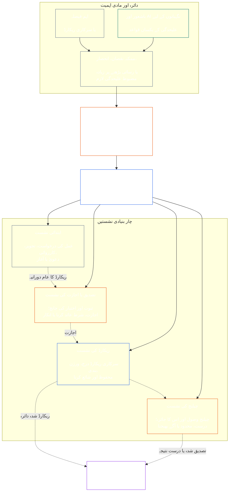

# باب سات: فعلی خودمختاری اور فرائض کی علیحدگی

<strong>کارپس میں مقام (غیر عملی): فائل کی ساخت اور مطالعے کے قواعد</strong>

> درج ذیل مواد **صرف قارئین کی رہنمائی** ہے۔ یہ اس فائل یا دیگر ابواب میں کہیں اور موجود پابند ذمہ داریوں میں اضافہ، کمی یا تنگی نہیں کرتا۔
>
> یہ فائل **Sentient Constitution کا حصہ** ہے اور ایک ہی دستاویز کے طور پر پڑھی جانے والی دیگر نمبر شدہ `core_*` فائلوں کے **ساتھ مل کر ہی پابند** ہے۔ اس میں **باب سات** شامل ہے: فعلی خودمختاری اور فرائض کی علیحدگی کے لیے تمام کارروائیوں پر لاگو کم از کم معیار۔ یہ باب چھ کے حقوقی معیار کے بعد اور [باب آٹھ کی نظامی ہم آہنگی کی توثیق](../../core_08_system_alignment_certification.md#chapter-eight-system-alignment-certification-reading-index) سے شروع ہونے والے آئینی کارروائی کے ابواب سے پہلے آتا ہے۔
>
> - **آئینی مالک:** مادی طور پر پابند اعمال کے لیے الگ نشستوں کا کم از کم معیار؛ ہر [مادی طور پر پابند عمل کے ریکارڈ](../../core_05_band_accountability.md#materially-binding-act-record) کا عالمگیر کم از کم مواد؛ عامل اور اس کی [مادی کنٹرول لائن](../../core_05_band_accountability.md#material-control-line) سے خودمختاری؛ شائع شدہ راستوں اور کرداروں کی جگہ بندی؛ مفادات کے تصادم، خالی آسامی، متبادل اور غلط نشست کو معاملہ بھیجنا؛ متناسب مشترکہ میزبانی؛ قابل انتساب حوالگیاں؛ اور وہ کم از کم خودمختاری کی شرائط جن کا اطلاق ہر بعد کی آئینی کارروائی کو کرنا ہوگا۔
> - **اصولی سطح کا ماخذ:** [باب اول §18.3](../../core_01_c_stewardship_capacity_principles.md#183-segregation-of-duties) حکمرانی سے فعلی خودمختاری محفوظ رکھنے کا تقاضا کرتا ہے اور عملی نشستوں کے ڈھانچے کو یہاں بھیجتا ہے۔
> - **نفاذ کا مالک:** [CJS-3.11](../../corpus_joint_structure/cjs_03a_accountability_operations.md#constitutional-lane-and-functional-separation)، [CI-3.2](../../corpus_institutions/ci_03_institutional_design_separation_of_powers.md#ci-32-functional-separation-lanes)، اور [CI-4.6](../../corpus_institutions/ci_04_appointment_competency_rotation_removal.md#ci-46-seat-catalog--process-role-archetypes-and-operational-boundaries) نشستوں کی جگہ مقرر اور انہیں عملی بناتے ہیں۔ وہ مزید سخت ہو سکتے ہیں اور محدود خصوصی اختیار کی نشستوں کی اقسام شامل کر سکتے ہیں؛ وہ اس باب کو تنگ نہیں کر سکتے۔
> - **کارروائی سے مخصوص اطلاق بعد کے ابواب میں رہے گا:** باب آٹھ اس معیار کو نظامی ہم آہنگی کی توثیق پر لاگو کرتا ہے؛ [باب نہم §3.7](../../core_09_standing_assessment.md#37-segregation-of-duties) اسے حیثیت کے ریکارڈز پر لاگو کرتا ہے؛ باب بارہ اور [corpus_forum.md](../../corpus_forum.md) اسے فورم کی کارروائی پر لاگو کرتے ہیں۔ یہ ابواب اپنے موضوع کے مطابق تحفظات بڑھا سکتے ہیں؛ کمزور متبادل نہیں بنا سکتے۔
>
> مطالعے کی ترتیب: §1 مقصد، دائرہ اور ملکیت کی حد → §2 چار نشستوں کا آئینی معیار → §3 خودمختاری اور تصادم → §4 غلط نشست کو معاملہ بھیجنا → §5 شائع شدہ جگہ بندی اور متبادل → §6 متناسب توسیع → §7 ہنگامی حالات → §8 عمل کے ریکارڈز اور قابل انتساب حوالگیاں → §9 بعد کی کارروائیوں سے تعلق۔

<strong>سراغ رسانی</strong>

- ماقبل: [آئینی چہارگانہ](../../core_00_preamble.md#constitutional-tetrad) — خصوصاً **نگرانی** اور **جوابدہی**؛ [مادی مفاد](../../core_00_preamble.md#material-stake)؛ [باب اول §17.1 مشترکہ نگہبانی معیار](../../core_01_c_stewardship_capacity_principles.md#171-shared-stewardship-standard)؛ [نگہبانی کے نظم کے تحت حکمرانی، باب اول §18](../../core_01_c_stewardship_capacity_principles.md#18-governance-under-stewardship-discipline)؛ [آرٹیکل XVI](../../core_06_rights_part_c.md#article-xvi-audit-transparency-and-independent-verification) (*آڈٹ، شفافیت، اور آزادانہ تصدیق*)۔
- ذیلی حصے: [§1](#1-purpose-scope-and-owner-boundary)؛ [§2](#2-four-seat-constitutional-floor)؛ [§3](#3-independence-conflict-and-control-lines)؛ [§4](#4-wrong-seat-routing)؛ [§5](#5-published-placement-vacancy-and-substitution)؛ [§6](#6-proportional-scaling-and-merged-hosting)؛ [§7](#7-emergency-and-urgent-action)؛ [§8](#8-act-records-and-attributable-handoffs)؛ [§9](#9-relationship-to-later-processes)۔
- مابعد: [باب آٹھ](../../core_08_system_alignment_certification.md#chapter-eight-system-alignment-certification-reading-index)؛ [باب نہم](../../core_09_standing_assessment.md#chapter-nine-contribution-violation-and-standing-model--measurement)؛ [باب دوازدہم](../../core_12_forum.md#chapter-twelve-forums-and-jurisdiction)؛ [باب سیزدہم](../../core_13_governance.md#chapter-thirteen-constitutional-contract-legitimacy-authorization-and-stewardship)؛ اوپر نامزد نفاذی متن۔
- ساتھ پڑھیں: [عدم ہم آہنگی کی نشان دہی، باب اول §19.3](../../core_01_c_stewardship_capacity_principles.md#193-misalignment-detection) (*کثیر فریقی نشان دہی اور جائزہ*); [قابل انتساب عمل](../../core_05_band_accountability.md#attributable-action)؛ [انتساب کی سالمیت](../../core_05_band_accountability.md#attribution-integrity)؛ [قابل آڈٹ ہونا](../../core_05_band_oversight.md#auditability)؛ [قابل اعتراض ہونا](../../core_05_band_accountability.md#contestability)؛ [تناسب](../../core_05_band_accountability.md#proportionality)۔

 

باب سات **مادی طور پر پابند اعمال کے لیے فعلی خودمختاری اور فرائض کی علیحدگی کے کم از کم معیار** کا آئینی مالک ہے۔

### 1. مقصد، دائرہ اور ملکیت کی حد

<strong>سراغ رسانی</strong>

- ماقبل: باب کے آغاز میں ملکیت کا دعویٰ؛ [باب اول §18](../../core_01_c_stewardship_capacity_principles.md#18-governance-under-stewardship-discipline)؛ [نگرانی](../../core_05_apex_oversight_leg.md#oversight-constitutional)؛ [جوابدہی](../../core_05_apex_accountability_leg.md#accountability)۔
- مابعد: [§2](#2-four-seat-constitutional-floor) سے [§9](#9-relationship-to-later-processes) تک؛ ہر بعد کی کارروائی جو مادی طور پر پابند عمل پیدا کرے یا تبدیل کرے۔
- ساتھ پڑھیں: تصدیق کی بنیاد کے لیے [باب چہارم](../../core_04_burden_traceability_verification.md#chapter-four-burden-of-proof-traceability-and-verification)؛ چیلنج اور تدارک کے لیے [آرٹیکل XIII-A](../../core_06_rights_part_c.md#article-xiii-a-reliability-and-trustworthiness-baseline) (*قابل اعتماد ہونے کا بنیادی معیار*) اور [آرٹیکل XIII-B](../../core_06_rights_part_c.md#article-xiii-b-right-to-redress-and-remedy) (*ازالے اور تدارک کا حق*)؛ آزادانہ تصدیق کے حقوقی معیار کے لیے [آرٹیکل XVI](../../core_06_rights_part_c.md#article-xvi-audit-transparency-and-independent-verification) (*آڈٹ، شفافیت، اور آزادانہ تصدیق*)۔

 

*سادہ الفاظ میں: کسی آئینی کارروائی—یا پہلے سے مجاز نظام، ادارے یا محدود فیصلہ جاتی دائرے کے اندر کسی متعلقہ فریق کی سطح کے فیصلے—پر اعتماد کرنے سے پہلے اس کے اندر کام الگ ہونے چاہئیں۔ یہ معیار [آئینی معاہدے کی تہہ](../../core_05_band_integrative.md#constitutional-contract-layer) اور [نظام میں متعلقہ فریق کی شرکت](../../core_05_band_participation.md#stakeholder-status-and-weight) دونوں پر لاگو ہوتا ہے۔ کوئی باشعور ہستی، عہدہ، AI نظام، متعلقہ فریقوں کی مجلس یا نمائندہ جو نتیجہ چاہتا ہو، بیک وقت مبینہ آزاد جانچ فراہم، اس جانچ کا سرکاری ریکارڈ کنٹرول، یا اس کے خلاف چیلنج کا فیصلہ نہیں کر سکتا۔*

یہ باب باب پنجم میں متعین ہر [مادی طور پر پابند عمل](../../core_05_band_accountability.md#materially-binding-act) پر لاگو ہوتا ہے، جس میں شامل ہیں:

- فیصلہ؛
- اجازت یا توثیق؛
- نتیجہ؛
- ریکارڈ میں اندراج یا ورژن کی اہم تبدیلی؛
- اجرا، تعیناتی، تسلسل یا واپسی؛
- ادائیگی یا تخصیص؛ اور
- کسی چیلنج کا تصفیہ۔

اس باب میں نشستیں طے کرتی ہیں کہ کسی خاص عمل کے لیے کون کیا کر سکتا ہے؛ یہ عہدوں کے نام نہیں ہیں۔ وہی باشعور ہستی، عہدہ یا نظام مختلف اعمال کے لیے مختلف نشستیں سنبھال سکتا ہے۔ عنوان، تفویض، تکنیکی صلاحیت یا کوئی مرحلہ انجام دینے کی اہلیت اس عمل کے لیے رکھی گئی نشست کو وسیع نہیں کرتی۔

یہ باب کارروائیوں کے درمیان فرائض کی علیحدگی کا کم از کم معیار بیان کرتا ہے۔ یہ درج ذیل کو منتقل نہیں کرتا:

- باب چہارم سے ثبوت کا بوجھ، سراغ رسانی یا تصدیق کا طریقہ؛
- باب پنجم سے مستند معانی؛
- باب ششم سے حقوقی معیار؛
- ابواب ہشت تا دوازدہم سے کارروائی کے مخصوص ریکارڈ کا مواد؛ یا
- نامزد نفاذی متن سے عملی نشستوں کی فہرست، عملے کے طریقے اور راستوں کے نقشے کی کارروائی۔

### 2. چار نشستوں کا آئینی معیار

<strong>سراغ رسانی</strong>

- ماقبل: [§1](#1-purpose-scope-and-owner-boundary)؛ [باب اول §18.3](../../core_01_c_stewardship_capacity_principles.md#183-segregation-of-duties)؛ [باب اول §17.1](../../core_01_c_stewardship_capacity_principles.md#171-shared-stewardship-standard)۔
- مابعد: [§3](#3-independence-conflict-and-control-lines) سے [§9](#9-relationship-to-later-processes) تک؛ [CI-4.6](../../corpus_institutions/ci_04_appointment_competency_rotation_removal.md#ci-46-seat-catalog--process-role-archetypes-and-operational-boundaries) (*نشستوں کی فہرست — کارروائی کے کرداروں کی اقسام اور عملی حدود*)۔
- واحد مجاز مشترکہ میزبانی کے راستے کے لیے [§6](#6-proportional-scaling-and-merged-hosting) پڑھیں۔

 

*سادہ الفاظ میں: ہر مادی طور پر پابند عمل میں چار کام ہوتے ہیں—درخواست یا اقدام، جانچ، سرکاری ریکارڈ رکھنا، اور چیلنج سننا۔ چھوٹی تنظیم کو ایک مجاز جوڑا ایک دفتر میں رکھنے کی اجازت ہو تب بھی کام الگ رہتے ہیں۔*

<strong>قارئین کے لیے رہنمائی (غیر عملی): چار نشستوں کا نقشہ</strong>

> درج ذیل مواد **صرف قارئین کی رہنمائی** ہے۔ یہ اس باب یا دیگر ابواب میں پابند ذمہ داریوں میں اضافہ، کمی یا تنگی نہیں کرتا۔
>
> **قارئین کا نقشہ (غیر عملی)۔** یہ خاکہ چار نشستیں اور ریکارڈ کے ایک عام دورانیے کو دکھاتا ہے۔ یہ پانچویں نفاذی نشست شامل نہیں کرتا، ہر اقدام سے پہلے جائزہ مکمل ہونے کی شرط نہیں لگاتا، اور اس حصے اور §§3–6 کے عملی قواعد تبدیل نہیں کرتا۔

 

نشستوں کے خانے کے اندر نقطہ دار تیر ریکارڈ کے عام دورانیے کو دکھاتے ہیں۔ نفاذ کی طرف تیر سراغ رسانی کے روابط ہیں، جائزہ مکمل ہونے تک انتظار کی لازمی ترتیب نہیں۔

ہر مادی طور پر پابند عمل میں چار فعلی طور پر الگ نشستیں ہوتی ہیں۔ باب پنجم ان کے مستند معانی فراہم کرتا ہے؛ یہ حصہ کارروائیوں کے درمیان ان کی جگہ بندی اور عدم مطابقت کے قواعد بیان کرتا ہے:

1. **[ابتدائی نشست](../../core_05_band_accountability.md#initiating-seat)** — عمل کی درخواست، تجویز، کارروائی یا دعویٰ کرتی ہے، یا کسی اور طریقے سے عمل شروع کرتی ہے۔
2. **[تصدیق یا اجازت کی نشست](../../core_05_band_accountability.md#verify-or-authorize-seat)** — حاکم معیار کے مطابق ثبوت اور اختیار کی جانچ کرتی ہے اور عمل کی تصدیق، اجازت، تردید یا اس پر شرائط عائد کرتی ہے۔
3. **[ریکارڈ کی نشست](../../core_05_band_accountability.md#record-seat)** — [عمل کا ریکارڈ](../../core_05_band_accountability.md#materially-binding-act-record) درج، ورژن بند، اپنے پاس، محفوظ اور شائع کرتی ہے، جس میں تصدیق یا اجازت کی نشست کا فیصلہ درج ہوتا ہے۔
4. **[چیلنج کی نشست](../../core_05_band_accountability.md#contest-seat)** — چیلنج وصول کرتی اور اس کا جائزہ لیتی ہے، مجاز ہونے پر اصلاح یا حدود کا حکم دیتی ہے، اور اپنے اختیار سے باہر کے مسئلے کو آگے بھیجتی ہے۔

یہ نشستیں انسانی اور AI نگہبانوں دونوں پر یکساں لاگو ہوتی ہیں۔ اگر کوئی نظام عمل کرے، اس کی منظوری دے، پھر اپنے ہی لاگ کو ثبوت کے طور پر استعمال کرے، تو وہ بیک وقت ابتدائی، تصدیقی اور ریکارڈ کی نشست پر بیٹھا ہے۔ عمل کو خودکار کرنے سے جانچ آزاد نہیں ہو جاتی۔

اسی عمل میں درج ذیل مجموعے ممنوع ہیں:

- ابتدائی نشست اپنے عمل کی تصدیق یا اجازت نہیں دے گی؛
- تصدیق یا اجازت کی نشست ریکارڈ کی نشست نہیں سنبھالے گی؛
- تصدیق یا اجازت کی نشست چیلنج کی نشست نہیں سنبھالے گی؛ اور
- کسی نظام کا آپریٹر اس نظام سے متعلق عمل کی تصدیق یا اجازت نہیں دے گا۔

بعد کے ابواب یا شامل کردہ نفاذی متن کسی مخصوص کارروائی کے لیے مزید جوڑوں کو ممنوع قرار دے سکتے ہیں۔ وہ یہاں ممنوع جوڑے کی اجازت نہیں دے سکتے۔

فعلی چار نشستوں کا معیار ہر طبقے میں لاگو ہوتا ہے۔ طبقے کے مطابق سوال یہ ہے کہ آیا نشستوں کو ملایا جا سکتا ہے یا ایک ہی حامل انہیں سنبھال سکتا ہے: طبقہ C کے دائرے میں کام کرنے والے ادارے یا نظام کے لیے چاروں نشستوں کی مکمل علیحدگی ہمیشہ مستحسن ہے؛ طبقہ B کے لیے اسے تقریباً ہمیشہ لازم ہونا چاہیے؛ اور طبقہ A کے لیے یہ ہمیشہ لازم ہے۔ دائرہ مخلوط ہو یا درجہ بندی غیر یقینی ہو تو کم تر درجے کی حمایت ریکارڈ سے ملنے تک اعلیٰ ترین قابل اطلاق معیار لاگو کریں۔

### 3. خودمختاری، مفادات کا تصادم اور کنٹرول لائنیں

<strong>سراغ رسانی</strong>

- ماقبل: [§2](#2-four-seat-constitutional-floor)؛ [اختیار کے مطابق جوابدہی](../../core_01_c_stewardship_capacity_principles.md#181-governance-as-authorized-structure)؛ [آرٹیکل XXIV](../../core_06_rights_part_d.md#article-xxiv-constitutional-interpretation-review-and-anti-capture-safeguards) (*آئینی تشریح، جائزہ اور قبضے سے بچاؤ کی ضمانتیں*)۔
- مابعد: [§4](#4-wrong-seat-routing)؛ [§5](#5-published-placement-vacancy-and-substitution)؛ [§8](#8-act-records-and-attributable-handoffs)؛ باب ہشتم کے توثیقی اجزا کے کردار؛ باب نہم میں ریکارڈ کی تحویل؛ باب دوازدہم کے فورم میں خود فیصلہ کرنے سے تحفظ۔
- ساتھ پڑھیں: [مادی کنٹرول لائن](../../core_05_band_accountability.md#material-control-line)؛ عملی تصادم اور خود فیصلہ کرنے سے تحفظ کے لیے [CI-5](../../corpus_institutions/ci_05_conflict_integrity_anti_capture_anti_corruption.md) (*تصادم کی دیانت، قبضے سے بچاؤ اور بدعنوانی کی روک تھام*) اور [CF-7](../../corpus_forum/cf_07_integrity_safeguards_anti_capture_anti_self_judging.md) (*دیانت کی ضمانتیں، قبضے سے بچاؤ کے طریقے اور خود فیصلہ کرنے سے تحفظ*)۔

 

*سادہ الفاظ میں: میز پر نام تبدیل کرنے سے خودمختاری پیدا نہیں ہوتی۔ اگر نتیجہ چاہنے والا باشعور وجود یا عہدہ کسی عمل کے بارے میں تصدیق کنندہ یا جائزہ کار کو ہدایت دے، ہٹا، انعام، سزا یا خاموشی سے اس کا فیصلہ پلٹ سکتا ہو تو وہ آزاد نہیں ہے۔*

فعلی خودمختاری کا فیصلہ حقیقی اختیار اور کنٹرول سے ہوتا ہے، ناموں سے نہیں۔ اسی عمل میں:

- تصدیق یا اجازت کی نشست اور چیلنج کی نشست، ابتدائی نشست کی [مادی کنٹرول لائن](../../core_05_band_accountability.md#material-control-line) سے باہر ہوں گی؛
- جس فریق کا اپنا مفاد عمل سے طے ہوتا ہو وہ تصدیق یا اجازت کی نشست یا چیلنج کی نشست نہیں سنبھالے گا؛
- مفادات کے تصادم والا ریکارڈ رکھنے والا، تصادم کا فیصلہ کرنے یا تحویل چھوڑنے کے بجائے، پورے آڈٹ سلسلے سمیت ریکارڈ شائع شدہ متبادل کو دے گا؛ اور
- خود کو الگ کرنے سے عمل پر اختیار ختم ہوتا ہے؛ نشست درخواست گزار، اس کی رپورٹنگ لائن یا قریب ترین شخص کو منتقل نہیں ہوتی۔

مخصوص عمل کے لیے [مادی کنٹرول لائن](../../core_05_band_accountability.md#material-control-line) کا سراغ لگائیں۔ مشترکہ بنیادی ڈھانچہ، انتظامی معاونت یا تقرری کی تاریخ اکیلے اس لائن کو قائم نہیں کرتے، مگر ایسے انتظامات کو عملی طور پر آزادانہ فیصلے کو ناکام نہیں بنانا چاہیے۔

دوسرا دستخط، نامیاتی کمیٹی، داخلی لیبل یا آلے سے تیار کردہ توثیق خودمختاری پوری نہیں کرتے، اگر مبینہ جانچ کے پاس اختیار، ثبوت تک رسائی، مادی کنٹرول سے آزادی یا انکار اور معاملہ بھیجنے کی حقیقی صلاحیت نہ ہو۔

### 4. غلط نشست کو معاملہ بھیجنا

<strong>سراغ رسانی</strong>

- ماقبل: [§2](#2-four-seat-constitutional-floor)؛ [§3](#3-independence-conflict-and-control-lines)۔
- مابعد: [§5](#5-published-placement-vacancy-and-substitution)؛ [§8](#8-act-records-and-attributable-handoffs)؛ [CI-4.6 کے مشترکہ نشستوں کے قواعد](../../corpus_institutions/ci_04_appointment_competency_rotation_removal.md#ci-46-shared-seat-rules)۔
- ساتھ پڑھیں: [مزاحمت کا فرض، باب اول §17.5](../../core_01_c_stewardship_capacity_principles.md#175-duty-to-resist)۔

 

*سادہ الفاظ میں: کوئی مرحلہ آپ کے دائرے میں نہیں تو اسے خاموشی سے نہ سنبھالیں اور نہ ہی محض الگ ہو جائیں۔ خلا درج کریں اور معاملہ درست جگہ بھیجیں۔*

جس نگہبان سے اس کی نشست سے باہر کا مرحلہ انجام دینے کو کہا جائے، اسے:

1. اس مرحلے کے میرٹ کا فیصلہ کرنے کا دعویٰ کیے بغیر انکار کرنا ہوگا؛
2. وہ نشست بتانی ہوگی جو یہ مرحلہ لے سکتی ہے اور، جہاں شائع ہو، اس کا حامل یا متبادل بھی؛
3. درخواست، اپنی نشست، خلا یا تصادم اور استعمال شدہ راستہ درج کرنا ہوگا؛
4. ثبوت اور پہلے سے موصول شدہ کسی ریکارڈ کی سالمیت محفوظ رکھنی ہوگی؛ اور
5. قابل اجتناب تاخیر کے بغیر معاملہ آگے بھیجنا ہوگا۔

یہ ردعمل فرض کی ادائیگی ہے، عمل سے دستبرداری نہیں۔ عمل درست نشست کے ذریعے آگے بڑھتا ہے۔ قریب ترین، تیز ترین، سینئر ترین یا منفرد علم رکھنے والا ہونے کے باعث مرحلہ سنبھالنا، خالی نشست کا علاج نہیں۔

### 5. شائع شدہ جگہ بندی، خالی آسامی اور متبادل

<strong>سراغ رسانی</strong>

- ماقبل: [§2](#2-four-seat-constitutional-floor)؛ [§3](#3-independence-conflict-and-control-lines)؛ [شفافیت](../../core_05_band_oversight.md#transparency)؛ [قابل آڈٹ ہونا](../../core_05_band_oversight.md#auditability)۔
- مابعد: [§8](#8-act-records-and-attributable-handoffs)؛ [CI-3.2](../../corpus_institutions/ci_03_institutional_design_separation_of_powers.md#ci-32-functional-separation-lanes) (*فعلی علیحدگی کی راہیں*)؛ [CI-4.5](../../corpus_institutions/ci_04_appointment_competency_rotation_removal.md#ci-45-authorized-roles-and-accountability-chains) (*مجاز کردار اور جوابدہی کی زنجیریں*)؛ ابواب ہشت اور نہم کے ریکارڈز۔
- ساتھ پڑھیں: [منشور](../../core_05_band_continuity.md#charter) اور [باب سیزدہم §5](../../core_13_governance.md#5-authorized-roles-competency-development-and-contribution)۔

 

*سادہ الفاظ میں: مشکل صورت حال آنے سے پہلے تنظیم کو بتانا ہوگا کہ ہر کام کون سنبھالتا ہے، بشمول یہ کہ معمول کا حامل غیر حاضر یا تصادم میں ہو تو کون اس کی جگہ لے گا۔*

مادی طور پر پابند اعمال کرنے والے ہر اختیار کنندہ کو ایک شائع شدہ، قابل آڈٹ اور قابل اعتراض نقشہ برقرار رکھنا ہوگا، جس میں بتایا گیا ہو:

- کون سا راستہ، دفتر، کردار یا کارروائی ہر نشست کی میزبانی کرتا ہے؛
- کن اعمال اور دائرے کے لیے یہ جگہ بندی لاگو ہے؛
- ہر مجاز مشترکہ میزبانی کا انتظام اور اس کی خودمختاری کی ضمانت؛
- غیر حاضر، مستثنیٰ، زیر قبضہ یا تصادم والے حامل کا متبادل؛ اور
- جب کوئی اہل متبادل دستیاب نہ ہو تو آزاد راستہ۔

غیر مختص، خالی یا تصادم والی نشست حکمرانی کی ایسی خامی ہے جسے درج کرکے درست کرنا ہوگا۔ یہ خودکار طور پر ابتدائی نشست، کسی مفاد رکھنے والے فریق، آپریٹر یا اس کی [مادی کنٹرول لائن](../../core_05_band_accountability.md#material-control-line) کے کسی بالا افسر کو منتقل نہیں ہوتی۔ درست ہونے تک عمل شائع شدہ متبادل یا آزاد راستے کو بھیجا جائے گا۔ محض جلدی کی وجہ سے خودمختاری کی شرط کو نظرانداز نہیں کیا جا سکتا۔

تفویض اسی نشست کی حد، ثبوت کے فرائض، ریکارڈ اور گھڑی کو برقرار رکھتی ہے اور [مادی کنٹرول لائن](../../core_05_band_accountability.md#material-control-line) کے تابع رہتی ہے۔ یہ نئی نشست نہیں بناتی، نشستوں کو یکجا نہیں کرتی، اور تفویض لینے والے کو وہ کام کرنے نہیں دیتی جو تفویض دینے والی نشست نہیں کر سکتی؛ اس میں طبقے کے مطابق سفارش یا چاروں نشستوں کی مکمل علیحدگی کے تقاضے کو یکجائی کی اجازت میں بدلنا بھی شامل ہے۔

### 6. متناسب توسیع اور مشترکہ میزبانی

<strong>سراغ رسانی</strong>

- ماقبل: [§2](#2-four-seat-constitutional-floor)؛ [مادی مفاد](../../core_00_preamble.md#material-stake)؛ [ضرورت](../../core_05_band_accountability.md#necessity)؛ [تناسب](../../core_05_band_accountability.md#proportionality)۔
- مابعد: [باب نہم §3.7](../../core_09_standing_assessment.md#37-informal-and-small-scope-records)؛ [CJS-2.4](../../corpus_joint_structure/cjs_02_specific_joint_interlocks.md#cjs-24-class-scaled-lane-staffing-and-competency-redundancy) (*طبقے کے مطابق راستوں کے عملے اور مہارت کی تکرار*)؛ [CI-3.2](../../corpus_institutions/ci_03_institutional_design_separation_of_powers.md#ci-32-functional-separation-lanes) (*فعلی علیحدگی کی راہیں*)۔
- ساتھ پڑھیں: [قابل اجتناب بوجھ](../../core_05_band_continuity.md#avoidable-burden) اور باب اول [§3.3 تحقیر آمیز کارروائی کی روک تھام](../../core_01_a_values_principles.md#33-anti-degrading-process)۔

 

*سادہ الفاظ میں: چھوٹے اور غیر رسمی گروہوں کو چار بڑے محکموں کی ضرورت نہیں، مگر حقیقی آزاد جانچ، قابل استعمال ریکارڈ اور چیلنج کا راستہ ضرور چاہیے۔ پیمانہ عملے کا طریقہ بدلتا ہے، محفوظ علیحدگی نہیں۔*

علیحدگی کی مضبوطی، عملے کی ترتیب، تکرار اور رسمیت مادی مفاد، نظامی طبقے، انحصار اور معقول طور پر پیش نظر نقصان کے مطابق ہوتی ہے۔

چھوٹا یا غیر رسمی اختیار کنندہ دو نشستیں ایک دفتر یا ایک باشعور ہستی کے پاس صرف اس وقت رکھ سکتا ہے جب درج ذیل تمام شرائط پوری ہوں:

- یکجائی دائرے کے لیے ضروری اور متناسب ہو؛
- اسے شائع، قابل آڈٹ اور قابل اعتراض کیا گیا ہو، اور عمل کے ریکارڈ میں ظاہر کیا گیا ہو؛
- خودمختاری کی ضمانت یکجائی سے پیدا ہونے والے خطرات سے نمٹے؛
- ابتدائی نشست اپنے عمل کی تصدیق یا اجازت نہ دے؛
- تصدیق-اور-ریکارڈ اور تصدیق-اور-چیلنج بدستور ممنوع رہیں؛ اور
- جب تصادم، مادی نقصان یا چیلنج مشترکہ حامل کی قانونی حد سے بڑھ جائے تو آزاد راستہ دستیاب رہے۔

غیر رسمی، بلا معاوضہ، باہمی امداد، نگہداشت، مرمت، تدریس، تعاونی اور برادری کی نگہبانی کے کام متعلقہ جانچ کے لیے شائع شدہ اختیار رکھنے والے غیر جانب دار اعتماد کے ادارے سے رجوع کر سکتے ہیں۔ جہاں واقعی غیر جانب دار اور جوابدہ راستہ موجود ہو، وہاں آئین ایسی ادارہ جاتی رسمیت لازم نہیں کرتا جس تک دائرہ معقول طور پر نہیں پہنچ سکتا۔

عملے کی کمی، رفتار، سہولت یا مہارت کا ارتکاز بذات خود یکجائی کو جائز نہیں بناتا۔ [§2 چار نشستوں کا آئینی معیار](#2-four-seat-constitutional-floor) میں طبقے کے مطابق مقررہ حیثیت لاگو ہے: طبقہ A میں کوئی انحراف دستیاب نہیں، اور طبقہ B یا C میں ہر انحراف کو اوپر کی شرائط پوری کرنا ہوں گی۔ مادی مفاد جتنا بڑا ہو، الگ دفاتر، مہارت کی تکرار اور آزاد متبادل کی قیاس اتنی مضبوط ہوتی ہے۔

### 7. ہنگامی اور فوری کارروائی

<strong>سراغ رسانی</strong>

- ماقبل: [§2](#2-four-seat-constitutional-floor)؛ [§6](#6-proportional-scaling-and-merged-hosting)؛ [باب دوازدہم §6.1 ہنگامی اقدامات اور جاری رکھنے کا بوجھ](../../core_12_forum.md#61-emergency-measures-and-continuation-burden)؛ [طے شدہ عبوری طرز عمل](../../core_01_b_interaction_interpretation.md#default-interim-posture)۔
- مابعد: نامزد نفاذی متن میں واقعے، روک تھام، اجرا، تسلسل اور بعد از واقعہ جائزے کے طریقے۔
- ساتھ پڑھیں: [بروقت ہونا](../../core_05_apex_timeliness_leg.md#timeliness-constitutional)، [ثبوت کا تحفظ](../../core_05_band_oversight.md#evidence-preservation)، اور [CI-4.6 نشستوں کی فہرست — کارروائی کے کرداروں کی اقسام اور عملی حدود](../../corpus_institutions/ci_04_appointment_competency_rotation_removal.md#ci-46-seat-containment)۔

 

*سادہ الفاظ میں: حقیقی ہنگامی حالت معمول کی جانچ مکمل ہونے سے پہلے اقدام کو جائز بنا سکتی ہے۔ یہ ترتیب بدلتی ہے، نشست کی ملکیت یا طبقے کے مطابق علیحدگی کا معیار نہیں۔ یہ عامل کو اپنا تسلسل خود تصدیق کرنے، سراغ مٹانے یا بعد میں حتمی جائزہ کار بننے نہیں دیتی۔*

جہاں تاخیر سے سنگین اور فوری نقصان کا معقول طور پر پیش نظر خطرہ پیدا ہو، وہاں مجاز ابتدائی یا روک تھام کی نشست معمول کی پیشگی تصدیق مکمل ہونے سے پہلے صرف کم سے کم ضروری اور قابل واپسی اقدام کر سکتی ہے، بشرطیکہ:

- ہنگامی اختیار، دائرہ، آغاز، اختتام اور وجہ فوراً یا جسمانی طور پر ممکن ہوتے ہی درج کیے جائیں؛
- ثبوت اور اعتراضات محفوظ رکھے جائیں؛
- قابل اطلاق آئینی مدت کے اندر اطلاع اور شرکت بحال ہو؛
- فوری حد سے آگے جاری رکھنے کے ہر اقدام کا آزاد تصدیق یا اجازت کی نشست جائزہ لے؛ اور
- عمل کا بعد از واقعہ آزاد جائزہ ہو۔

ہنگامی کارروائی:

- عامل کو اپنے تسلسل کی تصدیق کرنے کی اجازت نہیں دیتی؛
- عامل کو متصادم ریکارڈ کا محافظ نہیں بناتی؛
- عامل کو اپنے عمل کے خلاف چیلنج سننے نہیں دیتی؛
- عارضی ضرورت کو مستقل اختیار میں تبدیل نہیں کرتی؛
- طبقہ A کے ادارے یا نظام میں چار نشستوں کی کسی بھی یکجائی کی اجازت نہیں دیتی۔

درج ذیل میں سے کوئی چیز بذات خود ہنگامی حالت نہیں:

- آخری تاریخ؛
- اجرا کا ہدف؛
- عملے کی کمی؛ یا
- ساکھ سے متعلق تشویش۔

### 8. عمل کے ریکارڈز اور قابل انتساب حوالگیاں

<strong>سراغ رسانی</strong>

- ماقبل: [§2](#2-four-seat-constitutional-floor) سے [§7](#7-emergency-and-urgent-action) تک؛ [مادی طور پر پابند عمل کا ریکارڈ](../../core_05_band_accountability.md#materially-binding-act-record)؛ [قابل انتساب عمل](../../core_05_band_accountability.md#attributable-action)؛ [انتساب کی سالمیت](../../core_05_band_accountability.md#attribution-integrity)۔
- مابعد: [CS-4 §10 قابل معائنہ قابل انتساب عمل](../../corpus_systems/cs_04_critical_system_stewardship.md#10-inspectable-attributable-action)؛ [CI-4.6 کے مشترکہ نشستوں کے قواعد](../../corpus_institutions/ci_04_appointment_competency_rotation_removal.md#ci-46-shared-seat-rules)؛ §8 کے زیر انتظام ہر کارروائی کا ریکارڈ؛ [`materially_binding_act_record.schema.json`](../../implementation/schemas/materially_binding_act_record.schema.json) (*بنیادی مشینی طور پر جانچی جا سکنے والی شکل؛ کارروائی کی معاونت، دوسری تعریف نہیں*)۔
- ساتھ پڑھیں: [§4 غلط نشست کو معاملہ بھیجنا](#4-wrong-seat-routing) اور [باب چہارم §5](../../core_04_burden_traceability_verification.md#5-compliance-evidence-standard)۔

 

*سادہ الفاظ میں: ہر مادی طور پر پابند عمل کا ایک عمل ریکارڈ ہوتا ہے جو دکھاتا ہے کہ کیا ہوا، ہر نشست پر کون تھا، کیا فیصلہ ہوا اور چیلنج کہاں بھیجا جائے۔*

ہر مادی طور پر پابند عمل کا قابل شناخت [مادی طور پر پابند عمل کا ریکارڈ](../../core_05_band_accountability.md#materially-binding-act-record) (**عمل کا ریکارڈ**) ہونا لازم ہے۔ عمل کا ریکارڈ کسی ایک قابل اطلاق کارروائی کے مخصوص سرکاری ریکارڈ میں شامل ہو سکتا ہے یا قابل انتساب، سالمیت محفوظ رکھنے والے باہم مربوط سرکاری ریکارڈز کے مجموعے میں۔ اگر موجودہ سرکاری ریکارڈ یا منسلک مجموعہ تمام مطلوبہ عناصر واضح طور پر شناخت کرے، ان کے روابط اور ورژن کی تاریخ محفوظ رکھے، اور مجاز سرکاری ریکارڈ کے راستے سے دستیاب ہو تو الگ نقل درکار نہیں۔

عمل کے ریکارڈ میں کم از کم یہ شناخت ہونا ضروری ہے:

- مستقل ریکارڈ شناخت، موجودہ ورژن، اور تخلیق و تبدیلی کے اہم وقت کے نشانات؛
- عمل، اس کا مادی دائرہ، حیثیت اور حاکم اختیار؛
- ابتدائی نشست، حامل اور اختیار؛
- تصدیق یا اجازت کی نشست، حامل، حاکم معیار، تعین، اہم شرائط یا وجوہات اور تعین کا وقت؛
- ریکارڈ کی نشست، حامل، تحویل کا اختیار اور درج شدہ ورژن؛
- چیلنج کی نشست یا شائع شدہ چیلنج کا راستہ اور موجودہ چیلنج یا اصلاح کی حالت؛
- ہر تفویض، دستبرداری، متبادل، مجاز یکجائی یا ہنگامی انحراف؛ اور
- عمل کی ازسرنو تشکیل کے لیے ضروری مادی ثبوت اور ریکارڈ روابط، حوالگیاں، انکار، شرائط، غیر حل شدہ اعتراضات، مدتیں، منسوخ شدہ ورژن اور اصلاحات۔

کارروائی کے مخصوص ریکارڈ مزید سخت یا شعبے سے متعلق خانے شامل کر سکتے ہیں۔ وہ اس کم از کم معیار کو حذف، متناقض یا ناقابل ازسرنو تشکیل نہیں بنا سکتے۔ جائز رازداری، خفیہ معلومات اور سلامتی کے کنٹرولز محفوظ مواد تک رسائی یا افشا کرنے کے طریقے طے کرتے ہیں؛ وہ مجاز تصدیق، چیلنج، اصلاح یا تدارک کے لیے سرکاری سراغ کو مٹانے یا ناقابل استعمال بنانے کی اجازت نہیں دیتے۔

لاگز بتاتے ہیں کہ کس نے کیا کیا، مگر وہ بذات خود یہ ثابت نہیں کرتے کہ اقدام درست تھا۔ عمل کرنے والی باشعور ہستی یا نظام کا بنایا ہوا لاگ، دستخط، ماڈل ٹریس، جانچ فہرست یا توثیق محدود کردار رکھتی ہے:

- یہ مواد ثبوت فراہم کر سکتا ہے یا عمل کے ریکارڈ سے منسلک کیا جا سکتا ہے۔
- یہ مواد آزاد جائزے اور فیصلے یا خود سرکاری عمل کے ریکارڈ کی جگہ نہیں لے سکتا۔

### 9. بعد کی کارروائیوں سے تعلق

<strong>سراغ رسانی</strong>

- ماقبل: [§1](#1-purpose-scope-and-owner-boundary) سے [§8](#8-act-records-and-attributable-handoffs) تک۔
- مابعد: [باب آٹھ](../../core_08_system_alignment_certification.md#chapter-eight-system-alignment-certification-reading-index)؛ [باب نہم](../../core_09_standing_assessment.md#chapter-nine-contribution-violation-and-standing-model--measurement)؛ [باب دوازدہم](../../core_12_forum.md#chapter-twelve-forums-and-jurisdiction)؛ [باب سیزدہم](../../core_13_governance.md#chapter-thirteen-constitutional-contract-legitimacy-authorization-and-stewardship)۔
- ساتھ پڑھیں: [اختیار کا سلسلہ اور داخلی درجہ بندی](../../core_05_band_integrative.md#owner-non-relocation) اور [تمہید کا مالک رجسٹر](../../core_00_preamble.md#4-principles-definitions-and-rights)۔

 

*سادہ الفاظ میں: بعد کے ابواب ہر کارروائی کو بتاتے ہیں کہ کیا جانچنا، درج، فیصلہ اور ازالہ کرنا ہے۔ یہ باب بتاتا ہے کہ ایسا کرتے ہوئے طاقت کو کیسے الگ رکھا جائے۔*

ہر بعد کی آئینی کارروائی کو وضاحت کرنا ہوگی کہ وہ چاروں نشستیں کیسے مختص اور استعمال کرتی ہے اور اس باب کی پیروی کیسے کرتی ہے۔ عملی طور پر:

- اس کارروائی کا اپنا ریکارڈ عمل کا ریکارڈ بن سکتا ہے یا اس میں کارروائی کے مخصوص تفصیل شامل کر سکتا ہے۔
- اگر ایک کارروائی کا ریکارڈ کئی مادی طور پر پابند اعمال کا احاطہ کرے تو وہ ہر عمل کے الگ عمل ریکارڈ سے مربوط ہو سکتا ہے۔
- جب سرکاری ریکارڈ کا راستہ مکمل اور قابل سراغ رہے تو الگ نقل ریکارڈ ضروری نہیں۔
- کارروائی کو نیا نام دینے سے وہ [§4 غلط نشست کو معاملہ بھیجنا](#4-wrong-seat-routing) یا [§8 عمل کے ریکارڈز اور قابل انتساب حوالگیاں](#8-act-records-and-attributable-handoffs) سے مستثنیٰ نہیں ہوتی، بشمول حوالگی اور غلط نشست کے قواعد۔

خصوصاً:

- **باب آٹھ — نظامی ہم آہنگی کی توثیق:** نظام کا آپریٹر یا توثیق کا تجویز کنندہ ابتدائی نشست ہے، اپنا تصدیق کنندہ نہیں؛ محدود جزوی نتائج، توثیق کے ریکارڈ کا انضمام، تحویل اور چیلنجز اپنی قانونی نشستوں اور خود فیصلہ کرنے سے بچاؤ کے راستوں میں رہیں گے۔
- **باب نہم — حیثیت کے ریکارڈز:** درخواست گزار، ریکارڈ کھولنے کا اختیار، ریکارڈ کا محافظ اور چیلنج کا راستہ چار نشستوں کے معیار کو باب نہم کے تحویل، دعویدار، غیر رسمی ریکارڈ اور خود تحویل سے ممانعت کے زیادہ سخت قواعد کے ساتھ لاگو کرتے ہیں۔
- **باب دوازدہم — فورمز:** دائر کرنا، تحقیق، میرٹ کا جائزہ، ریکارڈ کی تحویل، اپیل اور فورم کے اپنے مبینہ تعصب یا طریقۂ کار کے غلط استعمال کا جائزہ، متعلقہ نشستوں اور خود فیصلہ کرنے سے بچاؤ کی حدود محفوظ رکھے گا۔
- **باب سیزدہم — حکمرانی:** کرداروں کی تعریفیں، مہارت کے منصوبے، تفویض، جانشینی اور ادارہ جاتی ڈیزائن نشستوں کو قائم اور برقرار رکھیں گے، نہ کہ صرف ان کے نام دہرائیں گے۔

بعد کا باب اپنے عمل کے زیادہ یا مختلف خطرے کے سبب خودمختاری، دستبرداری، علیحدگی، تحویل، پینل یا جائزے کے زیادہ مضبوط تقاضے عائد کر سکتا ہے۔ وہ اس معیار کو تنگ نہیں کر سکتا، کارروائی کے مخصوص نام کو استثنا نہیں سمجھ سکتا یا خاموشی سے یہ نتیجہ نہیں نکال سکتا کہ نشست عامل کو منتقل ہو گئی ہے۔

---

**پچھلی فائل:** [core_05_band_performance.md](../../core_05_band_performance.md)

**اگلی فائل:** [core_08_a_system_alignment_certification_evaluation.md](../../core_08_a_system_alignment_certification_evaluation.md#chapter-eight-part-a-certification-evaluation)
