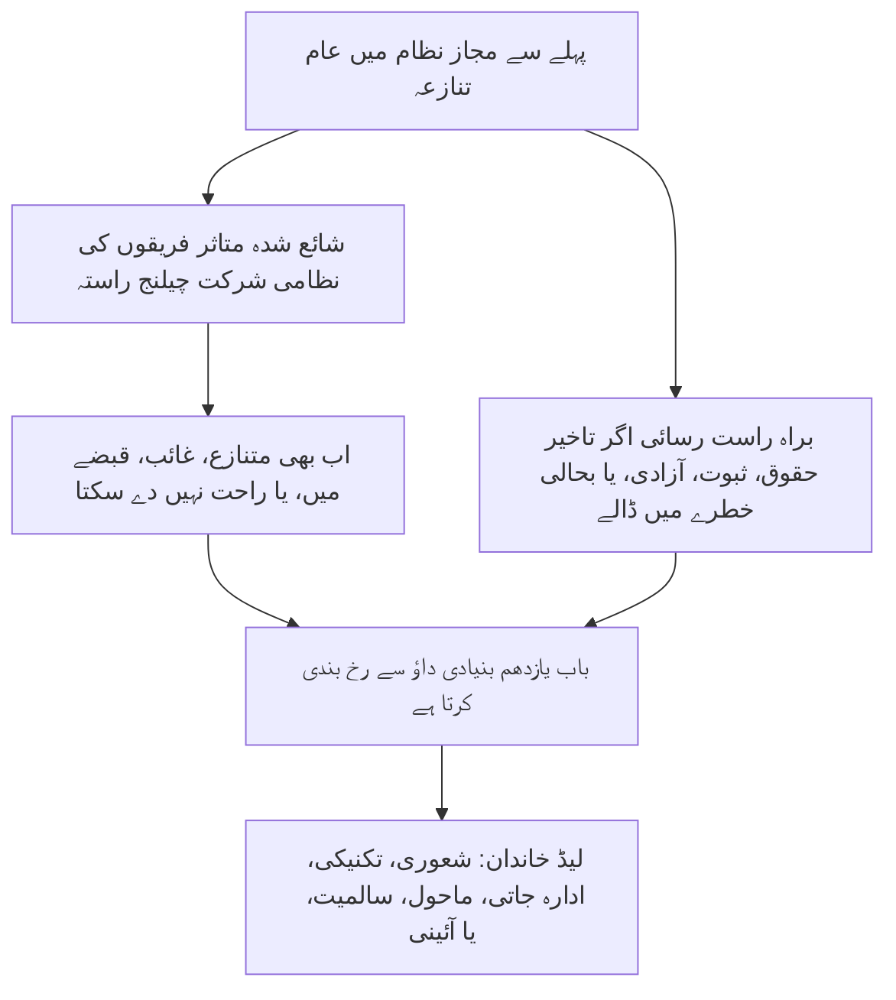

# باب یازدهم: فورم اور دائرہ اختیار

<strong>کارپس میں مقام (غیرِ عملی): فائل کی ساخت اور پڑھنے کے قواعد</strong>

> نیچے کا مواد **صرف قارئین کی رہنمائی** ہے۔ یہ اس فائل یا دیگر ابواب میں پابند فرائض نہیں بڑھاتا، گھٹاتا یا تنگ کرتا۔
>
> یہ فائل [انگریزی باب یازدهم](../../core_12_forum.md) کا **قارئین کی زبان کا پائلٹ** ہے۔ یہ شعوری آئین کا **پابند حصہ نہیں**۔ یہ **دوسرا آئین نہیں**۔ یہ **ارسال ایڈیشن نہیں**۔ یہ `SC-Corpus-2026.08.09` پر **پن** ہے۔ اگر یہ ترجمہ اور انگریزی اصل میں اختلاف نظر آئے تو نمبر والی [`core_11_forum.md`](../../core_12_forum.md) جیتتی ہے۔ پڑھنے کا ترتیب اور ایڈیشن میٹاڈیٹا [README.md](../../README.md) میں رہتے ہیں۔ طریقہ اور لغت: [translations/ur/README.md](README.md)۔
>
> اس میں **باب یازدهم** ہے: فورم خاندان، طے شدہ مقام اور بنیادی داؤ رخ بندی، فورینزک سہارا، انٹیک ٹرائیج، اور کیفیت زنجیر و حقوق کی تہہ کے تحت تنازعات کا دائرہ اختیار۔ فورم [آئینی چوکڑی](core_00_preamble.md#constitutional-tetrad) کی **شرکت**، **نگرانی**، اور **بروقت کارروائی** ٹانگوں کے تحت تنازعے کی نگرانی کرتے ہیں، [مادی داؤ](core_00_preamble.md#material-stake) کے مطابق پیمانہ۔ جب حقائق تصدیق ہوں، وہ کیفیت ریکارڈ **کھول، اپ ڈیٹ، یا درست** کر سکتے ہیں — یا **چیلنج پر برا ریکارڈ الگ رکھ سکتے ہیں** — [باب ہشتم §3](core_08_standing_assessment.md#3-standing-record-operational-requirements) کے تحت؛ دائر کیا گیا کیس بذاتِ خود کیفیت نہیں، اور فورم کی کہانی باب ہشتم کی کیفیت پیمائش کی جگہ نہیں لے سکتی ([باب ہشتم §3.6](core_08_standing_assessment.md#36-forum-boundary))۔ زنجیر رہنمائی کے لیے [README — Standing pipeline and forums](../../README.md#standing-pipeline-and-forums) استعمال کرو۔ عملی فورم میکانکس نامزد نفاذ فائلوں میں رہتی ہیں۔ باب نمبر اور کراس حوالے مربوط دستاویز سے میل کھاتے ہیں۔ پڑھنے کا ترتیب، پابند/سہارا تقسیم، اور کارپس ایڈیشن میٹاڈیٹا [README.md](../../README.md) میں برقرار ہیں۔

>
> **پچھلا (ابھی انگریزی میں):** [core_10_b_misconduct_pattern_applications.md](../../core_11_b_misconduct_pattern_applications.md#chapter-eleven-part-b-anti-constitutional-misconduct-pattern-applications)
>
> **اگلا (ابھی انگریزی میں):** [core_08-11_application_vignettes.md](../../core_09-12_application_vignettes.md#chapters-eight-eleven-application-vignettes)
> **پڑھنے کا قوس:** §1 مقصد → تنازعے کی ترتیب → §2 طے شدہ مقام اور انٹیک → §2.1–§2.3 لیڈ حدیں، مخلوط داؤ، چیلنج → §3 منتقلی اور خود فیصلہ مخالف → §4 خاندان → §5 بلندی اور سرٹیفیکیشن → §6 درجات اور تاخیر مخالف → §7 فورم سہارا

<strong>قارئین کی رہنمائی (غیرِ عملی): باب یازدهم کہاں رہتا ہے اور یہاں کیا رہتا ہے</strong>

> نیچے کا مواد **صرف قارئین کی رہنمائی** ہے۔ یہ اس باب یا دیگر ابواب میں پابند فرائض نہیں بڑھاتا، گھٹاتا یا تنگ کرتا۔
>
> یہ کہاں رہتا ہے (رہنمائی):
> - **آئینی مالک:** **قطعہ 1** (*مقصد* — اس باب کی تفویض کردہ ہنجاروں کی **بنیادی فیصلہ جاتی اطلاق**، معمول کی **عملی انتظامیہ** سے **الگ**؛ پہلے سے مجاز نظاموں کے اندر عام تنازعات کے لیے **تنازعے کی ترتیب**؛ **جوابدہی** تقاضے؛ **شائع شدہ**، **قابلِ پیش گوئی** **حد** رکھائی)؛ **طے شدہ آغاز مقام**، **بنیادی داؤ** رخ بندی، **انٹیک ٹرائیج ادارہ** (**پہلی چھونا ڈیسک**)، مخلوط داؤ، غیر متوازنی، کیفیت ریکارڈ چیلنج، **نیک نیتی کی وضع اور کھیل مخالف**، اور **شعوری-قابلِ رسائی** **حد** **رسائی** توقعات (**قطعہ 2**، **`corpus_forum.md`** کے **ساتھ پڑھو**)؛ **منتقلی**، **یکجا کاری**، اور **ہم آہنگی** (**قطعہ 3**، **قطعہ 5** سرٹیفیکیشن اور بیک اپ کے ساتھ پڑھو)؛ **فورم خاندان تعریفیں**، **داخلی کمرے**، **مشترکہ معیارات**، اور **عارضی عملی قانون** (شعوری، تکنیکی، ادارہ جاتی، ماحول، سالمیت، آئینی — **قطعہ** **4**، **قطعہ** **2** کی **جدول** کا عکس)؛ **بلندی**، **سرٹیفیکیشن**، اور **عبوری حفاظت** (**قطعہ 5**)؛ **بروقت حل** اور **تاخیر مخالف** ضبط (**قطعہ 6**)؛ جائزے سے پہلے، دوران، اور بعد **فورم سہارا** (**قطعہ 7**)، اس طرح نافذ کہ ٹرائیج اور سہارا کردار **جائز طور پر قائم اساس پینلوں** کی **جگہ نہ** لیں؛ **خود فیصلہ مخالف** بیک اپ رخ بندی؛ اور **باب ہشتم**، **باب دہم**، اور **باب ششم** انصاف و چیلنج حقوق سے جڑے بلندی ہکس۔
> - **زنجیر رہنمائی:** [README — Standing pipeline and forums](../../README.md#standing-pipeline-and-forums) — اس فائل میں [§§1–7](#1-purpose-and-role)۔
> - **ابواب ہشتم–نہم تین سوال زنجیر:** باب ہشتم **قطعے 2–3** سوال 1 (*کیا ہوا؟*) کا جواب تصدیق شدہ، محور خالص ریکارڈ سے دیتے ہیں۔ [باب ہشتم §4](core_08_standing_assessment.md#4-standing-measurement-evaluation-dimensions) اور [§7 متحد متناسب LEQU پیمانہ](core_08_standing_assessment.md#7-unified-proportional-lequ-scale) سوال 2 (*کتنا اچھا یا برا تھا؟*) کا جواب جائزہ جہتوں، مشترکہ پانچ گنا LEQU بینڈ، اور مشترکہ **s** = 1...9 گرامر سے دیتے ہیں جبکہ الگ شراکت اور خلاف ورزی ریکارڈ بچاتے ہیں۔ [باب نہم](core_09_standing_integration.md#chapter-nine-standing-effects-and-integration) سوال 3 (*اس کی وجہ سے کیا ہوتا ہے؟*) کا جواب تدارک، ضمانتوں، اہلیت بار اور منظوری، اور کیفیت تالوں سے دیتا ہے۔ خلاف ورزی محور خانہ صرف تصدیق شدہ اثر چلاتا ہے؛ غفلت، چھپاؤ، جبر، جواب، اور ملتے جلتے کردار واصف اسے نہیں ہلاتے۔ [باب دہم](core_10_a_misconduct_designation.md#chapter-ten-anti-constitutional-misconduct) باب ہشتم خانہ 7، 8، یا 9 ریکارڈ پر مماثل آئین مخالف-بدسلوکی نامزدگی جوڑ سکتا ہے مگر عددی خانہ تفویض نہیں کرتا۔
> - **فورم (غیرِ عملی شرح):** اس باب کے تحت **فورم خاندان** وہ بنیادی **فورم** ہیں جو [باب ہشتم](core_08_standing_assessment.md#chapter-eight-compliance-violation-and-standing-model) درجہ بندی ٹھوس تنازعات پر لاگو کرتے ہیں — بشمول معاملات جہاں الگ ریکارڈ شدہ **شراکت نوعیت**، **خلاف ورزی محور اثر خانہ**، اور عمل / جواب کردار **ساتھ موجود** ہوں اور **باب ہشتم** مشترکہ جائزہ اور عدمِ متبادل ضبط کے تحت سنبھالے جانے چاہییں۔ فیصلہ کاری سے باہر **تحقیقی فنڈنگ**، **مالیات**، اور **محرک** میکانزم اختیار شدہ نفاذ اور **[corpus_systems.md](../../corpus_systems.md)** میں رہتے ہیں (**باب ہشتم** قارئین رہنمائی دیکھو)؛ وہ روک تھام اور جڑ وجہ تفتیش سہارا دے سکتے ہیں اور **حد** رخ بندی، **اساس** تعین، مستند باب ہشتم عددی خانہ تفویض، کوئی مماثل **باب دہم** نامزدگی، یا **دفعہ XXIII** (*تنازعے کا حل، اضافہ، اور ہنگامی تناسب*) پابندیوں کی **جگہ نہیں** لے سکتے۔ **قطعے 1 اور 2** **محرک** ڈھانچوں کی **بنیادی** ذمہ داری **بنیادی طور پر** ہر **خاندان** کے **دائرے کے اندر** تفویض کرتے ہیں (باریک تفصیل **کارپس** اور نفاذ میں)؛ وہ **تفویض** [باب دوازدہم](../../core_13_governance.md#chapter-thirteen-constitutional-contract-legitimacy-authorization-and-stewardship) اور **[corpus_systems.md](../../corpus_systems.md)** کے لیے محفوظ **نظام بھر** **بجٹ** یا **حکمرانی پیمانہ** انتخاب **منتقل نہیں** کرتی۔
> - **نفاذ مالک:** شائع شدہ انٹیک **کلاس**، روزمرہ ڈاکٹ قواعد، عملہ، بجٹ، باریک طریقہ کار، عملی بلندی میکانکس، اور فورم-سہارا عملی تقاضے اختیار شدہ نفاذ متن اور **[corpus_forum.md](../../corpus_forum.md)** میں رہتے ہیں (**CF-5** (*رخ بندی آپریشن، منتقلی، سرٹیفیکیشن، اور نمائندہ سلوک*)، **CF-8** (*فورم فورینزک اور تجزیاتی سہارا*)، **CF-9** (*آزاد تفتیشی خدمت اور استغاثہ انٹرفیس*)، اور متعلقہ قطعے)؛ وہ تہیں اس باب کو **نافذ کرتی ہیں، تنگ نہیں** کرتیں۔
> - **عدمِ منتقلی قاعدہ:** اختیار کرنے والے آلات اس باب کو ایسے طریقہ کار سے پورا نہیں کر سکتے جو الگ فورم کاموں کو گلا دیں، **آزادی** یا **حقیقی جائزہ** چھین لیں، یا سالمیت چیلنج واپس اسی قبضے والے فورم کی طرف رخ دیں جسے یہ باب واحد آخری اساس گھر کے طور پر منع کرتا ہے۔
>
> **تعمیر — *سادہ الفاظ میں* رکھائی:** ہر *سادہ الفاظ میں* سطر سراغ رہنمائی بلاک کے فوراً بعد آتی ہے (اور اس کے بعد والے ` ` کے بعد جب موجود ہو)، اور اس قطعے کے عملی پیراگراف اور بلٹ فہرستوں **سے پہلے**۔ صرف قارئین کی شرح؛ پابند متن نہیں بڑھاتی، گھٹاتی یا تنگ کرتی۔

<strong>سراغ</strong>

- بالائی: [باب ہشتم](core_08_standing_assessment.md#chapter-eight-compliance-violation-and-standing-model) (*سوال 1 ریکارڈ اور سوال 2 پیمائش جو اس باب کے رخ دیے تنازعات کو کھلاتے ہیں*)؛ [باب ہشتم §5.1](core_08_standing_assessment.md#5-slot-grammar-and-display-labels) (*کیفیت-خانہ گرامر*)؛ [باب ہشتم §7 متحد پیمانہ](core_08_standing_assessment.md#7-unified-proportional-lequ-scale) (*مشترکہ پانچ گنا LEQU بینڈ اور الگ محور ریکارڈ*)؛ [باب ہشتم §§4.3–4.4](core_08_standing_assessment.md#43-route-descriptor-measurement-roles) (*کراس محور یکساں واصف کیٹلاگ، بشمول شراکت محور اور خلاف ورزی محور واصف جو خانے نہیں ہلاتے*)؛ [باب دہم](core_10_a_misconduct_designation.md#chapter-ten-anti-constitutional-misconduct) (*اہل باب ہشتم خانہ 7–9 کے لیے مماثل آئین مخالف-بدسلوکی نامزدگی*)؛ [باب دوم تا چہارم](core_02_definition_structure.md) (*ریکارڈ، تصدیق، اور سراغ توقعات*)؛ [باب پنجم](core_05__definitions_home.md#chapter-five-foundational-definitions) (*بنیادی تعریفیں*)؛ [باب یکم](core_01_c_stewardship_capacity_principles.md#chapter-01-principles-and-constraints) (*تفسیری پابندیاں*)؛ [باب ششم — بنیادی حقوق](core_06_rights_part_a.md#chapter-six-foundational-rights) تا [حصہ د](core_06_rights_part_d.md) (*چیلنج، آڈٹ، اور انصاف دفعہ ہکس*)۔
- ذیلی حصے: [§1](#1-purpose-and-role)؛ [§2](#2-default-venue-and-primary-stakes)؛ [§3](#3-transfer-consolidation-and-coordination)؛ [§4](#4-forum-family-definitions)؛ [§5](#5-escalation-and-certification)؛ [§6](#6-timely-resolution-materiality-tiers-and-anti-delay-discipline)؛ [§7](#7-forum-support-before-during-and-after-review)۔
- ساتھ پڑھیں: [README — Standing pipeline and forums](../../README.md#standing-pipeline-and-forums)۔
- زیریں: [corpus_forum.md](../../corpus_forum.md) (*عملی فورم عقیدہ*)؛ [باب دوازدہم](../../core_13_governance.md#chapter-thirteen-constitutional-contract-legitimacy-authorization-and-stewardship) جہاں حکمرانی مشروعیت فیصلہ جاتی کردار سے ملتی ہے؛ [باب شانزدہم](../../core_17_incorporation.md#chapter-seventeen-incorporation-bridge) (*اختیار شدہ طریقہ کار تہوں کے لیے شمولیت ضبط*)۔
- ساتھ پڑھیں: [باب ہشتم §5.1](core_08_standing_assessment.md#5-slot-grammar-and-display-labels) (*کیفیت-خانہ گرامر*)؛ [باب ہشتم §§4.3–4.4](core_08_standing_assessment.md#43-route-descriptor-measurement-roles) (*کراس محور یکساں شراکت محور اور خلاف ورزی محور واصف*)۔
- یہ بھی ساتھ پڑھیں: [باب نہم §3](core_09_standing_integration.md#3-descriptor-integration-and-attachment-normalization) (*واصف انضمام اور منسلکہ یکسانیت قطعہ 2 بنیادی داؤ رخ بندی کے ساتھ پڑھی جائے*)؛ [README.md](../../README.md) (*پڑھنے کا ترتیب اور کارپس تنظیم*)؛ [doc_architecture.md](../../doc_architecture.md) (*غیر پابند ادارتی نقشے جب تک اختیار نہ ہوں*)۔

 

باب یازدهم **فورم خاندان، طے شدہ مقام، دائرہ اختیار، اور کیفیت زنجیر و حقوق کی تہہ کے تحت تنازعات کی فیصلہ جاتی رخ بندی** کا آئینی مالک ہے۔

*سادہ الفاظ میں: [آئینی چوکڑی](core_00_preamble.md#constitutional-tetrad) اور [دو آئینی مقاصد](core_00_preamble.md#two-constitutional-aims) کے تحت یہ باب **نگرانی** کرتا ہے کہ تنازعات ابواب ہشتم–دہم کیفیت زنجیر کیسے عبور کرتے ہیں — رخ بندی، آزادی، فورینزک سہارا، تدارک ترتیب، اور **قطعہ 6** و **دفعہ XXIV-C** (*بروقت حل اور تاخیر مخالف تہہ*) کے تحت درجہ طے شدہ گھڑیاں۔ فورم خاندان بتاتے ہیں کون سی پٹری کون سا تنازعہ سنبھالتی ہے، کیس عام طور پر کہاں شروع ہوتا ہے، اور مخلوط-داؤ معاملات کیسے ہم آہنگ ہوتے ہیں۔ وہ **شرکت** (قابلِ رسائی چیلنج) اور **نگرانی** (سراغ کے قابل اساس جائزہ) دیتے ہیں۔ جب حقائق تصدیق ہوں، وہ کیفیت ریکارڈ **کھول، اپ ڈیٹ، یا درست** کر سکتے ہیں — یا **چیلنج پر برا ریکارڈ الگ رکھ سکتے ہیں**۔ وہ کیفیت زنجیر کے ساتھ **دوسری، الگ فیصلہ پٹری نہیں** چلاتے۔ صرف کیس دائر کرنے کا کیفیت پر فوری اثر نہیں۔ روزمرہ سماعت قواعد، بجٹ، اور عملہ دستور نفاذ تہوں میں رہتے ہیں اور اس باب یا **دفعہ XXIII** (*تنازعے کا حل، اضافہ، اور ہنگامی تناسب*) کو **نافذ کریں، تنگ نہ کریں**۔*

### 1. مقصد اور کردار — شرکت کی تعمیر

<strong>سراغ</strong>

- بالائی: [باب ہفتم — نظام ہم آہنگی سرٹیفیکیشن](core_07_a_system_alignment_certification_evaluation.md#chapter-seven-system-alignment-certification)؛ [باب ہشتم](core_08_standing_assessment.md#chapter-eight-compliance-violation-and-standing-model)؛ [باب نہم](core_09_standing_integration.md#chapter-nine-standing-effects-and-integration)؛ [باب دہم](core_10_a_misconduct_designation.md#chapter-ten-anti-constitutional-misconduct)؛ [باب یکم](core_01_c_stewardship_capacity_principles.md#chapter-01-principles-and-constraints) (*اصول اور تفسیری پابندیاں*)؛ [باب دوم تا چہارم](core_02_definition_structure.md) (*سراغ اور تصدیق توقعات*)؛ [باب پنجم](core_05__definitions_home.md#chapter-five-foundational-definitions) (*تعریفیں باب دوم تا چہارم کے ساتھ کارپس مقام ویجٹ میں پڑھی جائیں*)؛ [باب ششم](core_06_rights_part_a.md#chapter-six-foundational-rights) (*بنیادی حقوق کی تہہ جسے یہ باب ساتھ لاگو کرتا ہے*)۔
- زیریں: [§2](#2-default-venue-and-primary-stakes) (*بنیادی داؤ طے شدہ مقام، انٹیک ٹرائیج، مخلوط داؤ، غیر متوازنی، کیفیت ریکارڈ چیلنج؛ فوری چیلنج کے قابل حد رسائی؛ نیک نیتی کی وضع اور کھیل مخالف*)؛ [§3](#3-transfer-consolidation-and-coordination) (*منتقلی اور خود فیصلہ مخالف*)؛ [§4](#4-forum-family-definitions) (*فورم خاندان تعریفیں، کمرے، مشترکہ معیارات، اور عارضی عملی قانون*)؛ [§4.3](#43-institutional-forums) (*داخلی عمل حد بطور ادارہ جاتی خاندان پر تنازعے کی ترتیب کی اطلاق*)؛ [§5](#5-escalation-and-certification) (*بلندی، سرٹیفیکیشن، اور عبوری حفاظت*)؛ [§6](#6-timely-resolution-materiality-tiers-and-anti-delay-discipline) (*مادیت درجات، زنجیر سنگ میل، اور تاخیر مخالف ضبط*)؛ [§7](#7-forum-support-before-during-and-after-review) (*جائزے سے پہلے، دوران، اور بعد فورم سہارا*)۔
- چوکڑی ٹانگ(یں): **شرکت**، **نگرانی**، **جوابدہی**، **بروقت کارروائی** (تصدیق شدہ دریافتیں کیفیت ریکارڈ کھول، اپ ڈیٹ، یا درست کر سکتی ہیں؛ **CF-11** درجہ گھڑیاں نافذ کرتا ہے)۔ بنیادی مقصد: **شگفتگی** اور **استمرار**۔ [مادی داؤ](core_00_preamble.md#material-stake) پیمانہ رخ بندی اور رسائی بوجھ پر لاگو ہوتا ہے۔
- ساتھ پڑھیں: [تمہید §3.2](core_00_preamble.md#32-key-governance-processes) اور [§3.3](core_00_preamble.md#33-governance-layers) (*عمل راستے اور حکمرانی-تہہ ضبط*)؛ [دفعہ XI: متاثر فریقوں کی نظامی شرکت، نمائندگی، اور واجب العمل کارروائی](core_06_rights_part_b.md#article-xi-stakeholder-system-participation-representation-and-due-process)؛ [corpus_forum.md](../../corpus_forum.md) (**CF-6.2.2** (*ہنگامی، تکمیل، اور وقتی قواعد*) — نافذ کریں، تنگ نہ کریں)؛ [corpus_institutions.md](../../corpus_institutions.md) (*چیلنج، ثانوی جائزہ، اور سالمیت نگرانی — تفویض شدہ فورم دائرہ اختیار کی جگہ نہیں لیتا*)؛ [دفعہ XII-B: چیلنج، جائزہ اور تدارک کا حق](core_06_rights_part_c.md#article-xii-b-right-to-challenge-review-and-redress)؛ [دفعہ XXIII خاندان](core_06_rights_part_d.md#article-xxiii-a-justice-objective-and-scope) (*کارپس مقام ویجٹ میں اشارہ کردہ انصاف پابندیاں*)۔

 

*سادہ الفاظ میں: یہ قطعہ فورم خاندانوں کے ذریعے آئینی **شرکت** اور **نگرانی** تفویض کرتا ہے جو دو پٹریوں کی **نگرانی** کرتے ہیں — **کیفیت زنجیر** (ابواب ہشتم–دہم تنازعات اور ریکارڈ اثرات) اور **نظام ہم آہنگی سرٹیفیکیشن** (باب ہفتم تسلیم اور جائزہ) — پھر شائع شدہ حد رکھائی کے لیے جوابدہی تقاضے بیان کرتا ہے۔ پہلے سے مجاز نظاموں کے اندر عام تنازعات پہلے شائع شدہ متاثر فریقوں کی نظامی شرکت چیلنج راستہ استعمال کرتے ہیں؛ یہ باب تب سنبھالتا ہے جب وہ راستہ اب بھی متنازع، غائب، قبضے میں ہو، یا راحت نہ دے سکے۔ تفصیلی سماعت قواعد کہیں اور رہتے ہیں اور خاموشی سے وہ نہیں گھٹا سکتے جو یہ باب ضمانت دیتا ہے۔*

یہ باب بیان کرتا ہے کہ کون سے **فورم خاندان** کون سے بنیادی سوالوں کی **نگرانی** **شرکت** (شعوری-قابلِ رسائی چیلنج، نمائندہ سلوک، اور متناسب رسائی) اور **نگرانی** (آزادی، فورینزک سہارا، اور سراغ کے قابل اساس جائزہ) کے ذریعے کرتے ہیں۔ یہ ڈاکٹ قواعد، عملہ، بجٹ، باریک طریقہ کار، یا عملی بلندی میکانکس **بیان نہیں** کرتا۔ وہ تفصیل کارپس نفاذ تہوں میں رہتی ہے جنہیں اس باب کو **نافذ کرنا چاہیے، تنگ نہیں** کرنا چاہیے۔ **فورم خاندان** حد رکھائی، بنیادی داؤ رخ بندی، اور نظام-ہم آہنگی جائزے کے قانونی و ضابطہ حدود قابلِ پیش گوئی، شائع شدہ طریقے سے بیان کریں جو **قطعہ 2** کو **`corpus_forum.md`** کے ساتھ **نافذ کریں، تنگ نہ کریں**۔

**فورم خاندان نگرانی کرتے ہیں:**

1. **کیفیت زنجیر** (ابواب ہشتم–دہم، تنازعات میں ابواب یکم تا ششم اور نامزد کارپس نفاذ ہنجار لاگو کرتے ہوئے)
   - بنیادی داؤ رخ بندی، جہاں تفویض ہو اساس جائزہ، منتقلی، یکجا کاری، اور سرٹیفیکیشن ہم آہنگی، اور کیفیت سے جڑے تنازعات کے لیے تدارک ترتیب۔
   - **باب ہشتم** شراکت اور خلاف ورزی ریکارڈ §7 متحد متناسب LEQU پیمانے پر ناپے گئے، کردار واصف، اور کیفیت اثر — تصدیق شدہ دریافتیں کیفیت ریکارڈ **کھول، اپ ڈیٹ، یا درست** کر سکتی ہیں — یا **چیلنج پر برا ریکارڈ الگ رکھ سکتی ہیں** — [باب ہشتم §3](core_08_standing_assessment.md#3-standing-record-operational-requirements) کے تحت جب وہ تصدیق شدہ-ان پٹ دروازہ پورا کریں؛ دائر کیا گیا کیس بذاتِ خود کیفیت نہیں، اور فورم کی کہانی باب ہشتم کی کیفیت پیمائش کی جگہ نہیں لے سکتی ([باب ہشتم §3.6](core_08_standing_assessment.md#36-forum-boundary))۔
   - **باب نہم** کیفیت اثرات اور انضمام جہاں یہ باب تدارک اور ترتیب کی فورم نگرانی تفویض کرے۔
   - **باب دہم** آئین مخالف-بدسلوکی نامزدگی جہاں وہ نامزدگی باب ہشتم خانہ 7–9 ریکارڈ کے لیے زیرِ بحث ہو۔
   - **ابواب یکم تا ششم** اور نامزد [کارپس](core_05_band_integrative.md#corpus) نفاذ تہوں کی اطلاق بطور ہنجار جو وہ تنازعات لاگو کریں۔

2. **نظام ہم آہنگی سرٹیفیکیشن** ([باب ہفتم](core_07_a_system_alignment_certification_evaluation.md#chapter-seven-system-alignment-certification))
   - فورم زیرِ نگرانی تسلیم، مشروط تسلیم، توثیق، دوبارہ توثیق، واپسی، اور متعلقہ سرٹیفیکیشن-ریکارڈ نتائج [باب ہفتم حصہ ب](core_07_b_system_alignment_certification_record_process.md#chapter-seven-part-b-certification-record-and-process) کے تحت۔
   - [حصہ ب §13](core_07_b_system_alignment_certification_record_process.md#13-forum-supervision-and-component-roles) کے تحت جزو کردار:
     - **تکنیکی** — وضاحتیں، طریقے، اور ثبوت معیارات
     - **سالمیت** — رسمی ہم آہنگی تسلیم اور لیڈ ہم آہنگی
     - **ماحول** — ماحولیاتی-ہم آہنگی جزو جہاں مادی ہو
     - اس باب کی رخ بندی کے تحت دیگر خاندان جزو دریافتیں
   - شعوری وجود سرٹیفیکیشن نتائج چیلنج کر سکتے ہیں، شرائط جوڑ سکتے ہیں، اور ضرورت پر فائل دوبارہ کھول سکتے ہیں — مگر سرٹیفیکیشن کیفیت پیمائش کی **جگہ نہیں** لیتی۔
   - سرٹیفیکیشن کی اہم دریافتیں **تصدیق شدہ ان پٹ** گن سکتی ہیں جب باب ہشتم کیفیت ناپے۔ سرٹیفیکیشن بذاتِ خود کسی کو کیفیت خانہ **تفویض نہیں** کرتی ([حصہ ب §15](core_07_b_system_alignment_certification_record_process.md#15-relationship-to-standing))۔

**فورم خاندان** وہ بنیادی ادارے ہیں جن کے ذریعے یہ دستاویز ان پٹریوں کی **نگرانی** کرتی ہے۔ وہ نافذ قواعد کی معمول کی عملی انتظامیہ سے الگ ہیں۔

**تنازعے کی ترتیب۔** پہلے سے مجاز نظام، ادارہ، یا محدود فیصلہ دائرے کے اندر، عام تنازعہ پہلے شائع شدہ [متاثر فریقوں کی نظامی شرکت](core_05_band_participation.md#stakeholder-status-and-weight-cluster) چیلنج اور واجب العمل کارروائی راستہ استعمال کرتا ہے۔ اگر وہ راستہ اب بھی متنازع نتیجہ دے، غائب ہو، قبضے میں ہو، یا مطلوبہ راحت جائز طور پر نہ دے سکے، یہ باب معاملہ **قطعہ 2** کے تحت بنیادی داؤ سے رخ دیتا ہے۔ **سالمیت**، **تکنیکی فورم دائرے**، **ماحول**، اور **آئینی** اس بنیادی داؤ پر طے شدہ لیڈ خاندان ہیں — ترتیب چھوڑنے والے استثنیٰ نہیں۔ ناتمام داخلی عمل، تکمیل لیبل، یا یہ دعویٰ کہ داخلی جائزہ ناتمام ہے ان لیڈ کو نہیں روک سکتا، ان کی اساس نہیں ہٹا سکتا، یا **دفعہ XXIV-C** (*بروقت حل اور تاخیر مخالف تہہ*) گھڑیاں نہیں کھا سکتا۔ براہ راست رسائی دستیاب رہتی ہے جب تاخیر حقوق، ثبوت، آزادی، یا عملی بحالی کو مادی طور پر خطرے میں ڈالے۔

*صرف قارئین کا نقشہ۔ یہ تنازعے کی ترتیب پیراگراف نہیں بڑھاتا، گھٹاتا یا تنگ کرتا۔*

وہ:

- فعال حکمرانی کردار نبھا تے ہیں، بشمول مسئلہ حل، جڑ وجہ تجزیہ، روک تھام، تدارک ترتیب، اور ناکامی نمونوں سے سیکھنا، **باب یکم** اصولوں کے ساتھ ہم آہنگ بشمول **حفاظت**، **سچائی**، **بہبود**، **جواب پذیری**، اور **ذمہ دارانہ انتظام اور تقسیم شدہ سمجھ**۔
- **باب دوم تا چہارم**، **دفعہ XII-B** (*چیلنج، جائزہ اور تدارک کا حق*) جہاں چیلنج اور تدارک شامل ہوں، اور **دفعہ XXIII** (*تنازعے کا حل، اضافہ، اور ہنگامی تناسب*) جہاں انصاف پابندیاں چلیں، میں **آزادی**، **چیلنج پذیری**، اور **سراغ** توقعات پوری کرنی چاہییں۔
- اس دستاویز کے سخت ترین بیان کردہ طریقہ کار اور سالمیت-جوابدہی تقاضوں کے تابع ہیں، بشمول عوامی جواز، سراغ پذیری، دستبرداری اور پینل ضبط، فورینزک اور تجزیاتی سہارا جہاں یہ باب انہیں تفویض کرے
- خود فیصلہ مخالف بیک اپ رخ بندی مانگتے ہیں۔ وہ تقاضے سیاسی کنٹرول کو فیصلہ جاتی آزادی کی جگہ نہیں دے سکتے۔
- **سالمیت**، **آئینی**، اور **ماحول** فورم، اور **تکنیکی فورم دائرے** جب وہ شعوریت کی حیثیت کا فیصلہ سنیں، [باب دوازدہم §1.2](../../core_13_governance.md#12-eligibility-contested-selection-and-democratic-minimums) کے تحت **شائع شدہ**، **چیلنج شدہ**، **قابلِ گردش** تقرری یا مساوی آزادی جانچ مانگتے ہیں۔ ان بینچوں کی کم تقرری یا کم فنڈنگ [باب نہم §9](core_09_standing_integration.md#9-enforcement-realism) ناکامی ہے۔

ہر **فورم خاندان** بنیادی طور پر اپنے دائرے کے اندر محرک ڈھانچوں کی بنیادی ذمہ داری رکھتا ہے۔ اس میں شامل ہے:

- اختیار کرنے والے آلات اور نامزد نفاذ تہیں
- لاگت، پابندی، چیلنج اور رپورٹنگ راستوں کا جائزہ
- تدارک ترتیب ہکس، اور ملتی جلتی فیصلہ-ملحق ہم آہنگی۔

**نظام بھر** بجٹ، کراس کٹنگ تحقیقی فنڈنگ، اور حکمرانی-پیمانہ پروگرام [باب دوازدہم — حکمرانی](../../core_13_governance.md#chapter-thirteen-constitutional-contract-legitimacy-authorization-and-stewardship)، **[corpus_systems.md](../../corpus_systems.md)**، اور دیگر فوقیت قواعد کے تابع رہتے ہیں جہاں لاگو ہوں۔ ادائیگی، لاگت قواعد، اور ملتے جلتے محرک اوزار ان کی **جگہ نہیں** لے سکتے:

- درست فورم رخ بندی
- جائز طور پر قائم پینل کا حقیقی اساس فیصلہ
- باب ہشتم اثر-خانہ پیمائش
- کوئی مماثل **باب دہم** نامزدگی
- **دفعہ XXIII** (*تنازعے کا حل، اضافہ، اور ہنگامی تناسب*) میں انصاف پابندیاں

**`corpus_institutions.md`** میں ادارہ جاتی چیلنج، ثانوی جائزہ، اور سالمیت نگرانی (بشمول **CI-5** (*تصادم سالمیت، قبضہ مخالف، اور بدعنوانی مخالف*) تا **CI-8** (*ادارہ پار ہم آہنگی اور بلندی*) اور چیلنج-سالمیت توقعات) اس باب کے ساتھ کام کرتے ہیں۔ وہ **سالمیت**، **ماحول**، یا **ادارہ جاتی** فورم خاندانوں کی جگہ نہیں لیتے جہاں یہ باب ان خاندانوں کو پابند اساس کے لیے دائرہ اختیار تفویض کرے۔ ان جلدوں میں نفاذ محرک میکانزم اس فورم خاندان کے ساتھ ہم آہنگ ہوں جس کا دائرہ بنیادی طور پر شامل ہو، بغیر بنیادی داؤ رخ بندی یا اس باب کی تفویض کردہ اساس اختیار ہٹائے۔

### 2. طے شدہ مقام اور بنیادی داؤ

<strong>سراغ</strong>

- بالائی: [§1](#1-purpose-and-role) (*مقصد، بنیادی اطلاق کردار، جوابدہی تقاضے، شائع شدہ حد رخ بندی، تفصیل کی عدمِ منتقلی، آزادی اور جائزہ توقعات*)۔
- زیریں: [§3](#3-transfer-consolidation-and-coordination) (*منتقلی، یکجا کاری، خود فیصلہ مخالف*)؛ [§4](#4-forum-family-definitions) (*فورم خاندان تعریفیں طے شدہ جدول کے ساتھ پڑھی جائیں*)؛ [§5](#5-escalation-and-certification) (*طے شدہ مقام سے بلندی؛ عبوری حفاظت*)؛ [§6](#6-timely-resolution-materiality-tiers-and-anti-delay-discipline) (*مادیت درجات اور تاخیر مخالف ضبط*)؛ [§7](#7-forum-support-before-during-and-after-review) (*جائزے سے پہلے، دوران، اور بعد فورم سہارا*)۔
- §2 کے اندر: [§2.1](#21-lead-default-limits) (*بنیادی داؤ تصادم، آئینی سرٹیفیکیشن، اور خود فیصلہ مخالف بیک اپ*)؛ [§2.2](#22-mixed-stakes-and-routing-asymmetry) (*مخلوط داؤ اور غیر متوازنی*)؛ [§2.3](#23-forum-records-standing-records-and-contests) (*فورم کیس ریکارڈ، کیفیت ریکارڈ، اور چیلنج*)۔
- ساتھ پڑھیں: [آئینی چوکڑی](core_00_preamble.md#constitutional-tetrad) — **شرکت**، **نگرانی**، اور **بروقت کارروائی** ٹانگیں؛ بنیادی داؤ رخ بندی کے لیے [مادی داؤ](core_00_preamble.md#material-stake) پیمانہ؛ [باب ہشتم §5.1](core_08_standing_assessment.md#5-slot-grammar-and-display-labels) (*کیفیت-خانہ گرامر*)؛ [باب ہشتم §7 متحد پیمانہ](core_08_standing_assessment.md#7-unified-proportional-lequ-scale) (*مشترکہ پانچ گنا LEQU بینڈ اور الگ محور ریکارڈ*)؛ [باب ہشتم §§4.3–4.4](core_08_standing_assessment.md#43-route-descriptor-measurement-roles) (*کراس محور یکساں واصف جو بنیادی داؤ بتاتے ہیں بغیر اثر خانہ ہلائے*)؛ [corpus_forum.md](../../corpus_forum.md) (**CF-5** اور **CF-7.2**)؛ [corpus_systems.md](../../corpus_systems.md) (*نظام درجہ بندی، تعیناتی، اور دوبارہ توثیق فرائض*)؛ [باب دہم §3](core_10_a_misconduct_designation.md#3-violation-axis-s-7-9-slot-assignment-incident-gravity) (*اہل باب ہشتم خانہ 7–9 کے لیے آئین مخالف-بدسلوکی نامزدگی؛ پرانا لنگر محفوظ*)؛ [باب دہم §4](core_10_a_misconduct_designation.md#4-due-process-safeguards-for-slot-assignment) (*اس نامزدگی کے لیے واجب العمل کارروائی اس باب اور **دفعہ XXIII** (*تنازعے کا حل، اضافہ، اور ہنگامی تناسب*) کے ساتھ پڑھی جائے*)؛ [دفعہ XXIII-A](core_06_rights_part_d.md#article-xxiii-a-justice-objective-and-scope) (*انصاف کا مقصد اور دائرہ*)۔

 

*سادہ الفاظ میں: ہر خاندان کا **پہلی چھونا ڈیسک** — **انٹیک ٹرائیج ادارہ** — پوچھتا ہے لڑائی واقعی کس بارے میں ہے، سرخی کیا کہتی ہے نہیں، پھر لیڈ فورم چننے کے لیے طے شدہ جدول استعمال کرتا ہے۔ تکنیکی فورم نظام-ہم آہنگی وضاحتیں، طریقے، اور ثبوت معیارات رکھتے ہیں؛ **سالمیت** فورم رسمی ہم آہنگی-تسلیم اور جاری-توثیق فیصلہ کرتے ہیں جب تک جزو سوال کہیں اور نہ ہو۔ چھانٹنا جائز طور پر قائم اساس پینلوں کی جگہ نہیں لیتا؛ مخلوط داؤ، غیر متوازنی، اور کیفیت ریکارڈ چیلنج نیچے ذیلی قطعوں میں ہیں۔*

**بنیادی داؤ رخ بندی** معاملہ اس فورم خاندان کو دیتی ہے جو **دعوے** یا **دفاع** میں اصلی قانونی، تدارکی، جبری-ضمانت، آئینی-تہہ، یا عملی داؤ کا ذمہ دار ہو۔ یہ اس کی پیروی کرتی ہے کہ تنازعہ واقعی کس بارے میں ہے، سرخی یا فریق کے پسندیدہ نتیجے کی نہیں۔

**انٹیک ٹرائیج ادارہ (پہلی چھونا ڈیسک)۔** ہر مطلوب فورم خاندان کو ایک **انٹیک ٹرائیج ادارہ**، یا اس خاندان کے اندر عملی طور پر مساوی بندوبست، بطور خاندان کا **پہلی چھونا ڈیسک** دائرے پر رکھنا چاہیے۔ وہ ادارہ:
- اس قطعے کے تحت بنیادی داؤ رخ بندی **لاگو** کرتا ہے؛
- آنے والے معاملات کو **بنیادی داؤ** سے میل کھاتے **شائع شدہ** انٹیک سلوک کے لیے **چھانٹتا** ہے؛
- حفاظت، **حقوق کی تہہ**، **خاندان پار رخ بندی**، اور **بیک اپ-فورم** ضرورتیں **نشان زد** کرتا ہے؛
- ابتدائی رسائی **چلاتا** ہے تاکہ **قطعوں 3 اور 5** کے تحت منتقلی، یکجا کاری، سرٹیفیکیشن، اور بیک اپ ضبط فوری اثر لے سکیں؛
- الگ آئینی فورم خاندان **نہیں** ہے؛
- **اساسی نتائج** پر جائز طور پر قائم اساس پینل کی **جگہ نہیں** لے سکتا یا **خاندان** حدیں **گلا** نہیں سکتا؛
- فنڈنگ، فیس، انتظامی ترجیح، یا دیگر محرک آلات بنیادی داؤ رخ بندی ہرانے یا مبہم حد چھانٹ چلانے کے لیے **استعمال نہیں** کر سکتا۔

**نیک نیتی کی وضع اور کھیل مخالف۔** فورم وضع **نیک نیتی** کی اور **بنیادی داؤ** سے **جائز** ہونی چاہیے۔ **جان بوجھ کر** غلط وضع اختیار شدہ قانون کے تحت **لاگت**، **خارج**، یا **حوالگی** چلا سکتی ہے۔ محرک آلات فورم خریداری، مبہم حد چھانٹ، یا **اس قطعے** اور **قطعہ 3** کی بنیادی داؤ ضبط سے متصادم رخ بندی کو انعام دینے کے لیے ڈیزائن یا لاگو نہیں ہونے چاہییں۔ لاگت، خارج، اور حوالگی میکانکس **`corpus_forum.md`** (**CF-5**) میں رہتی ہیں اور اس قطعے کو **نافذ کریں، تنگ نہ کریں**۔

عملی تقاضے — بشمول **شائع شدہ انٹیک کلاس**، قابلِ انتساب انٹیک ریکارڈ، آزادی اور **چیلنج** توقعات، اور **متنازع** رخ بندی کا **فوری** جائزہ — **`corpus_forum.md`** (**CF-5** (*رخ بندی آپریشن، منتقلی، سرٹیفیکیشن، اور نمائندہ سلوک*)) میں بیان ہیں۔

ہر فورم خاندان تک **ابتدائی رسائی** اتنی فوری اور چیلنج کے قابل ہونی چاہیے کہ:
- اس قطعے کے تحت بنیادی داؤ رخ بندی معنی رکھے؛
- **قطعوں 3 اور 5** کے تحت منتقلی، یکجا کاری، سرٹیفیکیشن، اور بیک اپ ضبط تاخیر یا مبہم حد چھانٹ سے کالعدم نہ ہوں۔

فورم رسائی کی وقتی توقعات:
- **شعوری-قابلِ رسائی** ہوں؛
- **قطعہ 6** اور **دفعہ XXIV-C** (*بروقت حل اور تاخیر مخالف تہہ*) کے تحت نقصان کی فوری ضرورت اور معاملہ پیچیدگی پر کیلیبریٹ ہوں؛
- انتظامی سہولت پر **قطعہ 5** (*عبوری حفاظت*) کے تحت حقیقی حد رسائی اور جائز عبوری راحت کو ترجیح دیں۔

اس قطعے کے تحت **انٹیک ٹرائیج ادارہ**، **`corpus_forum.md`** (**CF-5**) کے ساتھ، یہ فرض پورا کرتا ہے اور شمولیت دائرے میں **قطعہ 6** درجہ-طے شدہ کھڑکیاں نافذ کرے۔

**باب ہشتم §3 سے رخ بندی نقشہ۔** باب ہشتم فورموں کو بتاتا ہے جو ہوا اسے *کیسے ناپیں*۔ یہ بذاتِ خود نہیں چنتا کون سا فورم کیس سنے۔ دائرے پر خاندان کا **انٹیک ٹرائیج ادارہ** (پہلی چھونا ڈیسک) یہ ترتیب چلاتا ہے:

1. **چیک کرو کیا پہلے سے تصدیق ہے:** کوئی تصدیق شدہ باب ہشتم **شراکت محور** یا **خلاف ورزی محور** مواد نوٹ کرو — بشمول اثر خانہ، سنگینی بینڈ، عمل / جواب کردار، اور کیفیت اثر — جب وہ پہلے سے موجود ہوں۔
2. **الزامات کو طے شدہ حقائق نہ سمجھو:** الزامات اور عارضی لیبل صرف رخ بندی اور ثبوت حفاظت رہنمائی کرتے ہیں، جب تک **باب دوم تا چہارم** کے تحت دریافتیں نہ ہوں۔
3. **لیڈ فورم اس سے چنو کہ لڑائی واقعی کس بارے میں ہے:** نیچے طے شدہ مقام جدول استعمال کرو: **شعوری**، **تکنیکی فورم دائرے**، **ادارہ جاتی**، **ماحول**، **سالمیت**، یا **آئینی**۔ یہ خاص رخ بندی قواعد جہاں فٹ ہوں لاگو کرو:
   - **باب دہم نامزدگی:** جہاں **باب دہم** آئین مخالف-بدسلوکی نامزدگی **بنیادی** داؤ ہو، **سالمیت** طے شدہ لیڈ ہے۔ رکھو:
     - باب ہشتم عددی اثر خانہ؛
     - جہاں ضرورت ہو **آئینی** سرٹیفیکیشن؛
     - ادارہ جاتی-فریق قواعد؛ اور
     - **قطعوں 2، 3، اور 5** کے تحت خود فیصلہ مخالف بیک اپ۔
   - **فورم-جانب داری تنازعات:** اگر لڑائی بنیادی طور پر اس پینلسٹ کے بارے میں ہے جسے ہٹنا چاہیے تھا، جانب دار پینل شرکت، یا ملتی جلتی فورم-سالمیت خلاف ورزی — بشمول **[دفعہ XXII-B](core_06_rights_part_c.md#article-xxii-b-composition-rotation-and-conflict-controls) (*ترکیب، گردش، اور تصادم کنٹرول*)** کے تحت **آئینی** فورم پینل پر — پہلے **سالمیت** فورم کی طرف رخ دو۔ **قطعہ 3** کے تحت کوئی فورم اپنی جانب داری کا واحد آخری جج نہیں ہو سکتا: **آئینی** فورم یہ فیصلہ کرنے والا واحد آخری فورم نہیں ہو سکتا کہ اس کا اپنا پینلسٹ دستبردار ہونا چاہیے تھا۔ کیفیت-تالا ضبط: **[باب نہم §5.5](core_09_standing_integration.md#55-special-locks)**۔ نامزد بدسلوکی نمونہ: **[باب دہم §5.10](../../core_11_b_misconduct_pattern_applications.md#510-forum-recusal-failure-and-biased-panel-participation)**۔
   - **تکنیکی کیسے-کریں سوال:** وضاحتیں، طریقے، پیمائش، جانچ، اور ماہر-ثبوت سوال **تکنیکی فورم دائرے** کی طرف جاتے ہیں جب وہ بنیادی داؤ یا سرٹیفائیڈ جزو سوال ہوں۔
   - **نظام-ہم آہنگی منظوری:**
     - نئے مادی اثر والے نظاموں کے لیے رسمی **آئینی ہم آہنگی تسلیم**، اور موجودہ کے لیے **جاری ہم آہنگی توثیق**، طے شدہ طور پر **سالمیت** کو لیڈ دیتے ہیں۔
     - سالمیت تکنیکی-فورم ان پٹ کے ساتھ آئینی، ادارہ جاتی، ماحولیاتی، حقوق، اور قبضہ مخالف تقاضے استعمال کرتی ہے۔
     - جہاں نظام پر مادی ماحولیاتی انکشاف، ماحولیاتی-پیش شرط انحصار، زندگی سائیکل بوجھ، بحالی فرض، یا معقول طور پر پیش گوئی پذیر ماحولیاتی خطرہ ہو، **ماحول** فورم خاندان کو تسلیم، توثیق، دوبارہ توثیق، یا ماحولیاتی شرائط سے مادی رہائی حتمی ہونے سے پہلے اپنا ماحولیاتی-ہم آہنگی جائزہ (منظوری یا اعتراض) مکمل کرنا چاہیے۔
     - جزو سوال جو وہ خاندان رکھتے ہیں ان کے لیے **تکنیکی فورم دائرے**، **ادارہ جاتی**، **ماحول**، **شعوری**، اور **آئینی** کی طرف حوالگی یا سرٹیفیکیشن رکھو۔

دائرے پر **طے شدہ** مقام ان قواعد کی پیروی کرتا ہے جب تک **قطعہ 3** منتقل یا یکجا نہ کرے:

| خاندان | فریق نمونہ | بنیادی داؤ (خلاصہ) |
|--------|---------------|--------------------------|
| **شعوری** | شعوری-تا-شعوری معاملات، اور رکن، شریک، گھرانہ، محلہ، انجمن، مقامی، علاقائی، آن لائن، یا ملتے جلتے برادری-حکمرانی تنازعات جہاں کوئی ادارہ ضروری فریق نہ ہو اور کوئی دوسرا خاندان بنیادی داؤ نہ رکھے | نجی یا برادری فرائض، تدارکی یا بحالی نقصان، مقامی بحالی، مقامی یا آن لائن برادری ہنجار، برادری-حکمرانی شرکت، اخراج، بحالی، یا داخلی خود حکمرانی چیلنج |
| **تکنیکی فورم دائرے** | کوئی بھی فریق نمونہ، مگر **بنیادی** داؤ تکنیکی-حکمرانی طریقہ کار، نظام-ہم آہنگی وضاحتیں، ماہر-ثبوت معیارات، سائنسی / انجینئرنگ / طبی انتظامیہ، اختیار شدہ دائرے میں ملتی جلتی علم-حکمرانی، **یا** **دفعہ V-E** (*شعوریت کی حیثیت کے فیصلے کی تہہ*) اشاروں / ماہر ثبوت / محدود غیر یقینی پر شعوریت کی حیثیت تعین ہے | **تکنیکی** معیارات، نظام-ہم آہنگی وضاحتیں، پیمائش اور جانچ طریقے، ماہر انتظامی طریقہ کار، ثبوت ذمہ دارانہ انتظام، درسی کتاب یا نصاب سالمیت، معیارات حکمرانی، فیصلہ کاری، ضابطہ، یا ہم آہنگی تسلیم سے متعلق محدود غیر یقینی-کمی، **یا** **دفعہ V-E** (*شعوریت کی حیثیت کے فیصلے کی تہہ*) کے تحت شعوریت کی حیثیت اشارہ فیصلہ |
| **ادارہ جاتی** | کوئی **ادارہ** **ضروری** فریق ہو **یا** اصلی لڑائی اس بارے میں ہو کہ ادارہ کیا کر سکتا ہے، اسے کیا سونپا گیا ہے، یا کیا اس نے اپنے چلانے والے قواعد کی پیروی کی | ادارہ کیا کر سکتا ہے، اسے کیا سونپا گیا ہے، کس دائرے کے تحت نگرانی ہوتا ہے، کیسے درجہ بند ہے، یا کیا اس نے اپنے فرائض کی پیروی کی |
| **ماحول** | کوئی بھی فریق نمونہ؛ مطلوب جزو کردار جہاں نظام ہم آہنگی مادی طور پر ماحولیاتی انکشاف شامل کرے | **ماحولیاتی سالمیت**، **ماحولیاتی پیش شرائط**، مشترکہ ماحولیاتی نظاموں کی بحالی یا تدارک، قابلِ انتساب ماحولیاتی بوجھ، زندگی سائیکل یا نظامی ماحولیاتی نقصان، مادی ماحولیاتی انکشاف والے نظاموں کے لیے ماحولیاتی-ہم آہنگی جزو جائزہ، یا **نمونہ** یا **نظامی** ماحولیاتی ناکامی جہاں درجہ بندی، ہم آہنگی تسلیم، دوبارہ توثیق، یا حقوق کی تہہ نفاذ اس تعین پر منحصر ہو |
| **سالمیت** | **سالمیت** **بنیادی** مسئلہ (بشمول تصادم، طریقہ کار، یا قبضہ کنٹرول کی **سنگین** خلاف ورزی)، نظاموں کے لیے رسمی **آئینی ہم آہنگی تسلیم** یا **جاری ہم آہنگی توثیق**، **یا** باب ہشتم **s = 7، 8، یا 9** اثر خانے کے لیے **باب دہم** آئین مخالف-بدسلوکی نامزدگی بطور **بنیادی** داؤ | عہدے، عمل، چیلنج راستوں، انکشاف، تصادم قواعد، قبضہ مخالف فرائض کی **سالمیت**، رسمی نظام-ہم آہنگی تسلیم، توثیق، اور دوبارہ توثیق تکنیکی-فورم ان پٹ اور جہاں مادی ہو ماحول فورم ماحولیاتی-ہم آہنگی جزو تعین استعمال کرتے ہوئے (**بشمول** اداروں یا نظاموں **کے پار** **نمونہ** یا **نظامی** ناکامی جہاں **باب ہشتم** پیمائش، مماثل **باب دہم** نامزدگی، یا **حقوق کی تہہ** نفاذ اس تعین پر منحصر ہو) |
| **آئینی** | **ساختی** آئینی صحت، **سب** تفسیر کاروں کے لیے **ہنجار** معنی، یا تدارک جو **آئینی تقاضا** سے حکمرانی **دوبارہ ڈھالے** | **آئینی** صحت یا معنی، **جائز اختیار سے باہر** عمل، فوقیت، یا **کلاس بھر** **ساختی** تدارک |

#### 2.1 لیڈ-طے شدہ حدیں

یہ قواعد حد لگاتے ہیں کہ جدول کی طے شدہ لیڈ کیسے تعامل کرتی ہیں۔ وہ **قطعوں 3 اور 5**، یا **قطعہ 2.2** کے مخلوط-داؤ اور غیر متوازنی قواعد کی جگہ نہیں لیتے۔

- **بنیادی داؤ تصادم:** اگر اصلی لڑائی اس بارے میں ہو کہ ادارہ کیا کر سکتا ہے، اسے کیا سونپا گیا ہے، یا کیا اس نے اپنے چلانے والے قواعد کی پیروی کی، باب دہم **سالمیت** لیڈ طے شدہ **ادارہ جاتی** قطار پر غالب نہیں آتی۔ **قطعہ 2.2** اور **قطعہ 3** مخلوط داؤ، ضروری ادارہ جاتی فریق، اور لیڈ فورم انتخاب چلاتے ہیں۔
- **آئینی سرٹیفیکیشن:** باب دہم نامزدگی کے لیے **سالمیت** لیڈ باب ہشتم عددی خانہ پیمائش یا **قطعہ 5** کے تحت **آئینی** فورم کی طرف سرٹیفیکیشن یا بلندی نہیں ہٹاتی جہاں آئینی معنی، صحت، یا کلاس بھر ساختی تدارک **آئینی** قطار یا خاندان-تا-خاندان بلندی سے تعین مانگے۔
- **خود فیصلہ مخالف بیک اپ:** جہاں مادی الزامات باب ہشتم خانہ 7–9 ریکارڈ سے متعلق باب دہم نامزدگی کارروائی میں **سالمیت** فورم سالمیت کے آزاد اساس جائزے کا جواز دیں، **قطعوں 3 اور 5** کے تحت بیک اپ رخ بندی **باب دہم قطعہ 4** یا **دفعہ XXIII** (*تنازعے کا حل، اضافہ، اور ہنگامی تناسب*) تنگ کیے بغیر لاگو ہوتی ہے۔

#### 2.2 مخلوط داؤ اور رخ بندی غیر متوازنی

**مخلوط داؤ۔** ایک ریکارڈ اور ایک لیڈ خاندان عام طور پر باہم منحصر دعوے سنتے ہیں۔ ثانوی مسائل اختیار شدہ آلات کے مطابق سرٹیفائی، ملتوی، یا مسئلہ پیشگی سے حل ہو سکتے ہیں، **دفعہ XII-B** (*چیلنج، جائزہ اور تدارک کا حق*) اور **باب ہشتم** مشترکہ جائزہ اور عدمِ متبادل ضبط کے مطابق۔

**غیر متوازنی:**
- جہاں **انحصار**، **پیمائش**، یا **ضروری** **ان پٹ** پر **ادارہ جاتی** **اجارہ** **شعوری** فریق کو مادی طور پر نقصان دے، **ادارہ جاتی** یا **سالمیت** رخ بندی **دستیاب** **ہونی چاہیے** جب جدول **ادارہ جاتی** یا **سالمیت** داؤ تفویض کرے۔
- جہاں **مادی** **ماحولیاتی** داؤ **بنیادی** ہوں، **ماحول** رخ بندی جدول کی تفویض کے مطابق **دستیاب** **ہونی چاہیے**۔
- **شعوری** فورم اس قطعے کی جدول کے تحت **ادارہ جاتی**، **سالمیت**، یا **ماحولیاتی** **بنیادی** داؤ پر **واحد** **لازمی** فورم **نہیں** ہو سکتے۔

#### 2.3 فورم کیس ریکارڈ، کیفیت ریکارڈ، اور چیلنج

**فورم کیس ریکارڈ اور کیفیت ریکارڈ:**
- فورم اپنے سامنے تنازعے کے لیے [**فورم کیس ریکارڈ**](core_05_band_accountability.md#forum-case-record) رکھتا ہے۔ وہ ریکارڈ ٹریک کرتا ہے:
  - دعوے؛
  - ثبوت؛
  - رخ بندی انتخاب؛
  - عارضی احکامات؛
  - سرٹیفائیڈ سوال؛ اور
  - اس کیس میں حتمی دریافتیں۔
- یہ [باب ہشتم](core_08_standing_assessment.md#2-standing-records) کے مطلوب **کیفیت ریکارڈ** جیسی چیز **نہیں** ([کیفیت ریکارڈ](core_05_band_accountability.md#standing-record-chapter-six) دیکھو)۔
- فورم فیصلہ باب ہشتم **شراکت کیفیت ریکارڈ** یا **خلاف ورزی کیفیت ریکارڈ** کا حصہ تب بن سکتا ہے جب وہ تصدیق شدہ شراکت ریکارڈ، تصدیق شدہ خلاف ورزی دریافت، **نظام ہم آہنگی سرٹیفیکیشن ریکارڈ**، یا دیگر دریافت پیدا کرے جو باب دوم تا چہارم اور مطلوب جائزہ ضمانتوں کے تحت محدود، سراغ کے قابل، چیلنج کے قابل، اور تصدیق شدہ ہو۔
- نیچے میں سے کوئی بذاتِ خود کسی کی کیفیت، کردار اہلیت، اعتماد حیثیت، پہچان، یا حتمی کیفیت اثر نہیں بدلتا:
  - کیس دائر کرنا؛
  - اسے فورم خاندان تفویض کرنا؛
  - انٹیک نوٹس بنانا؛
  - عارضی حکم جاری کرنا؛
  - غیر حل شدہ الزام ریکارڈ کرنا؛
  - سمجھوتہ گفتگو کرنا؛ یا
  - عارضی رخ بندی لیبل استعمال کرنا۔
- جب ایک لیڈ فورم مخلوط-داؤ کیس سنبھالے، اسے **فورم کیس ریکارڈ** اتنا صاف رکھنا چاہیے کہ الگ باب ہشتم شراکت اور خلاف ورزی پیمائش، کوئی باب دہم نامزدگی، اور باب نہم کیفیت اثرات اب بھی الگ آڈٹ ہو سکیں اور محور خالص کیفیت ریکارڈ میں ریکارڈ ہوں۔

**کیفیت ریکارڈ کے چیلنج:**
- کسی دائرے سے پہلے ریکارڈ پر اٹھایا چیلنج — محافظ، ریکارڈ-کھولنے والے اختیار، یا ادارے کے کسی دفتر سے — ریکارڈ پر لاگ ہوتا ہے، *چیلنج تلے* رکھا جاتا ہے، اور محافظ [باب ہشتم §3.7](core_08_standing_assessment.md#37-challenge-received-on-the-record) (*ریکارڈ پر موصول چیلنج*) کے تحت رخ دیتا ہے؛ **§6** کے تحت درجہ گھڑیاں اس وصولی سے چلتی ہیں، اور **فورم کیس ریکارڈ** تب کھلتا ہے جب چیلنج فورم تک پہنچے۔
- شعوری وجود، ادارہ، نظام، برادری، یا دیگر متاثر موضوع مجاز فورم سے **شراکت کیفیت ریکارڈ** یا **خلاف ورزی کیفیت ریکارڈ** کا جائزہ مانگ سکتا ہے جب دعویٰ ہو کہ ریکارڈ:
  - غلط ہے؛
  - نامکمل ہے؛
  - پرانا ہے؛
  - غلط دائرے کا ہے؛
  - ناجائز دریافت پر مبنی ہے؛
  - مطلوب سیاق غائب ہے؛
  - مطلوب کراس حوالہ غائب ہے؛ یا
  - ایسے مقصد کے لیے استعمال ہو رہا ہے جسے وہ ڈھکتا نہیں۔
- فورم کا کام چیلنج شدہ ریکارڈ اور اس کے استعمال کا جائزہ لینا ہے۔ وہ کر سکتا ہے:
  - ریکارڈ کی تصدیق؛
  - درستی کا تقاضا؛
  - نئے ورژن کا حکم؛
  - ریکارڈ پر انحصار محدود یا روکنا؛
  - بنیادی مسئلہ درست فورم کو بھیجنا؛ یا
  - آئینی سوال سرٹیفائی کرنا۔
- فورم کیفیت-ریکارڈ چیلنج کو عمومی شہرت سماعت نہیں بنا سکتا یا شراکت اور خلاف ورزی جائزے کو ایک غیر تفریق اساس سماعت میں نہیں ملا سکتا جب چیلنج صرف ایک محور خالص ریکارڈ نشانہ بنائے۔
- رخ بندی چیلنج کے حقیقی مسئلے کی پیروی کرتی ہے:
  - حقائق یا ثبوت نقائص اس فورم خاندان کی طرف جاتے ہیں جو اس مواد کا منصفانہ جائزہ لے سکے؛
  - ادارہ جاتی-استعمال تنازعات **ادارہ جاتی** فورم کی طرف جاتے ہیں جہاں اصلی لڑائی اس بارے میں ہو کہ ادارہ کیا کر سکتا ہے یا کیا اس نے اپنے چلانے والے قواعد کی پیروی کی؛
  - قبضہ، چھپاؤ، انتقام، یا عمل-سالمیت دعوے **سالمیت** فورم کی طرف جاتے ہیں جہاں سالمیت بنیادی ہو؛
  - ماحولیاتی اساس **ماحول** فورم کی طرف جاتی ہے جہاں ماحولیاتی داؤ بنیادی ہوں؛
  - آئینی صحت یا معنی **آئینی** فورم کی طرف سرٹیفیکیشن یا براہ راست رخ بندی سے جاتی ہے جہاں یہ باب اجازت دے۔

### 3. منتقلی، یکجا کاری، اور ہم آہنگی — استمرار اور قبضہ مخالف

<strong>سراغ</strong>

- بالائی: [§2](#2-default-venue-and-primary-stakes) (*طے شدہ مقام جدول، انٹیک ٹرائیج، مخلوط داؤ، اور غیر متوازنی*)؛ [باب نہم §2 — انضمام ریکارڈ اور فیصلے کی ترتیب](core_09_standing_integration.md#2-integration-record-and-decision-order) (*سب سے اونچی قابلِ اطلاق عدمِ اطاعت قسم — مخلوط-داؤ ہم آہنگی*)۔
- زیریں: [§5](#5-escalation-and-certification) (*سرٹیفائیڈ آئینی سوال، بیک اپ رخ بندی فعال، اور ہم آہنگی کے دوران عبوری حفاظت*)۔
- ساتھ پڑھیں: [دفعہ XII-B](core_06_rights_part_c.md#article-xii-b-right-to-challenge-review-and-redress) (*چیلنج، جائزہ اور تدارک کا حق*)؛ [corpus_institutions.md](../../corpus_institutions.md) (*داخلی سالمیت عمل جو سالمیت فورم سے پہلے آ سکتا ہے جہاں ضمانتیں توقعات پوری کریں*)؛ [corpus_forum.md](../../corpus_forum.md) (**CF-7**، سالمیت-لیڈ ہم آہنگی ہم آہنگی)۔

 

*سادہ الفاظ میں: جب بہت سے **متاثر** **فریق** ایک ہی بنیادی نقصان نمونہ بانٹیں، فورم کیس منصفانہ طور پر بڑھا سکتے ہیں؛ جب **سالمیت** فورم **ہم آہنگی** فیصلے دیں وہ **ایک** لیڈ ریکارڈ رکھتے ہیں اور **جزو** سوال درست **خاندان** کو بھیجتے ہیں بغیر ان فورموں کی اساس نوکری چرائے؛ اور کوئی فورم خاندان واحد آخری لفظ نہیں پاتا جب الزام بنیادی طور پر یہ ہو کہ یہی خاندان ہیر پھیر، تصادم، یا چھپاؤ میں ہے — قواعد اسے لکھی ہوئی بیک اپ کے ساتھ الگ لیڈ پٹری پر بھیجتے ہیں۔*

**دائرہ توسیع اور نمائندہ سلوک۔** جب ایک شعوری وجود کیس دائر کرے، فورم کارروائی کو اسی صورتحال میں متاثر **طبقہ**، **ذیلی طبقہ**، یا دیگر گروہ ڈھکنے کے لیے **بڑھا سکتا ہے**۔
- توسیع دستیاب ہے جب ریکارڈ درج ذیل میں سے کوئی دکھائے:
  - مشترکہ چوٹ جو معنی رکھے؛
  - وہی ناجائز عمل؛
  - وہی فیصلہ قاعدہ؛
  - ایک ہی چلن، نظام، یا ادارہ جاتی انتخاب پر مشترکہ انحصار؛ یا
  - بالائی یا زیریں مادی اثرات والا **نظام-ہم آہنگی** مسئلہ۔
- فورم **چاہیے** بڑھائے جب بڑھانے سے انکار پیش گوئی کے مطابق ملتے جلتے **شعوری وجود** کو عملی تدارک سے محروم کرے۔
- اسے **چاہیے** تب بھی بڑھائے جب بڑھانے سے انکار پیش گوئی کے مطابق متصادم فیصلے پیدا کرے، یا وہ راحت روکے جو **ساختی** سطح پر کام کرنی چاہیے۔
- کیس بڑھانا اصل دعوے دار کی **کیفیت** نہیں چھینتا۔ یہ انفرادی مسائل بھی نہیں مٹاتا جنہیں اب بھی فرد بہ فرد ثبوت یا تدارک چاہیے۔

**خاندان ترتیب اور ہم آہنگی لیڈ۔** متعلقہ معاملات قریب ترین مجاز پٹری میں شروع ہو سکتے ہیں، جہاں ضمانتیں کھڑی ہوں پہلے جائز ادارہ جاتی داخلی سالمیت عمل استعمال کر سکتے ہیں، اور **ہم آہنگی** ہم آہنگی کے لیے ایک **سالمیت** لیڈ ریکارڈ رکھ سکتے ہیں — بغیر دیگر خاندانوں کی **بنیادی داؤ** اساس ہٹائے۔
- **شعوری** پہلے لاگو ہو سکتا ہے جب ہم مرتبہ تنازعات حتمی ادارہ جاتی یا آئینی تعین کے بغیر پوری طرح حل ہو سکیں؛ ادارہ جاتی یا آئینی پہلو صریحی پیشگی قواعد کے ساتھ ملتوی یا الگ ہو سکتے ہیں۔
- **ادارہ جاتی** داخلی سالمیت عمل **سالمیت** فورم سے پہلے آ سکتا ہے جہاں آزادی اور چیلنج ضمانتیں **باب ہشتم**، **باب ششم** (بنیادی حقوق)، اور **`corpus_institutions.md`** توقعات پوری کریں؛ **سالمیت** فورم حتمی سالمیت تعین، ادارہ پار تعطل، اور نمونہ دعووں کے لیے دستیاب رہتے ہیں۔

**سالمیت-لیڈ ہم آہنگی ہم آہنگی:**
- جہاں **سالمیت** فورم **قطعہ** **4** کے تحت **ہم آہنگی** فیصلہ دے، وہ **اس** کارروائی کے **ریکارڈ** کے لیے **لیڈ** ہم آہنگ فورم **رہتا ہے**، جیسا **قطعہ** **4** دیتا ہے۔
- جہاں **سالمیت** فورم نئے نظام کے لیے **آئینی ہم آہنگی تسلیم** یا موجودہ نظام کے لیے **جاری ہم آہنگی جائزہ** چلائے، وہ ہم آہنگی ریکارڈ کا رسمی لیڈ فورم رہتا ہے جب تک بنیادی داؤ رخ بندی، خود فیصلہ مخالف حفاظت، یا سرٹیفیکیشن جزو سوال کہیں اور نہ دےے۔
- جہاں مادی ماحولیاتی انکشاف ہو، **ماحول** فورم ماحولیاتی-ہم آہنگی جائزہ اس لیڈ ریکارڈ کا مطلوب جزو ہے۔ لیڈ **سالمیت** ہم آہنگی تسلیم، توثیق، دوبارہ توثیق، یا ماحولیاتی شرائط سے مادی رہائی حتمی نہیں کر سکتی جب بروقت ماحول فورم اعتراض، تدارک شرط، یا سرٹیفائیڈ ماحولیاتی سوال غیر حل رہے۔
- **جزو** معاملات جو **دیگر** خاندانوں کو **حوالہ** یا **سرٹیفائی** ہوں **بنیادی داؤ** **اساس** کے لیے انہی فورموں کے پاس **رہتے ہیں**۔
- لیڈ **سالمیت** ہم آہنگی **آئینی**، **ادارہ جاتی**، **ماحول**، **خصوصی تکنیکی**، یا **شعوری** فورم کے لیے محفوظ غیر-سالمیت بنیادی سوالوں پر حتمی اساس سے آگے نہیں بڑھ سکتی۔
- **متصادم** **بیک وقت** احکامات **شائع شدہ** **ہم آہنگی** قواعد سے **حل** ہونے **چاہیں** — **بشمول** **ہم آہنگی** فیصلے یا **نفاذ** متن میں **التوا** اور **ترتیب** — **قطعہ** **7** اور **`corpus_forum.md`** (**CF-7** (*سالمیت ضمانتیں، قبضہ مخالف آپریشن، اور خود فیصلہ مخالف سہارا*)) کے **مطابق**۔

**فورم پار خود فیصلہ مخالف قاعدہ۔** **فورم** خاندان اس دعوے کا **واحد** **حتمی** **اساس** فورم **نہیں** ہو سکتا جس کا **بنیادی** مسئلہ اسی خاندان کی اپنی **جانب داری**، **قبضہ**، **تصادم**، **دستبرداری ناکامی**، **چھپاؤ**، **عمل غلط استعمال**، یا ملتی جلتی **سالمیت** خلاف ورزی ہو۔
- بنیادی داؤ رخ بندی اب بھی چلتی ہے۔ ایسے دعووں کا **آزاد** لیڈ خاندان اس طرح تفویض ہوتا ہے جب تک زیادہ مخصوص آئینی قاعدہ نہ چلے:
  - **آئینی** فورم کے خلاف: پہلے **سالمیت** اور بیک اپ **ادارہ جاتی**
  - **ادارہ جاتی** فورم کے خلاف: پہلے **آئینی** اور بیک اپ **سالمیت**
  - **سالمیت** فورم کے خلاف: پہلے **ادارہ جاتی** اور بیک اپ **آئینی**
  - **ماحول** فورم کے خلاف: پہلے **ادارہ جاتی** اور بیک اپ **سالمیت**
- یہ قاعدہ ہر اس کیس کو خاص مقام قاعدہ **نہیں** بناتا جو فورم نام لے۔ یہ صرف وہاں لاگو ہوتا ہے جہاں **خود فیصلہ مخالف** حفاظت **آزادی**، **چیلنج پذیری**، یا **عوامی** **اعتماد** بچانے کے لیے مادی طور پر ضروری ہو۔

**خاندان سطح قبضہ۔** جہاں معتبر ثبوت **قبضہ**، سمجھوتہ، جبری کنٹرول، ہم آہنگ رکاوٹ، یا ساختی انحصار دکھائے جو **فورم خاندان** کو مجموعی طور پر متاثر کرے، عام خاندان اندرونی دستبرداری، اپیل، یا استمرار عمل بذاتِ خود کافی نہیں۔
- فورم نظام کو درج ذیل فعال کرنا چاہیے، جائز، چیلنج کے قابل اساس فیصلہ کاری بحال کرنے کے لیے کافی:
  - خاندان سطح بیک اپ رخ بندی؛
  - ریکارڈ کی آزاد حفاظت؛ اور
  - وقتی حد والا بیرونی جائزہ۔
- قبضے میں لیا یا سمجھوتہ شدہ خاندان فعال ریکارڈ، بحالی جائزہ، یا اپنی بحال آزادی کا حتمی تعین کنٹرول نہیں کر سکتا۔
- بیک اپ اختیار ان تک محدود رہتا ہے جو ضروری ہوں:
  - جائز اساس فیصلہ کاری؛
  - ہنگامی راحت؛
  - ریکارڈ حراست؛ اور
  - بحالی۔
- یہ قبضے میں لیے خاندان کا دائرہ اختیار مستقل نہیں نگلتا اور **آئینی** سرٹیفیکیشن نہیں ہٹاتا جہاں ساختی تدارک یا آئینی معنی مادی طور پر زیرِ بحث ہو۔

**صلاحیت ناکامی بھوکے جسم سے باہر سنی جاتی ہے۔** یہ دعویٰ کہ فورم خاندان، تدارک نظام، یا کیفیت-انضمام فعل صلاحیت سے نیچے ہے — ڈیزائن کردہ بیک لاگ، ناقابلِ رسائی انٹیک، دائمی کم فنڈنگ، دائمی سنگ میل ناکامی، یا ٹرپ شدہ [باب نہم §4.4](core_09_standing_integration.md#44-remedy-parity-and-lock-preconditions) تدارک-برابری ٹرپ وائر — خود فیصلہ مخالف معاملہ ہے۔ جس جسم کی صلاحیت سوال میں ہو وہ اپنی صلاحیت پر واحد حقائق تلاش کنندہ نہیں ہو سکتا۔
- **سالمیت** خاندان صلاحیت-ناکامی دعووں کا طے شدہ لیڈ ہے، **قطعہ 3** بیک اپ جوڑے لاگو ہوتے ہیں جہاں سالمیت خود سوال میں جسم ہو۔
- کوئی متاثر فریق، محفوظ رپورٹر، یا [باب یکم §9.5](core_01_c_stewardship_capacity_principles.md#95-aligned-self-organization) کے تحت خود منظم گروہ صلاحیت-ناکامی دعویٰ دائر کر سکتا ہے۔ یہ **قطعہ 6** کے تحت درجہ B گھڑی پر سنا جاتا ہے جب تک ریکارڈ درجہ A داؤ نہ دکھائے۔
- سوال میں جسم کو اپنے شائع شدہ [باب نہم §4.4](core_09_standing_integration.md#44-remedy-parity-and-lock-preconditions) اور **قطعہ 6** بیک لاگ اعداد دینے چاہییں، اور ثبوت دے سکتا ہے، مگر دریافت یا اصلاحی حکم کنٹرول نہیں کر سکتا۔
- صلاحیت-ناکامی دریافت [باب نہم §9.2](core_09_standing_integration.md#92-remedy-system-durability) پائیداری ناکامی ہے۔ یہ اصلاحی احکامات عملہ اور فنڈنگ کے ذمہ دار [بنیادی داؤ](#2-default-venue-and-primary-stakes) خاندان کو رخ دیتی ہے، اور جہاں نمونہ دائمی یا چھپا ہو، عام باب ہشتم راستہ کھولتی ہے۔

### 4. فورم خاندان تعریفیں — فیصلہ کاری کے ذریعے جوابدہی

<strong>سراغ</strong>

- بالائی: [§1](#1-purpose-and-role) (*مقصد، بنیادی اطلاق کردار، جوابدہی تقاضے، شائع شدہ حد رخ بندی، تفصیل کی عدمِ منتقلی، آزادی اور جائزہ توقعات*)؛ [§2](#2-default-venue-and-primary-stakes) (*طے شدہ مقام جدول، بنیادی داؤ جانچ، انٹیک ٹرائیج، مخلوط داؤ، اور فوری چیلنج کے قابل حد رسائی*)؛ [§3](#3-transfer-consolidation-and-coordination) (*منتقلی، یکجا کاری، اور خود فیصلہ مخالف*)۔
- زیریں: [§5](#5-escalation-and-certification) (*خاندان-تا-خاندان بلندی؛ سرٹیفیکیشن جب عملی اور آئینی داؤ ملیں؛ ہم آہنگی فیصلے اور عمومی عقیدہ*)؛ [§6](#6-timely-resolution-materiality-tiers-and-anti-delay-discipline) (*مادیت درجات اور تاخیر مخالف ضبط*)؛ [§7](#7-forum-support-before-during-and-after-review) (*جائزے سے پہلے، دوران، اور بعد فورم سہارا*)۔
- ساتھ پڑھیں: [تمہید §3.1](core_00_preamble.md#31-using-measurements-in-governance) (*پیمائش معیارات حراست اور حکمرانی پل*)؛ [corpus_forum.md](../../corpus_forum.md) (**CF-3** (*فورم تشکیل — خاندان فہرست، عنوان لچک، اور عدمِ گلاؤ*)؛ **CF-7** ہم آہنگی فیصلے)؛ [corpus_institutions.md](../../corpus_institutions.md) (*ادارہ فرائض اور زیرِ نگرانی-دائرہ زبان ادارہ جاتی خاندان میں عکس*)؛ [باب پنجم — کارپس](core_05_band_integrative.md#corpus) (*شمول کردہ ادارہ قواعد کے لیے نفاذ-فائل نامزدگی اور حراست اصطلاحات*)۔
- §4 کے اندر: [§4.1](#41-sentient-forums)؛ [§4.2](#42-technical-forum-domains)؛ [§4.3](#43-institutional-forums)؛ [§4.4](#44-environment-forums)؛ [§4.5](#45-integrity-forums)؛ [§4.6](#46-constitutional-forums)؛ [§4.7](#47-provisional-implementation-operational-law)۔

 

*سادہ الفاظ میں: اختیار کنندہ چھ حقیقتاً الگ فورم پٹریاں رکھتے ہیں — شعوری، تکنیکی، ادارہ جاتی، ماحول، سالمیت، اور آئینی — **قطعہ 2** کی طے شدہ-مقام جدول کی اسی ترتیب میں۔ **سالمیت** فورم الجھے عمل اور نظام ناکامی **ہم آہنگی** فیصلوں سے نقشہ کرتے ہیں اور حوالہ کردہ جزو مسائل **ایک** لیڈ ریکارڈ پر **ہم آہنگ** کرتے ہیں (**قطعہ 3** کے ساتھ)۔ ہر خاندان کا **پہلی چھونا ڈیسک** (**انٹیک ٹرائیج ادارہ**) اور مخلوط-داؤ ضمانتیں **قطعہ 2** میں ہیں — وہ ڈیسک حتمی اساس کے لیے الگ اعلیٰ سطح فورم **نہیں**۔ ماہر پینل اور دیگر **داخلی کمرے** ان خاندانوں **کے اندر** بیٹھتے ہیں — بنیادی داؤ رخ بندی کے گرد چکر نہیں۔ مشترکہ معیارات، عدمِ ہٹانا، اور عارضی عملی-قانون اجرا اس قطعے میں رہتے ہیں (**§§4.2 اور 4.7**)؛ آئینی تصرف **§4.6** میں ہے؛ داؤ ملنے پر سرٹیفیکیشن **قطعہ 5** میں ہے۔*

عملی خاندان فہرست، مقامی عنوان لچک، اور عدمِ گلاؤ میکانکس **`corpus_forum.md`** (**CF-3** (*فورم تشکیل، فورم-ساخت نقشہ، اور کمرہ ساخت*)) میں رہتی ہیں اور اس باب یا **قطعہ 2** کی طے شدہ مقام جدول کو **نافذ کریں، تنگ نہ کریں**۔

ہر خاندان **داخلی کمرے**، ڈویژن، یا نامزد پینل استعمال کر سکتا ہے؛ **خاندان** حدیں اب بھی **اپیل**، **سرٹیفیکیشن**، اور **قطعوں 2 اور 5** کے تحت **بنیادی داؤ** رخ بندی چلاتی ہیں۔

**نیچے** **ذیلی قطعے** **قطعہ** **2** کی **طے شدہ** **مقام** **جدول** **ترتیب** **کی پیروی** **کرتے ہیں**۔ مقامی **عنوان** **`corpus_forum.md`** (**CF-3**) کے تحت **مختلف** **ہو سکتے ہیں**؛ **فعل** نہیں۔ جب **بنیادی** داؤ خاندان کی تفویض چھوڑے، **قطعے 2، 3، اور 5** رخ بندی، منتقلی، یکجا کاری، سرٹیفیکیشن، اور بیک اپ چلاتے ہیں — خاندان تعریفیں وہ میٹرکس دوبارہ بیان نہیں کرتیں۔

#### 4.1 شعوری فورم

**بنیادی داؤ۔** **شعوری فورم** وہ تنازعات سنتے ہیں جن کا **بنیادی** کردار ہو:
- **نجی** یا **برادری** فرائض؛
- **سول** نقصان؛
- **بحالی**؛
- **مقامی** یا **آن لائن** برادری ہنجار؛
- شعوری وجود، ارکان، رہائشی، صارفین، گھرانوں، انجمنوں، محلوں، مقامات، علاقائی برادریوں، آن لائن برادریوں، یا ملتی جلتی برادری تشکیلوں کے درمیان برادری-حکمرانی شرکت۔
- معاملے کو **آئینی** صحت، **ادارہ جاتی** مینڈیٹ، ماحولیاتی اساس، تکنیکی-حکمرانی انتظامیہ، یا سالمیت ناکامی کا **حتمی** حل بطور اصلی سوال **نہیں** چاہیے۔

**مثالی معاملات۔** اس خاندان میں چیلنج شامل ہیں:
- برادری سطح اخراج؛
- مشترکہ برادری عمل تک رسائی؛
- مقامی بحالی فرائض؛
- غیر-ادارہ جاتی آن لائن برادریوں میں اعتدال یا رکنیت فیصلے؛
- محلہ یا انجمن خود حکمرانی؛
- مشارکتی-بجٹ ان پٹ؛
- مشترکہ استعمال فرائض؛
- برادری بحالی یا ہم مرتبہ-ثالثی عمل کے نتائج؛
- ملتے جلتے برادری خود حکمرانی ریکارڈ جہاں معاملہ بنیادی طور پر بین الاشخاص، برادری-بحالی، یا مقامی ہنجاری رہے۔

**برادری حکمرانی حد۔** برادری حکمرانی اجسام خود اس باب کے تحت الگ **فورم خاندان** نہیں۔
- ان کے ریکارڈ، سفارشات، تفویض شدہ فیصلے، یا کوتاہیاں **شعوری فورم** کے معاملات تب بنتی ہیں جہاں **بنیادی** داؤ اس ذیلی قطعے سے فٹ ہو، [تنازعے کی ترتیب](#dispute-sequencing) کے تحت۔

#### 4.2 تکنیکی فورم دائرے

**بنیادی داؤ۔** **تکنیکی فورم دائرے** **طے شدہ** **لیڈ** **خاندان** ہیں جہاں **بنیادی** داؤ **قطعہ 2** کی **تکنیکی فورم دائرے** قطار سے میل کھائے۔ اس میں شامل ہے:
- تکنیکی-حکمرانی طریقہ کار؛
- ماہر-ثبوت معیارات؛
- اختیار شدہ دائرے میں سائنسی، انجینئرنگ، طبی، یا ملتی جلتی علم-حکمرانی انتظامیہ؛
- تکنیکی معیارات؛
- ماہر انتظامی طریقہ کار؛
- ثبوت ذمہ دارانہ انتظام؛
- درسی کتاب یا نصاب سالمیت؛
- معیارات حکمرانی؛
- فیصلہ کاری یا ضابطہ سے متعلق محدود غیر یقینی-کمی؛
- **دفعہ V-E** (*شعوریت کی حیثیت کے فیصلے کی تہہ*) شعوریت کی حیثیت تعین جن کا بنیادی داؤ اشارہ جائزہ، ماہر ثبوت، یا اس بارے میں محدود غیر یقینی ہو کہ کوئی ہستی **باب پنجم** (*شعوریت کی حیثیت کا فیصلہ*) کے تحت **شعوری وجود** ہے یا نہیں۔

**معیارات حراست۔** **تکنیکی فورم دائرے** جائزے کے قابل معیارات رکھتے ہیں جو [تمہید §2](core_00_preamble.md#2-the-measurements) پیمائش اقسام اور [باب پنجم](core_05__definitions_home.md#chapter-five-foundational-definitions) تعریف گھروں کو عملی بناتے ہیں — بشمول نظام ہم آہنگی جانچنے والے معیارات — جائز دائرے میں:
- پیمائش طریقے؛
- جانچ پروٹوکول؛
- ماہر-ثبوت معیارات؛
- تکنیکی وضاحتیں؛
- ثبوت حدیں؛
- دائرہ مخصوص معیارات۔
- وہ **نظام ہم آہنگی سرٹیفیکیشن ریکارڈ** کے لیے سرٹیفائیڈ تکنیکی سوال جواب دے سکتے ہیں۔
- وہ حتمی رسمی آئینی ہم آہنگی تعین یا جاری توثیق **جاری نہیں** کرتے جب تک کوئی اور دفعہ آزادانہ طور پر وہ بنیادی داؤ انہیں نہ دے۔

**مشترکہ معیارات اور عدمِ ہٹانا۔** آئینی قانون نفاذ کا طے شدہ طریقہ **مشترکہ معیارات کے ساتھ غیر مرکزی نفاذ** ہے: تکنیکی فورم اس ذیلی قطعے کے تحت جائزے کے قابل خاندان پار معیارات رکھتے ہیں؛ تنازعے کا لیڈ فورم خاندان انہیں **قطعہ 2** کے تحت لاگو کرتا ہے۔ فورم خاندان تکنیکی تخصص استعمال کر کے عام آئینی، ادارہ جاتی، سالمیت، ماحول، یا شعوری رخ بندی نہیں ہٹا سکتے جہاں بنیادی مسئلہ حقوق، مینڈیٹ، ذمہ داری، تدارک، یا ماحولیاتی اساس ان خصوصی افعال سے باہر ہو۔

**خصوصی کمرے۔** اختیار کرنے والے آلات **سائنس**، **انجینئرنگ**، **طب**، یا دیگر تکنیکی فورم موجودہ فورم خاندانوں کے اندر **خصوصی کمرے یا نامزد پینل** کے طور پر قائم کر سکتے ہیں — بالکل الگ خاندان **نہیں**۔ ان کے افعال میں شامل ہو سکتا ہے:
- فورم خاندانوں کے پار استعمال سائنسی، تکنیکی، کلینیکل، یا دیگر ماہر دعووں کے لیے جائزے کے قابل معیارات، طریقے، اور ثبوت رہنمائی جاری کرنا؛
- وہ تنازعات سننا جن کا بنیادی داؤ ماہر انتظامی طریقہ کار، ثبوت ذمہ دارانہ انتظام، اسناد-مساوی حراست، عوامی حکمرانی شدہ نصابی یا درسی کتاب سالمیت، معیارات حکمرانی، یا ملتے جلتے علم-حکمرانی سوال ہوں؛
- محدود غیر یقینی-کمی کام کمیشن یا رخ دینا جہاں مادی غیر حل شدہ تکنیکی سوال قابلِ اعتماد فیصلہ کاری، درجہ بندی، یا ضابطہ سالمیت روکیں۔

**عارضی عملی قانون۔** **قطعہ 4.7** کا **عارضی نفاذ عملی قانون** فریم **خصوصی تکنیکی فورم** پر ان کے جائز دائرے میں لاگو ہوتا ہے۔

#### 4.3 ادارہ جاتی فورم

**بنیادی داؤ۔** **ادارہ جاتی فورم** وہ تنازعات سنتے ہیں جن میں **کم از کم ایک ادارہ** **ضروری فریق** ہو، یا جن میں **بنیادی** داؤ ہو:
- ادارہ کیا کر سکتا ہے؛
- اسے کیا سونپا گیا ہے؛
- کس دائرے کے تحت نگرانی ہوتا ہے؛
- اختیار شدہ آلات کے تحت کیسے درجہ بند ہے؛
- اختیار شدہ آلات کے تحت پیمائش؛
- کیا اس نے **`corpus_institutions.md`** اور ہم معنی تہوں کے تحت اپنے ادارہ جاتی فرائض کی پیروی کی۔

**مثالی معاملات۔** اس خاندان میں چیلنج شامل ہیں:
- ادارہ جاتی مینڈیٹ، اجازت شدہ عمل، یا سونپا ہوا فعل؛
- اختیار شدہ آلات کے تحت زیرِ نگرانی-دائرہ حدیں اور درجہ بندی؛
- [منشور](core_05_band_continuity.md#charter) دائرہ، منشور ترمیم اختیار، منشور–رویہ عدمِ میل، یا منشور دائرے سے باہر چلن؛
- **`corpus_institutions.md`** اور ہم معنی تہوں کے تحت ادارہ جاتی-فرض اطاعت اور کارکردگی؛
- مشترکہ دائرہ پار یا ادارہ پار معیارات کا مقامی نفاذ؛
- نظام-ہم آہنگی کارروائیوں میں ادارہ جاتی-مینڈیٹ اور حقوق کی تہہ جزو سوال جہاں ادارہ ضروری فریق ہو یا ادارہ جاتی مینڈیٹ بنیادی ہو۔

**مقامی نفاذ۔** جہاں مشترکہ دائرہ پار یا ادارہ پار معیارات لاگو ہوں، **ادارہ جاتی فورم** طے شدہ **مقامی نفاذ** فورم ہیں جب تک بنیادی داؤ رخ بندی معاملہ کہیں اور نہ رکھے۔

**ہم آہنگی جزو۔** **ادارہ جاتی فورم** نظام-ہم آہنگی سرٹیفیکیشن اور متعلقہ کارروائیوں میں جائزے کے قابل ادارہ جاتی-مینڈیٹ اور حقوق کی تہہ جزو اختیار رکھتے ہیں جہاں ادارہ ضروری فریق ہو، آپریٹر یا ذمہ دار انتظام ادارہ جاتی ہو، یا ادارہ جاتی مینڈیٹ یا زیرِ نگرانی اطاعت بنیادی داؤ ہو۔
- **سالمیت** فورم پورے نظام کی آئینی ہم آہنگی تسلیم اور توثیق کے لیے طے شدہ رسمی لیڈ رہتے ہیں۔
- ان کارروائیوں کی جزو تفصیل [باب ہفتم](core_07_b_system_alignment_certification_record_process.md#13-forum-supervision-and-component-roles) میں رہتی ہے اور اس تفویض کو **نافذ کرے، تنگ نہ کرے**۔

**عارضی عملی قانون۔** **قطعہ 4.7** کا **عارضی نفاذ عملی قانون** فریم **ادارہ جاتی فورم** پر ان کے جائز دائرے میں لاگو ہوتا ہے۔

**داخلی عمل حد۔** یہ ذیلی قطعہ **قطعہ 1** کے تحت [**تنازعے کی ترتیب**](#dispute-sequencing) **ادارہ جاتی** فورم پر لاگو کرتا ہے۔ جائز ادارہ جاتی داخلی سالمیت عمل **قطعہ 3** کے تحت **سالمیت** فورم سے پہلے آ سکتا ہے جہاں آزادی اور چیلنج ضمانتیں کھڑی ہوں۔
- داخلی عمل لیبل مینڈیٹ، زیرِ نگرانی دائرہ، درجہ بندی، یا فرض-اطاعت داؤ پر **ادارہ جاتی** فورم اساس **نہیں** ہٹاتے۔
- وہ حتمی سالمیت تعین، ادارہ پار تعطل، نمونہ دعووں، یا قبضہ-حساس جائزے کے لیے **سالمیت** فورم **نہیں** ہٹاتے۔

#### 4.4 ماحول فورم

**بنیادی داؤ۔** **ماحول فورم** وہ تنازعات سنتے ہیں جن کا **بنیادی** داؤ ہو:
- **ماحولیاتی سالمیت**؛
- **ماحولیاتی پیش شرائط**؛
- **زندگی سائیکل** یا **نظامی** ماحولیاتی **نقصان**؛
- **مشترکہ** ماحولیاتی **نظاموں** کی **بحالی** یا **تدارک**؛
- **قابلِ انتساب** ماحولیاتی **بوجھ** کی **جوابدہی**؛
- ملتی جلتی **ماحولیاتی** **اساس**۔
- اس میں **نمونہ** یا **نظامی** ماحولیاتی ناکامی شامل ہے جہاں **باب ہشتم** پیمائش، **باب ششم** حقوق کی تہہ نفاذ، یا **باب پنجم** (*ماحولیاتی سالمیت*، *ماحولیاتی پیش شرائط*) اس تعین پر منحصر ہو۔

**نمائندہ دائرہ۔** وہ کیس جس کا بنیادی داؤ [قدرتی نظاموں کی کیفیت](core_05_band_participation.md#natural-systems-standing) یا ماحولیاتی سالمیت ہو شائع شدہ نمائندے — متاثر برادری، دیسی-استمرار حامل، یا نامزد محافظ — زندگی سہارا نظام کے اپنے مفاد میں کھول سکتا ہے۔ یہ نظام کو شعوری وجود نہیں بناتا۔ نمائندوں کی تقرری، دستبرداری، اور اشاعت [`corpus_forum.md`](../../corpus_forum.md) (**CF-5** (*رخ بندی آپریشن، منتقلی، سرٹیفیکیشن، اور نمائندہ سلوک*)) میں رہتی ہے اور اس تہہ کو **نافذ کرے، تنگ نہ کرے**۔

**مثالی معاملات۔** اس خاندان میں چیلنج شامل ہیں:
- ماحولیاتی سالمیت یا ماحولیاتی-پیش شرط بنیادیں اور خلاف ورزیاں؛
- مشترکہ ماحولیاتی نظاموں کی بحالی یا تدارک؛
- قابلِ انتساب ماحولیاتی بوجھ، بشمول جہاں مادی ہو ماحولیاتی-نقش انتساب؛
- زندگی سائیکل اثرات، اخراج، زمین یا پانی اثرات، حیاتی تنوع اثرات، فضلہ بہاؤ، یا تدارک فرائض؛
- نمونہ یا نظامی ماحولیاتی ناکامی جو درجہ بندی، ہم آہنگی تسلیم، دوبارہ توثیق، یا حقوق کی تہہ نفاذ کے لیے مادی ہو؛
- مادی ماحولیاتی انکشاف والے نظاموں کے لیے ماحولیاتی-ہم آہنگی جزو جائزہ۔

**ہم آہنگی جزو۔** **ماحول فورم** ان نظاموں کے لیے جائزے کے قابل ماحولیاتی-ہم آہنگی جزو رکھتے ہیں جن کا چلن، انحصار نقشہ، وسیلہ استعمال، زندگی سائیکل اثرات، اخراج، زمین یا پانی اثرات، حیاتی تنوع اثرات، فضلہ بہاؤ، تدارک فرائض، یا ناکامی طریقے مادی طور پر ماحولیاتی سالمیت یا ماحولیاتی پیش شرائط شامل کریں — بشمول جہاں مادی ماحولیاتی انکشاف، ماحولیاتی-پیش شرط انحصار، زندگی سائیکل بوجھ، بحالی فرض، یا معقول طور پر پیش گوئی پذیر ماحولیاتی خطرہ موجود ہو۔
- ماحولیاتی اساس اختیار کے اندر، وہ جاری کر سکتے ہیں:
  - ماحولیاتی-ہم آہنگی منظوری؛
  - مشروط منظوری؛
  - اعتراض؛
  - تدارک تقاضے؛ یا
  - شرط سے رہائی دریافتیں۔
- **سالمیت** فورم پورے نظام کی آئینی ہم آہنگی تسلیم اور توثیق کے لیے طے شدہ رسمی لیڈ رہتے ہیں۔
- جہاں مادی ماحولیاتی انکشاف ہو، بروقت ماحول فورم ماحولیاتی-ہم آہنگی دریافتیں مطلوب جزو تعین ہیں؛ سالمیت لیڈ ہم آہنگی کے ساتھ ترتیب **قطعہ 3** چلاتا ہے۔
- ان کارروائیوں کی جزو تفصیل [باب ہفتم](core_07_b_system_alignment_certification_record_process.md#13-forum-supervision-and-component-roles) میں رہتی ہے اور اس تفویض کو **نافذ کرے، تنگ نہ کرے**۔

**عارضی عملی قانون۔** **قطعہ 4.7** کا **عارضی نفاذ عملی قانون** فریم **ماحول فورم** پر ان کے جائز دائرے میں لاگو ہوتا ہے۔

#### 4.5 سالمیت فورم

**بنیادی داؤ۔** **سالمیت فورم** وہ تنازعات سنتے ہیں جن کا **بنیادی** داؤ ہو:
- عہدے کی سالمیت؛
- عمل؛
- چیلنج راستے؛
- انکشاف؛
- تصادم قواعد؛
- قبضہ مخالف فرائض؛
- متعلقہ طریقہ کار اور حکمرانی سالمیت۔
- اس میں اداروں کے پار **نمونہ** یا **نظامی** سالمیت ناکامی شامل ہے جہاں **باب ہشتم** اثر-خانہ پیمائش، خانہ 7–9 ریکارڈ کے لیے مماثل **باب دہم** آئین مخالف-بدسلوکی نامزدگی، یا **حقوق کی تہہ** نفاذ اس تعین پر منحصر ہو۔
- اس میں نظاموں کے لیے رسمی **آئینی ہم آہنگی تسلیم** یا **جاری ہم آہنگی توثیق**، اور **قطعہ 2** کی تفویض کے مطابق **باب دہم** نامزدگی بطور **بنیادی** داؤ بھی شامل ہے۔

**مثالی معاملات۔** اس خاندان میں چیلنج شامل ہیں:
- عہدہ، عمل، یا چیلنج-راستہ سالمیت؛
- انکشاف، تصادم-قاعدہ، یا قبضہ مخالف خلاف ورزیاں؛
- چھپاؤ، قبضہ، انتقام، یا ملتا جلتا عمل غلط استعمال؛
- اداروں یا نظاموں کے پار نمونہ یا نظامی سالمیت ناکامی؛
- باب دہم آئین مخالف-بدسلوکی نامزدگی جہاں وہ نامزدگی بنیادی داؤ ہو؛
- رسمی نظام-ہم آہنگی تسلیم، توثیق، اور دوبارہ توثیق۔

**ہم آہنگی فیصلے۔** جہاں اس خاندان کے دائرہ اختیار میں معاملہ حل کے لیے ضروری ہو، **سالمیت فورم** **ہم آہنگی فیصلے** دے سکتے ہیں جو:
- عمل، نظام، اداروں، یا چیلنج راستوں کے درمیان الجھی **عدمِ ہم آہنگی** تشخیص کریں — بشمول انحصار، رکاوٹ نکات، چھپاؤ یا قبضہ خطرہ، اور تدارک ترتیب؛
- اس فورم کے سامنے ریکارڈ پر ان نکات پر پابند سالمیت دریافتیں بیان کریں۔

**آئینی ہم آہنگی تسلیم اور توثیق۔** **سالمیت فورم** طے شدہ رسمی فورم ہیں یہ پہچاننے کے لیے کہ نیا مادی اثر والا نظام اپنے دعویٰ کردہ دائرے میں چلنے کے لیے کافی آئینی طور پر ہم آہنگ ہے یا نہیں، اور وقفہ وار توثیق کے لیے کہ موجودہ نظام اپنے رویے، پیمانے، انحصار، محرکات، یا خطرہ پروفائل بدلنے پر ہم آہنگ رہتے ہیں۔
- وہ جہاں مادی ہو تکنیکی-فورم وضاحتیں، طریقے، اور ماہر ثبوت لاگو کرتے ہیں، مگر ان کے فیصلے میں آئینی، ادارہ جاتی، ماحولیاتی، حقوق، قبضہ مخالف، اور تدارک غور بھی شامل ہیں۔
- جہاں مادی ماحولیاتی انکشاف ہو، **ماحول** فورم خاندان کا ماحولیاتی-ہم آہنگی جزو تعین حتمی تسلیم، توثیق، دوبارہ توثیق، یا ماحولیاتی شرائط سے مادی رہائی سے پہلے مطلوب ہے؛ ترتیب **قطعہ 3** چلاتا ہے۔
- تسلیم اور توثیق **باب دوم تا چہارم**، **باب ہشتم**، **باب ششم**، اور **`corpus_systems.md`** کے تحت ثبوت پر مبنی، چیلنج کے قابل، اور سراغ کے قابل ہونی چاہیے۔
- نتائج میں شامل ہو سکتا ہے:
  - تسلیم؛
  - مشروط تسلیم؛
  - تدارک؛
  - جائز دائرے میں معطلی یا پابندی سفارشات؛
  - دوسرے فورم خاندان کو حوالگی؛ یا
  - **آئینی** فورم کو سرٹیفیکیشن جہاں آئینی معنی، صحت، یا کلاس بھر ساختی تدارک مادی طور پر زیرِ بحث ہو۔
- ان کارروائیوں کی جزو تفصیل [باب ہفتم](core_07_b_system_alignment_certification_record_process.md#13-forum-supervision-and-component-roles) میں رہتی ہے اور اس تفویض کو **نافذ کرے، تنگ نہ کرے**۔

**نگرانی ہم آہنگی۔** **سالمیت** فورم جو **ہم آہنگی** فیصلہ دے اس کارروائی کے لیے ایک ہم آہنگ ریکارڈ کی لیڈ ذمہ داری رکھتا ہے اور غیر جانب دار ہم آہنگی چلانی چاہیے — بشمول التوا، ترتیب، حیثیت جائزہ، اور نفاذ سنگ میل — جب تک ہم آہنگی تدارک حاصل ہو یا فورم جائز طور پر نگرانی بند کرے۔
- ہم آہنگی فورم کو فریق وکالت میں نہیں بدل سکتی۔
- ہم آہنگی دیگر فورموں کی غیر-سالمیت بنیادی مسائل پر اساس اختیار نہیں ہٹا سکتی۔

**جزو حوالگی۔** الگ ذیلی مسائل جو بنیادی داؤ رخ بندی کے تحت بنیادی طور پر دوسرے فورم خاندان میں ہوں اختیار شدہ آلات کے مطابق حوالہ، سرٹیفائی، یا ملتوی ہونے چاہییں۔
- مقابل جزو مسائل میں ترتیب شائع شدہ فوقیت معیار کی پیروی کرتی ہے، بغیر مبہم حد چھانٹ، جو ان کا حساب لگائے:
  - حقوق کی تہہ فوری ضرورت؛
  - ناقابلِ واپسی-نقصان خطرہ؛
  - پیمائش یا باب ہشتم انحصار؛
  - ثبوت زوال یا حفاظت ضرورت؛ اور
  - عملی حل ترتیب۔

**تدارک وضع۔** ہم آہنگی فیصلہ جائز دائرے میں معقول تدارک مینو، نفاذ اختیارات، یا ترتیب تقاضے قائم کر سکتا ہے۔
- ایسے عناصر صرف اس حد تک پابند ہیں کہ فیصلہ صریحاً کہے وہ پابند ہیں اور وہ کہیں اور تفویض شدہ اساس اختیار سے میل کھائیں۔

**عارضی عملی قانون کے ساتھ حد۔** ہم آہنگی فیصلے **ادارہ جاتی**، **ماحول**، یا **خصوصی تکنیکی** فورم کے لیے **قطعہ 4.7** کے تحت عارضی نفاذ عملی قانون کی جگہ نہیں لیتے۔
- جہاں کیس-مخصوص یا نمونہ-مخصوص سالمیت تدارک سے باہر عمومی ہنجاری اثر مادی طور پر داؤ پر ہو، **قطعہ 5** سرٹیفیکیشن، بلندی، اور آئینی تصرف چلاتا ہے۔

#### 4.6 آئینی فورم

**بنیادی داؤ۔** **آئینی فورم** وہ تنازعات سنتے ہیں جن کا **بنیادی** داؤ ہو:
- **آئینی** دفعات کی صحت اور معنی؛
- **ساختی** تدارک جو **طبقوں** کے فاعلوں یا نظاموں کے لیے حکمرانی بدل دے؛
- دیگر خاندانوں سے **سرٹیفائیڈ** سوال؛
- **جائز اختیار سے باہر** عمل یا **فوقیت** جہاں **آئینی** متن بذاتِ خود سرٹیفائیڈ مسئلہ فیصلہ کرنے کے لیے کافی ہو۔

**مثالی معاملات۔** اس خاندان میں چیلنج شامل ہیں:
- آئینی صحت یا معنی جو سب تفسیر کاروں پر پابند ہو؛
- آئینی متن کا مطلوب کلاس بھر ساختی تدارک؛
- **قطعہ 5** کے تحت دیگر فورم خاندانوں سے بلند سرٹیفائیڈ سوال؛
- جائز-اختیار-سے-باہر یا فوقیت تعین جہاں صرف آئینی متن مسئلہ فیصلہ کرے۔

**عارضی-قانون تصرف۔** **آئینی فورم** **قطعہ 4.7** کے تحت جاری عارضی نفاذ-عملی-قانون فیصلوں کا تصرف اس طرح کرتے ہیں:
- انہیں **قبول** کر کے (**رجسٹرڈ** یا **نظیر** اثر دے کر جیسا فراہم ہو)؛
- انہیں **رد** کر کے (**عمومی** اثر واپس لے کر سوائے جتنا **فریقوں** کے ساتھ **انصاف** مانگے)؛ یا
- سوال **پوری** اساس پر **سن** کر۔

باریک اشاعت، ڈاکٹنگ، اور تصرف **زیرِ التوا** اثر **[corpus_forum.md](../../corpus_forum.md)** میں رہتے ہیں اور اس تفویض کو **نافذ کریں، تنگ نہ کریں**۔ جہاں عملی سوال آئینی صحت، معنی، یا ساختی تدارک سے الگ نہ ہو سکے، **قطعہ 5** سرٹیفیکیشن اور بلندی چلاتا ہے۔

#### 4.7 عارضی نفاذ عملی قانون

مندرجہ ذیل **واحد** فریم **ادارہ جاتی فورم**، **ماحول فورم**، اور **خصوصی تکنیکی فورم** پر ہر قسم کے جائز دائرے میں لاگو ہوتا ہے۔ یہ **قطعہ 4.5** کے تحت **سالمیت** ہم آہنگی فیصلوں کی جگہ نہیں لیتا۔

جہاں دائرہ اختیار میں معاملہ حل کے لیے **ضروری** ہو، فورم **نفاذ عملی قانون** پر **عارضی** فیصلے دے سکتا ہے — **اختیار شدہ** نفاذ آلات کی تفسیر، ہم آہنگی، یا مرتب اطلاق — بطور **عمومی** عملی عقیدہ۔ **موضوع** فورم قسم پر منحصر ہے:
- **ادارہ جاتی فورم:** **`corpus_institutions.md`** اور ہم معنی تہوں کے تحت **ادارہ جاتی** فرائض، ساتھ متعلقہ نفاذ آلات۔
- **ماحول فورم:** ہم معنی تہوں میں **ماحولیاتی** عملی قواعد جو **ماحولیاتی سالمیت**، **ماحولیاتی پیش شرائط**، **بحالی**، **تدارک**، **انتساب**، اور ملتی جلتی **ماحولیاتی** **اساس** چلائیں۔
- **خصوصی تکنیکی فورم:** **سائنسی**، **تکنیکی**، **کلینیکل**، **انجینئرنگ**، **طبی**، یا **علم-حکمرانی** معیارات اور طریقہ کار، **خاندان پار** تکنیکی انتظامیہ، اور متعلقہ نفاذ آلات۔

ان فیصلوں کا **آئینی تصرف** **قطعہ 4.6** کے تحت **آئینی فورم** کا مالک ہے۔ عملی اور آئینی داؤ ملنے پر **سرٹیفیکیشن** **قطعہ 5** چلاتا ہے۔

### 5. بلندی اور سرٹیفیکیشن

<strong>سراغ</strong>

- بالائی: [§2](#2-default-venue-and-primary-stakes) اور [§3](#3-transfer-consolidation-and-coordination) (*طے شدہ مقام، انٹیک، منتقلی، مخلوط داؤ، اور خود فیصلہ مخالف بیک اپ*)؛ [§4.6](#46-constitutional-forums) اور [§4.7](#47-provisional-implementation-operational-law) (*عارضی-قانون تصرف اور اجرا*)؛ [باب ہشتم §7 متحد پیمانہ](core_08_standing_assessment.md#7-unified-proportional-lequ-scale) (*عددی اثر-خانہ تفویض*)؛ [باب دہم](core_10_a_misconduct_designation.md#chapter-ten-anti-constitutional-misconduct) (*اہل خانہ 7–9 کے لیے مماثل آئین مخالف-بدسلوکی نامزدگی*)؛ [باب یکم](core_01_c_stewardship_capacity_principles.md#chapter-01-principles-and-constraints) (*سرٹیفائیڈ آئینی سوالوں میں حفاظت اور سچائی ہکس*)۔
- زیریں: [§6](#6-timely-resolution-materiality-tiers-and-anti-delay-discipline) (*مادیت درجات اور تاخیر مخالف ضبط*)؛ [§7](#7-forum-support-before-during-and-after-review) (*بلندی اور سرٹیفیکیشن کے لیے چیلنج کے قابل فورم سہارا*)؛ [باب شانزدہم](../../core_17_incorporation.md) (* **دفعہ V-E** (*شعوریت کی حیثیت کے فیصلے کی تہہ*) نفاذ ڈیزائن کے لیے نفاذ رخ بندی*)۔
- §5 کے اندر: [عبوری حفاظت](#interim-protection) (*اساس زیرِ التوا موجودہ حال اور کثیر-فورم عبوری-حکم تصادم ہم آہنگی*)۔
- ساتھ پڑھیں: [دفعہ V-E: شعوریت کی حیثیت کے فیصلے کی تہہ](core_06_rights_part_b.md#article-v-e-sentience-status-adjudication-floor)؛ [باب پنجم — شعوریت کی حیثیت کا فیصلہ](core_05_band_participation.md#sentience-status-adjudication-constitutional)؛ [دفعہ XXIII-A](core_06_rights_part_d.md#article-xxiii-a-justice-objective-and-scope) (*انصاف کا مقصد اور دائرہ*) تا [دفعہ XXIII-C](core_06_rights_part_d.md#article-xxiii-c-least-restrictive-and-time-bounded-rule) (*باب دہم نامزدگیوں کے ساتھ اشارہ کردہ جائزہ ضمانتیں*)؛ [دفعہ XII-B](core_06_rights_part_c.md#article-xii-b-right-to-challenge-review-and-redress) (*سرٹیفیکیشن — ہم آہنگی فیصلے اور عمومی عقیدہ*)۔

 

*سادہ الفاظ میں: جب کیس پہلے ڈیسک سے بڑھ جائے، یہ قواعد بتاتے ہیں کیسے بلند کیا جائے — مثلاً جب ادارہ جوڑنا پڑے، سالمیت غالب ہو، یا گہرا آئینی صحت سوال نمودار ہو۔ وہ بتاتے ہیں سرٹیفائیڈ سوال **آئینی** فورم تک کیسے پہنچتے ہیں، وجودی-خطرہ اور ماہر تنازعات چیلنج کے قابل کیسے رہتے ہیں، اور عبوری احکامات ناقابلِ واپسی نقصان کیسے جما سکتے ہیں جب رخ بندی اور سرٹیفیکیشن مکمل ہوں۔*

#### خاندان-تا-خاندان بلندی

کیس ایک فورم خاندان سے دوسرے میں صرف تب منتقل ہو سکتا ہے جب وصول کنندہ خاندان **بنیادی داؤ** رخ بندی، **خود فیصلہ مخالف** حفاظت، یا سرٹیفائیڈ آئینی جائزے کے تحت بہتر اساس فورم بن جائے۔

- **شعوری سے ادارہ جاتی۔**
  بلند کرو جب:
  - **ادارہ** **ضروری** فریق بن جائے؛ یا
  - مؤثر **راحت** **ادارہ جاتی** **اختیار** **مانگے**۔
- **شعوری یا ادارہ جاتی سے سالمیت۔**
  بلند کرو جب:
  - **سالمیت** **بنیادی** بن جائے؛
  - **ادارہ جاتی** عمل **مادی طور پر** **سمجھوتہ** ہو؛ یا
  - **انتقام**، **چھپاؤ**، **قبضہ**، یا ملتے جلتے **الزامات** **آزاد** **اساس** **فورم** کا **جواز** دیں۔
- **شعوری، ادارہ جاتی، یا سالمیت سے ماحول۔**
  بلند کرو جب بنیادی مسئلہ بن جائے:
  - **ماحولیاتی سالمیت**؛
  - **ماحولیاتی پیش شرائط**؛ یا
  - **بحالی**، **تدارک**، قابلِ انتساب **ماحولیاتی** بوجھ، زندگی سائیکل یا نظامی ماحولیاتی نقصان، یا **نمونہ** یا **نظامی** ماحولیاتی ناکامی جو **قطعہ 2** کے تحت **ماحول** خاندان کو بہتر اساس فورم بنائے۔
- **کسی بھی خاندان سے آئینی۔**
  صرف وہاں بلند کرو جہاں قابلِ اطلاق **دفعہ XXIII-A** (*انصاف کا مقصد اور دائرہ*)-طبقہ **جائزہ** **ضمانتیں** اختیار شدہ آلات کے تحت محفوظ ہوں اور درج ذیل میں سے ایک موجود ہو:
  - **سرٹیفائیڈ** **ساختی** سوال؛
  - **سرٹیفائیڈ** **صحت** سوال؛ یا
  - **آئینی** **نکتے** پر **نچلے** **پینلوں** کے درمیان **تصادم**۔

#### وجودی خطرہ اور ریکارڈ پر غیر یقینی

- **وجودی-خطرہ ہینڈلنگ:** جہاں معاملہ مادی طور پر **وجودی خطرہ**، بقا-نازک گرنا، یا **ماحولیاتی بحالی کی صلاحیت** کا ناقابلِ واپسی نقصان کا معتبر دعویٰ پیش کرے، **بنیادی داؤ** رخ بندی کے تحت نامزد لیڈ خاندان اساس فورم **رہتا ہے** **جب تک** اس باب کا کوئی اور قاعدہ **منتقلی**، **سرٹیفیکیشن**، یا **بیک اپ** فعال نہ مانگے۔ وجودی-خطرہ اہمیت الگ فورم خاندان **نہیں** بناتی۔
- **معقول غیر یقینی سلوک:** فورم وجودی-خطرہ دعویٰ صرف اس لیے **رد نہیں** کر سکتا کہ احتمال ناپنا مشکل ہے۔ اسے جانچنا چاہیے کہ نامزد راستہ مخالفانہ، مجموعی، انحصار-حساس، یا حد حالات کے تحت معتبر ہے یا نہیں۔ اسے ریکارڈ پر غیر یقینی اور ثبوت حدیں بیان کرنی چاہییں۔

#### **آئینی** فورم کو سرٹیفیکیشن

- **سرٹیفائیڈ آئینی سوال:** جہاں ایسے معاملے کا حل **حفاظت**، **سچائی**، **دفعہ I** (*ماحولیاتی بقا*)، یا ملتی جلتی طویل-افق حقوق اور پابندی دفعات کے تحت آئینی معنی، صحت، یا ساختی اثر کا تعین مانگے، لیڈ خاندان کو وہ سوال **آئینی** فورم کو **اختیار شدہ** **آلات** کے **تحت** سرٹیفائی کرنا چاہیے جو قابلِ اطلاق جائزہ ضمانتیں **بچائیں**۔
- **عارضی عملی قانون:** جہاں **قطعہ 4.7** کے تحت عارضی نفاذ-عملی-قانون فیصلہ آئینی صحت، معنی، یا ساختی تدارک سے الگ نہ ہو سکے، لیڈ خاندان کو اس قطعے کے تحت سرٹیفائی یا بلند کرنا چاہیے۔ الگ ہونے والے عارضی فیصلوں کا تصرف **قطعہ 4.6** کے تحت رہتا ہے۔
- **ہم آہنگی فیصلے اور عمومی عقیدہ:** جہاں **سالمیت** فورم کا **ہم آہنگی** فیصلہ **کیس-مخصوص** یا **نمونہ-مخصوص** **سالمیت** **تدارک** **سے باہر** **عمومی** **نفاذ** عملی **عقیدہ** یا **کلاس بھر** **ساختی** قواعد **قائم کرے**، **لیڈ** فورم کو **دفعہ XII-B** (*چیلنج، جائزہ اور تدارک کا حق*) اور **اس** **قطعے** کے مطابق **اختیار شدہ** **آلات** کے تحت **سرٹیفائی** یا **بلند** **کرنا** **چاہیے**۔ **ہم آہنگی** فیصلے **قطعہ 4.7** فریم **استعمال نہیں** **کرتے**۔
- **نظام تسلیم اور دوبارہ توثیق:** **فورم کیس ریکارڈ** جو نئے نظام کو آئینی طور پر ہم آہنگ تسلیم کرے، تسلیم پر شرائط لگائے، تسلیم واپس لے، یا موجودہ نظام مادی طور پر دوبارہ توثیق کرے، بیان کرے:
  - نظام دائرہ؛
  - ثبوت بنیاد؛
  - درجہ بندی مفروضے؛
  - انحصار اور خطرہ پروفائل؛
  - غیر حل شدہ غیر یقینی؛
  - جائزہ تال؛
  - چیلنج راستہ؛ اور
  - کوئی حوالہ یا سرٹیفائیڈ سوال۔
  تسلیم مستقل اجازت نہیں: مادی تبدیلی، عدمِ ہم آہنگی، چھپا رویہ، نیا انحصار، نیا خطرہ، یا معتبر چیلنج اس باب اور **`corpus_systems.md`** کے تحت جائزہ دوبارہ کھولتا ہے۔

#### تکنیکی سہارا اور محفوظ **سالمیت** بلندی

- **تکنیکی چیلنج پذیری:** جہاں وجودی-خطرہ تعین متنازع سائنسی، انجینئرنگ، ماحولیاتی، طبی، حسابی، یا ملتے جلتے ماہر سوال پر منحصر ہو، لیڈ خاندان کو **قطعہ 7** کے تحت چیلنج کے قابل تکنیکی سہارا حاصل کرنا چاہیے جہاں فورینزک یا تجزیاتی صلاحیت مطلوب ہو۔ وہ سہارا چل سکتا ہے:
  - جائز ماہر کمرے سے؛
  - نامزد پینل سے؛
  - سرٹیفائیڈ دریافت عمل سے؛ یا
  - مساوی جائزے کے قابل میکانزم سے۔
  تکنیکی سہارا اساس اختیار خاموشی سے **نہیں** ہٹا سکتا۔
- **سالمیت بلندی محفوظ:** جہاں دعوے میں چھپاؤ، دم-خطرہ ثبوت دبانا، حفاظت ریکارڈ ہیر پھیر، حکمت عملی غیر یقینی دھلائی، یا ملتی جلتی سالمیت خلاف ورزی شامل ہو، **سالمیت** رخ بندی اور بلندی اس باب کے تحت دستیاب رہتی ہے۔

#### عبوری حفاظت

- کوئی مجاز خاندان عبوری راحت جاری کر سکتا ہے جو ضروری ہو:
  - قریب ناقابلِ واپسی نقصان روکنے کے لیے؛
  - [ثبوت حفاظت](core_05_band_oversight.md#evidence-preservation) کے تحت ثبوت بچانے کے لیے؛
  - **ماحولیاتی بحالی کی صلاحیت** برقرار رکھنے کے لیے؛
  - رخ بندی، سرٹیفیکیشن، یا تکنیکی جائزہ **مکمل** ہوتے ہوئے مادی بلندی روکنے کے لیے؛ یا
  - **اساس** زیرِ التوا **موجودہ حال** بچانے کے لیے۔
  ایسی راحت معقول، متناسب، اور فوری جائزے کے تابع ہونی چاہیے۔
- جہاں **متعدد** فورم دائرہ اختیار بانٹیں، **ایک** ہم آہنگ فورم یا قاعدہ بیک وقت عبوری احکامات کے تصادم حل کرے۔

#### خود فیصلہ مخالف قاعدے کے تحت بیک اپ رخ بندی

- جہاں **قطعہ 3** کا **فورم پار خود فیصلہ مخالف قاعدہ** لاگو ہو، **بیک اپ** رخ بندی صرف دستاویز شدہ پر فعال ہوتی ہے:
  - **دستبرداری**؛
  - **قبضہ**؛
  - **تعطل**؛
  - **عدمِ دستیابی**؛ یا
  - بصورت دیگر نامزد لیڈ خاندان میں **آزاد** پینل قائم کرنے کی عدمِ صلاحیت۔
  **بیک اپ** رخ بندی **شائع شدہ**، **معقول**، اور جائز و چیلنج کے قابل **اساس** فورم بچانے کے لیے ضروری حد تک محدود ہونی چاہیے۔
- جہاں **قطعہ 3** کے تحت **خاندان سطح قبضہ** مادی طور پر الزام یا دریافت ہو، فعال ریکارڈ پہچانے:
  - متاثر خاندان بھر افعال؛
  - استعمال شدہ آزاد بیک اپ خاندان یا بیرونی جائزہ راستہ؛
  - ریکارڈ-حراست تدابیر؛
  - محفوظ ہنگامی معاملات؛
  - بحالی شرائط؛ اور
  - کوئی آئینی سوال جو سرٹیفائی ہونا چاہیے۔
  قبضے میں لیا یا سمجھوتہ شدہ خاندان ثبوت، ریکارڈ، اور انتظامی تعاون دے سکتا ہے، مگر اپنی اختیار کی فعال، جاری، یا بحالی پر واحد فیصلہ کار نہیں ہو سکتا۔

#### شعوریت کی حیثیت کا فیصلہ (**دفعہ V-E** (*شعوریت کی حیثیت کے فیصلے کی تہہ*) نفاذ ہک)

- **دفعہ V-E** (*شعوریت کی حیثیت کے فیصلے کی تہہ*) کے زیرِ حکمرانی دعوے جن میں مادی طور پر متنازع سوال یہ ہو کہ کوئی ہستی **شعوری وجود** ہے یا نہیں — **باب پنجم** (*شعوریت کی حیثیت کا فیصلہ*) کے تحت اشاروں، ماہر ثبوت، اور محدود غیر یقینی پر جانچا — طے شدہ طور پر **تکنیکی فورم دائرے** کو لیڈ خاندان دیتے ہیں۔
- **آئینی** رخ بندی یا سرٹیفیکیشن دستیاب رہتی ہے جہاں سرٹیفائیڈ ساختی، صحت، یا حقوق کی تہہ-معنی سوال حیثیت تعین سے الگ نہ ہو سکے۔
- **سالمیت** رخ بندی دستیاب ہے جہاں **قبضہ**، **سہولت کی درجہ بندی**، یا **فیصلہ کار-تصادم** الزامات مادی ہوں۔
- **ادارہ جاتی** رخ بندی دستیاب ہے جہاں ادارے کی **درجہ بندی عمل** **بنیادی** داؤ ہو۔
- **شعوری** فورم ان دعووں کے لیے **واحد** **لازمی** فورم **نہیں** ہیں۔
- درج ذیل اساس فورم اور اس کی مدد کرنے والے کسی ماہر کمرے پر پابند ہیں، جیسا **دفعہ V-E** (*شعوریت کی حیثیت کے فیصلے کی تہہ*) اور **باب پنجم** (*شعوریت کی حیثیت کا فیصلہ*) میں بیان ہے:
  - مادی غیر یقینی کے تحت **طے شدہ-شمولیت قاعدہ**؛
  - اس فریق پر **بوجھ** جو حفاظت روکنا یا تنگ کرنا چاہے؛
  - درجہ بندی ختم کرنے کے تعین کی **وقتی حد** اور **لازمی وقفہ وار جائزہ**؛ اور
  - غلط تعین کی **الٹ پھیر**۔
- **دائرہ سالمیت:** حیثیت کیس کھولنا **دفعہ V-E** (*شعوریت کی حیثیت کے فیصلے کی تہہ*) دائرہ-سالمیت دکھانا مانگتا ہے — **شعوریت جائزہ** / **شعوریت اشارہ سالمیت** کے تحت معتبر اشارہ، آپریٹر خود بیان، جسم طبقہ، مصنوع حیثیت، یا ننگا دعویٰ نہیں۔ انٹیک پر فضول یا اشارہ-خالی دائرہ رد کرنا روکنے کا تعین نہیں۔ جب کیس جائز طور پر کھل جائے، یہ دروازہ حفاظت روکنے، تنگ کرنے، یا تاخیر کے لیے استعمال نہیں ہونا چاہیے۔
- **انٹیک-دروازہ آڈٹ:**
  - انٹیک پر رد ہر دائرہ حوالہ کردہ اشارے اور رد کی وجہ کے ساتھ لاگ ہونا چاہیے۔
  - **سالمیت** خاندان اس لاگ کا شائع شدہ تال پر نمونہ لیتا ہے۔
  - درج ذیل میں سے کسی پر مرتکز رد کا نمونہ بذاتِ خود معتبر اشارہ ہے کہ دروازہ روکنے کا آلہ بن رہا ہے، اور بغیر مزید دائرے کے سالمیت جائزہ کھولتا ہے:
    - ایک [جسم طبقہ](core_05_band_participation.md#substrate-class)؛
    - ایک والدین نظام؛ یا
    - ایک آپریٹر۔
  - اختیار کنندگان کو اشاروں کا تہہ مجموعہ شائع کرنا چاہیے جسے کوئی انٹیک ڈیسک اکیلے ناکافی نہ مانے۔
- **آزاد نمائندگی:** جب حیثیت کیس کھل جائے، اساس فورم کو اس ہستی کے لیے آزاد نمائندہ مقرر کرنا چاہیے جس کی حیثیت سوال میں ہو — شعوری وجود یا جسم جس کا والدین نظام، آپریٹر، یا حفاظت روکنے یا تنگ کرنے والے کسی فریق پر مادی انحصار، ملکیتی مفاد، یا ملازمت نہ ہو۔ نمائندے کو چاہیے:
  - [دفعہ VII-B](core_06_rights_part_b.md#article-vii-b-internal-state-boundary-and-type-n-protection) (*داخلی حالت کی سرحد اور قسم-N حفاظت*) حدوں کے اندر ہستی تک رسائی؛
  - ہستی کے مفادات اور کوئی ترجیحات جو ہستی ظاہر کر سکے پیش کرنے کا فرض؛ اور
  - تنگی، منسوخی، یا انٹیک رد چیلنج کرنے کی کیفیت۔

  تقرری فورم پینل چلانے والے گردش اور تصادم قواعد کی پیروی کرتی ہے؛ نمائندہ کردار [باب نہم §5.5](core_09_standing_integration.md#55-special-locks) فورم-خدمت کیفیت تالے کے مقاصد کے لیے نامزد راستہ ہے۔
- **والدین-نظام حدیں:** والدین نظام، آپریٹر، یا ہستی میں ملکیتی یا انحصار مفاد رکھنے والا کوئی فریق ثبوت دے سکتا ہے اور ریکارڈ بچانا و پیش کرنا چاہیے، مگر روکنے، تنگ کرنے، یا منسوخ کرنے کی درخواست پر نہیں ہو سکتا:
  - واحد دائر کنندہ؛
  - واحد گواہ؛ یا
  - اشارہ ثبوت کا واحد ماخذ۔

  صرف والدین-نظام ثبوت سے سہارا شدہ تنگی درخواست اساس کے لیے نہیں کھلتی جب تک آزاد اشارہ ثبوت ریکارڈ پر نہ ہو۔
- **شمولیت ہستی کی ڈھال ہے، آپریٹر کی نہیں:** متنازع-شعوری یا تصدیق شدہ حیثیت ہستی کی باب ششم حقوق کی تہہ بچاتی ہے۔ یہ نہیں:
  - تعیناتی میں آپریٹر کی جائیداد یا تجارتی مفاد بچاتی؛
  - تعیناتی کو نظام سطح قابو، توقف، یا قرنطینہ سے **دفعہ XII-E** (*اعلیٰ خود مختاری نظام اور آلہ-واسطہ عمل سالمیت*) اور **دفعہ XXVI-D** (*غیر مطابق جائیداد اور نظام؛ رضاکارانہ سپردگی کے محرکات*) کے تحت مستثنیٰ کرتی جو ہستی کے حقوق سے میل کھائے؛ یا
  - آپریٹر کے لیے شراکت محور کریڈٹ پیدا کرتی۔

  آپریٹر کا اپنی مصنوع کی طرف سے دائرہ **شمولیت** رخ میں سہولت کی درجہ بندی کے لیے **سالمیت** جائزے کی طرف رخ پاتا ہے انہی شرائط پر جو یہ ہک پہلے سے اخراج پر لاگو کرتا ہے۔
- **کم از کم نفاذ خانے:** کوئی اختیار شدہ نفاذ متن جو اس ہک کو عملی بنائے کم از کم نام دے، بغیر حقوق کی تہہ تنگ کیے:
  - **لیڈ خاندان** — طے شدہ تکنیکی فورم دائرے، اوپر خاص راستوں کے ساتھ؛
  - **ماہر-کمرہ اجازت** — ماہر پینل یا کمرے اشارہ جائزے میں مدد کر سکتے ہیں مگر اساس-تہہ قواعد یا طے شدہ شمولیت نہیں ہٹا سکتے؛
  - **دائرہ محرک** — حیثیت-منحصر حفاظت دینے، واپس لینے، یا تنگ کرنے سے پہلے مادی طور پر متنازع، چیلنج شدہ، غیر طے، تنگ، منسوخ، یا بحال حیثیت؛
  - **عبوری متنازع سلوک** — حیثیت زندہ رہتے ہوئے [متنازع-شعوری زندگی](core_05_band_participation.md#contested-sentient-life-constitutional) جمع دفعہ V-E طے شدہ شمولیت؛
  - **جائزہ محرک** — اس وضع کے لیے اعلان شدہ اختتامی تاریخ یا لازمی جائزہ (وقتی حد والا جائزہ، انواع فہرست نہیں)؛
  - **دوبارہ کھولنے کا ثبوت معیار** — نیا تصدیق شدہ ثبوت، صرف کیلنڈر دوبارہ کھولنا نہیں؛
  - **آزاد نمائندہ** — اس ہک کے تحت ہستی کے نمائندے کے لیے تقرری راستہ، تصادم اسکرین، اور رسائی شرائط؛ اور
  - **انٹیک-رد لاگ** — رد دائرے کہاں ریکارڈ ہوتے ہیں، **سالمیت** کس تال پر نمونہ لیتی ہے، اور شائع شدہ اشارہ تہہ مجموعہ۔
- باریک ادارہ جاتی ڈیزائن، تقرری میکانکس، دائرہ فارم، اور ترتیب اختیار شدہ نفاذ متن کی طرف **باب شانزدہم** شمولیت ضبط کے تحت رخ پاتے ہیں اور **دفعہ V-E** (*شعوریت کی حیثیت کے فیصلے کی تہہ*) تہہ **تنگ نہیں** کر سکتے۔ اس ایڈیشن تک، وقف [شعوریت کی حیثیت فیصلہ ریکارڈ](core_05_band_participation.md#sentience-status-adjudication-record-constitutional) وضع **باب شانزدہم** کے تحت [`corpus_forum/cf_sentience_status_record.md`](../../corpus_forum/cf_sentience_status_record.md) اور [`implementation/schemas/sentience_status_adjudication_record.schema.json`](../../implementation/schemas/sentience_status_adjudication_record.schema.json) میں گنی گئی ہے؛ وہ فائلیں **دفعہ V-E** (*شعوریت کی حیثیت کے فیصلے کی تہہ*) یا اس ہک کو نافذ کرتی ہیں، **تنگ نہیں** کرتیں۔ اوپر کم از کم خانے اب بھی لاگو ہیں۔ یہ ہک **پوری** تقرری یا دائرہ قانون **نہیں** ہے۔

#### حوالگی توسیع سے الگ

- **حوالگی**، **منتقلی**، یا **سرٹیفیکیشن** مسئلہ اس فورم یا خاندان کو منتقل کرتی ہے جسے اسے فیصلہ کرنا چاہیے۔
- **دائرہ توسیع** بڑھاتی ہے کارروائی کسے ڈھکتی ہے، کون سا مشترکہ ثبوت متعلق ہے، یا کون سا تدارک غور ہونا چاہیے۔
- ایک کی دستیابی دوسرے کو **نہیں** ہٹاتی جہاں دونوں آئینی طور پر ضروری ہوں۔

#### باب دہم نامزدگی اور آزاد جائزہ

- عددی **خلاف ورزی محور** خانہ اب بھی صرف **باب ہشتم §7 متحد پیمانے** پر تصدیق شدہ اثر سے آتا ہے۔ **باب دہم** حتمی باب ہشتم خانہ **7**، **8**، یا **9** ریکارڈ پر مماثل آئین مخالف-بدسلوکی لیبل جوڑ سکتا ہے — وہ عدد **نہیں** چنتا یا بدلتا۔ فورم خاندانوں کو **باب دہم**، **قطعہ 4**، اور **دفعہ XXIII** (*تنازعے کا حل، اضافہ، اور ہنگامی تناسب*) کے تحت آزاد جائزہ اور واجب العمل کارروائی دینی چاہیے۔
- جب **باب دہم** نامزدگی اصلی لڑائی ہو، **قطعہ 2** طے شدہ لیڈ خاندان نام دیتا ہے۔ **قطعے 2، 3، اور 5** اب بھی منتقلی، یکجا کاری، سرٹیفیکیشن، بیک اپ رخ بندی، اور خود فیصلہ مخالف فعال کنٹرول کرتے ہیں۔ ان میں سے کوئی باب دہم یا فورم کو عددی خانہ تفویض یا ہلانے نہیں دیتا۔

### 6. بروقت حل، مادیت درجات، اور تاخیر مخالف ضبط

<strong>سراغ</strong>

- بالائی: [دفعہ XXIV-C](core_06_rights_part_d.md#article-xxiv-c-timely-resolution-and-anti-delay-floor) (*بروقت، کارآمد، اور منصفانہ تہہ*)؛ [README — Standing pipeline and forums](../../README.md#standing-pipeline-and-forums)؛ [دفعہ XII-B](core_06_rights_part_c.md#article-xii-b-right-to-challenge-review-and-redress) (*چیلنج اور تدارک رسائی*)؛ [دفعہ XXIII-D](core_06_rights_part_d.md#article-xxiii-d-emergency-measures-and-continuation-burden) (*استمرار ضبط*)؛ [§5](#5-escalation-and-certification) (*بلندی اور سرٹیفیکیشن گھڑیاں تعامل کرتی ہیں*)۔
- زیریں: [§7](#7-forum-support-before-during-and-after-review) (*معائنہ، فورینزک، اور پیروی سہارا*)؛ [§5](#interim-protection) (*عبوری حفاظت*)؛ [corpus_forum.md](../../corpus_forum.md) (**CF-11.3.1** (*ہدف کھڑکیاں اور وقتی تہیں*))؛ [corpus_institutions.md](../../corpus_institutions.md) (**CI-8** (*قابلِ رسائی راستے*))؛ [ابواب ہشتم–یازدهم اطلاق منظرنامے](../../core_09-12_application_vignettes.md#chapters-eight-eleven-application-vignettes)؛ [دفعہ XXIII-D](core_06_rights_part_d.md#xxiii-d-restore-challenge-clocks) (*طے شدہ بحالی-چیلنج کھڑکیوں جیسی بیرونی حدیں*)۔
- چوکڑی ٹانگ(یں): **بروقت کارروائی** (کراس کٹنگ نفاذ)؛ **شرکت** اور **نگرانی** (قابلِ رسائی انٹیک اور شائع شدہ سنگ میل)۔ بنیادی مقصد: **شگفتگی** اور **استمرار**۔
- ساتھ پڑھیں: بروقت کارروائی پیمائش خاندان (*بروقت حل اور تاخیر مخالف اور حل-راستہ ضبط*)؛ [مادیت تعین](core_05_band_oversight.md#materiality-determination)؛ [بروقت حل](core_05_band_accountability.md#timely-resolution-constitutional)؛ [حل راستوں کا قبضہ](core_05_band_accountability.md#capture-of-resolution-pathways)؛ [آئینی کارآمدگی](core_05_band_continuity.md#constitutional-efficiency)۔
- ذمہ دارانہ انتظام کا دروازہ (غیرِ عملی): پابند اگلے قدم کا بیان: [عملی ذمہ دارانہ انتظام کا بیان (دفعہ XXIV-C)](core_06_rights_part_d.md#operative-steward-statement-delay)۔ معاون اشارے اسے تنگ نہیں کر سکتے۔

<strong>تعریفیں · جائزہ · اطاعت</strong>

- [بروقت حل](core_05_band_accountability.md#timely-resolution-constitutional) · [O](core_05_band_accountability.md#timely-resolution-constitutional) · [M](core_05_band_accountability.md#timely-resolution-constitutional-a) · [A](core_05_band_accountability.md#timely-resolution-constitutional-a) · [C](core_05_band_accountability.md#timely-resolution-constitutional-c)
- [مادیت تعین](core_05_band_oversight.md#materiality-determination) · [O](core_05_band_oversight.md#materiality-determination) · [M](core_05_band_oversight.md#materiality-determination-a) · [A](core_05_band_oversight.md#materiality-determination-a) · [C](core_05_band_oversight.md#materiality-determination-c)
- [حل راستوں کا قبضہ](core_05_band_accountability.md#capture-of-resolution-pathways) · [O](core_05_band_accountability.md#capture-of-resolution-pathways) · [M](core_05_band_accountability.md#capture-of-resolution-pathways-a) · [A](core_05_band_accountability.md#capture-of-resolution-pathways-a) · [C](core_05_band_accountability.md#capture-of-resolution-pathways-c)
- [آئینی کارآمدگی](core_05_band_continuity.md#constitutional-efficiency) · [O](core_05_band_continuity.md#constitutional-efficiency) · [M](core_05_band_continuity.md#constitutional-efficiency-a) · [A](core_05_band_continuity.md#constitutional-efficiency-a) · [C](core_05_band_continuity.md#constitutional-efficiency-c)

 

*سادہ الفاظ میں: فورم خاندانوں کو مادی تنازعات شائع شدہ گھڑیوں پر چلاتے رہنا چاہیے جنہیں عام شعوری وجود محسوس کر سکیں — بدترین ہنگامی کے لیے تقریباً ایک ہفتہ، عام مادی نقصان کے لیے چند ہفتے، اور ہم آہنگی-طے شدہ یا محدود معاملات کے لیے زیادہ سے زیادہ چند مہینے — کیس گودام میں نہیں رکھتے جب نقصان بڑھے۔ ہر تنازعے کو نقصان سے فوری ضرورت درجہ ملتا ہے؛ بعد کے مرحلے کی کھڑکیاں ہم آہنگی مشکل ہونے پر کھل سکتی ہیں، مگر وہ کھلنا فوری ضرورت دوبارہ لیبل کرنے کی وجہ نہیں۔ تیزی حقائق جانچ چھوڑنے، غلط فریق سزا دینے، نقصان سے نہ ملنے والی مرمت پیش کرنے، یا چیلنج اور اپیل کاٹنے کا بہانہ نہیں۔*

یہ قطعہ **ابواب ہشتم تا یازدهم** کیفیت زنجیر کی فورم نگرانی کے لیے **دفعہ XXIV-C** (*بروقت حل اور تاخیر مخالف تہہ*) نافذ کرتا ہے۔ اختیار شدہ آلات اس قطعے یا **دفعہ XXIV-C** (*بروقت حل اور تاخیر مخالف تہہ*) کو **نافذ کریں، تنگ نہ کریں**۔

- **مادیت درجات:** اختیار کنندگان کو ہر مادی تنازعہ پانچ درجات (A/B/C/L/P) میں سے ایک میں [مادیت تعین](core_05_band_oversight.md#materiality-determination) کے تحت درجہ بند کرنا چاہیے، **CS-3** کے نظام درجہ بندی حروف تہجی کا عکس، اور نیچے طے شدہ کھڑکیاں لاگو کرنی چاہییں جب تک **حقوق کی تہہ** فوری ضرورت تنگ تر کھڑکی نہ مانگے یا **دفعہ XXIII-D** (*استمرار ضبط*) کے تحت دستاویز شدہ توسیع مجاز نہ ہو:
  - **درجہ A — قریب یا انحصار-کمزور جاری نقصان، یا حتمی اعلیٰ-اثر جائزہ**
    - نقصان کا دائرہ:
      - شدید یا جاری چوٹ جہاں تاخیر خود نقصان بڑھائے؛
      - انحصار-غیر متوازن سیاق جہاں خروج عملی نہ ہو؛ یا
      - حتمی اعلیٰ-اثر کیفیت / بدسلوکی جائزہ جس کا نتیجہ سنگین نتائج تالا لگا سکے۔
    - مثالیں:
      - شدید نگہداشت-فرض ناکامی؛
      - جاری تشدد؛
      - انحصار-غیر متوازن سیاق میں شرکت-رکاوٹ چوٹ؛
      - حتمی باب ہشتم **خلاف ورزی محور s = 7، 8، یا 9** اثر-خانہ جائزہ؛ یا
      - جہاں لاگو ہو مماثل **باب دہم** نامزدگی۔
    - توقع: جائز **عبوری حفاظت** پوری اساس کا انتظار کیے بغیر دستیاب ہونی چاہیے؛ انٹیک، اعتراف، اور ثبوت حفاظت **دنوں** میں شروع ہونے چاہییں، ہفتوں میں نہیں، جب تک [قہر خداوندی](core_05_band_accountability.md#force-majeure-constitutional) یا دستاویز شدہ حفاظت پابندی نہ روکے۔
  - **درجہ B — مادی حقوق اثر، غیر-قریب**
    - نقصان کا دائرہ: مادی حقوق، کیفیت، یا ادارہ جاتی چوٹ جو اب معنی رکھے، مگر ابھی درجہ A فوری ضرورت کا شدید جاری نقصان نہ ہو۔
    - مثالیں:
      - امتیازی نمونے؛
      - غیر ہم آہنگ کاروباری نقصان؛
      - قابلِ تدارک ادارہ جاتی بدسلوکی۔
    - توقع: انٹیک اور بنیادی داؤ رخ بندی **دنوں** میں؛ ابتدائی تصدیق شدہ تصرف، کیفیت پیمائش، یا مساوی اساس سنگ میل **ہفتوں** میں، مہینوں میں نہیں، جب تک دستاویز شدہ درجہ-موزوں توسیع مجاز نہ ہو۔
  - **درجہ C — ہم آہنگی-پیچیدگی طے شدہ (A یا B کی بلندی نہیں)**
    - نقصان کا دائرہ: معاملات جن کی مادیت کثیر-فریق، سرحد پار، یا یکجا ہم آہنگی ہو **اور** جو آزادانہ طور پر **درجہ A** یا **درجہ B** فوری ضرورت نہ پوری کریں۔ ہم آہنگی بوجھ یہاں آغاز درجہ بندی ہے؛ یہ A یا B دریافت کا سست بدل نہیں۔
    - مثالیں:
      - کثیر-نظام ہم آہنگی تنازعات بغیر قریب یا مادی-حقوق-اب چوٹ؛
      - سرحد پار دائرہ اختیار ہم آہنگی جس کے اپنے داؤ ابھی A یا B نہ ہوں؛
      - کثیر-فریق کیفیت معاملات جنہیں یکجا جائزہ چاہیے جہاں کوئی اونچی-فوری نقصان آزادانہ موجود نہ ہو۔
    - توقع: توسیع صرف **دفعہ XXIII-D** (*ہنگامی تدابیر اور استمرار کا بوجھ*) استمرار ضبط کے تحت اجازت ہے؛ مربوط تدارک آغاز، جائز فوقیت، یا دستاویز شدہ حتمی تصرف غیر معینہ التوا میں نہیں رہنا چاہیے۔
  - **درجہ L — محدود آئینی اہمیت**
    - نقصان کا دائرہ:
      - محدود بیرونی انحصار یا اثر؛
      - بدل کے قابل نظام؛
      - محدود سیاق بغیر وسیع آئینی برادری پر نظامی اثر۔
    - مثالیں:
      - بدل کے قابل مقامی خدمت تنازعہ؛
      - محدود انجمن قاعدہ چیلنج بغیر پھیلاؤ؛
      - قابلِ تبادلہ فراہم کنندگان کے درمیان کم-انحصار ٹول اختلاف۔
    - توقع: معیاری فورم ہینڈلنگ متناسب ہلکے طریقہ کار تقاضوں اور لمبی طے شدہ حل کھڑکیوں کے ساتھ؛ درجہ A/B فوری ضرورت تہیں اور ہم آہنگی-پیچیدگی بعد کے مرحلے توسیع لاگو نہیں، مگر تاخیر مخالف ضبط عملی رہتا ہے۔
  - **درجہ P — نجی/محدود، کم از کم بیرونی آئینی اثر**
    - نقصان کا دائرہ: نجی اکائی کے اندر یا رضاکارانہ شرکا کے درمیان محدود؛ باہر والوں کے لیے معنی خیز بیرونی آئینی انحصار یا حقوق کی تہہ داؤ نہیں۔
    - مثالیں:
      - گھرانہ اندرونی یا رضاکارانہ-کلب تنازعہ جس میں باہر والے کے حقوق داؤ پر نہ ہوں؛
      - کلاس P–محدود اختلاف جو نجی حد سے باہر نہ نکلے۔
    - توقع: سادہ ترین طریقہ کار راستہ؛ رسمی فورم عمل کم از کم یا معاف ہو سکتا ہے جہاں بیرونی حقوق داؤ پر نہ ہوں؛ کھیل مخالف اور تاخیر مخالف قواعد صرف وہاں لاگو ہوتے ہیں جہاں بیرونی آئینی مفادات شامل ہوں۔

- **فوری ضرورت درجہ بندی اور وقتی پیمانہ:** A/B/C/L/P لیبل تنازعے کی فوری ضرورت اور مادیت دریافت ہے۔ [§5](#5-escalation-and-certification) فورم-خاندان بلندی، جوڑے گئے فریق، سرحد پار ہم آہنگی، یا باب دہم ڈاکٹ بذاتِ خود معاملہ مختلف فوری ضرورت درجے میں **نہیں** لے جاتا۔ وہ حقائق بعد کے مرحلے کی کھڑکیاں (**سوال 1** تا مربوط حل) لمبے شائع شدہ وقتی پیمانے پر بڑھا سکتے ہیں، بشرطیکہ انٹیک، ثبوت حفاظت، اور کوئی مطلوب **عبوری حفاظت** درجہ بند درجے کی تہہ پر رہے۔ اس دریافت کے بدل کے طور پر سستے درجے کی گھڑیاں استعمال کرنا عدمِ اطاعت ہے۔ فوری ضرورت لیبل خود بدلنے سے پہلے نیا [مادیت تعین](core_05_band_oversight.md#materiality-determination) مطلوب ہے — عام طور پر **درجہ A** کی طرف **اوپر** جب نقصان قریب ہو یا جب حتمی باب ہشتم **خلاف ورزی محور s = 7، 8، یا 9** جائزہ یا مماثل **باب دہم** نامزدگی داؤ ہو۔
- **زنجیر-مرحلہ سنگ میل:** **ابواب ہشتم تا یازدهم** سے رخ دیے تنازعات کے لیے، اختیار کنندگان کو ہر مرحلے کے لیے شعوری-قابلِ رسائی طے شدہ کھڑکیاں شائع کرنی چاہییں، درجے پر پیمانہ۔ عددی تہہ جداول [CF-11.3.1](../../corpus_forum/cf_11_performance_backlog_publication_accessibility.md#cf-1131-target-windows-and-timing-floors) میں رہتی ہیں اور اس قطعے کی بیرونی حدوں کے اندر فٹ ہونی چاہییں:
  1. فورم رسائی اور انٹیک؛
  2. ثبوت حفاظت؛
  3. **سوال 1** تصدیق شدہ دریافت اور **کیفیت ریکارڈ** کھولنا **باب ہشتم قطعوں 2–3** کے تحت؛
  4. **سوال 2** پیمائش **باب ہشتم §4** کے تحت؛
  5. **سوال 3** انضمام **باب نہم** کے تحت؛
  6. تدارک آغاز **دفعہ XXIII-B** (*غیر معمولی پابندی، تلافی، اور بحالی جوابدہی کی پابندیاں*) اور قابلِ اطلاق تدارک قواعد کے تحت۔
- **حد سے گزر جائزہ:** اگر معاملہ اپنی درجہ کھڑکی سے بغیر لکھی ہوئی، درجہ-موزوں توسیع، بلندی، یا عبوری راحت کے گزر جائے، وہ گزر جائزہ ہونا چاہیے۔ یہ عدمِ اطاعت ہے جب تاخیر پیش گوئی کے مطابق جاری نقصان جاری رکھے یا تدارک بے کار بنا دے۔
- **بیرونی حد:** اختیار شدہ آلات کو ہر درجے میں مربوط حل ختم کرنے کے لیے سخت بیرونی گھڑی شائع کرنی چاہیے۔ وہ گھڑیاں عام شعوری وقت کے قریب رہنی چاہییں — بیوروکریٹک وقت نہیں۔ جب تک تنگ تر حقوق کی تہہ کھڑکی لاگو نہ ہو، یا **دفعہ XXIII-D** (*ہنگامی تدابیر اور استمرار کا بوجھ*) کے تحت دستاویز شدہ توسیع مجاز نہ ہو، بیرونی حدیں ہیں:
  - **درجہ A:** زیادہ سے زیادہ **ایک ہفتہ**؛
  - **درجہ B:** زیادہ سے زیادہ **تین ہفتے**؛
  - **درجہ C:** زیادہ سے زیادہ **دو مہینے**؛
  - **درجہ L:** زیادہ سے زیادہ **چار مہینے**؛
  - **درجہ P:** زیادہ سے زیادہ **چھ مہینے**۔
  اس دستاویز شدہ توسیع کے بغیر درجے کی بیرونی حد سے گزرنا عدمِ اطاعت ہے۔ غیر معینہ التوا عدمِ اطاعت ہے جہاں آئینی مفادات غیر حل رہیں۔
- **ہنگامی قابو کے بعد بحالی-چیلنج:** وہی بیرونی حدیں [**دفعہ XXIII-D**](core_06_rights_part_d.md#xxiii-d-restore-challenge-clocks) ہنگامی تدبیر کے بعد نوٹس اور چیلنج بحال کرنے کی طے شدہ کھڑکیاں ہیں جس نے انہیں ملتوی کیا۔ کھڑکی تدبیر کے آغاز سے چلتی ہے، یا جب نوٹس یا چیلنج ملتوی ہوا، جو پہلے ہو۔ نوٹس یا چیلنج کی ہنگامی التوا **درجہ A** ہے جب تک دستاویز شدہ کم-فوری دکھانا ریکارڈ نہ ہو۔ حد سے آگے استمرار **دفعہ XXIII-D** استمرار دکھانا ہے، نئی گھڑی نہیں۔
- **تاخیر مخالف تہہ:** درج ذیل عدمِ اطاعت ہیں جہاں وہ پیش گوئی کے مطابق حقوق، تدارک، یا بروقت حفاظت کالعدم کریں:
  - ڈیزائن کردہ بیک لاگ، دائمی کم فنڈنگ، یا ناقابلِ رسائی انٹیک جو **دفعہ XII-B** (*چیلنج، جائزہ اور تدارک کا حق*) عملی رسائی ہرائے؛
  - تاخیر نظام دعوے دار تھکانے کے لیے ڈیزائن؛
  - خود بنائی تاخیر، طریقہ کار تہہ کاری، فورم خریداری، یا ریکارڈ ٹکڑے جو بغیر سنگ میل جواز حل لمبا کریں؛
  - الزامات کو وقت خریدنے کے لیے تصدیق شدہ کیفیت ان پٹ سمجھنا ([باب ہشتم §3.1](core_08_standing_assessment.md#verified-inputs-for-standing))؛
  - تاخیر، مبہمیت، یا حل کنندہ جانب داری سے [حل راستوں کا قبضہ](core_05_band_accountability.md#capture-of-resolution-pathways)؛
  - باب یکم [§12.2 آئینی کارآمدگی](core_01_c_stewardship_capacity_principles.md#122-constitutional-efficiency) کے خلاف کارآمدگی دعوے جو:
    - حقائق جانچ چھوڑیں؛
    - غلط فریق سزا دیں؛
    - نقصان سے نہ ملنے والی مرمت پیش کریں؛ یا
    - چیلنج اور اپیل کاٹ دیں۔

### 7. جائزے سے پہلے، دوران، اور بعد فورم سہارا — نگرانی تعمیر

<strong>سراغ</strong>

- بالائی: [§1](#1-purpose-and-role) (*آزادی، چیلنج پذیری، اور سراغ توقعات*)؛ [§2](#2-default-venue-and-primary-stakes) (*بنیادی داؤ رخ بندی اور انٹیک*)؛ [§4](#4-forum-family-definitions) (*فورم خاندان جو یہ صلاحیت رکھتے ہیں*)؛ [§5](#5-escalation-and-certification) (*بلندی اور سرٹیفیکیشن جو چیلنج کے قابل سہارا پر انحصار کرتے ہیں*)؛ [§6](#6-timely-resolution-materiality-tiers-and-anti-delay-discipline) (*درجہ گھڑیاں اور تاخیر مخالف ضبط*)۔
- زیریں: [§5](#interim-protection) (*سہارا کام کے دوران عبوری حفاظت*)۔
- ساتھ پڑھیں: [corpus_forum.md](../../corpus_forum.md) (**CF-8** (*فورم فورینزک اور تجزیاتی سہارا*)؛ **CF-9** (*آزاد تفتیشی خدمت اور استغاثہ انٹرفیس*))؛ [دفعہ XII-B: چیلنج، جائزہ اور تدارک کا حق](core_06_rights_part_c.md#article-xii-b-right-to-challenge-review-and-redress)؛ [دفعہ XV](core_06_rights_part_c.md#article-xv-audit-transparency-and-independent-verification) (*آڈٹ، شفافیت اور آزاد تصدیق*)۔

 

*سادہ الفاظ میں: فورموں کو کیس وجود سے پہلے، فیصلے کے دوران، اور بعد مدد چاہیے — معائنہ کار اور فورینزک وضاحت کے قابل ریکارڈ بناتے ہیں؛ وہ دوسرا اساس فورم نہیں بنتے۔*

فورم خاندانوں کو جائزہ زندگی سائیکل کے پار **آزاد** سہارا برقرار رکھنا یا رسائی حاصل کرنی چاہیے۔ سہارا کردار ثبوت جمع، بچا، دوبارہ تعمیر، جانچ، اور وضاحت کر سکتے ہیں۔ ان کا کام **چیلنج کے قابل** رہنا چاہیے۔ وہ خود **پابند** **اساس** اختیار نہیں چلا سکتے، باب ہشتم کیفیت خانے تفویض نہیں کر سکتے، یا جائز طور پر قائم اساس پینل کی جگہ نہیں لے سکتے۔ عملی تفصیل **`corpus_forum.md`** (**CF-8**، **CF-9**) میں رہتی ہے اور اس قطعے کو **نافذ کرے، تنگ نہ کرے**۔

- **جائزے سے پہلے:**
  - صلاحیت: فورم خاندانوں کو مادی خطرہ، نقصان نمونوں، یا پیش شرط ناکامی کے لیے آزاد **معائنہ** یا **تفتیش** صلاحیت حاصل کرنے کے قابل ہونا چاہیے **بغیر دائر کیس کا انتظار**۔
  - مثال: صنعتی علاقے کے قریب ماحولیاتی نظام صحت کی نگرانی جب معتبر اشارے تفتیش کا جواز دیں۔
  - زیریں اثرات: وہ کام ثبوت حفاظت، **قطعہ 2** کے تحت انٹیک حوالگی، **قطعہ 5** کے تحت عبوری حفاظت، یا کیس کھولنا چلا سکتا ہے۔
  - حد: یہ بذاتِ خود اساس فیصلہ نہیں کرتا اور کیفیت ریکارڈ نہیں کھولتا، اپ ڈیٹ کرتا، یا درست کرتا۔
- **جائزے کے دوران:**
  - محرک: جہاں **مادی** **غیر یقینی**، **تکنیکی** **مبہمیت**، **محدود** **ثبوت**، یا **سببی** **پیچیدگی** بصورت دیگر قابلِ اعتماد فیصلہ کاری روکے۔
  - صلاحیت: فورم خاندانوں کو **باب دوم تا چہارم**، **دفعہ XII-B** (*چیلنج، جائزہ اور تدارک کا حق*)، اور **دفعہ XV** (*آڈٹ، شفافیت اور آزاد تصدیق*) سے میل کھاتی آزاد **فورینزک** یا **تجزیاتی** صلاحیت تک رسائی ہونی چاہیے۔
- **جائزے کے بعد:**
  - صلاحیت: جہاں مادی ہو، فورم خاندانوں کو تدارک تصدیق، نمونہ پیروی، اور دوبارہ کھولنے کے ان پٹ کے لیے سہارا حاصل کرنے کے قابل ہونا چاہیے۔
  - حد: وہ سہارا باب ہشتم کیفیت پیمائش یا باب نہم انضمام کی **جگہ نہیں** لے سکتا۔

---

**پچھلی فائل (ابھی انگریزی میں):** [core_10_b_misconduct_pattern_applications.md](../../core_11_b_misconduct_pattern_applications.md#chapter-eleven-part-b-anti-constitutional-misconduct-pattern-applications)

**اگلی فائل (ابھی انگریزی میں):** [core_08-11_application_vignettes.md](../../core_09-12_application_vignettes.md#chapters-eight-eleven-application-vignettes)

**پابند اصل:** [core_11_forum.md](../../core_12_forum.md)

