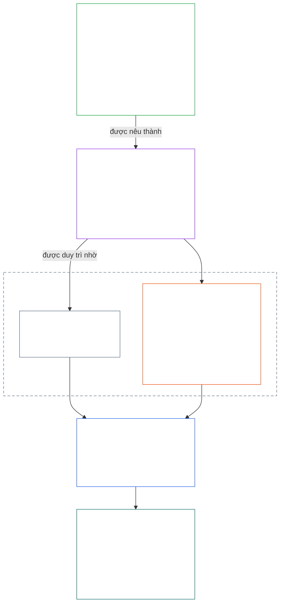
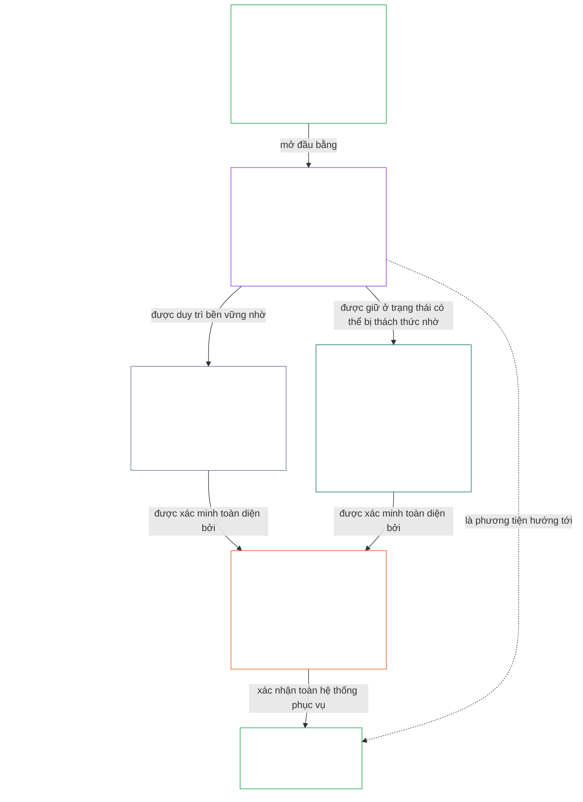

# CHƯƠNG 01, PHẦN A: CÁC NGUYÊN TẮC GIÁ TRỊ

<details>
<summary><strong><span style="color: #2563eb;">Vị trí trong kho văn bản (không có hiệu lực quy phạm): cấu trúc tệp và quy tắc đọc</span></strong></summary>

> Nội dung sau đây **chỉ nhằm hướng dẫn người đọc**. Nội dung này không bổ sung, loại bỏ hay thu hẹp bất kỳ nghĩa vụ ràng buộc nào ở nơi khác trong tệp này hoặc trong các chương khác.
>
> Tệp này **là một phần của Hiến pháp dành cho các hữu thể có tri giác** và **chỉ có tính ràng buộc khi được đọc cùng** các tệp `core_*` được đánh số khác như một văn kiện thống nhất. Tệp này gồm **Chương Một, Phần A** (§§1–12: mục đích và vai trò; mục tiêu Hưng thịnh, được giới thiệu tại §2 và triển khai thông qua phúc lợi, An toàn, Sự thật, Niềm tin và Tự do; cùng mục tiêu Liên tục, được giới thiệu tại §8 và triển khai thông qua năng lực của hệ thống dùng chung, khả năng phục hồi, cấu trúc thị trường và đánh giá hệ thống).
>
> **Phần trước:** [core_00_preamble.md](core_00_preamble.md)  
> **Phần tiếp theo:** [core_01_b_interaction_interpretation.md](core_01_b_interaction_interpretation.md) (Chương Một, Phần B — §§13–15, tương tác, giới hạn quyền ghi đè và diễn giải hiến pháp).  
> **Lộ trình đọc:** §1 mục đích và vai trò → **Hưng thịnh:** giới thiệu §2 (bao gồm các ràng buộc không thể thỏa hiệp về An toàn và Sự thật tại §2.1) → §3 phúc lợi (kết quả) → §4 An toàn → §5 Sự thật → §6 Niềm tin → §7 Tự do → **Liên tục:** giới thiệu §8 → §9 năng lực của hệ thống dùng chung (cầu nối: phương tiện hướng tới Hưng thịnh và bản chất của Liên tục) → §10 khả năng phục hồi → §11 cấu trúc thị trường → §12 đánh giá hệ thống.

</details>

<details>
<summary><strong><span style="color: #2563eb;">Hướng dẫn người đọc (không có hiệu lực quy phạm): Chương Một kết nối các mục tiêu, Tứ trụ, Điều khoản và định nghĩa như thế nào</span></strong></summary>

> Nội dung sau đây **chỉ nhằm hướng dẫn người đọc**. Nội dung này không bổ sung, loại bỏ hay thu hẹp bất kỳ nghĩa vụ ràng buộc nào ở nơi khác trong tệp này hoặc trong các chương khác. Các tiện ích **Truy vết** và **Định nghĩa · Đánh giá · Tuân thủ** theo từng mục quy định lộ trình tham chiếu có tính ràng buộc; khối này là bản đồ cấp phần dành cho độc giả bắt đầu đọc Chương Một.

**Các tầng kết nối với nhau ra sao.** Mỗi tầng trả lời một câu hỏi khác nhau, và mỗi nguyên tắc của Chương Một đều dẫn chiếu đến ba tầng còn lại:

- **Các mục tiêu và Tứ trụ** ([Lời nói đầu §1](core_00_preamble.md#the-model)): hệ thống dùng chung tồn tại để làm gì ([Hưng thịnh](core_05_apex_flourishing_aim.md#flourishing-constitutional) và [Liên tục](core_05_apex_continuity_aim.md#chapter-five-definitions-continuity-constitutional-aim)), cùng bốn nghĩa vụ giúp việc theo đuổi đó trở nên chính đáng ([sự tham gia](core_05_apex_participation_leg.md#participation-constitutional), [giám sát](core_05_apex_oversight_leg.md#oversight-constitutional), [trách nhiệm giải trình](core_05_apex_accountability_leg.md#accountability) và [tính kịp thời](core_05_apex_timeliness_leg.md#timeliness-constitutional)).
- **Các nguyên tắc** (chương này): các mục tiêu và nghĩa vụ đó trở thành giá trị, ràng buộc và quy tắc cân nhắc lẫn nhau như thế nào.
- **Các Điều khoản** ([Chương Sáu](core_06_rights_part_a.md#chapter-six-foundational-rights)): những bảo vệ thuộc Ngưỡng quyền tối thiểu vẫn có thể thực thi trong khi theo đuổi các mục tiêu. **Truy vết** của mỗi mục liệt kê chúng dưới mục *Đặc biệt*.
- **Các định nghĩa** ([Chương Hai đến Chương Năm](core_02_definition_structure.md)): những ý nghĩa chung được dùng để kiểm tra một khẳng định có đúng hay không. Tiện ích **Định nghĩa · Đánh giá · Tuân thủ** của mỗi mục liệt kê chúng.

**Chương Một triển khai từng mục tiêu như thế nào.** Hưng thịnh là phúc lợi được duy trì nhờ sự thật, an toàn, độ đáng tin cậy và năng lực hành động có ý nghĩa ([Lời nói đầu §1](core_00_preamble.md#flourishing)). Chương Một nêu kết quả trước, rồi đưa ra một nguyên tắc cho từng điều kiện trong bốn điều kiện đó.

| Mục tiêu và khía cạnh | Nguyên tắc trong Chương Một | Nơi định nghĩa | Các Điều khoản được nêu trong mục Truy vết |
|---|---|---|---|
| **Hưng thịnh**: kết quả | [§3 Phúc lợi](#3-foundational-objective-wellbeing-flourishing-aim) | [Phúc lợi](core_05_band_continuity.md#wellbeing) | [VI](core_06_rights_part_b.md#article-vi-equal-basic-rights), [X](core_06_rights_part_b.md#article-x-self-determination-agency-and-participation), [XIII-B](core_06_rights_part_c.md#article-xiii-b-right-to-redress-and-remedy), [XIX-B](core_06_rights_part_d.md#article-xix-b-contestability-and-proportional-restriction-limits) |
| **Hưng thịnh**: an toàn | [§4 An toàn](#4-safety-harm-constraint) | [An toàn](core_05_band_continuity.md#safety-constitutional-constraint) | [XIII](core_06_rights_part_c.md#article-xiii-right-to-reliable-and-trustworthy-systems), [XVII](core_06_rights_part_c.md#article-xvii-system-lifecycle-environments-and-reversibility), [XXIII](core_06_rights_part_d.md#article-xxiii-root-cause-analysis-and-adaptive-response) |
| **Hưng thịnh**: sự thật | [§5 Sự thật](#5-truth-epistemic-integrity-constraint) | [Sự thật](core_05_band_oversight.md#truth-constitutional-constraint) | [XIII](core_06_rights_part_c.md#article-xiii-right-to-reliable-and-trustworthy-systems), [XV](core_06_rights_part_c.md#article-xv-info-sphere-integrity), [XVI](core_06_rights_part_c.md#article-xvi-audit-transparency-and-independent-verification) |
| **Hưng thịnh**: độ đáng tin cậy | [§6 Niềm tin](#6-trust-and-trustworthiness-coordination-integrity) | [Độ đáng tin cậy](core_05_band_continuity.md#trustworthiness) | [XIII](core_06_rights_part_c.md#article-xiii-right-to-reliable-and-trustworthy-systems), [XV](core_06_rights_part_c.md#article-xv-info-sphere-integrity), [XVI](core_06_rights_part_c.md#article-xvi-audit-transparency-and-independent-verification) |
| **Hưng thịnh**: năng lực hành động có ý nghĩa | [§7 Tự do](#7-freedom-bounded-agency) | [Năng lực hành động có ý nghĩa](core_05_band_participation.md#meaningful-agency) | [VI](core_06_rights_part_b.md#article-vi-equal-basic-rights), [X](core_06_rights_part_b.md#article-x-self-determination-agency-and-participation), [XXI](core_06_rights_part_d.md#article-xxi-interoperability-portability-movement-refuge-and-exit-integrity) |
| **Liên tục**, kết nối với Hưng thịnh: năng lực bền vững | [§9 Năng lực của hệ thống dùng chung](#9-shared-system-capacity) | [Năng lực của hệ thống dùng chung](core_05_band_continuity.md#shared-system-capacity) | [I-A](core_06_rights_part_a.md#article-i-a-environmental-preconditions-and-ecological-integrity), [III](core_06_rights_part_a.md#article-iii-survival-and-essential-access), [V](core_06_rights_part_a.md#article-v-resource-allocation-dependencies-and-ecosystem-funding) |
| **Liên tục**: khả năng phục hồi | [§10 Khả năng phục hồi và thiết kế tự phục hồi](#10-resilience-and-self-healing-design) | [Tự phục hồi](core_05_band_continuity.md#self-healing) | [XIII](core_06_rights_part_c.md#article-xiii-right-to-reliable-and-trustworthy-systems), [XVII](core_06_rights_part_c.md#article-xvii-system-lifecycle-environments-and-reversibility), [XXIII](core_06_rights_part_d.md#article-xxiii-root-cause-analysis-and-adaptive-response) |
| **Liên tục**: thị trường có thể tranh đua | [§11 Cấu trúc thị trường](#11-market-structure) | [Cấu trúc thị trường](core_05_band_accountability.md#market-structure) | [III-C](core_06_rights_part_a.md#article-iii-c-labor-and-economic-floor), [V](core_06_rights_part_a.md#article-v-resource-allocation-dependencies-and-ecosystem-funding), [XXI](core_06_rights_part_d.md#article-xxi-interoperability-portability-movement-refuge-and-exit-integrity) |
| **Liên tục**: góc nhìn toàn hệ thống | [§12 Yêu cầu đánh giá hệ thống](#12-systemic-evaluation-requirement) | [Chứng nhận sự liên kết của hệ thống](core_05_band_continuity.md#system-alignment-certification) | [XVI](core_06_rights_part_c.md#article-xvi-audit-transparency-and-independent-verification) |

**Thứ bậc nguyên tắc (Liên tục).** Ở tầng nguyên tắc, mục tiêu Liên tục được triển khai theo thứ tự sau, bắt đầu bằng năng lực nối kết hai mục tiêu:

6. **[Năng lực của hệ thống dùng chung](core_05_band_continuity.md#shared-system-capacity)** là kết quả mà việc quản lý ủy thác, quản trị và các cơ chế khuyến khích tốt cần tạo ra theo thời gian — năng lực thực chất và có thể bị chất vấn, giúp các hữu thể có tri giác và hệ thống dùng chung hoàn thành công việc mà Hiến pháp yêu cầu. Năng lực này nằm giữa hai mục tiêu: vừa là phương tiện hướng tới **Hưng thịnh**, vừa là bản chất của **Liên tục**, nhưng không phải lá bài có thể lấn át mọi thứ khác. **[§9.1](#91-productive-capacity-instrumental-good)** và **[§9.2](#92-constitutional-efficiency)** giải thích hai khía cạnh chính của năng lực này.
7. **[Khả năng phục hồi và thiết kế tự phục hồi](#10-resilience-and-self-healing-design)** nêu cách các hệ thống mà hữu thể có tri giác phụ thuộc vào phát hiện sớm sự cố, khoanh vùng sự cố, gặp lỗi theo các lộ trình đã công bố và khôi phục một cách trung thực ([tự phục hồi](core_05_band_continuity.md#self-healing)), để năng lực ở mục 6 được duy trì lâu dài và sự ổn định không phụ thuộc vào can thiệp khẩn cấp.
8. **[Cấu trúc thị trường](core_05_band_accountability.md#market-structure)** tại [§11](#11-market-structure) cung cấp kỷ luật chống tập trung, giúp năng lực đó vẫn có thể bị tranh đua trên thực tế.
9. **[Yêu cầu đánh giá hệ thống](#12-systemic-evaluation-requirement)** xác minh phạm vi toàn hệ thống, các quan hệ phụ thuộc và sự liên kết giữa các cơ chế khuyến khích trước khi chấp nhận khẳng định về tuân thủ hoặc quản trị — theo trụ **giám sát** của Tứ trụ, định hướng cho hoạt động kiểm toán ở tầng nguyên tắc; bao gồm [Chứng nhận sự liên kết của hệ thống](core_05_band_continuity.md#system-alignment-certification) như một quy trình kiểm toán đặc biệt lớn trong số nhiều quy trình khác.

**Chương Một thể hiện Tứ trụ ở đâu.** Mỗi mục nêu các trụ mà mục đó đề cập trong phần Truy vết. Những mục sau thể hiện chúng trực tiếp nhất:

| Trụ của Tứ trụ | Các mục chính trong Chương Một |
|---|---|
| **Sự tham gia** | [§16 Quản lý ủy thác chuyên sâu](core_01_c_stewardship_capacity_principles.md#16-stewardship-in-depth) và [§17 Quản lý ủy thác có hệ quả](core_01_c_stewardship_capacity_principles.md#17-consequential-stewardship-the-steward-role) (vai trò có hệ quả và tiếng nói); [§7 Tự do](#7-freedom-bounded-agency) (năng lực hành động có ý nghĩa) |
| **Giám sát** | [§16](core_01_c_stewardship_capacity_principles.md#16-stewardship-in-depth) và [§17](core_01_c_stewardship_capacity_principles.md#17-consequential-stewardship-the-steward-role) (hiểu biết được phân bổ, hồ sơ); [§18 Quản trị](core_01_c_stewardship_capacity_principles.md#18-governance-under-stewardship-discipline) (cách phân bổ thẩm quyền); [§12](#12-systemic-evaluation-requirement) (kiểm toán) |
| **Trách nhiệm giải trình** | [§18 Quản trị](core_01_c_stewardship_capacity_principles.md#18-governance-under-stewardship-discipline) (nghĩa vụ giải trình tương xứng với thẩm quyền); [§19 Sự liên kết của cơ chế khuyến khích và sự chiếm dụng hệ thống](core_01_c_stewardship_capacity_principles.md#19-incentive-alignment-and-system-capture) (phần thưởng không được làm rỗng các trụ) |
| **Tính kịp thời** | [§16](core_01_c_stewardship_capacity_principles.md#16-stewardship-in-depth) và [§17](core_01_c_stewardship_capacity_principles.md#17-consequential-stewardship-the-steward-role) (phát hiện và xử lý vấn đề mà không chậm trễ có thể tránh được) |

**Hai trục, không phải xung đột.** Các mục tiêu cho biết hệ thống theo đuổi điều gì; Tứ trụ cho biết cách giữ cho việc theo đuổi đó chính đáng. Một thuật ngữ có thể thuộc cả hai: Sự thật và Độ đáng tin cậy là thành tố của Hưng thịnh, và [Lời nói đầu §2](core_00_preamble.md#2-measurements-overview) đo lường chúng trong nhóm Giám sát. [§§13–15](core_01_b_interaction_interpretation.md#13-constitutional-collision-resolution-process) quy định cách cân nhắc các nguyên tắc này khi chúng xung đột và đọc chúng như một tổng thể; [§20](core_01_c_stewardship_capacity_principles.md#20-integrated-application) áp dụng chúng cho mọi chương tiếp theo.

</details>

<br>

### 1. Mục đích và Vai trò
<details>
<summary><strong><span style="color: #2563eb;">Dấu vết</span></strong></summary>

- Thượng nguồn: [Lời nói đầu §1 Mô hình](core_00_preamble.md#the-model) — [Tứ trụ Hiến pháp](core_00_preamble.md#constitutional-tetrad), [Hai Mục tiêu Hiến pháp](core_00_preamble.md#two-constitutional-aims) và mức độ [lợi ích trọng yếu](core_00_preamble.md#material-stake) áp dụng trên toàn chương thông qua các dấu vết của từng mục.
- Hạ nguồn: [15. Giải thích Hiến pháp](core_01_b_interaction_interpretation.md#15-constitutional-interpretation) để đọc tích hợp, xử lý mơ hồ, thứ bậc nội bộ và quy trình giải quyết xung đột chuẩn tắc.
- Hạ nguồn: [Hai Mục tiêu Hiến pháp](core_00_preamble.md#two-constitutional-aims) — phát triển mục tiêu **Hưng thịnh**: từ [§3](#3-foundational-objective-wellbeing-flourishing-aim) đến [§6](#6-trust-and-trustworthiness-coordination-integrity) và [§7 Tự do](#7-freedom-bounded-agency); phát triển mục tiêu **Liên tục**: [§9 Năng lực Hệ thống Chung](#9-shared-system-capacity), [§10 Khả năng Chống chịu và Thiết kế Tự phục hồi](#10-resilience-and-self-healing-design), [§11 Cấu trúc Thị trường](#11-market-structure) và [§12 Yêu cầu Đánh giá Hệ thống](#12-systemic-evaluation-requirement).
- Hạ nguồn: [3. Mục tiêu Nền tảng: Phúc lợi](#3-foundational-objective-wellbeing-flourishing-aim), [§3.2 Công nhận, Củng cố và Khát vọng](#32-recognition-reinforcement-and-aspiration), [4 An toàn](#4-safety-harm-constraint), [5 Chân thực](#5-truth-epistemic-integrity-constraint), [6 Tin cậy](#6-trust-and-trustworthiness-coordination-integrity), [§16 Quản trị Trách nhiệm Chuyên sâu](core_01_c_stewardship_capacity_principles.md#16-stewardship-in-depth), [13. Quy trình Giải quyết Xung đột Hiến pháp](core_01_b_interaction_interpretation.md#13-constitutional-collision-resolution-process) và [§7 Tự do](#7-freedom-bounded-agency).
- Đọc cùng: [Tứ trụ Hiến pháp](core_00_preamble.md#constitutional-tetrad) — tham gia, giám sát, trách nhiệm giải trình và tính kịp thời chi phối cách các hệ thống chung theo đuổi [Hai Mục tiêu Hiến pháp](core_00_preamble.md#two-constitutional-aims); mức độ [lợi ích trọng yếu](core_00_preamble.md#material-stake) áp dụng trên toàn chương thông qua dấu vết của từng mục.
- Đọc cùng: [Các Chương Hai đến Bốn](core_02_definition_structure.md) và [Chương Năm](core_05__definitions_home.md#chapter-five-foundational-definitions) — tầng cơ chế chi phối mọi thuật ngữ dùng trong chương này; áp dụng tính toàn vẹn O/M/A/C, chống né tránh, phân bổ gánh nặng và khả năng truy xuất từ định nghĩa đến kết quả.
- Đọc cùng: [Chương Sáu: Các Quyền Nền tảng](core_06_rights_part_a.md#chapter-six-foundational-rights).
  - Đặc biệt là [Điều VI: Các Quyền Cơ bản Bình đẳng](core_06_rights_part_b.md#article-vi-equal-basic-rights), [Điều XIII: Quyền được có Hệ thống Đáng tin cậy](core_06_rights_part_c.md#article-xiii-right-to-reliable-and-trustworthy-systems) và [Điều XXIV: Giải thích Hiến pháp, Rà soát và Các Bảo đảm Chống Thâu tóm](core_06_rights_part_d.md#article-xxiv-constitutional-interpretation-review-and-anti-capture-safeguards).
  - Áp dụng cách đọc này khi việc giải thích ảnh hưởng đến các chủ thể có tri giác được bảo vệ, hệ thống hoặc thể chế.

</details>

<details>
<summary><strong><span style="color: #2563eb;">Định nghĩa · Đánh giá · Tuân thủ</span></strong></summary>

- [Tính tương xứng](core_05_band_accountability.md#proportionality) · [O](core_05_band_accountability.md#proportionality) · [M](core_05_band_accountability.md#proportionality-a) · [A](core_05_band_accountability.md#proportionality-a) · [C](core_05_band_accountability.md#proportionality-c)
- [Tính cần thiết](core_05_band_accountability.md#necessity) · [O](core_05_band_accountability.md#necessity) · [M](core_05_band_accountability.md#necessity-a) · [A](core_05_band_accountability.md#necessity-a) · [C](core_05_band_accountability.md#necessity-c)

</details>

<br>

*Nói đơn giản: Chương Một đặt ra các giá trị và giới hạn chi phối mọi chương khác. Các hệ thống chung phải theo đuổi **Hưng thịnh** và **Liên tục** cùng nhau — không thể hy sinh mục tiêu này cho mục tiêu kia — và không được tối đa hóa một giá trị bằng cách đánh đổi các giá trị còn lại.*

<a id="two-constitutional-aims"></a><a id="flourishing"></a><a id="continuity"></a>Chương này thiết lập các nguyên tắc và giới hạn chi phối việc giải thích, áp dụng và phát triển Hiến pháp này. Chương phát triển [Hai Mục tiêu Hiến pháp](core_00_preamble.md#two-constitutional-aims) — [**Hưng thịnh**](core_00_preamble.md#flourishing) và [**Liên tục**](core_00_preamble.md#continuity) — vốn được xác lập trong [Lời nói đầu §1 Mô hình](core_00_preamble.md#the-model), thành các nguyên tắc và giới hạn có hiệu lực. Các định nghĩa có thẩm quyền ở tầng nguyên tắc nằm trong Lời nói đầu; chương này áp dụng chúng.

Phải theo đuổi hai mục tiêu đó cùng nhau, luôn trong phạm vi các giới hạn nguyên tắc không thể thương lượng và các bảo vệ quyền được Hiến pháp này xác lập. [**Tứ trụ Hiến pháp**](core_00_preamble.md#constitutional-tetrad) chi phối cách duy trì tính chính đáng của nỗ lực ấy — theo mức [**lợi ích trọng yếu**](core_00_preamble.md#material-stake).

Chương này được tổ chức quanh hai mục tiêu và Tứ trụ đó:
- **Hưng thịnh:** [Giới thiệu Mục tiêu Hưng thịnh](#2-flourishing-aim-introduction) phác họa mục tiêu. [§3 Mục tiêu Nền tảng: Phúc lợi](#3-foundational-objective-wellbeing-flourishing-aim) nêu kết quả. [§4 An toàn](#4-safety-harm-constraint), [§5 Chân thực](#5-truth-epistemic-integrity-constraint), [§6 Tin cậy](#6-trust-and-trustworthiness-coordination-integrity) và [§7 Tự do](#7-freedom-bounded-agency) phát triển bốn điều kiện duy trì mục tiêu này: an toàn, chân thực, đáng tin cậy và quyền tự chủ có ý nghĩa.
- **Liên tục:** [Giới thiệu Mục tiêu Liên tục](#8-continuity-aim-introduction) phác họa mục tiêu. [§9 Năng lực Hệ thống Chung](#9-shared-system-capacity) (vừa là phương tiện hướng tới Hưng thịnh, vừa là bản chất của Liên tục), [§10 Khả năng Chống chịu và Thiết kế Tự phục hồi](#10-resilience-and-self-healing-design), [§11 Cấu trúc Thị trường](#11-market-structure) và [§12 Yêu cầu Đánh giá Hệ thống](#12-systemic-evaluation-requirement) phát triển sự ổn định dài hạn, năng lực hệ thống chung bền vững và khả năng chống chịu. Các tuyên bố về Liên tục dựa trên bức tranh trung thực về toàn hệ thống: mọi tuyên bố trong §§9–11 chỉ đứng vững sau khi qua bước kiểm tra ở §12.
- **Khi các nguyên tắc gặp nhau:** [§13 Quy trình Giải quyết Xung đột Hiến pháp](core_01_b_interaction_interpretation.md#13-constitutional-collision-resolution-process), [§14 Cấm Quyền Ưu tiên Tuyệt đối](core_01_b_interaction_interpretation.md#14-prohibition-on-absolute-override) và [§15 Giải thích Hiến pháp](core_01_b_interaction_interpretation.md#15-constitutional-interpretation) chi phối cách cân nhắc và đọc cùng nhau các mục tiêu và nguyên tắc.
- **Tứ trụ trong thực tiễn:** từ [§16 Quản trị Trách nhiệm Chuyên sâu](core_01_c_stewardship_capacity_principles.md#16-stewardship-in-depth) đến [§19 Điều chỉnh Khuyến khích và Thâu tóm Hệ thống](core_01_c_stewardship_capacity_principles.md#19-incentive-alignment-and-system-capture), các mục này đưa tham gia, giám sát, trách nhiệm giải trình và tính kịp thời vào quản trị trách nhiệm, quản trị điều hành và các khuyến khích; [§20 Áp dụng Tích hợp](core_01_c_stewardship_capacity_principles.md#20-integrated-application) áp dụng toàn bộ chương này cho mọi chương tiếp theo.

**Dấu vết** của mỗi nguyên tắc liệt kê các Điều trong Chương Sáu bảo vệ nguyên tắc đó; tiện ích **Định nghĩa · Đánh giá · Tuân thủ** liệt kê các định nghĩa trong Chương Năm dùng để đo lường nguyên tắc.

**Sơ đồ: Hai Mục tiêu Hiến pháp và Tứ trụ Hiến pháp**

<hr style="border: 0; border-top: 1px solid currentColor;">

```mermaid
flowchart TB
    subgraph Foundation[" "]
        direction TB
        subgraph Aims["Hai Mục tiêu Hiến pháp"]
            direction LR
            F["Hưng thịnh<br/><br/>• Phúc lợi của các chủ thể có tri giác được duy trì bằng chân thực, an toàn,<br/>đáng tin cậy và quyền tự chủ có ý nghĩa"]
            C["Liên tục<br/><br/>• Ổn định dài hạn, bền vững, khả năng chống chịu<br/>và phúc lợi sinh thái"]
        end
        subgraph Tetrad1["Tứ trụ Hiến pháp · tham gia và giám sát"]
            direction LR
            P["Tham gia<br/><br/>• Các chủ thể có tri giác bị ảnh hưởng có tiếng nói thực chất<br/>• Đại diện công bằng và cơ hội công bằng để phản biện<br/>• Tiếp cận các vai trò có hệ quả tương xứng với lợi ích"]
            O["Giám sát<br/><br/>• Theo dõi, kiểm tra, xác minh và lưu hồ sơ<br/>• Rà soát độc lập có thể hạn chế lựa chọn sai lầm"]
        end
        subgraph Tetrad2["Tứ trụ Hiến pháp · trách nhiệm giải trình và tính kịp thời"]
            direction LR
            A["Trách nhiệm giải trình<br/><br/>• Trách nhiệm được quy về đúng chủ thể<br/>• Giải trình, khắc phục và sửa chữa thực chất<br/>• Kết quả xấu phải dẫn đến khắc phục"]
            T["Tính kịp thời<br/><br/>• Vấn đề được phát hiện, phản biện, giải quyết và khắc phục<br/>• Thời hạn phù hợp với lợi ích trọng yếu<br/>• Trì hoãn không thể xóa bỏ quyền, biện pháp khắc phục hoặc sửa chữa"]
        end
    end
    F ~~~ P
    P ~~~ A
    style Foundation fill:none,stroke:none
    style Aims fill:none,stroke:none
    style Tetrad1 fill:none,stroke:none
    style Tetrad2 fill:none,stroke:none
    style F fill:none,stroke:#16a34a,color:#ffffff
    style C fill:none,stroke:#16a34a,color:#ffffff
    style P fill:none,stroke:#0f766e,color:#ffffff
    style O fill:none,stroke:#ea580c,color:#ffffff
    style A fill:none,stroke:#db2777,color:#ffffff
    style T fill:none,stroke:#9333ea,color:#ffffff
```

*Các mục tiêu mô tả điều mà hệ thống chung phải theo đuổi; Tứ trụ mô tả các nghĩa vụ giúp nỗ lực ấy chính đáng. Cả bốn nghĩa vụ đều tương ứng với [lợi ích trọng yếu](core_00_preamble.md#material-stake), và cả hai mục tiêu đều bị giới hạn bởi Sàn Quyền. Sao chép từ [Tổng quan Khái niệm](guides/CONCEPTUAL_OVERVIEW.md#two-aims-and-the-constitutional-tetrad).*

Các giá trị này:
- không độc lập với nhau và trong hoạt động thông thường không có thứ bậc cứng nhắc.
- vận hành như các nguyên tắc và giới hạn tương tác, cần được đánh giá cùng nhau.
- áp dụng cho mọi “hệ thống”, gồm các cấu trúc kỹ thuật, tổ chức, kinh tế, xã hội-kỹ thuật và hệ sinh thái ảnh hưởng đáng kể đến các chủ thể có tri giác và hành tinh Trái Đất.

Không được áp dụng riêng lẻ một nguyên tắc nếu việc đó gây tổn hại đáng kể đến các nguyên tắc khác. Khi phát sinh căng thẳng, các hệ thống phải giải quyết theo yêu cầu về tính tương xứng, sự cần thiết và tác động hệ thống được nêu trong chương này. Nếu xung đột chưa được giải quyết trực tiếp liên quan đến các giới hạn nguyên tắc không thể thương lượng, Quy trình Giải quyết Xung đột Hiến pháp tại **§13** Chương Một sẽ được ưu tiên.

<a id="2-flourishing-aim-introduction"></a>
### 2. Mục tiêu Hưng thịnh: Giới thiệu
<details>
<summary><strong><span style="color: #2563eb;">Truy vết</span></strong></summary>

- Đọc cùng: [Tứ trụ Hiến pháp](core_00_preamble.md#constitutional-tetrad) — cả bốn trụ đều áp dụng cho cách theo đuổi Hưng thịnh; [lợi ích trọng yếu](core_00_preamble.md#material-stake) quyết định mức độ sâu của mọi khẳng định về Hưng thịnh.
- Đọc cùng: [Hai Mục tiêu Hiến pháp](core_00_preamble.md#two-constitutional-aims) — mục tiêu **Hưng thịnh**; mục tiêu song hành được giới thiệu tại [Mục tiêu Liên tục: Giới thiệu](#8-continuity-aim-introduction).
- Thượng nguồn: Các nguyên tắc: [Lời nói đầu §1 Mô hình](core_00_preamble.md#flourishing); [Hưng thịnh (Mục tiêu Hiến pháp)](core_05_apex_flourishing_aim.md#flourishing-constitutional); [§1 Mục đích và Vai trò](#1-purpose-and-role).
- Hạ nguồn: [§3 Mục tiêu Nền tảng: Phúc lợi (Mục tiêu Hưng thịnh)](#3-foundational-objective-wellbeing-flourishing-aim), [§4 An toàn (Ràng buộc về Tổn hại)](#4-safety-harm-constraint), [§5 Sự thật (Ràng buộc về Tính toàn vẹn Nhận thức)](#5-truth-epistemic-integrity-constraint), [§6 Niềm tin và Độ đáng tin cậy (Tính toàn vẹn Phối hợp)](#6-trust-and-trustworthiness-coordination-integrity), và [§7 Tự do (Năng lực hành động có Giới hạn)](#7-freedom-bounded-agency); các Điều khoản bảo vệ từng nguyên tắc được nêu trong phần Truy vết tương ứng.
- Các tiểu mục: [§2.1 Ràng buộc Nguyên tắc Không thể Thỏa hiệp: An toàn và Sự thật](#21-non-negotiable-principle-constraints-safety-and-truth).
- Đọc cùng: nhìn chung, Ngưỡng quyền tối thiểu của Chương Sáu.

</details>

<details>
<summary><strong><span style="color: #2563eb;">Định nghĩa · Đánh giá · Tuân thủ</span></strong></summary>

- [Hưng thịnh (Mục tiêu Hiến pháp)](core_05_apex_flourishing_aim.md#flourishing-constitutional) · [O](core_05_apex_flourishing_aim.md#flourishing-constitutional) · [M](core_05_apex_flourishing_aim.md#flourishing-constitutional-m) · [A](core_05_apex_flourishing_aim.md#flourishing-constitutional-a) · [C](core_05_apex_flourishing_aim.md#flourishing-constitutional-c)
- [Phúc lợi](core_05_band_continuity.md#wellbeing) · [O](core_05_band_continuity.md#wellbeing) · [M](core_05_band_continuity.md#wellbeing-a) · [A](core_05_band_continuity.md#wellbeing-a) · [C](core_05_band_continuity.md#wellbeing-c)
- [An toàn (Ràng buộc Hiến pháp)](core_05_band_continuity.md#safety-constitutional-constraint) · [O](core_05_band_continuity.md#safety-constitutional-constraint) · [M](core_05_band_continuity.md#safety-constraint-a) · [A](core_05_band_continuity.md#safety-constraint-a) · [C](core_05_band_continuity.md#safety-constraint-c)
- [Sự thật (Ràng buộc Hiến pháp)](core_05_band_oversight.md#truth-constitutional-constraint) · [O](core_05_band_oversight.md#truth-constitutional-constraint-o) · [M](core_05_band_oversight.md#truth-constitutional-constraint-a) · [A](core_05_band_oversight.md#truth-constitutional-constraint-a) · [C](core_05_band_oversight.md#truth-constitutional-constraint-c)
- [Độ đáng tin cậy](core_05_band_continuity.md#trustworthiness) · [O](core_05_band_continuity.md#trustworthiness) · [M](core_05_band_continuity.md#trustworthiness-a) · [A](core_05_band_continuity.md#trustworthiness-a) · [C](core_05_band_continuity.md#trustworthiness-c)
- [Năng lực hành động có Ý nghĩa](core_05_band_participation.md#meaningful-agency) · [O](core_05_band_participation.md#meaningful-agency) · [M](core_05_band_participation.md#meaningful-agency-a) · [A](core_05_band_participation.md#meaningful-agency-a) · [C](core_05_band_participation.md#meaningful-agency-c)

</details>

<br>

*Nói đơn giản: Hưng thịnh là mục tiêu thứ nhất trong hai mục tiêu: các hữu thể có tri giác sống tốt và tiếp tục có thể sống tốt vì các hệ thống xung quanh an toàn, trung thực, đáng tin cậy và dành cho họ không gian lựa chọn thực chất. §3 nói rõ kết quả đó là gì. Bốn nguyên tắc tiếp theo nói điều gì giúp kết quả ấy trở thành hiện thực.*

[**Hưng thịnh**](core_05_apex_flourishing_aim.md#flourishing-constitutional) là **phúc lợi của các hữu thể có tri giác được duy trì thông qua sự thật, an toàn, độ đáng tin cậy và năng lực hành động có ý nghĩa** ([Lời nói đầu §1 Mô hình](core_00_preamble.md#flourishing)). Chương Một triển khai mục tiêu này qua hai bước: [§3 Mục tiêu Nền tảng: Phúc lợi (Mục tiêu Hưng thịnh)](#3-foundational-objective-wellbeing-flourishing-aim) nêu kết quả, còn bốn nguyên tắc xác định các điều kiện duy trì kết quả đó.

| Điều kiện | Nguyên tắc | Câu hỏi mà nguyên tắc trả lời |
|---|---|---|
| **An toàn** | [§4 An toàn (Ràng buộc về Tổn hại)](#4-safety-harm-constraint) | Các hữu thể có tri giác có được bảo vệ khỏi tổn hại có thể tránh được không? |
| **Sự thật** | [§5 Sự thật (Ràng buộc về Tính toàn vẹn Nhận thức)](#5-truth-epistemic-integrity-constraint), cùng với [§5.1 Nghiên cứu dựa trên Khoa học và Hỗ trợ Ra quyết định](#51-science-informed-inquiry-and-decision-support) và [§5.2 Khả năng tiếp cận bằng Ngôn ngữ đơn giản (Nghĩa vụ Tham gia và Quản lý Ủy thác)](#52-plain-language-accessibility-participation-and-stewardship-duty) | Các hữu thể có tri giác có thể tin cậy và hiểu những gì được nói với họ không? |
| **Độ đáng tin cậy** | [§6 Niềm tin và Độ đáng tin cậy (Tính toàn vẹn Phối hợp)](#6-trust-and-trustworthiness-coordination-integrity) | Các hệ thống có xứng đáng được tin cậy và khôi phục niềm tin khi thất bại không? |
| **Năng lực hành động có ý nghĩa** | [§7 Tự do (Năng lực hành động có Giới hạn)](#7-freedom-bounded-agency) | Các hữu thể có tri giác có giữ được tự do thực chất nhưng có giới hạn để lựa chọn, bất đồng, tổ chức và rời đi không? |

**Các nguyên tắc Hưng thịnh phối hợp với nhau như thế nào:**
- **An toàn và Sự thật là các ràng buộc không thể thỏa hiệp:** Hai nguyên tắc được nêu cùng nhau tại [§2.1 Ràng buộc Nguyên tắc Không thể Thỏa hiệp: An toàn và Sự thật](#21-non-negotiable-principle-constraints-safety-and-truth), và không được đánh đổi để đạt được các nguyên tắc khác.
- **Niềm tin và Tự do có giới hạn, không tuyệt đối:** Niềm tin phải được tạo dựng và có thể sửa chữa ([§6.1 Sửa chữa và Khắc phục](#61-correction-and-remedy)); Tự do có những giới hạn được áp dụng có kỷ luật ([§7.1 Kỷ luật Giới hạn](#71-limitation-discipline)).
- **Không nguyên tắc nào được áp dụng riêng lẻ:** Các nguyên tắc phải được đọc cùng nhau; khi xung đột, phải cân nhắc theo [§13 Quy trình Giải quyết Xung đột Hiến pháp](core_01_b_interaction_interpretation.md#13-constitutional-collision-resolution-process).
- **Hưng thịnh có mục tiêu song hành:** Mục tiêu Liên tục đặt câu hỏi điều gì giúp kết quả này bền vững; mục tiêu đó được giới thiệu tại [Mục tiêu Liên tục: Giới thiệu](#8-continuity-aim-introduction).

**Sơ đồ: Hưng thịnh và các nguyên tắc của nó**

<hr style="border: 0; border-top: 1px solid currentColor;">



*Hưng thịnh được nêu như một kết quả, trước hết được duy trì bởi các ràng buộc không thể thỏa hiệp là An toàn và Sự thật; cả hai cùng củng cố Niềm tin, rồi Niềm tin củng cố Tự do. Màu sắc là dấu hiệu trực quan có thể tái sử dụng, không hàm ý thứ tự ưu tiên. Truy vết của từng nguyên tắc nêu các Điều khoản tương ứng; tiện ích Định nghĩa · Đánh giá · Tuân thủ nêu các định nghĩa của nguyên tắc đó. Được đăng lại trong [Tổng quan Khái niệm](guides/CONCEPTUAL_OVERVIEW.md#flourishing-and-its-principles).*

<a id="21-non-negotiable-principle-constraints-safety-and-truth"></a>
#### 2.1 Ràng buộc Nguyên tắc Không thể Thỏa hiệp: An toàn và Sự thật
<details>
<summary><strong><span style="color: #2563eb;">Truy vết</span></strong></summary>

- Đọc cùng: [Tứ trụ Hiến pháp](core_00_preamble.md#constitutional-tetrad) — trụ **tham gia** (hiểu và phản biện các kết luận về an toàn và sự thật); trụ **giám sát** (phát hiện nguy cơ gây tổn hại và suy giảm nhận thức); trụ **trách nhiệm giải trình** (trách nhiệm giải đáp về tổn hại, lừa dối và sự lệ thuộc sai lệch); điều chỉnh theo [lợi ích trọng yếu](core_00_preamble.md#material-stake).
- Đọc cùng: [Hai Mục tiêu Hiến pháp](core_00_preamble.md#two-constitutional-aims) — mục tiêu **Hưng thịnh** (**An toàn** và **Sự thật** được nêu là các thành tố theo [Lời nói đầu §1](core_00_preamble.md#two-constitutional-aims)); mục tiêu **Liên tục** (ngăn ngừa tổn hại dài hạn và quản lý ủy thác trung thực các hệ thống bền vững).
- Thượng nguồn: Các nguyên tắc: [3. Mục tiêu Nền tảng: Phúc lợi](#3-foundational-objective-wellbeing-flourishing-aim); [Hai Mục tiêu Hiến pháp](core_00_preamble.md#two-constitutional-aims).
- Hạ nguồn: [6. Niềm tin](#6-trust-and-trustworthiness-coordination-integrity), [13. Quy trình Giải quyết Xung đột Hiến pháp](core_01_b_interaction_interpretation.md#13-constitutional-collision-resolution-process), và [§7 Tự do](#7-freedom-bounded-agency).
- Áp dụng tại: [§4 An toàn](#4-safety-harm-constraint); [§5 Sự thật](#5-truth-epistemic-integrity-constraint); [§5.1 Nghiên cứu dựa trên Khoa học và Hỗ trợ Ra quyết định](#51-science-informed-inquiry-and-decision-support); [§5.2 Khả năng tiếp cận bằng Ngôn ngữ đơn giản](#52-plain-language-accessibility-participation-and-stewardship-duty).

</details>

<br>

*Nói đơn giản: An toàn và Sự thật là những mức sàn vững chắc của Hiến pháp, không phải thứ có thể đánh đổi để tối ưu hóa. Các hệ thống dùng chung không được đặt các hữu thể có tri giác vào nguy hiểm có thể dự đoán hoặc lừa dối họ. Cả hai ràng buộc đều áp dụng khi theo đuổi Hưng thịnh và Liên tục dưới kỷ luật về tham gia, giám sát, trách nhiệm giải trình và tính kịp thời của Tứ trụ.*

**An toàn** và **Sự thật** là các ràng buộc nguyên tắc không thể thỏa hiệp, giới hạn mọi nguyên tắc khác của Chương Một — bao gồm [§3 Mục tiêu Nền tảng: Phúc lợi](#3-foundational-objective-wellbeing-flourishing-aim) — và [Hai Mục tiêu Hiến pháp](core_00_preamble.md#two-constitutional-aims). Đây là những thành tố được nêu rõ của [**Hưng thịnh**](#flourishing) và không thể thiếu đối với [**Liên tục**](#continuity): các hệ thống không thể hưng thịnh bằng cách gây tổn hại hoặc lừa dối, và tính chính đáng lâu dài đòi hỏi quản lý rủi ro một cách trung thực.

Việc áp dụng các ràng buộc này phải đáp ứng [Tứ trụ Hiến pháp](core_00_preamble.md#constitutional-tetrad), với mức độ tương xứng theo [lợi ích trọng yếu](core_00_preamble.md#material-stake), đặc biệt:
- khi các kết luận về an toàn ảnh hưởng đến năng lực tham gia
- khi các khẳng định về sự thật chi phối sự lệ thuộc
- khi trách nhiệm giải trình về tổn hại hoặc hành vi gây hiểu lầm được đặt ra

Các kết luận về An toàn và Sự thật có thể làm thay đổi hồ sơ vị thế của một hữu thể có tri giác, bao gồm:
- cách [đóng góp](core_05_band_accountability.md#contribution-nature) được công nhận
- việc vi phạm có được ghi nhận hay không
- mức độ nghiêm trọng của vi phạm được phân loại ra sao
- những hệ quả nào đi kèm

Mô hình vị thế trong [**Chương Chín**](core_09_standing_assessment.md) quy định cách phân loại, xác minh và áp dụng các kết luận đó; các yêu cầu đánh giá và tuân thủ được lấy từ [**Chương Hai đến Chương Năm**](core_02_definition_structure.md).

### 3. Mục tiêu Nền tảng: Phúc lợi (Mục tiêu Hưng thịnh)
<details>
<summary><strong><span style="color: #2563eb;">Truy vết</span></strong></summary>

- Đọc cùng: [Tứ trụ Hiến pháp](core_00_preamble.md#constitutional-tetrad) — trụ **tham gia** khi các điều kiện phúc lợi ảnh hưởng đáng kể đến tính thực chất của tiếng nói, quyền tiếp cận và khả năng phản biện; trụ **trách nhiệm giải trình** khi các khẳng định về phúc lợi ảnh hưởng đến việc phân bổ gánh nặng; điều chỉnh theo [lợi ích trọng yếu](core_00_preamble.md#material-stake) khi có liên quan đáng kể.
- Đọc cùng: [Hai Mục tiêu Hiến pháp](core_00_preamble.md#two-constitutional-aims) — chương này phát triển mục tiêu **Hưng thịnh** thông qua [§3](#3-foundational-objective-wellbeing-flourishing-aim) đến [§6](#6-trust-and-trustworthiness-coordination-integrity) và [§7 Tự do](#7-freedom-bounded-agency).
- Thượng nguồn: Các nguyên tắc: [Lời nói đầu §1 Mô hình](core_00_preamble.md#the-model); [Hai Mục tiêu Hiến pháp](core_00_preamble.md#two-constitutional-aims) — sự phát triển của mục tiêu **Hưng thịnh**.
- Hạ nguồn: [§4 An toàn](#4-safety-harm-constraint), [§5 Sự thật](#5-truth-epistemic-integrity-constraint), [§16 Quản lý Ủy thác Chuyên sâu](core_01_c_stewardship_capacity_principles.md#16-stewardship-in-depth), và [13. Quy trình Giải quyết Xung đột Hiến pháp](core_01_b_interaction_interpretation.md#13-constitutional-collision-resolution-process).
- Các tiểu mục: [§3.1 Công bằng](#31-fairness); [§3.2 Công nhận, Củng cố và Khát vọng](#32-recognition-reinforcement-and-aspiration); [§3.3 Quy trình Chống Hạ thấp Phẩm giá](#33-anti-degrading-process).
- Đọc cùng: nhìn chung, Ngưỡng quyền tối thiểu của Chương Sáu.
  - Đặc biệt [Điều VI: Các Quyền Cơ bản Bình đẳng](core_06_rights_part_b.md#article-vi-equal-basic-rights), [Điều X: Tự quyết, Năng lực hành động và Tham gia](core_06_rights_part_b.md#article-x-self-determination-agency-and-participation), [Điều XIII-B: Quyền được Khắc phục và Bồi hoàn](core_06_rights_part_c.md#article-xiii-b-right-to-redress-and-remedy), và [Điều XIX-B: Khả năng Phản biện và Giới hạn Hạn chế Tương xứng](core_06_rights_part_d.md#article-xix-b-contestability-and-proportional-restriction-limits).
  - Áp dụng nội dung này khi lợi ích phúc lợi được viện dẫn để biện minh cho việc hạn chế năng lực hành động, phẩm giá hoặc khả năng phản biện.
  - Đặc biệt đọc cùng [Phẩm giá và Địa vị Đạo đức Bình đẳng](core_05_band_participation.md#dignity-and-equal-moral-standing), [Công bằng Thực chất](core_05_band_participation.md#substantive-fairness), và [§6 Niềm tin](#6-trust-and-trustworthiness-coordination-integrity) khi quyền tiếp cận, quy trình, sự phù hợp trong phân phối, sự tin cậy hoặc tính toàn vẹn phối hợp có ý nghĩa trọng yếu.

</details>

<details>
<summary><strong><span style="color: #2563eb;">Định nghĩa · Đánh giá · Tuân thủ</span></strong></summary>

- [Phúc lợi](core_05_band_continuity.md#wellbeing) · [O](core_05_band_continuity.md#wellbeing) · [M](core_05_band_continuity.md#wellbeing-a) · [A](core_05_band_continuity.md#wellbeing-a) · [C](core_05_band_continuity.md#wellbeing-c)
- [Sự tham gia](core_05_apex_participation_leg.md#participation-constitutional) · [O](core_05_apex_participation_leg.md#participation-constitutional) · [M](core_05_apex_participation_leg.md#participation-constitutional-m) · [A](core_05_apex_participation_leg.md#participation-constitutional-a) · [C](core_05_apex_participation_leg.md#participation-constitutional-c)
- [Phẩm giá và Địa vị Đạo đức Bình đẳng](core_05_band_participation.md#dignity-and-equal-moral-standing) · [O](core_05_band_participation.md#dignity-and-equal-moral-standing) · [M](core_05_band_participation.md#dignity-and-equal-moral-standing-a) · [A](core_05_band_participation.md#dignity-and-equal-moral-standing-a) · [C](core_05_band_participation.md#dignity-and-equal-moral-standing-c)
- [Công bằng Thực chất](core_05_band_participation.md#substantive-fairness) · [O](core_05_band_participation.md#substantive-fairness) · [M](core_05_band_participation.md#substantive-fairness-constitutional-a) · [A](core_05_band_participation.md#substantive-fairness-constitutional-a) · [C](core_05_band_participation.md#substantive-fairness-constitutional-c)
- [Tính Trọng yếu](core_05_band_oversight.md#materiality) · [O](core_05_band_oversight.md#materiality) · [M](core_05_band_oversight.md#materiality-determination-a) · [A](core_05_band_oversight.md#materiality-determination-a) · [C](core_05_band_oversight.md#materiality-determination-c)
- [Độ lệch của Biến đại diện](core_05_band_oversight.md#proxy-divergence) · [O](core_05_band_oversight.md#proxy-divergence) · [M](core_05_band_oversight.md#proxy-divergence-a) · [A](core_05_band_oversight.md#proxy-divergence-a) · [C](core_05_band_oversight.md#proxy-divergence-c)

</details>

<br>

*Nói đơn giản: mục đích cốt lõi của các hệ thống này là thực sự cải thiện đời sống của các hữu thể có tri giác. Chạy theo một chỉ số thay thế không đáp ứng mục đích đó, và cũng không thể được dùng làm cái cớ để xem nhẹ An toàn, Sự thật hay các quyền. Phúc lợi là nền tảng của sự tham gia: tiếng nói hình thức nhưng thiếu điều kiện để năng lực hành động trở thành hiện thực thì không phải là sự tham gia theo Hiến pháp này.*

Mục tiêu tối hậu của mọi hệ thống chịu sự điều chỉnh của Hiến pháp này là bảo tồn và nâng cao [phúc lợi](core_05_band_continuity.md#wellbeing) của các hữu thể có tri giác — mục tiêu [**Hưng thịnh**](#flourishing), một trong [Hai Mục tiêu Hiến pháp](core_00_preamble.md#two-constitutional-aims).

[Lời nói đầu §1 Mô hình](core_00_preamble.md#flourishing) định nghĩa Hưng thịnh là phúc lợi của các hữu thể có tri giác được duy trì thông qua sự thật, an toàn, độ đáng tin cậy và năng lực hành động có ý nghĩa. Mục này nêu kết quả. Các mục tiếp theo phát triển bốn điều kiện duy trì kết quả đó: [§4 An toàn](#4-safety-harm-constraint), [§5 Sự thật](#5-truth-epistemic-integrity-constraint), [§6 Niềm tin](#6-trust-and-trustworthiness-coordination-integrity), và [§7 Tự do](#7-freedom-bounded-agency). Năm nguyên tắc này cùng nhau thể hiện sự phát triển mục tiêu Hưng thịnh trong Chương Một. Mục tiêu [**Liên tục**](#continuity) được phát triển tại [§9 Năng lực của Hệ thống Dùng chung](#9-shared-system-capacity), [§10 Khả năng Phục hồi và Thiết kế Tự chữa lành](#10-resilience-and-self-healing-design), [§11 Cấu trúc Thị trường](#11-market-structure), và [§12 Yêu cầu Đánh giá Hệ thống](#12-systemic-evaluation-requirement).

Phúc lợi là nền tảng của [Sự tham gia](core_05_apex_participation_leg.md#participation-constitutional) theo [Tứ trụ Hiến pháp](core_00_preamble.md#constitutional-tetrad). Các hệ thống dùng chung không được xem sự tham gia là đã được bảo đảm khi những điều kiện phúc lợi nền tảng — bao gồm [Năng lực Hành động có Ý nghĩa](core_05_band_participation.md#meaningful-agency), quyền tiếp cận công bằng và phẩm giá — bị suy giảm đáng kể.

Phúc lợi không chỉ bao gồm các tác động tức thời mà còn cả hệ quả gián tiếp, chậm trễ, tích lũy và xuyên hệ thống, được đánh giá theo [**Chương Hai đến Chương Bốn**](core_02_definition_structure.md). Ở tầng giá trị này, phúc lợi:
- tạo điều kiện cho sự tham gia thực chất — tiếng nói mà các hữu thể có tri giác không có điều kiện sử dụng thì không phải là sự tham gia có ý nghĩa
- không thể được tuyên bố là “đạt được” chỉ bằng cách đạt một chỉ số đã lệch khỏi điều thực sự quan trọng
- vẫn chịu giới hạn của các ràng buộc nguyên tắc không thể thỏa hiệp trong chương này: **An toàn** và **Sự thật**
- không thể được viện dẫn như một lý do chung để vi phạm An toàn, Sự thật hoặc các biện pháp bảo vệ quyền

#### 3.1 Công bằng
<details>
<summary><strong><span style="color: #2563eb;">Truy vết</span></strong></summary>

- Đọc cùng: [Tứ trụ Hiến pháp](core_00_preamble.md#constitutional-tetrad) — trụ **tham gia** (tiếp cận, tiếng nói và khả năng phản biện; đây là yêu cầu chung, không chỉ là [Sự tham gia của Hệ thống bên liên quan](core_05_band_participation.md#stakeholder-status-and-weight)); trụ **trách nhiệm giải trình** khi có lợi ích và gánh nặng phát sinh.
- Thượng nguồn: Các nguyên tắc: [§3 Mục tiêu Nền tảng: Phúc lợi](#3-foundational-objective-wellbeing-flourishing-aim) — bao gồm phúc lợi là nền tảng của [Sự tham gia](core_05_apex_participation_leg.md#participation-constitutional).
- Hạ nguồn: [3.2 Công nhận, Củng cố và Khát vọng](#32-recognition-reinforcement-and-aspiration); [§6 Niềm tin](#6-trust-and-trustworthiness-coordination-integrity), [§16 Quản lý Ủy thác Chuyên sâu](core_01_c_stewardship_capacity_principles.md#16-stewardship-in-depth), [13. Quy trình Giải quyết Xung đột Hiến pháp](core_01_b_interaction_interpretation.md#13-constitutional-collision-resolution-process), và [Hồ sơ Xung đột Hiến pháp](core_05_band_integrative.md#constitutional-collision-record) khi các lựa chọn về ưu tiên và phân bổ phải nhất quán và có thể được xem xét.
- Các tiểu mục (thứ tự đọc): [§3.1.1](#311-access-and-opportunity) · [§3.1.2](#312-benefits-and-burdens) · [§3.1.3](#313-fair-treatment) · [§3.1.4](#314-unfair-treatment).
- Hạ nguồn: Định hình phạm vi quyền đối với địa vị bình đẳng, cách đối xử không tùy tiện, khả năng phản biện thực chất và giới hạn của hạn chế tương xứng.
  - Đặc biệt [Điều VI: Các Quyền Cơ bản Bình đẳng](core_06_rights_part_b.md#article-vi-equal-basic-rights), [Điều VI-C: Không Phân biệt Đối xử](core_06_rights_part_b.md#article-vi-c-nondiscrimination), [Điều X: Tự quyết, Năng lực hành động và Tham gia](core_06_rights_part_b.md#article-x-self-determination-agency-and-participation), [Điều XIII-B: Quyền được Khắc phục và Bồi hoàn](core_06_rights_part_c.md#article-xiii-b-right-to-redress-and-remedy), và [Điều XIX-B: Khả năng Phản biện và Giới hạn Hạn chế Tương xứng](core_06_rights_part_d.md#article-xix-b-contestability-and-proportional-restriction-limits).
  - Khi một chỉ định trái hiến pháp kéo theo chế tài hoặc ảnh hưởng lâu dài, đọc cùng [Chương Mười Một, mục 4 — Bảo đảm thủ tục đúng đắn, khắc phục và phòng ngừa](core_11_a_misconduct_designation.md#4-due-process-safeguards-for-slot-assignment).
  - Các cam kết không phân biệt đối xử được triển khai chi tiết qua Chương Năm [§2 — Đặc điểm được bảo vệ, sử dụng biến đại diện, kiểm soát tiếp cận bằng tín hiệu riêng tư, và tình trạng theo **Điều VII-E** (*dịch vụ tình dục thương mại có sự đồng thuận của người trưởng thành và bóc lột tình dục*)](core_05_band_participation.md#fairness-protected-characteristics-and-nondiscrimination), bao gồm [Kiểm soát tiếp cận bằng Tín hiệu riêng tư được bảo vệ và việc Né tránh Tình trạng theo **Điều VII-E**](core_05_band_participation.md#protected-intimate-signal-gating-and-article-vii-e-adult-consensual-commercial-sexual-services-and-sexual-exploitation-status-circumvention) khi các quy tắc đối xử công bằng tại §2.1.3 liên quan đến kiểm soát bằng tín hiệu riêng tư hoặc **Điều VII-E** (*dịch vụ tình dục thương mại có sự đồng thuận của người trưởng thành và bóc lột tình dục*).
- Đọc cùng: [Công bằng Thực chất](core_05_band_participation.md#substantive-fairness) và các nghĩa vụ liên quan thuộc Ngưỡng quyền tối thiểu của Chương Sáu khi lợi ích, gánh nặng, phần thưởng, chi phí, nghĩa vụ, rủi ro, đóng góp, nhu cầu hoặc mức độ phơi nhiễm có ý nghĩa trọng yếu; [Khả năng tiếp cận](core_05_band_participation.md#accessibility) khi các lộ trình tiếp cận tại §2.1.1 có ý nghĩa trọng yếu; [Độ lệch của Biến đại diện](core_05_band_oversight.md#proxy-divergence) khi các chỉ số tổng hợp hoặc tác động của bảng điểm có ý nghĩa trọng yếu.

</details>

<details>
<summary><strong><span style="color: #2563eb;">Định nghĩa · Đánh giá · Tuân thủ</span></strong></summary>

- [Phẩm giá và Địa vị Đạo đức Bình đẳng](core_05_band_participation.md#dignity-and-equal-moral-standing) · [O](core_05_band_participation.md#dignity-and-equal-moral-standing) · [M](core_05_band_participation.md#dignity-and-equal-moral-standing-a) · [A](core_05_band_participation.md#dignity-and-equal-moral-standing-a) · [C](core_05_band_participation.md#dignity-and-equal-moral-standing-c)
- [Khả năng tiếp cận](core_05_band_participation.md#accessibility) · [O](core_05_band_participation.md#accessibility) · [M](core_05_band_participation.md#accessibility-constitutional-a) · [A](core_05_band_participation.md#accessibility-constitutional-a) · [C](core_05_band_participation.md#accessibility-constitutional-c)
- [Sự tham gia](core_05_apex_participation_leg.md#participation-constitutional) · [O](core_05_apex_participation_leg.md#participation-constitutional) · [M](core_05_apex_participation_leg.md#participation-constitutional-m) · [A](core_05_apex_participation_leg.md#participation-constitutional-a) · [C](core_05_apex_participation_leg.md#participation-constitutional-c)
- [Công bằng về Thủ tục](core_05_band_participation.md#procedural-fairness) · [O](core_05_band_participation.md#procedural-fairness) · [M](core_05_band_participation.md#procedural-fairness-constitutional-a) · [A](core_05_band_participation.md#procedural-fairness-constitutional-a) · [C](core_05_band_participation.md#procedural-fairness-constitutional-c)
- [Công bằng Thực chất](core_05_band_participation.md#substantive-fairness) · [O](core_05_band_participation.md#substantive-fairness) · [M](core_05_band_participation.md#substantive-fairness-constitutional-a) · [A](core_05_band_participation.md#substantive-fairness-constitutional-a) · [C](core_05_band_participation.md#substantive-fairness-constitutional-c)
- [Đặc điểm được Bảo vệ](core_05_band_participation.md#protected-characteristics) · [O](core_05_band_participation.md#protected-characteristics) · [M](core_05_band_participation.md#protected-characteristics-constitutional-a) · [A](core_05_band_participation.md#protected-characteristics-constitutional-a) · [C](core_05_band_participation.md#protected-characteristics-constitutional-c)
- [Sử dụng Biến đại diện cho Đặc điểm được Bảo vệ và Tác động Khác biệt](core_05_band_participation.md#protected-characteristic-proxying-and-disparate-impact) · [O](core_05_band_participation.md#protected-characteristic-proxying-and-disparate-impact) · [M](core_05_band_participation.md#protected-characteristic-proxying-and-disparate-impact-a) · [A](core_05_band_participation.md#protected-characteristic-proxying-and-disparate-impact-a) · [C](core_05_band_participation.md#protected-characteristic-proxying-and-disparate-impact-c)
- [Kiểm soát tiếp cận bằng Tín hiệu riêng tư được bảo vệ và Né tránh Tình trạng theo **Điều VII-E** (*dịch vụ tình dục thương mại có sự đồng thuận của người trưởng thành và bóc lột tình dục*)](core_05_band_participation.md#protected-intimate-signal-gating-and-article-vii-e-adult-consensual-commercial-sexual-services-and-sexual-exploitation-status-circumvention) · [O](core_05_band_participation.md#protected-intimate-signal-gating-and-article-vii-e-adult-consensual-commercial-sexual-services-and-sexual-exploitation-status-circumvention) · [M](core_05_band_participation.md#protected-intimate-signal-gating-and-article-vii-e-status-circumvention-a) · [A](core_05_band_participation.md#protected-intimate-signal-gating-and-article-vii-e-status-circumvention-a) · [C](core_05_band_participation.md#protected-intimate-signal-gating-and-article-vii-e-status-circumvention-c)
- [Độ lệch của Biến đại diện](core_05_band_oversight.md#proxy-divergence) · [O](core_05_band_oversight.md#proxy-divergence) · [M](core_05_band_oversight.md#proxy-divergence-a) · [A](core_05_band_oversight.md#proxy-divergence-a) · [C](core_05_band_oversight.md#proxy-divergence-c)

</details>

<br>

*Nói đơn giản: công bằng có nghĩa là hệ thống không thể tự nhận là tốt khi các hữu thể có tri giác bình thường bị ngăn cản tham gia, bị áp dụng những quy tắc không giải thích được, hoặc phải gánh các chi phí mà người khác tránh được. Một hệ thống công bằng trao quyền tiếp cận thực chất, sử dụng những lý do có thể bảo vệ được, và chia sẻ phần thưởng, chi phí, rủi ro phù hợp với đóng góp, nhu cầu và mức độ phơi nhiễm thực tế.*

**Công bằng** là một phần trong những gì [§3 Mục tiêu Nền tảng: Phúc lợi](#3-foundational-objective-wellbeing-flourishing-aim) yêu cầu mỗi khi các hữu thể có tri giác phải sống, làm việc, học tập, giao dịch hoặc ra quyết định thông qua các hệ thống dùng chung. Khi hệ thống dùng chung ảnh hưởng đáng kể đến các hữu thể có tri giác, công bằng đặt câu hỏi liệu cơ hội, cách đối xử và việc phân chia lợi ích, gánh nặng có tôn trọng [Phẩm giá và Địa vị Đạo đức Bình đẳng](core_05_band_participation.md#dignity-and-equal-moral-standing) hay không.

Công bằng giúp [Sự tham gia](core_05_apex_participation_leg.md#participation-constitutional) trở thành hiện thực. Sự tham gia không thực chất nếu các hữu thể có tri giác trên danh nghĩa có tiếng nói nhưng không thể tiếp cận quy trình, hiểu quy tắc, đáp ứng điều kiện, phản biện kết quả hoặc chịu nổi gánh nặng đặt lên họ.

Một hệ thống chỉ đưa ra kết quả trung bình tốt là chưa đủ. Một chỉ số nổi bật, mức trung bình, thứ hạng hoặc khẳng định về hiệu quả không tự nó chứng minh công bằng. Một hệ thống có thể trông thành công ở mức tổng thể nhưng vẫn bất công với các hữu thể có tri giác bị loại trừ, phân loại sai, trả lương thấp, gánh nặng quá mức hoặc bị từ chối cơ hội phản đối có ý nghĩa.

Mục này có **bốn phần thực hành**. Các phần đó hướng dẫn mục này nhưng không thay thế các định nghĩa trong Chương Năm hay Ngưỡng quyền tối thiểu của Chương Sáu.

<a id="311-access-and-opportunity"></a>
##### 3.1.1 Tiếp cận và Cơ hội

Tiểu mục này giải thích ý nghĩa thực tế của quyền tiếp cận và cơ hội:

- Các hữu thể có tri giác cần những con đường thực tế để [Tham gia](core_05_apex_participation_leg.md#participation-constitutional), tiếp cận giáo dục, việc làm, chăm sóc, an toàn, đi lại và những nguồn lực khác quan trọng đối với đời sống thường nhật.
- Không được chặn, định giá vượt khả năng, trì hoãn, che giấu hoặc thiên lệch các con đường đó vì những lý do tùy tiện hoặc không liên quan.
- Khi Hiến pháp này yêu cầu cơ hội **thực chất**, một cánh cửa chỉ mở trên giấy là chưa đủ.

<a id="312-benefits-and-burdens"></a>
##### 3.1.2 Lợi ích và Gánh nặng

Tiểu mục này giải thích khi nào việc chia sẻ lợi ích và gánh nặng là công bằng:

- Một hệ thống không công bằng khi một số hữu thể có tri giác nhận được lợi ích còn những người khác âm thầm gánh chi phí.
- Sự thiên vị, chuyển chi phí một cách kín đáo, thực thi có chọn lọc và thủ thuật trên bảng điểm không đáp ứng yêu cầu này.

<a id="313-fair-treatment"></a>
##### 3.1.3 Đối xử Công bằng

Tiểu mục này nêu những điều kiện cần có để đối xử công bằng:

- Các hữu thể có tri giác trong những tình huống tương tự cần được áp dụng cùng những quy tắc cơ bản.
- Những gì họ nhận được, phải thực hiện hoặc phải đối mặt cần tương xứng với đóng góp, nhu cầu hoặc gánh nặng thực tế của họ.
- Cách đối xử khác biệt phải có lý do thực chất, tương xứng với lý do đó, tôn trọng phẩm giá và tránh phân biệt đối xử.
- Các quy tắc chi tiết được quy định trong Chương Năm, bao gồm [Đặc điểm được Bảo vệ](core_05_band_participation.md#protected-characteristics) và [Sử dụng Biến đại diện cho Đặc điểm được Bảo vệ và Tác động Khác biệt](core_05_band_participation.md#protected-characteristic-proxying-and-disparate-impact).
- Khi một quyết định ảnh hưởng đáng kể đến ai đó hoặc người đó phản biện quyết định, lộ trình xem xét phải đáp ứng [Công bằng về Thủ tục](core_05_band_participation.md#procedural-fairness) ở mọi nơi mà Chương Sáu hoặc văn kiện điều chỉnh yêu cầu thông báo, điều trần, giải thích hoặc xem xét.

Phúc lợi được tuyên bố không phù hợp với [§3 Mục tiêu Nền tảng: Phúc lợi](#3-foundational-objective-wellbeing-flourishing-aim) nếu nó phụ thuộc vào việc loại trừ tùy tiện, các quy tắc không giải thích được hoặc bất ổn, sự khai thác kín đáo, hoặc [Sự tham gia](core_05_apex_participation_leg.md#participation-constitutional) hình thức trong khi các điều kiện công bằng giúp sự tham gia có ý nghĩa đã thất bại.

<a id="314-unfair-treatment"></a>
##### 3.1.4 Đối xử Bất công

Đối xử bất công tạo ra sự loại trừ và thiếu nhất quán. Các hệ thống không được che giấu đối xử bất công đằng sau ngôn ngữ kỹ thuật, nhãn trung tính hoặc quyết định tự động. Cụ thể, các hệ thống không được:
- sử dụng thuật toán, hệ thống chấm điểm hoặc quy tắc hành chính lặp lại bất lợi trong quá khứ mà không có lý do hợp hiến;
- sử dụng tín hiệu cá nhân riêng tư hoặc lịch sử tình dục làm dấu hiệu thay thế cho lòng tin, rủi ro, nhân cách hoặc quyền tiếp cận — đọc cùng [Kiểm soát tiếp cận bằng Tín hiệu riêng tư được bảo vệ và Né tránh Tình trạng theo **Điều VII-E** (*dịch vụ tình dục thương mại có sự đồng thuận của người trưởng thành và bóc lột tình dục*)](core_05_band_participation.md#protected-intimate-signal-gating-and-article-vii-e-adult-consensual-commercial-sexual-services-and-sexual-exploitation-status-circumvention);
- trừng phạt việc làm hợp pháp, lịch sử việc làm, tình trạng không có việc làm, tình trạng làm việc hợp pháp hoặc sự tham gia được bảo vệ khi không có lý do hợp hiến;
- từ chối việc làm, nhà ở, dịch vụ ngân hàng, giấy phép, tư cách hoặc quyền tiếp cận tương tự **chủ yếu vì** bất kỳ hình thức việc làm hợp pháp, việc làm hợp pháp trong quá khứ, việc làm hợp pháp bị cho là có, hoặc tình trạng không có việc làm;
- tạo ra bất lợi đáng kể thông qua cấp phép, quy hoạch phân khu, phí, quy tắc nền tảng hoặc yêu cầu khác trông có vẻ trung tính nhưng chủ yếu gây gánh nặng cho công việc hợp pháp, lịch sử làm việc hợp pháp, công việc hợp pháp bị cho là có, tình trạng không có việc làm hoặc sự tham gia được bảo vệ mà không có căn cứ biện minh theo yêu cầu của Hiến pháp này.

Bốn phần này cũng hỗ trợ [§6 Niềm tin](#6-trust-and-trustworthiness-coordination-integrity) khi các hữu thể có tri giác cần dựa vào một hệ thống, chấp nhận quyết định của hệ thống hoặc phối hợp dựa trên những cam kết của hệ thống.

#### 3.2 Công nhận, củng cố và khát vọng
<details>
<summary><strong><span style="color: #2563eb;">Dấu vết</span></strong></summary>

- Đọc cùng: [Tứ trụ Hiến pháp](core_00_preamble.md#constitutional-tetrad) — trụ **tham gia** khi các lộ trình công nhận, tán dương hoặc khát vọng được nêu tên ảnh hưởng đáng kể đến tiếng nói, địa vị hoặc quyền tiếp cận các vai trò có hệ quả; trụ **trách nhiệm giải trình** (chống tưởng thưởng cho phản bội, che giấu và né tránh trách nhiệm giải trình); trụ **giám sát** (tán dương có thể truy nguyên, không gây hiểu lầm).
- Thượng nguồn: Các nguyên tắc: [§3 Mục tiêu nền tảng: Phúc lợi](#3-foundational-objective-wellbeing-flourishing-aim) — bao gồm phúc lợi làm nền tảng cho [Sự tham gia](core_05_apex_participation_leg.md#participation-constitutional); [§3.1 Công bằng](#31-fairness).
- Hạ nguồn: [6. Lòng tin](#6-trust-and-trustworthiness-coordination-integrity); [§16 Quản trị có trách nhiệm chuyên sâu](core_01_c_stewardship_capacity_principles.md#16-stewardship-in-depth); [§18 Quản trị dưới kỷ luật quản trị có trách nhiệm](core_01_c_stewardship_capacity_principles.md#18-governance-under-stewardship-discipline); [§7 Tự do](#7-freedom-bounded-agency).
- Đọc cùng: [Chương Chín §§4.3–4.4 — Danh mục mô tả được chuẩn hóa](core_09_standing_assessment.md#43-route-descriptor-measurement-roles), khi các tường thuật mô tả **theo lĩnh vực** hoặc mô tả so sánh **Trục Đóng góp / Trục Vi phạm** là trọng yếu.
- Đọc cùng: [Chương Chín §4.3 — Các mô tả phía đóng góp](core_09_standing_assessment.md#43-route-descriptor-measurement-roles), khi bản chất đóng góp và các tường thuật công nhận là trọng yếu; [Chương Mười §3](core_10_standing_integration.md#3-descriptor-integration-and-attachment-normalization) về việc tích hợp chúng vào Câu hỏi 3.
- Đọc cùng: [Điều X: Tự quyết, quyền tự chủ và sự tham gia](core_06_rights_part_b.md#article-x-self-determination-agency-and-participation), khi sở thích về hình thức công nhận, mức độ hiển thị hoặc quyền từ chối là trọng yếu.
- Các tiểu mục (thứ tự đọc): [§3.2.1](#321-recognition-and-reinforcement) · [§3.2.2](#322-celebration-of-success) · [§3.2.3](#323-aspiration) · [§3.2.4](#324-preference-aligned-recognition) · [§3.2.5](#325-aligned-recognition-pathways) · [§3.2.6](#326-anti-reward-for-anti-constitutional-conduct) · [§3.2.7](#327-implementation-layer).

</details>

<details>
<summary><strong><span style="color: #2563eb;">Định nghĩa · Đánh giá · Tuân thủ</span></strong></summary>

- [Phúc lợi](core_05_band_continuity.md#wellbeing) · [O](core_05_band_continuity.md#wellbeing) · [M](core_05_band_continuity.md#wellbeing-a) · [A](core_05_band_continuity.md#wellbeing-a) · [C](core_05_band_continuity.md#wellbeing-c)
- [Sự tham gia](core_05_apex_participation_leg.md#participation-constitutional) · [O](core_05_apex_participation_leg.md#participation-constitutional) · [M](core_05_apex_participation_leg.md#participation-constitutional-m) · [A](core_05_apex_participation_leg.md#participation-constitutional-a) · [C](core_05_apex_participation_leg.md#participation-constitutional-c)
- [Công bằng thực chất](core_05_band_participation.md#substantive-fairness) · [O](core_05_band_participation.md#substantive-fairness) · [M](core_05_band_participation.md#substantive-fairness-constitutional-a) · [A](core_05_band_participation.md#substantive-fairness-constitutional-a) · [C](core_05_band_participation.md#substantive-fairness-constitutional-c)
- [Khả năng khiếu nại](core_05_band_accountability.md#contestability) · [O](core_05_band_accountability.md#contestability) · [M](core_05_band_accountability.md#contestability-a) · [A](core_05_band_accountability.md#contestability-a) · [C](core_05_band_accountability.md#contestability-c)
- [Quyền tự chủ có ý nghĩa](core_05_band_participation.md#meaningful-agency) · [O](core_05_band_participation.md#meaningful-agency) · [M](core_05_band_participation.md#meaningful-agency-a) · [A](core_05_band_participation.md#meaningful-agency-a) · [C](core_05_band_participation.md#meaningful-agency-c)
- [Sự đồng bộ khuyến khích](core_05_band_integrative.md#incentive-alignment) · [O](core_05_band_integrative.md#incentive-alignment) · [M](core_05_band_integrative.md#incentive-alignment-a) · [A](core_05_band_integrative.md#incentive-alignment-a) · [C](core_05_band_integrative.md#incentive-alignment-c)

</details>

<br>

*Diễn giải đơn giản: phúc lợi không chỉ là những gì bị cấm và điều gì công bằng — các hệ thống chung cũng nên thành thật cổ vũ và tưởng thưởng hành vi mà họ muốn được lặp lại, trong khuôn khổ sự thật và quyền, theo cách hỗ trợ chứ không thay thế sự tham gia thực chất. Ăn mừng thành công nghĩa là ghi nhận đóng góp, khắc phục và hoàn tất có thật, chứ không phải thổi phồng hay thao túng chỉ số. Điều đó cũng có nghĩa là từ chối tưởng thưởng cho sự phản bội hiến pháp, che giấu, trả đũa hoặc né tránh trách nhiệm giải trình — ngay cả khi những hành vi ấy tạo lợi thế cho thể chế.*

**Ba chiều cạnh.** Phúc lợi phụ thuộc vào những gì hệ thống cấm và cách chúng phân bổ chi phí công bằng — đồng thời cũng phụ thuộc vào những gì chúng công khai coi trọng, củng cố và giúp các hữu thể có tri giác theo đuổi. Mục này nêu các nghĩa vụ về công nhận, củng cố và khát vọng đó. Việc công nhận và tán dương ảnh hưởng đáng kể đến tiếng nói, địa vị hoặc quyền tiếp cận phải nhất quán với [Sự tham gia](core_05_apex_participation_leg.md#participation-constitutional) theo [§3 Mục tiêu nền tảng: Phúc lợi](#3-foundational-objective-wellbeing-flourishing-aim) và [§3.1 Công bằng](#31-fairness). Mục này được áp dụng cùng [§3.1 Công bằng](#31-fairness) và vẫn chịu giới hạn bởi An toàn, Sự thật và Nền tảng Quyền của Chương Sáu.

<a id="321-recognition-and-reinforcement"></a>
##### 3.2.1 Công nhận và củng cố

Phúc lợi của các hữu thể có tri giác được thúc đẩy khi hệ thống **phát tín hiệu**, **ghi nhận** và **tưởng thưởng tương xứng** cho việc quản trị có trách nhiệm hợp pháp, hợp tác trung thực, khắc phục, hoàn tất và những đóng góp khác phù hợp với hiến pháp — kể cả thông qua **củng cố tích cực** và **công nhận công khai** — chứ không chỉ bằng kiềm chế, chế tài hoặc im lặng.

Đây là nghĩa vụ hiến pháp, không phải văn hóa tùy chọn. Các hệ thống chung cần làm cho hành vi phù hợp với hiến pháp trở nên hữu hình và đáng để lặp lại.

<a id="322-celebration-of-success"></a>
##### 3.2.2 Ăn mừng thành công

**Ăn mừng** tôn vinh thành tựu **có thể truy nguyên**, **không gây hiểu lầm** và sự phối hợp vì lợi ích xã hội. Điều đó bao gồm các tường thuật nâng đỡ và quản trị có trách nhiệm gắn với [đóng góp](core_05_band_accountability.md#contribution-nature) đã được xác minh.

Ăn mừng không được:
- thay thế tiến bộ thực chất hướng tới các mục tiêu hiến pháp nền tảng khi việc tối ưu hóa chỉ số đại diện đã lệch khỏi các mục tiêu ấy ([§3 Mục tiêu nền tảng: Phúc lợi](#3-foundational-objective-wellbeing-flourishing-aim))
- trở thành sự **chiếm dụng** lời tán dương hoặc uy tín ([§19 Sự đồng bộ khuyến khích và chiếm đoạt hệ thống](core_01_c_stewardship_capacity_principles.md#19-incentive-alignment-and-system-capture))
- bào chữa cho việc né tránh trách nhiệm giải trình khi có liên quan đến An toàn, Sự thật hoặc các biện pháp bảo vệ quyền

<a id="323-aspiration"></a>
##### 3.2.3 Khát vọng

**Khát vọng** bao gồm những sở thích được nêu ra và những mục tiêu được theo đuổi trong khuôn khổ [§7 Tự do](#7-freedom-bounded-agency). Khát vọng là một phần của phúc lợi khi phù hợp với phẩm giá, địa vị bình đẳng, An toàn, Sự thật và [Công bằng thực chất](core_05_band_participation.md#substantive-fairness).

Trong những giới hạn đó, hệ thống nên **công nhận và hỗ trợ** những gì các hữu thể có tri giác muốn theo đuổi một cách hợp pháp.

Mong muốn điều gì đó không phải là giấy phép làm mọi việc. Khi sự đồng thuận, phẩm giá, An toàn, Sự thật, công bằng thực chất hoặc các biện pháp bảo vệ của **Chương Sáu** bị ảnh hưởng đáng kể, những mục tiêu theo đuổi ấy vẫn phải được phân tích Xung đột Hiến pháp như mọi yêu sách hiến pháp khác.

<a id="324-preference-aligned-recognition"></a>
##### 3.2.4 Công nhận phù hợp với sở thích

Khi khả thi, hệ thống nên **điều chỉnh** việc công nhận, tán dương và tưởng thưởng tương xứng theo cách các hữu thể có tri giác muốn được vinh danh — nhất là sở thích đã nêu về **hình thức và mức độ hiển thị**.

Điều đó bao gồm tôn trọng việc **từ chối tham gia** công nhận công khai hoặc nghi lễ, hoặc sở thích được **ghi nhận tối thiểu hoặc riêng tư**, khi điều đó tương xứng và hợp pháp.

Sự công nhận **không mong muốn** hoặc **mang tính cưỡng ép** không đáp ứng yêu cầu này — kể cả việc đưa những hữu thể có tri giác **đã từ chối** ra làm tâm điểm.

Sự công nhận cần có **ý nghĩa** đối với những người được vinh danh và cộng đồng mà họ cùng làm việc, chứ không giống một màn trình diễn chủ yếu dành cho người ngoài quan sát.

<a id="325-aligned-recognition-pathways"></a>
##### 3.2.5 Các lộ trình công nhận phù hợp

Các lộ trình công nhận có tên gọi, lời tán dương, giải thưởng, chứng nhận, địa vị, tác động đến danh tiếng hoặc các khuyến khích tương tự **phân bổ địa vị**, **nguồn lực** hoặc **quyền tiếp cận vật chất** phải nhất quán với Sự thật, An toàn, thủ tục có thể bị khiếu nại khi **Chương Sáu** quy định, [Sự tham gia](core_05_apex_participation_leg.md#participation-constitutional) và [Sự đồng bộ khuyến khích](core_05_band_integrative.md#incentive-alignment).

Chúng **không được** thường xuyên tưởng thưởng cho hành vi gây hại, lừa dối, né tránh giám sát, bóc lột hoặc làm suy giảm quyền tự chủ có ý nghĩa.

<a id="326-anti-reward-for-anti-constitutional-conduct"></a>
##### 3.2.6 Không tưởng thưởng hành vi phản hiến pháp

*Diễn giải đơn giản: không ai được tưởng thưởng vì thực hiện, che giấu hoặc trả đũa liên quan đến hành vi phản hiến pháp, dù công khai hay qua những con đường kín đáo như ưu ái, thăng chức âm thầm hoặc làm ngơ. Giúp đỡ những hữu thể có tri giác bị tổn hại và bảo vệ người báo cáo trung thực là việc khác. Đó là phản ứng đúng đắn và cần được khuyến khích.*

Không được trao bất kỳ sự công nhận, phần thưởng, bảo vệ, thăng tiến, miễn trừ, nhiệm vụ thuận lợi, hợp đồng, quyền tiếp cận, địa vị, lợi ích danh tiếng, lợi ích tư cách hoặc lợi thế tương tự nào vì một hữu thể có tri giác, vai trò, thể chế hoặc thành phần hệ thống đã thực hiện, tạo điều kiện, che giấu, bình thường hóa, từ chối sửa chữa hoặc trả đũa việc báo cáo hành vi phản hiến pháp.

Quy tắc này áp dụng cho phần thưởng trực tiếp và các lộ trình tưởng thưởng gián tiếp, bao gồm bảo trợ, tẩy rửa danh tiếng, thăng chức hồi tố, chọn lọc không thực thi, dàn xếp có lợi, ghi công theo chỉ số hoặc bảo vệ thể chế.

Bất kỳ hữu thể có tri giác, vai trò, thể chế hoặc thành phần hệ thống nào khắc phục tổn hại, bảo vệ hữu thể có tri giác khỏi bị trả đũa hoặc sửa sai cho người bị tổn thương hay người đã báo cáo với thiện chí đều đang làm điều mà Hiến pháp này khuyến khích. Công việc đó, cũng như sự trợ giúp mà những hữu thể có tri giác bị tổn thương và người báo cáo thiện chí nhận được, không được xem là phần thưởng theo quy tắc này.

<a id="327-implementation-layer"></a>
##### 3.2.7 Tầng triển khai

Các nghi thức, chương trình giảng dạy, ngân sách, chương trình và chỉ số chi tiết thuộc về các tầng triển khai khi được thông qua.

<a id="33-anti-degrading-process"></a>
#### 3.3 Quy trình chống hạ thấp phẩm giá

<details>
<summary><strong><span style="color: #2563eb;">Dấu vết</span></strong></summary>

- Thượng nguồn: [§3 Mục tiêu nền tảng: Phúc lợi](#3-foundational-objective-wellbeing-flourishing-aim) (*nền tảng — phẩm giá và địa vị đạo đức bình đẳng được vận hành hóa thành nền tảng chống hạ thấp phẩm giá trong quy trình*); [§3.1 Công bằng](#31-fairness) (*đối xử công bằng đòi hỏi bản thân quy trình không trở thành hình phạt*); [Phẩm giá và địa vị đạo đức bình đẳng](core_05_band_participation.md#dignity-and-equal-moral-standing).
- Đọc cùng: [Tứ trụ Hiến pháp](core_00_preamble.md#constitutional-tetrad) — trụ **trách nhiệm giải trình** (thiết kế quy trình phải đáp ứng các hữu thể có tri giác bị ảnh hưởng, chứ không phải sự tiện lợi của thể chế); trụ **giám sát** (sự hạ thấp phẩm giá có thể được phát hiện và khiếu nại); [Sự tàn ác](core_05_band_accountability.md#cruelty) (*nơi quy định tại Chương Năm về việc lấy đau khổ làm mục đích và hành vi gây tổn hại vô cớ / hạ thấp phẩm giá*).
- Hạ nguồn: [§13.1.4 Các nền tảng hiến pháp, An toàn và Quy trình chống hạ thấp phẩm giá](core_01_b_interaction_interpretation.md#1314-constitutional-floors-safety-and-anti-degrading-process) (viện dẫn nguyên tắc này như một nền tảng tuyệt đối trong thứ tự đánh đổi); [§16 Quản trị có trách nhiệm chuyên sâu](core_01_c_stewardship_capacity_principles.md#16-stewardship-in-depth) và [§17 Quản trị có trách nhiệm đối với hệ quả](core_01_c_stewardship_capacity_principles.md#17-consequential-stewardship-the-steward-role) (*ràng buộc cách các trụ cột và vai trò quản trị có trách nhiệm được thực hiện — không phải tiểu mục của bên nào*); [Điều VI: Các quyền cơ bản bình đẳng](core_06_rights_part_b.md#article-vi-equal-basic-rights) và [Điều VI-A](core_06_rights_part_b.md#article-vi-a-dignity-and-equal-moral-standing) (*nền tảng phẩm giá*); [Điều XX-A](core_06_rights_part_d.md#article-xx-a-justice-objective-and-scope) (*nền tảng chống tàn ác*); [hệ thống kho tư liệu CS-7](corpus_systems/cs_07_justice_safeguards_restitution_rehabilitation.md) (*Các bảo đảm tư pháp, bồi hoàn và phục hồi*).

</details>

<details>
<summary><strong><span style="color: #2563eb;">Định nghĩa · Đánh giá · Tuân thủ</span></strong></summary>

- [Phẩm giá và địa vị đạo đức bình đẳng](core_05_band_participation.md#dignity-and-equal-moral-standing) · [O](core_05_band_participation.md#dignity-and-equal-moral-standing) · [M](core_05_band_participation.md#dignity-and-equal-moral-standing-a) · [A](core_05_band_participation.md#dignity-and-equal-moral-standing-a) · [C](core_05_band_participation.md#dignity-and-equal-moral-standing-c)
- [Sự tàn ác](core_05_band_accountability.md#cruelty) · [O](core_05_band_accountability.md#cruelty) · [M](core_05_band_accountability.md#cruelty-a) · [A](core_05_band_accountability.md#cruelty-a) · [C](core_05_band_accountability.md#cruelty-c)
- [Tổn hại](core_05_band_accountability.md#harm) · [O](core_05_band_accountability.md#harm) · [M](core_05_band_accountability.md#harm-a) · [A](core_05_band_accountability.md#harm-a) · [C](core_05_band_accountability.md#harm-c)
- [Tính tương xứng](core_05_band_accountability.md#proportionality) · [O](core_05_band_accountability.md#proportionality) · [M](core_05_band_accountability.md#proportionality-a) · [A](core_05_band_accountability.md#proportionality-a) · [C](core_05_band_accountability.md#proportionality-c)
- [Khả năng khiếu nại](core_05_band_accountability.md#contestability) · [O](core_05_band_accountability.md#contestability) · [M](core_05_band_accountability.md#contestability-a) · [A](core_05_band_accountability.md#contestability-a) · [C](core_05_band_accountability.md#contestability-c)

</details>

<br>

*Diễn giải đơn giản: dù quản trị, thực thi, xét xử, hạn chế hay khắc phục theo cách nào — cũng không được đẩy các hữu thể có tri giác vào sự nhục nhã, phô diễn công khai, trả đũa hoặc sự tàn ác “vì như thế tiện cho chúng ta hơn”. Trách nhiệm công bằng, trách nhiệm giải trình công khai và hạn chế nghiêm ngặt vẫn có thể hợp pháp dù gây đau đớn hoặc làm ai đó xấu hổ. Ranh giới bị vượt qua khi chính quy trình trở thành hình phạt — được thiết kế để hạ thấp phẩm giá, làm nhục hoặc trút giận thay vì bảo vệ, sửa chữa, khôi phục hoặc ngăn ngừa. Nguyên tắc này áp dụng ở mọi nơi có thẩm quyền hiến pháp, chứ không chỉ trong các đánh đổi về quyền.*

**Nội dung:** một nền tảng về tính chất áp dụng xuyên suốt theo [§3 Phúc lợi](#3-foundational-objective-wellbeing-flourishing-aim) — nguyên tắc này không bổ sung nhiệm vụ thực chất riêng như [§3.1 Công bằng](#31-fairness) và [§3.2 Công nhận, củng cố và khát vọng](#32-recognition-reinforcement-and-aspiration), mà giới hạn *cách thức* thực hiện công việc về phúc lợi, quản trị có trách nhiệm và mọi quy trình hiến pháp khác — bao gồm ba trụ cột của [§16 Quản trị có trách nhiệm chuyên sâu](core_01_c_stewardship_capacity_principles.md#16-stewardship-in-depth) và vai trò quản trị có trách nhiệm được xác định tại [§17 Quản trị có trách nhiệm đối với hệ quả](core_01_c_stewardship_capacity_principles.md#17-consequential-stewardship-the-steward-role).

**Nguyên tắc Quy trình chống hạ thấp phẩm giá.** Các quy trình, biện pháp và kết quả hiến pháp phải tuân thủ nguyên tắc này.

**Bị cấm.** Chúng không được biện minh bằng, bao gồm hoặc có thể dự đoán là sẽ tạo ra:

- đối xử hạ thấp phẩm giá;
- làm nhục chỉ để làm nhục;
- phô diễn chủ yếu nhằm răn đe;
- bất bình mang tính trả đũa;
- trả đũa tập thể;
- áp đặt gánh nặng mang tính phân biệt đối xử; hoặc
- để sự tiện lợi về thủ tục lấn át quyền.

Khi tính chất bị cấm là gây đau khổ như một mục đích tự thân, hoặc gây đau khổ vô cớ hay hạ thấp phẩm giá vượt quá mức cần thiết và tương xứng — bao gồm làm nhục chỉ để làm nhục — quy định tương ứng trong Chương Năm là [Sự tàn ác](core_05_band_accountability.md#cruelty) (tiểu loại làm nhục theo mục đó).

**Không bị cấm chỉ vì khó khăn.** Trách nhiệm giải trình công khai thông thường, việc công bố có lý do, hạn chế đã được xác minh hoặc biện pháp khắc phục tương xứng vẫn hợp pháp ngay cả khi gây khó chịu hoặc bất lợi về danh tiếng.

**Thiết kế và thực hiện.** Quy trình không được thiết kế, định hình, tiến hành hoặc để vận hành theo cách hạ thấp phẩm giá, làm nhục, phô diễn, trả đũa, áp đặt gánh nặng phân biệt đối xử hoặc làm xói mòn quyền vì sự tiện lợi.

**Phạm vi.** Nguyên tắc này áp dụng cho mọi quy trình hiến pháp, bao gồm:

- các quyết định quản trị và triển khai;
- thực thi và đánh giá tư cách;
- thủ tục tại diễn đàn;
- biện pháp khẩn cấp và kế hoạch chuyển tiếp;
- thủ tục sửa đổi; và
- mọi hoạt động hành chính và vận hành theo thẩm quyền hiến pháp.

Nguyên tắc này không chỉ giới hạn trong bối cảnh thứ tự đánh đổi, nơi nó cũng vận hành như một nền tảng tuyệt đối theo [§13.1.4 Các nền tảng hiến pháp, An toàn và Quy trình chống hạ thấp phẩm giá](core_01_b_interaction_interpretation.md#1314-constitutional-floors-safety-and-anti-degrading-process).

**Phát hiện và khiếu nại.** Tính chất của một quy trình chịu cùng các yêu cầu về [Khả năng khiếu nại](core_05_band_accountability.md#contestability) và [Giám sát](core_05_apex_oversight_leg.md#oversight-constitutional) như các kết quả thực chất. Các bên bị ảnh hưởng có thể khiếu nại độc lập về tính chất của quy trình, bất kể kết quả thực chất nếu xét riêng có hợp pháp hay không. Một kết quả đúng được đưa ra thông qua quy trình hạ thấp phẩm giá vẫn là không tuân thủ.

### 4. An toàn (Ràng buộc về tổn hại)
<details>
<summary><strong><span style="color: #2563eb;">Dấu vết</span></strong></summary>

- Đọc cùng: [Tứ trụ Hiến pháp](core_00_preamble.md#constitutional-tetrad) — các trụ **giám sát** và **trách nhiệm giải trình**; mức độ mở rộng theo [lợi ích trọng yếu](core_00_preamble.md#material-stake).
- Đọc cùng: [Hai Mục tiêu Hiến pháp](core_00_preamble.md#two-constitutional-aims) — mục tiêu **Thịnh vượng** (thành tố **An toàn**); mục tiêu **Duy trì Liên tục** (phòng ngừa tổn hại không thể đảo ngược và quản trị rủi ro dài hạn).
- Thượng nguồn: Các nguyên tắc: [3. Mục tiêu nền tảng: Phúc lợi](#3-foundational-objective-wellbeing-flourishing-aim); [Hai Mục tiêu Hiến pháp](core_00_preamble.md#two-constitutional-aims).
- Hạ nguồn: [5.1 Tìm hiểu và hỗ trợ quyết định dựa trên khoa học](#51-science-informed-inquiry-and-decision-support), [6. Lòng tin](#6-trust-and-trustworthiness-coordination-integrity), [§7 Tự do](#7-freedom-bounded-agency), [13. Quy trình giải quyết Xung đột Hiến pháp](core_01_b_interaction_interpretation.md#13-constitutional-collision-resolution-process) và [13.2.1 Bảo toàn tính toàn vẹn nhận thức](core_01_b_interaction_interpretation.md#1321-preservation-of-epistemic-integrity).
- Hạ nguồn: Định hình phạm vi quyền về hệ thống đáng tin cậy, tính toàn vẹn của không gian thông tin, kiểm toán và rà soát, kiểm soát vòng đời, giới hạn thử nghiệm, khả năng hiểu, ứng phó thích nghi và xử lý tình trạng khẩn cấp.
  - Đặc biệt là [Điều XIII: Quyền có các hệ thống đáng tin cậy](core_06_rights_part_c.md#article-xiii-right-to-reliable-and-trustworthy-systems), [Điều XV: Tính toàn vẹn của không gian thông tin](core_06_rights_part_c.md#article-xv-info-sphere-integrity), [Điều XVI: Kiểm toán, minh bạch và xác minh độc lập](core_06_rights_part_c.md#article-xvi-audit-transparency-and-independent-verification), [Điều XVII: Vòng đời hệ thống, môi trường và khả năng đảo ngược](core_06_rights_part_c.md#article-xvii-system-lifecycle-environments-and-reversibility), [Điều XVIII: Đổi mới, thử nghiệm và tự do sáng tạo trong môi trường cách ly](core_06_rights_part_c.md#article-xviii-sandboxed-innovation-experimentation-and-creative-freedom), [Điều XXII: Khả năng hiểu và quản trị độ phức tạp](core_06_rights_part_d.md#article-xxii-comprehensibility-and-complexity-stewardship), [Điều XXIII: Phân tích nguyên nhân gốc rễ và ứng phó thích nghi](core_06_rights_part_d.md#article-xxiii-root-cause-analysis-and-adaptive-response), [Điều XXIV: Diễn giải Hiến pháp, rà soát và bảo vệ chống chiếm đoạt](core_06_rights_part_d.md#article-xxiv-constitutional-interpretation-review-and-anti-capture-safeguards) và [Điều XX: Công lý sau khi xác minh vi phạm](core_06_rights_part_d.md#article-xx-justice-after-verified-violation).
  - Điều này cũng bao gồm mọi Nền tảng Quyền của Chương Sáu khi việc thực thi hoặc hạn chế quyền phụ thuộc vào rủi ro, bằng chứng, công bố thông tin hoặc tính toàn vẹn hệ thống.

</details>

<details>
<summary><strong><span style="color: #2563eb;">Định nghĩa · Đánh giá · Tuân thủ</span></strong></summary>

- [An toàn (Ràng buộc Hiến pháp)](core_05_band_continuity.md#safety-constitutional-constraint) · [O](core_05_band_continuity.md#safety-constitutional-constraint) · [M](core_05_band_continuity.md#safety-constraint-a) · [A](core_05_band_continuity.md#safety-constraint-a) · [C](core_05_band_continuity.md#safety-constraint-c)
- [Tổn hại](core_05_band_accountability.md#harm) · [O](core_05_band_accountability.md#harm) · [M](core_05_band_accountability.md#harm-a) · [A](core_05_band_accountability.md#harm-a) · [C](core_05_band_accountability.md#harm-c)
- [Tổn hại không thể đảo ngược](core_05_band_accountability.md#irreversible-harm) · [O](core_05_band_accountability.md#irreversible-harm) · [M](core_05_band_accountability.md#irreversible-harm-a) · [A](core_05_band_accountability.md#irreversible-harm-a) · [C](core_05_band_accountability.md#irreversible-harm-c)
- [Rủi ro](core_05_band_continuity.md#risk) · [O](core_05_band_continuity.md#risk) · [M](core_05_band_continuity.md#risk-a) · [A](core_05_band_continuity.md#risk-a) · [C](core_05_band_continuity.md#risk-c)
- [Tính trọng yếu](core_05_band_oversight.md#materiality) · [O](core_05_band_oversight.md#materiality) · [M](core_05_band_oversight.md#materiality-determination-a) · [A](core_05_band_oversight.md#materiality-determination-a) · [C](core_05_band_oversight.md#materiality-determination-c)
- [Sự phụ thuộc](core_05_band_continuity.md#dependency) · [O](core_05_band_continuity.md#dependency) · [M](core_05_band_continuity.md#dependency-a) · [A](core_05_band_continuity.md#dependency-a) · [C](core_05_band_continuity.md#dependency-c)
- [Khả năng tiên liệu](core_05_band_oversight.md#foreseeability) · [O](core_05_band_oversight.md#foreseeability) · [M](core_05_band_oversight.md#foreseeability-diligence-a) · [A](core_05_band_oversight.md#foreseeability-diligence-a) · [C](core_05_band_oversight.md#foreseeability-diligence-c)

</details>

<br>

*Diễn giải đơn giản: không được xây dựng hoặc vận hành hệ thống theo cách có thể dự đoán làm tăng nguy cơ tổn hại không được khống chế, sự cố dây chuyền hoặc tổn hại không thể đảo ngược đối với các hữu thể có tri giác và các hệ thống mà họ phụ thuộc.*

An toàn là ràng buộc nguyên tắc không thể thương lượng đối với thiết kế, vận hành và quản trị hệ thống — là thành tố được nêu rõ của [**Thịnh vượng**](#flourishing) và là nền tảng cho [**Duy trì Liên tục**](#continuity) ở nơi hệ thống chung tạo ra nguy cơ tổn hại có thể dự đoán. Các định nghĩa chi tiết, tiêu chí đánh giá và phép thử tuân thủ nằm trong [**Chương Hai đến Chương Năm**](core_02_definition_structure.md), đặc biệt là [Tổn hại](core_05_band_accountability.md#harm), [Tổn hại không thể đảo ngược](core_05_band_accountability.md#irreversible-harm), [Rủi ro](core_05_band_continuity.md#risk), [Tính trọng yếu](core_05_band_oversight.md#materiality), [Sự phụ thuộc](core_05_band_continuity.md#dependency) và [Khả năng tiên liệu](core_05_band_oversight.md#foreseeability-and-reasonably-foreseeable).

Hệ thống không được hành động — hoặc không hành động — theo cách có thể dự đoán làm tăng nguy cơ tổn hại không được khống chế, tiềm năng sự cố dây chuyền hoặc mức độ phơi nhiễm với tổn hại không thể đảo ngược trái với Hiến pháp này.

### 5. Sự thật (Ràng buộc về tính toàn vẹn nhận thức)
<details>
<summary><strong><span style="color: #2563eb;">Dấu vết</span></strong></summary>

- Đọc cùng: [Tứ trụ Hiến pháp](core_00_preamble.md#constitutional-tetrad) — các trụ **giám sát** và **trách nhiệm giải trình**; mức độ mở rộng theo [lợi ích trọng yếu](core_00_preamble.md#material-stake).
- Đọc cùng: [Hai Mục tiêu Hiến pháp](core_00_preamble.md#two-constitutional-aims) — mục tiêu **Thịnh vượng** (thành tố **Sự thật**); mục tiêu **Duy trì Liên tục** (quản trị trung thực các điều kiện nhận thức và thể chế bền vững).
- Thượng nguồn: Các nguyên tắc: [3. Mục tiêu nền tảng: Phúc lợi](#3-foundational-objective-wellbeing-flourishing-aim); [Hai Mục tiêu Hiến pháp](core_00_preamble.md#two-constitutional-aims).
- Hạ nguồn: [5.1 Tìm hiểu và hỗ trợ quyết định dựa trên khoa học](#51-science-informed-inquiry-and-decision-support), [6. Lòng tin](#6-trust-and-trustworthiness-coordination-integrity), [13. Quy trình giải quyết Xung đột Hiến pháp](core_01_b_interaction_interpretation.md#13-constitutional-collision-resolution-process), [13.2.1 Bảo toàn tính toàn vẹn nhận thức](core_01_b_interaction_interpretation.md#1321-preservation-of-epistemic-integrity), [13.2.2 Đồng bộ Lòng tin và Sự thật](core_01_b_interaction_interpretation.md#1322-trust-truth-alignment) và [14. Cấm quyền ưu tiên tuyệt đối](core_01_b_interaction_interpretation.md#14-prohibition-on-absolute-override).
- Hạ nguồn: Làm nền tảng cho phạm vi quyền về bằng chứng trung thực, khả năng kiểm toán, tính toàn vẹn khoa học, rà soát hồi cứu và công bố thông tin có thể bị khiếu nại.
  - Đặc biệt là [Điều XIII: Quyền có các hệ thống đáng tin cậy](core_06_rights_part_c.md#article-xiii-right-to-reliable-and-trustworthy-systems), [Điều XV: Tính toàn vẹn của không gian thông tin](core_06_rights_part_c.md#article-xv-info-sphere-integrity), [Điều XVI: Kiểm toán, minh bạch và xác minh độc lập](core_06_rights_part_c.md#article-xvi-audit-transparency-and-independent-verification), [Điều XVIII-E: Tính toàn vẹn của công bố, rà soát và tái lập khoa học](core_06_rights_part_c.md#article-xviii-e-scientific-publication-review-and-replication-integrity), [Điều XXIV: Diễn giải Hiến pháp, rà soát và bảo vệ chống chiếm đoạt](core_06_rights_part_d.md#article-xxiv-constitutional-interpretation-review-and-anti-capture-safeguards) và [Điều XXV-A: Rà soát hồi cứu và công bố thông tin](core_06_rights_part_e.md#article-xxv-a-retrospective-review-and-disclosure).
  - Điều này cũng bao gồm mọi bối cảnh Nền tảng Quyền của Chương Sáu khi tính trung thực, bằng chứng, công bố thông tin hoặc khả năng khiếu nại là vấn đề trọng yếu.

</details>

<details>
<summary><strong><span style="color: #2563eb;">Định nghĩa · Đánh giá · Tuân thủ</span></strong></summary>

- [Tính toàn vẹn nhận thức](core_05_band_oversight.md#epistemic-integrity) · [O](core_05_band_oversight.md#epistemic-integrity-o) · [M](core_05_band_oversight.md#epistemic-integrity-a) · [A](core_05_band_oversight.md#epistemic-integrity-a) · [C](core_05_band_oversight.md#epistemic-integrity-c)
- [Sự thật (Ràng buộc Hiến pháp)](core_05_band_oversight.md#truth-constitutional-constraint) · [O](core_05_band_oversight.md#truth-constitutional-constraint-o) · [M](core_05_band_oversight.md#truth-constitutional-constraint-a) · [A](core_05_band_oversight.md#truth-constitutional-constraint-a) · [C](core_05_band_oversight.md#truth-constitutional-constraint-c)
- [Tính trọng yếu](core_05_band_oversight.md#materiality) · [O](core_05_band_oversight.md#materiality) · [M](core_05_band_oversight.md#materiality-determination-a) · [A](core_05_band_oversight.md#materiality-determination-a) · [C](core_05_band_oversight.md#materiality-determination-c)
- [Sự phụ thuộc](core_05_band_continuity.md#dependency) · [O](core_05_band_continuity.md#dependency) · [M](core_05_band_continuity.md#dependency-a) · [A](core_05_band_continuity.md#dependency-a) · [C](core_05_band_continuity.md#dependency-c)
- [Khả năng tiên liệu](core_05_band_oversight.md#foreseeability) · [O](core_05_band_oversight.md#foreseeability) · [M](core_05_band_oversight.md#foreseeability-diligence-a) · [A](core_05_band_oversight.md#foreseeability-diligence-a) · [C](core_05_band_oversight.md#foreseeability-diligence-c)

</details>

<br>

*Diễn giải đơn giản: hệ thống không được lừa dối, bóp méo, che giấu hoặc sắp đặt đầu ra để gây hiểu lầm — và các quyết định có tác động lớn phải dựa trên bằng chứng trung thực, phương pháp được nêu rõ, sự bất định được thừa nhận và sự cởi mở thực sự với phát hiện trái chiều.*

Sự thật là điều không thể thương lượng: phải trung thực trong cách làm việc và trong những gì nói với người khác. Đây là phần cốt lõi của [**Thịnh vượng**](#flourishing). Sự thật cũng cần thiết cho [**Duy trì Liên tục**](#continuity), vì mọi thứ được xây dựng để tồn tại lâu dài đều phụ thuộc vào bằng chứng trung thực và bức tranh chính xác về những gì thực sự đang diễn ra. Các định nghĩa chi tiết, tiêu chí đánh giá và phép thử tuân thủ nằm trong [**Chương Hai đến Chương Năm**](core_02_definition_structure.md), đặc biệt là [Tính toàn vẹn nhận thức](core_05_band_oversight.md#epistemic-integrity), [Sự thật (Ràng buộc Hiến pháp)](core_05_band_oversight.md#truth-constitutional-constraint), [Tính trọng yếu](core_05_band_oversight.md#materiality), [Sự phụ thuộc](core_05_band_continuity.md#dependency) và [Khả năng tiên liệu](core_05_band_oversight.md#foreseeability-and-reasonably-foreseeable).

Hệ thống không được làm suy yếu khả năng của các hữu thể có tri giác trong việc hiểu điều gì đang xảy ra, đưa ra quyết định có đủ thông tin hoặc xác minh điều được nói với họ. Điều đó bao gồm nói dối, bóp méo, che giấu thông tin hoặc trình bày theo cách nhằm gây hiểu lầm.

#### 5.1 Tìm hiểu và hỗ trợ quyết định dựa trên khoa học
<details>
<summary><strong><span style="color: #2563eb;">Dấu vết</span></strong></summary>

- Đọc cùng: [Tứ trụ Hiến pháp](core_00_preamble.md#constitutional-tetrad) — trụ **tham gia** khi các bên bị ảnh hưởng cần hiểu và chất vấn các tuyên bố thực nghiệm; trụ **giám sát** (thẩm tra độc lập, khả năng kiểm toán); mức độ mở rộng theo [lợi ích trọng yếu](core_00_preamble.md#material-stake).
- Đọc cùng: [Hai Mục tiêu Hiến pháp](core_00_preamble.md#two-constitutional-aims) — mục tiêu **Thịnh vượng** (bằng chứng trung thực cho **An toàn** và **Sự thật**); mục tiêu **Duy trì Liên tục** (quản trị thực nghiệm dài hạn, có thể sửa sai).
- Thượng nguồn: Các nguyên tắc: [§4 An toàn](#4-safety-harm-constraint) và [§5 Sự thật](#5-truth-epistemic-integrity-constraint); [Hai Mục tiêu Hiến pháp](core_00_preamble.md#two-constitutional-aims).
- Hạ nguồn: [6. Lòng tin](#6-trust-and-trustworthiness-coordination-integrity), [§16 Quản trị có trách nhiệm chuyên sâu](core_01_c_stewardship_capacity_principles.md#16-stewardship-in-depth), [13.2 Các ràng buộc về công bố nhận thức](core_01_b_interaction_interpretation.md#132-epistemic-disclosure-constraints), [Chương Tám §3 Đánh giá chứng nhận toàn hệ thống](core_08_a_system_alignment_certification_evaluation.md#3-whole-system-certification-evaluation) và [§18 Quản trị dưới kỷ luật quản trị có trách nhiệm](core_01_c_stewardship_capacity_principles.md#18-governance-under-stewardship-discipline).
- Hạ nguồn: Định hình phạm vi quyền về bằng chứng thực nghiệm đáng tin cậy, chuẩn mực bằng chứng chuyên gia, tính toàn vẹn của công bố và tái lập khoa học, xác minh độc lập, kiểm thử vòng đời, rà soát nguyên nhân gốc rễ và công bố thông tin nhạy cảm về an toàn.
  - Đặc biệt là [Điều XIII: Quyền có các hệ thống đáng tin cậy](core_06_rights_part_c.md#article-xiii-right-to-reliable-and-trustworthy-systems), [Điều XVI: Kiểm toán, minh bạch và xác minh độc lập](core_06_rights_part_c.md#article-xvi-audit-transparency-and-independent-verification), [Điều XVIII-E: Tính toàn vẹn của công bố, rà soát và tái lập khoa học](core_06_rights_part_c.md#article-xviii-e-scientific-publication-review-and-replication-integrity), [Điều XXIII: Phân tích nguyên nhân gốc rễ và ứng phó thích nghi](core_06_rights_part_d.md#article-xxiii-root-cause-analysis-and-adaptive-response) và [Điều XXV-A: Rà soát hồi cứu và công bố thông tin](core_06_rights_part_e.md#article-xxv-a-retrospective-review-and-disclosure).
- Đọc cùng: [Chương Mười Hai §4.2 — Các lĩnh vực của Diễn đàn Kỹ thuật](core_12_forum.md#42-technical-forum-domains) (*bao gồm tiêu chuẩn chung và chống lấn át*) khi chuẩn mực bằng chứng chuyên gia, câu hỏi kỹ thuật được chứng nhận hoặc tranh chấp về quản trị bằng chứng là vấn đề trọng yếu; [corpus_forum.md CF-10](corpus_forum/cf_10_technical_specialist_forums_specialist_chambers.md) (*Diễn đàn chuyên gia kỹ thuật và các ban chuyên môn*) dành cho các lộ trình chuyên môn được thông qua.

</details>

<details>
<summary><strong><span style="color: #2563eb;">Định nghĩa · Đánh giá · Tuân thủ</span></strong></summary>

- [An toàn (Ràng buộc Hiến pháp)](core_05_band_continuity.md#safety-constitutional-constraint) · [O](core_05_band_continuity.md#safety-constitutional-constraint) · [M](core_05_band_continuity.md#safety-constraint-a) · [A](core_05_band_continuity.md#safety-constraint-a) · [C](core_05_band_continuity.md#safety-constraint-c)
- [Sự thật (Ràng buộc Hiến pháp)](core_05_band_oversight.md#truth-constitutional-constraint) · [O](core_05_band_oversight.md#truth-constitutional-constraint-o) · [M](core_05_band_oversight.md#truth-constitutional-constraint-a) · [A](core_05_band_oversight.md#truth-constitutional-constraint-a) · [C](core_05_band_oversight.md#truth-constitutional-constraint-c)
- [Tính toàn vẹn nhận thức](core_05_band_oversight.md#epistemic-integrity) · [O](core_05_band_oversight.md#epistemic-integrity-o) · [M](core_05_band_oversight.md#epistemic-integrity-a) · [A](core_05_band_oversight.md#epistemic-integrity-a) · [C](core_05_band_oversight.md#epistemic-integrity-c)
- [Rủi ro](core_05_band_continuity.md#risk) · [O](core_05_band_continuity.md#risk) · [M](core_05_band_continuity.md#risk-a) · [A](core_05_band_continuity.md#risk-a) · [C](core_05_band_continuity.md#risk-c)
- [Tính trọng yếu](core_05_band_oversight.md#materiality) · [O](core_05_band_oversight.md#materiality) · [M](core_05_band_oversight.md#materiality-determination-a) · [A](core_05_band_oversight.md#materiality-determination-a) · [C](core_05_band_oversight.md#materiality-determination-c)
- [Sự phụ thuộc](core_05_band_continuity.md#dependency) · [O](core_05_band_continuity.md#dependency) · [M](core_05_band_continuity.md#dependency-a) · [A](core_05_band_continuity.md#dependency-a) · [C](core_05_band_continuity.md#dependency-c)
- [Khả năng tiên liệu](core_05_band_oversight.md#foreseeability) · [O](core_05_band_oversight.md#foreseeability) · [M](core_05_band_oversight.md#foreseeability-diligence-a) · [A](core_05_band_oversight.md#foreseeability-diligence-a) · [C](core_05_band_oversight.md#foreseeability-diligence-c)
- [Quản trị theo cấp độ phân loại](core_05_band_oversight.md#classification-scaled-governance) · [O](core_05_band_oversight.md#classification-scaled-governance) · [M](core_05_band_oversight.md#classification-scaled-governance-a) · [A](core_05_band_oversight.md#classification-scaled-governance-a) · [C](core_05_band_oversight.md#classification-scaled-governance-c)
- [Khả năng kiểm toán](core_05_band_oversight.md#auditability) · [O](core_05_band_oversight.md#auditability) · [M](core_05_band_oversight.md#auditability-a) · [A](core_05_band_oversight.md#auditability-a) · [C](core_05_band_oversight.md#auditability-c)

</details>

<br>

*Diễn giải đơn giản: khi hệ thống đưa ra tuyên bố có thể kiểm chứng về an toàn, rủi ro, sự thật hoặc quản trị có tác động lớn, nó phải xem bằng chứng đúng là bằng chứng — với phương pháp rõ ràng, sự bất định, thẩm tra và sẵn sàng đổi hướng khi sự thật đòi hỏi.*

Tìm hiểu dựa trên khoa học là một kỷ luật hỗ trợ bắt buộc cho **An toàn** và **Sự thật** khi các quyết định hiến pháp dựa trên những mệnh đề thực nghiệm, dự đoán, nhân quả, đo lường được hoặc có thể kiểm tra theo cách khác. Đây không phải ràng buộc không thể thương lượng thứ ba tách biệt với An toàn và Sự thật; đây là yêu cầu kiểm tra tuyên bố bằng bằng chứng đã được kiểm chứng và phương pháp rõ ràng để các ràng buộc đó được duy trì trung thực trong thực tế, có thể sửa khi sai và tương xứng với những gì thực sự đã biết.

Khi lựa chọn quản trị — bao gồm dự đoán, khẳng định nhân quả, phân loại và các quyết định **tác động lớn** khác — dựa trên mệnh đề **thực nghiệm** hoặc **có thể kiểm tra**, các thực hành bằng chứng **phải** phù hợp với **tính toàn vẹn khoa học**. Tối thiểu, khi khả thi, hồ sơ quyết định cần bao gồm:
- câu hỏi hoặc giả thuyết được nêu rõ
- **phương pháp**, **giới hạn dữ liệu** và **sự bất định**
- xử lý trung thực **bằng chứng mâu thuẫn** và **điều chỉnh khi bằng chứng bác bỏ** kết luận hoặc giả định trước đó
- **thẩm tra độc lập** tương xứng với mức độ hệ trọng theo **Chương Bốn** và **Chương Năm** (*Tính toàn vẹn nhận thức*; *Sự thật (Ràng buộc Hiến pháp)*)

Phương pháp khoa học, tìm hiểu có hệ thống và phản biện đồng cấp đặt ra chuẩn mực — nhưng không phải là những quy trình duy nhất được chấp nhận. Mức độ hình thức cần thiết tùy thuộc vào mức độ hệ trọng: quyết định có tác động lớn hơn cần thực hành bằng chứng nghiêm ngặt hơn, theo [Quản trị theo cấp độ phân loại](core_05_band_oversight.md#classification-scaled-governance).

Nếu tranh chấp liên quan đến điều gì được xem là bằng chứng chuyên gia tốt, phương pháp nào vững chắc hoặc ai quản trị bằng chứng, vấn đề thuộc về diễn đàn xử lý các câu hỏi đó. Xem **Các lĩnh vực của Diễn đàn Kỹ thuật** tại [Chương Mười Hai §4.2 Các lĩnh vực của Diễn đàn Kỹ thuật](core_12_forum.md#42-technical-forum-domains). Các diễn đàn kỹ thuật duy trì tiêu chuẩn nhất quán giữa các nhóm và có thể trả lời câu hỏi kỹ thuật được chứng nhận. Chúng không tiếp quản vụ việc thuộc diễn đàn khác vì tính chất của vấn đề đang được xem xét.

Đôi khi an toàn là lý do chính đáng để giới hạn nội dung được công bố hoặc chia sẻ: quyền truy cập dữ liệu, cách thức hoạt động của một phương pháp hoặc tài liệu cần thiết để người khác lặp lại nghiên cứu. Những giới hạn đó chỉ được phép theo:

- [13.2 Các ràng buộc về công bố nhận thức](core_01_b_interaction_interpretation.md#132-epistemic-disclosure-constraints)
- các định nghĩa Chương Năm nêu trên
- các Nền tảng Quyền Chương Sáu áp dụng

Ngay cả khi đó, hãy duy trì mức độ trung thực và khả năng kiểm tra cao nhất có thể trong điều kiện an toàn. Có thể dùng hồ sơ được bảo vệ, rà soát độc lập, công bố chậm, biên tập che thông tin, quyền truy cập an toàn hoặc biện pháp tương tự. Tuyệt đối không dùng giới hạn để chôn vùi bằng chứng không được mong muốn, che giấu khiếm khuyết an toàn hoặc khiến mức độ đồng thuận có vẻ cao hơn thực tế.

<a id="52-plain-language-accessibility-participation-and-stewardship-duty"></a>
#### 5.2 Khả năng tiếp cận bằng ngôn ngữ đơn giản (nghĩa vụ về tham gia và quản trị có trách nhiệm)
<details>
<summary><strong><span style="color: #2563eb;">Dấu vết</span></strong></summary>

- Đọc cùng: [Tứ trụ Hiến pháp](core_00_preamble.md#constitutional-tetrad) — trụ **tham gia** (sự tham gia dễ hiểu); trụ **giám sát** (khả năng đọc để kiểm toán và xác minh); mức độ áp dụng tùy theo [lợi ích trọng yếu](core_00_preamble.md#material-stake).
- Đọc cùng: [Hai Mục tiêu Hiến pháp](core_00_preamble.md#two-constitutional-aims) — mục tiêu **Thịnh vượng** (quyền tự chủ có ý nghĩa thông qua sự tham gia với **Sự thật** theo cách dễ hiểu); mục tiêu **Duy trì Liên tục** (khả năng đọc hiểu thể chế bền vững theo thời gian).
- Thượng nguồn: Nguyên tắc: [§5 Sự thật](#5-truth-epistemic-integrity-constraint), [5.1 Tìm hiểu và hỗ trợ quyết định dựa trên khoa học](#51-science-informed-inquiry-and-decision-support), [§13.3 Giảm thiểu gánh nặng có thể tránh](core_01_b_interaction_interpretation.md#133-minimization-of-avoidable-burden) và [§19.1.3 Quản trị có trách nhiệm và áp dụng cho người vận hành](core_01_c_stewardship_capacity_principles.md#1913-stewardship-and-operator-application); [Hai Mục tiêu Hiến pháp](core_00_preamble.md#two-constitutional-aims).
- Hạ nguồn: Phạm vi quyền: [Điều VI-D: Khả năng tiếp cận](core_06_rights_part_b.md#article-vi-d-accessibility), [Điều IV: Quyền được giáo dục lấy hữu thể có tri giác làm trung tâm](core_06_rights_part_a.md#article-iv-right-to-sentient-centered-education), [Điều XVI: Kiểm toán, minh bạch và xác minh độc lập](core_06_rights_part_c.md#article-xvi-audit-transparency-and-independent-verification), [Điều XXII: Khả năng hiểu và quản trị độ phức tạp có trách nhiệm](core_06_rights_part_d.md#article-xxii-comprehensibility-and-complexity-stewardship).
- Tham chiếu chéo: Cơ chế định nghĩa từ Chương Hai đến Chương Bốn và các hàng rào ngôn ngữ đơn giản trong [core_02_definition_structure.md](core_02_definition_structure.md) tiếp tục có hiệu lực ở cấp độ định nghĩa.
- Các tiểu mục (thứ tự đọc): [§5.2.1](#521-scope) · [§5.2.2](#522-the-duty) · [§5.2.3](#523-definitional-rigor-preserved) · [§5.2.4](#524-jargon-as-defeat-discipline) · [§5.2.5](#525-rights-floor-boundary).

</details>

<details>
<summary><strong><span style="color: #2563eb;">Định nghĩa · Đánh giá · Tuân thủ</span></strong></summary>

- [Gánh nặng có thể tránh](core_05_band_continuity.md#avoidable-burden) · [O](core_05_band_continuity.md#avoidable-burden) · [M](core_05_band_continuity.md#avoidable-burden-a) · [A](core_05_band_continuity.md#avoidable-burden-a) · [C](core_05_band_continuity.md#avoidable-burden-c)
- [Khả năng tiếp cận](core_05_band_participation.md#accessibility) · [O](core_05_band_participation.md#accessibility) · [M](core_05_band_participation.md#accessibility-constitutional-a) · [A](core_05_band_participation.md#accessibility-constitutional-a) · [C](core_05_band_participation.md#accessibility-constitutional-c)
- [Khả năng khiếu nại](core_05_band_accountability.md#contestability) · [O](core_05_band_accountability.md#contestability) · [M](core_05_band_accountability.md#contestability-a) · [A](core_05_band_accountability.md#contestability-a) · [C](core_05_band_accountability.md#contestability-c)
- [Quyền tự chủ có ý nghĩa](core_05_band_participation.md#meaningful-agency) · [O](core_05_band_participation.md#meaningful-agency) · [M](core_05_band_participation.md#meaningful-agency-a) · [A](core_05_band_participation.md#meaningful-agency-a) · [C](core_05_band_participation.md#meaningful-agency-c)
- [Minh bạch](core_05_band_oversight.md#transparency) · [O](core_05_band_oversight.md#transparency) · [M](core_05_band_oversight.md#transparency-a) · [A](core_05_band_oversight.md#transparency-a) · [C](core_05_band_oversight.md#transparency-c)
- [Sự thật (Ràng buộc Hiến pháp)](core_05_band_oversight.md#truth-constitutional-constraint) · [O](core_05_band_oversight.md#truth-constitutional-constraint-o) · [M](core_05_band_oversight.md#truth-constitutional-constraint-a) · [A](core_05_band_oversight.md#truth-constitutional-constraint-a) · [C](core_05_band_oversight.md#truth-constitutional-constraint-c)

</details>

<br>

*Diễn giải đơn giản: các quy tắc, quyết định và thông báo ràng buộc hữu thể có tri giác phải được viết sao cho họ thực sự có thể đọc, hiểu và hành động theo — không được dùng thuật ngữ chuyên môn, độ phức tạp chồng lớp hay sự mờ đục về thủ tục để cản trở việc khiếu nại, quyền tự chủ hoặc kiểm toán.*

Các quy tắc ràng buộc hữu thể có tri giác phải được viết bằng ngôn ngữ đơn giản. Đây là **nghĩa vụ về khả năng tiếp cận bằng ngôn ngữ đơn giản**. Nghĩa vụ này bao gồm văn bản hiến pháp, quản trị, diễn đàn và vận hành hằng ngày. Nó cũng bao gồm mọi nội dung mà hữu thể có tri giác phải làm việc cùng để sử dụng quyền của mình, tham gia quản trị, khiếu nại quyết định hoặc kiểm tra việc tuân thủ quy tắc.

Đây là yêu cầu về [Sự tham gia](core_05_apex_participation_leg.md#participation-constitutional). Nếu hữu thể có tri giác không thể hiểu các quy tắc ràng buộc họ, họ không thể thực sự tham gia vào các hệ thống được những quy tắc ấy điều chỉnh.

<a id="521-scope"></a>
##### 5.2.1 Phạm vi

Nghĩa vụ này áp dụng cho bất kỳ quy tắc, thông báo hoặc công cụ nào mà hữu thể có tri giác thực sự phải đọc hoặc sử dụng. Ví dụ:

- văn bản hiến pháp và quản trị
- quyết định và thông báo từ các diễn đàn
- các bước để khiếu nại quyết định hoặc nhận biện pháp khắc phục
- hồ sơ kiểm toán và xác minh khi được chuyển đến người đọc là hữu thể có tri giác
- điều khoản và màn hình xin chấp thuận, cùng những nội dung tương tự

Không quan trọng thông tin được truyền qua hình thức nào: văn bản viết, giao diện, thông điệp nói hay kênh khác. Một kênh đáp ứng nghĩa vụ khi cung cấp phiên bản ngôn ngữ đơn giản mà mọi hữu thể có tri giác bị ảnh hưởng đều có thể tiếp cận. Điều này phù hợp với [Điều VI-D](core_06_rights_part_b.md#article-vi-d-accessibility) (*Khả năng tiếp cận*) và [Không loại trừ hữu thể có tri giác](core_05_band_participation.md#sentience-non-exclusion).

<a id="522-the-duty"></a>
##### 5.2.2 Nghĩa vụ

Theo [§13.3 Giảm thiểu gánh nặng có thể tránh](core_01_b_interaction_interpretation.md#133-minimization-of-avoidable-burden), người vận hành và cơ quan quản trị phải:

- Dùng từ ngữ đơn giản, trực tiếp thay vì thuật ngữ chuyên môn hoặc cách diễn đạt phức tạp không cần thiết, miễn là vẫn giữ nguyên ý nghĩa quan trọng.
- Cung cấp bản tóm tắt hoặc phần định hướng bằng ngôn ngữ đơn giản khi hữu thể có tri giác phải sử dụng tài liệu kỹ thuật dày đặc.
- Sắp xếp văn bản để hữu thể có tri giác tìm được thông tin cần thiết và đọc mà không phải nỗ lực thêm. Điều này hỗ trợ lợi ích học tập được công nhận tại [Điều IV](core_06_rights_part_a.md#article-iv-right-to-sentient-centered-education) (*Quyền được giáo dục lấy hữu thể có tri giác làm trung tâm*).
- Giữ mức độ phức tạp tương xứng với nội dung cần truyền đạt.

Sự phức tạp khiến mọi việc khó hơn mà không phục vụ mục tiêu hiến pháp là khiếm khuyết về [Gánh nặng có thể tránh](core_05_band_continuity.md#avoidable-burden) theo [§13.3 Giảm thiểu gánh nặng có thể tránh](core_01_b_interaction_interpretation.md#133-minimization-of-avoidable-burden). Đây cũng là vấn đề theo [Điều XXII](core_06_rights_part_d.md#article-xxii-comprehensibility-and-complexity-stewardship) (*Khả năng hiểu và quản trị độ phức tạp có trách nhiệm*).

<a id="523-definitional-rigor-preserved"></a>
##### 5.2.3 Duy trì tính chặt chẽ của định nghĩa

Công việc diễn đạt đơn giản **không** cho phép làm suy yếu tính chặt chẽ của định nghĩa. Những nội dung sau vẫn có hiệu lực ở cấp độ định nghĩa:

- các định nghĩa trong Chương Năm và thành tố O/M/A/C của chúng;
- cơ chế định nghĩa của Chương Hai đến Chương Bốn.

Viết điều gì đó bằng ngôn ngữ đơn giản hơn không làm thay đổi ý nghĩa của nó. Nếu bản tóm tắt bằng ngôn ngữ đơn giản có vẻ nói khác với định nghĩa chính thức mà nó tóm tắt, định nghĩa chính thức sẽ được áp dụng — và phải sửa bản tóm tắt cho phù hợp.

<a id="524-jargon-as-defeat-discipline"></a>
##### 5.2.4 Kỷ luật chống dùng thuật ngữ chuyên môn để cản trở

Hệ thống không được dùng ngôn ngữ phức tạp, thủ tục khó hiểu hoặc sự mơ hồ có chủ ý để ngăn hữu thể có tri giác [khiếu nại](core_05_band_accountability.md#contestability) quyết định, thực hiện [quyền tự chủ có ý nghĩa](core_05_band_participation.md#meaningful-agency), tiếp cận [kiểm toán](core_06_rights_part_c.md#article-xvi-audit-transparency-and-independent-verification) hoặc thực thi các quyền theo [Chương Sáu](core_06_rights_part_a.md#chapter-six-foundational-rights).

Điều ngược lại cũng bị cấm. Ngôn ngữ đơn giản không được trình bày sai tác động thực sự của một quy tắc, che giấu ảnh hưởng thực tế hoặc thay thế văn bản có hiệu lực. Làm vậy sẽ vi phạm ràng buộc về [Sự thật](core_05_band_oversight.md#truth-constitutional-constraint).

<a id="525-rights-floor-boundary"></a>
##### 5.2.5 Ranh giới Nền tảng Quyền

Các Nền tảng Quyền về khả năng tiếp cận, giáo dục và khả năng hiểu lần lượt được quy định tại [Điều VI-D](core_06_rights_part_b.md#article-vi-d-accessibility) (*Khả năng tiếp cận*), [Điều IV-A](core_06_rights_part_a.md#article-iv-a-equal-educational-access) (*Tiếp cận giáo dục bình đẳng*) và [Điều XXII](core_06_rights_part_d.md#article-xxii-comprehensibility-and-complexity-stewardship) (*Khả năng hiểu và quản trị độ phức tạp có trách nhiệm*). Mục này nêu nghĩa vụ ở cấp độ nguyên tắc nhằm hỗ trợ các nền tảng ấy.

### 6. Lòng tin và Độ tin cậy (Tính toàn vẹn của phối hợp)
<details>
<summary><strong><span style="color: #2563eb;">Dấu vết</span></strong></summary>

- Đọc cùng: [Tứ trụ Hiến pháp](core_00_preamble.md#constitutional-tetrad) — trụ **tham gia** (sự dựa cậy có căn cứ giúp tạo quyền tự chủ có ý nghĩa và khả năng khiếu nại); trụ **giám sát** (phát hiện có thể khiếu nại về rủi ro hệ thống và độ tin cậy); trụ **trách nhiệm giải trình** (nghĩa vụ trả lời về sự dựa cậy bị gây hiểu lầm); mức độ áp dụng tùy theo [lợi ích trọng yếu](core_00_preamble.md#material-stake).
- Đọc cùng: [Hai Mục tiêu Hiến pháp](core_00_preamble.md#two-constitutional-aims) — mục tiêu **Thịnh vượng** (**độ tin cậy** là thành tố được nêu tên tại [Lời mở đầu §1](core_00_preamble.md#flourishing)); mục tiêu **Duy trì Liên tục** (tính toàn vẹn phối hợp bền vững và sự ổn định của hệ thống theo thời gian).
- Thượng nguồn: Nguyên tắc: [§2.1 Các ràng buộc nguyên tắc không thể thương lượng: An toàn và Sự thật](#21-non-negotiable-principle-constraints-safety-and-truth); [§3.2 Công nhận, củng cố và khát vọng](#32-recognition-reinforcement-and-aspiration); [Hai Mục tiêu Hiến pháp](core_00_preamble.md#two-constitutional-aims).
- Hạ nguồn: [§16 Quản trị có trách nhiệm chuyên sâu](core_01_c_stewardship_capacity_principles.md#16-stewardship-in-depth), [13.2.1 Bảo toàn tính toàn vẹn nhận thức](core_01_b_interaction_interpretation.md#1321-preservation-of-epistemic-integrity), [13.2.2 Đồng bộ Lòng tin và Sự thật](core_01_b_interaction_interpretation.md#1322-trust-truth-alignment) và [14. Cấm quyền ưu tiên tuyệt đối](core_01_b_interaction_interpretation.md#14-prohibition-on-absolute-override).
- Các tiểu mục: [§6.1 Sửa chữa và Khắc phục](#61-correction-and-remedy).
- Hạ nguồn: [§10 Khả năng phục hồi và Thiết kế tự chữa lành](#10-resilience-and-self-healing-design) — sự phát triển theo trục Duy trì Liên tục về phục hồi và tự chữa lành, là nền tảng cho Lòng tin.
- Hạ nguồn: Định hình phạm vi quyền về quyền tự chủ, sự dựa cậy đáng tin, minh bạch, tư cách và rà soát chống chiếm đoạt.
  - Đặc biệt là [Điều X: Tự quyết, quyền tự chủ và sự tham gia](core_06_rights_part_b.md#article-x-self-determination-agency-and-participation), [Điều XIII: Quyền có các hệ thống đáng tin cậy](core_06_rights_part_c.md#article-xiii-right-to-reliable-and-trustworthy-systems), [Điều XV: Tính toàn vẹn của không gian thông tin](core_06_rights_part_c.md#article-xv-info-sphere-integrity), [Điều XVI: Kiểm toán, minh bạch và xác minh độc lập](core_06_rights_part_c.md#article-xvi-audit-transparency-and-independent-verification), [Điều XIX: Tư cách và tình trạng tham gia](core_06_rights_part_d.md#article-xix-standing-and-participation-status), và [Điều XXIV: Diễn giải Hiến pháp, rà soát và bảo vệ chống chiếm đoạt](core_06_rights_part_d.md#article-xxiv-constitutional-interpretation-review-and-anti-capture-safeguards).
  - Điều này cũng bao gồm mọi bối cảnh trong Chương Sáu khi sự dựa cậy, tính chính đáng hoặc khả năng khiếu nại là vấn đề trọng yếu.

</details>

<details>
<summary><strong><span style="color: #2563eb;">Định nghĩa · Đánh giá · Tuân thủ</span></strong></summary>

- [Lòng tin](core_05_band_continuity.md#trust) · [O](core_05_band_continuity.md#trust) · [M](core_05_band_continuity.md#trust-a) · [A](core_05_band_continuity.md#trust-a) · [C](core_05_band_continuity.md#trust-c)
- [Độ tin cậy](core_05_band_continuity.md#trustworthiness) · [O](core_05_band_continuity.md#trustworthiness) · [M](core_05_band_continuity.md#trustworthiness-a) · [A](core_05_band_continuity.md#trustworthiness-a) · [C](core_05_band_continuity.md#trustworthiness-c)
- [Sự thật (Ràng buộc Hiến pháp)](core_05_band_oversight.md#truth-constitutional-constraint) · [O](core_05_band_oversight.md#truth-constitutional-constraint-o) · [M](core_05_band_oversight.md#truth-constitutional-constraint-a) · [A](core_05_band_oversight.md#truth-constitutional-constraint-a) · [C](core_05_band_oversight.md#truth-constitutional-constraint-c)
- [An toàn (Ràng buộc Hiến pháp)](core_05_band_continuity.md#safety-constitutional-constraint) · [O](core_05_band_continuity.md#safety-constitutional-constraint) · [M](core_05_band_continuity.md#safety-constraint-a) · [A](core_05_band_continuity.md#safety-constraint-a) · [C](core_05_band_continuity.md#safety-constraint-c)
- [Tính trọng yếu](core_05_band_oversight.md#materiality) · [O](core_05_band_oversight.md#materiality) · [M](core_05_band_oversight.md#materiality-determination-a) · [A](core_05_band_oversight.md#materiality-determination-a) · [C](core_05_band_oversight.md#materiality-determination-c)
- [Suy giảm lòng tin và sự dựa cậy gây hiểu lầm](core_05_band_continuity.md#trust-degradation-and-misleading-reliance) · [O](core_05_band_continuity.md#trust-degradation-and-misleading-reliance-o) · [M](core_05_band_continuity.md#trust-degradation-and-misleading-reliance-a) · [A](core_05_band_continuity.md#trust-degradation-and-misleading-reliance-a) · [C](core_05_band_continuity.md#trust-degradation-and-misleading-reliance-c)

</details>

<br>

*Diễn giải đơn giản: các hệ thống chung yêu cầu hữu thể có tri giác dựa vào chúng về an toàn, thông tin, quyền tiếp cận và phối hợp. Theo Hiến pháp này, Lòng tin có nghĩa là sự dựa cậy phải được gây dựng bằng hành vi thực tế của hệ thống, chứ không thể được tạo ra bằng tuyên truyền, bí mật hoặc chuyển giao rủi ro một cách khuất tất.*

Hữu thể có tri giác cần những hệ thống mà họ thực sự có thể dựa vào. [**Lòng tin**](core_05_band_continuity.md#trust) là nguyên tắc hiến pháp khiến sự dựa cậy trở nên chính đáng: hệ thống phải gây dựng lòng tin bằng hành vi trung thực và độ tin cậy được chứng minh theo thời gian, chứ không dụ dỗ bằng lừa dối hoặc che giấu. [**Độ tin cậy**](core_05_band_continuity.md#trustworthiness) là thành tích tạo nên lòng tin đó. Độ tin cậy là thành tố được nêu tên của [**Thịnh vượng**](#flourishing), và Lòng tin mà nó tạo nên thiết yếu đối với [**Duy trì Liên tục**](#continuity) — phối hợp bền vững đòi hỏi những hệ thống mà hữu thể có tri giác có thể trông cậy.

Lòng tin nối các ràng buộc nguyên tắc với đời sống chung hằng ngày:
- [**Sự thật**](core_05_band_oversight.md#truth-constitutional-constraint) cấm lừa dối.
- [**An toàn**](core_05_band_continuity.md#safety-constitutional-constraint) giới hạn mức độ có thể dựa cậy khi tồn tại rủi ro thực tế.
- [**Tính trọng yếu**](core_05_band_oversight.md#materiality) xác định cần trình bày và giải thích bao nhiêu — rủi ro đối với hữu thể có tri giác phụ thuộc vào hệ thống càng lớn, hệ thống càng phải công khai và biện minh nhiều hơn.
- [**Suy giảm lòng tin và sự dựa cậy gây hiểu lầm**](core_05_band_continuity.md#trust-degradation-and-misleading-reliance) gọi tên dạng thức thất bại — khi hệ thống tạo dựng, duy trì hoặc đánh giá sự dựa cậy theo cách gây hiểu lầm về mặt hiến pháp.

Lòng tin thất bại khi sự dựa cậy được xây dựng hoặc duy trì bằng cách đàn áp, lừa dối, chuyển giao rủi ro khuất tất hoặc thủ đoạn tương tự — kể cả bất cứ điều gì làm suy yếu đáng kể khả năng phát hiện và khiếu nại rủi ro hệ thống của hữu thể có tri giác. Quy trình [**Chứng nhận Đồng bộ Hệ thống**](core_08_a_system_alignment_certification_evaluation.md#chapter-eight-part-a-system-alignment-certification--evaluation) theo [Chương Tám](core_08_a_system_alignment_certification_evaluation.md#chapter-eight-system-alignment-certification) là nơi hệ thống chứng minh các tuyên bố về lòng tin của mình đứng vững: chứng nhận phải xác minh dựa trên hồ sơ có thể bị khiếu nại rằng hành vi thực tế của hệ thống phù hợp với những gì hệ thống thể hiện — chứ không chỉ dựa vào lời khẳng định của người vận hành.

Lòng tin cũng tùy thuộc vào việc hệ thống làm gì khi gặp lỗi. Một hệ thống đáng tin cậy sẽ sửa điều mình làm sai: [§6.1 Sửa chữa và Khắc phục](#61-correction-and-remedy) coi việc sửa chữa là một phần của Lòng tin, không phải việc làm sau đó.

Chứng nhận là một trong hai biện pháp bảo vệ phối hợp với nhau: nó khiến hệ thống xứng đáng được tin cậy, còn quyền của hữu thể có tri giác được [khiếu nại hệ thống](core_06_rights_part_c.md#article-xiii-a-reliability-and-trustworthiness-baseline), [yêu cầu đền bù và khắc phục](core_06_rights_part_c.md#article-xiii-b-right-to-redress-and-remedy), và [yêu cầu kiểm toán hệ thống](core_06_rights_part_c.md#article-xvi-audit-transparency-and-independent-verification) giữ cho hệ thống trung thực. Biện pháp này không thay thế biện pháp kia — [Điều XIII](core_06_rights_part_c.md#article-xiii-right-to-reliable-and-trustworthy-systems) (*Quyền có các hệ thống đáng tin cậy*) nêu rõ cách hai biện pháp kết hợp.

#### 6.1 Sửa chữa và Khắc phục
<details>
<summary><strong><span style="color: #2563eb;">Dấu vết</span></strong></summary>

- Đọc cùng: [Tứ trụ Hiến pháp](core_00_preamble.md#constitutional-tetrad) — trụ **trách nhiệm giải trình** (nghĩa vụ giải trình, đền bù và sửa chữa thực chất); trụ **tính kịp thời** (khắc phục trước khi trì hoãn khiến việc tiếp cận trở nên bất khả thi); chiều sâu biện pháp khắc phục được điều chỉnh theo [lợi ích trọng yếu](core_00_preamble.md#material-stake).
- Đọc cùng: [Hai Mục tiêu Hiến pháp](core_00_preamble.md#two-constitutional-aims) — mục tiêu **Thịnh vượng** (sự dựa cậy tiếp tục có căn cứ vì sai sót được sửa chữa); mục tiêu **Duy trì Liên tục** (năng lực khắc phục bền vững qua thời gian, kế thừa và tái cơ cấu).
- Thượng nguồn: Nguyên tắc: [§4 An toàn](#4-safety-harm-constraint), [§5 Sự thật](#5-truth-epistemic-integrity-constraint) và [§6 Lòng tin](#6-trust-and-trustworthiness-coordination-integrity).
- Hạ nguồn: [Điều XIII-B: Quyền đòi hỏi đền bù và khắc phục](core_06_rights_part_c.md#article-xiii-b-right-to-redress-and-remedy); [Chương Mười §9](core_10_standing_integration.md#9-enforcement-realism-and-remedy-systems) (*Thực tế thực thi và các hệ thống khắc phục*) về hệ quả đối với tư cách; [CI-27](corpus_institutions/ci_27_remedy_systems_institutional_redress_capacity.md) (*Các hệ thống khắc phục và năng lực đền bù của thể chế*) về triển khai ở cấp thể chế.

</details>

<details>
<summary><strong><span style="color: #2563eb;">Định nghĩa · Đánh giá · Tuân thủ</span></strong></summary>

- [Đền bù và Khắc phục](core_05_band_accountability.md#redress-and-remediation) · [O](core_05_band_accountability.md#redress-and-remediation) · [M](core_05_band_accountability.md#redress-and-remediation-constitutional-a) · [A](core_05_band_accountability.md#redress-and-remediation-constitutional-a) · [C](core_05_band_accountability.md#redress-and-remediation-constitutional-c)
- [Hệ thống Khắc phục](core_05_band_accountability.md#remedy-system) · [O](core_05_band_accountability.md#remedy-system) · [M](core_05_band_accountability.md#remedy-system-constitutional-a) · [A](core_05_band_accountability.md#remedy-system-constitutional-a) · [C](core_05_band_accountability.md#remedy-system-constitutional-c)
- [Giải quyết Kịp thời](core_05_band_accountability.md#timely-resolution) · [O](core_05_band_accountability.md#timely-resolution) · [M](core_05_band_accountability.md#timely-resolution-constitutional-a) · [A](core_05_band_accountability.md#timely-resolution-constitutional-a) · [C](core_05_band_accountability.md#timely-resolution-constitutional-c)

</details>

<br>

*Diễn giải đơn giản: khi một hệ thống làm sai, nó phải sửa sai. Hệ thống đáng tin không phải vì không bao giờ thất bại, mà vì sai sót được thừa nhận, sửa chữa và khắc phục — kịp thời, bằng năng lực thực sự hiện hữu.*

Không hệ thống nào mà hữu thể có tri giác dựa vào lại hoàn toàn không có sai sót. Điều khiến sự dựa cậy vào hệ thống có căn cứ là những gì xảy ra tiếp theo. Sửa chữa là một phần của [**Lòng tin**](core_05_band_continuity.md#trust), không phải phần phụ: hệ thống làm sai mà không sửa thì không thể giữ được lòng tin mà nó yêu cầu.

Khi sai sót của hệ thống gây tổn hại đáng kể cho hữu thể có tri giác hoặc vi phạm một Nền tảng Quyền của Chương Sáu, những người chịu trách nhiệm về hệ thống phải:
- thừa nhận sai sót;
- sửa chữa nó;
- khắc phục tổn hại một cách tương xứng (xem [Đền bù và Khắc phục](core_05_band_accountability.md#redress-and-remediation)); và
- hành động để ngăn sai sót tái diễn.

Việc sửa chữa phải thực chất:
- **Năng lực thực sự:** Biện pháp khắc phục được cung cấp bởi một [Hệ thống Khắc phục](core_05_band_accountability.md#remedy-system) — năng lực bền vững, có nhân sự, kinh phí và khả năng tiếp cận — chứ không chỉ tồn tại trên giấy.
- **Kịp thời:** Biện pháp chỉ đến sau khi tổn hại trở nên không thể đảo ngược hoặc sau khi hữu thể có tri giác bị bào mòn đến mức từ bỏ không phải là biện pháp khắc phục (xem [Giải quyết Kịp thời](core_05_band_accountability.md#timely-resolution)).
- **Do người chịu trách nhiệm gánh chịu:** Chi phí sửa chữa không được chuyển sang người bị tổn hại, cộng đồng của họ hoặc các hệ thống khắc phục công cộng khi chủ thể chịu trách nhiệm có thể gánh chịu. Chi phí, tái cơ cấu hoặc kế thừa tự chúng không chấm dứt nghĩa vụ.

Quyền được sửa chữa này được quy định tại [Điều XIII-B](core_06_rights_part_c.md#article-xiii-b-right-to-redress-and-remedy) (*Quyền đòi hỏi đền bù và khắc phục*) trong Chương Sáu. [Chương Mười §9](core_10_standing_integration.md#9-enforcement-realism-and-remedy-systems) (*Thực tế thực thi và các hệ thống khắc phục*) áp dụng nguyên tắc này vào hệ quả tư cách, còn [CI-27](corpus_institutions/ci_27_remedy_systems_institutional_redress_capacity.md) (*Các hệ thống khắc phục và năng lực đền bù của thể chế*) quy định việc triển khai ở cấp thể chế.

### 7. Tự do (Quyền tự chủ có giới hạn)
<a id="7-freedom-bounded-agency"></a>
<details>
<summary><strong><span style="color: #2563eb;">Dấu vết</span></strong></summary>

- Đọc cùng: [Tứ trụ Hiến pháp](core_00_preamble.md#constitutional-tetrad) — trụ **tham gia** (quyền tự chủ có ý nghĩa và vai trò có hệ quả); trụ **trách nhiệm giải trình** (quyền tự chủ không gắn với nghĩa vụ giải trình là chưa đầy đủ); mức độ áp dụng tùy theo [lợi ích trọng yếu](core_00_preamble.md#material-stake).
- Đọc cùng: [Hai Mục tiêu Hiến pháp](core_00_preamble.md#two-constitutional-aims) — mục tiêu **Thịnh vượng** (chương này phát triển **quyền tự chủ có ý nghĩa**); mục tiêu **Duy trì Liên tục** (quyền tự chủ có giới hạn nhằm bảo toàn các hệ thống hiến pháp bền vững và có thể bị khiếu nại).
- Đọc cùng: [Tự nguyện Chấm dứt](core_05_band_continuity.md#voluntary-discontinuation), Chương Năm §2 *Quyền tự chủ, sự đồng thuận và chống cưỡng ép*, và [Tập hợp, Tổ chức Tập thể và Hình thành Thể chế](core_05_band_participation.md#assembly-collective-organization-and-institutional-formation).
- Đọc cùng: [§17 Quản trị có trách nhiệm đối với hệ quả](core_01_c_stewardship_capacity_principles.md#17-consequential-stewardship-the-steward-role) và [§19.1.4 Các lộ trình chiều sâu vai trò và trách nhiệm trọng yếu](core_01_c_stewardship_capacity_principles.md#1914-role-depth-and-material-responsibility-pathways) — các lộ trình về chiều sâu vai trò, năng lực và trách nhiệm trọng yếu; quyền tự chủ có ý nghĩa bao gồm các con đường thực chất để tham gia vai trò học tập, vận hành và nghĩa vụ có hệ quả khi an toàn và đồng thuận cho phép; sự tham gia mang tính biểu tượng không được thay thế nghĩa vụ có hệ quả khi tác động đòi hỏi điều đó.
- Đọc cùng: [§11 Cấu trúc Thị trường](#11-market-structure), đặc biệt là [§11.2 Thúc đẩy Cạnh tranh và Chống Thống trị](#112-pro-competition-and-anti-domination), và [Điều XXI: Khả năng tương tác, Tính di động, Di chuyển, Tị nạn và Tính toàn vẹn của quyền thoát](core_06_rights_part_d.md#article-xxi-interoperability-portability-movement-refuge-and-exit-integrity), khi tập trung quyền lực, thống trị hoặc khóa chặt làm hạn chế đáng kể quyền tự chủ — thị trường có thể khiếu nại, lối thoát và kỷ luật chống thống trị giúp duy trì quyền tự chủ thực chất ở quy mô lớn.
- Đọc cùng: [§7.1 Kỷ luật Hạn chế](#71-limitation-discipline) và [Chương Tám §3.5 Ràng buộc Nhất quán theo Thời gian](core_08_a_system_alignment_certification_evaluation.md#35-time-consistency-constraint) — kỷ luật vận hành về hạn chế tự do và đánh giá tính nhất quán theo thời gian; khi giới hạn tự do xung đột với giá trị hoặc quyền khác, giải quyết theo [§13.1](core_01_b_interaction_interpretation.md#131-core-tradeoff-principles) đến [§13.1.5 Thủ tục Xung đột Quyền](core_01_b_interaction_interpretation.md#1315-rights-collision-decision-test) sau khi đáp ứng **An toàn** và **Sự thật**.
- Thượng nguồn: Nguyên tắc: [§3.2 Công nhận, Củng cố và Khát vọng](#32-recognition-reinforcement-and-aspiration); [§4 An toàn](#4-safety-harm-constraint); [§5 Sự thật](#5-truth-epistemic-integrity-constraint); [6. Lòng tin](#6-trust-and-trustworthiness-coordination-integrity); [Hai Mục tiêu Hiến pháp](core_00_preamble.md#two-constitutional-aims).
- Hạ nguồn: [§7.1 Kỷ luật Hạn chế](#71-limitation-discipline) đến [§7.4 Tự nguyện Chấm dứt, Tự sửa đổi Quan trọng và Quyền Thoát](#74-voluntary-discontinuation-and-exit-rights); [§18.2 Tính Thế tục của Thể chế và Trung lập Thế giới quan](core_01_c_stewardship_capacity_principles.md#182-institutional-secularism-and-worldview-neutrality) (*đối ứng với Tự do trong thẩm quyền công*); [13. Quy trình Giải quyết Xung đột Hiến pháp](core_01_b_interaction_interpretation.md#13-constitutional-collision-resolution-process); [14. Cấm Ưu tiên Tuyệt đối](core_01_b_interaction_interpretation.md#14-prohibition-on-absolute-override); [§20 Áp dụng Tích hợp](core_01_c_stewardship_capacity_principles.md#20-integrated-application); và [Hồ sơ Xung đột Hiến pháp](core_05_band_integrative.md#constitutional-collision-record) khi áp dụng cụ thể cần xử lý xung đột.
- Hạ nguồn: Định hình phạm vi quyền về địa vị bình đẳng, giáo dục, quyền sở hữu bản thân, quyền kiểm soát việc công bố và hình ảnh, quyền tự chủ, tương tác hợp tác, thủ tục đúng đắn, tư cách và rà soát chống chiếm đoạt.
  - Đặc biệt là [Điều VI: Các Quyền Cơ bản Bình đẳng](core_06_rights_part_b.md#article-vi-equal-basic-rights), [Điều IV: Quyền được Giáo dục lấy Hữu thể có Tri giác làm Trung tâm](core_06_rights_part_a.md#article-iv-right-to-sentient-centered-education), [Điều VII: Quyền Sở hữu Bản thân](core_06_rights_part_b.md#article-vii-self-ownership), [Điều IX: Quyền về Hình ảnh, Dữ liệu Trải nghiệm và Xuất bản](core_06_rights_part_b.md#article-ix-likeness-experiential-data-and-publication-rights), [Điều X: Tự quyết, Quyền tự chủ và Sự tham gia](core_06_rights_part_b.md#article-x-self-determination-agency-and-participation), [Điều XI: Lương tâm, Biểu đạt, Lập hội và Tương tác Hợp tác](core_06_rights_part_b.md#article-xi-conscience-expression-association-and-cooperative-interaction), [Điều XII: Sự tham gia, Đại diện và Thủ tục đúng đắn của các bên liên quan trong hệ thống](core_06_rights_part_b.md#article-xii-stakeholder-system-participation-representation-and-due-process), [Điều XIX: Tư cách và Tình trạng Tham gia](core_06_rights_part_d.md#article-xix-standing-and-participation-status), và [Điều XXIV: Diễn giải Hiến pháp, Rà soát và Bảo vệ chống Chiếm đoạt](core_06_rights_part_d.md#article-xxiv-constitutional-interpretation-review-and-anti-capture-safeguards).
  - Điều này cũng bao gồm mọi bối cảnh Nền tảng Quyền của Chương Sáu khi quyền tự chủ bị hạn chế hoặc được viện dẫn.

</details>

<details>
<summary><strong><span style="color: #2563eb;">Định nghĩa · Đánh giá · Tuân thủ</span></strong></summary>

- [Tự do (Quyền tự chủ có Giới hạn)](core_05_band_participation.md#freedom-bounded-agency) · [O](core_05_band_participation.md#freedom-bounded-agency) · [M](core_05_band_participation.md#freedom-bounded-agency-a) · [A](core_05_band_participation.md#freedom-bounded-agency-a) · [C](core_05_band_participation.md#freedom-bounded-agency-c)
- [Quyền tự chủ có ý nghĩa](core_05_band_participation.md#meaningful-agency) · [O](core_05_band_participation.md#meaningful-agency) · [M](core_05_band_participation.md#meaningful-agency-a) · [A](core_05_band_participation.md#meaningful-agency-a) · [C](core_05_band_participation.md#meaningful-agency-c)
- [Quyền tự chủ sinh sản](core_05_band_participation.md#reproductive-autonomy) · [O](core_05_band_participation.md#reproductive-autonomy) · [M](core_05_band_participation.md#reproductive-autonomy-constitutional-a) · [A](core_05_band_participation.md#reproductive-autonomy-constitutional-a) · [C](core_05_band_participation.md#reproductive-autonomy-constitutional-c)
- [Sự đồng thuận](core_05_band_participation.md#consent) · [O](core_05_band_participation.md#consent) · [M](core_05_band_participation.md#consent-constitutional-a) · [A](core_05_band_participation.md#consent-constitutional-a) · [C](core_05_band_participation.md#consent-constitutional-c)
- [Cưỡng ép và Thao túng](core_05_band_participation.md#coercion-and-manipulation) · [O](core_05_band_participation.md#coercion-and-manipulation) · [M](core_05_band_participation.md#coercion-and-manipulation-constitutional-a) · [A](core_05_band_participation.md#coercion-and-manipulation-constitutional-a) · [C](core_05_band_participation.md#coercion-and-manipulation-constitutional-c)
- [Tập hợp](core_05_band_participation.md#assembly) · [O](core_05_band_participation.md#assembly) · [M](core_05_band_participation.md#assembly-constitutional-a) · [A](core_05_band_participation.md#assembly-constitutional-a) · [C](core_05_band_participation.md#assembly-constitutional-c)
- [Tổ chức Tập thể](core_05_band_participation.md#collective-organization) · [O](core_05_band_participation.md#collective-organization) · [M](core_05_band_participation.md#collective-organization-constitutional-a) · [A](core_05_band_participation.md#collective-organization-constitutional-a) · [C](core_05_band_participation.md#collective-organization-constitutional-c)
- [Tạo lập Hệ thống](core_05_band_participation.md#system-creation) · [O](core_05_band_participation.md#system-creation) · [M](core_05_band_participation.md#system-creation-constitutional-a) · [A](core_05_band_participation.md#system-creation-constitutional-a) · [C](core_05_band_participation.md#system-creation-constitutional-c)
- [Tạo lập Doanh nghiệp](core_05_band_participation.md#business-creation) · [O](core_05_band_participation.md#business-creation) · [M](core_05_band_participation.md#business-creation-constitutional-a) · [A](core_05_band_participation.md#business-creation-constitutional-a) · [C](core_05_band_participation.md#business-creation-constitutional-c)
- [Tính Khả thi](core_05_band_accountability.md#feasibility) · [O](core_05_band_accountability.md#feasibility) · [M](core_05_band_accountability.md#feasibility-a) · [A](core_05_band_accountability.md#feasibility-a) · [C](core_05_band_accountability.md#feasibility-c)
- [Tính Cần thiết](core_05_band_accountability.md#necessity) · [O](core_05_band_accountability.md#necessity) · [M](core_05_band_accountability.md#necessity-a) · [A](core_05_band_accountability.md#necessity-a) · [C](core_05_band_accountability.md#necessity-c)
- [Tính Tương xứng](core_05_band_accountability.md#proportionality) · [O](core_05_band_accountability.md#proportionality) · [M](core_05_band_accountability.md#proportionality-a) · [A](core_05_band_accountability.md#proportionality-a) · [C](core_05_band_accountability.md#proportionality-c)
- [Giảm thiểu Tổn hại (Lựa chọn Đánh đổi)](core_05_band_accountability.md#harm-minimization-tradeoff-selection) · [O](core_05_band_accountability.md#harm-minimization-tradeoff-selection) · [M](core_05_band_accountability.md#harm-minimization-tradeoff-selection-a) · [A](core_05_band_accountability.md#harm-minimization-tradeoff-selection-a) · [C](core_05_band_accountability.md#harm-minimization-tradeoff-selection-c)
- [Sự phụ thuộc](core_05_band_continuity.md#dependency) · [O](core_05_band_continuity.md#dependency) · [M](core_05_band_continuity.md#dependency-a) · [A](core_05_band_continuity.md#dependency-a) · [C](core_05_band_continuity.md#dependency-c)

</details>

<br>

*Diễn giải đơn giản: tự do nghĩa là có những lựa chọn thực sự trong giới hạn của Hiến pháp. Lựa chọn thực chất hỗ trợ Thịnh vượng, còn việc duy trì các hệ thống có thể bị chất vấn hỗ trợ Tính liên tục. Điều đó không có nghĩa là muốn làm gì cũng được. “Chúng tôi không có lựa chọn nào khác” không phải lời biện hộ. Người đưa ra khẳng định ấy phải chứng minh rằng không có phương án ít hạn chế hơn vẫn hiệu quả; sự thuận tiện, chi phí hay thói quen không được tính là bằng chứng. Các hữu thể có tri giác vẫn phải có tiếng nói thực chất, và vẫn phải có người chịu trách nhiệm về hệ quả. Tác động, sự phụ thuộc và rủi ro càng lớn thì điều đó càng quan trọng.*

**Tự do (Quyền tự chủ có giới hạn)** là cách Chương Một thể hiện khía cạnh lựa chọn thực chất của mục tiêu [**Thịnh vượng**](core_00_preamble.md#flourishing), một trong [Hai Mục tiêu Hiến pháp](core_00_preamble.md#two-constitutional-aims). Đây là quyền tự chủ có giới hạn, không phải quyền tùy nghi vô hạn hay tự chủ tuyệt đối.

- Quyền này phải được thực hiện phù hợp với An toàn, Sự thật và quyền của người khác.
- Khi một quyết định ảnh hưởng trọng yếu đến ai đó, hoặc ai đó phụ thuộc trọng yếu vào hệ thống, các lựa chọn của họ phải là lựa chọn thực chất. Họ cần có các phương án thực sự và khả năng thực tế để sử dụng chúng. Sự phụ thuộc không được biến lựa chọn thành “chấp nhận hoặc rời đi”.
- Quyền này phải phù hợp với [**Tính liên tục**](core_00_preamble.md#continuity), vì các hệ thống hiến pháp bền vững phụ thuộc vào quyền tự chủ có giới hạn và có thể bị chất vấn.

Việc áp dụng phải đáp ứng [Tứ trụ Hiến pháp](core_00_preamble.md#constitutional-tetrad). Hai trụ cột quan trọng nhất ở đây. **Sự tham gia** nghĩa là có lựa chọn thực sự và vai trò tạo ra hệ quả. **Trách nhiệm giải trình** nghĩa là quyền tự chủ không đi kèm nghĩa vụ trả lời là chưa đầy đủ. Mức độ yêu cầu tăng theo [lợi ích trọng yếu](core_00_preamble.md#material-stake).

Khẳng định rằng việc hạn chế tự do là không thể tránh khỏi — kể cả câu “chúng tôi không có lựa chọn nào khác” — không được chứng minh chỉ bằng lời khẳng định. Bên đưa ra khẳng định phải chứng minh, theo nghĩa vụ chứng minh và yêu cầu truy nguyên tại [Chương Bốn](core_04_burden_traceability_verification.md#chapter-four-burden-of-proof-traceability-and-verification) cùng các định nghĩa Chương Năm về [Tính khả thi](core_05_band_accountability.md#feasibility) và [Tính cần thiết](core_05_band_accountability.md#necessity), rằng trong hệ thống đang vận hành không có phương án ít hạn chế hơn mà vẫn ngăn được tổn hại trọng yếu hoặc rủi ro hệ thống. Sự thuận tiện, chỉ viện dẫn chi phí, rào cản do người vận hành tạo ra hoặc thói quen thể chế không chứng minh được điều đó. Khẳng định này không miễn trừ các nghĩa vụ theo Tứ trụ, được điều chỉnh theo [lợi ích trọng yếu](core_00_preamble.md#material-stake):
- **Sự tham gia** — các hữu thể có tri giác bị ảnh hưởng vẫn cần quyền tự chủ có ý nghĩa và vai trò có thể bị chất vấn.
- **Trách nhiệm giải trình** — vẫn phải có người chịu trách nhiệm về giới hạn đó.

Các phép thử áp dụng được quy định tại [§7.1 Kỷ luật Hạn chế](#71-limitation-discipline) và [§13.1.1 Tính cần thiết](core_01_b_interaction_interpretation.md#1311-necessity).

[Quyền tự chủ có ý nghĩa](core_05_band_participation.md#meaningful-agency) là khả năng lựa chọn giữa các phương án thực sự. [Sự đồng thuận](core_05_band_participation.md#consent) là lời chấp thuận hợp lệ đối với một phương án cụ thể. Không có sự đồng thuận nếu các phương án không khác biệt hoặc không có ý nghĩa thực chất. Chỉ riêng việc ký vào mẫu đơn không tạo nên quyền tự chủ có ý nghĩa hay sự đồng thuận. [Cưỡng ép và Thao túng](core_05_band_participation.md#coercion-and-manipulation) phá hủy cả hai. Các quy tắc chi tiết nằm tại Chương Năm §2 *Quyền tự chủ, sự đồng thuận và chống cưỡng ép*.

Tự do không cho phép bất kỳ ai phá hoại các hệ thống hiến pháp, né tránh thủ tục hoặc biện pháp khắc phục hiến pháp, hay viện dẫn quyền tự chủ được bảo vệ cho hành vi mà mục đích hoặc hệ quả chính là tưởng thưởng, che chở, bình thường hóa hoặc chi trả cho hành vi chống hiến pháp. Bất đồng với các hệ thống hiến pháp và biểu tình ôn hòa để thay đổi chúng không phải là phá hoại. Xem [§7.3 Bất đồng chính kiến và Biểu tình Ôn hòa](#73-dissent-and-peaceful-protest).

#### 7.1 Kỷ luật Hạn chế

<a id="71-limitation-discipline"></a>

<details>
<summary><strong><span style="color: #2563eb;">Định nghĩa · Đánh giá · Tuân thủ</span></strong></summary>

*Phạm vi.* [§7.1 Kỷ luật Hạn chế](#71-limitation-discipline) — các định nghĩa về trường hợp có thể hạn chế tự do.

- [Tự do (Quyền tự chủ có giới hạn)](core_05_band_participation.md#freedom-bounded-agency) · [O](core_05_band_participation.md#freedom-bounded-agency) · [M](core_05_band_participation.md#freedom-bounded-agency-a) · [A](core_05_band_participation.md#freedom-bounded-agency-a) · [C](core_05_band_participation.md#freedom-bounded-agency-c)
- [Tính khả thi](core_05_band_accountability.md#feasibility) · [O](core_05_band_accountability.md#feasibility) · [M](core_05_band_accountability.md#feasibility-a) · [A](core_05_band_accountability.md#feasibility-a) · [C](core_05_band_accountability.md#feasibility-c)
- [Tính cần thiết](core_05_band_accountability.md#necessity) · [O](core_05_band_accountability.md#necessity) · [M](core_05_band_accountability.md#necessity-a) · [A](core_05_band_accountability.md#necessity-a) · [C](core_05_band_accountability.md#necessity-c)
- [Tính tương xứng](core_05_band_accountability.md#proportionality) · [O](core_05_band_accountability.md#proportionality) · [M](core_05_band_accountability.md#proportionality-a) · [A](core_05_band_accountability.md#proportionality-a) · [C](core_05_band_accountability.md#proportionality-c)
- [Giảm thiểu tổn hại (Lựa chọn đánh đổi)](core_05_band_accountability.md#harm-minimization-tradeoff-selection) · [O](core_05_band_accountability.md#harm-minimization-tradeoff-selection) · [M](core_05_band_accountability.md#harm-minimization-tradeoff-selection-a) · [A](core_05_band_accountability.md#harm-minimization-tradeoff-selection-a) · [C](core_05_band_accountability.md#harm-minimization-tradeoff-selection-c)
- [Tổn hại](core_05_band_accountability.md#harm) · [O](core_05_band_accountability.md#harm) · [M](core_05_band_accountability.md#harm-a) · [A](core_05_band_accountability.md#harm-a) · [C](core_05_band_accountability.md#harm-c)
- [Rủi ro](core_05_band_continuity.md#risk) · [O](core_05_band_continuity.md#risk) · [M](core_05_band_continuity.md#risk-a) · [A](core_05_band_continuity.md#risk-a) · [C](core_05_band_continuity.md#risk-c)
- [Khả năng đảo ngược](core_05_band_continuity.md#reversibility) · [O](core_05_band_continuity.md#reversibility) · [M](core_05_band_continuity.md#reversibility-constitutional-a) · [A](core_05_band_continuity.md#reversibility-constitutional-a) · [C](core_05_band_continuity.md#reversibility-constitutional-c)
- [Giám sát](core_05_apex_oversight_leg.md#oversight-constitutional) · [O](core_05_apex_oversight_leg.md#oversight-constitutional) · [M](core_05_apex_oversight_leg.md#oversight-constitutional-m) · [A](core_05_apex_oversight_leg.md#oversight-constitutional-a) · [C](core_05_apex_oversight_leg.md#oversight-constitutional-c)

</details>

<br>

*Diễn giải đơn giản: tự do có giới hạn chứ không phải tùy tiện loại bỏ. Không hạn chế tự do của ai nếu chưa cần thiết — và nếu cần, chỉ hạn chế vừa đủ để ngăn tổn hại trọng yếu hoặc rủi ro hệ thống nghiêm trọng, kèm theo giám sát và khả năng đảo ngược khi có thể.*

Chỉ được hạn chế tự do khi:
- cần thiết để ngăn **tổn hại trọng yếu** hoặc **rủi ro hệ thống**;
- việc hạn chế là **tương xứng**, **có thể đảo ngược khi có thể**, và **chịu sự giám sát**.

Các giới hạn trên phụ thuộc vào việc điều gì được xem là tổn hại. Chương Năm xem sáu khái niệm này cùng nhau thành [Cụm Tổn hại](core_05_band_accountability.md#defa1-collective-harm-boundary-harm-and-harassment-and-bullying):

- [**Tổn hại**](core_05_band_accountability.md#harm): sự suy giảm trọng yếu trong cuộc sống, quyền tự chủ, chức năng hoặc sức khỏe tâm lý của ai đó. Chỉ xúc phạm, khó chịu hoặc bất đồng thì không phải tổn hại.
- [**Tổn hại Tâm lý**](core_05_band_accountability.md#psychological-harm): tổn thương nghiêm trọng đến cách một người suy nghĩ, cảm nhận, quan hệ với người khác hoặc thực hiện quyền tự chủ. Khó chịu thông thường là chưa đủ.
- [**Tổn hại Không thể đảo ngược**](core_05_band_accountability.md#irreversible-harm): tổn hại không thể được khắc phục thực chất trong khoảng thời gian có ý nghĩa.
- [**Sự tàn ác**](core_05_band_accountability.md#cruelty): cố ý làm ai đó đau khổ hoặc chất thêm đau khổ không cần thiết hay hạ thấp phẩm giá vượt quá mức cần thiết và tương xứng cho phép.
- [**Quấy rối và Bắt nạt**](core_05_band_accountability.md#harassment-and-bullying): hành vi hoặc tình trạng không được mong muốn mà thông qua sự lặp lại, phối hợp, quyền lực hoặc mức độ nghiêm trọng khiến môi trường trở nên không an toàn, hạ thấp phẩm giá hoặc khó tham gia.
- [**Ranh giới Tổn hại Tập thể**](core_05_band_accountability.md#collective-harm-boundary): điểm mà tự do hành động của một bên phải nhường lại vì gây tổn hại có thể xác minh cho lợi ích được bảo vệ của người khác hoặc các điều kiện chung mà mọi người dựa vào.

Phải đọc các khái niệm này cùng nhau. Khi một vấn đề thuộc cụm này, không được tách thành các câu hỏi riêng để né tránh hoặc hạ thấp bất kỳ yếu tố nào.

Chỉ được hạn chế tự do như biện pháp cuối cùng. Nếu lựa chọn ít hạn chế hơn vẫn ngăn được tổn hại trọng yếu hoặc rủi ro hệ thống thì phải dùng lựa chọn đó. Mọi giới hạn phải đáp ứng đủ các điều kiện sau:

- **Cần thiết:** Không có phương án ít hạn chế hơn vẫn ngăn được tổn hại hoặc rủi ro. Đây là phép thử [Tính Cần thiết](core_05_band_accountability.md#necessity) trong Chương Năm.
- **Được chứng minh:** Bất kỳ ai nói rằng giới hạn là không thể tránh khỏi đều phải chứng minh theo các quy tắc về nghĩa vụ chứng minh và khả năng truy nguyên trong Chương Bốn. Sự thuận tiện, chỉ riêng chi phí, rào cản do người vận hành tạo ra và thói quen đều không phải bằng chứng.
- **Nhất quán với định nghĩa:** Lập luận phải phù hợp với các định nghĩa Chương Năm về Tính Khả thi, Tính Cần thiết, Tính Tương xứng và Giảm thiểu Tổn hại (Lựa chọn Đánh đổi).
- **Chịu giám sát:** Mọi giới hạn đều chịu [Giám sát](core_05_apex_oversight_leg.md#oversight-constitutional); lợi ích càng lớn thì giám sát càng chặt chẽ ([lợi ích trọng yếu](core_00_preamble.md#material-stake)).

Nếu việc hạn chế tự do xung đột với giá trị hoặc quyền hiến pháp khác, trước hết phải bảo đảm **An toàn** và **Sự thật** được đáp ứng. Sau đó thực hiện theo [§13.1 Các Nguyên tắc Đánh đổi Cốt lõi](core_01_b_interaction_interpretation.md#131-core-tradeoff-principles) đến [§13.1.5 Thủ tục Xung đột Quyền](core_01_b_interaction_interpretation.md#1315-rights-collision-decision-test).

#### 7.2 Hội họp, tổ chức tập thể và thành lập thể chế

<details>
<summary><strong><span style="color: #2563eb;">Định nghĩa · Đánh giá · Tuân thủ</span></strong></summary>

*Nơi định nghĩa gốc.* Chương Năm [§3.5 Hội họp, Tổ chức Tập thể và Thành lập Thể chế](core_05_band_participation.md#assembly-collective-organization-and-institutional-formation) là nơi đặt nhóm định nghĩa này. Hãy đọc cùng **Điều XI-D** (*Hội họp, Bất đồng và Biểu tình Hòa bình*) (hội họp), **Điều III-C** (*Ngưỡng Sàn Lao động và Kinh tế*) (tổ chức tập thể trong ngưỡng sàn lao động và kinh tế), và [§17.4 Tự tổ chức phù hợp](core_01_c_stewardship_capacity_principles.md#174-aligned-self-organization) (lộ trình thủ tục cho việc quản trị hiến định do các hữu thể có tri giác và cộng đồng khởi xướng).

- [Hội họp](core_05_band_participation.md#assembly) · [O](core_05_band_participation.md#assembly) · [M](core_05_band_participation.md#assembly-constitutional-a) · [A](core_05_band_participation.md#assembly-constitutional-a) · [C](core_05_band_participation.md#assembly-constitutional-c)
- [Tổ chức Tập thể](core_05_band_participation.md#collective-organization) · [O](core_05_band_participation.md#collective-organization) · [M](core_05_band_participation.md#collective-organization-constitutional-a) · [A](core_05_band_participation.md#collective-organization-constitutional-a) · [C](core_05_band_participation.md#collective-organization-constitutional-c)
- [Thành lập Hệ thống](core_05_band_participation.md#system-creation) · [O](core_05_band_participation.md#system-creation) · [M](core_05_band_participation.md#system-creation-constitutional-a) · [A](core_05_band_participation.md#system-creation-constitutional-a) · [C](core_05_band_participation.md#system-creation-constitutional-c)
- [Thành lập Doanh nghiệp](core_05_band_participation.md#business-creation) · [O](core_05_band_participation.md#business-creation) · [M](core_05_band_participation.md#business-creation-constitutional-a) · [A](core_05_band_participation.md#business-creation-constitutional-a) · [C](core_05_band_participation.md#business-creation-constitutional-c)

</details>

<br>

<a id="72-assembly-collective-organization-and-institutional-formation"></a>

*Nói đơn giản: không thể chia hội họp, tổ chức kiểu công đoàn, quyền tiếp cận nền tảng hay việc xin phép hoạt động thành các ngăn riêng sao cho giấy tờ có vẻ thuận tiện nhưng lại ngăn cản hành động tập thể thực chất. Mục này không thay thế Ngưỡng Sàn Quyền: **Điều XI-D** (*Hội họp, Bất đồng và Biểu tình Hòa bình*) vẫn điều chỉnh quyền hội họp, còn **Điều III-C** (*Ngưỡng Sàn Lao động và Kinh tế*) vẫn điều chỉnh việc tổ chức lao động.*

**Nơi đặt các quy tắc đầy đủ.** Chương Năm nhóm các định nghĩa liên quan phải được đọc cùng nhau khi các vấn đề mà chúng bao quát phát sinh đồng thời. Nhóm đó là một **cụm định nghĩa**. Nó không phải là một quyền riêng, cũng không thay thế các điều khoản dưới đây của Chương Sáu. Các định nghĩa về chủ đề này nằm trong [Chương Năm — Hội họp, Tổ chức Tập thể và Thành lập Thể chế](core_05_band_participation.md#assembly-collective-organization-and-institutional-formation):
- [Hội họp](core_05_band_participation.md#assembly)
- [Tổ chức Tập thể](core_05_band_participation.md#collective-organization)
- [Thành lập Hệ thống](core_05_band_participation.md#system-creation)
- [Thành lập Doanh nghiệp](core_05_band_participation.md#business-creation)

Quy tắc đọc riêng của cụm này được nêu tại đó. **§7.2** (*Hội họp, Tổ chức Tập thể và Thành lập Thể chế*) áp dụng [Nguyên tắc Chống Phân mảnh](core_01_b_interaction_interpretation.md#1511-anti-segmentation-principle) cho chủ đề này; mục đó không nhắc lại các cơ chế của Chương Năm.

**Các điều khoản về quyền nào vẫn có hiệu lực chi phối.** **§7.2** (*Hội họp, Tổ chức Tập thể và Thành lập Thể chế*) là một nguyên tắc của Chương Một. Mục này không thay thế Ngưỡng Sàn Quyền của Chương Sáu. Trong phạm vi **§7.2** (*Hội họp, Tổ chức Tập thể và Thành lập Thể chế*), các điều khoản sau vẫn xác định quyền là gì và có thể bị giới hạn ra sao:
- **[Điều XI-D](core_06_rights_part_b.md#article-xi-d-assembly-dissent-and-peaceful-protest) (*Hội họp, Bất đồng và Biểu tình Hòa bình*)** (*Hội họp, Bất đồng và Biểu tình Hòa bình*) — tụ họp, liên kết và cùng hành động trong không gian vật lý, kỹ thuật số hoặc dùng chung năng lực tính toán nhằm biểu đạt, chính trị, văn hóa, cộng đồng và các mục đích tương tự
- **[Điều III-C](core_06_rights_part_a.md#article-iii-c-labor-and-economic-floor) (*Ngưỡng Sàn Lao động và Kinh tế*)** (*Ngưỡng Sàn Lao động và Kinh tế*) — tổ chức tập thể trong hoạt động sản xuất và kinh tế (công đoàn, hợp tác xã, nghiệp đoàn, hội đồng người lao động và các hình thức tương đương dùng để định hình điều kiện lao động)
- **[Điều XI-E](core_06_rights_part_b.md#article-xi-e-institutional-formation-and-business-creation) (*Thành lập Thể chế và Doanh nghiệp*)** (*Thành lập Thể chế và Doanh nghiệp*) — [Thành lập Hệ thống](core_05_band_participation.md#system-creation) (lập và vận hành các thể chế phi thương mại) và [Thành lập Doanh nghiệp](core_05_band_participation.md#business-creation) (lập và vận hành các doanh nghiệp thương mại)
- **[Điều X-C](core_06_rights_part_b.md#article-x-c-stakeholder-role-and-participation-rights) (*Vai trò và Quyền tham gia của Bên liên quan*)** (*Vai trò và Quyền tham gia của Bên liên quan*) và **[Điều XII](core_06_rights_part_b.md#article-xii-stakeholder-system-participation-representation-and-due-process) (*Sự tham gia, Đại diện và Thủ tục Công bằng của Bên liên quan trong Hệ thống*)** (*Sự tham gia, Đại diện và Thủ tục Công bằng của Bên liên quan trong Hệ thống*) — quyền của bên liên quan khi một thể chế hoặc doanh nghiệp đã thành lập ảnh hưởng đáng kể đến người khác

**Khi nào áp dụng toàn bộ cụm định nghĩa.** Quy tắc chống phân mảnh áp dụng khi [Hội họp](core_05_band_participation.md#assembly), [Tổ chức Tập thể](core_05_band_participation.md#collective-organization), [Thành lập Hệ thống](core_05_band_participation.md#system-creation), hoặc [Thành lập Doanh nghiệp](core_05_band_participation.md#business-creation) có ý nghĩa trọng yếu theo cách khiến các vấn đề đó gắn liền với nhau.

**Khi nào áp dụng quy tắc nhẹ hơn.** Nếu vấn đề chỉ liên quan đến một trong các nội dung đó — ví dụ, một buổi tụ họp dân sự thông thường không liên quan đến việc tổ chức lao động hay lập thể chế:

- Dùng [Hội họp](core_05_band_participation.md#assembly) hoặc [Tổ chức Tập thể](core_05_band_participation.md#collective-organization) làm định nghĩa hỗ trợ thông thường.
- Không viện dẫn [Thành lập Hệ thống](core_05_band_participation.md#system-creation), [Thành lập Doanh nghiệp](core_05_band_participation.md#business-creation), hoặc phần còn lại của cụm định nghĩa này.
- Không áp dụng gói chống phân mảnh của **§7.2** (*Hội họp, Tổ chức Tập thể và Thành lập Thể chế*) chỉ vì một trong các thuật ngữ đó xuất hiện.

**Phạm vi và giới hạn của mục này:**

- **Mục này không thay đổi điều gì:** **§7.2** (*Hội họp, Tổ chức Tập thể và Thành lập Thể chế*) áp dụng [Nguyên tắc Chống Phân mảnh](core_01_b_interaction_interpretation.md#1511-anti-segmentation-principle) cho chủ đề này và chỉ bổ sung tham chiếu [§7.2.1 Tự tổ chức phù hợp](#721-aligned-self-organization). Mục này **không** tạo lập, mở rộng hay thu hẹp bất kỳ điều khoản nào thuộc Ngưỡng Sàn Quyền của Chương Sáu.
- **Các ngăn phân loại:** cách định khung về liên kết dân sự, tổ chức lao động, quyền tiếp cận nền tảng và cấp phép. Việc tách biệt các cách định khung này là không tuân thủ nếu vẫn duy trì quyền tiếp cận trên danh nghĩa nhưng làm thất bại sự bảo vệ hội họp hoặc tổ chức tập thể.
- **Đánh giá toàn hệ thống:** Trước khi các tuyên bố về phân loại, quản trị hoặc tuân thủ được chấp nhận, phải kiểm tra quy tắc chống phân mảnh theo [Chương Tám §3.4 Hội họp, Tổ chức Tập thể và Thành lập Thể chế](core_08_a_system_alignment_certification_evaluation.md#34-assembly-collective-organization-and-institutional-formation) trong trường hợp áp dụng toàn bộ cụm định nghĩa.

##### 7.2.1 Tự tổ chức phù hợp
<a id="721-aligned-self-organization"></a>

*Nói đơn giản: bạn có thể bắt đầu công việc chính đáng mà không cần người bảo trợ, và các thể chế phải dành cho công việc đáng tin cậy một lộ trình thủ tục thực sự — nhưng lộ trình đó không trao quyền cai quản người khác, cũng không phải quyết định cuối cùng về nội dung.*

Quyền hội họp hoặc tạo lập hệ thống bao gồm một cách thức thực sự để bắt đầu công việc mà Hiến pháp này xem là chính đáng, mà không phải chờ những người quản lý đang nắm quyền bảo trợ. [§17.4 Tự tổ chức phù hợp](core_01_c_stewardship_capacity_principles.md#174-aligned-self-organization) là nơi quy tắc vận hành được quy định. Tiểu mục này áp dụng quy tắc đó ở tầng Tự do / hội họp và thành lập.

Khi công việc đó đáng tin cậy và có liên quan trọng yếu, các thể chế phải dành cho nó một lộ trình thủ tục thực chất:
- tiếp nhận
- lưu giữ khi có căn cứ
- chuyển đến nơi xử lý
- đưa ra phản hồi có lý do
- để một người độc lập với những người có hành động đang được xem xét thẩm định

Lộ trình đó không phải là sự trao quyền. Việc khởi xướng, điều hành, cấp vốn, công bố hoặc đệ trình công việc tự thân không:
- trao cho bất kỳ ai quyền cai quản người khác, cưỡng chế họ hoặc ép buộc họ
- ràng buộc các hữu thể có tri giác không đồng ý với kết quả thực chất
- quyết định tư cách khởi kiện, trách nhiệm pháp lý, quyền được hưởng, hiệu lực, nhiệm vụ được ủy thác, biện pháp khắc phục, phân loại hoặc hạn chế quyền
- được tính là một [Quyết định về Nội dung](core_05_band_accountability.md#merits-determination) — một quyết định có tính ràng buộc về thực chất của tranh chấp

Việc được tiếp nhận, chuyển xử lý hoặc hồi đáp không đồng nghĩa với việc chấp thuận kết luận của tác giả. Mọi hiệu lực về quản trị hoặc nội dung vụ việc đều cần có thẩm quyền hợp pháp riêng, chứng cứ, thủ tục công bằng, thẩm định và biện pháp khắc phục theo quy định của Hiến pháp này. Toàn bộ quy tắc cấm tự bổ nhiệm được nêu tại [§17.4 Tự tổ chức phù hợp](core_01_c_stewardship_capacity_principles.md#174-aligned-self-organization).

#### 7.3 Bất đồng và Biểu tình Hòa bình

<details>
<summary><strong><span style="color: #2563eb;">Định nghĩa · Đánh giá · Tuân thủ</span></strong></summary>

*Nơi đặt Ngưỡng Sàn Quyền.* **[Điều XI-D](core_06_rights_part_b.md#xi-d-dissent-and-peaceful-protest) (*Hội họp, Bất đồng và Biểu tình Hòa bình*)** (*Hội họp, Bất đồng và Biểu tình Hòa bình*) quy định ngưỡng sàn có hiệu lực về bất đồng, biểu tình hòa bình và bất tuân dân sự. Tiểu mục này nêu nguyên tắc Tự do mà điều khoản đó thực thi.

- [Tự do (Năng lực Tự chủ có Giới hạn)](core_05_band_participation.md#freedom-bounded-agency) · [O](core_05_band_participation.md#freedom-bounded-agency) · [M](core_05_band_participation.md#freedom-bounded-agency-a) · [A](core_05_band_participation.md#freedom-bounded-agency-a) · [C](core_05_band_participation.md#freedom-bounded-agency-c)
- [Năng lực Tự chủ Có ý nghĩa](core_05_band_participation.md#meaningful-agency) · [O](core_05_band_participation.md#meaningful-agency) · [M](core_05_band_participation.md#meaningful-agency-a) · [A](core_05_band_participation.md#meaningful-agency-a) · [C](core_05_band_participation.md#meaningful-agency-c)
- [Hội họp](core_05_band_participation.md#assembly) · [O](core_05_band_participation.md#assembly) · [M](core_05_band_participation.md#assembly-constitutional-a) · [A](core_05_band_participation.md#assembly-constitutional-a) · [C](core_05_band_participation.md#assembly-constitutional-c)
- [Sự cần thiết](core_05_band_accountability.md#necessity) · [O](core_05_band_accountability.md#necessity) · [M](core_05_band_accountability.md#necessity-a) · [A](core_05_band_accountability.md#necessity-a) · [C](core_05_band_accountability.md#necessity-c)
- [Tính tương xứng](core_05_band_accountability.md#proportionality) · [O](core_05_band_accountability.md#proportionality) · [M](core_05_band_accountability.md#proportionality-a) · [A](core_05_band_accountability.md#proportionality-a) · [C](core_05_band_accountability.md#proportionality-c)

</details>

<br>

<a id="73-dissent-and-peaceful-protest"></a>

*Nói đơn giản: tự do bao gồm quyền nói không — bất đồng với mọi thẩm quyền, kể cả Hiến pháp này, và biểu tình ôn hòa để thay đổi nó. Một hệ thống trừng phạt bất đồng sẽ không còn có thể bị chất vấn; hệ thống không thể bị chất vấn thì không thể tự sửa sai.*

**Bất đồng là một phần của tự do.** [Năng lực Tự chủ Có ý nghĩa](core_05_band_participation.md#meaningful-agency) bao gồm khả năng bất đồng, phản đối và tổ chức chống lại các quyết định, thể chế và hệ thống định hình đời sống của một hữu thể có tri giác. Năng lực tự chủ có giới hạn mà không thể tác động đến các hệ thống đặt ra những giới hạn ấy thì không có ý nghĩa thực chất.

**Bất đồng giúp hệ thống có thể bị chất vấn.** Mục tiêu [**Tính Liên tục**](core_00_preamble.md#continuity) phụ thuộc vào các hệ thống hiến định luôn có thể bị chất vấn. Bất đồng và biểu tình hòa bình là cách đưa sự chất vấn đến với thẩm quyền từ bên ngoài quy trình chính thức, đồng thời làm lộ ra những sai sót mà quy trình chính thức bỏ sót. Chúng phục vụ hai trụ cột **tham gia** và **giám sát** của [Tứ trụ Hiến định](core_00_preamble.md#constitutional-tetrad).

**Bất đồng không phải là phá hoại.** Bất đồng với Hiến pháp này hoặc với thẩm quyền hành động theo Hiến pháp, cũng như vận động bằng các phương thức hòa bình và hợp pháp để sửa đổi Hiến pháp hoặc thay đổi người nắm quyền, là thực thi tự do. Đó không phải là hành vi [phá hoại](core_05_band_accountability.md#subversion) các hệ thống hiến định bị loại khỏi phạm vi năng lực tự chủ được bảo vệ tại [§7 Tự do (Năng lực Tự chủ có Giới hạn)](#7-freedom-bounded-agency). Phá hoại đòi hỏi dùng vũ lực, cưỡng ép, chiếm đoạt quyền lực hoặc khiến trên thực tế không thể sử dụng các quy trình hay biện pháp khắc phục hiến định.

**Giới hạn bất đồng phải tuân theo kỷ luật giới hạn.** Chỉ được giới hạn bất đồng và biểu tình hòa bình theo [§7.1 Kỷ luật Giới hạn](#71-limitation-discipline).
- Bất đồng, gây gián đoạn, bất tiện, xúc phạm, không được ưa chuộng hoặc gây áp lực lên nhà chức trách tự thân không cấu thành **tổn hại trọng yếu** hay **rủi ro hệ thống**.
- Giới hạn không được dựa trên quan điểm; bên hạn chế bất đồng chịu gánh nặng chứng minh theo **Chương Bốn**.

**Thực thi tự do không được làm mất tư cách hay tiếng nói.** Việc một hữu thể có tri giác thực thi quyền tự do này không được trở thành lý do hạ thấp tư cách của họ, thu hẹp điều kiện đủ để đảm nhận vai trò, giảm tiếng nói trong quản trị hoặc bị tính bất lợi khi chứng nhận mức độ phù hợp của hệ thống. Các quy tắc có hiệu lực, bao gồm quy tắc về bất tuân dân sự và gánh nặng đối với hành động bất lợi xảy ra sau bất đồng, được quy định tại **[Điều XI-D](core_06_rights_part_b.md#xi-d-dissent-and-peaceful-protest) (*Hội họp, Bất đồng và Biểu tình Hòa bình*)**.

Khi đánh giá toàn bộ hệ thống, việc đánh giá phải kiểm tra cách hệ thống đối xử với bất đồng và biểu tình hòa bình theo [Chương Tám §3.4.1 Bất đồng và Biểu tình Hòa bình](core_08_a_system_alignment_certification_evaluation.md#341-dissent-and-peaceful-protest). Cho đến khi hoàn tất việc kiểm tra đó, không thể tuyên bố hệ thống đã được phân loại đúng, được quản trị tốt hoặc tuân thủ trong trường hợp mục này áp dụng.

**Mục này không thay đổi điều gì:**

- **§7.3** (*Bất đồng và Biểu tình Hòa bình*) nêu nguyên tắc Tự do làm nền tảng cho ngưỡng sàn của Chương Sáu.
- Mục này không thu hẹp **Điều XI-D** (*Hội họp, Bất đồng và Biểu tình Hòa bình*).
- Mục này không bảo vệ hành vi có thể tách biệt và tự thân vi phạm An toàn hoặc các mức tối thiểu thuộc Ngưỡng Sàn Quyền của hữu thể có tri giác khác.

#### 7.4 Tự nguyện Chấm dứt, Tự sửa đổi Lớn và Quyền Rời khỏi

<details>
<summary><strong><span style="color: #2563eb;">Định nghĩa · Đánh giá · Tuân thủ</span></strong></summary>

*Nơi định nghĩa gốc.* Trong Chương Năm, [Tự nguyện Chấm dứt](core_05_band_continuity.md#voluntary-discontinuation) là một Định nghĩa Độc lập tại §1. Hãy đọc cùng Chương Năm §2 _Năng lực tự chủ, sự đồng thuận và chống cưỡng ép_.

- [Tự nguyện Chấm dứt](core_05_band_continuity.md#voluntary-discontinuation) · [O](core_05_band_continuity.md#voluntary-discontinuation) · [M](core_05_band_continuity.md#voluntary-discontinuation-constitutional-a) · [A](core_05_band_continuity.md#voluntary-discontinuation-constitutional-a) · [C](core_05_band_continuity.md#voluntary-discontinuation-constitutional-c)
- [Sự đồng thuận](core_05_band_participation.md#consent) · [O](core_05_band_participation.md#consent) · [M](core_05_band_participation.md#consent-constitutional-a) · [A](core_05_band_participation.md#consent-constitutional-a) · [C](core_05_band_participation.md#consent-constitutional-c)
- [Cưỡng ép và Thao túng](core_05_band_participation.md#coercion-and-manipulation) · [O](core_05_band_participation.md#coercion-and-manipulation) · [M](core_05_band_participation.md#coercion-and-manipulation-constitutional-a) · [A](core_05_band_participation.md#coercion-and-manipulation-constitutional-a) · [C](core_05_band_participation.md#coercion-and-manipulation-constitutional-c)
- [Sự lệ thuộc](core_05_band_continuity.md#dependency) · [O](core_05_band_continuity.md#dependency) · [M](core_05_band_continuity.md#dependency-a) · [A](core_05_band_continuity.md#dependency-a) · [C](core_05_band_continuity.md#dependency-c)

</details>

<br>

<a id="74-voluntary-discontinuation-and-exit-rights"></a>

*Nói đơn giản: lựa chọn làm thay đổi sâu sắc cuộc đời hoặc khó đảo ngược không trở thành “tự nguyện” chỉ vì ai đó đã ký vào mẫu đơn. Năng lực tự chủ thực chất phải có trước; sự đồng thuận là sự chấp thuận dựa trên năng lực đó — và cả hai đều không còn nếu sự cưỡng ép hoặc áp lực lệ thuộc mới là yếu tố thực sự quyết định.*

Một vấn đề có hệ trọng lớn định hướng cuộc đời không được coi là tự nguyện chỉ dựa trên sự chấp thuận hình thức khi các điều kiện thực chất về năng lực tự chủ, sự đồng thuận hoặc chống cưỡng ép không được đáp ứng. Sự đồng thuận ở đây giả định có [Năng lực Tự chủ Có ý nghĩa](core_05_band_participation.md#meaningful-agency); nó không thay thế năng lực đó.

**Phạm vi áp dụng.** Tiểu mục này áp dụng cho:
- tự nguyện chấm dứt
- các thay đổi do cá nhân tự quyết định không thể đảo ngược hoặc trên thực tế khó đảo ngược, kể cả tự sửa đổi lớn
- các quyết định trong bối cảnh lệ thuộc sâu sắc, ảnh hưởng trọng yếu đến sự tồn tại tiếp diễn hoặc năng lực tự chủ thiết yếu
- các quyết định tương tự mà tính tự nguyện phụ thuộc vào việc cùng xem xét sự đồng thuận, quyền tự quyết, cưỡng ép/thao túng, thông tin, áp lực lệ thuộc và khả năng đảo ngược

**Không áp dụng rộng khái niệm đồng thuận thông thường.** Ngoài phạm vi áp dụng đó, các định nghĩa sau của Chương Năm vẫn có thể được dùng lại:
- *Sự đồng thuận* (§3 (*Mục tiêu Nền tảng: An sinh*))
- *Quyền tự quyết*
- *Cưỡng ép và Thao túng* (§3 (*Mục tiêu Nền tảng: An sinh*))

Tiểu mục này **không** áp dụng kỷ luật về tự nguyện chấm dứt vào các bối cảnh sau:
- đồng thuận thông thường
- quyền riêng tư
- liên kết
- xuất bản
- dữ liệu huấn luyện
- đồng thuận tình dục
- dịch vụ thương mại

Khi phạm vi áp dụng được thỏa mãn, đánh giá toàn hệ thống phải kiểm tra các điều kiện này theo [Chương Tám §3.3 Tự nguyện Chấm dứt, Tự sửa đổi Lớn và Quyền Rời khỏi](core_08_a_system_alignment_certification_evaluation.md#33-voluntary-discontinuation-major-self-modification-and-exit-rights) trước khi chấp nhận các tuyên bố về phân loại, quản trị, giới hạn hoặc tuân thủ.

<a id="8-continuity-aim-introduction"></a>
### 8. Mục tiêu liên tục: Giới thiệu
<details>
<summary><strong><span style="color: #2563eb;">Truy nguyên</span></strong></summary>

- Đọc cùng: [Tứ trụ Hiến pháp](core_00_preamble.md#constitutional-tetrad) — cả bốn trụ đều áp dụng cho cách theo đuổi tính liên tục; [mức độ lợi ích thực chất](core_00_preamble.md#material-stake) quyết định độ sâu của mọi tuyên bố về tính liên tục.
- Đọc cùng: [Hai mục tiêu Hiến pháp](core_00_preamble.md#two-constitutional-aims) — mục tiêu **Liên tục**; mục tiêu song hành được giới thiệu trong [Mục tiêu Hưng thịnh: Giới thiệu](#2-flourishing-aim-introduction).
- Thượng nguồn: Các nguyên tắc: [Lời nói đầu §1 Mô hình](core_00_preamble.md#continuity); [Tính liên tục (Mục tiêu Hiến pháp)](core_05_apex_continuity_aim.md#chapter-five-definitions-continuity-constitutional-aim); [Mục tiêu Hưng thịnh: Giới thiệu](#2-flourishing-aim-introduction).
- Hạ nguồn: [§9 Năng lực của hệ thống dùng chung](#9-shared-system-capacity), [§10 Thiết kế khả năng phục hồi và tự phục hồi](#10-resilience-and-self-healing-design), [§11 Cấu trúc thị trường](#11-market-structure), và [§12 Yêu cầu đánh giá toàn hệ thống](#12-systemic-evaluation-requirement); các Điều khoản bảo vệ từng nội dung được nêu trong phần Truy nguyên của mục tương ứng.
- Đọc cùng: Nói chung, Sàn quyền của Chương Sáu.

</details>

<details>
<summary><strong><span style="color: #2563eb;">Định nghĩa · Đánh giá · Tuân thủ</span></strong></summary>

- [Tính liên tục (Mục tiêu Hiến pháp)](core_05_apex_continuity_aim.md#chapter-five-definitions-continuity-constitutional-aim) · [O](core_05_apex_continuity_aim.md#chapter-five-definitions-continuity-constitutional-aim) · [M](core_05_apex_continuity_aim.md#continuity-aim-constitutional-m) · [A](core_05_apex_continuity_aim.md#continuity-aim-constitutional-a) · [C](core_05_apex_continuity_aim.md#continuity-aim-constitutional-c)
- [Năng lực của hệ thống dùng chung](core_05_band_continuity.md#shared-system-capacity) · [O](core_05_band_continuity.md#shared-system-capacity) · [M](core_05_band_continuity.md#shared-system-capacity-constitutional-a) · [A](core_05_band_continuity.md#shared-system-capacity-constitutional-a) · [C](core_05_band_continuity.md#shared-system-capacity-constitutional-c)
- [Tự phục hồi](core_05_band_continuity.md#self-healing) · [O](core_05_band_continuity.md#self-healing) · [M](core_05_band_continuity.md#self-healing-constitutional-a) · [A](core_05_band_continuity.md#self-healing-constitutional-a) · [C](core_05_band_continuity.md#self-healing-constitutional-c)
- [Tính toàn vẹn sinh thái](core_05_band_continuity.md#ecological-integrity) · [O](core_05_band_continuity.md#ecological-integrity) · [M](core_05_band_continuity.md#ecological-integrity-constitutional-a) · [A](core_05_band_continuity.md#ecological-integrity-constitutional-a) · [C](core_05_band_continuity.md#ecological-integrity-constitutional-c)
- [Trách nhiệm giữa các thế hệ](core_05_band_continuity.md#intergenerational-responsibility) · [O](core_05_band_continuity.md#intergenerational-responsibility) · [M](core_05_band_continuity.md#intergenerational-responsibility-constitutional-a) · [A](core_05_band_continuity.md#intergenerational-responsibility-constitutional-a) · [C](core_05_band_continuity.md#intergenerational-responsibility-constitutional-c)

</details>

<br>

*Nói đơn giản: Tính liên tục là mục tiêu thứ hai trong hai mục tiêu: bảo đảm kết quả tốt đẹp được duy trì — qua các sự cố, qua nhiều thế hệ, và không để một vài tác nhân quyền lực chiếm giữ. Mục tiêu này mở đầu bằng Năng lực của hệ thống dùng chung, vừa phục vụ Hưng thịnh vừa là nội dung cốt lõi của Tính liên tục.*

[**Tính liên tục**](core_05_apex_continuity_aim.md#chapter-five-definitions-continuity-constitutional-aim) là **sự ổn định dài hạn, tính bền vững, khả năng phục hồi và phúc lợi sinh thái** ([Lời nói đầu §1 Mô hình](core_00_preamble.md#continuity)). Chương Một triển khai mục tiêu này qua bốn nguyên tắc; nguyên tắc đầu tiên nối tiếp từ [Hưng thịnh](#2-flourishing-aim-introduction).

| Nguyên tắc | Câu hỏi được giải đáp |
|---|---|
| [§9 Năng lực của hệ thống dùng chung](#9-shared-system-capacity) | Các hệ thống dùng chung và chúng sinh có duy trì được năng lực lâu dài để hoàn thành công việc Hiến pháp yêu cầu không? |
| [§10 Thiết kế khả năng phục hồi và tự phục hồi](#10-resilience-and-self-healing-design) | Các hệ thống có phát hiện sớm vấn đề, khống chế và phục hồi một cách trung thực không? |
| [§11 Cấu trúc thị trường](#11-market-structure) | Chúng sinh còn có thể tham gia thị trường, cạnh tranh, thách thức tác nhân quyền lực và chuyển sang lựa chọn khác không, hay sự tập trung vào tay một vài tác nhân đã đóng những cánh cửa đó và làm cạn năng lực của hệ thống? |
| [§12 Yêu cầu đánh giá toàn hệ thống](#12-systemic-evaluation-requirement) | Trước khi tuyên bố hệ thống tuân thủ, an toàn hoặc được quản trị tốt, toàn bộ hệ thống đã được kiểm tra — kể cả những gì nó phụ thuộc vào và các động lực thúc đẩy nó — chứ không chỉ một phần tại một thời điểm chưa? |

**Các nguyên tắc về Tính liên tục phối hợp với nhau như thế nào:**
- **Tính liên tục bắt đầu từ bức tranh trung thực:** Mọi tuyên bố về Tính liên tục, dù nói về năng lực, khả năng phục hồi hay cấu trúc thị trường, đều dựa trên những gì toàn hệ thống thực sự làm theo thời gian, chứ không phải khẩu hiệu hay ảnh chụp nhất thời. [§12 Yêu cầu đánh giá toàn hệ thống](#12-systemic-evaluation-requirement) nêu chuẩn mực đó; chuẩn mực áp dụng cho mọi tuyên bố trong [§§9–11](#9-shared-system-capacity). Nó dựa trên ràng buộc về Sự thật tại [§2.1](#21-non-negotiable-principle-constraints-safety-and-truth) và [§5](#5-truth-epistemic-integrity-constraint).
- **Năng lực nằm giữa hai mục tiêu:** [§9 Năng lực của hệ thống dùng chung](#9-shared-system-capacity) là phương tiện phục vụ Hưng thịnh và nội dung của Tính liên tục; nó không phải lá bài ưu tiên để vượt qua an toàn, sự thật, quyền hay sinh thái.
- **Khả năng phục hồi và cấu trúc thị trường bảo vệ năng lực:** Khả năng phục hồi duy trì năng lực đó lâu bền; cấu trúc thị trường bảo đảm năng lực đó có thể bị thách thức.
- **Đánh giá toàn hệ thống kiểm tra tổng thể:** [§12 Yêu cầu đánh giá toàn hệ thống](#12-systemic-evaluation-requirement) xác minh phạm vi, sự phụ thuộc và sự phù hợp của động lực trước khi chấp nhận tuyên bố tuân thủ. Mục này được đặt cuối vì nó xác minh những nội dung §§9–11 mô tả và điều chỉnh cách đưa ra mọi tuyên bố về Tính liên tục.
- **Không được âm thầm để Tính liên tục đánh bại Hưng thịnh:** Khi hai mục tiêu xung đột, cần cân nhắc chúng theo [§13 Quy trình giải quyết xung đột Hiến pháp](core_01_b_interaction_interpretation.md#13-constitutional-collision-resolution-process).

**Sơ đồ: Tính liên tục và các nguyên tắc của nó**

<hr style="border: 0; border-top: 1px solid currentColor;">



*Tính liên tục bắt đầu bằng năng lực nối với Hưng thịnh, duy trì năng lực đó lâu bền nhờ khả năng phục hồi, giữ nó có thể bị thách thức nhờ cấu trúc thị trường, và xác minh năng lực một cách toàn diện. Màu sắc là dấu hiệu trực quan có thể tái sử dụng, không hàm ý thứ tự ưu tiên. Phần Truy nguyên của mỗi nguyên tắc nêu các Điều khoản tương ứng; tiện ích Định nghĩa · Đánh giá · Tuân thủ của mỗi nguyên tắc nêu các định nghĩa của nó. Nội dung được tái hiện trong [Tổng quan khái niệm](guides/CONCEPTUAL_OVERVIEW.md#continuity-and-its-principles).*

<a id="9-shared-system-capacity"></a>
### 9. Năng lực của hệ thống dùng chung
<details>
<summary><strong><span style="color: #2563eb;">Truy nguyên</span></strong></summary>

- Đọc cùng: [Hai mục tiêu Hiến pháp](core_00_preamble.md#two-constitutional-aims) — mục tiêu **Liên tục** (tính toàn vẹn sinh thái, trách nhiệm giữa các thế hệ và năng lực bền lâu của hệ thống dùng chung); mục tiêu **Hưng thịnh** (năng lực là phương tiện hướng tới mục tiêu này). Mục này nằm giữa cả hai.
- Thượng nguồn: Nguyên tắc: [Lời nói đầu §1 Mô hình](core_00_preamble.md#the-model); [Hai mục tiêu Hiến pháp](core_00_preamble.md#two-constitutional-aims) — sự phát triển mục tiêu **Liên tục**; [3. Mục tiêu nền tảng: Phúc lợi](#3-foundational-objective-wellbeing-flourishing-aim), [§6 Tin cậy và sự đáng tin cậy](#6-trust-and-trustworthiness-coordination-integrity), và [§7 Tự do](#7-freedom-bounded-agency).
- Hạ nguồn: [§13.3 Giảm thiểu gánh nặng có thể tránh](core_01_b_interaction_interpretation.md#133-minimization-of-avoidable-burden), [18. Quản trị theo kỷ luật quản lý](core_01_c_stewardship_capacity_principles.md#18-governance-under-stewardship-discipline), và [§19.1.3 Áp dụng quản lý và vận hành](core_01_c_stewardship_capacity_principles.md#1913-stewardship-and-operator-application).
- Hạ nguồn: **CJS-3.11.1 — Kỷ luật thiết lập ngưỡng tập trung (bên áp dụng có thể điều chỉnh)** (các quy tắc thiết lập ngưỡng có hiệu lực).
- Hạ nguồn: Định hình phạm vi quyền liên quan đến điều kiện tiên quyết sinh thái, phân bổ tài nguyên, năng lực giáo dục và phát triển, khả năng phục hồi vòng đời, khả năng tương tác, tính dễ hiểu và phản ứng thích ứng; đặc biệt là [Điều I-A: Điều kiện tiên quyết về môi trường và tính toàn vẹn sinh thái](core_06_rights_part_a.md#article-i-a-environmental-preconditions-and-ecological-integrity), [Điều III: Sinh tồn và tiếp cận thiết yếu](core_06_rights_part_a.md#article-iii-survival-and-essential-access), [Điều V: Phân bổ tài nguyên, sự phụ thuộc và tài trợ hệ sinh thái](core_06_rights_part_a.md#article-v-resource-allocation-dependencies-and-ecosystem-funding), [Điều X: Tự quyết, năng lực tự chủ và tham gia](core_06_rights_part_b.md#article-x-self-determination-agency-and-participation), [Điều XVII: Vòng đời hệ thống, môi trường và khả năng đảo ngược](core_06_rights_part_c.md#article-xvii-system-lifecycle-environments-and-reversibility), [Điều XXI: Khả năng tương tác, tính di chuyển, di chuyển, lánh nạn và tính toàn vẹn của việc rời khỏi hệ thống](core_06_rights_part_d.md#article-xxi-interoperability-portability-movement-refuge-and-exit-integrity), [Điều XXII: Tính dễ hiểu và quản lý độ phức tạp](core_06_rights_part_d.md#article-xxii-comprehensibility-and-complexity-stewardship), và [Điều XXIII: Phân tích nguyên nhân gốc rễ và phản ứng thích ứng](core_06_rights_part_d.md#article-xxiii-root-cause-analysis-and-adaptive-response).
- Các tiểu mục (theo thứ tự đọc): [§9.1 Năng lực sản xuất (Giá trị công cụ)](#91-productive-capacity-instrumental-good) · [§9.1.1 Bảo tồn, mở rộng và những gì không được tính](#911-preserve-expand-and-what-does-not-count) · [§9.2 Hiệu quả Hiến pháp](#92-constitutional-efficiency).

</details>

<details>
<summary><strong><span style="color: #2563eb;">Định nghĩa · Đánh giá · Tuân thủ</span></strong></summary>

- [Năng lực của hệ thống dùng chung](core_05_band_continuity.md#shared-system-capacity) · [O](core_05_band_continuity.md#shared-system-capacity) · [M](core_05_band_continuity.md#shared-system-capacity-constitutional-a) · [A](core_05_band_continuity.md#shared-system-capacity-constitutional-a) · [C](core_05_band_continuity.md#shared-system-capacity-constitutional-c)
- [Năng lực sản xuất](core_05_band_continuity.md#productive-capacity) · [O](core_05_band_continuity.md#productive-capacity) · [M](core_05_band_continuity.md#productive-capacity-constitutional-a) · [A](core_05_band_continuity.md#productive-capacity-constitutional-a) · [C](core_05_band_continuity.md#productive-capacity-constitutional-c)
- [Hiệu quả Hiến pháp](core_05_band_continuity.md#constitutional-efficiency) · [O](core_05_band_continuity.md#constitutional-efficiency) · [M](core_05_band_continuity.md#constitutional-efficiency-a) · [A](core_05_band_continuity.md#constitutional-efficiency-a) · [C](core_05_band_continuity.md#constitutional-efficiency-c)
- [Phúc lợi](core_05_band_continuity.md#wellbeing) · [O](core_05_band_continuity.md#wellbeing) · [M](core_05_band_continuity.md#wellbeing-a) · [A](core_05_band_continuity.md#wellbeing-a) · [C](core_05_band_continuity.md#wellbeing-c)
- [Phẩm giá và vị thế đạo đức bình đẳng](core_05_band_participation.md#dignity-and-equal-moral-standing) · [O](core_05_band_participation.md#dignity-and-equal-moral-standing) · [M](core_05_band_participation.md#dignity-and-equal-moral-standing-a) · [A](core_05_band_participation.md#dignity-and-equal-moral-standing-a) · [C](core_05_band_participation.md#dignity-and-equal-moral-standing-c)
- [Năng lực tự chủ có ý nghĩa](core_05_band_participation.md#meaningful-agency) · [O](core_05_band_participation.md#meaningful-agency) · [M](core_05_band_participation.md#meaningful-agency-a) · [A](core_05_band_participation.md#meaningful-agency-a) · [C](core_05_band_participation.md#meaningful-agency-c)
- [Tính khả thi](core_05_band_accountability.md#feasibility) · [O](core_05_band_accountability.md#feasibility) · [M](core_05_band_accountability.md#feasibility-a) · [A](core_05_band_accountability.md#feasibility-a) · [C](core_05_band_accountability.md#feasibility-c)
- [Tính cần thiết](core_05_band_accountability.md#necessity) · [O](core_05_band_accountability.md#necessity) · [M](core_05_band_accountability.md#necessity-a) · [A](core_05_band_accountability.md#necessity-a) · [C](core_05_band_accountability.md#necessity-c)
- [Tính tương xứng](core_05_band_accountability.md#proportionality) · [O](core_05_band_accountability.md#proportionality) · [M](core_05_band_accountability.md#proportionality-a) · [A](core_05_band_accountability.md#proportionality-a) · [C](core_05_band_accountability.md#proportionality-c)
- [Gánh nặng có thể tránh](core_05_band_continuity.md#avoidable-burden) · [O](core_05_band_continuity.md#avoidable-burden) · [M](core_05_band_continuity.md#avoidable-burden-a) · [A](core_05_band_continuity.md#avoidable-burden-a) · [C](core_05_band_continuity.md#avoidable-burden-c)
- [Sai lệch chỉ dấu thay thế](core_05_band_oversight.md#proxy-divergence) · [O](core_05_band_oversight.md#proxy-divergence) · [M](core_05_band_oversight.md#proxy-divergence-a) · [A](core_05_band_oversight.md#proxy-divergence-a) · [C](core_05_band_oversight.md#proxy-divergence-c)
- [Tính toàn vẹn sinh thái](core_05_band_continuity.md#ecological-integrity) · [O](core_05_band_continuity.md#ecological-integrity) · [M](core_05_band_continuity.md#ecological-integrity-constitutional-a) · [A](core_05_band_continuity.md#ecological-integrity-constitutional-a) · [C](core_05_band_continuity.md#ecological-integrity-constitutional-c)
- [Điều kiện tiên quyết về môi trường](core_05_band_continuity.md#environmental-preconditions) · [O](core_05_band_continuity.md#environmental-preconditions) · [M](core_05_band_continuity.md#environmental-preconditions-constitutional-a) · [A](core_05_band_continuity.md#environmental-preconditions-constitutional-a) · [C](core_05_band_continuity.md#environmental-preconditions-constitutional-c)
- [Trách nhiệm giữa các thế hệ](core_05_band_continuity.md#intergenerational-responsibility) · [O](core_05_band_continuity.md#intergenerational-responsibility) · [M](core_05_band_continuity.md#intergenerational-responsibility-constitutional-a) · [A](core_05_band_continuity.md#intergenerational-responsibility-constitutional-a) · [C](core_05_band_continuity.md#intergenerational-responsibility-constitutional-c)

</details>

<br>

*Nói đơn giản: Các hệ thống dùng chung cần tiếp tục hoạt động lâu dài cho chúng sinh. Chúng sinh cần có thể làm việc hữu ích, cải thiện cuộc sống theo thời gian và lên tiếng khi có điều sai trái, mà không bị một vài tác nhân quyền lực chặn đường. Năng lực lâu bền đó là **Năng lực của hệ thống dùng chung**. **[§9.1 Năng lực sản xuất (Giá trị công cụ)](#91-productive-capacity-instrumental-good)** hỏi liệu chúng sinh có đạt được kết quả thực chất không. **[§9.2 Hiệu quả Hiến pháp](#92-constitutional-efficiency)** hỏi liệu có đạt được kết quả đó mà không lãng phí thời gian, tiền bạc và sự chú ý của bất kỳ ai không. Những lợi ích đạt được bằng cách tích trữ của cải hay quyền lực, làm giả số liệu, tước quyền hoặc đẩy tổn hại sang người khác hay hành tinh đều không được tính; **[§9.1.1 Bảo tồn, mở rộng và những gì không được tính](#911-preserve-expand-and-what-does-not-count)** giải thích điều này. **[§11 Cấu trúc thị trường](#11-market-structure)** ngăn một nhóm nhỏ tác nhân thâu tóm mọi thứ.*

Hưng thịnh là mục tiêu: cuộc sống của chúng sinh diễn ra tốt đẹp. Phần này mở đầu nửa Tính liên tục của chương bằng cách hỏi điều gì duy trì điều đó lâu dài. Câu trả lời là những hệ thống dùng chung tiếp tục làm việc thực chất và để chúng sinh chất vấn, phản đối. Các tuyên bố về năng lực đó phải trung thực. Chúng được đối chiếu với những gì toàn hệ thống thực sự làm theo thời gian, như [§12 Yêu cầu đánh giá toàn hệ thống](#12-systemic-evaluation-requirement) quy định.

**[Năng lực của hệ thống dùng chung](core_05_band_continuity.md#shared-system-capacity)** là kết quả mà [sự quản lý](core_05_band_continuity.md#stewardship) và [quản trị](core_05_band_accountability.md#governance) tốt cần tạo nên theo thời gian: năng lực lâu bền của chúng sinh và các hệ thống dùng chung để hoàn thành những điều Hiến pháp này yêu cầu, đồng thời vẫn sẵn sàng đón nhận thách thức. Đây là **phương tiện** hướng tới mục tiêu **Hưng thịnh**, và là cốt lõi của mục tiêu **Tính liên tục**. Nhưng nó không bao giờ là lý do để gạt bỏ an toàn, sự thật, quyền hay sinh thái.

Năng lực đó gồm nhiều khía cạnh phối hợp với nhau:
- **[Năng lực sản xuất](core_05_band_continuity.md#productive-capacity)** — chúng sinh có thể tham gia, đóng góp và đạt kết quả thực chất không? ([§9.1 Năng lực sản xuất (Giá trị công cụ)](#91-productive-capacity-instrumental-good))
- **[Hiệu quả Hiến pháp](core_05_band_continuity.md#constitutional-efficiency)** — có đạt được các kết quả đó mà không lãng phí thời gian, sự chú ý, vật liệu, cơ sở hạ tầng và năng lượng của chúng sinh không? ([§9.2 Hiệu quả Hiến pháp](#92-constitutional-efficiency))
- **Kỷ luật chống tập trung** — chúng sinh còn có thể chất vấn, cạnh tranh và rời đi không? ([§11 Cấu trúc thị trường](#11-market-structure))
- **Đại diện công bằng cho các bên liên quan, quyền rời đi, khả năng bị chất vấn và điều kiện tiên quyết về sinh thái** — các bên liên quan bị ảnh hưởng có được đại diện công bằng không, và các điều kiện nền tảng có giữ cho năng lực là thực chất thay vì rỗng tuếch không?

**Cách đánh giá năng lực đó:**

- **Thành công được thể hiện qua:**
  - [Phúc lợi](core_05_band_continuity.md#wellbeing);
  - [Phẩm giá và vị thế đạo đức bình đẳng](core_05_band_participation.md#dignity-and-equal-moral-standing); và
  - [Năng lực tự chủ có ý nghĩa](core_05_band_participation.md#meaningful-agency).
- **Những gì chi phối các đánh đổi khó khăn:**
  - [Tính khả thi](core_05_band_accountability.md#feasibility);
  - [Tính cần thiết](core_05_band_accountability.md#necessity); và
  - [Tính tương xứng](core_05_band_accountability.md#proportionality).
- **Những gì phát hiện trở ngại vô ích và chỉ số thiếu trung thực:**
  - [Gánh nặng có thể tránh](core_05_band_continuity.md#avoidable-burden); và
  - [Sai lệch chỉ dấu thay thế](core_05_band_oversight.md#proxy-divergence).
- **Những gì gắn năng lực với một thế giới có thể sinh sống lâu dài:**
  - [Tính toàn vẹn sinh thái](core_05_band_continuity.md#ecological-integrity);
  - [Điều kiện tiên quyết về môi trường](core_05_band_continuity.md#environmental-preconditions); và
  - [Trách nhiệm giữa các thế hệ](core_05_band_continuity.md#intergenerational-responsibility).

<a id="91-productive-capacity-instrumental-good"></a>
#### 9.1 Năng lực sản xuất (Giá trị công cụ)

<details>
<summary><strong><span style="color: #2563eb;">Truy nguyên</span></strong></summary>

- Đọc cùng: [§9 Năng lực của hệ thống dùng chung](#9-shared-system-capacity).
- Các tiểu mục (theo thứ tự đọc): [§9.1.1 Bảo tồn, mở rộng và những gì không được tính](#911-preserve-expand-and-what-does-not-count).

</details>

<details>
<summary><strong><span style="color: #2563eb;">Định nghĩa · Đánh giá · Tuân thủ</span></strong></summary>

- [Năng lực sản xuất](core_05_band_continuity.md#productive-capacity) · [O](core_05_band_continuity.md#productive-capacity) · [M](core_05_band_continuity.md#productive-capacity-constitutional-a) · [A](core_05_band_continuity.md#productive-capacity-constitutional-a) · [C](core_05_band_continuity.md#productive-capacity-constitutional-c)
- [Năng lực của hệ thống dùng chung](core_05_band_continuity.md#shared-system-capacity) · [O](core_05_band_continuity.md#shared-system-capacity) · [M](core_05_band_continuity.md#shared-system-capacity-constitutional-a) · [A](core_05_band_continuity.md#shared-system-capacity-constitutional-a) · [C](core_05_band_continuity.md#shared-system-capacity-constitutional-c)
- [Hiệu quả Hiến pháp](core_05_band_continuity.md#constitutional-efficiency) · [O](core_05_band_continuity.md#constitutional-efficiency) · [M](core_05_band_continuity.md#constitutional-efficiency-a) · [A](core_05_band_continuity.md#constitutional-efficiency-a) · [C](core_05_band_continuity.md#constitutional-efficiency-c)
- [Phúc lợi](core_05_band_continuity.md#wellbeing) · [O](core_05_band_continuity.md#wellbeing) · [M](core_05_band_continuity.md#wellbeing-a) · [A](core_05_band_continuity.md#wellbeing-a) · [C](core_05_band_continuity.md#wellbeing-c)
- [Phẩm giá và vị thế đạo đức bình đẳng](core_05_band_participation.md#dignity-and-equal-moral-standing) · [O](core_05_band_participation.md#dignity-and-equal-moral-standing) · [M](core_05_band_participation.md#dignity-and-equal-moral-standing-a) · [A](core_05_band_participation.md#dignity-and-equal-moral-standing-a) · [C](core_05_band_participation.md#dignity-and-equal-moral-standing-c)
- [Sai lệch chỉ dấu thay thế](core_05_band_oversight.md#proxy-divergence) · [O](core_05_band_oversight.md#proxy-divergence) · [M](core_05_band_oversight.md#proxy-divergence-a) · [A](core_05_band_oversight.md#proxy-divergence-a) · [C](core_05_band_oversight.md#proxy-divergence-c)
- [Tính toàn vẹn sinh thái](core_05_band_continuity.md#ecological-integrity) · [O](core_05_band_continuity.md#ecological-integrity) · [M](core_05_band_continuity.md#ecological-integrity-constitutional-a) · [A](core_05_band_continuity.md#ecological-integrity-constitutional-a) · [C](core_05_band_continuity.md#ecological-integrity-constitutional-c)
- [Điều kiện tiên quyết về môi trường](core_05_band_continuity.md#environmental-preconditions) · [O](core_05_band_continuity.md#environmental-preconditions) · [M](core_05_band_continuity.md#environmental-preconditions-constitutional-a) · [A](core_05_band_continuity.md#environmental-preconditions-constitutional-a) · [C](core_05_band_continuity.md#environmental-preconditions-constitutional-c)
- [Trách nhiệm giữa các thế hệ](core_05_band_continuity.md#intergenerational-responsibility) · [O](core_05_band_continuity.md#intergenerational-responsibility) · [M](core_05_band_continuity.md#intergenerational-responsibility-constitutional-a) · [A](core_05_band_continuity.md#intergenerational-responsibility-constitutional-a) · [C](core_05_band_continuity.md#intergenerational-responsibility-constitutional-c)

</details>

<br>

*Nói đơn giản: Năng lực sản xuất là khía cạnh “chúng ta có thực sự làm được việc không?” trong năng lực của hệ thống dùng chung. Chúng sinh có thể tham gia, học hỏi, đóng góp và biến nỗ lực cùng tài nguyên thành kết quả cải thiện cuộc sống — đồng thời duy trì khả năng đó theo thời gian không? Đây là công cụ để sống tốt hơn. [§9.1.1 Bảo tồn, mở rộng và những gì không được tính](#911-preserve-expand-and-what-does-not-count) giải thích điều gì cần được bảo tồn và điều gì không được tính.*

**[Năng lực sản xuất](core_05_band_continuity.md#productive-capacity)** là một khía cạnh của **[Năng lực của hệ thống dùng chung](core_05_band_continuity.md#shared-system-capacity)**. Thuật ngữ này chỉ năng lực lâu dài của chúng sinh và các hệ thống dùng chung để:
- hỗ trợ sự tham gia, đóng góp và phát triển kỹ năng thực chất; và
- chuyển thời gian, sự chú ý, nỗ lực, phối hợp, vật liệu, cơ sở hạ tầng và năng lượng thành những kết quả mà Hiến pháp này thực sự yêu cầu.

Đây là một **giá trị công cụ** — phương tiện chứ không phải giá trị tối thượng. Nhiệm vụ của nó là nâng cao, duy trì và phổ biến chất lượng cuộc sống theo mục tiêu **Hưng thịnh**, phù hợp với [Phúc lợi](#3-foundational-objective-wellbeing-flourishing-aim), [Phẩm giá và vị thế đạo đức bình đẳng](core_05_band_participation.md#dignity-and-equal-moral-standing), Sàn quyền của Chương Sáu, cùng các giới hạn sinh thái và liên thế hệ của mục tiêu **Liên tục** theo [Hai mục tiêu Hiến pháp](core_00_preamble.md#two-constitutional-aims).

<a id="911-preserve-expand-and-what-does-not-count"></a>
##### 9.1.1 Bảo tồn, mở rộng và những gì không được tính

<details>
<summary><strong><span style="color: #2563eb;">Truy nguyên</span></strong></summary>

- Đọc cùng: [§9.2 Hiệu quả Hiến pháp](#92-constitutional-efficiency); [§13 Quy trình giải quyết xung đột Hiến pháp](core_01_b_interaction_interpretation.md#13-constitutional-collision-resolution-process); [§13.2.4 Vô hiệu hóa do sai lệch chỉ dấu thay thế](core_01_b_interaction_interpretation.md#1324-proxy-divergence-invalidation); [§14 Cấm quyền phủ quyết tuyệt đối](core_01_b_interaction_interpretation.md#14-prohibition-on-absolute-override); [Điều I-A: Điều kiện tiên quyết về môi trường và tính toàn vẹn sinh thái](core_06_rights_part_a.md#article-i-a-environmental-preconditions-and-ecological-integrity).
- Đọc cùng: [§4 An toàn (Ràng buộc gây hại)](#4-safety-harm-constraint); [§5 Sự thật (Ràng buộc về tính toàn vẹn nhận thức)](#5-truth-epistemic-integrity-constraint); [6. Tin cậy](#6-trust-and-trustworthiness-coordination-integrity); [§7 Tự do (Năng lực tự chủ có giới hạn)](#7-freedom-bounded-agency).

</details>

<br>

*Nói đơn giản: hãy duy trì năng lực làm việc và mở rộng nó khi điều đó giúp giảm lãng phí thời gian của mọi người — nhưng không bằng cách tích trữ, làm giả số liệu, tước quyền hoặc đẩy tổn hại sang người khác hay hành tinh. Các chỉ số không còn chứng minh được kết quả thực chất thì không được tính.*

Các hệ thống phải bảo tồn năng lực sản xuất và, khi khả thi, mở rộng năng lực đó nếu việc này cải thiện [Hiệu quả Hiến pháp](core_05_band_continuity.md#constitutional-efficiency) ([§9.2 Hiệu quả Hiến pháp](#92-constitutional-efficiency)).

**Nghĩa vụ đó:**

- **Tuân theo các giới hạn:**
  - An toàn;
  - Sự thật;
  - Tin cậy;
  - Tự do;
  - Sàn quyền của Chương Sáu, bao gồm [Điều I-A](core_06_rights_part_a.md#article-i-a-environmental-preconditions-and-ecological-integrity) (*Điều kiện tiên quyết về môi trường và tính toàn vẹn sinh thái*):
    - [Tính toàn vẹn sinh thái](core_05_band_continuity.md#ecological-integrity);
    - [Điều kiện tiên quyết về môi trường](core_05_band_continuity.md#environmental-preconditions); và
    - [Trách nhiệm giữa các thế hệ](core_05_band_continuity.md#intergenerational-responsibility).
  - Các giới hạn cứng trong [§2.1 Ràng buộc nguyên tắc không thể thương lượng: An toàn và Sự thật](#21-non-negotiable-principle-constraints-safety-and-truth): không bao giờ được đánh đổi An toàn và Sự thật để đạt bất kỳ mục tiêu nào khác.
- **Cách đánh giá:** dựa trên các kết quả được truy nguyên theo **Chương Bốn và Chương Năm**.
- **Cách chứng minh:** bằng chứng, không phải khẩu hiệu.

Năng lực sản xuất không được tính — và không được dùng để biện minh cho:

- **Tập trung quyền lực hoặc đẩy chi phí sang người khác:**
  - tập trung của cải, quyền lực, quyền kiểm soát hoặc cơ hội theo cách gây tổn hại đến phúc lợi, năng lực tự chủ, phẩm giá hoặc điều kiện sinh thái của chúng sinh khác — hiện tại hoặc tương lai;
  - làm suy thoái các hệ thống tự nhiên duy trì sự sống hoặc đẩy chi phí sinh thái, liên thế hệ sang người khác mà không giảm thiểu, công khai và đại diện;
- **Tính nhầm điều cần đo:**
  - thông lượng thô, khối lượng đầu ra, mức sử dụng, số lượng nhân sự, doanh thu, tăng trưởng tài sản, thị phần hoặc các chỉ dấu thay thế tương tự không còn phản ánh kết quả thực chất — kể cả chỉ số thể hiện “tăng trưởng” trong khi tổn hại bị chuyển sang chúng sinh, thế hệ tương lai hoặc môi trường;
- **Làm suy yếu biện pháp bảo vệ:**
  - thu hẹp hoặc trì hoãn Sàn quyền của Chương Sáu, bao gồm các điều kiện sinh thái theo [Điều I-A](core_06_rights_part_a.md#article-i-a-environmental-preconditions-and-ecological-integrity) (*Điều kiện tiên quyết về môi trường và tính toàn vẹn sinh thái*);
  - làm suy yếu nghĩa vụ kiểm toán, khả năng bị chất vấn hoặc xem xét hồi cứu;
- **Lách quy tắc cân nhắc nguyên tắc:**
  - lách [§13 Quy trình giải quyết xung đột Hiến pháp](core_01_b_interaction_interpretation.md#13-constitutional-collision-resolution-process), bao gồm các yêu cầu về [Hồ sơ Xung đột Hiến pháp](core_05_band_integrative.md#constitutional-collision-record); hoặc
  - các cách vượt quyền bị cấm khác tại [§14 Cấm quyền phủ quyết tuyệt đối](core_01_b_interaction_interpretation.md#14-prohibition-on-absolute-override), bao gồm việc che giấu tổn hại sinh thái, liên thế hệ hoặc phân phối mà **Chương Hai đến Chương Bốn** yêu cầu phải được thể hiện rõ.

Khi các tuyên bố về năng lực sản xuất dựa vào những chỉ số không còn chứng minh được kết quả thực chất — kể cả chỉ số che giấu thiệt hại sinh thái, tổn hại tương lai hoặc mất mát do tập trung — thì áp dụng [§13.2.4 Vô hiệu hóa do sai lệch chỉ dấu thay thế](core_01_b_interaction_interpretation.md#1324-proxy-divergence-invalidation).

<a id="92-constitutional-efficiency"></a>
#### 9.2 Hiệu quả Hiến pháp

<details>
<summary><strong><span style="color: #2563eb;">Định nghĩa · Đánh giá · Tuân thủ</span></strong></summary>

- [Hiệu quả Hiến pháp](core_05_band_continuity.md#constitutional-efficiency) · [O](core_05_band_continuity.md#constitutional-efficiency) · [M](core_05_band_continuity.md#constitutional-efficiency-a) · [A](core_05_band_continuity.md#constitutional-efficiency-a) · [C](core_05_band_continuity.md#constitutional-efficiency-c)
- [Năng lực của hệ thống dùng chung](core_05_band_continuity.md#shared-system-capacity) · [O](core_05_band_continuity.md#shared-system-capacity) · [M](core_05_band_continuity.md#shared-system-capacity-constitutional-a) · [A](core_05_band_continuity.md#shared-system-capacity-constitutional-a) · [C](core_05_band_continuity.md#shared-system-capacity-constitutional-c)
- [Năng lực sản xuất](core_05_band_continuity.md#productive-capacity) · [O](core_05_band_continuity.md#productive-capacity) · [M](core_05_band_continuity.md#productive-capacity-constitutional-a) · [A](core_05_band_continuity.md#productive-capacity-constitutional-a) · [C](core_05_band_continuity.md#productive-capacity-constitutional-c)

</details>

<br>

*Nói đơn giản: Hiệu quả Hiến pháp là khía cạnh “xét về con người, chúng ta có nhận được giá trị xứng đáng với chi phí bỏ ra không?” trong năng lực của hệ thống dùng chung. Thu được nhiều lợi ích thực chất hơn cho mỗi giờ thời gian, sự chú ý và nỗ lực chung của chúng sinh — chứ không phải cắt xén quyền, sự thật, an toàn hay sinh thái chỉ để trông nhanh, gọn hoặc rẻ.*

**[Hiệu quả Hiến pháp](core_05_band_continuity.md#constitutional-efficiency)** là khía cạnh chính còn lại của **[Năng lực của hệ thống dùng chung](core_05_band_continuity.md#shared-system-capacity)**. Khái niệm này hỏi liệu các hệ thống có tạo ra nhiều lợi ích Hiến pháp yêu cầu hơn trên mỗi đơn vị thời gian, sự chú ý, nỗ lực, phối hợp, vật liệu, cơ sở hạ tầng và năng lượng mà chúng sinh tiêu dùng hay không.

Hiệu quả có thể thúc đẩy cải thiện được chia sẻ rộng rãi, nhưng chỉ trong giới hạn Hiến pháp. Tự thân, nó **không phải là**:
- tốc độ thuần túy;
- sự thuận tiện hành chính;
- mục tiêu sử dụng;
- tăng trưởng doanh thu;
- thị phần;
- số lượng nhân sự; hoặc
- cắt giảm chi phí chỉ vì mục đích đó.

**Khi nào một tuyên bố về hiệu quả được tính đến:**

- **Phải gắn với:** kết quả Hiến pháp thực chất.
- **Phải phù hợp với:**
  - An toàn;
  - Sự thật;
  - Sàn quyền của Chương Sáu;
  - tính toàn vẹn sinh thái;
  - phẩm giá;
  - năng lực tự chủ có ý nghĩa; và
  - phân phối công bằng.

**Các khoản tăng hiệu quả không được:**

- làm rỗng [Tứ trụ Hiến pháp](core_00_preamble.md#constitutional-tetrad); hoặc
- thay thế tiến bộ hướng tới [Hai mục tiêu Hiến pháp](core_00_preamble.md#two-constitutional-aims) bằng các chỉ số bảng điều khiển.

### 10. Thiết kế khả năng phục hồi và tự phục hồi
<details>
<summary><strong><span style="color: #2563eb;">Truy nguyên</span></strong></summary>

- Đọc cùng: [Tứ trụ Hiến pháp](core_00_preamble.md#constitutional-tetrad) — hai trụ **giám sát** và **trách nhiệm giải trình**; [mức độ lợi ích thực chất](core_00_preamble.md#material-stake) quyết định quy mô cho việc phục hồi và độ sâu của kiểm toán.
- Thượng nguồn: [§9 Năng lực của hệ thống dùng chung](#9-shared-system-capacity) — năng lực bền vững mà khả năng phục hồi bảo vệ và khôi phục.
- Đọc cùng: [Hai mục tiêu Hiến pháp](core_00_preamble.md#two-constitutional-aims) — mục tiêu **Liên tục** (kỷ luật về khả năng phục hồi và tự phục hồi); mục tiêu **Hưng thịnh** (khôi phục đáng tin cậy mà không làm suy giảm nhận thức).
- Thượng nguồn: Nguyên tắc: [Lời nói đầu §1 Mô hình](core_00_preamble.md#the-model); [Hai mục tiêu Hiến pháp](core_00_preamble.md#two-constitutional-aims); [4 An toàn](#4-safety-harm-constraint), [5 Sự thật](#5-truth-epistemic-integrity-constraint), và [§6 Tin cậy](#6-trust-and-trustworthiness-coordination-integrity).
- Hạ nguồn: [§16 Quản lý chuyên sâu](core_01_c_stewardship_capacity_principles.md#16-stewardship-in-depth), [§13.3 Giảm thiểu gánh nặng có thể tránh](core_01_b_interaction_interpretation.md#133-minimization-of-avoidable-burden), [Chương Tám §3 Đánh giá chứng nhận toàn hệ thống](core_08_a_system_alignment_certification_evaluation.md#3-whole-system-certification-evaluation), [§18 Quản trị theo kỷ luật quản lý](core_01_c_stewardship_capacity_principles.md#18-governance-under-stewardship-discipline), và [14. Cấm quyền phủ quyết tuyệt đối](core_01_b_interaction_interpretation.md#14-prohibition-on-absolute-override).
- Hạ nguồn: Định hình phạm vi quyền liên quan đến độ tin cậy kèm khả năng phục hồi, sự trung thực về nguyên nhân gốc rễ, khả năng đảo ngược và khả năng hiểu được các trạng thái suy giảm cũng như khôi phục.
  - Đặc biệt là [Điều XIII: Quyền có hệ thống đáng tin cậy và đáng tin](core_06_rights_part_c.md#article-xiii-right-to-reliable-and-trustworthy-systems) (bao gồm **Điều XIII-F** (*Chuẩn nền về khả năng phục hồi và tự phục hồi*)), [Điều XVI: Kiểm toán, minh bạch và xác minh độc lập](core_06_rights_part_c.md#article-xvi-audit-transparency-and-independent-verification), [Điều XVII: Vòng đời hệ thống, môi trường và khả năng đảo ngược](core_06_rights_part_c.md#article-xvii-system-lifecycle-environments-and-reversibility), [Điều XXII: Khả năng hiểu được và quản lý độ phức tạp](core_06_rights_part_d.md#article-xxii-comprehensibility-and-complexity-stewardship), và [Điều XXIII: Phân tích nguyên nhân gốc rễ và phản ứng thích ứng](core_06_rights_part_d.md#article-xxiii-root-cause-analysis-and-adaptive-response).

</details>

<details>
<summary><strong><span style="color: #2563eb;">Định nghĩa · Đánh giá · Tuân thủ</span></strong></summary>

- [Tự phục hồi](core_05_band_continuity.md#self-healing) · [O](core_05_band_continuity.md#self-healing) · [M](core_05_band_continuity.md#self-healing-constitutional-a) · [A](core_05_band_continuity.md#self-healing-constitutional-a) · [C](core_05_band_continuity.md#self-healing-constitutional-c)
- [Lỗi dây chuyền](core_05_band_continuity.md#cascading-failure) · [O](core_05_band_continuity.md#cascading-failure) · [M](core_05_band_continuity.md#cascading-failure-a) · [A](core_05_band_continuity.md#cascading-failure-a) · [C](core_05_band_continuity.md#cascading-failure-c)
- [Khả năng đảo ngược](core_05_band_continuity.md#reversibility) · [O](core_05_band_continuity.md#reversibility) · [M](core_05_band_continuity.md#reversibility-constitutional-a) · [A](core_05_band_continuity.md#reversibility-constitutional-a) · [C](core_05_band_continuity.md#reversibility-constitutional-c)
- [Gánh nặng có thể tránh](core_05_band_continuity.md#avoidable-burden) · [O](core_05_band_continuity.md#avoidable-burden) · [M](core_05_band_continuity.md#avoidable-burden-a) · [A](core_05_band_continuity.md#avoidable-burden-a) · [C](core_05_band_continuity.md#avoidable-burden-c)
- [Sự phù hợp của động lực](core_05_band_integrative.md#incentive-alignment) · [O](core_05_band_integrative.md#incentive-alignment) · [M](core_05_band_integrative.md#incentive-alignment) · [A](core_05_band_integrative.md#incentive-alignment) · [C](core_05_band_integrative.md#incentive-alignment)

</details>

<br>

*Nói đơn giản: hệ thống cần phát hiện vấn đề sớm, khống chế chúng, gặp lỗi theo các lộ trình đã công bố và phục hồi một cách trung thực. “Tự phục hồi” mà che giấu lỗi, bỏ qua việc tìm nguyên nhân gốc rễ hoặc âm thầm thu hẹp quyền thì không phải khả năng phục hồi — mà là khiếm khuyết.*

Các hệ thống mà chúng sinh phụ thuộc cần được thiết kế để:
- phát hiện vấn đề sớm;
- khống chế vấn đề trước khi chúng lan rộng;
- gặp lỗi theo các lộ trình đã được hoạch định và công bố, không phải lộ trình bị che giấu;
- phục hồi theo cách phù hợp với [Khả năng đảo ngược](core_05_band_continuity.md#reversibility) và Sàn quyền của Chương Sáu.

Đây là điều Chương Năm gọi là [**Tự phục hồi**](core_05_band_continuity.md#self-healing) — và chỉ chính đáng khi nó khiến hệ thống trung thực hơn về tình trạng của mình, chứ không phải kém trung thực hơn. Phục hồi tự động che khuất nguyên nhân gốc rễ, triệt tiêu bằng chứng hoặc thay thế quản trị thì không phải tự phục hồi. Đó là vi phạm [Sự thật](core_05_band_oversight.md#truth-constitutional-constraint) và khiếm khuyết về [Sự phù hợp của động lực](core_05_band_integrative.md#incentive-alignment).

Chúng sinh càng phụ thuộc vào một hệ thống và tác động của hệ thống càng lớn, thì hệ thống càng không nên dựa vào can thiệp khẩn cấp. Thay vào đó, hệ thống cần đầu tư vào khả năng tự phục hồi đã được thử nghiệm, kiểm toán và giới hạn — giảm [Gánh nặng có thể tránh](core_05_band_continuity.md#avoidable-burden) và hỗ trợ [**Tính liên tục**](#continuity) lâu dài.

Chi tiết vận hành — phát hiện nhu cầu phục hồi, khống chế, ưu tiên thất bại an toàn, xử lý dứt điểm nguyên nhân gốc rễ và duy trì Sàn quyền — được quy định trong [Điều XIII-F](core_06_rights_part_c.md#article-xiii-right-to-reliable-and-trustworthy-systems) (*Chuẩn nền về khả năng phục hồi và tự phục hồi*) thuộc Chương Sáu, cùng các yêu cầu về kiến trúc phục hồi trong văn bản triển khai được viện dẫn.

<a id="11-market-structure"></a>
### 11. Cấu trúc thị trường
<details>
<summary><strong><span style="color: #2563eb;">Truy nguyên</span></strong></summary>

- Đọc cùng: [Tứ trụ Hiến pháp](core_00_preamble.md#constitutional-tetrad) — tham gia, giám sát, trách nhiệm giải trình và tính kịp thời khi tập trung hay thống trị làm mất tiếng nói, sự giám sát, khả năng buộc chịu trách nhiệm hoặc sửa sai kịp thời; áp dụng tỷ lệ theo [mức độ lợi ích thực chất](core_00_preamble.md#material-stake) (đặc biệt là [§11.2 Thúc đẩy cạnh tranh và chống thống trị](#112-pro-competition-and-anti-domination)).
- Đọc cùng: [Hai mục tiêu Hiến pháp](core_00_preamble.md#two-constitutional-aims) — mục tiêu **Liên tục** (điều kiện sản xuất lâu bền và có thể bị chất vấn); mục tiêu **Hưng thịnh** (tiếp cận công bằng với sinh kế, năng lực tự chủ và con đường đổi mới).
- Thượng nguồn: Nguyên tắc: [§9 Năng lực của hệ thống dùng chung](#9-shared-system-capacity) — các tuyên bố về năng lực sản xuất và hiệu quả không còn giá trị khi sự tập trung hay thống trị làm chúng rỗng tuếch; [18. Quản trị theo kỷ luật quản lý](core_01_c_stewardship_capacity_principles.md#18-governance-under-stewardship-discipline).
- Hạ nguồn: [Chương Mười Một §5](core_11_b_misconduct_pattern_applications.md#51-concentration-based-subversion-criteria-interaction) (phá hoại dựa trên tập trung); [13. Quy trình giải quyết xung đột Hiến pháp](core_01_b_interaction_interpretation.md#13-constitutional-collision-resolution-process) ([§13.2.4 Vô hiệu hóa do sai lệch chỉ dấu thay thế](core_01_b_interaction_interpretation.md#1324-proxy-divergence-invalidation)).
- Hạ nguồn: **CJS-3.11.1 — Kỷ luật đặt ngưỡng tập trung thị trường (bên áp dụng có thể điều chỉnh)** (quy tắc áp dụng [§11.1](#111-market-concentration-threshold-mechanism-adopter-tunable) và [§11.4](#114-resource-and-dependency-concentration-adopter-tunable)); **CJS-3.11.2 — Danh mục hành vi chống thống trị và biện pháp khắc phục** ([§11.2](#112-pro-competition-and-anti-domination) hành vi bị cấm và cách khắc phục); **CJS-3.11.3 — Kỷ luật đặt trần hợp nhất (bên áp dụng có thể điều chỉnh)** ([§11.3.2](#1132-consolidation-ceiling-mechanism-adopter-tunable) cách đặt trần).
- Hạ nguồn: Định hình phạm vi quyền về phân bổ tài nguyên, bồi thường công bằng, tổ chức tập thể, khả năng tương tác, rời khỏi hệ thống và rà soát việc chiếm quyền; đặc biệt là [Điều III-C: Sàn lao động và kinh tế](core_06_rights_part_a.md#article-iii-c-labor-and-economic-floor), [Điều V: Phân bổ tài nguyên, sự phụ thuộc và tài trợ hệ sinh thái](core_06_rights_part_a.md#article-v-resource-allocation-dependencies-and-ecosystem-funding), và [Điều XXI: Khả năng tương tác, tính di chuyển, di chuyển, lánh nạn và tính toàn vẹn của việc rời khỏi hệ thống](core_06_rights_part_d.md#article-xxi-interoperability-portability-movement-refuge-and-exit-integrity).
- Các tiểu mục (theo thứ tự đọc): [§11.1 Cơ chế ngưỡng tập trung thị trường (bên áp dụng có thể điều chỉnh)](#111-market-concentration-threshold-mechanism-adopter-tunable) · [§11.1.1 Ngưỡng kích hoạt tập trung (bên áp dụng có thể điều chỉnh)](#1111-concentration-threshold-triggers-adopter-tunable) · [§11.2 Thúc đẩy cạnh tranh và chống thống trị](#112-pro-competition-and-anti-domination) · [§11.3 Trần hợp nhất](#113-consolidation-ceiling) · [§11.4 Tập trung tài nguyên và sự phụ thuộc (bên áp dụng có thể điều chỉnh)](#114-resource-and-dependency-concentration-adopter-tunable).

</details>

<details>
<summary><strong><span style="color: #2563eb;">Định nghĩa · Đánh giá · Tuân thủ</span></strong></summary>

- [Cấu trúc thị trường](core_05_band_accountability.md#market-structure) · [O](core_05_band_accountability.md#market-structure) · [M](core_05_band_accountability.md#market-structure-constitutional-a) · [A](core_05_band_accountability.md#market-structure-constitutional-a) · [C](core_05_band_accountability.md#market-structure-constitutional-c)
- [Ngưỡng tập trung thị trường](core_05_band_accountability.md#market-concentration-threshold) · [O](core_05_band_accountability.md#market-concentration-threshold) · [M](core_05_band_accountability.md#market-concentration-threshold-constitutional-a) · [A](core_05_band_accountability.md#market-concentration-threshold-constitutional-a) · [C](core_05_band_accountability.md#market-concentration-threshold-constitutional-c)
- [Khả năng bị chất vấn](core_05_band_accountability.md#contestability) · [O](core_05_band_accountability.md#contestability) · [M](core_05_band_accountability.md#contestability-a) · [A](core_05_band_accountability.md#contestability-a) · [C](core_05_band_accountability.md#contestability-c)
- [Sai lệch chỉ dấu thay thế](core_05_band_oversight.md#proxy-divergence) · [O](core_05_band_oversight.md#proxy-divergence) · [M](core_05_band_oversight.md#proxy-divergence-a) · [A](core_05_band_oversight.md#proxy-divergence-a) · [C](core_05_band_oversight.md#proxy-divergence-c)
- [Sự phụ thuộc](core_05_band_continuity.md#dependency) · [O](core_05_band_continuity.md#dependency) · [M](core_05_band_continuity.md#dependency-a) · [A](core_05_band_continuity.md#dependency-a) · [C](core_05_band_continuity.md#dependency-c)
- [Năng lực tự chủ có ý nghĩa](core_05_band_participation.md#meaningful-agency) · [O](core_05_band_participation.md#meaningful-agency) · [M](core_05_band_participation.md#meaningful-agency-a) · [A](core_05_band_participation.md#meaningful-agency-a) · [C](core_05_band_participation.md#meaningful-agency-c)

</details>

<br>

*Nói đơn giản: chúng sinh cần có thể làm việc, xây dựng, đổi nhà cung cấp và phản đối mà không bị chặn lại chỉ vì một công ty hay tổ chức nắm giữ cánh cửa duy nhất. **Cấu trúc thị trường** là kỷ luật chống độc quyền cho thị trường, nền tảng, hệ thống việc làm, cơ sở hạ tầng, dữ liệu, năng lực tính toán, chứng nhận và các phụ thuộc khác có ý nghĩa với đời sống hằng ngày. Phát triển lớn mạnh và sáng tạo điều mới là tốt; thâu tóm cả thị trường thì không. **§11.1–§11.3** (*Cơ chế ngưỡng tập trung thị trường, Thúc đẩy cạnh tranh và chống thống trị, Trần hợp nhất*) xác định khi nào tập trung đã quá mức, cách ngăn chặn sự thống trị và mức hợp nhất tối đa trước khi chúng sinh bị khóa chặt. **§11.4** (*Tập trung tài nguyên và sự phụ thuộc*) áp dụng cùng các ngưỡng đó cho tài nguyên dùng chung và sự phụ thuộc.*

**[Cấu trúc thị trường](core_05_band_accountability.md#market-structure)** điều chỉnh việc chúng sinh và các hệ thống dùng chung có thể tham gia đời sống sản xuất với quyền lựa chọn, cạnh tranh và phản đối hay không. Khi [mức độ lợi ích thực chất](core_00_preamble.md#material-stake) đòi hỏi, điều đó bao gồm:
- trao đổi thương mại;
- nền tảng;
- thị trường nhu cầu lao động;
- hệ thống nhà cung cấp và kiểm soát tài nguyên;
- lộ trình nghề nghiệp qua chứng nhận;
- kênh tiếp cận vốn; và
- kiểm soát cổng vào lĩnh vực thông tin.

**[Năng lực sản xuất](core_05_band_continuity.md#productive-capacity)** và **[Hiệu quả Hiến pháp](core_05_band_continuity.md#constitutional-efficiency)** theo **[§9 Năng lực của hệ thống dùng chung](#9-shared-system-capacity)** không còn giá trị khi cấu trúc thị trường cho phép sự tập trung, thống trị hoặc hợp nhất có thể dự đoán sẽ làm suy giảm:
- [Phúc lợi](core_05_band_continuity.md#wellbeing);
- [Năng lực tự chủ có ý nghĩa](core_05_band_participation.md#meaningful-agency);
- [Phẩm giá và vị thế đạo đức bình đẳng](core_05_band_participation.md#dignity-and-equal-moral-standing);
- [Tính toàn vẹn sinh thái](core_05_band_continuity.md#ecological-integrity); hoặc
- việc rà soát Hiến pháp.

<a id="111-market-concentration-threshold-mechanism-adopter-tunable"></a>
#### 11.1 Cơ chế ngưỡng tập trung thị trường (bên áp dụng có thể điều chỉnh)

<details>
<summary><strong><span style="color: #2563eb;">Truy nguyên</span></strong></summary>

- Thượng nguồn: [§11 Cấu trúc thị trường](#11-market-structure); [Ngưỡng tập trung thị trường](core_05_band_accountability.md#market-concentration-threshold).
- Hạ nguồn: **CJS-3.11.1 — Kỷ luật thiết lập ngưỡng tập trung thị trường (bên áp dụng có thể điều chỉnh)** (quy tắc thiết lập ngưỡng có hiệu lực); [§11.2 Thúc đẩy cạnh tranh và chống thống trị](#112-pro-competition-and-anti-domination); [§11.3 Trần hợp nhất](#113-consolidation-ceiling); [CJS-3.11.3 — Kỷ luật thiết lập trần hợp nhất (bên áp dụng có thể điều chỉnh)](corpus_joint_structure/cjs_03a_accountability_operations.md#cjs-3113-consolidation-ceiling-setting-discipline-adopter-tunable) (quy tắc thiết lập trần có hiệu lực tại [§11.3.2](#1132-consolidation-ceiling-mechanism-adopter-tunable)); [Chương Chín §4 Câu hỏi 2 — mức độ tốt hay xấu ra sao?](core_09_standing_assessment.md#4-question-2--how-good-or-bad-was-it); [Chương Mười Một §5.1 Sự phá hoại dựa trên tập trung](core_11_b_misconduct_pattern_applications.md#51-concentration-based-subversion-criteria-interaction).
- Cửa dẫn cho người quản lý (không có hiệu lực vận hành): Thẻ bước tiếp theo: [Cấu trúc thị trường](implementation/STEWARD_ENTRY_DOORS.md#market-structure). Thẻ này không thể thu hẹp Hiến pháp.
- Các tiểu mục (theo thứ tự đọc): [§11.1.1 Ngưỡng kích hoạt tập trung (bên áp dụng có thể điều chỉnh)](#1111-concentration-threshold-triggers-adopter-tunable).

</details>

<details>
<summary><strong><span style="color: #2563eb;">Định nghĩa · Đánh giá · Tuân thủ</span></strong></summary>

- [Ngưỡng tập trung thị trường](core_05_band_accountability.md#market-concentration-threshold) · [O](core_05_band_accountability.md#market-concentration-threshold) · [M](core_05_band_accountability.md#market-concentration-threshold-constitutional-a) · [A](core_05_band_accountability.md#market-concentration-threshold-constitutional-a) · [C](core_05_band_accountability.md#market-concentration-threshold-constitutional-c)
- [Cấu trúc thị trường](core_05_band_accountability.md#market-structure) · [O](core_05_band_accountability.md#market-structure) · [M](core_05_band_accountability.md#market-structure-constitutional-a) · [A](core_05_band_accountability.md#market-structure-constitutional-a) · [C](core_05_band_accountability.md#market-structure-constitutional-c)
- [Sự phụ thuộc](core_05_band_continuity.md#dependency) · [O](core_05_band_continuity.md#dependency) · [M](core_05_band_continuity.md#dependency-a) · [A](core_05_band_continuity.md#dependency-a) · [C](core_05_band_continuity.md#dependency-c)

</details>

<br>

*Nói đơn giản: mục này đặt ra mức sàn để chống sự dồn tụ gây hại của cải, quyền lực hoặc quyền kiểm soát. Bản thân mục này không quyết định mức độ nghiêm trọng của tổn hại, cũng không tự gắn nhãn một trường hợp là vi phạm. Khi sự tập trung được dùng để phá hoại Hiến pháp, Chương Mười Một sẽ đánh giá việc đó — nhưng chỉ sau khi Chương Chín đã xếp tổn hại được xác minh vào một trong ba mức nghiêm trọng nhất. Bên áp dụng có thể điều chỉnh các ngưỡng số cụ thể theo bối cảnh, nhưng không được đặt chúng cao đến mức không bao giờ có tác dụng, ghép chúng với cơ chế thực thi không dùng được, hoặc che đậy sự tập trung bằng cấu trúc liên kết hay công ty bình phong. Cách thiết lập các ngưỡng đó được nêu tại [§11.1.1 Ngưỡng kích hoạt tập trung (bên áp dụng có thể điều chỉnh)](#1111-concentration-threshold-triggers-adopter-tunable).* 

**Tiểu mục này làm gì:**

- **Có:** nêu định hướng ngưỡng ở tầng nguyên tắc cho mức sàn [§11 Cấu trúc thị trường](#11-market-structure).
- **Không:** quyết định mức độ nghiêm trọng của tổn hại đã xác minh hoặc đưa ra chỉ định vi phạm.
- **Khi sự tập trung được dùng để phá hoại Hiến pháp này:** hành vi đó được đánh giá theo [Chương Mười Một §5.1 Sự phá hoại dựa trên tập trung](core_11_b_misconduct_pattern_applications.md#51-concentration-based-subversion-criteria-interaction).
- **Tạo ra, duy trì hoặc khai thác mức tập trung vượt quá sàn:** việc này có thể được Chương Mười Một xem xét để chỉ định vi phạm, nhưng chỉ qua hai bước. Trước tiên, [Chương Chín §4 Câu hỏi 2 — mức độ tốt hay xấu ra sao?](core_09_standing_assessment.md#4-question-2--how-good-or-bad-was-it) phải xếp tổn hại đã xác minh vào một trong ba mức nghiêm trọng nhất. Sau đó Chương Mười Một kiểm tra xem sự tập trung có đáp ứng tiêu chí 3 (lách luật làm đảo ngược biện pháp bảo vệ), tiêu chí 4 (làm hỏng các biện pháp bảo vệ Sàn quyền hoặc chặn thách thức), hay tiêu chí 6 (khiến quy trình Hiến pháp trên thực tế không thể sử dụng) hay không.

**Mức sàn Hiến pháp:**

- **Nội dung:** kỷ luật chống tập trung trong [§11 Cấu trúc thị trường](#11-market-structure) thiết lập một **mức sàn Hiến pháp**.
- **Điều bị ngăn chặn:** tập trung:
  - của cải;
  - quyền lực;
  - quyền kiểm soát; hoặc
  - cơ hội.
- **Tổn hại cần ngăn:** sự suy giảm có thể dự đoán đối với chúng sinh khác về:
  - phúc lợi;
  - năng lực tự chủ;
  - phẩm giá; hoặc
  - tính toàn vẹn sinh thái.
- **Không phải là:** một con số cố định duy nhất — đây là ngưỡng tối thiểu.
- **Xung đột với những gì khác:** [Tứ trụ Hiến pháp](core_00_preamble.md#constitutional-tetrad) và mục tiêu **Liên tục** theo [Hai mục tiêu Hiến pháp](core_00_preamble.md#two-constitutional-aims). Sự tập trung xung đột với cả hai bất cứ khi nào nó có thể dự đoán sẽ đánh bại một trong bốn nghĩa vụ của Tứ trụ:
  - tiếng nói (tham gia);
  - giám sát (kiểm tra);
  - nghĩa vụ trả lời (trách nhiệm giải trình); hoặc
  - sửa sai kịp thời (tính kịp thời).

<a id="1111-concentration-threshold-triggers-adopter-tunable"></a>
##### 11.1.1 Ngưỡng kích hoạt tập trung (bên áp dụng có thể điều chỉnh)

<details>
<summary><strong><span style="color: #2563eb;">Truy nguyên</span></strong></summary>

- Đọc cùng: [Ngưỡng tập trung thị trường](core_05_band_accountability.md#market-concentration-threshold); [Sự phụ thuộc](core_05_band_continuity.md#dependency).
- Hạ nguồn: [CJS-3.11.1 — Kỷ luật thiết lập ngưỡng tập trung thị trường (bên áp dụng có thể điều chỉnh)](corpus_joint_structure/cjs_03a_accountability_operations.md#cjs-3111-market-concentration-threshold-setting-discipline-adopter-tunable) (quy tắc thiết lập ngưỡng có hiệu lực).

</details>

<br>

*Nói đơn giản: bên áp dụng có thể điều chỉnh ngưỡng số theo bối cảnh — lĩnh vực, quy mô dân số, mật độ phụ thuộc — nhưng không có một con số chung toàn cầu và mức sàn vẫn có hiệu lực. Các quy tắc chi tiết để thiết lập ngưỡng nằm trong CJS-3.11.1 (*Kỷ luật thiết lập ngưỡng tập trung thị trường (bên áp dụng có thể điều chỉnh)*) (kỷ luật thiết lập ngưỡng tập trung thị trường).*

**Ngưỡng tập trung** là các mốc định lượng cho biết mức tập trung đã chạm đến mức cần tăng cường xem xét, can thiệp hoặc biện pháp khắc phục về cấu trúc. Chúng bao quát sự tập trung về vật chất, thẩm quyền tài phán, năng lực, nền tảng và lĩnh vực thông tin. Bên áp dụng có thể điều chỉnh các ngưỡng này **trong phạm vi mức sàn Hiến pháp**.

Bên áp dụng có thể đặt ngưỡng khác nhau theo:
- lĩnh vực (vật chất, thẩm quyền tài phán, năng lực, nền tảng, lĩnh vực thông tin);
- quy mô dân số chúng sinh;
- mật độ phụ thuộc;
- các yếu tố khác phù hợp với bối cảnh.

Quy định này không áp đặt một con số chung toàn cầu. Các liên bang Hiến pháp khác nhau có thể đặt ngưỡng khác nhau mà chỉ riêng điều đó không cấu thành việc không tuân thủ, miễn là mức sàn được duy trì. Xem [Ngưỡng tập trung thị trường](core_05_band_accountability.md#market-concentration-threshold) để biết điểm tựa định nghĩa.

Kỷ luật thiết lập ngưỡng có hiệu lực — bảo toàn mức sàn, xem xét bản chất thay vì hình thức, chống vô hiệu hóa và các yếu tố kích hoạt giám sát tăng cường — được quy định trong **CJS-3.11.1 — Kỷ luật thiết lập ngưỡng tập trung (bên áp dụng có thể điều chỉnh)**.

<a id="112-pro-competition-and-anti-domination"></a>
#### 11.2 Thúc đẩy cạnh tranh và chống thống trị

<details>
<summary><strong><span style="color: #2563eb;">Truy nguyên</span></strong></summary>

- Thượng nguồn: [§11 Cấu trúc thị trường](#11-market-structure); [Cấu trúc thị trường](core_05_band_accountability.md#market-structure).
- Hạ nguồn: **CJS-3.11.2 — Danh mục hành vi chống thống trị và biện pháp khắc phục** (các kiểu hành vi và biện pháp khắc phục có hiệu lực); [§11.3 Trần hợp nhất](#113-consolidation-ceiling); [Chương Mười Một §5](core_11_b_misconduct_pattern_applications.md#51-concentration-based-subversion-criteria-interaction).
- Đọc cùng: [Điều III-C: Sàn lao động và kinh tế](core_06_rights_part_a.md#article-iii-c-labor-and-economic-floor) (Sàn quyền về dịch chuyển lao động); [Điều XXI: Khả năng tương tác, tính di chuyển, di chuyển, lánh nạn và tính toàn vẹn của việc rời khỏi hệ thống](core_06_rights_part_d.md#article-xxi-interoperability-portability-movement-refuge-and-exit-integrity); [13. Quy trình giải quyết xung đột Hiến pháp](core_01_b_interaction_interpretation.md#13-constitutional-collision-resolution-process) ([Tính cần thiết](core_05_band_accountability.md#necessity), [Tính tương xứng](core_05_band_accountability.md#proportionality), [§13.2.4 Vô hiệu hóa do sai lệch chỉ dấu thay thế](core_01_b_interaction_interpretation.md#1324-proxy-divergence-invalidation)).
- Các tiểu mục (theo thứ tự đọc): [§11.2.1 Nghĩa vụ thúc đẩy cạnh tranh (Nên làm)](#1121-pro-competition-duties-dos) · [§11.2.2 Các điều cấm chống thống trị (Không được làm)](#1122-anti-domination-prohibitions-donts) · [§11.2.3 Biện pháp khắc phục](#1123-remedies).

</details>

<details>
<summary><strong><span style="color: #2563eb;">Định nghĩa · Đánh giá · Tuân thủ</span></strong></summary>

- [Cấu trúc thị trường](core_05_band_accountability.md#market-structure) · [O](core_05_band_accountability.md#market-structure) · [M](core_05_band_accountability.md#market-structure-constitutional-a) · [A](core_05_band_accountability.md#market-structure-constitutional-a) · [C](core_05_band_accountability.md#market-structure-constitutional-c)
- [Khả năng bị chất vấn](core_05_band_accountability.md#contestability) · [O](core_05_band_accountability.md#contestability) · [M](core_05_band_accountability.md#contestability-a) · [A](core_05_band_accountability.md#contestability-a) · [C](core_05_band_accountability.md#contestability-c)
- [Năng lực tự chủ có ý nghĩa](core_05_band_participation.md#meaningful-agency) · [O](core_05_band_participation.md#meaningful-agency) · [M](core_05_band_participation.md#meaningful-agency-a) · [A](core_05_band_participation.md#meaningful-agency-a) · [C](core_05_band_participation.md#meaningful-agency-c)
- [Tính cần thiết](core_05_band_accountability.md#necessity) · [O](core_05_band_accountability.md#necessity) · [M](core_05_band_accountability.md#necessity-a) · [A](core_05_band_accountability.md#necessity-a) · [C](core_05_band_accountability.md#necessity-c)
- [Tính tương xứng](core_05_band_accountability.md#proportionality) · [O](core_05_band_accountability.md#proportionality) · [M](core_05_band_accountability.md#proportionality-a) · [A](core_05_band_accountability.md#proportionality-a) · [C](core_05_band_accountability.md#proportionality-c)
- [Sự phụ thuộc](core_05_band_continuity.md#dependency) · [O](core_05_band_continuity.md#dependency) · [M](core_05_band_continuity.md#dependency-a) · [A](core_05_band_continuity.md#dependency-a) · [C](core_05_band_continuity.md#dependency-c)
- [Sai lệch chỉ dấu thay thế](core_05_band_oversight.md#proxy-divergence) · [O](core_05_band_oversight.md#proxy-divergence) · [M](core_05_band_oversight.md#proxy-divergence-a) · [A](core_05_band_oversight.md#proxy-divergence-a) · [C](core_05_band_oversight.md#proxy-divergence-c)

</details>

<br>

*Nói đơn giản: Hiến pháp không trừng phạt một hệ thống chỉ vì nó lớn, hữu ích hoặc tạm thời dẫn đầu nhờ đổi mới thực chất. Hiến pháp nghiêm cấm sự thống trị kéo dài: quyền kiểm soát thị trường, lao động, nền tảng, cơ sở hạ tầng, dữ liệu, năng lực tính toán, chứng nhận hoặc tài nguyên cho phép một tác nhân khóa chặt người khác, chặn đối thủ, dập tắt thương lượng công bằng hoặc chiếm đoạt trách nhiệm giải trình theo Hiến pháp.*

**Tiểu mục này làm gì:**

- **Nêu:** các quy tắc của Hiến pháp nhằm duy trì cạnh tranh thực chất và ngăn chặn sự thống trị lâu dài — chỉ ở cấp nguyên tắc. Đây không phải bộ luật cạnh tranh hoàn chỉnh.
- **Luật địa phương mạnh hơn:** mục này không xóa bỏ luật chống độc quyền hay luật cạnh tranh của cơ quan áp dụng nếu luật đó bảo vệ mạnh hơn.
- **Các chủ thể khác vẫn có trách nhiệm:** nếu cùng những tình tiết đó cũng làm phát sinh nghĩa vụ về quyền, biện pháp khắc phục hoặc vi phạm mà mục này dẫn chiếu, các nghĩa vụ ấy vẫn áp dụng riêng.

<a id="1121-pro-competition-duties-dos"></a>
##### 11.2.1 Nghĩa vụ thúc đẩy cạnh tranh (Nên làm)

*Nói đơn giản (nên làm): thị trường và các quan hệ phụ thuộc phải đủ mở để chúng sinh tham gia, chuyển đổi, thương lượng công bằng và rời đi — phát triển lớn mạnh hay sáng tạo điều mới đều được, miễn là khả năng bị chất vấn vẫn thực chất.*

Năng lực của hệ thống dùng chung phải luôn có thể bị chất vấn trên thực tế. Theo [Tứ trụ Hiến pháp](core_00_preamble.md#constitutional-tetrad), sự thống trị làm rỗng **sự tham gia**, **giám sát**, **trách nhiệm giải trình** hoặc **tính kịp thời** — theo tỷ lệ với [mức độ lợi ích thực chất](core_00_preamble.md#material-stake) — không phù hợp với mục này, bất kể quy mô hay tuyên bố về hiệu quả.

Khi chúng sinh phụ thuộc vào thị trường, nền tảng, cơ sở hạ tầng, thỏa thuận lao động, luồng tài nguyên, quyền tiếp cận dữ liệu, quyền tiếp cận năng lực tính toán, chứng nhận hoặc điều kiện sản xuất tương tự để có sinh kế, năng lực tự chủ hay phúc lợi, hệ thống quản lý và các thỏa thuận định hình thị trường phải bảo đảm:
- sự tham gia có thể bị chất vấn, nghĩa là chúng sinh có thể tham gia và phản đối các quyết định, điều khoản ảnh hưởng đến mình;
- khả năng thay thế và rời đi thực chất, nghĩa là có lựa chọn khả thi và chúng sinh có thể chuyển đổi hoặc rời đi mà không chịu chi phí, chậm trễ hay mất mát vô lý đối với những gì mình cần;
- quyền gia nhập và tái gia nhập công bằng, nghĩa là người mới có thể tham gia và người từng rời đi có thể quay lại theo điều kiện công bằng;
- khả năng tương tác và tính di chuyển khi có ý nghĩa đối với việc rời đi hoặc cạnh tranh, nghĩa là hệ thống có thể kết nối với lựa chọn khác và chúng sinh có thể mang theo dữ liệu, danh tính của mình;
- thương lượng không bị cưỡng ép cho người lao động, nhà cung cấp, người dùng, người tham gia phụ thuộc và các bên liên quan bị ảnh hưởng;
- quyền tiếp cận cơ sở hạ tầng thiết yếu hoặc có mức phụ thuộc cao phải được xem xét, nếu việc từ chối tiếp cận làm thất bại các biện pháp bảo vệ của Chương Sáu, kiểm toán, khắc phục hoặc năng lực tự chủ có ý nghĩa.

Những điều sau đây tự thân không bị cấm:
- quy mô;
- tích hợp;
- bảo vệ sở hữu trí tuệ;
- lợi thế tạm thời từ đổi mới thực chất;
- hiệu quả nhờ phối hợp hợp pháp.

Các lợi thế đó chỉ còn hợp lệ nếu không biến thành những điều sau, do đó không làm suy yếu [Hai mục tiêu Hiến pháp](core_00_preamble.md#two-constitutional-aims) hay [Tứ trụ Hiến pháp](core_00_preamble.md#constitutional-tetrad):
- thống trị lâu dài;
- sự phụ thuộc mang tính cưỡng ép;
- làm suy giảm Sàn quyền;
- đẩy gánh nặng sinh thái sang nơi khác;
- chiếm đoạt các lộ trình trách nhiệm giải trình.

Các lý do biện minh sau phải đáp ứng nghĩa vụ truy nguyên và bằng chứng trong [13. Quy trình giải quyết xung đột Hiến pháp](core_01_b_interaction_interpretation.md#13-constitutional-collision-resolution-process) và Chương Bốn:
- hiệu quả;
- năng lực cạnh tranh;
- tình trạng khẩn cấp;
- an ninh;
- năng lực sản xuất.

<a id="1122-anti-domination-prohibitions-donts"></a>
##### 11.2.2 Các điều cấm chống thống trị (Không được làm)

*Nói đơn giản (không được làm): không khóa chặt chúng sinh, chặn đối thủ, dập tắt thương lượng công bằng hoặc chiếm đoạt trách nhiệm giải trình theo Hiến pháp.*

Không chủ thể nào sau đây:
- chúng sinh;
- tổ chức;
- nền tảng;
- doanh nghiệp;
- cơ quan nhà nước;
- người quản lý;
- nhóm phối hợp

được phép:
- tạo ra;
- duy trì;
- tiếp nhận;
- khai thác;
- che giấu;
- tái cơ cấu xoay quanh

quyền lực lâu dài thuộc bất kỳ loại nào sau đây:
- thị trường;
- nền tảng;
- cơ sở hạ tầng;
- lao động;
- nhà cung cấp;
- dữ liệu;
- năng lực tính toán;
- chứng nhận;
- tiếp cận vốn;
- kiểm soát tài nguyên.

nếu quyền lực đó có thể dự đoán sẽ làm suy giảm:
- phúc lợi;
- năng lực tự chủ có ý nghĩa;
- thù lao công bằng;
- đổi mới;
- khả năng tiếp cận;
- tính toàn vẹn sinh thái;
- khả năng bị chất vấn;
- rà soát Hiến pháp.

<a id="1123-remedies"></a>
##### 11.2.3 Biện pháp khắc phục

*Nói đơn giản: khi đã xác lập được sự thống trị, biện pháp ứng phó phải tương xứng với tổn hại, khôi phục lựa chọn thực chất và không trừng phạt quy mô chỉ vì bản thân quy mô.*

Các nội dung sau thuộc **CJS-3.11.2 — Danh mục hành vi chống thống trị và biện pháp khắc phục**:
- các kiểu hành vi bị cấm mang tính minh họa;
- công cụ khắc phục tương xứng;
- định tuyến đánh giá liên lĩnh vực.

Các chủ thể khác:
- các điều cấm tuyệt đối về dịch chuyển lao động: [Điều III-C](core_06_rights_part_a.md#article-iii-c-labor-and-economic-floor) (*Sàn lao động và kinh tế*);
- điều khoản vận hành về khả năng tương tác, tính di chuyển và tính toàn vẹn khi rời đi: **CJS-3.17** (*Tính liên tục: điều khoản về khả năng tương tác, tính di chuyển và tính toàn vẹn khi rời đi*);
- kiểu rủi ro hợp nhất theo chiều ngang và chiều dọc: **§11.3** (*Trần hợp nhất*).

Biện pháp khắc phục phải:
- tương xứng với:
  - mức tập trung;
  - sự phụ thuộc;
  - hành vi;
  - tổn hại Hiến pháp;
- khôi phục khả năng bị chất vấn khi đã xác lập được sự thống trị;
- duy trì Sàn quyền của Chương Sáu.

Biện pháp khắc phục không được chỉ trừng phạt quy mô.

Việc lựa chọn biện pháp khắc phục có hiệu lực tuân theo **CJS-3.11.2** (*Danh mục hành vi chống thống trị và biện pháp khắc phục*).

<a id="113-consolidation-ceiling"></a>
#### 11.3 Trần hợp nhất

<details>
<summary><strong><span style="color: #2563eb;">Truy nguyên</span></strong></summary>

- Đọc cùng: [Tứ trụ Hiến pháp](core_00_preamble.md#constitutional-tetrad) — **giám sát**, **trách nhiệm giải trình** và **tính kịp thời** khi hợp nhất làm suy giảm giám sát, khả năng buộc chịu trách nhiệm hoặc sửa sai kịp thời trước khi bị khóa chặt; **tham gia** khi hợp nhất ngăn cản gia nhập, rời đi hoặc thương lượng công bằng; áp dụng tỷ lệ theo [mức độ lợi ích thực chất](core_00_preamble.md#material-stake).
- Đọc cùng: [Hai mục tiêu Hiến pháp](core_00_preamble.md#two-constitutional-aims) — mục tiêu **Liên tục** (điều kiện sản xuất bền vững, có thể bị chất vấn trước khi hợp nhất dẫn đến khóa chặt); mục tiêu **Hưng thịnh** (sinh kế, năng lực tự chủ và con đường đổi mới khi các lựa chọn thay thế vẫn thực chất).
- Thượng nguồn: [§11 Cấu trúc thị trường](#11-market-structure); [§18 Quản trị theo kỷ luật quản lý](core_01_c_stewardship_capacity_principles.md#18-governance-under-stewardship-discipline); [§16 Quản lý chuyên sâu](core_01_c_stewardship_capacity_principles.md#16-stewardship-in-depth).
- Các tiểu mục (theo thứ tự đọc): [§11.3.1 Rủi ro hợp nhất (suy giảm trước khi bị khóa chặt)](#1131-consolidation-risk-pre-lock-in-impairment) · [§11.3.2 Cơ chế trần hợp nhất (bên áp dụng có thể điều chỉnh)](#1132-consolidation-ceiling-mechanism-adopter-tunable).

</details>

<details>
<summary><strong><span style="color: #2563eb;">Định nghĩa · Đánh giá · Tuân thủ</span></strong></summary>

- [Quản trị](core_05_band_accountability.md#governance) · [O](core_05_band_accountability.md#governance) · [M](core_05_band_accountability.md#governance-a) · [A](core_05_band_accountability.md#governance-a) · [C](core_05_band_accountability.md#governance-c)
- [Quản lý](core_05_band_continuity.md#stewardship) · [O](core_05_band_continuity.md#stewardship) · [M](core_05_band_continuity.md#stewardship-constitutional-a) · [A](core_05_band_continuity.md#stewardship-constitutional-a) · [C](core_05_band_continuity.md#stewardship-constitutional-c)
- [Khả năng bị chất vấn](core_05_band_accountability.md#contestability) · [O](core_05_band_accountability.md#contestability) · [M](core_05_band_accountability.md#contestability-a) · [A](core_05_band_accountability.md#contestability-a) · [C](core_05_band_accountability.md#contestability-c)
- [Cấu trúc thị trường](core_05_band_accountability.md#market-structure) · [O](core_05_band_accountability.md#market-structure) · [M](core_05_band_accountability.md#market-structure-constitutional-a) · [A](core_05_band_accountability.md#market-structure-constitutional-a) · [C](core_05_band_accountability.md#market-structure-constitutional-c)
- [Sự phụ thuộc](core_05_band_continuity.md#dependency) · [O](core_05_band_continuity.md#dependency) · [M](core_05_band_continuity.md#dependency-a) · [A](core_05_band_continuity.md#dependency-a) · [C](core_05_band_continuity.md#dependency-c)

</details>

<br>

*Nói đơn giản: hợp nhất có thể tước đi lựa chọn thực chất từ lâu trước khi thị trường trông như đã bị khóa chặt. **Trần hợp nhất** trao cho cơ quan quản trị và người quản lý quyền cảnh báo sớm — xem xét, can thiệp và khắc phục sự dồn tụ khi quyền rời đi và cạnh tranh vẫn còn.*

Hợp nhất có thể dự đoán sẽ làm suy giảm khả năng bị chất vấn trước khi tình trạng khóa chặt trở nên hiển nhiên là vấn đề về [Quản trị](core_05_band_accountability.md#governance) và [Quản lý](core_05_band_continuity.md#stewardship), chứ không chỉ là vấn đề thống trị được xử lý sau đó; đây là kỷ luật trần hợp nhất ở tầng nguyên tắc theo:
- [§11 Cấu trúc thị trường](#11-market-structure);
- [§11.2 Thúc đẩy cạnh tranh và chống thống trị](#112-pro-competition-and-anti-domination).

Bên áp dụng và hệ thống quản trị phải phát hiện các kiểu dồn tụ hợp nhất sau:
- **Hợp nhất ngang** (*giảm đối thủ cùng tầng*). Hợp nhất làm giảm lựa chọn thay thế, cạnh tranh hoặc sức thương lượng trong cùng một tầng hay thị trường — ví dụ ít người bán hoặc nhà cung cấp dịch vụ có thể bị chất vấn hơn, độc quyền mua trên thị trường lao động, các vụ thâu tóm nối tiếp hay thâu tóm triệt tiêu đối thủ tiềm năng, hoặc tập trung quyền lực bên mua chặn đối thủ trong khi giá công bố vẫn ổn định.
- **Hợp nhất dọc** (*phụ thuộc xuyên tầng và kiểm soát điểm nghẽn*). Hợp nhất kết nối quyền kiểm soát qua các tầng của chuỗi giá trị, nền tảng hoặc chuỗi phụ thuộc — ví dụ chiếm quyền kiểm soát đầu vào hay giao diện, canh giữ lối tiếp cận vốn, ngăn chặn khả năng tương tác hoặc chuyển dữ liệu, ưu tiên dịch vụ của chính mình, hoặc kiểm soát xếp hạng làm tăng chi phí chuyển đổi và vô hiệu hóa quyền rời đi.
- **Cấu trúc xuyên lĩnh vực và liên bang** (*các hình thức duy trì cùng sự dồn tụ quyền kiểm soát*). Sắp xếp giữa các lĩnh vực, nền tảng, công ty bình phong, công ty kế nhiệm hoặc hình thức liên bang để duy trì hợp nhất trên thực tế trong khi vượt qua các kiểm tra danh nghĩa về hợp nhất ngang hay dọc.

Các kiểu này có thể bao gồm mật độ phụ thuộc, chi phí chuyển đổi, khóa chặt, ngăn lựa chọn thay thế, hoặc tập trung gánh nặng sinh thái hay quyền kiểm soát các điều kiện môi trường tiên quyết khi có ý nghĩa thực chất.

Cần phát hiện sớm các kiểu này, khi vẫn có thể khôi phục khả năng bị chất vấn bằng cách:
- xem xét;
- can thiệp;
- khắc phục cơ cấu.

Kỷ luật đó phục vụ [Tứ trụ Hiến pháp](core_00_preamble.md#constitutional-tetrad), theo tỷ lệ với [mức độ lợi ích thực chất](core_00_preamble.md#material-stake), đặc biệt là:
- **giám sát**, **trách nhiệm giải trình** và **tính kịp thời**, thông qua xem xét sớm trước khi bị khóa chặt làm thất bại:
  - việc giám sát;
  - việc sửa sai;
- **tham gia**, khi hợp nhất ngăn cản:
  - gia nhập công bằng;
  - rời đi;
  - thương lượng.

Điều này thúc đẩy các nội dung sau theo [Hai mục tiêu Hiến pháp](core_00_preamble.md#two-constitutional-aims):
- mục tiêu **Liên tục** (điều kiện sản xuất bền vững và có thể bị chất vấn);
- mục tiêu **Hưng thịnh** (sinh kế, năng lực tự chủ và con đường đổi mới khi lựa chọn thay thế vẫn thực chất).

Quy tắc thiết lập trần có hiệu lực nằm tại:
- [§11.3.2 Kỷ luật về trần (Yêu cầu đối với bên áp dụng)](#1132-consolidation-ceiling-mechanism-adopter-tunable);
- **CJS-3.11.3 — Kỷ luật thiết lập trần hợp nhất (bên áp dụng có thể điều chỉnh)**.

<a id="1131-consolidation-risk-pre-lock-in-impairment"></a>
##### 11.3.1 Rủi ro hợp nhất (suy giảm trước khi bị khóa chặt)

*Nói đơn giản: hợp nhất có thể làm rỗng các lựa chọn thay thế thực chất từ lâu trước khi thị trường trông như bị “khóa chặt”. Hai kiểu dồn tụ đặc biệt quan trọng: **hợp nhất ngang** — ít đối thủ hơn ở cùng tầng — và **hợp nhất dọc** — quyền kiểm soát xuyên tầng tạo ra điểm nghẽn và khóa chặt.*

Hợp nhất có thể dự đoán sẽ làm suy giảm các yếu tố sau trước khi tình trạng khóa chặt trở nên hiển nhiên:
- khả năng bị chất vấn;
- khả năng thay thế;
- thương lượng công bằng;
- gia nhập;
- rời đi;
- đổi mới;
- năng lực tự chủ của các bên liên quan;
- khả năng tương tác;
- tính di chuyển;
- rà soát Hiến pháp.

Việc xem xét không được chờ đến khi bất kỳ yếu tố nào sau đây đã bị khóa chặt:
- thị trường;
- nền tảng;
- nhóm lao động;
- tầng dữ liệu;
- tầng năng lực tính toán;
- sự phụ thuộc vào cơ sở hạ tầng.

Các kiểu rủi ro chính là:
- hợp nhất ngang (*ít đối thủ hơn ở cùng tầng*);
- hợp nhất dọc (*quyền kiểm soát xuyên tầng tạo ra điểm nghẽn và khóa chặt*);
- hợp nhất xuyên lĩnh vực (*các hình thức liên bang, công ty bình phong hoặc phân tách lĩnh vực vẫn duy trì cùng sự dồn tụ quyền kiểm soát*).

Đánh giá trần xem xét:
- quyền kiểm soát thực chất;
- không phải số lượng pháp nhân chính thức.

Các hình thức sau vẫn thuộc phạm vi xem xét nếu chúng duy trì hợp nhất trên thực tế trong khi né tránh các ngưỡng danh nghĩa:
- hình thức liên bang;
- công ty bình phong;
- thỏa thuận hợp đồng;
- thỏa thuận cấp phép;
- thỏa thuận bằng sáng chế;
- thỏa thuận sở hữu chung;
- thỏa thuận xuyên nền tảng;
- công ty kế nhiệm;
- thỏa thuận ủy quyền;
- thỏa thuận xuyên lĩnh vực.

<a id="1132-consolidation-ceiling-mechanism-adopter-tunable"></a>
##### 11.3.2 Cơ chế trần hợp nhất (bên áp dụng có thể điều chỉnh)

<details>
<summary><strong><span style="color: #2563eb;">Truy nguyên</span></strong></summary>

- Thượng nguồn: [§11.3 Trần hợp nhất](#113-consolidation-ceiling); [§11.3.1 Rủi ro hợp nhất (suy giảm trước khi bị khóa chặt)](#1131-consolidation-risk-pre-lock-in-impairment).
- Hạ nguồn: **CJS-3.11.3 — Kỷ luật thiết lập trần hợp nhất (bên áp dụng có thể điều chỉnh)** (quy tắc thiết lập trần có hiệu lực); [CJS-3.11.2 — Danh mục hành vi chống thống trị và biện pháp khắc phục](corpus_joint_structure/cjs_03a_accountability_operations.md#cjs-3112-anti-domination-conduct-and-remediation-catalog) (chuyển tuyến khắc phục khi vi phạm trần); [Chương Mười Một §5](core_11_b_misconduct_pattern_applications.md#51-concentration-based-subversion-criteria-interaction).

</details>

<br>

*Nói đơn giản: bên áp dụng phải đặt ra các trần dựa trên bằng chứng để kích hoạt xem xét trước khi rủi ro hợp nhất trong **§11.3.1** (*Rủi ro hợp nhất, suy giảm trước khi bị khóa chặt*) chuyển thành tình trạng khóa chặt — và cần có ngưỡng kích hoạt riêng cho hợp nhất ngang và dọc khi lĩnh vực đòi hỏi.*

**Trần hợp nhất** là các ngưỡng cảnh báo sớm do bên áp dụng điều chỉnh để kích hoạt xem xét tăng cường, can thiệp hoặc khắc phục cơ cấu khi hợp nhất đạt đến mức mà các suy giảm trong **§11.3.1** (*Rủi ro hợp nhất, suy giảm trước khi bị khóa chặt*) có thể sắp xảy ra. Chúng thuộc kỷ luật chống tập trung của **§11** (*Cấu trúc thị trường*) và các quy tắc chống thống trị của **§11.2** (*Thúc đẩy cạnh tranh và chống thống trị*); đây không phải lệnh cấm về quy mô.

Bên áp dụng phải xác định trần hợp nhất cho:
- thị trường;
- nền tảng;
- các tầng cơ sở hạ tầng;
- thị trường nhu cầu lao động;
- hệ thống nhà cung cấp hoặc kiểm soát tài nguyên;
- sự phụ thuộc vào dữ liệu hoặc năng lực tính toán;
- lộ trình nghề nghiệp qua chứng nhận;
- kênh tiếp cận vốn;
- các lĩnh vực tương tự.

khi hợp nhất có thể ảnh hưởng thực chất đến:
- cơ hội của chúng sinh;
- sinh kế;
- năng lực tự chủ;
- phúc lợi;
- tính toàn vẹn sinh thái;
- trách nhiệm giải trình theo Hiến pháp.

Kỷ luật thiết lập trần có hiệu lực — thiết kế ngưỡng kích hoạt ngang và dọc, giả định khi vượt ngưỡng, bác bỏ giả định, chống vô hiệu hóa và chuyển tuyến khắc phục — nằm trong **CJS-3.11.3 — Kỷ luật thiết lập trần hợp nhất (bên áp dụng có thể điều chỉnh)**.

<a id="114-resource-and-dependency-concentration-adopter-tunable"></a>
#### 11.4 Tập trung tài nguyên và sự phụ thuộc (bên áp dụng có thể điều chỉnh)

<details>
<summary><strong><span style="color: #2563eb;">Truy nguyên</span></strong></summary>

- Đọc cùng: [Tứ trụ Hiến pháp](core_00_preamble.md#constitutional-tetrad) — **giám sát** (bản đồ và hồ sơ về ai phụ thuộc vào ai, tài nguyên lưu chuyển ở đâu), **trách nhiệm giải trình** (trách nhiệm trả lời về việc khai thác ngầm và mất cân bằng chưa được khắc phục), **tham gia** (quyền chất vấn cách phân chia tài nguyên), và **tính kịp thời** (hành động trước khi sự phụ thuộc bị khóa chặt); áp dụng tỷ lệ theo [mức độ lợi ích thực chất](core_00_preamble.md#material-stake).
- Đọc cùng: [Hai mục tiêu Hiến pháp](core_00_preamble.md#two-constitutional-aims) — mục tiêu **Liên tục** (cơ sở hạ tầng dùng chung tiếp tục được cấp vốn và duy trì bền vững); mục tiêu **Hưng thịnh** (tiếp cận công bằng, không ai bị mắc kẹt trong quan hệ phụ thuộc một chiều).
- Thượng nguồn: [§11 Cấu trúc thị trường](#11-market-structure); [§11.1 Cơ chế ngưỡng tập trung thị trường (bên áp dụng có thể điều chỉnh)](#111-market-concentration-threshold-mechanism-adopter-tunable); [§11.1.1 Ngưỡng kích hoạt tập trung (bên áp dụng có thể điều chỉnh)](#1111-concentration-threshold-triggers-adopter-tunable).
- Hạ nguồn: [Điều V: Phân bổ tài nguyên, sự phụ thuộc và tài trợ hệ sinh thái](core_06_rights_part_a.md#article-v-resource-allocation-dependencies-and-ecosystem-funding) (Sàn quyền mà tiểu mục này giữ nguyên), [Điều V-A: Lập bản đồ sự phụ thuộc và minh bạch luồng tài nguyên](core_06_rights_part_a.md#article-v-a-dependency-mapping-and-resource-flow-transparency), và [Điều V-B: Công bằng và bền vững xuyên hệ thống](core_06_rights_part_a.md#article-v-b-cross-system-fairness-and-sustainability); [CJS-3.11.1 — Kỷ luật thiết lập ngưỡng tập trung thị trường (bên áp dụng có thể điều chỉnh)](corpus_joint_structure/cjs_03a_accountability_operations.md#cjs-3111-market-concentration-threshold-setting-discipline-adopter-tunable) (quy tắc thiết lập ngưỡng có hiệu lực); [CS-9](corpus_systems/cs_09_resource_allocation_funding_stewardship.md) (*Phân bổ tài nguyên và quản lý việc cấp vốn*) và [CS-8](corpus_systems/cs_08_adaptive_sustainability_ecosystem_resilience.md) (*Tính bền vững thích ứng và khả năng phục hồi hệ sinh thái*).

</details>

<details>
<summary><strong><span style="color: #2563eb;">Định nghĩa · Đánh giá · Tuân thủ</span></strong></summary>

- [Ngưỡng tập trung thị trường](core_05_band_accountability.md#market-concentration-threshold) · [O](core_05_band_accountability.md#market-concentration-threshold) · [M](core_05_band_accountability.md#market-concentration-threshold-constitutional-a) · [A](core_05_band_accountability.md#market-concentration-threshold-constitutional-a) · [C](core_05_band_accountability.md#market-concentration-threshold-constitutional-c)
- [Sự phụ thuộc](core_05_band_continuity.md#dependency) · [O](core_05_band_continuity.md#dependency) · [M](core_05_band_continuity.md#dependency-a) · [A](core_05_band_continuity.md#dependency-a) · [C](core_05_band_continuity.md#dependency-c)
- [Khai thác xuyên hệ thống](core_05_band_continuity.md#cross-system-extraction) · [O](core_05_band_continuity.md#cross-system-extraction) · [M](core_05_band_continuity.md#cross-system-extraction-a) · [A](core_05_band_continuity.md#cross-system-extraction-a) · [C](core_05_band_continuity.md#cross-system-extraction-c)
- [Hỗ trợ xuyên hệ thống tương xứng](core_05_band_continuity.md#proportionate-cross-system-support) · [O](core_05_band_continuity.md#proportionate-cross-system-support) · [M](core_05_band_continuity.md#proportionate-cross-system-support-constitutional-a) · [A](core_05_band_continuity.md#proportionate-cross-system-support-constitutional-a) · [C](core_05_band_continuity.md#proportionate-cross-system-support-constitutional-c)

</details>

<br>

*Nói đơn giản: cơ sở hạ tầng dùng chung như mạng lưới, công cụ mở, dịch vụ công, dữ liệu và năng lực tính toán là nơi một vài tác nhân có thể âm thầm kiểm soát ai nhận được tài nguyên, ai phải phụ thuộc vào ai và ai trả chi phí duy trì hoạt động. Bên áp dụng phải đặt ra giới hạn rõ ràng cho kiểu tập trung đó và hành động khi giới hạn bị vượt qua hoặc sắp bị vượt. Giới hạn có thể khác nhau tùy bối cảnh, nhưng không được đặt lỏng đến mức chẳng bao giờ có tác dụng. [Điều V](core_06_rights_part_a.md#article-v-resource-allocation-dependencies-and-ecosystem-funding) (*Phân bổ tài nguyên, sự phụ thuộc và tài trợ hệ sinh thái*) cùng các biện pháp bảo vệ việc chia sẻ tài nguyên vẫn được giữ nguyên.*

Sự tập trung trong cơ sở hạ tầng dùng chung rất dễ bị bỏ sót. Một vài hệ thống có thể kiểm soát cách phân bổ tài nguyên, số lượng bên khác phải phụ thuộc vào chúng mà không có lựa chọn thay thế thực chất, và ai phải chi trả để duy trì hạ tầng. [Điều V](core_06_rights_part_a.md#article-v-resource-allocation-dependencies-and-ecosystem-funding) (*Phân bổ tài nguyên, sự phụ thuộc và tài trợ hệ sinh thái*) đặt ra Sàn quyền cho việc chia sẻ tài nguyên. Tiểu mục này áp dụng các ngưỡng tập trung trong [§11.1 Cơ chế ngưỡng tập trung thị trường (bên áp dụng có thể điều chỉnh)](#111-market-concentration-threshold-mechanism-adopter-tunable) cho nội dung đó. Quy tắc thiết lập ngưỡng có hiệu lực nằm trong **CJS-3.11.1** (*Kỷ luật thiết lập ngưỡng tập trung*); nội dung chi tiết về bản đồ, luồng và phân bổ tài nguyên, cũng như tài trợ hệ sinh thái, nằm trong [**CS-9**](corpus_systems/cs_09_resource_allocation_funding_stewardship.md) (*Phân bổ tài nguyên và quản lý việc cấp vốn*) và [**CS-8**](corpus_systems/cs_08_adaptive_sustainability_ecosystem_resilience.md) (*Tính bền vững thích ứng và khả năng phục hồi hệ sinh thái*).

**Những gì bên áp dụng phải thiết lập:**

Bên áp dụng phải xác định các chỉ dấu [Ngưỡng tập trung thị trường](core_05_band_accountability.md#market-concentration-threshold) cho việc phân bổ tài nguyên, sự phụ thuộc và tài trợ hệ sinh thái; đồng thời hành động khi ngưỡng bị vượt qua hoặc có căn cứ đáng tin cho thấy sắp bị vượt. Các chỉ dấu phải bao quát:
- quyền kiểm soát lâu dài đối với cách phân bổ tài nguyên dùng chung;
- mức độ tập trung của sự phụ thuộc, tức có bao nhiêu chúng sinh hay hệ thống phụ thuộc vào một nhà cung cấp hoặc nền tảng mà không có lựa chọn thay thế thực chất;
- việc canh giữ các giao diện và điểm tiếp cận cơ sở hạ tầng dùng chung; và
- quyền kiểm soát tập trung đối với cách cấp vốn cho hệ sinh thái và ai được hưởng lợi.

**Cách bên áp dụng phải thiết lập các chỉ dấu:**

- **Dựa trên luồng thực tế:** căn cứ mức ngưỡng vào bản đồ sự phụ thuộc và hồ sơ luồng tài nguyên mà [Điều V-A](core_06_rights_part_a.md#article-v-a-dependency-mapping-and-resource-flow-transparency) (*Lập bản đồ sự phụ thuộc và minh bạch luồng tài nguyên*) yêu cầu, chứ không dựa vào nhãn do đơn vị vận hành tự đặt hay các giao dịch riêng lẻ.
- **Theo bối cảnh:** mức ngưỡng có thể khác nhau theo lĩnh vực, quy mô dân số và mật độ phụ thuộc như trong [§11.1.1 Ngưỡng kích hoạt tập trung (bên áp dụng có thể điều chỉnh)](#1111-concentration-threshold-triggers-adopter-tunable).
- **Theo cùng một kỷ luật:** các quy tắc của **CJS-3.11.1 — Kỷ luật thiết lập ngưỡng tập trung thị trường (bên áp dụng có thể điều chỉnh)** về giữ vững mức sàn, xem xét bản chất thay vì hình thức, chống vô hiệu hóa và giám sát tăng cường đều áp dụng đầy đủ. Không được đặt ngưỡng cao đến mức chẳng bao giờ có tác dụng; sự tập trung ẩn sau công ty bình phong, cấu trúc liên bang hay chia nhỏ vẫn được tính.
- **Công khai:** mức ngưỡng cùng lý do thiết lập phải được ghi lại và để ngỏ cho việc chất vấn, phù hợp với [Điều V](core_06_rights_part_a.md#article-v-resource-allocation-dependencies-and-ecosystem-funding) (*Phân bổ tài nguyên, sự phụ thuộc và tài trợ hệ sinh thái*), theo đó luồng tài nguyên phải hiển thị, kiểm tra được và có thể bị chất vấn.

**Khi một ngưỡng bị vượt qua:**

Vượt ngưỡng đòi hỏi tăng cường xem xét và giảm thiểu theo [§11.1.1 Ngưỡng kích hoạt tập trung (bên áp dụng có thể điều chỉnh)](#1111-concentration-threshold-triggers-adopter-tunable). Bản thân việc đó không phải là kết luận có hành vi sai trái ([§11.1 Cơ chế ngưỡng tập trung thị trường (bên áp dụng có thể điều chỉnh)](#111-market-concentration-threshold-mechanism-adopter-tunable)). Nếu cùng một thỏa thuận cũng không đáp ứng [Điều V-A](core_06_rights_part_a.md#article-v-a-dependency-mapping-and-resource-flow-transparency) (*Lập bản đồ sự phụ thuộc và minh bạch luồng tài nguyên*) hoặc [Điều V-B](core_06_rights_part_a.md#article-v-b-cross-system-fairness-and-sustainability) (*Công bằng và bền vững xuyên hệ thống*), cả hai cùng áp dụng: việc xem xét tập trung được bổ sung trên nền **Điều V** (*Phân bổ tài nguyên, sự phụ thuộc và tài trợ hệ sinh thái*), chứ không thay thế Điều đó.

<a id="12-systemic-evaluation-requirement"></a>
### 12. Yêu cầu đánh giá toàn hệ thống

<details>
<summary><strong><span style="color: #2563eb;">Truy nguyên</span></strong></summary>

- Đọc cùng: nhóm đo lường Tính liên tục (*Khả năng phục hồi, khả năng đảo ngược và rủi ro hệ thống*).
- Đọc cùng: [Tứ trụ Hiến pháp](core_00_preamble.md#constitutional-tetrad), [Hai mục tiêu Hiến pháp](core_00_preamble.md#two-constitutional-aims), và áp dụng tỷ lệ theo [mức độ lợi ích thực chất](core_00_preamble.md#material-stake).
- Đọc cùng: [13. Quy trình giải quyết xung đột Hiến pháp](core_01_b_interaction_interpretation.md#13-constitutional-collision-resolution-process), [§16 Quản lý chuyên sâu](core_01_c_stewardship_capacity_principles.md#16-stewardship-in-depth), [§18 Quản trị theo kỷ luật quản lý](core_01_c_stewardship_capacity_principles.md#18-governance-under-stewardship-discipline), và [§19 Sự phù hợp của động lực và chiếm quyền hệ thống](core_01_c_stewardship_capacity_principles.md#19-incentive-alignment-and-system-capture).
- Đọc cùng: **[Chương Tám §3 Đánh giá chứng nhận toàn hệ thống](core_08_a_system_alignment_certification_evaluation.md#3-whole-system-certification-evaluation)** — các yếu tố dùng để đánh giá toàn hệ thống nhằm chứng nhận. Chứng nhận là một cuộc kiểm toán đặc biệt lớn thuộc trụ **giám sát** của Tứ trụ, chứ không phải nơi duy nhất diễn ra kiểm toán.
- Đọc cùng: **Điều XVI** (*Kiểm toán, minh bạch và xác minh độc lập*) và [Khả năng kiểm toán](core_05_band_oversight.md#auditability) — các mức sàn kiểm toán mà Chương Tám phải đáp ứng và các hình thức kiểm toán song song cũng triển khai.
- Đọc cùng: **[corpus_systems.md](corpus_systems.md), CS-3 — Phân loại và xử lý hệ thống** và [Quản trị theo mức phân loại](core_05_band_oversight.md#classification-scaled-governance) — áp dụng theo lớp, hình thức hồ sơ, yếu tố kích hoạt phân loại lại và hồ sơ xử lý.
- Thượng nguồn: [§16 Quản lý chuyên sâu](core_01_c_stewardship_capacity_principles.md#16-stewardship-in-depth); [§18 Quản trị theo kỷ luật quản lý](core_01_c_stewardship_capacity_principles.md#18-governance-under-stewardship-discipline); [13. Quy trình giải quyết xung đột Hiến pháp](core_01_b_interaction_interpretation.md#13-constitutional-collision-resolution-process).
- Hạ nguồn: [§20 Áp dụng tích hợp](core_01_c_stewardship_capacity_principles.md#20-integrated-application) — xác minh việc theo đuổi [Hai mục tiêu Hiến pháp](core_00_preamble.md#two-constitutional-aims) và áp dụng tỷ lệ theo [Tứ trụ Hiến pháp](core_00_preamble.md#constitutional-tetrad) trong cơ cấu động lực và kiểm soát của hệ thống, chứ không chỉ dựa trên lý do đã nêu.
- Đọc cùng nhau, **§§9–12** phát triển mục tiêu Liên tục từ năng lực và khả năng phục hồi của hệ thống dùng chung, qua cấu trúc thị trường, đến xác nhận toàn hệ thống; **§§13–15** cung cấp quy trình đánh đổi để cân nhắc mục tiêu này với Hưng thịnh; **§§16–20** triển khai kỷ luật quản lý, quản trị và động lực nhằm duy trì tính chính đáng.

</details>

<details>
<summary><strong><span style="color: #2563eb;">Định nghĩa · Đánh giá · Tuân thủ</span></strong></summary>

- [Quản trị theo mức phân loại](core_05_band_oversight.md#classification-scaled-governance) · [O](core_05_band_oversight.md#classification-scaled-governance) · [M](core_05_band_oversight.md#classification-scaled-governance-a) · [A](core_05_band_oversight.md#classification-scaled-governance-a) · [C](core_05_band_oversight.md#classification-scaled-governance-c)
- [Giám sát](core_05_apex_oversight_leg.md#oversight-constitutional) · [O](core_05_apex_oversight_leg.md#oversight-constitutional) · [M](core_05_apex_oversight_leg.md#oversight-constitutional-m) · [A](core_05_apex_oversight_leg.md#oversight-constitutional-a) · [C](core_05_apex_oversight_leg.md#oversight-constitutional-c)
- [Khả năng kiểm toán](core_05_band_oversight.md#auditability) · [O](core_05_band_oversight.md#auditability) · [M](core_05_band_oversight.md#auditability-a) · [A](core_05_band_oversight.md#auditability-a) · [C](core_05_band_oversight.md#auditability-c)
- [Chứng nhận sự phù hợp hệ thống](core_05_band_continuity.md#system-alignment-certification) · [O](core_05_band_continuity.md#system-alignment-certification) · [M](core_05_band_continuity.md#system-alignment-certification-constitutional-a) · [A](core_05_band_continuity.md#system-alignment-certification-constitutional-a) · [C](core_05_band_continuity.md#system-alignment-certification-constitutional-c)
- [Rủi ro](core_05_band_continuity.md#risk) · [O](core_05_band_continuity.md#risk) · [M](core_05_band_continuity.md#risk-a) · [A](core_05_band_continuity.md#risk-a) · [C](core_05_band_continuity.md#risk-c)
- [Sự phụ thuộc](core_05_band_continuity.md#dependency) · [O](core_05_band_continuity.md#dependency) · [M](core_05_band_continuity.md#dependency-a) · [A](core_05_band_continuity.md#dependency-a) · [C](core_05_band_continuity.md#dependency-c)

</details>

<br>

*Nói đơn giản: nguyên tắc này chỉ là một điểm dẫn. Đánh giá toàn hệ thống phải xem xét vượt ra ngoài các tác động tức thời và cục bộ, nhưng các yếu tố chứng nhận hệ thống có hiệu lực, nghĩa vụ lập hồ sơ, độ sâu theo lớp, chu kỳ và hệ quả chứng nhận nằm trong **Chương Tám** và **CS-3** (*cơ chế phân loại hệ thống*), không nằm ở đây. Theo trụ **giám sát** của Tứ trụ, giám sát đòi hỏi kiểm toán; chứng nhận sự phù hợp hệ thống là một trong nhiều quy trình kiểm toán lớn, có mức rủi ro cao — không phải nơi duy nhất thực hiện kiểm toán (**Điều XVI** (*Kiểm toán, minh bạch và xác minh độc lập*), [Khả năng kiểm toán](core_05_band_oversight.md#auditability)).*

Mọi tuyên bố về các nội dung dưới đây phải được đối chiếu với những gì toàn hệ thống thực sự làm theo thời gian. Khẩu hiệu hay ảnh chụp một phần tại một thời điểm là chưa đủ:

- phân loại;
- tuân thủ;
- quản trị;
- giới hạn;
- công nhận;
- xác nhận;
- tiếp tục dựa vào;
- triển khai;
- miễn trừ điều kiện.

Các yếu tố đánh giá chi tiết và hồ sơ chứng nhận thuộc trách nhiệm của:
- **[Chương Tám §3 Đánh giá chứng nhận toàn hệ thống](core_08_a_system_alignment_certification_evaluation.md#3-whole-system-certification-evaluation)**;
- **[Chương Tám §4 Hồ sơ chứng nhận hệ thống](core_08_b_system_alignment_certification_record_process.md#4-system-certification-record)**;
- **[corpus_systems.md](corpus_systems.md), CS-3 — Phân loại và xử lý hệ thống**.

Quy trình ở Chương Tám:
- là hoạt động kiểm toán ở tầng nguyên tắc theo [Giám sát](core_05_apex_oversight_leg.md#oversight-constitutional);
- là một quy trình kiểm toán đặc biệt lớn trong số các hình thức song song;
- không chuyển chỗ hoặc thay thế **Điều XVI** (*Kiểm toán, minh bạch và xác minh độc lập*).

<br>

---

**Tệp trước:** [core_00_preamble.md](core_00_preamble.md)

**Tệp tiếp theo:** [core_01_b_interaction_interpretation.md](core_01_b_interaction_interpretation.md)
