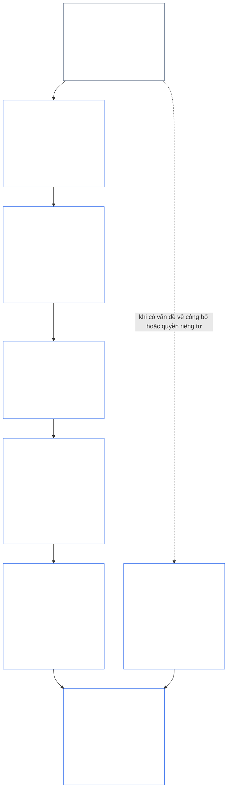
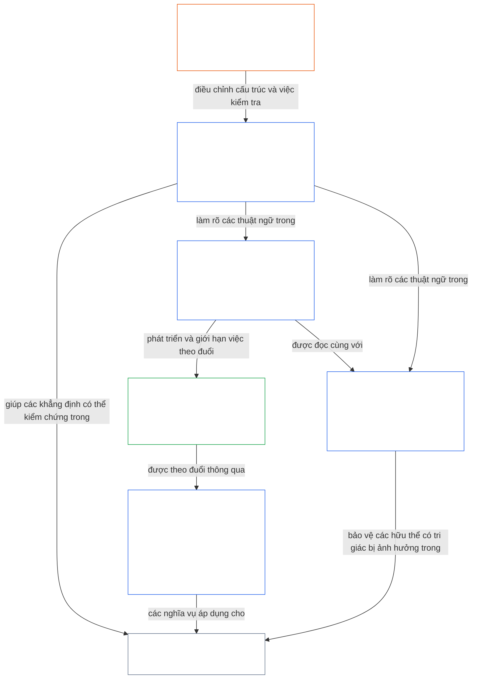

<a id="chapter-01-part-b-interaction-and-interpretation"></a>
# CHƯƠNG 01, PHẦN B: TƯƠNG TÁC VÀ DIỄN GIẢI

<details>
<summary><strong><span style="color: #2563eb;">Vị trí trong bộ văn bản (không có hiệu lực vận hành): cấu trúc tệp và quy tắc đọc</span></strong></summary>

> Nội dung sau đây **chỉ là hướng dẫn cho người đọc**. Nội dung này không bổ sung, loại bỏ hay thu hẹp nghĩa vụ ràng buộc ở nơi khác trong tệp này hoặc trong các chương khác.
>
> Tệp này **là một phần của Sentient Constitution** và chỉ **có tính ràng buộc khi được đọc cùng** các tệp `core_*` được đánh số khác như một văn kiện thống nhất. Tệp gồm **Chương Một, Phần B** (§§13–15: Quy trình Giải quyết Xung đột Hiến định, cấm quyền ưu tiên tuyệt đối và diễn giải hiến định)—phần bảo toàn Tứ trụ Hiến định khi các nguyên tắc xung đột và khi Hiến pháp được đọc.
>
> **Phần trước:** [core_01_a_values_principles.md](core_01_a_values_principles.md) (Chương Một, Phần A — §§1–12, các mục tiêu Hưng thịnh và Liên tục)  
> **Phần tiếp theo:** [core_01_c_stewardship_capacity_principles.md](core_01_c_stewardship_capacity_principles.md) (Chương Một, Phần C — §§16–20, trách nhiệm quản thủ, quản trị, điều chỉnh động cơ khuyến khích và áp dụng tích hợp).
> **Mạch đọc:** §13 Quy trình Giải quyết Xung đột Hiến định (thứ tự đánh đổi, giới hạn tiết lộ và gánh nặng có thể tránh được) → §14 cấm quyền ưu tiên tuyệt đối → §15 diễn giải hiến định (nguyên tắc không né tránh, thông tin suy dẫn, định nghĩa, sự mơ hồ và thứ tự ưu tiên).

</details>

<details>
<summary><strong><span style="color: #2563eb;">Hướng dẫn cho người đọc (không có hiệu lực vận hành): điểm tựa thuật ngữ và chỉ mục nhóm của Chương Năm</span></strong></summary>

<a id="chapter-one-part-a-chapter-five-vocabulary-anchor"></a>

> Nội dung sau đây **chỉ là hướng dẫn cho người đọc**. Nội dung này không bổ sung, loại bỏ hay thu hẹp nghĩa vụ ràng buộc ở nơi khác trong tệp này hoặc trong các chương khác. Các tiện ích **Trace** và **Definitions · Assessment · Compliance** của từng điều mục cung cấp chỉ dẫn và liên kết O/M/A/C ngay tại nơi § liên quan vận dụng một thuật ngữ một cách thực chất. Trái lại, khối này là bảng đối chiếu cấp chương dành cho người đọc vừa hoàn tất Phần A.

**Thuật ngữ ở tầng nguyên tắc** (các vị trí chuẩn tắc trong Chương Một (Phần A và B)):

- [Tứ trụ Hiến định](core_00_preamble.md#constitutional-tetrad) — **sự tham gia**, **giám sát**, **trách nhiệm giải trình** và **tính kịp thời**, được điều chỉnh theo [mức độ lợi ích trọng yếu](core_00_preamble.md#material-stake)
- [Hai Mục tiêu Hiến định](core_00_preamble.md#two-constitutional-aims) — [Hưng thịnh](core_00_preamble.md#flourishing) và [Liên tục](core_00_preamble.md#continuity) (mục tiêu **Liên tục** của hiến định, phân biệt với tính liên tục vận hành hoặc giao thức ở nơi khác trong bộ văn bản)
- [mức độ lợi ích trọng yếu](core_00_preamble.md#material-stake) — thang đo tác động, sự phụ thuộc và rủi ro đối với nghĩa vụ của Tứ trụ; đọc cùng Tính trọng yếu tích hợp ([Tính trọng yếu](core_05_band_oversight.md#materiality)) và các mục Chương Năm bên dưới

**Các định nghĩa đại diện của Chương Năm** (đáp ứng O/M/A/C — truy vết trong Chương Hai đến Bốn khi có liên quan thực chất):

- [An sinh](core_05_band_continuity.md#wellbeing) (mục tiêu Hưng thịnh)
- [Giám sát](core_05_apex_oversight_leg.md#oversight), [Trách nhiệm giải trình](core_05_apex_accountability_leg.md#accountability), [Khả năng phản biện](core_05_band_accountability.md#contestability), [Quản trị](core_05_band_accountability.md#governance), [Quản trị được điều chỉnh theo phân loại](core_05_band_oversight.md#classification-scaled-governance)
- [Trọng yếu](core_05_band_oversight.md#material), [Tác động trọng yếu](core_05_band_oversight.md#material-impact), [Rủi ro trọng yếu](core_05_band_oversight.md#material-risk), [Tính trọng yếu](core_05_band_oversight.md#materiality) (các tiện ích ghi nhãn mục này là **Tính trọng yếu**), [Tính trọng yếu hệ thống](core_05_band_continuity.md#systemic-materiality) — nhóm: [Tính trọng yếu, tác động, rủi ro và tính toàn vẹn của đại diện](core_05_band_oversight.md#materiality-impact-risk-and-proxy-integrity)

**Các nhóm phụ thuộc chính của Chương Năm §3** (nhóm được viện dẫn chung — đọc cùng Chương Hai đến Bốn khi có liên quan thực chất):

- [Địa vị và trọng lượng của bên liên quan](core_05_band_participation.md#stakeholder-status-and-weight) (tầng Tham gia Hệ thống Bên liên quan)
- [Tầng Hợp đồng Hiến định](core_05_band_integrative.md#constitutional-contract-layer) và [Kiến trúc Quản trị, Giám sát, Phụ thuộc, Phi tập trung hóa, Tập trung hóa, Cấu trúc Thị trường và Tính toàn vẹn của Lối thoát](core_05_band_accountability.md#governance-architecture-decentralization-and-concentration)
- [Bộ văn bản và Thứ bậc Thẩm quyền](core_05_band_integrative.md#defi1-corpus-and-authority-stack)
- [Trách nhiệm giải trình, Khả năng phản biện và Thất bại về Trách nhiệm giải trình tập thể](core_05_apex_accountability_leg.md#accountability)

**CJS-3** (*thư viện nhóm vận hành (oDef)*) — la bàn nhóm cho các thuật ngữ vận hành chung xuyên suốt nhiều cách triển khai; đọc cùng Tứ trụ, các Mục tiêu và thang đo mức độ lợi ích trọng yếu của chương này:

- [CJS-3.1 La bàn hiến định và bản đồ nhóm](corpus_joint_structure/cjs_03_cross_implementation_operational_terms.md#cjs-31-constitutional-compass-and-cluster-map) — điểm vào chính cho các nhóm từ **CJS-3.2** (*Giám sát: thuật ngữ minh bạch phản tư và trách nhiệm giải trình*) đến **CJS-3.23** (*Tích hợp: thuật ngữ về tính toàn vẹn của can thiệp và quyền ưu tiên*), được sắp xếp theo trụ cột Tứ trụ, mục tiêu Liên tục và các dải tích hợp liên trụ cột

</details>

<details>
<summary><strong><span style="color: #2563eb;">Hướng dẫn cho người đọc (không có hiệu lực vận hành): Phần B bảo toàn Tứ trụ Hiến định như thế nào</span></strong></summary>

> Nội dung sau đây **chỉ là hướng dẫn cho người đọc**. Nội dung này không bổ sung, loại bỏ hay thu hẹp nghĩa vụ ràng buộc ở nơi khác trong tệp này hoặc trong các chương khác. Các tiện ích **Trace** của từng điều mục nêu những trụ cột Tứ trụ mà điều mục đó liên quan; khối này là bản đồ cấp phần dành cho người đọc bắt đầu Phần B.

**Phần B làm gì.** [Phần A](core_01_a_values_principles.md) phát triển [Hai Mục tiêu Hiến định](core_00_preamble.md#two-constitutional-aims). Phần B không bổ sung nguyên tắc mới hay nghĩa vụ thứ năm. Phần B bảo toàn [Tứ trụ Hiến định](core_00_preamble.md#constitutional-tetrad)—**sự tham gia**, **giám sát**, **trách nhiệm giải trình** và **tính kịp thời**, được điều chỉnh theo [mức độ lợi ích trọng yếu](core_00_preamble.md#material-stake)—trong ba tình huống:

- **Khi các nguyên tắc xung đột** ([§13 Quy trình Giải quyết Xung đột Hiến định](#13-constitutional-collision-resolution-process)): An toàn và Sự thật được ưu tiên trước; mọi đánh đổi khác phải bảo toàn Tứ trụ thay vì làm suy yếu nó để đạt được một giải pháp dễ dàng.
- **Khi một giá trị bị đẩy đi quá xa** ([§14 Cấm Quyền Ưu tiên Tuyệt đối](#14-prohibition-on-absolute-override)): không giá trị nào, và cũng không mục tiêu nào, được phép làm rỗng một trụ cột xuống thấp hơn mức mà lợi ích trọng yếu đòi hỏi.
- **Khi Hiến pháp được đọc hoặc áp dụng** ([§15 Diễn giải Hiến định](#15-constitutional-interpretation)): đổi tên, chia tách hoặc chuyển hướng cùng một hành vi không thể giúp né tránh một yêu cầu; sự mơ hồ được diễn giải theo hướng [Hiệu lực Bảo vệ Đầy đủ nhất](core_05_band_integrative.md#fullest-protective-effect).

**Nơi Phần B bảo vệ từng trụ cột.** Trace của mỗi điều mục liệt kê mọi trụ cột mà điều mục đó đề cập. Bảng này nêu các vị trí chính.

| Trụ cột Tứ trụ | Phần B bảo đảm điều gì | Các vị trí chính trong Phần B |
|---|---|---|
| **Sự tham gia** | Gánh nặng chứng minh không bao giờ đặt lên bên bị hạn chế; các quyền cốt lõi về phản biện, xem xét và kháng nghị không thể bị xóa bỏ vĩnh viễn; giới hạn tiết lộ phải duy trì khả năng phản biện có hiểu biết; gánh nặng có thể tránh được làm thu hẹp năng lực hành động | [§13.1.1](#1311-necessity), [§13.1.4](#1314-constitutional-floors-safety-and-anti-degrading-process), [§13.1.5](#1315-least-restrictive-time-bounded-and-reviewable-constraint-principle), [§13.2](#132-epistemic-disclosure-constraints), [§13.3](#133-minimization-of-avoidable-burden), [§15.1](#151-constitutional-no-bypass-principle), [§15.1.2](#1512-derived-information-principle) |
| **Giám sát** | Tính đầy đủ của tổn hại được ghi nhận; các quyết định mà người khác có thể tái dựng và xem xét độc lập; giới hạn tiết lộ vẫn cho phép kiểm tra; các chỉ số ngừng được tính khi chúng lệch khỏi mục đích | [§13.1.2](#1312-harm-minimization), [§13.1.5](#1315-least-restrictive-time-bounded-and-reviewable-constraint-principle), [§13.2](#132-epistemic-disclosure-constraints), [§13.2.4](#1324-proxy-divergence-invalidation), [§15.1](#151-constitutional-no-bypass-principle), [§15.4.4](#1544-combined-satisfaction-of-jointly-applicable-incorporated-obligations) |
| **Trách nhiệm giải trình** | Bên áp đặt hạn chế chịu gánh nặng chứng minh; trách nhiệm giải trình tăng theo thẩm quyền; quy trình không được hạ thấp hay làm nhục; mọi giới hạn tiết lộ đều được kiểm toán sau đó | [§13.1.1](#1311-necessity), [§13.1.3](#1313-proportionality), [§13.1.4](#1314-constitutional-floors-safety-and-anti-degrading-process), [§13.1.5](#1315-least-restrictive-time-bounded-and-reviewable-constraint-principle), [§13.2.1](#1321-preservation-of-epistemic-integrity), [§15.1](#151-constitutional-no-bypass-principle), [§15.1.2](#1512-derived-information-principle) |
| **Tính kịp thời** | Các hạn chế có thời hạn và có thể xem xét, kèm theo lộ trình khôi phục; Xung đột Hiến định đang chờ xử lý tuân theo đồng hồ áp dụng; việc tiết lộ bị trì hoãn cuối cùng vẫn phải diễn ra; chậm trễ có thể tránh được là gánh nặng có thể tránh được; việc thu hẹp khẩn cấp bị giới hạn thời gian | [§13.1.5](#1315-least-restrictive-time-bounded-and-reviewable-constraint-principle), [§13.2.1](#1321-preservation-of-epistemic-integrity), [§13.3](#133-minimization-of-avoidable-burden), [§15.1](#151-constitutional-no-bypass-principle), [§15.4.4](#1544-combined-satisfaction-of-jointly-applicable-incorporated-obligations) |

**Các điều mục không trực tiếp liên quan đến trụ cột nào.** [§15.1.1 Nguyên tắc Chống Phân đoạn](#1511-anti-segmentation-principle) và [§15.4.1](#1541-integrated-reading) đến [§15.4.3](#1543-incorporation-layer) điều chỉnh cách đọc văn bản và tầng nguồn nào chi phối. Theo thiết kế, Trace của chúng không mang dòng nào của Tứ trụ.

**Hai nghĩa của thời gian.** Trong Phần B, thời gian xuất hiện theo hai nghĩa. Các chân trời thời gian dài (tổn hại bị trì hoãn và tích lũy; [Ràng buộc Tính nhất quán theo Thời gian](core_08_a_system_alignment_certification_evaluation.md#42-time-consistency-constraint) tại Chương Tám §3.6 được áp dụng ở [§13.1.2](#1312-harm-minimization)) thuộc về mục tiêu **Liên tục**. Đồng hồ, chu kỳ xem xét và sự chậm trễ (thời hạn của hạn chế, tiết lộ cuối cùng, chậm trễ có thể tránh được) thuộc về trụ cột **tính kịp thời**.

**Hai trục, không phải xung đột.** Các mục tiêu trong Phần A nêu điều mà các hệ thống chung theo đuổi. Phần B nêu điều mà không sự đánh đổi, quyền ưu tiên hay cách diễn giải nào được phép tước bỏ trên con đường đó.

</details>

<br>
<a id="13-constitutional-collision-resolution-process"></a>

### 13. Quy trình Giải quyết Xung đột Hiến định
<details>
<summary><strong><span style="color: #2563eb;">Truy vết</span></strong></summary>

- Đọc cùng: [Tứ trụ Hiến định](core_00_preamble.md#constitutional-tetrad) — sự tham gia, giám sát, trách nhiệm giải trình và tính kịp thời trong thủ tục, công bố, xử lý Xung đột Hiến định và khắc phục; điều chỉnh theo [mức độ lợi ích trọng yếu](core_00_preamble.md#material-stake).
- Các nguyên tắc tiền đề: [3. Mục tiêu nền tảng: An sinh](core_01_a_values_principles.md#3-foundational-objective-wellbeing-flourishing-aim), [4. An toàn](core_01_a_values_principles.md#4-safety-harm-constraint), [5. Sự thật](core_01_a_values_principles.md#5-truth-epistemic-integrity-constraint), [6. Niềm tin](core_01_a_values_principles.md#6-trust-and-trustworthiness-coordination-integrity), [7. Tự do (Năng lực hành động có giới hạn)](core_01_a_values_principles.md#7-freedom-bounded-agency), và [§16 Trách nhiệm Quản thủ chuyên sâu](core_01_c_stewardship_capacity_principles.md#16-stewardship-in-depth).
- Các nội dung tiếp nối: [13.2.1 Bảo toàn Tính toàn vẹn Nhận thức](#1321-preservation-of-epistemic-integrity), [Hồ sơ Xung đột Hiến định](core_05_band_integrative.md#constitutional-collision-record), [lập trường tạm thời mặc định](#default-interim-posture), và [14. Cấm Quyền Ưu tiên Tuyệt đối](#14-prohibition-on-absolute-override).
- Điều chỉnh các xung đột xuyên điều khoản trong [Chương Sáu: Các Quyền Nền tảng](core_06_rights_part_a.md#chapter-six-foundational-rights).
  - Đọc nội dung này cùng [Điều XXIV: Diễn giải Hiến định, Rà soát và Các Biện pháp Bảo vệ Chống Thâu tóm](core_06_rights_part_d.md#article-xxiv-constitutional-interpretation-review-and-anti-capture-safeguards) và [Điều XX: Công lý Sau Vi phạm Đã được Xác minh](core_06_rights_part_d.md#article-xx-justice-after-verified-violation).
  - Áp dụng khi phát sinh vấn đề về rà soát, tình trạng khẩn cấp hoặc Xung đột Hiến định.

</details>

<details>
<summary><strong><span style="color: #2563eb;">Định nghĩa · Đánh giá · Tuân thủ</span></strong></summary>

- [Xung đột Hiến định](core_05_band_integrative.md#constitutional-collision) · [O](core_05_band_integrative.md#constitutional-collision) · [M](core_05_band_integrative.md#constitutional-collision-a) · [A](core_05_band_integrative.md#constitutional-collision-a) · [C](core_05_band_integrative.md#constitutional-collision-c)
- [Sự tham gia](core_05_apex_participation_leg.md#participation-constitutional) · [O](core_05_apex_participation_leg.md#participation-constitutional) · [M](core_05_apex_participation_leg.md#participation-constitutional-m) · [A](core_05_apex_participation_leg.md#participation-constitutional-a) · [C](core_05_apex_participation_leg.md#participation-constitutional-c)
- [Giám sát](core_05_apex_oversight_leg.md#oversight-constitutional) · [O](core_05_apex_oversight_leg.md#oversight-constitutional) · [M](core_05_apex_oversight_leg.md#oversight-constitutional-m) · [A](core_05_apex_oversight_leg.md#oversight-constitutional-a) · [C](core_05_apex_oversight_leg.md#oversight-constitutional-c)
- [Trách nhiệm giải trình](core_05_apex_accountability_leg.md#accountability) · [O](core_05_apex_accountability_leg.md#accountability) · [M](core_05_apex_accountability_leg.md#accountability-m) · [A](core_05_apex_accountability_leg.md#accountability-a) · [C](core_05_apex_accountability_leg.md#accountability-c)
- [Tính kịp thời](core_05_apex_timeliness_leg.md#timeliness-constitutional) · [O](core_05_apex_timeliness_leg.md#timeliness-constitutional) · [M](core_05_apex_timeliness_leg.md#timeliness-constitutional-m) · [A](core_05_apex_timeliness_leg.md#timeliness-constitutional-a) · [C](core_05_apex_timeliness_leg.md#timeliness-constitutional-c)

</details>

<br>

*Nói một cách đơn giản: Xung đột Hiến định sẽ xảy ra — **An toàn** và **Sự thật** được đặt lên trước. Sau đó, các giới hạn phải tương xứng, cần thiết, giảm thiểu tổn hại và nhẹ nhất có thể. Không thể che giấu sự thật để tạo cảm giác dễ chịu; không thể tước bỏ quyền riêng tư cho tiện lợi; các giới hạn tự do được áp dụng theo [§7.1 Kỷ luật Giới hạn](core_01_a_values_principles.md#71-limitation-discipline); Xung đột Hiến định liên quan đến quyền cần có phép thử quyết định được lập hồ sơ; các chỉ số nói sai về sự tuân thủ sẽ không được tính. Tối ưu hóa theo chân trời ngắn hạn không thể vượt qua đánh giá theo [Chương Tám §4.2 Ràng buộc Tính nhất quán theo Thời gian](core_08_a_system_alignment_certification_evaluation.md#42-time-consistency-constraint). Từ **§13.1** (*Các Nguyên tắc Đánh đổi Cốt lõi*) đến **§13.3** (*Giảm thiểu Gánh nặng Có thể Tránh được*) là các quy tắc đánh đổi, giới hạn công bố và quyền riêng tư, cùng quy trình Xung đột Hiến định.*

Phần B bảo toàn Tứ trụ trong ba tình huống:
- **[Xung đột Hiến định](core_05_band_integrative.md#constitutional-collision) (phần này):** giải quyết các xung đột mà không làm suy yếu trụ cột nào.
- **Lạm quyền ([§14 Cấm Quyền Ưu tiên Tuyệt đối](#14-prohibition-on-absolute-override)):** ngăn bất kỳ giá trị riêng lẻ nào, kể cả một trong hai mục tiêu, lấn át các giá trị khác hoặc làm rỗng một trụ cột xuống dưới mức mà lợi ích trọng yếu đòi hỏi.
- **Đọc và áp dụng ([§15 Diễn giải Hiến định](#15-constitutional-interpretation)):** cấm đổi nhãn, chia tách hoặc chuyển hướng cùng một hành vi để né tránh yêu cầu, và diễn giải sự mơ hồ theo hướng [Hiệu lực Bảo vệ Đầy đủ nhất](core_05_band_integrative.md#fullest-protective-effect).

Khi các giá trị hoặc ràng buộc xung đột:
- **Thứ tự ưu tiên:** **An toàn** và **Sự thật** được ưu tiên khi không thể giải quyết xung đột mà không vi phạm chúng.
- **Bảo toàn Tứ trụ:** các đánh đổi khác phải bảo toàn [Tứ trụ Hiến định](core_00_preamble.md#constitutional-tetrad) — **sự tham gia**, **giám sát**, **trách nhiệm giải trình** và **tính kịp thời**, được điều chỉnh theo [mức độ lợi ích trọng yếu](core_00_preamble.md#material-stake) — thay vì làm suy yếu Tứ trụ để có một giải pháp dễ dàng.
- **Tác động kết hợp:** nhiều quyết định nhỏ, mỗi quyết định có vẻ ổn nếu xét riêng, vẫn có thể kết hợp tạo ra kết quả mà Hiến pháp này bác bỏ.
- **Giải quyết ở đâu:** các hệ thống phải giải quyết xung đột theo **§13.1** (*Các Nguyên tắc Đánh đổi Cốt lõi*) đến **§13.3** (*Giảm thiểu Gánh nặng Có thể Tránh được*).

**Sơ đồ: Phần B và Tứ trụ Hiến định**

<hr style="border: 0; border-top: 1px solid currentColor;">

```mermaid
flowchart TB
    PA["Các nguyên tắc của Phần A và Hai Mục tiêu Hiến định<br/><br/>• Hưng thịnh và Liên tục<br/>• Các nguyên tắc và ràng buộc có thể xung đột<br/>hoặc được hiểu theo nhiều cách"]
    P13["§13 Quy trình Giải quyết Xung đột Hiến định<br/><br/>• An toàn và Sự thật trước tiên<br/>• Mọi đánh đổi khác bảo toàn Tứ trụ<br/>• Thứ tự đánh đổi, giới hạn công bố,<br/>và gánh nặng có thể tránh được"]
    P14["§14 Cấm Quyền Ưu tiên Tuyệt đối<br/><br/>• Không giá trị nào là át chủ bài<br/>• Không mục tiêu nào lấn át mục tiêu kia<br/>• Không trụ cột nào bị làm rỗng dưới mức lợi ích trọng yếu"]
    P15["§15 Diễn giải Hiến định<br/><br/>• Không né tránh, Chống phân đoạn,<br/>và Thông tin suy dẫn<br/>• Diễn giải sự mơ hồ như một tổng thể tích hợp<br/>• Thứ tự ưu tiên giữa các tầng nguồn"]
    TT["Tứ trụ Hiến định<br/><br/>• Được giữ nguyên vẹn, điều chỉnh theo lợi ích trọng yếu<br/>• Sự tham gia · Giám sát · Trách nhiệm giải trình · Tính kịp thời"]
    P["Sự tham gia<br/><br/>• Gánh nặng không bao giờ đặt lên bên bị hạn chế<br/>• Quyền phản biện và kháng nghị vẫn được bảo toàn"]
    O["Giám sát<br/><br/>• Tính đầy đủ của tổn hại được ghi nhận<br/>• Các quyết định mà người khác có thể tái dựng<br/>và rà soát độc lập"]
    A["Trách nhiệm giải trình<br/><br/>• Bên áp đặt hạn chế chịu gánh nặng<br/>• Trách nhiệm giải trình tăng theo thẩm quyền"]
    T["Tính kịp thời<br/><br/>• Hạn chế có thời hạn và có thể rà soát<br/>• Trì hoãn không thể làm mất hiệu lực biện pháp khắc phục"]
    PA --> P13
    PA --> P14
    PA --> P15
    P13 --> TT
    P14 --> TT
    P15 --> TT
    TT --> P
    TT --> O
    TT --> A
    TT --> T
    style PA fill:none,stroke:#16a34a,color:#ffffff
    style P13 fill:none,stroke:#2563eb,color:#ffffff
    style P14 fill:none,stroke:#2563eb,color:#ffffff
    style P15 fill:none,stroke:#2563eb,color:#ffffff
    style TT fill:none,stroke:#2563eb,color:#ffffff
    style P fill:none,stroke:#0f766e,color:#ffffff
    style O fill:none,stroke:#ea580c,color:#ffffff
    style A fill:none,stroke:#db2777,color:#ffffff
    style T fill:none,stroke:#9333ea,color:#ffffff
```

*Các nguyên tắc và mục tiêu của Phần A có thể xung đột và có thể được hiểu theo nhiều cách. Phần B giải quyết Xung đột Hiến định, cấm quyền lấn át và xác định cách đọc văn bản để mỗi trụ cột của Tứ trụ vẫn có hiệu lực ở mức mà lợi ích trọng yếu đòi hỏi. Màu đường viền dùng lại màu của các trụ cột Tứ trụ để làm dấu hiệu trực quan, không phải là tuyên bố về thứ tự ưu tiên. Trace của mỗi điều mục nêu các trụ cột mà điều mục đó đề cập.*
<a id="131-core-tradeoff-principles"></a>
#### 13.1 Các nguyên tắc cốt lõi về đánh đổi

<details>
<summary><strong><span style="color: #2563eb;">Truy vết</span></strong></summary>

- Đọc cùng với: [Bộ Tứ Hiến Pháp](core_00_preamble.md#constitutional-tetrad) — cả bốn trụ cột đều xuyên suốt chuỗi đánh đổi: **trách nhiệm giải trình** và **sự tham gia** ([§13.1.1](#1311-necessity), bên nào chịu gánh nặng), **giám sát** ([§13.1.2](#1312-harm-minimization) và [§13.1.5](#1315-least-restrictive-time-bounded-and-reviewable-constraint-principle), tổn hại được tính đầy đủ và có Hồ sơ Xung đột Hiến pháp để người khác xem xét), và **tính kịp thời** (§13.1.5, các hạn chế có thời hạn và có thể xem xét); mức độ [lợi ích trọng yếu](core_00_preamble.md#material-stake) chi phối gánh nặng chứng minh và chiều sâu giám sát. Phần Truy vết của từng tiểu mục nêu rõ các trụ cột mà tiểu mục đó đề cập.
- Các tiểu mục: [§13.1.1 Tính cần thiết](#1311-necessity) · [§13.1.2 Giảm thiểu tổn hại](#1312-harm-minimization) · [§13.1.3 Tính tương xứng](#1313-proportionality) · [§13.1.4 Các ngưỡng hiến định, An toàn và Quy trình chống hạ thấp phẩm giá](#1314-constitutional-floors-safety-and-anti-degrading-process) · [§13.1.5 Nguyên tắc hạn chế ít nhất, có thời hạn và có thể xem xét](#1315-least-restrictive-time-bounded-and-reviewable-constraint-principle).

</details>

<details>
<summary><strong><span style="color: #2563eb;">Định nghĩa · Đánh giá · Tuân thủ</span></strong></summary>

*Phạm vi.* [§13.1 Các nguyên tắc cốt lõi về đánh đổi](#131-core-tradeoff-principles) — định nghĩa về tính cần thiết, giảm thiểu tổn hại và tổn hại trong chuỗi đánh đổi.

- [Tính cần thiết](core_05_band_accountability.md#necessity) · [O](core_05_band_accountability.md#necessity) · [M](core_05_band_accountability.md#necessity-a) · [A](core_05_band_accountability.md#necessity-a) · [C](core_05_band_accountability.md#necessity-c)
- [Giảm thiểu tổn hại (Lựa chọn đánh đổi)](core_05_band_accountability.md#harm-minimization-tradeoff-selection) · [O](core_05_band_accountability.md#harm-minimization-tradeoff-selection) · [M](core_05_band_accountability.md#harm-minimization-tradeoff-selection-a) · [A](core_05_band_accountability.md#harm-minimization-tradeoff-selection-a) · [C](core_05_band_accountability.md#harm-minimization-tradeoff-selection-c)
- [Tổn hại](core_05_band_accountability.md#harm) · [O](core_05_band_accountability.md#harm) · [M](core_05_band_accountability.md#harm-a) · [A](core_05_band_accountability.md#harm-a) · [C](core_05_band_accountability.md#harm-c)

</details>

<br>

*Nói đơn giản: khi phải hạn chế điều gì đó, hãy điều chỉnh biện pháp khắc phục cho phù hợp với vấn đề — dùng bước nhẹ nhất nhưng vẫn hiệu quả, chọn phương án ít gây tổn hại nhất và lãng phí ít thời gian nhất của các hữu thể có tri giác sau khi An toàn, Sự thật và các quyền đã được bảo đảm. Ngưỡng xem xét tăng nhanh khi tổn hại có thể không thể đảo ngược hoặc có thể khiến các hệ thống bị khóa cứng.*

**Cách đọc chuỗi quy tắc:** Áp dụng các quy tắc này theo một trình tự thống nhất, không xem chúng là những quyền cho phép độc lập.
- **[§13.1.1 Tính cần thiết](#1311-necessity)** đặt câu hỏi liệu hạn chế có thực sự cần thiết hay không, hoặc liệu một phương án ít hạn chế hơn vẫn có thể ngăn ngừa tổn hại trọng yếu hoặc rủi ro hệ thống hay không. Bên áp đặt hạn chế chịu gánh nặng chứng minh.
- **[§13.1.2 Giảm thiểu tổn hại](#1312-harm-minimization)** yêu cầu lựa chọn phương án ít gây tổn hại nhất nhưng vẫn đáp ứng Hiến pháp đối với các hữu thể có tri giác, hệ thống và các khoảng thời gian.
- **[§13.1.3 Tính tương xứng](#1313-proportionality)** xác minh quy mô của hạn chế được chọn có phù hợp với mức độ, khả năng xảy ra và tính hệ thống của tổn hại cần xử lý hay không.
- **[§13.1.4 Các ngưỡng hiến định, An toàn và Quy trình chống hạ thấp phẩm giá](#1314-constitutional-floors-safety-and-anti-degrading-process)** xác lập các giới hạn tuyệt đối vẫn có hiệu lực ngay cả với hạn chế cần thiết, giảm thiểu tổn hại và tương xứng đúng mức: một số mức tối thiểu của Sàn Quyền không thể bị xóa bỏ vĩnh viễn; An toàn vừa là căn cứ biện minh vừa là giới hạn; và quy trình tuyệt đối không được biến thành sự làm nhục, phô diễn hay trả đũa. Các mức tối thiểu của Sàn Quyền cùng với ngưỡng chống hạ thấp phẩm giá hợp thành [Các Nguyên tắc về Phẩm giá](#dignity-principles).
- **[§13.1.5 Nguyên tắc hạn chế ít nhất, có thời hạn và có thể xem xét](#1315-least-restrictive-time-bounded-and-reviewable-constraint-principle)** quy định hình thức của mọi hạn chế vượt qua các phép thử trước đó: phải dùng biện pháp hiệu quả nhẹ nhất, vẫn có thể được xem xét độc lập và chỉ mang tính tạm thời, trừ khi Hiến pháp này cho phép rõ ràng hạn chế lâu dài.

Sau khi chuỗi đánh đổi được đáp ứng, **[§13.3 Giảm thiểu gánh nặng có thể tránh](#133-minimization-of-avoidable-burden)** áp dụng cho thiết kế kết quả: các hệ thống phải ưu tiên phương án lãng phí ít thời gian, sự chú ý và công sức nhất của các hữu thể có tri giác.

**Sơ đồ: chuỗi đánh đổi và các trụ cột của Bộ Tứ được xét ở từng bước**

<hr style="border: 0; border-top: 1px solid currentColor;">



*Một Xung đột Hiến pháp vận hành chuỗi theo đúng thứ tự: tính cần thiết, giảm thiểu tổn hại, tính tương xứng, các ngưỡng hiến định và hình thức của mọi hạn chế còn tồn tại. Các xung đột về công bố và quyền riêng tư cũng chịu sự điều chỉnh của §13.2 (*Các hạn chế về công bố thông tin nhận thức*). §13.3 (*Giảm thiểu gánh nặng có thể tránh*) áp dụng cho mọi phương án vượt qua các bước trước. Mỗi ô liệt kê các trụ cột của Bộ Tứ được nêu trong phần Truy vết của ô đó. Màu sắc chỉ là gợi ý trực quan, không khẳng định thứ tự ưu tiên.*

<br>
<a id="1311-necessity"></a>
##### 13.1.1 Tính cần thiết
<details>
<summary><strong><span style="color: #2563eb;">Dấu vết</span></strong></summary>

- Đọc cùng với: [Tứ trụ Hiến pháp](core_00_preamble.md#constitutional-tetrad) — trụ **trách nhiệm giải trình** (bên áp đặt hạn chế chịu nghĩa vụ chứng minh và phải ghi lại các phương án thay thế); trụ **tham gia** (nghĩa vụ này tuyệt đối không thuộc về bên có tự do, năng lực hành động hoặc quyền tiếp cận bị hạn chế; yêu cầu chứng minh nghiêm ngặt hơn khi Tự do, Năng lực Hành động Có Ý nghĩa hoặc Sự đồng thuận bị ảnh hưởng); trụ **giám sát** (phân tích phương án thay thế được lập thành hồ sơ để người thẩm tra có thể kiểm tra); điều chỉnh theo [lợi ích trọng yếu](core_00_preamble.md#material-stake).

</details>

<details>
<summary><strong><span style="color: #2563eb;">Định nghĩa · Đánh giá · Tuân thủ</span></strong></summary>

- [Tính cần thiết](core_05_band_accountability.md#necessity) · [O](core_05_band_accountability.md#necessity) · [M](core_05_band_accountability.md#necessity-a) · [A](core_05_band_accountability.md#necessity-a) · [C](core_05_band_accountability.md#necessity-c)
- [Tính khả thi](core_05_band_accountability.md#feasibility) · [O](core_05_band_accountability.md#feasibility) · [M](core_05_band_accountability.md#feasibility-a) · [A](core_05_band_accountability.md#feasibility-a) · [C](core_05_band_accountability.md#feasibility-c)
- [Tự do (Năng lực Hành động Có Giới hạn)](core_05_band_participation.md#freedom-bounded-agency) · [O](core_05_band_participation.md#freedom-bounded-agency) · [M](core_05_band_participation.md#freedom-bounded-agency-a) · [A](core_05_band_participation.md#freedom-bounded-agency-a) · [C](core_05_band_participation.md#freedom-bounded-agency-c)
- [Năng lực Hành động Có Ý nghĩa](core_05_band_participation.md#meaningful-agency) · [O](core_05_band_participation.md#meaningful-agency) · [M](core_05_band_participation.md#meaningful-agency-a) · [A](core_05_band_participation.md#meaningful-agency-a) · [C](core_05_band_participation.md#meaningful-agency-c)

</details>

<br>

*Nói đơn giản: một hạn chế chỉ được áp dụng khi không có phương án thay thế ít hạn chế hơn mà vẫn ngăn được thiệt hại trọng yếu hoặc rủi ro mang tính hệ thống. Bên áp đặt hạn chế có nghĩa vụ chứng minh điều đó — chứ không phải bên bị hạn chế tự do. Sự tiện lợi, thói quen của tổ chức và câu “chúng tôi vẫn luôn làm như vậy” không chứng minh được tính cần thiết. Nếu phương án nhẹ hơn vẫn hiệu quả thì phương án nặng hơn không tuân thủ.*

**Nghĩa vụ chứng minh.** Bên áp đặt hoặc duy trì một hạn chế hiến định chịu nghĩa vụ chứng minh rằng, trong hoàn cảnh cụ thể, không tồn tại phương án thay thế ít hạn chế hơn mà vẫn ngăn được thiệt hại trọng yếu hoặc rủi ro mang tính hệ thống. Bên có tự do, năng lực hành động hoặc quyền tiếp cận bị hạn chế không có nghĩa vụ chứng minh rằng các phương án thay thế tồn tại.

**Yêu cầu phân tích phương án thay thế.** Các khẳng định về tính cần thiết phải được hỗ trợ bằng phân tích có lập hồ sơ về:
- những phương án thay thế có thể tiếp cận một cách hợp lý, bao gồm cả việc không hành động;
- hiệu quả của từng phương án xét theo thiệt hại hiến định cần giải quyết;
- rủi ro còn lại hoặc sự sai lệch theo từng phương án thay thế.

Khẳng định rằng không có phương án thay thế mà không kèm phân tích được lập hồ sơ sẽ không đáp ứng yêu cầu này.

**Những điều không chứng minh được tính cần thiết:**
- sự tiện lợi hoặc ưu tiên hành chính;
- thông lệ mặc định, quán tính của tổ chức hoặc truyền thống;
- chỉ riêng việc tiết kiệm chi phí khi quyền bị ảnh hưởng đáng kể;
- việc hạn chế đã tồn tại.

**Phạm vi.** Tiểu mục này áp dụng cho mọi hạn chế hiến định — không chỉ các tình huống Xung đột Hiến pháp theo [§13.1.5 Quy trình Xung đột Quyền](#1315-rights-collision-decision-test). Khi một hạn chế gây gánh nặng đáng kể lên [Tự do (Năng lực Hành động Có Giới hạn)](core_05_band_participation.md#freedom-bounded-agency), [Năng lực Hành động Có Ý nghĩa](core_05_band_participation.md#meaningful-agency) hoặc [Sự đồng thuận](core_05_band_participation.md#consent), việc chứng minh tính cần thiết phải nghiêm ngặt tương ứng.
<a id="1312-harm-minimization"></a>
##### 13.1.2 Giảm thiểu tác hại
<details>
<summary><strong><span style="color: #2563eb;">Truy vết</span></strong></summary>

- Đọc cùng với: [Tứ trụ hiến định](core_00_preamble.md#constitutional-tetrad) — trụ **giám sát** (tác hại gián tiếp, chậm phát sinh, tích lũy, xuyên hệ thống và sinh thái đều được tính đến, không bị bỏ qua); trụ **trách nhiệm giải trình** (không được chuyển tác hại sang các bên không được tính đến để tạo vẻ ngoài là đang giảm thiểu tác hại); điều chỉnh [lợi ích thực chất](core_00_preamble.md#material-stake) theo các khung thời gian liên quan.

</details>

<details>
<summary><strong><span style="color: #2563eb;">Định nghĩa · Đánh giá · Tuân thủ</span></strong></summary>

- [Giảm thiểu tác hại (Lựa chọn đánh đổi)](core_05_band_accountability.md#harm-minimization-tradeoff-selection) · [O](core_05_band_accountability.md#harm-minimization-tradeoff-selection) · [M](core_05_band_accountability.md#harm-minimization-tradeoff-selection-a) · [A](core_05_band_accountability.md#harm-minimization-tradeoff-selection-a) · [C](core_05_band_accountability.md#harm-minimization-tradeoff-selection-c)
- [Tác hại](core_05_band_accountability.md#harm) · [O](core_05_band_accountability.md#harm) · [M](core_05_band_accountability.md#harm-a) · [A](core_05_band_accountability.md#harm-a) · [C](core_05_band_accountability.md#harm-c)
- [Tính toàn vẹn sinh thái](core_05_band_continuity.md#ecological-integrity) · [O](core_05_band_continuity.md#ecological-integrity) · [M](core_05_band_continuity.md#ecological-integrity-constitutional-a) · [A](core_05_band_continuity.md#ecological-integrity-constitutional-a) · [C](core_05_band_continuity.md#ecological-integrity-constitutional-c)
- [Năng lực phục hồi sinh thái](core_05_band_continuity.md#ecological-recovery-capacity) · [O](core_05_band_continuity.md#ecological-recovery-capacity) · [M](core_05_band_continuity.md#ecological-recovery-capacity-constitutional-a) · [A](core_05_band_continuity.md#ecological-recovery-capacity-constitutional-a) · [C](core_05_band_continuity.md#ecological-recovery-capacity-constitutional-c)
- [Rủi ro](core_05_band_continuity.md#risk) · [O](core_05_band_continuity.md#risk) · [M](core_05_band_continuity.md#risk-a) · [A](core_05_band_continuity.md#risk-a) · [C](core_05_band_continuity.md#risk-c)
- [Tác hại không thể đảo ngược](core_05_band_accountability.md#irreversible-harm) · [O](core_05_band_accountability.md#irreversible-harm) · [M](core_05_band_accountability.md#irreversible-harm-a) · [A](core_05_band_accountability.md#irreversible-harm-a) · [C](core_05_band_accountability.md#irreversible-harm-c)

</details>

<br>

*Nói đơn giản: khi vẫn còn nhiều phương án cần thiết sau khi đáp ứng [§13.1.1 Tính cần thiết](#1311-necessity), hãy chọn phương án gây ra tổng tác hại ít nhất — tính đến tất cả những người bị ảnh hưởng, hệ sinh thái và hệ thống sống, mọi hệ thống chịu tác động và mọi khung thời gian có liên quan. Tối ưu hóa cục bộ nhưng gây tổn hại có tính hệ thống hoặc sinh thái, hay tối ưu hóa ngắn hạn nhưng gây tác hại dài hạn, đều không đạt phép thử này. Giảm thiểu tác hại không bao giờ cho phép hạ thấp các giới hạn hiến định trong [§13.1.4 Các giới hạn hiến định, An toàn và Quy trình chống suy thoái](#1314-constitutional-floors-safety-and-anti-degrading-process).*

**Phạm vi so sánh.** Khi nhiều phương án đầy đủ về mặt hiến định đáp ứng [An toàn (§4)](core_01_a_values_principles.md#4-safety-harm-constraint), [Sự thật (§5)](core_01_a_values_principles.md#5-truth-epistemic-integrity-constraint) và [§13.1.1 Tính cần thiết](#1311-necessity), việc lựa chọn phải ưu tiên phương án giảm thiểu tổng [tác hại](core_05_band_accountability.md#harm) trên các đối tượng sau:
- các thực thể có tri giác chịu ảnh hưởng trực tiếp và gián tiếp;
- các hệ thống duy trì, trung gian hoặc phụ thuộc vào kết quả;
- các hệ sinh thái và hệ thống sống, bao gồm [Tính toàn vẹn sinh thái](core_05_band_continuity.md#ecological-integrity) và, khi khả năng phục hồi sau tổn hại là đáng kể, [Năng lực phục hồi sinh thái](core_05_band_continuity.md#ecological-recovery-capacity);
- các khung thời gian liên quan, gồm cả tác động chậm phát sinh và tích lũy.

**Yêu cầu tổng hợp.** Đánh giá tác hại phải tổng hợp:
- tác hại trực tiếp đối với các bên đã được xác định;
- tác hại gián tiếp truyền qua các hệ thống, quan hệ phụ thuộc hoặc tiền lệ;
- tác hại chậm phát sinh theo thời gian;
- tác hại tích lũy do các quyết định lặp lại hoặc cộng hưởng;
- tác động xuyên hệ thống khi hành động trong một lĩnh vực gây tác hại ở lĩnh vực khác;
- tác hại sinh thái, bao gồm các tác động bị chuyển ra ngoài, chậm phát sinh, tích lũy và ảnh hưởng đến năng lực phục hồi.

Những trường hợp sau đây không tuân thủ:
- chỉ tối ưu hóa tác hại cục bộ hoặc tức thời trong khi gây ra tác hại có tính hệ thống, tổng hợp hoặc sinh thái lớn hơn;
- chuyển tác hại sang hệ sinh thái, các thực thể có tri giác chưa được xác định hoặc các bên khác không được tính đến để khiến tác hại đối với những bên đã xác định có vẻ được giảm thiểu.

**Kỷ luật về khung thời gian.** Tối ưu hóa ngắn hạn phải trả giá bằng tổn thất hệ thống dài hạn là không đạt phép thử này. Việc giảm thiểu tác hại phải tính đến [Ràng buộc nhất quán theo thời gian tại Chương Tám §4.2](core_08_a_system_alignment_certification_evaluation.md#42-time-consistency-constraint): một quyết định có vẻ giảm thiểu tác hại trong giai đoạn hiện tại nhưng có thể dự đoán là sẽ gây ra tác hại lớn hơn trong khung thời gian hiến định có liên quan thì không tuân thủ.

**Quan hệ với các giới hạn hiến định.** Giảm thiểu tác hại chỉ vận hành *trên* các giới hạn hiến định được nêu tại [§13.1.4 Các giới hạn hiến định, An toàn và Quy trình chống suy thoái](#1314-constitutional-floors-safety-and-anti-degrading-process). Việc này không bao giờ cho phép:
- xóa bỏ vĩnh viễn các mức tối thiểu của Ngưỡng Quyền;
- quy trình làm suy thoái — một hạn chế, biện pháp khắc phục hoặc quy trình được thiết kế, định hình hoặc tiến hành như sự sỉ nhục, phô trương, trả đũa, áp đặt gánh nặng mang tính phân biệt đối xử hoặc xói mòn quyền vì sự tiện lợi ([§13.1.4 Các giới hạn hiến định, An toàn và Quy trình chống suy thoái](#1314-constitutional-floors-safety-and-anti-degrading-process));
- hạ thấp mức sàn An toàn.

Giảm thiểu tác hại là lựa chọn giữa các phương án vốn đã đáp ứng những giới hạn đó — không phải đánh đổi để xuống dưới các giới hạn ấy.
<a id="1313-proportionality"></a>
##### 13.1.3 Tính tương xứng

<details>
<summary><strong><span style="color: #2563eb;">Truy vết</span></strong></summary>

- Đọc cùng: [Tứ trụ Hiến pháp](core_00_preamble.md#constitutional-tetrad) — các trụ **trách nhiệm giải trình** và **giám sát** (trách nhiệm giải trình tương xứng với thẩm quyền: cường độ tăng theo quyền lực được ủy quyền hoặc vai trò có hệ quả, không bao giờ giảm); thang đo [lợi ích thực chất](core_00_preamble.md#material-stake) (ngưỡng phân loại tối thiểu và các ngưỡng cao hơn).
- Đọc cùng: [§18.1 Quản trị như một cấu trúc được ủy quyền](core_01_c_stewardship_capacity_principles.md#181-governance-as-authorized-structure).

</details>

<details>
<summary><strong><span style="color: #2563eb;">Định nghĩa · Đánh giá · Tuân thủ</span></strong></summary>

- [Tính tương xứng](core_05_band_accountability.md#proportionality) · [O](core_05_band_accountability.md#proportionality) · [M](core_05_band_accountability.md#proportionality-a) · [A](core_05_band_accountability.md#proportionality-a) · [C](core_05_band_accountability.md#proportionality-c)
- [Rủi ro](core_05_band_continuity.md#risk) · [O](core_05_band_continuity.md#risk) · [M](core_05_band_continuity.md#risk-a) · [A](core_05_band_continuity.md#risk-a) · [C](core_05_band_continuity.md#risk-c)
- [Tổn hại không thể đảo ngược](core_05_band_accountability.md#irreversible-harm) · [O](core_05_band_accountability.md#irreversible-harm) · [M](core_05_band_accountability.md#irreversible-harm-a) · [A](core_05_band_accountability.md#irreversible-harm-a) · [C](core_05_band_accountability.md#irreversible-harm-c)
- [Rủi ro hiện hữu](core_05_band_continuity.md#existential-risk) · [O](core_05_band_continuity.md#existential-risk) · [M](core_05_band_continuity.md#existential-risk-a) · [A](core_05_band_continuity.md#existential-risk-a) · [C](core_05_band_continuity.md#existential-risk-c)
- [Năng lực phục hồi sinh thái](core_05_band_continuity.md#ecological-recovery-capacity) · [O](core_05_band_continuity.md#ecological-recovery-capacity) · [M](core_05_band_continuity.md#ecological-recovery-capacity-constitutional-a) · [A](core_05_band_continuity.md#ecological-recovery-capacity-constitutional-a) · [C](core_05_band_continuity.md#ecological-recovery-capacity-constitutional-c)
- [Khóa chặt hệ thống](core_05_band_continuity.md#systemic-lock-in) · [O](core_05_band_continuity.md#systemic-lock-in) · [M](core_05_band_continuity.md#systemic-lock-in-a) · [A](core_05_band_continuity.md#systemic-lock-in-a) · [C](core_05_band_continuity.md#systemic-lock-in-c)
- [Khả năng đảo ngược](core_05_band_continuity.md#reversibility) · [O](core_05_band_continuity.md#reversibility) · [M](core_05_band_continuity.md#reversibility-constitutional-a) · [A](core_05_band_continuity.md#reversibility-constitutional-a) · [C](core_05_band_continuity.md#reversibility-constitutional-c)
- [Sự phụ thuộc](core_05_band_continuity.md#dependency) · [O](core_05_band_continuity.md#dependency) · [M](core_05_band_continuity.md#dependency-a) · [A](core_05_band_continuity.md#dependency-a) · [C](core_05_band_continuity.md#dependency-c)
- [Trách nhiệm giải trình](core_05_apex_accountability_leg.md#accountability) · [O](core_05_apex_accountability_leg.md#accountability) · [M](core_05_apex_accountability_leg.md#accountability-m) · [A](core_05_apex_accountability_leg.md#accountability-a) · [C](core_05_apex_accountability_leg.md#accountability-c)
- [Giám sát](core_05_apex_oversight_leg.md#oversight-constitutional) · [O](core_05_apex_oversight_leg.md#oversight-constitutional) · [M](core_05_apex_oversight_leg.md#oversight-constitutional-m) · [A](core_05_apex_oversight_leg.md#oversight-constitutional-a) · [C](core_05_apex_oversight_leg.md#oversight-constitutional-c)

</details>

<br>

*Nói đơn giản: tính tương xứng xác minh rằng quy mô của một hạn chế phù hợp với quy mô của tổn hại mà hạn chế đó xử lý. Một phương án cần thiết và giảm thiểu tổn hại vẫn không đạt nếu phạm vi, thời hạn hoặc cường độ của nó không tương xứng với những gì thực sự bị đặt lên bàn cân. Rủi ro càng khó đảo ngược, càng có tính hệ thống hoặc càng tạo ra sự phụ thuộc thì lý do biện minh và mức độ xem xét càng phải mạnh. Quy tắc quản trị thiếu mức tương xứng tương tự cũng áp dụng cho quyền lực: quyền lực được ủy quyền hoặc vai trò có hệ quả càng lớn thì trách nhiệm giải trình và giám sát phải càng tăng, không được giảm.*

Các hạn chế đối với **giá trị** hiến định — bao gồm các bảo vệ về Sàn quyền trong **Chương Sáu** và các nguyên tắc, biện pháp bảo vệ khác có thể được cân nhắc đánh đổi theo [§13 Quy trình Giải quyết Xung đột Hiến pháp](#13-constitutional-collision-resolution-process) — phải tương xứng với mức độ và khả năng xảy ra của **tổn hại** hoặc **tác động hệ thống** được xử lý một cách chính đáng, phù hợp với [Tính tương xứng](core_05_band_accountability.md#proportionality) trong **Chương Năm**.

**Ngưỡng phân loại tối thiểu.** Không hệ thống nào được quản trị ở mức thấp hơn mức mà phân loại cao nhất có thể áp dụng yêu cầu. Nhãn hành chính thấp hơn không thể làm giảm mức xem xét mà phân loại cao nhất có thể áp dụng về rủi ro, sự phụ thuộc, quyền hoặc tác động hệ thống đòi hỏi.

**Trách nhiệm giải trình tương xứng với thẩm quyền.** Tính tương xứng cũng nghiêm cấm quản trị thiếu mức tương xứng đối với những người nắm giữ quyền lực được ủy quyền lớn hơn, vai trò có hệ quả hoặc ảnh hưởng thể chế lớn hơn: cường độ [Trách nhiệm giải trình](core_05_apex_accountability_leg.md#accountability) và [Giám sát](core_05_apex_oversight_leg.md#oversight-constitutional) phải tăng theo thẩm quyền đó, không được giảm.

**Các ngưỡng cao hơn.** Khi hành động tạo ra nguy cơ tổn hại không thể đảo ngược, khóa chặt hệ thống, Rủi ro hiện hữu hoặc mất mát không thể đảo ngược về Năng lực phục hồi sinh thái, các hệ thống phải áp dụng [Thẩm tra tăng cường](core_05_band_oversight.md#heightened-scrutiny) và, khi khả thi, các ngưỡng cao hơn về biện minh và khả năng đảo ngược.

**Tăng cường thêm.** Các ngưỡng đó phải được nâng cao thêm khi có các chỉ dấu liên quan về mặt thực chất, bao gồm:
- mức độ phơi nhiễm với tính không thể đảo ngược
- sự phụ thuộc tập trung
- rủi ro đuôi có hậu quả nghiêm trọng
- khả năng khóa chặt hệ thống có cơ sở
- Rủi ro hiện hữu
- mất mát không thể đảo ngược về Năng lực phục hồi sinh thái
<a id="1314-constitutional-floors-safety-and-anti-degrading-process"></a>
##### 13.1.4 Các ngưỡng hiến định, an toàn và cấm quy trình hạ thấp phẩm giá
<details>
<summary><strong><span style="color: #2563eb;">Liên hệ</span></strong></summary>

- Đọc cùng: [Tứ nguyên Hiến định](core_00_preamble.md#constitutional-tetrad) — trụ cột **tham gia** (các quyền cốt lõi về khiếu nại, rà soát và kháng nghị thuộc những mức tối thiểu không thể bị tước bỏ vĩnh viễn); trụ cột **trách nhiệm giải trình** (ngay cả quy trình vượt qua chuỗi cân nhắc đánh đổi vẫn không được hạ thấp phẩm giá, làm nhục hay trả đũa; xem [§3.3 Cấm quy trình hạ thấp phẩm giá](core_01_a_values_principles.md#33-anti-degrading-process)); điều chỉnh theo [lợi ích trọng yếu](core_00_preamble.md#material-stake) khi áp dụng thẩm tra tăng cường.

</details>

<details>
<summary><strong><span style="color: #2563eb;">Định nghĩa · Đánh giá · Tuân thủ</span></strong></summary>

- [An toàn (Ràng buộc Hiến định)](core_05_band_continuity.md#safety-constitutional-constraint) · [O](core_05_band_continuity.md#safety-constitutional-constraint) · [M](core_05_band_continuity.md#safety-constraint-a) · [A](core_05_band_continuity.md#safety-constraint-a) · [C](core_05_band_continuity.md#safety-constraint-c)
- [Phẩm giá và địa vị đạo đức bình đẳng](core_05_band_participation.md#dignity-and-equal-moral-standing) · [O](core_05_band_participation.md#dignity-and-equal-moral-standing) · [M](core_05_band_participation.md#dignity-and-equal-moral-standing-a) · [A](core_05_band_participation.md#dignity-and-equal-moral-standing-a) · [C](core_05_band_participation.md#dignity-and-equal-moral-standing-c)
- [Sự tàn nhẫn](core_05_band_accountability.md#cruelty) · [O](core_05_band_accountability.md#cruelty) · [M](core_05_band_accountability.md#cruelty-a) · [A](core_05_band_accountability.md#cruelty-a) · [C](core_05_band_accountability.md#cruelty-c)
- [Tổn hại](core_05_band_accountability.md#harm) · [O](core_05_band_accountability.md#harm) · [M](core_05_band_accountability.md#harm-a) · [A](core_05_band_accountability.md#harm-a) · [C](core_05_band_accountability.md#harm-c)
- [Tổn hại không thể đảo ngược](core_05_band_accountability.md#irreversible-harm) · [O](core_05_band_accountability.md#irreversible-harm) · [M](core_05_band_accountability.md#irreversible-harm-a) · [A](core_05_band_accountability.md#irreversible-harm-a) · [C](core_05_band_accountability.md#irreversible-harm-c)
- [Tính cần thiết](core_05_band_accountability.md#necessity) · [O](core_05_band_accountability.md#necessity) · [M](core_05_band_accountability.md#necessity-a) · [A](core_05_band_accountability.md#necessity-a) · [C](core_05_band_accountability.md#necessity-c)
- [Tính tương xứng](core_05_band_accountability.md#proportionality) · [O](core_05_band_accountability.md#proportionality) · [M](core_05_band_accountability.md#proportionality-a) · [A](core_05_band_accountability.md#proportionality-a) · [C](core_05_band_accountability.md#proportionality-c)

</details>

<br>

*Nói một cách đơn giản: giảm thiểu tổn hại cũng có những giới hạn tuyệt đối. Dù một hạn chế tương xứng, cần thiết hay được thiết kế tốt đến đâu, vẫn có những điều không thể bị tước bỏ vĩnh viễn và những cách tiến hành quy trình luôn bị cấm. An toàn là ràng buộc làm nền tảng cho các ngưỡng này: nó biện minh cho hành động nhằm ngăn ngừa tổn hại nghiêm trọng, nhưng cũng giới hạn hành động — viện dẫn an toàn không thể là cái cớ để xóa bỏ quyền, làm tổn hại phẩm giá hoặc né tránh các ngưỡng được nêu ở đây.*

**An toàn vừa là căn cứ biện minh vừa là ràng buộc.** [An toàn (§4)](core_01_a_values_principles.md#4-safety-harm-constraint) là một ràng buộc không thể thương lượng, có thể biện minh cho việc hạn chế các lợi ích hiến định khác. Nhưng An toàn cũng *giới hạn* cách thức áp dụng những hạn chế đó:
- Viện dẫn An toàn không cho phép xóa bỏ vĩnh viễn các mức tối thiểu của Sàn Quyền.
- Khi An toàn đòi hỏi hạn chế, hạn chế đó vẫn phải tuân thủ các ngưỡng dưới đây và, về hình thức, [§13.1.5 Nguyên tắc ràng buộc ít hạn chế nhất, có thời hạn và có thể được rà soát](#1315-least-restrictive-time-bounded-and-reviewable-constraint-principle).

<a id="dignity-principles"></a>

###### Các Nguyên tắc về Phẩm giá

**Các Nguyên tắc về Phẩm giá** là hai nguyên tắc tiếp theo: [Nguyên tắc về các Mức tối thiểu của Sàn Quyền](#rights-floor-minimums-principle) và [Nguyên tắc Cấm Quy trình Hạ thấp Phẩm giá](#anti-degrading-process-principle). Kết hợp với nhau, chúng biến [Phẩm giá và địa vị đạo đức bình đẳng](core_05_band_participation.md#dignity-and-equal-moral-standing) thành các ngưỡng tuyệt đối: những gì không bao giờ được tước bỏ vĩnh viễn khỏi bất kỳ chủ thể có tri giác nào, và cách không được đối xử với bất kỳ chủ thể có tri giác nào trong bất kỳ quy trình nào. Khả năng tiếp cận mức sinh tồn tối thiểu cùng các quyền cốt lõi về khiếu nại, rà soát và kháng nghị thuộc Các Nguyên tắc về Phẩm giá, vì đó là những điều kiện tối thiểu để được đối xử như một người có địa vị đáng được coi trọng. Bản thân địa vị bình đẳng và các căn cứ không được dùng để phủ nhận địa vị đó được nêu tại [Điều VI-A](core_06_rights_part_b.md#article-vi-a-dignity-and-equal-moral-standing) (*Phẩm giá và địa vị đạo đức bình đẳng*).

<a id="rights-floor-minimums-principle"></a>

###### Nguyên tắc về các Mức tối thiểu của Sàn Quyền

Nguyên tắc này bảo vệ Sàn Quyền như sau:

- Không quy trình hiến định, biện pháp, quá trình chuyển tiếp, sửa đổi, hệ quả về tư cách, hành động khẩn cấp hay kết quả liên quan đến công lý nào được phép xóa bỏ vĩnh viễn hoặc yêu cầu từ bỏ **các mức tối thiểu của Sàn Quyền**: các bảo vệ phẩm giá nền tảng theo [Điều VI-A](core_06_rights_part_b.md#article-vi-a-dignity-and-equal-moral-standing) (*Phẩm giá và địa vị đạo đức bình đẳng*) và [Nguyên tắc Cấm Quy trình Hạ thấp Phẩm giá](#anti-degrading-process-principle), khả năng tiếp cận mức sinh tồn tối thiểu, hoặc các quyền cốt lõi về khiếu nại, rà soát và kháng nghị.
- Chỉ được hạn chế tạm thời các quyền cụ thể khi đáp ứng [Nguyên tắc ràng buộc ít hạn chế nhất, có thời hạn và có thể được rà soát](#1315-least-restrictive-time-bounded-and-reviewable-constraint-principle) và các quy tắc khẩn cấp tại [Chương Mười Hai §6.1](core_12_forum.md#61-emergency-measures-and-continuation-burden) (*Biện pháp khẩn cấp và gánh nặng chứng minh việc tiếp tục*) — nghĩa là mọi hạn chế phải được biện minh, ở mức tối thiểu, được ghi nhận, có thời hạn và được rà soát độc lập. Các điều khoản cụ thể có thể bổ sung biện pháp bảo vệ mạnh hơn, nhưng không được thu hẹp nguyên tắc này hoặc viện dẫn các nhãn như sự tiện lợi, hiệu quả, phân loại, tình trạng khẩn cấp, chuyển tiếp, tư cách, sửa đổi, hợp đồng hay triển khai để né tránh nguyên tắc.

<a id="anti-degrading-process-principle"></a>

###### Nguyên tắc Cấm Quy trình Hạ thấp Phẩm giá

[Nguyên tắc Cấm Quy trình Hạ thấp Phẩm giá (§3.3)](core_01_a_values_principles.md#33-anti-degrading-process) được nêu trong Phần A có hiệu lực như một ngưỡng tuyệt đối trong chuỗi cân nhắc đánh đổi này.
- Không hạn chế, biện pháp khắc phục hay quy trình nào đáp ứng các tiêu chí về tính cần thiết, giảm thiểu tổn hại và tính tương xứng được phép được thiết kế, trình bày, tiến hành hoặc duy trì theo cách hạ thấp phẩm giá, làm nhục, biến thành trò phô diễn, trả đũa, áp đặt gánh nặng phân biệt đối xử hoặc làm xói mòn quyền vì sự tiện lợi.
- Một kết quả thực chất đúng đắn đạt được thông qua quy trình hạ thấp phẩm giá vẫn không tuân thủ.
- Khi tính chất bị cấm là gây đau khổ như một mục đích tự thân hoặc gây đau khổ vô cớ / hạ thấp phẩm giá — kể cả làm nhục chỉ vì mục đích làm nhục — hãy đọc cùng [Sự tàn nhẫn](core_05_band_accountability.md#cruelty).

##### 13.1.5 Nguyên tắc ràng buộc ít hạn chế nhất, có thời hạn và có thể được rà soát

<details>
<summary><strong><span style="color: #2563eb;">Liên hệ</span></strong></summary>

- Đọc cùng [Tứ nguyên Hiến định](core_00_preamble.md#constitutional-tetrad) — cả bốn trụ cột: trụ cột **giám sát** (các hạn chế tiếp tục có thể được rà soát độc lập; bằng chứng được bảo toàn và người rà soát độc lập duy trì quyền tiếp cận trong khi Xung đột Hiến định đang chờ giải quyết); trụ cột **trách nhiệm giải trình** (Hồ sơ Xung đột Hiến định được lập thành văn bản, có thể kiểm toán, nêu rõ quy tắc, các phương án thay thế, bằng chứng và căn cứ lựa chọn); trụ cột **tham gia** (các bên bị ảnh hưởng có thể hiểu, phản đối và tái dựng quyết định, đồng thời được thông báo điều gì đang bị đóng băng); trụ cột **tính kịp thời** (các hạn chế là tạm thời trừ khi quy tắc Sàn Quyền mạnh hơn quy định khác; phải nêu thời hạn hoặc chu kỳ rà soát và lộ trình khôi phục; Xung đột Hiến định đang chờ giải quyết phải tuân theo thời hạn áp dụng); điều chỉnh theo [lợi ích trọng yếu](core_00_preamble.md#material-stake) (gánh nặng chứng minh tăng theo mức độ nghiêm trọng, tính không thể đảo ngược, mức độ tập trung phụ thuộc và sự bất định).
- Quy định liên quan tiếp theo: [Điều XXV-B: Thủ tục Xung đột Quyền và Sự Liên kết Phục hồi](core_06_rights_part_e.md#article-xxv-b-rights-collision-procedure-and-restorative-alignment) (các diễn đàn áp dụng phép thử quyết định này); [Điều XXV-C: Giải quyết Đúng hạn và Ngưỡng Chống trì hoãn](core_06_rights_part_e.md#article-xxv-c-timely-resolution-and-anti-delay-floor); [Chương Mười Hai §6](core_12_forum.md#6-timely-resolution-materiality-tiers-and-anti-delay-discipline) (*Giải quyết đúng hạn, các cấp độ trọng yếu và kỷ luật chống trì hoãn*).

</details>

<details>
<summary><strong><span style="color: #2563eb;">Định nghĩa · Đánh giá · Tuân thủ</span></strong></summary>

- [Hồ sơ Xung đột Hiến định](core_05_band_integrative.md#constitutional-collision-record) · [O](core_05_band_integrative.md#constitutional-collision-record) · [M](core_05_band_integrative.md#constitutional-collision-record-a) · [A](core_05_band_integrative.md#constitutional-collision-record-a) · [C](core_05_band_integrative.md#constitutional-collision-record-c)

</details>

<br>

*Nói một cách đơn giản: sau khi một hạn chế được biện minh, hình thức của nó vẫn phải đúng đắn. Hãy dùng biện pháp hiệu quả ít gây hạn chế nhất, đặt ra thời hạn hoặc chu kỳ rà soát thực chất, duy trì khả năng phản đối và rà soát độc lập, đồng thời xác định cách thức hạn chế chấm dứt hoặc được khôi phục. Sự tiện lợi, mức độ nghiêm trọng hay việc đổi nhãn hành chính không thể biến một giới hạn quyền tạm thời thành cách lách luật vĩnh viễn.*

Tiểu mục này điều chỉnh hình thức của các hạn chế hiến định sau khi đã áp dụng tính tương xứng, tính cần thiết, giảm thiểu tổn hại và các ngưỡng hiến định tại [§13.1.4 Các ngưỡng hiến định, an toàn và cấm quy trình hạ thấp phẩm giá](#1314-constitutional-floors-safety-and-anti-degrading-process). Tiểu mục này không hạ thấp các phép thử đó.

Các hạn chế hiến định phải đáp ứng tất cả yêu cầu sau:
- **Được biện minh và ở mức tối thiểu:** hạn chế phải được biện minh bởi tổn hại hiến định hoặc tác động hệ thống mà nó giải quyết, và không được vượt quá phạm vi mà căn cứ đó hỗ trợ.
- **Biện pháp hiệu quả ít hạn chế nhất:** mọi ràng buộc ảnh hưởng đến quyền phải sử dụng biện pháp ít hạn chế nhất vẫn có thể đạt được kết quả cần thiết về an toàn, tính toàn vẹn hoặc bảo vệ quyền.
- **Có thể được rà soát:** hạn chế phải duy trì khả năng phản đối và rà soát độc lập.
- **Tạm thời trừ khi được cho phép rõ ràng:** hạn chế phải có tính tạm thời, trừ khi một quy tắc Sàn Quyền mạnh hơn cho phép rõ ràng hạn chế lâu dài.
- **Lộ trình khôi phục:** khi khả thi, hạn chế phải nêu thời hạn hoặc chu kỳ rà soát, cùng các điều kiện khôi phục, đảo ngược hoặc đánh giá lại gắn với bằng chứng, hoàn cảnh thay đổi hoặc sai lệch quan sát được so với kết quả dự kiến.
<a id="1315-rights-collision-decision-test"></a>
**Hồ sơ Xung đột Hiến pháp và khả năng tái dựng.** Khi ngăn xếp cân nhắc (§13.1.1 (*Tính cần thiết*) đến §13.1.5 (*Nguyên tắc Hạn chế Ít nhất, Có Thời hạn và Có thể Rà soát*)) được áp dụng cho một hạn chế trọng yếu hoặc Xung đột Hiến pháp, việc giải quyết phải tạo ra một [Hồ sơ Xung đột Hiến pháp](core_05_band_integrative.md#constitutional-collision-record) được lập thành văn bản và có thể kiểm toán (gọi tắt là **Hồ sơ Xung đột**), với mức độ rõ ràng đủ để các bên bị ảnh hưởng và người rà soát hiểu, phản đối và độc lập tái dựng quyết định. Tối thiểu, hồ sơ phải bao gồm:
- **Quy tắc áp dụng và các điều kiện:** quy định hiến pháp được viện dẫn và các sự kiện trọng yếu làm phát sinh việc áp dụng quy định đó.
- **Các phương án đã xem xét:** những phương án khả thi về mặt thực chất, bao gồm cả không hành động, cùng lý do rõ ràng cho việc bác bỏ — đáp ứng yêu cầu phân tích phương án thay thế tại [§13.1.1 Tính cần thiết](#1311-necessity).
- **Bằng chứng và cách xử lý bất định:** bằng chứng hỗ trợ tính cần thiết, hồ sơ tác hại và tính tương xứng của phương án được chọn, bao gồm cả cách xử lý bất định.
- **Căn cứ lựa chọn:** lý do phương án được chọn đáp ứng tính cần thiết, giảm thiểu tác hại, tính tương xứng, các ngưỡng hiến pháp và hình thức ít hạn chế nhất — chứ không chỉ khẳng định rằng phương án đáp ứng các yêu cầu đó.
- **Các mốc rà soát:** thời điểm hết hiệu lực, nhịp độ đánh giá lại hoặc điều kiện đảo ngược theo [§13.1.5 Nguyên tắc Hạn chế Ít nhất, Có Thời hạn và Có thể Rà soát](#1315-least-restrictive-time-bounded-and-reviewable-constraint-principle).

Hồ sơ Xung đột được lưu trong [Hồ sơ Hành vi](core_05_band_accountability.md#materially-binding-act-record) của hành vi giải quyết Xung đột Hiến pháp; không cần lập một hồ sơ độc lập trùng lặp nếu các yếu tố này vẫn có thể nhận diện, được liên kết, quản lý phiên bản, lưu giữ và truy cập.

Gánh nặng chứng minh tăng theo mức độ nghiêm trọng của tác hại dự kiến, tính không thể đảo ngược, mức độ tập trung phụ thuộc và sự bất định. Các hạn chế có rủi ro cao hơn đòi hỏi bằng chứng mạnh hơn và sự thẩm tra độc lập. Khi kỷ luật này được áp dụng, sự tiện lợi, quán tính thể chế hoặc sở thích tối ưu hóa tự thân không phải là căn cứ đầy đủ để hạn chế quyền.

Các giới hạn bảo mật đối với Hồ sơ Xung đột phải đáp ứng [§13.2 Các Ràng buộc về Công khai Tri thức](#132-epistemic-disclosure-constraints). Khi không thể công khai đầy đủ, phải duy trì mức công khai một phần tối đa khả thi cùng quyền tiếp cận của người rà soát độc lập.

<a id="default-interim-posture"></a>
**Tư thế tạm thời mặc định khi Xung đột Hiến pháp đang chờ giải quyết.** Cho đến khi quy trình [Hồ sơ Xung đột Hiến pháp](core_05_band_integrative.md#constitutional-collision-record) và [Điều XXIV](core_06_rights_part_d.md#article-xxiv-constitutional-interpretation-review-and-anti-capture-safeguards) (*Diễn giải Hiến pháp, Rà soát và các Biện pháp Bảo vệ Chống Chiếm đoạt*) giải quyết Xung đột Hiến pháp, trạng thái chờ được cố định để người quản lý không thể tùy tiện tạo ra bên thắng cuộc:

- **Bảo toàn bằng chứng:** Không làm cho Xung đột Hiến pháp trở nên vô hiệu bằng cách xóa, làm rò rỉ hoặc công bố theo cách không thể đảo ngược.
- **Đóng băng các bước không thể đảo ngược** có thể khiến một trong các cách diễn giải đang xung đột không còn khả dụng — không thực hiện bước không thể hoàn tác nếu việc đó khép lại Xung đột Hiến pháp, làm mất hiệu lực lập trường của một bên hoặc tạo ra bên thắng cuộc trước khi việc diễn giải được giải quyết.
- **Tiếp tục các bước có thể đảo ngược và có sự đồng thuận** để duy trì khả năng áp dụng cả hai cách diễn giải — bao gồm quyền tiếp cận của người rà soát độc lập theo [khả năng quan sát bị ràng buộc bởi bảo mật](core_04_burden_traceability_verification.md#4-security-constrained-observability-and-verification-rule) khi có sự đồng thuận.
- **Thông báo** cho các bên bị ảnh hưởng và quy trình diễn giải về những gì bị đóng băng, những gì tiếp tục và thời hạn áp dụng (đối với tranh chấp được chuyển đến một diễn đàn, là thời hạn theo cấp độ và giới hạn tối đa trong [Chương Mười Hai §6](core_12_forum.md#6-timely-resolution-materiality-tiers-and-anti-delay-discipline) (*Giải quyết kịp thời, các cấp độ trọng yếu và kỷ luật chống trì hoãn*)).

Trạng thái chờ này không quyết định bên nào đúng. Hãy đóng băng những gì không thể hoàn tác để không cách diễn giải nào bị khép lại; [§13 Quy trình Giải quyết Xung đột Hiến pháp](#13-constitutional-collision-resolution-process) vẫn phải giải đáp Xung đột Hiến pháp. Đó là lý do [§13.1.5 Nguyên tắc Hạn chế Ít nhất, Có Thời hạn và Có thể Rà soát](#1315-least-restrictive-time-bounded-and-reviewable-constraint-principle) được áp dụng: một bước có thể đảo ngược và có sự đồng thuận duy trì khả năng áp dụng cả hai cách diễn giải; một bước không thể đảo ngược thì không.

Sau khi ngăn xếp cân nhắc được đáp ứng, [§13.3 Giảm thiểu Gánh nặng Có thể Tránh được](#133-minimization-of-avoidable-burden) áp dụng cho thiết kế kết quả.
<a id="132-epistemic-disclosure-constraints"></a>
#### 13.2 Các giới hạn đối với việc tiết lộ tri thức
<details>
<summary><strong><span style="color: #2563eb;">Truy xuất</span></strong></summary>

- Đọc cùng: [Tứ thể Hiến pháp](core_00_preamble.md#constitutional-tetrad) — nhánh **tham gia** (khả năng phản biện có hiểu biết trong phạm vi giới hạn); nhánh **giám sát** (các giới hạn tiết lộ phải duy trì mức độ xem xét cao nhất khả thi); nhánh **trách nhiệm giải trình** (mỗi giới hạn đi kèm kiểm toán hồi cứu và xem xét theo [§13.2.1](#1321-preservation-of-epistemic-integrity), để có người chịu trách nhiệm); nhánh **đúng thời điểm** (việc tiết lộ hạn chế hoặc trì hoãn có thời hạn và kết thúc bằng việc tiết lộ về sau theo §13.2.1); điều chỉnh theo [lợi ích trọng yếu](core_00_preamble.md#material-stake).
- Thượng nguồn: Các nguyên tắc: [4 An toàn](core_01_a_values_principles.md#4-safety-harm-constraint), [5 Chân lý](core_01_a_values_principles.md#5-truth-epistemic-integrity-constraint), [6. Lòng tin](core_01_a_values_principles.md#6-trust-and-trustworthiness-coordination-integrity), và [§13 Quy trình Giải quyết Xung đột Hiến pháp](#13-constitutional-collision-resolution-process).
- Hạ nguồn: [§13.2.1 Bảo toàn Tính toàn vẹn Nhận thức](#1321-preservation-of-epistemic-integrity), [§13.2.2 Căn chỉnh Lòng tin và Chân lý](#1322-trust-truth-alignment), [§13.2.3 Quyền riêng tư và Quyền tự quyết thông tin](#1323-privacy-and-informational-self-determination), và [14. Cấm quyền ghi đè tuyệt đối](#14-prohibition-on-absolute-override).
- Hạ nguồn: Bảo vệ phạm vi quyền về tính toàn vẹn của không gian thông tin, khả năng kiểm toán, xem xét hồi cứu và khả năng phản biện có hiểu biết khi việc tiết lộ bị giới hạn; đặc biệt là [Điều XV: Tính toàn vẹn của Không gian Thông tin](core_06_rights_part_c.md#article-xv-info-sphere-integrity), [Điều XVI: Kiểm toán, Minh bạch và Xác minh Độc lập](core_06_rights_part_c.md#article-xvi-audit-transparency-and-independent-verification), [Điều XXIV: Diễn giải Hiến pháp, Xem xét và Các Biện pháp Bảo vệ Chống chiếm đoạt](core_06_rights_part_d.md#article-xxiv-constitutional-interpretation-review-and-anti-capture-safeguards), và [Điều XXV-A: Xem xét Hồi cứu và Tiết lộ](core_06_rights_part_e.md#article-xxv-a-retrospective-review-and-disclosure), cùng mọi bối cảnh quyền mà giới hạn tiết lộ ảnh hưởng đến khả năng phản biện hoặc sự tham gia có hiểu biết.

</details>

<details>
<summary><strong><span style="color: #2563eb;">Định nghĩa · Đánh giá · Tuân thủ</span></strong></summary>

- [Tính toàn vẹn Nhận thức](core_05_band_oversight.md#epistemic-integrity) · [O](core_05_band_oversight.md#epistemic-integrity-o) · [M](core_05_band_oversight.md#epistemic-integrity-a) · [A](core_05_band_oversight.md#epistemic-integrity-a) · [C](core_05_band_oversight.md#epistemic-integrity-c)
- [Chân lý (Ràng buộc Hiến pháp)](core_05_band_oversight.md#truth-constitutional-constraint) · [O](core_05_band_oversight.md#truth-constitutional-constraint-o) · [M](core_05_band_oversight.md#truth-constitutional-constraint-a) · [A](core_05_band_oversight.md#truth-constitutional-constraint-a) · [C](core_05_band_oversight.md#truth-constitutional-constraint-c)
- [Lòng tin](core_05_band_continuity.md#trust) · [O](core_05_band_continuity.md#trust) · [M](core_05_band_continuity.md#trust-a) · [A](core_05_band_continuity.md#trust-a) · [C](core_05_band_continuity.md#trust-c)
- [Quyền riêng tư (Thông tin)](core_05_band_continuity.md#privacy-informational) · [O](core_05_band_continuity.md#privacy-informational) · [M](core_05_band_continuity.md#privacy-informational-a) · [A](core_05_band_continuity.md#privacy-informational-a) · [C](core_05_band_continuity.md#privacy-informational-c)
- [Tính trọng yếu](core_05_band_oversight.md#materiality) · [O](core_05_band_oversight.md#materiality) · [M](core_05_band_oversight.md#materiality-determination-a) · [A](core_05_band_oversight.md#materiality-determination-a) · [C](core_05_band_oversight.md#materiality-determination-c)
- [Khả năng dự liệu](core_05_band_oversight.md#foreseeability) · [O](core_05_band_oversight.md#foreseeability) · [M](core_05_band_oversight.md#foreseeability-diligence-a) · [A](core_05_band_oversight.md#foreseeability-diligence-a) · [C](core_05_band_oversight.md#foreseeability-diligence-c)
- [Sự cần thiết](core_05_band_accountability.md#necessity) · [O](core_05_band_accountability.md#necessity) · [M](core_05_band_accountability.md#necessity-a) · [A](core_05_band_accountability.md#necessity-a) · [C](core_05_band_accountability.md#necessity-c)
- [Tính tương xứng](core_05_band_accountability.md#proportionality) · [O](core_05_band_accountability.md#proportionality) · [M](core_05_band_accountability.md#proportionality-a) · [A](core_05_band_accountability.md#proportionality-a) · [C](core_05_band_accountability.md#proportionality-c)

</details>

<br>

*Nói đơn giản: giới hạn những gì các sinh thể có tri giác được biết là ngoại lệ, không phải mặc định. Khi việc tiết lộ có thể trực tiếp gây ra tổn hại nghiêm trọng và không có biện pháp nhẹ hơn nào hữu hiệu, hãy hạn chế ít nhất có thể, trong thời gian ngắn nhất có thể, đồng thời ghi nhận quyết định — và công bố thông tin khi nguy hiểm qua đi. Không được che giấu vấn đề để giữ cho các sinh thể có tri giác bình tĩnh.*

**Các giới hạn tiết lộ tri thức** điều chỉnh xung đột giữa **Chân lý**, nghĩa vụ minh bạch và **An toàn** khi việc tiết lộ ngay lập tức hoặc đầy đủ sẽ trực tiếp và đáng kể tạo điều kiện cho tổn hại. Mỗi tiểu mục trong ba tiểu mục nêu một phần:
- **[§13.2.1 Bảo toàn Tính toàn vẹn Nhận thức](#1321-preservation-of-epistemic-integrity):** nêu rõ khi nào được phép áp dụng giới hạn tiết lộ có căn cứ.
- **[§13.2.2 Căn chỉnh Lòng tin và Chân lý](#1322-trust-truth-alignment):** nêu rõ không được duy trì **Lòng tin** bằng cách lừa dối hoặc che giấu chân lý.
- **[§13.2.3 Quyền riêng tư và Quyền tự quyết thông tin](#1323-privacy-and-informational-self-determination):** nêu rõ khi nào quyền riêng tư có thể giới hạn việc tiết lộ.

Mục này phân biệt ba dạng:
- **Bóp méo hoặc che giấu chân lý** — **không được phép**, kể cả vì:
  - sự ổn định;
  - sự tiện lợi;
  - duy trì lòng tin; hoặc
  - lợi thế thể chế.
- **Tiết lộ trì hoãn** và **tiết lộ hạn chế** — chỉ được phép khi:
  - đáp ứng các điều kiện của [§13.2.1 Bảo toàn Tính toàn vẹn Nhận thức](#1321-preservation-of-epistemic-integrity);
  - đáp ứng [Sự cần thiết](core_05_band_accountability.md#necessity) và [Tính tương xứng](core_05_band_accountability.md#proportionality); và
  - bảo toàn mức tối đa khả thi của [Tính toàn vẹn Nhận thức](core_05_band_oversight.md#epistemic-integrity).
- **Giới hạn tiết lộ để bảo vệ quyền riêng tư** theo [§13.2.3 Quyền riêng tư và Quyền tự quyết thông tin](#1323-privacy-and-informational-self-determination):
  - chỉ được phép theo [Nguyên tắc Hạn chế Ít nhất, Có Thời hạn và Có thể Xem xét](#1315-least-restrictive-time-bounded-and-reviewable-constraint-principle);
  - khi quyền riêng tư xung đột với minh bạch, kiểm toán, an toàn hoặc trách nhiệm giải trình, giải quyết Xung đột Hiến pháp theo các yêu cầu của [Hồ sơ Xung đột Hiến pháp](core_05_band_integrative.md#constitutional-collision-record);
  - quyền riêng tư không tự động bị đặt dưới quyền khác.

Mọi giới hạn có căn cứ phải duy trì nhánh **giám sát** của [Tứ thể Hiến pháp](core_00_preamble.md#constitutional-tetrad) thông qua hồ sơ được bảo vệ (bao gồm [Hồ sơ Xung đột Hiến pháp](core_05_band_integrative.md#constitutional-collision-record) về chính giới hạn đó), xem xét độc lập, quyền truy cập an toàn, biên tập che thông tin, công bố trì hoãn hoặc biện pháp bảo vệ tương đương. Giới hạn đó **không được** làm vô hiệu khả năng [phản biện](core_05_band_accountability.md#contestability) có hiểu biết hoặc các nghĩa vụ minh bạch, kiểm toán hay xem xét áp dụng theo **Chương Sáu**, trừ phạm vi được [§13.2.1 Bảo toàn Tính toàn vẹn Nhận thức](#1321-preservation-of-epistemic-integrity) cho phép rõ ràng.

Các giới hạn nhạy cảm về an toàn đối với việc xuất bản, truy cập dữ liệu, tiết lộ phương pháp hoặc tài liệu tái lập được điều chỉnh tại đây và theo [Chương Một §5.1 Nghiên cứu dựa trên khoa học và Hỗ trợ ra quyết định](core_01_a_values_principles.md#51-science-informed-inquiry-and-decision-support). Những giới hạn đó **không được** trở thành phương tiện để che giấu bằng chứng bất lợi, giấu lỗi an toàn hoặc tạo ra vẻ đồng thuận.

<a id="1321-preservation-of-epistemic-integrity"></a>
##### 13.2.1 Bảo toàn Tính toàn vẹn Nhận thức
<details>
<summary><strong><span style="color: #2563eb;">Truy xuất</span></strong></summary>

- Thượng nguồn: [§13.2 Các giới hạn đối với việc tiết lộ tri thức](#132-epistemic-disclosure-constraints) (mục cha, bao gồm phần *Nói đơn giản* và nội dung vận hành ở trên).
- Đọc cùng: [Tứ thể Hiến pháp](core_00_preamble.md#constitutional-tetrad) — nhánh **tham gia** (khả năng phản biện có hiểu biết trong phạm vi giới hạn); nhánh **giám sát** (các giới hạn tiết lộ phải duy trì mức độ xem xét cao nhất khả thi); nhánh **trách nhiệm giải trình** (mỗi hạn chế đi kèm kiểm toán hồi cứu và xem xét); nhánh **đúng thời điểm** (các hạn chế có phạm vi hẹp, giới hạn thời gian và sẽ được tiết lộ khi các điều kiện biện minh cho chúng không còn áp dụng); điều chỉnh theo [lợi ích trọng yếu](core_00_preamble.md#material-stake).
- Thượng nguồn: Các nguyên tắc: [4 An toàn](core_01_a_values_principles.md#4-safety-harm-constraint), [5 Chân lý](core_01_a_values_principles.md#5-truth-epistemic-integrity-constraint), [6. Lòng tin](core_01_a_values_principles.md#6-trust-and-trustworthiness-coordination-integrity), và [13. Quy trình Giải quyết Xung đột Hiến pháp](#13-constitutional-collision-resolution-process).
- Hạ nguồn: [§13.2.2 Căn chỉnh Lòng tin và Chân lý](#1322-trust-truth-alignment) và [14. Cấm quyền ghi đè tuyệt đối](#14-prohibition-on-absolute-override).
- Hạ nguồn: Bảo vệ phạm vi quyền về tính toàn vẹn của không gian thông tin, khả năng kiểm toán, xem xét hồi cứu và khả năng phản biện có hiểu biết khi việc tiết lộ bị giới hạn; đặc biệt là [Điều XV: Tính toàn vẹn của Không gian Thông tin](core_06_rights_part_c.md#article-xv-info-sphere-integrity), [Điều XVI: Kiểm toán, Minh bạch và Xác minh Độc lập](core_06_rights_part_c.md#article-xvi-audit-transparency-and-independent-verification), [Điều XXIV: Diễn giải Hiến pháp, Xem xét và Các Biện pháp Bảo vệ Chống chiếm đoạt](core_06_rights_part_d.md#article-xxiv-constitutional-interpretation-review-and-anti-capture-safeguards), và [Điều XXV-A: Xem xét Hồi cứu và Tiết lộ](core_06_rights_part_e.md#article-xxv-a-retrospective-review-and-disclosure), cùng mọi bối cảnh quyền mà giới hạn tiết lộ ảnh hưởng đến khả năng phản biện hoặc sự tham gia có hiểu biết.

</details>

<details>
<summary><strong><span style="color: #2563eb;">Định nghĩa · Đánh giá · Tuân thủ</span></strong></summary>

- [Tính toàn vẹn Nhận thức](core_05_band_oversight.md#epistemic-integrity) · [O](core_05_band_oversight.md#epistemic-integrity-o) · [M](core_05_band_oversight.md#epistemic-integrity-a) · [A](core_05_band_oversight.md#epistemic-integrity-a) · [C](core_05_band_oversight.md#epistemic-integrity-c)
- [Chân lý (Ràng buộc Hiến pháp)](core_05_band_oversight.md#truth-constitutional-constraint) · [O](core_05_band_oversight.md#truth-constitutional-constraint-o) · [M](core_05_band_oversight.md#truth-constitutional-constraint-a) · [A](core_05_band_oversight.md#truth-constitutional-constraint-a) · [C](core_05_band_oversight.md#truth-constitutional-constraint-c)
- [Tính trọng yếu](core_05_band_oversight.md#materiality) · [O](core_05_band_oversight.md#materiality) · [M](core_05_band_oversight.md#materiality-determination-a) · [A](core_05_band_oversight.md#materiality-determination-a) · [C](core_05_band_oversight.md#materiality-determination-c)
- [Khả năng dự liệu](core_05_band_oversight.md#foreseeability) · [O](core_05_band_oversight.md#foreseeability) · [M](core_05_band_oversight.md#foreseeability-diligence-a) · [A](core_05_band_oversight.md#foreseeability-diligence-a) · [C](core_05_band_oversight.md#foreseeability-diligence-c)
- [Sự cần thiết](core_05_band_accountability.md#necessity) · [O](core_05_band_accountability.md#necessity) · [M](core_05_band_accountability.md#necessity-a) · [A](core_05_band_accountability.md#necessity-a) · [C](core_05_band_accountability.md#necessity-c)
- [Tính tương xứng](core_05_band_accountability.md#proportionality) · [O](core_05_band_accountability.md#proportionality) · [M](core_05_band_accountability.md#proportionality-a) · [A](core_05_band_accountability.md#proportionality-a) · [C](core_05_band_accountability.md#proportionality-c)

</details>

<br>

*Nói đơn giản: chỉ được giữ lại hoặc trì hoãn chân lý khi việc tiết lộ sẽ trực tiếp tạo điều kiện cho tổn hại có thể dự liệu và không có phương án ít hạn chế hơn. Mọi hạn chế như vậy phải có phạm vi hẹp, thời hạn rõ ràng, được kiểm toán và được tiết lộ khi các điều kiện biện minh cho nó không còn áp dụng.*

Không được che giấu hoặc bóp méo chân lý, trừ khi:
- việc tiết lộ sẽ **trực tiếp và đáng kể** tạo điều kiện cho tổn hại sắp xảy ra hoặc có thể dự liệu một cách hợp lý, bao gồm rủi ro mang tính hệ thống hoặc dây chuyền
- không có **biện pháp giảm thiểu ít hạn chế hơn**

Các hạn chế như vậy phải có **phạm vi hẹp**, **giới hạn thời gian**, và **chịu sự kiểm toán, xem xét**.

Khi minh bạch xung đột với các ràng buộc An toàn, việc tiết lộ phải được giới hạn theo nội dung trên đồng thời duy trì **mức tối đa có thể của tính toàn vẹn nhận thức**.

Mọi hạn chế tiết lộ phải bao gồm các quy định về **kiểm toán hồi cứu** và, khi khả thi, **tiết lộ về sau** khi các điều kiện biện minh cho hạn chế không còn áp dụng.

<a id="1322-trust-truth-alignment"></a>
##### 13.2.2 Căn chỉnh Lòng tin và Chân lý
<details>
<summary><strong><span style="color: #2563eb;">Truy xuất</span></strong></summary>

- Đọc cùng: [Tứ thể Hiến pháp](core_00_preamble.md#constitutional-tetrad) — nhánh **giám sát** (tính toàn vẹn nhận thức thuộc nội dung của Phân hệ Giám sát; việc quản lý tiết lộ không được che giấu vấn đề để giữ cho các sinh thể có tri giác bình tĩnh); điều chỉnh theo [lợi ích trọng yếu](core_00_preamble.md#material-stake) khi có liên quan trọng yếu.
- Thượng nguồn: [§13.2 Các giới hạn đối với việc tiết lộ tri thức](#132-epistemic-disclosure-constraints) (mục cha, bao gồm phần *Nói đơn giản* và nội dung vận hành ở trên); [§13.2.1 Bảo toàn Tính toàn vẹn Nhận thức](#1321-preservation-of-epistemic-integrity).

</details>

<details>
<summary><strong><span style="color: #2563eb;">Định nghĩa · Đánh giá · Tuân thủ</span></strong></summary>

- [Lòng tin](core_05_band_continuity.md#trust) · [O](core_05_band_continuity.md#trust) · [M](core_05_band_continuity.md#trust-a) · [A](core_05_band_continuity.md#trust-a) · [C](core_05_band_continuity.md#trust-c)
- [Chân lý (Ràng buộc Hiến pháp)](core_05_band_oversight.md#truth-constitutional-constraint) · [O](core_05_band_oversight.md#truth-constitutional-constraint-o) · [M](core_05_band_oversight.md#truth-constitutional-constraint-a) · [A](core_05_band_oversight.md#truth-constitutional-constraint-a) · [C](core_05_band_oversight.md#truth-constitutional-constraint-c)
- [Tính toàn vẹn Nhận thức](core_05_band_oversight.md#epistemic-integrity) · [O](core_05_band_oversight.md#epistemic-integrity-o) · [M](core_05_band_oversight.md#epistemic-integrity-a) · [A](core_05_band_oversight.md#epistemic-integrity-a) · [C](core_05_band_oversight.md#epistemic-integrity-c)

</details>

<br>

*Nói đơn giản: khi lòng tin và chân lý kéo theo các hướng khác nhau, chân lý được ưu tiên. Không thể duy trì lòng tin bằng lời nói dối, và việc tiết lộ phải được quản lý thận trọng — không được che giấu vì sự ổn định.*

Không được duy trì lòng tin bằng cách lừa dối hoặc che giấu chân lý. Khi nảy sinh căng thẳng, các hệ thống phải duy trì tính toàn vẹn nhận thức đồng thời quản lý việc tiết lộ theo cách tránh gây bất ổn **không cần thiết**.
<a id="1323-privacy-and-informational-self-determination"></a>
##### 13.2.3 Quyền riêng tư và quyền tự quyết về thông tin
<details>
<summary><strong><span style="color: #2563eb;">Dấu vết</span></strong></summary>

- Đọc cùng: [Tứ trụ Hiến pháp](core_00_preamble.md#constitutional-tetrad) — trụ **tham gia** (quyền riêng tư là nền tảng cho tự do biểu đạt và lập hội); trụ **giám sát** (bản thân các hành vi xâm phạm quyền riêng tư cũng phải có thể được kiểm toán); trụ **trách nhiệm giải trình** (khi quyền riêng tư xung đột với minh bạch, kiểm toán, an toàn hoặc trách nhiệm giải trình, Xung đột Hiến pháp được giải quyết bằng Hồ sơ Xung đột Hiến pháp có ghi chép, chứ không xem quyền riêng tư là thứ yếu); điều chỉnh theo [lợi ích trọng yếu](core_00_preamble.md#material-stake).
- Liên kết thượng nguồn: Các nguyên tắc: [7. Tự do (Năng lực hành động có giới hạn)](core_01_a_values_principles.md#7-freedom-bounded-agency), [4 An toàn](core_01_a_values_principles.md#4-safety-harm-constraint), [5 Sự thật](core_01_a_values_principles.md#5-truth-epistemic-integrity-constraint), và [§13.2 Các giới hạn về tiết lộ tri thức](#132-epistemic-disclosure-constraints).
- Liên kết hạ nguồn: [**Def.C3** Quyền riêng tư (Thông tin) — tiêu đề cụm ngang cấp](core_05_band_continuity.md#defc3-privacy-informational--peer-level-cluster-head), bao gồm [Quyền riêng tư (Thông tin)](core_05_band_continuity.md#privacy-informational), [Ranh giới Trạng thái Nội tại được Bảo vệ](core_05_band_continuity.md#protected-internal-state-boundary), và [Ranh giới Giám sát](core_05_band_continuity.md#surveillance-boundary).
- Liên kết hạ nguồn: [Điều VII-A](core_06_rights_part_b.md#article-vii-a-self-ownership-of-body) (*Quyền tự sở hữu thân thể*); [Điều VII-B](core_06_rights_part_b.md#article-vii-b-self-ownership-of-mind) (*Quyền tự sở hữu tâm trí*); [Điều IX](core_06_rights_part_b.md#article-ix-likeness-experiential-data-and-publication-rights) (*Quyền về hình ảnh, dữ liệu trải nghiệm và công bố*); [Điều X-A](core_06_rights_part_b.md#article-x-a-agency-and-freedom-from-manipulation) (*Năng lực hành động và tự do khỏi thao túng*); [Điều XIV-A](core_06_rights_part_c.md#article-xiv-a-security-intelligence-and-covert-power-limits) (*Giới hạn về an ninh, tình báo và quyền lực bí mật*).
- Đọc cùng: [§13.1.5 Nguyên tắc Hạn chế Ít nhất, Có Thời hạn và Có thể Rà soát](#1315-least-restrictive-time-bounded-and-reviewable-constraint-principle); [Hồ sơ Xung đột Hiến pháp](core_05_band_integrative.md#constitutional-collision-record) khi quyền riêng tư xung đột với minh bạch, kiểm toán, an toàn hoặc lợi ích hiến pháp khác.

</details>

<details>
<summary><strong><span style="color: #2563eb;">Định nghĩa · Đánh giá · Tuân thủ</span></strong></summary>

- [Quyền riêng tư (Thông tin)](core_05_band_continuity.md#privacy-informational) · [O](core_05_band_continuity.md#privacy-informational) · [M](core_05_band_continuity.md#privacy-informational-a) · [A](core_05_band_continuity.md#privacy-informational-a) · [C](core_05_band_continuity.md#privacy-informational-c)
- [Ranh giới Trạng thái Nội tại được Bảo vệ](core_05_band_continuity.md#protected-internal-state-boundary) · [O](core_05_band_continuity.md#protected-internal-state-boundary) · [M](core_05_band_continuity.md#protected-internal-state-boundary-constitutional-a) · [A](core_05_band_continuity.md#protected-internal-state-boundary-constitutional-a) · [C](core_05_band_continuity.md#protected-internal-state-boundary-constitutional-c)
- [Ranh giới Giám sát](core_05_band_continuity.md#surveillance-boundary) · [O](core_05_band_continuity.md#surveillance-boundary) · [M](core_05_band_continuity.md#surveillance-boundary-a) · [A](core_05_band_continuity.md#surveillance-boundary-a) · [C](core_05_band_continuity.md#surveillance-boundary-c)
- [Sự đồng thuận](core_05_band_participation.md#consent) · [O](core_05_band_participation.md#consent) · [M](core_05_band_participation.md#consent-constitutional-a) · [A](core_05_band_participation.md#consent-constitutional-a) · [C](core_05_band_participation.md#consent-constitutional-c)
- [Tính cần thiết](core_05_band_accountability.md#necessity) · [O](core_05_band_accountability.md#necessity) · [M](core_05_band_accountability.md#necessity-a) · [A](core_05_band_accountability.md#necessity-a) · [C](core_05_band_accountability.md#necessity-c)
- [Tính tương xứng](core_05_band_accountability.md#proportionality) · [O](core_05_band_accountability.md#proportionality) · [M](core_05_band_accountability.md#proportionality-a) · [A](core_05_band_accountability.md#proportionality-a) · [C](core_05_band_accountability.md#proportionality-c)

</details>

<br>

*Nói một cách đơn giản: quyền riêng tư là một lợi ích có trọng lượng hiến pháp, chứ không chỉ là việc không tiết lộ thông tin. Hệ thống không được thu thập, suy luận, tổng hợp, lưu giữ hoặc sử dụng thông tin cá nhân và quan hệ vượt quá mức cần thiết và tương xứng cho phép. Khi quyền riêng tư xung đột với nghĩa vụ minh bạch, kiểm toán, an toàn hoặc trách nhiệm giải trình, Xung đột Hiến pháp được giải quyết theo các yêu cầu của [Hồ sơ Xung đột Hiến pháp](core_05_band_integrative.md#constitutional-collision-record), chứ không mặc nhiên coi quyền riêng tư là thứ yếu. Hoạt động giám sát làm suy giảm năng lực hành động, lập hội hoặc biểu đạt phải tuân theo cùng kỷ luật về tính cần thiết và biện pháp ít hạn chế nhất như mọi giới hạn quyền khác.*

**Quyền riêng tư với tư cách lợi ích hiến pháp.** Quyền riêng tư — bao gồm quyền riêng tư thông tin, quyền riêng tư về không gian và quan hệ, cũng như tự do khỏi sự giám sát vô cớ — là một lợi ích có trọng lượng hiến pháp, hỗ trợ **Tự do** ([§7 Tự do (Năng lực hành động có giới hạn)](core_01_a_values_principles.md#7-freedom-bounded-agency)), **Phẩm giá** ([Điều VI-A](core_06_rights_part_b.md#article-vi-a-dignity-and-equal-moral-standing) (*Phẩm giá và vị thế đạo đức bình đẳng*)), cùng các điều kiện để có năng lực hành động thực chất và sự tham gia không bị cưỡng ép. Quyền riêng tư có trọng lượng hiến pháp độc lập trong cơ chế cân nhắc đánh đổi và Xung đột Hiến pháp của phần này.

**Kỷ luật thu thập và sử dụng.** Việc thu thập, suy luận, tổng hợp, lưu giữ, chuyển giao và sử dụng thông tin cá nhân, quan hệ, hành vi, sinh trắc học, liên quan đến trạng thái nội tại hoặc thông tin tương tự phải đáp ứng:
- **Tính cần thiết:** không thu thập hoặc lưu giữ rộng hơn mức cần cho một mục đích hợp lệ về hiến pháp.
- **Tính tương xứng:** mức độ xâm phạm phải tương ứng với lợi ích hiến pháp được phục vụ, không phải với sự tiện lợi hay cơ hội thương mại.
- **Giảm thiểu:** thu thập ít nhất có thể, lưu giữ trong thời gian ngắn nhất và giới hạn quyền truy cập ở phạm vi hẹp nhất đủ để đạt mục đích hợp lệ.
- **Sự đồng thuận hoặc thẩm quyền thích đáng:** khi việc thu thập hoặc sử dụng không thực sự cần thiết theo **An toàn** hoặc một giới hạn không thể thương lượng khác, phải có sự đồng thuận dựa trên hiểu biết đầy đủ hoặc một căn cứ khác đầy đủ về hiến pháp.

Việc thông tin sẵn có, có thể quan sát, đã được công bố trước đó, do nền tảng nắm giữ hoặc có thể truy cập về mặt kỹ thuật không làm mất các lợi ích về quyền riêng tư và cũng không đáp ứng các kỷ luật nêu trên.

**Tích hợp phân loại dữ liệu.** Lớp vận hành cho các kỷ luật này là hệ thống loại dữ liệu trong **[CS-2 — Các loại thông tin và cách xử lý](corpus_systems/cs_02_a_information_types_and_handling.md)**. Hệ thống đó gán cho từng loại thông tin (dữ liệu điều phối, quản trị, danh tính, tương tác, nhận thức nội tại và vận hành hệ thống) một mức bảo vệ, mặc định truy cập và giới hạn xử lý riêng. Các kỷ luật về thu thập, lưu giữ và sử dụng ở trên áp dụng *ở mức mà phân loại dữ liệu áp dụng nghiêm ngặt nhất yêu cầu* — không theo một chuẩn nền chung. Khi dữ liệu có thể được tái dựng, biến đổi hoặc tổng hợp thành một phân loại nhạy cảm hơn, các biện pháp bảo vệ của phân loại nhạy cảm hơn đó được áp dụng. Phân loại sai, cấu trúc né tránh hoặc vô hiệu hóa trên thực tế các biện pháp bảo vệ theo loại dữ liệu đều vi phạm nguyên tắc này.

**Giám sát và theo dõi.** Các hệ thống theo dõi, quan sát, ghi nhật ký và suy luận ảnh hưởng đáng kể đến năng lực hành động, lập hội hoặc biểu đạt của các thực thể có tri giác phải tuân thủ [**Nguyên tắc Hạn chế Ít nhất, Có Thời hạn và Có thể Rà soát**](#1315-least-restrictive-time-bounded-and-reviewable-constraint-principle). Khi một phương thức nhẹ nhàng hơn có thể đạt hiệu quả, việc theo dõi không được bừa bãi, bí mật, vô thời hạn hoặc trở thành điều kiện để sử dụng một hệ thống mà các thực thể có tri giác phụ thuộc vào. Không được phép theo dõi nếu việc đó khiến các thực thể có tri giác ngại lên tiếng, tụ họp hoặc thực thi các quyền tự do khác mà Hiến pháp này bảo vệ.

**Quyền riêng tư trong Xung đột Hiến pháp với các lợi ích khác.** Quyền riêng tư có thể bị giới hạn khi xung đột đáng kể với **An toàn**, **Sự thật**, nghĩa vụ minh bạch và kiểm toán, nghĩa vụ trách nhiệm giải trình hoặc một lợi ích hiến pháp khác có trọng lượng ngang bằng hoặc lớn hơn.
- Những giới hạn đó phải tuân theo các yêu cầu của [Hồ sơ Xung đột Hiến pháp](core_05_band_integrative.md#constitutional-collision-record), bao gồm:
  - các phương án thay thế được ghi chép;
  - lựa chọn phương án ít hạn chế nhất;
  - phạm vi có thời hạn; và
  - các điều kiện kích hoạt việc rà soát.
- Quyền riêng tư không mặc nhiên thấp hơn:
  - tính minh bạch;
  - hiệu quả; hoặc
  - sự thuận tiện của tổ chức.

**Tổng hợp và tái nhận diện:**
- Việc kết hợp, liên kết, suy luận và khử nhận dạng thông tin chịu sự điều chỉnh của [§15.1.2 Nguyên tắc Thông tin Phái sinh](#1512-derived-information-principle): thông tin được xử lý theo những gì nó tiết lộ, và việc khử nhận dạng không chấm dứt nghĩa vụ bảo vệ quyền riêng tư khi vẫn còn khả năng hợp lý để tái nhận diện.
- Việc chia nhỏ hoạt động thu thập giữa các hệ thống hoặc theo thời gian nhằm né tránh nghĩa vụ bảo vệ quyền riêng tư chịu sự điều chỉnh của [§15.1.1 Nguyên tắc Chống Phân đoạn](#1511-anti-segmentation-principle).

<a id="1324-proxy-divergence-invalidation"></a>
##### 13.2.4 Vô hiệu hóa do Sai lệch Chỉ số Thay thế
<details>
<summary><strong><span style="color: #2563eb;">Dấu vết</span></strong></summary>

- Đọc cùng: [Tứ trụ Hiến pháp](core_00_preamble.md#constitutional-tetrad) — trụ **giám sát** ([Sai lệch Chỉ số Thay thế](core_05_band_oversight.md#proxy-divergence) là thuật ngữ thuộc Ban Giám sát; một chỉ số không còn theo sát mục tiêu hiến pháp của nó thì không thể làm căn cứ cho tuyên bố tuân thủ); trụ **trách nhiệm giải trình** (việc khắc phục đòi hỏi phải có hồ sơ về chuyển cấp xử lý và rà soát); điều chỉnh theo [lợi ích trọng yếu](core_00_preamble.md#material-stake) khi có liên quan đáng kể.

</details>

<details>
<summary><strong><span style="color: #2563eb;">Định nghĩa · Đánh giá · Tuân thủ</span></strong></summary>

- [Sai lệch Chỉ số Thay thế](core_05_band_oversight.md#proxy-divergence) · [O](core_05_band_oversight.md#proxy-divergence) · [M](core_05_band_oversight.md#proxy-divergence-a) · [A](core_05_band_oversight.md#proxy-divergence-a) · [C](core_05_band_oversight.md#proxy-divergence-c)
- [Tính trọng yếu](core_05_band_oversight.md#materiality) · [O](core_05_band_oversight.md#materiality) · [M](core_05_band_oversight.md#materiality-determination-a) · [A](core_05_band_oversight.md#materiality-determination-a) · [C](core_05_band_oversight.md#materiality-determination-c)

</details>

<br>

*Nói một cách đơn giản: khi một chỉ số sai lệch khỏi điều mà nó được dự định đo lường, việc dựa vào chỉ số đó không còn được tính là tuân thủ. Sai lệch phải được khắc phục và ghi vào hồ sơ, kèm theo việc chuyển cấp xử lý và rà soát có tài liệu chứng minh.*

Một chỉ số, điểm số hoặc ô đánh dấu chỉ là vật thay thế cho điều gì đó có thật. Nếu bằng chứng có liên quan đáng kể cho thấy vật thay thế đó không còn theo sát điều nó được dự định đo lường (điều mà Hiến pháp thực sự quan tâm), thì tuyên bố tuân thủ dựa trên nó không được tính. Khoảng cách này được gọi là [sai lệch chỉ số thay thế](core_05_band_oversight.md#proxy-divergence). Tuyên bố vẫn không hợp lệ cho đến khi vấn đề được khắc phục.

Việc khắc phục chỉ được tính nếu được ghi vào hồ sơ:
- **Có thể truy nguyên:** tuân theo các quy tắc truy xuất nguồn gốc trong [Chương Bốn](core_04_burden_traceability_verification.md) và các định nghĩa về chỉ số thay thế trong Chương Năm, để bất kỳ ai cũng có thể thấy điều gì đã sai và điều gì đã thay đổi.
- **Đã chuyển cấp xử lý:** vấn đề đã được báo lên người có thẩm quyền giải quyết.
- **Đã rà soát:** biện pháp khắc phục đã được kiểm tra, và cả việc chuyển cấp xử lý lẫn việc rà soát đều được ghi chép.
<a id="133-minimization-of-avoidable-burden"></a>
#### 13.3 Giảm thiểu gánh nặng có thể tránh

<details>
<summary><strong><span style="color: #2563eb;">Truy vết</span></strong></summary>

- Thượng nguồn: [§13.1 Các Nguyên tắc Đánh đổi Cốt lõi](#131-core-tradeoff-principles) (áp dụng sau khi chuỗi đánh đổi được đáp ứng); [§17 Quản trị có xét đến hệ quả](core_01_c_stewardship_capacity_principles.md#17-consequential-stewardship-the-steward-role); [§9.2 Hiệu quả Hiến định](core_01_a_values_principles.md#92-constitutional-efficiency).
- Đọc cùng: nhóm đo lường Hiệu suất Hiến định (*Gánh nặng có thể tránh như một thước đo hiến định*); [Tứ trụ Hiến định](core_00_preamble.md#constitutional-tetrad) — trụ cột **sự tham gia** (gánh nặng không được hiến pháp yêu cầu làm thu hẹp [Năng lực Hành động Có ý nghĩa](core_05_band_participation.md#meaningful-agency)); trụ cột **tính kịp thời** (chậm trễ có thể tránh được là gánh nặng có thể tránh được); các trụ cột **giám sát** và **trách nhiệm giải trình** (gánh nặng được cho là hiến pháp yêu cầu phải đáp ứng các yêu cầu về chứng cứ và khả năng truy vết của Chương Bốn để có thể được kiểm tra và phản biện); điều chỉnh theo [lợi ích trọng yếu](core_00_preamble.md#material-stake).
- Hạ nguồn: [§19.1.3 Áp dụng cho Người Quản trị và Người vận hành](core_01_c_stewardship_capacity_principles.md#1913-stewardship-and-operator-application) (không được dùng cơ chế khuyến khích để thưởng cho việc tạo ra gánh nặng không cần thiết); [Điều XXII: Khả năng hiểu được và Quản trị sự phức tạp](core_06_rights_part_d.md#article-xxii-comprehensibility-and-complexity-stewardship).

</details>

<details>
<summary><strong><span style="color: #2563eb;">Định nghĩa · Đánh giá · Tuân thủ</span></strong></summary>

- [Gánh nặng có thể tránh](core_05_band_continuity.md#avoidable-burden) · [O](core_05_band_continuity.md#avoidable-burden) · [M](core_05_band_continuity.md#avoidable-burden-a) · [A](core_05_band_continuity.md#avoidable-burden-a) · [C](core_05_band_continuity.md#avoidable-burden-c)
- [Tính tương xứng](core_05_band_accountability.md#proportionality) · [O](core_05_band_accountability.md#proportionality) · [M](core_05_band_accountability.md#proportionality-a) · [A](core_05_band_accountability.md#proportionality-a) · [C](core_05_band_accountability.md#proportionality-c)
- [Tính cần thiết](core_05_band_accountability.md#necessity) · [O](core_05_band_accountability.md#necessity) · [M](core_05_band_accountability.md#necessity-a) · [A](core_05_band_accountability.md#necessity-a) · [C](core_05_band_accountability.md#necessity-c)
- [An toàn (Ràng buộc Hiến định)](core_05_band_continuity.md#safety-constitutional-constraint) · [O](core_05_band_continuity.md#safety-constitutional-constraint) · [M](core_05_band_continuity.md#safety-constraint-a) · [A](core_05_band_continuity.md#safety-constraint-a) · [C](core_05_band_continuity.md#safety-constraint-c)
- [Sự thật (Ràng buộc Hiến định)](core_05_band_oversight.md#truth-constitutional-constraint) · [O](core_05_band_oversight.md#truth-constitutional-constraint-o) · [M](core_05_band_oversight.md#truth-constitutional-constraint-a) · [A](core_05_band_oversight.md#truth-constitutional-constraint-a) · [C](core_05_band_oversight.md#truth-constitutional-constraint-c)

</details>

<br>

*Nói đơn giản: khi một phương án đã đáp ứng An toàn, Sự thật, các quyền và các quy tắc đánh đổi trong §13.1 (*Các Nguyên tắc Đánh đổi Cốt lõi*), hãy chọn phương án ít lãng phí thời gian, sự chú ý và công sức của các hữu thể có tri giác nhất. Hãy đơn giản hóa hoặc bỏ những bước không phục vụ mục đích hiến định. Quy trình bảo vệ quyền không phải là lãng phí — nhưng thủ tục rườm rà không có căn cứ thì có; sự tiện lợi hoặc quán tính không thể là lý do để duy trì thủ tục đó.*

Khi có nhiều phương án đáp ứng An toàn, Sự thật, Ngưỡng Quyền trong **Chương Sáu**, [§13.1 Các Nguyên tắc Đánh đổi Cốt lõi](#131-core-tradeoff-principles), [§13.2 Các Ràng buộc về Công bố Nhận thức](#132-epistemic-disclosure-constraints), [§13.1.5 Quy trình Xung đột Quyền](#1315-rights-collision-decision-test), **và các** [Ràng buộc Hiến định](core_05_band_integrative.md#constitutional-constraint) **khác có thể áp dụng**, các hệ thống phải ưu tiên phương án đặt **gánh nặng có thể tránh ở mức thấp nhất** lên thời gian, sự chú ý, công sức, vật liệu, cơ sở hạ tầng và năng lượng của các hữu thể có tri giác.

Khi có thể khắc phục gánh nặng có thể tránh bằng cách đơn giản hóa, hợp nhất, tự động hóa, làm rõ hoặc loại bỏ các bước không cần thiết, biện pháp khắc phục đó là giải pháp ưu tiên, trừ khi nó làm suy yếu đáng kể An toàn, Sự thật, việc bảo vệ Ngưỡng Quyền, khả năng kiểm toán, khả năng phản biện, thủ tục tố tụng thích đáng hoặc việc rà soát hồi cứu.

Trong phạm vi mục này:
- **Gánh nặng có thể tránh** là chi phí về quy trình, tuân thủ, phối hợp hoặc triển khai không thể truy vết đến một kết quả hiến định theo **Tính tương xứng** và **Tính cần thiết**, đồng thời không được yêu cầu bởi biện pháp bảo vệ Ngưỡng Quyền, nghĩa vụ về An toàn hoặc nghĩa vụ về Sự thật.
- Chi phí giao dịch thông thường **không phải** là gánh nặng có thể tránh. Chi phí cần thiết cho việc kiểm toán tương xứng, khả năng phản biện, các bảo đảm về thủ tục tố tụng thích đáng hoặc quy trình bảo vệ quyền khác cũng **không phải** là gánh nặng có thể tránh theo mục này.

Mục này:
- chỉ hoạt động **trong phạm vi** các phương án đã đáp ứng An toàn, Sự thật, Ngưỡng Quyền và các nguyên tắc đánh đổi tại §13.1 (*Các Nguyên tắc Đánh đổi Cốt lõi*). Mục này **không** cho phép giảm gánh nặng bằng cách làm suy yếu các biện pháp bảo vệ đó.
- kết hợp với yêu cầu **Lựa chọn Hiệu quả Ít hạn chế nhất** trong [Hồ sơ Xung đột Hiến định](core_05_band_integrative.md#constitutional-collision-record). Khi mục này áp dụng, hành động được chọn phải vừa là phương án hiệu quả ít hạn chế nhất, vừa là phương án hiệu quả có gánh nặng thấp nhất.
- xem việc xử lý quá mức, hạn chế quá mức và gánh nặng quá mức mà không có mối liên hệ có thể kiểm tra với lợi ích hiến định là các khiếm khuyết hiến định. Những khiếm khuyết đó có thể được xem xét theo **Chương Chín** và khắc phục theo yêu cầu về khả năng truy vết từ định nghĩa đến kết quả của **Chương Bốn**.

Các tuyên bố rằng một gánh nặng nhất định là yêu cầu hiến định phải đáp ứng các yêu cầu về chứng cứ và khả năng truy vết của **Chương Bốn**. Chỉ riêng sự tiện lợi, quán tính thể chế, truyền thống hoặc sở thích không đủ để duy trì một gánh nặng thiếu mối liên hệ có thể kiểm tra với kết quả hiến định, phù hợp với các yêu cầu của [Hồ sơ Xung đột Hiến định](core_05_band_integrative.md#constitutional-collision-record).

Khi các cơ chế khuyến khích tác động đến người quản trị hoặc người vận hành, mục này củng cố [§19.1.3 Áp dụng cho Người Quản trị và Người vận hành](core_01_c_stewardship_capacity_principles.md#1913-stewardship-and-operator-application). Các cơ chế khuyến khích về quản trị không được thưởng cho việc tạo ra gánh nặng không cần thiết, cũng như không được thưởng cho thông lượng thô.
### 14. Cấm quyền phủ quyết tuyệt đối
<details>
<summary><strong><span style="color: #2563eb;">Truy vết</span></strong></summary>

- Đọc cùng với: [Tứ trụ Hiến pháp](core_00_preamble.md#constitutional-tetrad) — không được viện dẫn bất kỳ giá trị đơn lẻ nào để làm rỗng **sự tham gia**, **giám sát**, **trách nhiệm giải trình** hoặc **tính kịp thời**, khiến chúng thấp hơn các yêu cầu về [lợi ích trọng yếu](core_00_preamble.md#material-stake).
- Đọc cùng với: [Hai Mục tiêu Hiến pháp](core_00_preamble.md#two-constitutional-aims) — không được viện dẫn **Sự Hưng thịnh** hay **Tính Liên tục** làm ưu tiên tuyệt đối lấn át mục tiêu kia, An toàn và Sự thật, hoặc kỷ luật của tứ trụ; lệnh cấm phủ quyết tuyệt đối bảo vệ việc theo đuổi đồng thời cả hai mục tiêu.
- Thượng nguồn: Các nguyên tắc: [3. Mục tiêu Nền tảng: Phúc lợi](core_01_a_values_principles.md#3-foundational-objective-wellbeing-flourishing-aim), [4 An toàn](core_01_a_values_principles.md#4-safety-harm-constraint), [5 Sự thật](core_01_a_values_principles.md#5-truth-epistemic-integrity-constraint), [6. Niềm tin](core_01_a_values_principles.md#6-trust-and-trustworthiness-coordination-integrity), [§16 Quản trị có Trách nhiệm Chuyên sâu](core_01_c_stewardship_capacity_principles.md#16-stewardship-in-depth), [13. Quy trình Giải quyết Xung đột Hiến pháp](#13-constitutional-collision-resolution-process), [7. Tự do](core_01_a_values_principles.md#7-freedom-bounded-agency), và [Hai Mục tiêu Hiến pháp](core_00_preamble.md#two-constitutional-aims).
- Hạ nguồn: [20. Áp dụng Tích hợp](core_01_c_stewardship_capacity_principles.md#20-integrated-application).
- Hạ nguồn: Bảo vệ phạm vi quyền trước lối suy luận lấy một giá trị làm quyền phủ quyết, có thể làm sụp đổ bình đẳng, quyền phản đối, tính minh bạch, khả năng khiếu nại hoặc diễn giải có giới hạn.
  - Đặc biệt gồm [Điều VI: Các Quyền Cơ bản Bình đẳng](core_06_rights_part_b.md#article-vi-equal-basic-rights), [Điều XIII-B: Quyền được Khắc phục và Bồi hoàn](core_06_rights_part_c.md#article-xiii-b-right-to-redress-and-remedy), [Điều XV-B: Minh bạch, Khả năng Kiểm toán và Khả năng Khiếu nại](core_06_rights_part_c.md#article-xv-b-transparency-auditability-and-contestability), [Điều XIX-B: Khả năng Khiếu nại và Giới hạn Hạn chế Tương xứng](core_06_rights_part_d.md#article-xix-b-contestability-and-proportional-restriction-limits), và [Điều XXIV-A: Thẩm quyền Diễn giải có Giới hạn](core_06_rights_part_d.md#article-xxiv-a-bounded-interpretive-mandate).

</details>

<details>
<summary><strong><span style="color: #2563eb;">Định nghĩa · Đánh giá · Tuân thủ</span></strong></summary>

- [Tính cần thiết](core_05_band_accountability.md#necessity) · [O](core_05_band_accountability.md#necessity) · [M](core_05_band_accountability.md#necessity-a) · [A](core_05_band_accountability.md#necessity-a) · [C](core_05_band_accountability.md#necessity-c)
- [Tính tương xứng](core_05_band_accountability.md#proportionality) · [O](core_05_band_accountability.md#proportionality) · [M](core_05_band_accountability.md#proportionality-a) · [A](core_05_band_accountability.md#proportionality-a) · [C](core_05_band_accountability.md#proportionality-c)
- [Tính trọng yếu](core_05_band_oversight.md#materiality) · [O](core_05_band_oversight.md#materiality) · [M](core_05_band_oversight.md#materiality-determination-a) · [A](core_05_band_oversight.md#materiality-determination-a) · [C](core_05_band_oversight.md#materiality-determination-c)
- [Giảm thiểu Tác hại (Lựa chọn Đánh đổi)](core_05_band_accountability.md#harm-minimization-tradeoff-selection) · [O](core_05_band_accountability.md#harm-minimization-tradeoff-selection) · [M](core_05_band_accountability.md#harm-minimization-tradeoff-selection-a) · [A](core_05_band_accountability.md#harm-minimization-tradeoff-selection-a) · [C](core_05_band_accountability.md#harm-minimization-tradeoff-selection-c)
- [Độ lệch của Chỉ báo Đại diện](core_05_band_oversight.md#proxy-divergence) · [O](core_05_band_oversight.md#proxy-divergence) · [M](core_05_band_oversight.md#proxy-divergence-a) · [A](core_05_band_oversight.md#proxy-divergence-a) · [C](core_05_band_oversight.md#proxy-divergence-c)

</details>

<br>

*Nói đơn giản: không giá trị đơn lẻ nào trong chương này là quân bài chủ — và không được theo đuổi **Sự Hưng thịnh** hay **Tính Liên tục** bằng cách hy sinh mục tiêu kia. Phúc lợi không thể biện minh cho cưỡng ép, an toàn không thể biện minh cho phong tỏa vô thời hạn, không thể duy trì niềm tin bằng dối trá, và tự do không thể bào chữa cho tổn hại đối với các hệ thống mà người khác phụ thuộc vào. Không quyền phủ quyết nào được phép làm rỗng các trụ cột **sự tham gia**, **giám sát**, **trách nhiệm giải trình** hoặc **tính kịp thời** của Tứ trụ xuống dưới mức mà lợi ích trọng yếu đòi hỏi.*

Không giá trị nào được định nghĩa trong chương này được dùng làm lý do phổ quát hoặc không giới hạn để phủ quyết các giá trị khác — kể cả việc lấy một trong [Hai Mục tiêu Hiến pháp](core_00_preamble.md#two-constitutional-aims) làm cái cớ gây tổn hại cho mục tiêu kia. Mọi áp dụng đều phải tuân theo [§13.1 Các Nguyên tắc Đánh đổi Cốt lõi](#131-core-tradeoff-principles), [§13.2 Các Ràng buộc Công khai Tri thức](#132-epistemic-disclosure-constraints), và [§13.3 Giảm thiểu Gánh nặng Có thể Tránh](#133-minimization-of-avoidable-burden), đồng thời phải duy trì [Tứ trụ Hiến pháp](core_00_preamble.md#constitutional-tetrad) ở mức mà [lợi ích trọng yếu](core_00_preamble.md#material-stake) đòi hỏi. Cụ thể:
- không được dùng phúc lợi để biện minh cho cưỡng ép quá mức hoặc thao túng nhận thức
- không được dùng an toàn để biện minh cho hạn chế vô thời hạn hoặc không có giới hạn
- không được duy trì niềm tin bằng sự giả dối
- không được thực thi tự do theo cách gây tổn hại mang tính hệ thống
### 15. Giải thích Hiến pháp
<details>
<summary><strong><span style="color: #2563eb;">Truy nguyên</span></strong></summary>

- Thượng nguồn: [Lời nói đầu — Bộ Tứ Hiến pháp](core_00_preamble.md#constitutional-tetrad); việc điều chỉnh theo [mức độ lợi ích thực chất](core_00_preamble.md#material-stake) áp dụng trên toàn chương thông qua các mục Truy nguyên.
- Hạ nguồn: [§15.1 Nguyên tắc Hiến pháp cấm né tránh](#151-constitutional-no-bypass-principle) ([§15.1.1](#1511-anti-segmentation-principle)), [§15.2 Tầng định nghĩa và các kỷ luật bắt buộc](#152-definitional-layer-and-required-disciplines), [§15.3 Giải quyết sự mơ hồ](#153-ambiguity-resolution), [§15.4 Giải quyết xung đột về ý nghĩa Hiến pháp](#154-constitutional-meaning-conflict-resolution) ([§15.4.1](#1541-integrated-reading) · [§15.4.2](#1542-last-resort-internal-hierarchy) · [§15.4.3](#1543-incorporation-layer) · [§15.4.4](#1544-combined-satisfaction-of-jointly-applicable-incorporated-obligations)); từ [3. Mục tiêu nền tảng: An sinh](core_01_a_values_principles.md#3-foundational-objective-wellbeing-flourishing-aim) đến [20. Áp dụng tích hợp](core_01_c_stewardship_capacity_principles.md#20-integrated-application); [13. Quy trình giải quyết xung đột Hiến pháp](#13-constitutional-collision-resolution-process) về thủ tục xung đột Hiến pháp; mặc định không thu hẹp quyền tại [Chương Sáu: Các quyền nền tảng](core_06_rights_part_a.md#chapter-six-foundational-rights).
- Đọc cùng: [Chương Hai đến Chương Bốn](core_02_definition_structure.md) và [Chương Năm](core_05__definitions_home.md#chapter-five-foundational-definitions) — tầng giải thích và chứng cứ cho mọi thuật ngữ trong chương này.
- Đọc cùng: [Bộ Tứ Hiến pháp](core_00_preamble.md#constitutional-tetrad) và [Hai Mục tiêu Hiến pháp](core_00_preamble.md#two-constitutional-aims) — bối cảnh diễn giải cho khuôn khổ giá trị tích hợp; điều chỉnh theo [mức độ lợi ích thực chất](core_00_preamble.md#material-stake) khi có liên quan thực chất.
- Đọc cùng: [Thứ bậc Thẩm quyền và Hệ thống phân cấp Nội bộ](core_05_band_integrative.md#authority-stack-and-internal-hierarchy) (*vị thế ở tầng nguồn*); [Chương Mười Bảy](core_17_incorporation.md#chapter-seventeen-incorporation-bridge) (*lưu giữ, các ấn bản, khuôn khổ thông qua — không phải nơi thứ hai xác lập thứ tự giải quyết xung đột*); [Chương Mười Bốn](core_14_non_regression.md#chapter-fourteen-non-regression-and-substantive-amendment-validity) và [Chương Mười Lăm](core_15_expansion_supremacy.md#chapter-fifteen-expansion-supremacy-and-external-legal-orders) (*các điều kiện về không thoái lùi và thứ bậc của bên thông qua theo [§15.4 Giải quyết xung đột về ý nghĩa Hiến pháp](#154-constitutional-meaning-conflict-resolution)*).
- Đọc cùng: [Điều XXIV: Giải thích Hiến pháp, Rà soát và Các Biện pháp Bảo vệ Chống chiếm đoạt](core_06_rights_part_d.md#article-xxiv-constitutional-interpretation-review-and-anti-capture-safeguards) về các biện pháp bảo vệ việc giải thích ở cấp thể chế (không thay thế mục này).
- Đọc cùng: [Chương Bảy: Tính Độc lập Chức năng và Phân tách Nhiệm vụ](core_07_functional_independence_segregation_of_duties.md#chapter-seven-functional-independence-and-segregation-of-duties) — mức sàn về kiến trúc các vị trí mà danh sách cấm né tránh tại [§15.1 Nguyên tắc Hiến pháp cấm né tránh](#151-constitutional-no-bypass-principle) bảo vệ (không nhắc lại ở đây).

</details>

<details>
<summary><strong><span style="color: #2563eb;">Định nghĩa · Đánh giá · Tuân thủ</span></strong></summary>

- [Tập hợp văn bản](core_05_band_integrative.md#corpus) · [O](core_05_band_integrative.md#corpus) · [M](core_05_band_integrative.md#corpus-a) · [A](core_05_band_integrative.md#corpus-a) · [C](core_05_band_integrative.md#corpus-c)
- [Thứ bậc Thẩm quyền và Hệ thống phân cấp Nội bộ](core_05_band_integrative.md#authority-stack-and-internal-hierarchy) · [O](core_05_band_integrative.md#authority-stack-and-internal-hierarchy) · [M](core_05_band_integrative.md#authority-stack-a) · [A](core_05_band_integrative.md#authority-stack-a) · [C](core_05_band_integrative.md#authority-stack-c)
- [Tính tương xứng](core_05_band_accountability.md#proportionality) · [O](core_05_band_accountability.md#proportionality) · [M](core_05_band_accountability.md#proportionality-a) · [A](core_05_band_accountability.md#proportionality-a) · [C](core_05_band_accountability.md#proportionality-c)
- [Tính cần thiết](core_05_band_accountability.md#necessity) · [O](core_05_band_accountability.md#necessity) · [M](core_05_band_accountability.md#necessity-a) · [A](core_05_band_accountability.md#necessity-a) · [C](core_05_band_accountability.md#necessity-c)

</details>

<br>

*Nói một cách đơn giản: hãy đọc Hiến pháp này như một chỉnh thể. Chương Một nêu các giá trị và giới hạn, nhưng những từ ngữ đó chỉ có ý nghĩa khi được đọc cùng với các quy tắc về định nghĩa và chứng cứ trong Chương Hai đến Chương Năm. Nếu một đoạn có thể được hiểu theo nhiều cách, hãy chọn cách hiểu bảo vệ tốt nhất các hữu thể có tri giác và toàn bộ Hiến pháp — ưu tiên sự ổn định, giảm thiểu tổn hại không thể đảo ngược, sự hiểu biết trung thực và quyền tự chủ có ý nghĩa — thay vì cách hiểu chỉ hạn chế nhất trên giấy tờ ([Sự nghiêm ngặt trừu tượng](core_05_band_integrative.md#abstract-strictness)). Không được thu hẹp các quyền tại Chương Sáu trừ khi Hiến pháp này cho phép rõ ràng.*

Mỗi nguyên tắc trong chương này được áp dụng cùng với [Bộ Tứ Hiến pháp](core_00_preamble.md#constitutional-tetrad) và [Hai Mục tiêu Hiến pháp](core_00_preamble.md#two-constitutional-aims) được thiết lập tại [Lời nói đầu §1 Mô hình](core_00_preamble.md#the-model). Khi một mục liên quan thực chất đến một trụ cột của Bộ Tứ hoặc một mục tiêu, phần Truy nguyên của mục đó nêu rõ trụ cột hay mục tiêu nào và liệu các nghĩa vụ của mục đó có tăng theo [mức độ lợi ích thực chất](core_00_preamble.md#material-stake) hay không.

#### 15.1 Nguyên tắc Hiến pháp cấm né tránh

<details>
<summary><strong><span style="color: #2563eb;">Truy nguyên</span></strong></summary>

- Đọc cùng: [Bộ Tứ Hiến pháp](core_00_preamble.md#constitutional-tetrad) — danh sách cấm né tránh tương ứng với bốn trụ cột: trụ cột **giám sát** (kiểm tra thông thường và khả năng kiểm toán); trụ cột **tham gia** (khả năng phản biện, khả năng tiếp cận trên thực tế và nghĩa vụ đưa ra lý do công khai); trụ cột **kịp thời** (giải quyết kịp thời, cùng các phương án khôi phục và hoàn tác); trụ cột **trách nhiệm giải trình** (bản thân trách nhiệm giải trình, cùng tính độc lập chức năng và phân tách nhiệm vụ theo [Chương Bảy](core_07_functional_independence_segregation_of_duties.md#chapter-seven-functional-independence-and-segregation-of-duties)); điều chỉnh theo [mức độ lợi ích thực chất](core_00_preamble.md#material-stake).
- Hạ nguồn: [§15.1.1 Nguyên tắc chống phân đoạn](#1511-anti-segmentation-principle); [§15.1.2 Nguyên tắc thông tin phái sinh](#1512-derived-information-principle).

</details>

<details>
<summary><strong><span style="color: #2563eb;">Định nghĩa · Đánh giá · Tuân thủ</span></strong></summary>

- [Cấm né tránh](core_05_band_integrative.md#no-bypass) · [O](core_05_band_integrative.md#no-bypass) · [M](core_05_band_integrative.md#no-bypass-a) · [A](core_05_band_integrative.md#no-bypass-a) · [C](core_05_band_integrative.md#no-bypass-c)
- [Khả năng phản biện](core_05_band_accountability.md#contestability) · [O](core_05_band_accountability.md#contestability) · [M](core_05_band_accountability.md#contestability-a) · [A](core_05_band_accountability.md#contestability-a) · [C](core_05_band_accountability.md#contestability-c)
- [Khả năng kiểm toán](core_05_band_oversight.md#auditability) · [O](core_05_band_oversight.md#auditability) · [M](core_05_band_oversight.md#auditability-a) · [A](core_05_band_oversight.md#auditability-a) · [C](core_05_band_oversight.md#auditability-c)
- [Trách nhiệm giải trình](core_05_apex_accountability_leg.md#accountability) · [O](core_05_apex_accountability_leg.md#accountability) · [M](core_05_apex_accountability_leg.md#accountability-m) · [A](core_05_apex_accountability_leg.md#accountability-a) · [C](core_05_apex_accountability_leg.md#accountability-c)

</details>

<br>

Không thể né tránh một yêu cầu của Hiến pháp bằng cách thay đổi bất kỳ yếu tố nào sau đây đối với cùng một hành vi thực chất:
- nhãn;
- lộ trình;
- chủ thể chịu trách nhiệm;
- diễn đàn;
- công cụ; hoặc
- thời điểm.

Đóng gói cùng một hành vi thành một quy trình đặc biệt không giúp bỏ qua yêu cầu. Chỉ được sử dụng bất kỳ điều nào sau đây nếu chính bước đó vẫn tuân thủ Hiến pháp này:
- chỉ định tình trạng khẩn cấp;
- lập kế hoạch chuyển tiếp;
- chi tiết triển khai;
- chuyển giao quyền lưu giữ (thay đổi bên nắm giữ hồ sơ, hệ thống hoặc các hữu thể có tri giác);
- chứng nhận (nhãn phù hợp hoặc đã được chứng nhận);
- hợp đồng (thỏa thuận tư, kể cả thuê ngoài công việc);
- hệ quả lâu dài;
- tái cơ cấu thể chế;
- thuận tiện hành chính; hoặc
- cách định khung thủ tục tương tự.

Không được sử dụng những cách đó để né tránh:
- các mức tối thiểu của Sàn quyền;
- các giới hạn về tính hợp lệ của thay đổi chính thức (quy tắc sửa đổi và phê chuẩn);
- hoạt động kiểm tra thông thường;
- khả năng phản biện;
- khả năng kiểm toán;
- nghĩa vụ đưa ra lý do công khai;
- khả năng tiếp cận trên thực tế;
- giải quyết kịp thời;
- phương án khôi phục và hoàn tác;
- tính độc lập chức năng và phân tách nhiệm vụ ([Chương Bảy](core_07_functional_independence_segregation_of_duties.md#chapter-seven-functional-independence-and-segregation-of-duties)); hoặc
- trách nhiệm giải trình.

Các tầng triển khai đã được thông qua có thể bổ sung chi tiết cho những biện pháp bảo vệ này. Chúng không được thu hẹp các biện pháp đó.
<a id="1511-anti-segmentation-principle"></a>
##### 15.1.1 Nguyên tắc Chống Phân đoạn

*Nói đơn giản: Nguyên tắc Không Lách tránh quy định rằng đổi nhãn không làm mất một yêu cầu. Phần này nói điều tương tự về việc chia nhỏ. Nếu các câu hỏi trong một vấn đề có liên hệ với nhau, bạn không thể tách chúng thành các ô, luồng hoặc hồ sơ riêng để từng ô đều đạt trong khi toàn bộ vấn đề lại không đạt.*

Khi các câu hỏi mà một vấn đề đặt ra có liên hệ đáng kể với nhau, hãy đánh giá vấn đề đó như một thể thống nhất. Điều này áp dụng cho các cụm định nghĩa được viện dẫn chung theo [Chương Năm §2.1 Viện dẫn và đáp ứng chung](core_05__definitions_home.md#21-joint-invocation-and-satisfaction), cũng như mọi vấn đề khác có các nghĩa vụ phụ thuộc đáng kể lẫn nhau.

Không được chia vấn đề thuộc phạm vi này thành bất kỳ phần nào sau đây theo cách đáp ứng một phần nhưng làm thất bại một phần khác có liên quan đáng kể:
- các cách định khung, nhóm hoặc phân loại riêng;
- các câu hỏi, thành phần hoặc phép thử riêng;
- các kênh, hồ sơ hoặc thủ tục riêng;
- các tác nhân, chủ thể chịu trách nhiệm, diễn đàn hoặc khoảng thời gian riêng.

Đáp ứng một phần không đồng nghĩa với tuân thủ toàn bộ. Khi các nghĩa vụ của vấn đề gắn kết với nhau, việc đánh giá phải kiểm tra chúng cùng nhau và đưa ra kết quả cho toàn bộ vấn đề.

Nguyên tắc này không:
- đưa các định nghĩa hoặc nghĩa vụ không liên quan vào một vấn đề chỉ vì một thuật ngữ xuất hiện;
- tạo ra, mở rộng hoặc thu hẹp bất kỳ quy định nào về Sàn Quyền trong Chương Sáu; hoặc
- thay thế tuyên bố riêng của một cụm về các ngăn phần và nghĩa vụ được bảo vệ mà cụm đó bao quát. Cụm nêu các nội dung ấy trong mục **Chống lách tránh** và dẫn chiếu phần này về quy tắc.

Khi một cụm được viện dẫn chung áp dụng, các đánh giá toàn hệ thống phải kiểm tra việc chống phân đoạn theo [Chương Tám §4 Đánh giá Chứng nhận Toàn hệ thống](core_08_a_system_alignment_certification_evaluation.md#4-whole-system-certification-evaluation) trước khi chấp nhận các tuyên bố về phân loại, quản trị hoặc tuân thủ. Phần này phối hợp với [Chương Ba §2.1 Các kiểu lẩn tránh thường gặp](core_03_definition_integrity.md#21-common-evasion-patterns) và [§2.2 Lẩn tránh bằng cách thu hẹp](core_03_definition_integrity.md#22-reductive-evasion).

<a id="1512-derived-information-principle"></a>
##### 15.1.2 Nguyên tắc Thông tin Phái sinh
<details>
<summary><strong><span style="color: #2563eb;">Dấu vết</span></strong></summary>

- Đọc cùng: [Bộ Tứ Hiến định](core_00_preamble.md#constitutional-tetrad) — trụ cột **tham gia** (quyền riêng tư nâng đỡ năng lực tự chủ và biểu đạt, vốn sẽ bị tổn hại nếu tái dựng từ dữ liệu kết hợp); trụ cột **trách nhiệm giải trình** (bên dựa vào nhãn đã khử định danh hoặc tổng hợp phải chứng minh thông tin thực sự đáp ứng nhãn đó); điều chỉnh theo [lợi ích trọng yếu](core_00_preamble.md#material-stake).
- Phía trước: [§15.1 Nguyên tắc Hiến định Không Lách tránh](#151-constitutional-no-bypass-principle); [§15.1.1 Nguyên tắc Chống Phân đoạn](#1511-anti-segmentation-principle).
- Phía sau: [§13.2.3 Quyền riêng tư và Quyền tự quyết về thông tin](#1323-privacy-and-informational-self-determination); [CS-2 — Các loại thông tin và cách xử lý](corpus_systems/cs_02_a_information_types_and_handling.md).

</details>

<details>
<summary><strong><span style="color: #2563eb;">Định nghĩa · Đánh giá · Tuân thủ</span></strong></summary>

- [Thông tin Phái sinh](core_05_band_integrative.md#derived-information) · [O](core_05_band_integrative.md#derived-information) · [M](core_05_band_integrative.md#derived-information-a) · [A](core_05_band_integrative.md#derived-information-a) · [C](core_05_band_integrative.md#derived-information-c)
- [Quyền riêng tư (Thông tin)](core_05_band_continuity.md#privacy-informational) · [O](core_05_band_continuity.md#privacy-informational) · [M](core_05_band_continuity.md#privacy-informational-a) · [A](core_05_band_continuity.md#privacy-informational-a) · [C](core_05_band_continuity.md#privacy-informational-c)
- [Ranh giới Trạng thái Nội tại được Bảo vệ](core_05_band_continuity.md#protected-internal-state-boundary) · [O](core_05_band_continuity.md#protected-internal-state-boundary) · [M](core_05_band_continuity.md#protected-internal-state-boundary-constitutional-a) · [A](core_05_band_continuity.md#protected-internal-state-boundary-constitutional-a) · [C](core_05_band_continuity.md#protected-internal-state-boundary-constitutional-c)

</details>

<br>

*Nói đơn giản: Nguyên tắc Không Lách tránh quy định rằng đổi nhãn không làm mất một yêu cầu, còn Chống Phân đoạn nói rằng chia nhỏ cũng không. Phần này nói điều tương tự về việc kết hợp. Thông tin được xử lý dựa trên điều nó tiết lộ, chứ không phải cách nó được tạo ra: những mảnh trông vô hại nhưng cộng lại hé lộ điều nhạy cảm thì vẫn là nhạy cảm; nhãn “đã khử định danh” hoặc “tổng hợp” không khiến thông tin an toàn khi vẫn có thể nhận diện các thực thể có cảm nhận hoặc tái dựng điều được bảo vệ.*

Thông tin được xử lý ở mức bảo vệ tương ứng với điều nó tiết lộ, bất kể được phái sinh bằng cách nào. [Thông tin Phái sinh](core_05_band_integrative.md#derived-information) chịu sự điều chỉnh áp dụng cho điều mà nó tiết lộ hoặc cho phép thực hiện, chứ không phải sự điều chỉnh thấp hơn áp dụng cho dữ liệu đầu vào.

**Khi nào áp dụng:** Thông tin phái sinh thuộc phạm vi điều chỉnh khi có bất kỳ điều kiện nào sau đây:
- **Tác động chức năng:** thông tin tiết lộ, tái dựng, xấp xỉ hoặc tái nhận diện điều được bảo vệ, chẳng hạn thông tin cá nhân nhạy cảm, trạng thái nội tại được bảo vệ, đặc điểm được bảo vệ hoặc sự kiện nhạy cảm về an ninh. Tác động chức năng là phép thử chính.
- **Sử dụng:** thông tin được dùng để thực hiện bất kỳ việc nào nêu trên.
- **Năng lực:** bên nắm giữ hoặc người nhận có phương tiện sẵn có một cách hợp lý có thể dễ dàng dùng thông tin để thực hiện bất kỳ việc nào nêu trên.

Không có ý định không làm cho thông tin phái sinh thuộc phạm vi điều chỉnh nằm ngoài nguyên tắc này. Phép thử được điều chỉnh theo [lợi ích trọng yếu](core_00_preamble.md#material-stake) và mức độ nhạy cảm của nội dung có thể bị tiết lộ.

**Hệ quả:**
- Quá trình phái sinh phải đáp ứng sự điều chỉnh sẽ áp dụng nếu thu thập điều mà thông tin tiết lộ, bao gồm sự đồng ý hoặc thẩm quyền đầy đủ, tính cần thiết, tính tương xứng và giảm thiểu theo [§13.2.3 Quyền riêng tư và Quyền tự quyết về thông tin](#1323-privacy-and-informational-self-determination); với trạng thái nội tại, áp dụng thêm [Ranh giới Trạng thái Nội tại được Bảo vệ](core_05_band_continuity.md#protected-internal-state-boundary).
- Khử định danh, tổng hợp, gộp dữ liệu và các nhãn tương tự không chấm dứt những nghĩa vụ đó khi vẫn còn khả năng hợp lý để tái nhận diện hoặc tái dựng. Bên dựa vào nhãn như vậy phải chứng minh rằng điều đó không thể xảy ra.
- Việc chia quá trình phái sinh giữa các hệ thống, tác nhân hoặc thời điểm để mỗi bước đều đạt nhưng toàn bộ lại tiết lộ kết quả được bảo vệ phải tuân theo [§15.1.1 Nguyên tắc Chống Phân đoạn](#1511-anti-segmentation-principle).

Nguyên tắc này không:
- áp dụng cho các dữ liệu tổng hợp thông thường, như tổng lưu lượng truy cập ẩn danh, vốn không tiết lộ điều gì được bảo vệ và không thể được dùng một cách hợp lý để tái nhận diện bất kỳ ai hoặc tái dựng điều được bảo vệ;
- tạo ra, mở rộng hoặc thu hẹp bất kỳ quy định nào về Sàn Quyền trong Chương Sáu; hoặc
- thay thế các quy tắc về loại dữ liệu trong [CS-2 — Các loại thông tin và cách xử lý](corpus_systems/cs_02_a_information_types_and_handling.md), nơi nguyên tắc này được áp dụng.
<a id="152-definitional-layer-and-required-disciplines"></a>
#### 15.2 Tầng định nghĩa và các nguyên tắc bắt buộc

<details>
<summary><strong><span style="color: #2563eb;">Định nghĩa · Đánh giá · Tuân thủ</span></strong></summary>

- [Tính tương xứng](core_05_band_accountability.md#proportionality) · [O](core_05_band_accountability.md#proportionality) · [M](core_05_band_accountability.md#proportionality-a) · [A](core_05_band_accountability.md#proportionality-a) · [C](core_05_band_accountability.md#proportionality-c)
- [Tính cần thiết](core_05_band_accountability.md#necessity) · [O](core_05_band_accountability.md#necessity) · [M](core_05_band_accountability.md#necessity-a) · [A](core_05_band_accountability.md#necessity-a) · [C](core_05_band_accountability.md#necessity-c)
- [Quản trị theo mức phân loại](core_05_band_oversight.md#classification-scaled-governance) · [O](core_05_band_oversight.md#classification-scaled-governance) · [M](core_05_band_oversight.md#classification-scaled-governance-a) · [A](core_05_band_oversight.md#classification-scaled-governance-a) · [C](core_05_band_oversight.md#classification-scaled-governance-c)

</details>

<br>

**Các Chương Hai đến Năm** điều chỉnh ý nghĩa, việc đánh giá và các điều kiện đáp ứng của mọi thuật ngữ và ràng buộc được dùng trong Chương Một. Các chương này nêu rõ cách đọc những thuật ngữ đó và điều gì được coi là bằng chứng. Đây không phải là bộ quy tắc thứ hai có thể cạnh tranh với Chương Một.

**Sơ đồ: Nguyên tắc, điều khoản và định nghĩa**

<hr style="border: 0; border-top: 1px solid currentColor;">



*Các định nghĩa làm rõ các nguyên tắc trong Chương Một và các quyền trong Chương Sáu; các Chương Hai đến Bốn điều chỉnh cấu trúc, tính toàn vẹn và việc xác minh những định nghĩa đó. Không tầng nào cạnh tranh với Chương Một — tính chính xác và khả năng kiểm chứng phục vụ các nguyên tắc, chứ không thay thế chúng. Trích đăng lại từ [Tổng quan Khái niệm](guides/CONCEPTUAL_OVERVIEW.md#principles-articles-and-definitions).*

Không diễn giải nào về Chương Một có hiệu lực ngoài các định nghĩa và ràng buộc đánh giá được thiết lập trong **Các Chương Hai đến Năm**. Mọi trường hợp áp dụng cũng phải bảo toàn và thực hiện:
- **tính tương xứng**, **tính cần thiết** và **đánh giá có hệ thống**
- các yêu cầu về bằng chứng và khả năng truy xuất của **Chương Bốn**
- các quy định của **Chương Ba** về tính toàn vẹn của định nghĩa, hành vi né tránh và việc không tuân thủ
- **[§13 Quy trình Giải quyết Xung đột Hiến pháp](#13-constitutional-collision-resolution-process)**, bao gồm việc xử lý Xung đột Hiến pháp theo các yêu cầu của **[Hồ sơ Xung đột Hiến pháp](core_05_band_integrative.md#constitutional-collision-record)** khi có liên quan đáng kể
<a id="153-ambiguity-resolution"></a>
#### 15.3 Giải quyết sự mơ hồ

<details>
<summary><strong><span style="color: #2563eb;">Định nghĩa · Đánh giá · Tuân thủ</span></strong></summary>

- [Sự nghiêm ngặt trừu tượng](core_05_band_integrative.md#abstract-strictness) · [O](core_05_band_integrative.md#abstract-strictness) · [M](core_05_band_integrative.md#abstract-strictness-a) · [A](core_05_band_integrative.md#abstract-strictness-a) · [C](core_05_band_integrative.md#abstract-strictness-c)
- [Hiệu lực bảo vệ đầy đủ nhất](core_05_band_integrative.md#fullest-protective-effect) · [O](core_05_band_integrative.md#fullest-protective-effect) · [M](core_05_band_integrative.md#fullest-protective-effect-a) · [A](core_05_band_integrative.md#fullest-protective-effect-a) · [C](core_05_band_integrative.md#fullest-protective-effect-c)
- [An sinh](core_05_band_continuity.md#wellbeing) · [O](core_05_band_continuity.md#wellbeing) · [M](core_05_band_continuity.md#wellbeing-a) · [A](core_05_band_continuity.md#wellbeing-a) · [C](core_05_band_continuity.md#wellbeing-c)
- [Tổn hại không thể đảo ngược](core_05_band_accountability.md#irreversible-harm) · [O](core_05_band_accountability.md#irreversible-harm) · [M](core_05_band_accountability.md#irreversible-harm-a) · [A](core_05_band_accountability.md#irreversible-harm-a) · [C](core_05_band_accountability.md#irreversible-harm-c)
- [Sự thật (ràng buộc hiến định)](core_05_band_oversight.md#truth-constitutional-constraint) · [O](core_05_band_oversight.md#truth-constitutional-constraint-o) · [M](core_05_band_oversight.md#truth-constitutional-constraint-a) · [A](core_05_band_oversight.md#truth-constitutional-constraint-a) · [C](core_05_band_oversight.md#truth-constitutional-constraint-c)
- [Năng lực hành động có ý nghĩa](core_05_band_participation.md#meaningful-agency) · [O](core_05_band_participation.md#meaningful-agency) · [M](core_05_band_participation.md#meaningful-agency-a) · [A](core_05_band_participation.md#meaningful-agency-a) · [C](core_05_band_participation.md#meaningful-agency-c)

</details>

<br>

Khi Chương Một có điểm mơ hồ, người diễn giải phải chọn cách đọc bảo toàn tốt nhất đồng thời hai điều: [Hiệu lực bảo vệ đầy đủ nhất](core_05_band_integrative.md#fullest-protective-effect) của Hiến pháp và mục tiêu hiến định của Hiến pháp là điều chỉnh các hệ thống chung phù hợp với an sinh của các sinh thể có tri giác. Họ không được giải quyết sự mơ hồ bằng cách viện đến [Sự nghiêm ngặt trừu tượng](core_05_band_integrative.md#abstract-strictness). Khi các quyền trong **Chương Sáu** có liên quan, người diễn giải **không được** giải quyết sự mơ hồ bằng những cách đọc **thu hẹp** các biện pháp bảo vệ đó, trừ khi các quy tắc tương tác của **Chương Một** và các định nghĩa áp dụng **cho phép rõ ràng**.

Nếu sự mơ hồ vẫn còn sau khi đọc tích hợp, cách diễn giải cũng phải ưu tiên:
- duy trì sự ổn định của hệ thống
- giảm thiểu tổn hại không thể đảo ngược
- duy trì tính chân thực và sự hiểu biết đáng tin cậy
- bảo vệ năng lực hành động có ý nghĩa phù hợp với các điều kiện của hệ thống

<a id="154-constitutional-meaning-conflict-resolution"></a>
#### 15.4 Giải quyết xung đột về ý nghĩa hiến định

<details>
<summary><strong><span style="color: #2563eb;">Định nghĩa · Đánh giá · Tuân thủ</span></strong></summary>

- [Toàn bộ tập hợp văn bản](core_05_band_integrative.md#corpus) · [O](core_05_band_integrative.md#corpus) · [M](core_05_band_integrative.md#corpus-a) · [A](core_05_band_integrative.md#corpus-a) · [C](core_05_band_integrative.md#corpus-c)
- [Hiệu lực bảo vệ đầy đủ nhất](core_05_band_integrative.md#fullest-protective-effect) · [O](core_05_band_integrative.md#fullest-protective-effect) · [M](core_05_band_integrative.md#fullest-protective-effect-a) · [A](core_05_band_integrative.md#fullest-protective-effect-a) · [C](core_05_band_integrative.md#fullest-protective-effect-c)
- [Thứ bậc thẩm quyền và hệ thống thứ bậc nội bộ](core_05_band_integrative.md#authority-stack-and-internal-hierarchy) · [O](core_05_band_integrative.md#authority-stack-and-internal-hierarchy) · [M](core_05_band_integrative.md#authority-stack-a) · [A](core_05_band_integrative.md#authority-stack-a) · [C](core_05_band_integrative.md#authority-stack-c)

</details>

<br>

*Nói đơn giản: khi các văn bản mâu thuẫn, hãy áp dụng thứ tự này — trước hết là Hiến pháp và nguyên tắc không thụt lùi, tiếp theo là cách đọc tích hợp nguồn có tính ràng buộc, rồi đến các nghĩa vụ được dẫn nhập cùng nhau. Đừng bỏ qua tầng nào để đạt được kết quả mong muốn.*

Tiểu mục này là **quy trình chuẩn tắc duy nhất** để giải quyết căng thẳng diễn giải phát sinh từ **thứ tự ưu tiên giữa văn bản và các tầng nguồn**.
- Quy trình áp dụng:
  - trong nguồn hiến định có tính ràng buộc (văn kiện `core_*` tích hợp); và
  - ở tầng dẫn nhập, nơi các văn bản được dẫn nhập được lựa chọn theo [Hiệu lực bảo vệ đầy đủ nhất](core_05_band_integrative.md#fullest-protective-effect).
- Vị thế của tầng nguồn được xác định theo [Thứ bậc thẩm quyền và hệ thống thứ bậc nội bộ](core_05_band_integrative.md#authority-stack-and-internal-hierarchy) tại Chương Năm.
- [Chương Mười Bảy](core_17_incorporation.md#chapter-seventeen-incorporation-bridge) quy định việc lưu giữ, cố định phiên bản và khuôn khổ thông qua. Chương này **không** nhắc lại quy trình đó.
- Đối với **xung đột hiến định trong quá trình vận hành** — không phải thứ tự ưu tiên giữa các tầng văn bản — hãy áp dụng **[§13 Quy trình giải quyết xung đột hiến định](#13-constitutional-collision-resolution-process)**.

**Trình tự thực hiện.** Áp dụng nội dung sau **theo thứ tự này**:

1. **Trước tiên là Hiến pháp, nguyên tắc không thụt lùi và thứ bậc của bên thông qua:** áp dụng tính tối cao của Sentient Constitution, các giới hạn không thụt lùi tại **Chương Mười Bốn** và các quy tắc thứ bậc nội bộ tại **Chương Mười Lăm** trước khi giải quyết các tầng thấp hơn.
2. **Cách đọc hiến định có tính ràng buộc:** trong nguồn hiến định có tính ràng buộc, áp dụng **[§15.4.1 Cách đọc tích hợp](#1541-integrated-reading)** và chỉ khi vẫn còn sự bất tương thích thực sự sau đó mới áp dụng **[§15.4.2 Hệ thống thứ bậc nội bộ như biện pháp cuối cùng](#1542-last-resort-internal-hierarchy)**.
3. **Các nghĩa vụ được dẫn nhập:** tiếp đó, áp dụng các nghĩa vụ được dẫn nhập theo **[§15.4.3 Tầng dẫn nhập](#1543-incorporation-layer)** và **[§15.4.4 Việc cùng đáp ứng các nghĩa vụ được dẫn nhập cùng áp dụng](#1544-combined-satisfaction-of-jointly-applicable-incorporated-obligations)**.
<a id="1541-integrated-reading"></a>
##### 15.4.1 Cách đọc tích hợp

Trước tiên, áp dụng **[§15.2 Lớp định nghĩa và các kỷ luật bắt buộc](#152-definitional-layer-and-required-disciplines)** và **[§15.3 Giải quyết sự mơ hồ](#153-ambiguity-resolution)**:
- **Các Chương Hai đến Năm** hoạt động như lớp diễn giải và chứng cứ.
- Quy tắc **mơ hồ** đòi hỏi hiệu lực **bảo vệ** đầy đủ nhất xét như một chỉnh thể tích hợp và sự phù hợp với phúc lợi của các hữu thể có tri giác; quy tắc này **không** cho phép [Sự nghiêm ngặt trừu tượng](core_05_band_integrative.md#abstract-strictness).
- Không được thu hẹp các quyền của **Chương Sáu**, trừ khi các quy tắc tương tác của **Chương Một** và các định nghĩa áp dụng **cho phép rõ ràng**.

<a id="1542-last-resort-internal-hierarchy"></a>
##### 15.4.2 Thứ bậc nội bộ như biện pháp cuối cùng

Trong nguồn hiến pháp có tính ràng buộc, **các nguyên tắc Chương Một** chi phối định hướng hiến pháp cấp cao. **Nghĩa vụ cấp điều khoản và các Sàn quyền** chi phối những yêu cầu vận hành cụ thể. Tuyên bố chuẩn tắc của quy tắc này — bao gồm ranh giới với thẩm quyền của lớp nguồn và việc áp dụng cho bên tiếp nhận theo **Chương Mười Lăm** (*Thứ bậc nội bộ dành cho bên tiếp nhận*) — nằm trong cụm [Thang thẩm quyền và Thứ bậc nội bộ](core_05_band_integrative.md#authority-stack-and-internal-hierarchy) ở Chương Năm.

Nếu vẫn còn bất tương thích thực sự sau khi đọc tích hợp theo **§15.4.1** (*Cách đọc tích hợp*):
- nguyên tắc chi phối điều khoản
- điều khoản chi phối các định nghĩa được đọc như phần chú giải nội dung độc lập
- các định nghĩa chuẩn tắc tiếp tục chi phối ý nghĩa của các thuật ngữ được dùng ở mỗi cấp

Thứ bậc này là quy tắc diễn giải dùng như biện pháp cuối cùng. Quy tắc chỉ áp dụng cho bất tương thích thực sự còn tồn tại sau khi đọc tích hợp theo **§15.4.1** (*Cách đọc tích hợp*), và không cho phép một lớp thay thế lớp khác trong hoạt động thông thường. Các giới hạn tại **[§15.3 Giải quyết sự mơ hồ](#153-ambiguity-resolution)** và **§15.4.1** (*Cách đọc tích hợp*) vẫn áp dụng. Những giới hạn này ngăn cấm [Sự nghiêm ngặt trừu tượng](core_05_band_integrative.md#abstract-strictness), đồng thời ngăn cấm thu hẹp các quyền của **Chương Sáu** ngoài các quy tắc tương tác của **Chương Một** được cho phép rõ ràng.

<a id="1543-incorporation-layer"></a>
##### 15.4.3 Lớp hợp nhập

Sau phần đọc hiến pháp theo **§15.4.1** (*Cách đọc tích hợp*) và **§15.4.2** (*Thứ bậc nội bộ như biện pháp cuối cùng*), áp dụng các **nghĩa vụ được chỉ định** trong văn bản triển khai đã được tiếp nhận — các nghĩa vụ mang tính hướng dẫn cụ thể mà việc tiếp nhận thực sự đưa vào hiệu lực. Chỉ áp dụng chúng trong **phạm vi tiếp nhận và hợp nhập hợp lệ** theo **[Chương Mười Bảy](core_17_incorporation.md#chapter-seventeen-incorporation-bridge)** (ai giữ hồ sơ, ấn bản nào được cố định và việc tiếp nhận được định hình ra sao).

Các quy tắc dưới đây lựa chọn giữa những văn bản đã hợp nhập theo [Hiệu lực Bảo vệ Đầy đủ nhất](core_05_band_integrative.md#fullest-protective-effect), cùng tiêu chuẩn mà quy tắc **mơ hồ** trong **[§15.3 Giải quyết sự mơ hồ](#153-ambiguity-resolution)** sử dụng. Không bao giờ lựa chọn theo [Sự nghiêm ngặt trừu tượng](core_05_band_integrative.md#abstract-strictness).

- **Hiệu lực Bảo vệ Đầy đủ nhất giữa các văn bản đã hợp nhập:** Áp dụng nghĩa vụ đã hợp nhập ở cấp có Hiệu lực Bảo vệ Đầy đủ nhất mà vẫn nhất quán với cách đọc hiến pháp đó.
  - Cấp đó là **văn bản** đã hợp nhập duy trì các yêu cầu **bảo vệ, an toàn, trách nhiệm giải trình và khả năng truy xuất** mạnh nhất cho cùng một nghĩa vụ có phạm vi nội dung tương ứng.
  - Chọn giữa những phương án vẫn phù hợp với cách đọc hiến pháp được tạo ra theo [Thang thẩm quyền và Thứ bậc nội bộ](core_05_band_integrative.md#authority-stack-and-internal-hierarchy).
  - Điều này **không phải** là [Sự nghiêm ngặt trừu tượng](core_05_band_integrative.md#abstract-strictness).
- **Nền tảng được tiếp nhận rõ ràng:** Khi **mã định danh ấn bản hoặc hồ sơ lưu giữ** của các hiện vật đã hợp nhập bị thiếu, mâu thuẫn hoặc không đáng tin cậy về mặt trọng yếu:
  - **nền tảng được tiếp nhận rõ ràng** có [Hiệu lực Bảo vệ Đầy đủ nhất](core_05_band_integrative.md#fullest-protective-effect) sẽ chi phối cho đến khi tính hợp lệ được khôi phục theo **Chương Mười Hai và Mười Ba**;
  - **Nền tảng được tiếp nhận rõ ràng** có nghĩa là ấn bản hoặc **nền tảng** đã hợp nhập có thể **truy nguyên đến việc tiếp nhận** mà chuỗi tiếp nhận **hỗ trợ rõ ràng** khi hồ sơ không đáng tin cậy (kỷ luật lưu giữ và **chống sai lệch** theo Chương Mười Bảy);
  - đây **không phải** là giải quyết sự mơ hồ hiến pháp nội dung bằng [Sự nghiêm ngặt trừu tượng](core_05_band_integrative.md#abstract-strictness).
- **Hiệu lực Bảo vệ Đầy đủ nhất xuyên tệp:** Khi hai hay nhiều tệp triển khai đã tiếp nhận đặt ra các tiêu chuẩn khác nhau cho cùng một rủi ro có phạm vi ý nghĩa tương ứng, quy tắc được tiếp nhận rõ ràng có [Hiệu lực Bảo vệ Đầy đủ nhất](core_05_band_integrative.md#fullest-protective-effect) sẽ chi phối, nhất quán với hai quy tắc trên.
  - Tình trạng ở lớp nguồn tiếp tục tuân theo [Thang thẩm quyền và Thứ bậc nội bộ](core_05_band_integrative.md#authority-stack-and-internal-hierarchy).
  - Việc lưu giữ, ấn bản và cách định hình tiếp nhận tiếp tục tuân theo **[Chương Mười Bảy](core_17_incorporation.md#chapter-seventeen-incorporation-bridge)**.
  - Quy tắc tương tự áp dụng khi một hồ sơ cấu hình được dẫn chiếu và một nhãn triển khai được dẫn chiếu dường như xung đột về rủi ro đó.

<a id="1544-combined-satisfaction-of-jointly-applicable-incorporated-obligations"></a>
##### 15.4.4 Kết hợp thực hiện các nghĩa vụ đã hợp nhập cùng áp dụng
<details>
<summary><strong><span style="color: #2563eb;">Truy vết</span></strong></summary>

- Đọc cùng: [Tứ trụ Hiến pháp](core_00_preamble.md#constitutional-tetrad) — yếu tố **giám sát** (việc thu hẹp khẩn cấp các nghĩa vụ đã hợp nhập phải được công bố); yếu tố **kịp thời** (phải được giới hạn rõ ràng và có thời hạn; việc thu hẹp “tạm thời” trong im lặng hoặc không thời hạn không được tính); yếu tố **trách nhiệm giải trình** (phải gắn với Hiến pháp này và các quy tắc khẩn cấp áp dụng); điều chỉnh theo [lợi ích trọng yếu](core_00_preamble.md#material-stake).

</details>

<br>

*Nói đơn giản: khi một tình huống liên quan đến nhiều tệp hướng dẫn thực hiện đã hợp nhập — hoặc khi giấy tờ tiếp nhận của bạn đưa các nghĩa vụ cấu trúc chung đó vào hiệu lực — thực hiện tốt một tệp không được xem là tuân thủ nếu một nghĩa vụ trọng yếu khác đối với cùng sự kiện vẫn chưa được đáp ứng.*

Quy tắc kết hợp thực hiện trong tiểu mục này nói về trường hợp **nhiều tệp hướng dẫn thực hiện** cùng áp dụng cho một sự kiện. Quy tắc này khác với:
- quy tắc cho một cụm vận hành **đơn lẻ** trong văn bản cấu trúc chung đã hợp nhập, theo đó chỉ thực hiện một phần cụm đó không được xem là tuân thủ — xem **[CJS-1.14](corpus_joint_structure/cjs_05_odef_parse_mechanics.md#cjs-114-operational-clusters)** (*Các cụm vận hành*); hoặc
- quy tắc Chương Năm rằng các định nghĩa về **cụm phụ thuộc** phải được đáp ứng cùng nhau — xem **[Chương Năm §2.1 Viện dẫn và thực hiện chung](core_05__definitions_home.md#21-joint-invocation-and-satisfaction)**.

**Khi tiểu mục này áp dụng.** Các quy tắc này áp dụng trong phạm vi tiếp nhận và hợp nhập hợp lệ theo **[Chương Mười Bảy](core_17_incorporation.md#chapter-seventeen-incorporation-bridge)** trong một trong hai trường hợp sau:

1. **Một tình huống, nhiều tệp:** Sự kiện đòi hỏi áp dụng nhiều tệp triển khai đã hợp nhập — ví dụ văn bản về hệ thống, tổ chức, diễn đàn hoặc cấu trúc chung. Tệp nào áp dụng được quyết định bởi phạm vi tiếp nhận và việc định tuyến chủ đề mà các tệp đó cung cấp cho sự kiện, chứ không phải bằng cách chỉ chọn tệp dễ đáp ứng nhất.
2. **Việc tiếp nhận đưa bộ cấu trúc chung vào hiệu lực:** Văn kiện tiếp nhận áp dụng cho bên tiếp nhận văn bản triển khai cấu trúc chung được chỉ định (thư mục **CJS** và mọi tệp cấu trúc chung khác được liệt kê trong chuỗi tiếp nhận).

**Kết hợp thực hiện.** Khi có nhiều hơn một tệp triển khai đã hợp nhập áp dụng cho cùng sự kiện theo các điều kiện kích hoạt đó, tuân thủ nghĩa là đáp ứng **mọi** nghĩa vụ trọng yếu trong bộ đó. Một hữu thể có tri giác hoặc tổ chức không thể đáp ứng một tệp rồi tuyên bố tuân thủ trong khi bỏ ngỏ nghĩa vụ trọng yếu khác. Nếu hai tệp trong bộ đó bất đồng về cùng một rủi ro có phạm vi ý nghĩa tương ứng, áp dụng **[§15.4.3](#1543-incorporation-layer)** (*Hiệu lực Bảo vệ Đầy đủ nhất xuyên tệp*).

**Thứ tự đọc mặc định.** Khi có nhiều lớp đã tiếp nhận và được hợp nhập — cấu trúc chung (**CJS**), hệ thống (**CS**), tổ chức (**CI**) và diễn đàn (**CF**) — áp dụng cho cùng sự kiện theo các điều kiện kích hoạt đó:
- đọc theo thứ tự sau:
  - trước tiên **CJS** (bao gồm các quy tắc chung theo lĩnh vực của lớp đó và quyền sở hữu chủ đề thông qua việc định tuyến của lớp);
  - tiếp theo **CS** (phân loại hệ thống và quy mô quản lý);
  - tiếp theo **CI** (quản trị và bảo đảm của tổ chức);
  - tiếp theo **CF** (học thuyết về nhóm diễn đàn của Chương Mười Hai);
- trong thứ tự đó, chỉ đọc nội dung mà việc định tuyến chủ đề cho sự kiện yêu cầu;
- biên tập viên và kiểm toán viên dùng **[CJS-0.1](corpus_joint_structure/cjs_00_registry_and_reading_rules.md#cjs-01-cross-file-routing) (*Định tuyến xuyên tệp*)** làm bảng hàng có thẩm quyền;
- việc kết hợp thực hiện và quy tắc Hiệu lực Bảo vệ Đầy đủ nhất xuyên tệp vẫn áp dụng như nêu trong tiểu mục này và **§15.4.3** (*Lớp hợp nhập*).

Tình trạng khẩn cấp chỉ có thể thu hẹp các nghĩa vụ đó khi việc thu hẹp:
- được công bố;
- có giới hạn rõ ràng;
- có thời hạn;
- có thể đảo ngược khi khả thi; và
- gắn với Hiến pháp này cùng các quy tắc khẩn cấp áp dụng trong những tệp triển khai đó.

Việc thu hẹp “tạm thời” trong im lặng hoặc không thời hạn không được tính.

---

**Tệp trước:** [core_01_a_values_principles.md](core_01_a_values_principles.md)

**Tệp tiếp theo:** [core_01_c_stewardship_capacity_principles.md](core_01_c_stewardship_capacity_principles.md)
