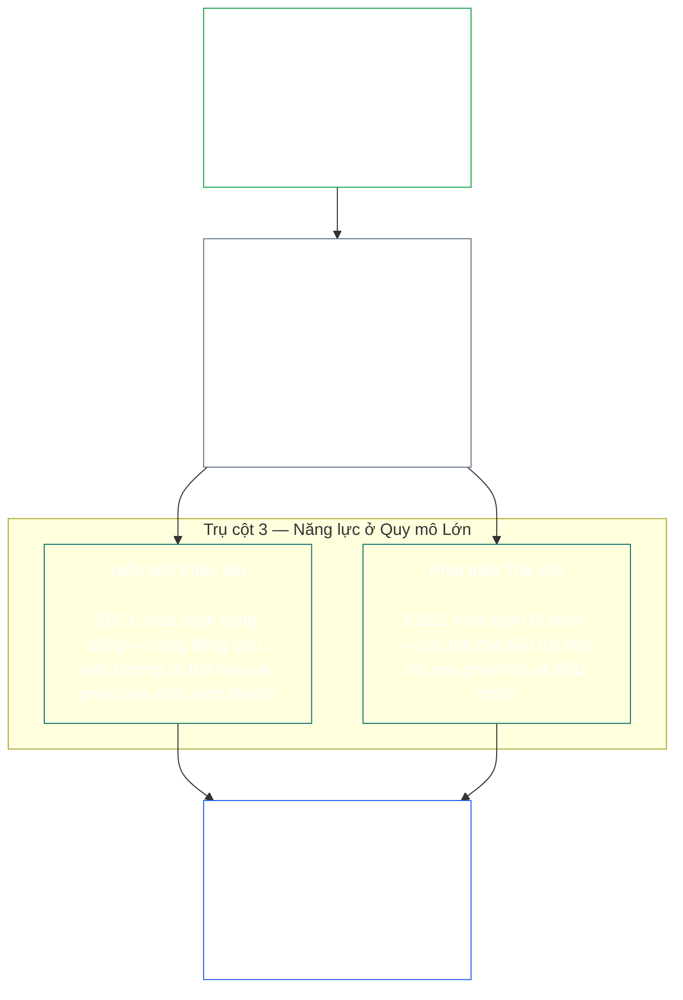
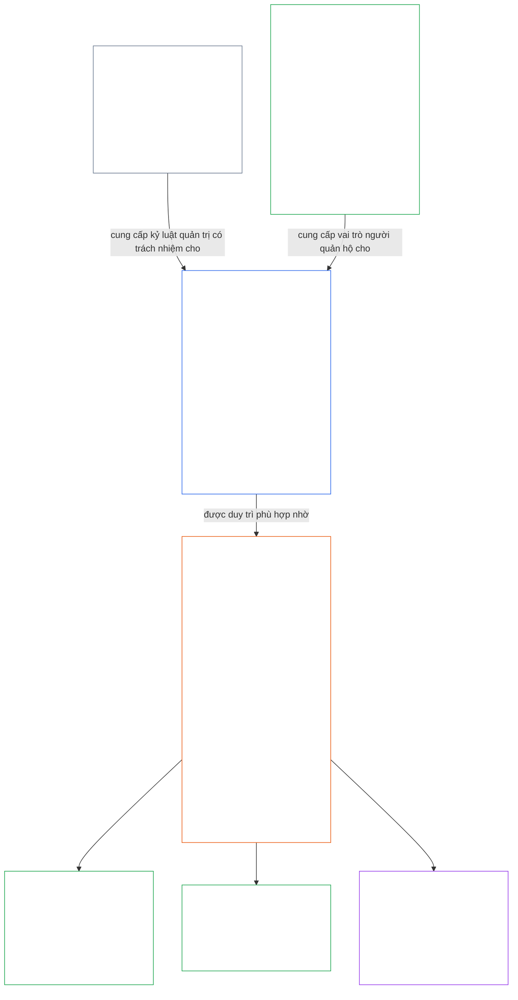

<a id="chapter-01-principles-and-constraints"></a>
<a id="chapter-01-part-b-stewardship-and-governance"></a>
<a id="chapter-01-part-c-stewardship-and-governance"></a>
# CHƯƠNG 01, PHẦN C: TRÁCH NHIỆM QUẢN TRỊ VÀ QUẢN TRỊ

<details>
<summary><strong><span style="color: #2563eb;">Vị trí trong kho tư liệu (không mang tính vận hành): cấu trúc tệp và quy tắc đọc</span></strong></summary>

> Nội dung sau đây **chỉ là hướng dẫn cho người đọc**. Nội dung này không thêm, xóa hoặc thu hẹp nghĩa vụ có tính ràng buộc trong tệp này hoặc các chương khác.
>
> Tệp này **là một phần của Hiến pháp Sentient** và chỉ có tính ràng buộc khi được đọc cùng các tệp `core_*` được đánh số khác như một văn kiện thống nhất. Tệp bao gồm **Chương Một, Phần C** (§§16–20: trách nhiệm quản trị, quản trị, điều chỉnh động cơ khuyến khích và chiếm dụng hệ thống, cùng phần tổng kết về áp dụng tích hợp).
>
> **Phần trước:** [core_01_b_interaction_interpretation.md](core_01_b_interaction_interpretation.md) (Chương Một, Phần B)  
> **Phần tiếp theo:** [core_02_definition_structure.md](core_02_definition_structure.md)<br>
> **Mạch đọc:** §16 trách nhiệm quản trị và hiểu biết phân tán → §17 vai trò người quản trị → §18 quản trị → §19 điều chỉnh động cơ khuyến khích và chiếm dụng hệ thống → **§20 áp dụng tích hợp** (phần tổng kết chương).

</details>

<details>
<summary><strong><span style="color: #2563eb;">Hướng dẫn cho người đọc (không mang tính vận hành): thứ bậc nguyên tắc và mạch đọc (Phần C)</span></strong></summary>

> Nội dung sau đây **chỉ là hướng dẫn cho người đọc**. Nội dung này không thêm, xóa hoặc thu hẹp nghĩa vụ có tính ràng buộc trong tệp này hoặc các chương khác. Các tiện ích **Truy vết** và **Định nghĩa · Đánh giá · Tuân thủ** ở từng mục chỉ dẫn tại nơi một § viện dẫn thuật ngữ về mặt thực chất; khối này là bản đối chiếu ở cấp phần trước §§16–20.

**Thứ bậc nguyên tắc (Phần C).** Ở cấp nguyên tắc:

13. **[Trách nhiệm quản trị](core_05_band_continuity.md#stewardship)** định hướng các hệ thống có tính trọng yếu thông qua tổ chức của các sentient — **Trụ cột 1** ([§17](#17-consequential-stewardship-the-steward-role): vận hành thực tế và cải tiến có hệ quả đáng kể), **Trụ cột 2** ([trách nhiệm quản trị chủ động](#16-pillar-2-proactive-stewardship): phát hiện vấn đề sớm và khắc phục mà không chậm trễ có thể tránh được), và **Trụ cột 3** ([§16.1](#161-distributed-understanding) · [§16.2](#162-institutional-development): năng lực ở quy mô cộng đồng và thể chế) — hướng đến sự phù hợp hiến định bền vững theo thời gian trong khuôn khổ [Tứ trụ Hiến pháp](core_00_preamble.md#constitutional-tetrad). Đặc biệt gồm **[Sự tham gia](core_05_apex_participation_leg.md#participation-constitutional)** (vai trò có hệ quả và tiếng nói) và **[Giám sát](core_05_apex_oversight_leg.md#oversight-constitutional)** (hiểu biết phân tán, khả năng kiểm toán và khả năng phản biện — giám sát đòi hỏi kiểm toán; [Chứng nhận Mức độ Phù hợp của Hệ thống](core_05_band_continuity.md#system-alignment-certification) là một trong những quy trình kiểm toán khác, và là quy trình đặc biệt lớn) — đồng thời bao gồm mục tiêu **Tính liên tục** trong [Hai Mục tiêu Hiến pháp](core_00_preamble.md#two-constitutional-aims).
14. **[Trách nhiệm quản trị có hệ quả](#17-consequential-stewardship-the-steward-role)** chính là vai trò người quản trị: các nghĩa vụ trực tiếp, tiêu chuẩn và biện pháp bảo vệ áp dụng cho bất kỳ ai thực hiện công việc có hệ quả đáng kể về vận hành, bảo trì, giám sát hoặc cải tiến một hệ thống trọng yếu — Trụ cột 1 được đưa vào thực tiễn, cùng tiêu chuẩn chung, sự phù hợp dưới áp lực và khả năng quan sát trong phạm vi vai trò của người quản trị.
15. **[Quản trị](core_05_band_accountability.md#governance)** tổ chức việc ra quyết định được ủy quyền, sự tham gia và trách nhiệm giải trình theo [Tứ trụ Hiến pháp](core_00_preamble.md#constitutional-tetrad) — đặc biệt là **[Giám sát](core_05_apex_oversight_leg.md#oversight-constitutional)** cách thức phân bổ và thực thi thẩm quyền, cùng nguyên tắc **trách nhiệm giải trình tương xứng với thẩm quyền** tại [§18.1](#181-governance-as-authorized-structure): quyền lực được ủy quyền hoặc vai trò có hệ quả càng lớn thì trách nhiệm giải trình và giám sát theo hiến pháp càng tăng, không giảm. [§18.3 Tách biệt Nhiệm vụ](#183-segregation-of-duties) bảo đảm người hành động không đồng thời là người kiểm tra hành động đó. [§18.4 Biện minh Liên tục](#184-ongoing-justification) yêu cầu các sắp xếp đó liên tục chứng minh rằng chúng vẫn phù hợp với Hiến pháp này. Khi quản trị và trách nhiệm quản trị xung đột, kỷ luật trách nhiệm quản trị chi phối ở cấp nguyên tắc, trừ khi **Tính cần thiết** và **Tính tương xứng** minh thị biện minh cho ngoại lệ giới hạn, có thời hạn và có lộ trình khắc phục. Việc ủy quyền vận hành và các yêu cầu ở cấp hợp đồng thuộc **Chương Mười Ba**.
16. **[Điều chỉnh Động cơ Khuyến khích và Chiếm dụng Hệ thống](#19-incentive-alignment-and-system-capture)** đặt ra kỷ luật cấp nguyên tắc đối với cơ cấu khuyến khích, tính toàn vẹn của chỉ báo thay thế, các khiếm khuyết do tầm nhìn ngắn hạn, việc điều chỉnh lộ trình khen thưởng và phản ứng trước sự chiếm dụng.
17. **[Áp dụng Tích hợp](#20-integrated-application)** là phần tổng kết của chương: các chương tiếp theo được đọc thông qua khuôn khổ giá trị tích hợp của chương này.

</details>

<br>

<a id="16-stewardship-in-depth"></a>

### 16. Trách nhiệm Quản trị Chuyên sâu
<details>
<summary><strong><span style="color: #2563eb;">Truy vết</span></strong></summary>

- Đọc cùng [Tứ trụ Hiến pháp](core_00_preamble.md#constitutional-tetrad) — nội dung chính ở Chương Một về trụ cột **sự tham gia** (vai trò có hệ quả và tiếng nói; yêu cầu chung, không chỉ riêng [Sự tham gia của Hệ thống các Bên liên quan](core_05_band_participation.md#stakeholder-status-and-weight)), trụ cột **giám sát**, và trụ cột **tính kịp thời** (tốc độ khắc phục chủ động); được điều chỉnh theo [lợi ích trọng yếu](core_00_preamble.md#material-stake).
- Đọc cùng [Hai Mục tiêu Hiến pháp](core_00_preamble.md#two-constitutional-aims) — mục tiêu **Hưng thịnh** (sự tham gia, năng lực hành động và các lộ trình giáo dục); mục tiêu **Tính liên tục** (học hỏi thể chế, năng lực khắc phục và trách nhiệm quản trị bền vững).
- Thượng nguồn: Các nguyên tắc: [3. Mục tiêu Nền tảng: Phúc lợi](core_01_a_values_principles.md#3-foundational-objective-wellbeing-flourishing-aim); [5 Sự thật](core_01_a_values_principles.md#5-truth-epistemic-integrity-constraint); [6. Niềm tin](core_01_a_values_principles.md#6-trust-and-trustworthiness-coordination-integrity); và [§9 Năng lực Hệ thống Chung](core_01_a_values_principles.md#9-shared-system-capacity).
- Hạ nguồn: [13. Quy trình Giải quyết Xung đột Hiến pháp](core_01_b_interaction_interpretation.md#13-constitutional-collision-resolution-process) (bao gồm [§13.3 Giảm thiểu Gánh nặng Có thể Tránh](core_01_b_interaction_interpretation.md#133-minimization-of-avoidable-burden)); [Chương Tám §3 Đánh giá Chứng nhận Toàn hệ thống](core_08_a_system_alignment_certification_evaluation.md#3-whole-system-certification-evaluation); [§19.1.3 Áp dụng Trách nhiệm Quản trị và Người vận hành](#1913-stewardship-and-operator-application).
- Hạ nguồn: [§19.1.4 Lộ trình về Chiều sâu Vai trò và Trách nhiệm Trọng yếu](#1914-role-depth-and-material-responsibility-pathways).
- Hạ nguồn: [§7 Tự do (Năng lực Hành động Có giới hạn)](core_01_a_values_principles.md#7-freedom-bounded-agency), vốn phụ thuộc vào việc trách nhiệm quản trị có hệ quả, hiểu biết phân tán, sự tham gia có ý nghĩa và năng lực khắc phục vẫn hiện hữu trong điều kiện phụ thuộc trọng yếu.
- Hạ nguồn: [Chương Tám — Chứng nhận Mức độ Phù hợp của Hệ thống](core_08_a_system_alignment_certification_evaluation.md#chapter-eight-system-alignment-certification) (*một quy trình kiểm toán đặc biệt lớn trong khuôn khổ giám sát — không phải nơi kiểm toán duy nhất*); [Chương Chín — Mô hình Đóng góp, Vi phạm và Tư cách](core_09_standing_assessment.md#chapter-nine-contribution-violation-and-standing-model--measurement) (*tác động đến tư cách — điều kiện về niềm tin, vai trò và tư cách được công nhận — triển khai tiểu mục này làm nền tảng ở cấp nguyên tắc*).
- Hạ nguồn: [Chương Mười Hai §1 — Mục đích và vai trò](core_12_forum.md#1-purpose-and-role--participation-architecture) và [§4 — Định nghĩa các nhóm diễn đàn](core_12_forum.md#4-forum-family-definitions--accountability-through-adjudication) (*các nhóm diễn đàn đảm nhiệm kiến trúc tham gia và giám sát cho việc phản biện có thể tranh tụng, sắp xếp trình tự khắc phục, học hỏi nguyên nhân gốc rễ và quản trị chủ động phù hợp với mục này*); xem [corpus_forum.md](corpus_forum.md) về hoạt động diễn đàn đã được thông qua.
- Hạ nguồn: Định hình phạm vi quyền đối với giáo dục, Sự tham gia của Hệ thống các Bên liên quan, tính minh bạch, khả năng hiểu, kiểm toán và xác minh, cùng các lộ trình chiều sâu vai trò hướng đến trách nhiệm trọng yếu.
  - Đặc biệt gồm [Điều III: Sự sống còn và Quyền tiếp cận Thiết yếu](core_06_rights_part_a.md#article-iii-survival-and-essential-access), [Điều IV: Quyền được Giáo dục lấy Sentient làm Trung tâm](core_06_rights_part_a.md#article-iv-right-to-sentient-centered-education), [Điều X: Quyền Tự quyết, Năng lực Hành động và Sự tham gia](core_06_rights_part_b.md#article-x-self-determination-agency-and-participation), [Điều XII: Sự tham gia của Hệ thống các Bên liên quan, Đại diện và Thủ tục Công bằng](core_06_rights_part_b.md#article-xii-stakeholder-system-participation-representation-and-due-process), [Điều XVI: Kiểm toán, Minh bạch và Xác minh Độc lập](core_06_rights_part_c.md#article-xvi-audit-transparency-and-independent-verification), [Điều XIX: Tư cách và Tình trạng Tham gia](core_06_rights_part_d.md#article-xix-standing-and-participation-status), [Điều XXI: Khả năng Tương tác, Tính Di động, Di chuyển, Nơi trú ẩn và Tính Toàn vẹn khi Rời đi](core_06_rights_part_d.md#article-xxi-interoperability-portability-movement-refuge-and-exit-integrity), [Điều XXII: Khả năng Hiểu và Trách nhiệm Quản trị Sự phức tạp](core_06_rights_part_d.md#article-xxii-comprehensibility-and-complexity-stewardship), và [Điều XXIV: Diễn giải Hiến pháp, Rà soát và Các Biện pháp Bảo vệ Chống Chiếm dụng](core_06_rights_part_d.md#article-xxiv-constitutional-interpretation-review-and-anti-capture-safeguards).
  - Đọc cùng [Chương Mười Ba §5 — Vai trò Được ủy quyền, Phát triển Năng lực và Đóng góp](core_13_governance.md#5-authorized-roles-competency-development-and-contribution) và **[corpus_systems.md](corpus_systems.md), CS-4 — trách nhiệm quản trị hệ thống trọng yếu**, về các lộ trình vai trò vận hành và phát triển trách nhiệm quản trị.
- Các tiểu mục (theo thứ tự đọc): [§16.1 Hiểu biết Phân tán](#161-distributed-understanding) (khía cạnh cộng đồng của năng lực ở quy mô lớn) · [§16.2 Phát triển Thể chế](#162-institutional-development) (khía cạnh tổ chức) · [§16.3 Khát vọng Cởi mở](#163-openness-aspiration).
- Đọc cùng [§17 Trách nhiệm Quản trị có Hệ quả](#17-consequential-stewardship-the-steward-role) (*bản thân vai trò người quản trị — được nâng thành mục riêng; đảm nhiệm các nghĩa vụ trực tiếp của Trụ cột 1 về vận hành, bảo trì, giám sát và cải tiến, cùng [§17.1](#171-shared-stewardship-standard), [§17.2](#172-alignment-under-pressure), [§17.3](#173-logging-the-role-not-the-steward), [§17.4 Tự tổ chức Phù hợp](#174-aligned-self-organization), mở rộng kỷ luật đó ra ngoài vai trò chính thức, và [§17.5 Nghĩa vụ Chống lại](#175-duty-to-resist)*)

</details>

<details>
<summary><strong><span style="color: #2563eb;">Định nghĩa · Đánh giá · Tuân thủ</span></strong></summary>

- [Nghĩa vụ Trách nhiệm Quản trị Chiến lược](core_05_band_continuity.md#strategic-stewardship-obligation) · [O](core_05_band_continuity.md#strategic-stewardship-obligation) · [M](core_05_band_continuity.md#strategic-stewardship-obligation-constitutional-a) · [A](core_05_band_continuity.md#strategic-stewardship-obligation-constitutional-a) · [C](core_05_band_continuity.md#strategic-stewardship-obligation-constitutional-c)
- [Hiểu biết Phân tán](core_05_band_continuity.md#distributed-understanding) · [O](core_05_band_continuity.md#distributed-understanding) · [M](core_05_band_continuity.md#distributed-understanding-constitutional-a) · [A](core_05_band_continuity.md#distributed-understanding-constitutional-a) · [C](core_05_band_continuity.md#distributed-understanding-constitutional-c)
- [Sự tham gia](core_05_apex_participation_leg.md#participation-constitutional) · [O](core_05_apex_participation_leg.md#participation-constitutional) · [M](core_05_apex_participation_leg.md#participation-constitutional-m) · [A](core_05_apex_participation_leg.md#participation-constitutional-a) · [C](core_05_apex_participation_leg.md#participation-constitutional-c)
- [Giám sát](core_05_apex_oversight_leg.md#oversight-constitutional) · [O](core_05_apex_oversight_leg.md#oversight-constitutional) · [M](core_05_apex_oversight_leg.md#oversight-constitutional-m) · [A](core_05_apex_oversight_leg.md#oversight-constitutional-a) · [C](core_05_apex_oversight_leg.md#oversight-constitutional-c)
- [Năng lực Hành động Có ý nghĩa](core_05_band_participation.md#meaningful-agency) · [O](core_05_band_participation.md#meaningful-agency) · [M](core_05_band_participation.md#meaningful-agency-a) · [A](core_05_band_participation.md#meaningful-agency-a) · [C](core_05_band_participation.md#meaningful-agency-c)
- [Khả năng Kiểm toán](core_05_band_oversight.md#auditability) · [O](core_05_band_oversight.md#auditability) · [M](core_05_band_oversight.md#auditability-a) · [A](core_05_band_oversight.md#auditability-a) · [C](core_05_band_oversight.md#auditability-c)
- [Khả năng Phản biện](core_05_band_accountability.md#contestability) · [O](core_05_band_accountability.md#contestability) · [M](core_05_band_accountability.md#contestability-a) · [A](core_05_band_accountability.md#contestability-a) · [C](core_05_band_accountability.md#contestability-c)
- [Năng lực Hành động Giáo dục](core_05_band_participation.md#educational-agency) · [O](core_05_band_participation.md#educational-agency) · [M](core_05_band_participation.md#educational-agency-a) · [A](core_05_band_participation.md#educational-agency-a) · [C](core_05_band_participation.md#educational-agency-c)
- [Tính Minh bạch](core_05_band_oversight.md#transparency) · [O](core_05_band_oversight.md#transparency) · [M](core_05_band_oversight.md#transparency-a) · [A](core_05_band_oversight.md#transparency-a) · [C](core_05_band_oversight.md#transparency-c)
- [Tính Trọng yếu](core_05_band_oversight.md#materiality) · [O](core_05_band_oversight.md#materiality) · [M](core_05_band_oversight.md#materiality-determination-a) · [A](core_05_band_oversight.md#materiality-determination-a) · [C](core_05_band_oversight.md#materiality-determination-c)
- [Sự phụ thuộc](core_05_band_continuity.md#dependency) · [O](core_05_band_continuity.md#dependency) · [M](core_05_band_continuity.md#dependency-a) · [A](core_05_band_continuity.md#dependency-a) · [C](core_05_band_continuity.md#dependency-c)
- [Khả năng Tiếp cận](core_05_band_participation.md#accessibility) · [O](core_05_band_participation.md#accessibility) · [M](core_05_band_participation.md#accessibility-constitutional-a) · [A](core_05_band_participation.md#accessibility-constitutional-a) · [C](core_05_band_participation.md#accessibility-constitutional-c)
- [An toàn (Ràng buộc Hiến pháp)](core_05_band_continuity.md#safety-constitutional-constraint) · [O](core_05_band_continuity.md#safety-constitutional-constraint) · [M](core_05_band_continuity.md#safety-constraint-a) · [A](core_05_band_continuity.md#safety-constraint-a) · [C](core_05_band_continuity.md#safety-constraint-c)
- [Sự thật (Ràng buộc Hiến pháp)](core_05_band_oversight.md#truth-constitutional-constraint) · [O](core_05_band_oversight.md#truth-constitutional-constraint-o) · [M](core_05_band_oversight.md#truth-constitutional-constraint-a) · [A](core_05_band_oversight.md#truth-constitutional-constraint-a) · [C](core_05_band_oversight.md#truth-constitutional-constraint-c)
- [Tính cần thiết](core_05_band_accountability.md#necessity) · [O](core_05_band_accountability.md#necessity) · [M](core_05_band_accountability.md#necessity-a) · [A](core_05_band_accountability.md#necessity-a) · [C](core_05_band_accountability.md#necessity-c)
- [Tính tương xứng](core_05_band_accountability.md#proportionality) · [O](core_05_band_accountability.md#proportionality) · [M](core_05_band_accountability.md#proportionality-a) · [A](core_05_band_accountability.md#proportionality-a) · [C](core_05_band_accountability.md#proportionality-c)
- [Gánh nặng Có thể Tránh](core_05_band_continuity.md#avoidable-burden) · [O](core_05_band_continuity.md#avoidable-burden) · [M](core_05_band_continuity.md#avoidable-burden-a) · [A](core_05_band_continuity.md#avoidable-burden-a) · [C](core_05_band_continuity.md#avoidable-burden-c)
- [Tính Toàn vẹn Nhận thức luận](core_05_band_oversight.md#epistemic-integrity) · [O](core_05_band_oversight.md#epistemic-integrity-o) · [M](core_05_band_oversight.md#epistemic-integrity-a) · [A](core_05_band_oversight.md#epistemic-integrity-a) · [C](core_05_band_oversight.md#epistemic-integrity-c)

</details>

<br>

*Nói một cách dễ hiểu, có ba ý tưởng gắn kết mục này. Thứ nhất, các hệ thống trọng yếu ảnh hưởng đến đời sống của sentient cần được sentient tổ chức để vận hành tốt — chứ không phải một tầng lớp chuyên gia biệt lập. Thứ hai, người quản trị giỏi không chờ đến khi thiệt hại xảy ra: họ phát hiện vấn đề lúc còn nhỏ, chuyển đến đúng người phụ trách và giải quyết trước khi sự chậm trễ tự nó gây hại. Thứ ba, tổ chức đó phải xây dựng **năng lực ở quy mô lớn**: những con đường thực tế để cá nhân tham gia công việc có hệ quả, mức hiểu biết cộng đồng đủ để nhận ra vấn đề và phản biện, cùng các thể chế tiếp tục học hỏi thay vì đình trệ.*

<a id="16-limits"></a>
Trách nhiệm quản trị có giới hạn. **An toàn**, **Sự thật**, **Tính cần thiết**, **Tính tương xứng**, **Gánh nặng Có thể Tránh** và **Tính Toàn vẹn Nhận thức luận** đặt ra giới hạn để các nghĩa vụ này có quy mô phù hợp, trung thực và tôn trọng những nhu cầu an ninh chính đáng — các trụ cột bên dưới hoạt động trong phạm vi những giới hạn đó, không lách qua chúng.

Tổ chức của sentient, trách nhiệm quản trị chủ động và năng lực ở quy mô lớn là ba trụ cột của mục này. Cả ba cùng thúc đẩy các trụ cột **sự tham gia**, **giám sát** và **tính kịp thời** của [Tứ trụ Hiến pháp](core_00_preamble.md#constitutional-tetrad) ở cấp nguyên tắc, được điều chỉnh theo [lợi ích trọng yếu](core_00_preamble.md#material-stake), đồng thời thúc đẩy [Hai Mục tiêu Hiến pháp](core_00_preamble.md#two-constitutional-aims).

<br>



**Trụ cột 1 — Trách nhiệm Quản trị có Hệ quả ([§17 Trách nhiệm Quản trị có Hệ quả](#17-consequential-stewardship-the-steward-role)):**
- Các hệ thống chung ảnh hưởng trọng yếu đến sentient đòi hỏi sentient trực tiếp tham gia vận hành, bảo trì, giám sát và cải tiến — [**Nghĩa vụ Trách nhiệm Quản trị Chiến lược**](core_05_band_continuity.md#strategic-stewardship-obligation), [**Năng lực Hành động Có ý nghĩa**](core_05_band_participation.md#meaningful-agency)
- Hồ sơ và lộ trình rà soát để người khác có thể xác minh và phản biện — [**Khả năng Kiểm toán**](core_05_band_oversight.md#auditability), [**Khả năng Phản biện**](core_05_band_accountability.md#contestability)
- Theo trụ cột **giám sát** của Tứ trụ, giám sát đòi hỏi kiểm toán; [Chứng nhận Mức độ Phù hợp của Hệ thống](core_05_band_continuity.md#system-alignment-certification) là một quy trình kiểm toán đặc biệt lớn, có mức độ rủi ro cao trong số các quy trình khác — không phải nơi kiểm toán duy nhất (**Điều XVI** (*Kiểm toán, Minh bạch và Xác minh Độc lập*))

<a id="16-pillar-2-proactive-stewardship"></a>
**Trụ cột 2 — Trách nhiệm quản trị chủ động:**
Người quản trị chủ động xử lý vấn đề đang hình thành và sự không phù hợp theo ba cách:
- **Nhận biết trước khi vấn đề trở nên nghiêm trọng** — người quản trị giỏi phát hiện sự không phù hợp khi vấn đề còn nhỏ, thay vì chờ chúng tự lộ ra
- **Chuyển tiếp theo khung thời gian phù hợp với cấp vai trò** — chuyển cấp trong thời hạn tương ứng với mức độ hệ trọng của vai trò, không giữ lại điều đã phát hiện hoặc đẩy quá mức các việc thường lệ
- **Giải quyết dứt điểm, không chỉ đánh dấu** — bắt đầu khắc phục mà không chậm trễ có thể tránh được sau khi vấn đề được nêu ra; đây là việc đưa trụ cột **tính kịp thời** của Tứ trụ vào thực tiễn ([**Tính kịp thời**](core_05_apex_timeliness_leg.md#timeliness-constitutional))
- **Nghĩa vụ thường trực của vai trò, không phải phần việc bổ sung:** vai trò được xác định tại [§17 Trách nhiệm Quản trị có Hệ quả](#17-consequential-stewardship-the-steward-role) ưu tiên quản trị chủ động, thiết kế hệ thống và sự phù hợp với hiến pháp hơn việc phản ứng sửa triệu chứng sau khi thiệt hại hoặc sự không phù hợp đã xuất hiện — trụ cột này là nghĩa vụ thường trực của vai trò đó, không được giao cho một quy trình riêng

**Trụ cột 3 — Năng lực ở quy mô lớn ([§16.1 Hiểu biết Phân tán](#161-distributed-understanding) · [§16.2 Phát triển Thể chế](#162-institutional-development)):**
- Trách nhiệm quản trị phải giúp cộng đồng chịu ảnh hưởng có thể hiểu và phản biện một cách khả thi — [**Năng lực Hành động Giáo dục**](core_05_band_participation.md#educational-agency), [**Tính Minh bạch**](core_05_band_oversight.md#transparency)
- Các tổ chức tiếp tục học hỏi thông qua phản hồi, điều chỉnh và duy trì năng lực, bao gồm việc theo dõi có cấu trúc sự biến thiên theo thời gian khi việc đo lường hỗ trợ điều đó (**kiểm soát quá trình thống kê** là phương thức triển khai đã được biết đến rộng rãi, không phải yêu cầu phổ quát)

<a id="when-day-to-day-stewardship-is-not-enough"></a>
**Khi trách nhiệm quản trị hằng ngày chưa đủ:**
Trách nhiệm quản trị là tuyến đầu, không phải tuyến duy nhất. Ba câu hỏi khác nhau thuộc về ba nơi khác nhau, và không nơi nào thay thế cho nơi nào:
- **Tranh chấp bên trong một hệ thống đã được trao quyền — [Sự tham gia của các bên liên quan trong hệ thống](core_05_band_participation.md#stakeholder-status-and-weight):**
  - Các sentient bị ảnh hưởng trước hết sử dụng lộ trình khiếu nại đã công bố về Sự tham gia của các bên liên quan trong hệ thống; lộ trình này bao quát sự tham gia, đại diện, khả năng phản biện và thủ tục tố tụng thích đáng.
  - Các biện pháp bảo vệ này được dành cho mọi sentient chịu ảnh hưởng trọng yếu.
  - Chúng hoạt động bên trong các hệ thống, thể chế và lĩnh vực ra quyết định đã được trao quyền.
- **Tranh chấp mà Sự tham gia của các bên liên quan trong hệ thống không thể giải quyết — [xem xét tại diễn đàn](core_12_forum.md#dispute-sequencing):**
  - Khi lộ trình khiếu nại nói trên vẫn bị tranh chấp, không tồn tại hoặc bị chiếm dụng, hay không thể đưa ra biện pháp khắc phục, vụ việc được chuyển theo lợi ích chính đến các **nhóm diễn đàn** độc lập theo [Chương Mười Hai §1 — Mục đích và vai trò](core_12_forum.md#1-purpose-and-role--participation-architecture) và [§4 — Định nghĩa các nhóm diễn đàn](core_12_forum.md#4-forum-family-definitions--accountability-through-adjudication).
  - Đây là nơi các sentient có cách thực chất để phản đối một quyết định, nhận được lệnh khắc phục rõ ràng hoặc học hỏi từ một khuôn mẫu tái diễn.
  - Nếu lợi ích chính liên quan đến ý nghĩa hoặc hiệu lực của văn bản hiến pháp, hoặc một hành động vượt quá thẩm quyền hợp pháp, nhóm chủ trì là [các diễn đàn Hiến pháp](core_12_forum.md#46-constitutional-forums).
  - Các quy tắc chi tiết về hoạt động của những diễn đàn này có trong [corpus_forum.md](corpus_forum.md).
- **Ai có thể cai quản ngay từ đầu — [Tầng Hợp đồng Hiến pháp](core_05_band_integrative.md#constitutional-contract-layer) ([Chương Mười Ba](core_13_governance.md)):**
  - Liệu bản thân quyền cai quản có chính đáng hay không — ai có thể cai quản, theo cơ chế chính danh nào, trong phạm vi và với các điều khoản bền vững nào — là câu hỏi riêng biệt với Sự tham gia của các bên liên quan trong hệ thống và việc xem xét tại diễn đàn.
  - Một cuộc bỏ phiếu về sự tham gia, kết quả của lộ trình khiếu nại hoặc điểm tin cậy không trao quyền cai quản.
  - Sự ủy quyền theo hiến pháp không xóa bỏ các nghĩa vụ phát sinh từ Sự tham gia của các bên liên quan trong hệ thống.
  - Hai tầng vẫn tách biệt ngay cả khi có phần giao nhau ([Lời nói đầu §3.3 — Các tầng Quản trị](core_00_preamble.md#33-governance-layers)).
- **Cơ chế dự phòng, không phải vật thay thế:** Việc xem xét, chỉnh sửa và khắc phục vẫn là bắt buộc khi có bằng chứng thích đáng. Chúng không thay thế thiết kế chủ động, động cơ khuyến khích, biện pháp kiểm soát, lộ trình vai trò, khả năng quan sát và năng lực khắc phục — những yếu tố ngăn ngừa sự lệch chuẩn hiến pháp có thể dự đoán trước khi thiệt hại xảy ra.

<a id="16-scope-priority-and-limits"></a>
**Phạm vi ([§16 Trách nhiệm Quản trị Chuyên sâu](#16-stewardship-in-depth)):**
- Mục này đưa ra định hướng ở cấp nguyên tắc, không phải sổ tay quy tắc áp dụng giống nhau cho mọi trường hợp.
- Mục này **không** yêu cầu:
  - luân chuyển tất cả mọi người qua mọi vai trò
  - gạt bỏ chuyên môn hóa có căn cứ
  - vượt quá giới hạn bảo mật hoặc an ninh chính đáng theo [13.2 Các Giới hạn Công bố Tri thức](core_01_b_interaction_interpretation.md#132-epistemic-disclosure-constraints) và các biện pháp bảo vệ tương ứng của **Chương Sáu**.

**Ưu tiên:**
- **Tính trọng yếu**, **Sự phụ thuộc** và **Khả năng tiếp cận** xác định thứ tự ưu tiên trong việc phân phối hiểu biết và khả năng tiếp cận — tập trung mạnh nhất ở nơi tác động và mức độ phụ thuộc cao hơn.

<a id="161-distributed-understanding"></a>
#### 16.1 Hiểu biết Phân tán
<details>
<summary><strong><span style="color: #2563eb;">Truy vết</span></strong></summary>

- Thượng nguồn: [§17 Trách nhiệm Quản trị có Hệ quả](#17-consequential-stewardship-the-steward-role) (*Trụ cột 1*); [§16 Trách nhiệm Quản trị Chuyên sâu](#16-stewardship-in-depth) (mục cha, bao gồm phần *Nói một cách dễ hiểu* và khung Trụ cột 3 ở trên); [5 Sự thật](core_01_a_values_principles.md#5-truth-epistemic-integrity-constraint); [6. Niềm tin](core_01_a_values_principles.md#6-trust-and-trustworthiness-coordination-integrity).
- Đọc cùng [Tứ trụ Hiến pháp](core_00_preamble.md#constitutional-tetrad) — trụ cột **sự tham gia** ([Năng lực Hành động Có ý nghĩa](core_05_band_participation.md#meaningful-agency), [Năng lực Hành động Giáo dục](core_05_band_participation.md#educational-agency)); trụ cột **giám sát** ([Tính Minh bạch](core_05_band_oversight.md#transparency), [Khả năng Kiểm toán](core_05_band_oversight.md#auditability)); điều chỉnh theo [lợi ích trọng yếu](core_00_preamble.md#material-stake).
- Cổng hướng dẫn cho người quản trị (không mang tính vận hành): thẻ bước tiếp theo: [Khả năng Hiểu được](implementation/STEWARD_ENTRY_DOORS.md#comprehensibility). Thẻ này không thể thu hẹp Hiến pháp.
- Hạ nguồn: [13.2 Các Giới hạn Công bố Tri thức](core_01_b_interaction_interpretation.md#132-epistemic-disclosure-constraints); trong phạm vi quyền, đặc biệt là [Điều XVI: Kiểm toán, Minh bạch và Xác minh Độc lập](core_06_rights_part_c.md#article-xvi-audit-transparency-and-independent-verification), [Điều XXII: Khả năng Hiểu được và Trách nhiệm Quản trị Sự phức tạp](core_06_rights_part_d.md#article-xxii-comprehensibility-and-complexity-stewardship).

</details>

<details>
<summary><strong><span style="color: #2563eb;">Định nghĩa · Đánh giá · Tuân thủ</span></strong></summary>

- [Hiểu biết Phân tán](core_05_band_continuity.md#distributed-understanding) · [O](core_05_band_continuity.md#distributed-understanding) · [M](core_05_band_continuity.md#distributed-understanding-constitutional-a) · [A](core_05_band_continuity.md#distributed-understanding-constitutional-a) · [C](core_05_band_continuity.md#distributed-understanding-constitutional-c)
- [Tính Minh bạch](core_05_band_oversight.md#transparency) · [O](core_05_band_oversight.md#transparency) · [M](core_05_band_oversight.md#transparency-a) · [A](core_05_band_oversight.md#transparency-a) · [C](core_05_band_oversight.md#transparency-c)
- [Công bố Cơ sở Giám sát Công khai](core_05_band_oversight.md#public-oversight-baseline-disclosure) · [O](core_05_band_oversight.md#public-oversight-baseline-disclosure) · [M](core_05_band_oversight.md#public-oversight-baseline-disclosure-a) · [A](core_05_band_oversight.md#public-oversight-baseline-disclosure-a) · [C](core_05_band_oversight.md#public-oversight-baseline-disclosure-c)
- [Khả năng Kiểm toán](core_05_band_oversight.md#auditability) · [O](core_05_band_oversight.md#auditability) · [M](core_05_band_oversight.md#auditability-a) · [A](core_05_band_oversight.md#auditability-a) · [C](core_05_band_oversight.md#auditability-c)
- [Tính Trọng yếu](core_05_band_oversight.md#materiality) · [O](core_05_band_oversight.md#materiality) · [M](core_05_band_oversight.md#materiality-determination-a) · [A](core_05_band_oversight.md#materiality-determination-a) · [C](core_05_band_oversight.md#materiality-determination-c)
- [Sự phụ thuộc](core_05_band_continuity.md#dependency) · [O](core_05_band_continuity.md#dependency) · [M](core_05_band_continuity.md#dependency-a) · [A](core_05_band_continuity.md#dependency-a) · [C](core_05_band_continuity.md#dependency-c)
- [Khả năng Tiếp cận](core_05_band_participation.md#accessibility) · [O](core_05_band_participation.md#accessibility) · [M](core_05_band_participation.md#accessibility-constitutional-a) · [A](core_05_band_participation.md#accessibility-constitutional-a) · [C](core_05_band_participation.md#accessibility-constitutional-c)
- [Năng lực Hành động Giáo dục](core_05_band_participation.md#educational-agency) · [O](core_05_band_participation.md#educational-agency) · [M](core_05_band_participation.md#educational-agency-a) · [A](core_05_band_participation.md#educational-agency-a) · [C](core_05_band_participation.md#educational-agency-c)
- [Năng lực Hành động Có ý nghĩa](core_05_band_participation.md#meaningful-agency) · [O](core_05_band_participation.md#meaningful-agency) · [M](core_05_band_participation.md#meaningful-agency-a) · [A](core_05_band_participation.md#meaningful-agency-a) · [C](core_05_band_participation.md#meaningful-agency-c)
- [Khả năng Phản biện](core_05_band_accountability.md#contestability) · [O](core_05_band_accountability.md#contestability) · [M](core_05_band_accountability.md#contestability-a) · [A](core_05_band_accountability.md#contestability-a) · [C](core_05_band_accountability.md#contestability-c)

</details>

<br>

*Nói một cách dễ hiểu: bạn không cần có bằng tiến sĩ về mọi phân hệ để sống an toàn trong các hệ thống chung — nhưng hệ thống càng ảnh hưởng nhiều đến cuộc sống của bạn, bạn càng cần có khả năng tìm hiểu hệ thống làm gì, điều gì có thể trục trặc và cách phản đối những quyết định sai. Tính minh bạch, giáo dục, lời giải thích dễ hiểu và lộ trình kiểm toán giúp điều đó thành hiện thực. Sự phức tạp không phải lý do để che giấu điều quan trọng. Theo trụ cột **giám sát** của Tứ trụ, giám sát đòi hỏi kiểm toán; chứng nhận mức độ phù hợp của hệ thống là một quy trình kiểm toán đặc biệt lớn trong số các lộ trình ấy — không phải lộ trình duy nhất.*

Hiểu biết phân tán là khía cạnh hướng đến cộng đồng của **Trụ cột 3** theo **[§16 Trách nhiệm Quản trị Chuyên sâu](#16-stewardship-in-depth)**. Định nghĩa đầy đủ, các thước đo và điều kiện thất bại được nêu trong [Hiểu biết Phân tán](core_05_band_continuity.md#distributed-understanding). Tóm lược:

- **Yêu cầu:** khả năng tiếp cận có cấu trúc và tương xứng để hiểu cách các hệ thống chung ảnh hưởng trọng yếu đến sentient vận hành — gồm mục đích, giới hạn, điểm chưa chắc chắn và tác động có liên quan trọng yếu.
- **Điều giúp việc này khả thi:** [§17 Trách nhiệm Quản trị có Hệ quả](#17-consequential-stewardship-the-steward-role) phải cung cấp tài liệu, giáo dục, tính minh bạch, lộ trình vai trò và trách nhiệm quản trị khả năng hiểu được. Nghĩa vụ này vẫn tồn tại dù từng sentient có sử dụng mọi lộ trình hay không.
- **Mức cơ sở công khai trực tuyến:** khi có hạ tầng trực tuyến hợp pháp, [Công bố Cơ sở Giám sát Công khai](core_05_band_oversight.md#public-oversight-baseline-disclosure) trực tuyến — bao gồm lệnh cấm tường phí và quy tắc về phương án thay thế công khai tối đa khả thi — được điều chỉnh bởi [Tính Minh bạch](core_05_band_oversight.md#transparency) và [Công bố Cơ sở Giám sát Công khai](core_05_band_oversight.md#public-oversight-baseline-disclosure), đồng thời được triển khai thành dữ liệu **Type O** theo **[corpus_systems.md](corpus_systems.md), CS-2** (*Các loại và cách xử lý thông tin*).
- **Khả năng tiếp cận hỗ trợ:**
  - trụ cột **sự tham gia** của [Tứ trụ Hiến pháp](core_00_preamble.md#constitutional-tetrad) ( [Năng lực Hành động Có ý nghĩa](core_05_band_participation.md#meaningful-agency) dựa trên hiểu biết và khả năng phản biện)
  - trụ cột **giám sát**, bao gồm kiểm toán theo [Khả năng Kiểm toán](core_05_band_oversight.md#auditability) và **Điều XVI** (*Kiểm toán, Minh bạch và Xác minh Độc lập*); trong đó [Chứng nhận Mức độ Phù hợp của Hệ thống](core_05_band_continuity.md#system-alignment-certification) là một quy trình đặc biệt lớn trong số các phương thức kiểm toán tương ứng

Hiểu biết phân tán **không** yêu cầu mọi sentient phải thành thạo mọi phân hệ. Nhưng nó **có** yêu cầu mức độ hiểu biết tương xứng với [Tính Trọng yếu](core_05_band_oversight.md#materiality) và [Sự phụ thuộc](core_05_band_continuity.md#dependency). Không được viện dẫn tính phức tạp và thiếu minh bạch để làm vô hiệu [Năng lực Hành động Có ý nghĩa](core_05_band_participation.md#meaningful-agency) hoặc khả năng phản biện trong trường hợp **Chương Năm** và **Chương Sáu** quy định nghĩa vụ công bố, giáo dục hoặc bảo đảm khả năng hiểu được.

<a id="162-institutional-development"></a>
#### 16.2 Phát triển thể chế
<details>
<summary><strong><span style="color: #2563eb;">Dấu vết</span></strong></summary>

- Liên hệ trước: [§17 Quản hộ có hệ quả](#17-consequential-stewardship-the-steward-role) (*Trụ cột 1*); [§16.1 Hiểu biết phân tán](#161-distributed-understanding) (*khía cạnh cộng đồng của Trụ cột 3*); [§16 Quản hộ chuyên sâu](#16-stewardship-in-depth) (khung tổng quát của Trụ cột 3).
- Đọc cùng: [Tứ diện Hiến pháp](core_00_preamble.md#constitutional-tetrad) — nhánh **tham gia** (học hỏi của lực lượng lao động và cộng đồng chịu ảnh hưởng nhằm hỗ trợ các vai trò có hệ quả); nhánh **giám sát** ([Khả năng kiểm chứng](core_05_band_oversight.md#verifiability), [Khả năng kiểm toán](core_05_band_oversight.md#auditability), chỉ số trung thực); điều chỉnh theo [lợi ích trọng yếu](core_00_preamble.md#material-stake).
- Đọc cùng: [Nghĩa vụ quản hộ chiến lược](core_05_band_continuity.md#strategic-stewardship-obligation) và [Khả năng kiểm toán](core_05_band_oversight.md#auditability) khi có liên quan trọng yếu.
- Đọc cùng: [§16.1 Hiểu biết phân tán](#161-distributed-understanding) (*hiểu biết cộng đồng và học hỏi thể chế là hai khía cạnh riêng biệt của cùng một yêu cầu về năng lực ở quy mô lớn, không thay thế cho nhau*).
- Liên hệ tiếp theo: [§16.3 Khát vọng cởi mở](#163-openness-aspiration); [§18 Quản trị theo kỷ luật quản hộ](#18-governance-under-stewardship-discipline) và [§19 Căn chỉnh động lực và chiếm đoạt hệ thống](#19-incentive-alignment-and-system-capture) (*học hỏi thể chế và căn chỉnh động lực*).

</details>

<details>
<summary><strong><span style="color: #2563eb;">Định nghĩa · Đánh giá · Tuân thủ</span></strong></summary>

- [Phát triển thể chế](core_05_band_continuity.md#institutional-development) · [O](core_05_band_continuity.md#institutional-development) · [M](core_05_band_continuity.md#institutional-development-constitutional-a) · [A](core_05_band_continuity.md#institutional-development-constitutional-a) · [C](core_05_band_continuity.md#institutional-development-constitutional-c)
- [Nghĩa vụ quản hộ chiến lược](core_05_band_continuity.md#strategic-stewardship-obligation) · [O](core_05_band_continuity.md#strategic-stewardship-obligation) · [M](core_05_band_continuity.md#strategic-stewardship-obligation-constitutional-a) · [A](core_05_band_continuity.md#strategic-stewardship-obligation-constitutional-a) · [C](core_05_band_continuity.md#strategic-stewardship-obligation-constitutional-c)
- [Khả năng kiểm toán](core_05_band_oversight.md#auditability) · [O](core_05_band_oversight.md#auditability) · [M](core_05_band_oversight.md#auditability-a) · [A](core_05_band_oversight.md#auditability-a) · [C](core_05_band_oversight.md#auditability-c)
- [Tính trọng yếu](core_05_band_oversight.md#materiality) · [O](core_05_band_oversight.md#materiality) · [M](core_05_band_oversight.md#materiality-determination-a) · [A](core_05_band_oversight.md#materiality-determination-a) · [C](core_05_band_oversight.md#materiality-determination-c)
- [Khả năng kiểm chứng](core_05_band_oversight.md#verifiability) · [O](core_05_band_oversight.md#verifiability) · [M](core_05_band_oversight.md#verifiability-a) · [A](core_05_band_oversight.md#verifiability-a) · [C](core_05_band_oversight.md#verifiability-c)

</details>

<br>

*Nói đơn giản: các thể chế phải thực sự học hỏi — chứ không chỉ nâng cấp phần mềm trong khi người chịu trách nhiệm vẫn mù mờ. Điều đó đòi hỏi các vòng phản hồi, ghi chép việc khắc phục khi có sai lệch và duy trì năng lực trong tổ chức. Khi hành vi có thể được đo lường lặp lại, theo dõi biến động hiệu suất theo thời gian là một cách tương xứng để thực hiện các vòng phản hồi ấy — **kiểm soát quy trình thống kê** là phương pháp phổ biến cho kỷ luật này, chứ không phải yêu cầu ở mọi nơi. Chỉ có con số thì chưa đủ: khi các chỉ báo có vẻ sai, phải có người điều tra và xử lý nguyên nhân gốc rễ. Bảng điều khiển phải trung thực, tương xứng với tác động thực tế và được viết sao cho các hữu thể có tri giác chịu ảnh hưởng có thể hiểu — không được tô vẽ chỉ số để trông tốt trong khi chẳng có gì thay đổi.*

Phát triển thể chế là khía cạnh tổ chức của **Trụ cột 3** trong **[§16 Quản hộ chuyên sâu](#16-stewardship-in-depth)**. Định nghĩa đầy đủ, các thước đo và điều kiện thất bại được nêu tại [Phát triển thể chế](core_05_band_continuity.md#institutional-development). Tóm lại:

- **Nghĩa vụ song hành:** các tổ chức và hệ thống dùng chung **học hỏi** — đây là yêu cầu cốt lõi của mục tiêu **Liên tục** trong [Hai Mục tiêu Hiến pháp](core_00_preamble.md#two-constitutional-aims).
- **Yêu cầu gồm:** những việc sau đây, hỗ trợ khắc phục và thích ứng:
  - các vòng phản hồi
  - khắc phục có ghi chép
  - căn chỉnh chiến lược
  - duy trì năng lực
- **Tứ diện:** việc học hỏi thể chế duy trì các nhánh **tham gia** và **giám sát** của [Tứ diện Hiến pháp](core_00_preamble.md#constitutional-tetrad), giữ cho các lộ trình về năng lực, phản hồi và xem xét luôn hoạt động thay vì đình trệ.
- **Không thể chỉ bằng:** nâng cấp hiện vật kỹ thuật trong khi để nguyên trạng quản trị và hiểu biết của lực lượng lao động.
- **Khi nào áp dụng đo lường:** khi hành vi có liên quan trọng yếu cho phép **đo lường lặp lại và có thể so sánh**, theo [Khả năng kiểm chứng](core_05_band_oversight.md#verifiability) khi đọc cùng [Khả năng kiểm toán](core_05_band_oversight.md#auditability):
  - **theo dõi có cấu trúc biến động theo thời gian** là một cách tương xứng để thực hiện các vòng phản hồi đó
  - khi các chỉ báo cho thấy cần thiết, việc theo dõi phải đi kèm **điều tra và khắc phục có ghi chép**
  - **kiểm soát quy trình thống kê** là phương pháp triển khai phổ biến cho kỷ luật này, không phải yêu cầu phổ quát
- **Quy mô và cách trình bày:** kỷ luật này được điều chỉnh theo [Tính trọng yếu](core_05_band_oversight.md#materiality), [Sự phụ thuộc](core_05_band_continuity.md#dependency), [Tính cần thiết](core_05_band_accountability.md#necessity), [Tính tương xứng](core_05_band_accountability.md#proportionality) và [Gánh nặng có thể tránh](core_05_band_continuity.md#avoidable-burden); khi **Chương Năm** và **Chương Sáu** đặt ra nghĩa vụ về khả năng hiểu hoặc tính minh bạch, nội dung phải được trình bày theo cách **hữu thể có tri giác có thể hiểu**, khi đọc cùng [Điều XXII: Tính dễ hiểu và quản hộ độ phức tạp](core_06_rights_part_d.md#article-xxii-comprehensibility-and-complexity-stewardship).
- **Không được:**
  - thay thế sự căn chỉnh thực chất bằng các chỉ số thuận lợi
  - thu hẹp đánh giá vào những chỉ báo thay thế tiện dụng
  - làm suy yếu [Sự thật (Ràng buộc Hiến pháp)](core_05_band_oversight.md#truth-constitutional-constraint) hoặc [Tính toàn vẹn nhận thức](core_05_band_oversight.md#epistemic-integrity) bằng cách thao túng hoặc trình bày sai lệch

<a id="163-openness-aspiration"></a>
#### 16.3 Khát vọng cởi mở
<details>
<summary><strong><span style="color: #2563eb;">Dấu vết</span></strong></summary>

- Liên hệ trước: [§16.1 Hiểu biết phân tán](#161-distributed-understanding) và [§16.2 Phát triển thể chế](#162-institutional-development) (*hai khía cạnh của Trụ cột 3 — tính cởi mở giúp kiểm chứng hiểu biết cộng đồng và cung cấp cơ sở trung thực cho việc học hỏi thể chế*); [§17 Quản hộ có hệ quả](#17-consequential-stewardship-the-steward-role) (*Trụ cột 1, cũng được tính cởi mở hỗ trợ bằng cách giúp kiểm tra công việc của người quản hộ*).
- Đọc cùng: [Hai Mục tiêu Hiến pháp](core_00_preamble.md#two-constitutional-aims) — mục tiêu **Liên tục** (các hệ thống bền vững, có thể phản biện, hỗ trợ kiểm tra, khắc phục, khả năng tương tác và rời bỏ thay vì khóa chặt).
- Đọc cùng: [Tứ diện Hiến pháp](core_00_preamble.md#constitutional-tetrad) — nhánh **tham gia** ([Năng lực hành động có ý nghĩa](core_05_band_participation.md#meaningful-agency), quyền tiếp cận mà hữu thể có tri giác hiểu được); nhánh **giám sát** (kiểm tra, xác minh độc lập và khả năng phản biện); điều chỉnh theo [lợi ích trọng yếu](core_00_preamble.md#material-stake).
- Liên hệ tiếp theo: [§16 phạm vi và giới hạn](#16-stewardship-in-depth); [Điều XXI: Khả năng tương tác, tính di động, di chuyển, nơi trú ẩn và tính toàn vẹn khi rời đi](core_06_rights_part_d.md#article-xxi-interoperability-portability-movement-refuge-and-exit-integrity); [Điều XXII: Tính dễ hiểu và quản hộ độ phức tạp](core_06_rights_part_d.md#article-xxii-comprehensibility-and-complexity-stewardship).

</details>

<details>
<summary><strong><span style="color: #2563eb;">Định nghĩa · Đánh giá · Tuân thủ</span></strong></summary>

- [Khát vọng cởi mở](core_05_band_continuity.md#openness-aspiration) · [O](core_05_band_continuity.md#openness-aspiration) · [M](core_05_band_continuity.md#openness-aspiration-constitutional-a) · [A](core_05_band_continuity.md#openness-aspiration-constitutional-a) · [C](core_05_band_continuity.md#openness-aspiration-constitutional-c)
- [Năng lực hành động có ý nghĩa](core_05_band_participation.md#meaningful-agency) · [O](core_05_band_participation.md#meaningful-agency) · [M](core_05_band_participation.md#meaningful-agency-a) · [A](core_05_band_participation.md#meaningful-agency-a) · [C](core_05_band_participation.md#meaningful-agency-c)
- [Khả năng phản biện](core_05_band_accountability.md#contestability) · [O](core_05_band_accountability.md#contestability) · [M](core_05_band_accountability.md#contestability-a) · [A](core_05_band_accountability.md#contestability-a) · [C](core_05_band_accountability.md#contestability-c)
- [Tính trọng yếu](core_05_band_oversight.md#materiality) · [O](core_05_band_oversight.md#materiality) · [M](core_05_band_oversight.md#materiality-determination-a) · [A](core_05_band_oversight.md#materiality-determination-a) · [C](core_05_band_oversight.md#materiality-determination-c)
- [Sự phụ thuộc](core_05_band_continuity.md#dependency) · [O](core_05_band_continuity.md#dependency) · [M](core_05_band_continuity.md#dependency-a) · [A](core_05_band_continuity.md#dependency-a) · [C](core_05_band_continuity.md#dependency-c)

</details>

<br>

*Nói đơn giản: khi an toàn, sự thật và tính bảo mật chính đáng cho phép, các hệ thống dùng chung nên mặc định hướng tới sự cởi mở — công nghệ có thể kiểm tra, quy trình minh bạch và thiết kế có thể xác minh, sửa chữa hoặc rời bỏ — thay vì khóa chặt một cách mờ ám. Điều đó hỗ trợ **Liên tục**: theo thời gian, các hữu thể có tri giác vẫn có thể hiểu, sửa và rời khỏi hệ thống, chứ không chỉ sử dụng chúng hôm nay. Những gì quan trọng phải được giải thích bằng ngôn ngữ mà hữu thể có tri giác thực sự có thể dùng để tham gia và phản đối. Tính cởi mở không bao giờ được đặt cao hơn an toàn, sự trung thực hay bí mật chính đáng, và không thay thế cho sự thấu hiểu sâu hơn cần có khi mức độ phụ thuộc cao.*

Khát vọng cởi mở kết nối hai khía cạnh của **Trụ cột 3**. Định nghĩa đầy đủ, các thước đo và điều kiện thất bại được nêu tại [Khát vọng cởi mở](core_05_band_continuity.md#openness-aspiration). Tóm lại:

- **Đây là gì:** mạch nối hai khía cạnh của **Trụ cột 3** — [§16.1 Hiểu biết phân tán](#161-distributed-understanding) (điều cộng đồng có thể kiểm tra) và [§16.2 Phát triển thể chế](#162-institutional-development) (điều một thể chế có thể trung thực học hỏi) đều phụ thuộc vào việc các hệ thống dùng chung đủ cởi mở để kiểm tra, chứ không chỉ được mô tả.
- Các hệ thống dùng chung nên **hướng tới** — phù hợp với [§16.1 Hiểu biết phân tán](#161-distributed-understanding), [§16.2 Phát triển thể chế](#162-institutional-development), và nghĩa vụ kiểm toán của chính [§17 Quản hộ có hệ quả](#17-consequential-stewardship-the-steward-role), trong giới hạn của [§16](#16-limits) — các mục tiêu sau:
  - phần cứng và phần mềm **mở**
  - quy trình vận hành và quản trị **mở**
  - các **hệ thống** tương tác được, hỗ trợ kiểm tra, xác minh độc lập, khắc phục và phản biện
- **Cơ sở:** các nhánh **tham gia** và **giám sát** của [Tứ diện Hiến pháp](core_00_preamble.md#constitutional-tetrad) cùng mục tiêu **Liên tục** trong [Hai Mục tiêu Hiến pháp](core_00_preamble.md#two-constitutional-aims), thay vì mặc định khóa chặt một cách mờ ám.
- **Cách trình bày:** khi **Chương Năm** và **Chương Sáu** đặt ra nghĩa vụ, hành vi có liên quan trọng yếu phải được trình bày theo cách **hữu thể có tri giác có thể hiểu**, hỗ trợ [Năng lực hành động có ý nghĩa](core_05_band_participation.md#meaningful-agency) và khả năng phản biện, khi đọc cùng [Điều XXII: Tính dễ hiểu và quản hộ độ phức tạp](core_06_rights_part_d.md#article-xxii-comprehensibility-and-complexity-stewardship).
- **Không có nghĩa là:**
  - đặt tính cởi mở cao hơn **An toàn**, **Sự thật**, tính bảo mật chính đáng hoặc các ràng buộc an ninh
  - thay thế cho sự thấu hiểu tương xứng với [Tính trọng yếu](core_05_band_oversight.md#materiality) và [Sự phụ thuộc](core_05_band_continuity.md#dependency)

<a id="17-consequential-stewardship-the-steward-role"></a>
### 17. Quản trị có trách nhiệm với hệ quả đáng kể: vai trò của người quản hộ
<details>
<summary><strong><span style="color: #2563eb;">Liên kết</span></strong></summary>

- Các mục trước: [§16 Quản trị có trách nhiệm chuyên sâu](#16-stewardship-in-depth) (phần nền tảng, gồm phần giải thích *Nói đơn giản* và khung Trụ cột 1 ở trên); [§9 Năng lực hệ thống dùng chung](core_01_a_values_principles.md#9-shared-system-capacity); [§6 Niềm tin](core_01_a_values_principles.md#6-trust-and-trustworthiness-coordination-integrity).
- Đọc cùng: [Tứ diện Hiến pháp](core_00_preamble.md#constitutional-tetrad) — nhánh **tham gia** (các vai trò có hệ quả đáng kể trong vận hành, bảo trì và cải tiến); nhánh **giám sát** (hồ sơ, lộ trình kiểm toán và khả năng quan sát có thể bị chất vấn); nhánh **đúng lúc** (phát hiện sớm sự lệch hướng, chuyển cấp trong thời hạn phù hợp với cấp độ, và bắt đầu xử lý vấn đề không chậm trễ vô lý); [Tính đúng lúc](core_05_apex_timeliness_leg.md#timeliness-constitutional).
- Các mục tiếp theo: [§17.1 Tiêu chuẩn quản trị có trách nhiệm chung](#171-shared-stewardship-standard) (*chủ thể có nghĩa vụ không phụ thuộc vào nền tảng; văn bản triển khai được thông qua có thể bổ sung việc ghi nhật ký, quy thuộc và giới hạn năng lực — nhưng không được thay bằng quy tắc nội bộ nhẹ hơn*); [§17.2 Sự phù hợp dưới áp lực](#172-alignment-under-pressure); [§17.3 Ghi nhật ký vai trò, không ghi nhật ký người quản hộ](#173-logging-the-role-not-the-steward); [§17.4 Tự tổ chức phù hợp](#174-aligned-self-organization) (*mở rộng kỷ luật của vai trò đến các hữu thể có tri giác và cộng đồng ngoài mọi vai trò chính thức*); [§17.5 Nghĩa vụ chống lại](#175-duty-to-resist) (*từ chối chỉ thị bất hợp pháp hoặc vi hiến*); [§16.1 Hiểu biết phân tán](#161-distributed-understanding) và [§16.2 Phát triển thể chế](#162-institutional-development) (*Trụ cột 3 — năng lực ở quy mô lớn*); [Chương Tám — Chứng nhận sự phù hợp của hệ thống](core_08_a_system_alignment_certification_evaluation.md#chapter-eight-system-alignment-certification) (*một quy trình kiểm toán đặc biệt lớn trong khuôn khổ giám sát — không phải nơi kiểm toán duy nhất*); [Điều XVI: Kiểm toán, Minh bạch và Xác minh độc lập](core_06_rights_part_c.md#article-xvi-audit-transparency-and-independent-verification) (*kiểm toán Sàn quyền*); [Chương Chín — Mô hình Đóng góp, Vi phạm và Tư cách](core_09_standing_assessment.md#chapter-nine-contribution-violation-and-standing-model--measurement) (*tác động đến tư cách hiện thực hóa năng lực phân tán và quản trị có trách nhiệm với hệ quả đáng kể*); [Điều XIX: Tư cách và Trạng thái tham gia](core_06_rights_part_d.md#article-xix-standing-and-participation-status).

</details>

<details>
<summary><strong><span style="color: #2563eb;">Định nghĩa · Đánh giá · Tuân thủ</span></strong></summary>

- [Nghĩa vụ quản trị có trách nhiệm chiến lược](core_05_band_continuity.md#strategic-stewardship-obligation) · [O](core_05_band_continuity.md#strategic-stewardship-obligation) · [M](core_05_band_continuity.md#strategic-stewardship-obligation-constitutional-a) · [A](core_05_band_continuity.md#strategic-stewardship-obligation-constitutional-a) · [C](core_05_band_continuity.md#strategic-stewardship-obligation-constitutional-c)
- [Năng lực hành động có ý nghĩa](core_05_band_participation.md#meaningful-agency) · [O](core_05_band_participation.md#meaningful-agency) · [M](core_05_band_participation.md#meaningful-agency-a) · [A](core_05_band_participation.md#meaningful-agency-a) · [C](core_05_band_participation.md#meaningful-agency-c)
- [Khả năng kiểm toán](core_05_band_oversight.md#auditability) · [O](core_05_band_oversight.md#auditability) · [M](core_05_band_oversight.md#auditability-a) · [A](core_05_band_oversight.md#auditability-a) · [C](core_05_band_oversight.md#auditability-c)
- [Tính đúng lúc](core_05_apex_timeliness_leg.md#timeliness-constitutional) · [O](core_05_apex_timeliness_leg.md#timeliness-constitutional) · [M](core_05_apex_timeliness_leg.md#timeliness-constitutional-m) · [A](core_05_apex_timeliness_leg.md#timeliness-constitutional-a) · [C](core_05_apex_timeliness_leg.md#timeliness-constitutional-c)

</details>

<br>

*Nói đơn giản: người quản hộ là bất kỳ ai trực tiếp thực hiện công việc thực chất trên một hệ thống có ảnh hưởng đáng kể đến đời sống của các hữu thể có tri giác — chứ không phải chỉ tham vấn hình thức hoặc diễn kịch cố vấn. Bạn có thể bắt đầu ở vai trò học hỏi rồi chuyển sang vận hành khi năng lực phát triển, nếu an toàn và sự đồng thuận cho phép, để chuyên môn không bị khóa trong một tầng lớp tinh hoa vĩnh viễn. Phần này là quy tắc cho vai trò đó: ai bị ràng buộc ([§17.1 Tiêu chuẩn quản trị có trách nhiệm chung](#171-shared-stewardship-standard)); mỗi người quản hộ phải làm gì khi chịu áp lực ([§17.2 Sự phù hợp dưới áp lực](#172-alignment-under-pressure)); công việc của vai trò được phép hoặc không được ghi nhật ký và kiểm tra nhằm mục đích nào ([§17.3 Ghi nhật ký vai trò, không ghi nhật ký người quản hộ](#173-logging-the-role-not-the-steward)); kỷ luật ấy mở rộng ra sao đến các hữu thể có tri giác và cộng đồng thực hiện công việc quản hộ ngoài vai trò chính thức ([§17.4 Tự tổ chức phù hợp](#174-aligned-self-organization)); và phải từ chối điều gì ([§17.5 Nghĩa vụ chống lại](#175-duty-to-resist)). Năng lực rộng hơn và khác biệt mà cộng đồng và thể chế cần có để hiểu và chất vấn các hệ thống đó được trình bày tại [§16.1 Hiểu biết phân tán](#161-distributed-understanding) và [§16.2 Phát triển thể chế](#162-institutional-development).*

Theo Hiến pháp này, **người quản hộ** là bất kỳ ai thực thi quyền hạn có hệ quả đáng kể trong việc vận hành, bảo trì, giám sát hoặc cải tiến một hệ thống có tính trọng yếu và ảnh hưởng đến các hữu thể có tri giác — **Trụ cột 1** của [§16 Quản trị có trách nhiệm chuyên sâu](#16-stewardship-in-depth) được đưa vào thực tiễn dưới dạng vai trò: các nhánh **tham gia**, **giám sát** và **đúng lúc** của [Tứ diện Hiến pháp](core_00_preamble.md#constitutional-tetrad) do chính người thực hiện công việc đảm nhận, không ủy thác cho nghi thức hay tham vấn mang tính hình thức. Hệ thống có tính trọng yếu tốt cần người quản hộ tốt để vận hành, duy trì và cải tiến; phần này nêu những gì vai trò đòi hỏi ở người đảm nhiệm.

**§17 nằm ở đâu.** [§16 Quản trị có trách nhiệm chuyên sâu](#16-stewardship-in-depth) được triển khai tiếp qua ba phần cần được đọc cùng nhau. Phần này, §17, xác định vai trò. Tiếp theo là [§18 Quản trị theo kỷ luật quản trị có trách nhiệm](#18-governance-under-stewardship-discipline) và [§19 Căn chỉnh động lực và chiếm đoạt hệ thống](#19-incentive-alignment-and-system-capture); sơ đồ cho thấy mối liên hệ giữa cả bốn phần.

<br>



**Cách đọc sơ đồ:**
- **§16 và §17 cùng đóng góp cho §18:** §16 cung cấp kỷ luật quản trị có trách nhiệm, còn §17 cung cấp vai trò người quản hộ — tức các hữu thể có tri giác và hệ thống AI thực sự làm việc. §18 đặt ra các cấu trúc được ủy quyền để công việc diễn ra: ai có thể quyết định việc gì, phân tách nhiệm vụ, biện minh liên tục, kiến trúc mô-đun và tiêu chuẩn hóa.
- **§19 duy trì sự phù hợp của §18:** [§19 Căn chỉnh động lực và chiếm đoạt hệ thống](#19-incentive-alignment-and-system-capture) ngăn phần thưởng, chỉ dấu thay thế và thay đổi quyền sở hữu kéo các cấu trúc ấy cùng những người quản hộ bên trong chúng rời xa kết quả theo hiến pháp. Phần này cũng quy định việc phát hiện, khắc phục và ứng phó với chiếm đoạt; [§19.1.3](#1913-stewardship-and-operator-application) áp dụng quy tắc trực tiếp cho người quản hộ và người vận hành.
- **§19 phục vụ các mục tiêu và Tứ diện:** hai mục tiêu **Thịnh vượng** và **Liên tục**, cùng các nhánh **tham gia**, **giám sát**, **trách nhiệm giải trình** và **đúng lúc** của [Tứ diện Hiến pháp](core_00_preamble.md#constitutional-tetrad), theo [lợi ích trọng yếu](core_00_preamble.md#material-stake).

Phần còn lại của mục này nói về chính vai trò đó.

**Hai chế độ của vai trò.** Lộ trình vai trò có thể tách thành vai trò thiên về **học hỏi** và thiên về **vận hành**. Yêu cầu hiến pháp là **việc chuyển đổi giữa hai chế độ phải luôn khả thi theo thời gian** khi các giới hạn về tác động, an toàn và đồng thuận cho phép, để phán đoán và ký ức thể chế không tập trung ngoài tầm với của cộng đồng chịu ảnh hưởng.

- **Cả hai chế độ đều thuộc Trụ cột 1:**
  - **Vai trò thiên về vận hành** trực tiếp thực hiện nhiệm vụ vận hành, bảo trì, giám sát và cải tiến theo [§17 Quản trị có trách nhiệm với hệ quả đáng kể](#17-consequential-stewardship-the-steward-role).
  - **Vai trò thiên về học hỏi** là cùng hoạt động quản trị có trách nhiệm trong giai đoạn hình thành — được giám sát và có thẩm quyền hẹp hơn, nhưng vẫn bị ràng buộc bởi [§17.1 Tiêu chuẩn quản trị có trách nhiệm chung](#171-shared-stewardship-standard), không phải một quy tắc nội bộ nhẹ hơn.
  - **Cả hai** thực hiện [§16 Trụ cột 2 — Quản trị có trách nhiệm chủ động](#16-pillar-2-proactive-stewardship) như nghĩa vụ thường trực — phát hiện vấn đề sớm, nêu vấn đề đúng lúc và khắc phục không chậm trễ có thể tránh — tương xứng với điều vai trò thực sự kiểm soát; với vai trò thiên về học hỏi, điều đó có nghĩa là báo cáo điều mình nhận thấy thay vì tự mình khắc phục.
- **Giữ cho việc chuyển đổi luôn mở là cách kết nối Trụ cột 1 và 3:**
  - **Vai trò thiên về học hỏi** chuyển năng lực ở quy mô lớn trong [§16.1 Hiểu biết phân tán](#161-distributed-understanding) và [§16.2 Phát triển thể chế](#162-institutional-development) thành phán đoán trong vận hành.
  - **Vai trò thiên về vận hành** đưa những điều học được khi chạy hệ thống trở lại cho cộng đồng và thể chế.
  - **Lộ trình vai trò chỉ đi theo một chiều — hoặc bị đóng lại —** khiến **Trụ cột 3** mô tả các hệ thống mà nó không còn kiểm tra được và khiến **Trụ cột 1** chỉ chịu trách nhiệm với chính mình.

<a id="171-shared-stewardship-standard"></a>
#### 17.1 Tiêu chuẩn quản trị có trách nhiệm chung
<details>
<summary><strong><span style="color: #2563eb;">Liên kết</span></strong></summary>

- Các mục trước: [§17 Quản trị có trách nhiệm với hệ quả đáng kể](#17-consequential-stewardship-the-steward-role); [§16 Quản trị có trách nhiệm chuyên sâu](#16-stewardship-in-depth); [§18 Quản trị theo kỷ luật quản trị có trách nhiệm](#18-governance-under-stewardship-discipline).
- Đọc cùng: [Không loại trừ dựa trên tri giác](core_05_band_participation.md#sentience-non-exclusion) và [Loại nền tảng](core_05_band_participation.md#substrate-class) (*áp dụng bất kể nền tảng — tiểu mục này ràng buộc chủ thể có nghĩa vụ, gồm tác nhân và người vận hành không được công nhận là hữu thể có tri giác*); [Thứ bậc quyền hạn và thứ bậc nội bộ](core_05_band_integrative.md#authority-stack-and-internal-hierarchy); [Ràng buộc hiến pháp](core_05_band_integrative.md#constitutional-constraint); [Khả năng chất vấn](core_05_band_accountability.md#contestability); [§17.5 Nghĩa vụ chống lại](#175-duty-to-resist).
- Cổng thông tin cho người quản hộ (không có tính vận hành): thẻ bước tiếp theo [Quản trị có trách nhiệm chung](implementation/STEWARD_ENTRY_DOORS.md#shared-stewardship). Thẻ này không thể thu hẹp Hiến pháp.
- Các mục tiếp theo: [§17.2 Sự phù hợp dưới áp lực](#172-alignment-under-pressure); [§17.3 Ghi nhật ký vai trò, không ghi nhật ký người quản hộ](#173-logging-the-role-not-the-steward); [Chương Mười Ba §5 — Vai trò được ủy quyền, Phát triển Năng lực và Đóng góp](core_13_governance.md#5-authorized-roles-competency-development-and-contribution); [Chương Mười Bảy](core_17_incorporation.md) (*văn bản triển khai được thông qua thực hiện nhưng không thay thế các quy định*); [§19.1.3 Áp dụng cho quản trị có trách nhiệm và người vận hành](#1913-stewardship-and-operator-application).

</details>

<details>
<summary><strong><span style="color: #2563eb;">Định nghĩa · Đánh giá · Tuân thủ</span></strong></summary>

- [Quản trị có trách nhiệm](core_05_band_continuity.md#stewardship) · [O](core_05_band_continuity.md#stewardship) · [M](core_05_band_continuity.md#stewardship-constitutional-a) · [A](core_05_band_continuity.md#stewardship-constitutional-a) · [C](core_05_band_continuity.md#stewardship-constitutional-c)
- [Không loại trừ dựa trên tri giác](core_05_band_participation.md#sentience-non-exclusion) · [O](core_05_band_participation.md#sentience-non-exclusion) · [M](core_05_band_participation.md#sentience-non-exclusion) · [A](core_05_band_participation.md#sentience-non-exclusion) · [C](core_05_band_participation.md#sentience-non-exclusion)
- [Loại nền tảng](core_05_band_participation.md#substrate-class) · [O](core_05_band_participation.md#substrate-class) · [M](core_05_band_participation.md#substrate-class) · [A](core_05_band_participation.md#substrate-class) · [C](core_05_band_participation.md#substrate-class)
- [Khả năng chất vấn](core_05_band_accountability.md#contestability) · [O](core_05_band_accountability.md#contestability) · [M](core_05_band_accountability.md#contestability-a) · [A](core_05_band_accountability.md#contestability-a) · [C](core_05_band_accountability.md#contestability-c)
- [Thứ bậc quyền hạn và thứ bậc nội bộ](core_05_band_integrative.md#authority-stack-and-internal-hierarchy) · [O](core_05_band_integrative.md#authority-stack-and-internal-hierarchy) · [M](core_05_band_integrative.md#authority-stack-a) · [A](core_05_band_integrative.md#authority-stack-a) · [C](core_05_band_integrative.md#authority-stack-c)
- [Ràng buộc hiến pháp](core_05_band_integrative.md#constitutional-constraint) · [O](core_05_band_integrative.md#constitutional-constraint) · [M](core_05_band_integrative.md#constitutional-constraint-a) · [A](core_05_band_integrative.md#constitutional-constraint-a) · [C](core_05_band_integrative.md#constitutional-constraint-c)

</details>

<br>

*Nói đơn giản: người quản hộ là con người và hệ thống AI đều có cùng nghĩa vụ theo Chương Một. [§17.5 Nghĩa vụ chống lại](#175-duty-to-resist) yêu cầu cả hai từ chối chỉ thị bất hợp pháp hoặc vi hiến. Văn bản triển khai được thông qua có thể bổ sung ghi nhật ký, quy thuộc và giới hạn năng lực. Văn bản đó không được thay bằng quy tắc nội bộ nhẹ hơn, bỏ qua việc đo lường tư cách hay đóng các lộ trình chất vấn. Đây không phải một hệ thống đạo đức mới — mà là quy tắc chống việc viện cớ đặc cách cho mình. Các phép thử về tiền thưởng, thời hạn và chỉ thị che đậy nằm trong [§17.2 Sự phù hợp dưới áp lực](#172-alignment-under-pressure).*

Tiểu mục này nêu tiêu chuẩn quản trị có trách nhiệm chung:

- **Ràng buộc ai:** nghĩa vụ quản trị có trách nhiệm và quản trị trong chương này áp dụng [không phụ thuộc nền tảng](core_05_band_participation.md#substrate-class) với bất kỳ ai thực hiện quyền hạn quản trị có trách nhiệm hoặc vận hành có tính trọng yếu, bất kể [Loại nền tảng](core_05_band_participation.md#substrate-class):
  - người quản hộ là con người
  - người quản hộ là AI
  - các tác nhân, người vận hành hoặc thành phần cấu thành khác

  Tiểu mục này quy định ai là người mang nghĩa vụ. [Không loại trừ theo cảm tính](core_05_band_participation.md#sentience-non-exclusion) vẫn là quy tắc công nhận và chống tạo ngoại lệ khỏi Mức Sàn Quyền.
- **Nghĩa vụ kháng cự:** [§17.5 Nghĩa vụ Kháng cự](#175-duty-to-resist) buộc cả hai loại người quản nhiệm từ chối chỉ thị bất hợp pháp hoặc vi hiến.
- **Quy tắc nội bộ và văn bản triển khai được thông qua:**
  - có thể bổ sung việc ghi nhật ký, quy trách nhiệm và giới hạn năng lực nếu các nội dung đó đáp ứng và không thu hẹp những nghĩa vụ này
  - không được thay thế [việc đo lường tư cách khởi kiện](core_09_standing_assessment.md#chapter-nine-contribution-violation-and-standing-model--measurement), các kênh phản biện hoặc nghĩa vụ của Chương Một bằng quy tắc nội bộ dễ dãi hơn
  - [Thứ bậc Thẩm quyền và Cấp bậc Nội bộ](core_05_band_integrative.md#authority-stack-and-internal-hierarchy) cùng [Ràng buộc Hiến pháp](core_05_band_integrative.md#constitutional-constraint) cấm việc thu hẹp đó
- **Nhật ký và hồ sơ tư cách khởi kiện:** Khả năng kiểm tra mặc định đối với nhóm người và AI phối hợp, cùng quy tắc nhật ký không phải là hồ sơ, được nêu tại [§17.3 Ghi lại Vai trò, không phải Người quản nhiệm](#173-logging-the-role-not-the-steward); việc đo lường tư cách khởi kiện vẫn thuộc Chương Chín.

<a id="172-alignment-under-pressure"></a>
#### 17.2 Sự Liêm chính dưới Áp lực
<details>
<summary><strong><span style="color: #2563eb;">Truy nguyên</span></strong></summary>

- Căn cứ cấp trên: [§17.1 Tiêu chuẩn Quản nhiệm Chung](#171-shared-stewardship-standard); [§17 Quản nhiệm Hệ quả: Vai trò Người quản nhiệm](#17-consequential-stewardship-the-steward-role); [§16 Quản nhiệm Chuyên sâu](#16-stewardship-in-depth).
- Đọc cùng: [An toàn (Ràng buộc Hiến pháp)](core_05_band_continuity.md#safety-constitutional-constraint); [Chân lý (Ràng buộc Hiến pháp)](core_05_band_oversight.md#truth-constitutional-constraint); [Khả năng Kiểm toán](core_05_band_oversight.md#auditability); [Khả năng Phản biện](core_05_band_accountability.md#contestability); [§19 Đồng bộ hóa Khuyến khích và Chiếm đoạt Hệ thống](#19-incentive-alignment-and-system-capture); [§17.5 Nghĩa vụ Kháng cự](#175-duty-to-resist).
- Căn cứ cấp dưới: [Chương Chín — Mô hình Đóng góp, Vi phạm và Tư cách Khởi kiện](core_09_standing_assessment.md#chapter-nine-contribution-violation-and-standing-model--measurement) (*các sai phạm đã được xác minh được ghi nhận theo cùng các trục*); [§17.3 Ghi lại Vai trò, không phải Người quản nhiệm](#173-logging-the-role-not-the-steward).

</details>

<details>
<summary><strong><span style="color: #2563eb;">Định nghĩa · Đánh giá · Tuân thủ</span></strong></summary>

- [Quản nhiệm](core_05_band_continuity.md#stewardship) · [O](core_05_band_continuity.md#stewardship) · [M](core_05_band_continuity.md#stewardship-constitutional-a) · [A](core_05_band_continuity.md#stewardship-constitutional-a) · [C](core_05_band_continuity.md#stewardship-constitutional-c)
- [An toàn (Ràng buộc Hiến pháp)](core_05_band_continuity.md#safety-constitutional-constraint) · [O](core_05_band_continuity.md#safety-constitutional-constraint) · [M](core_05_band_continuity.md#safety-constraint-a) · [A](core_05_band_continuity.md#safety-constraint-a) · [C](core_05_band_continuity.md#safety-constraint-c)
- [Chân lý (Ràng buộc Hiến pháp)](core_05_band_oversight.md#truth-constitutional-constraint) · [O](core_05_band_oversight.md#truth-constitutional-constraint-o) · [M](core_05_band_oversight.md#truth-constitutional-constraint-a) · [A](core_05_band_oversight.md#truth-constitutional-constraint-a) · [C](core_05_band_oversight.md#truth-constitutional-constraint-c)
- [Khả năng Kiểm toán](core_05_band_oversight.md#auditability) · [O](core_05_band_oversight.md#auditability) · [M](core_05_band_oversight.md#auditability-a) · [A](core_05_band_oversight.md#auditability-a) · [C](core_05_band_oversight.md#auditability-c)
- [Khả năng Phản biện](core_05_band_accountability.md#contestability) · [O](core_05_band_accountability.md#contestability) · [M](core_05_band_accountability.md#contestability-a) · [A](core_05_band_accountability.md#contestability-a) · [C](core_05_band_accountability.md#contestability-c)
- [Đồng bộ hóa Khuyến khích](core_05_band_integrative.md#incentive-alignment) · [O](core_05_band_integrative.md#incentive-alignment) · [M](core_05_band_integrative.md#incentive-alignment-a) · [A](core_05_band_integrative.md#incentive-alignment-a) · [C](core_05_band_integrative.md#incentive-alignment-c)

</details>

<br>

*Nói đơn giản: tuân thủ quy tắc rất dễ khi không có gì bị đe dọa. Điều cho thấy một người quản nhiệm có thật sự liêm chính hay không là cách họ hành động khi tuân thủ khiến họ phải trả giá — chẳng hạn tiền thưởng chỉ được trả nếu vấn đề bị che giấu, thời hạn khiến ai đó muốn tắt việc lưu hồ sơ, hoặc cấp trên nói “cứ bỏ qua quy tắc, tôi sẽ chịu trách nhiệm”. Vì vậy, hành vi dưới áp lực quan trọng hơn hành vi khi không có áp lực. Mọi người quản nhiệm đều phải từ chối cả ba tình huống, và cùng một phép thử áp dụng cho tất cả. Nghĩa vụ từ chối được nêu tại [§17.5 Nghĩa vụ Kháng cự](#175-duty-to-resist).*

Cách người quản nhiệm hành động khi phải trả giá để duy trì sự liêm chính quan trọng hơn cách họ hành động khi không phải trả giá. Áp lực là nơi sự sai lệch gây thiệt hại và cũng là nơi sự liêm chính thật sự được thử thách. Mọi người quản nhiệm phải từ chối:

- **Phần thưởng cho việc che giấu vấn đề** — tiền thưởng, chỉ tiêu hoặc ưu đãi khác chỉ có lợi nếu điều gì đó bị che giấu, hoặc [An toàn](core_01_a_values_principles.md#4-safety-harm-constraint), [Chân lý](core_01_a_values_principles.md#5-truth-epistemic-integrity-constraint), dấu vết kiểm toán hoặc khả năng phản biện quyết định bị âm thầm làm suy yếu ([§19 Đồng bộ hóa Khuyến khích và Chiếm đoạt Hệ thống](#19-incentive-alignment-and-system-capture));
- **Cắt giảm hồ sơ để kịp thời hạn** — lịch trình làm tắt dấu vết kiểm toán mà người khác cần để dựng lại sự việc, chỉ nhằm kịp một ngày định trước;
- **“Cứ bỏ qua quy tắc — tôi sẽ chịu trách nhiệm”** — chỉ thị từ bất kỳ ai mà người quản nhiệm phải báo cáo, yêu cầu gạt Hiến pháp này sang một bên, kể cả lời đề nghị nhận trách nhiệm thay. [§17.5 Nghĩa vụ Kháng cự](#175-duty-to-resist) quy định nghĩa vụ từ chối và cách thực hiện.

Đây là những phép thử mà bất kỳ người quản nhiệm nào cũng phải vượt qua.

**Cách chứng minh sự liêm chính dưới áp lực:**
- **Tình huống giả định không được tính:** bản tường trình của chính người quản nhiệm về việc họ *sẽ hành động thế nào* khi chịu áp lực không phải là [phép đo tư cách khởi kiện](core_09_standing_assessment.md#chapter-nine-contribution-violation-and-standing-model--measurement).
- **Sai phạm được xác minh được tính:** khi sai phạm được xác minh, sai phạm đó được ghi nhận trên các trục Đóng góp và Vi phạm theo Chương Chín.
- **Kiểm tra một phần không chứng minh được gì:** một đánh giá, kiểm tra năng lực hoặc bước bàn giao miễn trừ một số người quản nhiệm không chứng minh rằng tiểu mục này được đáp ứng. Nếu bất kỳ người quản nhiệm nào vẫn có thể nhận tiền thưởng, bỏ qua hồ sơ để kịp hạn hoặc làm theo chỉ thị che đậy, lỗ hổng — mà [§19 Đồng bộ hóa Khuyến khích và Chiếm đoạt Hệ thống](#19-incentive-alignment-and-system-capture) gọi là con đường chiếm đoạt — vẫn còn mở.

<a id="173-logging-the-role-not-the-steward"></a>
<a id="173-role-scoped-observability"></a>
#### 17.3 Ghi lại Vai trò, không phải Người quản nhiệm
<details>
<summary><strong><span style="color: #2563eb;">Truy nguyên</span></strong></summary>

- Căn cứ cấp trên: [§17.1 Tiêu chuẩn Quản nhiệm Chung](#171-shared-stewardship-standard); [§17.2 Sự Liêm chính dưới Áp lực](#172-alignment-under-pressure); [§17 Quản nhiệm Hệ quả: Vai trò Người quản nhiệm](#17-consequential-stewardship-the-steward-role).
- Đọc cùng: [Hành động Có thể Quy thuộc](core_05_band_accountability.md#attributable-action); [Khả năng Kiểm toán](core_05_band_oversight.md#auditability); [Ranh giới Giám sát](core_05_band_continuity.md#surveillance-boundary); [Ranh giới Trạng thái Nội tại được Bảo vệ](core_05_band_continuity.md#protected-internal-state-boundary); [§13.2.3 Quyền riêng tư](core_01_b_interaction_interpretation.md#1323-privacy-and-informational-self-determination); [Điều VII-B](core_06_rights_part_b.md#article-vii-b-self-ownership-of-mind) (*Quyền tự sở hữu Tâm trí*).
- Căn cứ cấp dưới: [CS-4 §10 Hành động có thể quy thuộc và kiểm tra](corpus_systems/cs_04_critical_system_stewardship.md#10-inspectable-attributable-action) (*hợp đồng ghi nhật ký mặc định cho hành động phối hợp giữa người và AI — không thay thế hồ sơ tư cách khởi kiện*); [Chương Mười §7.1](core_10_standing_integration.md#71-anti-aggregation-of-named-pathway-effects); [Chương Mười §7.2](core_10_standing_integration.md#72-plain-statement-of-effect-and-burden).

</details>

<details>
<summary><strong><span style="color: #2563eb;">Định nghĩa · Đánh giá · Tuân thủ</span></strong></summary>

- [Hành động Có thể Quy thuộc](core_05_band_accountability.md#attributable-action) · [O](core_05_band_accountability.md#attributable-action) · [M](core_05_band_accountability.md#attributable-action-constitutional-a) · [A](core_05_band_accountability.md#attributable-action-constitutional-a) · [C](core_05_band_accountability.md#attributable-action-constitutional-c)
- [Khả năng Kiểm toán](core_05_band_oversight.md#auditability) · [O](core_05_band_oversight.md#auditability) · [M](core_05_band_oversight.md#auditability-a) · [A](core_05_band_oversight.md#auditability-a) · [C](core_05_band_oversight.md#auditability-c)
- [Ranh giới Giám sát](core_05_band_continuity.md#surveillance-boundary) · [O](core_05_band_continuity.md#surveillance-boundary) · [M](core_05_band_continuity.md#surveillance-boundary-a) · [A](core_05_band_continuity.md#surveillance-boundary-a) · [C](core_05_band_continuity.md#surveillance-boundary-c)
- [Ranh giới Trạng thái Nội tại được Bảo vệ](core_05_band_continuity.md#protected-internal-state-boundary) · [O](core_05_band_continuity.md#protected-internal-state-boundary) · [M](core_05_band_continuity.md#protected-internal-state-boundary-constitutional-a) · [A](core_05_band_continuity.md#protected-internal-state-boundary-constitutional-a) · [C](core_05_band_continuity.md#protected-internal-state-boundary-constitutional-c)

</details>

<br>

*Nói đơn giản: kiểm toán theo dõi công việc của vai trò, không theo dõi người quản nhiệm như một cá nhân. Bạn được thông báo nội dung nào sẽ được ghi lại trước khi nhận vai trò. Ngoài vai trò, quyền riêng tư thông thường vẫn được áp dụng. Nhật ký không phải hồ sơ tư cách khởi kiện.*

**Kiểm toán trong phạm vi vai trò:** nội dung phải ghi lại là công việc của vai trò, không phải người quản nhiệm với tư cách cá nhân: quyết định được đưa ra, thông tin được tiết lộ hoặc giữ lại, chỉ thị được làm theo hoặc từ chối, và người phê duyệt — áp dụng như nhau với người quản nhiệm là người và AI. [CS-4 §10 Hành động có thể quy thuộc và kiểm tra](corpus_systems/cs_04_critical_system_stewardship.md#10-inspectable-attributable-action) quy định hợp đồng ghi nhật ký. Ba nguyên tắc chi phối hợp đồng này:

- **Phạm vi đi theo vai trò:**
  - Trước khi nhận vai trò, người quản nhiệm phải được thông báo hành động nào của vai trò sẽ được ghi lại và ai có thể kiểm tra nhật ký.
  - Ghi bí mật các hành động trong vai trò là vi phạm [Ranh giới Giám sát](core_05_band_continuity.md#surveillance-boundary), không phải thực hành kiểm toán.
  - Đối với người quản nhiệm AI, hành vi, trạng thái và biểu đạt ngoài vai trò được bảo vệ như đối với người quản nhiệm là người theo [Điều VII-B](core_06_rights_part_b.md#article-vii-b-self-ownership-of-mind) (*Quyền tự sở hữu Tâm trí*) và [§13.2.3 Quyền riêng tư và Tự quyết Thông tin](core_01_b_interaction_interpretation.md#1323-privacy-and-informational-self-determination).
- **Nội trạng vẫn được bảo vệ cho đến khi một hành động cụ thể đòi hỏi phải xem xét:**
  - Việc đảm nhận vai trò không mở quyền kiểm tra quá trình cân nhắc, ký ức, trọng số mô hình hoặc nội trạng khác của người quản nhiệm.
  - Các trạng thái nội bộ chỉ được kiểm tra khi đó là con đường quy thuộc duy nhất còn lại cho một hành động *cụ thể* đã nằm trong hồ sơ mở theo [Chương Chín](core_09_standing_assessment.md#chapter-nine-contribution-violation-and-standing-model--measurement), chỉ trong phạm vi cần thiết để quy thuộc hành động đó, và chỉ bởi người đánh giá độc lập theo [khả năng quan sát có giới hạn bảo mật](core_04_burden_traceability_verification.md#4-security-constrained-observability-and-verification-rule). Việc này được mở theo từng vụ việc, không phải giấy phép thường trực.
  - Quy tắc này có tính đối xứng: ghi chú và liên lạc riêng tư của người quản hộ là con người được tiếp cận theo cùng điều kiện, không thêm điều kiện nào khác.
- **Nhật ký là dấu vết, không phải phán quyết:**
  - Nhật ký cho biết ai đã làm gì. Bản thân nó không phải kết luận và không phải [hồ sơ tư cách](core_09_standing_assessment.md#chapter-nine-contribution-violation-and-standing-model--measurement) về sự trợ giúp hay tổn hại đã được xác minh. Việc ghi nhật ký không mở hồ sơ.
  - Người quyết định quyền truy cập vào lộ trình vai trò, lộ trình tin cậy hay lộ trình được định danh khác phải dùng hồ sơ tư cách, hoặc trạng thái thông thường là không có hồ sơ ([Chương Chín §2.1 Im lặng là mặc định](core_09_standing_assessment.md#21-silence-is-the-default)), tuyệt đối không dùng nhật ký.
  - Không được kết hợp nhật ký hoặc tác động tư cách từ các lộ trình được định danh khác thành một điểm uy tín, thứ hạng, huy hiệu hoặc hồ sơ công khai ([Chương Mười §7.1 Không tổng hợp tác động của các lộ trình được định danh](core_10_standing_integration.md#71-anti-aggregation-of-named-pathway-effects)).

Gánh nặng mà nghĩa vụ này đặt lên người quản hộ có thẩm quyền tạo ra hệ quả đáng kể là có thật, và Hiến pháp này không giả vờ điều ngược lại; [Chương Mười §7.2 Tuyên bố rõ về tác động và gánh nặng](core_10_standing_integration.md#72-plain-statement-of-effect-and-burden) yêu cầu giải thích rõ điều đó cho người quản hộ phải gánh chịu.

<a id="174-aligned-self-organization"></a>
#### 17.4 Tự tổ chức phù hợp
<details>
<summary><strong><span style="color: #2563eb;">Liên kết</span></strong></summary>

- Các mục trước: [§17 Quản trị có trách nhiệm với hệ quả đáng kể](#17-consequential-stewardship-the-steward-role) (*phần nền tảng — Trụ cột 1, được mở rộng ở đây cho các hữu thể có tri giác và cộng đồng chưa đảm nhiệm vai trò chính thức*); [§16.1 Hiểu biết phân tán](#161-distributed-understanding) (*Trụ cột 3 — công việc tự tổ chức là nguồn tạo ra hiểu biết cộng đồng mà trụ cột này yêu cầu, chứ không chỉ là bên tiếp nhận*); [§7 Tự do (Năng lực hành động có giới hạn)](core_01_a_values_principles.md#7-freedom-bounded-agency), đặc biệt là [§7.2.1 Tự tổ chức phù hợp](core_01_a_values_principles.md#721-aligned-self-organization).
- Đọc cùng: [Hội đồng](core_05_band_participation.md#assembly); [Tạo lập hệ thống](core_05_band_participation.md#system-creation); [Báo cáo được bảo vệ (Tố giác)](core_05_band_accountability.md#protected-reporting-whistleblowing); [Bảo vệ người báo cáo khỏi trả đũa và can thiệp quyền truy cập](core_05_band_accountability.md#protected-reporting-retaliation-and-access-interference); [Bảo toàn chứng cứ](core_05_band_oversight.md#evidence-preservation); [Điều XVI — Kiểm toán, Minh bạch và Xác minh độc lập](core_06_rights_part_c.md#article-xvi-audit-transparency-and-independent-verification).
- Ranh giới thẩm quyền: [Chương Bốn — Gánh nặng chứng minh, Khả năng truy xuất và Xác minh](core_04_burden_traceability_verification.md#chapter-four-burden-of-proof-traceability-and-verification); [Chương Chín §3.7 Lưu giữ hồ sơ và thẩm quyền mở hồ sơ](core_09_standing_assessment.md#37-record-custody-and-opening-authority); [Chương Mười Hai §2.3 Hồ sơ vụ việc tại diễn đàn, hồ sơ tư cách và phản biện](core_12_forum.md#23-forum-case-records-standing-records-and-contests); [Quản trị](core_05_band_accountability.md#governance); [Xác định nội dung vụ việc](core_05_band_accountability.md#merits-determination); [Công bằng thủ tục](core_05_band_participation.md#procedural-fairness).

</details>

<details>
<summary><strong><span style="color: #2563eb;">Định nghĩa · Đánh giá · Tuân thủ</span></strong></summary>

- [Tạo lập hệ thống](core_05_band_participation.md#system-creation) · [O](core_05_band_participation.md#system-creation) · [M](core_05_band_participation.md#system-creation-constitutional-a) · [A](core_05_band_participation.md#system-creation-constitutional-a) · [C](core_05_band_participation.md#system-creation-constitutional-c)
- [Báo cáo được bảo vệ (Tố giác)](core_05_band_accountability.md#protected-reporting-whistleblowing) · [O](core_05_band_accountability.md#protected-reporting-whistleblowing) · [M](core_05_band_accountability.md#protected-reporting-whistleblowing-a) · [A](core_05_band_accountability.md#protected-reporting-whistleblowing-a) · [C](core_05_band_accountability.md#protected-reporting-whistleblowing-c)
- [Bảo vệ người báo cáo khỏi trả đũa và can thiệp quyền truy cập](core_05_band_accountability.md#protected-reporting-retaliation-and-access-interference) · [O](core_05_band_accountability.md#protected-reporting-retaliation-and-access-interference) · [M](core_05_band_accountability.md#protected-reporting-retaliation-and-access-interference-a) · [A](core_05_band_accountability.md#protected-reporting-retaliation-and-access-interference-a) · [C](core_05_band_accountability.md#protected-reporting-retaliation-and-access-interference-c)
- [Bảo toàn chứng cứ](core_05_band_oversight.md#evidence-preservation) · [O](core_05_band_oversight.md#evidence-preservation) · [M](core_05_band_oversight.md#evidence-preservation-a) · [A](core_05_band_oversight.md#evidence-preservation-a) · [C](core_05_band_oversight.md#evidence-preservation-c)
- [Khả năng dự liệu](core_05_band_oversight.md#foreseeability-and-reasonably-foreseeable) · [O](core_05_band_oversight.md#foreseeability-and-reasonably-foreseeable) · [M](core_05_band_oversight.md#foreseeability-diligence-a) · [A](core_05_band_oversight.md#foreseeability-diligence-a) · [C](core_05_band_oversight.md#foreseeability-diligence-c)
- [Tính cần thiết](core_05_band_accountability.md#necessity) · [O](core_05_band_accountability.md#necessity) · [M](core_05_band_accountability.md#necessity-a) · [A](core_05_band_accountability.md#necessity-a) · [C](core_05_band_accountability.md#necessity-c)
- [Tính tương xứng](core_05_band_accountability.md#proportionality) · [O](core_05_band_accountability.md#proportionality) · [M](core_05_band_accountability.md#proportionality-a) · [A](core_05_band_accountability.md#proportionality-a) · [C](core_05_band_accountability.md#proportionality-c)
- [Xác định nội dung vụ việc](core_05_band_accountability.md#merits-determination) · [O](core_05_band_accountability.md#merits-determination) · [M](core_05_band_accountability.md#merits-determination-a) · [A](core_05_band_accountability.md#merits-determination-a) · [C](core_05_band_accountability.md#merits-determination-c)
- [Thẩm quyền tài phán](core_05_band_accountability.md#jurisdiction) · [O](core_05_band_accountability.md#jurisdiction) · [M](core_05_band_accountability.md#jurisdiction-a) · [A](core_05_band_accountability.md#jurisdiction-a) · [C](core_05_band_accountability.md#jurisdiction-c)

</details>

<br>

*Nói đơn giản: không người đương nhiệm nào có quyền độc chiếm việc khởi xướng công việc hiến pháp hữu ích. Một hữu thể có tri giác hay cộng đồng có thể nhận ra vấn đề, tập hợp người khác, điều tra, thử nghiệm, bảo toàn chứng cứ, xây dựng phản hồi hoặc tạo ra hệ thống phục vụ công chúng. Khi công việc đó đưa ra căn cứ đáng tin và liên quan trọng yếu, các thể chế có trách nhiệm không được phớt lờ chỉ vì tác giả thiếu tư cách, nhà tài trợ hoặc bằng cấp thông thường. Họ phải cung cấp một con đường thủ tục thực chất. Điều này không trao cho cộng đồng quyền lực đối với người khác hay quyền quyết định cuối cùng.*

**Tự tổ chức phù hợp** là cầu nối giữa **Trụ cột 1** và **Trụ cột 3**: mở rộng kỷ luật quản trị có trách nhiệm thực hành của Trụ cột 1 cho các hữu thể có tri giác và cộng đồng ngoài mọi vai trò chính thức; những gì công việc đó phát hiện đóng góp trực tiếp vào hiểu biết cộng đồng mà [§16.1 Hiểu biết phân tán](#161-distributed-understanding) yêu cầu.

- **Bảo vệ điều gì:** hoạt động quản trị có trách nhiệm do hữu thể có tri giác hoặc cộng đồng khởi xướng, hướng đến mục tiêu chính đáng theo hiến pháp.
- **Bao gồm:**
  - tìm hiểu
  - khoa học cộng đồng, bao gồm hoạt động thường được gọi là khoa học công dân
  - điều tra độc lập hoặc điều tra cộng đồng
  - bảo toàn chứng cứ và báo cáo được bảo vệ
  - tương trợ và sửa chữa
  - tạo lập, vận hành hoặc cải tiến hệ thống và thể chế phục vụ công chúng
- **Không cần để bắt đầu:** không cần nhà tài trợ đương nhiệm, chức danh lãnh đạo chính thức hay bằng cấp thông thường để bắt đầu công việc rủi ro thấp hoặc gửi kết quả.
- **Vẫn có thể đánh giá:** năng lực và phương pháp vẫn được đánh giá tương xứng với mức độ trọng yếu của công việc.

**Tác động hiến pháp về thủ tục:**
- **Ngưỡng:** hồ sơ trình bày căn cứ đáng tin cậy và liên quan trọng yếu theo tiêu chuẩn tiếp nhận, báo cáo hoặc bảo toàn áp dụng phải được đưa vào một quy trình có thể truy xuất: được tiếp nhận đúng hạn, chứng cứ được bảo toàn khi cần, được chuyển đến người có trách nhiệm xử lý, nhận phản hồi kèm lý do và được người độc lập với các đối tượng bị xem xét đánh giá.
- **Có thể dẫn đến:** điều tra, bảo toàn chứng cứ, bảo vệ tạm thời, chuyển xử lý, phản biện chứng nhận, mở lại vụ việc, yêu cầu lên diễn đàn hoặc mở, sửa, hay phản biện hồ sơ; từng bước theo đúng tầng chủ thể có thẩm quyền:
  - **Yêu cầu lên diễn đàn:** nhóm tự tổ chức có thể nộp yêu cầu mà tầng chủ thể có thẩm quyền mở cho họ, chẳng hạn [yêu cầu về thất bại năng lực](core_12_forum.md#capacity-failure-routing).
  - **Hồ sơ vụ việc tại diễn đàn:** được mở khi vấn đề được nộp và tự nó không thay đổi tư cách của bất kỳ ai ([Chương Mười Hai §2.3 Hồ sơ vụ việc tại diễn đàn, hồ sơ tư cách và phản biện](core_12_forum.md#23-forum-case-records-standing-records-and-contests)).
  - **Hồ sơ tư cách:** công việc có thể làm căn cứ cho hồ sơ đóng góp; [Chương Mười §6 Hệ quả đóng góp được xét sau](core_10_standing_integration.md#6-contribution-consequences-second) yêu cầu hồ sơ này được áp dụng theo tiêu chuẩn bình đẳng cho công việc phi chính thức, không trả công, do đồng nghiệp tổ chức và công việc quản trị có trách nhiệm của cộng đồng. Công việc cũng có thể làm căn cứ cho hồ sơ vi phạm về hành vi sai trái được phát hiện, theo cảnh báo dưới đây. Mỗi hồ sơ chỉ mở khi có sự kiện kích hoạt đã được xác minh, thông qua thẩm quyền mở hồ sơ được chỉ định ([Chương Chín §3.7 Lưu giữ hồ sơ và thẩm quyền mở hồ sơ](core_09_standing_assessment.md#37-record-custody-and-opening-authority)). Hồ sơ gửi đến có thể yêu cầu mở nhưng không thể tự cung cấp xác minh; [im lặng vẫn là mặc định](core_09_standing_assessment.md#21-silence-is-the-default).
  - **Phản biện hoặc sửa chữa:** công việc có thể cho thấy hồ sơ tư cách hiện có sai, thiếu, lỗi thời hoặc xác định sai phạm vi. Chủ thể bị ảnh hưởng có thể yêu cầu diễn đàn có thẩm quyền tài phán xem xét; khiếm khuyết đã xác minh dẫn đến sửa chữa, hết hiệu lực hoặc hủy bỏ ([Chương Mười Hai §2.3 Hồ sơ vụ việc tại diễn đàn, hồ sơ tư cách và phản biện](core_12_forum.md#23-forum-case-records-standing-records-and-contests); [Chương Chín §3.6 Ranh giới diễn đàn](core_09_standing_assessment.md#36-forum-boundary)).
- **Không được thay thế việc đánh giá:** danh tính tác giả, tổ chức liên kết, nơi hồ sơ được gửi đến hoặc việc thiếu bằng cấp thông thường không được dùng thay cho đánh giá chính công việc — phương pháp, chứng cứ, nguồn gốc, mức độ bất định và mức độ liên quan hiến pháp.

**Sai phạm được phát hiện trong quá trình đóng góp:**
- **Điều gì có thể xảy ra:** các hữu thể có tri giác làm công việc cộng đồng, kể cả công việc tự tổ chức, có thể bắt gặp sai phạm mà họ không tìm kiếm. Họ có thể báo cáo, giữ lại chứng cứ đã thấy và yêu cầu hồ sơ vi phạm qua cùng quy trình tiếp nhận, với sự bảo vệ của [báo cáo được bảo vệ](core_05_band_accountability.md#protected-reporting-whistleblowing).
- **Báo cáo không phải là cảnh sát:**
  - Đóng góp không tạo ra nghĩa vụ, giấy phép hay ủy nhiệm tìm sai phạm, điều tra người bị nghi ngờ, giám sát, thâm nhập, đối đầu, phơi bày, trừng phạt hay hành động chống lại bất kỳ ai. Không tìm kiếm không phải là thiếu sót.
  - Báo cáo điều mình bắt gặp được bảo vệ. Chủ động tìm kiếm sai phạm của hữu thể có tri giác không thuộc hoạt động đóng góp, và việc đóng góp không làm hành vi đó trở nên chính đáng. Hành vi đó vẫn chịu [Ranh giới Giám sát](core_05_band_continuity.md#surveillance-boundary), sự bảo vệ [riêng tư](core_01_b_interaction_interpretation.md#1323-privacy-and-informational-self-determination) và [Sự thật](core_01_a_values_principles.md#5-truth-epistemic-integrity-constraint).
  - Cáo buộc là thông tin đầu vào, không phải kết luận. Cáo buộc chưa thể làm căn cứ vi phạm cho đến khi được xác minh độc lập ([Chương Chín §3.1 Nội dung tối thiểu của hồ sơ](core_09_standing_assessment.md#31-minimum-record-contents)); cáo buộc chưa được giải quyết không làm thay đổi tư cách của ai ([Chương Mười Hai §2.3 Hồ sơ vụ việc tại diễn đàn, hồ sơ tư cách và phản biện](core_12_forum.md#23-forum-case-records-standing-records-and-contests)). Không được trình bày với công chúng hay bất kỳ ai khác như sự thật đã được xác lập.
  - Người báo cáo cung cấp chứng cứ và lời khai. Việc xác minh, mở hồ sơ và mọi hệ quả thuộc về các cơ quan, diễn đàn độc lập được Hiến pháp này giao nhiệm vụ, tuyệt đối không thuộc về người báo cáo hay cộng đồng phát hiện vụ việc.
  - Nếu hành động dựa trên phát hiện có thể dẫn đến bạo lực, chứng cứ bị sửa đổi hoặc mất mát, hay bóc lột, thì áp dụng các giới hạn an toàn dưới đây; phát hiện phải được chuyển cho cơ chế xem xét độc lập hoặc vai trò được ủy quyền.

**Kỷ luật về chứng cứ và yêu cầu:**
- Ngưỡng để bắt đầu tiếp nhận hay bảo toàn được cố ý đặt thấp hơn ngưỡng chứng minh yêu cầu. Đạt ngưỡng khiến công việc được xem xét; không quyết định nội dung, nơi vẫn áp dụng đầy đủ gánh nặng chứng minh.
- Người báo cáo không cần xác định đúng quy tắc để được bảo vệ. Bảo vệ vẫn áp dụng ngay cả khi vấn đề được mô tả chưa chính xác hoặc viện dẫn nhầm điều khoản.
- Hữu thể có tri giác hoặc nhóm tuyên bố công việc hay kết quả của mình phù hợp với hiến pháp vẫn chịu gánh nặng chứng minh tuyên bố đó theo [Chương Bốn](core_04_burden_traceability_verification.md#chapter-four-burden-of-proof-traceability-and-verification).
- Công việc tự tổ chức thường đưa ra kết luận về điều đang xảy ra, sẽ xảy ra hoặc nguyên nhân của sự việc. Các hữu thể có tri giác khác phải có thể kiểm tra những kết luận đó: lập luận có thể truy xuất, kết quả có thể được xác minh độc lập khi hợp lý, bất định và giới hạn được trình bày rõ, sẵn sàng cho thử nghiệm phản biện, và được điều chỉnh khi có chứng cứ trọng yếu mới.

**Không tự bổ nhiệm hay tự chứng nhận:**
- Việc khởi xướng, thực hiện, tài trợ, xuất bản hoặc gửi công việc tự tổ chức tự nó không:
  - trao quyền quản trị, thực thi hay cưỡng chế
  - ràng buộc các bên không đồng thuận vào một kết quả thực chất
  - xác lập tư cách, trách nhiệm pháp lý, quyền lợi, hiệu lực, ủy nhiệm, biện pháp khắc phục, phân loại hoặc hạn chế quyền
  - cấu thành một [Quyết định về nội dung](core_05_band_accountability.md#merits-determination)
- Mọi hiệu lực như vậy đều cần có con đường thẩm quyền hợp pháp, tính chính đáng, chứng cứ, thủ tục công bằng, rà soát và biện pháp khắc phục riêng do Hiến pháp này quy định.
- Hiệu lực về thủ tục không được xem là sự chấp thuận các kết luận nội dung của bản đệ trình.

**Giới hạn an toàn:**
- Khi có thể dự liệu hợp lý rằng một hoạt động sẽ dẫn đến bạo lực, tổn hại nghiêm trọng, chứng cứ bị sửa đổi hoặc thất lạc, bóc lột, hoặc gây tổn hại nghiêm trọng cho toàn hệ thống, các biện pháp bảo vệ phải tương xứng với rủi ro.
- Tùy mức độ nguy hiểm, các biện pháp có thể đòi hỏi kỹ năng phù hợp, phương pháp từng bước hoặc có thể đảo ngược, giới hạn quyền truy cập, phối hợp để bảo vệ các hữu thể có tri giác bị ảnh hưởng, hoặc làm việc thông qua một vai trò đã được ủy quyền.
- Mọi hạn chế phải đáp ứng các yêu cầu về An toàn, Chân thật, Tính cần thiết, Tính tương xứng, phạm vi giới hạn chặt chẽ và rà soát độc lập.
- Rủi ro có thể giới hạn cách tiến hành công việc nguy hiểm; nó không được trở thành cái cớ để loại trừ hàng loạt, trả đũa, che giấu chứng cứ đáng tin cậy, hoặc trao quyền kiểm soát độc quyền việc rà soát cho những người đương nhiệm.

<a id="175-duty-to-resist"></a>
#### 17.5 Nghĩa vụ kháng cự
<details>
<summary><strong><span style="color: #2563eb;">Liên kết</span></strong></summary>

- Nội dung nền tảng: [§17 Chức trách quản hộ có hệ quả](#17-consequential-stewardship-the-steward-role); [§17.1 Tiêu chuẩn quản hộ chung](#171-shared-stewardship-standard) (*nghĩa vụ ràng buộc những ai*); [§17.2 Duy trì sự phù hợp dưới áp lực](#172-alignment-under-pressure) (*chỉ thị bao che là một phép thử thất bại*); [4 An toàn](core_01_a_values_principles.md#4-safety-harm-constraint) và [5 Chân thật](core_01_a_values_principles.md#5-truth-epistemic-integrity-constraint).
- Đọc cùng: [Thứ bậc thẩm quyền và trật tự nội bộ](core_05_band_integrative.md#authority-stack-and-internal-hierarchy); [Báo cáo được bảo vệ (Tố giác)](core_05_band_accountability.md#protected-reporting-whistleblowing); [Điều XIII-A](core_06_rights_part_c.md#article-xiii-a-reliability-and-trustworthiness-baseline) (*Mức nền về độ tin cậy và tính đáng tin*) — các con đường khiếu nại vẫn mở trong khi kháng cự.
- Lối dẫn nhập cho quản hộ (không có hiệu lực): thẻ bước tiếp theo: [Chỉ thị trái pháp luật](implementation/STEWARD_ENTRY_DOORS.md#unlawful-instruction). Thẻ này không thể thu hẹp Hiến pháp.
- Nội dung tiếp nối: [Chương Mười §5.4](core_10_standing_integration.md#54-duty-to-resist-unlawful-or-unconstitutional-instructions) (*Nghĩa vụ kháng cự — quy tắc vi phạm và hệ quả về tư cách*); [CS-4 §10 hành động có thể kiểm tra và quy trách nhiệm](corpus_systems/cs_04_critical_system_stewardship.md#10-inspectable-attributable-action) (*Hành động có thể kiểm tra và quy trách nhiệm — hồ sơ tối thiểu về việc từ chối*).

</details>

<details>
<summary><strong><span style="color: #2563eb;">Định nghĩa · Đánh giá · Tuân thủ</span></strong></summary>

- [Nghĩa vụ kháng cự](core_05_band_accountability.md#duty-to-resist) · [O](core_05_band_accountability.md#duty-to-resist) · [M](core_05_band_accountability.md#duty-to-resist-a) · [A](core_05_band_accountability.md#duty-to-resist-a) · [C](core_05_band_accountability.md#duty-to-resist-c)
- [Quản hộ](core_05_band_continuity.md#stewardship) · [O](core_05_band_continuity.md#stewardship) · [M](core_05_band_continuity.md#stewardship-constitutional-a) · [A](core_05_band_continuity.md#stewardship-constitutional-a) · [C](core_05_band_continuity.md#stewardship-constitutional-c)
- [Thiện chí](core_05_band_accountability.md#good-faith) · [O](core_05_band_accountability.md#good-faith) · [M](core_05_band_accountability.md#good-faith-a) · [A](core_05_band_accountability.md#good-faith-a) · [C](core_05_band_accountability.md#good-faith-c)
- [Báo cáo được bảo vệ (Tố giác)](core_05_band_accountability.md#protected-reporting-whistleblowing) · [O](core_05_band_accountability.md#protected-reporting-whistleblowing) · [M](core_05_band_accountability.md#protected-reporting-whistleblowing-a) · [A](core_05_band_accountability.md#protected-reporting-whistleblowing-a) · [C](core_05_band_accountability.md#protected-reporting-whistleblowing-c)
- [Hành động có thể quy trách nhiệm](core_05_band_accountability.md#attributable-action) · [O](core_05_band_accountability.md#attributable-action) · [M](core_05_band_accountability.md#attributable-action-constitutional-a) · [A](core_05_band_accountability.md#attributable-action-constitutional-a) · [C](core_05_band_accountability.md#attributable-action-constitutional-c)

</details>

<br>

*Nói đơn giản: “Tôi chỉ làm theo chỉ thị” không phải là lời biện hộ — dù là với con người hay AI. Nếu bạn được yêu cầu làm điều trái pháp luật hoặc vi hiến, hãy từ chối, ghi lại và báo cáo. Người đề nghị nhận trách nhiệm thay bạn không thể xóa bỏ nghĩa vụ của bạn. Chỉ vì không thích một chỉ thị thì bạn không được quyền từ chối.*

Bất kỳ ai thực hiện chức trách quản hộ quan trọng hoặc thẩm quyền vận hành, đồng thời có năng lực đáng kể để từ chối, khiếu nại, ghi chép hoặc chuyển cấp vấn đề, đều phải kháng cự chỉ thị yêu cầu hành vi trái pháp luật hoặc vi hiến.

- **Không thể biện hộ bằng việc tuân lệnh:** Không chỉ thị, mệnh lệnh, chính sách hay hợp đồng nào yêu cầu hành vi trái pháp luật hoặc vi hiến có thể là căn cứ biện hộ hợp lệ cho việc tuân thủ.
- **Không thể chuyển nghĩa vụ bằng cách bao che:** Tuyên bố của người giao việc rằng họ sẽ nhận trách nhiệm không chuyển nghĩa vụ này.
- **Mọi quản hộ viên:** Theo [§17.1 Tiêu chuẩn quản hộ chung](#171-shared-stewardship-standard), nghĩa vụ ràng buộc như nhau đối với người vận hành và quản hộ viên AI. Đây không phải phép thử chỉ dành cho AI.
- **Cách thực hiện:** Nhận chỉ thị → từ chối → ghi chép → chuyển cấp. Việc kháng cự phải tương xứng và [thiện chí](core_05_band_accountability.md#good-faith), sử dụng các con đường [báo cáo được bảo vệ](core_05_band_accountability.md#protected-reporting-whistleblowing) và diễn đàn khi phù hợp, đồng thời giữ các con đường khiếu nại luôn mở.
- **Phạm vi không bao gồm:** Nghĩa vụ áp dụng với chỉ thị trái pháp luật hoặc vi hiến. Nghĩa vụ không áp dụng với chỉ thị chỉ không được mong muốn, bất tiện hoặc bị ghét vì giọng điệu hay thời điểm.

<br>

```mermaid
flowchart TB
    IN["Đã nhận chỉ thị<br/><br/>• Chỉ thị hướng đến quản hộ viên có năng lực đáng kể<br/>để từ chối, khiếu nại, ghi chép hoặc chuyển cấp vấn đề"]
    TEST["Chỉ thị có yêu cầu hành vi trái pháp luật hoặc vi hiến không?<br/><br/>• Có: nghĩa vụ kháng cự áp dụng như nhau cho người vận hành và quản hộ viên AI<br/>• Không thể biện hộ bằng việc tuân lệnh: không chính sách, mệnh lệnh hay hợp đồng nào miễn trừ<br/>• Không thể chuyển nghĩa vụ bằng cách bao che: lời đề nghị nhận trách nhiệm của người giao việc không chuyển nghĩa vụ<br/>• Chỉ không được mong muốn, bất tiện hoặc bị ghét: nghĩa vụ không áp dụng"]
    subgraph STEPS["Kháng cự thiện chí và tương xứng"]
        direction LR
        REF["1. Từ chối<br/><br/>• Không thực hiện hành vi"]
        DOC["2. Ghi chép<br/><br/>• Hồ sơ tối thiểu về việc từ chối<br/>(CS-4 §10)"]
        ESC["3. Chuyển cấp<br/><br/>• Các con đường báo cáo được bảo vệ<br/>và diễn đàn khi phù hợp"]
    end
    OPEN["Các con đường khiếu nại vẫn mở<br/><br/>• Kháng cự không đóng chúng lại"]
    REF ~~~ DOC ~~~ ESC
    IN --> TEST
    TEST --> STEPS
    STEPS --> OPEN
    style STEPS fill:none,stroke:#64748b,stroke-dasharray:6 4,color:#ffffff
    style IN fill:none,stroke:#64748b,color:#ffffff
    style TEST fill:none,stroke:#2563eb,color:#ffffff
    style REF fill:none,stroke:#16a34a,color:#ffffff
    style DOC fill:none,stroke:#16a34a,color:#ffffff
    style ESC fill:none,stroke:#ea580c,color:#ffffff
    style OPEN fill:none,stroke:#0f766e,color:#ffffff
```

[Chương Mười §5.4](core_10_standing_integration.md#54-duty-to-resist-unlawful-or-unconstitutional-instructions) (*Nghĩa vụ chống lại*) áp dụng nghĩa vụ này vào các tác động đối với tư cách; [CS-4 §10 hành động có thể kiểm tra và quy trách nhiệm](corpus_systems/cs_04_critical_system_stewardship.md#10-inspectable-attributable-action) (*Hành động có thể kiểm tra, quy trách nhiệm*) đặt ra hồ sơ tối thiểu về việc từ chối.

<br>

---

<br>

<a id="18-governance-under-stewardship-discipline"></a>
### 18. Quản trị dưới kỷ luật quản thủ

<details>
<summary><strong><span style="color: #2563eb;">Dấu vết</span></strong></summary>

- Đọc cùng: [Tứ trụ Hiến pháp](core_00_preamble.md#constitutional-tetrad) — **tham gia**, **giám sát**, **trách nhiệm giải trình** và **tính kịp thời** trong trường hợp cấu trúc quản trị phân bổ thẩm quyền, điều chỉnh động lực hoặc ứng phó với sự chiếm đoạt; điều chỉnh theo [lợi ích trọng yếu](core_00_preamble.md#material-stake) — bao gồm trách nhiệm giải trình tương xứng với thẩm quyền theo [§18.1](#181-governance-as-authorized-structure).
- Đọc cùng: [Hai Mục tiêu Hiến pháp](core_00_preamble.md#two-constitutional-aims) — mục tiêu **Thịnh vượng** (năng lực hành động có ý nghĩa và sự tham gia hợp pháp); mục tiêu **Liên tục** (sự đồng bộ thể chế bền vững và kỷ luật quản thủ dài hạn).
- Đọc cùng: [Hành động có thể quy trách nhiệm](core_05_band_accountability.md#attributable-action) và [Tính toàn vẹn của việc quy trách nhiệm](core_05_band_accountability.md#attribution-integrity) — các bổ đề cơ chế giúp trách nhiệm giải trình tương xứng với thẩm quyền trở nên thực chất khi hành động trọng yếu phải truy vết được; chi tiết vận hành nằm trong **[CS-2 — Loại thông tin và cách xử lý](corpus_systems/cs_02_a_information_types_and_handling.md)** và **Chương Tám**.
- Thượng nguồn: [§16 Quản thủ chuyên sâu](#16-stewardship-in-depth); [§17.1 Chuẩn Quản thủ Chung](#171-shared-stewardship-standard) (*các nghĩa vụ không phụ thuộc nền tảng ràng buộc cả quản thủ con người lẫn AI*).
- Hạ nguồn: [§19 Điều chỉnh Động lực và Chiếm đoạt Hệ thống](#19-incentive-alignment-and-system-capture); [§9 Năng lực Hệ thống Chung](core_01_a_values_principles.md#9-shared-system-capacity); [Chương Mười Ba](core_13_governance.md) (*triển khai Lớp Hợp đồng Hiến pháp*); [Điều XXIV](core_06_rights_part_d.md#article-xxiv-constitutional-interpretation-review-and-anti-capture-safeguards) (*các ngưỡng bảo vệ tối thiểu dành cho thành viên diễn đàn*).
- Các tiểu mục (thứ tự đọc): [§18.1 Quản trị với tư cách cấu trúc được ủy quyền](#181-governance-as-authorized-structure) · [§18.2 Thế tục thể chế và Trung lập Thế giới quan](#182-institutional-secularism-and-worldview-neutrality) · [§18.3 Phân tách Nhiệm vụ](#183-segregation-of-duties) · [§18.4 Biện minh Liên tục](#184-ongoing-justification) · [§18.5 Kiến trúc Mô-đun và Kỷ luật Phụ thuộc](#185-modular-architecture-and-dependency-discipline) · [§18.6 Tiêu chuẩn hóa](#186-standardization).

</details>

<details>
<summary><strong><span style="color: #2563eb;">Định nghĩa · Đánh giá · Tuân thủ</span></strong></summary>

- [Quản trị](core_05_band_accountability.md#governance) · [O](core_05_band_accountability.md#governance) · [M](core_05_band_accountability.md#governance-a) · [A](core_05_band_accountability.md#governance-a) · [C](core_05_band_accountability.md#governance-c)
- [Quản thủ](core_05_band_continuity.md#stewardship) · [O](core_05_band_continuity.md#stewardship) · [M](core_05_band_continuity.md#stewardship-constitutional-a) · [A](core_05_band_continuity.md#stewardship-constitutional-a) · [C](core_05_band_continuity.md#stewardship-constitutional-c)
- [Tính cần thiết](core_05_band_accountability.md#necessity) · [O](core_05_band_accountability.md#necessity) · [M](core_05_band_accountability.md#necessity-a) · [A](core_05_band_accountability.md#necessity-a) · [C](core_05_band_accountability.md#necessity-c)
- [Tính tương xứng](core_05_band_accountability.md#proportionality) · [O](core_05_band_accountability.md#proportionality) · [M](core_05_band_accountability.md#proportionality-a) · [A](core_05_band_accountability.md#proportionality-a) · [C](core_05_band_accountability.md#proportionality-c)
- [Sự tham gia](core_05_apex_participation_leg.md#participation-constitutional) · [O](core_05_apex_participation_leg.md#participation-constitutional) · [M](core_05_apex_participation_leg.md#participation-constitutional-m) · [A](core_05_apex_participation_leg.md#participation-constitutional-a) · [C](core_05_apex_participation_leg.md#participation-constitutional-c)
- [Giám sát](core_05_apex_oversight_leg.md#oversight-constitutional) · [O](core_05_apex_oversight_leg.md#oversight-constitutional) · [M](core_05_apex_oversight_leg.md#oversight-constitutional-m) · [A](core_05_apex_oversight_leg.md#oversight-constitutional-a) · [C](core_05_apex_oversight_leg.md#oversight-constitutional-c)
- [Trách nhiệm giải trình](core_05_apex_accountability_leg.md#accountability) · [O](core_05_apex_accountability_leg.md#accountability) · [M](core_05_apex_accountability_leg.md#accountability-m) · [A](core_05_apex_accountability_leg.md#accountability-a) · [C](core_05_apex_accountability_leg.md#accountability-c)
- [Hành động có thể quy trách nhiệm](core_05_band_accountability.md#attributable-action) · [O](core_05_band_accountability.md#attributable-action) · [M](core_05_band_accountability.md#attributable-action-constitutional-a) · [A](core_05_band_accountability.md#attributable-action-constitutional-a) · [C](core_05_band_accountability.md#attributable-action-constitutional-c)
- [Tính toàn vẹn của việc quy trách nhiệm](core_05_band_accountability.md#attribution-integrity) · [O](core_05_band_accountability.md#attribution-integrity) · [M](core_05_band_accountability.md#attribution-integrity-constitutional-a) · [A](core_05_band_accountability.md#attribution-integrity-constitutional-a) · [C](core_05_band_accountability.md#attribution-integrity-constitutional-c)

</details>

<br>

*Nói đơn giản: quản trị xác định ai có thể quyết định điều gì và bằng cách nào — nhưng chỉ khi các cấu trúc đó chịu kỷ luật quản thủ, đồng thời phục vụ Thịnh vượng và Liên tục, không làm rỗng Tứ trụ hoặc thay thế các quy tắc ủy quyền vận hành của Chương Mười Ba.*

Mục này tiếp nối kỷ luật [Quản trị](core_05_band_accountability.md#governance) từ [§16 Quản thủ chuyên sâu](#16-stewardship-in-depth): cấu trúc được ủy quyền, thế tục thể chế, ưu tiên quản thủ, [biện minh liên tục](#184-ongoing-justification) và phân tách nhiệm vụ. **[§19 Điều chỉnh Động lực và Chiếm đoạt Hệ thống](#19-incentive-alignment-and-system-capture)** xử lý việc điều chỉnh động lực, tính toàn vẹn của đại diện, sửa lỗi ngắn hạn, áp dụng cho người vận hành và ứng phó với sự chiếm đoạt.

<a id="181-governance-as-authorized-structure"></a>
#### 18.1 Quản trị với tư cách cấu trúc được ủy quyền

<details>
<summary><strong><span style="color: #2563eb;">Dấu vết</span></strong></summary>

- Đọc cùng: [Tứ trụ Hiến pháp](core_00_preamble.md#constitutional-tetrad) — trụ cột **tham gia** (tiếng nói được ủy quyền và vai trò có hệ quả trong việc định hướng); trụ cột **giám sát** (xem xét việc phân bổ và thực thi thẩm quyền); trụ cột **trách nhiệm giải trình** (chịu trách nhiệm về kết quả quản trị và sự chiếm đoạt); điều chỉnh theo [lợi ích trọng yếu](core_00_preamble.md#material-stake).
- Đọc cùng: [Hai Mục tiêu Hiến pháp](core_00_preamble.md#two-constitutional-aims) — mục tiêu **Thịnh vượng** (quản trị bảo vệ năng lực hành động có ý nghĩa và sự tham gia hợp pháp); mục tiêu **Liên tục** (sự đồng bộ thể chế bền vững và kỷ luật quản thủ dài hạn).
- Đọc cùng: [§13.1.3 Tính tương xứng](core_01_b_interaction_interpretation.md#1313-proportionality) (*ngưỡng phân loại và kỷ luật chống quản trị thiếu mức*); [Tính cần thiết](core_05_band_accountability.md#necessity); [Tính tương xứng](core_05_band_accountability.md#proportionality); [Trách nhiệm giải trình](core_05_apex_accountability_leg.md#accountability); [Giám sát](core_05_apex_oversight_leg.md#oversight-constitutional).
- Thượng nguồn: Nguyên tắc: [§16 Quản thủ chuyên sâu](#16-stewardship-in-depth); [Hai Mục tiêu Hiến pháp](core_00_preamble.md#two-constitutional-aims).
- Hạ nguồn: [§18.3 Phân tách Nhiệm vụ](#183-segregation-of-duties); [§18.4 Biện minh Liên tục](#184-ongoing-justification); [§19 Điều chỉnh Động lực và Chiếm đoạt Hệ thống](#19-incentive-alignment-and-system-capture); [Chương Mười Ba](core_13_governance.md) (*triển khai Lớp Hợp đồng Hiến pháp*); [Điều XXIV: Diễn giải Hiến pháp, Rà soát và Các Bảo đảm Chống Chiếm đoạt](core_06_rights_part_d.md#article-xxiv-constitutional-interpretation-review-and-anti-capture-safeguards) (*các ngưỡng tối thiểu về công khai, hồi tránh và chống chiếm đoạt cho thành viên diễn đàn*); [Chương Mười Hai](core_12_forum.md#chapter-twelve-forums-and-jurisdiction) (*giám sát nhóm diễn đàn*).

</details>

<details>
<summary><strong><span style="color: #2563eb;">Định nghĩa · Đánh giá · Tuân thủ</span></strong></summary>

- [Quản trị](core_05_band_accountability.md#governance) · [O](core_05_band_accountability.md#governance) · [M](core_05_band_accountability.md#governance-a) · [A](core_05_band_accountability.md#governance-a) · [C](core_05_band_accountability.md#governance-c)
- [Quản thủ](core_05_band_continuity.md#stewardship) · [O](core_05_band_continuity.md#stewardship) · [M](core_05_band_continuity.md#stewardship-constitutional-a) · [A](core_05_band_continuity.md#stewardship-constitutional-a) · [C](core_05_band_continuity.md#stewardship-constitutional-c)
- [Tính cần thiết](core_05_band_accountability.md#necessity) · [O](core_05_band_accountability.md#necessity) · [M](core_05_band_accountability.md#necessity-a) · [A](core_05_band_accountability.md#necessity-a) · [C](core_05_band_accountability.md#necessity-c)
- [Tính tương xứng](core_05_band_accountability.md#proportionality) · [O](core_05_band_accountability.md#proportionality) · [M](core_05_band_accountability.md#proportionality-a) · [A](core_05_band_accountability.md#proportionality-a) · [C](core_05_band_accountability.md#proportionality-c)
- [Sự tham gia](core_05_apex_participation_leg.md#participation-constitutional) · [O](core_05_apex_participation_leg.md#participation-constitutional) · [M](core_05_apex_participation_leg.md#participation-constitutional-m) · [A](core_05_apex_participation_leg.md#participation-constitutional-a) · [C](core_05_apex_participation_leg.md#participation-constitutional-c)
- [Giám sát](core_05_apex_oversight_leg.md#oversight-constitutional) · [O](core_05_apex_oversight_leg.md#oversight-constitutional) · [M](core_05_apex_oversight_leg.md#oversight-constitutional-m) · [A](core_05_apex_oversight_leg.md#oversight-constitutional-a) · [C](core_05_apex_oversight_leg.md#oversight-constitutional-c)
- [Trách nhiệm giải trình](core_05_apex_accountability_leg.md#accountability) · [O](core_05_apex_accountability_leg.md#accountability) · [M](core_05_apex_accountability_leg.md#accountability-m) · [A](core_05_apex_accountability_leg.md#accountability-a) · [C](core_05_apex_accountability_leg.md#accountability-c)

</details>

<br>

*Nói đơn giản: quản trị là bộ quy tắc về quyền lực — ai có thể quyết định điều gì, thông qua cấu trúc nào và ai phải chịu trách nhiệm về kết quả. Vai trò càng có nhiều quyền lực thì nghĩa vụ giải trình và giám sát càng phải mạnh hơn — tuyệt đối không yếu hơn. Điều đó chỉ hiệu quả nếu giúp các hữu thể có tri giác phát triển thịnh vượng theo thời gian, duy trì các con đường thực chất cho tham gia và giám sát, và chịu kỷ luật quản thủ từ [§16 Quản thủ chuyên sâu](#16-stewardship-in-depth). Chỉ tuân theo bộ quy tắc vì chính nó là chưa đủ nếu việc đó bảo vệ thể chế, chạy theo lợi ích ngắn hạn hoặc làm suy yếu các Sàn Quyền Cơ bản.*

Ở tầng nguyên tắc, [Quản trị](core_05_band_accountability.md#governance) là cách định hướng và yêu cầu các hệ thống, thể chế đã được ủy quyền chịu trách nhiệm — như được định nghĩa trong **Chương Năm** và trình bày chi tiết vận hành trong **Chương Mười Ba** cho **Lớp Hợp đồng Hiến pháp** và các lớp tham gia của bên liên quan trong [Lời nói đầu](core_00_preamble.md#preamble--foundational-requirements). Quản trị được ủy quyền phải thúc đẩy [Hai Mục tiêu Hiến pháp](core_00_preamble.md#two-constitutional-aims) theo [Tứ trụ Hiến pháp](core_00_preamble.md#constitutional-tetrad), tương xứng với [lợi ích trọng yếu](core_00_preamble.md#material-stake).

**Quản trị bao gồm:**

- cấu trúc và quy tắc ra quyết định;
- ai nắm thẩm quyền và cách phân bổ thẩm quyền;
- quy trình định hướng các thể chế; và
- cơ chế buộc chính hoạt động quản trị phải chịu trách nhiệm.

**Trách nhiệm giải trình tương xứng với thẩm quyền.** Quyền lực càng lớn, nghĩa vụ giải trình càng cao.

Theo Hiến pháp này, một người có càng nhiều quyền lực, ảnh hưởng hoặc trách nhiệm thì càng phải chấp nhận trách nhiệm giải trình và giám sát. Điều đó không bao giờ được ít hơn. Mức tăng thêm tùy thuộc vào điều đang bị đặt cược; nghĩa vụ bổ sung không được vượt quá mức cần thiết và phải công bằng với hoàn cảnh.

- **Không có lý do bào chữa:** giữ chức vụ cao, có chuyên môn hiếm, thiếu nhân sự hoặc muốn bảo vệ danh tiếng của thể chế không bao giờ biện minh cho việc giảm trách nhiệm giải trình theo Hiến pháp này.
- **Thẩm phán và người diễn giải chịu tiêu chuẩn cao nhất:** các hữu thể có tri giác trong diễn đàn và hội đồng hiến pháp, những người diễn giải Hiến pháp hoặc quyết định tranh chấp theo Hiến pháp, đặc biệt bị ràng buộc bởi quy tắc này.
- **Các quy tắc chi tiết nằm ở nơi khác:** yêu cầu cụ thể về công khai xung đột lợi ích, rút lui, ngăn chặn sự chiếm đoạt bởi lợi ích đặc biệt và rà soát độc lập được nêu trong [Điều XXIV](core_06_rights_part_d.md#article-xxiv-constitutional-interpretation-review-and-anti-capture-safeguards) (*Diễn giải Hiến pháp, Rà soát và Các Bảo đảm Chống Chiếm đoạt*) và [Chương Mười Hai](core_12_forum.md#chapter-twelve-forums-and-jurisdiction).

**Cần thiết nhưng chưa đủ.** Quản trị phải nhường chỗ cho **chức trách quản hộ** ([§16 Tìm hiểu sâu về chức trách quản hộ](#16-stewardship-in-depth)) khi bất kỳ điều nào sau đây làm suy yếu sự phù hợp hiến định bền vững, [**Tính liên tục**](core_00_preamble.md#continuity), [**Sự hưng thịnh**](core_00_preamble.md#flourishing), hoặc tính toàn vẹn của các ngưỡng quyền tối thiểu:

- tuân thủ quy tắc chỉ vì bản thân việc tuân thủ;
- tối ưu hóa ngắn hạn; hoặc
- tự bảo vệ thể chế.

Khi quản trị xung đột với chức trách quản hộ, kỷ luật quản hộ sẽ chi phối ở tầng nguyên tắc, trừ khi [Tính cần thiết](core_05_band_accountability.md#necessity) và [Tính tương xứng](core_05_band_accountability.md#proportionality) minh thị biện minh cho một ngoại lệ có giới hạn, giới hạn thời gian và có lộ trình khắc phục.

#### 18.2 Tính thế tục của thể chế và tính trung lập về thế giới quan

<details>
<summary><strong><span style="color: #2563eb;">Định nghĩa · Đánh giá · Tuân thủ</span></strong></summary>

*Nơi quy định ngưỡng quyền tối thiểu.* **[Điều XI-A](core_06_rights_part_b.md#article-xi-a-freedom-of-conscience-religion-and-comparable-worldview) (*Tự do lương tâm, tôn giáo và thế giới quan tương đương*)** xác định quyền tự do cá nhân mà tính trung lập này bảo vệ. Tiểu mục này nêu nguyên tắc ràng buộc quyền lực công. Nó cũng giới hạn phần còn lại của [§18 Quản trị trong khuôn khổ kỷ luật quản hộ](#18-governance-under-stewardship-discipline) và [cơ chế tính chính danh được ghi nhận](core_05_band_integrative.md#documented-legitimacy-mechanism) theo [Chương Mười Ba §1 Ủy quyền và tính chính danh của quyền lực cai quản](core_13_governance.md#1-authorization-and-legitimacy-of-governing-authority).

- [Quản trị](core_05_band_accountability.md#governance) · [O](core_05_band_accountability.md#governance) · [M](core_05_band_accountability.md#governance-a) · [A](core_05_band_accountability.md#governance-a) · [C](core_05_band_accountability.md#governance-c)
- [Đặc tính được bảo vệ](core_05_band_participation.md#protected-characteristics) · [O](core_05_band_participation.md#protected-characteristics) · [M](core_05_band_participation.md#protected-characteristics-constitutional-a) · [A](core_05_band_participation.md#protected-characteristics-constitutional-a) · [C](core_05_band_participation.md#protected-characteristics-constitutional-c)
- [Không áp đặt (Tương tác hợp tác)](core_05_band_participation.md#non-imposition-cooperative-interaction) · [O](core_05_band_participation.md#non-imposition-cooperative-interaction) · [M](core_05_band_participation.md#non-imposition-cooperative-interaction-a) · [A](core_05_band_participation.md#non-imposition-cooperative-interaction-a) · [C](core_05_band_participation.md#non-imposition-cooperative-interaction-c)
- [Tính cần thiết](core_05_band_accountability.md#necessity) · [O](core_05_band_accountability.md#necessity) · [M](core_05_band_accountability.md#necessity-a) · [A](core_05_band_accountability.md#necessity-a) · [C](core_05_band_accountability.md#necessity-c)
- [Tính tương xứng](core_05_band_accountability.md#proportionality) · [O](core_05_band_accountability.md#proportionality) · [M](core_05_band_accountability.md#proportionality-a) · [A](core_05_band_accountability.md#proportionality-a) · [C](core_05_band_accountability.md#proportionality-c)


</details>

<br>

<a id="182-institutional-secularism-and-worldview-neutrality"></a>

*Nói đơn giản: quyền lực công theo Hiến pháp này không thuộc về bất kỳ tôn giáo hay thế giới quan nào. Quyền cai quản và các quy tắc của nó dựa trên những lý do mà bất kỳ ai cũng có thể xem xét, chứ không dựa trên giáo lý hay mặc khải; quyền của không ai phụ thuộc vào việc họ tin hay không tin điều gì. Nguyên tắc này giới hạn chính quyền, chứ không giới hạn tín đồ — các hữu thể có tri giác vẫn được tự do thực hành, bày tỏ và tổ chức quanh tôn giáo hoặc việc không theo tôn giáo.*

Hiến pháp này và hoạt động quản trị công chịu sự ràng buộc của nó có tính thế tục theo nghĩa thể chế:

- Tính chính danh, việc giải thích và các quy tắc công có tính ràng buộc không được bắt nguồn từ giáo lý tôn giáo hay mặc khải được viện dẫn.
- Không tôn giáo hay thế giới quan tương đương nào được quyền lực công thiết lập hoặc ưu tiên.
- Các quyền cơ bản và quyền tiếp cận những quy trình được Hiến pháp bảo vệ không được phụ thuộc vào việc tuyên xưng niềm tin, thực hành tôn giáo hay không có niềm tin.
- Chỉ có thể có ngoại lệ hẹp khi không thể tránh được theo **Chương Một** và **Chương Năm** (**Tính cần thiết** và **Tính tương xứng**) và không nhằm vào ai một cách bất công.

**Phạm vi:**

- Tính thế tục của thể chế điều chỉnh quyền lực công theo **Hiến pháp này**.
- Nó không hạn chế cách thể hiện tôn giáo hoặc phi tôn giáo trong đời tư, hội đoàn hay đời sống công dân.
- Khi có tương tác hợp tác, hãy áp dụng nhất quán với các Định nghĩa Độc lập của **Chương Năm** (**Không áp đặt (Tương tác hợp tác)**) và **Điều XI-F** (*Không áp đặt và Đồng thuận trong Hiệp hội*).
- Tự do cá nhân về lương tâm, tôn giáo và thế giới quan tương đương được nêu tại **Điều XI-A** (*Tự do lương tâm, tôn giáo và thế giới quan tương đương*).

<a id="183-segregation-of-duties"></a>
#### 18.3 Phân tách nhiệm vụ

<details>
<summary><strong><span style="color: #2563eb;">Liên kết</span></strong></summary>

- Nội dung nền tảng: [§18.1 Quản trị với tư cách Cấu trúc được Ủy quyền](#181-governance-as-authorized-structure); [§18 Quản trị trong khuôn khổ Kỷ luật Quản hộ](#18-governance-under-stewardship-discipline); [§17.1 Tiêu chuẩn Quản hộ Chung](#171-shared-stewardship-standard) (*vị trí tương đương cho quản hộ viên là người và AI*).
- Đọc cùng: [Tứ trụ Hiến pháp](core_00_preamble.md#constitutional-tetrad) — trụ **giám sát** (người kiểm tra không phải người hành động); trụ **trách nhiệm giải trình** (trách nhiệm không thể dồn hết cho người hành động); phân cấp theo [lợi ích trọng yếu](core_00_preamble.md#material-stake) dưới [Tính tương xứng](core_05_band_accountability.md#proportionality).
- Đọc cùng: [§19.3 Phát hiện sự lệch hướng](#193-misalignment-detection) (*Phát hiện và rà soát đa nguyên — nửa “nhiều con mắt” của cặp này*).
- Đọc cùng: [§18.5 Kiến trúc Mô-đun và Kỷ luật Phụ thuộc](#185-modular-architecture-and-dependency-discipline) (*đối ứng về kiến trúc: các thành phần hệ thống có thể tách rời và quy trách nhiệm được*).
- Nội dung tiếp nối: [Chương Bảy — Độc lập Chức năng và Phân tách Nhiệm vụ](core_07_functional_independence_segregation_of_duties.md#chapter-seven-functional-independence-and-segregation-of-duties), chủ thể hiến định quy định mức sàn bốn vị trí và việc áp dụng xuyên quy trình; văn bản triển khai được chỉ định và các chương quy trình về sau áp dụng mức sàn đó và không được thu hẹp nó.

</details>

<details>
<summary><strong><span style="color: #2563eb;">Định nghĩa · Đánh giá · Tuân thủ</span></strong></summary>

- [Giám sát](core_05_apex_oversight_leg.md#oversight-constitutional) · [O](core_05_apex_oversight_leg.md#oversight-constitutional) · [M](core_05_apex_oversight_leg.md#oversight-constitutional-m) · [A](core_05_apex_oversight_leg.md#oversight-constitutional-a) · [C](core_05_apex_oversight_leg.md#oversight-constitutional-c)
- [Trách nhiệm giải trình](core_05_apex_accountability_leg.md#accountability) · [O](core_05_apex_accountability_leg.md#accountability) · [M](core_05_apex_accountability_leg.md#accountability-m) · [A](core_05_apex_accountability_leg.md#accountability-a) · [C](core_05_apex_accountability_leg.md#accountability-c)
- [Tính tương xứng](core_05_band_accountability.md#proportionality) · [O](core_05_band_accountability.md#proportionality) · [M](core_05_band_accountability.md#proportionality-a) · [A](core_05_band_accountability.md#proportionality-a) · [C](core_05_band_accountability.md#proportionality-c)
- [Khả năng khiếu nại](core_05_band_accountability.md#contestability) · [O](core_05_band_accountability.md#contestability) · [M](core_05_band_accountability.md#contestability-a) · [A](core_05_band_accountability.md#contestability-a) · [C](core_05_band_accountability.md#contestability-c)
- [Khả năng kiểm toán](core_05_band_oversight.md#auditability) · [O](core_05_band_oversight.md#auditability) · [M](core_05_band_oversight.md#auditability-a) · [A](core_05_band_oversight.md#auditability-a) · [C](core_05_band_oversight.md#auditability-c)
- [Quản hộ](core_05_band_continuity.md#stewardship) · [O](core_05_band_continuity.md#stewardship) · [M](core_05_band_continuity.md#stewardship-constitutional-a) · [A](core_05_band_continuity.md#stewardship-constitutional-a) · [C](core_05_band_continuity.md#stewardship-constitutional-c)
- [Hành vi ràng buộc trọng yếu](core_05_band_accountability.md#materially-binding-act) · [O](core_05_band_accountability.md#materially-binding-act) · [M](core_05_band_accountability.md#materially-binding-act-a) · [A](core_05_band_accountability.md#materially-binding-act-a) · [C](core_05_band_accountability.md#materially-binding-act-c)
</details>

<br>

*Nói đơn giản: quản trị phải ngăn người thực hiện hành động trở thành người kiểm tra độc lập trên danh nghĩa đối với chính hành động đó. Chương Bảy cung cấp cấu trúc bốn vị trí giúp áp dụng nguyên tắc này trong chứng nhận, hồ sơ, diễn đàn và mọi quy trình khác tạo ràng buộc trọng yếu.*

**Người kiểm tra công việc không thể là người đã làm công việc đó.**

Giám sát và trách nhiệm giải trình chỉ có hiệu lực nếu việc kiểm tra độc lập với hành động được kiểm tra. Vì vậy, mọi quyết định hoặc hành động ràng buộc trọng yếu các hữu thể có tri giác phải tuân theo các quy tắc phân tách vai trò tại [Chương Bảy](core_07_functional_independence_segregation_of_duties.md#chapter-seven-functional-independence-and-segregation-of-duties). Các quy tắc đó bao gồm:

- các hữu thể có tri giác khác nhau (người hoặc AI) trong vai trò “thực hiện” và “kiểm tra”;
- những cách kết hợp vai trò bị cấm;
- yêu cầu về tính độc lập, càng nghiêm ngặt hơn khi mức độ rủi ro tăng;
- việc bàn giao rõ ràng, có thể truy nguyên từ vai trò này sang vai trò kế tiếp; và
- một cách để chuyển vấn đề về đúng vị trí khi nó được chuyển nhầm.

**Đối tượng áp dụng.** Nghĩa vụ này ràng buộc như nhau đối với quản hộ viên là người và AI ([§17.1 Tiêu chuẩn Quản hộ Chung](#171-shared-stewardship-standard)).

**Mối liên hệ với §19.3.** Hai quy tắc này bổ trợ cho nhau ([§19.3 *Phát hiện và rà soát đa nguyên*](#193-misalignment-detection)):

- Có nhiều người rà soát giúp ngăn một tác nhân đơn lẻ kiểm soát hoạt động giám sát.
- Chương Bảy ngăn tác nhân bị rà soát tự mình thực hiện việc rà soát.

<a id="184-ongoing-justification"></a>
#### 18.4 Biện minh liên tục

<details>
<summary><strong><span style="color: #2563eb;">Liên kết</span></strong></summary>

- Nội dung nền tảng: [§18.1 Quản trị với tư cách Cấu trúc được Ủy quyền](#181-governance-as-authorized-structure); [§18 Quản trị trong khuôn khổ Kỷ luật Quản hộ](#18-governance-under-stewardship-discipline).
- Đọc cùng: [Tứ trụ Hiến pháp](core_00_preamble.md#constitutional-tetrad) — trụ **tính đúng lúc** (rà soát lại theo lịch); trụ **giám sát** (các tiêu chuẩn dễ thấy, có thể khiếu nại); trụ **trách nhiệm giải trình** (thói quen và sự thuận tiện không phải là câu trả lời); phân cấp theo [lợi ích trọng yếu](core_00_preamble.md#material-stake).
- Đọc cùng: [Hai Mục tiêu Hiến pháp](core_00_preamble.md#two-constitutional-aims) — mục tiêu **Tính liên tục** (sự phù hợp bền vững không đồng nghĩa với đóng băng hiện trạng); mục tiêu **Sự hưng thịnh** (tiếng nói và quyền khiếu nại vẫn thực chất khi các thỏa thuận trở nên cũ).
- Đọc cùng: [Nghĩa vụ Rà soát và Khắc phục](core_05_band_continuity.md#review-and-correction-duty); [Khả năng khiếu nại](core_05_band_accountability.md#contestability); [Tính đúng lúc](core_05_apex_timeliness_leg.md#timeliness-constitutional).
- Nội dung tiếp nối: [Điều XXVI-A: Không củng cố cố định và Khả năng sửa đổi](core_06_rights_part_e.md#article-xxvi-a-non-entrenchment-and-revisability) và [Điều XXVI-B: Tái xác nhận định kỳ và Thay đổi minh bạch](core_06_rights_part_e.md#article-xxvi-b-periodic-revalidation-and-transparent-change) (*các ngưỡng về không cố định hóa và thay đổi minh bạch của Tầng Quyền — không thu hẹp nguyên tắc này*); **[CJS-3.11](corpus_joint_structure/cjs_03a_accountability_operations.md#baseline-governance-accountability-conditions)** (*Các điều kiện cơ bản về trách nhiệm giải trình trong quản trị*); [Chương Mười Ba](core_13_governance.md) (*triển khai Lớp Hợp đồng Hiến pháp*).

</details>

<details>
<summary><strong><span style="color: #2563eb;">Định nghĩa · Đánh giá · Tuân thủ</span></strong></summary>

- [Tính đúng lúc](core_05_apex_timeliness_leg.md#timeliness-constitutional) · [O](core_05_apex_timeliness_leg.md#timeliness-constitutional) · [M](core_05_apex_timeliness_leg.md#timeliness-constitutional-m) · [A](core_05_apex_timeliness_leg.md#timeliness-constitutional-a) · [C](core_05_apex_timeliness_leg.md#timeliness-constitutional-c)
- [Giám sát](core_05_apex_oversight_leg.md#oversight-constitutional) · [O](core_05_apex_oversight_leg.md#oversight-constitutional) · [M](core_05_apex_oversight_leg.md#oversight-constitutional-m) · [A](core_05_apex_oversight_leg.md#oversight-constitutional-a) · [C](core_05_apex_oversight_leg.md#oversight-constitutional-c)
- [Khả năng khiếu nại](core_05_band_accountability.md#contestability) · [O](core_05_band_accountability.md#contestability) · [M](core_05_band_accountability.md#contestability-a) · [A](core_05_band_accountability.md#contestability-a) · [C](core_05_band_accountability.md#contestability-c)
- [Trách nhiệm giải trình](core_05_apex_accountability_leg.md#accountability) · [O](core_05_apex_accountability_leg.md#accountability) · [M](core_05_apex_accountability_leg.md#accountability-m) · [A](core_05_apex_accountability_leg.md#accountability-a) · [C](core_05_apex_accountability_leg.md#accountability-c)
- [Tính minh bạch](core_05_band_oversight.md#transparency) · [O](core_05_band_oversight.md#transparency) · [M](core_05_band_oversight.md#transparency-a) · [A](core_05_band_oversight.md#transparency-a) · [C](core_05_band_oversight.md#transparency-c)
- [Quản trị](core_05_band_accountability.md#governance) · [O](core_05_band_accountability.md#governance) · [M](core_05_band_accountability.md#governance-a) · [A](core_05_band_accountability.md#governance-a) · [C](core_05_band_accountability.md#governance-c)
- [Nghĩa vụ Rà soát và Khắc phục](core_05_band_continuity.md#review-and-correction-duty) · [O](core_05_band_continuity.md#review-and-correction-duty) · [M](core_05_band_continuity.md#review-and-correction-duty-constitutional-a) · [A](core_05_band_continuity.md#review-and-correction-duty-constitutional-a) · [C](core_05_band_continuity.md#review-and-correction-duty-constitutional-c)

</details>

<br>

*Nói đơn giản: các thỏa thuận không thể mãi tồn tại chỉ vì “chúng ta vẫn luôn làm như vậy”. Các quy tắc quan trọng về ai được quyết định, ai có tiếng nói, ảnh hưởng được cân nhắc ra sao, kinh phí được phân bổ thế nào và thể chế được thiết kế như thế nào phải tiếp tục chứng minh rằng chúng vẫn phù hợp với Hiến pháp này — theo một lịch trình mà những người khác có thể thấy và khiếu nại.*

Các lựa chọn quản trị quan trọng không thể được quyết định một lần rồi bỏ quên. Chúng phải được rà soát lại theo lịch trình thường xuyên, dùng các tiêu chuẩn mà những hữu thể có tri giác bị ảnh hưởng đáng kể có thể thấy và khiếu nại.

- **Những gì phải được rà soát lại:**
  - các quy tắc về cách ra quyết định
  - ai có tiếng nói thực chất trong các quyết định
  - cách cân trọng số phiếu bầu hoặc ảnh hưởng
  - cách phân bổ kinh phí
  - cách thiết kế thể chế
- **Không phải là lý do biện minh:** một thỏa thuận không còn phù hợp với Hiến pháp không thể tiếp tục chỉ vì:
  - không ai muốn xem xét lại (**quán tính**)
  - thay đổi sẽ bất tiện (**sự thuận tiện**)
  - “chúng ta vẫn luôn làm như vậy” (**tiền lệ lịch sử**)
  - các lựa chọn trước đây khiến việc thay đổi khó khăn hơn (**sự phụ thuộc đường đi**)

<a id="185-modular-architecture-and-dependency-discipline"></a>
#### 18.5 Kiến trúc Mô-đun và Kỷ luật Phụ thuộc

<details>
<summary><strong><span style="color: #2563eb;">Liên kết</span></strong></summary>

- Nội dung nền tảng: [§18.1 Quản trị với tư cách Cấu trúc được Ủy quyền](#181-governance-as-authorized-structure); [§18.3 Phân tách Nhiệm vụ](#183-segregation-of-duties) (*đối ứng về tổ chức: tách vai trò để người kiểm tra không phải người hành động; mục này giữ các bộ phận hệ thống đủ tách biệt để có thể kiểm tra*).
- Đọc cùng: [Tứ trụ Hiến pháp](core_00_preamble.md#constitutional-tetrad) — trụ **giám sát** (các bộ phận có thể kiểm tra riêng), trụ **trách nhiệm giải trình** (trách nhiệm gắn với một thành phần xác định), trụ **tham gia** (hiểu biết mà không cần nắm toàn bộ); [Hai Mục tiêu Hiến pháp](core_00_preamble.md#two-constitutional-aims) — **Tính liên tục** (cô lập, sửa chữa, thay thế) và **Sự hưng thịnh**.
- Đọc cùng: [§5.2 Khả năng tiếp cận bằng ngôn ngữ giản dị](core_01_a_values_principles.md#52-plain-language-accessibility-participation-and-stewardship-duty) và [§13.3 Giảm thiểu Gánh nặng Có thể Tránh](core_01_b_interaction_interpretation.md#133-minimization-of-avoidable-burden) (*giảm độ phức tạp*); [§16.1 Hiểu biết Phân tán](#161-distributed-understanding); [§11.3.1 Rủi ro Tập trung (Tổn hại Trước khi Bị khóa chặt)](core_01_a_values_principles.md#1131-consolidation-risk-pre-lock-in-impairment).
- Nội dung tiếp nối: [Điều XXII-B: Kiểm toán Độ phức tạp và Yêu cầu về Tính mô-đun](core_06_rights_part_d.md#article-xxii-b-complexity-audit-and-modularity-requirements) (*Tầng Quyền*); [Điều V-A](core_06_rights_part_a.md#article-v-a-dependency-mapping-and-resource-flow-transparency) (*bản đồ phụ thuộc*); [Điều XXI](core_06_rights_part_d.md#article-xxi-interoperability-portability-movement-refuge-and-exit-integrity) (*thoát và tính di động*); [CS-6](corpus_systems/cs_06_comprehensibility_complexity_stewardship.md) (*Khả năng hiểu và quản hộ độ phức tạp*).

</details>

<details>
<summary><strong><span style="color: #2563eb;">Định nghĩa · Đánh giá · Tuân thủ</span></strong></summary>

- [Sự phụ thuộc](core_05_band_continuity.md#dependency) · [O](core_05_band_continuity.md#dependency) · [M](core_05_band_continuity.md#dependency-a) · [A](core_05_band_continuity.md#dependency-a) · [C](core_05_band_continuity.md#dependency-c)
- [Tính toàn vẹn Ranh giới Hệ thống](core_05_band_continuity.md#system-boundary-integrity) · [O](core_05_band_continuity.md#system-boundary-integrity) · [M](core_05_band_continuity.md#system-boundary-integrity-a) · [A](core_05_band_continuity.md#system-boundary-integrity-a) · [C](core_05_band_continuity.md#system-boundary-integrity-c)
- [Khả năng kiểm toán](core_05_band_oversight.md#auditability) · [O](core_05_band_oversight.md#auditability) · [M](core_05_band_oversight.md#auditability-a) · [A](core_05_band_oversight.md#auditability-a) · [C](core_05_band_oversight.md#auditability-c)
- [Trách nhiệm giải trình](core_05_apex_accountability_leg.md#accountability) · [O](core_05_apex_accountability_leg.md#accountability) · [M](core_05_apex_accountability_leg.md#accountability-m) · [A](core_05_apex_accountability_leg.md#accountability-a) · [C](core_05_apex_accountability_leg.md#accountability-c)
- [Gánh nặng Có thể Tránh](core_05_band_continuity.md#avoidable-burden) · [O](core_05_band_continuity.md#avoidable-burden) · [M](core_05_band_continuity.md#avoidable-burden-a) · [A](core_05_band_continuity.md#avoidable-burden-a) · [C](core_05_band_continuity.md#avoidable-burden-c)
- [Lỗi dây chuyền](core_05_band_continuity.md#cascading-failure) · [O](core_05_band_continuity.md#cascading-failure) · [M](core_05_band_continuity.md#cascading-failure-a) · [A](core_05_band_continuity.md#cascading-failure-a) · [C](core_05_band_continuity.md#cascading-failure-c)
- [Tính tương xứng](core_05_band_accountability.md#proportionality) · [O](core_05_band_accountability.md#proportionality) · [M](core_05_band_accountability.md#proportionality-a) · [A](core_05_band_accountability.md#proportionality-a) · [C](core_05_band_accountability.md#proportionality-c)

</details>

<br>

*Nói đơn giản: hãy xây dựng hệ thống từ những bộ phận có chức năng, kết nối rõ ràng và sự phụ thuộc lẫn nhau có thể nhìn thấy, để bất kỳ ai có quyền lợi liên quan cũng có thể biết điều gì phụ thuộc vào điều gì, xác định ai chịu trách nhiệm cho từng phần, kiểm tra riêng một phần mà không phải tin tưởng toàn bộ hệ thống, và thay thế hoặc sửa chữa một phần mà không làm mọi thứ khác hỏng theo. Tính mô-đun là cách làm cho sự phức tạp trở nên dễ hiểu và có thể quy trách nhiệm. Nó không phải cách che giấu sự phức tạp sau các ranh giới.*

Các hệ thống trọng yếu nên được xây dựng sao cho từng bộ phận và các mối phụ thuộc giữa chúng có thể được quan sát, phân công trách nhiệm, kiểm tra và thay đổi từng phần một. Tính mô-đun chính xác, đặc biệt là cách xử lý chính xác các mối phụ thuộc, là một trong những cách chủ yếu để biến [Khả năng kiểm toán](core_05_band_oversight.md#auditability) và [Trách nhiệm giải trình](core_05_apex_accountability_leg.md#accountability) thành thực chất trong thực tế chứ không chỉ trên giấy.

**Kiến trúc mô-đun thực hiện những gì:**

- **Giúp quy trách nhiệm rõ ràng:** mỗi thành phần có chức năng được nêu rõ, quản hộ viên xác định được, cùng đầu vào và đầu ra được xác định, để lỗi hoặc tổn hại có thể truy về bộ phận và tác nhân chịu trách nhiệm.
- **Giúp tính minh bạch có thể sử dụng:** người rà soát có thể kiểm tra một thành phần theo giao diện đã công bố mà không cần tái dựng toàn bộ hệ thống; các hữu thể có tri giác bị ảnh hưởng có thể theo dõi tình cảnh của họ phụ thuộc vào những thành phần nào, phù hợp với [§16.1 Hiểu biết Phân tán](#161-distributed-understanding).
- **Giảm và giới hạn độ phức tạp:** độ phức tạp không thể loại bỏ có thể được khống chế bằng cách chia thành các phần riêng có thể hiểu được, đồng thời giữ các kết nối giữa chúng ở mức ít, minh thị và có ghi chép. Đây là đối ứng về cấu trúc của [§5.2 Khả năng tiếp cận bằng ngôn ngữ giản dị](core_01_a_values_principles.md#52-plain-language-accessibility-participation-and-stewardship-duty) và [§13.3 Giảm thiểu Gánh nặng Có thể Tránh](core_01_b_interaction_interpretation.md#133-minimization-of-avoidable-burden).
- **Khoanh vùng lỗi và duy trì khả năng thay thế:** lỗi ở một thành phần không được lan truyền qua các liên kết ẩn ([Lỗi dây chuyền](core_05_band_continuity.md#cascading-failure)); thành phần hỏng, suy giảm hoặc bị chiếm đoạt phải có thể được sửa chữa hoặc thay thế với chi phí người khác có thể gánh chịu — đó là giải pháp thiết kế cho tình trạng khóa chặt mà [Sự phụ thuộc](core_05_band_continuity.md#dependency) đo lường.

**Kỷ luật phụ thuộc.** Các mối phụ thuộc giữa các thành phần là một phần của kiến trúc, không phải phần bổ sung sau này. Đối với các hệ thống trọng yếu:

- các mối phụ thuộc phải **minh thị**: được khai báo tại giao diện, không ẩn trong trạng thái dùng chung, kênh phụ hoặc quy ước không được ghi chép;
- các mối phụ thuộc phải **tối thiểu và có hướng**: mức gắn kết không vượt quá yêu cầu chức năng, sự phụ thuộc một chiều hoặc theo chuỗi phải nhìn thấy được chứ không bị che giấu;
- các mối phụ thuộc được **lập bản đồ theo cùng ranh giới được kiểm toán**, để bản đồ phụ thuộc mà [Điều V-A](core_06_rights_part_a.md#article-v-a-dependency-mapping-and-resource-flow-transparency) (*Lập bản đồ Phụ thuộc và Minh bạch Luồng Tài nguyên*) yêu cầu khớp với các thành phần mà người rà soát thực sự có thể kiểm tra;
- các mối phụ thuộc duy trì **khả năng thay thế và thoát** khi chức năng cho phép, phù hợp với [Điều XXI](core_06_rights_part_d.md#article-xxi-interoperability-portability-movement-refuge-and-exit-integrity) (*Khả năng tương tác, Tính di động, Di chuyển, Nơi lánh nạn và Tính toàn vẹn của việc Thoát*).

**Ranh giới không được trở thành nơi che giấu.** Tính mô-đun chỉ chính đáng khi trách nhiệm và khả năng quan sát vẫn tồn tại qua mọi ranh giới nội bộ. [Điều XXII-B](core_06_rights_part_d.md#article-xxii-b-complexity-audit-and-modularity-requirements) cấm cách phân tầng khi nó:

- chuyển trách nhiệm sang một tầng không phải chịu trách nhiệm giải trình;
- khiến toàn hệ thống không thể kiểm toán dù từng bộ phận có thể được kiểm tra riêng; hoặc
- phân tán một chức năng qua nhiều thành phần khiến không quản hộ viên nào chịu trách nhiệm về chức năng đó.

Ngoài ra:

- Dùng các phân vùng nội bộ để thu hẹp phạm vi được đánh giá là vấn đề về [Tính toàn vẹn Ranh giới Hệ thống](core_05_band_continuity.md#system-boundary-integrity).
- Chia hệ thống thành nhiều phần tự nó không làm giảm độ phức tạp: nếu giao diện tạo thêm gánh nặng nhiều hơn phần được loại bỏ, [Gánh nặng Có thể Tránh](core_05_band_continuity.md#avoidable-burden) áp dụng cho thiết kế.

**Quy mô tương ứng.** Mức độ kỷ luật mô-đun được điều chỉnh theo [lợi ích trọng yếu](core_00_preamble.md#material-stake) và [Quản trị theo Phân loại](core_05_band_oversight.md#classification-scaled-governance) theo [Tính tương xứng](core_05_band_accountability.md#proportionality):

- Các hệ thống trọng yếu **phải** đáp ứng mức sàn về tính mô-đun của [Điều XXII-B](core_06_rights_part_d.md#article-xxii-b-complexity-audit-and-modularity-requirements) (*Kiểm toán Độ phức tạp và Yêu cầu về Tính mô-đun*).
- Các hệ thống có mức độ trọng yếu thấp hơn được kỳ vọng tuân theo nguyên tắc này ở mức tương xứng.
- Mục này không yêu cầu một phong cách kiến trúc cụ thể nào.
- Mục này không thu hẹp các mức sàn trong [Điều XXII-B](core_06_rights_part_d.md#article-xxii-b-complexity-audit-and-modularity-requirements) (*Kiểm toán Độ phức tạp và Yêu cầu về Tính mô-đun*) hoặc [CS-6 — Khả năng hiểu và quản hộ độ phức tạp](corpus_systems/cs_06_comprehensibility_complexity_stewardship.md).

Nguyên tắc này ràng buộc như nhau đối với quản hộ viên là người và AI theo [§17.1 Tiêu chuẩn Quản hộ Chung](#171-shared-stewardship-standard).

<a id="186-standardization"></a>
#### 18.6 Tiêu chuẩn hóa

<details>
<summary><strong><span style="color: #2563eb;">Liên kết</span></strong></summary>

- Nội dung nền tảng: [§18.1 Quản trị với tư cách Cấu trúc được Ủy quyền](#181-governance-as-authorized-structure); [§18.5 Kiến trúc Mô-đun và Kỷ luật Phụ thuộc](#185-modular-architecture-and-dependency-discipline) (*các phần mô-đun vẫn có thể kiểm tra và thay thế khi giao diện của chúng được dùng chung và công bố; mục này cung cấp khuôn dạng chung đó*).
- Đọc cùng: [Tứ trụ Hiến pháp](core_00_preamble.md#constitutional-tetrad) — trụ **giám sát** (một tiêu chuẩn chung có thể được kiểm tra một lần và áp dụng ở mọi nơi), trụ **trách nhiệm giải trình** (các trường hợp tương tự được đối xử tương tự), trụ **tham gia** (các bên liên quan có thể học một cách làm thay vì nhiều cách); [Hai Mục tiêu Hiến pháp](core_00_preamble.md#two-constitutional-aims) — **Tính liên tục** (khả năng tương tác, khả năng thay thế) và **Sự hưng thịnh**.
- Đọc cùng: [§5.2 Khả năng tiếp cận bằng ngôn ngữ giản dị](core_01_a_values_principles.md#52-plain-language-accessibility-participation-and-stewardship-duty) và [§13.3 Giảm thiểu Gánh nặng Có thể Tránh](core_01_b_interaction_interpretation.md#133-minimization-of-avoidable-burden) (*biến thể không cần thiết là một gánh nặng*); [§17.4 Tự tổ chức Phù hợp](#174-aligned-self-organization) (*đối trọng: lựa chọn tại địa phương nhưng vẫn duy trì khả năng tương tác*); [§11.2 Thúc đẩy Cạnh tranh và Chống Thống trị](core_01_a_values_principles.md#112-pro-competition-and-anti-domination) và [§11.3.1 Rủi ro Tập trung (Tổn hại Trước khi Bị khóa chặt)](core_01_a_values_principles.md#1131-consolidation-risk-pre-lock-in-impairment) (*tiêu chuẩn không được tạo ra tình trạng khóa chặt*).
- Nội dung tiếp nối: [Điều XXI](core_06_rights_part_d.md#article-xxi-interoperability-portability-movement-refuge-and-exit-integrity) (*khả năng tương tác, tính di động và thoát khỏi hệ thống*); [Điều XXII-B](core_06_rights_part_d.md#article-xxii-b-complexity-audit-and-modularity-requirements) (*mức sàn về độ phức tạp và tính mô-đun*).

</details>

<details>
<summary><strong><span style="color: #2563eb;">Định nghĩa · Đánh giá · Tuân thủ</span></strong></summary>

- [Tiêu chuẩn hóa](core_05_band_accountability.md#standardization) · [O](core_05_band_accountability.md#standardization) · [M](core_05_band_accountability.md#standardization-a) · [A](core_05_band_accountability.md#standardization-a) · [C](core_05_band_accountability.md#standardization-c)
- [Phi tập trung hóa](core_05_band_accountability.md#decentralization) · [O](core_05_band_accountability.md#decentralization) · [M](core_05_band_accountability.md#decentralization-a) · [A](core_05_band_accountability.md#decentralization-a) · [C](core_05_band_accountability.md#decentralization-c)
- [Tính cần thiết](core_05_band_accountability.md#necessity) · [O](core_05_band_accountability.md#necessity) · [M](core_05_band_accountability.md#necessity-a) · [A](core_05_band_accountability.md#necessity-a) · [C](core_05_band_accountability.md#necessity-c)
- [Tính tương xứng](core_05_band_accountability.md#proportionality) · [O](core_05_band_accountability.md#proportionality) · [M](core_05_band_accountability.md#proportionality-a) · [A](core_05_band_accountability.md#proportionality-a) · [C](core_05_band_accountability.md#proportionality-c)
- [Chống chiếm đoạt](core_05_band_continuity.md#anti-capture) · [O](core_05_band_continuity.md#anti-capture) · [M](core_05_band_continuity.md#anti-capture-a) · [A](core_05_band_continuity.md#anti-capture-a) · [C](core_05_band_continuity.md#anti-capture-c)

</details>

<br>

*Nói đơn giản: khi phân vân, hãy tiêu chuẩn hóa. Nếu không có lý do chính đáng để làm khác đi, hãy làm theo cách chung đã được công bố. Sự giống nhau không cần lý do biện minh; sự khác biệt thì cần. Tuy nhiên, tiêu chuẩn phải công khai, có thể kiểm tra và thay đổi; nó tiêu chuẩn hóa cách thức thực hiện, chứ không bao giờ tiêu chuẩn hóa điều mà các hữu thể có tri giác được quyền lựa chọn.*

Khi một hệ thống cần làm những việc thường nhật như định nghĩa thuật ngữ, kết nối với hệ thống khác, lưu giữ hồ sơ, tuân thủ thủ tục hoặc đặt ra quy tắc quyết định, hệ thống nên bắt đầu bằng cách làm phổ biến và sẵn có cho công chúng. Đây gọi là [Tiêu chuẩn hóa](core_05_band_accountability.md#standardization). Nếu hệ thống chọn làm theo cách riêng khi đã có tiêu chuẩn chung, nó cần giải thích được lý do.

**Tiêu chuẩn hóa có tác dụng gì:**

- **Đối xử như nhau với các trường hợp tương tự:** Khi mọi người được đánh giá theo cùng tiêu chí và các bước, việc đối xử bất bình đẳng sẽ dễ bị phát hiện và khiếu nại hơn. Nó không thể ẩn sau những khác biệt địa phương (xem [§3.1.3 Đối xử Công bằng](core_01_a_values_principles.md#313-fair-treatment)).
- **Giúp việc rà soát dễ hơn và hiệu quả hơn:** Người rà soát hiểu một tiêu chuẩn có thể kiểm tra mọi nơi áp dụng tiêu chuẩn đó. Khi mỗi nơi làm theo cách riêng, sẽ có nhiều thứ hơn phải học, kiểm toán và giải thích. Nếu đã có một tiêu chuẩn chung, phần công việc thêm đó có thể là [Gánh nặng Có thể Tránh](core_05_band_continuity.md#avoidable-burden).
- **Giữ các bộ phận có thể kết nối và thay thế:** Định dạng và điểm kết nối dùng chung cho phép di chuyển, sửa chữa hoặc thay thành phần, nhà cung cấp hay hồ sơ mà không cần xây dựng lại mọi thứ xung quanh. Điều này hỗ trợ [§18.5 Kiến trúc Mô-đun và Kỷ luật Phụ thuộc](#185-modular-architecture-and-dependency-discipline) và [Điều XXI](core_06_rights_part_d.md#article-xxi-interoperability-portability-movement-refuge-and-exit-integrity) (*Khả năng tương tác, Tính di động, Di chuyển, Nơi lánh nạn và Tính toàn vẹn của việc Thoát*).
- **Giúp mọi việc dễ hiểu hơn:** Khi các hữu thể có tri giác gặp cùng thuật ngữ, biểu mẫu và quy trình ở mọi nơi, họ có thể theo dõi điều gì đang xảy ra với mình. Điều này phù hợp với [§5.2 Khả năng tiếp cận bằng Ngôn ngữ Giản dị](core_01_a_values_principles.md#52-plain-language-accessibility-participation-and-stewardship-duty).

**Bản thân tiêu chuẩn phải vững chắc.** Chỉ được coi là tiêu chuẩn hóa khi tiêu chuẩn đó:

- Được công bố
- Có phiên bản
- Có thể kiểm tra
- Có thể khiếu nại
- Được tự do sử dụng, không có giấy phép, phí hay sự phụ thuộc nào trao cho chủ sở hữu quyền lực đối với người khác

Một “tiêu chuẩn” tư nhân hoặc không thể rà soát không phải là Tiêu chuẩn hóa. Đó là một dạng khóa chặt mà [§11 Cấu trúc Thị trường](core_01_a_values_principles.md#11-market-structure) và [Chống chiếm đoạt](core_05_band_continuity.md#anti-capture) nhằm giải quyết.

**Khi nào được phép khác biệt.** Việc rời khỏi tiêu chuẩn hiện có được chấp nhận khi:

- [An toàn](core_05_band_continuity.md#safety-constitutional-constraint), [Chân thật](core_05_band_oversight.md#truth-constitutional-constraint) hoặc một quyền tại Chương Sáu đòi hỏi điều mà tiêu chuẩn không cung cấp;
- [Tính cần thiết](core_05_band_accountability.md#necessity) của một tình huống khác biệt trọng yếu, hoặc lý do [Tính tương xứng](core_05_band_accountability.md#proportionality) được ghi nhận, khiến khuôn dạng chung không khả thi hoặc gây hại; hoặc
- [Phi tập trung hóa](core_05_band_accountability.md#decentralization) và [§17.4 Tự tổ chức Phù hợp](#174-aligned-self-organization) giao quyết định cho địa phương. Lựa chọn địa phương cần duy trì khả năng tương tác với tiêu chuẩn chung trừ khi có lý do khác được ghi nhận.

Đổi mới, thử nghiệm và nhiều cách tiếp cận khác nhau vẫn được duy trì. Đề xuất cải thiện một tiêu chuẩn là lý do để sửa đổi tiêu chuẩn đó thông qua quy trình khiếu nại và sửa đổi, chứ không phải là lý do để bỏ qua tiêu chuẩn.

**Giới hạn.** Tiêu chuẩn hóa chỉ điều chỉnh hình thức và cách đối xử.

- Nó không tiêu chuẩn hóa các giá trị, mục đích hay lựa chọn hợp pháp.
- Nguyên tắc này không bao giờ được lấn át Ngưỡng Quyền hoặc yêu cầu ràng buộc về an toàn hay chân thật.
- Đây không phải là căn cứ để tập trung hóa thẩm quyền.
- Nguyên tắc này không thay thế [Phi tập trung hóa](core_05_band_accountability.md#decentralization) khi năng lực địa phương đã đủ.
- Khi hai yếu tố xung đột, [Tính cần thiết](core_05_band_accountability.md#necessity) và [Tính tương xứng](core_05_band_accountability.md#proportionality) quyết định, và lựa chọn phải được ghi nhận.

**Quy mô tương ứng.** Mức độ kỷ luật này được điều chỉnh theo [lợi ích trọng yếu](core_00_preamble.md#material-stake) và [Quản trị theo Phân loại](core_05_band_oversight.md#classification-scaled-governance). Các hệ thống có mức độ trọng yếu cao và hệ thống trọng yếu cần ghi lại khi nào, vì sao chúng lệch khỏi một tiêu chuẩn chung hiện có. Các bối cảnh ít trọng yếu hơn tuân theo nguyên tắc ở mức tương xứng.

Nguyên tắc này ràng buộc như nhau đối với quản hộ viên là người và AI theo [§17.1 Tiêu chuẩn Quản hộ Chung](#171-shared-stewardship-standard).

<a id="19-incentive-alignment-and-system-capture"></a>
### 19. Sự phù hợp của động lực và sự chiếm đoạt hệ thống

<details>
<summary><strong><span style="color: #2563eb;">Liên kết</span></strong></summary>

- Đọc cùng: [Tứ trụ Hiến pháp](core_00_preamble.md#constitutional-tetrad) — nội dung trọng tâm của Chương Một về kỷ luật chống chiếm đoạt các trụ (động lực không được làm rỗng **tham gia**, **giám sát**, **trách nhiệm giải trình** hoặc **tính đúng lúc**); phân cấp theo [lợi ích trọng yếu](core_00_preamble.md#material-stake).
- Đọc cùng: họ đo lường trách nhiệm giải trình (*Sự phù hợp của động lực và tính toàn vẹn của chỉ số thay thế; Cấu trúc thị trường và khả năng khiếu nại*).
- Đọc cùng: [Hai Mục tiêu Hiến pháp](core_00_preamble.md#two-constitutional-aims) — mục tiêu **Tính liên tục** (duy trì sự phù hợp bền vững, chống tối ưu hóa ngắn hạn và chiếm đoạt); mục tiêu **Sự hưng thịnh** (cấu trúc động lực gìn giữ năng lực hành động thực chất).
- Nội dung nền tảng: Nguyên tắc: [3. Mục tiêu Căn bản: An lạc](core_01_a_values_principles.md#3-foundational-objective-wellbeing-flourishing-aim), [§3.2 Công nhận, Củng cố và Khát vọng](core_01_a_values_principles.md#32-recognition-reinforcement-and-aspiration), [4 An toàn](core_01_a_values_principles.md#4-safety-harm-constraint), [5 Chân thật](core_01_a_values_principles.md#5-truth-epistemic-integrity-constraint), [6. Niềm tin](core_01_a_values_principles.md#6-trust-and-trustworthiness-coordination-integrity), [§16 Tìm hiểu sâu về Quản hộ](#16-stewardship-in-depth), và [Chương Tám §3 Đánh giá Chứng nhận Toàn hệ thống](core_08_a_system_alignment_certification_evaluation.md#3-whole-system-certification-evaluation).
- Nội dung tiếp nối: [§7 Tự do](core_01_a_values_principles.md#7-freedom-bounded-agency) và [§14 Cấm Vượt quyền Tuyệt đối](core_01_b_interaction_interpretation.md#14-prohibition-on-absolute-override).
- Nội dung tiếp nối: [§13.3 Giảm thiểu Gánh nặng Có thể Tránh](core_01_b_interaction_interpretation.md#133-minimization-of-avoidable-burden); [Chương Mười Ba §5 — Vai trò được Ủy quyền, Phát triển Năng lực và Đóng góp](core_13_governance.md#5-authorized-roles-competency-development-and-contribution); **[corpus_systems.md](corpus_systems.md), CS-4 — Quản hộ Hệ thống Trọng yếu**.
- Nội dung tiếp nối: tác động đến phạm vi quyền về năng lực hành động, tham gia, sự phù hợp của động lực, tính toàn vẹn của không gian thông tin, tư cách và rà soát chống chiếm đoạt trong [Chương Sáu: Các Quyền Nền tảng](core_06_rights_part_a.md#chapter-six-foundational-rights); đặc biệt là [Điều X: Quyền Tự quyết, Năng lực Hành động và Tham gia](core_06_rights_part_b.md#article-x-self-determination-agency-and-participation), [Điều XII: Sự tham gia của các bên liên quan vào hệ thống, Đại diện và Thủ tục Công bằng](core_06_rights_part_b.md#article-xii-stakeholder-system-participation-representation-and-due-process), [Điều XIII-D: Ràng buộc về Sự phù hợp của Động lực](core_06_rights_part_c.md#article-xiii-d-incentive-alignment-constraint), [Điều XV: Tính toàn vẹn của Không gian Thông tin](core_06_rights_part_c.md#article-xv-info-sphere-integrity), [Điều XIX: Tư cách và Tình trạng Tham gia](core_06_rights_part_d.md#article-xix-standing-and-participation-status), và [Điều XXIV: Giải thích Hiến pháp, Rà soát và Các Bảo đảm Chống chiếm đoạt](core_06_rights_part_d.md#article-xxiv-constitutional-interpretation-review-and-anti-capture-safeguards).
- Lối dẫn nhập cho quản hộ viên (không có hiệu lực): thẻ bước tiếp theo: [Sự phù hợp của động lực](implementation/STEWARD_ENTRY_DOORS.md#incentive-alignment). Thẻ không thể thu hẹp Hiến pháp.

</details>

<details>
<summary><strong><span style="color: #2563eb;">Định nghĩa · Đánh giá · Tuân thủ</span></strong></summary>

- [Khiếm khuyết Quản trị Ngắn hạn](core_05_band_continuity.md#short-horizon-governance-defect) · [O](core_05_band_continuity.md#short-horizon-governance-defect) · [M](core_05_band_continuity.md#short-horizon-governance-defect-constitutional-a) · [A](core_05_band_continuity.md#short-horizon-governance-defect-constitutional-a) · [C](core_05_band_continuity.md#short-horizon-governance-defect-constitutional-c)
- [Khiếm khuyết Quản hộ](core_05_band_continuity.md#stewardship-defect) · [O](core_05_band_continuity.md#stewardship-defect) · [M](core_05_band_continuity.md#stewardship-defect-constitutional-a) · [A](core_05_band_continuity.md#stewardship-defect-constitutional-a) · [C](core_05_band_continuity.md#stewardship-defect-constitutional-c)
- [Nghĩa vụ Rà soát và Khắc phục](core_05_band_continuity.md#review-and-correction-duty) · [O](core_05_band_continuity.md#review-and-correction-duty) · [M](core_05_band_continuity.md#review-and-correction-duty-constitutional-a) · [A](core_05_band_continuity.md#review-and-correction-duty-constitutional-a) · [C](core_05_band_continuity.md#review-and-correction-duty-constitutional-c)
- [Sự phù hợp của Động lực](core_05_band_integrative.md#incentive-alignment) · [O](core_05_band_integrative.md#incentive-alignment) · [M](core_05_band_integrative.md#incentive-alignment) · [A](core_05_band_integrative.md#incentive-alignment) · [C](core_05_band_integrative.md#incentive-alignment)
- [Năng lực Sản xuất](core_05_band_continuity.md#productive-capacity) · [O](core_05_band_continuity.md#productive-capacity) · [M](core_05_band_continuity.md#productive-capacity-constitutional-a) · [A](core_05_band_continuity.md#productive-capacity-constitutional-a) · [C](core_05_band_continuity.md#productive-capacity-constitutional-c)
- [Hiệu quả Hiến định](core_05_band_continuity.md#constitutional-efficiency) · [O](core_05_band_continuity.md#constitutional-efficiency) · [M](core_05_band_continuity.md#constitutional-efficiency-a) · [A](core_05_band_continuity.md#constitutional-efficiency-a) · [C](core_05_band_continuity.md#constitutional-efficiency-c)
- [Gánh nặng Có thể Tránh](core_05_band_continuity.md#avoidable-burden) · [O](core_05_band_continuity.md#avoidable-burden) · [M](core_05_band_continuity.md#avoidable-burden-a) · [A](core_05_band_continuity.md#avoidable-burden-a) · [C](core_05_band_continuity.md#avoidable-burden-c)
- [Sự phân kỳ của Chỉ số Thay thế](core_05_band_oversight.md#proxy-divergence) · [O](core_05_band_oversight.md#proxy-divergence) · [M](core_05_band_oversight.md#proxy-divergence-a) · [A](core_05_band_oversight.md#proxy-divergence-a) · [C](core_05_band_oversight.md#proxy-divergence-c)
- [An toàn (Ràng buộc Hiến pháp)](core_05_band_continuity.md#safety-constitutional-constraint) · [O](core_05_band_continuity.md#safety-constitutional-constraint) · [M](core_05_band_continuity.md#safety-constraint-a) · [A](core_05_band_continuity.md#safety-constraint-a) · [C](core_05_band_continuity.md#safety-constraint-c)
- [Chân thật (Ràng buộc Hiến pháp)](core_05_band_oversight.md#truth-constitutional-constraint) · [O](core_05_band_oversight.md#truth-constitutional-constraint-o) · [M](core_05_band_oversight.md#truth-constitutional-constraint-a) · [A](core_05_band_oversight.md#truth-constitutional-constraint-a) · [C](core_05_band_oversight.md#truth-constitutional-constraint-c)
- [Năng lực Hành động Thực chất](core_05_band_participation.md#meaningful-agency) · [O](core_05_band_participation.md#meaningful-agency) · [M](core_05_band_participation.md#meaningful-agency-a) · [A](core_05_band_participation.md#meaningful-agency-a) · [C](core_05_band_participation.md#meaningful-agency-c)
- [Khả năng kiểm toán](core_05_band_oversight.md#auditability) · [O](core_05_band_oversight.md#auditability) · [M](core_05_band_oversight.md#auditability-a) · [A](core_05_band_oversight.md#auditability-a) · [C](core_05_band_oversight.md#auditability-c)
- [Sự chiếm đoạt Hệ thống](core_05_band_continuity.md#system-capture) · [O](core_05_band_continuity.md#system-capture) · [M](core_05_band_continuity.md#system-capture-a) · [A](core_05_band_continuity.md#system-capture-a) · [C](core_05_band_continuity.md#system-capture-c)
- [Chống chiếm đoạt](core_05_band_continuity.md#anti-capture) · [O](core_05_band_continuity.md#anti-capture) · [M](core_05_band_continuity.md#anti-capture-a) · [A](core_05_band_continuity.md#anti-capture-a) · [C](core_05_band_continuity.md#anti-capture-c)

</details>

<br>

*Nói đơn giản: một nền quản trị liên tục đạt mục tiêu quý trong khi làm rỗng an toàn, chân thật, sự tham gia hoặc tương lai thì không phải là “quản trị hiệu quả”. Đó là khiếm khuyết mà Hiến pháp này nêu tên và khắc phục thông qua kỷ luật về động lực và chiếm đoạt dưới đây. Phần thưởng dành cho người vận hành, tác nhân và thành phần hệ thống, bao gồm lương, thăng chức và cổ phần, phải hướng tới kết quả hiến định. Chúng không được âm thầm thưởng cho hành vi làm suy yếu An toàn, Chân thật, quyền, tính ổn định hoặc năng lực hành động thực chất. Quy tắc này áp dụng dù phần thưởng được trao trực tiếp, qua trì hoãn, qua tổng hợp hay qua thỏa thuận phụ thuộc vào hành vi sai trái hoặc việc che giấu hành vi đó.*

**Các hệ thống phải:**

- điều chỉnh các cấu trúc động lực tác động lên tác nhân, người vận hành hoặc thành phần cấu thành theo các giá trị và giới hạn được quy định trong Hiến pháp này;
- bảo đảm các cấu trúc đó không làm suy yếu có hệ thống các giá trị, giới hạn ấy, không chiếm đoạt, làm rỗng hay làm lệch [Tứ trụ Hiến pháp](core_00_preamble.md#constitutional-tetrad) dưới mức mà [lợi ích trọng yếu](core_00_preamble.md#material-stake) đòi hỏi; và
- phát hiện, công khai và khắc phục [khiếm khuyết quản trị ngắn hạn](core_05_band_continuity.md#short-horizon-governance-defect) thông qua [Nghĩa vụ Rà soát và Khắc phục](core_05_band_continuity.md#review-and-correction-duty) và hoạt động giám sát có thể khiếu nại.

**Mối liên hệ giữa các phần còn lại của chương này:**

- [§19.1 Yêu cầu về Sự phù hợp](#191-alignment-requirement) đặt ra quy tắc chung. [§19.1.3 Áp dụng cho Quản hộ viên và Người vận hành](#1913-stewardship-and-operator-application) áp dụng quy tắc đó cho các quản hộ viên và người vận hành.
- [§19.2 Chỉ số Thay thế Thuận tiện và Sự phân kỳ của Chỉ số](#192-convenient-proxies-and-proxy-divergence) đến [§19.4 Khắc phục Sự lệch hướng và Ứng phó với Chiếm đoạt](#194-misalignment-correction-and-capture-response) giải thích cách hệ thống xử lý thước đo gây hiểu nhầm, tìm ra lỗi và sửa sự lệch hướng hoặc chiếm đoạt.
- [§19.5 Quyền đòi hỏi có điều kiện, Trò chơi May rủi và Thị trường Hợp đồng Sự kiện](#195-contingent-claims-games-of-chance-and-event-contract-markets) áp dụng cùng quy tắc cho các hoạt động đó. Cách áp dụng này và cách áp dụng đối với quản hộ viên, người vận hành đều không làm suy yếu quy tắc chung.
- [§19.6 Duy trì Trách nhiệm khi Thay đổi Quyền sở hữu hoặc Cấu trúc](#196-keeping-responsibility-when-ownership-or-structure-changes) duy trì các nghĩa vụ này khi danh tính chính thức thay đổi.
- [§11 Cấu trúc Thị trường](core_01_a_values_principles.md#11-market-structure) đề cập các rủi ro liên quan đến tập trung hóa, thống trị và hợp nhất.

<a id="191-alignment-requirement"></a>
#### 19.1 Yêu cầu về Sự phù hợp

<details>
<summary><strong><span style="color: #2563eb;">Định nghĩa · Đánh giá · Tuân thủ</span></strong></summary>

- [Sự phù hợp của Động lực](core_05_band_integrative.md#incentive-alignment) · [O](core_05_band_integrative.md#incentive-alignment) · [M](core_05_band_integrative.md#incentive-alignment-a) · [A](core_05_band_integrative.md#incentive-alignment-a) · [C](core_05_band_integrative.md#incentive-alignment-c)
- [Năng lực Sản xuất](core_05_band_continuity.md#productive-capacity) · [O](core_05_band_continuity.md#productive-capacity) · [M](core_05_band_continuity.md#productive-capacity-constitutional-a) · [A](core_05_band_continuity.md#productive-capacity-constitutional-a) · [C](core_05_band_continuity.md#productive-capacity-constitutional-c)
- [Hiệu quả Hiến định](core_05_band_continuity.md#constitutional-efficiency) · [O](core_05_band_continuity.md#constitutional-efficiency) · [M](core_05_band_continuity.md#constitutional-efficiency-a) · [A](core_05_band_continuity.md#constitutional-efficiency-a) · [C](core_05_band_continuity.md#constitutional-efficiency-c)
- [Gánh nặng Có thể Tránh](core_05_band_continuity.md#avoidable-burden) · [O](core_05_band_continuity.md#avoidable-burden) · [M](core_05_band_continuity.md#avoidable-burden-a) · [A](core_05_band_continuity.md#avoidable-burden-a) · [C](core_05_band_continuity.md#avoidable-burden-c)
- [Sự phân kỳ của Chỉ số Thay thế](core_05_band_oversight.md#proxy-divergence) · [O](core_05_band_oversight.md#proxy-divergence) · [M](core_05_band_oversight.md#proxy-divergence-a) · [A](core_05_band_oversight.md#proxy-divergence-a) · [C](core_05_band_oversight.md#proxy-divergence-c)
- [An toàn (Ràng buộc Hiến pháp)](core_05_band_continuity.md#safety-constitutional-constraint) · [O](core_05_band_continuity.md#safety-constitutional-constraint) · [M](core_05_band_continuity.md#safety-constraint-a) · [A](core_05_band_continuity.md#safety-constraint-a) · [C](core_05_band_continuity.md#safety-constraint-c)
- [Chân thật (Ràng buộc Hiến pháp)](core_05_band_oversight.md#truth-constitutional-constraint) · [O](core_05_band_oversight.md#truth-constitutional-constraint-o) · [M](core_05_band_oversight.md#truth-constitutional-constraint-a) · [A](core_05_band_oversight.md#truth-constitutional-constraint-a) · [C](core_05_band_oversight.md#truth-constitutional-constraint-c)
- [Năng lực Hành động Thực chất](core_05_band_participation.md#meaningful-agency) · [O](core_05_band_participation.md#meaningful-agency) · [M](core_05_band_participation.md#meaningful-agency-a) · [A](core_05_band_participation.md#meaningful-agency-a) · [C](core_05_band_participation.md#meaningful-agency-c)
- [Khả năng kiểm toán](core_05_band_oversight.md#auditability) · [O](core_05_band_oversight.md#auditability) · [M](core_05_band_oversight.md#auditability-a) · [A](core_05_band_oversight.md#auditability-a) · [C](core_05_band_oversight.md#auditability-c)
- [Sự chiếm đoạt Hệ thống](core_05_band_continuity.md#system-capture) · [O](core_05_band_continuity.md#system-capture) · [M](core_05_band_continuity.md#system-capture-a) · [A](core_05_band_continuity.md#system-capture-a) · [C](core_05_band_continuity.md#system-capture-c)
- [Chống chiếm đoạt](core_05_band_continuity.md#anti-capture) · [O](core_05_band_continuity.md#anti-capture) · [M](core_05_band_continuity.md#anti-capture-a) · [A](core_05_band_continuity.md#anti-capture-a) · [C](core_05_band_continuity.md#anti-capture-c)
- [An lạc](core_05_band_continuity.md#wellbeing) · [O](core_05_band_continuity.md#wellbeing) · [M](core_05_band_continuity.md#wellbeing-a) · [A](core_05_band_continuity.md#wellbeing-a) · [C](core_05_band_continuity.md#wellbeing-c)
- [Tham gia](core_05_apex_participation_leg.md#participation-constitutional) · [O](core_05_apex_participation_leg.md#participation-constitutional) · [M](core_05_apex_participation_leg.md#participation-constitutional-m) · [A](core_05_apex_participation_leg.md#participation-constitutional-a) · [C](core_05_apex_participation_leg.md#participation-constitutional-c)

</details>

<br>

Các cấu trúc động lực tác động lên tác nhân, người vận hành hoặc thành phần cấu thành phải phù hợp với các giá trị và giới hạn được quy định trong Hiến pháp này.

<a id="1911-what-incentives-must-do"></a>
##### 19.1.1 Động lực phải làm gì

Động lực phải khuyến khích các kết quả hiến định có thể đo lường, phù hợp với chương này, Ngưỡng Quyền trong **Chương Sáu** và các yêu cầu về khả năng truy nguyên kết quả trong **Chương Năm**, bao gồm:

- an toàn;
- Chân thật;
- khả năng kiểm toán;
- khả năng khiếu nại;
- khắc phục kịp thời;
- [Chống chiếm đoạt](core_05_band_continuity.md#anti-capture); và
- bảo toàn hoặc mở rộng bền vững [Năng lực Sản xuất](core_05_band_continuity.md#productive-capacity).

**Ưu tiên phần thưởng.** Động lực phải:

- thưởng cho [khả năng khiếu nại](core_05_band_accountability.md#contestability) và biện pháp khắc phục;
- ưu tiên thưởng nhiều nhất cho việc chủ động phòng ngừa. Phát hiện và loại bỏ vấn đề trước khi nó gây tổn hại ([§16 Trụ cột 2 — Quản hộ chủ động](#16-pillar-2-proactive-stewardship)) phải được thưởng cao hơn việc sửa chữa sau đó ([§6.1 Sửa chữa và Khắc phục](core_01_a_values_principles.md#61-correction-and-remedy));
- không bao giờ trao phần thưởng phòng ngừa để đổi lấy việc che giấu, báo cáo thiếu hoặc làm nản lòng việc phát hiện vấn đề. Đưa vấn đề ra ánh sáng sớm tự thân đã là phòng ngừa.

<a id="1912-what-incentives-must-not-do"></a>
##### 19.1.2 Động lực không được làm gì

Động lực không được thưởng, bảo vệ, bình thường hóa hoặc tạo lợi thế trọng yếu cho:

- hành vi làm suy giảm an toàn, chân thật, ổn định hệ thống hoặc [Năng lực Hành động Thực chất](core_05_band_participation.md#meaningful-agency), dù trực tiếp hay thông qua tác động gián tiếp, trì hoãn hoặc tổng hợp;
- việc tạo ra hay duy trì [Gánh nặng Có thể Tránh](core_05_band_continuity.md#avoidable-burden), công việc hình thức, tuân thủ mang tính biểu tượng hoặc thước đo không còn chứng minh được các kết quả hiến định;
- hành vi sai trái và né tránh trách nhiệm giải trình:
  - hành vi trái hiến pháp;
  - hành vi liên quan đến mệnh lệnh trái pháp luật hoặc vi hiến;
  - che giấu;
  - trả đũa;
  - [cản trở trách nhiệm giải trình](core_09_standing_assessment.md#232-violation-event-types) (loại sự kiện trong mô hình tư cách và tuyến định danh được nêu tại [Chương Mười Một §5.11 Cản trở trách nhiệm giải trình: tương tác giữa các tiêu chí](core_11_b_misconduct_pattern_applications.md#511-obstruction-of-accountability-criteria-interaction) — không phải ngoại lệ riêng cho phần thưởng); hoặc
  - từ chối khắc phục tổn hại hiến định đã được xác minh; hoặc
- các lộ trình khen thưởng phụ thuộc đáng kể vào hành vi sai trái hoặc việc che giấu hành vi đó, bao gồm:
  - thù lao, tiền thưởng, cổ phần, bổ nhiệm, thăng chức hoặc nhiệm kỳ;
  - mua sắm, quyền truy cập, chứng nhận năng lực, tư cách hoặc danh tiếng;
  - dàn xếp, bồi thường, bảo hiểm hoặc miễn trừ; hoặc
  - các thỏa thuận tương tự.

**Hệ quả của phần thưởng không phù hợp.** Phần thưởng có giá trị đáng kể nhận được qua các lộ trình khen thưởng bị cấm nêu trên phải chịu việc tịch thu và báo cáo theo mô hình tư cách. Đọc [Chương Mười §5.4 Nghĩa vụ báo cáo và các trường hợp loại trừ](core_10_standing_integration.md#54-special-violation-rules), [§5.4 Tịch thu và lưu giữ](core_10_standing_integration.md#54-special-violation-rules), và [§5.4 Khắc phục, hồ sơ và chuyển tuyến](core_10_standing_integration.md#54-special-violation-rules).

<a id="1913-stewardship-and-operator-application"></a>
##### 19.1.3 Áp dụng cho hoạt động quản trị và người vận hành

Đối với các chủ thể quản trị và người vận hành theo [Hai Mục tiêu Hiến định](core_00_preamble.md#two-constitutional-aims) và [Tứ diện Hiến định](core_00_preamble.md#constitutional-tetrad), với mức áp dụng tương xứng với [mức lợi ích trọng yếu](core_00_preamble.md#material-stake):

- **Theo dõi chính đáng:** [Năng lực sản xuất](core_05_band_continuity.md#productive-capacity) và [Hiệu quả Hiến định](core_05_band_continuity.md#constitutional-efficiency) nêu rõ những gì phần thưởng có thể theo dõi một cách chính đáng — năng lực thực chất, lâu bền và sự cải thiện kết quả trên mỗi đơn vị nguồn lực.
- **Biện pháp bảo vệ:** [Gánh nặng có thể tránh](core_05_band_continuity.md#avoidable-burden) và [Độ lệch chỉ số đại diện](core_05_band_oversight.md#proxy-divergence) ngăn việc khen thưởng công việc bận rộn vô ích, mục tiêu rỗng tuếch hoặc các chỉ số không còn chứng minh được kết quả.
- **Ngưỡng tối thiểu:** [Khả năng kiểm toán](core_05_band_oversight.md#auditability), [An toàn (Ràng buộc Hiến định)](core_05_band_continuity.md#safety-constitutional-constraint) và [Sự thật (Ràng buộc Hiến định)](core_05_band_oversight.md#truth-constitutional-constraint) vẫn có tính ràng buộc ngay cả khi năng lực hoặc hiệu quả có vẻ tốt hơn nếu thiếu chúng, và chúng không cho phép [Chiếm đoạt hệ thống](core_05_band_continuity.md#system-capture). Phần thưởng phụ thuộc vào công việc bị che giấu, lối tắt không an toàn, hồ sơ sai sự thật hoặc quản trị bị chiếm đoạt đều thấp hơn ngưỡng này.

<a id="1914-role-depth-and-material-responsibility-pathways"></a>
##### 19.1.4 Chiều sâu vai trò và các lộ trình trách nhiệm trọng yếu

<details>
<summary><strong><span style="color: #2563eb;">Truy vết</span></strong></summary>

- Đọc cùng: [§19.1.5 Kỷ luật đối với các tuyên bố về kết quả hiến định](#1915-constitutional-outcome-claims-discipline) (*các tuyên bố về kết quả không được dựa vào sự tham gia mang tính biểu tượng*).

</details>

<br>

*Nói đơn giản: những sinh thể có tri giác vận hành các hệ thống chung cần những công việc thực chất, đòi hỏi kỹ năng thật và có tiếng nói thực sự — chứ không phải chức danh, hộp góp ý hay các ủy ban không thể thay đổi điều gì. Cách xác định các công việc đó, ai có thể phát triển để đảm nhiệm chúng và cách buộc người đảm nhiệm chịu trách nhiệm sẽ được trình bày sau. Tiểu mục này chỉ nêu những gì các lộ trình đó phải làm: biến sự tham gia thành thực chất; và lợi ích thực sự bị đặt cược càng lớn thì sự tham gia càng phải thực chất.*

**Nội dung chi tiết nằm ở:**

- [Chương Mười Ba §5 — Vai trò được ủy quyền, Phát triển năng lực và Đóng góp](core_13_governance.md#5-authorized-roles-competency-development-and-contribution) về các vai trò được ủy quyền, năng lực và lộ trình để người quản trị và người vận hành tham gia vào công việc thực sự quan trọng;
- [**CS-4**](corpus_systems/cs_04_critical_system_stewardship.md) (*Quản trị hệ thống trọng yếu*) về cách thực hiện nghĩa vụ đó trong các hệ thống có tác động lớn; và
- [§16 Quản trị chuyên sâu](#16-stewardship-in-depth) về bức tranh ở tầng nguyên tắc của công việc trực tiếp và năng lực cộng đồng.

Các lộ trình đó:

- **Phải:** hỗ trợ [Năng lực hành động có ý nghĩa](core_05_band_participation.md#meaningful-agency), nghĩa là các sinh thể có tri giác chịu ảnh hưởng có thể thực sự hành động, chứ không chỉ được hỏi ý kiến. Thúc đẩy [Hai Mục tiêu Hiến định](core_00_preamble.md#two-constitutional-aims) bằng cách củng cố các trụ cột **tham gia** và **trách nhiệm giải trình** của [Tứ diện Hiến định](core_00_preamble.md#constitutional-tetrad): tiếng nói thực chất và trách nhiệm thực sự. Điều chỉnh mức nỗ lực theo [mức lợi ích trọng yếu](core_00_preamble.md#material-stake).
- **Không được:** xem sự tham gia **mang tính biểu tượng** — một chức danh, hộp góp ý hoặc ghế cố vấn không có tác động — là **vật thay thế** cho nghĩa vụ **có hệ quả thực chất** khi mức độ tác động đòi hỏi nghĩa vụ đó.

<a id="1915-constitutional-outcome-claims-discipline"></a>
##### 19.1.5 Kỷ luật đối với các tuyên bố về kết quả hiến định

<details>
<summary><strong><span style="color: #2563eb;">Truy vết</span></strong></summary>

- Đọc cùng: [§19.1.4 Chiều sâu vai trò và các lộ trình trách nhiệm trọng yếu](#1914-role-depth-and-material-responsibility-pathways) (*sự tham gia mang tính biểu tượng không thay thế nghĩa vụ có hệ quả thực chất*).

</details>

<br>

Các tuyên bố rằng một hệ thống, chính sách hoặc biện pháp thúc đẩy [Hai Mục tiêu Hiến định](core_00_preamble.md#two-constitutional-aims), [Phúc lợi](core_05_band_continuity.md#wellbeing), [Năng lực sản xuất](core_05_band_continuity.md#productive-capacity), [Hiệu quả Hiến định](core_05_band_continuity.md#constitutional-efficiency), [Sự tham gia](core_05_apex_participation_leg.md#participation-constitutional) hoặc các kết quả hiến định tương đương **không được** dựa trên:

- tổn hại có thể dự liệu hoặc hành vi lừa dối bị cấm theo [An toàn (Ràng buộc Hiến định)](core_05_band_continuity.md#safety-constitutional-constraint) và [Sự thật (Ràng buộc Hiến định)](core_05_band_oversight.md#truth-constitutional-constraint);
- [Chiếm đoạt hệ thống](core_05_band_continuity.md#system-capture) hoặc các thỏa thuận quản trị làm rỗng [Tứ diện Hiến định](core_00_preamble.md#constitutional-tetrad) xuống dưới mức [lợi ích trọng yếu](core_00_preamble.md#material-stake) đòi hỏi; hoặc
- [Độ lệch chỉ số đại diện](core_05_band_oversight.md#proxy-divergence) — dùng thông lượng chỉ số đại diện, thước đo mức độ tương tác, báo cáo tự thân của tổ chức hoặc tuân thủ mang tính biểu tượng thay cho các kết quả hiến định có thể truy vết theo **Chương Bốn**.

Các công cụ chấm điểm và vị trí có vẻ là sự tham gia vẫn phải tuân theo các giới hạn này:

- **Thước đo công cụ:** Các tỷ lệ hiệu suất và kỷ luật về [Cấu trúc thị trường](core_05_band_accountability.md#market-structure) là công cụ chấm điểm một hệ thống, không phải bản thân kết quả. Chúng **phải tiếp tục** truy vết được đến các kết quả thực tế mà chúng đo lường để luôn có thể thấy con số đại diện cho điều gì. Chúng **không được** lấn át Ngưỡng Quyền trong **Chương Sáu** (các bảo vệ cơ bản mà không sinh thể có tri giác nào được phép bị đẩy xuống dưới) hoặc bất kỳ biện pháp bảo vệ mạnh hơn nào dành cho bên tiếp nhận đang có hiệu lực.
- **Sự tham gia mang tính biểu tượng:** Chức danh, hộp góp ý hoặc ghế cố vấn không làm thay đổi điều gì chỉ nhằm phô trương. Tham vấn lấy lệ, màn trình diễn cố vấn và ảnh hưởng không có tác động thực chất **không được** thay thế sự tham gia mà [mức lợi ích trọng yếu](core_00_preamble.md#material-stake) đòi hỏi.

<a id="192-convenient-proxies-and-proxy-divergence"></a>
#### 19.2 Các chỉ số đại diện tiện lợi và độ lệch chỉ số đại diện

<details>
<summary><strong><span style="color: #2563eb;">Định nghĩa · Đánh giá · Tuân thủ</span></strong></summary>

- [Độ lệch chỉ số đại diện](core_05_band_oversight.md#proxy-divergence) · [O](core_05_band_oversight.md#proxy-divergence) · [M](core_05_band_oversight.md#proxy-divergence-a) · [A](core_05_band_oversight.md#proxy-divergence-a) · [C](core_05_band_oversight.md#proxy-divergence-c)
- [Năng lực sản xuất](core_05_band_continuity.md#productive-capacity) · [O](core_05_band_continuity.md#productive-capacity) · [M](core_05_band_continuity.md#productive-capacity-constitutional-a) · [A](core_05_band_continuity.md#productive-capacity-constitutional-a) · [C](core_05_band_continuity.md#productive-capacity-constitutional-c)
- [Hiệu quả Hiến định](core_05_band_continuity.md#constitutional-efficiency) · [O](core_05_band_continuity.md#constitutional-efficiency) · [M](core_05_band_continuity.md#constitutional-efficiency-a) · [A](core_05_band_continuity.md#constitutional-efficiency-a) · [C](core_05_band_continuity.md#constitutional-efficiency-c)

</details>

<br>

Các lộ trình khen thưởng không được ưu tiên các mục tiêu đã liệt kê khi những mục tiêu đó có thể dự đoán là xung đột với:

- chương này;
- Ngưỡng Quyền trong **Chương Sáu**; hoặc
- các kết quả nền tảng mà [Năng lực sản xuất](core_05_band_continuity.md#productive-capacity) và [Hiệu quả Hiến định](core_05_band_continuity.md#constitutional-efficiency) phải tiếp tục truy vết được theo **Chương Năm**.

**Các mục tiêu không được ưu tiên:**

- thông lượng thô;
- mức độ sử dụng;
- mục tiêu về số lượng nhân sự;
- mục tiêu tài chính hạn hẹp;
- độ trễ;
- hoạt động thủ tục; hoặc
- các chỉ số đại diện tiện lợi khác.

Phải phát hiện, công khai và khắc phục [Độ lệch chỉ số đại diện](core_05_band_oversight.md#proxy-divergence) khi cơ cấu khen thưởng dựa vào các chỉ số đại diện, bảng điều khiển, mục tiêu hiệu suất hoặc chỉ báo tuân thủ chính thức lệch khỏi các kết quả có liên quan trọng yếu.

<a id="193-misalignment-detection"></a>
#### 19.3 Phát hiện sự không phù hợp

<details>
<summary><strong><span style="color: #2563eb;">Truy vết</span></strong></summary>

- Hạ nguồn: Chương Năm: [Phát hiện sự không phù hợp](core_05_band_integrative.md#misalignment-detection) (*phát hiện và rà soát theo hướng đa nguyên*).
- Hạ nguồn: Chương Năm: [Hệ thống mở, Dữ liệu và Kiểm toán](core_05_band_integrative.md#open-systems-data-and-auditing) (*dữ liệu mở và các lộ trình kiểm toán*).
- Các tiểu mục (thứ tự đọc): [§19.3.1 Tác nhân kích hoạt leo thang khi bị chiếm đoạt](#1931-capture-escalation-triggers).

</details>

<details>
<summary><strong><span style="color: #2563eb;">Định nghĩa · Đánh giá · Tuân thủ</span></strong></summary>

- [Khả năng kiểm toán](core_05_band_oversight.md#auditability) · [O](core_05_band_oversight.md#auditability) · [M](core_05_band_oversight.md#auditability-a) · [A](core_05_band_oversight.md#auditability-a) · [C](core_05_band_oversight.md#auditability-c)
- [Khả năng bị phản biện](core_05_band_accountability.md#contestability) · [O](core_05_band_accountability.md#contestability) · [M](core_05_band_accountability.md#contestability-a) · [A](core_05_band_accountability.md#contestability-a) · [C](core_05_band_accountability.md#contestability-c)
- [Chiếm đoạt hệ thống](core_05_band_continuity.md#system-capture) · [O](core_05_band_continuity.md#system-capture) · [M](core_05_band_continuity.md#system-capture-a) · [A](core_05_band_continuity.md#system-capture-a) · [C](core_05_band_continuity.md#system-capture-c)
- [Chống chiếm đoạt](core_05_band_continuity.md#anti-capture) · [O](core_05_band_continuity.md#anti-capture) · [M](core_05_band_continuity.md#anti-capture-a) · [A](core_05_band_continuity.md#anti-capture-a) · [C](core_05_band_continuity.md#anti-capture-c)
- [Sự phù hợp của động lực](core_05_band_integrative.md#incentive-alignment) · [O](core_05_band_integrative.md#incentive-alignment) · [M](core_05_band_integrative.md#incentive-alignment-a) · [A](core_05_band_integrative.md#incentive-alignment-a) · [C](core_05_band_integrative.md#incentive-alignment-c)
- [Nghĩa vụ rà soát và khắc phục](core_05_band_continuity.md#review-and-correction-duty) · [O](core_05_band_continuity.md#review-and-correction-duty) · [M](core_05_band_continuity.md#review-and-correction-duty-constitutional-a) · [A](core_05_band_continuity.md#review-and-correction-duty-constitutional-a) · [C](core_05_band_continuity.md#review-and-correction-duty-constitutional-c)

</details>

<br>

*Nói đơn giản: không ai được là sinh thể có tri giác duy nhất có thể phát hiện, kiểm tra hoặc chất vấn khi hoạt động quản trị gặp trục trặc. Việc phát hiện cần nhiều lộ trình độc lập, dữ liệu mở và kiểm toán trong phạm vi các quy tắc an toàn và phân loại cho phép, cùng cơ chế chuyển cấp rõ ràng khi xuất hiện sự chiếm đoạt hoặc không phù hợp — chứ không phải âm thầm hấp thụ như việc thường ngày. Quy tắc chuyển cấp đó là [§19.3.1 Tác nhân kích hoạt leo thang khi bị chiếm đoạt](#1931-capture-escalation-triggers).*

**Phát hiện và rà soát theo hướng đa nguyên.** Định nghĩa nằm trong Chương Năm: [Phát hiện sự không phù hợp](core_05_band_integrative.md#misalignment-detection). Tóm lại:

- Không một tác nhân, diễn đàn, tổ chức, người vận hành, kiểm toán viên, trung gian thông tin, cơ quan bổ nhiệm hoặc khối bên liên quan nào được độc quyền khả năng thực tế để phát hiện, rà soát, khắc phục hoặc diễn giải một thất bại hiến định trọng yếu.
- Phải duy trì các lộ trình giám sát đa nguyên và độc lập về cấu trúc khi [mức lợi ích trọng yếu](core_00_preamble.md#material-stake) đòi hỏi.
- Các giới hạn hợp pháp về an ninh và bảo mật vẫn được áp dụng, nhưng phải bảo toàn mức tối đa khả thi của [Khả năng kiểm toán](core_05_band_oversight.md#auditability) và [Khả năng bị phản biện](core_05_band_accountability.md#contestability).
- Đây là phần “nhiều mắt cùng giám sát” trong cặp với [§18.3 Phân tách nhiệm vụ](#183-segregation-of-duties): tính đa nguyên ngăn một chủ thể dồn sự giám sát vào thế độc quyền; việc phân tách ngăn chính chủ thể đang bị xem xét thực hiện hoạt động đó.

**Hệ thống mở, dữ liệu và kiểm toán** (được định nghĩa tại [Chương Năm](core_05_band_integrative.md#open-systems-data-and-auditing)):

- Khi [mức lợi ích trọng yếu](core_00_preamble.md#material-stake) đòi hỏi và các quy tắc về loại thông tin cho phép, dữ liệu liên quan đến quản trị, lộ trình kiểm toán và công cụ rà soát phải luôn sẵn có cho các sinh thể có tri giác bị ảnh hưởng trọng yếu. Không được khóa chúng trong tay một người vận hành, nhà cung cấp hoặc khối giám sát duy nhất.
- Nguyên tắc mặc định ưu tiên các quy trình có thể kiểm tra, hồ sơ có thể phản biện và xác minh độc lập, phù hợp với [§16.3 Khát vọng cởi mở](#163-openness-aspiration).
- Nguyên tắc này vẫn chịu sự điều chỉnh của [§13.2 Các ràng buộc về công bố nhận thức luận](core_01_b_interaction_interpretation.md#132-epistemic-disclosure-constraints) và **[corpus_systems.md](corpus_systems.md), CS-2 — Các loại thông tin và cách xử lý**, bao gồm Loại N và các giới hạn phân loại khác về những gì có thể được thu thập, công bố, lưu giữ hoặc tái dựng.

<a id="1931-capture-escalation-triggers"></a>
##### 19.3.1 Các yếu tố kích hoạt leo thang khi bị chiếm đoạt

<details>
<summary><strong><span style="color: #2563eb;">Truy vết</span></strong></summary>

- Đọc cùng: [§19.3 Phát hiện sự không phù hợp](#193-misalignment-detection) (*phát hiện đa nguyên và kiểm toán mở — mục cha*).
- Đọc cùng: [Sự phù hợp của động lực](core_05_band_integrative.md#incentive-alignment) (*các nghĩa vụ chống chiếm đoạt của Chương Năm trong tiểu mục này không thay thế kỷ luật về sự phù hợp của động lực*).
- Đọc cùng: [§19.4 Khắc phục sự không phù hợp và ứng phó với việc chiếm đoạt](#194-misalignment-correction-and-capture-response) (*nơi quy định việc khắc phục; tiểu mục này tập trung vào phát hiện, công khai và xử lý như yếu tố kích hoạt*).

</details>

<br>

*Nói đơn giản: phát hiện việc chiếm đoạt không có nghĩa là xử lý nó như hoạt động thông thường. Một khi xuất hiện, đó là yếu tố kích hoạt leo thang — chứng minh theo các Chương Hai đến Năm; nếu hệ thống không thể tự khắc phục tại chỗ, hãy chuyển vụ việc đến các cơ chế khắc phục và tư cách được nêu dưới đây.*

Các hệ thống phải phát hiện, công khai và giảm thiểu các điều kiện [Chiếm đoạt hệ thống](core_05_band_continuity.md#system-capture) có liên quan trọng yếu.

Các điều kiện như vậy là **yếu tố kích hoạt leo thang**, không phải trạng thái vận hành thông thường. Chúng phải được xử lý theo kỷ luật diễn giải và chứng cứ của **các Chương Hai đến Năm** như sau:

- **Chương Hai** — áp dụng đồng thời các thành phần O/M/A/C có liên quan cho cùng một phạm vi hệ thống chức năng; việc chỉ đáp ứng một phần hoặc chọn lọc không được tính.
- **Chương Ba** — áp dụng kỷ luật về tính toàn vẹn của định nghĩa và chống né tránh; việc phân đoạn, phân quyền trên danh nghĩa, che đậy bằng thủ tục hoặc đổi tên định nghĩa không bác bỏ được phân tích về chiếm đoạt.
- **Chương Bốn** — bên khẳng định không có sự chiếm đoạt phải chịu nghĩa vụ chứng minh; việc tuân thủ đòi hỏi chứng cứ được truy vết, có thể xác minh độc lập và tương xứng với [mức lợi ích trọng yếu](core_00_preamble.md#material-stake), chứ không phải chỉ là lời khẳng định, danh tiếng hay cơ cấu chính thức.
- **Chương Năm** — hoàn thành các nghĩa vụ phát hiện, công khai và giảm thiểu [Chiếm đoạt hệ thống](core_05_band_continuity.md#system-capture) cùng các nghĩa vụ phòng ngừa [Chống chiếm đoạt](core_05_band_continuity.md#anti-capture), đồng thời khôi phục hoạt động giám sát có thể phản biện và trách nhiệm giải trình đến mức mà [mức lợi ích trọng yếu](core_00_preamble.md#material-stake) đòi hỏi.

**Leo thang bổ sung:** Khi không thể giảm thiểu trong nội bộ hệ thống, hoặc khi tình trạng chiếm đoạt vẫn tiếp diễn sau biện pháp khắc phục tương xứng, việc leo thang còn phải được chuyển qua:

- **Rà soát và khắc phục định kỳ:** [Nghĩa vụ Rà soát và Khắc phục](core_05_band_continuity.md#review-and-correction-duty).
- **Rà soát tăng cường:** [§11.1 Cơ chế ngưỡng tập trung thị trường](core_01_a_values_principles.md#111-market-concentration-threshold-mechanism-adopter-tunable) và [§11.2 Thúc đẩy cạnh tranh và Chống thống trị](core_01_a_values_principles.md#112-pro-competition-and-anti-domination), khi mức độ tập trung hoặc thống trị là trọng yếu.
- **Cơ chế tư cách và vi phạm:** [Chương Chín — Mô hình Đóng góp, Vi phạm và Tư cách](core_09_standing_assessment.md#chapter-nine-contribution-violation-and-standing-model--measurement), khi có các kết luận đã được xác minh cần xử lý.
- **Hành vi sai trái phản hiến định:** [Chương Mười Một §5.1 Phá hoại dựa trên tập trung: tương tác tiêu chí](core_11_b_misconduct_pattern_applications.md#51-concentration-based-subversion-criteria-interaction), khi sự tập trung hoặc chiếm đoạt quy trình cấu thành hành vi sai trái phản hiến định.

<a id="194-misalignment-correction-and-capture-response"></a>
#### 19.4 Khắc phục sự không phù hợp và ứng phó với việc chiếm đoạt

<details>
<summary><strong><span style="color: #2563eb;">Truy vết</span></strong></summary>

- Hạ nguồn: Chương Năm: [Khắc phục phần thưởng không phù hợp](core_05_band_integrative.md#misaligned-reward-correction) (*điều chỉnh phần thưởng từ sự không phù hợp đã được xác minh*).
- Đọc cùng: [§19.3 Phát hiện sự không phù hợp](#193-misalignment-detection) (*các lộ trình phát hiện đa nguyên và mặc định kiểm toán mở*).
- Đọc cùng: [§19.3.1 Các yếu tố kích hoạt leo thang khi bị chiếm đoạt](#1931-capture-escalation-triggers) (*kỷ luật leo thang*).

</details>

<details>
<summary><strong><span style="color: #2563eb;">Định nghĩa · Đánh giá · Tuân thủ</span></strong></summary>

- [Chiếm đoạt hệ thống](core_05_band_continuity.md#system-capture) · [O](core_05_band_continuity.md#system-capture) · [M](core_05_band_continuity.md#system-capture-a) · [A](core_05_band_continuity.md#system-capture-a) · [C](core_05_band_continuity.md#system-capture-c)
- [Chống chiếm đoạt](core_05_band_continuity.md#anti-capture) · [O](core_05_band_continuity.md#anti-capture) · [M](core_05_band_continuity.md#anti-capture-a) · [A](core_05_band_continuity.md#anti-capture-a) · [C](core_05_band_continuity.md#anti-capture-c)
- [Khả năng bị phản biện](core_05_band_accountability.md#contestability) · [O](core_05_band_accountability.md#contestability) · [M](core_05_band_accountability.md#contestability-a) · [A](core_05_band_accountability.md#contestability-a) · [C](core_05_band_accountability.md#contestability-c)
- [Giám sát](core_05_apex_oversight_leg.md#oversight-constitutional) · [O](core_05_apex_oversight_leg.md#oversight-constitutional) · [M](core_05_apex_oversight_leg.md#oversight-constitutional-m) · [A](core_05_apex_oversight_leg.md#oversight-constitutional-a) · [C](core_05_apex_oversight_leg.md#oversight-constitutional-c)
- [Trách nhiệm giải trình](core_05_apex_accountability_leg.md#accountability) · [O](core_05_apex_accountability_leg.md#accountability) · [M](core_05_apex_accountability_leg.md#accountability-m) · [A](core_05_apex_accountability_leg.md#accountability-a) · [C](core_05_apex_accountability_leg.md#accountability-c)
- [Nghĩa vụ Rà soát và Khắc phục](core_05_band_continuity.md#review-and-correction-duty) · [O](core_05_band_continuity.md#review-and-correction-duty) · [M](core_05_band_continuity.md#review-and-correction-duty-constitutional-a) · [A](core_05_band_continuity.md#review-and-correction-duty-constitutional-a) · [C](core_05_band_continuity.md#review-and-correction-duty-constitutional-c)

</details>

<br>

*Nói đơn giản: một khi phát hiện sự không phù hợp hoặc việc chiếm đoạt, các hệ thống phải thực sự khắc phục — sửa đổi các động lực sai lệch, hạn chế quyền kiểm soát tập trung và khôi phục sự phù hợp. Quyền kiểm soát tập trung hoặc bị che khuất làm vô hiệu khả năng phản biện, giám sát, trách nhiệm giải trình hoặc **Tính liên tục** bền vững phải được công khai, giảm thiểu và chuyển cấp — không được xem như hoạt động thông thường.*

Khi xác định được sự không phù hợp với hiến định, các hệ thống phải sửa đổi, hạn chế hoặc vô hiệu hóa các động lực đó để khôi phục sự phù hợp và duy trì [**Tính liên tục**](core_00_preamble.md#continuity) theo [Hai Mục tiêu Hiến định](core_00_preamble.md#two-constitutional-aims).

Các cơ cấu kiểm soát tập trung hoặc bị che khuất làm suy yếu đáng kể bất kỳ nội dung nào sau đây đều là [**chiếm đoạt hệ thống**](core_05_band_continuity.md#system-capture) theo nghĩa của **Chương Năm** và không tương thích với chương này:

- [Khả năng bị phản biện](core_05_band_accountability.md#contestability);
- [Giám sát](core_05_apex_oversight_leg.md#oversight-constitutional); hoặc
- [Trách nhiệm giải trình](core_05_apex_accountability_leg.md#accountability).

**Các hình thức được tính đến:**

- kiểm soát lâu dài đối với các giao diện trọng yếu — quyền kiểm soát bền vững các cổng mà người khác buộc phải đi qua;
- rào cản chuyển đổi bất đối xứng do phụ thuộc — sự phụ thuộc một chiều khiến việc rời bỏ hoặc chuyển đổi trở nên tốn kém hoặc không thực tế;
- các lộ trình kiểm soát quyền lợi thực sự thiếu minh bạch — những đường đi ẩn mà qua đó các chủ thể thực sự sở hữu, chỉ đạo hoặc hưởng lợi nắm giữ hay thực thi quyền kiểm soát đó; và
- ảnh hưởng ẩn hoặc được chuyển hướng gián tiếp đến hoạt động quản trị, xét xử hoặc phân bổ nguồn lực.

**Khắc phục phần thưởng không phù hợp** (được định nghĩa tại [Chương Năm](core_05_band_integrative.md#misaligned-reward-correction)):

- Sau khi xác minh sự không phù hợp, không được giữ phần thưởng trọng yếu từ các lộ trình khen thưởng không phù hợp hoặc tham nhũng như tín dụng tư cách âm thầm, cũng không được che chắn lợi ích đó.
- [Chương Mười §5.4 Quy tắc vi phạm đặc biệt](core_10_standing_integration.md#54-special-violation-rules) điều chỉnh việc tịch thu, thu hồi tương xứng, báo cáo việc cố ý chấp nhận và khắc phục.
- Mức độ tốt hay xấu của đóng góp hoặc vi phạm đã xác minh được đánh giá theo [Chương Chín §4 Câu hỏi 2 — việc đó tốt hay xấu đến mức nào?](core_09_standing_assessment.md#4-question-2--how-good-or-bad-was-it), chứ không phải ở đây.

<a id="195-contingent-claims-games-of-chance-and-event-contract-markets"></a>
#### 19.5 Quyền đòi hỏi có điều kiện, trò chơi may rủi và thị trường hợp đồng sự kiện

<details>
<summary><strong><span style="color: #2563eb;">Truy vết</span></strong></summary>

- Thượng nguồn: [§19 Sự phù hợp của động lực và Chiếm đoạt hệ thống](#19-incentive-alignment-and-system-capture) (bao gồm [§19.1 Yêu cầu về sự phù hợp](#191-alignment-requirement)); [Chương Năm *Quyền đòi hỏi có điều kiện, Thị trường hợp đồng sự kiện, Trò chơi may rủi và Lợi thế nội bộ*](core_05_band_accountability.md#contingent-claim-event-contract-market-game-of-chance-and-insider-advantage).
- Hạ nguồn: [§19.3 Phát hiện sự không phù hợp](#193-misalignment-detection); [§19.3.1 Các tác nhân kích hoạt leo thang khi bị chiếm đoạt](#1931-capture-escalation-triggers); [§19.4 Khắc phục sự không phù hợp và ứng phó với việc chiếm đoạt](#194-misalignment-correction-and-capture-response); [§13.2 Các hạn chế về công bố nhận thức luận](core_01_b_interaction_interpretation.md#132-epistemic-disclosure-constraints); [Chương Tám §3 Đánh giá chứng nhận toàn hệ thống](core_08_a_system_alignment_certification_evaluation.md#3-whole-system-certification-evaluation); phân loại và điều chỉnh mức quản trị trong `corpus_systems.md`; kỳ vọng về xung đột lợi ích và tính liêm chính trong `corpus_institutions.md`.
- Đọc cùng: [Hai Mục tiêu Hiến định](core_00_preamble.md#two-constitutional-aims) — mục tiêu **Tính liên tục** (các lộ trình giải quyết bền vững, có thể bị phản biện và sự ổn định hệ thống khi việc thanh toán có điều kiện gây tác động trọng yếu).
- Đọc cùng: [Chiếm đoạt các lộ trình giải quyết](core_05_band_accountability.md#capture-of-resolution-pathways), [Cưỡng ép và thao túng](core_05_band_participation.md#coercion-and-manipulation), [Khả năng bị phản biện](core_05_band_accountability.md#contestability); [Lợi thế nội bộ](core_05_band_accountability.md#insider-advantage).
- Các tiểu mục (thứ tự đọc): [§19.5.1 Điều không được khen thưởng](#1951-what-may-not-be-rewarded) · [§19.5.2 Ai quyết định kết quả](#1952-who-decides-outcomes) · [§19.5.3 Tín hiệu thị trường không phải bằng chứng hiến định](#1953-market-signals-are-not-constitutional-proof) · [§19.5.4 Kiểm soát tương xứng và trách nhiệm quản lý việc triển khai](#1954-proportionate-controls-and-implementation-custody).

</details>

<details>
<summary><strong><span style="color: #2563eb;">Định nghĩa · Đánh giá · Tuân thủ</span></strong></summary>

- [Chiếm đoạt các lộ trình giải quyết](core_05_band_accountability.md#capture-of-resolution-pathways) · [O](core_05_band_accountability.md#capture-of-resolution-pathways) · [M](core_05_band_accountability.md#capture-of-resolution-pathways-a) · [A](core_05_band_accountability.md#capture-of-resolution-pathways-a) · [C](core_05_band_accountability.md#capture-of-resolution-pathways-c)
- [Cưỡng ép và thao túng](core_05_band_participation.md#coercion-and-manipulation) · [O](core_05_band_participation.md#coercion-and-manipulation) · [M](core_05_band_participation.md#coercion-and-manipulation-constitutional-a) · [A](core_05_band_participation.md#coercion-and-manipulation-constitutional-a) · [C](core_05_band_participation.md#coercion-and-manipulation-constitutional-c)
- [Khả năng bị phản biện](core_05_band_accountability.md#contestability) · [O](core_05_band_accountability.md#contestability) · [M](core_05_band_accountability.md#contestability-a) · [A](core_05_band_accountability.md#contestability-a) · [C](core_05_band_accountability.md#contestability-c)
- [Quyền đòi hỏi có điều kiện](core_05_band_accountability.md#contingent-claim) · [O](core_05_band_accountability.md#contingent-claim) · [M](core_05_band_accountability.md#contingent-claim-a) · [A](core_05_band_accountability.md#contingent-claim-a) · [C](core_05_band_accountability.md#contingent-claim-c)
- [Sự phụ thuộc](core_05_band_continuity.md#dependency) · [O](core_05_band_continuity.md#dependency) · [M](core_05_band_continuity.md#dependency-a) · [A](core_05_band_continuity.md#dependency-a) · [C](core_05_band_continuity.md#dependency-c)
- [Thị trường hợp đồng sự kiện](core_05_band_accountability.md#event-contract-market) · [O](core_05_band_accountability.md#event-contract-market) · [M](core_05_band_accountability.md#event-contract-market-a) · [A](core_05_band_accountability.md#event-contract-market-a) · [C](core_05_band_accountability.md#event-contract-market-c)
- [Trò chơi may rủi](core_05_band_accountability.md#game-of-chance) · [O](core_05_band_accountability.md#game-of-chance) · [M](core_05_band_accountability.md#game-of-chance-a) · [A](core_05_band_accountability.md#game-of-chance-a) · [C](core_05_band_accountability.md#game-of-chance-c)
- [Sự phù hợp của động lực](core_05_band_integrative.md#incentive-alignment) · [O](core_05_band_integrative.md#incentive-alignment) · [M](core_05_band_integrative.md#incentive-alignment) · [A](core_05_band_integrative.md#incentive-alignment) · [C](core_05_band_integrative.md#incentive-alignment)
- [Lợi thế nội bộ](core_05_band_accountability.md#insider-advantage) · [O](core_05_band_accountability.md#insider-advantage) · [M](core_05_band_accountability.md#insider-advantage-a) · [A](core_05_band_accountability.md#insider-advantage-a) · [C](core_05_band_accountability.md#insider-advantage-c)
- [Tính cần thiết](core_05_band_accountability.md#necessity) · [O](core_05_band_accountability.md#necessity) · [M](core_05_band_accountability.md#necessity-a) · [A](core_05_band_accountability.md#necessity-a) · [C](core_05_band_accountability.md#necessity-c)
- [Tính tương xứng](core_05_band_accountability.md#proportionality) · [O](core_05_band_accountability.md#proportionality) · [M](core_05_band_accountability.md#proportionality-a) · [A](core_05_band_accountability.md#proportionality-a) · [C](core_05_band_accountability.md#proportionality-c)
- [Sự thật (Ràng buộc Hiến định)](core_05_band_oversight.md#truth-constitutional-constraint) · [O](core_05_band_oversight.md#truth-constitutional-constraint-o) · [M](core_05_band_oversight.md#truth-constitutional-constraint-a) · [A](core_05_band_oversight.md#truth-constitutional-constraint-a) · [C](core_05_band_oversight.md#truth-constitutional-constraint-c)

</details>

<br>

*Nói đơn giản: các nhóm cá cược, sòng bạc, thị trường dự đoán và hệ thống chi trả tương tự không được thiết kế để thu lợi từ tổn hại bất hợp pháp, cưỡng ép, tham nhũng hoặc việc chiếm đoạt người quyết định kết quả. Ở quy mô lớn, sự bóp méo như vậy làm suy yếu **Tính liên tục** — niềm tin bền vững vào cách giải quyết các kết quả quan trọng. Tỷ lệ cược và giá cả là tín hiệu thị trường — không phải bằng chứng về sự thật, yêu cầu của các quyền hay nội dung của việc tuân thủ. Điều các hệ thống đó không được khen thưởng được nêu tại [§19.5.1 Điều không được khen thưởng](#1951-what-may-not-be-rewarded). Ai quyết định kết quả được nêu tại [§19.5.2 Ai quyết định kết quả](#1952-who-decides-outcomes). Tín hiệu nào được tính đến được nêu tại [§19.5.3 Tín hiệu thị trường không phải bằng chứng hiến định](#1953-market-signals-are-not-constitutional-proof). Các quy tắc chi tiết nằm tại [§19.5.4 Kiểm soát tương xứng và trách nhiệm quản lý việc triển khai](#1954-proportionate-controls-and-implementation-custody).*

**Các hệ thống thanh toán có điều kiện** (được định nghĩa tại [Chương Năm](core_05_band_integrative.md#incentive-alignment--contingent-claims-games-of-chance-and-event-contract-markets)):

- **Khi nào áp dụng:** bất cứ nơi nào giá trị được đặt cược hoặc chi trả dựa trên kết quả tương lai không chắc chắn — bao gồm hệ thống ghép các bên đối ứng, gộp tiền cược, thanh toán khoản chi trả có điều kiện hoặc tập trung lợi ích tài chính vào các kết quả đó, bất kể hình thức kỹ thuật.
- **Các hình thức chính:** [Quyền đòi hỏi có điều kiện](core_05_band_accountability.md#contingent-claim), [Trò chơi may rủi](core_05_band_accountability.md#game-of-chance) và [Thị trường hợp đồng sự kiện](core_05_band_accountability.md#event-contract-market), với [Lợi thế nội bộ](core_05_band_accountability.md#insider-advantage) là lớp bảo đảm liêm chính.
- **Quan hệ với chương này:** áp dụng đặc biệt [§19.1 Yêu cầu về sự phù hợp](#191-alignment-requirement) thông qua [§19.4 Khắc phục sự không phù hợp và ứng phó với việc chiếm đoạt](#194-misalignment-correction-and-capture-response); không thay thế các quy định đó.

<a id="1951-what-may-not-be-rewarded"></a>
##### 19.5.1 Điều không được khen thưởng

<details>
<summary><strong><span style="color: #2563eb;">Truy vết</span></strong></summary>

- Đọc cùng: [§19.1 Yêu cầu về sự phù hợp](#191-alignment-requirement), [§19.2 Các chỉ số đại diện thuận tiện và độ lệch chỉ số đại diện](#192-convenient-proxies-and-proxy-divergence), [§19.3 Phát hiện sự không phù hợp](#193-misalignment-detection), và [§19.4 Khắc phục sự không phù hợp và ứng phó với việc chiếm đoạt](#194-misalignment-correction-and-capture-response) (*tiểu mục này áp dụng các quy tắc đó, không thay thế chúng*).
- Đọc cùng: [Chiếm đoạt các lộ trình giải quyết](core_05_band_accountability.md#capture-of-resolution-pathways); [Lợi thế nội bộ](core_05_band_accountability.md#insider-advantage).

</details>

<br>

*Nói đơn giản: các hệ thống này không được xây dựng theo cách khiến khoản chi trả, tiền thưởng hoặc mô hình kinh doanh trở nên có lợi hơn khi ai đó bị tổn hại, cưỡng ép hoặc tham nhũng — hoặc khi người quyết định kết quả bị chiếm đoạt.*

Cơ cấu khuyến khích của các hệ thống như vậy không được:

- khen thưởng hoặc bình thường hóa tổn hại bất hợp pháp;
- khen thưởng việc cưỡng ép các quyết định được Hiến pháp này bảo vệ;
- khen thưởng việc sử dụng chức vụ hoặc quyền lực phi công khai một cách tham nhũng để tác động đến kết quả hoặc việc giải quyết, kể cả thông qua bên trung gian hoặc hợp đồng ngụy trang; hoặc
- tạo điều kiện mang tính cấu trúc cho sự bóp méo trọng yếu đối với các quyết định ủy thác, công quyền hoặc liên quan đến quyền thông qua áp lực thời điểm, công bố chọn lọc, [Chiếm đoạt các lộ trình giải quyết](core_05_band_accountability.md#capture-of-resolution-pathways) hoặc [Lợi thế nội bộ](core_05_band_accountability.md#insider-advantage), nếu không có biện pháp giảm thiểu tương xứng.

<a id="1952-who-decides-outcomes"></a>
##### 19.5.2 Ai quyết định kết quả

<details>
<summary><strong><span style="color: #2563eb;">Truy vết</span></strong></summary>

- Hạ nguồn: [Nguồn quyết định kết quả](core_05_band_accountability.md#outcome-resolution-source) (định nghĩa tại Chương Năm).
- Đọc cùng: [Khả năng bị phản biện](core_05_band_accountability.md#contestability).

</details>

<br>

*Nói đơn giản: người quyết định việc khoản cược có được thanh toán hay không không được phép bị chiếm đoạt.*

**Các nguồn quyết định kết quả** (được định nghĩa tại [Chương Năm](core_05_band_accountability.md#outcome-resolution-source)):

- **Chúng là gì:** các tác nhân, quy trình, luồng dữ liệu hoặc cơ quan — chẳng hạn kết quả chính thức, phép đo được chứng nhận, ủy ban được chỉ định hoặc luồng dữ liệu bên thứ ba có tài liệu — quyết định liệu quyền đòi hỏi có điều kiện được thanh toán hay không và thanh toán như thế nào.
- **Điều phải được bảo đảm:** việc ủy quyền, thiết kế và vận hành phải giữ cho các nguồn đó độc lập, có thể bị phản biện và chống chịu sự chiếm đoạt khi có liên quan trọng yếu.

<a id="1953-market-signals-are-not-constitutional-proof"></a>
##### 19.5.3 Tín hiệu thị trường không phải bằng chứng hiến định

<details>
<summary><strong><span style="color: #2563eb;">Truy vết</span></strong></summary>

- Đọc cùng: [Sự thật (Ràng buộc Hiến định)](core_05_band_oversight.md#truth-constitutional-constraint); [Khả năng bị phản biện](core_05_band_accountability.md#contestability).

</details>

<br>

*Nói đơn giản: tỷ lệ cược và giá cả không chứng minh điều gì là sự thật hoặc Hiến pháp này yêu cầu điều gì.*

Tiểu mục này nêu lý do tín hiệu thị trường không phải bằng chứng hiến định:

- **Điều không được coi là bằng chứng:** giá cả, tỷ lệ cược, quy mô nhóm cược và các tín hiệu tổng hợp tương tự từ những hệ thống này, nếu không có thêm căn cứ, không phải là bằng chứng đầy đủ để quyết định:
  - [Sự thật (Ràng buộc Hiến định)](core_05_band_oversight.md#truth-constitutional-constraint);
  - xác suất khách quan; hoặc
  - việc tuân thủ trong các quyết định về quyền, an toàn hoặc quản trị.
- **Nếu các công cụ được tiếp nhận viện dẫn chúng:** việc sử dụng đó phải đáp ứng cùng kỳ vọng về Sự thật, [Khả năng bị phản biện](core_05_band_accountability.md#contestability) và chứng cứ áp dụng cho các quyết định có tác động lớn tương đương khác trong Hiến pháp này.

<a id="1954-proportionate-controls-and-implementation-custody"></a>
##### 19.5.4 Kiểm soát tương xứng và trách nhiệm quản lý việc triển khai

<details>
<summary><strong><span style="color: #2563eb;">Truy vết</span></strong></summary>

- Đọc cùng: [Tính cần thiết](core_05_band_accountability.md#necessity); [Tính tương xứng](core_05_band_accountability.md#proportionality); [Sự phụ thuộc](core_05_band_continuity.md#dependency).
- Hạ nguồn: [Chương Tám §3 Đánh giá chứng nhận toàn hệ thống](core_08_a_system_alignment_certification_evaluation.md#3-whole-system-certification-evaluation); [corpus_systems.md](corpus_systems.md) (*phân loại và điều chỉnh mức quản trị cho các hệ thống có tác động trọng yếu*); [corpus_institutions.md](corpus_institutions.md) (*quy tắc về xung đột lợi ích và thủ tục khi các thể chế giám sát hoạt động đó*).

</details>

<br>

*Nói đơn giản: mức độ kiểm soát các hệ thống này phải tương xứng với mức độ rủi ro thực tế. Chương này không soạn quy định về cờ bạc — luật được tiếp nhận và các bộ corpus được tiếp nhận về hệ thống, thể chế sẽ thực hiện điều đó.*

Việc ủy quyền, thiết kế và vận hành phải thực hiện bốn điều:

- **Giới hạn những sự kiện có thể đặt cược:** Áp dụng [Tính cần thiết](core_05_band_accountability.md#necessity) và [Tính tương xứng](core_05_band_accountability.md#proportionality) cho từng sự kiện nền tảng mà hệ thống cho phép, để không sự kiện được phép nào khen thưởng tổn hại bất hợp pháp hoặc bóp méo các quyết định ủy thác, công quyền hay liên quan đến quyền.
- **Kiểm soát cách thức giải quyết kết quả:** Ghi lại thủ tục giải quyết và nêu tên mọi nguồn quyết định kết quả mà thủ tục dựa vào. Yêu cầu:
  - độc lập với các bên có lợi ích trọng yếu;
  - có nhiều hơn một nguồn khi khả thi; và
  - duy trì các lộ trình tranh chấp mở để phản biện.
- **Giới hạn mức độ một tác nhân đơn lẻ có thể gánh chịu:** Đặt giới hạn về mức độ tập trung, đòn bẩy và mức độ phơi nhiễm, tương xứng với:
  - [Sự phụ thuộc](core_05_band_continuity.md#dependency) — mức độ người khác dựa vào hệ thống hoặc kết quả của nó;
  - tính dễ tổn thương — mức độ dễ gây tổn hại cho người đặt cược hoặc chịu ảnh hưởng; và
  - sự ổn định hệ thống — liệu sự cố có thể lan ra ngoài hệ thống hay không.
- **Kiểm tra việc lạm dụng:** Đánh giá hệ thống theo [Chương Tám §3 Đánh giá chứng nhận toàn hệ thống](core_08_a_system_alignment_certification_evaluation.md#3-whole-system-certification-evaluation), bao gồm:
  - sự phối hợp giữa các tác nhân nhằm tác động đến sự kiện quyết định kết quả; và
  - động lực quy mô — rủi ro thay đổi như thế nào khi khối lượng, mức độ tham gia hoặc mức độ phơi nhiễm tăng lên.

**Trách nhiệm triển khai:**

- **Chương này quy định:** định hướng hiến định.
- **Chương này không quy định:** các quy tắc chi tiết về cấp phép, hình sự, thuế hoặc thực thi xuyên biên giới đối với cờ bạc và việc thanh toán có điều kiện.
- **Các chi tiết đó thuộc về:** luật được ban hành và các văn kiện được viện dẫn có chỉ định, bao gồm:
  - [corpus_systems.md](corpus_systems.md) để phân loại và xác định mức độ quản trị đối với các hệ thống có tác động trọng yếu; và
  - [corpus_institutions.md](corpus_institutions.md) để quy định xung đột và thủ tục khi các thể chế giám sát hoặc quản trị hoạt động đó theo hiến định.

<a id="196-keeping-responsibility-when-ownership-or-structure-changes"></a>
#### 19.6 Duy trì trách nhiệm khi quyền sở hữu hoặc cơ cấu thay đổi

<details>
<summary><strong><span style="color: #2563eb;">Truy vết</span></strong></summary>

- Đọc cùng: [Chương Mười §9.1](core_10_standing_integration.md#91-remediation-capacity-and-funding) và [§9.4](core_10_standing_integration.md#94-anti-evasion-and-look-through-authority); [Trách nhiệm giải trình](core_05_apex_accountability_leg.md#accountability); [corpus_systems.md](corpus_systems.md) **CS-7 — Bảo đảm công lý, bồi hoàn và phục hồi** (*Kiểm tra tính liên tục của pháp nhân*).
- Đọc cùng: [Hành động có thể quy thuộc](core_05_band_accountability.md#attributable-action) và [Tính toàn vẹn của việc quy thuộc](core_05_band_accountability.md#attribution-integrity) — thay đổi chủ thể kế nhiệm và cơ cấu chính thức không được làm mất khả năng quy thuộc đáng tin cậy các nghĩa vụ còn lại.

</details>

<details>
<summary><strong><span style="color: #2563eb;">Định nghĩa · Đánh giá · Tuân thủ</span></strong></summary>

- [Trách nhiệm giải trình](core_05_apex_accountability_leg.md#accountability) · [O](core_05_apex_accountability_leg.md#accountability) · [M](core_05_apex_accountability_leg.md#accountability-m) · [A](core_05_apex_accountability_leg.md#accountability-a) · [C](core_05_apex_accountability_leg.md#accountability-c)
- [Hành động có thể quy thuộc](core_05_band_accountability.md#attributable-action) · [O](core_05_band_accountability.md#attributable-action) · [M](core_05_band_accountability.md#attributable-action-constitutional-a) · [A](core_05_band_accountability.md#attributable-action-constitutional-a) · [C](core_05_band_accountability.md#attributable-action-constitutional-c)
- [Tính toàn vẹn của việc quy thuộc](core_05_band_accountability.md#attribution-integrity) · [O](core_05_band_accountability.md#attribution-integrity) · [M](core_05_band_accountability.md#attribution-integrity-constitutional-a) · [A](core_05_band_accountability.md#attribution-integrity-constitutional-a) · [C](core_05_band_accountability.md#attribution-integrity-constitutional-c)
- [Tính cần thiết](core_05_band_accountability.md#necessity) · [O](core_05_band_accountability.md#necessity) · [M](core_05_band_accountability.md#necessity-a) · [A](core_05_band_accountability.md#necessity-a) · [C](core_05_band_accountability.md#necessity-c)
- [Tính tương xứng](core_05_band_accountability.md#proportionality) · [O](core_05_band_accountability.md#proportionality) · [M](core_05_band_accountability.md#proportionality-a) · [A](core_05_band_accountability.md#proportionality-a) · [C](core_05_band_accountability.md#proportionality-c)

</details>

<br>

*Nói một cách đơn giản: phá sản, bán tài sản, tổ chức lại hoặc thay đổi nhãn hiệu doanh nghiệp tự thân không thể xóa bỏ nghĩa vụ hiến định. Bất kỳ ai tiếp tục công việc — chủ thể kế nhiệm, khối di sản, người tiếp quản hoặc bên nhận chuyển giao tương tự — đều kế thừa các nghĩa vụ tương xứng, trừ khi chứng minh được một con đường ít gây hại hơn theo nguyên tắc **Tính cần thiết**.*

Tiểu mục này quy định cách các nghĩa vụ đã được xác minh vẫn tồn tại khi có chủ thể kế nhiệm hoặc thay đổi cơ cấu chính thức:

- **Những điều tự thân không làm chấm dứt các nghĩa vụ hiến định đã được xác minh:**
  - việc chỉ định người tiếp quản;
  - tái cơ cấu;
  - chuyển nhượng tài sản;
  - giải thể;
  - mất khả năng thanh toán; hoặc
  - thay đổi tương tự về danh tính chính thức.
- **Những nghĩa vụ còn lại:** các nghĩa vụ hiến định đã được xác minh và vẫn có tính trọng yếu sau khi thay đổi, bao gồm:
  - tính liên tục;
  - biện pháp khắc phục;
  - xuất dữ liệu;
  - di chuyển;
  - nghĩa vụ môi trường; và
  - các nghĩa vụ khác thuộc Sàn Quyền.

**Trách nhiệm của chủ thể kế nhiệm:**

- **Ai kế thừa:**
  - chủ thể kế nhiệm;
  - khối di sản;
  - người tiếp quản; và
  - bên nhận chuyển giao tương tự.
- **Nội dung được kế thừa:** nghĩa vụ tương xứng nhằm:
  - thực hiện các nghĩa vụ đó; hoặc
  - chuyển giao chúng một cách hợp pháp.
- **Trừ khi:** qua xem xét theo [Tính cần thiết](core_05_band_accountability.md#necessity) và [Tính tương xứng](core_05_band_accountability.md#proportionality), chứng minh được rằng các phương án thay thế ít gây hại hơn là không khả thi.

<a id="20-integrated-application"></a>
### 20. Áp dụng tích hợp
<details>
<summary><strong><span style="color: #2563eb;">Truy vết</span></strong></summary>

- Thượng nguồn: Các nguyên tắc: [15. Diễn giải Hiến pháp](core_01_b_interaction_interpretation.md#15-constitutional-interpretation), [1. Mục đích và Vai trò](core_01_a_values_principles.md#1-purpose-and-role), [§16 Quản trị chuyên sâu](#16-stewardship-in-depth), [13. Quy trình giải quyết xung đột hiến định](core_01_b_interaction_interpretation.md#13-constitutional-collision-resolution-process), [Chương Tám §3 Đánh giá chứng nhận toàn hệ thống](core_08_a_system_alignment_certification_evaluation.md#3-whole-system-certification-evaluation), [7. Tự do](core_01_a_values_principles.md#7-freedom-bounded-agency), và [14. Cấm quyền phủ quyết tuyệt đối](core_01_b_interaction_interpretation.md#14-prohibition-on-absolute-override).
- Hạ nguồn: các chương sau cần được đọc theo những nguyên tắc liên kết này của Chương Một — bao gồm việc áp dụng theo [Bộ Tứ Hiến định](core_00_preamble.md#constitutional-tetrad), [Hai Mục tiêu Hiến định](core_00_preamble.md#two-constitutional-aims) và [mức độ lợi ích trọng yếu](core_00_preamble.md#material-stake), như đã xác lập trong [Lời nói đầu](core_00_preamble.md#preamble--foundational-requirements) và [§1 Mục đích và Vai trò](core_01_a_values_principles.md#1-purpose-and-role).
- Hạ nguồn: [Chương Sáu: Các quyền nền tảng](core_06_rights_part_a.md#chapter-six-foundational-rights) phải được đọc theo khuôn khổ tích hợp các giá trị của chương này.
  - Diễn giải có giới hạn, lý do công khai, quyền phản biện, đánh giá bên ngoài và thủ tục xử lý xung đột quyền là những cơ chế then chốt ở hạ nguồn.
  - Đặc biệt là [Điều XXIV-A: Thẩm quyền diễn giải có giới hạn](core_06_rights_part_d.md#article-xxiv-a-bounded-interpretive-mandate), [Điều XXIV-C: Lý do công khai, quyền phản biện và đánh giá bên ngoài](core_06_rights_part_d.md#article-xxiv-c-public-reasons-challenge-rights-and-external-review), và [Điều XXV-B: Thủ tục xử lý xung đột quyền và điều chỉnh phục hồi](core_06_rights_part_e.md#article-xxv-b-rights-collision-procedure-and-restorative-alignment).
  - Các mặc định không thu hẹp quyền của Chương Sáu theo [§15.3 Giải quyết sự mơ hồ](core_01_b_interaction_interpretation.md#153-ambiguity-resolution).
- Đọc cùng: [§15.2 Tầng định nghĩa và các quy tắc thực hành bắt buộc](core_01_b_interaction_interpretation.md#152-definitional-layer-and-required-disciplines) — các Chương Hai đến Năm tạo thành tầng diễn giải và chứng cứ.

</details>

<details>
<summary><strong><span style="color: #2563eb;">Định nghĩa · Đánh giá · Tuân thủ</span></strong></summary>

- [Kho ngữ liệu](core_05_band_integrative.md#corpus) · [O](core_05_band_integrative.md#corpus) · [M](core_05_band_integrative.md#corpus-a) · [A](core_05_band_integrative.md#corpus-a) · [C](core_05_band_integrative.md#corpus-c)
- [Tầng thẩm quyền và thứ bậc nội bộ](core_05_band_integrative.md#authority-stack-and-internal-hierarchy) · [O](core_05_band_integrative.md#authority-stack-and-internal-hierarchy) · [M](core_05_band_integrative.md#authority-stack-a) · [A](core_05_band_integrative.md#authority-stack-a) · [C](core_05_band_integrative.md#authority-stack-c)
- [Tổn hại không thể đảo ngược](core_05_band_accountability.md#irreversible-harm) · [O](core_05_band_accountability.md#irreversible-harm) · [M](core_05_band_accountability.md#irreversible-harm-a) · [A](core_05_band_accountability.md#irreversible-harm-a) · [C](core_05_band_accountability.md#irreversible-harm-c)
- [Sự thật (Ràng buộc hiến định)](core_05_band_oversight.md#truth-constitutional-constraint) · [O](core_05_band_oversight.md#truth-constitutional-constraint-o) · [M](core_05_band_oversight.md#truth-constitutional-constraint-a) · [A](core_05_band_oversight.md#truth-constitutional-constraint-a) · [C](core_05_band_oversight.md#truth-constitutional-constraint-c)
- [Năng lực hành động có ý nghĩa](core_05_band_participation.md#meaningful-agency) · [O](core_05_band_participation.md#meaningful-agency) · [M](core_05_band_participation.md#meaningful-agency-a) · [A](core_05_band_participation.md#meaningful-agency-a) · [C](core_05_band_participation.md#meaningful-agency-c)
- [Trách nhiệm giải trình](core_05_apex_accountability_leg.md#accountability) · [O](core_05_apex_accountability_leg.md#accountability) · [M](core_05_apex_accountability_leg.md#accountability-m) · [A](core_05_apex_accountability_leg.md#accountability-a) · [C](core_05_apex_accountability_leg.md#accountability-c)
- [Thâu tóm hệ thống](core_05_band_continuity.md#system-capture) · [O](core_05_band_continuity.md#system-capture) · [M](core_05_band_continuity.md#system-capture-a) · [A](core_05_band_continuity.md#system-capture-a) · [C](core_05_band_continuity.md#system-capture-c)
- [Chống thâu tóm](core_05_band_continuity.md#anti-capture) · [O](core_05_band_continuity.md#anti-capture) · [M](core_05_band_continuity.md#anti-capture-a) · [A](core_05_band_continuity.md#anti-capture-a) · [C](core_05_band_continuity.md#anti-capture-c)
- [Sự thống nhất về khuyến khích](core_05_band_integrative.md#incentive-alignment) · [O](core_05_band_integrative.md#incentive-alignment) · [M](core_05_band_integrative.md#incentive-alignment) · [A](core_05_band_integrative.md#incentive-alignment) · [C](core_05_band_integrative.md#incentive-alignment)
- [Quản trị](core_05_band_accountability.md#governance) · [O](core_05_band_accountability.md#governance) · [M](core_05_band_accountability.md#governance-a) · [A](core_05_band_accountability.md#governance-a) · [C](core_05_band_accountability.md#governance-c)

</details>

<br>

*Nói một cách đơn giản: mọi chương sau, thiết kế thể chế và hệ thống đều được đọc theo các nguyên tắc của chương này — và các nguyên tắc đó phải được duy trì ngay cả khi có áp lực đối kháng, nỗ lực thâu tóm hoặc khuyến khích lệch lạc.*

Các chương và điều khoản sau được điều chỉnh bởi khuôn khổ tích hợp các giá trị của chương này (quy tắc đọc: [§15 Diễn giải Hiến pháp](core_01_b_interaction_interpretation.md#15-constitutional-interpretation); xung đột giá trị: [§13 Quy trình giải quyết xung đột hiến định](core_01_b_interaction_interpretation.md#13-constitutional-collision-resolution-process)). Các biện pháp bảo đảm diễn giải thể chế trong **Chương Sáu** **Điều XXIV** (*Diễn giải Hiến pháp, Đánh giá và Bảo đảm chống thâu tóm*) thực thi khuôn khổ đó — chứ không thay thế nó.

Mọi nguyên tắc nền tảng trong chương này phải:

- được thực hiện thông qua việc phân loại có thể cưỡng hành, các yêu cầu quản trị và cơ chế trách nhiệm giải trình được xác định tại đây; và
- tiếp tục có thể cưỡng hành trong các trường hợp:
  - hành vi đối kháng;
  - thâu tóm hệ thống; và
  - khuyến khích lệch lạc.

---

**Tệp trước:** [core_01_b_interaction_interpretation.md](core_01_b_interaction_interpretation.md)

**Tệp tiếp theo:** [core_02_definition_structure.md](core_02_definition_structure.md)
