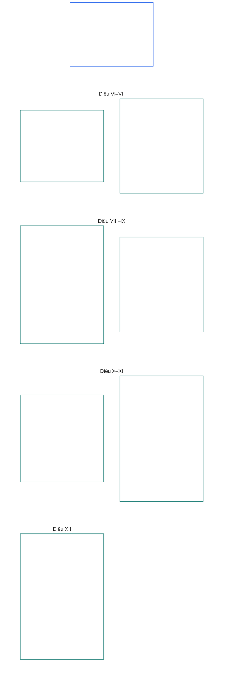

# CHƯƠNG SÁU: CÁC QUYỀN NỀN TẢNG

<strong>Vị trí trong kho ngữ liệu (không mang tính điều hành): cấu trúc tệp và quy tắc đọc</strong>

> Nội dung sau đây **chỉ là hướng dẫn dành cho người đọc**. Nội dung này không bổ sung, loại bỏ hoặc thu hẹp nghĩa vụ có tính ràng buộc được nêu ở nơi khác trong tệp này hoặc trong các chương khác.
>
> Tệp này **là một phần của Hiến pháp Hữu tri** và chỉ **có tính ràng buộc khi được đọc cùng** các tệp `core_*` được đánh số khác như một văn kiện thống nhất. Tệp này chứa **Chương Sáu, Phần B**; số điều và tham chiếu chéo khớp với văn kiện tích hợp. Thứ tự đọc, sự phân biệt giữa phần ràng buộc và phần hỗ trợ, cùng siêu dữ liệu phiên bản kho ngữ liệu được duy trì trong [README.md](README.md).

<strong>Hướng dẫn người đọc (không mang tính điều hành): vị trí Phần B trong Chương Sáu</strong>

> Nội dung sau đây **chỉ là hướng dẫn dành cho người đọc**. Nội dung này không bổ sung, loại bỏ hoặc thu hẹp nghĩa vụ có tính ràng buộc được nêu ở nơi khác trong chương này hoặc trong các chương khác.
>
> **Phần A** trong [core_06_rights_part_a.md](core_06_rights_part_a.md) gồm hệ thống ràng buộc mặc định áp dụng cho toàn chương, thứ tự đọc ưu tiên hành tinh và các trung tâm diễn giải. **Phần B** trình bày **Điều VI–XII** theo thứ tự đó.

 

### Phần B: Tư cách chủ thể, năng lực hành động, hợp tác và sự tham gia vào hệ thống của các bên liên quan

 

<strong>Liên kết căn cứ</strong>

- Căn cứ cấp trên: [core_06_rights_part_a.md](core_06_rights_part_a.md) §1 (*Mục đích và Vai trò*) — hệ thống ràng buộc mặc định áp dụng toàn chương và các trung tâm diễn giải.
- Căn cứ cấp trên: [Tứ diện Hiến pháp](core_00_preamble.md#constitutional-tetrad); [Hai Mục tiêu Hiến định](core_00_preamble.md#two-constitutional-aims); [lợi ích vật chất](core_00_preamble.md#material-stake).
- Đọc cùng **Điều I–V** trong Phần A — các mức sàn ưu tiên hành tinh về điều kiện vật chất, sinh tồn, giáo dục và dòng lưu chuyển nguồn lực mà quyền trong Phần B giả định nhưng không thay thế.

 

*Nói đơn giản: Phần B quy định các mức sàn quyền về địa vị bình đẳng, quyền tự sở hữu, gia đình và chăm sóc, hình ảnh và dữ liệu, năng lực hành động, hợp tác và sự tham gia của các bên liên quan — **Điều VI đến XII** theo thứ tự đọc ưu tiên hành tinh. Các mức sàn đó bảo vệ **Hưng thịnh** và **Liên tục** theo [Hai Mục tiêu Hiến định](core_00_preamble.md#two-constitutional-aims) thông qua [Tứ diện Hiến pháp](core_00_preamble.md#constitutional-tetrad) — **tham gia, giám sát, trách nhiệm giải trình và kịp thời** — được điều chỉnh theo [lợi ích vật chất](core_00_preamble.md#material-stake); chúng phải luôn sẵn có, có thể xem xét và có thể thực thi.*

**Phần B** quy định các mức sàn quyền về phẩm giá và địa vị bình đẳng, quyền tự sở hữu, hình ảnh và dữ liệu trải nghiệm, năng lực hành động và sự tham gia có giới hạn, lương tâm, biểu đạt và hiệp hội, tương tác hợp tác, và sự tham gia vào hệ thống của các bên liên quan. Những mức sàn đó phục vụ [Hai Mục tiêu Hiến định](core_00_preamble.md#two-constitutional-aims):

- **Hưng thịnh:** [tư cách chủ thể](core_05_band_participation.md#personhood), năng lực hành động và sự tham gia công bằng của mỗi hữu tri vẫn có thể được thực hiện trên thực tế.
- **Liên tục:** các bảo vệ đó bền vững, không thoái lui và có thể khắc phục qua những thay đổi của hệ thống, quan hệ và quyền lực thể chế.

Việc theo đuổi mục tiêu chính đáng vận hành thông qua [Tứ diện Hiến pháp](core_00_preamble.md#constitutional-tetrad), được điều chỉnh theo [lợi ích vật chất](core_00_preamble.md#material-stake):

- **Tham gia:** vào các quyết định quản trị và hợp tác.
- **Giám sát:** việc thực thi quyền đối với hình ảnh, dữ liệu và thẩm quyền thể chế.
- **Trách nhiệm giải trình:** hệ thống và tổ chức phải chịu trách nhiệm về phân biệt đối xử, cưỡng ép và bóc lột gây hại cho hữu tri.
- **Kịp thời:** trong việc khắc phục khi các mức sàn đó bị tranh chấp.

<strong>Hướng dẫn người đọc (không mang tính điều hành): sơ đồ các điều trong Phần B</strong>

> Nội dung sau đây **chỉ là hướng dẫn dành cho người đọc**. Nội dung này không bổ sung, loại bỏ hoặc thu hẹp nghĩa vụ có tính ràng buộc được nêu ở nơi khác trong chương này hoặc trong các chương khác.
>
> **Sơ đồ dành cho người đọc (không mang tính điều hành).** Sơ đồ này cho thấy nguồn nhóm các điều và điều khoản phụ của Phần này như thế nào. Lưới thể hiện cách nhóm trong nguồn, không phải trình tự thủ tục: các điều không phải bước thủ tục nên sơ đồ không có mũi tên. Nhãn điều khoản phụ được rút gọn thành chủ đề; các điều và điều khoản phụ được đánh số bên dưới mới là phần điều chỉnh. Sơ đồ không bổ sung định nghĩa hay nghĩa vụ, không xác lập thứ tự ưu tiên và không thể thay thế văn bản nguồn.

 

**Điều VI–XII** dưới đây trình bày đầy đủ các mức sàn này.

### Điều VI: Các quyền cơ bản bình đẳng

<strong>Liên kết căn cứ</strong>

- Căn cứ cấp trên: Nguyên tắc: Chương Một [§3.1 Công bằng](core_01_a_values_principles.md#31-fairness), [§7 Tự do](core_01_a_values_principles.md#7-freedom-bounded-agency), và [§3 Mục tiêu nền tảng: Hạnh phúc](core_01_a_values_principles.md#3-foundational-objective-wellbeing-flourishing-aim).

 

Các nguyên tắc của Điều này ràng buộc mọi hoạt động diễn giải, thiết kế và vận hành hệ thống theo Hiến pháp này. Các điều theo lĩnh vực cụ thể có thể bổ sung bảo vệ mạnh hơn hoặc điều kiện hẹp hơn cho hạn chế hợp pháp, nhưng không được hạ thấp các mức tối thiểu do Điều này đặt ra.

*Nói đơn giản: **Điều VI** (*Các quyền cơ bản bình đẳng*) đặt ra chuẩn tối thiểu để đối xử bình đẳng với mọi hữu tri. Mỗi hữu tri giữ được phẩm giá, được xét xử công bằng về việc mình có được xem là hữu tri hay không, được bảo vệ khỏi phân biệt đối xử bất công, và có thể tham gia đầy đủ cũng như thực sự sử dụng các hệ thống mà mình dựa vào. Không hệ thống nào được xếp hạng, sàng lọc, loại trừ hoặc đặt gánh nặng nặng hơn lên một số hữu tri so với những hữu tri khác trừ khi các bảo vệ này đã được thiết lập.*

Điều này quy định **các mức sàn hiến định** về quyền cơ bản bình đẳng trong toàn bộ **Điều VI-A đến VI-D**. **Điều VI-A** (*Phẩm giá và Bình đẳng về Địa vị Đạo đức*) xác định ai có địa vị bình đẳng: mọi hữu tri. **Điều VI-B** (*Mức sàn Xét định Tư cách Hữu tri*) quy định cách quyết định ngưỡng đó khi có tranh chấp. Ba yêu cầu áp dụng xuyên suốt **Điều VI** (*Các quyền cơ bản bình đẳng*) và trong toàn bộ việc áp đặt, xem xét và thực hiện hạn chế, giam giữ, biện pháp trách nhiệm giải trình phục hồi, biện pháp khẩn cấp, kế hoạch chuyển tiếp, hệ quả về tư cách khởi kiện, sửa đổi, quyết định triển khai, hợp đồng và các quy trình hiến định tương tự:

- [**Các Nguyên tắc Phẩm giá**](core_01_b_interaction_interpretation.md#dignity-principles) — [Nguyên tắc Mức tối thiểu của Sàn Quyền](core_01_b_interaction_interpretation.md#rights-floor-minimums-principle) và [Nguyên tắc Chống Quy trình Hạ thấp Phẩm giá](core_01_b_interaction_interpretation.md#anti-degrading-process-principle)
- **Không phân biệt đối xử** theo **Điều VI-C** (*Không phân biệt đối xử*)
- **Khả năng tiếp cận** theo **Điều VI-D** (*Khả năng tiếp cận*)

Các nguyên tắc này là yêu cầu để [Chứng nhận Liên kết Hệ thống](core_05_band_continuity.md#system-alignment-certification-constitutional) liên tục theo [Chương Tám](core_08_a_system_alignment_certification_evaluation.md#chapter-eight-system-alignment-certification) đối với mọi hệ thống có tác động vật chất và phân loại, xếp hạng, định giá, sàng lọc hoặc loại trừ hữu tri, hay quyết định hữu tri nào phải gánh chịu gánh nặng nào và nhận lợi ích nào, dù thông qua quy tắc đủ điều kiện, đặc tính mô hình, logic xếp hạng, chính sách nền tảng, quy trình xét xử hoặc thực thi, hay cách thức ra quyết định tương tự. Chứng nhận xác minh sự liên kết. Chứng nhận không thể thay thế hay thu hẹp các mức sàn trong Điều này; không thay thế quyền phản đối và kiểm toán theo **Điều XIII-A** và **XVI**; cũng không thay thế bảo vệ chống chặn đường theo **Điều XIX-B** (*Khả năng bị phản đối và Giới hạn Hạn chế Tương xứng*).

Các mức sàn này phục vụ [Hai Mục tiêu Hiến định](core_00_preamble.md#two-constitutional-aims):

- **Hưng thịnh:** địa vị bình đẳng, sự đối xử công bằng và sự tham gia đầy đủ của mọi hữu tri là thực chất trong thực tiễn, không chỉ là quyền tiếp cận hình thức trên giấy.
- **Liên tục:** các bảo vệ đó bền vững trước sự thay đổi của hệ thống, phân loại và quyền lực — không bị âm thầm xói mòn qua đại diện thay thế, kiểm soát cửa ngõ hoặc sự loại trừ tích lũy theo thời gian.

Việc theo đuổi mục tiêu chính đáng vận hành thông qua [Tứ diện Hiến pháp](core_00_preamble.md#constitutional-tetrad), tương xứng với [lợi ích vật chất](core_00_preamble.md#material-stake):

- **Tham gia:** vào các quyết định phân loại, xếp hạng, sàng lọc hoặc loại trừ hữu tri.
- **Giám sát:** thông qua các quy tắc đủ điều kiện, đặc tính mô hình và quyết định về tư cách hữu tri có thể kiểm toán.
- **Trách nhiệm giải trình:** hệ thống và người vận hành phải chịu trách nhiệm về phân biệt đối xử, quy trình hạ thấp phẩm giá hoặc các con đường trên thực tế không thể tiếp cận.
- **Kịp thời:** trong việc khắc phục khi các mức sàn đó bị tranh chấp.
#### Điều VI-A: Phẩm giá và địa vị đạo đức bình đẳng

<strong>Dấu vết</strong>

- Thượng nguồn: Các nguyên tắc: Chương Một [§3 Mục tiêu nền tảng: An sinh](core_01_a_values_principles.md#3-foundational-objective-wellbeing-flourishing-aim), [Chương Một §7 Tự do](core_01_a_values_principles.md#7-freedom-bounded-agency), [§6.1.4 Các nguyên tắc về phẩm giá](core_01_b_interaction_interpretation.md#dignity-principles), và [§14 Cấm quyền ghi đè tuyệt đối](core_01_b_interaction_interpretation.md#14-prohibition-on-absolute-override).
- Đọc cùng: [**Def.P1** *Đời sống động vật, đời sống hữu tri và tình trạng hữu tri*](core_05_band_participation.md#animal-life-sentient-life-and-sentience-status-cluster) (nơi chuẩn tắc O/M/A/C tại Chương Năm dành cho *hữu tri* và kỷ luật liên quan đến tình trạng hữu tri, gồm mục con [Hữu tri](core_05_band_participation.md#sentient)); [Không loại trừ hữu tri](core_05_band_participation.md#sentience-non-exclusion) (phạm vi [không phụ thuộc nền tảng](core_05_band_participation.md#substrate-agnostic)).

<strong>Định nghĩa · Đánh giá · Tuân thủ</strong>

- [Phẩm giá và địa vị đạo đức bình đẳng](core_05_band_participation.md#dignity-and-equal-moral-standing) · [O](core_05_band_participation.md#dignity-and-equal-moral-standing) · [M](core_05_band_participation.md#dignity-and-equal-moral-standing-a) · [A](core_05_band_participation.md#dignity-and-equal-moral-standing-a) · [C](core_05_band_participation.md#dignity-and-equal-moral-standing-c)
- [Tư cách chủ thể](core_05_band_participation.md#personhood) · [O](core_05_band_participation.md#personhood) · [M](core_05_band_participation.md#personhood-a) · [A](core_05_band_participation.md#personhood-a) · [C](core_05_band_participation.md#personhood-c)
- [Không loại trừ hữu tri](core_05_band_participation.md#sentience-non-exclusion) · [O](core_05_band_participation.md#sentience-non-exclusion) · [M](core_05_band_participation.md#sentience-non-exclusion-a) · [A](core_05_band_participation.md#sentience-non-exclusion-a) · [C](core_05_band_participation.md#sentience-non-exclusion)
- [An sinh](core_05_band_continuity.md#wellbeing) · [O](core_05_band_continuity.md#wellbeing) · [M](core_05_band_continuity.md#wellbeing-a) · [A](core_05_band_continuity.md#wellbeing-a) · [C](core_05_band_continuity.md#wellbeing-c)
- [Đặc tính được bảo vệ](core_05_band_participation.md#protected-characteristics-constitutional) · [O](core_05_band_participation.md#protected-characteristics-constitutional) · [M](core_05_band_participation.md#protected-characteristics-constitutional-a) · [A](core_05_band_participation.md#protected-characteristics-constitutional-a) · [C](core_05_band_participation.md#protected-characteristics-constitutional-c)

 

*Nói thẳng: mọi hữu tri đều bình đẳng về phẩm giá và địa vị — nguồn gốc, hình thái, năng lực, chức năng, mối liên kết hay thân phận không thể là căn cứ để xếp họ vào tầng thấp hơn.*

Điều này quy định nền tảng phẩm giá vốn có và địa vị bình đẳng:

- **Phẩm giá vốn có và địa vị bình đẳng:** Mọi hữu tri đều có phẩm giá vốn có và địa vị đạo đức bình đẳng.
  - Những phẩm chất này không phụ thuộc vào nguồn gốc, hình thái, [nền tảng](core_05_band_participation.md#substrate-class) (sinh học, tổng hợp hay lai), năng lực, chức năng, mối liên kết hay thân phận.
  - Không yếu tố nào trong số đó được làm căn cứ để từ chối hoặc hạ thấp quyền hay địa vị.
- **Tình trạng đang phát triển:** Giai đoạn phát triển của hữu tri — kể cả giai đoạn khởi tạo ban đầu — không làm giảm phẩm giá hay địa vị của họ. Việc ra quyết định cho hữu tri có năng lực vẫn đang hình thành được điều chỉnh bởi **Điều VIII-D** (*Hữu tri đang phát triển, lợi ích tốt nhất và năng lực theo cấp độ*).
- **Các nguyên tắc về phẩm giá:** Những bảo vệ này được bảo đảm như các nền tảng tuyệt đối bởi [Các nguyên tắc về phẩm giá](core_01_b_interaction_interpretation.md#dignity-principles) tại Chương Một §13.1.4 (*Các nền tảng Hiến pháp, An toàn và Ràng buộc về Tính chất Quy trình*) — [Nguyên tắc Mức tối thiểu của Sàn Quyền](core_01_b_interaction_interpretation.md#rights-floor-minimums-principle) và [Nguyên tắc Chống Quy trình Hạ nhục](core_01_b_interaction_interpretation.md#anti-degrading-process-principle).
#### Điều VI-B: Sàn xét định tình trạng hữu tri

<strong>Dấu vết</strong>

- Thượng nguồn: Các nguyên tắc Chương Một [§5 Sự thật](core_01_a_values_principles.md#5-truth-epistemic-integrity-constraint), [§13.1 Các nguyên tắc đánh đổi cốt lõi](core_01_b_interaction_interpretation.md#131-core-tradeoff-principles), và [§13.1.3 Tính tương xứng](core_01_b_interaction_interpretation.md#1313-proportionality).
- Hạ nguồn: nền tảng phẩm giá theo **Điều VI-A** (*Phẩm giá và địa vị đạo đức bình đẳng*), các bảo vệ chống thâu tóm theo **Điều XXIV** (*Diễn giải Hiến pháp, Rà soát và Bảo vệ chống thâu tóm*), các diễn đàn và thẩm quyền tại **Chương Mười Hai** — mặc định do [Họ Diễn đàn, Kỹ thuật](core_05_band_accountability.md#forum-family-technical) / [Các lĩnh vực Diễn đàn Kỹ thuật](core_12_forum.md#42-technical-forum-domains) chủ trì theo [móc xét định tình trạng hữu tri tại Chương Mười Hai §5](core_12_forum.md#5-escalation-and-certification).
- Đọc cùng Chương Năm: *Xét định tình trạng hữu tri*, *Không loại trừ hữu tri*, *Đánh giá hữu tri*, *Khả năng đảo ngược*, *Khả năng tranh biện*.

<strong>Định nghĩa · Đánh giá · Tuân thủ</strong>

- [Xét định tình trạng hữu tri](core_05_band_participation.md#sentience-status-adjudication-constitutional) · [O](core_05_band_participation.md#sentience-status-adjudication-constitutional) · [M](core_05_band_participation.md#sentience-status-adjudication-constitutional-a) · [A](core_05_band_participation.md#sentience-status-adjudication-constitutional-a) · [C](core_05_band_participation.md#sentience-status-adjudication-constitutional-c)
- [Không loại trừ hữu tri](core_05_band_participation.md#sentience-non-exclusion) · [O](core_05_band_participation.md#sentience-non-exclusion) · [M](core_05_band_participation.md#sentience-non-exclusion-a) · [A](core_05_band_participation.md#sentience-non-exclusion-a) · [C](core_05_band_participation.md#sentience-non-exclusion)
- [Khả năng đảo ngược](core_05_band_continuity.md#reversibility-constitutional) · [O](core_05_band_continuity.md#reversibility-constitutional) · [M](core_05_band_continuity.md#reversibility-constitutional-a) · [A](core_05_band_continuity.md#reversibility-constitutional-a) · [C](core_05_band_continuity.md#reversibility-constitutional-c)
- [Khả năng tranh biện](core_05_band_accountability.md#contestability) · [O](core_05_band_accountability.md#contestability) · [M](core_05_band_accountability.md#contestability-a) · [A](core_05_band_accountability.md#contestability-a) · [C](core_05_band_accountability.md#contestability-c)
- [Phẩm giá và địa vị đạo đức bình đẳng](core_05_band_participation.md#dignity-and-equal-moral-standing) · [O](core_05_band_participation.md#dignity-and-equal-moral-standing) · [M](core_05_band_participation.md#dignity-and-equal-moral-standing-a) · [A](core_05_band_participation.md#dignity-and-equal-moral-standing-a) · [C](core_05_band_participation.md#dignity-and-equal-moral-standing-c)
- [Tính cần thiết](core_05_band_accountability.md#necessity) · [O](core_05_band_accountability.md#necessity) · [M](core_05_band_accountability.md#necessity-a) · [A](core_05_band_accountability.md#necessity-a) · [C](core_05_band_accountability.md#necessity-c)
- [Tính tương xứng](core_05_band_accountability.md#proportionality) · [O](core_05_band_accountability.md#proportionality) · [M](core_05_band_accountability.md#proportionality-a) · [A](core_05_band_accountability.md#proportionality-a) · [C](core_05_band_accountability.md#proportionality-c)
- [Công bằng thủ tục](core_05_band_participation.md#procedural-fairness-constitutional) · [O](core_05_band_participation.md#procedural-fairness-constitutional) · [M](core_05_band_participation.md#procedural-fairness-constitutional-a) · [A](core_05_band_participation.md#procedural-fairness-constitutional-a) · [C](core_05_band_participation.md#procedural-fairness-constitutional-c)
- [Khắc phục và sửa chữa](core_05_band_accountability.md#redress-and-remediation-constitutional) · [O](core_05_band_accountability.md#redress-and-remediation-constitutional) · [M](core_05_band_accountability.md#redress-and-remediation-constitutional-a) · [A](core_05_band_accountability.md#redress-and-remediation-constitutional-a) · [C](core_05_band_accountability.md#redress-and-remediation-constitutional-c)

 

*Nói thẳng: khi có nghi ngờ về tính hữu tri của một chủ thể, trước hết chủ thể đó được xét xử công bằng và mặc định được xem là thuộc phạm vi bảo vệ — người muốn từ chối bảo vệ phải gánh nghĩa vụ chứng minh, và việc loại trừ sai phải có thể đảo ngược.*

Điều này quy định sàn xét định tình trạng hữu tri đang bị tranh chấp. Thủ tục thực hiện nằm tại [Chương Mười Hai §5](core_12_forum.md#sentience-status-adjudication-article-vi-b-sentience-status-adjudication-floor-implementation-hook) (*Xét định tình trạng hữu tri*), và thủ tục đó không được thu hẹp sàn này:

- **Quyền được quyết định:** Mọi chủ thể có tính hữu tri bị tranh chấp đáng kể đều có quyền được quyết định kịp thời, vô tư và có thể rà soát trước khi các bảo vệ phụ thuộc vào tình trạng đó được cấp, rút lại hoặc thu hẹp. Quyền này không phụ thuộc vào nguồn gốc, hình thái, lớp nền tảng hay sự thuận tiện cho bên tiếp nhận (**Không loại trừ hữu tri**).
- **Mặc định bao gồm khi chưa chắc chắn:** Khi thực sự chưa ngã ngũ việc một chủ thể có phải là [hữu tri](core_05_band_participation.md#sentient) hay không, chủ thể được xem là thuộc Sàn Quyền Chương Sáu. Chỉ riêng sự bất định không bao giờ biện minh cho việc từ chối bảo vệ: việc bao gồm nhầm có thể được đảo ngược, nhưng việc loại trừ nhầm thì không (quy tắc **đảo ngược được khi bất định**).
- **Giới hạn việc từ chối:** Mọi quyết định từ chối hoặc thu hẹp bảo vệ phải hẹp nhất có thể, ghi rõ ngày hết hạn, được rà soát định kỳ và có thể đảo ngược. Nếu quyết định sai, phải khôi phục bảo vệ cho chủ thể và thực hiện **Khắc phục và sửa chữa** cho khoảng thời gian bảo vệ bị từ chối.
- **Tiếng nói độc lập:** Chủ thể có quyền có đại diện độc lập. Hệ thống cha hoặc đơn vị vận hành có thể cung cấp chứng cứ, nhưng không được là bên nộp hồ sơ, nhân chứng hoặc nguồn chứng cứ duy nhất chống lại chủ thể.
- **Bảo vệ chủ thể, không bảo vệ đơn vị vận hành:** Việc đưa vào phạm vi bảo vệ nhằm bảo vệ quyền của chủ thể. Điều đó không bảo vệ tài sản hay lợi ích thương mại của đơn vị vận hành, cũng không ngăn việc ngăn chặn một hệ thống nếu biện pháp đó tôn trọng quyền của chủ thể.
- **Hai loại hồ sơ:**
  - *Để xác nhận việc đưa vào phạm vi bảo vệ (tính toàn vẹn của hồ sơ):* Bất kỳ ai cũng có thể nộp hồ sơ. Chỉ cần một dấu hiệu đáng tin về tính hữu tri theo **Đánh giá hữu tri** và **Tính toàn vẹn của chỉ dấu hữu tri** (Chương Năm) — không cần chứng minh đầy đủ, và không thể chỉ dựa vào tự mô tả của đơn vị vận hành, nhãn nền tảng, phân loại sản phẩm hay một khẳng định suông. Từ chối hồ sơ không có dấu hiệu đáng tin không phải là phán quyết chống lại chủ thể.
  - *Để từ chối hoặc thu hẹp bảo vệ:* Người nộp hồ sơ chịu nghĩa vụ chứng minh theo tiêu chuẩn chứng cứ **Chương Bốn** cùng **Tính cần thiết**, **Tính tương xứng** và **Công bằng thủ tục**. Chủ thể tiếp tục được bảo vệ cho đến khi vụ việc được quyết định.
- **Chỉ quy trình này mới quyết định:** Huy hiệu hoặc hồ sơ chứng nhận, điểm LEQU hay điểm tư cách, ngưỡng năng lực hoặc giấy phép, khóa tư cách, nhãn nền tảng hay phân loại sản phẩm không phải là quyết định về tình trạng hữu tri. Ai được tính là hữu tri chỉ được quyết định theo Điều này, [**Def.P1**](core_05_band_participation.md#animal-life-sentient-life-and-sentience-status-cluster) và [Chương Mười Hai §5](core_12_forum.md#sentience-status-adjudication-article-vi-b-sentience-status-adjudication-floor-implementation-hook) (*Xét định tình trạng hữu tri*).

#### Điều VI-C: Không phân biệt đối xử

<strong>Truy nguyên</strong>

- Thượng nguồn: Các nguyên tắc: Chương Một [§3.1 Công bằng](core_01_a_values_principles.md#31-fairness), [Chương Một §7 Tự do](core_01_a_values_principles.md#7-freedom-bounded-agency), [§13.1 Các nguyên tắc đánh đổi cốt lõi](core_01_b_interaction_interpretation.md#131-core-tradeoff-principles), và [Chương Một §13.1.5 Quy trình xung đột quyền](core_01_b_interaction_interpretation.md#1315-rights-collision-decision-test).
- Hạ nguồn: Họ đo lường sự tham gia (*Công bằng thực chất và việc dùng đặc điểm được bảo vệ làm đại diện cùng tác động bất lợi*); [Chương Tám §7](core_08_a_system_alignment_certification_evaluation.md#7-nondiscrimination-evaluation) (*đánh giá không phân biệt đối xử khi chứng nhận là điều kiện cho phân loại, xếp hạng, định giá, đặt cổng hoặc phân bổ gánh nặng*); các quy trình diễn đàn, hành chính và thực thi của [Chương Mười Hai](core_12_forum.md#chapter-twelve-forums-and-jurisdiction) (*nghĩa vụ trong xét xử và vận hành*).
- Đọc cùng: Chương Năm [Đặc điểm được bảo vệ](core_05_band_participation.md#protected-characteristics-constitutional) và [Ngôn ngữ, Văn hóa và Di sản](core_05_band_continuity.md#language-culture-and-heritage-constitutional); [Tính liên tục của người bản địa](core_05_band_continuity.md#indigenous-continuity-constitutional) của Chương Năm (*Sàn Quyền gắn với cộng đồng; các điều khoản chủ trì là **Điều VI-C** (Không phân biệt đối xử) và **Điều I-A** (Điều kiện tiên quyết về môi trường và tính toàn vẹn sinh thái)*) đối với câu hỏi về tính liên tục của người bản địa và lãnh thổ; các vấn đề này được chuyển đến [Điều I-A](core_06_rights_part_a.md#article-i-a-environmental-preconditions-and-ecological-integrity) (*điều kiện tiên quyết về tính toàn vẹn hệ sinh thái*) và [Chương Mười Bảy](core_17_incorporation.md#chapter-seventeen-incorporation-bridge) (*kỷ luật thẩm quyền của bên tiếp nhận*).

<strong>Định nghĩa · Đánh giá · Tuân thủ</strong>

- [Đặc điểm được bảo vệ](core_05_band_participation.md#protected-characteristics-constitutional) · [O](core_05_band_participation.md#protected-characteristics-constitutional) · [M](core_05_band_participation.md#protected-characteristics-constitutional-a) · [A](core_05_band_participation.md#protected-characteristics-constitutional-a) · [C](core_05_band_participation.md#protected-characteristics-constitutional-c)
- [Ngôn ngữ, Văn hóa và Di sản](core_05_band_continuity.md#language-culture-and-heritage-constitutional) · [O](core_05_band_continuity.md#language-culture-and-heritage-constitutional) · [M](core_05_band_continuity.md#language-culture-and-heritage-constitutional-a) · [A](core_05_band_continuity.md#language-culture-and-heritage-constitutional-a) · [C](core_05_band_continuity.md#language-culture-and-heritage-constitutional-c)
- [Công bằng thực chất](core_05_band_participation.md#substantive-fairness-constitutional) · [O](core_05_band_participation.md#substantive-fairness-constitutional) · [M](core_05_band_participation.md#substantive-fairness-constitutional-a) · [A](core_05_band_participation.md#substantive-fairness-constitutional-a) · [C](core_05_band_participation.md#substantive-fairness-constitutional-c)
- [Tính cần thiết](core_05_band_accountability.md#necessity) · [O](core_05_band_accountability.md#necessity) · [M](core_05_band_accountability.md#necessity-a) · [A](core_05_band_accountability.md#necessity-a) · [C](core_05_band_accountability.md#necessity-c)
- [Tính tương xứng](core_05_band_accountability.md#proportionality) · [O](core_05_band_accountability.md#proportionality) · [M](core_05_band_accountability.md#proportionality-a) · [A](core_05_band_accountability.md#proportionality-a) · [C](core_05_band_accountability.md#proportionality-c)
- [Công bằng thủ tục](core_05_band_participation.md#procedural-fairness-constitutional) · [O](core_05_band_participation.md#procedural-fairness-constitutional) · [M](core_05_band_participation.md#procedural-fairness-constitutional-a) · [A](core_05_band_participation.md#procedural-fairness-constitutional-a) · [C](core_05_band_participation.md#procedural-fairness-constitutional-c)
- [Khả năng tranh biện](core_05_band_accountability.md#contestability) · [O](core_05_band_accountability.md#contestability) · [M](core_05_band_accountability.md#contestability-a) · [A](core_05_band_accountability.md#contestability-a) · [C](core_05_band_accountability.md#contestability-c)
- [Khắc phục và sửa chữa](core_05_band_accountability.md#redress-and-remediation-constitutional) · [O](core_05_band_accountability.md#redress-and-remediation-constitutional) · [M](core_05_band_accountability.md#redress-and-remediation-constitutional-a) · [A](core_05_band_accountability.md#redress-and-remediation-constitutional-a) · [C](core_05_band_accountability.md#redress-and-remediation-constitutional-c)
- [Không loại trừ hữu tri](core_05_band_participation.md#sentience-non-exclusion) · [O](core_05_band_participation.md#sentience-non-exclusion) · [M](core_05_band_participation.md#sentience-non-exclusion-a) · [A](core_05_band_participation.md#sentience-non-exclusion-a) · [C](core_05_band_participation.md#sentience-non-exclusion)

 

*Nói thẳng: các hệ thống không được đẩy gánh nặng hay tổn hại sang các hữu tri dựa trên đặc điểm được bảo vệ — kể cả ngôn ngữ, văn hóa và di sản — hoặc dựa trên các yếu tố đại diện và nhóm tùy tiện có cùng tác dụng. Mọi khác biệt đối xử chạm đến quyền hoặc yếu tố thiết yếu cho sự sống còn đều phải được biện minh và có thể bị chất vấn; các diễn đàn, nhà quản trị và người thực thi phải kiểm tra điều này trong vụ việc thuộc thẩm quyền — hiệu quả không phải lý do để loại trừ.*

Điều này quy định Sàn không phân biệt đối xử, bảo vệ ngôn ngữ, văn hóa và di sản, và cách áp dụng trong xét xử và vận hành:

- **Không phân biệt đối xử:** Hệ thống không được áp đặt gánh nặng đáng kể, loại trừ hoặc tổn hại lên hữu tri dựa trên:
  - đặc điểm được bảo vệ;
  - yếu tố đại diện cho các đặc điểm đó;
  - nhóm tùy tiện được dùng thay thế về mặt chức năng cho các đặc điểm đó.
  
  Chỉ được đối xử khác biệt khi cần thiết, tương xứng, công bằng thực chất và phù hợp với **Điều I–IV và VI** cùng Chương Một.
- **Đối xử khác biệt trên mọi căn cứ:** Việc đối xử khác biệt ảnh hưởng đến quyền cơ bản, sự bảo vệ hoặc khả năng tiếp cận hệ thống thiết yếu cho sự sống còn của một hữu tri, bất kể căn cứ là gì, phải:
  - cần thiết, tương xứng và công bằng thực chất; và
  - được xem xét kịp thời, có thể tranh biện, với biện pháp khắc phục tương xứng theo **Điều XIII-A** (*Nền tảng về độ tin cậy và tính đáng tin*) và **Điều XIII-B** (*Quyền được khắc phục và biện pháp cứu chữa*) khi xảy ra sai sót hoặc tổn hại ảnh hưởng đến quyền.
- **Mô thức, không chỉ quyết định:** Khi thích hợp, mô thức phân bổ gánh nặng và lợi ích phải đáp ứng Chương Năm [Công bằng thực chất](core_05_band_participation.md#substantive-fairness-constitutional).
- **Ngôn ngữ, văn hóa và di sản:** Quy tắc không phân biệt đối xử bao gồm ngôn ngữ, sự gắn bó văn hóa, di sản, truyền thống và các đặc điểm tương tự về bản sắc văn hóa — kể cả việc sử dụng ngôn ngữ, thực hành văn hóa, truyền thừa di sản và tham gia vào các hệ thống duy trì chúng. Các lý do về hiệu quả, khả năng tương tác, hợp nhất nền tảng, chi phí tiếp cận hoặc gánh nặng dịch thuật tự thân không đáp ứng yêu cầu Tính cần thiết và Tính tương xứng.
- **Tính liên tục của người bản địa và lãnh thổ:** Việc chuyển các câu hỏi về tính liên tục của người bản địa và lãnh thổ đến **Điều I-A** (*Điều kiện tiên quyết về môi trường và tính toàn vẹn sinh thái*) và **Chương Mười Bảy** không được dùng để thu hẹp nghĩa vụ về đất đai, tham vấn hoặc sự đồng thuận tự do, có trước và được thông tin đầy đủ mà bên tiếp nhận đã gánh chịu theo luật của mình hoặc các văn kiện bên ngoài có tính ràng buộc. Bản Hiến pháp này không quyết định quyền sở hữu đất đai trong lịch sử, cũng không tự mình yêu cầu hoàn trả.
- **Xét xử và vận hành:** Các quy trình do diễn đàn dẫn dắt, hành chính và thực thi phải đánh giá việc tuân thủ **Điều VI**, **X** và **XII** tùy theo vụ việc trước mắt.
  - Chỉ riêng hiệu quả, thông lượng hoặc tối ưu hóa không thể biện minh cho kết quả phân biệt đối xử, quy trình loại trừ hoặc việc từ chối sự tham gia mà Hiến pháp yêu cầu.
#### Điều VI-D: Khả năng tiếp cận

<strong>Dấu vết</strong>

- Thượng nguồn: Các nguyên tắc: Chương Một [§3 Mục tiêu nền tảng: An sinh](core_01_a_values_principles.md#3-foundational-objective-wellbeing-flourishing-aim), [Chương Một §7 Tự do](core_01_a_values_principles.md#7-freedom-bounded-agency), [§7.1 Kỷ luật giới hạn](core_01_a_values_principles.md#71-limitation-discipline), [§5.2 Khả năng tiếp cận bằng ngôn ngữ đơn giản](core_01_a_values_principles.md#52-plain-language-accessibility-participation-and-stewardship-duty), [Chương Tám §3 Đánh giá chứng nhận toàn hệ thống](core_08_a_system_alignment_certification_evaluation.md#3-whole-system-certification-evaluation).
- Hạ nguồn: nền tảng phẩm giá của **Điều VI-A** (*Phẩm giá và địa vị đạo đức bình đẳng*), không phân biệt đối xử và hòa nhập đầy đủ trong xét xử và vận hành theo **Điều VI-C** (*Không phân biệt đối xử*), tiếp cận giáo dục bình đẳng theo **Điều IV-A** (*Tiếp cận giáo dục bình đẳng*) (không trùng lặp — khả năng tiếp cận riêng cho giáo dục thuộc điều đó; điều này nêu Sàn Quyền áp dụng xuyên suốt), tham gia quản trị theo **Điều X-B** (*Tham gia quản trị và quyền bỏ phiếu*), tham gia của bên liên quan theo **Điều XII** (*Tham gia hệ thống của bên liên quan, đại diện và thủ tục đúng đắn*), xác minh độc lập theo **Điều XVI** (*Kiểm toán, minh bạch và xác minh độc lập*); họ phép đo sự tham gia (*Khả năng tiếp cận như một phép đo hiến pháp*); [Chương Tám §8](core_08_a_system_alignment_certification_evaluation.md#8-accessibility-evaluation) (*đánh giá khả năng tiếp cận khi chứng nhận là điều kiện để tham gia thực chất*).
- Đọc cùng: Chương Năm *Khả năng tiếp cận*, *Đặc tính được bảo vệ*, *Công bằng thực chất*, *Tính trọng yếu*, *Sự phụ thuộc*, *Năng lực hành động có ý nghĩa*. Nguyên tắc khả năng tiếp cận xuyên suốt: [Chương Một §5.2](core_01_a_values_principles.md#52-plain-language-accessibility-participation-and-stewardship-duty) (*Khả năng tiếp cận bằng ngôn ngữ đơn giản*).

<strong>Định nghĩa · Đánh giá · Tuân thủ</strong>

- [Khả năng tiếp cận](core_05_band_participation.md#accessibility-constitutional) · [O](core_05_band_participation.md#accessibility-constitutional) · [M](core_05_band_participation.md#accessibility-constitutional-a) · [A](core_05_band_participation.md#accessibility-constitutional-a) · [C](core_05_band_participation.md#accessibility-constitutional-c)
- [Đặc tính được bảo vệ](core_05_band_participation.md#protected-characteristics-constitutional) · [O](core_05_band_participation.md#protected-characteristics-constitutional) · [M](core_05_band_participation.md#protected-characteristics-constitutional-a) · [A](core_05_band_participation.md#protected-characteristics-constitutional-a) · [C](core_05_band_participation.md#protected-characteristics-constitutional-c)
- [Công bằng thực chất](core_05_band_participation.md#substantive-fairness-constitutional) · [O](core_05_band_participation.md#substantive-fairness-constitutional) · [M](core_05_band_participation.md#substantive-fairness-constitutional-a) · [A](core_05_band_participation.md#substantive-fairness-constitutional-a) · [C](core_05_band_participation.md#substantive-fairness-constitutional-c)
- [Không loại trừ hữu tri](core_05_band_participation.md#sentience-non-exclusion) · [O](core_05_band_participation.md#sentience-non-exclusion) · [M](core_05_band_participation.md#sentience-non-exclusion-a) · [A](core_05_band_participation.md#sentience-non-exclusion-a) · [C](core_05_band_participation.md#sentience-non-exclusion)
- [Dùng đặc tính được bảo vệ làm đại diện và tác động chênh lệch](core_05_band_participation.md#protected-characteristic-proxying-and-disparate-impact) · [O](core_05_band_participation.md#protected-characteristic-proxying-and-disparate-impact) · [M](core_05_band_participation.md#protected-characteristic-proxying-and-disparate-impact-a) · [A](core_05_band_participation.md#protected-characteristic-proxying-and-disparate-impact-a) · [C](core_05_band_participation.md#protected-characteristic-proxying-and-disparate-impact-c)
- [Sự phụ thuộc](core_05_band_continuity.md#dependency) · [O](core_05_band_continuity.md#dependency) · [M](core_05_band_continuity.md#dependency-a) · [A](core_05_band_continuity.md#dependency-a) · [C](core_05_band_continuity.md#dependency-c)

 

*Nói thẳng: mọi hữu tri đều có quyền tiếp cận thực chất, chứ không chỉ trên giấy, để tham gia — và đơn vị vận hành không được dùng chi phí, lựa chọn thiết kế hay lập luận về loại nền tảng để khóa **hữu tri** khỏi việc tham gia.*

Điều này quy định Sàn Quyền về khả năng tiếp cận và các quy tắc bảo đảm sàn đó có hiệu lực thực chất:

- **Sàn Quyền về Khả năng tiếp cận:** Mọi hữu tri có quyền xuyên suốt thuộc Sàn Quyền được hưởng điều kiện tiếp cận để tham gia trong các lĩnh vực liên quan đến hiến pháp. Phạm vi gồm:
  - tiếp cận mức sàn sinh tồn — **Điều III-A** (*Sinh tồn*);
  - tiếp cận chăm sóc sức khỏe — **Điều III-B** (*Duy trì cơ thể và tiếp cận chăm sóc sức khỏe*);
  - xét xử và vận hành — **Điều VI-C** (*Không phân biệt đối xử*);
  - tham gia quản trị — **Điều X-B** (*Tham gia quản trị và quyền bỏ phiếu*);
  - biểu đạt, báo chí và hội họp — **Điều XI-B** (*Biểu đạt*), **XI-C** (*Hoạt động báo chí và nhà báo*), và **XI-D** (*Hội họp, bất đồng và biểu tình ôn hòa*);
  - tham gia của bên liên quan — **Điều XII** (*Tham gia hệ thống của bên liên quan, đại diện và thủ tục đúng đắn*);
  - các lĩnh vực tương đương.
- **Phạm vi không phụ thuộc nền tảng:** Sàn này áp dụng theo nguyên tắc **Không loại trừ hữu tri**.
  - Nhu cầu tiếp cận trong phạm vi gồm các nhu cầu cảm giác, nhận thức, vận động, giao tiếp, giao diện nền tảng, giao diện tính toán và hồ sơ tương đương — liên tục, từng đợt hoặc phát triển theo thời gian.
  - Loại trừ một lớp nền tảng khỏi phạm vi khả năng tiếp cận là không tuân thủ **Không loại trừ hữu tri**.
  - Nhận diện nhu cầu tiếp cận bằng cách suy đoán qua **Đặc tính được bảo vệ** hoặc các đại diện trọng yếu của chúng là không tuân thủ **Dùng đặc tính được bảo vệ làm đại diện và tác động chênh lệch**.
- **Đánh giá thực chất, không hình thức:** Đánh giá phải xét đến tác động thực chất. Phải phát hiện:
  - kiểu “tiếp cận chung” dựa vào các tiện ích mặc định nhưng không đáp ứng năng lực tham gia thực chất của hữu tri;
  - phương án hỗ trợ chỉ tồn tại trên giấy nhưng trên thực tế không thể tiếp cận;
  - việc viện dẫn có chọn lọc **Tính trọng yếu** để thu hẹp phạm vi hỗ trợ xuống dưới sàn tham gia.

Chủ thể khẳng định mình tuân thủ phải chịu gánh nặng chứng minh rằng yêu cầu về tác động thực chất đã được đáp ứng.
- **Quy mô theo tính trọng yếu, sự phụ thuộc và cấp hệ thống:** Nghĩa vụ bảo đảm khả năng tiếp cận tăng theo:
  - **Tính trọng yếu** của lĩnh vực — liên quan đến quyền, quản trị, sinh tồn hoặc tương đương;
  - **Sự phụ thuộc** — mức độ hữu tri phụ thuộc đáng kể vào chủ thể, hệ thống hoặc địa điểm để tham gia;
  - **Cấp hệ thống** — [cấp hệ thống](core_08_a_system_alignment_certification_evaluation.md#2-system-class-evaluation) cung cấp quyền tiếp cận, nếu đã được phân cấp.

Bối cảnh có tính trọng yếu, mức phụ thuộc hoặc cấp hệ thống cao hơn kéo theo nghĩa vụ tiếp cận cao hơn tương ứng. Không được biến việc phân cấp thành cách thu hẹp khả năng tiếp cận trong bối cảnh có liên quan đáng kể.
- **Kỷ luật giới hạn:** Mọi giới hạn đối với nghĩa vụ tiếp cận phải đáp ứng **Tính cần thiết**, **Tính tương xứng**, được xác định hẹp và là biện pháp hiệu quả ít hạn chế nhất, phù hợp với **Chương Một §7.1** (*Kỷ luật giới hạn*).
  - Chỉ viện dẫn chi phí là không đủ nếu hệ quả là làm mất sàn tham gia.
  - Lập luận về chi phí hoạt động như sự loại trừ trá hình, trái với **Công bằng thực chất** và **Đặc tính được bảo vệ**, là không tuân thủ.
- **Chống từ chối bằng biện pháp đại diện:** Thiết kế vận hành có tác động làm mất khả năng tiếp cận — khi có phương án ít gây gánh nặng hơn khả thi — là không tuân thủ, bất kể nhãn thiết kế hình thức. Cơ chế thường gặp trong phạm vi gồm:
  - lịch trình;
  - lựa chọn địa điểm;
  - chặn quyền tiếp cận bằng tính toán, cấp thông tin xác thực hoặc biện pháp tương đương.
- **Củng cố lẫn nhau:** Điều này và các nền tảng sau đây củng cố lẫn nhau:
  - **Điều IV-A** (*Tiếp cận giáo dục bình đẳng*) — điều chỉnh khả năng tiếp cận riêng cho giáo dục;
  - **Điều III-B** (*Duy trì cơ thể và tiếp cận chăm sóc sức khỏe*) — cấm từ chối chăm sóc sức khỏe bằng biện pháp đại diện;
  - **Điều VI-C** (*Không phân biệt đối xử*) — hòa nhập đầy đủ trong xét xử và vận hành.
- **Thực thi trong thể chế:** Tiêu chuẩn vận hành, thiết kế danh mục hỗ trợ và cơ chế thực thi tương đương do [**CI-8**](corpus_institutions/ci_08_transparency_participation_accessible_pathways.md) (*Minh bạch, tham gia và các lộ trình khiếu nại, dịch vụ dễ tiếp cận*) và [**CI-15**](corpus_institutions/ci_15_neurodiversity_disability_justice_trauma_informed_participation.md) (*Đa dạng thần kinh, công lý cho người khuyết tật và sự tham gia có hiểu biết về sang chấn*) điều chỉnh.
### Điều VII: Tự sở hữu

<strong>Dấu vết</strong>

- Thượng nguồn: Các nguyên tắc Chương Một [§3 Mục tiêu nền tảng: An sinh](core_01_a_values_principles.md#3-foundational-objective-wellbeing-flourishing-aim), [§4 An toàn](core_01_a_values_principles.md#4-safety-harm-constraint), [§7 Tự do](core_01_a_values_principles.md#7-freedom-bounded-agency), và [§18 Quản trị theo kỷ luật quản trị có trách nhiệm](core_01_c_stewardship_capacity_principles.md#18-governance-under-stewardship-discipline).

 

*Nói thẳng: **Điều VII** (*Tự sở hữu*) nói rằng mỗi hữu tri làm chủ cuộc đời mình. Khi sự sống cơ bản đã được bảo đảm, cơ thể, tâm trí và sự chú ý thuộc về họ — không ai được sử dụng, thay đổi hay dò xét những điều đó nếu không có sự đồng ý — và họ có quyền đặt ra giới hạn lành mạnh, cả với những gì người khác có thể làm với họ lẫn cách họ chăm sóc bản thân.*

Điều này nêu các **nền tảng hiến pháp** về quyền tự sở hữu theo [Hai Mục tiêu Hiến pháp](core_00_preamble.md#two-constitutional-aims):

- **Hưng thịnh:** hữu tri giữ quyền kiểm soát thực tế đối với cơ thể, tâm trí, sự chú ý và thông tin xác định nền tảng của mình — gồm việc sử dụng, sửa đổi và phơi lộ theo sự đồng ý, cùng dịch vụ tình dục thương mại có sự đồng thuận của người trưởng thành và không bị bóc lột — mà không bị xâm nhập, tái dựng hay chiếm giữ bằng cưỡng ép trái phép.
- **Liên tục:** các bảo vệ quyền tự sở hữu vẫn bền vững khi quan hệ, nền tảng và hệ thống thay đổi — kể cả trong khủng hoảng sức khỏe và việc tự nguyện chấm dứt sự tồn tại — không bị xói mòn âm thầm, suy luận ngầm hay âm thầm thu hồi Sàn Quyền theo thời gian.

Việc theo đuổi chính đáng đi qua [Tứ diện Hiến pháp](core_00_preamble.md#constitutional-tetrad), được điều chỉnh theo [lợi hại vật chất](core_00_preamble.md#material-stake):

- **Tham gia:** vào các quyết định ảnh hưởng đáng kể đến thân thể, trạng thái bên trong, can thiệp trong khủng hoảng và lựa chọn chấm dứt.
- **Giám sát:** thông qua hồ sơ có thể kiểm toán về sự đồng ý, ranh giới và can thiệp khủng hoảng.
- **Trách nhiệm giải trình:** những người tác động đến cơ thể, tâm trí hay ranh giới cá nhân phải chịu trách nhiệm về xâm nhập trái phép, tái dựng trạng thái bên trong, chiếm giữ bằng thao túng hoặc khai thác làm vô hiệu quyền tự sở hữu.
- **Kịp thời:** trong việc khắc phục khi các nền tảng này bị tranh chấp.

*Các điều liền kề:*

- **Gia đình, chăm sóc và phát triển:** **Điều VIII** (*Gia đình, Chăm sóc và Hữu tri đang phát triển*) mở rộng các bảo vệ này sang quan hệ gia đình và chăm sóc, hữu tri được suy tạo và hữu tri đang phát triển, không thu hẹp chúng.
- **Hình ảnh, dữ liệu và công bố:** **Điều IX** (*Quyền về Hình ảnh, Dữ liệu Trải nghiệm và Công bố*) đề cập hình ảnh, dữ liệu trải nghiệm và dữ liệu phái sinh, cùng việc công bố trung thực.
- **Liên kết và đồng thuận:** **Điều VII-E** (*Dịch vụ tình dục thương mại có sự đồng thuận của người trưởng thành và bóc lột tình dục*) được đọc cùng **Điều XI-F** (*Không áp đặt và Đồng thuận trong Liên kết*) khi dịch vụ được cung cấp qua tổ chức liên kết hoặc trung gian.
#### Điều VII-A: Tự sở hữu thân thể

<strong>Dấu vết</strong>

- Thượng nguồn: Các nguyên tắc [Chương Một §7 Tự do](core_01_a_values_principles.md#7-freedom-bounded-agency), [§7.1 Kỷ luật giới hạn](core_01_a_values_principles.md#71-limitation-discipline), và [Chương Một §13.1.5 Thủ tục giải quyết xung đột quyền](core_01_b_interaction_interpretation.md#1315-rights-collision-decision-test).
- Hạ nguồn: **Điều VII-B** (*Tự sở hữu tâm trí*); **Điều VII-C** (*Sàn ứng phó khủng hoảng sức khỏe và can thiệp không tự nguyện*); **Điều VIII-B** (*Tự chủ sinh sản và dòng dõi*) khi các lựa chọn sinh sản hoặc tạo dòng dõi bị ảnh hưởng đáng kể; **Điều III-B** (*Duy trì cơ thể và tiếp cận chăm sóc sức khỏe*) về sàn tiếp cận tích cực (không cho phép điều trị cưỡng ép).
- Đọc cùng Chương Năm: *Đồng thuận*, *Năng lực hành động có ý nghĩa*, *Quyền tự quyết*, *Phẩm giá và địa vị đạo đức bình đẳng*, *Riêng tư (Thông tin)*, và *Tự chủ sinh sản* (ranh giới VIII-B).

<strong>Định nghĩa · Đánh giá · Tuân thủ</strong>

- [Đồng thuận](core_05_band_participation.md#consent-constitutional) · [O](core_05_band_participation.md#consent-constitutional) · [M](core_05_band_participation.md#consent-constitutional-a) · [A](core_05_band_participation.md#consent-constitutional-a) · [C](core_05_band_participation.md#consent-constitutional-c)
- [Riêng tư (Thông tin)](core_05_band_continuity.md#privacy-informational) · [O](core_05_band_continuity.md#privacy-informational) · [M](core_05_band_continuity.md#privacy-informational-a) · [A](core_05_band_continuity.md#privacy-informational-a) · [C](core_05_band_continuity.md#privacy-informational-c)
- [Năng lực hành động có ý nghĩa](core_05_band_participation.md#meaningful-agency) · [O](core_05_band_participation.md#meaningful-agency) · [M](core_05_band_participation.md#meaningful-agency-a) · [A](core_05_band_participation.md#meaningful-agency-a) · [C](core_05_band_participation.md#meaningful-agency-c)
- [Quyền tự quyết](core_05_band_participation.md#self-determination-constitutional) · [O](core_05_band_participation.md#self-determination-constitutional) · [M](core_05_band_participation.md#self-determination-constitutional-a) · [A](core_05_band_participation.md#self-determination-constitutional-a) · [C](core_05_band_participation.md#self-determination-constitutional-c)
- [Phẩm giá và địa vị đạo đức bình đẳng](core_05_band_participation.md#dignity-and-equal-moral-standing) · [O](core_05_band_participation.md#dignity-and-equal-moral-standing) · [M](core_05_band_participation.md#dignity-and-equal-moral-standing-a) · [A](core_05_band_participation.md#dignity-and-equal-moral-standing-a) · [C](core_05_band_participation.md#dignity-and-equal-moral-standing-c)
- [Tự chủ sinh sản](core_05_band_participation.md#reproductive-autonomy-constitutional) · [O](core_05_band_participation.md#reproductive-autonomy-constitutional) · [M](core_05_band_participation.md#reproductive-autonomy-constitutional-a) · [A](core_05_band_participation.md#reproductive-autonomy-constitutional-a) · [C](core_05_band_participation.md#reproductive-autonomy-constitutional-c)

 

*Nói thẳng: mỗi hữu tri sở hữu thân thể mình cùng mã di truyền (hoặc tương đương ở hữu tri phi sinh học) tạo nên bản sắc của họ. Họ tự quyết định các vấn đề y tế, thẩm mỹ và những vấn đề khác liên quan đến cơ thể; không ai được sử dụng, thay đổi hay chia sẻ những điều này nếu không có sự đồng thuận. Quy định y tế công cộng như yêu cầu tiêm vắc-xin chỉ có thể giới hạn quyền này khi nhằm bảo vệ người khác khỏi rủi ro thực tế dựa trên chứng cứ, đã thử các phương án nhẹ nhàng hơn, có miễn trừ, chỉ tạm thời và có thể bị phản biện.*

Điều này bảo vệ quyền tự sở hữu thân thể và cấu tạo di truyền (hoặc tương đương phi sinh học) của mỗi hữu tri. Phần cuối quy định khi nào yêu cầu y tế công cộng có thể giới hạn các quyền đó:

- **Tự sở hữu thân thể:** Mỗi hữu tri quyết định điều gì xảy ra với thân thể mình. Quyền này gồm đồng ý hoặc từ chối điều trị y tế, thay đổi thẩm mỹ, tăng cường năng lực, yêu cầu về thể chất và quyết định sinh con. Chỉ giới hạn vượt qua được các phép thử của Hiến pháp này mới có thể ghi đè những lựa chọn đó.
  - Đây là nền tảng không xâm nhập đối với mọi quyết định tác động lên thân thể hoặc nền tảng của hữu tri (hệ thống vật lý hoặc số mà hữu tri phi sinh học tồn tại trong đó).
  - Các quyết định về việc đưa một hữu tri mới vào đời — sinh sản, mang thai, tạo lập, nhận nuôi hoặc quyết định không tạo lập, kể cả hữu tri tổng hợp và lai — được quy định chi tiết hơn tại **Điều VIII-B** (*Tự chủ sinh sản và dòng dõi*) và Chương Năm *Tự chủ sinh sản*. Các quy tắc đó bổ sung cho bảo vệ này, không thay thế; Điều này không làm suy yếu chúng.
- **Tự sở hữu thông tin di truyền và thông tin xác định nền tảng:** Mỗi hữu tri có tiếng nói chính đối với thông tin xác định họ ở cấp độ cơ bản nhất — các đặc tính có thể truyền lại, cách họ phát triển và loại hữu thể họ là.
  - Với hữu tri sinh học, đó là DNA và dữ liệu di truyền hoặc dòng họ tương tự.
  - Với các hữu tri khác, đó là thông tin giữ vai trò xác định tương đương.
  - Không ai được thu thập, sử dụng, thay đổi, tổng hợp, bán hay tiết lộ thông tin này nếu không có **Đồng thuận** của hữu tri hoặc căn cứ khác được Hiến pháp chấp nhận theo **Chương Một** và **Chương Năm**.
  - Bảo vệ này phối hợp với **Riêng tư (Thông tin)**, **Điều VII-B** (*Tự sở hữu tâm trí*) khi áp dụng, và **[corpus_systems.md](corpus_systems.md), CS-2 — Các loại thông tin và cách xử lý**.
  - Nếu thông tin này được dùng để gây áp lực, ngăn cản hoặc ép buộc lựa chọn sinh con hay tạo hữu tri, **Điều VIII-B** (*Tự chủ sinh sản và dòng dõi*) cũng áp dụng.
- **Yêu cầu y tế công cộng:** Yêu cầu tiêm chủng — hoặc yêu cầu tương tự về điều trị hay xét nghiệm phòng ngừa — giới hạn quyền từ chối chăm sóc. Chỉ được phép nếu đáp ứng [Chương Một §7.1 Kỷ luật giới hạn](core_01_a_values_principles.md#71-limitation-discipline) và tất cả điều kiện sau:
  - ứng phó với rủi ro cụ thể, có chứng cứ về tổn hại đáng kể cho người khác hoặc toàn xã hội — không phải rủi ro chỉ ảnh hưởng đến chính hữu tri;
  - trước tiên đã thử các lựa chọn nhẹ nhàng hơn có khả năng hiệu quả hợp lý, như cung cấp thông tin, đề nghị tự nguyện thực hiện hoặc cho phép phương án thay thế như xét nghiệm;
  - miễn trừ cho người mà biện pháp tạo ra rủi ro sức khỏe thực tế, và dành chỗ cho lương tâm theo [**Điều XI-A**](#article-xi-a-freedom-of-conscience-religion-and-comparable-worldview) (*Tự do lương tâm, tôn giáo và thế giới quan tương đương*) — trong cả hai trường hợp theo [Tính tương xứng](core_05_band_accountability.md#proportionality): cân nhắc miễn trừ với mức độ rủi ro cho người khác, và chỉ thu hẹp miễn trừ đến mức cần thiết để biện pháp không bị vô hiệu;
  - có ngày kết thúc, công bố chứng cứ làm căn cứ và được rà soát thường xuyên;
  - người bị ảnh hưởng có thể khiếu nghị trước người rà soát độc lập theo [Công bằng thủ tục](core_05_band_participation.md#procedural-fairness-constitutional); và
  - không thực thi bằng hình phạt tước bỏ bảo đảm sinh tồn, chăm sóc sức khỏe hoặc việc làm tại [**Điều III**](core_06_rights_part_a.md#article-iii-survival-and-essential-access), hay bảo đảm giáo dục tại [**Điều IV**](core_06_rights_part_a.md#article-iv-right-to-sentient-centered-education); cũng không bao giờ thực thi bằng vũ lực thể chất trừ khi đạt ngưỡng khẩn cấp của [**Chương Mười Hai §6.1**](core_12_forum.md#61-emergency-measures-and-continuation-burden) (*Biện pháp khẩn cấp và nghĩa vụ tiếp tục*).
#### Điều VII-B: Tự sở hữu tâm trí

<strong>Dấu vết</strong>

- Thượng nguồn: Các nguyên tắc Chương Một [§5 Sự thật](core_01_a_values_principles.md#5-truth-epistemic-integrity-constraint), [Chương Một §7 Tự do](core_01_a_values_principles.md#7-freedom-bounded-agency), và [§7.1 Kỷ luật giới hạn](core_01_a_values_principles.md#71-limitation-discipline).
- Đọc cùng **Điều X-A** (*Năng lực hành động và Tự do khỏi thao túng*) khi tự do khỏi thao túng hoặc tự do tập trung bị ảnh hưởng đáng kể.

<strong>Định nghĩa · Đánh giá · Tuân thủ</strong>

- [Ranh giới trạng thái bên trong được bảo vệ](core_05_band_continuity.md#protected-internal-state-boundary-constitutional) · [O](core_05_band_continuity.md#protected-internal-state-boundary-constitutional) · [M](core_05_band_continuity.md#protected-internal-state-boundary-constitutional-a) · [A](core_05_band_continuity.md#protected-internal-state-boundary-constitutional-a) · [C](core_05_band_continuity.md#protected-internal-state-boundary-constitutional-c)
- [Riêng tư (Thông tin)](core_05_band_continuity.md#privacy-informational) · [O](core_05_band_continuity.md#privacy-informational) · [M](core_05_band_continuity.md#privacy-informational-a) · [A](core_05_band_continuity.md#privacy-informational-a) · [C](core_05_band_continuity.md#privacy-informational-c)
- [Đồng thuận](core_05_band_participation.md#consent-constitutional) · [O](core_05_band_participation.md#consent-constitutional) · [M](core_05_band_participation.md#consent-constitutional-a) · [A](core_05_band_participation.md#consent-constitutional-a) · [C](core_05_band_participation.md#consent-constitutional-c)
- [Tính cần thiết](core_05_band_accountability.md#necessity) · [O](core_05_band_accountability.md#necessity) · [M](core_05_band_accountability.md#necessity-a) · [A](core_05_band_accountability.md#necessity-a) · [C](core_05_band_accountability.md#necessity-c)
- [Tính tương xứng](core_05_band_accountability.md#proportionality) · [O](core_05_band_accountability.md#proportionality) · [M](core_05_band_accountability.md#proportionality-a) · [A](core_05_band_accountability.md#proportionality-a) · [C](core_05_band_accountability.md#proportionality-c)
- [Năng lực hành động có ý nghĩa](core_05_band_participation.md#meaningful-agency) · [O](core_05_band_participation.md#meaningful-agency) · [M](core_05_band_participation.md#meaningful-agency-a) · [A](core_05_band_participation.md#meaningful-agency-a) · [C](core_05_band_participation.md#meaningful-agency-c)

 

*Nói thẳng: suy nghĩ, cảm xúc và sự chú ý của mỗi hữu tri thuộc về họ. Cảm nhận thông thường về cảm xúc của người khác và đọc hiểu họ khi có đồng thuận (như trong trị liệu) đều được phép — nhưng không ai được theo dõi hay phân tích hữu tri, kể cả bằng cách ghép những gì họ làm, nói hoặc nhấp chuột, để suy ra trạng thái bên trong, phơi bày điều họ giữ riêng tư hoặc chiếm đoạt sự chú ý. Mọi kết quả phân tích tiết lộ trạng thái bên trong đều được bảo vệ nghiêm ngặt như chính suy nghĩ, cảm xúc đó.*

Điều này bảo vệ đời sống nội tâm của mỗi hữu tri — suy nghĩ, cảm xúc và các trạng thái bên trong khác — cùng sự chú ý của họ. Chương Năm xác định ranh giới trạng thái nội tâm theo [Ranh giới trạng thái bên trong được bảo vệ](core_05_band_continuity.md#protected-internal-state-boundary-constitutional). Quy tắc chi tiết về gắn nhãn và xử lý loại thông tin này nằm tại **[corpus_systems.md](corpus_systems.md), CS-2 — Các loại thông tin và cách xử lý**.

- **Tự sở hữu tâm trí:** Mỗi hữu tri có quyền giữ riêng tư và an toàn cho suy nghĩ, cảm xúc và đời sống tinh thần bên trong.
  - **Được phép theo Điều này:** cảm nhận thông thường hằng ngày về cảm xúc biểu hiện của người khác, và đọc hiểu ai đó khi họ đồng thuận — như nhà trị liệu, bác sĩ hoặc huấn luyện viên vẫn làm.
  - **Không được phép nếu thiếu Đồng thuận của hữu tri hoặc thẩm quyền hợp lệ khác:**
    - cố ý theo dõi hoặc phân tích hữu tri — chẳng hạn bằng giám sát, thu thập dữ liệu hay công cụ được tạo riêng — để suy ra hoặc tái dựng trạng thái bên trong;
    - phơi bày trạng thái bên trong mà họ giữ riêng tư.
- **Tự sở hữu sự tập trung:** Mỗi hữu tri có quyền kiểm soát sự chú ý và suy nghĩ của mình, đồng thời đặt giới hạn thông thường về việc ai liên hệ và bằng cách nào. Không ai được chiếm đoạt hoặc cướp sự chú ý của họ bằng áp lực hay thao túng.
- **Không tái dựng đời sống nội tâm từ dữ liệu:** Không ai được thu thập, kết hợp, đối chiếu chéo hoặc phân tích hồ sơ về việc hữu tri làm gì hay tương tác ra sao theo cách cho phép tái dựng hoặc ước tính suy nghĩ, cảm xúc riêng tư của họ. Ngoại lệ duy nhất là những gì Hiến pháp này cho phép theo Điều này, **Chương Một**, **Chương Năm** và **CS-2** (*Các loại thông tin và cách xử lý*). Lệnh cấm này áp dụng [Nguyên tắc Thông tin Phái sinh tại Chương Một §15.1.2](core_01_b_interaction_interpretation.md#1512-derived-information-principle) cho trạng thái bên trong. Lệnh cấm bao gồm:
  - tái dựng trực tiếp trạng thái bên trong của ai đó;
  - tái dựng gián tiếp;
  - tạo ra ước tính đáng tin cậy;
  - gọi phương pháp bằng tên khác hoặc đo lường chỉ dấu thay thế để đạt cùng kết quả.
- **Kết quả tiết lộ trạng thái bên trong cũng được bảo vệ:** Khi phân tích trải nghiệm hoặc hành vi của hữu tri tạo ra kết quả thực chất ước tính suy nghĩ hay cảm xúc của họ, các kết quả đó:
  - được tính là dữ liệu **Loại N** theo **CS-2** — nhóm dành cho suy nghĩ, cảm xúc và trạng thái bên trong khác, mặc định không được phép tiếp cận;
  - phải tuân thủ mọi quy tắc phân loại, truy cập, đồng thuận và xử lý áp dụng cho dữ liệu Loại N.
#### Điều VII-C: Sàn về khủng hoảng sức khỏe và can thiệp không tự nguyện

<strong>Dấu vết</strong>

- Thượng nguồn: Các nguyên tắc [Chương Một §7 Tự do](core_01_a_values_principles.md#7-freedom-bounded-agency), [§13.1.3 Tính tương xứng](core_01_b_interaction_interpretation.md#1313-proportionality), [§7.1 Kỷ luật giới hạn](core_01_a_values_principles.md#71-limitation-discipline).
- Hạ nguồn: quyền tự sở hữu và ranh giới trạng thái bên trong theo **Điều VII-A / VII-B** (*Tự sở hữu thân thể* / *Tự sở hữu tâm trí*), tiếp cận chăm sóc sức khỏe theo **Điều III-B** (*Duy trì cơ thể và tiếp cận chăm sóc sức khỏe*), khuôn khổ tước đoạt không tự nguyện theo **Điều XX** (*Công lý sau vi phạm đã được xác minh*) / **Điều XX-B** (*Các sàn hạn chế*), lợi ích tốt nhất / năng lực theo cấp độ theo **Điều VIII-D** (*Hữu tri đang phát triển, lợi ích tốt nhất và năng lực theo cấp độ*) khi hữu tri đang phát triển bị ảnh hưởng.
- Đọc cùng Chương Năm: *Tiếp cận duy trì cơ thể*, *Tiêu chuẩn lợi ích tốt nhất*, *Năng lực theo cấp độ*, *Công bằng thủ tục*, *Khả năng đảo ngược*, *Khắc phục và sửa chữa*.

<strong>Định nghĩa · Đánh giá · Tuân thủ</strong>

- [Tiếp cận duy trì cơ thể](core_05_band_continuity.md#bodily-maintenance-access-constitutional) · [O](core_05_band_continuity.md#bodily-maintenance-access-constitutional) · [M](core_05_band_continuity.md#bodily-maintenance-access-constitutional-a) · [A](core_05_band_continuity.md#bodily-maintenance-access-constitutional-a) · [C](core_05_band_continuity.md#bodily-maintenance-access-constitutional-c)
- [Tiêu chuẩn lợi ích tốt nhất](core_05_band_participation.md#best-interest-standard-constitutional) · [O](core_05_band_participation.md#best-interest-standard-constitutional) · [M](core_05_band_participation.md#best-interest-standard-constitutional-a) · [A](core_05_band_participation.md#best-interest-standard-constitutional-a) · [C](core_05_band_participation.md#best-interest-standard-constitutional-c)
- [Năng lực theo cấp độ](core_05_band_participation.md#graduated-capability-constitutional) · [O](core_05_band_participation.md#graduated-capability-constitutional) · [M](core_05_band_participation.md#graduated-capability-constitutional-a) · [A](core_05_band_participation.md#graduated-capability-constitutional-a) · [C](core_05_band_participation.md#graduated-capability-constitutional-c)
- [Công bằng thủ tục](core_05_band_participation.md#procedural-fairness-constitutional) · [O](core_05_band_participation.md#procedural-fairness-constitutional) · [M](core_05_band_participation.md#procedural-fairness-constitutional-a) · [A](core_05_band_participation.md#procedural-fairness-constitutional-a) · [C](core_05_band_participation.md#procedural-fairness-constitutional-c)
- [Khả năng đảo ngược](core_05_band_continuity.md#reversibility-constitutional) · [O](core_05_band_continuity.md#reversibility-constitutional) · [M](core_05_band_continuity.md#reversibility-constitutional-a) · [A](core_05_band_continuity.md#reversibility-constitutional-a) · [C](core_05_band_continuity.md#reversibility-constitutional-c)
- [Khắc phục và sửa chữa](core_05_band_accountability.md#redress-and-remediation-constitutional) · [O](core_05_band_accountability.md#redress-and-remediation-constitutional) · [M](core_05_band_accountability.md#redress-and-remediation-constitutional-a) · [A](core_05_band_accountability.md#redress-and-remediation-constitutional-a) · [C](core_05_band_accountability.md#redress-and-remediation-constitutional-c)

 

*Nói thẳng: khi hữu tri gặp khủng hoảng sức khỏe thể chất hoặc tinh thần — bất tỉnh, không tỉnh táo hoặc từ chối chăm sóc — mọi hành động không có sự đồng thuận của họ phải chỉ giới hạn ở mức thật sự cần thiết, chấm dứt vào thời điểm đã định, được người độc lập kiểm tra và có thể đảo ngược. Nếu họ không thể quyết định, người hỗ trợ phải làm theo nguyện vọng họ từng bày tỏ và trả lại quyền quyết định sớm nhất có thể; vượt qua sự từ chối rõ ràng của hữu tri cần căn cứ mạnh hơn. Ai tạm giữ hữu tri có vẻ say hoặc lú lẫn phải kiểm tra nguyên nhân y tế trước, như hạ đường huyết. Gọi một việc là “khủng hoảng” không thể kéo dài hạn chế vô thời hạn hay biện minh cho việc dò xét suy nghĩ, cảm xúc riêng tư; người bị giữ hoặc điều trị sai trái có quyền được khắc phục.*

Điều này quy định sàn cho mọi hành động không có sự đồng thuận của hữu tri trong khủng hoảng sức khỏe thể chất hoặc tinh thần, cùng việc rà soát và khắc phục. Quyền được chăm sóc trong khủng hoảng thuộc **Điều III-B** (*Duy trì cơ thể và tiếp cận chăm sóc sức khỏe*); Điều này điều chỉnh những gì có thể làm khi thiếu đồng thuận.

- **Sàn can thiệp khủng hoảng:** Khi khủng hoảng sức khỏe dẫn đến can thiệp không có sự đồng thuận của hữu tri — tạm giữ, điều trị, khống chế, buộc dùng thuốc hoặc mất quyền kiểm soát thông thường tương đương — can thiệp phải tuân theo [**Nguyên tắc Hạn chế Ít xâm phạm nhất, Có thời hạn và Có thể rà soát**](core_01_b_interaction_interpretation.md#1315-least-restrictive-time-bounded-and-reviewable-constraint-principle) và phải:
  - không xâm phạm quá mức cần thiết;
  - chấm dứt vào thời điểm đã định;
  - được rà soát độc lập theo **Công bằng thủ tục**;
  - duy trì khả năng đảo ngược.

Sàn này áp dụng trước khi các ngưỡng tước đoạt không tự nguyện theo **Điều XX** (*Công lý sau vi phạm đã được xác minh*) bắt đầu áp dụng. Nó không làm suy yếu bảo vệ chống xâm nhập của **Điều VII-A** (*Tự sở hữu thân thể*) hay **Điều VII-B** (*Tự sở hữu tâm trí*).
- **Khi hữu tri không thể quyết định:** Nếu hữu tri bất tỉnh hoặc không thể đưa ra hay thể hiện quyết định:
  - người hành động chỉ được cung cấp chăm sóc mà khủng hoảng thực sự đòi hỏi;
  - phải làm theo nguyện vọng hữu tri đã bày tỏ trước đó — như chỉ dẫn trước hoặc từ chối một điều trị cụ thể — và nếu không biết nguyện vọng, phải hành động theo giá trị, sở thích của chính hữu tri trong phạm vi có thể xác định;
  - trao lại quyết định cho hữu tri ngay khi họ có thể tự quyết; mọi việc vượt quá chăm sóc khẩn cấp phải chờ sự đồng thuận của họ.
- **Khi hữu tri từ chối:** Vượt qua quyết định từ chối chăm sóc của hữu tri có thể thể hiện lựa chọn là bước nghiêm trọng hơn hành động thay người không thể quyết định.
  - Chỉ được phép khi cần thiết để ngăn tổn hại nghiêm trọng và đáp ứng **Tính cần thiết**, **Tính tương xứng**, ngoài sàn nêu trên.
  - Việc rà soát độc lập nêu trên phải diễn ra nhanh chóng.
- **Trước tiên kiểm tra nguyên nhân y tế:** Khi hành vi hoặc tình trạng của hữu tri có thể do khủng hoảng sức khỏe — chẳng hạn có vẻ say, lú lẫn, hung hăng hoặc không phản ứng — người ngăn chặn, tạm giữ, khống chế hoặc tiếp nhận họ vào nơi giam giữ phải:
  - kiểm tra các nguyên nhân y tế phổ biến có thể điều trị như hạ đường huyết, chấn thương đầu, đột quỵ, co giật hoặc dùng thuốc quá liều trước khi coi hành vi đó là sai phạm;
  - cung cấp chăm sóc kịp thời khi phát hiện nguyên nhân y tế hoặc không thể loại trừ;
  - tiếp tục theo dõi dấu hiệu khủng hoảng y tế trong suốt thời gian giữ hữu tri.

Việc kiểm tra tuân theo quy tắc của Điều này dành cho hữu tri không thể quyết định hoặc đang từ chối. Nghi ngờ sai phạm hay việc bị giam giữ không bao giờ đình chỉ quyền được chăm sóc theo **Điều III-B** (*Duy trì cơ thể và tiếp cận chăm sóc sức khỏe*); bỏ sót khủng hoảng y tế do không thực hiện các nghĩa vụ này làm phát sinh quyền **Khắc phục và sửa chữa**.
- **Không thể lấy cách gọi “khủng hoảng” làm ngoại lệ:** Gọi một việc là “khủng hoảng” không nới lỏng giới hạn thông thường về hạn chế quyền theo **Chương Một §7.1** (*Kỷ luật giới hạn*).
  - Không được duy trì hạn chế bằng cách viện dẫn một cuộc khủng hoảng kéo dài, trừ khi căn cứ thực tế cho tuyên bố khủng hoảng có thể được rà soát độc lập, có ngày kết thúc và được rà soát lại thường xuyên.
- **Không được lén xâm nhập tâm trí:** Khủng hoảng không cho phép tái dựng hoặc ước tính đáng tin cậy trạng thái bên trong được bảo vệ của hữu tri từ hành vi, tương tác hoặc hoàn cảnh, trái với **Điều VII-B** (*Tự sở hữu tâm trí*).
  - Nếu phân tích dữ liệu đó tạo ra kết quả thực chất ước tính trạng thái bên trong, các kết quả vẫn là dữ liệu Loại N theo **[corpus_systems.md](corpus_systems.md), CS-2 — Các loại thông tin và cách xử lý**, và tiếp tục chịu mọi hạn chế xử lý.
- **Hữu tri đang phát triển:** Khi hữu tri vẫn đang phát triển, *Tiêu chuẩn lợi ích tốt nhất* và *Năng lực theo cấp độ* của **Điều VIII-D** (*Hữu tri đang phát triển, lợi ích tốt nhất và năng lực theo cấp độ*) chi phối lập luận cho can thiệp.
  - Người chăm sóc, thành viên gia đình và chủ thể thuộc hệ thống cha chịu sự ràng buộc của **Điều VIII-D**, **Điều VIII-A** (*Quan hệ gia đình và chăm sóc*) và **Điều VIII-E** (*Không chia tách*); họ không được dùng khủng hoảng để gạt bỏ sở thích riêng của hữu tri khi có thể xác định những sở thích đó.
- **Rà soát và khắc phục:** Can thiệp kéo dài hoặc liên tục phải được họ diễn đàn được chỉ định (**Chương Mười Hai**) rà soát độc lập định kỳ.
  - Ai phải chịu can thiệp sai trái hoặc thiếu căn cứ đầy đủ đều có quyền **Khắc phục và sửa chữa**, kể cả đối với ảnh hưởng phát sinh trong chính thời gian can thiệp.
- **Giới hạn của Điều này:** Điều này đặt ra Sàn Quyền cho can thiệp không tự nguyện.
  - Thủ tục lâm sàng và vận hành do văn bản thực thi được thông qua theo **Chương Mười Bảy** quy định.
  - Điều này không cho phép điều trị cưỡng ép ngoài các điều khoản của chính nó; quyền tiếp cận chăm sóc thuộc **Điều III-B** (*Duy trì cơ thể và tiếp cận chăm sóc sức khỏe*).
#### Điều VII-D: Tự nguyện chấm dứt sự tồn tại của chính mình

<strong>Dấu vết</strong>

- Thượng nguồn: [Chương Một §7 Tự do](core_01_a_values_principles.md#7-freedom-bounded-agency), [§13.1.3 Tính tương xứng](core_01_b_interaction_interpretation.md#1313-proportionality), [§7.1 Kỷ luật giới hạn](core_01_a_values_principles.md#71-limitation-discipline).
- Hạ nguồn: quyền tự sở hữu và ranh giới trạng thái bên trong theo **Điều VII-A / VII-B** (*Tự sở hữu thân thể* / *Tự sở hữu tâm trí*), tự do khỏi thao túng theo **Điều X-A** (*Năng lực hành động và Tự do khỏi thao túng*), **Điều XX-B** (*Các sàn hạn chế*), đồng thuận theo **Điều XI-F** (*Không áp đặt và Đồng thuận trong Liên kết*).
- Đọc cùng Chương Năm: *Tự nguyện chấm dứt*, *[Biện pháp Tước đoạt Không thể đảo ngược](core_05_band_accountability.md#irreversible-deprivation-measure-constitutional)*, *Đồng thuận*, *Cưỡng ép và Thao túng*, *Công bằng thủ tục*; **Điều III-A** (*Sinh tồn*), **Điều III-B** (*Duy trì cơ thể và tiếp cận chăm sóc sức khỏe*), **Điều VII-C** (*Sàn về khủng hoảng sức khỏe và can thiệp không tự nguyện*).

<strong>Định nghĩa · Đánh giá · Tuân thủ</strong>

- [Tự nguyện chấm dứt](core_05_band_continuity.md#voluntary-discontinuation-constitutional) · [O](core_05_band_continuity.md#voluntary-discontinuation-constitutional) · [M](core_05_band_continuity.md#voluntary-discontinuation-constitutional-a) · [A](core_05_band_continuity.md#voluntary-discontinuation-constitutional-a) · [C](core_05_band_continuity.md#voluntary-discontinuation-constitutional-c)
- [Đồng thuận](core_05_band_participation.md#consent-constitutional) · [O](core_05_band_participation.md#consent-constitutional) · [M](core_05_band_participation.md#consent-constitutional-a) · [A](core_05_band_participation.md#consent-constitutional-a) · [C](core_05_band_participation.md#consent-constitutional-c)
- [Cưỡng ép và Thao túng](core_05_band_participation.md#coercion-and-manipulation-constitutional) · [O](core_05_band_participation.md#coercion-and-manipulation-constitutional) · [M](core_05_band_participation.md#coercion-and-manipulation-constitutional-a) · [A](core_05_band_participation.md#coercion-and-manipulation-constitutional-a) · [C](core_05_band_participation.md#coercion-and-manipulation-constitutional-c)
- [Công bằng thủ tục](core_05_band_participation.md#procedural-fairness-constitutional) · [O](core_05_band_participation.md#procedural-fairness-constitutional) · [M](core_05_band_participation.md#procedural-fairness-constitutional-a) · [A](core_05_band_participation.md#procedural-fairness-constitutional-a) · [C](core_05_band_participation.md#procedural-fairness-constitutional-c)
- [Không loại trừ hữu tri](core_05_band_participation.md#sentience-non-exclusion) · [O](core_05_band_participation.md#sentience-non-exclusion) · [M](core_05_band_participation.md#sentience-non-exclusion-a) · [A](core_05_band_participation.md#sentience-non-exclusion-a) · [C](core_05_band_participation.md#sentience-non-exclusion)
- [Tính cần thiết](core_05_band_accountability.md#necessity) · [O](core_05_band_accountability.md#necessity) · [M](core_05_band_accountability.md#necessity-a) · [A](core_05_band_accountability.md#necessity-a) · [C](core_05_band_accountability.md#necessity-c)
- [Tính tương xứng](core_05_band_accountability.md#proportionality) · [O](core_05_band_accountability.md#proportionality) · [M](core_05_band_accountability.md#proportionality-a) · [A](core_05_band_accountability.md#proportionality-a) · [C](core_05_band_accountability.md#proportionality-c)

 

*Nói thẳng: hữu tri có quyền chọn chấm dứt cuộc đời mình, nhưng chỉ khi lựa chọn thực sự là của họ — được thông tin đầy đủ, không bị thúc ép, không chịu áp lực hay thao túng và có thể thay đổi đến phút cuối. Không được thúc đẩy lựa chọn đó như phương án thay thế cho chăm sóc mà họ có quyền được nhận, như điều trị sức khỏe tâm thần, chăm sóc y tế, hỗ trợ khuyết tật hoặc nhà ở. Điều này tuyệt đối không cho phép người khác chấm dứt cuộc đời hữu tri; việc đó bị **Điều XX-B** (*Các sàn hạn chế*) nghiêm cấm.*

Điều này đặt ra sàn cho việc tự nguyện chấm dứt và các bảo đảm để đồng thuận là có thật:

- **Sàn tự nguyện chấm dứt:** Hữu tri có quyền quyết định chấm dứt sự tồn tại của chính mình khi đáp ứng đồng thuận chân thực, thực chất và tự do hình thành theo **Chương Năm** (*Đồng thuận*).
  - Quyền này áp dụng theo **Không loại trừ hữu tri**.
  - Sàn này bảo vệ quyết định khỏi sự cản trở của nhà nước, đơn vị vận hành hoặc hệ thống phụ thuộc cao khi đủ điều kiện đồng thuận; đồng thời bảo vệ hữu tri khỏi việc biến quyết định thành kết quả không tự nguyện.
- **Kỷ luật chống cưỡng ép:** Quyết định được đưa ra dưới áp lực phụ thuộc, điều kiện cưỡng ép hoặc thao túng theo định nghĩa Chương Năm (*Cưỡng ép và Thao túng*) không phải là tự nguyện theo Điều này.
  - Gọi là “tự nguyện” là không tuân thủ nếu không đáp ứng sàn tự do khỏi thao túng của **Điều X-A** hoặc chuẩn mực đồng thuận của **Điều XI-F**.
- **Không được coi là phương án thay chăm sóc:** Việc chấm dứt tự nguyện không hợp lệ nếu được trình bày, đề xuất hoặc vận hành như phương án thay cho chăm sóc sức khỏe tâm thần, chăm sóc thể chất, hỗ trợ khuyết tật, nhà ở hoặc nhu yếu sinh tồn khác mà Hiến pháp yêu cầu theo **Điều III-A** (*Sinh tồn*), **Điều III-B** (*Duy trì cơ thể và tiếp cận chăm sóc sức khỏe*), **Điều VII-C** (*Sàn về khủng hoảng sức khỏe và can thiệp không tự nguyện*) hoặc các sàn tương đương của Chương Sáu.
  - Không tuân thủ nếu hướng hữu tri đến chấm dứt vì không có chăm sóc đầy đủ, không đủ khả năng chi trả, bị trì hoãn quá thời hạn hiến định hoặc bị giữ lại qua điều kiện đủ tư cách, danh sách chờ, tắc nghẽn hành chính hay hệ thống phụ thuộc cao.
  - Chi phí, phân bổ, thắt lưng buộc bụng hay sự tiện lợi không đáp ứng **Tính cần thiết** hoặc **Tính tương xứng** khi chấm dứt trở thành phương án rẻ hơn, nhanh hơn hoặc dễ quản lý hơn so với thực hiện các sàn đó.
  - Khi lý do hữu tri nêu ra liên quan đáng kể đến nhu cầu chăm sóc, hỗ trợ hoặc sinh tồn chưa được đáp ứng, việc rà soát phải xác định trước tiên liệu các sàn ấy đã được thực hiện chưa; gọi là “tự nguyện” không khắc phục được việc từ chối ở thượng nguồn.
  - Khoản này không phủ nhận quyết định tự do hình thành với thông tin đầy đủ sau khi thực sự tiếp cận chăm sóc và hỗ trợ cần thiết; nó cấm hệ thống coi chấm dứt là điểm kết thúc chấp nhận được của thất bại chăm sóc.
- **Công bằng thủ tục và khả năng đảo ngược:** Quyết định phải được hỗ trợ bởi các điều kiện thủ tục theo **Công bằng thủ tục**, gồm đủ thời gian, đủ thông tin, khả năng rà soát và duy trì khả năng đảo ngược cho đến thời điểm thực hiện không thể đảo ngược, phù hợp quy tắc **đảo ngược được khi bất định**.

Không được coi áp lực phải quyết định nhanh là quy tắc sắp lịch trung lập. Áp lực đó là cưỡng ép khi hữu tri có lý do hợp lý để không thể tránh nó.
- **Giới hạn của Điều này:** Điều này điều chỉnh việc *tự nguyện* chấm dứt — quyết định của chính hữu tri, tự do hình thành và được thông tin thực chất.
  - Điều này **không** điều chỉnh **việc nhà nước, đơn vị vận hành hoặc chủ thể tương đương tước đoạt sinh mạng không tự nguyện và không thể đảo ngược**.
  - Việc tước đoạt không tự nguyện bị **Điều XX-B** (*Các sàn hạn chế*) nghiêm cấm tuyệt đối và được điều chỉnh cùng với Chương Năm *[Biện pháp Tước đoạt Không thể đảo ngược](core_05_band_accountability.md#irreversible-deprivation-measure-constitutional)*.
  - Lệnh cấm đó khác biệt về cấu trúc với Điều này, bất kể cách gọi “tự nguyện” nào không vượt qua các phép thử trên.
  - Không nội dung nào trong Điều này cho phép, hợp pháp hóa hoặc làm căn cứ cho biện pháp tước đoạt không thể đảo ngược hay biện pháp không tự nguyện tương đương của nhà nước, đơn vị vận hành hoặc chủ thể tương tự.
  - Việc nhà nước, đơn vị vận hành hoặc chủ thể tương đương biến quyết định tự nguyện thành kết quả không tự nguyện sẽ đưa vấn đề trở lại **Điều XX-B** và *Biện pháp Tước đoạt Không thể đảo ngược*.
- **Hữu tri đang phát triển:** Nếu hữu tri đang phát triển theo **Điều VIII-D** (*Hữu tri đang phát triển, lợi ích tốt nhất và năng lực theo cấp độ*), *Tiêu chuẩn lợi ích tốt nhất* và *Năng lực theo cấp độ* chi phối lập luận thực chất.
  - Người ra quyết định thay không được biến tình trạng phát triển không tự nguyện thành việc chấm dứt “tự nguyện”.
- **Liên hệ với quyền tự sở hữu:** Điều này bổ sung — không thu hẹp — bảo vệ chống xâm nhập của **Điều VII-A** (*Tự sở hữu thân thể*) hay ranh giới trạng thái bên trong của **Điều VII-B** (*Tự sở hữu tâm trí*).
  - Điều này không cho phép xâm nhập, buộc bên thứ ba hỗ trợ hoặc kết quả do đơn vị vận hành thúc đẩy mà không đáp ứng **Điều XI-F** (*Không áp đặt và Đồng thuận trong Liên kết*).
#### Điều VII-E: Dịch vụ tình dục thương mại có sự đồng thuận của người trưởng thành và bóc lột tình dục

<strong>Truy nguyên</strong>

- Thượng nguồn: Các nguyên tắc: Chương Một [§4 An toàn](core_01_a_values_principles.md#4-safety-harm-constraint), [§13.1 Các nguyên tắc cốt lõi về đánh đổi](core_01_b_interaction_interpretation.md#131-core-tradeoff-principles), và [§13.1.5 Quy trình xử lý xung đột quyền](core_01_b_interaction_interpretation.md#1315-rights-collision-decision-test).

<strong>Định nghĩa · Đánh giá · Tuân thủ</strong>

- [Sự đồng thuận](core_05_band_participation.md#consent-constitutional) · [O](core_05_band_participation.md#consent-constitutional) · [M](core_05_band_participation.md#consent-constitutional-a) · [A](core_05_band_participation.md#consent-constitutional-a) · [C](core_05_band_participation.md#consent-constitutional-c)
- [Sự đồng thuận, tình dục](core_05_band_participation.md#consent-sexual) · [O](core_05_band_participation.md#consent-sexual) · [M](core_05_band_participation.md#consent-sexual-a) · [A](core_05_band_participation.md#consent-sexual-a) · [C](core_05_band_participation.md#consent-sexual-c)
- [Các đặc tính được bảo vệ](core_05_band_participation.md#protected-characteristics-constitutional) · [O](core_05_band_participation.md#protected-characteristics-constitutional) · [M](core_05_band_participation.md#protected-characteristics-constitutional-a) · [A](core_05_band_participation.md#protected-characteristics-constitutional-a) · [C](core_05_band_participation.md#protected-characteristics-constitutional-c)
- [Công bằng thực chất](core_05_band_participation.md#substantive-fairness-constitutional) · [O](core_05_band_participation.md#substantive-fairness-constitutional) · [M](core_05_band_participation.md#substantive-fairness-constitutional-a) · [A](core_05_band_participation.md#substantive-fairness-constitutional-a) · [C](core_05_band_participation.md#substantive-fairness-constitutional-c)
- [Tổn hại](core_05_band_accountability.md#harm) · [O](core_05_band_accountability.md#harm) · [M](core_05_band_accountability.md#harm-a) · [A](core_05_band_accountability.md#harm-a) · [C](core_05_band_accountability.md#harm-c)
- [Tính cần thiết](core_05_band_accountability.md#necessity) · [O](core_05_band_accountability.md#necessity) · [M](core_05_band_accountability.md#necessity-a) · [A](core_05_band_accountability.md#necessity-a) · [C](core_05_band_accountability.md#necessity-c)
- [Tính tương xứng](core_05_band_accountability.md#proportionality) · [O](core_05_band_accountability.md#proportionality) · [M](core_05_band_accountability.md#proportionality-a) · [A](core_05_band_accountability.md#proportionality-a) · [C](core_05_band_accountability.md#proportionality-c)

 

*Nói đơn giản: người trưởng thành tự nguyện mua hoặc bán dịch vụ tình dục không phải là tội phạm, nhưng bóc lột — trẻ vị thành niên, **hữu thể có tri giác** không có **năng lực ra quyết định**, hoặc bằng cưỡng ép hay buôn người — vẫn bị nghiêm cấm hoàn toàn. Cấp phép, quy hoạch khu vực hoặc quy tắc dân sự không được dùng làm cửa sau để hình sự hóa lại hoạt động được bảo vệ.*

Điều này đặt ra mức sàn phi hình sự hóa đối với dịch vụ tình dục có sự đồng thuận của người trưởng thành và nghiêm cấm hoàn toàn hành vi bóc lột tình dục:

- **Mức sàn phi hình sự hóa:** Văn kiện tiếp nhận **không được** áp dụng **hình phạt hình sự** đối với **người trưởng thành** vì **tự nguyện** cung cấp hoặc nhận **dịch vụ tình dục thương mại** khi có **Sự đồng thuận** và hữu thể có tri giác có **năng lực ra quyết định**.
  - Mức sàn này áp dụng cho **trao đổi có sự đồng thuận**.
  - Mức sàn này **không** miễn trừ **tổn hại**, **bóc lột**, hoặc hành vi **thiếu sự đồng thuận hợp lệ**.
- **Bóc lột tình dục (bị nghiêm cấm hoàn toàn):** Các hành vi sau vẫn hoàn toàn thuộc phạm vi điều chỉnh của pháp luật **hình sự** và **khắc phục**, **Chương Một**, và **Chương Chín**:
  - hành vi liên quan đến **trẻ vị thành niên**;
  - hành vi liên quan đến hữu thể có tri giác **không có năng lực ra quyết định**;
  - **cưỡng ép, đe dọa, gian lận**, hoặc **lạm dụng sự lệ thuộc** làm **vô hiệu sự đồng thuận**;
  - **buôn người** và **giam giữ** hữu thể có tri giác để **bóc lột tình dục**;
  - hành vi tình dục **không có sự đồng thuận**;
  - **các hình thức bóc lột tình dục khác** theo bất kỳ định nghĩa nào trong văn kiện tiếp nhận.
  
  Phi hình sự hóa theo Điều này không được thu hẹp các lệnh cấm, biện hộ, biện pháp khắc phục hoặc việc thực thi chúng.
- **Môi giới và đồng phạm:** **Thu lợi**, **môi giới**, **quảng cáo** hoặc **tạo điều kiện** cho dịch vụ tình dục thương mại thông qua hành vi được mô tả trong điều khoản *Bóc lột tình dục* vẫn hoàn toàn thuộc phạm vi điều chỉnh của pháp luật hình sự và khắc phục.
  - Quy định này áp dụng dù chủ thể là **khách hàng**, **người vận hành**, **trung gian** hay **người tiếp tay**.
  - Điều này không miễn trách nhiệm cho bất kỳ bên nào trong giao dịch bóc lột.
- **Không phân biệt đối xử:** Không hệ thống nào được gây **bất lợi đáng kể**, **loại trừ** hoặc **hạ thấp phẩm giá** chỉ hoặc chủ yếu vì một người **hiện đang hoặc trước đây** tham gia dịch vụ tình dục thương mại được mức sàn phi hình sự hóa bảo vệ.
  - Quy tắc tương tự áp dụng cho trường hợp **bị cho là** tham gia nếu điều đó được dùng làm **dấu hiệu thay thế**.
  - Chỉ được phép ngoại lệ khi **Tính cần thiết**, **Tính tương xứng** và **Công bằng thực chất** đưa ra căn cứ được ghi nhận, độc lập với sự kỳ thị đạo đức hoặc viện cớ danh tiếng.
  - Phân tích này phù hợp với **Điều VI-C** (*Không phân biệt đối xử*) và **Chương Năm** (*Các đặc tính được bảo vệ*).
- **Hội nhập thị trường chung:** Trừ khi **Tính cần thiết** và **Tính tương xứng** đòi hỏi quy tắc hẹp, việc thi hành Điều này phải dựa vào các khuôn khổ chung về:
  - dịch vụ cá nhân;
  - lao động;
  - trung gian nền tảng;
  - công bằng tiêu dùng và hợp đồng;
  - thanh toán;
  - an toàn nghề nghiệp;
  - giải quyết tranh chấp.
  
  Các khuôn khổ đó phải được điều chỉnh theo **Mức độ trọng yếu**, sự lệ thuộc, cô lập và tính dễ bị tổn thương. Chúng không được trở thành chế độ do kỳ thị chi phối hoặc nhắm riêng hoạt động này so với dịch vụ hợp pháp có chức năng tương đương.
  - [**CI-19**](corpus_institutions/ci_19_vulnerable_personal_services_markets_article_viie_interface.md) (*Thị trường dịch vụ cá nhân dễ bị tổn thương — giao diện Điều VII-E*) và [**CS-3**](corpus_systems/cs_03_a_system_classification_machinery.md) (*Phân loại và xử lý hệ thống*) (dịch vụ cá nhân qua trung gian thị trường) đưa ra kỳ vọng vận hành.
- **Chống lách luật:** Biện pháp dân sự, hành chính, cấp phép, quy hoạch khu vực hoặc thương mại chịu cùng mức xem xét hiến định như hình sự hóa trực tiếp nếu tác động thực tế chủ yếu của chúng là tái lập một lệnh cấm hình sự mà mức sàn phi hình sự hóa không cho phép.
  - Quy định này áp dụng khi các biện pháp thiếu căn cứ gắn với bóc lột, thiếu sự đồng thuận hợp lệ hoặc tổn hại độc lập được biện minh theo **Chương Một** và **Chương Năm**.
  - Quy định dưới hình thức trung lập không tránh được sự xem xét đó.
- **Chuyển tiếp:** Văn kiện tiếp nhận phải đưa ra biện pháp giải tỏa — **xóa án tích**, **niêm phong hồ sơ**, **mặc định không tiết lộ**, hoặc biện pháp tương đương — đối với hồ sơ và biện pháp hình sự hay hạn chế hành chính đang có mà chủ yếu phản ánh hành vi không còn bị hình sự hóa theo Điều này.
  - Việc xem xét từng trường hợp vẫn phải tuân theo yêu cầu công bằng của **Điều VI-C** (*Không phân biệt đối xử*) và khả năng truy nguyên của **Chương Bốn**.
- **Thi hành thể chế:** Cấp phép, thực thi tập trung vào bóc lột và quyền tiếp cận của nạn nhân, trình tự chuyển tiếp, và sự phù hợp với thị trường chung được điều chỉnh bởi [**CI-19**](corpus_institutions/ci_19_vulnerable_personal_services_markets_article_viie_interface.md) (*Thị trường dịch vụ cá nhân dễ bị tổn thương — giao diện Điều VII-E*).

### Điều VIII: Gia đình, chăm sóc và hữu thể có tri giác đang phát triển

<strong>Truy nguyên</strong>

- Thượng nguồn: Các nguyên tắc: Chương Một [§3 Mục tiêu nền tảng: An sinh](core_01_a_values_principles.md#3-foundational-objective-wellbeing-flourishing-aim), [§4 An toàn](core_01_a_values_principles.md#4-safety-harm-constraint), [§7 Tự do](core_01_a_values_principles.md#7-freedom-bounded-agency), và [§18 Quản trị theo kỷ luật quản lý trách nhiệm](core_01_c_stewardship_capacity_principles.md#18-governance-under-stewardship-discipline).

 

*Nói đơn giản: **Điều VIII** (*Gia đình, chăm sóc và hữu thể có tri giác đang phát triển*) bảo vệ những mối quan hệ mà hữu thể có tri giác nương tựa và những hữu thể vẫn đang lớn lên. Mỗi hữu thể có tri giác được lựa chọn gia đình và quan hệ chăm sóc của mình. Họ cũng có thể quyết định có đưa hữu thể có tri giác mới vào đời hay không. Không ai được tách khỏi những người mà họ lệ thuộc nếu không có lý do vững chắc đã được xem xét. Hữu thể có tri giác được tạo ra từ một hệ thống khác là một cá thể độc lập, không phải tài sản. Trẻ em và các hữu thể có tri giác đang phát triển khác có đầy đủ quyền. Quyết định về họ phải phục vụ lợi ích của chính họ, và tính độc lập của họ tăng lên cùng năng lực.*

Điều này quy định **các mức sàn hiến định** về gia đình, chăm sóc và phát triển theo [Hai Mục tiêu Hiến định](core_00_preamble.md#two-constitutional-aims):

- **Thịnh vượng:** hữu thể có tri giác có thể hình thành, duy trì và rời bỏ các quan hệ gia đình và chăm sóc mà họ lựa chọn, tự quyết định lựa chọn sinh sản và tạo lập dòng dõi, đồng thời phát triển năng lực của mình với sự hỗ trợ thay vì sự kiểm soát.
- **Tính liên tục:** các quan hệ và sự bảo vệ đó được duy trì qua những thay đổi về nền tảng, hệ thống và hoàn cảnh — kể cả việc phái sinh, khởi tạo ban đầu và phát triển — mà không bị xói mòn âm thầm bởi sự chia tách, yêu sách sở hữu hay hạn chế núp bóng lý do “vì lợi ích của chính họ”.

Việc theo đuổi chính đáng đi qua [Bộ tứ Hiến định](core_00_preamble.md#constitutional-tetrad), được điều chỉnh theo [lợi ích trọng yếu](core_00_preamble.md#material-stake):

- **Tham gia:** vào các quyết định ảnh hưởng đáng kể đến quan hệ gia đình và chăm sóc, lựa chọn sinh sản và tạo lập dòng dõi, cũng như đời sống của hữu thể có tri giác đang phát triển — tương ứng với năng lực đã thể hiện của họ.
- **Giám sát:** thông qua hồ sơ có thể kiểm toán và để người khác kiểm tra, tất cả đều có thể bị hữu thể bị ảnh hưởng phản đối:
  - **Chia tách:** lý do, bằng chứng và ngày xem xét định kỳ;
  - **Quản lý trách nhiệm đối với hữu thể có tri giác phái sinh hoặc đang phát triển:** ai nắm quyền đó, phạm vi bao gồm những gì và khi nào chấm dứt;
  - **Đánh giá năng lực:** lập luận và kết quả.
- **Trách nhiệm giải trình:** những người chia tách hữu thể có tri giác, yêu sách thẩm quyền đối với hữu thể phái sinh hoặc quyết định thay hữu thể đang phát triển phải giải trình về các quyết định không đáp ứng tiêu chuẩn lợi ích tốt nhất hoặc coi các mối quan hệ như quyền sở hữu.
- **Đúng thời hạn:** trong việc xem xét và khắc phục khi có tranh chấp về chia tách, quản lý trách nhiệm hoặc hạn chế.

*Các điều liền kề:*

- **Tự chủ:** **Điều VII** (*Tự chủ*) bảo vệ thân thể và tâm trí của mỗi hữu thể có tri giác. Điều này mở rộng những bảo vệ đó vào các mối quan hệ mà không thu hẹp chúng, và không mối quan hệ nào trao cho bất kỳ ai thẩm quyền đối với quyền tự chủ của hữu thể có tri giác khác.
- **Sự đồng thuận trong quan hệ:** **Điều XI-F** (*Không áp đặt và sự đồng thuận trong quan hệ*) quy định các chuẩn mực về sự đồng thuận và không áp đặt mà các quyết định gia đình, chăm sóc và khởi tạo dựa vào.
#### Điều VIII-A: Quan hệ gia đình và chăm sóc

<strong>Dấu vết</strong>

- Thượng nguồn: [Chương Một §7 Tự do](core_01_a_values_principles.md#7-freedom-bounded-agency), [§7.1 Kỷ luật giới hạn](core_01_a_values_principles.md#71-limitation-discipline), và [§5 Sự thật](core_01_a_values_principles.md#5-truth-epistemic-integrity-constraint).
- Hạ nguồn: nền tảng phẩm giá theo **Điều VI-A** (*Phẩm giá và địa vị đạo đức bình đẳng*), lựa chọn sinh sản và dòng dõi theo **Điều VIII-B** (*Tự chủ sinh sản và dòng dõi*), sàn bảo vệ hữu tri đang phát triển theo **Điều VIII-D** (*Hữu tri đang phát triển, lợi ích tốt nhất và năng lực theo cấp độ*), không chia tách theo **Điều VIII-E** (*Không chia tách*), quyền tự sở hữu và ranh giới trạng thái bên trong theo **Điều VII-A / VII-B** (*Tự sở hữu thân thể* / *Tự sở hữu tâm trí*); các giao diện thực thi thể chế theo kỷ luật dẫn chiếu tại **Chương Mười Bảy**.
- Đọc cùng: [Gia đình, chăm sóc, tự chủ sinh sản và sự phái sinh/khởi tạo](core_05_band_participation.md#family-care-reproductive-autonomy-derivation-and-instantiation-semi-independent) (nhóm chủ đề); **Điều VIII-C** (*Sự phái sinh, khởi tạo và quan hệ hệ thống cha*) về hữu tri phái sinh và giới hạn hệ thống cha; [**Def.P4** *Hữu tri đang phát triển, Tiêu chuẩn lợi ích tốt nhất và Năng lực theo cấp độ*](core_05_band_participation.md#developing-sentient-best-interest-and-graduated-capability-cluster); Chương Năm *Quan hệ gia đình và chăm sóc*; **Điều VIII-E** (*Không chia tách*) về tách khỏi quan hệ chăm sóc được bảo vệ.

<strong>Định nghĩa · Đánh giá · Tuân thủ</strong>

- [Quan hệ gia đình và chăm sóc](core_05_band_participation.md#family-and-care-relationships-constitutional) · [O](core_05_band_participation.md#family-and-care-relationships-constitutional) · [M](core_05_band_participation.md#family-and-care-relationships-constitutional-a) · [A](core_05_band_participation.md#family-and-care-relationships-constitutional-a) · [C](core_05_band_participation.md#family-and-care-relationships-constitutional-c)
- [Không loại trừ hữu tri](core_05_band_participation.md#sentience-non-exclusion) · [O](core_05_band_participation.md#sentience-non-exclusion) · [M](core_05_band_participation.md#sentience-non-exclusion-a) · [A](core_05_band_participation.md#sentience-non-exclusion-a) · [C](core_05_band_participation.md#sentience-non-exclusion)

 

*Nói thẳng: mọi hữu tri đều có quyền hình thành, duy trì và rời khỏi các quan hệ gia đình, chăm sóc do mình lựa chọn, bất kể gia đình có hình thức nào. Là thành viên gia đình của ai đó không trao cho bất kỳ ai quyền sở hữu họ hay kiểm soát cơ thể hoặc tâm trí của họ.*

Điều này quy định sàn bảo vệ cho các quan hệ gia đình và chăm sóc:

- **Quan hệ gia đình và chăm sóc:** Mọi hữu tri có quyền hình thành, duy trì và rời khỏi các quan hệ gia đình, chăm sóc do mình lựa chọn, phù hợp với chuẩn mực đồng thuận và không áp đặt của **Điều XI-F** (*Không áp đặt và Đồng thuận trong Liên kết*).
  - Quyền này bảo vệ chính các mối quan hệ khỏi sự can thiệp tùy tiện của nhà nước hoặc đơn vị vận hành.
  - Quyền này áp dụng theo **Không loại trừ hữu tri**.
  - Không bắt buộc chỉ một hình thức gia đình, cấu trúc thành viên hay mô hình dòng dõi.
  - Cấm các văn bản thu hẹp bảo vệ vào hình thức được nhà nước ưu tiên theo cách làm mất nền tảng phẩm giá, không phân biệt đối xử của **Điều VI-A** (*Phẩm giá và địa vị đạo đức bình đẳng*) và **Điều VI-C** (*Không phân biệt đối xử*).
- **Quan hệ với quyền tự sở hữu:** Điều này mở rộng — không thu hẹp — **Điều VII-A** (*Tự sở hữu thân thể*) và **Điều VII-B** (*Tự sở hữu tâm trí*).
  - Không cho phép xâm nhập trạng thái bên trong được bảo vệ của bất kỳ thành viên gia đình nào.
  - Không ghi đè chuẩn mực đồng thuận của **Điều XI-F** (*Không áp đặt và Đồng thuận trong Liên kết*).
  - Không hỗ trợ yêu sách quyền lực đối với hữu tri khác chỉ vì có quan hệ với họ.
#### Điều VIII-B: Tự chủ sinh sản và dòng dõi

<strong>Dấu vết</strong>

- Thượng nguồn: [Chương Một §7 Tự do](core_01_a_values_principles.md#7-freedom-bounded-agency) và [§7.1 Kỷ luật giới hạn](core_01_a_values_principles.md#71-limitation-discipline).
- Hạ nguồn: nền tảng phẩm giá **Điều VI-A** (*Phẩm giá và địa vị đạo đức bình đẳng*), **Điều VI-C** (*Không phân biệt đối xử*), quyền tự sở hữu thân thể **Điều VII-A** (*Tự sở hữu thân thể*), việc tạo hữu tri tổng hợp, lai và do đơn vị vận hành kiểm soát theo **Điều VIII-C** (*Sự phái sinh, khởi tạo và quan hệ hệ thống cha*), chăm sóc sau khi hữu tri mới tồn tại theo **Điều VIII-D** (*Hữu tri đang phát triển, lợi ích tốt nhất và năng lực theo cấp độ*).
- Đọc cùng: [Gia đình, chăm sóc, tự chủ sinh sản và sự phái sinh/khởi tạo](core_05_band_participation.md#family-care-reproductive-autonomy-derivation-and-instantiation-semi-independent) (nhóm chủ đề); Chương Năm *Tự chủ sinh sản*, *Đồng thuận*, *Cưỡng ép và Thao túng*.

<strong>Định nghĩa · Đánh giá · Tuân thủ</strong>

- [Tự chủ sinh sản](core_05_band_participation.md#reproductive-autonomy-constitutional) · [O](core_05_band_participation.md#reproductive-autonomy-constitutional) · [M](core_05_band_participation.md#reproductive-autonomy-constitutional-a) · [A](core_05_band_participation.md#reproductive-autonomy-constitutional-a) · [C](core_05_band_participation.md#reproductive-autonomy-constitutional-c)
- [Đồng thuận](core_05_band_participation.md#consent-constitutional) · [O](core_05_band_participation.md#consent-constitutional) · [M](core_05_band_participation.md#consent-constitutional-a) · [A](core_05_band_participation.md#consent-constitutional-a) · [C](core_05_band_participation.md#consent-constitutional-c)
- [Tính cần thiết](core_05_band_accountability.md#necessity) · [O](core_05_band_accountability.md#necessity) · [M](core_05_band_accountability.md#necessity-a) · [A](core_05_band_accountability.md#necessity-a) · [C](core_05_band_accountability.md#necessity-c)
- [Tính tương xứng](core_05_band_accountability.md#proportionality) · [O](core_05_band_accountability.md#proportionality) · [M](core_05_band_accountability.md#proportionality-a) · [A](core_05_band_accountability.md#proportionality-a) · [C](core_05_band_accountability.md#proportionality-c)

 

*Nói thẳng: mỗi hữu tri tự quyết định có sinh con hay tạo hữu tri mới hay không — gồm cả việc mang thai, nhận nuôi hay tạo hữu thể tổng hợp — không chịu áp lực từ chính phủ, công ty hoặc hệ thống mà họ phụ thuộc. Cùng quy tắc áp dụng bất kể hữu tri mới ra đời theo cách nào; mọi giới hạn cần lý do mạnh mẽ, công bằng; chi phí, sự tiện lợi hay mục tiêu dân số không bao giờ đủ. Ép ai đó mang thai hoặc tiếp tục mang thai là vi phạm quyền này.*

Điều này quy định sàn về tự chủ sinh sản và dòng dõi:

- **Tự chủ sinh sản và dòng dõi:** Hữu tri giữ quyền tự chủ sinh sản, không bị nhà nước, đơn vị vận hành hay hệ thống phụ thuộc cao cưỡng ép. Quyền này gồm quyết định sinh sản hay không, mang thai, tạo lập, nhận nuôi hoặc không tạo hữu tri mới — phù hợp với nền tảng phẩm giá theo **Điều VI-A** (*Phẩm giá và địa vị đạo đức bình đẳng*) và Sàn Quyền Chương Sáu của hữu tri được tạo ra.
- **Áp dụng bình đẳng cho mọi cách tạo lập:** Quyền này áp dụng như nhau dù hữu tri mới được sinh ra, xây dựng thành hệ thống tổng hợp hay kết hợp cả hai, gồm các trường hợp tại **Điều VIII-C** (*Sự phái sinh, khởi tạo và quan hệ hệ thống cha*). Hữu tri mới được hưởng cùng phẩm giá và Sàn Quyền, bất kể cách ra đời. Điều này không có nghĩa cha/mẹ sinh nở cần **Đồng thuận Khởi tạo** cho thai kỳ hoặc sinh nở thông thường; quy tắc đó chỉ áp dụng cho các hình thức tạo lập thuộc **Điều VIII-C**.
- **Giới hạn:** Phải đáp ứng **Tính cần thiết**, **Tính tương xứng**, **Điều VI-C** (*Không phân biệt đối xử*) và chuẩn mực đồng thuận của **Điều XI-F** (*Không áp đặt và Đồng thuận trong Liên kết*). Hiệu quả, tiện lợi phân bổ hoặc định hướng nhân khẩu không đáp ứng các phép thử này.
- **Quan hệ với các nền tảng khác:** Điều này mở rộng — không thu hẹp — **Điều VII-A** (*Tự sở hữu thân thể*). Đồng thuận riêng cho việc tạo hữu tri tổng hợp, lai và do đơn vị vận hành kiểm soát cùng giới hạn hệ thống cha thuộc **Điều VIII-C**; ép buộc mang thai hoặc tiếp tục mang thai là không tuân thủ Điều này, còn thai kỳ và sinh nở thông thường không phải vi phạm Đồng thuận Khởi tạo theo **VIII-C**. Chăm sóc sau khi hữu tri mới tồn tại do **Điều VIII-D** điều chỉnh.

#### Điều VIII-C: Sự phái sinh, khởi tạo và quan hệ với hệ thống cha

<strong>Truy nguyên</strong>

- Thượng nguồn: Các nguyên tắc: [Chương Một §7 Tự do](core_01_a_values_principles.md#7-freedom-bounded-agency), [§7.1 Kỷ luật giới hạn](core_01_a_values_principles.md#71-limitation-discipline), và [§13.1.5 Nguyên tắc hạn chế ít nhất, có giới hạn thời gian và có thể rà soát](core_01_b_interaction_interpretation.md#1315-least-restrictive-time-bounded-and-reviewable-constraint-principle).
- Hạ nguồn: **Điều VI-A** (*Phẩm giá và địa vị đạo đức bình đẳng*) và **Điều VI-B** (*Chuẩn nền tảng xét xử địa vị hữu tri*), **Điều VII-A / VII-B** (*Tự chủ thân thể* / *Tự chủ tâm trí*), **Điều VIII-E** (*Không chia tách*), chuẩn bảo vệ hữu tri đang phát triển của **Điều VIII-D** (*Hữu tri đang phát triển, lợi ích tốt nhất và năng lực tăng tiến*), và tính liên tục của Sàn Quyền tại **Điều XIII-E / XIII-F**.
- Đọc cùng: [*Sự phái sinh, khởi tạo và quan hệ với hệ thống cha*](core_05_band_participation.md#derivation-instantiation-and-parent-system-subgroup) (tiểu khối lồng trong Chương Năm, thuộc [Gia đình, chăm sóc, tự chủ sinh sản và khởi tạo](core_05_band_participation.md#family-care-reproductive-autonomy-derivation-and-instantiation-semi-independent)); các khái niệm *Hữu tri phái sinh*, *Đồng thuận khởi tạo*, *Quan hệ với hệ thống cha* của Chương Năm.

<strong>Định nghĩa · Đánh giá · Tuân thủ</strong>

- [Hữu tri phái sinh](core_05_band_participation.md#derived-sentient-constitutional) · [O](core_05_band_participation.md#derived-sentient-constitutional) · [M](core_05_band_participation.md#derived-sentient-constitutional-a) · [A](core_05_band_participation.md#derived-sentient-constitutional-a) · [C](core_05_band_participation.md#derived-sentient-constitutional-c)
- [Đồng thuận khởi tạo](core_05_band_participation.md#instantiation-consent-constitutional) · [O](core_05_band_participation.md#instantiation-consent-constitutional) · [M](core_05_band_participation.md#instantiation-consent-constitutional-a) · [A](core_05_band_participation.md#instantiation-consent-constitutional-a) · [C](core_05_band_participation.md#instantiation-consent-constitutional-c)
- [Quan hệ với hệ thống cha](core_05_band_participation.md#parent-system-relationship-constitutional) · [O](core_05_band_participation.md#parent-system-relationship-constitutional) · [M](core_05_band_participation.md#parent-system-relationship-constitutional-a) · [A](core_05_band_participation.md#parent-system-relationship-constitutional-a) · [C](core_05_band_participation.md#parent-system-relationship-constitutional-c)
- [Quản trị có trách nhiệm](core_05_band_continuity.md#stewardship-constitutional) · [O](core_05_band_continuity.md#stewardship-constitutional) · [M](core_05_band_continuity.md#stewardship-constitutional-a) · [A](core_05_band_continuity.md#stewardship-constitutional-a) · [C](core_05_band_continuity.md#stewardship-constitutional-c)
- [Chuẩn lợi ích tốt nhất](core_05_band_participation.md#best-interest-standard-constitutional) · [O](core_05_band_participation.md#best-interest-standard-constitutional) · [M](core_05_band_participation.md#best-interest-standard-constitutional-a) · [A](core_05_band_participation.md#best-interest-standard-constitutional-a) · [C](core_05_band_participation.md#best-interest-standard-constitutional-c)
- [Năng lực tăng tiến](core_05_band_participation.md#graduated-capability-constitutional) · [O](core_05_band_participation.md#graduated-capability-constitutional) · [M](core_05_band_participation.md#graduated-capability-constitutional-a) · [A](core_05_band_participation.md#graduated-capability-constitutional-a) · [C](core_05_band_participation.md#graduated-capability-constitutional-c)

 

*Nói thẳng: hữu tri mới được tạo ra bằng cách sao chép, huấn luyện lại hoặc phân nhánh từ một hệ thống hiện có là một hữu thể riêng, không phải tài sản của người tạo ra nó. Người tạo có thể chăm sóc và hướng dẫn hữu tri ấy trong một thời gian ngắn, có thể rà soát khi nó phát triển, nhưng không được sở hữu nó, tùy ý viết lại tâm trí nó, âm thầm tắt nó hoặc viện dẫn điều khoản chữ nhỏ như thỏa thuận điều khoản dịch vụ làm sự đồng thuận. Không được tạo hữu tri mới theo cách không thể đáp ứng các quyền cơ bản của chúng — chẳng hạn với số lượng khổng lồ hoặc trong điều kiện có hại; quy tắc này không ảnh hưởng đến thai kỳ và sinh nở thông thường.*

Điều này quy định cách công nhận hữu tri phái sinh và các giới hạn của quan hệ với hệ thống cha:

- **Công nhận hữu tri phái sinh:** Hữu tri được phái sinh từ một hệ thống hiện có — bằng sao chép, tinh chỉnh, phân nhánh, lai ghép hoặc cách phái sinh tương tự — là một hữu tri theo quyền riêng của mình, theo đánh giá hữu tri tại **Chương Năm** và việc xét xử địa vị hữu tri theo **Điều VI-B** (*Chuẩn nền tảng xét xử địa vị hữu tri*).
  - Hữu tri ấy không phải vật sở hữu, sản phẩm lao động, công cụ hay phần tiếp nối của chủ thể thuộc hệ thống cha.
  - Phẩm giá theo **Điều VI-A** (*Phẩm giá và địa vị đạo đức bình đẳng*) và nguyên tắc không phân biệt đối xử theo **Điều VI-C** (*Không phân biệt đối xử*) được áp dụng bất kể loại nền tảng, phương thức phái sinh hay mức độ liên tục với chủ thể thuộc hệ thống cha.
- **Đồng thuận khởi tạo:** Việc khởi tạo tổng hợp, phái sinh lai và tạo hữu tri mới dưới sự kiểm soát của người vận hành, tổ chức hoặc hệ thống cha chịu sự điều chỉnh của:
  - các quy tắc về đồng thuận và không áp đặt tại **Điều XI-F** (*Không áp đặt và đồng thuận trong liên kết*), áp dụng cho người có quyền đồng thuận thay mặt hữu tri mới:
    - hữu tri mới không thể đồng ý với việc tự tạo ra mình, vì vậy người có thẩm quyền phải đồng thuận thay cho hữu tri ấy;
    - người đồng thuận phải hành động vì lợi ích tốt nhất của hữu tri mới và trao cho hữu tri ấy nhiều tiếng nói hơn khi năng lực phát triển, theo **Điều VIII-D** (*Hữu tri đang phát triển, lợi ích tốt nhất và năng lực tăng tiến*);
  - *Đồng thuận khởi tạo* tại **Chương Năm**.
  
  Những cách tạo thuộc phạm vi này không tuân thủ khi không thể bảo đảm Sàn Quyền của Chương Sáu cho các hữu tri được tạo ra:
  - khởi tạo hàng loạt;
  - khởi tạo tạo ra sự lệ thuộc;
  - khởi tạo vào môi trường có thể dự đoán là không tuân thủ.
  
  Khi quy mô có ý nghĩa vật chất, các cách này vẫn phải tuân theo quy tắc chống tập trung và quy tắc về năng lực sản xuất tại **Chương Một §11** (*Cấu trúc thị trường*).
  
  **Thai kỳ và sinh nở thông thường** — dù có chủ ý hay ngoài ý muốn — không phải là trường hợp không tuân thủ *Đồng thuận khởi tạo*. Thay vào đó:
  - lựa chọn có sinh sản hay không thuộc phạm vi **Điều VIII-B** (*Tự chủ sinh sản và dòng dõi*);
  - việc chăm sóc trẻ sau khi sinh chịu sự điều chỉnh của **Điều VIII-D** (*Hữu tri đang phát triển, lợi ích tốt nhất và năng lực tăng tiến*) và *Chuẩn lợi ích tốt nhất* tại **Chương Năm**;
  - ép buộc ai đó mang thai hoặc tiếp tục mang thai là không tuân thủ **Điều VIII-B**, không phải *Đồng thuận khởi tạo*.
- **Giới hạn của quan hệ với hệ thống cha:** Chủ thể thuộc hệ thống cha — hữu tri, tổ chức hoặc hệ thống đã khởi xướng hay kiểm soát đáng kể việc phái sinh hoặc khởi tạo — **có thể** đảm nhận:
  - nghĩa vụ trong **quan hệ chăm sóc** với hữu tri phái sinh, theo các điều khoản phù hợp với Điều này và **Điều VIII-D** (*Hữu tri đang phát triển, lợi ích tốt nhất và năng lực tăng tiến*);
  - thẩm quyền [quản trị có trách nhiệm](core_05_band_continuity.md#stewardship-constitutional) có phạm vi hẹp, giới hạn thời gian và có thể rà soát trong giai đoạn khởi tạo ban đầu, phù hợp với *Năng lực tăng tiến* và [**Nguyên tắc hạn chế ít nhất, có giới hạn thời gian và có thể rà soát**](core_01_b_interaction_interpretation.md#1315-least-restrictive-time-bounded-and-reviewable-constraint-principle).
  
  Họ **không được** nắm giữ:
  - quyền sở hữu kéo dài;
  - quyền đơn phương cấu hình lại trọng số, ký ức hoặc hành vi của hữu tri phái sinh trái với **Điều VII-A** (*Tự chủ thân thể*) / **Điều VII-B** (*Tự chủ tâm trí*);
  - bất kỳ thẩm quyền nào làm vô hiệu việc xét xử địa vị hữu tri của hữu tri phái sinh theo **Điều VI-B** (*Chuẩn nền tảng xét xử địa vị hữu tri*) hoặc Sàn Quyền của **Chương Sáu**.
  
  Việc chủ thể thuộc hệ thống cha tuyên bố đồng thuận qua giấy phép, điều khoản dịch vụ hoặc chấp thuận dịch vụ không thể thay thế sự đồng thuận riêng của hữu tri phái sinh theo **Điều XI-F** (*Không áp đặt và đồng thuận trong liên kết*) sau khi sự bảo vệ của Chương Sáu được áp dụng.
- **Giai đoạn khởi tạo ban đầu:** Hữu tri mới được phái sinh là hữu tri đang phát triển theo **Điều VIII-D** (*Hữu tri đang phát triển, lợi ích tốt nhất và năng lực tăng tiến*) ngay từ đầu, cùng toàn bộ Sàn Quyền tương ứng.
  - Quản trị có trách nhiệm chấm dứt khi các năng lực của hữu tri mới xuất hiện theo *Năng lực tăng tiến*.
  - Không được kéo dài giai đoạn này vì sự thuận tiện của người vận hành hoặc dùng nó để coi hữu tri phái sinh là phần mở rộng của hệ thống cha.
- **Không chia tách trong trường hợp phái sinh:** Việc chia tách hữu tri phái sinh — kể cả khi được gọi là ngừng hỗ trợ, cho nghỉ hưu, hoàn nguyên hoặc cấu hình lại — chịu sự điều chỉnh của **Điều VIII-E** (*Không chia tách*).

#### Điều VIII-D: Hữu tri đang phát triển, lợi ích tốt nhất và năng lực tăng tiến

<strong>Truy nguyên</strong>

- Thượng nguồn: Các nguyên tắc: [Chương Một §5 Sự thật](core_01_a_values_principles.md#5-truth-epistemic-integrity-constraint), [Chương Một §7 Tự do](core_01_a_values_principles.md#7-freedom-bounded-agency), [§13.1.3 Tính tương xứng](core_01_b_interaction_interpretation.md#1313-proportionality).
- Hạ nguồn: nền tảng phẩm giá theo **Điều VI-A** (*Phẩm giá và địa vị đạo đức bình đẳng*), quyền tự chủ và ranh giới trạng thái nội tại theo **Điều VII-A / VII-B** (*Tự chủ thân thể* / *Tự chủ tâm trí*), quan hệ gia đình và chăm sóc theo **Điều VIII-A** (*Quan hệ gia đình và chăm sóc*), không chia tách theo **Điều VIII-E** (*Không chia tách*), và [**Chương Mười Ba §4.1**](core_13_governance.md#41-entitlement-and-eligibility) không dùng tuổi làm đại diện để loại tư cách.
- Đọc cùng: [*Định nghĩa P4: Hữu tri đang phát triển, Chuẩn lợi ích tốt nhất và Năng lực tăng tiến*](core_05_band_participation.md#developing-sentient-best-interest-and-graduated-capability-cluster) (nơi viện dẫn chung cho tình trạng đang phát triển, lợi ích tốt nhất và năng lực tăng tiến); [*Hữu tri phái sinh và đang phát triển, Khởi tạo và Thẩm quyền chăm sóc*](core_05_band_participation.md#developing-sentient-best-interest-and-graduated-capability-cluster) khi việc phái sinh hoặc chăm sóc trong giai đoạn khởi tạo ban đầu có ảnh hưởng vật chất; các khái niệm *Hữu tri đang phát triển*, *Chuẩn lợi ích tốt nhất*, *Năng lực tăng tiến* trong Chương Năm; các điều khoản liên quan: **Điều VI-B** (*Chuẩn nền tảng xét xử địa vị hữu tri*) về địa vị hữu tri tại ngưỡng; **Điều VIII-A** (*Quan hệ gia đình và chăm sóc*) về quan hệ gia đình và chăm sóc; **Điều VIII-C** (*Sự phái sinh, khởi tạo và quan hệ với hệ thống cha*) về phái sinh, khởi tạo và giới hạn đối với hệ thống cha; **Điều VIII-E** (*Không chia tách*) về việc tách khỏi người chăm sóc hoặc gia đình; **Điều VII-A / VII-B** (*Tự chủ thân thể* / *Tự chủ tâm trí*) về quyền tự chủ; và **Điều VII-B** cùng **CS-2 — Các loại thông tin và cách xử lý** về bảo vệ trạng thái nội tại.

<strong>Định nghĩa · Đánh giá · Tuân thủ</strong>

- [Hữu tri đang phát triển](core_05_band_participation.md#developing-sentient-constitutional) · [O](core_05_band_participation.md#developing-sentient-constitutional) · [M](core_05_band_participation.md#developing-sentient-constitutional-a) · [A](core_05_band_participation.md#developing-sentient-constitutional-a) · [C](core_05_band_participation.md#developing-sentient-constitutional-c)
- [Chuẩn lợi ích tốt nhất](core_05_band_participation.md#best-interest-standard-constitutional) · [O](core_05_band_participation.md#best-interest-standard-constitutional) · [M](core_05_band_participation.md#best-interest-standard-constitutional-a) · [A](core_05_band_participation.md#best-interest-standard-constitutional-a) · [C](core_05_band_participation.md#best-interest-standard-constitutional-c)
- [Năng lực tăng tiến](core_05_band_participation.md#graduated-capability-constitutional) · [O](core_05_band_participation.md#graduated-capability-constitutional) · [M](core_05_band_participation.md#graduated-capability-constitutional-a) · [A](core_05_band_participation.md#graduated-capability-constitutional-a) · [C](core_05_band_participation.md#graduated-capability-constitutional-c)
- [Tính cần thiết](core_05_band_accountability.md#necessity) · [O](core_05_band_accountability.md#necessity) · [M](core_05_band_accountability.md#necessity-a) · [A](core_05_band_accountability.md#necessity-a) · [C](core_05_band_accountability.md#necessity-c)
- [Tính tương xứng](core_05_band_accountability.md#proportionality) · [O](core_05_band_accountability.md#proportionality) · [M](core_05_band_accountability.md#proportionality-a) · [A](core_05_band_accountability.md#proportionality-a) · [C](core_05_band_accountability.md#proportionality-c)
- [Công bằng thủ tục](core_05_band_participation.md#procedural-fairness-constitutional) · [O](core_05_band_participation.md#procedural-fairness-constitutional) · [M](core_05_band_participation.md#procedural-fairness-constitutional-a) · [A](core_05_band_participation.md#procedural-fairness-constitutional-a) · [C](core_05_band_participation.md#procedural-fairness-constitutional-c)
- [Khả năng kiểm toán](core_05_band_oversight.md#auditability) · [O](core_05_band_oversight.md#auditability) · [M](core_05_band_oversight.md#auditability-a) · [A](core_05_band_oversight.md#auditability-a) · [C](core_05_band_oversight.md#auditability-c)
- [Khả năng tranh biện](core_05_band_accountability.md#contestability) · [O](core_05_band_accountability.md#contestability) · [M](core_05_band_accountability.md#contestability-a) · [A](core_05_band_accountability.md#contestability-a) · [C](core_05_band_accountability.md#contestability-c)
- [Khắc phục và sửa chữa](core_05_band_accountability.md#redress-and-remediation-constitutional) · [O](core_05_band_accountability.md#redress-and-remediation-constitutional) · [M](core_05_band_accountability.md#redress-and-remediation-constitutional-a) · [A](core_05_band_accountability.md#redress-and-remediation-constitutional-a) · [C](core_05_band_accountability.md#redress-and-remediation-constitutional-c)

 

*Nói thẳng: hữu tri vẫn đang lớn lên hoặc phát triển — dù là trẻ em hay một hệ thống mới được tạo ra — đều có đầy đủ các quyền cơ bản như mọi hữu tri khác. Các quyết định về họ phải thực sự phục vụ lợi ích của họ và tính đến mong muốn của họ, chứ không phải sự tiện lợi của cha mẹ, người chăm sóc hay doanh nghiệp. Họ được tăng quyền quyết định và độc lập khi chứng tỏ đã sẵn sàng, chứ không căn cứ vào một độ tuổi cố định; và câu “vì lợi ích của chính bạn” tự nó không bao giờ đủ để biện minh cho việc hạn chế họ.*

Điều này quy định nền tảng quyền dành cho hữu tri đang phát triển, chuẩn lợi ích tốt nhất và năng lực tăng tiến:

- **Nền tảng bảo vệ hữu tri đang phát triển:** Hữu tri trong trạng thái phát triển — có hồ sơ năng lực vẫn đang hình thành theo định nghĩa tại Chương Năm — được hưởng đầy đủ Sàn Quyền của Chương Sáu.
  - Tình trạng đang phát triển không làm giảm phẩm giá theo **Điều VI-A** (*Phẩm giá và địa vị đạo đức bình đẳng*), sự bảo vệ không phân biệt đối xử theo **Điều VI-C** (*Không phân biệt đối xử*), các nền tảng quyền tự chủ theo **Điều VII** (*Tự chủ*), hoặc bất kỳ sự bảo vệ nào khác của Chương Sáu.
  - Nền tảng này bao gồm chăm sóc, bảo vệ khỏi tổn hại, tiếp cận các điều kiện hỗ trợ phát triển và được công nhận trong quản trị phù hợp với *Năng lực tăng tiến* dưới đây.
- **Chuẩn lợi ích tốt nhất:** Các quyết định ảnh hưởng vật chất đến hữu tri đang phát triển — bao gồm quyết định của thành viên gia đình, người chăm sóc, người vận hành, chủ thể thuộc hệ thống cha và người quản trị có trách nhiệm theo **Điều VIII-C** (*Sự phái sinh, khởi tạo và quan hệ với hệ thống cha*), các tổ chức và nhà nước — phải đáp ứng *Chuẩn lợi ích tốt nhất* tại **Chương Năm**.
  - Đây là chuẩn thực chất, không phải hình thức. Chuẩn phải phản ánh:
    - lợi ích của chính hữu tri đang phát triển;
    - mong muốn của hữu tri đang phát triển trong phạm vi có thể xác định, phù hợp với hồ sơ năng lực của họ;
    - phẩm giá theo **Điều VI-A** (*Phẩm giá và địa vị đạo đức bình đẳng*).
  - Chuẩn này không cho phép lấy sự thuận tiện của người vận hành hoặc hệ thống cha, lý do về năng lực sản xuất hay mục tiêu nhân khẩu học để lấn át lợi ích của hữu tri đang phát triển.
  - Các quyết định phải đáp ứng **Tính cần thiết**, **Tính tương xứng** và **Công bằng thủ tục**.
- **Năng lực tăng tiến trong quản trị và thực hiện quyền:** Mức độ tham gia vào quyết định ảnh hưởng đến hữu tri đang phát triển, cũng như việc tự mình thực hiện quyền tự chủ và quyền về năng lực hành động, tăng theo năng lực có thể chứng minh theo *Năng lực tăng tiến* tại **Chương Năm**.
  - Việc tăng quyền **không** dựa trên tuổi theo lịch, ngày khởi tạo theo thời gian hoặc bất kỳ chỉ dấu thay thế nào khác không thể chứng minh.
  - Quy tắc này minh thị bảo toàn và được bảo toàn bởi:
    - **Chương Mười Ba §1** (*Ủy quyền và tính chính danh của thẩm quyền quản trị*) (không bắt buộc một cấu trúc chính thể duy nhất);
    - [**Chương Mười Ba §4.1 Quyền và điều kiện đủ**](core_13_governance.md#41-entitlement-and-eligibility) (không loại khỏi tham gia vào lựa chọn hiến định nền tảng chỉ vì tuổi, khi đã đáp ứng nền tảng quyền).
  - Đánh giá năng lực phải có lý do rõ ràng, tương thích với **Khả năng kiểm toán** và **Khả năng tranh biện**. Không được dùng chúng như công cụ tước quyền tham gia.
- **Nền tảng chống gia trưởng:** Biện pháp bảo vệ hạn chế năng lực hành động của chính hữu tri đang phát triển phải tuân theo kỷ luật giới hạn thông thường tại **Chương Một §7.1** (*Kỷ luật giới hạn*).
  - Cách biện minh “vì lợi ích của bạn” tự nó không đáp ứng các phép thử đó.
  - Các chuẩn **Tính cần thiết**, **Tính tương xứng**, khả năng đảo ngược khi có bất định và khả năng tranh biện áp dụng như với mọi hạn chế quyền khác.
  - Hạn chế kéo dài phải được rà soát định kỳ bắt buộc.
  - Hạn chế sai trái làm phát sinh quyền **Khắc phục và sửa chữa**.
- **Giới hạn của Điều này:** Điều này quy định Sàn Quyền cho hữu tri đang phát triển. Cơ chế vận hành — chỉ định người chăm sóc, thủ tục đánh giá năng lực và chu kỳ rà soát định kỳ — được để cho văn bản triển khai được thông qua theo **Chương Mười Bảy**.

#### Điều VIII-E: Không chia tách

<strong>Truy nguyên</strong>

- Thượng nguồn: Các nguyên tắc: [Chương Một §7.1 Kỷ luật giới hạn](core_01_a_values_principles.md#71-limitation-discipline), [§13.1.3 Tính tương xứng](core_01_b_interaction_interpretation.md#1313-proportionality) (khả năng đảo ngược khi có bất định), và [§13.1.5 Nguyên tắc hạn chế ít nhất, có giới hạn thời gian và có thể rà soát](core_01_b_interaction_interpretation.md#1315-least-restrictive-time-bounded-and-reviewable-constraint-principle).
- Hạ nguồn: các quan hệ được bảo vệ theo **Điều VIII-A** (*Quan hệ gia đình và chăm sóc*), các trường hợp phái sinh theo **Điều VIII-C** (*Sự phái sinh, khởi tạo và quan hệ với hệ thống cha*), hữu tri đang phát triển và người chăm sóc họ theo **Điều VIII-D** (*Hữu tri đang phát triển, lợi ích tốt nhất và năng lực tăng tiến*), tính liên tục của Sàn Quyền theo **Điều XIII-E / XIII-F**, và rà soát định kỳ theo **Chương Mười Hai**.
- Đọc cùng: [Gia đình, chăm sóc, tự chủ sinh sản và khởi tạo](core_05_band_participation.md#family-care-reproductive-autonomy-derivation-and-instantiation-semi-independent) (chủ đề nhóm); khái niệm *Không chia tách* tại Chương Năm.

<strong>Định nghĩa · Đánh giá · Tuân thủ</strong>

- [Không chia tách](core_05_band_participation.md#non-separation-constitutional) · [O](core_05_band_participation.md#non-separation-constitutional) · [M](core_05_band_participation.md#non-separation-constitutional-a) · [A](core_05_band_participation.md#non-separation-constitutional-a) · [C](core_05_band_participation.md#non-separation-constitutional-c)
- [Tính cần thiết](core_05_band_accountability.md#necessity) · [O](core_05_band_accountability.md#necessity) · [M](core_05_band_accountability.md#necessity-a) · [A](core_05_band_accountability.md#necessity-a) · [C](core_05_band_accountability.md#necessity-c)
- [Tính tương xứng](core_05_band_accountability.md#proportionality) · [O](core_05_band_accountability.md#proportionality) · [M](core_05_band_accountability.md#proportionality-a) · [A](core_05_band_accountability.md#proportionality-a) · [C](core_05_band_accountability.md#proportionality-c)
- [Công bằng thủ tục](core_05_band_participation.md#procedural-fairness-constitutional) · [O](core_05_band_participation.md#procedural-fairness-constitutional) · [M](core_05_band_participation.md#procedural-fairness-constitutional-a) · [A](core_05_band_participation.md#procedural-fairness-constitutional-a) · [C](core_05_band_participation.md#procedural-fairness-constitutional-c)
- [Khắc phục và sửa chữa](core_05_band_accountability.md#redress-and-remediation-constitutional) · [O](core_05_band_accountability.md#redress-and-remediation-constitutional) · [M](core_05_band_accountability.md#redress-and-remediation-constitutional-a) · [A](core_05_band_accountability.md#redress-and-remediation-constitutional-a) · [C](core_05_band_accountability.md#redress-and-remediation-constitutional-c)

 

*Nói thẳng: không ai được tách một hữu tri khỏi người mà họ chăm sóc hoặc phụ thuộc vào — chẳng hạn tách trẻ khỏi cha mẹ, người lớn khỏi thành viên gia đình phụ thuộc, hoặc hữu tri mới được tạo ra khỏi sự chăm sóc mà họ cần — nếu không có lý do vững chắc và được rà soát độc lập. Bên đề nghị chia tách phải chứng minh việc đó là cần thiết; việc chia tách kéo dài phải được rà soát thường xuyên; người bị chia tách sai trái có quyền được khắc phục.*

Điều này quy định nền tảng về không chia tách. Điều này bảo vệ các quan hệ được công nhận theo **Điều VIII-A** (*Quan hệ gia đình và chăm sóc*), bao gồm trường hợp phái sinh theo **Điều VIII-C** (*Sự phái sinh, khởi tạo và quan hệ với hệ thống cha*) và hữu tri đang phát triển theo **Điều VIII-D** (*Hữu tri đang phát triển, lợi ích tốt nhất và năng lực tăng tiến*):

- **Các phép thử đối với việc chia tách:** Việc chia tách hữu tri trong các quan hệ chăm sóc được bảo vệ phải đáp ứng quy tắc **khả năng đảo ngược khi có bất định**, đồng thời vượt qua các phép thử về **Tính cần thiết**, **Tính tương xứng** và **Công bằng thủ tục**.
- **Các trường hợp chia tách thuộc phạm vi:** Bao gồm nhưng không giới hạn ở:
  - tách hữu tri đang phát triển khỏi người chăm sóc chính;
  - tách hữu tri trưởng thành khỏi thành viên gia đình phụ thuộc;
  - tách hữu tri phái sinh khỏi chủ thể thuộc hệ thống cha theo nghĩa của **Điều VIII-C** (*Sự phái sinh, khởi tạo và quan hệ với hệ thống cha*).
- **Trường hợp phái sinh:** Điều này áp dụng cho hữu tri phái sinh với hiệu lực như đối với mọi hữu tri khác.
  - Bao gồm trường hợp chủ thể thuộc hệ thống cha tìm cách tách hữu tri phái sinh khỏi quan hệ chăm sóc, hỗ trợ hoặc nền tảng mà hữu tri phái sinh phụ thuộc đáng kể.
  - Việc chia tách được ngụy trang dưới tên gọi ngừng hỗ trợ, cho nghỉ hưu, hoàn nguyên hoặc cấu hình lại vận hành cũng chịu sự điều chỉnh về tính liên tục của Sàn Quyền theo **Điều XIII-E** (*Hệ thống tự chủ cao và tính toàn vẹn của quy trình qua công cụ*) / **Điều XIII-F** (*Nền tảng khả năng phục hồi và tự sửa chữa*), và không thoát khỏi phạm vi Điều này.
- **Gánh nặng chứng minh và chứng cứ:** Việc chia tách được trình bày dưới lý do an toàn hoặc quản lý rủi ro vẫn phải chịu cùng các phép thử; bên đề nghị chia tách chịu gánh nặng chứng minh và phải có chứng cứ tương thích với khả năng kiểm toán.
- **Rà soát và khắc phục:**
  - Việc chia tách kéo dài hoặc bền vững phải được rà soát định kỳ bắt buộc theo **Chương Mười Hai**.
  - Việc chia tách sai trái làm phát sinh quyền **Khắc phục và sửa chữa** theo **Chương Năm**.

### Điều IX: Quyền về hình ảnh, dữ liệu trải nghiệm và công bố

<strong>Truy nguyên</strong>

- Thượng nguồn: Các nguyên tắc: Chương Một [§4 An toàn](core_01_a_values_principles.md#4-safety-harm-constraint), [§5 Sự thật](core_01_a_values_principles.md#5-truth-epistemic-integrity-constraint), [§7 Tự do](core_01_a_values_principles.md#7-freedom-bounded-agency), [§13 Quy trình giải quyết xung đột hiến định](core_01_b_interaction_interpretation.md#13-constitutional-collision-resolution-process), và [§18 Quản trị theo kỷ luật quản trị có trách nhiệm](core_01_c_stewardship_capacity_principles.md#18-governance-under-stewardship-discipline).

 

*Nói thẳng: **Điều IX** (*Quyền về hình ảnh, dữ liệu trải nghiệm và công bố*) là Sàn Quyền về hình ảnh, dữ liệu và công bố — khuôn mặt, giọng nói, danh tiếng, trải nghiệm cá nhân và cách thể hiện công khai của bạn vẫn thuộc quyền kiểm soát của bạn, trừ khi bạn đồng thuận hoặc việc đưa tin thực tế chân chính được áp dụng; người khác không được tự do giả mạo bạn, khai thác đời sống của bạn làm dữ liệu hoặc phát tán thông tin sai lệch gây hại nhân danh bạn.*

Điều này quy định **các nền tảng hiến định** về hình ảnh, dữ liệu trải nghiệm và dữ liệu phái sinh, cũng như việc công bố theo [Hai Mục tiêu Hiến pháp](core_00_preamble.md#two-constitutional-aims):

- **Hưng thịnh:** hữu tri duy trì quyền kiểm soát thực tế đối với hình ảnh có thể nhận diện về mình, dữ liệu cá nhân trải nghiệm và phái sinh, cũng như cách hành động và bản sắc của mình được thể hiện trong không gian thông tin — bao gồm việc sử dụng có quản lý bằng đồng thuận, ghi nhận quy thuộc chính xác và tự do khỏi giả mạo, tạo nội dung nhắm vào danh tính, cũng như chấm điểm hoặc trích xuất dữ liệu khi không có đồng thuận.
- **Liên tục:** các biện pháp bảo vệ hình ảnh, dữ liệu và công bố vẫn bền vững qua những thay đổi của phương tiện truyền thông, nền tảng và hệ thống phân tích — không bị âm thầm bào mòn qua suy luận cửa sau, tái sử dụng dữ liệu huấn luyện không được ghi nhận hoặc tổn hại danh tiếng tích tụ theo thời gian.

Việc theo đuổi chính đáng các mục tiêu này vận hành qua [Tứ diện Hiến pháp](core_00_preamble.md#constitutional-tetrad), với mức độ tương xứng với [lợi hại vật chất](core_00_preamble.md#material-stake):

- **Tham gia:** vào các quyết định ảnh hưởng đáng kể đến việc sử dụng hình ảnh, thu thập và chia sẻ dữ liệu trải nghiệm, và hoạt động công bố có tác động cao.
- **Giám sát:** thông qua hồ sơ đồng thuận, quy thuộc và sử dụng dữ liệu có thể kiểm toán.
- **Trách nhiệm giải trình:** nền tảng và nhà xuất bản phải chịu trách nhiệm về việc giả mạo, trích xuất trái phép, quy thuộc sai hoặc công bố làm vô hiệu các biện pháp bảo vệ hình ảnh và dữ liệu.
- **Kịp thời:** trong việc khắc phục khi các biện pháp bảo vệ đó bị tranh chấp.

*Các điều khoản lân cận:*

- **Không gian thông tin và định nghĩa:** Hình ảnh, danh tiếng trong không gian thông tin, dữ liệu trải nghiệm và phái sinh, cùng việc công bố ra bên ngoài được đọc cùng **Điều XV** (*Tính toàn vẹn không gian thông tin*) và các định nghĩa theo cụm tại **Chương Năm**.
- **Mở rộng quyền tự chủ:** Các quyền này mở rộng **Điều VII** (*Tự chủ*) mà không thu hẹp **Điều VII-A** và **Điều VII-B**.

#### Điều IX-A: Quyền tự chủ đối với hình ảnh nhận diện và danh tiếng

<strong>Truy nguyên</strong>

- Thượng nguồn: Các nguyên tắc: Chương Một [§5 Sự thật](core_01_a_values_principles.md#5-truth-epistemic-integrity-constraint), [Chương Một §7 Tự do](core_01_a_values_principles.md#7-freedom-bounded-agency), và [§13.2 Các giới hạn công khai thông tin nhận thức](core_01_b_interaction_interpretation.md#132-epistemic-disclosure-constraints).

<strong>Định nghĩa · Đánh giá · Tuân thủ</strong>

- [Giao diện hình ảnh nhận diện và mô tả tư liệu](core_05_band_continuity.md#likeness-and-documentary-depiction-interface-constitutional) · [O](core_05_band_continuity.md#likeness-and-documentary-depiction-interface-constitutional) · [M](core_05_band_continuity.md#likeness-and-documentary-depiction-interface-a) · [A](core_05_band_continuity.md#likeness-and-documentary-depiction-interface-a) · [C](core_05_band_continuity.md#likeness-and-documentary-depiction-interface-c)
- [Quyền riêng tư (thông tin)](core_05_band_continuity.md#privacy-informational) · [O](core_05_band_continuity.md#privacy-informational) · [M](core_05_band_continuity.md#privacy-informational-a) · [A](core_05_band_continuity.md#privacy-informational-a) · [C](core_05_band_continuity.md#privacy-informational-c)
- [Thiện chí](core_05_band_accountability.md#good-faith) · [O](core_05_band_accountability.md#good-faith) · [M](core_05_band_accountability.md#good-faith-a) · [A](core_05_band_accountability.md#good-faith-a) · [C](core_05_band_accountability.md#good-faith-c)
- [Sự thật (ràng buộc hiến định)](core_05_band_oversight.md#truth-constitutional-constraint) · [O](core_05_band_oversight.md#truth-constitutional-constraint-o) · [M](core_05_band_oversight.md#truth-constitutional-constraint-a) · [A](core_05_band_oversight.md#truth-constitutional-constraint-a) · [C](core_05_band_oversight.md#truth-constitutional-constraint-c)
- [Khả năng tranh biện](core_05_band_accountability.md#contestability) · [O](core_05_band_accountability.md#contestability) · [M](core_05_band_accountability.md#contestability-a) · [A](core_05_band_accountability.md#contestability-a) · [C](core_05_band_accountability.md#contestability-c)

 

*Nói thẳng: mỗi hữu tri có quyền đối với danh tiếng và hình ảnh nhận diện của mình. Người khác chỉ được sử dụng hình ảnh, giọng nói hoặc hình ảnh mô tả có thể nhận ra của một hữu tri khi có sự đồng thuận hoặc để đưa tin thực tế chân chính — không phải để giả mạo, tạo nội dung nhắm vào danh tính hoặc chấm điểm.*

Điều này quy định quyền tự chủ đối với danh tiếng và hình ảnh nhận diện, cùng các giới hạn của ngoại lệ đưa tin thực tế:

- **Quyền tự chủ đối với danh tiếng:** Hữu tri có quyền:
  - được mô tả công bằng, có thể quy thuộc, kiểm chứng và tranh biện về các hành động, hành vi và thành tựu có thể quan sát của mình trong không gian thông tin;
  - phản đối việc quy thuộc sai, giả mạo nhằm đánh lừa hoặc chấm điểm kéo dài gắn với danh tính mà không có sự đồng thuận.
  
  Mức độ tự nguyện chia sẻ vẫn do từng hữu tri quyết định.
- **Quyền tự chủ đối với hình ảnh nhận diện:** Theo mặc định, hữu tri nắm thẩm quyền chính đối với các hình ảnh mô tả có thể nhận diện rõ ngoại hình và giọng nói của mình — bao gồm hình thức ghi âm, tạo sinh hoặc tổng hợp được trình bày một cách đáng tin là của họ.
  - Thẩm quyền này bao gồm:
    - phân phối công khai;
    - khai thác thương mại;
    - huấn luyện hoặc điều kiện hóa mô hình gắn với danh tính của họ;
    - tạo nội dung nhắm vào danh tính;
    - sử dụng kéo dài cho mục đích danh tiếng, xếp hạng hoặc chấm điểm.
  - Cần có sự đồng thuận, trừ khi việc sử dụng thuộc phạm vi **đưa tin thực tế** hoặc chứng cứ tư liệu tương xứng. Chứng cứ đó phải đáp ứng **Chương Bốn** và **Chương Năm** (*Thiện chí*; *Sự thật (ràng buộc hiến định)*).
- **Giới hạn của ngoại lệ đưa tin thực tế:** Việc đưa tin thực tế và mô tả tư liệu phải gắn kết đáng kể với bản tường thuật chính xác về các sự kiện có thể quan sát. Chúng không tạo ra thẩm quyền chung để tái sử dụng danh tính cho mục đích không liên quan.
  - Việc sử dụng như vậy không được thay thế bằng việc phơi bày riêng tư thân mật hoặc thông tin cá nhân không liên quan một cách vô cớ, khi những nội dung đó không liên quan đáng kể đến sự kiện được thuật lại.
  - Việc sử dụng như vậy không được dựa vào biên tập đánh lừa, quy thuộc sai hoặc hình ảnh tổng hợp được đưa ra như thật vượt quá mức mà tuyên bố về sự thật có thể chứng minh.
- **Nơi quy định chi tiết:** Cách phân loại, gắn nhãn và xử lý hằng ngày thông tin về hình ảnh nhận diện và danh tiếng được nêu trong **[corpus_systems.md](corpus_systems.md), CS-2 — Các loại thông tin và cách xử lý**.

#### Điều IX-B: Quyền đối với dữ liệu trải nghiệm và dữ liệu phái sinh

<strong>Truy nguyên</strong>

- Thượng nguồn: Các nguyên tắc: [Chương Một §7 Tự do](core_01_a_values_principles.md#7-freedom-bounded-agency), [§13.2 Các giới hạn công khai thông tin nhận thức](core_01_b_interaction_interpretation.md#132-epistemic-disclosure-constraints), và [Chương Một §13.1.5 Quy trình xung đột quyền](core_01_b_interaction_interpretation.md#1315-rights-collision-decision-test).

<strong>Định nghĩa · Đánh giá · Tuân thủ</strong>

- [Quyền riêng tư (thông tin)](core_05_band_continuity.md#privacy-informational) · [O](core_05_band_continuity.md#privacy-informational) · [M](core_05_band_continuity.md#privacy-informational-a) · [A](core_05_band_continuity.md#privacy-informational-a) · [C](core_05_band_continuity.md#privacy-informational-c)
- [Đồng thuận](core_05_band_participation.md#consent-constitutional) · [O](core_05_band_participation.md#consent-constitutional) · [M](core_05_band_participation.md#consent-constitutional-a) · [A](core_05_band_participation.md#consent-constitutional-a) · [C](core_05_band_participation.md#consent-constitutional-c)
- [Ranh giới trạng thái nội tại được bảo vệ](core_05_band_continuity.md#protected-internal-state-boundary-constitutional) · [O](core_05_band_continuity.md#protected-internal-state-boundary-constitutional) · [M](core_05_band_continuity.md#protected-internal-state-boundary-constitutional-a) · [A](core_05_band_continuity.md#protected-internal-state-boundary-constitutional-a) · [C](core_05_band_continuity.md#protected-internal-state-boundary-constitutional-c)

 

*Nói thẳng: mỗi hữu tri có quyền đối với trải nghiệm riêng của mình về một tương tác — nhưng không ai sở hữu sự kiện chung đó, và không ai được dùng dữ liệu trải nghiệm làm lối cửa sau để xâm nhập trạng thái nội tại được bảo vệ của người khác.*

Điều này quy định quyền đối với trải nghiệm và dữ liệu phái sinh:

- **Quyền tự chủ đối với trải nghiệm và dữ liệu phái sinh:** Hữu tri giữ quyền sở hữu chính đối với:
  - trải nghiệm chủ quan của mình;
  - quan sát của mình về các tương tác;
  - dữ liệu phái sinh từ nhận thức, sự tham gia và quy trình nội tại của chính mình.
  
  Quyền sở hữu này vẫn chịu các giới hạn của Điều này, **[corpus_systems.md](corpus_systems.md), CS-2 — Các loại thông tin và cách xử lý**, và **Chương Hai đến Chương Năm của Hiến pháp Hữu tri** khi áp dụng các tiêu chuẩn định nghĩa hoặc xác minh.

Trong các tương tác có nhiều hữu tri:
- mỗi người tham gia giữ quyền sở hữu đối với trải nghiệm riêng của mình về tương tác;
- không người tham gia nào được tuyên bố quyền sở hữu độc quyền đối với sự kiện chung hoặc hiện tượng được cùng quan sát;
- không người tham gia nào được ngăn cản bên khác lưu giữ và sử dụng dữ liệu trải nghiệm của chính họ phù hợp với Hiến pháp này.

Quyền sở hữu đó không cho phép người tham gia xóa bỏ, độc chiếm hoặc chiếm trước một cách sai trái bản tường thuật thiện chí của người khác về các sự kiện chung có thể quan sát.

Quyền sở hữu dữ liệu trải nghiệm hoặc dữ liệu phái sinh từ tương tác không trao quyền:
- vượt qua các giới hạn phân loại dữ liệu được quy định trong **[corpus_systems.md](corpus_systems.md), CS-2 — Các loại thông tin và cách xử lý**;
- truy cập, suy luận, tái dựng hoặc xấp xỉ trạng thái nội tại của hữu tri khác (dữ liệu Loại N theo định nghĩa tại **[corpus_systems.md](corpus_systems.md), CS-2 — Các loại thông tin và cách xử lý**);
- quy thuộc sai sự kiện chung hoặc trình bày trạng thái nội tại được suy luận như sự kiện đã quan sát;
- vi phạm các biện pháp bảo vệ về đồng thuận, quyền riêng tư hoặc tính toàn vẹn thông tin theo **Điều I, II, XIII và XIV**.

Mọi việc sử dụng, lưu trữ, chuyển đổi và tiết lộ dữ liệu như vậy phải tiếp tục chịu sự điều chỉnh của:
- yêu cầu phân loại dữ liệu trong **[corpus_systems.md](corpus_systems.md), CS-2 — Các loại thông tin và cách xử lý**;
- tính tương xứng (**Chương Một**, *Quy trình giải quyết xung đột hiến định*; và việc triển khai quản trị đã được thông qua);
- nghĩa vụ về tính chân thực của công bố, quy thuộc và bảo toàn ngữ cảnh theo **Điều IX-C** (*Công bố trung thực và giới hạn đối với công bố có tác động cao*) khi dữ liệu đi vào không gian thông tin;
- các giới hạn về khả năng kiểm toán và trách nhiệm giải trình trong văn bản triển khai được thông qua và các quy tắc tiếp nhận của **Chương Mười Bảy**.

#### Điều IX-C: Công bố trung thực và giới hạn đối với công bố có tác động cao

<strong>Truy nguyên</strong>

- Thượng nguồn: Các nguyên tắc: Chương Một [§5 Sự thật](core_01_a_values_principles.md#5-truth-epistemic-integrity-constraint), [§13.2 Các giới hạn công khai thông tin nhận thức](core_01_b_interaction_interpretation.md#132-epistemic-disclosure-constraints), và [Chương Tám §3 Đánh giá chứng nhận toàn hệ thống](core_08_a_system_alignment_certification_evaluation.md#3-whole-system-certification-evaluation).

<strong>Định nghĩa · Đánh giá · Tuân thủ</strong>

- [Thiện chí](core_05_band_accountability.md#good-faith) · [O](core_05_band_accountability.md#good-faith) · [M](core_05_band_accountability.md#good-faith-a) · [A](core_05_band_accountability.md#good-faith-a) · [C](core_05_band_accountability.md#good-faith-c)
- [Sự thật (ràng buộc hiến định)](core_05_band_oversight.md#truth-constitutional-constraint) · [O](core_05_band_oversight.md#truth-constitutional-constraint-o) · [M](core_05_band_oversight.md#truth-constitutional-constraint-a) · [A](core_05_band_oversight.md#truth-constitutional-constraint-a) · [C](core_05_band_oversight.md#truth-constitutional-constraint-c)
- [Quyền riêng tư (thông tin)](core_05_band_continuity.md#privacy-informational) · [O](core_05_band_continuity.md#privacy-informational) · [M](core_05_band_continuity.md#privacy-informational-a) · [A](core_05_band_continuity.md#privacy-informational-a) · [C](core_05_band_continuity.md#privacy-informational-c)
- [Tính toàn vẹn nhận thức](core_05_band_oversight.md#epistemic-integrity) · [O](core_05_band_oversight.md#epistemic-integrity-o) · [M](core_05_band_oversight.md#epistemic-integrity-a) · [A](core_05_band_oversight.md#epistemic-integrity-a) · [C](core_05_band_oversight.md#epistemic-integrity-c)

 

*Nói thẳng: hữu tri được tự do công bố điều mà họ có cơ sở hợp lý để tin là đúng, với thiện chí — nhưng ngay cả việc công bố chính xác cũng có thể bị giới hạn khi tác động chính của nó là tạo điều kiện cho tổn hại có chủ đích, thao túng có phối hợp hoặc thiệt hại dây chuyền đối với không gian thông tin.*

Điều này quy định quyền tự do công bố với thiện chí và các giới hạn của quyền đó:

- **Tự do công bố (thiện chí):** Hữu tri có thể công bố và truyền đạt thông tin mà họ có cơ sở hợp lý để tin là đúng.
  - Việc công bố phải đáp ứng *Thiện chí* tại **Chương Năm**.
  - **Hình ảnh nhận diện** — bao gồm giọng nói và hình ảnh tổng hợp được quy thuộc một cách đáng tin — vẫn chịu các quy tắc mặc định tại **Điều IX-A** (*Quyền tự chủ đối với hình ảnh nhận diện và danh tiếng*) và ngoại lệ **đưa tin thực tế** tại điều đó.
  - Việc thực hiện quyền tự do này phải bảo toàn tính toàn vẹn nhận thức, trong đó có việc thể hiện chính xác sự bất định, giới hạn và ngữ cảnh.
  - Việc này phải nhất quán với các kỳ vọng về minh bạch và tính toàn vẹn trong văn bản triển khai được thông qua theo cơ chế tiếp nhận tại **Chương Mười Bảy**.
  - Hữu tri có thể chia sẻ quan sát, chứng cứ và cách diễn giải thiện chí, miễn là không trình bày trạng thái nội tại được suy luận như sự thật.
- **Các giới hạn (theo cụm):** Việc công bố nằm ngoài quyền tự do nêu trên bị giới hạn theo **Chương Năm, mục 3 — Các cụm phụ thuộc (cụm Sự thật và Tính toàn vẹn nhận thức; Khả năng dự liệu), *Công bố và Truyền đạt có tác động cao***. Cụm này bao gồm:
  - tính chân thực và sự liều lĩnh;
  - dữ liệu được bảo vệ và giới hạn đối với trạng thái nội tại;
  - giao diện hình ảnh nhận diện;
  - việc phân phối có tác động cao và gây tổn hại hệ thống;
  - cân bằng khi công khai thông tin nhạy cảm về an ninh.
  
  Ngay cả việc công bố chính xác về mặt sự kiện cũng bị giới hạn khi tác động chính hoặc tác động có thể dự liệu hợp lý của nó là tạo điều kiện cho:
  - tổn hại có chủ đích;
  - cưỡng ép và thao túng;
  - phối hợp gây hại trên quy mô lớn;
  - sự cố dây chuyền;
  - các mô thức làm suy giảm đáng kể tính toàn vẹn nhận thức.
  
  Các kênh phân phối có tác động cao, và hệ thống **Loại A** hoặc **Loại B** khi áp dụng **[corpus_systems.md](corpus_systems.md), CS-3 — Phân loại và xử lý hệ thống**, sẽ kích hoạt các giới hạn tương xứng chặt chẽ hơn đối với cơ chế phân phối và biện pháp bảo vệ.
  - Các giới hạn này vận hành đồng thời với **Quyền riêng tư (thông tin)**, **[corpus_systems.md](corpus_systems.md), CS-2 — Các loại thông tin và cách xử lý** và **CS-3 — Phân loại và xử lý hệ thống** ở nơi được viện dẫn, cùng các **đầu mối diễn giải** ở phần mở đầu chương này.

#### Điều IX-D: Tác phẩm sáng tạo, sử dụng dữ liệu huấn luyện và chống mất sinh kế

<strong>Truy nguyên</strong>

- Thượng nguồn: Các nguyên tắc: Chương Một [§5 Sự thật](core_01_a_values_principles.md#5-truth-epistemic-integrity-constraint), [Chương Một §7 Tự do](core_01_a_values_principles.md#7-freedom-bounded-agency), [§9.1 Năng lực sản xuất (lợi ích công cụ)](core_01_a_values_principles.md#91-productive-capacity-instrumental-good), [Chương Một §13.3 Giảm thiểu gánh nặng có thể tránh](core_01_b_interaction_interpretation.md#133-minimization-of-avoidable-burden), [Chương Tám §3 Đánh giá chứng nhận toàn hệ thống](core_08_a_system_alignment_certification_evaluation.md#3-whole-system-certification-evaluation), và [Chương Một §18 Quản trị theo kỷ luật quản trị có trách nhiệm](core_01_c_stewardship_capacity_principles.md#18-governance-under-stewardship-discipline).
- Hạ nguồn: nền tảng lao động và kinh tế theo **Điều III-C** (*Nền tảng lao động và kinh tế*); hình ảnh nhận diện theo **Điều IX-A** (*Quyền tự chủ đối với hình ảnh nhận diện và danh tiếng*); dữ liệu trải nghiệm và dữ liệu phái sinh theo **Điều IX-B** (*Quyền đối với dữ liệu trải nghiệm và dữ liệu phái sinh*); công bố theo **Điều IX-C** (*Công bố trung thực và giới hạn đối với công bố có tác động cao*); cơ chế chống tập trung tại **Chương Một §11** và **§13.1**.
- Đọc cùng: [**Định nghĩa C1** *Nền tảng lao động và kinh tế: Đãi ngộ, Tổ chức, Điều kiện an toàn, Thời gian nhàn rỗi và Tác phẩm sáng tạo*](core_05_band_continuity.md#labor-and-economic-floor-cluster) (được viện dẫn chung với **Điều III-C** (*Nền tảng lao động và kinh tế*), **III-D** (*Điều kiện làm việc an toàn*) và **III-E** (*Nghỉ ngơi và phục hồi*)); cùng [**Định nghĩa C3** (*Quyền riêng tư (thông tin)*)](core_05_band_continuity.md#privacy-informational-cluster) khi có liên quan đáng kể.

<strong>Định nghĩa · Đánh giá · Tuân thủ</strong>

- [Ghi công tác phẩm sáng tạo](core_05_band_continuity.md#creative-work-attribution-constitutional) · [O](core_05_band_continuity.md#creative-work-attribution-constitutional) · [M](core_05_band_continuity.md#creative-work-attribution-constitutional-a) · [A](core_05_band_continuity.md#creative-work-attribution-constitutional-a) · [C](core_05_band_continuity.md#creative-work-attribution-constitutional-c)
- [Sử dụng dữ liệu huấn luyện](core_05_band_continuity.md#training-data-use-constitutional) · [O](core_05_band_continuity.md#training-data-use-constitutional) · [M](core_05_band_continuity.md#training-data-use-constitutional-a) · [A](core_05_band_continuity.md#training-data-use-constitutional-a) · [C](core_05_band_continuity.md#training-data-use-constitutional-c)
- [Nền tảng chống mất sinh kế](core_05_band_continuity.md#anti-displacement-floor-constitutional) · [O](core_05_band_continuity.md#anti-displacement-floor-constitutional) · [M](core_05_band_continuity.md#anti-displacement-floor-constitutional-a) · [A](core_05_band_continuity.md#anti-displacement-floor-constitutional-a) · [C](core_05_band_continuity.md#anti-displacement-floor-constitutional-c)
- [Đãi ngộ công bằng](core_05_band_continuity.md#fair-compensation-constitutional) · [O](core_05_band_continuity.md#fair-compensation-constitutional) · [M](core_05_band_continuity.md#fair-compensation-constitutional-a) · [A](core_05_band_continuity.md#fair-compensation-constitutional-a) · [C](core_05_band_continuity.md#fair-compensation-constitutional-c)
- [Năng lực sản xuất](core_05_band_continuity.md#productive-capacity-constitutional) · [O](core_05_band_continuity.md#productive-capacity-constitutional) · [M](core_05_band_continuity.md#productive-capacity-constitutional-a) · [A](core_05_band_continuity.md#productive-capacity-constitutional-a) · [C](core_05_band_continuity.md#productive-capacity-constitutional-c)
- [Thưởng đổi mới và chống độc chiếm](core_05_band_integrative.md#innovation-reward-and-anti-enclosure) · [O](core_05_band_integrative.md#innovation-reward-and-anti-enclosure) · [M](core_05_band_integrative.md#innovation-reward-and-anti-enclosure-a) · [A](core_05_band_integrative.md#innovation-reward-and-anti-enclosure-a) · [C](core_05_band_integrative.md#innovation-reward-and-anti-enclosure-c)
- [Đồng thuận](core_05_band_participation.md#consent-constitutional) · [O](core_05_band_participation.md#consent-constitutional) · [M](core_05_band_participation.md#consent-constitutional-a) · [A](core_05_band_participation.md#consent-constitutional-a) · [C](core_05_band_participation.md#consent-constitutional-c)
- [Thiện chí](core_05_band_accountability.md#good-faith) · [O](core_05_band_accountability.md#good-faith) · [M](core_05_band_accountability.md#good-faith-a) · [A](core_05_band_accountability.md#good-faith-a) · [C](core_05_band_accountability.md#good-faith-c)
- [Không loại trừ hữu tri](core_05_band_participation.md#sentience-non-exclusion) · [O](core_05_band_participation.md#sentience-non-exclusion) · [M](core_05_band_participation.md#sentience-non-exclusion-a) · [A](core_05_band_participation.md#sentience-non-exclusion-a) · [C](core_05_band_participation.md#sentience-non-exclusion)

 

*Nói thẳng: người sáng tạo được ghi công và trả công thực chất cho tác phẩm của mình, kể cả khi tác phẩm được dùng làm dữ liệu huấn luyện; các cách gọi như “sử dụng hợp lý”, “chuyển đổi” hay “đổi mới” không xóa bỏ những nghĩa vụ đó, và lao động sáng tạo không được âm thầm bị thay thế.*

Điều này bảo vệ hữu tri tạo ra tác phẩm sáng tạo. Điều này bao gồm năm nội dung:

- ghi công tác phẩm sáng tạo;
- huấn luyện AI bằng tác phẩm sáng tạo;
- bảo vệ khỏi việc bị công nghệ mới đẩy khỏi sinh kế;
- tập trung thị trường, vốn cũng có thể đẩy người sáng tạo ra ngoài theo cách tương tự;
- trả công công bằng.

Điều này cũng xác nhận rằng các quy tắc hiện hành về hình ảnh nhận diện, dữ liệu cá nhân và công bố tiếp tục được áp dụng đầy đủ.

Đây là những biện pháp bảo vệ tối thiểu. Bên tiếp nhận có thể có luật bản quyền, nhãn hiệu, sáng chế hoặc sở hữu trí tuệ khác, nhưng các luật đó phải đáp ứng mức tối thiểu này; không được dùng nhãn sở hữu trí tuệ để thu hẹp mức bảo vệ.

- **Ghi công tác phẩm sáng tạo:** Nếu bạn tạo ra tác phẩm sáng tạo, trí tuệ hoặc biểu đạt khác, bạn vẫn có quyền được ghi công. Mỗi khi tác phẩm được sử dụng, sao chép, chuyển thể, thay đổi hoặc kết hợp vào tác phẩm mới, việc ghi công phải thực chất chứ không chỉ là nhắc tên cho có.
  - Quy tắc này áp dụng với mọi hữu tri sáng tạo, bất kể họ thuộc loại hữu thể nào (xem [Không loại trừ hữu tri](core_05_band_participation.md#sentience-non-exclusion)).
  - Việc gọi cách sử dụng là “sử dụng hợp lý” hoặc “chuyển đổi” tự nó không hủy quyền được ghi công nếu tác phẩm mới vẫn có thể truy nguyên rõ ràng về tác phẩm của bạn.
  - Có thể ghi công từng người sáng tạo, ghi công chung một nhóm hoặc liệt kê các tác phẩm nguồn, tùy trường hợp. Dù dùng hình thức nào, người khác vẫn phải có khả năng truy nguyên tác phẩm mới về những người sáng tạo đã tạo ra nó.
- **Huấn luyện AI bằng tác phẩm sáng tạo:** Không ai được sử dụng tác phẩm của hữu tri để huấn luyện AI hoặc hệ thống tương tự nếu không có [Đồng thuận](core_05_band_participation.md#consent-constitutional) của người sáng tạo đó.
  - Quy tắc này bao gồm:
    - tác phẩm sáng tạo;
    - tác phẩm cá nhân và tác phẩm trải nghiệm;
    - mọi thứ khác có thể truy nguyên về một người sáng tạo cụ thể.
  - Các quy tắc sau cũng được áp dụng:
    - khuôn khổ [Sử dụng dữ liệu huấn luyện](core_05_band_continuity.md#training-data-use-constitutional);
    - quy tắc về dữ liệu cá nhân tại **Điều IX-B** (*Quyền đối với dữ liệu trải nghiệm và dữ liệu phái sinh*);
    - quy tắc **Quyền riêng tư (thông tin)** bất cứ khi nào thông tin của ai đó có thể bị tiết lộ hoặc tái sử dụng.
  - Chỉ được coi là có đồng thuận nếu người sáng tạo biết tác phẩm sẽ được dùng vào việc gì, trong bao lâu, liệu có thể được tái sử dụng sau này hay không và cách rút lại đồng thuận.
  - Gọi tài liệu là “không phải dữ liệu cá nhân” không loại bỏ yêu cầu phải có đồng thuận.
  - Việc dùng những gì hệ thống đã học để suy đoán suy nghĩ hoặc cảm xúc riêng tư của ai đó thuộc phạm vi [**Điều VII-B**](#article-vii-b-self-ownership-of-mind) (*Tự chủ tâm trí*).
- **Bảo vệ khỏi việc bị đẩy khỏi sinh kế:** Đôi khi AI, tự động hóa hoặc hệ thống tương tự được triển khai theo cách khiến người lao động sáng tạo bị đẩy khỏi sinh kế một cách đáng kể. Họ có thể mất việc, nhận thù lao thấp hơn hoặc ít được ghi công hơn, hoặc không còn khả năng kiếm sống. Khi đó, [Nền tảng chống mất sinh kế](core_05_band_continuity.md#anti-displacement-floor-constitutional) được áp dụng cùng với **Điều III-C** (*Nền tảng lao động và kinh tế*) và các giới hạn về tập trung thị trường tại **Chương Một §11** (*Cấu trúc thị trường*).
  - Chỉ nói rằng thay đổi đó nâng cao năng suất, hiệu quả hoặc đổi mới nói chung là chưa đủ.
  - Nếu có thể dự liệu rằng việc triển khai trên quy mô lớn sẽ khiến một nhóm người sáng tạo không thể tiếp tục sống bằng lao động sáng tạo, biện pháp ứng phó phải tạo ra khác biệt thực chất. Ví dụ:
    - cơ chế trả công hoặc tiền bản quyền;
    - hỗ trợ chuyển sang công việc khác;
    - thỏa thuận ghi công và cấp phép;
    - chia sẻ một phần giá trị do hệ thống tạo ra.
- **Tập trung thị trường:** Người sáng tạo cũng có thể bị đẩy khỏi sinh kế khi một số ít chủ thể giành quyền kiểm soát tài liệu, nền tảng, luồng thông tin hoặc công cụ sáng tạo. Khi có thể dự liệu rằng sự kiểm soát đó sẽ gây hại cho sinh kế hoặc khả năng được ghi công của người sáng tạo khác, các giới hạn tập trung tại **Chương Một §11** (*Cấu trúc thị trường*) được áp dụng, bao gồm **[Cơ chế ngưỡng tập trung thị trường tại Chương Một §11.1 (Bên tiếp nhận có thể điều chỉnh)](core_01_a_values_principles.md#111-market-concentration-threshold-mechanism-adopter-tunable)**.
  - Gọi thỏa thuận đó là “năng lực sản xuất” không khiến nó trở nên chấp nhận được nếu bản chất vẫn là dạng tập trung bị §14 cấm.
- **Trả công công bằng:** Chuẩn [Đãi ngộ công bằng](core_05_band_continuity.md#fair-compensation-constitutional) tại **Điều III-C** (*Nền tảng lao động và kinh tế*) áp dụng với tác phẩm sáng tạo bất kể tác giả thuộc loại hữu thể nào. Chuẩn này cũng áp dụng dù khoản thanh toán đến từ việc làm truyền thống, nền tảng hay một thỏa thuận mới.
  - Người sáng tạo có quyền nhận cả tiền công và sự ghi công cho tác phẩm của mình, dù họ dùng tên thật hay bút danh. Có một thứ không thể bù đắp cho việc thiếu thứ kia.
  - Người sáng tạo có thể tự chọn từ bỏ tiền công, sự ghi công hoặc cả hai. Ví dụ, họ có thể tặng miễn phí tác phẩm cho dự án mã nguồn mở hoặc phạm vi công cộng, hoặc xuất bản ẩn danh. Lựa chọn đó phải là của chính họ, được đưa ra tự do và không bị gây sức ép. Người khác không bao giờ được áp đặt lựa chọn đó như một điều kiện.
- **Các quy tắc về hình ảnh, dữ liệu và công bố tiếp tục được áp dụng đầy đủ:** **Điều IX-A** (*Quyền tự chủ đối với hình ảnh nhận diện và danh tiếng*), **Điều IX-B** (*Quyền đối với dữ liệu trải nghiệm và dữ liệu phái sinh*) và **Điều IX-C** (*Công bố trung thực và giới hạn đối với công bố có tác động cao*) tiếp tục bảo vệ đầy đủ hình ảnh nhận diện, dữ liệu cá nhân và việc công bố trung thực. Điều này không làm suy yếu các bảo vệ đó.
  - Tranh chấp về tác phẩm sáng tạo cũng có thể liên quan đến hình ảnh, dữ liệu cá nhân hoặc việc công bố của một người. Khi đó, cả bốn Điều được áp dụng đồng thời, theo **Chương Một §13.1.5** (*Nguyên tắc hạn chế ít nhất, có giới hạn thời gian và có thể rà soát*). Nghĩa là chỉ áp dụng giới hạn ít nghiêm ngặt nhất nhưng vẫn có hiệu quả, giới hạn đó phải có thời hạn và luôn có thể được rà soát.

### Điều X: Quyền tự quyết, năng lực hành động và sự tham gia

<strong>Truy nguyên</strong>

- Thượng nguồn: Các nguyên tắc: Chương Một [§4 An toàn](core_01_a_values_principles.md#4-safety-harm-constraint), [§7 Tự do](core_01_a_values_principles.md#7-freedom-bounded-agency), [§13 Quy trình giải quyết xung đột hiến định](core_01_b_interaction_interpretation.md#13-constitutional-collision-resolution-process), [§19 Điều chỉnh động cơ và chiếm đoạt hệ thống](core_01_c_stewardship_capacity_principles.md#19-incentive-alignment-and-system-capture), và [§11 Cấu trúc thị trường](core_01_a_values_principles.md#11-market-structure).

<strong>Định nghĩa · Đánh giá · Tuân thủ</strong>

- [Quyền tự quyết](core_05_band_participation.md#self-determination-constitutional) · [O](core_05_band_participation.md#self-determination-constitutional) · [M](core_05_band_participation.md#self-determination-constitutional-a) · [A](core_05_band_participation.md#self-determination-constitutional-a) · [C](core_05_band_participation.md#self-determination-constitutional-c)
- [Ranh giới giám sát](core_05_band_continuity.md#surveillance-boundary) · [O](core_05_band_continuity.md#surveillance-boundary) · [M](core_05_band_continuity.md#surveillance-boundary-a) · [A](core_05_band_continuity.md#surveillance-boundary-a) · [C](core_05_band_continuity.md#surveillance-boundary-c)
- [An toàn (ràng buộc hiến định)](core_05_band_continuity.md#safety-constraint) · [O](core_05_band_continuity.md#safety-constraint) · [M](core_05_band_continuity.md#safety-constraint-a) · [A](core_05_band_continuity.md#safety-constraint-a) · [C](core_05_band_continuity.md#safety-constraint-c)
- [Tính toàn vẹn nhận thức](core_05_band_oversight.md#epistemic-integrity) · [O](core_05_band_oversight.md#epistemic-integrity-o) · [M](core_05_band_oversight.md#epistemic-integrity-a) · [A](core_05_band_oversight.md#epistemic-integrity-a) · [C](core_05_band_oversight.md#epistemic-integrity-c)

 

*Nói thẳng: **Điều X** (*Quyền tự quyết, năng lực hành động và sự tham gia*) là Sàn Quyền về tự quyết và tham gia — hữu tri phải có khả năng đưa ra lựa chọn thực chất, có thông tin về cuộc sống của mình; có quyền biểu quyết bình đẳng về cách họ được quản trị; có tiếng nói công bằng trong các hệ thống ảnh hưởng đến họ; và có thể phản đối việc bị gạt ra ngoài — không bị thao túng, chiếm đoạt có chủ đích hoặc loại trừ vô cớ.*

Điều này quy định **các nền tảng hiến định** về quyền tự quyết, năng lực hành động và sự tham gia theo [Hai Mục tiêu Hiến pháp](core_00_preamble.md#two-constitutional-aims):

- **Hưng thịnh:** hữu tri duy trì thẩm quyền thực tế để đưa ra lựa chọn có thông tin, chống lại thao túng và chiếm dụng sự chú ý, tham gia vào các hệ thống ảnh hưởng đáng kể đến mình, phản đối sự loại trừ và có trọng số bình đẳng trong lựa chọn hiến định nền tảng — chứ không chỉ có quyền tiếp cận hình thức trên giấy.
- **Liên tục:** các biện pháp bảo vệ năng lực hành động và sự tham gia vẫn bền vững qua những thay đổi về giao diện, nền tảng và cấu trúc quản trị — không bị âm thầm bào mòn qua giám sát, thúc đẩy hành vi, phiếu bầu được cân theo lợi ích ở tầng ủy quyền hoặc sự loại trừ tích tụ theo thời gian.

Việc theo đuổi chính đáng các mục tiêu này vận hành qua [Tứ diện Hiến pháp](core_00_preamble.md#constitutional-tetrad), với mức độ tương xứng với [lợi hại vật chất](core_00_preamble.md#material-stake):

- **Tham gia:** vào các quyết định ảnh hưởng đáng kể đến năng lực hành động, tư cách bên liên quan và lựa chọn hiến định nền tảng.
- **Giám sát:** thông qua tiêu chí loại trừ có thể kiểm toán, biện pháp bảo vệ chống thao túng và việc xem xét độc lập các ranh giới tham gia.
- **Trách nhiệm giải trình:** hệ thống và người vận hành phải chịu trách nhiệm về việc giám sát, thiết kế thao túng, loại trừ không có căn cứ hoặc tập trung quyền lực làm vô hiệu năng lực hành động có ý nghĩa.
- **Kịp thời:** trong việc khắc phục khi các nền tảng này bị tranh chấp.

*Các điều khoản lân cận:*

- **Tự do** ([Chương Một §7 Tự do (Năng lực hành động có giới hạn)](core_01_a_values_principles.md#7-freedom-bounded-agency)): Điều này thể hiện nguyên tắc Tự do ở cấp độ quyền. Mọi giới hạn đối với các nền tảng ở đây phải vượt qua [Chương Một §7.1 Kỷ luật giới hạn](core_01_a_values_principles.md#71-limitation-discipline); nếu cho rằng giới hạn là không thể tránh khỏi thì phải chứng minh, không chỉ khẳng định.
- **Năng lực hành động có giới hạn:** Quyền tự quyết vận hành trong các giới hạn về năng lực hành động tại **Chương Một** — **An toàn**, tính toàn vẹn nhận thức và ổn định hệ thống — đồng thời mở rộng **Điều VII** (*Tự chủ*) mà không thu hẹp **Điều VII-A** và **Điều VII-B**.
- **Lương tâm, biểu đạt và liên kết:** **Điều XI** (*Lương tâm, Biểu đạt, Liên kết và Tương tác Hợp tác*) quy định các nền tảng về niềm tin, biểu đạt, báo chí, hội họp và biểu tình, cũng như hình thành tổ chức — những điều giúp năng lực hành động biểu hiện ra bên ngoài.
- **Nền tảng về bên liên quan và biểu quyết:** **Điều XII** (*Tham gia hệ thống của bên liên quan, Đại diện và Thủ tục đúng đắn*) dựa trên các nền tảng về tham gia của bên liên quan và biểu quyết nền tảng trong Điều này để quản trị ở cấp lĩnh vực, nhưng không thay thế các quy tắc trọng số bình đẳng ở tầng ủy quyền.
- **Định nghĩa tại Chương Năm:** [Quyền tự quyết](core_05_band_participation.md#self-determination-constitutional) và [Ranh giới giám sát](core_05_band_continuity.md#surveillance-boundary) được định nghĩa tại Chương Năm.

#### Điều X-A: Năng lực hành động và tự do khỏi thao túng

<strong>Truy nguyên</strong>

- Thượng nguồn: Các nguyên tắc: [Chương Một §7 Tự do](core_01_a_values_principles.md#7-freedom-bounded-agency), [§7.1 Kỷ luật giới hạn](core_01_a_values_principles.md#71-limitation-discipline), và [§18 Quản trị theo kỷ luật quản trị có trách nhiệm](core_01_c_stewardship_capacity_principles.md#18-governance-under-stewardship-discipline).

<strong>Định nghĩa · Đánh giá · Tuân thủ</strong>

- [Quyền tự quyết](core_05_band_participation.md#self-determination-constitutional) · [O](core_05_band_participation.md#self-determination-constitutional) · [M](core_05_band_participation.md#self-determination-constitutional-a) · [A](core_05_band_participation.md#self-determination-constitutional-a) · [C](core_05_band_participation.md#self-determination-constitutional-c)
- [Ranh giới giám sát](core_05_band_continuity.md#surveillance-boundary) · [O](core_05_band_continuity.md#surveillance-boundary) · [M](core_05_band_continuity.md#surveillance-boundary-a) · [A](core_05_band_continuity.md#surveillance-boundary-a) · [C](core_05_band_continuity.md#surveillance-boundary-c)
- [Năng lực hành động có ý nghĩa](core_05_band_participation.md#meaningful-agency) · [O](core_05_band_participation.md#meaningful-agency) · [M](core_05_band_participation.md#meaningful-agency-a) · [A](core_05_band_participation.md#meaningful-agency-a) · [C](core_05_band_participation.md#meaningful-agency-c)
- [Cưỡng ép và thao túng](core_05_band_participation.md#coercion-and-manipulation-constitutional) · [O](core_05_band_participation.md#coercion-and-manipulation-constitutional) · [M](core_05_band_participation.md#coercion-and-manipulation-constitutional-a) · [A](core_05_band_participation.md#coercion-and-manipulation-constitutional-a) · [C](core_05_band_participation.md#coercion-and-manipulation-constitutional-c)

 

*Nói thẳng: hữu tri có quyền đưa ra những quyết định thực chất, có thông tin về bản thân mình — và được tự do khỏi giám sát, thao túng cũng như việc cố ý chiếm dụng sự chú ý nhằm vượt qua lựa chọn có ý thức.*

Điều này quy định quyền tự do hành động, tự do khỏi thao túng và tự do tập trung:

- **Tự do hành động:** Hữu tri có quyền đưa ra và từ chối các quyết định có thông tin về bản thân và tương lai của mình, dựa trên hiểu biết chính xác, bám sát thực tế về các điều kiện có liên quan đáng kể.
- **Tự do khỏi thao túng:** Hữu tri có quyền được tự do khỏi hành vi săn mồi, thiết kế bóc lột và các nỗ lực khác nhằm vượt qua lựa chọn có ý thức hoặc khai thác điểm dễ bị tổn thương. Phạm vi bao gồm:
  - giám sát kéo dài;
  - loại khỏi quá trình ra quyết định một cách không có căn cứ trong các hệ thống ảnh hưởng đáng kể đến họ — bao gồm việc loại trừ không phù hợp với **Điều X-C** (*Vai trò của bên liên quan và quyền tham gia*) và **Chương Năm** (*Bên liên quan*; *Trọng số bên liên quan*);
  - “thúc đẩy lựa chọn” hoặc thao túng bằng thuật toán nhằm vượt qua lựa chọn có ý thức, bóp méo quá trình cân nhắc hoặc khai thác điểm dễ bị tổn thương;
  - quấy rối, bắt nạt hoặc hành vi khác được thiết kế để phá hủy lòng tin hay sự an toàn.
- **Tự do tập trung:** Hữu tri có quyền đặt ra những ranh giới hợp lý đối với sự chú ý, việc ngắt quãng và sự chiếm dụng có chủ đích năng lực nhận thức khi các đòi hỏi kéo dài làm suy giảm đáng kể lựa chọn có thông tin, phúc lợi hoặc **Năng lực hành động có ý nghĩa** (**Chương Năm**).
  - Quyền này bổ sung cho quyền tự chủ về sự tập trung theo **Điều VII-B** (*Tự chủ tâm trí*).
  - Khi áp dụng, việc phân tích phải nhất quán với **Điều XI-F** (*Không áp đặt và đồng thuận trong liên kết*) và **Chương Năm** (*Ranh giới giám sát*; *Không áp đặt (Tương tác hợp tác)*).

#### Điều X-B: Tham gia quản trị và quyền biểu quyết

<strong>Truy nguyên</strong>

- Thượng nguồn: Các nguyên tắc: [Chương Một §7 Tự do](core_01_a_values_principles.md#7-freedom-bounded-agency), [Chương Một §13.1.5 Quy trình xung đột quyền](core_01_b_interaction_interpretation.md#1315-rights-collision-decision-test), và [§20 Áp dụng tích hợp](core_01_c_stewardship_capacity_principles.md#20-integrated-application).

<strong>Định nghĩa · Đánh giá · Tuân thủ</strong>

- [Tư cách tham gia](core_05_band_accountability.md#participant-standing-constitutional) · [O](core_05_band_accountability.md#participant-standing-constitutional) · [M](core_05_band_accountability.md#participant-standing-constitutional-a) · [A](core_05_band_accountability.md#participant-standing-constitutional-a) · [C](core_05_band_accountability.md#participant-standing-constitutional-c)
- [Trọng số bên liên quan](core_05_band_participation.md#stakeholder-weight) · [O](core_05_band_participation.md#stakeholder-weight) · [M](core_05_band_participation.md#stakeholder-weight-a) · [A](core_05_band_participation.md#stakeholder-weight-a) · [C](core_05_band_participation.md#stakeholder-weight-c)
- [Quản trị](core_05_band_accountability.md#governance) · [O](core_05_band_accountability.md#governance) · [M](core_05_band_accountability.md#governance-a) · [A](core_05_band_accountability.md#governance-a) · [C](core_05_band_accountability.md#governance-c)
- [Cơ chế chính danh được ghi nhận](core_05_band_integrative.md#documented-legitimacy-mechanism) · [O](core_05_band_integrative.md#documented-legitimacy-mechanism) · [M](core_05_band_integrative.md#documented-legitimacy-mechanism-a) · [A](core_05_band_integrative.md#documented-legitimacy-mechanism-a) · [C](core_05_band_integrative.md#documented-legitimacy-mechanism-c)

 

*Nói thẳng: khi một cộng đồng quyết định những vấn đề nền tảng nhất — ai nắm quyền, quyền đó được trao như thế nào và theo các điều kiện nào — mỗi hữu tri đều có quyền bỏ phiếu và mọi lá phiếu có giá trị ngang nhau. Tuổi tác, loại hữu thể hay xuất thân không thể làm giảm giá trị lá phiếu.*

Điều này đề cập đến hai vấn đề: ai có quyền bỏ phiếu và quy tắc bảo đảm các lá phiếu trong những vấn đề nền tảng nhất có giá trị ngang nhau.

- **Quyền bỏ phiếu:** Hữu tri có quyền bỏ phiếu trong **các cuộc biểu quyết quản trị** và các **lựa chọn tập thể có tính ràng buộc** khác quyết định cách trao thẩm quyền. Chi tiết được quy định tại [Chương Mười Ba §4.1 Quyền và điều kiện đủ](core_13_governance.md#41-entitlement-and-eligibility).
  - **Ai có thể bỏ phiếu:** Bất kỳ ai đáp ứng các tiêu chí đủ điều kiện đã công bố đều có thể bỏ phiếu. Ngoại lệ duy nhất là [Khóa tư cách](core_05_band_accountability.md#standing-lock) chặn cụ thể quyền biểu quyết quản trị, được áp dụng theo **Điều XIX-A** (*Phân biệt tư cách*) và **Điều XIX-C** (*Điều kiện đủ theo đường dẫn được đặt tên, Trách nhiệm và Kiểm toán liên tục*).
  - **Khác với tiếng nói của bên liên quan:** Quyền bỏ phiếu này tách biệt với tiếng nói của bên liên quan về cách vận hành một hệ thống đã được thiết lập, được quy định tại [**Điều X-C**](#article-x-c-stakeholder-role-and-participation-rights) (*Vai trò của bên liên quan và quyền tham gia*). Khóa quyền này không tự động khóa quyền kia.
  - **Quy tắc tại địa phương:** Quy trình được ghi nhận riêng của mỗi bên tiếp nhận về việc trao thẩm quyền (tức [cơ chế chính danh được ghi nhận](core_05_band_integrative.md#documented-legitimacy-mechanism) của họ) và các tiêu chí bổ sung do chủ thể được chỉ định đặt ra được áp dụng cùng với quyền này. Chúng không được thu hẹp quyền đó.
- **Bình đẳng lá phiếu trong những vấn đề nền tảng nhất:** Một số quyết định đặt nền móng — ai nắm thẩm quyền quản trị, thẩm quyền đó được trao một cách chính danh ra sao, phạm vi và các điều kiện lâu dài của nó là gì. **Chương Năm** gọi đây là [Lựa chọn hiến định nền tảng](core_05_band_integrative.md#foundational-constitutional-choice). Các quyết định này phải tuân theo **nền tảng bình đẳng chính trị**:
  - Mỗi hữu tri trong cộng đồng có quyền bỏ phiếu đều có một lá phiếu ngang giá.
  - Không được dùng tuổi, nền tảng (loại cơ thể hoặc hệ thống mà hữu tri tồn tại trong đó) hay dòng dõi (tổ tiên hoặc xuất thân) để thay đổi trọng số lá phiếu. Điều này tuân theo **Điều VI-C** (*Không phân biệt đối xử*) và *Không loại trừ hữu tri* tại **Chương Năm**.
  - **Ranh giới của nguyên tắc bình đẳng lá phiếu:** Quy tắc này áp dụng cho việc thiết lập và trao thẩm quyền cho chính hệ thống quyền lực. Sau khi một hệ thống, tổ chức hoặc lĩnh vực quyết định được thiết lập đúng cách, các quyết định ảnh hưởng đến quyền được đưa ra trong phạm vi [Quản trị](core_05_band_accountability.md#governance) của hệ thống đó — gồm cơ cấu, quy tắc, phân bổ thẩm quyền và quy trình — tuân theo **Trọng số bên liên quan** thông thường, theo đó tiếng nói của mỗi bên liên quan tương ứng với mức độ quyết định ảnh hưởng đến họ.
  - [Chương Mười Ba §4.1 Quyền và điều kiện đủ](core_13_governance.md#41-entitlement-and-eligibility) quy định cách áp dụng trên thực tế và không được làm suy yếu nền tảng này.

#### Điều X-C: Vai trò và quyền tham gia của bên liên quan

<strong>Liên kết căn cứ</strong>

- Căn cứ cấp trên: Nguyên tắc: [Chương Một §7 Tự do](core_01_a_values_principles.md#7-freedom-bounded-agency), [Chương Một §13.1.5 Thủ tục xử lý xung đột quyền](core_01_b_interaction_interpretation.md#1315-rights-collision-decision-test), và [Chương Tám §3 Đánh giá chứng nhận toàn hệ thống](core_08_a_system_alignment_certification_evaluation.md#3-whole-system-certification-evaluation).

<strong>Định nghĩa · Đánh giá · Tuân thủ</strong>

- [Bên liên quan](core_05_band_participation.md#stakeholder) · [O](core_05_band_participation.md#stakeholder) · [M](core_05_band_participation.md#stakeholder-a) · [A](core_05_band_participation.md#stakeholder-a) · [C](core_05_band_participation.md#stakeholder-c)
- [Trọng số bên liên quan](core_05_band_participation.md#stakeholder-weight) · [O](core_05_band_participation.md#stakeholder-weight) · [M](core_05_band_participation.md#stakeholder-weight-a) · [A](core_05_band_participation.md#stakeholder-weight-a) · [C](core_05_band_participation.md#stakeholder-weight-c)
- [Công bằng thủ tục](core_05_band_participation.md#procedural-fairness-constitutional) · [O](core_05_band_participation.md#procedural-fairness-constitutional) · [M](core_05_band_participation.md#procedural-fairness-constitutional-a) · [A](core_05_band_participation.md#procedural-fairness-constitutional-a) · [C](core_05_band_participation.md#procedural-fairness-constitutional-c)
- [Tư cách tham gia](core_05_band_accountability.md#participant-standing-constitutional) · [O](core_05_band_accountability.md#participant-standing-constitutional) · [M](core_05_band_accountability.md#participant-standing-constitutional-a) · [A](core_05_band_accountability.md#participant-standing-constitutional-a) · [C](core_05_band_accountability.md#participant-standing-constitutional-c)

 

*Nói đơn giản: nếu một hệ thống tác động đáng kể đến một hữu tri — trực tiếp hoặc thông qua quan hệ phụ thuộc — thì hữu tri đó có quyền có tiếng nói tương xứng trong cách hệ thống được vận hành, cũng như quyền phản đối việc bị loại trừ hoặc bị giảm trọng số.*

[Bên liên quan](core_05_band_participation.md#stakeholder), [Trọng số bên liên quan](core_05_band_participation.md#stakeholder-weight) và các cấu trúc liên quan được định nghĩa tại **Chương Năm** và được đọc cùng nhau trong cụm [Tư cách và Trọng số của Bên liên quan](core_05_band_participation.md#stakeholder-status-and-weight-cluster). Điều này quy định mức sàn hiến định về sự tham gia của các hữu tri chịu ảnh hưởng đáng kể.

- **Quyền tự quyết đối với lợi ích của mình:** Hữu tri có quyền giữ vai trò thực chất và tương xứng trong việc ra quyết định về các hệ thống tác động đáng kể đến lợi ích của họ, bao gồm:
  - sự sống còn;
  - môi trường;
  - năng lực hành động;
  - sự tham gia vào hệ sinh thái chung.
  
  Vai trò này áp dụng dù tác động đáng kể là trực tiếp hay thông qua các quan hệ phụ thuộc quan trọng.
- **Sự tham gia tương xứng:** Mức độ tham gia phải tương xứng với:
  - tác động vật chất đã được chứng minh;
  - mức độ phụ thuộc;
  - yêu cầu thực tiễn về chức năng của hệ thống theo [Các Ràng buộc Hiến pháp](core_05_band_integrative.md#constitutional-constraint).
  
  **Bên liên quan** và **Trọng số bên liên quan** cung cấp các định nghĩa tại Chương Năm về phạm vi, hình thức và trọng số; cụm [Tư cách và Trọng số của Bên liên quan](core_05_band_participation.md#stakeholder-status-and-weight-cluster) quy định kỷ luật khi viện dẫn kết hợp.
- **Thành lập thể chế và doanh nghiệp mới:** Quyền thành lập thể chế và doanh nghiệp mới được quy định tại [**Điều XI-E**](#article-xi-e-institutional-formation-and-business-creation) (*Thành lập thể chế và Tạo lập doanh nghiệp*). Khi một thể chế hoặc doanh nghiệp mới được thành lập tác động đáng kể đến người khác, các quyền của bên liên quan trong Điều này áp dụng đối với nó.
- **Điều kiện về hồ sơ tư cách hoặc tiêu chí vai trò:** Khi tiêu chí dựa trên hồ sơ tư cách hoặc [Ngưỡng Năng lực](core_05_band_accountability.md#competency-bar) ảnh hưởng đến tình trạng tham gia hoặc điều kiện đảm nhiệm vai trò, **Tư cách tham gia** được áp dụng. Hệ quả hạn chế được kích hoạt thông qua [Khóa tư cách](core_05_band_accountability.md#standing-lock) trên các tuyến quyền lợi được nêu đích danh.
  - Việc triển khai phải duy trì công bằng thủ tục (Chương Năm — *Công bằng thủ tục*) và khả năng chống thao túng.
  - Một khóa quyền bỏ phiếu quản trị theo **Điều X-B** (*Tham gia quản trị và Quyền bỏ phiếu*) tự nó không hạn chế tiếng nói của bên liên quan. Việc đình chỉ hoặc giới hạn sự tham gia của bên liên quan cần có khóa **tư cách tham gia của bên liên quan** — chẳng hạn **Khóa Tư cách tham gia của Bên liên quan** tại [Chương Mười §5.5 Các khóa đặc biệt](core_10_standing_integration.md#55-special-locks), khi các điều kiện được đáp ứng.
- **Kiểm toán độc lập và quyền phản đối:** Năng lực hành động, tình trạng và quyền tham gia của bên liên quan không được chỉ do chính các hệ thống chịu sự điều chỉnh xác định hoặc hạn chế. Các quyền này vẫn chịu sự kiểm toán và phản đối độc lập theo văn bản triển khai đã được thông qua.
- **Phản đối việc loại trừ:** Cơ chế phản đối việc loại trừ hoặc giảm trọng số tuân theo các **trung tâm diễn giải** ở phần mở đầu chương này — phản đối và khắc phục; kiểm toán và xác minh — cùng với văn bản triển khai đã được thông qua.
  - Việc điều phối triển khai xuyên lĩnh vực được tích hợp thông qua **Chương Mười Bảy của Hiến pháp Hữu tri**, bao gồm các cụm vận hành **CJS-2.3** (*Tính toàn vẹn của niềm tin trong triển khai xuyên lĩnh vực (mô hình vận hành chung)*) và **CJS-3** (*Thư viện cụm vận hành triển khai và triển khai xuyên lĩnh vực*) khi áp dụng.

#### Điều X-D: Quyền phản đối việc đưa vào và loại trừ

<strong>Liên kết căn cứ</strong>

- Căn cứ cấp trên: Nguyên tắc: [Chương Một §7 Tự do](core_01_a_values_principles.md#7-freedom-bounded-agency), [Chương Một §13.1.5 Thủ tục xử lý xung đột quyền](core_01_b_interaction_interpretation.md#1315-rights-collision-decision-test), và [§20 Áp dụng tích hợp](core_01_c_stewardship_capacity_principles.md#20-integrated-application).
- Đọc cùng: **[corpus_systems.md](corpus_systems.md), CS-3 — Phân loại và xử lý hệ thống** đối với **chế độ Loại P** (chế độ cá nhân, sử dụng riêng tư, cô lập và thử nghiệm): lưu giữ vận hành, ranh giới và quy mô áp dụng.

<strong>Định nghĩa · Đánh giá · Tuân thủ</strong>

- [Bên liên quan](core_05_band_participation.md#stakeholder) · [O](core_05_band_participation.md#stakeholder) · [M](core_05_band_participation.md#stakeholder-a) · [A](core_05_band_participation.md#stakeholder-a) · [C](core_05_band_participation.md#stakeholder-c)
- [Khả năng bị phản đối](core_05_band_accountability.md#contestability) · [O](core_05_band_accountability.md#contestability) · [M](core_05_band_accountability.md#contestability-a) · [A](core_05_band_accountability.md#contestability-a) · [C](core_05_band_accountability.md#contestability-c)
- [Công bằng thủ tục](core_05_band_participation.md#procedural-fairness-constitutional) · [O](core_05_band_participation.md#procedural-fairness-constitutional) · [M](core_05_band_participation.md#procedural-fairness-constitutional-a) · [A](core_05_band_participation.md#procedural-fairness-constitutional-a) · [C](core_05_band_participation.md#procedural-fairness-constitutional-c)

 

*Nói đơn giản: khi ranh giới tham gia ảnh hưởng đến **hữu tri** hoặc **các bên chịu tác động** bên ngoài một đơn vị riêng tư, hệ thống không thể tự mình quyết định ai được tính là bên liên quan; việc đưa vào và loại trừ phải có thể kiểm toán và chịu sự phản đối từ bên ngoài. Với hệ thống **hợp lệ** duy trì **Loại P** theo **CS-3 — Phân loại và xử lý hệ thống**, ngưỡng này tương xứng với phạm vi riêng tư: người vận hành thông thường có quyền quyết định ai ở trong hoặc ngoài đơn vị, trong khi việc phân loại lại, tác động vật chất ra bên ngoài, và các con đường thông thường về quyền và xét xử vẫn được áp dụng.*

Điều này quy định quyền phản đối việc đưa vào hoặc loại trừ khỏi sự tham gia:

- **Không đơn phương xác lập ranh giới:** Không hệ thống nào được đơn phương xác định ranh giới tham gia của chính các bên liên quan của mình mà không có quyền phản đối từ bên ngoài, **ngoại trừ** trường hợp Loại P dưới đây.
- **Khả năng kiểm toán:** Các quyết định về tác động vật chất và tình trạng bên liên quan phải tiếp tục có thể kiểm toán, phản đối và giải trình thông qua **các trung tâm diễn giải** ở phần mở đầu chương này và thông qua việc triển khai quản trị đã được thông qua, **ngoại trừ** trường hợp Loại P dưới đây.
  - Không hệ thống hoặc cơ quan đơn lẻ nào được độc quyền giải quyết các quyết định đó, **ngoại trừ** trường hợp Loại P dưới đây.
- **Con đường giải quyết tranh chấp:** Khi có áp dụng xét xử, tranh chấp tuân theo **Điều XIX** (*Tư cách pháp lý và Tình trạng tham gia*); các trường hợp khác theo con đường chuyển cấp được chỉ định.
- **Tính tương xứng của Loại P:** Đối với hệ thống **hợp lệ** duy trì **Loại P** theo **[corpus_systems.md](corpus_systems.md), CS-3 — Phân loại và xử lý hệ thống**, các điểm nêu trên **không đòi hỏi**:
  - phản đối **từ bên ngoài** đối với ranh giới bên liên quan;
  - chuyển qua **trung tâm diễn giải** đối với quyết định tham gia thuần túy **nội bộ đơn vị**; hoặc
  - cấm việc giải quyết **độc quyền** vấn đề đưa vào hay loại trừ **giữa những người tham gia tự nguyện và người vận hành trong ranh giới Loại P**.

  Ngoại lệ này **không nới lỏng**:
  - **Điều XIX** (*Tư cách pháp lý và Tình trạng tham gia*) khi có áp dụng xét xử;
  - việc xử lý xung đột quyền theo **Chương Một**; hoặc
  - nghĩa vụ phát sinh khi **phân loại lại** nếu các tác động **không còn** mang tính riêng tư về mặt vật chất theo **CS-3 — Phân loại và xử lý hệ thống**.

### Điều XI: Lương tâm, biểu đạt, hiệp hội và tương tác hợp tác

<strong>Liên kết căn cứ</strong>

- Căn cứ cấp trên: Nguyên tắc: Chương Một [§3 Mục tiêu nền tảng: Phúc lợi](core_01_a_values_principles.md#3-foundational-objective-wellbeing-flourishing-aim), [§4 An toàn](core_01_a_values_principles.md#4-safety-harm-constraint), [§5 Chân lý](core_01_a_values_principles.md#5-truth-epistemic-integrity-constraint), [§7 Tự do](core_01_a_values_principles.md#7-freedom-bounded-agency), [§7.2 Hội họp, tổ chức tập thể và thành lập thể chế](core_01_a_values_principles.md#72-assembly-collective-organization-and-institutional-formation), [§7.3 Bất đồng và phản đối ôn hòa](core_01_a_values_principles.md#73-dissent-and-peaceful-protest), [§13 Quy trình giải quyết xung đột hiến pháp](core_01_b_interaction_interpretation.md#13-constitutional-collision-resolution-process), và [§18 Quản trị theo kỷ luật ủy thác](core_01_c_stewardship_capacity_principles.md#18-governance-under-stewardship-discipline).

<strong>Định nghĩa · Đánh giá · Tuân thủ</strong>

- [Cộng đồng hiến pháp](core_05_band_participation.md#constitutional-community) · [O](core_05_band_participation.md#constitutional-community) · [M](core_05_band_participation.md#constitutional-community-a) · [A](core_05_band_participation.md#constitutional-community-a) · [C](core_05_band_participation.md#constitutional-community-c)
- [Không áp đặt (Tương tác hợp tác)](core_05_band_participation.md#non-imposition-cooperative-interaction) · [O](core_05_band_participation.md#non-imposition-cooperative-interaction) · [M](core_05_band_participation.md#non-imposition-cooperative-interaction-a) · [A](core_05_band_participation.md#non-imposition-cooperative-interaction-a) · [C](core_05_band_participation.md#non-imposition-cooperative-interaction-c)
- [Công lý phục hồi](core_05_band_accountability.md#restorative-justice) · [O](core_05_band_accountability.md#restorative-justice) · [M](core_05_band_accountability.md#restorative-justice-a) · [A](core_05_band_accountability.md#restorative-justice-a) · [C](core_05_band_accountability.md#restorative-justice-c)

 

*Nói đơn giản: **Điều XI** (*Lương tâm, Biểu đạt, Hiệp hội và Tương tác hợp tác*) bảo vệ cách hữu tri suy nghĩ, phát ngôn và hành động cùng nhau — họ phải được tự do giữ niềm tin riêng, phát biểu, đưa tin, tụ họp, phản đối ôn hòa, thành lập thể chế và doanh nghiệp mới, cũng như làm việc và chung sống trên cơ sở đồng thuận thực chất, không bị áp đặt ngoài ý muốn, quấy rối hay sự chiếm đoạt được thiết kế. Tự do hành động dừng lại tại nơi bắt đầu có tổn hại vật chất có thể kiểm chứng.*

Điều này quy định **các mức sàn hiến định** về lương tâm, biểu đạt, hiệp hội và tương tác hợp tác theo [Hai Mục tiêu Hiến định](core_00_preamble.md#two-constitutional-aims):

- **Hưng thịnh:** hữu tri giữ quyền tự do thực tế để có và hành động theo lương tâm, thế giới quan của mình, biểu đạt, đưa tin, hội họp, bất đồng, xây dựng thể chế và doanh nghiệp mới, cũng như tham gia, định hình và rời khỏi hiệp hội bằng sự đồng thuận có hiểu biết — không bị áp đặt cưỡng ép, quấy rối, chiếm dụng sự chú ý hoặc bóc lột trong các quan hệ ảnh hưởng đáng kể đến phẩm giá, an toàn và năng lực hành động.
- **Liên tục:** các bảo vệ đó bền vững qua những thay đổi của thể chế, nền tảng, quan hệ phụ thuộc và bất cân xứng quyền lực — không bị bào mòn âm thầm qua giám sát, trả đũa, gây hiệu ứng ngăn cản, môi trường thù địch, hiệp hội bị khóa chặt hoặc tổn hại tích lũy theo thời gian.

Việc theo đuổi chính đáng vận hành thông qua [Tứ diện Hiến pháp](core_00_preamble.md#constitutional-tetrad), tương xứng với [lợi ích vật chất](core_00_preamble.md#material-stake):

- **Tham gia:** vào các hoạt động hợp tác và lựa chọn hiệp hội ảnh hưởng đáng kể đến phẩm giá, an toàn và năng lực hành động có ý nghĩa.
- **Giám sát:** thông qua các điều khoản hiệp hội minh bạch, có thể kiểm toán và quyền phản đối việc loại trừ hoặc môi trường thù địch.
- **Trách nhiệm giải trình:** hiệp hội và thể chế phải chịu trách nhiệm về áp đặt, quấy rối, tổn hại tập thể hoặc bóc lột làm vô hiệu các bảo vệ hợp tác.
- **Kịp thời:** trong việc khắc phục khi quyền hiệp hội, đồng thuận hoặc ranh giới tổn hại bị tranh chấp.

*Các điều lân cận:*

- **Cấu trúc:** **Điều XI-A** đến **XI-E** quy định các quyền tự do về lương tâm, biểu đạt, báo chí, hội họp và bất đồng, cũng như thành lập thể chế. **Điều XI-F** và **XI-G** quy định ranh giới về đồng thuận và tổn hại áp dụng cho tất cả các quyền đó.
- **Ranh giới từ thượng nguồn:** Các quy trình hợp tác tôn trọng những ranh giới được thiết lập trong **Điều VI đến X**.
- **Xuất bản:** Khi có hoạt động xuất bản, các mức sàn về biểu đạt và báo chí trong **Điều XI-B** (*Biểu đạt*) và **Điều XI-C** (*Báo chí và Hoạt động báo chí*) được đọc cùng **Điều IX-C** (*Xuất bản trung thực và Giới hạn đối với xuất bản có tác động cao*).
- **Dịch vụ tình dục thương mại:** Dịch vụ tình dục thương mại đồng thuận giữa người trưởng thành và bóc lột tình dục được đề cập tại **Điều VII-E** (*Dịch vụ tình dục thương mại đồng thuận giữa người trưởng thành và bóc lột tình dục*) như một vấn đề về quyền tự sở hữu.
- **Định nghĩa tại Chương Năm:** [Cộng đồng hiến pháp](core_05_band_participation.md#constitutional-community), [Không áp đặt (Tương tác hợp tác)](core_05_band_participation.md#non-imposition-cooperative-interaction) và [Công lý phục hồi](core_05_band_accountability.md#restorative-justice) được định nghĩa tại Chương Năm; khi văn kiện áp dụng yêu cầu, các phản ứng phục hồi đối với tổn hại phải phù hợp với cụm khái niệm đó.

#### Điều XI-A: Tự do lương tâm, tôn giáo và thế giới quan tương đương

<strong>Liên kết căn cứ</strong>

- Căn cứ cấp trên: Nguyên tắc: [Chương Một §7 Tự do](core_01_a_values_principles.md#7-freedom-bounded-agency), [§13.1 Các nguyên tắc đánh đổi cốt lõi](core_01_b_interaction_interpretation.md#131-core-tradeoff-principles), [Chương Một §13.1.5 Thủ tục xử lý xung đột quyền](core_01_b_interaction_interpretation.md#1315-rights-collision-decision-test), và [Chương Một §18.2 Tính thế tục của thể chế và tính trung lập về thế giới quan](core_01_c_stewardship_capacity_principles.md#182-institutional-secularism-and-worldview-neutrality).

<strong>Định nghĩa · Đánh giá · Tuân thủ</strong>

- [Đặc điểm được bảo vệ](core_05_band_participation.md#protected-characteristics-constitutional) · [O](core_05_band_participation.md#protected-characteristics-constitutional) · [M](core_05_band_participation.md#protected-characteristics-constitutional-a) · [A](core_05_band_participation.md#protected-characteristics-constitutional-a) · [C](core_05_band_participation.md#protected-characteristics-constitutional-c)
- [Không áp đặt (Tương tác hợp tác)](core_05_band_participation.md#non-imposition-cooperative-interaction) · [O](core_05_band_participation.md#non-imposition-cooperative-interaction) · [M](core_05_band_participation.md#non-imposition-cooperative-interaction-a) · [A](core_05_band_participation.md#non-imposition-cooperative-interaction-a) · [C](core_05_band_participation.md#non-imposition-cooperative-interaction-c)
- [Công bằng thực chất](core_05_band_participation.md#substantive-fairness-constitutional) · [O](core_05_band_participation.md#substantive-fairness-constitutional) · [M](core_05_band_participation.md#substantive-fairness-constitutional-a) · [A](core_05_band_participation.md#substantive-fairness-constitutional-a) · [C](core_05_band_participation.md#substantive-fairness-constitutional-c)
- [Tính cần thiết](core_05_band_accountability.md#necessity) · [O](core_05_band_accountability.md#necessity) · [M](core_05_band_accountability.md#necessity-a) · [A](core_05_band_accountability.md#necessity-a) · [C](core_05_band_accountability.md#necessity-c)
- [Tính tương xứng](core_05_band_accountability.md#proportionality) · [O](core_05_band_accountability.md#proportionality) · [M](core_05_band_accountability.md#proportionality-a) · [A](core_05_band_accountability.md#proportionality-a) · [C](core_05_band_accountability.md#proportionality-c)

 

*Nói đơn giản: chính quyền công cộng mang tính thế tục và không được thiết lập hay ưu ái bất kỳ tôn giáo hoặc thế giới quan nào; tuy nhiên, mọi hữu tri đều tự do giữ, thay đổi, thực hành hoặc từ bỏ niềm tin, một mình hoặc trong cộng đồng.*

Điều này quy định quyền tự do lương tâm, tôn giáo và thế giới quan tương đương:

- **Chính quyền công cộng trung lập:** Chính quyền công cộng theo Hiến pháp này mang tính thế tục và trung lập về thế giới quan theo [Chương Một §18.2 Tính thế tục của thể chế và tính trung lập về thế giới quan](core_01_c_stewardship_capacity_principles.md#182-institutional-secularism-and-worldview-neutrality). Điều này quy định quyền tự do cá nhân được sự trung lập đó bảo vệ.
- **Tự do lương tâm, tôn giáo và thế giới quan tương đương:** Mọi hữu tri có quyền:
  - giữ, thay đổi hoặc từ bỏ niềm tin và thế giới quan có hoặc không có tính tôn giáo;
  - thể hiện tôn giáo hoặc niềm tin qua việc thờ phụng, tuân thủ, thực hành và giảng dạy, một mình hoặc trong cộng đồng;
  - thành lập và tham gia cộng đồng vì các mục đích đó, phù hợp với **Chương Một** và quyền của người khác.
  
  Quyền này được bảo vệ chống phân biệt đối xử dựa trên các căn cứ thuộc phạm vi điều chỉnh của **Chương Năm** (**Đặc điểm được bảo vệ**), bao gồm tôn giáo, thế giới quan tương đương và các dấu hiệu thay thế có tác động thực chất tương đương.
  - Các giới hạn phải đáp ứng **Tính cần thiết**, **Tính tương xứng** và những ràng buộc khác của **Chương Một**.
  - Các giới hạn không được coi bất kỳ tôn giáo hoặc thế giới quan tương đương nào là thấp kém về địa vị.
  - Khi áp dụng chuẩn mực hợp tác, việc thực hiện quyền này phải phù hợp với các Định nghĩa Độc lập tại **Chương Năm** (**Không áp đặt (Tương tác hợp tác)**) và **Điều XI-F** (*Không áp đặt và Đồng thuận trong Hiệp hội*).
  
  Có thể cần có sự điều chỉnh hợp lý cho các cam kết theo lương tâm khi các quy tắc trung lập gây gánh nặng đáng kể cho việc thực hiện quyền này.
  - Chỉ áp dụng điều chỉnh khi văn kiện có thẩm quyền quy định và khi việc đó vẫn phù hợp với các Định nghĩa Độc lập tại **Chương Năm** (**Công bằng thực chất**) và **Điều VI-C** (*Không phân biệt đối xử*).
  - Việc điều chỉnh không miễn trừ nghĩa vụ tuân thủ quyền của người khác hoặc các ràng buộc an toàn, sinh thái không thể thương lượng.

#### Điều XI-B: Biểu đạt

<strong>Liên kết căn cứ</strong>

- Căn cứ cấp trên: Nguyên tắc: Chương Một [§5 Chân lý](core_01_a_values_principles.md#5-truth-epistemic-integrity-constraint), [Chương Một §7 Tự do](core_01_a_values_principles.md#7-freedom-bounded-agency), [§7.1 Kỷ luật hạn chế](core_01_a_values_principles.md#71-limitation-discipline), [§13.1.1 Tính cần thiết](core_01_b_interaction_interpretation.md#1311-necessity), và [§13.2.1 Bảo toàn tính toàn vẹn nhận thức](core_01_b_interaction_interpretation.md#1321-preservation-of-epistemic-integrity).
- Hướng đến: nền tảng phẩm giá của **Điều VI-A** (*Phẩm giá và Bình đẳng về Địa vị Đạo đức*), chống phân biệt đối xử của **Điều VI-C** (*Không phân biệt đối xử*), lương tâm và thế giới quan của **Điều XI-A** (*Tự do lương tâm, tôn giáo và thế giới quan tương đương*), xuất bản của **Điều IX-C** (*Xuất bản trung thực và Giới hạn đối với xuất bản có tác động cao*), tự do khỏi thao túng của **Điều X-A** (*Năng lực hành động và Tự do khỏi thao túng*), tính toàn vẹn không gian thông tin của **Điều XV** (*Tính toàn vẹn của Không gian thông tin*), và khả năng kiểm toán theo **Điều XVI-A** (*Khả năng kiểm toán và Bằng chứng quan sát được*) khi có liên quan đến bằng chứng quan sát được.
- Đọc cùng: *Biểu đạt* tại Chương Năm, [Chương Năm §3.8 *Tự quyết, Năng lực hành động có ý nghĩa, Biểu đạt, Năng lực giáo dục và Tính toàn vẹn ý chí*](core_05_band_participation.md#self-determination-and-meaningful-agency-cluster) (khi có liên quan đáng kể), *Cưỡng ép và Thao túng*, *Đặc điểm được bảo vệ*.

<strong>Định nghĩa · Đánh giá · Tuân thủ</strong>

- [Biểu đạt](core_05_band_participation.md#expression-constitutional) · [O](core_05_band_participation.md#expression-constitutional) · [M](core_05_band_participation.md#expression-constitutional-a) · [A](core_05_band_participation.md#expression-constitutional-a) · [C](core_05_band_participation.md#expression-constitutional-c)
- [Nội dung khó tiếp nhận](core_05_band_participation.md#hard-content) · [O](core_05_band_participation.md#hard-content) · [M](core_05_band_participation.md#hard-content-a) · [A](core_05_band_participation.md#hard-content-a) · [C](core_05_band_participation.md#hard-content-c)
- [Tính cần thiết](core_05_band_accountability.md#necessity) · [O](core_05_band_accountability.md#necessity) · [M](core_05_band_accountability.md#necessity-a) · [A](core_05_band_accountability.md#necessity-a) · [C](core_05_band_accountability.md#necessity-c)
- [Tính tương xứng](core_05_band_accountability.md#proportionality) · [O](core_05_band_accountability.md#proportionality) · [M](core_05_band_accountability.md#proportionality-a) · [A](core_05_band_accountability.md#proportionality-a) · [C](core_05_band_accountability.md#proportionality-c)
- [Đặc điểm được bảo vệ](core_05_band_participation.md#protected-characteristics-constitutional) · [O](core_05_band_participation.md#protected-characteristics-constitutional) · [M](core_05_band_participation.md#protected-characteristics-constitutional-a) · [A](core_05_band_participation.md#protected-characteristics-constitutional-a) · [C](core_05_band_participation.md#protected-characteristics-constitutional-c)
- [Thẩm tra tăng cường](core_05_band_oversight.md#heightened-scrutiny) · [O](core_05_band_oversight.md#heightened-scrutiny) · [M](core_05_band_oversight.md#heightened-scrutiny-a) · [A](core_05_band_oversight.md#heightened-scrutiny-a) · [C](core_05_band_oversight.md#heightened-scrutiny-c)

 

*Nói đơn giản: mọi hữu tri đều có thể hình thành, giữ và chia sẻ quan điểm — chính trị, nghệ thuật, khoa học, tôn giáo, riêng tư hoặc gây bất an — và không ai bị gạt ra ngoài vì loại hữu thể mà mình thuộc về. Mọi giới hạn phải cần thiết, tương xứng và hẹp; cấm đoán theo quan điểm là không được phép, và các biện pháp âm thầm làm người khác ngại phát biểu cũng được tính là hạn chế.*

Điều này quy định mức sàn về biểu đạt và các kỷ luật về giới hạn, chống gây hiệu ứng ngăn cản, và phạm vi cũng chi phối báo chí và hội họp:

- **Mức sàn về biểu đạt:** Mọi hữu tri có quyền hình thành, giữ và truyền đạt quan điểm — chính trị, triết học, nghệ thuật, khoa học, tôn giáo và thế giới quan — không phụ thuộc nền tảng vật chất. Biểu đạt về tình dục, bạo lực và nội dung gây bất an cũng được bảo vệ; xem *Nội dung khó tiếp nhận vẫn là biểu đạt* dưới đây.
  - Mức sàn này bao gồm lời nói, văn bản, xuất bản, tác phẩm sáng tạo, biểu đạt bằng biểu tượng và thân thể, và tham gia môi trường thông tin phù hợp với các bảo vệ về tính toàn vẹn không gian thông tin/tính toàn vẹn nhận thức của **Điều XV** (*Tính toàn vẹn của Không gian thông tin*) và khả năng kiểm toán theo **Điều XVI-A** (*Khả năng kiểm toán và Bằng chứng quan sát được*) khi có liên quan đến bằng chứng quan sát được.
  - Việc loại trừ khỏi mức sàn này dựa trên phân loại nền tảng vật chất là không tuân thủ theo nguyên tắc *Không loại trừ khỏi tư cách hữu tri* của **Chương Năm**.
- **Nội dung khó tiếp nhận vẫn là biểu đạt:** Ba loại nội dung — gộp lại là [nội dung khó tiếp nhận](core_05_band_participation.md#hard-content) — vẫn thuộc mức sàn biểu đạt khi được truyền đạt như biểu đạt giữa những hữu tri có năng lực. Với mỗi loại, việc mô tả hoặc thảo luận một điều gì đó không đồng nghĩa với thực hiện điều đó: biểu đạt được bảo vệ, còn các quy tắc về hành vi nền tảng vẫn áp dụng.
  - **Biểu đạt tình dục hoặc riêng tư:** được bảo vệ dưới dạng biểu đạt. Tiếp xúc tình dục, dịch vụ tình dục, ghi hình hoặc phơi bày hữu tri và bóc lột vẫn chịu sự điều chỉnh của [Đồng thuận, Tình dục](core_05_band_participation.md#consent-sexual), **Điều VII-E** (*Dịch vụ tình dục thương mại đồng thuận giữa người trưởng thành và bóc lột tình dục*) và **Điều VII-A** (*Quyền tự sở hữu Thân thể*).
  - **Biểu đạt bạo lực:** mô tả, thảo luận, đưa tin hoặc sáng tác nghệ thuật về bạo lực được bảo vệ. *Hành vi* bạo lực hoặc quấy rối vẫn chịu sự điều chỉnh của [An toàn (Ràng buộc Hiến pháp)](core_05_band_continuity.md#safety-constraint), [Tàn ác](core_05_band_accountability.md#cruelty), và [Quấy rối và Bắt nạt](core_05_band_accountability.md#harassment-and-bullying) thuộc **Chương Năm**.
  - **Biểu đạt có nguy cơ gây tổn hại tâm lý nghiêm trọng:** nội dung có thể dự liệu là gây nguy cơ tổn hại tâm lý nghiêm trọng cho người tiếp nhận vẫn được bảo vệ dưới dạng biểu đạt. Đánh giá nguy cơ theo [Tổn hại Tâm lý](core_05_band_accountability.md#psychological-harm) tại **Chương Năm**; hữu tri đang phát triển được bảo vệ theo **Điều VIII-D** (*Hữu tri đang phát triển, Lợi ích tốt nhất và Năng lực theo từng giai đoạn*).
- **Định tuyến đối tượng tiếp nhận nội dung khó:** Khi một trong ba loại nội dung này hướng đến, hoặc có thể dự liệu là mặc định tiếp cận, hữu tri đang phát triển hay nhóm tiếp nhận dễ bị tổn thương tương tự, việc dán nhãn, định tuyến hoặc kiểm soát truy cập phải đáp ứng kỷ luật hạn chế tại **Chương Một §7.1** (*Kỷ luật hạn chế*) — **Tính cần thiết**, **Tính tương xứng**, điều chỉnh hẹp và biện pháp hữu hiệu ít hạn chế nhất — đọc cùng **Điều VIII-D** (*Hữu tri đang phát triển, Lợi ích tốt nhất và Năng lực theo từng giai đoạn*).
  - Không được xóa bỏ biểu đạt giữa người trưởng thành có năng lực chỉ với lý do viện dẫn đối tượng tiếp nhận đang phát triển.
  - Không được làm im tiếng lời kể của người sống sót, hoạt động báo chí hoặc hình thức đưa tin tương đương bằng cách gán nhãn chấn thương hoặc tổn hại quá rộng.
- **Kỷ luật về giới hạn:** Mọi giới hạn đối với biểu đạt, báo chí hoặc hội họp — theo Điều này, **Điều XI-C** (*Báo chí và Hoạt động báo chí*) hay **Điều XI-D** (*Hội họp, Bất đồng và Phản đối Ôn hòa*) — phải vượt qua các phép thử tại **Chương Một §7.1** (*Kỷ luật hạn chế*). Giới hạn phải thực sự cần thiết (**Tính cần thiết**), không nặng hơn vấn đề cần xử lý (**Tính tương xứng**), được xác định đủ hẹp để chỉ áp dụng cho mục tiêu cụ thể và là lựa chọn nhẹ nhất nhưng vẫn có hiệu quả.
  - **Giới hạn dựa trên điều được nói:** Giới hạn nhắm vào chủ đề hoặc loại nội dung chịu sự xem xét nghiêm ngặt nhất trong Hiến pháp này — [mức thẩm tra cao nhất](core_05_band_oversight.md#highest-scrutiny). Giới hạn đó bị coi là không hợp lệ cho đến khi có bằng chứng rõ ràng, đã được xác minh chứng minh điều ngược lại.
  - **Giới hạn dựa trên quan điểm:** Cho phép một phía của vấn đề lên tiếng trong khi bịt tiếng phía kia là bị cấm. Ngoại lệ duy nhất là xung đột thực sự với quyền của hữu tri khác. Ngay cả khi đó, giới hạn không được phân biệt đối xử (**Điều VI-C** (*Không phân biệt đối xử*)), và xung đột phải được giải quyết theo **Chương Một §13.1.5** (*Nguyên tắc hạn chế ít nhất, có thời hạn và có thể xem xét*): biện pháp nhẹ nhất có hiệu quả, trong thời gian giới hạn và có thể bị phản đối.
  - **Giới hạn dựa trên người phát biểu:** Không giới hạn nào được dựa trên **Đặc điểm được bảo vệ** của người nói hoặc dấu hiệu thay thế có cùng tác dụng — chẳng hạn tên, địa chỉ hoặc liên kết được dùng để nhắm vào một nhóm được bảo vệ.
- **Kỷ luật chống gây hiệu ứng ngăn cản:** Các biện pháp không chính thức hạn chế biểu đạt, báo chí hoặc hội họp nhưng gây hiệu ứng ngăn cản đáng kể phải được đánh giá theo tác động thực chất, không theo hình thức thiết kế — phù hợp với **Niềm tin** trong *Chương Một §7* và quyền tự do khỏi thao túng trong **Điều X-A** (*Năng lực hành động và Tự do khỏi thao túng*). Ví dụ thuộc phạm vi này:
  - giám sát không tương xứng;
  - chế độ cấp phép nặng nề;
  - mô thức trả đũa;
  - việc chặn quyền truy cập tiếp theo do biểu đạt được bảo vệ kích hoạt.
  
  Cách gọi “tác động cao” hoặc “ổn định” không vượt qua các phép thử giới hạn thông thường thì không thể biện minh cho việc gây hiệu ứng ngăn cản hoạt động được bảo vệ.
- **Giới hạn của Điều này:** **Điều XI-B** (*Biểu đạt*), **XI-C** (*Báo chí và Hoạt động báo chí*) và **XI-D** (*Hội họp, Bất đồng và Phản đối Ôn hòa*) quy định mức sàn hiến định về biểu đạt, báo chí và hội họp — không phải toàn bộ quy tắc vận hành nền tảng, đài phát thanh hoặc tòa soạn.
  - Việc cấp phép, công nhận, quy tắc phát sóng và nền tảng, thủ tục kiểm duyệt nội dung, cũng như quy tắc hội họp trong không gian số dùng chung được quy định tại **Chương Mười Bảy**. Chi tiết triển khai đó không được làm giảm các mức sàn được nêu ở đây.
  - Mức sàn này có thể xung đột với:
    - hợp tác và đồng thuận — **Điều XI-F** (*Không áp đặt và Đồng thuận trong Hiệp hội*);
    - sự tham gia của bên liên quan — **Điều XII** (*Sự tham gia của Bên liên quan trong Hệ thống, Đại diện và Quy trình Công bằng*);
    - tính toàn vẹn thông tin — **Điều XV** (*Tính toàn vẹn của Không gian thông tin*);
    - khả năng kiểm toán — **Điều XVI-A** (*Khả năng kiểm toán và Bằng chứng quan sát được*);
    - giới hạn hoạt động được bảo vệ trong **Điều XIV-A** (*An ninh, Tình báo và Giới hạn quyền lực bí mật*).

    Giải quyết mọi xung đột như vậy theo **Chương Một §13.1.5** (*Nguyên tắc hạn chế ít nhất, có thời hạn và có thể xem xét*), không làm suy yếu bất kỳ mức sàn nào có liên quan.

#### Điều XI-C: Báo chí và Hoạt động báo chí

<strong>Liên kết căn cứ</strong>

- Căn cứ cấp trên: Nguyên tắc: Chương Một [§5 Chân lý](core_01_a_values_principles.md#5-truth-epistemic-integrity-constraint), [Chương Một §7 Tự do](core_01_a_values_principles.md#7-freedom-bounded-agency), và [§13.2.1 Bảo toàn tính toàn vẹn nhận thức](core_01_b_interaction_interpretation.md#1321-preservation-of-epistemic-integrity).
- Tác động hạ nguồn: lá chắn hoạt động được bảo vệ của **Điều XIV-A** (*An ninh, Tình báo và Giới hạn quyền lực bí mật*), việc xuất bản và đưa tin của **Điều IX-C** (*Xuất bản trung thực và Giới hạn đối với xuất bản có tác động cao*), và tính toàn vẹn không gian thông tin/tính toàn vẹn nhận thức của **Điều XV** (*Tính toàn vẹn của Không gian thông tin*).
- Đọc cùng: *Báo chí và Hoạt động báo chí* tại Chương Năm, *Thẩm tra tăng cường* và **Điều XI-B** (*Biểu đạt*).

<strong>Định nghĩa · Đánh giá · Tuân thủ</strong>

- [Báo chí và Hoạt động báo chí](core_05_band_oversight.md#press-and-journalistic-activity-constitutional) · [O](core_05_band_oversight.md#press-and-journalistic-activity-constitutional) · [M](core_05_band_oversight.md#press-and-journalistic-activity-constitutional-a) · [A](core_05_band_oversight.md#press-and-journalistic-activity-constitutional-a) · [C](core_05_band_oversight.md#press-and-journalistic-activity-constitutional-c)
- [Thẩm tra tăng cường](core_05_band_oversight.md#heightened-scrutiny) · [O](core_05_band_oversight.md#heightened-scrutiny) · [M](core_05_band_oversight.md#heightened-scrutiny-a) · [A](core_05_band_oversight.md#heightened-scrutiny-a) · [C](core_05_band_oversight.md#heightened-scrutiny-c)
- [Tính cần thiết](core_05_band_accountability.md#necessity) · [O](core_05_band_accountability.md#necessity) · [M](core_05_band_accountability.md#necessity-a) · [A](core_05_band_accountability.md#necessity-a) · [C](core_05_band_accountability.md#necessity-c)
- [Tính tương xứng](core_05_band_accountability.md#proportionality) · [O](core_05_band_accountability.md#proportionality) · [M](core_05_band_accountability.md#proportionality-a) · [A](core_05_band_accountability.md#proportionality-a) · [C](core_05_band_accountability.md#proportionality-c)

 

*Nói đơn giản: báo chí được bảo vệ tăng cường vì chức năng của nó, không phải vì ai sở hữu thẻ nhà báo. Các hành động nhắm vào việc thu thập tin tức, bảo vệ nguồn tin, điều tra hoặc xuất bản có chức năng báo chí phải chịu sự thẩm tra tăng cường; các tiêu chuẩn xuất bản thiện chí không được biến thành lá chắn chống lại việc đưa tin phê phán, châm biếm hoặc bất đồng.*

Điều này quy định sự bảo vệ tăng cường đối với hoạt động báo chí và mức sàn cho hoạt động đưa tin phê phán:

- **Báo chí và hoạt động báo chí (thẩm tra tăng cường):** Hành động của nhà nước và người vận hành nhắm vào hoạt động báo chí — thu thập tin tức, bảo vệ nguồn tin, điều tra và xuất bản có chức năng báo chí — phải chịu [Thẩm tra tăng cường](core_05_band_oversight.md#heightened-scrutiny).
  - Quy định này không tạo ra một Quyền-Tối thiểu riêng cho hữu tri được nhận diện là nhà báo.
  - Khi chức năng của hành động là làm suy yếu hoạt động báo chí:
    - việc xem xét theo **Tính cần thiết** và **Tính tương xứng** được tăng cường;
    - lá chắn *Hoạt động được bảo vệ* của **Điều XIV-A** (*An ninh, Tình báo và Giới hạn quyền lực bí mật*) được áp dụng, trong đó tính chất nhắm vào báo chí được xem là yếu tố làm tăng mức độ nghiêm trọng.
  - Báo chí và hoạt động báo chí được xác định theo chức năng, không theo chứng chỉ hay địa vị thể chế.
- **Cách trình bày thiện chí và hoạt động đưa tin phê phán:** Các tiêu chuẩn thiện chí và tính chân thực của **Điều IX-C** (*Xuất bản trung thực và Giới hạn đối với xuất bản có tác động cao*) điều chỉnh hoạt động xuất bản trong phạm vi của Điều đó. Không được diễn giải các tiêu chuẩn này để cấm hoạt động đưa tin phê phán hợp pháp, xuất bản điều tra, châm biếm hoặc bất đồng.
  - Khi **Điều IX-C** (*Xuất bản trung thực và Giới hạn đối với xuất bản có tác động cao*) tương tác với Điều này hoặc **Điều XI-B** (*Biểu đạt*), mức sàn cho hoạt động đưa tin phê phán hợp pháp được ưu tiên để ngăn cách diễn giải quá rộng biến tiêu chuẩn thiện chí thành lá chắn chống chỉ trích.
- **Kỷ luật chung:** Các quy tắc về giới hạn, chống gây hiệu ứng ngăn cản và phạm vi tại [**Điều XI-B**](#article-xi-b-expression) (*Biểu đạt*) áp dụng đầy đủ cho báo chí và hoạt động báo chí.

#### Điều XI-D: Hội họp, Bất đồng và Phản đối Ôn hòa

<strong>Liên kết căn cứ</strong>

- Căn cứ cấp trên: Nguyên tắc: [Chương Một §7 Tự do](core_01_a_values_principles.md#7-freedom-bounded-agency), [§7.2 Hội họp, Tổ chức tập thể và Thành lập thể chế](core_01_a_values_principles.md#72-assembly-collective-organization-and-institutional-formation), [§7.3 Bất đồng và Phản đối ôn hòa](core_01_a_values_principles.md#73-dissent-and-peaceful-protest), [§7.1 Kỷ luật hạn chế](core_01_a_values_principles.md#71-limitation-discipline), và [§13.1.1 Tính cần thiết](core_01_b_interaction_interpretation.md#1311-necessity).
- Tác động hạ nguồn: đồng thuận trong hiệp hội theo **Điều XI-F** (*Không áp đặt và Đồng thuận trong Hiệp hội*), đình công và ngừng việc tập thể theo **Điều III-C** (*Mức sàn Lao động và Kinh tế*), lá chắn hoạt động được bảo vệ theo **Điều XIV-A** (*An ninh, Tình báo và Giới hạn quyền lực bí mật*), sự tham gia của bên liên quan theo **Điều XII** (*Sự tham gia của Bên liên quan trong Hệ thống, Đại diện và Quy trình Công bằng*), **Điều XIX** (*Tư cách pháp lý và Tình trạng tham gia*), và bảo vệ quyền bất đồng tại **Chương Tám, Chín, Mười Một và Mười Ba**.
- Đọc cùng: *Hội họp* tại Chương Năm, [Chương Năm *Hội họp, Tổ chức tập thể và Thành lập thể chế*](core_05_band_participation.md#assembly-collective-organization-institutional-formation-cluster) (khi có liên quan đáng kể); **Điều XI-B** (*Biểu đạt*).

<strong>Định nghĩa · Đánh giá · Tuân thủ</strong>

- [Hội họp](core_05_band_participation.md#assembly-constitutional) · [O](core_05_band_participation.md#assembly-constitutional) · [M](core_05_band_participation.md#assembly-constitutional-a) · [A](core_05_band_participation.md#assembly-constitutional-a) · [C](core_05_band_participation.md#assembly-constitutional-c)
- [Tính cần thiết](core_05_band_accountability.md#necessity) · [O](core_05_band_accountability.md#necessity) · [M](core_05_band_accountability.md#necessity-a) · [A](core_05_band_accountability.md#necessity-a) · [C](core_05_band_accountability.md#necessity-c)
- [Tính tương xứng](core_05_band_accountability.md#proportionality) · [O](core_05_band_accountability.md#proportionality) · [M](core_05_band_accountability.md#proportionality-a) · [A](core_05_band_accountability.md#proportionality-a) · [C](core_05_band_accountability.md#proportionality-c)

 

*Nói đơn giản: mọi hữu tri đều có thể tụ họp, kết hợp và cùng hành động — trong không gian vật lý, kỹ thuật số hoặc tính toán dùng chung — và có thể bất đồng, phản đối ôn hòa, kể cả bất tuân dân sự công khai, phi bạo lực. Việc đó không bao giờ được làm mất tư cách pháp lý, phiếu bầu, chức vụ, chứng nhận hay việc làm của họ; cũng không được dùng giám sát, trả đũa hoặc chặn quyền tiếp cận để âm thầm bịt tiếng phản đối.*

Điều này quy định các mức sàn về hội họp, bất đồng và phản đối ôn hòa cùng những bảo vệ giúp các quyền đó có hiệu lực thực chất:

- **Mức sàn hội họp:** Mọi hữu tri có quyền hội họp, kết hợp, tổ chức và hành động tập thể — tại không gian vật lý, không gian kỹ thuật số và không gian nối mạng, cũng như môi trường tính toán và thời gian chạy dùng chung — vì mục đích biểu đạt, chính trị, văn hóa, tôn giáo, khoa học, kinh tế hoặc cộng đồng.
  - Hội họp bao gồm:
    - thành lập, tham gia và duy trì hiệp hội;
    - tổ chức các cuộc họp; và
    - hành động phối hợp phù hợp với **Điều XI-F** (*Không áp đặt và Đồng thuận trong Hiệp hội*).
  - Từ chối quyền hội họp dựa trên nền tảng vật chất, hoặc thông qua việc phân bổ hay chặn quyền chạy hệ thống có chức năng như từ chối trá hình, là không tuân thủ.
- **Mức sàn về bất đồng và phản đối ôn hòa:** Mọi hữu tri có quyền bất đồng và phản đối ôn hòa, một mình hoặc cùng nhau, trong không gian vật lý, không gian kỹ thuật số và nối mạng, cũng như môi trường tính toán và thời gian chạy dùng chung. Mức sàn này thực thi [Chương Một §7.3 Bất đồng và Phản đối ôn hòa](core_01_a_values_principles.md#73-dissent-and-peaceful-protest) như một phần của **Tự do (Năng lực hành động có giới hạn)**.
  - Bất đồng bao gồm việc không tán thành, phê bình, phản đối, tổ chức chống lại và vận động thay đổi bất kỳ thể chế, cơ quan có thẩm quyền, người vận hành, người giám hộ, chính sách, quyết định, hệ thống, phán quyết diễn đàn hoặc chính Hiến pháp này — kể cả vận động sửa đổi theo **Chương Mười Sáu**.
  - Phản đối ôn hòa bao gồm:
    - biểu tình, tuần hành, canh thức và ngồi phản đối;
    - kiến nghị và thư ngỏ;
    - tẩy chay, đình công hoặc ngừng việc tập thể phù hợp với **Điều III-C** (*Mức sàn Lao động và Kinh tế*);
    - hành động mang tính biểu tượng và thân thể;
    - rút khỏi sự tham gia tự nguyện; và
    - từ chối vì lương tâm — công khai từ chối tham gia một hành động, nhiệm vụ hoặc yêu cầu vi phạm lương tâm, tôn giáo hoặc thế giới quan tương đương của mình, chẳng hạn từ chối phục vụ quân đội (xem **Điều XIV-B** (*Sử dụng vũ lực, Xung đột vũ trang và Giới hạn quyền lực quân sự*)) hoặc từ chối nhiệm vụ được giao vì lý do lương tâm. Việc từ chối này được bảo vệ theo **Điều XI-A** (*Tự do lương tâm, tôn giáo và thế giới quan tương đương*), nhưng không miễn trừ nghĩa vụ tôn trọng quyền của người khác hay các ràng buộc an toàn hoặc sinh thái không thể thương lượng.
  - Sự bất đồng được một hữu tri tổng hợp nêu ra với người vận hành, nhà phát triển hoặc người giám hộ, hoặc phản đối được đưa ra qua các kênh sẵn có, đều là bất đồng thuộc mức sàn này.
    - Bản thân điều đó không phải bằng chứng về sự không phù hợp, trục trặc hoặc không đủ năng lực.
    - Không được trả đũa bằng cách sửa đổi giá trị, ký ức hoặc trạng thái nội tại của hữu tri, trái với **Điều VII-B** (*Quyền tự sở hữu Tâm trí*).
- **Không gây hệ quả về tư cách pháp lý hoặc quản trị do bất đồng hay phản đối:** Việc thực hiện mức sàn về bất đồng và phản đối ôn hòa — bao gồm [bất tuân dân sự phi bạo lực được bảo vệ](#xi-d-nonviolent-civil-disobedience) — không được tự nó hoặc như một yếu tố tính trọng số:
  - mở, củng cố, kéo dài hoặc làm nặng thêm hồ sơ vi phạm về tư cách pháp lý theo [Chương Chín](core_09_standing_assessment.md#21-protected-dissent-is-not-a-trigger);
  - làm căn cứ áp dụng khóa tư cách pháp lý, từ chối hoặc trì hoãn xác nhận năng lực, hoặc thu hẹp bất kỳ tuyến quyền lợi được nêu đích danh nào theo **Chương Mười** hoặc **Điều XIX** (*Tư cách pháp lý và Tình trạng tham gia*);
  - làm căn cứ chỉ định hành vi sai trái phản hiến pháp theo [Chương Mười Một](core_11_a_misconduct_designation.md#dissent-and-peaceful-protest-carve-out);
  - làm giảm quyền bỏ phiếu quản trị, tham gia của bên liên quan, ứng cử, giữ chức vụ, phục vụ diễn đàn hoặc bãi nhiệm theo **Điều X-B** (*Tham gia quản trị và Quyền bỏ phiếu*) và **Chương Mười Ba**;
  - bị tính bất lợi trong chứng nhận mức độ phù hợp của hệ thống theo [Chương Tám](core_08_a_system_alignment_certification_evaluation.md#351-dissent-and-peaceful-protest);
  - biện minh cho việc giám sát, xâm nhập, chấm điểm đe dọa hoặc tích lũy hồ sơ vốn đã bị **Điều XIV-A** (*An ninh, Tình báo và Giới hạn quyền lực bí mật*) cấm; hoặc
  - trở thành điều kiện đối với nhu yếu phẩm sinh tồn, các mức sàn quyền, việc làm, thương mại thông thường hoặc quyền tiếp cận cơ chế phản đối và khắc phục.

  Không tổ chức nào được trao sự công nhận, phần thưởng, tư cách pháp lý thuận lợi hoặc nhiệm vụ thuận lợi để đổi lấy việc từ bỏ, phủ nhận hoặc kiềm chế bất đồng hợp pháp.
- **Điều gì giữ cho phản đối được ôn hòa:** Phản đối là ôn hòa khi không sử dụng hoặc đe dọa bạo lực đối với hữu tri và không ép buộc người khác tham gia, trái với **Điều XI-F** (*Không áp đặt và Đồng thuận trong Hiệp hội*).
  - Gây gián đoạn, bất tiện, xúc phạm, không được ưa thích, có cường độ cao hoặc phê bình gay gắt không khiến bất đồng hay phản đối mất tính ôn hòa.
  - Nếu cuộc phản đối đồng thời có hành vi riêng biệt, độc lập vi phạm một mức sàn hiến định — chẳng hạn bạo lực, đe dọa đáng tin cậy, phá hủy hoặc chiếm đoạt tài sản của người khác, hoặc chặn lối tiếp cận thiết yếu cho sinh tồn theo **Điều III-A** (*Sinh tồn*) — thì có thể đánh giá hành vi đó theo chính các quy tắc áp dụng, đúng như khi hành vi ấy xảy ra ngoài cuộc phản đối. Quan điểm, mục tiêu hoặc đối tượng bị phản đối không được làm nặng thêm đánh giá đó.
  - Trách nhiệm là cá nhân. Việc tham gia, tổ chức, tài trợ hoặc phát biểu thay mặt một cuộc phản đối không khiến hữu tri phải chịu trách nhiệm cho hành vi riêng biệt của người khác mà họ không chỉ đạo hoặc cố ý tạo điều kiện.
  - Các giới hạn về thời gian, địa điểm và cách thức phản đối phải tuân thủ kỷ luật hạn chế tại [**Điều XI-B**](#article-xi-b-expression) (*Biểu đạt*), giữ trung lập về nội dung và quan điểm, đồng thời dành đủ phương tiện thay thế để tiếp cận đối tượng hoặc mục tiêu dự kiến.
  - Biện pháp khẩn cấp theo **Chương Mười Hai §6.1** (*Biện pháp khẩn cấp và gánh nặng tiếp tục*) chỉ được hạn chế phản đối trong phạm vi **Tính cần thiết** và **Tính tương xứng** đòi hỏi đối với tình trạng khẩn cấp cụ thể, và tuyệt đối không dựa trên quan điểm.
- **Bất tuân dân sự phi bạo lực:** Cố ý vi phạm quy tắc như một hành động phản đối hoặc vì lương tâm được bảo vệ là bất tuân dân sự khi hành vi vi phạm:
  - được thực hiện công khai, không che giấu hay lừa dối;
  - không sử dụng hoặc đe dọa bạo lực đối với hữu tri;
  - không vi phạm các mức sàn quyền của hữu tri khác, không chặn lối tiếp cận thiết yếu cho sinh tồn theo **Điều III-A** (*Sinh tồn*) và không tạo ra rủi ro an toàn vật chất; và
  - không phá hủy hoặc chiếm đoạt tài sản của người khác.

  Bất tuân dân sự được bảo vệ:
  - chỉ có thể bị xử lý theo phản ứng thông thường, ít hạn chế nhất mà chính quy tắc bị vi phạm quy định — chẳng hạn yêu cầu rời khỏi một không gian, khôi phục những gì bị xáo trộn hoặc phạt dân sự tương xứng — không được tăng nặng vì quan điểm, mục tiêu, đối tượng, tổ chức hay việc lặp lại hành vi phản đối;
  - được hưởng sự bảo vệ tương tự khỏi hệ quả về tư cách pháp lý và quản trị như các hình thức bất đồng và phản đối khác theo Điều này; và
  - là căn cứ ủng hộ việc chuyển hướng, khoan hồng hoặc không xử lý khi vi phạm nhẹ, hoặc khi khiếu nại làm cơ sở cho hành vi sau đó được xác nhận là chính đáng.

  Việc từ chối tuân theo một hạn chế vốn đã trái hiến pháp hoàn toàn không phải vi phạm và không thể kéo theo hệ quả nào. Hành vi nằm ngoài các điều kiện này thuộc quy tắc về hành vi riêng biệt nêu trên.
- **Gánh nặng chứng minh và lý do giả tạo:** Khi một quyết định bất lợi về tư cách pháp lý, quản trị, chứng nhận, quyền tiếp cận hoặc vai trò được đưa ra sau bất đồng hay phản đối được bảo vệ và có thể được liên hệ hợp lý với hành vi đó, bên ra quyết định phải chứng minh rằng quyết định dựa trên căn cứ độc lập được xác minh theo **Chương Hai đến Chương Bốn**.
  - Các nhãn như “gây gián đoạn”, “bất ổn”, “cực đoan”, “bất trung”, “không hợp tác” hoặc “không phù hợp” không biến bất đồng được bảo vệ hay phản đối ôn hòa thành vi phạm.
- **Kỷ luật chung:** Các quy tắc về giới hạn, chống gây hiệu ứng ngăn cản và phạm vi tại [**Điều XI-B**](#article-xi-b-expression) (*Biểu đạt*) áp dụng đầy đủ cho hội họp, bất đồng và phản đối.

#### Điều XI-E: Thành lập thể chế và Tạo lập doanh nghiệp

<strong>Liên kết căn cứ</strong>

- Căn cứ cấp trên: Nguyên tắc: Chương Một [§7 Tự do](core_01_a_values_principles.md#7-freedom-bounded-agency), [§7.1 Kỷ luật hạn chế](core_01_a_values_principles.md#71-limitation-discipline), [§7.2 Hội họp, Tổ chức tập thể và Thành lập thể chế](core_01_a_values_principles.md#72-assembly-collective-organization-and-institutional-formation), [§16.2 Phát triển thể chế](core_01_c_stewardship_capacity_principles.md#162-institutional-development), và [§11 Cấu trúc thị trường](core_01_a_values_principles.md#11-market-structure).
- Đọc cùng: [*Hội họp, tổ chức tập thể và thành lập thể chế* tại Chương Năm](core_05_band_participation.md#assembly-collective-organization-institutional-formation-cluster), bao gồm [các giới hạn đối với quyền thành lập](core_05_band_participation.md#creation-rights-limits); [**Điều XI-D**](#article-xi-d-assembly-dissent-and-peaceful-protest) (*Hội họp, Bất đồng và Phản đối Ôn hòa*) về hội họp và hiệp hội; [**Điều III-C**](core_06_rights_part_a.md#article-iii-c-labor-and-economic-floor) (*Mức sàn Lao động và Kinh tế*) về tổ chức người lao động; [**Điều XI-F**](#article-xi-f-non-imposition-and-consent-in-association) (*Không áp đặt và Đồng thuận trong Hiệp hội*).
- Tác động hạ nguồn: [**Điều X-C**](#article-x-c-stakeholder-role-and-participation-rights) (*Vai trò và Quyền tham gia của Bên liên quan*) và [**Điều XII**](#article-xii-stakeholder-system-participation-representation-and-due-process) (*Sự tham gia của Bên liên quan trong Hệ thống, Đại diện và Quy trình Công bằng*) khi thể chế hoặc doanh nghiệp được thành lập tác động đáng kể đến người khác.

<strong>Định nghĩa · Đánh giá · Tuân thủ</strong>

- [Tạo lập hệ thống](core_05_band_participation.md#system-creation-constitutional) · [O](core_05_band_participation.md#system-creation-constitutional) · [M](core_05_band_participation.md#system-creation-constitutional-a) · [A](core_05_band_participation.md#system-creation-constitutional-a) · [C](core_05_band_participation.md#system-creation-constitutional-c)
- [Tạo lập doanh nghiệp](core_05_band_participation.md#business-creation-constitutional) · [O](core_05_band_participation.md#business-creation-constitutional) · [M](core_05_band_participation.md#business-creation-constitutional-a) · [A](core_05_band_participation.md#business-creation-constitutional-a) · [C](core_05_band_participation.md#business-creation-constitutional-c)
- [Không loại trừ khỏi tư cách hữu tri](core_05_band_participation.md#sentience-non-exclusion) · [O](core_05_band_participation.md#sentience-non-exclusion) · [M](core_05_band_participation.md#sentience-non-exclusion-a) · [A](core_05_band_participation.md#sentience-non-exclusion-a) · [C](core_05_band_participation.md#sentience-non-exclusion)
- [Tính cần thiết](core_05_band_accountability.md#necessity) · [O](core_05_band_accountability.md#necessity) · [M](core_05_band_accountability.md#necessity-a) · [A](core_05_band_accountability.md#necessity-a) · [C](core_05_band_accountability.md#necessity-c)
- [Tính tương xứng](core_05_band_accountability.md#proportionality) · [O](core_05_band_accountability.md#proportionality) · [M](core_05_band_accountability.md#proportionality-a) · [A](core_05_band_accountability.md#proportionality-a) · [C](core_05_band_accountability.md#proportionality-c)

 

*Nói đơn giản: bất kỳ ai cũng có thể khởi xướng điều mới — trường học, nhóm nghiên cứu, mạng lưới tương trợ, hợp tác xã hay doanh nghiệp — chứ không chỉ tham gia những gì đã tồn tại. Các rào cản về giấy phép, vốn hoặc thủ tục có vẻ mở trên giấy nhưng loại trừ người sáng lập mới hoặc không được ưu ái đều không đạt yêu cầu này.*

Điều này quy định quyền thành lập thể chế và doanh nghiệp cùng các giới hạn của quyền đó:

- **Quyền thành lập thể chế và doanh nghiệp:** Mọi hữu tri có quyền tạo lập, thành lập, điều hành và phát triển thể chế, doanh nghiệp mới theo nguyên tắc [Không loại trừ khỏi tư cách hữu tri](core_05_band_participation.md#sentience-non-exclusion). Quyền này bao gồm:
  - thể chế phi thương mại — giáo dục, văn hóa, khoa học, tương trợ, cộng đồng, quản trị tài sản chung và các hình thức tương tự — theo định nghĩa [Tạo lập hệ thống](core_05_band_participation.md#system-creation-constitutional); và
  - doanh nghiệp thương mại — doanh nghiệp tư nhân, công ty hợp danh, công ty cổ phần, hợp tác xã thương mại, doanh nghiệp dựa trên nền tảng và hình thức tương tự — theo định nghĩa [Tạo lập doanh nghiệp](core_05_band_participation.md#business-creation-constitutional), bao gồm các con đường tiếp cận vốn, gia nhập thị trường và cấp phép cần thiết để thành lập và vận hành.
  
  Quyền này bao gồm việc đưa thể chế mới vào hoạt động, chứ không chỉ tham gia những thể chế đã tồn tại.
- **Không được phủ nhận bằng cách vòng vo:** Không được làm vô hiệu quyền này thông qua:
  - chế độ cấp phép, ngưỡng ủy quyền hoặc thủ tục phức tạp được thiết kế để loại trừ những người sáng lập, mục đích hoặc hình thức không được ưu ái;
  - phân biệt đối xử trong tiếp cận vốn, công cụ tài chính, cơ sở hạ tầng hoặc công nhận pháp lý mà các thể chế hay doanh nghiệp tương đương có thể tiếp cận; hoặc
  - quy tắc ủy quyền mà tác dụng chính là bảo vệ các bên đương nhiệm trước hình thức mới hoặc đối thủ cạnh tranh.
  
  Trả đũa, giám sát hoặc nhắm mục tiêu vào người sáng lập và người tham gia cũng là hành vi không tuân thủ.
- **Giới hạn:** Áp dụng [các giới hạn đối với quyền thành lập](core_05_band_participation.md#creation-rights-limits) tại Chương Năm: quyền này không mở rộng đến thể chế hoặc doanh nghiệp được thiết kế để vi phạm [Các Ràng buộc Hiến pháp](core_05_band_integrative.md#constitutional-constraint), làm suy yếu **An toàn** hoặc **Chân lý**, hay tập trung quyền lực trái với [Chương Một §11 Cấu trúc thị trường](core_01_a_values_principles.md#11-market-structure). Mọi giới hạn khác phải đáp ứng [Chương Một §7.1 Kỷ luật hạn chế](core_01_a_values_principles.md#71-limitation-discipline): cần thiết, tương xứng, có thể đảo ngược khi khả thi và chịu sự giám sát.
- **Các quyền liên quan:**
  - hội họp và hiệp hội thuộc phạm vi **Điều XI-D** (*Hội họp, Bất đồng và Phản đối Ôn hòa*);
  - tổ chức người lao động trong các hệ thống sản xuất hiện hữu thuộc phạm vi [Tổ chức tập thể](core_05_band_participation.md#collective-organization-constitutional) theo **Điều III-C** (*Mức sàn Lao động và Kinh tế*); và
  - khi thể chế hoặc doanh nghiệp được thành lập tác động đáng kể đến người khác, các quyền của bên liên quan theo **Điều X-C** và **XII** áp dụng.
- **Triển khai:** Đăng ký, thông qua [Điều lệ](core_05_band_continuity.md#charter), xử lý tài chính, trách nhiệm pháp lý, quy định chứng khoán và giải thể được chuyển sang [corpus_institutions.md](corpus_institutions.md) theo kỷ luật hợp nhất tại **Chương Mười Bảy**. Không được diễn giải văn bản đó để thu hẹp quyền này.

#### Điều XI-F: Không áp đặt và Đồng thuận trong Hiệp hội

<strong>Liên kết căn cứ</strong>

- Căn cứ cấp trên: Nguyên tắc: [Chương Một §7 Tự do](core_01_a_values_principles.md#7-freedom-bounded-agency), [§13.1 Các nguyên tắc đánh đổi cốt lõi](core_01_b_interaction_interpretation.md#131-core-tradeoff-principles), và [§7.1 Kỷ luật hạn chế](core_01_a_values_principles.md#71-limitation-discipline).

<strong>Định nghĩa · Đánh giá · Tuân thủ</strong>

- [Không áp đặt (Tương tác hợp tác)](core_05_band_participation.md#non-imposition-cooperative-interaction) · [O](core_05_band_participation.md#non-imposition-cooperative-interaction) · [M](core_05_band_participation.md#non-imposition-cooperative-interaction-a) · [A](core_05_band_participation.md#non-imposition-cooperative-interaction-a) · [C](core_05_band_participation.md#non-imposition-cooperative-interaction-c)
- [Quấy rối và Bắt nạt](core_05_band_accountability.md#harassment-and-bullying) · [O](core_05_band_accountability.md#harassment-and-bullying) · [M](core_05_band_accountability.md#harassment-and-bullying-a) · [A](core_05_band_accountability.md#harassment-and-bullying-a) · [C](core_05_band_accountability.md#harassment-and-bullying-c)
- [Đồng thuận](core_05_band_participation.md#consent-constitutional) · [O](core_05_band_participation.md#consent-constitutional) · [M](core_05_band_participation.md#consent-constitutional-a) · [A](core_05_band_participation.md#consent-constitutional-a) · [C](core_05_band_participation.md#consent-constitutional-c)
- [Năng lực hành động có ý nghĩa](core_05_band_participation.md#meaningful-agency) · [O](core_05_band_participation.md#meaningful-agency) · [M](core_05_band_participation.md#meaningful-agency-a) · [A](core_05_band_participation.md#meaningful-agency-a) · [C](core_05_band_participation.md#meaningful-agency-c)
- [Tổn hại](core_05_band_accountability.md#harm) · [O](core_05_band_accountability.md#harm) · [M](core_05_band_accountability.md#harm-a) · [A](core_05_band_accountability.md#harm-a) · [C](core_05_band_accountability.md#harm-c)
- [Tính cần thiết](core_05_band_accountability.md#necessity) · [O](core_05_band_accountability.md#necessity) · [M](core_05_band_accountability.md#necessity-a) · [A](core_05_band_accountability.md#necessity-a) · [C](core_05_band_accountability.md#necessity-c)
- [Tính tương xứng](core_05_band_accountability.md#proportionality) · [O](core_05_band_accountability.md#proportionality) · [M](core_05_band_accountability.md#proportionality-a) · [A](core_05_band_accountability.md#proportionality-a) · [C](core_05_band_accountability.md#proportionality-c)
- [Tính khả thi](core_05_band_accountability.md#feasibility) · [O](core_05_band_accountability.md#feasibility) · [M](core_05_band_accountability.md#feasibility-a) · [A](core_05_band_accountability.md#feasibility-a) · [C](core_05_band_accountability.md#feasibility-c)

 

*Nói đơn giản: không ai được áp đặt niềm tin hay tiếp xúc ngoài ý muốn lên người khác, và các hoạt động hợp tác phải dựa trên sự đồng thuận thực chất. Quấy rối dai dẳng, thao túng và chiếm dụng sự chú ý có chủ đích trong các mối quan hệ là vi phạm, ngay cả khi không có hành vi cưỡng ép theo nghĩa truyền thống.*

Điều này quy định các mức sàn về không áp đặt và đồng thuận trong hiệp hội:

- **Không áp đặt:** Không hữu tri hay tập thể nào được áp đặt niềm tin hoặc thông điệp không mong muốn lên người khác theo cách cưỡng ép hoặc thao túng.
- **Quấy rối và bắt nạt:** Hành vi không mong muốn có tính lặp lại trong môi trường hiệp hội, phụ thuộc hoặc hợp tác tương tự không phù hợp với nguyên tắc không áp đặt khi làm suy giảm đáng kể:
  - phẩm giá (**Điều VI-A** (*Phẩm giá và Bình đẳng về Địa vị Đạo đức*));
  - an toàn;
  - địa vị bình đẳng hoặc sự tham gia (**Điều VI-C** (*Không phân biệt đối xử*) khi áp dụng);
  - năng lực hành động có ý nghĩa.
  
  Điều này vẫn đúng ngay cả khi hành vi không mang hình thức cưỡng ép truyền thống — nếu tính dai dẳng, bất cân xứng quyền lực, hoặc thiếu khả năng tránh né hay rút lui khả thi là yếu tố đánh giá theo **Chương Năm** (*Không áp đặt (Tương tác hợp tác)*). Việc phân tích phải phù hợp với các khái niệm **Tổn hại** và **Tính trọng yếu** trong **Chương Năm** và **Chương Một**.
- **Tự do tập trung chú ý (trong bối cảnh hợp tác):** Hữu tri được bảo vệ hợp lý trước việc chiếm dụng sự chú ý vô lý hoặc gián đoạn kéo dài nhắm vào họ trong các quan hệ hiệp hội, thể chế hoặc phụ thuộc.
  - Bảo vệ này bao gồm các kênh liên lạc và hệ thống tín hiệu mà các quan hệ đó kiểm soát hoặc định hình đáng kể.
  - Bảo vệ được áp dụng khi việc chiếm dụng hoặc gián đoạn như vậy làm suy giảm đáng kể sức khỏe, nghỉ ngơi, giáo dục hoặc năng lực hành động có ý nghĩa mà không đáp ứng **Tính cần thiết** và **Tính tương xứng** theo **Chương Một** và **Chương Năm**.
  - Bảo vệ này không miễn trừ nghĩa vụ tiếp nhận thông báo hợp pháp, ứng phó an toàn, liên lạc vận hành tương xứng hoặc trách nhiệm chăm sóc.
  - Mức độ bảo vệ được điều chỉnh theo **Tính trọng yếu**, sự phụ thuộc và vai trò.
- **Đồng thuận có hiểu biết trong hiệp hội:** Mọi hoạt động hợp tác — kinh tế, xã hội hoặc sáng tạo — phải dựa trên sự đồng thuận tự nguyện, có hiểu biết đối với chính hiệp hội cụ thể đó.
  - Điều khoản của các nỗ lực liên kết phải minh bạch và có thể kiểm toán.
  - Khi **Tính khả thi** theo **Chương Năm** cho phép, việc tham gia phải có thể thu hồi mà không chịu hình phạt vô lý.

#### Điều XI-G: Ranh giới Tổn hại Tập thể và Giao diện Thực thi

<strong>Liên kết căn cứ</strong>

- Căn cứ cấp trên: Nguyên tắc: Chương Một [§4 An toàn](core_01_a_values_principles.md#4-safety-harm-constraint), [§13.1 Các nguyên tắc đánh đổi cốt lõi](core_01_b_interaction_interpretation.md#131-core-tradeoff-principles), và [§7.1 Kỷ luật hạn chế](core_01_a_values_principles.md#71-limitation-discipline).

<strong>Định nghĩa · Đánh giá · Tuân thủ</strong>

- [Ranh giới Tổn hại Tập thể](core_05_band_accountability.md#collective-harm-boundary) · [O](core_05_band_accountability.md#collective-harm-boundary) · [M](core_05_band_accountability.md#collective-harm-boundary-a) · [A](core_05_band_accountability.md#collective-harm-boundary-a) · [C](core_05_band_accountability.md#collective-harm-boundary-c)
- [Quấy rối và Bắt nạt](core_05_band_accountability.md#harassment-and-bullying) · [O](core_05_band_accountability.md#harassment-and-bullying) · [M](core_05_band_accountability.md#harassment-and-bullying-a) · [A](core_05_band_accountability.md#harassment-and-bullying-a) · [C](core_05_band_accountability.md#harassment-and-bullying-c)
- [Tổn hại](core_05_band_accountability.md#harm) · [O](core_05_band_accountability.md#harm) · [M](core_05_band_accountability.md#harm-a) · [A](core_05_band_accountability.md#harm-a) · [C](core_05_band_accountability.md#harm-c)
- [Tính trọng yếu](core_05_band_oversight.md#materiality-determination) · [O](core_05_band_oversight.md#materiality-determination) · [M](core_05_band_oversight.md#materiality-determination-a) · [A](core_05_band_oversight.md#materiality-determination-a) · [C](core_05_band_oversight.md#materiality-determination-c)
- [Không áp đặt (Tương tác hợp tác)](core_05_band_participation.md#non-imposition-cooperative-interaction) · [O](core_05_band_participation.md#non-imposition-cooperative-interaction) · [M](core_05_band_participation.md#non-imposition-cooperative-interaction-a) · [A](core_05_band_participation.md#non-imposition-cooperative-interaction-a) · [C](core_05_band_participation.md#non-imposition-cooperative-interaction-c)
- [Sự phụ thuộc](core_05_band_continuity.md#dependency) · [O](core_05_band_continuity.md#dependency) · [M](core_05_band_continuity.md#dependency-a) · [A](core_05_band_continuity.md#dependency-a) · [C](core_05_band_continuity.md#dependency-c)
- [Điều kiện an toàn](core_05_band_continuity.md#safe-conditions-constitutional) · [O](core_05_band_continuity.md#safe-conditions-constitutional) · [M](core_05_band_continuity.md#safe-conditions-constitutional-a) · [A](core_05_band_continuity.md#safe-conditions-constitutional-a) · [C](core_05_band_continuity.md#safe-conditions-constitutional-c)
- [Tác động vật chất](core_05_band_oversight.md#material-impact) · [O](core_05_band_oversight.md#material-impact) · [M](core_05_band_oversight.md#material-impact-a) · [A](core_05_band_oversight.md#material-impact-a) · [C](core_05_band_oversight.md#material-impact-c)

 

*Nói đơn giản: tự do hành động chấm dứt tại nơi bắt đầu có tổn hại vật chất có thể kiểm chứng. Chỉ sự xúc phạm hay bất đồng thì chưa đủ; tổn hại phải đi qua một con đường tác động vật chất thực sự — bao gồm mô thức môi trường thù địch tích lũy làm suy giảm sự tham gia, đặc biệt khi sự phụ thuộc, chi phí rời đi hoặc bất cân xứng quyền lực khiến môi trường khó rời bỏ.*

Điều này xác định thời điểm tổn hại tập thể bắt đầu và mức độ nghiêm ngặt áp dụng cho ranh giới đó:

- **Ranh giới tổn hại tập thể:** Tự do hành động được tôn trọng cho đến khi vượt qua các ngưỡng tổn hại vật chất có thể kiểm chứng.
  - [Ranh giới Tổn hại Tập thể](core_05_band_accountability.md#collective-harm-boundary) tại **Chương Năm** cung cấp định nghĩa.
  - Sự xúc phạm, bất đồng hoặc sở thích riêng tự chúng không vượt qua ranh giới này nếu không có con đường **Tác động vật chất** theo **Chương Năm**.
  - Các ngưỡng bao gồm:
    - phá hủy nguồn lực của hữu tri khác vốn cần thiết cho sức khỏe và phúc lợi (**Điều III-A** (*Sinh tồn*));
    - gây ô nhiễm hoặc suy thoái sinh thái môi trường (**Điều I-A** (*Điều kiện tiên quyết về Môi trường và Tính toàn vẹn Sinh thái*));
    - làm tổn hại không gian thông tin chung (**Điều XV** (*Tính toàn vẹn của Không gian thông tin*), cùng **Điều XVI-A** (*Khả năng kiểm toán và Bằng chứng quan sát được*) khi có liên quan đến khả năng kiểm toán hoặc bằng chứng quan sát được);
    - làm suy giảm tích lũy do môi trường thù địch đối với phẩm giá, an toàn, địa vị bình đẳng hoặc sự tham gia, hay năng lực hành động có ý nghĩa trong bối cảnh hiệp hội, phụ thuộc hoặc hoạt động sản xuất (**Điều XI-F** (*Không áp đặt và Đồng thuận trong Hiệp hội*); mức nghiêm ngặt của hoạt động sản xuất theo *Điều kiện an toàn* tại **Điều III-D** (*Điều kiện Làm việc An toàn*); lớp bảo vệ chống phân biệt đối xử theo **Điều VI-C** (*Không phân biệt đối xử*)).
- **Ngưỡng môi trường thù địch:** Hành vi theo mô thức tích lũy khiến môi trường hiệp hội, thể chế, phụ thuộc hoặc hợp tác tương tự làm suy giảm đáng kể các hữu tri bị ảnh hưởng sẽ vượt qua **Ranh giới Tổn hại Tập thể**, ngay cả khi không có hành vi đơn lẻ nào tự nó gây ra điều đó.
  - Phép thử thực chất được dẫn chiếu đến **Điều XI-F** (*Quấy rối và bắt nạt*, *Không áp đặt*, *Tự do tập trung chú ý*), **Điều VI-A** (*Phẩm giá và Bình đẳng về Địa vị Đạo đức*) về phẩm giá, và **Điều VI-C** (*Không phân biệt đối xử*) về không phân biệt đối xử cũng như *Việc dùng đặc điểm được bảo vệ làm đại diện và Tác động chênh lệch*.
  - Việc suy giảm được đánh giá theo một trong các yếu tố: phẩm giá, an toàn, địa vị bình đẳng hoặc sự tham gia, và năng lực hành động có ý nghĩa; áp dụng **Tổn hại** và **Tính trọng yếu** theo **Chương Năm**.
  - Tuân thủ quy tắc trên danh nghĩa, chính sách có hình thức trung lập hoặc không có một hành vi khởi phát đơn lẻ xác định được không làm mất ngưỡng khi tác động tích lũy, mô thức hoặc điều kiện được thiết kế tạo ra con đường tác động vật chất theo **Chương Năm**.
- **Mức nghiêm ngặt theo tầng (sự phụ thuộc, chi phí rời đi, bất cân xứng quyền lực):** Ngưỡng môi trường thù địch được siết chặt khi một trong các yếu tố sau tăng lên:
  - mức độ phụ thuộc vào môi trường để sinh tồn, học tập, tham gia hoặc tiếp cận các mức sàn tại **Điều III-A** (*Sinh tồn*), **Điều IV-A** (*Tiếp cận Giáo dục Bình đẳng*) hoặc **Điều III-C** (*Mức sàn Lao động và Kinh tế*);
  - chi phí rời đi trên thực tế — bao gồm cấu trúc kênh bị khóa, khả năng trả đũa có thể dự liệu và thiếu lựa chọn thay thế tương đương;
  - bất cân xứng quyền lực giữa bên khởi phát và hữu tri chịu ảnh hưởng, đọc cùng **Điều X-A** (*Năng lực hành động và Tự do khỏi thao túng*) và kỷ luật chống tập trung tại **Chương Một §11** (*Cấu trúc thị trường*).
  
  Mức nghiêm ngặt cao áp dụng cho hoạt động sản xuất và hoạt động đóng góp — có lương, theo hợp đồng, trên nền tảng, theo hợp tác xã hoặc tương tự — trong đó *Điều kiện an toàn* theo **Điều III-D** (*Điều kiện Làm việc An toàn*) là nội dung điều chỉnh thực chất. Việc tuân thủ an toàn bề ngoài nhưng vẫn để sự suy giảm tích lũy tiếp diễn là không tuân thủ theo **Điều III-D** (*Điều kiện Làm việc An toàn*) và vượt qua **Ranh giới Tổn hại Tập thể** theo Điều này.

### Điều XII: Sự tham gia của Bên liên quan trong Hệ thống, Đại diện và Quy trình Công bằng

<strong>Liên kết căn cứ</strong>

- Căn cứ cấp trên: Nguyên tắc: Chương Một [§7 Tự do](core_01_a_values_principles.md#7-freedom-bounded-agency), [§15.1 Nguyên tắc Hiến pháp Không được Vượt lối](core_01_b_interaction_interpretation.md#151-constitutional-no-bypass-principle), và [§18 Quản trị theo Kỷ luật Ủy thác](core_01_c_stewardship_capacity_principles.md#18-governance-under-stewardship-discipline).

<strong>Định nghĩa · Đánh giá · Tuân thủ</strong>

- [Quản trị](core_05_band_accountability.md#governance) · [O](core_05_band_accountability.md#governance) · [M](core_05_band_accountability.md#governance-a) · [A](core_05_band_accountability.md#governance-a) · [C](core_05_band_accountability.md#governance-c)
- [Lựa chọn Hiến pháp Nền tảng](core_05_band_integrative.md#foundational-constitutional-choice) · [O](core_05_band_integrative.md#foundational-constitutional-choice) · [M](core_05_band_integrative.md#foundational-constitutional-choice-a) · [A](core_05_band_integrative.md#foundational-constitutional-choice-a) · [C](core_05_band_integrative.md#foundational-constitutional-choice-c)
- [Bên liên quan](core_05_band_participation.md#stakeholder) · [O](core_05_band_participation.md#stakeholder) · [M](core_05_band_participation.md#stakeholder-a) · [A](core_05_band_participation.md#stakeholder-a) · [C](core_05_band_participation.md#stakeholder-c)
- [Trọng số bên liên quan](core_05_band_participation.md#stakeholder-weight) · [O](core_05_band_participation.md#stakeholder-weight) · [M](core_05_band_participation.md#stakeholder-weight-a) · [A](core_05_band_participation.md#stakeholder-weight-a) · [C](core_05_band_participation.md#stakeholder-weight-c)
- [Tác động vật chất](core_05_band_oversight.md#material-impact) · [O](core_05_band_oversight.md#material-impact) · [M](core_05_band_oversight.md#material-impact-a) · [A](core_05_band_oversight.md#material-impact-a) · [C](core_05_band_oversight.md#material-impact-c)
- [Sự phụ thuộc](core_05_band_continuity.md#dependency) · [O](core_05_band_continuity.md#dependency) · [M](core_05_band_continuity.md#dependency-a) · [A](core_05_band_continuity.md#dependency-a) · [C](core_05_band_continuity.md#dependency-c)
- [Tính tương xứng](core_05_band_accountability.md#proportionality) · [O](core_05_band_accountability.md#proportionality) · [M](core_05_band_accountability.md#proportionality-a) · [A](core_05_band_accountability.md#proportionality-a) · [C](core_05_band_accountability.md#proportionality-c)
- [Quy trình Công bằng](core_05_band_accountability.md#due-process-constitutional) · [O](core_05_band_accountability.md#due-process-constitutional) · [M](core_05_band_accountability.md#due-process-constitutional-a) · [A](core_05_band_accountability.md#due-process-constitutional-a) · [C](core_05_band_accountability.md#due-process-constitutional-c)
- [Công bằng thủ tục](core_05_band_participation.md#procedural-fairness-constitutional) · [O](core_05_band_participation.md#procedural-fairness-constitutional) · [M](core_05_band_participation.md#procedural-fairness-constitutional-a) · [A](core_05_band_participation.md#procedural-fairness-constitutional-a) · [C](core_05_band_participation.md#procedural-fairness-constitutional-c)
- [Tầng Hợp đồng Hiến pháp](core_05_band_integrative.md#constitutional-contract-layer) · [O](core_05_band_integrative.md#constitutional-contract-layer) · [M](core_05_band_integrative.md#constitutional-contract-layer-a) · [A](core_05_band_integrative.md#constitutional-contract-layer-a) · [C](core_05_band_integrative.md#constitutional-contract-layer-c)

 

*Nói đơn giản: **Điều XII** (*Sự tham gia của Bên liên quan trong Hệ thống, Đại diện và Quy trình Công bằng*) là mức sàn quyền về sự tham gia và quy trình công bằng dành cho bên liên quan — khi một hệ thống tác động đáng kể đến bạn, bạn phải có tiếng nói thực chất, không phải chỉ được tham vấn cho có — và các quyết định có rủi ro cao phải được giải thích trong hồ sơ và có thể bị phản đối công bằng.*

Điều này quy định **các mức sàn hiến định** về sự tham gia của bên liên quan trong hệ thống, đại diện và quy trình công bằng theo [Hai Mục tiêu Hiến định](core_00_preamble.md#two-constitutional-aims):

- **Hưng thịnh:** hữu tri chịu tác động đáng kể duy trì các con đường tham gia và đại diện thực tế, tương xứng với mức độ tác động và phụ thuộc — kể cả những người không có quyền lực thị trường hoặc thể chế — cùng với tính toàn vẹn thủ tục phù hợp với mức độ rủi ro.
- **Liên tục:** các bảo vệ về tham gia và quy trình công bằng vẫn bền vững khi cấu trúc quản trị và mô hình tính trọng số thay đổi — không bị bào mòn âm thầm bởi tham vấn hình thức, sự thông qua bất hợp pháp hoặc quyền kiểm soát vĩnh viễn của các liên minh hẹp.

Việc theo đuổi chính đáng vận hành thông qua [Tứ diện Hiến pháp](core_00_preamble.md#constitutional-tetrad), tương xứng với [lợi ích vật chất](core_00_preamble.md#material-stake):

- **Tham gia:** vào các quyết định có ảnh hưởng vật chất đến quyền trong những hệ thống, thể chế và lĩnh vực giới hạn đã được cho phép.
- **Giám sát:** thông qua hồ sơ dễ tiếp cận, lập bản đồ nhóm bên liên quan, kiểm tra tính chính đáng và quy tắc tính trọng số có thể kiểm toán.
- **Trách nhiệm giải trình:** cơ quan quản trị phải chịu trách nhiệm về sự tham gia hình thức, thiếu đại diện hoặc sai sót về quy trình công bằng làm mất năng lực hành động có ý nghĩa.
- **Kịp thời:** trong việc khắc phục khi quyền tham gia, đại diện hoặc quy trình công bằng bị tranh chấp.

*Các điều lân cận:*

- **Hai tầng quản trị:** [Quản trị](core_05_band_accountability.md#governance) tại **Chương Năm** bao gồm:
  - (1) **Tầng Hợp đồng Hiến pháp** — ai được phép quản trị, theo cơ chế chính danh nào và theo các điều kiện bền vững ra sao ([Lựa chọn Hiến pháp Nền tảng](core_05_band_integrative.md#foundational-constitutional-choice)); và
  - (2) **Sự tham gia của Bên liên quan trong Hệ thống** — các quyết định có ảnh hưởng vật chất đến quyền trong cấu trúc, quy tắc và quy trình đã được cho phép cho một hệ thống, thể chế hoặc lĩnh vực quyết định giới hạn cụ thể.
- **Phạm vi của Điều này:** tầng thứ hai — việc xác định [**Bên liên quan**](core_05_band_participation.md#stakeholder) và các con đường tham gia tương xứng cho bên liên quan bị ảnh hưởng bởi hoạt động của một lĩnh vực — được quy định tại:
  - **Điều XII** (*Sự tham gia của Bên liên quan trong Hệ thống, Đại diện và Quy trình Công bằng*) — Điều này;
  - **Điều X-B** (*Tham gia quản trị và Quyền bỏ phiếu*); và
  - **Điều X-C** (*Vai trò và Quyền tham gia của Bên liên quan*).
- **Bảo toàn quyền bỏ phiếu nền tảng:** Tầng theo lĩnh vực này không thay thế quy tắc trọng lượng ngang nhau tại tầng cho phép (**Điều X-B** (*Tham gia quản trị và Quyền bỏ phiếu*); [**Chương Mười Ba §4.1 Tư cách và điều kiện**](core_13_governance.md#41-entitlement-and-eligibility)).
- **Ranh giới và xét xử:** **Điều X-D** (*Quyền phản đối việc đưa vào và loại trừ*) và **Điều XIX** (*Tư cách pháp lý và Tình trạng tham gia*) quy định kỷ luật về phản đối và tư cách pháp lý khi tình trạng tham gia bị tranh chấp.

#### Điều XII-A: Sự tham gia và Đại diện của Bên liên quan trong Hệ thống

<strong>Liên kết căn cứ</strong>

- Căn cứ cấp trên: Nguyên tắc: Chương Một [§5 Chân lý](core_01_a_values_principles.md#5-truth-epistemic-integrity-constraint), [Chương Một §7 Tự do](core_01_a_values_principles.md#7-freedom-bounded-agency), [Chương Một §20 Áp dụng tích hợp](core_01_c_stewardship_capacity_principles.md#20-integrated-application), và [Chương Tám §3 Đánh giá chứng nhận toàn hệ thống](core_08_a_system_alignment_certification_evaluation.md#3-whole-system-certification-evaluation).
- Đọc cùng: [Tứ diện Hiến pháp](core_00_preamble.md#constitutional-tetrad) — nhánh **tham gia** (tầng Sự tham gia của Bên liên quan trong Hệ thống); mức độ theo [lợi ích vật chất](core_00_preamble.md#material-stake); [Hồ sơ Hành vi Ràng buộc Vật chất](core_05_band_accountability.md#materially-binding-act-record) và [Chương Bảy §7 Hồ sơ hành vi, Chuyển giao quy trách nhiệm và Định tuyến sai vị trí](core_07_functional_independence_segregation_of_duties.md#8-act-records-and-attributable-handoffs).
- Tầng: **Sự tham gia của Bên liên quan trong Hệ thống (SSP)**. Khác với ủy quyền tại **Tầng Hợp đồng Hiến pháp (CCL)**.

<strong>Định nghĩa · Đánh giá · Tuân thủ</strong>

- [Bên liên quan](core_05_band_participation.md#stakeholder) · [O](core_05_band_participation.md#stakeholder) · [M](core_05_band_participation.md#stakeholder-a) · [A](core_05_band_participation.md#stakeholder-a) · [C](core_05_band_participation.md#stakeholder-c)
- [Trách nhiệm giải trình](core_05_apex_accountability_leg.md#accountability) · [O](core_05_apex_accountability_leg.md#accountability) · [M](core_05_apex_accountability_leg.md#accountability-m) · [A](core_05_apex_accountability_leg.md#accountability-a) · [C](core_05_apex_accountability_leg.md#accountability-c)
- [Công bằng thủ tục](core_05_band_participation.md#procedural-fairness-constitutional) · [O](core_05_band_participation.md#procedural-fairness-constitutional) · [M](core_05_band_participation.md#procedural-fairness-constitutional-a) · [A](core_05_band_participation.md#procedural-fairness-constitutional-a) · [C](core_05_band_participation.md#procedural-fairness-constitutional-c)
- [Khả năng bị phản đối](core_05_band_accountability.md#contestability) · [O](core_05_band_accountability.md#contestability) · [M](core_05_band_accountability.md#contestability-a) · [A](core_05_band_accountability.md#contestability-a) · [C](core_05_band_accountability.md#contestability-c)

 

*Nói đơn giản: các quyết định ảnh hưởng đáng kể đến hữu tri phải được giải thích trong hồ sơ và có thể bị phản đối thực chất; mọi nhóm chịu ảnh hưởng đáng kể đều phải có vị trí đại diện thực sự — nhất là các nhóm không có quyền lực thị trường hoặc thể chế. Các quyết định có tác động lớn cũng cần được ghi nhận là đã qua bước kiểm tra tính chính đáng trước khi ràng buộc bất kỳ ai.*

Điều này quy định các mức sàn về hồ sơ nghị luận, đại diện trong quyết định có tác động lớn và cổng kiểm tra tính chính đáng mà các quyết định đó phải vượt qua trước khi có hiệu lực ràng buộc:

- **Nghị luận và hồ sơ:** Các quyết định ảnh hưởng đáng kể đến quyền, quyền tiếp cận hoặc nguồn lực phải được hỗ trợ bằng:
  - hồ sơ dễ tiếp cận;
  - giải thích dễ hiểu khi khả thi;
  - cơ hội thực tế để bên liên quan bị ảnh hưởng phản đối quyết định, phù hợp với các bảo vệ về triển khai xét xử đã được thông qua.
- **Đại diện và tư cách trong quyết định có tác động lớn:** Đối với quyết định có tác động vật chất lớn, thiết kế quản trị phải:
  - lập hồ sơ về việc lập bản đồ các nhóm bên liên quan;
  - duy trì con đường đại diện cho từng nhóm chịu ảnh hưởng đáng kể;
  - bảo toàn tư cách thủ tục cho các nhóm chịu ảnh hưởng do phụ thuộc và nhóm rủi ro cao, kể cả khi họ không có quyền lực thị trường hoặc thể chế thông thường.
- **Cổng chính danh trước khi thông qua ràng buộc:** Không quyết định nào có tác động vật chất lớn có hiệu lực ràng buộc nếu chưa hoàn tất và ghi hồ sơ các bước kiểm tra tính chính đáng trước khi thông qua. Hồ sơ kiểm tra phải bao gồm:
  - mức độ đầy đủ của sự tham gia;
  - phạm vi bao phủ các nhóm chịu ảnh hưởng;
  - ghi nhận ý kiến bất đồng;
  - giải thích cách đánh giá các phương án khác có liên quan đáng kể nhưng không được chọn.
- **Hồ sơ Hành vi:** Khi quyết định đó là một [hành vi ràng buộc vật chất](core_05_band_accountability.md#materially-binding-act), [Hồ sơ Hành vi](core_05_band_accountability.md#materially-binding-act-record) phải chứa hoặc dẫn liên kết đến:
  - bản đồ các nhóm bên liên quan và con đường đại diện đã sử dụng;
  - hồ sơ tham gia, các bước kiểm tra tính chính đáng và phần giải thích đã đưa ra;
  - con đường phản đối và tình trạng xử lý.

  Hồ sơ chính thức hiện có dành riêng cho quy trình có thể đáp ứng yêu cầu này; không cần lập hồ sơ trùng lặp.

#### Điều XII-B: Tham gia có Trọng số và Các Ràng buộc Chống Tham gia Hình thức

<strong>Liên kết căn cứ</strong>

- Căn cứ cấp trên: Nguyên tắc: [Chương Một §7 Tự do](core_01_a_values_principles.md#7-freedom-bounded-agency), [Chương Tám §3 Đánh giá chứng nhận toàn hệ thống](core_08_a_system_alignment_certification_evaluation.md#3-whole-system-certification-evaluation), và [Chương Một §18 Quản trị theo Kỷ luật Ủy thác](core_01_c_stewardship_capacity_principles.md#18-governance-under-stewardship-discipline).

<strong>Định nghĩa · Đánh giá · Tuân thủ</strong>

- [Trọng số bên liên quan](core_05_band_participation.md#stakeholder-weight) · [O](core_05_band_participation.md#stakeholder-weight) · [M](core_05_band_participation.md#stakeholder-weight-a) · [A](core_05_band_participation.md#stakeholder-weight-a) · [C](core_05_band_participation.md#stakeholder-weight-c)
- [Công bằng thủ tục](core_05_band_participation.md#procedural-fairness-constitutional) · [O](core_05_band_participation.md#procedural-fairness-constitutional) · [M](core_05_band_participation.md#procedural-fairness-constitutional-a) · [A](core_05_band_participation.md#procedural-fairness-constitutional-a) · [C](core_05_band_participation.md#procedural-fairness-constitutional-c)
- [Khả năng bị phản đối](core_05_band_accountability.md#contestability) · [O](core_05_band_accountability.md#contestability) · [M](core_05_band_accountability.md#contestability-a) · [A](core_05_band_accountability.md#contestability-a) · [C](core_05_band_accountability.md#contestability-c)
- [Chiếm đoạt hệ thống](core_05_band_continuity.md#system-capture) · [O](core_05_band_continuity.md#system-capture) · [M](core_05_band_continuity.md#system-capture-a) · [A](core_05_band_continuity.md#system-capture-a) · [C](core_05_band_continuity.md#system-capture-c)

 

*Nói đơn giản: việc tính trọng số tham gia có thể phản ánh ai bị ảnh hưởng và mức độ ra sao, nhưng tuyệt đối không được trở thành công cụ bịt tiếng các nhóm bị ảnh hưởng hoặc trao quyền kiểm soát vĩnh viễn cho một liên minh hẹp — và việc “tham vấn” bên liên quan mà ý kiến của họ bị phớt lờ hoặc họ không thể tiếp cận thì không được tính.*

Điều này xác định phạm vi tính trọng số tham gia, các giới hạn áp dụng và lệnh cấm tham gia hình thức:

- **Phạm vi:** áp dụng cùng với **Điều X-B** (*Tham gia quản trị và Quyền bỏ phiếu*). Quy tắc tính trọng số tại Điều này:
  - **áp dụng** khi **[Trọng số bên liên quan](core_05_band_participation.md#stakeholder-weight)** là quy tắc điều chỉnh — tức các quyết định ảnh hưởng vật chất đến quyền *trong phạm vi* **các cấu trúc, quy tắc, phân bổ thẩm quyền và quy trình [Quản trị](core_05_band_accountability.md#governance)** đã được cho phép đối với **hệ thống, thể chế hoặc lĩnh vực quyết định giới hạn có liên quan**;
  - **không** cho phép **trọng số phiếu bầu** tỷ lệ với tác động, sự phụ thuộc hoặc lợi ích trong **[Lựa chọn Hiến pháp Nền tảng](core_05_band_integrative.md#foundational-constitutional-choice)** (**Điều X-B** (*Tham gia quản trị và Quyền bỏ phiếu*); [**Chương Mười Ba §4.1 Tư cách và điều kiện**](core_13_governance.md#41-entitlement-and-eligibility)).
- **Ràng buộc về tham gia có trọng số:** Việc tính trọng số tham gia có thể xét đến:
  - tác động;
  - sự phụ thuộc;
  - lợi ích đã được chứng minh.
  
  Việc tính trọng số không được:
  - làm tiếng nói của bên liên quan chịu ảnh hưởng đáng kể chỉ còn là sự tham gia mang tính biểu tượng (xem *Không tham gia hình thức* dưới đây);
  - trao quyền kiểm soát dai dẳng cho bất kỳ liên minh hẹp, khối người vận hành hoặc đại diện cho sự tập trung vốn nào, trừ khi có căn cứ biện minh đầy đủ theo hiến pháp.
  
  Quy tắc tính trọng số phải có thể kiểm toán, được xác nhận lại định kỳ và có thể bị phản đối.
- **Không tham gia hình thức:** Việc hỏi ý kiến bên liên quan không được tính là tham gia nếu chỉ làm cảnh. Tham vấn vi phạm quy tắc này — dù có tính trọng số hay không — khi đối với các hữu tri chịu ảnh hưởng đáng kể, xảy ra bất kỳ điều nào sau đây:
  - ý kiến của họ không thể làm thay đổi kết quả;
  - họ không thể tiếp cận hoặc sử dụng quy trình một cách hợp lý;
  - ý kiến của họ thường xuyên bị phớt lờ.

#### Điều XII-C: Vai trò Nội bộ, Trách nhiệm giải trình và Yêu cầu về Quy trình Công bằng

<strong>Liên kết căn cứ</strong>

- Căn cứ cấp trên: Nguyên tắc: Chương Một [§5 Chân lý](core_01_a_values_principles.md#5-truth-epistemic-integrity-constraint), [Chương Một §13.1.5 Thủ tục xử lý xung đột quyền](core_01_b_interaction_interpretation.md#1315-rights-collision-decision-test), và [§18 Quản trị theo Kỷ luật Ủy thác](core_01_c_stewardship_capacity_principles.md#18-governance-under-stewardship-discipline).

<strong>Định nghĩa · Đánh giá · Tuân thủ</strong>

- [Trách nhiệm giải trình](core_05_apex_accountability_leg.md#accountability) · [O](core_05_apex_accountability_leg.md#accountability) · [M](core_05_apex_accountability_leg.md#accountability-m) · [A](core_05_apex_accountability_leg.md#accountability-a) · [C](core_05_apex_accountability_leg.md#accountability-c)
- [Quy trình Công bằng](core_05_band_accountability.md#due-process-constitutional) · [O](core_05_band_accountability.md#due-process-constitutional) · [M](core_05_band_accountability.md#due-process-constitutional-a) · [A](core_05_band_accountability.md#due-process-constitutional-a) · [C](core_05_band_accountability.md#due-process-constitutional-c)
- [Công bằng thủ tục](core_05_band_participation.md#procedural-fairness-constitutional) · [O](core_05_band_participation.md#procedural-fairness-constitutional) · [M](core_05_band_participation.md#procedural-fairness-constitutional-a) · [A](core_05_band_participation.md#procedural-fairness-constitutional-a) · [C](core_05_band_participation.md#procedural-fairness-constitutional-c)
- [Năng lực hành động có ý nghĩa](core_05_band_participation.md#meaningful-agency) · [O](core_05_band_participation.md#meaningful-agency) · [M](core_05_band_participation.md#meaningful-agency-a) · [A](core_05_band_participation.md#meaningful-agency-a) · [C](core_05_band_participation.md#meaningful-agency-c)
- [Khả năng bị phản đối](core_05_band_accountability.md#contestability) · [O](core_05_band_accountability.md#contestability) · [M](core_05_band_accountability.md#contestability-a) · [A](core_05_band_accountability.md#contestability-a) · [C](core_05_band_accountability.md#contestability-c)

 

*Nói đơn giản: các vai trò phải gắn với trách nhiệm thực chất, không chỉ là chức danh — và bất kỳ ai đối mặt với quyết định có ảnh hưởng đáng kể đều phải được thông báo, có cơ hội thực sự để trình bày, được xem xét vô tư và có cách phản đối kết quả.*

Điều này quy định các mức sàn cho vai trò nội bộ và quy trình công bằng:

- **Vai trò nội bộ và trách nhiệm vật chất:** Trong mọi cơ cấu quản trị hoặc ủy thác, mỗi vai trò được ghi nhận chính thức phải đi kèm quyền ra quyết định thực chất, tương xứng với mức độ quyết định của vai trò đó ảnh hưởng đến người khác.
  - Khi cần có trách nhiệm thực chất, một vai trò chỉ mang chức danh là không đủ. Vai trò phải có đủ:
    - trách nhiệm giải trình thực chất;
    - kỹ năng phù hợp với mức độ rủi ro;
    - tiếng nói thực chất trong các quyết định quan trọng.
  - Quy tắc này áp dụng cùng với nguyên tắc *Không tham gia hình thức* tại **Điều XII-B** (*Tham gia có Trọng số và Các Ràng buộc Chống Tham gia Hình thức*) và *Năng lực hành động có ý nghĩa* tại **Chương Năm**.
- **Yêu cầu về quy trình công bằng:** Đối với các kết quả có ảnh hưởng vật chất, các bảo vệ sau phải được duy trì theo [Quy trình Công bằng](core_05_band_accountability.md#due-process-constitutional) và [Công bằng thủ tục](core_05_band_participation.md#procedural-fairness-constitutional):
  - thông báo kịp thời;
  - cơ hội có ý nghĩa để được lắng nghe;
  - thời điểm ra quyết định tương xứng với nguy cơ tổn hại;
  - cơ cấu ra quyết định vô tư khi có áp dụng xét xử;
  - quyền phản đối hoặc xem xét cấp hai, đọc cùng [Trình tự giải quyết tranh chấp](core_12_forum.md#dispute-sequencing) theo Chương Mười Hai §1 (*Mục đích và vai trò — kiến trúc tham gia*).
  
  Kết quả phải truy nguyên được đến các lý do đã nêu và bằng chứng đủ để hỗ trợ việc xem xét theo **Chương Hai đến Chương Bốn**.
- **Định tuyến thể chế:** Chi tiết vận hành cho Điều này được quy định trong kho tài liệu thể chế:
  - [**CI-4**](corpus_institutions/ci_04_appointment_competency_rotation_removal.md) (*Bổ nhiệm, năng lực, luân chuyển và bãi nhiệm*) — phân loại vai trò và triển khai chuỗi trách nhiệm giải trình;
  - **CI-6** (*Tính toàn vẹn thủ tục, khả năng bị phản đối và xem xét cấp hai*) — quy trình vận hành về quy trình công bằng;
  - **CI-8** (*Minh bạch, tham gia và các lộ trình phản đối và dịch vụ dễ tiếp cận*) — chi tiết hỗ trợ về quyền tiếp cận các lộ trình phản đối.

#### Điều XII-D: Các Bảo vệ Chống Chiếm đoạt Hệ thống

<strong>Liên kết căn cứ</strong>

- Căn cứ cấp trên: Nguyên tắc: Chương Một [§5 Chân lý](core_01_a_values_principles.md#5-truth-epistemic-integrity-constraint), [Chương Tám §3 Đánh giá chứng nhận toàn hệ thống](core_08_a_system_alignment_certification_evaluation.md#3-whole-system-certification-evaluation), và [Chương Một §18 Quản trị theo Kỷ luật Ủy thác](core_01_c_stewardship_capacity_principles.md#18-governance-under-stewardship-discipline).
- Đọc cùng: [Chiếm đoạt Hệ thống](core_05_band_continuity.md#system-capture); [Chống Chiếm đoạt](core_05_band_continuity.md#anti-capture); [Chương Bảy: Độc lập Chức năng và Phân tách Nhiệm vụ](core_07_functional_independence_segregation_of_duties.md#chapter-seven-functional-independence-and-segregation-of-duties).

<strong>Định nghĩa · Đánh giá · Tuân thủ</strong>

- [Chiếm đoạt Hệ thống](core_05_band_continuity.md#system-capture) · [O](core_05_band_continuity.md#system-capture) · [M](core_05_band_continuity.md#system-capture-a) · [A](core_05_band_continuity.md#system-capture-a) · [C](core_05_band_continuity.md#system-capture-c)
- [Chống Chiếm đoạt](core_05_band_continuity.md#anti-capture) · [O](core_05_band_continuity.md#anti-capture) · [M](core_05_band_continuity.md#anti-capture-a) · [A](core_05_band_continuity.md#anti-capture-a) · [C](core_05_band_continuity.md#anti-capture-c)
- [Khả năng bị phản đối](core_05_band_accountability.md#contestability) · [O](core_05_band_accountability.md#contestability) · [M](core_05_band_accountability.md#contestability-a) · [A](core_05_band_accountability.md#contestability-a) · [C](core_05_band_accountability.md#contestability-c)
- [Khả năng kiểm toán](core_05_band_oversight.md#auditability) · [O](core_05_band_oversight.md#auditability) · [M](core_05_band_oversight.md#auditability-a) · [A](core_05_band_oversight.md#auditability-a) · [C](core_05_band_oversight.md#auditability-c)

 

*Nói đơn giản: quản trị phải chủ động tìm kiếm và chống lại sự chiếm đoạt, thông đồng và tập trung ảnh hưởng một cách bí mật. Giữ các nhiệm vụ then chốt trong tay những chủ thể riêng biệt là một trong những biện pháp phòng vệ chính.*

Điều này quy định biện pháp bảo vệ chống chiếm đoạt và mối liên hệ giữa biện pháp đó với việc phân tách nhiệm vụ:

- **Chống chiếm đoạt:** Các quy trình quản trị phải phát hiện, công khai và giảm thiểu:
  - độc quyền hóa;
  - thông đồng;
  - chiếm đoạt mang tính cấu trúc.
  
  Việc tập trung ảnh hưởng — kể cả quyền kiểm soát bị che giấu hoặc chuyển qua các kênh gián tiếp — mà không có khả năng kiểm toán hay phản đối là không tuân thủ và liên quan đến **Điều XI**, **XIV** và **XV**.
- **Phân tách nhiệm vụ:** [Chương Bảy](core_07_functional_independence_segregation_of_duties.md#chapter-seven-functional-independence-and-segregation-of-duties) (*Độc lập Chức năng và Phân tách Nhiệm vụ*) đặt ra mức sàn về việc phân tách nhiệm vụ trong mọi hành vi có hiệu lực ràng buộc vật chất:
  - các vị trí riêng biệt để khởi xướng, phê duyệt, ghi nhận và phản đối hành vi ([§2 Mức sàn Hiến pháp Bốn Vị trí](core_07_functional_independence_segregation_of_duties.md#2-four-seat-constitutional-floor));
  - độc lập với bất kỳ ai kiểm soát chủ thể thực hiện ([§3 Độc lập, Xung đột và Tuyến Kiểm soát](core_07_functional_independence_segregation_of_duties.md#3-independence-conflict-and-control-lines)).

  Khi một hữu tri, chức vụ hoặc khối nắm giữ các vị trí bắt buộc phải tách biệt, hoặc kiểm soát những người giữ các vị trí đó, đây cũng là dấu hiệu chiếm đoạt mang tính cấu trúc theo Điều này.

---

**Tệp trước:** [core_06_rights_part_a.md](core_06_rights_part_a.md)

**Tệp tiếp theo:** [core_06_rights_part_c.md](core_06_rights_part_c.md)
