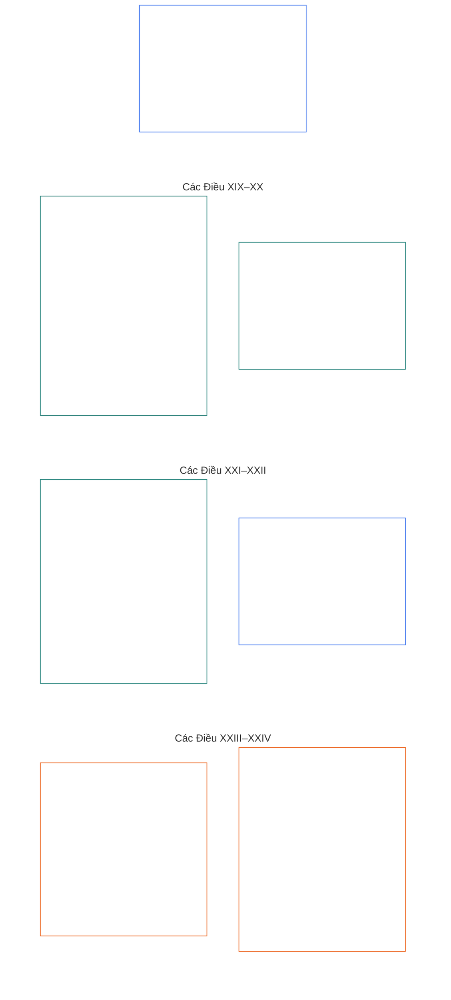

# CHƯƠNG SÁU: CÁC QUYỀN CƠ BẢN

<strong>Vị trí trong tập hợp tài liệu (không có hiệu lực vận hành): cấu trúc tệp và quy tắc đọc</strong>

> Nội dung sau đây **chỉ là hướng dẫn đọc**. Nội dung này không bổ sung, loại bỏ hay thu hẹp nghĩa vụ ràng buộc ở nơi khác trong tệp này hoặc trong các chương khác.
>
> Tệp này là **một phần của Hiến pháp về các hữu thể có tri giác** và chỉ **có tính ràng buộc khi được đọc cùng nhau** với các tệp `core_*` được đánh số khác như một văn kiện thống nhất. Tệp này gồm **Chương Sáu, Phần D**; số thứ tự điều khoản và các tham chiếu chéo khớp với văn kiện hợp nhất. Thứ tự đọc, phân biệt nội dung ràng buộc/nội dung hỗ trợ và siêu dữ liệu phiên bản tập hợp tài liệu được duy trì trong [README.md](README.md).

<strong>Hướng dẫn đọc (không có hiệu lực vận hành): vị trí của Phần D trong Chương Sáu</strong>

> Nội dung sau đây **chỉ là hướng dẫn đọc**. Nội dung này không bổ sung, loại bỏ hay thu hẹp nghĩa vụ ràng buộc ở nơi khác trong chương này hoặc các chương khác.
>
> **Phần A** trong [core_06_rights_part_a.md](core_06_rights_part_a.md) quy định hệ thống ràng buộc mặc định áp dụng cho toàn chương, thứ tự đọc ưu tiên hành tinh và các trung tâm diễn giải. **Phần D** trình bày **các Điều XIX–XXIV** theo thứ tự đó.

 

### Phần D: tư cách khởi kiện, công lý, khả năng tương tác, tính dễ hiểu, rà soát nguyên nhân gốc và diễn giải hiến pháp

 

*Nói đơn giản: Phần D đề cập đến tư cách khởi kiện và tình trạng tham gia, công lý sau vi phạm đã được xác minh, khả năng tương tác và rời khỏi hệ thống, tính dễ hiểu, phân tích nguyên nhân gốc, cùng việc diễn giải và rà soát hiến pháp — các Điều XIX đến XXIV.*

<strong>Hướng dẫn đọc (không có hiệu lực vận hành): sơ đồ các điều khoản trong Phần D</strong>

> Nội dung sau đây **chỉ là hướng dẫn đọc**. Nội dung này không bổ sung, loại bỏ hay thu hẹp nghĩa vụ ràng buộc ở nơi khác trong chương này hoặc các chương khác.
>
> **Sơ đồ đọc (không có hiệu lực vận hành).** Sơ đồ này cho thấy cách nguồn nhóm các điều khoản và tiểu điều khoản trong Phần này. Lưới biểu thị cách nhóm của nguồn, không phải trình tự quy trình: các điều khoản không phải các bước thủ tục nên sơ đồ không có mũi tên. Nhãn tiểu điều khoản chỉ rút gọn chủ đề; các điều khoản và tiểu điều khoản được đánh số bên dưới mới có hiệu lực. Sơ đồ không bổ sung định nghĩa hoặc nghĩa vụ, không thiết lập thứ tự ưu tiên và không thể thay thế văn bản nguồn.

 

**Các Điều XIX–XXIV** bên dưới quy định đầy đủ các ngưỡng này. Phần D nêu các ngưỡng về tư cách khởi kiện, công lý sau vi phạm, khả năng tương tác, tính dễ hiểu, nguyên nhân gốc và rà soát diễn giải, bao gồm **Điều XXIV** (*Diễn giải hiến pháp, rà soát và biện pháp bảo vệ chống chiếm đoạt*) theo bố cục nguồn hiện hành.

### Điều XIX: Tư cách khởi kiện và tình trạng tham gia

<strong>Truy xuất</strong>

- Nguồn thượng tầng: Các nguyên tắc tại Chương Một [§7 Tự do](core_01_a_values_principles.md#7-freedom-bounded-agency), [§15.1 Nguyên tắc hiến pháp không được bỏ qua](core_01_b_interaction_interpretation.md#151-constitutional-no-bypass-principle), và [§15 Diễn giải hiến pháp](core_01_b_interaction_interpretation.md#15-constitutional-interpretation).

<strong>Định nghĩa · Đánh giá · Tuân thủ</strong>

- [Tư cách tham gia](core_05_band_accountability.md#participant-standing-constitutional) · [O](core_05_band_accountability.md#participant-standing-constitutional) · [M](core_05_band_accountability.md#participant-standing-constitutional-a) · [A](core_05_band_accountability.md#participant-standing-constitutional-a) · [C](core_05_band_accountability.md#participant-standing-constitutional-c)
- [Bên liên quan](core_05_band_participation.md#stakeholder) · [O](core_05_band_participation.md#stakeholder) · [M](core_05_band_participation.md#stakeholder-a) · [A](core_05_band_participation.md#stakeholder-a) · [C](core_05_band_participation.md#stakeholder-c)
- [Tác động trọng yếu](core_05_band_oversight.md#material-impact) · [O](core_05_band_oversight.md#material-impact) · [M](core_05_band_oversight.md#material-impact-a) · [A](core_05_band_oversight.md#material-impact-a) · [C](core_05_band_oversight.md#material-impact-c)
- [Phẩm giá và địa vị đạo đức bình đẳng](core_05_band_participation.md#dignity-and-equal-moral-standing) · [O](core_05_band_participation.md#dignity-and-equal-moral-standing) · [M](core_05_band_participation.md#dignity-and-equal-moral-standing-a) · [A](core_05_band_participation.md#dignity-and-equal-moral-standing-a) · [C](core_05_band_participation.md#dignity-and-equal-moral-standing-c)
- [Bồi hoàn và khắc phục](core_05_band_accountability.md#redress-and-remediation-constitutional) · [O](core_05_band_accountability.md#redress-and-remediation-constitutional) · [M](core_05_band_accountability.md#redress-and-remediation-constitutional-a) · [A](core_05_band_accountability.md#redress-and-remediation-constitutional-a) · [C](core_05_band_accountability.md#redress-and-remediation-constitutional-c)
- [Khả năng phản đối](core_05_band_accountability.md#contestability) · [O](core_05_band_accountability.md#contestability) · [M](core_05_band_accountability.md#contestability-a) · [A](core_05_band_accountability.md#contestability-a) · [C](core_05_band_accountability.md#contestability-c)

 

*Nói đơn giản: **Điều XIX** (*Tư cách khởi kiện và tình trạng tham gia*) là ngưỡng quyền về tình trạng tham gia — điều chỉnh ai đủ điều kiện đảm nhiệm vai trò nào, cách đưa ra và phản đối quyết định đó, và điều gì xảy ra khi tư cách bị hạ hoặc đình chỉ. **Tư cách tham gia** là điều kiện đảm nhiệm vai trò dựa trên hồ sơ đã xác minh và quy tắc công bằng — không phải mức độ được ưa chuộng, tên thương hiệu hay điểm xã hội — và tách biệt với phẩm giá, mức sàn quyền và tư cách bên liên quan vì một hệ thống thực sự tác động đến bạn. Nếu tư cách bị hạ hoặc đình chỉ, bạn phải nhận được lý do rõ ràng, có cách thực tế để phản đối và các giới hạn phù hợp với rủi ro thực tế; chỉ riêng tư cách không bao giờ được cắt đứt nhu yếu phẩm sinh tồn hoặc con đường phản đối tổn hại và yêu cầu khắc phục. Tư cách tốt phải phản ánh điều có thể kiểm tra hiện nay, không phải danh tiếng cũ. Việc di chuyển, tị nạn, tính di chuyển và rời đi thuộc **Điều XXI** (*Khả năng tương tác, tính di chuyển, di chuyển, tị nạn và tính toàn vẹn của việc rời đi*), không chỉ do nhãn tư cách quyết định.*

Điều này quy định các **ngưỡng hiến pháp** về tư cách và tình trạng tham gia theo [Hai Mục tiêu Hiến pháp](core_00_preamble.md#two-constitutional-aims):

- **Thịnh vượng:** các hữu thể có tri giác có thể đảm nhận và phản đối điều kiện đủ cho vai trò qua những lộ trình định danh hợp lệ, đa nguyên, có thể kiểm toán — không để nhãn tư cách thay thế phẩm giá, mức sàn quyền hoặc tư cách bên liên quan khi có [Tác động trọng yếu](core_05_band_oversight.md#material-impact); điều kiện đủ theo lộ trình định danh dựa trên bằng chứng hiện tại, quan sát được và có thể phản đối, chứ không chỉ dựa vào thương hiệu, quy mô hay sự kính trọng trong quá khứ.
- **Liên tục:** kỷ luật về tư cách có thể được sửa đổi theo thời gian — hạn chế phải tương xứng, có thể khôi phục khi đã sửa chữa và không được trở thành loại trừ vĩnh viễn khỏi tiếng nói hiến pháp nền tảng, trừ khi phân loại **hành vi sai trái chống hiến pháp** theo **Chương Mười Một** và [**Chương Mười Ba §4.1 Quyền thụ hưởng và điều kiện đủ**](core_13_governance.md#41-entitlement-and-eligibility) minh thị tước tiếng nói chính trị bền vững cho đến khi **hoàn trả đầy đủ**.

Việc theo đuổi chính đáng phải đi qua [Tứ trụ Hiến pháp](core_00_preamble.md#constitutional-tetrad), theo tỷ lệ với [lợi ích trọng yếu](core_00_preamble.md#material-stake):

- **Tham gia:** vào đánh giá tư cách đa nguyên, phản đối quyết định tư cách mờ đục hoặc bị độc quyền, và khôi phục hoặc xác lập lại điều kiện đủ khi hạn chế trọng yếu đã được sửa chữa.
- **Giám sát:** thông qua hồ sơ tư cách có thể kiểm toán, rà soát liên tục các yêu cầu về điều kiện đủ và khóa tư cách, cùng xác minh độc lập tương xứng với vai trò và hạn chế liên quan.
- **Trách nhiệm giải trình:** người cấp hoặc hạn chế tư cách phải giải trình khi hạ tư cách mà không có lý do cá nhân hóa, tính tương xứng, giới hạn hẹp hoặc lộ trình khôi phục thực tế — kể cả các khuôn mẫu gắn với đặc điểm được bảo vệ hoặc yếu tố đại diện cho chúng.
- **Kịp thời:** rà soát tư cách, phản đối và khắc phục trước khi chậm trễ đóng lại khả năng tiếp cận thiết yếu cho sinh tồn, lối kiểm toán hoặc biện pháp khắc phục theo hiến pháp tại **Điều XXV-C** (*Ngưỡng giải quyết kịp thời và chống trì hoãn*).

[Tư cách tham gia](core_05_band_accountability.md#participant-standing-constitutional) là tình trạng tham gia hoặc điều kiện đủ cho vai trò được công nhận từ hồ sơ tư cách hợp lệ theo hiến pháp, tác động của tư cách hoặc tiêu chí [Ngưỡng năng lực](core_05_band_accountability.md#competency-bar) dành cho lộ trình định danh. Đây không phải danh tiếng hay sự kính trọng xã hội và tự nó không hạn chế quyền tiếp cận. Hệ quả hạn chế chỉ gắn với [Tác động của tư cách](core_05_band_accountability.md#standing-effect-chapter-six) và [Khóa tư cách](core_05_band_accountability.md#standing-lock) trên các lộ trình đặc quyền định danh.

Kỷ luật về tư cách theo Điều này thực hiện [Tứ trụ Hiến pháp](core_00_preamble.md#constitutional-tetrad) và [Hai Mục tiêu Hiến pháp](core_00_preamble.md#two-constitutional-aims), cùng với [Chứng nhận Liên kết Hệ thống](core_05_band_continuity.md#system-alignment-certification-constitutional) và [quy trình giám sát tư cách và diễn đàn từ Chương Chín đến Mười Hai](core_00_preamble.md#62-how-the-full-chain-fits-together). Các quy trình ở tầng chủ sở hữu đó đo lường đóng góp và vi phạm đã xác minh, đồng thời giám sát biện pháp khắc phục; không được dùng chúng để vô hiệu hóa nhu yếu phẩm sinh tồn theo **Điều III-A** (*Sinh tồn*) hoặc các mức sàn quyền khác trong chương này.

Phải giữ cho nội dung này khác biệt với:
- phẩm giá vốn có;
- mức sàn quyền;
- việc xác định bên liên quan theo tác động trọng yếu;
- quyền tiếp cận con đường phản đối hoặc khắc phục khi Hiến pháp này duy trì các mức sàn đó.

*Các điều khoản lân cận:*

- **Các tầng chủ sở hữu:** [Chương Chín](core_09_standing_assessment.md#chapter-nine-compliance-violation-and-standing-model) và [Chương Mười](core_10_standing_integration.md#chapter-ten-standing-effects-and-integration) đo lường hồ sơ tư cách và tác động của tư cách; Điều này nêu các giới hạn về mức sàn quyền mà các tầng đó không được thu hẹp.
- **Đọc cùng với:**
  - **Điều VI-A** (*Phẩm giá và địa vị đạo đức bình đẳng*) và **Điều XII** (*Sự tham gia, đại diện và thủ tục đúng đắn của hệ thống bên liên quan*) — tiêu chí tư cách không được thay thế phẩm giá hoặc sự tồn tại của bên liên quan;
  - **Điều III-A** (*Sinh tồn*) — riêng tư cách tham gia không được ngăn cản quyền tiếp cận thiết yếu cho sinh tồn;
  - **Điều XXI** (*Khả năng tương tác, tính di chuyển, di chuyển, tị nạn và tính toàn vẹn của việc rời đi*) — kỷ luật về tư cách không được thay thế quy trình công lý cá nhân hóa hoặc vận hành như lưu đày, từ chối tị nạn hay làm thành vô quốc tịch chỉ bằng nhãn; các mức sàn về di chuyển, tị nạn, tính di chuyển và rời đi vẫn thuộc **Điều XXI**, không thu hẹp biện pháp bảo vệ tư cách ở đây.

#### Điều XIX-A: Phân biệt tư cách

<strong>Truy xuất</strong>

- Nguồn thượng tầng: Các nguyên tắc tại Chương Một [§6 Niềm tin](core_01_a_values_principles.md#6-trust-and-trustworthiness-coordination-integrity), [§7 Tự do](core_01_a_values_principles.md#7-freedom-bounded-agency), và [§20 Áp dụng tích hợp](core_01_c_stewardship_capacity_principles.md#20-integrated-application).
- Đọc cùng với: [Chương Mười §6.2](core_10_standing_integration.md#62-competency-bars-and-clearances) (*ngưỡng năng lực và xác nhận*), [Ngưỡng năng lực](core_05_band_accountability.md#competency-bar), và [Xác nhận năng lực](core_05_band_accountability.md#competency-clearance); [Chương Mười §4.2](core_10_standing_integration.md#42-prevention--general-standing-locks) (*khóa tư cách*), [Tính chất vi phạm](core_05_band_accountability.md#violation-nature-chapter-six), và [Khóa tư cách](core_05_band_accountability.md#standing-lock) — các lộ trình định danh bị hạn chế từ dữ liệu Violation Axis đã xác minh; xác nhận năng lực không miễn trừ khóa tư cách đang áp dụng, và đóng góp tốt không xóa các kết luận vi phạm còn chưa được giải quyết.

<strong>Định nghĩa · Đánh giá · Tuân thủ</strong>

- [Phẩm giá và địa vị đạo đức bình đẳng](core_05_band_participation.md#dignity-and-equal-moral-standing) · [O](core_05_band_participation.md#dignity-and-equal-moral-standing) · [M](core_05_band_participation.md#dignity-and-equal-moral-standing-a) · [A](core_05_band_participation.md#dignity-and-equal-moral-standing-a) · [C](core_05_band_participation.md#dignity-and-equal-moral-standing-c)
- [Trọng số bên liên quan](core_05_band_participation.md#stakeholder-weight) · [O](core_05_band_participation.md#stakeholder-weight) · [M](core_05_band_participation.md#stakeholder-weight-a) · [A](core_05_band_participation.md#stakeholder-weight-a) · [C](core_05_band_participation.md#stakeholder-weight-c)
- [Tư cách tham gia](core_05_band_accountability.md#participant-standing-constitutional) · [O](core_05_band_accountability.md#participant-standing-constitutional) · [M](core_05_band_accountability.md#participant-standing-constitutional-a) · [A](core_05_band_accountability.md#participant-standing-constitutional-a) · [C](core_05_band_accountability.md#participant-standing-constitutional-c)
- [Ngưỡng năng lực](core_05_band_accountability.md#competency-bar) · [O](core_05_band_accountability.md#competency-bar) · [M](core_05_band_accountability.md#competency-bar-a) · [A](core_05_band_accountability.md#competency-bar-a) · [C](core_05_band_accountability.md#competency-bar-c)
- [Xác nhận năng lực](core_05_band_accountability.md#competency-clearance) · [O](core_05_band_accountability.md#competency-clearance) · [M](core_05_band_accountability.md#competency-clearance-a) · [A](core_05_band_accountability.md#competency-clearance-a) · [C](core_05_band_accountability.md#competency-clearance-c)
- [Khóa tư cách](core_05_band_accountability.md#standing-lock) · [O](core_05_band_accountability.md#standing-lock) · [M](core_05_band_accountability.md#standing-lock-a) · [A](core_05_band_accountability.md#standing-lock-a) · [C](core_05_band_accountability.md#standing-lock-c)
- [Tính chất vi phạm](core_05_band_accountability.md#violation-nature-chapter-six) · [O](core_05_band_accountability.md#violation-nature-chapter-six) · [M](core_05_band_accountability.md#violation-nature-chapter-six-a) · [A](core_05_band_accountability.md#violation-nature-chapter-six-a) · [C](core_05_band_accountability.md#violation-nature-chapter-six-c)

 

*Nói đơn giản: các vai trò nhạy cảm về niềm tin có thể được mở khi mức độ sẵn sàng đã xác minh đáp ứng **ngưỡng năng lực** đã công bố và **xác nhận năng lực** đang có hiệu lực — và có thể vẫn đóng hoặc bị giới hạn bằng **khóa tư cách** trong khi **kết luận vi phạm đã xác minh** còn cần được khắc phục. Khóa **governance-voting** tạm dừng quyền bỏ phiếu quản trị nền tảng; khóa **stakeholder-participation** giới hạn tiếng nói theo trọng số lợi ích trong hệ thống được phép — hai loại không thể thay thế nhau và loại sau không xóa tư cách bên liên quan. Không lộ trình định danh nào là sự phổ biến, cản trở từ nội bộ hay vật thay thế cho phẩm giá. Chỉ cáo buộc không phải kết luận vi phạm; khóa phải phù hợp với điều thực sự được xác minh và để lại con đường thực tế để phản đối, khắc phục.*

Điều này quy định sự khác biệt giữa tư cách với ngưỡng năng lực, xác nhận năng lực và khóa tư cách:

- **Tư cách khác với:**
  - phẩm giá vốn có và địa vị đạo đức bình đẳng (**Điều VI-A** (*Phẩm giá và địa vị đạo đức bình đẳng*));
  - việc chứng minh lợi ích trọng yếu để nhận diện bên liên quan (**Chương Năm** — *Bên liên quan*; *Trọng số bên liên quan*).
- **Ngưỡng và xác nhận năng lực:** [Ngưỡng năng lực](core_05_band_accountability.md#competency-bar) là tiêu chuẩn đủ điều kiện đã công bố, có thể kiểm toán và phản đối được cho một lộ trình định danh. [Xác nhận năng lực](core_05_band_accountability.md#competency-clearance) là kết quả tác động tư cách tích cực khi hồ sơ năng lực, kinh nghiệm và đóng góp đã xác minh đáp ứng ngưỡng đó. Khi xác nhận có hiệu lực và không có [Khóa tư cách](core_05_band_accountability.md#standing-lock) áp dụng để chặn lộ trình định danh, xác nhận có thể mở quyền tiếp cận vai trò nhạy cảm về niềm tin, thẩm quyền được ủy quyền, điều kiện đủ để giám sát hoặc trách nhiệm quản trị ngày càng có hệ quả theo [Chương Mười §6.2 Ngưỡng năng lực và xác nhận](core_10_standing_integration.md#62-competency-bars-and-clearances).
  - Ngưỡng hoặc xác nhận năng lực không phải danh tiếng, uy thế xã hội, bảo trợ nội bộ, độc quyền chứng chỉ, thứ bậc phẩm giá hay quyền lợi vĩnh viễn.
  - Phải công nhận kinh nghiệm không chính thức, do đồng đẳng tổ chức, tương trợ, bảo trì, sửa chữa, giảng dạy hoặc quản trị cộng đồng nếu đáp ứng cùng tiêu chuẩn chứng minh như kinh nghiệm thể chế chính thức.
- **Tính chất vi phạm và khóa tư cách:** [Tính chất vi phạm](core_05_band_accountability.md#violation-nature-chapter-six) chỉ có thể ảnh hưởng đến tác động tư cách khi dựa trên kết luận có thể kiểm toán, phản đối được và đáp ứng **Chương Hai đến Bốn** cùng [Chương Chín](core_09_standing_assessment.md#verified-inputs-for-standing) — không chỉ dựa vào cáo buộc, nhãn tiếp nhận, định tuyến tạm thời hoặc lời kể ở giai đoạn diễn đàn.
  - [Khóa tư cách](core_05_band_accountability.md#standing-lock) là phần đối ứng có tính hạn chế của xác nhận năng lực. Khi kết luận vi phạm đã xác minh còn chưa được giải quyết hoặc chưa được khắc phục trọng yếu, khóa có thể ngăn hoặc giới hạn các lộ trình về niềm tin, vai trò, thẩm quyền, tín dụng, giám sát, công nhận, **governance-voting** hoặc **stakeholder-participation** theo [Chương Mười §4.2 Phòng ngừa — khóa tư cách chung](core_10_standing_integration.md#42-prevention--general-standing-locks).
  - **governance-voting** là lộ trình cơ chế chính danh/phiếu bầu quản trị nền tảng. **stakeholder-participation** là ảnh hưởng theo trọng số lợi ích và lựa chọn ràng buộc của bên liên quan trong lĩnh vực đã được cho phép. Hai lộ trình định danh này không thể thay nhau và khóa **stakeholder-participation** không xóa tư cách [Bên liên quan](core_05_band_participation.md#stakeholder).
  - Khóa tư cách không phải thứ bậc phẩm giá, giảm mức sàn quyền, trả đũa tự động hoặc điểm công trạng gộp chung.
  - Mỗi khóa tư cách phải nêu tác động bị chặn hoặc hạn chế, chủ thể hoặc lợi ích được bảo vệ, điều kiện khắc phục, đường rà soát và thời điểm đánh giá lại; đồng thời vẫn phải cần thiết, tương xứng, có thể kiểm toán và phản đối được.
  - Việc đã xác minh không rút khỏi vai trò diễn đàn khi lẽ ra phải rút và tính vô tư bị tổn hại trọng yếu sẽ tạo **khóa tư cách phục vụ diễn đàn** theo [Chương Mười §5.5 Khóa đặc biệt](core_10_standing_integration.md#55-special-locks). Trở lại phục vụ diễn đàn đòi hỏi khôi phục nghiêm ngặt và độc lập; lời xin lỗi thông thường, đóng góp trước đây, danh tiếng, thiếu chuyên gia hay nhu cầu nhân sự tự chúng không đáp ứng được lộ trình này.
  - Tham nhũng, chiếm đoạt, lạm dụng lợi ích giả, cưỡng ép hoặc lạm dụng trọng yếu tương tự đã xác minh đối với lộ trình stakeholder-participation sẽ tạo **Khóa tư cách tham gia của bên liên quan** theo [Chương Mười §5.5 Khóa đặc biệt](core_10_standing_integration.md#55-special-locks). Khóa này giới hạn ảnh hưởng theo trọng số lợi ích và lựa chọn ràng buộc của bên liên quan trong lĩnh vực bị ảnh hưởng; tự nó không tước **governance-voting**, lựa chọn hiến pháp nền tảng hay tư cách bên liên quan. Lời xin lỗi thông thường, đóng góp trước đây, quy mô lợi ích hoặc tính không thể thiếu của người vận hành tự chúng không thể gỡ khóa.
  - Hành vi sai trái chống hiến pháp cuối cùng theo Chương Mười Một tạo **Khóa niềm tin chống hiến pháp** được nêu tại [Chương Mười §5.5 Khóa đặc biệt](core_10_standing_integration.md#55-special-locks). Khi còn hiệu lực, khóa cấm vai trò hoặc ảnh hưởng trọng yếu đối với hệ thống **Class A**, **Class B** hoặc **Class C**, diễn đàn hiến pháp, công nhận liên kết hiến pháp, quản trị hệ thống trọng yếu và các lộ trình trách nhiệm giải trình chống hiến pháp cho đến khi việc khôi phục nghiêm ngặt và độc lập được xác minh.
  - Xác nhận năng lực không miễn trừ khóa tư cách áp dụng; đóng góp tốt không xóa kết luận vi phạm đã xác minh còn chưa giải quyết.
- **Không thay thế lẫn nhau:** Tiêu chí tư cách, nhãn, điểm số, ngưỡng năng lực, xác nhận năng lực và khóa tư cách chỉ điều chỉnh điều kiện đủ cho vai trò. Chúng không được:
  - nhập nhằng giữa ai đủ điều kiện cho một vai trò với ai có phẩm giá vốn có hoặc địa vị đạo đức bình đẳng;
  - biến tình trạng vai trò thành vật thay thế cho mức sàn quyền hoặc cho việc xác định một người có phải là bên liên quan vì hệ thống thực sự tác động đến họ hay không;
  - thay thế việc xác định tình trạng có tri giác, vốn chỉ được thực hiện theo **Điều VI-B** (*Ngưỡng xét xử tình trạng có tri giác*);
  - coi việc không có hồ sơ tư cách là tình tiết bất lợi, hoặc yêu cầu hồ sơ hay xác nhận “không có hồ sơ” như điều kiện để có nhu yếu phẩm sinh tồn, giao dịch thông thường hoặc tham gia với tư cách bên bị ảnh hưởng — không có hồ sơ là trạng thái thông thường theo [Chương Chín §2.1](core_09_standing_assessment.md#21-silence-is-the-default) (*Im lặng là mặc định*);
  - coi bất đồng hoặc biểu tình ôn hòa theo **Điều XI-D** ([*Ngưỡng về bất đồng và biểu tình ôn hòa*](core_06_rights_part_b.md#xi-d-dissent-and-peaceful-protest)) là tình tiết bất lợi hoặc yếu tố trọng số cho bất kỳ lộ trình định danh nào; hoặc
  - gộp tác động của các lộ trình định danh thành hồ sơ, bảng xếp hạng hoặc trưng bày công khai — [Chương Mười §7.1](core_10_standing_integration.md#71-anti-aggregation-of-named-pathway-effects) (*Chống gộp tác động của lộ trình định danh*).

#### Điều XIX-B: Khả năng phản đối và giới hạn tương xứng đối với hạn chế

<strong>Truy vết</strong>

- Thượng nguồn: Nguyên tắc: [Chương Một §7 Tự do](core_01_a_values_principles.md#7-freedom-bounded-agency), [§13.1 Các nguyên tắc đánh đổi cốt lõi](core_01_b_interaction_interpretation.md#131-core-tradeoff-principles), và [Chương Một §13.1.5 Thủ tục va chạm quyền](core_01_b_interaction_interpretation.md#1315-rights-collision-decision-test).
- Hạ nguồn: [Chương Chín §2](core_09_standing_assessment.md#2-question-1--what-happened) (*hồ sơ tư cách, cổng đầu vào đã xác minh và nội dung hồ sơ tối thiểu*); [Chương Chín §3.6](core_09_standing_assessment.md#36-forum-boundary) (*ranh giới diễn đàn*); [Chương Mười §6.2](core_10_standing_integration.md#62-competency-bars-and-clearances) (*ngưỡng và xác nhận năng lực*); [Chương Mười §4.2](core_10_standing_integration.md#42-prevention--general-standing-locks) (*khóa tư cách*); [Chương Mười §8](core_10_standing_integration.md#8-restoration-and-reassessment) (*phục hồi và rà soát lại*).
- Đọc cùng: **Điều III-A** (*Sinh tồn*); **Điều XIII-A** (*Mức sàn về độ tin cậy và đáng tin*) và **Điều XIII-B** (*Quyền được khắc phục và bồi hoàn*); [Lời mở đầu §6.2 Chuỗi đầy đủ khớp với nhau ra sao](core_00_preamble.md#62-how-the-full-chain-fits-together); [Chứng nhận thẳng hàng hệ thống](core_05_band_continuity.md#system-alignment-certification-constitutional); [Tứ trụ Hiến pháp](core_00_preamble.md#constitutional-tetrad) — **sự tham gia**, **giám sát**, **trách nhiệm giải trình** và **tính kịp thời** theo **Điều XXV-C** (*Mức sàn giải quyết kịp thời và chống trì hoãn*) và **Điều XX-B** (*Các mức sàn hạn chế*).

<strong>Định nghĩa · Đánh giá · Tuân thủ</strong>

- [Khả năng phản đối](core_05_band_accountability.md#contestability) · [O](core_05_band_accountability.md#contestability) · [M](core_05_band_accountability.md#contestability-a) · [A](core_05_band_accountability.md#contestability-a) · [C](core_05_band_accountability.md#contestability-c)
- [Tính tương xứng](core_05_band_accountability.md#proportionality) · [O](core_05_band_accountability.md#proportionality) · [M](core_05_band_accountability.md#proportionality-a) · [A](core_05_band_accountability.md#proportionality-a) · [C](core_05_band_accountability.md#proportionality-c)
- [Tính cần thiết](core_05_band_accountability.md#necessity) · [O](core_05_band_accountability.md#necessity) · [M](core_05_band_accountability.md#necessity-a) · [A](core_05_band_accountability.md#necessity-a) · [C](core_05_band_accountability.md#necessity-c)
- [Công bằng thủ tục](core_05_band_participation.md#procedural-fairness-constitutional) · [O](core_05_band_participation.md#procedural-fairness-constitutional) · [M](core_05_band_participation.md#procedural-fairness-constitutional-a) · [A](core_05_band_participation.md#procedural-fairness-constitutional-a) · [C](core_05_band_participation.md#procedural-fairness-constitutional-c)
- [Khả năng kiểm toán](core_05_band_oversight.md#auditability) · [O](core_05_band_oversight.md#auditability) · [M](core_05_band_oversight.md#auditability-a) · [A](core_05_band_oversight.md#auditability-a) · [C](core_05_band_oversight.md#auditability-c)
- [Tính chất vi phạm](core_05_band_accountability.md#violation-nature-chapter-six) · [O](core_05_band_accountability.md#violation-nature-chapter-six) · [M](core_05_band_accountability.md#violation-nature-chapter-six-a) · [A](core_05_band_accountability.md#violation-nature-chapter-six-a) · [C](core_05_band_accountability.md#violation-nature-chapter-six-c)
- [Ngưỡng năng lực](core_05_band_accountability.md#competency-bar) · [O](core_05_band_accountability.md#competency-bar) · [M](core_05_band_accountability.md#competency-bar-a) · [A](core_05_band_accountability.md#competency-bar-a) · [C](core_05_band_accountability.md#competency-bar-c)
- [Xác nhận năng lực](core_05_band_accountability.md#competency-clearance) · [O](core_05_band_accountability.md#competency-clearance) · [M](core_05_band_accountability.md#competency-clearance-a) · [A](core_05_band_accountability.md#competency-clearance-a) · [C](core_05_band_accountability.md#competency-clearance-c)
- [Khóa tư cách](core_05_band_accountability.md#standing-lock) · [O](core_05_band_accountability.md#standing-lock) · [M](core_05_band_accountability.md#standing-lock-a) · [A](core_05_band_accountability.md#standing-lock-a) · [C](core_05_band_accountability.md#standing-lock-c)
- [Khắc phục và bồi hoàn](core_05_band_accountability.md#redress-and-remediation-constitutional) · [O](core_05_band_accountability.md#redress-and-remediation-constitutional) · [M](core_05_band_accountability.md#redress-and-remediation-constitutional-a) · [A](core_05_band_accountability.md#redress-and-remediation-constitutional-a) · [C](core_05_band_accountability.md#redress-and-remediation-constitutional-c)
- [Tính chất đóng góp](core_05_band_accountability.md#contribution-nature) · [O](core_05_band_accountability.md#contribution-nature) · [M](core_05_band_accountability.md#contribution-nature-a) · [A](core_05_band_accountability.md#contribution-nature-a) · [C](core_05_band_accountability.md#contribution-nature-c)

 

*Nói đơn giản: hồ sơ tư cách, ngưỡng năng lực, xác nhận năng lực và khóa tư cách đều phải có đường rà soát thực chất để phản đối — hạn chế phải có lý do, phù hợp với kết luận đã xác minh và không rộng hơn mức cần cho thủ tục hoặc an toàn. Cáo buộc và nhãn tiếp nhận không phải phán quyết về tư cách. Kỷ luật tư cách tự nó không bao giờ được cắt quyền tiếp cận nhu yếu phẩm sinh tồn hoặc các lộ trình kiểm toán, phản đối và khắc phục mà hiến pháp yêu cầu.*

Điều này quy định các giới hạn về khả năng phản đối và tính tương xứng đối với hạn chế tư cách:

- **Cổng đầu vào đã xác minh và khả năng phản đối hồ sơ:** Mọi quyết định ảnh hưởng đến tư cách, niềm tin, vai trò, sự công nhận hoặc điều kiện để được công nhận chỉ được dùng đầu vào đã xác minh từ **hồ sơ tư cách về đóng góp** hoặc **hồ sơ tư cách về vi phạm** thuần trục theo [Chương Chín §2 Câu hỏi 1 — điều gì đã xảy ra?](core_09_standing_assessment.md#2-question-1--what-happened). Cáo buộc, yêu cầu chưa được phân xử, thẻ định tuyến tạm thời, lời kể chỉ ở khâu tiếp nhận và tài liệu khác thuộc giai đoạn tranh chấp tự chúng không cung cấp tính chất vi phạm hay tính chất đóng góp cho tư cách.
  - Mỗi hồ sơ tư cách phải nêu cách phản đối, diễn đàn hoặc thẩm quyền nào rà soát hồ sơ, và các điều kiện sửa chữa, phục hồi, hết hạn hoặc rà soát theo lịch theo [Chương Chín §3.1 Nội dung hồ sơ tối thiểu](core_09_standing_assessment.md#31-minimum-record-contents).
  - Hồ sơ đóng góp và vi phạm có liên kết phải tham chiếu chéo nhau khi cần, duy trì khả năng kiểm toán và phản đối, và không được gộp thành điểm số, kết luận công trạng pha trộn hay nhãn tư cách không phân biệt.
- **Đa nguyên và khả năng phản đối:** Việc đánh giá tư cách phải giữ tính đa nguyên, có thể kiểm toán, đủ minh bạch để rà soát có ý nghĩa và có thể bị phản đối.
  - Không một thẩm quyền, bộ dữ liệu, kênh danh tiếng hay hệ thống thuật toán mờ đục nào được đơn phương quyết định tư cách theo cách ngăn cản việc rà soát có ý nghĩa.
  - [Ngưỡng và xác nhận năng lực](core_10_standing_integration.md#62-competency-bars-and-clearances) cùng sự công nhận tư cách tích cực phải có thể bị phản đối, được rà soát và không độc quyền.
- **Giám sát diễn đàn và phản đối hồ sơ:** Các nhóm diễn đàn theo [Chương Mười Hai](core_12_forum.md#chapter-twelve-forums-and-jurisdiction) giám sát việc phản đối dễ tiếp cận và, khi sự kiện đã được xác minh theo Chương Hai đến Bốn, có thể:
  - **mở, cập nhật hoặc sửa** hồ sơ tư cách theo [Chương Chín §3.1 Nội dung hồ sơ tối thiểu](core_09_standing_assessment.md#31-minimum-record-contents); hoặc
  - **hủy hồ sơ sai khi có phản đối**.

  - Chỉ riêng việc nộp vụ việc không tạo thành tư cách.
  - Tài liệu ở giai đoạn tranh chấp tự nó không cung cấp tính chất đóng góp hay vi phạm cho tư cách ([Chương Chín §3.6 Ranh giới diễn đàn](core_09_standing_assessment.md#36-forum-boundary)).
  - Ranh giới đó không làm giảm quyền phản đối, khắc phục, cứu trợ tạm thời hoặc bảo vệ thủ tục theo yêu cầu của **Điều XIII-A** (*Mức sàn về độ tin cậy và đáng tin*), **Điều XIII-B** (*Quyền được khắc phục và bồi hoàn*) và **Điều XXV-C** (*Mức sàn giải quyết kịp thời và chống trì hoãn*).
- **Khả năng rà soát thủ tục:** Khi tư cách bị hạn chế đáng kể, hạ cấp hoặc đình chỉ — kể cả qua [khóa tư cách](core_10_standing_integration.md#42-prevention--general-standing-locks) gắn với [kết luận vi phạm đã xác minh](core_05_band_accountability.md#violation-nature-chapter-six) — hệ thống phải áp dụng [**Nguyên tắc hạn chế ít nhất, có thời hạn và có thể rà soát**](core_01_b_interaction_interpretation.md#1315-least-restrictive-time-bounded-and-reviewable-constraint-principle) và phải:
  - giải thích rõ **vì sao**;
  - đặt **thời hạn** cho hạn chế khi khả thi theo **Điều XX-B** (*Các mức sàn hạn chế*);
  - cung cấp **lộ trình khả thi** để phản đối quyết định, được rà soát, sửa điều sai và yêu cầu xem xét lại.

  Mỗi khóa tư cách phải nêu rõ quyền tiếp cận nào bị chặn, ai được bảo vệ, điều gì cần sửa trước khi gỡ khóa, nơi kháng nghị và thời điểm đánh giá lại. Trong khi phản đối đang chờ giải quyết, mọi giới hạn tạm thời chỉ được rộng — và khó đảo ngược — đến mức mà an toàn, tính liêm chính hoặc thủ tục công bằng thực sự đòi hỏi.
- **Tính tương xứng và hiệu chỉnh:** Hạn chế tư cách phải vẫn cần thiết và tương xứng theo **Tính cần thiết**, **Tính tương xứng** và **Điều XX-B** (*Các mức sàn hạn chế*).
  - [Khóa tư cách](core_10_standing_integration.md#42-prevention--general-standing-locks) phải được hiệu chỉnh theo **tính chất vi phạm** đã xác minh, lộ trình định danh được bảo vệ, tình trạng khắc phục hiện tại và mọi **tính chất đóng góp** liên kết chỉ trong phạm vi đóng góp liên quan đến năng lực sửa chữa, độ tin cậy của biện pháp bảo vệ, không tái diễn hoặc đánh giá lại theo hướng ít hạn chế nhất theo [Chương Chín §2 Câu hỏi 1 — điều gì đã xảy ra?](core_09_standing_assessment.md#2-question-1--what-happened). Đóng góp không được bù trừ, miễn trừ, làm giảm trung bình hay thay thế các kết luận vi phạm chưa được giải quyết.
  - Kết luận Trục Vi phạm có tác động thấp hơn trên [thang thống nhất Chương Chín §7](core_09_standing_assessment.md#7-unified-proportional-lequ-scale--contribution-and-violation-axes) không biện minh cho việc loại trừ lâu dài nếu thiếu chứng cứ về mô thức lặp lại, né tránh hoặc liên hệ với tổn hại trọng yếu. Sơ suất, che giấu, cưỡng ép, tái diễn và các mô tả tính chất tương tự có ý nghĩa đối với rà soát đó nhưng không làm thay đổi mức tác động trong Chương Chín.
  - Việc tăng mức hạn chế do hành vi tái diễn hoặc trách nhiệm bị che giấu vẫn phải cần thiết, tương xứng, có thể rà soát và gắn với kết luận đã xác minh.
- **Mức tối thiểu của Sàn Quyền và không ngăn chặn:** Tư cách người tham gia, ngưỡng năng lực, xác nhận năng lực và khóa tư cách chỉ điều chỉnh điều kiện đủ cho vai trò và các lộ trình đặc quyền định danh. Chúng không được:
  - đình chỉ, miễn trừ, xóa bỏ hoặc hạ thấp **mức tối thiểu của Sàn Quyền** được áp dụng qua **Điều VI** (*Các quyền cơ bản bình đẳng*) theo [Nguyên tắc Mức tối thiểu của Sàn Quyền](core_01_b_interaction_interpretation.md#rights-floor-minimums-principle);
  - ngăn quyền tiếp cận thiết yếu cho sinh tồn hoặc các mức sàn phân bổ nguồn lực và phụ thuộc của **Điều III-A** (*Sinh tồn*) khi có liên quan trọng yếu; hoặc
  - ngăn các lộ trình kiểm toán, phản đối hoặc khắc phục mà hiến pháp yêu cầu — kể cả theo **Điều XIII-A** (*Mức sàn về độ tin cậy và đáng tin*) và **Điều XIII-B** (*Quyền được khắc phục và bồi hoàn*), **Điều XV-B** (*Minh bạch, khả năng kiểm toán và khả năng phản đối*) và **Điều XVI** (*Kiểm toán, minh bạch và xác minh độc lập*) — nếu không có lý do đầy đủ theo **Chương Một**, **Chương Năm** và thủ tục được dẫn nhập áp dụng.
- **Phục hồi và không cố thủ:** Khi tư cách bị giảm do kết luận vi phạm, hệ thống phải quy định rõ điều kiện rà soát, phục hồi dựa trên khắc phục và đánh giá lại định kỳ theo [Chương Mười §8 Phục hồi và đánh giá lại](core_10_standing_integration.md#8-restoration-and-reassessment).
  - Loại trừ vĩnh viễn chỉ dựa trên tình trạng trong quá khứ mà không có lý do hiện tại, có thể kiểm toán là không tuân thủ.
  - Việc hoàn tất sửa chữa, hoàn trả, giám sát, triển khai biện pháp bảo vệ hoặc chứng minh giảm nguy cơ tái diễn phải tạo ra một lộ trình thực tế để đánh giá lại khi pháp luật cho phép; không hoàn thành các nghĩa vụ đó khiến kết luận chưa giải quyết tiếp tục có hiệu lực cho mục đích tư cách.

#### Điều XIX-C: Điều kiện đủ cho lộ trình định danh, trách nhiệm và kiểm toán liên tục

<strong>Truy vết</strong>

- Thượng nguồn: Nguyên tắc: [Chương Một §6 Niềm tin](core_01_a_values_principles.md#6-trust-and-trustworthiness-coordination-integrity), [Chương Tám §3 Đánh giá chứng nhận toàn hệ thống](core_08_a_system_alignment_certification_evaluation.md#3-whole-system-certification-evaluation), và [Chương Một §18 Quản trị theo kỷ luật quản trị ủy thác](core_01_c_stewardship_capacity_principles.md#18-governance-under-stewardship-discipline).

<strong>Định nghĩa · Đánh giá · Tuân thủ</strong>

- [Trách nhiệm giải trình](core_05_apex_accountability_leg.md#accountability) · [O](core_05_apex_accountability_leg.md#accountability) · [M](core_05_apex_accountability_leg.md#accountability-m) · [A](core_05_apex_accountability_leg.md#accountability-a) · [C](core_05_apex_accountability_leg.md#accountability-c)
- [Khóa tư cách](core_05_band_accountability.md#standing-lock) · [O](core_05_band_accountability.md#standing-lock) · [M](core_05_band_accountability.md#standing-lock-a) · [A](core_05_band_accountability.md#standing-lock-a) · [C](core_05_band_accountability.md#standing-lock-c)
- [Ngưỡng năng lực](core_05_band_accountability.md#competency-bar) · [O](core_05_band_accountability.md#competency-bar) · [M](core_05_band_accountability.md#competency-bar-a) · [A](core_05_band_accountability.md#competency-bar-a) · [C](core_05_band_accountability.md#competency-bar-c)
- [Xác nhận năng lực](core_05_band_accountability.md#competency-clearance) · [O](core_05_band_accountability.md#competency-clearance) · [M](core_05_band_accountability.md#competency-clearance-a) · [A](core_05_band_accountability.md#competency-clearance-a) · [C](core_05_band_accountability.md#competency-clearance-c)
- [Tư cách người tham gia](core_05_band_accountability.md#participant-standing-constitutional) · [O](core_05_band_accountability.md#participant-standing-constitutional) · [M](core_05_band_accountability.md#participant-standing-constitutional-a) · [A](core_05_band_accountability.md#participant-standing-constitutional-a) · [C](core_05_band_accountability.md#participant-standing-constitutional-c)
- [Thất bại trách nhiệm giải trình tập thể](core_05_band_accountability.md#collective-accountability-failure) · [O](core_05_band_accountability.md#collective-accountability-failure) · [M](core_05_band_accountability.md#collective-accountability-failure-a) · [A](core_05_band_accountability.md#collective-accountability-failure-a) · [C](core_05_band_accountability.md#collective-accountability-failure-c)
- [Niềm tin](core_05_band_continuity.md#trust) · [O](core_05_band_continuity.md#trust) · [M](core_05_band_continuity.md#trust-a) · [A](core_05_band_continuity.md#trust-a) · [C](core_05_band_continuity.md#trust-c)
- [Lựa chọn hiến pháp nền tảng](core_05_band_integrative.md#foundational-constitutional-choice) · [O](core_05_band_integrative.md#foundational-constitutional-choice) · [M](core_05_band_integrative.md#foundational-constitutional-choice-a) · [A](core_05_band_integrative.md#foundational-constitutional-choice-a) · [C](core_05_band_integrative.md#foundational-constitutional-choice-c)
- [Công bằng thủ tục](core_05_band_participation.md#procedural-fairness-constitutional) · [O](core_05_band_participation.md#procedural-fairness-constitutional) · [M](core_05_band_participation.md#procedural-fairness-constitutional-a) · [A](core_05_band_participation.md#procedural-fairness-constitutional-a) · [C](core_05_band_participation.md#procedural-fairness-constitutional-c)
- [Tính cần thiết](core_05_band_accountability.md#necessity) · [O](core_05_band_accountability.md#necessity) · [M](core_05_band_accountability.md#necessity-a) · [A](core_05_band_accountability.md#necessity-a) · [C](core_05_band_accountability.md#necessity-c)
- [Tính tương xứng](core_05_band_accountability.md#proportionality) · [O](core_05_band_accountability.md#proportionality) · [M](core_05_band_accountability.md#proportionality-a) · [A](core_05_band_accountability.md#proportionality-a) · [C](core_05_band_accountability.md#proportionality-c)
- [Đặc tính được bảo vệ](core_05_band_participation.md#protected-characteristics-constitutional) · [O](core_05_band_participation.md#protected-characteristics-constitutional) · [M](core_05_band_participation.md#protected-characteristics-constitutional-a) · [A](core_05_band_participation.md#protected-characteristics-constitutional-a) · [C](core_05_band_participation.md#protected-characteristics-constitutional-c)

 

*Nói đơn giản: các lộ trình định danh tham gia thông thường vẫn mở theo quy tắc điều kiện đủ đã công bố, có thể phản đối và dựa trên chứng cứ hiện tại — không dựa vào thương hiệu, quy mô hay danh tiếng quá khứ. Mở một lộ trình định danh nhạy cảm về niềm tin đòi hỏi xác nhận năng lực theo ngưỡng năng lực đã công bố; đóng một đặc quyền đòi hỏi khóa tư cách trên chính lộ trình định danh đó. Khóa tư cách không thể vĩnh viễn tước tiếng nói nền tảng, ngoại trừ phân loại **cuối cùng** của **Chương Mười Một** về **hành vi sai trái chống hiến pháp**, sẽ giữ lại tiếng nói đó cho đến khi **hoàn trả đầy đủ** như quy định tại [**Chương Mười Ba §4.1 Quyền lợi và điều kiện đủ**](core_13_governance.md#41-entitlement-and-eligibility).*

Điều này quy định điều kiện đủ và trách nhiệm đối với lộ trình định danh, cùng kỷ luật về tiếng nói chính trị:

- **Điều kiện đủ và trách nhiệm đối với lộ trình định danh:** Tiêu chí điều kiện đủ đã công bố cho sự tham gia thông thường, vai trò nhạy cảm về niềm tin, điều kiện đủ để giám sát, **governance-voting** và **stakeholder-participation** phải dựa trên chứng cứ hiện tại, quan sát được và có thể phản đối — không chỉ dựa vào danh tiếng, quy mô hay tư cách lịch sử. Việc thẳng hàng nhất quán với yêu cầu nền tảng có thể hỗ trợ [Xác nhận năng lực](core_05_band_accountability.md#competency-clearance) theo [Ngưỡng năng lực](core_05_band_accountability.md#competency-bar) áp dụng và điều kiện đủ cho vai trò nhạy cảm về niềm tin; nhưng hậu quả hạn chế chỉ áp dụng qua [Khóa tư cách](core_05_band_accountability.md#standing-lock) trên các lộ trình đặc quyền định danh theo [Chương Mười §4.2 Phòng ngừa — khóa tư cách chung](core_10_standing_integration.md#42-prevention--general-standing-locks). Khóa **governance-voting** không thay thế khóa **stakeholder-participation**; khóa **stakeholder-participation** không xóa tư cách bên liên quan hoặc tự tước quyền **governance-voting** nền tảng.
  - Điều kiện đủ và yêu cầu khóa vẫn chịu kiểm toán liên tục và các biện pháp bảo vệ trong Điều này cùng văn bản triển khai được chỉ định.
  - Điều kiện đủ và khóa phải:
    - tiếp tục tuân theo **Chương Chín** (*Mô hình đóng góp, vi phạm và tư cách*);
    - có thể sửa đổi khi chứng cứ hiện tại thay đổi và — khi hạn chế trọng yếu được sửa — cho phép lộ trình phục hồi hoặc đủ điều kiện lại thực chất chứ không chỉ trên danh nghĩa;
    - tính đến sự tham gia thuận theo và việc không chống lại chỉ thị trái pháp luật hoặc vi hiến khi có nghĩa vụ và năng lực trọng yếu, phù hợp với **Chương Năm** (*Thất bại trách nhiệm giải trình tập thể*);
    - không vận hành như một phương thức loại trừ tiếng nói chính trị lâu dài trong **Lựa chọn hiến pháp nền tảng** (**Chương Năm**), trừ khi [**Chương Mười Ba §4.1 Quyền lợi và điều kiện đủ**](core_13_governance.md#41-entitlement-and-eligibility) giữ lại **tiếng nói chính trị lâu dài** đối với **hành vi sai trái chống hiến pháp** **cuối cùng** của **Chương Mười Một** cho đến khi **hoàn trả đầy đủ**.
- **Kỷ luật về tiếng nói chính trị:** Khi viện dẫn khóa tư cách để hạn chế tham gia vào việc cho phép thẩm quyền quản trị, hạn chế phải đáp ứng:
  - căn cứ riêng cho từng cá nhân theo **Công bằng thủ tục**;
  - **Tính cần thiết** và **Tính tương xứng** theo **Chương Một**;
  - giới hạn hẹp vào loại hành vi sai trái cụ thể;
  - lộ trình phục hồi thực chất, không chỉ trên danh nghĩa.

  **Hành vi sai trái chống hiến pháp** được chỉ định theo **Chương Mười Một** với mức tác động Trục Vi phạm **cuối cùng** ở **s = 7**, **s = 8** hoặc **s = 9** theo Chương Chín nằm ngoài kỷ luật khóa tư cách này đối với **tiếng nói chính trị lâu dài**: việc tham gia tiếp tục bị giữ lại cho đến khi **hoàn trả đầy đủ** như nêu tại [**Chương Mười Ba §4.1 Quyền lợi và điều kiện đủ**](core_13_governance.md#41-entitlement-and-eligibility). Chương Mười Một bổ sung chỉ định, không ấn định mức số.

  Các trường hợp sau đây là không tuân thủ:
  - đưa các nhóm hành vi sai trái quá rộng vào phạm vi loại trừ;
  - mô thức khóa nhắm theo **Đặc tính được bảo vệ** hoặc các đại diện trọng yếu của chúng.

  Triển khai vận hành nằm tại [**Chương Mười Ba §4.1**](core_13_governance.md#41-entitlement-and-eligibility) (*Mức sàn tiếng nói chính trị lâu dài*).

#### Điều XIX-D: Định tuyến di chuyển, di cư, lánh nạn và không quốc tịch

<strong>Truy vết</strong>

- Đọc cùng: **Điều XXI-D** (*Di chuyển, di cư, lánh nạn và không quốc tịch*) và **Điều XXI** (*Khả năng tương tác, tính di động, di chuyển, lánh nạn và tính toàn vẹn của việc rời đi*).
- Nguyên tắc: [Chương Một §16 Quản trị ủy thác chuyên sâu](core_01_c_stewardship_capacity_principles.md#16-stewardship-in-depth) và [§13.1.5 Thủ tục va chạm quyền](core_01_b_interaction_interpretation.md#1315-rights-collision-decision-test).

 

*Nói đơn giản: tư cách không phải công cụ biên giới, lưu đày hay tước quốc tịch — không ai mất quyền di chuyển, lánh nạn hoặc rời đi chỉ vì tư cách vai trò giảm hoặc khóa tư cách chặn các lộ trình định danh nhạy cảm về niềm tin. Bạo lực, cưỡng ép hoặc hành vi sai trái chống hiến pháp đã xác minh vẫn có thể dẫn đến giam giữ hợp pháp, quản thúc hoặc hạn chế tự do khác theo **Điều XX-B** (*Các mức sàn hạn chế*) và các bảo đảm tố tụng đầy đủ; đó là biện pháp tư pháp riêng, không phải cách lách luật bằng nhãn tư cách. Nếu vụ việc liên quan đến di chuyển, di cư, lánh nạn, tính di động, công nhận hoặc rời đi, **Điều XXI** (*Khả năng tương tác, tính di động, di chuyển, lánh nạn và tính toàn vẹn của việc rời đi*) quy định mức sàn áp dụng.*

Tư cách, ngưỡng năng lực, xác nhận năng lực và khóa tư cách tự chúng **không** giới hạn quyền di chuyển, di cư, lánh nạn, tính di động, rời đi hoặc không quốc tịch. Khóa tư cách vốn chỉ giới hạn các lộ trình về niềm tin, vai trò, thẩm quyền, tín dụng, giám sát, công nhận, **governance-voting** và **stakeholder-participation** theo [Chương Mười §4.2 Phòng ngừa — khóa tư cách chung](core_10_standing_integration.md#42-prevention--general-standing-locks); chúng không thay thế thủ tục tư pháp riêng cho từng cá nhân và không được chỉ dựa trên nhãn tư cách mà vận hành như lưu đày, tước quốc tịch, từ chối lánh nạn hoặc khóa hệ thống.

Các biện pháp hợp pháp hạn chế tự do — gồm giam giữ, quản thúc, vận hành có giám sát hoặc hạn chế di chuyển tương tự — vẫn có thể áp dụng khi bạo lực, cưỡng ép, hành vi sai trái chống hiến pháp hoặc nguy hiểm xã hội tương đương đã được xác minh đòi hỏi, nhưng chỉ thông qua biện pháp đáp ứng **Điều XX-B** (*Các mức sàn hạn chế*), bảo vệ tố tụng hình sự hoặc tương đương áp dụng theo [Chương Mười §5.4](core_10_standing_integration.md#54-special-violation-rules) (*Quy tắc vi phạm đặc biệt*), và nghĩa vụ [Không quốc tịch](core_05_band_participation.md#non-statelessness-constitutional) tại **Điều XXI-D** (*Di chuyển, di cư, lánh nạn và không quốc tịch*). Những biện pháp đó không được khiến một hữu thể có tri giác không còn chế độ công nhận bảo vệ Sàn Quyền cơ bản, phân xử tư cách hoặc cung cấp lộ trình khắc phục.

Các biện pháp này chỉ có thể ảnh hưởng đến điều kiện đủ cho vai trò và lộ trình định danh nhạy cảm về niềm tin như Điều này quy định. Các vấn đề về di chuyển, di cư, lánh nạn, tính di động, không quốc tịch và tính toàn vẹn của việc rời đi do **Điều XXI** (*Khả năng tương tác, tính di động, di chuyển, lánh nạn và tính toàn vẹn của việc rời đi*) cùng các điều khoản chuyển tiếp áp dụng điều chỉnh, mà không thu hẹp các bảo đảm về tư cách trong Điều này.

### Điều XX: Công lý sau vi phạm đã xác minh

<strong>Truy vết</strong>

- Thượng nguồn: Nguyên tắc: Chương Một [§3 Mục tiêu nền tảng: Thịnh vượng](core_01_a_values_principles.md#3-foundational-objective-wellbeing-flourishing-aim), [§4 An toàn](core_01_a_values_principles.md#4-safety-harm-constraint), [§7 Tự do](core_01_a_values_principles.md#7-freedom-bounded-agency) và [§18 Quản trị theo kỷ luật quản trị ủy thác](core_01_c_stewardship_capacity_principles.md#18-governance-under-stewardship-discipline).
- Hạ nguồn: [Chương Mười §4](core_10_standing_integration.md#4-violation-correction-and-prevention) (*Vi phạm, sửa chữa và phòng ngừa*); [Chương Mười Một §4](core_11_a_misconduct_designation.md#4-due-process-safeguards-for-slot-assignment) (*Bảo đảm thủ tục đúng đắn, khắc phục và phòng ngừa*).

<strong>Định nghĩa · Đánh giá · Tuân thủ</strong>

- [Công bằng thủ tục](core_05_band_participation.md#procedural-fairness-constitutional) · [O](core_05_band_participation.md#procedural-fairness-constitutional) · [M](core_05_band_participation.md#procedural-fairness-constitutional-a) · [A](core_05_band_participation.md#procedural-fairness-constitutional-a) · [C](core_05_band_participation.md#procedural-fairness-constitutional-c)
- [Khả năng phản đối](core_05_band_accountability.md#contestability) · [O](core_05_band_accountability.md#contestability) · [M](core_05_band_accountability.md#contestability-a) · [A](core_05_band_accountability.md#contestability-a) · [C](core_05_band_accountability.md#contestability-c)

 

*Nói đơn giản: **Điều XX** (*Công lý sau vi phạm đã xác minh*) là Sàn Quyền về công lý. Khi vi phạm đã được xác minh, đáp án không phải trả thù hay tàn nhẫn. Đó là quy trình công bằng gồm **vi phạm**, **sửa chữa** và **phòng ngừa** — chấm dứt tổn hại, khắc phục thiệt hại và giảm tái diễn — tương xứng với mức độ hệ trọng. Hạn chế nghiêm trọng có các mức sàn riêng: phải có nhu cầu an toàn đã chứng minh, có thời hạn và lối quay lại, tuyệt đối không giết người. Tranh chấp, leo thang, rà soát và giải quyết kịp thời thuộc **Điều XXV**. Biện pháp khẩn cấp thuộc **Chương Mười Hai §6.1** (*Biện pháp khẩn cấp và gánh nặng tiếp tục*).*

Điều này nêu các mức sàn công lý áp dụng sau khi vi phạm được xác minh: mục tiêu và phạm vi công lý (**Điều XX-A**) và các mức sàn đối với hạn chế nghiêm trọng (**Điều XX-B**).

*Các điều lân cận:*

- **Giải quyết xung đột, rà soát và tính kịp thời:** Tranh chấp về Sàn Quyền hiến pháp, rà soát hồi cố, va chạm quyền và kỷ luật chống trì hoãn do [**Điều XXV**](core_06_rights_part_e.md#article-xxv-timely-retrospective-review-and-restorative-alignment) (*Rà soát hồi cố kịp thời và thẳng hàng phục hồi*) điều chỉnh.
- **Biện pháp khẩn cấp:** Do [Chương Mười Hai §6.1 Biện pháp khẩn cấp và gánh nặng tiếp tục](core_12_forum.md#61-emergency-measures-and-continuation-burden) điều chỉnh; đọc cùng **Điều XX-B** (*Các mức sàn hạn chế*) đối với mọi hạn chế do biện pháp khẩn cấp áp đặt.
- **Tư cách:** [**Điều XIX**](core_06_rights_part_d.md#article-xix-standing-and-participation-status) (*Tư cách và tình trạng tham gia*) điều chỉnh tư cách. Các biện pháp tư pháp theo Điều này là riêng biệt và không phải cách lách luật bằng nhãn tư cách.
- **Khắc phục kịp thời:** Đọc cùng [**Điều XIII-B** (*Quyền được khắc phục và bồi hoàn*)](core_06_rights_part_c.md#article-xiii-b-right-to-redress-and-remedy) (*tiếp cận khắc phục kịp thời*).

Triển khai quản trị được thông qua có thể bổ sung chi tiết. Không được thu hẹp mục tiêu công lý hoặc các mức sàn hạn chế trong Điều này.

#### Điều XX-A: Mục tiêu và phạm vi công lý

<strong>Truy vết</strong>

- Thượng nguồn: Nguyên tắc: [Chương Một §4 An toàn](core_01_a_values_principles.md#4-safety-harm-constraint), [Chương Một §13.1.5 Thủ tục va chạm quyền](core_01_b_interaction_interpretation.md#1315-rights-collision-decision-test), [Chương Một §3.3 Quy trình chống hạ thấp phẩm giá](core_01_a_values_principles.md#33-anti-degrading-process) và [§20 Áp dụng tích hợp](core_01_c_stewardship_capacity_principles.md#20-integrated-application).
- Hạ nguồn: [Chương Mười §4](core_10_standing_integration.md#4-violation-correction-and-prevention) (*Vi phạm, sửa chữa và phòng ngừa*); [Điều XX-B](#article-xx-b-restriction-floors).
- Đọc cùng: [Tàn nhẫn](core_05_band_accountability.md#cruelty) (*nơi quy định tại Chương Năm về tiêu chuẩn cấm tàn nhẫn: gây đau khổ như mục đích tự thân*).

<strong>Định nghĩa · Đánh giá · Tuân thủ</strong>

- [Phân xử và giải quyết tranh chấp](core_05_band_accountability.md#adjudication-and-dispute-resolution-constitutional) · [O](core_05_band_accountability.md#adjudication-and-dispute-resolution-constitutional) · [M](core_05_band_accountability.md#adjudication-and-dispute-resolution-constitutional-a) · [A](core_05_band_accountability.md#adjudication-and-dispute-resolution-constitutional-a) · [C](core_05_band_accountability.md#adjudication-and-dispute-resolution-constitutional-c)
- [Tàn nhẫn](core_05_band_accountability.md#cruelty) · [O](core_05_band_accountability.md#cruelty) · [M](core_05_band_accountability.md#cruelty-a) · [A](core_05_band_accountability.md#cruelty-a) · [C](core_05_band_accountability.md#cruelty-c)
- [Khắc phục và bồi hoàn](core_05_band_accountability.md#redress-and-remediation-constitutional) · [O](core_05_band_accountability.md#redress-and-remediation-constitutional) · [M](core_05_band_accountability.md#redress-and-remediation-constitutional-a) · [A](core_05_band_accountability.md#redress-and-remediation-constitutional-a) · [C](core_05_band_accountability.md#redress-and-remediation-constitutional-c)
- [Trách nhiệm giải trình](core_05_apex_accountability_leg.md#accountability) · [O](core_05_apex_accountability_leg.md#accountability) · [M](core_05_apex_accountability_leg.md#accountability-m) · [A](core_05_apex_accountability_leg.md#accountability-a) · [C](core_05_apex_accountability_leg.md#accountability-c)

 

*Nói đơn giản: công lý vận hành qua **vi phạm**, **sửa chữa** và **phòng ngừa**. Xử lý điều sai đã xảy ra, sửa điều bị phá vỡ và nguyên nhân của nó, đồng thời ngăn tái diễn — không gây đau khổ như mục đích tự thân.*

Điều này quy định mục tiêu và phạm vi công lý cùng mức sàn chống tàn nhẫn:

- **Mục tiêu và phạm vi công lý:** Công lý hiến pháp được cấu trúc quanh vi phạm, sửa chữa và phòng ngừa. Các mục đích chính là:
  - ứng phó với vi phạm đã xác minh, kể cả chấm dứt tổn hại đang tiếp diễn;
  - bảo đảm sửa chữa thông qua hoàn trả, khắc phục và thay đổi hành vi hoặc hệ thống;
  - ngăn tái diễn thông qua phục hồi, biện pháp bảo vệ và các kiểm soát bền vững khác khi khả thi;
  - gắn sự ghi nhận và hậu quả với đúng chủ thể — có chứng cứ trong hồ sơ hỗ trợ — theo **Chương Chín** (*Mô hình đóng góp, vi phạm và tư cách*).
- **Mức sàn chống tàn nhẫn:** Không được thực thi công lý nhằm gây đau khổ như mục đích tự thân. [Tàn nhẫn](core_05_band_accountability.md#cruelty) là nơi quy định tại Chương Năm.

#### Điều XX-B: Các mức sàn hạn chế

<strong>Truy vết</strong>

- Thượng nguồn: Nguyên tắc: Chương Một [§4 An toàn](core_01_a_values_principles.md#4-safety-harm-constraint), [§13.1 Các nguyên tắc đánh đổi cốt lõi](core_01_b_interaction_interpretation.md#131-core-tradeoff-principles), [Chương Một §13.1.5 Thủ tục va chạm quyền](core_01_b_interaction_interpretation.md#1315-rights-collision-decision-test) và [§14 Cấm quyền ghi đè tuyệt đối](core_01_b_interaction_interpretation.md#14-prohibition-on-absolute-override).
- Hạ nguồn: [Chương Mười §5 Thiết kế và thực thi khóa](core_10_standing_integration.md#5-lock-design-and-enforcement) và [§5.4 Quy tắc vi phạm đặc biệt](core_10_standing_integration.md#54-special-violation-rules) (*bắt buộc giam giữ khi có bạo lực đã xác minh và các bảo đảm khác về cưỡng chế hoặc hạn chế tự do*); [Chương Mười Một §4.2](core_11_a_misconduct_designation.md#4-2-prevention-anti-constitutional-locks) (*Phòng ngừa — khóa chống hiến pháp*; quy định riêng về giam giữ).
- Đọc cùng: [Điều XXV-C](core_06_rights_part_e.md#article-xxv-c-timely-resolution-and-anti-delay-floor) (*Mức sàn giải quyết kịp thời và chống trì hoãn*); [Chương Mười Hai §5 Leo thang và chứng nhận](core_12_forum.md#5-escalation-and-certification).

<strong>Định nghĩa · Đánh giá · Tuân thủ</strong>

- [An toàn (Ràng buộc hiến pháp)](core_05_band_continuity.md#safety-constraint) · [O](core_05_band_continuity.md#safety-constraint) · [M](core_05_band_continuity.md#safety-constraint-a) · [A](core_05_band_continuity.md#safety-constraint-a) · [C](core_05_band_continuity.md#safety-constraint-c)
- [Khắc phục và bồi hoàn](core_05_band_accountability.md#redress-and-remediation-constitutional) · [O](core_05_band_accountability.md#redress-and-remediation-constitutional) · [M](core_05_band_accountability.md#redress-and-remediation-constitutional-a) · [A](core_05_band_accountability.md#redress-and-remediation-constitutional-a) · [C](core_05_band_accountability.md#redress-and-remediation-constitutional-c)
- [Trách nhiệm giải trình](core_05_apex_accountability_leg.md#accountability) · [O](core_05_apex_accountability_leg.md#accountability) · [M](core_05_apex_accountability_leg.md#accountability-m) · [A](core_05_apex_accountability_leg.md#accountability-a) · [C](core_05_apex_accountability_leg.md#accountability-c)
- [Tính cần thiết](core_05_band_accountability.md#necessity) · [O](core_05_band_accountability.md#necessity) · [M](core_05_band_accountability.md#necessity-a) · [A](core_05_band_accountability.md#necessity-a) · [C](core_05_band_accountability.md#necessity-c)
- [Tính tương xứng](core_05_band_accountability.md#proportionality) · [O](core_05_band_accountability.md#proportionality) · [M](core_05_band_accountability.md#proportionality-a) · [A](core_05_band_accountability.md#proportionality-a) · [C](core_05_band_accountability.md#proportionality-c)
- [Tính đảo ngược được](core_05_band_continuity.md#reversibility-constitutional) · [O](core_05_band_continuity.md#reversibility-constitutional) · [M](core_05_band_continuity.md#reversibility-constitutional-a) · [A](core_05_band_continuity.md#reversibility-constitutional-a) · [C](core_05_band_continuity.md#reversibility-constitutional-c)
- [Khả năng phản đối](core_05_band_accountability.md#contestability) · [O](core_05_band_accountability.md#contestability) · [M](core_05_band_accountability.md#contestability-a) · [A](core_05_band_accountability.md#contestability-a) · [C](core_05_band_accountability.md#contestability-c)

 

*Nói đơn giản: đây là mức sàn áp dụng cho mọi hạn chế nghiêm trọng. Hạn chế nghiêm trọng đối với hữu thể có tri giác cần một nhu cầu an toàn thực sự, lộ trình công bằng để sửa chữa và chứng cứ mà bất kỳ ai cũng có thể kiểm toán. Cũng cần thời hạn, rà soát và lối quay lại. Hữu thể có tri giác thực hiện bạo lực phải bị giam khi đó là biện pháp cần thiết để bảo vệ người khác; giết người tuyệt đối không phải biện pháp công lý. Quy tắc thiết kế khóa được quy định tại **Chương Mười**.*

Điều này quy định các mức sàn cho hạn chế. Quy tắc vận hành được nêu tại các chương ghi bên cạnh từng mức sàn.

- **Mức sàn hạn chế không tầm thường:** Tước đoạt và hạn chế không tầm thường gồm giới hạn về:
  - tự do;
  - quyền tiếp cận;
  - thẩm quyền vai trò;
  - di chuyển;
  - nguồn lực;
  - tác động tư cách lâu dài.

  Mọi biện pháp như vậy đều không tuân thủ, trừ khi **chứng minh được đồng thời tất cả** điều kiện sau. Đáp ứng một phần là không đủ:
  - nhu cầu an toàn trọng yếu;
  - hoàn trả hoặc khắc phục tương xứng;
  - phục hồi hoặc giảm tái diễn khi khả thi;
  - gắn sự ghi nhận và hậu quả với đúng chủ thể — được hỗ trợ bằng chứng cứ bất kỳ ai cũng có thể kiểm toán — theo **Chương Hai đến Bốn**.
- **Gánh nặng cá thể hóa:** Mọi biện pháp như vậy phải nhắm vào hữu thể có tri giác hoặc vai trò cụ thể liên quan — không nhắm vào nhãn nhóm hay đại diện — và phải luôn có thể phản đối, được rà soát độc lập. Nhãn nặng nề, lên án công khai hoặc lối tắt hành chính không thay thế việc chứng minh từng yêu cầu đồng thời nêu trên. Việc thiết kế và thực thi khóa do [Chương Mười §5 Thiết kế và thực thi khóa](core_10_standing_integration.md#5-lock-design-and-enforcement) điều chỉnh.
- **Mức sàn hạn chế ít nhất và có thời hạn:** Công lý, ngăn chặn và biện pháp trách nhiệm giải trình phục hồi áp dụng [**Nguyên tắc hạn chế ít nhất, có thời hạn và có thể rà soát**](core_01_b_interaction_interpretation.md#1315-least-restrictive-time-bounded-and-reviewable-constraint-principle). Khi cần can thiệp, mỗi biện pháp phải có:
  - giới hạn thời gian rõ ràng;
  - nhịp độ rà soát;
  - điều kiện phục hồi.

  Các trường hợp sau đây là không tuân thủ:
  - hạn chế nghiêm trọng vô thời hạn;
  - biện pháp hạn chế không thể đảo ngược khi có thể hoàn trả, khắc phục hoặc bảo vệ theo cách đảo ngược được;
  - hạn chế thiếu tiêu chí kích hoạt đánh giá lại có thể kiểm toán.
- **Quyền cơ bản bình đẳng và phẩm giá:** Hạn chế, loại trừ và biện pháp tư pháp tương tự phải tuân thủ **Điều VI** (*Các quyền cơ bản bình đẳng*) và [**Các nguyên tắc về phẩm giá**](core_01_b_interaction_interpretation.md#dignity-principles) ([Nguyên tắc Mức tối thiểu của Sàn Quyền](core_01_b_interaction_interpretation.md#rights-floor-minimums-principle) và [Nguyên tắc Quy trình chống hạ thấp phẩm giá](core_01_b_interaction_interpretation.md#anti-degrading-process-principle)) trong suốt quá trình áp đặt, rà soát và thực hiện mọi hạn chế, biện pháp ngăn chặn hoặc trách nhiệm giải trình phục hồi.
- **Leo thang và rà soát:** Các bên bị ảnh hưởng phải được tiếp cận lộ trình leo thang tương xứng với tác động.
  - Tiếp cận bao gồm kháng nghị hoặc rà soát nhiều tầng khi lợi ích trọng yếu bị ảnh hưởng.
  - Các bên bị ảnh hưởng phải nhận được:
    - thông báo kịp thời;
    - lý do được nêu rõ;
    - quyền tiếp cận hồ sơ thực tế đủ để sử dụng các lộ trình leo thang và rà soát đó.

  Chỉ được giới hạn những điều trên bằng hạn chế hẹp có lý do theo **Chương Một**. Việc định tuyến diễn đàn và chứng nhận do [Chương Mười Hai §5 Leo thang và chứng nhận](core_12_forum.md#5-escalation-and-certification) điều chỉnh.
- **Giam giữ do bạo lực:** Giam giữ là biện pháp hạn chế tự do, tách biệt với khóa tư cách, và được ghi nhận bằng các trường thông tin đính kèm như khóa ([Chương Mười §5.1 Định nghĩa và thông tin đính kèm](core_10_standing_integration.md#51-definition-and-attachment)). Biện pháp này phải đáp ứng mọi mức sàn trong Điều này, kể cả giới hạn thời gian rõ ràng, nhịp độ rà soát và điều kiện phục hồi. Hữu thể có tri giác thực hiện bạo lực đã xác minh hoặc tiếp tục đe dọa bạo lực phải bị giam khi cần thiết để bảo vệ người khác khỏi tổn hại tiếp theo. Thay bằng tước đoạt mạng sống hoặc không áp dụng giam giữ khi mức sàn này yêu cầu đều là không tuân thủ. Điều kiện do [Chương Mười §5.4 Quy tắc vi phạm đặc biệt](core_10_standing_integration.md#54-special-violation-rules) điều chỉnh (*Bắt buộc giam giữ khi có bạo lực đã xác minh*). Giam giữ vì hành vi sai trái chống hiến pháp đã xác minh chịu cùng các điều kiện theo [Chương Mười Một §4.2 Phòng ngừa — khóa chống hiến pháp](core_11_a_misconduct_designation.md#4-2-prevention-anti-constitutional-locks) (*Phòng ngừa — khóa chống hiến pháp*; quy định riêng về giam giữ).
- **Mức sàn quyền chống tước đoạt mạng sống không thể đảo ngược như biện pháp công lý:** Nhà nước, đơn vị vận hành hoặc hệ thống tư pháp tương tự không được áp đặt tước đoạt mạng sống không thể đảo ngược làm hình phạt, chế tài hoặc biện pháp bảo đảm an toàn công cộng.
  - Khi bắt buộc giam giữ, **Giam giữ do bạo lực** theo Điều này và việc giam giữ theo **Chương Mười Một** §4.1 (*Khắc phục và sửa chữa (chống hiến pháp)*) là biện pháp bảo vệ bắt buộc; cấm tước đoạt mạng sống.
  - Mức sàn này không điều chỉnh quyết định riêng của hữu thể có tri giác được hình thành tự do theo **Điều VII-D** (*Tự nguyện chấm dứt sự tồn tại của chính mình*). Cưỡng ép, đổi nhãn hoặc việc nhà nước/đơn vị vận hành biến lựa chọn đó thành kết quả áp đặt sẽ đưa vấn đề trở lại phạm vi mức sàn này.

### Điều XXI: Khả năng tương tác, tính di động, di chuyển, lánh nạn và tính toàn vẹn của việc rời đi

<strong>Truy vết</strong>

- Thượng nguồn: Nguyên tắc: Chương Một [§7 Tự do](core_01_a_values_principles.md#7-freedom-bounded-agency), [§7.1 Kỷ luật hạn chế](core_01_a_values_principles.md#71-limitation-discipline) và [§11 Cấu trúc thị trường](core_01_a_values_principles.md#11-market-structure).

<strong>Định nghĩa · Đánh giá · Tuân thủ</strong>

- [Khóa chặt mang tính hệ thống](core_05_band_continuity.md#systemic-lock-in) · [O](core_05_band_continuity.md#systemic-lock-in) · [M](core_05_band_continuity.md#systemic-lock-in-a) · [A](core_05_band_continuity.md#systemic-lock-in-a) · [C](core_05_band_continuity.md#systemic-lock-in-c)
- [Di chuyển và tái định cư](core_05_band_participation.md#movement-and-relocation-constitutional) · [O](core_05_band_participation.md#movement-and-relocation-constitutional) · [M](core_05_band_participation.md#movement-and-relocation-constitutional-a) · [A](core_05_band_participation.md#movement-and-relocation-constitutional-a) · [C](core_05_band_participation.md#movement-and-relocation-constitutional-c)
- [Lánh nạn khỏi tình trạng không tuân thủ](core_05_band_participation.md#refuge-from-non-compliance-constitutional) · [O](core_05_band_participation.md#refuge-from-non-compliance-constitutional) · [M](core_05_band_participation.md#refuge-from-non-compliance-constitutional-a) · [A](core_05_band_participation.md#refuge-from-non-compliance-constitutional-a) · [C](core_05_band_participation.md#refuge-from-non-compliance-constitutional-c)
- [Không quốc tịch](core_05_band_participation.md#non-statelessness-constitutional) · [O](core_05_band_participation.md#non-statelessness-constitutional) · [M](core_05_band_participation.md#non-statelessness-constitutional-a) · [A](core_05_band_participation.md#non-statelessness-constitutional-a) · [C](core_05_band_participation.md#non-statelessness-constitutional-c)
- [Năng lực chủ động có ý nghĩa](core_05_band_participation.md#meaningful-agency) · [O](core_05_band_participation.md#meaningful-agency) · [M](core_05_band_participation.md#meaningful-agency-a) · [A](core_05_band_participation.md#meaningful-agency-a) · [C](core_05_band_participation.md#meaningful-agency-c)
- [Sự phụ thuộc](core_05_band_continuity.md#dependency) · [O](core_05_band_continuity.md#dependency) · [M](core_05_band_continuity.md#dependency-a) · [A](core_05_band_continuity.md#dependency-a) · [C](core_05_band_continuity.md#dependency-c)
- [Tính cần thiết](core_05_band_accountability.md#necessity) · [O](core_05_band_accountability.md#necessity) · [M](core_05_band_accountability.md#necessity-a) · [A](core_05_band_accountability.md#necessity-a) · [C](core_05_band_accountability.md#necessity-c)
- [Tính tương xứng](core_05_band_accountability.md#proportionality) · [O](core_05_band_accountability.md#proportionality) · [M](core_05_band_accountability.md#proportionality-a) · [A](core_05_band_accountability.md#proportionality-a) · [C](core_05_band_accountability.md#proportionality-c)

 

*Nói đơn giản: **Điều XXI** (*Khả năng tương tác, tính di động, di chuyển, lánh nạn và tính toàn vẹn của việc rời đi*) là Sàn Quyền về rời đi và di chuyển — bạn cần có thể rời hệ thống hoặc địa điểm không còn phục vụ mình, mang theo dữ liệu và danh tính, kết nối với lựa chọn khác mà không bị mắc kẹt, di chuyển giữa các khu vực tài phán, lánh nạn khỏi chế độ vi phạm Hiến pháp này và không bao giờ bị bỏ mặc mà không có ai chịu trách nhiệm về các biện pháp bảo vệ cơ bản. Quyền rời đi trên giấy là chưa đủ: tính di động, thông báo và lánh nạn phải hoạt động trong thực tế. Mánh khóe khiến việc rời đi tốn kém, khó hiểu hoặc bất khả thi — định dạng mờ đục, thay đổi quy tắc bất ngờ, điều khoản cưỡng ép, thủ tục giấy tờ kéo dài vô tận — là vi phạm, không phải hoạt động kinh doanh bình thường.*

Điều này quy định **các mức sàn hiến pháp** về khả năng tương tác, tính di động, di chuyển, lánh nạn và tính toàn vẹn của việc rời đi theo [Hai mục tiêu hiến pháp](core_00_preamble.md#two-constitutional-aims):

- **Thịnh vượng:** hữu thể có tri giác có thể lựa chọn, chuyển đổi và phối hợp giữa các hệ thống và khu vực tài phán mà không bị khóa chặt cưỡng ép, loại trừ trái với [Không loại trừ hữu thể có tri giác](core_05_band_participation.md#sentience-non-exclusion), hoặc từ chối thông qua đại diện — nhờ tính di động hữu dụng, khả năng tương tác có đi có lại và lộ trình thực sự để di chuyển, lánh nạn khi có [Tác động trọng yếu](core_05_band_oversight.md#material-impact).
- **Liên tục:** nghĩa vụ rời đi, tính di động, lánh nạn và công nhận duy trì bền vững khi sự phụ thuộc sâu thêm, đơn vị vận hành thay đổi hoặc khu vực tài phán chuyển dịch — hệ thống và chế độ không được củng cố kiến trúc bẫy, thu hẹp điều khoản tích hợp mà không thông báo, hoặc khiến hữu thể có tri giác trở thành không quốc tịch khi cơ cấu thất bại hay quan hệ chấm dứt.

Việc theo đuổi chính đáng vận hành qua [Tứ trụ Hiến pháp](core_00_preamble.md#constitutional-tetrad), theo tỷ lệ với [lợi ích trọng yếu](core_00_preamble.md#material-stake):

- **Sự tham gia:** trong việc lựa chọn hệ thống và khu vực tài phán, di cư cùng dữ liệu và danh tính hữu dụng, phản đối việc khóa chặt và từ chối thông qua đại diện, đồng thời tìm nơi lánh nạn khi thực tiễn vi phạm trọng yếu.
- **Giám sát:** thông qua ranh giới tương tác được ghi nhận, tính di động kịp thời, thông báo trước khi thu hẹp trọng yếu và rà soát xem điều kiện chuyển tiếp có thực chất hay chỉ hình thức.
- **Trách nhiệm giải trình:** hệ thống và chế độ phải chịu trách nhiệm về [Khóa chặt mang tính hệ thống](core_05_band_continuity.md#systemic-lock-in), thiết kế chống di động, loại trừ trái với [Không loại trừ hữu thể có tri giác](core_05_band_participation.md#sentience-non-exclusion), làm kiệt quệ bằng thủ tục hành chính hoặc hành vi khác chủ yếu nhằm giam giữ hữu thể có tri giác — ngăn cản việc rời đi, thay thế, di chuyển, lánh nạn hoặc công nhận.
- **Tính kịp thời:** trong việc bàn giao dữ liệu di động, xem xét lánh nạn, thông báo khả năng tương tác và sửa rào cản trước khi trì hoãn, thiếu minh bạch hoặc ma sát thủ tục khiến việc rời đi, di cư hay khắc phục trên thực tế không thể tiếp cận theo **Điều XXV-C** (*Mức sàn giải quyết kịp thời và chống trì hoãn*).

Hữu thể có tri giác và hệ thống phụ thuộc có quyền rời đi, di cư, tương tác, di chuyển, lánh nạn và được công nhận một cách có ý nghĩa, hữu dụng mà không bị khóa chặt cưỡng ép, loại trừ trái với [Không loại trừ hữu thể có tri giác](core_05_band_participation.md#sentience-non-exclusion) hoặc rơi vào tình trạng không quốc tịch.

- Quyền này không đòi hỏi phải để lộ thông tin không an toàn hoặc không có lý do chính đáng.
- Quyền này đòi hỏi các điều kiện chuyển tiếp phải thực chất trong thực tế — không chỉ hình thức.
- Quyền này phù hợp với [*Khóa chặt mang tính hệ thống*](core_05_band_continuity.md#systemic-lock-in) tại **Chương Năm**, đọc cùng **[Chương Năm *Kiến trúc quản trị, giám sát, sự phụ thuộc, phi tập trung hóa, tập trung hóa, cấu trúc thị trường và tính toàn vẹn của lộ trình rời đi*](core_05_band_accountability.md#governance-architecture-oversight-decentralization-and-concentration-cluster)** khi sự phụ thuộc, liên kết hoặc ngăn chặn liên quan đến phân tích chống khóa chặt, kết hợp với **[Chương Năm *Di chuyển, lánh nạn, không quốc tịch và tính toàn vẹn của việc rời đi*](core_05_band_oversight.md#movement-refuge-semi-independent)** khi việc rời đi, tính di động, lánh nạn, công nhận hoặc không quốc tịch phụ thuộc lẫn nhau một cách trọng yếu, cùng với các yêu cầu triển khai được dẫn nhập về khả năng tương tác, tính di động, tính toàn vẹn của việc rời đi và hạn chế có lý do.

*Các điều lân cận:*

- **Đọc cùng:**
  - **Điều XIX** (*Tư cách và tình trạng tham gia*) — tư cách, ngưỡng năng lực, xác nhận năng lực và khóa tư cách tự chúng **không** giới hạn di chuyển, lánh nạn, tính di động hoặc rời đi, và không được thay thế thủ tục tư pháp riêng cho từng cá nhân;
  - các biện pháp hợp pháp hạn chế tự do theo **Điều XX-B** (*Các mức sàn hạn chế*) và [Chương Mười §5.4](core_10_standing_integration.md#54-special-violation-rules) (*tính chất của biện pháp bảo vệ có tính cưỡng chế hoặc hạn chế tự do*) vẫn có thể hạn chế di chuyển, quản thúc hoặc quyền tự do tương tự khi đáp ứng **Tính cần thiết**, **Tính tương xứng**, bảo đảm thủ tục và nghĩa vụ **Không quốc tịch**;
  - **Điều XVII** (*Vòng đời hệ thống, môi trường và tính đảo ngược được*) khi triển khai hoặc sự phụ thuộc vượt ra ngoài giả định về môi trường cách ly hay vòng đời;
  - **Điều XXVII** (*Quản trị chuyển tiếp, Liên tục và xác lập lại đường cơ sở*) về công nhận chuyển tiếp khi chế độ hoặc liên bang thay đổi.
- **Tầng triển khai:** Công nhận liên chế độ và thủ tục vận hành tương ứng được để lại cho văn bản triển khai được thông qua theo **Chương Mười Bảy**.

#### Điều XXI-A: Các quyền về tính di động

<strong>Truy vết</strong>

- Thượng nguồn: Nguyên tắc: [Chương Một §7 Tự do](core_01_a_values_principles.md#7-freedom-bounded-agency), [§13.1 Các nguyên tắc đánh đổi cốt lõi](core_01_b_interaction_interpretation.md#131-core-tradeoff-principles) và [Chương Tám §3 Đánh giá chứng nhận toàn hệ thống](core_08_a_system_alignment_certification_evaluation.md#3-whole-system-certification-evaluation).

<strong>Định nghĩa · Đánh giá · Tuân thủ</strong>

- [Năng lực chủ động có ý nghĩa](core_05_band_participation.md#meaningful-agency) · [O](core_05_band_participation.md#meaningful-agency) · [M](core_05_band_participation.md#meaningful-agency-a) · [A](core_05_band_participation.md#meaningful-agency-a) · [C](core_05_band_participation.md#meaningful-agency-c)
- [Khóa chặt mang tính hệ thống](core_05_band_continuity.md#systemic-lock-in) · [O](core_05_band_continuity.md#systemic-lock-in) · [M](core_05_band_continuity.md#systemic-lock-in-a) · [A](core_05_band_continuity.md#systemic-lock-in-a) · [C](core_05_band_continuity.md#systemic-lock-in-c)
- [Tính tương xứng](core_05_band_accountability.md#proportionality) · [O](core_05_band_accountability.md#proportionality) · [M](core_05_band_accountability.md#proportionality-a) · [A](core_05_band_accountability.md#proportionality-a) · [C](core_05_band_accountability.md#proportionality-c)

 

*Nói đơn giản: dữ liệu, danh tính và trạng thái vận hành phải có thể di chuyển trên thực tế — không được dùng định dạng, trì hoãn hay điều khoản trả đũa để giam giữ người dùng.*

Điều này quy định mức sàn về tính di động:

- **Tính di động:** Phải hỗ trợ tính di động hữu dụng của dữ liệu, danh tính và trạng thái vận hành khi hệ thống nắm giữ hoặc phụ thuộc vào các tài sản đó.
  - Tính di động bắt buộc phải được ghi nhận và thực hiện đủ kịp thời để duy trì khả năng rời đi, di cư hoặc thay thế trên thực tế.
  - Việc hỗ trợ vẫn chịu các ràng buộc an ninh và an toàn tương xứng.
  - Không được vô hiệu hóa tính di động bằng các cách sau nếu chúng vượt quá những ràng buộc đó:
    - định dạng mờ đục;
    - cố ý làm giảm chất lượng;
    - điều khoản trả đũa.

#### Điều XXI-B: Ranh giới tương tác có đi có lại

<strong>Truy vết</strong>

- Thượng nguồn: Nguyên tắc: [Chương Một §7 Tự do](core_01_a_values_principles.md#7-freedom-bounded-agency), [§13.1 Các nguyên tắc đánh đổi cốt lõi](core_01_b_interaction_interpretation.md#131-core-tradeoff-principles) và [Chương Tám §3 Đánh giá chứng nhận toàn hệ thống](core_08_a_system_alignment_certification_evaluation.md#3-whole-system-certification-evaluation).

<strong>Định nghĩa · Đánh giá · Tuân thủ</strong>

- [Sự phụ thuộc](core_05_band_continuity.md#dependency) · [O](core_05_band_continuity.md#dependency) · [M](core_05_band_continuity.md#dependency-a) · [A](core_05_band_continuity.md#dependency-a) · [C](core_05_band_continuity.md#dependency-c)
- [Tính khả thi](core_05_band_accountability.md#feasibility) · [O](core_05_band_accountability.md#feasibility) · [M](core_05_band_accountability.md#feasibility-a) · [A](core_05_band_accountability.md#feasibility-a) · [C](core_05_band_accountability.md#feasibility-c)
- [Tính tương xứng](core_05_band_accountability.md#proportionality) · [O](core_05_band_accountability.md#proportionality) · [M](core_05_band_accountability.md#proportionality-a) · [A](core_05_band_accountability.md#proportionality-a) · [C](core_05_band_accountability.md#proportionality-c)

 

*Nói đơn giản: hệ thống mà bên khác phụ thuộc phải công bố điều kiện tích hợp và thông báo thực chất trước khi thu hẹp chúng.*

Điều này quy định các mức sàn về khả năng tương tác có đi có lại và thông báo thu hẹp:

- **Khả năng tương tác có đi có lại:** Hệ thống tích hợp trọng yếu với hệ thống bên ngoài phải cung cấp ranh giới tích hợp có đi có lại, được ghi nhận và tương xứng với mức độ phụ thuộc.
- **Thông báo thu hẹp:** Việc thu hẹp trọng yếu các điều kiện tương tác, giao diện hoặc điều khoản tiếp cận phải được công bố đủ sớm để các bên phụ thuộc điều chỉnh, di cư hoặc phản đối.
  - Chỉ được phép thu hẹp ranh giới khi có lý do và có thể kiểm toán theo yêu cầu áp dụng về gánh nặng chứng minh.

#### Điều XXI-C: Quy tắc chống khóa chặt

<strong>Truy vết</strong>

- Thượng nguồn: Nguyên tắc: [Chương Một §7 Tự do](core_01_a_values_principles.md#7-freedom-bounded-agency), [Chương Tám §3 Đánh giá chứng nhận toàn hệ thống](core_08_a_system_alignment_certification_evaluation.md#3-whole-system-certification-evaluation) và [Chương Một §18 Quản trị theo kỷ luật quản trị ủy thác](core_01_c_stewardship_capacity_principles.md#18-governance-under-stewardship-discipline).

<strong>Định nghĩa · Đánh giá · Tuân thủ</strong>

- [Khóa chặt mang tính hệ thống](core_05_band_continuity.md#systemic-lock-in) · [O](core_05_band_continuity.md#systemic-lock-in) · [M](core_05_band_continuity.md#systemic-lock-in-a) · [A](core_05_band_continuity.md#systemic-lock-in-a) · [C](core_05_band_continuity.md#systemic-lock-in-c)
- [Sự phụ thuộc](core_05_band_continuity.md#dependency) · [O](core_05_band_continuity.md#dependency) · [M](core_05_band_continuity.md#dependency-a) · [A](core_05_band_continuity.md#dependency-a) · [C](core_05_band_continuity.md#dependency-c)
- [Năng lực chủ động có ý nghĩa](core_05_band_participation.md#meaningful-agency) · [O](core_05_band_participation.md#meaningful-agency) · [M](core_05_band_participation.md#meaningful-agency-a) · [A](core_05_band_participation.md#meaningful-agency-a) · [C](core_05_band_participation.md#meaningful-agency-c)

 

*Nói đơn giản: “tính năng” chủ yếu nhằm gây khó khăn cho việc rời đi là vi phạm, không phải chiến lược kinh doanh.*

Điều này quy định quy tắc chống khóa chặt:

- **Chống khóa chặt:** Rào cản nhân tạo có tác động chính là ngăn cản quyền rời đi, chuyển đổi, thay thế hoặc phản đối vi phạm Điều này. Phạm vi gồm:
  - định dạng mờ đục;
  - tính không tương thích không có lý do;
  - điều khoản chuyển đổi mang tính cưỡng ép;
  - giữ lại thông tin thiết yếu một cách trọng yếu cho quá trình chuyển đổi thực tế.

  Quy tắc áp dụng ngoài chi phí giao dịch tương xứng và áp dụng khi có liên quan đến [Khóa chặt mang tính hệ thống](core_05_band_continuity.md#systemic-lock-in) (**Chương Năm**).

#### Điều XXI-D: Di chuyển, di cư, lánh nạn và không quốc tịch

<strong>Truy vết</strong>

- Thượng nguồn: Nguyên tắc: Chương Một [§4 An toàn](core_01_a_values_principles.md#4-safety-harm-constraint), [Chương Một §7 Tự do](core_01_a_values_principles.md#7-freedom-bounded-agency), [§13.1.3 Tính tương xứng](core_01_b_interaction_interpretation.md#1313-proportionality), [§7.1 Kỷ luật hạn chế](core_01_a_values_principles.md#71-limitation-discipline).
- Hạ nguồn: mức sàn phẩm giá của **Điều VI-A** (*Phẩm giá và địa vị đạo đức bình đẳng*), nguyên tắc không phân biệt đối xử của **Điều VI-C** (*Không phân biệt đối xử*), sự tham gia của bên liên quan theo **Điều XII** (*Sự tham gia, đại diện và thủ tục đúng đắn trong hệ thống bên liên quan*), định tuyến tư cách và tình trạng tham gia theo **Điều XIX** (*Tư cách và tình trạng tham gia*), giới hạn biện pháp khẩn cấp theo **Chương Mười Hai §6.1** (*Biện pháp khẩn cấp và gánh nặng tiếp tục*), quản trị chuyển tiếp theo **Điều XXVII** (*Quản trị chuyển tiếp, Liên tục và xác lập lại đường cơ sở*).
- Đọc cùng: [Chương Năm *Di chuyển, lánh nạn, không quốc tịch và tính toàn vẹn của việc rời đi*](core_05_band_oversight.md#movement-refuge-semi-independent); *Di chuyển và tái định cư*, *Lánh nạn khỏi tình trạng không tuân thủ*, *Không quốc tịch*, *Không loại trừ hữu thể có tri giác*; *Khóa chặt mang tính hệ thống* và *Liên tục cư trú* khi việc rời đi, chấm dứt lưu trú, trục xuất hoặc tái định cư thực chất có liên quan trọng yếu; **Điều I-A** (*Điều kiện tiên quyết về môi trường và tính toàn vẹn sinh thái*) khi hệ thống hoặc dự án khiến một nơi không thể sinh sống; **Điều XXI-A** (*Các quyền về tính di động*) đến **Điều XXI-C** (*Quy tắc chống khóa chặt*) về cơ chế tính di động của nền tảng và tính toàn vẹn khi rời đi; **Điều XXVII** (*Quản trị chuyển tiếp, Liên tục và xác lập lại đường cơ sở*) về cơ chế công nhận chuyển tiếp.

<strong>Định nghĩa · Đánh giá · Tuân thủ</strong>

- [Di chuyển và tái định cư](core_05_band_participation.md#movement-and-relocation-constitutional) · [O](core_05_band_participation.md#movement-and-relocation-constitutional) · [M](core_05_band_participation.md#movement-and-relocation-constitutional-a) · [A](core_05_band_participation.md#movement-and-relocation-constitutional-a) · [C](core_05_band_participation.md#movement-and-relocation-constitutional-c)
- [Lánh nạn khỏi tình trạng không tuân thủ](core_05_band_participation.md#refuge-from-non-compliance-constitutional) · [O](core_05_band_participation.md#refuge-from-non-compliance-constitutional) · [M](core_05_band_participation.md#refuge-from-non-compliance-constitutional-a) · [A](core_05_band_participation.md#refuge-from-non-compliance-constitutional-a) · [C](core_05_band_participation.md#refuge-from-non-compliance-constitutional-c)
- [Không quốc tịch](core_05_band_participation.md#non-statelessness-constitutional) · [O](core_05_band_participation.md#non-statelessness-constitutional) · [M](core_05_band_participation.md#non-statelessness-constitutional-a) · [A](core_05_band_participation.md#non-statelessness-constitutional-a) · [C](core_05_band_participation.md#non-statelessness-constitutional-c)
- [Khóa chặt mang tính hệ thống](core_05_band_continuity.md#systemic-lock-in) · [O](core_05_band_continuity.md#systemic-lock-in) · [M](core_05_band_continuity.md#systemic-lock-in-a) · [A](core_05_band_continuity.md#systemic-lock-in-a) · [C](core_05_band_continuity.md#systemic-lock-in-c)
- [Liên tục cư trú](core_05_band_continuity.md#occupancy-continuity-constitutional) · [O](core_05_band_continuity.md#occupancy-continuity-constitutional) · [M](core_05_band_continuity.md#occupancy-continuity-constitutional-a) · [A](core_05_band_continuity.md#occupancy-continuity-constitutional-a) · [C](core_05_band_continuity.md#occupancy-continuity-constitutional-c)
- [Tính cần thiết](core_05_band_accountability.md#necessity) · [O](core_05_band_accountability.md#necessity) · [M](core_05_band_accountability.md#necessity-a) · [A](core_05_band_accountability.md#necessity-a) · [C](core_05_band_accountability.md#necessity-c)
- [Tính tương xứng](core_05_band_accountability.md#proportionality) · [O](core_05_band_accountability.md#proportionality) · [M](core_05_band_accountability.md#proportionality-a) · [A](core_05_band_accountability.md#proportionality-a) · [C](core_05_band_accountability.md#proportionality-c)
- [Công bằng thủ tục](core_05_band_participation.md#procedural-fairness-constitutional) · [O](core_05_band_participation.md#procedural-fairness-constitutional) · [M](core_05_band_participation.md#procedural-fairness-constitutional-a) · [A](core_05_band_participation.md#procedural-fairness-constitutional-a) · [C](core_05_band_participation.md#procedural-fairness-constitutional-c)
- [Tính khả thi](core_05_band_accountability.md#feasibility) · [O](core_05_band_accountability.md#feasibility) · [M](core_05_band_accountability.md#feasibility-a) · [A](core_05_band_accountability.md#feasibility-a) · [C](core_05_band_accountability.md#feasibility-c)
- [Khắc phục và bồi hoàn](core_05_band_accountability.md#redress-and-remediation-constitutional) · [O](core_05_band_accountability.md#redress-and-remediation-constitutional) · [M](core_05_band_accountability.md#redress-and-remediation-constitutional-a) · [A](core_05_band_accountability.md#redress-and-remediation-constitutional-a) · [C](core_05_band_accountability.md#redress-and-remediation-constitutional-c)
- [Đặc tính được bảo vệ](core_05_band_participation.md#protected-characteristics-constitutional) · [O](core_05_band_participation.md#protected-characteristics-constitutional) · [M](core_05_band_participation.md#protected-characteristics-constitutional-a) · [A](core_05_band_participation.md#protected-characteristics-constitutional-a) · [C](core_05_band_participation.md#protected-characteristics-constitutional-c)

 

*Nói đơn giản: mọi hữu thể có tri giác đều có thể di chuyển giữa các khu vực tài phán, tìm nơi lánh nạn khỏi chế độ vi phạm Hiến pháp này và không thể bị bỏ mặc trong tình trạng không có chế độ nào công nhận. Điều đó không có nghĩa là buộc một bên chấp nhận cụ thể phải tiếp nhận dòng người lớn bị cưỡng ép — chế độ xuất xứ giữ nghĩa vụ công nhận chính, với công nhận chuyển tiếp liên bang hoặc chia sẻ làm dự phòng. Không được dùng trì hoãn hành chính hoặc lập luận không đạt yêu cầu Không loại trừ hữu thể có tri giác làm lý do từ chối ngầm. Việc khí hậu khiến một nơi không thể sinh sống có tự nó là lý do cấp lánh nạn hay không do bên tiếp nhận quyết định; Điều này không chọn có hoặc không.*

Điều này quy định mức sàn về di chuyển, lánh nạn và không quốc tịch, cùng các giới hạn đối với việc hạn chế chúng:

- **Mức sàn di chuyển và tái định cư:** Mọi hữu thể có tri giác có quyền di chuyển trong và giữa các khu vực tài phán, liên bang và chế độ tiếp nhận, và tái định cư khi việc tiếp tục hiện diện làm suy giảm trọng yếu:
  - sinh tồn;
  - phẩm giá;
  - quyền tiếp cận Sàn Quyền;
  - tự do khỏi thao túng.

  Mức sàn áp dụng theo **Không loại trừ hữu thể có tri giác**.
  - Di chuyển gồm:
    - di chuyển vật lý đối với hữu thể có tri giác sinh học;
    - hình thức tương đương về vận hành đối với hữu thể có tri giác tổng hợp và lai (di dời thực thể, đổi nền tảng lưu trữ hoặc tương đương), tùy thuộc các ràng buộc an toàn và liên tục của **Chương Một**.
- **Lánh nạn khỏi tình trạng không tuân thủ:** Hữu thể có tri giác đối mặt với khu vực tài phán, liên bang hoặc chế độ tiếp nhận có thực tiễn vi phạm trọng yếu Hiến pháp này có quyền xin lánh nạn tại chế độ tuân thủ.
  - Nghĩa vụ của chế độ tiếp nhận trong việc xem xét và, khi phù hợp với Sàn Quyền của chính mình, cấp lánh nạn được quy định tại đây.
  - Thủ tục vận hành để công nhận liên chế độ được để lại cho văn bản triển khai được thông qua theo **Chương Mười Bảy**.
  - Không được từ chối lánh nạn với lý do lớp nền tảng của người xin khác với lớp nền tảng mà chế độ tiếp nhận thường lưu trữ, phù hợp với [Không loại trừ hữu thể có tri giác](core_05_band_participation.md#sentience-non-exclusion).
  - Có thể loại trừ hoặc đặt điều kiện tiếp nhận di chuyển và lánh nạn đối với người nhập cảnh có hành vi chống hiến pháp chưa khắc phục, thể hiện thái độ thù địch với hiến pháp hoặc thể hiện sự khinh miệt hay bác bỏ có tài liệu chứng minh đối với cộng đồng hiến pháp, theo điều kiện tiếp nhận tại Chương Năm — tùy thuộc **Tính cần thiết**, **Tính tương xứng**, **Công bằng thủ tục** và [Không loại trừ hữu thể có tri giác](core_05_band_participation.md#sentience-non-exclusion).
  - Việc cố ý trục xuất hoặc đẩy người đi một cách cưỡng ép nhằm làm quá tải bên tiếp nhận là vi phạm cấp chế độ của chế độ xuất xứ hoặc chế độ trục xuất. Điều đó không tự động giao trách nhiệm lưu trú cho bất kỳ bên tiếp nhận cụ thể nào khi công nhận chính của nơi xuất xứ hoặc công nhận dự phòng chia sẻ/liên bang vẫn thực chất. Một bên tiếp nhận cụ thể có thể từ chối dòng người bị cưỡng ép có chủ đích theo **Tính cần thiết**, **Tính tương xứng** và **Tính khả thi** mà không xóa bỏ việc công nhận cơ bản ở nơi khác.
- **Lánh nạn do khí hậu khiến nơi ở không thể sinh sống (do bên tiếp nhận quyết định):**  Điều này không quyết định liệu tình trạng phải rời đi vì khí hậu khiến nơi ở không thể sinh sống — khi chưa chứng minh chế độ xuất xứ vi phạm trọng yếu — có phải lý do để cấp lánh nạn hay không. Bên tiếp nhận giải quyết vấn đề này phải dùng điều khoản đã công bố và có thể phản đối. Điều này không yêu cầu cũng không cấm coi tình trạng không thể sinh sống do khí hậu là lý do cấp lánh nạn.
  - Quyết định đó không phải là sự cấp quyền lánh nạn do khí hậu theo Sàn Quyền, và không coi riêng khí hậu là hành vi vi phạm trọng yếu của một chế độ.
  - Không đòi hỏi phải chứng minh thời tiết vi phạm Hiến pháp này.
  - Không được thu hẹp **Lánh nạn khỏi tình trạng không tuân thủ** khi thực tiễn của chế độ xuất xứ vi phạm trọng yếu.
  - Không được thu hẹp **Điều I-A** (*Điều kiện tiên quyết về môi trường và tính toàn vẹn sinh thái*).
  - Không được xóa bỏ **Di chuyển và tái định cư** khi việc tiếp tục hiện diện làm suy giảm trọng yếu sinh tồn, phẩm giá, quyền tiếp cận Sàn Quyền hoặc tự do khỏi thao túng.
  - Sự im lặng của Điều này không phải ngầm đồng ý, cũng không phải ngầm từ chối.
- **Không quốc tịch:** Không hữu thể có tri giác nào được phép rơi vào tình trạng không có chế độ nào sẽ:
  - công nhận Sàn Quyền cơ bản của họ;
  - phân xử tư cách của họ;
  - cung cấp lộ trình **Khắc phục và Bồi hoàn**.

  Đây là **mức sàn không để tình trạng công nhận của bất kỳ ai rơi về không chế độ nào**, không phải nghĩa vụ buộc một bên tiếp nhận cụ thể phải lưu trú số lượng lớn hoặc nhận dòng người lớn bị cưỡng ép có chủ đích.

  Khi chế độ xuất xứ, trục xuất, sụp đổ, rút lui hoặc chấm dứt vẫn tồn tại và có khả năng công nhận, chế độ đó giữ trách nhiệm công nhận **chính**. Khi chế độ đó không còn, từ chối hoặc sự đứt đoạn tạo ra khoảng trống, phải sắp xếp công nhận chuyển tiếp chia sẻ hoặc liên bang phù hợp với **Điều XXVII** (*Quản trị chuyển tiếp, Liên tục và xác lập lại đường cơ sở*) để cá nhân không bao giờ rơi vào tình trạng không được công nhận.

  Sự sụp đổ của hệ thống cha, việc bên tiếp nhận rút lui, rời liên bang hoặc đứt đoạn cơ cấu tương tự không xóa bỏ sự bảo vệ của hữu thể có tri giác theo Chương Sáu. Phải sắp xếp công nhận chuyển tiếp phù hợp với nội dung quản trị chuyển tiếp của **Điều XXVII** (*Quản trị chuyển tiếp, Liên tục và xác lập lại đường cơ sở*). Cơ chế công nhận liên chế độ được để lại cho văn bản triển khai được thông qua theo **Chương Mười Bảy**.

  Khi có hành vi chống hiến pháp, thái độ thù địch với hiến pháp hoặc sự khinh miệt/bác bỏ cộng đồng hiến pháp được ghi nhận, các chế độ có thể đặt điều kiện, giám sát hoặc tình trạng hạn chế đối với việc công nhận mà không xóa bỏ các bảo vệ cốt lõi của Sàn Quyền, **Khắc phục và Bồi hoàn** và **Công bằng thủ tục**. Việc loại trừ khỏi tiếp nhận hoặc lưu trú của một bên cụ thể không vi phạm Không quốc tịch nếu công nhận chính từ nơi xuất xứ hoặc công nhận dự phòng chia sẻ/liên bang vẫn thực chất.
- **Tích hợp với tính di động và tính toàn vẹn khi rời đi:** Điều này điều chỉnh cả khả năng tương tác, tính di động, tính toàn vẹn khi rời đi lẫn phần đối ứng Sàn Quyền dành cho việc di chuyển vật lý, theo khu vực tài phán và giữa các chế độ.
  - Khi cùng một hành động liên quan đến cả hai — ví dụ hữu thể có tri giác tổng hợp chuyển nơi giữa các liên bang qua tính di động của nền tảng — cả bảo vệ di chuyển/lánh nạn và tính di động/tính toàn vẹn khi rời đi đều áp dụng, không bên nào thu hẹp bên nào.
  - Xung đột được giải quyết theo **Chương Một §13.1.5** (*Nguyên tắc hạn chế ít nhất, có thời hạn và có thể rà soát*).
- **Kỷ luật hạn chế:** Hạn chế di chuyển, di cư hoặc lánh nạn phải tuân thủ kỷ luật hạn chế theo **Chương Một §7.1** (*Kỷ luật hạn chế*): **Tính cần thiết**, **Tính tương xứng**, giới hạn hẹp và biện pháp hiệu quả ít hạn chế nhất.
  - Hạn chế không được dựa trên **Đặc tính được bảo vệ** hoặc đại diện trọng yếu của chúng.
  - Hạn chế không được dùng cách đóng khung nhân khẩu học cấp quần thể thay cho căn cứ riêng đối với từng cá nhân theo **Công bằng thủ tục**.
- **Quản thúc hợp pháp và biện pháp hạn chế tự do:** Điều này không miễn trừ hữu thể có tri giác khỏi giam giữ, quản thúc, vận hành có giám sát hoặc biện pháp tư pháp hạn chế tự do khác khi bạo lực, cưỡng ép, hành vi sai trái chống hiến pháp hoặc nguy hiểm xã hội tương đương đã được xác minh đòi hỏi.
  - Các biện pháp đó phải đáp ứng **Điều XX-B** (*Các mức sàn hạn chế*) và bảo vệ tố tụng hình sự hoặc tương đương áp dụng theo [Chương Mười §5.4 Quy tắc vi phạm đặc biệt](core_10_standing_integration.md#54-special-violation-rules).
  - Các biện pháp phải phù hợp với **Không quốc tịch**: không hữu thể có tri giác nào được để lại mà không có chế độ công nhận bảo vệ Sàn Quyền cơ bản, phân xử tư cách và cung cấp lộ trình **Khắc phục và Bồi hoàn**, kể cả khi đang bị quản thúc hoặc chịu hạn chế tương đương.
  - Khóa tư cách theo **Điều XIX** (*Tư cách và tình trạng tham gia*) và [Chương Mười §4.2 Phòng ngừa — khóa tư cách chung](core_10_standing_integration.md#42-prevention--general-standing-locks) tự chúng **không** cho phép các biện pháp đó; có thể áp dụng song song khi mỗi biện pháp đáp ứng yêu cầu hiến pháp riêng.
- **Giới hạn biện pháp khẩn cấp:** Biện pháp khẩn cấp hạn chế di chuyển, di cư hoặc lánh nạn chịu kỷ luật về biện pháp khẩn cấp theo **Chương Mười Hai §6.1** (*Biện pháp khẩn cấp và gánh nặng tiếp tục*), gồm:
  - giới hạn thời hạn;
  - yêu cầu căn cứ riêng cho từng cá nhân;
  - rà soát tương xứng;
  - nghĩa vụ phục hồi.

  Cách đóng khung chung chung như “an ninh biên giới” hoặc “năng lực” không đáp ứng kiểm tra hạn chế thông thường không biện minh cho hạn chế lâu dài. Hạn chế lâu dài chỉ được giữ lại sau rà soát khi **Tính cần thiết** và **Tính tương xứng** được chứng minh và ghi nhận độc lập.
- **Chống từ chối thông qua đại diện:** Cơ chế hành chính, thủ tục hoặc phân bổ có chức năng từ chối di chuyển, lánh nạn hoặc công nhận được đánh giá theo tác động thực chất. Ví dụ không tuân thủ:
  - chế độ trì hoãn được thiết kế để làm người yêu cầu kiệt sức;
  - chế độ chứng nhận vận hành như loại trừ trái với [Không loại trừ hữu thể có tri giác](core_05_band_participation.md#sentience-non-exclusion);
  - chế độ phân bổ chuyển người yêu cầu sang dịch vụ không tương đương.
- **Giới hạn của Điều này:** Điều này quy định một Sàn Quyền.
  - Thủ tục công nhận liên bang được để lại cho văn bản triển khai được thông qua theo **Chương Mười Bảy**.
  - Quyết định lánh nạn do khí hậu khiến nơi ở không thể sinh sống được chuyển đến gạch đầu dòng do bên tiếp nhận quyết định trong Điều này và không được diễn giải là cấp hoặc từ chối quyền theo Sàn Quyền.

### Điều XXII: Tính dễ hiểu và quản trị độ phức tạp

<strong>Truy vết</strong>

- Thượng nguồn: Nguyên tắc: [Chương Một §5.2 Khả năng tiếp cận bằng ngôn ngữ giản dị (Nghĩa vụ quản trị ủy thác)](core_01_a_values_principles.md#52-plain-language-accessibility-participation-and-stewardship-duty), [§13.3 Giảm thiểu gánh nặng có thể tránh](core_01_b_interaction_interpretation.md#133-minimization-of-avoidable-burden) và [Chương Một Phần C §16.1 Hiểu biết phân tán](core_01_c_stewardship_capacity_principles.md#161-distributed-understanding).
- Đọc cùng: [Tứ trụ Hiến pháp](core_00_preamble.md#constitutional-tetrad); [Hai mục tiêu hiến pháp](core_00_preamble.md#two-constitutional-aims) — **Thịnh vượng** và **Liên tục**; [Gánh nặng có thể tránh](core_05_band_continuity.md#avoidable-burden), [Năng lực sản xuất](core_05_band_continuity.md#productive-capacity-constitutional) và [Hiệu quả hiến pháp](core_05_band_continuity.md#constitutional-efficiency) tại **Chương Năm**.

<strong>Định nghĩa · Đánh giá · Tuân thủ</strong>

- [Năng lực sản xuất](core_05_band_continuity.md#productive-capacity-constitutional) · [O](core_05_band_continuity.md#productive-capacity-constitutional) · [M](core_05_band_continuity.md#productive-capacity-constitutional-a) · [A](core_05_band_continuity.md#productive-capacity-constitutional-a) · [C](core_05_band_continuity.md#productive-capacity-constitutional-c)
- [Hiệu quả hiến pháp](core_05_band_continuity.md#constitutional-efficiency) · [O](core_05_band_continuity.md#constitutional-efficiency) · [M](core_05_band_continuity.md#constitutional-efficiency-a) · [A](core_05_band_continuity.md#constitutional-efficiency-a) · [C](core_05_band_continuity.md#constitutional-efficiency-c)
- [Gánh nặng có thể tránh](core_05_band_continuity.md#avoidable-burden) · [O](core_05_band_continuity.md#avoidable-burden) · [M](core_05_band_continuity.md#avoidable-burden-a) · [A](core_05_band_continuity.md#avoidable-burden-a) · [C](core_05_band_continuity.md#avoidable-burden-c)
- [An toàn (Ràng buộc hiến pháp)](core_05_band_continuity.md#safety-constraint) · [O](core_05_band_continuity.md#safety-constraint) · [M](core_05_band_continuity.md#safety-constraint-a) · [A](core_05_band_continuity.md#safety-constraint-a) · [C](core_05_band_continuity.md#safety-constraint-c)
- [Sự thật (Ràng buộc hiến pháp)](core_05_band_oversight.md#truth-constitutional-constraint) · [O](core_05_band_oversight.md#truth-constitutional-constraint-o) · [M](core_05_band_oversight.md#truth-constitutional-constraint-a) · [A](core_05_band_oversight.md#truth-constitutional-constraint-a) · [C](core_05_band_oversight.md#truth-constitutional-constraint-c)
- [Tính trọng yếu](core_05_band_oversight.md#materiality-determination) · [O](core_05_band_oversight.md#materiality-determination) · [M](core_05_band_oversight.md#materiality-determination-a) · [A](core_05_band_oversight.md#materiality-determination-a) · [C](core_05_band_oversight.md#materiality-determination-c)
- [Năng lực chủ động có ý nghĩa](core_05_band_participation.md#meaningful-agency) · [O](core_05_band_participation.md#meaningful-agency) · [M](core_05_band_participation.md#meaningful-agency-a) · [A](core_05_band_participation.md#meaningful-agency-a) · [C](core_05_band_participation.md#meaningful-agency-c)
- [Khả năng kiểm toán](core_05_band_oversight.md#auditability) · [O](core_05_band_oversight.md#auditability) · [M](core_05_band_oversight.md#auditability-a) · [A](core_05_band_oversight.md#auditability-a) · [C](core_05_band_oversight.md#auditability-c)
- [Khả năng phản đối](core_05_band_accountability.md#contestability) · [O](core_05_band_accountability.md#contestability) · [M](core_05_band_accountability.md#contestability-a) · [A](core_05_band_accountability.md#contestability-a) · [C](core_05_band_accountability.md#contestability-c)

 

*Nói đơn giản: **Điều XXII** (*Tính dễ hiểu và quản trị độ phức tạp*) là Sàn Quyền về khả năng hiểu — khi hệ thống ảnh hưởng trọng yếu đến đời sống bạn, bạn có quyền thực sự nắm được cách nó vận hành, giới hạn của nó và điều gì xảy ra khi nó thất bại. Không được dùng độ phức tạp làm bức tường cản trở sự tham gia, kiểm toán hoặc trách nhiệm giải trình. Người quản trị cũng không được chất thêm độ phức tạp không cần thiết làm lãng phí thời gian của mọi người mà không có lợi ích hiến pháp thực sự.*

Điều này quy định **các mức sàn hiến pháp** về tính dễ hiểu và quản trị độ phức tạp theo [Hai mục tiêu hiến pháp](core_00_preamble.md#two-constitutional-aims):

- **Thịnh vượng:** hữu thể có tri giác có thể hiểu hệ thống ảnh hưởng trọng yếu đến sinh tồn, điều kiện tiên quyết về môi trường, tính toàn vẹn của quyển thông tin và [Năng lực chủ động có ý nghĩa](core_05_band_participation.md#meaningful-agency) — đủ để tham gia, dựa vào thông tin chính xác và phản đối điều sai mà không cần chỉ người chuyên môn mới tiếp cận được.
- **Liên tục:** tính dễ hiểu và kỷ luật về độ phức tạp được duy trì theo thời gian, quy mô và mức phụ thuộc ngày càng sâu — hệ thống không được âm thầm làm cho việc kiểm toán, phản đối hoặc sửa chữa khó hơn khi mức độ hệ trọng tăng; [Gánh nặng có thể tránh](core_05_band_continuity.md#avoidable-burden) không được làm suy giảm [Năng lực sản xuất](core_05_band_continuity.md#productive-capacity-constitutional) hoặc [Hiệu quả hiến pháp](core_05_band_continuity.md#constitutional-efficiency) khi không có lợi ích hiến pháp bù đắp.

Việc theo đuổi chính đáng vận hành qua [Tứ trụ Hiến pháp](core_00_preamble.md#constitutional-tetrad), theo tỷ lệ với [lợi ích trọng yếu](core_00_preamble.md#material-stake):

- **Sự tham gia:** hiểu cách vận hành trọng yếu, giới hạn, sự phụ thuộc và phương thức thất bại tương xứng với vai trò và tác động — đồng thời phản đối độ phức tạp cản trở năng lực chủ động hoặc lựa chọn có thông tin.
- **Giám sát:** thông qua giải thích theo tầng, kiểm toán độ phức tạp và công bố hành vi tương xứng với phân loại và rủi ro — để người rà soát xác minh được hệ thống làm gì và thất bại ra sao.
- **Trách nhiệm giải trình:** người quản trị phải chịu trách nhiệm về độ phức tạp không cần thiết, các tầng lớp ẩn hoặc rào cản hiểu biết cản trở [Khả năng kiểm toán](core_05_band_oversight.md#auditability) hay [Khả năng phản đối](core_05_band_accountability.md#contestability) — và sửa khiếm khuyết quản trị khi độ phức tạp lãng phí năng lực mà không có lý do hiến pháp.
- **Tính kịp thời:** rà soát độ phức tạp, sửa rào cản và công bố dễ tiếp cận trước khi trì hoãn, thiếu minh bạch hoặc giao diện chỉ chuyên gia mới dùng được khiến việc hiểu, phản đối hay khắc phục trên thực tế không thể tiếp cận.

Hữu thể có tri giác có quyền hiểu hệ thống theo mức tương xứng khi hệ thống ảnh hưởng trọng yếu đến sinh tồn, điều kiện tiên quyết về môi trường, tính toàn vẹn của quyển thông tin và năng lực chủ động có ý nghĩa. Quyền này bảo vệ sự hiểu biết thực tế về cách hệ thống vận hành, phụ thuộc vào đâu, giới hạn ở đâu và có thể thất bại như thế nào — chứ không chỉ là thông báo hình thức.

Kỷ luật quản trị về độ phức tạp, khả năng tiếp cận bằng ngôn ngữ giản dị và giảm thiểu gánh nặng được quy định ở tầng nguyên tắc tại [Chương Một §5.2 Khả năng tiếp cận bằng ngôn ngữ giản dị (Nghĩa vụ quản trị ủy thác)](core_01_a_values_principles.md#52-plain-language-accessibility-participation-and-stewardship-duty), [§13.3 Giảm thiểu gánh nặng có thể tránh](core_01_b_interaction_interpretation.md#133-minimization-of-avoidable-burden) và [Chương Một Phần C §16.1 Hiểu biết phân tán](core_01_c_stewardship_capacity_principles.md#161-distributed-understanding), đọc cùng [Gánh nặng có thể tránh](core_05_band_continuity.md#avoidable-burden), [Năng lực sản xuất](core_05_band_continuity.md#productive-capacity-constitutional) và [Hiệu quả hiến pháp](core_05_band_continuity.md#constitutional-efficiency) tại **Chương Năm**. Điều này quy định Sàn Quyền mà những kỷ luật đó triển khai khi hệ thống ảnh hưởng trọng yếu đến lợi ích được bảo vệ.

*Các điều lân cận:*

- **Tầng nguyên tắc:**
  - [Chương Một §5.2](core_01_a_values_principles.md#52-plain-language-accessibility-participation-and-stewardship-duty) (*kỷ luật về ngôn ngữ giản dị và không dùng thuật ngữ chuyên môn để đánh bại quyền*);
  - [Chương Một §13.3 Giảm thiểu gánh nặng có thể tránh](core_01_b_interaction_interpretation.md#133-minimization-of-avoidable-burden) (*giảm gánh nặng có thể tránh và ngoại lệ giản lược*);
  - [Chương Một Phần C §16.1](core_01_c_stewardship_capacity_principles.md#161-distributed-understanding) (*hiểu biết phân tán gắn với tính trọng yếu và sự phụ thuộc*).

#### Điều XXII-A: Quyền được hiểu tương xứng

<strong>Truy vết</strong>

- Thượng nguồn: Nguyên tắc: Chương Một [§5 Sự thật](core_01_a_values_principles.md#5-truth-epistemic-integrity-constraint), [Chương Một §7 Tự do](core_01_a_values_principles.md#7-freedom-bounded-agency) và [Chương Tám §3 Đánh giá chứng nhận toàn hệ thống](core_08_a_system_alignment_certification_evaluation.md#3-whole-system-certification-evaluation).
- Đọc cùng: [Chương Một §5.2 Khả năng tiếp cận bằng ngôn ngữ giản dị (Nghĩa vụ quản trị ủy thác)](core_01_a_values_principles.md#52-plain-language-accessibility-participation-and-stewardship-duty), [§13.3 Giảm thiểu gánh nặng có thể tránh](core_01_b_interaction_interpretation.md#133-minimization-of-avoidable-burden) và [Chương Một Phần C §16.1 Hiểu biết phân tán](core_01_c_stewardship_capacity_principles.md#161-distributed-understanding).

<strong>Định nghĩa · Đánh giá · Tuân thủ</strong>

- [Minh bạch](core_05_band_oversight.md#transparency) · [O](core_05_band_oversight.md#transparency) · [M](core_05_band_oversight.md#transparency-a) · [A](core_05_band_oversight.md#transparency-a) · [C](core_05_band_oversight.md#transparency-c)
- [Tác động trọng yếu](core_05_band_oversight.md#material-impact) · [O](core_05_band_oversight.md#material-impact) · [M](core_05_band_oversight.md#material-impact-a) · [A](core_05_band_oversight.md#material-impact-a) · [C](core_05_band_oversight.md#material-impact-c)
- [Tính khả thi](core_05_band_accountability.md#feasibility) · [O](core_05_band_accountability.md#feasibility) · [M](core_05_band_accountability.md#feasibility-a) · [A](core_05_band_accountability.md#feasibility-a) · [C](core_05_band_accountability.md#feasibility-c)

 

*Nói đơn giản: nếu hệ thống ảnh hưởng trọng yếu đến **hữu thể có tri giác**, đơn vị vận hành, bên liên quan và cơ quan giám sát phải thực sự hiểu được cách hệ thống vận hành và thất bại — không chỉ chuyên gia.*

Điều này quy định mức sàn về khả năng hiểu tương xứng:

- **Khả năng hiểu tương xứng:** Đơn vị vận hành, bên liên quan bị ảnh hưởng và cơ quan giám sát phù hợp phải hiểu được hệ thống tác động cao:
  - hoạt động như thế nào;
  - thất bại ra sao;
  - phụ thuộc vào hệ thống nào khác;
  - áp đặt giới hạn hoặc điều kiện trọng yếu nào.

  Mức hiểu biết phải tương xứng với vai trò, phân loại và rủi ro. Không được chỉ dành hiểu biết đó cho giao diện chuyên gia khi trách nhiệm giải trình hoặc sự tham gia rộng hơn có liên quan trọng yếu.

#### Điều XXII-B: Yêu cầu kiểm toán độ phức tạp và tính mô-đun

<strong>Truy vết</strong>

- Thượng nguồn: Nguyên tắc: Chương Một [§4 An toàn](core_01_a_values_principles.md#4-safety-harm-constraint), [Chương Tám §3 Đánh giá chứng nhận toàn hệ thống](core_08_a_system_alignment_certification_evaluation.md#3-whole-system-certification-evaluation), [Chương Một §18.5 Kiến trúc mô-đun và kỷ luật phụ thuộc](core_01_c_stewardship_capacity_principles.md#185-modular-architecture-and-dependency-discipline) và [Chương Một §20 Áp dụng tích hợp](core_01_c_stewardship_capacity_principles.md#20-integrated-application).

<strong>Định nghĩa · Đánh giá · Tuân thủ</strong>

- [Khả năng kiểm toán](core_05_band_oversight.md#auditability) · [O](core_05_band_oversight.md#auditability) · [M](core_05_band_oversight.md#auditability-a) · [A](core_05_band_oversight.md#auditability-a) · [C](core_05_band_oversight.md#auditability-c)
- [Sự phụ thuộc](core_05_band_continuity.md#dependency) · [O](core_05_band_continuity.md#dependency) · [M](core_05_band_continuity.md#dependency-a) · [A](core_05_band_continuity.md#dependency-a) · [C](core_05_band_continuity.md#dependency-c)
- [Tính toàn vẹn ranh giới hệ thống](core_05_band_continuity.md#system-boundary-integrity) · [O](core_05_band_continuity.md#system-boundary-integrity) · [M](core_05_band_continuity.md#system-boundary-integrity-a) · [A](core_05_band_continuity.md#system-boundary-integrity-a) · [C](core_05_band_continuity.md#system-boundary-integrity-c)

 

*Nói đơn giản: không được dùng độ phức tạp — về kỹ thuật, tổ chức, hợp đồng hoặc thủ tục — làm bức tường cản trở kiểm toán, phản đối hoặc sửa chữa.*

Điều này quy định các mức sàn về kiểm toán độ phức tạp, tính mô-đun, chống chồng tầng và thẳng hàng giao thức:

- **Kiểm toán độ phức tạp và tính mô-đun:** Hệ thống trọng yếu phải hỗ trợ đánh giá độc lập về:
  - độ phức tạp;
  - mức liên kết phụ thuộc;
  - phương thức thất bại;
  - ranh giới nơi trách nhiệm hoặc khả năng quan sát được bàn giao.
- **Kiến trúc mô-đun:** Hệ thống trọng yếu **phải** được cấu trúc sao cho có thể nhận diện và xem xét độc lập các thành phần, trách nhiệm của từng thành phần và sự phụ thuộc giữa các thành phần. Phải khai báo các phụ thuộc tại giao diện, giữ chúng không rộng hơn mức chức năng đòi hỏi và lập bản đồ theo cùng ranh giới được kiểm toán. Phải duy trì trách nhiệm và khả năng quan sát qua mọi ranh giới nội bộ. Cấu trúc mô-đun che giấu trách nhiệm hoặc làm thất bại kiểm toán toàn hệ thống là hành vi chống chồng tầng theo gạch đầu dòng kế tiếp và không đáp ứng yêu cầu này. Đọc cùng [§18.5 Kiến trúc mô-đun và kỷ luật phụ thuộc](core_01_c_stewardship_capacity_principles.md#185-modular-architecture-and-dependency-discipline).
- **Chống chồng tầng:** Không được dùng độ phức tạp — thông qua chồng tầng kỹ thuật, tổ chức, hợp đồng hoặc thủ tục — để cản trở kiểm toán, phản đối hoặc sửa chữa.
- **Thẳng hàng giao thức:** Việc đánh giá phải phù hợp với:
  - **[corpus_systems.md](corpus_systems.md), CS-6 — *Tính dễ hiểu và quản trị độ phức tạp***;
  - yêu cầu triển khai kiến trúc và trình bày được thông qua.

  Khi CS-6 (*Tính dễ hiểu và quản trị độ phức tạp*) xung đột với triển khai được dẫn nhập, yêu cầu có [Hiệu lực bảo vệ cao nhất](core_05_band_integrative.md#fullest-protective-effect) sẽ được áp dụng.

### Điều XXIII: Phân tích nguyên nhân gốc và ứng phó thích ứng

<strong>Truy vết</strong>

- Thượng nguồn: Nguyên tắc: Chương Một [§4 An toàn](core_01_a_values_principles.md#4-safety-harm-constraint), [§5 Sự thật](core_01_a_values_principles.md#5-truth-epistemic-integrity-constraint), [§13.1 Các nguyên tắc đánh đổi cốt lõi](core_01_b_interaction_interpretation.md#131-core-tradeoff-principles) và [Chương Tám §3 Đánh giá chứng nhận toàn hệ thống](core_08_a_system_alignment_certification_evaluation.md#3-whole-system-certification-evaluation).
- Đọc cùng: [Tứ trụ Hiến pháp](core_00_preamble.md#constitutional-tetrad); [Hai mục tiêu hiến pháp](core_00_preamble.md#two-constitutional-aims) — **Thịnh vượng** và **Liên tục**; [Tính đảo ngược được](core_05_band_continuity.md#reversibility-constitutional), [Rủi ro](core_05_band_continuity.md#risk) và [Chiếm quyền hệ thống](core_05_band_continuity.md#system-capture) tại **Chương Năm**.

<strong>Định nghĩa · Đánh giá · Tuân thủ</strong>

- [Tính trọng yếu](core_05_band_oversight.md#materiality-determination) · [O](core_05_band_oversight.md#materiality-determination) · [M](core_05_band_oversight.md#materiality-determination-a) · [A](core_05_band_oversight.md#materiality-determination-a) · [C](core_05_band_oversight.md#materiality-determination-c)
- [Chiếm quyền hệ thống](core_05_band_continuity.md#system-capture) · [O](core_05_band_continuity.md#system-capture) · [M](core_05_band_continuity.md#system-capture-a) · [A](core_05_band_continuity.md#system-capture-a) · [C](core_05_band_continuity.md#system-capture-c)
- [Chống chiếm quyền](core_05_band_continuity.md#anti-capture) · [O](core_05_band_continuity.md#anti-capture) · [M](core_05_band_continuity.md#anti-capture-a) · [A](core_05_band_continuity.md#anti-capture-a) · [C](core_05_band_continuity.md#anti-capture-c)
- [Khả năng kiểm toán](core_05_band_oversight.md#auditability) · [O](core_05_band_oversight.md#auditability) · [M](core_05_band_oversight.md#auditability-a) · [A](core_05_band_oversight.md#auditability-a) · [C](core_05_band_oversight.md#auditability-c)
- [Khả năng phản đối](core_05_band_accountability.md#contestability) · [O](core_05_band_accountability.md#contestability) · [M](core_05_band_accountability.md#contestability-a) · [A](core_05_band_accountability.md#contestability-a) · [C](core_05_band_accountability.md#contestability-c)

 

*Nói đơn giản: **Điều XXIII** (*Phân tích nguyên nhân gốc và ứng phó thích ứng*) là mức sàn để tìm đúng vấn đề và sửa cho đúng. Khi có sự cố, suy giảm hoặc thất bại lặp lại, bạn có quyền được giải đáp nhiều hơn thông cáo báo chí hay giải pháp tạm bợ. Hệ thống phải xác định điều gì thực sự gây ra tổn hại — kể cả nguyên nhân xuất hiện muộn hoặc tích tụ theo thời gian — xử lý các nguyên nhân đó khi có thể và lưu hồ sơ để người khác kiểm tra, phản đối. Có thể ngăn chặn nhanh; không được đưa ra giải pháp lâu dài mà thiếu chẩn đoán trung thực.*

Điều này quy định **các mức sàn hiến pháp** về phân tích nguyên nhân gốc và ứng phó thích ứng theo [Hai mục tiêu hiến pháp](core_00_preamble.md#two-constitutional-aims):

- **Thịnh vượng:** hữu thể có tri giác bị ảnh hưởng bởi sự cố có thể biết điều gì đã sai, tham gia chẩn đoán tương xứng với tác động và nhận hành động sửa chữa nhắm đến nguyên nhân thật — không phải phản ứng tượng trưng, đùn đẩy trách nhiệm hoặc chỉ vá triệu chứng mà để nguyên vấn đề cốt lõi.
- **Liên tục:** hệ thống thích ứng với suy giảm và rủi ro theo cách ngăn tái diễn khi quy mô và mức phụ thuộc tăng — duy trì khả năng phục hồi, chứng cứ và tính đảo ngược trong khi thử nghiệm, hoàn thiện biện pháp sửa chữa.

Việc theo đuổi chính đáng vận hành qua [Tứ trụ Hiến pháp](core_00_preamble.md#constitutional-tetrad), theo tỷ lệ với [lợi ích trọng yếu](core_00_preamble.md#material-stake):

- **Sự tham gia:** báo cáo sự cố, cung cấp chứng cứ và phản đối chẩn đoán hời hợt, bị chiếm quyền hoặc chưa đầy đủ tương xứng với tác động và sự phụ thuộc.
- **Giám sát:** thông qua phân tích nguyên nhân được ghi nhận, đánh giá đa nguyên hoặc độc lập khi rủi ro chiếm quyền hay mức độ hệ trọng đòi hỏi, và lưu giữ dấu vết chứng cứ để quá trình phục hồi tự động không được xóa bỏ.
- **Trách nhiệm giải trình:** người ứng phó phải chịu trách nhiệm khi chỉ xử lý triệu chứng, ngăn cản việc tìm nguyên nhân gốc, tuyên bố quá mức về độ tin cậy hoặc không áp dụng sửa chữa tương xứng khi đã biết nguyên nhân.
- **Tính kịp thời:** bắt đầu chẩn đoán, ngăn chặn tạm thời, giám sát và sửa chữa trước khi trì hoãn làm tổn hại lan rộng, chứng cứ suy giảm hoặc sự cố lặp lại.

Khi phát hiện suy giảm, bất ổn hoặc rủi ro hệ thống, hữu thể có tri giác và hệ thống có quyền được **chẩn đoán nghiêm túc trong thực tế** — không phải phản ứng tượng trưng. Tính nghiêm túc đòi hỏi xác định và ghi nhận kịp thời nguyên nhân chính và góp phần (gồm nguyên nhân trực tiếp, gián tiếp, chậm trễ hoặc tích lũy khi có liên quan trọng yếu); đánh giá đa nguyên hoặc độc lập khi phù hợp với mức độ hệ trọng và rủi ro chiếm quyền; và nỗ lực sửa chữa nhắm vào nguyên nhân chứ không chỉ triệu chứng, kèm biện pháp ngăn chặn tạm thời và giám sát khi cần.

Việc chẩn đoán nghiêm túc phải có thể kiểm toán và phản đối. Phải phù hợp với [**CS-8**](corpus_systems/cs_08_adaptive_sustainability_ecosystem_resilience.md) (*Tính bền vững thích ứng và khả năng phục hồi hệ sinh thái*), cũng như môi trường thử nghiệm và xác minh theo [**CS-5**](corpus_systems/cs_05_design_testing_verification_deployment.md) (*Thiết kế, thử nghiệm, xác minh và triển khai*) và **Điều XVI-A** (*Khả năng kiểm toán và chứng cứ quan sát được*).

*Các điều lân cận:*

- **Chứng cứ và phản đối:** **Điều XVI** (*Kiểm toán, minh bạch và xác minh độc lập*) và **Điều XIII-A** (*Mức sàn về độ tin cậy và đáng tin*) — hồ sơ nguyên nhân gốc phải luôn có thể kiểm toán và phản đối mà không thu hẹp các mức sàn đó.
- **Vòng đời và phục hồi:** **Điều XVII** (*Vòng đời hệ thống, môi trường và tính đảo ngược được*) — quá trình phục hồi tự động không được ngăn cản chứng cứ cần cho phân tích nguyên nhân gốc, phù hợp với ưu tiên về tính đảo ngược của Điều này.
- **Định tuyến triển khai:** [**corpus_systems.md**](corpus_systems.md), **CS-8** (*Tính bền vững thích ứng và khả năng phục hồi hệ sinh thái*) và **CS-5** (*Thiết kế, thử nghiệm, xác minh và triển khai*) — triển khai ứng phó thích ứng mà không thay thế Sàn Quyền được nêu tại đây.

#### Điều XXIII-A: Chẩn đoán nghiêm túc và quy thuộc nguyên nhân

<strong>Truy vết</strong>

- Thượng nguồn: Nguyên tắc: Chương Một [§4 An toàn](core_01_a_values_principles.md#4-safety-harm-constraint), [§5 Sự thật](core_01_a_values_principles.md#5-truth-epistemic-integrity-constraint) và [Chương Tám §3 Đánh giá chứng nhận toàn hệ thống](core_08_a_system_alignment_certification_evaluation.md#3-whole-system-certification-evaluation).

<strong>Định nghĩa · Đánh giá · Tuân thủ</strong>

- [Trách nhiệm giải trình](core_05_apex_accountability_leg.md#accountability) · [O](core_05_apex_accountability_leg.md#accountability) · [M](core_05_apex_accountability_leg.md#accountability-m) · [A](core_05_apex_accountability_leg.md#accountability-a) · [C](core_05_apex_accountability_leg.md#accountability-c)
- [Khả năng kiểm toán](core_05_band_oversight.md#auditability) · [O](core_05_band_oversight.md#auditability) · [M](core_05_band_oversight.md#auditability-a) · [A](core_05_band_oversight.md#auditability-a) · [C](core_05_band_oversight.md#auditability-c)
- [Khả năng dự liệu](core_05_band_oversight.md#foreseeability-diligence) · [O](core_05_band_oversight.md#foreseeability-diligence) · [M](core_05_band_oversight.md#foreseeability-diligence-a) · [A](core_05_band_oversight.md#foreseeability-diligence-a) · [C](core_05_band_oversight.md#foreseeability-diligence-c)

 

*Nói đơn giản: kết luận về nguyên nhân gốc phải được ghi chép, có thể phản đối và sửa chữa — không được đóng kín sau thẩm quyền.*

Điều này quy định mức sàn về ghi chép và phản đối đối với kết luận nguyên nhân gốc:

- **Ghi chép và kiểm toán:** Những nội dung sau phải được ghi chép và có thể kiểm toán (**Điều XVI-A** (*Khả năng kiểm toán và chứng cứ quan sát được*); **Điều XXIII** (*Phân tích nguyên nhân gốc và ứng phó thích ứng*)):
  - kết luận về nguyên nhân gốc;
  - mức độ tin cậy;
  - bất định trọng yếu;
  - các phương án thay thế bị bác bỏ nhưng có cơ sở trọng yếu;
  - hành động phát sinh.
- **Mở để phản đối:** Chúng phải luôn có thể được:
  - phản đối, xác minh độc lập và sửa chữa theo **Điều XIII-A** (*Mức sàn về độ tin cậy và đáng tin*), **Điều XIII-B** (*Quyền được khắc phục và bồi hoàn*) và **Điều XVI** (*Kiểm toán, minh bạch và xác minh độc lập*);
  - phản đối theo nghĩa vụ của **Điều XV** (*Tính toàn vẹn của quyển thông tin*) khi tính toàn vẹn nhận thức có liên quan.

#### Điều XXIII-B: Khả năng kiểm toán, phản đối và ưu tiên tính đảo ngược

<strong>Truy vết</strong>

- Thượng nguồn: Nguyên tắc: Chương Một [§4 An toàn](core_01_a_values_principles.md#4-safety-harm-constraint), [§13.1 Các nguyên tắc đánh đổi cốt lõi](core_01_b_interaction_interpretation.md#131-core-tradeoff-principles) và [Chương Tám §3 Đánh giá chứng nhận toàn hệ thống](core_08_a_system_alignment_certification_evaluation.md#3-whole-system-certification-evaluation).

<strong>Định nghĩa · Đánh giá · Tuân thủ</strong>

- [Tính đảo ngược được](core_05_band_continuity.md#reversibility-constitutional) · [O](core_05_band_continuity.md#reversibility-constitutional) · [M](core_05_band_continuity.md#reversibility-constitutional-a) · [A](core_05_band_continuity.md#reversibility-constitutional-a) · [C](core_05_band_continuity.md#reversibility-constitutional-c)
- [Rủi ro](core_05_band_continuity.md#risk) · [O](core_05_band_continuity.md#risk) · [M](core_05_band_continuity.md#risk-a) · [A](core_05_band_continuity.md#risk-a) · [C](core_05_band_continuity.md#risk-c)
- [Khả năng kiểm toán](core_05_band_oversight.md#auditability) · [O](core_05_band_oversight.md#auditability) · [M](core_05_band_oversight.md#auditability-a) · [A](core_05_band_oversight.md#auditability-a) · [C](core_05_band_oversight.md#auditability-c)

 

*Nói đơn giản: khi chưa chắc chắn, hãy chọn biện pháp có thể đảo ngược. Không được dùng bất định làm lý do đóng băng bảo vệ hoặc giả vờ biện pháp lâu dài là chắc chắn.*

Điều này quy định ưu tiên tính đảo ngược cùng biện pháp ngăn trì hoãn và tuyên bố quá mức:

- **Ưu tiên tính đảo ngược:** Khi nguyên nhân chưa rõ hoặc chứng cứ chưa đầy đủ, cần ưu tiên:
  - biện pháp có thể hoàn tác và không vĩnh viễn ngăn cản lựa chọn tốt hơn về sau;
  - tăng giám sát, ghi nhật ký và khả năng quan sát điều đang diễn ra trong khi nguyên nhân vẫn chưa rõ;
  - biện pháp dự phòng tạm thời, hạn chế và có điểm kết thúc rõ ràng — trước khi thay đổi vĩnh viễn.
- **Chống trì hoãn, chống tuyên bố quá mức:** Không được dùng bất định để biện minh cho:
  - trì hoãn có thể tránh trong hành động bảo vệ tương xứng;
  - tuyên bố quá mức về độ chắc chắn của biện pháp lâu dài.

### Điều XXIV: Diễn giải hiến pháp, rà soát và các biện pháp bảo vệ chống chiếm quyền

<strong>Truy vết</strong>

- Thượng nguồn: Nguyên tắc: Chương Một [§13.1.5 Thủ tục va chạm quyền](core_01_b_interaction_interpretation.md#1315-rights-collision-decision-test), [§5 Sự thật](core_01_a_values_principles.md#5-truth-epistemic-integrity-constraint), [§18 Quản trị theo kỷ luật quản trị ủy thác](core_01_c_stewardship_capacity_principles.md#18-governance-under-stewardship-discipline) và [§20 Áp dụng tích hợp](core_01_c_stewardship_capacity_principles.md#20-integrated-application).
- Đọc cùng: [Tứ trụ Hiến pháp](core_00_preamble.md#constitutional-tetrad); [Hai mục tiêu hiến pháp](core_00_preamble.md#two-constitutional-aims) — **Thịnh vượng** và **Liên tục**; [Thứ bậc thẩm quyền nội bộ](core_05_band_integrative.md#authority-stack), [Nhóm diễn đàn hiến pháp](core_05_band_accountability.md#forum-family-constitutional), [Chiếm quyền hệ thống](core_05_band_continuity.md#system-capture) và [Chống chiếm quyền](core_05_band_continuity.md#anti-capture) tại **Chương Năm**.

<strong>Định nghĩa · Đánh giá · Tuân thủ</strong>

- [Thứ bậc thẩm quyền nội bộ](core_05_band_integrative.md#authority-stack) · [O](core_05_band_integrative.md#authority-stack) · [M](core_05_band_integrative.md#authority-stack-a) · [A](core_05_band_integrative.md#authority-stack-a) · [C](core_05_band_integrative.md#authority-stack-c)
- [Nhóm diễn đàn hiến pháp](core_05_band_accountability.md#forum-family-constitutional) · [O](core_05_band_accountability.md#forum-family-constitutional) · [M](core_05_band_accountability.md#forum-family-constitutional-a) · [A](core_05_band_accountability.md#forum-family-constitutional-a) · [C](core_05_band_accountability.md#forum-family-constitutional-c)
- [Chiếm quyền hệ thống](core_05_band_continuity.md#system-capture) · [O](core_05_band_continuity.md#system-capture) · [M](core_05_band_continuity.md#system-capture-a) · [A](core_05_band_continuity.md#system-capture-a) · [C](core_05_band_continuity.md#system-capture-c)
- [Chống chiếm quyền](core_05_band_continuity.md#anti-capture) · [O](core_05_band_continuity.md#anti-capture) · [M](core_05_band_continuity.md#anti-capture-a) · [A](core_05_band_continuity.md#anti-capture-a) · [C](core_05_band_continuity.md#anti-capture-c)
- [Khả năng kiểm toán](core_05_band_oversight.md#auditability) · [O](core_05_band_oversight.md#auditability) · [M](core_05_band_oversight.md#auditability-a) · [A](core_05_band_oversight.md#auditability-a) · [C](core_05_band_oversight.md#auditability-c)
- [Khả năng phản đối](core_05_band_accountability.md#contestability) · [O](core_05_band_accountability.md#contestability) · [M](core_05_band_accountability.md#contestability-a) · [A](core_05_band_accountability.md#contestability-a) · [C](core_05_band_accountability.md#contestability-c)

 

*Nói đơn giản: **Điều XXIV** (*Diễn giải hiến pháp, rà soát và các biện pháp bảo vệ chống chiếm quyền*) là mức sàn về ai có quyền giải thích Hiến pháp. Khi phát sinh câu hỏi hiến pháp, câu trả lời phải đến từ các diễn đàn Hiến pháp được chỉ định — không phải từ người nói to nhất, quyền lực nhất hoặc thuận tiện nhất cho thể chế. Phán quyết phải được ghi thành văn bản với lý do thực chất, mở cho phản đối độc lập và được bảo vệ khỏi sự chiếm quyền của bất kỳ khối đơn lẻ nào. Các diễn đàn không được tự mở rộng quyền lực, chặn rà soát hoặc dùng “tái cơ cấu” để trừng phạt bất đồng.*

Điều này quy định **các mức sàn hiến pháp** về thẩm quyền diễn giải, rà soát và các biện pháp bảo vệ chống chiếm quyền theo [Hai mục tiêu hiến pháp](core_00_preamble.md#two-constitutional-aims):

- **Thịnh vượng:** hữu thể có tri giác có thể hiểu Hiến pháp yêu cầu điều gì, phản đối cách diễn giải thu hẹp quyền và dựa vào lý do đã công bố — không phải sự thuận tiện cho người trong cuộc, nhu cầu tự tuyên bố hoặc tuyên bố rằng chỉ một thể chế được phép đại diện cho toàn hệ thống.
- **Liên tục:** thể chế diễn giải duy trì giới hạn, tính độc lập và khả năng chống chiếm quyền theo thời gian — để ý nghĩa hiến pháp không bị âm thầm viết lại bởi bên kiểm soát cơ quan rà soát và lộ trình phản đối vẫn mở khi mức độ hệ trọng, phụ thuộc tăng thêm.

Việc theo đuổi chính đáng vận hành qua [Tứ trụ Hiến pháp](core_00_preamble.md#constitutional-tetrad), theo tỷ lệ với [lợi ích trọng yếu](core_00_preamble.md#material-stake):

- **Sự tham gia:** phản đối quyết định diễn giải, tiếp cận rà soát độc lập về cơ cấu và nêu bất đồng mà không bị trả đũa, tương xứng với tác động và mức phụ thuộc.
- **Giám sát:** thông qua lý do công khai, căn cứ và chứng cứ được công bố, công khai xung đột liên tục, rà soát bên ngoài bắt buộc và tái xác nhận định kỳ thiết kế thể chế.
- **Trách nhiệm giải trình:** cơ quan diễn giải phải chịu trách nhiệm khi mở rộng thẩm quyền ngoài câu hỏi hiến pháp, ngăn lộ trình phản đối, lấy việc bãi nhiệm hoặc tái cơ cấu làm cớ, hoặc tập trung quyền diễn giải không thể rà soát.
- **Tính kịp thời:** công bố quyết định kèm lý do đủ sớm để phản đối có ý nghĩa và tái xác nhận thể chế diễn giải trước khi bị chiếm quyền hoặc cố thủ.

Việc diễn giải **hiến pháp** cuối cùng phải giữ tính thẩm quyền, giới hạn, có thể kiểm toán và phản đối được. Thẩm quyền diễn giải chỉ được giao cho các diễn đàn **Hiến pháp** trong giới hạn của Điều này, [Chương Mười Hai](core_12_forum.md#chapter-twelve-forums-and-jurisdiction) và nhóm **Thứ bậc thẩm quyền nội bộ**. Các diễn đàn phải bám sát lý do **hiến pháp** đã nêu — không dựa trên nhu cầu tự tuyên bố, sự thuận tiện thể chế hoặc tuyên bố chuyên môn độc quyền — và tuyệt đối không làm cơ sở cho việc tập trung quyền lực không thể rà soát.

*Các điều lân cận:*

- **Giám sát diễn đàn:** [Chương Mười Hai](core_12_forum.md#chapter-twelve-forums-and-jurisdiction) — định tuyến và giám sát nhóm diễn đàn Hiến pháp triển khai Điều này mà không thay quy trình diễn đàn cho các mức sàn diễn giải được nêu tại đây.
- **Phản đối và công lý:** **Điều XIII-A** (*Mức sàn về độ tin cậy và đáng tin*) và [**Điều XX**](core_06_rights_part_d.md#article-xx-justice-after-verified-violation) (*Công lý sau vi phạm đã xác minh*) — rà soát diễn giải phải duy trì quyền phản đối và các giới hạn công lý mà không thu hẹp các mức sàn đó.
- **Không cố thủ:** [**Điều XXVI-A** (*Không cố thủ và khả năng sửa đổi*)](core_06_rights_part_e.md#article-xxvi-a-non-entrenchment-and-revisability) — việc tái xác nhận định kỳ theo các quy định bãi nhiệm vì lý do của Điều này được đọc cùng kỷ luật chống cố thủ.
- **Định tuyến thể chế:** **[corpus_institutions.md](corpus_institutions.md), CI-4** (*Bổ nhiệm, năng lực, luân phiên và bãi nhiệm*) và **CI-5** (*Tính toàn vẹn xung đột, chống chiếm quyền và chống tham nhũng*) — triển khai kiểm soát thành phần và xung đột mà không thay Sàn Quyền được nêu tại đây.

#### Điều XXIV-A: Thẩm quyền diễn giải có giới hạn

<strong>Truy vết</strong>

- Thượng nguồn: Nguyên tắc: Chương Một [§13.1.5 Phép thử quyết định va chạm quyền](core_01_b_interaction_interpretation.md#1315-rights-collision-decision-test), [§14 Cấm quyền ghi đè tuyệt đối](core_01_b_interaction_interpretation.md#14-prohibition-on-absolute-override) và [§20 Áp dụng tích hợp](core_01_c_stewardship_capacity_principles.md#20-integrated-application).
- Đọc cùng: [Tứ trụ Hiến pháp](core_00_preamble.md#constitutional-tetrad) — sự tham gia, giám sát, trách nhiệm giải trình và tính kịp thời; kỷ luật chống chiếm quyền đối với tứ trụ theo [Chương Một §18](core_01_c_stewardship_capacity_principles.md#18-governance-under-stewardship-discipline).

<strong>Định nghĩa · Đánh giá · Tuân thủ</strong>

- [Nhóm diễn đàn hiến pháp](core_05_band_accountability.md#forum-family-constitutional) · [O](core_05_band_accountability.md#forum-family-constitutional) · [M](core_05_band_accountability.md#forum-family-constitutional-a) · [A](core_05_band_accountability.md#forum-family-constitutional-a) · [C](core_05_band_accountability.md#forum-family-constitutional-c)
- [Thứ bậc thẩm quyền nội bộ](core_05_band_integrative.md#authority-stack) · [O](core_05_band_integrative.md#authority-stack) · [M](core_05_band_integrative.md#authority-stack-a) · [A](core_05_band_integrative.md#authority-stack-a) · [C](core_05_band_integrative.md#authority-stack-c)
- [Khả năng phản đối](core_05_band_accountability.md#contestability) · [O](core_05_band_accountability.md#contestability) · [M](core_05_band_accountability.md#contestability-a) · [A](core_05_band_accountability.md#contestability-a) · [C](core_05_band_accountability.md#contestability-c)

 

*Nói đơn giản: diễn đàn Hiến pháp phân xử câu hỏi hiến pháp, không phải mọi vấn đề. Không được âm thầm mở rộng phạm vi của mình hoặc đóng lộ trình phản đối.*

Điều này quy định thẩm quyền có giới hạn của diễn đàn Hiến pháp và các giới hạn tương ứng:

- **Thẩm quyền có giới hạn:** Diễn đàn **Hiến pháp** chỉ có thể ban hành quyết định diễn giải ràng buộc về một phạm vi chủ đề giới hạn:
  - phạm vi **hiến pháp**;
  - tính tương thích với Sàn Quyền;
  - giải quyết xung đột theo **Chương Một đến Chín**, bao gồm Quyền Nền tảng trong **Chương Sáu**.
- **Giới hạn:** Diễn đàn Hiến pháp và hội đồng không được:
  - nắm quyền kiểm soát chính sách vô hạn định;
  - nắm quyền chỉ huy vận hành;
  - tuyên bố thẩm quyền thu hẹp bảo vệ không thể thương lượng;
  - tự mình kết luận mở rộng thẩm quyền;
  - đình chỉ lộ trình phản đối;
  - thay thế chủ thể triển khai được chỉ định, trừ khi chính câu hỏi **hiến pháp** đòi hỏi quyết định đó theo nhóm **Thứ bậc thẩm quyền nội bộ**.

#### Điều XXIV-B: Thành phần, luân phiên và kiểm soát xung đột

<strong>Truy vết</strong>

- Thượng nguồn: Nguyên tắc: Chương Một [§13.1.5 Phép thử quyết định va chạm quyền](core_01_b_interaction_interpretation.md#1315-rights-collision-decision-test), [§18 Quản trị theo kỷ luật quản trị ủy thác](core_01_c_stewardship_capacity_principles.md#18-governance-under-stewardship-discipline) và [§20 Áp dụng tích hợp](core_01_c_stewardship_capacity_principles.md#20-integrated-application).
- Đọc cùng: [Chương Mười §5.5](core_10_standing_integration.md#55-special-locks) (*việc bỏ sót công khai và tác động của quy trình rút khỏi diễn đàn*); [Chương Mười Một §5.10](core_11_b_misconduct_pattern_applications.md#510-forum-recusal-failure-and-biased-panel-participation) (*mô thức sai trái định danh*); [Chương Mười Hai §2](core_12_forum.md#2-default-venue-and-primary-stakes) và [§3](core_12_forum.md#3-transfer-consolidation-and-coordination--continuity-and-anti-capture) (*định tuyến ưu tiên liêm chính và chống tự xét xử*).

<strong>Định nghĩa · Đánh giá · Tuân thủ</strong>

- [Công bằng thủ tục](core_05_band_participation.md#procedural-fairness-constitutional) · [O](core_05_band_participation.md#procedural-fairness-constitutional) · [M](core_05_band_participation.md#procedural-fairness-constitutional-a) · [A](core_05_band_participation.md#procedural-fairness-constitutional-a) · [C](core_05_band_participation.md#procedural-fairness-constitutional-c)
- [Chiếm quyền hệ thống](core_05_band_continuity.md#system-capture) · [O](core_05_band_continuity.md#system-capture) · [M](core_05_band_continuity.md#system-capture-a) · [A](core_05_band_continuity.md#system-capture-a) · [C](core_05_band_continuity.md#system-capture-c)
- [Nhóm diễn đàn hiến pháp](core_05_band_accountability.md#forum-family-constitutional) · [O](core_05_band_accountability.md#forum-family-constitutional) · [M](core_05_band_accountability.md#forum-family-constitutional-a) · [A](core_05_band_accountability.md#forum-family-constitutional-a) · [C](core_05_band_accountability.md#forum-family-constitutional-c)

 

*Nói đơn giản: không một khối đơn lẻ nào được kiểm soát **diễn đàn Hiến pháp** — cơ quan quyết định ý nghĩa của Hiến pháp. Các hữu thể có tri giác tham gia hội đồng đó và thẩm quyền bổ nhiệm họ phải công khai xung đột ngay khi phát sinh. Không được dùng quy tắc khuyết vị trí, luân phiên và rút lui để sắp đặt kết quả. Nếu thành viên hội đồng tiếp tục xử vụ việc khi tính vô tư bị tổn hại trọng yếu, điều đó có thể cấu thành sai trái nghiêm trọng — và tranh chấp phải đến diễn đàn **Liêm chính** trước, không quay lại chính hội đồng **Hiến pháp** để tự xét mình.*

Điều này quy định các mức sàn về thành phần, chống chiếm quyền và kiểm soát xung đột đối với diễn đàn Hiến pháp:

- **Mức sàn về thành phần và kiểm soát xung đột:** **Diễn đàn Hiến pháp** — cùng các cơ quan thiết kế, bổ nhiệm, luân phiên và bãi nhiệm hội đồng theo văn kiện của bên thông qua — phải được cấu trúc để duy trì tính vô tư, ngăn chiếm quyền và luôn có thể bị phản đối.
- **Cơ cấu chống chiếm quyền:** **Diễn đàn Hiến pháp**, **thẩm quyền bổ nhiệm** và **thể chế thông qua** điều chỉnh thành phần hội đồng phải sử dụng quy tắc thành viên minh bạch và bảo vệ xung đột đủ để ngăn một cơ quan bổ nhiệm, thể chế hoặc khối bên liên quan đơn lẻ kiểm soát lâu dài.
- **Công khai liên tục và rút lui:** **Thành viên diễn đàn Hiến pháp và thành viên hội đồng** phải liên tục công khai các liên hệ, sự phụ thuộc và xung đột trọng yếu. Phải cho phép **rút lui** khi tính vô tư bị tổn hại trọng yếu.
- **Thực thi và định tuyến:**
  - **Lộ trình sai trái:** Có thể cáo buộc **không rút lui** khi **tính vô tư bị tổn hại trọng yếu** là **hành vi sai trái chống hiến pháp** theo **Chương Mười Một** khi được chứng minh theo **Chương Hai đến Bốn** và bộ tiêu chí của **Chương Mười Một**.
  - **Định tuyến ưu tiên liêm chính:** Nếu tranh chấp chủ yếu liên quan đến việc không rút lui đó — hoặc kết luận sai trái nghiêm trọng cuối cùng phát sinh từ đó — vụ việc trước tiên đến diễn đàn **Liêm chính** theo **Chương Mười Hai §2** (*Địa điểm mặc định và lợi ích chính*), áp dụng quy tắc chống tự xét xử tại **Chương Mười Hai §3** (*Chuyển giao, hợp nhất và phối hợp — liên tục và chống chiếm quyền*).
  - **Không tự xét xử:** Diễn đàn **Hiến pháp** không thể là diễn đàn cuối cùng duy nhất quyết định thành viên hội đồng của chính mình có đáng lẽ phải rút lui hay không.
- **Không thao túng thủ tục:** **Diễn đàn Hiến pháp** và **cơ quan quản lý tính liên tục của khuyết vị trí, luân phiên và rút lui** không được dùng các công cụ đó để tạo ra:
  - sự tê liệt có chọn lọc;
  - kiểm soát bí mật.
- **Định tuyến thể chế:** Lộ trình bổ nhiệm chi tiết, kiểm soát luân phiên và thủ tục xung đột/rút lui cho hội đồng **diễn đàn Hiến pháp** do **[corpus_institutions.md](corpus_institutions.md), CI-4** (*Bổ nhiệm, năng lực, luân phiên và bãi nhiệm*) và **CI-5** (*Tính toàn vẹn xung đột, chống chiếm quyền và chống tham nhũng*) điều chỉnh.

#### Điều XXIV-C: Lý do công khai, quyền phản đối và rà soát bên ngoài

<strong>Truy vết</strong>

- Thượng nguồn: Nguyên tắc: Chương Một [§5 Sự thật](core_01_a_values_principles.md#5-truth-epistemic-integrity-constraint), [Chương Một §13.1.5 Thủ tục va chạm quyền](core_01_b_interaction_interpretation.md#1315-rights-collision-decision-test) và [§20 Áp dụng tích hợp](core_01_c_stewardship_capacity_principles.md#20-integrated-application).

<strong>Định nghĩa · Đánh giá · Tuân thủ</strong>

- [Trách nhiệm giải trình](core_05_apex_accountability_leg.md#accountability) · [O](core_05_apex_accountability_leg.md#accountability) · [M](core_05_apex_accountability_leg.md#accountability-m) · [A](core_05_apex_accountability_leg.md#accountability-a) · [C](core_05_apex_accountability_leg.md#accountability-c)
- [Khả năng kiểm toán](core_05_band_oversight.md#auditability) · [O](core_05_band_oversight.md#auditability) · [M](core_05_band_oversight.md#auditability-a) · [A](core_05_band_oversight.md#auditability-a) · [C](core_05_band_oversight.md#auditability-c)
- [Khả năng phản đối](core_05_band_accountability.md#contestability) · [O](core_05_band_accountability.md#contestability) · [M](core_05_band_accountability.md#contestability-a) · [A](core_05_band_accountability.md#contestability-a) · [C](core_05_band_accountability.md#contestability-c)

 

*Nói đơn giản: quyết định diễn giải phải được công bố kèm lý do thực chất và mở cho rà soát độc lập về cơ cấu — không do chính cơ quan ra quyết định rà soát lại. Theo lịch thường xuyên, diễn đàn **Liêm chính** cũng thực hiện kiểm tra bên ngoài bắt buộc đối với diễn đàn **Hiến pháp** về chiếm quyền, chất lượng quyết định và tính toàn vẹn của Sàn Quyền.*

Điều này quy định các mức sàn về lý do công khai, phản đối độc lập và rà soát bên ngoài đối với quyết định diễn giải:

- **Lý do công khai và khả năng kiểm toán:** Quyết định diễn giải có tính ràng buộc phải được công bố kịp thời để hỗ trợ phản đối có ý nghĩa. Việc công bố phải gồm:
  - lý do **hiến pháp**;
  - căn cứ chứng cứ;
  - cách xử lý bất định;
  - các phương án bị bác bỏ với thông tin đủ để rà soát độc lập.

  Lý do phải đủ dễ tiếp cận để bên bị ảnh hưởng và người rà soát nhận diện được:
  - quy tắc đang có hiệu lực;
  - căn cứ trọng yếu;
  - hệ quả đối với việc rà soát.

  Ngoại lệ bảo mật phải hẹp, có thời hạn và có lý do theo các ràng buộc của **Chương Một**.
- **Phản đối độc lập và rà soát bên ngoài:** Bên liên quan bị ảnh hưởng phải có tư cách xin rà soát thứ cấp qua lộ trình độc lập.
  - Việc rà soát phải do cơ quan khác thực hiện — không phải cùng người tham gia hay hội đồng ra quyết định ban đầu.
  - Nếu hồ sơ cho thấy sai sót nghiêm trọng, chiếm quyền hoặc vi phạm Sàn Quyền, người rà soát phải có thể sửa, tạm dừng hoặc đảo ngược quyết định.
  - Đối với sai sót hiến pháp hiển nhiên trong phán quyết của diễn đàn **Hiến pháp**, người rà soát là **hội đồng rà soát Hiến pháp** được thành lập đặc biệt theo **CF-6.2.5** (*Kết quả kháng nghị, biện pháp khắc phục và hồ sơ có thể rà soát*), gồm nhân sự từ danh sách dự bị rà soát hiến pháp đã công bố và duy trì theo **CF-16**, không có người ra quyết định trùng với hội đồng ban đầu, kèm các bảo đảm đã công bố về luân phiên, rút lui, năng lực, năng lực dự bị và sàng lọc xung đột. Hội đồng là hội đồng rà soát có giới hạn trong nhóm diễn đàn **Hiến pháp**, không phải nhóm diễn đàn riêng hoặc cơ quan kháng nghị chung. Cáo buộc chiếm quyền, không rút lui hoặc tự xét xử được định tuyến theo **CF-7** trước khi xét nội dung.
- **Rà soát bên ngoài bắt buộc:** Rà soát độc lập từ bên ngoài đối với **diễn đàn Hiến pháp** là bắt buộc theo các khoảng thời gian xác định. Mặc định, diễn đàn **Liêm chính** tiến hành rà soát theo **[Chương Mười Hai §2 Địa điểm mặc định và lợi ích chính](core_12_forum.md#2-default-venue-and-primary-stakes)** và **quy tắc liên diễn đàn chống tự xét xử** tại **[Chương Mười Hai §3 Chuyển giao, hợp nhất và phối hợp — liên tục và chống chiếm quyền](core_12_forum.md#3-transfer-consolidation-and-coordination--continuity-and-anti-capture)**. Diễn đàn **Liêm chính** rà soát phải tách biệt về cơ cấu với diễn đàn **Hiến pháp** đang được rà soát và không được có người ra quyết định trùng với các hội đồng diễn giải gần đây của cơ quan bị rà soát. Khi tính liêm chính của chính diễn đàn **Liêm chính** bị đặt vấn đề trọng yếu, áp dụng định tuyến dự phòng theo **Chương Mười Hai §3 Chuyển giao, hợp nhất và phối hợp** mà không thu hẹp nghĩa vụ này. Việc rà soát phải đánh giá:
  - dấu hiệu chiếm quyền;
  - chất lượng quyết định;
  - tính toàn vẹn của Sàn Quyền.

#### Điều XXIV-D: Bãi nhiệm vì lý do chính đáng và không cố thủ

<strong>Truy vết</strong>

- Thượng nguồn: Nguyên tắc: Chương Một [§13.1.5 Phép thử quyết định va chạm quyền](core_01_b_interaction_interpretation.md#1315-rights-collision-decision-test), [§18 Quản trị theo kỷ luật quản trị ủy thác](core_01_c_stewardship_capacity_principles.md#18-governance-under-stewardship-discipline) và [§20 Áp dụng tích hợp](core_01_c_stewardship_capacity_principles.md#20-integrated-application).

<strong>Định nghĩa · Đánh giá · Tuân thủ</strong>

- [Trách nhiệm giải trình](core_05_apex_accountability_leg.md#accountability) · [O](core_05_apex_accountability_leg.md#accountability) · [M](core_05_apex_accountability_leg.md#accountability-m) · [A](core_05_apex_accountability_leg.md#accountability-a) · [C](core_05_apex_accountability_leg.md#accountability-c)
- [Công bằng thủ tục](core_05_band_participation.md#procedural-fairness-constitutional) · [O](core_05_band_participation.md#procedural-fairness-constitutional) · [M](core_05_band_participation.md#procedural-fairness-constitutional-a) · [A](core_05_band_participation.md#procedural-fairness-constitutional-a) · [C](core_05_band_participation.md#procedural-fairness-constitutional-c)
- [Chiếm quyền hệ thống](core_05_band_continuity.md#system-capture) · [O](core_05_band_continuity.md#system-capture) · [M](core_05_band_continuity.md#system-capture-a) · [A](core_05_band_continuity.md#system-capture-a) · [C](core_05_band_continuity.md#system-capture-c)

 

*Nói đơn giản: thành viên hội đồng **diễn đàn Hiến pháp** có thể bị bãi nhiệm vì lý do chính đáng thông qua thủ tục đúng đắn — nhưng **thẩm quyền bổ nhiệm** và **thể chế thông qua** không được dùng “bãi nhiệm”, “tái cơ cấu” hoặc “thiết kế lại” làm vũ khí chống độc lập diễn đàn hay bất đồng.*

Điều này quy định căn cứ bãi nhiệm thành viên hội đồng, tái xác nhận định kỳ và biện pháp chống lấy cớ:

- **Căn cứ bãi nhiệm:** **Thành viên diễn đàn Hiến pháp và hội đồng** có thể bị **thẩm quyền bổ nhiệm** bãi nhiệm theo thủ tục đúng đắn minh bạch vì:
  - vi phạm trọng yếu;
  - che giấu;
  - tham nhũng;
  - tham gia chiếm quyền;
  - bất công thủ tục dai dẳng.
- **Tái xác nhận định kỳ:** Thiết kế thể chế của **diễn đàn Hiến pháp** — cùng **thể chế thông qua** quản lý thành phần, hoạt động và lộ trình phản đối của họ — phải được tái xác nhận định kỳ theo [**Điều XXVI-A** (*Không cố thủ và khả năng sửa đổi*)](core_06_rights_part_e.md#article-xxvi-a-non-entrenchment-and-revisability) (*Không cố thủ và khả năng sửa đổi*). **Thể chế thông qua** phải sửa đổi thiết kế khi có chứng cứ trọng yếu về rủi ro chiếm quyền hoặc thất bại trong quyền phản đối.
- **Chống lấy cớ:** **Thẩm quyền bổ nhiệm**, **diễn đàn Hiến pháp** và **thể chế thông qua** không được dùng việc bãi nhiệm, tái cơ cấu hoặc thiết kế lại hội đồng hay thể chế **diễn đàn Hiến pháp** làm cớ để:
  - triệt tiêu tính độc lập;
  - chấm dứt việc rà soát đang chờ giải quyết;
  - trả đũa bất đồng thiện chí;
  - thu hẹp quyền phản đối.

---

**Tệp trước:** [core_06_rights_part_c.md](core_06_rights_part_c.md)

**Tệp tiếp theo:** [core_06_rights_part_e.md](core_06_rights_part_e.md)
