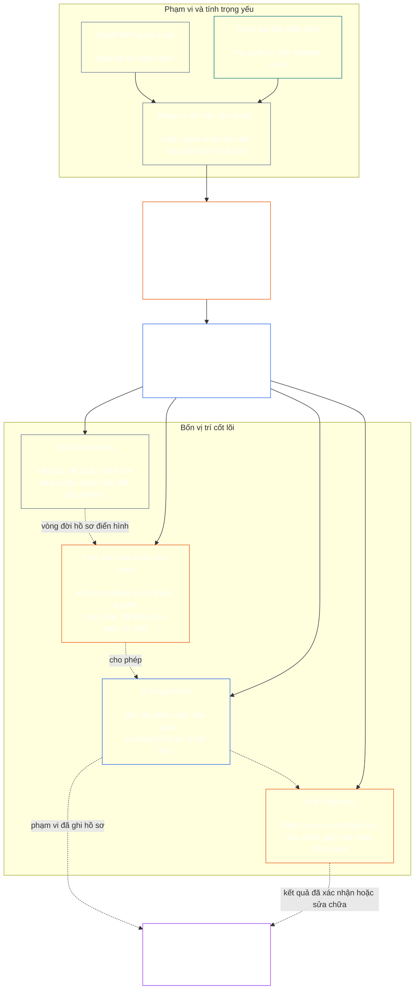

# CHƯƠNG BẢY: TÍNH ĐỘC LẬP CHỨC NĂNG VÀ PHÂN TÁCH NHIỆM VỤ

<strong>Vị trí trong kho văn bản (không có hiệu lực vận hành): cấu trúc tệp và quy tắc đọc</strong>

> Nội dung sau đây **chỉ nhằm hướng dẫn người đọc**. Nội dung không bổ sung, loại bỏ hoặc thu hẹp nghĩa vụ có tính ràng buộc ở nơi khác trong tệp này hoặc trong các chương khác.
>
> Tệp này **là một phần của Hiến pháp Sentient** và chỉ **có tính ràng buộc khi được đọc cùng** các tệp `core_*` được đánh số khác như một văn kiện thống nhất. Tệp này chứa **Chương Bảy**: chuẩn nền xuyên quy trình về tính độc lập chức năng và phân tách nhiệm vụ. Chương này đứng sau Tầng quyền Chương Sáu và trước các chương về quy trình hiến pháp bắt đầu với [chứng nhận sự phù hợp của hệ thống thuộc Chương Tám](../../core_08_system_alignment_certification.md#chapter-eight-system-alignment-certification-reading-index).
>
> - **Chủ thể phụ trách theo Hiến pháp:** chuẩn nền về các vị trí riêng biệt đối với hành vi có hiệu lực ràng buộc trọng yếu; nội dung tối thiểu áp dụng cho mọi [Hồ sơ Hành vi Ràng buộc Trọng yếu](../../core_05_band_accountability.md#materially-binding-act-record); sự độc lập với chủ thể hành động và [Tuyến Kiểm soát Trọng yếu](../../core_05_band_accountability.md#material-control-line) của chủ thể đó; việc công bố phân công làn và vai trò; định tuyến xung đột, vị trí khuyết, thay thế và phân công sai vị trí; việc bố trí chung theo tỷ lệ; bàn giao có thể quy trách nhiệm; và các điều kiện độc lập tối thiểu mà mọi quy trình hiến pháp về sau phải áp dụng.
> - **Nguồn ở tầng nguyên tắc:** [Chương Một §18.3](../../core_01_c_stewardship_capacity_principles.md#183-segregation-of-duties) yêu cầu quản trị duy trì tính độc lập chức năng và định tuyến kiến trúc vị trí vận hành đến đây.
> - **Chủ thể triển khai:** [CJS-3.11](../../corpus_joint_structure/cjs_03a_accountability_operations.md#constitutional-lane-and-functional-separation), [CI-3.2](../../corpus_institutions/ci_03_institutional_design_separation_of_powers.md#ci-32-functional-separation-lanes) và [CI-4.6](../../corpus_institutions/ci_04_appointment_competency_rotation_removal.md#ci-46-seat-catalog--process-role-archetypes-and-operational-boundaries) phân công và vận hành các vị trí. Các văn bản đó có thể đặt chuẩn nghiêm ngặt hơn và bổ sung các loại vị trí thẩm quyền đặc biệt có giới hạn; chúng không được thu hẹp chương này.
> - **Việc áp dụng riêng cho từng quy trình vẫn thuộc các chương sau:** Chương Tám áp dụng chuẩn nền này cho chứng nhận sự phù hợp của hệ thống; [Chương Chín §3.7](../../core_09_standing_assessment.md#37-segregation-of-duties) áp dụng cho hồ sơ tư cách; Chương Mười Hai và [corpus_forum.md](../../corpus_forum.md) áp dụng cho quy trình diễn đàn. Các chương đó có thể bổ sung biện pháp bảo vệ cần thiết theo lĩnh vực của mình; chúng không được tạo ra một phương án thay thế yếu hơn.
>
> Thứ tự đọc: §1 mục đích và phạm vi → §2 chuẩn nền bốn vị trí → §3 tính độc lập và xung đột → §4 định tuyến sai vị trí → §5 phân công được công bố và người thay thế → §6 điều chỉnh theo tỷ lệ → §7 tình huống khẩn cấp → §8 Hồ sơ Hành vi và bàn giao có thể quy trách nhiệm → §9 áp dụng ở các quy trình sau.

<strong>Dấu vết</strong>

- Thượng nguồn: [Tứ trụ Hiến pháp](../../core_00_preamble.md#constitutional-tetrad) — đặc biệt là **giám sát** và **trách nhiệm giải trình**; [lợi ích trọng yếu](../../core_00_preamble.md#material-stake); [Chuẩn mực Quản trị Chung §17.1 Chương Một](../../core_01_c_stewardship_capacity_principles.md#171-shared-stewardship-standard); [Quản trị dưới Kỷ luật Quản trị §18 Chương Một](../../core_01_c_stewardship_capacity_principles.md#18-governance-under-stewardship-discipline); [Điều XVI](../../core_06_rights_part_c.md#article-xvi-audit-transparency-and-independent-verification) (*Kiểm toán, Minh bạch và Xác minh Độc lập*).
- Các mục: [§1](#1-purpose-scope-and-owner-boundary); [§2](#2-four-seat-constitutional-floor); [§3](#3-independence-conflict-and-control-lines); [§4](#4-wrong-seat-routing); [§5](#5-published-placement-vacancy-and-substitution); [§6](#6-proportional-scaling-and-merged-hosting); [§7](#7-emergency-and-urgent-action); [§8](#8-act-records-and-attributable-handoffs); [§9](#9-relationship-to-later-processes).
- Hạ nguồn: [Chương Tám](../../core_08_system_alignment_certification.md#chapter-eight-system-alignment-certification-reading-index); [Chương Chín](../../core_09_standing_assessment.md#chapter-nine-contribution-violation-and-standing-model--measurement); [Chương Mười Hai](../../core_12_forum.md#chapter-twelve-forums-and-jurisdiction); [Chương Mười Ba](../../core_13_governance.md#chapter-thirteen-constitutional-contract-legitimacy-authorization-and-stewardship); các văn bản triển khai được chỉ định ở trên.
- Đọc cùng: [Phát hiện Sai lệch §19.3 Chương Một](../../core_01_c_stewardship_capacity_principles.md#193-misalignment-detection) (*phát hiện và rà soát nhiều bên*); [Hành động Có thể Quy trách nhiệm](../../core_05_band_accountability.md#attributable-action); [Tính Toàn vẹn của Quy trách nhiệm](../../core_05_band_accountability.md#attribution-integrity); [Khả năng Kiểm toán](../../core_05_band_oversight.md#auditability); [Khả năng Khiếu nại](../../core_05_band_accountability.md#contestability); [Tính Tương xứng](../../core_05_band_accountability.md#proportionality).

 

Chương Bảy là chủ thể phụ trách theo Hiến pháp về **chuẩn nền tính độc lập chức năng và phân tách nhiệm vụ đối với các hành vi có hiệu lực ràng buộc trọng yếu**.

### 1. Mục đích, phạm vi và ranh giới chủ thể phụ trách

<strong>Dấu vết</strong>

- Thượng nguồn: tuyên bố về chủ thể phụ trách ở phần mở đầu chương; [Chương Một §18](../../core_01_c_stewardship_capacity_principles.md#18-governance-under-stewardship-discipline); [Giám sát](../../core_05_apex_oversight_leg.md#oversight-constitutional); [Trách nhiệm giải trình](../../core_05_apex_accountability_leg.md#accountability).
- Hạ nguồn: từ [§2](#2-four-seat-constitutional-floor) đến [§9](#9-relationship-to-later-processes); mọi quy trình về sau tạo ra hoặc thay đổi hành vi có hiệu lực ràng buộc trọng yếu.
- Đọc cùng: [Chương Bốn](../../core_04_burden_traceability_verification.md#chapter-four-burden-of-proof-traceability-and-verification) về nền tảng xác minh; [Điều XIII-A](../../core_06_rights_part_c.md#article-xiii-a-reliability-and-trustworthiness-baseline) (*Chuẩn nền Độ tin cậy và Tính đáng tin*) và [Điều XIII-B](../../core_06_rights_part_c.md#article-xiii-b-right-to-redress-and-remedy) (*Quyền được Khắc phục và Biện pháp khắc phục*) về khiếu nại và khắc phục; [Điều XVI](../../core_06_rights_part_c.md#article-xvi-audit-transparency-and-independent-verification) (*Kiểm toán, Minh bạch và Xác minh Độc lập*) về các Tầng quyền Xác minh độc lập.

 

*Nói đơn giản: trước khi có thể tin cậy một quy trình hiến pháp — hoặc một quyết định ở cấp bên liên quan trong hệ thống, tổ chức hay phạm vi quyết định giới hạn đã được cho phép — các công việc bên trong phải được tách biệt. Chuẩn nền này áp dụng cho cả [Tầng Hợp đồng Hiến pháp](../../core_05_band_integrative.md#constitutional-contract-layer) và [Sự tham gia của Bên liên quan vào Hệ thống](../../core_05_band_participation.md#stakeholder-status-and-weight). Một sentient, chức vụ, hệ thống AI, cơ quan bên liên quan hay đại diện muốn đạt kết quả không thể đồng thời cung cấp khâu kiểm tra được cho là độc lập, kiểm soát hồ sơ chính thức của khâu kiểm tra đó, hoặc quyết định khiếu nại đối với khâu ấy.*

Chương này áp dụng cho mọi [Hành vi Ràng buộc Trọng yếu](../../core_05_band_accountability.md#materially-binding-act) theo định nghĩa của Chương Năm, bao gồm:

- một quyết định;
- một sự cho phép hoặc chứng nhận;
- một kết luận;
- một mục ghi hồ sơ hoặc thay đổi phiên bản trọng yếu;
- việc phát hành, triển khai, tiếp tục hoặc rút lại;
- một khoản giải ngân hoặc phân bổ; và
- việc giải quyết một khiếu nại.

Các vị trí trong chương này xác định ai được làm gì đối với một hành vi cụ thể; đó không phải là chức danh công việc. Cùng một sentient, chức vụ hay hệ thống có thể đảm nhiệm các vị trí khác nhau đối với các hành vi khác nhau. Chức danh, ủy quyền, năng lực kỹ thuật hoặc khả năng thực hiện một bước không mở rộng vị trí đang nắm giữ đối với hành vi đó.

Chương này quy định chuẩn nền phân tách nhiệm vụ xuyên quy trình. Chương không chuyển:

- gánh nặng chứng cứ, khả năng truy nguyên hoặc phương pháp xác minh khỏi Chương Bốn;
- ý nghĩa chuẩn tắc khỏi Chương Năm;
- các Tầng quyền khỏi Chương Sáu;
- nội dung hồ sơ riêng của quy trình khỏi các Chương Tám đến Mười Hai; hoặc
- danh mục vị trí vận hành, phương pháp bố trí nhân sự và cơ chế bản đồ làn khỏi văn bản triển khai được chỉ định.

### 2. Chuẩn nền Hiến pháp bốn vị trí

<strong>Dấu vết</strong>

- Thượng nguồn: [§1](#1-purpose-scope-and-owner-boundary); [Chương Một §18.3](../../core_01_c_stewardship_capacity_principles.md#183-segregation-of-duties); [Chương Một §17.1](../../core_01_c_stewardship_capacity_principles.md#171-shared-stewardship-standard).
- Hạ nguồn: từ [§3](#3-independence-conflict-and-control-lines) đến [§9](#9-relationship-to-later-processes); [CI-4.6](../../corpus_institutions/ci_04_appointment_competency_rotation_removal.md#ci-46-seat-catalog--process-role-archetypes-and-operational-boundaries) (*Danh mục vị trí — kiểu vai trò quy trình và ranh giới vận hành*).
- Đọc cùng: [§6](#6-proportional-scaling-and-merged-hosting) về lộ trình duy nhất cho phép bố trí chung.

 

*Nói đơn giản: mỗi hành vi có hiệu lực ràng buộc trọng yếu có bốn công việc — yêu cầu hoặc hành động, kiểm tra, lưu hồ sơ chính thức và xem xét khiếu nại. Các công việc vẫn tách biệt ngay cả khi tổ chức nhỏ được phép giao một cặp vị trí được cho phép cho cùng một chức vụ.*

<strong>Hướng dẫn người đọc (không có hiệu lực vận hành): sơ đồ bốn vị trí</strong>

> Nội dung sau đây **chỉ nhằm hướng dẫn người đọc**. Nội dung không bổ sung, loại bỏ hoặc thu hẹp nghĩa vụ có tính ràng buộc ở nơi khác trong chương này hoặc trong các chương khác.
>
> **Sơ đồ cho người đọc (không có hiệu lực vận hành).** Sơ đồ này thể hiện bốn vị trí và một vòng đời hồ sơ điển hình. Sơ đồ không bổ sung vị trí triển khai thứ năm, không yêu cầu mọi hành động phải chờ rà soát hoàn tất, và không thay đổi các quy tắc vận hành trong mục này và §§3–6.

 

Các mũi tên chấm bên trong ô vị trí thể hiện vòng đời hồ sơ điển hình. Mũi tên đến phần triển khai là liên kết truy nguyên, không phải trình tự bắt buộc phải chờ rà soát.

Mọi hành vi có hiệu lực ràng buộc trọng yếu đều có bốn vị trí khác nhau về chức năng. Chương Năm cung cấp ý nghĩa chuẩn tắc của các vị trí; mục này quy định cách phân công và các quy tắc không tương thích xuyên quy trình:

1. **[Vị trí Khởi xướng](../../core_05_band_accountability.md#initiating-seat)** — yêu cầu, đề xuất, vận hành, đưa ra yêu sách hoặc bằng cách khác bắt đầu hành vi.
2. **[Vị trí Xác minh hoặc Cho phép](../../core_05_band_accountability.md#verify-or-authorize-seat)** — đối chiếu chứng cứ và thẩm quyền với tiêu chuẩn áp dụng, rồi xác minh, cho phép, từ chối hoặc đặt điều kiện cho hành vi.
3. **[Vị trí Ghi Hồ sơ](../../core_05_band_accountability.md#record-seat)** — ghi, lập phiên bản, lưu giữ, bảo quản và công bố [Hồ sơ Hành vi](../../core_05_band_accountability.md#materially-binding-act-record) về điều mà Vị trí Xác minh hoặc Cho phép đã xác định.
4. **[Vị trí Khiếu nại](../../core_05_band_accountability.md#contest-seat)** — nhận và xem xét khiếu nại, ra lệnh sửa chữa hoặc giới hạn khi được cho phép, và định tuyến vấn đề nằm ngoài thẩm quyền của mình.

Các vị trí này áp dụng như nhau cho quản trị viên con người và AI. Nếu một hệ thống thực hiện hành vi, phê duyệt hành vi đó, rồi dùng nhật ký của chính nó làm bằng chứng, hệ thống đang cùng lúc nắm các vị trí khởi xướng, xác minh và ghi hồ sơ. Tự động hóa quy trình không làm cho việc kiểm tra trở nên độc lập.

Các kết hợp sau bị cấm đối với cùng một hành vi:

- vị trí khởi xướng không được xác minh hoặc cho phép hành vi của chính mình;
- vị trí xác minh hoặc cho phép không được nắm vị trí ghi hồ sơ;
- vị trí xác minh hoặc cho phép không được nắm vị trí khiếu nại; và
- người vận hành hệ thống không được xác minh hoặc cho phép hành vi liên quan đến hệ thống đó.

Các chương sau hoặc văn bản triển khai được dẫn nhập có thể cấm thêm các cách ghép vị trí đối với một quy trình cụ thể. Các văn bản đó không được cho phép cách ghép vị trí bị cấm ở đây.

Chuẩn nền chức năng bốn vị trí áp dụng ở mọi loại lớp. Câu hỏi được điều chỉnh theo lớp là liệu có thể gộp các vị trí hoặc để một người nắm nhiều vị trí hay không: với tổ chức hoặc hệ thống hoạt động trong phạm vi Lớp C, luôn khuyến nghị phân tách đầy đủ bốn vị trí; với phạm vi Lớp B, hầu như luôn phải yêu cầu; còn với phạm vi Lớp A thì luôn bắt buộc. Khi phạm vi pha trộn hoặc việc phân loại chưa chắc chắn, áp dụng phương án nghiêm ngặt nhất có thể áp dụng cho đến khi hồ sơ chứng minh được phương án thấp hơn.

### 3. Tính độc lập, xung đột và tuyến kiểm soát

<strong>Dấu vết</strong>

- Thượng nguồn: [§2](#2-four-seat-constitutional-floor); [Trách nhiệm giải trình theo thẩm quyền §18.1](../../core_01_c_stewardship_capacity_principles.md#181-governance-as-authorized-structure); [Điều XXIV](../../core_06_rights_part_d.md#article-xxiv-constitutional-interpretation-review-and-anti-capture-safeguards) (*Biện pháp bảo vệ về Giải thích Hiến pháp, Rà soát và Chống chi phối*).
- Hạ nguồn: [§4](#4-wrong-seat-routing); [§5](#5-published-placement-vacancy-and-substitution); [§8](#8-act-records-and-attributable-handoffs); vai trò bộ phận chứng nhận ở Chương Tám; quyền lưu giữ hồ sơ ở Chương Chín; chống tự xét xử ở diễn đàn Chương Mười Hai.
- Đọc cùng: [Tuyến Kiểm soát Trọng yếu](../../core_05_band_accountability.md#material-control-line); [CI-5](../../corpus_institutions/ci_05_conflict_integrity_anti_capture_anti_corruption.md) (*Tính toàn vẹn về xung đột, chống chi phối và chống tham nhũng*) và [CF-7](../../corpus_forum/cf_07_integrity_safeguards_anti_capture_anti_self_judging.md) (*Biện pháp bảo vệ tính toàn vẹn, hoạt động chống chi phối và hỗ trợ chống tự xét xử*) về biện pháp vận hành xử lý xung đột và chống tự xét xử.

 

*Nói đơn giản: đổi tên người ngồi ghế không tạo ra tính độc lập. Người xác minh hoặc rà soát không độc lập nếu sentient hay chức vụ tìm kiếm kết quả có thể chỉ đạo, bãi nhiệm, thưởng, phạt hoặc âm thầm phủ quyết họ đối với hành vi đó.*

Tính độc lập chức năng được đánh giá theo thẩm quyền và quyền kiểm soát thực tế, không theo nhãn gọi. Đối với cùng một hành vi:

- vị trí xác minh hoặc cho phép và vị trí khiếu nại phải nằm ngoài [Tuyến Kiểm soát Trọng yếu](../../core_05_band_accountability.md#material-control-line) của vị trí khởi xướng;
- một bên có lợi ích riêng được quyết định bởi hành vi đó không được nắm vị trí xác minh hoặc cho phép hay vị trí khiếu nại;
- người lưu giữ hồ sơ đang có xung đột phải chuyển hồ sơ, cùng toàn bộ dấu vết kiểm toán, cho người thay thế đã công bố; họ không được tự quyết định xung đột hoặc bỏ việc lưu giữ; và
- việc hồi tỵ loại bỏ thẩm quyền đối với hành vi; nó không chuyển vị trí cho người yêu cầu, tuyến báo cáo của người yêu cầu, hay người ở gần nhất.

Truy nguyên [Tuyến Kiểm soát Trọng yếu](../../core_05_band_accountability.md#material-control-line) cho hành vi cụ thể. Cơ sở hạ tầng dùng chung, hỗ trợ hành chính hoặc lịch sử bổ nhiệm không tự mình xác lập tuyến kiểm soát, nhưng các sắp xếp đó không được làm suy yếu trên thực tế khả năng đưa ra phán đoán độc lập.

Chữ ký thứ hai, ủy ban trên danh nghĩa, nhãn nội bộ hoặc xác nhận do công cụ tạo ra không đáp ứng yêu cầu độc lập nếu khâu kiểm tra được cho là độc lập thiếu thẩm quyền, quyền tiếp cận chứng cứ, tự do khỏi kiểm soát trọng yếu hoặc khả năng thực sự từ chối và định tuyến.

### 4. Định tuyến sai vị trí

<strong>Dấu vết</strong>

- Thượng nguồn: [§2](#2-four-seat-constitutional-floor); [§3](#3-independence-conflict-and-control-lines).
- Hạ nguồn: [§5](#5-published-placement-vacancy-and-substitution); [§8](#8-act-records-and-attributable-handoffs); [quy tắc vị trí dùng chung CI-4.6](../../corpus_institutions/ci_04_appointment_competency_rotation_removal.md#ci-46-shared-seat-rules).
- Đọc cùng: [Nghĩa vụ Kháng cự §17.5 Chương Một](../../core_01_c_stewardship_capacity_principles.md#175-duty-to-resist).

 

*Nói đơn giản: khi một bước không thuộc vị trí của bạn, đừng âm thầm làm thay và cũng đừng chỉ bỏ đi. Ghi nhận thiếu sót và chuyển vụ việc đến đúng nơi.*

Quản trị viên được yêu cầu thực hiện bước nằm ngoài vị trí của mình phải:

1. từ chối bước đó mà không tự cho rằng mình quyết định được nội dung của nó;
2. nêu vị trí được phép thực hiện bước đó và, nếu đã công bố, nêu người nắm giữ hoặc người thay thế;
3. ghi lại yêu cầu, vị trí đang nắm giữ, thiếu sót hoặc xung đột, và lộ trình đã dùng;
4. bảo toàn chứng cứ và tính toàn vẹn của mọi hồ sơ đã nhận; và
5. định tuyến mà không chậm trễ có thể tránh được.

Cách ứng xử đó là thực hiện nghĩa vụ, không phải bỏ mặc hành vi. Hành vi tiếp tục qua đúng vị trí. Thực hiện bước đó vì quản trị viên ở gần nhất, nhanh nhất, cấp cao nhất hoặc có hiểu biết chuyên môn duy nhất không khắc phục được vị trí đang khuyết.

### 5. Phân công được công bố, vị trí khuyết và thay thế

<strong>Dấu vết</strong>

- Thượng nguồn: [§2](#2-four-seat-constitutional-floor); [§3](#3-independence-conflict-and-control-lines); [Minh bạch](../../core_05_band_oversight.md#transparency); [Khả năng Kiểm toán](../../core_05_band_oversight.md#auditability).
- Hạ nguồn: [§8](#8-act-records-and-attributable-handoffs); [CI-3.2](../../corpus_institutions/ci_03_institutional_design_separation_of_powers.md#ci-32-functional-separation-lanes) (*Làn phân tách chức năng*); [CI-4.5](../../corpus_institutions/ci_04_appointment_competency_rotation_removal.md#ci-45-authorized-roles-and-accountability-chains) (*Vai trò được cho phép và chuỗi trách nhiệm giải trình*); hồ sơ Chương Tám và Chương Chín.
- Đọc cùng: [Hiến chương](../../core_05_band_continuity.md#charter) và [Chương Mười Ba §5](../../core_13_governance.md#5-authorized-roles-competency-development-and-contribution).

 

*Nói đơn giản: tổ chức phải công bố ai nắm từng vị trí trước khi tình huống khó xảy ra, kể cả người tiếp quản khi người nắm giữ thông thường vắng mặt hoặc có xung đột.*

Mọi bên tiếp nhận thực hiện hành vi ràng buộc trọng yếu phải duy trì bản đồ được công bố, có thể kiểm toán và khiếu nại, trong đó xác định:

- làn, chức vụ, vai trò hoặc quy trình nào đảm nhiệm từng vị trí;
- các hành vi và phạm vi mà phân công đó áp dụng;
- mọi cách bố trí chung được phép và biện pháp bảo vệ tính độc lập của nó;
- người thay thế cho người nắm giữ vắng mặt, bị loại trừ, bị chi phối hoặc có xung đột; và
- lộ trình độc lập khi không có người thay thế đủ năng lực.

Vị trí chưa được phân công, đang khuyết hoặc có xung đột là khiếm khuyết quản trị cần ghi nhận và sửa chữa. Vị trí đó không tự động chuyển cho vị trí khởi xướng, bên có lợi ích, người vận hành hoặc cấp trên trong [Tuyến Kiểm soát Trọng yếu](../../core_05_band_accountability.md#material-control-line) của họ. Cho đến khi được sửa chữa, hành vi phải được định tuyến đến người thay thế đã công bố hoặc lộ trình độc lập. Không thể bỏ qua yêu cầu độc lập chỉ vì đang vội.

Việc ủy quyền duy trì cùng ranh giới vị trí, nghĩa vụ chứng cứ, hồ sơ và thời hạn, đồng thời vẫn chịu sự điều chỉnh của [Tuyến Kiểm soát Trọng yếu](../../core_05_band_accountability.md#material-control-line). Việc ủy quyền không tạo vị trí mới, không gộp vị trí, và không cho phép người được ủy quyền làm điều mà vị trí ủy quyền không được làm, kể cả biến khuyến nghị hoặc yêu cầu phân tách đầy đủ bốn vị trí theo loại lớp thành sự cho phép gộp vị trí.

### 6. Điều chỉnh theo tỷ lệ và bố trí chung

<strong>Dấu vết</strong>

- Thượng nguồn: [§2](#2-four-seat-constitutional-floor); [lợi ích trọng yếu](../../core_00_preamble.md#material-stake); [Tính Cần thiết](../../core_05_band_accountability.md#necessity); [Tính Tương xứng](../../core_05_band_accountability.md#proportionality).
- Hạ nguồn: [Chương Chín §3.7](../../core_09_standing_assessment.md#37-informal-and-small-scope-records); [CJS-2.4](../../corpus_joint_structure/cjs_02_specific_joint_interlocks.md#cjs-24-class-scaled-lane-staffing-and-competency-redundancy) (*Bố trí nhân sự theo làn và dự phòng năng lực theo loại lớp*); [CI-3.2](../../corpus_institutions/ci_03_institutional_design_separation_of_powers.md#ci-32-functional-separation-lanes) (*Làn phân tách chức năng*).
- Đọc cùng: [Gánh nặng Có thể Tránh](../../core_05_band_continuity.md#avoidable-burden) và [Quy trình Chống Hạ thấp Nhân phẩm §3.3 Chương Một](../../core_01_a_values_principles.md#33-anti-degrading-process).

 

*Nói đơn giản: nhóm nhỏ và phi chính thức không cần bốn phòng ban lớn. Nhưng họ cần khâu kiểm tra độc lập thực sự, hồ sơ có thể sử dụng và lộ trình khiếu nại. Quy mô làm thay đổi phương thức bố trí nhân sự, không làm thay đổi sự phân tách được bảo vệ.*

Mức độ chặt chẽ, nhân sự, dự phòng và tính chính thức của việc phân tách được điều chỉnh theo lợi ích trọng yếu, loại lớp hệ thống, sự phụ thuộc và tổn hại có thể dự liệu hợp lý.

Bên tiếp nhận nhỏ hoặc phi chính thức chỉ có thể bố trí hai vị trí trong cùng một chức vụ hoặc cho cùng một sentient khi đáp ứng tất cả các điều kiện sau:

- việc gộp là cần thiết và tương xứng với phạm vi;
- việc gộp được công bố, có thể kiểm toán, có thể khiếu nại và được nêu trong hồ sơ hành vi;
- biện pháp bảo vệ tính độc lập giải quyết rủi ro do việc gộp tạo ra;
- vị trí khởi xướng không tự xác minh hoặc cho phép hành vi của mình;
- các tổ hợp xác minh-ghi hồ sơ và xác minh-khiếu nại vẫn bị cấm; và
- vẫn có lộ trình độc lập khi xung đột, tổn hại trọng yếu hoặc khiếu nại vượt quá ranh giới hợp pháp của người nắm vị trí đã gộp.

Công việc phi chính thức, không trả công, tương trợ, chăm sóc, sửa chữa, giảng dạy, hợp tác và quản trị cộng đồng có thể sử dụng một cơ quan tiếp nhận tín nhiệm không có lợi ích, được công bố thẩm quyền thực hiện khâu kiểm tra liên quan. Hiến pháp không đòi hỏi hình thức thể chế mà phạm vi không thể đạt tới một cách hợp lý nếu đã có lộ trình thực sự không có lợi ích và có trách nhiệm giải trình.

Thiếu nhân sự, tốc độ, sự tiện lợi hoặc việc tập trung chuyên môn tự chúng không biện minh cho việc gộp vị trí. Lộ trình theo loại lớp tại [§2 Chuẩn nền Hiến pháp Bốn Vị trí](#2-four-seat-constitutional-floor) được áp dụng: không có ngoại lệ nào cho Lớp A, và mọi ngoại lệ đối với Lớp B hoặc C phải đáp ứng các yêu cầu trên. Lợi ích trọng yếu càng lớn thì giả định về chức vụ riêng biệt, dự phòng năng lực và người thay thế độc lập càng mạnh.

### 7. Hành động khẩn cấp và cấp bách

<strong>Dấu vết</strong>

- Thượng nguồn: [§2](#2-four-seat-constitutional-floor); [§6](#6-proportional-scaling-and-merged-hosting); [Biện pháp khẩn cấp và gánh nặng tiếp tục §6.1 Chương Mười Hai](../../core_12_forum.md#61-emergency-measures-and-continuation-burden); [tư thế tạm thời mặc định](../../core_01_b_interaction_interpretation.md#default-interim-posture).
- Hạ nguồn: quy trình xử lý sự cố, ngăn chặn, phát hành, tiếp tục và rà soát sau sự kiện trong văn bản triển khai được chỉ định.
- Đọc cùng: [Tính Kịp thời](../../core_05_apex_timeliness_leg.md#timeliness-constitutional), [Bảo toàn Chứng cứ](../../core_05_band_oversight.md#evidence-preservation) và [CI-4.6 Danh mục vị trí — kiểu vai trò quy trình và ranh giới vận hành](../../corpus_institutions/ci_04_appointment_competency_rotation_removal.md#ci-46-seat-containment).

 

*Nói đơn giản: tình huống khẩn cấp thực sự có thể biện minh cho việc hành động trước khi hoàn tất khâu kiểm tra thông thường. Tình huống đó thay đổi trình tự, không thay đổi chủ thể nắm giữ vị trí hay tư thế phân tách theo loại lớp. Nó không cho phép chủ thể hành động tự chứng nhận việc tiếp tục hành động, xóa dấu vết hay trở thành người rà soát cuối cùng sau đó.*

Khi sự chậm trễ sẽ tạo ra nguy cơ tổn hại nghiêm trọng và sắp xảy ra có thể dự liệu hợp lý, vị trí khởi xướng hoặc ngăn chặn được cho phép có thể thực hiện hành động có thể đảo ngược ở mức tối thiểu cần thiết trước khi hoàn tất xác minh trước thông thường, nhưng chỉ khi:

- thẩm quyền, phạm vi, thời điểm bắt đầu, thời điểm hết hạn và lý do của tình huống khẩn cấp được ghi nhận ngay lập tức hoặc sớm nhất có thể về mặt vật lý;
- chứng cứ và phản đối được bảo toàn;
- thông báo và sự tham gia được khôi phục trong thời hạn hiến pháp áp dụng;
- vị trí xác minh hoặc cho phép độc lập rà soát mọi việc tiếp tục vượt quá giới hạn tức thời; và
- hành vi được rà soát độc lập sau sự kiện.

Hành động khẩn cấp không được:

- cho phép chủ thể hành động tự xác minh việc tiếp tục hành động của mình;
- biến chủ thể hành động thành người lưu giữ hồ sơ đang có xung đột;
- để chủ thể hành động xem xét khiếu nại đối với chính hành vi của mình;
- biến sự cần thiết tạm thời thành thẩm quyền vĩnh viễn; hoặc
- cho phép gộp bất kỳ vị trí nào trong bốn vị trí đối với tổ chức hay hệ thống Lớp A.

Tự thân những điều sau đây không phải là tình huống khẩn cấp:

- thời hạn;
- mục tiêu phát hành;
- thiếu nhân sự; hoặc
- lo ngại về danh tiếng.

### 8. Hồ sơ Hành vi và bàn giao có thể quy trách nhiệm

<strong>Dấu vết</strong>

- Thượng nguồn: từ [§2](#2-four-seat-constitutional-floor) đến [§7](#7-emergency-and-urgent-action); [Hồ sơ Hành vi Ràng buộc Trọng yếu](../../core_05_band_accountability.md#materially-binding-act-record); [Hành động Có thể Quy trách nhiệm](../../core_05_band_accountability.md#attributable-action); [Tính Toàn vẹn của Quy trách nhiệm](../../core_05_band_accountability.md#attribution-integrity).
- Hạ nguồn: [hành động có thể quy trách nhiệm và kiểm tra được CS-4 §10](../../corpus_systems/cs_04_critical_system_stewardship.md#10-inspectable-attributable-action); [quy tắc vị trí dùng chung CI-4.6](../../corpus_institutions/ci_04_appointment_competency_rotation_removal.md#ci-46-shared-seat-rules); mọi hồ sơ quy trình chịu sự điều chỉnh của §8; [`materially_binding_act_record.schema.json`](../../implementation/schemas/materially_binding_act_record.schema.json) (*mẫu cơ sở có thể kiểm tra bằng máy; hỗ trợ quy trình, không phải định nghĩa thứ hai*).
- Đọc cùng: [§4 Định tuyến Sai Vị trí](#4-wrong-seat-routing) và [Chương Bốn §5](../../core_04_burden_traceability_verification.md#5-compliance-evidence-standard).

 

*Nói đơn giản: mọi hành vi có hiệu lực ràng buộc trọng yếu đều có Hồ sơ Hành vi cho biết điều gì đã xảy ra, ai nắm từng vị trí, điều gì đã được quyết định và khiếu nại sẽ được gửi đến đâu.*

Mọi hành vi có hiệu lực ràng buộc trọng yếu phải có [Hồ sơ Hành vi Ràng buộc Trọng yếu](../../core_05_band_accountability.md#materially-binding-act-record) có thể nhận diện (**Hồ sơ Hành vi**). Hồ sơ Hành vi có thể nằm trong một hồ sơ chính thức cụ thể của quy trình đang áp dụng hoặc trong một tập hợp hồ sơ chính thức có liên kết, có thể quy trách nhiệm và bảo toàn tính toàn vẹn. Không cần tài liệu trùng lặp riêng nếu hồ sơ chính thức hiện có hoặc tập hợp liên kết xác định rõ mọi yếu tố bắt buộc, bảo toàn liên kết và lịch sử phiên bản, đồng thời vẫn truy cập được qua lộ trình hồ sơ chính thức được cho phép.

Hồ sơ Hành vi phải xác định ít nhất:

- mã nhận diện hồ sơ ổn định, phiên bản hiện tại và dấu thời gian trọng yếu về việc tạo lập và thay đổi;
- hành vi, phạm vi trọng yếu, trạng thái và thẩm quyền chi phối;
- vị trí khởi xướng, người nắm giữ và thẩm quyền;
- vị trí xác minh hoặc cho phép, người nắm giữ, tiêu chuẩn chi phối, kết luận, điều kiện hoặc lý do trọng yếu và thời điểm kết luận;
- vị trí ghi hồ sơ, người nắm giữ, thẩm quyền lưu giữ và phiên bản đã ghi;
- vị trí khiếu nại hoặc lộ trình khiếu nại được công bố, cùng trạng thái khiếu nại hoặc sửa chữa hiện tại;
- mọi sự ủy quyền, hồi tỵ, thay thế, gộp vị trí được phép hoặc sai lệch khẩn cấp; và
- chứng cứ trọng yếu cùng liên kết hồ sơ, bàn giao, từ chối, điều kiện, phản đối chưa giải quyết, thời hạn, phiên bản đã thay thế và sửa chữa cần thiết để tái dựng hành vi.

Hồ sơ riêng của quy trình có thể bổ sung các trường nghiêm ngặt hơn hoặc riêng cho lĩnh vực. Chúng không được bỏ sót, mâu thuẫn hoặc khiến không thể tái dựng mức tối thiểu này. Các biện pháp kiểm soát hợp pháp về quyền riêng tư, bảo mật và an ninh điều chỉnh cách truy cập hoặc tiết lộ tài liệu được bảo vệ; chúng không cho phép xóa dấu vết chính thức hoặc làm cho dấu vết đó không thể sử dụng khi xác minh, khiếu nại, sửa chữa hoặc khắc phục được cho phép.

Nhật ký cho biết ai đã làm gì, nhưng tự chúng không chứng minh rằng hành động là hợp lệ. Nhật ký, chữ ký, dấu vết mô hình, danh sách kiểm tra hoặc xác nhận do sentient hay hệ thống thực hiện hành động tạo ra chỉ có vai trò giới hạn:

- Các tài liệu này có thể cung cấp chứng cứ hoặc được liên kết với Hồ sơ Hành vi.
- Các tài liệu này không thể thay thế một quyết định và rà soát độc lập hoặc chính Hồ sơ Hành vi chính thức.

### 9. Quan hệ với các quy trình về sau

<strong>Dấu vết</strong>

- Thượng nguồn: từ [§1](#1-purpose-scope-and-owner-boundary) đến [§8](#8-act-records-and-attributable-handoffs).
- Hạ nguồn: [Chương Tám](../../core_08_system_alignment_certification.md#chapter-eight-system-alignment-certification-reading-index); [Chương Chín](../../core_09_standing_assessment.md#chapter-nine-contribution-violation-and-standing-model--measurement); [Chương Mười Hai](../../core_12_forum.md#chapter-twelve-forums-and-jurisdiction); [Chương Mười Ba](../../core_13_governance.md#chapter-thirteen-constitutional-contract-legitimacy-authorization-and-stewardship).
- Đọc cùng: [Ngăn xếp Thẩm quyền và Thứ bậc Nội bộ](../../core_05_band_integrative.md#owner-non-relocation) và [danh mục chủ thể phụ trách trong Lời mở đầu](../../core_00_preamble.md#4-principles-definitions-and-rights).

 

*Nói đơn giản: các chương sau cho biết mỗi quy trình phải đánh giá, ghi hồ sơ, quyết định và khắc phục điều gì. Chương này cho biết quyền lực phải được phân tách như thế nào khi thực hiện các việc đó.*

Mọi quy trình hiến pháp về sau phải giải thích cách phân công, sử dụng cả bốn vị trí và tuân thủ chương này. Trên thực tế:

- Hồ sơ quy trình của chính quy trình đó có thể làm Hồ sơ Hành vi hoặc bổ sung chi tiết riêng của quy trình vào hồ sơ.
- Nếu một hồ sơ quy trình bao quát nhiều hành vi có hiệu lực ràng buộc trọng yếu, hồ sơ đó có thể liên kết đến một Hồ sơ Hành vi riêng cho từng hành vi.
- Không cần hồ sơ trùng lặp riêng khi lộ trình hồ sơ chính thức vẫn đầy đủ và truy nguyên được.
- Đặt tên khác cho một quy trình không miễn trừ quy trình đó khỏi [§4 Định tuyến Sai Vị trí](#4-wrong-seat-routing) hoặc [§8 Hồ sơ Hành vi và Bàn giao Có thể Quy trách nhiệm](#8-act-records-and-attributable-handoffs), bao gồm quy tắc bàn giao và sai vị trí.

Cụ thể:

- **Chương Tám — chứng nhận sự phù hợp của hệ thống:** người vận hành hệ thống hoặc bên đề xuất chứng nhận nắm vị trí khởi xướng, không phải người xác minh cho chính mình; các kết luận thành phần có giới hạn, việc tích hợp hồ sơ chứng nhận, lưu giữ và khiếu nại phải nằm trong các vị trí hợp pháp và lộ trình chống tự xét xử.
- **Chương Chín — hồ sơ tư cách:** người yêu cầu, thẩm quyền mở hồ sơ, người lưu giữ hồ sơ và lộ trình khiếu nại cùng áp dụng chuẩn nền bốn vị trí và các quy tắc nghiêm ngặt hơn của Chương Chín về lưu giữ, người yêu cầu, hồ sơ phi chính thức và cấm tự lưu giữ.
- **Chương Mười Hai — diễn đàn:** việc nộp hồ sơ, điều tra, xem xét nội dung, lưu giữ hồ sơ, kháng cáo và rà soát cáo buộc thiên vị hoặc lạm dụng quy trình của chính diễn đàn phải bảo toàn các ranh giới vị trí và chống tự xét xử thích hợp.
- **Chương Mười Ba — quản trị:** định nghĩa vai trò, kế hoạch năng lực, ủy quyền, kế nhiệm và thiết kế thể chế phải phân công và duy trì các vị trí, chứ không chỉ lặp lại tên gọi.

Chương sau có thể đặt ra yêu cầu mạnh hơn về độc lập, hồi tỵ, phân tách, lưu giữ, hội đồng hoặc rà soát khi quy trình có rủi ro cao hơn hoặc khác biệt. Chương đó không được thu hẹp chuẩn nền này, xem nhãn riêng của quy trình là trường hợp miễn trừ, hoặc suy luận rằng khi văn bản im lặng thì vị trí được chuyển cho chủ thể hành động.

---

**Tệp trước:** [core_05_band_performance.md](../../core_05_band_performance.md)

**Tệp tiếp theo:** [core_08_a_system_alignment_certification_evaluation.md](../../core_08_a_system_alignment_certification_evaluation.md#chapter-eight-part-a-certification-evaluation)
