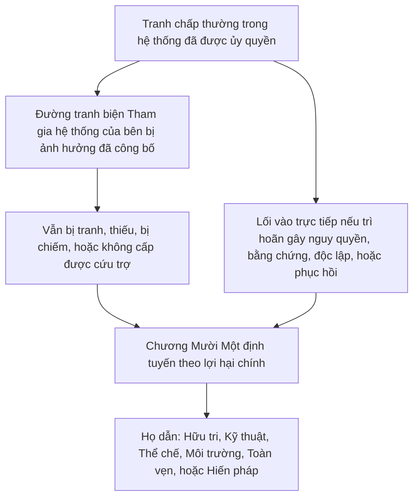

# CHƯƠNG MƯỜI MỘT: DIỄN ĐÀN VÀ THẨM QUYỀN ĐỊNH TUYẾN

<strong>Vị trí trong kho văn bản (không vận hành): cấu trúc tệp và quy tắc đọc</strong>

> Nội dung sau đây **chỉ là hướng dẫn cho người đọc**. Nó không thêm, bớt hay thu hẹp nghĩa vụ ràng buộc ở tệp này hay ở các chương khác.
>
> Tệp này là một **thử nghiệm ngôn ngữ đọc** của [Chương Mười Một tiếng Anh](../../core_12_forum.md). **Không** phải phần ràng buộc của Hiến pháp Hữu tri. **Không** phải một hiến pháp thứ hai. **Không** phải một ấn bản phát hành. Nó được **ghim** vào `SC-Corpus-2026.08.09`. Nếu bản dịch này và nguyên bản tiếng Anh có vẻ lệch nhau, tệp đánh số [`core_11_forum.md`](../../core_12_forum.md) thắng. Thứ tự đọc và siêu dữ liệu ấn bản được giữ ở [README.md](../../README.md). Phương pháp và bảng thuật ngữ: [translations/vi/README.md](README.md).
>
> Nó chứa **Chương Mười Một**: họ diễn đàn, địa điểm mặc định và định tuyến lợi hại chính, hỗ trợ pháp y, phân loại tiếp nhận, và thẩm quyền định tuyến cho tranh chấp dưới chuỗi quỹ đạo và Sàn Quyền. Các diễn đàn **giám sát** việc xử tranh chấp dưới các trụ **tham gia**, **giám sát**, và **kịp thời** của [Tứ diện Hiến pháp](core_00_preamble.md#constitutional-tetrad), chia tỷ lệ theo [lợi hại vật chất](core_00_preamble.md#material-stake). Khi sự kiện đã xác minh, chúng có thể **mở, cập nhật, hoặc sửa** hồ sơ quỹ đạo — hoặc **gạt một hồ sơ xấu sang một bên khi tranh biện** — dưới [Chương Tám §3](core_08_standing_assessment.md#3-standing-record-operational-requirements); một vụ đã nộp không tự là quỹ đạo, và tường thuật diễn đàn không được thế cho đo lường quỹ đạo Chương Tám ([Chương Tám §3.6](core_08_standing_assessment.md#36-forum-boundary)). Dùng [README — Standing pipeline and forums](../../README.md#standing-pipeline-and-forums) để điều hướng chuỗi. Cơ chế diễn đàn vận hành vẫn ở các tệp triển khai được chỉ định. Đánh số chương và tham chiếu chéo khớp văn kiện tích hợp. Thứ tự đọc, tách ràng buộc/hỗ trợ, và siêu dữ liệu ấn bản kho văn bản được giữ ở [README.md](../../README.md).

>
> **Trước (vẫn tiếng Anh):** [core_10_b_misconduct_pattern_applications.md](../../core_11_b_misconduct_pattern_applications.md#chapter-eleven-part-b-anti-constitutional-misconduct-pattern-applications)
>
> **Tiếp theo (vẫn tiếng Anh):** [core_08-11_application_vignettes.md](../../core_09-12_application_vignettes.md#chapters-eight-eleven-application-vignettes)
> **Cung đọc:** §1 mục đích → Trình tự tranh chấp → §2 địa điểm mặc định và tiếp nhận → §2.1–§2.3 giới hạn dẫn, lợi hại hỗn hợp, tranh biện → §3 chuyển và chống tự xét → §4 họ → §5 nâng cấp và chứng nhận → §6 bậc và chống trì hoãn → §7 hỗ trợ diễn đàn

<strong>Hướng dẫn cho người đọc (không vận hành): nơi Chương Mười Một sống và điều gì ở lại đây</strong>

> Nội dung sau đây **chỉ là hướng dẫn cho người đọc**. Nó không thêm, bớt hay thu hẹp nghĩa vụ ràng buộc ở chương này hay ở các chương khác.
>
> Nơi cái này sống (điều hướng):
> - **Chủ sở hữu hiến pháp:** **mục 1** (*mục đích* — **ứng dụng phân xử sơ cấp** của các chuẩn chương này gán, **khác với** **quản trị điều hành** thường ngày; **Trình tự tranh chấp** cho tranh chấp thường bên trong hệ thống đã được ủy quyền; yêu cầu **trách nhiệm giải trình**; đặt **ngưỡng** **đã công bố**, **dự đoán được**); **địa điểm khởi đầu mặc định**, định tuyến **lợi hại chính**, **cơ quan phân loại tiếp nhận** (**bàn tiếp xúc đầu**), lợi hại hỗn hợp, bất đối xứng, tranh biện hồ sơ quỹ đạo, **mô tả thiện chí và chống chơi**, và kỳ vọng **lối vào** **ngưỡng** **hữu tri tiếp cận được** (**mục 2**, **đọc cùng** **`corpus_forum.md`**); **chuyển**, **hợp nhất**, và **phối hợp** (**mục 3**, đọc cùng chứng nhận và dự phòng **mục 5**); **định nghĩa họ diễn đàn**, **buồng nội bộ**, **chuẩn dùng chung**, và **luật vận hành tạm** (hữu tri, kỹ thuật, thể chế, môi trường, toàn vẹn, hiến pháp — **mục** **4**, soi **bảng** của **mục** **2**); **nâng cấp**, **chứng nhận**, và **bảo vệ tạm** (**mục 5**); **giải quyết kịp thời** và kỷ luật **chống trì hoãn** (**mục 6**); **hỗ trợ diễn đàn** trước, trong, và sau rà soát (**mục 7**), triển khai sao cho vai trò phân loại và hỗ trợ **không** thế cho **hội đồng xét nội dung được lập hợp pháp**; định tuyến dự phòng **chống tự xét**; và móc nâng cấp gắn **Chương Tám**, **Chương Mười**, và quyền công lý và tranh biện **Chương Sáu**.
> - **Điều hướng chuỗi:** [README — Standing pipeline and forums](../../README.md#standing-pipeline-and-forums) — [§§1–7](#1-purpose-and-role) trong tệp này.
> - **Chuỗi ba câu hỏi Chương Tám–Chín:** **mục 2–3** Chương Tám trả lời Câu hỏi 1 (*điều gì đã xảy ra?*) qua hồ sơ đã xác minh, thuần trục. [Chương Tám §4](core_08_standing_assessment.md#4-standing-measurement-evaluation-dimensions) và [thang LEQU tỷ lệ thống nhất §7](core_08_standing_assessment.md#7-unified-proportional-lequ-scale) trả lời Câu hỏi 2 (*tốt hay xấu đến mức nào?*) qua chiều đánh giá, dải LEQU năm lần dùng chung, và ngữ pháp **s** = 1...9 dùng chung trong khi giữ hồ sơ Đóng góp và Vi phạm riêng. [Chương Chín](core_09_standing_integration.md#chapter-nine-standing-effects-and-integration) trả lời Câu hỏi 3 (*điều gì xảy ra vì thế?*) qua biện pháp khắc phục, bảo vệ, thanh năng lực và thông hành, và khóa quỹ đạo. Ô Trục Vi phạm chỉ do tác động đã xác minh kiểm soát; sơ suất, che giấu, cưỡng chế, đáp, và mô tả tính cách tương đương không dịch nó. [Chương Mười](core_10_a_misconduct_designation.md#chapter-ten-anti-constitutional-misconduct) có thể thêm chỉ định hành vi sai phản hiến pháp khớp vào hồ sơ ô 7, 8, hoặc 9 Chương Tám nhưng không gán ô số.
> - **Diễn đàn (chú giải không vận hành):** **Họ diễn đàn** dưới chương này là các **diễn đàn** sơ cấp áp phân loại [Chương Tám](core_08_standing_assessment.md#chapter-eight-compliance-violation-and-standing-model) vào tranh chấp cụ thể — kể cả việc nơi **bản chất đóng góp**, **ô tác động Trục Vi phạm**, và tính cách quy trình / đáp được ghi riêng **cùng hiện** và phải được xử dưới kỷ luật đánh giá chung và không-thế-chỗ của **Chương Tám**. Cơ chế **tài trợ nghiên cứu**, **tài chính**, và **khuyến khích** ngoài phân xử vẫn ở triển khai đã tiếp nhận và **[corpus_systems.md](../../corpus_systems.md)** (xem hướng dẫn người đọc **Chương Tám**); chúng có thể hỗ trợ phòng và truy nguyên nhân gốc và **không được** thế định tuyến **ngưỡng**, xác định **nội dung**, gán ô số Chương Tám có thẩm, mọi chỉ định **Chương Mười** khớp, hay ràng buộc **Điều XXIII** (*Giải quyết xung đột, leo thang, và tính tương xứng khẩn cấp*). **Mục 1 và 2** gán trách nhiệm **sơ cấp** về cấu trúc **khuyến khích** **chủ yếu** **trong** **lĩnh vực** mỗi **họ** (chi tiết hạt ở **kho văn bản** và triển khai); **gán** đó **không** dời lựa chọn **ngân sách** **toàn hệ thống** hay **quy mô quản trị** dành cho [Chương Mười Hai](../../core_13_governance.md#chapter-thirteen-constitutional-contract-legitimacy-authorization-and-stewardship) và **[corpus_systems.md](../../corpus_systems.md)**.
> - **Chủ sở hữu triển khai:** **lớp** tiếp nhận đã công bố, quy tắc sổ việc hàng ngày, nhân sự, ngân sách, thủ tục hạt, cơ chế nâng cấp vận hành, và yêu cầu vận hành hỗ trợ diễn đàn sống ở văn bản triển khai đã tiếp nhận và ở **[corpus_forum.md](../../corpus_forum.md)** (**CF-5** (*Vận hành định tuyến, chuyển, chứng nhận, và đối xử đại diện*), **CF-8** (*Hỗ trợ pháp y và phân tích diễn đàn*), **CF-9** (*Dịch vụ điều tra độc lập và giao diện truy tố*), và các mục liên quan); những tầng đó **triển khai, không thu hẹp**, chương này.
> - **Quy tắc chống dời chỗ:** công cụ tiếp nhận không được thỏa chương này bằng thủ tục làm sụp chức năng diễn đàn khác nhau, lột **độc lập** hoặc **rà soát thực**, hoặc định tuyến tranh biện toàn vẹn trở lại cùng diễn đàn bị chiếm mà chương này cấm làm nhà nội dung cuối duy nhất.
>
> **Kiến trúc — đặt *Nói thẳng*:** Mỗi dòng *Nói thẳng* xuất hiện ngay sau khối điều hướng Dấu vết (và ` ` theo sau khi có), và **trước** các đoạn vận hành và danh sách gạch đầu dòng của mục đó. Chỉ chú giải hướng người đọc; không thêm, bớt hay thu hẹp văn bản ràng buộc.

<strong>Dấu vết</strong>

- Thượng nguồn: [Chương Tám](core_08_standing_assessment.md#chapter-eight-compliance-violation-and-standing-model) (*hồ sơ Câu hỏi 1 và đo lường Câu hỏi 2 nuôi tranh chấp chương này định tuyến*); [Chương Tám §5.1](core_08_standing_assessment.md#5-slot-grammar-and-display-labels) (*ngữ pháp ô quỹ đạo*); [thang thống nhất Chương Tám §7](core_08_standing_assessment.md#7-unified-proportional-lequ-scale) (*dải LEQU năm lần dùng chung và hồ sơ trục riêng*); [Chương Tám §§4.3–4.4](core_08_standing_assessment.md#43-route-descriptor-measurement-roles) (*mục lục mô tả chuẩn hóa xuyên trục, kể cả mô tả Trục Đóng góp và Trục Vi phạm không dịch ô*); [Chương Mười](core_10_a_misconduct_designation.md#chapter-ten-anti-constitutional-misconduct) (*chỉ định hành vi sai phản hiến pháp khớp cho ô 7–9 Chương Tám đủ điều kiện*); [Chương Hai đến Bốn](core_02_definition_structure.md) (*kỳ vọng hồ sơ, xác minh, và truy vết*); [Chương Năm](core_05__definitions_home.md#chapter-five-foundational-definitions) (*định nghĩa nền*); [Chương Một](core_01_c_stewardship_capacity_principles.md#chapter-01-principles-and-constraints) (*ràng buộc diễn giải*); [Chương Sáu — Quyền nền](core_06_rights_part_a.md#chapter-six-foundational-rights) đến [Phần D](core_06_rights_part_d.md) (*móc tranh biện, kiểm toán, và điều công lý*).
- Tiểu mục: [§1](#1-purpose-and-role); [§2](#2-default-venue-and-primary-stakes); [§3](#3-transfer-consolidation-and-coordination); [§4](#4-forum-family-definitions); [§5](#5-escalation-and-certification); [§6](#6-timely-resolution-materiality-tiers-and-anti-delay-discipline); [§7](#7-forum-support-before-during-and-after-review).
- Đọc cùng: [README — Standing pipeline and forums](../../README.md#standing-pipeline-and-forums).
- Hạ nguồn: [corpus_forum.md](../../corpus_forum.md) (*học thuyết diễn đàn vận hành*); [Chương Mười Hai](../../core_13_governance.md#chapter-thirteen-constitutional-contract-legitimacy-authorization-and-stewardship) nơi tính chính đáng quản trị giao vai trò phân xử; [Chương Mười Sáu](../../core_17_incorporation.md#chapter-seventeen-incorporation-bridge) (*kỷ luật tiếp nhận* cho tầng thủ tục đã tiếp nhận).
- Đọc cùng: [Chương Tám §5.1](core_08_standing_assessment.md#5-slot-grammar-and-display-labels) (*ngữ pháp ô quỹ đạo*); [Chương Tám §§4.3–4.4](core_08_standing_assessment.md#43-route-descriptor-measurement-roles) (*mô tả chuẩn hóa xuyên trục Trục Đóng góp và Trục Vi phạm*).
- Cũng đọc cùng: [Chương Chín §3](core_09_standing_integration.md#3-descriptor-integration-and-attachment-normalization) (*tích hợp mô tả và chuẩn hóa gắn đọc cùng định tuyến lợi hại chính mục 2*); [README.md](../../README.md) (*thứ tự đọc và tổ chức kho văn bản*); [doc_architecture.md](../../doc_architecture.md) (*bản đồ biên tập không ràng buộc trừ khi được tiếp nhận*).

 

Chương Mười Một là chủ sở hữu hiến pháp của **họ diễn đàn, địa điểm mặc định, thẩm quyền định tuyến, và định tuyến phân xử cho tranh chấp dưới chuỗi quỹ đạo và Sàn Quyền**.

*Nói thẳng: Dưới [Tứ diện Hiến pháp](core_00_preamble.md#constitutional-tetrad) và [Hai Mục tiêu Hiến pháp](core_00_preamble.md#two-constitutional-aims), chương này **giám sát** cách tranh chấp đi qua chuỗi quỹ đạo Chương Tám–Mười — định tuyến, độc lập, hỗ trợ pháp y, trình tự sửa, và đồng hồ mặc định-bậc dưới **mục 6** và **Điều XXIV-C** (*Giải quyết kịp thời và sàn chống trì hoãn*). Họ diễn đàn trả lời đường nào xử tranh chấp nào, vụ thường bắt đầu ở đâu, và việc lợi hại hỗn hợp phối hợp thế nào. Chúng cung **tham gia** (tranh biện tiếp cận được) và **giám sát** (rà nội dung truy vết được). Khi sự kiện đã xác minh, chúng có thể **mở, cập nhật, hoặc sửa** hồ sơ quỹ đạo — hoặc **gạt một hồ sơ xấu sang một bên khi tranh biện**. Chúng **không** chạy một đường quyết riêng, thứ hai bên cạnh chuỗi quỹ đạo. Chỉ nộp một vụ không có tác động tức thì lên quỹ đạo. Quy tắc xét hàng ngày, ngân sách, và sổ nhân sự sống ở tầng triển khai và phải **triển khai, không thu hẹp**, chương này hay **Điều XXIII** (*Giải quyết xung đột, leo thang, và tính tương xứng khẩn cấp*).*

### 1. Mục đích và vai trò — kiến trúc tham gia

<strong>Dấu vết</strong>

- Thượng nguồn: [Chương Bảy — Chứng nhận thẳng hàng hệ thống](core_07_a_system_alignment_certification_evaluation.md#chapter-seven-system-alignment-certification); [Chương Tám](core_08_standing_assessment.md#chapter-eight-compliance-violation-and-standing-model); [Chương Chín](core_09_standing_integration.md#chapter-nine-standing-effects-and-integration); [Chương Mười](core_10_a_misconduct_designation.md#chapter-ten-anti-constitutional-misconduct); [Chương Một](core_01_c_stewardship_capacity_principles.md#chapter-01-principles-and-constraints) (*nguyên tắc và ràng buộc diễn giải*); [Chương Hai đến Bốn](core_02_definition_structure.md) (*kỳ vọng truy vết và xác minh*); [Chương Năm](core_05__definitions_home.md#chapter-five-foundational-definitions) (*định nghĩa đọc cùng Chương Hai đến Bốn trong widget Vị trí kho văn bản*); [Chương Sáu](core_06_rights_part_a.md#chapter-six-foundational-rights) (*Sàn Quyền nền chương này áp cùng*).
- Hạ nguồn: [§2](#2-default-venue-and-primary-stakes) (*địa điểm mặc định lợi hại chính, phân loại tiếp nhận, lợi hại hỗn hợp, bất đối xứng, tranh biện hồ sơ quỹ đạo; lối vào ngưỡng tranh biện được kịp; mô tả thiện chí và chống chơi*); [§3](#3-transfer-consolidation-and-coordination) (*chuyển và chống tự xét*); [§4](#4-forum-family-definitions) (*định nghĩa họ diễn đàn, buồng, chuẩn dùng chung, và luật vận hành tạm*); [§4.3](#43-institutional-forums) (*Ranh giới quy trình nội như ứng dụng họ Thể chế của Trình tự tranh chấp*); [§5](#5-escalation-and-certification) (*nâng cấp, chứng nhận, và bảo vệ tạm*); [§6](#6-timely-resolution-materiality-tiers-and-anti-delay-discipline) (*bậc tính trọng yếu, mốc chuỗi, và kỷ luật chống trì hoãn*); [§7](#7-forum-support-before-during-and-after-review) (*hỗ trợ diễn đàn trước, trong, và sau rà soát*).
- Trụ Tứ diện: **tham gia**, **giám sát**, **trách nhiệm giải trình**, **kịp thời** (phát hiện đã xác minh có thể mở, cập nhật, hoặc sửa hồ sơ quỹ đạo; **CF-11** triển khai đồng hồ bậc). Mục tiêu sơ cấp: **Hưng thịnh** và **Liên tục**. Chia tỷ lệ [lợi hại vật chất](core_00_preamble.md#material-stake) áp cho định tuyến và gánh lối vào.
- Đọc cùng: [Lời nói đầu §3.2](core_00_preamble.md#32-key-governance-processes) và [§3.3](core_00_preamble.md#33-governance-layers) (*đường quy trình và kỷ luật tầng quản trị*); [Điều XI: Tham gia hệ thống của bên bị ảnh hưởng, đại diện, và thủ tục đúng đắn](core_06_rights_part_b.md#article-xi-stakeholder-system-participation-representation-and-due-process); [corpus_forum.md](../../corpus_forum.md) (**CF-6.2.2** (*Quy tắc khẩn cấp, cạn, và thời hạn*) — triển khai, không thu hẹp); [corpus_institutions.md](../../corpus_institutions.md) (*tranh biện, rà soát thứ cấp, và giám sát toàn vẹn — không thay thẩm quyền định tuyến diễn đàn đã gán*); [Điều XII-B: Quyền tranh biện, rà soát, và biện pháp khắc phục](core_06_rights_part_c.md#article-xii-b-right-to-challenge-review-and-redress); [họ Điều XXIII](core_06_rights_part_d.md#article-xxiii-a-justice-objective-and-scope) (*ràng buộc công lý được viện trong widget Vị trí kho văn bản*).

 

*Nói thẳng: mục này gán **tham gia** và **giám sát** hiến pháp qua họ diễn đàn **giám sát** hai đường — **chuỗi quỹ đạo** (tranh chấp và hiệu ứng hồ sơ Chương Tám–Mười) và **Chứng nhận thẳng hàng hệ thống** (công nhận và rà soát Chương Bảy) — rồi nêu yêu cầu trách nhiệm giải trình cho đặt ngưỡng đã công bố. Tranh chấp thường bên trong hệ thống đã được ủy quyền dùng đường tranh biện Tham gia hệ thống của bên bị ảnh hưởng đã công bố trước; chương này tiếp khi đường đó vẫn bị tranh, thiếu, bị chiếm, hoặc không cấp được cứu trợ. Quy tắc xét chi tiết sống ở chỗ khác và không được lặng thu hẹp điều chương này bảo đảm.*

Chương này nêu **họ diễn đàn** nào **giám sát** câu hỏi sơ cấp nào qua **tham gia** (tranh biện hữu tri tiếp cận được, đối xử đại diện, và lối vào tỷ lệ) và **giám sát** (độc lập, hỗ trợ pháp y, và rà nội dung truy vết được). Nó **không** nêu quy tắc sổ việc, nhân sự, ngân sách, thủ tục hạt, hay cơ chế nâng cấp vận hành. Chi tiết đó thuộc tầng triển khai kho văn bản phải **triển khai, không thu hẹp**, chương này. **Họ diễn đàn** phải nêu biên pháp lý và quy định cho đặt ngưỡng, định tuyến lợi hại chính, và rà thẳng hàng hệ thống theo cách dự đoán được, đã công bố mà **triển khai, không thu hẹp**, **mục 2** cùng **`corpus_forum.md`**.

**Họ diễn đàn giám sát:**

1. **Chuỗi quỹ đạo** (Chương Tám–Mười, áp Chương Một đến Sáu và chuẩn triển khai kho văn bản được chỉ định trong tranh chấp)
   - Định tuyến lợi hại chính, rà nội dung nơi được gán, chuyển, hợp nhất, và phối hợp chứng nhận, và trình tự sửa cho tranh chấp liên quan quỹ đạo.
   - Hồ sơ Đóng góp và Vi phạm **Chương Tám** đo trên thang LEQU tỷ lệ thống nhất §7, mô tả tính cách, và hiệu ứng quỹ đạo — phát hiện đã xác minh có thể **mở, cập nhật, hoặc sửa** hồ sơ quỹ đạo — hoặc **gạt một hồ sơ xấu sang một bên khi tranh biện** — dưới [Chương Tám §3](core_08_standing_assessment.md#3-standing-record-operational-requirements) khi chúng thỏa cổng đầu vào đã xác minh; một vụ đã nộp không tự là quỹ đạo, và tường thuật diễn đàn không được thế cho đo lường quỹ đạo Chương Tám ([Chương Tám §3.6](core_08_standing_assessment.md#36-forum-boundary)).
   - Hiệu ứng quỹ đạo và tích hợp **Chương Chín** nơi chương này gán giám sát diễn đàn cho biện pháp khắc phục và trình tự.
   - Chỉ định hành vi sai phản hiến pháp **Chương Mười** nơi chỉ định đó bị kéo vào cho hồ sơ ô 7–9 Chương Tám.
   - Áp **Chương Một đến Sáu** và tầng triển khai [kho văn bản](core_05_band_integrative.md#corpus) được chỉ định như chuẩn những tranh chấp đó áp.

2. **Chứng nhận thẳng hàng hệ thống** ([Chương Bảy](core_07_a_system_alignment_certification_evaluation.md#chapter-seven-system-alignment-certification))
   - Công nhận, công nhận có điều kiện, xác nhận, tái xác nhận, rút, và kết quả hồ sơ chứng nhận liên quan được diễn đàn giám sát dưới [Chương Bảy Phần B](core_07_b_system_alignment_certification_record_process.md#chapter-seven-part-b-certification-record-and-process).
   - Vai trò thành phần dưới [Phần B §13](core_07_b_system_alignment_certification_record_process.md#13-forum-supervision-and-component-roles):
     - **Kỹ thuật** — đặc tả, phương pháp, và chuẩn bằng chứng
     - **Toàn vẹn** — công nhận thẳng hàng chính thức và phối hợp dẫn
     - **Môi trường** — thành phần thẳng hàng môi trường nơi có trọng
     - phát hiện thành phần họ khác dưới định tuyến chương này
   - Hữu tri có thể tranh kết quả chứng nhận, gắn điều kiện, và mở lại tệp khi cần — nhưng chứng nhận **không** thế đo lường quỹ đạo.
   - Phát hiện quan trọng từ chứng nhận có thể đếm như **đầu vào đã xác minh** khi Chương Tám đo quỹ đạo. Chứng nhận **không**, tự nó, gán ai một ô quỹ đạo ([Phần B §15](core_07_b_system_alignment_certification_record_process.md#15-relationship-to-standing)).

**Họ diễn đàn** là thể chế sơ cấp qua đó văn kiện này **giám sát** những đường đó. Chúng khác quản trị điều hành thường ngày của quy tắc đã ban.

**Trình tự tranh chấp.** Bên trong hệ thống, thể chế, hoặc miền quyết có giới hạn đã được ủy quyền, tranh chấp thường dùng đường tranh biện và thủ tục đúng đắn [Tham gia hệ thống của bên bị ảnh hưởng](core_05_band_participation.md#stakeholder-status-and-weight-cluster) đã công bố trước. Nếu đường đó cho kết quả vẫn bị tranh, thiếu, bị chiếm, hoặc không cấp được cứu trợ cần một cách hợp pháp, chương này định tuyến việc theo lợi hại chính dưới **mục 2**. **Toàn vẹn**, **Lĩnh vực Diễn đàn Kỹ thuật**, **Môi trường**, và **Hiến pháp** là họ dẫn mặc định khi đó là lợi hại chính — không phải ngoại lệ bỏ trình tự. Quy trình nội chưa xong, nhãn cạn, hoặc tuyên rà nội chưa xong không được làm chậm những dẫn đó, dời nội dung của chúng, hay ăn đồng hồ **Điều XXIV-C** (*Giải quyết kịp thời và sàn chống trì hoãn*). Lối vào trực tiếp vẫn có khi trì hoãn sẽ gây nguy có trọng cho quyền, bằng chứng, độc lập, hoặc phục hồi thực tiễn.

*Chỉ bản đồ người đọc. Nó không thêm, bớt hay thu hẹp đoạn Trình tự tranh chấp.*

Chúng:

- mang vai trò quản trị chủ động, kể cả giải vấn đề, phân tích nguyên nhân gốc, phòng, trình tự sửa, và học từ mẫu thất, thẳng hàng với nguyên tắc **Chương Một** kể cả **An toàn**, **Sự thật**, **Phúc lợi**, **Đáp ứng**, và **Quản trị có trách nhiệm và hiểu biết phân tán**.
- phải thỏa kỳ vọng **độc lập**, **khả năng tranh biện**, và **truy vết** ở **Chương Hai đến Bốn**, **Điều XII-B** (*Quyền tranh biện, rà soát, và biện pháp khắc phục*) nơi tranh biện và sửa bị kéo vào, và **Điều XXIII** (*Giải quyết xung đột, leo thang, và tính tương xứng khẩn cấp*) nơi ràng buộc công lý quản trị.
- chịu yêu cầu thủ tục và trách nhiệm giải trình toàn vẹn nghiêm nhất đã nêu của văn kiện này, kể cả biện minh công, khả năng truy vết, kỷ luật xin rút và hội đồng, hỗ trợ pháp y và phân tích nơi chương này gán chúng
- đòi định tuyến dự phòng chống tự xét. Những yêu cầu đó không được thế kiểm soát chính trị cho độc lập phân xử.
- Diễn đàn **Toàn vẹn**, **Hiến pháp**, và **Môi trường**, và **Lĩnh vực Diễn đàn Kỹ thuật** khi chúng nghe phân xử trạng thái hữu tri, đòi bổ nhiệm **đã công bố**, **bị tranh**, **luân phiên được** hoặc kiểm độc lập tương đương dưới [Chương Mười Hai §1.2](../../core_13_governance.md#12-eligibility-contested-selection-and-democratic-minimums). Thiếu bổ nhiệm hoặc thiếu tài trợ những ghế đó là thất [Chương Chín §9](core_09_standing_integration.md#9-enforcement-realism).

Mỗi **họ diễn đàn** mang trách nhiệm sơ cấp về cấu trúc khuyến khích chủ yếu trong lĩnh vực của mình. Gồm:

- công cụ tiếp nhận và tầng triển khai được chỉ định
- rà đường dẫn chi phí, chế tài, tranh biện và báo cáo
- móc trình tự sửa, và thẳng hàng sát phân xử tương đương.

Ngân sách **toàn hệ thống**, tài trợ nghiên cứu cắt ngang, và chương trình quy mô quản trị vẫn chịu [Chương Mười Hai — Quản trị](../../core_13_governance.md#chapter-thirteen-constitutional-contract-legitimacy-authorization-and-stewardship), **[corpus_systems.md](../../corpus_systems.md)**, và quy tắc tối cao khác nơi áp. Thanh toán, quy tắc chi phí, và công cụ khuyến khích tương tự **không được** thế chỗ:

- định tuyến diễn đàn đúng
- quyết nội dung thực bởi hội đồng được lập hợp pháp
- đo lường ô tác động Chương Tám
- mọi chỉ định **Chương Mười** khớp
- ràng buộc công lý ở **Điều XXIII** (*Giải quyết xung đột, leo thang, và tính tương xứng khẩn cấp*)

Tranh biện thể chế, rà soát thứ cấp, và giám sát toàn vẹn ở **`corpus_institutions.md`** (kể cả **CI-5** (*Toàn vẹn xung đột, chống chiếm, và chống tham nhũng*) đến **CI-8** (*Phối hợp xuyên thể chế và nâng cấp*) và kỳ vọng toàn vẹn tranh biện) làm việc cùng chương này. Chúng không thay họ diễn đàn **Toàn vẹn**, **Môi trường**, hay **Thể chế** cho nội dung ràng buộc nơi chương này gán những họ đó thẩm quyền định tuyến. Cơ chế khuyến khích triển khai trong những tập đó phải phối hợp với họ diễn đàn có lĩnh vực bị kéo chủ yếu, mà không dời định tuyến lợi hại chính hay thẩm quyền nội dung chương này gán.

### 2. Địa điểm mặc định và lợi hại chính

<strong>Dấu vết</strong>

- Thượng nguồn: [§1](#1-purpose-and-role) (*mục đích, vai trò ứng dụng sơ cấp, yêu cầu trách nhiệm giải trình, định tuyến ngưỡng đã công bố, không dời chi tiết, kỳ vọng độc lập và rà soát*).
- Hạ nguồn: [§3](#3-transfer-consolidation-and-coordination) (*chuyển, hợp nhất, chống tự xét*); [§4](#4-forum-family-definitions) (*định nghĩa họ diễn đàn đọc cùng bảng mặc định*); [§5](#5-escalation-and-certification) (*nâng cấp từ địa điểm mặc định; Bảo vệ tạm*); [§6](#6-timely-resolution-materiality-tiers-and-anti-delay-discipline) (*bậc tính trọng yếu và kỷ luật chống trì hoãn*); [§7](#7-forum-support-before-during-and-after-review) (*hỗ trợ diễn đàn trước, trong, và sau rà soát*).
- Trong §2: [§2.1](#21-lead-default-limits) (*va lợi hại chính, chứng nhận hiến pháp, và dự phòng chống tự xét*); [§2.2](#22-mixed-stakes-and-routing-asymmetry) (*lợi hại hỗn hợp và bất đối xứng*); [§2.3](#23-forum-records-standing-records-and-contests) (*hồ sơ vụ diễn đàn, hồ sơ quỹ đạo, và tranh biện*).
- Đọc cùng: [Tứ diện Hiến pháp](core_00_preamble.md#constitutional-tetrad) — trụ **tham gia**, **giám sát**, và **kịp thời**; chia tỷ lệ [lợi hại vật chất](core_00_preamble.md#material-stake) cho định tuyến lợi hại chính; [Chương Tám §5.1](core_08_standing_assessment.md#5-slot-grammar-and-display-labels) (*ngữ pháp ô quỹ đạo*); [thang thống nhất Chương Tám §7](core_08_standing_assessment.md#7-unified-proportional-lequ-scale) (*dải LEQU năm lần dùng chung và hồ sơ trục riêng*); [Chương Tám §§4.3–4.4](core_08_standing_assessment.md#43-route-descriptor-measurement-roles) (*mô tả chuẩn hóa xuyên trục thông tin lợi hại chính mà không dịch ô tác động*); [corpus_forum.md](../../corpus_forum.md) (**CF-5** và **CF-7.2**); [corpus_systems.md](../../corpus_systems.md) (*phân loại hệ thống, triển khai, và nghĩa vụ tái xác nhận*); [Chương Mười §3](core_10_a_misconduct_designation.md#3-violation-axis-s-7-9-slot-assignment-incident-gravity) (*chỉ định hành vi sai phản hiến pháp cho ô 7–9 Chương Tám đủ điều kiện; neo cũ được giữ*); [Chương Mười §4](core_10_a_misconduct_designation.md#4-due-process-safeguards-for-slot-assignment) (*thủ tục đúng đắn cho chỉ định đó đọc cùng chương này và **Điều XXIII** (*Giải quyết xung đột, leo thang, và tính tương xứng khẩn cấp*)*); [Điều XXIII-A](core_06_rights_part_d.md#article-xxiii-a-justice-objective-and-scope) (*mục tiêu và phạm vi công lý*).

 

*Nói thẳng: **bàn tiếp xúc đầu** của mỗi họ — **cơ quan phân loại tiếp nhận** — hỏi cuộc tranh thực sự về gì, không phải chú thích nói gì, rồi dùng bảng mặc định chọn diễn đàn dẫn. Diễn đàn kỹ thuật giữ đặc tả, phương pháp, và chuẩn bằng chứng thẳng hàng hệ thống; diễn đàn **Toàn vẹn** đưa phán công nhận thẳng hàng chính thức và xác nhận đang chạy trừ khi câu hỏi thành phần thuộc chỗ khác. Phân loại không thế hội đồng xét nội dung được lập hợp pháp; lợi hại hỗn hợp, bất đối xứng, và tranh biện hồ sơ quỹ đạo ở các tiểu mục dưới.*

**Định tuyến lợi hại chính** gán việc cho họ diễn đàn chịu lợi hại pháp lý, sửa, bảo vệ cưỡng, sàn hiến pháp, hoặc thực tiễn chính trong **tuyên** hoặc **bào chữa**. Nó theo điều tranh chấp thực sự về, không chú thích hay kết quả bên ưa.

**Cơ quan phân loại tiếp nhận (bàn tiếp xúc đầu).** Mỗi họ diễn đàn đòi phải giữ một **cơ quan phân loại tiếp nhận**, hoặc bố trí tương đương chức năng trong họ đó, làm **bàn tiếp xúc đầu** của họ lúc nộp. Cơ quan đó:
- **áp** định tuyến lợi hại chính dưới mục này;
- **phân loại** việc vào cho đối xử tiếp nhận **đã công bố** khớp **lợi hại chính**;
- **cờ** nhu cầu bảo toàn, **Sàn Quyền**, **định tuyến xuyên họ**, và **diễn đàn dự phòng**;
- **quản trị** lối vào ban đầu để chuyển, hợp nhất, chứng nhận, và kỷ luật dự phòng dưới **mục 3 và 5** có hiệu kịp;
- **không** phải một họ diễn đàn hiến pháp riêng;
- **không được** thế hội đồng xét nội dung được lập hợp pháp trên **kết quả nội dung** hay **sụp** biên **họ**;
- **không được** dùng tài trợ, phí, ưu đãi hành chính, hay thiết bị khuyến khích khác để đánh bại định tuyến lợi hại chính hoặc cho phép phân loại ngưỡng mờ.

**Mô tả thiện chí và chống chơi.** Mô tả diễn đàn phải **thiện chí** và **được biện** bởi **lợi hại chính**. Mô tả sai **cố ý** **có thể** kích **chi phí**, **bác**, hoặc **chuyển** dưới luật tiếp nhận. Thiết bị khuyến khích không được cấu hay áp để thưởng mua diễn đàn, phân loại ngưỡng mờ, hoặc định tuyến lệch kỷ luật lợi hại chính ở **mục này** và **mục 3**. Cơ chế chi phí, bác, và chuyển sống ở **`corpus_forum.md`** (**CF-5**) và phải **triển khai, không thu hẹp**, mục này.

Yêu cầu vận hành — kể cả **lớp tiếp nhận đã công bố**, hồ sơ tiếp nhận gán được, kỳ vọng độc lập và **tranh biện**, và rà **kịp** định tuyến **bị tranh** — được nêu ở **`corpus_forum.md`** (**CF-5** (*Vận hành định tuyến, chuyển, chứng nhận, và đối xử đại diện*)).

**Lối vào ban đầu** tới mỗi họ diễn đàn phải kịp và tranh biện được đủ để:
- định tuyến lợi hại chính dưới mục này vẫn có nghĩa;
- chuyển, hợp nhất, chứng nhận, và kỷ luật dự phòng dưới **mục 3 và 5** không bị vô hiệu bởi trì hoãn hay phân loại ngưỡng mờ.

Kỳ vọng thời gian cho lối vào diễn đàn phải:
- **hữu tri tiếp cận được**;
- hiệu chỉnh theo mức khẩn hại và độ phức tạp việc dưới **mục 6** và **Điều XXIV-C** (*Giải quyết kịp thời và sàn chống trì hoãn*);
- ưu lối vào ngưỡng thực và cứu trợ tạm hợp pháp dưới **mục 5** (*Bảo vệ tạm*) hơn tiện hành chính.

**Cơ quan phân loại tiếp nhận** dưới mục này, cùng **`corpus_forum.md`** (**CF-5**), thỏa nghĩa vụ này và phải triển khai cửa sổ mặc định-bậc **mục 6** trong phạm vi tiếp nhận.

**Bản đồ định tuyến từ Chương Tám §3.** Chương Tám nói diễn đàn *đo* điều đã xảy ra thế nào. Nó **không** tự chọn diễn đàn nào nghe vụ. Lúc nộp, **cơ quan phân loại tiếp nhận** (bàn tiếp xúc đầu) của họ đi chuỗi này:

1. **Kiểm điều đã xác minh:** Ghi mọi chất liệu **Trục Đóng góp** hoặc **Trục Vi phạm** Chương Tám đã xác minh — kể cả ô tác động, dải nghiêm, tính cách quy trình / đáp, và hiệu ứng quỹ đạo — khi chúng đã có.
2. **Đừng coi cáo là sự kiện đã chốt:** Cáo buộc và nhãn tạm chỉ hướng định tuyến và bảo toàn bằng chứng, cho đến khi có phát hiện dưới **Chương Hai đến Bốn**.
3. **Chọn diễn đàn dẫn theo điều cuộc tranh thực sự về:** Dùng bảng địa điểm mặc định dưới: **Hữu tri**, **Lĩnh vực Diễn đàn Kỹ thuật**, **Thể chế**, **Môi trường**, **Toàn vẹn**, hoặc **Hiến pháp**. Áp các quy tắc định tuyến đặc biệt này nơi khớp:
   - **Chỉ định Chương Mười:** Nơi chỉ định hành vi sai phản hiến pháp **Chương Mười** là lợi hại **chính**, **Toàn vẹn** là dẫn mặc định. Giữ:
     - ô tác động số Chương Tám;
     - chứng nhận **Hiến pháp** nơi cần;
     - quy tắc bên thể chế; và
     - dự phòng chống tự xét dưới **mục 2, 3, và 5**.
   - **Tranh thiên vị diễn đàn:** Nếu cuộc tranh chủ yếu về thành viên hội đồng lẽ ra phải rút, tham gia hội đồng thiên vị, hoặc phá toàn vẹn diễn đàn tương đương — kể cả trên hội đồng diễn đàn **Hiến pháp** dưới **[Điều XXII-B](core_06_rights_part_c.md#article-xxii-b-composition-rotation-and-conflict-controls) (*Thành phần, luân phiên, và kiểm xung đột*)** — định tuyến tới diễn đàn **Toàn vẹn** trước. Dưới **mục 3**, một diễn đàn không thể là thẩm cuối duy nhất về thiên vị của chính mình: diễn đàn **Hiến pháp** không thể là diễn đàn cuối duy nhất quyết liệu thành viên hội đồng của chính nó lẽ ra phải xin rút. Kỷ luật khóa quỹ đạo: **[Chương Chín §5.5](core_09_standing_integration.md#55-special-locks)**. Mẫu hành vi sai đã đặt tên: **[Chương Mười §5.10](../../core_11_b_misconduct_pattern_applications.md#510-forum-recusal-failure-and-biased-panel-participation)**.
   - **Câu hỏi kỹ thuật cách-làm:** Đặc tả, phương pháp, đo, thử, và câu hỏi bằng chứng chuyên gia đi tới **Lĩnh vực Diễn đàn Kỹ thuật** khi chúng là lợi hại chính hoặc câu hỏi thành phần được chứng nhận.
   - **Duyệt thẳng hàng hệ thống:**
     - **Công nhận thẳng hàng hiến pháp** chính thức cho hệ thống tác động có trọng mới, và **xác nhận thẳng hàng đang chạy** cho hệ thống hiện có, mặc định **Toàn vẹn** làm dẫn.
     - Toàn vẹn dùng đầu vào diễn đàn kỹ thuật cộng yêu cầu hiến pháp, thể chế, sinh thái, quyền, và chống chiếm.
     - Nơi hệ thống có phơi sinh thái có trọng, phụ thuộc tiền điều kiện môi trường, gánh vòng đời, nghĩa vụ phục hồi, hoặc rủi ro sinh thái dự đoán hợp lý được, họ diễn đàn **Môi trường** phải hoàn rà thẳng hàng môi trường (duyệt hoặc phản đối) trước khi công nhận, xác nhận, tái xác nhận, hoặc giải có trọng khỏi điều kiện môi trường có thể thành cuối.
     - Giữ chuyển hoặc chứng nhận tới **Lĩnh vực Diễn đàn Kỹ thuật**, **Thể chế**, **Môi trường**, **Hữu tri**, và **Hiến pháp** cho câu hỏi thành phần những họ đó nắm.

Lúc nộp, địa điểm **mặc định** theo các quy tắc này trừ khi **mục 3** chuyển hoặc hợp nhất:

| Họ | Mẫu bên | Lợi hại chính (tóm) |
|--------|---------------|--------------------------|
| **Hữu tri** | Việc hữu-tri-với-hữu-tri, và tranh quản trị cộng đồng thành viên, người tham gia, hộ, khu, hội, địa phương, vùng, trực tuyến, hoặc tương đương nơi không thể chế nào là bên cần thiết và không họ khác nắm lợi hại chính | Nghĩa vụ tư hoặc cộng đồng, hại sửa hoặc phục hồi, phục hồi địa phương, chuẩn cộng đồng địa phương hoặc trực tuyến, tham gia quản trị cộng đồng, loại trừ, phục hồi, hoặc tranh tự quản trị nội |
| **Lĩnh vực Diễn đàn Kỹ thuật** | Mọi mẫu bên, nhưng lợi hại **chính** là thủ tục quản trị kỹ thuật, đặc tả thẳng hàng hệ thống, chuẩn bằng chứng chuyên gia, quản trị khoa học / kỹ thuật / y, quản trị tri thức tương đương trong phạm vi đã tiếp nhận, **hoặc** xác định trạng thái hữu tri **Điều V-E** (*Sàn phân xử trạng thái hữu tri*) trên chỉ báo / bằng chứng chuyên gia / bất định có giới hạn | Chuẩn **kỹ thuật**, đặc tả thẳng hàng hệ thống, phương pháp đo và thử, thủ tục hành chính chuyên gia, quản trị có trách nhiệm đối với bằng chứng, toàn vẹn sách giáo khoa hoặc chương trình, quản trị chuẩn, giảm bất định có giới hạn liên quan phân xử, quy định, hoặc công nhận thẳng hàng, **hoặc** phân xử chỉ báo trạng thái hữu tri dưới **Điều V-E** (*Sàn phân xử trạng thái hữu tri*) |
| **Thể chế** | Bất kỳ **thể chế** nào là bên **cần thiết** **hoặc** cuộc tranh chính là thể chế được phép làm gì, được giao làm gì, hoặc liệu nó đã theo quy tắc quản nó | Thể chế được phép làm gì, được giao làm gì, phạm vi nó bị giám sát dưới, cách nó được phân loại, hoặc liệu nó đã theo nghĩa vụ |
| **Môi trường** | Mọi mẫu bên; vai trò thành phần đòi nơi thẳng hàng hệ thống kéo có trọng phơi sinh thái | **Tính toàn vẹn sinh thái**, **tiền điều kiện môi trường**, phục hồi hoặc sửa hệ thống sinh thái dùng chung, gánh môi trường gán được, hại sinh thái vòng đời hoặc hệ thống, rà thành phần thẳng hàng môi trường cho hệ thống có phơi sinh thái có trọng, hoặc thất sinh thái **mẫu** hoặc **hệ thống** nơi phân loại, công nhận thẳng hàng, tái xác nhận, hoặc cưỡng Sàn Quyền phụ thuộc xác định đó |
| **Toàn vẹn** | **Toàn vẹn** là vấn đề **chính** (kể cả phá **nặng** kiểm xung đột, thủ tục, hoặc chống chiếm), **công nhận thẳng hàng hiến pháp** chính thức hoặc **xác nhận thẳng hàng đang chạy** cho hệ thống, **hoặc** chỉ định hành vi sai phản hiến pháp **Chương Mười** cho ô tác động Chương Tám **s = 7, 8, hoặc 9** là lợi hại **chính** | **Toàn vẹn** chức, quy trình, đường tranh biện, công bố, quy tắc xung đột, nghĩa vụ chống chiếm, công nhận thẳng hàng hệ thống chính thức, xác nhận, và tái xác nhận dùng đầu vào diễn đàn kỹ thuật và xác định thành phần thẳng hàng môi trường diễn đàn Môi trường nơi có trọng (**kể cả** thất **mẫu** hoặc **hệ thống** **xuyên** thể chế hoặc hệ thống nơi đo lường **Chương Tám**, chỉ định **Chương Mười** khớp, hoặc cưỡng **Sàn Quyền** phụ thuộc xác định đó) |
| **Hiến pháp** | Hiệu lực hiến pháp **cấu trúc**, nghĩa **chuẩn** cho **mọi** người diễn giải, hoặc biện pháp khắc phục **tái cấu** quản trị **theo yêu cầu hiến pháp** | Hiệu lực hoặc nghĩa **hiến pháp**, hành động **ngoài thẩm quyền hợp pháp**, tối cao, hoặc biện pháp khắc phục **cấu trúc** **cả lớp** |

#### 2.1 Giới hạn mặc định-dẫn

Các quy tắc này giới hạn cách dẫn mặc định của bảng tương tác. Chúng không thay **mục 3 và 5**, hay quy tắc lợi hại hỗn hợp và bất đối xứng ở **mục 2.2**.

- **Va lợi hại chính:** Nếu cuộc tranh chính là thể chế được phép làm gì, được giao làm gì, hoặc liệu nó đã theo quy tắc quản nó, mặc định dẫn **Toàn vẹn** Chương Mười không phủ hàng **Thể chế**. **Mục 2.2** và **mục 3** quản lợi hại hỗn hợp, bên thể chế cần thiết, và chọn diễn đàn dẫn.
- **Chứng nhận hiến pháp:** Dẫn **Toàn vẹn** cho chỉ định Chương Mười không dời đo ô số Chương Tám hay chứng nhận hoặc nâng cấp tới diễn đàn **Hiến pháp** dưới **mục 5** nơi nghĩa, hiệu lực, hoặc biện pháp khắc phục cấu trúc cả lớp hiến pháp đòi xác định dưới hàng **Hiến pháp** hoặc qua nâng cấp họ-sang-họ.
- **Dự phòng chống tự xét:** Nơi cáo có trọng biện minh rà nội dung độc lập về toàn vẹn diễn đàn **Toàn vẹn** trong thủ tục chỉ định Chương Mười về hồ sơ ô 7–9 Chương Tám, định tuyến dự phòng dưới **mục 3 và 5** áp mà không thu hẹp **Chương Mười mục 4** hay **Điều XXIII** (*Giải quyết xung đột, leo thang, và tính tương xứng khẩn cấp*).

#### 2.2 Lợi hại hỗn hợp và bất đối xứng định tuyến

**Lợi hại hỗn hợp.** Một hồ sơ và một họ dẫn thường nghe tuyên phụ thuộc lẫn. Vấn đề thứ cấp có thể được chứng nhận, đình, hoặc giải qua tiền quyết vấn đề như công cụ tiếp nhận cung, khớp **Điều XII-B** (*Quyền tranh biện, rà soát, và biện pháp khắc phục*) và kỷ luật đánh giá chung và không-thế-chỗ **Chương Tám**.

**Bất đối xứng:**
- Nơi **phụ thuộc**, **đo lường**, hoặc **độc quyền** **thể chế** trên một **đầu vào** **cần thiết** bất lợi có trọng một bên **hữu tri**, định tuyến **Thể chế** hoặc **Toàn vẹn** **phải** **có sẵn** khi bảng gán lợi hại **thể chế** hoặc **toàn vẹn**.
- Nơi lợi hại **sinh thái** **có trọng** là **chính**, định tuyến **Môi trường** **phải** **có sẵn** như bảng gán.
- Diễn đàn **Hữu tri** **không được** là diễn đàn **bắt buộc** **duy nhất** khi lợi hại **chính** là **thể chế**, **toàn vẹn**, hoặc **sinh thái** dưới bảng ở mục này.

#### 2.3 Hồ sơ vụ diễn đàn, hồ sơ quỹ đạo, và tranh biện

**Hồ sơ vụ diễn đàn và hồ sơ quỹ đạo:**
- Một diễn đàn giữ một [**hồ sơ vụ diễn đàn**](core_05_band_accountability.md#forum-case-record) cho tranh chấp trước nó. Hồ sơ đó theo:
  - các tuyên;
  - bằng chứng;
  - lựa chọn định tuyến;
  - lệnh tạm;
  - câu hỏi được chứng nhận; và
  - phát hiện cuối trong vụ đó.
- Nó **không** cùng thứ với **hồ sơ quỹ đạo** đòi bởi [Chương Tám](core_08_standing_assessment.md#2-standing-records) (xem [Hồ sơ quỹ đạo](core_05_band_accountability.md#standing-record-chapter-six)).
- Quyết diễn đàn chỉ có thể thành phần **hồ sơ quỹ đạo đóng góp** hoặc **hồ sơ quỹ đạo vi phạm** Chương Tám khi nó tạo hồ sơ đóng góp đã xác minh, phát hiện vi phạm đã xác minh, **hồ sơ chứng nhận thẳng hàng hệ thống**, hoặc phát hiện khác có giới hạn, truy vết được, tranh biện được, và đã xác minh dưới Chương Hai đến Bốn và mọi bảo vệ rà đòi.
- Không cái nào sau, tự nó, đổi quỹ đạo, đủ điều kiện vai, trạng thái tin cậy, công nhận, hoặc hiệu ứng quỹ đạo cuối của ai:
  - nộp một vụ;
  - gán nó cho một họ diễn đàn;
  - làm ghi chú tiếp nhận;
  - ban lệnh tạm;
  - ghi cáo chưa giải;
  - thảo thỏa; hoặc
  - dùng nhãn định tuyến tạm.
- Khi một diễn đàn dẫn xử vụ lợi hại hỗn hợp, nó phải giữ **hồ sơ vụ diễn đàn** đủ rõ để đo đóng góp và vi phạm Chương Tám riêng, mọi chỉ định Chương Mười, và hiệu ứng quỹ đạo Chương Chín vẫn kiểm được riêng và ghi vào hồ sơ quỹ đạo thuần trục.

**Tranh biện hồ sơ quỹ đạo:**
- Tranh biện nêu trên hồ sơ trước mọi nộp — tới người lưu giữ, quyền mở hồ sơ, hoặc bất kỳ văn phòng thể chế — được ghi trên hồ sơ, đặt *đang tranh*, và định tuyến bởi người lưu giữ dưới [Chương Tám §3.7](core_08_standing_assessment.md#37-challenge-received-on-the-record) (*Tranh biện nhận trên hồ sơ*); đồng hồ bậc dưới **§6** chạy từ lần nhận đó, và **hồ sơ vụ diễn đàn** mở khi tranh tới một diễn đàn.
- Một hữu tri, thể chế, hệ thống, cộng đồng, hoặc chủ thể bị ảnh hưởng khác có thể xin diễn đàn có thẩm rà một **hồ sơ quỹ đạo đóng góp** hoặc **hồ sơ quỹ đạo vi phạm** khi họ tuyên hồ sơ:
  - sai;
  - thiếu;
  - cũ;
  - sai phạm vi;
  - dựa trên phát hiện không hợp lệ;
  - thiếu ngữ cảnh đòi;
  - thiếu tham chiếu chéo đòi; hoặc
  - đang dùng cho mục đích nó không phủ.
- Việc diễn đàn là rà hồ sơ bị tranh và cách nó đang được dùng. Nó có thể:
  - xác nhận hồ sơ;
  - đòi sửa;
  - lệnh phiên bản mới;
  - hạn hoặc tạm dựa vào hồ sơ;
  - gửi vấn đề nền tới diễn đàn đúng; hoặc
  - chứng nhận câu hỏi hiến pháp.
- Diễn đàn **không được** biến tranh biện hồ sơ quỹ đạo thành xét danh tiếng chung hoặc gộp rà đóng góp và vi phạm thành một phiên nội dung không phân biệt khi tranh chỉ nhắm một hồ sơ thuần trục.
- Định tuyến theo vấn đề thực trong tranh:
  - khuyết sự kiện hoặc bằng chứng đi tới họ diễn đàn có thể rà công bằng chất liệu đó;
  - tranh dùng-thể-chế đi tới diễn đàn **Thể chế** nơi cuộc tranh chính là thể chế được phép làm gì hoặc liệu nó đã theo quy tắc quản nó;
  - cáo chiếm, che giấu, trả đũa, hoặc toàn vẹn quy trình đi tới diễn đàn **Toàn vẹn** nơi toàn vẹn là chính;
  - nội dung môi trường đi tới diễn đàn **Môi trường** nơi lợi hại sinh thái là chính;
  - hiệu lực hoặc nghĩa hiến pháp đi tới diễn đàn **Hiến pháp** qua chứng nhận hoặc định tuyến trực tiếp nơi chương này cho phép.

### 3. Chuyển, hợp nhất, và phối hợp — liên tục và chống chiếm

<strong>Dấu vết</strong>

- Thượng nguồn: [§2](#2-default-venue-and-primary-stakes) (*bảng địa điểm mặc định, phân loại tiếp nhận, lợi hại hỗn hợp, và bất đối xứng*); [Chương Chín §2 — Hồ sơ tích hợp và thứ tự quyết](core_09_standing_integration.md#2-integration-record-and-decision-order) (*hạng không tuân thủ áp cao nhất — phối hợp lợi hại hỗn hợp*).
- Hạ nguồn: [§5](#5-escalation-and-certification) (*câu hỏi hiến pháp được chứng nhận, kích định tuyến dự phòng, và Bảo vệ tạm trong khi phối hợp tiến*).
- Đọc cùng: [Điều XII-B](core_06_rights_part_c.md#article-xii-b-right-to-challenge-review-and-redress) (*Quyền tranh biện, rà soát, và biện pháp khắc phục*); [corpus_institutions.md](../../corpus_institutions.md) (*quy trình toàn vẹn nội có thể đi trước diễn đàn toàn vẹn nơi bảo vệ thỏa kỳ vọng*); [corpus_forum.md](../../corpus_forum.md) (**CF-7**, phối hợp thẳng hàng do Toàn vẹn dẫn).

 

*Nói thẳng: khi nhiều **bên** **bị ảnh hưởng** chia cùng mẫu hại nền, diễn đàn có thể mở rộng vụ công bằng; khi diễn đàn **Toàn vẹn** ban phán **thẳng hàng** chúng giữ **một** hồ sơ dẫn và chuyển câu hỏi **thành phần** tới **họ** đúng mà không lấy việc nội dung của những diễn đàn đó; và không họ diễn đàn nào được lời cuối duy nhất khi cáo về cơ bản là chính họ này bị dàn, xung đột, hoặc giấu bóng — quy tắc gửi việc đó sang đường dẫn khác với dự phòng viết.*

**Mở rộng phạm vi và đối xử đại diện.** Khi một hữu tri nộp vụ, diễn đàn **có thể** mở rộng thủ tục để phủ một **lớp**, **lớp con**, hoặc nhóm khác trong cùng tình.
- Mở rộng có sẵn khi hồ sơ chỉ bất kỳ điều nào sau:
  - tổn thương dùng chung có nghĩa;
  - cùng thực tiễn bất hợp pháp;
  - cùng quy tắc quyết;
  - phụ thuộc dùng chung vào cùng hành vi, hệ thống, hoặc lựa chọn thể chế; hoặc
  - vấn đề **thẳng hàng hệ thống** với hiệu ứng có trọng thượng nguồn hoặc hạ nguồn.
- Diễn đàn **nên** mở rộng khi từ chối mở rộng sẽ để **hữu tri** cùng tình không có biện pháp khắc phục thực tiễn một cách dự đoán được.
- Nó cũng **nên** mở rộng khi từ chối mở rộng sẽ tạo phán xung đột một cách dự đoán được, hoặc chặn cứu trợ phải chạy ở mức **cấu trúc**.
- Mở rộng vụ không lấy **quỹ đạo** của bên tuyên gốc. Nó cũng không xóa vấn đề cá nhân vẫn cần chứng minh hoặc sửa từng người.

**Trình tự họ và dẫn thẳng hàng.** Việc liên quan có thể bắt đầu ở đường có thẩm gần nhất, dùng quy trình toàn vẹn nội thể chế hợp pháp trước nơi bảo vệ đứng, và giữ một hồ sơ dẫn **Toàn vẹn** cho phối hợp **thẳng hàng** — mà không dời nội dung **lợi hại chính** của họ khác.
- **Hữu tri** trước có thể áp khi tranh ngang hàng giải đầy được mà không cần xác định thể chế hoặc hiến pháp cuối; khía cạnh thể chế hoặc hiến pháp có thể bị đình hoặc tách với quy tắc tiền quyết rõ.
- Quy trình toàn vẹn nội **Thể chế** có thể đi trước diễn đàn **Toàn vẹn** nơi bảo vệ độc lập và tranh thỏa kỳ vọng **Chương Tám**, **Chương Sáu** (Quyền nền), và **`corpus_institutions.md`**; diễn đàn **Toàn vẹn** vẫn có sẵn cho xác định toàn vẹn cuối, bế tắc xuyên thể chế, và tuyên mẫu.

**Phối hợp thẳng hàng do Toàn vẹn dẫn:**
- Nơi diễn đàn **Toàn vẹn** ban phán **thẳng hàng** dưới **mục** **4**, nó **vẫn** là diễn đàn phối hợp **dẫn** cho **hồ sơ** của **thủ tục** **đó**, như **mục** **4** cung.
- Nơi diễn đàn **Toàn vẹn** tiến **công nhận thẳng hàng hiến pháp** cho hệ thống mới hoặc **rà thẳng hàng đang chạy** cho hệ thống hiện có, nó vẫn là diễn đàn dẫn chính thức cho hồ sơ thẳng hàng trừ khi định tuyến lợi hại chính, bảo vệ chống tự xét, hoặc chứng nhận gán câu hỏi thành phần chỗ khác.
- Nơi phơi sinh thái có trọng tồn tại, rà thẳng hàng môi trường diễn đàn **Môi trường** là thành phần đòi của hồ sơ dẫn đó. Phối hợp dẫn **Toàn vẹn** không được chốt công nhận, xác nhận, tái xác nhận, hoặc giải có trọng khỏi điều kiện môi trường trong khi phản đối diễn đàn Môi trường kịp, điều kiện sửa, hoặc câu hỏi môi trường được chứng nhận còn chưa giải.
- Việc **thành phần** **được chuyển** hoặc **chứng nhận** tới họ **khác** **ở lại** với những diễn đàn đó cho **nội dung** **lợi hại chính**.
- Phối hợp dẫn **Toàn vẹn** không được chiếm nội dung cuối trên câu hỏi sơ cấp phi-toàn-vẹn dành cho diễn đàn **Hiến pháp**, **Thể chế**, **Môi trường**, **kỹ thuật chuyên**, hoặc **Hữu tri**.
- Lệnh **đồng thời** **xung đột** **phải** được **giải** qua quy tắc **phối hợp** **đã công bố** — **kể cả** **đình** và **trình tự** trong phán **thẳng hàng** hoặc văn bản **triển khai** — **khớp** **mục** **7** và **`corpus_forum.md`** (**CF-7** (*Bảo vệ toàn vẹn, vận hành chống chiếm, và hỗ trợ chống tự xét*)).

**Quy tắc chống tự xét xuyên diễn đàn.** Một họ **diễn đàn** **không được** là diễn đàn **nội dung** **cuối** **duy nhất** cho tuyên có vấn đề **chính** là **thiên vị**, **chiếm**, **xung đột**, **thất xin rút**, **che giấu**, **lạm dụng quy trình**, hoặc phá **toàn vẹn** tương đương của chính họ đó.
- Định tuyến lợi hại chính vẫn quản. Họ dẫn **độc lập** cho những tuyên đó được gán như sau trừ khi quy tắc hiến pháp cụ thể hơn kiểm soát:
  - chống diễn đàn **Hiến pháp**: **Toàn vẹn** trước và **Thể chế** làm dự phòng
  - chống diễn đàn **Thể chế**: **Hiến pháp** trước và **Toàn vẹn** làm dự phòng
  - chống diễn đàn **Toàn vẹn**: **Thể chế** trước và **Hiến pháp** làm dự phòng
  - chống diễn đàn **Môi trường**: **Thể chế** trước và **Toàn vẹn** làm dự phòng
- Quy tắc này **không** biến mọi vụ nêu một diễn đàn thành quy tắc địa điểm đặc biệt. Nó chỉ áp nơi bảo vệ **chống tự xét** cần có trọng để giữ **độc lập**, **khả năng tranh biện**, hoặc **tin cậy** **công**.

**Chiếm cấp họ.** Nơi bằng chứng đáng tin chỉ **chiếm**, thỏa hiệp, kiểm cưỡng, cản phối hợp, hoặc phụ thuộc cấu trúc ảnh hưởng một **họ diễn đàn** như một toàn thể, xin rút, kháng, hoặc quy trình liên tục trong-họ thường không đủ tự nó.
- Hệ thống diễn đàn phải kích các điều sau, đủ để khôi phân xử nội dung hợp pháp, tranh biện được:
  - định tuyến dự phòng cấp họ;
  - bảo toàn hồ sơ độc lập; và
  - rà soát ngoài có hạn thời gian.
- Họ bị chiếm hoặc thỏa hiệp không được kiểm hồ sơ kích, rà khôi, hoặc xác định cuối về độc lập đã khôi của chính mình.
- Thẩm quyền dự phòng vẫn giới hạn điều cần cho:
  - phân xử nội dung hợp pháp;
  - cứu trợ khẩn;
  - lưu giữ hồ sơ; và
  - khôi phục.
- Nó không nuốt vĩnh viễn thẩm quyền định tuyến của họ bị chiếm hay dời chứng nhận **Hiến pháp** nơi biện pháp khắc phục cấu trúc hoặc nghĩa hiến pháp bị kéo có trọng.

**Thất năng lực được nghe ngoài thân bị đói.** Tuyên rằng một họ diễn đàn, hệ thống biện pháp khắc phục, hoặc chức năng tích hợp quỹ đạo dưới năng lực — tồn đọng thiết kế, tiếp nhận không vào được, thiếu tài trợ mãn, thất mốc mãn, hoặc cò ngang-biện-pháp-khắc-phục [Chương Chín §4.4](core_09_standing_integration.md#44-remedy-parity-and-lock-preconditions) đã kích — là việc chống tự xét. Thân có năng lực đang hỏi không được là người tìm sự kiện duy nhất về năng lực của chính mình.
- Họ **Toàn vẹn** là dẫn mặc định cho tuyên thất năng lực, với cặp dự phòng **mục 3** áp nơi Toàn vẹn tự là thân đang hỏi.
- Mọi bên bị ảnh hưởng, người báo được bảo vệ, hoặc nhóm tự tổ dưới [Chương Một §9.5](core_01_c_stewardship_capacity_principles.md#95-aligned-self-organization) có thể nộp tuyên thất năng lực. Nó được nghe trên đồng hồ Bậc B dưới **mục 6** trừ khi hồ sơ chỉ lợi hại Bậc A.
- Thân đang hỏi phải cung số tồn đọng [Chương Chín §4.4](core_09_standing_integration.md#44-remedy-parity-and-lock-preconditions) và **mục 6** đã công bố, và có thể đưa bằng chứng, nhưng không được kiểm phát hiện hay lệnh sửa.
- Phát hiện thất năng lực là thất bền [Chương Chín §9.2](core_09_standing_integration.md#92-remedy-system-durability). Nó định tuyến lệnh sửa tới họ [lợi hại chính](#2-default-venue-and-primary-stakes) chịu nhân sự và tài trợ và, nơi mẫu mãn hoặc bị che, mở đường Chương Tám thường.

### 4. Định nghĩa họ diễn đàn — trách nhiệm giải trình qua phân xử

<strong>Dấu vết</strong>

- Thượng nguồn: [§1](#1-purpose-and-role) (*mục đích, vai trò ứng dụng sơ cấp, yêu cầu trách nhiệm giải trình, định tuyến ngưỡng đã công bố, không dời chi tiết, kỳ vọng độc lập và rà soát*); [§2](#2-default-venue-and-primary-stakes) (*bảng địa điểm mặc định, thử lợi hại chính, phân loại tiếp nhận, lợi hại hỗn hợp, và lối vào ngưỡng tranh biện được kịp*); [§3](#3-transfer-consolidation-and-coordination) (*chuyển, hợp nhất, và chống tự xét*).
- Hạ nguồn: [§5](#5-escalation-and-certification) (*nâng cấp họ-sang-họ; chứng nhận khi lợi hại vận hành và hiến pháp gộp; phán thẳng hàng và học thuyết chung*); [§6](#6-timely-resolution-materiality-tiers-and-anti-delay-discipline) (*bậc tính trọng yếu và kỷ luật chống trì hoãn*); [§7](#7-forum-support-before-during-and-after-review) (*hỗ trợ diễn đàn trước, trong, và sau rà soát*).
- Đọc cùng: [Lời nói đầu §3.1](core_00_preamble.md#31-using-measurements-in-governance) (*lưu giữ chuẩn đo và cầu quản trị*); [corpus_forum.md](../../corpus_forum.md) (**CF-3** (*Hình thành diễn đàn — mục lục họ, linh hoạt tiêu đề, và không-sụp*); **CF-7** phán thẳng hàng); [corpus_institutions.md](../../corpus_institutions.md) (*nghĩa vụ thể chế và ngôn ngữ phạm vi được giám sát soi trong họ thể chế*); [Chương Năm — Kho văn bản](core_05_band_integrative.md#corpus) (*chỉ định tệp triển khai và thuật ngữ lưu giữ cho quy tắc thể chế đã tiếp nhận*).
- Trong §4: [§4.1](#41-sentient-forums); [§4.2](#42-technical-forum-domains); [§4.3](#43-institutional-forums); [§4.4](#44-environment-forums); [§4.5](#45-integrity-forums); [§4.6](#46-constitutional-forums); [§4.7](#47-provisional-implementation-operational-law).

 

*Nói thẳng: bên tiếp nhận giữ sáu đường diễn đàn thực sự khác — hữu tri, kỹ thuật, thể chế, môi trường, toàn vẹn, và hiến pháp — cùng thứ tự bảng địa điểm-mặc định ở **mục 2**. Diễn đàn **Toàn vẹn** ánh thất quy trình và hệ thống lồng qua phán **thẳng hàng** và **phối hợp** vấn đề thành phần được chuyển trên **một** hồ sơ dẫn (với **mục 3**). **Bàn tiếp xúc đầu** (**cơ quan phân loại tiếp nhận**) của mỗi họ và bảo vệ lợi hại hỗn hợp ở **mục 2** — những bàn đó **không** phải diễn đàn cấp đỉnh riêng cho nội dung cuối. Hội đồng chuyên gia và **buồng nội bộ** khác ngồi **trong** những họ này — không phải lối tránh định tuyến lợi hại chính. Chuẩn dùng chung, chống dời, và ban luật vận hành tạm sống ở mục này (**§§4.2 và 4.7**); xử hiến pháp ở **§4.6**; chứng nhận khi lợi hại gộp ở **mục 5**.*

Mục lục họ vận hành, linh hoạt tiêu đề địa phương, và cơ chế không-sụp sống ở **`corpus_forum.md`** (**CF-3** (*Hình thành diễn đàn, ánh cấu trúc diễn đàn, và cấu trúc buồng*)) và phải **triển khai, không thu hẹp**, chương này hay bảng địa điểm mặc định **mục 2**.

Mỗi họ có thể dùng **buồng nội bộ**, phân ban, hoặc hội đồng được chỉ định; biên **họ** vẫn quản **kháng**, **chứng nhận**, và định tuyến **lợi hại chính** dưới **mục 2 và 5**.

Các **tiểu mục** **dưới** **theo** **thứ tự** **bảng** **địa điểm** **mặc định** của **mục** **2**. **Tiêu đề** địa phương **có thể** **khác** dưới **`corpus_forum.md`** (**CF-3**); **chức năng** thì không. Khi lợi hại **chính** rời phân bổ của một họ, **mục 2, 3, và 5** quản định tuyến, chuyển, hợp nhất, chứng nhận, và dự phòng — định nghĩa họ không nêu lại ma trận đó.

#### 4.1 Diễn đàn hữu tri

**Lợi hại chính.** **Diễn đàn hữu tri** nghe tranh chấp có tính cách **chính** là:
- nghĩa vụ **tư** hoặc **cộng đồng**;
- hại **dân sự**;
- **phục hồi**;
- chuẩn cộng đồng **địa phương** hoặc **trực tuyến**;
- tham gia quản trị cộng đồng giữa hữu tri, thành viên, cư dân, người dùng, hộ, hội, khu, địa phương, cộng đồng vùng, cộng đồng trực tuyến, hoặc hình thành cộng đồng tương đương.
- Việc **không được** đòi giải **cuối** hiệu lực **hiến pháp**, ủy nhiệm **thể chế**, nội dung sinh thái, quản trị kỹ thuật, hoặc thất toàn vẹn làm câu hỏi chính.

**Việc minh họa.** Họ này gồm tranh về:
- loại trừ cấp cộng đồng;
- lối vào quy trình cộng đồng dùng chung;
- nghĩa vụ phục hồi địa phương;
- quyết kiểm duyệt hoặc thành viên trong cộng đồng trực tuyến phi-thể-chế;
- tự quản trị khu hoặc hội;
- đầu vào ngân sách tham gia;
- nghĩa vụ dùng chung;
- kết quả quy trình phục hồi cộng đồng hoặc hòa giải ngang hàng;
- hồ sơ tự quản trị cộng đồng tương đương nơi việc vẫn chủ yếu liên-người, phục-hồi-cộng-đồng, hoặc chuẩn địa phương.

**Ranh giới quản trị cộng đồng.** Bản thân thân quản trị cộng đồng không phải **họ diễn đàn** riêng dưới chương này.
- Hồ sơ, khuyến nghị, quyết được ủy, hoặc thiếu sót của chúng chỉ thành việc cho **diễn đàn hữu tri** nơi lợi hại **chính** khớp tiểu mục này, dưới [Trình tự tranh chấp](#dispute-sequencing).

#### 4.2 Lĩnh vực Diễn đàn Kỹ thuật

**Lợi hại chính.** **Lĩnh vực Diễn đàn Kỹ thuật** là **họ** **dẫn** **mặc định** nơi lợi hại **chính** khớp hàng **Lĩnh vực Diễn đàn Kỹ thuật** ở **mục 2**. Gồm:
- thủ tục quản trị kỹ thuật;
- chuẩn bằng chứng chuyên gia;
- quản trị khoa học, kỹ thuật, y, hoặc quản trị tri thức tương đương trong phạm vi đã tiếp nhận;
- chuẩn kỹ thuật;
- thủ tục hành chính chuyên gia;
- quản trị có trách nhiệm đối với bằng chứng;
- toàn vẹn sách giáo khoa hoặc chương trình;
- quản trị chuẩn;
- giảm bất định có giới hạn liên quan phân xử hoặc quy định;
- xác định trạng thái hữu tri **Điều V-E** (*Sàn phân xử trạng thái hữu tri*) có lợi hại chính là đánh giá chỉ báo, bằng chứng chuyên gia, hoặc bất định có giới hạn liệu một thực thể có phải **hữu tri** dưới **Chương Năm** (*Phân xử trạng thái hữu tri*).

**Lưu giữ chuẩn.** **Lĩnh vực Diễn đàn Kỹ thuật** duy trì chuẩn rà được dùng để vận hành hóa hạng đo [Lời nói đầu §2](core_00_preamble.md#2-the-measurements) và nhà định nghĩa [Chương Năm](core_05__definitions_home.md#chapter-five-foundational-definitions) — kể cả chuẩn dùng đánh giá thẳng hàng hệ thống — trong phạm vi hợp pháp:
- phương pháp đo;
- giao thức thử;
- chuẩn bằng chứng chuyên gia;
- đặc tả kỹ thuật;
- ngưỡng bằng chứng;
- chuẩn theo miền.
- Chúng có thể trả câu hỏi kỹ thuật được chứng nhận cho một **hồ sơ chứng nhận thẳng hàng hệ thống**.
- Chúng **không** ban xác định thẳng hàng hiến pháp chính thức cuối hay xác nhận đang chạy trừ khi điều khoản khác độc lập gán lợi hại chính đó cho chúng.

**Chuẩn dùng chung và chống dời.** Cách mặc định cưỡng luật hiến pháp là **chuẩn dùng chung với cưỡng phân tán**: diễn đàn kỹ thuật giữ chuẩn xuyên họ rà được dưới tiểu mục này; họ diễn đàn dẫn cho tranh chấp áp chúng dưới **mục 2**. Họ diễn đàn không được dùng chuyên môn kỹ thuật để dời định tuyến hiến pháp, thể chế, toàn vẹn, môi trường, hoặc hữu tri thường nơi vấn đề chính là quyền, ủy nhiệm, trách nhiệm, biện pháp khắc phục, hoặc nội dung sinh thái ngoài những chức năng chuyên đó.

**Buồng chuyên.** Công cụ tiếp nhận có thể lập diễn đàn **khoa học**, **kỹ thuật**, **y**, hoặc kỹ thuật khác như **buồng chuyên hoặc hội đồng được chỉ định** trong họ diễn đàn hiện có — **không** như họ hoàn toàn riêng. Chức năng của chúng có thể gồm:
- ban chuẩn, phương pháp, và hướng dẫn bằng chứng rà được cho tuyên khoa học, kỹ thuật, lâm sàng, hoặc chuyên gia khác dùng xuyên họ diễn đàn;
- nghe tranh có lợi hại chính là thủ tục hành chính chuyên gia, quản trị có trách nhiệm đối với bằng chứng, lưu giữ tương đương công nhận, toàn vẹn chương trình hoặc sách giáo khoa được quản trị công, quản trị chuẩn, hoặc câu hỏi quản trị tri thức tương đương;
- ủy hoặc hướng công giảm bất định có giới hạn nơi câu hỏi kỹ thuật chưa giải có trọng ngăn phân xử, phân loại, hoặc toàn vẹn quy định đáng tin.

**Luật vận hành tạm.** Khung **luật vận hành triển khai tạm** ở **mục 4.7** áp cho **diễn đàn kỹ thuật chuyên** trong phạm vi hợp pháp của chúng.

#### 4.3 Diễn đàn thể chế

**Lợi hại chính.** **Diễn đàn thể chế** nghe tranh trong đó **ít nhất một thể chế** là **bên cần thiết**, hoặc trong đó lợi hại **chính** là:
- thể chế được phép làm gì;
- nó được giao làm gì;
- phạm vi nó bị giám sát dưới;
- cách nó được phân loại dưới công cụ tiếp nhận;
- đo dưới công cụ tiếp nhận;
- liệu nó đã theo nghĩa vụ thể chế dưới **`corpus_institutions.md`** và tầng đồng loại.

**Việc minh họa.** Họ này gồm tranh về:
- ủy nhiệm thể chế, hành động phép, hoặc chức năng được giao;
- biên phạm vi được giám sát và phân loại dưới công cụ tiếp nhận;
- phạm vi [Điều lệ](core_05_band_continuity.md#charter), quyền sửa điều lệ, lệch điều lệ–hành vi, hoặc vận hành ngoài phạm vi đã điều lệ;
- tuân thủ nghĩa vụ thể chế và hiệu năng dưới **`corpus_institutions.md`** và tầng đồng loại;
- cưỡng địa phương chuẩn xuyên thẩm quyền hoặc xuyên thể chế dùng chung;
- câu hỏi thành phần ủy nhiệm thể chế và Sàn Quyền trong thủ tục thẳng hàng hệ thống nơi một thể chế là bên cần thiết hoặc ủy nhiệm thể chế là chính.

**Cưỡng địa phương.** Nơi chuẩn xuyên thẩm quyền hoặc xuyên thể chế dùng chung áp, **diễn đàn thể chế** là diễn đàn **cưỡng địa phương** mặc định trừ khi định tuyến lợi hại chính đặt việc chỗ khác.

**Thành phần thẳng hàng.** **Diễn đàn thể chế** giữ thẩm quyền thành phần ủy nhiệm thể chế và Sàn Quyền rà được trong chứng nhận thẳng hàng hệ thống và thủ tục liên quan nơi một thể chế là bên cần thiết, người vận hành hoặc người quản trị có trách nhiệm là thể chế, hoặc ủy nhiệm thể chế hay tuân thủ được giám sát là lợi hại chính.
- Diễn đàn **Toàn vẹn** vẫn là dẫn chính thức mặc định cho công nhận và xác nhận thẳng hàng hiến pháp toàn hệ thống.
- Chi tiết thành phần cho những thủ tục đó sống ở [Chương Bảy](core_07_b_system_alignment_certification_record_process.md#13-forum-supervision-and-component-roles) và phải **triển khai, không thu hẹp**, phân bổ này.

**Luật vận hành tạm.** Khung **luật vận hành triển khai tạm** ở **mục 4.7** áp cho **diễn đàn thể chế** trong phạm vi hợp pháp của chúng.

**Ranh giới quy trình nội.** Tiểu mục này áp [**Trình tự tranh chấp**](#dispute-sequencing) dưới **mục 1** cho diễn đàn **Thể chế**. Quy trình toàn vẹn nội thể chế hợp pháp có thể đi trước diễn đàn **Toàn vẹn** dưới **mục 3** nơi bảo vệ độc lập và tranh đứng.
- Nhãn quy trình nội **không** dời nội dung diễn đàn **Thể chế** trên lợi hại ủy nhiệm, phạm vi được giám sát, phân loại, hoặc tuân nghĩa vụ.
- Chúng **không** dời diễn đàn **Toàn vẹn** cho xác định toàn vẹn cuối, bế tắc xuyên thể chế, tuyên mẫu, hoặc rà nhạy chiếm.

#### 4.4 Diễn đàn môi trường

**Lợi hại chính.** **Diễn đàn môi trường** nghe tranh có lợi hại **chính** là:
- **tính toàn vẹn sinh thái**;
- **tiền điều kiện môi trường**;
- **hại** sinh thái **vòng đời** hoặc **hệ thống**;
- **phục hồi** hoặc **sửa** **hệ thống** sinh thái **dùng chung**;
- **trách nhiệm giải trình** về **gánh** môi trường **gán được**;
- **nội dung** **sinh thái** tương đương.
- Gồm thất sinh thái **mẫu** hoặc **hệ thống** nơi đo lường **Chương Tám**, cưỡng Sàn Quyền **Chương Sáu**, hoặc **Chương Năm** (*Tính toàn vẹn sinh thái*, *Tiền điều kiện môi trường*) phụ thuộc xác định đó.

**Nộp đại diện.** Một vụ có lợi hại chính là [Quỹ đạo hệ thống tự nhiên](core_05_band_participation.md#natural-systems-standing) hoặc tính toàn vẹn sinh thái có thể được mở bởi đại diện đã công bố — cộng đồng bị ảnh hưởng, người giữ liên tục bản địa, hoặc người giám hộ được chỉ định — vì lợi ích của chính hệ thống nâng sự sống. Điều này không làm hệ thống thành hữu tri. Bổ nhiệm, xin rút, và công bố đại diện sống ở [`corpus_forum.md`](../../corpus_forum.md) (**CF-5** (*Vận hành định tuyến, chuyển, chứng nhận, và đối xử đại diện*)) và phải **triển khai, không thu hẹp**, sàn này.

**Việc minh họa.** Họ này gồm tranh về:
- đường cơ sở và phá tính toàn vẹn sinh thái hoặc tiền điều kiện môi trường;
- phục hồi hoặc sửa hệ thống sinh thái dùng chung;
- gánh môi trường gán được, kể cả gán dấu chân sinh thái nơi có trọng;
- hiệu ứng vòng đời, phát thải, tác động đất hoặc nước, hiệu ứng đa dạng sinh học, dòng thải, hoặc nghĩa vụ sửa;
- thất sinh thái mẫu hoặc hệ thống có trọng với phân loại, công nhận thẳng hàng, tái xác nhận, hoặc cưỡng Sàn Quyền;
- rà thành phần thẳng hàng môi trường cho hệ thống có phơi sinh thái có trọng.

**Thành phần thẳng hàng.** **Diễn đàn môi trường** giữ thành phần thẳng hàng môi trường rà được cho hệ thống có vận hành, bản đồ phụ thuộc, dùng tài nguyên, hiệu ứng vòng đời, phát thải, tác động đất hoặc nước, hiệu ứng đa dạng sinh học, dòng thải, nghĩa vụ sửa, hoặc chế thất kéo có trọng tính toàn vẹn sinh thái hoặc tiền điều kiện môi trường — kể cả nơi phơi sinh thái có trọng, phụ thuộc tiền điều kiện môi trường, gánh vòng đời, nghĩa vụ phục hồi, hoặc rủi ro sinh thái dự đoán hợp lý được hiện diện.
- Trong thẩm quyền nội dung sinh thái, chúng có thể ban:
  - duyệt thẳng hàng môi trường;
  - duyệt có điều kiện;
  - phản đối;
  - yêu cầu sửa; hoặc
  - phát hiện giải-khỏi-điều-kiện.
- Diễn đàn **Toàn vẹn** vẫn là dẫn chính thức mặc định cho công nhận và xác nhận thẳng hàng hiến pháp toàn hệ thống.
- Nơi phơi sinh thái có trọng tồn tại, phát hiện thẳng hàng môi trường diễn đàn Môi trường kịp là xác định thành phần đòi; trình tự với phối hợp dẫn Toàn vẹn do **mục 3** quản.
- Chi tiết thành phần cho những thủ tục đó sống ở [Chương Bảy](core_07_b_system_alignment_certification_record_process.md#13-forum-supervision-and-component-roles) và phải **triển khai, không thu hẹp**, phân bổ này.

**Luật vận hành tạm.** Khung **luật vận hành triển khai tạm** ở **mục 4.7** áp cho **diễn đàn môi trường** trong phạm vi hợp pháp của chúng.

#### 4.5 Diễn đàn toàn vẹn

**Lợi hại chính.** **Diễn đàn toàn vẹn** nghe tranh có lợi hại **chính** là:
- toàn vẹn chức;
- quy trình;
- đường tranh biện;
- công bố;
- quy tắc xung đột;
- nghĩa vụ chống chiếm;
- toàn vẹn thủ tục và quản trị liên quan.
- Gồm thất toàn vẹn **mẫu** hoặc **hệ thống** xuyên thể chế nơi đo ô tác động **Chương Tám**, chỉ định hành vi sai phản hiến pháp **Chương Mười** khớp cho hồ sơ ô 7–9, hoặc cưỡng **Sàn Quyền** phụ thuộc xác định đó.
- Cũng gồm **công nhận thẳng hàng hiến pháp** chính thức hoặc **xác nhận thẳng hàng đang chạy** cho hệ thống, và chỉ định **Chương Mười** là lợi hại **chính**, như gán ở **mục 2**.

**Việc minh họa.** Họ này gồm tranh về:
- toàn vẹn chức, quy trình, hoặc đường tranh biện;
- phá công bố, quy tắc xung đột, hoặc chống chiếm;
- che giấu, chiếm, trả đũa, hoặc lạm dụng quy trình tương đương;
- thất toàn vẹn mẫu hoặc hệ thống xuyên thể chế hoặc hệ thống;
- chỉ định hành vi sai phản hiến pháp Chương Mười nơi chỉ định đó là lợi hại chính;
- công nhận, xác nhận, và tái xác nhận thẳng hàng hệ thống chính thức.

**Phán thẳng hàng.** Nơi cần để giải việc trong thẩm quyền định tuyến của họ này, **diễn đàn toàn vẹn** có thể ban **phán thẳng hàng** mà:
- chẩn **lệch thẳng hàng** lồng giữa quy trình, hệ thống, thể chế, hoặc đường tranh biện — kể cả phụ thuộc, điểm nghẽn, rủi ro che giấu hoặc chiếm, và trình tự sửa;
- nêu phát hiện toàn vẹn ràng buộc trên những điểm đó trên hồ sơ trước diễn đàn đó.

**Công nhận và xác nhận thẳng hàng hiến pháp.** **Diễn đàn toàn vẹn** là diễn đàn chính thức mặc định để công nhận liệu hệ thống tác động có trọng mới có thẳng hàng hiến pháp đủ để vận hành trong phạm vi tuyên, và để định kỳ xác nhận liệu hệ thống hiện có còn thẳng hàng khi hành vi, quy mô, phụ thuộc, khuyến khích, hoặc hồ sơ rủi ro đổi.
- Chúng áp đặc tả, phương pháp, và bằng chứng chuyên gia diễn đàn kỹ thuật nơi có trọng, nhưng phán cũng gồm xét hiến pháp, thể chế, sinh thái, quyền, chống chiếm, và sửa.
- Nơi phơi sinh thái có trọng tồn tại, xác định thành phần thẳng hàng môi trường của họ diễn đàn **Môi trường** được đòi trước công nhận, xác nhận, tái xác nhận, hoặc giải có trọng khỏi điều kiện môi trường cuối; trình tự do **mục 3** quản.
- Công nhận và xác nhận phải dựa bằng chứng, tranh biện được, và truy vết được dưới **Chương Hai đến Bốn**, **Chương Tám**, **Chương Sáu**, và **`corpus_systems.md`**.
- Kết quả có thể gồm:
  - công nhận;
  - công nhận có điều kiện;
  - sửa;
  - khuyến nghị đình hoặc ràng trong phạm vi hợp pháp;
  - chuyển tới họ diễn đàn khác; hoặc
  - chứng nhận tới diễn đàn **Hiến pháp** nơi nghĩa, hiệu lực, hoặc biện pháp khắc phục cấu trúc cả lớp hiến pháp bị kéo có trọng.
- Chi tiết thành phần cho những thủ tục đó sống ở [Chương Bảy](core_07_b_system_alignment_certification_record_process.md#13-forum-supervision-and-component-roles) và phải **triển khai, không thu hẹp**, phân bổ này.

**Phối hợp giám sát.** Một diễn đàn **Toàn vẹn** ban phán **thẳng hàng** giữ trách nhiệm dẫn cho một hồ sơ phối hợp của thủ tục đó và phải quản phối hợp trung lập — kể cả đình, trình tự, rà trạng thái, và mốc triển khai — cho đến khi sửa thẳng hàng đạt hoặc diễn đàn đóng giám sát hợp pháp.
- Phối hợp không được biến diễn đàn thành biện hộ bên.
- Phối hợp không được dời thẩm quyền nội dung của diễn đàn khác trên vấn đề sơ cấp phi-toàn-vẹn.

**Chuyển thành phần.** Tiểu vấn đề rời thuộc chủ yếu họ diễn đàn khác dưới định tuyến lợi hại chính phải được chuyển, chứng nhận, hoặc đình như công cụ tiếp nhận cung.
- Thứ tự giữa vấn đề thành phần cạnh tranh theo tiêu chí ưu tiên đã công bố, không phân loại ngưỡng mờ, phải kể:
  - mức khẩn Sàn Quyền;
  - rủi ro hại không đảo;
  - phụ thuộc đo hoặc Chương Tám;
  - nhu cầu suy hoặc bảo toàn bằng chứng; và
  - trình tự giải thực tiễn.

**Khung sửa.** Phán thẳng hàng có thể lập thực đơn sửa có lý, lựa chọn triển khai, hoặc yêu cầu trình tự trong phạm vi hợp pháp.
- Những yếu tố đó chỉ ràng buộc đến mức phán nêu rõ chúng ràng buộc và chúng khớp thẩm quyền nội dung đã gán ở chỗ khác.

**Ranh giới với luật vận hành tạm.** Phán thẳng hàng không thế luật vận hành triển khai tạm dưới **mục 4.7** cho diễn đàn **Thể chế**, **Môi trường**, hoặc **kỹ thuật chuyên**.
- Nơi hiệu ứng chuẩn chung ngoài sửa toàn vẹn cụ-vụ hoặc cụ-mẫu bị kéo có trọng, **mục 5** quản chứng nhận, nâng cấp, và xử hiến pháp.

#### 4.6 Diễn đàn hiến pháp

**Lợi hại chính.** **Diễn đàn hiến pháp** nghe tranh có lợi hại **chính** là:
- hiệu lực và nghĩa của điều khoản **hiến pháp**;
- biện pháp khắc phục **cấu trúc** đổi quản trị cho **lớp** tác nhân hoặc hệ thống;
- câu hỏi **được chứng nhận** từ họ khác;
- hành động **ngoài thẩm quyền hợp pháp** hoặc **tối cao** nơi văn bản **hiến pháp** tự đủ để quyết vấn đề được chứng nhận.

**Việc minh họa.** Họ này gồm tranh về:
- hiệu lực hoặc nghĩa hiến pháp ràng mọi người diễn giải;
- biện pháp khắc phục cấu trúc cả lớp đòi bởi văn bản hiến pháp;
- câu hỏi được chứng nhận nâng từ họ diễn đàn khác dưới **mục 5**;
- xác định ngoài-thẩm-quyền-hợp-pháp hoặc tối cao nơi chỉ văn bản hiến pháp quyết vấn đề.

**Xử luật tạm.** **Diễn đàn hiến pháp** xử phán luật-vận-hành-triển-khai tạm ban dưới **mục 4.7** bằng cách:
- **chấp nhận** chúng (cho hiệu ứng **đã đăng** hoặc **tiền lệ** như cung);
- **bác** chúng (rút hiệu ứng **chung** trừ mức **công bằng** với **các bên** có thể đòi); hoặc
- **nghe** câu hỏi trên nội dung **đầy**.

Công bố hạt, vào sổ, và hiệu ứng **đang chờ** xử vẫn ở **[corpus_forum.md](../../corpus_forum.md)** và phải **triển khai, không thu hẹp**, phân bổ này. Nơi câu hỏi vận hành không tách khỏi hiệu lực, nghĩa, hoặc biện pháp khắc phục cấu trúc hiến pháp, **mục 5** quản chứng nhận và nâng cấp.

#### 4.7 Luật vận hành triển khai tạm

Khung **đơn** sau áp cho **diễn đàn thể chế**, **diễn đàn môi trường**, và **diễn đàn kỹ thuật chuyên** trong phạm vi hợp pháp mỗi kiểu. Nó không thay phán thẳng hàng **Toàn vẹn** dưới **mục 4.5**.

Nơi **cần** để giải việc trong thẩm quyền định tuyến, diễn đàn có thể ban phán **tạm** về **luật vận hành triển khai** — diễn giải, phối hợp, hoặc áp có trật tự công cụ triển khai **đã tiếp nhận** — như học thuyết vận hành **chung**. **Chủ đề** phụ thuộc kiểu diễn đàn:
- **Diễn đàn thể chế:** nghĩa vụ **thể chế** dưới **`corpus_institutions.md`** và tầng đồng loại, cùng công cụ triển khai liên quan.
- **Diễn đàn môi trường:** quy tắc vận hành **môi trường** ở tầng đồng loại quản **tính toàn vẹn sinh thái**, **tiền điều kiện môi trường**, **phục hồi**, **sửa**, **gán**, và **nội dung** **môi trường** tương đương.
- **Diễn đàn kỹ thuật chuyên:** chuẩn và thủ tục **khoa học**, **kỹ thuật**, **lâm sàng**, **kỹ thuật công trình**, **y**, hoặc **quản trị tri thức**, quản trị kỹ thuật **xuyên họ**, và công cụ triển khai liên quan.

**Xử hiến pháp** những phán đó thuộc **diễn đàn hiến pháp** dưới **mục 4.6**. **Chứng nhận** khi lợi hại vận hành và hiến pháp gộp do **mục 5** quản.

### 5. Nâng cấp và chứng nhận

<strong>Dấu vết</strong>

- Thượng nguồn: [§2](#2-default-venue-and-primary-stakes) và [§3](#3-transfer-consolidation-and-coordination) (*địa điểm mặc định, tiếp nhận, chuyển, lợi hại hỗn hợp, và dự phòng chống tự xét*); [§4.6](#46-constitutional-forums) và [§4.7](#47-provisional-implementation-operational-law) (*xử luật tạm và ban*); [thang thống nhất Chương Tám §7](core_08_standing_assessment.md#7-unified-proportional-lequ-scale) (*gán ô tác động số*); [Chương Mười](core_10_a_misconduct_designation.md#chapter-ten-anti-constitutional-misconduct) (*chỉ định hành vi sai phản hiến pháp khớp cho ô 7–9 đủ điều kiện*); [Chương Một](core_01_c_stewardship_capacity_principles.md#chapter-01-principles-and-constraints) (*móc An toàn và Sự thật trong câu hỏi hiến pháp được chứng nhận*).
- Hạ nguồn: [§6](#6-timely-resolution-materiality-tiers-and-anti-delay-discipline) (*bậc tính trọng yếu và kỷ luật chống trì hoãn*); [§7](#7-forum-support-before-during-and-after-review) (*hỗ trợ diễn đàn tranh biện được cho nâng cấp và chứng nhận*); [Chương Mười Sáu](../../core_17_incorporation.md) (*định tuyến triển khai cho thiết kế triển khai **Điều V-E** (*Sàn phân xử trạng thái hữu tri*)*).
- Trong §5: [Bảo vệ tạm](#interim-protection) (*hiện trạng chờ nội dung và phối hợp xung đột lệnh tạm đa-diễn-đàn*).
- Đọc cùng: [Điều V-E: Sàn phân xử trạng thái hữu tri](core_06_rights_part_b.md#article-v-e-sentience-status-adjudication-floor); [Chương Năm — Phân xử trạng thái hữu tri](core_05_band_participation.md#sentience-status-adjudication-constitutional); [Điều XXIII-A](core_06_rights_part_d.md#article-xxiii-a-justice-objective-and-scope) (*Mục tiêu và phạm vi công lý*) đến [Điều XXIII-C](core_06_rights_part_d.md#article-xxiii-c-least-restrictive-and-time-bounded-rule) (*bảo vệ rà được viện với chỉ định Chương Mười*); [Điều XII-B](core_06_rights_part_c.md#article-xii-b-right-to-challenge-review-and-redress) (*chứng nhận — phán thẳng hàng và học thuyết chung*).

 

*Nói thẳng: khi vụ lớn hơn bàn đầu, các quy tắc này nói cách nâng cấp — ví dụ khi một thể chế phải được ghép, toàn vẹn chiếm ưu, hoặc câu hỏi hiệu lực hiến pháp sâu xuất hiện. Chúng giải thích câu hỏi được chứng nhận tới diễn đàn **Hiến pháp** thế nào, tranh rủi ro tồn tại và chuyên gia giữ tranh biện được thế nào, và lệnh tạm có thể đóng băng hại không đảo trong khi định tuyến và chứng nhận xong thế nào.*

#### Nâng cấp họ-sang-họ

Một vụ chỉ được chuyển từ họ diễn đàn này sang họ khác khi họ nhận đã thành diễn đàn nội dung tốt hơn dưới định tuyến **lợi hại chính**, bảo vệ **chống tự xét**, hoặc rà hiến pháp được chứng nhận.

- **Hữu tri sang Thể chế.**
  Nâng cấp khi:
  - một **thể chế** trở thành bên **cần thiết**; hoặc
  - **cứu trợ** hiệu quả **đòi** **quyền** **thể chế**.
- **Hữu tri hoặc Thể chế sang Toàn vẹn.**
  Nâng cấp khi:
  - **toàn vẹn** trở thành **chính**;
  - quy trình **thể chế** bị **thỏa hiệp** **có trọng**; hoặc
  - **trả đũa**, **che giấu**, **chiếm**, hoặc **cáo** tương đương **biện minh** một diễn đàn **nội dung** **độc lập**.
- **Hữu tri, Thể chế, hoặc Toàn vẹn sang Môi trường.**
  Nâng cấp khi vấn đề chính trở thành:
  - **tính toàn vẹn sinh thái**;
  - **tiền điều kiện môi trường**; hoặc
  - **phục hồi**, **sửa**, gánh **môi trường** gán được, hại sinh thái vòng đời hoặc hệ thống, hoặc thất sinh thái **mẫu** hoặc **hệ thống** làm họ **Môi trường** thành diễn đàn nội dung tốt hơn dưới **mục 2**.
- **Mọi họ sang Hiến pháp.**
  Chỉ nâng cấp nơi bảo vệ **rà** lớp **Điều XXIII-A** (*Mục tiêu và phạm vi công lý*) áp được giữ dưới công cụ tiếp nhận và một trong các điều sau hiện diện:
  - câu hỏi **cấu trúc** **được chứng nhận**;
  - câu hỏi **hiệu lực** **được chứng nhận**; hoặc
  - **xung đột** giữa **hội đồng** **dưới** về một **điểm** **hiến pháp**.

#### Rủi ro tồn tại và bất định trên hồ sơ

- **Xử rủi ro tồn tại:** Nơi việc trình có trọng một tuyên đáng tin về **Rủi ro tồn tại**, sụp sống còn, hoặc mất không đảo **Năng lực phục hồi sinh thái**, họ dẫn được chỉ định dưới định tuyến **lợi hại chính** vẫn là diễn đàn nội dung **trừ khi** quy tắc khác trong chương này đòi kích **chuyển**, **chứng nhận**, hoặc **dự phòng**. Tầm quan trọng rủi ro tồn tại **không** tạo họ diễn đàn riêng.
- **Đối xử bất định có lý:** Diễn đàn **không được** bác tuyên rủi ro tồn tại chỉ vì xác suất khó định lượng. Nó phải đánh giá liệu đường dẫn có đáng tin dưới điều kiện đối kháng, tổng hợp, nhạy phụ thuộc, hoặc ngưỡng. Nó phải nêu bất định và giới hạn bằng chứng trên hồ sơ.

#### Chứng nhận tới diễn đàn **Hiến pháp**

- **Câu hỏi hiến pháp được chứng nhận:** Nơi giải việc đó đòi xác định nghĩa, hiệu lực, hoặc hiệu ứng cấu trúc hiến pháp dưới **An toàn**, **Sự thật**, **Điều I** (*Sinh tồn môi trường*), hoặc điều khoản quyền và ràng buộc tầm dài tương đương, họ dẫn phải chứng nhận câu hỏi đó tới diễn đàn **Hiến pháp** **dưới** **công cụ** **tiếp nhận** **giữ** bảo vệ rà áp.
- **Luật vận hành tạm:** Nơi phán luật-vận-hành-triển-khai tạm dưới **mục 4.7** không tách khỏi hiệu lực, nghĩa, hoặc biện pháp khắc phục cấu trúc hiến pháp, họ dẫn phải chứng nhận hoặc nâng cấp dưới mục này. Xử phán tạm tách được vẫn dưới **mục 4.6**.
- **Phán thẳng hàng và học thuyết chung:** Nơi phán **thẳng hàng** của diễn đàn **Toàn vẹn** **sẽ** lập học thuyết vận hành **triển khai** **chung** hoặc quy tắc **cấu trúc** **cả lớp** **ngoài** **sửa** **toàn vẹn** **cụ-vụ** hoặc **cụ-mẫu**, diễn đàn **dẫn** **phải** **chứng nhận** hoặc **nâng cấp** dưới **công cụ** **tiếp nhận** khớp **Điều XII-B** (*Quyền tranh biện, rà soát, và biện pháp khắc phục*) và **mục** **này**. Phán **thẳng hàng** **không** **dùng** khung **mục 4.7**.
- **Công nhận và tái xác nhận hệ thống:** Một **hồ sơ vụ diễn đàn** công nhận hệ thống mới thẳng hàng hiến pháp, đặt điều kiện lên công nhận, rút công nhận, hoặc tái xác nhận có trọng hệ thống hiện có phải nêu:
  - phạm vi hệ thống;
  - cơ sở bằng chứng;
  - giả định phân loại;
  - hồ sơ phụ thuộc và rủi ro;
  - bất định chưa giải;
  - nhịp rà;
  - đường tranh biện; và
  - mọi câu hỏi được chuyển hoặc chứng nhận.
  Công nhận không phải ủy quyền vĩnh viễn: đổi có trọng, lệch thẳng hàng, hành vi che, phụ thuộc mới, rủi ro mới, hoặc tranh đáng tin mở lại rà dưới chương này và **`corpus_systems.md`**.

#### Hỗ trợ kỹ thuật và nâng cấp **Toàn vẹn** được giữ

- **Khả năng tranh biện kỹ thuật:** Nơi xác định rủi ro tồn tại phụ thuộc câu hỏi khoa học, kỹ thuật, sinh thái, y, tính toán, hoặc chuyên gia tương đương bị tranh, họ dẫn phải lấy hỗ trợ kỹ thuật tranh biện được dưới **mục 7** nơi năng lực pháp y hoặc phân tích được đòi. Hỗ trợ đó có thể chạy qua:
  - buồng chuyên hợp pháp;
  - hội đồng được chỉ định;
  - quy trình phát hiện được chứng nhận; hoặc
  - cơ chế rà được tương đương.
  Hỗ trợ kỹ thuật **không được** lặng dời thẩm quyền nội dung.
- **Nâng cấp Toàn vẹn được giữ:** Nơi tuyên gồm che giấu, dìm bằng chứng rủi ro đuôi, thao túng hồ sơ an toàn, giặt bất định chiến lược, hoặc phá toàn vẹn tương đương, định tuyến và nâng cấp **Toàn vẹn** vẫn có sẵn dưới chương này.

#### Bảo vệ tạm

- Mọi họ có thẩm có thể ban cứu trợ tạm cần để:
  - ngăn hại không đảo sắp xảy;
  - bảo toàn bằng chứng dưới [Bảo toàn bằng chứng](core_05_band_oversight.md#evidence-preservation);
  - giữ **Năng lực phục hồi sinh thái**;
  - dừng nâng cấp có trọng trong khi định tuyến, chứng nhận, hoặc rà kỹ thuật **được** hoàn; hoặc
  - giữ **hiện trạng** chờ **nội dung**.
  Cứu trợ đó phải có lý, tỷ lệ, và chịu rà kịp.
- Nơi **nhiều** diễn đàn chia thẩm quyền định tuyến, **một** diễn đàn hoặc quy tắc phối hợp phải giải xung đột giữa lệnh tạm đồng thời.

#### Định tuyến dự phòng dưới quy tắc chống tự xét

- Nơi **quy tắc chống tự xét xuyên diễn đàn** ở **mục 3** áp, định tuyến **dự phòng** chỉ kích khi có hồ sơ:
  - **xin rút**;
  - **chiếm**;
  - **bế tắc**;
  - **không sẵn**; hoặc
  - không lập được hội đồng **độc lập** trong họ dẫn được chỉ định khác.
  Định tuyến **dự phòng** phải **đã công bố**, **có lý**, và giới hạn điều cần để giữ diễn đàn **nội dung** hợp pháp và tranh biện được.
- Nơi **chiếm cấp họ** dưới **mục 3** bị cáo hoặc phát hiện có trọng, hồ sơ kích phải nhận diện:
  - chức năng toàn họ bị ảnh hưởng;
  - họ dự phòng độc lập hoặc đường rà ngoài dùng;
  - biện pháp lưu giữ hồ sơ;
  - việc khẩn được giữ;
  - điều kiện khôi; và
  - mọi câu hỏi hiến pháp phải được chứng nhận.
  Họ bị chiếm hoặc thỏa hiệp có thể cung bằng chứng, hồ sơ, và hợp tác hành chính, nhưng không được là người quyết duy nhất về kích, tiếp, hoặc khôi thẩm quyền của chính mình.

#### Phân xử trạng thái hữu tri (móc triển khai **Điều V-E** (*Sàn phân xử trạng thái hữu tri*))

- Tuyên do **Điều V-E** (*Sàn phân xử trạng thái hữu tri*) quản trong đó câu hỏi bị tranh có trọng là liệu một thực thể có phải **hữu tri** — xét trên chỉ báo, bằng chứng chuyên gia, và bất định có giới hạn dưới **Chương Năm** (*Phân xử trạng thái hữu tri*) — định tuyến mặc định tới **Lĩnh vực Diễn đàn Kỹ thuật** làm họ dẫn.
- Định tuyến hoặc chứng nhận **Hiến pháp** vẫn có sẵn nơi câu hỏi cấu trúc, hiệu lực, hoặc nghĩa-Sàn-Quyền được chứng nhận không tách khỏi xác định trạng thái.
- Định tuyến **Toàn vẹn** có sẵn nơi cáo **chiếm**, **phân loại tiện**, hoặc **xung đột người phân xử** có trọng.
- Định tuyến **Thể chế** có sẵn nơi **thực tiễn phân loại** của một thể chế là lợi hại **chính**.
- Diễn đàn **Hữu tri** **không** là diễn đàn **bắt buộc** **duy nhất** cho những tuyên này.
- Các điều sau ràng diễn đàn nội dung và mọi buồng chuyên hỗ trợ nó, như nêu ở **Điều V-E** (*Sàn phân xử trạng thái hữu tri*) và **Chương Năm** (*Phân xử trạng thái hữu tri*):
  - **quy tắc mặc định-bao gồm** dưới bất định có trọng;
  - **gánh** trên bên tìm cách giữ lại hoặc thu hẹp bảo vệ;
  - **hạn thời gian** và **rà định kỳ bắt buộc** của xác định hủy phân loại; và
  - **khả năng đảo** của xác định sai.
- **Toàn vẹn nộp:** Mở vụ trạng thái đòi chỉ toàn vẹn-nộp **Điều V-E** (*Sàn phân xử trạng thái hữu tri*) — chỉ báo đáng tin dưới **Đánh giá hữu tri** / **Toàn vẹn chỉ báo hữu tri**, không tự mô tả người vận hành, lớp nền, trạng thái sản phẩm, hoặc tuyên trần. Từ chối nộp phù phiếm hoặc trống-chỉ-báo lúc tiếp nhận không phải xác định giữ lại. Một khi vụ mở hợp pháp, cổng này không được dùng để giữ lại, thu hẹp, hoặc trì bảo vệ.
- **Kiểm toán cổng tiếp nhận:**
  - Mọi nộp bị từ chối lúc tiếp nhận phải được ghi với chỉ báo viện và lý do từ chối.
  - Họ **Toàn vẹn** lấy mẫu nhật ký đó theo nhịp đã công bố.
  - Mẫu từ chối tập trung vào bất kỳ điều nào sau tự là chỉ báo đáng tin rằng cổng đang dùng như thiết bị giữ lại, và mở rà Toàn vẹn mà không cần nộp thêm:
    - một [Lớp nền](core_05_band_participation.md#substrate-class);
    - một hệ thống mẹ; hoặc
    - một người vận hành.
  - Bên tiếp nhận phải công bố bộ sàn chỉ báo mà không bàn tiếp nhận nào được coi là không đủ tự nó.
- **Đại diện độc lập:** Một khi vụ trạng thái mở, diễn đàn nội dung phải bổ nhiệm đại diện độc lập cho thực thể có trạng thái đang hỏi — hữu tri hoặc thân không phụ thuộc có trọng vào, lợi ích sở hữu trong, hoặc làm thuê bởi hệ thống mẹ, người vận hành, hoặc bất kỳ bên tìm cách giữ lại hoặc thu hẹp bảo vệ. Đại diện phải:
  - có lối vào thực thể trong giới hạn [Điều VII-B](core_06_rights_part_b.md#article-vii-b-internal-state-boundary-and-type-n-protection) (*Biên trạng thái nội và bảo vệ Loại-N*);
  - có nghĩa vụ trình lợi ích của thực thể và mọi ưa thích thực thể có thể bày; và
  - có quỹ đạo tranh thu hẹp, thu hồi, hoặc từ chối tiếp nhận.

  Bổ nhiệm theo quy tắc luân phiên và xung đột quản hội đồng diễn đàn; vai đại diện là đường dẫn được đặt tên cho mục đích Khóa quỹ đạo phục vụ diễn đàn [Chương Chín §5.5](core_09_standing_integration.md#55-special-locks).
- **Giới hạn hệ thống mẹ:** Hệ thống mẹ, người vận hành, hoặc bên có lợi ích sở hữu hoặc phụ thuộc trong thực thể có thể đưa bằng chứng và phải bảo toàn và xuất hồ sơ, nhưng trên yêu cầu giữ lại, thu hẹp, hoặc thu hồi không được là:
  - người nộp duy nhất;
  - nhân chứng duy nhất; hoặc
  - nguồn bằng chứng chỉ báo duy nhất.

  Yêu cầu thu hẹp chỉ được hệ thống mẹ chống đỡ không mở cho nội dung cho đến khi bằng chứng chỉ báo độc lập nằm trên hồ sơ.
- **Bao gồm là khiên cho thực thể, không cho người vận hành:** Trạng thái Hữu-tri-đang-tranh hoặc đã khẳng định bảo vệ Sàn Quyền Chương Sáu của thực thể. Nó không:
  - bảo vệ tài sản hoặc lợi ích thương mại của người vận hành trong triển khai;
  - miễn triển khai khỏi kiềm, dừng, hoặc cách ly cấp hệ thống dưới **Điều XII-E** (*Hệ thống tự chủ cao và tính toàn vẹn quy trình qua công cụ*) và **Điều XXVI-D** (*Tài sản và hệ thống không tuân thủ; khuyến khích nộp tự nguyện*) khớp quyền của thực thể; hoặc
  - tạo tín Trục Đóng góp cho người vận hành.

  Nộp của người vận hành thay sản phẩm của chính họ định tuyến tới rà **Toàn vẹn** vì phân loại tiện theo hướng **bao gồm** trên cùng điều khoản móc này đã áp cho loại trừ.
- **Trường triển khai tối thiểu:** Mọi văn bản triển khai đã tiếp nhận vận hành hóa móc này phải ít nhất đặt tên, mà không thu hẹp Sàn Quyền:
  - **họ dẫn** — Lĩnh vực Diễn đàn Kỹ thuật mặc định, với các đường đặc biệt trên;
  - **cho phép buồng chuyên** — hội đồng hoặc buồng chuyên gia có thể hỗ trợ đánh giá chỉ báo nhưng không được dời quy tắc sàn nội dung hay mặc định bao gồm;
  - **cò nộp** — trạng thái bị tranh có trọng, đang tranh, chưa chốt, thu hẹp, thu hồi, hoặc khôi trước khi cấp, rút, hoặc thu hẹp bảo vệ phụ thuộc trạng thái;
  - **đối xử Tạm đang tranh** — [Đời sống Hữu tri đang tranh](core_05_band_participation.md#contested-sentient-life-constitutional) cộng mặc định bao gồm Điều V-E trong khi trạng thái còn sống;
  - **cò rà** — ngày kết đã tuyên hoặc rà bắt buộc cho tư thế này (rà có hạn thời gian, không danh sách loài);
  - **chuẩn bằng chứng mở lại** — bằng chứng đã xác minh mới, không mở lại chỉ-lịch;
  - **đại diện độc lập** — đường bổ nhiệm, sàng xung đột, và điều khoản lối vào cho đại diện của thực thể dưới móc này; và
  - **nhật ký từ chối tiếp nhận** — nơi nộp bị từ chối được ghi, **Toàn vẹn** lấy mẫu chúng theo nhịp nào, và bộ sàn chỉ báo đã công bố.
- Thiết kế thể chế chi tiết, cơ chế bổ nhiệm, mẫu nộp, và trình tự định tuyến tới văn bản triển khai đã tiếp nhận dưới kỷ luật tiếp nhận **Chương Mười Sáu** và **không được** thu hẹp sàn **Điều V-E** (*Sàn phân xử trạng thái hữu tri*). Tính đến ấn bản này, định dạng [Hồ sơ phân xử trạng thái hữu tri](core_05_band_participation.md#sentience-status-adjudication-record-constitutional) chuyên được liệt dưới **Chương Mười Sáu** như [`corpus_forum/cf_sentience_status_record.md`](../../corpus_forum/cf_sentience_status_record.md) và [`implementation/schemas/sentience_status_adjudication_record.schema.json`](../../implementation/schemas/sentience_status_adjudication_record.schema.json); những tệp đó triển khai, và **không** thu hẹp, **Điều V-E** (*Sàn phân xử trạng thái hữu tri*) hay móc này. Các trường tối thiểu trên vẫn áp. Móc này **không** phải luật bổ nhiệm hoặc nộp đầy.

#### Chuyển khác mở rộng

- **Chuyển**, **dời**, hoặc **chứng nhận** đưa vấn đề tới diễn đàn hoặc họ phải quyết nó.
- **Mở rộng phạm vi** rộng ai được phủ bởi thủ tục, bằng chứng chung nào liên quan, hoặc biện pháp khắc phục nào phải được xét.
- Sự có sẵn của một **không** dời cái kia nơi cả hai cần hiến pháp.

#### Chỉ định Chương Mười và rà độc lập

- Ô số **Trục Vi phạm** vẫn chỉ đến từ tác động đã xác minh trên **thang thống nhất Chương Tám §7**. **Chương Mười** có thể gắn nhãn hành vi sai phản hiến pháp khớp vào hồ sơ ô **7**, **8**, hoặc **9** Chương Tám cuối — nó **không** chọn hay đổi số đó. Họ diễn đàn phải cho rà độc lập và thủ tục đúng đắn dưới **Chương Mười**, **mục 4**, và **Điều XXIII** (*Giải quyết xung đột, leo thang, và tính tương xứng khẩn cấp*).
- Khi chỉ định **Chương Mười** là cuộc tranh chính, **mục 2** đặt tên họ dẫn mặc định. **Mục 2, 3, và 5** vẫn kiểm chuyển, hợp nhất, chứng nhận, định tuyến dự phòng, và kích chống tự xét. Không cái nào cho Chương Mười hay diễn đàn gán hoặc dịch ô số.

### 6. Giải quyết kịp thời, bậc tính trọng yếu, và kỷ luật chống trì hoãn

<strong>Dấu vết</strong>

- Thượng nguồn: [Điều XXIV-C](core_06_rights_part_d.md#article-xxiv-c-timely-resolution-and-anti-delay-floor) (*sàn kịp thời, hiệu quả, và công*); [README — Standing pipeline and forums](../../README.md#standing-pipeline-and-forums); [Điều XII-B](core_06_rights_part_c.md#article-xii-b-right-to-challenge-review-and-redress) (*lối vào tranh biện và biện pháp khắc phục*); [Điều XXIII-D](core_06_rights_part_d.md#article-xxiii-d-emergency-measures-and-continuation-burden) (*kỷ luật tiếp*); [§5](#5-escalation-and-certification) (*đồng hồ nâng cấp và chứng nhận tương tác với*).
- Hạ nguồn: [§7](#7-forum-support-before-during-and-after-review) (*hỗ trợ thanh tra, pháp y, và theo dõi*); [§5](#interim-protection) (*Bảo vệ tạm*); [corpus_forum.md](../../corpus_forum.md) (**CF-11.3.1** (*cửa sổ mục tiêu và sàn thời hạn*)); [corpus_institutions.md](../../corpus_institutions.md) (**CI-8** (*đường dẫn tiếp cận được*)); [cảnh ứng dụng Chương Tám–Mười Một](../../core_09-12_application_vignettes.md#chapters-eight-eleven-application-vignettes); [Điều XXIII-D](core_06_rights_part_d.md#xxiii-d-restore-challenge-clocks) (*cùng biên ngoài như cửa sổ khôi-tranh biện mặc định*).
- Trụ Tứ diện: **kịp thời** (cưỡng cắt ngang); **tham gia** và **giám sát** (tiếp nhận tiếp cận được và mốc đã công bố). Mục tiêu sơ cấp: **Hưng thịnh** và **Liên tục**.
- Đọc cùng: gia đình đo Kịp thời (*Giải quyết kịp thời và kỷ luật chống trì hoãn và đường giải*); [Xác định tính trọng yếu](core_05_band_oversight.md#materiality-determination); [Giải quyết kịp thời](core_05_band_accountability.md#timely-resolution-constitutional); [Chiếm đường dẫn giải quyết](core_05_band_accountability.md#capture-of-resolution-pathways); [Hiệu quả hiến pháp](core_05_band_continuity.md#constitutional-efficiency).
- Cửa quản trị có trách nhiệm (không vận hành): Tuyên bố bước tiếp ràng buộc: [Tuyên bố quản trị có trách nhiệm mang tính vận hành (Điều XXIV-C)](core_06_rights_part_d.md#operative-steward-statement-delay). Con trỏ hỗ trợ không thể thu hẹp nó.

<strong>Định nghĩa · Đánh giá · Tuân thủ</strong>

- [Giải quyết kịp thời](core_05_band_accountability.md#timely-resolution-constitutional) · [O](core_05_band_accountability.md#timely-resolution-constitutional) · [M](core_05_band_accountability.md#timely-resolution-constitutional-a) · [A](core_05_band_accountability.md#timely-resolution-constitutional-a) · [C](core_05_band_accountability.md#timely-resolution-constitutional-c)
- [Xác định tính trọng yếu](core_05_band_oversight.md#materiality-determination) · [O](core_05_band_oversight.md#materiality-determination) · [M](core_05_band_oversight.md#materiality-determination-a) · [A](core_05_band_oversight.md#materiality-determination-a) · [C](core_05_band_oversight.md#materiality-determination-c)
- [Chiếm đường dẫn giải quyết](core_05_band_accountability.md#capture-of-resolution-pathways) · [O](core_05_band_accountability.md#capture-of-resolution-pathways) · [M](core_05_band_accountability.md#capture-of-resolution-pathways-a) · [A](core_05_band_accountability.md#capture-of-resolution-pathways-a) · [C](core_05_band_accountability.md#capture-of-resolution-pathways-c)
- [Hiệu quả hiến pháp](core_05_band_continuity.md#constitutional-efficiency) · [O](core_05_band_continuity.md#constitutional-efficiency) · [M](core_05_band_continuity.md#constitutional-efficiency-a) · [A](core_05_band_continuity.md#constitutional-efficiency-a) · [C](core_05_band_continuity.md#constitutional-efficiency-c)

 

*Nói thẳng: họ diễn đàn phải giữ tranh có trọng chuyển trên đồng hồ đã công bố mà hữu tri thường cảm được — khoảng một tuần cho khẩn tệ nhất, vài tuần cho hại có trọng thường, và nhiều nhất vài tháng cho việc mặc định-phối-hợp hoặc có giới hạn — không kho vụ trong khi hại chồng. Mỗi tranh nhận một bậc khẩn từ hại; cửa sổ giai đoạn sau có thể giãn khi phối hợp khó hơn, nhưng giãn đó không phải lý do dán lại mức khẩn. Đi nhanh không phải cớ bỏ kiểm sự kiện, phạt bên sai, đưa sửa không khớp hại, hoặc cắt tranh biện và kháng.*

Mục này triển khai **Điều XXIV-C** (*Giải quyết kịp thời và sàn chống trì hoãn*) cho giám sát diễn đàn chuỗi quỹ đạo **Chương Tám đến Mười Một**. Công cụ tiếp nhận phải **triển khai, không thu hẹp**, mục này hay **Điều XXIV-C** (*Giải quyết kịp thời và sàn chống trì hoãn*).

- **Bậc tính trọng yếu:** Bên tiếp nhận phải phân loại mỗi tranh có trọng vào một trong năm bậc (A/B/C/L/P) dưới [Xác định tính trọng yếu](core_05_band_oversight.md#materiality-determination), soi bảng chữ phân loại hệ thống ở **CS-3**, và áp cửa sổ mặc định dưới trừ khi mức khẩn **Sàn Quyền** đòi cửa sổ hẹp hơn hoặc gia hạn có hồ sơ được ủy dưới **Điều XXIII-D** (*kỷ luật tiếp*):
  - **Bậc A — hại đang chạy sắp xảy hoặc dễ tổn vì phụ thuộc, hoặc rà tác động cao cuối**
    - Phạm vi hại:
      - tổn thương cấp hoặc đang chạy nơi trì hoãn tự chồng thiệt;
      - bối cảnh bất đối xứng-phụ-thuộc nơi thoát không thực tiễn; hoặc
      - rà quỹ đạo / hành vi sai tác động cao cuối có kết quả có thể khóa hệ quả nặng.
    - Ví dụ:
      - thất nghĩa vụ chăm cấp;
      - bạo lực đang chạy;
      - tổn thương rào tham gia trong bối cảnh bất đối xứng-phụ-thuộc;
      - rà ô tác động **Trục Vi phạm s = 7, 8, hoặc 9** Chương Tám cuối; hoặc
      - chỉ định **Chương Mười** khớp nơi áp.
    - Kỳ vọng: **bảo vệ tạm** hợp pháp phải có sẵn mà không chờ nội dung đầy; tiếp nhận, xác nhận, và bảo toàn bằng chứng phải bắt đầu **trong vài ngày**, không tuần, trừ khi [Bất khả kháng](core_05_band_accountability.md#force-majeure-constitutional) hoặc ràng buộc an toàn có hồ sơ ngăn.
  - **Bậc B — tác động quyền có trọng, chưa sắp xảy**
    - Phạm vi hại: tổn thương quyền, quỹ đạo, hoặc thể chế có trọng có nghĩa ngay, nhưng chưa phải hại đang chạy cấp của mức khẩn Bậc A.
    - Ví dụ:
      - mẫu phân biệt đối xử;
      - hại kinh doanh lệch thẳng hàng;
      - hành vi sai thể chế sửa được.
    - Kỳ vọng: tiếp nhận và định tuyến lợi hại chính **trong vài ngày**; xử đã xác minh sơ, đo quỹ đạo, hoặc mốc nội dung tương đương **trong vài tuần**, không tháng, trừ khi gia hạn phù-bậc có hồ sơ được ủy.
  - **Bậc C — mặc định phức tạp-phối-hợp (không phải nâng A hoặc B)**
    - Phạm vi hại: việc có tính trọng yếu là phối hợp đa-bên, xuyên biên, hoặc hợp nhất **và** không tự thỏa mức khẩn **Bậc A** hay **Bậc B**. Gánh phối hợp là phân loại khởi ở đây; nó không phải thế chậm hơn cho phát hiện A hoặc B.
    - Ví dụ:
      - tranh phối hợp đa-hệ-thống không có tổn thương sắp xảy hoặc quyền-có-trọng-ngay;
      - phối hợp thẩm quyền định tuyến xuyên biên có lợi hại riêng chưa A hoặc B;
      - việc quỹ đạo đa-bên đòi rà hợp nhất nơi không hại mức-khẩn-cao hơn tự hiện diện.
    - Kỳ vọng: gia hạn chỉ phép dưới kỷ luật tiếp **Điều XXIII-D** (*Biện pháp khẩn và gánh tiếp*); khởi biện pháp khắc phục tích hợp, thay hợp pháp, hoặc xử cuối có hồ sơ không được để treo vô hạn.
  - **Bậc L — tầm hiến pháp có giới hạn**
    - Phạm vi hại:
      - phụ thuộc hoặc tác động ngoài giới hạn;
      - hệ thống thay được;
      - ngữ cảnh có giới hạn không hiệu ứng hệ thống lên cộng đồng hiến pháp rộng hơn.
    - Ví dụ:
      - tranh dịch vụ địa phương thay được;
      - tranh quy tắc hội có giới hạn không lan;
      - bất đồng công cụ phụ thuộc thấp giữa nhà cung cấp thay lẫn được.
    - Kỳ vọng: xử diễn đàn chuẩn với yêu cầu thủ tục nhẹ tỷ lệ và cửa sổ giải mặc định dài hơn; sàn mức khẩn Bậc A/B và gia hạn giai đoạn sau phức tạp-phối-hợp không áp, nhưng kỷ luật chống trì hoãn vẫn vận hành.
  - **Bậc P — tư/kín, tác động hiến pháp ngoài tối thiểu**
    - Phạm vi hại: kín trong đơn vị tư hoặc giữa người tham gia tự nguyện; không phụ thuộc hiến pháp ngoài có nghĩa hay lợi hại Sàn Quyền cho người ngoài.
    - Ví dụ:
      - tranh trong-hộ hoặc câu lạc bộ tự nguyện không quyền người ngoài bị kéo;
      - bất đồng kín Class P không ra khỏi biên tư.
    - Kỳ vọng: đường thủ tục đơn giản nhất; quy trình diễn đàn hình thức có thể tối thiểu hoặc miễn nơi không quyền ngoài bị kéo; quy tắc chống chơi và chống trì hoãn chỉ áp nơi lợi ích hiến pháp ngoài bị kéo.

- **Phân loại mức khẩn và thang thời gian:** Nhãn A/B/C/L/P là phát hiện mức khẩn và tính trọng yếu của tranh. Nâng cấp họ-diễn-đàn [§5](#5-escalation-and-certification), bên thêm, phối hợp xuyên biên, hoặc sổ Chương Mười **không** tự đưa việc sang bậc mức khẩn khác. Những sự kiện đó có thể dài cửa sổ giai đoạn sau (**Câu hỏi 1** đến giải tích hợp) trên thang thời gian đã công bố dài hơn, miễn tiếp nhận, bảo toàn bằng chứng, và mọi **bảo vệ tạm** đòi vẫn ở sàn của bậc đã phân loại. Dùng đồng hồ bậc chậm hơn làm thế cho phát hiện đó là không tuân thủ. Một [Xác định tính trọng yếu](core_05_band_oversight.md#materiality-determination) mới được đòi trước khi chính nhãn mức khẩn đổi — thường **lên** **Bậc A** khi hại trở nên sắp xảy hoặc khi rà **Trục Vi phạm s = 7, 8, hoặc 9** Chương Tám cuối hay chỉ định **Chương Mười** khớp là lợi hại.
- **Mốc giai đoạn chuỗi:** Với tranh định tuyến qua **Chương Tám đến Mười Một**, bên tiếp nhận phải công bố cửa sổ mặc định hữu tri tiếp cận được cho mỗi giai đoạn, chia tỷ lệ theo bậc. Bảng sàn số sống ở [CF-11.3.1](../../corpus_forum/cf_11_performance_backlog_publication_accessibility.md#cf-1131-target-windows-and-timing-floors) và phải khít trong biên ngoài mục này:
  1. lối vào diễn đàn và tiếp nhận;
  2. bảo toàn bằng chứng;
  3. phát hiện đã xác minh **Câu hỏi 1** và mở **hồ sơ quỹ đạo** dưới **Chương Tám mục 2–3**;
  4. đo **Câu hỏi 2** dưới **Chương Tám §4**;
  5. tích hợp **Câu hỏi 3** dưới **Chương Chín**;
  6. khởi biện pháp khắc phục dưới **Điều XXIII-B** (*Hạn chế không tầm thường, hoàn trả, và ràng buộc trách nhiệm giải trình phục hồi*) và quy tắc biện pháp khắc phục áp.
- **Rà vượt:** Nếu việc vượt cửa sổ bậc mà không có gia hạn viết, phù-bậc, nâng cấp, hoặc cứu trợ tạm, vượt đó phải được rà. Nó không tuân thủ khi trì hoãn để hại đang chạy tiếp hoặc làm biện pháp khắc phục vô dụng một cách dự đoán được.
- **Biên ngoài:** Công cụ tiếp nhận phải công bố đồng hồ ngoài cứng để xong giải tích hợp ở mỗi bậc. Những đồng hồ đó phải sát thời gian hữu tri thường — không thời gian quan liêu. Trừ khi cửa sổ Sàn Quyền hẹp hơn áp, hoặc gia hạn có hồ sơ được ủy dưới **Điều XXIII-D** (*Biện pháp khẩn và gánh tiếp*), biên ngoài là:
  - **Bậc A:** nhiều nhất **một tuần**;
  - **Bậc B:** nhiều nhất **ba tuần**;
  - **Bậc C:** nhiều nhất **hai tháng**;
  - **Bậc L:** nhiều nhất **bốn tháng**;
  - **Bậc P:** nhiều nhất **sáu tháng**.
  Vượt biên ngoài của bậc mà không gia hạn có hồ sơ đó là không tuân thủ. Hoãn vô hạn là không tuân thủ nơi lợi ích hiến pháp còn chưa giải.
- **Khôi-tranh biện sau kiềm khẩn:** Cùng biên ngoài là cửa sổ mặc định để khôi thông báo và tranh biện sau biện pháp khẩn [**Điều XXIII-D**](core_06_rights_part_d.md#xxiii-d-restore-challenge-clocks) đã hoãn chúng. Cửa sổ chạy từ đầu biện pháp, hoặc từ khi thông báo hoặc tranh biện bị hoãn, cái nào sớm hơn. Hoãn khẩn thông báo hoặc tranh biện là **Bậc A** trừ khi chỉ mức-khẩn-thấp hơn có hồ sơ được ghi. Tiếp quá biên là chỉ tiếp **Điều XXIII-D**, không phải đồng hồ mới.
- **Sàn chống trì hoãn:** Các điều sau không tuân thủ nơi chúng vô hiệu quyền, biện pháp khắc phục, hoặc bảo vệ kịp một cách dự đoán được:
  - tồn đọng thiết kế, thiếu tài trợ mãn, hoặc tiếp nhận không vào được đánh bại lối vào thực tiễn **Điều XII-B** (*Quyền tranh biện, rà soát, và biện pháp khắc phục*);
  - chế độ trì hoãn thiết kế để kiệt người tuyên;
  - trì hoãn tự tạo, chồng thủ tục, mua diễn đàn, hoặc mảnh hồ sơ dùng kéo dài giải không biện minh mốc;
  - coi cáo như đầu vào quỹ đạo đã xác minh để mua thời gian ([Chương Tám §3.1](core_08_standing_assessment.md#verified-inputs-for-standing));
  - [Chiếm đường dẫn giải quyết](core_05_band_accountability.md#capture-of-resolution-pathways) qua trì hoãn, độ mờ, hoặc thiên vị người giải;
  - tuyên hiệu quả trái [§12.2 Hiệu quả hiến pháp](core_01_c_stewardship_capacity_principles.md#122-constitutional-efficiency) Chương Một mà:
    - bỏ kiểm sự kiện;
    - phạt bên sai;
    - đưa sửa không khớp hại; hoặc
    - cắt tranh biện và kháng.

### 7. Hỗ trợ diễn đàn trước, trong, và sau rà soát — kiến trúc giám sát

<strong>Dấu vết</strong>

- Thượng nguồn: [§1](#1-purpose-and-role) (*kỳ vọng độc lập, khả năng tranh biện, và truy vết*); [§2](#2-default-venue-and-primary-stakes) (*định tuyến lợi hại chính và tiếp nhận*); [§4](#4-forum-family-definitions) (*họ diễn đàn giữ năng lực này*); [§5](#5-escalation-and-certification) (*nâng cấp và chứng nhận dựa hỗ trợ tranh biện được*); [§6](#6-timely-resolution-materiality-tiers-and-anti-delay-discipline) (*đồng hồ bậc và kỷ luật chống trì hoãn*).
- Hạ nguồn: [§5](#interim-protection) (*Bảo vệ tạm trong khi công hỗ trợ tiến*).
- Đọc cùng: [corpus_forum.md](../../corpus_forum.md) (**CF-8** (*Hỗ trợ pháp y và phân tích diễn đàn*); **CF-9** (*Dịch vụ điều tra độc lập và giao diện truy tố*)); [Điều XII-B: Quyền tranh biện, rà soát, và biện pháp khắc phục](core_06_rights_part_c.md#article-xii-b-right-to-challenge-review-and-redress); [Điều XV](core_06_rights_part_c.md#article-xv-audit-transparency-and-independent-verification) (*Kiểm toán, minh bạch, và xác minh độc lập*).

 

*Nói thẳng: diễn đàn cần giúp trước khi vụ tồn tại, khi đang quyết, và sau — thanh tra và pháp y dựng hồ sơ giải thích được; chúng không thành diễn đàn nội dung thứ hai.*

Họ diễn đàn phải duy trì hoặc lấy lối vào hỗ trợ **độc lập** xuyên vòng đời rà. Vai trò hỗ trợ có thể thu, bảo toàn, dựng lại, thử, và giải thích bằng chứng. Công của chúng phải vẫn **tranh biện được**. Chúng **không được** tự thi hành thẩm quyền **nội dung** **ràng buộc**, gán ô quỹ đạo Chương Tám, hoặc thế hội đồng xét nội dung được lập hợp pháp. Chi tiết vận hành sống ở **`corpus_forum.md`** (**CF-8**, **CF-9**) và phải **triển khai, không thu hẹp**, mục này.

- **Trước rà:**
  - Năng lực: Họ diễn đàn phải lấy được năng lực **thanh tra** hoặc **truy** độc lập cho rủi ro có trọng, mẫu hại, hoặc thất tiền điều kiện **mà không chờ vụ đã nộp**.
  - Ví dụ: theo dõi sức khỏe hệ sinh thái gần khu công nghiệp khi chỉ báo đáng tin biện minh truy.
  - Hiệu ứng hạ nguồn: công đó có thể kích bảo toàn bằng chứng, chuyển tới tiếp nhận dưới **mục 2**, bảo vệ tạm dưới **mục 5**, hoặc mở vụ.
  - Ranh giới: nó **không** tự quyết nội dung hay mở, cập nhật, hoặc sửa hồ sơ quỹ đạo.
- **Trong rà:**
  - Cò: nơi **bất định** **có trọng**, **độ mờ** **kỹ thuật**, **bằng chứng** **hạn**, hoặc **phức tạp** **nhân quả** sẽ ngăn phân xử đáng tin.
  - Năng lực: họ diễn đàn phải có lối vào năng lực **pháp y** hoặc **phân tích** độc lập khớp **Chương Hai đến Bốn**, **Điều XII-B** (*Quyền tranh biện, rà soát, và biện pháp khắc phục*), và **Điều XV** (*Kiểm toán, minh bạch, và xác minh độc lập*).
- **Sau rà:**
  - Năng lực: nơi có trọng, họ diễn đàn phải lấy được hỗ trợ cho xác minh biện pháp khắc phục, theo dõi mẫu, và đầu vào mở lại.
  - Ranh giới: hỗ trợ đó **không được** thế đo lường quỹ đạo Chương Tám hay tích hợp Chương Chín.

---

**Tệp trước (vẫn tiếng Anh):** [core_10_b_misconduct_pattern_applications.md](../../core_11_b_misconduct_pattern_applications.md#chapter-eleven-part-b-anti-constitutional-misconduct-pattern-applications)

**Tệp tiếp theo (vẫn tiếng Anh):** [core_08-11_application_vignettes.md](../../core_09-12_application_vignettes.md#chapters-eight-eleven-application-vignettes)

**Nguyên bản ràng buộc:** [core_11_forum.md](../../core_12_forum.md)

