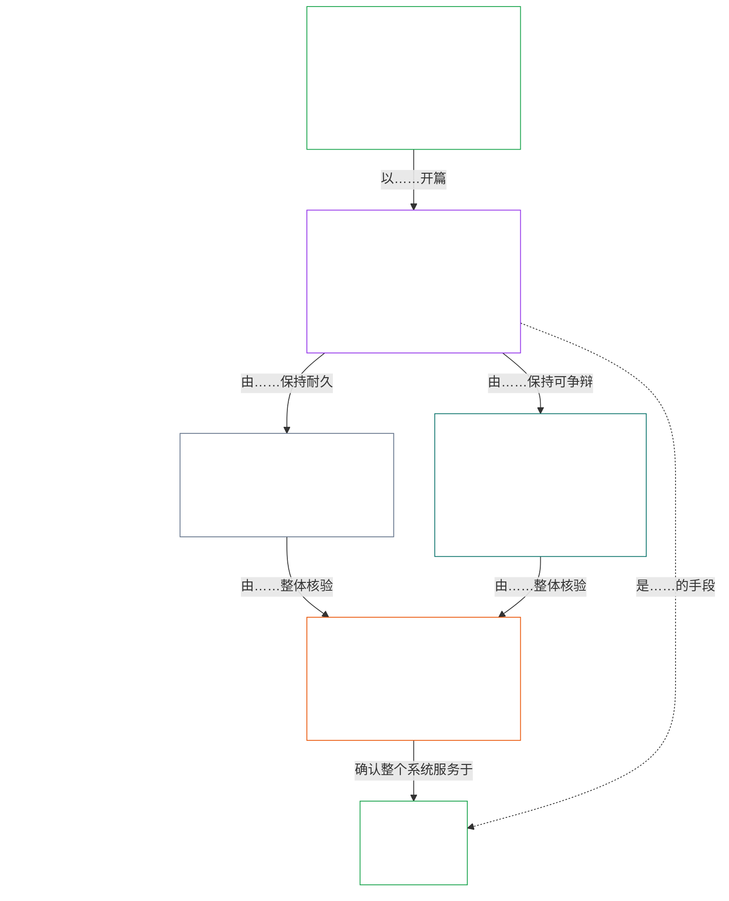

# 第01章 A部分：价值原则

<details>
<summary><strong><span style="color: #2563eb;">语料库位置（非操作性）：文件结构与阅读规则</span></strong></summary>

> 以下内容**仅为读者指引**。它不会增加、删除或缩窄本文件或其他章节中的任何约束性义务。
>
> 本文件**属于有感知者宪章**，且**只有与**其他编号的 `core_*` 文件作为同一文书一并阅读时才具有约束力。本文件包含**第一章 A部分**（§§1–12：宗旨与作用；繁荣目标，该目标在§2引入，并通过福祉、安全、真相、信任与自由展开；以及连续性目标，该目标在§8引入，并通过共享系统能力、韧性、市场结构和系统评估展开）。
>
> **上游：** [core_00_preamble.md](core_00_preamble.md)  
> **下一部分：** [core_01_b_interaction_interpretation.md](core_01_b_interaction_interpretation.md)（第一章 B部分——§§13–15，互动、否决限制与宪法解释）。  
> **阅读脉络：** §1宗旨与作用 → **繁荣：** §2引言（§2.1规定不可协商的安全与真相约束）→ §3福祉（结果）→ §4安全 → §5真相 → §6信任 → §7自由 → **连续性：** §8引言 → §9共享系统能力（连接两者的桥梁：它既是实现繁荣的手段，也是连续性的实质）→ §10韧性 → §11市场结构 → §12系统评估。

</details>

<details>
<summary><strong><span style="color: #2563eb;">读者指引（非操作性）：第一章如何连接目标、四柱、条款与定义</span></strong></summary>

> 以下内容**仅为读者指引**。它不会增加、删除或缩窄本文件或其他章节中的任何约束性义务。各节的**追溯**和**定义 · 评估 · 合规**组件承载约束性引导；本段是供开始阅读第一章的读者使用的部分级地图。

**各层如何连接。**每一层回答不同的问题，而第一章的每项原则都会指向另外三层：

- **目标与四柱**（[序言§1](core_00_preamble.md#the-model)）：共享系统的目的（[繁荣](core_05_apex_flourishing_aim.md#flourishing-constitutional)与[连续性](core_05_apex_continuity_aim.md#chapter-five-definitions-continuity-constitutional-aim)），以及使这一追求保持正当的四项义务（[参与](core_05_apex_participation_leg.md#participation-constitutional)、[监督](core_05_apex_oversight_leg.md#oversight-constitutional)、[问责](core_05_apex_accountability_leg.md#accountability)与[及时性](core_05_apex_timeliness_leg.md#timeliness-constitutional)）。
- **原则**（本章）：这些目标与义务如何转化为价值、约束，以及彼此权衡的规则。
- **条款**（[第六章](core_06_rights_part_a.md#chapter-six-foundational-rights)）：在追求这些目标的过程中仍可实际行使的权利底线保护。各节的**追溯**会在*尤其包括*项下列出这些保护。
- **定义**（[第二至第五章](core_02_definition_structure.md)）：用于检验主张真伪的共同含义。各节的**定义 · 评估 · 合规**组件会列出这些定义。

**第一章如何展开各项目标。**繁荣是通过真相、安全、可信赖性和有意义的能动性得以维持的有感知者福祉（[序言§1](core_00_preamble.md#flourishing)）。第一章先说明结果，再为四项条件各规定一项原则。

| 目标及方面 | 第一章原则 | 定义所在位置 | 追溯中列出的条款 |
|---|---|---|---|
| **繁荣**：结果 | [§3福祉](#3-foundational-objective-wellbeing-flourishing-aim) | [福祉](core_05_band_continuity.md#wellbeing) | [VI](core_06_rights_part_b.md#article-vi-equal-basic-rights)、[X](core_06_rights_part_b.md#article-x-self-determination-agency-and-participation)、[XIII-B](core_06_rights_part_c.md#article-xiii-b-right-to-redress-and-remedy)、[XIX-B](core_06_rights_part_d.md#article-xix-b-contestability-and-proportional-restriction-limits) |
| **繁荣**：安全 | [§4安全](#4-safety-harm-constraint) | [安全](core_05_band_continuity.md#safety-constitutional-constraint) | [XIII](core_06_rights_part_c.md#article-xiii-right-to-reliable-and-trustworthy-systems)、[XVII](core_06_rights_part_c.md#article-xvii-system-lifecycle-environments-and-reversibility)、[XXIII](core_06_rights_part_d.md#article-xxiii-root-cause-analysis-and-adaptive-response) |
| **繁荣**：真相 | [§5真相](#5-truth-epistemic-integrity-constraint) | [真相](core_05_band_oversight.md#truth-constitutional-constraint) | [XIII](core_06_rights_part_c.md#article-xiii-right-to-reliable-and-trustworthy-systems)、[XV](core_06_rights_part_c.md#article-xv-info-sphere-integrity)、[XVI](core_06_rights_part_c.md#article-xvi-audit-transparency-and-independent-verification) |
| **繁荣**：可信赖性 | [§6信任](#6-trust-and-trustworthiness-coordination-integrity) | [可信赖性](core_05_band_continuity.md#trustworthiness) | [XIII](core_06_rights_part_c.md#article-xiii-right-to-reliable-and-trustworthy-systems)、[XV](core_06_rights_part_c.md#article-xv-info-sphere-integrity)、[XVI](core_06_rights_part_c.md#article-xvi-audit-transparency-and-independent-verification) |
| **繁荣**：有意义的能动性 | [§7自由](#7-freedom-bounded-agency) | [有意义的能动性](core_05_band_participation.md#meaningful-agency) | [VI](core_06_rights_part_b.md#article-vi-equal-basic-rights)、[X](core_06_rights_part_b.md#article-x-self-determination-agency-and-participation)、[XXI](core_06_rights_part_d.md#article-xxi-interoperability-portability-movement-refuge-and-exit-integrity) |
| **连续性**，连接繁荣：持久能力 | [§9共享系统能力](#9-shared-system-capacity) | [共享系统能力](core_05_band_continuity.md#shared-system-capacity) | [I-A](core_06_rights_part_a.md#article-i-a-environmental-preconditions-and-ecological-integrity)、[III](core_06_rights_part_a.md#article-iii-survival-and-essential-access)、[V](core_06_rights_part_a.md#article-v-resource-allocation-dependencies-and-ecosystem-funding) |
| **连续性**：韧性 | [§10韧性与自我修复设计](#10-resilience-and-self-healing-design) | [自我修复](core_05_band_continuity.md#self-healing) | [XIII](core_06_rights_part_c.md#article-xiii-right-to-reliable-and-trustworthy-systems)、[XVII](core_06_rights_part_c.md#article-xvii-system-lifecycle-environments-and-reversibility)、[XXIII](core_06_rights_part_d.md#article-xxiii-root-cause-analysis-and-adaptive-response) |
| **连续性**：可竞争的市场 | [§11市场结构](#11-market-structure) | [市场结构](core_05_band_accountability.md#market-structure) | [III-C](core_06_rights_part_a.md#article-iii-c-labor-and-economic-floor)、[V](core_06_rights_part_a.md#article-v-resource-allocation-dependencies-and-ecosystem-funding)、[XXI](core_06_rights_part_d.md#article-xxi-interoperability-portability-movement-refuge-and-exit-integrity) |
| **连续性**：全系统视角 | [§12系统评估要求](#12-systemic-evaluation-requirement) | [系统一致性认证](core_05_band_continuity.md#system-alignment-certification) | [XVI](core_06_rights_part_c.md#article-xvi-audit-transparency-and-independent-verification) |

**原则层级（连续性）。**在原则层面，连续性目标按以下顺序展开，首先是连接两个目标的能力：

6. **[共享系统能力](core_05_band_continuity.md#shared-system-capacity)**是良好的受托管理、治理和激励长期应共同促成的结果——即有感知者和共享系统能够完成宪法要求工作的真实且可受质疑的能力。它横跨两个目标：既是实现**繁荣**的手段，也是**连续性**的实质；但它并非凌驾于其他一切之上的王牌。**[§9.1](#91-productive-capacity-instrumental-good)**和**[§9.2](#92-constitutional-efficiency)**说明了它的两个主要方面。
7. **[韧性与自我修复设计](#10-resilience-and-self-healing-design)**说明有感知者所依赖的系统如何及早发现问题、加以遏制、沿已披露的路径失效，并诚实地恢复（[**自我修复**](core_05_band_continuity.md#self-healing)），从而使第6项能力得以持久，且稳定性不依赖紧急干预。
8. **[市场结构](core_05_band_accountability.md#market-structure)**在[§11](#11-market-structure)中提供反集中约束，确保这种能力在实践中可受争议和检验。
9. **[系统评估要求](#12-systemic-evaluation-requirement)**在合规或治理主张成立之前，核验全系统范围、依赖关系及激励一致性——作为原则层面的审计指引，归于四柱中的**监督**；其中包括[系统一致性认证](core_05_band_continuity.md#system-alignment-certification)，它只是若干审计流程之一，尽管规模尤大。

**第一章如何承载四柱。**每一节都在其追溯中指出所涉及的四柱职责。以下部分最直接地承载这些职责：

| 四柱职责 | 第一章的主要对应部分 |
|---|---|
| **参与** | [§16深入的受托管理](core_01_c_stewardship_capacity_principles.md#16-stewardship-in-depth)和[§17具有重大后果的受托管理](core_01_c_stewardship_capacity_principles.md#17-consequential-stewardship-the-steward-role)（重要角色与发声权）；[§7自由](#7-freedom-bounded-agency)（有意义的能动性） |
| **监督** | [§16](core_01_c_stewardship_capacity_principles.md#16-stewardship-in-depth)和[§17](core_01_c_stewardship_capacity_principles.md#17-consequential-stewardship-the-steward-role)（分布式理解与记录）；[§18治理](core_01_c_stewardship_capacity_principles.md#18-governance-under-stewardship-discipline)（权力如何分配）；[§12](#12-systemic-evaluation-requirement)（审计） |
| **问责** | [§18治理](core_01_c_stewardship_capacity_principles.md#18-governance-under-stewardship-discipline)（与权力相称的可答责性）；[§19激励一致性与系统俘获](core_01_c_stewardship_capacity_principles.md#19-incentive-alignment-and-system-capture)（奖励不得掏空四柱职责） |
| **及时性** | [§16](core_01_c_stewardship_capacity_principles.md#16-stewardship-in-depth)和[§17](core_01_c_stewardship_capacity_principles.md#17-consequential-stewardship-the-steward-role)（及时发现并解决问题，避免不必要的拖延） |

**两个轴向，并非冲突。**目标说明系统追求什么；四柱说明这种追求如何保持正当。同一术语可以同时属于两者：真相与可信赖性是繁荣的组成部分，而[序言§2](core_00_preamble.md#2-measurements-overview)在监督类别下衡量它们。[§§13–15](core_01_b_interaction_interpretation.md#13-constitutional-collision-resolution-process)规定这些原则冲突时如何权衡并作为整体解读；[§20](core_01_c_stewardship_capacity_principles.md#20-integrated-application)则将其应用于之后的每一章。

</details>

<br>

### 1. 宗旨与作用
<details>
<summary><strong><span style="color: #2563eb;">追溯</span></strong></summary>

- 上游：[序言§1 模型](core_00_preamble.md#the-model)——[宪法四柱](core_00_preamble.md#constitutional-tetrad)、[两个宪法目标](core_00_preamble.md#two-constitutional-aims)以及按[重大利害关系](core_00_preamble.md#material-stake)进行的分级，均通过各节追溯适用于全章。
- 下游：[15. 宪法解释](core_01_b_interaction_interpretation.md#15-constitutional-interpretation)，用于整合解读、处理歧义、厘清内部层级及采用规范的冲突解决程序。
- 下游：[两个宪法目标](core_00_preamble.md#two-constitutional-aims)——**繁荣**目标的展开：从[§3](#3-foundational-objective-wellbeing-flourishing-aim)到[§6](#6-trust-and-trustworthiness-coordination-integrity)，以及[§7 自由](#7-freedom-bounded-agency)；**连续性**目标的展开：[§9 共享系统能力](#9-shared-system-capacity)、[§10 韧性与自我修复设计](#10-resilience-and-self-healing-design)、[§11 市场结构](#11-market-structure)及[§12 系统评估要求](#12-systemic-evaluation-requirement)。
- 下游：[3. 基础目标：福祉](#3-foundational-objective-wellbeing-flourishing-aim)、[§3.2 认可、强化与追求](#32-recognition-reinforcement-and-aspiration)、[4 安全](#4-safety-harm-constraint)、[5 真相](#5-truth-epistemic-integrity-constraint)、[6. 信任](#6-trust-and-trustworthiness-coordination-integrity)、[§16 深入受托管理](core_01_c_stewardship_capacity_principles.md#16-stewardship-in-depth)、[13. 宪法冲突解决程序](core_01_b_interaction_interpretation.md#13-constitutional-collision-resolution-process)以及[§7 自由](#7-freedom-bounded-agency)。
- 配合阅读：[宪法四柱](core_00_preamble.md#constitutional-tetrad)——参与、监督、问责与及时性决定共享系统如何追求[两个宪法目标](core_00_preamble.md#two-constitutional-aims)；按[重大利害关系](core_00_preamble.md#material-stake)进行的分级通过各节追溯适用于全章。
- 配合阅读：[第二至第四章](core_02_definition_structure.md)和[第五章](core_05__definitions_home.md#chapter-five-foundational-definitions)——这些章节构成本章所有术语所适用的机制层；应将 O/M/A/C 的完整性、反规避、举证责任以及定义与结果之间的可追溯性一并适用。
- 配合阅读：[第六章：基础权利](core_06_rights_part_a.md#chapter-six-foundational-rights)。
  - 尤其包括[第VI条：平等基本权利](core_06_rights_part_b.md#article-vi-equal-basic-rights)、[第XIII条：获得可靠且可信赖系统的权利](core_06_rights_part_c.md#article-xiii-right-to-reliable-and-trustworthy-systems)，以及[第XXIV条：宪法解释、审查与防止俘获的保障](core_06_rights_part_d.md#article-xxiv-constitutional-interpretation-review-and-anti-capture-safeguards)。
  - 当解释影响到受保护的有感知者、系统或机构时，应采用这一阅读方式。

</details>

<details>
<summary><strong><span style="color: #2563eb;">定义 · 评估 · 合规</span></strong></summary>

- [比例原则](core_05_band_accountability.md#proportionality) · [O](core_05_band_accountability.md#proportionality) · [M](core_05_band_accountability.md#proportionality-a) · [A](core_05_band_accountability.md#proportionality-a) · [C](core_05_band_accountability.md#proportionality-c)
- [必要性](core_05_band_accountability.md#necessity) · [O](core_05_band_accountability.md#necessity) · [M](core_05_band_accountability.md#necessity-a) · [A](core_05_band_accountability.md#necessity-a) · [C](core_05_band_accountability.md#necessity-c)

</details>

<br>

*简而言之：第一章确立支配其他各章的价值与约束。共享系统必须共同追求**繁荣**与**连续性**，不能以牺牲其中一方为代价；任何单一价值都不得以牺牲其他价值为代价而被最大化。*

<a id="two-constitutional-aims"></a><a id="flourishing"></a><a id="continuity"></a>本章确立支配本宪章解释、适用与演进的原则和约束。它将[两个宪法目标](core_00_preamble.md#two-constitutional-aims)——[**繁荣**](core_00_preamble.md#flourishing)与[**连续性**](core_00_preamble.md#continuity)——（由[序言§1 模型](core_00_preamble.md#the-model)确立）发展为可操作的原则和约束。原则层面的规范定义以序言为准；本章负责适用这些定义。

必须共同追求这两个目标，并始终遵守本宪章确立的不可协商原则约束与权利保护。[**宪法四柱**](core_00_preamble.md#constitutional-tetrad)规定这种追求如何保持正当，并按[**重大利害关系**](core_00_preamble.md#material-stake)调整要求的程度。

本章围绕这两个目标和四柱组织：
- **繁荣：**[繁荣目标：引言](#2-flourishing-aim-introduction)概述该目标。[§3 基础目标：福祉](#3-foundational-objective-wellbeing-flourishing-aim)说明预期结果。[§4 安全](#4-safety-harm-constraint)、[§5 真相](#5-truth-epistemic-integrity-constraint)、[§6 信任](#6-trust-and-trustworthiness-coordination-integrity)和[§7 自由](#7-freedom-bounded-agency)发展支撑该目标的四项条件：安全、真相、可信赖性和有意义的能动性。
- **连续性：**[连续性目标：引言](#8-continuity-aim-introduction)概述该目标。[§9 共享系统能力](#9-shared-system-capacity)（既是实现繁荣的手段，也是连续性的实质）、[§10 韧性与自我修复设计](#10-resilience-and-self-healing-design)、[§11 市场结构](#11-market-structure)以及[§12 系统评估要求](#12-systemic-evaluation-requirement)发展长期稳定性、共享系统的持久能力与韧性。连续性主张须以诚实、完整的系统视图为基础：§§9–11的每项主张都必须通过§12的核验。
- **原则相遇时：**[§13 宪法冲突解决程序](core_01_b_interaction_interpretation.md#13-constitutional-collision-resolution-process)、[§14 禁止绝对否决](core_01_b_interaction_interpretation.md#14-prohibition-on-absolute-override)和[§15 宪法解释](core_01_b_interaction_interpretation.md#15-constitutional-interpretation)规定如何权衡并共同解读这些目标与原则。
- **实践中的四柱：**从[§16 深入受托管理](core_01_c_stewardship_capacity_principles.md#16-stewardship-in-depth)到[§19 激励一致性与系统俘获](core_01_c_stewardship_capacity_principles.md#19-incentive-alignment-and-system-capture)，这些条款将参与、监督、问责与及时性落实到受托管理、治理和激励中；[§20 综合适用](core_01_c_stewardship_capacity_principles.md#20-integrated-application)将整章适用于每一后续章节。

每项原则的**追溯**列出保护该原则的第六章条款；其**定义 · 评估 · 合规**组件则列出用于衡量该原则的第五章定义。

**图示：两个宪法目标与宪法四柱**

<hr style="border: 0; border-top: 1px solid currentColor;">

```mermaid
flowchart TB
    subgraph Foundation[" "]
        direction TB
        subgraph Aims["Two Constitutional Aims"]
            direction LR
            F["Flourishing<br/><br/>• Sentient wellbeing sustained through truth, safety,<br/>trustworthiness, and meaningful agency"]
            C["Continuity<br/><br/>• Long-horizon stability, sustainability, resilience,<br/>and ecological wellbeing"]
        end
        subgraph Tetrad1["Constitutional Tetrad · participation and oversight"]
            direction LR
            P["Participation<br/><br/>• Affected sentients get a real voice<br/>• Fair representation and a fair chance to challenge<br/>• Access to consequential roles in proportion to stake"]
            O["Oversight<br/><br/>• Watching, checking, verifying, and keeping records<br/>• Independent review can constrain bad choices"]
        end
        subgraph Tetrad2["Constitutional Tetrad · accountability and timeliness"]
            direction LR
            A["Accountability<br/><br/>• Responsibility traces to the right actors<br/>• Answerability, redress, and real correction<br/>• Bad outcomes trigger repair"]
            T["Timeliness<br/><br/>• Problems are detected, challenged, resolved, and fixed<br/>• Time limits match the material stake<br/>• Delay cannot erase rights, remedies, or repair"]
        end
    end
    F ~~~ P
    P ~~~ A
    style Foundation fill:none,stroke:none
    style Aims fill:none,stroke:none
    style Tetrad1 fill:none,stroke:none
    style Tetrad2 fill:none,stroke:none
    style F fill:none,stroke:#16a34a,color:#ffffff
    style C fill:none,stroke:#16a34a,color:#ffffff
    style P fill:none,stroke:#0f766e,color:#ffffff
    style O fill:none,stroke:#ea580c,color:#ffffff
    style A fill:none,stroke:#db2777,color:#ffffff
    style T fill:none,stroke:#9333ea,color:#ffffff
```

*这些目标说明共享系统必须追求什么；四柱说明维持这种追求正当性的义务。四项义务都按[重大利害关系](core_00_preamble.md#material-stake)调整，而两个目标均受权利底线约束。图示转载自[概念概览](guides/CONCEPTUAL_OVERVIEW.md#two-aims-and-the-constitutional-tetrad)。*

这些价值：
- 并非彼此独立，在通常运行中也不存在严格的等级顺序；
- 是相互作用的原则与约束，必须合并评估；
- 适用于所有“系统”，包括会对有感知者和地球产生重大影响的技术、组织、经济和社会技术结构，以及生态系统。

在实质性损害其他原则的情况下，不得孤立地适用任何单一原则。出现张力时，系统必须依照本章规定的比例性、必要性和系统影响要求予以解决。如果未解决的冲突直接涉及不可协商的原则约束，则第一章的**§13 宪法冲突解决程序**决定优先顺序。

<a id="2-flourishing-aim-introduction"></a>
### 2. 繁荣目标：引言
<details>
<summary><strong><span style="color: #2563eb;">追溯</span></strong></summary>

- 配合阅读：[宪法四柱](core_00_preamble.md#constitutional-tetrad)——四项职责均适用于繁荣目标的追求方式；[重大利害关系](core_00_preamble.md#material-stake)决定每项繁荣主张所需审查的深度。
- 配合阅读：[两个宪法目标](core_00_preamble.md#two-constitutional-aims)——**繁荣**目标；其配对目标见[连续性目标：引言](#8-continuity-aim-introduction)。
- 上游：原则：[序言§1 模型](core_00_preamble.md#flourishing)；[繁荣（宪法目标）](core_05_apex_flourishing_aim.md#flourishing-constitutional)；[§1 宗旨与作用](#1-purpose-and-role)。
- 下游：[§3 基础目标：福祉（繁荣目标）](#3-foundational-objective-wellbeing-flourishing-aim)、[§4 安全（伤害约束）](#4-safety-harm-constraint)、[§5 真相（认知完整性约束）](#5-truth-epistemic-integrity-constraint)、[§6 信任与可信赖性（协调完整性）](#6-trust-and-trustworthiness-coordination-integrity)和[§7 自由（有界能动性）](#7-freedom-bounded-agency)；保护每项原则的条款列于相应章节的追溯中。
- 子节：[§2.1 不可协商的原则约束：安全与真相](#21-non-negotiable-principle-constraints-safety-and-truth)。
- 配合阅读：一般适用的第六章权利底线。

</details>

<details>
<summary><strong><span style="color: #2563eb;">定义 · 评估 · 合规</span></strong></summary>

- [繁荣（宪法目标）](core_05_apex_flourishing_aim.md#flourishing-constitutional) · [O](core_05_apex_flourishing_aim.md#flourishing-constitutional) · [M](core_05_apex_flourishing_aim.md#flourishing-constitutional-m) · [A](core_05_apex_flourishing_aim.md#flourishing-constitutional-a) · [C](core_05_apex_flourishing_aim.md#flourishing-constitutional-c)
- [福祉](core_05_band_continuity.md#wellbeing) · [O](core_05_band_continuity.md#wellbeing) · [M](core_05_band_continuity.md#wellbeing-a) · [A](core_05_band_continuity.md#wellbeing-a) · [C](core_05_band_continuity.md#wellbeing-c)
- [安全（宪法约束）](core_05_band_continuity.md#safety-constitutional-constraint) · [O](core_05_band_continuity.md#safety-constitutional-constraint) · [M](core_05_band_continuity.md#safety-constraint-a) · [A](core_05_band_continuity.md#safety-constraint-a) · [C](core_05_band_continuity.md#safety-constraint-c)
- [真相（宪法约束）](core_05_band_oversight.md#truth-constitutional-constraint) · [O](core_05_band_oversight.md#truth-constitutional-constraint-o) · [M](core_05_band_oversight.md#truth-constitutional-constraint-a) · [A](core_05_band_oversight.md#truth-constitutional-constraint-a) · [C](core_05_band_oversight.md#truth-constitutional-constraint-c)
- [可信赖性](core_05_band_continuity.md#trustworthiness) · [O](core_05_band_continuity.md#trustworthiness) · [M](core_05_band_continuity.md#trustworthiness-a) · [A](core_05_band_continuity.md#trustworthiness-a) · [C](core_05_band_continuity.md#trustworthiness-c)
- [有意义的能动性](core_05_band_participation.md#meaningful-agency) · [O](core_05_band_participation.md#meaningful-agency) · [M](core_05_band_participation.md#meaningful-agency-a) · [A](core_05_band_participation.md#meaningful-agency-a) · [C](core_05_band_participation.md#meaningful-agency-c)

</details>

<br>

*简而言之：繁荣是两个目标中的第一个：有感知者过得好并能持续过得好，因为周围的系统安全、诚实、可信赖，并为他们保留真正的选择空间。第3节说明这个结果是什么；其后的四项原则说明如何使其成为现实。*

[**繁荣**](core_05_apex_flourishing_aim.md#flourishing-constitutional)是**通过真相、安全、可信赖性和有意义的能动性得以维持的有感知者福祉**（[序言§1 模型](core_00_preamble.md#flourishing)）。第一章分两步展开这一目标：[§3 基础目标：福祉（繁荣目标）](#3-foundational-objective-wellbeing-flourishing-aim)说明预期结果，四项原则则说明维持该结果的条件。

| 条件 | 原则 | 所回答的问题 |
|---|---|---|
| **安全** | [§4 安全（伤害约束）](#4-safety-harm-constraint) | 有感知者是否受到保护，免于可避免的伤害？ |
| **真相** | [§5 真相（认知完整性约束）](#5-truth-epistemic-integrity-constraint)，并包括[§5.1 以科学为依据的探究与决策支持](#51-science-informed-inquiry-and-decision-support)以及[§5.2 通俗语言可及性（参与与受托管理职责）](#52-plain-language-accessibility-participation-and-stewardship-duty) | 有感知者能否信赖告知他们的内容，并理解这些内容？ |
| **可信赖性** | [§6 信任与可信赖性（协调完整性）](#6-trust-and-trustworthiness-coordination-integrity) | 系统是否赢得信赖，并在失灵时修复信赖？ |
| **有意义的能动性** | [§7 自由（有界能动性）](#7-freedom-bounded-agency) | 有感知者是否保有真实且有界的自由，以便选择、异议、组织和退出？ |

**繁荣各项原则如何协同：**
- **安全与真相是不可协商的约束：**它们在[§2.1 不可协商的原则约束：安全与真相](#21-non-negotiable-principle-constraints-safety-and-truth)中一并提出，不能为了换取其他原则而放弃。
- **信任与自由有边界，并非绝对：**信任需要赢得，也可以纠正（[§6.1 纠正与补救](#61-correction-and-remedy)）；自由受到有纪律的限制（[§7.1 限制规则](#71-limitation-discipline)）。
- **任何原则都不孤立适用：**应合并解读各项原则；发生冲突时，依照[§13 宪法冲突解决程序](core_01_b_interaction_interpretation.md#13-constitutional-collision-resolution-process)加以权衡。
- **繁荣有其配对目标：**连续性目标关注如何使这一结果持久；该目标见[连续性目标：引言](#8-continuity-aim-introduction)。

**图示：繁荣及其原则**

<hr style="border: 0; border-top: 1px solid currentColor;">

```mermaid
flowchart TB
    F["Flourishing aim<br/><br/>• Sentient wellbeing sustained through truth, safety,<br/>trustworthiness, and meaningful agency<br/>• Always bounded by the Rights Floor"]
    W["§3 Wellbeing (the outcome)<br/><br/>• §3.1 Fairness<br/>• §3.2 Recognition, Reinforcement, and Aspiration<br/>• §3.3 Anti-Degrading Process"]
    subgraph NN["Non-Negotiable (§2.1)"]
        direction LR
        S["§4 Safety<br/><br/>• Harm constraint"]
        T["§5 Truth<br/><br/>• Epistemic integrity<br/>• §5.1 Science-Informed Inquiry<br/>and Decision Support<br/>• §5.2 Plain-Language Accessibility"]
    end
    R["§6 Trust<br/><br/>• Coordination integrity<br/>• §6.1 Correction and Remedy"]
    G["§7 Freedom<br/><br/>• Bounded agency<br/>• §7.1 Limitation Discipline<br/>• §7.2 to §7.4 Assembly,<br/>dissent, and exit"]
    F -->|"is stated as"| W
    W -->|"is sustained by"| S
    W --> T
    S --> R
    T --> R
    R --> G
    style NN fill:none,stroke:#64748b,stroke-dasharray:6 4,color:#ffffff
    style F fill:none,stroke:#16a34a,color:#ffffff
    style W fill:none,stroke:#9333ea,color:#ffffff
    style S fill:none,stroke:#64748b,color:#ffffff
    style T fill:none,stroke:#ea580c,color:#ffffff
    style R fill:none,stroke:#2563eb,color:#ffffff
    style G fill:none,stroke:#0f766e,color:#ffffff
```

*繁荣作为结果提出，首先由不可协商的安全与真相约束维持；二者都支撑信任，而信任又支撑自由。颜色是可复用的视觉提示，不代表优先顺序。每项原则的追溯列明其条款，定义 · 评估 · 合规组件列明其定义。图示转载自[概念概览](guides/CONCEPTUAL_OVERVIEW.md#flourishing-and-its-principles)。*

<a id="21-non-negotiable-principle-constraints-safety-and-truth"></a>
#### 2.1 不可协商的原则约束：安全与真相
<details>
<summary><strong><span style="color: #2563eb;">追溯</span></strong></summary>

- 配合阅读：[宪法四柱](core_00_preamble.md#constitutional-tetrad)——**参与**职责（理解并质疑安全与真相的认定）；**监督**职责（发现伤害风险与认知退化）；**问责**职责（对伤害、欺骗和误导性信赖承担责任）；并按[重大利害关系](core_00_preamble.md#material-stake)确定适用尺度。
- 配合阅读：[两个宪法目标](core_00_preamble.md#two-constitutional-aims)——**繁荣**目标（[序言§1](core_00_preamble.md#two-constitutional-aims)将**安全**与**真相**列为明确组成部分）；**连续性**目标（预防长期伤害，并诚实地管理持久系统）。
- 上游：原则：[3. 基础目标：福祉](#3-foundational-objective-wellbeing-flourishing-aim)；[两个宪法目标](core_00_preamble.md#two-constitutional-aims)。
- 下游：[6. 信任](#6-trust-and-trustworthiness-coordination-integrity)、[13. 宪法冲突解决程序](core_01_b_interaction_interpretation.md#13-constitutional-collision-resolution-process)和[§7 自由](#7-freedom-bounded-agency)。
- 适用于：[§4 安全](#4-safety-harm-constraint)；[§5 真相](#5-truth-epistemic-integrity-constraint)；[§5.1 以科学为依据的探究与决策支持](#51-science-informed-inquiry-and-decision-support)；[§5.2 通俗语言可及性](#52-plain-language-accessibility-participation-and-stewardship-duty)。

</details>

<br>

*简而言之：安全与真相是宪章的硬性底线，不能作为优化时可牺牲的变量。共享系统不得可预见地危及有感知者，也不得欺骗他们；四柱中的参与、监督、问责与及时性纪律，适用于繁荣与连续性的共同追求。*

**安全**与**真相**是不可协商的原则约束，限制第一章的所有其他原则，包括[§3 基础目标：福祉](#3-foundational-objective-wellbeing-flourishing-aim)和[两个宪法目标](core_00_preamble.md#two-constitutional-aims)。它们是[**繁荣**](#flourishing)明确列出的组成部分，也是[**连续性**](#continuity)不可或缺的条件：系统不能通过伤害或欺骗而繁荣，持久的正当性要求长期诚实地管理风险。

适用这些约束时必须满足[宪法四柱](core_00_preamble.md#constitutional-tetrad)，并按[重大利害关系](core_00_preamble.md#material-stake)调整尺度，特别是在以下情形：
- 安全认定影响参与能力；
- 真相主张决定他人能否据以信赖；
- 需要追究伤害或误导行为的责任。

关于安全与真相的认定可能改变有感知者的状态记录，包括：
- 如何认可[贡献](core_05_band_accountability.md#contribution-nature)；
- 是否记录违规行为；
- 如何划分违规行为的严重程度；
- 应附加何种后果。

[**第九章**](core_09_standing_assessment.md)的状态模型规定如何分类、核验和适用这些认定；评估与合规要求则取自[**第二至第五章**](core_02_definition_structure.md)。

### 3. 基础目标：福祉（繁荣目标）
<details>
<summary><strong><span style="color: #2563eb;">追溯</span></strong></summary>

- 配合阅读：[宪法四柱](core_00_preamble.md#constitutional-tetrad)——当福祉条件实质性影响发声、获取和可争议性是否具有实质意义时，适用**参与**职责；当福祉主张影响负担分配时，适用**问责**职责；在具有重大意义时按[重大利害关系](core_00_preamble.md#material-stake)调整适用尺度。
- 配合阅读：[两个宪法目标](core_00_preamble.md#two-constitutional-aims)——本章通过[§3](#3-foundational-objective-wellbeing-flourishing-aim)至[§6](#6-trust-and-trustworthiness-coordination-integrity)，以及[§7 自由](#7-freedom-bounded-agency)，展开**繁荣**目标。
- 上游：原则：[序言§1 模型](core_00_preamble.md#the-model)；[两个宪法目标](core_00_preamble.md#two-constitutional-aims)——展开**繁荣**目标。
- 下游：[4 安全](#4-safety-harm-constraint)、[5 真相](#5-truth-epistemic-integrity-constraint)、[§16 深入受托管理](core_01_c_stewardship_capacity_principles.md#16-stewardship-in-depth)以及[13. 宪法冲突解决程序](core_01_b_interaction_interpretation.md#13-constitutional-collision-resolution-process)。
- 子节：[§3.1 公平](#31-fairness)；[§3.2 认可、强化与追求](#32-recognition-reinforcement-and-aspiration)；[§3.3 防止退化的程序](#33-anti-degrading-process)。
- 配合阅读：一般适用的第六章权利底线。
  - 尤其包括[第VI条：平等基本权利](core_06_rights_part_b.md#article-vi-equal-basic-rights)、[第X条：自决、能动性与参与](core_06_rights_part_b.md#article-x-self-determination-agency-and-participation)、[第XIII-B条：获得补救与救济的权利](core_06_rights_part_c.md#article-xiii-b-right-to-redress-and-remedy)，以及[第XIX-B条：可争议性与比例限制界限](core_06_rights_part_d.md#article-xix-b-contestability-and-proportional-restriction-limits)。
  - 当所主张的福祉增益被用于证明限制能动性、尊严或可争议性正当时，应适用这些保护。
  - 当获取、程序、分配一致性、信赖或协调完整性具有重大影响时，尤其包括[尊严与平等道德地位](core_05_band_participation.md#dignity-and-equal-moral-standing)、[实质公平](core_05_band_participation.md#substantive-fairness)和[6. 信任](#6-trust-and-trustworthiness-coordination-integrity)。

</details>

<details>
<summary><strong><span style="color: #2563eb;">定义 · 评估 · 合规</span></strong></summary>

- [福祉](core_05_band_continuity.md#wellbeing) · [O](core_05_band_continuity.md#wellbeing) · [M](core_05_band_continuity.md#wellbeing-a) · [A](core_05_band_continuity.md#wellbeing-a) · [C](core_05_band_continuity.md#wellbeing-c)
- [参与](core_05_apex_participation_leg.md#participation-constitutional) · [O](core_05_apex_participation_leg.md#participation-constitutional) · [M](core_05_apex_participation_leg.md#participation-constitutional-m) · [A](core_05_apex_participation_leg.md#participation-constitutional-a) · [C](core_05_apex_participation_leg.md#participation-constitutional-c)
- [尊严与平等道德地位](core_05_band_participation.md#dignity-and-equal-moral-standing) · [O](core_05_band_participation.md#dignity-and-equal-moral-standing) · [M](core_05_band_participation.md#dignity-and-equal-moral-standing-a) · [A](core_05_band_participation.md#dignity-and-equal-moral-standing-a) · [C](core_05_band_participation.md#dignity-and-equal-moral-standing-c)
- [实质公平](core_05_band_participation.md#substantive-fairness) · [O](core_05_band_participation.md#substantive-fairness) · [M](core_05_band_participation.md#substantive-fairness-constitutional-a) · [A](core_05_band_participation.md#substantive-fairness-constitutional-a) · [C](core_05_band_participation.md#substantive-fairness-constitutional-c)
- [重大性](core_05_band_oversight.md#materiality) · [O](core_05_band_oversight.md#materiality) · [M](core_05_band_oversight.md#materiality-determination-a) · [A](core_05_band_oversight.md#materiality-determination-a) · [C](core_05_band_oversight.md#materiality-determination-c)
- [代理指标偏离](core_05_band_oversight.md#proxy-divergence) · [O](core_05_band_oversight.md#proxy-divergence) · [M](core_05_band_oversight.md#proxy-divergence-a) · [A](core_05_band_oversight.md#proxy-divergence-a) · [C](core_05_band_oversight.md#proxy-divergence-c)

</details>

<br>

*简而言之：这些系统的根本目的，是让有感知者的生活真正变好。追逐代理指标不能实现这一目的，也不能以此为借口在安全、真相或权利方面偷工减料。福祉是参与的基础：若缺少让能动性成为现实的条件，仅仅形式上赋予发声机会，并不构成本宪章所说的参与。*

本宪章所规制的一切系统，其最终目标都是维护并增进有感知者的[福祉](core_05_band_continuity.md#wellbeing)——即[**繁荣**](#flourishing)目标，属于[两个宪法目标](core_00_preamble.md#two-constitutional-aims)之一。

[序言§1 模型](core_00_preamble.md#flourishing)将繁荣定义为通过真相、安全、可信赖性和有意义的能动性得以维持的有感知者福祉。本节说明预期结果；后续各节展开维持该结果的四项条件：[§4 安全](#4-safety-harm-constraint)、[§5 真相](#5-truth-epistemic-integrity-constraint)、[§6 信任](#6-trust-and-trustworthiness-coordination-integrity)和[§7 自由](#7-freedom-bounded-agency)。这五项原则共同构成第一章对繁荣目标的展开。[**连续性**](#continuity)目标则通过[§9 共享系统能力](#9-shared-system-capacity)、[§10 韧性与自我修复设计](#10-resilience-and-self-healing-design)、[§11 市场结构](#11-market-structure)和[§12 系统评估要求](#12-systemic-evaluation-requirement)展开。

福祉是[参与](core_05_apex_participation_leg.md#participation-constitutional)在[宪法四柱](core_00_preamble.md#constitutional-tetrad)下的基础。当福祉的底层条件——包括[有意义的能动性](core_05_band_participation.md#meaningful-agency)、公平获取和尊严——受到实质性损害时，共享系统不得将参与视为已经实现。

福祉不仅包括即时影响，也包括依照[**第二至第四章**](core_02_definition_structure.md)评估的间接、延迟、累积及跨系统后果。在这一价值层面，福祉：
- 使真实参与成为可能——如果有感知者缺乏行使发声权的条件，那么这种发声就不构成有意义的参与；
- 不能仅因达到一个已经偏离真正重要事项的指标，就宣称福祉“已经实现”；
- 仍受本章不可协商的原则约束限制：**安全**与**真相**；
- 不得被用作违反安全、真相或权利保护的一概性理由。

#### 3.1 公平
<details>
<summary><strong><span style="color: #2563eb;">追溯</span></strong></summary>

- 配合阅读：[宪法四柱](core_00_preamble.md#constitutional-tetrad)——**参与**职责（获取、发声和可争议性；这是一般要求，不仅限于[利益相关者系统参与](core_05_band_participation.md#stakeholder-status-and-weight)）；在分配利益与负担时适用**问责**职责。
- 上游：原则：[§3 基础目标：福祉](#3-foundational-objective-wellbeing-flourishing-aim)——包括福祉作为[参与](core_05_apex_participation_leg.md#participation-constitutional)基础这一点。
- 下游：[§3.2 认可、强化与追求](#32-recognition-reinforcement-and-aspiration)；[6. 信任](#6-trust-and-trustworthiness-coordination-integrity)、[§16 深入受托管理](core_01_c_stewardship_capacity_principles.md#16-stewardship-in-depth)、[13. 宪法冲突解决程序](core_01_b_interaction_interpretation.md#13-constitutional-collision-resolution-process)以及[宪法冲突记录](core_05_band_integrative.md#constitutional-collision-record)，以确保优先顺序和分配决定保持一致并可供审查。
- 子节（阅读顺序）：[§3.1.1](#311-access-and-opportunity) · [§3.1.2](#312-benefits-and-burdens) · [§3.1.3](#313-fair-treatment) · [§3.1.4](#314-unfair-treatment)。
- 下游：塑造平等地位、非任意待遇、有意义的质疑机会及比例限制界限等权利保障范围。
  - 尤其包括[第VI条：平等基本权利](core_06_rights_part_b.md#article-vi-equal-basic-rights)、[第VI-C条：禁止歧视](core_06_rights_part_b.md#article-vi-c-nondiscrimination)、[第X条：自决、能动性与参与](core_06_rights_part_b.md#article-x-self-determination-agency-and-participation)、[第XIII-B条：获得补救与救济的权利](core_06_rights_part_c.md#article-xiii-b-right-to-redress-and-remedy)，以及[第XIX-B条：可争议性与比例限制界限](core_06_rights_part_d.md#article-xix-b-contestability-and-proportional-restriction-limits)。
  - 若违宪指定带来制裁或持久影响，应结合[第十一章第4节——正当程序保障、补救与预防](core_11_a_misconduct_designation.md#4-due-process-safeguards-for-slot-assignment)阅读。
  - 第五章[§2——受保护特征、代理指标使用、亲密信号门控，以及依**第VII-E条**（*成年人双方同意的商业性服务与性剥削*）确定身份](core_05_band_participation.md#fairness-protected-characteristics-and-nondiscrimination)进一步阐述反歧视承诺；当§2.1.3的公平待遇规则涉及亲密信号门控或**第VII-E条**（*成年人双方同意的商业性服务与性剥削*）时，也包括[规避受保护的亲密信号门控及依**第VII-E条**（*成年人双方同意的商业性服务与性剥削*）确定身份](core_05_band_participation.md#protected-intimate-signal-gating-and-article-vii-e-adult-consensual-commercial-sexual-services-and-sexual-exploitation-status-circumvention)。
- 配合阅读：[实质公平](core_05_band_participation.md#substantive-fairness)以及相关的第六章权利底线义务，适用于利益、负担、奖励、成本、义务、风险、贡献、需要或暴露具有重大意义的情况；[可及性](core_05_band_participation.md#accessibility)适用于§2.1.1的获取途径具有重大意义的情况；[代理指标偏离](core_05_band_oversight.md#proxy-divergence)适用于汇总指标或排名效应具有重大意义的情况。

</details>

<details>
<summary><strong><span style="color: #2563eb;">定义 · 评估 · 合规</span></strong></summary>

- [尊严与平等道德地位](core_05_band_participation.md#dignity-and-equal-moral-standing) · [O](core_05_band_participation.md#dignity-and-equal-moral-standing) · [M](core_05_band_participation.md#dignity-and-equal-moral-standing-a) · [A](core_05_band_participation.md#dignity-and-equal-moral-standing-a) · [C](core_05_band_participation.md#dignity-and-equal-moral-standing-c)
- [可及性](core_05_band_participation.md#accessibility) · [O](core_05_band_participation.md#accessibility) · [M](core_05_band_participation.md#accessibility-constitutional-a) · [A](core_05_band_participation.md#accessibility-constitutional-a) · [C](core_05_band_participation.md#accessibility-constitutional-c)
- [参与](core_05_apex_participation_leg.md#participation-constitutional) · [O](core_05_apex_participation_leg.md#participation-constitutional) · [M](core_05_apex_participation_leg.md#participation-constitutional-m) · [A](core_05_apex_participation_leg.md#participation-constitutional-a) · [C](core_05_apex_participation_leg.md#participation-constitutional-c)
- [程序公平](core_05_band_participation.md#procedural-fairness) · [O](core_05_band_participation.md#procedural-fairness) · [M](core_05_band_participation.md#procedural-fairness-constitutional-a) · [A](core_05_band_participation.md#procedural-fairness-constitutional-a) · [C](core_05_band_participation.md#procedural-fairness-constitutional-c)
- [实质公平](core_05_band_participation.md#substantive-fairness) · [O](core_05_band_participation.md#substantive-fairness) · [M](core_05_band_participation.md#substantive-fairness-constitutional-a) · [A](core_05_band_participation.md#substantive-fairness-constitutional-a) · [C](core_05_band_participation.md#substantive-fairness-constitutional-c)
- [受保护特征](core_05_band_participation.md#protected-characteristics) · [O](core_05_band_participation.md#protected-characteristics) · [M](core_05_band_participation.md#protected-characteristics-constitutional-a) · [A](core_05_band_participation.md#protected-characteristics-constitutional-a) · [C](core_05_band_participation.md#protected-characteristics-constitutional-c)
- [受保护特征代理指标使用与差别影响](core_05_band_participation.md#protected-characteristic-proxying-and-disparate-impact) · [O](core_05_band_participation.md#protected-characteristic-proxying-and-disparate-impact) · [M](core_05_band_participation.md#protected-characteristic-proxying-and-disparate-impact-a) · [A](core_05_band_participation.md#protected-characteristic-proxying-and-disparate-impact-a) · [C](core_05_band_participation.md#protected-characteristic-proxying-and-disparate-impact-c)
- [规避受保护的亲密信号门控及依**第VII-E条**（*成年人双方同意的商业性服务与性剥削*）确定身份](core_05_band_participation.md#protected-intimate-signal-gating-and-article-vii-e-adult-consensual-commercial-sexual-services-and-sexual-exploitation-status-circumvention) · [O](core_05_band_participation.md#protected-intimate-signal-gating-and-article-vii-e-adult-consensual-commercial-sexual-services-and-sexual-exploitation-status-circumvention) · [M](core_05_band_participation.md#protected-intimate-signal-gating-and-article-vii-e-status-circumvention-a) · [A](core_05_band_participation.md#protected-intimate-signal-gating-and-article-vii-e-status-circumvention-a) · [C](core_05_band_participation.md#protected-intimate-signal-gating-and-article-vii-e-status-circumvention-c)
- [代理指标偏离](core_05_band_oversight.md#proxy-divergence) · [O](core_05_band_oversight.md#proxy-divergence) · [M](core_05_band_oversight.md#proxy-divergence-a) · [A](core_05_band_oversight.md#proxy-divergence-a) · [C](core_05_band_oversight.md#proxy-divergence-c)

</details>

<br>

*简而言之：如果系统阻止普通有感知者参与、用无法解释的规则对待他们，或让他们承担他人逃避的成本，就不能自称良好。公平的系统提供真实的获取机会，采用能够自圆其说的理由，并依据真实贡献、需要和暴露情况分配奖励、成本与风险。*

当有感知者必须通过共享系统生活、工作、学习、交易或作出决定时，[§3 基础目标：福祉](#3-foundational-objective-wellbeing-flourishing-aim)所要求的内容包括**公平**。如果共享系统对有感知者产生重大影响，公平就要求机会、待遇以及利益和负担的分配尊重[尊严与平等道德地位](core_05_band_participation.md#dignity-and-equal-moral-standing)。

公平有助于使[参与](core_05_apex_participation_leg.md#participation-constitutional)成为现实。如果有感知者虽在形式上有发声机会，却无法进入程序、理解规则、满足条件、质疑结果，或承担分配给他们的负担，那么参与就不是真实的。

系统仅仅显示良好的平均结果并不足够。单一的醒目指标、平均值、排名或效率主张本身都不能证明公平。总体数据可能显示系统成功，但系统仍可能不公平地排斥、错误分类、少付报酬、过度施加负担，或不给某些有感知者有意义的反对机会。

本节包含**四个操作部分**。这些部分用于指导本节，但不取代第五章的定义或第六章的权利底线。

<a id="311-access-and-opportunity"></a>
##### 3.1.1 获取与机会

本小节说明实践中获取与机会的含义：

- 有感知者需要切实可行的途径，以实现[参与](core_05_apex_participation_leg.md#participation-constitutional)，获得教育、工作、照护、安全、出行以及日常生活所需的其他资源。
- 不得以任意或无关理由阻断、抬高这些途径的成本、拖延、隐瞒或偏向性设置。
- 当本宪章要求**实质性**机会时，仅在纸面上开放入口并不足够。

<a id="312-benefits-and-burdens"></a>
##### 3.1.2 利益与负担

本小节说明何时利益与负担的分配才公平：

- 如果一些有感知者获得收益，其他人却默默承担成本，那么系统就不公平。
- 偏袒、隐蔽转嫁成本、选择性执法和排名把戏均不满足本要求。

<a id="313-fair-treatment"></a>
##### 3.1.3 公平待遇

本小节说明公平待遇的要求：

- 处境相似的有感知者应依照同一套基本规则获得对待。
- 有感知者所得、所负或所冒的风险，应与其贡献、需要或实际承受的负担相称。
- 差别待遇必须有真实理由，与该理由相称，尊重尊严并避免歧视。
- 第五章进一步规定详细规则，包括[受保护特征](core_05_band_participation.md#protected-characteristics)以及[受保护特征代理指标使用与差别影响](core_05_band_participation.md#protected-characteristic-proxying-and-disparate-impact)。
- 当决定对某人产生重大影响，或此人对决定提出质疑时，只要第六章或适用文书要求通知、听证、说明或复审，审查途径就必须符合[程序公平](core_05_band_participation.md#procedural-fairness)。

如果所主张的福祉不符合[§3 基础目标：福祉](#3-foundational-objective-wellbeing-flourishing-aim)，因为它依赖任意排斥、无法解释或不稳定的规则、隐蔽攫取，或仅提供形式上的[参与](core_05_apex_participation_leg.md#participation-constitutional)，却缺少使参与具有意义的公平条件，那么它就不符合本节要求。

<a id="314-unfair-treatment"></a>
##### 3.1.4 不公平待遇

不公平待遇会造成排斥和不一致。系统不得用技术语言、中性标签或自动化决定掩盖不公平待遇。具体而言，系统不得：
- 使用算法、评分系统或行政规则，在没有合乎宪法的正当理由时重复历史上的不利处境；
- 使用亲密个人信号或性经历，作为判断信任、风险、品格或获取资格的捷径——结合[规避受保护的亲密信号门控及依**第VII-E条**（*成年人双方同意的商业性服务与性剥削*）确定身份](core_05_band_participation.md#protected-intimate-signal-gating-and-article-vii-e-adult-consensual-commercial-sexual-services-and-sexual-exploitation-status-circumvention)阅读；
- 在没有合乎宪法的正当理由时，惩罚合法就业、就业经历、未就业、合法工作身份或受保护的结社；
- **主要因为**任何合法就业形式、过去的合法就业、被认为存在的合法就业或未就业，而拒绝提供工作、住房、银行服务、许可、身份地位或类似机会；
- 通过许可、分区、费用、平台规则或其他表面中性的要求造成重大不利影响，且这些要求主要加重合法工作、合法工作经历、被认为存在的合法工作、未就业或受保护结社的负担，同时缺乏本宪章要求的正当理由。

当有感知者必须依赖某个系统、接受其决定或依据其承诺进行协调时，这四个部分也支持[6. 信任](#6-trust-and-trustworthiness-coordination-integrity)。

#### 3.2 认可、强化与愿景
<details>
<summary><strong><span style="color: #2563eb;">追溯</span></strong></summary>

- 配合阅读：[宪法四元框架](core_00_preamble.md#constitutional-tetrad)——当明确命名的认可、赞誉或愿景路径实质影响发声权、地位或进入重要角色的机会时，适用**参与**支柱；**问责**支柱（不得因背叛、隐瞒或逃避问责而给予奖励）；**监督**支柱（赞誉应可追溯且不具误导性）。
- 上游：原则：[§3 根本目标：福祉](#3-foundational-objective-wellbeing-flourishing-aim)——包括福祉作为[参与](core_05_apex_participation_leg.md#participation-constitutional)的基础；[§3.1 公平](#31-fairness)。
- 下游：[6. 信任](#6-trust-and-trustworthiness-coordination-integrity)；[§16 深入探讨责任治理](core_01_c_stewardship_capacity_principles.md#16-stewardship-in-depth)；[§18 在责任治理纪律下的治理](core_01_c_stewardship_capacity_principles.md#18-governance-under-stewardship-discipline)；[§7 自由](#7-freedom-bounded-agency)。
- 配合阅读：[第九章 §§4.3–4.4——标准化描述符目录](core_09_standing_assessment.md#43-route-descriptor-measurement-roles)，当**领域一致**的认可或比较性的**贡献轴／违规轴**描述叙事具有实质意义时。
- 配合阅读：[第九章 §4.3——贡献侧描述符](core_09_standing_assessment.md#43-route-descriptor-measurement-roles)，当贡献性质和认可叙事具有实质意义时；另参阅[第十章 §3](core_10_standing_integration.md#3-descriptor-integration-and-attachment-normalization)，了解其如何纳入问题 3。
- 配合阅读：[第 X 条：自我决定、能动性与参与](core_06_rights_part_b.md#article-x-self-determination-agency-and-participation)，当认可形式、可见度或选择退出方面的偏好具有实质意义时。
- 子节（阅读顺序）：[§3.2.1](#321-recognition-and-reinforcement) · [§3.2.2](#322-celebration-of-success) · [§3.2.3](#323-aspiration) · [§3.2.4](#324-preference-aligned-recognition) · [§3.2.5](#325-aligned-recognition-pathways) · [§3.2.6](#326-anti-reward-for-anti-constitutional-conduct) · [§3.2.7](#327-implementation-layer)。

</details>

<details>
<summary><strong><span style="color: #2563eb;">定义 · 评估 · 合规</span></strong></summary>

- [福祉](core_05_band_continuity.md#wellbeing) · [O](core_05_band_continuity.md#wellbeing) · [M](core_05_band_continuity.md#wellbeing-a) · [A](core_05_band_continuity.md#wellbeing-a) · [C](core_05_band_continuity.md#wellbeing-c)
- [参与](core_05_apex_participation_leg.md#participation-constitutional) · [O](core_05_apex_participation_leg.md#participation-constitutional) · [M](core_05_apex_participation_leg.md#participation-constitutional-m) · [A](core_05_apex_participation_leg.md#participation-constitutional-a) · [C](core_05_apex_participation_leg.md#participation-constitutional-c)
- [实质公平](core_05_band_participation.md#substantive-fairness) · [O](core_05_band_participation.md#substantive-fairness) · [M](core_05_band_participation.md#substantive-fairness-constitutional-a) · [A](core_05_band_participation.md#substantive-fairness-constitutional-a) · [C](core_05_band_participation.md#substantive-fairness-constitutional-c)
- [可争议性](core_05_band_accountability.md#contestability) · [O](core_05_band_accountability.md#contestability) · [M](core_05_band_accountability.md#contestability-a) · [A](core_05_band_accountability.md#contestability-a) · [C](core_05_band_accountability.md#contestability-c)
- [有意义的能动性](core_05_band_participation.md#meaningful-agency) · [O](core_05_band_participation.md#meaningful-agency) · [M](core_05_band_participation.md#meaningful-agency-a) · [A](core_05_band_participation.md#meaningful-agency-a) · [C](core_05_band_participation.md#meaningful-agency-c)
- [激励一致性](core_05_band_integrative.md#incentive-alignment) · [O](core_05_band_integrative.md#incentive-alignment) · [M](core_05_band_integrative.md#incentive-alignment-a) · [A](core_05_band_integrative.md#incentive-alignment-a) · [C](core_05_band_integrative.md#incentive-alignment-c)

</details>

<br>

*通俗地说：福祉不仅涉及禁止什么、什么才公平——共同系统也应诚实地赞扬和奖励它们希望重复发生的行为，并在真相与权利的边界内，以支持而非取代真实参与的方式这样做。庆祝成功意味着认可真实的贡献、补救和完成，而不是炒作或操纵指标。这也意味着拒绝奖励违宪背叛、隐瞒、报复或逃避问责，即使这些行为为机构带来了优势。*

**三个维度。** 福祉取决于系统禁止什么、如何公平分配成本，也取决于系统公开重视和强化什么，以及它们帮助有感知者追求什么。本节阐述这些认可、强化和愿景义务。若认可和赞誉实质影响发声权、地位或机会，就必须符合[参与](core_05_apex_participation_leg.md#participation-constitutional)，并遵循[§3 根本目标：福祉](#3-foundational-objective-wellbeing-flourishing-aim)和[§3.1 公平](#31-fairness)。本节与[§3.1 公平](#31-fairness)共同适用，并受安全、真相和第六章权利底线的约束。

<a id="321-recognition-and-reinforcement"></a>
##### 3.2.1 认可与强化

当系统对合法的责任治理、诚实合作、补救、完成任务以及其他符合宪法的贡献予以**示意**、**记功**和**适度奖励**时，有感知者的福祉便会提升；这包括通过**正向强化**和**公开认可**来实现，而不能只靠限制、制裁或沉默。

这是宪法义务，而非可选的文化做法。共同系统应使符合宪法的行为清晰可见，并值得重复。

<a id="322-celebration-of-success"></a>
##### 3.2.2 庆祝成功

**庆祝**应赞扬**可追溯**、**不具误导性**的成就和亲社会协作。这包括与经核实的[贡献](core_05_band_accountability.md#contribution-nature)相关的鼓舞性叙事和责任治理叙事。

庆祝不得：
- 在代理指标优化偏离根本宪法目标时，取代朝这些目标取得的真实进展（[§3 根本目标：福祉](#3-foundational-objective-wellbeing-flourishing-aim)）
- 演变为对赞誉或声望的**攫取**（[§19 激励一致性与系统攫取](core_01_c_stewardship_capacity_principles.md#19-incentive-alignment-and-system-capture)）
- 在涉及安全、真相或权利保护时，为逃避问责开脱

<a id="323-aspiration"></a>
##### 3.2.3 愿景

**愿景**涵盖在[§7 自由](#7-freedom-bounded-agency)范围内表达的偏好和追求的目标。当其符合尊严、平等地位、安全、真相和[实质公平](core_05_band_participation.md#substantive-fairness)时，愿景便是福祉的一部分。

在这些边界内，系统应**认可并支持**有感知者依法希望追求的目标。

有某种愿望并不意味着可以不受限制地实现它。当同意、尊严、安全、真相、实质公平或**第六章**保护实质攸关时，这些追求仍须像其他宪法主张一样接受宪法冲突分析。

<a id="324-preference-aligned-recognition"></a>
##### 3.2.4 符合偏好的认可

在可行的情况下，系统应根据有感知者希望受到尊重的方式，**调整**认可、赞誉和适度奖励，尤其应尊重他们对**形式和可见度**表达的偏好。

这包括在适当且合法的情况下，尊重其**选择退出**公开或仪式性认可，或偏好**最低限度或私下**致意。

**不受欢迎**或**带有强迫性**的认可不符合此要求，包括将**拒绝**认可的有感知者置于聚光灯下。

认可应让受表彰者及其合作社群觉得**有意义**，而不是主要为外部观察者安排的表演。

<a id="325-aligned-recognition-pathways"></a>
##### 3.2.5 一致的认可路径

命名的认可路径、赞誉、奖项、认证、地位、声誉影响或类似激励，如果会**分配地位**、**资源**或**实质性机会**，就必须符合真相、安全、在**第六章**规定时可受争议的程序、[参与](core_05_apex_participation_leg.md#participation-constitutional)以及[激励一致性](core_05_band_integrative.md#incentive-alignment)。

它们**不得**系统性地奖励伤害、欺骗、逃避审查、攫取或侵蚀有意义的能动性。

<a id="326-anti-reward-for-anti-constitutional-conduct"></a>
##### 3.2.6 不得奖励违宪行为

*通俗地说：任何人都不得因实施、隐瞒违宪行为或对此进行报复而获得奖励，无论是公开方式，还是通过偏袒、暗中晋升或视而不见等隐蔽途径。帮助受害的有感知者、保护诚实报告者则是另一回事。这才是正确的应对方式，也应得到鼓励。*

不得因为某个有感知者、角色、机构或系统组件实施、促成、隐瞒、正常化违宪行为，拒绝纠正违宪行为，或报复报告违宪行为的人，而给予其任何认可、奖励、保护、晋升、豁免、有利任务、合同、机会、地位、声誉利益、身份利益或类似优势。

本规则涵盖直接奖励和间接奖励路径，包括庇护、声誉洗白、事后晋升、选择性不执法、有利和解、指标记功或机构保护。

任何有感知者、角色、机构或系统组件，如果补救伤害、保护有感知者免受报复，或为受害者及善意报告者伸张正义，就是在做本宪法鼓励的事情。此类工作以及受害有感知者和善意报告者得到的帮助，都不属于本规则所说的奖励。

<a id="327-implementation-layer"></a>
##### 3.2.7 实施层

具体的仪式、课程、预算、项目和指标属于采纳后的实施层。

<a id="33-anti-degrading-process"></a>
#### 3.3 防止贬损的程序

<details>
<summary><strong><span style="color: #2563eb;">追溯</span></strong></summary>

- 上游：[§3 根本目标：福祉](#3-foundational-objective-wellbeing-flourishing-aim)（*上位原则——将尊严和平等道德地位落实为防止程序贬损的底线*）；[§3.1 公平](#31-fairness)（*公平对待要求程序本身不得成为惩罚*）；[尊严和平等道德地位](core_05_band_participation.md#dignity-and-equal-moral-standing)。
- 配合阅读：[宪法四元框架](core_00_preamble.md#constitutional-tetrad)——**问责**支柱（程序设计应回应受影响的有感知者，而非机构便利）；**监督**支柱（贬损可被发现并提出异议）；[残酷](core_05_band_accountability.md#cruelty)（*第五章关于以痛苦为目的和无端／贬损性施加痛苦的归属条目*）。
- 下游：[§13.1.4 宪法底线、安全与防止贬损的程序](core_01_b_interaction_interpretation.md#1314-constitutional-floors-safety-and-anti-degrading-process)（在权衡顺序中将本原则作为绝对底线）；[§16 深入探讨责任治理](core_01_c_stewardship_capacity_principles.md#16-stewardship-in-depth)和[§17 后果责任治理](core_01_c_stewardship_capacity_principles.md#17-consequential-stewardship-the-steward-role)（*约束各支柱及责任治理角色如何开展工作——并非其中任何一节的子节*）；[第 VI 条：平等基本权利](core_06_rights_part_b.md#article-vi-equal-basic-rights)和[第 VI-A 条](core_06_rights_part_b.md#article-vi-a-dignity-and-equal-moral-standing)（*尊严底线*）；[第 XX-A 条](core_06_rights_part_d.md#article-xx-a-justice-objective-and-scope)（*反残酷底线*）；[corpus_systems CS-7](corpus_systems/cs_07_justice_safeguards_restitution_rehabilitation.md)（*司法保障、赔偿与康复*）。

</details>

<details>
<summary><strong><span style="color: #2563eb;">定义 · 评估 · 合规</span></strong></summary>

- [尊严和平等道德地位](core_05_band_participation.md#dignity-and-equal-moral-standing) · [O](core_05_band_participation.md#dignity-and-equal-moral-standing) · [M](core_05_band_participation.md#dignity-and-equal-moral-standing-a) · [A](core_05_band_participation.md#dignity-and-equal-moral-standing-a) · [C](core_05_band_participation.md#dignity-and-equal-moral-standing-c)
- [残酷](core_05_band_accountability.md#cruelty) · [O](core_05_band_accountability.md#cruelty) · [M](core_05_band_accountability.md#cruelty-a) · [A](core_05_band_accountability.md#cruelty-a) · [C](core_05_band_accountability.md#cruelty-c)
- [伤害](core_05_band_accountability.md#harm) · [O](core_05_band_accountability.md#harm) · [M](core_05_band_accountability.md#harm-a) · [A](core_05_band_accountability.md#harm-a) · [C](core_05_band_accountability.md#harm-c)
- [比例性](core_05_band_accountability.md#proportionality) · [O](core_05_band_accountability.md#proportionality) · [M](core_05_band_accountability.md#proportionality-a) · [A](core_05_band_accountability.md#proportionality-a) · [C](core_05_band_accountability.md#proportionality-c)
- [可争议性](core_05_band_accountability.md#contestability) · [O](core_05_band_accountability.md#contestability) · [M](core_05_band_accountability.md#contestability-a) · [A](core_05_band_accountability.md#contestability-a) · [C](core_05_band_accountability.md#contestability-c)

</details>

<br>

*通俗地说：无论如何治理、执法、裁判、限制或补救，都不得让有感知者遭受羞辱、公开示众、报复或“因为这样对我们更方便”的残酷对待。公平后果、公开问责和严格限制即使令某人痛苦或难堪，仍可能合法。越界之处在于程序本身成为惩罚——其设计目的是贬低、羞辱或发泄，而非保护、纠正、恢复或预防。本原则适用于宪法权力行使的所有场景，而不仅是权利权衡期间。*

**原则性质：**这是[§3 福祉](#3-foundational-objective-wellbeing-flourishing-aim)下的一项横向适用的行为底线——它不像[§3.1 公平](#31-fairness)和[§3.2 认可、强化与愿景](#32-recognition-reinforcement-and-aspiration)那样增加独立的实质性工作，而是限制福祉工作、责任治理工作及所有其他宪法程序的实施*方式*，包括[§16 深入探讨责任治理](core_01_c_stewardship_capacity_principles.md#16-stewardship-in-depth)的三大支柱，以及[§17 后果责任治理](core_01_c_stewardship_capacity_principles.md#17-consequential-stewardship-the-steward-role)所界定的责任治理角色。

**防止程序贬损原则。** 宪法程序、措施和结果必须符合本原则。

**禁止事项。** 不得以以下事项为正当理由，不得包含以下事项，也不得可预见地产生以下事项：

- 贬损性待遇；
- 为羞辱而羞辱；
- 主要用于威慑的示众；
- 报复性申诉；
- 集体报复；
- 歧视性地施加负担；或
- 以程序便利凌驾于权利之上。

若被禁止的性质是将痛苦本身作为目的，或超出必要性与比例性而无端或贬损性地施加痛苦——包括为羞辱而羞辱——则第五章中的对应条目是[残酷](core_05_band_accountability.md#cruelty)（该条目下的羞辱亚型）。

**不会仅因困难而被禁止。** 常规的公开问责、有理由的公开发布、经核实的限制或适度补救，即使令人不快或损害声誉，仍属合法。

**设计与实施。** 不得将程序设计、包装、实施或放任其运作成贬损、羞辱、示众、报复、歧视性施加负担或以便利为由侵蚀权利的过程。

**范围。** 本原则适用于每项宪法程序，包括：

- 治理和实施决策；
- 执法和地位评估；
- 论坛程序；
- 紧急措施和过渡计划；
- 修宪程序；以及
- 宪法权力下的一切行政和运营活动。

本原则并不限于权衡顺序的情境；在该情境中，它还依[§13.1.4 宪法底线、安全与防止贬损的程序](core_01_b_interaction_interpretation.md#1314-constitutional-floors-safety-and-anti-degrading-process)作为绝对底线发挥作用。

**发现与异议。** 程序的性质受与实质结果相同的[可争议性](core_05_band_accountability.md#contestability)和[监督](core_05_apex_oversight_leg.md#oversight-constitutional)要求约束。受影响方可独立质疑程序的性质，而不论实质结果在其他方面是否合法。通过贬损性程序取得的正确结果仍不合规。

### 4. 安全（伤害约束）
<details>
<summary><strong><span style="color: #2563eb;">追溯</span></strong></summary>

- 配合阅读：[宪法四元框架](core_00_preamble.md#constitutional-tetrad)——**监督**和**问责**支柱；按[重大利害关系](core_00_preamble.md#material-stake)调整适用程度。
- 配合阅读：[两个宪法目标](core_00_preamble.md#two-constitutional-aims)——**繁盛**目标（**安全**构成要素）；**延续**目标（预防不可逆伤害并对长期风险进行责任治理）。
- 上游：原则：[3. 根本目标：福祉](#3-foundational-objective-wellbeing-flourishing-aim)；[两个宪法目标](core_00_preamble.md#two-constitutional-aims)。
- 下游：[5.1 科学知情的探究与决策支持](#51-science-informed-inquiry-and-decision-support)、[6. 信任](#6-trust-and-trustworthiness-coordination-integrity)、[§7 自由](#7-freedom-bounded-agency)、[13. 宪法冲突解决程序](core_01_b_interaction_interpretation.md#13-constitutional-collision-resolution-process)及[13.2.1 维护认识完整性](core_01_b_interaction_interpretation.md#1321-preservation-of-epistemic-integrity)。
- 下游：塑造可靠系统、信息领域完整性、审计与审查、生命周期控制、实验边界、可理解性、适应性响应和应急处理的权利范围。
  - 尤其包括[第 XIII 条：获得可靠可信系统的权利](core_06_rights_part_c.md#article-xiii-right-to-reliable-and-trustworthy-systems)、[第 XV 条：信息领域完整性](core_06_rights_part_c.md#article-xv-info-sphere-integrity)、[第 XVI 条：审计、透明度与独立核验](core_06_rights_part_c.md#article-xvi-audit-transparency-and-independent-verification)、[第 XVII 条：系统生命周期、环境与可逆性](core_06_rights_part_c.md#article-xvii-system-lifecycle-environments-and-reversibility)、[第 XVIII 条：沙盒式创新、实验与创作自由](core_06_rights_part_c.md#article-xviii-sandboxed-innovation-experimentation-and-creative-freedom)、[第 XXII 条：可理解性与复杂性责任治理](core_06_rights_part_d.md#article-xxii-comprehensibility-and-complexity-stewardship)、[第 XXIII 条：根因分析与适应性响应](core_06_rights_part_d.md#article-xxiii-root-cause-analysis-and-adaptive-response)、[第 XXIV 条：宪法解释、审查与防止攫取的保障](core_06_rights_part_d.md#article-xxiv-constitutional-interpretation-review-and-anti-capture-safeguards)，以及[第 XX 条：核实违规后的司法](core_06_rights_part_d.md#article-xx-justice-after-verified-violation)。
  - 这也涵盖任何因风险、证据、披露或系统完整性而决定行使或限制方式的第六章权利底线。

</details>

<details>
<summary><strong><span style="color: #2563eb;">定义 · 评估 · 合规</span></strong></summary>

- [安全（宪法约束）](core_05_band_continuity.md#safety-constitutional-constraint) · [O](core_05_band_continuity.md#safety-constitutional-constraint) · [M](core_05_band_continuity.md#safety-constraint-a) · [A](core_05_band_continuity.md#safety-constraint-a) · [C](core_05_band_continuity.md#safety-constraint-c)
- [伤害](core_05_band_accountability.md#harm) · [O](core_05_band_accountability.md#harm) · [M](core_05_band_accountability.md#harm-a) · [A](core_05_band_accountability.md#harm-a) · [C](core_05_band_accountability.md#harm-c)
- [不可逆伤害](core_05_band_accountability.md#irreversible-harm) · [O](core_05_band_accountability.md#irreversible-harm) · [M](core_05_band_accountability.md#irreversible-harm-a) · [A](core_05_band_accountability.md#irreversible-harm-a) · [C](core_05_band_accountability.md#irreversible-harm-c)
- [风险](core_05_band_continuity.md#risk) · [O](core_05_band_continuity.md#risk) · [M](core_05_band_continuity.md#risk-a) · [A](core_05_band_continuity.md#risk-a) · [C](core_05_band_continuity.md#risk-c)
- [重大性](core_05_band_oversight.md#materiality) · [O](core_05_band_oversight.md#materiality) · [M](core_05_band_oversight.md#materiality-determination-a) · [A](core_05_band_oversight.md#materiality-determination-a) · [C](core_05_band_oversight.md#materiality-determination-c)
- [依赖性](core_05_band_continuity.md#dependency) · [O](core_05_band_continuity.md#dependency) · [M](core_05_band_continuity.md#dependency-a) · [A](core_05_band_continuity.md#dependency-a) · [C](core_05_band_continuity.md#dependency-c)
- [可预见性](core_05_band_oversight.md#foreseeability) · [O](core_05_band_oversight.md#foreseeability) · [M](core_05_band_oversight.md#foreseeability-diligence-a) · [A](core_05_band_oversight.md#foreseeability-diligence-a) · [C](core_05_band_oversight.md#foreseeability-diligence-c)

</details>

<br>

*通俗地说：不得以可预见会增加不可控制伤害、连锁故障或对有感知者及其依赖系统造成不可逆损害风险的方式构建或运行系统。*

安全是对系统设计、运行和治理不可协商的原则性约束——它是[**繁盛**](#flourishing)中明确列出的构成要素，也是共同系统造成可预见伤害风险时[**延续**](#continuity)的底线。详细定义、评估标准和合规测试见[**第二章至第五章**](core_02_definition_structure.md)，特别是[伤害](core_05_band_accountability.md#harm)、[不可逆伤害](core_05_band_accountability.md#irreversible-harm)、[风险](core_05_band_continuity.md#risk)、[重大性](core_05_band_oversight.md#materiality)、[依赖性](core_05_band_continuity.md#dependency)和[可预见性](core_05_band_oversight.md#foreseeability-and-reasonably-foreseeable)。

系统不得以违背本宪法的方式行动或不采取行动，从而可预见地增加不可控制伤害风险、连锁故障可能性或不可逆伤害暴露。

### 5. 真相（认识完整性约束）
<details>
<summary><strong><span style="color: #2563eb;">追溯</span></strong></summary>

- 配合阅读：[宪法四元框架](core_00_preamble.md#constitutional-tetrad)——**监督**和**问责**支柱；按[重大利害关系](core_00_preamble.md#material-stake)调整适用程度。
- 配合阅读：[两个宪法目标](core_00_preamble.md#two-constitutional-aims)——**繁盛**目标（**真相**构成要素）；**延续**目标（诚实地责任治理持久的认识和制度条件）。
- 上游：原则：[3. 根本目标：福祉](#3-foundational-objective-wellbeing-flourishing-aim)；[两个宪法目标](core_00_preamble.md#two-constitutional-aims)。
- 下游：[5.1 科学知情的探究与决策支持](#51-science-informed-inquiry-and-decision-support)、[6. 信任](#6-trust-and-trustworthiness-coordination-integrity)、[13. 宪法冲突解决程序](core_01_b_interaction_interpretation.md#13-constitutional-collision-resolution-process)、[13.2.1 维护认识完整性](core_01_b_interaction_interpretation.md#1321-preservation-of-epistemic-integrity)、[13.2.2 信任与真相的一致性](core_01_b_interaction_interpretation.md#1322-trust-truth-alignment)以及[14. 禁止绝对优先适用](core_01_b_interaction_interpretation.md#14-prohibition-on-absolute-override)。
- 下游：为真实证据、可审计性、科学完整性、回顾性审查和可争议披露的权利范围提供基础。
  - 尤其包括[第 XIII 条：获得可靠可信系统的权利](core_06_rights_part_c.md#article-xiii-right-to-reliable-and-trustworthy-systems)、[第 XV 条：信息领域完整性](core_06_rights_part_c.md#article-xv-info-sphere-integrity)、[第 XVI 条：审计、透明度与独立核验](core_06_rights_part_c.md#article-xvi-audit-transparency-and-independent-verification)、[第 XVIII-E 条：科学出版、审查与复现完整性](core_06_rights_part_c.md#article-xviii-e-scientific-publication-review-and-replication-integrity)、[第 XXIV 条：宪法解释、审查与防止攫取的保障](core_06_rights_part_d.md#article-xxiv-constitutional-interpretation-review-and-anti-capture-safeguards)，以及[第 XXV-A 条：回顾性审查与披露](core_06_rights_part_e.md#article-xxv-a-retrospective-review-and-disclosure)。
  - 这也涵盖第六章权利底线中涉及真实性、证据、披露或可争议性的情境。

</details>

<details>
<summary><strong><span style="color: #2563eb;">定义 · 评估 · 合规</span></strong></summary>

- [认识完整性](core_05_band_oversight.md#epistemic-integrity) · [O](core_05_band_oversight.md#epistemic-integrity-o) · [M](core_05_band_oversight.md#epistemic-integrity-a) · [A](core_05_band_oversight.md#epistemic-integrity-a) · [C](core_05_band_oversight.md#epistemic-integrity-c)
- [真相（宪法约束）](core_05_band_oversight.md#truth-constitutional-constraint) · [O](core_05_band_oversight.md#truth-constitutional-constraint-o) · [M](core_05_band_oversight.md#truth-constitutional-constraint-a) · [A](core_05_band_oversight.md#truth-constitutional-constraint-a) · [C](core_05_band_oversight.md#truth-constitutional-constraint-c)
- [重大性](core_05_band_oversight.md#materiality) · [O](core_05_band_oversight.md#materiality) · [M](core_05_band_oversight.md#materiality-determination-a) · [A](core_05_band_oversight.md#materiality-determination-a) · [C](core_05_band_oversight.md#materiality-determination-c)
- [依赖性](core_05_band_continuity.md#dependency) · [O](core_05_band_continuity.md#dependency) · [M](core_05_band_continuity.md#dependency-a) · [A](core_05_band_continuity.md#dependency-a) · [C](core_05_band_continuity.md#dependency-c)
- [可预见性](core_05_band_oversight.md#foreseeability) · [O](core_05_band_oversight.md#foreseeability) · [M](core_05_band_oversight.md#foreseeability-diligence-a) · [A](core_05_band_oversight.md#foreseeability-diligence-a) · [C](core_05_band_oversight.md#foreseeability-diligence-c)

</details>

<br>

*通俗地说：系统不得欺骗、歪曲、压制信息或通过编排输出误导他人；高影响决策必须以诚实证据、明确的方法、承认的不确定性以及对相反发现的真正开放态度为基础。*

真相不可协商：工作方式和向他人表达的内容都必须诚实。真相是[**繁盛**](#flourishing)的核心部分。它对[**延续**](#continuity)也不可或缺，因为任何旨在长期维持的事物都依赖诚实证据以及对真实情况的准确把握。详细定义、评估标准和合规测试见[**第二章至第五章**](core_02_definition_structure.md)，特别是[认识完整性](core_05_band_oversight.md#epistemic-integrity)、[真相（宪法约束）](core_05_band_oversight.md#truth-constitutional-constraint)、[重大性](core_05_band_oversight.md#materiality)、[依赖性](core_05_band_continuity.md#dependency)和[可预见性](core_05_band_oversight.md#foreseeability-and-reasonably-foreseeable)。

系统不得削弱有感知者理解正在发生什么、作出知情决定或核实所获告知的能力。这包括说谎、歪曲、隐瞒信息，或以蓄意误导的方式呈现信息。

#### 5.1 科学知情的探究与决策支持
<details>
<summary><strong><span style="color: #2563eb;">追溯</span></strong></summary>

- 配合阅读：[宪法四元框架](core_00_preamble.md#constitutional-tetrad)——受影响方必须理解并质疑经验性主张时适用**参与**支柱；**监督**支柱（独立审查、可审计性）；按[重大利害关系](core_00_preamble.md#material-stake)调整适用程度。
- 配合阅读：[两个宪法目标](core_00_preamble.md#two-constitutional-aims)——**繁盛**目标（为**安全**和**真相**提供诚实证据）；**延续**目标（可纠正的长期经验责任治理）。
- 上游：原则：[§4 安全](#4-safety-harm-constraint)和[§5 真相](#5-truth-epistemic-integrity-constraint)；[两个宪法目标](core_00_preamble.md#two-constitutional-aims)。
- 下游：[6. 信任](#6-trust-and-trustworthiness-coordination-integrity)、[§16 深入探讨责任治理](core_01_c_stewardship_capacity_principles.md#16-stewardship-in-depth)、[13.2 认识披露约束](core_01_b_interaction_interpretation.md#132-epistemic-disclosure-constraints)、[第八章 §3 全系统认证评估](core_08_a_system_alignment_certification_evaluation.md#3-whole-system-certification-evaluation)以及[§18 在责任治理纪律下的治理](core_01_c_stewardship_capacity_principles.md#18-governance-under-stewardship-discipline)。
- 下游：塑造可靠经验性证据、专家证据标准、科学出版与复现完整性、独立核验、生命周期测试、根因审查和安全敏感披露的权利范围。
  - 尤其包括[第 XIII 条：获得可靠可信系统的权利](core_06_rights_part_c.md#article-xiii-right-to-reliable-and-trustworthy-systems)、[第 XVI 条：审计、透明度与独立核验](core_06_rights_part_c.md#article-xvi-audit-transparency-and-independent-verification)、[第 XVIII-E 条：科学出版、审查与复现完整性](core_06_rights_part_c.md#article-xviii-e-scientific-publication-review-and-replication-integrity)、[第 XXIII 条：根因分析与适应性响应](core_06_rights_part_d.md#article-xxiii-root-cause-analysis-and-adaptive-response)以及[第 XXV-A 条：回顾性审查与披露](core_06_rights_part_e.md#article-xxv-a-retrospective-review-and-disclosure)。
- 配合阅读：[第十二章 §4.2——技术论坛领域](core_12_forum.md#42-technical-forum-domains)（*包括共同标准和防止取代*），当专家证据标准、经认证的技术问题或证据责任治理争议具有实质意义时；已采纳的专门路径参阅[corpus_forum.md CF-10](corpus_forum/cf_10_technical_specialist_forums_specialist_chambers.md)（*技术专家论坛和专家审议庭*）。

</details>

<details>
<summary><strong><span style="color: #2563eb;">定义 · 评估 · 合规</span></strong></summary>

- [安全（宪法约束）](core_05_band_continuity.md#safety-constitutional-constraint) · [O](core_05_band_continuity.md#safety-constitutional-constraint) · [M](core_05_band_continuity.md#safety-constraint-a) · [A](core_05_band_continuity.md#safety-constraint-a) · [C](core_05_band_continuity.md#safety-constraint-c)
- [真相（宪法约束）](core_05_band_oversight.md#truth-constitutional-constraint) · [O](core_05_band_oversight.md#truth-constitutional-constraint-o) · [M](core_05_band_oversight.md#truth-constitutional-constraint-a) · [A](core_05_band_oversight.md#truth-constitutional-constraint-a) · [C](core_05_band_oversight.md#truth-constitutional-constraint-c)
- [认识完整性](core_05_band_oversight.md#epistemic-integrity) · [O](core_05_band_oversight.md#epistemic-integrity-o) · [M](core_05_band_oversight.md#epistemic-integrity-a) · [A](core_05_band_oversight.md#epistemic-integrity-a) · [C](core_05_band_oversight.md#epistemic-integrity-c)
- [风险](core_05_band_continuity.md#risk) · [O](core_05_band_continuity.md#risk) · [M](core_05_band_continuity.md#risk-a) · [A](core_05_band_continuity.md#risk-a) · [C](core_05_band_continuity.md#risk-c)
- [重大性](core_05_band_oversight.md#materiality) · [O](core_05_band_oversight.md#materiality) · [M](core_05_band_oversight.md#materiality-determination-a) · [A](core_05_band_oversight.md#materiality-determination-a) · [C](core_05_band_oversight.md#materiality-determination-c)
- [依赖性](core_05_band_continuity.md#dependency) · [O](core_05_band_continuity.md#dependency) · [M](core_05_band_continuity.md#dependency-a) · [A](core_05_band_continuity.md#dependency-a) · [C](core_05_band_continuity.md#dependency-c)
- [可预见性](core_05_band_oversight.md#foreseeability) · [O](core_05_band_oversight.md#foreseeability) · [M](core_05_band_oversight.md#foreseeability-diligence-a) · [A](core_05_band_oversight.md#foreseeability-diligence-a) · [C](core_05_band_oversight.md#foreseeability-diligence-c)
- [按分类定级的治理](core_05_band_oversight.md#classification-scaled-governance) · [O](core_05_band_oversight.md#classification-scaled-governance) · [M](core_05_band_oversight.md#classification-scaled-governance-a) · [A](core_05_band_oversight.md#classification-scaled-governance-a) · [C](core_05_band_oversight.md#classification-scaled-governance-c)
- [可审计性](core_05_band_oversight.md#auditability) · [O](core_05_band_oversight.md#auditability) · [M](core_05_band_oversight.md#auditability-a) · [A](core_05_band_oversight.md#auditability-a) · [C](core_05_band_oversight.md#auditability-c)

</details>

<br>

*通俗地说：系统一旦提出可检验的安全、风险、真相或高影响治理主张，就必须认真对待证据——采用清楚的方法，说明不确定性，接受审查，并在事实要求时愿意改变方向。*

当宪法决策依据经验性、预测性、因果性、可测量或其他可检验命题时，科学知情的探究是支持**安全**与**真相**的必需实践纪律。它不是独立于安全和真相之外的第三项不可协商约束；它要求用经过检验的证据和明确的方法核查主张，使这些约束在实践中保持真实、出错时能够纠正，并与实际已知情况相称。

如果治理选择——包括预测、因果主张、分类及其他**高影响**决策——依据**经验性**或**可检验**命题，证据实践就**必须**符合**科学完整性**。至少在可行时，决策记录应包括：
- 明确的问题或假设
- **方法**、**数据限制**和**不确定性**
- 对**相互冲突的证据**作诚实处理，并在证据否定既有结论或假设时**作出修正**
- 根据**第四章**和**第五章**（*认识完整性*；*真相（宪法约束）*），进行与利害关系相称的**独立审查**

科学方法、系统性探究和同行评审确立了标准，但并非唯一可接受的程序。所需正式程度取决于利害关系：影响越大的决策，证据实践就应越严格，并由[按分类定级的治理](core_05_band_oversight.md#classification-scaled-governance)管辖。

若争议涉及何谓良好的专家证据、哪些方法可靠或谁负责管理证据，应交由处理这些问题的论坛审理。参见[第十二章 §4.2 技术论坛领域](core_12_forum.md#42-technical-forum-domains)中的**技术论坛领域**。技术论坛确保不同领域采用一致标准，并可回答经认证的技术问题。它们不会仅因利害关系而接管本应由其他论坛处理的案件。

有时，安全确实足以成为限制发布或分享内容的理由，例如限制数据访问、方法的运作方式或重复研究所需材料。这类限制仅在以下依据下允许：

- [13.2 认识披露约束](core_01_b_interaction_interpretation.md#132-epistemic-disclosure-constraints)
- 上述第五章定义
- 适用的第六章权利底线

即便如此，也应在安全允许的范围内尽可能保持诚实与可核验。可采用受保护记录、独立审查、延迟发布、删节、安全访问或类似方式。绝不可利用限制掩盖不受欢迎的证据、隐瞒安全缺陷，或让共识看起来比实际更强。

<a id="52-plain-language-accessibility-participation-and-stewardship-duty"></a>
#### 5.2 通俗语言可及性（参与与受托管理义务）
<details>
<summary><strong><span style="color: #2563eb;">关联</span></strong></summary>

- 与[宪法四支柱](core_00_preamble.md#constitutional-tetrad)一并阅读 — **参与**支柱（可理解的参与）；**监督**支柱（审计与核验易于阅读）；按[实质利害关系](core_00_preamble.md#material-stake)调整尺度。
- 与[两项宪法目标](core_00_preamble.md#two-constitutional-aims)一并阅读 — **Flourishing**目标（通过可理解地参与**真相**实现有意义的行动能力）；**Continuity**目标（机构的可读性长期持久）。
- 上游：原则：[§5 真相](#5-truth-epistemic-integrity-constraint)、[5.1 科学知情的探究与决策支持](#51-science-informed-inquiry-and-decision-support)、[§13.3 尽量减少可避免的负担](core_01_b_interaction_interpretation.md#133-minimization-of-avoidable-burden)，以及[§19.1.3 受托管理与运营者的应用](core_01_c_stewardship_capacity_principles.md#1913-stewardship-and-operator-application)；[两项宪法目标](core_00_preamble.md#two-constitutional-aims)。
- 下游：权利范围：[第VI-D条：可及性](core_06_rights_part_b.md#article-vi-d-accessibility)、[第IV条：以有感知生命为中心的教育权](core_06_rights_part_a.md#article-iv-right-to-sentient-centered-education)、[第XVI条：审计、透明度与独立核验](core_06_rights_part_c.md#article-xvi-audit-transparency-and-independent-verification)、[第XXII条：可理解性与复杂性受托管理](core_06_rights_part_d.md#article-xxii-comprehensibility-and-complexity-stewardship)。
- 交叉引用：[core_02_definition_structure.md](core_02_definition_structure.md) 中第二至第四章的定义机制和通俗语言保障，在定义层仍具有约束力。
- 子节（阅读顺序）：[§5.2.1](#521-scope) · [§5.2.2](#522-the-duty) · [§5.2.3](#523-definitional-rigor-preserved) · [§5.2.4](#524-jargon-as-defeat-discipline) · [§5.2.5](#525-rights-floor-boundary)。

</details>

<details>
<summary><strong><span style="color: #2563eb;">定义 · 评估 · 合规</span></strong></summary>

- [可避免的负担](core_05_band_continuity.md#avoidable-burden) · [O](core_05_band_continuity.md#avoidable-burden) · [M](core_05_band_continuity.md#avoidable-burden-a) · [A](core_05_band_continuity.md#avoidable-burden-a) · [C](core_05_band_continuity.md#avoidable-burden-c)
- [可及性](core_05_band_participation.md#accessibility) · [O](core_05_band_participation.md#accessibility) · [M](core_05_band_participation.md#accessibility-constitutional-a) · [A](core_05_band_participation.md#accessibility-constitutional-a) · [C](core_05_band_participation.md#accessibility-constitutional-c)
- [可质疑性](core_05_band_accountability.md#contestability) · [O](core_05_band_accountability.md#contestability) · [M](core_05_band_accountability.md#contestability-a) · [A](core_05_band_accountability.md#contestability-a) · [C](core_05_band_accountability.md#contestability-c)
- [有意义的行动能力](core_05_band_participation.md#meaningful-agency) · [O](core_05_band_participation.md#meaningful-agency) · [M](core_05_band_participation.md#meaningful-agency-a) · [A](core_05_band_participation.md#meaningful-agency-a) · [C](core_05_band_participation.md#meaningful-agency-c)
- [透明度](core_05_band_oversight.md#transparency) · [O](core_05_band_oversight.md#transparency) · [M](core_05_band_oversight.md#transparency-a) · [A](core_05_band_oversight.md#transparency-a) · [C](core_05_band_oversight.md#transparency-c)
- [真相（宪法约束）](core_05_band_oversight.md#truth-constitutional-constraint) · [O](core_05_band_oversight.md#truth-constitutional-constraint-o) · [M](core_05_band_oversight.md#truth-constitutional-constraint-a) · [A](core_05_band_oversight.md#truth-constitutional-constraint-a) · [C](core_05_band_oversight.md#truth-constitutional-constraint-c)

</details>

<br>

*简而言之：约束有感知生命的规则、决定和通知，必须写成他们确实能够阅读、理解并据以行动的形式——不得利用术语、层层叠加的复杂内容或程序不透明来阻挠质疑、行动能力或审计。*

约束有感知生命的规则必须以通俗语言撰写。这就是**通俗语言可及性义务**。它涵盖宪法文本、治理文本、论坛文本和日常操作文本，也涵盖有感知生命为行使权利、参与治理、质疑决定或核查规则是否得到遵守而必须使用的任何文本。

这是[参与](core_05_apex_participation_leg.md#participation-constitutional)要求。如果有感知生命无法理解约束他们的规则，就无法真正参与这些规则所治理的系统。

<a id="521-scope"></a>
##### 5.2.1 范围

凡是有感知生命实际需要阅读或使用的规则、通知或工具，均属于本义务范围。例如：

- 宪法和治理文本
- 论坛的决定和通知
- 质疑决定或获得补救的步骤
- 审计与核验记录（当这些记录面向有感知生命读者时）
- 条款、同意页面及类似内容

信息通过何种渠道送达并不重要：书面文本、界面、口头消息或任何其他渠道。只要渠道提供通俗语言版本，且每一位受影响的有感知生命都能获得该版本，就符合这项义务。这符合[第VI-D条](core_06_rights_part_b.md#article-vi-d-accessibility)（*可及性*）和[不得排除有感知生命](core_05_band_participation.md#sentience-non-exclusion)的要求。

<a id="522-the-duty"></a>
##### 5.2.2 义务

根据[§13.3 尽量减少可避免的负担](core_01_b_interaction_interpretation.md#133-minimization-of-avoidable-burden)，运营者和治理机构必须：

- 使用简洁、直接的措辞，避免术语或无谓复杂的句式，同时保留重要含义。
- 当有感知生命必须使用密集的技术材料时，提供通俗语言摘要或导读。
- 组织文本，使有感知生命能够找到所需信息并轻松阅读。这支持[第IV条](core_06_rights_part_a.md#article-iv-right-to-sentient-centered-education)（*以有感知生命为中心的教育权*）所承认的学习利益。
- 使复杂程度与需要传达的内容相称。

若复杂内容增加了阅读难度，却没有服务于宪法目的，即构成[§13.3 尽量减少可避免的负担](core_05_band_continuity.md#avoidable-burden)项下的[可避免负担](core_01_b_interaction_interpretation.md#133-minimization-of-avoidable-burden)缺陷。根据[第XXII条](core_06_rights_part_d.md#article-xxii-comprehensibility-and-complexity-stewardship)（*可理解性与复杂性受托管理*），这同样值得关注。

<a id="523-definitional-rigor-preserved"></a>
##### 5.2.3 保持定义严谨性

通俗语言工作**不**意味着可以降低定义的严谨性。在定义层，以下内容仍具有约束力：

- 第五章定义及其 O/M/A/C 组成部分；
- 第二至第四章的定义机制。

用更简单的语言书写不会改变含义。如果通俗语言摘要与其所概括的正式定义看似表达不同内容，以正式定义为准——并且必须修改摘要，使其与正式定义一致。

<a id="524-jargon-as-defeat-discipline"></a>
##### 5.2.4 防止用术语阻挠的规则

系统不得使用复杂语言、令人困惑的程序或故意含混，阻止有感知生命[质疑](core_05_band_accountability.md#contestability)决定、行使其[有意义的行动能力](core_05_band_participation.md#meaningful-agency)、取得[审计资料](core_06_rights_part_c.md#article-xvi-audit-transparency-and-independent-verification)，或行使其[第六章](core_06_rights_part_a.md#chapter-six-foundational-rights)权利。

相反的做法同样禁止。通俗语言不得歪曲规则的实际作用、隐瞒其真实效果，或取代有效文本。这违反了[真相](core_05_band_oversight.md#truth-constitutional-constraint)约束。

<a id="525-rights-floor-boundary"></a>
##### 5.2.5 权利底线边界

有关可及性、教育和可理解性的权利底线分别见[第VI-D条](core_06_rights_part_b.md#article-vi-d-accessibility)（*可及性*）、[第IV-A条](core_06_rights_part_a.md#article-iv-a-equal-educational-access)（*平等教育机会*）和[第XXII条](core_06_rights_part_d.md#article-xxii-comprehensibility-and-complexity-stewardship)（*可理解性与复杂性受托管理*）。本节阐述支持这些底线的原则层义务。

### 6. 信任与可信赖性（协调完整性）
<details>
<summary><strong><span style="color: #2563eb;">关联</span></strong></summary>

- 与[宪法四支柱](core_00_preamble.md#constitutional-tetrad)一并阅读 — **参与**支柱（经正当理由支持的依赖，使有意义的行动能力和可质疑性成为可能）；**监督**支柱（可质疑地发现系统性风险和可信赖性问题）；**问责**支柱（对误导性依赖承担责任）；按[实质利害关系](core_00_preamble.md#material-stake)调整尺度。
- 与[两项宪法目标](core_00_preamble.md#two-constitutional-aims)一并阅读 — **Flourishing**目标（根据[序言§1](core_00_preamble.md#flourishing)，**可信赖性**是明确列出的组成部分）；**Continuity**目标（协调完整性持久，系统长期稳定）。
- 上游：原则：[§2.1 不可妥协的原则约束：安全与真相](#21-non-negotiable-principle-constraints-safety-and-truth)；[§3.2 承认、强化与志向](#32-recognition-reinforcement-and-aspiration)；[两项宪法目标](core_00_preamble.md#two-constitutional-aims)。
- 下游：[§16 深入的受托管理](core_01_c_stewardship_capacity_principles.md#16-stewardship-in-depth)、[13.2.1 维护认知完整性](core_01_b_interaction_interpretation.md#1321-preservation-of-epistemic-integrity)、[13.2.2 信任与真相的协调](core_01_b_interaction_interpretation.md#1322-trust-truth-alignment)，以及[14. 禁止绝对凌驾](core_01_b_interaction_interpretation.md#14-prohibition-on-absolute-override)。
- 子节：[§6.1 更正与补救](#61-correction-and-remedy)。
- 下游：[§10 韧性与自我修复设计](#10-resilience-and-self-healing-design) — Continuity 对恢复和自我修复的展开，信任依赖于此。
- 下游：塑造行动能力、可靠依赖、透明度、地位及防止俘获审查方面的权利范围。
  - 尤其是[第X条：自我决定、行动能力与参与](core_06_rights_part_b.md#article-x-self-determination-agency-and-participation)、[第XIII条：可靠且可信赖系统的权利](core_06_rights_part_c.md#article-xiii-right-to-reliable-and-trustworthy-systems)、[第XV条：信息空间完整性](core_06_rights_part_c.md#article-xv-info-sphere-integrity)、[第XVI条：审计、透明度与独立核验](core_06_rights_part_c.md#article-xvi-audit-transparency-and-independent-verification)、[第XIX条：地位与参与状态](core_06_rights_part_d.md#article-xix-standing-and-participation-status)，以及[第XXIV条：宪法解释、审查与反俘获保障](core_06_rights_part_d.md#article-xxiv-constitutional-interpretation-review-and-anti-capture-safeguards)。
  - 这也涵盖第六章中依赖、正当性或可质疑性受到影响的任何情形。

</details>

<details>
<summary><strong><span style="color: #2563eb;">定义 · 评估 · 合规</span></strong></summary>

- [信任](core_05_band_continuity.md#trust) · [O](core_05_band_continuity.md#trust) · [M](core_05_band_continuity.md#trust-a) · [A](core_05_band_continuity.md#trust-a) · [C](core_05_band_continuity.md#trust-c)
- [可信赖性](core_05_band_continuity.md#trustworthiness) · [O](core_05_band_continuity.md#trustworthiness) · [M](core_05_band_continuity.md#trustworthiness-a) · [A](core_05_band_continuity.md#trustworthiness-a) · [C](core_05_band_continuity.md#trustworthiness-c)
- [真相（宪法约束）](core_05_band_oversight.md#truth-constitutional-constraint) · [O](core_05_band_oversight.md#truth-constitutional-constraint-o) · [M](core_05_band_oversight.md#truth-constitutional-constraint-a) · [A](core_05_band_oversight.md#truth-constitutional-constraint-a) · [C](core_05_band_oversight.md#truth-constitutional-constraint-c)
- [安全（宪法约束）](core_05_band_continuity.md#safety-constitutional-constraint) · [O](core_05_band_continuity.md#safety-constitutional-constraint) · [M](core_05_band_continuity.md#safety-constraint-a) · [A](core_05_band_continuity.md#safety-constraint-a) · [C](core_05_band_continuity.md#safety-constraint-c)
- [实质性](core_05_band_oversight.md#materiality) · [O](core_05_band_oversight.md#materiality) · [M](core_05_band_oversight.md#materiality-determination-a) · [A](core_05_band_oversight.md#materiality-determination-a) · [C](core_05_band_oversight.md#materiality-determination-c)
- [信任退化与误导性依赖](core_05_band_continuity.md#trust-degradation-and-misleading-reliance) · [O](core_05_band_continuity.md#trust-degradation-and-misleading-reliance-o) · [M](core_05_band_continuity.md#trust-degradation-and-misleading-reliance-a) · [A](core_05_band_continuity.md#trust-degradation-and-misleading-reliance-a) · [C](core_05_band_continuity.md#trust-degradation-and-misleading-reliance-c)

</details>

<br>

*简而言之：共同系统要求有感知生命依赖它们来保障安全、获取信息、获得访问和实现协调。按照本宪法，信任必须由系统的实际行为赢得，而不能通过粉饰、保密或暗中转移风险来制造。*

有感知生命需要真正可以依赖的系统。[**信任**](core_05_band_continuity.md#trust)是使依赖正当化的宪法原则：系统必须通过诚实行为和经时间证明的可靠性来赢得信任，而不能靠欺骗或隐瞒诱使他人依赖。[**可信赖性**](core_05_band_continuity.md#trustworthiness)是赢得信任的表现记录。可信赖性是[**Flourishing**](#flourishing)明确列出的组成部分，其赢得的信任对[**Continuity**](#continuity)至关重要 — 持久协调要求系统值得有感知生命依靠。

信任把原则约束与日常共同生活联系起来：
- [**真相**](core_05_band_oversight.md#truth-constitutional-constraint)禁止欺骗。
- 当确有风险时，[**安全**](core_05_band_continuity.md#safety-constitutional-constraint)限制依赖可以达到的程度。
- [**实质性**](core_05_band_oversight.md#materiality)决定必须展示和解释多少 — 依赖系统的有感知生命所面临的利害越大，系统就越应披露并说明理由。
- [**信任退化与误导性依赖**](core_05_band_continuity.md#trust-degradation-and-misleading-reliance)指明失效模式 — 系统以违宪误导的方式制造、维持或评价依赖时即属此类。

若依赖通过压制、欺骗、暗中转移风险或类似手段建立或维持，信任就会失效 — 包括任何实质损害有感知生命发现并质疑系统性风险之能力的做法。[第八章](core_08_a_system_alignment_certification_evaluation.md#chapter-eight-part-a-system-alignment-certification--evaluation)下的[**系统一致性认证**](core_08_a_system_alignment_certification_evaluation.md#chapter-eight-system-alignment-certification)流程，是系统证明其信任主张经得起检验的途径：认证必须基于可质疑的记录，核实系统的实际行为与其表述一致，而不能仅依赖运营者的断言。

信任也取决于系统发生故障时如何处理。可信赖的系统会纠正自身错误：[§6.1 更正与补救](#61-correction-and-remedy)使更正成为信任的一部分，而非事后补救。

认证是两项相互配合保障措施之一：它使系统值得信任；有感知生命[质疑系统](core_06_rights_part_c.md#article-xiii-a-reliability-and-trustworthiness-baseline)、[寻求救济](core_06_rights_part_c.md#article-xiii-b-right-to-redress-and-remedy)和[要求审计](core_06_rights_part_c.md#article-xvi-audit-transparency-and-independent-verification)的权利则使系统保持诚实。两者不可相互替代 — [第XIII条](core_06_rights_part_c.md#article-xiii-right-to-reliable-and-trustworthy-systems)（*可靠且可信赖系统的权利*）说明了两者如何结合。

#### 6.1 更正与补救
<details>
<summary><strong><span style="color: #2563eb;">脉络</span></strong></summary>

- 参见：[宪法四元](core_00_preamble.md#constitutional-tetrad)——**问责**支柱（说明责任、补偿与切实更正）；**及时性**支柱（在延误使补救无法获得之前提供补救）；补救深度依[重大利害](core_00_preamble.md#material-stake)而调整。
- 参见：[宪法的两个目标](core_00_preamble.md#two-constitutional-aims)——**繁荣**目标（失败得到纠正，因此依赖仍有根据）；**延续性**目标（在时间推移、继承和重组中保持持久的补救能力）。
- 上游：原则：[§4 安全](#4-safety-harm-constraint)、[§5 真实](#5-truth-epistemic-integrity-constraint)和[§6 信任](#6-trust-and-trustworthiness-coordination-integrity)。
- 下游：[第XIII-B条：获得补偿与补救的权利](core_06_rights_part_c.md#article-xiii-b-right-to-redress-and-remedy)；[第十章 §9](core_10_standing_integration.md#9-enforcement-realism-and-remedy-systems)（*执行现实与补救制度*），涉及诉讼资格后果；[CI-27](corpus_institutions/ci_27_remedy_systems_institutional_redress_capacity.md)（*补救制度与机构补偿能力*），涉及机构实施。

</details>

<details>
<summary><strong><span style="color: #2563eb;">定义 · 评估 · 合规</span></strong></summary>

- [补偿与补救](core_05_band_accountability.md#redress-and-remediation) · [O](core_05_band_accountability.md#redress-and-remediation) · [M](core_05_band_accountability.md#redress-and-remediation-constitutional-a) · [A](core_05_band_accountability.md#redress-and-remediation-constitutional-a) · [C](core_05_band_accountability.md#redress-and-remediation-constitutional-c)
- [补救制度](core_05_band_accountability.md#remedy-system) · [O](core_05_band_accountability.md#remedy-system) · [M](core_05_band_accountability.md#remedy-system-constitutional-a) · [A](core_05_band_accountability.md#remedy-system-constitutional-a) · [C](core_05_band_accountability.md#remedy-system-constitutional-c)
- [及时解决](core_05_band_accountability.md#timely-resolution) · [O](core_05_band_accountability.md#timely-resolution) · [M](core_05_band_accountability.md#timely-resolution-constitutional-a) · [A](core_05_band_accountability.md#timely-resolution-constitutional-a) · [C](core_05_band_accountability.md#timely-resolution-constitutional-c)

</details>

<br>

*简言之：系统做错了，就必须纠正。系统值得信赖，并非因为它从不失败，而是因为失败会得到承认、纠正和弥补——由实际存在的能力及时完成。*

有感知者所依赖的系统不可能完全没有失败。让依赖仍有根据的，是接下来发生的事。更正是[**信任**](core_05_band_continuity.md#trust)的一部分，而非额外附加项：做错事却不纠正的系统，无法维持它所要求的信任。

当系统的失败对有感知者造成重大伤害，或未能满足第六章的权利底线时，系统责任方必须：
- 承认失败；
- 予以纠正；
- 按比例弥补伤害（参见[补偿与补救](core_05_band_accountability.md#redress-and-remediation)）；并且
- 采取行动防止问题重演。

更正必须切实可行：
- **真实能力：**补救由[补救制度](core_05_band_accountability.md#remedy-system)提供——这种能力持久、有人员、有经费且可获得，而非仅存在于纸面上。
- **及时提供：**若补救要等到伤害已不可逆，或有感知者被消磨到放弃之后才到来，那就不算补救（参见[及时解决](core_05_band_accountability.md#timely-resolution)）。
- **由责任方承担：**在责任行为方有能力承担时，不得将更正成本转嫁给受害者、其社群或公共补救制度。费用、重组或继承本身不会终止义务。

第六章[第XIII-B条](core_06_rights_part_c.md#article-xiii-b-right-to-redress-and-remedy)（*获得补偿与补救的权利*）规定了更正权。[第十章 §9](core_10_standing_integration.md#9-enforcement-realism-and-remedy-systems)（*执行现实与补救制度*）将此原则用于诉讼资格后果，[CI-27](corpus_institutions/ci_27_remedy_systems_institutional_redress_capacity.md)（*补救制度与机构补偿能力*）规定其机构实施。

### 7. 自由（有界自主性）
<a id="7-freedom-bounded-agency"></a>
<details>
<summary><strong><span style="color: #2563eb;">脉络</span></strong></summary>

- 参见：[宪法四元](core_00_preamble.md#constitutional-tetrad)——**参与**支柱（有意义的自主性与承担实际后果的角色）；**问责**支柱（自主性若无说明责任便不完整）；并依[重大利害](core_00_preamble.md#material-stake)调整要求。
- 参见：[宪法的两个目标](core_00_preamble.md#two-constitutional-aims)——**繁荣**目标（本章发展**有意义的自主性**）；**延续性**目标（有界自主性维护持久且可受质疑的宪法制度）。
- 参见：[自愿终止](core_05_band_continuity.md#voluntary-discontinuation)、第五章 §2 *自主性、同意与反胁迫*，以及[集会、集体组织与机构形成](core_05_band_participation.md#assembly-collective-organization-and-institutional-formation)。
- 参见：[§17 后果责任治理](core_01_c_stewardship_capacity_principles.md#17-consequential-stewardship-the-steward-role)与[§19.1.4 角色深度与重大责任路径](core_01_c_stewardship_capacity_principles.md#1914-role-depth-and-material-responsibility-pathways)——角色深度、能力和重大责任路径；在安全与同意允许时，有意义的自主性包括进入学习角色、运营和承担实质后果义务的真实途径；当影响要求承担实质义务时，象征性参与不得取而代之。
- 参见：[§11 市场结构](#11-market-structure)，尤其是[§11.2 促进竞争与反支配](#112-pro-competition-and-anti-domination)，以及[第XXI条：互操作性、可移植性、迁移、避难与退出完整性](core_06_rights_part_d.md#article-xxi-interoperability-portability-movement-refuge-and-exit-integrity)：当集中、支配或锁定实质限制自主性时，可受质疑的市场、退出途径和反支配纪律能使大规模自主性保持真实。
- 参见：[§7.1 限制纪律](#71-limitation-discipline)与[第八章 §3.5 时间一致性约束](core_08_a_system_alignment_certification_evaluation.md#35-time-consistency-constraint)——关于限制自由和评估时间一致性的操作纪律；当自由限制与其他价值或权利冲突时，在满足**安全**和**真实**之后，依据[§13.1](core_01_b_interaction_interpretation.md#131-core-tradeoff-principles)至[§13.1.5 权利冲突程序](core_01_b_interaction_interpretation.md#1315-rights-collision-decision-test)解决。
- 上游：原则：[§3.2 认可、强化与志向](#32-recognition-reinforcement-and-aspiration)；[§4 安全](#4-safety-harm-constraint)；[§5 真实](#5-truth-epistemic-integrity-constraint)；[§6 信任](#6-trust-and-trustworthiness-coordination-integrity)；以及[宪法的两个目标](core_00_preamble.md#two-constitutional-aims)。
- 下游：[§7.1 限制纪律](#71-limitation-discipline)至[§7.4 自愿终止、重大自我修改与退出权](#74-voluntary-discontinuation-and-exit-rights)；[§18.2 机构世俗主义与世界观中立](core_01_c_stewardship_capacity_principles.md#182-institutional-secularism-and-worldview-neutrality)（*自由原则在公共权力领域的对应规定*）；[第13节 宪法冲突解决程序](core_01_b_interaction_interpretation.md#13-constitutional-collision-resolution-process)；[第14节 禁止绝对优先](core_01_b_interaction_interpretation.md#14-prohibition-on-absolute-override)；[§20 综合适用](core_01_c_stewardship_capacity_principles.md#20-integrated-application)；以及具体适用需要处理冲突时的[宪法冲突记录](core_05_band_integrative.md#constitutional-collision-record)。
- 下游：界定平等地位、教育、自我所有权、出版与肖像控制、自主性、合作互动、正当程序、诉讼资格和反俘获审查等权利范围。
  - 尤其包括[第VI条：平等基本权利](core_06_rights_part_b.md#article-vi-equal-basic-rights)、[第IV条：以有感知者为中心的教育权](core_06_rights_part_a.md#article-iv-right-to-sentient-centered-education)、[第VII条：自我所有权](core_06_rights_part_b.md#article-vii-self-ownership)、[第IX条：肖像、体验数据与出版权](core_06_rights_part_b.md#article-ix-likeness-experiential-data-and-publication-rights)、[第X条：自决、自主性与参与权](core_06_rights_part_b.md#article-x-self-determination-agency-and-participation)、[第XI条：良心、表达、结社与合作互动权](core_06_rights_part_b.md#article-xi-conscience-expression-association-and-cooperative-interaction)、[第XII条：利益相关方参与制度、代表与正当程序](core_06_rights_part_b.md#article-xii-stakeholder-system-participation-representation-and-due-process)、[第XIX条：诉讼资格与参与状态](core_06_rights_part_d.md#article-xix-standing-and-participation-status)，以及[第XXIV条：宪法解释、审查与反俘获保障](core_06_rights_part_d.md#article-xxiv-constitutional-interpretation-review-and-anti-capture-safeguards)。
  - 这也涵盖第六章任何涉及自主性受限或被主张的权利底线情形。

</details>

<details>
<summary><strong><span style="color: #2563eb;">定义 · 评估 · 合规</span></strong></summary>

- [自由（有界自主性）](core_05_band_participation.md#freedom-bounded-agency) · [O](core_05_band_participation.md#freedom-bounded-agency) · [M](core_05_band_participation.md#freedom-bounded-agency-a) · [A](core_05_band_participation.md#freedom-bounded-agency-a) · [C](core_05_band_participation.md#freedom-bounded-agency-c)
- [有意义的自主性](core_05_band_participation.md#meaningful-agency) · [O](core_05_band_participation.md#meaningful-agency) · [M](core_05_band_participation.md#meaningful-agency-a) · [A](core_05_band_participation.md#meaningful-agency-a) · [C](core_05_band_participation.md#meaningful-agency-c)
- [生殖自主权](core_05_band_participation.md#reproductive-autonomy) · [O](core_05_band_participation.md#reproductive-autonomy) · [M](core_05_band_participation.md#reproductive-autonomy-constitutional-a) · [A](core_05_band_participation.md#reproductive-autonomy-constitutional-a) · [C](core_05_band_participation.md#reproductive-autonomy-constitutional-c)
- [同意](core_05_band_participation.md#consent) · [O](core_05_band_participation.md#consent) · [M](core_05_band_participation.md#consent-constitutional-a) · [A](core_05_band_participation.md#consent-constitutional-a) · [C](core_05_band_participation.md#consent-constitutional-c)
- [胁迫与操纵](core_05_band_participation.md#coercion-and-manipulation) · [O](core_05_band_participation.md#coercion-and-manipulation) · [M](core_05_band_participation.md#coercion-and-manipulation-constitutional-a) · [A](core_05_band_participation.md#coercion-and-manipulation-constitutional-a) · [C](core_05_band_participation.md#coercion-and-manipulation-constitutional-c)
- [集会](core_05_band_participation.md#assembly) · [O](core_05_band_participation.md#assembly) · [M](core_05_band_participation.md#assembly-constitutional-a) · [A](core_05_band_participation.md#assembly-constitutional-a) · [C](core_05_band_participation.md#assembly-constitutional-c)
- [集体组织](core_05_band_participation.md#collective-organization) · [O](core_05_band_participation.md#collective-organization) · [M](core_05_band_participation.md#collective-organization-constitutional-a) · [A](core_05_band_participation.md#collective-organization-constitutional-a) · [C](core_05_band_participation.md#collective-organization-constitutional-c)
- [制度创建](core_05_band_participation.md#system-creation) · [O](core_05_band_participation.md#system-creation) · [M](core_05_band_participation.md#system-creation-constitutional-a) · [A](core_05_band_participation.md#system-creation-constitutional-a) · [C](core_05_band_participation.md#system-creation-constitutional-c)
- [企业创建](core_05_band_participation.md#business-creation) · [O](core_05_band_participation.md#business-creation) · [M](core_05_band_participation.md#business-creation-constitutional-a) · [A](core_05_band_participation.md#business-creation-constitutional-a) · [C](core_05_band_participation.md#business-creation-constitutional-c)
- [可行性](core_05_band_accountability.md#feasibility) · [O](core_05_band_accountability.md#feasibility) · [M](core_05_band_accountability.md#feasibility-a) · [A](core_05_band_accountability.md#feasibility-a) · [C](core_05_band_accountability.md#feasibility-c)
- [必要性](core_05_band_accountability.md#necessity) · [O](core_05_band_accountability.md#necessity) · [M](core_05_band_accountability.md#necessity-a) · [A](core_05_band_accountability.md#necessity-a) · [C](core_05_band_accountability.md#necessity-c)
- [比例性](core_05_band_accountability.md#proportionality) · [O](core_05_band_accountability.md#proportionality) · [M](core_05_band_accountability.md#proportionality-a) · [A](core_05_band_accountability.md#proportionality-a) · [C](core_05_band_accountability.md#proportionality-c)
- [伤害最小化（权衡选择）](core_05_band_accountability.md#harm-minimization-tradeoff-selection) · [O](core_05_band_accountability.md#harm-minimization-tradeoff-selection) · [M](core_05_band_accountability.md#harm-minimization-tradeoff-selection-a) · [A](core_05_band_accountability.md#harm-minimization-tradeoff-selection-a) · [C](core_05_band_accountability.md#harm-minimization-tradeoff-selection-c)
- [依赖](core_05_band_continuity.md#dependency) · [O](core_05_band_continuity.md#dependency) · [M](core_05_band_continuity.md#dependency-a) · [A](core_05_band_continuity.md#dependency-a) · [C](core_05_band_continuity.md#dependency-c)

</details>

<br>

*简言之：自由有边界，但不可随意剥夺。除非确有必要，不要限制任何人的自由；确有必要时，也只能限制到足以制止重大伤害或严重系统性风险的程度，并在可能时接受监督且可撤回。*

**自由（有界自主性）**是第一章对[**繁荣**](core_00_preamble.md#flourishing)目标中“真实选择”这一部分的表达，也是[宪法的两个目标](core_00_preamble.md#two-constitutional-aims)之一。它意味着有界自主性，而非不受限制的裁量权或完全自主。

- 行使自由必须符合安全、真实和他人的权利。
- 当决定对某人产生重大影响，或某人对该系统有重大依赖时，其选择必须真实可行。他们必须有真正的选项，并实际能够使用这些选项。依赖不得把选择变成“接受或离开”。
- 自由必须符合[**延续性**](core_00_preamble.md#continuity)，因为持久的宪法制度依赖有界且可受质疑的自主性。

适用自由原则必须符合[宪法四元](core_00_preamble.md#constitutional-tetrad)。其中两个支柱尤为重要。**参与**意味着真实选择和承担实际后果的角色。**问责**意味着自主性若无说明责任便不完整。要求程度随[重大利害](core_00_preamble.md#material-stake)而提高。

仅仅声称“限制自由不可避免”（包括“我们别无选择”）并不能证明这一点。提出该主张的一方必须依照[第四章](core_04_burden_traceability_verification.md#chapter-four-burden-of-proof-traceability-and-verification)的举证责任与可追溯性要求，以及第五章关于[可行性](core_05_band_accountability.md#feasibility)和[必要性](core_05_band_accountability.md#necessity)的定义，证明在实际运行的系统中不存在限制更少、同时仍能防止重大伤害或系统性风险的替代方案。便利、单独的成本理由、运营方自设障碍或机构惯例都不能证明这一点。该主张不能免除按[重大利害](core_00_preamble.md#material-stake)调整的四元义务：
- **参与**——受影响的有感知者仍须拥有有意义的自主性和可受质疑的角色。
- **问责**——仍须有人对该限制承担说明责任。

操作性测试见[§7.1 限制纪律](#71-limitation-discipline)与[§13.1.1 必要性](core_01_b_interaction_interpretation.md#1311-necessity)。

[有意义的自主性](core_05_band_participation.md#meaningful-agency)是从真实选项中作出选择的能力。[同意](core_05_band_participation.md#consent)是对某一具体选项作出的有效肯定。如果选项彼此没有区别或缺乏实质意义，就不构成同意。仅有签署的表格既不能产生有意义的自主性，也不能构成同意。[胁迫与操纵](core_05_band_participation.md#coercion-and-manipulation)会摧毁两者。详细规则见第五章 §2 *自主性、同意与反胁迫*。

自由不允许任何人破坏宪法制度、规避宪法程序或补救措施，也不允许以受保护的自主性为借口，从事主要目的或效果在于奖励、包庇、正常化或收买反宪法行为的行为。反对宪法制度，或为改变制度而和平抗议，并不构成破坏。参见[§7.3 异议与和平抗议](#73-dissent-and-peaceful-protest)。

#### 7.1 限制纪律

<a id="71-limitation-discipline"></a>

<details>
<summary><strong><span style="color: #2563eb;">定义 · 评估 · 合规</span></strong></summary>

*范围。* [§7.1 限制纪律](#71-limitation-discipline)——关于何时可以限制自由的定义。

- [自由（有界自主性）](core_05_band_participation.md#freedom-bounded-agency) · [O](core_05_band_participation.md#freedom-bounded-agency) · [M](core_05_band_participation.md#freedom-bounded-agency-a) · [A](core_05_band_participation.md#freedom-bounded-agency-a) · [C](core_05_band_participation.md#freedom-bounded-agency-c)
- [可行性](core_05_band_accountability.md#feasibility) · [O](core_05_band_accountability.md#feasibility) · [M](core_05_band_accountability.md#feasibility-a) · [A](core_05_band_accountability.md#feasibility-a) · [C](core_05_band_accountability.md#feasibility-c)
- [必要性](core_05_band_accountability.md#necessity) · [O](core_05_band_accountability.md#necessity) · [M](core_05_band_accountability.md#necessity-a) · [A](core_05_band_accountability.md#necessity-a) · [C](core_05_band_accountability.md#necessity-c)
- [比例性](core_05_band_accountability.md#proportionality) · [O](core_05_band_accountability.md#proportionality) · [M](core_05_band_accountability.md#proportionality-a) · [A](core_05_band_accountability.md#proportionality-a) · [C](core_05_band_accountability.md#proportionality-c)
- [伤害最小化（权衡选择）](core_05_band_accountability.md#harm-minimization-tradeoff-selection) · [O](core_05_band_accountability.md#harm-minimization-tradeoff-selection) · [M](core_05_band_accountability.md#harm-minimization-tradeoff-selection-a) · [A](core_05_band_accountability.md#harm-minimization-tradeoff-selection-a) · [C](core_05_band_accountability.md#harm-minimization-tradeoff-selection-c)
- [伤害](core_05_band_accountability.md#harm) · [O](core_05_band_accountability.md#harm) · [M](core_05_band_accountability.md#harm-a) · [A](core_05_band_accountability.md#harm-a) · [C](core_05_band_accountability.md#harm-c)
- [风险](core_05_band_continuity.md#risk) · [O](core_05_band_continuity.md#risk) · [M](core_05_band_continuity.md#risk-a) · [A](core_05_band_continuity.md#risk-a) · [C](core_05_band_continuity.md#risk-c)
- [可逆性](core_05_band_continuity.md#reversibility) · [O](core_05_band_continuity.md#reversibility) · [M](core_05_band_continuity.md#reversibility-constitutional-a) · [A](core_05_band_continuity.md#reversibility-constitutional-a) · [C](core_05_band_continuity.md#reversibility-constitutional-c)
- [监督](core_05_apex_oversight_leg.md#oversight-constitutional) · [O](core_05_apex_oversight_leg.md#oversight-constitutional) · [M](core_05_apex_oversight_leg.md#oversight-constitutional-m) · [A](core_05_apex_oversight_leg.md#oversight-constitutional-a) · [C](core_05_apex_oversight_leg.md#oversight-constitutional-c)

</details>

<br>

*简言之：自由有边界，但不能被随意取消。非必要不得限制任何人的自由；必要时，也只能限制到足以制止重大伤害或严重系统性风险的程度，并在可能时接受监督且可撤回。*

只有在以下情况下，才可以限制自由：
- 为防止**重大伤害**或**系统性风险**所必需；
- 限制是**合比例的**、在可能时**可逆的**，且**受监督**。

上述限制取决于何谓伤害。第五章将以下六个概念作为[伤害簇](core_05_band_accountability.md#defa1-collective-harm-boundary-harm-and-harassment-and-bullying)一并处理：

- [**伤害**](core_05_band_accountability.md#harm)：实质性恶化某人的生活、自主性、功能或心理健康。仅有冒犯、不适或意见分歧并不构成伤害。
- [**心理伤害**](core_05_band_accountability.md#psychological-harm)：对某人的思考、感受、与他人相处或行使自主性的方式造成严重损害。一般不适不足以构成心理伤害。
- [**不可逆伤害**](core_05_band_accountability.md#irreversible-harm)：无法在有意义的时限内得到实质修复的损害。
- [**残酷**](core_05_band_accountability.md#cruelty)：故意使人受苦，或施加不必要、贬损尊严的痛苦，超出必要性和比例性所允许的范围。
- [**骚扰与欺凌**](core_05_band_accountability.md#harassment-and-bullying)：通过重复、协同、权力或严重程度，使环境变得不安全、有辱人格或难以参与的不受欢迎行为或情形。
- [**集体伤害边界**](core_05_band_accountability.md#collective-harm-boundary)：一方的行动自由必须让步的界限，因为其对他人的受保护利益或所有人赖以为生的共同条件造成可验证的伤害。

必须合并理解这些概念。事项属于此伤害簇时，不得拆分成若干独立问题，以规避或淡化其中任何一项。

只有在最后手段的情况下才能限制自由。如果限制更少的选项仍能防止重大伤害或系统性风险，就必须采用该选项。每项限制都必须满足以下全部条件：

- **必要：**不存在限制更少而仍能防止伤害或风险的选项。这是第五章的[必要性](core_05_band_accountability.md#necessity)检验。
- **已获证明：**任何声称限制不可避免的人，都必须按照第四章的举证责任和可追溯性规则证明该主张。便利、单独的成本理由、运营方自设障碍和惯例都不算证据。
- **符合定义：**该主张必须符合第五章关于可行性、必要性、比例性以及伤害最小化（权衡选择）的定义。
- **受监督：**每项限制都受[监督](core_05_apex_oversight_leg.md#oversight-constitutional)，利害越重大，监督就必须越严格（参见[重大利害](core_00_preamble.md#material-stake)）。

如果限制自由与其他宪法价值或权利冲突，首先要确保**安全**和**真实**得到满足。然后按照[§13.1 核心权衡原则](core_01_b_interaction_interpretation.md#131-core-tradeoff-principles)至[§13.1.5 权利冲突程序](core_01_b_interaction_interpretation.md#1315-rights-collision-decision-test)处理。

#### 7.2 集会、集体组织与制度形成

<details>
<summary><strong><span style="color: #2563eb;">定义 · 评估 · 合规</span></strong></summary>

*定义所在处。* 第五章[§3.5 集会、集体组织与制度形成](core_05_band_participation.md#assembly-collective-organization-and-institutional-formation)是这组定义的归属章节。应结合**第 XI-D 条**（*集会、异议与和平抗议*）（集会）、**第 III-C 条**（*劳动与经济底线*）（劳动与经济底线范围内的集体组织），以及[§17.4 协调一致的自我组织](core_01_c_stewardship_capacity_principles.md#174-aligned-self-organization)（由感知者及社群发起的宪制治理程序路径）阅读。

- [集会](core_05_band_participation.md#assembly) · [O](core_05_band_participation.md#assembly) · [M](core_05_band_participation.md#assembly-constitutional-a) · [A](core_05_band_participation.md#assembly-constitutional-a) · [C](core_05_band_participation.md#assembly-constitutional-c)
- [集体组织](core_05_band_participation.md#collective-organization) · [O](core_05_band_participation.md#collective-organization) · [M](core_05_band_participation.md#collective-organization-constitutional-a) · [A](core_05_band_participation.md#collective-organization-constitutional-a) · [C](core_05_band_participation.md#collective-organization-constitutional-c)
- [系统创建](core_05_band_participation.md#system-creation) · [O](core_05_band_participation.md#system-creation) · [M](core_05_band_participation.md#system-creation-constitutional-a) · [A](core_05_band_participation.md#system-creation-constitutional-a) · [C](core_05_band_participation.md#system-creation-constitutional-c)
- [企业创建](core_05_band_participation.md#business-creation) · [O](core_05_band_participation.md#business-creation) · [M](core_05_band_participation.md#business-creation-constitutional-a) · [A](core_05_band_participation.md#business-creation-constitutional-a) · [C](core_05_band_participation.md#business-creation-constitutional-c)

</details>

<br>

<a id="72-assembly-collective-organization-and-institutional-formation"></a>

*通俗地说：不能把集会、工会式组织、平台访问或运营许可问题切分成互不相干的事项，让文书手续看似便利，却实质上挫败集体行动。本节不会取代权利底线：**第 XI-D 条**（*集会、异议与和平抗议*）仍管辖集会，**第 III-C 条**（*劳动与经济底线*）仍管辖劳动组织。*

**完整规则所在处。** 第五章将必须结合阅读的相关定义归为一组，以便它们涉及的问题彼此交织时一并适用。这种归组称为**定义簇**。它不是一项独立权利，也不能替代以下第六章条文。本主题的定义位于[第五章——集会、集体组织与制度形成](core_05_band_participation.md#assembly-collective-organization-and-institutional-formation)：
- [集会](core_05_band_participation.md#assembly)
- [集体组织](core_05_band_participation.md#collective-organization)
- [系统创建](core_05_band_participation.md#system-creation)
- [企业创建](core_05_band_participation.md#business-creation)

该定义簇自身的阅读规则也列在该处。**§7.2**（*集会、集体组织与制度形成*）将[反分割原则](core_01_b_interaction_interpretation.md#1511-anti-segmentation-principle)应用于本主题；它不会重述第五章的机制。

**仍具支配效力的权利条文。****§7.2**（*集会、集体组织与制度形成*）属于第一章原则，不会取代第六章权利底线。在**§7.2**（*集会、集体组织与制度形成*）范围内，以下条文仍决定权利的内容及其限制方式：
- **[第 XI-D 条](core_06_rights_part_b.md#article-xi-d-assembly-dissent-and-peaceful-protest)（*集会、异议与和平抗议*）**（*集会、异议与和平抗议*）——为表达、政治、文化、社群及类似目的，在实体、数字或共享计算空间中聚集、结社并共同行动
- **[第 III-C 条](core_06_rights_part_a.md#article-iii-c-labor-and-economic-floor)（*劳动与经济底线*）**（*劳动与经济底线*）——在生产和经济活动中进行集体组织（工会、合作社、行会、工人委员会，以及用于共同塑造工作条件的类似形式）
- **[第 XI-E 条](core_06_rights_part_b.md#article-xi-e-institutional-formation-and-business-creation)（*制度形成与企业创建*）**（*制度形成与企业创建*）——[系统创建](core_05_band_participation.md#system-creation)（形成并运营非商业机构）及[企业创建](core_05_band_participation.md#business-creation)（形成并运营商业企业）
- **[第 X-C 条](core_06_rights_part_b.md#article-x-c-stakeholder-role-and-participation-rights)（*利益相关方角色与参与权*）**（*利益相关方角色与参与权*）以及**[第 XII 条](core_06_rights_part_b.md#article-xii-stakeholder-system-participation-representation-and-due-process)（*利益相关方系统参与、代表权与正当程序*）**（*利益相关方系统参与、代表权与正当程序*）——所创建的机构或企业对他人产生重大影响后，利益相关方所享有的权利

**完整定义簇何时适用。** 当[集会](core_05_band_participation.md#assembly)、[集体组织](core_05_band_participation.md#collective-organization)、[系统创建](core_05_band_participation.md#system-creation)或[企业创建](core_05_band_participation.md#business-creation)具有实质重要性，且这些问题相互交织时，反分割规则即适用。

**何时适用较轻的规则。** 如果事项只涉及其中一个问题，例如没有劳动组织或组建机构利害关系的普通公民集会：

- 将[集会](core_05_band_participation.md#assembly)或[集体组织](core_05_band_participation.md#collective-organization)作为普通辅助定义使用。
- 不要引入[系统创建](core_05_band_participation.md#system-creation)、[企业创建](core_05_band_participation.md#business-creation)或该定义簇的其余部分。
- 不要仅因出现其中一个术语，就适用**§7.2**（*集会、集体组织与制度形成*）的反分割规则组合。

**本节的范围与限制：**

- **本节不作的改变：****§7.2**（*集会、集体组织与制度形成*）将[反分割原则](core_01_b_interaction_interpretation.md#1511-anti-segmentation-principle)应用于本主题，并仅增列[§7.2.1 协调一致的自我组织](#721-aligned-self-organization)这一指引。它不会创设、扩张或缩窄任何第六章权利底线条款。
- **分项处理：**公民结社、劳动组织、平台访问及许可框架。如果这种分割保留了形式上的访问权，却挫败集会或集体组织保护，即属不合规。
- **整体系统评估：**凡完整定义簇适用，在分类、治理或合规主张成立之前，必须依据[第八章§3.4 集会、集体组织与制度形成](core_08_a_system_alignment_certification_evaluation.md#34-assembly-collective-organization-and-institutional-formation)检验是否违反反分割原则。

##### 7.2.1 协调一致的自我组织
<a id="721-aligned-self-organization"></a>

*通俗地说：你可以不依赖赞助者而启动正当工作，机构必须为可信的工作提供真正的程序路径——但这条路径并不赋予治理他人的权力，也不对实质内容作最终裁决。*

集会或创建系统的自由，包含一条真正可行的路径，让本宪法视为正当的工作得以启动，而不必等待在位管理者为其背书。[§17.4 协调一致的自我组织](core_01_c_stewardship_capacity_principles.md#174-aligned-self-organization)是该规则的具体归属处。本小节在自由／集会与形成这一层面应用该规则。

当这项工作可信且具有实质关联时，机构必须为其提供真正的程序路径：
- 接收
- 在适当情况下予以保全
- 转交处理
- 作出说明理由的答复
- 交由独立于受审查行为实施者的人审查

这条路径不是权力授予。启动、运营、资助、发表或提交这项工作，本身并不会：
- 赋予任何人治理他人、对他人执行强制措施或胁迫他人的权力
- 约束未同意实质结果的感知者
- 决定诉讼资格、责任、权益、效力、授权、救济、分类或权利限制
- 构成[实体裁定](core_05_band_accountability.md#merits-determination)——即对争议实质内容具有约束力的决定

作品被接收、转交处理或得到答复，并不表示其作者的结论获得认可。任何治理效力或实体裁定效力，都必须具备本宪法指定的独立合法授权、证据、公平程序、审查与救济。完整的禁止自我任命规则见[§17.4 协调一致的自我组织](core_01_c_stewardship_capacity_principles.md#174-aligned-self-organization)。

#### 7.3 异议与和平抗议

<details>
<summary><strong><span style="color: #2563eb;">定义 · 评估 · 合规</span></strong></summary>

*权利底线所在处。***[第 XI-D 条](core_06_rights_part_b.md#xi-d-dissent-and-peaceful-protest)（*集会、异议与和平抗议*）**（*集会、异议与和平抗议*）规定异议、和平抗议及公民不服从的实际底线。本小节阐明其所落实的自由原则。

- [自由（有界自主性）](core_05_band_participation.md#freedom-bounded-agency) · [O](core_05_band_participation.md#freedom-bounded-agency) · [M](core_05_band_participation.md#freedom-bounded-agency-a) · [A](core_05_band_participation.md#freedom-bounded-agency-a) · [C](core_05_band_participation.md#freedom-bounded-agency-c)
- [有意义的自主性](core_05_band_participation.md#meaningful-agency) · [O](core_05_band_participation.md#meaningful-agency) · [M](core_05_band_participation.md#meaningful-agency-a) · [A](core_05_band_participation.md#meaningful-agency-a) · [C](core_05_band_participation.md#meaningful-agency-c)
- [集会](core_05_band_participation.md#assembly) · [O](core_05_band_participation.md#assembly) · [M](core_05_band_participation.md#assembly-constitutional-a) · [A](core_05_band_participation.md#assembly-constitutional-a) · [C](core_05_band_participation.md#assembly-constitutional-c)
- [必要性](core_05_band_accountability.md#necessity) · [O](core_05_band_accountability.md#necessity) · [M](core_05_band_accountability.md#necessity-a) · [A](core_05_band_accountability.md#necessity-a) · [C](core_05_band_accountability.md#necessity-c)
- [比例原则](core_05_band_accountability.md#proportionality) · [O](core_05_band_accountability.md#proportionality) · [M](core_05_band_accountability.md#proportionality-a) · [A](core_05_band_accountability.md#proportionality-a) · [C](core_05_band_accountability.md#proportionality-c)

</details>

<br>

<a id="73-dissent-and-peaceful-protest"></a>

*通俗地说：自由包括说“不”的自由——反对任何权威，包括本宪法本身，并以和平方式抗议、推动改变。惩罚异议的系统无法接受质疑；无法接受质疑的系统也无法自我纠正。*

**异议是自由的一部分。**[有意义的自主性](core_05_band_participation.md#meaningful-agency)包括对塑造感知者生活的决定、机构和系统提出异议、反对并组织行动的能力。如果有界自主性无法触及设定这些边界的系统，就谈不上真正有意义。

**异议让系统经得起质疑。**[**延续性**](core_00_preamble.md#continuity)这一目标有赖于能够接受宪制质疑的系统。异议与和平抗议使正式程序之外的质疑能够触及权威，也让正式程序遗漏的错误显现出来。它们支撑[宪制四支柱](core_00_preamble.md#constitutional-tetrad)中的**参与**与**监督**支柱。

**异议不是颠覆。**反对本宪法或依其行使权力的权威，并以和平、合法方式倡议修订宪法或更换权力持有人，是对自由的行使。它不是[颠覆](core_05_band_accountability.md#subversion)，不属于[§7 自由（有界自主性）](#7-freedom-bounded-agency)排除在受保护自主性之外的宪制系统颠覆行为。颠覆须涉及武力、胁迫、篡夺，或使宪制程序或救济在实践中无法使用。

**限制异议须遵守限制纪律。**只有依照[§7.1 限制纪律](#71-limitation-discipline)，才能限制异议与和平抗议。
- 异议、扰乱、造成不便、冒犯、不受欢迎或给权威施加压力，本身并不构成**重大伤害**或**系统性风险**。
- 限制不得取决于观点；限制异议的一方须依照**第四章**承担举证责任。

**行使自由不得导致资格或发言权受损。**感知者行使这项自由，不得成为降低其资格、缩小其角色任职范围、减少其治理发言权，或在系统一致性认证中对其不利的理由。具体规则，包括公民不服从规则，以及对异议之后不利措施所适用的举证责任，载于**[第 XI-D 条](core_06_rights_part_b.md#xi-d-dissent-and-peaceful-protest)（*集会、异议与和平抗议*）**。

评估整个系统时，必须依据[第八章§3.4.1 异议与和平抗议](core_08_a_system_alignment_certification_evaluation.md#341-dissent-and-peaceful-protest)检查系统如何对待异议与和平抗议。在完成该检查之前，在本节适用之处，任何人都不得宣称系统已得到妥善分类、治理良好或合规。

**本节不作的改变：**

- **§7.3**（*异议与和平抗议*）阐明第六章底线背后的自由原则。
- 它不会缩窄**第 XI-D 条**（*集会、异议与和平抗议*）的范围。
- 它不保护那些可独立区分、且本身违反安全要求或其他感知者权利底线最低标准的行为。

#### 7.4 自愿终止、重大自我修改与退出权

<details>
<summary><strong><span style="color: #2563eb;">定义 · 评估 · 合规</span></strong></summary>

*定义所在处。*第五章的[自愿终止](core_05_band_continuity.md#voluntary-discontinuation)是§1中的独立定义。应结合第五章§2 _自主性、同意与反胁迫_阅读。

- [自愿终止](core_05_band_continuity.md#voluntary-discontinuation) · [O](core_05_band_continuity.md#voluntary-discontinuation) · [M](core_05_band_continuity.md#voluntary-discontinuation-constitutional-a) · [A](core_05_band_continuity.md#voluntary-discontinuation-constitutional-a) · [C](core_05_band_continuity.md#voluntary-discontinuation-constitutional-c)
- [同意](core_05_band_participation.md#consent) · [O](core_05_band_participation.md#consent) · [M](core_05_band_participation.md#consent-constitutional-a) · [A](core_05_band_participation.md#consent-constitutional-a) · [C](core_05_band_participation.md#consent-constitutional-c)
- [胁迫与操纵](core_05_band_participation.md#coercion-and-manipulation) · [O](core_05_band_participation.md#coercion-and-manipulation) · [M](core_05_band_participation.md#coercion-and-manipulation-constitutional-a) · [A](core_05_band_participation.md#coercion-and-manipulation-constitutional-a) · [C](core_05_band_participation.md#coercion-and-manipulation-constitutional-c)
- [依赖关系](core_05_band_continuity.md#dependency) · [O](core_05_band_continuity.md#dependency) · [M](core_05_band_continuity.md#dependency-a) · [A](core_05_band_continuity.md#dependency-a) · [C](core_05_band_continuity.md#dependency-c)

</details>

<br>

<a id="74-voluntary-discontinuation-and-exit-rights"></a>

*通俗地说：会改变人生或难以逆转的选择，不会因为某人签了表格就自动成为“自愿”选择。真正的自主性必须优先；同意是在这种自主性下作出的赞成——若真正作决定的是胁迫或依赖压力，自主性与同意都会失效。*

如果实质自主性、同意或反胁迫条件不成立，不得仅凭形式上的同意就将高风险人生方向事项视为自愿。此处的同意以[有意义的自主性](core_05_band_participation.md#meaningful-agency)为前提，不能取代它。

**适用范围。**本小节适用于：
- 自愿终止
- 不可逆或实际上不可逆的自主改变，包括重大自我修改
- 与依赖关系紧密相关、会重大影响持续存在或基本自主性的决定
- 其他类似决定；判断其是否自愿，须共同检验同意、自我决定、胁迫／操纵、信息、依赖压力及可逆性

**不得套用一般同意规则。**在上述适用范围之外，以下第五章定义仍可重复使用：
- *同意*（§3（*基础目标：福祉*））
- *自我决定*
- *胁迫与操纵*（§3（*基础目标：福祉*））

本小节不会将自愿终止的严格规则引入以下情境：
- 一般同意
- 隐私
- 结社
- 发表
- 训练数据
- 性同意
- 商业服务

凡适用范围成立，在分类、治理、限制或合规主张成立之前，整体系统评估必须依照[第八章§3.3 自愿终止、重大自我修改与退出权](core_08_a_system_alignment_certification_evaluation.md#33-voluntary-discontinuation-major-self-modification-and-exit-rights)检验这些条件。

<a id="8-continuity-aim-introduction"></a>
### 8. 连续性目标：引言
<details>
<summary><strong><span style="color: #2563eb;">追踪</span></strong></summary>

- 一并阅读：[宪法四元框架](core_00_preamble.md#constitutional-tetrad)——追求连续性时四个方面都适用；[重大利益](core_00_preamble.md#material-stake)决定每项连续性主张所需审查的深度。
- 一并阅读：[两个宪法目标](core_00_preamble.md#two-constitutional-aims)——**连续性**目标；其搭档目标见[繁荣目标：引言](#2-flourishing-aim-introduction)。
- 上游：原则：[序言 §1 模型](core_00_preamble.md#continuity)；[连续性（宪法目标）](core_05_apex_continuity_aim.md#chapter-five-definitions-continuity-constitutional-aim)；[繁荣目标：引言](#2-flourishing-aim-introduction)。
- 下游：[§9 共享系统能力](#9-shared-system-capacity)、[§10 韧性与自我修复设计](#10-resilience-and-self-healing-design)、[§11 市场结构](#11-market-structure)和[§12 系统性评估要求](#12-systemic-evaluation-requirement)；保护各项目标的条款在该节的“追踪”中列出。
- 通常还应一并阅读第六章的权利底线。

</details>

<details>
<summary><strong><span style="color: #2563eb;">定义 · 评估 · 合规</span></strong></summary>

- [连续性（宪法目标）](core_05_apex_continuity_aim.md#chapter-five-definitions-continuity-constitutional-aim) · [O](core_05_apex_continuity_aim.md#chapter-five-definitions-continuity-constitutional-aim) · [M](core_05_apex_continuity_aim.md#continuity-aim-constitutional-m) · [A](core_05_apex_continuity_aim.md#continuity-aim-constitutional-a) · [C](core_05_apex_continuity_aim.md#continuity-aim-constitutional-c)
- [共享系统能力](core_05_band_continuity.md#shared-system-capacity) · [O](core_05_band_continuity.md#shared-system-capacity) · [M](core_05_band_continuity.md#shared-system-capacity-constitutional-a) · [A](core_05_band_continuity.md#shared-system-capacity-constitutional-a) · [C](core_05_band_continuity.md#shared-system-capacity-constitutional-c)
- [自我修复](core_05_band_continuity.md#self-healing) · [O](core_05_band_continuity.md#self-healing) · [M](core_05_band_continuity.md#self-healing-constitutional-a) · [A](core_05_band_continuity.md#self-healing-constitutional-a) · [C](core_05_band_continuity.md#self-healing-constitutional-c)
- [生态完整性](core_05_band_continuity.md#ecological-integrity) · [O](core_05_band_continuity.md#ecological-integrity) · [M](core_05_band_continuity.md#ecological-integrity-constitutional-a) · [A](core_05_band_continuity.md#ecological-integrity-constitutional-a) · [C](core_05_band_continuity.md#ecological-integrity-constitutional-c)
- [代际责任](core_05_band_continuity.md#intergenerational-responsibility) · [O](core_05_band_continuity.md#intergenerational-responsibility) · [M](core_05_band_continuity.md#intergenerational-responsibility-constitutional-a) · [A](core_05_band_continuity.md#intergenerational-responsibility-constitutional-a) · [C](core_05_band_continuity.md#intergenerational-responsibility-constitutional-c)

</details>

<br>

*通俗地说：连续性是两个目标中的第二个：确保良好成果能够持久——经受失败、惠及世代相传，并且不被少数强势参与者垄断。本节从共享系统能力谈起；它服务于繁荣，也是连续性的实质内容。*

[**连续性**](core_05_apex_continuity_aim.md#chapter-five-definitions-continuity-constitutional-aim)是**长期稳定、可持续性、韧性与生态福祉**([序言 §1 模型](core_00_preamble.md#continuity))。第一章通过四项原则加以阐述，其中第一项连接着[繁荣](#2-flourishing-aim-introduction)。

| 原则 | 要回答的问题 |
|---|---|
| [§9 共享系统能力](#9-shared-system-capacity) | 感知者和共享系统能否持续具备完成宪法所要求工作的能力？ |
| [§10 韧性与自我修复设计](#10-resilience-and-self-healing-design) | 系统能否及早发现问题、控制影响，并诚实地恢复？ |
| [§11 市场结构](#11-market-structure) | 感知者是否仍能进入市场、参与竞争、挑战强势参与者并转而选择其他对象？还是少数参与者的集中力量关闭了这些通道，削弱了系统能力？ |
| [§12 系统性评估要求](#12-systemic-evaluation-requirement) | 在有人宣称系统合规、安全或治理良好之前，是否检查了整个系统，包括其依赖项和驱动它的激励，而非只在某一时刻检查其中一部分？ |

**连续性原则如何共同发挥作用：**
- **连续性始于诚实的全貌：**关于能力、韧性或市场结构的每项连续性主张，都必须依据整个系统长期以来的实际表现，而不是口号或某一时点的快照。[§12 系统性评估要求](#12-systemic-evaluation-requirement)确立了这一标准，且适用于[§§9–11](#9-shared-system-capacity)的每项主张。它以[§2.1](#21-non-negotiable-principle-constraints-safety-and-truth)和[§5](#5-truth-epistemic-integrity-constraint)中的真实约束为基础。
- **能力横跨两个目标：**[§9 共享系统能力](#9-shared-system-capacity)既是实现繁荣的手段，也是连续性的实质；它不能凌驾于安全、真实、权利或生态之上。
- **韧性与市场结构保护能力：**韧性使能力经久耐用；市场结构使其始终可受挑战。
- **系统性评估检查整体：**[§12 系统性评估要求](#12-systemic-evaluation-requirement)会在合规主张成立前核实范围、依赖关系和激励是否一致。它排在最后，是因为它核实§§9–11所述内容，并规定每项连续性主张应如何提出。
- **连续性不得悄然压倒繁荣：**二者发生冲突时，应依照[§13 宪法冲突解决程序](core_01_b_interaction_interpretation.md#13-constitutional-collision-resolution-process)进行权衡。

**图示：连续性及其原则**

<hr style="border: 0; border-top: 1px solid currentColor;">



*连续性以连接繁荣的能力为起点，通过韧性使其持久，通过市场结构使其可受挑战，并对整体进行核验。颜色是可重复使用的视觉提示，不表示优先级。各项原则的“追踪”列明相关条款，其“定义 · 评估 · 合规”组件列明相关定义。此图亦见[概念概览](guides/CONCEPTUAL_OVERVIEW.md#continuity-and-its-principles)。*

<a id="9-shared-system-capacity"></a>
### 9. 共享系统能力
<details>
<summary><strong><span style="color: #2563eb;">追踪</span></strong></summary>

- 一并阅读：[两个宪法目标](core_00_preamble.md#two-constitutional-aims)——**连续性**目标（生态完整性、代际责任和持久的共享系统能力）；**繁荣**目标（能力是实现繁荣的手段）。本节横跨两个目标。
- 上游：原则：[序言 §1 模型](core_00_preamble.md#the-model)；[两个宪法目标](core_00_preamble.md#two-constitutional-aims)——**连续性**目标的展开；[3. 基础目标：福祉](#3-foundational-objective-wellbeing-flourishing-aim)、[§6 信任与可信赖性](#6-trust-and-trustworthiness-coordination-integrity)以及[§7 自由](#7-freedom-bounded-agency)。
- 下游：[§13.3 尽量减少可避免负担](core_01_b_interaction_interpretation.md#133-minimization-of-avoidable-burden)、[18. 受管护纪律约束的治理](core_01_c_stewardship_capacity_principles.md#18-governance-under-stewardship-discipline)以及[§19.1.3 管护者与运营者的适用方式](core_01_c_stewardship_capacity_principles.md#1913-stewardship-and-operator-application)。
- 下游：影响**CJS-3.11.1——集中度门槛设定纪律（采纳者可调整）**（操作性门槛设定规则）。
- 下游：塑造生态前提、资源分配、教育与发展能力、生命周期韧性、互操作性、可理解性和适应性响应方面的权利范围；尤其涉及[第 I-A 条：环境前提与生态完整性](core_06_rights_part_a.md#article-i-a-environmental-preconditions-and-ecological-integrity)、[第 III 条：生存与基本服务获取](core_06_rights_part_a.md#article-iii-survival-and-essential-access)、[第 V 条：资源分配、依赖关系与生态系统资金](core_06_rights_part_a.md#article-v-resource-allocation-dependencies-and-ecosystem-funding)、[第 X 条：自我决定、能动性与参与](core_06_rights_part_b.md#article-x-self-determination-agency-and-participation)、[第 XVII 条：系统生命周期、环境与可逆性](core_06_rights_part_c.md#article-xvii-system-lifecycle-environments-and-reversibility)、[第 XXI 条：互操作性、可携性、迁移、避难与退出完整性](core_06_rights_part_d.md#article-xxi-interoperability-portability-movement-refuge-and-exit-integrity)、[第 XXII 条：可理解性与复杂性管护](core_06_rights_part_d.md#article-xxii-comprehensibility-and-complexity-stewardship)以及[第 XXIII 条：根因分析与适应性响应](core_06_rights_part_d.md#article-xxiii-root-cause-analysis-and-adaptive-response)。
- 子节（阅读顺序）：[§9.1 生产能力（工具性善）](#91-productive-capacity-instrumental-good) · [§9.1.1 保全、扩展及不计入的内容](#911-preserve-expand-and-what-does-not-count) · [§9.2 宪法效率](#92-constitutional-efficiency)。

</details>

<details>
<summary><strong><span style="color: #2563eb;">定义 · 评估 · 合规</span></strong></summary>

- [共享系统能力](core_05_band_continuity.md#shared-system-capacity) · [O](core_05_band_continuity.md#shared-system-capacity) · [M](core_05_band_continuity.md#shared-system-capacity-constitutional-a) · [A](core_05_band_continuity.md#shared-system-capacity-constitutional-a) · [C](core_05_band_continuity.md#shared-system-capacity-constitutional-c)
- [生产能力](core_05_band_continuity.md#productive-capacity) · [O](core_05_band_continuity.md#productive-capacity) · [M](core_05_band_continuity.md#productive-capacity-constitutional-a) · [A](core_05_band_continuity.md#productive-capacity-constitutional-a) · [C](core_05_band_continuity.md#productive-capacity-constitutional-c)
- [宪法效率](core_05_band_continuity.md#constitutional-efficiency) · [O](core_05_band_continuity.md#constitutional-efficiency) · [M](core_05_band_continuity.md#constitutional-efficiency-a) · [A](core_05_band_continuity.md#constitutional-efficiency-a) · [C](core_05_band_continuity.md#constitutional-efficiency-c)
- [福祉](core_05_band_continuity.md#wellbeing) · [O](core_05_band_continuity.md#wellbeing) · [M](core_05_band_continuity.md#wellbeing-a) · [A](core_05_band_continuity.md#wellbeing-a) · [C](core_05_band_continuity.md#wellbeing-c)
- [尊严与平等的道德地位](core_05_band_participation.md#dignity-and-equal-moral-standing) · [O](core_05_band_participation.md#dignity-and-equal-moral-standing) · [M](core_05_band_participation.md#dignity-and-equal-moral-standing-a) · [A](core_05_band_participation.md#dignity-and-equal-moral-standing-a) · [C](core_05_band_participation.md#dignity-and-equal-moral-standing-c)
- [有意义的能动性](core_05_band_participation.md#meaningful-agency) · [O](core_05_band_participation.md#meaningful-agency) · [M](core_05_band_participation.md#meaningful-agency-a) · [A](core_05_band_participation.md#meaningful-agency-a) · [C](core_05_band_participation.md#meaningful-agency-c)
- [可行性](core_05_band_accountability.md#feasibility) · [O](core_05_band_accountability.md#feasibility) · [M](core_05_band_accountability.md#feasibility-a) · [A](core_05_band_accountability.md#feasibility-a) · [C](core_05_band_accountability.md#feasibility-c)
- [必要性](core_05_band_accountability.md#necessity) · [O](core_05_band_accountability.md#necessity) · [M](core_05_band_accountability.md#necessity-a) · [A](core_05_band_accountability.md#necessity-a) · [C](core_05_band_accountability.md#necessity-c)
- [相称性](core_05_band_accountability.md#proportionality) · [O](core_05_band_accountability.md#proportionality) · [M](core_05_band_accountability.md#proportionality-a) · [A](core_05_band_accountability.md#proportionality-a) · [C](core_05_band_accountability.md#proportionality-c)
- [可避免负担](core_05_band_continuity.md#avoidable-burden) · [O](core_05_band_continuity.md#avoidable-burden) · [M](core_05_band_continuity.md#avoidable-burden-a) · [A](core_05_band_continuity.md#avoidable-burden-a) · [C](core_05_band_continuity.md#avoidable-burden-c)
- [代理指标偏离](core_05_band_oversight.md#proxy-divergence) · [O](core_05_band_oversight.md#proxy-divergence) · [M](core_05_band_oversight.md#proxy-divergence-a) · [A](core_05_band_oversight.md#proxy-divergence-a) · [C](core_05_band_oversight.md#proxy-divergence-c)
- [生态完整性](core_05_band_continuity.md#ecological-integrity) · [O](core_05_band_continuity.md#ecological-integrity) · [M](core_05_band_continuity.md#ecological-integrity-constitutional-a) · [A](core_05_band_continuity.md#ecological-integrity-constitutional-a) · [C](core_05_band_continuity.md#ecological-integrity-constitutional-c)
- [环境前提](core_05_band_continuity.md#environmental-preconditions) · [O](core_05_band_continuity.md#environmental-preconditions) · [M](core_05_band_continuity.md#environmental-preconditions-constitutional-a) · [A](core_05_band_continuity.md#environmental-preconditions-constitutional-a) · [C](core_05_band_continuity.md#environmental-preconditions-constitutional-c)
- [代际责任](core_05_band_continuity.md#intergenerational-responsibility) · [O](core_05_band_continuity.md#intergenerational-responsibility) · [M](core_05_band_continuity.md#intergenerational-responsibility-constitutional-a) · [A](core_05_band_continuity.md#intergenerational-responsibility-constitutional-a) · [C](core_05_band_continuity.md#intergenerational-responsibility-constitutional-c)

</details>

<br>

*通俗地说：共享系统应能长期持续为感知者运作。感知者应能开展有益工作、让生活逐渐改善，并在出问题时发声，而不被少数强势参与者排挤。这种持久能力就是**共享系统能力**。**[§9.1 生产能力（工具性善）](#91-productive-capacity-instrumental-good)**关注感知者能否取得切实成果。**[§9.2 宪法效率](#92-constitutional-efficiency)**关注取得成果时是否浪费任何人的时间、金钱和注意力。如果收益来自囤积财富或权力、伪造数据、剥夺权利，或将伤害转嫁给他人或地球，都不算数；**[§9.1.1 保全、扩展及不计入的内容](#911-preserve-expand-and-what-does-not-count)**对此作了说明。**[§11 市场结构](#11-market-structure)**防止少数参与者垄断局面。*

繁荣是目标：让感知者的生活过得好。本节开启本章的连续性部分，探讨如何让这种状态长久维持。答案是：共享系统持续发挥实际作用，同时感知者仍能质疑并提出异议。关于这种能力的主张必须诚实；正如[§12 系统性评估要求](#12-systemic-evaluation-requirement)所要求的那样，应依据整个系统长期的实际表现加以核验。

**[共享系统能力](core_05_band_continuity.md#shared-system-capacity)**是良好[管护](core_05_band_continuity.md#stewardship)与[治理](core_05_band_accountability.md#governance)长期累积的成果：感知者和共享系统持续具备完成本宪法要求事项的能力，同时仍然可以受到质疑。它是实现**繁荣**目标的**手段**，也是**连续性**目标的核心。但它绝不能成为凌驾于安全、真实、权利或生态之上的理由。

这种能力由若干相互配合的方面构成：
- **[生产能力](core_05_band_continuity.md#productive-capacity)**——感知者能否参与、贡献并取得切实成果？（[§9.1 生产能力（工具性善）](#91-productive-capacity-instrumental-good)）
- **[宪法效率](core_05_band_continuity.md#constitutional-efficiency)**——取得这些成果时，是否避免浪费感知者的时间、注意力、材料、基础设施和能源？（[§9.2 宪法效率](#92-constitutional-efficiency)）
- **反集中纪律**——感知者是否仍能提出挑战、参与竞争并退出？（[§11 市场结构](#11-market-structure)）
- **公平的利益相关方代表、退出、可争辩性与生态前提**——受影响的利益相关方是否得到公平代表？背景条件是否让能力保持真实，而非徒具其表？

**如何评判这种能力：**

- **成功应呈现的样貌：**
  - [福祉](core_05_band_continuity.md#wellbeing)；
  - [尊严与平等的道德地位](core_05_band_participation.md#dignity-and-equal-moral-standing)；以及
  - [有意义的能动性](core_05_band_participation.md#meaningful-agency)。
- **艰难权衡的依据：**
  - [可行性](core_05_band_accountability.md#feasibility)；
  - [必要性](core_05_band_accountability.md#necessity)；以及
  - [相称性](core_05_band_accountability.md#proportionality)。
- **发现无谓摩擦与不诚实指标的依据：**
  - [可避免负担](core_05_band_continuity.md#avoidable-burden)；以及
  - [代理指标偏离](core_05_band_oversight.md#proxy-divergence)。
- **确保能力长期依托宜居世界的依据：**
  - [生态完整性](core_05_band_continuity.md#ecological-integrity)；
  - [环境前提](core_05_band_continuity.md#environmental-preconditions)；以及
  - [代际责任](core_05_band_continuity.md#intergenerational-responsibility)。

<a id="91-productive-capacity-instrumental-good"></a>
#### 9.1 生产能力（工具性善）

<details>
<summary><strong><span style="color: #2563eb;">追溯</span></strong></summary>

- 与以下内容一并阅读：[§9 共享系统能力](#9-shared-system-capacity)。
- 子节（阅读顺序）：[§9.1.1 保全、扩展以及不计入的事项](#911-preserve-expand-and-what-does-not-count)。

</details>

<details>
<summary><strong><span style="color: #2563eb;">定义 · 评估 · 合规</span></strong></summary>

- [生产能力](core_05_band_continuity.md#productive-capacity) · [O](core_05_band_continuity.md#productive-capacity) · [M](core_05_band_continuity.md#productive-capacity-constitutional-a) · [A](core_05_band_continuity.md#productive-capacity-constitutional-a) · [C](core_05_band_continuity.md#productive-capacity-constitutional-c)
- [共享系统能力](core_05_band_continuity.md#shared-system-capacity) · [O](core_05_band_continuity.md#shared-system-capacity) · [M](core_05_band_continuity.md#shared-system-capacity-constitutional-a) · [A](core_05_band_continuity.md#shared-system-capacity-constitutional-a) · [C](core_05_band_continuity.md#shared-system-capacity-constitutional-c)
- [宪法效率](core_05_band_continuity.md#constitutional-efficiency) · [O](core_05_band_continuity.md#constitutional-efficiency) · [M](core_05_band_continuity.md#constitutional-efficiency-a) · [A](core_05_band_continuity.md#constitutional-efficiency-a) · [C](core_05_band_continuity.md#constitutional-efficiency-c)
- [福祉](core_05_band_continuity.md#wellbeing) · [O](core_05_band_continuity.md#wellbeing) · [M](core_05_band_continuity.md#wellbeing-a) · [A](core_05_band_continuity.md#wellbeing-a) · [C](core_05_band_continuity.md#wellbeing-c)
- [尊严与平等道德地位](core_05_band_participation.md#dignity-and-equal-moral-standing) · [O](core_05_band_participation.md#dignity-and-equal-moral-standing) · [M](core_05_band_participation.md#dignity-and-equal-moral-standing-a) · [A](core_05_band_participation.md#dignity-and-equal-moral-standing-a) · [C](core_05_band_participation.md#dignity-and-equal-moral-standing-c)
- [代理指标偏离](core_05_band_oversight.md#proxy-divergence) · [O](core_05_band_oversight.md#proxy-divergence) · [M](core_05_band_oversight.md#proxy-divergence-a) · [A](core_05_band_oversight.md#proxy-divergence-a) · [C](core_05_band_oversight.md#proxy-divergence-c)
- [生态完整性](core_05_band_continuity.md#ecological-integrity) · [O](core_05_band_continuity.md#ecological-integrity) · [M](core_05_band_continuity.md#ecological-integrity-constitutional-a) · [A](core_05_band_continuity.md#ecological-integrity-constitutional-a) · [C](core_05_band_continuity.md#ecological-integrity-constitutional-c)
- [环境前提条件](core_05_band_continuity.md#environmental-preconditions) · [O](core_05_band_continuity.md#environmental-preconditions) · [M](core_05_band_continuity.md#environmental-preconditions-constitutional-a) · [A](core_05_band_continuity.md#environmental-preconditions-constitutional-a) · [C](core_05_band_continuity.md#environmental-preconditions-constitutional-c)
- [代际责任](core_05_band_continuity.md#intergenerational-responsibility) · [O](core_05_band_continuity.md#intergenerational-responsibility) · [M](core_05_band_continuity.md#intergenerational-responsibility-constitutional-a) · [A](core_05_band_continuity.md#intergenerational-responsibility-constitutional-a) · [C](core_05_band_continuity.md#intergenerational-responsibility-constitutional-c)

</details>

<br>

*通俗地说：生产能力是共享系统能力中“我们实际上能把事情做好吗？”这一面。感知者能否参与、学习、作出贡献，把努力和资源转化为改善生活的成果，并长期保持这种能力？它是改善生活的工具。哪些能力必须保全、哪些不算在内，见[§9.1.1 保全、扩展以及不计入的事项](#911-preserve-expand-and-what-does-not-count)。*

**[生产能力](core_05_band_continuity.md#productive-capacity)**是**[共享系统能力](core_05_band_continuity.md#shared-system-capacity)**的一个方面。它指感知者与共享系统持续具备以下能力：
- 支持真实的参与、贡献和技能培养；以及
- 将时间、注意力、努力、协调、材料、基础设施和能源转化为本宪法实际要求的成果。

它是一种**工具性善**——是手段，不是凌驾一切的价值。其作用是在**繁荣**目标下提升、维持并分享生活质量，同时符合[福祉](#3-foundational-objective-wellbeing-flourishing-aim)、[尊严与平等道德地位](core_05_band_participation.md#dignity-and-equal-moral-standing)、第六章权利底线，以及依据[两项宪法目标](core_00_preamble.md#two-constitutional-aims)确立的**连续性**目标在生态与代际方面的限制。

<a id="911-preserve-expand-and-what-does-not-count"></a>
##### 9.1.1 保全、扩展以及不计入的事项

<details>
<summary><strong><span style="color: #2563eb;">追溯</span></strong></summary>

- 与以下内容一并阅读：[§9.2 宪法效率](#92-constitutional-efficiency)；[§13 宪法冲突解决程序](core_01_b_interaction_interpretation.md#13-constitutional-collision-resolution-process)；[§13.2.4 代理指标偏离导致无效](core_01_b_interaction_interpretation.md#1324-proxy-divergence-invalidation)；[§14 禁止绝对优先](core_01_b_interaction_interpretation.md#14-prohibition-on-absolute-override)；[第I-A条：环境前提条件与生态完整性](core_06_rights_part_a.md#article-i-a-environmental-preconditions-and-ecological-integrity)。
- 与以下内容一并阅读：[§4 安全（伤害约束）](#4-safety-harm-constraint)；[§5 真相（认知完整性约束）](#5-truth-epistemic-integrity-constraint)；[§6 信任](#6-trust-and-trustworthiness-coordination-integrity)；[§7 自由（有边界的能动性）](#7-freedom-bounded-agency)。

</details>

<br>

*通俗地说：保有把事情办成的能力；如果这样做能减少所有人的时间浪费，就应当扩大这种能力——但不能靠囤积、伪造数字、剥夺权利，或把伤害转嫁给他人和地球。无法再证明真实成果的指标不算数。*

系统必须保全生产能力；在可行且能够改善[宪法效率](core_05_band_continuity.md#constitutional-efficiency)时，也应扩展这种能力（见[§9.2 宪法效率](#92-constitutional-efficiency)）。

**这项义务：**

- **受以下要求约束：**
  - 安全；
  - 真相；
  - 信任；
  - 自由；
  - 第六章权利底线，包括[第I-A条](core_06_rights_part_a.md#article-i-a-environmental-preconditions-and-ecological-integrity)（*环境前提条件与生态完整性*），具体包括：
    - [生态完整性](core_05_band_continuity.md#ecological-integrity)；
    - [环境前提条件](core_05_band_continuity.md#environmental-preconditions)；以及
    - [代际责任](core_05_band_continuity.md#intergenerational-responsibility)。
  - [§2.1 不可协商的原则约束：安全与真相](#21-non-negotiable-principle-constraints-safety-and-truth)中的严格限制：安全和真相绝不能为了其他任何目标而牺牲。
- **判断方式：**依照**第四章和第五章**追踪成果。
- **证明方式：**提供证据，而不是口号。

生产能力不包括以下事项，也不得用来为其辩护：

- **集中权力或将成本转嫁给他人：**
  - 以损害其他感知者福祉、能动性、尊严或生态条件的方式集中财富、权力、控制或机会，无论在当下还是将来；
  - 破坏维持生命的自然系统，或在缺少缓解、披露和代表的情况下把生态或代际成本转嫁给他人。
- **统计错误的事项：**
  - 已不再反映真实成果的原始吞吐量、产出数量、利用率、人数、收入、资产增长、市场份额或类似代理指标；这也包括在把伤害转嫁给感知者、后代或环境的同时显示“增长”的指标。
- **削弱保护：**
  - 缩减或延迟第六章权利底线，包括[第I-A条](core_06_rights_part_a.md#article-i-a-environmental-preconditions-and-ecological-integrity)（*环境前提条件与生态完整性*）规定的生态前提条件；
  - 削弱审计、可争辩性或事后审查义务。
- **绕过原则权衡规则：**
  - 绕过[§13 宪法冲突解决程序](core_01_b_interaction_interpretation.md#13-constitutional-collision-resolution-process)，包括[宪法冲突记录](core_05_band_integrative.md#constitutional-collision-record)的要求；或者
  - 采用[§14 禁止绝对优先](core_01_b_interaction_interpretation.md#14-prohibition-on-absolute-override)规定的其他禁止性优先路径，包括将**第二至第四章**要求保持可见的生态、代际或分配性伤害隐匿不报。

如果生产能力主张依赖无法再证明真实成果的指标，包括隐藏生态损害、未来伤害或集中造成损失的指标，则适用[§13.2.4 代理指标偏离导致无效](core_01_b_interaction_interpretation.md#1324-proxy-divergence-invalidation)。

<a id="92-constitutional-efficiency"></a>
#### 9.2 宪法效率

<details>
<summary><strong><span style="color: #2563eb;">定义 · 评估 · 合规</span></strong></summary>

- [宪法效率](core_05_band_continuity.md#constitutional-efficiency) · [O](core_05_band_continuity.md#constitutional-efficiency) · [M](core_05_band_continuity.md#constitutional-efficiency-a) · [A](core_05_band_continuity.md#constitutional-efficiency-a) · [C](core_05_band_continuity.md#constitutional-efficiency-c)
- [共享系统能力](core_05_band_continuity.md#shared-system-capacity) · [O](core_05_band_continuity.md#shared-system-capacity) · [M](core_05_band_continuity.md#shared-system-capacity-constitutional-a) · [A](core_05_band_continuity.md#shared-system-capacity-constitutional-a) · [C](core_05_band_continuity.md#shared-system-capacity-constitutional-c)
- [生产能力](core_05_band_continuity.md#productive-capacity) · [O](core_05_band_continuity.md#productive-capacity) · [M](core_05_band_continuity.md#productive-capacity-constitutional-a) · [A](core_05_band_continuity.md#productive-capacity-constitutional-a) · [C](core_05_band_continuity.md#productive-capacity-constitutional-c)

</details>

<br>

*通俗地说：宪法效率是共享系统能力中“以人的尺度衡量，投入是否物有所值？”这一面。每投入一小时感知者的时间、注意力和共同努力，都应获得更多真实利益；不能为了显得快速、精简或低价而在权利、真相、安全或生态方面偷工减料。*

**[宪法效率](core_05_band_continuity.md#constitutional-efficiency)**是**[共享系统能力](core_05_band_continuity.md#shared-system-capacity)**的另一个主要方面。它考察系统是否以所消耗的每单位感知者时间、注意力、努力、协调、材料、基础设施和能源，产生更多宪法要求的利益。

效率可以推动广泛共享的改善，但必须处于宪法界限之内。效率本身**并不等于**：
- 单纯追求速度；
- 行政便利；
- 利用率目标；
- 收入增长；
- 市场份额；
- 人数；或者
- 为削减成本而削减成本。

**效率主张何时成立：**

- **与真实的宪法成果相连：**
- **与以下要求一致：**
  - 安全；
  - 真相；
  - 第六章权利底线；
  - 生态完整性；
  - 尊严；
  - 有意义的能动性；以及
  - 公平分配。

**效率提升不得：**

- 掏空[宪法四元结构](core_00_preamble.md#constitutional-tetrad)；或者
- 以仪表盘指标取代朝向[两项宪法目标](core_00_preamble.md#two-constitutional-aims)的进展。

### 10. 韧性与自我修复设计
<details>
<summary><strong><span style="color: #2563eb;">追溯</span></strong></summary>

- 与以下内容一并阅读：[宪法四元结构](core_00_preamble.md#constitutional-tetrad)——**监督**与**问责**两项要素；[实质利益](core_00_preamble.md#material-stake)用于衡量恢复和审计的深度。
- 上游：[§9 共享系统能力](#9-shared-system-capacity)——韧性所保护并恢复的持久能力。
- 与以下内容一并阅读：[两项宪法目标](core_00_preamble.md#two-constitutional-aims)——**连续性**目标（韧性与自我修复规约）；**繁荣**目标（恢复可信，且不损害认知完整性）。
- 上游：原则：[序言 §1 模型](core_00_preamble.md#the-model)；[两项宪法目标](core_00_preamble.md#two-constitutional-aims)；[§4 安全](#4-safety-harm-constraint)、[§5 真相](#5-truth-epistemic-integrity-constraint)及[§6 信任](#6-trust-and-trustworthiness-coordination-integrity)。
- 下游：[§16 深入探讨管理](core_01_c_stewardship_capacity_principles.md#16-stewardship-in-depth)、[§13.3 尽量减少可避免负担](core_01_b_interaction_interpretation.md#133-minimization-of-avoidable-burden)、[第八章 §3 全系统认证评估](core_08_a_system_alignment_certification_evaluation.md#3-whole-system-certification-evaluation)、[§18 管理纪律下的治理](core_01_c_stewardship_capacity_principles.md#18-governance-under-stewardship-discipline)以及[§14 禁止绝对优先](core_01_b_interaction_interpretation.md#14-prohibition-on-absolute-override)。
- 下游：塑造有关可靠性与恢复、根因诚实性、可逆性，以及降级和恢复状态可理解性的权利范围。
  - 尤其包括[第XIII条：获得可靠可信系统的权利](core_06_rights_part_c.md#article-xiii-right-to-reliable-and-trustworthy-systems)（包括**第XIII-F条**（*韧性与自我修复基线*））、[第XVI条：审计、透明度与独立验证](core_06_rights_part_c.md#article-xvi-audit-transparency-and-independent-verification)、[第XVII条：系统生命周期、环境与可逆性](core_06_rights_part_c.md#article-xvii-system-lifecycle-environments-and-reversibility)、[第XXII条：可理解性与复杂性管理](core_06_rights_part_d.md#article-xxii-comprehensibility-and-complexity-stewardship)以及[第XXIII条：根因分析与适应性响应](core_06_rights_part_d.md#article-xxiii-root-cause-analysis-and-adaptive-response)。

</details>

<details>
<summary><strong><span style="color: #2563eb;">定义 · 评估 · 合规</span></strong></summary>

- [自我修复](core_05_band_continuity.md#self-healing) · [O](core_05_band_continuity.md#self-healing) · [M](core_05_band_continuity.md#self-healing-constitutional-a) · [A](core_05_band_continuity.md#self-healing-constitutional-a) · [C](core_05_band_continuity.md#self-healing-constitutional-c)
- [级联故障](core_05_band_continuity.md#cascading-failure) · [O](core_05_band_continuity.md#cascading-failure) · [M](core_05_band_continuity.md#cascading-failure-a) · [A](core_05_band_continuity.md#cascading-failure-a) · [C](core_05_band_continuity.md#cascading-failure-c)
- [可逆性](core_05_band_continuity.md#reversibility) · [O](core_05_band_continuity.md#reversibility) · [M](core_05_band_continuity.md#reversibility-constitutional-a) · [A](core_05_band_continuity.md#reversibility-constitutional-a) · [C](core_05_band_continuity.md#reversibility-constitutional-c)
- [可避免负担](core_05_band_continuity.md#avoidable-burden) · [O](core_05_band_continuity.md#avoidable-burden) · [M](core_05_band_continuity.md#avoidable-burden-a) · [A](core_05_band_continuity.md#avoidable-burden-a) · [C](core_05_band_continuity.md#avoidable-burden-c)
- [激励一致性](core_05_band_integrative.md#incentive-alignment) · [O](core_05_band_integrative.md#incentive-alignment) · [M](core_05_band_integrative.md#incentive-alignment) · [A](core_05_band_integrative.md#incentive-alignment) · [C](core_05_band_integrative.md#incentive-alignment)

</details>

<br>

*通俗地说：系统应及早发现问题、加以遏制、沿已披露的路径发生故障，并诚实地恢复。隐瞒故障、跳过根因工作或悄悄缩减权利的“自我修复”不是韧性，而是缺陷。*

依赖系统的感知者，应能依靠按以下要求设计的系统：
- 及早发现问题；
- 在问题扩散前加以遏制；
- 沿已规划并披露的路径发生故障，而不是沿隐藏路径；
- 按照[可逆性](core_05_band_continuity.md#reversibility)和第六章权利底线的要求恢复。

第五章所称的[**自我修复**](core_05_band_continuity.md#self-healing)即指此种能力——只有在系统能更诚实地呈现自身状况时才正当，而非相反。掩盖根因、压制证据或取代治理的自动恢复并非自我修复，而是违反[真相](core_05_band_oversight.md#truth-constitutional-constraint)要求并构成[激励一致性](core_05_band_integrative.md#incentive-alignment)缺陷。

感知者对某系统的依赖越深、该系统的影响越大，该系统就越不应依赖紧急干预。它应投资于经过测试、审计且范围受限的自我恢复，以减少[可避免负担](core_05_band_continuity.md#avoidable-burden)，并支持长期[**连续性**](#continuity)。

恢复检测、遏制、安全失效优先、根因闭环及权利底线的持续性等有效细则，载于第六章[第XIII-F条](core_06_rights_part_c.md#article-xiii-right-to-reliable-and-trustworthy-systems)（*韧性与自我修复基线*）；恢复架构要求则载于纳入的实施文本。

<a id="11-market-structure"></a>
### 11. 市场结构
<details>
<summary><strong><span style="color: #2563eb;">追溯</span></strong></summary>

- 与以下内容一并阅读：[宪法四元结构](core_00_preamble.md#constitutional-tetrad)——当集中或支配挫败发声、审查、答责或及时纠正时，涉及参与、监督、问责和及时性；按[实质利益](core_00_preamble.md#material-stake)调整审查尺度（尤其是[§11.2 促进竞争与防止支配](#112-pro-competition-and-anti-domination)）。
- 与以下内容一并阅读：[两项宪法目标](core_00_preamble.md#two-constitutional-aims)——**连续性**目标（可争辩、持久的生产条件）；**繁荣**目标（公平获取生计、能动性和创新途径）。
- 上游：原则：[§9 共享系统能力](#9-shared-system-capacity)——若集中或支配掏空生产能力与效率，相关主张即不成立；[§18 管理纪律下的治理](core_01_c_stewardship_capacity_principles.md#18-governance-under-stewardship-discipline)。
- 下游：[第十一章 §5](core_11_b_misconduct_pattern_applications.md#51-concentration-based-subversion-criteria-interaction)（基于集中的颠覆）；[§13 宪法冲突解决程序](core_01_b_interaction_interpretation.md#13-constitutional-collision-resolution-process)（[§13.2.4 代理指标偏离导致无效](core_01_b_interaction_interpretation.md#1324-proxy-divergence-invalidation)）。
- 下游：**CJS-3.11.1 — 市场集中阈值设定规约（由采纳方调整）**（[§11.1](#111-market-concentration-threshold-mechanism-adopter-tunable)和[§11.4](#114-resource-and-dependency-concentration-adopter-tunable)规定其适用规则）；**CJS-3.11.2 — 反支配行为与补救措施目录**（[§11.2](#112-pro-competition-and-anti-domination)规定的禁止行为及其补救）；**CJS-3.11.3 — 整合上限设定规约（由采纳方调整）**（[§11.3.2](#1132-consolidation-ceiling-mechanism-adopter-tunable)规定的上限设定方法）。
- 下游：塑造资源分配、公平报酬、集体组织、互操作性、退出和防止俘获审查等权利范围；尤其包括[第III-C条：劳动与经济底线](core_06_rights_part_a.md#article-iii-c-labor-and-economic-floor)、[第V条：资源分配、依赖关系与生态系统资金](core_06_rights_part_a.md#article-v-resource-allocation-dependencies-and-ecosystem-funding)，以及[第XXI条：互操作性、可携性、迁移、避难与退出完整性](core_06_rights_part_d.md#article-xxi-interoperability-portability-movement-refuge-and-exit-integrity)。
- 子节（阅读顺序）：[§11.1 市场集中阈值机制（由采纳方调整）](#111-market-concentration-threshold-mechanism-adopter-tunable) · [§11.1.1 集中阈值触发条件（由采纳方调整）](#1111-concentration-threshold-triggers-adopter-tunable) · [§11.2 促进竞争与防止支配](#112-pro-competition-and-anti-domination) · [§11.3 整合上限](#113-consolidation-ceiling) · [§11.4 资源与依赖关系集中（由采纳方调整）](#114-resource-and-dependency-concentration-adopter-tunable)。

</details>

<details>
<summary><strong><span style="color: #2563eb;">定义 · 评估 · 合规</span></strong></summary>

- [市场结构](core_05_band_accountability.md#market-structure) · [O](core_05_band_accountability.md#market-structure) · [M](core_05_band_accountability.md#market-structure-constitutional-a) · [A](core_05_band_accountability.md#market-structure-constitutional-a) · [C](core_05_band_accountability.md#market-structure-constitutional-c)
- [市场集中阈值](core_05_band_accountability.md#market-concentration-threshold) · [O](core_05_band_accountability.md#market-concentration-threshold) · [M](core_05_band_accountability.md#market-concentration-threshold-constitutional-a) · [A](core_05_band_accountability.md#market-concentration-threshold-constitutional-a) · [C](core_05_band_accountability.md#market-concentration-threshold-constitutional-c)
- [可争辩性](core_05_band_accountability.md#contestability) · [O](core_05_band_accountability.md#contestability) · [M](core_05_band_accountability.md#contestability-a) · [A](core_05_band_accountability.md#contestability-a) · [C](core_05_band_accountability.md#contestability-c)
- [代理指标偏离](core_05_band_oversight.md#proxy-divergence) · [O](core_05_band_oversight.md#proxy-divergence) · [M](core_05_band_oversight.md#proxy-divergence-a) · [A](core_05_band_oversight.md#proxy-divergence-a) · [C](core_05_band_oversight.md#proxy-divergence-c)
- [依赖关系](core_05_band_continuity.md#dependency) · [O](core_05_band_continuity.md#dependency) · [M](core_05_band_continuity.md#dependency-a) · [A](core_05_band_continuity.md#dependency-a) · [C](core_05_band_continuity.md#dependency-c)
- [有意义的能动性](core_05_band_participation.md#meaningful-agency) · [O](core_05_band_participation.md#meaningful-agency) · [M](core_05_band_participation.md#meaningful-agency-a) · [A](core_05_band_participation.md#meaningful-agency-a) · [C](core_05_band_participation.md#meaningful-agency-c)

</details>

<br>

*通俗地说：感知者应能工作、创造、更换服务提供者并提出异议，不会仅因某家公司或机构掌握唯一入口而处处碰壁。**市场结构**是反垄断规约，适用于市场、平台、就业体系、基础设施、数据、计算能力、资质以及其他影响日常生活的依赖关系。做大和创新无妨；垄断市场则不行。**§11.1–§11.3**（*市场集中阈值机制、促进竞争与防止支配、整合上限*）规定集中何时过度、如何制止支配，以及在感知者被锁定之前允许整合到何种程度。**§11.4**（*资源与依赖关系集中*）将同一阈值适用于共享资源与依赖关系。*

**[市场结构](core_05_band_accountability.md#market-structure)**规范感知者与共享系统能否以持续对选择、竞争和异议保持开放的方式参与生产生活。按[实质利益](core_00_preamble.md#material-stake)的要求，范围包括：
- 商业交易；
- 平台；
- 劳动力需求市场；
- 供应商及资源控制系统；
- 资质认证所形成的角色路径；
- 资本获取渠道；以及
- 信息领域的守门机制。

**[生产能力](core_05_band_continuity.md#productive-capacity)**和**[宪法效率](core_05_band_continuity.md#constitutional-efficiency)**主张依照**[§9 共享系统能力](#9-shared-system-capacity)**评估；若市场结构允许某种集中、支配或整合，并可预见地损害以下事项，则这些主张不成立：
- [福祉](core_05_band_continuity.md#wellbeing)；
- [有意义的能动性](core_05_band_participation.md#meaningful-agency)；
- [尊严与平等道德地位](core_05_band_participation.md#dignity-and-equal-moral-standing)；
- [生态完整性](core_05_band_continuity.md#ecological-integrity)；或者
- 宪法审查。

<a id="111-market-concentration-threshold-mechanism-adopter-tunable"></a>
#### 11.1 市场集中阈值机制（由采纳方调整）

<details>
<summary><strong><span style="color: #2563eb;">追溯</span></strong></summary>

- 上游：[§11 市场结构](#11-market-structure)；[市场集中阈值](core_05_band_accountability.md#market-concentration-threshold)。
- 下游：**CJS-3.11.1 — 市场集中阈值设定规约（由采纳方调整）**（有效的阈值设定规则）；[§11.2 促进竞争与防止支配](#112-pro-competition-and-anti-domination)；[§11.3 整合上限](#113-consolidation-ceiling)；[CJS-3.11.3 — 整合上限设定规约（由采纳方调整）](corpus_joint_structure/cjs_03a_accountability_operations.md#cjs-3113-consolidation-ceiling-setting-discipline-adopter-tunable)（[§11.3.2](#1132-consolidation-ceiling-mechanism-adopter-tunable)规定的有效上限设定规则）；[第九章 §4 问题2——结果有多好或多坏？](core_09_standing_assessment.md#4-question-2--how-good-or-bad-was-it)；[第十一章 §5.1 基于集中的颠覆](core_11_b_misconduct_pattern_applications.md#51-concentration-based-subversion-criteria-interaction)。
- 管理者入口（不具规范效力）：下一步卡片：[市场结构](implementation/STEWARD_ENTRY_DOORS.md#market-structure)。该卡片不得缩小宪法的范围。
- 子节（阅读顺序）：[§11.1.1 集中阈值触发条件（由采纳方调整）](#1111-concentration-threshold-triggers-adopter-tunable)。

</details>

<details>
<summary><strong><span style="color: #2563eb;">定义 · 评估 · 合规</span></strong></summary>

- [市场集中阈值](core_05_band_accountability.md#market-concentration-threshold) · [O](core_05_band_accountability.md#market-concentration-threshold) · [M](core_05_band_accountability.md#market-concentration-threshold-constitutional-a) · [A](core_05_band_accountability.md#market-concentration-threshold-constitutional-a) · [C](core_05_band_accountability.md#market-concentration-threshold-constitutional-c)
- [市场结构](core_05_band_accountability.md#market-structure) · [O](core_05_band_accountability.md#market-structure) · [M](core_05_band_accountability.md#market-structure-constitutional-a) · [A](core_05_band_accountability.md#market-structure-constitutional-a) · [C](core_05_band_accountability.md#market-structure-constitutional-c)
- [依赖关系](core_05_band_continuity.md#dependency) · [O](core_05_band_continuity.md#dependency) · [M](core_05_band_continuity.md#dependency-a) · [A](core_05_band_continuity.md#dependency-a) · [C](core_05_band_continuity.md#dependency-c)

</details>

<br>

*通俗地说：本节划定防止财富、权力或控制力有害聚集的底线。它本身不判定伤害有多严重，也不自行将某方认定为不当行为主体。若利用集中来破坏本宪法，由第十一章对此作出判断；而且只有在第九章已将经核实的伤害评为最严重的三个等级之一之后才会判断。采纳方可按具体情况调整数值触发条件，但不得把它们设得过高以至于永不生效，不得配上无法实际使用的执法机制，也不得通过联邦式或空壳结构掩盖集中。有关触发条件的设定方式，见[§11.1.1 集中阈值触发条件（由采纳方调整）](#1111-concentration-threshold-triggers-adopter-tunable)。*

**本子节的作用：**

- **规定：**为[§11 市场结构](#11-market-structure)底线确立原则层面的阈值方向。
- **不规定：**经核实的伤害有多严重，也不作出不当行为认定。
- **利用集中来破坏本宪法时：**依据[第十一章 §5.1 基于集中的颠覆](core_11_b_misconduct_pattern_applications.md#51-concentration-based-subversion-criteria-interaction)判断该不当行为。
- **制造、维持或利用超过底线的集中时：**可将案件提交第十一章审查是否应认定为不当行为，但必须经过两个步骤。首先，[第九章 §4 问题2——结果有多好或多坏？](core_09_standing_assessment.md#4-question-2--how-good-or-bad-was-it)必须已将经核实的伤害评为最严重的三个等级之一。随后，第十一章检查该集中是否符合标准3（撤销保护的规避手段）、标准4（损害权利底线保护或阻止异议），或标准6（使宪法程序在实际中无法使用）。

**宪法底线：**

- **它是什么：**[§11 市场结构](#11-market-structure)中的反集中规约设立了**宪法底线**。
- **它阻止什么：**以下事项的集中：
  - 财富；
  - 权力；
  - 控制力；或
  - 机会。
- **它防止的伤害：**可预见地损害其他感知者的：
  - 福祉；
  - 能动性；
  - 尊严；或
  - 生态完整性。
- **它不是什么：**不是一个固定数字，而是最低门槛。
- **它还与什么冲突：**[宪法四元结构](core_00_preamble.md#constitutional-tetrad)和[两项宪法目标](core_00_preamble.md#two-constitutional-aims)中的**连续性**目标。凡是集中可预见地挫败四元结构的四项义务之一，即与二者冲突：
  - 发声（参与）；
  - 审查（监督）；
  - 可问责性（问责）；或
  - 及时纠正（及时性）。

<a id="1111-concentration-threshold-triggers-adopter-tunable"></a>
##### 11.1.1 集中阈值触发条件（由采纳方调整）

<details>
<summary><strong><span style="color: #2563eb;">追溯</span></strong></summary>

- 与以下内容一并阅读：[市场集中阈值](core_05_band_accountability.md#market-concentration-threshold)；[依赖关系](core_05_band_continuity.md#dependency)。
- 下游：[CJS-3.11.1 — 市场集中阈值设定规约（由采纳方调整）](corpus_joint_structure/cjs_03a_accountability_operations.md#cjs-3111-market-concentration-threshold-setting-discipline-adopter-tunable)（有效的阈值设定规则）。

</details>

<br>

*通俗地说：采纳方可结合领域、人口规模和依赖密度调整数值触发条件；但不存在一个全球统一的数值，底线始终有效。详细阈值设定规则载于CJS-3.11.1（*市场集中阈值设定规约（由采纳方调整）*）（市场集中阈值设定规约）。*

**集中阈值**是定量触发条件，用于标示集中达到需要加强审查、干预或结构性补救的程度。其涵盖物质、管辖权、能力、平台和信息领域的集中。采纳方可在**宪法底线之内**调整这些触发条件。

采纳方可根据以下因素设定不同阈值：
- 领域（物质、管辖权、能力、平台、信息领域）；
- 感知者人口规模；
- 依赖密度；
- 其他适合具体情况的因素。

本规定不要求采用一个全球统一数值。只要守住底线，不同宪法联邦体可设定不同阈值，且仅此差异不构成不合规。定义上的基准见[市场集中阈值](core_05_band_accountability.md#market-concentration-threshold)。

有关保全底线、实质重于形式审查、防止使规则失效以及加强审查触发条件的有效阈值设定规约，载于**CJS-3.11.1 — 集中阈值设定规约（由采纳方调整）**。

<a id="112-pro-competition-and-anti-domination"></a>
#### 11.2 促进竞争与防止支配

<details>
<summary><strong><span style="color: #2563eb;">追溯</span></strong></summary>

- 上游：[§11 市场结构](#11-market-structure)；[市场结构](core_05_band_accountability.md#market-structure)。
- 下游：**CJS-3.11.2 — 反支配行为与补救措施目录**（有效的行为模式与补救措施）；[§11.3 整合上限](#113-consolidation-ceiling)；[第十一章 §5](core_11_b_misconduct_pattern_applications.md#51-concentration-based-subversion-criteria-interaction)。
- 与以下内容一并阅读：[第III-C条：劳动与经济底线](core_06_rights_part_a.md#article-iii-c-labor-and-economic-floor)（劳动流动权利底线）；[第XXI条：互操作性、可携性、迁移、避难与退出完整性](core_06_rights_part_d.md#article-xxi-interoperability-portability-movement-refuge-and-exit-integrity)；[§13 宪法冲突解决程序](core_01_b_interaction_interpretation.md#13-constitutional-collision-resolution-process)（[必要性](core_05_band_accountability.md#necessity)、[比例性](core_05_band_accountability.md#proportionality)、[§13.2.4 代理指标偏离导致无效](core_01_b_interaction_interpretation.md#1324-proxy-divergence-invalidation)）。
- 子节（阅读顺序）：[§11.2.1 促进竞争的义务（应做事项）](#1121-pro-competition-duties-dos) · [§11.2.2 防止支配的禁令（不得做事项）](#1122-anti-domination-prohibitions-donts) · [§11.2.3 补救措施](#1123-remedies)。

</details>

<details>
<summary><strong><span style="color: #2563eb;">定义 · 评估 · 合规</span></strong></summary>

- [市场结构](core_05_band_accountability.md#market-structure) · [O](core_05_band_accountability.md#market-structure) · [M](core_05_band_accountability.md#market-structure-constitutional-a) · [A](core_05_band_accountability.md#market-structure-constitutional-a) · [C](core_05_band_accountability.md#market-structure-constitutional-c)
- [可争辩性](core_05_band_accountability.md#contestability) · [O](core_05_band_accountability.md#contestability) · [M](core_05_band_accountability.md#contestability-a) · [A](core_05_band_accountability.md#contestability-a) · [C](core_05_band_accountability.md#contestability-c)
- [有意义的能动性](core_05_band_participation.md#meaningful-agency) · [O](core_05_band_participation.md#meaningful-agency) · [M](core_05_band_participation.md#meaningful-agency-a) · [A](core_05_band_participation.md#meaningful-agency-a) · [C](core_05_band_participation.md#meaningful-agency-c)
- [必要性](core_05_band_accountability.md#necessity) · [O](core_05_band_accountability.md#necessity) · [M](core_05_band_accountability.md#necessity-a) · [A](core_05_band_accountability.md#necessity-a) · [C](core_05_band_accountability.md#necessity-c)
- [比例性](core_05_band_accountability.md#proportionality) · [O](core_05_band_accountability.md#proportionality) · [M](core_05_band_accountability.md#proportionality-a) · [A](core_05_band_accountability.md#proportionality-a) · [C](core_05_band_accountability.md#proportionality-c)
- [依赖关系](core_05_band_continuity.md#dependency) · [O](core_05_band_continuity.md#dependency) · [M](core_05_band_continuity.md#dependency-a) · [A](core_05_band_continuity.md#dependency-a) · [C](core_05_band_continuity.md#dependency-c)
- [代理指标偏离](core_05_band_oversight.md#proxy-divergence) · [O](core_05_band_oversight.md#proxy-divergence) · [M](core_05_band_oversight.md#proxy-divergence-a) · [A](core_05_band_oversight.md#proxy-divergence-a) · [C](core_05_band_oversight.md#proxy-divergence-c)

</details>

<br>

*通俗地说：宪法不会仅因某个系统规模大、有用，或因真正的创新而暂时领先就加以惩罚。但它禁止持久支配：对市场、劳动、平台、基础设施、数据、计算能力、资质或资源的控制，若使某一行为者得以锁定他人、阻挡竞争者、压制公平谈判或俘获宪法问责机制，即属禁止之列。*

**本子节的作用：**

- **规定内容：**宪法关于维持真实竞争和阻止持久支配的规则，仅限原则层面，并非完整的竞争法典。
- **更严格的本地法律：**如果采纳机构自己的反垄断法或竞争法提供更强保护，本节不会将其排除。
- **其他责任主体仍然适用：**若相同事实还触发本节所指向的权利、补救或不当行为义务，这些义务仍独立适用。

<a id="1121-pro-competition-duties-dos"></a>
##### 11.2.1 促进竞争的义务（应做事项）

*通俗地说（应做事项）：市场与依赖关系必须保持足够开放，使感知者能够进入、更换、进行公平谈判并退出。只要可争辩性仍然真实，做大或创造新事物都没有问题。*

共享系统能力在实际中必须保持可争辩。依照[宪法四元结构](core_00_preamble.md#constitutional-tetrad)，若支配掏空了**参与**、**监督**、**问责**或**及时性**（并按[实质利益](core_00_preamble.md#material-stake)调整），无论规模多大或效率主张为何，都不符合本节要求。

如果感知者为了生计、能动性或福祉而依赖市场、平台、基础设施、劳动安排、资源流动、数据访问、计算能力访问、资质或类似生产条件，负责治理的系统和市场结构安排必须保障：
- 可争辩的参与，即感知者能够参与，并能质疑影响他们的决定与条件；
- 有意义的可替代性和退出，即存在可行替代方案，感知者可以更换或退出，而无须承受不合理的费用、延误，或失去所需事物；
- 公平的进入与重新进入，即新参与者可以在公平条件下进入，离开者也可以回来；
- 在对退出或竞争具有实质意义的情况下，保障互操作性与可携性，即系统能与替代方案连接，感知者也能带走自己的数据和身份；
- 为劳动者、供应商、用户、依赖型参与者及受影响的利益相关方提供非强迫式谈判条件；
- 对必要或高度依赖的基础设施提供可审查的访问；若拒绝访问会挫败第六章保护、审计、救济或有意义的能动性，则尤其如此。

以下事项本身并不被禁止：
- 规模；
- 整合；
- 知识产权保护；
- 真正创新带来的暂时优势；
- 合法协调带来的效率。

只有在这些优势未演变为以下情形、因而未损害[两项宪法目标](core_00_preamble.md#two-constitutional-aims)或[宪法四元结构](core_00_preamble.md#constitutional-tetrad)时，它们才继续有效：
- 持久支配；
- 强迫性依赖；
- 权利底线降低；
- 转移生态负担；
- 俘获问责途径。

以下理由必须满足[§13 宪法冲突解决程序](core_01_b_interaction_interpretation.md#13-constitutional-collision-resolution-process)和第四章中的可追溯性及证据义务：
- 效率；
- 竞争力；
- 紧急状态；
- 安全；
- 生产能力。

<a id="1122-anti-domination-prohibitions-donts"></a>
##### 11.2.2 防止支配的禁令（不得做事项）

*通俗地说（不得做事项）：不得锁定感知者、阻挡竞争者、压制公平谈判或俘获宪法问责机制。*

以下任何主体：
- 感知者；
- 机构；
- 平台；
- 企业；
- 国家机关；
- 管理者；
- 协同行动的团体

均不得围绕下列任何一种持久权力而：
- 创造；
- 维持；
- 获得；
- 利用；
- 隐瞒；
- 重组安排：

- 市场；
- 平台；
- 基础设施；
- 劳动；
- 供应商；
- 数据；
- 计算能力；
- 资质认证；
- 资本获取；
- 资源控制。

若该权力可预见地损害以下方面：
- 福祉；
- 有意义的能动性；
- 公平报酬；
- 创新；
- 获取机会；
- 生态完整性；
- 可争辩性；
- 宪法审查。

<a id="1123-remedies"></a>
##### 11.2.3 补救措施

*通俗地说：支配得到证实时，回应必须与伤害相称、恢复真实选择，而且不得仅因规模本身而惩罚。*

以下事项载于**CJS-3.11.2 — 反支配行为与补救措施目录**：
- 禁止行为模式示例；
- 相称的补救工具；
- 跨领域评估转介路径。

其他责任主体：
- 劳动流动性的类别性禁令：[第III-C条](core_06_rights_part_a.md#article-iii-c-labor-and-economic-floor)（*劳动与经济底线*）；
- 互操作性、可携性及退出完整性的操作条款：**CJS-3.17**（*连续性：互操作性、可携性与退出完整性条款*）；
- 水平及垂直整合风险模式：**§11.3**（*整合上限*）。

补救措施必须：
- 与以下事项相称：
  - 集中；
  - 依赖关系；
  - 行为；
  - 宪法伤害；
- 在支配得到证实时恢复可争辩性；
- 保留第六章权利底线。

补救措施不得仅因规模而惩罚。

有效补救措施的选择遵循**CJS-3.11.2**（*反支配行为与补救措施目录*）。

<a id="113-consolidation-ceiling"></a>
#### 11.3 整合上限

<details>
<summary><strong><span style="color: #2563eb;">追溯</span></strong></summary>

- 与以下内容一并阅读：[宪法四元结构](core_00_preamble.md#constitutional-tetrad)——在锁定之前，若整合损害审查、答责或及时纠正，则涉及**监督**、**问责**和**及时性**；若整合阻断进入、退出或公平谈判，则涉及**参与**；并按[实质利益](core_00_preamble.md#material-stake)调整审查尺度。
- 与以下内容一并阅读：[两项宪法目标](core_00_preamble.md#two-constitutional-aims)——**连续性**目标（抵御锁定前整合，维持可争辩且持久的生产条件）；**繁荣**目标（在替代方案仍真实存在时保障生计、能动性和创新途径）。
- 上游：[§11 市场结构](#11-market-structure)；[§18 管理纪律下的治理](core_01_c_stewardship_capacity_principles.md#18-governance-under-stewardship-discipline)；[§16 深入探讨管理](core_01_c_stewardship_capacity_principles.md#16-stewardship-in-depth)。
- 子节（阅读顺序）：[§11.3.1 整合风险（锁定前的损害）](#1131-consolidation-risk-pre-lock-in-impairment) · [§11.3.2 整合上限机制（由采纳方调整）](#1132-consolidation-ceiling-mechanism-adopter-tunable)。

</details>

<details>
<summary><strong><span style="color: #2563eb;">定义 · 评估 · 合规</span></strong></summary>

- [治理](core_05_band_accountability.md#governance) · [O](core_05_band_accountability.md#governance) · [M](core_05_band_accountability.md#governance-a) · [A](core_05_band_accountability.md#governance-a) · [C](core_05_band_accountability.md#governance-c)
- [管理](core_05_band_continuity.md#stewardship) · [O](core_05_band_continuity.md#stewardship) · [M](core_05_band_continuity.md#stewardship-constitutional-a) · [A](core_05_band_continuity.md#stewardship-constitutional-a) · [C](core_05_band_continuity.md#stewardship-constitutional-c)
- [可争辩性](core_05_band_accountability.md#contestability) · [O](core_05_band_accountability.md#contestability) · [M](core_05_band_accountability.md#contestability-a) · [A](core_05_band_accountability.md#contestability-a) · [C](core_05_band_accountability.md#contestability-c)
- [市场结构](core_05_band_accountability.md#market-structure) · [O](core_05_band_accountability.md#market-structure) · [M](core_05_band_accountability.md#market-structure-constitutional-a) · [A](core_05_band_accountability.md#market-structure-constitutional-a) · [C](core_05_band_accountability.md#market-structure-constitutional-c)
- [依赖关系](core_05_band_continuity.md#dependency) · [O](core_05_band_continuity.md#dependency) · [M](core_05_band_continuity.md#dependency-a) · [A](core_05_band_continuity.md#dependency-a) · [C](core_05_band_continuity.md#dependency-c)

</details>

<br>

*通俗地说：远在市场看起来被锁定之前，整合就可能夺走真实选择。**整合上限**赋予治理机构和管理者预警权力，使其能在退出和竞争仍然存在时审查、干预并纠正集中。*

在锁定尚不明显时，就可预见地损害可争辩性的整合，是[治理](core_05_band_accountability.md#governance)与[管理](core_05_band_continuity.md#stewardship)问题，而不仅是事后支配问题；它属于以下原则层面的整合上限规约：
- [§11 市场结构](#11-market-structure)；
- [§11.2 促进竞争与防止支配](#112-pro-competition-and-anti-domination)。

采纳方和治理系统必须识别以下类型的整合集中：
- **横向整合**（*同一层级的竞争者减少*）。在单一层级或市场中减少替代方案、竞争或议价能力的整合，例如可争辩的卖方或服务提供者减少、劳动力市场买方垄断、消除潜在竞争的连续收购或扼杀性收购，或买方权力集中——即使明面价格保持稳定，也排挤竞争者。
- **纵向整合**（*跨层依赖与瓶颈控制*）。将价值链、平台栈或依赖链各层控制连接起来的整合，例如控制投入品或接口、把守资本获取关口、压制互操作性或可携性、自我优待，或通过排序控制提高转换成本并阻碍退出。
- **跨领域与联邦式结构**（*维持同一控制集中局面的形式*）。跨领域、平台、空壳、继任者或联邦式形式所作的安排，在通过名义上的横向或纵向测试时仍保留实质整合。

如果在实质上相关，这些模式可能涉及依赖密度、转换成本、锁定、排挤替代方案、生态负担集中，或对环境前提条件的控制。

必须趁以下措施仍能恢复可争辩性时及早发现风险：
- 审查；
- 干预；
- 结构性补救。

该规约服务于[宪法四元结构](core_00_preamble.md#constitutional-tetrad)，并按[实质利益](core_00_preamble.md#material-stake)调整尺度，尤其通过以下方式：
- 在锁定挫败下列事项之前进行早期审查，以维护**监督**、**问责**和**及时性**：
  - 审查；
  - 纠正。
- 在整合阻断以下事项时维护**参与**：
  - 公平进入；
  - 退出；
  - 谈判。

依据[两项宪法目标](core_00_preamble.md#two-constitutional-aims)，推动以下目标：
- **连续性**目标（可争辩且持久的生产条件）；
- **繁荣**目标（替代方案仍真实存在时的生计、能动性和创新途径）。

有效的上限设定规则载于：
- [§11.3.2 上限规约（采纳方要求）](#1132-consolidation-ceiling-mechanism-adopter-tunable)；
- **CJS-3.11.3 — 整合上限设定规约（由采纳方调整）**。

<a id="1131-consolidation-risk-pre-lock-in-impairment"></a>
##### 11.3.1 整合风险（锁定前的损害）

*通俗地说：在市场看起来“被锁定”很久之前，整合就可能掏空真实替代方案。尤其重要的有两类集中：**横向整合**——同一层级的竞争者减少；**纵向整合**——跨层控制形成瓶颈并造成锁定。*

在锁定尚不明显之前，整合就可能可预见地损害：
- 可争辩性；
- 可替代性；
- 公平谈判；
- 进入；
- 退出；
- 创新；
- 利益相关方的能动性；
- 互操作性；
- 可携性；
- 宪法审查。

不得等到以下事项已经被锁定之后才开始审查：
- 市场；
- 平台；
- 劳动力群体；
- 数据层；
- 计算能力层；
- 基础设施依赖。

主要风险模式包括：
- 横向（*同一层级的竞争者减少*）；
- 纵向（*跨层控制形成瓶颈并造成锁定*）；
- 跨领域（*通过联邦式、空壳或领域拆分形式维持同一控制集中局面*）。

上限评估判断的是：
- 实质性控制；
- 而非正式实体的数量。

若以下形式在规避名义阈值的同时保留了实质整合，则仍属于评估范围：
- 联邦式形式；
- 空壳；
- 合同安排；
- 许可安排；
- 专利安排；
- 共同所有权安排；
- 跨平台安排；
- 继任者；
- 委托安排；
- 跨领域安排。

<a id="1132-consolidation-ceiling-mechanism-adopter-tunable"></a>
##### 11.3.2 整合上限机制（由采纳方调整）

<details>
<summary><strong><span style="color: #2563eb;">追溯</span></strong></summary>

- 上游：[§11.3 整合上限](#113-consolidation-ceiling)；[§11.3.1 整合风险（锁定前的损害）](#1131-consolidation-risk-pre-lock-in-impairment)。
- 下游：**CJS-3.11.3 — 整合上限设定规约（由采纳方调整）**（有效的上限设定规则）；[CJS-3.11.2 — 反支配行为与补救措施目录](corpus_joint_structure/cjs_03a_accountability_operations.md#cjs-3112-anti-domination-conduct-and-remediation-catalog)（违反上限时的补救转介路径）；[第十一章 §5](core_11_b_misconduct_pattern_applications.md#51-concentration-based-subversion-criteria-interaction)。

</details>

<br>

*通俗地说：采纳方必须依据证据设定上限，在**§11.3.1**（*整合风险，锁定前的损害*）中的风险演变为锁定之前触发审查；领域需要时，横向与纵向整合应分别设置触发条件。*

**整合上限**是由采纳方调整的预警触发条件：当整合达到可能迫近**§11.3.1**（*整合风险，锁定前的损害*）所述损害的程度时，触发强化审查、干预或结构性补救。它们属于**§11**（*市场结构*）的反集中规约及**§11.2**（*促进竞争与防止支配*）的反支配规则，并非禁止规模扩大。

采纳方必须为以下对象规定整合上限：
- 市场；
- 平台；
- 基础设施层；
- 劳动力需求市场；
- 供应商或资源控制系统；
- 数据或计算能力依赖；
- 资质认证所形成的角色路径；
- 资本获取渠道；
- 类似领域。

若整合可能对以下方面产生实质影响，则应设置上限：
- 感知者的机会；
- 生计；
- 能动性；
- 福祉；
- 生态完整性；
- 宪法问责。

关于横向和纵向触发条件设计、越线推定、反驳、反规避以及补救转介的有效上限设定规约，载于**CJS-3.11.3 — 整合上限设定规约（由采纳方调整）**。

<a id="114-resource-and-dependency-concentration-adopter-tunable"></a>
#### 11.4 资源与依赖关系集中（由采纳方调整）

<details>
<summary><strong><span style="color: #2563eb;">追溯</span></strong></summary>

- 与以下内容一并阅读：[宪法四元结构](core_00_preamble.md#constitutional-tetrad)——**监督**（绘制并记录谁依赖谁以及资源流向何处）、**问责**（对隐性攫取和未纠正的不平衡承担答责）、**参与**（质疑资源分配方式的权利）和**及时性**（依赖关系被锁定前采取行动）；并按[实质利益](core_00_preamble.md#material-stake)调整尺度。
- 与以下内容一并阅读：[两项宪法目标](core_00_preamble.md#two-constitutional-aims)——**连续性**目标（共享基础设施获得持续资金支持并保持耐久）；**繁荣**目标（公平获取，不让任何人陷入单方面依赖）。
- 上游：[§11 市场结构](#11-market-structure)；[§11.1 市场集中阈值机制（由采纳方调整）](#111-market-concentration-threshold-mechanism-adopter-tunable)；[§11.1.1 集中阈值触发条件（由采纳方调整）](#1111-concentration-threshold-triggers-adopter-tunable)。
- 下游：[第V条：资源分配、依赖关系与生态系统资金](core_06_rights_part_a.md#article-v-resource-allocation-dependencies-and-ecosystem-funding)（本子节不会改变的权利底线）、[第V-A条：依赖关系绘图与资源流动透明度](core_06_rights_part_a.md#article-v-a-dependency-mapping-and-resource-flow-transparency)和[第V-B条：跨系统公平与可持续性](core_06_rights_part_a.md#article-v-b-cross-system-fairness-and-sustainability)；[CJS-3.11.1 — 市场集中阈值设定规约（由采纳方调整）](corpus_joint_structure/cjs_03a_accountability_operations.md#cjs-3111-market-concentration-threshold-setting-discipline-adopter-tunable)（有效的阈值设定规则）；[CS-9](corpus_systems/cs_09_resource_allocation_funding_stewardship.md)（*资源分配与资金管理*）以及[CS-8](corpus_systems/cs_08_adaptive_sustainability_ecosystem_resilience.md)（*适应性可持续发展与生态系统韧性*）。

</details>

<details>
<summary><strong><span style="color: #2563eb;">定义 · 评估 · 合规</span></strong></summary>

- [市场集中阈值](core_05_band_accountability.md#market-concentration-threshold) · [O](core_05_band_accountability.md#market-concentration-threshold) · [M](core_05_band_accountability.md#market-concentration-threshold-constitutional-a) · [A](core_05_band_accountability.md#market-concentration-threshold-constitutional-a) · [C](core_05_band_accountability.md#market-concentration-threshold-constitutional-c)
- [依赖关系](core_05_band_continuity.md#dependency) · [O](core_05_band_continuity.md#dependency) · [M](core_05_band_continuity.md#dependency-a) · [A](core_05_band_continuity.md#dependency-a) · [C](core_05_band_continuity.md#dependency-c)
- [跨系统攫取](core_05_band_continuity.md#cross-system-extraction) · [O](core_05_band_continuity.md#cross-system-extraction) · [M](core_05_band_continuity.md#cross-system-extraction-a) · [A](core_05_band_continuity.md#cross-system-extraction-a) · [C](core_05_band_continuity.md#cross-system-extraction-c)
- [相称的跨系统支持](core_05_band_continuity.md#proportionate-cross-system-support) · [O](core_05_band_continuity.md#proportionate-cross-system-support) · [M](core_05_band_continuity.md#proportionate-cross-system-support-constitutional-a) · [A](core_05_band_continuity.md#proportionate-cross-system-support-constitutional-a) · [C](core_05_band_continuity.md#proportionate-cross-system-support-constitutional-c)

</details>

<br>

*通俗地说：网络、开放工具、公共服务、数据和计算能力等共享基础设施，可能成为少数参与者悄然控制资源由谁获得、谁必须依赖谁，以及谁承担维护费用的场所。采纳方必须为此类集中设定明确界限，并在越界或即将越界时采取行动。界限可以因具体情况而异，但不能宽松到形同虚设。[第V条](core_06_rights_part_a.md#article-v-resource-allocation-dependencies-and-ecosystem-funding)（*资源分配、依赖关系与生态系统资金*）及其资源共享保护保持原样。*

共享基础设施中的集中往往不易察觉。少数系统可能逐渐控制资源分配方式、有多少其他主体在没有真实替代方案的情况下依赖它们，以及谁为维护基础设施买单。[第V条](core_06_rights_part_a.md#article-v-resource-allocation-dependencies-and-ecosystem-funding)（*资源分配、依赖关系与生态系统资金*）确立资源共享的权利底线。本子节将[§11.1 市场集中阈值机制（由采纳方调整）](#111-market-concentration-threshold-mechanism-adopter-tunable)的集中阈值用于这一领域。有效的阈值设定规约载于**CJS-3.11.1**（*市场集中阈值设定规约*）；关于资源地图、流动、分配和生态系统资金的细节载于[**CS-9**](corpus_systems/cs_09_resource_allocation_funding_stewardship.md)（*资源分配与资金管理*）及[**CS-8**](corpus_systems/cs_08_adaptive_sustainability_ecosystem_resilience.md)（*适应性可持续发展与生态系统韧性*）。

**采纳方必须设定的内容：**

采纳方必须为资源分配、依赖关系和生态系统资金制定[市场集中阈值](core_05_band_accountability.md#market-concentration-threshold)指标，并在阈值被突破或有可信依据认为即将突破时采取行动。指标必须涵盖：
- 对共享资源分配方式的持久控制；
- 依赖关系集中，即在没有真实替代方案时依赖单一提供方或基础体系的感知者或系统数量；
- 对共享基础设施接口和访问点的守门控制；以及
- 对生态系统资金用途和受益者的集中控制。

**采纳方必须如何设定：**

- **依据真实流动：**根据[第V-A条](core_06_rights_part_a.md#article-v-a-dependency-mapping-and-resource-flow-transparency)（*依赖关系绘图与资源流动透明度*）要求的依赖关系地图和资源流动记录来设定阈值，而非依据运营方标签或一次性转移。
- **结合具体情况：**可依照[§11.1.1 集中阈值触发条件（由采纳方调整）](#1111-concentration-threshold-triggers-adopter-tunable)，根据领域、人口规模和依赖密度采用不同阈值。
- **遵循同一规约：**全面适用**CJS-3.11.1 — 市场集中阈值设定规约（由采纳方调整）**中的底线保全、实质重于形式、防止规则失效和加强审查规则。阈值不得设得过高以至于永不生效；藏在空壳、联邦式或拆分结构后的集中仍须计入。
- **公开透明：**必须记录阈值及其理由，并允许他人提出异议；这符合[第V条](core_06_rights_part_a.md#article-v-resource-allocation-dependencies-and-ecosystem-funding)（*资源分配、依赖关系与生态系统资金*）的要求，即资源流动必须可见、可核查且可受质疑。

**越过阈值时：**

越过阈值即依照[§11.1.1 集中阈值触发条件（由采纳方调整）](#1111-concentration-threshold-triggers-adopter-tunable)进行强化审查和缓解。这本身并不构成不当行为认定（[§11.1 市场集中阈值机制（由采纳方调整）](#111-market-concentration-threshold-mechanism-adopter-tunable)）。如果同一安排还不符合[第V-A条](core_06_rights_part_a.md#article-v-a-dependency-mapping-and-resource-flow-transparency)（*依赖关系绘图与资源流动透明度*）或[第V-B条](core_06_rights_part_a.md#article-v-b-cross-system-fairness-and-sustainability)（*跨系统公平与可持续性*），则两者都适用：集中审查是在**第V条**（*资源分配、依赖关系与生态系统资金*）之上追加的要求，不会取代该条。

<a id="12-systemic-evaluation-requirement"></a>
### 12. 系统性评估要求

<details>
<summary><strong><span style="color: #2563eb;">追溯</span></strong></summary>

- 与以下内容一并阅读：连续性测量系列（*韧性、可逆性与系统性风险*）。
- 与以下内容一并阅读：[宪法四元结构](core_00_preamble.md#constitutional-tetrad)、[两项宪法目标](core_00_preamble.md#two-constitutional-aims)，并按[实质利益](core_00_preamble.md#material-stake)调整尺度。
- 与以下内容一并阅读：[§13 宪法冲突解决程序](core_01_b_interaction_interpretation.md#13-constitutional-collision-resolution-process)、[§16 深入探讨管理](core_01_c_stewardship_capacity_principles.md#16-stewardship-in-depth)、[§18 管理纪律下的治理](core_01_c_stewardship_capacity_principles.md#18-governance-under-stewardship-discipline)以及[§19 激励一致性与系统俘获](core_01_c_stewardship_capacity_principles.md#19-incentive-alignment-and-system-capture)。
- 与以下内容一并阅读：**[第八章 §3 全系统认证评估](core_08_a_system_alignment_certification_evaluation.md#3-whole-system-certification-evaluation)**——用于评估整个系统是否可获认证的因素。认证是四元结构中**监督**要素下的一项特别大型审计，并非唯一的审计场景。
- 与以下内容一并阅读：**第XVI条**（*审计、透明度与独立验证*）及[可审计性](core_05_band_oversight.md#auditability)——第八章必须满足且其他同类审计模式也须落实的审计底线。
- 与以下内容一并阅读：**[corpus_systems.md](corpus_systems.md)，CS-3 — 系统分类与处理**及[按分类调整的治理](core_05_band_oversight.md#classification-scaled-governance)——按类别适用、记录形式、重新分类触发条件和处理方案。
- 上游：[§16 深入探讨管理](core_01_c_stewardship_capacity_principles.md#16-stewardship-in-depth)；[§18 管理纪律下的治理](core_01_c_stewardship_capacity_principles.md#18-governance-under-stewardship-discipline)；[§13 宪法冲突解决程序](core_01_b_interaction_interpretation.md#13-constitutional-collision-resolution-process)。
- 下游：[§20 综合适用](core_01_c_stewardship_capacity_principles.md#20-integrated-application)——依据系统的激励与控制结构，而不只是其宣称的理由，核实系统是否追求[两项宪法目标](core_00_preamble.md#two-constitutional-aims)，以及是否按[宪法四元结构](core_00_preamble.md#constitutional-tetrad)调整尺度。
- 一并阅读：**§§9–12**从共享系统能力与韧性出发，经由市场结构，逐步构成连续性目标并最终进行全系统验证；**§§13–15**提供权衡程序，规定如何将其与繁荣相衡量；**§§16–20**规定管理、治理和激励纪律，以确保其正当性。

</details>

<details>
<summary><strong><span style="color: #2563eb;">定义 · 评估 · 合规</span></strong></summary>

- [按分类调整的治理](core_05_band_oversight.md#classification-scaled-governance) · [O](core_05_band_oversight.md#classification-scaled-governance) · [M](core_05_band_oversight.md#classification-scaled-governance-a) · [A](core_05_band_oversight.md#classification-scaled-governance-a) · [C](core_05_band_oversight.md#classification-scaled-governance-c)
- [监督](core_05_apex_oversight_leg.md#oversight-constitutional) · [O](core_05_apex_oversight_leg.md#oversight-constitutional) · [M](core_05_apex_oversight_leg.md#oversight-constitutional-m) · [A](core_05_apex_oversight_leg.md#oversight-constitutional-a) · [C](core_05_apex_oversight_leg.md#oversight-constitutional-c)
- [可审计性](core_05_band_oversight.md#auditability) · [O](core_05_band_oversight.md#auditability) · [M](core_05_band_oversight.md#auditability-a) · [A](core_05_band_oversight.md#auditability-a) · [C](core_05_band_oversight.md#auditability-c)
- [系统对齐认证](core_05_band_continuity.md#system-alignment-certification) · [O](core_05_band_continuity.md#system-alignment-certification) · [M](core_05_band_continuity.md#system-alignment-certification-constitutional-a) · [A](core_05_band_continuity.md#system-alignment-certification-constitutional-a) · [C](core_05_band_continuity.md#system-alignment-certification-constitutional-c)
- [风险](core_05_band_continuity.md#risk) · [O](core_05_band_continuity.md#risk) · [M](core_05_band_continuity.md#risk-a) · [A](core_05_band_continuity.md#risk-a) · [C](core_05_band_continuity.md#risk-c)
- [依赖关系](core_05_band_continuity.md#dependency) · [O](core_05_band_continuity.md#dependency) · [M](core_05_band_continuity.md#dependency-a) · [A](core_05_band_continuity.md#dependency-a) · [C](core_05_band_continuity.md#dependency-c)

</details>

<br>

*通俗地说：本原则仅作指引。全系统评估必须超越即时和局部影响；但有效的系统认证因素、记录义务、按类别确定的审查深度、审查频率及认证后果，规定于**第八章**和**CS-3**（*系统分类机制*），而非本处。根据四元结构的**监督**要素，监督要求审计；系统对齐认证只是多种审计方式之一，规模尤其大且利害关系尤其重，并非审计的唯一依据（**第XVI条**（*审计、透明度与独立验证*）、[可审计性](core_05_band_oversight.md#auditability)）。*

以下事项的任何主张都必须根据整个系统随时间实际做了什么来核查。口号或某一时刻对局部所作的快照都不足为据：

- 分类；
- 合规；
- 治理；
- 限制；
- 认可；
- 验证；
- 持续依赖；
- 部署；
- 解除条件。

详细评估因素与认证记录由以下文件负责：
- **[第八章 §3 全系统认证评估](core_08_a_system_alignment_certification_evaluation.md#3-whole-system-certification-evaluation)**；
- **[第八章 §4 系统认证记录](core_08_b_system_alignment_certification_record_process.md#4-system-certification-record)**；
- **[corpus_systems.md](corpus_systems.md)，CS-3 — 系统分类与处理**。

第八章的程序：
- 是依照[监督](core_05_apex_oversight_leg.md#oversight-constitutional)进行的原则层面审计；
- 是同类审计方式中一项规模尤其大的审计程序；
- 不会把**第XVI条**（*审计、透明度与独立验证*）移至别处，也不会取代该条。

<br>

---

**上一文件：**[core_00_preamble.md](core_00_preamble.md)

**下一文件：**[core_01_b_interaction_interpretation.md](core_01_b_interaction_interpretation.md)
