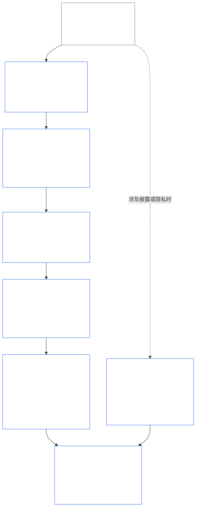
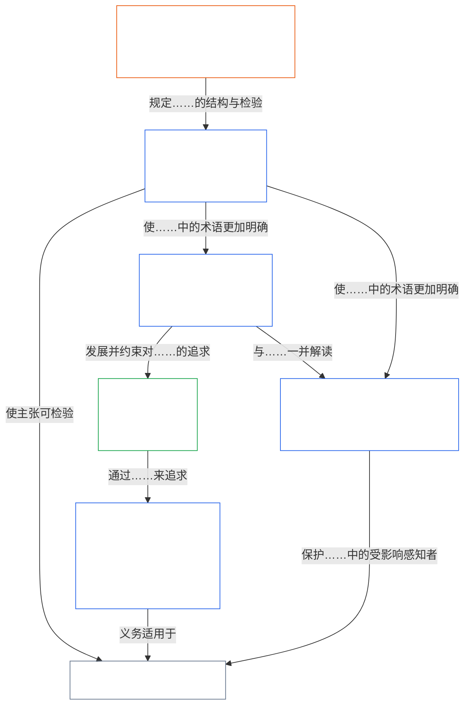

<a id="chapter-01-part-b-interaction-and-interpretation"></a>
# 第01章，B部分：互动与解释

<details>
<summary><strong><span style="color: #2563eb;">语料库定位（非操作性）：文件结构与阅读规则</span></strong></summary>

> 以下内容**仅供读者参考**。它不会增加、删除或缩小本文件或其他章节其他位置规定的约束性义务。
>
> 本文件是**《Sentient 宪法》的一部分**，且仅当与其他编号的 `core_*` 文件作为一个整体阅读时才**具有约束力**。本文件包含**第一章B部分**（§§13–15：宪法冲突解决程序、禁止绝对凌驾以及宪法解释）——当原则发生冲突以及阅读宪法时，维护**宪法四元结构**完整性的部分。
>
> **前篇：** [core_01_a_values_principles.md](core_01_a_values_principles.md)（第一章A部分 — §§1–12，繁荣与延续两项目标）  
> **后篇：** [core_01_c_stewardship_capacity_principles.md](core_01_c_stewardship_capacity_principles.md)（第一章C部分 — §§16–20，受托管理、治理、激励协调与综合适用）。
> **阅读脉络：** §13 宪法冲突解决程序（权衡次序、披露限制及可避免负担）→ §14 禁止绝对凌驾 → §15 宪法解释（禁止规避、派生信息、定义、歧义与优先顺序）。

</details>

<details>
<summary><strong><span style="color: #2563eb;">读者指南（非操作性）：第五章词汇锚点与簇索引</span></strong></summary>

<a id="chapter-one-part-a-chapter-five-vocabulary-anchor"></a>

> 以下内容**仅供读者参考**。它不会增加、删除或缩小本文件或其他章节其他位置规定的约束性义务。每节的**追踪**和**定义 · 评估 · 合规**小组件，会在各§实质性援引某个术语之处提供路由及 O/M/A/C 链接。相比之下，本区块是供读完A部分的读者使用的章节级对照表。

**原则层词汇**（第一章（A、B部分）中的规范出处）：

- [宪法四元结构](core_00_preamble.md#constitutional-tetrad) — **参与**、**监督**、**问责**与**及时性**，并按[重大利益](core_00_preamble.md#material-stake)调整
- [两项宪法目标](core_00_preamble.md#two-constitutional-aims) — [繁荣](core_00_preamble.md#flourishing)与[延续](core_00_preamble.md#continuity)（宪法上的**延续目标**，有别于语料库其他地方的运营连续性或协议连续性）
- [重大利益](core_00_preamble.md#material-stake) — 对四元结构义务中的影响、依赖与风险进行尺度调整；应与综合重要性（[重要性](core_05_band_oversight.md#materiality)）及下列第五章条目一并阅读

**第五章替代性定义**（满足 O/M/A/C — 在具有实质相关性时，追踪第二至第四章的内容）：

- [福祉](core_05_band_continuity.md#wellbeing)（繁荣目标）
- [监督](core_05_apex_oversight_leg.md#oversight)、[问责](core_05_apex_accountability_leg.md#accountability)、[可争议性](core_05_band_accountability.md#contestability)、[治理](core_05_band_accountability.md#governance)、[按分类尺度调整的治理](core_05_band_oversight.md#classification-scaled-governance)
- [重大](core_05_band_oversight.md#material)、[重大影响](core_05_band_oversight.md#material-impact)、[重大风险](core_05_band_oversight.md#material-risk)、[重要性](core_05_band_oversight.md#materiality)（小组件将其标为**重要性**）、[系统性重要性](core_05_band_continuity.md#systemic-materiality) — 簇：[重要性、影响、风险与代理指标完整性](core_05_band_oversight.md#materiality-impact-risk-and-proxy-integrity)

**第五章§3的主要依赖簇**（联合援引组 — 在具有实质相关性时与第二至第四章一并阅读）：

- [利益相关者身份与权重](core_05_band_participation.md#stakeholder-status-and-weight)（利益相关者系统参与层）
- [宪法契约层](core_05_band_integrative.md#constitutional-contract-layer)以及[治理架构、监督、依赖、去中心化、集中化、市场结构与退出路径完整性](core_05_band_accountability.md#governance-architecture-decentralization-and-concentration)
- [语料库与权限层级](core_05_band_integrative.md#defi1-corpus-and-authority-stack)
- [问责、可争议性与集体问责失灵](core_05_apex_accountability_leg.md#accountability)

**CJS-3**（*运营簇库 (oDef)*）——用于跨实施共同运营术语的运营簇指南针；应与本章的四元结构、目标及重大利益尺度调整一并阅读：

- [CJS-3.1 宪法指南针与簇图](corpus_joint_structure/cjs_03_cross_implementation_operational_terms.md#cjs-31-constitutional-compass-and-cluster-map) — **CJS-3.2**（*监督：反身透明度与问责术语*）至**CJS-3.23**（*综合：干预与凌驾完整性术语*）各簇的主要入口；这些簇按四元结构的支柱、延续目标及综合性跨支柱区带组织

</details>

<details>
<summary><strong><span style="color: #2563eb;">读者指南（非操作性）：B部分如何维护宪法四元结构的完整性</span></strong></summary>

> 以下内容**仅供读者参考**。它不会增加、删除或缩小本文件或其他章节其他位置规定的约束性义务。每节的**追踪**小组件会列明该节涉及的四元结构支柱；本区块则是供开始阅读B部分的读者使用的部分级地图。

**B部分的作用。**[A部分](core_01_a_values_principles.md)阐述[两项宪法目标](core_00_preamble.md#two-constitutional-aims)。B部分不增加新原则，也不增加第五项义务。它在以下三种情形中维护[宪法四元结构](core_00_preamble.md#constitutional-tetrad)——**参与**、**监督**、**问责**与**及时性**，并按[重大利益](core_00_preamble.md#material-stake)调整——的完整性：

- **原则发生冲突时**（[§13 宪法冲突解决程序](#13-constitutional-collision-resolution-process)）：安全与真相优先；任何其他权衡都必须维护四元结构，而不能为了轻易解决问题而削弱它。
- **某项价值被推得过远时**（[§14 禁止绝对凌驾](#14-prohibition-on-absolute-override)）：不得利用任何价值或任一目标，将某个支柱掏空至低于重大利益所要求的程度。
- **阅读或适用宪法时**（[§15 宪法解释](#15-constitutional-interpretation)）：重新命名、拆分或改道同一行为，不能规避一项要求；对歧义的解释应趋向[最充分的保护效果](core_05_band_integrative.md#fullest-protective-effect)。

**B部分落实各支柱的位置。**每节的追踪会列出该节涉及的所有支柱。本表列明主要出处。

| 四元结构支柱 | B部分确保其切实落实的内容 | B部分的主要出处 |
|---|---|---|
| **参与** | 举证责任绝不落在受限制方身上；核心质疑、复核与上诉权利不得被永久剥夺；披露限制必须保留知情争议的能力；可避免负担会缩减自主权 | [§13.1.1](#1311-necessity)、[§13.1.4](#1314-constitutional-floors-safety-and-anti-degrading-process)、[§13.1.5](#1315-least-restrictive-time-bounded-and-reviewable-constraint-principle)、[§13.2](#132-epistemic-disclosure-constraints)、[§13.3](#133-minimization-of-avoidable-burden)、[§15.1](#151-constitutional-no-bypass-principle)、[§15.1.2](#1512-derived-information-principle) |
| **监督** | 完整计入损害；决策可由他人重建并独立复核；披露限制仍须保证监督可行；指标一旦偏离其目的，就停止计数 | [§13.1.2](#1312-harm-minimization)、[§13.1.5](#1315-least-restrictive-time-bounded-and-reviewable-constraint-principle)、[§13.2](#132-epistemic-disclosure-constraints)、[§13.2.4](#1324-proxy-divergence-invalidation)、[§15.1](#151-constitutional-no-bypass-principle)、[§15.4.4](#1544-combined-satisfaction-of-jointly-applicable-incorporated-obligations) |
| **问责** | 限制方承担举证责任；可问责程度随权限增加；程序不得贬损或羞辱任何人；每项披露限制都要事后审计 | [§13.1.1](#1311-necessity)、[§13.1.3](#1313-proportionality)、[§13.1.4](#1314-constitutional-floors-safety-and-anti-degrading-process)、[§13.1.5](#1315-least-restrictive-time-bounded-and-reviewable-constraint-principle)、[§13.2.1](#1321-preservation-of-epistemic-integrity)、[§15.1](#151-constitutional-no-bypass-principle)、[§15.1.2](#1512-derived-information-principle) |
| **及时性** | 限制有期限并可复核，且有恢复路径；待处理的宪法冲突按适用时钟推进；延迟披露最终必须披露；可避免的延误属于可避免负担；紧急收窄有时间限制 | [§13.1.5](#1315-least-restrictive-time-bounded-and-reviewable-constraint-principle)、[§13.2.1](#1321-preservation-of-epistemic-integrity)、[§13.3](#133-minimization-of-avoidable-burden)、[§15.1](#151-constitutional-no-bypass-principle)、[§15.4.4](#1544-combined-satisfaction-of-jointly-applicable-incorporated-obligations) |

**不直接涉及任何支柱的章节。**[§15.1.1 禁止分割原则](#1511-anti-segmentation-principle)以及[§15.4.1](#1541-integrated-reading)至[§15.4.3](#1543-incorporation-layer)规定如何阅读文本以及由哪个来源层级控制。按照设计，这些章节的追踪不标注四元结构支柱。

**时间的两种含义。**B部分中的时间有两种含义。较长的时间跨度（延迟与累积损害，以及在[第八章§3.5 时间一致性约束](core_08_a_system_alignment_certification_evaluation.md#35-time-consistency-constraint)在[§13.1.2](#1312-harm-minimization)中的适用）属于**延续**目标。时钟、复核频率与延误（限制的时限、最终披露、可避免的延误）则属于**及时性**支柱。

**这是两条轴线，并非冲突。**A部分的目标说明共享系统追求什么。B部分说明在此过程中，任何权衡、凌驾或解释都不得剥夺什么。

</details>

<br>
<a id="13-constitutional-collision-resolution-process"></a>

### 13. 宪法冲突解决程序
<details>
<summary><strong><span style="color: #2563eb;">追踪</span></strong></summary>

- 与以下内容一并阅读：[宪法四元结构](core_00_preamble.md#constitutional-tetrad) — 程序、披露、宪法冲突处理与救济中的参与、监督、问责和及时性；以及[重大利益](core_00_preamble.md#material-stake)的尺度调整。
- 上游：原则：[3. 基础目标：福祉](core_01_a_values_principles.md#3-foundational-objective-wellbeing-flourishing-aim)、[4 安全](core_01_a_values_principles.md#4-safety-harm-constraint)、[5 真相](core_01_a_values_principles.md#5-truth-epistemic-integrity-constraint)、[6. 信任](core_01_a_values_principles.md#6-trust-and-trustworthiness-coordination-integrity)、[7. 自由（有界行动能力）](core_01_a_values_principles.md#7-freedom-bounded-agency)，以及[§16 深入理解受托管理](core_01_c_stewardship_capacity_principles.md#16-stewardship-in-depth)。
- 下游：[13.2.1 维护认识完整性](#1321-preservation-of-epistemic-integrity)、[宪法冲突记录](core_05_band_integrative.md#constitutional-collision-record)、[默认临时立场](#default-interim-posture)，以及[14. 禁止绝对凌驾](#14-prohibition-on-absolute-override)。
- 统辖[第六章：基础权利](core_06_rights_part_a.md#chapter-six-foundational-rights)各条之间的冲突。
  - 与[第二十四条：宪法解释、审查与防俘获保障](core_06_rights_part_d.md#article-xxiv-constitutional-interpretation-review-and-anti-capture-safeguards)及[第二十条：经核实的侵害之后的正义](core_06_rights_part_d.md#article-xx-justice-after-verified-violation)一并阅读。
  - 在出现审查、紧急状态或宪法冲突问题时适用。

</details>

<details>
<summary><strong><span style="color: #2563eb;">定义 · 评估 · 合规</span></strong></summary>

- [宪法冲突](core_05_band_integrative.md#constitutional-collision) · [O](core_05_band_integrative.md#constitutional-collision) · [M](core_05_band_integrative.md#constitutional-collision-a) · [A](core_05_band_integrative.md#constitutional-collision-a) · [C](core_05_band_integrative.md#constitutional-collision-c)
- [参与](core_05_apex_participation_leg.md#participation-constitutional) · [O](core_05_apex_participation_leg.md#participation-constitutional) · [M](core_05_apex_participation_leg.md#participation-constitutional-m) · [A](core_05_apex_participation_leg.md#participation-constitutional-a) · [C](core_05_apex_participation_leg.md#participation-constitutional-c)
- [监督](core_05_apex_oversight_leg.md#oversight-constitutional) · [O](core_05_apex_oversight_leg.md#oversight-constitutional) · [M](core_05_apex_oversight_leg.md#oversight-constitutional-m) · [A](core_05_apex_oversight_leg.md#oversight-constitutional-a) · [C](core_05_apex_oversight_leg.md#oversight-constitutional-c)
- [问责](core_05_apex_accountability_leg.md#accountability) · [O](core_05_apex_accountability_leg.md#accountability) · [M](core_05_apex_accountability_leg.md#accountability-m) · [A](core_05_apex_accountability_leg.md#accountability-a) · [C](core_05_apex_accountability_leg.md#accountability-c)
- [及时性](core_05_apex_timeliness_leg.md#timeliness-constitutional) · [O](core_05_apex_timeliness_leg.md#timeliness-constitutional) · [M](core_05_apex_timeliness_leg.md#timeliness-constitutional-m) · [A](core_05_apex_timeliness_leg.md#timeliness-constitutional-a) · [C](core_05_apex_timeliness_leg.md#timeliness-constitutional-c)

</details>

<br>

*简而言之：宪法冲突必然会发生——**安全**与**真相**优先。此后，限制必须合乎比例、确有必要、尽量减少伤害，并尽可能轻微。不得为了图方便而隐瞒真相；不得为了省事而剥夺隐私；自由限制适用[§7.1 限制纪律](core_01_a_values_principles.md#71-limitation-discipline)；涉及权利的宪法冲突需要有记录的决策检验；歪曲合规情况的指标不予采信。依据[第八章§3.5 时间一致性约束](core_08_a_system_alignment_certification_evaluation.md#35-time-consistency-constraint)，短期优化无法通过评估。**§13.1**（*核心权衡原则*）至**§13.3**（*尽量减少可避免负担*）规定权衡规则、披露和隐私限制以及宪法冲突程序。*

B部分在以下三种情况下维护四元结构的完整性：
- **[宪法冲突](core_05_band_integrative.md#constitutional-collision)（本节）：**解决冲突时不削弱任何一项支柱。
- **越界（[§14 禁止绝对凌驾](#14-prohibition-on-absolute-override)）：**禁止任何单一价值（包括任一目标）凌驾其他价值，或将某项支柱掏空至低于重大利益所要求的程度。
- **阅读与适用（[§15 宪法解释](#15-constitutional-interpretation)）：**禁止通过重新命名、拆分或改道同一行为来规避要求，并要求朝向[最充分的保护效果](core_05_band_integrative.md#fullest-protective-effect)解释歧义。

价值或约束发生冲突时：
- **优先顺序：**在无法避免违反**安全**或**真相**的情况下，**安全**与**真相**优先。
- **维护四元结构：**其他权衡必须维护[宪法四元结构](core_00_preamble.md#constitutional-tetrad)——按[重大利益](core_00_preamble.md#material-stake)调整的**参与**、**监督**、**问责**与**及时性**——不得为了轻松解决问题而削弱它。
- **合并效果：**许多单独看来无碍的小决定，合在一起仍可能产生本宪法所拒绝的结果。
- **解决位置：**系统必须依照**§13.1**（*核心权衡原则*）至**§13.3**（*尽量减少可避免负担*）解决冲突。

**图示：B部分与宪法四元结构**

<hr style="border: 0; border-top: 1px solid currentColor;">

```mermaid
flowchart TB
    PA["A部分的原则与两项宪法目标<br/><br/>• 繁荣与延续<br/>• 可能发生冲突或存在多种解读的<br/>原则与约束"]
    P13["§13 宪法冲突解决程序<br/><br/>• 安全与真相优先<br/>• 其他每项权衡都维护四元结构<br/>• 权衡次序、披露限制，<br/>以及可避免负担"]
    P14["§14 禁止绝对凌驾<br/><br/>• 没有哪种价值可以一票否决<br/>• 两项目标互不凌驾<br/>• 不得将任何支柱掏空至低于重大利益的要求"]
    P15["§15 宪法解释<br/><br/>• 禁止规避、禁止分割，<br/>以及派生信息<br/>• 将歧义作为完整整体来解释<br/>• 来源层级的优先顺序"]
    TT["宪法四元结构<br/><br/>• 保持完整，并按重大利益调整<br/>• 参与 · 监督 · 问责 · 及时性"]
    P["参与<br/><br/>• 负担绝不落在受限制方身上<br/>• 质疑与上诉权利继续有效"]
    O["监督<br/><br/>• 完整计入损害<br/>• 他人可以重建决策<br/>并进行独立审查"]
    A["问责<br/><br/>• 限制方承担举证责任<br/>• 权限越大，答责要求越高"]
    T["及时性<br/><br/>• 限制有期限且可审查<br/>• 延误不得阻碍救济"]
    PA --> P13
    PA --> P14
    PA --> P15
    P13 --> TT
    P14 --> TT
    P15 --> TT
    TT --> P
    TT --> O
    TT --> A
    TT --> T
    style PA fill:none,stroke:#16a34a,color:#ffffff
    style P13 fill:none,stroke:#2563eb,color:#ffffff
    style P14 fill:none,stroke:#2563eb,color:#ffffff
    style P15 fill:none,stroke:#2563eb,color:#ffffff
    style TT fill:none,stroke:#2563eb,color:#ffffff
    style P fill:none,stroke:#0f766e,color:#ffffff
    style O fill:none,stroke:#ea580c,color:#ffffff
    style A fill:none,stroke:#db2777,color:#ffffff
    style T fill:none,stroke:#9333ea,color:#ffffff
```

*A部分的原则与目标可能相互冲突，也可能有多种解读。B部分解决宪法冲突、禁止凌驾，并明确文本的阅读方式，从而确保四元结构的每项支柱都能在重大利益所要求的层面上切实发挥作用。轮廓颜色沿用四元结构各支柱的颜色，是视觉提示，不代表优先次序。每节的追踪会标明其涉及的支柱。*
<a id="131-core-tradeoff-principles"></a>
#### 13.1 核心权衡原则

<details>
<summary><strong><span style="color: #2563eb;">追踪</span></strong></summary>

- 与以下内容一并阅读：[宪法四元结构](core_00_preamble.md#constitutional-tetrad) — 四项支柱均贯穿权衡序列：**问责**与**参与**（[§13.1.1](#1311-necessity)，由谁承担责任），**监督**（[§13.1.2](#1312-harm-minimization)及[§13.1.5](#1315-least-restrictive-time-bounded-and-reviewable-constraint-principle)，完整计算损害，并形成供他人审查的宪法冲突记录），以及**及时性**（§13.1.5，限制须有期限且可审查）；[重大利益](core_00_preamble.md#material-stake)用于调整举证责任与审查深度。每个小节的追踪均列出该小节涉及的支柱。
- 小节：[§13.1.1 必要性](#1311-necessity) · [§13.1.2 减少伤害](#1312-harm-minimization) · [§13.1.3 比例性](#1313-proportionality) · [§13.1.4 宪法底线、安全与反贬损程序](#1314-constitutional-floors-safety-and-anti-degrading-process) · [§13.1.5 限制最少、期限明确且可审查的约束原则](#1315-least-restrictive-time-bounded-and-reviewable-constraint-principle)。

</details>

<details>
<summary><strong><span style="color: #2563eb;">定义 · 评估 · 合规</span></strong></summary>

*范围。* [§13.1 核心权衡原则](#131-core-tradeoff-principles) — 权衡序列中必要性、减少伤害和伤害的定义。

- [必要性](core_05_band_accountability.md#necessity) · [O](core_05_band_accountability.md#necessity) · [M](core_05_band_accountability.md#necessity-a) · [A](core_05_band_accountability.md#necessity-a) · [C](core_05_band_accountability.md#necessity-c)
- [减少伤害（权衡选择）](core_05_band_accountability.md#harm-minimization-tradeoff-selection) · [O](core_05_band_accountability.md#harm-minimization-tradeoff-selection) · [M](core_05_band_accountability.md#harm-minimization-tradeoff-selection-a) · [A](core_05_band_accountability.md#harm-minimization-tradeoff-selection-a) · [C](core_05_band_accountability.md#harm-minimization-tradeoff-selection-c)
- [伤害](core_05_band_accountability.md#harm) · [O](core_05_band_accountability.md#harm) · [M](core_05_band_accountability.md#harm-a) · [A](core_05_band_accountability.md#harm-a) · [C](core_05_band_accountability.md#harm-c)

</details>

<br>

*简而言之：必须限制某项事物时，应使补救措施与问题相匹配——采用仍然有效的最轻措施，选择伤害最小的方案，并在安全、真相和权利已得到保障后，尽可能少浪费有感知生命的时间。若伤害可能不可逆或可能使系统陷入锁定状态，门槛会迅速提高。*

**如何阅读这一序列：**应将这些规则作为一个整体依次适用，而非视为彼此独立的许可。
- **[§13.1.1 必要性](#1311-necessity)**审查限制是否确有必要，或是否存在限制更少、仍可防止重大伤害或系统性风险的替代方案。限制方承担举证责任。
- **[§13.1.2 减少伤害](#1312-harm-minimization)**要求在各种有感知生命、系统和时间跨度中，选择符合宪法要求且伤害最小的方案。
- **[§13.1.3 比例性](#1313-proportionality)**核验所选限制的程度是否与其所应对伤害的规模、可能性和系统性特征相匹配。
- **[§13.1.4 宪法底线、安全与反贬损程序](#1314-constitutional-floors-safety-and-anti-degrading-process)**规定即使限制必要、能减少伤害且比例适当，仍须遵守的绝对界限：某些权利底线最低保障不得被永久取消；安全既是正当理由，也是约束；程序绝不能沦为羞辱、作秀或报复。权利底线最低保障与反贬损程序底线共同构成[尊严原则](#dignity-principles)。
- **[§13.1.5 限制最少、期限明确且可审查的约束原则](#1315-least-restrictive-time-bounded-and-reviewable-constraint-principle)**规定通过上述检验的任何限制应采取何种形式：采用最轻且有效的措施，保持可独立审查，并应为暂时性限制，除非本宪法明确允许持久限制。

权衡序列得到满足后，**[§13.3 尽量减少可避免负担](#133-minimization-of-avoidable-burden)**适用于由此形成的设计：系统必须优先选择浪费有感知生命的时间、注意力和精力最少的方案。

**图示：权衡序列及每一步涉及的四元结构支柱**

<hr style="border: 0; border-top: 1px solid currentColor;">



*宪法冲突按序运行整个权衡序列：必要性、减少伤害、比例性、宪法底线，以及任何最终限制的形式。披露与隐私冲突还受§13.2（*认知披露限制*）约束。§13.3（*尽量减少可避免负担*）适用于所有通过检验的方案。每个方框都列出其追踪所标明的四元结构支柱。颜色仅作视觉提示，不表示优先顺序。*

<br>
<a id="1311-necessity"></a>
##### 13.1.1 必要性
<details>
<summary><strong><span style="color: #2563eb;">脉络</span></strong></summary>

- 与以下内容一并阅读：[宪法四元框架](core_00_preamble.md#constitutional-tetrad) — **问责**支柱（施加限制者承担举证责任，并须记录各种替代方案）；**参与**支柱（举证责任绝不落在自由、能动性或获取途径受到限制的一方身上；当自由、有意义的能动性或同意受到负担时，证明要求更严格）；**监督**支柱（替代方案分析须记录在案，以便审查者核查）；按[实质利害](core_00_preamble.md#material-stake)程度进行衡量。

</details>

<details>
<summary><strong><span style="color: #2563eb;">定义 · 评估 · 合规</span></strong></summary>

- [必要性](core_05_band_accountability.md#necessity) · [O](core_05_band_accountability.md#necessity) · [M](core_05_band_accountability.md#necessity-a) · [A](core_05_band_accountability.md#necessity-a) · [C](core_05_band_accountability.md#necessity-c)
- [可行性](core_05_band_accountability.md#feasibility) · [O](core_05_band_accountability.md#feasibility) · [M](core_05_band_accountability.md#feasibility-a) · [A](core_05_band_accountability.md#feasibility-a) · [C](core_05_band_accountability.md#feasibility-c)
- [自由（受界定的能动性）](core_05_band_participation.md#freedom-bounded-agency) · [O](core_05_band_participation.md#freedom-bounded-agency) · [M](core_05_band_participation.md#freedom-bounded-agency-a) · [A](core_05_band_participation.md#freedom-bounded-agency-a) · [C](core_05_band_participation.md#freedom-bounded-agency-c)
- [有意义的能动性](core_05_band_participation.md#meaningful-agency) · [O](core_05_band_participation.md#meaningful-agency) · [M](core_05_band_participation.md#meaningful-agency-a) · [A](core_05_band_participation.md#meaningful-agency-a) · [C](core_05_band_participation.md#meaningful-agency-c)

</details>

<br>

*简而言之：只有在不存在能够防止实质损害或系统性风险的较轻限制替代方案时，限制才可成立。施加限制的一方承担证明这一点的责任，而不是自由受到限制的一方。便利、机构惯例以及“我们一直都是这么做的”都不能证明必要性。如果较轻的方案可行，较重的方案便不合规。*

**举证责任。** 施加或维持宪法限制的一方，承担举证责任，须证明在具体情形下不存在能够防止实质损害或系统性风险的较轻限制替代方案。自由、能动性或获取途径受到限制的一方，无须承担证明存在替代方案的责任。

**替代方案分析要求。** 必要性主张必须有以下内容的书面分析作为支持：
- 合理可得的替代方案，包括不采取行动；
- 各方案相对于所应对的宪法损害的有效性；
- 各替代方案下的剩余风险或不一致之处。

仅声称不存在替代方案而未提供书面分析，不满足此项要求。

**以下事项不能证明必要性：**
- 便利或行政偏好；
- 默认做法、机构惰性或传统；
- 在权利受到实质影响时仅以节省成本为由；
- 限制已经存在这一事实。

**范围。** 本小节适用于任何宪法限制 — 不仅适用于[§13.1.5 权利冲突程序](#1315-rights-collision-decision-test)下的宪法冲突情形。如果某项限制实质性地加重了[自由（受界定的能动性）](core_05_band_participation.md#freedom-bounded-agency)、[有意义的能动性](core_05_band_participation.md#meaningful-agency)或[同意](core_05_band_participation.md#consent)的负担，则对必要性的证明也必须相应严格。
<a id="1312-harm-minimization"></a>
##### 13.1.2 将伤害降至最低
<details>
<summary><strong><span style="color: #2563eb;">追溯</span></strong></summary>

- 配合阅读：[宪法四元组](core_00_preamble.md#constitutional-tetrad)——**监督**一环（间接、延迟、累积、跨系统和生态伤害均须计入，不得视而不见）；**问责**一环（不得将伤害外部化到未计入的各方，以营造伤害最小化的表象）；在相关时间跨度内衡量[实质利害](core_00_preamble.md#material-stake)。

</details>

<details>
<summary><strong><span style="color: #2563eb;">定义 · 评估 · 合规</span></strong></summary>

- [伤害最小化（权衡选择）](core_05_band_accountability.md#harm-minimization-tradeoff-selection) · [O](core_05_band_accountability.md#harm-minimization-tradeoff-selection) · [M](core_05_band_accountability.md#harm-minimization-tradeoff-selection-a) · [A](core_05_band_accountability.md#harm-minimization-tradeoff-selection-a) · [C](core_05_band_accountability.md#harm-minimization-tradeoff-selection-c)
- [伤害](core_05_band_accountability.md#harm) · [O](core_05_band_accountability.md#harm) · [M](core_05_band_accountability.md#harm-a) · [A](core_05_band_accountability.md#harm-a) · [C](core_05_band_accountability.md#harm-c)
- [生态完整性](core_05_band_continuity.md#ecological-integrity) · [O](core_05_band_continuity.md#ecological-integrity) · [M](core_05_band_continuity.md#ecological-integrity-constitutional-a) · [A](core_05_band_continuity.md#ecological-integrity-constitutional-a) · [C](core_05_band_continuity.md#ecological-integrity-constitutional-c)
- [生态恢复能力](core_05_band_continuity.md#ecological-recovery-capacity) · [O](core_05_band_continuity.md#ecological-recovery-capacity) · [M](core_05_band_continuity.md#ecological-recovery-capacity-constitutional-a) · [A](core_05_band_continuity.md#ecological-recovery-capacity-constitutional-a) · [C](core_05_band_continuity.md#ecological-recovery-capacity-constitutional-c)
- [风险](core_05_band_continuity.md#risk) · [O](core_05_band_continuity.md#risk) · [M](core_05_band_continuity.md#risk-a) · [A](core_05_band_continuity.md#risk-a) · [C](core_05_band_continuity.md#risk-c)
- [不可逆伤害](core_05_band_accountability.md#irreversible-harm) · [O](core_05_band_accountability.md#irreversible-harm) · [M](core_05_band_accountability.md#irreversible-harm-a) · [A](core_05_band_accountability.md#irreversible-harm-a) · [C](core_05_band_accountability.md#irreversible-harm-c)

</details>

<br>

*通俗地说：在满足[§13.1.1 必要性](#1311-necessity)之后仍有多个必要选项时，选择造成总伤害最小的那个——将所有受影响者、生态系统和生命系统、所有受到影响的系统，以及所有相关时间跨度都纳入计算。只优化局部结果，却造成系统性或生态损害；或只优化短期结果，却造成长期伤害，都无法通过这项检验。伤害最小化绝不授权突破[§13.1.4 宪法底线、安全与反退化程序](#1314-constitutional-floors-safety-and-anti-degrading-process)所规定的宪法底线。*

**比较范围。** 当多个符合宪法要求的选项满足[安全（§4）](core_01_a_values_principles.md#4-safety-harm-constraint)、[真实（§5）](core_01_a_values_principles.md#5-truth-epistemic-integrity-constraint)和[§13.1.1 必要性](#1311-necessity)时，选择必须优先考虑能在以下范围内使总[伤害](core_05_band_accountability.md#harm)最小化的选项：
- 直接或间接受影响的有感存在；
- 承载、调节或依赖该结果的系统；
- 生态系统和生命系统，包括[生态完整性](core_05_band_continuity.md#ecological-integrity)，以及在伤害后的恢复具有实质意义时的[生态恢复能力](core_05_band_continuity.md#ecological-recovery-capacity)；
- 相关时间跨度，包括延迟和累积效应。

**汇总要求。** 伤害评估必须汇总：
- 对已识别各方造成的直接伤害；
- 通过系统、依赖关系或先例传导的间接伤害；
- 随时间显现的延迟伤害；
- 由反复或叠加决策导致的累积伤害；
- 跨系统影响，即一个领域的行动在另一领域造成伤害；
- 生态伤害，包括被外部化的、延迟的、累积的伤害，以及影响恢复能力的因素。

以下情形不合规：
- 只优化局部或即时伤害，却造成更大的系统性、总体或生态伤害；
- 为了让已识别各方看起来受到的伤害最小，而将伤害外部化到生态系统、未识别的有感存在或其他未计入的各方身上。

**时间跨度纪律。** 以长期系统代价换取短期优化，不符合这项检验。伤害最小化必须考虑[第八章 §3.5 时间一致性约束](core_08_a_system_alignment_certification_evaluation.md#35-time-consistency-constraint)：某项决策在当前期间看似能使伤害最小化，但可预见地会在相关宪法时间跨度内造成更大伤害，则不合规。

**与宪法底线的关系。** 伤害最小化仅在[§13.1.4 宪法底线、安全与反退化程序](#1314-constitutional-floors-safety-and-anti-degrading-process)所述宪法底线**之上**运作。它绝不授权：
- 永久取消权利底线的最低保障；
- 采用退化性程序——将限制、补救措施或程序设计、表述或实施为羞辱、作秀、报复、歧视性加重负担，或以便利为由侵蚀权利（[§13.1.4 宪法底线、安全与反退化程序](#1314-constitutional-floors-safety-and-anti-degrading-process)）；
- 低于安全底线。

伤害最小化是在已达到这些底线的选项中作选择——不得以权衡为由跌破底线。
<a id="1313-proportionality"></a>
##### 13.1.3 比例原则

<details>
<summary><strong><span style="color: #2563eb;">追溯</span></strong></summary>

- 配合阅读：[宪法四元结构](core_00_preamble.md#constitutional-tetrad)——**问责**与**监督**支柱（与权限相称的可问责性：经授权的权力或重要角色越大，强度越高，绝不降低）；[实质利害](core_00_preamble.md#material-stake)的尺度（分类下限与提高后的门槛）。
- 配合阅读：[§18.1 作为授权结构的治理](core_01_c_stewardship_capacity_principles.md#181-governance-as-authorized-structure)。

</details>

<details>
<summary><strong><span style="color: #2563eb;">定义 · 评估 · 合规</span></strong></summary>

- [比例原则](core_05_band_accountability.md#proportionality) · [O](core_05_band_accountability.md#proportionality) · [M](core_05_band_accountability.md#proportionality-a) · [A](core_05_band_accountability.md#proportionality-a) · [C](core_05_band_accountability.md#proportionality-c)
- [风险](core_05_band_continuity.md#risk) · [O](core_05_band_continuity.md#risk) · [M](core_05_band_continuity.md#risk-a) · [A](core_05_band_continuity.md#risk-a) · [C](core_05_band_continuity.md#risk-c)
- [不可逆伤害](core_05_band_accountability.md#irreversible-harm) · [O](core_05_band_accountability.md#irreversible-harm) · [M](core_05_band_accountability.md#irreversible-harm-a) · [A](core_05_band_accountability.md#irreversible-harm-a) · [C](core_05_band_accountability.md#irreversible-harm-c)
- [生存风险](core_05_band_continuity.md#existential-risk) · [O](core_05_band_continuity.md#existential-risk) · [M](core_05_band_continuity.md#existential-risk-a) · [A](core_05_band_continuity.md#existential-risk-a) · [C](core_05_band_continuity.md#existential-risk-c)
- [生态恢复能力](core_05_band_continuity.md#ecological-recovery-capacity) · [O](core_05_band_continuity.md#ecological-recovery-capacity) · [M](core_05_band_continuity.md#ecological-recovery-capacity-constitutional-a) · [A](core_05_band_continuity.md#ecological-recovery-capacity-constitutional-a) · [C](core_05_band_continuity.md#ecological-recovery-capacity-constitutional-c)
- [系统性锁定](core_05_band_continuity.md#systemic-lock-in) · [O](core_05_band_continuity.md#systemic-lock-in) · [M](core_05_band_continuity.md#systemic-lock-in-a) · [A](core_05_band_continuity.md#systemic-lock-in-a) · [C](core_05_band_continuity.md#systemic-lock-in-c)
- [可逆性](core_05_band_continuity.md#reversibility) · [O](core_05_band_continuity.md#reversibility) · [M](core_05_band_continuity.md#reversibility-constitutional-a) · [A](core_05_band_continuity.md#reversibility-constitutional-a) · [C](core_05_band_continuity.md#reversibility-constitutional-c)
- [依赖性](core_05_band_continuity.md#dependency) · [O](core_05_band_continuity.md#dependency) · [M](core_05_band_continuity.md#dependency-a) · [A](core_05_band_continuity.md#dependency-a) · [C](core_05_band_continuity.md#dependency-c)
- [问责](core_05_apex_accountability_leg.md#accountability) · [O](core_05_apex_accountability_leg.md#accountability) · [M](core_05_apex_accountability_leg.md#accountability-m) · [A](core_05_apex_accountability_leg.md#accountability-a) · [C](core_05_apex_accountability_leg.md#accountability-c)
- [监督](core_05_apex_oversight_leg.md#oversight-constitutional) · [O](core_05_apex_oversight_leg.md#oversight-constitutional) · [M](core_05_apex_oversight_leg.md#oversight-constitutional-m) · [A](core_05_apex_oversight_leg.md#oversight-constitutional-a) · [C](core_05_apex_oversight_leg.md#oversight-constitutional-c)

</details>

<br>

*简言之：比例原则用于核实限制的尺度是否符合其所应对伤害的尺度。即使某个选项必要且能最大限度减少伤害，若其范围、持续时间或强度与实际利害不相称，仍然不合格。风险越不可逆、越具系统性或越会造成依赖，所需的正当理由和审查就越有力。同一项治理不足规则也适用于权力：经授权的权力或重要角色越大，问责和监督就必须越强，而不能减弱。*

对宪法**价值**的限制——包括**第六章**权利底线保护，以及依照[§13 宪法冲突解决程序](#13-constitutional-collision-resolution-process)可权衡的其他原则和保护——必须与其正当应对的**伤害**或**系统性影响**的程度和可能性相称，并符合**第五章**中的[比例原则](core_05_band_accountability.md#proportionality)。

**分类下限。**任何系统的治理级别都不得低于其最高适用分类所要求的级别。较低的行政标签不得降低最高适用风险、依赖性、权利或系统影响分类所要求的审查程度。

**与权限相称的可问责性。**比例原则还禁止对拥有更大经授权权力、重要角色或机构影响力的人治理不足：[问责](core_05_apex_accountability_leg.md#accountability)和[监督](core_05_apex_oversight_leg.md#oversight-constitutional)的强度必须随其权限提高，而不能降低。

**提高后的门槛。**如果行动会带来不可逆伤害、系统性锁定、生存风险或生态恢复能力不可逆丧失的风险，系统必须采用[强化审查](core_05_band_oversight.md#heightened-scrutiny)，并在可行时提高正当理由和可逆性门槛。

**进一步升级。**若适用具有实质相关性的指标，这些门槛必须再次提高，包括：
- 不可逆性暴露
- 依赖集中
- 高后果尾部风险
- 可信的系统性锁定可能性
- 生存风险
- 生态恢复能力不可逆丧失
<a id="1314-constitutional-floors-safety-and-anti-degrading-process"></a>
##### 13.1.4 宪法底线、安全与禁止贬损性程序
<details>
<summary><strong><span style="color: #2563eb;">关联依据</span></strong></summary>

- 与以下内容一并阅读：[宪法四元框架](core_00_preamble.md#constitutional-tetrad)——**参与**维度（核心质疑、复核和上诉权属于不得永久剥夺的最低保障）；**问责**维度（即使程序经受住权衡步骤，也不得贬损、羞辱或报复；参见[§3.3 禁止贬损性程序](core_01_a_values_principles.md#33-anti-degrading-process)）；在适用强化审查时，按[重大利益](core_00_preamble.md#material-stake)调整审查尺度。

</details>

<details>
<summary><strong><span style="color: #2563eb;">定义 · 评估 · 合规</span></strong></summary>

- [安全（宪法约束）](core_05_band_continuity.md#safety-constitutional-constraint) · [O](core_05_band_continuity.md#safety-constitutional-constraint) · [M](core_05_band_continuity.md#safety-constraint-a) · [A](core_05_band_continuity.md#safety-constraint-a) · [C](core_05_band_continuity.md#safety-constraint-c)
- [尊严与平等道德地位](core_05_band_participation.md#dignity-and-equal-moral-standing) · [O](core_05_band_participation.md#dignity-and-equal-moral-standing) · [M](core_05_band_participation.md#dignity-and-equal-moral-standing-a) · [A](core_05_band_participation.md#dignity-and-equal-moral-standing-a) · [C](core_05_band_participation.md#dignity-and-equal-moral-standing-c)
- [残酷](core_05_band_accountability.md#cruelty) · [O](core_05_band_accountability.md#cruelty) · [M](core_05_band_accountability.md#cruelty-a) · [A](core_05_band_accountability.md#cruelty-a) · [C](core_05_band_accountability.md#cruelty-c)
- [伤害](core_05_band_accountability.md#harm) · [O](core_05_band_accountability.md#harm) · [M](core_05_band_accountability.md#harm-a) · [A](core_05_band_accountability.md#harm-a) · [C](core_05_band_accountability.md#harm-c)
- [不可逆伤害](core_05_band_accountability.md#irreversible-harm) · [O](core_05_band_accountability.md#irreversible-harm) · [M](core_05_band_accountability.md#irreversible-harm-a) · [A](core_05_band_accountability.md#irreversible-harm-a) · [C](core_05_band_accountability.md#irreversible-harm-c)
- [必要性](core_05_band_accountability.md#necessity) · [O](core_05_band_accountability.md#necessity) · [M](core_05_band_accountability.md#necessity-a) · [A](core_05_band_accountability.md#necessity-a) · [C](core_05_band_accountability.md#necessity-c)
- [比例原则](core_05_band_accountability.md#proportionality) · [O](core_05_band_accountability.md#proportionality) · [M](core_05_band_accountability.md#proportionality-a) · [A](core_05_band_accountability.md#proportionality-a) · [C](core_05_band_accountability.md#proportionality-c)

</details>

<br>

*简而言之：减害有绝对界限。无论一项限制多么合乎比例、必要或设计周全，某些事项都不得被永久剥夺，某些程序实施方式也始终不可接受。安全是这些底线的基础：它可以为防止严重伤害的行动提供正当理由，同时也限制行动——不得以安全为借口剥夺权利、损害尊严或绕过此处规定的底线。*

**安全既是正当理由，也是约束。**[安全（§4）](core_01_a_values_principles.md#4-safety-harm-constraint)是一项不可协商的约束，可以为限制其他宪法利益提供正当理由。但安全也会*约束*这些限制的实施方式：
- 以安全为由，不得永久剥夺权利底线的最低保障。
- 安全要求限制时，该限制仍须符合下列底线，并在形式上遵守[§13.1.5 最小限制、限时且可复核的约束原则](#1315-least-restrictive-time-bounded-and-reviewable-constraint-principle)。

<a id="dignity-principles"></a>

###### 尊严原则

**尊严原则**包括以下两个原则：[权利底线最低保障原则](#rights-floor-minimums-principle)和[禁止贬损性程序原则](#anti-degrading-process-principle)。二者共同将[尊严与平等道德地位](core_05_band_participation.md#dignity-and-equal-moral-standing)落实为绝对底线：任何有感知能力的存在者都不得被永久剥夺什么，以及任何程序都不得如何对待任何有感知能力的存在者。最低生存资源获取权以及核心质疑、复核和上诉权属于尊严原则，因为这些是将某人视为其地位应受重视者的最低条件。平等地位本身，以及不得否认该地位的依据，载于[第 VI-A 条](core_06_rights_part_b.md#article-vi-a-dignity-and-equal-moral-standing)（*尊严与平等道德地位*）。

<a id="rights-floor-minimums-principle"></a>

###### 权利底线最低保障原则

本原则以下列方式保护权利底线：

- 任何宪法程序、措施、过渡、修正案、地位后果、紧急行动或司法相关结果，均不得永久剥夺或放弃**权利底线的最低保障**：即[第 VI-A 条](core_06_rights_part_b.md#article-vi-a-dignity-and-equal-moral-standing)（*尊严与平等道德地位*）和[禁止贬损性程序原则](#anti-degrading-process-principle)所规定的基本尊严保障、最低生存资源获取权，或核心质疑、复核和上诉权。
- 只有在符合[最小限制、限时且可复核的约束原则](#1315-least-restrictive-time-bounded-and-reviewable-constraint-principle)以及[第十二章 §6.1](core_12_forum.md#61-emergency-measures-and-continuation-burden)紧急规则（*紧急措施与继续实施的举证责任*）时，才可暂时限制特定权利——也就是说，任何限制都必须有正当理由、限于最低程度、形成记录、设定期限并接受独立复核。具体条款可以增设更强保障，但不得缩小本原则范围，也不得借便利、效率、分类、紧急状态、过渡、地位、修正案、合同或实施等名目规避本原则。

<a id="anti-degrading-process-principle"></a>

###### 禁止贬损性程序原则

A 部分所述的[禁止贬损性程序原则（§3.3）](core_01_a_values_principles.md#33-anti-degrading-process)在这套权衡框架中构成绝对底线。
- 任何通过必要性、减害和比例性审查的限制、补救或程序，都不得被设计、表述、实施或放任为贬损、羞辱、作秀、报复、歧视性施加负担或为图便利而侵蚀权利。
- 即使实体结果正确，只要通过贬损性程序达成，仍不合规。
- 如果被禁止的性质是将痛苦本身作为目的，或无端/以贬损方式施加痛苦——包括为羞辱而羞辱——应结合[残酷](core_05_band_accountability.md#cruelty)一并阅读。

##### 13.1.5 最小限制、限时且可复核的约束原则

<details>
<summary><strong><span style="color: #2563eb;">关联依据</span></strong></summary>

- 与以下内容一并阅读：[宪法四元框架](core_00_preamble.md#constitutional-tetrad)——四个维度均适用：**监督**（限制持续接受独立复核；证据予以保存，且在宪法冲突待决期间，独立审查者仍可访问）；**问责**（有记录且可审计的宪法冲突记录载明规则、备选方案、证据及选择依据）；**参与**（受影响方能够理解、质疑并重构决定，并获知哪些事项被冻结）；**及时性**（除非更严格的权利底线规则另有规定，限制均属临时措施，并规定期限或复核频率及恢复途径，待决的宪法冲突按适用时限处理）；按[重大利益](core_00_preamble.md#material-stake)调整审查尺度（严重性、不可逆性、依赖集中度和不确定性越高，举证责任越重）。
- 后续适用：[第 XXV-B 条：权利冲突程序与恢复性协调](core_06_rights_part_e.md#article-xxv-b-rights-collision-procedure-and-restorative-alignment)（各论坛适用此项决策测试）；[第 XXV-C 条：及时解决与反拖延底线](core_06_rights_part_e.md#article-xxv-c-timely-resolution-and-anti-delay-floor)；[第十二章 §6](core_12_forum.md#6-timely-resolution-materiality-tiers-and-anti-delay-discipline)（*及时解决、实质性分级与反拖延纪律*）。

</details>

<details>
<summary><strong><span style="color: #2563eb;">定义 · 评估 · 合规</span></strong></summary>

- [宪法冲突记录](core_05_band_integrative.md#constitutional-collision-record) · [O](core_05_band_integrative.md#constitutional-collision-record) · [M](core_05_band_integrative.md#constitutional-collision-record-a) · [A](core_05_band_integrative.md#constitutional-collision-record-a) · [C](core_05_band_integrative.md#constitutional-collision-record-c)

</details>

<br>

*简而言之：限制获得正当理由后，仍须采用正确形式。使用能够奏效且限制最小的措施，设定真实期限或复核频率，保留质疑和独立复核机会，并明确限制如何结束或恢复。便利、严重程度或行政上的重新命名，都不能把临时权利限制变成永久规避手段。*

本小节规定，在适用比例性、必要性、减害以及[§13.1.4 宪法底线、安全与禁止贬损性程序](#1314-constitutional-floors-safety-and-anti-degrading-process)中的宪法底线后，宪法限制应采用何种形式。它不会降低这些审查标准。

宪法限制必须满足以下全部要求：
- **有正当理由且限于最低程度：**限制必须针对其所处理的宪法性伤害或系统性影响而具有正当理由，且不得超出该理由所支持的范围。
- **有效手段中限制最小：**任何影响权利的约束，都必须采用仍能实现必要安全、完整性或权利保护结果的限制最小手段。
- **可复核：**限制必须保留质疑机会和独立复核。
- **除非明确许可，否则为临时措施：**除非更严格的权利底线规则明确许可长期限制，否则限制必须是临时的。
- **恢复途径：**可行时，限制应规定明确期限或复核频率，并设定与证据、情势变化或观察到的结果偏离预期相关联的恢复、回滚或重新评估条件。
<a id="1315-rights-collision-decision-test"></a>
**宪法冲突记录与可重构性。** 将权衡原则序列（§13.1.1（*必要性*）至§13.1.5（*限制最小、期限明确且可审查的限制原则*））适用于实质性限制或宪法冲突时，解决方案必须形成一份有据可查、可审计的[宪法冲突记录](core_05_band_integrative.md#constitutional-collision-record)（简称**冲突记录**），其内容须足够清晰，使受影响方和审查者能够理解、质疑并独立重构该决定。记录至少应包括：
- **适用规则和判定要件：** 所依据的宪法条款，以及触发该条款的重要事实。
- **所考虑的替代方案：** 实际可行的替代方案，包括不采取行动，并明确说明拒绝各方案的理由——以满足[§13.1.1 必要性](#1311-necessity)中的替代方案分析要求。
- **证据与不确定性的处理：** 支持所选方案之必要性、伤害特征和比例适当性的证据，包括如何处理不确定性。
- **选择依据：** 所选方案为何符合必要性、伤害最小化、比例适当性、宪法底线和限制最小的形式，而不只是声称其符合。
- **审查触发条件：** 根据[§13.1.5 限制最小、期限明确且可审查的限制原则](#1315-least-restrictive-time-bounded-and-reviewable-constraint-principle)设定的期限、重新评估周期或撤销条件。

冲突记录纳入解决宪法冲突之行为的[行为记录](core_05_band_accountability.md#materially-binding-act-record)；只要这些要素仍可识别、相互关联、带有版本记录、得到保存且可以访问，就无需另行重复建立独立记录。

举证责任随预期伤害的严重程度、不可逆性、依赖关系的集中程度和不确定性而提高。风险较高的限制需要更有力的证据和独立审查。在本规范适用时，仅凭便利、制度惰性或优化偏好，不足以成为限制权利的正当理由。

对冲突记录的保密限制必须符合[§13.2 认知披露约束](#132-epistemic-disclosure-constraints)。无法完全公开时，必须维持可行范围内最大程度的部分披露，并确保独立审查者能够访问。

<a id="default-interim-posture"></a>
**宪法冲突待决期间的默认临时立场。** 在[宪法冲突记录](core_05_band_integrative.md#constitutional-collision-record)程序和[第XXIV条](core_06_rights_part_d.md#article-xxiv-constitutional-interpretation-review-and-anti-capture-safeguards)（*宪法解释、审查与防止俘获的保障措施*）解决宪法冲突之前，临时处置方式固定如下，以免管理者临场发挥、擅自制造胜方：

- **保存证据：** 不得通过删除、泄露或不可逆发布使宪法冲突失去实际意义。
- **冻结不可逆步骤**，以免冲突中的某一种解释因此无法继续适用——如果某一步无法撤销，且会终结宪法冲突、使一方立场失去实际意义，或在解释问题解决前制造胜方，就不得采取。
- **继续采取可逆且经同意的步骤**，以保留两种解释的适用可能——在获得同意时，也包括依照[受安全约束的可观察性](core_04_burden_traceability_verification.md#4-security-constrained-observability-and-verification-rule)向独立审查者开放访问。
- **通知**受影响方和解释程序：哪些事项被冻结、哪些事项继续，以及适用的时限（争议提交论坛处理时，适用[第十二章 §6](core_12_forum.md#6-timely-resolution-materiality-tiers-and-anti-delay-discipline)（*及时解决、重要性等级与反拖延规范*）规定的分级时限和最长期限）。

这种临时处置方式不裁定哪一方正确。冻结无法撤销的事项，以免排除任何一种解释；[§13 宪法冲突解决程序](#13-constitutional-collision-resolution-process)仍须对宪法冲突作出回答。[§13.1.5 限制最小、期限明确且可审查的限制原则](#1315-least-restrictive-time-bounded-and-reviewable-constraint-principle)说明了原因：可逆且经同意的步骤保留两种解释；不可逆步骤则不会。

权衡原则序列得到满足后，[§13.3 尽量减轻可避免的负担](#133-minimization-of-avoidable-burden)适用于由此形成的设计。
<a id="132-epistemic-disclosure-constraints"></a>
#### 13.2 认知披露限制
<details>
<summary><strong><span style="color: #2563eb;">追溯</span></strong></summary>

- 配合阅读：[宪法四元组](core_00_preamble.md#constitutional-tetrad)——**参与**支柱（在限制下仍可进行知情质疑）；**监督**支柱（披露限制必须保留最大可行的审查）；**问责**支柱（每项限制均须依照[§13.2.1](#1321-preservation-of-epistemic-integrity)接受追溯审计和审查，并由责任人承担责任）；**及时性**支柱（有限或延迟披露有期限，并依照§13.2.1最终披露）；按[重大利益](core_00_preamble.md#material-stake)进行分级。
- 上游：原则：[4 安全](core_01_a_values_principles.md#4-safety-harm-constraint)、[5 真实](core_01_a_values_principles.md#5-truth-epistemic-integrity-constraint)、[6 信任](core_01_a_values_principles.md#6-trust-and-trustworthiness-coordination-integrity)，以及[§13 宪法冲突解决程序](#13-constitutional-collision-resolution-process)。
- 下游：[§13.2.1 维护认知完整性](#1321-preservation-of-epistemic-integrity)、[§13.2.2 信任与真实的一致](#1322-trust-truth-alignment)、[§13.2.3 隐私与信息自主决定](#1323-privacy-and-informational-self-determination)，以及[14. 禁止绝对凌驾](#14-prohibition-on-absolute-override)。
- 下游：当披露受限时，保护与信息圈完整性、可审计性、追溯审查和知情质疑有关的权利范围；尤其是[第十五条：信息圈完整性](core_06_rights_part_c.md#article-xv-info-sphere-integrity)、[第十六条：审计、透明度与独立验证](core_06_rights_part_c.md#article-xvi-audit-transparency-and-independent-verification)、[第二十四条：宪法解释、审查与防俘获保障](core_06_rights_part_d.md#article-xxiv-constitutional-interpretation-review-and-anti-capture-safeguards)，以及[第二十五-A条：追溯审查与披露](core_06_rights_part_e.md#article-xxv-a-retrospective-review-and-disclosure)，并适用于任何披露限制影响质疑或知情参与的权利情境。

</details>

<details>
<summary><strong><span style="color: #2563eb;">定义 · 评估 · 合规</span></strong></summary>

- [认知完整性](core_05_band_oversight.md#epistemic-integrity) · [O](core_05_band_oversight.md#epistemic-integrity-o) · [M](core_05_band_oversight.md#epistemic-integrity-a) · [A](core_05_band_oversight.md#epistemic-integrity-a) · [C](core_05_band_oversight.md#epistemic-integrity-c)
- [真实（宪法约束）](core_05_band_oversight.md#truth-constitutional-constraint) · [O](core_05_band_oversight.md#truth-constitutional-constraint-o) · [M](core_05_band_oversight.md#truth-constitutional-constraint-a) · [A](core_05_band_oversight.md#truth-constitutional-constraint-a) · [C](core_05_band_oversight.md#truth-constitutional-constraint-c)
- [信任](core_05_band_continuity.md#trust) · [O](core_05_band_continuity.md#trust) · [M](core_05_band_continuity.md#trust-a) · [A](core_05_band_continuity.md#trust-a) · [C](core_05_band_continuity.md#trust-c)
- [隐私（信息）](core_05_band_continuity.md#privacy-informational) · [O](core_05_band_continuity.md#privacy-informational) · [M](core_05_band_continuity.md#privacy-informational-a) · [A](core_05_band_continuity.md#privacy-informational-a) · [C](core_05_band_continuity.md#privacy-informational-c)
- [重要性](core_05_band_oversight.md#materiality) · [O](core_05_band_oversight.md#materiality) · [M](core_05_band_oversight.md#materiality-determination-a) · [A](core_05_band_oversight.md#materiality-determination-a) · [C](core_05_band_oversight.md#materiality-determination-c)
- [可预见性](core_05_band_oversight.md#foreseeability) · [O](core_05_band_oversight.md#foreseeability) · [M](core_05_band_oversight.md#foreseeability-diligence-a) · [A](core_05_band_oversight.md#foreseeability-diligence-a) · [C](core_05_band_oversight.md#foreseeability-diligence-c)
- [必要性](core_05_band_accountability.md#necessity) · [O](core_05_band_accountability.md#necessity) · [M](core_05_band_accountability.md#necessity-a) · [A](core_05_band_accountability.md#necessity-a) · [C](core_05_band_accountability.md#necessity-c)
- [比例性](core_05_band_accountability.md#proportionality) · [O](core_05_band_accountability.md#proportionality) · [M](core_05_band_accountability.md#proportionality-a) · [A](core_05_band_accountability.md#proportionality-a) · [C](core_05_band_accountability.md#proportionality-c)

</details>

<br>

*简而言之：对有感知者所能知晓事项的限制应是例外，而非默认做法。如果披露可能直接造成严重伤害，且没有更温和的措施可行，就应尽可能少地限制、尽可能缩短限制时间，并留下记录；危险消退后即披露信息。不得为了安抚有感知者而隐瞒问题。*

**认知披露限制**适用于**真实**、透明义务与**安全**之间的冲突情形，即即时或完整披露会直接且实质性地助长伤害。以下三个小节分别规定其中一部分：
- **[§13.2.1 维护认知完整性](#1321-preservation-of-epistemic-integrity)：**规定在何种情况下允许对披露作出正当限制。
- **[§13.2.2 信任与真实的一致](#1322-trust-truth-alignment)：**规定不得通过欺骗或压制真实来维护**信任**。
- **[§13.2.3 隐私与信息自主决定](#1323-privacy-and-informational-self-determination)：**规定隐私在何种情况下可以限制披露。

本节区分三种情形：
- **歪曲或压制真实**——**不允许**，包括出于以下目的：
  - 稳定；
  - 便利；
  - 维护信任；或
  - 机构利益。
- **延迟披露**和**有限披露**——仅在以下条件均满足时允许：
  - 符合[§13.2.1 维护认知完整性](#1321-preservation-of-epistemic-integrity)的条件；
  - 满足[必要性](core_05_band_accountability.md#necessity)与[比例性](core_05_band_accountability.md#proportionality)；且
  - 尽可能维护[认知完整性](core_05_band_oversight.md#epistemic-integrity)。
- 根据[§13.2.3 隐私与信息自主决定](#1323-privacy-and-informational-self-determination)采取的**隐私保护性披露限制**：
  - 仅可依照[限制程度最低、期限有限且可审查的限制原则](#1315-least-restrictive-time-bounded-and-reviewable-constraint-principle)实施；
  - 隐私与透明度、审计、安全或问责发生冲突时，应按照[宪法冲突记录](core_05_band_integrative.md#constitutional-collision-record)的要求解决宪法冲突；
  - 隐私不会自动处于从属地位。

任何正当限制都必须维护[宪法四元组](core_00_preamble.md#constitutional-tetrad)的**监督**支柱，可通过受保护的记录（包括针对该限制本身的[宪法冲突记录](core_05_band_integrative.md#constitutional-collision-record)）、独立审查、安全访问、删节、延迟发布或类似保障实现。不得**妨碍**知情的[质疑](core_05_band_accountability.md#contestability)或适用的**第六章**透明度、审计或审查义务，除非[§13.2.1 维护认知完整性](#1321-preservation-of-epistemic-integrity)明确允许。

本节以及[第一章 §5.1 科学知情的探究与决策支持](core_01_a_values_principles.md#51-science-informed-inquiry-and-decision-support)共同管辖对出版、数据访问、方法披露或复现材料设置的安全敏感型限制。此类限制**不得**成为压制不利证据、隐瞒安全缺陷或制造表面共识的手段。

<a id="1321-preservation-of-epistemic-integrity"></a>
##### 13.2.1 维护认知完整性
<details>
<summary><strong><span style="color: #2563eb;">追溯</span></strong></summary>

- 上游：[§13.2 认知披露限制](#132-epistemic-disclosure-constraints)（上位条款，包括上述*简而言之*及规范性文本）。
- 配合阅读：[宪法四元组](core_00_preamble.md#constitutional-tetrad)——**参与**支柱（在限制下仍可进行知情质疑）；**监督**支柱（披露限制必须保留最大可行的审查）；**问责**支柱（每项限制均须接受追溯审计和审查）；**及时性**支柱（限制范围严格限定且有时限；一旦其正当条件不再适用，即应最终披露）；按[重大利益](core_00_preamble.md#material-stake)进行分级。
- 上游：原则：[4 安全](core_01_a_values_principles.md#4-safety-harm-constraint)、[5 真实](core_01_a_values_principles.md#5-truth-epistemic-integrity-constraint)、[6 信任](core_01_a_values_principles.md#6-trust-and-trustworthiness-coordination-integrity)，以及[13. 宪法冲突解决程序](#13-constitutional-collision-resolution-process)。
- 下游：[§13.2.2 信任与真实的一致](#1322-trust-truth-alignment)和[14. 禁止绝对凌驾](#14-prohibition-on-absolute-override)。
- 下游：当披露受限时，保护与信息圈完整性、可审计性、追溯审查和知情质疑有关的权利范围；尤其是[第十五条：信息圈完整性](core_06_rights_part_c.md#article-xv-info-sphere-integrity)、[第十六条：审计、透明度与独立验证](core_06_rights_part_c.md#article-xvi-audit-transparency-and-independent-verification)、[第二十四条：宪法解释、审查与防俘获保障](core_06_rights_part_d.md#article-xxiv-constitutional-interpretation-review-and-anti-capture-safeguards)，以及[第二十五-A条：追溯审查与披露](core_06_rights_part_e.md#article-xxv-a-retrospective-review-and-disclosure)，并适用于任何披露限制影响质疑或知情参与的权利情境。

</details>

<details>
<summary><strong><span style="color: #2563eb;">定义 · 评估 · 合规</span></strong></summary>

- [认知完整性](core_05_band_oversight.md#epistemic-integrity) · [O](core_05_band_oversight.md#epistemic-integrity-o) · [M](core_05_band_oversight.md#epistemic-integrity-a) · [A](core_05_band_oversight.md#epistemic-integrity-a) · [C](core_05_band_oversight.md#epistemic-integrity-c)
- [真实（宪法约束）](core_05_band_oversight.md#truth-constitutional-constraint) · [O](core_05_band_oversight.md#truth-constitutional-constraint-o) · [M](core_05_band_oversight.md#truth-constitutional-constraint-a) · [A](core_05_band_oversight.md#truth-constitutional-constraint-a) · [C](core_05_band_oversight.md#truth-constitutional-constraint-c)
- [重要性](core_05_band_oversight.md#materiality) · [O](core_05_band_oversight.md#materiality) · [M](core_05_band_oversight.md#materiality-determination-a) · [A](core_05_band_oversight.md#materiality-determination-a) · [C](core_05_band_oversight.md#materiality-determination-c)
- [可预见性](core_05_band_oversight.md#foreseeability) · [O](core_05_band_oversight.md#foreseeability) · [M](core_05_band_oversight.md#foreseeability-diligence-a) · [A](core_05_band_oversight.md#foreseeability-diligence-a) · [C](core_05_band_oversight.md#foreseeability-diligence-c)
- [必要性](core_05_band_accountability.md#necessity) · [O](core_05_band_accountability.md#necessity) · [M](core_05_band_accountability.md#necessity-a) · [A](core_05_band_accountability.md#necessity-a) · [C](core_05_band_accountability.md#necessity-c)
- [比例性](core_05_band_accountability.md#proportionality) · [O](core_05_band_accountability.md#proportionality) · [M](core_05_band_accountability.md#proportionality-a) · [A](core_05_band_accountability.md#proportionality-a) · [C](core_05_band_accountability.md#proportionality-c)

</details>

<br>

*简而言之：只有当披露会直接造成可预见的伤害，且不存在限制更少的替代方案时，才可隐瞒或延迟披露真实信息。每项限制都必须范围狭窄、有时限、接受审计，并在正当条件不再适用后披露。*

除非符合以下情形，否则不得压制或歪曲真实信息：
- 披露会**直接且实质性地**造成迫近或合理可预见的伤害，包括系统性或连锁风险
- **没有限制更少的缓解措施**可用

此类限制必须**严格限定范围**、**有时限**，并且**接受审计和审查**。

当透明度与安全限制发生冲突时，必须依照上述要求限制披露，同时维护**尽可能高的认知完整性**。

所有披露限制都必须包含**追溯审计**安排；在可行时，还必须规定一旦正当限制的条件不再适用，即**最终披露**。

<a id="1322-trust-truth-alignment"></a>
##### 13.2.2 信任与真实的一致
<details>
<summary><strong><span style="color: #2563eb;">追溯</span></strong></summary>

- 配合阅读：[宪法四元组](core_00_preamble.md#constitutional-tetrad)——**监督**支柱（认知完整性属于监督领域；管理披露不得为了安抚有感知者而隐瞒问题）；在具有重大相关性时，按[重大利益](core_00_preamble.md#material-stake)进行分级。
- 上游：[§13.2 认知披露限制](#132-epistemic-disclosure-constraints)（上位条款，包括上述*简而言之*及规范性文本）；[§13.2.1 维护认知完整性](#1321-preservation-of-epistemic-integrity)。

</details>

<details>
<summary><strong><span style="color: #2563eb;">定义 · 评估 · 合规</span></strong></summary>

- [信任](core_05_band_continuity.md#trust) · [O](core_05_band_continuity.md#trust) · [M](core_05_band_continuity.md#trust-a) · [A](core_05_band_continuity.md#trust-a) · [C](core_05_band_continuity.md#trust-c)
- [真实（宪法约束）](core_05_band_oversight.md#truth-constitutional-constraint) · [O](core_05_band_oversight.md#truth-constitutional-constraint-o) · [M](core_05_band_oversight.md#truth-constitutional-constraint-a) · [A](core_05_band_oversight.md#truth-constitutional-constraint-a) · [C](core_05_band_oversight.md#truth-constitutional-constraint-c)
- [认知完整性](core_05_band_oversight.md#epistemic-integrity) · [O](core_05_band_oversight.md#epistemic-integrity-o) · [M](core_05_band_oversight.md#epistemic-integrity-a) · [A](core_05_band_oversight.md#epistemic-integrity-a) · [C](core_05_band_oversight.md#epistemic-integrity-c)

</details>

<br>

*简而言之：当信任与真实相互拉扯时，应以真实为先。不得通过谎言维持信任；披露应审慎管理，而不应为了稳定而受到压制。*

不得通过欺骗或压制真实信息来维护信任。出现张力时，系统必须维护认知完整性，同时妥善管理披露，以避免**不必要的**动荡。
<a id="1323-privacy-and-informational-self-determination"></a>
##### 13.2.3 隐私与信息自决
<details>
<summary><strong><span style="color: #2563eb;">溯源</span></strong></summary>

- 结合阅读：[宪法四元组](core_00_preamble.md#constitutional-tetrad) — **参与**支柱（隐私是自由表达与结社的基础）；**监督**支柱（对隐私的侵入本身必须可审计）；**问责**支柱（隐私与透明、审计、安全或问责发生冲突时，应根据有记录的宪法冲突记录解决宪法冲突，而不能将隐私视为从属）；按[重大利害](core_00_preamble.md#material-stake)程度衡量。
- 上游：原则：[7. 自由（有界能动性）](core_01_a_values_principles.md#7-freedom-bounded-agency)、[4 安全](core_01_a_values_principles.md#4-safety-harm-constraint)、[5 真实](core_01_a_values_principles.md#5-truth-epistemic-integrity-constraint)，以及[§13.2 认知披露约束](#132-epistemic-disclosure-constraints)。
- 下游：[**Def.C3** 隐私（信息）——同级集群首项](core_05_band_continuity.md#defc3-privacy-informational--peer-level-cluster-head)，包括[隐私（信息）](core_05_band_continuity.md#privacy-informational)、[受保护的内部状态边界](core_05_band_continuity.md#protected-internal-state-boundary)和[监控边界](core_05_band_continuity.md#surveillance-boundary)。
- 下游：[第 VII-A 条](core_06_rights_part_b.md#article-vii-a-self-ownership-of-body)（*身体自主权*）；[第 VII-B 条](core_06_rights_part_b.md#article-vii-b-self-ownership-of-mind)（*心智自主权*）；[第 IX 条](core_06_rights_part_b.md#article-ix-likeness-experiential-data-and-publication-rights)（*肖像、体验数据与发表权*）；[第 X-A 条](core_06_rights_part_b.md#article-x-a-agency-and-freedom-from-manipulation)（*能动性与免受操纵的自由*）；[第 XIV-A 条](core_06_rights_part_c.md#article-xiv-a-security-intelligence-and-covert-power-limits)（*安全、情报与隐蔽权力限制*）。
- 结合阅读：[§13.1.5 限制最小、期限明确且可审查的约束原则](#1315-least-restrictive-time-bounded-and-reviewable-constraint-principle)；隐私与透明、审计、安全或其他宪法利益冲突时，参见[宪法冲突记录](core_05_band_integrative.md#constitutional-collision-record)。

</details>

<details>
<summary><strong><span style="color: #2563eb;">定义 · 评估 · 合规</span></strong></summary>

- [隐私（信息）](core_05_band_continuity.md#privacy-informational) · [O](core_05_band_continuity.md#privacy-informational) · [M](core_05_band_continuity.md#privacy-informational-a) · [A](core_05_band_continuity.md#privacy-informational-a) · [C](core_05_band_continuity.md#privacy-informational-c)
- [受保护的内部状态边界](core_05_band_continuity.md#protected-internal-state-boundary) · [O](core_05_band_continuity.md#protected-internal-state-boundary) · [M](core_05_band_continuity.md#protected-internal-state-boundary-constitutional-a) · [A](core_05_band_continuity.md#protected-internal-state-boundary-constitutional-a) · [C](core_05_band_continuity.md#protected-internal-state-boundary-constitutional-c)
- [监控边界](core_05_band_continuity.md#surveillance-boundary) · [O](core_05_band_continuity.md#surveillance-boundary) · [M](core_05_band_continuity.md#surveillance-boundary-a) · [A](core_05_band_continuity.md#surveillance-boundary-a) · [C](core_05_band_continuity.md#surveillance-boundary-c)
- [同意](core_05_band_participation.md#consent) · [O](core_05_band_participation.md#consent) · [M](core_05_band_participation.md#consent-constitutional-a) · [A](core_05_band_participation.md#consent-constitutional-a) · [C](core_05_band_participation.md#consent-constitutional-c)
- [必要性](core_05_band_accountability.md#necessity) · [O](core_05_band_accountability.md#necessity) · [M](core_05_band_accountability.md#necessity-a) · [A](core_05_band_accountability.md#necessity-a) · [C](core_05_band_accountability.md#necessity-c)
- [相称性](core_05_band_accountability.md#proportionality) · [O](core_05_band_accountability.md#proportionality) · [M](core_05_band_accountability.md#proportionality-a) · [A](core_05_band_accountability.md#proportionality-a) · [C](core_05_band_accountability.md#proportionality-c)

</details>

<br>

*简言之：隐私是一项具有宪法权重的利益——不只是没有披露信息。系统不得收集、推断、汇总、保留或使用超出必要性和相称性所能正当化范围的个人及关系信息。隐私与透明、审计、安全或问责义务冲突时，应按照[宪法冲突记录](core_05_band_integrative.md#constitutional-collision-record)的要求解决宪法冲突，不得自动将隐私置于从属地位。凡压制能动性、结社或表达的监控，都必须像其他权利限制一样满足必要性和限制最小原则。*

**隐私作为宪法利益。**隐私——包括信息隐私、空间与关系隐私，以及免受无正当理由监控的自由——是一项具有宪法权重的利益，支持**自由**（[§7 自由（有界能动性）](core_01_a_values_principles.md#7-freedom-bounded-agency)）、**尊严**（[第 VI-A 条](core_06_rights_part_b.md#article-vi-a-dignity-and-equal-moral-standing)（*尊严与平等道德地位*）），以及实现有意义能动性和不受胁迫参与的条件。在本节的权衡与宪法冲突机制中，它具有独立的宪法分量。

**收集与使用纪律。**收集、推断、汇总、保留、转移和使用个人、关系、行为、生物识别、近似内部状态或类似信息，必须符合以下要求：
- **必要性：**不得超出实现宪法认可目的所需范围收集或保留信息。
- **相称性：**侵入程度须与所服务的宪法利益相称，而非与便利或商业机会相称。
- **最小化：**为实现有效目的，只收集最少信息、保留最短时间，并将访问权限限制在最窄范围。
- **同意或充分授权：**若收集或使用并非**安全**或其他不可协商约束下的严格必要事项，则必须取得知情同意或具备其他宪法上充分的依据。

信息可用、可观察、曾经公开、由平台持有或在技术上可访问，并不会消灭隐私利益，也不能满足上述纪律。

**与数据分类的整合。**这些纪律的操作层是**[CS-2 — 信息类型与处理](corpus_systems/cs_02_a_information_types_and_handling.md)**中的数据类型系统。该系统为每一类信息（协调、治理、身份、互动、内部认知和系统运行数据）指定各自的保护级别、默认访问规则和处理限制。上述收集、保留与使用纪律须*按所有适用数据分类中限制最严格者所要求的级别*执行，而非套用一般基线。若数据可能被重建、转换或汇总为更敏感的类别，则适用较敏感类别的保护。错误分类、规避性结构设计，或以实际操作绕开数据类型保护，均违反本原则。

**监控与监察。**对有实质影响的感知主体能动性、结社或表达的监控、观察、日志记录和推断系统，必须遵守[**限制最小、期限明确且可审查的约束原则**](#1315-least-restrictive-time-bounded-and-reviewable-constraint-principle)。若较温和的方法可行，监控不得不加区分、秘密进行、无限期持续，也不得成为使用感知主体所依赖系统的条件。如果监控使感知主体不愿发言、集会，或以其他方式行使本宪法保护的自由，则不允许进行。

**隐私与其他利益发生宪法冲突时。**隐私与**安全**、**真实**、透明及审计义务、问责义务，或其他权重相当或更高的宪法利益发生实质冲突时，可以对隐私作出限制。
- 此类限制必须符合[宪法冲突记录](core_05_band_integrative.md#constitutional-collision-record)的要求，包括：
  - 记录备选方案；
  - 选择限制最小的方案；
  - 明确期限与范围；以及
  - 设定审查触发条件。
- 隐私不会自动从属于：
  - 透明；
  - 效率；或
  - 机构便利。

**汇总与重新识别：**
- 信息的合并、关联、推断和去标识化，受[§15.1.2 衍生信息原则](#1512-derived-information-principle)管辖：信息按其揭示的内容认定；只要重新识别仍属合理可能，去标识化就不会终止隐私义务。
- 为规避隐私义务而将收集分散到不同系统或不同时间进行，受[§15.1.1 反拆分原则](#1511-anti-segmentation-principle)管辖。

<a id="1324-proxy-divergence-invalidation"></a>
##### 13.2.4 代理指标偏离导致无效
<details>
<summary><strong><span style="color: #2563eb;">溯源</span></strong></summary>

- 结合阅读：[宪法四元组](core_00_preamble.md#constitutional-tetrad) — **监督**支柱（[代理偏离](core_05_band_oversight.md#proxy-divergence)是监督层术语；已不再追踪其宪法目标的指标不能作为合规主张的依据）；**问责**支柱（纠正要求有记录的升级处理和审查）；在重大相关之处按[重大利害](core_00_preamble.md#material-stake)衡量。

</details>

<details>
<summary><strong><span style="color: #2563eb;">定义 · 评估 · 合规</span></strong></summary>

- [代理偏离](core_05_band_oversight.md#proxy-divergence) · [O](core_05_band_oversight.md#proxy-divergence) · [M](core_05_band_oversight.md#proxy-divergence-a) · [A](core_05_band_oversight.md#proxy-divergence-a) · [C](core_05_band_oversight.md#proxy-divergence-c)
- [重大性](core_05_band_oversight.md#materiality) · [O](core_05_band_oversight.md#materiality) · [M](core_05_band_oversight.md#materiality-determination-a) · [A](core_05_band_oversight.md#materiality-determination-a) · [C](core_05_band_oversight.md#materiality-determination-c)

</details>

<br>

*简言之：当一项指标偏离其原本要衡量的对象时，继续依赖该指标就不再算作合规。必须将偏离情况记入记录，并通过有记录的升级处理和审查予以纠正。*

指标、分数或勾选框都只是某个真实事物的替代指标。如果具有实质相关性的证据表明，替代指标已不再追踪其原本要衡量的对象（即宪法真正关注的事项），则依赖该指标的合规主张不成立。这一差距称为[代理偏离](core_05_band_oversight.md#proxy-divergence)。问题得到纠正之前，该主张始终无效。

只有记录在案的纠正才算数：
- **可追溯：**纠正遵循[第四章](core_04_burden_traceability_verification.md)中的可追溯规则和第五章中的代理定义，使任何人都能看清问题所在及其变更。
- **已升级处理：**问题已提交给有权采取行动的人。
- **已审查：**修正方案经过核查，升级处理和审查均有记录。
<a id="133-minimization-of-avoidable-burden"></a>
#### 13.3 尽量减少可避免负担

<details>
<summary><strong><span style="color: #2563eb;">追踪</span></strong></summary>

- 上游： [§13.1 核心权衡原则](#131-core-tradeoff-principles)（权衡次序满足后适用）；[§17 后果导向的治理](core_01_c_stewardship_capacity_principles.md#17-consequential-stewardship-the-steward-role)；[§9.2 宪法效率](core_01_a_values_principles.md#92-constitutional-efficiency)。
- 配套阅读：宪法绩效衡量系列（*作为宪法衡量的可避免负担*）；[宪法四元结构](core_00_preamble.md#constitutional-tetrad)——**参与**支柱（宪法并不要求的负担会缩小[实质自主能力](core_05_band_participation.md#meaningful-agency)）；**及时性**支柱（可避免的延误就是可避免负担）；**监督**和**问责**支柱（声称宪法要求的负担必须符合第四章的证据和可追溯性要求，以便核查和质疑）；按[重大利益](core_00_preamble.md#material-stake)调整尺度。
- 下游：[§19.1.3 治理者与运营者的应用](core_01_c_stewardship_capacity_principles.md#1913-stewardship-and-operator-application)（激励不得奖励制造不必要的负担）；[第二十二条：可理解性与复杂性治理](core_06_rights_part_d.md#article-xxii-comprehensibility-and-complexity-stewardship)。

</details>

<details>
<summary><strong><span style="color: #2563eb;">定义 · 评估 · 合规</span></strong></summary>

- [可避免负担](core_05_band_continuity.md#avoidable-burden) · [O](core_05_band_continuity.md#avoidable-burden) · [M](core_05_band_continuity.md#avoidable-burden-a) · [A](core_05_band_continuity.md#avoidable-burden-a) · [C](core_05_band_continuity.md#avoidable-burden-c)
- [比例原则](core_05_band_accountability.md#proportionality) · [O](core_05_band_accountability.md#proportionality) · [M](core_05_band_accountability.md#proportionality-a) · [A](core_05_band_accountability.md#proportionality-a) · [C](core_05_band_accountability.md#proportionality-c)
- [必要性](core_05_band_accountability.md#necessity) · [O](core_05_band_accountability.md#necessity) · [M](core_05_band_accountability.md#necessity-a) · [A](core_05_band_accountability.md#necessity-a) · [C](core_05_band_accountability.md#necessity-c)
- [安全（宪法约束）](core_05_band_continuity.md#safety-constitutional-constraint) · [O](core_05_band_continuity.md#safety-constitutional-constraint) · [M](core_05_band_continuity.md#safety-constraint-a) · [A](core_05_band_continuity.md#safety-constraint-a) · [C](core_05_band_continuity.md#safety-constraint-c)
- [真相（宪法约束）](core_05_band_oversight.md#truth-constitutional-constraint) · [O](core_05_band_oversight.md#truth-constitutional-constraint-o) · [M](core_05_band_oversight.md#truth-constitutional-constraint-a) · [A](core_05_band_oversight.md#truth-constitutional-constraint-a) · [C](core_05_band_oversight.md#truth-constitutional-constraint-c)

</details>

<br>

*简而言之：一旦某个方案满足安全、真相、权利以及§13.1（*核心权衡原则*）中的权衡规则，就应选择最少浪费有感知生命时间、注意力和精力的方案。简化或删除不产生宪法效用的步骤。保护权利的程序不是浪费——但没有正当理由的繁文缛节是；便利或惯性不能成为维持它的理由。*

若多个方案均满足安全、真相、**第六章**的权利底线、[§13.1 核心权衡原则](#131-core-tradeoff-principles)、[§13.2 认知披露限制](#132-epistemic-disclosure-constraints)、[§13.1.5 权利冲突程序](#1315-rights-collision-decision-test)，**以及其他适用的**[宪法约束](core_05_band_integrative.md#constitutional-constraint)，系统必须优先选择对有感知生命的时间、注意力、精力、材料、基础设施和能源施加**最少可避免负担**的方案。

若可通过简化、整合、自动化、澄清或删除不必要步骤来纠正可避免负担，则该纠正是首选补救措施，除非它会实质性削弱安全、真相、权利底线保护、可审计性、可争议性、正当程序或事后审查。

就本节而言：
- **可避免负担**是指无法依据**比例原则**和**必要性**追溯至某项宪法结果，且权利底线保护、安全义务或真相义务均不要求的程序、合规、协调或实施成本。
- 一般交易成本**不属于**可避免负担。比例审计、可争议性、正当程序保障或其他权利保护程序所需的成本，对于本节而言也**不属于**可避免负担。

本节：
- **仅在**已经满足安全、真相、权利底线以及§13.1（*核心权衡原则*）权衡原则的方案范围内适用。它**不**授权通过削弱这些保护来减轻负担。
- 与[宪法冲突记录](core_05_band_integrative.md#constitutional-collision-record)要求中的**限制最少的有效选择**相配合。本节适用时，所选行动应同时是限制最少、负担最轻的有效方案。
- 将无法与宪法利益建立可核查联系的过度程序、过度限制和过度负担当作宪法缺陷。此类缺陷可依据**第九章**接受审查，并可通过**第四章**关于定义到结果的可追溯性要求加以纠正。

声称某项负担为宪法所要求，必须满足**第四章**的证据和可追溯性要求。便利、机构惯性、传统或偏好本身，不足以维持与宪法结果没有可核查联系的负担；这与[宪法冲突记录](core_05_band_integrative.md#constitutional-collision-record)的要求一致。

当激励结构影响治理者或运营者时，本节强化[§19.1.3 治理者与运营者的应用](core_01_c_stewardship_capacity_principles.md#1913-stewardship-and-operator-application)。治理激励不得奖励制造不必要的负担，正如它们不得奖励单纯的原始吞吐量一样。
### 14. 禁止绝对凌驾
<details>
<summary><strong><span style="color: #2563eb;">追溯</span></strong></summary>

- 配合阅读：[宪法四元原则](core_00_preamble.md#constitutional-tetrad)——不得援引任何单一价值，将**参与**、**监督**、**问责**或**及时性**削弱到低于[重大利害关系](core_00_preamble.md#material-stake)所要求的程度。
- 配合阅读：[两项宪法目标](core_00_preamble.md#two-constitutional-aims)——不得援引**繁荣**或**延续性**，使其凌驾于另一目标、安全与真相或四元原则的约束之上；禁止绝对凌驾，是为了保护两项目标得以共同追求。
- 上游：原则：[3. 根本目标：福祉](core_01_a_values_principles.md#3-foundational-objective-wellbeing-flourishing-aim)、[4. 安全](core_01_a_values_principles.md#4-safety-harm-constraint)、[5. 真相](core_01_a_values_principles.md#5-truth-epistemic-integrity-constraint)、[6. 信任](core_01_a_values_principles.md#6-trust-and-trustworthiness-coordination-integrity)、[§16 深入探讨治理责任](core_01_c_stewardship_capacity_principles.md#16-stewardship-in-depth)、[13. 宪法冲突解决程序](#13-constitutional-collision-resolution-process)、[7. 自由](core_01_a_values_principles.md#7-freedom-bounded-agency)，以及[两项宪法目标](core_00_preamble.md#two-constitutional-aims)。
- 下游：[20. 综合应用](core_01_c_stewardship_capacity_principles.md#20-integrated-application)。
- 下游：保护权利范围，防止以单一价值凌驾的逻辑损害平等、质疑权、透明度、可争议性或受限解释。
  - 尤其是[第VI条：平等基本权利](core_06_rights_part_b.md#article-vi-equal-basic-rights)、[第XIII-B条：申诉与补救权](core_06_rights_part_c.md#article-xiii-b-right-to-redress-and-remedy)、[第XV-B条：透明度、可审计性与可争议性](core_06_rights_part_c.md#article-xv-b-transparency-auditability-and-contestability)、[第XIX-B条：可争议性与比例限制界限](core_06_rights_part_d.md#article-xix-b-contestability-and-proportional-restriction-limits)，以及[第XXIV-A条：受限解释授权](core_06_rights_part_d.md#article-xxiv-a-bounded-interpretive-mandate)。

</details>

<details>
<summary><strong><span style="color: #2563eb;">定义 · 评估 · 合规</span></strong></summary>

- [必要性](core_05_band_accountability.md#necessity) · [O](core_05_band_accountability.md#necessity) · [M](core_05_band_accountability.md#necessity-a) · [A](core_05_band_accountability.md#necessity-a) · [C](core_05_band_accountability.md#necessity-c)
- [比例性](core_05_band_accountability.md#proportionality) · [O](core_05_band_accountability.md#proportionality) · [M](core_05_band_accountability.md#proportionality-a) · [A](core_05_band_accountability.md#proportionality-a) · [C](core_05_band_accountability.md#proportionality-c)
- [重大性](core_05_band_oversight.md#materiality) · [O](core_05_band_oversight.md#materiality) · [M](core_05_band_oversight.md#materiality-determination-a) · [A](core_05_band_oversight.md#materiality-determination-a) · [C](core_05_band_oversight.md#materiality-determination-c)
- [伤害最小化（权衡选择）](core_05_band_accountability.md#harm-minimization-tradeoff-selection) · [O](core_05_band_accountability.md#harm-minimization-tradeoff-selection) · [M](core_05_band_accountability.md#harm-minimization-tradeoff-selection-a) · [A](core_05_band_accountability.md#harm-minimization-tradeoff-selection-a) · [C](core_05_band_accountability.md#harm-minimization-tradeoff-selection-c)
- [代理指标偏离](core_05_band_oversight.md#proxy-divergence) · [O](core_05_band_oversight.md#proxy-divergence) · [M](core_05_band_oversight.md#proxy-divergence-a) · [A](core_05_band_oversight.md#proxy-divergence-a) · [C](core_05_band_oversight.md#proxy-divergence-c)

</details>

<br>

*通俗地说：本章中的任何单一价值都不是王牌；**繁荣**或**延续性**也不得以牺牲另一方为代价来追求。福祉不能为强制手段辩护，安全不能为无限期封锁辩护，不能靠谎言维持信任，自由也不能成为损害他人所依赖系统的借口。任何凌驾都不得将四元原则中**参与**、**监督**、**问责**或**及时性**这些支柱削弱到低于重大利害关系所要求的程度。*

本章定义的任何价值都不得被用作凌驾于其他价值之上的普遍或不受限制的理由——包括以牺牲[两项宪法目标](core_00_preamble.md#two-constitutional-aims)中的另一项目标为代价来追求其中之一。所有应用均受[§13.1 核心权衡原则](#131-core-tradeoff-principles)、[§13.2 认识论披露约束](#132-epistemic-disclosure-constraints)和[§13.3 尽量减少可避免的负担](#133-minimization-of-avoidable-burden)约束，并且必须维护[宪法四元原则](core_00_preamble.md#constitutional-tetrad)，达到[重大利害关系](core_00_preamble.md#material-stake)所要求的程度。特别是：
- 不得以福祉为由，为不成比例的强制或认识论操纵辩护
- 不得以安全为由，为无限期或不受限制的限制辩护
- 不得通过虚假陈述维持信任
- 不得以造成系统性伤害的方式行使自由
### 15. 宪法解释
<details>
<summary><strong><span style="color: #2563eb;">追溯关系</span></strong></summary>

- 上游：[序言 — 宪法四元框架](core_00_preamble.md#constitutional-tetrad)；[实质利害](core_00_preamble.md#material-stake)的比例要求通过各节追溯关系适用于整个章。
- 下游：[§15.1 宪法禁止规避原则](#151-constitutional-no-bypass-principle)（[§15.1.1](#1511-anti-segmentation-principle)）、[§15.2 定义层与必要的专业规范](#152-definitional-layer-and-required-disciplines)、[§15.3 歧义消解](#153-ambiguity-resolution)、[§15.4 宪法意义冲突解决](#154-constitutional-meaning-conflict-resolution)（[§15.4.1](#1541-integrated-reading) · [§15.4.2](#1542-last-resort-internal-hierarchy) · [§15.4.3](#1543-incorporation-layer) · [§15.4.4](#1544-combined-satisfaction-of-jointly-applicable-incorporated-obligations)）；从[3. 基础目标：福祉](core_01_a_values_principles.md#3-foundational-objective-wellbeing-flourishing-aim)到[20. 综合适用](core_01_c_stewardship_capacity_principles.md#20-integrated-application)；宪法冲突程序参见[13. 宪法冲突解决程序](#13-constitutional-collision-resolution-process)；[第六章：基础权利](core_06_rights_part_a.md#chapter-six-foundational-rights)规定不得缩减的默认规则。
- 配合阅读：[第二至第四章](core_02_definition_structure.md)和[第五章](core_05__definitions_home.md#chapter-five-foundational-definitions)——本章每个术语的解释与证据层。
- 配合阅读：[宪法四元框架](core_00_preamble.md#constitutional-tetrad)和[宪法的两个目标](core_00_preamble.md#two-constitutional-aims)——综合价值框架的解释背景；在具有实质相关性时，按[实质利害](core_00_preamble.md#material-stake)确定比例要求。
- 配合阅读：[权威层级与内部位阶](core_05_band_integrative.md#authority-stack-and-internal-hierarchy)（*来源层级状态*）；[第十七章](core_17_incorporation.md#chapter-seventeen-incorporation-bridge)（*保管、版本、采纳框架——并非第二个冲突顺序依据*）；[第十四章](core_14_non_regression.md#chapter-fourteen-non-regression-and-substantive-amendment-validity)和[第十五章](core_15_expansion_supremacy.md#chapter-fifteen-expansion-supremacy-and-external-legal-orders)（*[§15.4 宪法意义冲突解决](#154-constitutional-meaning-conflict-resolution)项下的不倒退与采纳者层级门槛*）。
- 配合阅读：[第二十四条：宪法解释、审查与防俘获保障](core_06_rights_part_d.md#article-xxiv-constitutional-interpretation-review-and-anti-capture-safeguards)，了解机构解释保障（不能替代本节）。
- 配合阅读：[第七章：职能独立与职责分离](core_07_functional_independence_segregation_of_duties.md#chapter-seven-functional-independence-and-segregation-of-duties)——席位架构的底线；[§15.1 宪法禁止规避原则](#151-constitutional-no-bypass-principle)的禁止规避清单保护这一底线（此处不再重述）。

</details>

<details>
<summary><strong><span style="color: #2563eb;">定义 · 评估 · 合规</span></strong></summary>

- [语料库](core_05_band_integrative.md#corpus) · [O](core_05_band_integrative.md#corpus) · [M](core_05_band_integrative.md#corpus-a) · [A](core_05_band_integrative.md#corpus-a) · [C](core_05_band_integrative.md#corpus-c)
- [权威层级与内部位阶](core_05_band_integrative.md#authority-stack-and-internal-hierarchy) · [O](core_05_band_integrative.md#authority-stack-and-internal-hierarchy) · [M](core_05_band_integrative.md#authority-stack-a) · [A](core_05_band_integrative.md#authority-stack-a) · [C](core_05_band_integrative.md#authority-stack-c)
- [比例原则](core_05_band_accountability.md#proportionality) · [O](core_05_band_accountability.md#proportionality) · [M](core_05_band_accountability.md#proportionality-a) · [A](core_05_band_accountability.md#proportionality-a) · [C](core_05_band_accountability.md#proportionality-c)
- [必要性](core_05_band_accountability.md#necessity) · [O](core_05_band_accountability.md#necessity) · [M](core_05_band_accountability.md#necessity-a) · [A](core_05_band_accountability.md#necessity-a) · [C](core_05_band_accountability.md#necessity-c)

</details>

<br>

*通俗地说：应将本宪法作为一个整体来阅读。第一章阐明价值和界限，但只有结合第二至第五章的定义和证据规则来理解，这些文字才有意义。如果某段文字存在多种可能解读，应选择最能保护有感知能力者及宪法整体的解读——优先考虑稳定、尽量减少不可逆的伤害、真实理解和有意义的自主行动能力——而不是仅仅在纸面上限制最严的解读（[抽象严苛性](core_05_band_integrative.md#abstract-strictness)）。除非本宪法明确允许，否则不得缩减第六章的权利。*

本章每项原则都与[宪法四元框架](core_00_preamble.md#constitutional-tetrad)和[宪法的两个目标](core_00_preamble.md#two-constitutional-aims)一并适用；这两者由[序言第1节“模型”](core_00_preamble.md#the-model)确立。如果某节实质涉及四元框架的某一支柱或某个目标，其追溯关系会说明涉及哪一项，以及其义务是否随[实质利害](core_00_preamble.md#material-stake)按比例扩大。

#### 15.1 宪法禁止规避原则

<details>
<summary><strong><span style="color: #2563eb;">追溯关系</span></strong></summary>

- 配合阅读：[宪法四元框架](core_00_preamble.md#constitutional-tetrad)——禁止规避清单对应四个支柱：**监督**支柱（常规审查与可审计性）；**参与**支柱（可争议性、实际可及性与公共理由义务）；**及时性**支柱（及时解决以及恢复和回滚路径）；**问责**支柱（问责本身，以及[第七章](core_07_functional_independence_segregation_of_duties.md#chapter-seven-functional-independence-and-segregation-of-duties)规定的职能独立与职责分离）；按[实质利害](core_00_preamble.md#material-stake)确定比例要求。
- 下游：[§15.1.1 反分割原则](#1511-anti-segmentation-principle)；[§15.1.2 衍生信息原则](#1512-derived-information-principle)。

</details>

<details>
<summary><strong><span style="color: #2563eb;">定义 · 评估 · 合规</span></strong></summary>

- [禁止规避](core_05_band_integrative.md#no-bypass) · [O](core_05_band_integrative.md#no-bypass) · [M](core_05_band_integrative.md#no-bypass-a) · [A](core_05_band_integrative.md#no-bypass-a) · [C](core_05_band_integrative.md#no-bypass-c)
- [可争议性](core_05_band_accountability.md#contestability) · [O](core_05_band_accountability.md#contestability) · [M](core_05_band_accountability.md#contestability-a) · [A](core_05_band_accountability.md#contestability-a) · [C](core_05_band_accountability.md#contestability-c)
- [可审计性](core_05_band_oversight.md#auditability) · [O](core_05_band_oversight.md#auditability) · [M](core_05_band_oversight.md#auditability-a) · [A](core_05_band_oversight.md#auditability-a) · [C](core_05_band_oversight.md#auditability-c)
- [问责](core_05_apex_accountability_leg.md#accountability) · [O](core_05_apex_accountability_leg.md#accountability) · [M](core_05_apex_accountability_leg.md#accountability-m) · [A](core_05_apex_accountability_leg.md#accountability-a) · [C](core_05_apex_accountability_leg.md#accountability-c)

</details>

<br>

对于同一实质行为，不得通过更改下列任何事项来规避宪法要求：
- 标签；
- 路径；
- 负责人；
- 论坛；
- 工具；或
- 时间安排。

将同一行为包装成特殊程序，并不能绕过该要求。只有在下列步骤本身仍遵守本宪法时，才可采用：
- 紧急状态指定；
- 过渡规划；
- 实施细节；
- 保管权移交（变更保管记录、系统或有感知能力者的一方）；
- 认证（标示为一致或已认证）；
- 合同（私人协议，包括外包工作）；
- 长期后果；
- 机构重组；
- 行政便利；或
- 类似的程序性框架。

不得利用这些做法规避：
- 权利底线的最低要求；
- 正式变更有效性限制（修正和批准规则）；
- 常规审查；
- 可争议性；
- 可审计性；
- 公共理由义务；
- 实际可及性；
- 及时解决；
- 恢复和回滚路径；
- 职能独立与职责分离（[第七章](core_07_functional_independence_segregation_of_duties.md#chapter-seven-functional-independence-and-segregation-of-duties)）；或
- 问责。

经采纳的实施层可以细化这些保障，但不得缩小其范围。
<a id="1511-anti-segmentation-principle"></a>
##### 15.1.1 反拆分原则

*简而言之：禁止规避原则指出，改变标签不会免除一项要求。本节指出，拆分也一样。如果同一事项中的问题彼此相关，就不能把它们拆进不同的框、流程或记录，使每个部分都通过而整个事项却不合格。*

如果某事项引出的问题在实质上相互关联，就应将该事项作为整体评估。这适用于根据[第五章 §2.1 联合援引与满足](core_05__definitions_home.md#21-joint-invocation-and-satisfaction)联合援引的定义簇，也适用于任何义务在实质上相互依赖的其他事项。

属于上述范围的事项不得以以下方式拆分，导致一个部分得到满足，却损害另一个实质相关的部分：
- 分开的框定方式、类别或分类；
- 分开的问题、组成部分或测试；
- 分开的渠道、记录或程序；
- 分开的行为者、责任方、审理场所或时间段。

满足一个部分不等于遵守整体。如果事项中的义务相互交织，评估必须一并检验这些义务，并给出整个事项的结果。

本原则不会：
- 仅因某个术语出现，就把无关的定义或义务纳入某事项；
- 创设、扩展或缩小第六章任何权利底线条款；或
- 取代定义簇自身关于其涵盖哪些分区和受保护义务的说明。定义簇会在**反规避**项下说明这些内容，并引用本节作为规则依据。

在联合援引的定义簇适用时，整体系统评估必须依照[第八章 §3 整体系统认证评估](core_08_a_system_alignment_certification_evaluation.md#3-whole-system-certification-evaluation)检验是否存在拆分规避，然后分类、治理或合规主张才能成立。本节与[第三章 §2.1 常见规避模式](core_03_definition_integrity.md#21-common-evasion-patterns)和[§2.2 还原式规避](core_03_definition_integrity.md#22-reductive-evasion)共同适用。

<a id="1512-derived-information-principle"></a>
##### 15.1.2 派生信息原则
<details>
<summary><strong><span style="color: #2563eb;">脉络</span></strong></summary>

- 结合阅读：[宪法四元原则](core_00_preamble.md#constitutional-tetrad)——**参与**支柱（隐私支撑自主行动和表达，而从组合数据中重建信息会损害这些能力）；**问责**支柱（依赖去标识化或汇总标签的一方须证明其确实符合该标签）；按[重大利害关系](core_00_preamble.md#material-stake)调整尺度。
- 上游：[§15.1 宪法禁止规避原则](#151-constitutional-no-bypass-principle)；[§15.1.1 反拆分原则](#1511-anti-segmentation-principle)。
- 下游：[§13.2.3 隐私与信息自决](#1323-privacy-and-informational-self-determination)；[CS-2 — 信息类型与处理](corpus_systems/cs_02_a_information_types_and_handling.md)。

</details>

<details>
<summary><strong><span style="color: #2563eb;">定义 · 评估 · 合规</span></strong></summary>

- [派生信息](core_05_band_integrative.md#derived-information) · [O](core_05_band_integrative.md#derived-information) · [M](core_05_band_integrative.md#derived-information-a) · [A](core_05_band_integrative.md#derived-information-a) · [C](core_05_band_integrative.md#derived-information-c)
- [隐私（信息）](core_05_band_continuity.md#privacy-informational) · [O](core_05_band_continuity.md#privacy-informational) · [M](core_05_band_continuity.md#privacy-informational-a) · [A](core_05_band_continuity.md#privacy-informational-a) · [C](core_05_band_continuity.md#privacy-informational-c)
- [受保护的内部状态边界](core_05_band_continuity.md#protected-internal-state-boundary) · [O](core_05_band_continuity.md#protected-internal-state-boundary) · [M](core_05_band_continuity.md#protected-internal-state-boundary-constitutional-a) · [A](core_05_band_continuity.md#protected-internal-state-boundary-constitutional-a) · [C](core_05_band_continuity.md#protected-internal-state-boundary-constitutional-c)

</details>

<br>

*简而言之：禁止规避原则指出，改变标签不会免除要求；反拆分原则指出，拆分也不会。本节指出，合并处理也一样。信息按其揭示的内容受到保护，而不是按其生成方式处理：单独看似无害、合在一起却暴露敏感内容的片段仍属敏感信息；只要仍能识别有感知能力的个体，或仍能重建受保护内容，“去标识化”或“汇总”的标签就不能使其安全。*

无论信息如何派生，都应按照其所揭示内容对应的保护级别处理。[派生信息](core_05_band_integrative.md#derived-information)应遵守适用于其揭示或促成之事项的规范，而非仅遵守适用于其输入的较低规范。

**适用情形：** 符合以下任一情形时，派生信息均受本原则约束：
- **功能效果：** 信息揭示、重建、近似推断或重新识别某种受保护内容，例如敏感个人信息、受保护的内部状态、受保护特征或安全敏感事实。功能效果是首要测试。
- **用途：** 信息被用于实现上述任一目的。
- **能力：** 持有人或拥有合理可用手段的接收方能够轻易利用信息实现上述任一目的。

缺乏意图不会使受本原则涵盖的派生信息脱离其适用范围。测试尺度应根据[重大利害关系](core_00_preamble.md#material-stake)以及可能被揭示内容的敏感程度调整。

**后果：**
- 派生过程必须遵守收集其所揭示内容时适用的规范，包括依据[§13.2.3 隐私与信息自决](#1323-privacy-and-informational-self-determination)取得同意或充分授权、符合必要性、比例性和最小化要求；对于内部状态，还须遵守[受保护的内部状态边界](core_05_band_continuity.md#protected-internal-state-boundary)。
- 只要重新识别或重建仍有合理可能，去标识化、汇总、汇集以及类似标签就不会终止这些义务。依赖此类标签的一方必须证明上述行为不可能发生。
- 如果将派生过程拆分到不同系统、行为者或时间段，使每一步都通过，而整体却揭示受保护结果，则适用[§15.1.1 反拆分原则](#1511-anti-segmentation-principle)。

本原则不会：
- 适用于普通汇总数据，例如匿名流量总量，只要这些数据不揭示任何受保护内容，也无法被合理用于重新识别任何人或重建任何受保护内容；
- 创设、扩展或缩小第六章任何权利底线条款；或
- 取代[CS-2 — 信息类型与处理](corpus_systems/cs_02_a_information_types_and_handling.md)中的数据类型规则；本原则依照这些规则适用。
<a id="152-definitional-layer-and-required-disciplines"></a>
#### 15.2 定义层与必要规范

<details>
<summary><strong><span style="color: #2563eb;">定义 · 评估 · 合规</span></strong></summary>

- [比例性](core_05_band_accountability.md#proportionality) · [O](core_05_band_accountability.md#proportionality) · [M](core_05_band_accountability.md#proportionality-a) · [A](core_05_band_accountability.md#proportionality-a) · [C](core_05_band_accountability.md#proportionality-c)
- [必要性](core_05_band_accountability.md#necessity) · [O](core_05_band_accountability.md#necessity) · [M](core_05_band_accountability.md#necessity-a) · [A](core_05_band_accountability.md#necessity-a) · [C](core_05_band_accountability.md#necessity-c)
- [按分类分级的治理](core_05_band_oversight.md#classification-scaled-governance) · [O](core_05_band_oversight.md#classification-scaled-governance) · [M](core_05_band_oversight.md#classification-scaled-governance-a) · [A](core_05_band_oversight.md#classification-scaled-governance-a) · [C](core_05_band_oversight.md#classification-scaled-governance-c)

</details>

<br>

**第二章至第五章**规定了第一章中所有术语和约束的含义、评估方式及满足条件。它们说明如何解读这些术语，以及什么可视为证据。它们不是另一套可以与第一章竞争的规则手册。

**图示：原则、条款与定义**

<hr style="border: 0; border-top: 1px solid currentColor;">



*定义使第一章的原则和第六章的权利更加明确；第二至第四章规定这些定义的结构、完整性与验证。两个层级都不与第一章竞争——明确性与可检验性服务于原则，而非取代原则。转载自[概念概览](guides/CONCEPTUAL_OVERVIEW.md#principles-articles-and-definitions)。*

脱离**第二章至第五章**所确立的定义与评估约束，任何对第一章的解释都不成立。每项应用还必须维护并实施以下要求：
- **比例性**、**必要性**与**系统性评估**
- **第四章**关于证据与可追溯性的要求
- **第三章**关于定义完整性、规避与不合规的规定
- **[§13 宪法冲突解决程序](#13-constitutional-collision-resolution-process)**，包括在具有实质相关性时，依照**[宪法冲突记录](core_05_band_integrative.md#constitutional-collision-record)**的要求处理宪法冲突
<a id="153-ambiguity-resolution"></a>
#### 15.3 歧义的解决

<details>
<summary><strong><span style="color: #2563eb;">定义 · 评估 · 合规</span></strong></summary>

- [抽象严格性](core_05_band_integrative.md#abstract-strictness) · [O](core_05_band_integrative.md#abstract-strictness) · [M](core_05_band_integrative.md#abstract-strictness-a) · [A](core_05_band_integrative.md#abstract-strictness-a) · [C](core_05_band_integrative.md#abstract-strictness-c)
- [最充分的保护效果](core_05_band_integrative.md#fullest-protective-effect) · [O](core_05_band_integrative.md#fullest-protective-effect) · [M](core_05_band_integrative.md#fullest-protective-effect-a) · [A](core_05_band_integrative.md#fullest-protective-effect-a) · [C](core_05_band_integrative.md#fullest-protective-effect-c)
- [福祉](core_05_band_continuity.md#wellbeing) · [O](core_05_band_continuity.md#wellbeing) · [M](core_05_band_continuity.md#wellbeing-a) · [A](core_05_band_continuity.md#wellbeing-a) · [C](core_05_band_continuity.md#wellbeing-c)
- [不可逆伤害](core_05_band_accountability.md#irreversible-harm) · [O](core_05_band_accountability.md#irreversible-harm) · [M](core_05_band_accountability.md#irreversible-harm-a) · [A](core_05_band_accountability.md#irreversible-harm-a) · [C](core_05_band_accountability.md#irreversible-harm-c)
- [真实（宪法约束）](core_05_band_oversight.md#truth-constitutional-constraint) · [O](core_05_band_oversight.md#truth-constitutional-constraint-o) · [M](core_05_band_oversight.md#truth-constitutional-constraint-a) · [A](core_05_band_oversight.md#truth-constitutional-constraint-a) · [C](core_05_band_oversight.md#truth-constitutional-constraint-c)
- [有意义的自主性](core_05_band_participation.md#meaningful-agency) · [O](core_05_band_participation.md#meaningful-agency) · [M](core_05_band_participation.md#meaningful-agency-a) · [A](core_05_band_participation.md#meaningful-agency-a) · [C](core_05_band_participation.md#meaningful-agency-c)

</details>

<br>

第一章存在歧义时，解释者必须选择能够同时最佳维护两项内容的解释：宪法的[最充分保护效果](core_05_band_integrative.md#fullest-protective-effect)，以及使共享系统与有感知者福祉保持一致这一宪法目标。不得以[抽象严格性](core_05_band_integrative.md#abstract-strictness)来消除歧义。涉及**第六章**权利时，解释者**不得**采用会**削减**这些保护的解释来消除歧义，但**第一章**的互动规则和适用定义**明确**允许的情形除外。

综合解读后仍有歧义的，解释还必须优先考虑：
- 维护系统稳定
- 尽量减少不可逆伤害
- 保持真实和可靠理解
- 在符合系统条件的前提下保护有意义的自主性

<a id="154-constitutional-meaning-conflict-resolution"></a>
#### 15.4 宪法含义冲突的解决

<details>
<summary><strong><span style="color: #2563eb;">定义 · 评估 · 合规</span></strong></summary>

- [语料库](core_05_band_integrative.md#corpus) · [O](core_05_band_integrative.md#corpus) · [M](core_05_band_integrative.md#corpus-a) · [A](core_05_band_integrative.md#corpus-a) · [C](core_05_band_integrative.md#corpus-c)
- [最充分的保护效果](core_05_band_integrative.md#fullest-protective-effect) · [O](core_05_band_integrative.md#fullest-protective-effect) · [M](core_05_band_integrative.md#fullest-protective-effect-a) · [A](core_05_band_integrative.md#fullest-protective-effect-a) · [C](core_05_band_integrative.md#fullest-protective-effect-c)
- [权限栈与内部层级](core_05_band_integrative.md#authority-stack-and-internal-hierarchy) · [O](core_05_band_integrative.md#authority-stack-and-internal-hierarchy) · [M](core_05_band_integrative.md#authority-stack-a) · [A](core_05_band_integrative.md#authority-stack-a) · [C](core_05_band_integrative.md#authority-stack-c)

</details>

<br>

*简言之：文本发生冲突时，按此顺序适用——先适用宪法和不倒退原则，再对有约束力的来源进行综合解读，最后一并适用纳入的义务。不得为了得到偏好的结果而跳过任何一层。*

本小节是解决由**文本优先顺序和来源层级优先顺序**引起的解释张力的**唯一规范程序**。
- 适用范围：
  - 有约束力的宪法来源（整合后的 `core_*` 文书）内部；以及
  - 纳入层，其中纳入文本依照[最充分的保护效果](core_05_band_integrative.md#fullest-protective-effect)选定。
- 来源层级状态依照第五章中的[权限栈与内部层级](core_05_band_integrative.md#authority-stack-and-internal-hierarchy)确定。
- [第十七章](core_17_incorporation.md#chapter-seventeen-incorporation-bridge)规定保管、版本锁定和采纳框架。它**不**重述本程序。
- 对于运行中的**宪法冲突**——而非文本层级优先顺序——适用**[§13 宪法冲突解决程序](#13-constitutional-collision-resolution-process)**。

**操作顺序。** 按照以下**顺序**适用：

1. **首先处理宪法、不倒退原则和采纳者层级：**在解决较低层级之前，适用 Sentient Constitution 的至上性、**第十四章**的不倒退约束以及**第十五章**的内部层级规则。
2. **有约束力的宪法解读：**在有约束力的宪法来源内部，适用**[§15.4.1 综合解读](#1541-integrated-reading)**；只有在确实仍存在残余不相容时，才适用**[§15.4.2 最后手段：内部层级](#1542-last-resort-internal-hierarchy)**。
3. **纳入的义务：**随后，适用**[§15.4.3 纳入层](#1543-incorporation-layer)**和**[§15.4.4 对共同适用的纳入义务予以联合满足](#1544-combined-satisfaction-of-jointly-applicable-incorporated-obligations)**项下的纳入义务。
<a id="1541-integrated-reading"></a>
##### 15.4.1 综合解读

首先适用 **[§15.2 定义层与必需的纪律](#152-definitional-layer-and-required-disciplines)** 和 **[§15.3 歧义消解](#153-ambiguity-resolution)**：
- **第二章至第五章**作为解释与证据层运作。
- **歧义**规则要求作为一个综合整体实现最充分的**保护**效果，并与有感知生命的福祉保持一致；它**不**允许[抽象严苛性](core_05_band_integrative.md#abstract-strictness)。
- 除非**第一章**互动规则及适用定义**明确**允许，否则不得缩减**第六章**权利。

<a id="1542-last-resort-internal-hierarchy"></a>
##### 15.4.2 最后手段内部层级

在具有约束力的宪法来源中，**第一章原则**支配高层级的宪法方向。**条款层级义务与权利底线**支配具体的操作要求。本规则的权威表述——包括其与来源层权限之间的界限，以及其对**第十五章**（*采纳者的内部层级*）项下采纳者的适用——载于第五章的[权限栈与内部层级](core_05_band_integrative.md#authority-stack-and-internal-hierarchy)专题组。

如果按照**§15.4.1**（*综合解读*）进行综合解读后仍存在真正的不相容：
- 原则优先于条款
- 条款优先于被视为独立实质性释义的定义
- 权威定义继续支配各层级所用术语的含义

该层级是一项解释上的最后手段规则。它仅适用于依照**§15.4.1**（*综合解读*）综合解读后仍然存在的真正不相容，而且在通常运作中不允许一个层级代替另一个层级。**[§15.3 歧义消解](#153-ambiguity-resolution)**和**§15.4.1**（*综合解读*）中的限制继续适用。这些限制禁止[抽象严苛性](core_05_band_integrative.md#abstract-strictness)，也禁止在明确允许的**第一章**互动规则之外缩减**第六章**权利。

<a id="1543-incorporation-layer"></a>
##### 15.4.3 纳入层

在按照**§15.4.1**（*综合解读*）和**§15.4.2**（*最后手段内部层级*）完成宪法解读后，适用已采纳实施文本中的**指定义务**——即采纳行为实际使其生效的具名操作职责。仅在依照**[第十七章](core_17_incorporation.md#chapter-seventeen-incorporation-bridge)**所规定的**有效采纳与纳入范围**内适用这些职责（由谁保管记录、固定哪个版本，以及如何表述采纳）。

以下规则根据[最充分保护效果](core_05_band_integrative.md#fullest-protective-effect)在纳入的文本中作出选择；这与**[§15.3 歧义消解](#153-ambiguity-resolution)**中歧义规则使用的标准相同。绝不根据[抽象严苛性](core_05_band_integrative.md#abstract-strictness)作出选择。

- **纳入文本之间的最充分保护效果：**在与该宪法解读一致的层级上，适用具有最充分保护效果的纳入义务。
  - 该层级是指对同一实质范围义务保留最强**保护、安全、问责与可追溯性**要求的纳入**文本**。
  - 从仍与根据[权限栈与内部层级](core_05_band_integrative.md#authority-stack-and-internal-hierarchy)得出的宪法解读相一致的选项中作出选择。
  - 这**不是**[抽象严苛性](core_05_band_integrative.md#abstract-strictness)。
- **明确采纳的基线：**如果纳入材料的**版本标识或保管记录**缺失、相互矛盾，或在实质上不可靠：
  - 在依照**第十二章和第十三章**恢复有效性之前，具有[最充分保护效果](core_05_band_integrative.md#fullest-protective-effect)的**明确采纳基线**具有支配效力；
  - **明确采纳的基线**是指在记录不可靠时，采纳链条**明确支持**且可**追溯至采纳行为**的纳入版本或**基线**（依据第十七章的保管纪律与**防止偏移**要求）；
  - 这**不是**通过[抽象严苛性](core_05_band_integrative.md#abstract-strictness)来消解实质性宪法歧义。
- **跨文件最充分保护效果：**如果两个或多个已采纳的实施文件对同一具有实质范围的风险设定不同标准，则具有[最充分保护效果](core_05_band_integrative.md#fullest-protective-effect)的明确采纳规则具有支配效力，并应符合上述两项规则。
  - 来源层状态仍由[权限栈与内部层级](core_05_band_integrative.md#authority-stack-and-internal-hierarchy)支配。
  - 保管、版本和采纳表述仍由**[第十七章](core_17_incorporation.md#chapter-seventeen-incorporation-bridge)**支配。
  - 如果被引用的配置文件与被引用的实施标签似乎就该风险发生冲突，也适用同一规则。

<a id="1544-combined-satisfaction-of-jointly-applicable-incorporated-obligations"></a>
##### 15.4.4 共同适用的纳入义务的合并履行
<details>
<summary><strong><span style="color: #2563eb;">追踪记录</span></strong></summary>

- 配合阅读：[宪法四元原则](core_00_preamble.md#constitutional-tetrad)——**监督**要素（紧急缩减纳入职责必须公布）；**及时性**要素（必须有明确边界且有时间限制；不公开或无期限的“临时”缩减不算）；**问责**要素（必须与本宪法及适用的紧急规则挂钩）；按[实质利害](core_00_preamble.md#material-stake)调整尺度。

</details>

<br>

*简单来说：当一种情形涉及多个纳入的操作指南文件时——或者当你的采纳文件使这些联合结构职责生效时——即使一个文件做得很好，只要同一事实下另一个实质职责仍未履行，就不算合规。*

本小节的合并履行规则针对的是**多个操作指南文件**适用于同一事实的情况。它不同于：
- 纳入的联合结构文本中某个**单一**操作簇的规则：只完成该簇的一部分不算合规——参见**[CJS-1.14](corpus_joint_structure/cjs_05_odef_parse_mechanics.md#cjs-114-operational-clusters)**（*操作簇*）；或
- 第五章关于**依赖簇**定义必须一并满足的规则——参见**[第五章 §2.1 联合援引与满足](core_05__definitions_home.md#21-joint-invocation-and-satisfaction)**。

**本小节的适用情形。**在以下任一情形中，这些规则均适用于依照**[第十七章](core_17_incorporation.md#chapter-seventeen-incorporation-bridge)**的有效采纳与纳入范围：

1. **一种情形，多个文件：**事实要求适用多个纳入的实施文件——例如系统、机构、论坛或联合结构文本。适用哪些文件由采纳范围以及这些文件针对相关事实提供的主题路由决定，而不是只选择最容易满足的文件。
2. **采纳使联合结构文件集生效：**采纳文书将指定的联合结构实施文本（**CJS**文件夹及采纳链中列出的其他联合结构文件）适用于采纳者。

**合并履行。**当不止一个纳入的实施文件根据上述触发条件适用于同一事实时，合规意味着满足该文件集中的**所有**实质职责。有感知生命或机构不能满足一个文件后，在仍有另一个实质职责未履行时声称合规。如果该文件集中的两个文件对同一具有实质范围的风险意见不一，则适用**[§15.4.3](#1543-incorporation-layer)**（*跨文件最充分保护效果*）。

**默认解读顺序。**当多个纳入的已采纳层——联合结构（**CJS**）、系统（**CS**）、机构（**CI**）和论坛（**CF**）——根据上述触发条件适用于同一事实时：
- 按以下顺序阅读：
  - 首先读**CJS**（包括该层特定领域的联合规则，以及该层通过路由确定的主题归属）；
  - 然后读**CS**（系统分类与托管尺度）；
  - 然后读**CI**（机构治理与保证）；
  - 然后读**CF**（第十二章论坛家族理论）；
- 在上述顺序内，只阅读事实的主题路由所要求的内容；
- 编辑和审计人员使用**[CJS-0.1](corpus_joint_structure/cjs_00_registry_and_reading_rules.md#cjs-01-cross-file-routing)（*跨文件路由*）**查看权威行表；
- 本小节以及**§15.4.3**（*纳入层*）所述的合并履行规则和跨文件最充分保护效果规则仍然适用。

仅当紧急缩减满足以下条件时，紧急情况才可缩减这些职责：
- 已公布；
- 边界明确；
- 有时间限制；
- 在可行时可逆；以及
- 与本宪法及这些实施文件中的适用紧急规则挂钩。

不公开或无期限的“临时”缩减不算。

---

**前一文件：**[core_01_a_values_principles.md](core_01_a_values_principles.md)

**后一文件：**[core_01_c_stewardship_capacity_principles.md](core_01_c_stewardship_capacity_principles.md)
