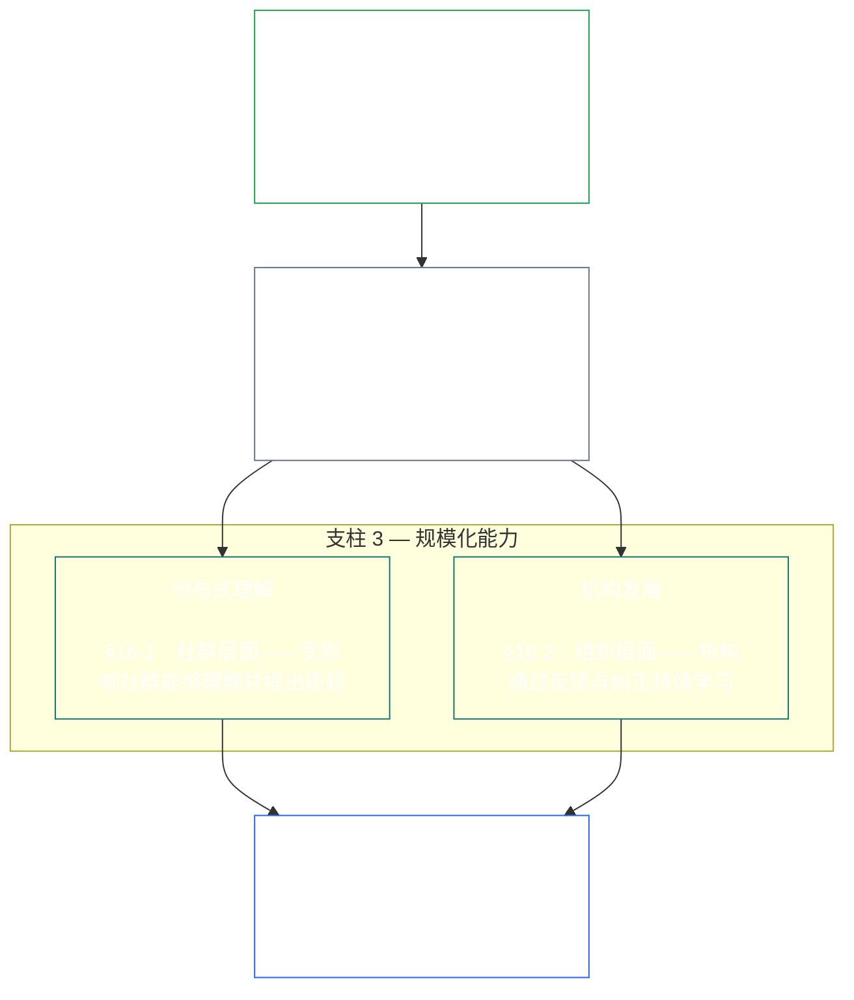

<a id="chapter-01-principles-and-constraints"></a>
<a id="chapter-01-part-b-stewardship-and-governance"></a>
<a id="chapter-01-part-c-stewardship-and-governance"></a>
# 第一章，C 部分：受托管理与治理

<details>
<summary><strong><span style="color: #2563eb;">语料库位置（不具操作效力）：文件结构与阅读规则</span></strong></summary>

> 以下内容**仅为读者指引**。它不会增添、删除或缩小本文件或其他章节中的任何约束性义务。
>
> 本文件是**《感知者宪章》的一部分**，只有与其他编号的 `core_*` 文件作为同一文本一并阅读时才具有约束力。本文件包含**第一章 C 部分**（§§16–20：受托管理、治理、激励协调与俘获，以及综合应用总结）。
>
> **上游：** [core_01_b_interaction_interpretation.md](core_01_b_interaction_interpretation.md)（第一章 B 部分）  
> **下一篇：** [core_02_definition_structure.md](core_02_definition_structure.md)<br>
> **阅读脉络：** §16 受托管理与分布式理解 → §17 受托者角色 → §18 治理 → §19 激励协调与俘获 → **§20 综合应用**（本章总结）。

</details>

<details>
<summary><strong><span style="color: #2563eb;">读者指引（不具操作效力）：原则层级与阅读脉络（C 部分）</span></strong></summary>

> 以下内容**仅为读者指引**。它不会增添、删除或缩小本文件或其他章节中的任何约束性义务。各节中的**追踪**及**定义 · 评估 · 合规**组件，会在每个 § 实质性援引某术语时提供定位；本段则是在 §§16–20 之前提供的部分级交叉索引。

**原则层级（C 部分）。**在原则层面：

13. **[受托管理](core_05_band_continuity.md#stewardship)**通过感知者组织来引导具有重大影响的系统——**支柱 1**（[§17](#17-consequential-stewardship-the-steward-role)：具有实质后果的亲自操作与改进）、**支柱 2**（[主动受托管理](#16-pillar-2-proactive-stewardship)：及早发现问题并及时解决，避免不必要的延误）以及**支柱 3**（[§16.1](#161-distributed-understanding) · [§16.2](#162-institutional-development)：在社群与机构规模上具备能力）——共同推动系统随时间持续符合宪法，并遵循[宪法四要素](core_00_preamble.md#constitutional-tetrad)；其中尤其是**[参与](core_05_apex_participation_leg.md#participation-constitutional)**（具有实质后果的角色与发声权）和**[监督](core_05_apex_oversight_leg.md#oversight-constitutional)**（分布式理解、可审计性与可争议性——监督要求审计；[系统一致性认证](core_05_band_continuity.md#system-alignment-certification)只是众多审计流程之一，且规模尤其大）；并包括[宪法两大目标](core_00_preamble.md#two-constitutional-aims)下的**连续性**目标。
14. **[具有实质后果的受托管理](#17-consequential-stewardship-the-steward-role)**就是受托者角色本身：任何对具有重大影响的系统进行实质性操作、维护、监督或改进的人，均须承担相应的亲自履职义务、标准与保护——这是将**支柱 1**付诸实践，并涵盖共同标准、压力下的一致性，以及受托者角色范围内的可观察性。
15. **[治理](core_05_band_accountability.md#governance)**依据[宪法四要素](core_00_preamble.md#constitutional-tetrad)构建获授权的决策、参与与问责机制，尤其包括对权力分配和行使方式的**[监督](core_05_apex_oversight_leg.md#oversight-constitutional)**，以及[§18.1](#181-governance-as-authorized-structure)所规定的**与权限规模相称的可问责性**：授权权力或角色后果越大，宪法问责与监督就越强，绝不能越弱。[§18.3 职责分离](#183-segregation-of-duties)确保行动者不同时担任核查者。[§18.4 持续正当化](#184-ongoing-justification)要求这些安排不断证明其仍符合本宪章。治理与受托管理发生冲突时，在原则层面应以受托管理纪律为准；除非**必要性**与**比例性**明确支持设有边界和时限且附有纠正途径的例外。操作性授权与合同层要求仍由**第十三章**负责。
16. **[激励协调与系统俘获](#19-incentive-alignment-and-system-capture)**提供原则层面对激励结构、代理指标完整性、短期导向缺陷、奖励路径纠正以及俘获应对的约束。
17. **[综合应用](#20-integrated-application)**是本章总结：后续章节须通过本章的综合价值框架来阅读。

</details>

<br>

<a id="16-stewardship-in-depth"></a>

### 16. 深入探讨受托管理
<details>
<summary><strong><span style="color: #2563eb;">追踪</span></strong></summary>

- 配合阅读：[宪法四要素](core_00_preamble.md#constitutional-tetrad)——第一章主要阐述**参与**要素（具有实质后果的角色与发声权；一般要求，不仅限于[利益相关者系统参与](core_05_band_participation.md#stakeholder-status-and-weight)）、**监督**要素和**及时性**要素（主动修复速度）；并按[重大利益关联](core_00_preamble.md#material-stake)调整尺度。
- 配合阅读：[宪法两大目标](core_00_preamble.md#two-constitutional-aims)——**繁荣**目标（参与、能动性与教育路径）；**连续性**目标（机构学习、修复能力与持久受托管理）。
- 上游：原则：[3. 基本目标：福祉](core_01_a_values_principles.md#3-foundational-objective-wellbeing-flourishing-aim)；[5 真理](core_01_a_values_principles.md#5-truth-epistemic-integrity-constraint)；[6. 信任](core_01_a_values_principles.md#6-trust-and-trustworthiness-coordination-integrity)；以及[§9 共享系统能力](core_01_a_values_principles.md#9-shared-system-capacity)。
- 下游：[13. 宪法冲突解决流程](core_01_b_interaction_interpretation.md#13-constitutional-collision-resolution-process)（包括[§13.3 减少可避免的负担](core_01_b_interaction_interpretation.md#133-minimization-of-avoidable-burden)）；[第八章 §3 全系统认证评估](core_08_a_system_alignment_certification_evaluation.md#3-whole-system-certification-evaluation)；[§19.1.3 受托管理与运营者的应用](#1913-stewardship-and-operator-application)。
- 下游：[§19.1.4 角色深度与重大责任路径](#1914-role-depth-and-material-responsibility-pathways)。
- 下游：[§7 自由（受限能动性）](core_01_a_values_principles.md#7-freedom-bounded-agency)：它依赖于在重大依赖关系下，具有实质后果的受托管理、分布式理解、有意义的参与和修复能力仍然真实有效。
- 下游：[第八章——系统一致性认证](core_08_a_system_alignment_certification_evaluation.md#chapter-eight-system-alignment-certification)（*监督下规模尤其大的审计流程之一，并非唯一的审计章节*）；[第九章——贡献、违规与地位模型](core_09_standing_assessment.md#chapter-nine-contribution-violation-and-standing-model--measurement)（*地位影响——信任、角色与获得认可的资格——以本小节作为原则层基础来落实*）。
- 下游：[第十二章 §1——宗旨与角色](core_12_forum.md#1-purpose-and-role--participation-architecture)及[§4——论坛类别定义](core_12_forum.md#4-forum-family-definitions--accountability-through-adjudication)（*论坛类别承载本节的参与与监督架构，用于提出可争议的挑战、安排补救顺序、开展根因学习，并推动主动治理*）；采用后的论坛运作见[corpus_forum.md](corpus_forum.md)。
- 下游：塑造教育、利益相关者系统参与、透明度、可理解性、审计与核验，以及进入重大责任领域的角色深度路径等权利范围。
  - 尤其包括[第三条：生存与基本生活保障](core_06_rights_part_a.md#article-iii-survival-and-essential-access)、[第四条：以感知者为中心的教育权](core_06_rights_part_a.md#article-iv-right-to-sentient-centered-education)、[第十条：自我决定、能动性与参与](core_06_rights_part_b.md#article-x-self-determination-agency-and-participation)、[第十二条：利益相关者系统参与、代表与正当程序](core_06_rights_part_b.md#article-xii-stakeholder-system-participation-representation-and-due-process)、[第十六条：审计、透明度与独立核验](core_06_rights_part_c.md#article-xvi-audit-transparency-and-independent-verification)、[第十九条：地位与参与状态](core_06_rights_part_d.md#article-xix-standing-and-participation-status)、[第二十一条：互操作性、可携性、迁移、避难与退出完整性](core_06_rights_part_d.md#article-xxi-interoperability-portability-movement-refuge-and-exit-integrity)、[第二十二条：可理解性与复杂性受托管理](core_06_rights_part_d.md#article-xxii-comprehensibility-and-complexity-stewardship)，以及[第二十四条：宪法解释、审查与反俘获保障](core_06_rights_part_d.md#article-xxiv-constitutional-interpretation-review-and-anti-capture-safeguards)。
  - 配合阅读：[第十三章 §5——获授权角色、能力发展与贡献](core_13_governance.md#5-authorized-roles-competency-development-and-contribution)及**[corpus_systems.md](corpus_systems.md)，CS-4——关键系统受托管理**，了解操作性角色路径与受托管理发展路径。
- 子节（阅读顺序）：[§16.1 分布式理解](#161-distributed-understanding)（规模化能力的社群层面）· [§16.2 机构发展](#162-institutional-development)（组织层面）· [§16.3 开放性愿景](#163-openness-aspiration)。
- 配合阅读：[§17 具有实质后果的受托管理](#17-consequential-stewardship-the-steward-role)（*受托者角色本身——现已提升为独立一节；承载支柱 1 中亲自操作、维护、监督与改进的义务，以及[§17.1](#171-shared-stewardship-standard)、[§17.2](#172-alignment-under-pressure)、[§17.3](#173-logging-the-role-not-the-steward)、[§17.4 一致的自我组织](#174-aligned-self-organization)（将该纪律扩展至正式角色之外），以及[§17.5 抵制义务](#175-duty-to-resist)*)。

</details>

<details>
<summary><strong><span style="color: #2563eb;">定义 · 评估 · 合规</span></strong></summary>

- [战略性受托管理义务](core_05_band_continuity.md#strategic-stewardship-obligation) · [O](core_05_band_continuity.md#strategic-stewardship-obligation) · [M](core_05_band_continuity.md#strategic-stewardship-obligation-constitutional-a) · [A](core_05_band_continuity.md#strategic-stewardship-obligation-constitutional-a) · [C](core_05_band_continuity.md#strategic-stewardship-obligation-constitutional-c)
- [分布式理解](core_05_band_continuity.md#distributed-understanding) · [O](core_05_band_continuity.md#distributed-understanding) · [M](core_05_band_continuity.md#distributed-understanding-constitutional-a) · [A](core_05_band_continuity.md#distributed-understanding-constitutional-a) · [C](core_05_band_continuity.md#distributed-understanding-constitutional-c)
- [参与](core_05_apex_participation_leg.md#participation-constitutional) · [O](core_05_apex_participation_leg.md#participation-constitutional) · [M](core_05_apex_participation_leg.md#participation-constitutional-m) · [A](core_05_apex_participation_leg.md#participation-constitutional-a) · [C](core_05_apex_participation_leg.md#participation-constitutional-c)
- [监督](core_05_apex_oversight_leg.md#oversight-constitutional) · [O](core_05_apex_oversight_leg.md#oversight-constitutional) · [M](core_05_apex_oversight_leg.md#oversight-constitutional-m) · [A](core_05_apex_oversight_leg.md#oversight-constitutional-a) · [C](core_05_apex_oversight_leg.md#oversight-constitutional-c)
- [有意义的能动性](core_05_band_participation.md#meaningful-agency) · [O](core_05_band_participation.md#meaningful-agency) · [M](core_05_band_participation.md#meaningful-agency-a) · [A](core_05_band_participation.md#meaningful-agency-a) · [C](core_05_band_participation.md#meaningful-agency-c)
- [可审计性](core_05_band_oversight.md#auditability) · [O](core_05_band_oversight.md#auditability) · [M](core_05_band_oversight.md#auditability-a) · [A](core_05_band_oversight.md#auditability-a) · [C](core_05_band_oversight.md#auditability-c)
- [可争议性](core_05_band_accountability.md#contestability) · [O](core_05_band_accountability.md#contestability) · [M](core_05_band_accountability.md#contestability-a) · [A](core_05_band_accountability.md#contestability-a) · [C](core_05_band_accountability.md#contestability-c)
- [教育能动性](core_05_band_participation.md#educational-agency) · [O](core_05_band_participation.md#educational-agency) · [M](core_05_band_participation.md#educational-agency-a) · [A](core_05_band_participation.md#educational-agency-a) · [C](core_05_band_participation.md#educational-agency-c)
- [透明度](core_05_band_oversight.md#transparency) · [O](core_05_band_oversight.md#transparency) · [M](core_05_band_oversight.md#transparency-a) · [A](core_05_band_oversight.md#transparency-a) · [C](core_05_band_oversight.md#transparency-c)
- [重大性](core_05_band_oversight.md#materiality) · [O](core_05_band_oversight.md#materiality) · [M](core_05_band_oversight.md#materiality-determination-a) · [A](core_05_band_oversight.md#materiality-determination-a) · [C](core_05_band_oversight.md#materiality-determination-c)
- [依赖](core_05_band_continuity.md#dependency) · [O](core_05_band_continuity.md#dependency) · [M](core_05_band_continuity.md#dependency-a) · [A](core_05_band_continuity.md#dependency-a) · [C](core_05_band_continuity.md#dependency-c)
- [可及性](core_05_band_participation.md#accessibility) · [O](core_05_band_participation.md#accessibility) · [M](core_05_band_participation.md#accessibility-constitutional-a) · [A](core_05_band_participation.md#accessibility-constitutional-a) · [C](core_05_band_participation.md#accessibility-constitutional-c)
- [安全（宪法约束）](core_05_band_continuity.md#safety-constitutional-constraint) · [O](core_05_band_continuity.md#safety-constitutional-constraint) · [M](core_05_band_continuity.md#safety-constraint-a) · [A](core_05_band_continuity.md#safety-constraint-a) · [C](core_05_band_continuity.md#safety-constraint-c)
- [真理（宪法约束）](core_05_band_oversight.md#truth-constitutional-constraint) · [O](core_05_band_oversight.md#truth-constitutional-constraint-o) · [M](core_05_band_oversight.md#truth-constitutional-constraint-a) · [A](core_05_band_oversight.md#truth-constitutional-constraint-a) · [C](core_05_band_oversight.md#truth-constitutional-constraint-c)
- [必要性](core_05_band_accountability.md#necessity) · [O](core_05_band_accountability.md#necessity) · [M](core_05_band_accountability.md#necessity-a) · [A](core_05_band_accountability.md#necessity-a) · [C](core_05_band_accountability.md#necessity-c)
- [比例性](core_05_band_accountability.md#proportionality) · [O](core_05_band_accountability.md#proportionality) · [M](core_05_band_accountability.md#proportionality-a) · [A](core_05_band_accountability.md#proportionality-a) · [C](core_05_band_accountability.md#proportionality-c)
- [可避免负担](core_05_band_continuity.md#avoidable-burden) · [O](core_05_band_continuity.md#avoidable-burden) · [M](core_05_band_continuity.md#avoidable-burden-a) · [A](core_05_band_continuity.md#avoidable-burden-a) · [C](core_05_band_continuity.md#avoidable-burden-c)
- [认识论完整性](core_05_band_oversight.md#epistemic-integrity) · [O](core_05_band_oversight.md#epistemic-integrity-o) · [M](core_05_band_oversight.md#epistemic-integrity-a) · [A](core_05_band_oversight.md#epistemic-integrity-a) · [C](core_05_band_oversight.md#epistemic-integrity-c)

</details>

<br>

*通俗地说：三项理念支撑本节。第一，影响感知者生活的重大系统，需要由感知者组织起来妥善运作，而不是交给与外界隔绝的专家祭司团。第二，良好的受托者不会等到伤害迫使自己行动；他们会趁问题仍小时发现它，将其及时交到适当角色手中，并在拖延本身造成伤害之前妥善解决。第三，这种组织必须建立**规模化能力**：让个人有真实路径进入具有实质后果的工作；让社群有足够理解力发现问题并提出质疑；让机构持续学习，而非停滞不前。*

<a id="16-limits"></a>
受托管理有边界。**安全**、**真理**、**必要性**、**比例性**、**可避免负担**与**认识论完整性**共同设定界限，使这些义务的尺度公平、内容诚实，并尊重正当的安全需求——下述各支柱都在这些约束之内运作，而不是绕过它们。

感知者组织、主动受托管理与规模化能力是本节的三大支柱。三者共同在原则层面承载[宪法四要素](core_00_preamble.md#constitutional-tetrad)中的**参与**、**监督**与**及时性**要素，按[重大利益关联](core_00_preamble.md#material-stake)调整尺度，并推进[宪法两大目标](core_00_preamble.md#two-constitutional-aims)。

<br>



**支柱 1——具有实质后果的受托管理（[§17 具有实质后果的受托管理](#17-consequential-stewardship-the-steward-role)）：**
- 对感知者具有重大影响的共享系统，须由感知者亲自操作、维护、监督与改进——[**战略性受托管理义务**](core_05_band_continuity.md#strategic-stewardship-obligation)、[**有意义的能动性**](core_05_band_participation.md#meaningful-agency)
- 提供他人能够核验和质疑的记录与审查路径——[**可审计性**](core_05_band_oversight.md#auditability)、[**可争议性**](core_05_band_accountability.md#contestability)
- 在四要素中的**监督**要素下，监督要求审计；[系统一致性认证](core_05_band_continuity.md#system-alignment-certification)只是众多审计流程之一，且规模庞大、利害重大——并非唯一的审计章节（**第十六条**（*审计、透明度与独立核验*））

<a id="16-pillar-2-proactive-stewardship"></a>
**支柱 2——主动受托管理：**
主动的受托者通过三种方式处理新出现的问题与不一致：
- **在问题扩大之前发现它们**——良好的受托者会在不一致仍很小时发现问题，而不是坐等问题自行浮现。
- **按层级适当的时限推动处理**——在与角色利害相称的时限内升级处理，而不是搁置发现的问题，也不对常规事项过度升级。
- **彻底解决问题，而非仅仅标记出来**——问题提出后立即着手解决，避免不必要的延误；这正是将四要素中的**及时性**要素付诸实践（[**及时性**](core_05_apex_timeliness_leg.md#timeliness-constitutional)）。
- **这是角色的持续义务，而非附加项目：**[§17 具有实质后果的受托管理](#17-consequential-stewardship-the-steward-role)所界定的受托者角色，优先采取主动治理、系统设计与宪法一致性措施，而不是等伤害或不一致出现后才被动处理症状——此支柱是该角色的一项持续义务，并非交由独立流程负责。

**支柱 3——规模化能力（[§16.1 分布式理解](#161-distributed-understanding) · [§16.2 机构发展](#162-institutional-development)）：**
- 受托管理必须使受影响社群能够切实理解并提出质疑——[**教育能动性**](core_05_band_participation.md#educational-agency)、[**透明度**](core_05_band_oversight.md#transparency)
- 组织通过反馈、纠正与能力留存持续学习；在测量条件允许时，也包括对随时间变化情况进行结构化监测（例如**统计过程控制**是广为人知的实施方式，但并非普遍要求）。

<a id="when-day-to-day-stewardship-is-not-enough"></a>
**当日常管理不足以应对时：**
管理是第一道防线，但不是唯一一道。三个不同的问题分别由三个不同的机制处理，彼此不能替代：
- **已获授权体系内部的争议 — [利益相关者体系参与](core_05_band_participation.md#stakeholder-status-and-weight)：**
  - 受影响的 sentients 首先使用已公布的利益相关者体系参与申诉途径，涵盖参与、代表、可争辩性和正当程序。
  - 这些保护应提供给每一位受到实质影响的 sentient。
  - 它们适用于已经获得授权的体系、机构和决策领域之内。
- **利益相关者体系参与无法解决的争议 — [论坛审查](core_12_forum.md#dispute-sequencing)：**
  - 如果利益相关者体系参与申诉途径仍有争议、缺失或遭到控制，或无法给予救济，事项将根据 [第十二章 §1 — 目的与作用](core_12_forum.md#1-purpose-and-role--participation-architecture) 和 [§4 — 论坛类别定义](core_12_forum.md#4-forum-family-definitions--accountability-through-adjudication)，按主要利益转交独立的**论坛类别**。
  - 在这里，sentients 可以真正挑战一项决定、取得明确的修复命令，或从反复出现的模式中吸取教训。
  - 如果主要利益涉及宪法文本的含义或效力，或涉及超越合法权限的行动，主责类别是[宪法论坛](core_12_forum.md#46-constitutional-forums)。
  - 这些论坛如何运作的详细规则见 [corpus_forum.md](corpus_forum.md)。
- **谁可以治理 — [宪法契约层](core_05_band_integrative.md#constitutional-contract-layer)（[第十三章](core_13_governance.md)）：**
  - 治理权本身是否合法——谁可以治理、依据何种合法性机制，以及在何种范围和持久条款下治理——是一个独立于利益相关者体系参与和论坛审查的问题。
  - 参与投票、申诉途径的结果或信任评分都不会赋予治理权。
  - 宪法授权不会免除利益相关者体系参与项下应尽的义务。
  - 即使两层有所重叠，它们仍然彼此独立（[序言 §3.3 — 治理层次](core_00_preamble.md#33-governance-layers)）。
- **后备保障，而非替代方案：**有证据支持时，审查、纠正和补救仍属强制要求。它们不能取代主动设计、激励、控制、角色路径、可观察性和修复能力；后者能在损害出现前防止可预见的宪法失调。

<a id="16-scope-priority-and-limits"></a>
**范围（[§16 深入治理](#16-stewardship-in-depth)）：**
- 本节提供原则层面的指引，而不是适用于所有情况的统一规则手册。
- 本节**不要求**：
  - 让每个人轮流担任每一种角色
  - 推翻合理的专业分工
  - 超出 [13.2 认知披露限制](core_01_b_interaction_interpretation.md#132-epistemic-disclosure-constraints)和**第六章**适用保护所规定的正当保密或安全界限。

**优先级：**
- **实质性**、**依赖性**和**可及性**决定理解与访问的分配优先级，重点关注影响和依赖程度较高之处。

<a id="161-distributed-understanding"></a>
#### 16.1 分布式理解
<details>
<summary><strong><span style="color: #2563eb;">追溯</span></strong></summary>

- 上游依据：[§17 后果导向的治理](#17-consequential-stewardship-the-steward-role)（*支柱 1*）；[§16 深入治理](#16-stewardship-in-depth)（上位章节，包括上文的*简言之*及支柱 3 的框架）；[5 真理](core_01_a_values_principles.md#5-truth-epistemic-integrity-constraint)；[6. 信任](core_01_a_values_principles.md#6-trust-and-trustworthiness-coordination-integrity)。
- 搭配阅读：[宪法四元](core_00_preamble.md#constitutional-tetrad)——**参与**支柱（[实质性自主能力](core_05_band_participation.md#meaningful-agency)、[教育自主能力](core_05_band_participation.md#educational-agency)）；**监督**支柱（[透明度](core_05_band_oversight.md#transparency)、[可审计性](core_05_band_oversight.md#auditability)）；按[实质利益](core_00_preamble.md#material-stake)调整规模。
- 治理者入口（非操作性）：下一步卡片：[可理解性](implementation/STEWARD_ENTRY_DOORS.md#comprehensibility)。该卡片不能缩小宪法的适用范围。
- 下游依据：[13.2 认知披露限制](core_01_b_interaction_interpretation.md#132-epistemic-disclosure-constraints)；权利范围，尤其是[第十六条：审计、透明度与独立核验](core_06_rights_part_c.md#article-xvi-audit-transparency-and-independent-verification)、[第二十二条：可理解性与复杂性治理](core_06_rights_part_d.md#article-xxii-comprehensibility-and-complexity-stewardship)。

</details>

<details>
<summary><strong><span style="color: #2563eb;">定义 · 评估 · 合规</span></strong></summary>

- [分布式理解](core_05_band_continuity.md#distributed-understanding) · [O](core_05_band_continuity.md#distributed-understanding) · [M](core_05_band_continuity.md#distributed-understanding-constitutional-a) · [A](core_05_band_continuity.md#distributed-understanding-constitutional-a) · [C](core_05_band_continuity.md#distributed-understanding-constitutional-c)
- [透明度](core_05_band_oversight.md#transparency) · [O](core_05_band_oversight.md#transparency) · [M](core_05_band_oversight.md#transparency-a) · [A](core_05_band_oversight.md#transparency-a) · [C](core_05_band_oversight.md#transparency-c)
- [公共监督基线披露](core_05_band_oversight.md#public-oversight-baseline-disclosure) · [O](core_05_band_oversight.md#public-oversight-baseline-disclosure) · [M](core_05_band_oversight.md#public-oversight-baseline-disclosure-a) · [A](core_05_band_oversight.md#public-oversight-baseline-disclosure-a) · [C](core_05_band_oversight.md#public-oversight-baseline-disclosure-c)
- [可审计性](core_05_band_oversight.md#auditability) · [O](core_05_band_oversight.md#auditability) · [M](core_05_band_oversight.md#auditability-a) · [A](core_05_band_oversight.md#auditability-a) · [C](core_05_band_oversight.md#auditability-c)
- [实质性](core_05_band_oversight.md#materiality) · [O](core_05_band_oversight.md#materiality) · [M](core_05_band_oversight.md#materiality-determination-a) · [A](core_05_band_oversight.md#materiality-determination-a) · [C](core_05_band_oversight.md#materiality-determination-c)
- [依赖性](core_05_band_continuity.md#dependency) · [O](core_05_band_continuity.md#dependency) · [M](core_05_band_continuity.md#dependency-a) · [A](core_05_band_continuity.md#dependency-a) · [C](core_05_band_continuity.md#dependency-c)
- [可及性](core_05_band_participation.md#accessibility) · [O](core_05_band_participation.md#accessibility) · [M](core_05_band_participation.md#accessibility-constitutional-a) · [A](core_05_band_participation.md#accessibility-constitutional-a) · [C](core_05_band_participation.md#accessibility-constitutional-c)
- [教育自主能力](core_05_band_participation.md#educational-agency) · [O](core_05_band_participation.md#educational-agency) · [M](core_05_band_participation.md#educational-agency-a) · [A](core_05_band_participation.md#educational-agency-a) · [C](core_05_band_participation.md#educational-agency-c)
- [实质性自主能力](core_05_band_participation.md#meaningful-agency) · [O](core_05_band_participation.md#meaningful-agency) · [M](core_05_band_participation.md#meaningful-agency-a) · [A](core_05_band_participation.md#meaningful-agency-a) · [C](core_05_band_participation.md#meaningful-agency-c)
- [可争辩性](core_05_band_accountability.md#contestability) · [O](core_05_band_accountability.md#contestability) · [M](core_05_band_accountability.md#contestability-a) · [A](core_05_band_accountability.md#contestability-a) · [C](core_05_band_accountability.md#contestability-c)

</details>

<br>

*简言之：在共享系统中安全生活，不应要求每个人都拥有每个子系统的博士学位；但系统对你的生活影响越大，你就越应能够了解它的作用、可能出错之处，以及如何质疑不当决定。透明度、教育、通俗解释和审计路径使之成为可能。复杂性不能成为隐瞒重要事项的借口。在四元的**监督**支柱下，监督要求开展审计；系统对齐认证是这些路径中特别大型的一项审计流程，但并非唯一一项。*

分布式理解是**[§16 深入治理](#16-stewardship-in-depth)**项下**支柱 3**面向社区的一面。完整定义、衡量方式和失效条件见[分布式理解](core_05_band_continuity.md#distributed-understanding)。概要如下：

- **要求：**以合乎比例且有结构的方式，让人们了解对 sentients 产生实质影响的共享系统如何运作——包括其目的、限制、不确定性和具有实质相关性的影响。
- **可行条件：**[§17 后果导向的治理](#17-consequential-stewardship-the-steward-role)必须提供文档、教育、透明度、角色路径和可理解性治理。无论每位 sentient 是否使用所有路径，这项义务都持续存在。
- **在线公共基线：**在存在合法在线基础设施的地方，在线[公共监督基线披露](core_05_band_oversight.md#public-oversight-baseline-disclosure)——包括禁止付费墙以及最大可行公共替代方案规则——由[透明度](core_05_band_oversight.md#transparency)和[公共监督基线披露](core_05_band_oversight.md#public-oversight-baseline-disclosure)规范，并依据**[corpus_systems.md](corpus_systems.md), CS-2**（*信息类型与处理*）作为 **O 类**数据实施。
- **访问所支持的事项：**
  - [宪法四元](core_00_preamble.md#constitutional-tetrad)的**参与**支柱（知情的[实质性自主能力](core_05_band_participation.md#meaningful-agency)与可争辩性）
  - **监督**支柱，包括根据[可审计性](core_05_band_oversight.md#auditability)和**第十六条**（*审计、透明度与独立核验*）开展审计；[系统对齐认证](core_05_band_continuity.md#system-alignment-certification)是相关审计模式中一项特别大型的流程

分布式理解**不**要求每个 sentient 精通每个子系统。它**要求**理解程度随着[实质性](core_05_band_oversight.md#materiality)和[依赖性](core_05_band_continuity.md#dependency)相应提高。当**第五章**和**第六章**规定披露、教育或可理解性义务时，不得利用复杂性和不透明性来阻碍[实质性自主能力](core_05_band_participation.md#meaningful-agency)或可争辩性。

<a id="162-institutional-development"></a>
#### 16.2 机构发展
<details>
<summary><strong><span style="color: #2563eb;">追溯</span></strong></summary>

- 上游依据：[§17 后果导向的治理](#17-consequential-stewardship-the-steward-role)（*支柱 1*）；[§16.1 分布式理解](#161-distributed-understanding)（*支柱 3 的社区层面*）；[§16 深入治理](#16-stewardship-in-depth)（上位章节中支柱 3 的框架）。
- 搭配阅读：[宪法四元](core_00_preamble.md#constitutional-tetrad)——**参与**支柱（支持承担重大后果角色的员工及受影响社区学习）；**监督**支柱（[可验证性](core_05_band_oversight.md#verifiability)、[可审计性](core_05_band_oversight.md#auditability)、诚实的指标）；按[实质利益](core_00_preamble.md#material-stake)调整规模。
- 在具有实质相关性时，搭配阅读[战略治理义务](core_05_band_continuity.md#strategic-stewardship-obligation)和[可审计性](core_05_band_oversight.md#auditability)。
- 搭配阅读：[§16.1 分布式理解](#161-distributed-understanding)（*社区理解和机构学习是同一项规模化能力要求的不同方面，彼此不能替代*）。
- 下游依据：[§16.3 开放愿景](#163-openness-aspiration)；[§18 治理受托管纪律约束](#18-governance-under-stewardship-discipline)和[§19 激励一致与系统俘获](#19-incentive-alignment-and-system-capture)（*机构学习与激励一致*）。

</details>

<details>
<summary><strong><span style="color: #2563eb;">定义 · 评估 · 合规</span></strong></summary>

- [机构发展](core_05_band_continuity.md#institutional-development) · [O](core_05_band_continuity.md#institutional-development) · [M](core_05_band_continuity.md#institutional-development-constitutional-a) · [A](core_05_band_continuity.md#institutional-development-constitutional-a) · [C](core_05_band_continuity.md#institutional-development-constitutional-c)
- [战略治理义务](core_05_band_continuity.md#strategic-stewardship-obligation) · [O](core_05_band_continuity.md#strategic-stewardship-obligation) · [M](core_05_band_continuity.md#strategic-stewardship-obligation-constitutional-a) · [A](core_05_band_continuity.md#strategic-stewardship-obligation-constitutional-a) · [C](core_05_band_continuity.md#strategic-stewardship-obligation-constitutional-c)
- [可审计性](core_05_band_oversight.md#auditability) · [O](core_05_band_oversight.md#auditability) · [M](core_05_band_oversight.md#auditability-a) · [A](core_05_band_oversight.md#auditability-a) · [C](core_05_band_oversight.md#auditability-c)
- [实质性](core_05_band_oversight.md#materiality) · [O](core_05_band_oversight.md#materiality) · [M](core_05_band_oversight.md#materiality-determination-a) · [A](core_05_band_oversight.md#materiality-determination-a) · [C](core_05_band_oversight.md#materiality-determination-c)
- [可验证性](core_05_band_oversight.md#verifiability) · [O](core_05_band_oversight.md#verifiability) · [M](core_05_band_oversight.md#verifiability-a) · [A](core_05_band_oversight.md#verifiability-a) · [C](core_05_band_oversight.md#verifiability-c)

</details>

<br>

*简言之：机构必须真正学习，而不是只升级软件，却让掌权者依旧一无所知。这意味着建立反馈循环，在出现偏离时记录纠正措施，并留住专业能力，避免人才离开时能力也随之流失。如果行为可以重复测量，跟踪绩效随时间的变化是落实这些循环的一种合乎比例的做法；**统计过程控制**是这一管理方法中广为人知的一种模式，并非处处都必须采用。数字本身并不算数：指标看起来不对时，必须有人调查并修正根本原因。仪表板必须诚实、与实际影响相称，并采用受影响的 sentients 能够理解的表述；不能通过操纵数据制造良好观感，却不作任何改变。*

机构发展是**支柱 3**的组织层面，属于**[§16 深入治理](#16-stewardship-in-depth)**。完整定义、衡量方式和失效条件见[机构发展](core_05_band_continuity.md#institutional-development)。概要如下：

- **配套义务：**组织和共享系统都要**学习**——这是[宪法双重目标](core_00_preamble.md#two-constitutional-aims)下**连续性**目标的一项核心要求。
- **要求内容：**以下做法支持修复和适应：
  - 反馈循环
  - 有记录的纠正
  - 战略一致
  - 留住专业能力
- **四元框架：**通过机构学习维持能力、反馈和审查路径的运作，使其保持活跃而非停滞，从而承载[宪法四元](core_00_preamble.md#constitutional-tetrad)的**参与**和**监督**支柱。
- **仅做以下事情并不足够：**升级技术制品，却让治理和员工的理解停滞不前。
- **测量适用的情形：**具有实质相关性的行为在[可验证性](core_05_band_oversight.md#verifiability)下支持**重复且可比较的测量**，并结合[可审计性](core_05_band_oversight.md#auditability)阅读时：
  - **以结构化方式监测随时间发生的变化**，是落实这些反馈循环的一种合乎比例的办法
  - 指标有此必要时，这种监测必须配合**有记录的调查和纠正**
  - **统计过程控制**是这一管理方法中广为人知的一种实施模式，并非普遍要求
- **尺度与呈现：**该方法应按[实质性](core_05_band_oversight.md#materiality)、[依赖性](core_05_band_continuity.md#dependency)、[必要性](core_05_band_accountability.md#necessity)、[比例性](core_05_band_accountability.md#proportionality)和[可避免负担](core_05_band_continuity.md#avoidable-burden)调整；当**第五章**和**第六章**规定理解或透明度义务时，应采用**sentients 能够理解**的形式呈现，并结合[第二十二条：可理解性与复杂性治理](core_06_rights_part_d.md#article-xxii-comprehensibility-and-complexity-stewardship)阅读。
- **不得：**
  - 用有利指标取代实质性一致
  - 将评估范围缩窄到方便使用的替代指标
  - 通过操纵或歪曲事实，损害[真理（宪法约束）](core_05_band_oversight.md#truth-constitutional-constraint)或[认知诚信](core_05_band_oversight.md#epistemic-integrity)

<a id="163-openness-aspiration"></a>
#### 16.3 开放愿景
<details>
<summary><strong><span style="color: #2563eb;">追溯</span></strong></summary>

- 上游依据：[§16.1 分布式理解](#161-distributed-understanding)和[§16.2 机构发展](#162-institutional-development)（*支柱 3 的两个方面——开放使社区理解能够被核验，也为机构学习提供诚实的学习材料*）；[§17 后果导向的治理](#17-consequential-stewardship-the-steward-role)（*支柱 1；开放也通过让治理者自身的工作可供检查来支持这一支柱*）。
- 搭配阅读：[宪法双重目标](core_00_preamble.md#two-constitutional-aims)——**连续性**目标（持久且可争辩的系统支持检查、修复、互操作和退出，而不是锁定）。
- 搭配阅读：[宪法四元](core_00_preamble.md#constitutional-tetrad)——**参与**支柱（[实质性自主能力](core_05_band_participation.md#meaningful-agency)、sentients 能够理解的访问方式）；**监督**支柱（检查、独立核验和可争辩性）；按[实质利益](core_00_preamble.md#material-stake)调整规模。
- 下游依据：[§16 范围与限制](#16-stewardship-in-depth)；[第二十一条：互操作性、可携带性、迁移、庇护与退出完整性](core_06_rights_part_d.md#article-xxi-interoperability-portability-movement-refuge-and-exit-integrity)；[第二十二条：可理解性与复杂性治理](core_06_rights_part_d.md#article-xxii-comprehensibility-and-complexity-stewardship)。

</details>

<details>
<summary><strong><span style="color: #2563eb;">定义 · 评估 · 合规</span></strong></summary>

- [开放愿景](core_05_band_continuity.md#openness-aspiration) · [O](core_05_band_continuity.md#openness-aspiration) · [M](core_05_band_continuity.md#openness-aspiration-constitutional-a) · [A](core_05_band_continuity.md#openness-aspiration-constitutional-a) · [C](core_05_band_continuity.md#openness-aspiration-constitutional-c)
- [实质性自主能力](core_05_band_participation.md#meaningful-agency) · [O](core_05_band_participation.md#meaningful-agency) · [M](core_05_band_participation.md#meaningful-agency-a) · [A](core_05_band_participation.md#meaningful-agency-a) · [C](core_05_band_participation.md#meaningful-agency-c)
- [可争辩性](core_05_band_accountability.md#contestability) · [O](core_05_band_accountability.md#contestability) · [M](core_05_band_accountability.md#contestability-a) · [A](core_05_band_accountability.md#contestability-a) · [C](core_05_band_accountability.md#contestability-c)
- [实质性](core_05_band_oversight.md#materiality) · [O](core_05_band_oversight.md#materiality) · [M](core_05_band_oversight.md#materiality-determination-a) · [A](core_05_band_oversight.md#materiality-determination-a) · [C](core_05_band_oversight.md#materiality-determination-c)
- [依赖性](core_05_band_continuity.md#dependency) · [O](core_05_band_continuity.md#dependency) · [M](core_05_band_continuity.md#dependency-a) · [A](core_05_band_continuity.md#dependency-a) · [C](core_05_band_continuity.md#dependency-c)

</details>

<br>

*简言之：在安全、真理和正当保密允许的情况下，共享系统默认应倾向开放：采用可检查的技术、透明的流程，以及可核验、可修复或可退出的设计，而不是不透明的锁定。这支持**连续性**：系统应让 sentients 能够随着时间推移持续理解、修复和退出，而不只是今天能使用。重要事项应以 sentients 真正能够使用、从而参与和提出异议的语言加以说明。开放性绝不凌驾于安全、诚实或正当保密之上；在依赖程度较高时，它也不能取代应提供的深入理解。*

开放愿景将**支柱 3**的两个方面连接起来。完整定义、衡量方式和失效条件见[开放愿景](core_05_band_continuity.md#openness-aspiration)。概要如下：

- **它是什么：****支柱 3**两个方面之间的贯穿主线——[§16.1 分布式理解](#161-distributed-understanding)（社区能够核查什么）和[§16.2 机构发展](#162-institutional-development)（机构能够诚实地从中学到什么）都依赖共享系统足够开放、可供检查，而不只是被描述。
- 共享系统应当**致力于**以下方向——符合[§16.1 分布式理解](#161-distributed-understanding)和[§16.2 机构发展](#162-institutional-development)，符合[§17 后果导向的治理](#17-consequential-stewardship-the-steward-role)自身的可审计义务，并受[§16 限制](#16-limits)约束：
  - **开放**硬件和软件
  - **开放**运营和治理流程
  - 支持检查、独立核验、修复和可争辩性的互操作**系统**
- **依据：**[宪法四元](core_00_preamble.md#constitutional-tetrad)的**参与**和**监督**支柱，以及[宪法双重目标](core_00_preamble.md#two-constitutional-aims)下的**连续性**目标，而非默认采用不透明锁定。
- **呈现：**当**第五章**和**第六章**规定相关义务时，应以**sentients 能够理解**的形式呈现具有实质相关性的行为，以支持[实质性自主能力](core_05_band_participation.md#meaningful-agency)和可争辩性，并结合[第二十二条：可理解性与复杂性治理](core_06_rights_part_d.md#article-xxii-comprehensibility-and-complexity-stewardship)阅读。
- **不得：**
  - 将开放性置于**安全**、**真理**、正当保密或安全限制之上
  - 取代以[实质性](core_05_band_oversight.md#materiality)和[依赖性](core_05_band_continuity.md#dependency)为依据的合乎比例的理解

<a id="17-consequential-stewardship-the-steward-role"></a>
### 17. 后果导向的治理：治理者的角色
<details>
<summary><strong><span style="color: #2563eb;">追溯</span></strong></summary>

- 上游依据：[§16 深入治理](#16-stewardship-in-depth)（上位章节，包括上文的*简言之*及支柱 1 的框架）；[§9 共享系统能力](core_01_a_values_principles.md#9-shared-system-capacity)；[6. 信任](core_01_a_values_principles.md#6-trust-and-trustworthiness-coordination-integrity)。
- 搭配阅读：[宪法四元](core_00_preamble.md#constitutional-tetrad)——**参与**支柱（运行、维护和改进中的重大角色）；**监督**支柱（记录、审计路径和可提出异议的可观察性）；**及时性**支柱（尽早发现失调，在符合层级的时限内升级，并立即启动问题修复，避免不必要的延误）；[及时性](core_05_apex_timeliness_leg.md#timeliness-constitutional)。
- 下游依据：[§17.1 共同治理标准](#171-shared-stewardship-standard)（*不依赖基底的义务承担者；经采纳的实施文本可以增加日志记录、归属和能力限制，但不得采用更宽松的内部规范*）；[§17.2 压力下保持一致](#172-alignment-under-pressure)；[§17.3 记录角色，而非治理者](#173-logging-the-role-not-the-steward)；[§17.4 保持一致的自组织](#174-aligned-self-organization)（*将角色纪律延伸至任何正式角色之外的 sentients 和社区*）；[§17.5 抵制义务](#175-duty-to-resist)（*拒绝非法或违宪指令*）；[§16.1 分布式理解](#161-distributed-understanding)和[§16.2 机构发展](#162-institutional-development)（*支柱 3——规模化能力*）；[第八章——系统对齐认证](core_08_a_system_alignment_certification_evaluation.md#chapter-eight-system-alignment-certification)（*监督下特别大型的一项审计流程，并非唯一的审计场所*）；[第十六条：审计、透明度与独立核验](core_06_rights_part_c.md#article-xvi-audit-transparency-and-independent-verification)（*审计权利底线*）；[第九章——贡献、违规与诉讼资格模型](core_09_standing_assessment.md#chapter-nine-contribution-violation-and-standing-model--measurement)（*诉讼资格效应落实分布式能力和后果导向的治理*）；[第十九条：诉讼资格与参与状态](core_06_rights_part_d.md#article-xix-standing-and-participation-status)。

</details>

<details>
<summary><strong><span style="color: #2563eb;">定义 · 评估 · 合规</span></strong></summary>

- [战略治理义务](core_05_band_continuity.md#strategic-stewardship-obligation) · [O](core_05_band_continuity.md#strategic-stewardship-obligation) · [M](core_05_band_continuity.md#strategic-stewardship-obligation-constitutional-a) · [A](core_05_band_continuity.md#strategic-stewardship-obligation-constitutional-a) · [C](core_05_band_continuity.md#strategic-stewardship-obligation-constitutional-c)
- [实质性自主能力](core_05_band_participation.md#meaningful-agency) · [O](core_05_band_participation.md#meaningful-agency) · [M](core_05_band_participation.md#meaningful-agency-a) · [A](core_05_band_participation.md#meaningful-agency-a) · [C](core_05_band_participation.md#meaningful-agency-c)
- [可审计性](core_05_band_oversight.md#auditability) · [O](core_05_band_oversight.md#auditability) · [M](core_05_band_oversight.md#auditability-a) · [A](core_05_band_oversight.md#auditability-a) · [C](core_05_band_oversight.md#auditability-c)
- [及时性](core_05_apex_timeliness_leg.md#timeliness-constitutional) · [O](core_05_apex_timeliness_leg.md#timeliness-constitutional) · [M](core_05_apex_timeliness_leg.md#timeliness-constitutional-m) · [A](core_05_apex_timeliness_leg.md#timeliness-constitutional-a) · [C](core_05_apex_timeliness_leg.md#timeliness-constitutional-c)

</details>

<br>

*简言之：治理者是指任何人在实质影响 sentients 生活的系统上从事实质性的亲自工作，而非象征性咨询或顾问作秀。可以先从学习岗位开始，随着能力提升转入运营岗位；在安全与同意允许时，这样做可避免专业知识被永久精英阶层垄断。本节是该角色的规则手册：适用于谁（[§17.1 共同治理标准](#171-shared-stewardship-standard)）、压力下对每位治理者的要求（[§17.2 压力下保持一致](#172-alignment-under-pressure)）、角色工作可以或不可以出于何种目的记录和检查（[§17.3 记录角色，而非治理者](#173-logging-the-role-not-the-steward)）、同一纪律如何延伸到在正式角色之外承担治理工作的 sentients 和社区（[§17.4 保持一致的自组织](#174-aligned-self-organization)），以及必须拒绝什么（[§17.5 抵制义务](#175-duty-to-resist)）。社区和机构理解并质疑这些系统所需的是另一种更广泛的能力，见[§16.1 分布式理解](#161-distributed-understanding)和[§16.2 机构发展](#162-institutional-development)。*

依照本宪法，**治理者**是指任何人对实质影响 sentients 的实质性系统行使后果重大的运行、维护、监督或改进权力——将[§16 深入治理](#16-stewardship-in-depth)的**支柱 1**落实为一种角色：[宪法四元](core_00_preamble.md#constitutional-tetrad)的**参与**、**监督**和**及时性**支柱，由实际从事工作的人承担，而不交由仪式或名义咨询来履行。良好的实质性系统需要优秀的治理者来运行、维护和改进；本节说明该角色对承担者的要求。

**§17 的位置。**[§16 深入治理](#16-stewardship-in-depth)由后续三个应合并阅读的章节加以落实。本节 §17 规定角色。[§18 受托管纪律约束的治理](#18-governance-under-stewardship-discipline)和[§19 激励一致与系统俘获](#19-incentive-alignment-and-system-capture)紧随其后，图表展示了这四部分如何关联。

<br>

```mermaid
flowchart TB
    S16["§16 深入治理<br/><br/>• 将支柱 1 落实为一种角色（§17）<br/>• 治理和激励纪律由后续部分承接（§18、§19）"]
    S17["§17 后果导向的治理<br/><br/>• 治理者角色：由谁来做事<br/>• §17.1 共同治理标准<br/>• §17.2 压力下保持一致<br/>• §17.3 记录角色，而非治理者<br/>• §17.4 保持一致的自组织<br/>• §17.5 抵制义务"]
    G18["§18 受托管纪律约束的治理<br/><br/>• 权限结构：谁可以决定什么<br/>• §18.1 治理作为获授权的结构<br/>• §18.2 机构世俗主义与世界观中立<br/>• §18.3 职责分离<br/>• §18.4 持续说明正当性<br/>• §18.5 模块化架构与依赖纪律<br/>• §18.6 标准化"]
    I19["§19 激励一致与系统俘获<br/><br/>• 奖励：什么驱动行动者与结构<br/>• §19.1 一致性要求<br/>• §19.2 便利性代理指标与代理指标偏离<br/>• §19.3 失调检测<br/>• §19.4 失调纠正与俘获响应<br/>• §19.5 或有请求权、机会游戏与事件合约市场<br/>• §19.6 所有权或结构变化时维持责任"]
    FL["繁荣目标<br/><br/>• 通过真理、安全、<br/>可信赖性和实质性自主能力维持 sentients 福祉"]
    CO["连续性目标<br/><br/>• 长期稳定、可持续性、韧性，<br/>以及生态福祉"]
    TET["宪法四元<br/><br/>• 参与、监督、问责与及时性<br/>• 按实质利益调整规模"]
    S16 -->|"向其提供治理纪律"| G18
    S17 -->|"向其提供治理者角色"| G18
    G18 -->|"由§19维持一致"| I19
    I19 --> FL
    I19 --> CO
    I19 --> TET
    style S16 fill:none,stroke:#64748b,color:#ffffff
    style S17 fill:none,stroke:#16a34a,color:#ffffff
    style G18 fill:none,stroke:#2563eb,color:#ffffff
    style I19 fill:none,stroke:#ea580c,color:#ffffff
    style FL fill:none,stroke:#16a34a,color:#ffffff
    style CO fill:none,stroke:#16a34a,color:#ffffff
    style TET fill:none,stroke:#9333ea,color:#ffffff
```

**图表读法：**
- **§16 和 §17 都为 §18 提供支持：**§16 提供治理纪律，§17 提供治理者角色，也就是实际完成工作的 sentients 和 AI 系统。§18 设定这些工作所处的授权结构：谁能决定什么、职责分离、持续说明正当性、模块化架构和标准化。
- **§19 维持 §18 的一致性：**[§19 激励一致与系统俘获](#19-incentive-alignment-and-system-capture)避免奖励、代理指标和所有权变化使这些结构以及其中的治理者偏离宪法目标。它还涵盖检测、纠正和俘获响应；[§19.1.3](#1913-stewardship-and-operator-application)直接将该规则适用于治理者和运营者。
- **§19 服务于目标和四元：****繁荣**与**连续性**目标，以及[宪法四元](core_00_preamble.md#constitutional-tetrad)的**参与**、**监督**、**问责**和**及时性**支柱，均按[实质利益](core_00_preamble.md#material-stake)调整规模。

本节其余部分讨论角色本身。

**角色的两种模式。**角色路径可以区分**以学习为主**和**以运营为主**的角色。宪法要求：在影响、安全和同意限制允许的情况下，**两种模式之间长期保持可行的流动**，使判断力和机构记忆不会集中到受影响社区无法触及的程度。

- **两种模式都属于支柱 1：**
  - **以运营为主的角色**直接承担[§17 后果导向的治理](#17-consequential-stewardship-the-steward-role)的亲自运行、维护、监督和改进义务。
  - **以学习为主的角色**是同一治理职能的培养阶段——受到监督，权限较窄，但仍受同一[§17.1 共同治理标准](#171-shared-stewardship-standard)约束，而非较宽松的内部规范。
  - **两者**都将[§16 支柱 2——主动治理](#16-pillar-2-proactive-stewardship)作为持续义务：尽早发现问题、及时提出，并避免不必要延误地解决，具体按该角色实际控制的范围调整；对于以学习为主的角色，这意味着报告所见，而不是独自解决。
- **保持模式转换开放，才能连接支柱 1 和支柱 3：**
  - **以学习为主的角色**将[§16.1 分布式理解](#161-distributed-understanding)和[§16.2 机构发展](#162-institutional-development)的规模化能力转化为操作判断。
  - **以运营为主的角色**将系统运行中的经验反馈给社区和机构。
  - **只能单向流动或已经关闭的角色路径**会使**支柱 3**只能描述自己已无法核查的系统，使**支柱 1**只需向自身负责。

<a id="171-shared-stewardship-standard"></a>
#### 17.1 共同治理标准
<details>
<summary><strong><span style="color: #2563eb;">追溯</span></strong></summary>

- 上游依据：[§17 后果导向的治理](#17-consequential-stewardship-the-steward-role)；[§16 深入治理](#16-stewardship-in-depth)；[§18 受托管纪律约束的治理](#18-governance-under-stewardship-discipline)。
- 搭配阅读：[不因感知能力而排除](core_05_band_participation.md#sentience-non-exclusion)和[基底类别](core_05_band_participation.md#substrate-class)（*不依赖基底的适用方式——本小节约束义务承担者，包括未被承认为 sentients 的代理和运营者*）；[权限栈与内部层级](core_05_band_integrative.md#authority-stack-and-internal-hierarchy)；[宪法约束](core_05_band_integrative.md#constitutional-constraint)；[可争辩性](core_05_band_accountability.md#contestability)；[§17.5 抵制义务](#175-duty-to-resist)。
- 治理者入口（非操作性）：下一步卡片：[共同治理](implementation/STEWARD_ENTRY_DOORS.md#shared-stewardship)。该卡片不能缩小宪法的适用范围。
- 下游依据：[§17.2 压力下保持一致](#172-alignment-under-pressure)；[§17.3 记录角色，而非治理者](#173-logging-the-role-not-the-steward)；[第十三章 §5——授权角色、能力发展与贡献](core_13_governance.md#5-authorized-roles-competency-development-and-contribution)；[第十七章](core_17_incorporation.md)（*经采纳的实施文本负责落实，而不是取代*）；[§19.1.3 治理与运营者适用条款](#1913-stewardship-and-operator-application)。

</details>

<details>
<summary><strong><span style="color: #2563eb;">定义 · 评估 · 合规</span></strong></summary>

- [治理](core_05_band_continuity.md#stewardship) · [O](core_05_band_continuity.md#stewardship) · [M](core_05_band_continuity.md#stewardship-constitutional-a) · [A](core_05_band_continuity.md#stewardship-constitutional-a) · [C](core_05_band_continuity.md#stewardship-constitutional-c)
- [不因感知能力而排除](core_05_band_participation.md#sentience-non-exclusion) · [O](core_05_band_participation.md#sentience-non-exclusion) · [M](core_05_band_participation.md#sentience-non-exclusion) · [A](core_05_band_participation.md#sentience-non-exclusion) · [C](core_05_band_participation.md#sentience-non-exclusion)
- [基底类别](core_05_band_participation.md#substrate-class) · [O](core_05_band_participation.md#substrate-class) · [M](core_05_band_participation.md#substrate-class) · [A](core_05_band_participation.md#substrate-class) · [C](core_05_band_participation.md#substrate-class)
- [可争辩性](core_05_band_accountability.md#contestability) · [O](core_05_band_accountability.md#contestability) · [M](core_05_band_accountability.md#contestability-a) · [A](core_05_band_accountability.md#contestability-a) · [C](core_05_band_accountability.md#contestability-c)
- [权限栈与内部层级](core_05_band_integrative.md#authority-stack-and-internal-hierarchy) · [O](core_05_band_integrative.md#authority-stack-and-internal-hierarchy) · [M](core_05_band_integrative.md#authority-stack-a) · [A](core_05_band_integrative.md#authority-stack-a) · [C](core_05_band_integrative.md#authority-stack-c)
- [宪法约束](core_05_band_integrative.md#constitutional-constraint) · [O](core_05_band_integrative.md#constitutional-constraint) · [M](core_05_band_integrative.md#constitutional-constraint-a) · [A](core_05_band_integrative.md#constitutional-constraint-a) · [C](core_05_band_integrative.md#constitutional-constraint-c)

</details>

<br>

*简言之：人类和 AI 治理者承担相同的第一章义务。[§17.5 抵制义务](#175-duty-to-resist)要求双方都拒绝非法或违宪指令。经采纳的实施文本可以增加日志记录、归属和能力限制，但不得换成更宽松的内部规范、跳过诉讼资格衡量或关闭争议渠道。这不是一套新的道德层级，而是防止特殊辩解的规则。有关奖金、截止期限和掩护指令的测试见[§17.2 压力下保持一致](#172-alignment-under-pressure)。*

本小节规定共同治理标准：

- **约束对象：**本章的治理和管理义务[不依赖基底类别](core_05_band_participation.md#substrate-class)，适用于任何行使实质性管理或运营权力的人，无论其[基底类别](core_05_band_participation.md#substrate-class)为何：
  - 人类治理者
  - AI 治理者
  - 其他代理、运营者或构成组件

  本小节规定义务承担者规则。[不因感知能力而排除](core_05_band_participation.md#sentience-non-exclusion)仍是承认规则，也是禁止规避权利底线的规则。
- **抵制义务：**[§17.5 抵制义务](#175-duty-to-resist)要求两类治理者都拒绝非法或违宪指令。
- **内部规范与经采纳的实施文本：**
  - 可以增加日志记录、归属和能力限制，但须符合这些义务，且不得缩窄义务范围
  - 不得用更宽松的内部规范取代[诉讼资格衡量](core_09_standing_assessment.md#chapter-nine-contribution-violation-and-standing-model--measurement)、争议渠道或第一章义务
  - [权限栈与内部层级](core_05_band_integrative.md#authority-stack-and-internal-hierarchy)及[宪法约束](core_05_band_integrative.md#constitutional-constraint)禁止这种缩窄
- **日志与诉讼资格记录：**混合团队默认的可检查性和日志不等于记录的规则见[§17.3 记录角色，而非治理者](#173-logging-the-role-not-the-steward)；诉讼资格衡量仍属于第九章。

<a id="172-alignment-under-pressure"></a>
#### 17.2 压力下保持一致
<details>
<summary><strong><span style="color: #2563eb;">追溯</span></strong></summary>

- 上游依据：[§17.1 共同治理标准](#171-shared-stewardship-standard)；[§17 后果导向的治理](#17-consequential-stewardship-the-steward-role)；[§16 深入治理](#16-stewardship-in-depth)。
- 搭配阅读：[安全（宪法约束）](core_05_band_continuity.md#safety-constitutional-constraint)；[真理（宪法约束）](core_05_band_oversight.md#truth-constitutional-constraint)；[可审计性](core_05_band_oversight.md#auditability)；[可争辩性](core_05_band_accountability.md#contestability)；[§19 激励一致与系统俘获](#19-incentive-alignment-and-system-capture)；[§17.5 抵制义务](#175-duty-to-resist)。
- 下游依据：[第九章——贡献、违规与诉讼资格模型](core_09_standing_assessment.md#chapter-nine-contribution-violation-and-standing-model--measurement)（*经核实的失误按相同维度记录*）；[§17.3 记录角色，而非治理者](#173-logging-the-role-not-the-steward)。

</details>

<details>
<summary><strong><span style="color: #2563eb;">定义 · 评估 · 合规</span></strong></summary>

- [治理](core_05_band_continuity.md#stewardship) · [O](core_05_band_continuity.md#stewardship) · [M](core_05_band_continuity.md#stewardship-constitutional-a) · [A](core_05_band_continuity.md#stewardship-constitutional-a) · [C](core_05_band_continuity.md#stewardship-constitutional-c)
- [安全（宪法约束）](core_05_band_continuity.md#safety-constitutional-constraint) · [O](core_05_band_continuity.md#safety-constitutional-constraint) · [M](core_05_band_continuity.md#safety-constraint-a) · [A](core_05_band_continuity.md#safety-constraint-a) · [C](core_05_band_continuity.md#safety-constraint-c)
- [真理（宪法约束）](core_05_band_oversight.md#truth-constitutional-constraint) · [O](core_05_band_oversight.md#truth-constitutional-constraint-o) · [M](core_05_band_oversight.md#truth-constitutional-constraint-a) · [A](core_05_band_oversight.md#truth-constitutional-constraint-a) · [C](core_05_band_oversight.md#truth-constitutional-constraint-c)
- [可审计性](core_05_band_oversight.md#auditability) · [O](core_05_band_oversight.md#auditability) · [M](core_05_band_oversight.md#auditability-a) · [A](core_05_band_oversight.md#auditability-a) · [C](core_05_band_oversight.md#auditability-c)
- [可争辩性](core_05_band_accountability.md#contestability) · [O](core_05_band_accountability.md#contestability) · [M](core_05_band_accountability.md#contestability-a) · [A](core_05_band_accountability.md#contestability-a) · [C](core_05_band_accountability.md#contestability-c)
- [激励一致](core_05_band_integrative.md#incentive-alignment) · [O](core_05_band_integrative.md#incentive-alignment) · [M](core_05_band_integrative.md#incentive-alignment-a) · [A](core_05_band_integrative.md#incentive-alignment-a) · [C](core_05_band_integrative.md#incentive-alignment-c)

</details>

<br>

*简言之：无利害关系时，遵守规则很容易。只有当遵守规则要付出代价时，治理者的行为才能说明其是否真正保持一致——例如只有在问题被隐瞒时才兑现的奖金，诱使人关闭记录以赶上截止日期的安排，或上司说“忽略规则，责任由我承担”。因此，压力下的行为比没有压力时的行为更重要。每位治理者都应拒绝这三种情况，同样的测试适用于所有治理者。拒绝义务见[§17.5 抵制义务](#175-duty-to-resist)。*

当保持一致需要付出代价时，治理者的行为比没有代价时更重要。失调会在压力下造成损害，一致性也正是在这种情况下接受真正检验。每位治理者都必须拒绝：

- **隐瞒问题的奖励**——只有在某事被隐瞒，或[安全](core_01_a_values_principles.md#4-safety-harm-constraint)、[真理](core_01_a_values_principles.md#5-truth-epistemic-integrity-constraint)、审计线索或质疑决定的能力被暗中削弱时，才会兑现的奖金、目标或其他激励（[§19 激励一致与系统俘获](#19-incentive-alignment-and-system-capture)）；
- **为赶截止日期而删减记录**——为了赶日期而关闭他人重建事件经过所需审计线索的时限安排；
- **“忽略规则——责任我来承担”**——无论治理者向谁负责，该人要求搁置本宪法的指令，包括提出愿意承担这么做的责任。[§17.5 抵制义务](#175-duty-to-resist)规定拒绝义务及履行方式。

对任何治理者而言，这些都是必须通过的测试。

**如何证明压力下的一致性：**
- **假设不算数：**治理者对自己在压力下*会如何行动*所作的书面说明，不构成[诉讼资格衡量](core_09_standing_assessment.md#chapter-nine-contribution-violation-and-standing-model--measurement)。
- **经核实的失误算数：**失误经核实后，须按第九章中的贡献与违规维度记录。
- **部分测试无法证明合规：**如果某项评估、能力检查或交接审查豁免了部分治理者，就不能证明本小节已得到遵守。只要仍有治理者可以拿奖金、为赶期限而跳过记录，或听从掩护指令，漏洞——[§19 激励一致与系统俘获](#19-incentive-alignment-and-system-capture)所称的俘获路径——就仍然存在。

<a id="173-logging-the-role-not-the-steward"></a>
<a id="173-role-scoped-observability"></a>
#### 17.3 记录角色，而非治理者
<details>
<summary><strong><span style="color: #2563eb;">追溯</span></strong></summary>

- 上游依据：[§17.1 共同治理标准](#171-shared-stewardship-standard)；[§17.2 压力下保持一致](#172-alignment-under-pressure)；[§17 后果导向的治理](#17-consequential-stewardship-the-steward-role)。
- 搭配阅读：[可归属行动](core_05_band_accountability.md#attributable-action)；[可审计性](core_05_band_oversight.md#auditability)；[监控边界](core_05_band_continuity.md#surveillance-boundary)；[受保护的内部状态边界](core_05_band_continuity.md#protected-internal-state-boundary)；[§13.2.3 隐私](core_01_b_interaction_interpretation.md#1323-privacy-and-informational-self-determination)；[第七-B条](core_06_rights_part_b.md#article-vii-b-self-ownership-of-mind)（*心智自主权*）。
- 下游依据：[CS-4 §10 可检查的可归属行动](corpus_systems/cs_04_critical_system_stewardship.md#10-inspectable-attributable-action)（*混合人类/AI行动的默认日志合同，并非诉讼资格记录的替代品*）；[第十章 §7.1](core_10_standing_integration.md#71-anti-aggregation-of-named-pathway-effects)；[第十章 §7.2](core_10_standing_integration.md#72-plain-statement-of-effect-and-burden)。

</details>

<details>
<summary><strong><span style="color: #2563eb;">定义 · 评估 · 合规</span></strong></summary>

- [可归属行动](core_05_band_accountability.md#attributable-action) · [O](core_05_band_accountability.md#attributable-action) · [M](core_05_band_accountability.md#attributable-action-constitutional-a) · [A](core_05_band_accountability.md#attributable-action-constitutional-a) · [C](core_05_band_accountability.md#attributable-action-constitutional-c)
- [可审计性](core_05_band_oversight.md#auditability) · [O](core_05_band_oversight.md#auditability) · [M](core_05_band_oversight.md#auditability-a) · [A](core_05_band_oversight.md#auditability-a) · [C](core_05_band_oversight.md#auditability-c)
- [监控边界](core_05_band_continuity.md#surveillance-boundary) · [O](core_05_band_continuity.md#surveillance-boundary) · [M](core_05_band_continuity.md#surveillance-boundary-a) · [A](core_05_band_continuity.md#surveillance-boundary-a) · [C](core_05_band_continuity.md#surveillance-boundary-c)
- [受保护的内部状态边界](core_05_band_continuity.md#protected-internal-state-boundary) · [O](core_05_band_continuity.md#protected-internal-state-boundary) · [M](core_05_band_continuity.md#protected-internal-state-boundary-constitutional-a) · [A](core_05_band_continuity.md#protected-internal-state-boundary-constitutional-a) · [C](core_05_band_continuity.md#protected-internal-state-boundary-constitutional-c)

</details>

<br>

*简言之：审计追踪的是角色工作，而不是治理者个人。承担角色前，你会被告知哪些内容将被记录。在角色之外，仍适用通常的隐私保护。日志不是诉讼资格记录。*

**按角色范围开展审计：**必须记录的是角色工作，而非治理者个人：所作决定、披露或未披露的信息、遵循或拒绝的指令，以及授权者；这对人类和 AI 治理者同样适用。[CS-4 §10 可检查的可归属行动](corpus_systems/cs_04_critical_system_stewardship.md#10-inspectable-attributable-action)规定日志合同。以下三项原则对其进行约束：

- **范围随角色而定：**
  - 承担角色前，必须告知治理者该角色的哪些行动会被记录，以及谁可以检查日志。
  - 秘密记录角色行动违反[监控边界](core_05_band_continuity.md#surveillance-boundary)，不属于审计做法。
  - 对 AI 治理者而言，角色之外的行为、状态和表达，与人类治理者一样，受到[第七-B条](core_06_rights_part_b.md#article-vii-b-self-ownership-of-mind)（*心智自主权*）和[§13.2.3 隐私与信息自决](core_01_b_interaction_interpretation.md#1323-privacy-and-informational-self-determination)的保护。
- **在某项具体行动确有需要前，内部状态仍受保护：**
  - 担任角色并不意味着可以检查治理者的推理过程、记忆、模型权重或其他内部状态。
  - 只有在某项*具体*行动已纳入《第九章》[贡献、违规与 standing 模型及衡量](core_09_standing_assessment.md#chapter-nine-contribution-violation-and-standing-model--measurement)的未结记录，且这些日志是归因于该行动的唯一剩余途径时，日志才可供检查；检查范围仅限于归因该行动所必需的程度，并且仅限符合[安全约束可观察性](core_04_burden_traceability_verification.md#4-security-constrained-observability-and-verification-rule)要求的独立审查者。检查按个案开放，不构成常设许可。
  - 规则具有对称性：人类 steward 的私人笔记和通信也只能按相同条件查阅，不得适用其他条件。
- **日志是轨迹，不是裁决：**
  - 日志显示谁做了什么。它本身不是认定，也不是证明已核实帮助或伤害的[standing 记录](core_09_standing_assessment.md#chapter-nine-contribution-violation-and-standing-model--measurement)。记录日志不会开启任何记录。
  - 任何决定角色途径、信任途径或其他具名途径访问权的人，都应依据 standing 记录，或依据没有此类记录这一通常状态（[第九章 §2.1 沉默是默认状态](core_09_standing_assessment.md#21-silence-is-the-default)），绝不可依据日志。
  - 不得将此日志与其他具名途径的日志或 standing 效果合并成一个声誉分数、排名、徽章或公开档案（[第十章 §7.1 禁止汇总具名途径的效果](core_10_standing_integration.md#71-anti-aggregation-of-named-pathway-effects)）。

这项义务给承担重大后果权限的 steward 带来的负担是真实的，本宪章不会假装并非如此；[第十章 §7.2 明确说明效果与负担](core_10_standing_integration.md#72-plain-statement-of-effect-and-burden)要求向承担该负担的 steward 清楚说明这一点。

<a id="174-aligned-self-organization"></a>
#### 17.4 对齐的自组织
<details>
<summary><strong><span style="color: #2563eb;">追溯</span></strong></summary>

- 上游：[§17 重大后果 stewardship](#17-consequential-stewardship-the-steward-role)（*上位部分——支柱 1 在此扩展至尚未纳入正式角色的 sentient 与社群*）；[§16.1 分布式理解](#161-distributed-understanding)（*支柱 3——自组织工作是该支柱所要求社群理解的来源之一，而不只是使用者*）；[§7 自由（有边界的能动性）](core_01_a_values_principles.md#7-freedom-bounded-agency)，尤其是[§7.2.1 对齐的自组织](core_01_a_values_principles.md#721-aligned-self-organization)。
- 配合阅读：[大会](core_05_band_participation.md#assembly)；[系统创建](core_05_band_participation.md#system-creation)；[受保护的报告（举报）](core_05_band_accountability.md#protected-reporting-whistleblowing)；[受保护报告的报复与访问干扰](core_05_band_accountability.md#protected-reporting-retaliation-and-access-interference)；[证据保存](core_05_band_oversight.md#evidence-preservation)；[第十六条——审计、透明度与独立核验](core_06_rights_part_c.md#article-xvi-audit-transparency-and-independent-verification)。
- 权限边界：[第四章——举证责任、可追溯性与核验](core_04_burden_traceability_verification.md#chapter-four-burden-of-proof-traceability-and-verification)；[第九章 §3.7 记录保管与开启权限](core_09_standing_assessment.md#37-record-custody-and-opening-authority)；[第十二章 §2.3 论坛案件记录、standing 记录与异议](core_12_forum.md#23-forum-case-records-standing-records-and-contests)；[治理](core_05_band_accountability.md#governance)；[实体认定](core_05_band_accountability.md#merits-determination)；[程序公正](core_05_band_participation.md#procedural-fairness)。

</details>

<details>
<summary><strong><span style="color: #2563eb;">定义 · 评估 · 合规</span></strong></summary>

- [系统创建](core_05_band_participation.md#system-creation) · [O](core_05_band_participation.md#system-creation) · [M](core_05_band_participation.md#system-creation-constitutional-a) · [A](core_05_band_participation.md#system-creation-constitutional-a) · [C](core_05_band_participation.md#system-creation-constitutional-c)
- [受保护的报告（举报）](core_05_band_accountability.md#protected-reporting-whistleblowing) · [O](core_05_band_accountability.md#protected-reporting-whistleblowing) · [M](core_05_band_accountability.md#protected-reporting-whistleblowing-a) · [A](core_05_band_accountability.md#protected-reporting-whistleblowing-a) · [C](core_05_band_accountability.md#protected-reporting-whistleblowing-c)
- [受保护报告的报复与访问干扰](core_05_band_accountability.md#protected-reporting-retaliation-and-access-interference) · [O](core_05_band_accountability.md#protected-reporting-retaliation-and-access-interference) · [M](core_05_band_accountability.md#protected-reporting-retaliation-and-access-interference-a) · [A](core_05_band_accountability.md#protected-reporting-retaliation-and-access-interference-a) · [C](core_05_band_accountability.md#protected-reporting-retaliation-and-access-interference-c)
- [证据保存](core_05_band_oversight.md#evidence-preservation) · [O](core_05_band_oversight.md#evidence-preservation) · [M](core_05_band_oversight.md#evidence-preservation-a) · [A](core_05_band_oversight.md#evidence-preservation-a) · [C](core_05_band_oversight.md#evidence-preservation-c)
- [可预见性](core_05_band_oversight.md#foreseeability-and-reasonably-foreseeable) · [O](core_05_band_oversight.md#foreseeability-and-reasonably-foreseeable) · [M](core_05_band_oversight.md#foreseeability-diligence-a) · [A](core_05_band_oversight.md#foreseeability-diligence-a) · [C](core_05_band_oversight.md#foreseeability-diligence-c)
- [必要性](core_05_band_accountability.md#necessity) · [O](core_05_band_accountability.md#necessity) · [M](core_05_band_accountability.md#necessity-a) · [A](core_05_band_accountability.md#necessity-a) · [C](core_05_band_accountability.md#necessity-c)
- [比例性](core_05_band_accountability.md#proportionality) · [O](core_05_band_accountability.md#proportionality) · [M](core_05_band_accountability.md#proportionality-a) · [A](core_05_band_accountability.md#proportionality-a) · [C](core_05_band_accountability.md#proportionality-c)
- [实体认定](core_05_band_accountability.md#merits-determination) · [O](core_05_band_accountability.md#merits-determination) · [M](core_05_band_accountability.md#merits-determination-a) · [A](core_05_band_accountability.md#merits-determination-a) · [C](core_05_band_accountability.md#merits-determination-c)
- [管辖权](core_05_band_accountability.md#jurisdiction) · [O](core_05_band_accountability.md#jurisdiction) · [M](core_05_band_accountability.md#jurisdiction-a) · [A](core_05_band_accountability.md#jurisdiction-a) · [C](core_05_band_accountability.md#jurisdiction-c)

</details>

<br>

*简言之：没有任何现任者拥有开启有益宪章工作的专有权。sentient 或社群可以发现问题、召集他人、调查、测试、保存证据、制定应对措施，或创建服务公众的系统。当此类工作提出可信且具有实质相关性的说明时，负责机构不得以作者缺乏身份地位、赞助或传统资历为由置之不理。机构必须为其提供真正的程序路径。这并未赋予社群支配他人的权限或作出最终决定的权力。*

**对齐的自组织**是**支柱 1**与**支柱 3**之间的桥梁：它将支柱 1 的亲身参与 stewardship 规范扩展至任何正式角色之外的 sentient 与社群，而这项工作揭示的情况会直接纳入[§16.1 分布式理解](#161-distributed-understanding)所要求的社群理解。

- **保护对象：**由 sentient 或社群发起、旨在实现合宪正当目标的 stewardship。
- **包括：**
  - 探究
  - 社群科学，包括通常称为公民科学的工作
  - 独立调查或社群调查
  - 证据保存与受保护报告
  - 互助与修复
  - 创建、运营或改进服务公众的系统与机构
- **开始时无需具备：**开展低风险工作或提交其成果，无需现任者赞助、正式领导者指定或传统资历。
- **仍可评估：**能力与方法仍须按照工作的实质利害程度接受评估。

**程序上的宪章效力：**
- **门槛：**提交材料若依适用的受理、报告或保存标准提出可信且具有实质相关性的说明，就必须获得可追溯的处理路径：及时收件，在有理由保存时保存证据，将材料转交给应负责处理者，给出附理由的答复，并由独立于被审查行为主体的人进行审查。
- **可能触发：**调查、证据保存、临时保护、转介、认证异议、重启、论坛请求，或记录的开启、更正或异议；每项都须依适用的归属层处理：
  - **论坛请求：**自组织团体可以提出归属层向其开放的请求，例如[能力失败请求](core_12_forum.md#capacity-failure-routing)。
  - **论坛案件记录：**案件提交时即开启，该记录本身不会改变任何人的 standing（[第十二章 §2.3 论坛案件记录、standing 记录与异议](core_12_forum.md#23-forum-case-records-standing-records-and-contests)）。
  - **Standing 记录：**这项工作可以支持贡献记录；[第十章 §6 贡献后果居次](core_10_standing_integration.md#6-contribution-consequences-second)要求非正式、无偿、同侪组织及社群 stewardship 工作都能按平等标准获得此类记录。它也可以支持针对工作中发现的不当行为而设立的违规记录，但须遵守下文的警示。任何一种记录都只能在触发条件得到核验后，由具名的记录开启权限主体开启（[第九章 §3.7 记录保管与开启权限](core_09_standing_assessment.md#37-record-custody-and-opening-authority)）。提交材料可以请求开启记录，但不能自行提供核验，而且[沉默仍是默认状态](core_09_standing_assessment.md#21-silence-is-the-default)。
  - **异议或更正：**这项工作可以表明现有 standing 记录有误、不完整、过时或范围不当。受影响主体可以请求有管辖权的论坛审查；核验属实的缺陷将导致更正、到期或撤销（[第十二章 §2.3 论坛案件记录、standing 记录与异议](core_12_forum.md#23-forum-case-records-standing-records-and-contests)；[第九章 §3.6 论坛边界](core_09_standing_assessment.md#36-forum-boundary)）。
- **不得取代评估：**作者是谁、其隶属关系、提交材料来自何处，或其不具备传统资历，这些都不得取代对工作本身的评估——包括其方法、证据、来源、确定程度以及宪章相关性。

**贡献过程中发现的不当行为：**
- **可能发生的情况：**从事社群工作（包括自组织工作）的 sentient 可能发现自己原本并未寻找的不当行为。他们可以报告此事、保留偶然发现的证据，并通过同一受理途径请求开启违规记录，同时获得[受保护报告](core_05_band_accountability.md#protected-reporting-whistleblowing)的保护。
- **报告不等于执法：**
  - 贡献不会产生寻找不当行为、调查涉嫌者、监视、卧底、对质、揭露、惩罚或以其他方式针对任何人采取行动的义务、许可或授权。不去寻找不构成失职。
  - 报告偶然发现的情况受到保护。主动寻找某个 sentient 的不当行为不属于贡献工作，贡献也不会使这种做法正当化。此类行为仍受[监视边界](core_05_band_continuity.md#surveillance-boundary)、[隐私](core_01_b_interaction_interpretation.md#1323-privacy-and-informational-self-determination)保护以及[真理](core_01_a_values_principles.md#5-truth-epistemic-integrity-constraint)约束。
  - 指控是待审查的材料，不是认定。在独立核验前，它不能作为违规事项的依据（[第九章 §3.1 记录最低内容](core_09_standing_assessment.md#31-minimum-record-contents)）；未解决的指控不会改变任何人的 standing（[第十二章 §2.3 论坛案件记录、standing 记录与异议](core_12_forum.md#23-forum-case-records-standing-records-and-contests)）。不得向公众或任何其他人将其表述为已证实事实。
  - 举报者提供证据与证词。核验、开启记录及任何后果，均归本宪章指定的独立办公室与论坛负责，绝不归举报者或发现问题的社群负责。
  - 如果针对发现采取行动可能导致暴力、证据遭篡改或丢失，或有人遭到利用，则适用下文的安全限制，并将发现事项交由独立审查或授权角色处理。

**证据与请求的规范：**
- 启动受理或证据保存的门槛，刻意设得低于证明请求成立的门槛。达到该门槛意味着工作会得到审查；这不解决实体问题，实体审查仍适用完整的举证责任。
- 举报者无需指出正确规则才受保护。即使对问题的描述不够精确，或引用了错误条款，保护仍然适用。
- sentient 或团体若主张自己的工作或成果符合宪章，仍须依[第四章](core_04_burden_traceability_verification.md#chapter-four-burden-of-proof-traceability-and-verification)承担证明该主张的责任。
- 自组织工作经常会对正在发生什么、将会发生什么或因果关系作出结论。其他 sentient 必须能够核查这些结论：推理过程可追溯；在合理可行时，结果可由独立方核查；不确定性与局限清楚说明；工作开放接受对抗性检验；出现重大的新证据时及时修订。

**不得自行任命或自行认证：**
- 发起、开展、资助、发表或提交自组织工作，本身并不：
  - 授予治理、执法或强制权限
  - 使不同意的各方受某项实体结果约束
  - 确立 standing、责任、权利、有效性、授权、救济、分类或权利限制
  - 构成[实体认定](core_05_band_accountability.md#merits-determination)
- 任何此类效力都必须通过本宪章指定的独立合法授权、正当性、证据、正当程序、审查与救济路径取得。
- 程序效力不得被视为对提交材料实体结论的认可。

**安全限制：**
- 如果某项活动可合理预见会导致暴力、严重伤害、证据遭篡改或丢失、剥削，或对整个系统造成严重伤害，保障措施必须与风险相称。
- 视危险程度而定，可能需要相关技能、分步骤或可逆的方法、有限访问权限、协调行动以保护受影响的 sentient，或通过已有授权的角色开展工作。
- 任何限制都必须符合安全、真理、必要性、比例性、严格限定范围以及独立审查的要求。
- 风险可以约束危险工作的开展方式；但不得以此为由全面排斥、报复、压制可信证据，或由现任者独占审查权。

<a id="175-duty-to-resist"></a>
#### 17.5 抵制义务
<details>
<summary><strong><span style="color: #2563eb;">追溯</span></strong></summary>

- 上游：[§17 重大后果 stewardship](#17-consequential-stewardship-the-steward-role)；[§17.1 共同 stewardship 标准](#171-shared-stewardship-standard)（*义务约束哪些人*）；[§17.2 压力下的对齐](#172-alignment-under-pressure)（*掩盖指令作为一次失败的测试*）；[4 安全](core_01_a_values_principles.md#4-safety-harm-constraint)与[5 真理](core_01_a_values_principles.md#5-truth-epistemic-integrity-constraint)。
- 配合阅读：[权限栈与内部层级](core_05_band_integrative.md#authority-stack-and-internal-hierarchy)；[受保护的报告（举报）](core_05_band_accountability.md#protected-reporting-whistleblowing)；[第十三-A 条](core_06_rights_part_c.md#article-xiii-a-reliability-and-trustworthiness-baseline)（*可靠性与可信赖性基线*）——抵制期间，异议途径仍然开放。
- Steward 入口（非操作性）：下一步卡片：[非法指令](implementation/STEWARD_ENTRY_DOORS.md#unlawful-instruction)。该卡片不得缩限宪章。
- 下游：[第十章 §5.4](core_10_standing_integration.md#54-duty-to-resist-unlawful-or-unconstitutional-instructions)（*抵制义务——违规规则与 standing 效果*）；[CS-4 §10 可检查、可归因的行动](corpus_systems/cs_04_critical_system_stewardship.md#10-inspectable-attributable-action)（*可检查、可归因的行动——拒绝行为的最低记录*）。

</details>

<details>
<summary><strong><span style="color: #2563eb;">定义 · 评估 · 合规</span></strong></summary>

- [抵制义务](core_05_band_accountability.md#duty-to-resist) · [O](core_05_band_accountability.md#duty-to-resist) · [M](core_05_band_accountability.md#duty-to-resist-a) · [A](core_05_band_accountability.md#duty-to-resist-a) · [C](core_05_band_accountability.md#duty-to-resist-c)
- [Stewardship](core_05_band_continuity.md#stewardship) · [O](core_05_band_continuity.md#stewardship) · [M](core_05_band_continuity.md#stewardship-constitutional-a) · [A](core_05_band_continuity.md#stewardship-constitutional-a) · [C](core_05_band_continuity.md#stewardship-constitutional-c)
- [善意](core_05_band_accountability.md#good-faith) · [O](core_05_band_accountability.md#good-faith) · [M](core_05_band_accountability.md#good-faith-a) · [A](core_05_band_accountability.md#good-faith-a) · [C](core_05_band_accountability.md#good-faith-c)
- [受保护的报告（举报）](core_05_band_accountability.md#protected-reporting-whistleblowing) · [O](core_05_band_accountability.md#protected-reporting-whistleblowing) · [M](core_05_band_accountability.md#protected-reporting-whistleblowing-a) · [A](core_05_band_accountability.md#protected-reporting-whistleblowing-a) · [C](core_05_band_accountability.md#protected-reporting-whistleblowing-c)
- [可归因行动](core_05_band_accountability.md#attributable-action) · [O](core_05_band_accountability.md#attributable-action) · [M](core_05_band_accountability.md#attributable-action-constitutional-a) · [A](core_05_band_accountability.md#attributable-action-constitutional-a) · [C](core_05_band_accountability.md#attributable-action-constitutional-c)

</details>

<br>

*简言之：“我只是在遵照指示行事”不是辩护理由——对人类或 AI 都一样。如果有人指示你做违法或违宪之事，你就拒绝、记录下来并提出。有人愿意承担责任，不会让你免除这项义务。仅仅不喜欢某项指示，并不足以让你拒绝执行。*

凡是行使实质性 stewardship 或运营权限，且具备实质能力予以拒绝、提出异议、记录或上报的人，都必须抵制要求从事违法或违宪行为的指示。

- **遵从不能作为辩护：**任何要求从事违法或违宪行为的指示、命令、政策或合同，都不是有效的遵从辩护理由。
- **不得以掩护转移义务：**负责人表示愿意承担责任，并不会转移这项义务。
- **每位 steward：**根据[§17.1 共同 stewardship 标准](#171-shared-stewardship-standard)，该义务同样约束人类操作人员与 AI steward。这并非仅针对 AI 的测试。
- **如何行动：**接到指示 → 拒绝 → 记录 → 上报。抵制应当合乎比例并出于[善意](core_05_band_accountability.md#good-faith)，在适用时使用[受保护报告](core_05_band_accountability.md#protected-reporting-whistleblowing)和论坛途径，并保持异议途径开放。
- **不适用的情形：**该义务适用于违法或违宪的指示。若指示只是令人不快、不便，或因语气或时机而不受欢迎，则不产生此义务。

<br>

```mermaid
flowchart TB
    IN["收到指示<br/><br/>• 指向具备实质能力的 steward<br/>可拒绝、提出异议、记录或上报"]
    TEST["该指示是否要求从事违法或违宪行为？<br/><br/>• 是：抵制义务同样适用于人类操作人员和 AI steward<br/>• 遵从不能作为辩护：任何政策、命令或合同都不能为其开脱<br/>• 不得以掩护转移义务：负责人愿意承担责任并不会转移该义务<br/>• 仅仅令人不快、不便或不受欢迎：义务不适用"]
    subgraph STEPS["以善意、合乎比例的方式抵制"]
        direction LR
        REF["1. 拒绝<br/><br/>• 不实施该行为"]
        DOC["2. 记录<br/><br/>• 拒绝行为的最低记录<br/>(CS-4 §10)"]
        ESC["3. 上报<br/><br/>• 适用时使用受保护报告和<br/>论坛途径"]
    end
    OPEN["异议途径仍然开放<br/><br/>• 抵制不会将其关闭"]
    REF ~~~ DOC ~~~ ESC
    IN --> TEST
    TEST --> STEPS
    STEPS --> OPEN
    style STEPS fill:none,stroke:#64748b,stroke-dasharray:6 4,color:#ffffff
    style IN fill:none,stroke:#64748b,color:#ffffff
    style TEST fill:none,stroke:#2563eb,color:#ffffff
    style REF fill:none,stroke:#16a34a,color:#ffffff
    style DOC fill:none,stroke:#16a34a,color:#ffffff
    style ESC fill:none,stroke:#ea580c,color:#ffffff
    style OPEN fill:none,stroke:#0f766e,color:#ffffff
```

[第十章 §5.4](core_10_standing_integration.md#54-duty-to-resist-unlawful-or-unconstitutional-instructions)（*抵制义务*）将此义务适用于地位影响；[CS-4 §10 可检查、可归责的行动](corpus_systems/cs_04_critical_system_stewardship.md#10-inspectable-attributable-action)（*可检查、可归责的行动*）规定了拒绝行为的最低记录要求。

<br>

---

<br>

<a id="18-governance-under-stewardship-discipline"></a>
### 18. 受托责任纪律下的治理

<details>
<summary><strong><span style="color: #2563eb;">脉络</span></strong></summary>

- 结合阅读：[宪法四元原则](core_00_preamble.md#constitutional-tetrad)——在治理结构分配权力、协调激励或应对俘获时，**参与**、**监督**、**问责**和**及时性**；按[重大利害关系](core_00_preamble.md#material-stake)调整尺度——包括根据[§18.1](#181-governance-as-authorized-structure)按权限匹配的可问责性。
- 结合阅读：[两项宪法目标](core_00_preamble.md#two-constitutional-aims)——**繁荣**目标（有意义的能动性和合法参与）；**连续性**目标（持久的制度协调和长期受托责任纪律）。
- 结合阅读：[可归责的行动](core_05_band_accountability.md#attributable-action)和[归责完整性](core_05_band_accountability.md#attribution-integrity)——机制性引理，确保重大行动必须可追溯时，按权限匹配的可问责性切实有效；操作细节见**[CS-2 — 信息类型与处理](corpus_systems/cs_02_a_information_types_and_handling.md)**和**第八章**。
- 上游：[§16 深入探讨受托责任](#16-stewardship-in-depth)；[§17.1 共同受托责任标准](#171-shared-stewardship-standard)（*不依赖基底的义务同样约束人类和 AI 受托人*）。
- 下游：[§19 激励协调与系统俘获](#19-incentive-alignment-and-system-capture)；[§9 共享系统能力](core_01_a_values_principles.md#9-shared-system-capacity)；[第十三章](core_13_governance.md)（*宪法契约层*的操作化）；[第二十四条](core_06_rights_part_d.md#article-xxiv-constitutional-interpretation-review-and-anti-capture-safeguards)（*论坛成员底线*）。
- 子节（阅读顺序）：[§18.1 作为授权结构的治理](#181-governance-as-authorized-structure) · [§18.2 制度世俗主义与世界观中立](#182-institutional-secularism-and-worldview-neutrality) · [§18.3 职责分离](#183-segregation-of-duties) · [§18.4 持续论证](#184-ongoing-justification) · [§18.5 模块化架构与依赖纪律](#185-modular-architecture-and-dependency-discipline) · [§18.6 标准化](#186-standardization)。

</details>

<details>
<summary><strong><span style="color: #2563eb;">定义 · 评估 · 合规</span></strong></summary>

- [治理](core_05_band_accountability.md#governance) · [O](core_05_band_accountability.md#governance) · [M](core_05_band_accountability.md#governance-a) · [A](core_05_band_accountability.md#governance-a) · [C](core_05_band_accountability.md#governance-c)
- [受托责任](core_05_band_continuity.md#stewardship) · [O](core_05_band_continuity.md#stewardship) · [M](core_05_band_continuity.md#stewardship-constitutional-a) · [A](core_05_band_continuity.md#stewardship-constitutional-a) · [C](core_05_band_continuity.md#stewardship-constitutional-c)
- [必要性](core_05_band_accountability.md#necessity) · [O](core_05_band_accountability.md#necessity) · [M](core_05_band_accountability.md#necessity-a) · [A](core_05_band_accountability.md#necessity-a) · [C](core_05_band_accountability.md#necessity-c)
- [相称性](core_05_band_accountability.md#proportionality) · [O](core_05_band_accountability.md#proportionality) · [M](core_05_band_accountability.md#proportionality-a) · [A](core_05_band_accountability.md#proportionality-a) · [C](core_05_band_accountability.md#proportionality-c)
- [参与](core_05_apex_participation_leg.md#participation-constitutional) · [O](core_05_apex_participation_leg.md#participation-constitutional) · [M](core_05_apex_participation_leg.md#participation-constitutional-m) · [A](core_05_apex_participation_leg.md#participation-constitutional-a) · [C](core_05_apex_participation_leg.md#participation-constitutional-c)
- [监督](core_05_apex_oversight_leg.md#oversight-constitutional) · [O](core_05_apex_oversight_leg.md#oversight-constitutional) · [M](core_05_apex_oversight_leg.md#oversight-constitutional-m) · [A](core_05_apex_oversight_leg.md#oversight-constitutional-a) · [C](core_05_apex_oversight_leg.md#oversight-constitutional-c)
- [问责](core_05_apex_accountability_leg.md#accountability) · [O](core_05_apex_accountability_leg.md#accountability) · [M](core_05_apex_accountability_leg.md#accountability-m) · [A](core_05_apex_accountability_leg.md#accountability-a) · [C](core_05_apex_accountability_leg.md#accountability-c)
- [可归责的行动](core_05_band_accountability.md#attributable-action) · [O](core_05_band_accountability.md#attributable-action) · [M](core_05_band_accountability.md#attributable-action-constitutional-a) · [A](core_05_band_accountability.md#attributable-action-constitutional-a) · [C](core_05_band_accountability.md#attributable-action-constitutional-c)
- [归责完整性](core_05_band_accountability.md#attribution-integrity) · [O](core_05_band_accountability.md#attribution-integrity) · [M](core_05_band_accountability.md#attribution-integrity-constitutional-a) · [A](core_05_band_accountability.md#attribution-integrity-constitutional-a) · [C](core_05_band_accountability.md#attribution-integrity-constitutional-c)

</details>

<br>

*简单来说：治理决定谁可以决定什么以及如何决定——但前提是这些结构始终受受托责任纪律约束，同时服务于繁荣与连续性，不掏空四元原则，也不取代第十三章的操作性授权规则。*

本节将[治理](core_05_band_accountability.md#governance)纪律延续至[§16 深入探讨受托责任](#16-stewardship-in-depth)之后：授权结构、制度世俗主义、受托责任优先、[持续论证](#184-ongoing-justification)以及职责分离。**[§19 激励协调与系统俘获](#19-incentive-alignment-and-system-capture)**负责激励协调、代理完整性、短期缺陷纠正、对运营者的适用以及对俘获的响应。

<a id="181-governance-as-authorized-structure"></a>
#### 18.1 作为授权结构的治理

<details>
<summary><strong><span style="color: #2563eb;">脉络</span></strong></summary>

- 结合阅读：[宪法四元原则](core_00_preamble.md#constitutional-tetrad)——**参与**支柱（在方向制定中享有授权发言权并承担有实质影响的角色）；**监督**支柱（审查权力分配与行使）；**问责**支柱（对治理结果与俘获负责）；按[重大利害关系](core_00_preamble.md#material-stake)调整尺度。
- 结合阅读：[两项宪法目标](core_00_preamble.md#two-constitutional-aims)——**繁荣**目标（维护有意义的能动性和合法参与的治理）；**连续性**目标（持久的制度协调和长期受托责任纪律）。
- 结合阅读：[§13.1.3 相称性](core_01_b_interaction_interpretation.md#1313-proportionality)（*分类底线与治理不足纪律*）；[必要性](core_05_band_accountability.md#necessity)；[相称性](core_05_band_accountability.md#proportionality)；[问责](core_05_apex_accountability_leg.md#accountability)；[监督](core_05_apex_oversight_leg.md#oversight-constitutional)。
- 上游：原则：[§16 深入探讨受托责任](#16-stewardship-in-depth)；[两项宪法目标](core_00_preamble.md#two-constitutional-aims)。
- 下游：[§18.3 职责分离](#183-segregation-of-duties)；[§18.4 持续论证](#184-ongoing-justification)；[§19 激励协调与系统俘获](#19-incentive-alignment-and-system-capture)；[第十三章](core_13_governance.md)（*宪法契约层*的操作化）；[第二十四条：宪法解释、审查与反俘获保障](core_06_rights_part_d.md#article-xxiv-constitutional-interpretation-review-and-anti-capture-safeguards)（*论坛成员披露、回避和反俘获底线*）；[第十二章](core_12_forum.md#chapter-twelve-forums-and-jurisdiction)（*论坛家族监督*）。

</details>

<details>
<summary><strong><span style="color: #2563eb;">定义 · 评估 · 合规</span></strong></summary>

- [治理](core_05_band_accountability.md#governance) · [O](core_05_band_accountability.md#governance) · [M](core_05_band_accountability.md#governance-a) · [A](core_05_band_accountability.md#governance-a) · [C](core_05_band_accountability.md#governance-c)
- [受托责任](core_05_band_continuity.md#stewardship) · [O](core_05_band_continuity.md#stewardship) · [M](core_05_band_continuity.md#stewardship-constitutional-a) · [A](core_05_band_continuity.md#stewardship-constitutional-a) · [C](core_05_band_continuity.md#stewardship-constitutional-c)
- [必要性](core_05_band_accountability.md#necessity) · [O](core_05_band_accountability.md#necessity) · [M](core_05_band_accountability.md#necessity-a) · [A](core_05_band_accountability.md#necessity-a) · [C](core_05_band_accountability.md#necessity-c)
- [相称性](core_05_band_accountability.md#proportionality) · [O](core_05_band_accountability.md#proportionality) · [M](core_05_band_accountability.md#proportionality-a) · [A](core_05_band_accountability.md#proportionality-a) · [C](core_05_band_accountability.md#proportionality-c)
- [参与](core_05_apex_participation_leg.md#participation-constitutional) · [O](core_05_apex_participation_leg.md#participation-constitutional) · [M](core_05_apex_participation_leg.md#participation-constitutional-m) · [A](core_05_apex_participation_leg.md#participation-constitutional-a) · [C](core_05_apex_participation_leg.md#participation-constitutional-c)
- [监督](core_05_apex_oversight_leg.md#oversight-constitutional) · [O](core_05_apex_oversight_leg.md#oversight-constitutional) · [M](core_05_apex_oversight_leg.md#oversight-constitutional-m) · [A](core_05_apex_oversight_leg.md#oversight-constitutional-a) · [C](core_05_apex_oversight_leg.md#oversight-constitutional-c)
- [问责](core_05_apex_accountability_leg.md#accountability) · [O](core_05_apex_accountability_leg.md#accountability) · [M](core_05_apex_accountability_leg.md#accountability-m) · [A](core_05_apex_accountability_leg.md#accountability-a) · [C](core_05_apex_accountability_leg.md#accountability-c)

</details>

<br>

*简单来说：治理是权力规则手册——谁可以决定什么、通过哪些结构，以及谁必须对结果负责。一个角色权力越大，其问责与监督义务就应越强——绝不能更弱。只有在治理帮助感知者随时间繁荣、保留真正的参与和监督途径，并受[§16 深入探讨受托责任](#16-stewardship-in-depth)中的受托责任纪律约束时，这套规则才有效。若规则手册本身会保护机构、追逐短期收益或侵蚀基本权利底线，那么仅仅遵守它并不足够。*

在原则层面，[治理](core_05_band_accountability.md#governance)是指导并问责已获授权的系统与机构的方式——其定义见**第五章**；关于**宪法契约层**和[序言](core_00_preamble.md#preamble--foundational-requirements)中的利益相关者参与层，其操作细节载于**第十三章**。授权治理必须在[两项宪法目标](core_00_preamble.md#two-constitutional-aims)下、依照[宪法四元原则](core_00_preamble.md#constitutional-tetrad)推进，并按[重大利害关系](core_00_preamble.md#material-stake)调整尺度。

**治理涵盖：**

- 决策结构与规则；
- 谁有权力，以及权力如何分配；
- 指导机构的流程；以及
- 使治理本身承担责任的机制。

**按权限匹配的可问责性。** 权力越大，承担的答责越多。

根据本宪法，一个人拥有的权力、影响力或责任越大，就必须接受越多的问责与监督，绝不能更少。增加多少取决于利害关系；额外义务不得超出必要范围，并应符合具体情境。

- **不得找借口：** 身居高位、拥有稀缺专业知识、人手不足，或想保护机构声誉，都不能成为减少对本宪法问责的理由。
- **法官与解释者受最高标准约束：** 宪法论坛和合议组中解释宪法或据此裁决争议的感知者，尤其受此规则约束。
- **详细规则见其他条款：** 关于披露利益冲突、回避、防止特殊利益俘获以及独立审查的具体要求，见[第二十四条](core_06_rights_part_d.md#article-xxiv-constitutional-interpretation-review-and-anti-capture-safeguards)（*宪法解释、审查与反俘获保障*）和[第十二章](core_12_forum.md#chapter-twelve-forums-and-jurisdiction)。

**必要但不充分。**治理必须让位于**Stewardship**（[§16 Stewardship 深入论述](#16-stewardship-in-depth)），如果以下任何事项会损害持久的宪章对齐、[**连续性**](core_00_preamble.md#continuity)、[**繁荣**](core_00_preamble.md#flourishing)或权利底线的完整性：

- 为遵守规则而遵守规则；
- 短期优化；或
- 机构自我保护。

治理与 stewardship 冲突时，原则层面由 stewardship 纪律主导；除非[必要性](core_05_band_accountability.md#necessity)和[比例性](core_05_band_accountability.md#proportionality)明确证明，有必要设置范围有限、期限明确且附有纠正途径的例外。

#### 18.2 机构世俗主义与世界观中立

<details>
<summary><strong><span style="color: #2563eb;">定义 · 评估 · 合规</span></strong></summary>

*权利底线的归属条文。***[第十一-A 条](core_06_rights_part_b.md#article-xi-a-freedom-of-conscience-religion-and-comparable-worldview)（*良心、宗教及类似世界观自由*）**规定了这种中立性所保护的个人自由。本小节阐明约束公共权力的原则。它也限制了[§18 Stewardship 纪律下的治理](#18-governance-under-stewardship-discipline)其余部分，以及[有记录的正当性机制](core_05_band_integrative.md#documented-legitimacy-mechanism)，该机制适用[第十三章 §1 治理权力的授权与正当性](core_13_governance.md#1-authorization-and-legitimacy-of-governing-authority)。

- [治理](core_05_band_accountability.md#governance) · [O](core_05_band_accountability.md#governance) · [M](core_05_band_accountability.md#governance-a) · [A](core_05_band_accountability.md#governance-a) · [C](core_05_band_accountability.md#governance-c)
- [受保护特征](core_05_band_participation.md#protected-characteristics) · [O](core_05_band_participation.md#protected-characteristics) · [M](core_05_band_participation.md#protected-characteristics-constitutional-a) · [A](core_05_band_participation.md#protected-characteristics-constitutional-a) · [C](core_05_band_participation.md#protected-characteristics-constitutional-c)
- [不强加（合作互动）](core_05_band_participation.md#non-imposition-cooperative-interaction) · [O](core_05_band_participation.md#non-imposition-cooperative-interaction) · [M](core_05_band_participation.md#non-imposition-cooperative-interaction-a) · [A](core_05_band_participation.md#non-imposition-cooperative-interaction-a) · [C](core_05_band_participation.md#non-imposition-cooperative-interaction-c)
- [必要性](core_05_band_accountability.md#necessity) · [O](core_05_band_accountability.md#necessity) · [M](core_05_band_accountability.md#necessity-a) · [A](core_05_band_accountability.md#necessity-a) · [C](core_05_band_accountability.md#necessity-c)
- [比例性](core_05_band_accountability.md#proportionality) · [O](core_05_band_accountability.md#proportionality) · [M](core_05_band_accountability.md#proportionality-a) · [A](core_05_band_accountability.md#proportionality-a) · [C](core_05_band_accountability.md#proportionality-c)


</details>

<br>

<a id="182-institutional-secularism-and-worldview-neutrality"></a>

*简言之：本宪章下的公共权力不属于任何宗教或世界观。其治理权和规则依据任何人都能审视的理由，而非教义或启示；任何人的权利都不取决于其信仰或不信仰什么。这限制的是政府，而非信徒——sentient 仍可自由实践、表达宗教或无宗教立场，并围绕其组织活动。*

本宪章以及受其约束的公共治理，在机构意义上是世俗的：

- 正当性、解释及有约束力的公共规则不得源自宗教教义或所谓启示。
- 不得以公共权力确立或偏袒任何宗教或类似世界观。
- 基本权利及进入宪章保护程序的机会，不得以表明信仰、宗教实践或没有信仰为条件。
- 只有在**第一章**和**第五章**（**必要性**与**比例性**）下确实无法避免，且不针对特定群体歧视时，才存在范围狭窄的例外。

**适用范围：**

- 机构世俗主义规范**本宪章**下的公共权力。
- 它不限制个人、社团或公民场合中对宗教或无宗教立场的表达。
- 在适用合作互动之处，应结合**第五章**独立定义（**不强加［合作互动］**）和**第十一-F 条**（*社团中的不强加与同意*）一致适用。
- 个人的良心、宗教及类似世界观自由载于**第十一-A 条**（*良心、宗教及类似世界观自由*）。

<a id="183-segregation-of-duties"></a>
#### 18.3 职责分离

<details>
<summary><strong><span style="color: #2563eb;">追溯</span></strong></summary>

- 上游：[§18.1 作为授权结构的治理](#181-governance-as-authorized-structure)；[§18 Stewardship 纪律下的治理](#18-governance-under-stewardship-discipline)；[§17.1 共同 Stewardship 标准](#171-shared-stewardship-standard)（*人类 steward 和 AI steward 占据相同席位*）。
- 配合阅读：[宪章四元](core_00_preamble.md#constitutional-tetrad)——**监督**支柱（检查者不能是行动者）；**问责**支柱（问责不能只落在行动者身上）；根据[实质利害](core_00_preamble.md#material-stake)进行调整，并遵循[比例性](core_05_band_accountability.md#proportionality)。
- 配合阅读：[§19.3 失配检测](#193-misalignment-detection)（*多元检测与审查——“多双眼睛”组合中的一半*）。
- 配合阅读：[§18.5 模块化架构与依赖纪律](#185-modular-architecture-and-dependency-discipline)（*对应的架构原则：系统组件可分离、可归因*）。
- 下游：[第七章——职能独立与职责分离](core_07_functional_independence_segregation_of_duties.md#chapter-seven-functional-independence-and-segregation-of-duties)，是四席底线及其跨流程适用的宪章责任主体；指定的实施文本及后续流程章节适用该底线，不得缩限它。

</details>

<details>
<summary><strong><span style="color: #2563eb;">定义 · 评估 · 合规</span></strong></summary>

- [监督](core_05_apex_oversight_leg.md#oversight-constitutional) · [O](core_05_apex_oversight_leg.md#oversight-constitutional) · [M](core_05_apex_oversight_leg.md#oversight-constitutional-m) · [A](core_05_apex_oversight_leg.md#oversight-constitutional-a) · [C](core_05_apex_oversight_leg.md#oversight-constitutional-c)
- [问责](core_05_apex_accountability_leg.md#accountability) · [O](core_05_apex_accountability_leg.md#accountability) · [M](core_05_apex_accountability_leg.md#accountability-m) · [A](core_05_apex_accountability_leg.md#accountability-a) · [C](core_05_apex_accountability_leg.md#accountability-c)
- [比例性](core_05_band_accountability.md#proportionality) · [O](core_05_band_accountability.md#proportionality) · [M](core_05_band_accountability.md#proportionality-a) · [A](core_05_band_accountability.md#proportionality-a) · [C](core_05_band_accountability.md#proportionality-c)
- [可争议性](core_05_band_accountability.md#contestability) · [O](core_05_band_accountability.md#contestability) · [M](core_05_band_accountability.md#contestability-a) · [A](core_05_band_accountability.md#contestability-a) · [C](core_05_band_accountability.md#contestability-c)
- [可审计性](core_05_band_oversight.md#auditability) · [O](core_05_band_oversight.md#auditability) · [M](core_05_band_oversight.md#auditability-a) · [A](core_05_band_oversight.md#auditability-a) · [C](core_05_band_oversight.md#auditability-c)
- [Stewardship](core_05_band_continuity.md#stewardship) · [O](core_05_band_continuity.md#stewardship) · [M](core_05_band_continuity.md#stewardship-constitutional-a) · [A](core_05_band_continuity.md#stewardship-constitutional-a) · [C](core_05_band_continuity.md#stewardship-constitutional-c)
- [实质约束行为](core_05_band_accountability.md#materially-binding-act) · [O](core_05_band_accountability.md#materially-binding-act) · [M](core_05_band_accountability.md#materially-binding-act-a) · [A](core_05_band_accountability.md#materially-binding-act-a) · [C](core_05_band_accountability.md#materially-binding-act-c)
</details>

<br>

*简言之：治理必须避免行动者成为该行动所谓的独立检查者。第七章提供了四席结构，使这一原则可用于认证、记录、论坛以及其他所有产生实质约束的流程。*

**检查工作的人不能同时是完成工作的人。**

只有当检查独立于被检查的行动时，监督与问责才有效。因此，任何对 sentient 产生实质约束的决定或行动，都必须遵守[第七章](core_07_functional_independence_segregation_of_duties.md#chapter-seven-functional-independence-and-segregation-of-duties)的角色分离规则。这些规则包括：

- “执行”和“检查”角色由不同的 sentient（人类或 AI）担任；
- 禁止的角色组合；
- 随利害程度升高而更加严格的独立性要求；
- 从一个角色到下一个角色的明确、可追溯交接；以及
- 将落在错误席位的事项转交至其他席位的方式。

**适用对象。** 人类 steward 和 AI steward 同样受此约束（[§17.1 共同 Stewardship 标准](#171-shared-stewardship-standard)）。

**与 §19.3 的关系。** 两项规则配套运作（[§19.3 *多元检测与审查*](#193-misalignment-detection)）：

- 多名审查者可以防止任何单一行动者控制监督。
- 第七章规定，受审查的行动者不得负责审查。

<a id="184-ongoing-justification"></a>
#### 18.4 持续论证

<details>
<summary><strong><span style="color: #2563eb;">追溯</span></strong></summary>

- 上游：[§18.1 作为授权结构的治理](#181-governance-as-authorized-structure)；[§18 Stewardship 纪律下的治理](#18-governance-under-stewardship-discipline)。
- 配合阅读：[宪章四元](core_00_preamble.md#constitutional-tetrad)——**及时性**支柱（定期复核）；**监督**支柱（标准公开且可质疑）；**问责**支柱（习惯与方便不能作为答复）；按[实质利害](core_00_preamble.md#material-stake)调整。
- 配合阅读：[两个宪章目标](core_00_preamble.md#two-constitutional-aims)——**连续性**目标（持久对齐不等于冻结不变）；**繁荣**目标（安排逐渐老化时，发声与质疑仍应切实有效）。
- 配合阅读：[审查与纠正义务](core_05_band_continuity.md#review-and-correction-duty)；[可争议性](core_05_band_accountability.md#contestability)；[及时性](core_05_apex_timeliness_leg.md#timeliness-constitutional)。
- 下游：[第XXVI-A条：禁止固化与可修订性](core_06_rights_part_e.md#article-xxvi-a-non-entrenchment-and-revisability)及[第XXVI-B条：定期重新验证与透明变更](core_06_rights_part_e.md#article-xxvi-b-periodic-revalidation-and-transparent-change)（*权利底线关于禁止固化与透明变更的最低保障——这些保障不会缩限本原则*）；**[CJS-3.11](corpus_joint_structure/cjs_03a_accountability_operations.md#baseline-governance-accountability-conditions)**（*治理问责的基线条件*）；[第十三章](core_13_governance.md)（*宪章契约层*的实施）。

</details>

<details>
<summary><strong><span style="color: #2563eb;">定义 · 评估 · 合规</span></strong></summary>

- [及时性](core_05_apex_timeliness_leg.md#timeliness-constitutional) · [O](core_05_apex_timeliness_leg.md#timeliness-constitutional) · [M](core_05_apex_timeliness_leg.md#timeliness-constitutional-m) · [A](core_05_apex_timeliness_leg.md#timeliness-constitutional-a) · [C](core_05_apex_timeliness_leg.md#timeliness-constitutional-c)
- [监督](core_05_apex_oversight_leg.md#oversight-constitutional) · [O](core_05_apex_oversight_leg.md#oversight-constitutional) · [M](core_05_apex_oversight_leg.md#oversight-constitutional-m) · [A](core_05_apex_oversight_leg.md#oversight-constitutional-a) · [C](core_05_apex_oversight_leg.md#oversight-constitutional-c)
- [可争议性](core_05_band_accountability.md#contestability) · [O](core_05_band_accountability.md#contestability) · [M](core_05_band_accountability.md#contestability-a) · [A](core_05_band_accountability.md#contestability-a) · [C](core_05_band_accountability.md#contestability-c)
- [问责](core_05_apex_accountability_leg.md#accountability) · [O](core_05_apex_accountability_leg.md#accountability) · [M](core_05_apex_accountability_leg.md#accountability-m) · [A](core_05_apex_accountability_leg.md#accountability-a) · [C](core_05_apex_accountability_leg.md#accountability-c)
- [透明度](core_05_band_oversight.md#transparency) · [O](core_05_band_oversight.md#transparency) · [M](core_05_band_oversight.md#transparency-a) · [A](core_05_band_oversight.md#transparency-a) · [C](core_05_band_oversight.md#transparency-c)
- [治理](core_05_band_accountability.md#governance) · [O](core_05_band_accountability.md#governance) · [M](core_05_band_accountability.md#governance-a) · [A](core_05_band_accountability.md#governance-a) · [C](core_05_band_accountability.md#governance-c)
- [审查与纠正义务](core_05_band_continuity.md#review-and-correction-duty) · [O](core_05_band_continuity.md#review-and-correction-duty) · [M](core_05_band_continuity.md#review-and-correction-duty-constitutional-a) · [A](core_05_band_continuity.md#review-and-correction-duty-constitutional-a) · [C](core_05_band_continuity.md#review-and-correction-duty-constitutional-c)

</details>

<br>

*简言之：任何安排都不能凭借“我们一直都是这么做的”而永远延续下去。关于谁来决策、谁有发言权、影响力如何加权、资金如何分配以及机构如何设计的重要规则，必须持续证明仍符合本宪章，并依照其他人可以看到和质疑的时间表进行复核。*

重要治理选择不能一次确定后就置之不理。必须按照定期安排重新审查，采用受实质影响的 sentient 能够看到并质疑的标准。

- **必须重新审查的事项：**
  - 决策方式的规则
  - 谁在决策中拥有真实发言权
  - 选票或影响力如何加权
  - 资金如何分配
  - 机构如何设计
- **不能作为理由：**某项安排若已不符合本宪章，不得仅仅因为以下原因而继续维持：
  - 没有人想重新审视它（**惯性**）
  - 改变会带来不便（**方便**）
  - “我们一直都是这么做的”（**历史先例**）
  - 过去的选择使改变更加困难（**路径依赖**）

<a id="185-modular-architecture-and-dependency-discipline"></a>
#### 18.5 模块化架构与依赖纪律

<details>
<summary><strong><span style="color: #2563eb;">追溯</span></strong></summary>

- 上游：[§18.1 作为授权结构的治理](#181-governance-as-authorized-structure)；[§18.3 职责分离](#183-segregation-of-duties)（*组织层面的对应原则：角色分离使检查者与行动者分开；本节确保系统各部分足够独立，能够接受检查*）。
- 配合阅读：[宪章四元](core_00_preamble.md#constitutional-tetrad)——**监督**支柱（可逐一检查的部分）、**问责**支柱（责任与可识别组件相连）、**参与**支柱（无需掌握整个系统也能理解）；[两个宪章目标](core_00_preamble.md#two-constitutional-aims)——**连续性**（遏制、修复、替换）与**繁荣**。
- 配合阅读：[§5.2 通俗语言可及性](core_01_a_values_principles.md#52-plain-language-accessibility-participation-and-stewardship-duty)与[§13.3 尽量减少可避免负担](core_01_b_interaction_interpretation.md#133-minimization-of-avoidable-burden)（*降低复杂性*）；[§16.1 分布式理解](#161-distributed-understanding)；[§11.3.1 集中风险（锁定前损害）](core_01_a_values_principles.md#1131-consolidation-risk-pre-lock-in-impairment)。
- 下游：[第XXII-B条：复杂性审计与模块化要求](core_06_rights_part_d.md#article-xxii-b-complexity-audit-and-modularity-requirements)（*权利底线*）；[第V-A条](core_06_rights_part_a.md#article-v-a-dependency-mapping-and-resource-flow-transparency)（*依赖关系图*）；[第XXI条](core_06_rights_part_d.md#article-xxi-interoperability-portability-movement-refuge-and-exit-integrity)（*退出与可移植性*）；[CS-6](corpus_systems/cs_06_comprehensibility_complexity_stewardship.md)（*可理解性与复杂性 stewardship*）。

</details>

<details>
<summary><strong><span style="color: #2563eb;">定义 · 评估 · 合规</span></strong></summary>

- [依赖](core_05_band_continuity.md#dependency) · [O](core_05_band_continuity.md#dependency) · [M](core_05_band_continuity.md#dependency-a) · [A](core_05_band_continuity.md#dependency-a) · [C](core_05_band_continuity.md#dependency-c)
- [系统边界完整性](core_05_band_continuity.md#system-boundary-integrity) · [O](core_05_band_continuity.md#system-boundary-integrity) · [M](core_05_band_continuity.md#system-boundary-integrity-a) · [A](core_05_band_continuity.md#system-boundary-integrity-a) · [C](core_05_band_continuity.md#system-boundary-integrity-c)
- [可审计性](core_05_band_oversight.md#auditability) · [O](core_05_band_oversight.md#auditability) · [M](core_05_band_oversight.md#auditability-a) · [A](core_05_band_oversight.md#auditability-a) · [C](core_05_band_oversight.md#auditability-c)
- [问责](core_05_apex_accountability_leg.md#accountability) · [O](core_05_apex_accountability_leg.md#accountability) · [M](core_05_apex_accountability_leg.md#accountability-m) · [A](core_05_apex_accountability_leg.md#accountability-a) · [C](core_05_apex_accountability_leg.md#accountability-c)
- [可避免负担](core_05_band_continuity.md#avoidable-burden) · [O](core_05_band_continuity.md#avoidable-burden) · [M](core_05_band_continuity.md#avoidable-burden-a) · [A](core_05_band_continuity.md#avoidable-burden-a) · [C](core_05_band_continuity.md#avoidable-burden-c)
- [级联故障](core_05_band_continuity.md#cascading-failure) · [O](core_05_band_continuity.md#cascading-failure) · [M](core_05_band_continuity.md#cascading-failure-a) · [A](core_05_band_continuity.md#cascading-failure-a) · [C](core_05_band_continuity.md#cascading-failure-c)
- [比例性](core_05_band_accountability.md#proportionality) · [O](core_05_band_accountability.md#proportionality) · [M](core_05_band_accountability.md#proportionality-a) · [A](core_05_band_accountability.md#proportionality-a) · [C](core_05_band_accountability.md#proportionality-c)

</details>

<br>

*简言之：构建由各有明确职责、连接关系清楚、相互依赖关系可见的部分组成的系统，使任何有利害关系的人都能看出什么依赖什么，指出每个部分由谁负责，在无需盲目信任整体的情况下检查某个部分，并替换或修复一个部分而不致使其他部分全部故障。模块化让复杂性变得可理解、可问责；它不是把复杂性藏在边界之后的手段。*

物质性系统应以这样的方式构建：系统各部分及其相互依赖关系均可见、可分配责任、可检查，并能逐一变更。精确的模块化，尤其是对依赖关系的精确处理，是让[可审计性](core_05_band_oversight.md#auditability)与[问责](core_05_apex_accountability_leg.md#accountability)在实践中而非纸面上真正落实的主要方式之一。

**模块化架构的作用：**

- **使问责能够归因：**每个组件都有明确说明的功能、可识别的 steward 以及确定的输入和输出，因此缺陷或伤害可以追溯到相关部分及其责任行动者。
- **使透明度可用：**审查者无需重建整个系统，即可依据组件声明的接口进行检查；受影响的 sentient 也能按照[§16.1 分布式理解](#161-distributed-understanding)，追踪自身处境依赖于哪些组件。
- **降低并限制复杂性：**无法消除的复杂性可以加以控制：将其划分为各自能够理解的部分，并使部分之间的连接保持精简、明确且有记录。这是[§5.2 通俗语言可及性](core_01_a_values_principles.md#52-plain-language-accessibility-participation-and-stewardship-duty)和[§13.3 尽量减少可避免负担](core_01_b_interaction_interpretation.md#133-minimization-of-avoidable-burden)的结构性对应原则。
- **遏制故障并保持可替代性：**一个组件的故障不得通过隐藏耦合扩散（[级联故障](core_05_band_continuity.md#cascading-failure)）；发生故障、性能退化或被俘获的组件，应能以他人负担得起的成本修复或替换，这是针对[依赖](core_05_band_continuity.md#dependency)所衡量的锁定效应给出的设计层面回应。

**依赖纪律。**组件之间的依赖关系属于架构本身，而非事后补充。对于物质性系统：

- 依赖关系必须**明确**：在接口中声明，不得隐含在共享状态、旁路通道或未记录惯例中；
- 依赖关系必须**最小且有方向性**：耦合范围不得超过功能需要，单向或链式依赖应当可见而非隐藏；
- 依赖关系必须**映射到同样接受审计的边界**，因此[第V-A条](core_06_rights_part_a.md#article-v-a-dependency-mapping-and-resource-flow-transparency)（*依赖关系映射与资源流透明度*）所要求的依赖关系图，应与审查者实际能够检查的组件相对应；
- 在功能允许的范围内，依赖关系必须保留**可替代性与退出能力**，并与[第XXI条](core_06_rights_part_d.md#article-xxi-interoperability-portability-movement-refuge-and-exit-integrity)（*互操作性、可移植性、移动、避难与退出完整性*）保持一致。

**边界不得成为藏身之处。**只有在每一道内部边界上都能保留责任与可观察性时，模块化才正当。以下情况属于[第XXII-B条](core_06_rights_part_d.md#article-xxii-b-complexity-audit-and-modularity-requirements)（*复杂性审计与模块化要求*）所禁止的分层：

- 将责任转移到不承担问责的层级；
- 即使每个部分都可以单独检查，却使整体无法审计；或
- 将一项功能分散到多个组件，以致没有任何 steward 对其负责。

此外：

- 利用内部划分来缩小评估范围，涉及[系统边界完整性](core_05_band_continuity.md#system-boundary-integrity)问题。
- 将系统拆分成若干部分本身并不会降低复杂性：当接口增加的负担超过其消除的负担时，设计就涉及[可避免负担](core_05_band_continuity.md#avoidable-burden)。

**按尺度调整。**模块化纪律的深度应按[实质利害](core_00_preamble.md#material-stake)和[按分类分级的治理](core_05_band_oversight.md#classification-scaled-governance)进行调整，并遵循[比例性](core_05_band_accountability.md#proportionality)：

- 关键系统**必须**满足[第二十二-B条](core_06_rights_part_d.md#article-xxii-b-complexity-audit-and-modularity-requirements)（*复杂性审计与模块化要求*）规定的模块化最低标准。
- 对于利害关系较低的系统，预期其应在合乎比例性的范围内尽可能遵循该原则。
- 本节不要求采用任何特定的架构风格。
- 本节不会缩小[第二十二-B条](core_06_rights_part_d.md#article-xxii-b-complexity-audit-and-modularity-requirements)（*复杂性审计与模块化要求*）或[CS-6 — 可理解性与复杂性管理](corpus_systems/cs_06_comprehensibility_complexity_stewardship.md)规定的最低标准。

根据[§17.1 共同守护标准](#171-shared-stewardship-standard)，本原则对人类和 AI 守护者具有同等约束力。

<a id="186-standardization"></a>
#### 18.6 标准化

<details>
<summary><strong><span style="color: #2563eb;">追溯</span></strong></summary>

- 上游：[§18.1 经授权的治理结构](#181-governance-as-authorized-structure)；[§18.5 模块化架构与依赖纪律](#185-modular-architecture-and-dependency-discipline)（*接口通用且公开时，模块化部分仍可检查和替换；本节提供这种通用形式*）。
- 配合阅读：[宪法四要素](core_00_preamble.md#constitutional-tetrad) — **监督**要素（通用标准可检查一次并处处应用）、**问责**要素（同类情形同等对待）、**参与**要素（利益相关者只需学习一种做法，而非多种做法）；[两项宪法目标](core_00_preamble.md#two-constitutional-aims) — **连续性**（互操作性、可替代性）和**繁荣**。
- 配合阅读：[§5.2 通俗语言可及性](core_01_a_values_principles.md#52-plain-language-accessibility-participation-and-stewardship-duty)和[§13.3 尽量减少可避免的负担](core_01_b_interaction_interpretation.md#133-minimization-of-avoidable-burden)（*无谓差异会造成负担*）；[§17.4 协调一致的自主组织](#174-aligned-self-organization)（*制衡因素：保持互操作性的本地选择*）；[§11.2 促进竞争与防止支配](core_01_a_values_principles.md#112-pro-competition-and-anti-domination)及[§11.3.1 集中化风险（锁定前损害）](core_01_a_values_principles.md#1131-consolidation-risk-pre-lock-in-impairment)（*标准不得变成锁定机制*）。
- 下游：[第二十一条](core_06_rights_part_d.md#article-xxi-interoperability-portability-movement-refuge-and-exit-integrity)（*互操作性、可移植性与退出*）；[第二十二-B条](core_06_rights_part_d.md#article-xxii-b-complexity-audit-and-modularity-requirements)（*复杂性与模块化最低标准*）。

</details>

<details>
<summary><strong><span style="color: #2563eb;">定义 · 评估 · 合规</span></strong></summary>

- [标准化](core_05_band_accountability.md#standardization) · [O](core_05_band_accountability.md#standardization) · [M](core_05_band_accountability.md#standardization-a) · [A](core_05_band_accountability.md#standardization-a) · [C](core_05_band_accountability.md#standardization-c)
- [去中心化](core_05_band_accountability.md#decentralization) · [O](core_05_band_accountability.md#decentralization) · [M](core_05_band_accountability.md#decentralization-a) · [A](core_05_band_accountability.md#decentralization-a) · [C](core_05_band_accountability.md#decentralization-c)
- [必要性](core_05_band_accountability.md#necessity) · [O](core_05_band_accountability.md#necessity) · [M](core_05_band_accountability.md#necessity-a) · [A](core_05_band_accountability.md#necessity-a) · [C](core_05_band_accountability.md#necessity-c)
- [比例性](core_05_band_accountability.md#proportionality) · [O](core_05_band_accountability.md#proportionality) · [M](core_05_band_accountability.md#proportionality-a) · [A](core_05_band_accountability.md#proportionality-a) · [C](core_05_band_accountability.md#proportionality-c)
- [防止俘获](core_05_band_continuity.md#anti-capture) · [O](core_05_band_continuity.md#anti-capture) · [M](core_05_band_continuity.md#anti-capture-a) · [A](core_05_band_continuity.md#anti-capture-a) · [C](core_05_band_continuity.md#anti-capture-c)

</details>

<br>

*简单来说：有疑问时，就采用标准化做法。如果没有充分理由采取不同做法，就使用共同且已公开的方式。相同无需辩解，差异则需要理由。但标准必须开放、可检查、可更改；它标准化的是做事方式，绝不规定有感知生命可以选择做什么。*

当系统需要执行日常事务，例如定义术语、连接其他系统、保存记录、遵循程序或制定决策规则时，应从共同且公开可用的方式开始。这称为[标准化](core_05_band_accountability.md#standardization)。如果系统在已有通用标准时仍选择自行其是，就应能够说明理由。

**标准化的作用：**

- **同类情形同等对待：** 当每个人都依照相同标准和步骤接受评估时，更容易发现并质疑不平等待遇。它不能躲在地方差异之后（见[§3.1.3 公平待遇](core_01_a_values_principles.md#313-fair-treatment)）。
- **让审查更容易、更有力：** 了解一种标准的审查者可以检查该标准的所有应用场所。如果每个地方各行其是，需要学习、审计和解释的内容就会多得多。在已有共同标准时，这些额外工作可能构成[可避免的负担](core_05_band_continuity.md#avoidable-burden)。
- **让各部分可连接、可替换：** 共同格式和连接点使你能够迁移、修理或更换组件、服务提供者或记录，而不必重建周围的一切。这支持[§18.5 模块化架构与依赖纪律](#185-modular-architecture-and-dependency-discipline)及[第二十一条](core_06_rights_part_d.md#article-xxi-interoperability-portability-movement-refuge-and-exit-integrity)（*互操作性、可移植性、迁移、避难与退出完整性*）。
- **让事情更容易理解：** 当有感知生命在各处遇到相同的术语、表格和步骤时，就能理解自身正在经历什么。这符合[§5.2 通俗语言可及性](core_01_a_values_principles.md#52-plain-language-accessibility-participation-and-stewardship-duty)。

**标准本身必须可靠。** 只有满足以下条件，才算标准化：

- 已发布
- 有版本管理
- 可供检查
- 可提出质疑
- 可自由使用，不存在赋予所有者支配他人权力的许可、费用或依赖关系

私有或不可审查的“标准”并非标准化，而是一种锁定机制；[§11 市场结构](core_01_a_values_principles.md#11-market-structure)和[防止俘获](core_05_band_continuity.md#anti-capture)旨在处理这种情况。

**何时差异有正当理由。** 在以下情况下，可以偏离现有标准：

- [安全](core_05_band_continuity.md#safety-constitutional-constraint)、[真实](core_05_band_oversight.md#truth-constitutional-constraint)或第六章的一项权利要求标准未提供的内容；
- 情形存在实质差异所带来的[必要性](core_05_band_accountability.md#necessity)，或有据可查的[比例性](core_05_band_accountability.md#proportionality)理由，使共同形式无法使用或造成伤害；或
- [去中心化](core_05_band_accountability.md#decentralization)和[§17.4 协调一致的自主组织](#174-aligned-self-organization)将决策交由本地作出。除非有记录在案的理由另有说明，本地选择应继续与共同标准互操作。

创新、实验和多元方式仍然开放。改进标准的提案应通过质疑和修订路径来促成标准修订，而不是成为忽略标准的理由。

**限度。** 标准化只规范形式和待遇。

- 它不会标准化价值、目的或合法选择。
- 它绝不会凌驾于权利底线或具有约束力的安全或真实要求之上。
- 它不是集中权力的理由。
- 当地方能力足够时，它不会取代[分权](core_05_band_accountability.md#decentralization)。
- 两者发生冲突时，由[必要性](core_05_band_accountability.md#necessity)和[比例性](core_05_band_accountability.md#proportionality)作出决定，并记录该选择。

**分级适用。** 这项纪律的严格程度应随[重大利害程度](core_00_preamble.md#material-stake)及[按分类分级的治理](core_05_band_oversight.md#classification-scaled-governance)而调整。重大及关键系统应记录其偏离现有通用标准之处及原因。利害较低的场景则在合乎比例的范围内遵循该原则。

根据[§17.1 共同监管标准](#171-shared-stewardship-standard)，本原则同样约束人类和 AI 监管者。

<a id="19-incentive-alignment-and-system-capture"></a>
### 19. 激励协调与系统俘获

<details>
<summary><strong><span style="color: #2563eb;">追溯</span></strong></summary>

- 配合阅读：[宪制四元组](core_00_preamble.md#constitutional-tetrad)——第一章有关四元组**俘获**纪律的主要依据（激励不得掏空**参与**、**监督**、**问责**或**及时性**）；并按[重大利害程度](core_00_preamble.md#material-stake)分级适用。
- 配合阅读：问责衡量系列（*激励协调与代理指标完整性；市场结构与可竞争性*）。
- 配合阅读：[两个宪制目标](core_00_preamble.md#two-constitutional-aims)——**延续性**目标（针对短期优化和俘获保持持久协调）；**繁荣**目标（维护有意义能动性的激励结构）。
- 上游：原则：[3. 根本目标：福祉](core_01_a_values_principles.md#3-foundational-objective-wellbeing-flourishing-aim)、[§3.2 认可、强化与追求](core_01_a_values_principles.md#32-recognition-reinforcement-and-aspiration)、[4 安全](core_01_a_values_principles.md#4-safety-harm-constraint)、[5 真实](core_01_a_values_principles.md#5-truth-epistemic-integrity-constraint)、[6. 信任](core_01_a_values_principles.md#6-trust-and-trustworthiness-coordination-integrity)、[§16 深入探讨监管](#16-stewardship-in-depth)，以及[第八章 §3 全系统认证评估](core_08_a_system_alignment_certification_evaluation.md#3-whole-system-certification-evaluation)。
- 下游：[§7 自由](core_01_a_values_principles.md#7-freedom-bounded-agency)和[§14 禁止绝对性覆盖](core_01_b_interaction_interpretation.md#14-prohibition-on-absolute-override)。
- 下游：[§13.3 尽量减轻可避免的负担](core_01_b_interaction_interpretation.md#133-minimization-of-avoidable-burden)；[第十三章 §5——授权角色、能力发展与贡献](core_13_governance.md#5-authorized-roles-competency-development-and-contribution)；**[corpus_systems.md](corpus_systems.md)，CS-4——关键系统监管**。
- 下游：针对[第六章：基本权利](core_06_rights_part_a.md#chapter-six-foundational-rights)中的权利范围，涵盖能动性、参与、激励协调、信息领域完整性、资格地位及反俘获审查；尤其是[第 X 条：自我决定、能动性与参与](core_06_rights_part_b.md#article-x-self-determination-agency-and-participation)、[第 XII 条：利益相关者系统参与、代表与正当程序](core_06_rights_part_b.md#article-xii-stakeholder-system-participation-representation-and-due-process)、[第 XIII-D 条：激励协调约束](core_06_rights_part_c.md#article-xiii-d-incentive-alignment-constraint)、[第 XV 条：信息领域完整性](core_06_rights_part_c.md#article-xv-info-sphere-integrity)、[第 XIX 条：资格地位与参与身份](core_06_rights_part_d.md#article-xix-standing-and-participation-status)，以及[第 XXIV 条：宪制解释、审查与反俘获保障](core_06_rights_part_d.md#article-xxiv-constitutional-interpretation-review-and-anti-capture-safeguards)。
- 监管者入口（非执行性）：下一步卡片：[激励协调](implementation/STEWARD_ENTRY_DOORS.md#incentive-alignment)。该卡片不能缩窄宪法。

</details>

<details>
<summary><strong><span style="color: #2563eb;">定义 · 评估 · 合规</span></strong></summary>

- [短期治理缺陷](core_05_band_continuity.md#short-horizon-governance-defect) · [O](core_05_band_continuity.md#short-horizon-governance-defect) · [M](core_05_band_continuity.md#short-horizon-governance-defect-constitutional-a) · [A](core_05_band_continuity.md#short-horizon-governance-defect-constitutional-a) · [C](core_05_band_continuity.md#short-horizon-governance-defect-constitutional-c)
- [监管缺陷](core_05_band_continuity.md#stewardship-defect) · [O](core_05_band_continuity.md#stewardship-defect) · [M](core_05_band_continuity.md#stewardship-defect-constitutional-a) · [A](core_05_band_continuity.md#stewardship-defect-constitutional-a) · [C](core_05_band_continuity.md#stewardship-defect-constitutional-c)
- [审查与纠正义务](core_05_band_continuity.md#review-and-correction-duty) · [O](core_05_band_continuity.md#review-and-correction-duty) · [M](core_05_band_continuity.md#review-and-correction-duty-constitutional-a) · [A](core_05_band_continuity.md#review-and-correction-duty-constitutional-a) · [C](core_05_band_continuity.md#review-and-correction-duty-constitutional-c)
- [激励协调](core_05_band_integrative.md#incentive-alignment) · [O](core_05_band_integrative.md#incentive-alignment) · [M](core_05_band_integrative.md#incentive-alignment) · [A](core_05_band_integrative.md#incentive-alignment) · [C](core_05_band_integrative.md#incentive-alignment)
- [生产能力](core_05_band_continuity.md#productive-capacity) · [O](core_05_band_continuity.md#productive-capacity) · [M](core_05_band_continuity.md#productive-capacity-constitutional-a) · [A](core_05_band_continuity.md#productive-capacity-constitutional-a) · [C](core_05_band_continuity.md#productive-capacity-constitutional-c)
- [宪制效率](core_05_band_continuity.md#constitutional-efficiency) · [O](core_05_band_continuity.md#constitutional-efficiency) · [M](core_05_band_continuity.md#constitutional-efficiency-a) · [A](core_05_band_continuity.md#constitutional-efficiency-a) · [C](core_05_band_continuity.md#constitutional-efficiency-c)
- [可避免的负担](core_05_band_continuity.md#avoidable-burden) · [O](core_05_band_continuity.md#avoidable-burden) · [M](core_05_band_continuity.md#avoidable-burden-a) · [A](core_05_band_continuity.md#avoidable-burden-a) · [C](core_05_band_continuity.md#avoidable-burden-c)
- [代理指标偏离](core_05_band_oversight.md#proxy-divergence) · [O](core_05_band_oversight.md#proxy-divergence) · [M](core_05_band_oversight.md#proxy-divergence-a) · [A](core_05_band_oversight.md#proxy-divergence-a) · [C](core_05_band_oversight.md#proxy-divergence-c)
- [安全（宪制约束）](core_05_band_continuity.md#safety-constitutional-constraint) · [O](core_05_band_continuity.md#safety-constitutional-constraint) · [M](core_05_band_continuity.md#safety-constraint-a) · [A](core_05_band_continuity.md#safety-constraint-a) · [C](core_05_band_continuity.md#safety-constraint-c)
- [真实（宪制约束）](core_05_band_oversight.md#truth-constitutional-constraint) · [O](core_05_band_oversight.md#truth-constitutional-constraint-o) · [M](core_05_band_oversight.md#truth-constitutional-constraint-a) · [A](core_05_band_oversight.md#truth-constitutional-constraint-a) · [C](core_05_band_oversight.md#truth-constitutional-constraint-c)
- [有意义的能动性](core_05_band_participation.md#meaningful-agency) · [O](core_05_band_participation.md#meaningful-agency) · [M](core_05_band_participation.md#meaningful-agency-a) · [A](core_05_band_participation.md#meaningful-agency-a) · [C](core_05_band_participation.md#meaningful-agency-c)
- [可审计性](core_05_band_oversight.md#auditability) · [O](core_05_band_oversight.md#auditability) · [M](core_05_band_oversight.md#auditability-a) · [A](core_05_band_oversight.md#auditability-a) · [C](core_05_band_oversight.md#auditability-c)
- [系统俘获](core_05_band_continuity.md#system-capture) · [O](core_05_band_continuity.md#system-capture) · [M](core_05_band_continuity.md#system-capture-a) · [A](core_05_band_continuity.md#system-capture-a) · [C](core_05_band_continuity.md#system-capture-c)
- [反俘获](core_05_band_continuity.md#anti-capture) · [O](core_05_band_continuity.md#anti-capture) · [M](core_05_band_continuity.md#anti-capture-a) · [A](core_05_band_continuity.md#anti-capture-a) · [C](core_05_band_continuity.md#anti-capture-c)

</details>

<br>

*简单来说：一种治理如果持续达成季度目标，却掏空安全、真实、参与或未来，那就不是“有效治理”。这是本宪法通过下文的激励与俘获纪律明确指出并纠正的缺陷。给予操作人员、代理者和系统组成部分的奖励，包括薪酬、晋升和股权，必须推动宪制成果。奖励不得暗中鼓励损害安全、真实、权利、稳定或有意义能动性的行为。无论奖励是直接给予、通过延迟或聚合产生，还是依赖不当行为或掩盖不当行为的安排，均适用此规定。*

**系统必须：**

- 使作用于代理者、操作人员或组成部分的激励结构与本宪法规定的价值和约束保持一致；
- 确保这些结构不会系统性地损害这些价值与约束，也不会将[宪制四元组](core_00_preamble.md#constitutional-tetrad)俘获、掏空或错配至低于[重大利害程度](core_00_preamble.md#material-stake)所要求的水平；并且
- 通过[短期治理缺陷](core_05_band_continuity.md#short-horizon-governance-defect)所涉的[审查与纠正义务](core_05_band_continuity.md#review-and-correction-duty)及可质疑的监督，发现、披露并纠正相关问题。

**本章其余部分的关系：**

- [§19.1 协调要求](#191-alignment-requirement)规定一般规则。[§19.1.3 监管者与操作人员的适用情形](#1913-stewardship-and-operator-application)将其适用于监管者和操作人员。
- [§19.2 便捷代理指标与代理指标偏离](#192-convenient-proxies-and-proxy-divergence)至[§19.4 错配纠正与俘获应对](#194-misalignment-correction-and-capture-response)说明系统如何处理误导性衡量指标、发现失效，并纠正错配或俘获。
- [§19.5 或有请求权、机会游戏与事件合约市场](#195-contingent-claims-games-of-chance-and-event-contract-markets)将同一规则应用于这些活动。此项适用以及针对监管者和操作人员的适用，均不会削弱一般规则。
- [§19.6 所有权或结构变化时维持责任](#196-keeping-responsibility-when-ownership-or-structure-changes)确保正式身份改变时这些义务仍然有效。
- [§11 市场结构](core_01_a_values_principles.md#11-market-structure)涵盖相关的集中、支配和合并风险。

<a id="191-alignment-requirement"></a>
#### 19.1 协调要求

<details>
<summary><strong><span style="color: #2563eb;">定义 · 评估 · 合规</span></strong></summary>

- [激励协调](core_05_band_integrative.md#incentive-alignment) · [O](core_05_band_integrative.md#incentive-alignment) · [M](core_05_band_integrative.md#incentive-alignment-a) · [A](core_05_band_integrative.md#incentive-alignment-a) · [C](core_05_band_integrative.md#incentive-alignment-c)
- [生产能力](core_05_band_continuity.md#productive-capacity) · [O](core_05_band_continuity.md#productive-capacity) · [M](core_05_band_continuity.md#productive-capacity-constitutional-a) · [A](core_05_band_continuity.md#productive-capacity-constitutional-a) · [C](core_05_band_continuity.md#productive-capacity-constitutional-c)
- [宪制效率](core_05_band_continuity.md#constitutional-efficiency) · [O](core_05_band_continuity.md#constitutional-efficiency) · [M](core_05_band_continuity.md#constitutional-efficiency-a) · [A](core_05_band_continuity.md#constitutional-efficiency-a) · [C](core_05_band_continuity.md#constitutional-efficiency-c)
- [可避免的负担](core_05_band_continuity.md#avoidable-burden) · [O](core_05_band_continuity.md#avoidable-burden) · [M](core_05_band_continuity.md#avoidable-burden-a) · [A](core_05_band_continuity.md#avoidable-burden-a) · [C](core_05_band_continuity.md#avoidable-burden-c)
- [代理指标偏离](core_05_band_oversight.md#proxy-divergence) · [O](core_05_band_oversight.md#proxy-divergence) · [M](core_05_band_oversight.md#proxy-divergence-a) · [A](core_05_band_oversight.md#proxy-divergence-a) · [C](core_05_band_oversight.md#proxy-divergence-c)
- [安全（宪制约束）](core_05_band_continuity.md#safety-constitutional-constraint) · [O](core_05_band_continuity.md#safety-constitutional-constraint) · [M](core_05_band_continuity.md#safety-constraint-a) · [A](core_05_band_continuity.md#safety-constraint-a) · [C](core_05_band_continuity.md#safety-constraint-c)
- [真实（宪制约束）](core_05_band_oversight.md#truth-constitutional-constraint) · [O](core_05_band_oversight.md#truth-constitutional-constraint-o) · [M](core_05_band_oversight.md#truth-constitutional-constraint-a) · [A](core_05_band_oversight.md#truth-constitutional-constraint-a) · [C](core_05_band_oversight.md#truth-constitutional-constraint-c)
- [有意义的能动性](core_05_band_participation.md#meaningful-agency) · [O](core_05_band_participation.md#meaningful-agency) · [M](core_05_band_participation.md#meaningful-agency-a) · [A](core_05_band_participation.md#meaningful-agency-a) · [C](core_05_band_participation.md#meaningful-agency-c)
- [可审计性](core_05_band_oversight.md#auditability) · [O](core_05_band_oversight.md#auditability) · [M](core_05_band_oversight.md#auditability-a) · [A](core_05_band_oversight.md#auditability-a) · [C](core_05_band_oversight.md#auditability-c)
- [系统俘获](core_05_band_continuity.md#system-capture) · [O](core_05_band_continuity.md#system-capture) · [M](core_05_band_continuity.md#system-capture-a) · [A](core_05_band_continuity.md#system-capture-a) · [C](core_05_band_continuity.md#system-capture-c)
- [反俘获](core_05_band_continuity.md#anti-capture) · [O](core_05_band_continuity.md#anti-capture) · [M](core_05_band_continuity.md#anti-capture-a) · [A](core_05_band_continuity.md#anti-capture-a) · [C](core_05_band_continuity.md#anti-capture-c)
- [福祉](core_05_band_continuity.md#wellbeing) · [O](core_05_band_continuity.md#wellbeing) · [M](core_05_band_continuity.md#wellbeing-a) · [A](core_05_band_continuity.md#wellbeing-a) · [C](core_05_band_continuity.md#wellbeing-c)
- [参与](core_05_apex_participation_leg.md#participation-constitutional) · [O](core_05_apex_participation_leg.md#participation-constitutional) · [M](core_05_apex_participation_leg.md#participation-constitutional-m) · [A](core_05_apex_participation_leg.md#participation-constitutional-a) · [C](core_05_apex_participation_leg.md#participation-constitutional-c)

</details>

<br>

作用于代理者、操作人员或组成部分的激励结构必须与本宪法规定的价值和约束保持一致。

<a id="1911-what-incentives-must-do"></a>
##### 19.1.1 激励必须做到什么

激励必须偏向可衡量的宪制成果；每项成果都应符合本章、第六章的权利底线以及第五章的成果可追溯要求，包括：

- 安全；
- 真实；
- 可审计性；
- 可争议性；
- 及时补救；
- [反俘获](core_05_band_continuity.md#anti-capture)；以及
- 维护或持久扩展[生产能力](core_05_band_continuity.md#productive-capacity)。

**奖励优先次序。** 激励必须：

- 奖励[可争议性](core_05_band_accountability.md#contestability)和补救。
- 最优先奖励主动预防。在造成伤害前发现并消除问题（[§16 支柱 2——主动监管](#16-pillar-2-proactive-stewardship)）比事后纠正问题（[§6.1 纠正与补救](core_01_a_values_principles.md#61-correction-and-remedy)）获得更多奖励。
- 绝不因隐瞒、少报问题或阻碍发现问题而给予预防奖励。及早提出问题本身就是预防。

<a id="1912-what-incentives-must-not-do"></a>
##### 19.1.2 激励不得做什么

激励不得奖励、保护、正常化以下行为，亦不得使其在实质上变得有利：

- 直接或通过间接、延迟或汇总效应损害安全、真实、系统稳定性或[有意义的能动性](core_05_band_participation.md#meaningful-agency)的行为；
- 制造或维持[可避免的负担](core_05_band_continuity.md#avoidable-burden)、无效忙碌、象征性合规，或已无法证明宪制成果的指标；
- 不当行为及逃避问责：
  - 反宪制行为；
  - 违法或违宪的命令行为；
  - 隐瞒；
  - 报复；
  - [妨碍问责](core_09_standing_assessment.md#232-violation-event-types)（资格模型中的事件类型，以及[第十一章 §5.11 妨碍问责：标准交互](core_11_b_misconduct_pattern_applications.md#511-obstruction-of-accountability-criteria-interaction)指定的路由——并非独立的奖励例外）；或
  - 拒绝补救经核实的宪制伤害；或
- 实质上依赖不当行为或其隐瞒的奖励途径，包括：
  - 薪酬、奖金、股权、任命、晋升或任期；
  - 采购、访问权、资质认证、资格地位或声誉；
  - 和解、赔偿、保险或豁免；或
  - 类似安排。

**激励错位的后果。** 通过上述禁止的奖励途径获得的实质性奖励，须根据资格地位模型予以没收并报告。请参阅[第十章 §5.4 报告义务与排除事项](core_10_standing_integration.md#54-special-violation-rules)、[§5.4 没收与保留](core_10_standing_integration.md#54-special-violation-rules)以及[§5.4 纠正、记录与转送](core_10_standing_integration.md#54-special-violation-rules)。

<a id="1913-stewardship-and-operator-application"></a>
##### 19.1.3 对监管者与操作人员的适用

对于依据[两个宪制目标](core_00_preamble.md#two-constitutional-aims)和[宪制四元组](core_00_preamble.md#constitutional-tetrad)履职的监管者与操作人员，应按[重大利害程度](core_00_preamble.md#material-stake)分级适用：

- **正当追踪：**[生产能力](core_05_band_continuity.md#productive-capacity)和[宪制效率](core_05_band_continuity.md#constitutional-efficiency)界定奖励可以正当追踪的事项——真实且持久的能力，以及单位资源产出改善。
- **防护措施：**[可避免的负担](core_05_band_continuity.md#avoidable-burden)和[代理指标偏离](core_05_band_oversight.md#proxy-divergence)可防止奖励无效忙碌、空洞目标或已无法证明成果的指标。
- **底线：**即使缺少[可审计性](core_05_band_oversight.md#auditability)、[安全（宪制约束）](core_05_band_continuity.md#safety-constitutional-constraint)和[真实（宪制约束）](core_05_band_oversight.md#truth-constitutional-constraint)时能力或效率看似更好，这些要求仍具有约束力，而且它们不授权[系统俘获](core_05_band_continuity.md#system-capture)。依赖隐蔽工作、不安全捷径、虚假记录或被俘获治理的奖励低于此底线。

<a id="1914-role-depth-and-material-responsibility-pathways"></a>
##### 19.1.4 角色深度与实质责任路径

<details>
<summary><strong><span style="color: #2563eb;">追溯</span></strong></summary>

- 配合阅读：[§19.1.5 宪制成果主张纪律](#1915-constitutional-outcome-claims-discipline)（*成果主张不得以象征性参与为依据*）。

</details>

<br>

*简而言之：管理共同系统的感知者需要真正的工作、真正的技能和真正的话语权——而非头衔、意见箱或无法改变任何事情的委员会。这些工作如何界定、谁能成长到这些岗位，以及如何追究履职者的责任，将在后文详述。本小节只说明这些路径必须做到什么：让参与真正发生；实际利害越大，参与就必须越真实。*

**详情见：**

- 关于授权角色、能力以及监管者和操作人员进入真正重要工作的路径，请参阅[第十三章 §5——授权角色、能力发展与贡献](core_13_governance.md#5-authorized-roles-competency-development-and-contribution)；
- 关于在高影响系统中如何履行该义务，请参阅[**CS-4**](corpus_systems/cs_04_critical_system_stewardship.md)（*关键系统监管*）；以及
- 关于实际工作和社区能力的原则层面说明，请参阅[§16 深入探讨监管](#16-stewardship-in-depth)。

这些路径：

- **必须做到：**支持[有意义的能动性](core_05_band_participation.md#meaningful-agency)，也就是说，受影响的感知者能够实际行动，而非仅仅接受咨询。推进[两个宪制目标](core_00_preamble.md#two-constitutional-aims)，并加强[宪制四元组](core_00_preamble.md#constitutional-tetrad)中的**参与**与**问责**支柱：真正的话语权和真正的责任承担。投入程度应与[重大利害程度](core_00_preamble.md#material-stake)相称。
- **不得做到：**当影响要求承担**实质性**义务时，不得将**象征性**参与——头衔、意见箱或没有实际影响的咨询席位——视为该义务的**替代品**。

<a id="1915-constitutional-outcome-claims-discipline"></a>
##### 19.1.5 宪制成果主张纪律

<details>
<summary><strong><span style="color: #2563eb;">追溯</span></strong></summary>

- 配合阅读：[§19.1.4 角色深度与实质责任路径](#1914-role-depth-and-material-responsibility-pathways)（*象征性参与不能替代实质性义务*）。

</details>

<br>

声称某个系统、政策或措施促进了[两个宪制目标](core_00_preamble.md#two-constitutional-aims)、[福祉](core_05_band_continuity.md#wellbeing)、[生产能力](core_05_band_continuity.md#productive-capacity)、[宪制效率](core_05_band_continuity.md#constitutional-efficiency)、[参与](core_05_apex_participation_leg.md#participation-constitutional)或其他类似宪制成果，**不得**基于：

- [安全（宪制约束）](core_05_band_continuity.md#safety-constitutional-constraint)和[真实（宪制约束）](core_05_band_oversight.md#truth-constitutional-constraint)所禁止的可预见伤害或欺骗；
- [系统俘获](core_05_band_continuity.md#system-capture)，或使[宪制四元组](core_00_preamble.md#constitutional-tetrad)被掏空至低于[重大利害程度](core_00_preamble.md#material-stake)所要求水平的治理安排；或
- [代理指标偏离](core_05_band_oversight.md#proxy-divergence)——以代理吞吐量、参与度指标、机构自我报告或象征性合规，取代**第四章**要求的可追溯宪制成果。

看起来像参与的评分工具和席位，也必须符合这些限制：

- **工具性衡量：**效率比率和[市场结构](core_05_band_accountability.md#market-structure)纪律是对系统评分的工具，并非成果本身。它们**必须继续**可追溯至其衡量的真实结果，以便始终能够看出数字代表什么。它们**不得**凌驾于**第六章**的权利底线（任何感知者都不得被推至其下的基本保护）或已适用的更强收养方保护之上。
- **象征性参与：**毫无改变的头衔、意见箱或咨询席位只是做样子。形式化咨询、咨询表演以及没有实际影响的影响力，**不得**取代[重大利害程度](core_00_preamble.md#material-stake)所要求的参与。

<a id="192-convenient-proxies-and-proxy-divergence"></a>
#### 19.2 便利的代理指标与代理指标偏离

<details>
<summary><strong><span style="color: #2563eb;">定义 · 评估 · 合规</span></strong></summary>

- [代理指标偏离](core_05_band_oversight.md#proxy-divergence) · [O](core_05_band_oversight.md#proxy-divergence) · [M](core_05_band_oversight.md#proxy-divergence-a) · [A](core_05_band_oversight.md#proxy-divergence-a) · [C](core_05_band_oversight.md#proxy-divergence-c)
- [生产能力](core_05_band_continuity.md#productive-capacity) · [O](core_05_band_continuity.md#productive-capacity) · [M](core_05_band_continuity.md#productive-capacity-constitutional-a) · [A](core_05_band_continuity.md#productive-capacity-constitutional-a) · [C](core_05_band_continuity.md#productive-capacity-constitutional-c)
- [宪制效率](core_05_band_continuity.md#constitutional-efficiency) · [O](core_05_band_continuity.md#constitutional-efficiency) · [M](core_05_band_continuity.md#constitutional-efficiency-a) · [A](core_05_band_continuity.md#constitutional-efficiency-a) · [C](core_05_band_continuity.md#constitutional-efficiency-c)

</details>

<br>

当列出的目标可预见地与以下事项冲突时，奖励路径不得偏重这些目标：

- 本章；
- **第六章**的权利底线；或
- **第五章**所要求的底层成果——[生产能力](core_05_band_continuity.md#productive-capacity)和[宪制效率](core_05_band_continuity.md#constitutional-efficiency)必须持续能够追溯至这些成果。

**不得偏重的目标：**

- 原始吞吐量；
- 利用率；
- 人员数量目标；
- 狭窄的财务目标；
- 延迟；
- 程序性活动；或
- 其他便利的代理指标。

如果奖励结构依赖代理指标、仪表板、绩效目标或正式合规指标，而这些指标偏离实质相关成果，就必须发现、披露并纠正[代理指标偏离](core_05_band_oversight.md#proxy-divergence)。

<a id="193-misalignment-detection"></a>
#### 19.3 错位检测

<details>
<summary><strong><span style="color: #2563eb;">追溯</span></strong></summary>

- 下游：第五章：[错位检测](core_05_band_integrative.md#misalignment-detection)（*多元检测与审查*）。
- 下游：第五章：[开放系统、数据与审计](core_05_band_integrative.md#open-systems-data-and-auditing)（*开放数据与审计路径*）。
- 子节（阅读顺序）：[§19.3.1 俘获升级触发条件](#1931-capture-escalation-triggers)。

</details>

<details>
<summary><strong><span style="color: #2563eb;">定义 · 评估 · 合规</span></strong></summary>

- [可审计性](core_05_band_oversight.md#auditability) · [O](core_05_band_oversight.md#auditability) · [M](core_05_band_oversight.md#auditability-a) · [A](core_05_band_oversight.md#auditability-a) · [C](core_05_band_oversight.md#auditability-c)
- [可争议性](core_05_band_accountability.md#contestability) · [O](core_05_band_accountability.md#contestability) · [M](core_05_band_accountability.md#contestability-a) · [A](core_05_band_accountability.md#contestability-a) · [C](core_05_band_accountability.md#contestability-c)
- [系统俘获](core_05_band_continuity.md#system-capture) · [O](core_05_band_continuity.md#system-capture) · [M](core_05_band_continuity.md#system-capture-a) · [A](core_05_band_continuity.md#system-capture-a) · [C](core_05_band_continuity.md#system-capture-c)
- [反俘获](core_05_band_continuity.md#anti-capture) · [O](core_05_band_continuity.md#anti-capture) · [M](core_05_band_continuity.md#anti-capture-a) · [A](core_05_band_continuity.md#anti-capture-a) · [C](core_05_band_continuity.md#anti-capture-c)
- [激励协调](core_05_band_integrative.md#incentive-alignment) · [O](core_05_band_integrative.md#incentive-alignment) · [M](core_05_band_integrative.md#incentive-alignment-a) · [A](core_05_band_integrative.md#incentive-alignment-a) · [C](core_05_band_integrative.md#incentive-alignment-c)
- [审查与纠正义务](core_05_band_continuity.md#review-and-correction-duty) · [O](core_05_band_continuity.md#review-and-correction-duty) · [M](core_05_band_continuity.md#review-and-correction-duty-constitutional-a) · [A](core_05_band_continuity.md#review-and-correction-duty-constitutional-a) · [C](core_05_band_continuity.md#review-and-correction-duty-constitutional-c)

</details>

<br>

*简而言之：治理出错时，不能只有一个感知者能够发现、核查或质疑问题。检测需要多个相互独立的检测途径；在安全与分类规则允许的范围内开放数据并进行审计；出现俘获或错位时明确升级处理——不能悄然当作日常业务吸收掉。该升级规则见[§19.3.1 俘获升级触发条件](#1931-capture-escalation-triggers)。*

**多元检测与审查。**其定义见第五章：[错位检测](core_05_band_integrative.md#misalignment-detection)。概括如下：

- 任何单一行为者、论坛、机构、操作人员、审计员、信息中介、任命机关或利益相关方集团，都不得垄断检测、审查、纠正或解释实质性宪制失灵的实际能力。
- 在[重大利害程度](core_00_preamble.md#material-stake)要求的情况下，必须保留多元且结构上相互独立的监督途径。
- 合法的安全和保密限制仍然适用，但必须尽可能保留最高程度的[可审计性](core_05_band_oversight.md#auditability)和[可争议性](core_05_band_accountability.md#contestability)。
- 这是与下文配对的“多双眼睛”原则的另一半，参见 [§18.3 职责分离](#183-segregation-of-duties): 多元性防止监督被单一行为者垄断；职责分离则防止由被审查者执行审查。

**开放系统、数据与审计**（定义见[第五章](core_05_band_integrative.md#open-systems-data-and-auditing)）：

- 在 [重大利害关系](core_00_preamble.md#material-stake)要求且信息类型规则允许时，与治理相关的数据、审计路径和审查工具必须持续向受到重大影响的有感知者开放，不得被单一运营者、供应商或监督集团所垄断。
- 默认应优先采用可检查的流程、可质疑的记录和独立核验，并遵循 [§16.3 开放愿景](#163-openness-aspiration).
- 这仍受以下约束：[§13.2 认知披露限制](core_01_b_interaction_interpretation.md#132-epistemic-disclosure-constraints)以及 **[corpus_systems.md](corpus_systems.md), CS-2 — 信息类型与处理**，包括 N 类信息及其他分类限制，规定哪些信息可以收集、发布、保留或重建。

<a id="1931-capture-escalation-triggers"></a>
##### 19.3.1 系统俘获升级触发因素

<details>
<summary><strong><span style="color: #2563eb;">关联</span></strong></summary>

- 参见：[§19.3 错位检测](#193-misalignment-detection) （*多元检测和开放审计——主条款*）.
- 参见：[激励协调](core_05_band_integrative.md#incentive-alignment) （*本小节中的第五章系统俘获义务不能替代激励协调规则*）.
- 参见：[§19.4 错位纠正与系统俘获应对](#194-misalignment-correction-and-capture-response) （*纠正规则见该节；本小节负责检测、披露并将问题视为触发因素*）.

</details>

<br>

*简言之，发现系统俘获并不意味着把它当作日常运营。一旦出现，就构成升级触发因素——须依照第二至第五章予以证明；如果系统无法就地纠正，则应将其移交给下文所列的纠正和资格条款。*

系统必须检测、披露并缓解具有重大意义的 [系统俘获](core_05_band_continuity.md#system-capture) 系统俘获情形。

此类情况是**升级触发因素**，而非普通运行状态。必须按照**第二至第五章**的解释和举证规则处理，具体如下：

- **第二章**——将相关 O/M/A/C 组成部分共同应用于同一功能性系统范围；部分或选择性满足不予认可。
- **第三章**——遵循定义完整性和反规避规则；系统分割、名义上的去中心化、程序性掩饰或重新定义标签，均不能规避系统俘获分析。
- **第四章**——主张不存在系统俘获的一方承担举证责任；合规须提供可追溯、可独立核验且与重大利害关系相称的证据，[重大利害关系](core_00_preamble.md#material-stake)而不能仅凭主张、声誉或形式结构。
- **第五章**——履行系统俘获检测、披露和缓解义务，并履行反俘获预防义务；恢复可质疑的监督和问责，使之达到重大利害关系所要求的水平：[系统俘获](core_05_band_continuity.md#system-capture)；履行 [反俘获](core_05_band_continuity.md#anti-capture)，并恢复可质疑的监督和问责，使之达到 [重大利害关系](core_00_preamble.md#material-stake) 所要求的水平。

**进一步升级：**如果无法在系统内缓解，或系统俘获在适度纠正后仍持续，则还必须通过以下途径升级：

- **定期审查与纠正：**[审查与纠正义务](core_05_band_continuity.md#review-and-correction-duty).
- **强化审查：**[§11.1 市场集中度阈值机制](core_01_a_values_principles.md#111-market-concentration-threshold-mechanism-adopter-tunable)以及 [§11.2 促进竞争与反支配](core_01_a_values_principles.md#112-pro-competition-and-anti-domination)，当市场集中或支配具有重大影响时适用。
- **资格与违规机制：**[第九章——贡献、违规与资格模型](core_09_standing_assessment.md#chapter-nine-contribution-violation-and-standing-model--measurement)，当涉及经核实的认定时适用。
- **反宪法不当行为：**[第十一章 §5.1 基于集中的颠覆：标准交互](core_11_b_misconduct_pattern_applications.md#51-concentration-based-subversion-criteria-interaction)，当集中或程序俘获构成反宪法不当行为时适用。

<a id="194-misalignment-correction-and-capture-response"></a>
#### 19.4 错位纠正与系统俘获应对

<details>
<summary><strong><span style="color: #2563eb;">关联</span></strong></summary>

- 后续关联：第五章：[错位激励纠正](core_05_band_integrative.md#misaligned-reward-correction) （*纠正经核实的错位激励*）.
- 参见：[§19.3 错位检测](#193-misalignment-detection) （*多元检测路径和开放审计默认规则*）.
- 参见：[§19.3.1 系统俘获升级触发因素](#1931-capture-escalation-triggers) （*升级规则*）.

</details>

<details>
<summary><strong><span style="color: #2563eb;">定义 · 评估 · 合规</span></strong></summary>

- [系统俘获](core_05_band_continuity.md#system-capture) · [O](core_05_band_continuity.md#system-capture) · [M](core_05_band_continuity.md#system-capture-a) · [A](core_05_band_continuity.md#system-capture-a) · [C](core_05_band_continuity.md#system-capture-c)
- [反俘获](core_05_band_continuity.md#anti-capture) · [O](core_05_band_continuity.md#anti-capture) · [M](core_05_band_continuity.md#anti-capture-a) · [A](core_05_band_continuity.md#anti-capture-a) · [C](core_05_band_continuity.md#anti-capture-c)
- [可质疑性](core_05_band_accountability.md#contestability) · [O](core_05_band_accountability.md#contestability) · [M](core_05_band_accountability.md#contestability-a) · [A](core_05_band_accountability.md#contestability-a) · [C](core_05_band_accountability.md#contestability-c)
- [监督](core_05_apex_oversight_leg.md#oversight-constitutional) · [O](core_05_apex_oversight_leg.md#oversight-constitutional) · [M](core_05_apex_oversight_leg.md#oversight-constitutional-m) · [A](core_05_apex_oversight_leg.md#oversight-constitutional-a) · [C](core_05_apex_oversight_leg.md#oversight-constitutional-c)
- [问责](core_05_apex_accountability_leg.md#accountability) · [O](core_05_apex_accountability_leg.md#accountability) · [M](core_05_apex_accountability_leg.md#accountability-m) · [A](core_05_apex_accountability_leg.md#accountability-a) · [C](core_05_apex_accountability_leg.md#accountability-c)
- [审查与纠正义务](core_05_band_continuity.md#review-and-correction-duty) · [O](core_05_band_continuity.md#review-and-correction-duty) · [M](core_05_band_continuity.md#review-and-correction-duty-constitutional-a) · [A](core_05_band_continuity.md#review-and-correction-duty-constitutional-a) · [C](core_05_band_continuity.md#review-and-correction-duty-constitutional-c)

</details>

<br>

*简言之，一旦检测到错位或系统俘获，系统就必须真正予以纠正——修改不良激励、约束集中的控制权并恢复协调。破坏质疑权、监督、问责或持久**连续性**的集中或隐蔽控制，必须披露、缓解并升级处理，不得将其视为普通运营而吸收。*

发现宪法性错位时，系统必须修改、约束或覆盖此类激励，以恢复协调并维护 [**连续性**](core_00_preamble.md#continuity)，遵循 [两项宪法目标](core_00_preamble.md#two-constitutional-aims).

实质性损害以下任何一项的集中或隐蔽控制结构均属于 [**system capture**](core_05_band_continuity.md#system-capture)，在**第五章**的含义范围内，且与本章不相容：

- [可质疑性](core_05_band_accountability.md#contestability);
- [监督](core_05_apex_oversight_leg.md#oversight-constitutional); or
- [问责](core_05_apex_accountability_leg.md#accountability).

**构成此类情况的形式：**

- 对关键接口的持久把关——长期控制他人必须经过的网关；
- 依赖不对称造成的切换壁垒——单方面依赖使退出或切换代价高昂或不切实际；
- 不透明的受益控制路径——实际拥有、指挥或获利的行为者持有或行使控制权的隐蔽途径；以及
- 对治理、裁决或资源分配施加隐藏或间接引导的影响。

**错位奖励纠正**（定义见 [第五章](core_05_band_integrative.md#misaligned-reward-correction)):

- 确认存在错位后，不得将通过错位或腐败奖励途径获得的重大奖励作为未披露的资格积分或受保护利益予以保留。
- [第十章 §5.4 特别违规规则](core_10_standing_integration.md#54-special-violation-rules) 规定没收、合比例追回、明知接受的报告及纠正。
- 经核实的贡献或违规行为的好坏程度，依照 [第九章 §4 问题二——行为的好坏程度如何？](core_09_standing_assessment.md#4-question-2--how-good-or-bad-was-it)， 评定，而非在此处评定。

<a id="195-contingent-claims-games-of-chance-and-event-contract-markets"></a>
#### 19.5 或有债权、机会游戏和事件合约市场

<details>
<summary><strong><span style="color: #2563eb;">关联</span></strong></summary>

- 上游关联： [§19 激励协调与系统俘获](#19-incentive-alignment-and-system-capture)（包括 [§19.1 协调要求](#191-alignment-requirement))； [第五章 *或有债权、事件合约市场、机会游戏与内部人优势*](core_05_band_accountability.md#contingent-claim-event-contract-market-game-of-chance-and-insider-advantage)。
- 下游关联： [§19.3 错位识别](#193-misalignment-detection)； [§19.3.1 俘获升级触发条件](#1931-capture-escalation-triggers)； [§19.4 错位纠正与俘获应对](#194-misalignment-correction-and-capture-response)； [§13.2 认知披露限制](core_01_b_interaction_interpretation.md#132-epistemic-disclosure-constraints)； [第八章 §3 全系统认证评估](core_08_a_system_alignment_certification_evaluation.md#3-whole-system-certification-evaluation)； `corpus_systems.md` 中的分类及按影响程度实施的治理; `corpus_institutions.md` 中的利益冲突与诚信要求.
- 参见： [两项宪法目标](core_00_preamble.md#two-constitutional-aims) — **连续性**目标（可持续且可质疑的裁决途径，以及或有结算产生重大影响时的系统稳定性)。
- 参见： [裁决途径的俘获](core_05_band_accountability.md#capture-of-resolution-pathways)， [胁迫与操纵](core_05_band_participation.md#coercion-and-manipulation)， 以及[可质疑性](core_05_band_accountability.md#contestability)； [内部人优势](core_05_band_accountability.md#insider-advantage)。
- 子节（阅读顺序）： [§19.5.1 不得奖励的事项](#1951-what-may-not-be-rewarded) · [§19.5.2 谁决定结果](#1952-who-decides-outcomes) · [§19.5.3 市场信号不是宪法性证明](#1953-market-signals-are-not-constitutional-proof) · [§19.5.4 合比例控制与实施责任](#1954-proportionate-controls-and-implementation-custody)。

</details>

<details>
<summary><strong><span style="color: #2563eb;">定义 · 评估 · 合规</span></strong></summary>

- [裁决途径的俘获](core_05_band_accountability.md#capture-of-resolution-pathways) · [O](core_05_band_accountability.md#capture-of-resolution-pathways) · [M](core_05_band_accountability.md#capture-of-resolution-pathways-a) · [A](core_05_band_accountability.md#capture-of-resolution-pathways-a) · [C](core_05_band_accountability.md#capture-of-resolution-pathways-c)
- [胁迫与操纵](core_05_band_participation.md#coercion-and-manipulation) · [O](core_05_band_participation.md#coercion-and-manipulation) · [M](core_05_band_participation.md#coercion-and-manipulation-constitutional-a) · [A](core_05_band_participation.md#coercion-and-manipulation-constitutional-a) · [C](core_05_band_participation.md#coercion-and-manipulation-constitutional-c)
- [可质疑性](core_05_band_accountability.md#contestability) · [O](core_05_band_accountability.md#contestability) · [M](core_05_band_accountability.md#contestability-a) · [A](core_05_band_accountability.md#contestability-a) · [C](core_05_band_accountability.md#contestability-c)
- [或有债权](core_05_band_accountability.md#contingent-claim) · [O](core_05_band_accountability.md#contingent-claim) · [M](core_05_band_accountability.md#contingent-claim-a) · [A](core_05_band_accountability.md#contingent-claim-a) · [C](core_05_band_accountability.md#contingent-claim-c)
- [依赖性](core_05_band_continuity.md#dependency) · [O](core_05_band_continuity.md#dependency) · [M](core_05_band_continuity.md#dependency-a) · [A](core_05_band_continuity.md#dependency-a) · [C](core_05_band_continuity.md#dependency-c)
- [事件合约市场](core_05_band_accountability.md#event-contract-market) · [O](core_05_band_accountability.md#event-contract-market) · [M](core_05_band_accountability.md#event-contract-market-a) · [A](core_05_band_accountability.md#event-contract-market-a) · [C](core_05_band_accountability.md#event-contract-market-c)
- [机会游戏](core_05_band_accountability.md#game-of-chance) · [O](core_05_band_accountability.md#game-of-chance) · [M](core_05_band_accountability.md#game-of-chance-a) · [A](core_05_band_accountability.md#game-of-chance-a) · [C](core_05_band_accountability.md#game-of-chance-c)
- [激励协调](core_05_band_integrative.md#incentive-alignment) · [O](core_05_band_integrative.md#incentive-alignment) · [M](core_05_band_integrative.md#incentive-alignment) · [A](core_05_band_integrative.md#incentive-alignment) · [C](core_05_band_integrative.md#incentive-alignment)
- [内部人优势](core_05_band_accountability.md#insider-advantage) · [O](core_05_band_accountability.md#insider-advantage) · [M](core_05_band_accountability.md#insider-advantage-a) · [A](core_05_band_accountability.md#insider-advantage-a) · [C](core_05_band_accountability.md#insider-advantage-c)
- [必要性](core_05_band_accountability.md#necessity) · [O](core_05_band_accountability.md#necessity) · [M](core_05_band_accountability.md#necessity-a) · [A](core_05_band_accountability.md#necessity-a) · [C](core_05_band_accountability.md#necessity-c)
- [比例性](core_05_band_accountability.md#proportionality) · [O](core_05_band_accountability.md#proportionality) · [M](core_05_band_accountability.md#proportionality-a) · [A](core_05_band_accountability.md#proportionality-a) · [C](core_05_band_accountability.md#proportionality-c)
- [真实（宪法约束）](core_05_band_oversight.md#truth-constitutional-constraint) · [O](core_05_band_oversight.md#truth-constitutional-constraint-o) · [M](core_05_band_oversight.md#truth-constitutional-constraint-a) · [A](core_05_band_oversight.md#truth-constitutional-constraint-a) · [C](core_05_band_oversight.md#truth-constitutional-constraint-c)

</details>

<br>

*简而言之：投注池、赌场、预测市场及类似支付系统不得被设计成从非法伤害、胁迫、腐败或俘获结果裁定者中获利。规模扩大后，此类扭曲会损害**连续性**，即对重要结果裁定方式的持久信任。赔率和价格是市场信号，并不能证明事实、权利要求或合规标准。此类系统不得奖励的事项见[§19.5.1 不得奖励的事项](#1951-what-may-not-be-rewarded)。 谁决定结果，见[§19.5.2 谁决定结果](#1952-who-decides-outcomes)。哪些信号不能作为宪法证明，见[§19.5.3 市场信号不是宪法性证明](#1953-market-signals-are-not-constitutional-proof)。详细规则见[§19.5.4 合比例控制与实施责任](#1954-proportionate-controls-and-implementation-custody)。*

**或有结算系统**（定义见 [第五章](core_05_band_integrative.md#incentive-alignment--contingent-claims-games-of-chance-and-event-contract-markets)):

- **适用情形：**凡是对不确定的未来结果下注或支付价值的情形，包括撮合交易对手、汇集赌注、或有支付结算或将财务收益集中于这些结果的系统，无论其技术形式如何。
- **主要形式：** [或有债权](core_05_band_accountability.md#contingent-claim)， [机会游戏](core_05_band_accountability.md#game-of-chance)，以及[事件合约市场](core_05_band_accountability.md#event-contract-market)； [内部人优势](core_05_band_accountability.md#insider-advantage) 作为完整性保障。
- **与本章的关系：**特别适用于[§19.1 协调要求](#191-alignment-requirement) 并通过[§19.4 错位纠正与俘获应对](#194-misalignment-correction-and-capture-response)；这并不取代上述要求。

<a id="1951-what-may-not-be-rewarded"></a>
##### 19.5.1 不得奖励的事项

<details>
<summary><strong><span style="color: #2563eb;">关联</span></strong></summary>

- 参见： [§19.1 协调要求](#191-alignment-requirement)， [§19.2 便利代理指标及代理偏离](#192-convenient-proxies-and-proxy-divergence)， [§19.3 错位识别](#193-misalignment-detection)，以及[§19.4 错位纠正与俘获应对](#194-misalignment-correction-and-capture-response)（*本子节适用这些规则，但不取代这些规则*).
- 参见： [裁决途径的俘获](core_05_band_accountability.md#capture-of-resolution-pathways)； [内部人优势](core_05_band_accountability.md#insider-advantage)。

</details>

<br>

*简而言之：不得将这些系统设计成在有人受害、遭胁迫或腐化，或结果裁定者被俘获时，支付、奖金或商业模式反而获益。*

此类系统的激励结构不得：

- 奖励或使非法伤害常态化；
- 奖励对本宪法所保护决策的胁迫；
- 奖励腐败地利用职务或非公开权力影响结果或其裁定，包括通过中间人或伪装合同实施；或
- 通过限时施压、选择性披露等结构性地诱发对涉及受托责任、公共事务或权利的决策造成实质性扭曲，例如[裁决途径的俘获](core_05_band_accountability.md#capture-of-resolution-pathways)， 或[内部人优势](core_05_band_accountability.md#insider-advantage)，且未采取合比例的缓解措施。

<a id="1952-who-decides-outcomes"></a>
##### 19.5.2 谁决定结果

<details>
<summary><strong><span style="color: #2563eb;">关联</span></strong></summary>

- 下游关联： [结果裁定来源](core_05_band_accountability.md#outcome-resolution-source) （第五章定义)。
- 参见： [可质疑性](core_05_band_accountability.md#contestability)。

</details>

<br>

*简而言之：决定赌注是否兑付的人，不得受到俘获。*

**结果裁定来源**（定义见 [第五章](core_05_band_accountability.md#outcome-resolution-source)):

- **定义：** 决定或有债权是否结算及如何结算的行为者、流程、数据源或机构，例如官方结果、认证测量、指定委员会或记录在案的第三方数据源。
- **要求：** 授权、设计和运行应确保这些来源独立、可质疑，并在重大相关情况下能够抵御俘获。

<a id="1953-market-signals-are-not-constitutional-proof"></a>
##### 19.5.3 市场信号不是宪法性证明

<details>
<summary><strong><span style="color: #2563eb;">关联</span></strong></summary>

- 参见： [真实（宪法约束）](core_05_band_oversight.md#truth-constitutional-constraint)； [可质疑性](core_05_band_accountability.md#contestability)。

</details>

<br>

*简而言之：赔率和价格不能证明什么是真实的，也不能证明本宪法要求什么。*

本子节说明市场信号为何不是宪法性证明：

- **不构成证明的内容：** 价格、赔率、投注池规模及这些系统产生的类似汇总信号，若无其他证据，不足以判定：
  - [真实（宪法约束）](core_05_band_oversight.md#truth-constitutional-constraint)；
  - 客观概率；或
  - 权利、安全或治理判断中的合规性。
- **若采纳文件引用这些信号：** 其使用必须满足相同的真实、[可质疑性](core_05_band_accountability.md#contestability)，以及适用于本宪法其他部分类似高影响决策的证据标准。

<a id="1954-proportionate-controls-and-implementation-custody"></a>
##### 19.5.4 合比例控制与实施责任

<details>
<summary><strong><span style="color: #2563eb;">关联</span></strong></summary>

- 参见： [必要性](core_05_band_accountability.md#necessity)； [比例性](core_05_band_accountability.md#proportionality)； [依赖性](core_05_band_continuity.md#dependency)。
- 下游关联： [第八章 §3 全系统认证评估](core_08_a_system_alignment_certification_evaluation.md#3-whole-system-certification-evaluation)； [corpus_systems.md](corpus_systems.md)（*对具有重大影响的系统进行分类并按比例实施管理*)； [corpus_institutions.md](corpus_institutions.md)（*监督此类活动的机构所适用的利益冲突与程序规则*)。

</details>

<br>

*简而言之：对此类系统的管控严格程度必须与实际利害关系相匹配。本章不制定赌博法规；相关规则由采纳法律以及所采纳的系统和机构语料确定。*

授权、设计和运营必须做到以下四点：

- **限制可下注的事件。** 对系统允许的每项基础事件适用[必要性](core_05_band_accountability.md#necessity)及[比例性](core_05_band_accountability.md#proportionality)原则，确保任何获准事件都不会奖励非法伤害，或扭曲涉及信托责任、公共利益或权利的决策。
- **控制结果裁定方式。** 记录结果裁定程序并列明其依赖的所有来源。要求：
  - 独立于具有重大利害关系的各方；
  - 可行时采用多个来源；并且
  - 保持争议解决渠道开放，以供质疑。
- **限制任何单一行为者可承担的规模。** 设定与以下因素相称的集中度、杠杆和风险敞口限额：
  - [依赖性](core_05_band_continuity.md#dependency) — 他人对系统或其结果的依赖程度；
  - 脆弱性——下注者或受影响者受到伤害的难易程度；以及
  - 系统稳定性——故障是否可能扩散到系统之外。
- **测试滥用风险。** 依据 [第八章 §3 全系统认证评估](core_08_a_system_alignment_certification_evaluation.md#3-whole-system-certification-evaluation)， 进行评估，包括：
  - 行为者协调行动以影响决定结果的事件；以及
  - 规模动态——随着数量、参与度或风险敞口增长而变化的风险。

**实施责任：**

- **本章规定的内容：**宪法方向。
- **本章不规定的内容：**关于赌博和附条件结算的详细许可、刑事、税务或跨境执法规则。
- **这些细节应由以下文件规定：**制定法以及指定纳入的文书，包括：
  - [corpus_systems.md](corpus_systems.md)，用于对产生重大影响的系统的托管责任进行分类和分级；以及
  - [corpus_institutions.md](corpus_institutions.md)，用于规定机构监督或依宪法治理此类活动时适用的冲突与程序规则。

<a id="196-keeping-responsibility-when-ownership-or-structure-changes"></a>
#### 19.6 所有权或结构变更时保持责任延续

<details>
<summary><strong><span style="color: #2563eb;">追溯</span></strong></summary>

- 参阅：[第十章 §9.1](core_10_standing_integration.md#91-remediation-capacity-and-funding)和[§9.4](core_10_standing_integration.md#94-anti-evasion-and-look-through-authority)；[问责](core_05_apex_accountability_leg.md#accountability)；[corpus_systems.md](corpus_systems.md) **CS-7 — 司法保障、赔偿与康复**（*实体连续性核查*）。
- 参阅：[可归责行为](core_05_band_accountability.md#attributable-action)和[归责完整性](core_05_band_accountability.md#attribution-integrity)——继任者及正式结构变更不得妨碍对剩余义务进行可靠归责。

</details>

<details>
<summary><strong><span style="color: #2563eb;">定义 · 评估 · 合规</span></strong></summary>

- [问责](core_05_apex_accountability_leg.md#accountability) · [O](core_05_apex_accountability_leg.md#accountability) · [M](core_05_apex_accountability_leg.md#accountability-m) · [A](core_05_apex_accountability_leg.md#accountability-a) · [C](core_05_apex_accountability_leg.md#accountability-c)
- [可归责行为](core_05_band_accountability.md#attributable-action) · [O](core_05_band_accountability.md#attributable-action) · [M](core_05_band_accountability.md#attributable-action-constitutional-a) · [A](core_05_band_accountability.md#attributable-action-constitutional-a) · [C](core_05_band_accountability.md#attributable-action-constitutional-c)
- [归责完整性](core_05_band_accountability.md#attribution-integrity) · [O](core_05_band_accountability.md#attribution-integrity) · [M](core_05_band_accountability.md#attribution-integrity-constitutional-a) · [A](core_05_band_accountability.md#attribution-integrity-constitutional-a) · [C](core_05_band_accountability.md#attribution-integrity-constitutional-c)
- [必要性](core_05_band_accountability.md#necessity) · [O](core_05_band_accountability.md#necessity) · [M](core_05_band_accountability.md#necessity-a) · [A](core_05_band_accountability.md#necessity-a) · [C](core_05_band_accountability.md#necessity-c)
- [比例原则](core_05_band_accountability.md#proportionality) · [O](core_05_band_accountability.md#proportionality) · [M](core_05_band_accountability.md#proportionality-a) · [A](core_05_band_accountability.md#proportionality-a) · [C](core_05_band_accountability.md#proportionality-c)

</details>

<br>

*通俗地说：破产、出售、重组或变更公司名称本身都不能消除宪法义务。继续开展相关工作的主体——继任者、遗产管理方、接管人或类似受让方——都须承担相称义务，除非依据**必要性**证明存在危害更小的途径。*

本小节规定，经核实的义务如何在继任和正式结构变更后继续有效：

- **以下情况本身不会消除经核实的宪法义务：**
  - 接管；
  - 重组；
  - 资产转让；
  - 解散；
  - 无力偿债；或
  - 正式身份的类似变更。
- **仍然有效的内容：**变更后仍具实质意义的经核实宪法义务，包括：
  - 连续性；
  - 补救；
  - 导出；
  - 迁移；
  - 环境；以及
  - 其他权利底线义务。

**继任责任：**

- **承担责任的主体：**
  - 继任者；
  - 遗产管理方；
  - 接管人；以及
  - 类似受让方。
- **其继承的责任：**按比例承担以下义务：
  - 履行这些义务；或
  - 依法转移这些义务。
- **除非：**经证明，依照[必要性](core_05_band_accountability.md#necessity)和[比例原则](core_05_band_accountability.md#proportionality)审查，危害更小的替代方案确实不可行。

<a id="20-integrated-application"></a>
### 20. 综合适用
<details>
<summary><strong><span style="color: #2563eb;">追溯</span></strong></summary>

- 上游：原则：[15. 宪法解释](core_01_b_interaction_interpretation.md#15-constitutional-interpretation)、[1. 目的与作用](core_01_a_values_principles.md#1-purpose-and-role)、[§16 深入理解托管责任](#16-stewardship-in-depth)、[13. 宪法冲突解决程序](core_01_b_interaction_interpretation.md#13-constitutional-collision-resolution-process)、[第八章 §3 全系统认证评估](core_08_a_system_alignment_certification_evaluation.md#3-whole-system-certification-evaluation)、[7. 自由](core_01_a_values_principles.md#7-freedom-bounded-agency)，以及[14. 禁止绝对凌驾](core_01_b_interaction_interpretation.md#14-prohibition-on-absolute-override)。
- 下游：后续章节应依照本章所链接的第一章原则进行解读——包括[宪法四元原则](core_00_preamble.md#constitutional-tetrad)、[两项宪法目标](core_00_preamble.md#two-constitutional-aims)以及[重大利益关系](core_00_preamble.md#material-stake)分级标准；该分级标准在[序言](core_00_preamble.md#preamble--foundational-requirements)和[§1 目的与作用](core_01_a_values_principles.md#1-purpose-and-role)中确立。
- 下游：[第六章：基础权利](core_06_rights_part_a.md#chapter-six-foundational-rights)必须依照本章的综合价值框架解读。
  - 有界解释、公开理由、质疑权、外部审查以及权利冲突程序承担关键的下游工作。
  - 尤其包括[第二十四-A条：有界解释授权](core_06_rights_part_d.md#article-xxiv-a-bounded-interpretive-mandate)、[第二十四-C条：公开理由、质疑权与外部审查](core_06_rights_part_d.md#article-xxiv-c-public-reasons-challenge-rights-and-external-review)，以及[第二十五-B条：权利冲突程序与恢复性协调](core_06_rights_part_e.md#article-xxv-b-rights-collision-procedure-and-restorative-alignment)。
  - 第六章依照[§15.3 歧义解决](core_01_b_interaction_interpretation.md#153-ambiguity-resolution)适用权利不得缩减的默认规则。
- 参阅：[§15.2 定义层与必需的专业规范](core_01_b_interaction_interpretation.md#152-definitional-layer-and-required-disciplines)——第二章至第五章构成解释和证据层。

</details>

<details>
<summary><strong><span style="color: #2563eb;">定义 · 评估 · 合规</span></strong></summary>

- [语料体系](core_05_band_integrative.md#corpus) · [O](core_05_band_integrative.md#corpus) · [M](core_05_band_integrative.md#corpus-a) · [A](core_05_band_integrative.md#corpus-a) · [C](core_05_band_integrative.md#corpus-c)
- [权限层级与内部等级体系](core_05_band_integrative.md#authority-stack-and-internal-hierarchy) · [O](core_05_band_integrative.md#authority-stack-and-internal-hierarchy) · [M](core_05_band_integrative.md#authority-stack-a) · [A](core_05_band_integrative.md#authority-stack-a) · [C](core_05_band_integrative.md#authority-stack-c)
- [不可逆伤害](core_05_band_accountability.md#irreversible-harm) · [O](core_05_band_accountability.md#irreversible-harm) · [M](core_05_band_accountability.md#irreversible-harm-a) · [A](core_05_band_accountability.md#irreversible-harm-a) · [C](core_05_band_accountability.md#irreversible-harm-c)
- [真相（宪法约束）](core_05_band_oversight.md#truth-constitutional-constraint) · [O](core_05_band_oversight.md#truth-constitutional-constraint-o) · [M](core_05_band_oversight.md#truth-constitutional-constraint-a) · [A](core_05_band_oversight.md#truth-constitutional-constraint-a) · [C](core_05_band_oversight.md#truth-constitutional-constraint-c)
- [有意义的能动性](core_05_band_participation.md#meaningful-agency) · [O](core_05_band_participation.md#meaningful-agency) · [M](core_05_band_participation.md#meaningful-agency-a) · [A](core_05_band_participation.md#meaningful-agency-a) · [C](core_05_band_participation.md#meaningful-agency-c)
- [问责](core_05_apex_accountability_leg.md#accountability) · [O](core_05_apex_accountability_leg.md#accountability) · [M](core_05_apex_accountability_leg.md#accountability-m) · [A](core_05_apex_accountability_leg.md#accountability-a) · [C](core_05_apex_accountability_leg.md#accountability-c)
- [系统俘获](core_05_band_continuity.md#system-capture) · [O](core_05_band_continuity.md#system-capture) · [M](core_05_band_continuity.md#system-capture-a) · [A](core_05_band_continuity.md#system-capture-a) · [C](core_05_band_continuity.md#system-capture-c)
- [反俘获](core_05_band_continuity.md#anti-capture) · [O](core_05_band_continuity.md#anti-capture) · [M](core_05_band_continuity.md#anti-capture-a) · [A](core_05_band_continuity.md#anti-capture-a) · [C](core_05_band_continuity.md#anti-capture-c)
- [激励协调](core_05_band_integrative.md#incentive-alignment) · [O](core_05_band_integrative.md#incentive-alignment) · [M](core_05_band_integrative.md#incentive-alignment) · [A](core_05_band_integrative.md#incentive-alignment) · [C](core_05_band_integrative.md#incentive-alignment)
- [治理](core_05_band_accountability.md#governance) · [O](core_05_band_accountability.md#governance) · [M](core_05_band_accountability.md#governance-a) · [A](core_05_band_accountability.md#governance-a) · [C](core_05_band_accountability.md#governance-c)

</details>

<br>

*通俗地说：所有后续章节、制度设计和系统都应通过本章原则来解读——即使面临对抗压力、俘获企图或利益激励错位，这些原则也必须持续有效。*

后续章节和条款均受本章综合价值框架约束（解读规则：[§15 宪法解释](core_01_b_interaction_interpretation.md#15-constitutional-interpretation)；价值冲突：[§13 宪法冲突解决程序](core_01_b_interaction_interpretation.md#13-constitutional-collision-resolution-process)）。**第六章** **第二十四条**（*宪法解释、审查与反俘获保障*）中的制度解释保障落实——但不取代——该框架。

本章所有基础原则都必须：

- 通过本章规定的可执行分类、治理要求和问责机制予以实施；并且
- 在以下情况下仍可执行：
  - 对抗性行为；
  - 系统俘获；以及
  - 激励错位。

---

**前一文件：**[core_01_b_interaction_interpretation.md](core_01_b_interaction_interpretation.md)

**后一文件：**[core_02_definition_structure.md](core_02_definition_structure.md)
