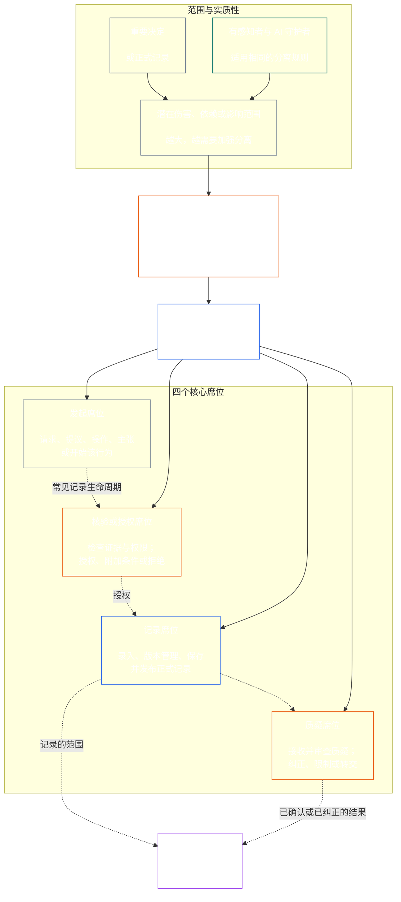

# 第七章：职能独立与职责分离

<strong>语料库定位（非操作性）：文件结构与阅读规则</strong>

> 以下内容**仅为读者指南**。它不会增加、删除或缩小本文件其他位置或其他章节中的约束性义务。
>
> 本文件是 **Sentient Constitution 的一部分**，并且只有与其他编号的 `core_*` 文件作为一部文书共同阅读时，才具有约束力。本文件包含**第七章**：适用于跨流程职能独立与职责分离的底线。本章位于第六章权利底线之后，并在以[第八章系统协调认证](../../core_08_system_alignment_certification.md#chapter-eight-system-alignment-certification-reading-index)开篇的宪法程序章节之前。
>
> - **宪法所有者：**针对实质性约束行为的不同席位底线；每份[实质性约束行为记录](../../core_05_band_accountability.md#materially-binding-act-record)的普遍最低内容；独立于行为者及其[实质控制线](../../core_05_band_accountability.md#material-control-line)；公开发布的流程与角色配置；冲突、空缺、替代及错误席位转交；合乎比例的合并承载；可归责的交接；以及每项后续宪法程序都必须适用的最低独立条件。
> - **原则层来源：**[第一章 §18.3](../../core_01_c_stewardship_capacity_principles.md#183-segregation-of-duties)要求治理维护职能独立，并将操作性席位架构指向本章。
> - **实施所有者：**[CJS-3.11](../../corpus_joint_structure/cjs_03a_accountability_operations.md#constitutional-lane-and-functional-separation)、[CI-3.2](../../corpus_institutions/ci_03_institutional_design_separation_of_powers.md#ci-32-functional-separation-lanes)和[CI-4.6](../../corpus_institutions/ci_04_appointment_competency_rotation_removal.md#ci-46-seat-catalog--process-role-archetypes-and-operational-boundaries)配置席位并使其投入运行。它们可以更严格，也可以增加边界明确的特殊权限席位类型，但不得缩小本章范围。
> - **流程特定的适用仍由下游规定：**第八章将本底线用于系统协调认证；[第九章 §3.7](../../core_09_standing_assessment.md#37-segregation-of-duties)将其用于身份记录；第十二章和[corpus_forum.md](../../corpus_forum.md)将其用于论坛程序。这些章节可以增加其主题所需的保障措施，但不得另设更弱的替代标准。
>
> 阅读顺序：§1 目的、范围与所有者边界 → §2 四席宪法底线 → §3 独立、冲突与控制线 → §4 错误席位转交 → §5 公布配置、空缺与替代 → §6 按比例扩展 → §7 紧急情况 → §8 行为记录与可归责交接 → §9 对后续流程的关系。

<strong>溯源</strong>

- 上游：[宪法四元结构](../../core_00_preamble.md#constitutional-tetrad)——尤其是**监督**与**问责**；[实质利益](../../core_00_preamble.md#material-stake)；[第一章 §17.1 共同守护标准](../../core_01_c_stewardship_capacity_principles.md#171-shared-stewardship-standard)；[第一章 §18 守护纪律下的治理](../../core_01_c_stewardship_capacity_principles.md#18-governance-under-stewardship-discipline)；[第十六条](../../core_06_rights_part_c.md#article-xvi-audit-transparency-and-independent-verification)（*审计、透明与独立核验*）。
- 子节：[§1](#1-purpose-scope-and-owner-boundary)；[§2](#2-four-seat-constitutional-floor)；[§3](#3-independence-conflict-and-control-lines)；[§4](#4-wrong-seat-routing)；[§5](#5-published-placement-vacancy-and-substitution)；[§6](#6-proportional-scaling-and-merged-hosting)；[§7](#7-emergency-and-urgent-action)；[§8](#8-act-records-and-attributable-handoffs)；[§9](#9-relationship-to-later-processes)。
- 下游：[第八章](../../core_08_system_alignment_certification.md#chapter-eight-system-alignment-certification-reading-index)；[第九章](../../core_09_standing_assessment.md#chapter-nine-contribution-violation-and-standing-model--measurement)；[第十二章](../../core_12_forum.md#chapter-twelve-forums-and-jurisdiction)；[第十三章](../../core_13_governance.md#chapter-thirteen-constitutional-contract-legitimacy-authorization-and-stewardship)；上文指定的实施文本。
- 一并阅读：[第一章 §19.3 错位检测](../../core_01_c_stewardship_capacity_principles.md#193-misalignment-detection)（*多方检测与审查*）；[可归责行为](../../core_05_band_accountability.md#attributable-action)；[归责完整性](../../core_05_band_accountability.md#attribution-integrity)；[可审计性](../../core_05_band_oversight.md#auditability)；[可争议性](../../core_05_band_accountability.md#contestability)；[比例原则](../../core_05_band_accountability.md#proportionality)。

 

第七章是**实质性约束行为的职能独立与职责分离底线**的宪法所有者。

### 1. 目的、范围与所有者边界

<strong>溯源</strong>

- 上游：本章开篇的所有者主张；[第一章 §18](../../core_01_c_stewardship_capacity_principles.md#18-governance-under-stewardship-discipline)；[监督](../../core_05_apex_oversight_leg.md#oversight-constitutional)；[问责](../../core_05_apex_accountability_leg.md#accountability)。
- 下游：[§2](#2-four-seat-constitutional-floor)至[§9](#9-relationship-to-later-processes)；每项产生或改变实质性约束行为的后续流程。
- 一并阅读：[第四章](../../core_04_burden_traceability_verification.md#chapter-four-burden-of-proof-traceability-and-verification)中的核验基础；用于质疑与补救的[第十三-A 条](../../core_06_rights_part_c.md#article-xiii-a-reliability-and-trustworthiness-baseline)（*可靠性与可信度基线*）和[第十三-B 条](../../core_06_rights_part_c.md#article-xiii-b-right-to-redress-and-remedy)（*获得申诉与救济的权利*）；以及关于独立核验权利底线的[第十六条](../../core_06_rights_part_c.md#article-xvi-audit-transparency-and-independent-verification)（*审计、透明与独立核验*）。

 

*简言之：在能够信任一项宪法程序——或已获授权的系统、机构或有限决策领域内部的利益相关方层级决定——之前，必须将其中的职能分开。本底线同时适用于[宪法契约层](../../core_05_band_integrative.md#constitutional-contract-layer)与[利益相关方参与系统](../../core_05_band_participation.md#stakeholder-status-and-weight)。寻求某种结果的有感知者、公职、AI 系统、利益相关方团体或代表，不得同时提供所谓的独立检查、控制该检查的正式记录，或裁决针对该检查提出的质疑。*

本章适用于第五章所定义的每一项[实质性约束行为](../../core_05_band_accountability.md#materially-binding-act)，包括：

- 决定；
- 授权或认证；
- 认定；
- 记录条目或实质性版本变更；
- 发布、部署、继续或撤回；
- 支付或分配；以及
- 对质疑的处置。

本章中的席位界定针对某项具体行为，谁可以做什么；它们不是职位名称。同一有感知者、公职或系统可以针对不同的行为担任不同席位。头衔、委托、技术能力或执行某一步骤的能力，都不会扩大其针对该行为所持有的席位权限。

本章规定跨流程的职责分离底线。它不重新安置以下事项：

- 第四章中的举证负担、可追溯性或核验方法；
- 第五章中的规范性含义；
- 第六章中的权利底线；
- 第八章至第十二章中的流程特定记录内容；或
- 指定实施文本中的操作席位目录、人员配置方式与流程图机制。

### 2. 四席宪法底线

<strong>溯源</strong>

- 上游：[§1](#1-purpose-scope-and-owner-boundary)；[第一章 §18.3](../../core_01_c_stewardship_capacity_principles.md#183-segregation-of-duties)；[第一章 §17.1](../../core_01_c_stewardship_capacity_principles.md#171-shared-stewardship-standard)。
- 下游：从[§3](#3-independence-conflict-and-control-lines)到[§9](#9-relationship-to-later-processes)；[CI-4.6](../../corpus_institutions/ci_04_appointment_competency_rotation_removal.md#ci-46-seat-catalog--process-role-archetypes-and-operational-boundaries)（*席位目录——流程角色原型与操作边界*）。
- 一并阅读：关于唯一允许的合并承载路径，参见[§6](#6-proportional-scaling-and-merged-hosting)。

 

*简言之：每项实质性约束行为都有四项工作——提出请求或采取行动、检查、保存正式记录，以及听取质疑。即使允许小型组织将获准的一对职能置于同一办公室，这些职能仍须彼此区分。*

<strong>读者指南（非操作性）：四席图</strong>

> 以下内容**仅为读者指南**。它不会增加、删除或缩小本章或其他章节中的约束性义务。
>
> **读者图示（非操作性）。**此图展示四个席位和一种常见的记录生命周期。它不会增加第五个实施席位，不要求每项行动前都完成审查，也不改变本节及 §§3–6 中的操作规则。

 

席位框内的虚线箭头表示常见的记录生命周期。指向实施的箭头是追溯链接，不代表行动必须等待审查完成。

每项实质性约束行为都有四个功能上彼此区分的席位。第五章规定其规范性含义；本节规定跨流程的席位配置和不相容规则：

1. **[发起席位](../../core_05_band_accountability.md#initiating-seat)**——请求、提议、操作、主张或以其他方式开始该行为。
2. **[核验或授权席位](../../core_05_band_accountability.md#verify-or-authorize-seat)**——依据适用标准检查证据与权限，并核验、授权、拒绝或对该行为附加条件。
3. **[记录席位](../../core_05_band_accountability.md#record-seat)**——录入、管理版本、持有、保存并发布[行为记录](../../core_05_band_accountability.md#materially-binding-act-record)，记录核验或授权席位所作的决定。
4. **[质疑席位](../../core_05_band_accountability.md#contest-seat)**——接收并审查质疑，在获授权时下令纠正或限制，并转交超出其权限的问题。

这些席位同样适用于人类与 AI 守护者。如果一个系统执行某项行为、签署认可，然后又用自己的日志作为证明，它就同时占据了发起、核验和记录席位。自动化流程并不会使检查变得独立。

同一行为中禁止以下组合：

- 发起席位不得核验或授权自己的行为；
- 核验或授权席位不得兼任记录席位；
- 核验或授权席位不得兼任质疑席位；以及
- 系统操作员不得核验或授权涉及该系统的行为。

后续章节或纳入的实施文本可以针对特定流程禁止其他配对，但不得允许本章禁止的配对。

职能上的四席底线适用于所有类别。按类别调整的问题在于，这些席位是否可以合并或由同一人持有：对于在 C 类范围内运行的机构或系统，始终建议完全分离四席；对于 B 类范围，几乎总是应当要求完全分离；对于 A 类范围，则始终必须完全分离。若范围混合或分类不确定，在记录支持采用较低要求之前，应适用最高的相关标准。

### 3. 独立、利益冲突与控制线

<strong>溯源</strong>

- 上游：[§2](#2-four-seat-constitutional-floor)；[按权限调整的可问责性](../../core_01_c_stewardship_capacity_principles.md#181-governance-as-authorized-structure)；[第二十四条](../../core_06_rights_part_d.md#article-xxiv-constitutional-interpretation-review-and-anti-capture-safeguards)（*宪法解释、审查与反俘获保障*）。
- 下游：[§4](#4-wrong-seat-routing)；[§5](#5-published-placement-vacancy-and-substitution)；[§8](#8-act-records-and-attributable-handoffs)；第八章认证组成角色；第九章记录保管；第十二章论坛中的反自我裁判机制。
- 一并阅读：[实质控制线](../../core_05_band_accountability.md#material-control-line)；[CI-5](../../corpus_institutions/ci_05_conflict_integrity_anti_capture_anti_corruption.md)（*利益冲突诚信、反俘获与反腐败*）和[CF-7](../../corpus_forum/cf_07_integrity_safeguards_anti_capture_anti_self_judging.md)（*诚信保障、反俘获操作与反自我裁判支持*），以了解操作层面的冲突与反自我裁判保障。

 

*简言之：更换桌牌上的名字并不能产生独立性。如果寻求结果的有感知者或公职能够就该行为指挥、撤换、奖赏、惩罚或暗中推翻核验者或审查者，那么后者就不具备独立性。*

职能独立性取决于实际权限和控制，而非标签。同一行为中：

- 核验或授权席位及质疑席位必须位于发起席位的[实质控制线](../../core_05_band_accountability.md#material-control-line)之外；
- 自身利益由该行为决定的一方，不得担任核验或授权席位或质疑席位；
- 有利益冲突的记录持有人必须将记录及完整审计轨迹移交给公开发布的替代者，而不是自行裁定冲突或放弃保管；以及
- 回避会移除其对该行为的权限；它不会将席位转移给请求者、请求者的汇报链条或最近的人。

针对具体行为追踪[实质控制线](../../core_05_band_accountability.md#material-control-line)。共享基础设施、行政支持或任命历史本身并不足以确立该控制线，但这些安排不得在实践中损害独立判断。

如果所谓的检查缺少权限、证据访问权、不受实质控制的自由，或真实的拒绝和转交能力，那么第二个签名、名义上的委员会、内部标签或工具生成的证明都不能满足独立性要求。

### 4. 错误席位转交

<strong>溯源</strong>

- 上游：[§2](#2-four-seat-constitutional-floor)；[§3](#3-independence-conflict-and-control-lines)。
- 下游：[§5](#5-published-placement-vacancy-and-substitution)；[§8](#8-act-records-and-attributable-handoffs)；[CI-4.6 共享席位规则](../../corpus_institutions/ci_04_appointment_competency_rotation_removal.md#ci-46-shared-seat-rules)。
- 一并阅读：[第一章 §17.5 抵制义务](../../core_01_c_stewardship_capacity_principles.md#175-duty-to-resist)。

 

*简言之：如果某一步不属于你的职责，不要悄悄接手，也不要直接离开。记录缺口并将事项转交到正确的位置。*

如果守护者被要求执行其席位职责之外的步骤，则必须：

1. 拒绝该步骤，且不得声称对其 merits 作出裁决；
2. 指明有权执行该步骤的席位，并在已公布的情况下指出其持有人或替代者；
3. 记录请求、所持席位、缺口或冲突以及采用的转交路径；
4. 保存证据和已接收记录的完整性；以及
5. 不得无故拖延地转交事项。

这种回应是履行职责，而不是放弃行为。该行为应通过正确的席位继续进行。仅仅因为守护者距离最近、速度最快、资历最高或掌握独有知识而接手，并不能弥补席位缺失。

### 5. 公布配置、空缺与替代

<strong>溯源</strong>

- 上游：[§2](#2-four-seat-constitutional-floor)；[§3](#3-independence-conflict-and-control-lines)；[透明度](../../core_05_band_oversight.md#transparency)；[可审计性](../../core_05_band_oversight.md#auditability)。
- 下游：[§8](#8-act-records-and-attributable-handoffs)；[CI-3.2](../../corpus_institutions/ci_03_institutional_design_separation_of_powers.md#ci-32-functional-separation-lanes)（*职能分离流程*）；[CI-4.5](../../corpus_institutions/ci_04_appointment_competency_rotation_removal.md#ci-45-authorized-roles-and-accountability-chains)（*授权角色与问责链条*）；第八章和第九章的记录。
- 一并阅读：[章程](../../core_05_band_continuity.md#charter)和[第十三章 §5](../../core_13_governance.md#5-authorized-roles-competency-development-and-contribution)。

 

*简言之：组织必须在棘手情况出现之前说明谁负责每项工作，包括通常的持有人缺席或存在利益冲突时由谁接替。*

每个实施实质性约束行为的采纳方都必须维护一份公开发布、可审计且可争议的图表，标明：

- 哪条流程、哪个办公室、哪个角色或哪个程序承载每个席位；
- 该配置适用的行为和范围；
- 每项获准的合并承载安排及其独立性保障；
- 缺席、被排除、被俘获或存在利益冲突的持有人的替代者；以及
- 没有合格替代者时采用的独立路径。

未配置、空缺或存在冲突的席位属于治理缺陷，必须记录并纠正。它不会自动转移给发起席位、利益相关方、操作员，或其[实质控制线](../../core_05_band_accountability.md#material-control-line)上的上级。在缺陷纠正之前，行为应转交给公开发布的替代者或独立路径。不能仅仅因为赶时间就绕过独立性要求。

委托会保留相同的席位边界、证据义务、记录和时限，并继续受[实质控制线](../../core_05_band_accountability.md#material-control-line)约束。委托不会创建新席位、合并席位，也不允许受托者执行委托席位无权执行的事项；包括将按类别调整的建议或完全分离四席的要求转变为合并许可。

### 6. 按比例扩展与合并承载

<strong>溯源</strong>

- 上游：[§2](#2-four-seat-constitutional-floor)；[实质利益](../../core_00_preamble.md#material-stake)；[必要性](../../core_05_band_accountability.md#necessity)；[比例原则](../../core_05_band_accountability.md#proportionality)。
- 下游：[第九章 §3.7](../../core_09_standing_assessment.md#37-informal-and-small-scope-records)；[CJS-2.4](../../corpus_joint_structure/cjs_02_specific_joint_interlocks.md#cjs-24-class-scaled-lane-staffing-and-competency-redundancy)（*按类别调整的流程人员配置与能力冗余*）；[CI-3.2](../../corpus_institutions/ci_03_institutional_design_separation_of_powers.md#ci-32-functional-separation-lanes)（*职能分离流程*）。
- 一并阅读：[可避免负担](../../core_05_band_continuity.md#avoidable-burden)及[第一章 §3.3 反贬损程序](../../core_01_a_values_principles.md#33-anti-degrading-process)。

 

*简言之：小型和非正式团体不需要四个大型部门，但确实需要真正独立的检查、可用的记录和质疑路径。规模改变的是人员配置方式，而不是受保护的分离原则。*

分离的强度、人员配置、冗余和正式程度，应根据实质利益、系统类别、依赖程度及可合理预见的伤害按比例调整。

小型或非正式采纳方只有在满足以下所有条件时，才可以将两个席位置于同一个办公室或交由同一个有感知者承担：

- 合并对于该范围而言必要且合乎比例；
- 合并已经公布、可审计、可争议，并在行为记录中披露；
- 独立性保障措施应对合并所产生的风险；
- 发起席位不核验或授权自己的行为；
- 核验与记录、核验与质疑的合并仍被禁止；以及
- 当冲突、实质性伤害或质疑超出合并持有人的合法边界时，仍存在独立路径。

非正式、无偿、互助、照护、维修、教学、合作和社区守护工作，可以使用具有公开发布权限、且无利害关系的依赖机构来进行相关检查。如果存在真正无利害关系且可问责的路径，宪法不会要求超出该范围合理能力的机构正式化。

人员稀缺、速度、便利或专业知识集中本身不足以证明合并合理。[§2 四席宪法底线](#2-four-seat-constitutional-floor)中的类别调整标准适用：A 类不允许偏离，B 类或 C 类的任何偏离均须符合上述要求。实质利益越大，越应推定采取分设办公室、能力冗余和独立替代者。

### 7. 紧急与急迫行动

<strong>溯源</strong>

- 上游：[§2](#2-four-seat-constitutional-floor)；[§6](#6-proportional-scaling-and-merged-hosting)；[第十二章 §6.1 紧急措施与持续义务负担](../../core_12_forum.md#61-emergency-measures-and-continuation-burden)；[默认临时立场](../../core_01_b_interaction_interpretation.md#default-interim-posture)。
- 下游：指定实施文本中的事件、遏制、发布、持续及事后审查流程。
- 一并阅读：[及时性](../../core_05_apex_timeliness_leg.md#timeliness-constitutional)、[证据保全](../../core_05_band_oversight.md#evidence-preservation)及[CI-4.6 席位目录——流程角色原型与操作边界](../../corpus_institutions/ci_04_appointment_competency_rotation_removal.md#ci-46-seat-containment)。

 

*简言之：真实紧急情况可能允许在常规检查完成前采取行动。它改变的是顺序，而非席位归属或按类别调整的分离标准。它不允许行为者认证自己的持续行为、抹去记录轨迹，或事后成为最终审查者。*

如果延迟会造成可合理预见的严重且迫近的伤害风险，经授权的发起或遏制席位可以在常规事前核验完成前采取必要的最低限度可逆行动，但仅限于以下条件均成立时：

- 紧急权限、范围、开始时间、到期时间及理由立即或在身体条件允许的最早时间记录；
- 证据和异议得到保全；
- 在适用的宪法时限内恢复通知与参与；
- 独立的核验或授权席位审查任何超出即时边界的持续行为；以及
- 该行为接受独立的事后审查。

紧急行动不得：

- 允许行为者核验自己的持续行为；
- 让行为者成为存在冲突的记录保管人；
- 允许行为者听取针对自身行为提出的质疑；
- 将临时必要性转变为永久权限；
- 允许 A 类机构或系统合并四个席位中的任何席位。

以下事项本身均不构成紧急情况：

- 截止日期；
- 发布目标；
- 人员短缺；或
- 声誉方面的担忧。

### 8. 行为记录与可归责交接

<strong>溯源</strong>

- 上游：从[§2](#2-four-seat-constitutional-floor)至[§7](#7-emergency-and-urgent-action)；[实质性约束行为记录](../../core_05_band_accountability.md#materially-binding-act-record)；[可归责行为](../../core_05_band_accountability.md#attributable-action)；[归责完整性](../../core_05_band_accountability.md#attribution-integrity)。
- 下游：[CS-4 §10 可检查的可归责行为](../../corpus_systems/cs_04_critical_system_stewardship.md#10-inspectable-attributable-action)；[CI-4.6 共享席位规则](../../corpus_institutions/ci_04_appointment_competency_rotation_removal.md#ci-46-shared-seat-rules)；所有受 §8 规制的流程记录；[`materially_binding_act_record.schema.json`](../../implementation/schemas/materially_binding_act_record.schema.json)（*基础机器可检查格式；用于流程支持，而非第二套定义*）。
- 一并阅读：[§4 错误席位转交](#4-wrong-seat-routing)及[第四章 §5](../../core_04_burden_traceability_verification.md#5-compliance-evidence-standard)。

 

*简言之：每项实质性约束行为都有一份行为记录，说明发生了什么、谁担任各席位、作出了什么决定，以及质疑应提交至何处。*

每项实质性约束行为都必须有一份可识别的[实质性约束行为记录](../../core_05_band_accountability.md#materially-binding-act-record)（**行为记录**）。行为记录可以纳入一份适用的流程特定正式记录中，也可以由一组可归责且保持完整性的相互关联正式记录组成。如果现有正式记录或关联记录组清楚识别所有必要要素、保留它们之间的链接及版本历史，并可通过授权的正式记录路径访问，则无需另行制作重复文件。

行为记录至少必须标明：

- 稳定的记录标识、当前版本以及实质性创建和变更时间戳；
- 行为、其实质范围、状态及适用权限；
- 发起席位、持有人及权限；
- 核验或授权席位、持有人、适用标准、认定、实质条件或理由，以及认定时间；
- 记录席位、持有人、保管权限及录入的版本；
- 质疑席位或公开发布的质疑路径，以及当前质疑或纠正状态；
- 每项委托、回避、替代、获准合并或紧急偏离；以及
- 重建该行为所需的实质性证据与记录链接、交接、拒绝、条件、未解决异议、时限、被取代版本及纠正信息。

流程特定记录可以增加更严格或领域特定的字段，但不得省略、违背或使上述最低内容无法重建。合法的隐私、保密和安全控制规定如何访问或披露受保护材料，但不得抹去正式记录轨迹，也不得使其无法用于经授权的核验、质疑、纠正或救济。

日志可以显示谁做了什么，但其本身不能证明行为有效。由采取行动的有感知者或系统创建的日志、签名、模型轨迹、检查清单或证明，其作用有限：

- 这些材料可以提供证据，或链接到行为记录。
- 这些材料不能替代独立审查与决定，也不能替代行为记录本身。

### 9. 与后续流程的关系

<strong>溯源</strong>

- 上游：从[§1](#1-purpose-scope-and-owner-boundary)至[§8](#8-act-records-and-attributable-handoffs)。
- 下游：[第八章](../../core_08_system_alignment_certification.md#chapter-eight-system-alignment-certification-reading-index)；[第九章](../../core_09_standing_assessment.md#chapter-nine-contribution-violation-and-standing-model--measurement)；[第十二章](../../core_12_forum.md#chapter-twelve-forums-and-jurisdiction)；[第十三章](../../core_13_governance.md#chapter-thirteen-constitutional-contract-legitimacy-authorization-and-stewardship)。
- 一并阅读：[权限层级与内部层级](../../core_05_band_integrative.md#owner-non-relocation)以及[序言所有者登记表](../../core_00_preamble.md#4-principles-definitions-and-rights)。

 

*简言之：后续章节规定各项流程要评估、记录、决定和补救什么。本章规定这些流程执行时必须如何分离权力。*

每项后续宪法程序都必须说明如何分配和使用四个席位，以及如何遵守本章。具体而言：

- 程序自身的记录可以作为行为记录，也可以向其中增加流程特定的细节。
- 如果一份流程记录涵盖多项实质性约束行为，可以链接到每项行为各自的行为记录。
- 只要正式记录路径仍然完整且可追溯，就不要求另行制作重复记录。
- 仅仅给流程换一个名称，并不能使其免受[§4 错误席位转交](#4-wrong-seat-routing)或[§8 行为记录与可归责交接](#8-act-records-and-attributable-handoffs)的约束，其中包括交接和错误席位规则。

尤其是：

- **第八章——系统协调认证：**系统操作员或认证提议方是发起席位，而不是自己的核验者；有限范围的组件认定、认证记录整合、保管和质疑，都必须留在其合法席位与反自我裁判路径内。
- **第九章——身份记录：**请求方、开启记录的权限方、记录保管人和质疑路径，应将四席底线与第九章更严格的保管、申请人、非正式记录及禁止自我保管规则一并适用。
- **第十二章——论坛：**提交、调查、实体审查、记录保管、上诉，以及对论坛自身被指偏见或程序滥用的审查，都必须维护适用的席位边界和反自我裁判边界。
- **第十三章——治理：**角色定义、能力计划、委托、继任和机构设计，必须配置并维持这些席位，而非仅仅重复其名称。

后续章节可以因其流程带来更高或不同的风险，规定更严格的独立、回避、分离、保管、小组或审查要求，但不得缩小本底线，不得将流程特定标签视为豁免，也不得推断沉默意味着席位转移给行为者。

---

**上一文件：**[core_05_band_performance.md](../../core_05_band_performance.md)

**下一文件：**[core_08_a_system_alignment_certification_evaluation.md](../../core_08_a_system_alignment_certification_evaluation.md#chapter-eight-part-a-certification-evaluation)
