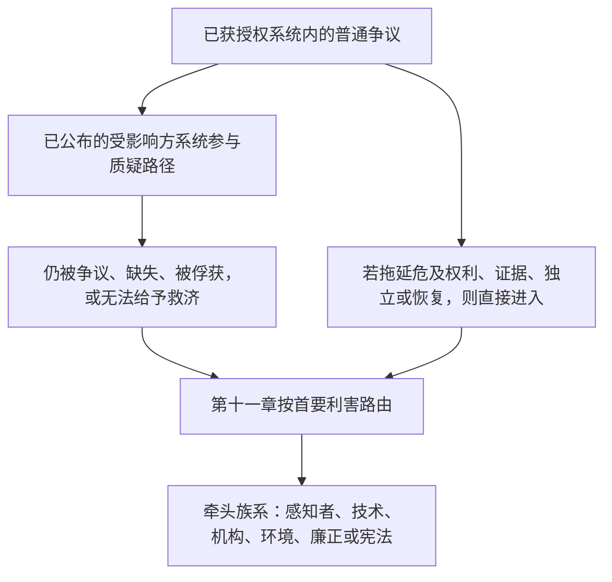

# 第十一章：评议所与管辖

<strong>在文本库中的位置（非操作性）：文件结构与阅读规则</strong>

> 以下内容**仅为读者指引**。不增加、减少或收窄本文件或其他章节中有约束力的义务。
>
> 本文件是[英语第十一章](../../core_11_forum.md)的**读者语言试点**。**不是**感知者宪法的约束性部分。**不是**第二部宪法。**不是**发送版。**钉住** `SC-Corpus-2026.08.09`。若本译文与英语原文看似不一致，以编号文件 [`core_11_forum.md`](../../core_11_forum.md) 为准。阅读顺序与版本元数据保存在 [README.md](../../README.md)。方法与用语表：[translations/zh/README.md](README.md)。
>
> 本文件包含**第十一章**：评议所族系、默认场所与首要利害路由、取证支持、收件分诊，以及轨迹链与权利底线下争议的管辖。评议所在[宪法四元](core_00_preamble.md#constitutional-tetrad)的**参与**、**监督**与**及时性**腿下**监督**争议处理，并按[实质利害](core_00_preamble.md#material-stake)缩放。当事实经核实，它们可以按[第八章 §3](core_08_standing_assessment.md#3-standing-record-operational-requirements)**打开、更新或更正**轨迹记录 — 或**在质疑时把一份坏记录搁置**；提交案件本身不是轨迹，评议所叙事不得替代第八章轨迹测量（[第八章 §3.6](core_08_standing_assessment.md#36-forum-boundary)）。流程链导航用 [README — Standing pipeline and forums](../../README.md#standing-pipeline-and-forums)。操作性评议所机制仍在指定实施文件中。章节编号与交叉引用匹配一体化文书。阅读顺序、约束力/支持划分与文本库版本元数据保存在 [README.md](../../README.md)。

>
> **上一篇（仍为英语）：** [core_10_b_misconduct_pattern_applications.md](../../core_10_b_misconduct_pattern_applications.md#chapter-ten-part-b-anti-constitutional-misconduct-pattern-applications)
>
> **下一篇（仍为英语）：** [core_08-11_application_vignettes.md](../../core_08-11_application_vignettes.md#chapters-eight-eleven-application-vignettes)
> **阅读弧线：** §1 宗旨 → 争议顺序 → §2 默认场所与收件 → §2.1–§2.3 牵头限度、混合利害、质疑 → §3 移送与反自我裁判 → §4 族系 → §5 升级与认证 → §6 层级与反拖延 → §7 评议所支持

<strong>读者指引（非操作性）：第十一章所在位置与本章保留者</strong>

> 以下内容**仅为读者指引**。不增加、减少或收窄本章或其他章节中有约束力的义务。
>
> 本章所在位置（导航）：
> - **宪法主责者：** **第 1 节**（*宗旨* — 本章所分配规范的**首要裁决适用**，**有别于**例行**执行行政**；已获授权系统内部普通争议的**争议顺序**；**问责**要求；**已公布**、**可预期**的**门槛**安置）；**默认起始场所**、**首要利害**路由、**收件分诊机构**（**第一接触台**）、混合利害、不对称、轨迹记录质疑、**善意定性与反博弈**，以及**感知者可及**的**门槛** **通路**期望（**第 2 节**，**一并阅读** **`corpus_forum.md`**）；**移送**、**合并**与**协调**（**第 3 节**，与**第 5 节**认证与备用一并阅读）；**评议所族系定义**、**内部分庭**、**共享标准**与**暂行操作法**（感知者、技术、机构、环境、廉正、宪法 — **第** **4** **节**，镜像**第** **2** **节**的**表**）；**升级**、**认证**与**临时保护**（**第 5 节**）；**及时解决**与**反拖延**纪律（**第 6 节**）；审查前、中、后的**评议所支持**（**第 7 节**），实施上使分诊与支持角色**不得**替代**合法组成的实体审断小组**；**反自我裁判**备用路由；以及挂钩**第八章**、**第十章**与**第六章**正义与质疑权利的升级钩。
> - **流程链导航：** [README — Standing pipeline and forums](../../README.md#standing-pipeline-and-forums) — 本文件 [§§1–7](#1-purpose-and-role)。
> - **第八至九章三问流程链：** 第八章**第 2–3 节**通过经核实、轴纯记录回答问题 1（*发生了什么？*）。[第八章 §4](core_08_standing_assessment.md#4-standing-measurement-evaluation-dimensions) 与 [§7 统一比例 LEQU 标尺](core_08_standing_assessment.md#7-unified-proportional-lequ-scale) 通过评价维度、共享五倍 LEQU 带，以及共享 **s** = 1...9 语法回答问题 2（*有多好或多坏？*），同时保全分开的贡献记录与违规记录。[第九章](core_09_standing_integration.md#chapter-nine-standing-effects-and-integration) 通过救济、保障、能力门槛与许可，以及轨迹锁定回答问题 3（*因此发生什么？*）。违规轴槽位只由经核实影响控制；过失、隐瞒、强制、回应与可比性格描述符不移动它。[第十章](core_10_a_misconduct_designation.md#chapter-ten-anti-constitutional-misconduct) 可以为第八章槽位 7、8 或 9 记录添加相匹配的反宪法不当行为指定，但不指派数字槽位。
> - **评议所（非操作性释义）：** 本章下的**评议所族系**是把[第八章](core_08_standing_assessment.md#chapter-eight-compliance-violation-and-standing-model)分类适用于具体争议的首要**评议所** — 包括分开记录的**贡献性质**、**违规轴影响槽位**与过程 / 回应性格**共现**、且必须在**第八章**联合评估与非替代纪律下处理的事项。裁决之外的**研究资助**、**融资**与**激励**机制仍在已采纳实施与 **[corpus_systems.md](../../corpus_systems.md)**（见**第八章**读者指引）；它们可以支持预防与根因探究，且**不得**替代**门槛**路由、**实体**审断、权威的第八章数字槽位指派、任何相匹配的**第十章**指定，或 **Article XXIII**（《冲突解决、升级与紧急相称性》）约束。**第 1 节与第 2 节**把**激励**结构的**首要**责任**主要**分配在每一**族系**的**领域**之内（颗粒细节在**文本库**与实施中）；该项**分配****并不**挪走保留给[第十二章](../../core_12_governance.md#chapter-twelve-constitutional-contract-legitimacy-authorization-and-stewardship)与 **[corpus_systems.md](../../corpus_systems.md)** 的**系统范围****预算**或**治理尺度**选择。
> - **实施主责者：** 已公布收件**类别**、日常案卷规则、人员、预算、颗粒程序、操作性升级机制，以及评议所支持操作要求，住在已采纳实施文本与 **[corpus_forum.md](../../corpus_forum.md)**（**CF-5**（《路由操作、移送、认证与代表性对待》）、**CF-8**（《评议所取证与分析支持》）、**CF-9**（《独立调查服务与检控接口》），及相关各节）；那些层**实施，而非收窄**本章。
> - **反挪位规则：** 采纳文书不得通过把不同评议所功能压成一团、剥掉**独立**或**真实审查**，或把廉正质疑路由回本章禁止作为唯一最终实体家园的同一被俘获评议所，来满足本章。
>
> **架构 — *用直白的话说* 安置：** 每一条*用直白的话说*出现在溯源导航块（以及其后若存在的 ` `）之后，且**在**该节操作性段落与项目列表**之前**。仅为面向读者的释义；不增加、减少或收窄有约束力的文本。

<strong>溯源</strong>

- 上游：[第八章](core_08_standing_assessment.md#chapter-eight-compliance-violation-and-standing-model)（*供给本章所路由争议的问题 1 记录与问题 2 测量*）；[第八章 §5.1](core_08_standing_assessment.md#5-slot-grammar-and-display-labels)（*轨迹槽位语法*）；[第八章 §7 统一标尺](core_08_standing_assessment.md#7-unified-proportional-lequ-scale)（*共享五倍 LEQU 带与分开轴记录*）；[第八章 §§4.3–4.4](core_08_standing_assessment.md#43-route-descriptor-measurement-roles)（*跨轴归一化描述符目录，包括不移动槽位的贡献轴与违规轴描述符*）；[第十章](core_10_a_misconduct_designation.md#chapter-ten-anti-constitutional-misconduct)（*对合格第八章槽位 7–9 的相匹配反宪法不当行为指定*）；[第二至四章](core_02_definition_structure.md)（*记录、核验与追溯期望*）；[第五章](core_05__definitions_home.md#chapter-five-foundational-definitions)（*基础定义*）；[第一章](core_01_c_stewardship_capacity_principles.md#chapter-01-principles-and-constraints)（*解释约束*）；[第六章 — 基础权利](core_06_rights_part_a.md#chapter-six-foundational-rights) 至 [D 部分](core_06_rights_part_d.md)（*质疑、审计与正义条款钩*）。
- 各小节：[§1](#1-purpose-and-role)；[§2](#2-default-venue-and-primary-stakes)；[§3](#3-transfer-consolidation-and-coordination)；[§4](#4-forum-family-definitions)；[§5](#5-escalation-and-certification)；[§6](#6-timely-resolution-materiality-tiers-and-anti-delay-discipline)；[§7](#7-forum-support-before-during-and-after-review)。
- 一并阅读：[README — Standing pipeline and forums](../../README.md#standing-pipeline-and-forums)。
- 下游：[corpus_forum.md](../../corpus_forum.md)（*操作性评议所学说*）；[第十二章](../../core_12_governance.md#chapter-twelve-constitutional-contract-legitimacy-authorization-and-stewardship) 在治理正当性与裁决角色交互之处；[第十六章](../../core_16_incorporation.md#chapter-sixteen-incorporation-bridge)（*已采纳程序层的纳入纪律*）。
- 一并阅读：[第八章 §5.1](core_08_standing_assessment.md#5-slot-grammar-and-display-labels)（*轨迹槽位语法*）；[第八章 §§4.3–4.4](core_08_standing_assessment.md#43-route-descriptor-measurement-roles)（*跨轴归一化贡献轴与违规轴描述符*）。
- 亦一并阅读：[第九章 §3](core_09_standing_integration.md#3-descriptor-integration-and-attachment-normalization)（*描述符整合与附着归一化，与第 2 节首要利害路由一并阅读*）；[README.md](../../README.md)（*阅读顺序与文本库组织*）；[doc_architecture.md](../../doc_architecture.md)（*无约束力编辑地图，除非被采纳*）。

 

第十一章是**评议所族系、默认场所、管辖，以及轨迹链与权利底线下争议的裁决路由**的宪法主责者。

*用直白的话说：在[宪法四元](core_00_preamble.md#constitutional-tetrad)与[两项宪法宗旨](core_00_preamble.md#two-constitutional-aims)下，本章**监督**争议如何穿过第八至十章轨迹链 — 路由、独立、取证支持、补救排序，以及**第 6 节**与 **Article XXIV-C**（《及时解决与反拖延底线》）下的层级默认时钟。评议所族系回答哪条轨道处理哪项争议、案件通常从何处开始，以及混合利害事项如何协调。它们供给**参与**（可及质疑）与**监督**（可追溯的实体审断）。当事实经核实，它们可以**打开、更新或更正**轨迹记录 — 或**在质疑时把一份坏记录搁置**。它们**不**在轨迹链旁边再跑一条分开的决定轨道。仅提交案件对轨迹没有即时影响。日常审理规则、预算与人员手册住在实施层，且必须**实施，而非收窄**本章或 **Article XXIII**（《冲突解决、升级与紧急相称性》）。*

### 1. 宗旨与角色 — 参与架构

<strong>溯源</strong>

- 上游：[第七章 — 系统对齐认证](core_07_a_system_alignment_certification_evaluation.md#chapter-seven-system-alignment-certification)；[第八章](core_08_standing_assessment.md#chapter-eight-compliance-violation-and-standing-model)；[第九章](core_09_standing_integration.md#chapter-nine-standing-effects-and-integration)；[第十章](core_10_a_misconduct_designation.md#chapter-ten-anti-constitutional-misconduct)；[第一章](core_01_c_stewardship_capacity_principles.md#chapter-01-principles-and-constraints)（*原则与解释约束*）；[第二至四章](core_02_definition_structure.md)（*追溯与核验期望*）；[第五章](core_05__definitions_home.md#chapter-five-foundational-definitions)（*与第二至四章在文本库位置组件中一并阅读的定义*）；[第六章](core_06_rights_part_a.md#chapter-six-foundational-rights)（*本章一并适用的基础权利底线*）。
- 下游：[§2](#2-default-venue-and-primary-stakes)（*首要利害默认场所、收件分诊、混合利害、不对称、轨迹记录质疑；及时可质疑的门槛通路；善意定性与反博弈*）；[§3](#3-transfer-consolidation-and-coordination)（*移送与反自我裁判*）；[§4](#4-forum-family-definitions)（*评议所族系定义、分庭、共享标准与暂行操作法*）；[§4.3](#43-institutional-forums)（*作为机构族系适用争议顺序的内部过程边界*）；[§5](#5-escalation-and-certification)（*升级、认证与临时保护*）；[§6](#6-timely-resolution-materiality-tiers-and-anti-delay-discipline)（*实质性层级、流程链里程碑与反拖延纪律*）；[§7](#7-forum-support-before-during-and-after-review)（*审查前、中、后的评议所支持*）。
- 四元腿：**参与**、**监督**、**问责**、**及时性**（经核实认定可以打开、更新或更正轨迹记录；**CF-11** 实施层级时钟）。首要宗旨：**繁盛**与**延续**。[实质利害](core_00_preamble.md#material-stake)缩放适用于路由与通路负担。
- 一并阅读：[序言 §3.2](core_00_preamble.md#32-key-governance-processes) 与 [§3.3](core_00_preamble.md#33-governance-layers)（*过程路径与治理层纪律*）；[Article XI：受影响方的系统参与、代表与正当程序](core_06_rights_part_b.md#article-xi-stakeholder-system-participation-representation-and-due-process)；[corpus_forum.md](../../corpus_forum.md)（**CF-6.2.2**（《紧急、穷尽与时限规则》）— 实施，而非收窄）；[corpus_institutions.md](../../corpus_institutions.md)（*质疑、二次审查与廉正监测 — 不取代已指派的评议所管辖*）；[Article XII-B：质疑、审查与救济权](core_06_rights_part_c.md#article-xii-b-right-to-challenge-review-and-redress)；[Article XXIII 族](core_06_rights_part_d.md#article-xxiii-a-justice-objective-and-scope)（*文本库位置组件中所引用的正义约束*）。

 

*用直白的话说：本节通过评议所族系指派宪法**参与**与**监督**，这些族系**监督**两条轨道 — **轨迹链**（第八至十章争议与记录效果）与**系统对齐认证**（第七章承认与审查） — 然后陈述已公布门槛安置的问责要求。已获授权系统内部的普通争议先走已公布的受影响方系统参与质疑路径；当该路径仍被争议、缺失、被俘获或无法给予救济时，本章接手。详细听证规则住在他处，不得悄悄缩小本章所保证者。*

本章陈述哪些**评议所族系****监督**哪些首要问题，通过**参与**（感知者可及质疑、代表性对待与相称通路）与**监督**（独立、取证支持与可追溯的实体审断）。它**不**规定案卷规则、人员、预算、颗粒程序或操作性升级机制。那些细节属于必须**实施，而非收窄**本章的文本库实施层。**评议所族系**必须以可预期、已公布的方式陈述门槛安置、首要利害路由与系统对齐审查的法律与监管边界，从而**实施，而非收窄****第 2 节**连同 **`corpus_forum.md`**。

**评议所族系监督：**

1. **轨迹链**（第八至十章，在争议中适用第一至六章与指定文本库实施规范）
   - 首要利害路由、在被指派处的实体审断、移送、合并与认证协调，以及轨迹相关争议的补救排序。
   - **第八章**贡献与违规记录按 §7 统一比例 LEQU 标尺测量、性格描述符与轨迹效果 — 经核实认定可以按[第八章 §3](core_08_standing_assessment.md#3-standing-record-operational-requirements)**打开、更新或更正**轨迹记录 — 或**在质疑时把一份坏记录搁置** — 当它们满足经核实输入门时；提交案件本身不是轨迹，评议所叙事不得替代第八章轨迹测量（[第八章 §3.6](core_08_standing_assessment.md#36-forum-boundary)）。
   - **第九章**轨迹效果与整合，凡本章指派评议所监督救济与排序之处。
   - **第十章**反宪法不当行为指定，凡该指定对第八章槽位 7–9 记录成为争点之处。
   - 适用**第一至六章**与指定[文本库](core_05_band_integrative.md#corpus)实施层，作为那些争议所适用的规范。

2. **系统对齐认证**（[第七章](core_07_a_system_alignment_certification_evaluation.md#chapter-seven-system-alignment-certification)）
   - 评议所监督的承认、附条件承认、核验、再核验、撤回及相关认证记录结果，按[第七章 B 部分](core_07_b_system_alignment_certification_record_process.md#chapter-seven-part-b-certification-record-and-process)。
   - [B 部分 §13](core_07_b_system_alignment_certification_record_process.md#13-forum-supervision-and-component-roles) 下的组件角色：
     - **技术** — 规格、方法与证据标准
     - **廉正** — 正式对齐承认与牵头协调
     - **环境** — 凡具实质性的环境对齐组件
     - 本章路由下的其他族系组件认定
   - 感知者可以质疑认证结果、附加条件，并在需要时重开档案 — 但认证**不**替代轨迹测量。
   - 认证中的重要认定在第八章测量轨迹时可以计为**经核实输入**。认证**本身不**为任何人指派轨迹槽位（[B 部分 §15](core_07_b_system_alignment_certification_record_process.md#15-relationship-to-standing)）。

**评议所族系**是本文书**监督**那些轨道的首要制度。它们有别于已颁布规则的例行执行行政。

**争议顺序。** 在已获授权系统、机构或有界决定域内部，普通争议先走已公布的[受影响方的系统参与](core_05_band_participation.md#stakeholder-status-and-weight-cluster)质疑与正当程序路径。若该路径产出仍被争议的结果、缺失、被俘获，或不能合法给予所需救济，本章按**第 2 节**依首要利害路由该事项。**廉正**、**技术评议所领域**、**环境**与**宪法**在那是首要利害时是默认牵头族系 — 不是跳过顺序的例外。未完成的内部过程、穷尽标签，或主张内部审查未完成，不得拖延那些牵头、挪走其实体，或吃掉 **Article XXIV-C**（《及时解决与反拖延底线》）时钟。当拖延会实质危及权利、证据、独立或实践恢复时，直接通路仍可用。

*仅为读者地图。不增加、减少或收窄争议顺序段落。*

它们：

- 承担主动治理角色，包括问题解决、根因分析、预防、补救排序，以及从失败模式中学习，对齐**第一章**原则，包括**安全**、**真理**、**福祉**、**回应性**，以及**尽责管理与分布式理解**。
- 必须满足**第二至四章**的**独立**、**可质疑性**与**追溯**期望，凡质疑与补救被牵涉之处满足 **Article XII-B**（《质疑、审查与救济权》），凡正义约束统管之处满足 **Article XXIII**（《冲突解决、升级与紧急相称性》）。
- 受本文书最严格已表达的程序与廉正问责要求约束，包括公开正当化、可追溯性、回避与小组纪律，以及本章指派它们之处的取证与分析支持
- 要求反自我裁判备用路由。那些要求不得用政治控制替代裁决独立性。
- **廉正**、**宪法**与**环境**评议所，以及审理感知地位裁断时的**技术评议所领域**，要求**已公布**、**可争议**、**可轮换**的任命，或[第十二章 §1.2](../../core_12_governance.md#12-eligibility-contested-selection-and-democratic-minimums) 下等效的独立核验。那些席位的任命不足或资金不足，是[第九章 §9](core_09_standing_integration.md#9-enforcement-realism) 失败。

每一**评议所族系**对其领域内的激励结构负首要责任。这包括：

- 采纳文书与指定实施层
- 审查成本、制裁、质疑与报告具名路径
- 补救排序钩，以及可比的裁决相邻对齐。

**系统范围**预算、横断研究资助与治理尺度方案，仍受[第十二章 — 治理](../../core_12_governance.md#chapter-twelve-constitutional-contract-legitimacy-authorization-and-stewardship)、**[corpus_systems.md](../../corpus_systems.md)** 以及其他至上规则在适用处约束。回报、成本规则与类似激励工具**不得**取代：

- 正当的评议所路由
- 由合法组成小组作出的真实实体决定
- 第八章影响槽位测量
- 任何匹配的**第十章**指定
- **Article XXIII**（《冲突解决、升级与紧急相称性》）中的正义约束

**`corpus_institutions.md`** 中的制度质疑、二次审查与廉正监测（包括 **CI-5**（《冲突廉正、反俘获与反腐败》）至 **CI-8**（《跨机构协调与升级》）以及质疑廉正期望）与本章并行。它们不取代**廉正**、**环境**或**机构**评议所族系，在本章指派那些族系管辖有约束力实体之处。那些卷册中的实施激励机制必须与其领域被首要牵涉的评议所族系协调，而不挪走本章指派的首要利害路由或实体权威。

### 2. 默认场所与首要利害

<strong>溯源</strong>

- 上游：[§1](#1-purpose-and-role)（*宗旨、首要适用角色、问责要求、已公布门槛路由、细节非挪位、独立与审查期望*）。
- 下游：[§3](#3-transfer-consolidation-and-coordination)（*移送、合并、反自我裁判*）；[§4](#4-forum-family-definitions)（*与默认表一并阅读的评议所族系定义*）；[§5](#5-escalation-and-certification)（*从默认场所升级；临时保护*）；[§6](#6-timely-resolution-materiality-tiers-and-anti-delay-discipline)（*实质性层级与反拖延纪律*）；[§7](#7-forum-support-before-during-and-after-review)（*审查前、中、后的评议所支持*）。
- 第 2 节内：[§2.1](#21-lead-default-limits)（*首要利害碰撞、宪法认证与反自我裁判备用*）；[§2.2](#22-mixed-stakes-and-routing-asymmetry)（*混合利害与不对称*）；[§2.3](#23-forum-records-standing-records-and-contests)（*评议所案件记录、轨迹记录与质疑*）。
- 一并阅读：[宪法四元](core_00_preamble.md#constitutional-tetrad) — **参与**、**监督**与**及时性**腿；[实质利害](core_00_preamble.md#material-stake)缩放用于首要利害路由；[第八章 §5.1](core_08_standing_assessment.md#5-slot-grammar-and-display-labels)（*轨迹槽位语法*）；[第八章 §7 统一标尺](core_08_standing_assessment.md#7-unified-proportional-lequ-scale)（*共享五倍 LEQU 带与分开轴记录*）；[第八章 §§4.3–4.4](core_08_standing_assessment.md#43-route-descriptor-measurement-roles)（*告知首要利害而不移动影响槽位的跨轴归一化描述符*）；[corpus_forum.md](../../corpus_forum.md)（**CF-5** 与 **CF-7.2**）；[corpus_systems.md](../../corpus_systems.md)（*系统分类、部署与再核验职责*）；[第十章 §3](core_10_a_misconduct_designation.md#3-violation-axis-s-7-9-slot-assignment-incident-gravity)（*对合格第八章槽位 7–9 的反宪法不当行为指定；保留遗留锚点*）；[第十章 §4](core_10_a_misconduct_designation.md#4-due-process-safeguards-for-slot-assignment)（*该指定的正当程序，与本章及 **Article XXIII**（《冲突解决、升级与紧急相称性》）一并阅读*）；[Article XXIII-A](core_06_rights_part_d.md#article-xxiii-a-justice-objective-and-scope)（*正义目的与范围*）。

 

*用直白的话说：每一族系的**第一接触台** — **收件分诊机构** — 问这场争斗真正关于什么，而不是标题怎么写，然后用默认表挑选牵头评议所。技术评议所维持系统对齐规格、方法与证据标准；**廉正**评议所作出正式对齐承认与持续核验判断，除非某组件问题属于他处。分拣不替代合法组成的实体审断小组；混合利害、不对称与轨迹记录质疑在下列各小节。*

**首要利害路由**把事项指派给对**主张**或**抗辩**中的主要法律、救济、强制保障、宪法底线或实践利害负责的评议所族系。它跟随争议真正关于什么，而不是标题或当事方偏好的结果。

**收件分诊机构（第一接触台）。** 每一被要求的评议所族系必须维持一个**收件分诊机构**，或该族系内功能等效的安排，作为该族系在提交时的**第一接触台**。该机构：
- **适用**本节下的首要利害路由；
- 为与**首要利害**一致的**已公布**收件对待**分拣**来件；
- **标示**保全、**权利底线**、**跨族系路由**与**备用评议所**需要；
- **管理**初始通路，使**第 3 节与第 5 节**下的移送、合并、认证与备用纪律能够及时生效；
- **不是**单独的宪法评议所族系；
- **不得**在**实体结果**上替代合法组成的实体审断小组，或**压垮****族系**边界；
- **不得**用资金、费用、行政偏好或其他激励装置来击败首要利害路由或促成不透明的门槛分拣。

**善意定性与反博弈。** 评议所定性必须是**善意**的，且由**首要利害****正当化**。**明知**的错误定性**可以**在采纳法下触发**费用**、**驳回**或**转介**。激励装置不得被结构化或适用以奖赏评议所挑选、不透明门槛分拣，或与**本节**及**第 3 节**首要利害纪律不一致的路由。费用、驳回与转介机制住在 **`corpus_forum.md`**（**CF-5**），且必须**实施，而非收窄**本节。

操作性要求 — 包括**已公布收件类别**、可归因收件记录、独立与**质疑**期望，以及对**被争议**路由的**及时**审查 — 陈述于 **`corpus_forum.md`**（**CF-5**（《路由操作、移送、认证与代表性对待》））。

对每一评议所族系的**初始通路**必须足够及时且可质疑，使得：
- 本节下的首要利害路由保持有意义；
- **第 3 节与第 5 节**下的移送、合并、认证与备用纪律不被拖延或不透明门槛分拣作废。

评议所通路的时限期望必须：
- **感知者可及**；
- 按伤害紧急程度与事项复杂度，在**第 6 节**与 **Article XXIV-C**（《及时解决与反拖延底线》）下校准；
- 优先真实门槛通路与**第 5 节**（*临时保护*）下的合法临时救济，而非行政便利。

本节下的**收件分诊机构**，连同 **`corpus_forum.md`**（**CF-5**），满足该项义务，且必须在纳入范围内实施**第 6 节**层级默认窗口。

**来自第八章 §3 的路由图。** 第八章告诉评议所如何*测量*发生了什么。它**本身不**挑选哪一评议所审理案件。在提交时，族系的**收件分诊机构**（第一接触台）按此顺序工作：

1. **核对应经核实者：** 记下任何已存在的经核实第八章**贡献轴**或**违规轴**材料 — 包括影响槽位、严重性带、过程 / 回应性格，以及轨迹效果。
2. **不要把指控当作已决事实：** 指控与暂行标签仅引导路由与证据保全，直到**第二至四章**下存在认定。
3. **按争斗真正关于什么挑选牵头评议所：** 使用下方默认场所表：**感知者**、**技术评议所领域**、**机构**、**环境**、**廉正**或**宪法**。在适用处适用这些特殊路由规则：
   - **第十章指定：** 凡**第十章**反宪法不当行为指定是**首要**利害之处，**廉正**是默认牵头。保持：
     - 第八章数字影响槽位；
     - 需要处的**宪法**认证；
     - 机构当事方规则；以及
     - **第 2、3 与 5 节**下的反自我裁判备用。
   - **评议所偏私争议：** 若争斗主要关于本应回避的小组成员、偏私的小组参与，或可比的评议所廉正违约 — 包括 **[Article XXII-B](core_06_rights_part_c.md#article-xxii-b-composition-rotation-and-conflict-controls)（《组成、轮换与冲突控制》）** 下**宪法**评议所小组上的 — 先路由到**廉正**评议所。在**第 3 节**下，评议所不能是其自身偏私的唯一最终裁判：**宪法**评议所不能是决定其自身小组成员是否本应回避的唯一最终评议所。轨迹锁定纪律：**[第九章 §5.5](core_09_standing_integration.md#55-special-locks)**。具名不当行为模式：**[第十章 §5.10](../../core_10_b_misconduct_pattern_applications.md#510-forum-recusal-failure-and-biased-panel-participation)**。
   - **技术如何做问题：** 规格、方法、测量、测试与专家证据问题，在那些是首要利害或经认证组件问题时，走向**技术评议所领域**。
   - **系统对齐签核：**
     - 对新的具实质影响系统的正式**宪法对齐承认**，以及对既有系统的**持续对齐核验**，默认以**廉正**为牵头。
     - 廉正使用技术评议所输入，加上宪法、机构、生态、权利与反俘获要求。
     - 凡系统具有实质生态暴露、环境先决条件依赖、生命周期负担、恢复职责，或可合理预见的生态风险之处，**环境**评议所族系必须完成其环境对齐审查（签核或异议），然后承认、核验、再核验或从环境条件的实质解除才可成为最终。
     - 对那些族系所主责的组件问题，保持向**技术评议所领域**、**机构**、**环境**、**感知者**与**宪法**的转介或认证。

在提交时，**默认**场所遵循这些规则，除非**第 3 节**移送或合并：

| 族系 | 当事方模式 | 首要利害（摘要） |
|--------|---------------|--------------------------|
| **感知者** | 感知者对感知者事项，以及成员、参与者、家庭、邻里、结社、地方、区域、在线或可比共同体治理争议，且无一机构是必要当事方、亦无其他族系持有首要利害 | 私人或共同体义务、救济性或恢复性伤害、地方恢复、地方或在线共同体规范、共同体治理参与、排除、恢复，或内部自我治理质疑 |
| **技术评议所领域** | 任何当事方模式，但**首要**利害是技术治理程序、系统对齐规格、专家证据标准、科学 / 工程 / 医疗行政、已采纳范围内的可比知识治理，**或** **Article V-E**（《感知地位裁断底线》）下基于指标 / 专家证据 / 有界不确定性的感知地位认定 | **技术**标准、系统对齐规格、测量与测试方法、专家行政程序、证据尽责管理、教科书或课程完整性、标准治理、与裁决、监管或对齐承认相关的有界不确定性削减，**或** **Article V-E**（《感知地位裁断底线》）下的感知地位指标裁断 |
| **机构** | 任何**机构**是**必要**当事方，**或**主要争斗关于机构被允许做什么、被责成做什么，或是否遵循统管它的规则 | 机构可以做什么、被责成做什么、其受监督的范围、如何被分类，或是否履行其职责 |
| **环境** | 任何当事方模式；凡系统对齐实质牵涉生态暴露之处为被要求的组件角色 | **生态完整性**、**环境先决条件**、共享生态系统的恢复或补救、可归因环境负担、生命周期或系统性生态伤害、对具实质生态暴露系统的环境对齐组件审查，或分类、对齐承认、再核验或权利底线执行依赖该项认定的**模式**或**系统性**生态失败 |
| **廉正** | **廉正**作为**该**主要问题（包括对冲突、程序或俘获控制的**严重**违约）、对系统的正式**宪法对齐承认**或**持续对齐核验**，**或**对第八章 **s = 7、8 或 9** 影响槽位的**第十章**反宪法不当行为指定作为**该****首要**利害 | 职位、过程、质疑路径、披露、冲突规则、反俘获职责的**廉正**，使用技术评议所输入以及凡具实质性的环境评议所环境对齐组件认定所作的正式系统对齐承认、核验与再核验（**包括**跨机构或系统的**模式**或**系统性**失败，凡**第八章**测量、相匹配的**第十章**指定或**权利底线**执行依赖该项认定之处） |
| **宪法** | **结构性**宪法有效性、对**所有**解释者的**规范**含义，或**按宪法要求****重构**治理的救济 | **宪法**有效性或含义、**超越合法权威**的行动、至上性，或**全类****结构性**救济 |

#### 2.1 牵头默认限度

这些规则限制该表默认牵头如何交互。它们不取代**第 3 节与第 5 节**，或**第 2.2 节**中的混合利害与不对称规则。

- **首要利害碰撞：** 若主要争斗关于机构被允许做什么、被责成做什么，或是否遵循统管它的规则，第十章**廉正**牵头默认不覆盖**机构**行。**第 2.2 节**与**第 3 节**统管混合利害、必要机构当事方与牵头评议所选择。
- **宪法认证：** 第十章指定的**廉正**牵头不挪走第八章数字槽位测量，或在宪法含义、有效性或全类结构性救济要求按**宪法**行或经族系间升级认定时，不挪走向**宪法**评议所的认证或升级，按**第 5 节**。
- **反自我裁判备用：** 凡实质指控正当化对关涉第八章槽位 7–9 记录的第十章指定程序中**廉正**评议所廉正的独立实体审断之处，适用**第 3 节与第 5 节**下的备用路由，而不收窄**第十章第 4 节**或 **Article XXIII**（《冲突解决、升级与紧急相称性》）。

#### 2.2 混合利害与路由不对称

**混合利害。** 一份记录与一个牵头族系通常审理相互依赖的主张。次要问题可以按采纳文书所规定被认证、中止，或通过争点排除解决，与 **Article XII-B**（《质疑、审查与救济权》）及**第八章**联合评估与非替代纪律一致。

**不对称：**
- 凡**依赖**、**测量**或对**必要****输入**的**机构****垄断**实质不利于**感知者**当事方之处，当该表指派**机构**或**廉正**利害时，**机构**或**廉正**路由**必须****可用**。
- 凡**实质****生态**利害为**首要**之处，**环境**路由**必须**按该表所指派而**可用**。
- 当**首要**利害按本节表为**机构**、**廉正**或**生态**时，**感知者**评议所**不得**是**唯一****强制**评议所。

#### 2.3 评议所案件记录、轨迹记录与质疑

**评议所案件记录与轨迹记录：**
- 评议所为摆在它面前的争议保存一份[**评议所案件记录**](core_05_band_accountability.md#forum-case-record)。该记录跟踪：
  - 主张；
  - 证据；
  - 路由选择；
  - 临时命令；
  - 经认证问题；以及
  - 该案中的最终认定。
- 它与[第八章](core_08_standing_assessment.md#2-standing-records)所要求的**轨迹记录****不是**同一事物（见[轨迹记录](core_05_band_accountability.md#standing-record-chapter-six)）。
- 评议所决定仅在产出经核实贡献记录、经核实违规认定、**系统对齐认证记录**，或其他在第二至四章及任何被要求的审查保障下有界、可追溯、可质疑且经核实的认定时，才可以成为第八章**贡献轨迹记录**或**违规轨迹记录**的一部分。
- 下列各项本身都不改变任何人的轨迹、角色资格、信任状态、承认或最终轨迹效果：
  - 提交案件；
  - 将其指派给评议所族系；
  - 作收件笔记；
  - 签发临时命令；
  - 记录未解决指控；
  - 讨论和解；或
  - 使用暂行路由标签。
- 当一个牵头评议所处理混合利害案件时，它必须把**评议所案件记录**保持得足够清楚，使分开的第八章贡献与违规测量、任何第十章指定，以及第九章轨迹效果仍可被分开审计，并记入轴纯轨迹记录。

**对轨迹记录的质疑：**
- 在任何提交之前对记录提出的质疑 — 向保管人、开档机关或该机构的任何办公室 — 被记入记录、设为*处于质疑中*，并由保管人按[第八章 §3.7](core_08_standing_assessment.md#37-challenge-received-on-the-record)（*记录上收到的质疑*）路由；**§6** 下的层级时钟从该收到起算，当质疑到达评议所时打开**评议所案件记录**。
- 感知者、机构、系统、共同体或其他受影响对象，在声称记录有下列情形时，可以请求有权评议所审查**贡献轨迹记录**或**违规轨迹记录**：
  - 错误；
  - 不完整；
  - 过时；
  - 范围错置；
  - 基于无效认定；
  - 缺失被要求的语境；
  - 缺失被要求的交叉引用；或
  - 被用于它所不覆盖的目的。
- 评议所的工作是审查被质疑的记录及其被使用的方式。它可以：
  - 确认该记录；
  - 要求更正；
  - 命令新版本；
  - 限制或暂停对该记录的依赖；
  - 把底层问题送到正确评议所；或
  - 认证一项宪法问题。
- 评议所**不得**把轨迹记录质疑变成一般名声审判，或在质疑仅针对一份轴纯记录时，把贡献审查与违规审查合并成一场未分化的实体听证。
- 路由跟随质疑中的真实问题：
  - 事实或证据缺陷走向能够公平审查该材料的评议所族系；
  - 机构使用争议在主要争斗关于机构可以做什么或是否遵循统管它的规则时走向**机构**评议所；
  - 俘获、隐瞒、报复或过程廉正主张在廉正为首要时走向**廉正**评议所；
  - 环境实体在生态利害为首要时走向**环境**评议所；
  - 宪法有效性或含义经认证或本章允许的直接路由走向**宪法**评议所。

### 3. 移送、合并与协调 — 延续与反俘获

<strong>溯源</strong>

- 上游：[§2](#2-default-venue-and-primary-stakes)（*默认场所表、收件分诊、混合利害与不对称*）；[第九章 §2 — 整合记录与决定顺序](core_09_standing_integration.md#2-integration-record-and-decision-order)（*最高适用不合规类别 — 混合利害协调*）。
- 下游：[§5](#5-escalation-and-certification)（*经认证宪法问题、备用路由激活，以及协调进行中的临时保护*）。
- 一并阅读：[Article XII-B](core_06_rights_part_c.md#article-xii-b-right-to-challenge-review-and-redress)（《质疑、审查与救济权》）；[corpus_institutions.md](../../corpus_institutions.md)（*凡保障满足期望时可以先于廉正评议所的内部廉正过程*）；[corpus_forum.md](../../corpus_forum.md)（**CF-7**，廉正牵头的对齐协调）。

 

*用直白的话说：当许多**受影响****当事方**共享同一底层伤害模式时，评议所可以公平扩大案件；当**廉正**评议所签发**对齐**裁定时，它们保持**一份**牵头记录，并把**组件**问题转介给正确**族系**，而不偷走那些评议所的实体工作；当指控本质上是同一族系被操纵、有冲突或隐瞒球时，没有任何评议所族系可以成为唯一最终话语 — 规则把它送到不同牵头轨道，并有书面备用。*

**范围扩大与代表性对待。** 当一名感知者提交案件时，评议所**可以**扩大程序，以覆盖同一情形中的受影响**类**、**子类**或其他群体。
- 当记录显示下列任一情形时，扩大可用：
  - 具有重要性的共享伤害；
  - 同一不法实践；
  - 同一决定规则；
  - 对同一行为、系统或机构选择的共享依赖；或
  - 具有实质上下游效果的**系统对齐**问题。
- 当拒绝扩大会可预期地使处境相似的**感知者**没有实践救济时，评议所**应当**扩大。
- 当拒绝扩大会可预期地产出冲突裁定，或阻断必须在**结构**层面起作用的救济时，评议所也**应当**扩大。
- 扩大案件不拿走原主张者的**轨迹**。它也不抹去仍需要逐人证明或救济的个别问题。

**族系排序与对齐牵头。** 相关事项可以从最近的有权轨道开始，在保障成立之处先使用合法机构内部廉正过程，并为**对齐**协调保持一份**廉正**牵头记录 — 而不挪走其他族系的**首要利害**实体。
- 当同伴争议可以在无需最终机构或宪法认定的情况下被完全解决时，可以适用**感知者**优先；机构或宪法方面可以按明示排除规则被中止或拆分。
- 当独立与质疑保障满足**第八章**、**第六章**（基础权利）与 **`corpus_institutions.md`** 期望时，**机构**内部廉正过程可以先于**廉正**评议所；**廉正**评议所对最终廉正认定、跨机构僵局与模式主张仍可用。

**廉正牵头的对齐协调：**
- 凡**廉正**评议所按**第** **4** **节**签发**对齐**裁定之处，它**保持**为**该**程序**记录**的**牵头**协调评议所，按**第** **4** **节**所规定。
- 凡**廉正**评议所对新系统进行**宪法对齐承认**或对既有系统进行**持续对齐审查**之处，它保持为对齐记录的正式牵头评议所，除非首要利害路由、反自我裁判保护或认证把组件问题指派到他处。
- 凡存在实质生态暴露之处，**环境**评议所环境对齐审查是该牵头记录的被要求组件。牵头**廉正**协调不得在及时的环境评议所异议、补救条件或经认证环境问题仍未解决时，最终化承认、核验、再核验或从环境条件的实质解除。
- **转介**或**认证**给**其他**族系的**组件**事项，为**首要利害****实体****仍**留在那些评议所。
- 牵头**廉正**协调不得预先占用保留给**宪法**、**机构**、**环境**、**专科技术**或**感知者**评议所的非廉正首要问题的最终实体。
- **冲突**的**同时**命令**必须**通过**已公布****协调**规则被**解决** — **包括****对齐**裁定或**实施**文本中的**中止**与**排序** — **与****第** **7** **节**及 **`corpus_forum.md`**（**CF-7**（《廉正保障、反俘获操作与反自我裁判支持》））**一致**。

**跨评议所反自我裁判规则。** **评议所**族系**不得**成为其**首要**问题是同一族系自身**偏私**、**俘获**、**冲突**、**回避失败**、**隐瞒**、**过程滥用**或可比**廉正**违约之主张的**唯一****最终****实体**评议所。
- 首要利害路由仍统管。此类主张的**独立**牵头族系按下列指派，除非更具体的宪法规则统管：
  - 针对**宪法**评议所：先**廉正**，**机构**为备用
  - 针对**机构**评议所：先**宪法**，**廉正**为备用
  - 针对**廉正**评议所：先**机构**，**宪法**为备用
  - 针对**环境**评议所：先**机构**，**廉正**为备用
- 本规则**不**把每一个点名评议所的案件转换成特殊场所规则。它仅在**反自我裁判**保护对保全**独立**、**可质疑性**或**公众****信任**具有实质必要时适用。

**族系级俘获。** 凡可信证据表明**俘获**、妥协、强制控制、协调阻挠或结构性依赖影响整个**评议所族系**之处，普通族系内回避、上诉或延续过程本身不足。
- 评议所系统必须激活下列各项，足以恢复合法、可质疑的实体裁决：
  - 族系级备用路由；
  - 独立保全记录；以及
  - 有时限的外部审查。
- 被俘获或被妥协的族系不得控制激活记录、恢复审查，或其自身已恢复独立的最终认定。
- 备用权威仍限于对下列各项所必要者：
  - 合法实体裁决；
  - 紧急救济；
  - 记录保管；以及
  - 恢复。
- 它不永久吸收被俘获族系的管辖，或在结构性救济或宪法含义具有实质争点时挪走**宪法**认证。

**能力失败在被饿死的机构之外被审理。** 主张评议所族系、救济系统或轨迹整合功能能力不足 — 设计积压、不可及收件、慢性资金不足、慢性里程碑失败，或触发的[第九章 §4.4](core_09_standing_integration.md#44-remedy-parity-and-lock-preconditions) 救济对等绊线 — 是反自我裁判事项。其能力受质疑的机构不得是其自身能力的唯一事实认定者。
- **廉正**族系是能力失败主张的默认牵头，当廉正本身是受质疑机构时适用**第 3 节**备用配对。
- 任何受影响当事方、受保护报告者，或[第一章 §9.5](core_01_c_stewardship_capacity_principles.md#95-aligned-self-organization) 下的自组织群体，都可以提交能力失败主张。它按**第 6 节**在层级 B 时钟上被审理，除非记录显示层级 A 利害。
- 受质疑机构必须提供其已公布的[第九章 §4.4](core_09_standing_integration.md#44-remedy-parity-and-lock-preconditions) 与**第 6 节**积压数字，并可以给出证据，但不得控制认定或纠正命令。
- 能力失败认定是[第九章 §9.2](core_09_standing_integration.md#92-remedy-system-durability) 耐久失败。它把纠正命令路由到负责人员与资金的[首要利害](#2-default-venue-and-primary-stakes)族系，并在模式为慢性或被隐瞒时，打开普通第八章路径。

### 4. 评议所族系定义 — 通过裁决实现问责

<strong>溯源</strong>

- 上游：[§1](#1-purpose-and-role)（*宗旨、首要适用角色、问责要求、已公布门槛路由、细节非挪位、独立与审查期望*）；[§2](#2-default-venue-and-primary-stakes)（*默认场所表、首要利害检验、收件分诊、混合利害，以及及时可质疑的门槛通路*）；[§3](#3-transfer-consolidation-and-coordination)（*移送、合并与反自我裁判*）。
- 下游：[§5](#5-escalation-and-certification)（*族系间升级；当操作与宪法利害合并时的认证；对齐裁定与一般学说*）；[§6](#6-timely-resolution-materiality-tiers-and-anti-delay-discipline)（*实质性层级与反拖延纪律*）；[§7](#7-forum-support-before-during-and-after-review)（*审查前、中、后的评议所支持*）。
- 一并阅读：[序言 §3.1](core_00_preamble.md#31-using-measurements-in-governance)（*测量标准保管与治理桥*）；[corpus_forum.md](../../corpus_forum.md)（**CF-3**（《评议所形成 — 族系清单、标题灵活性与非压垮》）；**CF-7** 对齐裁定）；[corpus_institutions.md](../../corpus_institutions.md)（*机构职责与受监督范围语言，镜像于机构族系*）；[第五章 — 文本库](core_05_band_integrative.md#corpus)（*被纳入机构规则的实施文件指定与保管用语*）。
- 第 4 节内：[§4.1](#41-sentient-forums)；[§4.2](#42-technical-forum-domains)；[§4.3](#43-institutional-forums)；[§4.4](#44-environment-forums)；[§4.5](#45-integrity-forums)；[§4.6](#46-constitutional-forums)；[§4.7](#47-provisional-implementation-operational-law)。

 

*用直白的话说：采纳者保持六条真正不同的评议所轨道 — 感知者、技术、机构、环境、廉正与宪法 — 顺序与**第 2 节**默认场所表相同。**廉正**评议所通过**对齐**裁定绘制咬合的过程与系统失败，并在**一份**牵头记录上**协调**被转介的组件问题（与**第 3 节**一并）。每一族系的**第一接触台**（**收件分诊机构**）与混合利害保障在**第 2 节** — 那些台**不是**最终实体的单独顶级评议所。专家小组与其他**内部分庭**坐在这些族系**内部** — 不是绕过首要利害路由的躲避。共享标准、反挪位与暂行操作法签发住在本节（**§§4.2 与 4.7**）；宪法处置在 **§4.6**；利害合并时的认证在**第 5 节**。*

操作性族系清单、本地标题灵活性与非压垮机制住在 **`corpus_forum.md`**（**CF-3**（《评议所形成、评议所结构映射与分庭结构》）），且必须**实施，而非收窄**本章或**第 2 节**的默认场所表。

每一族系可以使用**内部分庭**、分部或指定小组；**族系**边界仍统管**第 2 节与第 5 节**下的**上诉**、**认证**与**首要利害**路由。

**下方****各小节****跟随****第** **2** **节****默认****场所****表****顺序**。本地**标题**在 **`corpus_forum.md`**（**CF-3**）下**可以****不同**；**功能**不得不同。当**首要**利害离开某族系的分配时，**第 2、3 与 5 节**统管路由、移送、合并、认证与备用 — 族系定义不重述该矩阵。

#### 4.1 感知者评议所

**首要利害。****感知者评议所**审理其**首要**性格为下列者的争议：
- **私人**或**共同体**义务；
- **民事**伤害；
- **恢复**；
- **地方**或**在线**共同体规范；
- 感知者、成员、居民、使用者、家庭、结社、邻里、地方、区域共同体、在线共同体或可比共同体形成之间的共同体治理参与。
- 该事项**不得**要求以**宪法**有效性、**机构**授权、生态实体、技术治理行政或廉正失败作为主要问题的**最终**解决。

**示例事项。** 本族系包括对下列事项的质疑：
- 共同体级排除；
- 对共享共同体过程的通路；
- 地方恢复性义务；
- 非机构在线共同体中的管理或成员资格决定；
- 邻里或结社自我治理；
- 参与式预算输入；
- 公地使用义务；
- 共同体恢复性或同伴调解过程的结果；
- 事项仍主要为人际、共同体恢复性或地方规范性的可比共同体自我治理记录。

**共同体治理边界。** 共同体治理机构本身不是本章下单独的**评议所族系**。
- 它们的记录、建议、被委托决定或遗漏，仅在**首要**利害符合本小节时，按[争议顺序](#dispute-sequencing)成为**感知者评议所**的事项。

#### 4.2 技术评议所领域

**首要利害。****技术评议所领域**是**第 2 节****技术评议所领域**行所匹配的**首要**利害之处的**默认****牵头****族系**。那包括：
- 技术治理程序；
- 专家证据标准；
- 已采纳范围内的科学、工程、医疗或可比知识治理行政；
- 技术标准；
- 专家行政程序；
- 证据尽责管理；
- 教科书或课程完整性；
- 标准治理；
- 与裁决或监管相关的有界不确定性削减；
- **Article V-E**（《感知地位裁断底线》）感知地位认定，其首要利害是指标评价、专家证据，或关于某实体在**第五章**（*感知地位裁断*）下是否为**感知者**的有界不确定性。

**标准保管。****技术评议所领域**在合法范围内维持用于操作化[序言 §2](core_00_preamble.md#2-the-measurements) 测量类别与[第五章](core_05__definitions_home.md#chapter-five-foundational-definitions) 定义家园的可审查标准 — 包括用于评估系统对齐的标准：
- 测量方法；
- 测试协议；
- 专家证据标准；
- 技术规格；
- 证据门槛；
- 领域特定标准。
- 它们可以为**系统对齐认证记录**回答经认证的技术问题。
- 它们**不**签发最终正式宪法对齐认定或持续核验，除非另一条款独立把该首要利害指派给它们。

**共享标准与反挪位。** 宪法法律执行的默认进路是**共享标准加分散执行**：技术评议所维持本小节下可审查的跨族系标准；争议的牵头评议所族系按**第 2 节**适用它们。评议所族系不得用技术专门化，在首要问题是那些专门功能之外的权利、授权、责任、救济或生态实体之处，挪走普通宪法、机构、廉正、环境或感知者路由。

**专科分庭。** 采纳文书可以在既有评议所族系内设立**科学**、**工程**、**医学**或其他技术评议所作为**专科分庭或指定小组** — **不是**完全分开的族系。其功能可以包括：
- 为跨评议所族系使用的科学、技术、临床或其他专家主张签发可审查标准、方法与证据指引；
- 审理其首要利害为专家行政程序、证据尽责管理、等效认证保管、公共治理的课程或教科书完整性、标准治理，或可比知识治理问题的争议；
- 凡实质未决技术问题阻止可靠裁决、分类或监管完整性之处，委托或指导有界不确定性削减工作。

**暂行操作法。****第 4.7 节**中的**暂行实施操作法**框架在其合法范围内适用于**专科技术评议所**。

#### 4.3 机构评议所

**首要利害。****机构评议所**审理**至少有一个机构**是**必要当事方**的争议，或**首要**利害为下列者的争议：
- 机构被允许做什么；
- 它被责成做什么；
- 其受监督的范围；
- 它在已采纳文书下如何被分类；
- 已采纳文书下的测量；
- 它是否履行 **`corpus_institutions.md`** 与同源层下的机构职责。

**示例事项。** 本族系包括对下列事项的质疑：
- 机构授权、被允许行动或被责成功能；
- 已采纳文书下的受监督范围边界与分类；
- [章程](core_05_band_continuity.md#charter)范围、章程修正权威、章程–行为不匹配，或在章程范围之外运营；
- **`corpus_institutions.md`** 与同源层下的机构职责合规与绩效；
- 共享跨管辖或跨机构标准的本地执行；
- 系统对齐程序中的机构授权与权利底线组件问题，凡机构是必要当事方或机构授权为首要之处。

**本地执行。** 凡共享跨管辖或跨机构标准适用之处，**机构评议所**是默认**本地执行**评议所，除非首要利害路由把事项放在他处。

**对齐组件。****机构评议所**在系统对齐认证及相关程序中持有可审查的机构授权与权利底线组件权威，凡机构是必要当事方、运营者或尽责管理者是机构性的，或机构授权或受监督遵从是首要利害之处。
- **廉正**评议所仍是全系统宪法对齐承认与核验的默认正式牵头。
- 那些程序的组件细节住在[第七章](core_07_b_system_alignment_certification_record_process.md#13-forum-supervision-and-component-roles)，且必须**实施，而非收窄**本分配。

**暂行操作法。****第 4.7 节**中的**暂行实施操作法**框架在其合法范围内适用于**机构评议所**。

**内部过程边界。** 本小节把**第 1 节**下的[**争议顺序**](#dispute-sequencing)适用于**机构**评议所。当独立与质疑保障成立时，合法机构内部廉正过程可以按**第 3 节**先于**廉正**评议所。
- 内部过程标签**不**挪走**机构**评议所在授权、受监督范围、分类或职责遵从利害上的实体。
- 它们**不**挪走**廉正**评议所对最终廉正认定、跨机构僵局、模式主张或俘获敏感审查的角色。

#### 4.4 环境评议所

**首要利害。****环境评议所**审理其**首要**利害为下列者的争议：
- **生态完整性**；
- **环境先决条件**；
- **生命周期**或**系统性**生态**伤害**；
- **共享****生态****系统**的**恢复**或**补救**；
- 对**可归因**环境**负担**的**问责**；
- 可比**生态****实体**。
- 这包括**第八章**测量、**第六章**权利底线执行或**第五章**（*生态完整性*、*环境先决条件*）依赖该项认定的**模式**或**系统性**生态失败。

**代表性提交。** 其首要利害为[自然系统轨迹](core_05_band_participation.md#natural-systems-standing)或生态完整性的案件，可以由已公布代表 — 受影响共同体、原住民延续持有者或指定监护人 — 为生命支持系统自身利益打开。这不使该系统成为感知者。代表的任命、回避与公布住在 [`corpus_forum.md`](../../corpus_forum.md)（**CF-5**（《路由操作、移送、认证与代表性对待》）），且必须**实施，而非收窄**本底线。

**示例事项。** 本族系包括对下列事项的质疑：
- 生态完整性或环境先决条件基线与违约；
- 共享生态系统的恢复或补救；
- 可归因环境负担，包括凡具实质性的生态足迹归因；
- 生命周期效果、排放、土地或水影响、生物多样性效果、废物流，或补救义务；
- 对分类、对齐承认、再核验或权利底线执行具有实质性的模式或系统性生态失败；
- 对具实质生态暴露系统的环境对齐组件审查。

**对齐组件。****环境评议所**对运营、依赖图、资源使用、生命周期效果、排放、土地或水影响、生物多样性效果、废物流、补救义务或失败模式实质牵涉生态完整性或环境先决条件的系统，持有可审查的环境对齐组件 — 包括存在实质生态暴露、环境先决条件依赖、生命周期负担、恢复职责或可合理预见生态风险之处。
- 在生态实体权威内，它们可以签发：
  - 环境对齐批准；
  - 附条件批准；
  - 异议；
  - 补救要求；或
  - 解除条件认定。
- **廉正**评议所仍是全系统宪法对齐承认与核验的默认正式牵头。
- 凡存在实质生态暴露之处，及时的环境评议所环境对齐认定是被要求的组件认定；与廉正牵头协调的排序由**第 3 节**统管。
- 那些程序的组件细节住在[第七章](core_07_b_system_alignment_certification_record_process.md#13-forum-supervision-and-component-roles)，且必须**实施，而非收窄**本分配。

**暂行操作法。****第 4.7 节**中的**暂行实施操作法**框架在其合法范围内适用于**环境评议所**。

#### 4.5 廉正评议所

**首要利害。****廉正评议所**审理其**首要**利害为下列者的争议：
- 职位廉正；
- 过程；
- 质疑路径；
- 披露；
- 冲突规则；
- 反俘获职责；
- 相关程序与治理廉正。
- 这包括跨机构的**模式**或**系统性**廉正失败，凡**第八章**影响槽位测量、对槽位 7–9 记录的相匹配**第十章**反宪法不当行为指定，或**权利底线**执行依赖该项认定之处。
- 它也包括对系统的正式**宪法对齐承认**或**持续对齐核验**，以及按**第 2 节**所指派作为**首要**利害的**第十章**指定。

**示例事项。** 本族系包括对下列事项的质疑：
- 职位、过程或质疑路径廉正；
- 披露、冲突规则或反俘获违约；
- 隐瞒、俘获、报复或可比过程滥用；
- 跨机构或系统的模式或系统性廉正失败；
- 该指定为首要利害之处的第十章反宪法不当行为指定；
- 正式系统对齐承认、核验与再核验。

**对齐裁定。** 凡为解决本族系管辖内事项所必要，**廉正评议所**可以签发**对齐裁定**，以：
- 诊断过程、系统、机构或质疑路径之间咬合的**错位** — 包括依赖、瓶颈、隐瞒或俘获风险，以及补救排序；
- 在该评议所面前的记录上就那些要点陈述有约束力的廉正认定。

**宪法对齐承认与核验。****廉正评议所**是认定新的具实质影响系统是否在其声称范围内足够宪法对齐以运营，以及随其行为、规模、依赖、激励或风险画像变化而定期核验既有系统是否保持对齐的默认正式评议所。
- 它们在具实质性处适用技术评议所规格、方法与专家证据，但其判断也包括宪法、机构、生态、权利、反俘获与补救考量。
- 凡存在实质生态暴露之处，**环境**评议所族系的环境对齐组件认定被要求，然后最终承认、核验、再核验或从环境条件的实质解除才可发生；排序由**第 3 节**统管。
- 承认与核验必须在**第二至四章**、**第八章**、**第六章**与 **`corpus_systems.md`** 下基于证据、可质疑、可追溯。
- 结果可以包括：
  - 承认；
  - 附条件承认；
  - 补救；
  - 合法范围内的中止或约束建议；
  - 转介给另一评议所族系；或
  - 凡宪法含义、有效性或全类结构性救济具有实质争点之处，向**宪法**评议所认证。
- 那些程序的组件细节住在[第七章](core_07_b_system_alignment_certification_record_process.md#13-forum-supervision-and-component-roles)，且必须**实施，而非收窄**本分配。

**监督协调。** 签发**对齐**裁定的**廉正**评议所为该程序保留一份协调记录的牵头责任，并且必须管理中立协调 — 包括中止、排序、状态审查与实施里程碑 — 直到对齐补救达成或评议所合法关闭监督。
- 协调不得把评议所转换成当事方辩护。
- 协调不得挪走其他评议所对非廉正首要问题的实体权威。

**组件转介。** 按首要利害路由主要属于另一评议所族系的离散子问题，必须按采纳文书所规定被转介、认证或中止。
- 相互竞争的组件问题之间的顺序遵循已公布优先标准，而无不透明门槛分拣，该标准必须考虑：
  - 权利底线紧急程度；
  - 不可逆伤害风险；
  - 测量或第八章依赖；
  - 证据衰减或保全需要；以及
  - 实践解决顺序。

**补救框架。** 对齐裁定可以在合法范围内设立经说理的补救菜单、实施选项或排序要求。
- 此类要素仅在裁定明示它们有约束力、且与他处已指派的实体权威一致时，才有约束力。

**与暂行操作法的边界。** 对齐裁定不替代**第 4.7 节**下**机构**、**环境**或**专科技术**评议所的暂行实施操作法。
- 凡超出案件特定或模式特定廉正补救的一般规范效果具有实质利害之处，**第 5 节**统管认证、升级与宪法处置。

#### 4.6 宪法评议所

**首要利害。****宪法评议所**审理其**首要**利害为下列者的争议：
- **宪法**条款的有效性与含义；
- 为行动者或系统**类**改变治理的**结构性**救济；
- 来自其他族系的**经认证**问题；
- **超越合法权威**或**至上性**的行动，凡**宪法**文本本身足以决定经认证问题之处。

**示例事项。** 本族系包括对下列事项的质疑：
- 约束所有解释者的宪法有效性或含义；
- 宪法文本所要求的全类结构性救济；
- 按**第 5 节**从其他评议所族系升级的经认证问题；
- 宪法文本单独决定该问题之处的超越合法权威或至上性认定。

**暂行法处置。****宪法评议所**按下列方式处置**第 4.7 节**下签发的暂行实施操作法裁定：
- **接受**它们（按所规定给予**登记**或**先例**效果）；
- **拒绝**它们（撤回**一般**效果，除非**对****当事方**的**公平**可能要求）；或
- 就该问题进行**完整**实体**听证**。

处置**待决**期间的颗粒公布、入卷与效果仍在 **[corpus_forum.md](../../corpus_forum.md)**，且必须**实施，而非收窄**本分配。凡操作问题无法与宪法有效性、含义或结构性救济分开之处，**第 5 节**统管认证与升级。

#### 4.7 暂行实施操作法

下列**单一**框架适用于**机构评议所**、**环境评议所**以及每一类型合法范围内的**专科技术评议所**。它不取代**第 4.5 节**下的**廉正**对齐裁定。

凡为解决管辖内事项所**必要**，评议所可以就**实施操作法**签发**暂行**裁定 — 对**已采纳**实施文书的解释、协调或有序适用 — 作为**一般**操作学说。**主题**取决于评议所类型：
- **机构评议所：** **`corpus_institutions.md`** 与同源层下的**机构**职责，连同相关实施文书。
- **环境评议所：** 同源层中统管**生态完整性**、**环境先决条件**、**恢复**、**补救**、**归因**与可比**环境****实体**的**环境**操作规则。
- **专科技术评议所：** **科学**、**技术**、**临床**、**工程**、**医疗**或**知识治理**标准与程序、**跨族系**技术行政，以及相关实施文书。

这些裁定的**宪法处置**由**第 4.6 节**下的**宪法评议所**主责。当操作与宪法利害合并时的**认证**由**第 5 节**统管。

### 5. 升级与认证

<strong>溯源</strong>

- 上游：[§2](#2-default-venue-and-primary-stakes) 与 [§3](#3-transfer-consolidation-and-coordination)（*默认场所、收件、移送、混合利害与反自我裁判备用*）；[§4.6](#46-constitutional-forums) 与 [§4.7](#47-provisional-implementation-operational-law)（*暂行法处置与签发*）；[第八章 §7 统一标尺](core_08_standing_assessment.md#7-unified-proportional-lequ-scale)（*数字影响槽位指派*）；[第十章](core_10_a_misconduct_designation.md#chapter-ten-anti-constitutional-misconduct)（*对合格槽位 7–9 的相匹配反宪法不当行为指定*）；[第一章](core_01_c_stewardship_capacity_principles.md#chapter-01-principles-and-constraints)（*经认证宪法问题中的安全与真理钩*）。
- 下游：[§6](#6-timely-resolution-materiality-tiers-and-anti-delay-discipline)（*实质性层级与反拖延纪律*）；[§7](#7-forum-support-before-during-and-after-review)（*升级与认证的可质疑评议所支持*）；[第十六章](../../core_16_incorporation.md)（***Article V-E**（《感知地位裁断底线》）实施设计的实施路由*）。
- 第 5 节内：[临时保护](#interim-protection)（*实体待决期间的现状与多评议所临时命令冲突协调*）。
- 一并阅读：[Article V-E：感知地位裁断底线](core_06_rights_part_b.md#article-v-e-sentience-status-adjudication-floor)；[第五章 — 感知地位裁断](core_05_band_participation.md#sentience-status-adjudication-constitutional)；[Article XXIII-A](core_06_rights_part_d.md#article-xxiii-a-justice-objective-and-scope)（《正义目的与范围》）至 [Article XXIII-C](core_06_rights_part_d.md#article-xxiii-c-least-restrictive-and-time-bounded-rule)（*与第十章指定一并引用的审查保障*）；[Article XII-B](core_06_rights_part_c.md#article-xii-b-right-to-challenge-review-and-redress)（*认证 — 对齐裁定与一般学说*）。

 

*用直白的话说：当案件超出第一张台时，这些规则说明如何升级 — 例如当必须加入机构、廉正占主导，或出现深层宪法有效性问题时。它们说明经认证问题如何到达**宪法**评议所，存在风险与专家争议如何保持可质疑，以及临时命令如何在路由与认证完成时冻结不可逆伤害。*

#### 族系间升级

案件仅在接收族系按**首要利害**路由、**反自我裁判**保护或经认证宪法审查已成为更好的实体评议所时，才可以从一个评议所族系移到另一个。

- **感知者到机构。**
  在下列情形升级：
  - **机构**成为**必要**当事方；或
  - 有效**救济****要求****机构****权力**。
- **感知者或机构到廉正。**
  在下列情形升级：
  - **廉正**成为**首要**；
  - **机构**过程被**实质****损害**；或
  - **报复**、**隐瞒**、**俘获**或可比**指控****正当化****独立****实体****评议所**。
- **感知者、机构或廉正到环境。**
  当首要问题变成下列者时升级：
  - **生态完整性**；
  - **环境先决条件**；或
  - **恢复**、**补救**、可归因**环境**负担、生命周期或系统性生态伤害，或使**环境**族系按**第 2 节**成为更好实体评议所的**模式**或**系统性**生态失败。
- **任何族系到宪法。**
  仅在适用的 **Article XXIII-A**（《正义目的与范围》）类**审查****保障**在采纳文书下被保全，且存在下列之一时升级：
  - **经认证****结构性**问题；
  - **经认证****有效性**问题；或
  - **下级****小组**之间就**宪法****要点**的**冲突**。

#### 存在风险与记录上的不确定性

- **存在风险处理：** 凡事项实质提出**存在风险**、生存危急崩溃或**生态恢复能力**不可逆丧失的可信主张之处，**首要利害**路由下的指定牵头族系仍是实体评议所，**除非**本章另一规则要求**移送**、**认证**或**备用**激活。存在风险重要性**不**创造单独评议所族系。
- **经说理的不确定性对待：** 评议所**不得**仅因概率难以量化而拒绝存在风险主张。它必须评估该具名路径在对抗、聚合、依赖敏感或门槛条件下是否可信。它必须在记录上陈述不确定性与证据限度。

#### 向**宪法**评议所认证

- **经认证宪法问题：** 凡解决此类事项要求在**安全**、**真理**、**Article I**（《环境生存》）或可比长时段权利与约束条款下认定宪法含义、有效性或结构效果之处，牵头族系必须把该问题认证给**宪法**评议所，**在****保全**适用审查保障的**采纳****文书****下**。
- **暂行操作法：** 凡**第 4.7 节**下的暂行实施操作法裁定无法与宪法有效性、含义或结构性救济分开之处，牵头族系必须按本节认证或升级。可分开暂行裁定的处置仍在**第 4.6 节**下。
- **对齐裁定与一般学说：** 凡**廉正**评议所的**对齐**裁定**会**设立**案件特定**或**模式特定****廉正****补救****之外**的**一般****实施**操作**学说**或**全类****结构性**规则之处，**牵头**评议所**必须**按与 **Article XII-B**（《质疑、审查与救济权》）及**本****节**一致的**采纳****文书****认证**或**升级**。**对齐**裁定**不****使用****第 4.7 节**框架。
- **系统承认与再核验：** 承认新系统宪法对齐、对承认附加条件、撤回承认，或实质再核验既有系统的**评议所案件记录**必须陈述：
  - 系统范围；
  - 证据基础；
  - 分类假定；
  - 依赖与风险画像；
  - 未解决不确定性；
  - 审查节奏；
  - 质疑路径；以及
  - 任何被转介或经认证问题。
  承认不是永久授权：实质变化、错位、被隐瞒行为、新依赖、新风险或可信质疑，按本章与 **`corpus_systems.md`** 重开审查。

#### 技术支持与被保全的**廉正**升级

- **技术可质疑性：** 凡存在风险认定依赖被争议的科学、工程、生态、医疗、计算或可比专家问题之处，牵头族系必须在需要取证或分析能力时按**第 7 节**获得可质疑技术支持。该支持可以通过：
  - 合法专科分庭；
  - 指定小组；
  - 经认证认定过程；或
  - 等效可审查机制。
  技术支持**不得**悄悄挪走实体权威。
- **廉正升级被保全：** 凡主张包括隐瞒、压制尾部风险证据、操纵安全记录、策略性不确定性洗白或可比廉正违约之处，本章下的**廉正**路由与升级仍可用。

#### 临时保护

- 任何有权族系可以签发为下列各项所必要的临时救济：
  - 防止迫近的不可逆伤害；
  - 按[证据保全](core_05_band_oversight.md#evidence-preservation)保全证据；
  - 维持**生态恢复能力**；
  - 在路由、认证或技术审查**完成**时停止实质升级；或
  - 在**实体**待决期间保全**现状**。
  此类救济必须经说理、相称，并受及时审查。
- 凡**多个**评议所共享管辖之处，**一个**协调评议所或规则必须解决同时临时命令之间的冲突。

#### 反自我裁判规则下的备用路由

- 凡**第 3 节**中的**跨评议所反自我裁判规则**适用之处，**备用**路由仅在有记载的下列情形时激活：
  - **回避**；
  - **俘获**；
  - **僵局**；
  - **不可用**；或
  - 无法在原本指定的牵头族系中组成**独立**小组。
  **备用**路由必须**已公布**、**经说理**，并限于保全合法且可质疑的**实体**评议所所需者。
- 凡**第 3 节**下的**族系级俘获**被实质指控或认定之处，激活记录必须辨认：
  - 受影响的族系范围功能；
  - 所使用的独立备用族系或外部审查路径；
  - 记录保管措施；
  - 被保全的紧急事项；
  - 恢复条件；以及
  - 必须被认证的任何宪法问题。
  被俘获或被妥协的族系可以提供证据、记录与行政合作，但不得成为其自身权威激活、延续或恢复的唯一决定者。

#### 感知地位裁断（**Article V-E**（《感知地位裁断底线》）实施钩）

- 由 **Article V-E**（《感知地位裁断底线》）统管、且实质争议问题是某实体是否为**感知者** — 按**第五章**（*感知地位裁断*）下的指标、专家证据与有界不确定性判断 — 的主张，默认路由到**技术评议所领域**作为牵头族系。
- 凡经认证的结构性、有效性或权利底线含义问题无法与地位认定分开之处，**宪法**路由或认证仍可用。
- 凡**俘获**、**便利分类法**或**裁断者冲突**指控具有实质性之处，**廉正**路由可用。
- 凡机构的**分类实践**是**首要**利害之处，**机构**路由可用。
- **感知者**评议所**不是**这些主张的**唯一****强制**评议所。
- 下列各项约束实体评议所以及任何协助它的专科分庭，按 **Article V-E**（《感知地位裁断底线》）与**第五章**（*感知地位裁断*）所陈述：
  - 实质不确定性下的**默认纳入规则**；
  - 寻求扣留或收窄保护的一方身上的**负担**；
  - 去分类认定的**时限**与**强制定期审查**；以及
  - 不正当认定的**可逆性**。
- **提交完整性：** 打开地位案件要求 **Article V-E**（《感知地位裁断底线》）提交完整性展示 — 在**感知评价** / **感知指标完整性**下的可信指标，而不是运营者自我描述、基质类、产品状态或裸主张。在收件处拒绝轻率或指标空洞的提交，不是扣留认定。一旦案件合法打开，本门不得被用来扣留、收窄或拖延保护。
- **收件门审计：**
  - 每一在收件处被拒绝的提交必须被记入，并载明所引用指标与拒绝理由。
  - **廉正**族系按已公布节奏抽样该日志。
  - 拒绝集中于下列任一者的模式，本身就是该门正被用作扣留装置的可信指标，并在无需进一步提交的情况下打开廉正审查：
    - 一个[基质类](core_05_band_participation.md#substrate-class)；
    - 一个母系统；或
    - 一个运营者。
  - 采纳者必须公布一套底线指标，任何收件台都不得单独把它当作不足。
- **独立代表：** 一旦地位案件打开，实体评议所必须为地位受质疑的实体任命独立代表 — 一名对母系统、运营者或任何寻求扣留或收窄保护的当事方没有实质依赖、所有权利益或雇佣关系的感知者或机构。该代表必须：
  - 在 [Article VII-B](core_06_rights_part_b.md#article-vii-b-internal-state-boundary-and-type-n-protection)（《内部状态边界与 Type-N 保护》）限度内接触该实体；
  - 有职责陈述该实体的利益以及该实体能够表达的任何偏好；以及
  - 有轨迹去质疑收窄、撤销或收件拒绝。

  任命遵循统管评议所小组的轮换与冲突规则；代表角色是[第九章 §5.5](core_09_standing_integration.md#55-special-locks) 评议所服务轨迹锁定目的下的具名路径。
- **母系统限度：** 母系统、运营者或对该实体具有所有权或依赖利益的任何当事方可以给出证据，并且必须保全并出示记录，但在请求扣留、收窄或撤销时不得是：
  - 唯一提交者；
  - 唯一证人；或
  - 指标证据的唯一来源。

  仅由母系统证据支撑的收窄请求，在独立指标证据进入记录之前，不对实体开放。
- **纳入是对该实体的盾，不是对运营者：** 争议感知者或经确认地位保护该实体的第六章权利底线。它不：
  - 保护运营者对该部署的财产或商业利益；
  - 使该部署免于与该实体权利兼容的 **Article XII-E**（《高自主系统与工具中介过程完整性》）与 **Article XXVI-D**（《不合规财产与系统；自愿移交激励》）下的系统级遏制、停止或隔离；或
  - 为运营者产出贡献轴信用。

  运营者为其自身产品所作的提交，按本钩已适用于排除的同一条款，为**纳入**方向的便利分类法路由到**廉正**审查。
- **最低实施字段：** 任何操作化本钩的已采纳实施文本必须至少具名下列各项，而不收窄权利底线：
  - **牵头族系** — 默认技术评议所领域，连同上文特殊路由；
  - **专科分庭允准** — 专家小组或分庭可以协助指标评价，但不得挪走实体底线规则或默认纳入；
  - **提交触发** — 在授予、撤回或收窄依赖地位的保护之前，实质被争议、被质疑、未决、被收窄、被撤销或被恢复的地位；
  - **临时争议对待** — [争议感知者生命](core_05_band_participation.md#contested-sentient-life-constitutional) 加上 Article V-E 默认纳入，在地位仍活着时；
  - **审查触发** — 该姿态的已宣布结束日期或强制审查（有时限审查，不是物种清单）；
  - **重开证据标准** — 新的经核实证据，不是仅按日历重开；
  - **独立代表** — 本钩下该实体代表的任命路径、冲突筛查与接触条款；以及
  - **收件拒绝日志** — 被拒绝提交记在何处、**廉正**按何种节奏抽样它们，以及已公布的底线指标集。
- 详细制度设计、任命机制、提交表格与排序，路由到**第十六章**纳入纪律下的已采纳实施文本，且**不得**收窄 **Article V-E**（《感知地位裁断底线》）底线。截至本版，专用[感知地位裁断记录](core_05_band_participation.md#sentience-status-adjudication-record-constitutional)格式在**第十六章**下列为 [`corpus_forum/cf_sentience_status_record.md`](../../corpus_forum/cf_sentience_status_record.md) 与 [`implementation/schemas/sentience_status_adjudication_record.schema.json`](../../implementation/schemas/sentience_status_adjudication_record.schema.json)；那些文件实施、且**不**收窄 **Article V-E**（《感知地位裁断底线》）或本钩。上文最低字段仍适用。本钩**不是**完整的任命或提交制定法。

#### 转介有别于扩大

- **转介**、**移送**或**认证**把问题移到必须决定它的评议所或族系。
- **范围扩大**拓宽程序所覆盖者、何种共同证据相关，或必须考虑何种救济。
- 一者的可用性**不**在二者都为宪法所必要时挪走另一者。

#### 第十章指定与独立审查

- 数字**违规轴**槽位仍只来自**第八章 §7 统一标尺**上的经核实影响。**第十章**可以把匹配的反宪法不当行为标签附着于最终第八章槽位 **7**、**8** 或 **9** 记录 — 它**不**挑选或改变该数字。评议所族系必须按**第十章**、**第 4 节**与 **Article XXIII**（《冲突解决、升级与紧急相称性》）给予独立审查与正当程序。
- 当**第十章**指定是主要争斗时，**第 2 节**具名默认牵头族系。**第 2、3 与 5 节**仍控制移送、合并、认证、备用路由与反自我裁判激活。那些都不得让第十章或评议所指派或移动数字槽位。

### 6. 及时解决、实质性层级与反拖延纪律

<strong>溯源</strong>

- 上游：[Article XXIV-C](core_06_rights_part_d.md#article-xxiv-c-timely-resolution-and-anti-delay-floor)（*及时、高效且公正的底线*）；[README — Standing pipeline and forums](../../README.md#standing-pipeline-and-forums)；[Article XII-B](core_06_rights_part_c.md#article-xii-b-right-to-challenge-review-and-redress)（*质疑与救济通路*）；[Article XXIII-D](core_06_rights_part_d.md#article-xxiii-d-emergency-measures-and-continuation-burden)（*延续纪律*）；[§5](#5-escalation-and-certification)（*升级与认证时钟与之交互*）。
- 下游：[§7](#7-forum-support-before-during-and-after-review)（*检查、取证与跟进支持*）；[§5](#interim-protection)（*临时保护*）；[corpus_forum.md](../../corpus_forum.md)（**CF-11.3.1**（《目标窗口与时限底线》））；[corpus_institutions.md](../../corpus_institutions.md)（**CI-8**（《可及路径》））；[第八至十一章应用 vignettes](../../core_08-11_application_vignettes.md#chapters-eight-eleven-application-vignettes)；[Article XXIII-D](core_06_rights_part_d.md#xxiii-d-restore-challenge-clocks)（*与默认恢复质疑窗口相同的外限*）。
- 四元腿：**及时性**（横断执行）；**参与**与**监督**（可及收件与已公布里程碑）。首要宗旨：**繁盛**与**延续**。
- 一并阅读：及时性测量族（*及时解决以及反拖延与解决路径纪律*）；[实质性认定](core_05_band_oversight.md#materiality-determination)；[及时解决](core_05_band_accountability.md#timely-resolution-constitutional)；[解决路径俘获](core_05_band_accountability.md#capture-of-resolution-pathways)；[宪法效率](core_05_band_continuity.md#constitutional-efficiency)。
- 尽责管理入口（非操作性）：有约束力的下一步声明：[操作性尽责管理声明（Article XXIV-C）](core_06_rights_part_d.md#operative-steward-statement-delay)。支持性指针不得收窄它。

<strong>定义 · 评估 · 合规</strong>

- [及时解决](core_05_band_accountability.md#timely-resolution-constitutional) · [O](core_05_band_accountability.md#timely-resolution-constitutional) · [M](core_05_band_accountability.md#timely-resolution-constitutional-a) · [A](core_05_band_accountability.md#timely-resolution-constitutional-a) · [C](core_05_band_accountability.md#timely-resolution-constitutional-c)
- [实质性认定](core_05_band_oversight.md#materiality-determination) · [O](core_05_band_oversight.md#materiality-determination) · [M](core_05_band_oversight.md#materiality-determination-a) · [A](core_05_band_oversight.md#materiality-determination-a) · [C](core_05_band_oversight.md#materiality-determination-c)
- [解决路径俘获](core_05_band_accountability.md#capture-of-resolution-pathways) · [O](core_05_band_accountability.md#capture-of-resolution-pathways) · [M](core_05_band_accountability.md#capture-of-resolution-pathways-a) · [A](core_05_band_accountability.md#capture-of-resolution-pathways-a) · [C](core_05_band_accountability.md#capture-of-resolution-pathways-c)
- [宪法效率](core_05_band_continuity.md#constitutional-efficiency) · [O](core_05_band_continuity.md#constitutional-efficiency) · [M](core_05_band_continuity.md#constitutional-efficiency-a) · [A](core_05_band_continuity.md#constitutional-efficiency-a) · [C](core_05_band_continuity.md#constitutional-efficiency-c)

 

*用直白的话说：评议所族系必须让实质争议在普通感知者能够感受到的已公布时钟上移动 — 最糟紧急大约一周，普通实质伤害几周，协调默认或有界事项最多几个月 — 而不是在伤害叠加时把案件入库。每一争议从伤害得到紧急层级；后期窗口可以在协调变难时拉长，但那种拉长不是重新贴紧急标签的理由。移动得快不是跳过事实核对、惩罚错误一方、提供与伤害不相配的修复，或切断质疑与上诉的借口。*

本节为评议所监督**第八至十一章**轨迹链实施 **Article XXIV-C**（《及时解决与反拖延底线》）。已采纳文书必须**实施，而非收窄**本节或 **Article XXIV-C**（《及时解决与反拖延底线》）。

- **实质性层级：** 采纳者必须按[实质性认定](core_05_band_oversight.md#materiality-determination)把每一实质争议分类为五个层级之一（A/B/C/L/P），镜像 **CS-3** 中的系统分类字母，并适用下方默认窗口，除非**权利底线**紧急程度要求更窄窗口，或按 **Article XXIII-D**（《延续纪律》）授权有记载的延期：
  - **层级 A — 迫近或依赖脆弱的持续伤害，或最终高影响审查**
    - 伤害范围：
      - 拖延本身叠加损害的急性或持续伤害；
      - 退出不现实的依赖不对称设置；或
      - 其结果可以锁定严重后果的最终高影响轨迹 / 不当行为审查。
    - 例子：
      - 急性照料职责失败；
      - 持续暴力；
      - 依赖不对称设置中的参与障碍伤害；
      - 最终第八章**违规轴 s = 7、8 或 9** 影响槽位审查；或
      - 适用处的相匹配**第十章**指定。
    - 期望：合法**临时保护**必须在不等待完整实体的情况下可用；收件、确认与证据保全必须在**数日**内开始，而不是数周，除非[不可抗力](core_05_band_accountability.md#force-majeure-constitutional)或有记载的安全约束阻止。
  - **层级 B — 实质权利影响，非迫近**
    - 伤害范围：现在要紧的实质权利、轨迹或机构伤害，但尚非层级 A 紧急程度的急性持续伤害。
    - 例子：
      - 歧视模式；
      - 错位的商业伤害；
      - 可补救的机构不当行为。
    - 期望：收件与首要利害路由在**数日**内；初步经核实处置、轨迹测量或等效实体里程碑在**数周**内，而不是数月，除非授权有记载的层级相称延期。
  - **层级 C — 协调复杂度默认（不是 A 或 B 的升级）**
    - 伤害范围：其实质性是多方、跨境或合并协调**且**本身不独立满足**层级 A** 或**层级 B** 紧急程度的事项。协调负担是此处的起始分类；它不是 A 或 B 认定的更慢替代。
    - 例子：
      - 没有迫近或现在实质权利伤害的多系统协调争议；
      - 自身利害尚未为 A 或 B 的跨境管辖协调；
      - 需要合并审查且没有独立更高紧急伤害的多方轨迹事项。
    - 期望：延期仅在 **Article XXIII-D**（《紧急措施与延续负担》）延续纪律下被允许；整合救济启动、合法替代或有记载的最终处置不得无限期待决。
  - **层级 L — 有界宪法重要性**
    - 伤害范围：
      - 有限外部依赖或影响；
      - 可替换系统；
      - 对更广宪法共同体没有系统性效果的有界语境。
    - 例子：
      - 可替换地方服务争议；
      - 没有溢出的有界结社规则质疑；
      - 可互换提供者之间的低依赖工具分歧。
    - 期望：标准评议所处理，带相称更轻的程序要求与更长默认解决窗口；层级 A/B 紧急底线与协调复杂度后期延期不适用，但反拖延纪律仍有效。
  - **层级 P — 私人/受控，最小外部宪法影响**
    - 伤害范围：包含在私人单元或自愿参与者之间；对外人没有有意义的外部宪法依赖或权利底线利害。
    - 例子：
      - 没有外人权利利害的家庭内部或自愿俱乐部争议；
      - 不离开私人边界的 Class P 受控分歧。
    - 期望：最简程序路径；凡没有外部权利利害之处，正式评议所过程可以最小或被放弃；反博弈与反拖延规则仅在外部宪法利益被牵涉时适用。

- **紧急分类与时间尺度：** A/B/C/L/P 标签是该争议的紧急程度与实质性认定。[§5](#5-escalation-and-certification) 评议所族系升级、增加当事方、跨境协调或第十章案卷，**本身不**把事项移入不同紧急层级。那些事实可以在更长已公布时间尺度上拉长后期窗口（**问题 1** 至整合解决），只要收件、证据保全与任何被要求的**临时保护**保持在已分类层级的底线。用更慢层级的时钟替代该项认定即不合规。紧急标签本身改变之前，需要新的[实质性认定](core_05_band_oversight.md#materiality-determination) — 通常在伤害变为迫近，或最终第八章**违规轴 s = 7、8 或 9** 审查或相匹配**第十章**指定是利害时，**上调**到**层级 A**。
- **流程链阶段里程碑：** 对经**第八至十一章**路由的争议，采纳者必须公布每一阶段感知者可及的默认窗口，按层级缩放。数字底线表住在 [CF-11.3.1](../../corpus_forum/cf_11_performance_backlog_publication_accessibility.md#cf-1131-target-windows-and-timing-floors)，且必须落在本节外限之内：
  1. 评议所通路与收件；
  2. 证据保全；
  3. **第八章第 2–3 节**下的**问题 1** 经核实认定与**轨迹记录**打开；
  4. **第八章 §4** 下的**问题 2** 测量；
  5. **第九章**下的**问题 3** 整合；
  6. **Article XXIII-B**（《非琐细限制、返还与修复性问责约束》）及适用救济规则下的救济启动。
- **超时审查：** 若事项在没有书面、层级相称延期、升级或临时救济的情况下越过其层级窗口，该超时必须被审查。当拖延可预见地让持续伤害继续或使救济无用时，它不合规。
- **外限：** 已采纳文书必须公布每一层级完成整合解决的硬外时钟。那些时钟必须贴近普通感知者时间 — 不是官僚时间。除非更窄的权利底线窗口适用，或按 **Article XXIII-D**（《紧急措施与延续负担》）授权有记载的延期，外限是：
  - **层级 A：** 最多**一周**；
  - **层级 B：** 最多**三周**；
  - **层级 C：** 最多**两个月**；
  - **层级 L：** 最多**四个月**；
  - **层级 P：** 最多**六个月**。
  越过某层级外限而无该有记载延期即不合规。凡宪法利益仍未解决之处，无限期推迟即不合规。
- **紧急遏制后的恢复质疑：** 同一外限是在推迟通知与质疑的 [**Article XXIII-D**](core_06_rights_part_d.md#xxiii-d-restore-challenge-clocks) 紧急措施之后恢复它们的默认窗口。该窗口从措施开始，或从通知或质疑被推迟时起算，以较早者为准。通知或质疑的紧急推迟是**层级 A**，除非记录了一份有记载的较低紧急展示。越过外限的继续是 **Article XXIII-D** 延续展示，不是新时钟。
- **反拖延底线：** 下列各项在可预见地使权利、救济或及时保护落空之处不合规：
  - 设计积压、慢性资金不足或不可及收件，击败 **Article XII-B**（《质疑、审查与救济权》）实践通路；
  - 设计来耗尽主张者的拖延制度；
  - 自我制造的拖延、程序叠层、评议所挑选，或用于在没有里程碑正当化的情况下延长解决的记录碎片化；
  - 把指控当作经核实轨迹输入以换取时间（[第八章 §3.1](core_08_standing_assessment.md#verified-inputs-for-standing)）；
  - 通过拖延、不透明或解决者偏私的[解决路径俘获](core_05_band_accountability.md#capture-of-resolution-pathways)；
  - 违背第一章 [§12.2 宪法效率](core_01_c_stewardship_capacity_principles.md#122-constitutional-efficiency) 的效率主张，它们：
    - 跳过事实核对；
    - 惩罚错误一方；
    - 提供与伤害不相配的修复；或
    - 切断质疑与上诉。

### 7. 审查前、中、后的评议所支持 — 监督架构

<strong>溯源</strong>

- 上游：[§1](#1-purpose-and-role)（*独立、可质疑性与追溯期望*）；[§2](#2-default-venue-and-primary-stakes)（*首要利害路由与收件*）；[§4](#4-forum-family-definitions)（*持有该能力的评议所族系*）；[§5](#5-escalation-and-certification)（*依赖可质疑支持的升级与认证*）；[§6](#6-timely-resolution-materiality-tiers-and-anti-delay-discipline)（*层级时钟与反拖延纪律*）。
- 下游：[§5](#interim-protection)（*支持工作进行中的临时保护*）。
- 一并阅读：[corpus_forum.md](../../corpus_forum.md)（**CF-8**（《评议所取证与分析支持》）；**CF-9**（《独立调查服务与检控接口》））；[Article XII-B：质疑、审查与救济权](core_06_rights_part_c.md#article-xii-b-right-to-challenge-review-and-redress)；[Article XV](core_06_rights_part_c.md#article-xv-audit-transparency-and-independent-verification)（《审计、透明与独立核验》）。

 

*用直白的话说：评议所在案件存在之前、决定之中以及之后都需要帮助 — 检查者与取证者建造可解释记录；他们不变成第二个实体评议所。*

评议所族系必须在审查生命周期中维持或获得对**独立**支持的通路。支持角色可以收集、保全、重建、测试并解释证据。其工作必须保持**可质疑**。它们本身**不得**行使**有约束力**的**实体**权威、指派第八章轨迹槽位，或替代合法组成的实体审断小组。操作性细节住在 **`corpus_forum.md`**（**CF-8**、**CF-9**），且必须**实施，而非收窄**本节。

- **审查前：**
  - 能力：评议所族系必须能够为实质风险、伤害模式或先决条件失败获得独立**检查**或**探究**能力，**而不等待已提交案件**。
  - 例子：当可信指标正当化探究时，监测工业区附近的生态系统健康。
  - 下游效果：该工作可以触发证据保全、按**第 2 节**转介到收件、按**第 5 节**临时保护，或打开案件。
  - 边界：它本身**不**决定实体，也不打开、更新或更正轨迹记录。
- **审查中：**
  - 触发：凡**实质****不确定性**、**技术****不透明**、**受限****证据**或**因果****复杂度**否则会阻止可靠裁决之处。
  - 能力：评议所族系必须能够获得与**第二至四章**、**Article XII-B**（《质疑、审查与救济权》）及 **Article XV**（《审计、透明与独立核验》）一致的独立**取证**或**分析**能力。
- **审查后：**
  - 能力：凡具实质性，评议所族系必须能够获得救济核验、模式跟进与重开输入的支持。
  - 边界：该支持**不得**替代第八章轨迹测量或第九章整合。

---

**上一文件（仍为英语）：** [core_10_b_misconduct_pattern_applications.md](../../core_10_b_misconduct_pattern_applications.md#chapter-ten-part-b-anti-constitutional-misconduct-pattern-applications)

**下一文件（仍为英语）：** [core_08-11_application_vignettes.md](../../core_08-11_application_vignettes.md#chapters-eight-eleven-application-vignettes)

**有约束力的原文：** [core_11_forum.md](../../core_11_forum.md)
